# Parent Section Magnitude-Probability Distributions

Only fault sections with at least one triggered aftershock are plotted. Sections are sorted by total supraseismogenic trigger rate (decreasing)

## Table Of Contents

* [Garlock (Central)](#garlock-central)
* [Tank Canyon](#tank-canyon)
* [Little Lake](#little-lake)
* [Airport Lake](#airport-lake)
* [Owl Lake](#owl-lake)
* [Panamint Valley](#panamint-valley)
* [Garlock (East)](#garlock-east)
* [Hunter Mountain-Saline Valley](#hunter-mountain-saline-valley)
* [Ash Hill](#ash-hill)
* [Blackwater](#blackwater)
* [Garlock (West)](#garlock-west)
* [McLean Lake](#mclean-lake)
* [Gravel Hills-Harper Lk](#gravel-hills-harper-lk)
* [Goldstone Lake](#goldstone-lake)
* [Coyote Canyon](#coyote-canyon)
* [So Sierra Nevada](#so-sierra-nevada)
* [Death Valley (So)](#death-valley-so)
* [San Andreas (Mojave S)](#san-andreas-mojave-s)
* [San Andreas (Mojave N)](#san-andreas-mojave-n)
* [Nelson Lake](#nelson-lake)
* [Lenwood-Lockhart-Old Woman Springs](#lenwood-lockhart-old-woman-springs)
* [Towne Pass](#towne-pass)
* [Bicycle Lake](#bicycle-lake)
* [San Andreas (San Bernardino N)](#san-andreas-san-bernardino-n)
* [Paradise](#paradise)
* [Garlic Springs](#garlic-springs)
* [Death Valley (Black Mtns Frontal)](#death-valley-black-mtns-frontal)
* [San Andreas (San Bernardino S)](#san-andreas-san-bernardino-s)
* [Coyote Lake](#coyote-lake)
* [Helendale-So Lockhart](#helendale-so-lockhart)
* [San Andreas (Big Bend)](#san-andreas-big-bend)
* [San Andreas (Parkfield)](#san-andreas-parkfield)
* [Death Valley (No)](#death-valley-no)
* [Red Pass](#red-pass)
* [Calico-Hidalgo](#calico-hidalgo)
* [San Andreas (San Gorgonio Pass-Garnet HIll)](#san-andreas-san-gorgonio-pass-garnet-hill)
* [Death Valley (Fish Lake Valley)](#death-valley-fish-lake-valley)
* [San Andreas (Cholame) rev](#san-andreas-cholame-rev)
* [San Andreas (Carrizo) rev](#san-andreas-carrizo-rev)
* [Baker](#baker)
* [San Andreas (Coachella) rev](#san-andreas-coachella-rev)
* [Ludlow](#ludlow)
* [Cady](#cady)
* [White Wolf (Extension)](#white-wolf-extension)
* [Sierra Nevada  (No Extension)](#sierra-nevada--no-extension)
* [Elsinore (Glen Ivy) rev](#elsinore-glen-ivy-rev)
* [Lake Isabella (Seismicity)](#lake-isabella-seismicity)
* [Manix-Afton Hills](#manix-afton-hills)
* [San Andreas (Creeping Section) 2011 CFM](#san-andreas-creeping-section-2011-cfm)
* [San Jacinto (San Bernardino)](#san-jacinto-san-bernardino)
* [San Andreas (North Branch Mill Creek)](#san-andreas-north-branch-mill-creek)
* [Cleghorn Lake](#cleghorn-lake)
* [Scodie Lineament](#scodie-lineament)
* [Mission Ridge-Arroyo Parida-Santa Ana](#mission-ridge-arroyo-parida-santa-ana)
* [Camp Rock 2011](#camp-rock-2011)
* [Brawley (Seismic Zone) alt 1](#brawley-seismic-zone-alt-1)
* [San Jacinto (San Jacinto Valley) rev](#san-jacinto-san-jacinto-valley-rev)
* [Pinto Mtn](#pinto-mtn)
* [Santa Ynez (East)](#santa-ynez-east)
* [Whittier alt 1](#whittier-alt-1)
* [Palos Verdes](#palos-verdes)
* [Santa Ynez (West)](#santa-ynez-west)
* [Ventura-Pitas Point](#ventura-pitas-point)
* [Red Mountain](#red-mountain)
* [Coronado Bank alt1](#coronado-bank-alt1)
* [Big Pine (Central)](#big-pine-central)
* [Deep Springs](#deep-springs)
* [White Mountains](#white-mountains)
* [Dry Mountain](#dry-mountain)
* [San Jacinto (Stepovers Combined)](#san-jacinto-stepovers-combined)
* [Elysian Park (Upper)](#elysian-park-upper)
* [Santa Rosa Island](#santa-rosa-island)
* [Imperial](#imperial)
* [San Pedro Basin](#san-pedro-basin)
* [San Jacinto (Anza) rev](#san-jacinto-anza-rev)
* [Cleghorn Pass](#cleghorn-pass)
* [Bullion Mountains](#bullion-mountains)
* [San Clemente](#san-clemente)
* [Rose Canyon](#rose-canyon)
* [Pleito](#pleito)
* [Owens Valley](#owens-valley)
* [Kern Canyon (North Kern) 2011](#kern-canyon-north-kern-2011)
* [Chino alt 1](#chino-alt-1)
* [Pisgah-Bullion Mtn-Mesquite Lk](#pisgah-bullion-mtn-mesquite-lk)
* [Raymond](#raymond)
* [Blue Cut](#blue-cut)
* [Independence rev 2011](#independence-rev-2011)
* [Lost Hills](#lost-hills)
* [San Jacinto (Lytle Creek connector)](#san-jacinto-lytle-creek-connector)
* [Santa Cruz Island](#santa-cruz-island)
* [Mission Creek](#mission-creek)
* [Kern Canyon (South Kern) 2011](#kern-canyon-south-kern-2011)
* [Big Pine (East)](#big-pine-east)
* [Oak Ridge (Onshore)](#oak-ridge-onshore)
* [San Jacinto (Coyote Creek)](#san-jacinto-coyote-creek)
* [Hosgri (Extension)](#hosgri-extension)
* [Santa Ynez River](#santa-ynez-river)
* [Pine Mtn](#pine-mtn)
* [San Diego Trough north alt1](#san-diego-trough-north-alt1)
* [Santa Cruz Catalina Ridge alt1](#santa-cruz-catalina-ridge-alt1)
* [Sheephole](#sheephole)
* [Santa Monica alt 1](#santa-monica-alt-1)
* [Tin Mountain](#tin-mountain)
* [Oceanic - West Huasna](#oceanic---west-huasna)
* [White Wolf](#white-wolf)
* [Northridge](#northridge)
* [Elsinore (Coyote Mountains)](#elsinore-coyote-mountains)
* [Robinson Creek](#robinson-creek)
* [Ortigalita (North)](#ortigalita-north)
* [Laguna Salada](#laguna-salada)
* [Newport-Inglewood alt 1](#newport-inglewood-alt-1)
* [Hollywood](#hollywood)
* [Verdugo](#verdugo)
* [San Cayetano](#san-cayetano)
* [Kern Canyon (Lake Isabella) 2011](#kern-canyon-lake-isabella-2011)
* [Homestead Valley 2011](#homestead-valley-2011)
* [Great Valley 03 Mysterious Ridge](#great-valley-03-mysterious-ridge)
* [Channel Islands Thrust](#channel-islands-thrust)
* [Great Valley 09 (Laguna Seca)](#great-valley-09-laguna-seca)
* [Elmore Ranch](#elmore-ranch)
* [Monterey Bay-Tularcitos](#monterey-bay-tularcitos)
* [Hunting Creek - Berryessa 2011 CFM](#hunting-creek---berryessa-2011-cfm)
* [Elsinore (Temecula) rev](#elsinore-temecula-rev)
* [Calaveras (So) - Paicines extension 2011 CFM](#calaveras-so---paicines-extension-2011-cfm)
* [Cleghorn](#cleghorn)
* [Hat Creek-McArthur-Mayfield](#hat-creek-mcarthur-mayfield)
* [Cerro Prieto](#cerro-prieto)
* [Puente Hills](#puente-hills)
* [Calaveras (So) 2011 CFM](#calaveras-so-2011-cfm)
* [San Jacinto (Borrego)](#san-jacinto-borrego)
* [Newport-Inglewood (Offshore)](#newport-inglewood-offshore)
* [Simi-Santa Rosa](#simi-santa-rosa)
* [Round Valley](#round-valley)
* [Sierra Madre](#sierra-madre)
* [San Diego Trough south](#san-diego-trough-south)
* [Malibu Coast alt 1](#malibu-coast-alt-1)
* [Hayward (So) 2011 CFM](#hayward-so-2011-cfm)
* [Pitas Point (Lower West)](#pitas-point-lower-west)
* [Hosgri](#hosgri)
* [Great Valley 04a Trout Creek](#great-valley-04a-trout-creek)
* [Rinconada 2011 CFM](#rinconada-2011-cfm)
* [Green Valley 2011 CFM](#green-valley-2011-cfm)
* [Owens Valley Keough Hot Springs](#owens-valley-keough-hot-springs)
* [Pitas Point (Lower)-Montalvo](#pitas-point-lower-montalvo)
* [Johnson Valley (No) 2011 rev](#johnson-valley-no-2011-rev)
* [Hector Mine](#hector-mine)
* [Sisar](#sisar)
* [San Jose](#san-jose)
* [San Andreas (Santa Cruz Mts) 2011 CFM](#san-andreas-santa-cruz-mts-2011-cfm)
* [Breckenridge 2011](#breckenridge-2011)
* [Great Valley 07 (Orestimba)](#great-valley-07-orestimba)
* [Great Valley 06 (Midland) 2011 CFM alt1](#great-valley-06-midland-2011-cfm-alt1)
* [Carlsbad](#carlsbad)
* [Channel Islands Western Deep Ramp](#channel-islands-western-deep-ramp)
* [San Gabriel (Extension)](#san-gabriel-extension)
* [Reliz 2011 CFM](#reliz-2011-cfm)
* [Morales (East)](#morales-east)
* [San Jacinto (Clark) rev](#san-jacinto-clark-rev)
* [Almanor 2011 CFM](#almanor-2011-cfm)
* [Compton](#compton)
* [Del Valle](#del-valle)
* [Hartley Springs 2011 CFM](#hartley-springs-2011-cfm)
* [Yorba Linda](#yorba-linda)
* [San Jacinto (Superstition Mtn)](#san-jacinto-superstition-mtn)
* [East Huasna 2011 CFM](#east-huasna-2011-cfm)
* [San Juan](#san-juan)
* [Hayward (No) 2011 CFM](#hayward-no-2011-cfm)
* [Collayami 2011 CFM](#collayami-2011-cfm)
* [Santa Susana East (connector)](#santa-susana-east-connector)
* [Emerson-Copper Mtn 2011](#emerson-copper-mtn-2011)
* [San Gregorio (South) 2011 CFM](#san-gregorio-south-2011-cfm)
* [Las Positas](#las-positas)
* [Rodgers Creek - Healdsburg 2011 CFM](#rodgers-creek---healdsburg-2011-cfm)
* [Great Valley 05 Pittsburg - Kirby Hills alt1](#great-valley-05-pittsburg---kirby-hills-alt1)
* [Point Reyes 2011 CFM](#point-reyes-2011-cfm)
* [Mission Hills 2011](#mission-hills-2011)
* [Elsinore (Stepovers Combined)](#elsinore-stepovers-combined)
* [Great Valley 04b Gordon Valley](#great-valley-04b-gordon-valley)
* [San Luis Range 2011 CFM](#san-luis-range-2011-cfm)
* [Thirty Mile Bank](#thirty-mile-bank)
* [Elsinore (Julian)](#elsinore-julian)
* [Cedar Mtn-Mahogany Mtn](#cedar-mtn-mahogany-mtn)
* [San Gabriel](#san-gabriel)
* [Burnt Mtn](#burnt-mtn)
* [Northridge Hills](#northridge-hills)
* [Cucamonga](#cucamonga)
* [Quien Sabe 2011 CFM](#quien-sabe-2011-cfm)
* [North Frontal  (West)](#north-frontal--west)
* [San Gorgonio Pass](#san-gorgonio-pass)
* [Sierra Madre (San Fernando)](#sierra-madre-san-fernando)
* [Los Osos 2011](#los-osos-2011)
* [Clamshell-Sawpit](#clamshell-sawpit)

## Garlock (Central)
*[(top)](#table-of-contents)*

| 1 Week | 1 Month | 1 Year | 10 Year |
|-----|-----|-----|-----|
|  |  |  |  |

| Magnitude | 1 wk TI Prob | 1 wk TD Prob | 1 wk ETAS Prob | 1 wk ETAS/TD Gain | 1 wk ETAS Triggered Only | 1 mo TI Prob | 1 mo TD Prob | 1 mo ETAS Prob | 1 mo ETAS/TD Gain | 1 mo ETAS Triggered Only | 1 yr TI Prob | 1 yr TD Prob | 1 yr ETAS Prob | 1 yr ETAS/TD Gain | 1 yr ETAS Triggered Only | 10 yr TI Prob | 10 yr TD Prob | 10 yr ETAS Prob | 10 yr ETAS/TD Gain | 10 yr ETAS Triggered Only |
|-----|-----|-----|-----|-----|-----|-----|-----|-----|-----|-----|-----|-----|-----|-----|-----|-----|-----|-----|-----|-----|
| 6.0 | 5.5131142E-5 | 7.024681E-5 | 0.069520906 | 989.6663 | 0.069455534 | 2.3625491E-4 | 3.010234E-4 | 0.08526637 | 283.25494 | 0.084990926 | 0.0028726095 | 0.0036588663 | 0.1173611 | 32.07581 | 0.11411978 | 0.028357591 | 0.036079824 | 0.16983905 | 4.7073135 | 0.13876589 |
| 6.1 | 5.5131142E-5 | 7.024681E-5 | 0.069520906 | 989.6663 | 0.069455534 | 2.3625491E-4 | 3.010234E-4 | 0.08526637 | 283.25494 | 0.084990926 | 0.0028726095 | 0.0036588663 | 0.1173611 | 32.07581 | 0.11411978 | 0.028357591 | 0.036079824 | 0.16983905 | 4.7073135 | 0.13876589 |
| 6.2 | 4.216245E-5 | 5.1661493E-5 | 0.042027716 | 813.5211 | 0.04197822 | 1.806837E-4 | 2.2138779E-4 | 0.05173448 | 233.68263 | 0.0515245 | 0.0021976046 | 0.0026920962 | 0.07281135 | 27.046339 | 0.07030853 | 0.021759989 | 0.026689773 | 0.11096678 | 4.1576514 | 0.086588025 |
| 6.3 | 4.216245E-5 | 5.1661493E-5 | 0.042027716 | 813.5211 | 0.04197822 | 1.806837E-4 | 2.2138779E-4 | 0.05173448 | 233.68263 | 0.0515245 | 0.0021976046 | 0.0026920962 | 0.07281135 | 27.046339 | 0.07030853 | 0.021759989 | 0.026689773 | 0.11096678 | 4.1576514 | 0.086588025 |
| 6.4 | 3.6858168E-5 | 4.411054E-5 | 0.033073507 | 749.7869 | 0.033030853 | 1.5795401E-4 | 1.8903162E-4 | 0.040580668 | 214.67662 | 0.040399276 | 0.0019213937 | 0.002299056 | 0.057724874 | 25.108078 | 0.05555354 | 0.019048655 | 0.02284894 | 0.0895825 | 3.9206417 | 0.06829401 |
| 6.5 | 3.39199E-5 | 4.0018083E-5 | 0.029476227 | 736.5727 | 0.029437387 | 1.453629E-4 | 1.7149492E-4 | 0.036118142 | 210.60765 | 0.035952814 | 0.0017683565 | 0.002085973 | 0.051474568 | 24.676527 | 0.049491834 | 0.017543508 | 0.020759864 | 0.08058059 | 3.881557 | 0.06108893 |
| 6.6 | 3.3571985E-5 | 3.9472274E-5 | 0.029384956 | 744.4455 | 0.029346643 | 1.4387199E-4 | 1.6915603E-4 | 0.03602516 | 212.96999 | 0.03586207 | 0.0017502342 | 0.0020575512 | 0.05130266 | 24.933846 | 0.04934664 | 0.017365133 | 0.020481179 | 0.08015894 | 3.9137855 | 0.060925588 |
| 6.7 | 3.2580007E-5 | 3.8088703E-5 | 0.028113244 | 738.0993 | 0.028076226 | 1.3962112E-4 | 1.632272E-4 | 0.034422606 | 210.8877 | 0.034264974 | 0.0016985617 | 0.0019855013 | 0.049024407 | 24.691198 | 0.047132485 | 0.016856372 | 0.019773813 | 0.0767906 | 3.883449 | 0.05816697 |
| 6.8 | 3.2185937E-5 | 3.7515918E-5 | 0.027550096 | 734.3575 | 0.027513612 | 1.3793244E-4 | 1.6077272E-4 | 0.03365811 | 209.35211 | 0.033502724 | 0.0016780337 | 0.001955672 | 0.047927298 | 24.506817 | 0.046061706 | 0.016654192 | 0.019480614 | 0.075304374 | 3.8656058 | 0.056932848 |
| 6.9 | 3.165394E-5 | 3.6720503E-5 | 0.026823396 | 730.4746 | 0.02678766 | 1.3565269E-4 | 1.5736422E-4 | 0.032801956 | 208.44608 | 0.03264973 | 0.0016503202 | 0.001914247 | 0.046710365 | 24.401428 | 0.044882033 | 0.01638118 | 0.019073246 | 0.07340697 | 3.848688 | 0.055390198 |
| 7.0 | 3.0903822E-5 | 3.5625766E-5 | 0.0261327 | 733.5337 | 0.026098004 | 1.3243823E-4 | 1.5267303E-4 | 0.031980842 | 209.47278 | 0.03183303 | 0.0016112428 | 0.0018572307 | 0.04553277 | 24.516485 | 0.043756805 | 0.015996104 | 0.018512413 | 0.07154124 | 3.8645012 | 0.054029036 |
| 7.1 | 3.0069863E-5 | 3.4392073E-5 | 0.02489742 | 723.9291 | 0.024863884 | 1.2886449E-4 | 1.4738638E-4 | 0.030487742 | 206.8559 | 0.030344827 | 0.0015677959 | 0.0017929734 | 0.043514766 | 24.269611 | 0.041796733 | 0.01556781 | 0.017880075 | 0.06851897 | 3.8321407 | 0.051560797 |
| 7.2 | 2.7957109E-5 | 3.128145E-5 | 0.020774733 | 664.12305 | 0.020744102 | 1.1981068E-4 | 1.340566E-4 | 0.025593437 | 190.91518 | 0.025462795 | 0.0014577188 | 0.0016309366 | 0.036872823 | 22.608372 | 0.035299454 | 0.014481937 | 0.016283695 | 0.059113737 | 3.6302412 | 0.04353902 |
| 7.3 | 2.4519275E-5 | 2.6714795E-5 | 0.014436494 | 540.3932 | 0.014410163 | 1.0507837E-4 | 1.1448703E-4 | 0.017898295 | 156.33469 | 0.017785843 | 0.0012785783 | 0.001393003 | 0.026095387 | 18.733187 | 0.024736842 | 0.012712469 | 0.013928054 | 0.044351324 | 3.1843162 | 0.030852994 |
| 7.4 | 2.3225532E-5 | 2.51994E-5 | 0.012964983 | 514.49567 | 0.012940109 | 9.95342E-5 | 1.0799304E-4 | 0.016095378 | 149.04088 | 0.01598911 | 0.0012111551 | 0.0013140367 | 0.023535252 | 17.910652 | 0.022250453 | 0.012045753 | 0.013145725 | 0.040530484 | 3.0831683 | 0.027749546 |
| 7.5 | 2.097765E-5 | 2.2483688E-5 | 0.009985962 | 444.14252 | 0.009963702 | 8.9901114E-5 | 9.635517E-5 | 0.012381922 | 128.50294 | 0.0122867515 | 0.0010939965 | 0.0011725046 | 0.018466178 | 15.749343 | 0.017313974 | 0.010886264 | 0.011740365 | 0.033065967 | 2.8164344 | 0.021578947 |
| 7.6 | 1.511254E-5 | 1.5991332E-5 | 0.0057327785 | 358.49283 | 0.0057168785 | 6.476642E-5 | 6.853253E-5 | 0.007019054 | 102.41931 | 0.006950998 | 7.882459E-4 | 8.3407195E-4 | 0.010372389 | 12.435844 | 0.00954628 | 0.007854558 | 0.008383559 | 0.020225367 | 2.4125037 | 0.011941924 |
| 7.7 | 9.934069E-6 | 1.0678794E-5 | 0.0018255415 | 170.95016 | 0.001814882 | 4.2573887E-5 | 4.5765457E-5 | 0.0022235243 | 48.58521 | 0.0021778585 | 5.182138E-4 | 5.570524E-4 | 0.0033685525 | 6.047102 | 0.002813067 | 0.00517007 | 0.005627684 | 0.00896632 | 1.5932523 | 0.0033575317 |
| 7.8 | 6.7562896E-6 | 8.428449E-6 | 0.0010610512 | 125.88925 | 0.0010526315 | 2.8955206E-5 | 3.6121426E-5 | 0.0013427893 | 37.174316 | 0.0013067151 | 3.5247262E-4 | 4.3968976E-4 | 0.0020723655 | 4.7132444 | 0.0016333938 | 0.0035191406 | 0.004446654 | 0.006398011 | 1.438837 | 0.0019600727 |
| 7.9 | 3.975453E-6 | 5.37103E-6 | 6.5872504E-4 | 122.64408 | 6.5335754E-4 | 1.7037546E-5 | 2.3018498E-5 | 8.759934E-4 | 38.05606 | 8.5299456E-4 | 2.0741238E-4 | 2.8021427E-4 | 0.0013325509 | 4.755471 | 0.0010526315 | 0.002072189 | 0.0028336283 | 0.0040280563 | 1.4215189 | 0.0011978222 |
| 8.0 | 1.6729537E-6 | 2.0775144E-6 | 2.380117E-4 | 114.565605 | 2.3593467E-4 | 7.169782E-6 | 8.903603E-6 | 2.8113349E-4 | 31.57525 | 2.722323E-4 | 8.7288594E-5 | 1.0839601E-4 | 4.5318622E-4 | 4.1808386 | 3.448276E-4 | 8.7254314E-4 | 0.0010969337 | 0.0015138987 | 1.3801186 | 4.1742288E-4 |
| 8.1 | 3.6733252E-7 | 3.1489964E-7 | 1.8463714E-5 | 58.633644 | 1.814882E-5 | 1.5742813E-6 | 1.3495693E-6 | 1.9498366E-5 | 14.447843 | 1.814882E-5 | 1.9166706E-5 | 1.6430899E-5 | 3.457942E-5 | 2.1045363 | 1.814882E-5 | 1.9165053E-4 | 1.6638759E-4 | 1.8453339E-4 | 1.1090574 | 1.814882E-5 |

## Tank Canyon
*[(top)](#table-of-contents)*

| 1 Week | 1 Month | 1 Year | 10 Year |
|-----|-----|-----|-----|
|  |  | 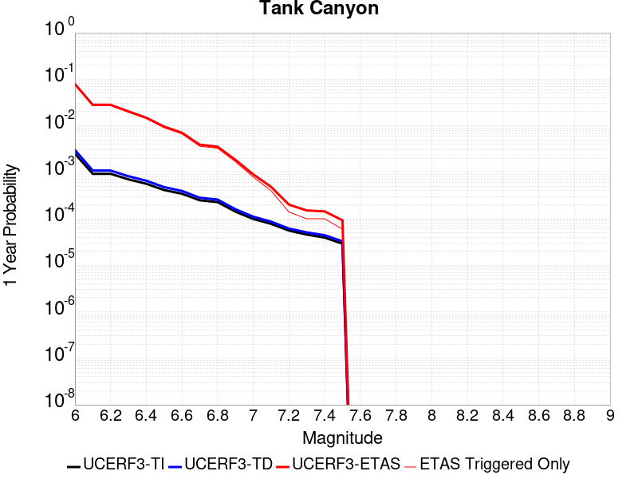 |  |

| Magnitude | 1 wk TI Prob | 1 wk TD Prob | 1 wk ETAS Prob | 1 wk ETAS/TD Gain | 1 wk ETAS Triggered Only | 1 mo TI Prob | 1 mo TD Prob | 1 mo ETAS Prob | 1 mo ETAS/TD Gain | 1 mo ETAS Triggered Only | 1 yr TI Prob | 1 yr TD Prob | 1 yr ETAS Prob | 1 yr ETAS/TD Gain | 1 yr ETAS Triggered Only | 10 yr TI Prob | 10 yr TD Prob | 10 yr ETAS Prob | 10 yr ETAS/TD Gain | 10 yr ETAS Triggered Only |
|-----|-----|-----|-----|-----|-----|-----|-----|-----|-----|-----|-----|-----|-----|-----|-----|-----|-----|-----|-----|-----|
| 6.0 | 4.8284557E-5 | 5.7964822E-5 | 0.037369777 | 644.6975 | 0.037313975 | 2.0691741E-4 | 2.4840087E-4 | 0.05045371 | 203.11407 | 0.050217785 | 0.0025163088 | 0.0030207601 | 0.07992025 | 26.456999 | 0.077132486 | 0.02488006 | 0.029863637 | 0.13092685 | 4.384156 | 0.10417423 |
| 6.1 | 1.7796336E-5 | 2.0873314E-5 | 0.012652189 | 606.1418 | 0.012631579 | 7.626778E-5 | 8.945422E-5 | 0.017347438 | 193.92532 | 0.017259529 | 9.281647E-4 | 0.0010885983 | 0.028209677 | 25.913763 | 0.027150635 | 0.009242975 | 0.010836744 | 0.0489671 | 4.5186176 | 0.038548093 |
| 6.2 | 1.7796336E-5 | 2.0873314E-5 | 0.012652189 | 606.1418 | 0.012631579 | 7.626778E-5 | 8.945422E-5 | 0.017347438 | 193.92532 | 0.017259529 | 9.281647E-4 | 0.0010885983 | 0.028209677 | 25.913763 | 0.027150635 | 0.009242975 | 0.010836744 | 0.0489671 | 4.5186176 | 0.038548093 |
| 6.3 | 1.3515912E-5 | 1.5759564E-5 | 0.009180769 | 582.5522 | 0.009165154 | 5.792405E-5 | 6.753938E-5 | 0.012407904 | 183.71362 | 0.012341198 | 7.049971E-4 | 8.2200574E-4 | 0.020152746 | 24.51655 | 0.019346643 | 0.007027647 | 0.0081922645 | 0.035336476 | 4.3133955 | 0.02736842 |
| 6.4 | 1.0870146E-5 | 1.2618021E-5 | 0.006546111 | 518.79065 | 0.0065335752 | 4.658551E-5 | 5.4076212E-5 | 0.009037256 | 167.12074 | 0.008983666 | 5.67031E-4 | 6.581969E-4 | 0.014623591 | 22.217653 | 0.013974592 | 0.005655863 | 0.0065644905 | 0.026343053 | 4.0129623 | 0.019909255 |
| 6.5 | 7.964826E-6 | 9.196094E-6 | 0.0042378325 | 460.8296 | 0.0042286753 | 3.4134522E-5 | 3.9411298E-5 | 0.0057197683 | 145.13017 | 0.0056805806 | 4.1550855E-4 | 4.7973756E-4 | 0.009350253 | 19.49035 | 0.008874773 | 0.0041473247 | 0.004788321 | 0.017341355 | 3.621594 | 0.01261343 |
| 6.6 | 6.6317E-6 | 7.6122988E-6 | 0.0028932528 | 380.07608 | 0.0028856625 | 2.8421264E-5 | 3.2623782E-5 | 0.004115975 | 126.16487 | 0.0040834844 | 3.4597394E-4 | 3.9713128E-4 | 0.006837404 | 17.216986 | 0.0064428314 | 0.0034543579 | 0.003965368 | 0.013112256 | 3.3066933 | 0.009183303 |
| 6.7 | 4.793663E-6 | 5.4307857E-6 | 0.0017477081 | 321.81497 | 0.0017422867 | 2.0544108E-5 | 2.3274613E-5 | 0.00245516 | 105.48661 | 0.002431942 | 2.500958E-4 | 2.8333595E-4 | 0.003893928 | 13.743149 | 0.0036116152 | 0.0024981452 | 0.0028304397 | 0.008006311 | 2.8286455 | 0.0051905625 |
| 6.8 | 4.382823E-6 | 4.9692567E-6 | 0.0015839088 | 318.74158 | 0.0015789474 | 1.8783392E-5 | 2.1296666E-5 | 0.0021809603 | 102.40853 | 0.0021597096 | 2.286638E-4 | 2.5926033E-4 | 0.0034707687 | 13.387196 | 0.003212341 | 0.0022842865 | 0.002590253 | 0.00726052 | 2.803016 | 0.0046823956 |
| 6.9 | 2.729601E-6 | 3.0735416E-6 | 8.379167E-4 | 272.62253 | 8.3484576E-4 | 1.1698237E-5 | 1.3172262E-5 | 0.0011383843 | 86.422844 | 0.0011252268 | 1.4241673E-4 | 1.6036171E-4 | 0.0019386609 | 12.0893 | 0.0017785844 | 0.001423255 | 0.0016026258 | 0.0040306705 | 2.5150414 | 0.002431942 |
| 7.0 | 1.8987357E-6 | 2.126939E-6 | 4.376977E-4 | 205.78761 | 4.3557168E-4 | 8.137413E-6 | 9.115425E-6 | 5.8987236E-4 | 64.71145 | 5.807622E-4 | 9.90685E-5 | 1.1097535E-4 | 9.82022E-4 | 8.84901 | 8.7114336E-4 | 9.902435E-4 | 0.0011092679 | 0.0022513752 | 2.0296047 | 0.0011433756 |
| 7.1 | 1.4928986E-6 | 1.6641272E-6 | 2.194496E-4 | 131.8707 | 2.1778584E-4 | 6.398121E-6 | 7.1319573E-6 | 2.9751103E-4 | 41.7152 | 2.903811E-4 | 7.789434E-5 | 8.682871E-5 | 5.405098E-4 | 6.225013 | 4.537205E-4 | 7.786704E-4 | 8.6800574E-4 | 0.0014482639 | 1.6684958 | 5.807622E-4 |
| 7.2 | 1.069082E-6 | 1.1828573E-6 | 7.377805E-5 | 62.37274 | 7.259528E-5 | 4.581772E-6 | 5.0693816E-6 | 9.5813026E-5 | 18.900337 | 9.07441E-5 | 5.5781646E-5 | 6.171851E-5 | 1.8875241E-4 | 3.058279 | 1.2704174E-4 | 5.576765E-4 | 6.170659E-4 | 8.1657973E-4 | 1.3233266 | 1.9963703E-4 |
| 7.3 | 8.776551E-7 | 9.770005E-7 | 3.7274607E-5 | 38.152084 | 3.629764E-5 | 3.7613736E-6 | 4.1871413E-6 | 5.8633374E-5 | 14.0032 | 5.444646E-5 | 4.579376E-5 | 5.097777E-5 | 1.4171725E-4 | 2.7799811 | 9.07441E-5 | 4.5784327E-4 | 5.097118E-4 | 6.366888E-4 | 1.2491152 | 1.2704174E-4 |
| 7.4 | 7.55721E-7 | 8.510244E-7 | 3.7148635E-5 | 43.651665 | 3.629764E-5 | 3.2388E-6 | 3.6472454E-6 | 5.809351E-5 | 15.92805 | 5.444646E-5 | 3.9431678E-5 | 4.4404827E-5 | 1.351449E-4 | 3.0434732 | 9.07441E-5 | 3.942468E-4 | 4.440104E-4 | 5.5285497E-4 | 1.2451397 | 1.0889292E-4 |
| 7.5 | 5.587665E-7 | 6.305619E-7 | 3.692818E-5 | 58.563927 | 3.629764E-5 | 2.3947114E-6 | 2.702408E-6 | 5.714872E-5 | 21.147333 | 5.444646E-5 | 2.915522E-5 | 3.290182E-5 | 1.0549471E-4 | 3.206349 | 7.259528E-5 | 2.9151395E-4 | 3.290182E-4 | 4.1973242E-4 | 1.2757119 | 9.07441E-5 |

## Little Lake
*[(top)](#table-of-contents)*

| 1 Week | 1 Month | 1 Year | 10 Year |
|-----|-----|-----|-----|
|  |  |  |  |

| Magnitude | 1 wk TI Prob | 1 wk TD Prob | 1 wk ETAS Prob | 1 wk ETAS/TD Gain | 1 wk ETAS Triggered Only | 1 mo TI Prob | 1 mo TD Prob | 1 mo ETAS Prob | 1 mo ETAS/TD Gain | 1 mo ETAS Triggered Only | 1 yr TI Prob | 1 yr TD Prob | 1 yr ETAS Prob | 1 yr ETAS/TD Gain | 1 yr ETAS Triggered Only | 10 yr TI Prob | 10 yr TD Prob | 10 yr ETAS Prob | 10 yr ETAS/TD Gain | 10 yr ETAS Triggered Only |
|-----|-----|-----|-----|-----|-----|-----|-----|-----|-----|-----|-----|-----|-----|-----|-----|-----|-----|-----|-----|-----|
| 6.0 | 2.8424427E-5 | 3.120572E-5 | 0.030556569 | 979.1977 | 0.030526316 | 1.2181328E-4 | 1.337327E-4 | 0.038658526 | 289.0731 | 0.038529947 | 0.0014820677 | 0.0016271127 | 0.052940942 | 32.53674 | 0.051397458 | 0.014722223 | 0.016165402 | 0.07883798 | 4.8769584 | 0.06370236 |
| 6.1 | 2.8424427E-5 | 3.120572E-5 | 0.030556569 | 979.1977 | 0.030526316 | 1.2181328E-4 | 1.337327E-4 | 0.038658526 | 289.0731 | 0.038529947 | 0.0014820677 | 0.0016271127 | 0.052940942 | 32.53674 | 0.051397458 | 0.014722223 | 0.016165402 | 0.07883798 | 4.8769584 | 0.06370236 |
| 6.2 | 2.8424427E-5 | 3.120572E-5 | 0.030556569 | 979.1977 | 0.030526316 | 1.2181328E-4 | 1.337327E-4 | 0.038658526 | 289.0731 | 0.038529947 | 0.0014820677 | 0.0016271127 | 0.052940942 | 32.53674 | 0.051397458 | 0.014722223 | 0.016165402 | 0.07883798 | 4.8769584 | 0.06370236 |
| 6.3 | 1.48860645E-5 | 1.6081389E-5 | 0.020560216 | 1278.5099 | 0.020544464 | 6.379586E-5 | 6.8918576E-5 | 0.025929205 | 376.22955 | 0.02586207 | 7.7643775E-4 | 8.3878887E-4 | 0.034893684 | 41.60008 | 0.034083486 | 0.007737305 | 0.008359048 | 0.04955444 | 5.92824 | 0.04154265 |
| 6.4 | 1.48860645E-5 | 1.6081389E-5 | 0.020560216 | 1278.5099 | 0.020544464 | 6.379586E-5 | 6.8918576E-5 | 0.025929205 | 376.22955 | 0.02586207 | 7.7643775E-4 | 8.3878887E-4 | 0.034893684 | 41.60008 | 0.034083486 | 0.007737305 | 0.008359048 | 0.04955444 | 5.92824 | 0.04154265 |
| 6.5 | 1.2797581E-5 | 1.3765565E-5 | 0.019233102 | 1397.1895 | 0.019219602 | 5.4845623E-5 | 5.899409E-5 | 0.024159206 | 409.5191 | 0.024101634 | 6.675408E-4 | 7.18042E-4 | 0.032364994 | 45.073956 | 0.03166969 | 0.006655392 | 0.00715977 | 0.045359794 | 6.33537 | 0.0384755 |
| 6.6 | 9.661896E-6 | 1.0289038E-5 | 0.016979262 | 1650.2283 | 0.016969146 | 4.1407468E-5 | 4.409522E-5 | 0.021295426 | 482.94183 | 0.021252269 | 5.040193E-4 | 5.367433E-4 | 0.028470926 | 53.043835 | 0.027949184 | 0.005028777 | 0.0053560743 | 0.038895972 | 7.26203 | 0.03372051 |
| 6.7 | 7.767871E-6 | 8.199687E-6 | 0.014817515 | 1807.0831 | 0.014809437 | 3.329045E-5 | 3.5141118E-5 | 0.018473694 | 525.70026 | 0.018439202 | 4.0523586E-4 | 4.2777284E-4 | 0.02459166 | 57.48766 | 0.024174228 | 0.004044977 | 0.004270846 | 0.033510223 | 7.8462734 | 0.02936479 |
| 6.8 | 6.4235196E-6 | 6.7357446E-6 | 0.011295226 | 1676.9083 | 0.0112885665 | 2.752908E-5 | 2.8867229E-5 | 0.014093797 | 488.22824 | 0.0140653355 | 3.35115E-4 | 3.5141467E-4 | 0.019056274 | 54.227314 | 0.018711435 | 0.003346101 | 0.00350985 | 0.026188591 | 7.461456 | 0.02275862 |
| 6.9 | 3.1283696E-6 | 3.1121804E-6 | 0.0071537253 | 2298.6216 | 0.007150635 | 1.3407229E-5 | 1.3337856E-5 | 0.008815398 | 660.93066 | 0.008802178 | 1.6322079E-4 | 1.6237781E-4 | 0.011920904 | 73.41461 | 0.011760436 | 0.0016310095 | 0.00162274 | 0.015882684 | 9.787572 | 0.014283122 |
| 7.0 | 2.290603E-6 | 2.2286815E-6 | 0.0046664653 | 2093.8232 | 0.004664247 | 9.816834E-6 | 9.551463E-6 | 0.0056174835 | 588.12805 | 0.0056079854 | 1.19513395E-4 | 1.162839E-4 | 0.007665315 | 65.918976 | 0.0075499094 | 0.0011944914 | 0.0011623327 | 0.010353089 | 8.907166 | 0.009201452 |
| 7.1 | 1.293693E-6 | 1.1776827E-6 | 0.0019793967 | 1680.7555 | 0.0019782213 | 5.5443866E-6 | 5.0472063E-6 | 0.0023825306 | 472.0494 | 0.0023774954 | 6.750081E-5 | 6.14487E-5 | 0.0034006264 | 55.3409 | 0.003339383 | 6.7480316E-4 | 6.143856E-4 | 0.0047316365 | 7.7014127 | 0.0041197822 |
| 7.2 | 4.715842E-7 | 3.0917857E-7 | 1.8457993E-5 | 59.700104 | 1.814882E-5 | 2.0210737E-6 | 1.3250503E-6 | 5.5771437E-5 | 42.090054 | 5.444646E-5 | 2.4606294E-5 | 1.6132375E-5 | 8.872648E-5 | 5.4999022 | 7.259528E-5 | 2.460357E-4 | 1.6131258E-4 | 3.246256E-4 | 2.012401 | 1.6333938E-4 |
| 7.3 | 3.9430947E-7 | 2.3097488E-7 | 2.3097488E-7 | 1.0 | 0.0 | 1.6898966E-6 | 9.89892E-7 | 1.9138693E-5 | 19.334126 | 1.814882E-5 | 2.0574296E-5 | 1.2051869E-5 | 4.8349073E-5 | 4.011749 | 3.629764E-5 | 2.0572392E-4 | 1.20512224E-4 | 1.7495212E-4 | 1.4517375 | 5.444646E-5 |
| 7.4 | 3.547123E-7 | 1.9679135E-7 | 1.9679135E-7 | 1.0 | 0.0 | 1.5201948E-6 | 8.4339126E-7 | 1.8992196E-5 | 22.518845 | 1.814882E-5 | 1.8508214E-5 | 1.0268241E-5 | 2.8416875E-5 | 2.7674532 | 1.814882E-5 | 1.8506673E-4 | 1.02677724E-4 | 1.3897163E-4 | 1.353474 | 3.629764E-5 |
| 7.5 | 2.6354266E-7 | 1.4423138E-7 | 1.4423138E-7 | 1.0 | 0.0 | 1.129468E-6 | 6.181344E-7 | 1.8766943E-5 | 30.360622 | 1.814882E-5 | 1.3751187E-5 | 7.5257603E-6 | 2.5674444E-5 | 3.4115415 | 1.814882E-5 | 1.3750336E-4 | 7.5255106E-5 | 1.1155002E-4 | 1.4822916 | 3.629764E-5 |
| 7.6 | 1.269913E-7 | 7.572556E-8 | 7.572556E-8 | 1.0 | 0.0 | 5.4424834E-7 | 3.245381E-7 | 3.245381E-7 | 1.0 | 0.0 | 6.6262032E-6 | 3.9512443E-6 | 3.9512443E-6 | 1.0 | 0.0 | 6.626006E-5 | 3.9511775E-5 | 5.765988E-5 | 1.4593087 | 1.814882E-5 |

## Airport Lake
*[(top)](#table-of-contents)*

| 1 Week | 1 Month | 1 Year | 10 Year |
|-----|-----|-----|-----|
|  |  |  |  |

| Magnitude | 1 wk TI Prob | 1 wk TD Prob | 1 wk ETAS Prob | 1 wk ETAS/TD Gain | 1 wk ETAS Triggered Only | 1 mo TI Prob | 1 mo TD Prob | 1 mo ETAS Prob | 1 mo ETAS/TD Gain | 1 mo ETAS Triggered Only | 1 yr TI Prob | 1 yr TD Prob | 1 yr ETAS Prob | 1 yr ETAS/TD Gain | 1 yr ETAS Triggered Only | 10 yr TI Prob | 10 yr TD Prob | 10 yr ETAS Prob | 10 yr ETAS/TD Gain | 10 yr ETAS Triggered Only |
|-----|-----|-----|-----|-----|-----|-----|-----|-----|-----|-----|-----|-----|-----|-----|-----|-----|-----|-----|-----|-----|
| 6.0 | 1.2387061E-5 | 1.3103157E-5 | 0.02874231 | 2193.5408 | 0.028729582 | 5.3086325E-5 | 5.615534E-5 | 0.03486364 | 620.84283 | 0.034809437 | 6.461343E-4 | 6.8350515E-4 | 0.04558927 | 66.699234 | 0.04493648 | 0.0064425888 | 0.0068168393 | 0.06011707 | 8.818907 | 0.053666063 |
| 6.1 | 1.2387061E-5 | 1.3103157E-5 | 0.02874231 | 2193.5408 | 0.028729582 | 5.3086325E-5 | 5.615534E-5 | 0.03486364 | 620.84283 | 0.034809437 | 6.461343E-4 | 6.8350515E-4 | 0.04558927 | 66.699234 | 0.04493648 | 0.0064425888 | 0.0068168393 | 0.06011707 | 8.818907 | 0.053666063 |
| 6.2 | 1.2387061E-5 | 1.3103157E-5 | 0.02874231 | 2193.5408 | 0.028729582 | 5.3086325E-5 | 5.615534E-5 | 0.03486364 | 620.84283 | 0.034809437 | 6.461343E-4 | 6.8350515E-4 | 0.04558927 | 66.699234 | 0.04493648 | 0.0064425888 | 0.0068168393 | 0.06011707 | 8.818907 | 0.053666063 |
| 6.3 | 1.2387061E-5 | 1.3103157E-5 | 0.02874231 | 2193.5408 | 0.028729582 | 5.3086325E-5 | 5.615534E-5 | 0.03486364 | 620.84283 | 0.034809437 | 6.461343E-4 | 6.8350515E-4 | 0.04558927 | 66.699234 | 0.04493648 | 0.0064425888 | 0.0068168393 | 0.06011707 | 8.818907 | 0.053666063 |
| 6.4 | 1.2387061E-5 | 1.3103157E-5 | 0.02874231 | 2193.5408 | 0.028729582 | 5.3086325E-5 | 5.615534E-5 | 0.03486364 | 620.84283 | 0.034809437 | 6.461343E-4 | 6.8350515E-4 | 0.04558927 | 66.699234 | 0.04493648 | 0.0064425888 | 0.0068168393 | 0.06011707 | 8.818907 | 0.053666063 |
| 6.5 | 6.9922594E-6 | 7.384925E-6 | 0.021005414 | 2844.364 | 0.020998186 | 2.996648E-5 | 3.1649324E-5 | 0.025457341 | 804.3565 | 0.025426498 | 3.6478083E-4 | 3.8526783E-4 | 0.03342154 | 86.74884 | 0.033049002 | 0.003641826 | 0.0038465366 | 0.04336725 | 11.2743635 | 0.03967332 |
| 6.6 | 6.9922594E-6 | 7.384925E-6 | 0.021005414 | 2844.364 | 0.020998186 | 2.996648E-5 | 3.1649324E-5 | 0.025457341 | 804.3565 | 0.025426498 | 3.6478083E-4 | 3.8526783E-4 | 0.03342154 | 86.74884 | 0.033049002 | 0.003641826 | 0.0038465366 | 0.04336725 | 11.2743635 | 0.03967332 |
| 6.7 | 5.477277E-6 | 5.7860684E-6 | 0.01761004 | 3043.5244 | 0.017604357 | 2.3473833E-5 | 2.4797222E-5 | 0.021639505 | 872.65845 | 0.021615244 | 2.8575645E-4 | 3.0186825E-4 | 0.028460335 | 94.28065 | 0.028166968 | 0.0028538927 | 0.003014966 | 0.036742374 | 12.186663 | 0.033829402 |
| 6.8 | 3.9950432E-6 | 4.2190873E-6 | 0.013162058 | 3119.646 | 0.013157895 | 1.7121502E-5 | 1.8081691E-5 | 0.01617024 | 894.28796 | 0.01615245 | 2.0843433E-4 | 2.2012512E-4 | 0.02148586 | 97.60749 | 0.021270417 | 0.0020823893 | 0.0021993418 | 0.02769668 | 12.593168 | 0.02555354 |
| 6.9 | 2.95695E-6 | 3.1230243E-6 | 0.009513075 | 3046.1099 | 0.009509982 | 1.2672582E-5 | 1.3384334E-5 | 0.011755514 | 878.304 | 0.011742286 | 1.5427776E-4 | 1.6294434E-4 | 0.015732095 | 96.54888 | 0.015571688 | 0.001541707 | 0.0016284712 | 0.02038191 | 12.515979 | 0.01878403 |
| 7.0 | 1.456072E-6 | 1.540812E-6 | 0.004556888 | 2957.4585 | 0.004555354 | 6.2402937E-6 | 6.603469E-6 | 0.0053967675 | 817.2625 | 0.0053902 | 7.597293E-5 | 8.039528E-5 | 0.0073211924 | 91.06496 | 0.0072413795 | 7.594696E-4 | 8.0376083E-4 | 0.009508193 | 11.82963 | 0.008711434 |
| 7.1 | 6.995192E-7 | 7.4089746E-7 | 0.0019426632 | 2622.0408 | 0.0019419238 | 2.997936E-6 | 3.1752747E-6 | 0.002308068 | 726.8877 | 0.0023049002 | 3.649926E-5 | 3.865897E-5 | 0.003250876 | 84.09112 | 0.003212341 | 3.6493264E-4 | 3.865897E-4 | 0.004232652 | 10.948693 | 0.00384755 |

## Owl Lake
*[(top)](#table-of-contents)*

| 1 Week | 1 Month | 1 Year | 10 Year |
|-----|-----|-----|-----|
|  |  |  |  |

| Magnitude | 1 wk TI Prob | 1 wk TD Prob | 1 wk ETAS Prob | 1 wk ETAS/TD Gain | 1 wk ETAS Triggered Only | 1 mo TI Prob | 1 mo TD Prob | 1 mo ETAS Prob | 1 mo ETAS/TD Gain | 1 mo ETAS Triggered Only | 1 yr TI Prob | 1 yr TD Prob | 1 yr ETAS Prob | 1 yr ETAS/TD Gain | 1 yr ETAS Triggered Only | 10 yr TI Prob | 10 yr TD Prob | 10 yr ETAS Prob | 10 yr ETAS/TD Gain | 10 yr ETAS Triggered Only |
|-----|-----|-----|-----|-----|-----|-----|-----|-----|-----|-----|-----|-----|-----|-----|-----|-----|-----|-----|-----|-----|
| 6.0 | 5.0320643E-5 | 6.635816E-5 | 0.016090702 | 242.48267 | 0.01602541 | 2.1564208E-4 | 2.843674E-4 | 0.02116772 | 74.437935 | 0.020889292 | 0.0026222812 | 0.0034577388 | 0.03462003 | 10.012333 | 0.03127042 | 0.02591553 | 0.034140717 | 0.07449295 | 2.1819386 | 0.041778583 |
| 6.1 | 5.0320643E-5 | 6.635816E-5 | 0.016090702 | 242.48267 | 0.01602541 | 2.1564208E-4 | 2.843674E-4 | 0.02116772 | 74.437935 | 0.020889292 | 0.0026222812 | 0.0034577388 | 0.03462003 | 10.012333 | 0.03127042 | 0.02591553 | 0.034140717 | 0.07449295 | 2.1819386 | 0.041778583 |
| 6.2 | 2.4125871E-5 | 3.0981035E-5 | 0.013206616 | 426.28067 | 0.0131760435 | 1.0339249E-4 | 1.3277028E-4 | 0.016954493 | 127.69795 | 0.016823957 | 0.0012580766 | 0.001615439 | 0.025895571 | 16.030052 | 0.02431942 | 0.012509781 | 0.016070465 | 0.04740978 | 2.950119 | 0.03185118 |
| 6.3 | 1.7433485E-5 | 2.2355514E-5 | 0.012018458 | 537.60596 | 0.01199637 | 7.471279E-5 | 9.580672E-5 | 0.015357503 | 160.29672 | 0.015263158 | 9.0924866E-4 | 0.0011659743 | 0.022592867 | 19.376814 | 0.021451905 | 0.009055373 | 0.011628896 | 0.039217185 | 3.3723912 | 0.027912885 |
| 6.4 | 1.7433485E-5 | 2.2355514E-5 | 0.012018458 | 537.60596 | 0.01199637 | 7.471279E-5 | 9.580672E-5 | 0.015357503 | 160.29672 | 0.015263158 | 9.0924866E-4 | 0.0011659743 | 0.022592867 | 19.376814 | 0.021451905 | 0.009055373 | 0.011628896 | 0.039217185 | 3.3723912 | 0.027912885 |
| 6.5 | 1.5182742E-5 | 1.9429144E-5 | 0.011688894 | 601.6165 | 0.011669692 | 6.506727E-5 | 8.326596E-5 | 0.014782586 | 177.53458 | 0.014700544 | 7.919061E-4 | 0.0010134429 | 0.02164587 | 21.358746 | 0.020653358 | 0.0078909 | 0.010118429 | 0.036509283 | 3.6081967 | 0.026660617 |
| 6.6 | 6.7271576E-6 | 8.547361E-6 | 0.00962734 | 1126.3523 | 0.009618875 | 2.8830356E-5 | 3.6631063E-5 | 0.011705895 | 319.56195 | 0.011669692 | 3.5095305E-4 | 4.458976E-4 | 0.016391598 | 36.7609 | 0.015952813 | 0.0035039932 | 0.004467813 | 0.024017101 | 5.375584 | 0.019637024 |
| 6.7 | 6.682835E-6 | 8.479807E-6 | 0.009627273 | 1135.3175 | 0.009618875 | 2.8640408E-5 | 3.6341557E-5 | 0.01168746 | 321.60046 | 0.011651543 | 3.4864116E-4 | 4.4237426E-4 | 0.01636999 | 37.00484 | 0.015934665 | 0.003480947 | 0.0044327388 | 0.023964649 | 5.406285 | 0.019618874 |
| 6.8 | 6.5774975E-6 | 8.32628E-6 | 0.009627121 | 1156.233 | 0.009618875 | 2.8188972E-5 | 3.5683603E-5 | 0.01168681 | 327.51205 | 0.011651543 | 3.4314668E-4 | 4.343669E-4 | 0.01636211 | 37.66887 | 0.015934665 | 0.0034261728 | 0.004352885 | 0.02388636 | 5.4874783 | 0.019618874 |
| 6.9 | 6.363419E-6 | 7.999454E-6 | 0.009608649 | 1201.163 | 0.009600726 | 2.727151E-5 | 3.428296E-5 | 0.01164913 | 339.7936 | 0.011615245 | 3.3198006E-4 | 4.1732067E-4 | 0.01627277 | 38.993446 | 0.015862068 | 0.0033148455 | 0.0041828766 | 0.023629323 | 5.6490607 | 0.01952813 |
| 7.0 | 6.1342453E-6 | 7.6316555E-6 | 0.009517541 | 1247.1135 | 0.009509982 | 2.6289357E-5 | 3.2706717E-5 | 0.01155683 | 353.34732 | 0.011524501 | 3.2002592E-4 | 3.9813702E-4 | 0.016126899 | 40.505905 | 0.015735026 | 0.0031956544 | 0.003991571 | 0.02326099 | 5.827528 | 0.019346643 |
| 7.1 | 5.842926E-6 | 7.142211E-6 | 0.009008893 | 1261.359 | 0.009001815 | 2.504087E-5 | 3.0609146E-5 | 0.010901419 | 356.14908 | 0.010871143 | 3.0482994E-4 | 3.7260808E-4 | 0.015230954 | 40.876606 | 0.014863884 | 0.0030441214 | 0.0037370329 | 0.021962678 | 5.8770366 | 0.01829401 |
| 7.2 | 4.77173E-6 | 5.358483E-6 | 0.005921842 | 1105.134 | 0.0059165154 | 2.045011E-5 | 2.2964748E-5 | 0.0072460296 | 315.52835 | 0.0072232303 | 2.4895166E-4 | 2.79564E-4 | 0.010240481 | 36.630184 | 0.009963702 | 0.0024867293 | 0.002808645 | 0.014879908 | 5.297896 | 0.012105263 |
| 7.3 | 3.0494948E-6 | 2.710463E-6 | 0.0016542487 | 610.3196 | 0.0016515426 | 1.3069198E-5 | 1.1616219E-5 | 0.001971666 | 169.73389 | 0.0019600727 | 1.5910587E-4 | 1.4141845E-4 | 0.0027726253 | 19.605824 | 0.002631579 | 0.0015899199 | 0.0014232415 | 0.0046128877 | 3.241114 | 0.0031941924 |
| 7.4 | 2.7263884E-6 | 2.3056762E-6 | 0.0010549348 | 457.53815 | 0.0010526315 | 1.1684469E-5 | 9.881433E-6 | 0.001243989 | 125.89156 | 0.0012341198 | 1.4224913E-4 | 1.20299905E-4 | 0.0018442305 | 15.330274 | 0.0017241379 | 0.0014215811 | 0.0012112238 | 0.003313937 | 2.7360237 | 0.002105263 |
| 7.5 | 2.6090431E-6 | 2.1656133E-6 | 9.0960466E-4 | 420.02176 | 9.07441E-4 | 1.1181565E-5 | 9.281167E-6 | 0.0010982003 | 118.32567 | 0.0010889292 | 1.3612706E-4 | 1.1299244E-4 | 0.0016736146 | 14.811739 | 0.0015607985 | 0.001360437 | 0.0011379806 | 0.00302331 | 2.6567323 | 0.0018874774 |
| 7.6 | 2.3008756E-6 | 1.8727933E-6 | 6.915267E-4 | 369.24878 | 6.896552E-4 | 9.860858E-6 | 8.0262325E-6 | 8.247166E-4 | 102.75263 | 8.166969E-4 | 1.20049335E-4 | 9.7715085E-5 | 0.0012591261 | 12.885688 | 0.0011615244 | 0.001199845 | 9.849932E-4 | 0.0023992069 | 2.4357598 | 0.001415608 |
| 7.7 | 1.7184348E-6 | 1.3419171E-6 | 3.6431785E-4 | 271.49057 | 3.629764E-4 | 7.3646997E-6 | 5.7510606E-6 | 4.5946895E-4 | 79.89291 | 4.537205E-4 | 8.966153E-5 | 7.0016955E-5 | 7.2332873E-4 | 10.330765 | 6.5335754E-4 | 8.962536E-4 | 7.078345E-4 | 0.0014695454 | 2.0761144 | 7.6225045E-4 |
| 7.8 | 8.4612907E-7 | 8.4058576E-7 | 1.4603103E-4 | 173.72531 | 1.4519056E-4 | 3.6262625E-6 | 3.6025056E-6 | 2.2138757E-4 | 61.453773 | 2.1778584E-4 | 4.4148852E-5 | 4.3859643E-5 | 3.5237605E-4 | 8.034175 | 3.0852994E-4 | 4.414008E-4 | 4.4398365E-4 | 7.7051733E-4 | 1.7354634 | 3.2667877E-4 |
| 7.9 | 2.716738E-7 | 3.768106E-7 | 9.112088E-5 | 241.82144 | 9.07441E-5 | 1.1643157E-6 | 1.6149015E-6 | 1.4680524E-4 | 90.90662 | 1.4519056E-4 | 1.4175452E-5 | 1.966126E-5 | 2.011459E-4 | 10.23057 | 1.814882E-4 | 1.4174548E-4 | 1.9836679E-4 | 3.79819E-4 | 1.9147308 | 1.814882E-4 |
| 8.0 | 2.1995428E-8 | 3.384878E-8 | 3.384878E-8 | 1.0 | 0.0 | 9.426611E-8 | 1.4506621E-7 | 1.4506621E-7 | 1.0 | 0.0 | 1.1476893E-6 | 1.7661803E-6 | 1.7661803E-6 | 1.0 | 0.0 | 1.14768345E-5 | 1.7963059E-5 | 1.7963059E-5 | 1.0 | 0.0 |

## Panamint Valley
*[(top)](#table-of-contents)*

| 1 Week | 1 Month | 1 Year | 10 Year |
|-----|-----|-----|-----|
|  |  |  |  |

| Magnitude | 1 wk TI Prob | 1 wk TD Prob | 1 wk ETAS Prob | 1 wk ETAS/TD Gain | 1 wk ETAS Triggered Only | 1 mo TI Prob | 1 mo TD Prob | 1 mo ETAS Prob | 1 mo ETAS/TD Gain | 1 mo ETAS Triggered Only | 1 yr TI Prob | 1 yr TD Prob | 1 yr ETAS Prob | 1 yr ETAS/TD Gain | 1 yr ETAS Triggered Only | 10 yr TI Prob | 10 yr TD Prob | 10 yr ETAS Prob | 10 yr ETAS/TD Gain | 10 yr ETAS Triggered Only |
|-----|-----|-----|-----|-----|-----|-----|-----|-----|-----|-----|-----|-----|-----|-----|-----|-----|-----|-----|-----|-----|
| 6.0 | 3.0211835E-5 | 3.3984514E-5 | 0.013136988 | 386.55807 | 0.013103448 | 1.2947287E-4 | 1.4563995E-4 | 0.016985292 | 116.62523 | 0.016842104 | 0.0015751923 | 0.0017717537 | 0.026428536 | 14.916596 | 0.024700545 | 0.015640736 | 0.017583137 | 0.04960529 | 2.8211854 | 0.03259528 |
| 6.1 | 3.0211835E-5 | 3.3984514E-5 | 0.013136988 | 386.55807 | 0.013103448 | 1.2947287E-4 | 1.4563995E-4 | 0.016985292 | 116.62523 | 0.016842104 | 0.0015751923 | 0.0017717537 | 0.026428536 | 14.916596 | 0.024700545 | 0.015640736 | 0.017583137 | 0.04960529 | 2.8211854 | 0.03259528 |
| 6.2 | 3.0211835E-5 | 3.3984514E-5 | 0.013136988 | 386.55807 | 0.013103448 | 1.2947287E-4 | 1.4563995E-4 | 0.016985292 | 116.62523 | 0.016842104 | 0.0015751923 | 0.0017717537 | 0.026428536 | 14.916596 | 0.024700545 | 0.015640736 | 0.017583137 | 0.04960529 | 2.8211854 | 0.03259528 |
| 6.3 | 2.8573924E-5 | 3.210268E-5 | 0.012645128 | 393.89633 | 0.01261343 | 1.2245393E-4 | 1.3757581E-4 | 0.016342243 | 118.78718 | 0.016206896 | 0.001489857 | 0.0016737265 | 0.025300177 | 15.116076 | 0.023666061 | 0.01479908 | 0.016617801 | 0.047172252 | 2.838658 | 0.03107078 |
| 6.4 | 2.8573924E-5 | 3.210268E-5 | 0.012645128 | 393.89633 | 0.01261343 | 1.2245393E-4 | 1.3757581E-4 | 0.016342243 | 118.78718 | 0.016206896 | 0.001489857 | 0.0016737265 | 0.025300177 | 15.116076 | 0.023666061 | 0.01479908 | 0.016617801 | 0.047172252 | 2.838658 | 0.03107078 |
| 6.5 | 2.7468774E-5 | 3.0828433E-5 | 0.012516832 | 406.01584 | 0.012486388 | 1.1771801E-4 | 1.3211532E-4 | 0.016100967 | 121.87055 | 0.015970962 | 0.0014322745 | 0.0016073446 | 0.024728017 | 15.38439 | 0.023157895 | 0.014230782 | 0.015963677 | 0.045841947 | 2.871641 | 0.030362977 |
| 6.6 | 2.6135967E-5 | 2.925248E-5 | 0.012188606 | 416.66916 | 0.01215971 | 1.1200648E-4 | 1.253619E-4 | 0.015604365 | 124.47454 | 0.015480944 | 0.0013628257 | 0.0015252391 | 0.02383236 | 15.625329 | 0.022341197 | 0.013544982 | 0.015154043 | 0.04393085 | 2.8989522 | 0.029219601 |
| 6.7 | 2.4498746E-5 | 2.7341335E-5 | 0.0117874555 | 431.12216 | 0.011760436 | 1.04990395E-4 | 1.1717203E-4 | 0.014979314 | 127.84036 | 0.014863884 | 0.0012775084 | 0.0014256609 | 0.022865107 | 16.03825 | 0.021470055 | 0.012701893 | 0.014171274 | 0.041778058 | 2.9480803 | 0.02800363 |
| 6.8 | 2.2244329E-5 | 2.4935423E-5 | 0.011131736 | 446.42258 | 0.011107078 | 9.532935E-5 | 1.0686185E-4 | 0.014043666 | 131.4189 | 0.013938294 | 0.0011600169 | 0.0013002884 | 0.021074906 | 16.20787 | 0.019800363 | 0.011539802 | 0.0129325185 | 0.038406383 | 2.9697528 | 0.025807623 |
| 6.9 | 1.9902658E-5 | 2.2290267E-5 | 0.010185403 | 456.94397 | 0.01016334 | 8.529431E-5 | 9.552632E-5 | 0.012780339 | 133.78868 | 0.012686025 | 0.0010379635 | 0.0011624309 | 0.019253898 | 16.563478 | 0.018112523 | 0.010331288 | 0.011568608 | 0.034512416 | 2.9832816 | 0.023212342 |
| 7.0 | 1.8353881E-5 | 2.0566185E-5 | 0.009621095 | 467.8113 | 0.009600726 | 7.865712E-5 | 8.813792E-5 | 0.011974568 | 135.8617 | 0.011887478 | 9.5722964E-4 | 0.0010725686 | 0.017824093 | 16.618137 | 0.01676951 | 0.009531168 | 0.010678849 | 0.031686213 | 2.9671936 | 0.02123412 |
| 7.1 | 1.7667631E-5 | 1.9772613E-5 | 0.009202894 | 465.43643 | 0.009183303 | 7.571623E-5 | 8.473711E-5 | 0.011444936 | 135.06403 | 0.011361161 | 9.2145515E-4 | 0.0010312037 | 0.017003827 | 16.4893 | 0.01598911 | 0.009176437 | 0.010269073 | 0.030297203 | 2.9503348 | 0.020235935 |
| 7.2 | 1.6381597E-5 | 1.8158249E-5 | 0.008184979 | 450.75815 | 0.008166969 | 7.020495E-5 | 7.781885E-5 | 0.010113335 | 129.95998 | 0.010036298 | 8.544101E-4 | 9.4704994E-4 | 0.015144118 | 15.990834 | 0.014210526 | 0.008511325 | 0.009434792 | 0.027376426 | 2.9016461 | 0.018112523 |
| 7.3 | 1.4520491E-5 | 1.5966476E-5 | 0.0065857344 | 412.47266 | 0.006569873 | 6.222919E-5 | 6.842605E-5 | 0.008216688 | 120.0813 | 0.00814882 | 7.57377E-4 | 8.327849E-4 | 0.012565293 | 15.088281 | 0.011742286 | 0.0075480095 | 0.00829975 | 0.023238247 | 2.799873 | 0.0150635205 |
| 7.4 | 1.2852287E-5 | 1.4145411E-5 | 0.006384291 | 451.33304 | 0.006370236 | 5.5080065E-5 | 6.062187E-5 | 0.007991175 | 131.82 | 0.007931034 | 6.7039346E-4 | 7.378371E-4 | 0.01207248 | 16.361986 | 0.011343013 | 0.0066837464 | 0.0073567946 | 0.021714991 | 2.9516919 | 0.01446461 |
| 7.5 | 1.1637851E-5 | 1.2836797E-5 | 0.0063466937 | 494.4141 | 0.0063339383 | 4.987555E-5 | 5.5013777E-5 | 0.007931168 | 144.16696 | 0.007876588 | 6.070656E-4 | 6.6960254E-4 | 0.011859926 | 17.71189 | 0.011197822 | 0.006054099 | 0.0066787465 | 0.020848447 | 3.1216109 | 0.014264973 |
| 7.6 | 3.0068115E-6 | 3.3330316E-6 | 0.0028526883 | 855.884 | 0.002849365 | 1.2886271E-5 | 1.4284384E-5 | 0.0034443624 | 241.12782 | 0.003430127 | 1.5687906E-4 | 1.7390578E-4 | 0.0048373416 | 27.815876 | 0.004664247 | 0.0015676835 | 0.0017391363 | 0.0078084175 | 4.489825 | 0.006079855 |

## Garlock (East)
*[(top)](#table-of-contents)*

| 1 Week | 1 Month | 1 Year | 10 Year |
|-----|-----|-----|-----|
|  | 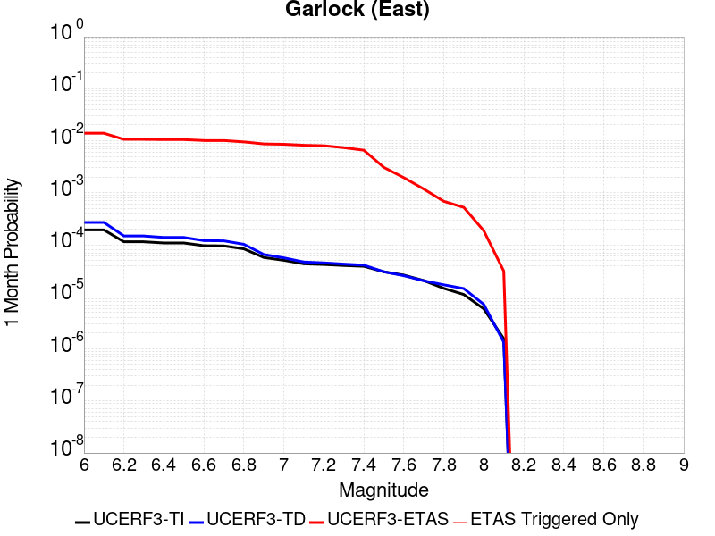 | 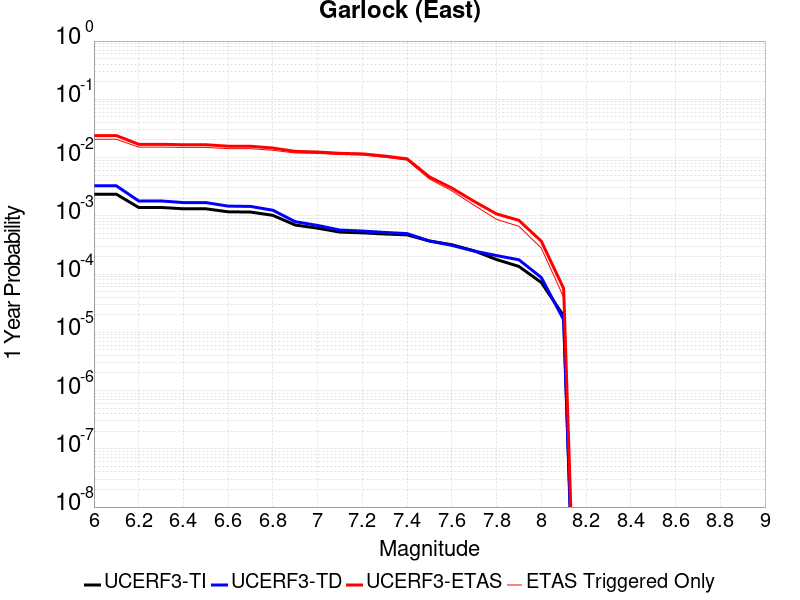 |  |

| Magnitude | 1 wk TI Prob | 1 wk TD Prob | 1 wk ETAS Prob | 1 wk ETAS/TD Gain | 1 wk ETAS Triggered Only | 1 mo TI Prob | 1 mo TD Prob | 1 mo ETAS Prob | 1 mo ETAS/TD Gain | 1 mo ETAS Triggered Only | 1 yr TI Prob | 1 yr TD Prob | 1 yr ETAS Prob | 1 yr ETAS/TD Gain | 1 yr ETAS Triggered Only | 10 yr TI Prob | 10 yr TD Prob | 10 yr ETAS Prob | 10 yr ETAS/TD Gain | 10 yr ETAS Triggered Only |
|-----|-----|-----|-----|-----|-----|-----|-----|-----|-----|-----|-----|-----|-----|-----|-----|-----|-----|-----|-----|-----|
| 6.0 | 4.5092507E-5 | 6.290325E-5 | 0.010461523 | 166.31133 | 0.010399274 | 1.9323928E-4 | 2.6956003E-4 | 0.014131521 | 52.424397 | 0.013865699 | 0.0023501497 | 0.0032774 | 0.024134409 | 7.3638887 | 0.020925589 | 0.023254504 | 0.032351844 | 0.059853423 | 1.8500776 | 0.028421052 |
| 6.1 | 4.5092507E-5 | 6.290325E-5 | 0.010461523 | 166.31133 | 0.010399274 | 1.9323928E-4 | 2.6956003E-4 | 0.014131521 | 52.424397 | 0.013865699 | 0.0023501497 | 0.0032774 | 0.024134409 | 7.3638887 | 0.020925589 | 0.023254504 | 0.032351844 | 0.059853423 | 1.8500776 | 0.028421052 |
| 6.2 | 2.6674514E-5 | 3.4509674E-5 | 0.008037863 | 232.91623 | 0.00800363 | 1.1431433E-4 | 1.4789042E-4 | 0.010581919 | 71.55244 | 0.010435572 | 0.0013908884 | 0.0017991117 | 0.016726835 | 9.297274 | 0.0149546275 | 0.01382215 | 0.017890299 | 0.037354253 | 2.0879612 | 0.019818513 |
| 6.3 | 2.6674514E-5 | 3.4509674E-5 | 0.008037863 | 232.91623 | 0.00800363 | 1.1431433E-4 | 1.4789042E-4 | 0.010581919 | 71.55244 | 0.010435572 | 0.0013908884 | 0.0017991117 | 0.016726835 | 9.297274 | 0.0149546275 | 0.01382215 | 0.017890299 | 0.037354253 | 2.0879612 | 0.019818513 |
| 6.4 | 2.5312667E-5 | 3.233893E-5 | 0.007963117 | 246.23935 | 0.007931034 | 1.0847834E-4 | 1.3858822E-4 | 0.01044569 | 75.37213 | 0.01030853 | 0.0013199237 | 0.0016860351 | 0.01639803 | 9.725795 | 0.014736842 | 0.013121112 | 0.016778335 | 0.03590744 | 2.1401074 | 0.019455535 |
| 6.5 | 2.5312667E-5 | 3.233893E-5 | 0.007963117 | 246.23935 | 0.007931034 | 1.0847834E-4 | 1.3858822E-4 | 0.01044569 | 75.37213 | 0.01030853 | 0.0013199237 | 0.0016860351 | 0.01639803 | 9.725795 | 0.014736842 | 0.013121112 | 0.016778335 | 0.03590744 | 2.1401074 | 0.019455535 |
| 6.6 | 2.246556E-5 | 2.8133776E-5 | 0.007723017 | 274.5105 | 0.0076951 | 9.627742E-5 | 1.20567885E-4 | 0.009992336 | 82.87726 | 0.009872958 | 0.0011715472 | 0.0014669491 | 0.0155116515 | 10.57409 | 0.0140653355 | 0.011653901 | 0.01461866 | 0.032681003 | 2.2355676 | 0.018330308 |
| 6.7 | 2.2241198E-5 | 2.7803519E-5 | 0.0077226893 | 277.75943 | 0.0076951 | 9.531594E-5 | 1.1915263E-4 | 0.009990934 | 83.849884 | 0.009872958 | 0.0011598538 | 0.0014497414 | 0.015494686 | 10.687897 | 0.0140653355 | 0.011538187 | 0.014448853 | 0.03251431 | 2.2503037 | 0.018330308 |
| 6.8 | 1.9528685E-5 | 2.389819E-5 | 0.0073014013 | 305.5211 | 0.007277677 | 8.369167E-5 | 1.0241691E-4 | 0.009429955 | 92.0742 | 0.009328494 | 0.0010184698 | 0.0012462323 | 0.014550865 | 11.675885 | 0.013321234 | 0.010138147 | 0.012436427 | 0.02937377 | 2.361914 | 0.017150635 |
| 6.9 | 1.3318621E-5 | 1.5198884E-5 | 0.006748309 | 444.00027 | 0.006733212 | 5.7078556E-5 | 6.513648E-5 | 0.0086308215 | 132.50365 | 0.008566244 | 6.9470983E-4 | 7.927538E-4 | 0.012779614 | 16.120533 | 0.01199637 | 0.0069254204 | 0.007939888 | 0.022829792 | 2.8753293 | 0.0150090745 |
| 7.0 | 1.1760853E-5 | 1.31077895E-5 | 0.0066373404 | 506.36612 | 0.0066243196 | 5.0402683E-5 | 5.6175057E-5 | 0.008458607 | 150.57585 | 0.008402904 | 6.134799E-4 | 6.8372174E-4 | 0.012454253 | 18.215382 | 0.011778585 | 0.0061178906 | 0.00685652 | 0.021348124 | 3.1135507 | 0.014591652 |
| 7.1 | 1.0064758E-5 | 1.0902931E-5 | 0.006489961 | 595.24927 | 0.0064791287 | 4.3133965E-5 | 4.672603E-5 | 0.008177018 | 174.9992 | 0.008130671 | 5.2502943E-4 | 5.687444E-4 | 0.011923444 | 20.964504 | 0.011361161 | 0.005237907 | 0.0057129986 | 0.019481437 | 3.4100196 | 0.013847549 |
| 7.2 | 9.768808E-6 | 1.0498807E-5 | 0.006380668 | 607.7517 | 0.006370236 | 4.186565E-5 | 4.499413E-5 | 0.008048263 | 178.87364 | 0.00800363 | 5.095951E-4 | 5.4766936E-4 | 0.011739359 | 21.435122 | 0.011197822 | 0.0050842804 | 0.0055032647 | 0.019094119 | 3.4695985 | 0.013666062 |
| 7.3 | 9.344516E-6 | 9.944468E-6 | 0.0058719553 | 590.47455 | 0.005862069 | 4.004731E-5 | 4.261847E-5 | 0.0074288733 | 174.31113 | 0.00738657 | 4.8746695E-4 | 5.1875977E-4 | 0.010749385 | 20.721313 | 0.0102359345 | 0.0048639905 | 0.0052149445 | 0.017708434 | 3.395709 | 0.012558984 |
| 7.4 | 9.023491E-6 | 9.490661E-6 | 0.00525445 | 553.6442 | 0.005245009 | 3.867153E-5 | 4.0673647E-5 | 0.0066647236 | 163.85852 | 0.0066243196 | 4.7072413E-4 | 4.950925E-4 | 0.009637569 | 19.4662 | 0.009147005 | 0.004697283 | 0.0049783974 | 0.016174648 | 3.2489667 | 0.011252268 |
| 7.5 | 7.081253E-6 | 7.087672E-6 | 0.0024390123 | 344.12036 | 0.002431942 | 3.0347876E-5 | 3.0375388E-5 | 0.003115581 | 102.56926 | 0.0030852994 | 3.6942272E-4 | 3.6975832E-4 | 0.004760149 | 12.873676 | 0.0043920144 | 0.003688092 | 0.0037243143 | 0.0090401955 | 2.427345 | 0.0053357533 |
| 7.6 | 6.116396E-6 | 5.959245E-6 | 0.0016393433 | 275.09247 | 0.0016333938 | 2.6212863E-5 | 2.5539372E-5 | 0.0021670454 | 84.851166 | 0.002141561 | 3.1909486E-4 | 3.1089774E-4 | 0.0032500925 | 10.453896 | 0.002940109 | 0.0031863707 | 0.0031357552 | 0.0066094017 | 2.1077545 | 0.0034845734 |
| 7.7 | 4.797145E-6 | 4.757281E-6 | 0.0010029377 | 210.82161 | 9.981851E-4 | 2.055903E-5 | 2.0388188E-5 | 0.0012726312 | 62.420025 | 0.0012522686 | 2.5027743E-4 | 2.4819805E-4 | 0.0018086092 | 7.2869596 | 0.0015607985 | 0.0024999576 | 0.0025093474 | 0.0043196753 | 1.7214338 | 0.001814882 |
| 7.8 | 3.4028885E-6 | 3.978462E-6 | 4.758459E-4 | 119.6055 | 4.7186934E-4 | 1.4583726E-5 | 1.7050439E-5 | 6.5224833E-4 | 38.254047 | 6.3520874E-4 | 1.775424E-4 | 2.0756939E-4 | 9.6966163E-4 | 4.671506 | 7.6225045E-4 | 0.0017740062 | 0.0021012232 | 0.0030067575 | 1.4309558 | 9.07441E-4 |
| 7.9 | 2.5928412E-6 | 3.3724489E-6 | 3.6634764E-4 | 108.629555 | 3.629764E-4 | 1.1112129E-5 | 1.4453272E-5 | 5.044643E-4 | 34.903122 | 4.9001817E-4 | 1.3528178E-4 | 1.7595445E-4 | 7.7476015E-4 | 4.403186 | 5.989111E-4 | 0.0013519945 | 0.0017812408 | 0.002487784 | 1.396658 | 7.07804E-4 |
| 8.0 | 1.3743648E-6 | 1.6734747E-6 | 1.6501258E-4 | 98.60477 | 1.6333938E-4 | 5.8901214E-6 | 7.1720146E-6 | 2.0680761E-4 | 28.835358 | 1.9963703E-4 | 7.1709874E-5 | 8.731581E-5 | 3.5952433E-4 | 4.117517 | 2.722323E-4 | 7.1686733E-4 | 8.837234E-4 | 0.0012101134 | 1.369335 | 3.2667877E-4 |
| 8.1 | 3.6733252E-7 | 3.1489964E-7 | 1.8463714E-5 | 58.633644 | 1.814882E-5 | 1.5742813E-6 | 1.3495693E-6 | 1.9498366E-5 | 14.447843 | 1.814882E-5 | 1.9166706E-5 | 1.6430899E-5 | 3.457942E-5 | 2.1045363 | 1.814882E-5 | 1.9165053E-4 | 1.6638759E-4 | 1.8453339E-4 | 1.1090574 | 1.814882E-5 |

## Hunter Mountain-Saline Valley
*[(top)](#table-of-contents)*

| 1 Week | 1 Month | 1 Year | 10 Year |
|-----|-----|-----|-----|
| 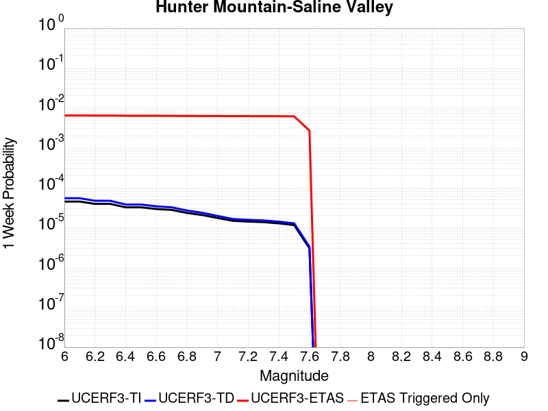 |  |  |  |

| Magnitude | 1 wk TI Prob | 1 wk TD Prob | 1 wk ETAS Prob | 1 wk ETAS/TD Gain | 1 wk ETAS Triggered Only | 1 mo TI Prob | 1 mo TD Prob | 1 mo ETAS Prob | 1 mo ETAS/TD Gain | 1 mo ETAS Triggered Only | 1 yr TI Prob | 1 yr TD Prob | 1 yr ETAS Prob | 1 yr ETAS/TD Gain | 1 yr ETAS Triggered Only | 10 yr TI Prob | 10 yr TD Prob | 10 yr ETAS Prob | 10 yr ETAS/TD Gain | 10 yr ETAS Triggered Only |
|-----|-----|-----|-----|-----|-----|-----|-----|-----|-----|-----|-----|-----|-----|-----|-----|-----|-----|-----|-----|-----|
| 6.0 | 4.5103672E-5 | 5.4570177E-5 | 0.0066422326 | 121.71909 | 0.0065880218 | 1.9328714E-4 | 2.3385242E-4 | 0.00847149 | 36.225796 | 0.0082395645 | 0.002350731 | 0.0028435152 | 0.014679093 | 5.162305 | 0.011869328 | 0.023260195 | 0.028091887 | 0.04303211 | 1.531834 | 0.015372051 |
| 6.1 | 4.5103672E-5 | 5.4570177E-5 | 0.0066422326 | 121.71909 | 0.0065880218 | 1.9328714E-4 | 2.3385242E-4 | 0.00847149 | 36.225796 | 0.0082395645 | 0.002350731 | 0.0028435152 | 0.014679093 | 5.162305 | 0.011869328 | 0.023260195 | 0.028091887 | 0.04303211 | 1.531834 | 0.015372051 |
| 6.2 | 3.9363465E-5 | 4.706337E-5 | 0.006598479 | 140.20413 | 0.006551724 | 1.6868966E-4 | 2.0168544E-4 | 0.008385153 | 41.575397 | 0.0081851175 | 0.002051862 | 0.0024528175 | 0.014220616 | 5.7976656 | 0.011796733 | 0.020330196 | 0.024273481 | 0.03918386 | 1.614266 | 0.015281307 |
| 6.3 | 3.9363465E-5 | 4.706337E-5 | 0.006598479 | 140.20413 | 0.006551724 | 1.6868966E-4 | 2.0168544E-4 | 0.008385153 | 41.575397 | 0.0081851175 | 0.002051862 | 0.0024528175 | 0.014220616 | 5.7976656 | 0.011796733 | 0.020330196 | 0.024273481 | 0.03918386 | 1.614266 | 0.015281307 |
| 6.4 | 3.2311684E-5 | 3.795099E-5 | 0.006534982 | 172.1953 | 0.006497278 | 1.384713E-4 | 1.6263737E-4 | 0.008291987 | 50.98451 | 0.008130671 | 0.0016845843 | 0.0019783843 | 0.0136249885 | 6.886927 | 0.011669692 | 0.016718714 | 0.019616475 | 0.034384504 | 1.752838 | 0.0150635205 |
| 6.5 | 3.2311684E-5 | 3.795099E-5 | 0.006534982 | 172.1953 | 0.006497278 | 1.384713E-4 | 1.6263737E-4 | 0.008291987 | 50.98451 | 0.008130671 | 0.0016845843 | 0.0019783843 | 0.0136249885 | 6.886927 | 0.011669692 | 0.016718714 | 0.019616475 | 0.034384504 | 1.752838 | 0.0150635205 |
| 6.6 | 2.9305844E-5 | 3.418183E-5 | 0.0065130894 | 190.54243 | 0.0064791287 | 1.2559042E-4 | 1.4648569E-4 | 0.008221528 | 56.125126 | 0.008076225 | 0.0015279909 | 0.001782067 | 0.01334038 | 7.4859023 | 0.011578947 | 0.015175272 | 0.01768569 | 0.032393664 | 1.8316312 | 0.014972777 |
| 6.7 | 2.7826512E-5 | 3.2344276E-5 | 0.0064931153 | 200.75006 | 0.00646098 | 1.19251024E-4 | 1.386113E-4 | 0.008177424 | 58.995365 | 0.008039927 | 0.0014509142 | 0.0016863465 | 0.013191413 | 7.822481 | 0.011524501 | 0.014414776 | 0.016743187 | 0.031393893 | 1.8750249 | 0.014900181 |
| 6.8 | 2.3389874E-5 | 2.6866714E-5 | 0.006469525 | 240.80075 | 0.0064428314 | 1.0023846E-4 | 1.15138246E-4 | 0.008135993 | 70.66282 | 0.008021778 | 0.00121972 | 0.001400954 | 0.012836816 | 9.16291 | 0.011451906 | 0.01213047 | 0.013927434 | 0.028512718 | 2.047234 | 0.014791288 |
| 6.9 | 2.069209E-5 | 2.3570032E-5 | 0.0064662495 | 274.34198 | 0.0064428314 | 8.867737E-5 | 1.01010715E-4 | 0.008121979 | 80.407104 | 0.008021778 | 0.0010791123 | 0.0012291478 | 0.012666977 | 10.305496 | 0.011451906 | 0.010738871 | 0.012228523 | 0.026803082 | 2.1918495 | 0.014754991 |
| 7.0 | 1.7462342E-5 | 1.9633546E-5 | 0.0064441897 | 328.22342 | 0.006424682 | 7.483646E-5 | 8.414118E-5 | 0.008087098 | 96.11343 | 0.00800363 | 9.1075303E-4 | 0.0010239601 | 0.01244601 | 12.154779 | 0.011433757 | 0.009070295 | 0.0101960525 | 0.024728745 | 2.4253254 | 0.014682395 |
| 7.1 | 1.4807709E-5 | 1.6441749E-5 | 0.00642287 | 390.64395 | 0.0064065335 | 6.3460066E-5 | 7.046283E-5 | 0.008037234 | 114.06345 | 0.007967332 | 7.723524E-4 | 8.575638E-4 | 0.012208982 | 14.236821 | 0.011361161 | 0.007696735 | 0.008545532 | 0.022994496 | 2.690821 | 0.014573502 |
| 7.2 | 1.4180048E-5 | 1.5698337E-5 | 0.0064039826 | 407.94022 | 0.006388385 | 6.077022E-5 | 6.727694E-5 | 0.008015925 | 119.148186 | 0.007949184 | 7.396263E-4 | 8.188051E-4 | 0.01215253 | 14.841785 | 0.011343013 | 0.0073716943 | 0.008160833 | 0.022579404 | 2.766801 | 0.014537205 |
| 7.3 | 1.3730402E-5 | 1.5172075E-5 | 0.006367163 | 419.66327 | 0.006352087 | 5.8843252E-5 | 6.502165E-5 | 0.0079773925 | 122.688255 | 0.007912885 | 7.161811E-4 | 7.9136714E-4 | 0.012089134 | 15.276265 | 0.011306715 | 0.007138774 | 0.007888422 | 0.022238929 | 2.8191857 | 0.01446461 |
| 7.4 | 1.2810095E-5 | 1.4109277E-5 | 0.0063661067 | 451.20007 | 0.006352087 | 5.489925E-5 | 6.0467017E-5 | 0.007972874 | 131.85492 | 0.007912885 | 6.681934E-4 | 7.359531E-4 | 0.012034347 | 16.352057 | 0.011306715 | 0.006661878 | 0.007338053 | 0.02166049 | 2.9518032 | 0.014428312 |
| 7.5 | 1.1595659E-5 | 1.2800664E-5 | 0.006328509 | 494.38916 | 0.0063157897 | 4.9694736E-5 | 5.4858923E-5 | 0.007912867 | 144.2403 | 0.007858439 | 6.0486543E-4 | 6.6771836E-4 | 0.01182179 | 17.704754 | 0.011161525 | 0.006032217 | 0.0066599925 | 0.020793905 | 3.1222115 | 0.0142286755 |
| 7.6 | 2.997694E-6 | 3.3251579E-6 | 0.0028526804 | 857.90826 | 0.002849365 | 1.28471975E-5 | 1.425064E-5 | 0.003444329 | 241.69643 | 0.003430127 | 1.564034E-4 | 1.73495E-4 | 0.0048369328 | 27.879375 | 0.004664247 | 0.0015629337 | 0.001735031 | 0.007804337 | 4.4980965 | 0.006079855 |

## Ash Hill
*[(top)](#table-of-contents)*

| 1 Week | 1 Month | 1 Year | 10 Year |
|-----|-----|-----|-----|
|  |  |  |  |

| Magnitude | 1 wk TI Prob | 1 wk TD Prob | 1 wk ETAS Prob | 1 wk ETAS/TD Gain | 1 wk ETAS Triggered Only | 1 mo TI Prob | 1 mo TD Prob | 1 mo ETAS Prob | 1 mo ETAS/TD Gain | 1 mo ETAS Triggered Only | 1 yr TI Prob | 1 yr TD Prob | 1 yr ETAS Prob | 1 yr ETAS/TD Gain | 1 yr ETAS Triggered Only | 10 yr TI Prob | 10 yr TD Prob | 10 yr ETAS Prob | 10 yr ETAS/TD Gain | 10 yr ETAS Triggered Only |
|-----|-----|-----|-----|-----|-----|-----|-----|-----|-----|-----|-----|-----|-----|-----|-----|-----|-----|-----|-----|-----|
| 6.0 | 2.1545662E-5 | 2.3194447E-5 | 0.0039613973 | 170.79076 | 0.003938294 | 9.2335285E-5 | 9.940143E-5 | 0.0057431236 | 57.77707 | 0.0056442833 | 0.0011236023 | 0.0012096206 | 0.010291181 | 8.507776 | 0.009092559 | 0.011179381 | 0.012038348 | 0.025019914 | 2.078351 | 0.013139746 |
| 6.1 | 2.1545662E-5 | 2.3194447E-5 | 0.0039613973 | 170.79076 | 0.003938294 | 9.2335285E-5 | 9.940143E-5 | 0.0057431236 | 57.77707 | 0.0056442833 | 0.0011236023 | 0.0012096206 | 0.010291181 | 8.507776 | 0.009092559 | 0.011179381 | 0.012038348 | 0.025019914 | 2.078351 | 0.013139746 |
| 6.2 | 2.1545662E-5 | 2.3194447E-5 | 0.0039613973 | 170.79076 | 0.003938294 | 9.2335285E-5 | 9.940143E-5 | 0.0057431236 | 57.77707 | 0.0056442833 | 0.0011236023 | 0.0012096206 | 0.010291181 | 8.507776 | 0.009092559 | 0.011179381 | 0.012038348 | 0.025019914 | 2.078351 | 0.013139746 |
| 6.3 | 1.0025529E-5 | 1.0746934E-5 | 0.0015896773 | 147.91914 | 0.0015789474 | 4.2965847E-5 | 4.605755E-5 | 0.0023508517 | 51.04161 | 0.0023049002 | 5.229836E-4 | 5.6061964E-4 | 0.0043878737 | 7.8268285 | 0.003829401 | 0.005217545 | 0.0055933665 | 0.011260221 | 2.0131385 | 0.00569873 |
| 6.4 | 1.0025529E-5 | 1.0746934E-5 | 0.0015896773 | 147.91914 | 0.0015789474 | 4.2965847E-5 | 4.605755E-5 | 0.0023508517 | 51.04161 | 0.0023049002 | 5.229836E-4 | 5.6061964E-4 | 0.0043878737 | 7.8268285 | 0.003829401 | 0.005217545 | 0.0055933665 | 0.011260221 | 2.0131385 | 0.00569873 |
| 6.5 | 6.9617327E-6 | 7.456634E-6 | 0.001078229 | 144.59996 | 0.0010707804 | 2.9835655E-5 | 3.195666E-5 | 0.001574557 | 49.27164 | 0.0015426497 | 3.6318856E-4 | 3.8901155E-4 | 0.0029107162 | 7.482339 | 0.002522686 | 0.0036259557 | 0.0038841602 | 0.007734844 | 1.9913813 | 0.0038656988 |
| 6.6 | 4.9919777E-6 | 5.3466883E-6 | 8.4018795E-4 | 157.14175 | 8.3484576E-4 | 2.1394015E-5 | 2.2914215E-5 | 0.0011299669 | 49.312923 | 0.001107078 | 2.60441E-4 | 2.7895154E-4 | 0.0020570399 | 7.374183 | 0.0017785844 | 0.0026013597 | 0.0027866727 | 0.0054652127 | 1.9611967 | 0.0026860253 |
| 6.7 | 3.6630722E-6 | 3.924624E-6 | 6.5727957E-4 | 167.47583 | 6.5335754E-4 | 1.5698786E-5 | 1.681974E-5 | 8.8794844E-4 | 52.792046 | 8.7114336E-4 | 1.9111596E-4 | 2.0476682E-4 | 0.001620085 | 7.9118524 | 0.001415608 | 0.0019095168 | 0.0020463446 | 0.0041654115 | 2.0355377 | 0.002123412 |
| 6.8 | 2.5599613E-6 | 2.744925E-6 | 4.7461296E-4 | 172.90561 | 4.7186934E-4 | 1.0971216E-5 | 1.1763939E-5 | 6.10668E-4 | 51.91016 | 5.989111E-4 | 1.3356637E-4 | 1.4322149E-4 | 0.0011231174 | 7.8418217 | 9.800363E-4 | 0.0013348613 | 0.0014317769 | 0.0029178495 | 2.037922 | 0.0014882033 |
| 6.9 | 1.7684905E-6 | 1.8968707E-6 | 3.2857503E-4 | 173.21951 | 3.2667877E-4 | 7.579223E-6 | 8.129446E-6 | 4.436976E-4 | 54.57907 | 4.3557168E-4 | 9.2273134E-5 | 9.8976E-5 | 8.067099E-4 | 8.15056 | 7.07804E-4 | 9.223483E-4 | 9.8976E-4 | 0.0020050881 | 2.0258324 | 0.0010163339 |

## Blackwater
*[(top)](#table-of-contents)*

| 1 Week | 1 Month | 1 Year | 10 Year |
|-----|-----|-----|-----|
|  |  |  |  |

| Magnitude | 1 wk TI Prob | 1 wk TD Prob | 1 wk ETAS Prob | 1 wk ETAS/TD Gain | 1 wk ETAS Triggered Only | 1 mo TI Prob | 1 mo TD Prob | 1 mo ETAS Prob | 1 mo ETAS/TD Gain | 1 mo ETAS Triggered Only | 1 yr TI Prob | 1 yr TD Prob | 1 yr ETAS Prob | 1 yr ETAS/TD Gain | 1 yr ETAS Triggered Only | 10 yr TI Prob | 10 yr TD Prob | 10 yr ETAS Prob | 10 yr ETAS/TD Gain | 10 yr ETAS Triggered Only |
|-----|-----|-----|-----|-----|-----|-----|-----|-----|-----|-----|-----|-----|-----|-----|-----|-----|-----|-----|-----|-----|
| 6.0 | 3.0708583E-5 | 3.3095846E-5 | 0.0037171845 | 112.315735 | 0.0036842106 | 1.3160157E-4 | 1.4183241E-4 | 0.00542239 | 38.23097 | 0.005281307 | 0.0016010714 | 0.0017255784 | 0.010367627 | 6.008204 | 0.008656987 | 0.015895851 | 0.017135633 | 0.029229682 | 1.7057836 | 0.0123049 |
| 6.1 | 3.0708583E-5 | 3.3095846E-5 | 0.0037171845 | 112.315735 | 0.0036842106 | 1.3160157E-4 | 1.4183241E-4 | 0.00542239 | 38.23097 | 0.005281307 | 0.0016010714 | 0.0017255784 | 0.010367627 | 6.008204 | 0.008656987 | 0.015895851 | 0.017135633 | 0.029229682 | 1.7057836 | 0.0123049 |
| 6.2 | 1.1707779E-5 | 1.2545122E-5 | 0.0013918382 | 110.94656 | 0.0013793104 | 5.017523E-5 | 5.3763757E-5 | 0.0020500266 | 38.130272 | 0.0019963703 | 6.107122E-4 | 6.5438676E-4 | 0.004172954 | 6.3768926 | 0.003520871 | 0.006090366 | 0.0065255696 | 0.011159379 | 1.7101004 | 0.004664247 |
| 6.3 | 1.1707779E-5 | 1.2545122E-5 | 0.0013918382 | 110.94656 | 0.0013793104 | 5.017523E-5 | 5.3763757E-5 | 0.0020500266 | 38.130272 | 0.0019963703 | 6.107122E-4 | 6.5438676E-4 | 0.004172954 | 6.3768926 | 0.003520871 | 0.006090366 | 0.0065255696 | 0.011159379 | 1.7101004 | 0.004664247 |
| 6.4 | 7.929244E-6 | 8.480098E-6 | 8.7961607E-4 | 103.72711 | 8.7114336E-4 | 3.3982033E-5 | 3.6342793E-5 | 0.001306714 | 35.955246 | 0.0012704175 | 4.136527E-4 | 4.423877E-4 | 0.0026918459 | 6.0848117 | 0.0022504537 | 0.0041288356 | 0.0044154758 | 0.007396809 | 1.6752008 | 0.0029945553 |
| 6.5 | 5.8832115E-6 | 6.285991E-6 | 6.596394E-4 | 104.93802 | 6.5335754E-4 | 2.521352E-5 | 2.6939697E-5 | 9.706529E-4 | 36.030582 | 9.437387E-4 | 3.0693135E-4 | 3.27944E-4 | 0.0020696593 | 6.3110147 | 0.0017422867 | 0.0030650778 | 0.0032748538 | 0.005572206 | 1.7015128 | 0.0023049002 |
| 6.6 | 5.8832115E-6 | 6.285991E-6 | 6.596394E-4 | 104.93802 | 6.5335754E-4 | 2.521352E-5 | 2.6939697E-5 | 9.706529E-4 | 36.030582 | 9.437387E-4 | 3.0693135E-4 | 3.27944E-4 | 0.0020696593 | 6.3110147 | 0.0017422867 | 0.0030650778 | 0.0032748538 | 0.005572206 | 1.7015128 | 0.0023049002 |
| 6.7 | 3.0715053E-6 | 3.2814662E-6 | 3.4810792E-4 | 106.083046 | 3.448276E-4 | 1.3163528E-5 | 1.4063357E-5 | 4.4962892E-4 | 31.971663 | 4.3557168E-4 | 1.6025416E-4 | 1.7120909E-4 | 9.5147477E-4 | 5.5573845 | 7.8039925E-4 | 0.0016013865 | 0.0017108864 | 0.002834188 | 1.6565613 | 0.0011252268 |
| 6.8 | 2.2722281E-6 | 2.4287538E-6 | 2.5651162E-4 | 105.61451 | 2.5408348E-4 | 9.738084E-6 | 1.0408908E-5 | 3.552329E-4 | 34.127777 | 3.448276E-4 | 1.1855473E-4 | 1.26722E-4 | 7.2555715E-4 | 5.7255816 | 5.989111E-4 | 0.001184915 | 0.0012665876 | 0.0021185018 | 1.6726058 | 8.5299456E-4 |
| 6.9 | 9.952399E-7 | 1.0653489E-6 | 9.180936E-5 | 86.177734 | 9.07441E-5 | 4.265307E-6 | 4.5657757E-6 | 1.4975568E-4 | 32.799614 | 1.4519056E-4 | 5.1928873E-5 | 5.5587418E-5 | 2.5521335E-4 | 4.591207 | 1.9963703E-4 | 5.191674E-4 | 5.557858E-4 | 8.09728E-4 | 1.4569068 | 2.5408348E-4 |
| 7.0 | 4.7385504E-7 | 5.0755597E-7 | 3.6805177E-5 | 72.51453 | 3.629764E-5 | 2.0308057E-6 | 2.1752398E-6 | 5.6621582E-5 | 26.030043 | 5.444646E-5 | 2.4724779E-5 | 2.6483543E-5 | 9.9076904E-5 | 3.741074 | 7.259528E-5 | 2.4722028E-4 | 2.6483546E-4 | 3.7369953E-4 | 1.4110631 | 1.0889292E-4 |

## Garlock (West)
*[(top)](#table-of-contents)*

| 1 Week | 1 Month | 1 Year | 10 Year |
|-----|-----|-----|-----|
|  |  |  |  |

| Magnitude | 1 wk TI Prob | 1 wk TD Prob | 1 wk ETAS Prob | 1 wk ETAS/TD Gain | 1 wk ETAS Triggered Only | 1 mo TI Prob | 1 mo TD Prob | 1 mo ETAS Prob | 1 mo ETAS/TD Gain | 1 mo ETAS Triggered Only | 1 yr TI Prob | 1 yr TD Prob | 1 yr ETAS Prob | 1 yr ETAS/TD Gain | 1 yr ETAS Triggered Only | 10 yr TI Prob | 10 yr TD Prob | 10 yr ETAS Prob | 10 yr ETAS/TD Gain | 10 yr ETAS Triggered Only |
|-----|-----|-----|-----|-----|-----|-----|-----|-----|-----|-----|-----|-----|-----|-----|-----|-----|-----|-----|-----|-----|
| 6.0 | 2.5181727E-5 | 2.51973E-5 | 0.00465303 | 184.66383 | 0.004627949 | 1.0791722E-4 | 1.0798398E-4 | 0.005806098 | 53.768147 | 0.00569873 | 0.0013131002 | 0.0013139155 | 0.009397654 | 7.152404 | 0.008094374 | 0.013053683 | 0.013141977 | 0.022921005 | 1.7441064 | 0.009909256 |
| 6.1 | 2.5077732E-5 | 2.5098372E-5 | 0.0046529314 | 185.38777 | 0.004627949 | 1.0747157E-4 | 1.0756004E-4 | 0.005805677 | 53.97615 | 0.00569873 | 0.001307681 | 0.0013087603 | 0.009392541 | 7.17667 | 0.008094374 | 0.013000126 | 0.013091032 | 0.022870567 | 1.7470406 | 0.009909256 |
| 6.2 | 2.494612E-5 | 2.498005E-5 | 0.0046528135 | 186.26118 | 0.004627949 | 1.0690756E-4 | 1.0705298E-4 | 0.0058051725 | 54.227097 | 0.00569873 | 0.0013008224 | 0.0013025942 | 0.009386424 | 7.2059464 | 0.008094374 | 0.012932341 | 0.013030097 | 0.022810234 | 1.7505805 | 0.009909256 |
| 6.3 | 2.4733758E-5 | 2.479942E-5 | 0.004652634 | 187.6106 | 0.004627949 | 1.0599751E-4 | 1.06278916E-4 | 0.0058044028 | 54.61481 | 0.00569873 | 0.0012897556 | 0.0012931811 | 0.0093770875 | 7.2511787 | 0.008094374 | 0.012822957 | 0.012937066 | 0.022718126 | 1.7560493 | 0.009909256 |
| 6.4 | 2.3237335E-5 | 2.317873E-5 | 0.004632872 | 199.876 | 0.0046098004 | 9.958477E-5 | 9.933365E-5 | 0.00577935 | 58.18119 | 0.0056805806 | 0.0012117702 | 0.001208719 | 0.009275182 | 7.6735635 | 0.008076225 | 0.012051838 | 0.012101916 | 0.021855392 | 1.8059448 | 0.009872958 |
| 6.5 | 2.2732203E-5 | 2.2993298E-5 | 0.0046326877 | 201.47992 | 0.0046098004 | 9.742009E-5 | 9.8539E-5 | 0.00577856 | 58.642365 | 0.0056805806 | 0.0011854442 | 0.0011990548 | 0.009265596 | 7.7274165 | 0.008076225 | 0.011791403 | 0.012006322 | 0.021760743 | 1.8124403 | 0.009872958 |
| 6.6 | 2.1319436E-5 | 2.17735E-5 | 0.0046314737 | 212.71149 | 0.0046098004 | 9.136581E-5 | 9.331167E-5 | 0.0057733622 | 61.871815 | 0.0056805806 | 0.001111811 | 0.0011354799 | 0.009202534 | 8.104533 | 0.008076225 | 0.011062649 | 0.011377227 | 0.021137858 | 1.8579096 | 0.009872958 |
| 6.7 | 1.970802E-5 | 2.0393396E-5 | 0.0046301 | 227.03917 | 0.0046098004 | 8.446021E-5 | 8.739735E-5 | 0.005767482 | 65.99149 | 0.0056805806 | 0.001027818 | 0.001063545 | 0.009131181 | 8.585608 | 0.008076225 | 0.010230771 | 0.010664964 | 0.020396717 | 1.9124975 | 0.009836661 |
| 6.8 | 1.8744462E-5 | 1.9901045E-5 | 0.0046114614 | 231.71956 | 0.0045916517 | 8.033094E-5 | 8.5287415E-5 | 0.005729089 | 67.17391 | 0.0056442833 | 9.775903E-4 | 0.0010378812 | 0.009069464 | 8.7384405 | 0.008039927 | 0.009733009 | 0.01041075 | 0.020109085 | 1.9315691 | 0.009800363 |
| 6.9 | 1.7559682E-5 | 1.8953415E-5 | 0.0045923693 | 242.29773 | 0.0045735026 | 7.5253614E-5 | 8.12264E-5 | 0.0056887562 | 70.035805 | 0.0056079854 | 9.158276E-4 | 9.884841E-4 | 0.0089842025 | 9.088868 | 0.00800363 | 0.0091206245 | 0.009921231 | 0.019588426 | 1.9743946 | 0.009764065 |
| 7.0 | 1.6794445E-5 | 1.8216237E-5 | 0.0045553385 | 250.07024 | 0.004537205 | 7.197421E-5 | 7.8067256E-5 | 0.0056493203 | 72.364784 | 0.005571688 | 8.759337E-4 | 9.5005584E-4 | 0.008891687 | 9.35912 | 0.007949184 | 0.008724891 | 0.009540141 | 0.019139152 | 2.006171 | 0.00969147 |
| 7.1 | 1.6337795E-5 | 1.7717046E-5 | 0.0045366935 | 256.06375 | 0.004519056 | 7.0017246E-5 | 7.5927994E-5 | 0.0056290454 | 74.13663 | 0.005553539 | 8.521265E-4 | 9.240326E-4 | 0.008847739 | 9.575137 | 0.007931034 | 0.008488664 | 0.009281996 | 0.01882957 | 2.0286121 | 0.009637023 |
| 7.2 | 1.5780008E-5 | 1.7165687E-5 | 0.0045179958 | 263.19925 | 0.0045009074 | 6.762685E-5 | 7.356516E-5 | 0.005608548 | 76.23919 | 0.00553539 | 8.2304585E-4 | 8.9528906E-4 | 0.008782958 | 9.810192 | 0.007894737 | 0.008200042 | 0.008996838 | 0.018511187 | 2.0575216 | 0.009600726 |
| 7.3 | 1.5058865E-5 | 1.6618762E-5 | 0.0045174514 | 271.8284 | 0.0045009074 | 6.45364E-5 | 7.122133E-5 | 0.0055699223 | 78.20582 | 0.0054990924 | 7.854473E-4 | 8.667759E-4 | 0.008718404 | 10.058429 | 0.007858439 | 0.00782677 | 0.008713539 | 0.018176636 | 2.0860224 | 0.00954628 |
| 7.4 | 1.4887923E-5 | 1.6454731E-5 | 0.0043902486 | 266.80765 | 0.0043738657 | 6.380382E-5 | 7.051838E-5 | 0.0054240427 | 76.916725 | 0.005353902 | 7.7653467E-4 | 8.582243E-4 | 0.00849232 | 9.895223 | 0.0076406533 | 0.0077382675 | 0.008628399 | 0.017786441 | 2.0613837 | 0.0092377495 |
| 7.5 | 1.4509299E-5 | 1.6046748E-5 | 0.0039905747 | 248.68431 | 0.003974592 | 6.218123E-5 | 6.876997E-5 | 0.004986762 | 72.51366 | 0.0049183303 | 7.567935E-4 | 8.36954E-4 | 0.00790907 | 9.449826 | 0.00707804 | 0.0075422134 | 0.008416704 | 0.016892852 | 2.0070624 | 0.008548094 |
| 7.6 | 1.2756717E-5 | 1.4050848E-5 | 0.0028815242 | 205.07831 | 0.0028675136 | 5.4670498E-5 | 6.0216535E-5 | 0.0035808757 | 59.466652 | 0.003520871 | 6.6541E-4 | 7.328904E-4 | 0.0056294804 | 7.6812043 | 0.0049001817 | 0.006634211 | 0.0073816874 | 0.0132185 | 1.7907151 | 0.005880218 |
| 7.7 | 1.0328985E-5 | 1.1460557E-5 | 0.0018263218 | 159.35716 | 0.001814882 | 4.4266326E-5 | 4.911575E-5 | 0.0022268672 | 45.33917 | 0.0021778585 | 5.388092E-4 | 5.978206E-4 | 0.003409206 | 5.7027245 | 0.002813067 | 0.0053750467 | 0.006038511 | 0.009375769 | 1.5526623 | 0.0033575317 |
| 7.8 | 7.0306583E-6 | 8.899601E-6 | 0.0010615218 | 119.27746 | 0.0010526315 | 3.0131043E-5 | 3.814059E-5 | 0.0013448058 | 35.25918 | 0.0013067151 | 3.667837E-4 | 4.642629E-4 | 0.0020968984 | 4.5166183 | 0.0016333938 | 0.003661789 | 0.0046952725 | 0.006646142 | 1.4154966 | 0.0019600727 |
| 7.9 | 4.060633E-6 | 5.4653938E-6 | 6.5881934E-4 | 120.5438 | 6.5335754E-4 | 1.7402595E-5 | 2.3422906E-5 | 8.763975E-4 | 37.416256 | 8.5299456E-4 | 2.11856E-4 | 2.851367E-4 | 0.0013374682 | 4.690621 | 0.0010526315 | 0.0021165414 | 0.002884201 | 0.0040785684 | 1.4141068 | 0.0011978222 |
| 8.0 | 1.6729537E-6 | 2.0775144E-6 | 2.380117E-4 | 114.565605 | 2.3593467E-4 | 7.169782E-6 | 8.903603E-6 | 2.8113349E-4 | 31.57525 | 2.722323E-4 | 8.7288594E-5 | 1.0839601E-4 | 4.5318622E-4 | 4.1808386 | 3.448276E-4 | 8.7254314E-4 | 0.0010969337 | 0.0015138987 | 1.3801186 | 4.1742288E-4 |
| 8.1 | 3.6733252E-7 | 3.1489964E-7 | 1.8463714E-5 | 58.633644 | 1.814882E-5 | 1.5742813E-6 | 1.3495693E-6 | 1.9498366E-5 | 14.447843 | 1.814882E-5 | 1.9166706E-5 | 1.6430899E-5 | 3.457942E-5 | 2.1045363 | 1.814882E-5 | 1.9165053E-4 | 1.6638759E-4 | 1.8453339E-4 | 1.1090574 | 1.814882E-5 |

## McLean Lake
*[(top)](#table-of-contents)*

| 1 Week | 1 Month | 1 Year | 10 Year |
|-----|-----|-----|-----|
|  | 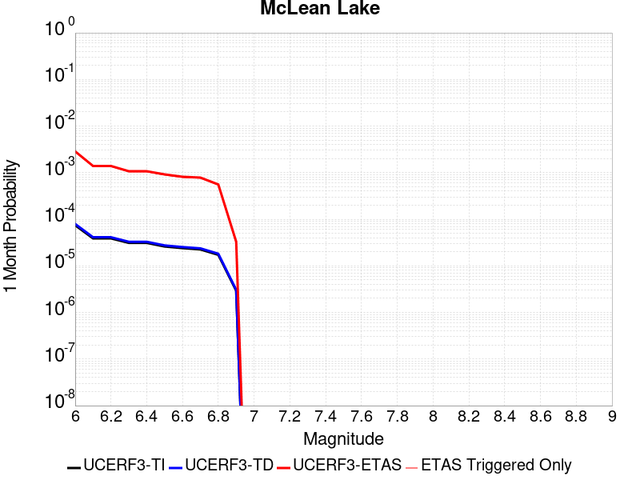 |  |  |

| Magnitude | 1 wk TI Prob | 1 wk TD Prob | 1 wk ETAS Prob | 1 wk ETAS/TD Gain | 1 wk ETAS Triggered Only | 1 mo TI Prob | 1 mo TD Prob | 1 mo ETAS Prob | 1 mo ETAS/TD Gain | 1 mo ETAS Triggered Only | 1 yr TI Prob | 1 yr TD Prob | 1 yr ETAS Prob | 1 yr ETAS/TD Gain | 1 yr ETAS Triggered Only | 10 yr TI Prob | 10 yr TD Prob | 10 yr ETAS Prob | 10 yr ETAS/TD Gain | 10 yr ETAS Triggered Only |
|-----|-----|-----|-----|-----|-----|-----|-----|-----|-----|-----|-----|-----|-----|-----|-----|-----|-----|-----|-----|-----|
| 6.0 | 1.7360222E-5 | 1.8501627E-5 | 0.0019966864 | 107.9195 | 0.0019782213 | 7.439883E-5 | 7.9290556E-5 | 0.0030373137 | 38.30612 | 0.0029582577 | 9.0542925E-4 | 9.6498354E-4 | 0.0061868 | 6.4113007 | 0.0052268603 | 0.009017491 | 0.0096127745 | 0.017988827 | 1.8713459 | 0.008457351 |
| 6.1 | 9.062689E-6 | 9.592193E-6 | 0.0010259164 | 106.95326 | 0.0010163339 | 3.8839516E-5 | 4.1108804E-5 | 0.0014566586 | 35.434227 | 0.001415608 | 4.727685E-4 | 5.003936E-4 | 0.0030218174 | 6.0388803 | 0.002522686 | 0.0047176396 | 0.004993552 | 0.009327518 | 1.8679127 | 0.004355717 |
| 6.2 | 9.062689E-6 | 9.592193E-6 | 0.0010259164 | 106.95326 | 0.0010163339 | 3.8839516E-5 | 4.1108804E-5 | 0.0014566586 | 35.434227 | 0.001415608 | 4.727685E-4 | 5.003936E-4 | 0.0030218174 | 6.0388803 | 0.002522686 | 0.0047176396 | 0.004993552 | 0.009327518 | 1.8679127 | 0.004355717 |
| 6.3 | 7.2575485E-6 | 7.66771E-6 | 8.6065574E-4 | 112.24418 | 8.5299456E-4 | 3.110341E-5 | 3.2861237E-5 | 0.0011761993 | 35.79291 | 0.0011433756 | 3.786182E-4 | 4.0001926E-4 | 0.0024500156 | 6.1247444 | 0.0020508168 | 0.0037797375 | 0.0039936965 | 0.0074282014 | 1.8599813 | 0.0034482758 |
| 6.4 | 7.2575485E-6 | 7.66771E-6 | 8.6065574E-4 | 112.24418 | 8.5299456E-4 | 3.110341E-5 | 3.2861237E-5 | 0.0011761993 | 35.79291 | 0.0011433756 | 3.786182E-4 | 4.0001926E-4 | 0.0024500156 | 6.1247444 | 0.0020508168 | 0.0037797375 | 0.0039936965 | 0.0074282014 | 1.8599813 | 0.0034482758 |
| 6.5 | 6.06582E-6 | 6.4038773E-6 | 7.8679813E-4 | 122.862785 | 7.8039925E-4 | 2.5996113E-5 | 2.7444936E-5 | 0.0010074544 | 36.708206 | 9.800363E-4 | 3.164567E-4 | 3.3409733E-4 | 0.002075802 | 6.2131653 | 0.0017422867 | 0.0031600643 | 0.0033365893 | 0.0062488 | 1.8728107 | 0.00292196 |
| 6.6 | 5.598744E-6 | 5.910262E-6 | 6.9556135E-4 | 117.68706 | 6.896552E-4 | 2.3994397E-5 | 2.5329486E-5 | 8.964508E-4 | 35.39159 | 8.7114336E-4 | 2.9209262E-4 | 3.0834923E-4 | 0.0019230961 | 6.236747 | 0.001615245 | 0.0029170897 | 0.003079843 | 0.0058480604 | 1.8988177 | 0.0027767695 |
| 6.7 | 5.246996E-6 | 5.539162E-6 | 6.4074434E-4 | 115.67532 | 6.3520874E-4 | 2.2486933E-5 | 2.3739085E-5 | 8.404166E-4 | 35.402233 | 8.166969E-4 | 2.73744E-4 | 2.8899137E-4 | 0.0018130518 | 6.2737226 | 0.0015245009 | 0.0027340704 | 0.0028867796 | 0.005438376 | 1.8838903 | 0.0025589836 |
| 6.8 | 4.02324E-6 | 4.2469046E-6 | 4.9426296E-4 | 116.381935 | 4.9001817E-4 | 1.7242342E-5 | 1.8200926E-5 | 5.626556E-4 | 30.913572 | 5.444646E-4 | 2.099053E-4 | 2.2157968E-4 | 0.0013102676 | 5.913302 | 0.0010889292 | 0.0020970714 | 0.002214172 | 0.004061253 | 1.8342084 | 0.0018511796 |
| 6.9 | 6.835972E-7 | 7.1399285E-7 | 1.88628E-5 | 26.418753 | 1.814882E-5 | 2.9296991E-6 | 3.0599674E-6 | 2.1208733E-5 | 6.931032 | 1.814882E-5 | 3.56685E-5 | 3.7254784E-5 | 1.6429179E-4 | 4.409951 | 1.2704174E-4 | 3.5662777E-4 | 3.7251666E-4 | 5.902214E-4 | 1.584416 | 2.1778584E-4 |

## Gravel Hills-Harper Lk
*[(top)](#table-of-contents)*

| 1 Week | 1 Month | 1 Year | 10 Year |
|-----|-----|-----|-----|
|  |  |  |  |

| Magnitude | 1 wk TI Prob | 1 wk TD Prob | 1 wk ETAS Prob | 1 wk ETAS/TD Gain | 1 wk ETAS Triggered Only | 1 mo TI Prob | 1 mo TD Prob | 1 mo ETAS Prob | 1 mo ETAS/TD Gain | 1 mo ETAS Triggered Only | 1 yr TI Prob | 1 yr TD Prob | 1 yr ETAS Prob | 1 yr ETAS/TD Gain | 1 yr ETAS Triggered Only | 10 yr TI Prob | 10 yr TD Prob | 10 yr ETAS Prob | 10 yr ETAS/TD Gain | 10 yr ETAS Triggered Only |
|-----|-----|-----|-----|-----|-----|-----|-----|-----|-----|-----|-----|-----|-----|-----|-----|-----|-----|-----|-----|-----|
| 6.0 | 3.0679566E-5 | 3.1464646E-5 | 0.002100365 | 66.753174 | 0.0020689655 | 1.3147724E-4 | 1.3484273E-4 | 0.003110848 | 23.070192 | 0.0029764066 | 0.0015995599 | 0.0016406906 | 0.006623428 | 4.0369754 | 0.0049909255 | 0.015880952 | 0.01630734 | 0.02343063 | 1.4368151 | 0.0072413795 |
| 6.1 | 3.0679566E-5 | 3.1464646E-5 | 0.002100365 | 66.753174 | 0.0020689655 | 1.3147724E-4 | 1.3484273E-4 | 0.003110848 | 23.070192 | 0.0029764066 | 0.0015995599 | 0.0016406906 | 0.006623428 | 4.0369754 | 0.0049909255 | 0.015880952 | 0.01630734 | 0.02343063 | 1.4368151 | 0.0072413795 |
| 6.2 | 1.514536E-5 | 1.3635206E-5 | 7.758753E-4 | 56.902348 | 7.6225045E-4 | 6.490707E-5 | 5.843536E-5 | 0.0010384144 | 17.77031 | 9.800363E-4 | 7.8995706E-4 | 7.1123015E-4 | 0.0024341417 | 3.422439 | 0.0017241379 | 0.007871548 | 0.0070907404 | 0.009433358 | 1.330377 | 0.0023593467 |
| 6.3 | 1.514536E-5 | 1.3635206E-5 | 7.758753E-4 | 56.902348 | 7.6225045E-4 | 6.490707E-5 | 5.843536E-5 | 0.0010384144 | 17.77031 | 9.800363E-4 | 7.8995706E-4 | 7.1123015E-4 | 0.0024341417 | 3.422439 | 0.0017241379 | 0.007871548 | 0.0070907404 | 0.009433358 | 1.330377 | 0.0023593467 |
| 6.4 | 1.2532521E-5 | 1.06896905E-5 | 5.5514846E-4 | 51.93307 | 5.444646E-4 | 5.37097E-5 | 4.581219E-5 | 7.5358374E-4 | 16.449415 | 7.07804E-4 | 6.537194E-4 | 5.576265E-4 | 0.001736642 | 3.1143463 | 0.0011796734 | 0.0065179965 | 0.005562863 | 0.0071510747 | 1.2855026 | 0.0015970962 |
| 6.5 | 1.1094058E-5 | 9.083664E-6 | 3.9020542E-4 | 42.956837 | 3.8112522E-4 | 4.7545094E-5 | 3.892943E-5 | 5.289285E-4 | 13.586855 | 4.9001817E-4 | 5.787078E-4 | 4.7386673E-4 | 0.0013083168 | 2.7609384 | 8.3484576E-4 | 0.0057720304 | 0.0047289706 | 0.005830813 | 1.2329985 | 0.001107078 |
| 6.6 | 9.688328E-6 | 7.5316952E-6 | 2.9791062E-4 | 39.55426 | 2.903811E-4 | 4.1520743E-5 | 3.227831E-5 | 3.7709475E-4 | 11.682606 | 3.448276E-4 | 5.053978E-4 | 3.9292008E-4 | 0.0010097375 | 2.5698292 | 6.170599E-4 | 0.0050424994 | 0.0039225104 | 0.004681771 | 1.1935649 | 7.6225045E-4 |
| 6.7 | 8.974824E-6 | 6.749413E-6 | 2.0638508E-4 | 30.578228 | 1.9963703E-4 | 3.8462964E-5 | 2.8925748E-5 | 2.830019E-4 | 9.783736 | 2.5408348E-4 | 4.6818596E-4 | 3.5211627E-4 | 8.601043E-4 | 2.4426713 | 5.0816697E-4 | 0.004672008 | 0.0035158044 | 0.00411261 | 1.1697493 | 5.989111E-4 |
| 6.8 | 7.4780046E-6 | 5.1161933E-6 | 5.9562375E-5 | 11.6419325 | 5.444646E-5 | 3.20482E-5 | 2.1926366E-5 | 1.1266848E-4 | 5.138493 | 9.07441E-5 | 3.9011694E-4 | 2.669222E-4 | 5.027939E-4 | 1.8836721 | 2.3593467E-4 | 0.0038943281 | 0.0026661542 | 0.0029376606 | 1.1018345 | 2.722323E-4 |
| 6.9 | 6.3409307E-6 | 3.9074966E-6 | 5.8353744E-5 | 14.933792 | 5.444646E-5 | 2.7175134E-5 | 1.6746313E-5 | 1.0748889E-4 | 6.41866 | 9.07441E-5 | 3.3080703E-4 | 2.0386827E-4 | 4.034646E-4 | 1.9790455 | 1.9963703E-4 | 0.0033031502 | 0.0020369107 | 0.0022361411 | 1.09781 | 1.9963703E-4 |
| 7.0 | 5.1239335E-6 | 2.6058565E-6 | 5.7052177E-5 | 21.89383 | 5.444646E-5 | 2.195953E-5 | 1.116791E-5 | 8.376238E-5 | 7.5002737 | 7.259528E-5 | 2.6732447E-4 | 1.3596108E-4 | 2.8113188E-4 | 2.067738 | 1.4519056E-4 | 0.0026700313 | 0.0013588042 | 0.0015037975 | 1.1067065 | 1.4519056E-4 |
| 7.1 | 4.438899E-6 | 2.0984728E-6 | 5.654482E-5 | 26.945702 | 5.444646E-5 | 1.9023713E-5 | 8.993425E-6 | 8.1588056E-5 | 9.071967 | 7.259528E-5 | 2.315891E-4 | 1.0948967E-4 | 2.5466434E-4 | 2.325921 | 1.4519056E-4 | 0.002313479 | 0.0010943791 | 0.0012394108 | 1.1325241 | 1.4519056E-4 |
| 7.2 | 3.50367E-6 | 1.2615716E-6 | 1.9410369E-5 | 15.385864 | 1.814882E-5 | 1.5015643E-5 | 5.4067245E-6 | 2.3555447E-5 | 4.356694 | 1.814882E-5 | 1.8280011E-4 | 6.582497E-5 | 1.2026785E-4 | 1.8270855 | 5.444646E-5 | 0.0018264982 | 6.580629E-4 | 7.124736E-4 | 1.082683 | 5.444646E-5 |
| 7.3 | 2.561638E-6 | 7.1191585E-7 | 7.1191585E-7 | 1.0 | 0.0 | 1.0978401E-5 | 3.0510646E-6 | 3.0510646E-6 | 1.0 | 0.0 | 1.3365384E-4 | 3.71461E-5 | 5.5294244E-5 | 1.4885613 | 1.814882E-5 | 0.0013357349 | 3.7140088E-4 | 3.8954295E-4 | 1.0488477 | 1.814882E-5 |
| 7.4 | 2.0368864E-6 | 5.304837E-7 | 5.304837E-7 | 1.0 | 0.0 | 8.729483E-6 | 2.2734996E-6 | 2.2734996E-6 | 1.0 | 0.0 | 1.06276275E-4 | 2.7679513E-5 | 2.7679513E-5 | 1.0 | 0.0 | 0.0010622547 | 2.767612E-4 | 2.767612E-4 | 1.0 | 0.0 |
| 7.5 | 1.1681728E-6 | 3.6030585E-7 | 3.6030585E-7 | 1.0 | 0.0 | 5.0064455E-6 | 1.544167E-6 | 1.544167E-6 | 1.0 | 0.0 | 6.0951766E-5 | 1.8800076E-5 | 1.8800076E-5 | 1.0 | 0.0 | 6.093505E-4 | 1.8798532E-4 | 1.8798532E-4 | 1.0 | 0.0 |
| 7.6 | 1.3154387E-7 | 7.1197384E-8 | 7.1197384E-8 | 1.0 | 0.0 | 5.6375933E-7 | 3.051316E-7 | 3.051316E-7 | 1.0 | 0.0 | 6.863748E-6 | 3.7149728E-6 | 3.7149728E-6 | 1.0 | 0.0 | 6.863536E-5 | 3.7149264E-5 | 3.7149264E-5 | 1.0 | 0.0 |

## Goldstone Lake
*[(top)](#table-of-contents)*

| 1 Week | 1 Month | 1 Year | 10 Year |
|-----|-----|-----|-----|
|  | 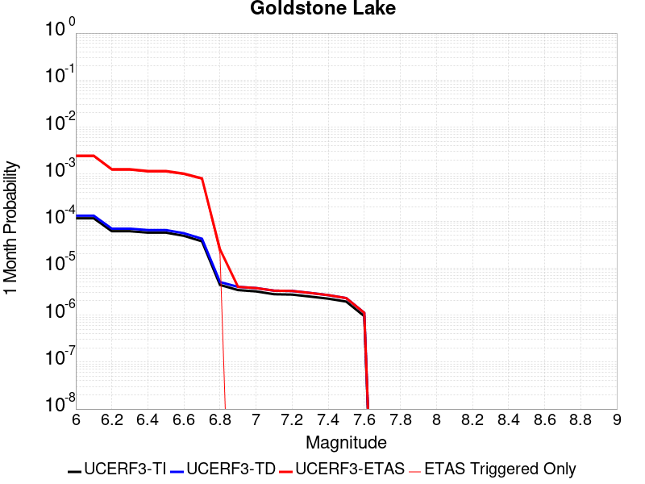 |  |  |

| Magnitude | 1 wk TI Prob | 1 wk TD Prob | 1 wk ETAS Prob | 1 wk ETAS/TD Gain | 1 wk ETAS Triggered Only | 1 mo TI Prob | 1 mo TD Prob | 1 mo ETAS Prob | 1 mo ETAS/TD Gain | 1 mo ETAS Triggered Only | 1 yr TI Prob | 1 yr TD Prob | 1 yr ETAS Prob | 1 yr ETAS/TD Gain | 1 yr ETAS Triggered Only | 10 yr TI Prob | 10 yr TD Prob | 10 yr ETAS Prob | 10 yr ETAS/TD Gain | 10 yr ETAS Triggered Only |
|-----|-----|-----|-----|-----|-----|-----|-----|-----|-----|-----|-----|-----|-----|-----|-----|-----|-----|-----|-----|-----|
| 6.0 | 2.671352E-5 | 3.037609E-5 | 0.0012826066 | 42.22422 | 0.0012522686 | 1.1448149E-4 | 1.3017785E-4 | 0.0023440458 | 18.006487 | 0.002214156 | 0.001392921 | 0.0015839594 | 0.005352935 | 3.3794644 | 0.0037749547 | 0.013842222 | 0.015746197 | 0.022534152 | 1.4310856 | 0.0068965517 |
| 6.1 | 2.671352E-5 | 3.037609E-5 | 0.0012826066 | 42.22422 | 0.0012522686 | 1.1448149E-4 | 1.3017785E-4 | 0.0023440458 | 18.006487 | 0.002214156 | 0.001392921 | 0.0015839594 | 0.005352935 | 3.3794644 | 0.0037749547 | 0.013842222 | 0.015746197 | 0.022534152 | 1.4310856 | 0.0068965517 |
| 6.2 | 1.4197047E-5 | 1.6096245E-5 | 6.512947E-4 | 40.46253 | 6.3520874E-4 | 6.0843064E-5 | 6.8982634E-5 | 0.0012304271 | 17.836763 | 0.0011615244 | 7.4051257E-4 | 8.3963864E-4 | 0.002779932 | 3.310867 | 0.0019419238 | 0.007380498 | 0.0083743585 | 0.011775761 | 1.4061686 | 0.003430127 |
| 6.3 | 1.4197047E-5 | 1.6096245E-5 | 6.512947E-4 | 40.46253 | 6.3520874E-4 | 6.0843064E-5 | 6.8982634E-5 | 0.0012304271 | 17.836763 | 0.0011615244 | 7.4051257E-4 | 8.3963864E-4 | 0.002779932 | 3.310867 | 0.0019419238 | 0.007380498 | 0.0083743585 | 0.011775761 | 1.4061686 | 0.003430127 |
| 6.4 | 1.3238931E-5 | 1.500846E-5 | 6.502076E-4 | 43.322742 | 6.3520874E-4 | 5.6737044E-5 | 6.4320935E-5 | 0.0011531801 | 17.928535 | 0.0010889292 | 6.9055456E-4 | 7.82924E-4 | 0.002596385 | 3.316267 | 0.001814882 | 0.006884126 | 0.0078112837 | 0.010980525 | 1.4057261 | 0.0031941924 |
| 6.5 | 1.3238931E-5 | 1.500846E-5 | 6.502076E-4 | 43.322742 | 6.3520874E-4 | 5.6737044E-5 | 6.4320935E-5 | 0.0011531801 | 17.928535 | 0.0010889292 | 6.9055456E-4 | 7.82924E-4 | 0.002596385 | 3.316267 | 0.001814882 | 0.006884126 | 0.0078112837 | 0.010980525 | 1.4057261 | 0.0031941924 |
| 6.6 | 1.1328278E-5 | 1.2855166E-5 | 5.9360993E-4 | 46.176765 | 5.807622E-4 | 4.8548856E-5 | 5.5092944E-5 | 0.0010713709 | 19.44661 | 0.0010163339 | 5.90922E-4 | 6.7064585E-4 | 0.0022848076 | 3.4068766 | 0.001615245 | 0.0058935313 | 0.0066956086 | 0.009435759 | 1.4092458 | 0.0027586208 |
| 6.7 | 8.651175E-6 | 9.824565E-6 | 5.1798654E-4 | 52.723614 | 5.0816697E-4 | 3.707594E-5 | 4.2105108E-5 | 8.769157E-4 | 20.826824 | 8.3484576E-4 | 4.5130608E-4 | 5.1259965E-4 | 0.0018367844 | 3.583273 | 0.0013248639 | 0.0045039062 | 0.005123051 | 0.007253641 | 1.415883 | 0.002141561 |
| 6.8 | 1.0215377E-6 | 1.1754702E-6 | 1.1754702E-6 | 1.0 | 0.0 | 4.378012E-6 | 5.0377203E-6 | 5.0377203E-6 | 1.0 | 0.0 | 5.3300988E-5 | 6.1332634E-5 | 7.948034E-5 | 1.2958899 | 1.814882E-5 | 5.3288206E-4 | 6.1316835E-4 | 6.675814E-4 | 1.0887408 | 5.444646E-5 |
| 6.9 | 7.9360774E-7 | 9.2833966E-7 | 9.2833966E-7 | 1.0 | 0.0 | 3.4011714E-6 | 3.9785928E-6 | 3.9785928E-6 | 1.0 | 0.0 | 4.1408475E-5 | 4.843836E-5 | 4.843836E-5 | 1.0 | 0.0 | 4.140076E-4 | 4.8428503E-4 | 5.024251E-4 | 1.0374573 | 1.814882E-5 |
| 7.0 | 7.4382757E-7 | 8.7473285E-7 | 8.7473285E-7 | 1.0 | 0.0 | 3.1878285E-6 | 3.74885E-6 | 3.74885E-6 | 1.0 | 0.0 | 3.8811122E-5 | 4.564136E-5 | 4.564136E-5 | 1.0 | 0.0 | 3.8804344E-4 | 4.5632652E-4 | 4.7446706E-4 | 1.0397534 | 1.814882E-5 |
| 7.1 | 6.4709513E-7 | 7.7113E-7 | 7.7113E-7 | 1.0 | 0.0 | 2.773262E-6 | 3.3048389E-6 | 3.3048389E-6 | 1.0 | 0.0 | 3.376394E-5 | 4.0235733E-5 | 4.0235733E-5 | 1.0 | 0.0 | 3.375881E-4 | 4.0229043E-4 | 4.2043196E-4 | 1.0450956 | 1.814882E-5 |
| 7.2 | 6.356704E-7 | 7.5883594E-7 | 7.5883594E-7 | 1.0 | 0.0 | 2.7242988E-6 | 3.2521505E-6 | 3.2521505E-6 | 1.0 | 0.0 | 3.3167835E-5 | 3.959427E-5 | 3.959427E-5 | 1.0 | 0.0 | 3.3162883E-4 | 3.958781E-4 | 4.1401974E-4 | 1.0458263 | 1.814882E-5 |
| 7.3 | 5.7695723E-7 | 6.8965653E-7 | 6.8965653E-7 | 1.0 | 0.0 | 2.4726714E-6 | 2.9556677E-6 | 2.9556677E-6 | 1.0 | 0.0 | 3.0104358E-5 | 3.5984718E-5 | 3.5984718E-5 | 1.0 | 0.0 | 3.0100282E-4 | 3.5979465E-4 | 3.7793693E-4 | 1.050424 | 1.814882E-5 |
| 7.4 | 5.209647E-7 | 6.193514E-7 | 6.193514E-7 | 1.0 | 0.0 | 2.232704E-6 | 2.6543607E-6 | 2.6543607E-6 | 1.0 | 0.0 | 2.718283E-5 | 3.2316417E-5 | 3.2316417E-5 | 1.0 | 0.0 | 2.7179506E-4 | 3.2312275E-4 | 3.412657E-4 | 1.0561488 | 1.814882E-5 |
| 7.5 | 4.512955E-7 | 5.348885E-7 | 5.348885E-7 | 1.0 | 0.0 | 1.934122E-6 | 2.2923775E-6 | 2.2923775E-6 | 1.0 | 0.0 | 2.3547682E-5 | 2.7909393E-5 | 2.7909393E-5 | 1.0 | 0.0 | 2.3545188E-4 | 2.7906417E-4 | 2.9720794E-4 | 1.0650164 | 1.814882E-5 |
| 7.6 | 2.21172E-7 | 2.603961E-7 | 2.603961E-7 | 1.0 | 0.0 | 9.478797E-7 | 1.1159829E-6 | 1.1159829E-6 | 1.0 | 0.0 | 1.1540374E-5 | 1.3587036E-5 | 1.3587036E-5 | 1.0 | 0.0 | 1.1539775E-4 | 1.3586486E-4 | 1.3586486E-4 | 1.0 | 0.0 |

## Coyote Canyon
*[(top)](#table-of-contents)*

| 1 Week | 1 Month | 1 Year | 10 Year |
|-----|-----|-----|-----|
|  |  |  |  |

| Magnitude | 1 wk TI Prob | 1 wk TD Prob | 1 wk ETAS Prob | 1 wk ETAS/TD Gain | 1 wk ETAS Triggered Only | 1 mo TI Prob | 1 mo TD Prob | 1 mo ETAS Prob | 1 mo ETAS/TD Gain | 1 mo ETAS Triggered Only | 1 yr TI Prob | 1 yr TD Prob | 1 yr ETAS Prob | 1 yr ETAS/TD Gain | 1 yr ETAS Triggered Only | 10 yr TI Prob | 10 yr TD Prob | 10 yr ETAS Prob | 10 yr ETAS/TD Gain | 10 yr ETAS Triggered Only |
|-----|-----|-----|-----|-----|-----|-----|-----|-----|-----|-----|-----|-----|-----|-----|-----|-----|-----|-----|-----|-----|
| 6.0 | 3.5090034E-5 | 4.0364324E-5 | 0.0011655458 | 28.875643 | 0.0011252268 | 1.503772E-4 | 1.7297994E-4 | 0.001987548 | 11.490049 | 0.001814882 | 0.0018293047 | 0.0021042528 | 0.0050743963 | 2.4114957 | 0.0029764066 | 0.018143194 | 0.020869201 | 0.025773741 | 1.2350132 | 0.005009074 |
| 6.1 | 3.5090034E-5 | 4.0364324E-5 | 0.0011655458 | 28.875643 | 0.0011252268 | 1.503772E-4 | 1.7297994E-4 | 0.001987548 | 11.490049 | 0.001814882 | 0.0018293047 | 0.0021042528 | 0.0050743963 | 2.4114957 | 0.0029764066 | 0.018143194 | 0.020869201 | 0.025773741 | 1.2350132 | 0.005009074 |
| 6.2 | 1.841879E-5 | 2.1059794E-5 | 6.3810666E-4 | 30.29976 | 6.170599E-4 | 7.8935285E-5 | 9.0253714E-5 | 0.0010702015 | 11.857701 | 9.800363E-4 | 9.606133E-4 | 0.001098387 | 0.0028568888 | 2.6009858 | 0.0017604355 | 0.0095647145 | 0.010939667 | 0.0138835125 | 1.2690983 | 0.0029764066 |
| 6.3 | 1.841879E-5 | 2.1059794E-5 | 6.3810666E-4 | 30.29976 | 6.170599E-4 | 7.8935285E-5 | 9.0253714E-5 | 0.0010702015 | 11.857701 | 9.800363E-4 | 9.606133E-4 | 0.001098387 | 0.0028568888 | 2.6009858 | 0.0017604355 | 0.0095647145 | 0.010939667 | 0.0138835125 | 1.2690983 | 0.0029764066 |
| 6.4 | 1.712201E-5 | 1.9565212E-5 | 5.458707E-4 | 27.900066 | 5.2631577E-4 | 7.337798E-5 | 8.3848776E-5 | 9.7306643E-4 | 11.605016 | 8.892922E-4 | 8.930107E-4 | 0.0010204813 | 0.0026159477 | 2.5634449 | 0.0015970962 | 0.008894307 | 0.010167871 | 0.012880478 | 1.2667823 | 0.0027404719 |
| 6.5 | 1.4744935E-5 | 1.6836972E-5 | 5.249954E-4 | 31.181105 | 5.0816697E-4 | 6.3191044E-5 | 7.215698E-5 | 9.0694247E-4 | 12.569019 | 8.3484576E-4 | 7.6907943E-4 | 8.7825063E-4 | 0.0023832798 | 2.713667 | 0.0015063521 | 0.007664232 | 0.008756994 | 0.011329548 | 1.2937714 | 0.0025952812 |
| 6.6 | 1.2017839E-5 | 1.37240895E-5 | 4.3114123E-4 | 31.414925 | 4.1742288E-4 | 5.150401E-5 | 5.88167E-5 | 7.121358E-4 | 12.107715 | 6.5335754E-4 | 6.268809E-4 | 7.159466E-4 | 0.0019129112 | 2.6718628 | 0.0011978222 | 0.0062511545 | 0.0071450938 | 0.009235314 | 1.2925394 | 0.002105263 |
| 6.7 | 1.00956095E-5 | 1.1533517E-5 | 3.7450573E-4 | 32.47108 | 3.629764E-4 | 4.326618E-5 | 4.942891E-5 | 5.3942285E-4 | 10.913104 | 4.9001817E-4 | 5.266384E-4 | 6.017178E-4 | 0.0015448886 | 2.5674636 | 9.437387E-4 | 0.005253921 | 0.0060094125 | 0.0077051497 | 1.2821802 | 0.0017059891 |

## So Sierra Nevada
*[(top)](#table-of-contents)*

| 1 Week | 1 Month | 1 Year | 10 Year |
|-----|-----|-----|-----|
|  |  |  |  |

| Magnitude | 1 wk TI Prob | 1 wk TD Prob | 1 wk ETAS Prob | 1 wk ETAS/TD Gain | 1 wk ETAS Triggered Only | 1 mo TI Prob | 1 mo TD Prob | 1 mo ETAS Prob | 1 mo ETAS/TD Gain | 1 mo ETAS Triggered Only | 1 yr TI Prob | 1 yr TD Prob | 1 yr ETAS Prob | 1 yr ETAS/TD Gain | 1 yr ETAS Triggered Only | 10 yr TI Prob | 10 yr TD Prob | 10 yr ETAS Prob | 10 yr ETAS/TD Gain | 10 yr ETAS Triggered Only |
|-----|-----|-----|-----|-----|-----|-----|-----|-----|-----|-----|-----|-----|-----|-----|-----|-----|-----|-----|-----|-----|
| 6.0 | 1.15488665E-5 | 1.1079643E-5 | 0.0013903747 | 125.489136 | 0.0013793104 | 4.9494203E-5 | 4.748339E-5 | 0.0020982027 | 44.18814 | 0.0020508168 | 6.024253E-4 | 5.7796965E-4 | 0.004096806 | 7.088271 | 0.003520871 | 0.006007948 | 0.005765934 | 0.010854391 | 1.8825036 | 0.0051179673 |
| 6.1 | 1.15488665E-5 | 1.1079643E-5 | 0.0013903747 | 125.489136 | 0.0013793104 | 4.9494203E-5 | 4.748339E-5 | 0.0020982027 | 44.18814 | 0.0020508168 | 6.024253E-4 | 5.7796965E-4 | 0.004096806 | 7.088271 | 0.003520871 | 0.006007948 | 0.005765934 | 0.010854391 | 1.8825036 | 0.0051179673 |
| 6.2 | 1.15488665E-5 | 1.1079643E-5 | 0.0013903747 | 125.489136 | 0.0013793104 | 4.9494203E-5 | 4.748339E-5 | 0.0020982027 | 44.18814 | 0.0020508168 | 6.024253E-4 | 5.7796965E-4 | 0.004096806 | 7.088271 | 0.003520871 | 0.006007948 | 0.005765934 | 0.010854391 | 1.8825036 | 0.0051179673 |
| 6.3 | 1.15488665E-5 | 1.1079643E-5 | 0.0013903747 | 125.489136 | 0.0013793104 | 4.9494203E-5 | 4.748339E-5 | 0.0020982027 | 44.18814 | 0.0020508168 | 6.024253E-4 | 5.7796965E-4 | 0.004096806 | 7.088271 | 0.003520871 | 0.006007948 | 0.005765934 | 0.010854391 | 1.8825036 | 0.0051179673 |
| 6.4 | 1.15488665E-5 | 1.1079643E-5 | 0.0013903747 | 125.489136 | 0.0013793104 | 4.9494203E-5 | 4.748339E-5 | 0.0020982027 | 44.18814 | 0.0020508168 | 6.024253E-4 | 5.7796965E-4 | 0.004096806 | 7.088271 | 0.003520871 | 0.006007948 | 0.005765934 | 0.010854391 | 1.8825036 | 0.0051179673 |
| 6.5 | 1.15488665E-5 | 1.1079643E-5 | 0.0013903747 | 125.489136 | 0.0013793104 | 4.9494203E-5 | 4.748339E-5 | 0.0020982027 | 44.18814 | 0.0020508168 | 6.024253E-4 | 5.7796965E-4 | 0.004096806 | 7.088271 | 0.003520871 | 0.006007948 | 0.005765934 | 0.010854391 | 1.8825036 | 0.0051179673 |
| 6.6 | 7.587044E-6 | 6.935635E-6 | 7.147347E-4 | 103.05253 | 7.07804E-4 | 3.2515498E-5 | 2.9723828E-5 | 0.0011004724 | 37.02324 | 0.0010707804 | 3.9580427E-4 | 3.6183043E-4 | 0.002121629 | 5.8636003 | 0.0017604355 | 0.003951 | 0.0036127048 | 0.0061805267 | 1.7107755 | 0.0025771325 |
| 6.7 | 7.587044E-6 | 6.935635E-6 | 7.147347E-4 | 103.05253 | 7.07804E-4 | 3.2515498E-5 | 2.9723828E-5 | 0.0011004724 | 37.02324 | 0.0010707804 | 3.9580427E-4 | 3.6183043E-4 | 0.002121629 | 5.8636003 | 0.0017604355 | 0.003951 | 0.0036127048 | 0.0061805267 | 1.7107755 | 0.0025771325 |
| 6.8 | 5.9026956E-6 | 5.1793927E-6 | 5.677899E-4 | 109.6248 | 5.626134E-4 | 2.5297022E-5 | 2.2197215E-5 | 8.570244E-4 | 38.609547 | 8.3484576E-4 | 3.0794772E-4 | 2.7021873E-4 | 0.0015584368 | 5.767316 | 0.0012885663 | 0.0030752132 | 0.002699018 | 0.004545201 | 1.6840204 | 0.0018511796 |
| 6.9 | 5.0118915E-6 | 4.2524252E-6 | 4.3982227E-4 | 103.428566 | 4.3557168E-4 | 2.1479358E-5 | 1.8224557E-5 | 6.897187E-4 | 37.845566 | 6.7150634E-4 | 2.614798E-4 | 2.2186211E-4 | 0.0012379705 | 5.57991 | 0.0010163339 | 0.0026117235 | 0.0022164788 | 0.0037376008 | 1.6862786 | 0.0015245009 |
| 7.0 | 4.4924795E-6 | 3.7139177E-6 | 2.9409397E-4 | 79.18699 | 2.903811E-4 | 1.925334E-5 | 1.5916696E-5 | 4.877785E-4 | 30.645714 | 4.7186934E-4 | 2.3438422E-4 | 1.9376918E-4 | 9.5587195E-4 | 4.9330444 | 7.6225045E-4 | 0.0023413717 | 0.0019360651 | 0.0031677957 | 1.6362029 | 0.0012341198 |
| 7.1 | 3.9118436E-6 | 3.1119775E-6 | 2.0274839E-4 | 65.15098 | 1.9963703E-4 | 1.6764936E-5 | 1.3336982E-5 | 3.0371425E-4 | 22.772337 | 2.903811E-4 | 2.0409399E-4 | 1.6236622E-4 | 6.523048E-4 | 4.017491 | 4.9001817E-4 | 0.0020390663 | 0.001622532 | 0.0025285007 | 1.5583673 | 9.07441E-4 |
| 7.2 | 3.4200818E-6 | 2.6054543E-6 | 1.2964687E-4 | 49.759792 | 1.2704174E-4 | 1.4657411E-5 | 1.11661875E-5 | 2.289496E-4 | 20.503828 | 2.1778584E-4 | 1.7843937E-4 | 1.3594035E-4 | 4.625747E-4 | 3.402777 | 3.2667877E-4 | 0.0017829615 | 0.0013586218 | 0.0019929674 | 1.4669038 | 6.3520874E-4 |
| 7.3 | 2.6593618E-6 | 1.8284203E-6 | 9.257236E-5 | 50.629692 | 9.07441E-5 | 1.13972155E-5 | 7.836065E-6 | 1.530255E-4 | 19.528358 | 1.4519056E-4 | 1.3875226E-4 | 9.540021E-5 | 3.1316528E-4 | 3.2826476 | 2.1778584E-4 | 0.0013866565 | 9.5362146E-4 | 0.0013343833 | 1.3992798 | 3.8112522E-4 |
| 7.4 | 2.2577992E-6 | 1.436438E-6 | 5.588282E-5 | 38.903748 | 5.444646E-5 | 9.676246E-6 | 6.15615E-6 | 1.150484E-4 | 18.68837 | 1.0889292E-4 | 1.1780193E-4 | 7.49488E-5 | 2.2012848E-4 | 2.9370513 | 1.4519056E-4 | 0.001177395 | 7.492603E-4 | 9.4874774E-4 | 1.2662458 | 1.9963703E-4 |
| 7.5 | 1.489319E-6 | 7.353936E-7 | 5.5181816E-5 | 75.03712 | 5.444646E-5 | 6.3827797E-6 | 3.1516831E-6 | 7.5746735E-5 | 24.033741 | 7.259528E-5 | 7.770758E-5 | 3.8371072E-5 | 1.291117E-4 | 3.3648186 | 9.07441E-5 | 7.7680405E-4 | 3.836449E-4 | 5.106379E-4 | 1.331017 | 1.2704174E-4 |
| 7.6 | 1.0680322E-6 | 4.6596554E-7 | 5.49124E-5 | 117.84648 | 5.444646E-5 | 4.577273E-6 | 1.9969937E-6 | 5.6443347E-5 | 28.264158 | 5.444646E-5 | 5.5726876E-5 | 2.4313129E-5 | 9.6906646E-5 | 3.9857743 | 7.259528E-5 | 5.5712904E-4 | 2.4310495E-4 | 3.33827E-4 | 1.3731805 | 9.07441E-5 |
| 7.7 | 5.509146E-7 | 1.5580486E-7 | 1.8304623E-5 | 117.48428 | 1.814882E-5 | 2.3610605E-6 | 6.677349E-7 | 1.8816543E-5 | 28.179659 | 1.814882E-5 | 2.8745531E-5 | 8.129644E-6 | 2.6278316E-5 | 3.2324069 | 1.814882E-5 | 2.8741814E-4 | 8.1293576E-5 | 9.944093E-5 | 1.2232322 | 1.814882E-5 |

## Death Valley (So)
*[(top)](#table-of-contents)*

| 1 Week | 1 Month | 1 Year | 10 Year |
|-----|-----|-----|-----|
|  |  |  |  |

| Magnitude | 1 wk TI Prob | 1 wk TD Prob | 1 wk ETAS Prob | 1 wk ETAS/TD Gain | 1 wk ETAS Triggered Only | 1 mo TI Prob | 1 mo TD Prob | 1 mo ETAS Prob | 1 mo ETAS/TD Gain | 1 mo ETAS Triggered Only | 1 yr TI Prob | 1 yr TD Prob | 1 yr ETAS Prob | 1 yr ETAS/TD Gain | 1 yr ETAS Triggered Only | 10 yr TI Prob | 10 yr TD Prob | 10 yr ETAS Prob | 10 yr ETAS/TD Gain | 10 yr ETAS Triggered Only |
|-----|-----|-----|-----|-----|-----|-----|-----|-----|-----|-----|-----|-----|-----|-----|-----|-----|-----|-----|-----|-----|
| 6.0 | 2.0684236E-5 | 2.5617775E-5 | 0.0010237773 | 39.96355 | 9.981851E-4 | 8.864371E-5 | 1.0978594E-4 | 0.0017611473 | 16.041647 | 0.0016515426 | 0.0010787029 | 0.0013358411 | 0.0041451505 | 3.1030264 | 0.002813067 | 0.010734817 | 0.013281397 | 0.017704617 | 1.3330389 | 0.0044827587 |
| 6.1 | 2.0684236E-5 | 2.5617775E-5 | 0.0010237773 | 39.96355 | 9.981851E-4 | 8.864371E-5 | 1.0978594E-4 | 0.0017611473 | 16.041647 | 0.0016515426 | 0.0010787029 | 0.0013358411 | 0.0041451505 | 3.1030264 | 0.002813067 | 0.010734817 | 0.013281397 | 0.017704617 | 1.3330389 | 0.0044827587 |
| 6.2 | 2.0684236E-5 | 2.5617775E-5 | 0.0010237773 | 39.96355 | 9.981851E-4 | 8.864371E-5 | 1.0978594E-4 | 0.0017611473 | 16.041647 | 0.0016515426 | 0.0010787029 | 0.0013358411 | 0.0041451505 | 3.1030264 | 0.002813067 | 0.010734817 | 0.013281397 | 0.017704617 | 1.3330389 | 0.0044827587 |
| 6.3 | 2.0240292E-5 | 2.511786E-5 | 9.325361E-4 | 37.126415 | 9.07441E-4 | 8.6741224E-5 | 1.07643624E-4 | 0.0016138336 | 14.992374 | 0.0015063521 | 0.0010555626 | 0.00130979 | 0.0038472968 | 2.9373388 | 0.002540835 | 0.010505628 | 0.013023956 | 0.017107995 | 1.313579 | 0.004137931 |
| 6.4 | 2.0240292E-5 | 2.511786E-5 | 9.325361E-4 | 37.126415 | 9.07441E-4 | 8.6741224E-5 | 1.07643624E-4 | 0.0016138336 | 14.992374 | 0.0015063521 | 0.0010555626 | 0.00130979 | 0.0038472968 | 2.9373388 | 0.002540835 | 0.010505628 | 0.013023956 | 0.017107995 | 1.313579 | 0.004137931 |
| 6.5 | 1.9962767E-5 | 2.4807114E-5 | 9.322256E-4 | 37.578964 | 9.07441E-4 | 8.55519E-5 | 1.0631196E-4 | 0.0015762101 | 14.826272 | 0.0014700545 | 0.0010410968 | 0.0012935963 | 0.003758643 | 2.9055765 | 0.0024682395 | 0.010362327 | 0.012863902 | 0.016787365 | 1.3049979 | 0.003974592 |
| 6.6 | 1.8937297E-5 | 2.3310964E-5 | 8.218404E-4 | 35.25553 | 7.985481E-4 | 8.115732E-5 | 9.990039E-5 | 0.0013520439 | 13.53392 | 0.0012522686 | 9.876423E-4 | 0.0012156231 | 0.003408961 | 2.8042908 | 0.0021960072 | 0.009832645 | 0.012092789 | 0.01567866 | 1.2965297 | 0.003629764 |
| 6.7 | 1.8621096E-5 | 2.2911607E-5 | 8.214414E-4 | 35.85263 | 7.985481E-4 | 7.980225E-5 | 9.818898E-5 | 0.0013503346 | 13.752404 | 0.0012522686 | 9.711593E-4 | 0.0011948098 | 0.003351939 | 2.8054163 | 0.0021597096 | 0.009669261 | 0.011886904 | 0.015401789 | 1.2956939 | 0.0035571689 |
| 6.8 | 1.7830353E-5 | 2.1805688E-5 | 8.0218795E-4 | 36.788013 | 7.8039925E-4 | 7.641356E-5 | 9.344968E-5 | 0.0013093071 | 14.010824 | 0.001215971 | 9.29938E-4 | 0.00113717 | 0.0031856545 | 2.801388 | 0.0020508168 | 0.009260561 | 0.011316354 | 0.014707665 | 1.2996823 | 0.003430127 |
| 6.9 | 1.3135183E-5 | 1.5303925E-5 | 5.4161163E-4 | 35.390377 | 5.2631577E-4 | 5.6292425E-5 | 6.558664E-5 | 8.8223E-4 | 13.451368 | 8.166969E-4 | 6.8514474E-4 | 7.982312E-4 | 0.0020313659 | 2.544834 | 0.0012341198 | 0.006830362 | 0.007954649 | 0.01006117 | 1.2648164 | 0.002123412 |
| 7.0 | 1.1507512E-5 | 1.3154199E-5 | 3.9427442E-4 | 29.973272 | 3.8112522E-4 | 4.9316975E-5 | 5.6373956E-5 | 6.733991E-4 | 11.945216 | 6.170599E-4 | 6.002687E-4 | 6.8614254E-4 | 0.0015748246 | 2.2951858 | 8.892922E-4 | 0.0059864987 | 0.0068409415 | 0.008373038 | 1.2239599 | 0.0015426497 |
| 7.1 | 9.715903E-6 | 1.0865278E-5 | 2.2864876E-4 | 21.043985 | 2.1778584E-4 | 4.1638916E-5 | 4.656467E-5 | 3.5508024E-4 | 7.6255293 | 3.0852994E-4 | 5.068359E-4 | 5.667817E-4 | 0.0010021065 | 1.7680644 | 4.3557168E-4 | 0.0050568148 | 0.0056538144 | 0.0064298017 | 1.1372502 | 7.8039925E-4 |
| 7.2 | 9.233269E-6 | 1.02863105E-5 | 1.5547538E-4 | 15.114786 | 1.4519056E-4 | 3.9570554E-5 | 4.4083466E-5 | 2.618597E-4 | 5.9400887 | 2.1778584E-4 | 4.81665E-4 | 5.3658825E-4 | 8.4495265E-4 | 1.574676 | 3.0852994E-4 | 0.0048062233 | 0.0053533576 | 0.005931011 | 1.1079048 | 5.807622E-4 |
| 7.3 | 8.8041315E-6 | 9.808164E-6 | 1.5499731E-4 | 15.802887 | 1.4519056E-4 | 3.7731446E-5 | 4.2034335E-5 | 2.2351491E-4 | 5.3174367 | 1.814882E-4 | 4.592835E-4 | 5.1165203E-4 | 7.47466E-4 | 1.4608873 | 2.3593467E-4 | 0.0045833546 | 0.005105167 | 0.0055746273 | 1.0919579 | 4.7186934E-4 |
| 7.4 | 8.708749E-6 | 9.707175E-6 | 1.3674768E-4 | 14.087279 | 1.2704174E-4 | 3.7322676E-5 | 4.160154E-5 | 2.0493413E-4 | 4.926119 | 1.6333938E-4 | 4.5430884E-4 | 5.0638523E-4 | 7.240608E-4 | 1.4298615 | 2.1778584E-4 | 0.004533812 | 0.0050527398 | 0.0055041676 | 1.0893432 | 4.537205E-4 |
| 7.5 | 8.612678E-6 | 9.604817E-6 | 1.184967E-4 | 12.337214 | 1.0889292E-4 | 3.6910955E-5 | 4.1162875E-5 | 1.8634746E-4 | 4.527076 | 1.4519056E-4 | 4.492982E-4 | 5.01047E-4 | 7.00584E-4 | 1.3982401 | 1.9963703E-4 | 0.004483909 | 0.0049995985 | 0.0054329927 | 1.0866858 | 4.3557168E-4 |
| 7.6 | 8.319024E-6 | 9.283916E-6 | 1.1817583E-4 | 12.729093 | 1.0889292E-4 | 3.5652476E-5 | 3.978763E-5 | 1.6682432E-4 | 4.1928687 | 1.2704174E-4 | 4.3398244E-4 | 4.8431093E-4 | 6.6571124E-4 | 1.3745534 | 1.814882E-4 | 0.0043313587 | 0.0048329784 | 0.0052303225 | 1.0822152 | 3.9927405E-4 |
| 7.7 | 7.4718328E-6 | 8.34517E-6 | 9.908852E-5 | 11.873756 | 9.07441E-5 | 3.2021748E-5 | 3.5764548E-5 | 1.4465358E-4 | 4.044608 | 1.0889292E-4 | 3.8979502E-4 | 4.353504E-4 | 5.9861864E-4 | 1.3750273 | 1.6333938E-4 | 0.00389112 | 0.0043453807 | 0.00468871 | 1.0790101 | 3.448276E-4 |
| 7.8 | 3.4586725E-7 | 3.6482615E-7 | 3.6482615E-7 | 1.0 | 0.0 | 1.4822873E-6 | 1.5635396E-6 | 1.5635396E-6 | 1.0 | 0.0 | 1.80467E-5 | 1.9035933E-5 | 1.9035933E-5 | 1.0 | 0.0 | 1.8045233E-4 | 1.9034347E-4 | 2.0848884E-4 | 1.0953296 | 1.814882E-5 |
| 7.9 | 2.5591178E-9 | 2.6696718E-9 | 2.6696718E-9 | 1.0 | 0.0 | 1.0967647E-8 | 1.14414505E-8 | 1.14414505E-8 | 1.0 | 0.0 | 1.335311E-7 | 1.3929966E-7 | 1.3929966E-7 | 1.0 | 0.0 | 1.3353102E-6 | 1.3929966E-6 | 1.3929966E-6 | 1.0 | 0.0 |

## San Andreas (Mojave S)
*[(top)](#table-of-contents)*

| 1 Week | 1 Month | 1 Year | 10 Year |
|-----|-----|-----|-----|
|  |  |  |  |

| Magnitude | 1 wk TI Prob | 1 wk TD Prob | 1 wk ETAS Prob | 1 wk ETAS/TD Gain | 1 wk ETAS Triggered Only | 1 mo TI Prob | 1 mo TD Prob | 1 mo ETAS Prob | 1 mo ETAS/TD Gain | 1 mo ETAS Triggered Only | 1 yr TI Prob | 1 yr TD Prob | 1 yr ETAS Prob | 1 yr ETAS/TD Gain | 1 yr ETAS Triggered Only | 10 yr TI Prob | 10 yr TD Prob | 10 yr ETAS Prob | 10 yr ETAS/TD Gain | 10 yr ETAS Triggered Only |
|-----|-----|-----|-----|-----|-----|-----|-----|-----|-----|-----|-----|-----|-----|-----|-----|-----|-----|-----|-----|-----|
| 6.0 | 3.1064058E-4 | 6.7460834E-4 | 0.0023431734 | 3.4733834 | 0.0016696915 | 0.0013306376 | 0.0028881032 | 0.0050415755 | 1.7456354 | 0.0021597096 | 0.016080605 | 0.03462235 | 0.03765339 | 1.0875458 | 0.003139746 | 0.1496549 | 0.28660452 | 0.28941408 | 1.0098029 | 0.003938294 |
| 6.1 | 3.1064058E-4 | 6.7460834E-4 | 0.0023431734 | 3.4733834 | 0.0016696915 | 0.0013306376 | 0.0028881032 | 0.0050415755 | 1.7456354 | 0.0021597096 | 0.016080605 | 0.03462235 | 0.03765339 | 1.0875458 | 0.003139746 | 0.1496549 | 0.28660452 | 0.28941408 | 1.0098029 | 0.003938294 |
| 6.2 | 3.1064058E-4 | 6.7460834E-4 | 0.0023431734 | 3.4733834 | 0.0016696915 | 0.0013306376 | 0.0028881032 | 0.0050415755 | 1.7456354 | 0.0021597096 | 0.016080605 | 0.03462235 | 0.03765339 | 1.0875458 | 0.003139746 | 0.1496549 | 0.28660452 | 0.28941408 | 1.0098029 | 0.003938294 |
| 6.3 | 3.1064058E-4 | 6.7460834E-4 | 0.0023431734 | 3.4733834 | 0.0016696915 | 0.0013306376 | 0.0028881032 | 0.0050415755 | 1.7456354 | 0.0021597096 | 0.016080605 | 0.03462235 | 0.03765339 | 1.0875458 | 0.003139746 | 0.1496549 | 0.28660452 | 0.28941408 | 1.0098029 | 0.003938294 |
| 6.4 | 1.9872203E-4 | 4.3179357E-4 | 0.001973777 | 4.571113 | 0.0015426497 | 8.5138786E-4 | 0.0018492596 | 0.0038238228 | 2.0677588 | 0.0019782213 | 0.010316478 | 0.02228844 | 0.02500332 | 1.1218066 | 0.0027767695 | 0.098504856 | 0.19699748 | 0.19982475 | 1.0143518 | 0.003520871 |
| 6.5 | 1.291105E-4 | 2.875267E-4 | 0.0017390149 | 6.048186 | 0.0014519056 | 5.5321335E-4 | 0.0012316781 | 0.0031168307 | 2.5305562 | 0.0018874774 | 0.006714592 | 0.0148934 | 0.017467907 | 1.1728623 | 0.0026134301 | 0.065152965 | 0.13803436 | 0.14080329 | 1.0200597 | 0.003212341 |
| 6.6 | 1.291105E-4 | 2.875267E-4 | 0.0017390149 | 6.048186 | 0.0014519056 | 5.5321335E-4 | 0.0012316781 | 0.0031168307 | 2.5305562 | 0.0018874774 | 0.006714592 | 0.0148934 | 0.017467907 | 1.1728623 | 0.0026134301 | 0.065152965 | 0.13803436 | 0.14080329 | 1.0200597 | 0.003212341 |
| 6.7 | 1.08001186E-4 | 2.4333889E-4 | 0.001640458 | 6.7414546 | 0.0013974592 | 4.6278012E-4 | 0.0010424647 | 0.0028554548 | 2.7391381 | 0.001814882 | 0.0056198016 | 0.012618446 | 0.01505554 | 1.1931374 | 0.0024682395 | 0.054797906 | 0.119176775 | 0.12187839 | 1.022669 | 0.0030671507 |
| 6.8 | 1.0624356E-4 | 2.3851555E-4 | 0.0016356414 | 6.8575883 | 0.0013974592 | 4.5525006E-4 | 0.0010218095 | 0.0028348372 | 2.7743301 | 0.001814882 | 0.0055285925 | 0.012369843 | 0.014807551 | 1.1970686 | 0.0024682395 | 0.053930566 | 0.11712591 | 0.11983382 | 1.0231197 | 0.0030671507 |
| 6.9 | 1.0393785E-4 | 2.3221898E-4 | 0.001611209 | 6.9383173 | 0.0013793104 | 4.4537184E-4 | 9.948451E-4 | 0.0027897907 | 2.8042464 | 0.0017967332 | 0.0054089287 | 0.012045221 | 0.0144658005 | 1.2009577 | 0.0024500908 | 0.05279156 | 0.11442335 | 0.11712348 | 1.0235977 | 0.0030490018 |
| 7.0 | 1.0155622E-4 | 2.2591476E-4 | 0.0016049135 | 7.104067 | 0.0013793104 | 4.3516833E-4 | 9.6784724E-4 | 0.0027628415 | 2.8546257 | 0.0017967332 | 0.005285311 | 0.0117200995 | 0.014141475 | 1.2066002 | 0.0024500908 | 0.05161361 | 0.111683756 | 0.114376105 | 1.024107 | 0.0030308529 |
| 7.1 | 9.885595E-5 | 2.1879886E-4 | 0.0015978074 | 7.3026314 | 0.0013793104 | 4.2359953E-4 | 9.3737274E-4 | 0.0026961581 | 2.8762925 | 0.0017604355 | 0.0051451353 | 0.011352993 | 0.013721439 | 1.2086186 | 0.0023956443 | 0.05027629 | 0.1085682 | 0.11120529 | 1.0242896 | 0.0029582577 |
| 7.2 | 9.6411415E-5 | 2.124288E-4 | 0.0015914461 | 7.491668 | 0.0013793104 | 4.1312634E-4 | 9.1009185E-4 | 0.0026689253 | 2.932589 | 0.0017604355 | 0.005018219 | 0.011024255 | 0.01339349 | 1.214911 | 0.0023956443 | 0.049064007 | 0.105758004 | 0.1084034 | 1.0250137 | 0.0029582577 |
| 7.3 | 9.1180635E-5 | 1.9471257E-4 | 0.0015737544 | 8.082448 | 0.0013793104 | 3.907156E-4 | 8.342157E-4 | 0.0025931827 | 3.108528 | 0.0017604355 | 0.004746591 | 0.01010939 | 0.012480816 | 1.2345766 | 0.0023956443 | 0.046464786 | 0.09795115 | 0.100603275 | 1.027076 | 0.002940109 |
| 7.4 | 8.887388E-5 | 1.8719878E-4 | 0.0015662509 | 8.366779 | 0.0013793104 | 3.8083247E-4 | 8.020339E-4 | 0.0025610575 | 3.1932037 | 0.0017604355 | 0.0046267817 | 0.00972114 | 0.0120934965 | 1.244041 | 0.0023956443 | 0.045316286 | 0.09458615 | 0.09723173 | 1.0279701 | 0.00292196 |
| 7.5 | 8.6750515E-5 | 1.8051457E-4 | 0.0015595759 | 8.639612 | 0.0013793104 | 3.7173493E-4 | 7.7340455E-4 | 0.0025324787 | 3.2744553 | 0.0017604355 | 0.004516484 | 0.009375632 | 0.011748816 | 1.2531226 | 0.0023956443 | 0.04425787 | 0.091549896 | 0.09420435 | 1.0289947 | 0.00292196 |
| 7.6 | 8.453092E-5 | 1.7439072E-4 | 0.0015353148 | 8.80388 | 0.0013611615 | 3.6222505E-4 | 7.471748E-4 | 0.0024700244 | 3.3058188 | 0.0017241379 | 0.0044011753 | 0.009058985 | 0.011378974 | 1.2560982 | 0.0023411978 | 0.04315024 | 0.08870898 | 0.091322124 | 1.0294574 | 0.0028675136 |
| 7.7 | 8.259102E-5 | 1.6961215E-4 | 0.0015305429 | 9.023781 | 0.0013611615 | 3.539135E-4 | 7.2670676E-4 | 0.0024495916 | 3.370812 | 0.0017241379 | 0.004300386 | 0.008811831 | 0.011132398 | 1.2633468 | 0.0023411978 | 0.042181134 | 0.08645982 | 0.08907941 | 1.0302984 | 0.0028675136 |
| 7.8 | 7.444844E-5 | 1.5283503E-4 | 0.001296036 | 8.479967 | 0.0011433756 | 3.1902574E-4 | 6.548429E-4 | 0.0021239347 | 3.2434263 | 0.0014700545 | 0.0038772223 | 0.007943616 | 0.009798096 | 1.2334553 | 0.0018693284 | 0.03810269 | 0.078290746 | 0.08044865 | 1.0275627 | 0.0023411978 |
| 7.9 | 5.2586525E-5 | 1.00064186E-4 | 8.2594436E-4 | 8.254146 | 7.259528E-4 | 2.2535135E-4 | 4.2877605E-4 | 0.0013902511 | 3.242371 | 9.618875E-4 | 0.0027402006 | 0.005207864 | 0.006399448 | 1.2288047 | 0.0011978222 | 0.027066574 | 0.052200034 | 0.05355895 | 1.0260328 | 0.0014337568 |
| 8.0 | 3.379877E-5 | 5.4074168E-5 | 3.2629175E-4 | 6.034152 | 2.722323E-4 | 1.4484383E-4 | 2.3172585E-4 | 5.401843E-4 | 2.3311353 | 3.0852994E-4 | 0.0017620471 | 0.002817614 | 0.003215763 | 1.1413071 | 3.9927405E-4 | 0.017481409 | 0.028834904 | 0.029381294 | 1.0189489 | 5.626134E-4 |
| 8.1 | 1.8668277E-5 | 1.9309397E-5 | 5.5606335E-5 | 2.8797553 | 3.629764E-5 | 8.000444E-5 | 8.275194E-5 | 1.1904657E-4 | 1.4385957 | 3.629764E-5 | 9.736188E-4 | 0.0010070398 | 0.0010433008 | 1.0360076 | 3.629764E-5 | 0.009693642 | 0.010798888 | 0.010834794 | 1.003325 | 3.629764E-5 |
| 8.2 | 8.541571E-6 | 5.460819E-6 | 5.460819E-6 | 1.0 | 0.0 | 3.660622E-5 | 2.3403301E-5 | 2.3403301E-5 | 1.0 | 0.0 | 4.455896E-4 | 2.84898E-4 | 2.84898E-4 | 1.0 | 0.0 | 0.0044469717 | 0.0032408056 | 0.0032408056 | 1.0 | 0.0 |
| 8.3 | 1.983087E-6 | 7.6599065E-7 | 7.6599065E-7 | 1.0 | 0.0 | 8.498917E-6 | 3.282813E-6 | 3.282813E-6 | 1.0 | 0.0 | 1.034694E-4 | 3.9967534E-5 | 3.9967534E-5 | 1.0 | 0.0 | 0.0010342124 | 4.719687E-4 | 4.719687E-4 | 1.0 | 0.0 |

## San Andreas (Mojave N)
*[(top)](#table-of-contents)*

| 1 Week | 1 Month | 1 Year | 10 Year |
|-----|-----|-----|-----|
|  |  | 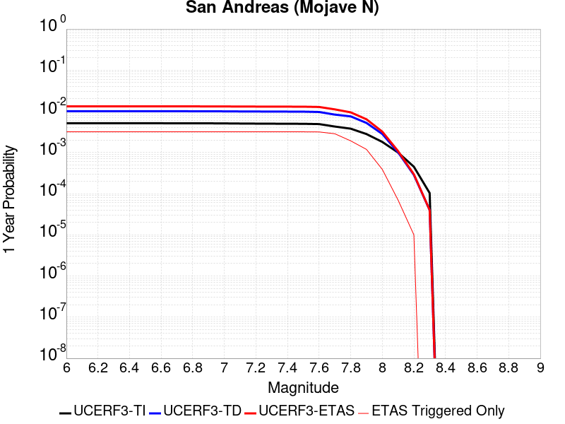 | 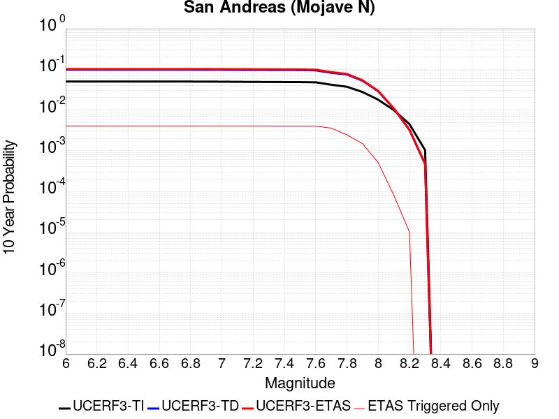 |

| Magnitude | 1 wk TI Prob | 1 wk TD Prob | 1 wk ETAS Prob | 1 wk ETAS/TD Gain | 1 wk ETAS Triggered Only | 1 mo TI Prob | 1 mo TD Prob | 1 mo ETAS Prob | 1 mo ETAS/TD Gain | 1 mo ETAS Triggered Only | 1 yr TI Prob | 1 yr TD Prob | 1 yr ETAS Prob | 1 yr ETAS/TD Gain | 1 yr ETAS Triggered Only | 10 yr TI Prob | 10 yr TD Prob | 10 yr ETAS Prob | 10 yr ETAS/TD Gain | 10 yr ETAS Triggered Only |
|-----|-----|-----|-----|-----|-----|-----|-----|-----|-----|-----|-----|-----|-----|-----|-----|-----|-----|-----|-----|-----|
| 6.0 | 9.877682E-5 | 1.9400702E-4 | 0.0022081353 | 11.381729 | 0.002014519 | 4.2326056E-4 | 8.311939E-4 | 0.0033155156 | 3.9888594 | 0.0024863884 | 0.0051410277 | 0.010072956 | 0.013396667 | 1.3299639 | 0.0033575317 | 0.05023708 | 0.09831428 | 0.10201266 | 1.0376179 | 0.0041016336 |
| 6.1 | 9.877682E-5 | 1.9400702E-4 | 0.0022081353 | 11.381729 | 0.002014519 | 4.2326056E-4 | 8.311939E-4 | 0.0033155156 | 3.9888594 | 0.0024863884 | 0.0051410277 | 0.010072956 | 0.013396667 | 1.3299639 | 0.0033575317 | 0.05023708 | 0.09831428 | 0.10201266 | 1.0376179 | 0.0041016336 |
| 6.2 | 9.877682E-5 | 1.9400702E-4 | 0.0022081353 | 11.381729 | 0.002014519 | 4.2326056E-4 | 8.311939E-4 | 0.0033155156 | 3.9888594 | 0.0024863884 | 0.0051410277 | 0.010072956 | 0.013396667 | 1.3299639 | 0.0033575317 | 0.05023708 | 0.09831428 | 0.10201266 | 1.0376179 | 0.0041016336 |
| 6.3 | 9.877682E-5 | 1.9400702E-4 | 0.0022081353 | 11.381729 | 0.002014519 | 4.2326056E-4 | 8.311939E-4 | 0.0033155156 | 3.9888594 | 0.0024863884 | 0.0051410277 | 0.010072956 | 0.013396667 | 1.3299639 | 0.0033575317 | 0.05023708 | 0.09831428 | 0.10201266 | 1.0376179 | 0.0041016336 |
| 6.4 | 9.877682E-5 | 1.9400702E-4 | 0.0022081353 | 11.381729 | 0.002014519 | 4.2326056E-4 | 8.311939E-4 | 0.0033155156 | 3.9888594 | 0.0024863884 | 0.0051410277 | 0.010072956 | 0.013396667 | 1.3299639 | 0.0033575317 | 0.05023708 | 0.09831428 | 0.10201266 | 1.0376179 | 0.0041016336 |
| 6.5 | 9.861474E-5 | 1.9374468E-4 | 0.0022078734 | 11.395788 | 0.002014519 | 4.2256617E-4 | 8.300703E-4 | 0.0033143947 | 3.9929085 | 0.0024863884 | 0.0051326132 | 0.010059402 | 0.013383159 | 1.330413 | 0.0033575317 | 0.050156746 | 0.098192066 | 0.10189095 | 1.0376699 | 0.0041016336 |
| 6.6 | 9.861474E-5 | 1.9374468E-4 | 0.0022078734 | 11.395788 | 0.002014519 | 4.2256617E-4 | 8.300703E-4 | 0.0033143947 | 3.9929085 | 0.0024863884 | 0.0051326132 | 0.010059402 | 0.013383159 | 1.330413 | 0.0033575317 | 0.050156746 | 0.098192066 | 0.10189095 | 1.0376699 | 0.0041016336 |
| 6.7 | 9.8552715E-5 | 1.9364421E-4 | 0.0022077733 | 11.401183 | 0.002014519 | 4.223004E-4 | 8.2964E-4 | 0.0033139656 | 3.9944623 | 0.0024863884 | 0.0051293927 | 0.010054212 | 0.013377987 | 1.3305852 | 0.0033575317 | 0.050125998 | 0.098145254 | 0.10184433 | 1.0376898 | 0.0041016336 |
| 6.8 | 9.8464974E-5 | 1.9349584E-4 | 0.0022076252 | 11.409161 | 0.002014519 | 4.219245E-4 | 8.290045E-4 | 0.0033133316 | 3.9967594 | 0.0024863884 | 0.0051248376 | 0.010046546 | 0.013370347 | 1.3308401 | 0.0033575317 | 0.05008251 | 0.09807528 | 0.10177465 | 1.0377196 | 0.0041016336 |
| 6.9 | 9.825824E-5 | 1.9317595E-4 | 0.0022073057 | 11.426401 | 0.002014519 | 4.2103877E-4 | 8.276344E-4 | 0.003311965 | 4.0017247 | 0.0024863884 | 0.0051141046 | 0.010030019 | 0.013353875 | 1.3313907 | 0.0033575317 | 0.049980022 | 0.09792438 | 0.10162436 | 1.0377841 | 0.0041016336 |
| 7.0 | 9.781462E-5 | 1.924896E-4 | 0.002206621 | 11.463585 | 0.002014519 | 4.1913814E-4 | 8.246948E-4 | 0.0033090326 | 4.012433 | 0.0024863884 | 0.005091073 | 0.009994558 | 0.013318533 | 1.3325784 | 0.0033575317 | 0.04976007 | 0.09760077 | 0.10130209 | 1.037923 | 0.0041016336 |
| 7.1 | 9.7121134E-5 | 1.9150671E-4 | 0.00220564 | 11.517299 | 0.002014519 | 4.1616702E-4 | 8.204851E-4 | 0.0033048335 | 4.0279016 | 0.0024863884 | 0.005055068 | 0.009943774 | 0.013267919 | 1.3342941 | 0.0033575317 | 0.04941613 | 0.09713728 | 0.100840494 | 1.0381235 | 0.0041016336 |
| 7.2 | 9.663819E-5 | 1.9081456E-4 | 0.0022049493 | 11.555455 | 0.002014519 | 4.1409794E-4 | 8.175206E-4 | 0.0033018764 | 4.0388904 | 0.0024863884 | 0.0050299936 | 0.00990801 | 0.013232276 | 1.3355129 | 0.0033575317 | 0.049176537 | 0.09681055 | 0.1005151 | 1.038266 | 0.0041016336 |
| 7.3 | 9.6277574E-5 | 1.9033969E-4 | 0.0022044752 | 11.581795 | 0.002014519 | 4.125529E-4 | 8.154867E-4 | 0.0032998475 | 4.046476 | 0.0024863884 | 0.0050112694 | 0.009883473 | 0.01320782 | 1.3363543 | 0.0033575317 | 0.04899759 | 0.09658401 | 0.10028949 | 1.0383654 | 0.0041016336 |
| 7.4 | 9.593308E-5 | 1.897375E-4 | 0.0022038743 | 11.615386 | 0.002014519 | 4.1107697E-4 | 8.129075E-4 | 0.0032972747 | 4.05615 | 0.0024863884 | 0.0049933824 | 0.009852355 | 0.013176807 | 1.3374271 | 0.0033575317 | 0.04882661 | 0.09630218 | 0.099992424 | 1.0383193 | 0.0040834844 |
| 7.5 | 9.561707E-5 | 1.8919831E-4 | 0.0022033362 | 11.645644 | 0.002014519 | 4.0972308E-4 | 8.1059814E-4 | 0.003294971 | 4.0648637 | 0.0024863884 | 0.0049769743 | 0.009824493 | 0.013149039 | 1.3383936 | 0.0033575317 | 0.048669744 | 0.09604836 | 0.09973963 | 1.0384314 | 0.0040834844 |
| 7.6 | 9.418194E-5 | 1.8572104E-4 | 0.0021817205 | 11.747298 | 0.0019963703 | 4.0357444E-4 | 7.957047E-4 | 0.003243846 | 4.0766954 | 0.0024500908 | 0.004902454 | 0.009644784 | 0.012933985 | 1.3410342 | 0.0033212341 | 0.047957025 | 0.094430685 | 0.09809569 | 1.0388117 | 0.004047187 |
| 7.7 | 8.202141E-5 | 1.6021315E-4 | 0.002047388 | 12.779151 | 0.0018874774 | 3.51473E-4 | 6.8644714E-4 | 0.0030079016 | 4.3818398 | 0.002323049 | 0.00427079 | 0.008325525 | 0.011331144 | 1.3610126 | 0.0030308529 | 0.04189639 | 0.08223219 | 0.085630104 | 1.0413209 | 0.0037023593 |
| 7.8 | 7.2859846E-5 | 1.4516473E-4 | 0.0012883744 | 8.875258 | 0.0011433756 | 3.1221908E-4 | 6.219862E-4 | 0.0020911263 | 3.3620138 | 0.0014700545 | 0.003794643 | 0.0075464295 | 0.009401651 | 1.245841 | 0.0018693284 | 0.037304975 | 0.07472468 | 0.07689093 | 1.0289898 | 0.0023411978 |
| 7.9 | 5.3874453E-5 | 1.0045676E-4 | 8.263367E-4 | 8.225794 | 7.259528E-4 | 2.3087008E-4 | 4.3045796E-4 | 0.0013919314 | 3.2336059 | 9.618875E-4 | 0.0028072202 | 0.0052282433 | 0.0064198026 | 1.2279083 | 0.0011978222 | 0.02772022 | 0.05242443 | 0.053783022 | 1.0259153 | 0.0014337568 |
| 8.0 | 3.468538E-5 | 5.4260272E-5 | 3.264778E-4 | 6.016885 | 2.722323E-4 | 1.4864317E-4 | 2.325233E-4 | 5.4098153E-4 | 2.326569 | 3.0852994E-4 | 0.0018082283 | 0.002827298 | 0.003225443 | 1.1408218 | 3.9927405E-4 | 0.017935853 | 0.028947512 | 0.029493839 | 1.018873 | 5.626134E-4 |
| 8.1 | 1.9152367E-5 | 1.940263E-5 | 5.5699566E-5 | 2.8707225 | 3.629764E-5 | 8.207899E-5 | 8.3151484E-5 | 1.1944611E-4 | 1.436488 | 3.629764E-5 | 9.988535E-4 | 0.0010118998 | 0.0010481607 | 1.0358344 | 3.629764E-5 | 0.009943757 | 0.01085625 | 0.010892154 | 1.0033072 | 3.629764E-5 |
| 8.2 | 8.643924E-6 | 5.4748625E-6 | 5.4748625E-6 | 1.0 | 0.0 | 3.704486E-5 | 2.3463486E-5 | 2.3463486E-5 | 1.0 | 0.0 | 4.5092785E-4 | 2.8563058E-4 | 2.8563058E-4 | 1.0 | 0.0 | 0.0045001395 | 0.0032487072 | 0.0032487072 | 1.0 | 0.0 |
| 8.3 | 1.983087E-6 | 7.6599065E-7 | 7.6599065E-7 | 1.0 | 0.0 | 8.498917E-6 | 3.282813E-6 | 3.282813E-6 | 1.0 | 0.0 | 1.034694E-4 | 3.9967534E-5 | 3.9967534E-5 | 1.0 | 0.0 | 0.0010342124 | 4.719687E-4 | 4.719687E-4 | 1.0 | 0.0 |

## Nelson Lake
*[(top)](#table-of-contents)*

| 1 Week | 1 Month | 1 Year | 10 Year |
|-----|-----|-----|-----|
|  |  |  |  |

| Magnitude | 1 wk TI Prob | 1 wk TD Prob | 1 wk ETAS Prob | 1 wk ETAS/TD Gain | 1 wk ETAS Triggered Only | 1 mo TI Prob | 1 mo TD Prob | 1 mo ETAS Prob | 1 mo ETAS/TD Gain | 1 mo ETAS Triggered Only | 1 yr TI Prob | 1 yr TD Prob | 1 yr ETAS Prob | 1 yr ETAS/TD Gain | 1 yr ETAS Triggered Only | 10 yr TI Prob | 10 yr TD Prob | 10 yr ETAS Prob | 10 yr ETAS/TD Gain | 10 yr ETAS Triggered Only |
|-----|-----|-----|-----|-----|-----|-----|-----|-----|-----|-----|-----|-----|-----|-----|-----|-----|-----|-----|-----|-----|
| 6.0 | 9.913453E-6 | 1.0192255E-5 | 6.9984037E-4 | 68.66394 | 6.896552E-4 | 4.2485535E-5 | 4.3680422E-5 | 0.001132562 | 25.92837 | 0.0010889292 | 5.1713863E-4 | 5.316897E-4 | 0.0026721118 | 5.025698 | 0.002141561 | 0.0051593683 | 0.005305204 | 0.008879607 | 1.673754 | 0.0035934665 |
| 6.1 | 9.913453E-6 | 1.0192255E-5 | 6.9984037E-4 | 68.66394 | 6.896552E-4 | 4.2485535E-5 | 4.3680422E-5 | 0.001132562 | 25.92837 | 0.0010889292 | 5.1713863E-4 | 5.316897E-4 | 0.0026721118 | 5.025698 | 0.002141561 | 0.0051593683 | 0.005305204 | 0.008879607 | 1.673754 | 0.0035934665 |
| 6.2 | 4.5596407E-6 | 4.696313E-6 | 3.6767102E-4 | 78.28929 | 3.629764E-4 | 1.954117E-5 | 2.0126909E-5 | 4.9198675E-4 | 24.44423 | 4.7186934E-4 | 2.3788778E-4 | 2.4501883E-4 | 0.0011885263 | 4.8507547 | 9.437387E-4 | 0.0023763329 | 0.0024476128 | 0.0041132174 | 1.6805017 | 0.0016696915 |
| 6.3 | 4.5596407E-6 | 4.696313E-6 | 3.6767102E-4 | 78.28929 | 3.629764E-4 | 1.954117E-5 | 2.0126909E-5 | 4.9198675E-4 | 24.44423 | 4.7186934E-4 | 2.3788778E-4 | 2.4501883E-4 | 0.0011885263 | 4.8507547 | 9.437387E-4 | 0.0023763329 | 0.0024476128 | 0.0041132174 | 1.6805017 | 0.0016696915 |
| 6.4 | 3.4025713E-6 | 3.5098972E-6 | 3.3018753E-4 | 94.07327 | 3.2667877E-4 | 1.4582367E-5 | 1.5042335E-5 | 4.1431037E-4 | 27.542957 | 3.9927405E-4 | 1.7752586E-4 | 1.8312587E-4 | 9.0894575E-4 | 4.9635024 | 7.259528E-4 | 0.001773841 | 0.0018298327 | 0.0030979253 | 1.6930102 | 0.0012704175 |
| 6.5 | 2.8352947E-6 | 2.927856E-6 | 2.7515937E-4 | 93.97981 | 2.722323E-4 | 1.2151207E-5 | 1.2547898E-5 | 3.5737114E-4 | 28.480558 | 3.448276E-4 | 1.479309E-4 | 1.5276071E-4 | 7.8787236E-4 | 5.1575594 | 6.3520874E-4 | 0.0014783246 | 0.0015266308 | 0.0025776555 | 1.6884602 | 0.0010526315 |
| 6.6 | 2.251518E-6 | 2.3290677E-6 | 2.0196562E-4 | 86.715225 | 1.9963703E-4 | 9.649328E-6 | 9.981683E-6 | 2.4591398E-4 | 24.636524 | 2.3593467E-4 | 1.1747423E-4 | 1.2152085E-4 | 5.5703963E-4 | 4.5839014 | 4.3557168E-4 | 0.0011741214 | 0.0012146058 | 0.001994057 | 1.6417321 | 7.8039925E-4 |
| 6.7 | 1.8911853E-6 | 1.9591396E-6 | 1.4714942E-4 | 75.1092 | 1.4519056E-4 | 8.105055E-6 | 8.39629E-6 | 1.717343E-4 | 20.453596 | 1.6333938E-4 | 9.867457E-5 | 1.0222061E-4 | 4.4701295E-4 | 4.3730216 | 3.448276E-4 | 9.863076E-4 | 0.0010217935 | 0.0016200925 | 1.5855383 | 5.989111E-4 |
| 6.8 | 1.4874814E-6 | 1.5438305E-6 | 9.2287795E-5 | 59.77845 | 9.07441E-5 | 6.374905E-6 | 6.6164025E-6 | 1.1550861E-4 | 17.457916 | 1.0889292E-4 | 7.76117E-5 | 8.055224E-5 | 3.527626E-4 | 4.379302 | 2.722323E-4 | 7.75846E-4 | 8.0528157E-4 | 0.0012586367 | 1.5629772 | 4.537205E-4 |
| 6.9 | 6.835972E-7 | 7.1399285E-7 | 1.88628E-5 | 26.418753 | 1.814882E-5 | 2.9296991E-6 | 3.0599674E-6 | 2.1208733E-5 | 6.931032 | 1.814882E-5 | 3.56685E-5 | 3.7254784E-5 | 1.6429179E-4 | 4.409951 | 1.2704174E-4 | 3.5662777E-4 | 3.7251666E-4 | 5.902214E-4 | 1.584416 | 2.1778584E-4 |

## Lenwood-Lockhart-Old Woman Springs
*[(top)](#table-of-contents)*

| 1 Week | 1 Month | 1 Year | 10 Year |
|-----|-----|-----|-----|
|  |  |  |  |

| Magnitude | 1 wk TI Prob | 1 wk TD Prob | 1 wk ETAS Prob | 1 wk ETAS/TD Gain | 1 wk ETAS Triggered Only | 1 mo TI Prob | 1 mo TD Prob | 1 mo ETAS Prob | 1 mo ETAS/TD Gain | 1 mo ETAS Triggered Only | 1 yr TI Prob | 1 yr TD Prob | 1 yr ETAS Prob | 1 yr ETAS/TD Gain | 1 yr ETAS Triggered Only | 10 yr TI Prob | 10 yr TD Prob | 10 yr ETAS Prob | 10 yr ETAS/TD Gain | 10 yr ETAS Triggered Only |
|-----|-----|-----|-----|-----|-----|-----|-----|-----|-----|-----|-----|-----|-----|-----|-----|-----|-----|-----|-----|-----|
| 6.0 | 3.744542E-5 | 4.396252E-5 | 9.876597E-4 | 22.465948 | 9.437387E-4 | 1.604705E-4 | 1.8839816E-4 | 0.001676321 | 8.897757 | 0.0014882033 | 0.0019519776 | 0.0022915069 | 0.0048446264 | 2.1141663 | 0.0025589836 | 0.019349206 | 0.022696787 | 0.02617322 | 1.1531684 | 0.0035571689 |
| 6.1 | 3.744542E-5 | 4.396252E-5 | 9.876597E-4 | 22.465948 | 9.437387E-4 | 1.604705E-4 | 1.8839816E-4 | 0.001676321 | 8.897757 | 0.0014882033 | 0.0019519776 | 0.0022915069 | 0.0048446264 | 2.1141663 | 0.0025589836 | 0.019349206 | 0.022696787 | 0.02617322 | 1.1531684 | 0.0035571689 |
| 6.2 | 3.744542E-5 | 4.396252E-5 | 9.876597E-4 | 22.465948 | 9.437387E-4 | 1.604705E-4 | 1.8839816E-4 | 0.001676321 | 8.897757 | 0.0014882033 | 0.0019519776 | 0.0022915069 | 0.0048446264 | 2.1141663 | 0.0025589836 | 0.019349206 | 0.022696787 | 0.02617322 | 1.1531684 | 0.0035571689 |
| 6.3 | 2.1079984E-5 | 2.5353434E-5 | 4.6091407E-4 | 18.179552 | 4.3557168E-4 | 9.0339665E-5 | 1.0865316E-4 | 7.4379286E-4 | 6.84557 | 6.3520874E-4 | 0.0010993304 | 0.0013220694 | 0.002427684 | 1.8362756 | 0.001107078 | 0.010939079 | 0.0131442575 | 0.01464872 | 1.1144577 | 0.0015245009 |
| 6.4 | 2.1079984E-5 | 2.5353434E-5 | 4.6091407E-4 | 18.179552 | 4.3557168E-4 | 9.0339665E-5 | 1.0865316E-4 | 7.4379286E-4 | 6.84557 | 6.3520874E-4 | 0.0010993304 | 0.0013220694 | 0.002427684 | 1.8362756 | 0.001107078 | 0.010939079 | 0.0131442575 | 0.01464872 | 1.1144577 | 0.0015245009 |
| 6.5 | 1.7397282E-5 | 2.066241E-5 | 3.1103753E-4 | 15.053304 | 2.903811E-4 | 7.455765E-5 | 8.8550245E-5 | 4.8778893E-4 | 5.5086117 | 3.9927405E-4 | 9.073613E-4 | 0.0010775778 | 0.0017846191 | 1.6561394 | 7.07804E-4 | 0.009036654 | 0.010724821 | 0.011694347 | 1.0904002 | 9.800363E-4 |
| 6.6 | 1.52050325E-5 | 1.7679693E-5 | 3.080557E-4 | 17.424265 | 2.903811E-4 | 6.51628E-5 | 7.576796E-5 | 4.7501177E-4 | 6.2692957 | 3.9927405E-4 | 7.9306826E-4 | 9.220924E-4 | 0.0015929795 | 1.7275704 | 6.7150634E-4 | 0.007902439 | 0.009183526 | 0.010100616 | 1.0998625 | 9.255898E-4 |
| 6.7 | 1.332523E-5 | 1.5264002E-5 | 2.8749215E-4 | 18.83465 | 2.722323E-4 | 5.7106878E-5 | 6.5415545E-5 | 4.4651583E-4 | 6.8258367 | 3.8112522E-4 | 6.950544E-4 | 7.961491E-4 | 0.0014489865 | 1.8199939 | 6.5335754E-4 | 0.006928845 | 0.007933599 | 0.008797831 | 1.1089332 | 8.7114336E-4 |
| 6.8 | 1.1525329E-5 | 1.3030979E-5 | 2.6711114E-4 | 20.498165 | 2.5408348E-4 | 4.9393333E-5 | 5.584588E-5 | 4.0065421E-4 | 7.174284 | 3.448276E-4 | 6.011979E-4 | 6.797157E-4 | 0.0011875373 | 1.7471087 | 5.0816697E-4 | 0.00599574 | 0.006776819 | 0.0074618007 | 1.1010772 | 6.896552E-4 |
| 6.9 | 1.0253909E-5 | 1.15144385E-5 | 2.1114916E-4 | 18.337772 | 1.9963703E-4 | 4.3944583E-5 | 4.9346683E-5 | 3.3971347E-4 | 6.884221 | 2.903811E-4 | 5.3489394E-4 | 6.0063385E-4 | 0.001017806 | 1.6945531 | 4.1742288E-4 | 0.0053360825 | 0.0059904843 | 0.006549727 | 1.0933553 | 5.626134E-4 |
| 7.0 | 8.104563E-6 | 8.991279E-6 | 1.723292E-4 | 19.16626 | 1.6333938E-4 | 3.4733377E-5 | 3.8533497E-5 | 2.7445907E-4 | 7.12261 | 2.3593467E-4 | 4.2279682E-4 | 4.6904673E-4 | 8.137126E-4 | 1.7348219 | 3.448276E-4 | 0.0042199334 | 0.0046808156 | 0.0051143486 | 1.0926191 | 4.3557168E-4 |
| 7.1 | 6.7986157E-6 | 7.515816E-6 | 1.345566E-4 | 17.903128 | 1.2704174E-4 | 2.91366E-5 | 3.2210253E-5 | 1.9554437E-4 | 6.0708737 | 1.6333938E-4 | 3.5468035E-4 | 3.920914E-4 | 6.0979184E-4 | 1.5552288 | 2.1778584E-4 | 0.003541148 | 0.003914213 | 0.004203457 | 1.0738959 | 2.903811E-4 |
| 7.2 | 5.6893327E-6 | 6.2800136E-6 | 1.1517225E-4 | 18.33949 | 1.0889292E-4 | 2.4382627E-5 | 2.6914078E-5 | 1.539524E-4 | 5.720144 | 1.2704174E-4 | 2.9681803E-4 | 3.2763163E-4 | 5.0906034E-4 | 1.5537584 | 1.814882E-4 | 0.002964219 | 0.0032716845 | 0.0034887579 | 1.0663491 | 2.1778584E-4 |
| 7.3 | 4.253348E-6 | 4.7069107E-6 | 9.545059E-5 | 20.278818 | 9.07441E-5 | 1.8228506E-5 | 2.0172329E-5 | 1.10914596E-4 | 5.498354 | 9.07441E-5 | 2.2190946E-4 | 2.4557224E-4 | 3.9072716E-4 | 1.5910884 | 1.4519056E-4 | 0.00221688 | 0.0024531898 | 0.0026342326 | 1.073799 | 1.814882E-4 |
| 7.4 | 2.5448119E-6 | 2.852045E-6 | 5.729835E-5 | 20.09027 | 5.444646E-5 | 1.0906291E-5 | 1.2223002E-5 | 6.66688E-5 | 5.454372 | 5.444646E-5 | 1.3277601E-4 | 1.4880655E-4 | 2.5768325E-4 | 1.7316662 | 1.0889292E-4 | 0.001326967 | 0.0014872311 | 0.001614084 | 1.0852946 | 1.2704174E-4 |
| 7.5 | 4.3706837E-8 | 4.562909E-8 | 4.562909E-8 | 1.0 | 0.0 | 1.8731501E-7 | 1.9555324E-7 | 1.9555324E-7 | 1.0 | 0.0 | 2.2805577E-6 | 2.3808586E-6 | 2.3808586E-6 | 1.0 | 0.0 | 2.2805343E-5 | 2.3808387E-5 | 2.3808387E-5 | 1.0 | 0.0 |

## Towne Pass
*[(top)](#table-of-contents)*

| 1 Week | 1 Month | 1 Year | 10 Year |
|-----|-----|-----|-----|
|  |  | 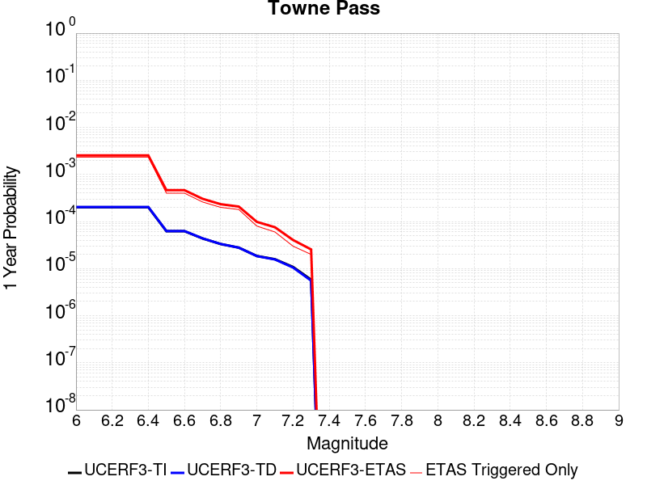 |  |

| Magnitude | 1 wk TI Prob | 1 wk TD Prob | 1 wk ETAS Prob | 1 wk ETAS/TD Gain | 1 wk ETAS Triggered Only | 1 mo TI Prob | 1 mo TD Prob | 1 mo ETAS Prob | 1 mo ETAS/TD Gain | 1 mo ETAS Triggered Only | 1 yr TI Prob | 1 yr TD Prob | 1 yr ETAS Prob | 1 yr ETAS/TD Gain | 1 yr ETAS Triggered Only | 10 yr TI Prob | 10 yr TD Prob | 10 yr ETAS Prob | 10 yr ETAS/TD Gain | 10 yr ETAS Triggered Only |
|-----|-----|-----|-----|-----|-----|-----|-----|-----|-----|-----|-----|-----|-----|-----|-----|-----|-----|-----|-----|-----|
| 6.0 | 3.849728E-6 | 3.8945414E-6 | 8.2058826E-4 | 210.70216 | 8.166969E-4 | 1.649873E-5 | 1.669081E-5 | 0.0013052355 | 78.20085 | 0.0012885663 | 2.0085352E-4 | 2.0319603E-4 | 0.002525773 | 12.430228 | 0.002323049 | 0.0020067208 | 0.0020305314 | 0.005634813 | 2.7750435 | 0.0036116152 |
| 6.1 | 3.849728E-6 | 3.8945414E-6 | 8.2058826E-4 | 210.70216 | 8.166969E-4 | 1.649873E-5 | 1.669081E-5 | 0.0013052355 | 78.20085 | 0.0012885663 | 2.0085352E-4 | 2.0319603E-4 | 0.002525773 | 12.430228 | 0.002323049 | 0.0020067208 | 0.0020305314 | 0.005634813 | 2.7750435 | 0.0036116152 |
| 6.2 | 3.849728E-6 | 3.8945414E-6 | 8.2058826E-4 | 210.70216 | 8.166969E-4 | 1.649873E-5 | 1.669081E-5 | 0.0013052355 | 78.20085 | 0.0012885663 | 2.0085352E-4 | 2.0319603E-4 | 0.002525773 | 12.430228 | 0.002323049 | 0.0020067208 | 0.0020305314 | 0.005634813 | 2.7750435 | 0.0036116152 |
| 6.3 | 3.849728E-6 | 3.8945414E-6 | 8.2058826E-4 | 210.70216 | 8.166969E-4 | 1.649873E-5 | 1.669081E-5 | 0.0013052355 | 78.20085 | 0.0012885663 | 2.0085352E-4 | 2.0319603E-4 | 0.002525773 | 12.430228 | 0.002323049 | 0.0020067208 | 0.0020305314 | 0.005634813 | 2.7750435 | 0.0036116152 |
| 6.4 | 3.849728E-6 | 3.8945414E-6 | 8.2058826E-4 | 210.70216 | 8.166969E-4 | 1.649873E-5 | 1.669081E-5 | 0.0013052355 | 78.20085 | 0.0012885663 | 2.0085352E-4 | 2.0319603E-4 | 0.002525773 | 12.430228 | 0.002323049 | 0.0020067208 | 0.0020305314 | 0.005634813 | 2.7750435 | 0.0036116152 |
| 6.5 | 1.1953545E-6 | 1.203052E-6 | 9.194705E-5 | 76.428154 | 9.07441E-5 | 5.1229376E-6 | 5.1559277E-6 | 2.0479193E-4 | 39.719704 | 1.9963703E-4 | 6.236998E-5 | 6.277173E-5 | 4.6202072E-4 | 7.360331 | 3.9927405E-4 | 6.235248E-4 | 6.275517E-4 | 0.001226087 | 1.9537624 | 5.989111E-4 |
| 6.6 | 1.1953545E-6 | 1.203052E-6 | 9.194705E-5 | 76.428154 | 9.07441E-5 | 5.1229376E-6 | 5.1559277E-6 | 2.0479193E-4 | 39.719704 | 1.9963703E-4 | 6.236998E-5 | 6.277173E-5 | 4.6202072E-4 | 7.360331 | 3.9927405E-4 | 6.235248E-4 | 6.275517E-4 | 0.001226087 | 1.9537624 | 5.989111E-4 |
| 6.7 | 8.375951E-7 | 8.4106705E-7 | 5.528748E-5 | 65.73493 | 5.444646E-5 | 3.5896885E-6 | 3.6045683E-6 | 1.12497095E-4 | 31.209589 | 1.0889292E-4 | 4.370358E-5 | 4.3884793E-5 | 3.1610514E-4 | 7.203068 | 2.722323E-4 | 4.3694986E-4 | 4.38767E-4 | 8.3786587E-4 | 1.9095918 | 3.9927405E-4 |
| 6.8 | 6.38041E-7 | 6.392156E-7 | 3.693683E-5 | 57.78462 | 3.629764E-5 | 2.7344586E-6 | 2.7394929E-6 | 7.5334574E-5 | 27.49946 | 7.259528E-5 | 3.3291526E-5 | 3.3352855E-5 | 2.3298322E-4 | 6.9854054 | 1.9963703E-4 | 3.3286537E-4 | 3.334823E-4 | 6.2376657E-4 | 1.8704638 | 2.903811E-4 |
| 6.9 | 5.3460053E-7 | 5.345333E-7 | 3.6832156E-5 | 68.90526 | 3.629764E-5 | 2.2911431E-6 | 2.2908553E-6 | 5.673719E-5 | 24.766817 | 5.444646E-5 | 2.789431E-5 | 2.789084E-5 | 1.9122567E-4 | 6.856218 | 1.6333938E-4 | 2.789081E-4 | 2.7887672E-4 | 4.966018E-4 | 1.7807218 | 2.1778584E-4 |
| 7.0 | 3.557783E-7 | 3.5324226E-7 | 1.8502056E-5 | 52.37781 | 1.814882E-5 | 1.5247632E-6 | 1.5138945E-6 | 1.9662688E-5 | 12.988149 | 1.814882E-5 | 1.8563835E-5 | 1.843152E-5 | 5.472849E-5 | 2.969288 | 3.629764E-5 | 1.8562283E-4 | 1.8430075E-4 | 2.3873718E-4 | 1.2953674 | 5.444646E-5 |
| 7.1 | 3.037942E-7 | 3.0002218E-7 | 1.8448836E-5 | 61.491577 | 1.814882E-5 | 1.3019744E-6 | 1.2858087E-6 | 1.9434605E-5 | 15.114694 | 1.814882E-5 | 1.5851423E-5 | 1.5654618E-5 | 5.195169E-5 | 3.3186178 | 3.629764E-5 | 1.5850292E-4 | 1.5653588E-4 | 2.1097383E-4 | 1.3477665 | 5.444646E-5 |
| 7.2 | 2.0808248E-7 | 2.0217689E-7 | 1.8350993E-5 | 90.76702 | 1.814882E-5 | 8.917818E-7 | 8.6647213E-7 | 1.9015277E-5 | 21.945631 | 1.814882E-5 | 1.0857389E-5 | 1.0549252E-5 | 2.8697881E-5 | 2.7203712 | 1.814882E-5 | 1.0856859E-4 | 1.0548797E-4 | 1.4178178E-4 | 1.3440564 | 3.629764E-5 |
| 7.3 | 1.1162073E-7 | 1.0636894E-7 | 1.8255187E-5 | 171.62141 | 1.814882E-5 | 4.7837443E-7 | 4.558668E-7 | 1.8604678E-5 | 40.811657 | 1.814882E-5 | 5.8241935E-6 | 5.550166E-6 | 2.3698885E-5 | 4.269942 | 1.814882E-5 | 5.8240406E-5 | 5.5500474E-5 | 9.17961E-5 | 1.6539696 | 3.629764E-5 |

## Bicycle Lake
*[(top)](#table-of-contents)*

| 1 Week | 1 Month | 1 Year | 10 Year |
|-----|-----|-----|-----|
|  |  |  |  |

| Magnitude | 1 wk TI Prob | 1 wk TD Prob | 1 wk ETAS Prob | 1 wk ETAS/TD Gain | 1 wk ETAS Triggered Only | 1 mo TI Prob | 1 mo TD Prob | 1 mo ETAS Prob | 1 mo ETAS/TD Gain | 1 mo ETAS Triggered Only | 1 yr TI Prob | 1 yr TD Prob | 1 yr ETAS Prob | 1 yr ETAS/TD Gain | 1 yr ETAS Triggered Only | 10 yr TI Prob | 10 yr TD Prob | 10 yr ETAS Prob | 10 yr ETAS/TD Gain | 10 yr ETAS Triggered Only |
|-----|-----|-----|-----|-----|-----|-----|-----|-----|-----|-----|-----|-----|-----|-----|-----|-----|-----|-----|-----|-----|
| 6.0 | 1.9621975E-5 | 2.2097078E-5 | 4.93956E-4 | 22.353905 | 4.7186934E-4 | 8.4091465E-5 | 9.4699084E-5 | 7.6614186E-4 | 8.090277 | 6.7150634E-4 | 0.0010233327 | 0.0011524865 | 0.002566463 | 2.226892 | 0.001415608 | 0.01018633 | 0.011478408 | 0.014097721 | 1.2281948 | 0.0026497277 |
| 6.1 | 1.9621975E-5 | 2.2097078E-5 | 4.93956E-4 | 22.353905 | 4.7186934E-4 | 8.4091465E-5 | 9.4699084E-5 | 7.6614186E-4 | 8.090277 | 6.7150634E-4 | 0.0010233327 | 0.0011524865 | 0.002566463 | 2.226892 | 0.001415608 | 0.01018633 | 0.011478408 | 0.014097721 | 1.2281948 | 0.0026497277 |
| 6.2 | 9.9971285E-6 | 1.1255639E-5 | 2.6533628E-4 | 23.57363 | 2.5408348E-4 | 4.2844134E-5 | 4.8237856E-5 | 4.4749264E-4 | 9.2767935 | 3.9927405E-4 | 5.2150246E-4 | 5.871896E-4 | 0.0014578215 | 2.48271 | 8.7114336E-4 | 0.0052028033 | 0.005861487 | 0.0075394334 | 1.2862664 | 0.0016878403 |
| 6.3 | 9.589428E-6 | 1.0798346E-5 | 2.4673046E-4 | 22.848913 | 2.3593467E-4 | 4.10969E-5 | 4.62781E-5 | 4.2738568E-4 | 9.235161 | 3.8112522E-4 | 5.002399E-4 | 5.6334207E-4 | 0.0013977175 | 2.481117 | 8.3484576E-4 | 0.0049911533 | 0.0056242296 | 0.0072664837 | 1.2919962 | 0.0016515426 |
| 6.4 | 9.589428E-6 | 1.0798346E-5 | 2.4673046E-4 | 22.848913 | 2.3593467E-4 | 4.10969E-5 | 4.62781E-5 | 4.2738568E-4 | 9.235161 | 3.8112522E-4 | 5.002399E-4 | 5.6334207E-4 | 0.0013977175 | 2.481117 | 8.3484576E-4 | 0.0049911533 | 0.0056242296 | 0.0072664837 | 1.2919962 | 0.0016515426 |
| 6.5 | 5.557707E-6 | 6.2856016E-6 | 1.1517784E-4 | 18.324076 | 1.0889292E-4 | 2.3818526E-5 | 2.6938165E-5 | 2.2656981E-4 | 8.410736 | 1.9963703E-4 | 2.8995197E-4 | 3.2794967E-4 | 8.1780716E-4 | 2.493697 | 4.9001817E-4 | 0.0028957394 | 0.0032772934 | 0.0043988326 | 1.3422151 | 0.0011252268 |
| 6.6 | 4.8742945E-6 | 5.5132896E-6 | 9.625689E-5 | 17.459066 | 9.07441E-5 | 2.0889667E-5 | 2.3628318E-5 | 1.8696384E-4 | 7.912702 | 1.6333938E-4 | 2.54302E-4 | 2.87663E-4 | 7.231094E-4 | 2.513738 | 4.3557168E-4 | 0.002540112 | 0.0028754752 | 0.0038707901 | 1.3461393 | 9.981851E-4 |
| 6.7 | 3.991108E-6 | 4.5159104E-6 | 7.711086E-5 | 17.075375 | 7.259528E-5 | 1.7104636E-5 | 1.9353902E-5 | 1.2824472E-4 | 6.626298 | 1.0889292E-4 | 2.0822904E-4 | 2.3563375E-4 | 5.44091E-4 | 2.3090537 | 3.0852994E-4 | 0.0020803404 | 0.0023563374 | 0.003134898 | 1.3304112 | 7.8039925E-4 |

## San Andreas (San Bernardino N)
*[(top)](#table-of-contents)*

| 1 Week | 1 Month | 1 Year | 10 Year |
|-----|-----|-----|-----|
|  |  |  |  |

| Magnitude | 1 wk TI Prob | 1 wk TD Prob | 1 wk ETAS Prob | 1 wk ETAS/TD Gain | 1 wk ETAS Triggered Only | 1 mo TI Prob | 1 mo TD Prob | 1 mo ETAS Prob | 1 mo ETAS/TD Gain | 1 mo ETAS Triggered Only | 1 yr TI Prob | 1 yr TD Prob | 1 yr ETAS Prob | 1 yr ETAS/TD Gain | 1 yr ETAS Triggered Only | 10 yr TI Prob | 10 yr TD Prob | 10 yr ETAS Prob | 10 yr ETAS/TD Gain | 10 yr ETAS Triggered Only |
|-----|-----|-----|-----|-----|-----|-----|-----|-----|-----|-----|-----|-----|-----|-----|-----|-----|-----|-----|-----|-----|
| 6.0 | 1.4273766E-4 | 3.1606483E-4 | 0.0012957914 | 4.0997643 | 9.800363E-4 | 6.115894E-4 | 0.0013538664 | 0.0026950608 | 1.9906402 | 0.0013430127 | 0.0074207084 | 0.016360244 | 0.018038321 | 1.1025705 | 0.0017059891 | 0.07177748 | 0.15026689 | 0.15208665 | 1.0121101 | 0.002141561 |
| 6.1 | 1.4273766E-4 | 3.1606483E-4 | 0.0012957914 | 4.0997643 | 9.800363E-4 | 6.115894E-4 | 0.0013538664 | 0.0026950608 | 1.9906402 | 0.0013430127 | 0.0074207084 | 0.016360244 | 0.018038321 | 1.1025705 | 0.0017059891 | 0.07177748 | 0.15026689 | 0.15208665 | 1.0121101 | 0.002141561 |
| 6.2 | 1.4273766E-4 | 3.1606483E-4 | 0.0012957914 | 4.0997643 | 9.800363E-4 | 6.115894E-4 | 0.0013538664 | 0.0026950608 | 1.9906402 | 0.0013430127 | 0.0074207084 | 0.016360244 | 0.018038321 | 1.1025705 | 0.0017059891 | 0.07177748 | 0.15026689 | 0.15208665 | 1.0121101 | 0.002141561 |
| 6.3 | 1.3730655E-4 | 3.0511338E-4 | 0.0012848506 | 4.2110596 | 9.800363E-4 | 5.883239E-4 | 0.0013069791 | 0.0026482365 | 2.026227 | 0.0013430127 | 0.0071393442 | 0.015797773 | 0.01747681 | 1.1062832 | 0.0017059891 | 0.06914291 | 0.14556676 | 0.1473966 | 1.0125703 | 0.002141561 |
| 6.4 | 1.3730655E-4 | 3.0511338E-4 | 0.0012848506 | 4.2110596 | 9.800363E-4 | 5.883239E-4 | 0.0013069791 | 0.0026482365 | 2.026227 | 0.0013430127 | 0.0071393442 | 0.015797773 | 0.01747681 | 1.1062832 | 0.0017059891 | 0.06914291 | 0.14556676 | 0.1473966 | 1.0125703 | 0.002141561 |
| 6.5 | 1.2942807E-4 | 2.8925808E-4 | 0.0012327237 | 4.2616744 | 9.437387E-4 | 5.545738E-4 | 0.0012390936 | 0.0025260632 | 2.0386379 | 0.0012885663 | 0.0067310524 | 0.01498286 | 0.016609658 | 1.1085773 | 0.0016515426 | 0.06530788 | 0.13870941 | 0.14050703 | 1.0129596 | 0.0020871144 |
| 6.6 | 1.1125901E-4 | 2.536472E-4 | 0.0011790022 | 4.6481977 | 9.255898E-4 | 4.767372E-4 | 0.0010866089 | 0.0023375168 | 2.1512034 | 0.0012522686 | 0.005788839 | 0.013149847 | 0.0147438515 | 1.1212186 | 0.001615245 | 0.056403454 | 0.122999296 | 0.12479786 | 1.0146226 | 0.0020508168 |
| 6.7 | 1.02209575E-4 | 2.3499702E-4 | 0.0011603694 | 4.9378047 | 9.255898E-4 | 4.3796748E-4 | 0.0010067427 | 0.0022577506 | 2.2426293 | 0.0012522686 | 0.0053192247 | 0.012188629 | 0.013766259 | 1.1294346 | 0.0015970962 | 0.051936906 | 0.114790924 | 0.116590254 | 1.015675 | 0.0020326679 |
| 6.8 | 9.610582E-5 | 2.2025521E-4 | 0.0011456412 | 5.201426 | 9.255898E-4 | 4.1181705E-4 | 9.436101E-4 | 0.002194697 | 2.3258517 | 0.0012522686 | 0.0050023515 | 0.011428202 | 0.013007046 | 1.1381533 | 0.0015970962 | 0.048912346 | 0.1081929 | 0.11000565 | 1.0167547 | 0.0020326679 |
| 6.9 | 9.3877505E-5 | 2.1481077E-4 | 0.0011402018 | 5.3079357 | 9.255898E-4 | 4.0227012E-4 | 9.2029345E-4 | 0.0021532774 | 2.3397727 | 0.0012341198 | 0.0048866454 | 0.011147255 | 0.012708602 | 1.1400656 | 0.0015789474 | 0.04780577 | 0.10578323 | 0.10758465 | 1.0170293 | 0.002014519 |
| 7.0 | 9.1019785E-5 | 2.0808022E-4 | 0.0011334774 | 5.44731 | 9.255898E-4 | 3.900265E-4 | 8.914682E-4 | 0.002124488 | 2.3831336 | 0.0012341198 | 0.0047382377 | 0.010799837 | 0.012361732 | 1.1446221 | 0.0015789474 | 0.046384744 | 0.102753714 | 0.10456123 | 1.0175908 | 0.002014519 |
| 7.1 | 8.771155E-5 | 1.9982594E-4 | 0.0011252308 | 5.631055 | 9.255898E-4 | 3.758525E-4 | 8.5611636E-4 | 0.002052913 | 2.3979368 | 0.0011978222 | 0.0045664064 | 0.0103736 | 0.011900246 | 1.1471666 | 0.0015426497 | 0.044737056 | 0.09906527 | 0.10084751 | 1.0179907 | 0.0019782213 |
| 7.2 | 8.0830236E-5 | 1.8388197E-4 | 0.0011093016 | 6.0326824 | 9.255898E-4 | 3.4636928E-4 | 7.8782777E-4 | 0.0019847061 | 2.5192134 | 0.0011978222 | 0.0042088944 | 0.009549725 | 0.011077642 | 1.159996 | 0.0015426497 | 0.041300658 | 0.09179615 | 0.09359278 | 1.0195719 | 0.0019782213 |
| 7.3 | 7.7668235E-5 | 1.7331762E-4 | 0.001098747 | 6.3395 | 9.255898E-4 | 3.328214E-4 | 7.425784E-4 | 0.0019395112 | 2.6118603 | 0.0011978222 | 0.0040445733 | 0.009003494 | 0.010532254 | 1.1697963 | 0.0015426497 | 0.03971748 | 0.08706327 | 0.08886926 | 1.0207435 | 0.0019782213 |
| 7.4 | 7.520177E-5 | 1.6551897E-4 | 0.0010909556 | 6.591121 | 9.255898E-4 | 3.2225347E-4 | 7.0917426E-4 | 0.001906147 | 2.68784 | 0.0011978222 | 0.0039163795 | 0.008600081 | 0.010129464 | 1.1778336 | 0.0015426497 | 0.038480744 | 0.08351955 | 0.08531592 | 1.0215083 | 0.0019600727 |
| 7.5 | 7.274697E-5 | 1.5839566E-4 | 0.0010838389 | 6.8426046 | 9.255898E-4 | 3.1173544E-4 | 6.78662E-4 | 0.0018756712 | 2.7637782 | 0.0011978222 | 0.003788775 | 0.008231463 | 0.0097614145 | 1.1858662 | 0.0015426497 | 0.03724827 | 0.08023631 | 0.08203911 | 1.0224687 | 0.0019600727 |
| 7.6 | 7.1185845E-5 | 1.540943E-4 | 0.0010795415 | 7.0057197 | 9.255898E-4 | 3.0504653E-4 | 6.6023704E-4 | 0.0018572684 | 2.8130326 | 0.0011978222 | 0.0037076178 | 0.008008812 | 0.0095211025 | 1.1888285 | 0.0015245009 | 0.036463667 | 0.07822598 | 0.080015995 | 1.0228826 | 0.0019419238 |
| 7.7 | 6.709961E-5 | 1.4318313E-4 | 0.0010686404 | 7.463452 | 9.255898E-4 | 2.8753807E-4 | 6.1349774E-4 | 0.001810585 | 2.9512498 | 0.0011978222 | 0.003495157 | 0.0074437927 | 0.0089569455 | 1.2032771 | 0.0015245009 | 0.034406938 | 0.07305469 | 0.074854754 | 1.0246398 | 0.0019419238 |
| 7.8 | 6.300812E-5 | 1.3202413E-4 | 0.0010574918 | 8.009837 | 9.255898E-4 | 2.7000686E-4 | 5.65695E-4 | 0.0017447011 | 3.0841725 | 0.0011796734 | 0.0032823787 | 0.006865616 | 0.0083616255 | 1.2178988 | 0.0015063521 | 0.032343175 | 0.06771354 | 0.06950705 | 1.0264868 | 0.001923775 |
| 7.9 | 4.983037E-5 | 9.723488E-5 | 8.231171E-4 | 8.465245 | 7.259528E-4 | 2.1354125E-4 | 4.1665437E-4 | 0.0013781411 | 3.3076363 | 9.618875E-4 | 0.0025967648 | 0.0050609782 | 0.006252738 | 1.2354802 | 0.0011978222 | 0.025666296 | 0.05064886 | 0.05201 | 1.0268741 | 0.0014337568 |
| 8.0 | 3.2211527E-5 | 5.3304586E-5 | 3.255224E-4 | 6.1068363 | 2.722323E-4 | 1.380421E-4 | 2.2842824E-4 | 5.368877E-4 | 2.350356 | 3.0852994E-4 | 0.0016793669 | 0.0027775685 | 0.0031757336 | 1.1433502 | 3.9927405E-4 | 0.016667323 | 0.028361378 | 0.028908035 | 1.0192747 | 5.626134E-4 |
| 8.1 | 1.743376E-5 | 1.8824427E-5 | 5.5121385E-5 | 2.928184 | 3.629764E-5 | 7.471398E-5 | 8.067362E-5 | 1.1696833E-4 | 1.4498956 | 3.629764E-5 | 9.0926304E-4 | 9.817594E-4 | 0.0010180214 | 1.0369357 | 3.629764E-5 | 0.009055517 | 0.010484105 | 0.010520022 | 1.0034258 | 3.629764E-5 |
| 8.2 | 7.831616E-6 | 5.1551065E-6 | 5.1551065E-6 | 1.0 | 0.0 | 3.3563636E-5 | 2.2093127E-5 | 2.2093127E-5 | 1.0 | 0.0 | 4.0856065E-4 | 2.6895068E-4 | 2.6895068E-4 | 1.0 | 0.0 | 0.004078103 | 0.0030418145 | 0.0030418145 | 1.0 | 0.0 |
| 8.3 | 1.983087E-6 | 7.6599065E-7 | 7.6599065E-7 | 1.0 | 0.0 | 8.498917E-6 | 3.282813E-6 | 3.282813E-6 | 1.0 | 0.0 | 1.034694E-4 | 3.9967534E-5 | 3.9967534E-5 | 1.0 | 0.0 | 0.0010342124 | 4.719687E-4 | 4.719687E-4 | 1.0 | 0.0 |

## Paradise
*[(top)](#table-of-contents)*

| 1 Week | 1 Month | 1 Year | 10 Year |
|-----|-----|-----|-----|
| 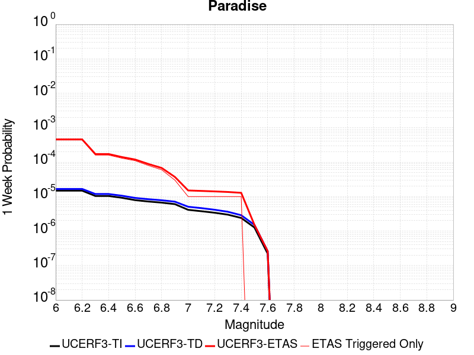 |  |  |  |

| Magnitude | 1 wk TI Prob | 1 wk TD Prob | 1 wk ETAS Prob | 1 wk ETAS/TD Gain | 1 wk ETAS Triggered Only | 1 mo TI Prob | 1 mo TD Prob | 1 mo ETAS Prob | 1 mo ETAS/TD Gain | 1 mo ETAS Triggered Only | 1 yr TI Prob | 1 yr TD Prob | 1 yr ETAS Prob | 1 yr ETAS/TD Gain | 1 yr ETAS Triggered Only | 10 yr TI Prob | 10 yr TD Prob | 10 yr ETAS Prob | 10 yr ETAS/TD Gain | 10 yr ETAS Triggered Only |
|-----|-----|-----|-----|-----|-----|-----|-----|-----|-----|-----|-----|-----|-----|-----|-----|-----|-----|-----|-----|-----|
| 6.0 | 1.4851273E-5 | 1.6694692E-5 | 5.611502E-4 | 33.612495 | 5.444646E-4 | 6.364676E-5 | 7.154685E-5 | 9.0633286E-4 | 12.667684 | 8.3484576E-4 | 7.7462377E-4 | 8.707584E-4 | 0.0023213997 | 2.6659517 | 0.0014519056 | 0.0077192914 | 0.008675844 | 0.010798825 | 1.2447002 | 0.002141561 |
| 6.1 | 1.4851273E-5 | 1.6694692E-5 | 5.611502E-4 | 33.612495 | 5.444646E-4 | 6.364676E-5 | 7.154685E-5 | 9.0633286E-4 | 12.667684 | 8.3484576E-4 | 7.7462377E-4 | 8.707584E-4 | 0.0023213997 | 2.6659517 | 0.0014519056 | 0.0077192914 | 0.008675844 | 0.010798825 | 1.2447002 | 0.002141561 |
| 6.2 | 1.4851273E-5 | 1.6694692E-5 | 5.611502E-4 | 33.612495 | 5.444646E-4 | 6.364676E-5 | 7.154685E-5 | 9.0633286E-4 | 12.667684 | 8.3484576E-4 | 7.7462377E-4 | 8.707584E-4 | 0.0023213997 | 2.6659517 | 0.0014519056 | 0.0077192914 | 0.008675844 | 0.010798825 | 1.2447002 | 0.002141561 |
| 6.3 | 1.0426831E-5 | 1.188862E-5 | 1.5707746E-4 | 13.212421 | 1.4519056E-4 | 4.4685654E-5 | 5.0950268E-5 | 3.413166E-4 | 6.6990147 | 2.903811E-4 | 5.43912E-4 | 6.201489E-4 | 0.0011824134 | 1.9066606 | 5.626134E-4 | 0.0054258266 | 0.0061847917 | 0.0070505473 | 1.1399814 | 8.7114336E-4 |
| 6.4 | 1.0426831E-5 | 1.188862E-5 | 1.5707746E-4 | 13.212421 | 1.4519056E-4 | 4.4685654E-5 | 5.0950268E-5 | 3.413166E-4 | 6.6990147 | 2.903811E-4 | 5.43912E-4 | 6.201489E-4 | 0.0011824134 | 1.9066606 | 5.626134E-4 | 0.0054258266 | 0.0061847917 | 0.0070505473 | 1.1399814 | 8.7114336E-4 |
| 6.5 | 9.25027E-6 | 1.06199595E-5 | 1.5580899E-4 | 14.671334 | 1.4519056E-4 | 3.964341E-5 | 4.551335E-5 | 2.9958526E-4 | 6.5823607 | 2.5408348E-4 | 4.8255164E-4 | 5.53989E-4 | 0.0010618744 | 1.9167789 | 5.0816697E-4 | 0.0048150513 | 0.0055265795 | 0.006284617 | 1.1371622 | 7.6225045E-4 |
| 6.6 | 7.904275E-6 | 9.159525E-6 | 1.362001E-4 | 14.869778 | 1.2704174E-4 | 3.3875025E-5 | 3.9254537E-5 | 2.2073562E-4 | 5.623187 | 1.814882E-4 | 4.1235037E-4 | 4.7782314E-4 | 7.680655E-4 | 1.6074264 | 2.903811E-4 | 0.0041158604 | 0.0047683544 | 0.0051837866 | 1.0871228 | 4.1742288E-4 |
| 6.7 | 7.2061953E-6 | 8.407248E-6 | 8.100192E-5 | 9.634771 | 7.259528E-5 | 3.088333E-5 | 3.6030586E-5 | 1.4491958E-4 | 4.0221267 | 1.0889292E-4 | 3.7593965E-4 | 4.3858777E-4 | 6.562781E-4 | 1.4963439 | 2.1778584E-4 | 0.003753043 | 0.004377591 | 0.0046847705 | 1.0701709 | 3.0852994E-4 |
| 6.8 | 6.6948724E-6 | 7.842166E-6 | 4.413952E-5 | 5.628486 | 3.629764E-5 | 2.8691995E-5 | 3.360887E-5 | 1.0620171E-4 | 3.1599312 | 7.259528E-5 | 3.4926904E-4 | 4.0911473E-4 | 5.723873E-4 | 1.3990874 | 1.6333938E-4 | 0.003487206 | 0.0040839734 | 0.0043008695 | 1.0531092 | 2.1778584E-4 |
| 6.9 | 6.0421025E-6 | 7.130621E-6 | 4.3428E-5 | 6.0903535 | 3.629764E-5 | 2.5894467E-5 | 3.0559466E-5 | 1.03152524E-4 | 3.375469 | 7.259528E-5 | 3.1521954E-4 | 3.7200135E-4 | 4.8085378E-4 | 1.2926129 | 1.0889292E-4 | 0.0031477278 | 0.0037141247 | 0.003858776 | 1.0389463 | 1.4519056E-4 |
| 7.0 | 4.134091E-6 | 5.0803087E-6 | 2.3229037E-5 | 4.572367 | 1.814882E-5 | 1.7717413E-5 | 2.177258E-5 | 5.806943E-5 | 2.66709 | 3.629764E-5 | 2.1568815E-4 | 2.6505045E-4 | 3.376265E-4 | 1.2738197 | 7.259528E-5 | 0.0021547892 | 0.0026474963 | 0.0027380004 | 1.0341847 | 9.07441E-5 |
| 7.1 | 3.7674888E-6 | 4.6318696E-6 | 2.2780605E-5 | 4.9182315 | 1.814882E-5 | 1.6146281E-5 | 1.9850726E-5 | 5.6147648E-5 | 2.8284934 | 3.629764E-5 | 1.9656324E-4 | 2.4165731E-4 | 3.1423505E-4 | 1.3003333 | 7.259528E-5 | 0.0019638946 | 0.002414096 | 0.002504621 | 1.0374985 | 9.07441E-5 |
| 7.2 | 3.4065345E-6 | 4.156723E-6 | 2.2305469E-5 | 5.3661184 | 1.814882E-5 | 1.4599351E-5 | 1.7814415E-5 | 3.5962912E-5 | 2.0187535 | 1.814882E-5 | 1.777326E-4 | 2.1687041E-4 | 2.7130506E-4 | 1.2510009 | 5.444646E-5 | 0.0017759053 | 0.002166736 | 0.002239174 | 1.0334319 | 7.259528E-5 |
| 7.3 | 2.9934936E-6 | 3.6293168E-6 | 2.177807E-5 | 6.000598 | 1.814882E-5 | 1.2829195E-5 | 1.555413E-5 | 3.370267E-5 | 2.1667986 | 1.814882E-5 | 1.5618425E-4 | 1.8935655E-4 | 2.437927E-4 | 1.2874796 | 5.444646E-5 | 0.0015607453 | 0.0018920974 | 0.0019645554 | 1.038295 | 7.259528E-5 |
| 7.4 | 2.4049796E-6 | 2.8889842E-6 | 2.1037751E-5 | 7.2820587 | 1.814882E-5 | 1.0307015E-5 | 1.238131E-5 | 3.0529907E-5 | 2.4658058 | 1.814882E-5 | 1.2548068E-4 | 1.5073347E-4 | 1.8702562E-4 | 1.2407705 | 3.629764E-5 | 0.0012540985 | 0.0015064536 | 0.001560818 | 1.0360878 | 5.444646E-5 |
| 7.5 | 1.2710091E-6 | 1.5134682E-6 | 1.5134682E-6 | 1.0 | 0.0 | 5.44717E-6 | 6.4862834E-6 | 6.4862834E-6 | 1.0 | 0.0 | 6.631728E-5 | 7.8968886E-5 | 9.711627E-5 | 1.2298043 | 1.814882E-5 | 6.6297496E-4 | 7.8953087E-4 | 8.257999E-4 | 1.0459374 | 3.629764E-5 |
| 7.6 | 2.21172E-7 | 2.603961E-7 | 2.603961E-7 | 1.0 | 0.0 | 9.478797E-7 | 1.1159829E-6 | 1.1159829E-6 | 1.0 | 0.0 | 1.1540374E-5 | 1.3587036E-5 | 1.3587036E-5 | 1.0 | 0.0 | 1.1539775E-4 | 1.3586486E-4 | 1.3586486E-4 | 1.0 | 0.0 |

## Garlic Springs
*[(top)](#table-of-contents)*

| 1 Week | 1 Month | 1 Year | 10 Year |
|-----|-----|-----|-----|
|  |  |  |  |

| Magnitude | 1 wk TI Prob | 1 wk TD Prob | 1 wk ETAS Prob | 1 wk ETAS/TD Gain | 1 wk ETAS Triggered Only | 1 mo TI Prob | 1 mo TD Prob | 1 mo ETAS Prob | 1 mo ETAS/TD Gain | 1 mo ETAS Triggered Only | 1 yr TI Prob | 1 yr TD Prob | 1 yr ETAS Prob | 1 yr ETAS/TD Gain | 1 yr ETAS Triggered Only | 10 yr TI Prob | 10 yr TD Prob | 10 yr ETAS Prob | 10 yr ETAS/TD Gain | 10 yr ETAS Triggered Only |
|-----|-----|-----|-----|-----|-----|-----|-----|-----|-----|-----|-----|-----|-----|-----|-----|-----|-----|-----|-----|-----|
| 6.0 | 1.6760017E-5 | 1.8776833E-5 | 2.9100402E-4 | 15.498036 | 2.722323E-4 | 7.182667E-5 | 8.0470316E-5 | 5.523017E-4 | 6.863421 | 4.7186934E-4 | 8.7413884E-4 | 9.794032E-4 | 0.0018315623 | 1.87008 | 8.5299456E-4 | 0.008707083 | 0.009762413 | 0.011469719 | 1.1748856 | 0.0017241379 |
| 6.1 | 9.852767E-6 | 1.09735865E-5 | 2.1060841E-4 | 19.192305 | 1.9963703E-4 | 4.222546E-5 | 4.702921E-5 | 3.192487E-4 | 6.7883067 | 2.722323E-4 | 5.139737E-4 | 5.7250116E-4 | 0.001025962 | 1.7920696 | 4.537205E-4 | 0.005127866 | 0.005717221 | 0.006547294 | 1.1451881 | 8.3484576E-4 |
| 6.2 | 9.852767E-6 | 1.09735865E-5 | 2.1060841E-4 | 19.192305 | 1.9963703E-4 | 4.222546E-5 | 4.702921E-5 | 3.192487E-4 | 6.7883067 | 2.722323E-4 | 5.139737E-4 | 5.7250116E-4 | 0.001025962 | 1.7920696 | 4.537205E-4 | 0.005127866 | 0.005717221 | 0.006547294 | 1.1451881 | 8.3484576E-4 |
| 6.3 | 4.3167724E-6 | 4.7780286E-6 | 7.737296E-5 | 16.193491 | 7.259528E-5 | 1.8500323E-5 | 2.0477235E-5 | 1.4751637E-4 | 7.203921 | 1.2704174E-4 | 2.2521814E-4 | 2.4930484E-4 | 4.307478E-4 | 1.7277956 | 1.814882E-4 | 0.0022499003 | 0.00249251 | 0.002800271 | 1.1234744 | 3.0852994E-4 |
| 6.4 | 4.3167724E-6 | 4.7780286E-6 | 7.737296E-5 | 16.193491 | 7.259528E-5 | 1.8500323E-5 | 2.0477235E-5 | 1.4751637E-4 | 7.203921 | 1.2704174E-4 | 2.2521814E-4 | 2.4930484E-4 | 4.307478E-4 | 1.7277956 | 1.814882E-4 | 0.0022499003 | 0.00249251 | 0.002800271 | 1.1234744 | 3.0852994E-4 |
| 6.5 | 4.3167724E-6 | 4.7780286E-6 | 7.737296E-5 | 16.193491 | 7.259528E-5 | 1.8500323E-5 | 2.0477235E-5 | 1.4751637E-4 | 7.203921 | 1.2704174E-4 | 2.2521814E-4 | 2.4930484E-4 | 4.307478E-4 | 1.7277956 | 1.814882E-4 | 0.0022499003 | 0.00249251 | 0.002800271 | 1.1234744 | 3.0852994E-4 |
| 6.6 | 4.301311E-6 | 4.760897E-6 | 7.7355835E-5 | 16.248163 | 7.259528E-5 | 1.8434059E-5 | 2.0403815E-5 | 1.4744296E-4 | 7.226245 | 1.2704174E-4 | 2.2441156E-4 | 2.4841115E-4 | 4.2985426E-4 | 1.7304145 | 1.814882E-4 | 0.0022418506 | 0.002483593 | 0.0027913568 | 1.1239188 | 3.0852994E-4 |
| 6.7 | 3.8599724E-6 | 4.27106E-6 | 7.686603E-5 | 17.996946 | 7.259528E-5 | 1.6542634E-5 | 1.8304541E-5 | 1.4534396E-4 | 7.940322 | 1.2704174E-4 | 2.0138794E-4 | 2.228578E-4 | 4.0430555E-4 | 1.8141862 | 1.814882E-4 | 0.0020120554 | 0.002228578 | 0.002518312 | 1.1300085 | 2.903811E-4 |

## Death Valley (Black Mtns Frontal)
*[(top)](#table-of-contents)*

| 1 Week | 1 Month | 1 Year | 10 Year |
|-----|-----|-----|-----|
|  |  |  | 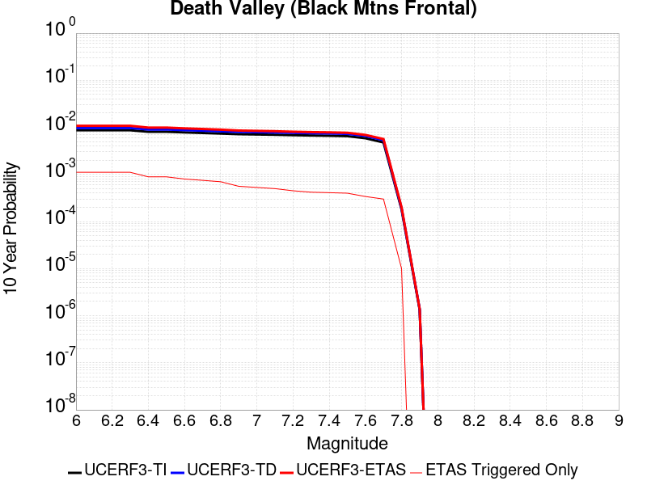 |

| Magnitude | 1 wk TI Prob | 1 wk TD Prob | 1 wk ETAS Prob | 1 wk ETAS/TD Gain | 1 wk ETAS Triggered Only | 1 mo TI Prob | 1 mo TD Prob | 1 mo ETAS Prob | 1 mo ETAS/TD Gain | 1 mo ETAS Triggered Only | 1 yr TI Prob | 1 yr TD Prob | 1 yr ETAS Prob | 1 yr ETAS/TD Gain | 1 yr ETAS Triggered Only | 10 yr TI Prob | 10 yr TD Prob | 10 yr ETAS Prob | 10 yr ETAS/TD Gain | 10 yr ETAS Triggered Only |
|-----|-----|-----|-----|-----|-----|-----|-----|-----|-----|-----|-----|-----|-----|-----|-----|-----|-----|-----|-----|-----|
| 6.0 | 1.6707214E-5 | 1.867027E-5 | 4.3608533E-4 | 23.357208 | 4.1742288E-4 | 7.160038E-5 | 8.001302E-5 | 6.4258144E-4 | 8.03096 | 5.626134E-4 | 8.71386E-4 | 9.737309E-4 | 0.0018077637 | 1.8565332 | 8.3484576E-4 | 0.00867977 | 0.009695496 | 0.010971569 | 1.131615 | 0.0012885663 |
| 6.1 | 1.6707214E-5 | 1.867027E-5 | 4.3608533E-4 | 23.357208 | 4.1742288E-4 | 7.160038E-5 | 8.001302E-5 | 6.4258144E-4 | 8.03096 | 5.626134E-4 | 8.71386E-4 | 9.737309E-4 | 0.0018077637 | 1.8565332 | 8.3484576E-4 | 0.00867977 | 0.009695496 | 0.010971569 | 1.131615 | 0.0012885663 |
| 6.2 | 1.6707214E-5 | 1.867027E-5 | 4.3608533E-4 | 23.357208 | 4.1742288E-4 | 7.160038E-5 | 8.001302E-5 | 6.4258144E-4 | 8.03096 | 5.626134E-4 | 8.71386E-4 | 9.737309E-4 | 0.0018077637 | 1.8565332 | 8.3484576E-4 | 0.00867977 | 0.009695496 | 0.010971569 | 1.131615 | 0.0012885663 |
| 6.3 | 1.6707214E-5 | 1.867027E-5 | 4.3608533E-4 | 23.357208 | 4.1742288E-4 | 7.160038E-5 | 8.001302E-5 | 6.4258144E-4 | 8.03096 | 5.626134E-4 | 8.71386E-4 | 9.737309E-4 | 0.0018077637 | 1.8565332 | 8.3484576E-4 | 0.00867977 | 0.009695496 | 0.010971569 | 1.131615 | 0.0012885663 |
| 6.4 | 1.5515609E-5 | 1.7338214E-5 | 3.6215983E-4 | 20.887955 | 3.448276E-4 | 6.649377E-5 | 7.4304546E-5 | 5.2799133E-4 | 7.1057744 | 4.537205E-4 | 8.0926094E-4 | 9.042885E-4 | 0.0015570552 | 1.7218567 | 6.5335754E-4 | 0.008063202 | 0.009006773 | 0.010049923 | 1.1158185 | 0.0010526315 |
| 6.5 | 1.5515609E-5 | 1.7338214E-5 | 3.6215983E-4 | 20.887955 | 3.448276E-4 | 6.649377E-5 | 7.4304546E-5 | 5.2799133E-4 | 7.1057744 | 4.537205E-4 | 8.0926094E-4 | 9.042885E-4 | 0.0015570552 | 1.7218567 | 6.5335754E-4 | 0.008063202 | 0.009006773 | 0.010049923 | 1.1158185 | 0.0010526315 |
| 6.6 | 1.5041828E-5 | 1.6809145E-5 | 3.253339E-4 | 19.354578 | 3.0852994E-4 | 6.4463384E-5 | 7.203723E-5 | 4.7128252E-4 | 6.5422072 | 3.9927405E-4 | 7.8455906E-4 | 8.767063E-4 | 0.0014569594 | 1.6618557 | 5.807622E-4 | 0.00781795 | 0.008733132 | 0.00970461 | 1.1112404 | 9.800363E-4 |
| 6.7 | 1.4634985E-5 | 1.6356016E-5 | 2.7043535E-4 | 16.534304 | 2.5408348E-4 | 6.271985E-5 | 7.009536E-5 | 4.1489876E-4 | 5.9190617 | 3.448276E-4 | 7.6334673E-4 | 8.5308263E-4 | 0.0013789495 | 1.6164312 | 5.2631577E-4 | 0.007607299 | 0.008498715 | 0.00941644 | 1.1079838 | 9.255898E-4 |
| 6.8 | 1.4209158E-5 | 1.5882048E-5 | 2.6996149E-4 | 16.997902 | 2.5408348E-4 | 6.089497E-5 | 6.8064175E-5 | 4.1286828E-4 | 6.065868 | 3.448276E-4 | 7.4114406E-4 | 8.2837185E-4 | 0.0012998503 | 1.5691628 | 4.7186934E-4 | 0.007386771 | 0.008253456 | 0.009099411 | 1.102497 | 8.5299456E-4 |
| 6.9 | 1.3780098E-5 | 1.5404594E-5 | 2.3318708E-4 | 15.137504 | 2.1778584E-4 | 5.9056227E-5 | 6.6018045E-5 | 3.5638E-4 | 5.398221 | 2.903811E-4 | 7.1877235E-4 | 8.0347876E-4 | 0.0012205662 | 1.5191021 | 4.1742288E-4 | 0.0071645193 | 0.008006332 | 0.008726473 | 1.0899464 | 7.259528E-4 |
| 7.0 | 1.3585064E-5 | 1.5188155E-5 | 2.1482215E-4 | 14.144058 | 1.9963703E-4 | 5.8220405E-5 | 6.50905E-5 | 3.373051E-4 | 5.182094 | 2.722323E-4 | 7.086029E-4 | 7.9219416E-4 | 0.0011730174 | 1.4807197 | 3.8112522E-4 | 0.007063476 | 0.007894293 | 0.008578504 | 1.0866716 | 6.896552E-4 |
| 7.1 | 1.3398601E-5 | 1.49813395E-5 | 1.7831828E-4 | 11.902693 | 1.6333938E-4 | 5.742131E-5 | 6.420419E-5 | 3.001237E-4 | 4.674519 | 2.3593467E-4 | 6.9888023E-4 | 7.8141113E-4 | 0.0011259692 | 1.4409435 | 3.448276E-4 | 0.0069668638 | 0.007787224 | 0.008435493 | 1.0832479 | 6.5335754E-4 |
| 7.2 | 1.3126312E-5 | 1.4679561E-5 | 1.59868E-4 | 10.890516 | 1.4519056E-4 | 5.6254412E-5 | 6.291092E-5 | 2.8068305E-4 | 4.4615955 | 2.1778584E-4 | 6.846822E-4 | 7.6567667E-4 | 0.0010739703 | 1.4026421 | 3.0852994E-4 | 0.006825765 | 0.00763097 | 0.008207301 | 1.0755252 | 5.807622E-4 |
| 7.3 | 1.2922429E-5 | 1.4453788E-5 | 1.5964225E-4 | 11.0450115 | 1.4519056E-4 | 5.5380664E-5 | 6.194336E-5 | 2.7971572E-4 | 4.515669 | 2.1778584E-4 | 6.74051E-4 | 7.53905E-4 | 0.0010622023 | 1.408934 | 3.0852994E-4 | 0.006720101 | 0.007514055 | 0.0080724405 | 1.0743122 | 5.626134E-4 |
| 7.4 | 1.2768878E-5 | 1.4283772E-5 | 1.5947226E-4 | 11.164577 | 1.4519056E-4 | 5.4722615E-5 | 6.1214756E-5 | 2.7898728E-4 | 4.5575166 | 2.1778584E-4 | 6.660441E-4 | 7.4504025E-4 | 0.0010533404 | 1.4138032 | 3.0852994E-4 | 0.0066405144 | 0.0074260035 | 0.007984439 | 1.0752 | 5.626134E-4 |
| 7.5 | 1.2521929E-5 | 1.40120155E-5 | 1.4105198E-4 | 10.066502 | 1.2704174E-4 | 5.366431E-5 | 6.005014E-5 | 2.5967517E-4 | 4.324306 | 1.9963703E-4 | 6.531671E-4 | 7.3087064E-4 | 0.0010210396 | 1.3970181 | 2.903811E-4 | 0.006512506 | 0.0072852457 | 0.007825743 | 1.0741907 | 5.444646E-4 |
| 7.6 | 1.1301089E-5 | 1.2648149E-5 | 1.2153969E-4 | 9.609287 | 1.0889292E-4 | 4.8432343E-5 | 5.4205255E-5 | 1.9938794E-4 | 3.6783876 | 1.4519056E-4 | 5.895042E-4 | 6.5975444E-4 | 8.773966E-4 | 1.3298836 | 2.1778584E-4 | 0.0058794282 | 0.00657851 | 0.007029246 | 1.0685164 | 4.537205E-4 |
| 7.7 | 9.189108E-6 | 1.0283358E-5 | 1.01026526E-4 | 9.824274 | 9.07441E-5 | 3.93813E-5 | 4.407082E-5 | 1.7110696E-4 | 3.8825455 | 1.2704174E-4 | 4.7936183E-4 | 5.3643517E-4 | 7.359651E-4 | 1.3719554 | 1.9963703E-4 | 0.004783291 | 0.005351914 | 0.005749051 | 1.0742047 | 3.9927405E-4 |
| 7.8 | 3.4586725E-7 | 3.6482615E-7 | 3.6482615E-7 | 1.0 | 0.0 | 1.4822873E-6 | 1.5635396E-6 | 1.5635396E-6 | 1.0 | 0.0 | 1.80467E-5 | 1.9035933E-5 | 1.9035933E-5 | 1.0 | 0.0 | 1.8045233E-4 | 1.9034347E-4 | 2.0848884E-4 | 1.0953296 | 1.814882E-5 |
| 7.9 | 2.5591178E-9 | 2.6696718E-9 | 2.6696718E-9 | 1.0 | 0.0 | 1.0967647E-8 | 1.14414505E-8 | 1.14414505E-8 | 1.0 | 0.0 | 1.335311E-7 | 1.3929966E-7 | 1.3929966E-7 | 1.0 | 0.0 | 1.3353102E-6 | 1.3929966E-6 | 1.3929966E-6 | 1.0 | 0.0 |

## San Andreas (San Bernardino S)
*[(top)](#table-of-contents)*

| 1 Week | 1 Month | 1 Year | 10 Year |
|-----|-----|-----|-----|
|  |  |  | 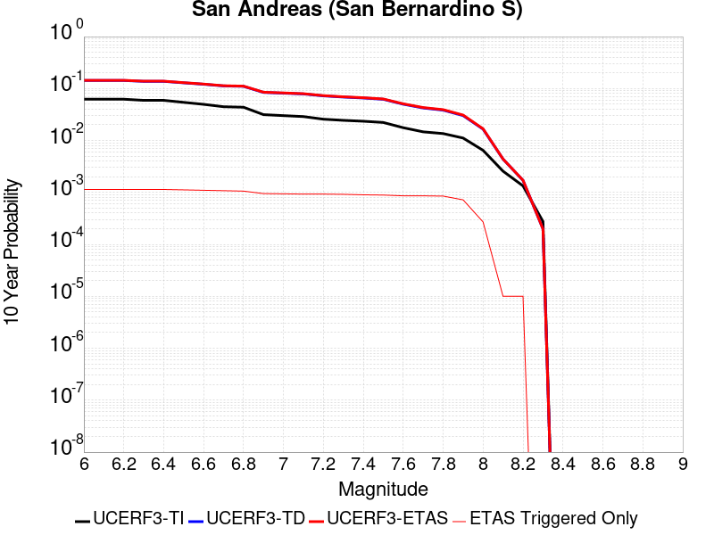 |

| Magnitude | 1 wk TI Prob | 1 wk TD Prob | 1 wk ETAS Prob | 1 wk ETAS/TD Gain | 1 wk ETAS Triggered Only | 1 mo TI Prob | 1 mo TD Prob | 1 mo ETAS Prob | 1 mo ETAS/TD Gain | 1 mo ETAS Triggered Only | 1 yr TI Prob | 1 yr TD Prob | 1 yr ETAS Prob | 1 yr ETAS/TD Gain | 1 yr ETAS Triggered Only | 10 yr TI Prob | 10 yr TD Prob | 10 yr ETAS Prob | 10 yr ETAS/TD Gain | 10 yr ETAS Triggered Only |
|-----|-----|-----|-----|-----|-----|-----|-----|-----|-----|-----|-----|-----|-----|-----|-----|-----|-----|-----|-----|-----|
| 6.0 | 1.2336002E-4 | 3.0004102E-4 | 8.080555E-4 | 2.69315 | 5.0816697E-4 | 5.2857865E-4 | 0.0012852824 | 0.0019921768 | 1.5499914 | 7.07804E-4 | 0.006416472 | 0.015540994 | 0.016452199 | 1.0586324 | 9.255898E-4 | 0.06234337 | 0.14283717 | 0.14383279 | 1.0069703 | 0.0011615244 |
| 6.1 | 1.2336002E-4 | 3.0004102E-4 | 8.080555E-4 | 2.69315 | 5.0816697E-4 | 5.2857865E-4 | 0.0012852824 | 0.0019921768 | 1.5499914 | 7.07804E-4 | 0.006416472 | 0.015540994 | 0.016452199 | 1.0586324 | 9.255898E-4 | 0.06234337 | 0.14283717 | 0.14383279 | 1.0069703 | 0.0011615244 |
| 6.2 | 1.2336002E-4 | 3.0004102E-4 | 8.080555E-4 | 2.69315 | 5.0816697E-4 | 5.2857865E-4 | 0.0012852824 | 0.0019921768 | 1.5499914 | 7.07804E-4 | 0.006416472 | 0.015540994 | 0.016452199 | 1.0586324 | 9.255898E-4 | 0.06234337 | 0.14283717 | 0.14383279 | 1.0069703 | 0.0011615244 |
| 6.3 | 1.1712257E-4 | 2.8792414E-4 | 7.9594477E-4 | 2.7644253 | 5.0816697E-4 | 5.018573E-4 | 0.0012334028 | 0.0019403338 | 1.573155 | 7.07804E-4 | 0.006093008 | 0.014918125 | 0.015829908 | 1.0611191 | 9.255898E-4 | 0.059286322 | 0.13754563 | 0.13854739 | 1.0072831 | 0.0011615244 |
| 6.4 | 1.1712257E-4 | 2.8792414E-4 | 7.9594477E-4 | 2.7644253 | 5.0816697E-4 | 5.018573E-4 | 0.0012334028 | 0.0019403338 | 1.573155 | 7.07804E-4 | 0.006093008 | 0.014918125 | 0.015829908 | 1.0611191 | 9.255898E-4 | 0.059286322 | 0.13754563 | 0.13854739 | 1.0072831 | 0.0011615244 |
| 6.5 | 1.0689076E-4 | 2.680528E-4 | 7.7608356E-4 | 2.8952637 | 5.0816697E-4 | 4.5802278E-4 | 0.0011483167 | 0.0018553078 | 1.6156762 | 7.07804E-4 | 0.0055621783 | 0.01389575 | 0.014790582 | 1.064396 | 9.07441E-4 | 0.05425003 | 0.12879294 | 0.12978907 | 1.0077343 | 0.0011433756 |
| 6.6 | 9.7648895E-5 | 2.50501E-4 | 7.585407E-4 | 3.0280943 | 5.0816697E-4 | 4.1842813E-4 | 0.0010731576 | 0.0017620727 | 1.6419514 | 6.896552E-4 | 0.005082469 | 0.012991785 | 0.013869524 | 1.067561 | 8.892922E-4 | 0.049677886 | 0.12095292 | 0.12194204 | 1.0081778 | 0.0011252268 |
| 6.7 | 8.757013E-5 | 2.3120902E-4 | 7.211139E-4 | 3.118883 | 4.9001817E-4 | 3.7524657E-4 | 9.905418E-4 | 0.001661383 | 1.6772467 | 6.7150634E-4 | 0.00455906 | 0.011997245 | 0.0128400065 | 1.0702462 | 8.5299456E-4 | 0.04466656 | 0.11226123 | 0.11322791 | 1.0086111 | 0.0010889292 |
| 6.8 | 8.562978E-5 | 2.2680782E-4 | 7.167148E-4 | 3.1600094 | 4.9001817E-4 | 3.6693315E-4 | 9.7169366E-4 | 0.0016425475 | 1.6903964 | 6.7150634E-4 | 0.004458263 | 0.011770263 | 0.012613218 | 1.0716174 | 8.5299456E-4 | 0.043698758 | 0.11027153 | 0.111224234 | 1.0086396 | 0.0010707804 |
| 6.9 | 6.124075E-5 | 1.7065753E-4 | 6.061549E-4 | 3.551879 | 4.3557168E-4 | 2.6243398E-4 | 7.311852E-4 | 0.0013296583 | 1.8184973 | 5.989111E-4 | 0.0031904527 | 0.008866051 | 0.009639531 | 1.0872407 | 7.8039925E-4 | 0.031450346 | 0.08418263 | 0.085046925 | 1.0102669 | 9.437387E-4 |
| 7.0 | 5.8598747E-5 | 1.649477E-4 | 5.823017E-4 | 3.53022 | 4.1742288E-4 | 2.5111332E-4 | 7.06728E-4 | 0.0012870799 | 1.8211813 | 5.807622E-4 | 0.0030530186 | 0.008570663 | 0.009326381 | 1.0881749 | 7.6225045E-4 | 0.03011414 | 0.081500374 | 0.08235052 | 1.0104313 | 9.255898E-4 |
| 7.1 | 5.613814E-5 | 1.5913323E-4 | 5.7648966E-4 | 3.6226857 | 4.1742288E-4 | 2.4056983E-4 | 6.818221E-4 | 0.0012621883 | 1.851199 | 5.807622E-4 | 0.0029250039 | 0.008269769 | 0.009025715 | 1.0914109 | 7.6225045E-4 | 0.028868021 | 0.07879931 | 0.07965197 | 1.0108206 | 9.255898E-4 |
| 7.2 | 4.991222E-5 | 1.4519796E-4 | 5.625602E-4 | 3.8744361 | 4.1742288E-4 | 2.1389198E-4 | 6.2212895E-4 | 0.0012025299 | 1.9329271 | 5.807622E-4 | 0.002601025 | 0.007548217 | 0.008304714 | 1.1002219 | 7.6225045E-4 | 0.025707912 | 0.07225321 | 0.07311192 | 1.0118848 | 9.255898E-4 |
| 7.3 | 4.7410045E-5 | 1.3714004E-4 | 5.545057E-4 | 4.0433536 | 4.1742288E-4 | 2.0317009E-4 | 5.8761094E-4 | 0.001168032 | 1.9877641 | 5.807622E-4 | 0.0024707897 | 0.0071307817 | 0.007887596 | 1.1061336 | 7.6225045E-4 | 0.024434982 | 0.06853558 | 0.06939773 | 1.0125797 | 9.255898E-4 |
| 7.4 | 4.5556746E-5 | 1.3121912E-4 | 5.4858724E-4 | 4.1806955 | 4.1742288E-4 | 1.952286E-4 | 5.622468E-4 | 0.0011426825 | 2.0323505 | 5.807622E-4 | 0.002374317 | 0.0068239477 | 0.0075809965 | 1.11094 | 7.6225045E-4 | 0.023491086 | 0.065788016 | 0.06663576 | 1.0128859 | 9.07441E-4 |
| 7.5 | 4.3084514E-5 | 1.2357246E-4 | 5.4094376E-4 | 4.3775425 | 4.1742288E-4 | 1.8463485E-4 | 5.2948913E-4 | 0.0011099438 | 2.0962543 | 5.807622E-4 | 0.0022456115 | 0.0064275465 | 0.0071848975 | 1.117829 | 7.6225045E-4 | 0.022230545 | 0.062188786 | 0.063039795 | 1.0136843 | 9.07441E-4 |
| 7.6 | 3.408608E-5 | 9.83552E-5 | 5.15737E-4 | 5.243617 | 4.1742288E-4 | 1.4607502E-4 | 4.214543E-4 | 9.838305E-4 | 2.3343709 | 5.626134E-4 | 0.0017770125 | 0.0051191594 | 0.005841396 | 1.141085 | 7.259528E-4 | 0.017628696 | 0.050020292 | 0.050847862 | 1.0165447 | 8.7114336E-4 |
| 7.7 | 2.8315713E-5 | 8.248679E-5 | 4.998752E-4 | 6.060064 | 4.1742288E-4 | 1.2134742E-4 | 3.5346695E-4 | 9.1588154E-4 | 2.5911376 | 5.626134E-4 | 0.0014764034 | 0.0042949775 | 0.0050178124 | 1.1682976 | 7.259528E-4 | 0.01466633 | 0.0422714 | 0.04310572 | 1.0197372 | 8.7114336E-4 |
| 7.8 | 2.6222975E-5 | 7.463088E-5 | 4.920226E-4 | 6.592748 | 4.1742288E-4 | 1.1237934E-4 | 3.1980744E-4 | 8.640979E-4 | 2.701932 | 5.444646E-4 | 0.0013673597 | 0.0038867102 | 0.004591763 | 1.181401 | 7.07804E-4 | 0.013589768 | 0.03843674 | 0.03925695 | 1.0213392 | 8.5299456E-4 |
| 7.9 | 2.1469694E-5 | 5.787864E-5 | 4.389818E-4 | 7.584522 | 3.8112522E-4 | 9.200973E-5 | 2.4802773E-4 | 7.560687E-4 | 3.048323 | 5.0816697E-4 | 0.0011196428 | 0.0030155594 | 0.0036488525 | 1.2100085 | 6.3520874E-4 | 0.011140184 | 0.030152109 | 0.030856173 | 1.0233504 | 7.259528E-4 |
| 8.0 | 1.2420249E-5 | 3.131896E-5 | 2.1280147E-4 | 6.7946534 | 1.814882E-4 | 5.322855E-5 | 1.342172E-4 | 3.3382743E-4 | 2.487218 | 1.9963703E-4 | 6.478649E-4 | 0.0016328706 | 0.0019046585 | 1.1664479 | 2.722323E-4 | 0.0064597935 | 0.016522504 | 0.016861634 | 1.0205253 | 3.448276E-4 |
| 8.1 | 4.9197724E-6 | 7.822348E-6 | 7.822348E-6 | 1.0 | 0.0 | 2.1084568E-5 | 3.352392E-5 | 3.352392E-5 | 1.0 | 0.0 | 2.566744E-4 | 4.0807744E-4 | 4.0807744E-4 | 1.0 | 0.0 | 0.002563781 | 0.0043843705 | 0.0043843705 | 1.0 | 0.0 |
| 8.2 | 2.5634774E-6 | 2.9067196E-6 | 2.9067196E-6 | 1.0 | 0.0 | 1.0986286E-5 | 1.2457311E-5 | 1.2457311E-5 | 1.0 | 0.0 | 1.3374983E-4 | 1.5165724E-4 | 1.5165724E-4 | 1.0 | 0.0 | 0.0013366934 | 0.0017049741 | 0.0017049741 | 1.0 | 0.0 |
| 8.3 | 5.2850464E-7 | 3.2088764E-7 | 3.2088764E-7 | 1.0 | 0.0 | 2.2650179E-6 | 1.375232E-6 | 1.375232E-6 | 1.0 | 0.0 | 2.7576245E-5 | 1.6743334E-5 | 1.6743334E-5 | 1.0 | 0.0 | 2.7572823E-4 | 1.9870348E-4 | 1.9870348E-4 | 1.0 | 0.0 |

## Coyote Lake
*[(top)](#table-of-contents)*

| 1 Week | 1 Month | 1 Year | 10 Year |
|-----|-----|-----|-----|
|  |  |  |  |

| Magnitude | 1 wk TI Prob | 1 wk TD Prob | 1 wk ETAS Prob | 1 wk ETAS/TD Gain | 1 wk ETAS Triggered Only | 1 mo TI Prob | 1 mo TD Prob | 1 mo ETAS Prob | 1 mo ETAS/TD Gain | 1 mo ETAS Triggered Only | 1 yr TI Prob | 1 yr TD Prob | 1 yr ETAS Prob | 1 yr ETAS/TD Gain | 1 yr ETAS Triggered Only | 10 yr TI Prob | 10 yr TD Prob | 10 yr ETAS Prob | 10 yr ETAS/TD Gain | 10 yr ETAS Triggered Only |
|-----|-----|-----|-----|-----|-----|-----|-----|-----|-----|-----|-----|-----|-----|-----|-----|-----|-----|-----|-----|-----|
| 6.0 | 1.980352E-5 | 2.1706745E-5 | 4.028237E-4 | 18.557535 | 3.8112522E-4 | 8.486947E-5 | 9.302599E-5 | 5.467043E-4 | 5.8768983 | 4.537205E-4 | 0.0010327959 | 0.0011320751 | 0.0018209495 | 1.608506 | 6.896552E-4 | 0.010280091 | 0.011270258 | 0.012293082 | 1.0907543 | 0.0010344827 |
| 6.1 | 1.980352E-5 | 2.1706745E-5 | 4.028237E-4 | 18.557535 | 3.8112522E-4 | 8.486947E-5 | 9.302599E-5 | 5.467043E-4 | 5.8768983 | 4.537205E-4 | 0.0010327959 | 0.0011320751 | 0.0018209495 | 1.608506 | 6.896552E-4 | 0.010280091 | 0.011270258 | 0.012293082 | 1.0907543 | 0.0010344827 |
| 6.2 | 1.980352E-5 | 2.1706745E-5 | 4.028237E-4 | 18.557535 | 3.8112522E-4 | 8.486947E-5 | 9.302599E-5 | 5.467043E-4 | 5.8768983 | 4.537205E-4 | 0.0010327959 | 0.0011320751 | 0.0018209495 | 1.608506 | 6.896552E-4 | 0.010280091 | 0.011270258 | 0.012293082 | 1.0907543 | 0.0010344827 |
| 6.3 | 1.5344787E-5 | 1.682067E-5 | 2.5275137E-4 | 15.0262375 | 2.3593467E-4 | 6.576172E-5 | 7.2086936E-5 | 3.8059463E-4 | 5.2796617 | 3.0852994E-4 | 8.003548E-4 | 8.773662E-4 | 0.0013488216 | 1.5373529 | 4.7186934E-4 | 0.007974784 | 0.00874507 | 0.009536634 | 1.0905155 | 7.985481E-4 |
| 6.4 | 1.5344787E-5 | 1.682067E-5 | 2.5275137E-4 | 15.0262375 | 2.3593467E-4 | 6.576172E-5 | 7.2086936E-5 | 3.8059463E-4 | 5.2796617 | 3.0852994E-4 | 8.003548E-4 | 8.773662E-4 | 0.0013488216 | 1.5373529 | 4.7186934E-4 | 0.007974784 | 0.00874507 | 0.009536634 | 1.0905155 | 7.985481E-4 |
| 6.5 | 1.4189697E-5 | 1.5557987E-5 | 2.51489E-4 | 16.164621 | 2.3593467E-4 | 6.081157E-5 | 6.6675726E-5 | 3.751851E-4 | 5.6270123 | 3.0852994E-4 | 7.401293E-4 | 8.115349E-4 | 0.0012830213 | 1.580981 | 4.7186934E-4 | 0.0073766913 | 0.008091656 | 0.00886574 | 1.0956645 | 7.8039925E-4 |
| 6.6 | 1.3469301E-5 | 1.4771577E-5 | 2.325542E-4 | 15.743357 | 2.1778584E-4 | 5.7724297E-5 | 6.330556E-5 | 3.536683E-4 | 5.586686 | 2.903811E-4 | 7.025667E-4 | 7.7053264E-4 | 0.0011876338 | 1.5413154 | 4.1742288E-4 | 0.0070034964 | 0.0076845144 | 0.008368869 | 1.0890565 | 6.896552E-4 |
| 6.7 | 1.3027966E-5 | 1.4281745E-5 | 2.3206449E-4 | 16.24903 | 2.1778584E-4 | 5.5832945E-5 | 6.120638E-5 | 3.5156973E-4 | 5.7440047 | 2.903811E-4 | 6.7955407E-4 | 7.4499263E-4 | 0.0011621045 | 1.5598873 | 4.1742288E-4 | 0.006774798 | 0.0074308286 | 0.008097345 | 1.0896962 | 6.7150634E-4 |
| 6.8 | 5.695434E-6 | 6.2244176E-6 | 9.696795E-5 | 15.578638 | 9.07441E-5 | 2.4408775E-5 | 2.6675973E-5 | 1.3556599E-4 | 5.081951 | 1.0889292E-4 | 2.971363E-4 | 3.2476155E-4 | 4.880479E-4 | 1.5027884 | 1.6333938E-4 | 0.0029673933 | 0.0032458105 | 0.003517159 | 1.0835997 | 2.722323E-4 |
| 6.9 | 4.385688E-6 | 4.7930553E-6 | 4.1090523E-5 | 8.572928 | 3.629764E-5 | 1.879567E-5 | 2.0541665E-5 | 7.498701E-5 | 3.6504834 | 5.444646E-5 | 2.2881327E-4 | 2.5009477E-4 | 3.226719E-4 | 1.2901984 | 7.259528E-5 | 0.002285778 | 0.0025009478 | 0.0026638787 | 1.0651476 | 1.6333938E-4 |

## Helendale-So Lockhart
*[(top)](#table-of-contents)*

| 1 Week | 1 Month | 1 Year | 10 Year |
|-----|-----|-----|-----|
|  |  |  |  |

| Magnitude | 1 wk TI Prob | 1 wk TD Prob | 1 wk ETAS Prob | 1 wk ETAS/TD Gain | 1 wk ETAS Triggered Only | 1 mo TI Prob | 1 mo TD Prob | 1 mo ETAS Prob | 1 mo ETAS/TD Gain | 1 mo ETAS Triggered Only | 1 yr TI Prob | 1 yr TD Prob | 1 yr ETAS Prob | 1 yr ETAS/TD Gain | 1 yr ETAS Triggered Only | 10 yr TI Prob | 10 yr TD Prob | 10 yr ETAS Prob | 10 yr ETAS/TD Gain | 10 yr ETAS Triggered Only |
|-----|-----|-----|-----|-----|-----|-----|-----|-----|-----|-----|-----|-----|-----|-----|-----|-----|-----|-----|-----|-----|
| 6.0 | 1.7296055E-5 | 1.8103729E-5 | 2.5403412E-4 | 14.032144 | 2.3593467E-4 | 7.412385E-5 | 7.7585224E-5 | 4.2238605E-4 | 5.444156 | 3.448276E-4 | 9.0208417E-4 | 9.4421144E-4 | 0.0015969521 | 1.6913077 | 6.5335754E-4 | 0.008984311 | 0.009404116 | 0.010356958 | 1.1013218 | 9.618875E-4 |
| 6.1 | 1.7296055E-5 | 1.8103729E-5 | 2.5403412E-4 | 14.032144 | 2.3593467E-4 | 7.412385E-5 | 7.7585224E-5 | 4.2238605E-4 | 5.444156 | 3.448276E-4 | 9.0208417E-4 | 9.4421144E-4 | 0.0015969521 | 1.6913077 | 6.5335754E-4 | 0.008984311 | 0.009404116 | 0.010356958 | 1.1013218 | 9.618875E-4 |
| 6.2 | 1.7296055E-5 | 1.8103729E-5 | 2.5403412E-4 | 14.032144 | 2.3593467E-4 | 7.412385E-5 | 7.7585224E-5 | 4.2238605E-4 | 5.444156 | 3.448276E-4 | 9.0208417E-4 | 9.4421144E-4 | 0.0015969521 | 1.6913077 | 6.5335754E-4 | 0.008984311 | 0.009404116 | 0.010356958 | 1.1013218 | 9.618875E-4 |
| 6.3 | 1.0669118E-5 | 1.1135425E-5 | 1.926216E-4 | 17.298094 | 1.814882E-4 | 4.5723988E-5 | 4.772239E-5 | 3.0179374E-4 | 6.3239446 | 2.5408348E-4 | 5.5654737E-4 | 5.80868E-4 | 0.001034325 | 1.7806541 | 4.537205E-4 | 0.0055515557 | 0.0057937936 | 0.006407278 | 1.1058866 | 6.170599E-4 |
| 6.4 | 1.0669118E-5 | 1.1135425E-5 | 1.926216E-4 | 17.298094 | 1.814882E-4 | 4.5723988E-5 | 4.772239E-5 | 3.0179374E-4 | 6.3239446 | 2.5408348E-4 | 5.5654737E-4 | 5.80868E-4 | 0.001034325 | 1.7806541 | 4.537205E-4 | 0.0055515557 | 0.0057937936 | 0.006407278 | 1.1058866 | 6.170599E-4 |
| 6.5 | 8.790038E-6 | 9.170197E-6 | 1.9065673E-4 | 20.79091 | 1.814882E-4 | 3.767105E-5 | 3.930026E-5 | 2.9337377E-4 | 7.464932 | 2.5408348E-4 | 4.585485E-4 | 4.7837716E-4 | 9.318806E-4 | 1.948004 | 4.537205E-4 | 0.0045760344 | 0.004773638 | 0.0053696902 | 1.1248633 | 5.989111E-4 |
| 6.6 | 7.396949E-6 | 7.715537E-6 | 1.347563E-4 | 17.465576 | 1.2704174E-4 | 3.1700827E-5 | 3.3066175E-5 | 2.1454837E-4 | 6.488455 | 1.814882E-4 | 3.858892E-4 | 4.025073E-4 | 7.471961E-4 | 1.8563541 | 3.448276E-4 | 0.003852198 | 0.00401789 | 0.0045059393 | 1.121469 | 4.9001817E-4 |
| 6.7 | 6.4600285E-6 | 6.738031E-6 | 1.3377891E-4 | 19.854303 | 1.2704174E-4 | 2.7685543E-5 | 2.887696E-5 | 2.1035993E-4 | 7.2846975 | 1.814882E-4 | 3.3701936E-4 | 3.5152107E-4 | 6.7808497E-4 | 1.9290025 | 3.2667877E-4 | 0.0033650869 | 0.003509732 | 0.003979945 | 1.1339741 | 4.7186934E-4 |
| 6.8 | 5.600104E-6 | 5.836009E-6 | 1.147283E-4 | 19.65869 | 1.0889292E-4 | 2.4000226E-5 | 2.5011232E-5 | 1.8834653E-4 | 7.530478 | 1.6333938E-4 | 2.9216358E-4 | 3.044698E-4 | 5.7661923E-4 | 1.893847 | 2.722323E-4 | 0.0029177975 | 0.003040588 | 0.003438648 | 1.1309155 | 3.9927405E-4 |
| 6.9 | 4.839122E-6 | 5.0395092E-6 | 9.578315E-5 | 19.006445 | 9.07441E-5 | 2.0738931E-5 | 2.159772E-5 | 1.6678515E-4 | 7.7223496 | 1.4519056E-4 | 2.5246723E-4 | 2.6292098E-4 | 4.987936E-4 | 1.8971237 | 2.3593467E-4 | 0.002521806 | 0.002626147 | 0.0029700687 | 1.1309607 | 3.448276E-4 |
| 7.0 | 3.6937633E-6 | 3.845208E-6 | 9.458896E-5 | 24.599178 | 9.07441E-5 | 1.5830317E-5 | 1.647936E-5 | 1.6166753E-4 | 9.810304 | 1.4519056E-4 | 1.9271708E-4 | 2.0061806E-4 | 4.365054E-4 | 2.1758032 | 2.3593467E-4 | 0.0019255003 | 0.002004401 | 0.0023123124 | 1.1536177 | 3.0852994E-4 |
| 7.1 | 2.7858857E-6 | 2.8978538E-6 | 7.549293E-5 | 26.051323 | 7.259528E-5 | 1.1939455E-5 | 1.2419316E-5 | 1.21310884E-4 | 9.7679205 | 1.0889292E-4 | 1.4535317E-4 | 1.511949E-4 | 3.1450958E-4 | 2.0801601 | 1.6333938E-4 | 0.0014525814 | 0.0015109418 | 0.0017102772 | 1.1319278 | 1.9963703E-4 |
| 7.2 | 2.1672065E-6 | 2.2540128E-6 | 3.855157E-5 | 17.103529 | 3.629764E-5 | 9.2879945E-6 | 9.66002E-6 | 6.410595E-5 | 6.6362133 | 5.444646E-5 | 1.1307546E-4 | 1.1760458E-4 | 2.264847E-4 | 1.9258152 | 1.0889292E-4 | 0.0011301794 | 0.0011754417 | 0.001302334 | 1.107953 | 1.2704174E-4 |
| 7.3 | 1.4823496E-6 | 1.5422102E-6 | 1.9691002E-5 | 12.768041 | 1.814882E-5 | 6.3529114E-6 | 6.6094562E-6 | 2.4758157E-5 | 3.745869 | 1.814882E-5 | 7.734395E-5 | 8.046731E-5 | 1.5305675E-4 | 1.9020984 | 7.259528E-5 | 7.731704E-4 | 8.0439687E-4 | 8.95068E-4 | 1.1127194 | 9.07441E-5 |
| 7.4 | 4.2321457E-7 | 4.4108765E-7 | 1.85899E-5 | 42.14559 | 1.814882E-5 | 1.8137755E-6 | 1.8903745E-6 | 2.003916E-5 | 10.60063 | 1.814882E-5 | 2.2082493E-5 | 2.3015113E-5 | 9.5608724E-5 | 4.1541715 | 7.259528E-5 | 2.2080299E-4 | 2.3013182E-4 | 3.027104E-4 | 1.3153783 | 7.259528E-5 |
| 7.5 | 5.6942316E-8 | 5.9415648E-8 | 5.9415648E-8 | 1.0 | 0.0 | 2.440385E-7 | 2.5463845E-7 | 2.5463845E-7 | 1.0 | 0.0 | 2.9711643E-6 | 3.1002196E-6 | 3.1002196E-6 | 1.0 | 0.0 | 2.9711247E-5 | 3.1001844E-5 | 3.1001844E-5 | 1.0 | 0.0 |

## San Andreas (Big Bend)
*[(top)](#table-of-contents)*

| 1 Week | 1 Month | 1 Year | 10 Year |
|-----|-----|-----|-----|
|  |  |  | 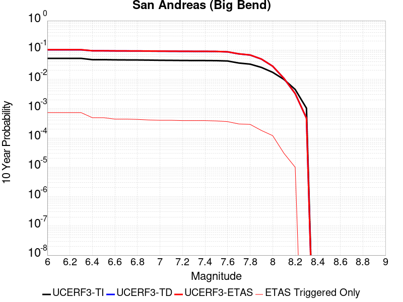 |

| Magnitude | 1 wk TI Prob | 1 wk TD Prob | 1 wk ETAS Prob | 1 wk ETAS/TD Gain | 1 wk ETAS Triggered Only | 1 mo TI Prob | 1 mo TD Prob | 1 mo ETAS Prob | 1 mo ETAS/TD Gain | 1 mo ETAS Triggered Only | 1 yr TI Prob | 1 yr TD Prob | 1 yr ETAS Prob | 1 yr ETAS/TD Gain | 1 yr ETAS Triggered Only | 10 yr TI Prob | 10 yr TD Prob | 10 yr ETAS Prob | 10 yr ETAS/TD Gain | 10 yr ETAS Triggered Only |
|-----|-----|-----|-----|-----|-----|-----|-----|-----|-----|-----|-----|-----|-----|-----|-----|-----|-----|-----|-----|-----|
| 6.0 | 1.0179969E-4 | 2.0072258E-4 | 4.0031955E-4 | 1.994392 | 1.9963703E-4 | 4.362114E-4 | 8.599571E-4 | 0.0012407546 | 1.4428098 | 3.8112522E-4 | 0.0052979486 | 0.010419999 | 0.010922871 | 1.0482602 | 5.0816697E-4 | 0.051734097 | 0.10144902 | 0.102133945 | 1.0067514 | 7.6225045E-4 |
| 6.1 | 1.0179969E-4 | 2.0072258E-4 | 4.0031955E-4 | 1.994392 | 1.9963703E-4 | 4.362114E-4 | 8.599571E-4 | 0.0012407546 | 1.4428098 | 3.8112522E-4 | 0.0052979486 | 0.010419999 | 0.010922871 | 1.0482602 | 5.0816697E-4 | 0.051734097 | 0.10144902 | 0.102133945 | 1.0067514 | 7.6225045E-4 |
| 6.2 | 1.0179969E-4 | 2.0072258E-4 | 4.0031955E-4 | 1.994392 | 1.9963703E-4 | 4.362114E-4 | 8.599571E-4 | 0.0012407546 | 1.4428098 | 3.8112522E-4 | 0.0052979486 | 0.010419999 | 0.010922871 | 1.0482602 | 5.0816697E-4 | 0.051734097 | 0.10144902 | 0.102133945 | 1.0067514 | 7.6225045E-4 |
| 6.3 | 1.0179969E-4 | 2.0072258E-4 | 4.0031955E-4 | 1.994392 | 1.9963703E-4 | 4.362114E-4 | 8.599571E-4 | 0.0012407546 | 1.4428098 | 3.8112522E-4 | 0.0052979486 | 0.010419999 | 0.010922871 | 1.0482602 | 5.0816697E-4 | 0.051734097 | 0.10144902 | 0.102133945 | 1.0067514 | 7.6225045E-4 |
| 6.4 | 9.1639464E-5 | 1.8429532E-4 | 3.1131366E-4 | 1.6892108 | 1.2704174E-4 | 3.9268145E-4 | 7.895982E-4 | 0.0010616155 | 1.344501 | 2.722323E-4 | 0.0047704205 | 0.009571102 | 0.00994858 | 1.0394393 | 3.8112522E-4 | 0.046693064 | 0.09377527 | 0.09426868 | 1.0052615 | 5.444646E-4 |
| 6.5 | 9.1639464E-5 | 1.8429532E-4 | 3.1131366E-4 | 1.6892108 | 1.2704174E-4 | 3.9268145E-4 | 7.895982E-4 | 0.0010616155 | 1.344501 | 2.722323E-4 | 0.0047704205 | 0.009571102 | 0.00994858 | 1.0394393 | 3.8112522E-4 | 0.046693064 | 0.09377527 | 0.09426868 | 1.0052615 | 5.444646E-4 |
| 6.6 | 9.042622E-5 | 1.823659E-4 | 2.9123898E-4 | 1.5970033 | 1.0889292E-4 | 3.8748336E-4 | 7.8133424E-4 | 0.0010352192 | 1.3249377 | 2.5408348E-4 | 0.0047074095 | 0.009471365 | 0.009830903 | 1.0379605 | 3.629764E-4 | 0.046089325 | 0.092869274 | 0.09333025 | 1.0049636 | 5.0816697E-4 |
| 6.7 | 8.9836685E-5 | 1.8150927E-4 | 2.9038242E-4 | 1.5998214 | 1.0889292E-4 | 3.8495753E-4 | 7.776651E-4 | 0.001031551 | 1.326472 | 2.5408348E-4 | 0.00467679 | 0.00942708 | 0.009786635 | 1.0381407 | 3.629764E-4 | 0.045795817 | 0.09246355 | 0.09292473 | 1.0049877 | 5.0816697E-4 |
| 6.8 | 8.9471854E-5 | 1.8097709E-4 | 2.8985032E-4 | 1.6015856 | 1.0889292E-4 | 3.8339442E-4 | 7.7538576E-4 | 0.0010292722 | 1.3274325 | 2.5408348E-4 | 0.004657841 | 0.009399569 | 0.009759133 | 1.0382533 | 3.629764E-4 | 0.04561414 | 0.092210755 | 0.092672065 | 1.0050027 | 5.0816697E-4 |
| 6.9 | 8.858234E-5 | 1.7979681E-4 | 2.8867015E-4 | 1.6055354 | 1.0889292E-4 | 3.7958333E-4 | 7.703304E-4 | 0.0010242182 | 1.3295829 | 2.5408348E-4 | 0.004611638 | 0.009338548 | 0.009698136 | 1.0385057 | 3.629764E-4 | 0.04517103 | 0.09165087 | 0.09211247 | 1.0050365 | 5.0816697E-4 |
| 7.0 | 8.7433385E-5 | 1.7818481E-4 | 2.8705833E-4 | 1.6110146 | 1.0889292E-4 | 3.746607E-4 | 7.634259E-4 | 0.0010173154 | 1.332566 | 2.5408348E-4 | 0.004551957 | 0.009255203 | 0.00959684 | 1.0369129 | 3.448276E-4 | 0.044598386 | 0.09088532 | 0.0913308 | 1.0049016 | 4.9001817E-4 |
| 7.1 | 8.684964E-5 | 1.7730435E-4 | 2.8617796E-4 | 1.6140493 | 1.0889292E-4 | 3.7215967E-4 | 7.596547E-4 | 0.0010135452 | 1.3342183 | 2.5408348E-4 | 0.0045216335 | 0.009209678 | 0.00955133 | 1.0370971 | 3.448276E-4 | 0.04430731 | 0.09046686 | 0.09091255 | 1.0049266 | 4.9001817E-4 |
| 7.2 | 8.606521E-5 | 1.762105E-4 | 2.8508424E-4 | 1.6178617 | 1.0889292E-4 | 3.6879873E-4 | 7.549695E-4 | 9.90726E-4 | 1.3122729 | 2.3593467E-4 | 0.0044808835 | 0.0091531165 | 0.009476805 | 1.0353638 | 3.2667877E-4 | 0.043916024 | 0.089947365 | 0.090376794 | 1.0047742 | 4.7186934E-4 |
| 7.3 | 8.568266E-5 | 1.7563057E-4 | 2.8450435E-4 | 1.6199024 | 1.0889292E-4 | 3.6715972E-4 | 7.524855E-4 | 9.882426E-4 | 1.3133045 | 2.3593467E-4 | 0.0044610105 | 0.009123127 | 0.009446826 | 1.0354811 | 3.2667877E-4 | 0.043725148 | 0.08966853 | 0.09009808 | 1.0047905 | 4.7186934E-4 |
| 7.4 | 8.5432206E-5 | 1.7525644E-4 | 2.8413028E-4 | 1.6212258 | 1.0889292E-4 | 3.6608664E-4 | 7.50883E-4 | 9.866406E-4 | 1.3139737 | 2.3593467E-4 | 0.004447999 | 0.009103781 | 0.009427485 | 1.0355572 | 3.2667877E-4 | 0.043600157 | 0.08948871 | 0.08991835 | 1.004801 | 4.7186934E-4 |
| 7.5 | 8.4791965E-5 | 1.7394972E-4 | 2.8282372E-4 | 1.6258934 | 1.0889292E-4 | 3.633435E-4 | 7.4528606E-4 | 9.810448E-4 | 1.3163333 | 2.3593467E-4 | 0.0044147377 | 0.009036204 | 0.009359931 | 1.0358255 | 3.2667877E-4 | 0.043280575 | 0.088866346 | 0.08929628 | 1.004838 | 4.7186934E-4 |
| 7.6 | 8.241105E-5 | 1.6840403E-4 | 2.5913285E-4 | 1.5387568 | 9.07441E-5 | 3.531424E-4 | 7.215321E-4 | 9.210251E-4 | 1.2764852 | 1.9963703E-4 | 0.0042910352 | 0.008749358 | 0.009037199 | 1.0328984 | 2.903811E-4 | 0.042091176 | 0.086243294 | 0.0866413 | 1.004615 | 4.3557168E-4 |
| 7.7 | 7.00432E-5 | 1.42045E-4 | 2.3277622E-4 | 1.6387497 | 9.07441E-5 | 3.001506E-4 | 6.0862233E-4 | 7.900001E-4 | 1.2980136 | 1.814882E-4 | 0.0036482112 | 0.0073848404 | 0.0076190326 | 1.0317125 | 2.3593467E-4 | 0.035888977 | 0.07351733 | 0.073870435 | 1.0048031 | 3.8112522E-4 |
| 7.8 | 6.415362E-5 | 1.2968935E-4 | 2.2042167E-4 | 1.6996129 | 9.07441E-5 | 2.749151E-4 | 5.556931E-4 | 7.1894174E-4 | 1.2937747 | 1.6333938E-4 | 0.0033419547 | 0.0067446055 | 0.0069609224 | 1.0320725 | 2.1778584E-4 | 0.03292141 | 0.06725231 | 0.06759087 | 1.0050342 | 3.629764E-4 |
| 7.9 | 4.939911E-5 | 9.3411545E-5 | 1.6600004E-4 | 1.7770828 | 7.259528E-5 | 2.116933E-4 | 4.0027377E-4 | 5.091231E-4 | 1.2719373 | 1.0889292E-4 | 0.0025743195 | 0.004862453 | 0.0050069373 | 1.0297143 | 1.4519056E-4 | 0.025447013 | 0.048914436 | 0.049138833 | 1.0045875 | 2.3593467E-4 |
| 8.0 | 3.344983E-5 | 5.222685E-5 | 8.8522596E-5 | 1.6949633 | 3.629764E-5 | 1.4334853E-4 | 2.2381016E-4 | 2.6009968E-4 | 1.1621442 | 3.629764E-5 | 0.0017438711 | 0.0027214854 | 0.0027757839 | 1.0199517 | 5.444646E-5 | 0.017302496 | 0.027922187 | 0.028063323 | 1.0050546 | 1.4519056E-4 |
| 8.1 | 1.9104898E-5 | 1.9173063E-5 | 3.7321537E-5 | 1.9465609 | 1.814882E-5 | 8.1875565E-5 | 8.216769E-5 | 1.0031502E-4 | 1.2208573 | 1.814882E-5 | 9.963791E-4 | 9.999331E-4 | 0.0010180637 | 1.0181319 | 1.814882E-5 | 0.009919235 | 0.010749801 | 0.010767755 | 1.0016701 | 1.814882E-5 |
| 8.2 | 8.643924E-6 | 5.4748625E-6 | 5.4748625E-6 | 1.0 | 0.0 | 3.704486E-5 | 2.3463486E-5 | 2.3463486E-5 | 1.0 | 0.0 | 4.5092785E-4 | 2.8563058E-4 | 2.8563058E-4 | 1.0 | 0.0 | 0.0045001395 | 0.0032487072 | 0.0032487072 | 1.0 | 0.0 |
| 8.3 | 1.983087E-6 | 7.6599065E-7 | 7.6599065E-7 | 1.0 | 0.0 | 8.498917E-6 | 3.282813E-6 | 3.282813E-6 | 1.0 | 0.0 | 1.034694E-4 | 3.9967534E-5 | 3.9967534E-5 | 1.0 | 0.0 | 0.0010342124 | 4.719687E-4 | 4.719687E-4 | 1.0 | 0.0 |

## San Andreas (Parkfield)
*[(top)](#table-of-contents)*

| 1 Week | 1 Month | 1 Year | 10 Year |
|-----|-----|-----|-----|
|  |  |  |  |

| Magnitude | 1 wk TI Prob | 1 wk TD Prob | 1 wk ETAS Prob | 1 wk ETAS/TD Gain | 1 wk ETAS Triggered Only | 1 mo TI Prob | 1 mo TD Prob | 1 mo ETAS Prob | 1 mo ETAS/TD Gain | 1 mo ETAS Triggered Only | 1 yr TI Prob | 1 yr TD Prob | 1 yr ETAS Prob | 1 yr ETAS/TD Gain | 1 yr ETAS Triggered Only | 10 yr TI Prob | 10 yr TD Prob | 10 yr ETAS Prob | 10 yr ETAS/TD Gain | 10 yr ETAS Triggered Only |
|-----|-----|-----|-----|-----|-----|-----|-----|-----|-----|-----|-----|-----|-----|-----|-----|-----|-----|-----|-----|-----|
| 6.0 | 5.556969E-4 | 7.7782426E-4 | 9.773059E-4 | 1.2564613 | 1.9963703E-4 | 0.0023793848 | 0.0033298214 | 0.003637324 | 1.0923481 | 3.0852994E-4 | 0.028586963 | 0.040191233 | 0.040609296 | 1.010402 | 4.3557168E-4 | 0.25176284 | 0.33716413 | 0.33759722 | 1.0012845 | 6.5335754E-4 |
| 6.1 | 1.925858E-4 | 3.0276453E-4 | 3.7533784E-4 | 1.2397021 | 7.259528E-5 | 8.2510663E-4 | 0.0012970108 | 0.0014601384 | 1.1257719 | 1.6333938E-4 | 0.0099994885 | 0.015778083 | 0.016010296 | 1.0147173 | 2.3593467E-4 | 0.095613256 | 0.1497237 | 0.14998603 | 1.0017521 | 3.0852994E-4 |
| 6.2 | 9.4306815E-5 | 1.8242796E-4 | 2.368645E-4 | 1.2984002 | 5.444646E-5 | 4.0410945E-4 | 7.816011E-4 | 9.266782E-4 | 1.1856153 | 1.4519056E-4 | 0.0049089384 | 0.009474681 | 0.009672426 | 1.0208709 | 1.9963703E-4 | 0.048019063 | 0.09185409 | 0.09210131 | 1.0026915 | 2.722323E-4 |
| 6.3 | 9.283051E-5 | 1.7939322E-4 | 2.3382991E-4 | 1.303449 | 5.444646E-5 | 3.9778434E-4 | 7.686027E-4 | 9.136817E-4 | 1.1887568 | 1.4519056E-4 | 0.0048322747 | 0.009317789 | 0.009515566 | 1.0212257 | 1.9963703E-4 | 0.047285385 | 0.09050704 | 0.09075463 | 1.0027356 | 2.722323E-4 |
| 6.4 | 9.138826E-5 | 1.770153E-4 | 2.3145213E-4 | 1.3075261 | 5.444646E-5 | 3.916052E-4 | 7.5841765E-4 | 9.034981E-4 | 1.1912936 | 1.4519056E-4 | 0.0047573745 | 0.00919484 | 0.0093926415 | 1.0215123 | 1.9963703E-4 | 0.046568092 | 0.08940927 | 0.089657165 | 1.0027726 | 2.722323E-4 |
| 6.5 | 9.000255E-5 | 1.7459576E-4 | 2.2903271E-4 | 1.3117886 | 5.444646E-5 | 3.8566816E-4 | 7.480541E-4 | 8.931361E-4 | 1.1939458 | 1.4519056E-4 | 0.0046854047 | 0.009069731 | 0.009267558 | 1.0218117 | 1.9963703E-4 | 0.045878403 | 0.088295065 | 0.08854326 | 1.002811 | 2.722323E-4 |
| 6.6 | 8.8109264E-5 | 1.7140752E-4 | 2.2584465E-4 | 1.3175889 | 5.444646E-5 | 3.7755648E-4 | 7.3439797E-4 | 8.794819E-4 | 1.197555 | 1.4519056E-4 | 0.0045870654 | 0.008904854 | 0.009102713 | 1.0222193 | 1.9963703E-4 | 0.04493529 | 0.0868267 | 0.087075286 | 1.0028632 | 2.722323E-4 |
| 6.7 | 8.738073E-5 | 1.7007832E-4 | 2.2451552E-4 | 1.3200713 | 5.444646E-5 | 3.7443507E-4 | 7.287046E-4 | 8.7378937E-4 | 1.1990995 | 1.4519056E-4 | 0.0045492216 | 0.008836143 | 0.009034016 | 1.0223936 | 1.9963703E-4 | 0.04457213 | 0.08622707 | 0.08647583 | 1.0028849 | 2.722323E-4 |
| 6.8 | 8.710195E-5 | 1.6953335E-4 | 2.2397058E-4 | 1.3211005 | 5.444646E-5 | 3.7324068E-4 | 7.263703E-4 | 8.714554E-4 | 1.1997398 | 1.4519056E-4 | 0.0045347405 | 0.008807961 | 0.009005839 | 1.0224658 | 1.9963703E-4 | 0.04443313 | 0.08597467 | 0.0862235 | 1.0028942 | 2.722323E-4 |
| 6.9 | 8.6801556E-5 | 1.689429E-4 | 2.2338016E-4 | 1.3222228 | 5.444646E-5 | 3.7195362E-4 | 7.2384125E-4 | 8.689267E-4 | 1.2004383 | 1.4519056E-4 | 0.0045191357 | 0.008777418 | 0.008975303 | 1.0225447 | 1.9963703E-4 | 0.044283327 | 0.085700735 | 0.08594964 | 1.0029043 | 2.722323E-4 |
| 7.0 | 8.5571606E-5 | 1.6647128E-4 | 2.2090868E-4 | 1.3270078 | 5.444646E-5 | 3.6668387E-4 | 7.132544E-4 | 8.583414E-4 | 1.2034155 | 1.4519056E-4 | 0.004455241 | 0.008649553 | 0.008847464 | 1.022881 | 1.9963703E-4 | 0.043669727 | 0.08454914 | 0.08479835 | 1.0029476 | 2.722323E-4 |
| 7.1 | 7.82589E-5 | 1.5128135E-4 | 2.0571958E-4 | 1.3598475 | 5.444646E-5 | 3.3535215E-4 | 6.481883E-4 | 7.9328474E-4 | 1.2238492 | 1.4519056E-4 | 0.0040752706 | 0.007863307 | 0.008061375 | 1.0251888 | 1.9963703E-4 | 0.040013418 | 0.07746111 | 0.07771225 | 1.0032423 | 2.722323E-4 |
| 7.2 | 7.690929E-5 | 1.4865391E-4 | 2.0309228E-4 | 1.3662088 | 5.444646E-5 | 3.2956956E-4 | 6.369334E-4 | 7.8203145E-4 | 1.2278073 | 1.4519056E-4 | 0.004005129 | 0.007727258 | 0.007925352 | 1.0256358 | 1.9963703E-4 | 0.0393371 | 0.07623427 | 0.07648575 | 1.0032988 | 2.722323E-4 |
| 7.3 | 7.5543794E-5 | 1.4561978E-4 | 2.0005832E-4 | 1.3738402 | 5.444646E-5 | 3.2371894E-4 | 6.2393624E-4 | 7.690362E-4 | 1.2325557 | 1.4519056E-4 | 0.003934157 | 0.007570127 | 0.007768253 | 1.026172 | 1.9963703E-4 | 0.038652334 | 0.074797355 | 0.07504922 | 1.0033674 | 2.722323E-4 |
| 7.4 | 7.4214564E-5 | 1.4262961E-4 | 1.9706831E-4 | 1.3816788 | 5.444646E-5 | 3.1802364E-4 | 6.111273E-4 | 7.562291E-4 | 1.2374331 | 1.4519056E-4 | 0.003865065 | 0.00741525 | 0.0076134065 | 1.0267229 | 1.9963703E-4 | 0.03798529 | 0.07337123 | 0.07362349 | 1.0034381 | 2.722323E-4 |
| 7.5 | 6.149578E-5 | 1.11907226E-4 | 1.663476E-4 | 1.4864777 | 5.444646E-5 | 2.6352672E-4 | 4.7951436E-4 | 6.246353E-4 | 1.3026415 | 1.4519056E-4 | 0.0032037178 | 0.0058224914 | 0.006020966 | 1.0340875 | 1.9963703E-4 | 0.03157923 | 0.058557566 | 0.058813855 | 1.0043768 | 2.722323E-4 |
| 7.6 | 6.0643448E-5 | 1.10193796E-4 | 1.6463426E-4 | 1.4940429 | 5.444646E-5 | 2.598746E-4 | 4.7217376E-4 | 6.172958E-4 | 1.3073487 | 1.4519056E-4 | 0.0031593828 | 0.0057335934 | 0.005932086 | 1.0346192 | 1.9963703E-4 | 0.031148417 | 0.057718582 | 0.0579751 | 1.0044444 | 2.722323E-4 |
| 7.7 | 5.1652263E-5 | 9.174698E-5 | 1.4618845E-4 | 1.593387 | 5.444646E-5 | 2.2134806E-4 | 3.931421E-4 | 5.2013394E-4 | 1.3230175 | 1.2704174E-4 | 0.002691582 | 0.0047760103 | 0.0049205073 | 1.0302547 | 1.4519056E-4 | 0.026592141 | 0.04853623 | 0.048743445 | 1.0042692 | 2.1778584E-4 |
| 7.8 | 4.8090482E-5 | 8.559635E-5 | 1.4003816E-4 | 1.6360295 | 5.444646E-5 | 2.060858E-4 | 3.6678996E-4 | 4.9378513E-4 | 1.346234 | 1.2704174E-4 | 0.0025062072 | 0.0044565317 | 0.0046010753 | 1.0324341 | 1.4519056E-4 | 0.024781305 | 0.04530245 | 0.04551037 | 1.0045896 | 2.1778584E-4 |
| 7.9 | 3.970278E-5 | 6.750426E-5 | 1.0379945E-4 | 1.5376726 | 3.629764E-5 | 1.7014367E-4 | 2.892719E-4 | 3.6184618E-4 | 1.2508861 | 7.259528E-5 | 0.002069531 | 0.0035162016 | 0.0036066265 | 1.0257167 | 9.07441E-5 | 0.020503636 | 0.035881363 | 0.036038842 | 1.0043888 | 1.6333938E-4 |
| 8.0 | 2.8982335E-5 | 4.069796E-5 | 5.8846043E-5 | 1.4459212 | 1.814882E-5 | 1.2420409E-4 | 1.7440817E-4 | 1.9255382E-4 | 1.1040413 | 1.814882E-5 | 0.0015111357 | 0.0021213528 | 0.002139463 | 1.0085372 | 1.814882E-5 | 0.015009012 | 0.022010697 | 0.022099443 | 1.004032 | 9.07441E-5 |
| 8.1 | 1.8836186E-5 | 1.8681134E-5 | 3.6829617E-5 | 1.971487 | 1.814882E-5 | 8.0724014E-5 | 8.005955E-5 | 9.820692E-5 | 1.2266734 | 1.814882E-5 | 9.823717E-4 | 9.742898E-4 | 9.92421E-4 | 1.0186096 | 1.814882E-5 | 0.009780403 | 0.010488115 | 0.010506074 | 1.0017123 | 1.814882E-5 |
| 8.2 | 8.643924E-6 | 5.4748625E-6 | 5.4748625E-6 | 1.0 | 0.0 | 3.704486E-5 | 2.3463486E-5 | 2.3463486E-5 | 1.0 | 0.0 | 4.5092785E-4 | 2.8563058E-4 | 2.8563058E-4 | 1.0 | 0.0 | 0.0045001395 | 0.0032487072 | 0.0032487072 | 1.0 | 0.0 |
| 8.3 | 1.983087E-6 | 7.6599065E-7 | 7.6599065E-7 | 1.0 | 0.0 | 8.498917E-6 | 3.282813E-6 | 3.282813E-6 | 1.0 | 0.0 | 1.034694E-4 | 3.9967534E-5 | 3.9967534E-5 | 1.0 | 0.0 | 0.0010342124 | 4.719687E-4 | 4.719687E-4 | 1.0 | 0.0 |

## Death Valley (No)
*[(top)](#table-of-contents)*

| 1 Week | 1 Month | 1 Year | 10 Year |
|-----|-----|-----|-----|
|  |  |  |  |

| Magnitude | 1 wk TI Prob | 1 wk TD Prob | 1 wk ETAS Prob | 1 wk ETAS/TD Gain | 1 wk ETAS Triggered Only | 1 mo TI Prob | 1 mo TD Prob | 1 mo ETAS Prob | 1 mo ETAS/TD Gain | 1 mo ETAS Triggered Only | 1 yr TI Prob | 1 yr TD Prob | 1 yr ETAS Prob | 1 yr ETAS/TD Gain | 1 yr ETAS Triggered Only | 10 yr TI Prob | 10 yr TD Prob | 10 yr ETAS Prob | 10 yr ETAS/TD Gain | 10 yr ETAS Triggered Only |
|-----|-----|-----|-----|-----|-----|-----|-----|-----|-----|-----|-----|-----|-----|-----|-----|-----|-----|-----|-----|-----|
| 6.0 | 2.0074807E-5 | 2.2500084E-5 | 1.8583579E-4 | 8.259337 | 1.6333938E-4 | 8.603206E-5 | 9.642541E-5 | 3.6863147E-4 | 3.8229702 | 2.722323E-4 | 0.001046937 | 0.0011733545 | 0.001535905 | 1.3089863 | 3.629764E-4 | 0.010420183 | 0.011672506 | 0.0123003 | 1.053784 | 6.3520874E-4 |
| 6.1 | 2.0074807E-5 | 2.2500084E-5 | 1.8583579E-4 | 8.259337 | 1.6333938E-4 | 8.603206E-5 | 9.642541E-5 | 3.6863147E-4 | 3.8229702 | 2.722323E-4 | 0.001046937 | 0.0011733545 | 0.001535905 | 1.3089863 | 3.629764E-4 | 0.010420183 | 0.011672506 | 0.0123003 | 1.053784 | 6.3520874E-4 |
| 6.2 | 2.0074807E-5 | 2.2500084E-5 | 1.8583579E-4 | 8.259337 | 1.6333938E-4 | 8.603206E-5 | 9.642541E-5 | 3.6863147E-4 | 3.8229702 | 2.722323E-4 | 0.001046937 | 0.0011733545 | 0.001535905 | 1.3089863 | 3.629764E-4 | 0.010420183 | 0.011672506 | 0.0123003 | 1.053784 | 6.3520874E-4 |
| 6.3 | 1.9050609E-5 | 2.1336948E-5 | 1.8467284E-4 | 8.655073 | 1.6333938E-4 | 8.164292E-5 | 9.1440896E-5 | 3.4550115E-4 | 3.7784095 | 2.5408348E-4 | 9.935491E-4 | 0.001112731 | 0.0014571749 | 1.3095481 | 3.448276E-4 | 0.009891188 | 0.011072419 | 0.011682646 | 1.0551124 | 6.170599E-4 |
| 6.4 | 1.9050609E-5 | 2.1336948E-5 | 1.8467284E-4 | 8.655073 | 1.6333938E-4 | 8.164292E-5 | 9.1440896E-5 | 3.4550115E-4 | 3.7784095 | 2.5408348E-4 | 9.935491E-4 | 0.001112731 | 0.0014571749 | 1.3095481 | 3.448276E-4 | 0.009891188 | 0.011072419 | 0.011682646 | 1.0551124 | 6.170599E-4 |
| 6.5 | 1.8367004E-5 | 2.0561009E-5 | 1.8389703E-4 | 8.94397 | 1.6333938E-4 | 7.8713354E-5 | 8.811567E-5 | 3.4217676E-4 | 3.883268 | 2.5408348E-4 | 9.5791375E-4 | 0.0010722869 | 0.0014167447 | 1.3212366 | 3.448276E-4 | 0.009537951 | 0.0106719155 | 0.01128239 | 1.0572039 | 6.170599E-4 |
| 6.6 | 1.779439E-5 | 1.9910927E-5 | 1.8324706E-4 | 9.203341 | 1.6333938E-4 | 7.625944E-5 | 8.53298E-5 | 3.3939158E-4 | 3.9774103 | 2.5408348E-4 | 9.280632E-4 | 0.0010384015 | 0.0013828711 | 1.3317306 | 3.448276E-4 | 0.009241969 | 0.010336253 | 0.010946934 | 1.0590816 | 6.170599E-4 |
| 6.7 | 1.7025437E-5 | 1.9043426E-5 | 1.8237969E-4 | 9.577043 | 1.6333938E-4 | 7.296412E-5 | 8.161216E-5 | 3.1752756E-4 | 3.8906894 | 2.3593467E-4 | 8.87976E-4 | 9.931813E-4 | 0.0013195357 | 1.3285949 | 3.2667877E-4 | 0.008844362 | 0.009888145 | 0.010481134 | 1.0599697 | 5.989111E-4 |
| 6.8 | 1.6545107E-5 | 1.8512545E-5 | 1.6370042E-4 | 8.842675 | 1.4519056E-4 | 7.090568E-5 | 7.93371E-5 | 2.9710567E-4 | 3.7448516 | 2.1778584E-4 | 8.629347E-4 | 9.655073E-4 | 0.0012737394 | 1.3192437 | 3.0852994E-4 | 0.008595915 | 0.009613829 | 0.010189008 | 1.0598283 | 5.807622E-4 |
| 6.9 | 1.615478E-5 | 1.8087594E-5 | 1.6327553E-4 | 9.026935 | 1.4519056E-4 | 6.9232934E-5 | 7.751599E-5 | 2.9528496E-4 | 3.8093424 | 2.1778584E-4 | 8.4258494E-4 | 9.433546E-4 | 0.0012515936 | 1.3267477 | 3.0852994E-4 | 0.008393973 | 0.009394196 | 0.009969502 | 1.0612407 | 5.807622E-4 |
| 7.0 | 1.5894311E-5 | 1.780555E-5 | 1.4484503E-4 | 8.134825 | 1.2704174E-4 | 6.81167E-5 | 7.6307304E-5 | 2.7592908E-4 | 3.6160247 | 1.9963703E-4 | 8.2900526E-4 | 9.286515E-4 | 0.001218763 | 1.3124008 | 2.903811E-4 | 0.008259195 | 0.009248397 | 0.009805808 | 1.060271 | 5.626134E-4 |
| 7.1 | 1.5602263E-5 | 1.7483504E-5 | 1.4452303E-4 | 8.266251 | 1.2704174E-4 | 6.6865134E-5 | 7.492718E-5 | 2.7454924E-4 | 3.6642141 | 1.9963703E-4 | 8.137789E-4 | 9.118627E-4 | 0.001201979 | 1.3181579 | 2.903811E-4 | 0.008108052 | 0.009081894 | 0.009639397 | 1.0613863 | 5.626134E-4 |
| 7.2 | 1.5323829E-5 | 1.717063E-5 | 1.442102E-4 | 8.398655 | 1.2704174E-4 | 6.56719E-5 | 7.358637E-5 | 2.7320872E-4 | 3.712762 | 1.9963703E-4 | 7.99262E-4 | 8.9555193E-4 | 0.0011856729 | 1.3239578 | 2.903811E-4 | 0.007963934 | 0.008920107 | 0.009477701 | 1.0625099 | 5.626134E-4 |
| 7.3 | 1.4556212E-5 | 1.6302456E-5 | 1.4334213E-4 | 8.792671 | 1.2704174E-4 | 6.238227E-5 | 6.9865826E-5 | 2.694889E-4 | 3.8572347 | 1.9963703E-4 | 7.592395E-4 | 8.5029035E-4 | 0.0011404245 | 1.3412179 | 2.903811E-4 | 0.0075665074 | 0.008471014 | 0.009028862 | 1.0658537 | 5.626134E-4 |
| 7.4 | 1.411725E-5 | 1.580796E-5 | 1.428477E-4 | 9.036441 | 1.2704174E-4 | 6.0501097E-5 | 6.7746674E-5 | 2.6737017E-4 | 3.946617 | 1.9963703E-4 | 7.363519E-4 | 8.245094E-4 | 0.0011146511 | 1.3518962 | 2.903811E-4 | 0.0073391674 | 0.008215138 | 0.008773129 | 1.0679224 | 5.626134E-4 |
| 7.5 | 1.3503312E-5 | 1.5126289E-5 | 1.4216611E-4 | 9.398611 | 1.2704174E-4 | 5.7870053E-5 | 6.482538E-5 | 2.6444945E-4 | 4.0794125 | 1.9963703E-4 | 7.043401E-4 | 7.8896893E-4 | 0.001079121 | 1.367761 | 2.903811E-4 | 0.007021119 | 0.007862304 | 0.008402488 | 1.0687056 | 5.444646E-4 |
| 7.6 | 1.1279839E-5 | 1.2626327E-5 | 1.2151787E-4 | 9.6241665 | 1.0889292E-4 | 4.834127E-5 | 5.4111737E-5 | 1.9929445E-4 | 3.683017 | 1.4519056E-4 | 5.88396E-4 | 6.5861654E-4 | 8.7625894E-4 | 1.3304539 | 2.1778584E-4 | 0.005868405 | 0.006567199 | 0.0070179394 | 1.0686352 | 4.537205E-4 |
| 7.7 | 9.189108E-6 | 1.0283358E-5 | 1.01026526E-4 | 9.824274 | 9.07441E-5 | 3.93813E-5 | 4.407082E-5 | 1.7110696E-4 | 3.8825455 | 1.2704174E-4 | 4.7936183E-4 | 5.3643517E-4 | 7.359651E-4 | 1.3719554 | 1.9963703E-4 | 0.004783291 | 0.005351914 | 0.005749051 | 1.0742047 | 3.9927405E-4 |
| 7.8 | 3.4586725E-7 | 3.6482615E-7 | 3.6482615E-7 | 1.0 | 0.0 | 1.4822873E-6 | 1.5635396E-6 | 1.5635396E-6 | 1.0 | 0.0 | 1.80467E-5 | 1.9035933E-5 | 1.9035933E-5 | 1.0 | 0.0 | 1.8045233E-4 | 1.9034347E-4 | 2.0848884E-4 | 1.0953296 | 1.814882E-5 |
| 7.9 | 2.5591178E-9 | 2.6696718E-9 | 2.6696718E-9 | 1.0 | 0.0 | 1.0967647E-8 | 1.14414505E-8 | 1.14414505E-8 | 1.0 | 0.0 | 1.335311E-7 | 1.3929966E-7 | 1.3929966E-7 | 1.0 | 0.0 | 1.3353102E-6 | 1.3929966E-6 | 1.3929966E-6 | 1.0 | 0.0 |

## Red Pass
*[(top)](#table-of-contents)*

| 1 Week | 1 Month | 1 Year | 10 Year |
|-----|-----|-----|-----|
| 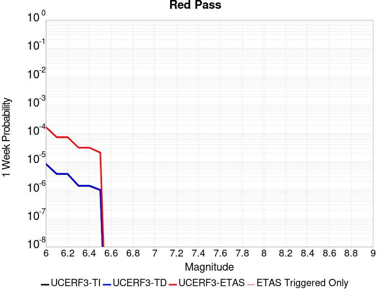 |  | 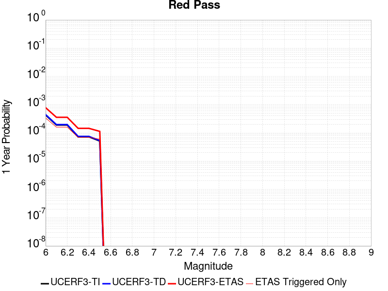 |  |

| Magnitude | 1 wk TI Prob | 1 wk TD Prob | 1 wk ETAS Prob | 1 wk ETAS/TD Gain | 1 wk ETAS Triggered Only | 1 mo TI Prob | 1 mo TD Prob | 1 mo ETAS Prob | 1 mo ETAS/TD Gain | 1 mo ETAS Triggered Only | 1 yr TI Prob | 1 yr TD Prob | 1 yr ETAS Prob | 1 yr ETAS/TD Gain | 1 yr ETAS Triggered Only | 10 yr TI Prob | 10 yr TD Prob | 10 yr ETAS Prob | 10 yr ETAS/TD Gain | 10 yr ETAS Triggered Only |
|-----|-----|-----|-----|-----|-----|-----|-----|-----|-----|-----|-----|-----|-----|-----|-----|-----|-----|-----|-----|-----|
| 6.0 | 8.258278E-6 | 8.551265E-6 | 2.2633525E-4 | 26.468042 | 2.1778584E-4 | 3.539214E-5 | 3.6647863E-5 | 3.2701835E-4 | 8.923258 | 2.903811E-4 | 4.308141E-4 | 4.4611428E-4 | 8.9963234E-4 | 2.0165963 | 4.537205E-4 | 0.0042997985 | 0.004453945 | 0.0050140526 | 1.1257554 | 5.626134E-4 |
| 6.1 | 3.649988E-6 | 3.7753161E-6 | 1.12667825E-4 | 29.843283 | 1.0889292E-4 | 1.5642712E-5 | 1.6179853E-5 | 1.6136807E-4 | 9.973395 | 1.4519056E-4 | 1.9043336E-4 | 1.9697666E-4 | 3.9657435E-4 | 2.0133064 | 1.9963703E-4 | 0.0019027026 | 0.001968488 | 0.002185845 | 1.1104183 | 2.1778584E-4 |
| 6.2 | 3.649988E-6 | 3.7753161E-6 | 1.12667825E-4 | 29.843283 | 1.0889292E-4 | 1.5642712E-5 | 1.6179853E-5 | 1.6136807E-4 | 9.973395 | 1.4519056E-4 | 1.9043336E-4 | 1.9697666E-4 | 3.9657435E-4 | 2.0133064 | 1.9963703E-4 | 0.0019027026 | 0.001968488 | 0.002185845 | 1.1104183 | 2.1778584E-4 |
| 6.3 | 1.3924937E-6 | 1.4411166E-6 | 3.7738704E-5 | 26.187128 | 3.629764E-5 | 5.9678164E-6 | 6.1762075E-6 | 6.0622333E-5 | 9.815462 | 5.444646E-5 | 7.265574E-5 | 7.519415E-5 | 1.4778397E-4 | 1.9653653 | 7.259528E-5 | 7.263199E-4 | 7.518258E-4 | 8.243665E-4 | 1.0964861 | 7.259528E-5 |
| 6.4 | 1.3924937E-6 | 1.4411166E-6 | 3.7738704E-5 | 26.187128 | 3.629764E-5 | 5.9678164E-6 | 6.1762075E-6 | 6.0622333E-5 | 9.815462 | 5.444646E-5 | 7.265574E-5 | 7.519415E-5 | 1.4778397E-4 | 1.9653653 | 7.259528E-5 | 7.263199E-4 | 7.518258E-4 | 8.243665E-4 | 1.0964861 | 7.259528E-5 |
| 6.5 | 9.876812E-7 | 1.0221912E-6 | 1.9170993E-5 | 18.7548 | 1.814882E-5 | 4.2329125E-6 | 4.3808195E-6 | 4.06783E-5 | 9.285546 | 3.629764E-5 | 5.153449E-5 | 5.3336476E-5 | 1.0778003E-4 | 2.0207565 | 5.444646E-5 | 5.1522546E-4 | 5.333648E-4 | 5.877822E-4 | 1.1020267 | 5.444646E-5 |

## Calico-Hidalgo
*[(top)](#table-of-contents)*

| 1 Week | 1 Month | 1 Year | 10 Year |
|-----|-----|-----|-----|
| 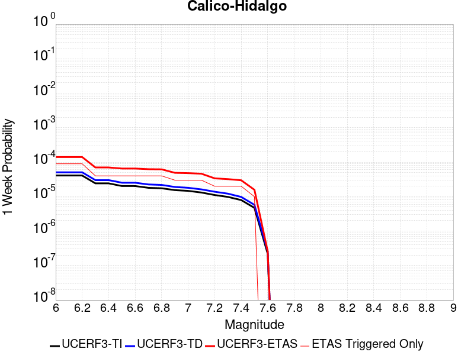 |  | 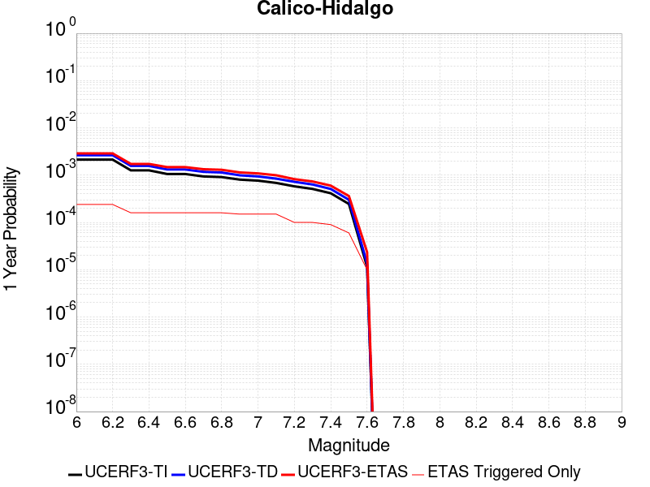 | 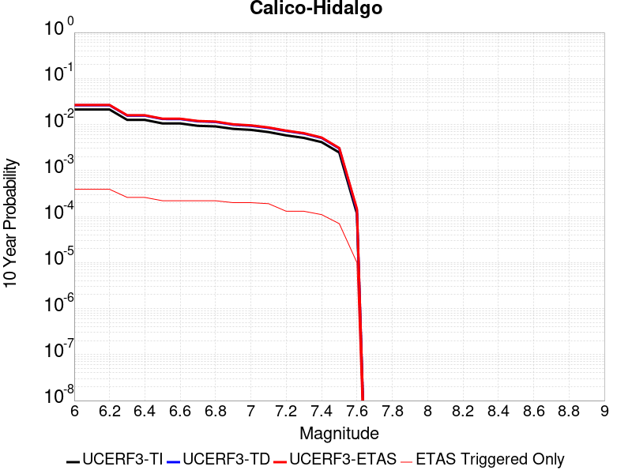 |

| Magnitude | 1 wk TI Prob | 1 wk TD Prob | 1 wk ETAS Prob | 1 wk ETAS/TD Gain | 1 wk ETAS Triggered Only | 1 mo TI Prob | 1 mo TD Prob | 1 mo ETAS Prob | 1 mo ETAS/TD Gain | 1 mo ETAS Triggered Only | 1 yr TI Prob | 1 yr TD Prob | 1 yr ETAS Prob | 1 yr ETAS/TD Gain | 1 yr ETAS Triggered Only | 10 yr TI Prob | 10 yr TD Prob | 10 yr ETAS Prob | 10 yr ETAS/TD Gain | 10 yr ETAS Triggered Only |
|-----|-----|-----|-----|-----|-----|-----|-----|-----|-----|-----|-----|-----|-----|-----|-----|-----|-----|-----|-----|-----|
| 6.0 | 4.0906612E-5 | 5.0703686E-5 | 1.5959109E-4 | 3.1475244 | 1.0889292E-4 | 1.7530227E-4 | 2.172857E-4 | 3.805896E-4 | 1.751563 | 1.6333938E-4 | 0.0021322158 | 0.002642648 | 0.0029684636 | 1.1232913 | 3.2667877E-4 | 0.02111873 | 0.026152607 | 0.026612137 | 1.0175711 | 4.7186934E-4 |
| 6.1 | 4.0906612E-5 | 5.0703686E-5 | 1.5959109E-4 | 3.1475244 | 1.0889292E-4 | 1.7530227E-4 | 2.172857E-4 | 3.805896E-4 | 1.751563 | 1.6333938E-4 | 0.0021322158 | 0.002642648 | 0.0029684636 | 1.1232913 | 3.2667877E-4 | 0.02111873 | 0.026152607 | 0.026612137 | 1.0175711 | 4.7186934E-4 |
| 6.2 | 4.0906612E-5 | 5.0703686E-5 | 1.5959109E-4 | 3.1475244 | 1.0889292E-4 | 1.7530227E-4 | 2.172857E-4 | 3.805896E-4 | 1.751563 | 1.6333938E-4 | 0.0021322158 | 0.002642648 | 0.0029684636 | 1.1232913 | 3.2667877E-4 | 0.02111873 | 0.026152607 | 0.026612137 | 1.0175711 | 4.7186934E-4 |
| 6.3 | 2.4242801E-5 | 3.0090669E-5 | 6.638722E-5 | 2.2062395 | 3.629764E-5 | 1.0389358E-4 | 1.2895382E-4 | 2.0153975E-4 | 1.562883 | 7.259528E-5 | 0.0012641704 | 0.0015689151 | 0.001768239 | 1.1270456 | 1.9963703E-4 | 0.01257003 | 0.01558206 | 0.01585005 | 1.0171987 | 2.722323E-4 |
| 6.4 | 2.4242801E-5 | 3.0090669E-5 | 6.638722E-5 | 2.2062395 | 3.629764E-5 | 1.0389358E-4 | 1.2895382E-4 | 2.0153975E-4 | 1.562883 | 7.259528E-5 | 0.0012641704 | 0.0015689151 | 0.001768239 | 1.1270456 | 1.9963703E-4 | 0.01257003 | 0.01558206 | 0.01585005 | 1.0171987 | 2.722323E-4 |
| 6.5 | 2.0286952E-5 | 2.5315738E-5 | 6.161246E-5 | 2.4337611 | 3.629764E-5 | 8.694118E-5 | 1.0849161E-4 | 1.8107901E-4 | 1.6690601 | 7.259528E-5 | 0.0010579949 | 0.001320102 | 0.0015194755 | 1.1510289 | 1.9963703E-4 | 0.010529719 | 0.013124538 | 0.013357376 | 1.0177407 | 2.3593467E-4 |
| 6.6 | 2.0269223E-5 | 2.5296687E-5 | 6.159341E-5 | 2.434841 | 3.629764E-5 | 8.6865206E-5 | 1.08409964E-4 | 1.8099738E-4 | 1.669564 | 7.259528E-5 | 0.0010570707 | 0.0013191093 | 0.001518483 | 1.1511426 | 1.9963703E-4 | 0.010520565 | 0.013114728 | 0.013347568 | 1.0177541 | 2.3593467E-4 |
| 6.7 | 1.799852E-5 | 2.25406E-5 | 5.8837424E-5 | 2.6102865 | 3.629764E-5 | 7.713423E-5 | 9.659908E-5 | 1.6918735E-4 | 1.7514385 | 7.259528E-5 | 9.3870464E-4 | 0.0011754738 | 0.0013748761 | 1.1696358 | 1.9963703E-4 | 0.009347493 | 0.011694173 | 0.0119273495 | 1.0199394 | 2.3593467E-4 |
| 6.8 | 1.7458793E-5 | 2.184212E-5 | 5.813897E-5 | 2.6617823 | 3.629764E-5 | 7.4821255E-5 | 9.3605806E-5 | 1.661943E-4 | 1.7754699 | 7.259528E-5 | 9.10568E-4 | 0.0011390693 | 0.001338479 | 1.1750636 | 1.9963703E-4 | 0.009068459 | 0.011333893 | 0.011567154 | 1.0205808 | 2.3593467E-4 |
| 6.9 | 1.542884E-5 | 1.9025927E-5 | 3.7174403E-5 | 1.9538813 | 1.814882E-5 | 6.612192E-5 | 8.153721E-5 | 1.3597924E-4 | 1.6676954 | 5.444646E-5 | 8.04737E-4 | 9.922766E-4 | 0.0011735847 | 1.1827193 | 1.814882E-4 | 0.008018291 | 0.009879857 | 0.010095492 | 1.0218257 | 2.1778584E-4 |
| 7.0 | 1.468253E-5 | 1.8030598E-5 | 3.617909E-5 | 2.0065386 | 1.814882E-5 | 6.292361E-5 | 7.7271776E-5 | 1.3171403E-4 | 1.7045555 | 5.444646E-5 | 7.658257E-4 | 9.4039086E-4 | 0.0011217084 | 1.1928108 | 1.814882E-4 | 0.0076319184 | 0.009365481 | 0.009581228 | 1.0230364 | 2.1778584E-4 |
| 7.1 | 1.3139281E-5 | 1.6200942E-5 | 3.434947E-5 | 2.1202142 | 1.814882E-5 | 5.6309986E-5 | 6.943083E-5 | 1.2387351E-4 | 1.7841283 | 5.444646E-5 | 6.853584E-4 | 8.4500515E-4 | 0.00102634 | 1.2145962 | 1.814882E-4 | 0.0068324856 | 0.0084192185 | 0.008635171 | 1.0256499 | 2.1778584E-4 |
| 7.2 | 1.1127404E-5 | 1.3866597E-5 | 3.2015167E-5 | 2.3087976 | 1.814882E-5 | 4.7688E-5 | 5.942698E-5 | 7.7574725E-5 | 1.3053788 | 1.814882E-5 | 5.8044674E-4 | 7.232942E-4 | 8.502441E-4 | 1.1755162 | 1.2704174E-4 | 0.0057893298 | 0.0072105085 | 0.0073726703 | 1.0224897 | 1.6333938E-4 |
| 7.3 | 9.808154E-6 | 1.2176215E-5 | 3.0324814E-5 | 2.490496 | 1.814882E-5 | 4.2034266E-5 | 5.2182797E-5 | 7.033067E-5 | 1.347775 | 1.814882E-5 | 5.11647E-4 | 6.3515105E-4 | 7.621121E-4 | 1.1998911 | 1.2704174E-4 | 0.0051047057 | 0.006334433 | 0.0064967377 | 1.0256226 | 1.6333938E-4 |
| 7.4 | 7.942452E-6 | 9.792144E-6 | 2.7940787E-5 | 2.853388 | 1.814882E-5 | 3.4038632E-5 | 4.1965708E-5 | 6.0113765E-5 | 1.4324497 | 1.814882E-5 | 4.1434157E-4 | 5.1082217E-4 | 6.196595E-4 | 1.213063 | 1.0889292E-4 | 0.0041356985 | 0.005097421 | 0.0052418713 | 1.028338 | 1.4519056E-4 |
| 7.5 | 4.7121216E-6 | 5.772836E-6 | 5.772836E-6 | 1.0 | 0.0 | 2.019465E-5 | 2.4740535E-5 | 2.4740535E-5 | 1.0 | 0.0 | 2.4584212E-4 | 3.0118204E-4 | 3.7375547E-4 | 1.2409619 | 7.259528E-5 | 0.0024557032 | 0.0030084911 | 0.0030989621 | 1.030072 | 9.07441E-5 |
| 7.6 | 2.21172E-7 | 2.603961E-7 | 2.603961E-7 | 1.0 | 0.0 | 9.478797E-7 | 1.1159829E-6 | 1.1159829E-6 | 1.0 | 0.0 | 1.1540374E-5 | 1.3587036E-5 | 1.3587036E-5 | 1.0 | 0.0 | 1.1539775E-4 | 1.3586486E-4 | 1.3586486E-4 | 1.0 | 0.0 |

## San Andreas (San Gorgonio Pass-Garnet HIll)
*[(top)](#table-of-contents)*

| 1 Week | 1 Month | 1 Year | 10 Year |
|-----|-----|-----|-----|
|  |  |  |  |

| Magnitude | 1 wk TI Prob | 1 wk TD Prob | 1 wk ETAS Prob | 1 wk ETAS/TD Gain | 1 wk ETAS Triggered Only | 1 mo TI Prob | 1 mo TD Prob | 1 mo ETAS Prob | 1 mo ETAS/TD Gain | 1 mo ETAS Triggered Only | 1 yr TI Prob | 1 yr TD Prob | 1 yr ETAS Prob | 1 yr ETAS/TD Gain | 1 yr ETAS Triggered Only | 10 yr TI Prob | 10 yr TD Prob | 10 yr ETAS Prob | 10 yr ETAS/TD Gain | 10 yr ETAS Triggered Only |
|-----|-----|-----|-----|-----|-----|-----|-----|-----|-----|-----|-----|-----|-----|-----|-----|-----|-----|-----|-----|-----|
| 6.0 | 8.31567E-5 | 2.3382473E-4 | 4.878488E-4 | 2.0863867 | 2.5408348E-4 | 3.5633717E-4 | 0.0010017233 | 0.0012918137 | 1.2895912 | 2.903811E-4 | 0.004329778 | 0.012127888 | 0.01252232 | 1.0325227 | 3.9927405E-4 | 0.042463828 | 0.11257892 | 0.113013774 | 1.0038626 | 4.9001817E-4 |
| 6.1 | 8.31567E-5 | 2.3382473E-4 | 4.878488E-4 | 2.0863867 | 2.5408348E-4 | 3.5633717E-4 | 0.0010017233 | 0.0012918137 | 1.2895912 | 2.903811E-4 | 0.004329778 | 0.012127888 | 0.01252232 | 1.0325227 | 3.9927405E-4 | 0.042463828 | 0.11257892 | 0.113013774 | 1.0038626 | 4.9001817E-4 |
| 6.2 | 8.31567E-5 | 2.3382473E-4 | 4.878488E-4 | 2.0863867 | 2.5408348E-4 | 3.5633717E-4 | 0.0010017233 | 0.0012918137 | 1.2895912 | 2.903811E-4 | 0.004329778 | 0.012127888 | 0.01252232 | 1.0325227 | 3.9927405E-4 | 0.042463828 | 0.11257892 | 0.113013774 | 1.0038626 | 4.9001817E-4 |
| 6.3 | 8.31567E-5 | 2.3382473E-4 | 4.878488E-4 | 2.0863867 | 2.5408348E-4 | 3.5633717E-4 | 0.0010017233 | 0.0012918137 | 1.2895912 | 2.903811E-4 | 0.004329778 | 0.012127888 | 0.01252232 | 1.0325227 | 3.9927405E-4 | 0.042463828 | 0.11257892 | 0.113013774 | 1.0038626 | 4.9001817E-4 |
| 6.4 | 8.059055E-5 | 2.2940808E-4 | 4.8343328E-4 | 2.1073072 | 2.5408348E-4 | 3.4534236E-4 | 9.828096E-4 | 0.0012729053 | 1.2951698 | 2.903811E-4 | 0.0041964394 | 0.011900152 | 0.012294674 | 1.0331527 | 3.9927405E-4 | 0.041180745 | 0.11056015 | 0.110995986 | 1.0039421 | 4.9001817E-4 |
| 6.5 | 8.059055E-5 | 2.2940808E-4 | 4.8343328E-4 | 2.1073072 | 2.5408348E-4 | 3.4534236E-4 | 9.828096E-4 | 0.0012729053 | 1.2951698 | 2.903811E-4 | 0.0041964394 | 0.011900152 | 0.012294674 | 1.0331527 | 3.9927405E-4 | 0.041180745 | 0.11056015 | 0.110995986 | 1.0039421 | 4.9001817E-4 |
| 6.6 | 7.619237E-5 | 2.218517E-4 | 4.7587883E-4 | 2.1450312 | 2.5408348E-4 | 3.2649786E-4 | 9.5044886E-4 | 0.001240554 | 1.3052295 | 2.903811E-4 | 0.0039678677 | 0.01151087 | 0.011905548 | 1.0342875 | 3.9927405E-4 | 0.03897764 | 0.10709683 | 0.107534364 | 1.0040854 | 4.9001817E-4 |
| 6.7 | 7.440636E-5 | 2.1860997E-4 | 4.5449304E-4 | 2.0790133 | 2.3593467E-4 | 3.188454E-4 | 9.3656575E-4 | 0.0012085431 | 1.2903986 | 2.722323E-4 | 0.0038750346 | 0.011343609 | 0.011720411 | 1.0332171 | 3.8112522E-4 | 0.038081564 | 0.105605274 | 0.10602731 | 1.0039964 | 4.7186934E-4 |
| 6.8 | 7.3735864E-5 | 2.1708169E-4 | 4.5296512E-4 | 2.0866115 | 2.3593467E-4 | 3.1597257E-4 | 9.3002064E-4 | 0.0012019997 | 1.2924442 | 2.722323E-4 | 0.0038401815 | 0.011264749 | 0.011641581 | 1.0334523 | 3.8112522E-4 | 0.03774495 | 0.10490683 | 0.10532919 | 1.0040262 | 4.7186934E-4 |
| 6.9 | 7.27575E-5 | 2.1477141E-4 | 4.506554E-4 | 2.0983026 | 2.3593467E-4 | 3.117806E-4 | 9.201265E-4 | 0.0011921083 | 1.2955917 | 2.722323E-4 | 0.003789323 | 0.011145527 | 0.011522404 | 1.0338142 | 3.8112522E-4 | 0.037253562 | 0.103854746 | 0.1042776 | 1.0040717 | 4.7186934E-4 |
| 7.0 | 7.102591E-5 | 2.1061185E-4 | 4.2835184E-4 | 2.033845 | 2.1778584E-4 | 3.0436125E-4 | 9.023122E-4 | 0.0011561664 | 1.2813375 | 2.5408348E-4 | 0.003699303 | 0.010930831 | 0.01128984 | 1.0328437 | 3.629764E-4 | 0.03638325 | 0.10195695 | 0.102364406 | 1.0039964 | 4.537205E-4 |
| 7.1 | 7.028513E-5 | 2.0896831E-4 | 4.2670863E-4 | 2.0419776 | 2.1778584E-4 | 3.0118722E-4 | 8.9527335E-4 | 0.0011491294 | 1.2835515 | 2.5408348E-4 | 0.0036607897 | 0.010845989 | 0.011205029 | 1.0331035 | 3.629764E-4 | 0.036010686 | 0.101199985 | 0.10160779 | 1.0040296 | 4.537205E-4 |
| 7.2 | 6.8498244E-5 | 2.0504706E-4 | 4.2278826E-4 | 2.0619082 | 2.1778584E-4 | 2.9353087E-4 | 8.784794E-4 | 0.0011323397 | 1.2889769 | 2.5408348E-4 | 0.003567883 | 0.010643536 | 0.01100265 | 1.03374 | 3.629764E-4 | 0.035111405 | 0.09939202 | 0.09980065 | 1.0041113 | 4.537205E-4 |
| 7.3 | 6.622592E-5 | 1.9732013E-4 | 4.15063E-4 | 2.1035006 | 2.1778584E-4 | 2.8379448E-4 | 8.453858E-4 | 0.0010992545 | 1.3002992 | 2.5408348E-4 | 0.0034497243 | 0.0102444785 | 0.010603737 | 1.0350684 | 3.629764E-4 | 0.033966612 | 0.095888525 | 0.09629874 | 1.0042781 | 4.537205E-4 |
| 7.4 | 5.1050705E-5 | 1.4689034E-4 | 3.646442E-4 | 2.4824247 | 2.1778584E-4 | 2.1877038E-4 | 6.29379E-4 | 8.833026E-4 | 1.403451 | 2.5408348E-4 | 0.002660276 | 0.0076359594 | 0.007996164 | 1.0471722 | 3.629764E-4 | 0.02628654 | 0.07286301 | 0.07328368 | 1.0057733 | 4.537205E-4 |
| 7.5 | 3.9302922E-5 | 1.1129847E-4 | 3.1091328E-4 | 2.793509 | 1.9963703E-4 | 1.6843023E-4 | 4.7690657E-4 | 7.127287E-4 | 1.4944829 | 2.3593467E-4 | 0.0020487092 | 0.005790949 | 0.0061337794 | 1.0592011 | 3.448276E-4 | 0.020299247 | 0.05600951 | 0.056420688 | 1.0073411 | 4.3557168E-4 |
| 7.6 | 2.9851626E-5 | 8.4949745E-5 | 2.845698E-4 | 3.3498607 | 1.9963703E-4 | 1.2792926E-4 | 3.6401965E-4 | 5.817262E-4 | 1.5980626 | 2.1778584E-4 | 0.0015564259 | 0.0044229585 | 0.004748192 | 1.073533 | 3.2667877E-4 | 0.0154556995 | 0.04319374 | 0.04359313 | 1.0092466 | 4.1742288E-4 |
| 7.7 | 2.1135214E-5 | 6.3529005E-5 | 2.6315334E-4 | 4.1422553 | 1.9963703E-4 | 9.0576345E-5 | 2.7223877E-4 | 4.899653E-4 | 1.7997632 | 2.1778584E-4 | 0.0011022091 | 0.0033094748 | 0.0036350724 | 1.0983834 | 3.2667877E-4 | 0.010967582 | 0.032582592 | 0.032986417 | 1.0123938 | 4.1742288E-4 |
| 7.8 | 1.883379E-5 | 5.564028E-5 | 2.552662E-4 | 4.587795 | 1.9963703E-4 | 8.0713755E-5 | 2.3843657E-4 | 4.5617047E-4 | 1.9131733 | 2.1778584E-4 | 9.822468E-4 | 0.0028991038 | 0.0032248355 | 1.112356 | 3.2667877E-4 | 0.0097791655 | 0.028695205 | 0.02910065 | 1.0141294 | 4.1742288E-4 |
| 7.9 | 1.5156185E-5 | 4.1658426E-5 | 2.4128714E-4 | 5.7920365 | 1.9963703E-4 | 6.495346E-5 | 1.785239E-4 | 3.9627086E-4 | 2.2197077 | 2.1778584E-4 | 7.9052144E-4 | 0.0021713632 | 0.0024611137 | 1.1334418 | 2.903811E-4 | 0.007877152 | 0.021759422 | 0.022132255 | 1.0171343 | 3.8112522E-4 |
| 8.0 | 1.1405907E-5 | 2.9974231E-5 | 1.9330872E-4 | 6.4491634 | 1.6333938E-4 | 4.8881542E-5 | 1.2845467E-4 | 3.0991956E-4 | 2.4126766 | 1.814882E-4 | 5.9497025E-4 | 0.0015628147 | 0.001816501 | 1.1623266 | 2.5408348E-4 | 0.005933798 | 0.015772851 | 0.016094377 | 1.0203848 | 3.2667877E-4 |
| 8.1 | 4.3511436E-6 | 7.369219E-6 | 7.369219E-6 | 1.0 | 0.0 | 1.8647626E-5 | 3.1581985E-5 | 3.1581985E-5 | 1.0 | 0.0 | 2.2701119E-4 | 3.8444297E-4 | 3.8444297E-4 | 1.0 | 0.0 | 0.0022677942 | 0.0041163345 | 0.0041163345 | 1.0 | 0.0 |
| 8.2 | 2.3042528E-6 | 2.7329415E-6 | 2.7329415E-6 | 1.0 | 0.0 | 9.875332E-6 | 1.1712554E-5 | 1.1712554E-5 | 1.0 | 0.0 | 1.2022553E-4 | 1.4259106E-4 | 1.4259106E-4 | 1.0 | 0.0 | 0.0012016051 | 0.0015979785 | 0.0015979785 | 1.0 | 0.0 |
| 8.3 | 5.202968E-7 | 3.1598344E-7 | 3.1598344E-7 | 1.0 | 0.0 | 2.2298414E-6 | 1.3542141E-6 | 1.3542141E-6 | 1.0 | 0.0 | 2.714798E-5 | 1.6487444E-5 | 1.6487444E-5 | 1.0 | 0.0 | 2.7144665E-4 | 1.9563142E-4 | 1.9563142E-4 | 1.0 | 0.0 |

## Death Valley (Fish Lake Valley)
*[(top)](#table-of-contents)*

| 1 Week | 1 Month | 1 Year | 10 Year |
|-----|-----|-----|-----|
|  |  |  |  |

| Magnitude | 1 wk TI Prob | 1 wk TD Prob | 1 wk ETAS Prob | 1 wk ETAS/TD Gain | 1 wk ETAS Triggered Only | 1 mo TI Prob | 1 mo TD Prob | 1 mo ETAS Prob | 1 mo ETAS/TD Gain | 1 mo ETAS Triggered Only | 1 yr TI Prob | 1 yr TD Prob | 1 yr ETAS Prob | 1 yr ETAS/TD Gain | 1 yr ETAS Triggered Only | 10 yr TI Prob | 10 yr TD Prob | 10 yr ETAS Prob | 10 yr ETAS/TD Gain | 10 yr ETAS Triggered Only |
|-----|-----|-----|-----|-----|-----|-----|-----|-----|-----|-----|-----|-----|-----|-----|-----|-----|-----|-----|-----|-----|
| 6.0 | 3.872328E-5 | 4.7267473E-5 | 1.5615525E-4 | 3.3036513 | 1.0889292E-4 | 1.6594635E-4 | 2.0256084E-4 | 3.47722E-4 | 1.7166299 | 1.4519056E-4 | 0.0020185246 | 0.002463534 | 0.0026988874 | 1.0955349 | 2.3593467E-4 | 0.02000288 | 0.024388181 | 0.024866248 | 1.0196024 | 4.9001817E-4 |
| 6.1 | 3.872328E-5 | 4.7267473E-5 | 1.5615525E-4 | 3.3036513 | 1.0889292E-4 | 1.6594635E-4 | 2.0256084E-4 | 3.47722E-4 | 1.7166299 | 1.4519056E-4 | 0.0020185246 | 0.002463534 | 0.0026988874 | 1.0955349 | 2.3593467E-4 | 0.02000288 | 0.024388181 | 0.024866248 | 1.0196024 | 4.9001817E-4 |
| 6.2 | 3.872328E-5 | 4.7267473E-5 | 1.5615525E-4 | 3.3036513 | 1.0889292E-4 | 1.6594635E-4 | 2.0256084E-4 | 3.47722E-4 | 1.7166299 | 1.4519056E-4 | 0.0020185246 | 0.002463534 | 0.0026988874 | 1.0955349 | 2.3593467E-4 | 0.02000288 | 0.024388181 | 0.024866248 | 1.0196024 | 4.9001817E-4 |
| 6.3 | 2.8356371E-5 | 3.3609853E-5 | 1.424991E-4 | 4.239802 | 1.0889292E-4 | 1.2152165E-4 | 1.4403471E-4 | 2.8920436E-4 | 2.0078795 | 1.4519056E-4 | 0.0014785219 | 0.0017522911 | 0.0019878123 | 1.1344076 | 2.3593467E-4 | 0.014687235 | 0.017391782 | 0.017873278 | 1.0276853 | 4.9001817E-4 |
| 6.4 | 2.8356371E-5 | 3.3609853E-5 | 1.424991E-4 | 4.239802 | 1.0889292E-4 | 1.2152165E-4 | 1.4403471E-4 | 2.8920436E-4 | 2.0078795 | 1.4519056E-4 | 0.0014785219 | 0.0017522911 | 0.0019878123 | 1.1344076 | 2.3593467E-4 | 0.014687235 | 0.017391782 | 0.017873278 | 1.0276853 | 4.9001817E-4 |
| 6.5 | 2.4448687E-5 | 2.8607552E-5 | 1.3749737E-4 | 4.8063307 | 1.0889292E-4 | 1.0477588E-4 | 1.2259831E-4 | 2.6777107E-4 | 2.1841333 | 1.4519056E-4 | 0.0012748998 | 0.0014916632 | 0.0017272459 | 1.1579329 | 2.3593467E-4 | 0.012676105 | 0.014821377 | 0.015304132 | 1.0325716 | 4.9001817E-4 |
| 6.6 | 2.1298161E-5 | 2.4660083E-5 | 1.3355032E-4 | 5.4156475 | 1.0889292E-4 | 9.127464E-5 | 1.0568198E-4 | 2.508572E-4 | 2.373699 | 1.4519056E-4 | 0.0011107022 | 0.0012859525 | 0.0015215838 | 1.1832348 | 2.3593467E-4 | 0.011051672 | 0.012788526 | 0.013272277 | 1.037827 | 4.9001817E-4 |
| 6.7 | 1.8959729E-5 | 2.1781025E-5 | 1.3067157E-4 | 5.9993305 | 1.0889292E-4 | 8.125345E-5 | 9.334405E-5 | 2.3852107E-4 | 2.5552893 | 1.4519056E-4 | 9.888117E-4 | 0.001135897 | 0.0013715636 | 1.2074718 | 2.3593467E-4 | 0.009844234 | 0.01130357 | 0.011788049 | 1.0428607 | 4.9001817E-4 |
| 6.8 | 1.6691629E-5 | 1.9018353E-5 | 1.279092E-4 | 6.7255673 | 1.0889292E-4 | 7.153359E-5 | 8.150477E-5 | 2.266835E-4 | 2.7812297 | 1.4519056E-4 | 8.7057345E-4 | 9.918857E-4 | 0.0012275863 | 1.2376288 | 2.3593467E-4 | 0.008671708 | 0.009876343 | 0.010361522 | 1.0491253 | 4.9001817E-4 |
| 6.9 | 1.450505E-5 | 1.638954E-5 | 1.2528068E-4 | 7.643941 | 1.0889292E-4 | 6.216302E-5 | 7.0239046E-5 | 2.1541941E-4 | 3.0669467 | 1.4519056E-4 | 7.5657194E-4 | 8.5483363E-4 | 0.0010905666 | 1.2757647 | 2.3593467E-4 | 0.007540013 | 0.008516385 | 0.009002231 | 1.0570482 | 4.9001817E-4 |
| 7.0 | 1.2940855E-5 | 1.4537972E-5 | 1.0528076E-4 | 7.2417774 | 9.07441E-5 | 5.545963E-5 | 6.230414E-5 | 1.8933797E-4 | 3.038931 | 1.2704174E-4 | 6.750118E-4 | 7.5829466E-4 | 9.5778034E-4 | 1.2630714 | 1.9963703E-4 | 0.006729651 | 0.0075576897 | 0.007971958 | 1.0548141 | 4.1742288E-4 |
| 7.1 | 1.2544658E-5 | 1.4078208E-5 | 1.0482103E-4 | 7.4456234 | 9.07441E-5 | 5.3761712E-5 | 6.0333812E-5 | 1.8736788E-4 | 3.1055205 | 1.2704174E-4 | 6.5435225E-4 | 7.343222E-4 | 9.3381264E-4 | 1.271666 | 1.9963703E-4 | 0.006524288 | 0.007319551 | 0.0077339183 | 1.0566111 | 4.1742288E-4 |
| 7.2 | 1.2489416E-5 | 1.4015674E-5 | 1.047585E-4 | 7.474382 | 9.07441E-5 | 5.3524967E-5 | 6.0065824E-5 | 1.8709994E-4 | 3.114915 | 1.2704174E-4 | 6.514716E-4 | 7.310616E-4 | 9.305527E-4 | 1.2728786 | 1.9963703E-4 | 0.006495651 | 0.0072871596 | 0.007701541 | 1.0568645 | 4.1742288E-4 |
| 7.3 | 1.2368307E-5 | 1.3879812E-5 | 1.0462265E-4 | 7.537757 | 9.07441E-5 | 5.3005948E-5 | 5.9483587E-5 | 1.8651778E-4 | 3.1356175 | 1.2704174E-4 | 6.451563E-4 | 7.2397763E-4 | 9.234701E-4 | 1.2755506 | 1.9963703E-4 | 0.0064328653 | 0.007216782 | 0.0076311924 | 1.0574231 | 4.1742288E-4 |
| 7.4 | 1.2161707E-5 | 1.36478675E-5 | 1.0439073E-4 | 7.648867 | 9.07441E-5 | 5.212056E-5 | 5.8489582E-5 | 1.855239E-4 | 3.1719134 | 1.2704174E-4 | 6.3438306E-4 | 7.118836E-4 | 9.113785E-4 | 1.2802353 | 1.9963703E-4 | 0.006325751 | 0.0070966207 | 0.007511081 | 1.0584025 | 4.1742288E-4 |
| 7.5 | 1.1707948E-5 | 1.3145515E-5 | 1.0388842E-4 | 7.9029555 | 9.07441E-5 | 5.0175953E-5 | 5.6336736E-5 | 1.8337132E-4 | 3.2549155 | 1.2704174E-4 | 6.10721E-4 | 6.856895E-4 | 8.851896E-4 | 1.2909483 | 1.9963703E-4 | 0.0060904534 | 0.006836321 | 0.007232866 | 1.0580056 | 3.9927405E-4 |
| 7.6 | 1.0319538E-5 | 1.1579622E-5 | 1.0232267E-4 | 8.836443 | 9.07441E-5 | 4.4225842E-5 | 4.9626036E-5 | 1.5851356E-4 | 3.194161 | 1.0889292E-4 | 5.383166E-4 | 6.040347E-4 | 7.8541326E-4 | 1.3002784 | 1.814882E-4 | 0.0053701443 | 0.0060244603 | 0.0064032897 | 1.0628818 | 3.8112522E-4 |
| 7.7 | 8.937764E-6 | 1.0022779E-5 | 1.00765974E-4 | 10.053696 | 9.07441E-5 | 3.830414E-5 | 4.295409E-5 | 1.5184234E-4 | 3.5349913 | 1.0889292E-4 | 4.6625308E-4 | 5.228456E-4 | 7.042389E-4 | 1.3469348 | 1.814882E-4 | 0.0046527605 | 0.005216664 | 0.0055958014 | 1.0726781 | 3.8112522E-4 |
| 7.8 | 3.108007E-7 | 3.284654E-7 | 3.284654E-7 | 1.0 | 0.0 | 1.3320023E-6 | 1.407708E-6 | 1.407708E-6 | 1.0 | 0.0 | 1.6217007E-5 | 1.7138715E-5 | 1.7138715E-5 | 1.0 | 0.0 | 1.6215823E-4 | 1.7137431E-4 | 1.8952003E-4 | 1.1058835 | 1.814882E-5 |
| 7.9 | 2.5591178E-9 | 2.6696718E-9 | 2.6696718E-9 | 1.0 | 0.0 | 1.0967647E-8 | 1.14414505E-8 | 1.14414505E-8 | 1.0 | 0.0 | 1.335311E-7 | 1.3929966E-7 | 1.3929966E-7 | 1.0 | 0.0 | 1.3353102E-6 | 1.3929966E-6 | 1.3929966E-6 | 1.0 | 0.0 |

## San Andreas (Cholame) rev
*[(top)](#table-of-contents)*

| 1 Week | 1 Month | 1 Year | 10 Year |
|-----|-----|-----|-----|
|  |  |  |  |

| Magnitude | 1 wk TI Prob | 1 wk TD Prob | 1 wk ETAS Prob | 1 wk ETAS/TD Gain | 1 wk ETAS Triggered Only | 1 mo TI Prob | 1 mo TD Prob | 1 mo ETAS Prob | 1 mo ETAS/TD Gain | 1 mo ETAS Triggered Only | 1 yr TI Prob | 1 yr TD Prob | 1 yr ETAS Prob | 1 yr ETAS/TD Gain | 1 yr ETAS Triggered Only | 10 yr TI Prob | 10 yr TD Prob | 10 yr ETAS Prob | 10 yr ETAS/TD Gain | 10 yr ETAS Triggered Only |
|-----|-----|-----|-----|-----|-----|-----|-----|-----|-----|-----|-----|-----|-----|-----|-----|-----|-----|-----|-----|-----|
| 6.0 | 1.2302514E-4 | 2.5204287E-4 | 3.790526E-4 | 1.5039212 | 1.2704174E-4 | 5.27144E-4 | 0.0010797381 | 0.0012972889 | 1.2014847 | 2.1778584E-4 | 0.0063991086 | 0.0130670825 | 0.013389492 | 1.0246735 | 3.2667877E-4 | 0.06217949 | 0.12439073 | 0.1248039 | 1.0033215 | 4.7186934E-4 |
| 6.1 | 1.2302514E-4 | 2.5204287E-4 | 3.790526E-4 | 1.5039212 | 1.2704174E-4 | 5.27144E-4 | 0.0010797381 | 0.0012972889 | 1.2014847 | 2.1778584E-4 | 0.0063991086 | 0.0130670825 | 0.013389492 | 1.0246735 | 3.2667877E-4 | 0.06217949 | 0.12439073 | 0.1248039 | 1.0033215 | 4.7186934E-4 |
| 6.2 | 1.2203569E-4 | 2.5021084E-4 | 3.772208E-4 | 1.5076118 | 1.2704174E-4 | 5.2290526E-4 | 0.0010718931 | 0.0012894454 | 1.202961 | 2.1778584E-4 | 0.006347804 | 0.01297271 | 0.013277237 | 1.0234745 | 3.0852994E-4 | 0.061695136 | 0.12357691 | 0.123974554 | 1.0032178 | 4.537205E-4 |
| 6.3 | 1.2142645E-4 | 2.4907055E-4 | 3.7608066E-4 | 1.5099362 | 1.2704174E-4 | 5.202953E-4 | 0.0010670102 | 0.0012845637 | 1.2038907 | 2.1778584E-4 | 0.006316212 | 0.012913967 | 0.013218513 | 1.0235827 | 3.0852994E-4 | 0.06139677 | 0.12307103 | 0.12346891 | 1.003233 | 4.537205E-4 |
| 6.4 | 1.1865206E-4 | 2.44126E-4 | 3.7113673E-4 | 1.5202671 | 1.2704174E-4 | 5.0840975E-4 | 0.0010458364 | 0.0012633945 | 1.2080231 | 2.1778584E-4 | 0.006172335 | 0.012659196 | 0.01296382 | 1.0240635 | 3.0852994E-4 | 0.060036868 | 0.1208638 | 0.121262684 | 1.0033003 | 4.537205E-4 |
| 6.5 | 1.17443946E-4 | 2.4205919E-4 | 3.6907019E-4 | 1.5247104 | 1.2704174E-4 | 5.032341E-4 | 0.0010369857 | 0.0012545456 | 1.2098004 | 2.1778584E-4 | 0.006109677 | 0.012552682 | 0.012857339 | 1.0242703 | 3.0852994E-4 | 0.059444077 | 0.11993805 | 0.12033735 | 1.0033293 | 4.537205E-4 |
| 6.6 | 1.13579066E-4 | 2.3514954E-4 | 3.621614E-4 | 1.5401323 | 1.2704174E-4 | 4.866766E-4 | 0.001007396 | 0.0012249625 | 1.2159691 | 2.1778584E-4 | 0.0059092017 | 0.012196515 | 0.012501282 | 1.024988 | 3.0852994E-4 | 0.057545185 | 0.11685214 | 0.11725285 | 1.0034292 | 4.537205E-4 |
| 6.7 | 1.1271412E-4 | 2.3359268E-4 | 3.6060475E-4 | 1.5437331 | 1.2704174E-4 | 4.829711E-4 | 0.0010007289 | 0.0012182968 | 1.2174094 | 2.1778584E-4 | 0.005864331 | 0.012116249 | 0.012421041 | 1.0251557 | 3.0852994E-4 | 0.057119697 | 0.116155714 | 0.116556734 | 1.0034524 | 4.537205E-4 |
| 6.8 | 1.1217975E-4 | 2.3247694E-4 | 3.5948915E-4 | 1.5463432 | 1.2704174E-4 | 4.8068175E-4 | 9.959509E-4 | 0.0012135198 | 1.2184535 | 2.1778584E-4 | 0.005836608 | 0.012058721 | 0.012363531 | 1.0252771 | 3.0852994E-4 | 0.056856725 | 0.11565396 | 0.11605521 | 1.0034693 | 4.537205E-4 |
| 6.9 | 1.1146753E-4 | 2.3096445E-4 | 3.5797685E-4 | 1.5499219 | 1.2704174E-4 | 4.7763053E-4 | 9.894737E-4 | 0.001207044 | 1.219885 | 2.1778584E-4 | 0.0057996577 | 0.011980731 | 0.012285565 | 1.0254437 | 3.0852994E-4 | 0.056506127 | 0.11497439 | 0.11537594 | 1.0034926 | 4.537205E-4 |
| 7.0 | 1.0965793E-4 | 2.2719789E-4 | 3.5421076E-4 | 1.5590408 | 1.2704174E-4 | 4.698779E-4 | 9.733434E-4 | 0.0011909172 | 1.2235324 | 2.1778584E-4 | 0.005705768 | 0.011786487 | 0.012091381 | 1.025868 | 3.0852994E-4 | 0.055614736 | 0.11327597 | 0.11367829 | 1.0035517 | 4.537205E-4 |
| 7.1 | 9.927982E-5 | 2.0538924E-4 | 3.1425979E-4 | 1.5300695 | 1.0889292E-4 | 4.2541555E-4 | 8.7994366E-4 | 0.001079405 | 1.2266752 | 1.9963703E-4 | 0.0051671406 | 0.010660981 | 0.010948267 | 1.0269474 | 2.903811E-4 | 0.05048634 | 0.1033706 | 0.103761144 | 1.0037781 | 4.3557168E-4 |
| 7.2 | 9.696786E-5 | 2.0043184E-4 | 3.0930294E-4 | 1.5431826 | 1.0889292E-4 | 4.1551032E-4 | 8.5871184E-4 | 0.0010581774 | 1.2322847 | 1.9963703E-4 | 0.00504711 | 0.010404981 | 0.01069234 | 1.0276176 | 2.903811E-4 | 0.04934009 | 0.1011086 | 0.10150013 | 1.0038724 | 4.3557168E-4 |
| 7.3 | 9.4727984E-5 | 1.9472468E-4 | 3.035964E-4 | 1.5591059 | 1.0889292E-4 | 4.0591392E-4 | 8.3426846E-4 | 0.001033739 | 1.2390963 | 1.9963703E-4 | 0.0049308087 | 0.010110183 | 0.010397628 | 1.0284313 | 2.903811E-4 | 0.048228268 | 0.09847952 | 0.09887219 | 1.0039874 | 4.3557168E-4 |
| 7.4 | 9.220358E-5 | 1.8843076E-4 | 2.9730317E-4 | 1.5777847 | 1.0889292E-4 | 3.9509835E-4 | 8.073114E-4 | 0.0010067872 | 1.2470866 | 1.9963703E-4 | 0.004799717 | 0.009784967 | 0.010072506 | 1.0293859 | 2.903811E-4 | 0.046973653 | 0.095557496 | 0.095951445 | 1.0041226 | 4.3557168E-4 |
| 7.5 | 7.71631E-5 | 1.5177966E-4 | 2.4251E-4 | 1.5977765 | 9.07441E-5 | 3.306571E-4 | 6.503223E-4 | 8.316925E-4 | 1.2788928 | 1.814882E-4 | 0.0040183207 | 0.007889002 | 0.00814108 | 1.0319532 | 2.5408348E-4 | 0.03946433 | 0.07828531 | 0.07865332 | 1.004701 | 3.9927405E-4 |
| 7.6 | 7.5634416E-5 | 1.483744E-4 | 2.3910504E-4 | 1.611498 | 9.07441E-5 | 3.241072E-4 | 6.3573546E-4 | 8.171083E-4 | 1.2852961 | 1.814882E-4 | 0.0039388672 | 0.0077126776 | 0.007964801 | 1.0326896 | 2.5408348E-4 | 0.038697794 | 0.07664872 | 0.07701739 | 1.0048099 | 3.9927405E-4 |
| 7.7 | 6.3783E-5 | 1.235872E-4 | 2.143201E-4 | 1.7341608 | 9.07441E-5 | 2.7332708E-4 | 5.29552E-4 | 6.9280487E-4 | 1.3082849 | 1.6333938E-4 | 0.0033226798 | 0.0064282627 | 0.006626616 | 1.0308565 | 1.9963703E-4 | 0.032734364 | 0.06454029 | 0.06486286 | 1.004998 | 3.448276E-4 |
| 7.8 | 5.863422E-5 | 1.1416107E-4 | 2.0489482E-4 | 1.794787 | 9.07441E-5 | 2.512653E-4 | 4.8917E-4 | 6.5242953E-4 | 1.3337479 | 1.6333938E-4 | 0.003054864 | 0.0059394026 | 0.006137854 | 1.0334127 | 1.9963703E-4 | 0.030132094 | 0.059659187 | 0.05998344 | 1.0054351 | 3.448276E-4 |
| 7.9 | 4.595283E-5 | 8.426331E-5 | 1.5685247E-4 | 1.8614564 | 7.259528E-5 | 1.9692584E-4 | 3.610785E-4 | 4.699321E-4 | 1.301468 | 1.0889292E-4 | 0.0023949358 | 0.0043872762 | 0.0045318296 | 1.0329484 | 1.4519056E-4 | 0.023692891 | 0.044362005 | 0.044587474 | 1.0050825 | 2.3593467E-4 |
| 8.0 | 3.2950178E-5 | 5.0772942E-5 | 8.706874E-5 | 1.714865 | 3.629764E-5 | 1.412074E-4 | 2.1758018E-4 | 2.5386992E-4 | 1.1667879 | 3.629764E-5 | 0.0017178444 | 0.0026458222 | 0.0027001249 | 1.0205238 | 5.444646E-5 | 0.017046256 | 0.027180137 | 0.027321381 | 1.0051966 | 1.4519056E-4 |
| 8.1 | 1.9177472E-5 | 1.9185145E-5 | 3.733362E-5 | 1.9459648 | 1.814882E-5 | 8.218658E-5 | 8.221946E-5 | 1.0036679E-4 | 1.2207181 | 1.814882E-5 | 0.0010001622 | 0.0010005629 | 0.0010186936 | 1.0181204 | 1.814882E-5 | 0.009956728 | 0.010758142 | 0.010776096 | 1.0016688 | 1.814882E-5 |
| 8.2 | 8.643924E-6 | 5.4748625E-6 | 5.4748625E-6 | 1.0 | 0.0 | 3.704486E-5 | 2.3463486E-5 | 2.3463486E-5 | 1.0 | 0.0 | 4.5092785E-4 | 2.8563058E-4 | 2.8563058E-4 | 1.0 | 0.0 | 0.0045001395 | 0.0032487072 | 0.0032487072 | 1.0 | 0.0 |
| 8.3 | 1.983087E-6 | 7.6599065E-7 | 7.6599065E-7 | 1.0 | 0.0 | 8.498917E-6 | 3.282813E-6 | 3.282813E-6 | 1.0 | 0.0 | 1.034694E-4 | 3.9967534E-5 | 3.9967534E-5 | 1.0 | 0.0 | 0.0010342124 | 4.719687E-4 | 4.719687E-4 | 1.0 | 0.0 |

## San Andreas (Carrizo) rev
*[(top)](#table-of-contents)*

| 1 Week | 1 Month | 1 Year | 10 Year |
|-----|-----|-----|-----|
|  |  |  |  |

| Magnitude | 1 wk TI Prob | 1 wk TD Prob | 1 wk ETAS Prob | 1 wk ETAS/TD Gain | 1 wk ETAS Triggered Only | 1 mo TI Prob | 1 mo TD Prob | 1 mo ETAS Prob | 1 mo ETAS/TD Gain | 1 mo ETAS Triggered Only | 1 yr TI Prob | 1 yr TD Prob | 1 yr ETAS Prob | 1 yr ETAS/TD Gain | 1 yr ETAS Triggered Only | 10 yr TI Prob | 10 yr TD Prob | 10 yr ETAS Prob | 10 yr ETAS/TD Gain | 10 yr ETAS Triggered Only |
|-----|-----|-----|-----|-----|-----|-----|-----|-----|-----|-----|-----|-----|-----|-----|-----|-----|-----|-----|-----|-----|
| 6.0 | 1.1674632E-4 | 2.432302E-4 | 3.7024103E-4 | 1.5221837 | 1.2704174E-4 | 5.002454E-4 | 0.0010420004 | 0.0012776891 | 1.2261888 | 2.3593467E-4 | 0.006073493 | 0.012613042 | 0.012935601 | 1.0255734 | 3.2667877E-4 | 0.0591016 | 0.12061418 | 0.12102913 | 1.0034404 | 4.7186934E-4 |
| 6.1 | 1.1674632E-4 | 2.432302E-4 | 3.7024103E-4 | 1.5221837 | 1.2704174E-4 | 5.002454E-4 | 0.0010420004 | 0.0012776891 | 1.2261888 | 2.3593467E-4 | 0.006073493 | 0.012613042 | 0.012935601 | 1.0255734 | 3.2667877E-4 | 0.0591016 | 0.12061418 | 0.12102913 | 1.0034404 | 4.7186934E-4 |
| 6.2 | 1.1674632E-4 | 2.432302E-4 | 3.7024103E-4 | 1.5221837 | 1.2704174E-4 | 5.002454E-4 | 0.0010420004 | 0.0012776891 | 1.2261888 | 2.3593467E-4 | 0.006073493 | 0.012613042 | 0.012935601 | 1.0255734 | 3.2667877E-4 | 0.0591016 | 0.12061418 | 0.12102913 | 1.0034404 | 4.7186934E-4 |
| 6.3 | 1.1674632E-4 | 2.432302E-4 | 3.7024103E-4 | 1.5221837 | 1.2704174E-4 | 5.002454E-4 | 0.0010420004 | 0.0012776891 | 1.2261888 | 2.3593467E-4 | 0.006073493 | 0.012613042 | 0.012935601 | 1.0255734 | 3.2667877E-4 | 0.0591016 | 0.12061418 | 0.12102913 | 1.0034404 | 4.7186934E-4 |
| 6.4 | 1.1674632E-4 | 2.432302E-4 | 3.7024103E-4 | 1.5221837 | 1.2704174E-4 | 5.002454E-4 | 0.0010420004 | 0.0012776891 | 1.2261888 | 2.3593467E-4 | 0.006073493 | 0.012613042 | 0.012935601 | 1.0255734 | 3.2667877E-4 | 0.0591016 | 0.12061418 | 0.12102913 | 1.0034404 | 4.7186934E-4 |
| 6.5 | 1.13136164E-4 | 2.3643032E-4 | 3.6344203E-4 | 1.5372057 | 1.2704174E-4 | 4.847792E-4 | 0.0010128808 | 0.0012485766 | 1.2326983 | 2.3593467E-4 | 0.0058862255 | 0.012262545 | 0.012585217 | 1.0263137 | 3.2667877E-4 | 0.057327334 | 0.117585555 | 0.11800194 | 1.0035411 | 4.7186934E-4 |
| 6.6 | 1.13136164E-4 | 2.3643032E-4 | 3.6344203E-4 | 1.5372057 | 1.2704174E-4 | 4.847792E-4 | 0.0010128808 | 0.0012485766 | 1.2326983 | 2.3593467E-4 | 0.0058862255 | 0.012262545 | 0.012585217 | 1.0263137 | 3.2667877E-4 | 0.057327334 | 0.117585555 | 0.11800194 | 1.0035411 | 4.7186934E-4 |
| 6.7 | 1.1149675E-4 | 2.3334254E-4 | 3.6035464E-4 | 1.544316 | 1.2704174E-4 | 4.777557E-4 | 9.996577E-4 | 0.0012353566 | 1.2357795 | 2.3593467E-4 | 0.0058011734 | 0.012103349 | 0.012426074 | 1.0266641 | 3.2667877E-4 | 0.05652051 | 0.1162071 | 0.11662413 | 1.0035887 | 4.7186934E-4 |
| 6.8 | 1.1103589E-4 | 2.3236412E-4 | 3.5937634E-4 | 1.5466086 | 1.2704174E-4 | 4.7578133E-4 | 9.954676E-4 | 0.0012311675 | 1.2367729 | 2.3593467E-4 | 0.005777263 | 0.012052901 | 0.012375643 | 1.026777 | 3.2667877E-4 | 0.056293584 | 0.1157674 | 0.11618464 | 1.0036042 | 4.7186934E-4 |
| 6.9 | 1.1053259E-4 | 2.3128795E-4 | 3.583003E-4 | 1.5491525 | 1.2704174E-4 | 4.7362508E-4 | 9.90859E-4 | 0.0012265599 | 1.2378753 | 2.3593467E-4 | 0.0057511497 | 0.01199741 | 0.01232017 | 1.0269024 | 3.2667877E-4 | 0.05604569 | 0.11528359 | 0.115701064 | 1.0036212 | 4.7186934E-4 |
| 7.0 | 1.1005377E-4 | 2.3029637E-4 | 3.5730886E-4 | 1.5515175 | 1.2704174E-4 | 4.7157376E-4 | 9.866126E-4 | 0.0012223145 | 1.2389002 | 2.3593467E-4 | 0.0057263062 | 0.011946279 | 0.012269055 | 1.027019 | 3.2667877E-4 | 0.055809796 | 0.11483591 | 0.11525359 | 1.0036372 | 4.7186934E-4 |
| 7.1 | 1.0308142E-4 | 2.1539345E-4 | 3.2426292E-4 | 1.5054446 | 1.0889292E-4 | 4.417027E-4 | 9.227892E-4 | 0.001122242 | 1.2161412 | 1.9963703E-4 | 0.0053644776 | 0.011177397 | 0.011464533 | 1.0256889 | 2.903811E-4 | 0.052368138 | 0.108092256 | 0.108480744 | 1.003594 | 4.3557168E-4 |
| 7.2 | 1.0027479E-4 | 2.094724E-4 | 3.1834253E-4 | 1.5197349 | 1.0889292E-4 | 4.296783E-4 | 8.9743105E-4 | 0.0010968889 | 1.2222543 | 1.9963703E-4 | 0.0052187922 | 0.010871782 | 0.0111590065 | 1.0264193 | 2.903811E-4 | 0.050979212 | 0.10539625 | 0.105785914 | 1.0036972 | 4.3557168E-4 |
| 7.3 | 9.816942E-5 | 2.0422463E-4 | 3.130953E-4 | 1.5330927 | 1.0889292E-4 | 4.2065824E-4 | 8.7495585E-4 | 0.0010744182 | 1.2279685 | 1.9963703E-4 | 0.005109493 | 0.010600842 | 0.010888144 | 1.0271019 | 2.903811E-4 | 0.049935985 | 0.102979995 | 0.10337071 | 1.0037941 | 4.3557168E-4 |
| 7.4 | 9.5634205E-5 | 1.9791997E-4 | 3.0679133E-4 | 1.5500778 | 1.0889292E-4 | 4.0979648E-4 | 8.479536E-4 | 0.0010474214 | 1.2352343 | 1.9963703E-4 | 0.0049778637 | 0.010275229 | 0.010562627 | 1.02797 | 2.903811E-4 | 0.048678253 | 0.10006632 | 0.1004583 | 1.0039172 | 4.3557168E-4 |
| 7.5 | 8.052417E-5 | 1.611261E-4 | 2.5185558E-4 | 1.5630962 | 9.07441E-5 | 3.4505792E-4 | 6.903579E-4 | 8.717208E-4 | 1.2627085 | 1.814882E-4 | 0.0041929903 | 0.008372796 | 0.008624752 | 1.0300922 | 2.5408348E-4 | 0.04114753 | 0.08281049 | 0.0831767 | 1.0044223 | 3.9927405E-4 |
| 7.6 | 7.897024E-5 | 1.5765853E-4 | 2.4838833E-4 | 1.575483 | 9.07441E-5 | 3.384E-4 | 6.755046E-4 | 8.5687026E-4 | 1.2684891 | 1.814882E-4 | 0.0041122385 | 0.008193332 | 0.008445334 | 1.030757 | 2.5408348E-4 | 0.040369697 | 0.08115171 | 0.081518576 | 1.0045208 | 3.9927405E-4 |
| 7.7 | 6.707427E-5 | 1.3276102E-4 | 2.2349309E-4 | 1.6834239 | 9.07441E-5 | 2.8742946E-4 | 5.688518E-4 | 7.320983E-4 | 1.2869754 | 1.6333938E-4 | 0.003493839 | 0.00690381 | 0.007102069 | 1.0287173 | 1.9963703E-4 | 0.034394164 | 0.069048055 | 0.06936908 | 1.0046492 | 3.448276E-4 |
| 7.8 | 6.147705E-5 | 1.2197486E-4 | 2.1270789E-4 | 1.7438667 | 9.07441E-5 | 2.6344648E-4 | 5.226447E-4 | 6.8589876E-4 | 1.3123614 | 1.6333938E-4 | 0.0032027436 | 0.006344659 | 0.0065430296 | 1.0312657 | 1.9963703E-4 | 0.031569764 | 0.06351457 | 0.06383749 | 1.0050843 | 3.448276E-4 |
| 7.9 | 4.7636717E-5 | 8.87977E-5 | 1.6138653E-4 | 1.817463 | 7.259528E-5 | 2.0414138E-4 | 3.8050607E-4 | 4.8935757E-4 | 1.2860703 | 1.0889292E-4 | 0.0024825884 | 0.0046228287 | 0.004767348 | 1.0312622 | 1.4519056E-4 | 0.024550365 | 0.046628095 | 0.04685303 | 1.004824 | 2.3593467E-4 |
| 8.0 | 3.3554235E-5 | 5.2136907E-5 | 8.843266E-5 | 1.6961622 | 3.629764E-5 | 1.4379594E-4 | 2.2342477E-4 | 2.597143E-4 | 1.162424 | 3.629764E-5 | 0.0017493097 | 0.002716805 | 0.0027711035 | 1.0199862 | 5.444646E-5 | 0.017356034 | 0.027880952 | 0.028022096 | 1.0050623 | 1.4519056E-4 |
| 8.1 | 1.9175432E-5 | 1.9184976E-5 | 3.7333448E-5 | 1.9459732 | 1.814882E-5 | 8.217783E-5 | 8.2218736E-5 | 1.00366065E-4 | 1.22072 | 1.814882E-5 | 0.0010000558 | 0.0010005541 | 0.0010186847 | 1.0181206 | 1.814882E-5 | 0.009955673 | 0.0107580265 | 0.010775981 | 1.0016688 | 1.814882E-5 |
| 8.2 | 8.643924E-6 | 5.4748625E-6 | 5.4748625E-6 | 1.0 | 0.0 | 3.704486E-5 | 2.3463486E-5 | 2.3463486E-5 | 1.0 | 0.0 | 4.5092785E-4 | 2.8563058E-4 | 2.8563058E-4 | 1.0 | 0.0 | 0.0045001395 | 0.0032487072 | 0.0032487072 | 1.0 | 0.0 |
| 8.3 | 1.983087E-6 | 7.6599065E-7 | 7.6599065E-7 | 1.0 | 0.0 | 8.498917E-6 | 3.282813E-6 | 3.282813E-6 | 1.0 | 0.0 | 1.034694E-4 | 3.9967534E-5 | 3.9967534E-5 | 1.0 | 0.0 | 0.0010342124 | 4.719687E-4 | 4.719687E-4 | 1.0 | 0.0 |

## Baker
*[(top)](#table-of-contents)*

| 1 Week | 1 Month | 1 Year | 10 Year |
|-----|-----|-----|-----|
|  |  |  |  |

| Magnitude | 1 wk TI Prob | 1 wk TD Prob | 1 wk ETAS Prob | 1 wk ETAS/TD Gain | 1 wk ETAS Triggered Only | 1 mo TI Prob | 1 mo TD Prob | 1 mo ETAS Prob | 1 mo ETAS/TD Gain | 1 mo ETAS Triggered Only | 1 yr TI Prob | 1 yr TD Prob | 1 yr ETAS Prob | 1 yr ETAS/TD Gain | 1 yr ETAS Triggered Only | 10 yr TI Prob | 10 yr TD Prob | 10 yr ETAS Prob | 10 yr ETAS/TD Gain | 10 yr ETAS Triggered Only |
|-----|-----|-----|-----|-----|-----|-----|-----|-----|-----|-----|-----|-----|-----|-----|-----|-----|-----|-----|-----|-----|
| 6.0 | 5.695525E-6 | 5.8348373E-6 | 1.5102455E-4 | 25.883251 | 1.4519056E-4 | 2.4409164E-5 | 2.5006228E-5 | 2.2463826E-4 | 8.983293 | 1.9963703E-4 | 2.9714106E-4 | 3.044123E-4 | 5.5841845E-4 | 1.8344148 | 2.5408348E-4 | 0.0029674405 | 0.0030403486 | 0.0034745962 | 1.1428281 | 4.3557168E-4 |
| 6.1 | 5.695525E-6 | 5.8348373E-6 | 1.5102455E-4 | 25.883251 | 1.4519056E-4 | 2.4409164E-5 | 2.5006228E-5 | 2.2463826E-4 | 8.983293 | 1.9963703E-4 | 2.9714106E-4 | 3.044123E-4 | 5.5841845E-4 | 1.8344148 | 2.5408348E-4 | 0.0029674405 | 0.0030403486 | 0.0034745962 | 1.1428281 | 4.3557168E-4 |
| 6.2 | 5.695525E-6 | 5.8348373E-6 | 1.5102455E-4 | 25.883251 | 1.4519056E-4 | 2.4409164E-5 | 2.5006228E-5 | 2.2463826E-4 | 8.983293 | 1.9963703E-4 | 2.9714106E-4 | 3.044123E-4 | 5.5841845E-4 | 1.8344148 | 2.5408348E-4 | 0.0029674405 | 0.0030403486 | 0.0034745962 | 1.1428281 | 4.3557168E-4 |
| 6.3 | 3.2995713E-6 | 3.383667E-6 | 7.59787E-5 | 22.454544 | 7.259528E-5 | 1.4140943E-5 | 1.4501353E-5 | 1.4154126E-4 | 9.760555 | 1.2704174E-4 | 1.7215237E-4 | 1.7654014E-4 | 3.2170507E-4 | 1.8222772 | 1.4519056E-4 | 0.0017201907 | 0.001764046 | 0.0020539148 | 1.1643205 | 2.903811E-4 |
| 6.4 | 3.2995713E-6 | 3.383667E-6 | 7.59787E-5 | 22.454544 | 7.259528E-5 | 1.4140943E-5 | 1.4501353E-5 | 1.4154126E-4 | 9.760555 | 1.2704174E-4 | 1.7215237E-4 | 1.7654014E-4 | 3.2170507E-4 | 1.8222772 | 1.4519056E-4 | 0.0017201907 | 0.001764046 | 0.0020539148 | 1.1643205 | 2.903811E-4 |
| 6.5 | 2.782202E-6 | 2.8558404E-6 | 5.7302146E-5 | 20.064898 | 5.444646E-5 | 1.1923668E-5 | 1.223926E-5 | 1.2113085E-4 | 9.896909 | 1.0889292E-4 | 1.4516099E-4 | 1.4900314E-4 | 2.5787984E-4 | 1.7307007 | 1.0889292E-4 | 0.001450662 | 0.0014890651 | 0.0017427702 | 1.1703788 | 2.5408348E-4 |
| 6.6 | 2.3163404E-6 | 2.38092E-6 | 5.682725E-5 | 23.867771 | 5.444646E-5 | 9.927136E-6 | 1.0203904E-5 | 1.0094708E-4 | 9.892986 | 9.07441E-5 | 1.20856166E-4 | 1.2422565E-4 | 2.1495848E-4 | 1.7303872 | 9.07441E-5 | 0.0012079047 | 0.0012415823 | 0.0014590977 | 1.1751921 | 2.1778584E-4 |
| 6.7 | 2.037056E-6 | 2.0965003E-6 | 5.654285E-5 | 26.97011 | 5.444646E-5 | 8.7302105E-6 | 8.984972E-6 | 9.9728255E-5 | 11.099451 | 9.07441E-5 | 1.0628513E-4 | 1.093867E-4 | 2.0012088E-4 | 1.8294809 | 9.07441E-5 | 0.0010623431 | 0.0010933448 | 0.0012746345 | 1.1658121 | 1.814882E-4 |
| 6.8 | 1.8356744E-6 | 1.8915287E-6 | 5.6337885E-5 | 29.784315 | 5.444646E-5 | 7.867153E-6 | 8.106527E-6 | 9.8849894E-5 | 12.193865 | 9.07441E-5 | 9.577837E-5 | 9.869264E-5 | 1.8942778E-4 | 1.919371 | 9.07441E-5 | 9.57371E-4 | 9.86502E-4 | 0.0011678112 | 1.18379 | 1.814882E-4 |
| 6.9 | 1.6310546E-6 | 1.6832072E-6 | 5.612958E-5 | 33.3468 | 5.444646E-5 | 6.9902153E-6 | 7.213726E-6 | 7.980848E-5 | 11.06342 | 7.259528E-5 | 8.510255E-5 | 8.782368E-5 | 1.6041259E-4 | 1.82653 | 7.259528E-5 | 8.5069967E-4 | 8.7790104E-4 | 0.001041097 | 1.1858934 | 1.6333938E-4 |
| 7.0 | 1.2058036E-6 | 1.2508665E-6 | 3.7548463E-5 | 30.01796 | 3.629764E-5 | 5.1677193E-6 | 5.3608455E-6 | 5.9807015E-5 | 11.156265 | 5.444646E-5 | 6.291517E-5 | 6.5266366E-5 | 1.1970927E-4 | 1.8341649 | 5.444646E-5 | 6.289736E-4 | 6.524743E-4 | 7.975701E-4 | 1.2223779 | 1.4519056E-4 |
| 7.1 | 1.052382E-6 | 1.0951609E-6 | 3.739276E-5 | 34.143623 | 3.629764E-5 | 4.5102006E-6 | 4.693538E-6 | 5.9139744E-5 | 12.600247 | 5.444646E-5 | 5.491031E-5 | 5.7142337E-5 | 1.1158569E-4 | 1.9527673 | 5.444646E-5 | 5.4896745E-4 | 5.7127734E-4 | 6.9824647E-4 | 1.2222549 | 1.2704174E-4 |
| 7.2 | 1.0067454E-6 | 1.0487711E-6 | 3.7346374E-5 | 35.609653 | 3.629764E-5 | 4.3146156E-6 | 4.4947255E-6 | 5.8940943E-5 | 13.113358 | 5.444646E-5 | 5.252918E-5 | 5.4721917E-5 | 1.091654E-4 | 1.9949118 | 5.444646E-5 | 5.251676E-4 | 5.470853E-4 | 6.1964086E-4 | 1.132622 | 7.259528E-5 |
| 7.3 | 9.3596316E-7 | 9.767723E-7 | 3.7274378E-5 | 38.160763 | 3.629764E-5 | 4.0112645E-6 | 4.1861604E-6 | 5.8632395E-5 | 14.006246 | 5.444646E-5 | 4.8836053E-5 | 5.096532E-5 | 1.05409E-4 | 2.0682497 | 5.444646E-5 | 4.8825322E-4 | 5.095371E-4 | 5.820954E-4 | 1.1424004 | 7.259528E-5 |
| 7.4 | 8.8117395E-7 | 9.2076635E-7 | 1.906957E-5 | 20.710543 | 1.814882E-5 | 3.7764542E-6 | 3.9461356E-6 | 4.0243634E-5 | 10.198239 | 3.629764E-5 | 4.5977362E-5 | 4.8043148E-5 | 8.4339044E-5 | 1.7554854 | 3.629764E-5 | 4.596785E-4 | 4.8032837E-4 | 5.3474866E-4 | 1.1132982 | 5.444646E-5 |
| 7.5 | 8.292386E-7 | 8.6745956E-7 | 8.6745956E-7 | 1.0 | 0.0 | 3.5538749E-6 | 3.7176785E-6 | 2.1866432E-5 | 5.8817434 | 1.814882E-5 | 4.326757E-5 | 4.5261804E-5 | 6.34098E-5 | 1.4009562 | 1.814882E-5 | 4.3259145E-4 | 4.5252658E-4 | 4.888078E-4 | 1.0801748 | 3.629764E-5 |
| 7.6 | 7.553842E-7 | 7.9144706E-7 | 7.9144706E-7 | 1.0 | 0.0 | 3.2373566E-6 | 3.3919116E-6 | 2.154067E-5 | 6.350599 | 1.814882E-5 | 3.9414106E-5 | 4.129575E-5 | 5.9443817E-5 | 1.4394659 | 1.814882E-5 | 3.9407116E-4 | 4.1288146E-4 | 4.491641E-4 | 1.0878767 | 3.629764E-5 |
| 7.7 | 6.5285366E-7 | 6.852797E-7 | 6.852797E-7 | 1.0 | 0.0 | 2.797941E-6 | 2.9369096E-6 | 2.1085676E-5 | 7.1795454 | 1.814882E-5 | 3.40644E-5 | 3.5756293E-5 | 5.3904467E-5 | 1.5075518 | 1.814882E-5 | 3.405918E-4 | 3.5750607E-4 | 3.9379075E-4 | 1.1014938 | 3.629764E-5 |
| 7.8 | 3.4586725E-7 | 3.6482615E-7 | 3.6482615E-7 | 1.0 | 0.0 | 1.4822873E-6 | 1.5635396E-6 | 1.5635396E-6 | 1.0 | 0.0 | 1.80467E-5 | 1.9035933E-5 | 1.9035933E-5 | 1.0 | 0.0 | 1.8045233E-4 | 1.9034347E-4 | 2.0848884E-4 | 1.0953296 | 1.814882E-5 |
| 7.9 | 2.5591178E-9 | 2.6696718E-9 | 2.6696718E-9 | 1.0 | 0.0 | 1.0967647E-8 | 1.14414505E-8 | 1.14414505E-8 | 1.0 | 0.0 | 1.335311E-7 | 1.3929966E-7 | 1.3929966E-7 | 1.0 | 0.0 | 1.3353102E-6 | 1.3929966E-6 | 1.3929966E-6 | 1.0 | 0.0 |

## San Andreas (Coachella) rev
*[(top)](#table-of-contents)*

| 1 Week | 1 Month | 1 Year | 10 Year |
|-----|-----|-----|-----|
|  |  |  |  |

| Magnitude | 1 wk TI Prob | 1 wk TD Prob | 1 wk ETAS Prob | 1 wk ETAS/TD Gain | 1 wk ETAS Triggered Only | 1 mo TI Prob | 1 mo TD Prob | 1 mo ETAS Prob | 1 mo ETAS/TD Gain | 1 mo ETAS Triggered Only | 1 yr TI Prob | 1 yr TD Prob | 1 yr ETAS Prob | 1 yr ETAS/TD Gain | 1 yr ETAS Triggered Only | 10 yr TI Prob | 10 yr TD Prob | 10 yr ETAS Prob | 10 yr ETAS/TD Gain | 10 yr ETAS Triggered Only |
|-----|-----|-----|-----|-----|-----|-----|-----|-----|-----|-----|-----|-----|-----|-----|-----|-----|-----|-----|-----|-----|
| 6.0 | 1.1925945E-4 | 3.2729402E-4 | 4.905799E-4 | 1.4988967 | 1.6333938E-4 | 5.110118E-4 | 0.0014019393 | 0.0016194198 | 1.1551284 | 2.1778584E-4 | 0.0062038354 | 0.016936364 | 0.01723967 | 1.0179085 | 3.0852994E-4 | 0.060334753 | 0.15265316 | 0.15302223 | 1.0024178 | 4.3557168E-4 |
| 6.1 | 1.1925945E-4 | 3.2729402E-4 | 4.905799E-4 | 1.4988967 | 1.6333938E-4 | 5.110118E-4 | 0.0014019393 | 0.0016194198 | 1.1551284 | 2.1778584E-4 | 0.0062038354 | 0.016936364 | 0.01723967 | 1.0179085 | 3.0852994E-4 | 0.060334753 | 0.15265316 | 0.15302223 | 1.0024178 | 4.3557168E-4 |
| 6.2 | 1.07432395E-4 | 3.0230157E-4 | 4.6559155E-4 | 1.540156 | 1.6333938E-4 | 4.603433E-4 | 0.0012949388 | 0.0015124427 | 1.1679646 | 2.1778584E-4 | 0.005590286 | 0.015653009 | 0.01595671 | 1.019402 | 3.0852994E-4 | 0.05451731 | 0.14182423 | 0.14218245 | 1.0025258 | 4.1742288E-4 |
| 6.3 | 1.0718766E-4 | 3.0175463E-4 | 4.6504472E-4 | 1.5411353 | 1.6333938E-4 | 4.592948E-4 | 0.0012925972 | 0.0015101015 | 1.1682693 | 2.1778584E-4 | 0.005577586 | 0.015624908 | 0.015928617 | 1.0194376 | 3.0852994E-4 | 0.054396555 | 0.14159249 | 0.14195082 | 1.0025307 | 4.1742288E-4 |
| 6.4 | 1.0355944E-4 | 2.9383553E-4 | 4.571269E-4 | 1.5557238 | 1.6333938E-4 | 4.4375064E-4 | 0.0012586913 | 0.001476203 | 1.1728078 | 2.1778584E-4 | 0.0053892885 | 0.015217941 | 0.015521776 | 1.0199655 | 3.0852994E-4 | 0.052604496 | 0.13815255 | 0.13851231 | 1.002604 | 4.1742288E-4 |
| 6.5 | 1.0227914E-4 | 2.9102986E-4 | 4.543217E-4 | 1.5610827 | 1.6333938E-4 | 4.382655E-4 | 0.0012466786 | 0.001464193 | 1.1744751 | 2.1778584E-4 | 0.0053228354 | 0.01507372 | 0.0153776 | 1.0201595 | 3.0852994E-4 | 0.051971316 | 0.13693172 | 0.13729198 | 1.002631 | 4.1742288E-4 |
| 6.6 | 1.0116757E-4 | 2.8868738E-4 | 4.519796E-4 | 1.5656369 | 1.6333938E-4 | 4.3350324E-4 | 0.0012366489 | 0.0014541654 | 1.1758919 | 2.1778584E-4 | 0.0052651367 | 0.01495329 | 0.015257207 | 1.0203243 | 3.0852994E-4 | 0.051421247 | 0.1359099 | 0.13627058 | 1.002654 | 4.1742288E-4 |
| 6.7 | 1.0050676E-4 | 2.8727303E-4 | 4.5056548E-4 | 1.5684226 | 1.6333938E-4 | 4.3067214E-4 | 0.0012305931 | 0.0014481109 | 1.1767585 | 2.1778584E-4 | 0.005230834 | 0.014880571 | 0.015184509 | 1.0204252 | 3.0852994E-4 | 0.051094085 | 0.13529462 | 0.13565557 | 1.0026679 | 4.1742288E-4 |
| 6.8 | 9.976819E-5 | 2.853096E-4 | 4.4860237E-4 | 1.5723354 | 1.6333938E-4 | 4.2750788E-4 | 0.0012221863 | 0.001439706 | 1.1779759 | 2.1778584E-4 | 0.0051924936 | 0.0147796115 | 0.015083581 | 1.0205668 | 3.0852994E-4 | 0.050728295 | 0.13444631 | 0.13480762 | 1.0026873 | 4.1742288E-4 |
| 6.9 | 9.77719E-5 | 2.8027873E-4 | 4.4357235E-4 | 1.5826114 | 1.6333938E-4 | 4.1895514E-4 | 0.0012006456 | 0.0014181699 | 1.1811728 | 2.1778584E-4 | 0.0050888555 | 0.014520878 | 0.014824928 | 1.0209388 | 3.0852994E-4 | 0.049738888 | 0.1322748 | 0.13263702 | 1.0027384 | 4.1742288E-4 |
| 7.0 | 8.500761E-5 | 2.4762485E-4 | 4.109238E-4 | 1.659461 | 1.6333938E-4 | 3.6426744E-4 | 0.001060821 | 0.0012783757 | 1.2050816 | 2.1778584E-4 | 0.0044259406 | 0.012839786 | 0.013144354 | 1.0237207 | 3.0852994E-4 | 0.04338823 | 0.11813272 | 0.118500836 | 1.0031161 | 4.1742288E-4 |
| 7.1 | 8.319876E-5 | 2.4365232E-4 | 4.069519E-4 | 1.6702156 | 1.6333938E-4 | 3.5651738E-4 | 0.0010438096 | 0.001261368 | 1.2084274 | 2.1778584E-4 | 0.004331963 | 0.012635092 | 0.012939724 | 1.02411 | 3.0852994E-4 | 0.042484846 | 0.116353 | 0.11672185 | 1.0031701 | 4.1742288E-4 |
| 7.2 | 7.563917E-5 | 2.2413683E-4 | 3.8743962E-4 | 1.7285851 | 1.6333938E-4 | 3.2412758E-4 | 9.602359E-4 | 0.0011778126 | 1.2265867 | 2.1778584E-4 | 0.0039391145 | 0.011628893 | 0.011933835 | 1.0262228 | 3.0852994E-4 | 0.03870018 | 0.10775925 | 0.10813169 | 1.0034562 | 4.1742288E-4 |
| 7.3 | 7.082985E-5 | 2.0729867E-4 | 3.706042E-4 | 1.787779 | 1.6333938E-4 | 3.0352117E-4 | 8.881233E-4 | 0.0011057156 | 1.2450025 | 2.1778584E-4 | 0.0036891096 | 0.010759917 | 0.011065127 | 1.0283655 | 3.0852994E-4 | 0.03628465 | 0.100282 | 0.10065756 | 1.0037451 | 4.1742288E-4 |
| 7.4 | 5.146215E-5 | 1.4273795E-4 | 3.0605402E-4 | 2.1441672 | 1.6333938E-4 | 2.2053342E-4 | 6.115915E-4 | 8.2924415E-4 | 1.3558791 | 2.1778584E-4 | 0.0026816884 | 0.0074208933 | 0.0077271336 | 1.0412673 | 3.0852994E-4 | 0.02649557 | 0.070849575 | 0.07123742 | 1.0054742 | 4.1742288E-4 |
| 7.5 | 4.0285166E-5 | 1.09416E-4 | 2.5459068E-4 | 2.326814 | 1.4519056E-4 | 1.7263928E-4 | 4.6884175E-4 | 6.683852E-4 | 1.4256094 | 1.9963703E-4 | 0.002099857 | 0.0056932783 | 0.005982006 | 1.0507138 | 2.903811E-4 | 0.020801254 | 0.055011146 | 0.055388458 | 1.0068588 | 3.9927405E-4 |
| 7.6 | 3.1168736E-5 | 8.4389096E-5 | 2.295674E-4 | 2.7203445 | 1.4519056E-4 | 1.3357346E-4 | 3.6161754E-4 | 5.430401E-4 | 1.5016974 | 1.814882E-4 | 0.0016250437 | 0.0043938323 | 0.0046648686 | 1.0616856 | 2.722323E-4 | 0.016132116 | 0.04281005 | 0.04317486 | 1.0085216 | 3.8112522E-4 |
| 7.7 | 2.2100989E-5 | 6.238755E-5 | 2.0756906E-4 | 3.327091 | 1.4519056E-4 | 9.4715084E-5 | 2.6734784E-4 | 4.4878753E-4 | 1.6786652 | 1.814882E-4 | 0.001152546 | 0.0032501083 | 0.003521456 | 1.0834887 | 2.722323E-4 | 0.011465867 | 0.0319002 | 0.032269165 | 1.0115663 | 3.8112522E-4 |
| 7.8 | 1.7484861E-5 | 5.179572E-5 | 1.9697876E-4 | 3.802993 | 1.4519056E-4 | 7.493296E-5 | 2.2196278E-4 | 4.034107E-4 | 1.8174701 | 1.814882E-4 | 9.1192697E-4 | 0.0026990508 | 0.0029705483 | 1.10059 | 2.722323E-4 | 0.009081938 | 0.026640115 | 0.027011087 | 1.0139253 | 3.8112522E-4 |
| 7.9 | 1.3967285E-5 | 3.822255E-5 | 1.8340757E-4 | 4.7984123 | 1.4519056E-4 | 5.985842E-5 | 1.6380067E-4 | 3.4525915E-4 | 2.1078007 | 1.814882E-4 | 7.2853256E-4 | 0.00199245 | 0.0022460273 | 1.127269 | 2.5408348E-4 | 0.0072614877 | 0.019909438 | 0.020265186 | 1.0178684 | 3.629764E-4 |
| 8.0 | 1.1887396E-5 | 3.106521E-5 | 1.7625127E-4 | 5.6735897 | 1.4519056E-4 | 5.094499E-5 | 1.3312983E-4 | 3.1459387E-4 | 2.3630607 | 1.814882E-4 | 6.200787E-4 | 0.0016196516 | 0.0018733235 | 1.1566213 | 2.5408348E-4 | 0.006183513 | 0.016279267 | 0.016636334 | 1.0219339 | 3.629764E-4 |
| 8.1 | 5.100864E-6 | 8.973418E-6 | 8.973418E-6 | 1.0 | 0.0 | 2.1860664E-5 | 3.8456936E-5 | 3.8456936E-5 | 1.0 | 0.0 | 2.6612106E-4 | 4.6811273E-4 | 4.6811273E-4 | 1.0 | 0.0 | 0.002658026 | 0.004917731 | 0.004917731 | 1.0 | 0.0 |
| 8.2 | 2.3004484E-6 | 2.7864487E-6 | 2.7864487E-6 | 1.0 | 0.0 | 9.859027E-6 | 1.1941868E-5 | 1.1941868E-5 | 1.0 | 0.0 | 1.2002704E-4 | 1.4538258E-4 | 1.4538258E-4 | 1.0 | 0.0 | 0.0011996223 | 0.0015973912 | 0.0015973912 | 1.0 | 0.0 |
| 8.3 | 1.0424446E-7 | 5.8161504E-8 | 5.8161504E-8 | 1.0 | 0.0 | 4.4676187E-7 | 2.4926356E-7 | 2.4926356E-7 | 1.0 | 0.0 | 5.439312E-6 | 3.03478E-6 | 3.03478E-6 | 1.0 | 0.0 | 5.4391792E-5 | 3.190716E-5 | 3.190716E-5 | 1.0 | 0.0 |

## Ludlow
*[(top)](#table-of-contents)*

| 1 Week | 1 Month | 1 Year | 10 Year |
|-----|-----|-----|-----|
|  |  |  |  |

| Magnitude | 1 wk TI Prob | 1 wk TD Prob | 1 wk ETAS Prob | 1 wk ETAS/TD Gain | 1 wk ETAS Triggered Only | 1 mo TI Prob | 1 mo TD Prob | 1 mo ETAS Prob | 1 mo ETAS/TD Gain | 1 mo ETAS Triggered Only | 1 yr TI Prob | 1 yr TD Prob | 1 yr ETAS Prob | 1 yr ETAS/TD Gain | 1 yr ETAS Triggered Only | 10 yr TI Prob | 10 yr TD Prob | 10 yr ETAS Prob | 10 yr ETAS/TD Gain | 10 yr ETAS Triggered Only |
|-----|-----|-----|-----|-----|-----|-----|-----|-----|-----|-----|-----|-----|-----|-----|-----|-----|-----|-----|-----|-----|
| 6.0 | 2.2407607E-5 | 2.3657254E-5 | 2.0514116E-4 | 8.671386 | 1.814882E-4 | 9.602906E-5 | 1.0138454E-4 | 3.191483E-4 | 3.1478992 | 2.1778584E-4 | 0.0011685267 | 0.001233702 | 0.0015237248 | 1.2350835 | 2.903811E-4 | 0.011624013 | 0.012273042 | 0.012685342 | 1.0335939 | 4.1742288E-4 |
| 6.1 | 2.2407607E-5 | 2.3657254E-5 | 2.0514116E-4 | 8.671386 | 1.814882E-4 | 9.602906E-5 | 1.0138454E-4 | 3.191483E-4 | 3.1478992 | 2.1778584E-4 | 0.0011685267 | 0.001233702 | 0.0015237248 | 1.2350835 | 2.903811E-4 | 0.011624013 | 0.012273042 | 0.012685342 | 1.0335939 | 4.1742288E-4 |
| 6.2 | 1.0781252E-5 | 1.1365663E-5 | 4.7662892E-5 | 4.1935863 | 3.629764E-5 | 4.620455E-5 | 4.8709102E-5 | 8.500498E-5 | 1.7451559 | 3.629764E-5 | 5.623952E-4 | 5.9287593E-4 | 6.2915205E-4 | 1.0611867 | 3.629764E-5 | 0.00560974 | 0.0059133614 | 0.006003569 | 1.0152549 | 9.07441E-5 |
| 6.3 | 1.0781252E-5 | 1.1365663E-5 | 4.7662892E-5 | 4.1935863 | 3.629764E-5 | 4.620455E-5 | 4.8709102E-5 | 8.500498E-5 | 1.7451559 | 3.629764E-5 | 5.623952E-4 | 5.9287593E-4 | 6.2915205E-4 | 1.0611867 | 3.629764E-5 | 0.00560974 | 0.0059133614 | 0.006003569 | 1.0152549 | 9.07441E-5 |
| 6.4 | 7.814439E-6 | 8.237729E-6 | 4.453507E-5 | 5.406232 | 3.629764E-5 | 3.3490025E-5 | 3.530408E-5 | 7.160044E-5 | 2.0281067 | 3.629764E-5 | 4.0766477E-4 | 4.2974384E-4 | 4.6602587E-4 | 1.0844271 | 3.629764E-5 | 0.0040691774 | 0.0042892746 | 0.0043615582 | 1.0168523 | 7.259528E-5 |
| 6.5 | 6.4986366E-6 | 6.85092E-6 | 4.3148313E-5 | 6.298178 | 3.629764E-5 | 2.7851002E-5 | 2.9360759E-5 | 6.565733E-5 | 2.2362275 | 3.629764E-5 | 3.390332E-4 | 3.5740953E-4 | 3.936942E-4 | 1.1015213 | 3.629764E-5 | 0.003385164 | 0.0035684432 | 0.0036407795 | 1.0202711 | 7.259528E-5 |
| 6.6 | 5.582177E-6 | 5.8860055E-6 | 4.2183434E-5 | 7.1667333 | 3.629764E-5 | 2.3923398E-5 | 2.5225498E-5 | 6.152222E-5 | 2.4388902 | 3.629764E-5 | 2.9122844E-4 | 3.0707786E-4 | 3.4336437E-4 | 1.118167 | 3.629764E-5 | 0.0029084706 | 0.003066609 | 0.0031208883 | 1.0177002 | 5.444646E-5 |
| 6.7 | 4.6858763E-6 | 4.940427E-6 | 4.1237887E-5 | 8.347029 | 3.629764E-5 | 2.0082172E-5 | 2.1173091E-5 | 5.7469962E-5 | 2.7142925 | 3.629764E-5 | 2.4447302E-4 | 2.5775246E-4 | 2.9404074E-4 | 1.1407874 | 3.629764E-5 | 0.0024420423 | 0.0025745912 | 0.0026107954 | 1.0140622 | 3.629764E-5 |
| 6.8 | 3.5584908E-6 | 3.7520183E-6 | 4.0049523E-5 | 10.674128 | 3.629764E-5 | 1.5250586E-5 | 1.6079981E-5 | 5.237704E-5 | 3.2572823 | 3.629764E-5 | 1.8566006E-4 | 1.957566E-4 | 2.3204714E-4 | 1.1853861 | 3.629764E-5 | 0.0018550502 | 0.0019558826 | 0.0019921095 | 1.0185219 | 3.629764E-5 |
| 6.9 | 2.532834E-6 | 2.6710034E-6 | 3.896855E-5 | 14.5894785 | 3.629764E-5 | 1.0854958E-5 | 1.1447109E-5 | 4.7744335E-5 | 4.170864 | 3.629764E-5 | 1.3215111E-4 | 1.3935992E-4 | 1.756525E-4 | 1.2604234 | 3.629764E-5 | 0.0013207254 | 0.0013927529 | 0.0014289999 | 1.0260255 | 3.629764E-5 |
| 7.0 | 1.7083285E-6 | 1.8019439E-6 | 1.9950732E-5 | 11.071783 | 1.814882E-5 | 7.3213873E-6 | 7.722595E-6 | 2.5871275E-5 | 3.3500755 | 1.814882E-5 | 8.913424E-5 | 9.40187E-5 | 1.1216581E-4 | 1.193016 | 1.814882E-5 | 8.9098496E-4 | 9.3980576E-4 | 9.579375E-4 | 1.0192931 | 1.814882E-5 |
| 7.1 | 1.0905424E-6 | 1.1497619E-6 | 1.1497619E-6 | 1.0 | 0.0 | 4.6737446E-6 | 4.9275427E-6 | 4.9275427E-6 | 1.0 | 0.0 | 5.6901354E-5 | 5.999128E-5 | 5.999128E-5 | 1.0 | 0.0 | 5.6886784E-4 | 5.997606E-4 | 5.997606E-4 | 1.0 | 0.0 |
| 7.2 | 6.06668E-7 | 6.387277E-7 | 6.387277E-7 | 1.0 | 0.0 | 2.600003E-6 | 2.7374022E-6 | 2.7374022E-6 | 1.0 | 0.0 | 3.1654577E-5 | 3.3327433E-5 | 3.3327433E-5 | 1.0 | 0.0 | 3.1650066E-4 | 3.3323118E-4 | 3.3323118E-4 | 1.0 | 0.0 |

## Cady
*[(top)](#table-of-contents)*

| 1 Week | 1 Month | 1 Year | 10 Year |
|-----|-----|-----|-----|
|  |  |  |  |

| Magnitude | 1 wk TI Prob | 1 wk TD Prob | 1 wk ETAS Prob | 1 wk ETAS/TD Gain | 1 wk ETAS Triggered Only | 1 mo TI Prob | 1 mo TD Prob | 1 mo ETAS Prob | 1 mo ETAS/TD Gain | 1 mo ETAS Triggered Only | 1 yr TI Prob | 1 yr TD Prob | 1 yr ETAS Prob | 1 yr ETAS/TD Gain | 1 yr ETAS Triggered Only | 10 yr TI Prob | 10 yr TD Prob | 10 yr ETAS Prob | 10 yr ETAS/TD Gain | 10 yr ETAS Triggered Only |
|-----|-----|-----|-----|-----|-----|-----|-----|-----|-----|-----|-----|-----|-----|-----|-----|-----|-----|-----|-----|-----|
| 6.0 | 1.9892565E-5 | 2.1858728E-5 | 1.1260085E-4 | 5.151299 | 9.07441E-5 | 8.525106E-5 | 9.3677416E-5 | 2.570015E-4 | 2.7434733 | 1.6333938E-4 | 0.0010374374 | 0.0011400167 | 0.0014119387 | 1.2385246 | 2.722323E-4 | 0.010326075 | 0.011350701 | 0.0117633855 | 1.0363576 | 4.1742288E-4 |
| 6.1 | 1.9892565E-5 | 2.1858728E-5 | 1.1260085E-4 | 5.151299 | 9.07441E-5 | 8.525106E-5 | 9.3677416E-5 | 2.570015E-4 | 2.7434733 | 1.6333938E-4 | 0.0010374374 | 0.0011400167 | 0.0014119387 | 1.2385246 | 2.722323E-4 | 0.010326075 | 0.011350701 | 0.0117633855 | 1.0363576 | 4.1742288E-4 |
| 6.2 | 1.9892565E-5 | 2.1858728E-5 | 1.1260085E-4 | 5.151299 | 9.07441E-5 | 8.525106E-5 | 9.3677416E-5 | 2.570015E-4 | 2.7434733 | 1.6333938E-4 | 0.0010374374 | 0.0011400167 | 0.0014119387 | 1.2385246 | 2.722323E-4 | 0.010326075 | 0.011350701 | 0.0117633855 | 1.0363576 | 4.1742288E-4 |
| 6.3 | 1.1117327E-5 | 1.2176583E-5 | 4.8473783E-5 | 3.9809017 | 3.629764E-5 | 4.764482E-5 | 5.2184492E-5 | 1.2477598E-4 | 2.3910549 | 7.259528E-5 | 5.7992124E-4 | 6.351925E-4 | 7.9842814E-4 | 1.2569861 | 1.6333938E-4 | 0.0057841022 | 0.0063368753 | 0.006589349 | 1.0398419 | 2.5408348E-4 |
| 6.4 | 1.1117327E-5 | 1.2176583E-5 | 4.8473783E-5 | 3.9809017 | 3.629764E-5 | 4.764482E-5 | 5.2184492E-5 | 1.2477598E-4 | 2.3910549 | 7.259528E-5 | 5.7992124E-4 | 6.351925E-4 | 7.9842814E-4 | 1.2569861 | 1.6333938E-4 | 0.0057841022 | 0.0063368753 | 0.006589349 | 1.0398419 | 2.5408348E-4 |
| 6.5 | 6.103093E-6 | 6.672021E-6 | 2.482072E-5 | 3.7201204 | 1.814882E-5 | 2.615585E-5 | 2.8594131E-5 | 6.489074E-5 | 2.2693725 | 3.629764E-5 | 3.1840094E-4 | 3.480905E-4 | 4.3880302E-4 | 1.2606003 | 9.07441E-5 | 0.0031794512 | 0.0034766865 | 0.0036032868 | 1.036414 | 1.2704174E-4 |
| 6.6 | 5.817237E-6 | 6.3656585E-6 | 2.4514364E-5 | 3.8510334 | 1.814882E-5 | 2.4930776E-5 | 2.728118E-5 | 6.357783E-5 | 2.3304648 | 3.629764E-5 | 3.034899E-4 | 3.3211018E-4 | 4.2282415E-4 | 1.2731442 | 9.07441E-5 | 0.0030307577 | 0.0033173605 | 0.0034439808 | 1.038169 | 1.2704174E-4 |
| 6.7 | 4.8846314E-6 | 5.3405684E-6 | 2.3489292E-5 | 4.398276 | 1.814882E-5 | 2.0933967E-5 | 2.2888014E-5 | 5.9184826E-5 | 2.5858436 | 3.629764E-5 | 2.5484123E-4 | 2.7863772E-4 | 3.6935654E-4 | 1.3255798 | 9.07441E-5 | 0.0025454918 | 0.0027840391 | 0.0029107272 | 1.0455052 | 1.2704174E-4 |
| 6.8 | 1.7788773E-6 | 1.9399079E-6 | 1.9399079E-6 | 1.0 | 0.0 | 7.6237375E-6 | 8.313874E-6 | 8.313874E-6 | 1.0 | 0.0 | 9.281505E-5 | 1.01218284E-4 | 1.01218284E-4 | 1.0 | 0.0 | 9.2776294E-4 | 0.0010118765 | 0.0010118765 | 1.0 | 0.0 |
| 6.9 | 7.5455404E-7 | 8.297092E-7 | 8.297092E-7 | 1.0 | 0.0 | 3.233799E-6 | 3.5558937E-6 | 3.5558937E-6 | 1.0 | 0.0 | 3.937079E-5 | 4.3292483E-5 | 4.3292483E-5 | 1.0 | 0.0 | 3.9363815E-4 | 4.3287344E-4 | 4.3287344E-4 | 1.0 | 0.0 |
| 7.0 | 6.8578805E-7 | 7.541816E-7 | 7.541816E-7 | 1.0 | 0.0 | 2.9390883E-6 | 3.2322048E-6 | 3.2322048E-6 | 1.0 | 0.0 | 3.578281E-5 | 3.9351715E-5 | 3.9351715E-5 | 1.0 | 0.0 | 3.577705E-4 | 3.9347992E-4 | 3.9347992E-4 | 1.0 | 0.0 |

## White Wolf (Extension)
*[(top)](#table-of-contents)*

| 1 Week | 1 Month | 1 Year | 10 Year |
|-----|-----|-----|-----|
|  |  |  |  |

| Magnitude | 1 wk TI Prob | 1 wk TD Prob | 1 wk ETAS Prob | 1 wk ETAS/TD Gain | 1 wk ETAS Triggered Only | 1 mo TI Prob | 1 mo TD Prob | 1 mo ETAS Prob | 1 mo ETAS/TD Gain | 1 mo ETAS Triggered Only | 1 yr TI Prob | 1 yr TD Prob | 1 yr ETAS Prob | 1 yr ETAS/TD Gain | 1 yr ETAS Triggered Only | 10 yr TI Prob | 10 yr TD Prob | 10 yr ETAS Prob | 10 yr ETAS/TD Gain | 10 yr ETAS Triggered Only |
|-----|-----|-----|-----|-----|-----|-----|-----|-----|-----|-----|-----|-----|-----|-----|-----|-----|-----|-----|-----|-----|
| 6.0 | 8.222555E-6 | 6.0666657E-6 | 1.3310763E-4 | 21.940823 | 1.2704174E-4 | 3.5239045E-5 | 2.5999774E-5 | 2.2563161E-4 | 8.678214 | 1.9963703E-4 | 4.289509E-4 | 3.1650788E-4 | 6.067971E-4 | 1.9171627 | 2.903811E-4 | 0.0042812387 | 0.003161223 | 0.0035592348 | 1.1259044 | 3.9927405E-4 |
| 6.1 | 8.222555E-6 | 6.0666657E-6 | 1.3310763E-4 | 21.940823 | 1.2704174E-4 | 3.5239045E-5 | 2.5999774E-5 | 2.2563161E-4 | 8.678214 | 1.9963703E-4 | 4.289509E-4 | 3.1650788E-4 | 6.067971E-4 | 1.9171627 | 2.903811E-4 | 0.0042812387 | 0.003161223 | 0.0035592348 | 1.1259044 | 3.9927405E-4 |
| 6.2 | 8.222555E-6 | 6.0666657E-6 | 1.3310763E-4 | 21.940823 | 1.2704174E-4 | 3.5239045E-5 | 2.5999774E-5 | 2.2563161E-4 | 8.678214 | 1.9963703E-4 | 4.289509E-4 | 3.1650788E-4 | 6.067971E-4 | 1.9171627 | 2.903811E-4 | 0.0042812387 | 0.003161223 | 0.0035592348 | 1.1259044 | 3.9927405E-4 |
| 6.3 | 8.222555E-6 | 6.0666657E-6 | 1.3310763E-4 | 21.940823 | 1.2704174E-4 | 3.5239045E-5 | 2.5999774E-5 | 2.2563161E-4 | 8.678214 | 1.9963703E-4 | 4.289509E-4 | 3.1650788E-4 | 6.067971E-4 | 1.9171627 | 2.903811E-4 | 0.0042812387 | 0.003161223 | 0.0035592348 | 1.1259044 | 3.9927405E-4 |
| 6.4 | 5.821773E-6 | 3.5571766E-6 | 2.1705931E-5 | 6.1020117 | 1.814882E-5 | 2.4950215E-5 | 1.5244959E-5 | 8.783914E-5 | 5.761848 | 7.259528E-5 | 3.0372653E-4 | 1.8559267E-4 | 2.9446537E-4 | 1.5866219 | 1.0889292E-4 | 0.0030331176 | 0.001854485 | 0.0020175215 | 1.0879147 | 1.6333938E-4 |
| 6.5 | 5.766023E-6 | 3.4991106E-6 | 2.1647867E-5 | 6.186677 | 1.814882E-5 | 2.4711293E-5 | 1.4996108E-5 | 8.75903E-5 | 5.840869 | 7.259528E-5 | 3.0081844E-4 | 1.8256342E-4 | 2.9143647E-4 | 1.5963573 | 1.0889292E-4 | 0.0030041158 | 0.0018242426 | 0.001987284 | 1.0893749 | 1.6333938E-4 |
| 6.6 | 4.643576E-6 | 2.332624E-6 | 2.332624E-6 | 1.0 | 0.0 | 1.9900888E-5 | 9.996925E-6 | 2.8145563E-5 | 2.8154223 | 1.814882E-5 | 2.4226638E-4 | 1.2170619E-4 | 1.5799941E-4 | 1.2982036 | 3.629764E-5 | 0.0024200242 | 0.0012164378 | 0.0012708181 | 1.0447044 | 5.444646E-5 |
| 6.7 | 3.9529173E-6 | 1.6483477E-6 | 1.6483477E-6 | 1.0 | 0.0 | 1.6940963E-5 | 7.0643296E-6 | 2.5213021E-5 | 3.5690608 | 1.814882E-5 | 2.0623671E-4 | 8.6005006E-5 | 1.2229952E-4 | 1.4220047 | 3.629764E-5 | 0.002060454 | 8.597357E-4 | 9.1413537E-4 | 1.0632749 | 5.444646E-5 |
| 6.8 | 3.4377522E-6 | 1.2245237E-6 | 1.2245237E-6 | 1.0 | 0.0 | 1.473314E-5 | 5.2479486E-6 | 5.2479486E-6 | 1.0 | 0.0 | 1.7936122E-4 | 6.3891996E-5 | 8.203965E-5 | 1.2840365 | 1.814882E-5 | 0.0017921652 | 6.387454E-4 | 6.750198E-4 | 1.0567901 | 3.629764E-5 |
| 6.9 | 3.1367306E-6 | 1.0033783E-6 | 1.0033783E-6 | 1.0 | 0.0 | 1.3443062E-5 | 4.3001864E-6 | 4.3001864E-6 | 1.0 | 0.0 | 1.63657E-4 | 5.235359E-5 | 7.050146E-5 | 1.3466405 | 1.814882E-5 | 0.0016353652 | 5.2342017E-4 | 5.5969885E-4 | 1.0693108 | 3.629764E-5 |
| 7.0 | 2.8298145E-6 | 7.4286646E-7 | 7.4286646E-7 | 1.0 | 0.0 | 1.2127721E-5 | 3.1837099E-6 | 3.1837099E-6 | 1.0 | 0.0 | 1.47645E-4 | 3.8761027E-5 | 5.6909146E-5 | 1.4682052 | 1.814882E-5 | 0.0014754693 | 3.8754768E-4 | 4.2383125E-4 | 1.0936235 | 3.629764E-5 |
| 7.1 | 2.4091064E-6 | 5.4227525E-7 | 5.4227525E-7 | 1.0 | 0.0 | 1.03247E-5 | 2.3240348E-6 | 2.3240348E-6 | 1.0 | 0.0 | 1.2569598E-4 | 2.8294799E-5 | 2.8294799E-5 | 1.0 | 0.0 | 0.001256249 | 2.8291598E-4 | 3.0105968E-4 | 1.064131 | 1.814882E-5 |
| 7.2 | 1.3875518E-6 | 1.0743063E-7 | 1.0743063E-7 | 1.0 | 0.0 | 5.9466374E-6 | 4.6041689E-7 | 4.6041689E-7 | 1.0 | 0.0 | 7.23979E-5 | 5.6055624E-6 | 5.6055624E-6 | 1.0 | 0.0 | 7.2374323E-4 | 5.6054323E-5 | 5.6054323E-5 | 1.0 | 0.0 |
| 7.3 | 7.056077E-7 | 5.002034E-8 | 5.002034E-8 | 1.0 | 0.0 | 3.0240296E-6 | 2.1437286E-7 | 2.1437286E-7 | 1.0 | 0.0 | 3.681694E-5 | 2.609987E-6 | 2.609987E-6 | 1.0 | 0.0 | 3.681084E-4 | 2.609961E-5 | 2.609961E-5 | 1.0 | 0.0 |
| 7.4 | 5.9334678E-8 | 4.8683537E-9 | 4.8683537E-9 | 1.0 | 0.0 | 2.5429145E-7 | 2.0864372E-8 | 2.0864372E-8 | 1.0 | 0.0 | 3.095994E-6 | 2.5402372E-7 | 2.5402372E-7 | 1.0 | 0.0 | 3.095951E-5 | 2.5402353E-6 | 2.5402353E-6 | 1.0 | 0.0 |

## Sierra Nevada  (No Extension)
*[(top)](#table-of-contents)*

| 1 Week | 1 Month | 1 Year | 10 Year |
|-----|-----|-----|-----|
|  |  |  |  |

| Magnitude | 1 wk TI Prob | 1 wk TD Prob | 1 wk ETAS Prob | 1 wk ETAS/TD Gain | 1 wk ETAS Triggered Only | 1 mo TI Prob | 1 mo TD Prob | 1 mo ETAS Prob | 1 mo ETAS/TD Gain | 1 mo ETAS Triggered Only | 1 yr TI Prob | 1 yr TD Prob | 1 yr ETAS Prob | 1 yr ETAS/TD Gain | 1 yr ETAS Triggered Only | 10 yr TI Prob | 10 yr TD Prob | 10 yr ETAS Prob | 10 yr ETAS/TD Gain | 10 yr ETAS Triggered Only |
|-----|-----|-----|-----|-----|-----|-----|-----|-----|-----|-----|-----|-----|-----|-----|-----|-----|-----|-----|-----|-----|
| 6.0 | 7.7690465E-6 | 6.976322E-6 | 9.771979E-5 | 14.007352 | 9.07441E-5 | 3.329549E-5 | 2.9898381E-5 | 1.5693632E-4 | 5.2489905 | 1.2704174E-4 | 4.0529718E-4 | 3.6398784E-4 | 5.635522E-4 | 1.548272 | 1.9963703E-4 | 0.004045588 | 0.0036374326 | 0.0039629233 | 1.0894836 | 3.2667877E-4 |
| 6.1 | 7.7690465E-6 | 6.976322E-6 | 9.771979E-5 | 14.007352 | 9.07441E-5 | 3.329549E-5 | 2.9898381E-5 | 1.5693632E-4 | 5.2489905 | 1.2704174E-4 | 4.0529718E-4 | 3.6398784E-4 | 5.635522E-4 | 1.548272 | 1.9963703E-4 | 0.004045588 | 0.0036374326 | 0.0039629233 | 1.0894836 | 3.2667877E-4 |
| 6.2 | 7.7690465E-6 | 6.976322E-6 | 9.771979E-5 | 14.007352 | 9.07441E-5 | 3.329549E-5 | 2.9898381E-5 | 1.5693632E-4 | 5.2489905 | 1.2704174E-4 | 4.0529718E-4 | 3.6398784E-4 | 5.635522E-4 | 1.548272 | 1.9963703E-4 | 0.004045588 | 0.0036374326 | 0.0039629233 | 1.0894836 | 3.2667877E-4 |
| 6.3 | 7.7690465E-6 | 6.976322E-6 | 9.771979E-5 | 14.007352 | 9.07441E-5 | 3.329549E-5 | 2.9898381E-5 | 1.5693632E-4 | 5.2489905 | 1.2704174E-4 | 4.0529718E-4 | 3.6398784E-4 | 5.635522E-4 | 1.548272 | 1.9963703E-4 | 0.004045588 | 0.0036374326 | 0.0039629233 | 1.0894836 | 3.2667877E-4 |
| 6.4 | 7.7690465E-6 | 6.976322E-6 | 9.771979E-5 | 14.007352 | 9.07441E-5 | 3.329549E-5 | 2.9898381E-5 | 1.5693632E-4 | 5.2489905 | 1.2704174E-4 | 4.0529718E-4 | 3.6398784E-4 | 5.635522E-4 | 1.548272 | 1.9963703E-4 | 0.004045588 | 0.0036374326 | 0.0039629233 | 1.0894836 | 3.2667877E-4 |
| 6.5 | 7.7690465E-6 | 6.976322E-6 | 9.771979E-5 | 14.007352 | 9.07441E-5 | 3.329549E-5 | 2.9898381E-5 | 1.5693632E-4 | 5.2489905 | 1.2704174E-4 | 4.0529718E-4 | 3.6398784E-4 | 5.635522E-4 | 1.548272 | 1.9963703E-4 | 0.004045588 | 0.0036374326 | 0.0039629233 | 1.0894836 | 3.2667877E-4 |
| 6.6 | 2.653E-6 | 1.614854E-6 | 5.6061228E-5 | 34.715973 | 5.444646E-5 | 1.136995E-5 | 6.9207845E-6 | 7.9515565E-5 | 11.489386 | 7.259528E-5 | 1.3842035E-4 | 8.425733E-5 | 1.9314108E-4 | 2.2922764 | 1.0889292E-4 | 0.0013833415 | 8.422573E-4 | 9.873256E-4 | 1.1722375 | 1.4519056E-4 |
| 6.7 | 2.5902466E-6 | 1.5501876E-6 | 5.5996563E-5 | 36.122444 | 5.444646E-5 | 1.11010095E-5 | 6.643644E-6 | 7.9238445E-5 | 11.926955 | 7.259528E-5 | 1.351464E-4 | 8.0883394E-5 | 1.8976751E-4 | 2.3461862 | 1.0889292E-4 | 0.0013506424 | 8.0854254E-4 | 9.536157E-4 | 1.1794255 | 1.4519056E-4 |
| 6.8 | 2.5853892E-6 | 1.5469877E-6 | 5.5993365E-5 | 36.19509 | 5.444646E-5 | 1.1080193E-5 | 6.629931E-6 | 7.922473E-5 | 11.949556 | 7.259528E-5 | 1.34893E-4 | 8.071645E-5 | 1.8960059E-4 | 2.348971 | 1.0889292E-4 | 0.0013481114 | 8.068743E-4 | 9.519477E-4 | 1.1797968 | 1.4519056E-4 |
| 6.9 | 2.458257E-6 | 1.4220619E-6 | 5.5868444E-5 | 39.286926 | 5.444646E-5 | 1.0535345E-5 | 6.094537E-6 | 7.868937E-5 | 12.911461 | 7.259528E-5 | 1.2826028E-4 | 7.4198484E-5 | 1.8308332E-4 | 2.4674807 | 1.0889292E-4 | 0.0012818627 | 7.4173906E-4 | 8.8682194E-4 | 1.1955982 | 1.4519056E-4 |
| 7.0 | 2.4341468E-6 | 1.3990258E-6 | 5.5845412E-5 | 39.917355 | 5.444646E-5 | 1.0432016E-5 | 5.9958115E-6 | 7.859066E-5 | 13.107594 | 7.259528E-5 | 1.270024E-4 | 7.2996576E-5 | 1.8188155E-4 | 2.4916449 | 1.0889292E-4 | 0.0012692984 | 7.297279E-4 | 8.7481254E-4 | 1.1988201 | 1.4519056E-4 |
| 7.1 | 2.3652476E-6 | 1.3339754E-6 | 5.5780365E-5 | 41.815136 | 5.444646E-5 | 1.0136736E-5 | 5.717025E-6 | 7.831189E-5 | 13.698014 | 7.259528E-5 | 1.2340778E-4 | 6.9602575E-5 | 1.7848791E-4 | 2.5643866 | 1.0889292E-4 | 0.0012333926 | 6.9580943E-4 | 8.40899E-4 | 1.2085191 | 1.4519056E-4 |
| 7.2 | 2.272158E-6 | 1.2502821E-6 | 5.5696673E-5 | 44.547287 | 5.444646E-5 | 9.737784E-6 | 5.3583412E-6 | 7.7953235E-5 | 14.548017 | 7.259528E-5 | 1.1855107E-4 | 6.5235865E-5 | 1.7412168E-4 | 2.6691098 | 1.0889292E-4 | 0.0011848784 | 6.5216864E-4 | 7.972645E-4 | 1.2224821 | 1.4519056E-4 |
| 7.3 | 2.1382127E-6 | 1.1419703E-6 | 5.558837E-5 | 48.677597 | 5.444646E-5 | 9.163737E-6 | 4.8941492E-6 | 7.748907E-5 | 15.833002 | 7.259528E-5 | 1.1156279E-4 | 5.958465E-5 | 1.6847109E-4 | 2.8274243 | 1.0889292E-4 | 0.001115068 | 5.956879E-4 | 7.4079196E-4 | 1.2435907 | 1.4519056E-4 |
| 7.4 | 1.9048055E-6 | 9.575242E-7 | 5.5403932E-5 | 57.861652 | 5.444646E-5 | 8.163426E-6 | 4.1036687E-6 | 7.6698656E-5 | 18.690264 | 7.259528E-5 | 9.9385186E-5 | 4.996103E-5 | 1.4070059E-4 | 2.816207 | 9.07441E-5 | 9.934074E-4 | 4.994987E-4 | 6.2647695E-4 | 1.2542114 | 1.2704174E-4 |
| 7.5 | 1.5373403E-6 | 7.560042E-7 | 5.5202425E-5 | 73.01867 | 5.444646E-5 | 6.5885843E-6 | 3.2400142E-6 | 7.583506E-5 | 23.40578 | 7.259528E-5 | 8.021306E-5 | 3.9446462E-5 | 1.3018698E-4 | 3.3003461 | 9.07441E-5 | 8.0184115E-4 | 3.943951E-4 | 5.2138674E-4 | 1.321991 | 1.2704174E-4 |
| 7.6 | 1.0680322E-6 | 4.6596554E-7 | 5.49124E-5 | 117.84648 | 5.444646E-5 | 4.577273E-6 | 1.9969937E-6 | 5.6443347E-5 | 28.264158 | 5.444646E-5 | 5.5726876E-5 | 2.4313129E-5 | 9.6906646E-5 | 3.9857743 | 7.259528E-5 | 5.5712904E-4 | 2.4310495E-4 | 3.33827E-4 | 1.3731805 | 9.07441E-5 |
| 7.7 | 5.509146E-7 | 1.5580486E-7 | 1.8304623E-5 | 117.48428 | 1.814882E-5 | 2.3610605E-6 | 6.677349E-7 | 1.8816543E-5 | 28.179659 | 1.814882E-5 | 2.8745531E-5 | 8.129644E-6 | 2.6278316E-5 | 3.2324069 | 1.814882E-5 | 2.8741814E-4 | 8.1293576E-5 | 9.944093E-5 | 1.2232322 | 1.814882E-5 |

## Elsinore (Glen Ivy) rev
*[(top)](#table-of-contents)*

| 1 Week | 1 Month | 1 Year | 10 Year |
|-----|-----|-----|-----|
|  |  |  |  |

| Magnitude | 1 wk TI Prob | 1 wk TD Prob | 1 wk ETAS Prob | 1 wk ETAS/TD Gain | 1 wk ETAS Triggered Only | 1 mo TI Prob | 1 mo TD Prob | 1 mo ETAS Prob | 1 mo ETAS/TD Gain | 1 mo ETAS Triggered Only | 1 yr TI Prob | 1 yr TD Prob | 1 yr ETAS Prob | 1 yr ETAS/TD Gain | 1 yr ETAS Triggered Only | 10 yr TI Prob | 10 yr TD Prob | 10 yr ETAS Prob | 10 yr ETAS/TD Gain | 10 yr ETAS Triggered Only |
|-----|-----|-----|-----|-----|-----|-----|-----|-----|-----|-----|-----|-----|-----|-----|-----|-----|-----|-----|-----|-----|
| 6.0 | 1.6204086E-4 | 2.9360707E-4 | 4.0246802E-4 | 1.3707709 | 1.0889292E-4 | 6.94276E-4 | 0.0012578638 | 0.0014753757 | 1.1729217 | 2.1778584E-4 | 0.008420097 | 0.015234485 | 0.015466825 | 1.0152509 | 2.3593467E-4 | 0.081081145 | 0.13969168 | 0.14000395 | 1.0022354 | 3.629764E-4 |
| 6.1 | 1.6204086E-4 | 2.9360707E-4 | 4.0246802E-4 | 1.3707709 | 1.0889292E-4 | 6.94276E-4 | 0.0012578638 | 0.0014753757 | 1.1729217 | 2.1778584E-4 | 0.008420097 | 0.015234485 | 0.015466825 | 1.0152509 | 2.3593467E-4 | 0.081081145 | 0.13969168 | 0.14000395 | 1.0022354 | 3.629764E-4 |
| 6.2 | 1.6204086E-4 | 2.9360707E-4 | 4.0246802E-4 | 1.3707709 | 1.0889292E-4 | 6.94276E-4 | 0.0012578638 | 0.0014753757 | 1.1729217 | 2.1778584E-4 | 0.008420097 | 0.015234485 | 0.015466825 | 1.0152509 | 2.3593467E-4 | 0.081081145 | 0.13969168 | 0.14000395 | 1.0022354 | 3.629764E-4 |
| 6.3 | 1.0111737E-4 | 1.7703383E-4 | 2.4961625E-4 | 1.4099919 | 7.259528E-5 | 4.332882E-4 | 7.5861247E-4 | 9.218279E-4 | 1.21515 | 1.6333938E-4 | 0.005262531 | 0.009217682 | 0.009397497 | 1.0195076 | 1.814882E-4 | 0.0513964 | 0.0870191 | 0.087234505 | 1.0024754 | 2.3593467E-4 |
| 6.4 | 1.0111737E-4 | 1.7703383E-4 | 2.4961625E-4 | 1.4099919 | 7.259528E-5 | 4.332882E-4 | 7.5861247E-4 | 9.218279E-4 | 1.21515 | 1.6333938E-4 | 0.005262531 | 0.009217682 | 0.009397497 | 1.0195076 | 1.814882E-4 | 0.0513964 | 0.0870191 | 0.087234505 | 1.0024754 | 2.3593467E-4 |
| 6.5 | 3.6624708E-5 | 4.6391084E-5 | 4.6391084E-5 | 1.0 | 0.0 | 1.569536E-4 | 1.9880582E-4 | 2.5324145E-4 | 1.2738131 | 5.444646E-5 | 0.001909235 | 0.0024181372 | 0.002472452 | 1.0224614 | 5.444646E-5 | 0.01892915 | 0.023739954 | 0.023828544 | 1.0037317 | 9.07441E-5 |
| 6.6 | 2.5051324E-5 | 2.614772E-5 | 2.614772E-5 | 1.0 | 0.0 | 1.073584E-4 | 1.12057096E-4 | 1.12057096E-4 | 1.0 | 0.0 | 0.0013063047 | 0.0013634858 | 0.0013634858 | 1.0 | 0.0 | 0.012986525 | 0.013564618 | 0.013582521 | 1.0013198 | 1.814882E-5 |
| 6.7 | 2.2189772E-5 | 2.2072849E-5 | 2.2072849E-5 | 1.0 | 0.0 | 9.509556E-5 | 9.4594696E-5 | 9.4594696E-5 | 1.0 | 0.0 | 0.0011571734 | 0.0011511183 | 0.0011511183 | 1.0 | 0.0 | 0.011511663 | 0.011465415 | 0.011483356 | 1.0015647 | 1.814882E-5 |
| 6.8 | 1.6654378E-5 | 1.4437705E-5 | 1.4437705E-5 | 1.0 | 0.0 | 7.137396E-5 | 6.187444E-5 | 6.187444E-5 | 1.0 | 0.0 | 8.686314E-4 | 7.530661E-4 | 7.530661E-4 | 1.0 | 0.0 | 0.008652439 | 0.00751048 | 0.0075284927 | 1.0023984 | 1.814882E-5 |
| 6.9 | 1.5042909E-5 | 1.2332022E-5 | 1.2332022E-5 | 1.0 | 0.0 | 6.446802E-5 | 5.285047E-5 | 5.285047E-5 | 1.0 | 0.0 | 7.8461546E-4 | 6.4326765E-4 | 6.4326765E-4 | 1.0 | 0.0 | 0.007818509 | 0.00641828 | 0.0064363126 | 1.0028095 | 1.814882E-5 |
| 7.0 | 1.4361385E-5 | 1.1451324E-5 | 1.1451324E-5 | 1.0 | 0.0 | 6.154734E-5 | 4.9076196E-5 | 4.9076196E-5 | 1.0 | 0.0 | 7.490812E-4 | 5.973418E-4 | 5.973418E-4 | 1.0 | 0.0 | 0.007465612 | 0.0059613534 | 0.005979394 | 1.0030262 | 1.814882E-5 |
| 7.1 | 1.3265571E-5 | 1.0244926E-5 | 1.0244926E-5 | 1.0 | 0.0 | 5.6851208E-5 | 4.39061E-5 | 4.39061E-5 | 1.0 | 0.0 | 6.919436E-4 | 5.344282E-4 | 5.344282E-4 | 1.0 | 0.0 | 0.006897931 | 0.0053347866 | 0.005352839 | 1.0033839 | 1.814882E-5 |
| 7.2 | 1.1596403E-5 | 8.505067E-6 | 8.505067E-6 | 1.0 | 0.0 | 4.9697923E-5 | 3.6449786E-5 | 3.6449786E-5 | 1.0 | 0.0 | 6.049042E-4 | 4.436875E-4 | 4.436875E-4 | 1.0 | 0.0 | 0.006032603 | 0.0044294316 | 0.0044475 | 1.0040792 | 1.814882E-5 |
| 7.3 | 1.0150827E-5 | 7.2387597E-6 | 7.2387597E-6 | 1.0 | 0.0 | 4.3502816E-5 | 3.1022897E-5 | 3.1022897E-5 | 1.0 | 0.0 | 5.2951806E-4 | 3.7763975E-4 | 3.7763975E-4 | 1.0 | 0.0 | 0.005282581 | 0.0037703665 | 0.003788447 | 1.0047954 | 1.814882E-5 |
| 7.4 | 9.080705E-6 | 6.352519E-6 | 6.352519E-6 | 1.0 | 0.0 | 3.8916725E-5 | 2.7224805E-5 | 2.7224805E-5 | 1.0 | 0.0 | 4.7370812E-4 | 3.3141294E-4 | 3.3141294E-4 | 1.0 | 0.0 | 0.004726996 | 0.0033093381 | 0.0033274267 | 1.005466 | 1.814882E-5 |
| 7.5 | 7.671649E-6 | 5.2256332E-6 | 5.2256332E-6 | 1.0 | 0.0 | 3.287808E-5 | 2.2395385E-5 | 2.2395385E-5 | 1.0 | 0.0 | 4.0021708E-4 | 2.7263095E-4 | 2.7263095E-4 | 1.0 | 0.0 | 0.0039949706 | 0.00272309 | 0.0027411892 | 1.0066466 | 1.814882E-5 |
| 7.6 | 6.990086E-6 | 4.687545E-6 | 4.687545E-6 | 1.0 | 0.0 | 2.9957167E-5 | 2.008933E-5 | 2.008933E-5 | 1.0 | 0.0 | 3.6466747E-4 | 2.445613E-4 | 2.445613E-4 | 1.0 | 0.0 | 0.0036406964 | 0.002443038 | 0.0024611424 | 1.0074106 | 1.814882E-5 |
| 7.7 | 4.163505E-6 | 2.3295343E-6 | 2.3295343E-6 | 1.0 | 0.0 | 1.7843471E-5 | 9.983683E-6 | 9.983683E-6 | 1.0 | 0.0 | 2.172226E-4 | 1.21545316E-4 | 1.21545316E-4 | 1.0 | 0.0 | 0.0021701038 | 0.0012148614 | 0.0012329882 | 1.0149208 | 1.814882E-5 |
| 7.8 | 2.2692414E-7 | 9.3854695E-8 | 9.3854695E-8 | 1.0 | 0.0 | 9.725317E-7 | 4.0223435E-7 | 4.0223435E-7 | 1.0 | 0.0 | 1.1840509E-5 | 4.8971956E-6 | 4.8971956E-6 | 1.0 | 0.0 | 1.1839878E-4 | 4.8971204E-5 | 4.8971204E-5 | 1.0 | 0.0 |
| 7.9 | 6.676829E-9 | 3.439853E-9 | 3.439853E-9 | 1.0 | 0.0 | 2.861498E-8 | 1.4742227E-8 | 1.4742227E-8 | 1.0 | 0.0 | 3.4838732E-7 | 1.7948659E-7 | 1.7948659E-7 | 1.0 | 0.0 | 3.4838679E-6 | 1.7948646E-6 | 1.7948646E-6 | 1.0 | 0.0 |

## Lake Isabella (Seismicity)
*[(top)](#table-of-contents)*

| 1 Week | 1 Month | 1 Year | 10 Year |
|-----|-----|-----|-----|
|  |  |  |  |

| Magnitude | 1 wk TI Prob | 1 wk TD Prob | 1 wk ETAS Prob | 1 wk ETAS/TD Gain | 1 wk ETAS Triggered Only | 1 mo TI Prob | 1 mo TD Prob | 1 mo ETAS Prob | 1 mo ETAS/TD Gain | 1 mo ETAS Triggered Only | 1 yr TI Prob | 1 yr TD Prob | 1 yr ETAS Prob | 1 yr ETAS/TD Gain | 1 yr ETAS Triggered Only | 10 yr TI Prob | 10 yr TD Prob | 10 yr ETAS Prob | 10 yr ETAS/TD Gain | 10 yr ETAS Triggered Only |
|-----|-----|-----|-----|-----|-----|-----|-----|-----|-----|-----|-----|-----|-----|-----|-----|-----|-----|-----|-----|-----|
| 6.0 | 9.431637E-6 | 9.741651E-6 | 1.7307945E-4 | 17.76695 | 1.6333938E-4 | 4.0420677E-5 | 4.1749343E-5 | 2.595261E-4 | 6.216292 | 2.1778584E-4 | 4.920106E-4 | 5.0819275E-4 | 8.165659E-4 | 1.6068035 | 3.0852994E-4 | 0.004909227 | 0.005071599 | 0.0054327343 | 1.0712074 | 3.629764E-4 |
| 6.1 | 9.431637E-6 | 9.741651E-6 | 1.7307945E-4 | 17.76695 | 1.6333938E-4 | 4.0420677E-5 | 4.1749343E-5 | 2.595261E-4 | 6.216292 | 2.1778584E-4 | 4.920106E-4 | 5.0819275E-4 | 8.165659E-4 | 1.6068035 | 3.0852994E-4 | 0.004909227 | 0.005071599 | 0.0054327343 | 1.0712074 | 3.629764E-4 |
| 6.2 | 9.431637E-6 | 9.741651E-6 | 1.7307945E-4 | 17.76695 | 1.6333938E-4 | 4.0420677E-5 | 4.1749343E-5 | 2.595261E-4 | 6.216292 | 2.1778584E-4 | 4.920106E-4 | 5.0819275E-4 | 8.165659E-4 | 1.6068035 | 3.0852994E-4 | 0.004909227 | 0.005071599 | 0.0054327343 | 1.0712074 | 3.629764E-4 |
| 6.3 | 9.431637E-6 | 9.741651E-6 | 1.7307945E-4 | 17.76695 | 1.6333938E-4 | 4.0420677E-5 | 4.1749343E-5 | 2.595261E-4 | 6.216292 | 2.1778584E-4 | 4.920106E-4 | 5.0819275E-4 | 8.165659E-4 | 1.6068035 | 3.0852994E-4 | 0.004909227 | 0.005071599 | 0.0054327343 | 1.0712074 | 3.629764E-4 |
| 6.4 | 5.144063E-6 | 5.3000763E-6 | 1.1419242E-4 | 21.545431 | 1.0889292E-4 | 2.2045799E-5 | 2.2714434E-5 | 1.679017E-4 | 7.3918505 | 1.4519056E-4 | 2.6837454E-4 | 2.765166E-4 | 4.9424224E-4 | 1.7873873 | 2.1778584E-4 | 0.0026805066 | 0.0027620657 | 0.0029973488 | 1.0851837 | 2.3593467E-4 |
| 6.5 | 5.144063E-6 | 5.3000763E-6 | 1.1419242E-4 | 21.545431 | 1.0889292E-4 | 2.2045799E-5 | 2.2714434E-5 | 1.679017E-4 | 7.3918505 | 1.4519056E-4 | 2.6837454E-4 | 2.765166E-4 | 4.9424224E-4 | 1.7873873 | 2.1778584E-4 | 0.0026805066 | 0.0027620657 | 0.0029973488 | 1.0851837 | 2.3593467E-4 |
| 6.6 | 3.4009804E-6 | 3.498786E-6 | 3.97963E-5 | 11.374316 | 3.629764E-5 | 1.4575549E-5 | 1.4994721E-5 | 8.7588916E-5 | 5.8413167 | 7.259528E-5 | 1.7744285E-4 | 1.8254704E-4 | 3.2771108E-4 | 1.7952145 | 1.4519056E-4 | 0.0017730123 | 0.0018241286 | 0.00198717 | 1.0893805 | 1.6333938E-4 |
| 6.7 | 3.3880428E-6 | 3.4856528E-6 | 3.9783168E-5 | 11.413405 | 3.629764E-5 | 1.4520103E-5 | 1.4938435E-5 | 8.753263E-5 | 5.859558 | 7.259528E-5 | 1.767679E-4 | 1.8186188E-4 | 3.2702603E-4 | 1.7982111 | 1.4519056E-4 | 0.0017662736 | 0.0018172882 | 0.0019803308 | 1.0897175 | 1.6333938E-4 |
| 6.8 | 2.6582E-6 | 2.7337003E-6 | 3.903124E-5 | 14.277806 | 3.629764E-5 | 1.1392236E-5 | 1.1715813E-5 | 8.4310246E-5 | 7.1962776 | 7.259528E-5 | 1.3869164E-4 | 1.4263204E-4 | 2.8780187E-4 | 2.0177927 | 1.4519056E-4 | 0.0013860512 | 0.0014255369 | 0.0015705206 | 1.1017046 | 1.4519056E-4 |
| 6.9 | 2.406011E-6 | 2.4743288E-6 | 3.877188E-5 | 15.669655 | 3.629764E-5 | 1.0311434E-5 | 1.0604231E-5 | 6.505012E-5 | 6.1343546 | 5.444646E-5 | 1.2553448E-4 | 1.2910018E-4 | 2.5612552E-4 | 1.9839284 | 1.2704174E-4 | 0.0012546359 | 0.0012903814 | 0.0014172592 | 1.0983258 | 1.2704174E-4 |
| 7.0 | 1.6953097E-6 | 1.7429371E-6 | 1.9891726E-5 | 11.412762 | 1.814882E-5 | 7.265593E-6 | 7.469715E-6 | 4.3767086E-5 | 5.859271 | 3.629764E-5 | 8.8455E-5 | 9.094104E-5 | 1.8167688E-4 | 1.9977437 | 9.07441E-5 | 8.84198E-4 | 9.09141E-4 | 9.998026E-4 | 1.0997223 | 9.07441E-5 |
| 7.1 | 3.5013824E-7 | 3.5714822E-7 | 3.5714822E-7 | 1.0 | 0.0 | 1.5005916E-6 | 1.5306344E-6 | 1.5306344E-6 | 1.0 | 0.0 | 1.826955E-5 | 1.8635317E-5 | 3.67838E-5 | 1.9738756 | 1.814882E-5 | 1.8268047E-4 | 1.863378E-4 | 2.0448324E-4 | 1.0973793 | 1.814882E-5 |
| 7.2 | 2.2321095E-7 | 2.2750574E-7 | 2.2750574E-7 | 1.0 | 0.0 | 9.56618E-7 | 9.750242E-7 | 9.750242E-7 | 1.0 | 0.0 | 1.1646762E-5 | 1.1870856E-5 | 3.001946E-5 | 2.528837 | 1.814882E-5 | 1.1646151E-4 | 1.1870232E-4 | 1.3684899E-4 | 1.1528754 | 1.814882E-5 |
| 7.3 | 1.5760406E-7 | 1.6060922E-7 | 1.6060922E-7 | 1.0 | 0.0 | 6.7544585E-7 | 6.8832503E-7 | 6.8832503E-7 | 1.0 | 0.0 | 8.223522E-6 | 8.380326E-6 | 8.380326E-6 | 1.0 | 0.0 | 8.2232174E-5 | 8.3800165E-5 | 8.3800165E-5 | 1.0 | 0.0 |
| 7.4 | 1.1216497E-7 | 1.1431706E-7 | 1.1431706E-7 | 1.0 | 0.0 | 4.8070694E-7 | 4.899302E-7 | 4.899302E-7 | 1.0 | 0.0 | 5.852591E-6 | 5.964884E-6 | 5.964884E-6 | 1.0 | 0.0 | 5.8524372E-5 | 5.9647282E-5 | 5.9647282E-5 | 1.0 | 0.0 |
| 7.5 | 4.885185E-8 | 4.9787737E-8 | 4.9787737E-8 | 1.0 | 0.0 | 2.0936506E-7 | 2.13376E-7 | 2.13376E-7 | 1.0 | 0.0 | 2.5490165E-6 | 2.59785E-6 | 2.59785E-6 | 1.0 | 0.0 | 2.5489873E-5 | 2.5978214E-5 | 2.5978214E-5 | 1.0 | 0.0 |
| 7.6 | 1.504641E-9 | 1.5317903E-9 | 1.5317903E-9 | 1.0 | 0.0 | 6.4484613E-9 | 6.5648154E-9 | 6.5648154E-9 | 1.0 | 0.0 | 7.851001E-8 | 7.992663E-8 | 7.992663E-8 | 1.0 | 0.0 | 7.8509987E-7 | 7.992663E-7 | 7.992663E-7 | 1.0 | 0.0 |

## Manix-Afton Hills
*[(top)](#table-of-contents)*

| 1 Week | 1 Month | 1 Year | 10 Year |
|-----|-----|-----|-----|
|  |  |  |  |

| Magnitude | 1 wk TI Prob | 1 wk TD Prob | 1 wk ETAS Prob | 1 wk ETAS/TD Gain | 1 wk ETAS Triggered Only | 1 mo TI Prob | 1 mo TD Prob | 1 mo ETAS Prob | 1 mo ETAS/TD Gain | 1 mo ETAS Triggered Only | 1 yr TI Prob | 1 yr TD Prob | 1 yr ETAS Prob | 1 yr ETAS/TD Gain | 1 yr ETAS Triggered Only | 10 yr TI Prob | 10 yr TD Prob | 10 yr ETAS Prob | 10 yr ETAS/TD Gain | 10 yr ETAS Triggered Only |
|-----|-----|-----|-----|-----|-----|-----|-----|-----|-----|-----|-----|-----|-----|-----|-----|-----|-----|-----|-----|-----|
| 6.0 | 1.3783202E-5 | 1.47110895E-5 | 6.915675E-5 | 4.7009945 | 5.444646E-5 | 5.906953E-5 | 6.30461E-5 | 1.5378448E-4 | 2.4392385 | 9.07441E-5 | 7.189342E-4 | 7.6733343E-4 | 9.849522E-4 | 1.2836039 | 2.1778584E-4 | 0.0071661277 | 0.007648596 | 0.007954766 | 1.0400296 | 3.0852994E-4 |
| 6.1 | 1.3783202E-5 | 1.47110895E-5 | 6.915675E-5 | 4.7009945 | 5.444646E-5 | 5.906953E-5 | 6.30461E-5 | 1.5378448E-4 | 2.4392385 | 9.07441E-5 | 7.189342E-4 | 7.6733343E-4 | 9.849522E-4 | 1.2836039 | 2.1778584E-4 | 0.0071661277 | 0.007648596 | 0.007954766 | 1.0400296 | 3.0852994E-4 |
| 6.2 | 1.3783202E-5 | 1.47110895E-5 | 6.915675E-5 | 4.7009945 | 5.444646E-5 | 5.906953E-5 | 6.30461E-5 | 1.5378448E-4 | 2.4392385 | 9.07441E-5 | 7.189342E-4 | 7.6733343E-4 | 9.849522E-4 | 1.2836039 | 2.1778584E-4 | 0.0071661277 | 0.007648596 | 0.007954766 | 1.0400296 | 3.0852994E-4 |
| 6.3 | 1.10494875E-5 | 1.1793136E-5 | 6.623896E-5 | 5.6167383 | 5.444646E-5 | 4.7354086E-5 | 5.054109E-5 | 1.412806E-4 | 2.7953613 | 9.07441E-5 | 5.763835E-4 | 6.151744E-4 | 8.3282625E-4 | 1.3538052 | 2.1778584E-4 | 0.005748908 | 0.0061357557 | 0.0064423922 | 1.0499754 | 3.0852994E-4 |
| 6.4 | 1.10494875E-5 | 1.1793136E-5 | 6.623896E-5 | 5.6167383 | 5.444646E-5 | 4.7354086E-5 | 5.054109E-5 | 1.412806E-4 | 2.7953613 | 9.07441E-5 | 5.763835E-4 | 6.151744E-4 | 8.3282625E-4 | 1.3538052 | 2.1778584E-4 | 0.005748908 | 0.0061357557 | 0.0064423922 | 1.0499754 | 3.0852994E-4 |
| 6.5 | 9.788949E-6 | 1.045432E-5 | 4.6751582E-5 | 4.471987 | 3.629764E-5 | 4.1951964E-5 | 4.480351E-5 | 1.1739554E-4 | 2.620231 | 7.259528E-5 | 5.1064545E-4 | 5.453555E-4 | 6.904669E-4 | 1.2660859 | 1.4519056E-4 | 0.0050947363 | 0.0054410985 | 0.0056576994 | 1.0398083 | 2.1778584E-4 |
| 6.6 | 8.810006E-6 | 9.4136285E-6 | 4.5710927E-5 | 4.8558245 | 3.629764E-5 | 3.775662E-5 | 4.0343548E-5 | 1.129359E-4 | 2.7993548 | 7.259528E-5 | 4.5958988E-4 | 4.9108086E-4 | 6.3620013E-4 | 1.2955099 | 1.4519056E-4 | 0.0045864056 | 0.004900839 | 0.0050994977 | 1.0405357 | 1.9963703E-4 |
| 6.7 | 8.80128E-6 | 9.404108E-6 | 4.5701407E-5 | 4.859728 | 3.629764E-5 | 3.7719226E-5 | 4.0302748E-5 | 1.12895104E-4 | 2.8011763 | 7.259528E-5 | 4.591348E-4 | 4.9058435E-4 | 6.357037E-4 | 1.2958091 | 1.4519056E-4 | 0.004581874 | 0.0048958957 | 0.0050945557 | 1.0405768 | 1.9963703E-4 |
| 6.8 | 6.8994877E-6 | 7.380076E-6 | 2.5528763E-5 | 3.4591463 | 1.814882E-5 | 2.9568899E-5 | 3.162856E-5 | 8.60733E-5 | 2.721379 | 5.444646E-5 | 3.5994186E-4 | 3.8501783E-4 | 4.9386884E-4 | 1.2827168 | 1.0889292E-4 | 0.003593594 | 0.0038443129 | 0.004007024 | 1.0423253 | 1.6333938E-4 |
| 6.9 | 4.9328037E-6 | 5.2709615E-6 | 2.3419687E-5 | 4.4431524 | 1.814882E-5 | 2.1140417E-5 | 2.2589675E-5 | 5.8886493E-5 | 2.6067882 | 3.629764E-5 | 2.5735417E-4 | 2.7500073E-4 | 3.6571987E-4 | 1.3298869 | 9.07441E-5 | 0.0025705635 | 0.0027472095 | 0.0028558031 | 1.0395287 | 1.0889292E-4 |
| 7.0 | 3.347973E-6 | 3.59003E-6 | 2.1738786E-5 | 6.055321 | 1.814882E-5 | 1.4348378E-5 | 1.5385775E-5 | 5.168286E-5 | 3.3591325 | 3.629764E-5 | 1.746775E-4 | 1.8730981E-4 | 2.598915E-4 | 1.3874954 | 7.259528E-5 | 0.0017454025 | 0.0018719219 | 0.0019624962 | 1.0483857 | 9.07441E-5 |
| 7.1 | 1.2073567E-6 | 1.293482E-6 | 1.293482E-6 | 1.0 | 0.0 | 5.1743755E-6 | 5.543492E-6 | 2.3692211E-5 | 4.2738786 | 1.814882E-5 | 6.29962E-5 | 6.749156E-5 | 1.0378675E-4 | 1.5377738 | 3.629764E-5 | 6.297835E-4 | 6.7487074E-4 | 7.111439E-4 | 1.0537483 | 3.629764E-5 |

## San Andreas (Creeping Section) 2011 CFM
*[(top)](#table-of-contents)*

| 1 Week | 1 Month | 1 Year | 10 Year |
|-----|-----|-----|-----|
|  |  |  |  |

| Magnitude | 1 wk TI Prob | 1 wk TD Prob | 1 wk ETAS Prob | 1 wk ETAS/TD Gain | 1 wk ETAS Triggered Only | 1 mo TI Prob | 1 mo TD Prob | 1 mo ETAS Prob | 1 mo ETAS/TD Gain | 1 mo ETAS Triggered Only | 1 yr TI Prob | 1 yr TD Prob | 1 yr ETAS Prob | 1 yr ETAS/TD Gain | 1 yr ETAS Triggered Only | 10 yr TI Prob | 10 yr TD Prob | 10 yr ETAS Prob | 10 yr ETAS/TD Gain | 10 yr ETAS Triggered Only |
|-----|-----|-----|-----|-----|-----|-----|-----|-----|-----|-----|-----|-----|-----|-----|-----|-----|-----|-----|-----|-----|
| 6.0 | 5.986481E-4 | 0.001228691 | 0.0013193235 | 1.0737635 | 9.07441E-5 | 0.0025631124 | 0.005246795 | 0.0053551164 | 1.0206453 | 1.0889292E-4 | 0.030762846 | 0.061203245 | 0.061407704 | 1.0033406 | 2.1778584E-4 | 0.26835477 | 0.425928 | 0.4261051 | 1.0004158 | 3.0852994E-4 |
| 6.1 | 5.015945E-4 | 0.0010230356 | 0.0011136868 | 1.08861 | 9.07441E-5 | 0.00214792 | 0.004369436 | 0.004477853 | 1.0248126 | 1.0889292E-4 | 0.025839351 | 0.051246606 | 0.051436014 | 1.003696 | 1.9963703E-4 | 0.23032776 | 0.37284943 | 0.3730088 | 1.0004274 | 2.5408348E-4 |
| 6.2 | 4.073338E-4 | 8.1157376E-4 | 8.6597604E-4 | 1.067033 | 5.444646E-5 | 0.0017445484 | 0.0034683137 | 0.0035406572 | 1.0208584 | 7.259528E-5 | 0.021034058 | 0.04093177 | 0.04108842 | 1.0038272 | 1.6333938E-4 | 0.19150782 | 0.31302592 | 0.31317553 | 1.0004779 | 2.1778584E-4 |
| 6.3 | 3.464099E-4 | 6.7455834E-4 | 7.2896807E-4 | 1.0806597 | 5.444646E-5 | 0.0014837692 | 0.0028832308 | 0.002955617 | 1.0251058 | 7.259528E-5 | 0.017915873 | 0.034187846 | 0.0343456 | 1.0046144 | 1.6333938E-4 | 0.16538359 | 0.27130842 | 0.2714539 | 1.0005362 | 1.9963703E-4 |
| 6.4 | 2.935057E-4 | 5.5516965E-4 | 6.095859E-4 | 1.0980173 | 5.444646E-5 | 0.0012572751 | 0.0023727308 | 0.002445154 | 1.0305231 | 7.259528E-5 | 0.015200248 | 0.02826279 | 0.028421514 | 1.005616 | 1.6333938E-4 | 0.14201577 | 0.23297668 | 0.2331298 | 1.0006572 | 1.9963703E-4 |
| 6.5 | 2.3409708E-4 | 4.2132285E-4 | 4.7574638E-4 | 1.1291729 | 5.444646E-5 | 0.0010028875 | 0.0018017791 | 0.0018742437 | 1.0402182 | 7.259528E-5 | 0.012141965 | 0.021586355 | 0.021746168 | 1.0074035 | 1.6333938E-4 | 0.11499573 | 0.1868149 | 0.18697725 | 1.000869 | 1.9963703E-4 |
| 6.6 | 1.5842178E-4 | 2.5068692E-4 | 3.0511973E-4 | 1.2171346 | 5.444646E-5 | 6.7877385E-4 | 0.0010739256 | 0.001146443 | 1.0675255 | 7.259528E-5 | 0.0082328 | 0.012995283 | 0.013120674 | 1.0096489 | 1.2704174E-4 | 0.07934396 | 0.12313759 | 0.12328082 | 1.0011631 | 1.6333938E-4 |
| 6.7 | 1.5616413E-4 | 2.4605254E-4 | 3.004856E-4 | 1.2212254 | 5.444646E-5 | 6.691031E-4 | 0.0010540807 | 0.0011265994 | 1.0687981 | 7.259528E-5 | 0.0081159435 | 0.012757154 | 0.012882575 | 1.0098314 | 1.2704174E-4 | 0.0782586 | 0.12116472 | 0.12130827 | 1.0011847 | 1.6333938E-4 |
| 6.8 | 1.5538467E-4 | 2.442914E-4 | 2.9872457E-4 | 1.2228206 | 5.444646E-5 | 6.6576427E-4 | 0.001046539 | 0.0011190583 | 1.0692945 | 7.259528E-5 | 0.008075596 | 0.012666538 | 0.012791971 | 1.0099027 | 1.2704174E-4 | 0.07788358 | 0.12039561 | 0.12053928 | 1.0011934 | 1.6333938E-4 |
| 6.9 | 1.5153569E-4 | 2.3538464E-4 | 2.8981827E-4 | 1.231254 | 5.444646E-5 | 6.49277E-4 | 0.0010084033 | 0.0010809253 | 1.0719178 | 7.259528E-5 | 0.007876333 | 0.012208726 | 0.012334217 | 1.0102788 | 1.2704174E-4 | 0.07602952 | 0.11646574 | 0.11661006 | 1.0012392 | 1.6333938E-4 |
| 7.0 | 1.4588932E-4 | 2.2395732E-4 | 2.7839158E-4 | 1.2430564 | 5.444646E-5 | 6.250901E-4 | 9.59466E-4 | 0.0010319917 | 1.0755895 | 7.259528E-5 | 0.0075839474 | 0.011619428 | 0.011744994 | 1.0108066 | 1.2704174E-4 | 0.073302895 | 0.11131206 | 0.11145722 | 1.001304 | 1.6333938E-4 |
| 7.1 | 1.1565079E-4 | 1.6281323E-4 | 2.1725082E-4 | 1.3343561 | 5.444646E-5 | 4.955521E-4 | 6.9758523E-4 | 7.7012985E-4 | 1.1039939 | 7.259528E-5 | 0.006016669 | 0.008460228 | 0.008586195 | 1.0148894 | 1.2704174E-4 | 0.058563538 | 0.08366478 | 0.08381446 | 1.001789 | 1.6333938E-4 |
| 7.2 | 1.0393792E-4 | 1.4615392E-4 | 2.0059242E-4 | 1.3724738 | 5.444646E-5 | 4.4537216E-4 | 6.262243E-4 | 6.987742E-4 | 1.1158527 | 7.259528E-5 | 0.005408933 | 0.0075977976 | 0.007723874 | 1.0165938 | 1.2704174E-4 | 0.052791595 | 0.07561503 | 0.07576603 | 1.0019968 | 1.6333938E-4 |
| 7.3 | 9.332884E-5 | 1.2780601E-4 | 1.8224551E-4 | 1.4259542 | 5.444646E-5 | 3.999194E-4 | 5.4762565E-4 | 6.201812E-4 | 1.1324911 | 7.259528E-5 | 0.0048581534 | 0.0066470946 | 0.0067732916 | 1.0189853 | 1.2704174E-4 | 0.047533102 | 0.06647954 | 0.066632025 | 1.0022937 | 1.6333938E-4 |
| 7.4 | 8.670252E-5 | 1.1702972E-4 | 1.714698E-4 | 1.4651817 | 5.444646E-5 | 3.715293E-4 | 5.014601E-4 | 5.74019E-4 | 1.1446952 | 7.259528E-5 | 0.004513991 | 0.0060883067 | 0.006214575 | 1.0207394 | 1.2704174E-4 | 0.044233937 | 0.061148684 | 0.061302036 | 1.0025078 | 1.6333938E-4 |
| 7.5 | 7.3036405E-5 | 9.005699E-5 | 1.4449854E-4 | 1.6045234 | 5.444646E-5 | 3.129756E-4 | 3.859015E-4 | 4.5846877E-4 | 1.1880461 | 7.259528E-5 | 0.0038038217 | 0.0046882504 | 0.0048146965 | 1.0269709 | 1.2704174E-4 | 0.03739367 | 0.047875606 | 0.048031125 | 1.0032485 | 1.6333938E-4 |
| 7.6 | 6.3935775E-5 | 8.280209E-5 | 1.3724405E-4 | 1.6574949 | 5.444646E-5 | 2.7398168E-4 | 3.5481792E-4 | 4.2738745E-4 | 1.2045261 | 7.259528E-5 | 0.0033306254 | 0.00431137 | 0.0044378643 | 1.0293397 | 1.2704174E-4 | 0.032811474 | 0.043990135 | 0.04414629 | 1.0035497 | 1.6333938E-4 |
| 7.7 | 5.5050095E-5 | 6.661729E-5 | 1.21060126E-4 | 1.8172477 | 5.444646E-5 | 2.3590765E-4 | 2.8547147E-4 | 3.5804603E-4 | 1.254227 | 7.259528E-5 | 0.0028683927 | 0.0034700802 | 0.0035605093 | 1.0260597 | 9.07441E-5 | 0.0283165 | 0.03579509 | 0.03591758 | 1.0034221 | 1.2704174E-4 |
| 7.8 | 5.027131E-5 | 6.1627725E-5 | 1.1607083E-4 | 1.883419 | 5.444646E-5 | 2.1543067E-4 | 2.640921E-4 | 3.366682E-4 | 1.2748137 | 7.259528E-5 | 0.0026197135 | 0.003210584 | 0.0033010368 | 1.0281733 | 9.07441E-5 | 0.025890453 | 0.03312572 | 0.033248555 | 1.0037081 | 1.2704174E-4 |
| 7.9 | 3.7271806E-5 | 5.0224386E-5 | 8.65202E-5 | 1.7226732 | 3.629764E-5 | 1.5972654E-4 | 2.1522962E-4 | 2.6966436E-4 | 1.2529148 | 5.444646E-5 | 0.0019429359 | 0.0026172737 | 0.002689679 | 1.0276644 | 7.259528E-5 | 0.019260362 | 0.027066687 | 0.027172633 | 1.0039142 | 1.0889292E-4 |
| 8.0 | 2.7310243E-5 | 3.1428404E-5 | 4.9576654E-5 | 1.5774474 | 1.814882E-5 | 1.17038646E-4 | 1.3468621E-4 | 1.528326E-4 | 1.1347308 | 1.814882E-5 | 0.0014240141 | 0.0016385721 | 0.0016566912 | 1.0110579 | 1.814882E-5 | 0.014149235 | 0.01721387 | 0.017267378 | 1.0031085 | 5.444646E-5 |
| 8.1 | 1.7940547E-5 | 1.7400796E-5 | 3.55493E-5 | 2.0429697 | 1.814882E-5 | 7.688579E-5 | 7.457271E-5 | 9.2720176E-5 | 1.2433527 | 1.814882E-5 | 9.3568244E-4 | 9.075451E-4 | 9.256775E-4 | 1.0199796 | 1.814882E-5 | 0.009317525 | 0.009799073 | 0.009817044 | 1.0018339 | 1.814882E-5 |
| 8.2 | 8.643924E-6 | 5.4748625E-6 | 5.4748625E-6 | 1.0 | 0.0 | 3.704486E-5 | 2.3463486E-5 | 2.3463486E-5 | 1.0 | 0.0 | 4.5092785E-4 | 2.8563058E-4 | 2.8563058E-4 | 1.0 | 0.0 | 0.0045001395 | 0.0032487072 | 0.0032487072 | 1.0 | 0.0 |
| 8.3 | 1.983087E-6 | 7.6599065E-7 | 7.6599065E-7 | 1.0 | 0.0 | 8.498917E-6 | 3.282813E-6 | 3.282813E-6 | 1.0 | 0.0 | 1.034694E-4 | 3.9967534E-5 | 3.9967534E-5 | 1.0 | 0.0 | 0.0010342124 | 4.719687E-4 | 4.719687E-4 | 1.0 | 0.0 |

## San Jacinto (San Bernardino)
*[(top)](#table-of-contents)*

| 1 Week | 1 Month | 1 Year | 10 Year |
|-----|-----|-----|-----|
|  |  |  |  |

| Magnitude | 1 wk TI Prob | 1 wk TD Prob | 1 wk ETAS Prob | 1 wk ETAS/TD Gain | 1 wk ETAS Triggered Only | 1 mo TI Prob | 1 mo TD Prob | 1 mo ETAS Prob | 1 mo ETAS/TD Gain | 1 mo ETAS Triggered Only | 1 yr TI Prob | 1 yr TD Prob | 1 yr ETAS Prob | 1 yr ETAS/TD Gain | 1 yr ETAS Triggered Only | 10 yr TI Prob | 10 yr TD Prob | 10 yr ETAS Prob | 10 yr ETAS/TD Gain | 10 yr ETAS Triggered Only |
|-----|-----|-----|-----|-----|-----|-----|-----|-----|-----|-----|-----|-----|-----|-----|-----|-----|-----|-----|-----|-----|
| 6.0 | 3.409352E-5 | 3.5986508E-5 | 1.6302368E-4 | 4.5301332 | 1.2704174E-4 | 1.461069E-4 | 1.542188E-4 | 3.1753298E-4 | 2.0589774 | 1.6333938E-4 | 0.0017774 | 0.0018759987 | 0.002093376 | 1.1158729 | 2.1778584E-4 | 0.01763251 | 0.019349935 | 0.019652495 | 1.0156362 | 3.0852994E-4 |
| 6.1 | 3.409352E-5 | 3.5986508E-5 | 1.6302368E-4 | 4.5301332 | 1.2704174E-4 | 1.461069E-4 | 1.542188E-4 | 3.1753298E-4 | 2.0589774 | 1.6333938E-4 | 0.0017774 | 0.0018759987 | 0.002093376 | 1.1158729 | 2.1778584E-4 | 0.01763251 | 0.019349935 | 0.019652495 | 1.0156362 | 3.0852994E-4 |
| 6.2 | 3.409352E-5 | 3.5986508E-5 | 1.6302368E-4 | 4.5301332 | 1.2704174E-4 | 1.461069E-4 | 1.542188E-4 | 3.1753298E-4 | 2.0589774 | 1.6333938E-4 | 0.0017774 | 0.0018759987 | 0.002093376 | 1.1158729 | 2.1778584E-4 | 0.01763251 | 0.019349935 | 0.019652495 | 1.0156362 | 3.0852994E-4 |
| 6.3 | 3.409352E-5 | 3.5986508E-5 | 1.6302368E-4 | 4.5301332 | 1.2704174E-4 | 1.461069E-4 | 1.542188E-4 | 3.1753298E-4 | 2.0589774 | 1.6333938E-4 | 0.0017774 | 0.0018759987 | 0.002093376 | 1.1158729 | 2.1778584E-4 | 0.01763251 | 0.019349935 | 0.019652495 | 1.0156362 | 3.0852994E-4 |
| 6.4 | 3.400795E-5 | 3.5879173E-5 | 1.6291636E-4 | 4.540694 | 1.2704174E-4 | 1.4574021E-4 | 1.5375883E-4 | 3.170731E-4 | 2.0621457 | 1.6333938E-4 | 0.0017729428 | 0.0018704084 | 0.0020877868 | 1.1162198 | 2.1778584E-4 | 0.017588645 | 0.019295016 | 0.019597594 | 1.0156816 | 3.0852994E-4 |
| 6.5 | 3.341482E-5 | 3.5139812E-5 | 1.621771E-4 | 4.6151953 | 1.2704174E-4 | 1.4319851E-4 | 1.5059051E-4 | 3.139053E-4 | 2.084496 | 1.6333938E-4 | 0.0017420477 | 0.0018318989 | 0.002049286 | 1.1186675 | 2.1778584E-4 | 0.017284546 | 0.018916558 | 0.019219253 | 1.0160015 | 3.0852994E-4 |
| 6.6 | 3.3364955E-5 | 3.5077028E-5 | 1.6211432E-4 | 4.621666 | 1.2704174E-4 | 1.4298483E-4 | 1.5032147E-4 | 3.136363E-4 | 2.0864372 | 1.6333938E-4 | 0.0017394501 | 0.001828629 | 0.0020460165 | 1.1188802 | 2.1778584E-4 | 0.017258976 | 0.018884424 | 0.019187126 | 1.0160292 | 3.0852994E-4 |
| 6.7 | 3.335922E-5 | 3.5066805E-5 | 1.6210409E-4 | 4.622722 | 1.2704174E-4 | 1.4296026E-4 | 1.5027766E-4 | 3.135925E-4 | 2.086754 | 1.6333938E-4 | 0.0017391514 | 0.0018280965 | 0.002045484 | 1.1189148 | 2.1778584E-4 | 0.017256035 | 0.018879214 | 0.01918192 | 1.0160338 | 3.0852994E-4 |
| 6.8 | 3.327683E-5 | 3.496087E-5 | 1.6199818E-4 | 4.6337 | 1.2704174E-4 | 1.4260718E-4 | 1.498237E-4 | 3.1313862E-4 | 2.0900471 | 1.6333938E-4 | 0.0017348597 | 0.0018225788 | 0.0020399678 | 1.1192755 | 2.1778584E-4 | 0.017213784 | 0.018824987 | 0.019127708 | 1.0160809 | 3.0852994E-4 |
| 6.9 | 3.3235785E-5 | 3.4901823E-5 | 1.6193913E-4 | 4.6398473 | 1.2704174E-4 | 1.4243131E-4 | 1.4957068E-4 | 3.1288562E-4 | 2.0918915 | 1.6333938E-4 | 0.0017327217 | 0.0018195034 | 0.002036893 | 1.1194774 | 2.1778584E-4 | 0.017192734 | 0.018794855 | 0.019097587 | 1.0161071 | 3.0852994E-4 |
| 7.0 | 3.3197095E-5 | 3.4841752E-5 | 1.6187907E-4 | 4.646123 | 1.2704174E-4 | 1.422655E-4 | 1.4931326E-4 | 3.1262825E-4 | 2.093774 | 1.6333938E-4 | 0.0017307063 | 0.0018163746 | 0.002033765 | 1.1196836 | 2.1778584E-4 | 0.017172894 | 0.018764233 | 0.019066973 | 1.0161339 | 3.0852994E-4 |
| 7.1 | 3.3129716E-5 | 3.4721965E-5 | 1.617593E-4 | 4.6587024 | 1.2704174E-4 | 1.4197677E-4 | 1.4879994E-4 | 3.12115E-4 | 2.097548 | 1.6333938E-4 | 0.0017271966 | 0.0018101353 | 0.002027527 | 1.1200969 | 2.1778584E-4 | 0.017138338 | 0.018703312 | 0.019006072 | 1.0161874 | 3.0852994E-4 |
| 7.2 | 3.3034008E-5 | 3.458941E-5 | 1.6162675E-4 | 4.672724 | 1.2704174E-4 | 1.4156665E-4 | 1.4823192E-4 | 3.115471E-4 | 2.1017544 | 1.6333938E-4 | 0.0017222111 | 0.0018032312 | 0.0020206242 | 1.1205575 | 2.1778584E-4 | 0.017089253 | 0.018635705 | 0.018938486 | 1.0162473 | 3.0852994E-4 |
| 7.3 | 3.2956614E-5 | 3.445717E-5 | 1.6149454E-4 | 4.6868196 | 1.2704174E-4 | 1.4123498E-4 | 1.4766524E-4 | 3.109805E-4 | 2.1059833 | 1.6333938E-4 | 0.0017181796 | 0.0017963431 | 0.0020137378 | 1.1210207 | 2.1778584E-4 | 0.017049557 | 0.018568452 | 0.018871253 | 1.0163072 | 3.0852994E-4 |
| 7.4 | 3.2915937E-5 | 3.4378863E-5 | 1.6141625E-4 | 4.695217 | 1.2704174E-4 | 1.4106068E-4 | 1.4732967E-4 | 3.10645E-4 | 2.1085024 | 1.6333938E-4 | 0.0017160608 | 0.0017922645 | 0.00200966 | 1.1212965 | 2.1778584E-4 | 0.017028693 | 0.018528719 | 0.018831532 | 1.0163429 | 3.0852994E-4 |
| 7.5 | 3.281791E-5 | 3.4243778E-5 | 1.6128118E-4 | 4.7097945 | 1.2704174E-4 | 1.406406E-4 | 1.4675081E-4 | 3.100662E-4 | 2.1128757 | 1.6333938E-4 | 0.0017109542 | 0.0017852283 | 0.0020026253 | 1.1217755 | 2.1778584E-4 | 0.016978411 | 0.018459605 | 0.01876244 | 1.0164052 | 3.0852994E-4 |
| 7.6 | 3.2521442E-5 | 3.396873E-5 | 1.6100616E-4 | 4.7398343 | 1.2704174E-4 | 1.3937015E-4 | 1.4557215E-4 | 3.0888777E-4 | 2.1218877 | 1.6333938E-4 | 0.0016955109 | 0.0017709016 | 0.0019883018 | 1.1227624 | 2.1778584E-4 | 0.016826328 | 0.018317232 | 0.018620111 | 1.0165352 | 3.0852994E-4 |
| 7.7 | 3.0287873E-5 | 3.245276E-5 | 1.5949039E-4 | 4.9145393 | 1.2704174E-4 | 1.297987E-4 | 1.3907586E-4 | 3.0239252E-4 | 2.1742992 | 1.6333938E-4 | 0.0015791537 | 0.0016919347 | 0.001909352 | 1.1285022 | 2.1778584E-4 | 0.01567979 | 0.01752809 | 0.017831212 | 1.0172935 | 3.0852994E-4 |
| 7.8 | 2.6316151E-5 | 2.9663592E-5 | 1.5670157E-4 | 5.282623 | 1.2704174E-4 | 1.1277862E-4 | 1.2712348E-4 | 2.904421E-4 | 2.2847242 | 1.6333938E-4 | 0.0013722149 | 0.0015466306 | 0.0017640796 | 1.1405953 | 2.1778584E-4 | 0.013637724 | 0.016069634 | 0.016373206 | 1.018891 | 3.0852994E-4 |
| 7.9 | 2.0761147E-5 | 2.34181E-5 | 1.5045686E-4 | 6.424811 | 1.2704174E-4 | 8.897331E-5 | 1.0035944E-4 | 2.6368242E-4 | 2.6273806 | 1.6333938E-4 | 0.0010827117 | 0.0012211921 | 0.0014205853 | 1.1632775 | 1.9963703E-4 | 0.010774517 | 0.012793174 | 0.013061924 | 1.0210073 | 2.722323E-4 |
| 8.0 | 1.5738568E-5 | 1.6033575E-5 | 8.862769E-5 | 5.5276313 | 7.259528E-5 | 6.744926E-5 | 6.871352E-5 | 1.4130381E-4 | 2.0564194 | 7.259528E-5 | 8.2088535E-4 | 8.3626667E-4 | 9.269349E-4 | 1.1084203 | 9.07441E-5 | 0.008178596 | 0.008865921 | 0.009009824 | 1.0162311 | 1.4519056E-4 |
| 8.1 | 1.0105832E-5 | 8.3304985E-6 | 4.4627835E-5 | 5.357163 | 3.629764E-5 | 4.3309992E-5 | 3.570165E-5 | 7.1997994E-5 | 2.0166574 | 3.629764E-5 | 5.2717153E-4 | 4.345814E-4 | 4.7086328E-4 | 1.0834869 | 3.629764E-5 | 0.005259227 | 0.004677232 | 0.0047133598 | 1.0077242 | 3.629764E-5 |
| 8.2 | 4.189207E-6 | 1.5784357E-6 | 1.5784357E-6 | 1.0 | 0.0 | 1.7953622E-5 | 6.7647065E-6 | 6.7647065E-6 | 1.0 | 0.0 | 2.1856341E-4 | 8.235722E-5 | 8.235722E-5 | 1.0 | 0.0 | 0.0021834858 | 9.565867E-4 | 9.565867E-4 | 1.0 | 0.0 |
| 8.3 | 1.2758221E-6 | 3.6149942E-7 | 3.6149942E-7 | 1.0 | 0.0 | 5.4677976E-6 | 1.5492824E-6 | 1.5492824E-6 | 1.0 | 0.0 | 6.65684E-5 | 1.8862354E-5 | 1.8862354E-5 | 1.0 | 0.0 | 6.6548464E-4 | 2.2751294E-4 | 2.2751294E-4 | 1.0 | 0.0 |

## San Andreas (North Branch Mill Creek)
*[(top)](#table-of-contents)*

| 1 Week | 1 Month | 1 Year | 10 Year |
|-----|-----|-----|-----|
|  |  |  |  |

| Magnitude | 1 wk TI Prob | 1 wk TD Prob | 1 wk ETAS Prob | 1 wk ETAS/TD Gain | 1 wk ETAS Triggered Only | 1 mo TI Prob | 1 mo TD Prob | 1 mo ETAS Prob | 1 mo ETAS/TD Gain | 1 mo ETAS Triggered Only | 1 yr TI Prob | 1 yr TD Prob | 1 yr ETAS Prob | 1 yr ETAS/TD Gain | 1 yr ETAS Triggered Only | 10 yr TI Prob | 10 yr TD Prob | 10 yr ETAS Prob | 10 yr ETAS/TD Gain | 10 yr ETAS Triggered Only |
|-----|-----|-----|-----|-----|-----|-----|-----|-----|-----|-----|-----|-----|-----|-----|-----|-----|-----|-----|-----|-----|
| 6.0 | 1.3461156E-5 | 2.3499893E-5 | 1.1424186E-4 | 4.861378 | 9.07441E-5 | 5.7689394E-5 | 1.00709956E-4 | 2.640329E-4 | 2.6217158 | 1.6333938E-4 | 7.02142E-4 | 0.0012254574 | 0.0014429763 | 1.1775002 | 2.1778584E-4 | 0.0069992766 | 0.01222957 | 0.012480546 | 1.0205221 | 2.5408348E-4 |
| 6.1 | 1.3461156E-5 | 2.3499893E-5 | 1.1424186E-4 | 4.861378 | 9.07441E-5 | 5.7689394E-5 | 1.00709956E-4 | 2.640329E-4 | 2.6217158 | 1.6333938E-4 | 7.02142E-4 | 0.0012254574 | 0.0014429763 | 1.1775002 | 2.1778584E-4 | 0.0069992766 | 0.01222957 | 0.012480546 | 1.0205221 | 2.5408348E-4 |
| 6.2 | 1.3461156E-5 | 2.3499893E-5 | 1.1424186E-4 | 4.861378 | 9.07441E-5 | 5.7689394E-5 | 1.00709956E-4 | 2.640329E-4 | 2.6217158 | 1.6333938E-4 | 7.02142E-4 | 0.0012254574 | 0.0014429763 | 1.1775002 | 2.1778584E-4 | 0.0069992766 | 0.01222957 | 0.012480546 | 1.0205221 | 2.5408348E-4 |
| 6.3 | 1.3461156E-5 | 2.3499893E-5 | 1.1424186E-4 | 4.861378 | 9.07441E-5 | 5.7689394E-5 | 1.00709956E-4 | 2.640329E-4 | 2.6217158 | 1.6333938E-4 | 7.02142E-4 | 0.0012254574 | 0.0014429763 | 1.1775002 | 2.1778584E-4 | 0.0069992766 | 0.01222957 | 0.012480546 | 1.0205221 | 2.5408348E-4 |
| 6.4 | 1.3461156E-5 | 2.3499893E-5 | 1.1424186E-4 | 4.861378 | 9.07441E-5 | 5.7689394E-5 | 1.00709956E-4 | 2.640329E-4 | 2.6217158 | 1.6333938E-4 | 7.02142E-4 | 0.0012254574 | 0.0014429763 | 1.1775002 | 2.1778584E-4 | 0.0069992766 | 0.01222957 | 0.012480546 | 1.0205221 | 2.5408348E-4 |
| 6.5 | 1.3450706E-5 | 2.3488852E-5 | 1.14230825E-4 | 4.863193 | 9.07441E-5 | 5.764461E-5 | 1.0066265E-4 | 2.639856E-4 | 2.622478 | 1.6333938E-4 | 7.0159714E-4 | 0.001224882 | 0.0014424011 | 1.1775837 | 2.1778584E-4 | 0.006993862 | 0.01222388 | 0.012474857 | 1.0205318 | 2.5408348E-4 |
| 6.6 | 1.3074523E-5 | 2.3103135E-5 | 1.1384514E-4 | 4.927692 | 9.07441E-5 | 5.6032466E-5 | 9.9009696E-5 | 2.623329E-4 | 2.6495678 | 1.6333938E-4 | 6.8198174E-4 | 0.0012047797 | 0.0014223031 | 1.1805505 | 2.1778584E-4 | 0.006798926 | 0.012025044 | 0.012276073 | 1.0208755 | 2.5408348E-4 |
| 6.7 | 1.3050216E-5 | 2.3078432E-5 | 1.1382044E-4 | 4.9318967 | 9.07441E-5 | 5.59283E-5 | 9.890384E-5 | 2.6222705E-4 | 2.6513336 | 1.6333938E-4 | 6.8071426E-4 | 0.0012034923 | 0.001421016 | 1.1807438 | 2.1778584E-4 | 0.0067863287 | 0.012012309 | 0.012263341 | 1.0208979 | 2.5408348E-4 |
| 6.8 | 1.29049395E-5 | 2.292684E-5 | 1.13668866E-4 | 4.957895 | 9.07441E-5 | 5.530571E-5 | 9.825421E-5 | 2.6157754E-4 | 2.662253 | 1.6333938E-4 | 6.73139E-4 | 0.0011955918 | 0.0014131172 | 1.1819396 | 2.1778584E-4 | 0.0067110364 | 0.011934154 | 0.012185206 | 1.0210364 | 2.5408348E-4 |
| 6.9 | 1.2867369E-5 | 2.2886245E-5 | 1.13628266E-4 | 4.9649153 | 9.07441E-5 | 5.51447E-5 | 9.8080236E-5 | 2.614036E-4 | 2.6652017 | 1.6333938E-4 | 6.711799E-4 | 0.0011934759 | 0.0014110019 | 1.1822625 | 2.1778584E-4 | 0.006691564 | 0.011913223 | 0.01216428 | 1.0210738 | 2.5408348E-4 |
| 7.0 | 1.2495996E-5 | 2.2286325E-5 | 1.1302841E-4 | 5.071648 | 9.07441E-5 | 5.3553173E-5 | 9.550934E-5 | 2.588331E-4 | 2.7100294 | 1.6333938E-4 | 6.518148E-4 | 0.0011622087 | 0.0013797415 | 1.1871718 | 2.1778584E-4 | 0.0064990623 | 0.0116038285 | 0.011854963 | 1.0216424 | 2.5408348E-4 |
| 7.1 | 1.2452067E-5 | 2.2231397E-5 | 1.1297348E-4 | 5.0817084 | 9.07441E-5 | 5.3364907E-5 | 9.527396E-5 | 2.5859778E-4 | 2.7142546 | 1.6333938E-4 | 6.4952404E-4 | 0.0011593461 | 0.0013768794 | 1.1876346 | 2.1778584E-4 | 0.0064762887 | 0.0115755 | 0.011826642 | 1.021696 | 2.5408348E-4 |
| 7.2 | 1.2002777E-5 | 2.1609963E-5 | 1.1235211E-4 | 5.199088 | 9.07441E-5 | 5.143946E-5 | 9.2610855E-5 | 2.5593513E-4 | 2.763554 | 1.6333938E-4 | 6.2609545E-4 | 0.0011269567 | 0.001344497 | 1.1930336 | 2.1778584E-4 | 0.006243344 | 0.011254923 | 0.011506147 | 1.0223212 | 2.5408348E-4 |
| 7.3 | 1.1923425E-5 | 2.1479793E-5 | 1.1222195E-4 | 5.224536 | 9.07441E-5 | 5.109939E-5 | 9.205302E-5 | 2.5537738E-4 | 2.7742422 | 1.6333938E-4 | 6.219575E-4 | 0.001120172 | 0.0013377139 | 1.194204 | 2.1778584E-4 | 0.0062021962 | 0.011187789 | 0.01143903 | 1.0224566 | 2.5408348E-4 |
| 7.4 | 1.16105175E-5 | 2.0853771E-5 | 1.1159598E-4 | 5.351357 | 9.07441E-5 | 4.975841E-5 | 8.937026E-5 | 2.5269506E-4 | 2.827507 | 1.6333938E-4 | 6.0564023E-4 | 0.0010875424 | 0.0013050913 | 1.2000372 | 2.1778584E-4 | 0.006039923 | 0.010865397 | 0.01111672 | 1.0231305 | 2.5408348E-4 |
| 7.5 | 1.1037265E-5 | 1.9553907E-5 | 1.10296234E-4 | 5.640624 | 9.07441E-5 | 4.7301706E-5 | 8.379978E-5 | 2.4712548E-4 | 2.9489992 | 1.6333938E-4 | 5.757461E-4 | 0.0010197869 | 0.0012373507 | 1.2133423 | 2.1778584E-4 | 0.005742567 | 0.010194898 | 0.010446391 | 1.0246686 | 2.5408348E-4 |
| 7.6 | 1.0720915E-5 | 1.899582E-5 | 1.097382E-4 | 5.776966 | 9.07441E-5 | 4.5945973E-5 | 8.140812E-5 | 2.447342E-4 | 3.0062628 | 1.6333938E-4 | 5.592486E-4 | 9.906954E-4 | 0.0012082655 | 1.2196136 | 2.1778584E-4 | 0.005578433 | 0.009906623 | 0.010158189 | 1.0253937 | 2.5408348E-4 |
| 7.7 | 9.276279E-6 | 1.6441649E-5 | 1.07184256E-4 | 6.51907 | 9.07441E-5 | 3.9754876E-5 | 7.0462316E-5 | 2.3379018E-4 | 3.3179464 | 1.6333938E-4 | 4.839081E-4 | 8.575427E-4 | 0.0010751418 | 1.2537472 | 2.1778584E-4 | 0.0048285574 | 0.008586041 | 0.008837943 | 1.0293386 | 2.5408348E-4 |
| 7.8 | 5.8346777E-6 | 1.1155013E-5 | 1.01898106E-4 | 9.134736 | 9.07441E-5 | 2.5005522E-5 | 4.7806327E-5 | 2.111379E-4 | 4.4165263 | 1.6333938E-4 | 3.043997E-4 | 5.818867E-4 | 7.995458E-4 | 1.3740575 | 2.1778584E-4 | 0.0030398308 | 0.0058469265 | 0.0060995244 | 1.0432018 | 2.5408348E-4 |
| 7.9 | 4.690204E-6 | 8.509093E-6 | 9.925242E-5 | 11.664277 | 9.07441E-5 | 2.0100719E-5 | 3.6467034E-5 | 1.9980046E-4 | 5.478934 | 1.6333938E-4 | 2.4469878E-4 | 4.4389578E-4 | 6.6158496E-4 | 1.490406 | 2.1778584E-4 | 0.002444295 | 0.0044707474 | 0.0047236946 | 1.0565784 | 2.5408348E-4 |
| 8.0 | 2.9570454E-6 | 4.846947E-6 | 2.2995679E-5 | 4.744364 | 1.814882E-5 | 1.267299E-5 | 2.0772464E-5 | 5.7069352E-5 | 2.747356 | 3.629764E-5 | 1.5428272E-4 | 2.5287544E-4 | 2.891639E-4 | 1.1435033 | 3.629764E-5 | 0.0015417566 | 0.002549644 | 0.0026220544 | 1.0284001 | 7.259528E-5 |
| 8.1 | 1.6376824E-6 | 2.1968929E-6 | 2.1968929E-6 | 1.0 | 0.0 | 7.01862E-6 | 9.41522E-6 | 9.41522E-6 | 1.0 | 0.0 | 8.544835E-5 | 1.14624294E-4 | 1.14624294E-4 | 1.0 | 0.0 | 8.54155E-4 | 0.0011606582 | 0.0011606582 | 1.0 | 0.0 |
| 8.2 | 6.9631557E-7 | 4.5360213E-7 | 4.5360213E-7 | 1.0 | 0.0 | 2.984206E-6 | 1.9440076E-6 | 1.9440076E-6 | 1.0 | 0.0 | 3.63321E-5 | 2.3668037E-5 | 2.3668037E-5 | 1.0 | 0.0 | 3.6326164E-4 | 2.451564E-4 | 2.451564E-4 | 1.0 | 0.0 |
| 8.3 | 1.7876137E-7 | 8.360375E-8 | 8.360375E-8 | 1.0 | 0.0 | 7.661199E-7 | 3.5830175E-7 | 3.5830175E-7 | 1.0 | 0.0 | 9.32747E-6 | 4.3623154E-6 | 4.3623154E-6 | 1.0 | 0.0 | 9.3270784E-5 | 4.5817014E-5 | 4.5817014E-5 | 1.0 | 0.0 |

## Cleghorn Lake
*[(top)](#table-of-contents)*

| 1 Week | 1 Month | 1 Year | 10 Year |
|-----|-----|-----|-----|
| 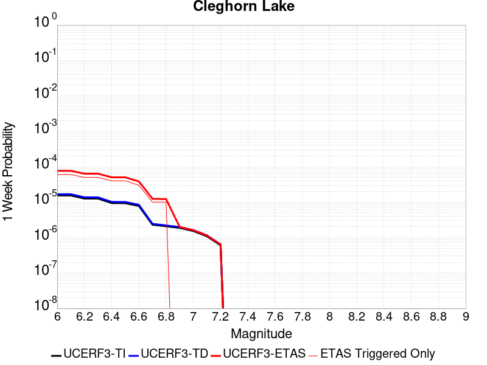 |  |  |  |

| Magnitude | 1 wk TI Prob | 1 wk TD Prob | 1 wk ETAS Prob | 1 wk ETAS/TD Gain | 1 wk ETAS Triggered Only | 1 mo TI Prob | 1 mo TD Prob | 1 mo ETAS Prob | 1 mo ETAS/TD Gain | 1 mo ETAS Triggered Only | 1 yr TI Prob | 1 yr TD Prob | 1 yr ETAS Prob | 1 yr ETAS/TD Gain | 1 yr ETAS Triggered Only | 10 yr TI Prob | 10 yr TD Prob | 10 yr ETAS Prob | 10 yr ETAS/TD Gain | 10 yr ETAS Triggered Only |
|-----|-----|-----|-----|-----|-----|-----|-----|-----|-----|-----|-----|-----|-----|-----|-----|-----|-----|-----|-----|-----|
| 6.0 | 1.5467183E-5 | 1.6794203E-5 | 1.0753678E-4 | 6.4032083 | 9.07441E-5 | 6.6286244E-5 | 7.197348E-5 | 1.9900608E-4 | 2.7649918 | 1.2704174E-4 | 8.067362E-4 | 8.759797E-4 | 0.001039176 | 1.1863015 | 1.6333938E-4 | 0.008038137 | 0.008730696 | 0.00894658 | 1.0247271 | 2.1778584E-4 |
| 6.1 | 1.5467183E-5 | 1.6794203E-5 | 1.0753678E-4 | 6.4032083 | 9.07441E-5 | 6.6286244E-5 | 7.197348E-5 | 1.9900608E-4 | 2.7649918 | 1.2704174E-4 | 8.067362E-4 | 8.759797E-4 | 0.001039176 | 1.1863015 | 1.6333938E-4 | 0.008038137 | 0.008730696 | 0.00894658 | 1.0247271 | 2.1778584E-4 |
| 6.2 | 1.2624631E-5 | 1.3681544E-5 | 8.627583E-5 | 6.3060007 | 7.259528E-5 | 5.410444E-5 | 5.863415E-5 | 1.6752069E-4 | 2.85705 | 1.0889292E-4 | 6.585225E-4 | 7.1368564E-4 | 8.5877255E-4 | 1.2032925 | 1.4519056E-4 | 0.0065657445 | 0.0071187317 | 0.0073169474 | 1.0278443 | 1.9963703E-4 |
| 6.3 | 1.2624631E-5 | 1.3681544E-5 | 8.627583E-5 | 6.3060007 | 7.259528E-5 | 5.410444E-5 | 5.863415E-5 | 1.6752069E-4 | 2.85705 | 1.0889292E-4 | 6.585225E-4 | 7.1368564E-4 | 8.5877255E-4 | 1.2032925 | 1.4519056E-4 | 0.0065657445 | 0.0071187317 | 0.0073169474 | 1.0278443 | 1.9963703E-4 |
| 6.4 | 9.417684E-6 | 1.0170118E-5 | 6.4616026E-5 | 6.353518 | 5.444646E-5 | 4.036088E-5 | 4.3585722E-5 | 1.1617784E-4 | 2.6655023 | 7.259528E-5 | 4.912829E-4 | 5.3056807E-4 | 6.21264E-4 | 1.1709412 | 9.07441E-5 | 0.004901982 | 0.005297049 | 0.005423418 | 1.0238564 | 1.2704174E-4 |
| 6.5 | 9.368219E-6 | 1.0117545E-5 | 6.456346E-5 | 6.3813367 | 5.444646E-5 | 4.014889E-5 | 4.3360415E-5 | 1.1595255E-4 | 2.674157 | 7.259528E-5 | 4.8870314E-4 | 5.2782625E-4 | 6.1852246E-4 | 1.1718297 | 9.07441E-5 | 0.004876298 | 0.0052697617 | 0.0053961338 | 1.0239806 | 1.2704174E-4 |
| 6.6 | 7.803798E-6 | 8.441831E-6 | 4.4739165E-5 | 5.2996993 | 3.629764E-5 | 3.3444423E-5 | 3.6179E-5 | 9.062349E-5 | 2.5048645 | 5.444646E-5 | 4.0710976E-4 | 4.4043022E-4 | 5.1299355E-4 | 1.1647555 | 7.259528E-5 | 0.0040636472 | 0.0043994905 | 0.0045079044 | 1.0246423 | 1.0889292E-4 |
| 6.7 | 2.3108669E-6 | 2.4438336E-6 | 2.059261E-5 | 8.426355 | 1.814882E-5 | 9.903678E-6 | 1.0473532E-5 | 2.8622162E-5 | 2.732809 | 1.814882E-5 | 1.205706E-4 | 1.2750797E-4 | 1.4565449E-4 | 1.1423166 | 1.814882E-5 | 0.001205052 | 0.0012743667 | 0.0012924925 | 1.0142233 | 1.814882E-5 |
| 6.8 | 2.0882828E-6 | 2.2062823E-6 | 2.0355063E-5 | 9.225956 | 1.814882E-5 | 8.949753E-6 | 9.455462E-6 | 2.760411E-5 | 2.9193826 | 1.814882E-5 | 1.08957785E-4 | 1.1511434E-4 | 1.3326107E-4 | 1.1576409 | 1.814882E-5 | 0.0010890438 | 0.0011505639 | 0.0011686919 | 1.0157557 | 1.814882E-5 |
| 6.9 | 1.876935E-6 | 1.981051E-6 | 1.981051E-6 | 1.0 | 0.0 | 8.043982E-6 | 8.490192E-6 | 8.490192E-6 | 1.0 | 0.0 | 9.7931086E-5 | 1.03363345E-4 | 1.03363345E-4 | 1.0 | 0.0 | 9.788794E-4 | 0.0010331686 | 0.0010331686 | 1.0 | 0.0 |
| 7.0 | 1.5357559E-6 | 1.6202807E-6 | 1.6202807E-6 | 1.0 | 0.0 | 6.5817944E-6 | 6.9440425E-6 | 6.9440425E-6 | 1.0 | 0.0 | 8.01304E-5 | 8.454057E-5 | 8.454057E-5 | 1.0 | 0.0 | 8.010151E-4 | 8.450965E-4 | 8.450965E-4 | 1.0 | 0.0 |
| 7.1 | 1.0905424E-6 | 1.1497619E-6 | 1.1497619E-6 | 1.0 | 0.0 | 4.6737446E-6 | 4.9275427E-6 | 4.9275427E-6 | 1.0 | 0.0 | 5.6901354E-5 | 5.999128E-5 | 5.999128E-5 | 1.0 | 0.0 | 5.6886784E-4 | 5.997606E-4 | 5.997606E-4 | 1.0 | 0.0 |
| 7.2 | 6.06668E-7 | 6.387277E-7 | 6.387277E-7 | 1.0 | 0.0 | 2.600003E-6 | 2.7374022E-6 | 2.7374022E-6 | 1.0 | 0.0 | 3.1654577E-5 | 3.3327433E-5 | 3.3327433E-5 | 1.0 | 0.0 | 3.1650066E-4 | 3.3323118E-4 | 3.3323118E-4 | 1.0 | 0.0 |

## Scodie Lineament
*[(top)](#table-of-contents)*

| 1 Week | 1 Month | 1 Year | 10 Year |
|-----|-----|-----|-----|
|  |  | 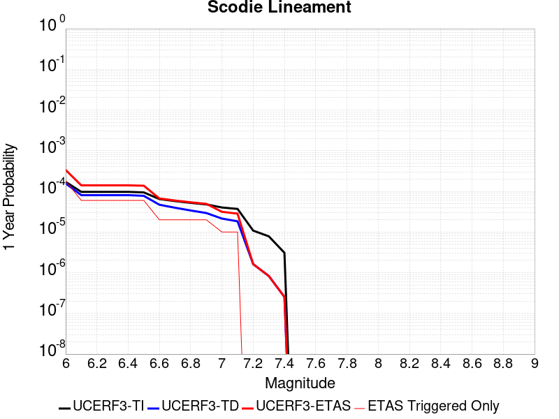 |  |

| Magnitude | 1 wk TI Prob | 1 wk TD Prob | 1 wk ETAS Prob | 1 wk ETAS/TD Gain | 1 wk ETAS Triggered Only | 1 mo TI Prob | 1 mo TD Prob | 1 mo ETAS Prob | 1 mo ETAS/TD Gain | 1 mo ETAS Triggered Only | 1 yr TI Prob | 1 yr TD Prob | 1 yr ETAS Prob | 1 yr ETAS/TD Gain | 1 yr ETAS Triggered Only | 10 yr TI Prob | 10 yr TD Prob | 10 yr ETAS Prob | 10 yr ETAS/TD Gain | 10 yr ETAS Triggered Only |
|-----|-----|-----|-----|-----|-----|-----|-----|-----|-----|-----|-----|-----|-----|-----|-----|-----|-----|-----|-----|-----|
| 6.0 | 3.2919327E-6 | 3.0133422E-6 | 9.375717E-5 | 31.114014 | 9.07441E-5 | 1.4108206E-5 | 1.2914278E-5 | 1.5810296E-4 | 12.242494 | 1.4519056E-4 | 1.7175387E-4 | 1.5722317E-4 | 3.3868285E-4 | 2.1541536 | 1.814882E-4 | 0.0017162118 | 0.0015714309 | 0.0017888745 | 1.138373 | 2.1778584E-4 |
| 6.1 | 1.8663811E-6 | 1.5490499E-6 | 1.9697842E-5 | 12.71608 | 1.814882E-5 | 7.998751E-6 | 6.6387715E-6 | 4.293617E-5 | 6.4674873 | 3.629764E-5 | 9.738045E-5 | 8.082454E-5 | 1.352666E-4 | 1.6735833 | 5.444646E-5 | 9.7337784E-4 | 8.080003E-4 | 8.624027E-4 | 1.0673298 | 5.444646E-5 |
| 6.2 | 1.8663811E-6 | 1.5490499E-6 | 1.9697842E-5 | 12.71608 | 1.814882E-5 | 7.998751E-6 | 6.6387715E-6 | 4.293617E-5 | 6.4674873 | 3.629764E-5 | 9.738045E-5 | 8.082454E-5 | 1.352666E-4 | 1.6735833 | 5.444646E-5 | 9.7337784E-4 | 8.080003E-4 | 8.624027E-4 | 1.0673298 | 5.444646E-5 |
| 6.3 | 1.8663811E-6 | 1.5490499E-6 | 1.9697842E-5 | 12.71608 | 1.814882E-5 | 7.998751E-6 | 6.6387715E-6 | 4.293617E-5 | 6.4674873 | 3.629764E-5 | 9.738045E-5 | 8.082454E-5 | 1.352666E-4 | 1.6735833 | 5.444646E-5 | 9.7337784E-4 | 8.080003E-4 | 8.624027E-4 | 1.0673298 | 5.444646E-5 |
| 6.4 | 1.8663811E-6 | 1.5490499E-6 | 1.9697842E-5 | 12.71608 | 1.814882E-5 | 7.998751E-6 | 6.6387715E-6 | 4.293617E-5 | 6.4674873 | 3.629764E-5 | 9.738045E-5 | 8.082454E-5 | 1.352666E-4 | 1.6735833 | 5.444646E-5 | 9.7337784E-4 | 8.080003E-4 | 8.624027E-4 | 1.0673298 | 5.444646E-5 |
| 6.5 | 1.8106311E-6 | 1.4909839E-6 | 1.9639778E-5 | 13.172359 | 1.814882E-5 | 7.759824E-6 | 6.3899183E-6 | 4.2687327E-5 | 6.680418 | 3.629764E-5 | 9.447177E-5 | 7.7794975E-5 | 1.322372E-4 | 1.6998167 | 5.444646E-5 | 9.4431615E-4 | 7.7772606E-4 | 8.321302E-4 | 1.0699528 | 5.444646E-5 |
| 6.6 | 1.2414679E-6 | 8.997558E-7 | 8.997558E-7 | 1.0 | 0.0 | 5.320566E-6 | 3.856091E-6 | 3.856091E-6 | 1.0 | 0.0 | 6.477596E-5 | 4.6946985E-5 | 4.6946985E-5 | 1.0 | 0.0 | 6.475708E-4 | 4.693793E-4 | 4.693793E-4 | 1.0 | 0.0 |
| 6.7 | 1.1062215E-6 | 7.594311E-7 | 7.594311E-7 | 1.0 | 0.0 | 4.7409408E-6 | 3.2547011E-6 | 3.2547011E-6 | 1.0 | 0.0 | 5.7719422E-5 | 3.9625334E-5 | 3.9625334E-5 | 1.0 | 0.0 | 5.770443E-4 | 3.961897E-4 | 3.961897E-4 | 1.0 | 0.0 |
| 6.8 | 1.0006736E-6 | 6.500397E-7 | 6.500397E-7 | 1.0 | 0.0 | 4.288594E-6 | 2.7858816E-6 | 2.7858816E-6 | 1.0 | 0.0 | 5.221238E-5 | 3.3917644E-5 | 3.3917644E-5 | 1.0 | 0.0 | 5.220012E-4 | 3.3913075E-4 | 3.3913075E-4 | 1.0 | 0.0 |
| 6.9 | 9.167364E-7 | 5.631625E-7 | 5.631625E-7 | 1.0 | 0.0 | 3.9288643E-6 | 2.4135516E-6 | 2.4135516E-6 | 1.0 | 0.0 | 4.7832873E-5 | 2.9384651E-5 | 2.9384651E-5 | 1.0 | 0.0 | 4.782258E-4 | 2.9381333E-4 | 2.9381333E-4 | 1.0 | 0.0 |
| 7.0 | 7.6987664E-7 | 4.113383E-7 | 4.113383E-7 | 1.0 | 0.0 | 3.2994672E-6 | 1.7628774E-6 | 1.7628774E-6 | 1.0 | 0.0 | 4.0170275E-5 | 2.1462862E-5 | 2.1462862E-5 | 1.0 | 0.0 | 4.0163012E-4 | 2.1461173E-4 | 2.1461173E-4 | 1.0 | 0.0 |
| 7.1 | 7.1038727E-7 | 3.5211494E-7 | 3.5211494E-7 | 1.0 | 0.0 | 3.0445133E-6 | 1.5090633E-6 | 1.5090633E-6 | 1.0 | 0.0 | 3.706632E-5 | 1.8372726E-5 | 1.8372726E-5 | 1.0 | 0.0 | 3.7060137E-4 | 1.8371557E-4 | 1.8371557E-4 | 1.0 | 0.0 |
| 7.2 | 2.0799602E-7 | 3.1186854E-8 | 3.1186854E-8 | 1.0 | 0.0 | 8.914113E-7 | 1.3365793E-7 | 1.3365793E-7 | 1.0 | 0.0 | 1.0852878E-5 | 1.6272843E-6 | 1.6272843E-6 | 1.0 | 0.0 | 1.08523476E-4 | 1.627273E-5 | 1.627273E-5 | 1.0 | 0.0 |
| 7.3 | 1.5048182E-7 | 1.5945696E-8 | 1.5945696E-8 | 1.0 | 0.0 | 6.449219E-7 | 6.83387E-8 | 6.83387E-8 | 1.0 | 0.0 | 7.851896E-6 | 8.320234E-7 | 8.320234E-7 | 1.0 | 0.0 | 7.851618E-5 | 8.320206E-6 | 8.320206E-6 | 1.0 | 0.0 |
| 7.4 | 5.9334678E-8 | 4.8683537E-9 | 4.8683537E-9 | 1.0 | 0.0 | 2.5429145E-7 | 2.0864372E-8 | 2.0864372E-8 | 1.0 | 0.0 | 3.095994E-6 | 2.5402372E-7 | 2.5402372E-7 | 1.0 | 0.0 | 3.095951E-5 | 2.5402353E-6 | 2.5402353E-6 | 1.0 | 0.0 |

## Mission Ridge-Arroyo Parida-Santa Ana
*[(top)](#table-of-contents)*

| 1 Week | 1 Month | 1 Year | 10 Year |
|-----|-----|-----|-----|
|  |  |  |  |

| Magnitude | 1 wk TI Prob | 1 wk TD Prob | 1 wk ETAS Prob | 1 wk ETAS/TD Gain | 1 wk ETAS Triggered Only | 1 mo TI Prob | 1 mo TD Prob | 1 mo ETAS Prob | 1 mo ETAS/TD Gain | 1 mo ETAS Triggered Only | 1 yr TI Prob | 1 yr TD Prob | 1 yr ETAS Prob | 1 yr ETAS/TD Gain | 1 yr ETAS Triggered Only | 10 yr TI Prob | 10 yr TD Prob | 10 yr ETAS Prob | 10 yr ETAS/TD Gain | 10 yr ETAS Triggered Only |
|-----|-----|-----|-----|-----|-----|-----|-----|-----|-----|-----|-----|-----|-----|-----|-----|-----|-----|-----|-----|-----|
| 6.0 | 4.169034E-5 | 4.7138263E-5 | 8.343419E-5 | 1.7699887 | 3.629764E-5 | 1.7866064E-4 | 2.0201034E-4 | 2.3830065E-4 | 1.1796458 | 3.629764E-5 | 0.0021730233 | 0.00245745 | 0.002547971 | 1.0368354 | 9.07441E-5 | 0.021518968 | 0.024384614 | 0.024579383 | 1.0079874 | 1.9963703E-4 |
| 6.1 | 1.73813E-5 | 1.6854226E-5 | 3.500274E-5 | 2.0767932 | 1.814882E-5 | 7.4489166E-5 | 7.223046E-5 | 9.0377966E-5 | 1.2512445 | 1.814882E-5 | 9.065282E-4 | 8.790618E-4 | 9.153275E-4 | 1.041255 | 3.629764E-5 | 0.009028391 | 0.008756988 | 0.008846938 | 1.0102718 | 9.07441E-5 |
| 6.2 | 1.4622182E-5 | 1.367329E-5 | 3.1821863E-5 | 2.327301 | 1.814882E-5 | 6.2664985E-5 | 5.8598518E-5 | 7.674628E-5 | 1.3096966 | 1.814882E-5 | 7.6267915E-4 | 7.132073E-4 | 7.4947905E-4 | 1.0508572 | 3.629764E-5 | 0.007600669 | 0.007109627 | 0.0071817064 | 1.0101383 | 7.259528E-5 |
| 6.3 | 1.3552434E-5 | 1.2482201E-5 | 3.0630796E-5 | 2.4539578 | 1.814882E-5 | 5.8080568E-5 | 5.3494066E-5 | 7.1641916E-5 | 1.3392497 | 1.814882E-5 | 7.069015E-4 | 6.510988E-4 | 6.873728E-4 | 1.055712 | 3.629764E-5 | 0.00704657 | 0.006492275 | 0.0065643988 | 1.0111092 | 7.259528E-5 |
| 6.4 | 1.30977305E-5 | 1.1979156E-5 | 3.012776E-5 | 2.5150151 | 1.814882E-5 | 5.613192E-5 | 5.1338247E-5 | 6.948614E-5 | 1.3534964 | 1.814882E-5 | 6.831918E-4 | 6.248669E-4 | 6.611419E-4 | 1.0580523 | 3.629764E-5 | 0.006810953 | 0.0062314444 | 0.006303587 | 1.0115772 | 7.259528E-5 |
| 6.5 | 1.225205E-5 | 1.1048803E-5 | 2.9197423E-5 | 2.642587 | 1.814882E-5 | 5.2507727E-5 | 4.7351168E-5 | 6.549913E-5 | 1.3832632 | 1.814882E-5 | 6.3909404E-4 | 5.7635066E-4 | 5.9448904E-4 | 1.031471 | 1.814882E-5 | 0.006372592 | 0.005748869 | 0.0058030025 | 1.0094163 | 5.444646E-5 |
| 6.6 | 1.1352241E-5 | 1.0063535E-5 | 2.8212173E-5 | 2.8034058 | 1.814882E-5 | 4.8651553E-5 | 4.3128734E-5 | 6.127677E-5 | 1.4207876 | 1.814882E-5 | 5.921717E-4 | 5.2496797E-4 | 5.431072E-4 | 1.0345532 | 1.814882E-5 | 0.0059059616 | 0.0052375244 | 0.0052916855 | 1.010341 | 5.444646E-5 |
| 6.7 | 1.0864116E-5 | 9.517027E-6 | 2.7665674E-5 | 2.906966 | 1.814882E-5 | 4.6559664E-5 | 4.0786632E-5 | 5.893471E-5 | 1.4449517 | 1.814882E-5 | 5.667165E-4 | 4.964661E-4 | 5.146059E-4 | 1.0365379 | 1.814882E-5 | 0.005652734 | 0.004953804 | 0.0050079804 | 1.0109364 | 5.444646E-5 |
| 6.8 | 1.0666365E-5 | 9.299779E-6 | 2.744843E-5 | 2.9515142 | 1.814882E-5 | 4.571219E-5 | 3.9855597E-5 | 5.8003694E-5 | 1.4553462 | 1.814882E-5 | 5.564038E-4 | 4.8513585E-4 | 5.032759E-4 | 1.0373917 | 1.814882E-5 | 0.005550127 | 0.0048410003 | 0.004895183 | 1.0111924 | 5.444646E-5 |
| 6.9 | 1.0038665E-5 | 8.592046E-6 | 2.674071E-5 | 3.1122637 | 1.814882E-5 | 4.302214E-5 | 3.682254E-5 | 5.4970693E-5 | 1.4928544 | 1.814882E-5 | 5.236687E-4 | 4.4822405E-4 | 4.6636473E-4 | 1.0404724 | 1.814882E-5 | 0.005224364 | 0.004473411 | 0.0045276135 | 1.0121167 | 5.444646E-5 |
| 7.0 | 9.5379955E-6 | 8.025073E-6 | 2.6173748E-5 | 3.2614965 | 1.814882E-5 | 4.0876483E-5 | 3.4392728E-5 | 5.2540923E-5 | 1.5276754 | 1.814882E-5 | 4.975576E-4 | 4.1865272E-4 | 4.3679393E-4 | 1.0433323 | 1.814882E-5 | 0.00496445 | 0.0041788397 | 0.0042330585 | 1.0129746 | 5.444646E-5 |
| 7.1 | 9.207389E-6 | 7.652375E-6 | 2.5801057E-5 | 3.3716404 | 1.814882E-5 | 3.945964E-5 | 3.279549E-5 | 5.0943716E-5 | 1.5533756 | 1.814882E-5 | 4.803152E-4 | 3.9921363E-4 | 4.1735522E-4 | 1.0454433 | 1.814882E-5 | 0.004792784 | 0.003985161 | 0.0040393905 | 1.0136079 | 5.444646E-5 |
| 7.2 | 7.638091E-6 | 5.9311183E-6 | 2.407983E-5 | 4.059914 | 1.814882E-5 | 3.2734264E-5 | 2.541883E-5 | 4.356719E-5 | 1.7139729 | 1.814882E-5 | 3.984668E-4 | 3.0943064E-4 | 3.2757383E-4 | 1.0586342 | 1.814882E-5 | 0.0039775306 | 0.0030900547 | 0.003144333 | 1.0175655 | 5.444646E-5 |
| 7.3 | 7.2500147E-6 | 5.5961527E-6 | 2.3744871E-5 | 4.2430706 | 1.814882E-5 | 3.1071122E-5 | 2.3983293E-5 | 4.2131676E-5 | 1.7567095 | 1.814882E-5 | 3.7822526E-4 | 2.9195778E-4 | 3.1010128E-4 | 1.0621443 | 1.814882E-5 | 0.0037758215 | 0.0029157975 | 0.0029519894 | 1.0124123 | 3.629764E-5 |
| 7.4 | 6.3899715E-6 | 4.9184964E-6 | 2.3067227E-5 | 4.689894 | 1.814882E-5 | 2.7385306E-5 | 2.10791E-5 | 3.922754E-5 | 1.8609684 | 1.814882E-5 | 3.3336508E-4 | 2.5660804E-4 | 2.7475218E-4 | 1.0707077 | 1.814882E-5 | 0.0033286542 | 0.0025631618 | 0.0025993662 | 1.014125 | 3.629764E-5 |
| 7.5 | 5.379025E-6 | 4.0838527E-6 | 2.22326E-5 | 5.4440255 | 1.814882E-5 | 2.305276E-5 | 1.7502109E-5 | 3.5650613E-5 | 2.0369322 | 1.814882E-5 | 2.806312E-4 | 2.1306744E-4 | 2.312124E-4 | 1.0851606 | 1.814882E-5 | 0.0028027708 | 0.002128643 | 0.0021648633 | 1.0170157 | 3.629764E-5 |
| 7.6 | 4.1270696E-6 | 3.0883439E-6 | 2.1237109E-5 | 6.876536 | 1.814882E-5 | 1.768732E-5 | 1.3235693E-5 | 3.1384272E-5 | 2.3711848 | 1.814882E-5 | 2.1532185E-4 | 1.6113273E-4 | 1.7927862E-4 | 1.1126146 | 1.814882E-5 | 0.0021511333 | 0.001610167 | 0.0016282866 | 1.0112532 | 1.814882E-5 |
| 7.7 | 2.5406805E-6 | 1.8282013E-6 | 1.8282013E-6 | 1.0 | 0.0 | 1.0888585E-5 | 7.835125E-6 | 7.835125E-6 | 1.0 | 0.0 | 1.3256045E-4 | 9.538854E-5 | 9.538854E-5 | 1.0 | 0.0 | 0.0013248142 | 9.534821E-4 | 9.534821E-4 | 1.0 | 0.0 |
| 7.8 | 4.8608285E-7 | 3.5098864E-7 | 3.5098864E-7 | 1.0 | 0.0 | 2.0832106E-6 | 1.5042363E-6 | 1.5042363E-6 | 1.0 | 0.0 | 2.5362791E-5 | 1.8313924E-5 | 1.8313924E-5 | 1.0 | 0.0 | 2.5359896E-4 | 1.8312426E-4 | 1.8312426E-4 | 1.0 | 0.0 |
| 7.9 | 2.0472514E-8 | 1.2688783E-8 | 1.2688783E-8 | 1.0 | 0.0 | 8.7739345E-8 | 5.43805E-8 | 5.43805E-8 | 1.0 | 0.0 | 1.068226E-6 | 6.6208236E-7 | 6.6208236E-7 | 1.0 | 0.0 | 1.0682209E-5 | 6.620805E-6 | 6.620805E-6 | 1.0 | 0.0 |
| 8.0 | 4.443582E-9 | 2.0321211E-9 | 2.0321211E-9 | 1.0 | 0.0 | 1.9043922E-8 | 8.70909E-9 | 8.70909E-9 | 1.0 | 0.0 | 2.3185973E-7 | 1.0603316E-7 | 1.0603316E-7 | 1.0 | 0.0 | 2.3185949E-6 | 1.0603312E-6 | 1.0603312E-6 | 1.0 | 0.0 |

## Camp Rock 2011
*[(top)](#table-of-contents)*

| 1 Week | 1 Month | 1 Year | 10 Year |
|-----|-----|-----|-----|
| 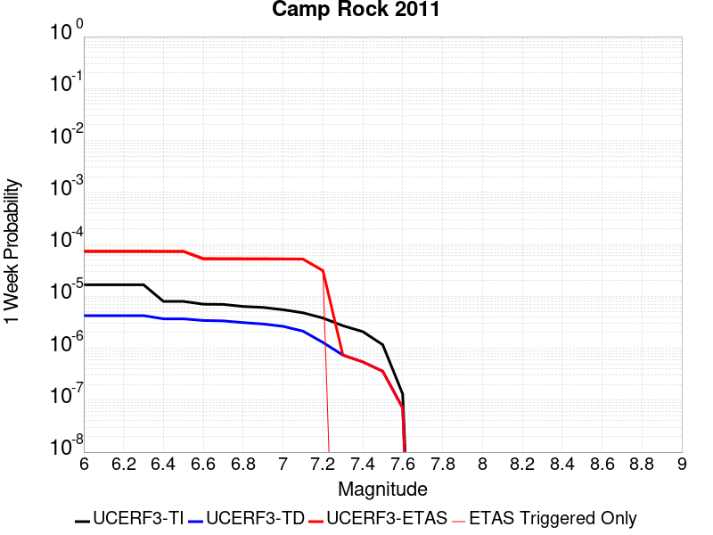 |  |  |  |

| Magnitude | 1 wk TI Prob | 1 wk TD Prob | 1 wk ETAS Prob | 1 wk ETAS/TD Gain | 1 wk ETAS Triggered Only | 1 mo TI Prob | 1 mo TD Prob | 1 mo ETAS Prob | 1 mo ETAS/TD Gain | 1 mo ETAS Triggered Only | 1 yr TI Prob | 1 yr TD Prob | 1 yr ETAS Prob | 1 yr ETAS/TD Gain | 1 yr ETAS Triggered Only | 10 yr TI Prob | 10 yr TD Prob | 10 yr ETAS Prob | 10 yr ETAS/TD Gain | 10 yr ETAS Triggered Only |
|-----|-----|-----|-----|-----|-----|-----|-----|-----|-----|-----|-----|-----|-----|-----|-----|-----|-----|-----|-----|-----|
| 6.0 | 1.6710783E-5 | 4.25026E-6 | 7.684523E-5 | 18.080124 | 7.259528E-5 | 7.161568E-5 | 1.8215276E-5 | 1.0895773E-4 | 5.981667 | 9.07441E-5 | 8.7157206E-4 | 2.2174895E-4 | 4.213417E-4 | 1.9000843 | 1.9963703E-4 | 0.008681616 | 0.0022153298 | 0.0024145246 | 1.0899166 | 1.9963703E-4 |
| 6.1 | 1.6710783E-5 | 4.25026E-6 | 7.684523E-5 | 18.080124 | 7.259528E-5 | 7.161568E-5 | 1.8215276E-5 | 1.0895773E-4 | 5.981667 | 9.07441E-5 | 8.7157206E-4 | 2.2174895E-4 | 4.213417E-4 | 1.9000843 | 1.9963703E-4 | 0.008681616 | 0.0022153298 | 0.0024145246 | 1.0899166 | 1.9963703E-4 |
| 6.2 | 1.6710783E-5 | 4.25026E-6 | 7.684523E-5 | 18.080124 | 7.259528E-5 | 7.161568E-5 | 1.8215276E-5 | 1.0895773E-4 | 5.981667 | 9.07441E-5 | 8.7157206E-4 | 2.2174895E-4 | 4.213417E-4 | 1.9000843 | 1.9963703E-4 | 0.008681616 | 0.0022153298 | 0.0024145246 | 1.0899166 | 1.9963703E-4 |
| 6.3 | 1.6710783E-5 | 4.25026E-6 | 7.684523E-5 | 18.080124 | 7.259528E-5 | 7.161568E-5 | 1.8215276E-5 | 1.0895773E-4 | 5.981667 | 9.07441E-5 | 8.7157206E-4 | 2.2174895E-4 | 4.213417E-4 | 1.9000843 | 1.9963703E-4 | 0.008681616 | 0.0022153298 | 0.0024145246 | 1.0899166 | 1.9963703E-4 |
| 6.4 | 7.982846E-6 | 3.6820884E-6 | 7.62771E-5 | 20.715717 | 7.259528E-5 | 3.421175E-5 | 1.5780286E-5 | 1.0652296E-4 | 6.750382 | 9.07441E-5 | 4.1644843E-4 | 1.9210839E-4 | 3.7356172E-4 | 1.9445362 | 1.814882E-4 | 0.0041566887 | 0.001919458 | 0.0021005978 | 1.0943704 | 1.814882E-4 |
| 6.5 | 7.982846E-6 | 3.6820884E-6 | 7.62771E-5 | 20.715717 | 7.259528E-5 | 3.421175E-5 | 1.5780286E-5 | 1.0652296E-4 | 6.750382 | 9.07441E-5 | 4.1644843E-4 | 1.9210839E-4 | 3.7356172E-4 | 1.9445362 | 1.814882E-4 | 0.0041566887 | 0.001919458 | 0.0021005978 | 1.0943704 | 1.814882E-4 |
| 6.6 | 7.048869E-6 | 3.4243571E-6 | 5.787063E-5 | 16.899706 | 5.444646E-5 | 3.0209088E-5 | 1.4675736E-5 | 8.726995E-5 | 5.946547 | 7.259528E-5 | 3.677336E-4 | 1.7866275E-4 | 3.4197295E-4 | 1.9140697 | 1.6333938E-4 | 0.0036712566 | 0.0017852228 | 0.0019482706 | 1.0913318 | 1.6333938E-4 |
| 6.7 | 6.987307E-6 | 3.3623348E-6 | 5.780861E-5 | 17.192997 | 5.444646E-5 | 2.9945259E-5 | 1.4409929E-5 | 8.700416E-5 | 6.037793 | 7.259528E-5 | 3.6452254E-4 | 1.7542706E-4 | 3.387378E-4 | 1.9309324 | 1.6333938E-4 | 0.0036392517 | 0.001752917 | 0.00191597 | 1.0930182 | 1.6333938E-4 |
| 6.8 | 6.3737602E-6 | 3.1179077E-6 | 5.75642E-5 | 18.462444 | 5.444646E-5 | 2.731583E-5 | 1.3362394E-5 | 8.595671E-5 | 6.432732 | 7.259528E-5 | 3.3251947E-4 | 1.626753E-4 | 3.259881E-4 | 2.003919 | 1.6333938E-4 | 0.0033202237 | 0.0016255907 | 0.0017886646 | 1.1003166 | 1.6333938E-4 |
| 6.9 | 6.112211E-6 | 2.9331156E-6 | 5.7379417E-5 | 19.562616 | 5.444646E-5 | 2.6194928E-5 | 1.2570436E-5 | 8.516481E-5 | 6.7750077 | 7.259528E-5 | 3.1887658E-4 | 1.5303459E-4 | 2.9820294E-4 | 1.9485983 | 1.4519056E-4 | 0.003184194 | 0.0015293199 | 0.0016742884 | 1.0947928 | 1.4519056E-4 |
| 7.0 | 5.5140117E-6 | 2.641923E-6 | 5.708824E-5 | 21.608593 | 5.444646E-5 | 2.3631264E-5 | 1.132248E-5 | 8.391694E-5 | 7.411534 | 7.259528E-5 | 2.8767265E-4 | 1.3784273E-4 | 2.8301327E-4 | 2.053161 | 1.4519056E-4 | 0.0028730053 | 0.0013775975 | 0.001522588 | 1.1052488 | 1.4519056E-4 |
| 7.1 | 4.8151105E-6 | 2.1342705E-6 | 5.6580615E-5 | 26.510519 | 5.444646E-5 | 2.0636026E-5 | 9.146843E-6 | 8.174146E-5 | 8.936577 | 7.259528E-5 | 2.5121463E-4 | 1.1135734E-4 | 2.5653173E-4 | 2.3036807 | 1.4519056E-4 | 0.0025093083 | 0.0011130372 | 0.0012580663 | 1.1303002 | 1.4519056E-4 |
| 7.2 | 3.818335E-6 | 1.2937425E-6 | 1.944254E-5 | 15.028137 | 1.814882E-5 | 1.6364189E-5 | 5.5445994E-6 | 2.369332E-5 | 4.273225 | 1.814882E-5 | 1.9921579E-4 | 6.750349E-5 | 1.2194627E-4 | 1.8065181 | 5.444646E-5 | 0.0019903728 | 6.748381E-4 | 7.2924775E-4 | 1.0806264 | 5.444646E-5 |
| 7.3 | 2.7166698E-6 | 7.3835776E-7 | 7.3835776E-7 | 1.0 | 0.0 | 1.1642818E-5 | 3.1643867E-6 | 3.1643867E-6 | 1.0 | 0.0 | 1.4174209E-4 | 3.8525748E-5 | 5.6673867E-5 | 1.4710647 | 1.814882E-5 | 0.0014165172 | 3.851927E-4 | 4.033345E-4 | 1.047098 | 1.814882E-5 |
| 7.4 | 2.0893426E-6 | 5.4618386E-7 | 5.4618386E-7 | 1.0 | 0.0 | 8.954295E-6 | 2.3407858E-6 | 2.3407858E-6 | 1.0 | 0.0 | 1.0901308E-4 | 2.84987E-5 | 2.84987E-5 | 1.0 | 0.0 | 0.0010895962 | 2.84951E-4 | 2.84951E-4 | 1.0 | 0.0 |
| 7.5 | 1.1681728E-6 | 3.6030585E-7 | 3.6030585E-7 | 1.0 | 0.0 | 5.0064455E-6 | 1.544167E-6 | 1.544167E-6 | 1.0 | 0.0 | 6.0951766E-5 | 1.8800076E-5 | 1.8800076E-5 | 1.0 | 0.0 | 6.093505E-4 | 1.8798532E-4 | 1.8798532E-4 | 1.0 | 0.0 |
| 7.6 | 1.3154387E-7 | 7.1197384E-8 | 7.1197384E-8 | 1.0 | 0.0 | 5.6375933E-7 | 3.051316E-7 | 3.051316E-7 | 1.0 | 0.0 | 6.863748E-6 | 3.7149728E-6 | 3.7149728E-6 | 1.0 | 0.0 | 6.863536E-5 | 3.7149264E-5 | 3.7149264E-5 | 1.0 | 0.0 |

## Brawley (Seismic Zone) alt 1
*[(top)](#table-of-contents)*

| 1 Week | 1 Month | 1 Year | 10 Year |
|-----|-----|-----|-----|
| 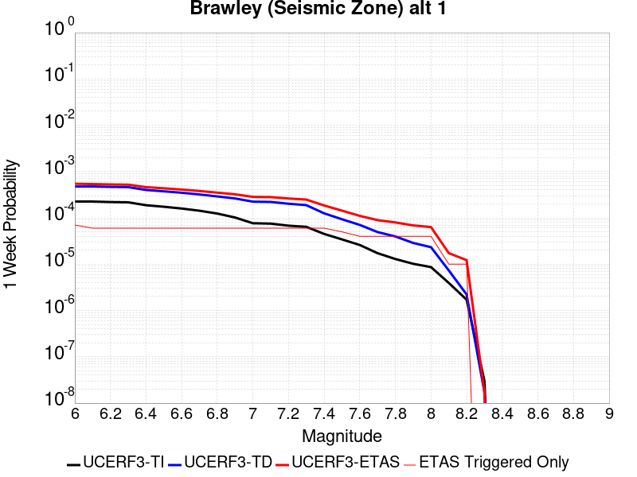 |  | 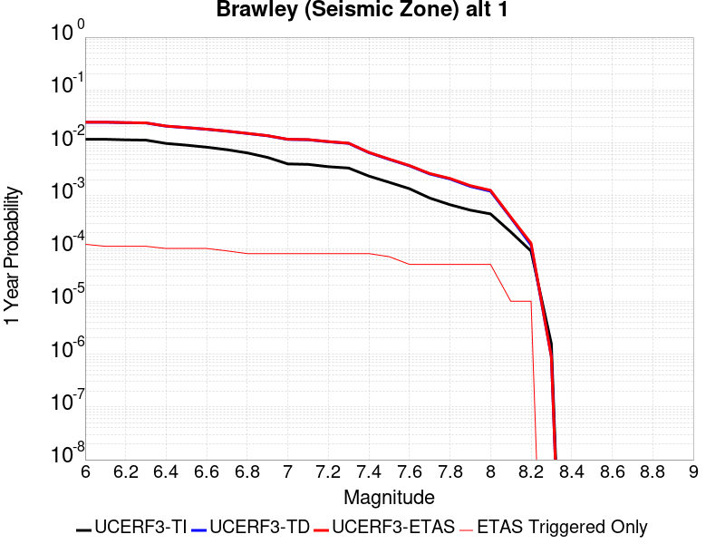 |  |

| Magnitude | 1 wk TI Prob | 1 wk TD Prob | 1 wk ETAS Prob | 1 wk ETAS/TD Gain | 1 wk ETAS Triggered Only | 1 mo TI Prob | 1 mo TD Prob | 1 mo ETAS Prob | 1 mo ETAS/TD Gain | 1 mo ETAS Triggered Only | 1 yr TI Prob | 1 yr TD Prob | 1 yr ETAS Prob | 1 yr ETAS/TD Gain | 1 yr ETAS Triggered Only | 10 yr TI Prob | 10 yr TD Prob | 10 yr ETAS Prob | 10 yr ETAS/TD Gain | 10 yr ETAS Triggered Only |
|-----|-----|-----|-----|-----|-----|-----|-----|-----|-----|-----|-----|-----|-----|-----|-----|-----|-----|-----|-----|-----|
| 6.0 | 2.2521618E-4 | 4.7632487E-4 | 5.3074537E-4 | 1.1142509 | 5.444646E-5 | 9.6485513E-4 | 0.0020398323 | 0.0021485032 | 1.0532744 | 1.0889292E-4 | 0.011683988 | 0.024546238 | 0.024687864 | 1.0057698 | 1.4519056E-4 | 0.11088423 | 0.21350002 | 0.21365704 | 1.0007354 | 1.9963703E-4 |
| 6.1 | 2.2521618E-4 | 4.7632487E-4 | 5.1260524E-4 | 1.0761672 | 3.629764E-5 | 9.6485513E-4 | 0.0020398323 | 0.0021303913 | 1.0443953 | 9.07441E-5 | 0.011683988 | 0.024546238 | 0.02467016 | 1.0050485 | 1.2704174E-4 | 0.11088423 | 0.21350002 | 0.21364276 | 1.0006685 | 1.814882E-4 |
| 6.2 | 2.198148E-4 | 4.6717093E-4 | 5.034516E-4 | 1.0776604 | 3.629764E-5 | 9.417233E-4 | 0.0020006616 | 0.002091224 | 1.0452663 | 9.07441E-5 | 0.011405343 | 0.024080504 | 0.024204485 | 1.0051486 | 1.2704174E-4 | 0.10837428 | 0.20993657 | 0.21007995 | 1.000683 | 1.814882E-4 |
| 6.3 | 2.1704129E-4 | 4.615278E-4 | 4.978087E-4 | 1.0786104 | 3.629764E-5 | 9.298453E-4 | 0.0019765133 | 0.0020670781 | 1.0458205 | 9.07441E-5 | 0.011262234 | 0.02379366 | 0.02391768 | 1.0052123 | 1.2704174E-4 | 0.107082725 | 0.20782755 | 0.20797132 | 1.0006918 | 1.814882E-4 |
| 6.4 | 1.876142E-4 | 4.00449E-4 | 4.367321E-4 | 1.0906061 | 3.629764E-5 | 8.038131E-4 | 0.0017150956 | 0.0017875663 | 1.0422547 | 7.259528E-5 | 0.00974259 | 0.020680401 | 0.020787042 | 1.0051566 | 1.0889292E-4 | 0.093263686 | 0.18457815 | 0.18471134 | 1.0007216 | 1.6333938E-4 |
| 6.5 | 1.7390939E-4 | 3.7477075E-4 | 4.110548E-4 | 1.0968167 | 3.629764E-5 | 7.45113E-4 | 0.0016051838 | 0.0016776626 | 1.0451529 | 7.259528E-5 | 0.009034078 | 0.019368723 | 0.019475507 | 1.0055132 | 1.0889292E-4 | 0.086755216 | 0.17440031 | 0.17453517 | 1.0007732 | 1.6333938E-4 |
| 6.6 | 1.591791E-4 | 3.4891962E-4 | 3.852046E-4 | 1.1039923 | 3.629764E-5 | 6.8201777E-4 | 0.0014945229 | 0.0015670097 | 1.0485016 | 7.259528E-5 | 0.008271996 | 0.018045569 | 0.018152498 | 1.0059254 | 1.0889292E-4 | 0.07970774 | 0.16380852 | 0.16394511 | 1.0008337 | 1.6333938E-4 |
| 6.7 | 1.4268003E-4 | 3.20582E-4 | 3.5686803E-4 | 1.1131879 | 3.629764E-5 | 6.1134255E-4 | 0.0013732077 | 0.0014457032 | 1.0527929 | 7.259528E-5 | 0.007417723 | 0.016592601 | 0.01668184 | 1.0053782 | 9.07441E-5 | 0.07174956 | 0.15193306 | 0.1520562 | 1.0008104 | 1.4519056E-4 |
| 6.8 | 1.239713E-4 | 2.9053655E-4 | 3.2682365E-4 | 1.1248969 | 3.629764E-5 | 5.3119735E-4 | 0.0012445687 | 0.0012989474 | 1.0436928 | 5.444646E-5 | 0.0064481674 | 0.015048777 | 0.01512028 | 1.0047514 | 7.259528E-5 | 0.06264243 | 0.13837762 | 0.13848709 | 1.0007911 | 1.2704174E-4 |
| 6.9 | 1.0180238E-4 | 2.625439E-4 | 2.9883202E-4 | 1.1382173 | 3.629764E-5 | 4.3622297E-4 | 0.0011247073 | 0.0011790924 | 1.048355 | 5.444646E-5 | 0.005298089 | 0.013608336 | 0.013679943 | 1.005262 | 7.259528E-5 | 0.05173543 | 0.124961674 | 0.12507284 | 1.0008897 | 1.2704174E-4 |
| 7.0 | 7.6619996E-5 | 2.23993E-4 | 2.602825E-4 | 1.1620119 | 3.629764E-5 | 3.283301E-4 | 9.5962E-4 | 0.0010140142 | 1.0566831 | 5.444646E-5 | 0.0039900932 | 0.011621496 | 0.011693247 | 1.0061741 | 7.259528E-5 | 0.039192066 | 0.107266866 | 0.10738028 | 1.0010573 | 1.2704174E-4 |
| 7.1 | 7.5127435E-5 | 2.2082464E-4 | 2.5711427E-4 | 1.1643368 | 3.629764E-5 | 3.2193496E-4 | 9.4605127E-4 | 0.0010004462 | 1.0574968 | 5.444646E-5 | 0.0039125155 | 0.011458045 | 0.011529808 | 1.0062631 | 7.259528E-5 | 0.038443442 | 0.10583085 | 0.10594445 | 1.0010734 | 1.2704174E-4 |
| 7.2 | 6.788582E-5 | 2.0210193E-4 | 2.3839224E-4 | 1.1795644 | 3.629764E-5 | 2.9090676E-4 | 8.6586666E-4 | 9.20266E-4 | 1.0628264 | 5.444646E-5 | 0.0035360386 | 0.0104916105 | 0.010563444 | 1.0068468 | 7.259528E-5 | 0.034803 | 0.09750131 | 0.097615965 | 1.0011759 | 1.2704174E-4 |
| 7.3 | 6.399602E-5 | 1.8841137E-4 | 2.2470218E-4 | 1.1926147 | 3.629764E-5 | 2.7423984E-4 | 8.072303E-4 | 8.616328E-4 | 1.067394 | 5.444646E-5 | 0.0033337586 | 0.009784332 | 0.009856216 | 1.007347 | 7.259528E-5 | 0.03284188 | 0.09139617 | 0.09151159 | 1.001263 | 1.2704174E-4 |
| 7.4 | 4.506759E-5 | 1.2529209E-4 | 1.6158518E-4 | 1.2896678 | 3.629764E-5 | 1.9313251E-4 | 5.368565E-4 | 5.912737E-4 | 1.1013627 | 5.444646E-5 | 0.0023488526 | 0.0065168133 | 0.0065889354 | 1.0110672 | 7.259528E-5 | 0.023241805 | 0.062363707 | 0.062482823 | 1.0019101 | 1.2704174E-4 |
| 7.5 | 3.43289E-5 | 9.33541E-5 | 1.1150123E-4 | 1.1943903 | 1.814882E-5 | 1.4711556E-4 | 4.00028E-4 | 4.363111E-4 | 1.0907015 | 3.629764E-5 | 0.0017896603 | 0.0048595266 | 0.0049137087 | 1.0111496 | 5.444646E-5 | 0.01775316 | 0.04705519 | 0.047158957 | 1.0022053 | 1.0889292E-4 |
| 7.6 | 2.5980507E-5 | 7.053101E-5 | 8.867855E-5 | 1.2572987 | 1.814882E-5 | 1.1134028E-4 | 3.0224086E-4 | 3.203842E-4 | 1.0600294 | 1.814882E-5 | 0.001354725 | 0.003673598 | 0.0037097621 | 1.0098444 | 3.629764E-5 | 0.013464959 | 0.035840835 | 0.035928328 | 1.0024412 | 9.07441E-5 |
| 7.7 | 1.7292105E-5 | 4.9407296E-5 | 6.755522E-5 | 1.3673127 | 1.814882E-5 | 7.4106916E-5 | 2.117284E-4 | 2.2987337E-4 | 1.0856993 | 1.814882E-5 | 9.018782E-4 | 0.0025747516 | 0.0026109559 | 1.0140612 | 3.629764E-5 | 0.008982267 | 0.025290398 | 0.025378847 | 1.0034974 | 9.07441E-5 |
| 7.8 | 1.2927471E-5 | 3.9693266E-5 | 5.7841367E-5 | 1.4572085 | 1.814882E-5 | 5.5402274E-5 | 1.7010293E-4 | 1.8824867E-4 | 1.106675 | 1.814882E-5 | 6.743139E-4 | 0.0020690386 | 0.0021052612 | 1.017507 | 3.629764E-5 | 0.0067227143 | 0.020431727 | 0.020520618 | 1.0043505 | 9.07441E-5 |
| 7.9 | 1.0200774E-5 | 2.874569E-5 | 4.6893987E-5 | 1.6313398 | 1.814882E-5 | 4.371687E-5 | 1.2319001E-4 | 1.4133658E-4 | 1.1473056 | 1.814882E-5 | 5.321229E-4 | 0.0014988075 | 0.0015350507 | 1.0241814 | 3.629764E-5 | 0.005308505 | 0.014991644 | 0.0150810275 | 1.0059623 | 9.07441E-5 |
| 8.0 | 8.650396E-6 | 2.3277367E-5 | 4.1425767E-5 | 1.7796586 | 1.814882E-5 | 3.70726E-5 | 9.975634E-5 | 1.1790335E-4 | 1.1819134 | 1.814882E-5 | 4.5126543E-4 | 0.0012138576 | 0.0012501111 | 1.0298665 | 3.629764E-5 | 0.0045035016 | 0.012211097 | 0.012300733 | 1.0073406 | 9.07441E-5 |
| 8.1 | 3.9368224E-6 | 7.3279825E-6 | 7.3279825E-6 | 1.0 | 0.0 | 1.6871985E-5 | 3.140526E-5 | 3.140526E-5 | 1.0 | 0.0 | 2.0539707E-4 | 3.8229208E-4 | 3.8229208E-4 | 1.0 | 0.0 | 0.0020520731 | 0.004001185 | 0.004001185 | 1.0 | 0.0 |
| 8.2 | 1.7101195E-6 | 2.217876E-6 | 2.217876E-6 | 1.0 | 0.0 | 7.329063E-6 | 9.505149E-6 | 9.505149E-6 | 1.0 | 0.0 | 8.922769E-5 | 1.1571907E-4 | 1.1571907E-4 | 1.0 | 0.0 | 8.9191867E-4 | 0.0012666774 | 0.0012666774 | 1.0 | 0.0 |
| 8.3 | 3.0346666E-8 | 1.721586E-8 | 1.721586E-8 | 1.0 | 0.0 | 1.3005713E-7 | 7.378226E-8 | 7.378226E-8 | 1.0 | 0.0 | 1.5834444E-6 | 8.9829894E-7 | 8.9829894E-7 | 1.0 | 0.0 | 1.5834332E-5 | 9.367729E-6 | 9.367729E-6 | 1.0 | 0.0 |

## San Jacinto (San Jacinto Valley) rev
*[(top)](#table-of-contents)*

| 1 Week | 1 Month | 1 Year | 10 Year |
|-----|-----|-----|-----|
|  |  |  |  |

| Magnitude | 1 wk TI Prob | 1 wk TD Prob | 1 wk ETAS Prob | 1 wk ETAS/TD Gain | 1 wk ETAS Triggered Only | 1 mo TI Prob | 1 mo TD Prob | 1 mo ETAS Prob | 1 mo ETAS/TD Gain | 1 mo ETAS Triggered Only | 1 yr TI Prob | 1 yr TD Prob | 1 yr ETAS Prob | 1 yr ETAS/TD Gain | 1 yr ETAS Triggered Only | 10 yr TI Prob | 10 yr TD Prob | 10 yr ETAS Prob | 10 yr ETAS/TD Gain | 10 yr ETAS Triggered Only |
|-----|-----|-----|-----|-----|-----|-----|-----|-----|-----|-----|-----|-----|-----|-----|-----|-----|-----|-----|-----|-----|
| 6.0 | 3.652694E-5 | 3.4402394E-5 | 1.4329157E-4 | 4.165163 | 1.0889292E-4 | 1.5653463E-4 | 1.474305E-4 | 2.5630736E-4 | 1.7384962 | 1.0889292E-4 | 0.0019041431 | 0.00179349 | 0.0019203039 | 1.0707079 | 1.2704174E-4 | 0.018879099 | 0.018526595 | 0.018722534 | 1.010576 | 1.9963703E-4 |
| 6.1 | 3.652694E-5 | 3.4402394E-5 | 1.4329157E-4 | 4.165163 | 1.0889292E-4 | 1.5653463E-4 | 1.474305E-4 | 2.5630736E-4 | 1.7384962 | 1.0889292E-4 | 0.0019041431 | 0.00179349 | 0.0019203039 | 1.0707079 | 1.2704174E-4 | 0.018879099 | 0.018526595 | 0.018722534 | 1.010576 | 1.9963703E-4 |
| 6.2 | 3.652694E-5 | 3.4402394E-5 | 1.4329157E-4 | 4.165163 | 1.0889292E-4 | 1.5653463E-4 | 1.474305E-4 | 2.5630736E-4 | 1.7384962 | 1.0889292E-4 | 0.0019041431 | 0.00179349 | 0.0019203039 | 1.0707079 | 1.2704174E-4 | 0.018879099 | 0.018526595 | 0.018722534 | 1.010576 | 1.9963703E-4 |
| 6.3 | 3.652694E-5 | 3.4402394E-5 | 1.4329157E-4 | 4.165163 | 1.0889292E-4 | 1.5653463E-4 | 1.474305E-4 | 2.5630736E-4 | 1.7384962 | 1.0889292E-4 | 0.0019041431 | 0.00179349 | 0.0019203039 | 1.0707079 | 1.2704174E-4 | 0.018879099 | 0.018526595 | 0.018722534 | 1.010576 | 1.9963703E-4 |
| 6.4 | 3.646941E-5 | 3.432397E-5 | 1.4321315E-4 | 4.1723948 | 1.0889292E-4 | 1.5628811E-4 | 1.4709444E-4 | 2.5597136E-4 | 1.7401837 | 1.0889292E-4 | 0.0019011468 | 0.0017894056 | 0.0019162201 | 1.0708696 | 1.2704174E-4 | 0.018849645 | 0.018486476 | 0.018682422 | 1.0105995 | 1.9963703E-4 |
| 6.5 | 3.646941E-5 | 3.432397E-5 | 1.4321315E-4 | 4.1723948 | 1.0889292E-4 | 1.5628811E-4 | 1.4709444E-4 | 2.5597136E-4 | 1.7401837 | 1.0889292E-4 | 0.0019011468 | 0.0017894056 | 0.0019162201 | 1.0708696 | 1.2704174E-4 | 0.018849645 | 0.018486476 | 0.018682422 | 1.0105995 | 1.9963703E-4 |
| 6.6 | 3.6442503E-5 | 3.4287354E-5 | 1.4317654E-4 | 4.1757827 | 1.0889292E-4 | 1.561728E-4 | 1.4693754E-4 | 2.5581446E-4 | 1.7409742 | 1.0889292E-4 | 0.0018997455 | 0.0017874985 | 0.0019143132 | 1.0709453 | 1.2704174E-4 | 0.018835869 | 0.018467745 | 0.018663695 | 1.0106103 | 1.9963703E-4 |
| 6.7 | 3.6432113E-5 | 3.4272925E-5 | 1.4316212E-4 | 4.1771197 | 1.0889292E-4 | 1.5612828E-4 | 1.4687571E-4 | 2.5575265E-4 | 1.7412862 | 1.0889292E-4 | 0.0018992044 | 0.0017867472 | 0.001913562 | 1.0709752 | 1.2704174E-4 | 0.018830549 | 0.018460369 | 0.01865632 | 1.0106148 | 1.9963703E-4 |
| 6.8 | 3.6409598E-5 | 3.424198E-5 | 1.4313117E-4 | 4.179991 | 1.0889292E-4 | 1.560318E-4 | 1.4674311E-4 | 2.5562005E-4 | 1.7419561 | 1.0889292E-4 | 0.0018980318 | 0.0017851355 | 0.0019119504 | 1.0710394 | 1.2704174E-4 | 0.018819023 | 0.018444523 | 0.018640477 | 1.010624 | 1.9963703E-4 |
| 6.9 | 3.638078E-5 | 3.4202407E-5 | 1.430916E-4 | 4.1836705 | 1.0889292E-4 | 1.5590832E-4 | 1.4657351E-4 | 2.554505E-4 | 1.7428147 | 1.0889292E-4 | 0.0018965311 | 0.001783074 | 0.0019098893 | 1.0711217 | 1.2704174E-4 | 0.018804269 | 0.018424258 | 0.018620215 | 1.010636 | 1.9963703E-4 |
| 7.0 | 3.6294874E-5 | 3.408442E-5 | 1.4297363E-4 | 4.1946917 | 1.0889292E-4 | 1.5554018E-4 | 1.4606792E-4 | 2.5494493E-4 | 1.7453862 | 1.0889292E-4 | 0.0018920569 | 0.001776929 | 0.001903745 | 1.0713681 | 1.2704174E-4 | 0.018760284 | 0.018363839 | 0.01855981 | 1.0106716 | 1.9963703E-4 |
| 7.1 | 3.6260717E-5 | 3.4040702E-5 | 1.4292992E-4 | 4.198795 | 1.0889292E-4 | 1.5539382E-4 | 1.4588058E-4 | 2.5475762E-4 | 1.7463436 | 1.0889292E-4 | 0.001890278 | 0.0017746518 | 0.0019014681 | 1.0714598 | 1.2704174E-4 | 0.018742796 | 0.018341439 | 0.018537415 | 1.0106848 | 1.9963703E-4 |
| 7.2 | 3.6210204E-5 | 3.397492E-5 | 1.4286414E-4 | 4.204988 | 1.0889292E-4 | 1.5517735E-4 | 1.455987E-4 | 2.5447577E-4 | 1.7477888 | 1.0889292E-4 | 0.001887647 | 0.0017712255 | 0.0018980422 | 1.0715983 | 1.2704174E-4 | 0.01871693 | 0.01830772 | 0.018503701 | 1.0107049 | 1.9963703E-4 |
| 7.3 | 3.6119454E-5 | 3.386321E-5 | 1.4275244E-4 | 4.215562 | 1.0889292E-4 | 1.5478847E-4 | 1.4511998E-4 | 2.539971E-4 | 1.750256 | 1.0889292E-4 | 0.0018829206 | 0.0017654065 | 0.001892224 | 1.0718347 | 1.2704174E-4 | 0.018670462 | 0.018250274 | 0.018446267 | 1.0107392 | 1.9963703E-4 |
| 7.4 | 3.607848E-5 | 3.381071E-5 | 1.4269995E-4 | 4.220555 | 1.0889292E-4 | 1.5461289E-4 | 1.44895E-4 | 2.5377216E-4 | 1.751421 | 1.0889292E-4 | 0.0018807866 | 0.0017626719 | 0.0018894897 | 1.0719464 | 1.2704174E-4 | 0.018649481 | 0.018223269 | 0.018419268 | 1.0107554 | 1.9963703E-4 |
| 7.5 | 3.5856774E-5 | 3.3620483E-5 | 1.4250974E-4 | 4.2387776 | 1.0889292E-4 | 1.5366284E-4 | 1.4407984E-4 | 2.5295708E-4 | 1.7556729 | 1.0889292E-4 | 0.0018692396 | 0.0017527633 | 0.0018795823 | 1.0723538 | 1.2704174E-4 | 0.018535944 | 0.018124366 | 0.018320385 | 1.0108153 | 1.9963703E-4 |
| 7.6 | 3.286655E-5 | 3.2143445E-5 | 1.4103287E-4 | 4.387609 | 1.0889292E-4 | 1.4084904E-4 | 1.3775036E-4 | 2.4662827E-4 | 1.7904003 | 1.0889292E-4 | 0.001713488 | 0.0016758227 | 0.0018026514 | 1.0756816 | 1.2704174E-4 | 0.017003361 | 0.017344031 | 0.017540205 | 1.0113108 | 1.9963703E-4 |
| 7.7 | 2.8882527E-5 | 2.9236293E-5 | 1.3812604E-4 | 4.7244716 | 1.0889292E-4 | 1.237764E-4 | 1.2529238E-4 | 2.3417168E-4 | 1.8690015 | 1.0889292E-4 | 0.0015059357 | 0.0015243685 | 0.0016512166 | 1.0832136 | 1.2704174E-4 | 0.014957713 | 0.015830461 | 0.016026936 | 1.0124114 | 1.9963703E-4 |
| 7.8 | 2.4950225E-5 | 2.6527203E-5 | 1.3541724E-4 | 5.104844 | 1.0889292E-4 | 1.0692515E-4 | 1.1368306E-4 | 2.2256361E-4 | 1.9577552 | 1.0889292E-4 | 0.0013010362 | 0.0013832134 | 0.0015100795 | 1.0917183 | 1.2704174E-4 | 0.012934455 | 0.014411755 | 0.0146085145 | 1.0136527 | 1.9963703E-4 |
| 7.9 | 1.9881603E-5 | 2.1507445E-5 | 1.3039802E-4 | 6.062925 | 1.0889292E-4 | 8.520408E-5 | 9.217151E-5 | 2.010544E-4 | 2.1813073 | 1.0889292E-4 | 0.001036866 | 0.0011216112 | 0.0012485106 | 1.1131401 | 1.2704174E-4 | 0.010320415 | 0.011777027 | 0.011974312 | 1.0167518 | 1.9963703E-4 |
| 8.0 | 1.563292E-5 | 1.5937347E-5 | 8.853147E-5 | 5.5549693 | 7.259528E-5 | 6.6996516E-5 | 6.8301124E-5 | 1.4089145E-4 | 2.0627983 | 7.259528E-5 | 8.153773E-4 | 8.3124964E-4 | 9.219183E-4 | 1.1090752 | 9.07441E-5 | 0.00812392 | 0.008810506 | 0.008954418 | 1.016334 | 1.4519056E-4 |
| 8.1 | 1.0045313E-5 | 8.301802E-6 | 4.4599143E-5 | 5.372224 | 3.629764E-5 | 4.305063E-5 | 3.5578672E-5 | 7.187502E-5 | 2.0201716 | 3.629764E-5 | 5.2401534E-4 | 4.3308473E-4 | 4.6936667E-4 | 1.0837755 | 3.629764E-5 | 0.0052278144 | 0.0046591135 | 0.0046952423 | 1.0077543 | 3.629764E-5 |
| 8.2 | 4.1554413E-6 | 1.5655598E-6 | 1.5655598E-6 | 1.0 | 0.0 | 1.7808914E-5 | 6.709525E-6 | 6.709525E-6 | 1.0 | 0.0 | 2.1680194E-4 | 8.168544E-5 | 8.168544E-5 | 1.0 | 0.0 | 0.0021659054 | 9.482903E-4 | 9.482903E-4 | 1.0 | 0.0 |
| 8.3 | 1.2758221E-6 | 3.6149942E-7 | 3.6149942E-7 | 1.0 | 0.0 | 5.4677976E-6 | 1.5492824E-6 | 1.5492824E-6 | 1.0 | 0.0 | 6.65684E-5 | 1.8862354E-5 | 1.8862354E-5 | 1.0 | 0.0 | 6.6548464E-4 | 2.2751294E-4 | 2.2751294E-4 | 1.0 | 0.0 |

## Pinto Mtn
*[(top)](#table-of-contents)*

| 1 Week | 1 Month | 1 Year | 10 Year |
|-----|-----|-----|-----|
|  |  |  |  |

| Magnitude | 1 wk TI Prob | 1 wk TD Prob | 1 wk ETAS Prob | 1 wk ETAS/TD Gain | 1 wk ETAS Triggered Only | 1 mo TI Prob | 1 mo TD Prob | 1 mo ETAS Prob | 1 mo ETAS/TD Gain | 1 mo ETAS Triggered Only | 1 yr TI Prob | 1 yr TD Prob | 1 yr ETAS Prob | 1 yr ETAS/TD Gain | 1 yr ETAS Triggered Only | 10 yr TI Prob | 10 yr TD Prob | 10 yr ETAS Prob | 10 yr ETAS/TD Gain | 10 yr ETAS Triggered Only |
|-----|-----|-----|-----|-----|-----|-----|-----|-----|-----|-----|-----|-----|-----|-----|-----|-----|-----|-----|-----|-----|
| 6.0 | 4.4194956E-5 | 4.785362E-5 | 8.414952E-5 | 1.7584777 | 3.629764E-5 | 1.893932E-4 | 2.0507174E-4 | 2.4136194E-4 | 1.1769634 | 3.629764E-5 | 0.0023034236 | 0.0024940541 | 0.0026750898 | 1.0725869 | 1.814882E-4 | 0.022796938 | 0.024678145 | 0.024872854 | 1.00789 | 1.9963703E-4 |
| 6.1 | 4.4194956E-5 | 4.785362E-5 | 8.414952E-5 | 1.7584777 | 3.629764E-5 | 1.893932E-4 | 2.0507174E-4 | 2.4136194E-4 | 1.1769634 | 3.629764E-5 | 0.0023034236 | 0.0024940541 | 0.0026750898 | 1.0725869 | 1.814882E-4 | 0.022796938 | 0.024678145 | 0.024872854 | 1.00789 | 1.9963703E-4 |
| 6.2 | 4.4194956E-5 | 4.785362E-5 | 8.414952E-5 | 1.7584777 | 3.629764E-5 | 1.893932E-4 | 2.0507174E-4 | 2.4136194E-4 | 1.1769634 | 3.629764E-5 | 0.0023034236 | 0.0024940541 | 0.0026750898 | 1.0725869 | 1.814882E-4 | 0.022796938 | 0.024678145 | 0.024872854 | 1.00789 | 1.9963703E-4 |
| 6.3 | 4.4194956E-5 | 4.785362E-5 | 8.414952E-5 | 1.7584777 | 3.629764E-5 | 1.893932E-4 | 2.0507174E-4 | 2.4136194E-4 | 1.1769634 | 3.629764E-5 | 0.0023034236 | 0.0024940541 | 0.0026750898 | 1.0725869 | 1.814882E-4 | 0.022796938 | 0.024678145 | 0.024872854 | 1.00789 | 1.9963703E-4 |
| 6.4 | 3.729929E-5 | 3.9603186E-5 | 3.9603186E-5 | 1.0 | 0.0 | 1.5984432E-4 | 1.6971743E-4 | 1.6971743E-4 | 1.0 | 0.0 | 0.0019443673 | 0.002064445 | 0.0021731132 | 1.0526379 | 1.0889292E-4 | 0.019274427 | 0.02046269 | 0.020587133 | 1.0060815 | 1.2704174E-4 |
| 6.5 | 3.729929E-5 | 3.9603186E-5 | 3.9603186E-5 | 1.0 | 0.0 | 1.5984432E-4 | 1.6971743E-4 | 1.6971743E-4 | 1.0 | 0.0 | 0.0019443673 | 0.002064445 | 0.0021731132 | 1.0526379 | 1.0889292E-4 | 0.019274427 | 0.02046269 | 0.020587133 | 1.0060815 | 1.2704174E-4 |
| 6.6 | 3.0204548E-5 | 3.1205298E-5 | 3.1205298E-5 | 1.0 | 0.0 | 1.2944164E-4 | 1.3373033E-4 | 1.3373033E-4 | 1.0 | 0.0 | 0.0015748127 | 0.0016269855 | 0.0017357012 | 1.0668204 | 1.0889292E-4 | 0.015636992 | 0.01615461 | 0.016279599 | 1.007737 | 1.2704174E-4 |
| 6.7 | 2.9857754E-5 | 3.081468E-5 | 3.081468E-5 | 1.0 | 0.0 | 1.2795553E-4 | 1.3205643E-4 | 1.3205643E-4 | 1.0 | 0.0 | 0.0015567453 | 0.001606636 | 0.0017153539 | 1.0676681 | 1.0889292E-4 | 0.015458848 | 0.01595405 | 0.016079064 | 1.007836 | 1.2704174E-4 |
| 6.8 | 2.4819734E-5 | 2.5009364E-5 | 2.5009364E-5 | 1.0 | 0.0 | 1.0636595E-4 | 1.07178705E-4 | 1.07178705E-4 | 1.0 | 0.0 | 0.0012942362 | 0.0013041412 | 0.001394767 | 1.0694908 | 9.07441E-5 | 0.012867244 | 0.0129672475 | 0.013074728 | 1.0082886 | 1.0889292E-4 |
| 6.9 | 2.331124E-5 | 2.3337643E-5 | 2.3337643E-5 | 1.0 | 0.0 | 9.990149E-5 | 1.00014746E-4 | 1.00014746E-4 | 1.0 | 0.0 | 0.001215622 | 0.0012170197 | 0.0013076534 | 1.0744718 | 9.07441E-5 | 0.012089936 | 0.012105742 | 0.012213316 | 1.0088862 | 1.0889292E-4 |
| 7.0 | 2.1818534E-5 | 2.1760772E-5 | 2.1760772E-5 | 1.0 | 0.0 | 9.3504656E-5 | 9.325723E-5 | 9.325723E-5 | 1.0 | 0.0 | 0.0011378246 | 0.0011348352 | 0.0012254764 | 1.0798717 | 9.07441E-5 | 0.011320163 | 0.011292503 | 0.011400167 | 1.009534 | 1.0889292E-4 |
| 7.1 | 2.066081E-5 | 2.0540418E-5 | 2.0540418E-5 | 1.0 | 0.0 | 8.854332E-5 | 8.8027504E-5 | 8.8027504E-5 | 1.0 | 0.0 | 0.0010774818 | 0.0010712275 | 0.0011618744 | 1.0846196 | 9.07441E-5 | 0.010722724 | 0.010662688 | 0.010770421 | 1.0101036 | 1.0889292E-4 |
| 7.2 | 1.8990233E-5 | 1.9053701E-5 | 1.9053701E-5 | 1.0 | 0.0 | 8.138417E-5 | 8.1656275E-5 | 8.1656275E-5 | 1.0 | 0.0 | 9.904018E-4 | 9.937311E-4 | 0.001084385 | 1.0912259 | 9.07441E-5 | 0.009859995 | 0.009894874 | 0.010002689 | 1.0108961 | 1.0889292E-4 |
| 7.3 | 1.3335872E-5 | 1.4906372E-5 | 1.4906372E-5 | 1.0 | 0.0 | 5.7152483E-5 | 6.388296E-5 | 6.388296E-5 | 1.0 | 0.0 | 6.956093E-4 | 7.775102E-4 | 8.500491E-4 | 1.0932963 | 7.259528E-5 | 0.006934359 | 0.0077491994 | 0.00783924 | 1.0116193 | 9.07441E-5 |
| 7.4 | 9.414066E-6 | 1.186061E-5 | 1.186061E-5 | 1.0 | 0.0 | 4.0345374E-5 | 5.0830247E-5 | 5.0830247E-5 | 1.0 | 0.0 | 4.910942E-4 | 6.1869196E-4 | 6.9124234E-4 | 1.1172642 | 7.259528E-5 | 0.0049001034 | 0.006170644 | 0.006260828 | 1.014615 | 9.07441E-5 |
| 7.5 | 7.2101157E-6 | 9.157893E-6 | 9.157893E-6 | 1.0 | 0.0 | 3.090013E-5 | 3.924757E-5 | 3.924757E-5 | 1.0 | 0.0 | 3.7614413E-4 | 4.7774217E-4 | 5.321626E-4 | 1.1139117 | 5.444646E-5 | 0.0037550807 | 0.004767927 | 0.0048221136 | 1.0113648 | 5.444646E-5 |
| 7.6 | 3.296375E-6 | 4.5453176E-6 | 4.5453176E-6 | 1.0 | 0.0 | 1.4127245E-5 | 1.9479796E-5 | 1.9479796E-5 | 1.0 | 0.0 | 1.7198564E-4 | 2.3714209E-4 | 2.3714209E-4 | 1.0 | 0.0 | 0.0017185259 | 0.0023690276 | 0.0023690276 | 1.0 | 0.0 |
| 7.7 | 2.5741092E-6 | 3.584251E-6 | 3.584251E-6 | 1.0 | 0.0 | 1.103185E-5 | 1.5360993E-5 | 1.5360993E-5 | 1.0 | 0.0 | 1.3430449E-4 | 1.8700535E-4 | 1.8700535E-4 | 1.0 | 0.0 | 0.0013422335 | 0.0018686098 | 0.0018686098 | 1.0 | 0.0 |

## Santa Ynez (East)
*[(top)](#table-of-contents)*

| 1 Week | 1 Month | 1 Year | 10 Year |
|-----|-----|-----|-----|
|  |  |  |  |

| Magnitude | 1 wk TI Prob | 1 wk TD Prob | 1 wk ETAS Prob | 1 wk ETAS/TD Gain | 1 wk ETAS Triggered Only | 1 mo TI Prob | 1 mo TD Prob | 1 mo ETAS Prob | 1 mo ETAS/TD Gain | 1 mo ETAS Triggered Only | 1 yr TI Prob | 1 yr TD Prob | 1 yr ETAS Prob | 1 yr ETAS/TD Gain | 1 yr ETAS Triggered Only | 10 yr TI Prob | 10 yr TD Prob | 10 yr ETAS Prob | 10 yr ETAS/TD Gain | 10 yr ETAS Triggered Only |
|-----|-----|-----|-----|-----|-----|-----|-----|-----|-----|-----|-----|-----|-----|-----|-----|-----|-----|-----|-----|-----|
| 6.0 | 3.2269712E-5 | 3.67505E-5 | 1.0934311E-4 | 2.9752822 | 7.259528E-5 | 1.3829143E-4 | 1.5749598E-4 | 2.4822578E-4 | 1.576077 | 9.07441E-5 | 0.0016823979 | 0.0019164166 | 0.0020432149 | 1.0661643 | 1.2704174E-4 | 0.016697178 | 0.019056441 | 0.019252274 | 1.0102764 | 1.9963703E-4 |
| 6.1 | 3.2269712E-5 | 3.67505E-5 | 1.0934311E-4 | 2.9752822 | 7.259528E-5 | 1.3829143E-4 | 1.5749598E-4 | 2.4822578E-4 | 1.576077 | 9.07441E-5 | 0.0016823979 | 0.0019164166 | 0.0020432149 | 1.0661643 | 1.2704174E-4 | 0.016697178 | 0.019056441 | 0.019252274 | 1.0102764 | 1.9963703E-4 |
| 6.2 | 3.2269712E-5 | 3.67505E-5 | 1.0934311E-4 | 2.9752822 | 7.259528E-5 | 1.3829143E-4 | 1.5749598E-4 | 2.4822578E-4 | 1.576077 | 9.07441E-5 | 0.0016823979 | 0.0019164166 | 0.0020432149 | 1.0661643 | 1.2704174E-4 | 0.016697178 | 0.019056441 | 0.019252274 | 1.0102764 | 1.9963703E-4 |
| 6.3 | 3.2269712E-5 | 3.67505E-5 | 1.0934311E-4 | 2.9752822 | 7.259528E-5 | 1.3829143E-4 | 1.5749598E-4 | 2.4822578E-4 | 1.576077 | 9.07441E-5 | 0.0016823979 | 0.0019164166 | 0.0020432149 | 1.0661643 | 1.2704174E-4 | 0.016697178 | 0.019056441 | 0.019252274 | 1.0102764 | 1.9963703E-4 |
| 6.4 | 1.4404779E-5 | 1.4849382E-5 | 3.2997934E-5 | 2.2221756 | 1.814882E-5 | 6.1733306E-5 | 6.363868E-5 | 8.178635E-5 | 1.2851672 | 1.814882E-5 | 7.513438E-4 | 7.745306E-4 | 8.108001E-4 | 1.0468278 | 3.629764E-5 | 0.0074880854 | 0.007718862 | 0.007772888 | 1.0069993 | 5.444646E-5 |
| 6.5 | 1.4404779E-5 | 1.4849382E-5 | 3.2997934E-5 | 2.2221756 | 1.814882E-5 | 6.1733306E-5 | 6.363868E-5 | 8.178635E-5 | 1.2851672 | 1.814882E-5 | 7.513438E-4 | 7.745306E-4 | 8.108001E-4 | 1.0468278 | 3.629764E-5 | 0.0074880854 | 0.007718862 | 0.007772888 | 1.0069993 | 5.444646E-5 |
| 6.6 | 1.280208E-5 | 1.3011947E-5 | 3.1160533E-5 | 2.3947632 | 1.814882E-5 | 5.4864904E-5 | 5.5764307E-5 | 7.391212E-5 | 1.3254377 | 1.814882E-5 | 6.6777546E-4 | 6.787207E-4 | 7.149937E-4 | 1.0534432 | 3.629764E-5 | 0.006657724 | 0.0067666885 | 0.0068207667 | 1.0079918 | 5.444646E-5 |
| 6.7 | 1.2457027E-5 | 1.2628468E-5 | 3.0777057E-5 | 2.4371173 | 1.814882E-5 | 5.3386164E-5 | 5.412089E-5 | 7.2268725E-5 | 1.3353204 | 1.814882E-5 | 6.497827E-4 | 6.587243E-4 | 6.94998E-4 | 1.0550666 | 3.629764E-5 | 0.00647886 | 0.006567915 | 0.006622004 | 1.0082353 | 5.444646E-5 |
| 6.8 | 1.2095134E-5 | 1.2230915E-5 | 3.0379513E-5 | 2.48383 | 1.814882E-5 | 5.1835254E-5 | 5.241716E-5 | 7.056503E-5 | 1.34622 | 1.814882E-5 | 6.309115E-4 | 6.379937E-4 | 6.742682E-4 | 1.0568571 | 3.629764E-5 | 0.0062912325 | 0.006361809 | 0.006415909 | 1.0085039 | 5.444646E-5 |
| 6.9 | 1.1104036E-5 | 1.1157347E-5 | 2.9305966E-5 | 2.626607 | 1.814882E-5 | 4.758786E-5 | 4.781633E-5 | 6.596428E-5 | 1.3795346 | 1.814882E-5 | 5.7922816E-4 | 5.820096E-4 | 6.1828614E-4 | 1.0623298 | 3.629764E-5 | 0.005777207 | 0.0058049993 | 0.0058591296 | 1.0093248 | 5.444646E-5 |
| 7.0 | 1.0577444E-5 | 1.058168E-5 | 2.8730308E-5 | 2.7150989 | 1.814882E-5 | 4.5331115E-5 | 4.5349276E-5 | 6.3497275E-5 | 1.4001827 | 1.814882E-5 | 5.5176654E-4 | 5.519888E-4 | 5.8826635E-4 | 1.0657216 | 3.629764E-5 | 0.0055039856 | 0.0055063153 | 0.0055604624 | 1.0098336 | 5.444646E-5 |
| 7.1 | 1.0021775E-5 | 9.980988E-6 | 2.8129627E-5 | 2.818321 | 1.814882E-5 | 4.294976E-5 | 4.2774966E-5 | 6.092301E-5 | 1.4242679 | 1.814882E-5 | 5.2278786E-4 | 5.2066194E-4 | 5.569407E-4 | 1.0696781 | 3.629764E-5 | 0.0052155964 | 0.0051945536 | 0.005248717 | 1.010427 | 5.444646E-5 |
| 7.2 | 8.874109E-6 | 8.748793E-6 | 8.748793E-6 | 1.0 | 0.0 | 3.8031343E-5 | 3.7494297E-5 | 3.7494297E-5 | 1.0 | 0.0 | 4.629332E-4 | 4.5639853E-4 | 4.7453906E-4 | 1.0397471 | 1.814882E-5 | 0.0046197 | 0.0045547304 | 0.004572796 | 1.0039665 | 1.814882E-5 |
| 7.3 | 7.5504267E-6 | 7.5051175E-6 | 7.5051175E-6 | 1.0 | 0.0 | 3.235857E-5 | 3.21644E-5 | 3.21644E-5 | 1.0 | 0.0 | 3.9389438E-4 | 3.915322E-4 | 4.0967393E-4 | 1.0463352 | 1.814882E-5 | 0.0039319694 | 0.003908531 | 0.0039266087 | 1.0046252 | 1.814882E-5 |
| 7.4 | 6.309394E-6 | 6.1831556E-6 | 6.1831556E-6 | 1.0 | 0.0 | 2.703998E-5 | 2.6498974E-5 | 2.6498974E-5 | 1.0 | 0.0 | 3.2916202E-4 | 3.225782E-4 | 3.225782E-4 | 1.0 | 0.0 | 0.003286749 | 0.003221197 | 0.003221197 | 1.0 | 0.0 |
| 7.5 | 4.6103073E-6 | 4.4408903E-6 | 4.4408903E-6 | 1.0 | 0.0 | 1.975831E-5 | 1.9032252E-5 | 1.9032252E-5 | 1.0 | 0.0 | 2.4053088E-4 | 2.3169373E-4 | 2.3169373E-4 | 1.0 | 0.0 | 0.002402707 | 0.002314591 | 0.002314591 | 1.0 | 0.0 |
| 7.6 | 1.2858658E-6 | 1.3008173E-6 | 1.3008173E-6 | 1.0 | 0.0 | 5.5108417E-6 | 5.5749197E-6 | 5.5749197E-6 | 1.0 | 0.0 | 6.7092435E-5 | 6.78726E-5 | 6.78726E-5 | 1.0 | 0.0 | 6.707218E-4 | 6.785256E-4 | 6.785256E-4 | 1.0 | 0.0 |
| 7.7 | 5.3302307E-7 | 5.612138E-7 | 5.612138E-7 | 1.0 | 0.0 | 2.2843826E-6 | 2.4052001E-6 | 2.4052001E-6 | 1.0 | 0.0 | 2.7812002E-5 | 2.9282954E-5 | 2.9282954E-5 | 1.0 | 0.0 | 2.7808524E-4 | 2.9279452E-4 | 2.9279452E-4 | 1.0 | 0.0 |
| 7.8 | 4.613933E-8 | 4.80301E-8 | 4.80301E-8 | 1.0 | 0.0 | 1.9773998E-7 | 2.0584326E-7 | 2.0584326E-7 | 1.0 | 0.0 | 2.4074816E-6 | 2.5061388E-6 | 2.5061388E-6 | 1.0 | 0.0 | 2.4074554E-5 | 2.5061116E-5 | 2.5061116E-5 | 1.0 | 0.0 |

## Whittier alt 1
*[(top)](#table-of-contents)*

| 1 Week | 1 Month | 1 Year | 10 Year |
|-----|-----|-----|-----|
|  |  |  |  |

| Magnitude | 1 wk TI Prob | 1 wk TD Prob | 1 wk ETAS Prob | 1 wk ETAS/TD Gain | 1 wk ETAS Triggered Only | 1 mo TI Prob | 1 mo TD Prob | 1 mo ETAS Prob | 1 mo ETAS/TD Gain | 1 mo ETAS Triggered Only | 1 yr TI Prob | 1 yr TD Prob | 1 yr ETAS Prob | 1 yr ETAS/TD Gain | 1 yr ETAS Triggered Only | 10 yr TI Prob | 10 yr TD Prob | 10 yr ETAS Prob | 10 yr ETAS/TD Gain | 10 yr ETAS Triggered Only |
|-----|-----|-----|-----|-----|-----|-----|-----|-----|-----|-----|-----|-----|-----|-----|-----|-----|-----|-----|-----|-----|
| 6.0 | 4.2554693E-5 | 4.725218E-5 | 8.3548104E-5 | 1.7681323 | 3.629764E-5 | 1.8236451E-4 | 2.0249544E-4 | 2.9322115E-4 | 1.4480383 | 9.07441E-5 | 0.002218027 | 0.0024629154 | 0.00257154 | 1.0441041 | 1.0889292E-4 | 0.02196019 | 0.024390234 | 0.024567297 | 1.0072595 | 1.814882E-4 |
| 6.1 | 4.2554693E-5 | 4.725218E-5 | 8.3548104E-5 | 1.7681323 | 3.629764E-5 | 1.8236451E-4 | 2.0249544E-4 | 2.9322115E-4 | 1.4480383 | 9.07441E-5 | 0.002218027 | 0.0024629154 | 0.00257154 | 1.0441041 | 1.0889292E-4 | 0.02196019 | 0.024390234 | 0.024567297 | 1.0072595 | 1.814882E-4 |
| 6.2 | 4.2554693E-5 | 4.725218E-5 | 8.3548104E-5 | 1.7681323 | 3.629764E-5 | 1.8236451E-4 | 2.0249544E-4 | 2.9322115E-4 | 1.4480383 | 9.07441E-5 | 0.002218027 | 0.0024629154 | 0.00257154 | 1.0441041 | 1.0889292E-4 | 0.02196019 | 0.024390234 | 0.024567297 | 1.0072595 | 1.814882E-4 |
| 6.3 | 1.9617712E-5 | 1.8268593E-5 | 3.641708E-5 | 1.9934257 | 1.814882E-5 | 8.40732E-5 | 7.829172E-5 | 1.14586524E-4 | 1.4635841 | 3.629764E-5 | 0.0010231105 | 9.52804E-4 | 0.0010071986 | 1.057089 | 5.444646E-5 | 0.01018413 | 0.009490474 | 0.009562381 | 1.0075767 | 7.259528E-5 |
| 6.4 | 1.5611336E-5 | 1.3604271E-5 | 1.3604271E-5 | 1.0 | 0.0 | 6.690401E-5 | 5.8302747E-5 | 7.645051E-5 | 1.3112677 | 1.814882E-5 | 8.142519E-4 | 7.0961076E-4 | 7.4588263E-4 | 1.0511152 | 3.629764E-5 | 0.008112748 | 0.0070754145 | 0.007129476 | 1.0076407 | 5.444646E-5 |
| 6.5 | 1.5150166E-5 | 1.3100925E-5 | 1.3100925E-5 | 1.0 | 0.0 | 6.492767E-5 | 5.6145647E-5 | 7.429345E-5 | 1.3232272 | 1.814882E-5 | 7.9020765E-4 | 6.8336475E-4 | 7.1963755E-4 | 1.0530797 | 3.629764E-5 | 0.007874036 | 0.0068145846 | 0.00686866 | 1.0079353 | 5.444646E-5 |
| 6.6 | 1.295588E-5 | 1.0380725E-5 | 1.0380725E-5 | 1.0 | 0.0 | 5.552402E-5 | 4.4488075E-5 | 4.4488075E-5 | 1.0 | 0.0 | 6.7579525E-4 | 5.4150965E-4 | 5.596486E-4 | 1.0334971 | 1.814882E-5 | 0.006737438 | 0.0054033357 | 0.005439437 | 1.0066813 | 3.629764E-5 |
| 6.7 | 1.2542085E-5 | 9.899369E-6 | 9.899369E-6 | 1.0 | 0.0 | 5.3750682E-5 | 4.242519E-5 | 4.242519E-5 | 1.0 | 0.0 | 6.542181E-4 | 5.164061E-4 | 5.345456E-4 | 1.0351263 | 1.814882E-5 | 0.006522954 | 0.0051534795 | 0.0051895897 | 1.007007 | 3.629764E-5 |
| 6.8 | 1.2195878E-5 | 9.495415E-6 | 9.495415E-6 | 1.0 | 0.0 | 5.2267E-5 | 4.069401E-5 | 4.069401E-5 | 1.0 | 0.0 | 6.36165E-4 | 4.9533875E-4 | 5.134786E-4 | 1.0366211 | 1.814882E-5 | 0.0063434686 | 0.004943688 | 0.004979806 | 1.007306 | 3.629764E-5 |
| 6.9 | 1.1580298E-5 | 8.772933E-6 | 8.772933E-6 | 1.0 | 0.0 | 4.9628903E-5 | 3.7597754E-5 | 3.7597754E-5 | 1.0 | 0.0 | 6.040644E-4 | 4.5765814E-4 | 4.7579868E-4 | 1.0396377 | 1.814882E-5 | 0.00602425 | 0.0045684157 | 0.0046045478 | 1.007909 | 3.629764E-5 |
| 7.0 | 1.0964795E-5 | 8.083994E-6 | 8.083994E-6 | 1.0 | 0.0 | 4.6991136E-5 | 3.4645236E-5 | 3.4645236E-5 | 1.0 | 0.0 | 5.7196687E-4 | 4.2172565E-4 | 4.2172565E-4 | 1.0 | 0.0 | 0.0057049696 | 0.004210462 | 0.004228534 | 1.0042922 | 1.814882E-5 |
| 7.1 | 1.0230601E-5 | 7.3266697E-6 | 7.3266697E-6 | 1.0 | 0.0 | 4.3844695E-5 | 3.1399642E-5 | 3.1399642E-5 | 1.0 | 0.0 | 5.336784E-4 | 3.8222488E-4 | 3.8222488E-4 | 1.0 | 0.0 | 0.005323986 | 0.0038168381 | 0.0038349177 | 1.0047368 | 1.814882E-5 |
| 7.2 | 9.40865E-6 | 6.543289E-6 | 6.543289E-6 | 1.0 | 0.0 | 4.032216E-5 | 2.8042374E-5 | 2.8042374E-5 | 1.0 | 0.0 | 4.908117E-4 | 3.4136363E-4 | 3.4136363E-4 | 1.0 | 0.0 | 0.0048972913 | 0.003409485 | 0.003427572 | 1.0053049 | 1.814882E-5 |
| 7.3 | 8.237384E-6 | 5.5977525E-6 | 5.5977525E-6 | 1.0 | 0.0 | 3.5302593E-5 | 2.3990153E-5 | 2.3990153E-5 | 1.0 | 0.0 | 4.2972428E-4 | 2.92042E-4 | 2.92042E-4 | 1.0 | 0.0 | 0.0042889426 | 0.002916903 | 0.002934999 | 1.0062038 | 1.814882E-5 |
| 7.4 | 7.5316966E-6 | 5.027819E-6 | 5.027819E-6 | 1.0 | 0.0 | 3.2278298E-5 | 2.1547625E-5 | 2.1547625E-5 | 1.0 | 0.0 | 3.9291743E-4 | 2.6231175E-4 | 2.6231175E-4 | 1.0 | 0.0 | 0.0039222343 | 0.0026201333 | 0.0026382345 | 1.0069085 | 1.814882E-5 |
| 7.5 | 6.149649E-6 | 3.933841E-6 | 3.933841E-6 | 1.0 | 0.0 | 2.6355372E-5 | 1.6859214E-5 | 1.6859214E-5 | 1.0 | 0.0 | 3.208294E-4 | 2.052425E-4 | 2.052425E-4 | 1.0 | 0.0 | 0.003203666 | 0.0020506186 | 0.0020687303 | 1.0088322 | 1.814882E-5 |
| 7.6 | 5.457711E-6 | 3.3953788E-6 | 3.3953788E-6 | 1.0 | 0.0 | 2.338998E-5 | 1.4551547E-5 | 1.4551547E-5 | 1.0 | 0.0 | 2.8473578E-4 | 1.771515E-4 | 1.771515E-4 | 1.0 | 0.0 | 0.0028437122 | 0.0017701836 | 0.0017883002 | 1.0102344 | 1.814882E-5 |
| 7.7 | 4.1676276E-6 | 2.3331952E-6 | 2.3331952E-6 | 1.0 | 0.0 | 1.7861139E-5 | 9.999374E-6 | 9.999374E-6 | 1.0 | 0.0 | 2.1743766E-4 | 1.2173632E-4 | 1.2173632E-4 | 1.0 | 0.0 | 0.0021722503 | 0.0012167693 | 0.0012348961 | 1.0148975 | 1.814882E-5 |
| 7.8 | 2.2692414E-7 | 9.3854695E-8 | 9.3854695E-8 | 1.0 | 0.0 | 9.725317E-7 | 4.0223435E-7 | 4.0223435E-7 | 1.0 | 0.0 | 1.1840509E-5 | 4.8971956E-6 | 4.8971956E-6 | 1.0 | 0.0 | 1.1839878E-4 | 4.8971204E-5 | 4.8971204E-5 | 1.0 | 0.0 |
| 7.9 | 6.676829E-9 | 3.439853E-9 | 3.439853E-9 | 1.0 | 0.0 | 2.861498E-8 | 1.4742227E-8 | 1.4742227E-8 | 1.0 | 0.0 | 3.4838732E-7 | 1.7948659E-7 | 1.7948659E-7 | 1.0 | 0.0 | 3.4838679E-6 | 1.7948646E-6 | 1.7948646E-6 | 1.0 | 0.0 |

## Palos Verdes
*[(top)](#table-of-contents)*

| 1 Week | 1 Month | 1 Year | 10 Year |
|-----|-----|-----|-----|
|  |  |  |  |

| Magnitude | 1 wk TI Prob | 1 wk TD Prob | 1 wk ETAS Prob | 1 wk ETAS/TD Gain | 1 wk ETAS Triggered Only | 1 mo TI Prob | 1 mo TD Prob | 1 mo ETAS Prob | 1 mo ETAS/TD Gain | 1 mo ETAS Triggered Only | 1 yr TI Prob | 1 yr TD Prob | 1 yr ETAS Prob | 1 yr ETAS/TD Gain | 1 yr ETAS Triggered Only | 10 yr TI Prob | 10 yr TD Prob | 10 yr ETAS Prob | 10 yr ETAS/TD Gain | 10 yr ETAS Triggered Only |
|-----|-----|-----|-----|-----|-----|-----|-----|-----|-----|-----|-----|-----|-----|-----|-----|-----|-----|-----|-----|-----|
| 6.0 | 6.126063E-5 | 7.622612E-5 | 9.437356E-5 | 1.2380737 | 1.814882E-5 | 2.6251914E-4 | 3.2664582E-4 | 3.629316E-4 | 1.111086 | 3.629764E-5 | 0.0031914865 | 0.003970174 | 0.004042481 | 1.0182126 | 7.259528E-5 | 0.031460393 | 0.039048895 | 0.0392233 | 1.0044662 | 1.814882E-4 |
| 6.1 | 6.126063E-5 | 7.622612E-5 | 9.437356E-5 | 1.2380737 | 1.814882E-5 | 2.6251914E-4 | 3.2664582E-4 | 3.629316E-4 | 1.111086 | 3.629764E-5 | 0.0031914865 | 0.003970174 | 0.004042481 | 1.0182126 | 7.259528E-5 | 0.031460393 | 0.039048895 | 0.0392233 | 1.0044662 | 1.814882E-4 |
| 6.2 | 6.126063E-5 | 7.622612E-5 | 9.437356E-5 | 1.2380737 | 1.814882E-5 | 2.6251914E-4 | 3.2664582E-4 | 3.629316E-4 | 1.111086 | 3.629764E-5 | 0.0031914865 | 0.003970174 | 0.004042481 | 1.0182126 | 7.259528E-5 | 0.031460393 | 0.039048895 | 0.0392233 | 1.0044662 | 1.814882E-4 |
| 6.3 | 4.0838047E-5 | 4.9749437E-5 | 4.9749437E-5 | 1.0 | 0.0 | 1.7500846E-4 | 2.1319572E-4 | 2.1319572E-4 | 1.0 | 0.0 | 0.0021286458 | 0.0025927818 | 0.0026289853 | 1.0139632 | 3.629764E-5 | 0.021083709 | 0.025646681 | 0.025770465 | 1.0048265 | 1.2704174E-4 |
| 6.4 | 4.0838047E-5 | 4.9749437E-5 | 4.9749437E-5 | 1.0 | 0.0 | 1.7500846E-4 | 2.1319572E-4 | 2.1319572E-4 | 1.0 | 0.0 | 0.0021286458 | 0.0025927818 | 0.0026289853 | 1.0139632 | 3.629764E-5 | 0.021083709 | 0.025646681 | 0.025770465 | 1.0048265 | 1.2704174E-4 |
| 6.5 | 3.0512005E-5 | 3.656162E-5 | 3.656162E-5 | 1.0 | 0.0 | 1.3075917E-4 | 1.5668393E-4 | 1.5668393E-4 | 1.0 | 0.0 | 0.0015908304 | 0.0019060767 | 0.0019423051 | 1.0190068 | 3.629764E-5 | 0.015794903 | 0.018909154 | 0.019033793 | 1.0065914 | 1.2704174E-4 |
| 6.6 | 2.9255087E-5 | 3.515442E-5 | 3.515442E-5 | 1.0 | 0.0 | 1.2537291E-4 | 1.5065377E-4 | 1.5065377E-4 | 1.0 | 0.0 | 0.0015253464 | 0.0018327828 | 0.0018690139 | 1.0197684 | 3.629764E-5 | 0.015149189 | 0.018188225 | 0.018312955 | 1.0068578 | 1.2704174E-4 |
| 6.7 | 2.287198E-5 | 2.7248278E-5 | 2.7248278E-5 | 1.0 | 0.0 | 9.801909E-5 | 1.16773626E-4 | 1.16773626E-4 | 1.0 | 0.0 | 0.001192729 | 0.0014208833 | 0.0014390064 | 1.0127548 | 1.814882E-5 | 0.011863477 | 0.014127217 | 0.014234572 | 1.0075991 | 1.0889292E-4 |
| 6.8 | 2.1325764E-5 | 2.5431877E-5 | 2.5431877E-5 | 1.0 | 0.0 | 9.139293E-5 | 1.0898971E-4 | 1.0898971E-4 | 1.0 | 0.0 | 0.001112141 | 0.0013262323 | 0.001344357 | 1.0136664 | 1.814882E-5 | 0.011065915 | 0.013192211 | 0.013299667 | 1.0081455 | 1.0889292E-4 |
| 6.9 | 1.9009392E-5 | 2.2613547E-5 | 2.2613547E-5 | 1.0 | 0.0 | 8.1466285E-5 | 9.6912096E-5 | 9.6912096E-5 | 1.0 | 0.0 | 9.914007E-4 | 0.0011793535 | 0.0011974808 | 1.0153706 | 1.814882E-5 | 0.009869894 | 0.011739632 | 0.011847247 | 1.0091667 | 1.0889292E-4 |
| 7.0 | 1.7098473E-5 | 2.0319356E-5 | 2.0319356E-5 | 1.0 | 0.0 | 7.3277115E-5 | 8.708052E-5 | 8.708052E-5 | 1.0 | 0.0 | 8.917837E-4 | 0.001059775 | 0.0010779046 | 1.017107 | 1.814882E-5 | 0.008882134 | 0.010555646 | 0.01066339 | 1.0102072 | 1.0889292E-4 |
| 7.1 | 1.5982785E-5 | 1.899476E-5 | 1.899476E-5 | 1.0 | 0.0 | 6.849585E-5 | 8.1404054E-5 | 8.1404054E-5 | 1.0 | 0.0 | 8.336179E-4 | 9.907284E-4 | 0.0010088593 | 1.0183005 | 1.814882E-5 | 0.008304977 | 0.009871479 | 0.009961328 | 1.0091019 | 9.07441E-5 |
| 7.2 | 1.4468002E-5 | 1.7197237E-5 | 1.7197237E-5 | 1.0 | 0.0 | 6.200425E-5 | 7.370083E-5 | 7.370083E-5 | 1.0 | 0.0 | 7.546402E-4 | 8.970222E-4 | 9.1515476E-4 | 1.0202142 | 1.814882E-5 | 0.007520827 | 0.008942284 | 0.009032216 | 1.010057 | 9.07441E-5 |
| 7.3 | 5.288233E-6 | 6.2036747E-6 | 6.2036747E-6 | 1.0 | 0.0 | 2.2663658E-5 | 2.6587102E-5 | 2.6587102E-5 | 1.0 | 0.0 | 2.7589512E-4 | 3.236848E-4 | 3.4182775E-4 | 1.0560513 | 1.814882E-5 | 0.0027555283 | 0.0032355562 | 0.0032898264 | 1.0167731 | 5.444646E-5 |
| 7.4 | 8.279556E-7 | 8.408347E-7 | 8.408347E-7 | 1.0 | 0.0 | 3.5483763E-6 | 3.6035726E-6 | 3.6035726E-6 | 1.0 | 0.0 | 4.3200624E-5 | 4.3872686E-5 | 4.3872686E-5 | 1.0 | 0.0 | 4.3192226E-4 | 4.3864746E-4 | 4.3864746E-4 | 1.0 | 0.0 |
| 7.5 | 6.559831E-7 | 6.667229E-7 | 6.667229E-7 | 1.0 | 0.0 | 2.8113532E-6 | 2.857381E-6 | 2.857381E-6 | 1.0 | 0.0 | 3.4227687E-5 | 3.4788125E-5 | 3.4788125E-5 | 1.0 | 0.0 | 3.4222414E-4 | 3.4783344E-4 | 3.4783344E-4 | 1.0 | 0.0 |
| 7.6 | 3.5018968E-7 | 3.5620027E-7 | 3.5620027E-7 | 1.0 | 0.0 | 1.500812E-6 | 1.526572E-6 | 1.526572E-6 | 1.0 | 0.0 | 1.8272232E-5 | 1.8585903E-5 | 1.8585903E-5 | 1.0 | 0.0 | 1.8270731E-4 | 1.8584808E-4 | 1.8584808E-4 | 1.0 | 0.0 |
| 7.7 | 1.1986104E-7 | 1.2198376E-7 | 1.2198376E-7 | 1.0 | 0.0 | 5.1369005E-7 | 5.2278745E-7 | 5.2278745E-7 | 1.0 | 0.0 | 6.2541585E-6 | 6.364919E-6 | 6.364919E-6 | 1.0 | 0.0 | 6.2539824E-5 | 6.364741E-5 | 6.364741E-5 | 1.0 | 0.0 |
| 7.8 | 3.0445005E-8 | 3.1027582E-8 | 3.1027582E-8 | 1.0 | 0.0 | 1.3047858E-7 | 1.3297536E-7 | 1.3297536E-7 | 1.0 | 0.0 | 1.5885756E-6 | 1.6189739E-6 | 1.6189739E-6 | 1.0 | 0.0 | 1.5885644E-5 | 1.6189642E-5 | 1.6189642E-5 | 1.0 | 0.0 |

## Santa Ynez (West)
*[(top)](#table-of-contents)*

| 1 Week | 1 Month | 1 Year | 10 Year |
|-----|-----|-----|-----|
| 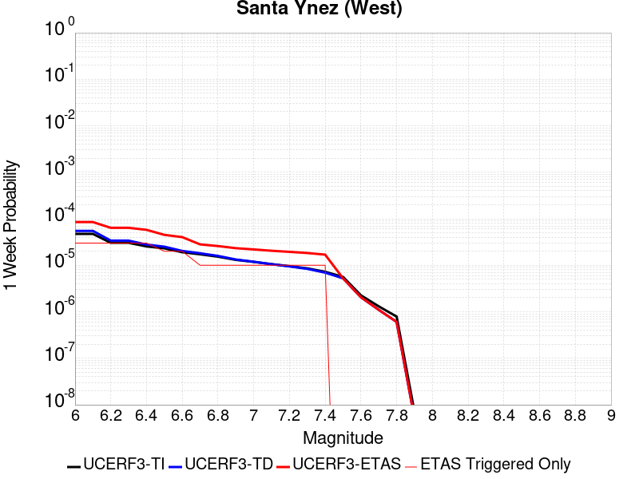 |  | 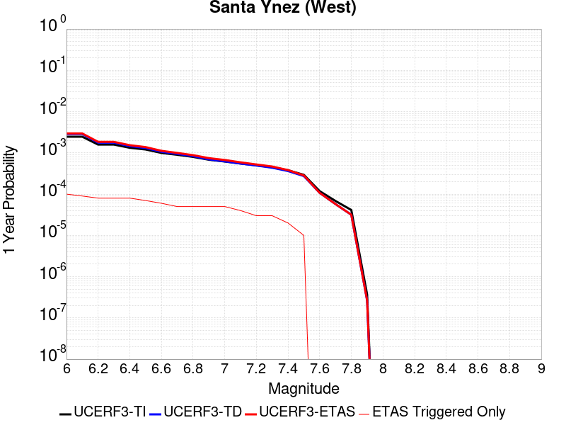 |  |

| Magnitude | 1 wk TI Prob | 1 wk TD Prob | 1 wk ETAS Prob | 1 wk ETAS/TD Gain | 1 wk ETAS Triggered Only | 1 mo TI Prob | 1 mo TD Prob | 1 mo ETAS Prob | 1 mo ETAS/TD Gain | 1 mo ETAS Triggered Only | 1 yr TI Prob | 1 yr TD Prob | 1 yr ETAS Prob | 1 yr ETAS/TD Gain | 1 yr ETAS Triggered Only | 10 yr TI Prob | 10 yr TD Prob | 10 yr ETAS Prob | 10 yr ETAS/TD Gain | 10 yr ETAS Triggered Only |
|-----|-----|-----|-----|-----|-----|-----|-----|-----|-----|-----|-----|-----|-----|-----|-----|-----|-----|-----|-----|-----|
| 6.0 | 4.7352758E-5 | 5.4972126E-5 | 5.4972126E-5 | 1.0 | 0.0 | 2.0292461E-4 | 2.3557522E-4 | 2.3557522E-4 | 1.0 | 0.0 | 0.0024678076 | 0.0028645284 | 0.0029550125 | 1.0315878 | 9.07441E-5 | 0.024405818 | 0.028304417 | 0.028427863 | 1.0043614 | 1.2704174E-4 |
| 6.1 | 4.7352758E-5 | 5.4972126E-5 | 5.4972126E-5 | 1.0 | 0.0 | 2.0292461E-4 | 2.3557522E-4 | 2.3557522E-4 | 1.0 | 0.0 | 0.0024678076 | 0.0028645284 | 0.0029369157 | 1.0252702 | 7.259528E-5 | 0.024405818 | 0.028304417 | 0.028410228 | 1.0037383 | 1.0889292E-4 |
| 6.2 | 3.0415853E-5 | 3.392511E-5 | 3.392511E-5 | 1.0 | 0.0 | 1.3034715E-4 | 1.4538545E-4 | 1.4538545E-4 | 1.0 | 0.0 | 0.0015858212 | 0.0017686661 | 0.0018230162 | 1.0307294 | 5.444646E-5 | 0.015745522 | 0.017549807 | 0.017621128 | 1.004064 | 7.259528E-5 |
| 6.3 | 3.0415853E-5 | 3.392511E-5 | 3.392511E-5 | 1.0 | 0.0 | 1.3034715E-4 | 1.4538545E-4 | 1.4538545E-4 | 1.0 | 0.0 | 0.0015858212 | 0.0017686661 | 0.0018230162 | 1.0307294 | 5.444646E-5 | 0.015745522 | 0.017549807 | 0.017621128 | 1.004064 | 7.259528E-5 |
| 6.4 | 2.5452082E-5 | 2.7912422E-5 | 2.7912422E-5 | 1.0 | 0.0 | 1.09075794E-4 | 1.196193E-4 | 1.196193E-4 | 1.0 | 0.0 | 0.0013271887 | 0.0014554089 | 0.001509776 | 1.0373553 | 5.444646E-5 | 0.013192902 | 0.014460951 | 0.014532497 | 1.0049475 | 7.259528E-5 |
| 6.5 | 2.3143784E-5 | 2.5128256E-5 | 2.5128256E-5 | 1.0 | 0.0 | 9.9183875E-5 | 1.0768817E-4 | 1.0768817E-4 | 1.0 | 0.0 | 0.0012068948 | 0.0013103267 | 0.0013647019 | 1.0414973 | 5.444646E-5 | 0.012003611 | 0.01302768 | 0.01309933 | 1.0054998 | 7.259528E-5 |
| 6.6 | 1.9118515E-5 | 2.035434E-5 | 2.035434E-5 | 1.0 | 0.0 | 8.193392E-5 | 8.7230015E-5 | 8.7230015E-5 | 1.0 | 0.0 | 9.97089E-4 | 0.001061516 | 0.0010977751 | 1.0341579 | 3.629764E-5 | 0.00992627 | 0.010565365 | 0.010619236 | 1.0050988 | 5.444646E-5 |
| 6.7 | 1.722807E-5 | 1.8146347E-5 | 1.8146347E-5 | 1.0 | 0.0 | 7.3832496E-5 | 7.776777E-5 | 7.776777E-5 | 1.0 | 0.0 | 8.985399E-4 | 9.464169E-4 | 9.826802E-4 | 1.0383164 | 3.629764E-5 | 0.008949154 | 0.0094245095 | 0.009478443 | 1.0057226 | 5.444646E-5 |
| 6.8 | 1.5317364E-5 | 1.5926486E-5 | 1.5926486E-5 | 1.0 | 0.0 | 6.56442E-5 | 6.82546E-5 | 6.82546E-5 | 1.0 | 0.0 | 7.98925E-4 | 8.306873E-4 | 8.6695474E-4 | 1.0436596 | 3.629764E-5 | 0.007960589 | 0.00827631 | 0.008312307 | 1.0043495 | 3.629764E-5 |
| 6.9 | 1.3071226E-5 | 1.3329624E-5 | 1.3329624E-5 | 1.0 | 0.0 | 5.6018336E-5 | 5.7125722E-5 | 5.7125722E-5 | 1.0 | 0.0 | 6.8180985E-4 | 6.9528597E-4 | 7.3155836E-4 | 1.0521691 | 3.629764E-5 | 0.0067972173 | 0.006931367 | 0.0069674132 | 1.0052004 | 3.629764E-5 |
| 7.0 | 1.1836986E-5 | 1.19327815E-5 | 1.19327815E-5 | 1.0 | 0.0 | 5.0728955E-5 | 5.11395E-5 | 5.11395E-5 | 1.0 | 0.0 | 6.1745E-4 | 6.2244723E-4 | 6.5872225E-4 | 1.0582781 | 3.629764E-5 | 0.006157372 | 0.006207231 | 0.0062433034 | 1.0058113 | 3.629764E-5 |
| 7.1 | 1.0597169E-5 | 1.0542201E-5 | 1.0542201E-5 | 1.0 | 0.0 | 4.541565E-5 | 4.5180084E-5 | 4.5180084E-5 | 1.0 | 0.0 | 5.5279525E-4 | 5.4992986E-4 | 5.680687E-4 | 1.0329839 | 1.814882E-5 | 0.0055142213 | 0.005485821 | 0.00550387 | 1.0032902 | 1.814882E-5 |
| 7.2 | 9.59113E-6 | 9.459144E-6 | 9.459144E-6 | 1.0 | 0.0 | 4.11042E-5 | 4.0538565E-5 | 4.0538565E-5 | 1.0 | 0.0 | 5.0032866E-4 | 4.934463E-4 | 5.115862E-4 | 1.0367615 | 1.814882E-5 | 0.004992037 | 0.0049236254 | 0.0049416847 | 1.003668 | 1.814882E-5 |
| 7.3 | 8.586084E-6 | 8.379583E-6 | 8.379583E-6 | 1.0 | 0.0 | 3.679698E-5 | 3.5912013E-5 | 3.5912013E-5 | 1.0 | 0.0 | 4.4791115E-4 | 4.3714207E-4 | 4.5528295E-4 | 1.0414988 | 1.814882E-5 | 0.004470094 | 0.004362933 | 0.0043810024 | 1.0041416 | 1.814882E-5 |
| 7.4 | 7.2622997E-6 | 6.9515427E-6 | 6.9515427E-6 | 1.0 | 0.0 | 3.112377E-5 | 2.979199E-5 | 2.979199E-5 | 1.0 | 0.0 | 3.78866E-4 | 3.626581E-4 | 3.626581E-4 | 1.0 | 0.0 | 0.0037822074 | 0.0036207628 | 0.0036207628 | 1.0 | 0.0 |
| 7.5 | 5.627296E-6 | 5.251588E-6 | 5.251588E-6 | 1.0 | 0.0 | 2.411676E-5 | 2.2506614E-5 | 2.2506614E-5 | 1.0 | 0.0 | 2.9358198E-4 | 2.739843E-4 | 2.739843E-4 | 1.0 | 0.0 | 0.0029319443 | 0.002736537 | 0.002736537 | 1.0 | 0.0 |
| 7.6 | 2.265244E-6 | 2.0608625E-6 | 2.0608625E-6 | 1.0 | 0.0 | 9.708152E-6 | 8.832238E-6 | 8.832238E-6 | 1.0 | 0.0 | 1.18190335E-4 | 1.0752728E-4 | 1.0752728E-4 | 1.0 | 0.0 | 0.001181275 | 0.0010747612 | 0.0010747612 | 1.0 | 0.0 |
| 7.7 | 1.3099874E-6 | 1.1016252E-6 | 1.1016252E-6 | 1.0 | 0.0 | 5.61422E-6 | 4.7212425E-6 | 4.7212425E-6 | 1.0 | 0.0 | 6.8350986E-5 | 5.7479636E-5 | 5.7479636E-5 | 1.0 | 0.0 | 6.832996E-4 | 5.7465007E-4 | 5.7465007E-4 | 1.0 | 0.0 |
| 7.8 | 7.903951E-7 | 6.0711415E-7 | 6.0711415E-7 | 1.0 | 0.0 | 3.3874032E-6 | 2.6019152E-6 | 2.6019152E-6 | 1.0 | 0.0 | 4.1240855E-5 | 3.167787E-5 | 3.167787E-5 | 1.0 | 0.0 | 4.12332E-4 | 3.167349E-4 | 3.167349E-4 | 1.0 | 0.0 |
| 7.9 | 7.0753297E-9 | 5.0899476E-9 | 5.0899476E-9 | 1.0 | 0.0 | 3.032284E-8 | 2.181406E-8 | 2.181406E-8 | 1.0 | 0.0 | 3.6918053E-7 | 2.6558615E-7 | 2.6558615E-7 | 1.0 | 0.0 | 3.691799E-6 | 2.6558594E-6 | 2.6558594E-6 | 1.0 | 0.0 |

## Ventura-Pitas Point
*[(top)](#table-of-contents)*

| 1 Week | 1 Month | 1 Year | 10 Year |
|-----|-----|-----|-----|
|  |  |  |  |

| Magnitude | 1 wk TI Prob | 1 wk TD Prob | 1 wk ETAS Prob | 1 wk ETAS/TD Gain | 1 wk ETAS Triggered Only | 1 mo TI Prob | 1 mo TD Prob | 1 mo ETAS Prob | 1 mo ETAS/TD Gain | 1 mo ETAS Triggered Only | 1 yr TI Prob | 1 yr TD Prob | 1 yr ETAS Prob | 1 yr ETAS/TD Gain | 1 yr ETAS Triggered Only | 10 yr TI Prob | 10 yr TD Prob | 10 yr ETAS Prob | 10 yr ETAS/TD Gain | 10 yr ETAS Triggered Only |
|-----|-----|-----|-----|-----|-----|-----|-----|-----|-----|-----|-----|-----|-----|-----|-----|-----|-----|-----|-----|-----|
| 6.0 | 3.3179622E-5 | 3.3735185E-5 | 7.00316E-5 | 2.0759218 | 3.629764E-5 | 1.4219063E-4 | 1.445728E-4 | 1.9901138E-4 | 1.3765479 | 5.444646E-5 | 0.0017297962 | 0.0017590096 | 0.0018133603 | 1.0308985 | 5.444646E-5 | 0.017163932 | 0.0174764 | 0.017636886 | 1.0091829 | 1.6333938E-4 |
| 6.1 | 3.3179622E-5 | 3.3735185E-5 | 7.00316E-5 | 2.0759218 | 3.629764E-5 | 1.4219063E-4 | 1.445728E-4 | 1.9901138E-4 | 1.3765479 | 5.444646E-5 | 0.0017297962 | 0.0017590096 | 0.0018133603 | 1.0308985 | 5.444646E-5 | 0.017163932 | 0.0174764 | 0.017636886 | 1.0091829 | 1.6333938E-4 |
| 6.2 | 3.3179622E-5 | 3.3735185E-5 | 7.00316E-5 | 2.0759218 | 3.629764E-5 | 1.4219063E-4 | 1.445728E-4 | 1.9901138E-4 | 1.3765479 | 5.444646E-5 | 0.0017297962 | 0.0017590096 | 0.0018133603 | 1.0308985 | 5.444646E-5 | 0.017163932 | 0.0174764 | 0.017636886 | 1.0091829 | 1.6333938E-4 |
| 6.3 | 3.3179622E-5 | 3.3735185E-5 | 7.00316E-5 | 2.0759218 | 3.629764E-5 | 1.4219063E-4 | 1.445728E-4 | 1.9901138E-4 | 1.3765479 | 5.444646E-5 | 0.0017297962 | 0.0017590096 | 0.0018133603 | 1.0308985 | 5.444646E-5 | 0.017163932 | 0.0174764 | 0.017636886 | 1.0091829 | 1.6333938E-4 |
| 6.4 | 1.8754668E-5 | 1.701961E-5 | 3.5168123E-5 | 2.0663295 | 1.814882E-5 | 8.037467E-5 | 7.293928E-5 | 9.1086775E-5 | 1.2488028 | 1.814882E-5 | 9.781223E-4 | 8.8769704E-4 | 9.058297E-4 | 1.0204266 | 1.814882E-5 | 0.009738282 | 0.008843848 | 0.008933789 | 1.01017 | 9.07441E-5 |
| 6.5 | 1.8754668E-5 | 1.701961E-5 | 3.5168123E-5 | 2.0663295 | 1.814882E-5 | 8.037467E-5 | 7.293928E-5 | 9.1086775E-5 | 1.2488028 | 1.814882E-5 | 9.781223E-4 | 8.8769704E-4 | 9.058297E-4 | 1.0204266 | 1.814882E-5 | 0.009738282 | 0.008843848 | 0.008933789 | 1.01017 | 9.07441E-5 |
| 6.6 | 1.4361558E-5 | 1.2122275E-5 | 1.2122275E-5 | 1.0 | 0.0 | 6.154808E-5 | 5.1951585E-5 | 5.1951585E-5 | 1.0 | 0.0 | 7.490902E-4 | 6.3232926E-4 | 6.3232926E-4 | 1.0 | 0.0 | 0.0074657016 | 0.0063055577 | 0.0063416264 | 1.0057201 | 3.629764E-5 |
| 6.7 | 1.4361558E-5 | 1.2122275E-5 | 1.2122275E-5 | 1.0 | 0.0 | 6.154808E-5 | 5.1951585E-5 | 5.1951585E-5 | 1.0 | 0.0 | 7.490902E-4 | 6.3232926E-4 | 6.3232926E-4 | 1.0 | 0.0 | 0.0074657016 | 0.0063055577 | 0.0063416264 | 1.0057201 | 3.629764E-5 |
| 6.8 | 1.3663846E-5 | 1.13444175E-5 | 1.13444175E-5 | 1.0 | 0.0 | 5.8558027E-5 | 4.861804E-5 | 4.861804E-5 | 1.0 | 0.0 | 7.127108E-4 | 5.917658E-4 | 5.917658E-4 | 1.0 | 0.0 | 0.007104293 | 0.005902116 | 0.005920158 | 1.0030568 | 1.814882E-5 |
| 6.9 | 1.3644157E-5 | 1.1322519E-5 | 1.1322519E-5 | 1.0 | 0.0 | 5.8473648E-5 | 4.8524187E-5 | 4.8524187E-5 | 1.0 | 0.0 | 7.116841E-4 | 5.9062376E-4 | 5.9062376E-4 | 1.0 | 0.0 | 0.007094092 | 0.0058907564 | 0.0059087984 | 1.0030627 | 1.814882E-5 |
| 7.0 | 1.3568845E-5 | 1.1242086E-5 | 1.1242086E-5 | 1.0 | 0.0 | 5.8150898E-5 | 4.817949E-5 | 4.817949E-5 | 1.0 | 0.0 | 7.077572E-4 | 5.864293E-4 | 5.864293E-4 | 1.0 | 0.0 | 0.007055073 | 0.0058490336 | 0.005867076 | 1.0030848 | 1.814882E-5 |
| 7.1 | 1.306572E-5 | 1.072054E-5 | 1.072054E-5 | 1.0 | 0.0 | 5.599474E-5 | 4.5944373E-5 | 4.5944373E-5 | 1.0 | 0.0 | 6.815227E-4 | 5.5923103E-4 | 5.5923103E-4 | 1.0 | 0.0 | 0.0067943637 | 0.0055784425 | 0.0055964896 | 1.0032352 | 1.814882E-5 |
| 7.2 | 1.232604E-5 | 9.995143E-6 | 9.995143E-6 | 1.0 | 0.0 | 5.2824813E-5 | 4.2835632E-5 | 4.2835632E-5 | 1.0 | 0.0 | 6.429523E-4 | 5.214008E-4 | 5.214008E-4 | 1.0 | 0.0 | 0.0064109527 | 0.005201967 | 0.005220021 | 1.0034707 | 1.814882E-5 |
| 7.3 | 1.0917261E-5 | 8.84384E-6 | 8.84384E-6 | 1.0 | 0.0 | 4.678742E-5 | 3.790163E-5 | 3.790163E-5 | 1.0 | 0.0 | 5.69488E-4 | 4.6135622E-4 | 4.6135622E-4 | 1.0 | 0.0 | 0.0056803077 | 0.00460415 | 0.0046222154 | 1.0039237 | 1.814882E-5 |
| 7.4 | 1.039959E-5 | 8.423562E-6 | 8.423562E-6 | 1.0 | 0.0 | 4.456891E-5 | 3.610049E-5 | 3.610049E-5 | 1.0 | 0.0 | 5.424914E-4 | 4.3943635E-4 | 4.3943635E-4 | 1.0 | 0.0 | 0.0054116896 | 0.004385836 | 0.004403905 | 1.0041199 | 1.814882E-5 |
| 7.5 | 9.015877E-6 | 7.2975445E-6 | 7.2975445E-6 | 1.0 | 0.0 | 3.86389E-5 | 3.1274823E-5 | 3.1274823E-5 | 1.0 | 0.0 | 4.7032707E-4 | 3.8070587E-4 | 3.8070587E-4 | 1.0 | 0.0 | 0.004693329 | 0.0038006818 | 0.0038187616 | 1.004757 | 1.814882E-5 |
| 7.6 | 4.900162E-6 | 3.8741155E-6 | 3.8741155E-6 | 1.0 | 0.0 | 2.1000526E-5 | 1.6603248E-5 | 1.6603248E-5 | 1.0 | 0.0 | 2.556514E-4 | 2.0212591E-4 | 2.0212591E-4 | 1.0 | 0.0 | 0.0025535747 | 0.0020194345 | 0.0020375466 | 1.008969 | 1.814882E-5 |
| 7.7 | 3.8850626E-6 | 3.1267302E-6 | 3.1267302E-6 | 1.0 | 0.0 | 1.6650163E-5 | 1.3400205E-5 | 1.3400205E-5 | 1.0 | 0.0 | 2.0269687E-4 | 1.6313537E-4 | 1.6313537E-4 | 1.0 | 0.0 | 0.002025121 | 0.0016301654 | 0.0016482846 | 1.011115 | 1.814882E-5 |
| 7.8 | 2.4654719E-6 | 2.029875E-6 | 2.029875E-6 | 1.0 | 0.0 | 1.0566265E-5 | 8.699436E-6 | 8.699436E-6 | 1.0 | 0.0 | 1.2863669E-4 | 1.0591053E-4 | 1.0591053E-4 | 1.0 | 0.0 | 0.0012856225 | 0.0010586053 | 0.0010586053 | 1.0 | 0.0 |
| 7.9 | 4.095894E-7 | 3.2764765E-7 | 3.2764765E-7 | 1.0 | 0.0 | 1.7553821E-6 | 1.4042034E-6 | 1.4042034E-6 | 1.0 | 0.0 | 2.1371567E-5 | 1.7096047E-5 | 1.7096047E-5 | 1.0 | 0.0 | 2.1369511E-4 | 1.7094762E-4 | 1.7094762E-4 | 1.0 | 0.0 |
| 8.0 | 7.791402E-9 | 5.683497E-9 | 5.683497E-9 | 1.0 | 0.0 | 3.3391725E-8 | 2.4357844E-8 | 2.4357844E-8 | 1.0 | 0.0 | 4.0654416E-7 | 2.9655675E-7 | 2.9655675E-7 | 1.0 | 0.0 | 4.065434E-6 | 2.9655655E-6 | 2.9655655E-6 | 1.0 | 0.0 |

## Red Mountain
*[(top)](#table-of-contents)*

| 1 Week | 1 Month | 1 Year | 10 Year |
|-----|-----|-----|-----|
|  |  |  | 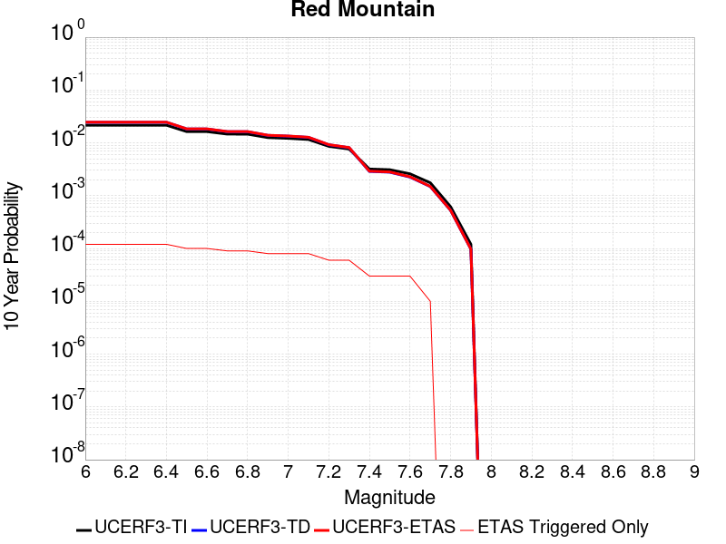 |

| Magnitude | 1 wk TI Prob | 1 wk TD Prob | 1 wk ETAS Prob | 1 wk ETAS/TD Gain | 1 wk ETAS Triggered Only | 1 mo TI Prob | 1 mo TD Prob | 1 mo ETAS Prob | 1 mo ETAS/TD Gain | 1 mo ETAS Triggered Only | 1 yr TI Prob | 1 yr TD Prob | 1 yr ETAS Prob | 1 yr ETAS/TD Gain | 1 yr ETAS Triggered Only | 10 yr TI Prob | 10 yr TD Prob | 10 yr ETAS Prob | 10 yr ETAS/TD Gain | 10 yr ETAS Triggered Only |
|-----|-----|-----|-----|-----|-----|-----|-----|-----|-----|-----|-----|-----|-----|-----|-----|-----|-----|-----|-----|-----|
| 6.0 | 4.1810763E-5 | 4.7589947E-5 | 1.0203382E-4 | 2.1440203 | 5.444646E-5 | 1.7917668E-4 | 2.039419E-4 | 2.765224E-4 | 1.355888 | 7.259528E-5 | 0.0021792934 | 0.0024803306 | 0.0025708496 | 1.0364947 | 9.07441E-5 | 0.021580452 | 0.024544092 | 0.024668016 | 1.005049 | 1.2704174E-4 |
| 6.1 | 4.1810763E-5 | 4.7589947E-5 | 1.0203382E-4 | 2.1440203 | 5.444646E-5 | 1.7917668E-4 | 2.039419E-4 | 2.765224E-4 | 1.355888 | 7.259528E-5 | 0.0021792934 | 0.0024803306 | 0.0025708496 | 1.0364947 | 9.07441E-5 | 0.021580452 | 0.024544092 | 0.024668016 | 1.005049 | 1.2704174E-4 |
| 6.2 | 4.1810763E-5 | 4.7589947E-5 | 1.0203382E-4 | 2.1440203 | 5.444646E-5 | 1.7917668E-4 | 2.039419E-4 | 2.765224E-4 | 1.355888 | 7.259528E-5 | 0.0021792934 | 0.0024803306 | 0.0025708496 | 1.0364947 | 9.07441E-5 | 0.021580452 | 0.024544092 | 0.024668016 | 1.005049 | 1.2704174E-4 |
| 6.3 | 4.1810763E-5 | 4.7589947E-5 | 1.0203382E-4 | 2.1440203 | 5.444646E-5 | 1.7917668E-4 | 2.039419E-4 | 2.765224E-4 | 1.355888 | 7.259528E-5 | 0.0021792934 | 0.0024803306 | 0.0025708496 | 1.0364947 | 9.07441E-5 | 0.021580452 | 0.024544092 | 0.024668016 | 1.005049 | 1.2704174E-4 |
| 6.4 | 4.1810763E-5 | 4.7589947E-5 | 1.0203382E-4 | 2.1440203 | 5.444646E-5 | 1.7917668E-4 | 2.039419E-4 | 2.765224E-4 | 1.355888 | 7.259528E-5 | 0.0021792934 | 0.0024803306 | 0.0025708496 | 1.0364947 | 9.07441E-5 | 0.021580452 | 0.024544092 | 0.024668016 | 1.005049 | 1.2704174E-4 |
| 6.5 | 3.154503E-5 | 3.5359728E-5 | 7.165608E-5 | 2.0264885 | 3.629764E-5 | 1.3518598E-4 | 1.5153342E-4 | 2.0597162E-4 | 1.3592489 | 5.444646E-5 | 0.0016446467 | 0.0018434501 | 0.0019159116 | 1.0393075 | 7.259528E-5 | 0.01632528 | 0.018291233 | 0.018398136 | 1.0058444 | 1.0889292E-4 |
| 6.6 | 3.1535834E-5 | 3.534911E-5 | 7.164547E-5 | 2.0267968 | 3.629764E-5 | 1.3514658E-4 | 1.5148791E-4 | 2.0592612E-4 | 1.3593568 | 5.444646E-5 | 0.0016441676 | 0.001842897 | 0.0019153586 | 1.0393194 | 7.259528E-5 | 0.01632056 | 0.018285794 | 0.018392697 | 1.0058461 | 1.0889292E-4 |
| 6.7 | 2.8267326E-5 | 3.146934E-5 | 6.776584E-5 | 2.1533926 | 3.629764E-5 | 1.2114006E-4 | 1.348621E-4 | 1.8930122E-4 | 1.4036651 | 5.444646E-5 | 0.0014738824 | 0.0016407946 | 0.0017132707 | 1.0441713 | 7.259528E-5 | 0.014641452 | 0.016295563 | 0.016402682 | 1.0065734 | 1.0889292E-4 |
| 6.8 | 2.8212884E-5 | 3.1407224E-5 | 6.7703724E-5 | 2.1556735 | 3.629764E-5 | 1.20906756E-4 | 1.3459593E-4 | 1.8903505E-4 | 1.4044634 | 5.444646E-5 | 0.0014710457 | 0.0016375587 | 0.0017100351 | 1.0442588 | 7.259528E-5 | 0.014613459 | 0.01626368 | 0.016370801 | 1.0065866 | 1.0889292E-4 |
| 6.9 | 2.4227871E-5 | 2.6706979E-5 | 4.4855315E-5 | 1.6795354 | 1.814882E-5 | 1.03829596E-4 | 1.14453884E-4 | 1.5074736E-4 | 1.3171014 | 3.629764E-5 | 0.0012633923 | 0.0013926612 | 0.0014470319 | 1.0390408 | 5.444646E-5 | 0.012562336 | 0.013847026 | 0.013936513 | 1.0064626 | 9.07441E-5 |
| 7.0 | 2.348524E-5 | 2.5835763E-5 | 4.3984113E-5 | 1.7024508 | 1.814882E-5 | 1.0064714E-4 | 1.1072042E-4 | 1.4701404E-4 | 1.3277951 | 3.629764E-5 | 0.0012246901 | 0.0013472632 | 0.0014016363 | 1.0403582 | 5.444646E-5 | 0.012179627 | 0.01339859 | 0.013488118 | 1.0066819 | 9.07441E-5 |
| 7.1 | 2.2311642E-5 | 2.4462828E-5 | 4.2611206E-5 | 1.7418756 | 1.814882E-5 | 9.561782E-5 | 1.048369E-4 | 1.4113075E-4 | 1.3461933 | 3.629764E-5 | 0.0011635252 | 0.0012757168 | 0.0013300938 | 1.0426247 | 5.444646E-5 | 0.01157452 | 0.012691451 | 0.012781044 | 1.0070592 | 9.07441E-5 |
| 7.2 | 1.6533986E-5 | 1.7670347E-5 | 3.5818848E-5 | 2.0270596 | 1.814882E-5 | 7.085802E-5 | 7.572822E-5 | 9.3875664E-5 | 1.2396392 | 1.814882E-5 | 8.623549E-4 | 9.216645E-4 | 9.579287E-4 | 1.0393465 | 3.629764E-5 | 0.008590161 | 0.009184699 | 0.009238645 | 1.0058736 | 5.444646E-5 |
| 7.3 | 1.4703092E-5 | 1.555952E-5 | 3.370806E-5 | 2.1663945 | 1.814882E-5 | 6.301173E-5 | 6.66823E-5 | 8.482992E-5 | 1.2721503 | 1.814882E-5 | 7.668978E-4 | 8.1161625E-4 | 8.4788445E-4 | 1.0446863 | 3.629764E-5 | 0.0076425658 | 0.008092596 | 0.008146602 | 1.0066735 | 5.444646E-5 |
| 7.4 | 6.1331984E-6 | 5.528872E-6 | 2.3677592E-5 | 4.282536 | 1.814882E-5 | 2.6284872E-5 | 2.3694953E-5 | 4.184334E-5 | 1.765918 | 1.814882E-5 | 3.199713E-4 | 2.8844838E-4 | 3.0659197E-4 | 1.0629007 | 1.814882E-5 | 0.0031951098 | 0.0028807942 | 0.0029169873 | 1.0125636 | 3.629764E-5 |
| 7.5 | 5.954766E-6 | 5.3385015E-6 | 2.3487226E-5 | 4.3995914 | 1.814882E-5 | 2.5520176E-5 | 2.2879094E-5 | 4.10275E-5 | 1.7932309 | 1.814882E-5 | 3.1066386E-4 | 2.785179E-4 | 2.9666166E-4 | 1.065144 | 1.814882E-5 | 0.003102299 | 0.0027817423 | 0.002817939 | 1.0130122 | 3.629764E-5 |
| 7.6 | 4.9726646E-6 | 4.315295E-6 | 2.2464037E-5 | 5.2056785 | 1.814882E-5 | 2.1311245E-5 | 1.8493993E-5 | 3.6642476E-5 | 1.9813179 | 1.814882E-5 | 2.5943352E-4 | 2.2514143E-4 | 2.4328617E-4 | 1.0805926 | 1.814882E-5 | 0.0025913084 | 0.002249168 | 0.002285384 | 1.016102 | 3.629764E-5 |
| 7.7 | 3.3613894E-6 | 2.8526642E-6 | 2.8526642E-6 | 1.0 | 0.0 | 1.4405875E-5 | 1.2225649E-5 | 1.2225649E-5 | 1.0 | 0.0 | 1.7537741E-4 | 1.4883737E-4 | 1.4883737E-4 | 1.0 | 0.0 | 0.0017523908 | 0.0014874031 | 0.001505525 | 1.0121835 | 1.814882E-5 |
| 7.8 | 1.1828961E-6 | 1.0122756E-6 | 1.0122756E-6 | 1.0 | 0.0 | 5.069545E-6 | 4.338317E-6 | 4.338317E-6 | 1.0 | 0.0 | 6.171996E-5 | 5.281776E-5 | 5.281776E-5 | 1.0 | 0.0 | 6.170282E-4 | 5.2805495E-4 | 5.2805495E-4 | 1.0 | 0.0 |
| 7.9 | 2.2967266E-7 | 1.8618952E-7 | 1.8618952E-7 | 1.0 | 0.0 | 9.843111E-7 | 7.9795484E-7 | 7.9795484E-7 | 1.0 | 0.0 | 1.19839215E-5 | 9.7150605E-6 | 9.7150605E-6 | 1.0 | 0.0 | 1.1983275E-4 | 9.714664E-5 | 9.714664E-5 | 1.0 | 0.0 |

## Coronado Bank alt1
*[(top)](#table-of-contents)*

| 1 Week | 1 Month | 1 Year | 10 Year |
|-----|-----|-----|-----|
| 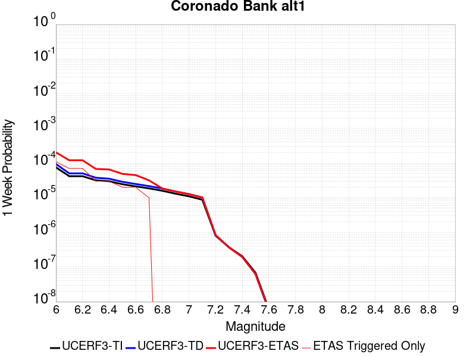 |  | 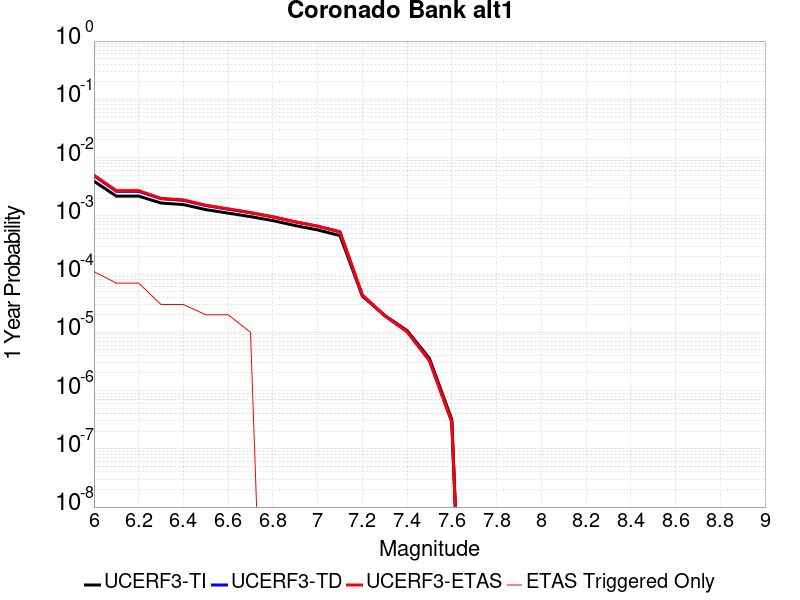 |  |

| Magnitude | 1 wk TI Prob | 1 wk TD Prob | 1 wk ETAS Prob | 1 wk ETAS/TD Gain | 1 wk ETAS Triggered Only | 1 mo TI Prob | 1 mo TD Prob | 1 mo ETAS Prob | 1 mo ETAS/TD Gain | 1 mo ETAS Triggered Only | 1 yr TI Prob | 1 yr TD Prob | 1 yr ETAS Prob | 1 yr ETAS/TD Gain | 1 yr ETAS Triggered Only | 10 yr TI Prob | 10 yr TD Prob | 10 yr ETAS Prob | 10 yr ETAS/TD Gain | 10 yr ETAS Triggered Only |
|-----|-----|-----|-----|-----|-----|-----|-----|-----|-----|-----|-----|-----|-----|-----|-----|-----|-----|-----|-----|-----|
| 6.0 | 7.533492E-5 | 9.394913E-5 | 1.846847E-4 | 1.9657948 | 9.07441E-5 | 3.22824E-4 | 4.0258127E-4 | 4.9328886E-4 | 1.225315 | 9.07441E-5 | 0.0039233007 | 0.0048909658 | 0.004981266 | 1.0184627 | 9.07441E-5 | 0.03854755 | 0.04790356 | 0.0480418 | 1.0028857 | 1.4519056E-4 |
| 6.1 | 4.1807285E-5 | 5.049283E-5 | 8.678864E-5 | 1.718831 | 3.629764E-5 | 1.7916178E-4 | 2.1638049E-4 | 2.5267026E-4 | 1.1677128 | 3.629764E-5 | 0.0021791123 | 0.0026313474 | 0.0026675495 | 1.0137581 | 3.629764E-5 | 0.021578677 | 0.026011046 | 0.0260464 | 1.0013592 | 3.629764E-5 |
| 6.2 | 4.1807285E-5 | 5.049283E-5 | 8.678864E-5 | 1.718831 | 3.629764E-5 | 1.7916178E-4 | 2.1638049E-4 | 2.5267026E-4 | 1.1677128 | 3.629764E-5 | 0.0021791123 | 0.0026313474 | 0.0026675495 | 1.0137581 | 3.629764E-5 | 0.021578677 | 0.026011046 | 0.0260464 | 1.0013592 | 3.629764E-5 |
| 6.3 | 3.1793104E-5 | 3.7711117E-5 | 5.585925E-5 | 1.481241 | 1.814882E-5 | 1.3624904E-4 | 1.6160926E-4 | 1.7975515E-4 | 1.1122825 | 1.814882E-5 | 0.0016575698 | 0.001965848 | 0.001983961 | 1.0092139 | 1.814882E-5 | 0.016452603 | 0.019488465 | 0.01950626 | 1.0009131 | 1.814882E-5 |
| 6.4 | 2.9878007E-5 | 3.5335794E-5 | 5.3483975E-5 | 1.5135919 | 1.814882E-5 | 1.2804232E-4 | 1.5143053E-4 | 1.6957661E-4 | 1.119831 | 1.814882E-5 | 0.0015578003 | 0.0018421387 | 0.0018602541 | 1.0098339 | 1.814882E-5 | 0.015469253 | 0.01827244 | 0.018290259 | 1.0009751 | 1.814882E-5 |
| 6.5 | 2.4512565E-5 | 2.8764043E-5 | 4.691234E-5 | 1.630937 | 1.814882E-5 | 1.0504962E-4 | 1.2326881E-4 | 1.4141538E-4 | 1.1472114 | 1.814882E-5 | 0.0012782287 | 0.0014997921 | 0.0015179138 | 1.0120827 | 1.814882E-5 | 0.012709012 | 0.014899683 | 0.014917562 | 1.0012 | 1.814882E-5 |
| 6.6 | 2.1317413E-5 | 2.490667E-5 | 4.305504E-5 | 1.728655 | 1.814882E-5 | 9.135714E-5 | 1.0673863E-4 | 1.2488551E-4 | 1.1700124 | 1.814882E-5 | 0.0011117056 | 0.0012987906 | 0.0013169157 | 1.0139555 | 1.814882E-5 | 0.011061605 | 0.012914404 | 0.012932319 | 1.0013871 | 1.814882E-5 |
| 6.7 | 1.8585655E-5 | 2.163488E-5 | 3.9783306E-5 | 1.8388504 | 1.814882E-5 | 7.9650374E-5 | 9.271773E-5 | 1.1086487E-4 | 1.1957246 | 1.814882E-5 | 9.6931186E-4 | 0.0011282742 | 0.0011464027 | 1.0160673 | 1.814882E-5 | 0.0096509475 | 0.011227623 | 0.011245567 | 1.0015982 | 1.814882E-5 |
| 6.8 | 1.5862879E-5 | 1.8419474E-5 | 1.8419474E-5 | 1.0 | 0.0 | 6.798199E-5 | 7.893833E-5 | 7.893833E-5 | 1.0 | 0.0 | 8.273665E-4 | 9.6066965E-4 | 9.6066965E-4 | 1.0 | 0.0 | 0.008242928 | 0.00956715 | 0.00956715 | 1.0 | 0.0 |
| 6.9 | 1.3021509E-5 | 1.5095265E-5 | 1.5095265E-5 | 1.0 | 0.0 | 5.5805274E-5 | 6.469249E-5 | 6.469249E-5 | 1.0 | 0.0 | 6.792174E-4 | 7.8736455E-4 | 7.8736455E-4 | 1.0 | 0.0 | 0.006771452 | 0.007847573 | 0.007847573 | 1.0 | 0.0 |
| 7.0 | 1.0974371E-5 | 1.2720104E-5 | 1.2720104E-5 | 1.0 | 0.0 | 4.7032172E-5 | 5.451369E-5 | 5.451369E-5 | 1.0 | 0.0 | 5.7246623E-4 | 6.6351966E-4 | 6.6351966E-4 | 1.0 | 0.0 | 0.0057099373 | 0.006617135 | 0.006617135 | 1.0 | 0.0 |
| 7.1 | 8.766221E-6 | 1.01638325E-5 | 1.01638325E-5 | 1.0 | 0.0 | 3.7568978E-5 | 4.355865E-5 | 4.355865E-5 | 1.0 | 0.0 | 4.573063E-4 | 5.3021475E-4 | 5.3021475E-4 | 1.0 | 0.0 | 0.0045636636 | 0.0052911965 | 0.0052911965 | 1.0 | 0.0 |
| 7.2 | 8.026024E-7 | 8.331765E-7 | 8.331765E-7 | 1.0 | 0.0 | 3.43972E-6 | 3.5707515E-6 | 3.5707515E-6 | 1.0 | 0.0 | 4.1877785E-5 | 4.3473043E-5 | 4.3473043E-5 | 1.0 | 0.0 | 4.1869894E-4 | 4.3464647E-4 | 4.3464647E-4 | 1.0 | 0.0 |
| 7.3 | 3.7293114E-7 | 3.7000953E-7 | 3.7000953E-7 | 1.0 | 0.0 | 1.5982754E-6 | 1.5857541E-6 | 1.5857541E-6 | 1.0 | 0.0 | 1.9458828E-5 | 1.9306386E-5 | 1.9306386E-5 | 1.0 | 0.0 | 1.9457124E-4 | 1.9304715E-4 | 1.9304715E-4 | 1.0 | 0.0 |
| 7.4 | 2.0557036E-7 | 1.9674363E-7 | 1.9674363E-7 | 1.0 | 0.0 | 8.810155E-7 | 8.431867E-7 | 8.431867E-7 | 1.0 | 0.0 | 1.0726311E-5 | 1.026575E-5 | 1.026575E-5 | 1.0 | 0.0 | 1.0725793E-4 | 1.0265279E-4 | 1.0265279E-4 | 1.0 | 0.0 |
| 7.5 | 6.845446E-8 | 6.279369E-8 | 6.279369E-8 | 1.0 | 0.0 | 2.9337625E-7 | 2.691158E-7 | 2.691158E-7 | 1.0 | 0.0 | 3.5718497E-6 | 3.2764797E-6 | 3.2764797E-6 | 1.0 | 0.0 | 3.5717923E-5 | 3.2764325E-5 | 3.2764325E-5 | 1.0 | 0.0 |
| 7.6 | 6.0975145E-9 | 5.53185E-9 | 5.53185E-9 | 1.0 | 0.0 | 2.6132206E-8 | 2.370793E-8 | 2.370793E-8 | 1.0 | 0.0 | 3.1815955E-7 | 2.88644E-7 | 2.88644E-7 | 1.0 | 0.0 | 3.181591E-6 | 2.8864374E-6 | 2.8864374E-6 | 1.0 | 0.0 |

## Big Pine (Central)
*[(top)](#table-of-contents)*

| 1 Week | 1 Month | 1 Year | 10 Year |
|-----|-----|-----|-----|
|  |  | 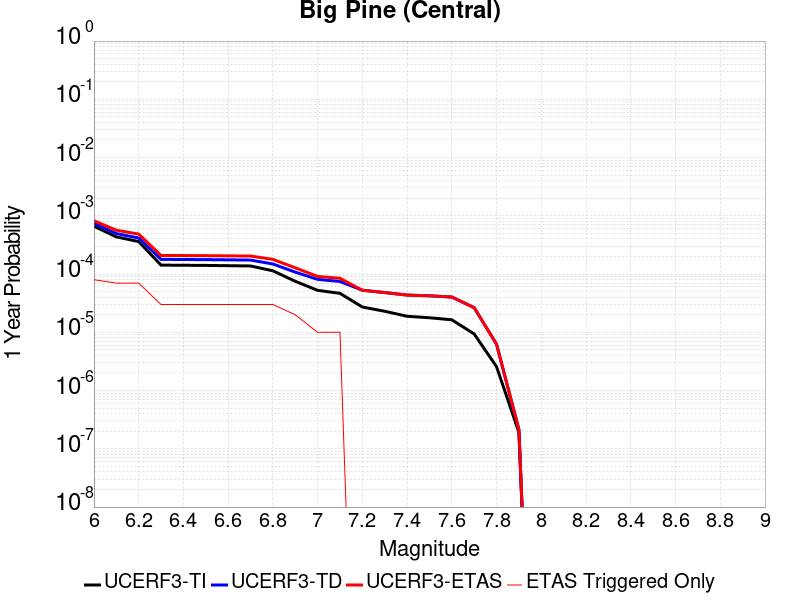 |  |

| Magnitude | 1 wk TI Prob | 1 wk TD Prob | 1 wk ETAS Prob | 1 wk ETAS/TD Gain | 1 wk ETAS Triggered Only | 1 mo TI Prob | 1 mo TD Prob | 1 mo ETAS Prob | 1 mo ETAS/TD Gain | 1 mo ETAS Triggered Only | 1 yr TI Prob | 1 yr TD Prob | 1 yr ETAS Prob | 1 yr ETAS/TD Gain | 1 yr ETAS Triggered Only | 10 yr TI Prob | 10 yr TD Prob | 10 yr ETAS Prob | 10 yr ETAS/TD Gain | 10 yr ETAS Triggered Only |
|-----|-----|-----|-----|-----|-----|-----|-----|-----|-----|-----|-----|-----|-----|-----|-----|-----|-----|-----|-----|-----|
| 6.0 | 1.2706755E-5 | 1.4250529E-5 | 3.239909E-5 | 2.273536 | 1.814882E-5 | 5.4456385E-5 | 6.107247E-5 | 1.15515606E-4 | 1.8914514 | 5.444646E-5 | 6.628048E-4 | 7.433402E-4 | 8.521522E-4 | 1.1463825 | 1.0889292E-4 | 0.006608314 | 0.0074135666 | 0.0075396667 | 1.0170094 | 1.2704174E-4 |
| 6.1 | 8.342579E-6 | 9.510762E-6 | 2.765941E-5 | 2.9082224 | 1.814882E-5 | 3.5753423E-5 | 4.0759893E-5 | 9.520414E-5 | 2.3357308 | 5.444646E-5 | 4.3521097E-4 | 4.961604E-4 | 5.868595E-4 | 1.182802 | 9.07441E-5 | 0.0043435963 | 0.0049540824 | 0.0050624358 | 1.0218716 | 1.0889292E-4 |
| 6.2 | 6.923899E-6 | 7.967147E-6 | 2.6115824E-5 | 3.277939 | 1.814882E-5 | 2.9673516E-5 | 3.4144578E-5 | 8.858918E-5 | 2.5945313 | 5.444646E-5 | 3.6121515E-4 | 4.156502E-4 | 5.063566E-4 | 1.2182277 | 9.07441E-5 | 0.003606286 | 0.0041520367 | 0.0042604776 | 1.0261174 | 1.0889292E-4 |
| 6.3 | 2.728396E-6 | 3.4242908E-6 | 3.4242908E-6 | 1.0 | 0.0 | 1.1693074E-5 | 1.4675454E-5 | 3.282401E-5 | 2.2366605 | 1.814882E-5 | 1.4235388E-4 | 1.7865987E-4 | 2.1495103E-4 | 1.2031299 | 3.629764E-5 | 0.0014226272 | 0.0017866704 | 0.0018229032 | 1.0202795 | 3.629764E-5 |
| 6.4 | 2.7136944E-6 | 3.408584E-6 | 3.408584E-6 | 1.0 | 0.0 | 1.1630066E-5 | 1.4608141E-5 | 3.2756696E-5 | 2.242359 | 1.814882E-5 | 1.4158686E-4 | 1.7784047E-4 | 2.1413165E-4 | 1.2040659 | 3.629764E-5 | 0.0014149669 | 0.0017784894 | 0.0018147225 | 1.020373 | 3.629764E-5 |
| 6.5 | 2.6971882E-6 | 3.3909291E-6 | 3.3909291E-6 | 1.0 | 0.0 | 1.1559327E-5 | 1.45324775E-5 | 3.2681033E-5 | 2.2488275 | 1.814882E-5 | 1.4072572E-4 | 1.7691942E-4 | 2.1321065E-4 | 1.2051286 | 3.629764E-5 | 0.0014063664 | 0.0017692937 | 0.0018055271 | 1.0204791 | 3.629764E-5 |
| 6.6 | 2.669092E-6 | 3.3609497E-6 | 3.3609497E-6 | 1.0 | 0.0 | 1.1438916E-5 | 1.4403995E-5 | 3.2552554E-5 | 2.259967 | 1.814882E-5 | 1.3925991E-4 | 1.753554E-4 | 2.1164668E-4 | 1.2069584 | 3.629764E-5 | 0.0013917267 | 0.0017536782 | 0.0017899122 | 1.0206617 | 3.629764E-5 |
| 6.7 | 2.6408059E-6 | 3.3309752E-6 | 3.3309752E-6 | 1.0 | 0.0 | 1.1317691E-5 | 1.4275535E-5 | 3.2424097E-5 | 2.271305 | 1.814882E-5 | 1.3778417E-4 | 1.7379165E-4 | 2.1008297E-4 | 1.2088209 | 3.629764E-5 | 0.0013769877 | 0.0017380653 | 0.0017742998 | 1.0208477 | 3.629764E-5 |
| 6.8 | 2.1786943E-6 | 2.8544325E-6 | 2.8544325E-6 | 1.0 | 0.0 | 9.337228E-6 | 1.2233229E-5 | 3.0381827E-5 | 2.4835494 | 1.814882E-5 | 1.1367482E-4 | 1.4893012E-4 | 1.8522235E-4 | 1.2436863 | 3.629764E-5 | 0.0011361669 | 0.0014897975 | 0.0015260411 | 1.0243279 | 3.629764E-5 |
| 6.9 | 1.4411696E-6 | 2.068499E-6 | 2.068499E-6 | 1.0 | 0.0 | 6.1764263E-6 | 8.864968E-6 | 2.7013626E-5 | 3.0472336 | 1.814882E-5 | 7.51954E-5 | 1.079259E-4 | 1.4421962E-4 | 1.3362837 | 3.629764E-5 | 7.5169955E-4 | 0.0010801847 | 0.0011164431 | 1.0335668 | 3.629764E-5 |
| 7.0 | 1.0073411E-6 | 1.554261E-6 | 1.554261E-6 | 1.0 | 0.0 | 4.317169E-6 | 6.6611024E-6 | 2.4809802E-5 | 3.724579 | 1.814882E-5 | 5.2560266E-5 | 8.1096056E-5 | 9.924341E-5 | 1.223776 | 1.814882E-5 | 5.2547833E-4 | 8.1210316E-4 | 8.3023723E-4 | 1.0223298 | 1.814882E-5 |
| 7.1 | 8.947104E-7 | 1.4302494E-6 | 1.4302494E-6 | 1.0 | 0.0 | 3.834468E-6 | 6.129627E-6 | 2.4278335E-5 | 3.960818 | 1.814882E-5 | 4.6683643E-5 | 7.46258E-5 | 9.277326E-5 | 1.2431796 | 1.814882E-5 | 4.6673836E-4 | 7.474457E-4 | 7.65581E-4 | 1.024263 | 1.814882E-5 |
| 7.2 | 5.215166E-7 | 1.0111678E-6 | 1.0111678E-6 | 1.0 | 0.0 | 2.2350691E-6 | 4.3335694E-6 | 4.3335694E-6 | 1.0 | 0.0 | 2.7211627E-5 | 5.2759973E-5 | 5.2759973E-5 | 1.0 | 0.0 | 2.7208295E-4 | 5.2890263E-4 | 5.2890263E-4 | 1.0 | 0.0 |
| 7.3 | 4.4024807E-7 | 9.219589E-7 | 9.219589E-7 | 1.0 | 0.0 | 1.8867761E-6 | 3.9512465E-6 | 3.9512465E-6 | 1.0 | 0.0 | 2.2971257E-5 | 4.810541E-5 | 4.810541E-5 | 1.0 | 0.0 | 2.2968883E-4 | 4.8237795E-4 | 4.8237795E-4 | 1.0 | 0.0 |
| 7.4 | 3.6130905E-7 | 8.358523E-7 | 8.358523E-7 | 1.0 | 0.0 | 1.5484665E-6 | 3.5822195E-6 | 3.5822195E-6 | 1.0 | 0.0 | 1.8852415E-5 | 4.3612687E-5 | 4.3612687E-5 | 1.0 | 0.0 | 1.8850817E-4 | 4.374597E-4 | 4.374597E-4 | 1.0 | 0.0 |
| 7.5 | 3.408184E-7 | 8.108147E-7 | 8.108147E-7 | 1.0 | 0.0 | 1.4606494E-6 | 3.4749157E-6 | 3.4749157E-6 | 1.0 | 0.0 | 1.7783263E-5 | 4.2306317E-5 | 4.2306317E-5 | 1.0 | 0.0 | 1.778184E-4 | 4.2437963E-4 | 4.2437963E-4 | 1.0 | 0.0 |
| 7.6 | 3.1428627E-7 | 7.7316E-7 | 7.7316E-7 | 1.0 | 0.0 | 1.3469405E-6 | 3.3135389E-6 | 3.3135389E-6 | 1.0 | 0.0 | 1.6398877E-5 | 4.0341627E-5 | 4.0341627E-5 | 1.0 | 0.0 | 1.6397667E-4 | 4.0471106E-4 | 4.0471106E-4 | 1.0 | 0.0 |
| 7.7 | 1.7972785E-7 | 5.077752E-7 | 5.077752E-7 | 1.0 | 0.0 | 7.70262E-7 | 2.1761778E-6 | 2.1761778E-6 | 1.0 | 0.0 | 9.377899E-6 | 2.6494654E-5 | 2.6494654E-5 | 1.0 | 0.0 | 9.377503E-5 | 2.662899E-4 | 2.662899E-4 | 1.0 | 0.0 |
| 7.8 | 4.9230927E-8 | 1.198079E-7 | 1.198079E-7 | 1.0 | 0.0 | 2.1098968E-7 | 5.134623E-7 | 5.134623E-7 | 1.0 | 0.0 | 2.5687964E-6 | 6.2513873E-6 | 6.2513873E-6 | 1.0 | 0.0 | 2.5687666E-5 | 6.295415E-5 | 6.295415E-5 | 1.0 | 0.0 |
| 7.9 | 3.6805972E-9 | 4.105293E-9 | 4.105293E-9 | 1.0 | 0.0 | 1.5773987E-8 | 1.7594115E-8 | 1.7594115E-8 | 1.0 | 0.0 | 1.9204828E-7 | 2.1420831E-7 | 2.1420831E-7 | 1.0 | 0.0 | 1.920481E-6 | 2.1900614E-6 | 2.1900614E-6 | 1.0 | 0.0 |

## Deep Springs
*[(top)](#table-of-contents)*

| 1 Week | 1 Month | 1 Year | 10 Year |
|-----|-----|-----|-----|
|  | 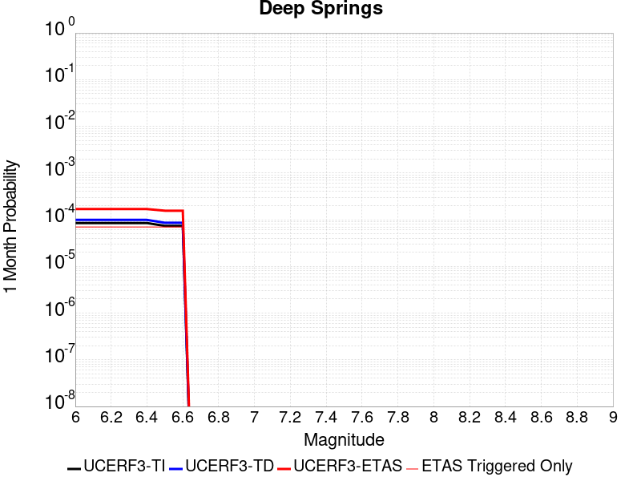 |  |  |

| Magnitude | 1 wk TI Prob | 1 wk TD Prob | 1 wk ETAS Prob | 1 wk ETAS/TD Gain | 1 wk ETAS Triggered Only | 1 mo TI Prob | 1 mo TD Prob | 1 mo ETAS Prob | 1 mo ETAS/TD Gain | 1 mo ETAS Triggered Only | 1 yr TI Prob | 1 yr TD Prob | 1 yr ETAS Prob | 1 yr ETAS/TD Gain | 1 yr ETAS Triggered Only | 10 yr TI Prob | 10 yr TD Prob | 10 yr ETAS Prob | 10 yr ETAS/TD Gain | 10 yr ETAS Triggered Only |
|-----|-----|-----|-----|-----|-----|-----|-----|-----|-----|-----|-----|-----|-----|-----|-----|-----|-----|-----|-----|-----|
| 6.0 | 1.9810619E-5 | 2.311252E-5 | 5.940932E-5 | 2.5704389 | 3.629764E-5 | 8.489989E-5 | 9.905276E-5 | 1.7164084E-4 | 1.7328225 | 7.259528E-5 | 0.001033166 | 0.0012058079 | 0.0013326965 | 1.1052312 | 1.2704174E-4 | 0.010283757 | 0.012042425 | 0.012203797 | 1.0134003 | 1.6333938E-4 |
| 6.1 | 1.9810619E-5 | 2.311252E-5 | 5.940932E-5 | 2.5704389 | 3.629764E-5 | 8.489989E-5 | 9.905276E-5 | 1.7164084E-4 | 1.7328225 | 7.259528E-5 | 0.001033166 | 0.0012058079 | 0.0013326965 | 1.1052312 | 1.2704174E-4 | 0.010283757 | 0.012042425 | 0.012203797 | 1.0134003 | 1.6333938E-4 |
| 6.2 | 1.9810619E-5 | 2.311252E-5 | 5.940932E-5 | 2.5704389 | 3.629764E-5 | 8.489989E-5 | 9.905276E-5 | 1.7164084E-4 | 1.7328225 | 7.259528E-5 | 0.001033166 | 0.0012058079 | 0.0013326965 | 1.1052312 | 1.2704174E-4 | 0.010283757 | 0.012042425 | 0.012203797 | 1.0134003 | 1.6333938E-4 |
| 6.3 | 1.9810619E-5 | 2.311252E-5 | 5.940932E-5 | 2.5704389 | 3.629764E-5 | 8.489989E-5 | 9.905276E-5 | 1.7164084E-4 | 1.7328225 | 7.259528E-5 | 0.001033166 | 0.0012058079 | 0.0013326965 | 1.1052312 | 1.2704174E-4 | 0.010283757 | 0.012042425 | 0.012203797 | 1.0134003 | 1.6333938E-4 |
| 6.4 | 1.9810619E-5 | 2.311252E-5 | 5.940932E-5 | 2.5704389 | 3.629764E-5 | 8.489989E-5 | 9.905276E-5 | 1.7164084E-4 | 1.7328225 | 7.259528E-5 | 0.001033166 | 0.0012058079 | 0.0013326965 | 1.1052312 | 1.2704174E-4 | 0.010283757 | 0.012042425 | 0.012203797 | 1.0134003 | 1.6333938E-4 |
| 6.5 | 1.7190405E-5 | 2.0050555E-5 | 5.6347468E-5 | 2.8102696 | 3.629764E-5 | 7.367108E-5 | 8.593095E-5 | 1.5852E-4 | 1.8447368 | 7.259528E-5 | 8.9657627E-4 | 0.0010462094 | 0.0011731181 | 1.1213034 | 1.2704174E-4 | 0.008929676 | 0.010462056 | 0.010605727 | 1.0137327 | 1.4519056E-4 |
| 6.6 | 1.7190405E-5 | 2.0050555E-5 | 5.6347468E-5 | 2.8102696 | 3.629764E-5 | 7.367108E-5 | 8.593095E-5 | 1.5852E-4 | 1.8447368 | 7.259528E-5 | 8.9657627E-4 | 0.0010462094 | 0.0011731181 | 1.1213034 | 1.2704174E-4 | 0.008929676 | 0.010462056 | 0.010605727 | 1.0137327 | 1.4519056E-4 |

## White Mountains
*[(top)](#table-of-contents)*

| 1 Week | 1 Month | 1 Year | 10 Year |
|-----|-----|-----|-----|
|  |  |  |  |

| Magnitude | 1 wk TI Prob | 1 wk TD Prob | 1 wk ETAS Prob | 1 wk ETAS/TD Gain | 1 wk ETAS Triggered Only | 1 mo TI Prob | 1 mo TD Prob | 1 mo ETAS Prob | 1 mo ETAS/TD Gain | 1 mo ETAS Triggered Only | 1 yr TI Prob | 1 yr TD Prob | 1 yr ETAS Prob | 1 yr ETAS/TD Gain | 1 yr ETAS Triggered Only | 10 yr TI Prob | 10 yr TD Prob | 10 yr ETAS Prob | 10 yr ETAS/TD Gain | 10 yr ETAS Triggered Only |
|-----|-----|-----|-----|-----|-----|-----|-----|-----|-----|-----|-----|-----|-----|-----|-----|-----|-----|-----|-----|-----|
| 6.0 | 3.503579E-5 | 3.378405E-5 | 7.008047E-5 | 2.0743654 | 3.629764E-5 | 1.5014476E-4 | 1.4478143E-4 | 1.8107382E-4 | 1.2506702 | 3.629764E-5 | 0.0018264796 | 0.0017614096 | 0.0018701106 | 1.0617126 | 1.0889292E-4 | 0.018115403 | 0.017486818 | 0.01761164 | 1.007138 | 1.2704174E-4 |
| 6.1 | 3.503579E-5 | 3.378405E-5 | 7.008047E-5 | 2.0743654 | 3.629764E-5 | 1.5014476E-4 | 1.4478143E-4 | 1.8107382E-4 | 1.2506702 | 3.629764E-5 | 0.0018264796 | 0.0017614096 | 0.0018701106 | 1.0617126 | 1.0889292E-4 | 0.018115403 | 0.017486818 | 0.01761164 | 1.007138 | 1.2704174E-4 |
| 6.2 | 3.503579E-5 | 3.378405E-5 | 7.008047E-5 | 2.0743654 | 3.629764E-5 | 1.5014476E-4 | 1.4478143E-4 | 1.8107382E-4 | 1.2506702 | 3.629764E-5 | 0.0018264796 | 0.0017614096 | 0.0018701106 | 1.0617126 | 1.0889292E-4 | 0.018115403 | 0.017486818 | 0.01761164 | 1.007138 | 1.2704174E-4 |
| 6.3 | 1.7818425E-5 | 1.5916074E-5 | 3.4064604E-5 | 2.1402643 | 1.814882E-5 | 7.636245E-5 | 6.821004E-5 | 8.635763E-5 | 1.2660544 | 1.814882E-5 | 9.293162E-4 | 8.301551E-4 | 8.845564E-4 | 1.0655315 | 5.444646E-5 | 0.009254395 | 0.008271999 | 0.008325995 | 1.0065275 | 5.444646E-5 |
| 6.4 | 1.7818425E-5 | 1.5916074E-5 | 3.4064604E-5 | 2.1402643 | 1.814882E-5 | 7.636245E-5 | 6.821004E-5 | 8.635763E-5 | 1.2660544 | 1.814882E-5 | 9.293162E-4 | 8.301551E-4 | 8.845564E-4 | 1.0655315 | 5.444646E-5 | 0.009254395 | 0.008271999 | 0.008325995 | 1.0065275 | 5.444646E-5 |
| 6.5 | 1.3397557E-5 | 1.13362685E-5 | 2.9484883E-5 | 2.6009338 | 1.814882E-5 | 5.741684E-5 | 4.858314E-5 | 6.673108E-5 | 1.373544 | 1.814882E-5 | 6.988258E-4 | 5.913462E-4 | 6.0948427E-4 | 1.0306726 | 1.814882E-5 | 0.006966323 | 0.005898432 | 0.0059164735 | 1.0030588 | 1.814882E-5 |
| 6.6 | 1.0818695E-5 | 8.625366E-6 | 8.625366E-6 | 1.0 | 0.0 | 4.6365014E-5 | 3.6965357E-5 | 3.6965357E-5 | 1.0 | 0.0 | 5.6434784E-4 | 4.4996463E-4 | 4.4996463E-4 | 1.0 | 0.0 | 0.005629168 | 0.004490972 | 0.004509039 | 1.0040231 | 1.814882E-5 |
| 6.7 | 9.067908E-6 | 6.802442E-6 | 6.802442E-6 | 1.0 | 0.0 | 3.8861883E-5 | 2.9153016E-5 | 2.9153016E-5 | 1.0 | 0.0 | 4.7304068E-4 | 3.5488335E-4 | 3.5488335E-4 | 1.0 | 0.0 | 0.00472035 | 0.0035434833 | 0.0035434833 | 1.0 | 0.0 |
| 6.8 | 7.295947E-6 | 4.936391E-6 | 4.936391E-6 | 1.0 | 0.0 | 3.126797E-5 | 2.1155796E-5 | 2.1155796E-5 | 1.0 | 0.0 | 3.8062103E-4 | 2.575425E-4 | 2.575425E-4 | 1.0 | 0.0 | 0.0037996976 | 0.0025725532 | 0.0025725532 | 1.0 | 0.0 |
| 6.9 | 6.2243444E-6 | 3.832213E-6 | 3.832213E-6 | 1.0 | 0.0 | 2.6675489E-5 | 1.642367E-5 | 1.642367E-5 | 1.0 | 0.0 | 3.2472567E-4 | 1.9994036E-4 | 1.9994036E-4 | 1.0 | 0.0 | 0.0032425157 | 0.0019976576 | 0.0019976576 | 1.0 | 0.0 |
| 7.0 | 4.9878413E-6 | 2.6795342E-6 | 2.6795342E-6 | 1.0 | 0.0 | 2.1376287E-5 | 1.14836685E-5 | 1.14836685E-5 | 1.0 | 0.0 | 2.602252E-4 | 1.3980496E-4 | 1.3980496E-4 | 1.0 | 0.0 | 0.002599207 | 0.0013971963 | 0.0013971963 | 1.0 | 0.0 |
| 7.1 | 4.0252844E-6 | 1.8857575E-6 | 1.8857575E-6 | 1.0 | 0.0 | 1.7251105E-5 | 8.081794E-6 | 8.081794E-6 | 1.0 | 0.0 | 2.1001195E-4 | 9.8391516E-5 | 9.8391516E-5 | 1.0 | 0.0 | 0.0020981359 | 9.834924E-4 | 9.834924E-4 | 1.0 | 0.0 |
| 7.2 | 3.3284066E-6 | 1.281964E-6 | 1.281964E-6 | 1.0 | 0.0 | 1.4264522E-5 | 5.494121E-6 | 5.494121E-6 | 1.0 | 0.0 | 1.736567E-4 | 6.688897E-5 | 6.688897E-5 | 1.0 | 0.0 | 0.0017352107 | 6.6869846E-4 | 6.6869846E-4 | 1.0 | 0.0 |
| 7.3 | 2.458226E-6 | 6.05722E-7 | 6.05722E-7 | 1.0 | 0.0 | 1.0535211E-5 | 2.5959491E-6 | 2.5959491E-6 | 1.0 | 0.0 | 1.2825865E-4 | 3.1605257E-5 | 3.1605257E-5 | 1.0 | 0.0 | 0.0012818464 | 3.160114E-4 | 3.160114E-4 | 1.0 | 0.0 |
| 7.4 | 1.965953E-6 | 3.1089303E-7 | 3.1089303E-7 | 1.0 | 0.0 | 8.425486E-6 | 1.332398E-6 | 1.332398E-6 | 1.0 | 0.0 | 1.0257547E-4 | 1.6221828E-5 | 1.6221828E-5 | 1.0 | 0.0 | 0.0010252813 | 1.6220656E-4 | 1.6220656E-4 | 1.0 | 0.0 |
| 7.5 | 1.2014192E-6 | 1.8244253E-7 | 1.8244253E-7 | 1.0 | 0.0 | 5.148929E-6 | 7.8189635E-7 | 7.8189635E-7 | 1.0 | 0.0 | 6.2686406E-5 | 9.519547E-6 | 9.519547E-6 | 1.0 | 0.0 | 6.266873E-4 | 9.519148E-5 | 9.519148E-5 | 1.0 | 0.0 |
| 7.6 | 2.5612175E-7 | 4.8946475E-8 | 4.8946475E-8 | 1.0 | 0.0 | 1.0976642E-6 | 2.0977059E-7 | 2.0977059E-7 | 1.0 | 0.0 | 1.3363979E-5 | 2.5539543E-6 | 2.5539543E-6 | 1.0 | 0.0 | 1.3363175E-4 | 2.5539286E-5 | 2.5539286E-5 | 1.0 | 0.0 |

## Dry Mountain
*[(top)](#table-of-contents)*

| 1 Week | 1 Month | 1 Year | 10 Year |
|-----|-----|-----|-----|
|  | 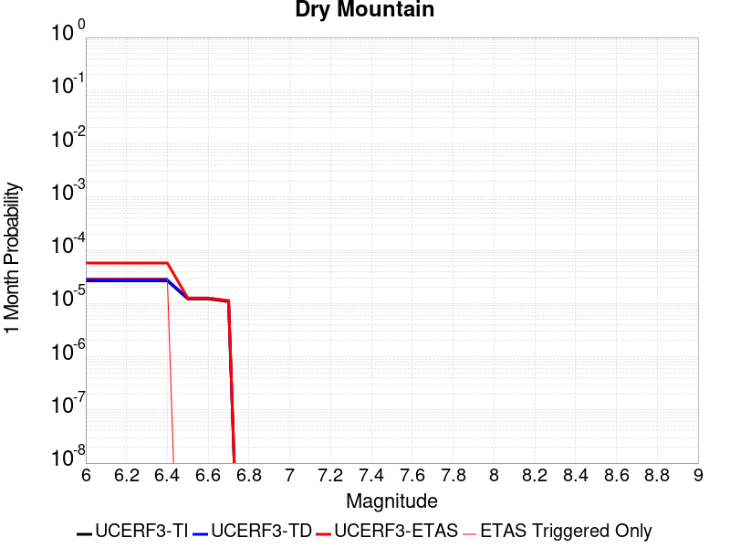 |  |  |

| Magnitude | 1 wk TI Prob | 1 wk TD Prob | 1 wk ETAS Prob | 1 wk ETAS/TD Gain | 1 wk ETAS Triggered Only | 1 mo TI Prob | 1 mo TD Prob | 1 mo ETAS Prob | 1 mo ETAS/TD Gain | 1 mo ETAS Triggered Only | 1 yr TI Prob | 1 yr TD Prob | 1 yr ETAS Prob | 1 yr ETAS/TD Gain | 1 yr ETAS Triggered Only | 10 yr TI Prob | 10 yr TD Prob | 10 yr ETAS Prob | 10 yr ETAS/TD Gain | 10 yr ETAS Triggered Only |
|-----|-----|-----|-----|-----|-----|-----|-----|-----|-----|-----|-----|-----|-----|-----|-----|-----|-----|-----|-----|-----|
| 6.0 | 6.222801E-6 | 6.439381E-6 | 6.0885493E-5 | 9.455177 | 5.444646E-5 | 2.6668875E-5 | 2.7597147E-5 | 8.2042105E-5 | 2.9728475 | 5.444646E-5 | 3.2464517E-4 | 3.3595937E-4 | 4.2667298E-4 | 1.2700137 | 9.07441E-5 | 0.0032417132 | 0.0033560768 | 0.003518868 | 1.0485064 | 1.6333938E-4 |
| 6.1 | 6.222801E-6 | 6.439381E-6 | 6.0885493E-5 | 9.455177 | 5.444646E-5 | 2.6668875E-5 | 2.7597147E-5 | 8.2042105E-5 | 2.9728475 | 5.444646E-5 | 3.2464517E-4 | 3.3595937E-4 | 4.2667298E-4 | 1.2700137 | 9.07441E-5 | 0.0032417132 | 0.0033560768 | 0.003518868 | 1.0485064 | 1.6333938E-4 |
| 6.2 | 6.222801E-6 | 6.439381E-6 | 6.0885493E-5 | 9.455177 | 5.444646E-5 | 2.6668875E-5 | 2.7597147E-5 | 8.2042105E-5 | 2.9728475 | 5.444646E-5 | 3.2464517E-4 | 3.3595937E-4 | 4.2667298E-4 | 1.2700137 | 9.07441E-5 | 0.0032417132 | 0.0033560768 | 0.003518868 | 1.0485064 | 1.6333938E-4 |
| 6.3 | 6.222801E-6 | 6.439381E-6 | 6.0885493E-5 | 9.455177 | 5.444646E-5 | 2.6668875E-5 | 2.7597147E-5 | 8.2042105E-5 | 2.9728475 | 5.444646E-5 | 3.2464517E-4 | 3.3595937E-4 | 4.2667298E-4 | 1.2700137 | 9.07441E-5 | 0.0032417132 | 0.0033560768 | 0.003518868 | 1.0485064 | 1.6333938E-4 |
| 6.4 | 6.222801E-6 | 6.439381E-6 | 6.0885493E-5 | 9.455177 | 5.444646E-5 | 2.6668875E-5 | 2.7597147E-5 | 8.2042105E-5 | 2.9728475 | 5.444646E-5 | 3.2464517E-4 | 3.3595937E-4 | 4.2667298E-4 | 1.2700137 | 9.07441E-5 | 0.0032417132 | 0.0033560768 | 0.003518868 | 1.0485064 | 1.6333938E-4 |
| 6.5 | 2.8528623E-6 | 2.9521684E-6 | 2.9521684E-6 | 1.0 | 0.0 | 1.22264955E-5 | 1.2652138E-5 | 1.2652138E-5 | 1.0 | 0.0 | 1.4884741E-4 | 1.540376E-4 | 1.7218362E-4 | 1.1178026 | 1.814882E-5 | 0.0014874774 | 0.0015401616 | 0.0015945242 | 1.0352967 | 5.444646E-5 |
| 6.6 | 2.8528623E-6 | 2.9521684E-6 | 2.9521684E-6 | 1.0 | 0.0 | 1.22264955E-5 | 1.2652138E-5 | 1.2652138E-5 | 1.0 | 0.0 | 1.4884741E-4 | 1.540376E-4 | 1.7218362E-4 | 1.1178026 | 1.814882E-5 | 0.0014874774 | 0.0015401616 | 0.0015945242 | 1.0352967 | 5.444646E-5 |
| 6.7 | 2.541E-6 | 2.6293578E-6 | 2.6293578E-6 | 1.0 | 0.0 | 1.0889954E-5 | 1.1268677E-5 | 1.1268677E-5 | 1.0 | 0.0 | 1.3257713E-4 | 1.3719614E-4 | 1.5534247E-4 | 1.1322656 | 1.814882E-5 | 0.0013249806 | 0.0013719613 | 0.0014263331 | 1.0396307 | 5.444646E-5 |

## San Jacinto (Stepovers Combined)
*[(top)](#table-of-contents)*

| 1 Week | 1 Month | 1 Year | 10 Year |
|-----|-----|-----|-----|
|  |  |  |  |

| Magnitude | 1 wk TI Prob | 1 wk TD Prob | 1 wk ETAS Prob | 1 wk ETAS/TD Gain | 1 wk ETAS Triggered Only | 1 mo TI Prob | 1 mo TD Prob | 1 mo ETAS Prob | 1 mo ETAS/TD Gain | 1 mo ETAS Triggered Only | 1 yr TI Prob | 1 yr TD Prob | 1 yr ETAS Prob | 1 yr ETAS/TD Gain | 1 yr ETAS Triggered Only | 10 yr TI Prob | 10 yr TD Prob | 10 yr ETAS Prob | 10 yr ETAS/TD Gain | 10 yr ETAS Triggered Only |
|-----|-----|-----|-----|-----|-----|-----|-----|-----|-----|-----|-----|-----|-----|-----|-----|-----|-----|-----|-----|-----|
| 6.0 | 4.0667746E-5 | 3.5272755E-5 | 1.07865475E-4 | 3.0580394 | 7.259528E-5 | 1.742787E-4 | 1.5116022E-4 | 2.2374452E-4 | 1.4801813 | 7.259528E-5 | 0.0021197782 | 0.0018388226 | 0.0019293999 | 1.0492582 | 9.07441E-5 | 0.020996714 | 0.018986892 | 0.019129325 | 1.0075017 | 1.4519056E-4 |
| 6.1 | 4.0667746E-5 | 3.5272755E-5 | 1.07865475E-4 | 3.0580394 | 7.259528E-5 | 1.742787E-4 | 1.5116022E-4 | 2.2374452E-4 | 1.4801813 | 7.259528E-5 | 0.0021197782 | 0.0018388226 | 0.0019293999 | 1.0492582 | 9.07441E-5 | 0.020996714 | 0.018986892 | 0.019129325 | 1.0075017 | 1.4519056E-4 |
| 6.2 | 4.0667746E-5 | 3.5272755E-5 | 1.07865475E-4 | 3.0580394 | 7.259528E-5 | 1.742787E-4 | 1.5116022E-4 | 2.2374452E-4 | 1.4801813 | 7.259528E-5 | 0.0021197782 | 0.0018388226 | 0.0019293999 | 1.0492582 | 9.07441E-5 | 0.020996714 | 0.018986892 | 0.019129325 | 1.0075017 | 1.4519056E-4 |
| 6.3 | 4.0667746E-5 | 3.5272755E-5 | 1.07865475E-4 | 3.0580394 | 7.259528E-5 | 1.742787E-4 | 1.5116022E-4 | 2.2374452E-4 | 1.4801813 | 7.259528E-5 | 0.0021197782 | 0.0018388226 | 0.0019293999 | 1.0492582 | 9.07441E-5 | 0.020996714 | 0.018986892 | 0.019129325 | 1.0075017 | 1.4519056E-4 |
| 6.4 | 4.0577226E-5 | 3.5144654E-5 | 1.0773739E-4 | 3.065541 | 7.259528E-5 | 1.738908E-4 | 1.5061127E-4 | 2.2319562E-4 | 1.4819317 | 7.259528E-5 | 0.0021150648 | 0.0018321523 | 0.0019227301 | 1.049438 | 9.07441E-5 | 0.020950472 | 0.018921461 | 0.019063903 | 1.0075282 | 1.4519056E-4 |
| 6.5 | 4.0577226E-5 | 3.5144654E-5 | 1.0773739E-4 | 3.065541 | 7.259528E-5 | 1.738908E-4 | 1.5061127E-4 | 2.2319562E-4 | 1.4819317 | 7.259528E-5 | 0.0021150648 | 0.0018321523 | 0.0019227301 | 1.049438 | 9.07441E-5 | 0.020950472 | 0.018921461 | 0.019063903 | 1.0075282 | 1.4519056E-4 |
| 6.6 | 4.053861E-5 | 3.509E-5 | 1.0768273E-4 | 3.0687582 | 7.259528E-5 | 1.7372532E-4 | 1.5037706E-4 | 2.2296143E-4 | 1.4826823 | 7.259528E-5 | 0.0021130538 | 0.0018293057 | 0.0019198838 | 1.049515 | 9.07441E-5 | 0.020930743 | 0.018893538 | 0.019035986 | 1.0075395 | 1.4519056E-4 |
| 6.7 | 4.0516545E-5 | 3.5059067E-5 | 1.076518E-4 | 3.0705836 | 7.259528E-5 | 1.7363077E-4 | 1.5024451E-4 | 2.228289E-4 | 1.4831083 | 7.259528E-5 | 0.002111905 | 0.001827695 | 0.0019182733 | 1.0495588 | 9.07441E-5 | 0.020919468 | 0.018877735 | 0.019020185 | 1.007546 | 1.4519056E-4 |
| 6.8 | 4.049434E-5 | 3.5030633E-5 | 1.0762337E-4 | 3.0722647 | 7.259528E-5 | 1.7353562E-4 | 1.5012265E-4 | 2.2270704E-4 | 1.4835005 | 7.259528E-5 | 0.0021107488 | 0.0018262138 | 0.0019167922 | 1.049599 | 9.07441E-5 | 0.020908125 | 0.018863149 | 0.0190056 | 1.0075519 | 1.4519056E-4 |
| 6.9 | 4.046386E-5 | 3.499319E-5 | 1.0758593E-4 | 3.074482 | 7.259528E-5 | 1.73405E-4 | 1.4996222E-4 | 2.2254662E-4 | 1.4840178 | 7.259528E-5 | 0.0021091616 | 0.0018242638 | 0.0019148424 | 1.0496521 | 9.07441E-5 | 0.020892553 | 0.01884392 | 0.018986376 | 1.0075597 | 1.4519056E-4 |
| 7.0 | 4.036382E-5 | 3.487376E-5 | 1.07466505E-4 | 3.0815866 | 7.259528E-5 | 1.7297632E-4 | 1.4945042E-4 | 2.2203485E-4 | 1.4856757 | 7.259528E-5 | 0.0021039525 | 0.0018180435 | 0.0019086227 | 1.0498223 | 9.07441E-5 | 0.02084144 | 0.018782536 | 0.018925 | 1.0075849 | 1.4519056E-4 |
| 7.1 | 4.0343282E-5 | 3.4852223E-5 | 1.07444976E-4 | 3.082873 | 7.259528E-5 | 1.7288832E-4 | 1.4935812E-4 | 2.2194257E-4 | 1.4859759 | 7.259528E-5 | 0.002102883 | 0.0018169218 | 0.001907501 | 1.0498531 | 9.07441E-5 | 0.020830948 | 0.018771412 | 0.018913878 | 1.0075895 | 1.4519056E-4 |
| 7.2 | 4.0257353E-5 | 3.4756722E-5 | 1.0734948E-4 | 3.088596 | 7.259528E-5 | 1.725201E-4 | 1.489489E-4 | 2.2153337E-4 | 1.4873112 | 7.259528E-5 | 0.0020984085 | 0.0018119477 | 0.0019025273 | 1.0499902 | 9.07441E-5 | 0.020787042 | 0.018722152 | 0.018864624 | 1.0076098 | 1.4519056E-4 |
| 7.3 | 3.9940667E-5 | 3.4584376E-5 | 1.0717715E-4 | 3.0990047 | 7.259528E-5 | 1.7116306E-4 | 1.4821035E-4 | 2.2079489E-4 | 1.4897399 | 7.259528E-5 | 0.0020819185 | 0.0018029709 | 0.0018935514 | 1.0502396 | 9.07441E-5 | 0.020625217 | 0.018630784 | 0.018773269 | 1.0076479 | 1.4519056E-4 |
| 7.4 | 3.9721202E-5 | 3.4469766E-5 | 1.07062544E-4 | 3.105984 | 7.259528E-5 | 1.7022261E-4 | 1.4771923E-4 | 2.2030379E-4 | 1.4913684 | 7.259528E-5 | 0.0020704903 | 0.0017970012 | 0.0018875822 | 1.0504068 | 9.07441E-5 | 0.020513052 | 0.018569905 | 0.018712401 | 1.0076734 | 1.4519056E-4 |
| 7.5 | 3.7036873E-5 | 3.3537188E-5 | 1.06130035E-4 | 3.164548 | 7.259528E-5 | 1.5871979E-4 | 1.437229E-4 | 2.1630774E-4 | 1.5050333 | 7.259528E-5 | 0.0019307006 | 0.0017484248 | 0.0018390103 | 1.0518098 | 9.07441E-5 | 0.019140124 | 0.018071463 | 0.01821403 | 1.007889 | 1.4519056E-4 |
| 7.6 | 3.2940967E-5 | 3.1317984E-5 | 1.0391099E-4 | 3.3179336 | 7.259528E-5 | 1.4116794E-4 | 1.3421304E-4 | 2.0679859E-4 | 1.5408232 | 7.259528E-5 | 0.0017173645 | 0.0016328214 | 0.0017234173 | 1.0554843 | 9.07441E-5 | 0.01704153 | 0.016904354 | 0.01704709 | 1.0084437 | 1.4519056E-4 |
| 7.7 | 2.8236149E-5 | 2.7883889E-5 | 1.0047715E-4 | 3.6034122 | 7.259528E-5 | 1.2100645E-4 | 1.19496915E-4 | 1.9208352E-4 | 1.607435 | 7.259528E-5 | 0.0014722579 | 0.001453905 | 0.0015445172 | 1.0623233 | 9.07441E-5 | 0.014625421 | 0.015115095 | 0.0152580915 | 1.0094604 | 1.4519056E-4 |
| 7.8 | 2.4329287E-5 | 2.5207537E-5 | 9.7800985E-5 | 3.8798313 | 7.259528E-5 | 1.042642E-4 | 1.0802783E-4 | 1.8061527E-4 | 1.6719328 | 7.259528E-5 | 0.0012686774 | 0.0013144462 | 0.001405071 | 1.0689453 | 9.07441E-5 | 0.012614589 | 0.013712396 | 0.013855595 | 1.0104431 | 1.4519056E-4 |
| 7.9 | 1.9370926E-5 | 2.0421452E-5 | 9.301525E-5 | 4.5547814 | 7.259528E-5 | 8.301561E-5 | 8.7517576E-5 | 1.601065E-4 | 1.8294212 | 7.259528E-5 | 0.0010102465 | 0.0010650064 | 0.0011556539 | 1.0851145 | 9.07441E-5 | 0.0100566605 | 0.011199483 | 0.011343047 | 1.0128188 | 1.4519056E-4 |
| 8.0 | 1.5583017E-5 | 1.588647E-5 | 8.84806E-5 | 5.569557 | 7.259528E-5 | 6.6782646E-5 | 6.808309E-5 | 1.4067344E-4 | 2.0662022 | 7.259528E-5 | 8.127754E-4 | 8.285971E-4 | 9.19266E-4 | 1.1094246 | 9.07441E-5 | 0.008098091 | 0.008781809 | 0.008925725 | 1.0163879 | 1.4519056E-4 |
| 8.1 | 1.0024873E-5 | 8.292404E-6 | 4.4589742E-5 | 5.377179 | 3.629764E-5 | 4.2963035E-5 | 3.5538393E-5 | 7.1834744E-5 | 2.0213277 | 3.629764E-5 | 5.229494E-4 | 4.3259456E-4 | 4.688765E-4 | 1.0838705 | 3.629764E-5 | 0.0052172043 | 0.0046534105 | 0.0046895393 | 1.007764 | 3.629764E-5 |
| 8.2 | 4.142796E-6 | 1.5610041E-6 | 1.5610041E-6 | 1.0 | 0.0 | 1.775472E-5 | 6.69E-6 | 6.69E-6 | 1.0 | 0.0 | 2.1614227E-4 | 8.144774E-5 | 8.144774E-5 | 1.0 | 0.0 | 0.0021593217 | 9.454649E-4 | 9.454649E-4 | 1.0 | 0.0 |
| 8.3 | 1.2750878E-6 | 3.612133E-7 | 3.612133E-7 | 1.0 | 0.0 | 5.4646503E-6 | 1.548056E-6 | 1.548056E-6 | 1.0 | 0.0 | 6.653009E-5 | 1.8847424E-5 | 1.8847424E-5 | 1.0 | 0.0 | 6.6510175E-4 | 2.2734253E-4 | 2.2734253E-4 | 1.0 | 0.0 |

## Elysian Park (Upper)
*[(top)](#table-of-contents)*

| 1 Week | 1 Month | 1 Year | 10 Year |
|-----|-----|-----|-----|
|  |  |  |  |

| Magnitude | 1 wk TI Prob | 1 wk TD Prob | 1 wk ETAS Prob | 1 wk ETAS/TD Gain | 1 wk ETAS Triggered Only | 1 mo TI Prob | 1 mo TD Prob | 1 mo ETAS Prob | 1 mo ETAS/TD Gain | 1 mo ETAS Triggered Only | 1 yr TI Prob | 1 yr TD Prob | 1 yr ETAS Prob | 1 yr ETAS/TD Gain | 1 yr ETAS Triggered Only | 10 yr TI Prob | 10 yr TD Prob | 10 yr ETAS Prob | 10 yr ETAS/TD Gain | 10 yr ETAS Triggered Only |
|-----|-----|-----|-----|-----|-----|-----|-----|-----|-----|-----|-----|-----|-----|-----|-----|-----|-----|-----|-----|-----|
| 6.0 | 3.1876025E-5 | 3.7035516E-5 | 7.333181E-5 | 1.9800403 | 3.629764E-5 | 1.3660437E-4 | 1.587167E-4 | 1.9500859E-4 | 1.2286582 | 3.629764E-5 | 0.0016618895 | 0.0019311075 | 0.001967335 | 1.01876 | 3.629764E-5 | 0.016495159 | 0.019189782 | 0.019296587 | 1.0055656 | 1.0889292E-4 |
| 6.1 | 3.1876025E-5 | 3.7035516E-5 | 7.333181E-5 | 1.9800403 | 3.629764E-5 | 1.3660437E-4 | 1.587167E-4 | 1.9500859E-4 | 1.2286582 | 3.629764E-5 | 0.0016618895 | 0.0019311075 | 0.001967335 | 1.01876 | 3.629764E-5 | 0.016495159 | 0.019189782 | 0.019296587 | 1.0055656 | 1.0889292E-4 |
| 6.2 | 3.1876025E-5 | 3.7035516E-5 | 7.333181E-5 | 1.9800403 | 3.629764E-5 | 1.3660437E-4 | 1.587167E-4 | 1.9500859E-4 | 1.2286582 | 3.629764E-5 | 0.0016618895 | 0.0019311075 | 0.001967335 | 1.01876 | 3.629764E-5 | 0.016495159 | 0.019189782 | 0.019296587 | 1.0055656 | 1.0889292E-4 |
| 6.3 | 3.1876025E-5 | 3.7035516E-5 | 7.333181E-5 | 1.9800403 | 3.629764E-5 | 1.3660437E-4 | 1.587167E-4 | 1.9500859E-4 | 1.2286582 | 3.629764E-5 | 0.0016618895 | 0.0019311075 | 0.001967335 | 1.01876 | 3.629764E-5 | 0.016495159 | 0.019189782 | 0.019296587 | 1.0055656 | 1.0889292E-4 |
| 6.4 | 1.9273462E-5 | 2.1202266E-5 | 5.7499135E-5 | 2.7119336 | 3.629764E-5 | 8.259794E-5 | 9.086466E-5 | 1.27159E-4 | 1.399433 | 3.629764E-5 | 0.001005166 | 0.0011058892 | 0.0011421468 | 1.0327858 | 3.629764E-5 | 0.010006315 | 0.011020724 | 0.011110468 | 1.0081432 | 9.07441E-5 |
| 6.5 | 1.9273462E-5 | 2.1202266E-5 | 5.7499135E-5 | 2.7119336 | 3.629764E-5 | 8.259794E-5 | 9.086466E-5 | 1.27159E-4 | 1.399433 | 3.629764E-5 | 0.001005166 | 0.0011058892 | 0.0011421468 | 1.0327858 | 3.629764E-5 | 0.010006315 | 0.011020724 | 0.011110468 | 1.0081432 | 9.07441E-5 |
| 6.6 | 9.813258E-6 | 9.665599E-6 | 2.7814243E-5 | 2.8776536 | 1.814882E-5 | 4.205614E-5 | 4.1423376E-5 | 5.9571445E-5 | 1.4381118 | 1.814882E-5 | 5.119132E-4 | 5.0422014E-4 | 5.223598E-4 | 1.0359757 | 1.814882E-5 | 0.005107356 | 0.0050314846 | 0.0050676 | 1.0071778 | 3.629764E-5 |
| 6.7 | 9.801478E-6 | 9.653168E-6 | 2.7801812E-5 | 2.8800714 | 1.814882E-5 | 4.2005657E-5 | 4.1370105E-5 | 5.9518174E-5 | 1.438676 | 1.814882E-5 | 5.112989E-4 | 5.035719E-4 | 5.2171154E-4 | 1.0360221 | 1.814882E-5 | 0.0051012407 | 0.0050250315 | 0.0050611463 | 1.007187 | 3.629764E-5 |
| 6.8 | 8.102489E-6 | 7.773004E-6 | 2.5921683E-5 | 3.3348346 | 1.814882E-5 | 3.4724493E-5 | 3.3312477E-5 | 5.1460695E-5 | 1.5447873 | 1.814882E-5 | 4.2268867E-4 | 4.055089E-4 | 4.2365037E-4 | 1.0447375 | 1.814882E-5 | 0.004218856 | 0.0040481836 | 0.0040843342 | 1.0089301 | 3.629764E-5 |
| 6.9 | 6.08275E-6 | 5.4814514E-6 | 2.3630173E-5 | 4.3109336 | 1.814882E-5 | 2.6068668E-5 | 2.3491726E-5 | 4.164012E-5 | 1.772544 | 1.814882E-5 | 3.173398E-4 | 2.85975E-4 | 3.0411864E-4 | 1.0634449 | 1.814882E-5 | 0.0031688702 | 0.0028561477 | 0.0028742447 | 1.0063361 | 1.814882E-5 |
| 7.0 | 5.5995934E-6 | 4.98278E-6 | 2.313151E-5 | 4.64229 | 1.814882E-5 | 2.3998036E-5 | 2.13546E-5 | 3.9503033E-5 | 1.8498605 | 1.814882E-5 | 2.9213692E-4 | 2.599619E-4 | 2.7810602E-4 | 1.0697953 | 1.814882E-5 | 0.0029175316 | 0.0025966454 | 0.002614747 | 1.0069712 | 1.814882E-5 |
| 7.1 | 4.709881E-6 | 4.0874015E-6 | 2.2236147E-5 | 5.4401674 | 1.814882E-5 | 2.0185047E-5 | 1.7517319E-5 | 3.566582E-5 | 2.036032 | 1.814882E-5 | 2.4572524E-4 | 2.132529E-4 | 2.3139785E-4 | 1.0850866 | 1.814882E-5 | 0.002454537 | 0.002130524 | 0.002148634 | 1.0085003 | 1.814882E-5 |
| 7.2 | 3.6063436E-6 | 2.9779544E-6 | 2.1126722E-5 | 7.094373 | 1.814882E-5 | 1.5455667E-5 | 1.27626E-5 | 3.091119E-5 | 2.4220135 | 1.814882E-5 | 1.881565E-4 | 1.5537368E-4 | 1.7351969E-4 | 1.1167895 | 1.814882E-5 | 0.0018799726 | 0.0015526618 | 0.0015707824 | 1.0116707 | 1.814882E-5 |
| 7.3 | 2.471135E-6 | 2.0954615E-6 | 2.0244244E-5 | 9.6609955 | 1.814882E-5 | 1.0590536E-5 | 8.980519E-6 | 2.7129176E-5 | 3.020892 | 1.814882E-5 | 1.2893214E-4 | 1.093324E-4 | 1.2747924E-4 | 1.1659786 | 1.814882E-5 | 0.0012885736 | 0.0010927934 | 0.0011109223 | 1.0165896 | 1.814882E-5 |
| 7.4 | 1.163943E-6 | 1.0275091E-6 | 1.0275091E-6 | 1.0 | 0.0 | 4.988318E-6 | 4.4036033E-6 | 4.4036033E-6 | 1.0 | 0.0 | 6.0731076E-5 | 5.3612584E-5 | 5.3612584E-5 | 1.0 | 0.0 | 6.071448E-4 | 5.359995E-4 | 5.359995E-4 | 1.0 | 0.0 |
| 7.5 | 4.99459E-7 | 4.917604E-7 | 4.917604E-7 | 1.0 | 0.0 | 2.140537E-6 | 2.1075427E-6 | 2.1075427E-6 | 1.0 | 0.0 | 2.6060725E-5 | 2.5659048E-5 | 2.5659048E-5 | 1.0 | 0.0 | 2.605767E-4 | 2.5656243E-4 | 2.5656243E-4 | 1.0 | 0.0 |
| 7.6 | 2.4667852E-7 | 2.4778336E-7 | 2.4778336E-7 | 1.0 | 0.0 | 1.0571932E-6 | 1.0619283E-6 | 1.0619283E-6 | 1.0 | 0.0 | 1.2871251E-5 | 1.2928905E-5 | 1.2928905E-5 | 1.0 | 0.0 | 1.2870505E-4 | 1.2928189E-4 | 1.2928189E-4 | 1.0 | 0.0 |
| 7.7 | 8.2312795E-8 | 7.3864456E-8 | 7.3864456E-8 | 1.0 | 0.0 | 3.527691E-7 | 3.165619E-7 | 3.165619E-7 | 1.0 | 0.0 | 4.294955E-6 | 3.8541357E-6 | 3.8541357E-6 | 1.0 | 0.0 | 4.2948723E-5 | 3.8540802E-5 | 3.8540802E-5 | 1.0 | 0.0 |
| 7.8 | 2.7819295E-8 | 1.7566023E-8 | 1.7566023E-8 | 1.0 | 0.0 | 1.1922555E-7 | 7.5282955E-8 | 7.5282955E-8 | 1.0 | 0.0 | 1.45157E-6 | 9.165697E-7 | 9.165697E-7 | 1.0 | 0.0 | 1.45156055E-5 | 9.165675E-6 | 9.165675E-6 | 1.0 | 0.0 |

## Santa Rosa Island
*[(top)](#table-of-contents)*

| 1 Week | 1 Month | 1 Year | 10 Year |
|-----|-----|-----|-----|
|  |  | 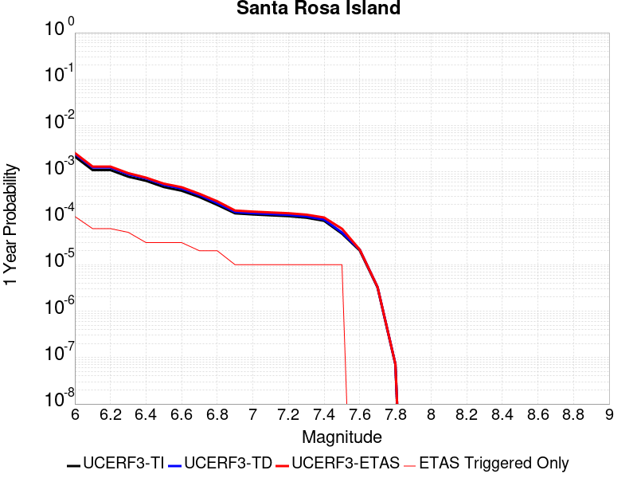 |  |

| Magnitude | 1 wk TI Prob | 1 wk TD Prob | 1 wk ETAS Prob | 1 wk ETAS/TD Gain | 1 wk ETAS Triggered Only | 1 mo TI Prob | 1 mo TD Prob | 1 mo ETAS Prob | 1 mo ETAS/TD Gain | 1 mo ETAS Triggered Only | 1 yr TI Prob | 1 yr TD Prob | 1 yr ETAS Prob | 1 yr ETAS/TD Gain | 1 yr ETAS Triggered Only | 10 yr TI Prob | 10 yr TD Prob | 10 yr ETAS Prob | 10 yr ETAS/TD Gain | 10 yr ETAS Triggered Only |
|-----|-----|-----|-----|-----|-----|-----|-----|-----|-----|-----|-----|-----|-----|-----|-----|-----|-----|-----|-----|-----|
| 6.0 | 4.1143165E-5 | 4.7091133E-5 | 8.3387065E-5 | 1.7707593 | 3.629764E-5 | 1.7631594E-4 | 2.0180465E-4 | 2.3809496E-4 | 1.179829 | 3.629764E-5 | 0.002144533 | 0.0024544 | 0.0025449214 | 1.0368812 | 9.07441E-5 | 0.021239553 | 0.024293551 | 0.024417507 | 1.0051024 | 1.2704174E-4 |
| 6.1 | 2.1061249E-5 | 2.3864959E-5 | 4.2013347E-5 | 1.7604617 | 1.814882E-5 | 9.0259375E-5 | 1.0227455E-4 | 1.20421515E-4 | 1.1774338 | 1.814882E-5 | 0.0010983539 | 0.0012445104 | 0.001298889 | 1.0436949 | 5.444646E-5 | 0.01092941 | 0.012378449 | 0.012450145 | 1.005792 | 7.259528E-5 |
| 6.2 | 2.1061249E-5 | 2.3864959E-5 | 4.2013347E-5 | 1.7604617 | 1.814882E-5 | 9.0259375E-5 | 1.0227455E-4 | 1.20421515E-4 | 1.1774338 | 1.814882E-5 | 0.0010983539 | 0.0012445104 | 0.001298889 | 1.0436949 | 5.444646E-5 | 0.01092941 | 0.012378449 | 0.012450145 | 1.005792 | 7.259528E-5 |
| 6.3 | 1.5158236E-5 | 1.7074419E-5 | 3.522293E-5 | 2.0629065 | 1.814882E-5 | 6.496225E-5 | 7.3174095E-5 | 9.132159E-5 | 1.2480043 | 1.814882E-5 | 7.906284E-4 | 8.905424E-4 | 9.2680776E-4 | 1.0407227 | 3.629764E-5 | 0.007878214 | 0.008870989 | 0.008924953 | 1.0060831 | 5.444646E-5 |
| 6.4 | 1.2341918E-5 | 1.3852917E-5 | 1.3852917E-5 | 1.0 | 0.0 | 5.2892858E-5 | 5.9368336E-5 | 5.9368336E-5 | 1.0 | 0.0 | 6.437803E-4 | 7.225779E-4 | 7.225779E-4 | 1.0 | 0.0 | 0.006419184 | 0.007203121 | 0.0072211395 | 1.0025015 | 1.814882E-5 |
| 6.5 | 9.061158E-6 | 1.0117031E-5 | 1.0117031E-5 | 1.0 | 0.0 | 3.883296E-5 | 4.3358013E-5 | 4.3358013E-5 | 1.0 | 0.0 | 4.726887E-4 | 5.277613E-4 | 5.277613E-4 | 1.0 | 0.0 | 0.004716845 | 0.0052656173 | 0.0052836705 | 1.0034285 | 1.814882E-5 |
| 6.6 | 7.5461685E-6 | 8.400733E-6 | 8.400733E-6 | 1.0 | 0.0 | 3.2340322E-5 | 3.600267E-5 | 3.600267E-5 | 1.0 | 0.0 | 3.936723E-4 | 4.3824865E-4 | 4.3824865E-4 | 1.0 | 0.0 | 0.003929756 | 0.0043742736 | 0.004392343 | 1.0041308 | 1.814882E-5 |
| 6.7 | 5.5023775E-6 | 6.087381E-6 | 6.087381E-6 | 1.0 | 0.0 | 2.3581404E-5 | 2.6088532E-5 | 2.6088532E-5 | 1.0 | 0.0 | 2.8706578E-4 | 3.1758484E-4 | 3.1758484E-4 | 1.0 | 0.0 | 0.0028669522 | 0.0031716314 | 0.0031897228 | 1.005704 | 1.814882E-5 |
| 6.8 | 3.7351679E-6 | 4.0831405E-6 | 4.0831405E-6 | 1.0 | 0.0 | 1.6007763E-5 | 1.749907E-5 | 1.749907E-5 | 1.0 | 0.0 | 1.948771E-4 | 2.1303284E-4 | 2.1303284E-4 | 1.0 | 0.0 | 0.0019470629 | 0.0021285315 | 0.0021466415 | 1.0085083 | 1.814882E-5 |
| 6.9 | 2.456366E-6 | 2.6292705E-6 | 2.6292705E-6 | 1.0 | 0.0 | 1.0527241E-5 | 1.1268254E-5 | 1.1268254E-5 | 1.0 | 0.0 | 1.2816161E-4 | 1.3718237E-4 | 1.3718237E-4 | 1.0 | 0.0 | 0.0012808773 | 0.0013709799 | 0.0013891038 | 1.0132197 | 1.814882E-5 |
| 7.0 | 2.3245157E-6 | 2.4827782E-6 | 2.4827782E-6 | 1.0 | 0.0 | 9.962172E-6 | 1.0640435E-5 | 1.0640435E-5 | 1.0 | 0.0 | 1.2128269E-4 | 1.2953962E-4 | 1.2953962E-4 | 1.0 | 0.0 | 0.0012121652 | 0.0012946434 | 0.0013127687 | 1.0140003 | 1.814882E-5 |
| 7.1 | 2.2248344E-6 | 2.37325E-6 | 2.37325E-6 | 1.0 | 0.0 | 9.53497E-6 | 1.0171032E-5 | 1.0171032E-5 | 1.0 | 0.0 | 1.1608207E-4 | 1.2382529E-4 | 1.2382529E-4 | 1.0 | 0.0 | 0.0011602144 | 0.001237565 | 0.001237565 | 1.0 | 0.0 |
| 7.2 | 2.1350402E-6 | 2.276154E-6 | 2.276154E-6 | 1.0 | 0.0 | 9.150141E-6 | 9.754909E-6 | 9.754909E-6 | 1.0 | 0.0 | 1.1139726E-4 | 1.1875956E-4 | 1.1875956E-4 | 1.0 | 0.0 | 0.0011134144 | 0.0011869629 | 0.0011869629 | 1.0 | 0.0 |
| 7.3 | 1.9793572E-6 | 2.108719E-6 | 2.108719E-6 | 1.0 | 0.0 | 8.482932E-6 | 9.037336E-6 | 9.037336E-6 | 1.0 | 0.0 | 1.032748E-4 | 1.10024026E-4 | 1.10024026E-4 | 1.0 | 0.0 | 0.0010322682 | 0.0010996973 | 0.0010996973 | 1.0 | 0.0 |
| 7.4 | 1.6951194E-6 | 1.8045733E-6 | 1.8045733E-6 | 1.0 | 0.0 | 7.264777E-6 | 7.733863E-6 | 7.733863E-6 | 1.0 | 0.0 | 8.844508E-5 | 9.415573E-5 | 9.415573E-5 | 1.0 | 0.0 | 8.840988E-4 | 9.4116E-4 | 9.4116E-4 | 1.0 | 0.0 |
| 7.5 | 8.987207E-7 | 9.5122147E-7 | 9.5122147E-7 | 1.0 | 0.0 | 3.8516546E-6 | 4.076657E-6 | 4.076657E-6 | 1.0 | 0.0 | 4.6892885E-5 | 4.963218E-5 | 4.963218E-5 | 1.0 | 0.0 | 4.688299E-4 | 4.9621216E-4 | 4.9621216E-4 | 1.0 | 0.0 |
| 7.6 | 3.8783037E-7 | 4.052932E-7 | 4.052932E-7 | 1.0 | 0.0 | 1.6621291E-6 | 1.7369698E-6 | 1.7369698E-6 | 1.0 | 0.0 | 2.0236233E-5 | 2.1147409E-5 | 2.1147409E-5 | 1.0 | 0.0 | 2.023439E-4 | 2.1145462E-4 | 2.1145462E-4 | 1.0 | 0.0 |
| 7.7 | 6.181804E-8 | 6.339035E-8 | 6.339035E-8 | 1.0 | 0.0 | 2.6493444E-7 | 2.7167292E-7 | 2.7167292E-7 | 1.0 | 0.0 | 3.225572E-6 | 3.3076128E-6 | 3.3076128E-6 | 1.0 | 0.0 | 3.225525E-5 | 3.307564E-5 | 3.307564E-5 | 1.0 | 0.0 |
| 7.8 | 1.3704449E-9 | 1.3964153E-9 | 1.3964153E-9 | 1.0 | 0.0 | 5.873335E-9 | 5.984637E-9 | 5.984637E-9 | 1.0 | 0.0 | 7.1507856E-8 | 7.286295E-8 | 7.286295E-8 | 1.0 | 0.0 | 7.1507833E-7 | 7.286294E-7 | 7.286294E-7 | 1.0 | 0.0 |

## Imperial
*[(top)](#table-of-contents)*

| 1 Week | 1 Month | 1 Year | 10 Year |
|-----|-----|-----|-----|
| 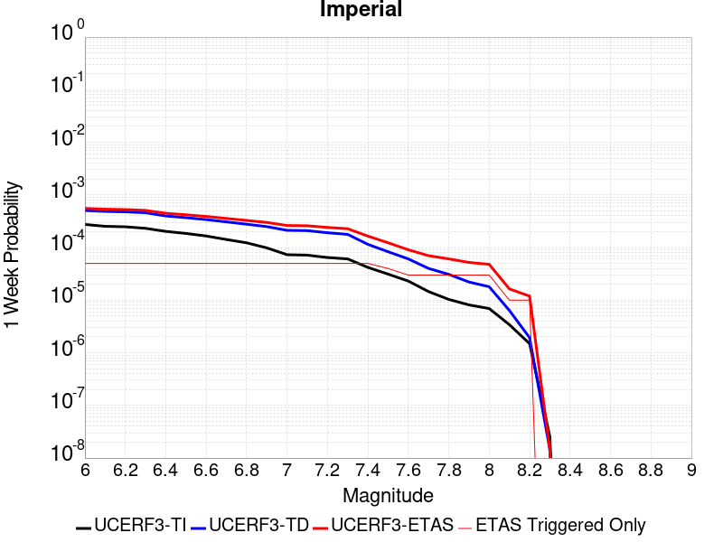 |  |  | 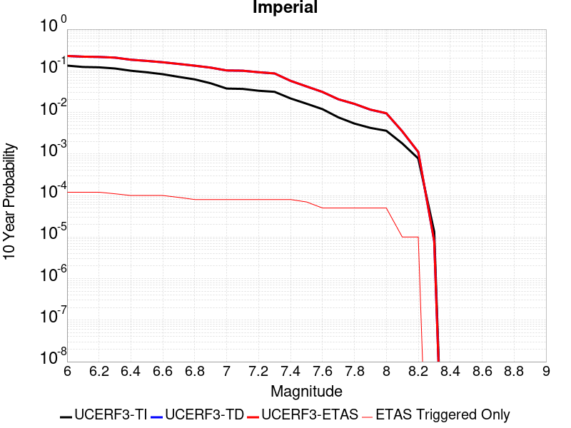 |

| Magnitude | 1 wk TI Prob | 1 wk TD Prob | 1 wk ETAS Prob | 1 wk ETAS/TD Gain | 1 wk ETAS Triggered Only | 1 mo TI Prob | 1 mo TD Prob | 1 mo ETAS Prob | 1 mo ETAS/TD Gain | 1 mo ETAS Triggered Only | 1 yr TI Prob | 1 yr TD Prob | 1 yr ETAS Prob | 1 yr ETAS/TD Gain | 1 yr ETAS Triggered Only | 10 yr TI Prob | 10 yr TD Prob | 10 yr ETAS Prob | 10 yr ETAS/TD Gain | 10 yr ETAS Triggered Only |
|-----|-----|-----|-----|-----|-----|-----|-----|-----|-----|-----|-----|-----|-----|-----|-----|-----|-----|-----|-----|-----|
| 6.0 | 2.7496446E-4 | 5.0552754E-4 | 5.418068E-4 | 1.0717652 | 3.629764E-5 | 0.0011778869 | 0.002164787 | 0.0022553348 | 1.0418276 | 9.07441E-5 | 0.0142467655 | 0.026038699 | 0.026162433 | 1.0047519 | 1.2704174E-4 | 0.13367249 | 0.2280438 | 0.22815587 | 1.0004915 | 1.4519056E-4 |
| 6.1 | 2.5356023E-4 | 4.8656776E-4 | 5.2284775E-4 | 1.074563 | 3.629764E-5 | 0.001086234 | 0.0020836622 | 0.0021742173 | 1.0434595 | 9.07441E-5 | 0.013144928 | 0.025071215 | 0.025195071 | 1.0049402 | 1.2704174E-4 | 0.123940155 | 0.21947981 | 0.21959314 | 1.0005163 | 1.4519056E-4 |
| 6.2 | 2.4820742E-4 | 4.7752203E-4 | 5.1380234E-4 | 1.0759763 | 3.629764E-5 | 0.0010633124 | 0.0020449557 | 0.0021355143 | 1.0442839 | 9.07441E-5 | 0.01286919 | 0.024611235 | 0.02473515 | 1.0050349 | 1.2704174E-4 | 0.12148927 | 0.21598552 | 0.21609935 | 1.000527 | 1.4519056E-4 |
| 6.3 | 2.3205351E-4 | 4.5890483E-4 | 4.951858E-4 | 1.07906 | 3.629764E-5 | 9.94136E-4 | 0.0019652895 | 0.0020558552 | 1.0460826 | 9.07441E-5 | 0.012036599 | 0.02366133 | 0.023785366 | 1.0052421 | 1.2704174E-4 | 0.11405133 | 0.20793462 | 0.20804961 | 1.000553 | 1.4519056E-4 |
| 6.4 | 2.0304754E-4 | 3.987652E-4 | 4.3504837E-4 | 1.0909888 | 3.629764E-5 | 8.6991355E-4 | 0.0017078889 | 0.0017803602 | 1.0424333 | 7.259528E-5 | 0.010539869 | 0.020595672 | 0.020702321 | 1.0051783 | 1.0889292E-4 | 0.100537635 | 0.1850669 | 0.18517043 | 1.0005594 | 1.2704174E-4 |
| 6.5 | 1.854992E-4 | 3.6988858E-4 | 4.061728E-4 | 1.0980949 | 3.629764E-5 | 7.9475436E-4 | 0.0015842861 | 0.0016567664 | 1.0457494 | 7.259528E-5 | 0.009633281 | 0.01911948 | 0.019226292 | 1.0055865 | 1.0889292E-4 | 0.0922623 | 0.173298 | 0.17340302 | 1.0006061 | 1.2704174E-4 |
| 6.6 | 1.6586106E-4 | 3.403506E-4 | 3.766359E-4 | 1.1066115 | 3.629764E-5 | 7.106394E-4 | 0.0014578402 | 0.0015303297 | 1.0497239 | 7.259528E-5 | 0.008617763 | 0.01760642 | 0.017713396 | 1.006076 | 1.0889292E-4 | 0.08291132 | 0.16077545 | 0.16088207 | 1.0006632 | 1.2704174E-4 |
| 6.7 | 1.4224656E-4 | 3.076692E-4 | 3.4395565E-4 | 1.11794 | 3.629764E-5 | 6.094856E-4 | 0.001317924 | 0.0013904236 | 1.0550104 | 7.259528E-5 | 0.0073952693 | 0.015929576 | 0.016018875 | 1.0056058 | 9.07441E-5 | 0.07153955 | 0.14648417 | 0.1465771 | 1.0006344 | 1.0889292E-4 |
| 6.8 | 1.2317259E-4 | 2.779122E-4 | 3.1419974E-4 | 1.130572 | 3.629764E-5 | 5.2777573E-4 | 0.0011905148 | 0.0012448963 | 1.0456791 | 5.444646E-5 | 0.0064067547 | 0.0143995695 | 0.014471119 | 1.0049689 | 7.259528E-5 | 0.06225166 | 0.13293684 | 0.13301551 | 1.0005919 | 9.07441E-5 |
| 6.9 | 9.859898E-5 | 2.5014306E-4 | 2.864316E-4 | 1.1450713 | 3.629764E-5 | 4.2249862E-4 | 0.0010716055 | 0.0011259936 | 1.0507538 | 5.444646E-5 | 0.0051317946 | 0.012969712 | 0.013041366 | 1.0055248 | 7.259528E-5 | 0.05014893 | 0.11940631 | 0.11948622 | 1.0006692 | 9.07441E-5 |
| 7.0 | 7.3191884E-5 | 2.1266776E-4 | 2.489577E-4 | 1.1706414 | 3.629764E-5 | 3.136418E-4 | 9.1111806E-4 | 9.655149E-4 | 1.0597034 | 5.444646E-5 | 0.003811904 | 0.011037128 | 0.011108922 | 1.0065048 | 7.259528E-5 | 0.037471764 | 0.10206493 | 0.10214641 | 1.0007983 | 9.07441E-5 |
| 7.1 | 7.1760296E-5 | 2.0968143E-4 | 2.4597146E-4 | 1.1730722 | 3.629764E-5 | 3.0750787E-4 | 8.983284E-4 | 9.527259E-4 | 1.0605541 | 5.444646E-5 | 0.003737482 | 0.010882978 | 0.010954783 | 1.006598 | 7.259528E-5 | 0.03675245 | 0.10070146 | 0.100783065 | 1.0008104 | 9.07441E-5 |
| 7.2 | 6.46614E-5 | 1.9136685E-4 | 2.2765755E-4 | 1.1896393 | 3.629764E-5 | 2.7709085E-4 | 8.1988896E-4 | 8.7429077E-4 | 1.0663527 | 5.444646E-5 | 0.0033683628 | 0.0099370815 | 0.010008955 | 1.0072329 | 7.259528E-5 | 0.033177625 | 0.09250898 | 0.09259133 | 1.0008901 | 9.07441E-5 |
| 7.3 | 6.088115E-5 | 1.78084E-4 | 2.1437516E-4 | 1.2037868 | 3.629764E-5 | 2.6089314E-4 | 7.6299673E-4 | 8.174016E-4 | 1.0713042 | 5.444646E-5 | 0.0031717476 | 0.009250494 | 0.009322417 | 1.0077751 | 7.259528E-5 | 0.031268585 | 0.08655989 | 0.08664278 | 1.0009576 | 9.07441E-5 |
| 7.4 | 4.199346E-5 | 1.1510366E-4 | 1.5139712E-4 | 1.3153111 | 3.629764E-5 | 1.7995955E-4 | 4.9320905E-4 | 5.476286E-4 | 1.1103379 | 5.444646E-5 | 0.0021888057 | 0.0059884563 | 0.0060606166 | 1.0120499 | 7.259528E-5 | 0.02167372 | 0.057439793 | 0.057525326 | 1.001489 | 9.07441E-5 |
| 7.5 | 3.130448E-5 | 8.33328E-5 | 1.0148011E-4 | 1.2177691 | 1.814882E-5 | 1.3415517E-4 | 3.57092E-4 | 3.933767E-4 | 1.1016116 | 3.629764E-5 | 0.0016321153 | 0.004338988 | 0.004393198 | 1.0124937 | 5.444646E-5 | 0.016201803 | 0.04213201 | 0.042201545 | 1.0016505 | 7.259528E-5 |
| 7.6 | 2.3074248E-5 | 6.0844646E-5 | 7.8992365E-5 | 1.2982632 | 1.814882E-5 | 9.888588E-5 | 2.6073685E-4 | 2.7888094E-4 | 1.0695877 | 1.814882E-5 | 0.0012032706 | 0.0031698733 | 0.0032060558 | 1.0114145 | 3.629764E-5 | 0.011967761 | 0.031026395 | 0.031079153 | 1.0017004 | 5.444646E-5 |
| 7.7 | 1.45864815E-5 | 4.0124698E-5 | 5.827279E-5 | 1.4522923 | 1.814882E-5 | 6.2511994E-5 | 1.7195169E-4 | 1.9009739E-4 | 1.1055279 | 1.814882E-5 | 7.608177E-4 | 0.0020915072 | 0.002127729 | 1.0173185 | 3.629764E-5 | 0.007582182 | 0.020627763 | 0.020681087 | 1.002585 | 5.444646E-5 |
| 7.8 | 1.0352979E-5 | 3.0960902E-5 | 4.910916E-5 | 1.586167 | 1.814882E-5 | 4.4369157E-5 | 1.3268284E-4 | 1.5082925E-4 | 1.1367654 | 1.814882E-5 | 5.400606E-4 | 0.0016142189 | 0.001650458 | 1.0224499 | 3.629764E-5 | 0.0053875 | 0.016016833 | 0.016070407 | 1.0033449 | 5.444646E-5 |
| 7.9 | 8.137906E-6 | 2.2149103E-5 | 4.029752E-5 | 1.8193749 | 1.814882E-5 | 3.4876273E-5 | 9.492128E-5 | 1.13068374E-4 | 1.1911805 | 1.814882E-5 | 4.2453592E-4 | 0.0011550548 | 0.0011913105 | 1.0313888 | 3.629764E-5 | 0.004237258 | 0.011617903 | 0.011671716 | 1.004632 | 5.444646E-5 |
| 8.0 | 6.93792E-6 | 1.8008766E-5 | 3.615726E-5 | 2.0077589 | 1.814882E-5 | 2.9733603E-5 | 7.717814E-5 | 9.5325566E-5 | 1.2351367 | 1.814882E-5 | 3.6194647E-4 | 9.3923963E-4 | 9.755032E-4 | 1.0386095 | 3.629764E-5 | 0.0036135751 | 0.00950155 | 0.0095554795 | 1.0056758 | 5.444646E-5 |
| 8.1 | 3.4286315E-6 | 6.379872E-6 | 6.379872E-6 | 1.0 | 0.0 | 1.4694053E-5 | 2.7342023E-5 | 2.7342023E-5 | 1.0 | 0.0 | 1.7888541E-4 | 3.328384E-4 | 3.328384E-4 | 1.0 | 0.0 | 0.0017874148 | 0.003486031 | 0.003486031 | 1.0 | 0.0 |
| 8.2 | 1.4906886E-6 | 1.9366646E-6 | 1.9366646E-6 | 1.0 | 0.0 | 6.3886496E-6 | 8.299965E-6 | 8.299965E-6 | 1.0 | 0.0 | 7.7779034E-5 | 1.0104742E-4 | 1.0104742E-4 | 1.0 | 0.0 | 7.775182E-4 | 0.0011075331 | 0.0011075331 | 1.0 | 0.0 |
| 8.3 | 2.5758007E-8 | 1.4500102E-8 | 1.4500102E-8 | 1.0 | 0.0 | 1.10391454E-7 | 6.214329E-8 | 6.214329E-8 | 1.0 | 0.0 | 1.3440151E-6 | 7.565946E-7 | 7.565946E-7 | 1.0 | 0.0 | 1.344007E-5 | 7.887763E-6 | 7.887763E-6 | 1.0 | 0.0 |

## San Pedro Basin
*[(top)](#table-of-contents)*

| 1 Week | 1 Month | 1 Year | 10 Year |
|-----|-----|-----|-----|
|  |  |  |  |

| Magnitude | 1 wk TI Prob | 1 wk TD Prob | 1 wk ETAS Prob | 1 wk ETAS/TD Gain | 1 wk ETAS Triggered Only | 1 mo TI Prob | 1 mo TD Prob | 1 mo ETAS Prob | 1 mo ETAS/TD Gain | 1 mo ETAS Triggered Only | 1 yr TI Prob | 1 yr TD Prob | 1 yr ETAS Prob | 1 yr ETAS/TD Gain | 1 yr ETAS Triggered Only | 10 yr TI Prob | 10 yr TD Prob | 10 yr ETAS Prob | 10 yr ETAS/TD Gain | 10 yr ETAS Triggered Only |
|-----|-----|-----|-----|-----|-----|-----|-----|-----|-----|-----|-----|-----|-----|-----|-----|-----|-----|-----|-----|-----|
| 6.0 | 5.3449043E-5 | 6.336954E-5 | 9.9664874E-5 | 1.5727569 | 3.629764E-5 | 2.2904722E-4 | 2.715589E-4 | 3.441345E-4 | 1.2672553 | 7.259528E-5 | 0.0027850836 | 0.0033018254 | 0.0034284475 | 1.0383492 | 1.2704174E-4 | 0.027504366 | 0.03258945 | 0.03272991 | 1.0043099 | 1.4519056E-4 |
| 6.1 | 5.3449043E-5 | 6.336954E-5 | 9.9664874E-5 | 1.5727569 | 3.629764E-5 | 2.2904722E-4 | 2.715589E-4 | 3.441345E-4 | 1.2672553 | 7.259528E-5 | 0.0027850836 | 0.0033018254 | 0.0034284475 | 1.0383492 | 1.2704174E-4 | 0.027504366 | 0.03258945 | 0.03272991 | 1.0043099 | 1.4519056E-4 |
| 6.2 | 2.3189454E-5 | 2.6642796E-5 | 4.4791133E-5 | 1.6811724 | 1.814882E-5 | 9.9379584E-5 | 1.14178685E-4 | 1.5047217E-4 | 1.3178657 | 3.629764E-5 | 0.0012092749 | 0.0013892864 | 0.0014617809 | 1.052181 | 7.259528E-5 | 0.012027155 | 0.013810883 | 0.013900374 | 1.0064797 | 9.07441E-5 |
| 6.3 | 2.3189454E-5 | 2.6642796E-5 | 4.4791133E-5 | 1.6811724 | 1.814882E-5 | 9.9379584E-5 | 1.14178685E-4 | 1.5047217E-4 | 1.3178657 | 3.629764E-5 | 0.0012092749 | 0.0013892864 | 0.0014617809 | 1.052181 | 7.259528E-5 | 0.012027155 | 0.013810883 | 0.013900374 | 1.0064797 | 9.07441E-5 |
| 6.4 | 1.966056E-5 | 2.2463413E-5 | 4.0611827E-5 | 1.8079098 | 1.814882E-5 | 8.425682E-5 | 9.626844E-5 | 1.3256259E-4 | 1.3770097 | 3.629764E-5 | 0.001025344 | 0.0011714783 | 0.0012439885 | 1.0618963 | 7.259528E-5 | 0.010206259 | 0.011657117 | 0.011728865 | 1.006155 | 7.259528E-5 |
| 6.5 | 1.7342953E-5 | 1.9745148E-5 | 3.789361E-5 | 1.9191352 | 1.814882E-5 | 7.4324824E-5 | 8.4619525E-5 | 1.209141E-4 | 1.4289148 | 3.629764E-5 | 9.04529E-4 | 0.0010297928 | 0.0011023133 | 1.0704224 | 7.259528E-5 | 0.009008561 | 0.010253931 | 0.010325782 | 1.0070071 | 7.259528E-5 |
| 6.6 | 1.439804E-5 | 1.6322716E-5 | 3.447124E-5 | 2.111857 | 1.814882E-5 | 6.170443E-5 | 6.99528E-5 | 8.810035E-5 | 1.2594256 | 1.814882E-5 | 7.509924E-4 | 8.513747E-4 | 8.8764145E-4 | 1.0425979 | 3.629764E-5 | 0.0074845953 | 0.008484332 | 0.008520322 | 1.004242 | 3.629764E-5 |
| 6.7 | 1.2634884E-5 | 1.4285297E-5 | 3.2433858E-5 | 2.2704363 | 1.814882E-5 | 5.414838E-5 | 6.1221435E-5 | 7.936914E-5 | 1.2964274 | 1.814882E-5 | 6.590571E-4 | 7.4514654E-4 | 7.814171E-4 | 1.0486758 | 3.629764E-5 | 0.006571059 | 0.007429501 | 0.0074655293 | 1.0048493 | 3.629764E-5 |
| 6.8 | 1.146091E-5 | 1.2933192E-5 | 3.1081778E-5 | 2.4032564 | 1.814882E-5 | 4.911726E-5 | 5.5426954E-5 | 7.357477E-5 | 1.3274186 | 1.814882E-5 | 5.9783855E-4 | 6.7464396E-4 | 7.109171E-4 | 1.0537664 | 3.629764E-5 | 0.0059623276 | 0.006728899 | 0.0067649526 | 1.005358 | 3.629764E-5 |
| 6.9 | 9.109035E-6 | 1.0235011E-5 | 2.8383647E-5 | 2.7731915 | 1.814882E-5 | 3.9038136E-5 | 4.3863754E-5 | 6.201178E-5 | 1.4137362 | 1.814882E-5 | 4.7518566E-4 | 5.3393835E-4 | 5.702166E-4 | 1.0679446 | 3.629764E-5 | 0.0047417083 | 0.005329309 | 0.005365413 | 1.0067747 | 3.629764E-5 |
| 7.0 | 5.9351028E-6 | 6.583964E-6 | 6.583964E-6 | 1.0 | 0.0 | 2.5435906E-5 | 2.8216817E-5 | 2.8216817E-5 | 1.0 | 0.0 | 3.0963816E-4 | 3.435092E-4 | 3.435092E-4 | 1.0 | 0.0 | 0.0030920706 | 0.0034320992 | 0.0034320992 | 1.0 | 0.0 |
| 7.1 | 2.1557585E-6 | 2.209648E-6 | 2.209648E-6 | 1.0 | 0.0 | 9.238933E-6 | 9.469887E-6 | 9.469887E-6 | 1.0 | 0.0 | 1.1247819E-4 | 1.1528993E-4 | 1.1528993E-4 | 1.0 | 0.0 | 0.0011242128 | 0.0011523166 | 0.0011523166 | 1.0 | 0.0 |
| 7.2 | 2.1251979E-6 | 2.1779945E-6 | 2.1779945E-6 | 1.0 | 0.0 | 9.107958E-6 | 9.334229E-6 | 9.334229E-6 | 1.0 | 0.0 | 1.1088375E-4 | 1.1363847E-4 | 1.1363847E-4 | 1.0 | 0.0 | 0.0011082845 | 0.0011358189 | 0.0011358189 | 1.0 | 0.0 |
| 7.3 | 1.7145798E-6 | 1.7442874E-6 | 1.7442874E-6 | 1.0 | 0.0 | 7.3481783E-6 | 7.4754967E-6 | 7.4754967E-6 | 1.0 | 0.0 | 8.94604E-5 | 9.1010465E-5 | 9.1010465E-5 | 1.0 | 0.0 | 8.9424395E-4 | 9.0974104E-4 | 9.0974104E-4 | 1.0 | 0.0 |
| 7.4 | 1.4467993E-6 | 1.4641868E-6 | 1.4641868E-6 | 1.0 | 0.0 | 6.200554E-6 | 6.2750714E-6 | 6.2750714E-6 | 1.0 | 0.0 | 7.548913E-5 | 7.639639E-5 | 7.639639E-5 | 1.0 | 0.0 | 7.546349E-4 | 7.6370855E-4 | 7.6370855E-4 | 1.0 | 0.0 |
| 7.5 | 1.2803735E-6 | 1.2931497E-6 | 1.2931497E-6 | 1.0 | 0.0 | 5.487303E-6 | 5.5420587E-6 | 5.5420587E-6 | 1.0 | 0.0 | 6.680587E-5 | 6.7472545E-5 | 6.7472545E-5 | 1.0 | 0.0 | 6.678579E-4 | 6.7452766E-4 | 6.7452766E-4 | 1.0 | 0.0 |
| 7.6 | 6.755009E-7 | 6.769465E-7 | 6.769465E-7 | 1.0 | 0.0 | 2.8950008E-6 | 2.9011965E-6 | 2.9011965E-6 | 1.0 | 0.0 | 3.5246063E-5 | 3.5321555E-5 | 3.5321555E-5 | 1.0 | 0.0 | 3.5240475E-4 | 3.5316512E-4 | 3.5316512E-4 | 1.0 | 0.0 |
| 7.7 | 6.211885E-8 | 4.569953E-8 | 4.569953E-8 | 1.0 | 0.0 | 2.6622362E-7 | 1.9585512E-7 | 1.9585512E-7 | 1.0 | 0.0 | 3.2412677E-6 | 2.3845337E-6 | 2.3845337E-6 | 1.0 | 0.0 | 3.2412205E-5 | 2.3845101E-5 | 2.3845101E-5 | 1.0 | 0.0 |
| 7.8 | 2.6580573E-9 | 1.5138163E-9 | 1.5138163E-9 | 1.0 | 0.0 | 1.1391674E-8 | 6.487784E-9 | 6.487784E-9 | 1.0 | 0.0 | 1.3869362E-7 | 7.898877E-8 | 7.898877E-8 | 1.0 | 0.0 | 1.3869354E-6 | 7.898877E-7 | 7.898877E-7 | 1.0 | 0.0 |

## San Jacinto (Anza) rev
*[(top)](#table-of-contents)*

| 1 Week | 1 Month | 1 Year | 10 Year |
|-----|-----|-----|-----|
| 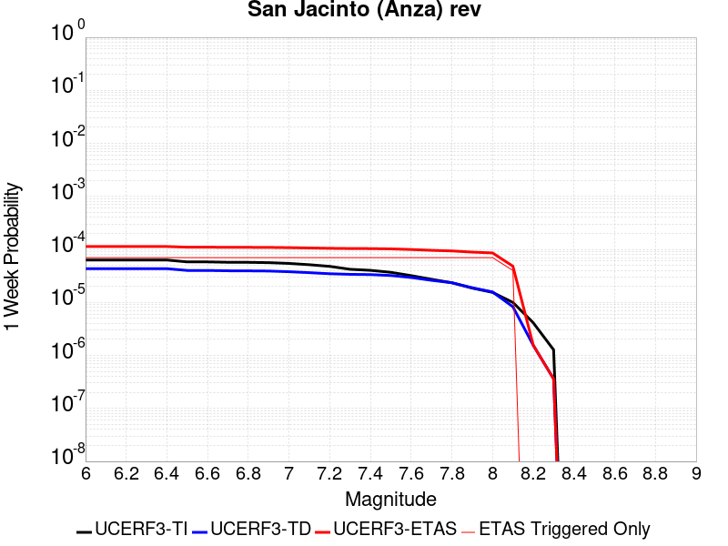 |  |  |  |

| Magnitude | 1 wk TI Prob | 1 wk TD Prob | 1 wk ETAS Prob | 1 wk ETAS/TD Gain | 1 wk ETAS Triggered Only | 1 mo TI Prob | 1 mo TD Prob | 1 mo ETAS Prob | 1 mo ETAS/TD Gain | 1 mo ETAS Triggered Only | 1 yr TI Prob | 1 yr TD Prob | 1 yr ETAS Prob | 1 yr ETAS/TD Gain | 1 yr ETAS Triggered Only | 10 yr TI Prob | 10 yr TD Prob | 10 yr ETAS Prob | 10 yr ETAS/TD Gain | 10 yr ETAS Triggered Only |
|-----|-----|-----|-----|-----|-----|-----|-----|-----|-----|-----|-----|-----|-----|-----|-----|-----|-----|-----|-----|-----|
| 6.0 | 6.3015636E-5 | 4.3302647E-5 | 1.15894785E-4 | 2.6763904 | 7.259528E-5 | 2.7003905E-4 | 1.8556965E-4 | 2.5815144E-4 | 1.3911297 | 7.259528E-5 | 0.0032827691 | 0.0022569813 | 0.0023475206 | 1.0401152 | 9.07441E-5 | 0.032346968 | 0.023296192 | 0.023420274 | 1.0053263 | 1.2704174E-4 |
| 6.1 | 6.3015636E-5 | 4.3302647E-5 | 1.15894785E-4 | 2.6763904 | 7.259528E-5 | 2.7003905E-4 | 1.8556965E-4 | 2.5815144E-4 | 1.3911297 | 7.259528E-5 | 0.0032827691 | 0.0022569813 | 0.0023475206 | 1.0401152 | 9.07441E-5 | 0.032346968 | 0.023296192 | 0.023420274 | 1.0053263 | 1.2704174E-4 |
| 6.2 | 6.3015636E-5 | 4.3302647E-5 | 1.15894785E-4 | 2.6763904 | 7.259528E-5 | 2.7003905E-4 | 1.8556965E-4 | 2.5815144E-4 | 1.3911297 | 7.259528E-5 | 0.0032827691 | 0.0022569813 | 0.0023475206 | 1.0401152 | 9.07441E-5 | 0.032346968 | 0.023296192 | 0.023420274 | 1.0053263 | 1.2704174E-4 |
| 6.3 | 6.3015636E-5 | 4.3302647E-5 | 1.15894785E-4 | 2.6763904 | 7.259528E-5 | 2.7003905E-4 | 1.8556965E-4 | 2.5815144E-4 | 1.3911297 | 7.259528E-5 | 0.0032827691 | 0.0022569813 | 0.0023475206 | 1.0401152 | 9.07441E-5 | 0.032346968 | 0.023296192 | 0.023420274 | 1.0053263 | 1.2704174E-4 |
| 6.4 | 6.3015636E-5 | 4.3302647E-5 | 1.15894785E-4 | 2.6763904 | 7.259528E-5 | 2.7003905E-4 | 1.8556965E-4 | 2.5815144E-4 | 1.3911297 | 7.259528E-5 | 0.0032827691 | 0.0022569813 | 0.0023475206 | 1.0401152 | 9.07441E-5 | 0.032346968 | 0.023296192 | 0.023420274 | 1.0053263 | 1.2704174E-4 |
| 6.5 | 5.811017E-5 | 4.0082516E-5 | 1.1267488E-4 | 2.8110733 | 7.259528E-5 | 2.4901982E-4 | 1.7177092E-4 | 2.4435372E-4 | 1.4225558 | 7.259528E-5 | 0.0030276014 | 0.002089311 | 0.0021798653 | 1.0433418 | 9.07441E-5 | 0.02986684 | 0.021593736 | 0.021718036 | 1.0057563 | 1.2704174E-4 |
| 6.6 | 5.811017E-5 | 4.0082516E-5 | 1.1267488E-4 | 2.8110733 | 7.259528E-5 | 2.4901982E-4 | 1.7177092E-4 | 2.4435372E-4 | 1.4225558 | 7.259528E-5 | 0.0030276014 | 0.002089311 | 0.0021798653 | 1.0433418 | 9.07441E-5 | 0.02986684 | 0.021593736 | 0.021718036 | 1.0057563 | 1.2704174E-4 |
| 6.7 | 5.712442E-5 | 3.9505223E-5 | 1.1209764E-4 | 2.8375397 | 7.259528E-5 | 2.4479596E-4 | 1.6929714E-4 | 2.4188013E-4 | 1.4287313 | 7.259528E-5 | 0.0029763177 | 0.0020592497 | 0.0021498068 | 1.0439758 | 9.07441E-5 | 0.029367693 | 0.021285562 | 0.021409899 | 1.0058414 | 1.2704174E-4 |
| 6.8 | 5.6967532E-5 | 3.9361643E-5 | 1.1195407E-4 | 2.8442426 | 7.259528E-5 | 2.4412372E-4 | 1.6868189E-4 | 2.4126492E-4 | 1.4302953 | 7.259528E-5 | 0.0029681553 | 0.002051773 | 0.0021423309 | 1.0441364 | 9.07441E-5 | 0.029288229 | 0.021210281 | 0.021334628 | 1.0058626 | 1.2704174E-4 |
| 6.9 | 5.6211324E-5 | 3.9066435E-5 | 1.1165888E-4 | 2.8581793 | 7.259528E-5 | 2.4088343E-4 | 1.6741687E-4 | 2.4E-4 | 1.4335473 | 7.259528E-5 | 0.0029288116 | 0.0020364004 | 0.0021269596 | 1.0444703 | 9.07441E-5 | 0.028905109 | 0.021049714 | 0.02117408 | 1.0059083 | 1.2704174E-4 |
| 7.0 | 5.4383527E-5 | 3.792697E-5 | 1.105195E-4 | 2.9140081 | 7.259528E-5 | 2.3305144E-4 | 1.6253405E-4 | 2.3511754E-4 | 1.446574 | 7.259528E-5 | 0.0028337094 | 0.001977061 | 0.0020676258 | 1.0458077 | 9.07441E-5 | 0.027978465 | 0.020440677 | 0.020565122 | 1.0060881 | 1.2704174E-4 |
| 7.1 | 5.1393665E-5 | 3.6389913E-5 | 1.0898255E-4 | 2.994856 | 7.259528E-5 | 2.2023996E-4 | 1.5594746E-4 | 2.2853143E-4 | 1.4654385 | 7.259528E-5 | 0.0026781242 | 0.0018970112 | 0.0019875832 | 1.0477445 | 9.07441E-5 | 0.026460782 | 0.019614287 | 0.019738836 | 1.0063499 | 1.2704174E-4 |
| 7.2 | 4.785222E-5 | 3.4741795E-5 | 1.07334556E-4 | 3.0894935 | 7.259528E-5 | 2.0506482E-4 | 1.4888494E-4 | 2.2146941E-4 | 1.4875206 | 7.259528E-5 | 0.0024938055 | 0.0018111705 | 0.0019017502 | 1.0500118 | 9.07441E-5 | 0.024660049 | 0.018728992 | 0.018853653 | 1.0066562 | 1.2704174E-4 |
| 7.3 | 4.2143256E-5 | 3.383628E-5 | 1.0642911E-4 | 3.1454139 | 7.259528E-5 | 1.8060145E-4 | 1.4500458E-4 | 2.1758933E-4 | 1.5005687 | 7.259528E-5 | 0.002196605 | 0.0017640047 | 0.0018545886 | 1.0513513 | 9.07441E-5 | 0.02175019 | 0.01823724 | 0.018361965 | 1.006839 | 1.2704174E-4 |
| 7.4 | 4.0264713E-5 | 3.347446E-5 | 1.0606732E-4 | 3.168604 | 7.259528E-5 | 1.7255165E-4 | 1.4345412E-4 | 2.1603898E-4 | 1.5059797 | 7.259528E-5 | 0.002098792 | 0.0017451581 | 0.0018357438 | 1.051907 | 9.07441E-5 | 0.020790804 | 0.018041821 | 0.01816657 | 1.0069145 | 1.2704174E-4 |
| 7.5 | 3.694492E-5 | 3.218847E-5 | 1.04781415E-4 | 3.255247 | 7.259528E-5 | 1.5832575E-4 | 1.379433E-4 | 2.1052857E-4 | 1.5261964 | 7.259528E-5 | 0.0019259118 | 0.001678169 | 0.0017687608 | 1.0539825 | 9.07441E-5 | 0.01909306 | 0.01735827 | 0.017483108 | 1.0071918 | 1.2704174E-4 |
| 7.6 | 3.200565E-5 | 2.9504106E-5 | 1.0209725E-4 | 3.4604418 | 7.259528E-5 | 1.3715986E-4 | 1.2644005E-4 | 1.9902615E-4 | 1.5740752 | 7.259528E-5 | 0.001668642 | 0.0015383229 | 0.0016289274 | 1.0588982 | 9.07441E-5 | 0.01656168 | 0.0159463 | 0.016071316 | 1.0078398 | 1.2704174E-4 |
| 7.7 | 2.731642E-5 | 2.6092788E-5 | 9.868618E-5 | 3.7821245 | 7.259528E-5 | 1.1706512E-4 | 1.1182144E-4 | 1.8440861E-4 | 1.6491345 | 7.259528E-5 | 0.001424336 | 0.0013605768 | 0.0014511975 | 1.0666046 | 9.07441E-5 | 0.014152412 | 0.014167004 | 0.014292247 | 1.0088404 | 1.2704174E-4 |
| 7.8 | 2.3466424E-5 | 2.3504817E-5 | 9.6098396E-5 | 4.088455 | 7.259528E-5 | 1.0056651E-4 | 1.0073105E-4 | 1.7331901E-4 | 1.7206117 | 7.259528E-5 | 0.0012237094 | 0.0012257113 | 0.0013163442 | 1.0739431 | 9.07441E-5 | 0.012169928 | 0.012808893 | 0.012934308 | 1.0097913 | 1.2704174E-4 |
| 7.9 | 1.8611925E-5 | 1.8908117E-5 | 9.150203E-5 | 4.8392987 | 7.259528E-5 | 7.9762955E-5 | 8.1032274E-5 | 1.5362167E-4 | 1.8958085 | 7.259528E-5 | 9.7068126E-4 | 9.861222E-4 | 0.0010767768 | 1.0919304 | 9.07441E-5 | 0.0096645225 | 0.010393824 | 0.0105195455 | 1.0120958 | 1.2704174E-4 |
| 8.0 | 1.5460775E-5 | 1.5740965E-5 | 8.83351E-5 | 5.6117973 | 7.259528E-5 | 6.6258784E-5 | 6.7459536E-5 | 1.4004992E-4 | 2.0760581 | 7.259528E-5 | 8.0640207E-4 | 8.21011E-4 | 9.1168063E-4 | 1.1104366 | 9.07441E-5 | 0.008034821 | 0.0087028835 | 0.00882882 | 1.0144706 | 1.2704174E-4 |
| 8.1 | 9.983884E-6 | 8.269952E-6 | 4.4567292E-5 | 5.3890634 | 3.629764E-5 | 4.2787375E-5 | 3.544217E-5 | 7.173853E-5 | 2.0241008 | 3.629764E-5 | 5.2081177E-4 | 4.314235E-4 | 4.6770548E-4 | 1.0840983 | 3.629764E-5 | 0.0051959283 | 0.004640022 | 0.004676151 | 1.0077864 | 3.629764E-5 |
| 8.2 | 4.1226E-6 | 1.5529788E-6 | 1.5529788E-6 | 1.0 | 0.0 | 1.7668166E-5 | 6.6556063E-6 | 6.6556063E-6 | 1.0 | 0.0 | 2.1508869E-4 | 8.102902E-5 | 8.102902E-5 | 1.0 | 0.0 | 0.0021488064 | 9.4050163E-4 | 9.4050163E-4 | 1.0 | 0.0 |
| 8.3 | 1.2750878E-6 | 3.612133E-7 | 3.612133E-7 | 1.0 | 0.0 | 5.4646503E-6 | 1.548056E-6 | 1.548056E-6 | 1.0 | 0.0 | 6.653009E-5 | 1.8847424E-5 | 1.8847424E-5 | 1.0 | 0.0 | 6.6510175E-4 | 2.2734253E-4 | 2.2734253E-4 | 1.0 | 0.0 |

## Cleghorn Pass
*[(top)](#table-of-contents)*

| 1 Week | 1 Month | 1 Year | 10 Year |
|-----|-----|-----|-----|
|  |  |  |  |

| Magnitude | 1 wk TI Prob | 1 wk TD Prob | 1 wk ETAS Prob | 1 wk ETAS/TD Gain | 1 wk ETAS Triggered Only | 1 mo TI Prob | 1 mo TD Prob | 1 mo ETAS Prob | 1 mo ETAS/TD Gain | 1 mo ETAS Triggered Only | 1 yr TI Prob | 1 yr TD Prob | 1 yr ETAS Prob | 1 yr ETAS/TD Gain | 1 yr ETAS Triggered Only | 10 yr TI Prob | 10 yr TD Prob | 10 yr ETAS Prob | 10 yr ETAS/TD Gain | 10 yr ETAS Triggered Only |
|-----|-----|-----|-----|-----|-----|-----|-----|-----|-----|-----|-----|-----|-----|-----|-----|-----|-----|-----|-----|-----|
| 6.0 | 1.0522846E-5 | 1.1040642E-5 | 1.1040642E-5 | 1.0 | 0.0 | 4.509713E-5 | 4.7316473E-5 | 6.546444E-5 | 1.3835442 | 1.814882E-5 | 5.4891926E-4 | 5.759784E-4 | 6.6667027E-4 | 1.157457 | 9.07441E-5 | 0.0054756533 | 0.005750022 | 0.005876333 | 1.021967 | 1.2704174E-4 |
| 6.1 | 1.0522846E-5 | 1.1040642E-5 | 1.1040642E-5 | 1.0 | 0.0 | 4.509713E-5 | 4.7316473E-5 | 6.546444E-5 | 1.3835442 | 1.814882E-5 | 5.4891926E-4 | 5.759784E-4 | 6.6667027E-4 | 1.157457 | 9.07441E-5 | 0.0054756533 | 0.005750022 | 0.005876333 | 1.021967 | 1.2704174E-4 |
| 6.2 | 2.1045846E-6 | 2.2082024E-6 | 2.2082024E-6 | 1.0 | 0.0 | 9.019617E-6 | 9.463714E-6 | 9.463714E-6 | 1.0 | 0.0 | 1.098083E-4 | 1.1521882E-4 | 1.5151229E-4 | 1.3149959 | 3.629764E-5 | 0.0010975406 | 0.0011520023 | 0.0011882581 | 1.031472 | 3.629764E-5 |
| 6.3 | 2.1045846E-6 | 2.2082024E-6 | 2.2082024E-6 | 1.0 | 0.0 | 9.019617E-6 | 9.463714E-6 | 9.463714E-6 | 1.0 | 0.0 | 1.098083E-4 | 1.1521882E-4 | 1.5151229E-4 | 1.3149959 | 3.629764E-5 | 0.0010975406 | 0.0011520023 | 0.0011882581 | 1.031472 | 3.629764E-5 |
| 6.4 | 1.7259927E-6 | 1.810877E-6 | 1.810877E-6 | 1.0 | 0.0 | 7.3970905E-6 | 7.760902E-6 | 7.760902E-6 | 1.0 | 0.0 | 9.005586E-5 | 9.4488976E-5 | 1.1263609E-4 | 1.1920552 | 1.814882E-5 | 9.001937E-4 | 9.448898E-4 | 9.630215E-4 | 1.0191892 | 1.814882E-5 |

## Bullion Mountains
*[(top)](#table-of-contents)*

| 1 Week | 1 Month | 1 Year | 10 Year |
|-----|-----|-----|-----|
|  |  |  |  |

| Magnitude | 1 wk TI Prob | 1 wk TD Prob | 1 wk ETAS Prob | 1 wk ETAS/TD Gain | 1 wk ETAS Triggered Only | 1 mo TI Prob | 1 mo TD Prob | 1 mo ETAS Prob | 1 mo ETAS/TD Gain | 1 mo ETAS Triggered Only | 1 yr TI Prob | 1 yr TD Prob | 1 yr ETAS Prob | 1 yr ETAS/TD Gain | 1 yr ETAS Triggered Only | 10 yr TI Prob | 10 yr TD Prob | 10 yr ETAS Prob | 10 yr ETAS/TD Gain | 10 yr ETAS Triggered Only |
|-----|-----|-----|-----|-----|-----|-----|-----|-----|-----|-----|-----|-----|-----|-----|-----|-----|-----|-----|-----|-----|
| 6.0 | 1.6420427E-5 | 1.4692089E-5 | 3.2840642E-5 | 2.2352602 | 1.814882E-5 | 7.037136E-5 | 6.296479E-5 | 9.926015E-5 | 1.5764389 | 3.629764E-5 | 8.5643446E-4 | 7.663651E-4 | 8.5703965E-4 | 1.1183177 | 9.07441E-5 | 0.008531413 | 0.007641016 | 0.0077670873 | 1.0164993 | 1.2704174E-4 |
| 6.1 | 1.6420427E-5 | 1.4692089E-5 | 3.2840642E-5 | 2.2352602 | 1.814882E-5 | 7.037136E-5 | 6.296479E-5 | 9.926015E-5 | 1.5764389 | 3.629764E-5 | 8.5643446E-4 | 7.663651E-4 | 8.5703965E-4 | 1.1183177 | 9.07441E-5 | 0.008531413 | 0.007641016 | 0.0077670873 | 1.0164993 | 1.2704174E-4 |
| 6.2 | 1.6420427E-5 | 1.4692089E-5 | 3.2840642E-5 | 2.2352602 | 1.814882E-5 | 7.037136E-5 | 6.296479E-5 | 9.926015E-5 | 1.5764389 | 3.629764E-5 | 8.5643446E-4 | 7.663651E-4 | 8.5703965E-4 | 1.1183177 | 9.07441E-5 | 0.008531413 | 0.007641016 | 0.0077670873 | 1.0164993 | 1.2704174E-4 |
| 6.3 | 1.2046778E-5 | 9.862335E-6 | 2.8010976E-5 | 2.840197 | 1.814882E-5 | 5.1628023E-5 | 4.2266598E-5 | 6.0414648E-5 | 1.4293711 | 1.814882E-5 | 6.283899E-4 | 5.144975E-4 | 5.507764E-4 | 1.0705134 | 3.629764E-5 | 0.0062661595 | 0.005135345 | 0.005189512 | 1.0105479 | 5.444646E-5 |
| 6.4 | 1.2046778E-5 | 9.862335E-6 | 2.8010976E-5 | 2.840197 | 1.814882E-5 | 5.1628023E-5 | 4.2266598E-5 | 6.0414648E-5 | 1.4293711 | 1.814882E-5 | 6.283899E-4 | 5.144975E-4 | 5.507764E-4 | 1.0705134 | 3.629764E-5 | 0.0062661595 | 0.005135345 | 0.005189512 | 1.0105479 | 5.444646E-5 |
| 6.5 | 1.0244343E-5 | 7.879458E-6 | 2.6028136E-5 | 3.30329 | 1.814882E-5 | 4.390359E-5 | 3.3768785E-5 | 5.1916995E-5 | 1.5374255 | 1.814882E-5 | 5.343951E-4 | 4.110781E-4 | 4.4736083E-4 | 1.0882623 | 3.629764E-5 | 0.005331118 | 0.004105208 | 0.004141357 | 1.0088055 | 3.629764E-5 |
| 6.6 | 9.605408E-6 | 7.1774966E-6 | 7.1774966E-6 | 1.0 | 0.0 | 4.1165385E-5 | 3.076045E-5 | 3.076045E-5 | 1.0 | 0.0 | 5.010733E-4 | 3.744645E-4 | 3.926065E-4 | 1.048448 | 1.814882E-5 | 0.00499945 | 0.003740332 | 0.003758413 | 1.004834 | 1.814882E-5 |
| 6.7 | 8.60418E-6 | 6.1240044E-6 | 6.1240044E-6 | 1.0 | 0.0 | 3.687454E-5 | 2.624558E-5 | 2.624558E-5 | 1.0 | 0.0 | 4.48855E-4 | 3.1951256E-4 | 3.376556E-4 | 1.0567834 | 1.814882E-5 | 0.004479495 | 0.0031924439 | 0.0032105346 | 1.0056667 | 1.814882E-5 |
| 6.8 | 5.187994E-6 | 2.5631666E-6 | 2.5631666E-6 | 1.0 | 0.0 | 2.223407E-5 | 1.0984976E-5 | 1.0984976E-5 | 1.0 | 0.0 | 2.7066618E-4 | 1.3373788E-4 | 1.5188426E-4 | 1.1356863 | 1.814882E-5 | 0.0027033675 | 0.0013369655 | 0.0013550901 | 1.0135565 | 1.814882E-5 |
| 6.9 | 4.5302368E-6 | 2.3443165E-6 | 2.3443165E-6 | 1.0 | 0.0 | 1.9415156E-5 | 1.0047055E-5 | 1.0047055E-5 | 1.0 | 0.0 | 2.3635388E-4 | 1.2232E-4 | 1.404666E-4 | 1.1483535 | 1.814882E-5 | 0.0023610266 | 0.0012229157 | 0.0012410424 | 1.0148225 | 1.814882E-5 |
| 7.0 | 3.431668E-6 | 1.6882402E-6 | 1.6882402E-6 | 1.0 | 0.0 | 1.4707065E-5 | 7.235315E-6 | 7.235315E-6 | 1.0 | 0.0 | 1.7904381E-4 | 8.808996E-5 | 8.808996E-5 | 1.0 | 0.0 | 0.0017889962 | 8.808996E-4 | 8.808996E-4 | 1.0 | 0.0 |

## San Clemente
*[(top)](#table-of-contents)*

| 1 Week | 1 Month | 1 Year | 10 Year |
|-----|-----|-----|-----|
| 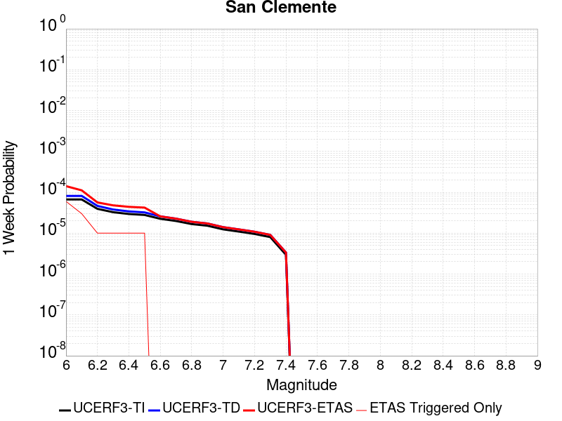 |  |  |  |

| Magnitude | 1 wk TI Prob | 1 wk TD Prob | 1 wk ETAS Prob | 1 wk ETAS/TD Gain | 1 wk ETAS Triggered Only | 1 mo TI Prob | 1 mo TD Prob | 1 mo ETAS Prob | 1 mo ETAS/TD Gain | 1 mo ETAS Triggered Only | 1 yr TI Prob | 1 yr TD Prob | 1 yr ETAS Prob | 1 yr ETAS/TD Gain | 1 yr ETAS Triggered Only | 10 yr TI Prob | 10 yr TD Prob | 10 yr ETAS Prob | 10 yr ETAS/TD Gain | 10 yr ETAS Triggered Only |
|-----|-----|-----|-----|-----|-----|-----|-----|-----|-----|-----|-----|-----|-----|-----|-----|-----|-----|-----|-----|-----|
| 6.0 | 6.681379E-5 | 8.163422E-5 | 1.3607624E-4 | 1.6669018 | 5.444646E-5 | 2.8631336E-4 | 3.498173E-4 | 4.223872E-4 | 1.2074509 | 7.259528E-5 | 0.003480294 | 0.0042512873 | 0.0043597175 | 1.0255052 | 1.0889292E-4 | 0.03426291 | 0.041755714 | 0.041877452 | 1.0029155 | 1.2704174E-4 |
| 6.1 | 6.681379E-5 | 8.163422E-5 | 9.978156E-5 | 1.2223006 | 1.814882E-5 | 2.8631336E-4 | 3.498173E-4 | 3.679598E-4 | 1.0518627 | 1.814882E-5 | 0.003480294 | 0.0042512873 | 0.0043055024 | 1.0127527 | 5.444646E-5 | 0.03426291 | 0.041755714 | 0.041807886 | 1.0012494 | 5.444646E-5 |
| 6.2 | 3.9400576E-5 | 4.6451984E-5 | 4.6451984E-5 | 1.0 | 0.0 | 1.6884868E-4 | 1.9906509E-4 | 1.9906509E-4 | 1.0 | 0.0 | 0.0020537945 | 0.002420985 | 0.0024571945 | 1.0149566 | 3.629764E-5 | 0.020349167 | 0.02395286 | 0.023988288 | 1.001479 | 3.629764E-5 |
| 6.3 | 3.2590255E-5 | 3.7929087E-5 | 3.7929087E-5 | 1.0 | 0.0 | 1.3966505E-4 | 1.6254328E-4 | 1.6254328E-4 | 1.0 | 0.0 | 0.0016990956 | 0.0019771985 | 0.0020134242 | 1.0183219 | 3.629764E-5 | 0.01686163 | 0.019599866 | 0.019635452 | 1.0018157 | 3.629764E-5 |
| 6.4 | 2.9454652E-5 | 3.4097775E-5 | 3.4097775E-5 | 1.0 | 0.0 | 1.2622811E-4 | 1.4612528E-4 | 1.4612528E-4 | 1.0 | 0.0 | 0.0015357438 | 0.0017776482 | 0.0018138813 | 1.0203826 | 3.629764E-5 | 0.015251739 | 0.017637458 | 0.017673114 | 1.0020217 | 3.629764E-5 |
| 6.5 | 2.790836E-5 | 3.2247463E-5 | 3.2247463E-5 | 1.0 | 0.0 | 1.1960178E-4 | 1.3819622E-4 | 1.3819622E-4 | 1.0 | 0.0 | 0.001455179 | 0.0016812651 | 0.0017175017 | 1.0215532 | 3.629764E-5 | 0.014456868 | 0.016688475 | 0.016724167 | 1.0021387 | 3.629764E-5 |
| 6.6 | 2.2492153E-5 | 2.5762707E-5 | 2.5762707E-5 | 1.0 | 0.0 | 9.639138E-5 | 1.1040701E-4 | 1.1040701E-4 | 1.0 | 0.0 | 0.0011729331 | 0.0013433908 | 0.0013796397 | 1.0269831 | 3.629764E-5 | 0.011667615 | 0.013354415 | 0.013390228 | 1.0026817 | 3.629764E-5 |
| 6.7 | 1.9862755E-5 | 2.2666423E-5 | 2.2666423E-5 | 1.0 | 0.0 | 8.512331E-5 | 9.713826E-5 | 9.713826E-5 | 1.0 | 0.0 | 0.0010358836 | 0.0011820279 | 0.0011820279 | 1.0 | 0.0 | 0.010310682 | 0.011758701 | 0.011758701 | 1.0 | 0.0 |
| 6.8 | 1.6697575E-5 | 1.897771E-5 | 1.897771E-5 | 1.0 | 0.0 | 7.155907E-5 | 8.133056E-5 | 8.133056E-5 | 1.0 | 0.0 | 8.7088346E-4 | 9.897591E-4 | 9.897591E-4 | 1.0 | 0.0 | 0.008674784 | 0.0098545365 | 0.0098545365 | 1.0 | 0.0 |
| 6.9 | 1.5218415E-5 | 1.72694E-5 | 1.72694E-5 | 1.0 | 0.0 | 6.522015E-5 | 7.4009666E-5 | 7.4009666E-5 | 1.0 | 0.0 | 7.93766E-4 | 9.00704E-4 | 9.00704E-4 | 1.0 | 0.0 | 0.007909367 | 0.008971481 | 0.008971481 | 1.0 | 0.0 |
| 7.0 | 1.2392958E-5 | 1.4033016E-5 | 1.4033016E-5 | 1.0 | 0.0 | 5.3111595E-5 | 6.014015E-5 | 6.014015E-5 | 1.0 | 0.0 | 6.4644177E-4 | 7.319679E-4 | 7.319679E-4 | 1.0 | 0.0 | 0.0064456454 | 0.0072963564 | 0.0072963564 | 1.0 | 0.0 |
| 7.1 | 1.0934128E-5 | 1.2375138E-5 | 1.2375138E-5 | 1.0 | 0.0 | 4.6859706E-5 | 5.303527E-5 | 5.303527E-5 | 1.0 | 0.0 | 5.7036756E-4 | 6.455204E-4 | 6.455204E-4 | 1.0 | 0.0 | 0.0056890585 | 0.0064371997 | 0.0064371997 | 1.0 | 0.0 |
| 7.2 | 9.5798805E-6 | 1.0844935E-5 | 1.0844935E-5 | 1.0 | 0.0 | 4.1055984E-5 | 4.6477508E-5 | 4.6477508E-5 | 1.0 | 0.0 | 4.9974193E-4 | 5.657239E-4 | 5.657239E-4 | 1.0 | 0.0 | 0.0049861963 | 0.0056435615 | 0.0056435615 | 1.0 | 0.0 |
| 7.3 | 8.0167365E-6 | 9.083918E-6 | 9.083918E-6 | 1.0 | 0.0 | 3.4356988E-5 | 3.8930535E-5 | 3.8930535E-5 | 1.0 | 0.0 | 4.1821605E-4 | 4.7388324E-4 | 4.7388324E-4 | 1.0 | 0.0 | 0.0041742986 | 0.0047294297 | 0.0047294297 | 1.0 | 0.0 |
| 7.4 | 2.9581017E-6 | 3.3623792E-6 | 3.3623792E-6 | 1.0 | 0.0 | 1.2677518E-5 | 1.4410146E-5 | 1.4410146E-5 | 1.0 | 0.0 | 1.5433785E-4 | 1.7543444E-4 | 1.7543444E-4 | 1.0 | 0.0 | 0.001542307 | 0.0017534546 | 0.0017534546 | 1.0 | 0.0 |

## Rose Canyon
*[(top)](#table-of-contents)*

| 1 Week | 1 Month | 1 Year | 10 Year |
|-----|-----|-----|-----|
|  |  |  |  |

| Magnitude | 1 wk TI Prob | 1 wk TD Prob | 1 wk ETAS Prob | 1 wk ETAS/TD Gain | 1 wk ETAS Triggered Only | 1 mo TI Prob | 1 mo TD Prob | 1 mo ETAS Prob | 1 mo ETAS/TD Gain | 1 mo ETAS Triggered Only | 1 yr TI Prob | 1 yr TD Prob | 1 yr ETAS Prob | 1 yr ETAS/TD Gain | 1 yr ETAS Triggered Only | 10 yr TI Prob | 10 yr TD Prob | 10 yr ETAS Prob | 10 yr ETAS/TD Gain | 10 yr ETAS Triggered Only |
|-----|-----|-----|-----|-----|-----|-----|-----|-----|-----|-----|-----|-----|-----|-----|-----|-----|-----|-----|-----|-----|
| 6.0 | 4.5923203E-5 | 4.9714225E-5 | 1.0415798E-4 | 2.0951343 | 5.444646E-5 | 1.9679888E-4 | 2.1304491E-4 | 2.8562473E-4 | 1.3406785 | 7.259528E-5 | 0.0023933933 | 0.0025909345 | 0.0026814435 | 1.034933 | 9.07441E-5 | 0.023677798 | 0.02563999 | 0.025763774 | 1.0048277 | 1.2704174E-4 |
| 6.1 | 4.5923203E-5 | 4.9714225E-5 | 8.601006E-5 | 1.7300895 | 3.629764E-5 | 1.9679888E-4 | 2.1304491E-4 | 2.4933481E-4 | 1.1703392 | 3.629764E-5 | 0.0023933933 | 0.0025909345 | 0.00264524 | 1.0209597 | 5.444646E-5 | 0.023677798 | 0.02563999 | 0.025728408 | 1.0034484 | 9.07441E-5 |
| 6.2 | 2.8844734E-5 | 2.9668723E-5 | 6.596529E-5 | 2.2233949 | 3.629764E-5 | 1.2361443E-4 | 1.2714567E-4 | 1.6343869E-4 | 1.2854445 | 3.629764E-5 | 0.0015039665 | 0.0015468939 | 0.0015831353 | 1.0234286 | 3.629764E-5 | 0.0149382865 | 0.015374276 | 0.015445756 | 1.0046493 | 7.259528E-5 |
| 6.3 | 2.3171577E-5 | 2.3161238E-5 | 5.9458038E-5 | 2.5671356 | 3.629764E-5 | 9.9302975E-5 | 9.9258745E-5 | 1.3555278E-4 | 1.3656508 | 3.629764E-5 | 0.0012083431 | 0.0012078186 | 0.0012440725 | 1.030016 | 3.629764E-5 | 0.012017938 | 0.012022437 | 0.012076229 | 1.0044743 | 5.444646E-5 |
| 6.4 | 2.0066604E-5 | 1.9667024E-5 | 5.5963952E-5 | 2.845573 | 3.629764E-5 | 8.599689E-5 | 8.4284584E-5 | 1.2057916E-4 | 1.4306195 | 3.629764E-5 | 0.0010465092 | 0.0010256917 | 0.0010619521 | 1.0353521 | 3.629764E-5 | 0.010415946 | 0.010217559 | 0.010253485 | 1.0035162 | 3.629764E-5 |
| 6.5 | 1.776989E-5 | 1.7113807E-5 | 3.5262317E-5 | 2.06046 | 1.814882E-5 | 7.615444E-5 | 7.334287E-5 | 9.149035E-5 | 1.2474337 | 1.814882E-5 | 9.267859E-4 | 8.925905E-4 | 9.107231E-4 | 1.0203146 | 1.814882E-5 | 0.009229303 | 0.008896211 | 0.008914198 | 1.0020219 | 1.814882E-5 |
| 6.6 | 1.5227364E-5 | 1.433926E-5 | 1.433926E-5 | 1.0 | 0.0 | 6.52585E-5 | 6.1452556E-5 | 6.1452556E-5 | 1.0 | 0.0 | 7.942326E-4 | 7.479332E-4 | 7.479332E-4 | 1.0 | 0.0 | 0.007914 | 0.007458359 | 0.007458359 | 1.0 | 0.0 |
| 6.7 | 1.2703898E-5 | 1.1673274E-5 | 1.1673274E-5 | 1.0 | 0.0 | 5.4444143E-5 | 5.0027378E-5 | 5.0027378E-5 | 1.0 | 0.0 | 6.626558E-4 | 6.089174E-4 | 6.089174E-4 | 1.0 | 0.0 | 0.006606833 | 0.0060750856 | 0.0060750856 | 1.0 | 0.0 |
| 6.8 | 1.1554917E-5 | 1.0609337E-5 | 1.0609337E-5 | 1.0 | 0.0 | 4.9520135E-5 | 4.546782E-5 | 4.546782E-5 | 1.0 | 0.0 | 6.0274085E-4 | 5.5343413E-4 | 5.5343413E-4 | 1.0 | 0.0 | 0.0060110865 | 0.0055225673 | 0.0055225673 | 1.0 | 0.0 |
| 6.9 | 8.732078E-6 | 7.881357E-6 | 7.881357E-6 | 1.0 | 0.0 | 3.7422655E-5 | 3.3776825E-5 | 3.3776825E-5 | 1.0 | 0.0 | 4.5552556E-4 | 4.111582E-4 | 4.111582E-4 | 1.0 | 0.0 | 0.0045459294 | 0.0041048084 | 0.0041048084 | 1.0 | 0.0 |
| 7.0 | 5.9337494E-6 | 5.1074853E-6 | 5.1074853E-6 | 1.0 | 0.0 | 2.5430107E-5 | 2.188904E-5 | 2.188904E-5 | 1.0 | 0.0 | 3.0956755E-4 | 2.664666E-4 | 2.664666E-4 | 1.0 | 0.0 | 0.0030913667 | 0.0026614866 | 0.0026614866 | 1.0 | 0.0 |
| 7.1 | 5.013409E-6 | 4.1773833E-6 | 4.1773833E-6 | 1.0 | 0.0 | 2.1485863E-5 | 1.7902948E-5 | 1.7902948E-5 | 1.0 | 0.0 | 2.6155898E-4 | 2.179467E-4 | 2.179467E-4 | 1.0 | 0.0 | 0.0026125133 | 0.0021773411 | 0.0021773411 | 1.0 | 0.0 |
| 7.2 | 4.120763E-6 | 3.2821383E-6 | 3.2821383E-6 | 1.0 | 0.0 | 1.7660293E-5 | 1.4066231E-5 | 1.4066231E-5 | 1.0 | 0.0 | 2.1499286E-4 | 1.7124301E-4 | 1.7124301E-4 | 1.0 | 0.0 | 0.0021478499 | 0.00171112 | 0.00171112 | 1.0 | 0.0 |
| 7.3 | 3.2081239E-6 | 2.4405372E-6 | 2.4405372E-6 | 1.0 | 0.0 | 1.374903E-5 | 1.0459404E-5 | 1.0459404E-5 | 1.0 | 0.0 | 1.6738157E-4 | 1.2733586E-4 | 1.2733586E-4 | 1.0 | 0.0 | 0.0016725556 | 0.001272636 | 0.001272636 | 1.0 | 0.0 |
| 7.4 | 2.4194755E-6 | 1.7680634E-6 | 1.7680634E-6 | 1.0 | 0.0 | 1.0369139E-5 | 7.577393E-6 | 7.577393E-6 | 1.0 | 0.0 | 1.2623696E-4 | 9.2250906E-5 | 9.2250906E-5 | 1.0 | 0.0 | 0.0012616527 | 9.2213147E-4 | 9.2213147E-4 | 1.0 | 0.0 |
| 7.5 | 1.3842889E-6 | 9.3786275E-7 | 9.3786275E-7 | 1.0 | 0.0 | 5.9326535E-6 | 4.019406E-6 | 4.019406E-6 | 1.0 | 0.0 | 7.222766E-5 | 4.8935202E-5 | 4.8935202E-5 | 1.0 | 0.0 | 7.220419E-4 | 4.892478E-4 | 4.892478E-4 | 1.0 | 0.0 |
| 7.6 | 1.0021575E-6 | 6.411463E-7 | 6.411463E-7 | 1.0 | 0.0 | 4.2949537E-6 | 2.7477672E-6 | 2.7477672E-6 | 1.0 | 0.0 | 5.2289808E-5 | 3.3453573E-5 | 3.3453573E-5 | 1.0 | 0.0 | 5.2277505E-4 | 3.344875E-4 | 3.344875E-4 | 1.0 | 0.0 |
| 7.7 | 8.7620116E-8 | 6.4492404E-8 | 6.4492404E-8 | 1.0 | 0.0 | 3.7551473E-7 | 2.76396E-7 | 2.76396E-7 | 1.0 | 0.0 | 4.5718825E-6 | 3.3651165E-6 | 3.3651165E-6 | 1.0 | 0.0 | 4.5717883E-5 | 3.3650686E-5 | 3.3650686E-5 | 1.0 | 0.0 |

## Pleito
*[(top)](#table-of-contents)*

| 1 Week | 1 Month | 1 Year | 10 Year |
|-----|-----|-----|-----|
|  |  | 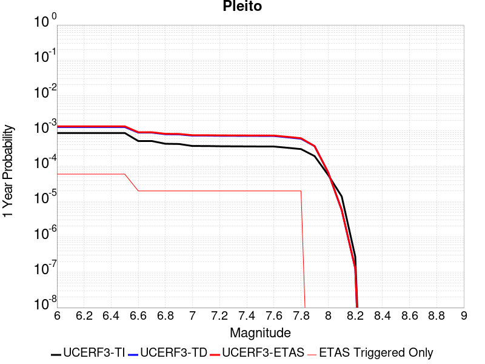 |  |

| Magnitude | 1 wk TI Prob | 1 wk TD Prob | 1 wk ETAS Prob | 1 wk ETAS/TD Gain | 1 wk ETAS Triggered Only | 1 mo TI Prob | 1 mo TD Prob | 1 mo ETAS Prob | 1 mo ETAS/TD Gain | 1 mo ETAS Triggered Only | 1 yr TI Prob | 1 yr TD Prob | 1 yr ETAS Prob | 1 yr ETAS/TD Gain | 1 yr ETAS Triggered Only | 10 yr TI Prob | 10 yr TD Prob | 10 yr ETAS Prob | 10 yr ETAS/TD Gain | 10 yr ETAS Triggered Only |
|-----|-----|-----|-----|-----|-----|-----|-----|-----|-----|-----|-----|-----|-----|-----|-----|-----|-----|-----|-----|-----|
| 6.0 | 1.6763008E-5 | 2.4763838E-5 | 2.4763838E-5 | 1.0 | 0.0 | 7.183948E-5 | 1.0612683E-4 | 1.2427372E-4 | 1.1709925 | 1.814882E-5 | 8.742947E-4 | 0.0012914003 | 0.0013457765 | 1.0421064 | 5.444646E-5 | 0.00870863 | 0.0129538905 | 0.013061373 | 1.0082973 | 1.0889292E-4 |
| 6.1 | 1.6763008E-5 | 2.4763838E-5 | 2.4763838E-5 | 1.0 | 0.0 | 7.183948E-5 | 1.0612683E-4 | 1.2427372E-4 | 1.1709925 | 1.814882E-5 | 8.742947E-4 | 0.0012914003 | 0.0013457765 | 1.0421064 | 5.444646E-5 | 0.00870863 | 0.0129538905 | 0.013061373 | 1.0082973 | 1.0889292E-4 |
| 6.2 | 1.6763008E-5 | 2.4763838E-5 | 2.4763838E-5 | 1.0 | 0.0 | 7.183948E-5 | 1.0612683E-4 | 1.2427372E-4 | 1.1709925 | 1.814882E-5 | 8.742947E-4 | 0.0012914003 | 0.0013457765 | 1.0421064 | 5.444646E-5 | 0.00870863 | 0.0129538905 | 0.013061373 | 1.0082973 | 1.0889292E-4 |
| 6.3 | 1.6763008E-5 | 2.4763838E-5 | 2.4763838E-5 | 1.0 | 0.0 | 7.183948E-5 | 1.0612683E-4 | 1.2427372E-4 | 1.1709925 | 1.814882E-5 | 8.742947E-4 | 0.0012914003 | 0.0013457765 | 1.0421064 | 5.444646E-5 | 0.00870863 | 0.0129538905 | 0.013061373 | 1.0082973 | 1.0889292E-4 |
| 6.4 | 1.6763008E-5 | 2.4763838E-5 | 2.4763838E-5 | 1.0 | 0.0 | 7.183948E-5 | 1.0612683E-4 | 1.2427372E-4 | 1.1709925 | 1.814882E-5 | 8.742947E-4 | 0.0012914003 | 0.0013457765 | 1.0421064 | 5.444646E-5 | 0.00870863 | 0.0129538905 | 0.013061373 | 1.0082973 | 1.0889292E-4 |
| 6.5 | 1.6763008E-5 | 2.4763838E-5 | 2.4763838E-5 | 1.0 | 0.0 | 7.183948E-5 | 1.0612683E-4 | 1.2427372E-4 | 1.1709925 | 1.814882E-5 | 8.742947E-4 | 0.0012914003 | 0.0013457765 | 1.0421064 | 5.444646E-5 | 0.00870863 | 0.0129538905 | 0.013061373 | 1.0082973 | 1.0889292E-4 |
| 6.6 | 9.910213E-6 | 1.7214623E-5 | 1.7214623E-5 | 1.0 | 0.0 | 4.247165E-5 | 7.377489E-5 | 7.377489E-5 | 1.0 | 0.0 | 5.169696E-4 | 8.978429E-4 | 9.159754E-4 | 1.0201956 | 1.814882E-5 | 0.0051576863 | 0.009050702 | 0.009104656 | 1.0059613 | 5.444646E-5 |
| 6.7 | 9.910213E-6 | 1.7214623E-5 | 1.7214623E-5 | 1.0 | 0.0 | 4.247165E-5 | 7.377489E-5 | 7.377489E-5 | 1.0 | 0.0 | 5.169696E-4 | 8.978429E-4 | 9.159754E-4 | 1.0201956 | 1.814882E-5 | 0.0051576863 | 0.009050702 | 0.009104656 | 1.0059613 | 5.444646E-5 |
| 6.8 | 8.300162E-6 | 1.5474232E-5 | 1.5474232E-5 | 1.0 | 0.0 | 3.557164E-5 | 6.631646E-5 | 6.631646E-5 | 1.0 | 0.0 | 4.3299864E-4 | 8.071053E-4 | 8.2523946E-4 | 1.0224682 | 1.814882E-5 | 0.004321559 | 0.008150139 | 0.008204142 | 1.006626 | 5.444646E-5 |
| 6.9 | 8.183114E-6 | 1.5345448E-5 | 1.5345448E-5 | 1.0 | 0.0 | 3.5070017E-5 | 6.576455E-5 | 6.576455E-5 | 1.0 | 0.0 | 4.2689382E-4 | 8.003907E-4 | 8.1852503E-4 | 1.0226568 | 1.814882E-5 | 0.0042607468 | 0.008083483 | 0.00813749 | 1.0066811 | 5.444646E-5 |
| 7.0 | 7.1748823E-6 | 1.413244E-5 | 1.413244E-5 | 1.0 | 0.0 | 3.0749135E-5 | 6.0566195E-5 | 6.0566195E-5 | 1.0 | 0.0 | 3.743064E-4 | 7.371445E-4 | 7.552799E-4 | 1.0246023 | 1.814882E-5 | 0.0037367654 | 0.007454939 | 0.0075089796 | 1.007249 | 5.444646E-5 |
| 7.1 | 7.1671807E-6 | 1.412281E-5 | 1.412281E-5 | 1.0 | 0.0 | 3.0716128E-5 | 6.052493E-5 | 6.052493E-5 | 1.0 | 0.0 | 3.7390468E-4 | 7.366424E-4 | 7.5477787E-4 | 1.0246191 | 1.814882E-5 | 0.0037327618 | 0.0074499524 | 0.007503993 | 1.0072539 | 5.444646E-5 |
| 7.2 | 7.0649667E-6 | 1.39701015E-5 | 1.39701015E-5 | 1.0 | 0.0 | 3.0278077E-5 | 5.9870494E-5 | 5.9870494E-5 | 1.0 | 0.0 | 3.6857324E-4 | 7.2868E-4 | 7.468156E-4 | 1.0248883 | 1.814882E-5 | 0.0036796255 | 0.0073707094 | 0.0074247546 | 1.0073324 | 5.444646E-5 |
| 7.3 | 7.02082E-6 | 1.3913556E-5 | 1.3913556E-5 | 1.0 | 0.0 | 3.008888E-5 | 5.9628168E-5 | 5.9628168E-5 | 1.0 | 0.0 | 3.6627054E-4 | 7.2573166E-4 | 7.438673E-4 | 1.0249895 | 1.814882E-5 | 0.0036566744 | 0.007341209 | 0.007395256 | 1.0073621 | 5.444646E-5 |
| 7.4 | 6.987146E-6 | 1.3873118E-5 | 1.3873118E-5 | 1.0 | 0.0 | 2.9944567E-5 | 5.945487E-5 | 5.945487E-5 | 1.0 | 0.0 | 3.6451413E-4 | 7.2362315E-4 | 7.4175885E-4 | 1.0250623 | 1.814882E-5 | 0.0036391679 | 0.007320144 | 0.007356176 | 1.0049223 | 3.629764E-5 |
| 7.5 | 6.9494554E-6 | 1.3830024E-5 | 1.3830024E-5 | 1.0 | 0.0 | 2.9783041E-5 | 5.9270187E-5 | 5.9270187E-5 | 1.0 | 0.0 | 3.625482E-4 | 7.2137616E-4 | 7.3951186E-4 | 1.0251404 | 1.814882E-5 | 0.0036195726 | 0.0072977724 | 0.0073338053 | 1.0049375 | 3.629764E-5 |
| 7.6 | 6.92694E-6 | 1.3789138E-5 | 1.3789138E-5 | 1.0 | 0.0 | 2.9686547E-5 | 5.909497E-5 | 5.909497E-5 | 1.0 | 0.0 | 3.6137376E-4 | 7.1924424E-4 | 7.3738006E-4 | 1.025215 | 1.814882E-5 | 0.0036078666 | 0.0072765257 | 0.0073125595 | 1.0049521 | 3.629764E-5 |
| 7.7 | 6.395867E-6 | 1.2668219E-5 | 1.2668219E-5 | 1.0 | 0.0 | 2.741057E-5 | 5.429124E-5 | 5.429124E-5 | 1.0 | 0.0 | 3.336726E-4 | 6.6079566E-4 | 6.789325E-4 | 1.027447 | 1.814882E-5 | 0.0033317201 | 0.0066951844 | 0.006731239 | 1.0053852 | 3.629764E-5 |
| 7.8 | 5.8664327E-6 | 1.153586E-5 | 1.153586E-5 | 1.0 | 0.0 | 2.5141611E-5 | 4.9438466E-5 | 4.9438466E-5 | 1.0 | 0.0 | 3.060561E-4 | 6.017473E-4 | 6.198852E-4 | 1.0301421 | 1.814882E-5 | 0.0030563495 | 0.0061006667 | 0.006136743 | 1.0059135 | 3.629764E-5 |
| 7.9 | 3.7167474E-6 | 7.1140853E-6 | 7.1140853E-6 | 1.0 | 0.0 | 1.592882E-5 | 3.0488582E-5 | 3.0488582E-5 | 1.0 | 0.0 | 1.9391612E-4 | 3.7113542E-4 | 3.7113542E-4 | 1.0 | 0.0 | 0.0019374699 | 0.0037674906 | 0.0037674906 | 1.0 | 0.0 |
| 8.0 | 1.0903841E-6 | 1.2879392E-6 | 1.2879392E-6 | 1.0 | 0.0 | 4.6730665E-6 | 5.5197274E-6 | 5.5197274E-6 | 1.0 | 0.0 | 5.68931E-5 | 6.720063E-5 | 6.720063E-5 | 1.0 | 0.0 | 5.6878536E-4 | 6.941948E-4 | 6.941948E-4 | 1.0 | 0.0 |
| 8.1 | 2.6894583E-7 | 1.1060341E-7 | 1.1060341E-7 | 1.0 | 0.0 | 1.1526245E-6 | 4.740145E-7 | 4.740145E-7 | 1.0 | 0.0 | 1.4033113E-5 | 5.7711113E-6 | 5.7711113E-6 | 1.0 | 0.0 | 1.4032227E-4 | 6.456908E-5 | 6.456908E-5 | 1.0 | 0.0 |
| 8.2 | 5.2967013E-9 | 2.4578228E-9 | 2.4578228E-9 | 1.0 | 0.0 | 2.2700148E-8 | 1.0533527E-8 | 1.0533527E-8 | 1.0 | 0.0 | 2.7637427E-7 | 1.2824569E-7 | 1.2824569E-7 | 1.0 | 0.0 | 2.7637393E-6 | 1.4592787E-6 | 1.4592787E-6 | 1.0 | 0.0 |

## Owens Valley
*[(top)](#table-of-contents)*

| 1 Week | 1 Month | 1 Year | 10 Year |
|-----|-----|-----|-----|
|  |  |  |  |

| Magnitude | 1 wk TI Prob | 1 wk TD Prob | 1 wk ETAS Prob | 1 wk ETAS/TD Gain | 1 wk ETAS Triggered Only | 1 mo TI Prob | 1 mo TD Prob | 1 mo ETAS Prob | 1 mo ETAS/TD Gain | 1 mo ETAS Triggered Only | 1 yr TI Prob | 1 yr TD Prob | 1 yr ETAS Prob | 1 yr ETAS/TD Gain | 1 yr ETAS Triggered Only | 10 yr TI Prob | 10 yr TD Prob | 10 yr ETAS Prob | 10 yr ETAS/TD Gain | 10 yr ETAS Triggered Only |
|-----|-----|-----|-----|-----|-----|-----|-----|-----|-----|-----|-----|-----|-----|-----|-----|-----|-----|-----|-----|-----|
| 6.0 | 4.83821E-5 | 3.626567E-6 | 5.807283E-5 | 16.01317 | 5.444646E-5 | 2.0733538E-4 | 1.5542342E-5 | 8.81365E-5 | 5.6707344 | 7.259528E-5 | 0.002521386 | 1.8921259E-4 | 2.7993953E-4 | 1.4794973 | 9.07441E-5 | 0.024929691 | 0.001925011 | 0.0020336944 | 1.0564586 | 1.0889292E-4 |
| 6.1 | 4.83821E-5 | 3.626567E-6 | 5.807283E-5 | 16.01317 | 5.444646E-5 | 2.0733538E-4 | 1.5542342E-5 | 8.81365E-5 | 5.6707344 | 7.259528E-5 | 0.002521386 | 1.8921259E-4 | 2.7993953E-4 | 1.4794973 | 9.07441E-5 | 0.024929691 | 0.001925011 | 0.0020336944 | 1.0564586 | 1.0889292E-4 |
| 6.2 | 4.83821E-5 | 3.626567E-6 | 5.807283E-5 | 16.01317 | 5.444646E-5 | 2.0733538E-4 | 1.5542342E-5 | 8.81365E-5 | 5.6707344 | 7.259528E-5 | 0.002521386 | 1.8921259E-4 | 2.7993953E-4 | 1.4794973 | 9.07441E-5 | 0.024929691 | 0.001925011 | 0.0020336944 | 1.0564586 | 1.0889292E-4 |
| 6.3 | 3.953008E-5 | 3.1553948E-6 | 5.7601683E-5 | 18.254984 | 5.444646E-5 | 1.6940363E-4 | 1.3523055E-5 | 8.6117354E-5 | 6.368188 | 7.259528E-5 | 0.002060538 | 1.6463149E-4 | 2.5536065E-4 | 1.5511045 | 9.07441E-5 | 0.020415364 | 0.0016592 | 0.0017679122 | 1.0655209 | 1.0889292E-4 |
| 6.4 | 3.953008E-5 | 3.1553948E-6 | 5.7601683E-5 | 18.254984 | 5.444646E-5 | 1.6940363E-4 | 1.3523055E-5 | 8.6117354E-5 | 6.368188 | 7.259528E-5 | 0.002060538 | 1.6463149E-4 | 2.5536065E-4 | 1.5511045 | 9.07441E-5 | 0.020415364 | 0.0016592 | 0.0017679122 | 1.0655209 | 1.0889292E-4 |
| 6.5 | 3.457342E-5 | 2.9715961E-6 | 5.7417896E-5 | 19.32224 | 5.444646E-5 | 1.4816338E-4 | 1.2735354E-5 | 8.532971E-5 | 6.700223 | 7.259528E-5 | 0.0018023965 | 1.550426E-4 | 2.4577262E-4 | 1.5851942 | 9.07441E-5 | 0.017878477 | 0.001555719 | 0.0016644425 | 1.0698863 | 1.0889292E-4 |
| 6.6 | 3.1127765E-5 | 2.8744932E-6 | 5.7320798E-5 | 19.941183 | 5.444646E-5 | 1.3339789E-4 | 1.2319203E-5 | 8.491359E-5 | 6.8927827 | 7.259528E-5 | 0.0016229092 | 1.4997667E-4 | 2.4070714E-4 | 1.6049641 | 9.07441E-5 | 0.016111081 | 0.0015012559 | 0.0016099854 | 1.0724256 | 1.0889292E-4 |
| 6.7 | 2.806885E-5 | 2.8104134E-6 | 5.7256722E-5 | 20.37306 | 5.444646E-5 | 1.2028952E-4 | 1.20445775E-5 | 8.463898E-5 | 7.0271444 | 7.259528E-5 | 0.001463541 | 1.4663354E-4 | 2.3736434E-4 | 1.6187588 | 9.07441E-5 | 0.014539397 | 0.0014657511 | 0.0015744844 | 1.0741826 | 1.0889292E-4 |
| 6.8 | 2.524524E-5 | 2.2353688E-6 | 5.6681707E-5 | 25.35676 | 5.444646E-5 | 1.0818939E-4 | 9.580118E-6 | 8.21747E-5 | 8.577629 | 7.259528E-5 | 0.0013164099 | 1.16632E-4 | 2.0736552E-4 | 1.7779471 | 9.07441E-5 | 0.01308639 | 0.0011659812 | 0.0012747471 | 1.0932828 | 1.0889292E-4 |
| 6.9 | 2.2704568E-5 | 1.6081682E-6 | 5.605454E-5 | 34.856144 | 5.444646E-5 | 9.730166E-5 | 6.8921313E-6 | 7.948691E-5 | 11.532994 | 7.259528E-5 | 0.0011840039 | 8.390849E-5 | 1.7464497E-4 | 2.0813744 | 9.07441E-5 | 0.011777153 | 8.3897985E-4 | 9.477814E-4 | 1.1296831 | 1.0889292E-4 |
| 7.0 | 2.0871712E-5 | 1.5395453E-6 | 5.598592E-5 | 36.36523 | 5.444646E-5 | 8.944713E-5 | 6.598035E-6 | 7.919284E-5 | 12.002489 | 7.259528E-5 | 0.0010884746 | 8.032813E-5 | 1.7106494E-4 | 2.1295772 | 9.07441E-5 | 0.010831586 | 8.0316263E-4 | 9.1196806E-4 | 1.1354712 | 1.0889292E-4 |
| 7.1 | 1.944928E-5 | 1.3864178E-6 | 5.5832803E-5 | 40.27127 | 5.444646E-5 | 8.335139E-5 | 5.941777E-6 | 7.853663E-5 | 13.2177 | 7.259528E-5 | 0.0010143308 | 7.233874E-5 | 1.6307629E-4 | 2.254342 | 9.07441E-5 | 0.010097133 | 7.2330976E-4 | 8.321239E-4 | 1.1504393 | 1.0889292E-4 |
| 7.2 | 1.7876306E-5 | 1.2489141E-6 | 5.5695305E-5 | 44.594986 | 5.444646E-5 | 7.6610486E-5 | 5.352478E-6 | 7.794737E-5 | 14.562857 | 7.259528E-5 | 9.3233347E-4 | 6.516448E-5 | 1.5590267E-4 | 2.3924487 | 9.07441E-5 | 0.009284316 | 6.5159105E-4 | 7.60413E-4 | 1.1670096 | 1.0889292E-4 |
| 7.3 | 1.2618672E-5 | 1.1115209E-6 | 5.555792E-5 | 49.983696 | 5.444646E-5 | 5.40789E-5 | 4.763652E-6 | 7.7358585E-5 | 16.239344 | 7.259528E-5 | 6.582117E-4 | 5.799593E-5 | 1.4873476E-4 | 2.5645726 | 9.07441E-5 | 0.0065626553 | 5.7994033E-4 | 6.706318E-4 | 1.1563807 | 9.07441E-5 |
| 7.4 | 7.4874442E-6 | 8.5486437E-7 | 5.530128E-5 | 64.69012 | 5.444646E-5 | 3.208865E-5 | 3.6636993E-6 | 7.6258715E-5 | 20.814676 | 7.259528E-5 | 3.906093E-4 | 4.4604632E-5 | 1.3534469E-4 | 3.0343192 | 9.07441E-5 | 0.003899234 | 4.4604883E-4 | 5.3675246E-4 | 1.2033491 | 9.07441E-5 |
| 7.5 | 2.4734156E-6 | 6.068616E-7 | 5.505329E-5 | 90.71803 | 5.444646E-5 | 1.060031E-5 | 2.6008327E-6 | 7.519592E-5 | 28.91225 | 7.259528E-5 | 1.2905113E-4 | 3.166468E-5 | 1.2240591E-4 | 3.8656921 | 9.07441E-5 | 0.0012897621 | 3.1660203E-4 | 4.073174E-4 | 1.2865281 | 9.07441E-5 |
| 7.6 | 1.1328841E-6 | 3.196531E-7 | 5.4766097E-5 | 171.32979 | 5.444646E-5 | 4.8552088E-6 | 1.3699412E-6 | 5.5816326E-5 | 40.743595 | 5.444646E-5 | 5.9110564E-5 | 1.6678909E-5 | 8.927298E-5 | 5.3524475 | 7.259528E-5 | 5.9094845E-4 | 1.6677675E-4 | 2.3935993E-4 | 1.4352115 | 7.259528E-5 |
| 7.7 | 4.8613185E-7 | 8.964689E-8 | 1.8238465E-5 | 203.44783 | 1.814882E-5 | 2.0834207E-6 | 3.8420092E-7 | 1.8533014E-5 | 48.23782 | 1.814882E-5 | 2.536535E-5 | 4.6776368E-6 | 2.2826373E-5 | 4.8798943 | 1.814882E-5 | 2.5362454E-4 | 4.677545E-5 | 6.492342E-5 | 1.3879807 | 1.814882E-5 |

## Kern Canyon (North Kern) 2011
*[(top)](#table-of-contents)*

| 1 Week | 1 Month | 1 Year | 10 Year |
|-----|-----|-----|-----|
|  |  |  |  |

| Magnitude | 1 wk TI Prob | 1 wk TD Prob | 1 wk ETAS Prob | 1 wk ETAS/TD Gain | 1 wk ETAS Triggered Only | 1 mo TI Prob | 1 mo TD Prob | 1 mo ETAS Prob | 1 mo ETAS/TD Gain | 1 mo ETAS Triggered Only | 1 yr TI Prob | 1 yr TD Prob | 1 yr ETAS Prob | 1 yr ETAS/TD Gain | 1 yr ETAS Triggered Only | 10 yr TI Prob | 10 yr TD Prob | 10 yr ETAS Prob | 10 yr ETAS/TD Gain | 10 yr ETAS Triggered Only |
|-----|-----|-----|-----|-----|-----|-----|-----|-----|-----|-----|-----|-----|-----|-----|-----|-----|-----|-----|-----|-----|
| 6.0 | 6.6264497E-6 | 6.75733E-6 | 2.4906029E-5 | 3.6857793 | 1.814882E-5 | 2.8398761E-5 | 2.895971E-5 | 6.5256296E-5 | 2.2533479 | 3.629764E-5 | 3.4570007E-4 | 3.5253543E-4 | 4.4324753E-4 | 1.2573135 | 9.07441E-5 | 0.0034516277 | 0.0035205502 | 0.0036290598 | 1.0308218 | 1.0889292E-4 |
| 6.1 | 6.6264497E-6 | 6.75733E-6 | 2.4906029E-5 | 3.6857793 | 1.814882E-5 | 2.8398761E-5 | 2.895971E-5 | 6.5256296E-5 | 2.2533479 | 3.629764E-5 | 3.4570007E-4 | 3.5253543E-4 | 4.4324753E-4 | 1.2573135 | 9.07441E-5 | 0.0034516277 | 0.0035205502 | 0.0036290598 | 1.0308218 | 1.0889292E-4 |
| 6.2 | 6.6264497E-6 | 6.75733E-6 | 2.4906029E-5 | 3.6857793 | 1.814882E-5 | 2.8398761E-5 | 2.895971E-5 | 6.5256296E-5 | 2.2533479 | 3.629764E-5 | 3.4570007E-4 | 3.5253543E-4 | 4.4324753E-4 | 1.2573135 | 9.07441E-5 | 0.0034516277 | 0.0035205502 | 0.0036290598 | 1.0308218 | 1.0889292E-4 |
| 6.3 | 6.6264497E-6 | 6.75733E-6 | 2.4906029E-5 | 3.6857793 | 1.814882E-5 | 2.8398761E-5 | 2.895971E-5 | 6.5256296E-5 | 2.2533479 | 3.629764E-5 | 3.4570007E-4 | 3.5253543E-4 | 4.4324753E-4 | 1.2573135 | 9.07441E-5 | 0.0034516277 | 0.0035205502 | 0.0036290598 | 1.0308218 | 1.0889292E-4 |
| 6.4 | 6.6264497E-6 | 6.75733E-6 | 2.4906029E-5 | 3.6857793 | 1.814882E-5 | 2.8398761E-5 | 2.895971E-5 | 6.5256296E-5 | 2.2533479 | 3.629764E-5 | 3.4570007E-4 | 3.5253543E-4 | 4.4324753E-4 | 1.2573135 | 9.07441E-5 | 0.0034516277 | 0.0035205502 | 0.0036290598 | 1.0308218 | 1.0889292E-4 |
| 6.5 | 3.2162225E-6 | 3.2570915E-6 | 3.2570915E-6 | 1.0 | 0.0 | 1.3783738E-5 | 1.3958893E-5 | 3.210746E-5 | 2.3001437 | 1.814882E-5 | 1.6780409E-4 | 1.6993708E-4 | 2.4252002E-4 | 1.4271166 | 7.259528E-5 | 0.0016767744 | 0.001698151 | 0.001770623 | 1.042677 | 7.259528E-5 |
| 6.6 | 3.2162225E-6 | 3.2570915E-6 | 3.2570915E-6 | 1.0 | 0.0 | 1.3783738E-5 | 1.3958893E-5 | 3.210746E-5 | 2.3001437 | 1.814882E-5 | 1.6780409E-4 | 1.6993708E-4 | 2.4252002E-4 | 1.4271166 | 7.259528E-5 | 0.0016767744 | 0.001698151 | 0.001770623 | 1.042677 | 7.259528E-5 |
| 6.7 | 2.1908265E-6 | 2.2071222E-6 | 2.2071222E-6 | 1.0 | 0.0 | 9.389223E-6 | 9.459061E-6 | 9.459061E-6 | 1.0 | 0.0 | 1.1430779E-4 | 1.1515819E-4 | 1.6959838E-4 | 1.4727427 | 5.444646E-5 | 0.0011424901 | 0.0011510046 | 0.0012053883 | 1.047249 | 5.444646E-5 |
| 6.8 | 1.7303895E-6 | 1.7365529E-6 | 1.7365529E-6 | 1.0 | 0.0 | 7.415934E-6 | 7.4423488E-6 | 7.4423488E-6 | 1.0 | 0.0 | 9.028525E-5 | 9.0606925E-5 | 1.4504846E-4 | 1.6008539 | 5.444646E-5 | 9.024858E-4 | 9.057096E-4 | 9.601067E-4 | 1.0600603 | 5.444646E-5 |
| 6.9 | 1.3700314E-6 | 1.3688622E-6 | 1.3688622E-6 | 1.0 | 0.0 | 5.87155E-6 | 5.8665396E-6 | 5.8665396E-6 | 1.0 | 0.0 | 7.148377E-5 | 7.142282E-5 | 1.258654E-4 | 1.7622573 | 5.444646E-5 | 7.146078E-4 | 7.140032E-4 | 7.6841086E-4 | 1.0762007 | 5.444646E-5 |
| 7.0 | 1.1467797E-6 | 1.1413804E-6 | 1.1413804E-6 | 1.0 | 0.0 | 4.9147607E-6 | 4.8916213E-6 | 4.8916213E-6 | 1.0 | 0.0 | 5.983557E-5 | 5.9553895E-5 | 9.584938E-5 | 1.6094561 | 3.629764E-5 | 5.981946E-4 | 5.953825E-4 | 6.3165853E-4 | 1.060929 | 3.629764E-5 |
| 7.1 | 9.3952065E-7 | 9.3026904E-7 | 9.3026904E-7 | 1.0 | 0.0 | 4.026511E-6 | 3.9868614E-6 | 3.9868614E-6 | 1.0 | 0.0 | 4.9021666E-5 | 4.8538972E-5 | 8.483485E-5 | 1.7477678 | 3.629764E-5 | 4.901085E-4 | 4.8528548E-4 | 5.215655E-4 | 1.0747602 | 3.629764E-5 |
| 7.2 | 6.858055E-7 | 6.7193E-7 | 6.7193E-7 | 1.0 | 0.0 | 2.939163E-6 | 2.879697E-6 | 2.879697E-6 | 1.0 | 0.0 | 3.5783723E-5 | 3.5059755E-5 | 5.320794E-5 | 1.5176358 | 1.814882E-5 | 3.5777962E-4 | 3.5054312E-4 | 3.6868558E-4 | 1.0517553 | 1.814882E-5 |
| 7.3 | 5.1101983E-7 | 4.9393E-7 | 4.9393E-7 | 1.0 | 0.0 | 2.1900833E-6 | 2.116841E-6 | 2.116841E-6 | 1.0 | 0.0 | 2.6663936E-5 | 2.5772239E-5 | 4.392059E-5 | 1.7041823 | 1.814882E-5 | 2.6660739E-4 | 2.57693E-4 | 2.7583714E-4 | 1.0704099 | 1.814882E-5 |
| 7.4 | 3.4999414E-7 | 3.2995905E-7 | 3.2995905E-7 | 1.0 | 0.0 | 1.499974E-6 | 1.4141094E-6 | 1.4141094E-6 | 1.0 | 0.0 | 1.8262032E-5 | 1.721665E-5 | 3.5365156E-5 | 2.0541255 | 1.814882E-5 | 1.826053E-4 | 1.7215339E-4 | 1.9029909E-4 | 1.1054043 | 1.814882E-5 |
| 7.5 | 1.7021522E-7 | 1.4750044E-7 | 1.4750044E-7 | 1.0 | 0.0 | 7.2949354E-7 | 6.321446E-7 | 6.321446E-7 | 1.0 | 0.0 | 8.881548E-6 | 7.696334E-6 | 2.5845015E-5 | 3.3580942 | 1.814882E-5 | 8.8811925E-5 | 7.696076E-5 | 9.510818E-5 | 1.235801 | 1.814882E-5 |
| 7.6 | 2.572245E-8 | 1.7352555E-8 | 1.7352555E-8 | 1.0 | 0.0 | 1.10239064E-7 | 7.436809E-8 | 7.436809E-8 | 1.0 | 0.0 | 1.3421597E-6 | 9.054312E-7 | 9.054312E-7 | 1.0 | 0.0 | 1.3421517E-5 | 9.05428E-6 | 9.05428E-6 | 1.0 | 0.0 |

## Chino alt 1
*[(top)](#table-of-contents)*

| 1 Week | 1 Month | 1 Year | 10 Year |
|-----|-----|-----|-----|
|  |  | 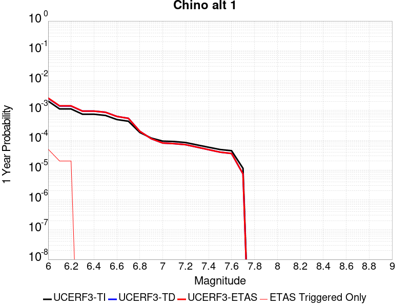 |  |

| Magnitude | 1 wk TI Prob | 1 wk TD Prob | 1 wk ETAS Prob | 1 wk ETAS/TD Gain | 1 wk ETAS Triggered Only | 1 mo TI Prob | 1 mo TD Prob | 1 mo ETAS Prob | 1 mo ETAS/TD Gain | 1 mo ETAS Triggered Only | 1 yr TI Prob | 1 yr TD Prob | 1 yr ETAS Prob | 1 yr ETAS/TD Gain | 1 yr ETAS Triggered Only | 10 yr TI Prob | 10 yr TD Prob | 10 yr ETAS Prob | 10 yr ETAS/TD Gain | 10 yr ETAS Triggered Only |
|-----|-----|-----|-----|-----|-----|-----|-----|-----|-----|-----|-----|-----|-----|-----|-----|-----|-----|-----|-----|-----|
| 6.0 | 3.939946E-5 | 4.8948554E-5 | 6.709649E-5 | 1.3707552 | 1.814882E-5 | 1.6884391E-4 | 2.097656E-4 | 2.2791061E-4 | 1.0865014 | 1.814882E-5 | 0.0020537362 | 0.0025513945 | 0.002569497 | 1.0070951 | 1.814882E-5 | 0.020348595 | 0.025277847 | 0.025383987 | 1.0041989 | 1.0889292E-4 |
| 6.1 | 2.1505624E-5 | 2.6879026E-5 | 4.502736E-5 | 1.6751857 | 1.814882E-5 | 9.2163704E-5 | 1.1519137E-4 | 1.333381E-4 | 1.1575356 | 1.814882E-5 | 0.0011215154 | 0.001401664 | 0.0014197874 | 1.0129299 | 1.814882E-5 | 0.011158722 | 0.013945141 | 0.013963037 | 1.0012833 | 1.814882E-5 |
| 6.2 | 2.1505624E-5 | 2.6879026E-5 | 4.502736E-5 | 1.6751857 | 1.814882E-5 | 9.2163704E-5 | 1.1519137E-4 | 1.333381E-4 | 1.1575356 | 1.814882E-5 | 0.0011215154 | 0.001401664 | 0.0014197874 | 1.0129299 | 1.814882E-5 | 0.011158722 | 0.013945141 | 0.013963037 | 1.0012833 | 1.814882E-5 |
| 6.3 | 1.4290785E-5 | 1.8165128E-5 | 1.8165128E-5 | 1.0 | 0.0 | 6.1244784E-5 | 7.784848E-5 | 7.784848E-5 | 1.0 | 0.0 | 7.454001E-4 | 9.4743853E-4 | 9.4743853E-4 | 1.0 | 0.0 | 0.007429048 | 0.0094444575 | 0.0094444575 | 1.0 | 0.0 |
| 6.4 | 1.4290785E-5 | 1.8165128E-5 | 1.8165128E-5 | 1.0 | 0.0 | 6.1244784E-5 | 7.784848E-5 | 7.784848E-5 | 1.0 | 0.0 | 7.454001E-4 | 9.4743853E-4 | 9.4743853E-4 | 1.0 | 0.0 | 0.007429048 | 0.0094444575 | 0.0094444575 | 1.0 | 0.0 |
| 6.5 | 1.3017944E-5 | 1.6652088E-5 | 1.6652088E-5 | 1.0 | 0.0 | 5.5789995E-5 | 7.136439E-5 | 7.136439E-5 | 1.0 | 0.0 | 6.790315E-4 | 8.685589E-4 | 8.685589E-4 | 1.0 | 0.0 | 0.0067696036 | 0.008661949 | 0.008661949 | 1.0 | 0.0 |
| 6.6 | 9.470016E-6 | 1.2039424E-5 | 1.2039424E-5 | 1.0 | 0.0 | 4.058515E-5 | 5.1596704E-5 | 5.1596704E-5 | 1.0 | 0.0 | 4.940122E-4 | 6.280428E-4 | 6.280428E-4 | 1.0 | 0.0 | 0.004929154 | 0.0062718987 | 0.0062718987 | 1.0 | 0.0 |
| 6.7 | 8.314155E-6 | 1.0407736E-5 | 1.0407736E-5 | 1.0 | 0.0 | 3.5631605E-5 | 4.4604003E-5 | 4.4604003E-5 | 1.0 | 0.0 | 4.3372845E-4 | 5.429507E-4 | 5.429507E-4 | 1.0 | 0.0 | 0.004328829 | 0.005425775 | 0.005425775 | 1.0 | 0.0 |
| 6.8 | 3.4856364E-6 | 3.8133708E-6 | 3.8133708E-6 | 1.0 | 0.0 | 1.4938357E-5 | 1.6342927E-5 | 1.6342927E-5 | 1.0 | 0.0 | 1.8185932E-4 | 1.9895904E-4 | 1.9895904E-4 | 1.0 | 0.0 | 0.0018171056 | 0.0019894864 | 0.0019894864 | 1.0 | 0.0 |
| 6.9 | 2.2645952E-6 | 2.1529022E-6 | 2.1529022E-6 | 1.0 | 0.0 | 9.705372E-6 | 9.226692E-6 | 9.226692E-6 | 1.0 | 0.0 | 1.18156495E-4 | 1.123294E-4 | 1.123294E-4 | 1.0 | 0.0 | 0.0011809369 | 0.0011233423 | 0.0011233423 | 1.0 | 0.0 |
| 7.0 | 1.7864003E-6 | 1.5430785E-6 | 1.5430785E-6 | 1.0 | 0.0 | 7.655979E-6 | 6.613177E-6 | 6.613177E-6 | 1.0 | 0.0 | 9.3207556E-5 | 8.051251E-5 | 8.051251E-5 | 1.0 | 0.0 | 9.316847E-4 | 8.0528046E-4 | 8.0528046E-4 | 1.0 | 0.0 |
| 7.1 | 1.7315456E-6 | 1.4733511E-6 | 1.4733511E-6 | 1.0 | 0.0 | 7.420889E-6 | 6.3143466E-6 | 6.3143466E-6 | 1.0 | 0.0 | 9.034557E-5 | 7.6874516E-5 | 7.6874516E-5 | 1.0 | 0.0 | 9.0308854E-4 | 7.6891703E-4 | 7.6891703E-4 | 1.0 | 0.0 |
| 7.2 | 1.6008337E-6 | 1.3574215E-6 | 1.3574215E-6 | 1.0 | 0.0 | 6.860698E-6 | 5.817508E-6 | 5.817508E-6 | 1.0 | 0.0 | 8.352579E-5 | 7.082591E-5 | 7.082591E-5 | 1.0 | 0.0 | 8.34944E-4 | 7.0845755E-4 | 7.0845755E-4 | 1.0 | 0.0 |
| 7.3 | 1.3320939E-6 | 1.121782E-6 | 1.121782E-6 | 1.0 | 0.0 | 5.7089615E-6 | 4.807629E-6 | 4.807629E-6 | 1.0 | 0.0 | 6.9504385E-5 | 5.8531357E-5 | 5.8531357E-5 | 1.0 | 0.0 | 6.9482654E-4 | 5.8530393E-4 | 5.8530393E-4 | 1.0 | 0.0 |
| 7.4 | 1.114294E-6 | 9.237111E-7 | 9.237111E-7 | 1.0 | 0.0 | 4.775537E-6 | 3.958756E-6 | 3.958756E-6 | 1.0 | 0.0 | 5.8140613E-5 | 4.8196827E-5 | 4.8196827E-5 | 1.0 | 0.0 | 5.81254E-4 | 4.8188053E-4 | 4.8188053E-4 | 1.0 | 0.0 |
| 7.5 | 9.354081E-7 | 7.6234323E-7 | 7.6234323E-7 | 1.0 | 0.0 | 4.0088858E-6 | 3.2671815E-6 | 3.2671815E-6 | 1.0 | 0.0 | 4.8807087E-5 | 3.9777242E-5 | 3.9777242E-5 | 1.0 | 0.0 | 4.879637E-4 | 3.977046E-4 | 3.977046E-4 | 1.0 | 0.0 |
| 7.6 | 8.521771E-7 | 6.88071E-7 | 6.88071E-7 | 1.0 | 0.0 | 3.6521824E-6 | 2.9488726E-6 | 2.9488726E-6 | 1.0 | 0.0 | 4.4464414E-5 | 3.5901965E-5 | 3.5901965E-5 | 1.0 | 0.0 | 4.4455516E-4 | 3.589648E-4 | 3.589648E-4 | 1.0 | 0.0 |
| 7.7 | 2.1803626E-7 | 1.418649E-7 | 1.418649E-7 | 1.0 | 0.0 | 9.344408E-7 | 6.079923E-7 | 6.079923E-7 | 1.0 | 0.0 | 1.1376757E-5 | 7.4022914E-6 | 7.4022914E-6 | 1.0 | 0.0 | 1.13761744E-4 | 7.402141E-5 | 7.402141E-5 | 1.0 | 0.0 |

## Pisgah-Bullion Mtn-Mesquite Lk
*[(top)](#table-of-contents)*

| 1 Week | 1 Month | 1 Year | 10 Year |
|-----|-----|-----|-----|
|  |  |  |  |

| Magnitude | 1 wk TI Prob | 1 wk TD Prob | 1 wk ETAS Prob | 1 wk ETAS/TD Gain | 1 wk ETAS Triggered Only | 1 mo TI Prob | 1 mo TD Prob | 1 mo ETAS Prob | 1 mo ETAS/TD Gain | 1 mo ETAS Triggered Only | 1 yr TI Prob | 1 yr TD Prob | 1 yr ETAS Prob | 1 yr ETAS/TD Gain | 1 yr ETAS Triggered Only | 10 yr TI Prob | 10 yr TD Prob | 10 yr ETAS Prob | 10 yr ETAS/TD Gain | 10 yr ETAS Triggered Only |
|-----|-----|-----|-----|-----|-----|-----|-----|-----|-----|-----|-----|-----|-----|-----|-----|-----|-----|-----|-----|-----|
| 6.0 | 3.0240792E-5 | 2.4091114E-5 | 4.22395E-5 | 1.7533227 | 1.814882E-5 | 1.2959696E-4 | 1.03244114E-4 | 1.2139106E-4 | 1.1757674 | 1.814882E-5 | 0.0015767008 | 0.0012563728 | 0.0013651289 | 1.0865636 | 1.0889292E-4 | 0.015655609 | 0.012502721 | 0.012610252 | 1.0086006 | 1.0889292E-4 |
| 6.1 | 3.0240792E-5 | 2.4091114E-5 | 4.22395E-5 | 1.7533227 | 1.814882E-5 | 1.2959696E-4 | 1.03244114E-4 | 1.2139106E-4 | 1.1757674 | 1.814882E-5 | 0.0015767008 | 0.0012563728 | 0.0013651289 | 1.0865636 | 1.0889292E-4 | 0.015655609 | 0.012502721 | 0.012610252 | 1.0086006 | 1.0889292E-4 |
| 6.2 | 3.0240792E-5 | 2.4091114E-5 | 4.22395E-5 | 1.7533227 | 1.814882E-5 | 1.2959696E-4 | 1.03244114E-4 | 1.2139106E-4 | 1.1757674 | 1.814882E-5 | 0.0015767008 | 0.0012563728 | 0.0013651289 | 1.0865636 | 1.0889292E-4 | 0.015655609 | 0.012502721 | 0.012610252 | 1.0086006 | 1.0889292E-4 |
| 6.3 | 2.0498217E-5 | 1.36380695E-5 | 1.36380695E-5 | 1.0 | 0.0 | 8.784654E-5 | 5.844765E-5 | 5.844765E-5 | 1.0 | 0.0 | 0.0010690069 | 7.1138405E-4 | 7.2951993E-4 | 1.0254939 | 1.814882E-5 | 0.01063879 | 0.0070926943 | 0.0071107144 | 1.0025407 | 1.814882E-5 |
| 6.4 | 2.0498217E-5 | 1.36380695E-5 | 1.36380695E-5 | 1.0 | 0.0 | 8.784654E-5 | 5.844765E-5 | 5.844765E-5 | 1.0 | 0.0 | 0.0010690069 | 7.1138405E-4 | 7.2951993E-4 | 1.0254939 | 1.814882E-5 | 0.01063879 | 0.0070926943 | 0.0071107144 | 1.0025407 | 1.814882E-5 |
| 6.5 | 1.7316182E-5 | 1.0477042E-5 | 1.0477042E-5 | 1.0 | 0.0 | 7.42101E-5 | 4.4900895E-5 | 4.4900895E-5 | 1.0 | 0.0 | 9.0313336E-4 | 5.465413E-4 | 5.465413E-4 | 1.0 | 0.0 | 0.008994718 | 0.0054529672 | 0.0054529672 | 1.0 | 0.0 |
| 6.6 | 1.5251077E-5 | 8.414273E-6 | 8.414273E-6 | 1.0 | 0.0 | 6.536012E-5 | 3.6060712E-5 | 3.6060712E-5 | 1.0 | 0.0 | 7.9546886E-4 | 4.3895794E-4 | 4.3895794E-4 | 1.0 | 0.0 | 0.007926274 | 0.0043816264 | 0.0043816264 | 1.0 | 0.0 |
| 6.7 | 1.2997425E-5 | 6.4114965E-6 | 6.4114965E-6 | 1.0 | 0.0 | 5.570206E-5 | 2.7477578E-5 | 2.7477578E-5 | 1.0 | 0.0 | 6.7796157E-4 | 3.3449283E-4 | 3.3449283E-4 | 1.0 | 0.0 | 0.0067589693 | 0.0033403537 | 0.0033403537 | 1.0 | 0.0 |
| 6.8 | 1.035386E-5 | 4.3332193E-6 | 4.3332193E-6 | 1.0 | 0.0 | 4.437293E-5 | 1.8570812E-5 | 1.8570812E-5 | 1.0 | 0.0 | 5.401065E-4 | 2.2607706E-4 | 2.2607706E-4 | 1.0 | 0.0 | 0.0053879567 | 0.0022585576 | 0.0022585576 | 1.0 | 0.0 |
| 6.9 | 8.816252E-6 | 3.580638E-6 | 3.580638E-6 | 1.0 | 0.0 | 3.778339E-5 | 1.5345504E-5 | 1.5345504E-5 | 1.0 | 0.0 | 4.5991567E-4 | 1.8681608E-4 | 1.8681608E-4 | 1.0 | 0.0 | 0.00458965 | 0.0018666488 | 0.0018666488 | 1.0 | 0.0 |
| 7.0 | 6.8232207E-6 | 2.5675843E-6 | 2.5675843E-6 | 1.0 | 0.0 | 2.9242048E-5 | 1.1003888E-5 | 1.1003888E-5 | 1.0 | 0.0 | 3.5596377E-4 | 1.3396442E-4 | 1.3396442E-4 | 1.0 | 0.0 | 0.0035539411 | 0.0013388677 | 0.0013388677 | 1.0 | 0.0 |
| 7.1 | 5.837013E-6 | 2.22738E-6 | 2.22738E-6 | 1.0 | 0.0 | 2.501553E-5 | 9.545881E-6 | 9.545881E-6 | 1.0 | 0.0 | 3.045215E-4 | 1.16215204E-4 | 1.16215204E-4 | 1.0 | 0.0 | 0.0030410455 | 0.0011615733 | 0.0011615733 | 1.0 | 0.0 |
| 7.2 | 4.278052E-6 | 1.6275711E-6 | 1.6275711E-6 | 1.0 | 0.0 | 1.833438E-5 | 6.9752873E-6 | 6.9752873E-6 | 1.0 | 0.0 | 2.231982E-4 | 8.492105E-5 | 8.492105E-5 | 1.0 | 0.0 | 0.0022297418 | 8.489092E-4 | 8.489092E-4 | 1.0 | 0.0 |
| 7.3 | 1.8803692E-6 | 8.344926E-7 | 8.344926E-7 | 1.0 | 0.0 | 8.0587E-6 | 3.5763926E-6 | 3.5763926E-6 | 1.0 | 0.0 | 9.811026E-5 | 4.354186E-5 | 4.354186E-5 | 1.0 | 0.0 | 9.806695E-4 | 4.3534773E-4 | 4.3534773E-4 | 1.0 | 0.0 |

## Raymond
*[(top)](#table-of-contents)*

| 1 Week | 1 Month | 1 Year | 10 Year |
|-----|-----|-----|-----|
|  |  |  |  |

| Magnitude | 1 wk TI Prob | 1 wk TD Prob | 1 wk ETAS Prob | 1 wk ETAS/TD Gain | 1 wk ETAS Triggered Only | 1 mo TI Prob | 1 mo TD Prob | 1 mo ETAS Prob | 1 mo ETAS/TD Gain | 1 mo ETAS Triggered Only | 1 yr TI Prob | 1 yr TD Prob | 1 yr ETAS Prob | 1 yr ETAS/TD Gain | 1 yr ETAS Triggered Only | 10 yr TI Prob | 10 yr TD Prob | 10 yr ETAS Prob | 10 yr ETAS/TD Gain | 10 yr ETAS Triggered Only |
|-----|-----|-----|-----|-----|-----|-----|-----|-----|-----|-----|-----|-----|-----|-----|-----|-----|-----|-----|-----|-----|
| 6.0 | 1.5157413E-5 | 1.5810128E-5 | 3.3958662E-5 | 2.1479056 | 1.814882E-5 | 6.4958724E-5 | 6.7756075E-5 | 8.5903666E-5 | 1.2678372 | 1.814882E-5 | 7.905855E-4 | 8.2464307E-4 | 8.790446E-4 | 1.0659698 | 5.444646E-5 | 0.007877788 | 0.008218348 | 0.008326346 | 1.013141 | 1.0889292E-4 |
| 6.1 | 1.5157413E-5 | 1.5810128E-5 | 3.3958662E-5 | 2.1479056 | 1.814882E-5 | 6.4958724E-5 | 6.7756075E-5 | 8.5903666E-5 | 1.2678372 | 1.814882E-5 | 7.905855E-4 | 8.2464307E-4 | 8.790446E-4 | 1.0659698 | 5.444646E-5 | 0.007877788 | 0.008218348 | 0.008326346 | 1.013141 | 1.0889292E-4 |
| 6.2 | 1.5157413E-5 | 1.5810128E-5 | 3.3958662E-5 | 2.1479056 | 1.814882E-5 | 6.4958724E-5 | 6.7756075E-5 | 8.5903666E-5 | 1.2678372 | 1.814882E-5 | 7.905855E-4 | 8.2464307E-4 | 8.790446E-4 | 1.0659698 | 5.444646E-5 | 0.007877788 | 0.008218348 | 0.008326346 | 1.013141 | 1.0889292E-4 |
| 6.3 | 1.5157413E-5 | 1.5810128E-5 | 3.3958662E-5 | 2.1479056 | 1.814882E-5 | 6.4958724E-5 | 6.7756075E-5 | 8.5903666E-5 | 1.2678372 | 1.814882E-5 | 7.905855E-4 | 8.2464307E-4 | 8.790446E-4 | 1.0659698 | 5.444646E-5 | 0.007877788 | 0.008218348 | 0.008326346 | 1.013141 | 1.0889292E-4 |
| 6.4 | 1.3941944E-5 | 1.445469E-5 | 3.260325E-5 | 2.255548 | 1.814882E-5 | 5.9749822E-5 | 6.1947336E-5 | 8.009503E-5 | 1.2929536 | 1.814882E-5 | 7.2721124E-4 | 7.5397117E-4 | 8.083765E-4 | 1.0721585 | 5.444646E-5 | 0.007248361 | 0.0075164647 | 0.007624539 | 1.0143783 | 1.0889292E-4 |
| 6.5 | 1.3941944E-5 | 1.445469E-5 | 3.260325E-5 | 2.255548 | 1.814882E-5 | 5.9749822E-5 | 6.1947336E-5 | 8.009503E-5 | 1.2929536 | 1.814882E-5 | 7.2721124E-4 | 7.5397117E-4 | 8.083765E-4 | 1.0721585 | 5.444646E-5 | 0.007248361 | 0.0075164647 | 0.007624539 | 1.0143783 | 1.0889292E-4 |
| 6.6 | 1.0542609E-5 | 1.0671113E-5 | 1.0671113E-5 | 1.0 | 0.0 | 4.5181827E-5 | 4.573257E-5 | 4.573257E-5 | 1.0 | 0.0 | 5.499499E-4 | 5.5665727E-4 | 5.9293467E-4 | 1.0651702 | 3.629764E-5 | 0.005485909 | 0.00555319 | 0.0056434306 | 1.0162501 | 9.07441E-5 |
| 6.7 | 1.0542609E-5 | 1.0671113E-5 | 1.0671113E-5 | 1.0 | 0.0 | 4.5181827E-5 | 4.573257E-5 | 4.573257E-5 | 1.0 | 0.0 | 5.499499E-4 | 5.5665727E-4 | 5.9293467E-4 | 1.0651702 | 3.629764E-5 | 0.005485909 | 0.00555319 | 0.0056434306 | 1.0162501 | 9.07441E-5 |
| 6.8 | 1.0079132E-5 | 1.0176646E-5 | 1.0176646E-5 | 1.0 | 0.0 | 4.3195567E-5 | 4.3613498E-5 | 4.3613498E-5 | 1.0 | 0.0 | 5.257791E-4 | 5.3087034E-4 | 5.4900954E-4 | 1.0341687 | 1.814882E-5 | 0.0052453685 | 0.005296571 | 0.0053507295 | 1.0102252 | 5.444646E-5 |
| 6.9 | 7.721598E-6 | 7.5489047E-6 | 7.5489047E-6 | 1.0 | 0.0 | 3.3092143E-5 | 3.2352054E-5 | 3.2352054E-5 | 1.0 | 0.0 | 4.0282236E-4 | 3.9381627E-4 | 4.1195797E-4 | 1.0460663 | 1.814882E-5 | 0.0040209293 | 0.0039313175 | 0.0039674724 | 1.0091966 | 3.629764E-5 |
| 7.0 | 7.137566E-6 | 6.9113057E-6 | 6.9113057E-6 | 1.0 | 0.0 | 3.058921E-5 | 2.961955E-5 | 2.961955E-5 | 1.0 | 0.0 | 3.7236E-4 | 3.6055944E-4 | 3.7870172E-4 | 1.050317 | 1.814882E-5 | 0.0037173668 | 0.0035998628 | 0.0036360298 | 1.0100467 | 3.629764E-5 |
| 7.1 | 5.654976E-6 | 5.29954E-6 | 5.29954E-6 | 1.0 | 0.0 | 2.4235387E-5 | 2.2712118E-5 | 2.2712118E-5 | 1.0 | 0.0 | 2.9502588E-4 | 2.7648517E-4 | 2.7648517E-4 | 1.0 | 0.0 | 0.0029463451 | 0.002761443 | 0.0027795415 | 1.0065541 | 1.814882E-5 |
| 7.2 | 4.9358455E-6 | 4.5266574E-6 | 4.5266574E-6 | 1.0 | 0.0 | 2.1153453E-5 | 1.9399817E-5 | 1.9399817E-5 | 1.0 | 0.0 | 2.5751285E-4 | 2.3616731E-4 | 2.3616731E-4 | 1.0 | 0.0 | 0.0025721465 | 0.0023591854 | 0.0023772914 | 1.0076747 | 1.814882E-5 |
| 7.3 | 4.2368597E-6 | 3.8056164E-6 | 3.8056164E-6 | 1.0 | 0.0 | 1.8157843E-5 | 1.6309683E-5 | 1.6309683E-5 | 1.0 | 0.0 | 2.2104931E-4 | 1.9855241E-4 | 1.9855241E-4 | 1.0 | 0.0 | 0.0022082955 | 0.0019837688 | 0.0019837688 | 1.0 | 0.0 |
| 7.4 | 3.4999923E-6 | 3.043744E-6 | 3.043744E-6 | 1.0 | 0.0 | 1.49998805E-5 | 1.3044552E-5 | 1.3044552E-5 | 1.0 | 0.0 | 1.8260824E-4 | 1.5880594E-4 | 1.5880594E-4 | 1.0 | 0.0 | 0.0018245826 | 0.0015869403 | 0.0015869403 | 1.0 | 0.0 |
| 7.5 | 2.738017E-6 | 2.3020468E-6 | 2.3020468E-6 | 1.0 | 0.0 | 1.1734306E-5 | 9.865878E-6 | 9.865878E-6 | 1.0 | 0.0 | 1.428558E-4 | 1.2011051E-4 | 1.2011051E-4 | 1.0 | 0.0 | 0.0014276401 | 0.0012004703 | 0.0012004703 | 1.0 | 0.0 |
| 7.6 | 1.8186392E-6 | 1.442312E-6 | 1.442312E-6 | 1.0 | 0.0 | 7.794145E-6 | 6.181323E-6 | 6.181323E-6 | 1.0 | 0.0 | 9.488958E-5 | 7.5255055E-5 | 7.5255055E-5 | 1.0 | 0.0 | 9.4849075E-4 | 7.523072E-4 | 7.523072E-4 | 1.0 | 0.0 |
| 7.7 | 1.0660348E-6 | 7.6438056E-7 | 7.6438056E-7 | 1.0 | 0.0 | 4.5687125E-6 | 3.2759126E-6 | 3.2759126E-6 | 1.0 | 0.0 | 5.5622655E-5 | 3.9883522E-5 | 3.9883522E-5 | 1.0 | 0.0 | 5.5608735E-4 | 3.9877277E-4 | 3.9877277E-4 | 1.0 | 0.0 |
| 7.8 | 6.913602E-7 | 4.3204133E-7 | 4.3204133E-7 | 1.0 | 0.0 | 2.962969E-6 | 1.8516045E-6 | 1.8516045E-6 | 1.0 | 0.0 | 3.607355E-5 | 2.2543056E-5 | 2.2543056E-5 | 1.0 | 0.0 | 3.6067693E-4 | 2.2541556E-4 | 2.2541556E-4 | 1.0 | 0.0 |
| 7.9 | 7.425201E-8 | 5.3222113E-8 | 5.3222113E-8 | 1.0 | 0.0 | 3.1822285E-7 | 2.2809476E-7 | 2.2809476E-7 | 1.0 | 0.0 | 3.874356E-6 | 2.7770516E-6 | 2.7770516E-6 | 1.0 | 0.0 | 3.8742884E-5 | 2.7770298E-5 | 2.7770298E-5 | 1.0 | 0.0 |

## Blue Cut
*[(top)](#table-of-contents)*

| 1 Week | 1 Month | 1 Year | 10 Year |
|-----|-----|-----|-----|
| 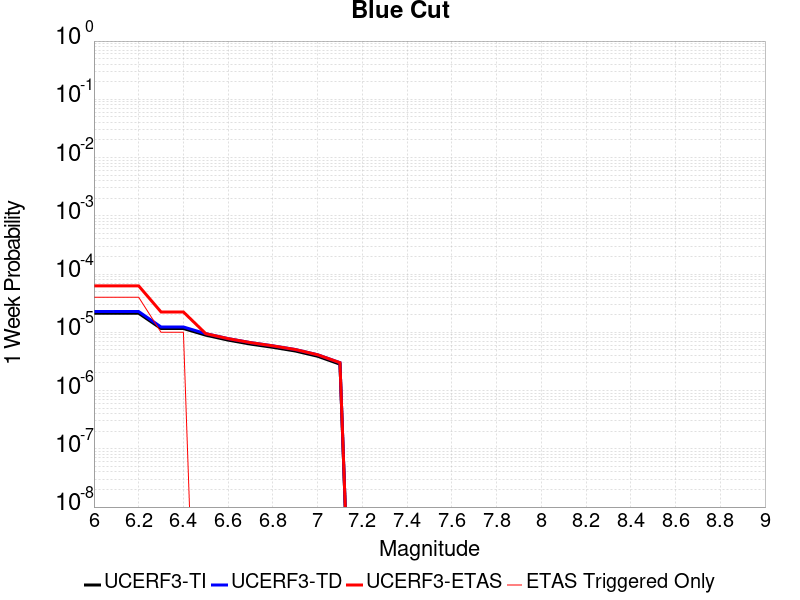 |  |  |  |

| Magnitude | 1 wk TI Prob | 1 wk TD Prob | 1 wk ETAS Prob | 1 wk ETAS/TD Gain | 1 wk ETAS Triggered Only | 1 mo TI Prob | 1 mo TD Prob | 1 mo ETAS Prob | 1 mo ETAS/TD Gain | 1 mo ETAS Triggered Only | 1 yr TI Prob | 1 yr TD Prob | 1 yr ETAS Prob | 1 yr ETAS/TD Gain | 1 yr ETAS Triggered Only | 10 yr TI Prob | 10 yr TD Prob | 10 yr ETAS Prob | 10 yr ETAS/TD Gain | 10 yr ETAS Triggered Only |
|-----|-----|-----|-----|-----|-----|-----|-----|-----|-----|-----|-----|-----|-----|-----|-----|-----|-----|-----|-----|-----|
| 6.0 | 2.1227985E-5 | 2.2719574E-5 | 5.901639E-5 | 2.597601 | 3.629764E-5 | 9.097391E-5 | 9.73663E-5 | 1.5180746E-4 | 1.5591376 | 5.444646E-5 | 0.0011070445 | 0.0011848481 | 0.0012754847 | 1.0764964 | 9.07441E-5 | 0.011015458 | 0.011791152 | 0.011898761 | 1.0091262 | 1.0889292E-4 |
| 6.1 | 2.1227985E-5 | 2.2719574E-5 | 5.901639E-5 | 2.597601 | 3.629764E-5 | 9.097391E-5 | 9.73663E-5 | 1.5180746E-4 | 1.5591376 | 5.444646E-5 | 0.0011070445 | 0.0011848481 | 0.0012754847 | 1.0764964 | 9.07441E-5 | 0.011015458 | 0.011791152 | 0.011898761 | 1.0091262 | 1.0889292E-4 |
| 6.2 | 2.1227985E-5 | 2.2719574E-5 | 5.901639E-5 | 2.597601 | 3.629764E-5 | 9.097391E-5 | 9.73663E-5 | 1.5180746E-4 | 1.5591376 | 5.444646E-5 | 0.0011070445 | 0.0011848481 | 0.0012754847 | 1.0764964 | 9.07441E-5 | 0.011015458 | 0.011791152 | 0.011898761 | 1.0091262 | 1.0889292E-4 |
| 6.3 | 1.1613981E-5 | 1.2353542E-5 | 3.0502139E-5 | 2.4691007 | 1.814882E-5 | 4.9773254E-5 | 5.2942745E-5 | 7.109061E-5 | 1.3427827 | 1.814882E-5 | 6.0582085E-4 | 6.443998E-4 | 6.8067404E-4 | 1.0562916 | 3.629764E-5 | 0.0060417196 | 0.0064265593 | 0.006462624 | 1.0056118 | 3.629764E-5 |
| 6.4 | 1.1613981E-5 | 1.2353542E-5 | 3.0502139E-5 | 2.4691007 | 1.814882E-5 | 4.9773254E-5 | 5.2942745E-5 | 7.109061E-5 | 1.3427827 | 1.814882E-5 | 6.0582085E-4 | 6.443998E-4 | 6.8067404E-4 | 1.0562916 | 3.629764E-5 | 0.0060417196 | 0.0064265593 | 0.006462624 | 1.0056118 | 3.629764E-5 |
| 6.5 | 8.931326E-6 | 9.4816E-6 | 9.4816E-6 | 1.0 | 0.0 | 3.8276554E-5 | 4.0634844E-5 | 4.0634844E-5 | 1.0 | 0.0 | 4.6591737E-4 | 4.946261E-4 | 5.1276595E-4 | 1.0366739 | 1.814882E-5 | 0.0046494175 | 0.004936161 | 0.0049542203 | 1.0036585 | 1.814882E-5 |
| 6.6 | 7.345353E-6 | 7.79028E-6 | 7.79028E-6 | 1.0 | 0.0 | 3.1479703E-5 | 3.338653E-5 | 3.338653E-5 | 1.0 | 0.0 | 3.83198E-4 | 4.064132E-4 | 4.2455463E-4 | 1.0446379 | 1.814882E-5 | 0.0038253788 | 0.0040574907 | 0.004075566 | 1.0044547 | 1.814882E-5 |
| 6.7 | 6.2775666E-6 | 6.655149E-6 | 6.655149E-6 | 1.0 | 0.0 | 2.690358E-5 | 2.8521798E-5 | 2.8521798E-5 | 1.0 | 0.0 | 3.2750185E-4 | 3.472051E-4 | 3.653476E-4 | 1.052253 | 1.814882E-5 | 0.0032701963 | 0.003467367 | 0.003485453 | 1.005216 | 1.814882E-5 |
| 6.8 | 5.5234095E-6 | 5.8551113E-6 | 5.8551113E-6 | 1.0 | 0.0 | 2.367154E-5 | 2.5093133E-5 | 2.5093133E-5 | 1.0 | 0.0 | 2.8816288E-4 | 3.0547334E-4 | 3.2361664E-4 | 1.059394 | 1.814882E-5 | 0.002877895 | 0.0030512505 | 0.003069344 | 1.0059298 | 1.814882E-5 |
| 6.9 | 4.7780054E-6 | 5.0654203E-6 | 5.0654203E-6 | 1.0 | 0.0 | 2.0477004E-5 | 2.1708804E-5 | 2.1708804E-5 | 1.0 | 0.0 | 2.4927902E-4 | 2.642797E-4 | 2.8242372E-4 | 1.0686547 | 1.814882E-5 | 0.0024899957 | 0.002640346 | 0.002658447 | 1.0068555 | 1.814882E-5 |
| 7.0 | 3.883171E-6 | 4.118487E-6 | 4.118487E-6 | 1.0 | 0.0 | 1.6642054E-5 | 1.7650578E-5 | 1.7650578E-5 | 1.0 | 0.0 | 2.0259817E-4 | 2.1488148E-4 | 2.1488148E-4 | 1.0 | 0.0 | 0.0020241356 | 0.0021474129 | 0.0021474129 | 1.0 | 0.0 |
| 7.1 | 2.8358215E-6 | 3.0097158E-6 | 3.0097158E-6 | 1.0 | 0.0 | 1.2153464E-5 | 1.2898756E-5 | 1.2898756E-5 | 1.0 | 0.0 | 1.4795837E-4 | 1.5703762E-4 | 1.5703762E-4 | 1.0 | 0.0 | 0.001478599 | 0.0015699116 | 0.0015699116 | 1.0 | 0.0 |

## Independence rev 2011
*[(top)](#table-of-contents)*

| 1 Week | 1 Month | 1 Year | 10 Year |
|-----|-----|-----|-----|
|  |  | 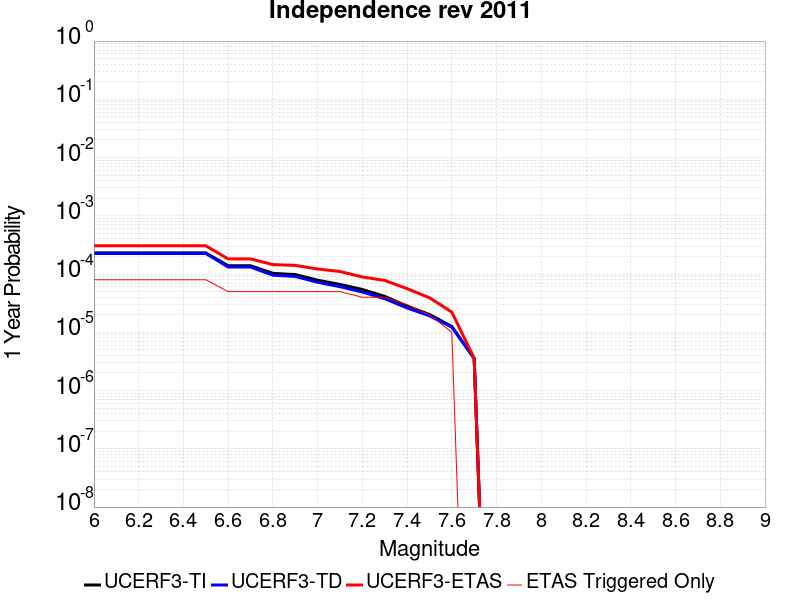 |  |

| Magnitude | 1 wk TI Prob | 1 wk TD Prob | 1 wk ETAS Prob | 1 wk ETAS/TD Gain | 1 wk ETAS Triggered Only | 1 mo TI Prob | 1 mo TD Prob | 1 mo ETAS Prob | 1 mo ETAS/TD Gain | 1 mo ETAS Triggered Only | 1 yr TI Prob | 1 yr TD Prob | 1 yr ETAS Prob | 1 yr ETAS/TD Gain | 1 yr ETAS Triggered Only | 10 yr TI Prob | 10 yr TD Prob | 10 yr ETAS Prob | 10 yr ETAS/TD Gain | 10 yr ETAS Triggered Only |
|-----|-----|-----|-----|-----|-----|-----|-----|-----|-----|-----|-----|-----|-----|-----|-----|-----|-----|-----|-----|-----|
| 6.0 | 4.422171E-6 | 4.326227E-6 | 4.0623712E-5 | 9.390101 | 3.629764E-5 | 1.8952025E-5 | 1.8540857E-5 | 7.298631E-5 | 3.936512 | 5.444646E-5 | 2.3071647E-4 | 2.2571455E-4 | 2.8014873E-4 | 1.2411637 | 5.444646E-5 | 0.0023047708 | 0.0022551466 | 0.0023637938 | 1.0481775 | 1.0889292E-4 |
| 6.1 | 4.422171E-6 | 4.326227E-6 | 4.0623712E-5 | 9.390101 | 3.629764E-5 | 1.8952025E-5 | 1.8540857E-5 | 7.298631E-5 | 3.936512 | 5.444646E-5 | 2.3071647E-4 | 2.2571455E-4 | 2.8014873E-4 | 1.2411637 | 5.444646E-5 | 0.0023047708 | 0.0022551466 | 0.0023637938 | 1.0481775 | 1.0889292E-4 |
| 6.2 | 4.422171E-6 | 4.326227E-6 | 4.0623712E-5 | 9.390101 | 3.629764E-5 | 1.8952025E-5 | 1.8540857E-5 | 7.298631E-5 | 3.936512 | 5.444646E-5 | 2.3071647E-4 | 2.2571455E-4 | 2.8014873E-4 | 1.2411637 | 5.444646E-5 | 0.0023047708 | 0.0022551466 | 0.0023637938 | 1.0481775 | 1.0889292E-4 |
| 6.3 | 4.422171E-6 | 4.326227E-6 | 4.0623712E-5 | 9.390101 | 3.629764E-5 | 1.8952025E-5 | 1.8540857E-5 | 7.298631E-5 | 3.936512 | 5.444646E-5 | 2.3071647E-4 | 2.2571455E-4 | 2.8014873E-4 | 1.2411637 | 5.444646E-5 | 0.0023047708 | 0.0022551466 | 0.0023637938 | 1.0481775 | 1.0889292E-4 |
| 6.4 | 4.422171E-6 | 4.326227E-6 | 4.0623712E-5 | 9.390101 | 3.629764E-5 | 1.8952025E-5 | 1.8540857E-5 | 7.298631E-5 | 3.936512 | 5.444646E-5 | 2.3071647E-4 | 2.2571455E-4 | 2.8014873E-4 | 1.2411637 | 5.444646E-5 | 0.0023047708 | 0.0022551466 | 0.0023637938 | 1.0481775 | 1.0889292E-4 |
| 6.5 | 4.422171E-6 | 4.326227E-6 | 4.0623712E-5 | 9.390101 | 3.629764E-5 | 1.8952025E-5 | 1.8540857E-5 | 7.298631E-5 | 3.936512 | 5.444646E-5 | 2.3071647E-4 | 2.2571455E-4 | 2.8014873E-4 | 1.2411637 | 5.444646E-5 | 0.0023047708 | 0.0022551466 | 0.0023637938 | 1.0481775 | 1.0889292E-4 |
| 6.6 | 2.663744E-6 | 2.5319862E-6 | 3.8829534E-5 | 15.335603 | 3.629764E-5 | 1.1415996E-5 | 1.0851327E-5 | 4.7148573E-5 | 4.3449593 | 3.629764E-5 | 1.3898089E-4 | 1.3210738E-4 | 1.6840023E-4 | 1.2747223 | 3.629764E-5 | 0.0013889399 | 0.0013203367 | 0.001410961 | 1.0686373 | 9.07441E-5 |
| 6.7 | 2.663744E-6 | 2.5319862E-6 | 3.8829534E-5 | 15.335603 | 3.629764E-5 | 1.1415996E-5 | 1.0851327E-5 | 4.7148573E-5 | 4.3449593 | 3.629764E-5 | 1.3898089E-4 | 1.3210738E-4 | 1.6840023E-4 | 1.2747223 | 3.629764E-5 | 0.0013889399 | 0.0013203367 | 0.001410961 | 1.0686373 | 9.07441E-5 |
| 6.8 | 1.9716529E-6 | 1.8322585E-6 | 3.8129834E-5 | 20.810291 | 3.629764E-5 | 8.449913E-6 | 7.852514E-6 | 4.414987E-5 | 5.622387 | 3.629764E-5 | 1.0287284E-4 | 9.5600284E-5 | 1.3189446E-4 | 1.379645 | 3.629764E-5 | 0.0010282523 | 9.556045E-4 | 0.0010462619 | 1.0948691 | 9.07441E-5 |
| 6.9 | 1.8788617E-6 | 1.7429993E-6 | 3.8040576E-5 | 21.82478 | 3.629764E-5 | 8.0522395E-6 | 7.4699765E-6 | 4.3767344E-5 | 5.859101 | 3.629764E-5 | 9.80316E-5 | 9.0943286E-5 | 1.2723762E-4 | 1.3990877 | 3.629764E-5 | 9.798837E-4 | 9.0907275E-4 | 9.997344E-4 | 1.0997298 | 9.07441E-5 |
| 7.0 | 1.5045488E-6 | 1.3849503E-6 | 3.768254E-5 | 27.208586 | 3.629764E-5 | 6.44805E-6 | 5.9354884E-6 | 4.2232914E-5 | 7.1153226 | 3.629764E-5 | 7.8502184E-5 | 7.226223E-5 | 1.08557244E-4 | 1.5022682 | 3.629764E-5 | 7.8474457E-4 | 7.2239246E-4 | 8.13071E-4 | 1.1255254 | 9.07441E-5 |
| 7.1 | 1.272341E-6 | 1.1625096E-6 | 3.7460108E-5 | 32.22348 | 3.629764E-5 | 5.4528787E-6 | 4.982175E-6 | 4.1279636E-5 | 8.285464 | 3.629764E-5 | 6.6386776E-5 | 6.0656326E-5 | 9.6951764E-5 | 1.5983784 | 3.629764E-5 | 6.636695E-4 | 6.064009E-4 | 6.9708994E-4 | 1.1495531 | 9.07441E-5 |
| 7.2 | 1.0416892E-6 | 9.4098806E-7 | 1.9089792E-5 | 20.286964 | 1.814882E-5 | 4.464375E-6 | 4.0328E-6 | 2.2181546E-5 | 5.5002847 | 1.814882E-5 | 5.4352407E-5 | 4.909825E-5 | 6.7246176E-5 | 1.3696247 | 1.814882E-5 | 5.4339116E-4 | 4.9087586E-4 | 5.6343555E-4 | 1.1478167 | 7.259528E-5 |
| 7.3 | 7.9450155E-7 | 7.235002E-7 | 1.8872308E-5 | 26.08473 | 1.814882E-5 | 3.4050022E-6 | 3.1007114E-6 | 2.1249476E-5 | 6.853097 | 1.814882E-5 | 4.1455114E-5 | 3.775052E-5 | 5.5898654E-5 | 1.4807386 | 1.814882E-5 | 4.144738E-4 | 3.7744216E-4 | 4.3186807E-4 | 1.1441966 | 5.444646E-5 |
| 7.4 | 5.3893444E-7 | 5.019512E-7 | 1.8650762E-5 | 37.156525 | 1.814882E-5 | 2.309717E-6 | 2.1512178E-6 | 2.03E-5 | 9.436515 | 1.814882E-5 | 2.8120441E-5 | 2.6190766E-5 | 4.433911E-5 | 1.6929291 | 1.814882E-5 | 2.8116882E-4 | 2.6187726E-4 | 3.1630945E-4 | 1.2078539 | 5.444646E-5 |
| 7.5 | 3.8852085E-7 | 3.682554E-7 | 1.8517068E-5 | 50.283226 | 1.814882E-5 | 1.6650882E-6 | 1.5782365E-6 | 1.9727027E-5 | 12.499413 | 1.814882E-5 | 2.027226E-5 | 1.9214862E-5 | 3.7363334E-5 | 1.9445018 | 1.814882E-5 | 2.0270412E-4 | 1.9213221E-4 | 2.465682E-4 | 1.2833257 | 5.444646E-5 |
| 7.6 | 2.414929E-7 | 2.345755E-7 | 1.838339E-5 | 78.36876 | 1.814882E-5 | 1.0349692E-6 | 1.0053232E-6 | 1.9154126E-5 | 19.052704 | 1.814882E-5 | 1.2600677E-5 | 1.2239742E-5 | 3.038834E-5 | 2.4827597 | 1.814882E-5 | 1.2599962E-4 | 1.223908E-4 | 1.5868401E-4 | 1.2965354 | 3.629764E-5 |
| 7.7 | 6.8298014E-8 | 6.85897E-8 | 6.85897E-8 | 1.0 | 0.0 | 2.9270575E-7 | 2.9395582E-7 | 2.9395582E-7 | 1.0 | 0.0 | 3.5636867E-6 | 3.5789067E-6 | 3.5789067E-6 | 1.0 | 0.0 | 3.5636294E-5 | 3.5788536E-5 | 3.5788536E-5 | 1.0 | 0.0 |

## Lost Hills
*[(top)](#table-of-contents)*

| 1 Week | 1 Month | 1 Year | 10 Year |
|-----|-----|-----|-----|
| 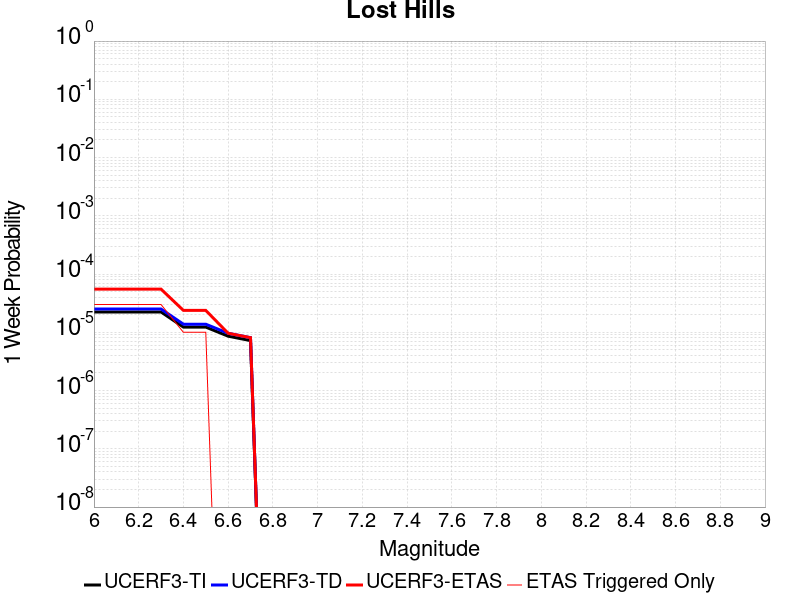 | 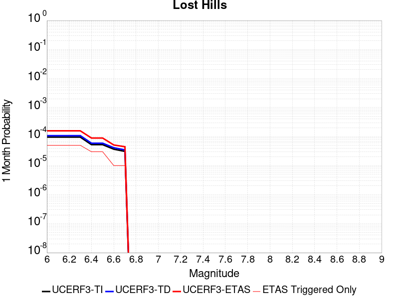 |  |  |

| Magnitude | 1 wk TI Prob | 1 wk TD Prob | 1 wk ETAS Prob | 1 wk ETAS/TD Gain | 1 wk ETAS Triggered Only | 1 mo TI Prob | 1 mo TD Prob | 1 mo ETAS Prob | 1 mo ETAS/TD Gain | 1 mo ETAS Triggered Only | 1 yr TI Prob | 1 yr TD Prob | 1 yr ETAS Prob | 1 yr ETAS/TD Gain | 1 yr ETAS Triggered Only | 10 yr TI Prob | 10 yr TD Prob | 10 yr ETAS Prob | 10 yr ETAS/TD Gain | 10 yr ETAS Triggered Only |
|-----|-----|-----|-----|-----|-----|-----|-----|-----|-----|-----|-----|-----|-----|-----|-----|-----|-----|-----|-----|-----|
| 6.0 | 2.233523E-5 | 2.5106583E-5 | 6.140331E-5 | 2.4457057 | 3.629764E-5 | 9.571891E-5 | 1.0759615E-4 | 1.8018362E-4 | 1.6746289 | 7.259528E-5 | 0.0011647546 | 0.001309364 | 0.0013999894 | 1.0692132 | 9.07441E-5 | 0.011586686 | 0.013033091 | 0.013140565 | 1.0082462 | 1.0889292E-4 |
| 6.1 | 2.233523E-5 | 2.5106583E-5 | 6.140331E-5 | 2.4457057 | 3.629764E-5 | 9.571891E-5 | 1.0759615E-4 | 1.8018362E-4 | 1.6746289 | 7.259528E-5 | 0.0011647546 | 0.001309364 | 0.0013999894 | 1.0692132 | 9.07441E-5 | 0.011586686 | 0.013033091 | 0.013140565 | 1.0082462 | 1.0889292E-4 |
| 6.2 | 2.233523E-5 | 2.5106583E-5 | 6.140331E-5 | 2.4457057 | 3.629764E-5 | 9.571891E-5 | 1.0759615E-4 | 1.8018362E-4 | 1.6746289 | 7.259528E-5 | 0.0011647546 | 0.001309364 | 0.0013999894 | 1.0692132 | 9.07441E-5 | 0.011586686 | 0.013033091 | 0.013140565 | 1.0082462 | 1.0889292E-4 |
| 6.3 | 2.233523E-5 | 2.5106583E-5 | 6.140331E-5 | 2.4457057 | 3.629764E-5 | 9.571891E-5 | 1.0759615E-4 | 1.8018362E-4 | 1.6746289 | 7.259528E-5 | 0.0011647546 | 0.001309364 | 0.0013999894 | 1.0692132 | 9.07441E-5 | 0.011586686 | 0.013033091 | 0.013140565 | 1.0082462 | 1.0889292E-4 |
| 6.4 | 1.2288092E-5 | 1.3781108E-5 | 3.1929678E-5 | 2.3169167 | 1.814882E-5 | 5.2662188E-5 | 5.906108E-5 | 1.1350433E-4 | 1.9218125 | 5.444646E-5 | 6.409735E-4 | 7.189252E-4 | 7.7333255E-4 | 1.0756787 | 5.444646E-5 | 0.006391279 | 0.0071752006 | 0.0072292564 | 1.0075337 | 5.444646E-5 |
| 6.5 | 1.2288092E-5 | 1.3781108E-5 | 3.1929678E-5 | 2.3169167 | 1.814882E-5 | 5.2662188E-5 | 5.906108E-5 | 1.1350433E-4 | 1.9218125 | 5.444646E-5 | 6.409735E-4 | 7.189252E-4 | 7.7333255E-4 | 1.0756787 | 5.444646E-5 | 0.006391279 | 0.0071752006 | 0.0072292564 | 1.0075337 | 5.444646E-5 |
| 6.6 | 8.58281E-6 | 9.63377E-6 | 9.63377E-6 | 1.0 | 0.0 | 3.6782953E-5 | 4.12874E-5 | 5.943547E-5 | 1.4395547 | 1.814882E-5 | 4.4774043E-4 | 5.026414E-4 | 5.207811E-4 | 1.0360887 | 1.814882E-5 | 0.0044683935 | 0.005023205 | 0.0050412626 | 1.0035949 | 1.814882E-5 |
| 6.7 | 7.205685E-6 | 8.088302E-6 | 8.088302E-6 | 1.0 | 0.0 | 3.088114E-5 | 3.466415E-5 | 5.2812342E-5 | 1.5235435 | 1.814882E-5 | 3.7591302E-4 | 4.2203604E-4 | 4.401772E-4 | 1.0429848 | 1.814882E-5 | 0.0037527776 | 0.0042203604 | 0.0042384327 | 1.0042821 | 1.814882E-5 |

## San Jacinto (Lytle Creek connector)
*[(top)](#table-of-contents)*

| 1 Week | 1 Month | 1 Year | 10 Year |
|-----|-----|-----|-----|
|  |  |  |  |

| Magnitude | 1 wk TI Prob | 1 wk TD Prob | 1 wk ETAS Prob | 1 wk ETAS/TD Gain | 1 wk ETAS Triggered Only | 1 mo TI Prob | 1 mo TD Prob | 1 mo ETAS Prob | 1 mo ETAS/TD Gain | 1 mo ETAS Triggered Only | 1 yr TI Prob | 1 yr TD Prob | 1 yr ETAS Prob | 1 yr ETAS/TD Gain | 1 yr ETAS Triggered Only | 10 yr TI Prob | 10 yr TD Prob | 10 yr ETAS Prob | 10 yr ETAS/TD Gain | 10 yr ETAS Triggered Only |
|-----|-----|-----|-----|-----|-----|-----|-----|-----|-----|-----|-----|-----|-----|-----|-----|-----|-----|-----|-----|-----|
| 6.0 | 6.693995E-6 | 6.660216E-6 | 6.1106315E-5 | 9.174825 | 5.444646E-5 | 2.8688235E-5 | 2.854347E-5 | 1.01136684E-4 | 3.5432508 | 7.259528E-5 | 3.492233E-4 | 3.4746144E-4 | 4.38174E-4 | 1.2610724 | 9.07441E-5 | 0.00348675 | 0.0035493854 | 0.0036398072 | 1.0254754 | 9.07441E-5 |
| 6.1 | 6.693995E-6 | 6.660216E-6 | 6.1106315E-5 | 9.174825 | 5.444646E-5 | 2.8688235E-5 | 2.854347E-5 | 1.01136684E-4 | 3.5432508 | 7.259528E-5 | 3.492233E-4 | 3.4746144E-4 | 4.38174E-4 | 1.2610724 | 9.07441E-5 | 0.00348675 | 0.0035493854 | 0.0036398072 | 1.0254754 | 9.07441E-5 |
| 6.2 | 6.693995E-6 | 6.660216E-6 | 6.1106315E-5 | 9.174825 | 5.444646E-5 | 2.8688235E-5 | 2.854347E-5 | 1.01136684E-4 | 3.5432508 | 7.259528E-5 | 3.492233E-4 | 3.4746144E-4 | 4.38174E-4 | 1.2610724 | 9.07441E-5 | 0.00348675 | 0.0035493854 | 0.0036398072 | 1.0254754 | 9.07441E-5 |
| 6.3 | 6.693995E-6 | 6.660216E-6 | 6.1106315E-5 | 9.174825 | 5.444646E-5 | 2.8688235E-5 | 2.854347E-5 | 1.01136684E-4 | 3.5432508 | 7.259528E-5 | 3.492233E-4 | 3.4746144E-4 | 4.38174E-4 | 1.2610724 | 9.07441E-5 | 0.00348675 | 0.0035493854 | 0.0036398072 | 1.0254754 | 9.07441E-5 |
| 6.4 | 6.693995E-6 | 6.660216E-6 | 6.1106315E-5 | 9.174825 | 5.444646E-5 | 2.8688235E-5 | 2.854347E-5 | 1.01136684E-4 | 3.5432508 | 7.259528E-5 | 3.492233E-4 | 3.4746144E-4 | 4.38174E-4 | 1.2610724 | 9.07441E-5 | 0.00348675 | 0.0035493854 | 0.0036398072 | 1.0254754 | 9.07441E-5 |
| 6.5 | 6.6561875E-6 | 6.6204343E-6 | 6.106654E-5 | 9.223947 | 5.444646E-5 | 2.8526205E-5 | 2.837298E-5 | 1.009662E-4 | 3.5585334 | 7.259528E-5 | 3.472512E-4 | 3.4538636E-4 | 4.3609913E-4 | 1.2626414 | 9.07441E-5 | 0.0034670907 | 0.003528701 | 0.0036191246 | 1.0256252 | 9.07441E-5 |
| 6.6 | 6.6561875E-6 | 6.6204343E-6 | 6.106654E-5 | 9.223947 | 5.444646E-5 | 2.8526205E-5 | 2.837298E-5 | 1.009662E-4 | 3.5585334 | 7.259528E-5 | 3.472512E-4 | 3.4538636E-4 | 4.3609913E-4 | 1.2626414 | 9.07441E-5 | 0.0034670907 | 0.003528701 | 0.0036191246 | 1.0256252 | 9.07441E-5 |
| 6.7 | 6.5802237E-6 | 6.539611E-6 | 6.0985716E-5 | 9.325587 | 5.444646E-5 | 2.8200653E-5 | 2.8026603E-5 | 1.0061985E-4 | 3.590155 | 7.259528E-5 | 3.4328885E-4 | 3.4117055E-4 | 4.3188367E-4 | 1.265888 | 9.07441E-5 | 0.0034275902 | 0.0034866752 | 0.003577103 | 1.0259352 | 9.07441E-5 |
| 6.8 | 6.575632E-6 | 6.5341005E-6 | 6.0980205E-5 | 9.332609 | 5.444646E-5 | 2.8180975E-5 | 2.8002989E-5 | 1.0059624E-4 | 3.5923393 | 7.259528E-5 | 3.4304935E-4 | 3.4088313E-4 | 4.315963E-4 | 1.2661122 | 9.07441E-5 | 0.0034252026 | 0.00348381 | 0.003574238 | 1.0259566 | 9.07441E-5 |
| 6.9 | 6.570433E-6 | 6.525495E-6 | 6.09716E-5 | 9.343598 | 5.444646E-5 | 2.8158694E-5 | 2.7966107E-5 | 1.0055936E-4 | 3.5957582 | 7.259528E-5 | 3.4277816E-4 | 3.4043423E-4 | 4.3114743E-4 | 1.2664633 | 9.07441E-5 | 0.0034224992 | 0.0034793352 | 0.0035697636 | 1.0259901 | 9.07441E-5 |
| 7.0 | 6.5643826E-6 | 6.515616E-6 | 6.0961724E-5 | 9.356249 | 5.444646E-5 | 2.8132765E-5 | 2.792377E-5 | 1.0051703E-4 | 3.599694 | 7.259528E-5 | 3.424626E-4 | 3.3991894E-4 | 4.3063218E-4 | 1.2668673 | 9.07441E-5 | 0.0034193532 | 0.0034741985 | 0.0035646271 | 1.0260286 | 9.07441E-5 |
| 7.1 | 6.557402E-6 | 6.5043278E-6 | 6.0950435E-5 | 9.37075 | 5.444646E-5 | 2.8102848E-5 | 2.7875392E-5 | 1.0046865E-4 | 3.6042056 | 7.259528E-5 | 3.4209844E-4 | 3.3933012E-4 | 4.3004344E-4 | 1.2673305 | 9.07441E-5 | 0.0034157229 | 0.0034683298 | 0.003558759 | 1.0260729 | 9.07441E-5 |
| 7.2 | 6.546394E-6 | 6.4862943E-6 | 6.09324E-5 | 9.394024 | 5.444646E-5 | 2.8055672E-5 | 2.7798109E-5 | 1.0039137E-4 | 3.6114461 | 7.259528E-5 | 3.4152428E-4 | 3.3838948E-4 | 4.291029E-4 | 1.2680739 | 9.07441E-5 | 0.0034099987 | 0.0034589572 | 0.0035493872 | 1.0261438 | 9.07441E-5 |
| 7.3 | 6.5364216E-6 | 6.4670803E-6 | 6.091319E-5 | 9.4189625 | 5.444646E-5 | 2.8012933E-5 | 2.7715765E-5 | 1.0030904E-4 | 3.619205 | 7.259528E-5 | 3.4100408E-4 | 3.3738726E-4 | 4.2810076E-4 | 1.2688705 | 9.07441E-5 | 0.003404813 | 0.0034489788 | 0.00353941 | 1.0262197 | 9.07441E-5 |
| 7.4 | 6.5269523E-6 | 6.4481674E-6 | 6.089428E-5 | 9.443656 | 5.444646E-5 | 2.7972354E-5 | 2.7634711E-5 | 1.0022799E-4 | 3.6268873 | 7.259528E-5 | 3.4051016E-4 | 3.3640073E-4 | 4.271143E-4 | 1.2696593 | 9.07441E-5 | 0.0033998888 | 0.003439161 | 0.0035295929 | 1.0262948 | 9.07441E-5 |
| 7.5 | 6.5111835E-6 | 6.424442E-6 | 6.0870552E-5 | 9.474839 | 5.444646E-5 | 2.7904773E-5 | 2.7533031E-5 | 1.00126315E-4 | 3.6365888 | 7.259528E-5 | 3.3968766E-4 | 3.3516317E-4 | 4.2587687E-4 | 1.2706553 | 9.07441E-5 | 0.0033916887 | 0.003426834 | 0.0035172673 | 1.0263897 | 9.07441E-5 |
| 7.6 | 6.4768806E-6 | 6.383551E-6 | 6.0829665E-5 | 9.529126 | 5.444646E-5 | 2.7757764E-5 | 2.735779E-5 | 9.995108E-5 | 3.6534781 | 7.259528E-5 | 3.3789838E-4 | 3.3303024E-4 | 4.2374415E-4 | 1.2723893 | 9.07441E-5 | 0.0033738504 | 0.0034055663 | 0.0034960012 | 1.0265551 | 9.07441E-5 |
| 7.7 | 6.1655364E-6 | 6.1760365E-6 | 6.0622162E-5 | 9.815706 | 5.444646E-5 | 2.642346E-5 | 2.646846E-5 | 9.906182E-5 | 3.7426364 | 7.259528E-5 | 3.2165812E-4 | 3.2220592E-4 | 4.1292078E-4 | 1.2815431 | 9.07441E-5 | 0.0032119295 | 0.0032971818 | 0.0033876265 | 1.027431 | 9.07441E-5 |
| 7.8 | 5.5043524E-6 | 5.737097E-6 | 6.0183247E-5 | 10.490191 | 5.444646E-5 | 2.3589868E-5 | 2.4587327E-5 | 9.7180826E-5 | 3.9524763 | 7.259528E-5 | 2.871688E-4 | 2.9930964E-4 | 3.9002657E-4 | 1.3030872 | 9.07441E-5 | 0.0028679797 | 0.0030672832 | 0.003157749 | 1.0294938 | 9.07441E-5 |
| 7.9 | 3.889249E-6 | 4.076761E-6 | 5.8523E-5 | 14.3552685 | 5.444646E-5 | 1.6668104E-5 | 1.7471715E-5 | 9.006573E-5 | 5.1549444 | 7.259528E-5 | 2.0291525E-4 | 2.1269741E-4 | 3.0342222E-4 | 1.426544 | 9.07441E-5 | 0.0020273007 | 0.0021943315 | 0.0022848765 | 1.0412631 | 9.07441E-5 |
| 8.0 | 2.668535E-6 | 2.5315155E-6 | 3.8829065E-5 | 15.338269 | 3.629764E-5 | 1.1436528E-5 | 1.0849307E-5 | 4.7146554E-5 | 4.345582 | 3.629764E-5 | 1.3923083E-4 | 1.3208234E-4 | 1.6837518E-4 | 1.2747744 | 3.629764E-5 | 0.0013914363 | 0.0013757964 | 0.001412044 | 1.0263467 | 3.629764E-5 |
| 8.1 | 1.5911459E-6 | 1.218661E-6 | 1.9367459E-5 | 15.892408 | 1.814882E-5 | 6.8191785E-6 | 5.2228224E-6 | 2.3371547E-5 | 4.4748883 | 1.814882E-5 | 8.3020335E-5 | 6.3586034E-5 | 8.17337E-5 | 1.2854034 | 1.814882E-5 | 8.298933E-4 | 6.6932244E-4 | 6.8745913E-4 | 1.0270971 | 1.814882E-5 |
| 8.2 | 6.1294963E-7 | 2.1812275E-7 | 2.1812275E-7 | 1.0 | 0.0 | 2.6269242E-6 | 9.3481145E-7 | 9.3481145E-7 | 1.0 | 0.0 | 3.1982334E-5 | 1.138127E-5 | 1.138127E-5 | 1.0 | 0.0 | 3.1977732E-4 | 1.2784546E-4 | 1.2784546E-4 | 1.0 | 0.0 |
| 8.3 | 1.762871E-7 | 4.7546838E-8 | 4.7546838E-8 | 1.0 | 0.0 | 7.5551594E-7 | 2.0377215E-7 | 2.0377215E-7 | 1.0 | 0.0 | 9.1983675E-6 | 2.480923E-6 | 2.480923E-6 | 1.0 | 0.0 | 9.197987E-5 | 2.868753E-5 | 2.868753E-5 | 1.0 | 0.0 |

## Santa Cruz Island
*[(top)](#table-of-contents)*

| 1 Week | 1 Month | 1 Year | 10 Year |
|-----|-----|-----|-----|
| 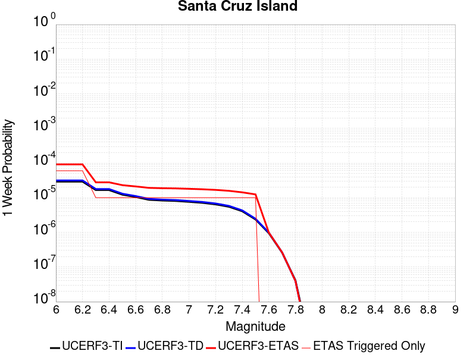 |  |  |  |

| Magnitude | 1 wk TI Prob | 1 wk TD Prob | 1 wk ETAS Prob | 1 wk ETAS/TD Gain | 1 wk ETAS Triggered Only | 1 mo TI Prob | 1 mo TD Prob | 1 mo ETAS Prob | 1 mo ETAS/TD Gain | 1 mo ETAS Triggered Only | 1 yr TI Prob | 1 yr TD Prob | 1 yr ETAS Prob | 1 yr ETAS/TD Gain | 1 yr ETAS Triggered Only | 10 yr TI Prob | 10 yr TD Prob | 10 yr ETAS Prob | 10 yr ETAS/TD Gain | 10 yr ETAS Triggered Only |
|-----|-----|-----|-----|-----|-----|-----|-----|-----|-----|-----|-----|-----|-----|-----|-----|-----|-----|-----|-----|-----|
| 6.0 | 2.9164563E-5 | 3.1599742E-5 | 8.6044485E-5 | 2.7229488 | 5.444646E-5 | 1.2498499E-4 | 1.3542121E-4 | 1.898603E-4 | 1.4019983 | 5.444646E-5 | 0.0015206301 | 0.0016476426 | 0.0017019993 | 1.0329906 | 5.444646E-5 | 0.015102667 | 0.016368 | 0.016457258 | 1.0054532 | 9.07441E-5 |
| 6.1 | 2.9164563E-5 | 3.1599742E-5 | 8.6044485E-5 | 2.7229488 | 5.444646E-5 | 1.2498499E-4 | 1.3542121E-4 | 1.898603E-4 | 1.4019983 | 5.444646E-5 | 0.0015206301 | 0.0016476426 | 0.0017019993 | 1.0329906 | 5.444646E-5 | 0.015102667 | 0.016368 | 0.016457258 | 1.0054532 | 9.07441E-5 |
| 6.2 | 2.9164563E-5 | 3.1599742E-5 | 8.6044485E-5 | 2.7229488 | 5.444646E-5 | 1.2498499E-4 | 1.3542121E-4 | 1.898603E-4 | 1.4019983 | 5.444646E-5 | 0.0015206301 | 0.0016476426 | 0.0017019993 | 1.0329906 | 5.444646E-5 | 0.015102667 | 0.016368 | 0.016457258 | 1.0054532 | 9.07441E-5 |
| 6.3 | 1.6635553E-5 | 1.780436E-5 | 1.780436E-5 | 1.0 | 0.0 | 7.1293274E-5 | 7.630226E-5 | 7.630226E-5 | 1.0 | 0.0 | 8.6765E-4 | 9.2860236E-4 | 9.2860236E-4 | 1.0 | 0.0 | 0.008642701 | 0.009249094 | 0.009285055 | 1.0038881 | 3.629764E-5 |
| 6.4 | 1.6635553E-5 | 1.780436E-5 | 1.780436E-5 | 1.0 | 0.0 | 7.1293274E-5 | 7.630226E-5 | 7.630226E-5 | 1.0 | 0.0 | 8.6765E-4 | 9.2860236E-4 | 9.2860236E-4 | 1.0 | 0.0 | 0.008642701 | 0.009249094 | 0.009285055 | 1.0038881 | 3.629764E-5 |
| 6.5 | 1.2238748E-5 | 1.3042995E-5 | 1.3042995E-5 | 1.0 | 0.0 | 5.2450723E-5 | 5.5897377E-5 | 5.5897377E-5 | 1.0 | 0.0 | 6.3840044E-4 | 6.8034173E-4 | 6.8034173E-4 | 1.0 | 0.0 | 0.0063656955 | 0.0067829876 | 0.006819039 | 1.005315 | 3.629764E-5 |
| 6.6 | 1.0489767E-5 | 1.1156636E-5 | 1.1156636E-5 | 1.0 | 0.0 | 4.495537E-5 | 4.781329E-5 | 4.781329E-5 | 1.0 | 0.0 | 5.4719415E-4 | 5.819735E-4 | 5.819735E-4 | 1.0 | 0.0 | 0.005458487 | 0.0058047357 | 0.005822779 | 1.0031084 | 1.814882E-5 |
| 6.7 | 8.699222E-6 | 9.236782E-6 | 9.236782E-6 | 1.0 | 0.0 | 3.7281847E-5 | 3.958561E-5 | 3.958561E-5 | 1.0 | 0.0 | 4.5381195E-4 | 4.8184878E-4 | 4.8184878E-4 | 1.0 | 0.0 | 0.0045288634 | 0.004808108 | 0.0048261695 | 1.0037565 | 1.814882E-5 |
| 6.8 | 8.307732E-6 | 8.8169045E-6 | 8.8169045E-6 | 1.0 | 0.0 | 3.560408E-5 | 3.7786187E-5 | 3.7786187E-5 | 1.0 | 0.0 | 4.3339343E-4 | 4.5995016E-4 | 4.5995016E-4 | 1.0 | 0.0 | 0.004325492 | 0.0045900354 | 0.0046081007 | 1.0039358 | 1.814882E-5 |
| 6.9 | 8.073121E-6 | 8.564939E-6 | 8.564939E-6 | 1.0 | 0.0 | 3.459863E-5 | 3.6706366E-5 | 3.6706366E-5 | 1.0 | 0.0 | 4.2115687E-4 | 4.468088E-4 | 4.468088E-4 | 1.0 | 0.0 | 0.004203596 | 0.004459156 | 0.004477224 | 1.0040518 | 1.814882E-5 |
| 7.0 | 7.617019E-6 | 8.074664E-6 | 8.074664E-6 | 1.0 | 0.0 | 3.264396E-5 | 3.4605247E-5 | 3.4605247E-5 | 1.0 | 0.0 | 3.9736772E-4 | 4.212378E-4 | 4.212378E-4 | 1.0 | 0.0 | 0.003966579 | 0.0042044413 | 0.0042225136 | 1.0042984 | 1.814882E-5 |
| 7.1 | 7.1224836E-6 | 7.545788E-6 | 7.545788E-6 | 1.0 | 0.0 | 3.052457E-5 | 3.2338692E-5 | 3.2338692E-5 | 1.0 | 0.0 | 3.715733E-4 | 3.936528E-4 | 3.936528E-4 | 1.0 | 0.0 | 0.003709526 | 0.003929598 | 0.003929598 | 1.0 | 0.0 |
| 7.2 | 6.441115E-6 | 6.8273835E-6 | 6.8273835E-6 | 1.0 | 0.0 | 2.7604487E-5 | 2.9259887E-5 | 2.9259887E-5 | 1.0 | 0.0 | 3.360328E-4 | 3.5618112E-4 | 3.5618112E-4 | 1.0 | 0.0 | 0.0033552512 | 0.003556131 | 0.003556131 | 1.0 | 0.0 |
| 7.3 | 5.494274E-6 | 5.8199944E-6 | 5.8199944E-6 | 1.0 | 0.0 | 2.3546674E-5 | 2.4942596E-5 | 2.4942596E-5 | 1.0 | 0.0 | 2.8664304E-4 | 3.0363398E-4 | 3.0363398E-4 | 1.0 | 0.0 | 0.002862736 | 0.0030322142 | 0.0030322142 | 1.0 | 0.0 |
| 7.4 | 4.0802624E-6 | 4.312256E-6 | 4.312256E-6 | 1.0 | 0.0 | 1.7486722E-5 | 1.8480967E-5 | 1.8480967E-5 | 1.0 | 0.0 | 2.1288003E-4 | 2.2498262E-4 | 2.2498262E-4 | 1.0 | 0.0 | 0.0021267622 | 0.0022475575 | 0.0022475575 | 1.0 | 0.0 |
| 7.5 | 2.3584746E-6 | 2.4753094E-6 | 2.4753094E-6 | 1.0 | 0.0 | 1.0107709E-5 | 1.0608426E-5 | 1.0608426E-5 | 1.0 | 0.0 | 1.2305441E-4 | 1.2915E-4 | 1.2915E-4 | 1.0 | 0.0 | 0.0012298629 | 0.0012907543 | 0.0012907543 | 1.0 | 0.0 |
| 7.6 | 9.4981914E-7 | 9.86093E-7 | 9.86093E-7 | 1.0 | 0.0 | 4.0706473E-6 | 4.2261063E-6 | 4.2261063E-6 | 1.0 | 0.0 | 4.9559E-5 | 5.145164E-5 | 5.145164E-5 | 1.0 | 0.0 | 4.954795E-4 | 5.1439856E-4 | 5.1439856E-4 | 1.0 | 0.0 |
| 7.7 | 2.6013532E-7 | 2.6416603E-7 | 2.6416603E-7 | 1.0 | 0.0 | 1.1148652E-6 | 1.1321397E-6 | 1.1321397E-6 | 1.0 | 0.0 | 1.3573399E-5 | 1.3783714E-5 | 1.3783714E-5 | 1.0 | 0.0 | 1.357257E-4 | 1.3782867E-4 | 1.3782867E-4 | 1.0 | 0.0 |
| 7.8 | 4.1522263E-8 | 3.965679E-8 | 3.965679E-8 | 1.0 | 0.0 | 1.7795254E-7 | 1.6995766E-7 | 1.6995766E-7 | 1.0 | 0.0 | 2.16657E-6 | 2.0692328E-6 | 2.0692328E-6 | 1.0 | 0.0 | 2.1665488E-5 | 2.0692156E-5 | 2.0692156E-5 | 1.0 | 0.0 |
| 7.9 | 7.7242046E-10 | 5.9468175E-10 | 5.9468175E-10 | 1.0 | 0.0 | 3.3103735E-9 | 2.5486364E-9 | 2.5486364E-9 | 1.0 | 0.0 | 4.0303796E-8 | 3.1029646E-8 | 3.1029646E-8 | 1.0 | 0.0 | 4.030379E-7 | 3.1029643E-7 | 3.1029643E-7 | 1.0 | 0.0 |

## Mission Creek
*[(top)](#table-of-contents)*

| 1 Week | 1 Month | 1 Year | 10 Year |
|-----|-----|-----|-----|
|  |  |  |  |

| Magnitude | 1 wk TI Prob | 1 wk TD Prob | 1 wk ETAS Prob | 1 wk ETAS/TD Gain | 1 wk ETAS Triggered Only | 1 mo TI Prob | 1 mo TD Prob | 1 mo ETAS Prob | 1 mo ETAS/TD Gain | 1 mo ETAS Triggered Only | 1 yr TI Prob | 1 yr TD Prob | 1 yr ETAS Prob | 1 yr ETAS/TD Gain | 1 yr ETAS Triggered Only | 10 yr TI Prob | 10 yr TD Prob | 10 yr ETAS Prob | 10 yr ETAS/TD Gain | 10 yr ETAS Triggered Only |
|-----|-----|-----|-----|-----|-----|-----|-----|-----|-----|-----|-----|-----|-----|-----|-----|-----|-----|-----|-----|-----|
| 6.0 | 1.1549387E-5 | 1.632237E-5 | 7.076794E-5 | 4.3356414 | 5.444646E-5 | 4.9496433E-5 | 6.9951224E-5 | 1.2439388E-4 | 1.7782944 | 5.444646E-5 | 6.0245243E-4 | 8.513384E-4 | 9.4200525E-4 | 1.1064992 | 9.07441E-5 | 0.006008218 | 0.008509998 | 0.00859997 | 1.0105724 | 9.07441E-5 |
| 6.1 | 1.1549387E-5 | 1.632237E-5 | 7.076794E-5 | 4.3356414 | 5.444646E-5 | 4.9496433E-5 | 6.9951224E-5 | 1.2439388E-4 | 1.7782944 | 5.444646E-5 | 6.0245243E-4 | 8.513384E-4 | 9.4200525E-4 | 1.1064992 | 9.07441E-5 | 0.006008218 | 0.008509998 | 0.00859997 | 1.0105724 | 9.07441E-5 |
| 6.2 | 1.1549387E-5 | 1.632237E-5 | 7.076794E-5 | 4.3356414 | 5.444646E-5 | 4.9496433E-5 | 6.9951224E-5 | 1.2439388E-4 | 1.7782944 | 5.444646E-5 | 6.0245243E-4 | 8.513384E-4 | 9.4200525E-4 | 1.1064992 | 9.07441E-5 | 0.006008218 | 0.008509998 | 0.00859997 | 1.0105724 | 9.07441E-5 |
| 6.3 | 1.1549387E-5 | 1.632237E-5 | 7.076794E-5 | 4.3356414 | 5.444646E-5 | 4.9496433E-5 | 6.9951224E-5 | 1.2439388E-4 | 1.7782944 | 5.444646E-5 | 6.0245243E-4 | 8.513384E-4 | 9.4200525E-4 | 1.1064992 | 9.07441E-5 | 0.006008218 | 0.008509998 | 0.00859997 | 1.0105724 | 9.07441E-5 |
| 6.4 | 1.1549387E-5 | 1.632237E-5 | 7.076794E-5 | 4.3356414 | 5.444646E-5 | 4.9496433E-5 | 6.9951224E-5 | 1.2439388E-4 | 1.7782944 | 5.444646E-5 | 6.0245243E-4 | 8.513384E-4 | 9.4200525E-4 | 1.1064992 | 9.07441E-5 | 0.006008218 | 0.008509998 | 0.00859997 | 1.0105724 | 9.07441E-5 |
| 6.5 | 1.1549387E-5 | 1.632237E-5 | 7.076794E-5 | 4.3356414 | 5.444646E-5 | 4.9496433E-5 | 6.9951224E-5 | 1.2439388E-4 | 1.7782944 | 5.444646E-5 | 6.0245243E-4 | 8.513384E-4 | 9.4200525E-4 | 1.1064992 | 9.07441E-5 | 0.006008218 | 0.008509998 | 0.00859997 | 1.0105724 | 9.07441E-5 |
| 6.6 | 9.202681E-6 | 1.3845646E-5 | 6.829135E-5 | 4.932334 | 5.444646E-5 | 3.9439463E-5 | 5.9337188E-5 | 1.13780414E-4 | 1.9175229 | 5.444646E-5 | 4.800697E-4 | 7.221998E-4 | 8.1287837E-4 | 1.1255589 | 9.07441E-5 | 0.004790339 | 0.0072271815 | 0.0073172697 | 1.0124652 | 9.07441E-5 |
| 6.7 | 9.019164E-6 | 1.3651316E-5 | 6.809703E-5 | 4.9883127 | 5.444646E-5 | 3.8652986E-5 | 5.8504378E-5 | 1.1294765E-4 | 1.9305847 | 5.444646E-5 | 4.7049852E-4 | 7.12067E-4 | 8.027465E-4 | 1.1273469 | 9.07441E-5 | 0.004695036 | 0.007126506 | 0.007216603 | 1.0126426 | 9.07441E-5 |
| 6.8 | 8.673558E-6 | 1.3273427E-5 | 6.7719164E-5 | 5.10186 | 5.444646E-5 | 3.717186E-5 | 5.6884925E-5 | 1.1132829E-4 | 1.9570789 | 5.444646E-5 | 4.524734E-4 | 6.923627E-4 | 7.8304403E-4 | 1.1309737 | 9.07441E-5 | 0.0045155324 | 0.006930694 | 0.007020809 | 1.0130023 | 9.07441E-5 |
| 6.9 | 7.002255E-6 | 1.1477657E-5 | 6.5923494E-5 | 5.743637 | 5.444646E-5 | 3.000932E-5 | 4.9189068E-5 | 1.03632854E-4 | 2.1068268 | 5.444646E-5 | 3.653022E-4 | 5.9871917E-4 | 6.89409E-4 | 1.1514729 | 9.07441E-5 | 0.0036470229 | 0.005999517 | 0.006089717 | 1.0150344 | 9.07441E-5 |
| 7.0 | 5.84644E-6 | 9.67498E-6 | 6.412091E-5 | 6.6274986 | 5.444646E-5 | 2.5055931E-5 | 4.1463565E-5 | 9.590777E-5 | 2.3130612 | 5.444646E-5 | 3.0501327E-4 | 5.047066E-4 | 5.954049E-4 | 1.179705 | 9.07441E-5 | 0.0030459496 | 0.0050638523 | 0.0051541366 | 1.0178292 | 9.07441E-5 |
| 7.1 | 5.54703E-6 | 9.329456E-6 | 6.3775406E-5 | 6.8359194 | 5.444646E-5 | 2.377277E-5 | 3.9982795E-5 | 9.442708E-5 | 2.361693 | 5.444646E-5 | 2.8939504E-4 | 4.8668624E-4 | 5.773862E-4 | 1.1863623 | 9.07441E-5 | 0.0028901845 | 0.004884446 | 0.004974747 | 1.0184875 | 9.07441E-5 |
| 7.2 | 4.384709E-6 | 7.68157E-6 | 6.212761E-5 | 8.087879 | 5.444646E-5 | 1.8791474E-5 | 3.2920623E-5 | 8.736529E-5 | 2.6538165 | 5.444646E-5 | 2.2876218E-4 | 4.0073853E-4 | 4.733047E-4 | 1.1810812 | 7.259528E-5 | 0.0022852682 | 0.004028366 | 0.0041006687 | 1.0179484 | 7.259528E-5 |
| 7.3 | 3.7888456E-6 | 6.915452E-6 | 6.1361534E-5 | 8.873106 | 5.444646E-5 | 1.623781E-5 | 2.9637333E-5 | 8.408218E-5 | 2.837036 | 5.444646E-5 | 1.9767738E-4 | 3.6077813E-4 | 4.3334722E-4 | 1.201146 | 7.259528E-5 | 0.0019750162 | 0.0036301152 | 0.0037024468 | 1.0199255 | 7.259528E-5 |
| 7.4 | 2.1982462E-6 | 5.0237763E-6 | 5.9469963E-5 | 11.837701 | 5.444646E-5 | 9.421021E-6 | 2.1530293E-5 | 7.5975586E-5 | 3.528776 | 5.444646E-5 | 1.1469489E-4 | 2.621E-4 | 3.3467624E-4 | 1.2769029 | 7.259528E-5 | 0.0011463572 | 0.0026458844 | 0.0027182878 | 1.0273645 | 7.259528E-5 |
| 7.5 | 2.051923E-6 | 4.615016E-6 | 5.9061225E-5 | 12.797621 | 5.444646E-5 | 8.793926E-6 | 1.9778492E-5 | 7.422388E-5 | 3.752757 | 5.444646E-5 | 1.0706078E-4 | 2.4077666E-4 | 3.1335445E-4 | 1.301432 | 7.259528E-5 | 0.0010700922 | 0.0024335422 | 0.0025059606 | 1.0297586 | 7.259528E-5 |
| 7.6 | 1.8733427E-6 | 4.1233748E-6 | 5.856961E-5 | 14.204289 | 5.444646E-5 | 8.028587E-6 | 1.7671488E-5 | 7.2116985E-5 | 4.08098 | 5.444646E-5 | 9.774366E-5 | 2.151292E-4 | 2.6956396E-4 | 1.2530328 | 5.444646E-5 | 9.770069E-4 | 0.0021780801 | 0.0022324082 | 1.024943 | 5.444646E-5 |
| 7.7 | 1.8411953E-6 | 4.0430496E-6 | 5.848929E-5 | 14.466627 | 5.444646E-5 | 7.890813E-6 | 1.732724E-5 | 7.177276E-5 | 4.142192 | 5.444646E-5 | 9.606641E-5 | 2.1093882E-4 | 2.653738E-4 | 1.2580605 | 5.444646E-5 | 9.6024893E-4 | 0.0021363653 | 0.0021906954 | 1.0254312 | 5.444646E-5 |
| 7.8 | 1.7194251E-6 | 3.7104276E-6 | 5.8156686E-5 | 15.67385 | 5.444646E-5 | 7.368944E-6 | 1.5901736E-5 | 7.0347334E-5 | 4.4238772 | 5.444646E-5 | 8.97132E-5 | 1.9358651E-4 | 2.4802244E-4 | 1.2811968 | 5.444646E-5 | 8.967699E-4 | 0.0019623525 | 0.0020166922 | 1.027691 | 5.444646E-5 |
| 7.9 | 1.4035052E-6 | 2.9500632E-6 | 5.7396363E-5 | 19.455978 | 5.444646E-5 | 6.0150082E-6 | 1.2643067E-5 | 6.708884E-5 | 5.306374 | 5.444646E-5 | 7.3230265E-5 | 1.5391852E-4 | 2.083566E-4 | 1.3536812 | 5.444646E-5 | 7.3206134E-4 | 0.0015631086 | 0.00161747 | 1.0347778 | 5.444646E-5 |
| 8.0 | 3.9318823E-7 | 5.528522E-7 | 1.8701663E-5 | 33.8276 | 1.814882E-5 | 1.6850913E-6 | 2.3693647E-6 | 2.0518142E-5 | 8.659765 | 1.814882E-5 | 2.0515794E-5 | 2.8846638E-5 | 4.6994934E-5 | 1.6291304 | 1.814882E-5 | 2.0513899E-4 | 2.9899E-4 | 3.1713338E-4 | 1.0606823 | 1.814882E-5 |
| 8.1 | 1.596793E-7 | 1.1380002E-7 | 1.1380002E-7 | 1.0 | 0.0 | 6.8433974E-7 | 4.877143E-7 | 4.877143E-7 | 1.0 | 0.0 | 8.331805E-6 | 5.937906E-6 | 5.937906E-6 | 1.0 | 0.0 | 8.331492E-5 | 6.549966E-5 | 6.549966E-5 | 1.0 | 0.0 |
| 8.2 | 4.9003038E-8 | 2.5444924E-8 | 2.5444924E-8 | 1.0 | 0.0 | 2.10013E-7 | 1.0904967E-7 | 1.0904967E-7 | 1.0 | 0.0 | 2.5569052E-6 | 1.327679E-6 | 1.327679E-6 | 1.0 | 0.0 | 2.556876E-5 | 1.495635E-5 | 1.495635E-5 | 1.0 | 0.0 |

## Kern Canyon (South Kern) 2011
*[(top)](#table-of-contents)*

| 1 Week | 1 Month | 1 Year | 10 Year |
|-----|-----|-----|-----|
| 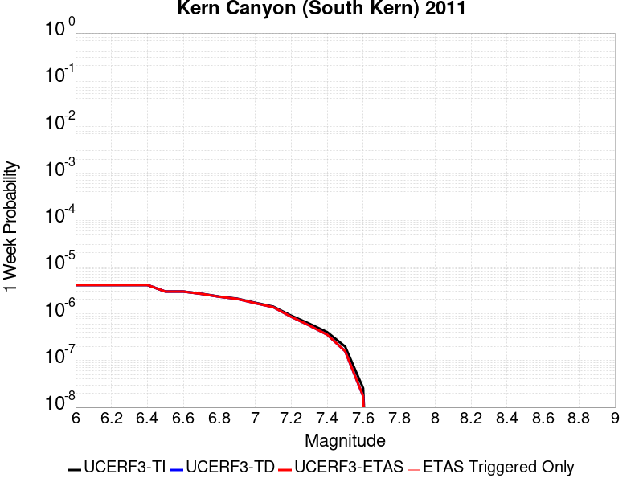 |  |  |  |

| Magnitude | 1 wk TI Prob | 1 wk TD Prob | 1 wk ETAS Prob | 1 wk ETAS/TD Gain | 1 wk ETAS Triggered Only | 1 mo TI Prob | 1 mo TD Prob | 1 mo ETAS Prob | 1 mo ETAS/TD Gain | 1 mo ETAS Triggered Only | 1 yr TI Prob | 1 yr TD Prob | 1 yr ETAS Prob | 1 yr ETAS/TD Gain | 1 yr ETAS Triggered Only | 10 yr TI Prob | 10 yr TD Prob | 10 yr ETAS Prob | 10 yr ETAS/TD Gain | 10 yr ETAS Triggered Only |
|-----|-----|-----|-----|-----|-----|-----|-----|-----|-----|-----|-----|-----|-----|-----|-----|-----|-----|-----|-----|-----|
| 6.0 | 4.105075E-6 | 4.1137264E-6 | 4.1137264E-6 | 1.0 | 0.0 | 1.7593058E-5 | 1.763014E-5 | 3.577864E-5 | 2.029402 | 1.814882E-5 | 2.1417443E-4 | 2.1462646E-4 | 3.0535107E-4 | 1.4227095 | 9.07441E-5 | 0.0021396813 | 0.0021442557 | 0.0022348051 | 1.0422289 | 9.07441E-5 |
| 6.1 | 4.105075E-6 | 4.1137264E-6 | 4.1137264E-6 | 1.0 | 0.0 | 1.7593058E-5 | 1.763014E-5 | 3.577864E-5 | 2.029402 | 1.814882E-5 | 2.1417443E-4 | 2.1462646E-4 | 3.0535107E-4 | 1.4227095 | 9.07441E-5 | 0.0021396813 | 0.0021442557 | 0.0022348051 | 1.0422289 | 9.07441E-5 |
| 6.2 | 4.105075E-6 | 4.1137264E-6 | 4.1137264E-6 | 1.0 | 0.0 | 1.7593058E-5 | 1.763014E-5 | 3.577864E-5 | 2.029402 | 1.814882E-5 | 2.1417443E-4 | 2.1462646E-4 | 3.0535107E-4 | 1.4227095 | 9.07441E-5 | 0.0021396813 | 0.0021442557 | 0.0022348051 | 1.0422289 | 9.07441E-5 |
| 6.3 | 4.105075E-6 | 4.1137264E-6 | 4.1137264E-6 | 1.0 | 0.0 | 1.7593058E-5 | 1.763014E-5 | 3.577864E-5 | 2.029402 | 1.814882E-5 | 2.1417443E-4 | 2.1462646E-4 | 3.0535107E-4 | 1.4227095 | 9.07441E-5 | 0.0021396813 | 0.0021442557 | 0.0022348051 | 1.0422289 | 9.07441E-5 |
| 6.4 | 4.105075E-6 | 4.1137264E-6 | 4.1137264E-6 | 1.0 | 0.0 | 1.7593058E-5 | 1.763014E-5 | 3.577864E-5 | 2.029402 | 1.814882E-5 | 2.1417443E-4 | 2.1462646E-4 | 3.0535107E-4 | 1.4227095 | 9.07441E-5 | 0.0021396813 | 0.0021442557 | 0.0022348051 | 1.0422289 | 9.07441E-5 |
| 6.5 | 2.9849807E-6 | 2.9731548E-6 | 2.9731548E-6 | 1.0 | 0.0 | 1.2792712E-5 | 1.274203E-5 | 1.274203E-5 | 1.0 | 0.0 | 1.5574014E-4 | 1.5512333E-4 | 2.2770735E-4 | 1.4679117 | 7.259528E-5 | 0.0015563103 | 0.0015501656 | 0.0016226483 | 1.046758 | 7.259528E-5 |
| 6.6 | 2.9849807E-6 | 2.9731548E-6 | 2.9731548E-6 | 1.0 | 0.0 | 1.2792712E-5 | 1.274203E-5 | 1.274203E-5 | 1.0 | 0.0 | 1.5574014E-4 | 1.5512333E-4 | 2.2770735E-4 | 1.4679117 | 7.259528E-5 | 0.0015563103 | 0.0015501656 | 0.0016226483 | 1.046758 | 7.259528E-5 |
| 6.7 | 2.6756725E-6 | 2.6582206E-6 | 2.6582206E-6 | 1.0 | 0.0 | 1.1467117E-5 | 1.1392325E-5 | 1.1392325E-5 | 1.0 | 0.0 | 1.396032E-4 | 1.3869285E-4 | 2.1127805E-4 | 1.5233523 | 7.259528E-5 | 0.0013951553 | 0.0013860738 | 0.0014585685 | 1.0523021 | 7.259528E-5 |
| 6.8 | 2.3283721E-6 | 2.3047787E-6 | 2.3047787E-6 | 1.0 | 0.0 | 9.9787E-6 | 9.877586E-6 | 9.877586E-6 | 1.0 | 0.0 | 1.214839E-4 | 1.20253055E-4 | 1.9283961E-4 | 1.603615 | 7.259528E-5 | 0.001214175 | 0.0012018873 | 0.0012743953 | 1.0603285 | 7.259528E-5 |
| 6.9 | 2.0972677E-6 | 2.0696411E-6 | 2.0696411E-6 | 1.0 | 0.0 | 8.988259E-6 | 8.869861E-6 | 8.869861E-6 | 1.0 | 0.0 | 1.0942656E-4 | 1.0798526E-4 | 1.8057271E-4 | 1.6721977 | 7.259528E-5 | 0.0010937268 | 0.0010793337 | 0.0011518507 | 1.0671867 | 7.259528E-5 |
| 7.0 | 1.7132242E-6 | 1.6787036E-6 | 1.6787036E-6 | 1.0 | 0.0 | 7.3423685E-6 | 7.194424E-6 | 7.194424E-6 | 1.0 | 0.0 | 8.938967E-5 | 8.758863E-5 | 1.4203033E-4 | 1.6215612 | 5.444646E-5 | 8.935372E-4 | 8.7554497E-4 | 9.2994375E-4 | 1.0621314 | 5.444646E-5 |
| 7.1 | 1.4215541E-6 | 1.3815752E-6 | 1.3815752E-6 | 1.0 | 0.0 | 6.0923603E-6 | 5.9210233E-6 | 5.9210233E-6 | 1.0 | 0.0 | 7.417196E-5 | 7.20861E-5 | 1.2652864E-4 | 1.7552432 | 5.444646E-5 | 7.414721E-4 | 7.206299E-4 | 7.750371E-4 | 1.0754995 | 5.444646E-5 |
| 7.2 | 9.097853E-7 | 8.6037755E-7 | 8.6037755E-7 | 1.0 | 0.0 | 3.899074E-6 | 3.6873273E-6 | 3.6873273E-6 | 1.0 | 0.0 | 4.7470192E-5 | 4.4892295E-5 | 8.118831E-5 | 1.8085132 | 3.629764E-5 | 4.7460053E-4 | 4.4883334E-4 | 4.851147E-4 | 1.0808347 | 3.629764E-5 |
| 7.3 | 6.144169E-7 | 5.628206E-7 | 5.628206E-7 | 1.0 | 0.0 | 2.6332125E-6 | 2.4120861E-6 | 2.4120861E-6 | 1.0 | 0.0 | 3.205889E-5 | 2.9366758E-5 | 4.7515045E-5 | 1.6179874 | 1.814882E-5 | 3.2054266E-4 | 2.936293E-4 | 3.1177278E-4 | 1.0617905 | 1.814882E-5 |
| 7.4 | 4.049844E-7 | 3.5728314E-7 | 3.5728314E-7 | 1.0 | 0.0 | 1.7356463E-6 | 1.5312125E-6 | 1.5312125E-6 | 1.0 | 0.0 | 2.1131287E-5 | 1.8642357E-5 | 3.6790836E-5 | 1.973508 | 1.814882E-5 | 2.1129279E-4 | 1.8640817E-4 | 2.0455361E-4 | 1.0973425 | 1.814882E-5 |
| 7.5 | 1.9871162E-7 | 1.583044E-7 | 1.583044E-7 | 1.0 | 0.0 | 8.5162094E-7 | 6.7844724E-7 | 6.7844724E-7 | 1.0 | 0.0 | 1.0368436E-5 | 8.260065E-6 | 2.6408736E-5 | 3.1971583 | 1.814882E-5 | 1.0367952E-4 | 8.259767E-5 | 1.0074498E-4 | 1.2197075 | 1.814882E-5 |
| 7.6 | 2.572245E-8 | 1.7352555E-8 | 1.7352555E-8 | 1.0 | 0.0 | 1.10239064E-7 | 7.436809E-8 | 7.436809E-8 | 1.0 | 0.0 | 1.3421597E-6 | 9.054312E-7 | 9.054312E-7 | 1.0 | 0.0 | 1.3421517E-5 | 9.05428E-6 | 9.05428E-6 | 1.0 | 0.0 |

## Big Pine (East)
*[(top)](#table-of-contents)*

| 1 Week | 1 Month | 1 Year | 10 Year |
|-----|-----|-----|-----|
|  |  | 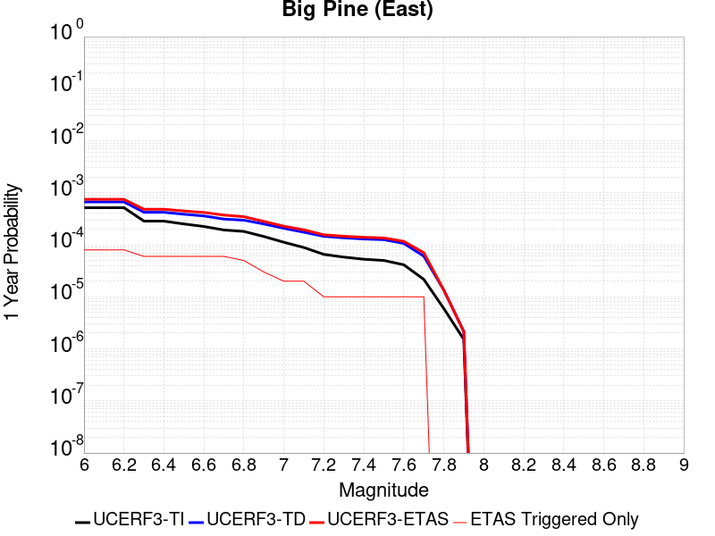 |  |

| Magnitude | 1 wk TI Prob | 1 wk TD Prob | 1 wk ETAS Prob | 1 wk ETAS/TD Gain | 1 wk ETAS Triggered Only | 1 mo TI Prob | 1 mo TD Prob | 1 mo ETAS Prob | 1 mo ETAS/TD Gain | 1 mo ETAS Triggered Only | 1 yr TI Prob | 1 yr TD Prob | 1 yr ETAS Prob | 1 yr ETAS/TD Gain | 1 yr ETAS Triggered Only | 10 yr TI Prob | 10 yr TD Prob | 10 yr ETAS Prob | 10 yr ETAS/TD Gain | 10 yr ETAS Triggered Only |
|-----|-----|-----|-----|-----|-----|-----|-----|-----|-----|-----|-----|-----|-----|-----|-----|-----|-----|-----|-----|-----|
| 6.0 | 9.916913E-6 | 1.2816984E-5 | 1.2816984E-5 | 1.0 | 0.0 | 4.250036E-5 | 5.49289E-5 | 1.0937237E-4 | 1.9911625 | 5.444646E-5 | 5.173191E-4 | 6.685763E-4 | 7.4112305E-4 | 1.1085093 | 7.259528E-5 | 0.0051611643 | 0.006670441 | 0.00676058 | 1.0135132 | 9.07441E-5 |
| 6.1 | 9.916913E-6 | 1.2816984E-5 | 1.2816984E-5 | 1.0 | 0.0 | 4.250036E-5 | 5.49289E-5 | 1.0937237E-4 | 1.9911625 | 5.444646E-5 | 5.173191E-4 | 6.685763E-4 | 7.4112305E-4 | 1.1085093 | 7.259528E-5 | 0.0051611643 | 0.006670441 | 0.00676058 | 1.0135132 | 9.07441E-5 |
| 6.2 | 9.916913E-6 | 1.2816984E-5 | 1.2816984E-5 | 1.0 | 0.0 | 4.250036E-5 | 5.49289E-5 | 1.0937237E-4 | 1.9911625 | 5.444646E-5 | 5.173191E-4 | 6.685763E-4 | 7.4112305E-4 | 1.1085093 | 7.259528E-5 | 0.0051611643 | 0.006670441 | 0.00676058 | 1.0135132 | 9.07441E-5 |
| 6.3 | 5.479711E-6 | 8.112951E-6 | 8.112951E-6 | 1.0 | 0.0 | 2.3484265E-5 | 3.4769346E-5 | 7.1065726E-5 | 2.0439188 | 3.629764E-5 | 2.858834E-4 | 4.2323777E-4 | 4.7766117E-4 | 1.1285883 | 5.444646E-5 | 0.0028551589 | 0.004227244 | 0.004299532 | 1.0171006 | 7.259528E-5 |
| 6.4 | 5.465009E-6 | 8.097245E-6 | 8.097245E-6 | 1.0 | 0.0 | 2.3421257E-5 | 3.4702036E-5 | 7.0998416E-5 | 2.045944 | 3.629764E-5 | 2.851165E-4 | 4.2241855E-4 | 4.7684202E-4 | 1.1288377 | 5.444646E-5 | 0.0028475097 | 0.0042190826 | 0.0042913714 | 1.0171338 | 7.259528E-5 |
| 6.5 | 4.826767E-6 | 7.422301E-6 | 7.422301E-6 | 1.0 | 0.0 | 2.068598E-5 | 3.180949E-5 | 6.8105976E-5 | 2.1410584 | 3.629764E-5 | 2.518227E-4 | 3.872145E-4 | 4.4163986E-4 | 1.1405561 | 5.444646E-5 | 0.0025153751 | 0.003868283 | 0.003922519 | 1.0140207 | 5.444646E-5 |
| 6.6 | 4.3146847E-6 | 6.8822374E-6 | 6.8822374E-6 | 1.0 | 0.0 | 1.8491375E-5 | 2.9494982E-5 | 6.579155E-5 | 2.2306015 | 3.629764E-5 | 2.2510924E-4 | 3.590447E-4 | 4.134716E-4 | 1.1515881 | 5.444646E-5 | 0.0022488134 | 0.0035874986 | 0.0036417497 | 1.0151223 | 5.444646E-5 |
| 6.7 | 3.6968106E-6 | 5.9954727E-6 | 5.9954727E-6 | 1.0 | 0.0 | 1.5843378E-5 | 2.5694639E-5 | 6.199135E-5 | 2.412618 | 3.629764E-5 | 1.9287605E-4 | 3.1278885E-4 | 3.6721828E-4 | 1.1740134 | 5.444646E-5 | 0.0019270873 | 0.0031262483 | 0.0031805246 | 1.0173615 | 5.444646E-5 |
| 6.8 | 3.4671132E-6 | 5.702177E-6 | 5.702177E-6 | 1.0 | 0.0 | 1.4858972E-5 | 2.4437682E-5 | 6.0734434E-5 | 2.4852781 | 3.629764E-5 | 1.8089297E-4 | 2.974896E-4 | 3.5191985E-4 | 1.1829653 | 5.444646E-5 | 0.0018074579 | 0.002973667 | 0.0030279518 | 1.0182551 | 5.444646E-5 |
| 6.9 | 2.7686972E-6 | 4.825223E-6 | 4.825223E-6 | 1.0 | 0.0 | 1.1865792E-5 | 2.0679368E-5 | 5.697626E-5 | 2.7552223 | 3.629764E-5 | 1.4445644E-4 | 2.5174298E-4 | 3.0617573E-4 | 1.2162235 | 5.444646E-5 | 0.0014436257 | 0.0025172636 | 0.002571573 | 1.0215747 | 5.444646E-5 |
| 7.0 | 2.1472624E-6 | 3.9850406E-6 | 3.9850406E-6 | 1.0 | 0.0 | 9.20252E-6 | 1.7078637E-5 | 5.3375657E-5 | 3.125288 | 3.629764E-5 | 1.12034926E-4 | 2.079131E-4 | 2.442032E-4 | 1.1745446 | 3.629764E-5 | 0.0011197845 | 0.0020798394 | 0.0021160615 | 1.0174159 | 3.629764E-5 |
| 7.1 | 1.7018335E-6 | 3.344876E-6 | 3.344876E-6 | 1.0 | 0.0 | 7.293552E-6 | 1.4335106E-5 | 5.0632225E-5 | 3.5320442 | 3.629764E-5 | 8.879537E-5 | 1.7451629E-4 | 2.108076E-4 | 1.2079537 | 3.629764E-5 | 8.87599E-4 | 0.0017464145 | 0.0017826486 | 1.0207478 | 3.629764E-5 |
| 7.2 | 1.25603E-6 | 2.794484E-6 | 2.794484E-6 | 1.0 | 0.0 | 5.3829745E-6 | 1.1976307E-5 | 3.012491E-5 | 2.5153756 | 1.814882E-5 | 6.553574E-5 | 1.4580201E-4 | 1.6394818E-4 | 1.1244576 | 1.814882E-5 | 6.551642E-4 | 0.001459661 | 0.0014777833 | 1.0124154 | 1.814882E-5 |
| 7.3 | 1.112297E-6 | 2.610332E-6 | 2.610332E-6 | 1.0 | 0.0 | 4.7669787E-6 | 1.118709E-5 | 2.9335708E-5 | 2.622282 | 1.814882E-5 | 5.803642E-5 | 1.3619453E-4 | 1.5434089E-4 | 1.1332384 | 1.814882E-5 | 5.802127E-4 | 0.0013635408 | 0.0013816649 | 1.013292 | 1.814882E-5 |
| 7.4 | 1.0137181E-6 | 2.4834917E-6 | 2.4834917E-6 | 1.0 | 0.0 | 4.3444993E-6 | 1.0643494E-5 | 2.8792121E-5 | 2.7051382 | 1.814882E-5 | 5.2892992E-5 | 1.2957705E-4 | 1.4772352E-4 | 1.1400439 | 1.814882E-5 | 5.288041E-4 | 0.0012972289 | 0.0013153541 | 1.0139723 | 1.814882E-5 |
| 7.5 | 9.598608E-7 | 2.4071483E-6 | 2.4071483E-6 | 1.0 | 0.0 | 4.1136827E-6 | 1.031631E-5 | 2.8464943E-5 | 2.7592175 | 1.814882E-5 | 5.0082934E-5 | 1.2559404E-4 | 1.4374059E-4 | 1.1444857 | 1.814882E-5 | 5.007165E-4 | 0.0012572526 | 0.0012753786 | 1.0144172 | 1.814882E-5 |
| 7.6 | 7.929459E-7 | 2.0448588E-6 | 2.0448588E-6 | 1.0 | 0.0 | 3.3983351E-6 | 8.763653E-6 | 2.6912314E-5 | 3.0709016 | 1.814882E-5 | 4.1373947E-5 | 1.06692416E-4 | 1.2483931E-4 | 1.170086 | 1.814882E-5 | 4.1366243E-4 | 0.0010685222 | 0.0010866517 | 1.0169668 | 1.814882E-5 |
| 7.7 | 4.155788E-7 | 1.1605589E-6 | 1.1605589E-6 | 1.0 | 0.0 | 1.7810507E-6 | 4.9738146E-6 | 2.3122544E-5 | 4.648855 | 1.814882E-5 | 2.1684076E-5 | 6.0554554E-5 | 7.870227E-5 | 1.2996922 | 1.814882E-5 | 2.1681961E-4 | 6.0857297E-4 | 6.2671077E-4 | 1.0298038 | 1.814882E-5 |
| 7.8 | 1.14666925E-7 | 2.592015E-7 | 2.592015E-7 | 1.0 | 0.0 | 4.914296E-7 | 1.1108631E-6 | 1.1108631E-6 | 1.0 | 0.0 | 5.9831386E-6 | 1.3524678E-5 | 1.3524678E-5 | 1.0 | 0.0 | 5.9829777E-5 | 1.3634123E-4 | 1.3634123E-4 | 1.0 | 0.0 |
| 7.9 | 2.9231824E-8 | 4.1463963E-8 | 4.1463963E-8 | 1.0 | 0.0 | 1.2527924E-7 | 1.7770269E-7 | 1.7770269E-7 | 1.0 | 0.0 | 1.5252737E-6 | 2.1635283E-6 | 2.1635283E-6 | 1.0 | 0.0 | 1.5252632E-5 | 2.1967755E-5 | 2.1967755E-5 | 1.0 | 0.0 |

## Oak Ridge (Onshore)
*[(top)](#table-of-contents)*

| 1 Week | 1 Month | 1 Year | 10 Year |
|-----|-----|-----|-----|
| 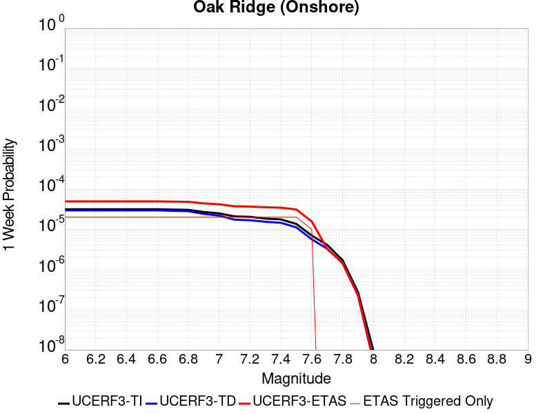 |  |  |  |

| Magnitude | 1 wk TI Prob | 1 wk TD Prob | 1 wk ETAS Prob | 1 wk ETAS/TD Gain | 1 wk ETAS Triggered Only | 1 mo TI Prob | 1 mo TD Prob | 1 mo ETAS Prob | 1 mo ETAS/TD Gain | 1 mo ETAS Triggered Only | 1 yr TI Prob | 1 yr TD Prob | 1 yr ETAS Prob | 1 yr ETAS/TD Gain | 1 yr ETAS Triggered Only | 10 yr TI Prob | 10 yr TD Prob | 10 yr ETAS Prob | 10 yr ETAS/TD Gain | 10 yr ETAS Triggered Only |
|-----|-----|-----|-----|-----|-----|-----|-----|-----|-----|-----|-----|-----|-----|-----|-----|-----|-----|-----|-----|-----|
| 6.0 | 3.155064E-5 | 2.9525974E-5 | 4.7674257E-5 | 1.6146549 | 1.814882E-5 | 1.3521002E-4 | 1.2653397E-4 | 1.446805E-4 | 1.1434122 | 1.814882E-5 | 0.001644939 | 0.0015395004 | 0.0015576213 | 1.0117706 | 1.814882E-5 | 0.01632816 | 0.015292859 | 0.015382215 | 1.005843 | 9.07441E-5 |
| 6.1 | 3.155064E-5 | 2.9525974E-5 | 4.7674257E-5 | 1.6146549 | 1.814882E-5 | 1.3521002E-4 | 1.2653397E-4 | 1.446805E-4 | 1.1434122 | 1.814882E-5 | 0.001644939 | 0.0015395004 | 0.0015576213 | 1.0117706 | 1.814882E-5 | 0.01632816 | 0.015292859 | 0.015382215 | 1.005843 | 9.07441E-5 |
| 6.2 | 3.155064E-5 | 2.9525974E-5 | 4.7674257E-5 | 1.6146549 | 1.814882E-5 | 1.3521002E-4 | 1.2653397E-4 | 1.446805E-4 | 1.1434122 | 1.814882E-5 | 0.001644939 | 0.0015395004 | 0.0015576213 | 1.0117706 | 1.814882E-5 | 0.01632816 | 0.015292859 | 0.015382215 | 1.005843 | 9.07441E-5 |
| 6.3 | 3.155064E-5 | 2.9525974E-5 | 4.7674257E-5 | 1.6146549 | 1.814882E-5 | 1.3521002E-4 | 1.2653397E-4 | 1.446805E-4 | 1.1434122 | 1.814882E-5 | 0.001644939 | 0.0015395004 | 0.0015576213 | 1.0117706 | 1.814882E-5 | 0.01632816 | 0.015292859 | 0.015382215 | 1.005843 | 9.07441E-5 |
| 6.4 | 3.155064E-5 | 2.9525974E-5 | 4.7674257E-5 | 1.6146549 | 1.814882E-5 | 1.3521002E-4 | 1.2653397E-4 | 1.446805E-4 | 1.1434122 | 1.814882E-5 | 0.001644939 | 0.0015395004 | 0.0015576213 | 1.0117706 | 1.814882E-5 | 0.01632816 | 0.015292859 | 0.015382215 | 1.005843 | 9.07441E-5 |
| 6.5 | 3.155064E-5 | 2.9525974E-5 | 4.7674257E-5 | 1.6146549 | 1.814882E-5 | 1.3521002E-4 | 1.2653397E-4 | 1.446805E-4 | 1.1434122 | 1.814882E-5 | 0.001644939 | 0.0015395004 | 0.0015576213 | 1.0117706 | 1.814882E-5 | 0.01632816 | 0.015292859 | 0.015382215 | 1.005843 | 9.07441E-5 |
| 6.6 | 3.155064E-5 | 2.9525974E-5 | 4.7674257E-5 | 1.6146549 | 1.814882E-5 | 1.3521002E-4 | 1.2653397E-4 | 1.446805E-4 | 1.1434122 | 1.814882E-5 | 0.001644939 | 0.0015395004 | 0.0015576213 | 1.0117706 | 1.814882E-5 | 0.01632816 | 0.015292859 | 0.015382215 | 1.005843 | 9.07441E-5 |
| 6.7 | 3.098897E-5 | 2.8864175E-5 | 4.7012472E-5 | 1.6287482 | 1.814882E-5 | 1.328031E-4 | 1.2369796E-4 | 1.4184453E-4 | 1.1467007 | 1.814882E-5 | 0.0016156785 | 0.0015050198 | 0.0015231414 | 1.0120407 | 1.814882E-5 | 0.016039822 | 0.014952714 | 0.015042101 | 1.005978 | 9.07441E-5 |
| 6.8 | 3.0449872E-5 | 2.8239372E-5 | 4.638768E-5 | 1.6426598 | 1.814882E-5 | 1.3049292E-4 | 1.2102048E-4 | 1.391671E-4 | 1.1499467 | 1.814882E-5 | 0.0015875935 | 0.0014724657 | 0.0014905877 | 1.0123073 | 1.814882E-5 | 0.015762992 | 0.014631462 | 0.014720879 | 1.0061113 | 9.07441E-5 |
| 6.9 | 2.697928E-5 | 2.4219773E-5 | 4.2368156E-5 | 1.7493209 | 1.814882E-5 | 1.15620365E-4 | 1.0379502E-4 | 1.2194196E-4 | 1.1748344 | 1.814882E-5 | 0.0014067689 | 0.0012629933 | 0.0012811192 | 1.0143515 | 1.814882E-5 | 0.0139789665 | 0.01256087 | 0.012650474 | 1.0071336 | 9.07441E-5 |
| 7.0 | 2.4893961E-5 | 2.1862043E-5 | 4.0010465E-5 | 1.8301339 | 1.814882E-5 | 1.0668404E-4 | 9.3691204E-5 | 1.1183832E-4 | 1.1936908 | 1.814882E-5 | 0.0012981043 | 0.0011401111 | 0.0011582393 | 1.0159004 | 1.814882E-5 | 0.012905477 | 0.011344905 | 0.01143462 | 1.0079079 | 9.07441E-5 |
| 7.1 | 2.0945363E-5 | 1.7354487E-5 | 3.550299E-5 | 2.045753 | 1.814882E-5 | 8.976275E-5 | 7.437428E-5 | 9.2521754E-5 | 1.244002 | 1.814882E-5 | 0.0010923136 | 9.051354E-4 | 9.232678E-4 | 1.0200328 | 1.814882E-5 | 0.0108696 | 0.009015423 | 0.009087364 | 1.0079798 | 7.259528E-5 |
| 7.2 | 2.0439404E-5 | 1.6809423E-5 | 3.495794E-5 | 2.079663 | 1.814882E-5 | 8.7594504E-5 | 7.203843E-5 | 9.018594E-5 | 1.2519144 | 1.814882E-5 | 0.0010659413 | 8.767196E-4 | 8.948525E-4 | 1.0206827 | 1.814882E-5 | 0.010608427 | 0.008733526 | 0.008805487 | 1.0082396 | 7.259528E-5 |
| 7.3 | 1.8463334E-5 | 1.5381811E-5 | 3.3530352E-5 | 2.1798704 | 1.814882E-5 | 7.912617E-5 | 6.59204E-5 | 8.406803E-5 | 1.275296 | 1.814882E-5 | 9.6293533E-4 | 8.0228975E-4 | 8.20424E-4 | 1.0226032 | 1.814882E-5 | 0.009587734 | 0.007994797 | 0.008048808 | 1.0067558 | 5.444646E-5 |
| 7.4 | 1.763139E-5 | 1.451684E-5 | 3.2665397E-5 | 2.2501726 | 1.814882E-5 | 7.556091E-5 | 6.221356E-5 | 8.036126E-5 | 1.2916999 | 1.814882E-5 | 9.1956573E-4 | 7.571909E-4 | 7.75326E-4 | 1.0239505 | 1.814882E-5 | 0.009157699 | 0.007546914 | 0.007600949 | 1.00716 | 5.444646E-5 |
| 7.5 | 1.3594944E-5 | 1.1163356E-5 | 2.9311974E-5 | 2.6257312 | 1.814882E-5 | 5.8262744E-5 | 4.784209E-5 | 6.599005E-5 | 1.3793303 | 1.814882E-5 | 7.0911803E-4 | 5.8232434E-4 | 6.0046255E-4 | 1.0311481 | 1.814882E-5 | 0.007068595 | 0.0058082556 | 0.005862386 | 1.0093195 | 5.444646E-5 |
| 7.6 | 6.9889534E-6 | 5.6367144E-6 | 2.3785433E-5 | 4.2197337 | 1.814882E-5 | 2.9952313E-5 | 2.4157125E-5 | 4.2305506E-5 | 1.7512641 | 1.814882E-5 | 3.646084E-4 | 2.9407372E-4 | 3.1221722E-4 | 1.061697 | 1.814882E-5 | 0.0036401073 | 0.0029368899 | 0.0029911764 | 1.0184844 | 5.444646E-5 |
| 7.7 | 4.0824193E-6 | 3.2832586E-6 | 3.2832586E-6 | 1.0 | 0.0 | 1.7495966E-5 | 1.4071033E-5 | 1.4071033E-5 | 1.0 | 0.0 | 2.1299256E-4 | 1.713015E-4 | 1.713015E-4 | 1.0 | 0.0 | 0.0021278851 | 0.0017117079 | 0.0017298256 | 1.0105846 | 1.814882E-5 |
| 7.8 | 1.7023609E-6 | 1.4370495E-6 | 1.4370495E-6 | 1.0 | 0.0 | 7.295812E-6 | 6.1587693E-6 | 6.1587693E-6 | 1.0 | 0.0 | 8.882289E-5 | 7.498047E-5 | 7.498047E-5 | 1.0 | 0.0 | 8.8787393E-4 | 7.495545E-4 | 7.495545E-4 | 1.0 | 0.0 |
| 7.9 | 2.721225E-7 | 2.2616497E-7 | 2.2616497E-7 | 1.0 | 0.0 | 1.1662388E-6 | 9.692781E-7 | 9.692781E-7 | 1.0 | 0.0 | 1.4198865E-5 | 1.1800899E-5 | 1.1800899E-5 | 1.0 | 0.0 | 1.4197957E-4 | 1.1800301E-4 | 1.1800301E-4 | 1.0 | 0.0 |
| 8.0 | 9.364255E-9 | 5.1206666E-9 | 5.1206666E-9 | 1.0 | 0.0 | 4.0132523E-8 | 2.1945715E-8 | 2.1945715E-8 | 1.0 | 0.0 | 4.8861335E-7 | 2.6718905E-7 | 2.6718905E-7 | 1.0 | 0.0 | 4.8861225E-6 | 2.6718876E-6 | 2.6718876E-6 | 1.0 | 0.0 |

## San Jacinto (Coyote Creek)
*[(top)](#table-of-contents)*

| 1 Week | 1 Month | 1 Year | 10 Year |
|-----|-----|-----|-----|
|  |  | 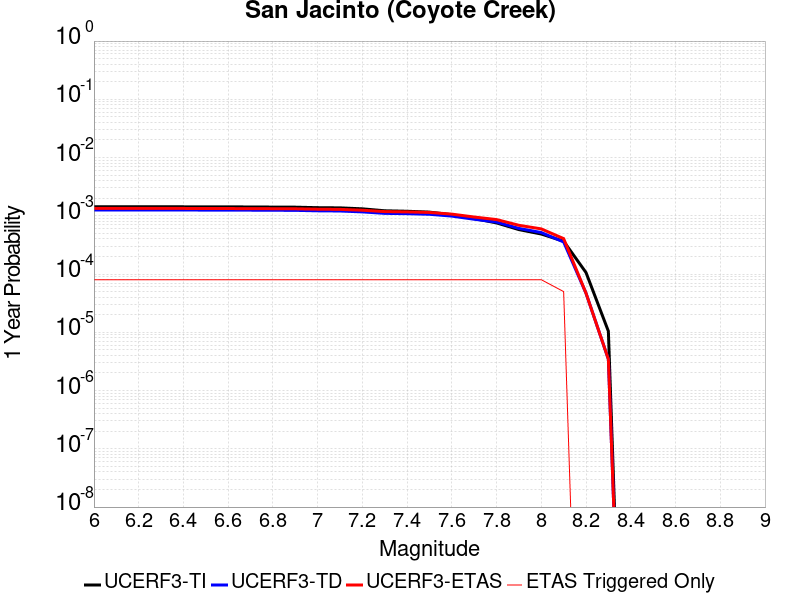 |  |

| Magnitude | 1 wk TI Prob | 1 wk TD Prob | 1 wk ETAS Prob | 1 wk ETAS/TD Gain | 1 wk ETAS Triggered Only | 1 mo TI Prob | 1 mo TD Prob | 1 mo ETAS Prob | 1 mo ETAS/TD Gain | 1 mo ETAS Triggered Only | 1 yr TI Prob | 1 yr TD Prob | 1 yr ETAS Prob | 1 yr ETAS/TD Gain | 1 yr ETAS Triggered Only | 10 yr TI Prob | 10 yr TD Prob | 10 yr ETAS Prob | 10 yr ETAS/TD Gain | 10 yr ETAS Triggered Only |
|-----|-----|-----|-----|-----|-----|-----|-----|-----|-----|-----|-----|-----|-----|-----|-----|-----|-----|-----|-----|-----|
| 6.0 | 2.7374346E-5 | 2.4145214E-5 | 9.6738746E-5 | 4.006539 | 7.259528E-5 | 1.1731335E-4 | 1.034754E-4 | 1.7606317E-4 | 1.7014978 | 7.259528E-5 | 0.0014273542 | 0.0012590875 | 0.0013315914 | 1.0575844 | 7.259528E-5 | 0.01418221 | 0.012928318 | 0.012999975 | 1.0055426 | 7.259528E-5 |
| 6.1 | 2.7374346E-5 | 2.4145214E-5 | 9.6738746E-5 | 4.006539 | 7.259528E-5 | 1.1731335E-4 | 1.034754E-4 | 1.7606317E-4 | 1.7014978 | 7.259528E-5 | 0.0014273542 | 0.0012590875 | 0.0013315914 | 1.0575844 | 7.259528E-5 | 0.01418221 | 0.012928318 | 0.012999975 | 1.0055426 | 7.259528E-5 |
| 6.2 | 2.7374346E-5 | 2.4145214E-5 | 9.6738746E-5 | 4.006539 | 7.259528E-5 | 1.1731335E-4 | 1.034754E-4 | 1.7606317E-4 | 1.7014978 | 7.259528E-5 | 0.0014273542 | 0.0012590875 | 0.0013315914 | 1.0575844 | 7.259528E-5 | 0.01418221 | 0.012928318 | 0.012999975 | 1.0055426 | 7.259528E-5 |
| 6.3 | 2.7374346E-5 | 2.4145214E-5 | 9.6738746E-5 | 4.006539 | 7.259528E-5 | 1.1731335E-4 | 1.034754E-4 | 1.7606317E-4 | 1.7014978 | 7.259528E-5 | 0.0014273542 | 0.0012590875 | 0.0013315914 | 1.0575844 | 7.259528E-5 | 0.01418221 | 0.012928318 | 0.012999975 | 1.0055426 | 7.259528E-5 |
| 6.4 | 2.7374346E-5 | 2.4145214E-5 | 9.6738746E-5 | 4.006539 | 7.259528E-5 | 1.1731335E-4 | 1.034754E-4 | 1.7606317E-4 | 1.7014978 | 7.259528E-5 | 0.0014273542 | 0.0012590875 | 0.0013315914 | 1.0575844 | 7.259528E-5 | 0.01418221 | 0.012928318 | 0.012999975 | 1.0055426 | 7.259528E-5 |
| 6.5 | 2.7282445E-5 | 2.4031293E-5 | 9.6624826E-5 | 4.020792 | 7.259528E-5 | 1.16919524E-4 | 1.029872E-4 | 1.7557501E-4 | 1.7048235 | 7.259528E-5 | 0.0014225657 | 0.0012531505 | 0.0013256549 | 1.0578576 | 7.259528E-5 | 0.014134934 | 0.012869646 | 0.012941306 | 1.0055683 | 7.259528E-5 |
| 6.6 | 2.7282445E-5 | 2.4031293E-5 | 9.6624826E-5 | 4.020792 | 7.259528E-5 | 1.16919524E-4 | 1.029872E-4 | 1.7557501E-4 | 1.7048235 | 7.259528E-5 | 0.0014225657 | 0.0012531505 | 0.0013256549 | 1.0578576 | 7.259528E-5 | 0.014134934 | 0.012869646 | 0.012941306 | 1.0055683 | 7.259528E-5 |
| 6.7 | 2.7216198E-5 | 2.3956412E-5 | 9.654996E-5 | 4.0302343 | 7.259528E-5 | 1.1663563E-4 | 1.02666316E-4 | 1.7525414E-4 | 1.7070267 | 7.259528E-5 | 0.0014191137 | 0.0012492483 | 0.0013217529 | 1.0580386 | 7.259528E-5 | 0.014100855 | 0.0128310565 | 0.012902721 | 1.0055852 | 7.259528E-5 |
| 6.8 | 2.7078617E-5 | 2.387363E-5 | 9.646718E-5 | 4.040742 | 7.259528E-5 | 1.1604605E-4 | 1.0231156E-4 | 1.7489941E-4 | 1.7094785 | 7.259528E-5 | 0.001411945 | 0.0012449342 | 0.001317439 | 1.0582399 | 7.259528E-5 | 0.014030075 | 0.012788199 | 0.012859866 | 1.0056041 | 7.259528E-5 |
| 6.9 | 2.6982952E-5 | 2.3793142E-5 | 9.63867E-5 | 4.0510287 | 7.259528E-5 | 1.15636096E-4 | 1.0196664E-4 | 1.7455452E-4 | 1.7118788 | 7.259528E-5 | 0.0014069602 | 0.0012407395 | 0.0013132447 | 1.0584371 | 7.259528E-5 | 0.013980856 | 0.012746515 | 0.012818185 | 1.0056227 | 7.259528E-5 |
| 7.0 | 2.6449972E-5 | 2.3370165E-5 | 9.596375E-5 | 4.106251 | 7.259528E-5 | 1.1335209E-4 | 1.00154015E-4 | 1.7274203E-4 | 1.7247639 | 7.259528E-5 | 0.001379188 | 0.0012186957 | 0.0012912025 | 1.0594954 | 7.259528E-5 | 0.0137065975 | 0.0125278765 | 0.012599562 | 1.005722 | 7.259528E-5 |
| 7.1 | 2.6257849E-5 | 2.3196202E-5 | 9.57898E-5 | 4.1295466 | 7.259528E-5 | 1.1252879E-4 | 9.940852E-5 | 1.7199658E-4 | 1.7301997 | 7.259528E-5 | 0.0013691769 | 0.0012096294 | 0.0012821368 | 1.0599419 | 7.259528E-5 | 0.013607717 | 0.012437741 | 0.012509434 | 1.0057641 | 7.259528E-5 |
| 7.2 | 2.5270041E-5 | 2.2390966E-5 | 9.498462E-5 | 4.242096 | 7.259528E-5 | 1.0829568E-4 | 9.595777E-5 | 1.6854609E-4 | 1.756461 | 7.259528E-5 | 0.0013177024 | 0.0011676621 | 0.0012401725 | 1.0620989 | 7.259528E-5 | 0.013099162 | 0.012018777 | 0.0120905 | 1.0059676 | 7.259528E-5 |
| 7.3 | 2.339701E-5 | 2.1122814E-5 | 9.371656E-5 | 4.436746 | 7.259528E-5 | 1.0026905E-4 | 9.0523215E-5 | 1.6311192E-4 | 1.8018795 | 7.259528E-5 | 0.001220092 | 0.0011015651 | 0.0011740803 | 1.0658294 | 7.259528E-5 | 0.012134149 | 0.011357696 | 0.011429466 | 1.0063192 | 7.259528E-5 |
| 7.4 | 2.296333E-5 | 2.0853171E-5 | 9.3446935E-5 | 4.4811864 | 7.259528E-5 | 9.841056E-5 | 8.936768E-5 | 1.6195647E-4 | 1.8122488 | 7.259528E-5 | 0.0011974899 | 0.0010875105 | 0.0011600268 | 1.066681 | 7.259528E-5 | 0.011910575 | 0.01121681 | 0.011288591 | 1.0063994 | 7.259528E-5 |
| 7.5 | 2.2188895E-5 | 2.0376096E-5 | 9.2969894E-5 | 4.5626945 | 7.259528E-5 | 9.50918E-5 | 8.732321E-5 | 1.5991215E-4 | 1.8312675 | 7.259528E-5 | 0.0011571277 | 0.0010626436 | 0.0011351617 | 1.0682431 | 7.259528E-5 | 0.011511209 | 0.010966429 | 0.011038228 | 1.0065472 | 7.259528E-5 |
| 7.6 | 2.0013189E-5 | 1.8962366E-5 | 9.155627E-5 | 4.828315 | 7.259528E-5 | 8.5767984E-5 | 8.1264756E-5 | 1.5385414E-4 | 1.8932455 | 7.259528E-5 | 0.001043725 | 9.889511E-4 | 0.0010614746 | 1.0733337 | 7.259528E-5 | 0.010388365 | 0.010224434 | 0.010296286 | 1.0070276 | 7.259528E-5 |
| 7.7 | 1.7230794E-5 | 1.674371E-5 | 8.933777E-5 | 5.3356023 | 7.259528E-5 | 7.384417E-5 | 7.175679E-5 | 1.4434686E-4 | 2.0116127 | 7.259528E-5 | 8.986819E-4 | 8.7328954E-4 | 9.458214E-4 | 1.083056 | 7.259528E-5 | 0.008950562 | 0.009062956 | 0.009134893 | 1.0079376 | 7.259528E-5 |
| 7.8 | 1.4478809E-5 | 1.4990978E-5 | 8.758517E-5 | 5.8425255 | 7.259528E-5 | 6.205057E-5 | 6.424547E-5 | 1.3683608E-4 | 2.1298947 | 7.259528E-5 | 7.552038E-4 | 7.819085E-4 | 8.544471E-4 | 1.092771 | 7.259528E-5 | 0.0075264242 | 0.008141387 | 0.0082133915 | 1.0088443 | 7.259528E-5 |
| 7.9 | 1.1114467E-5 | 1.1645102E-5 | 8.423954E-5 | 7.233903 | 7.259528E-5 | 4.7632562E-5 | 4.990663E-5 | 1.2249828E-4 | 2.4545493 | 7.259528E-5 | 5.797721E-4 | 6.074444E-4 | 6.799956E-4 | 1.1194367 | 7.259528E-5 | 0.0057826187 | 0.0063803247 | 0.006452457 | 1.0113055 | 7.259528E-5 |
| 8.0 | 9.327402E-6 | 9.899186E-6 | 8.249375E-5 | 8.333386 | 7.259528E-5 | 3.9973966E-5 | 4.2424395E-5 | 1.150166E-4 | 2.7110956 | 7.259528E-5 | 4.8657437E-4 | 5.1639514E-4 | 5.88953E-4 | 1.1405083 | 7.259528E-5 | 0.0048551033 | 0.0054499684 | 0.0055221682 | 1.0132477 | 7.259528E-5 |
| 8.1 | 7.0235833E-6 | 6.827495E-6 | 4.3124888E-5 | 6.3163557 | 3.629764E-5 | 3.0100724E-5 | 2.9260367E-5 | 6.5556946E-5 | 2.240469 | 3.629764E-5 | 3.664147E-4 | 3.5618723E-4 | 3.9247196E-4 | 1.1018698 | 3.629764E-5 | 0.003658111 | 0.0037876023 | 0.0038237625 | 1.009547 | 3.629764E-5 |
| 8.2 | 2.0358202E-6 | 8.994527E-7 | 8.994527E-7 | 1.0 | 0.0 | 8.724915E-6 | 3.854792E-6 | 3.854792E-6 | 1.0 | 0.0 | 1.06220665E-4 | 4.69311E-5 | 4.69311E-5 | 1.0 | 0.0 | 0.001061699 | 5.3254166E-4 | 5.3254166E-4 | 1.0 | 0.0 |
| 8.3 | 2.0051264E-7 | 6.617272E-8 | 6.617272E-8 | 1.0 | 0.0 | 8.5933965E-7 | 2.8359733E-7 | 2.8359733E-7 | 1.0 | 0.0 | 1.046241E-5 | 3.4527925E-6 | 3.4527925E-6 | 1.0 | 0.0 | 1.0461917E-4 | 4.01389E-5 | 4.01389E-5 | 1.0 | 0.0 |

## Hosgri (Extension)
*[(top)](#table-of-contents)*

| 1 Week | 1 Month | 1 Year | 10 Year |
|-----|-----|-----|-----|
|  |  |  |  |

| Magnitude | 1 wk TI Prob | 1 wk TD Prob | 1 wk ETAS Prob | 1 wk ETAS/TD Gain | 1 wk ETAS Triggered Only | 1 mo TI Prob | 1 mo TD Prob | 1 mo ETAS Prob | 1 mo ETAS/TD Gain | 1 mo ETAS Triggered Only | 1 yr TI Prob | 1 yr TD Prob | 1 yr ETAS Prob | 1 yr ETAS/TD Gain | 1 yr ETAS Triggered Only | 10 yr TI Prob | 10 yr TD Prob | 10 yr ETAS Prob | 10 yr ETAS/TD Gain | 10 yr ETAS Triggered Only |
|-----|-----|-----|-----|-----|-----|-----|-----|-----|-----|-----|-----|-----|-----|-----|-----|-----|-----|-----|-----|-----|
| 6.0 | 1.1369135E-5 | 1.2083072E-5 | 4.8380272E-5 | 4.0039716 | 3.629764E-5 | 4.8723956E-5 | 5.1783692E-5 | 8.8079454E-5 | 1.700911 | 3.629764E-5 | 5.9305265E-4 | 6.3030684E-4 | 6.6658156E-4 | 1.0575509 | 3.629764E-5 | 0.005914725 | 0.0062874397 | 0.006341544 | 1.0086051 | 5.444646E-5 |
| 6.1 | 6.934979E-6 | 7.324555E-6 | 2.5473242E-5 | 3.477787 | 1.814882E-5 | 2.9721E-5 | 3.1390595E-5 | 4.9538845E-5 | 1.5781429 | 1.814882E-5 | 3.617931E-4 | 3.8211764E-4 | 4.002595E-4 | 1.0474772 | 1.814882E-5 | 0.0036120464 | 0.0038150186 | 0.0038511776 | 1.0094781 | 3.629764E-5 |
| 6.2 | 6.934979E-6 | 7.324555E-6 | 2.5473242E-5 | 3.477787 | 1.814882E-5 | 2.9721E-5 | 3.1390595E-5 | 4.9538845E-5 | 1.5781429 | 1.814882E-5 | 3.617931E-4 | 3.8211764E-4 | 4.002595E-4 | 1.0474772 | 1.814882E-5 | 0.0036120464 | 0.0038150186 | 0.0038511776 | 1.0094781 | 3.629764E-5 |
| 6.3 | 4.5484676E-6 | 4.76933E-6 | 4.76933E-6 | 1.0 | 0.0 | 1.9493287E-5 | 2.043983E-5 | 2.043983E-5 | 1.0 | 0.0 | 2.3730492E-4 | 2.4882692E-4 | 2.4882692E-4 | 1.0 | 0.0 | 0.0023705168 | 0.0024855258 | 0.0025036295 | 1.0072837 | 1.814882E-5 |
| 6.4 | 4.218095E-6 | 4.4168614E-6 | 4.4168614E-6 | 1.0 | 0.0 | 1.8077424E-5 | 1.8929271E-5 | 1.8929271E-5 | 1.0 | 0.0 | 2.2007042E-4 | 2.3043984E-4 | 2.3043984E-4 | 1.0 | 0.0 | 0.002198526 | 0.0023020422 | 0.0023201492 | 1.0078657 | 1.814882E-5 |
| 6.5 | 3.717374E-6 | 3.8838775E-6 | 3.8838775E-6 | 1.0 | 0.0 | 1.5931506E-5 | 1.6645085E-5 | 1.6645085E-5 | 1.0 | 0.0 | 1.9394881E-4 | 2.0263524E-4 | 2.0263524E-4 | 1.0 | 0.0 | 0.0019377962 | 0.0020245234 | 0.0020426356 | 1.0089463 | 1.814882E-5 |
| 6.6 | 3.4605036E-6 | 3.608306E-6 | 3.608306E-6 | 1.0 | 0.0 | 1.4830645E-5 | 1.5464078E-5 | 1.5464078E-5 | 1.0 | 0.0 | 1.8054814E-4 | 1.8825903E-4 | 1.8825903E-4 | 1.0 | 0.0 | 0.0018040152 | 0.0018810101 | 0.0018991248 | 1.0096303 | 1.814882E-5 |
| 6.7 | 3.123439E-6 | 3.2465687E-6 | 3.2465687E-6 | 1.0 | 0.0 | 1.33860985E-5 | 1.3913792E-5 | 1.3913792E-5 | 1.0 | 0.0 | 1.6296357E-4 | 1.6938736E-4 | 1.6938736E-4 | 1.0 | 0.0 | 0.001628441 | 0.0016925934 | 0.0017107115 | 1.0107044 | 1.814882E-5 |
| 6.8 | 2.8290783E-6 | 2.9305404E-6 | 2.9305404E-6 | 1.0 | 0.0 | 1.2124565E-5 | 1.2559399E-5 | 1.2559399E-5 | 1.0 | 0.0 | 1.4760658E-4 | 1.5290003E-4 | 1.5290003E-4 | 1.0 | 0.0 | 0.0014750857 | 0.001527957 | 0.0015460781 | 1.0118597 | 1.814882E-5 |
| 6.9 | 2.454112E-6 | 2.5283196E-6 | 2.5283196E-6 | 1.0 | 0.0 | 1.0517581E-5 | 1.0835611E-5 | 1.0835611E-5 | 1.0 | 0.0 | 1.2804402E-4 | 1.3191563E-4 | 1.3191563E-4 | 1.0 | 0.0 | 0.0012797028 | 0.0013183793 | 0.0013365042 | 1.0137478 | 1.814882E-5 |
| 7.0 | 2.1008145E-6 | 2.1498704E-6 | 2.1498704E-6 | 1.0 | 0.0 | 9.003459E-6 | 9.213698E-6 | 9.213698E-6 | 1.0 | 0.0 | 1.096116E-4 | 1.1217103E-4 | 1.1217103E-4 | 1.0 | 0.0 | 0.0010955755 | 0.0011211479 | 0.0011392763 | 1.0161695 | 1.814882E-5 |
| 7.1 | 1.744384E-6 | 1.7686352E-6 | 1.7686352E-6 | 1.0 | 0.0 | 7.47591E-6 | 7.5798434E-6 | 7.5798434E-6 | 1.0 | 0.0 | 9.1015405E-5 | 9.22807E-5 | 9.22807E-5 | 1.0 | 0.0 | 9.097813E-4 | 9.2242553E-4 | 9.405576E-4 | 1.019657 | 1.814882E-5 |
| 7.2 | 1.5456587E-6 | 1.5562882E-6 | 1.5562882E-6 | 1.0 | 0.0 | 6.6242346E-6 | 6.66979E-6 | 6.66979E-6 | 1.0 | 0.0 | 8.064707E-5 | 8.120168E-5 | 8.120168E-5 | 1.0 | 0.0 | 8.0617814E-4 | 8.117213E-4 | 8.298554E-4 | 1.0223403 | 1.814882E-5 |
| 7.3 | 1.3775123E-6 | 1.3766082E-6 | 1.3766082E-6 | 1.0 | 0.0 | 5.9036106E-6 | 5.899736E-6 | 5.899736E-6 | 1.0 | 0.0 | 7.187409E-5 | 7.182693E-5 | 7.182693E-5 | 1.0 | 0.0 | 7.185085E-4 | 7.180382E-4 | 7.3617394E-4 | 1.0252575 | 1.814882E-5 |
| 7.4 | 1.214491E-6 | 1.2023461E-6 | 1.2023461E-6 | 1.0 | 0.0 | 5.2049513E-6 | 5.1529014E-6 | 5.1529014E-6 | 1.0 | 0.0 | 6.336844E-5 | 6.2734776E-5 | 6.2734776E-5 | 1.0 | 0.0 | 6.335037E-4 | 6.271715E-4 | 6.4530893E-4 | 1.0289195 | 1.814882E-5 |
| 7.5 | 1.0101123E-6 | 9.842246E-7 | 9.842246E-7 | 1.0 | 0.0 | 4.3290456E-6 | 4.2180986E-6 | 4.2180986E-6 | 1.0 | 0.0 | 5.2704854E-5 | 5.1354145E-5 | 5.1354145E-5 | 1.0 | 0.0 | 5.2692357E-4 | 5.1342335E-4 | 5.1342335E-4 | 1.0 | 0.0 |
| 7.6 | 8.1558215E-7 | 7.765966E-7 | 7.765966E-7 | 1.0 | 0.0 | 3.4953473E-6 | 3.328267E-6 | 3.328267E-6 | 1.0 | 0.0 | 4.255502E-5 | 4.0520903E-5 | 4.0520903E-5 | 1.0 | 0.0 | 4.2546875E-4 | 4.0513556E-4 | 4.0513556E-4 | 1.0 | 0.0 |
| 7.7 | 4.757816E-7 | 4.1308888E-7 | 4.1308888E-7 | 1.0 | 0.0 | 2.0390623E-6 | 1.7703798E-6 | 1.7703798E-6 | 1.0 | 0.0 | 2.4825302E-5 | 2.155416E-5 | 2.155416E-5 | 1.0 | 0.0 | 2.482253E-4 | 2.1552083E-4 | 2.1552083E-4 | 1.0 | 0.0 |
| 7.8 | 2.782787E-7 | 2.0047722E-7 | 2.0047722E-7 | 1.0 | 0.0 | 1.1926223E-6 | 8.5918776E-7 | 8.5918776E-7 | 1.0 | 0.0 | 1.452008E-5 | 1.04605615E-5 | 1.04605615E-5 | 1.0 | 0.0 | 1.4519131E-4 | 1.04600724E-4 | 1.04600724E-4 | 1.0 | 0.0 |
| 7.9 | 1.6948086E-7 | 9.244227E-8 | 9.244227E-8 | 1.0 | 0.0 | 7.2634634E-7 | 3.961811E-7 | 3.961811E-7 | 1.0 | 0.0 | 8.843231E-6 | 4.8234942E-6 | 4.8234942E-6 | 1.0 | 0.0 | 8.842879E-5 | 4.8233902E-5 | 4.8233902E-5 | 1.0 | 0.0 |
| 8.0 | 1.0225492E-7 | 4.4738776E-8 | 4.4738776E-8 | 1.0 | 0.0 | 4.382353E-7 | 1.917376E-7 | 1.917376E-7 | 1.0 | 0.0 | 5.335502E-6 | 2.3344028E-6 | 2.3344028E-6 | 1.0 | 0.0 | 5.335374E-5 | 2.3343786E-5 | 2.3343786E-5 | 1.0 | 0.0 |
| 8.1 | 1.43711345E-8 | 5.787707E-9 | 5.787707E-9 | 1.0 | 0.0 | 6.1590576E-8 | 2.480446E-8 | 2.480446E-8 | 1.0 | 0.0 | 7.4986497E-7 | 3.0199428E-7 | 3.0199428E-7 | 1.0 | 0.0 | 7.4986247E-6 | 3.0199392E-6 | 3.0199392E-6 | 1.0 | 0.0 |

## Santa Ynez River
*[(top)](#table-of-contents)*

| 1 Week | 1 Month | 1 Year | 10 Year |
|-----|-----|-----|-----|
|  |  |  |  |

| Magnitude | 1 wk TI Prob | 1 wk TD Prob | 1 wk ETAS Prob | 1 wk ETAS/TD Gain | 1 wk ETAS Triggered Only | 1 mo TI Prob | 1 mo TD Prob | 1 mo ETAS Prob | 1 mo ETAS/TD Gain | 1 mo ETAS Triggered Only | 1 yr TI Prob | 1 yr TD Prob | 1 yr ETAS Prob | 1 yr ETAS/TD Gain | 1 yr ETAS Triggered Only | 10 yr TI Prob | 10 yr TD Prob | 10 yr ETAS Prob | 10 yr ETAS/TD Gain | 10 yr ETAS Triggered Only |
|-----|-----|-----|-----|-----|-----|-----|-----|-----|-----|-----|-----|-----|-----|-----|-----|-----|-----|-----|-----|-----|
| 6.0 | 1.6396456E-5 | 1.7209435E-5 | 3.5357945E-5 | 2.0545673 | 1.814882E-5 | 7.026863E-5 | 7.375284E-5 | 9.190032E-5 | 1.2460581 | 1.814882E-5 | 8.551848E-4 | 8.976064E-4 | 9.338715E-4 | 1.0404019 | 3.629764E-5 | 0.0085190125 | 0.008943358 | 0.009015304 | 1.0080446 | 7.259528E-5 |
| 6.1 | 1.6396456E-5 | 1.7209435E-5 | 3.5357945E-5 | 2.0545673 | 1.814882E-5 | 7.026863E-5 | 7.375284E-5 | 9.190032E-5 | 1.2460581 | 1.814882E-5 | 8.551848E-4 | 8.976064E-4 | 9.338715E-4 | 1.0404019 | 3.629764E-5 | 0.0085190125 | 0.008943358 | 0.009015304 | 1.0080446 | 7.259528E-5 |
| 6.2 | 1.6396456E-5 | 1.7209435E-5 | 3.5357945E-5 | 2.0545673 | 1.814882E-5 | 7.026863E-5 | 7.375284E-5 | 9.190032E-5 | 1.2460581 | 1.814882E-5 | 8.551848E-4 | 8.976064E-4 | 9.338715E-4 | 1.0404019 | 3.629764E-5 | 0.0085190125 | 0.008943358 | 0.009015304 | 1.0080446 | 7.259528E-5 |
| 6.3 | 9.736976E-6 | 1.012233E-5 | 1.012233E-5 | 1.0 | 0.0 | 4.172923E-5 | 4.338072E-5 | 4.338072E-5 | 1.0 | 0.0 | 5.0793495E-4 | 5.280373E-4 | 5.461765E-4 | 1.0343522 | 1.814882E-5 | 0.005067755 | 0.005268332 | 0.0053044385 | 1.0068535 | 3.629764E-5 |
| 6.4 | 9.736976E-6 | 1.012233E-5 | 1.012233E-5 | 1.0 | 0.0 | 4.172923E-5 | 4.338072E-5 | 4.338072E-5 | 1.0 | 0.0 | 5.0793495E-4 | 5.280373E-4 | 5.461765E-4 | 1.0343522 | 1.814882E-5 | 0.005067755 | 0.005268332 | 0.0053044385 | 1.0068535 | 3.629764E-5 |
| 6.5 | 7.081964E-6 | 7.3298966E-6 | 7.3298966E-6 | 1.0 | 0.0 | 3.035092E-5 | 3.1413474E-5 | 3.1413474E-5 | 1.0 | 0.0 | 3.694598E-4 | 3.8239348E-4 | 3.8239348E-4 | 1.0 | 0.0 | 0.0036884616 | 0.0038175168 | 0.0038355964 | 1.004736 | 1.814882E-5 |
| 6.6 | 5.873247E-6 | 6.059743E-6 | 6.059743E-6 | 1.0 | 0.0 | 2.5170815E-5 | 2.5970074E-5 | 2.5970074E-5 | 1.0 | 0.0 | 3.064116E-4 | 3.1614062E-4 | 3.1614062E-4 | 1.0 | 0.0 | 0.0030598943 | 0.0031569963 | 0.003175088 | 1.0057306 | 1.814882E-5 |
| 6.7 | 4.973277E-6 | 5.115901E-6 | 5.115901E-6 | 1.0 | 0.0 | 2.1313872E-5 | 2.1925109E-5 | 2.1925109E-5 | 1.0 | 0.0 | 2.5946548E-4 | 2.66906E-4 | 2.66906E-4 | 1.0 | 0.0 | 0.0025916274 | 0.0026659032 | 0.0026840037 | 1.0067896 | 1.814882E-5 |
| 6.8 | 4.396492E-6 | 4.5109778E-6 | 4.5109778E-6 | 1.0 | 0.0 | 1.884197E-5 | 1.9332621E-5 | 1.9332621E-5 | 1.0 | 0.0 | 2.2937685E-4 | 2.3534958E-4 | 2.3534958E-4 | 1.0 | 0.0 | 0.0022914023 | 0.0023510386 | 0.0023510386 | 1.0 | 0.0 |
| 6.9 | 3.5255632E-6 | 3.6013332E-6 | 3.6013332E-6 | 1.0 | 0.0 | 1.5109469E-5 | 1.5434196E-5 | 1.5434196E-5 | 1.0 | 0.0 | 1.8394225E-4 | 1.8789528E-4 | 1.8789528E-4 | 1.0 | 0.0 | 0.0018379007 | 0.0018773803 | 0.0018773803 | 1.0 | 0.0 |
| 7.0 | 3.211603E-6 | 3.273654E-6 | 3.273654E-6 | 1.0 | 0.0 | 1.376394E-5 | 1.4029872E-5 | 1.4029872E-5 | 1.0 | 0.0 | 1.6756308E-4 | 1.7080043E-4 | 1.7080043E-4 | 1.0 | 0.0 | 0.0016743679 | 0.0017067058 | 0.0017067058 | 1.0 | 0.0 |
| 7.1 | 2.5094619E-6 | 2.5409204E-6 | 2.5409204E-6 | 1.0 | 0.0 | 1.0754793E-5 | 1.0889614E-5 | 1.0889614E-5 | 1.0 | 0.0 | 1.3093173E-4 | 1.3257304E-4 | 1.3257304E-4 | 1.0 | 0.0 | 0.0013085462 | 0.0013249456 | 0.0013249456 | 1.0 | 0.0 |
| 7.2 | 2.0515774E-6 | 2.0619375E-6 | 2.0619375E-6 | 1.0 | 0.0 | 8.792445E-6 | 8.836846E-6 | 8.836846E-6 | 1.0 | 0.0 | 1.0704277E-4 | 1.0758333E-4 | 1.0758333E-4 | 1.0 | 0.0 | 0.0010699122 | 0.0010753168 | 0.0010753168 | 1.0 | 0.0 |
| 7.3 | 1.6845745E-6 | 1.6773907E-6 | 1.6773907E-6 | 1.0 | 0.0 | 7.219585E-6 | 7.1887976E-6 | 7.1887976E-6 | 1.0 | 0.0 | 8.78949E-5 | 8.752012E-5 | 8.752012E-5 | 1.0 | 0.0 | 8.7860145E-4 | 8.7485946E-4 | 8.7485946E-4 | 1.0 | 0.0 |
| 7.4 | 1.3600285E-6 | 1.3333357E-6 | 1.3333357E-6 | 1.0 | 0.0 | 5.82868E-6 | 5.714284E-6 | 5.714284E-6 | 1.0 | 0.0 | 7.096187E-5 | 6.956921E-5 | 6.956921E-5 | 1.0 | 0.0 | 7.0939213E-4 | 6.954765E-4 | 6.954765E-4 | 1.0 | 0.0 |
| 7.5 | 9.735342E-7 | 9.290103E-7 | 9.290103E-7 | 1.0 | 0.0 | 4.172283E-6 | 3.9814668E-6 | 3.9814668E-6 | 1.0 | 0.0 | 5.079636E-5 | 4.8473295E-5 | 4.8473295E-5 | 1.0 | 0.0 | 5.0784746E-4 | 4.8462892E-4 | 4.8462892E-4 | 1.0 | 0.0 |
| 7.6 | 5.067187E-7 | 4.77857E-7 | 4.77857E-7 | 1.0 | 0.0 | 2.1716498E-6 | 2.047957E-6 | 2.047957E-6 | 1.0 | 0.0 | 2.6439517E-5 | 2.4933597E-5 | 2.4933597E-5 | 1.0 | 0.0 | 2.643637E-4 | 2.4930874E-4 | 2.4930874E-4 | 1.0 | 0.0 |
| 7.7 | 2.769089E-7 | 2.5759124E-7 | 2.5759124E-7 | 1.0 | 0.0 | 1.1867519E-6 | 1.1039621E-6 | 1.1039621E-6 | 1.0 | 0.0 | 1.4448608E-5 | 1.34406555E-5 | 1.34406555E-5 | 1.0 | 0.0 | 1.444767E-4 | 1.3439846E-4 | 1.3439846E-4 | 1.0 | 0.0 |
| 7.8 | 1.7044663E-7 | 1.5449015E-7 | 1.5449015E-7 | 1.0 | 0.0 | 7.3048534E-7 | 6.621005E-7 | 6.621005E-7 | 1.0 | 0.0 | 8.893623E-6 | 8.061043E-6 | 8.061043E-6 | 1.0 | 0.0 | 8.893267E-5 | 8.060753E-5 | 8.060753E-5 | 1.0 | 0.0 |
| 7.9 | 4.8344287E-8 | 4.0910923E-8 | 4.0910923E-8 | 1.0 | 0.0 | 2.0718979E-7 | 1.7533252E-7 | 1.7533252E-7 | 1.0 | 0.0 | 2.5225327E-6 | 2.1346711E-6 | 2.1346711E-6 | 1.0 | 0.0 | 2.5225041E-5 | 2.1346512E-5 | 2.1346512E-5 | 1.0 | 0.0 |

## Pine Mtn
*[(top)](#table-of-contents)*

| 1 Week | 1 Month | 1 Year | 10 Year |
|-----|-----|-----|-----|
|  |  |  |  |

| Magnitude | 1 wk TI Prob | 1 wk TD Prob | 1 wk ETAS Prob | 1 wk ETAS/TD Gain | 1 wk ETAS Triggered Only | 1 mo TI Prob | 1 mo TD Prob | 1 mo ETAS Prob | 1 mo ETAS/TD Gain | 1 mo ETAS Triggered Only | 1 yr TI Prob | 1 yr TD Prob | 1 yr ETAS Prob | 1 yr ETAS/TD Gain | 1 yr ETAS Triggered Only | 10 yr TI Prob | 10 yr TD Prob | 10 yr ETAS Prob | 10 yr ETAS/TD Gain | 10 yr ETAS Triggered Only |
|-----|-----|-----|-----|-----|-----|-----|-----|-----|-----|-----|-----|-----|-----|-----|-----|-----|-----|-----|-----|-----|
| 6.0 | 6.894797E-6 | 7.225461E-6 | 2.5374151E-5 | 3.5117688 | 1.814882E-5 | 2.9548795E-5 | 3.096591E-5 | 6.726243E-5 | 2.1721442 | 3.629764E-5 | 3.596972E-4 | 3.7694772E-4 | 4.3137366E-4 | 1.1443859 | 5.444646E-5 | 0.0035911554 | 0.003763381 | 0.003835703 | 1.0192174 | 7.259528E-5 |
| 6.1 | 6.894797E-6 | 7.225461E-6 | 2.5374151E-5 | 3.5117688 | 1.814882E-5 | 2.9548795E-5 | 3.096591E-5 | 6.726243E-5 | 2.1721442 | 3.629764E-5 | 3.596972E-4 | 3.7694772E-4 | 4.3137366E-4 | 1.1443859 | 5.444646E-5 | 0.0035911554 | 0.003763381 | 0.003835703 | 1.0192174 | 7.259528E-5 |
| 6.2 | 6.894797E-6 | 7.225461E-6 | 2.5374151E-5 | 3.5117688 | 1.814882E-5 | 2.9548795E-5 | 3.096591E-5 | 6.726243E-5 | 2.1721442 | 3.629764E-5 | 3.596972E-4 | 3.7694772E-4 | 4.3137366E-4 | 1.1443859 | 5.444646E-5 | 0.0035911554 | 0.003763381 | 0.003835703 | 1.0192174 | 7.259528E-5 |
| 6.3 | 6.894797E-6 | 7.225461E-6 | 2.5374151E-5 | 3.5117688 | 1.814882E-5 | 2.9548795E-5 | 3.096591E-5 | 6.726243E-5 | 2.1721442 | 3.629764E-5 | 3.596972E-4 | 3.7694772E-4 | 4.3137366E-4 | 1.1443859 | 5.444646E-5 | 0.0035911554 | 0.003763381 | 0.003835703 | 1.0192174 | 7.259528E-5 |
| 6.4 | 6.894797E-6 | 7.225461E-6 | 2.5374151E-5 | 3.5117688 | 1.814882E-5 | 2.9548795E-5 | 3.096591E-5 | 6.726243E-5 | 2.1721442 | 3.629764E-5 | 3.596972E-4 | 3.7694772E-4 | 4.3137366E-4 | 1.1443859 | 5.444646E-5 | 0.0035911554 | 0.003763381 | 0.003835703 | 1.0192174 | 7.259528E-5 |
| 6.5 | 6.894797E-6 | 7.225461E-6 | 2.5374151E-5 | 3.5117688 | 1.814882E-5 | 2.9548795E-5 | 3.096591E-5 | 6.726243E-5 | 2.1721442 | 3.629764E-5 | 3.596972E-4 | 3.7694772E-4 | 4.3137366E-4 | 1.1443859 | 5.444646E-5 | 0.0035911554 | 0.003763381 | 0.003835703 | 1.0192174 | 7.259528E-5 |
| 6.6 | 6.894797E-6 | 7.225461E-6 | 2.5374151E-5 | 3.5117688 | 1.814882E-5 | 2.9548795E-5 | 3.096591E-5 | 6.726243E-5 | 2.1721442 | 3.629764E-5 | 3.596972E-4 | 3.7694772E-4 | 4.3137366E-4 | 1.1443859 | 5.444646E-5 | 0.0035911554 | 0.003763381 | 0.003835703 | 1.0192174 | 7.259528E-5 |
| 6.7 | 6.0867933E-6 | 6.3971133E-6 | 2.4545818E-5 | 3.8370147 | 1.814882E-5 | 2.6085996E-5 | 2.7415923E-5 | 6.371257E-5 | 2.3239257 | 3.629764E-5 | 3.1755073E-4 | 3.3373994E-4 | 3.8816824E-4 | 1.1630859 | 5.444646E-5 | 0.0031709734 | 0.0033326065 | 0.0033868714 | 1.016283 | 5.444646E-5 |
| 6.8 | 5.6530425E-6 | 5.9505956E-6 | 2.4099309E-5 | 4.0498986 | 1.814882E-5 | 2.42271E-5 | 2.5502315E-5 | 6.179903E-5 | 2.4232714 | 3.629764E-5 | 2.94925E-4 | 3.104485E-4 | 3.6487807E-4 | 1.1753255 | 5.444646E-5 | 0.002945339 | 0.0031003528 | 0.0031546305 | 1.017507 | 5.444646E-5 |
| 6.9 | 4.6015225E-6 | 4.863834E-6 | 2.3012566E-5 | 4.7313633 | 1.814882E-5 | 1.9720663E-5 | 2.0844845E-5 | 5.714173E-5 | 2.7412882 | 3.629764E-5 | 2.4007261E-4 | 2.5375787E-4 | 3.0819053E-4 | 1.2145063 | 5.444646E-5 | 0.0023981342 | 0.0025348254 | 0.0025891338 | 1.0214249 | 5.444646E-5 |
| 7.0 | 4.4875965E-6 | 4.747473E-6 | 2.2896207E-5 | 4.8228197 | 1.814882E-5 | 1.9232413E-5 | 2.0346162E-5 | 5.6643064E-5 | 2.783968 | 3.629764E-5 | 2.3412947E-4 | 2.4768783E-4 | 3.021208E-4 | 1.2197645 | 5.444646E-5 | 0.0023388295 | 0.0024742614 | 0.0025285732 | 1.0219507 | 5.444646E-5 |
| 7.1 | 3.203907E-6 | 3.4294096E-6 | 2.1578167E-5 | 6.292094 | 1.814882E-5 | 1.3730958E-5 | 1.4697391E-5 | 5.09945E-5 | 3.4696293 | 3.629764E-5 | 1.6716159E-4 | 1.789267E-4 | 2.1521785E-4 | 1.2028269 | 3.629764E-5 | 0.0016703589 | 0.0017878925 | 0.0018241253 | 1.0202656 | 3.629764E-5 |
| 7.2 | 2.2060601E-6 | 2.3784817E-6 | 2.3784817E-6 | 1.0 | 0.0 | 9.4545085E-6 | 1.0193455E-5 | 1.0193455E-5 | 1.0 | 0.0 | 1.15102564E-4 | 1.240987E-4 | 1.240987E-4 | 1.0 | 0.0 | 0.0011504296 | 0.0012403389 | 0.0012403389 | 1.0 | 0.0 |
| 7.3 | 1.3765207E-6 | 1.5216481E-6 | 1.5216481E-6 | 1.0 | 0.0 | 5.899361E-6 | 6.521333E-6 | 6.521333E-6 | 1.0 | 0.0 | 7.182235E-5 | 7.939443E-5 | 7.939443E-5 | 1.0 | 0.0 | 7.1799144E-4 | 7.936697E-4 | 7.936697E-4 | 1.0 | 0.0 |
| 7.4 | 1.1245983E-6 | 1.2587075E-6 | 1.2587075E-6 | 1.0 | 0.0 | 4.819698E-6 | 5.39445E-6 | 5.39445E-6 | 1.0 | 0.0 | 5.8678244E-5 | 6.567554E-5 | 6.567554E-5 | 1.0 | 0.0 | 5.866275E-4 | 6.5656955E-4 | 6.5656955E-4 | 1.0 | 0.0 |
| 7.5 | 8.031682E-7 | 9.276951E-7 | 9.276951E-7 | 1.0 | 0.0 | 3.4421448E-6 | 3.9758306E-6 | 3.9758306E-6 | 1.0 | 0.0 | 4.1907308E-5 | 4.840473E-5 | 4.840473E-5 | 1.0 | 0.0 | 4.1899405E-4 | 4.8394862E-4 | 4.8394862E-4 | 1.0 | 0.0 |
| 7.6 | 4.8953444E-7 | 6.003009E-7 | 6.003009E-7 | 1.0 | 0.0 | 2.098003E-6 | 2.5727159E-6 | 2.5727159E-6 | 1.0 | 0.0 | 2.5542888E-5 | 3.1322415E-5 | 3.1322415E-5 | 1.0 | 0.0 | 2.5539953E-4 | 3.1318486E-4 | 3.1318486E-4 | 1.0 | 0.0 |
| 7.7 | 6.634529E-8 | 6.788826E-8 | 6.788826E-8 | 1.0 | 0.0 | 2.843369E-7 | 2.9094966E-7 | 2.9094966E-7 | 1.0 | 0.0 | 3.4617963E-6 | 3.5423066E-6 | 3.5423066E-6 | 1.0 | 0.0 | 3.4617424E-5 | 3.542255E-5 | 3.542255E-5 | 1.0 | 0.0 |
| 7.8 | 9.235578E-9 | 9.488566E-9 | 9.488566E-9 | 1.0 | 0.0 | 3.9581046E-8 | 4.0665284E-8 | 4.0665284E-8 | 1.0 | 0.0 | 4.818991E-7 | 4.950997E-7 | 4.950997E-7 | 1.0 | 0.0 | 4.8189804E-6 | 4.950988E-6 | 4.950988E-6 | 1.0 | 0.0 |

## San Diego Trough north alt1
*[(top)](#table-of-contents)*

| 1 Week | 1 Month | 1 Year | 10 Year |
|-----|-----|-----|-----|
|  |  |  |  |

| Magnitude | 1 wk TI Prob | 1 wk TD Prob | 1 wk ETAS Prob | 1 wk ETAS/TD Gain | 1 wk ETAS Triggered Only | 1 mo TI Prob | 1 mo TD Prob | 1 mo ETAS Prob | 1 mo ETAS/TD Gain | 1 mo ETAS Triggered Only | 1 yr TI Prob | 1 yr TD Prob | 1 yr ETAS Prob | 1 yr ETAS/TD Gain | 1 yr ETAS Triggered Only | 10 yr TI Prob | 10 yr TD Prob | 10 yr ETAS Prob | 10 yr ETAS/TD Gain | 10 yr ETAS Triggered Only |
|-----|-----|-----|-----|-----|-----|-----|-----|-----|-----|-----|-----|-----|-----|-----|-----|-----|-----|-----|-----|-----|
| 6.0 | 7.329252E-5 | 8.821093E-5 | 8.821093E-5 | 1.0 | 0.0 | 3.14073E-4 | 3.7799572E-4 | 3.9613768E-4 | 1.0479951 | 1.814882E-5 | 0.0038171355 | 0.004593027 | 0.004629158 | 1.0078665 | 3.629764E-5 | 0.03752231 | 0.045044992 | 0.045114316 | 1.001539 | 7.259528E-5 |
| 6.1 | 3.7940346E-5 | 4.4885E-5 | 4.4885E-5 | 1.0 | 0.0 | 1.6259136E-4 | 1.9235066E-4 | 2.10496E-4 | 1.0943346 | 1.814882E-5 | 0.0019777524 | 0.0023394432 | 0.0023575495 | 1.0077395 | 1.814882E-5 | 0.019602431 | 0.023156688 | 0.023192145 | 1.0015311 | 3.629764E-5 |
| 6.2 | 2.8645263E-5 | 3.329678E-5 | 3.329678E-5 | 1.0 | 0.0 | 1.2275964E-4 | 1.4269284E-4 | 1.6083907E-4 | 1.1271698 | 1.814882E-5 | 0.0014935739 | 0.0017359189 | 0.0017540362 | 1.0104368 | 1.814882E-5 | 0.0148357535 | 0.017226247 | 0.01726192 | 1.0020708 | 3.629764E-5 |
| 6.3 | 2.8645263E-5 | 3.329678E-5 | 3.329678E-5 | 1.0 | 0.0 | 1.2275964E-4 | 1.4269284E-4 | 1.6083907E-4 | 1.1271698 | 1.814882E-5 | 0.0014935739 | 0.0017359189 | 0.0017540362 | 1.0104368 | 1.814882E-5 | 0.0148357535 | 0.017226247 | 0.01726192 | 1.0020708 | 3.629764E-5 |
| 6.4 | 2.2204576E-5 | 2.5448318E-5 | 2.5448318E-5 | 1.0 | 0.0 | 9.5159E-5 | 1.0905972E-4 | 1.2720656E-4 | 1.1663936 | 1.814882E-5 | 0.001157945 | 0.0013270034 | 0.001345128 | 1.0136584 | 1.814882E-5 | 0.011519298 | 0.013191955 | 0.013227774 | 1.0027152 | 3.629764E-5 |
| 6.5 | 2.1004838E-5 | 2.4024694E-5 | 2.4024694E-5 | 1.0 | 0.0 | 9.0017624E-5 | 1.0295896E-4 | 1.2110592E-4 | 1.1762543 | 1.814882E-5 | 0.0010954136 | 0.0012528138 | 0.00127094 | 1.0144683 | 1.814882E-5 | 0.010900296 | 0.012458589 | 0.012494435 | 1.0028771 | 3.629764E-5 |
| 6.6 | 1.820557E-5 | 2.0704787E-5 | 2.0704787E-5 | 1.0 | 0.0 | 7.802154E-5 | 8.873181E-5 | 1.0687902E-4 | 1.2045175 | 1.814882E-5 | 9.4949827E-4 | 0.0010797799 | 0.0010979091 | 1.0167898 | 1.814882E-5 | 0.009454516 | 0.010746004 | 0.010781912 | 1.0033414 | 3.629764E-5 |
| 6.7 | 1.5884485E-5 | 1.7983646E-5 | 1.7983646E-5 | 1.0 | 0.0 | 6.807459E-5 | 7.707051E-5 | 7.707051E-5 | 1.0 | 0.0 | 8.284929E-4 | 9.3793223E-4 | 9.3793223E-4 | 1.0 | 0.0 | 0.008254109 | 0.009340104 | 0.009358083 | 1.001925 | 1.814882E-5 |
| 6.8 | 1.4331171E-5 | 1.6201066E-5 | 1.6201066E-5 | 1.0 | 0.0 | 6.141786E-5 | 6.94313E-5 | 6.94313E-5 | 1.0 | 0.0 | 7.4750587E-4 | 8.450002E-4 | 8.450002E-4 | 1.0 | 0.0 | 0.0074499645 | 0.008418139 | 0.008436135 | 1.0021378 | 1.814882E-5 |
| 6.9 | 1.2574203E-5 | 1.4205835E-5 | 1.4205835E-5 | 1.0 | 0.0 | 5.3888325E-5 | 6.0880735E-5 | 6.0880735E-5 | 1.0 | 0.0 | 6.558929E-4 | 7.409723E-4 | 7.409723E-4 | 1.0 | 0.0 | 0.0065396037 | 0.007385203 | 0.007403218 | 1.0024393 | 1.814882E-5 |
| 7.0 | 1.0883844E-5 | 1.2289262E-5 | 1.2289262E-5 | 1.0 | 0.0 | 4.664421E-5 | 5.2667205E-5 | 5.2667205E-5 | 1.0 | 0.0 | 5.677453E-4 | 6.4103556E-4 | 6.4103556E-4 | 1.0 | 0.0 | 0.00566297 | 0.006391993 | 0.0064100255 | 1.0028212 | 1.814882E-5 |
| 7.1 | 9.393088E-6 | 1.060702E-5 | 1.060702E-5 | 1.0 | 0.0 | 4.025547E-5 | 4.545787E-5 | 4.545787E-5 | 1.0 | 0.0 | 4.900001E-4 | 5.533098E-4 | 5.533098E-4 | 1.0 | 0.0 | 0.0048892107 | 0.005519418 | 0.0055374666 | 1.00327 | 1.814882E-5 |
| 7.2 | 8.190791E-6 | 9.258625E-6 | 9.258625E-6 | 1.0 | 0.0 | 3.510292E-5 | 3.9679224E-5 | 3.9679224E-5 | 1.0 | 0.0 | 4.2729423E-4 | 4.8298817E-4 | 4.8298817E-4 | 1.0 | 0.0 | 0.0042647356 | 0.004819465 | 0.004837526 | 1.0037476 | 1.814882E-5 |
| 7.3 | 6.268162E-6 | 7.089716E-6 | 7.089716E-6 | 1.0 | 0.0 | 2.6863276E-5 | 3.0384144E-5 | 3.0384144E-5 | 1.0 | 0.0 | 3.2701128E-4 | 3.6986457E-4 | 3.6986457E-4 | 1.0 | 0.0 | 0.003265305 | 0.003692536 | 0.003692536 | 1.0 | 0.0 |
| 7.4 | 4.985186E-6 | 5.6426816E-6 | 5.6426816E-6 | 1.0 | 0.0 | 2.1364907E-5 | 2.4182698E-5 | 2.4182698E-5 | 1.0 | 0.0 | 2.600867E-4 | 2.9438498E-4 | 2.9438498E-4 | 1.0 | 0.0 | 0.002597825 | 0.0029399914 | 0.0029399914 | 1.0 | 0.0 |
| 7.5 | 1.7489613E-6 | 1.969678E-6 | 1.969678E-6 | 1.0 | 0.0 | 7.495527E-6 | 8.4414505E-6 | 8.4414505E-6 | 1.0 | 0.0 | 9.125422E-5 | 1.02770035E-4 | 1.02770035E-4 | 1.0 | 0.0 | 9.1216754E-4 | 0.0010272472 | 0.0010272472 | 1.0 | 0.0 |
| 7.6 | 1.6988751E-7 | 1.7533823E-7 | 1.7533823E-7 | 1.0 | 0.0 | 7.2808916E-7 | 7.5144936E-7 | 7.5144936E-7 | 1.0 | 0.0 | 8.864449E-6 | 9.14886E-6 | 9.14886E-6 | 1.0 | 0.0 | 8.8640954E-5 | 9.1485024E-5 | 9.1485024E-5 | 1.0 | 0.0 |

## Santa Cruz Catalina Ridge alt1
*[(top)](#table-of-contents)*

| 1 Week | 1 Month | 1 Year | 10 Year |
|-----|-----|-----|-----|
|  |  |  |  |

| Magnitude | 1 wk TI Prob | 1 wk TD Prob | 1 wk ETAS Prob | 1 wk ETAS/TD Gain | 1 wk ETAS Triggered Only | 1 mo TI Prob | 1 mo TD Prob | 1 mo ETAS Prob | 1 mo ETAS/TD Gain | 1 mo ETAS Triggered Only | 1 yr TI Prob | 1 yr TD Prob | 1 yr ETAS Prob | 1 yr ETAS/TD Gain | 1 yr ETAS Triggered Only | 10 yr TI Prob | 10 yr TD Prob | 10 yr ETAS Prob | 10 yr ETAS/TD Gain | 10 yr ETAS Triggered Only |
|-----|-----|-----|-----|-----|-----|-----|-----|-----|-----|-----|-----|-----|-----|-----|-----|-----|-----|-----|-----|-----|
| 6.0 | 3.2833184E-5 | 3.65584E-5 | 9.100287E-5 | 2.4892466 | 5.444646E-5 | 1.4070606E-4 | 1.5667039E-4 | 2.1110832E-4 | 1.3474679 | 5.444646E-5 | 0.00171175 | 0.0019059596 | 0.0019784165 | 1.038016 | 7.259528E-5 | 0.016986247 | 0.018913029 | 0.018984253 | 1.0037658 | 7.259528E-5 |
| 6.1 | 1.9835548E-5 | 2.1659505E-5 | 3.9807932E-5 | 1.8378967 | 1.814882E-5 | 8.500672E-5 | 9.282326E-5 | 1.10970395E-4 | 1.195502 | 1.814882E-5 | 0.0010344655 | 0.0011295575 | 0.0011658141 | 1.032098 | 3.629764E-5 | 0.010296632 | 0.011240295 | 0.0112761855 | 1.0031929 | 3.629764E-5 |
| 6.2 | 1.9835548E-5 | 2.1659505E-5 | 3.9807932E-5 | 1.8378967 | 1.814882E-5 | 8.500672E-5 | 9.282326E-5 | 1.10970395E-4 | 1.195502 | 1.814882E-5 | 0.0010344655 | 0.0011295575 | 0.0011658141 | 1.032098 | 3.629764E-5 | 0.010296632 | 0.011240295 | 0.0112761855 | 1.0031929 | 3.629764E-5 |
| 6.3 | 1.5728183E-5 | 1.703395E-5 | 3.518246E-5 | 2.0654318 | 1.814882E-5 | 6.7404755E-5 | 7.300063E-5 | 9.1148126E-5 | 1.2485937 | 1.814882E-5 | 8.2034385E-4 | 8.884264E-4 | 9.246918E-4 | 1.0408198 | 3.629764E-5 | 0.008173222 | 0.008849427 | 0.008885403 | 1.0040654 | 3.629764E-5 |
| 6.4 | 1.5728183E-5 | 1.703395E-5 | 3.518246E-5 | 2.0654318 | 1.814882E-5 | 6.7404755E-5 | 7.300063E-5 | 9.1148126E-5 | 1.2485937 | 1.814882E-5 | 8.2034385E-4 | 8.884264E-4 | 9.246918E-4 | 1.0408198 | 3.629764E-5 | 0.008173222 | 0.008849427 | 0.008885403 | 1.0040654 | 3.629764E-5 |
| 6.5 | 1.3707734E-5 | 1.4794522E-5 | 3.2943073E-5 | 2.2267075 | 1.814882E-5 | 5.8746107E-5 | 6.3403575E-5 | 8.155124E-5 | 1.2862247 | 1.814882E-5 | 7.1499916E-4 | 7.716686E-4 | 8.079382E-4 | 1.0470016 | 3.629764E-5 | 0.0071270303 | 0.0076902895 | 0.007726308 | 1.0046836 | 3.629764E-5 |
| 6.6 | 1.2539813E-5 | 1.3510219E-5 | 3.1658794E-5 | 2.343322 | 1.814882E-5 | 5.3740947E-5 | 5.789967E-5 | 7.604744E-5 | 1.3134347 | 1.814882E-5 | 6.540996E-4 | 7.0470315E-4 | 7.228392E-4 | 1.0257357 | 1.814882E-5 | 0.0065217763 | 0.0070249885 | 0.0070430096 | 1.0025653 | 1.814882E-5 |
| 6.7 | 1.1504083E-5 | 1.2377375E-5 | 3.052597E-5 | 2.4662719 | 1.814882E-5 | 4.930228E-5 | 5.3044827E-5 | 7.1192684E-5 | 1.342123 | 1.814882E-5 | 6.0008996E-4 | 6.456314E-4 | 6.637685E-4 | 1.028092 | 1.814882E-5 | 0.005984721 | 0.006437786 | 0.0064558177 | 1.002801 | 1.814882E-5 |
| 6.8 | 1.012739E-5 | 1.0877071E-5 | 2.9025694E-5 | 2.6685212 | 1.814882E-5 | 4.340238E-5 | 4.6615194E-5 | 6.476317E-5 | 1.3893145 | 1.814882E-5 | 5.282958E-4 | 5.673937E-4 | 5.855322E-4 | 1.0319681 | 1.814882E-5 | 0.0052704164 | 0.0056596193 | 0.0056776656 | 1.0031886 | 1.814882E-5 |
| 6.9 | 8.9607865E-6 | 9.609117E-6 | 2.7757764E-5 | 2.8886902 | 1.814882E-5 | 3.8402806E-5 | 4.1181287E-5 | 5.932936E-5 | 1.4406874 | 1.814882E-5 | 4.6745385E-4 | 5.012679E-4 | 5.194076E-4 | 1.0361876 | 1.814882E-5 | 0.0046647177 | 0.005001492 | 0.0050195497 | 1.0036105 | 1.814882E-5 |
| 7.0 | 8.046829E-6 | 8.619746E-6 | 8.619746E-6 | 1.0 | 0.0 | 3.4485955E-5 | 3.694125E-5 | 3.694125E-5 | 1.0 | 0.0 | 4.1978562E-4 | 4.496677E-4 | 4.496677E-4 | 1.0 | 0.0 | 0.004189935 | 0.0044876686 | 0.0044876686 | 1.0 | 0.0 |
| 7.1 | 7.136131E-6 | 7.637656E-6 | 7.637656E-6 | 1.0 | 0.0 | 3.0583058E-5 | 3.2732405E-5 | 3.2732405E-5 | 1.0 | 0.0 | 3.7228514E-4 | 3.9844486E-4 | 3.9844486E-4 | 1.0 | 0.0 | 0.0037166206 | 0.003977381 | 0.003977381 | 1.0 | 0.0 |
| 7.2 | 6.362014E-6 | 6.8049585E-6 | 6.8049585E-6 | 1.0 | 0.0 | 2.726549E-5 | 2.9163786E-5 | 2.9163786E-5 | 1.0 | 0.0 | 3.3190678E-4 | 3.550119E-4 | 3.550119E-4 | 1.0 | 0.0 | 0.0033141149 | 0.003544516 | 0.003544516 | 1.0 | 0.0 |
| 7.3 | 5.004101E-6 | 5.351715E-6 | 5.351715E-6 | 1.0 | 0.0 | 2.1445969E-5 | 2.2935723E-5 | 2.2935723E-5 | 1.0 | 0.0 | 2.6107338E-4 | 2.792072E-4 | 2.792072E-4 | 1.0 | 0.0 | 0.002607669 | 0.0027886187 | 0.0027886187 | 1.0 | 0.0 |
| 7.4 | 3.4901443E-6 | 3.7320526E-6 | 3.7320526E-6 | 1.0 | 0.0 | 1.4957676E-5 | 1.5994416E-5 | 1.5994416E-5 | 1.0 | 0.0 | 1.8209449E-4 | 1.9471499E-4 | 1.9471499E-4 | 1.0 | 0.0 | 0.0018194534 | 0.0019454823 | 0.0019454823 | 1.0 | 0.0 |
| 7.5 | 1.1215045E-6 | 1.189387E-6 | 1.189387E-6 | 1.0 | 0.0 | 4.806439E-6 | 5.097363E-6 | 5.097363E-6 | 1.0 | 0.0 | 5.851682E-5 | 6.205866E-5 | 6.205866E-5 | 1.0 | 0.0 | 5.850142E-4 | 6.2041637E-4 | 6.2041637E-4 | 1.0 | 0.0 |
| 7.6 | 2.8599047E-7 | 2.9951994E-7 | 2.9951994E-7 | 1.0 | 0.0 | 1.2256729E-6 | 1.2836562E-6 | 1.2836562E-6 | 1.0 | 0.0 | 1.4922465E-5 | 1.5628404E-5 | 1.5628404E-5 | 1.0 | 0.0 | 1.4921463E-4 | 1.5627318E-4 | 1.5627318E-4 | 1.0 | 0.0 |
| 7.7 | 2.0781519E-7 | 2.1744323E-7 | 2.1744323E-7 | 1.0 | 0.0 | 8.906362E-7 | 9.3189925E-7 | 9.3189925E-7 | 1.0 | 0.0 | 1.08434415E-5 | 1.13458145E-5 | 1.13458145E-5 | 1.0 | 0.0 | 1.0842913E-4 | 1.1345245E-4 | 1.1345245E-4 | 1.0 | 0.0 |
| 7.8 | 3.614776E-8 | 3.764102E-8 | 3.764102E-8 | 1.0 | 0.0 | 1.5491896E-7 | 1.6131864E-7 | 1.6131864E-7 | 1.0 | 0.0 | 1.8861368E-6 | 1.9640527E-6 | 1.9640527E-6 | 1.0 | 0.0 | 1.8861208E-5 | 1.9640367E-5 | 1.9640367E-5 | 1.0 | 0.0 |

## Sheephole
*[(top)](#table-of-contents)*

| 1 Week | 1 Month | 1 Year | 10 Year |
|-----|-----|-----|-----|
|  | 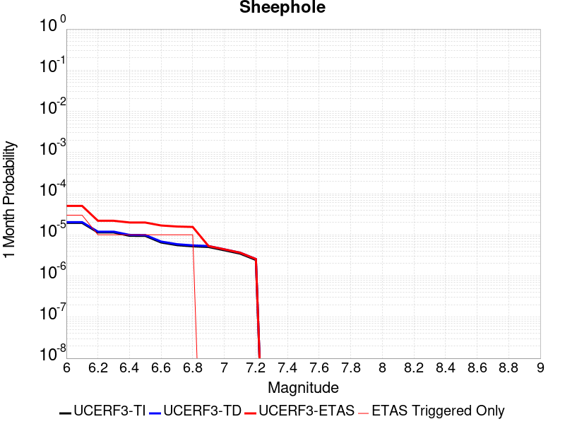 | 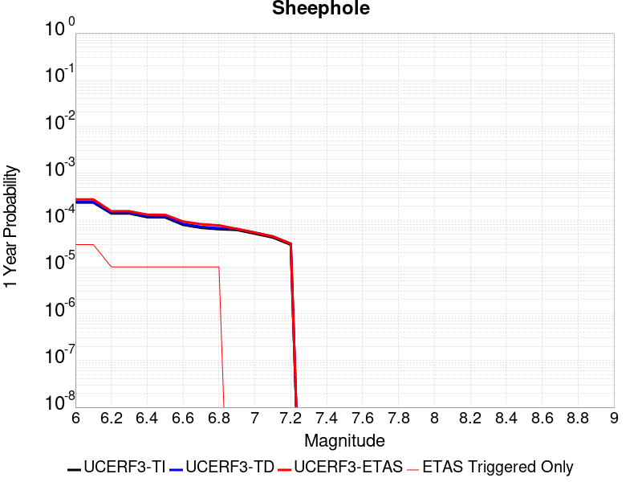 |  |

| Magnitude | 1 wk TI Prob | 1 wk TD Prob | 1 wk ETAS Prob | 1 wk ETAS/TD Gain | 1 wk ETAS Triggered Only | 1 mo TI Prob | 1 mo TD Prob | 1 mo ETAS Prob | 1 mo ETAS/TD Gain | 1 mo ETAS Triggered Only | 1 yr TI Prob | 1 yr TD Prob | 1 yr ETAS Prob | 1 yr ETAS/TD Gain | 1 yr ETAS Triggered Only | 10 yr TI Prob | 10 yr TD Prob | 10 yr ETAS Prob | 10 yr ETAS/TD Gain | 10 yr ETAS Triggered Only |
|-----|-----|-----|-----|-----|-----|-----|-----|-----|-----|-----|-----|-----|-----|-----|-----|-----|-----|-----|-----|-----|
| 6.0 | 4.5579695E-6 | 4.7412627E-6 | 4.1038733E-5 | 8.655655 | 3.629764E-5 | 1.9534009E-5 | 2.031957E-5 | 5.6616474E-5 | 2.7863028 | 3.629764E-5 | 2.3780059E-4 | 2.473682E-4 | 2.8365687E-4 | 1.146699 | 3.629764E-5 | 0.0023754628 | 0.002471473 | 0.002543889 | 1.0293007 | 7.259528E-5 |
| 6.1 | 4.5579695E-6 | 4.7412627E-6 | 4.1038733E-5 | 8.655655 | 3.629764E-5 | 1.9534009E-5 | 2.031957E-5 | 5.6616474E-5 | 2.7863028 | 3.629764E-5 | 2.3780059E-4 | 2.473682E-4 | 2.8365687E-4 | 1.146699 | 3.629764E-5 | 0.0023754628 | 0.002471473 | 0.002543889 | 1.0293007 | 7.259528E-5 |
| 6.2 | 2.6677674E-6 | 2.7873941E-6 | 2.0936164E-5 | 7.5110164 | 1.814882E-5 | 1.1433239E-5 | 1.1945926E-5 | 3.009453E-5 | 2.5192294 | 1.814882E-5 | 1.3919079E-4 | 1.4543302E-4 | 1.6357921E-4 | 1.1247735 | 1.814882E-5 | 0.0013910364 | 0.0014534844 | 0.0015078518 | 1.0374048 | 5.444646E-5 |
| 6.3 | 2.6677674E-6 | 2.7873941E-6 | 2.0936164E-5 | 7.5110164 | 1.814882E-5 | 1.1433239E-5 | 1.1945926E-5 | 3.009453E-5 | 2.5192294 | 1.814882E-5 | 1.3919079E-4 | 1.4543302E-4 | 1.6357921E-4 | 1.1247735 | 1.814882E-5 | 0.0013910364 | 0.0014534844 | 0.0015078518 | 1.0374048 | 5.444646E-5 |
| 6.4 | 2.2159759E-6 | 2.3228788E-6 | 2.0471656E-5 | 8.813055 | 1.814882E-5 | 9.497005E-6 | 9.955161E-6 | 2.8103801E-5 | 2.8230383 | 1.814882E-5 | 1.156199E-4 | 1.2119815E-4 | 1.3934477E-4 | 1.1497269 | 1.814882E-5 | 0.0011555976 | 0.0012113999 | 0.0012295267 | 1.0149635 | 1.814882E-5 |
| 6.5 | 2.1986082E-6 | 2.304759E-6 | 2.0453537E-5 | 8.874479 | 1.814882E-5 | 9.4225725E-6 | 9.877506E-6 | 2.8026147E-5 | 2.8373709 | 1.814882E-5 | 1.1471378E-4 | 1.2025281E-4 | 1.3839944E-4 | 1.150904 | 1.814882E-5 | 0.0011465458 | 0.0012019566 | 0.0012200837 | 1.0150813 | 1.814882E-5 |
| 6.6 | 1.5232331E-6 | 1.6018919E-6 | 1.9750683E-5 | 12.329598 | 1.814882E-5 | 6.5281256E-6 | 6.865234E-6 | 2.501393E-5 | 3.6435657 | 1.814882E-5 | 7.947703E-5 | 8.35812E-5 | 1.0172851E-4 | 1.2171218 | 1.814882E-5 | 7.9448614E-4 | 8.3551643E-4 | 8.536501E-4 | 1.0217035 | 1.814882E-5 |
| 6.7 | 1.3137362E-6 | 1.382819E-6 | 1.9531615E-5 | 14.124491 | 1.814882E-5 | 5.6302856E-6 | 5.926355E-6 | 2.4075067E-5 | 4.0623736 | 1.814882E-5 | 6.854657E-5 | 7.215112E-5 | 9.029863E-5 | 1.2515209 | 1.814882E-5 | 6.8525434E-4 | 7.212908E-4 | 7.394266E-4 | 1.0251434 | 1.814882E-5 |
| 6.8 | 1.2275751E-6 | 1.2922847E-6 | 1.9441082E-5 | 15.0439625 | 1.814882E-5 | 5.2610258E-6 | 5.5383516E-6 | 2.3687071E-5 | 4.276917 | 1.814882E-5 | 6.4051106E-5 | 6.7427485E-5 | 8.557508E-5 | 1.2691424 | 1.814882E-5 | 6.4032647E-4 | 6.740836E-4 | 6.922202E-4 | 1.0269055 | 1.814882E-5 |
| 6.9 | 1.1837088E-6 | 1.246102E-6 | 1.246102E-6 | 1.0 | 0.0 | 5.0730278E-6 | 5.340427E-6 | 5.340427E-6 | 1.0 | 0.0 | 6.176237E-5 | 6.501789E-5 | 6.501789E-5 | 1.0 | 0.0 | 6.17452E-4 | 6.5000186E-4 | 6.5000186E-4 | 1.0 | 0.0 |
| 7.0 | 9.849371E-7 | 1.0366288E-6 | 1.0366288E-6 | 1.0 | 0.0 | 4.2211523E-6 | 4.442688E-6 | 4.442688E-6 | 1.0 | 0.0 | 5.1391315E-5 | 5.4088487E-5 | 5.4088487E-5 | 1.0 | 0.0 | 5.137943E-4 | 5.407633E-4 | 5.407633E-4 | 1.0 | 0.0 |
| 7.1 | 8.1643645E-7 | 8.591669E-7 | 8.591669E-7 | 1.0 | 0.0 | 3.4990085E-6 | 3.682139E-6 | 3.682139E-6 | 1.0 | 0.0 | 4.2599597E-5 | 4.482921E-5 | 4.482921E-5 | 1.0 | 0.0 | 4.259143E-4 | 4.4821028E-4 | 4.4821028E-4 | 1.0 | 0.0 |
| 7.2 | 5.7295756E-7 | 6.029502E-7 | 6.029502E-7 | 1.0 | 0.0 | 2.45553E-6 | 2.58407E-6 | 2.58407E-6 | 1.0 | 0.0 | 2.9895667E-5 | 3.1460666E-5 | 3.1460666E-5 | 1.0 | 0.0 | 2.9891645E-4 | 3.145688E-4 | 3.145688E-4 | 1.0 | 0.0 |

## Santa Monica alt 1
*[(top)](#table-of-contents)*

| 1 Week | 1 Month | 1 Year | 10 Year |
|-----|-----|-----|-----|
|  |  |  |  |

| Magnitude | 1 wk TI Prob | 1 wk TD Prob | 1 wk ETAS Prob | 1 wk ETAS/TD Gain | 1 wk ETAS Triggered Only | 1 mo TI Prob | 1 mo TD Prob | 1 mo ETAS Prob | 1 mo ETAS/TD Gain | 1 mo ETAS Triggered Only | 1 yr TI Prob | 1 yr TD Prob | 1 yr ETAS Prob | 1 yr ETAS/TD Gain | 1 yr ETAS Triggered Only | 10 yr TI Prob | 10 yr TD Prob | 10 yr ETAS Prob | 10 yr ETAS/TD Gain | 10 yr ETAS Triggered Only |
|-----|-----|-----|-----|-----|-----|-----|-----|-----|-----|-----|-----|-----|-----|-----|-----|-----|-----|-----|-----|-----|
| 6.0 | 1.1066008E-5 | 1.148031E-5 | 2.9628922E-5 | 2.5808468 | 1.814882E-5 | 4.742488E-5 | 4.920048E-5 | 6.73484E-5 | 1.3688567 | 1.814882E-5 | 5.7724497E-4 | 5.9886515E-4 | 6.3514104E-4 | 1.0605744 | 3.629764E-5 | 0.005757478 | 0.0059739 | 0.006028021 | 1.0090597 | 5.444646E-5 |
| 6.1 | 1.1066008E-5 | 1.148031E-5 | 2.9628922E-5 | 2.5808468 | 1.814882E-5 | 4.742488E-5 | 4.920048E-5 | 6.73484E-5 | 1.3688567 | 1.814882E-5 | 5.7724497E-4 | 5.9886515E-4 | 6.3514104E-4 | 1.0605744 | 3.629764E-5 | 0.005757478 | 0.0059739 | 0.006028021 | 1.0090597 | 5.444646E-5 |
| 6.2 | 1.1066008E-5 | 1.148031E-5 | 2.9628922E-5 | 2.5808468 | 1.814882E-5 | 4.742488E-5 | 4.920048E-5 | 6.73484E-5 | 1.3688567 | 1.814882E-5 | 5.7724497E-4 | 5.9886515E-4 | 6.3514104E-4 | 1.0605744 | 3.629764E-5 | 0.005757478 | 0.0059739 | 0.006028021 | 1.0090597 | 5.444646E-5 |
| 6.3 | 1.1066008E-5 | 1.148031E-5 | 2.9628922E-5 | 2.5808468 | 1.814882E-5 | 4.742488E-5 | 4.920048E-5 | 6.73484E-5 | 1.3688567 | 1.814882E-5 | 5.7724497E-4 | 5.9886515E-4 | 6.3514104E-4 | 1.0605744 | 3.629764E-5 | 0.005757478 | 0.0059739 | 0.006028021 | 1.0090597 | 5.444646E-5 |
| 6.4 | 1.1066008E-5 | 1.148031E-5 | 2.9628922E-5 | 2.5808468 | 1.814882E-5 | 4.742488E-5 | 4.920048E-5 | 6.73484E-5 | 1.3688567 | 1.814882E-5 | 5.7724497E-4 | 5.9886515E-4 | 6.3514104E-4 | 1.0605744 | 3.629764E-5 | 0.005757478 | 0.0059739 | 0.006028021 | 1.0090597 | 5.444646E-5 |
| 6.5 | 8.183544E-6 | 8.335432E-6 | 2.64841E-5 | 3.177292 | 1.814882E-5 | 3.5071862E-5 | 3.57228E-5 | 5.387097E-5 | 1.5080278 | 1.814882E-5 | 4.2691626E-4 | 4.3483984E-4 | 4.7112172E-4 | 1.0834373 | 3.629764E-5 | 0.0042609703 | 0.0043400554 | 0.004394266 | 1.0124906 | 5.444646E-5 |
| 6.6 | 8.1543285E-6 | 8.303646E-6 | 2.6452315E-5 | 3.1856267 | 1.814882E-5 | 3.4946657E-5 | 3.5586578E-5 | 5.373475E-5 | 1.5099725 | 1.814882E-5 | 4.2539247E-4 | 4.3318202E-4 | 4.6946394E-4 | 1.0837568 | 3.629764E-5 | 0.0042457907 | 0.004323542 | 0.004377753 | 1.0125386 | 5.444646E-5 |
| 6.7 | 8.110878E-6 | 8.257042E-6 | 2.6405713E-5 | 3.1979625 | 1.814882E-5 | 3.4760444E-5 | 3.5386853E-5 | 5.353503E-5 | 1.5128509 | 1.814882E-5 | 4.231262E-4 | 4.3075136E-4 | 4.6703336E-4 | 1.0842296 | 3.629764E-5 | 0.0042232145 | 0.0042993296 | 0.004353542 | 1.0126095 | 5.444646E-5 |
| 6.8 | 7.644036E-6 | 7.75106E-6 | 2.589974E-5 | 3.3414447 | 1.814882E-5 | 3.275974E-5 | 3.3218414E-5 | 5.136663E-5 | 1.54633 | 1.814882E-5 | 3.9877684E-4 | 4.0436056E-4 | 4.4064352E-4 | 1.0897292 | 3.629764E-5 | 0.00398062 | 0.0040363944 | 0.004090621 | 1.0134344 | 5.444646E-5 |
| 6.9 | 7.3698293E-6 | 7.455719E-6 | 2.5604404E-5 | 3.4341965 | 1.814882E-5 | 3.15846E-5 | 3.19527E-5 | 5.0100938E-5 | 1.5679721 | 1.814882E-5 | 3.8447464E-4 | 3.8895605E-4 | 4.2523956E-4 | 1.0932844 | 3.629764E-5 | 0.0038381014 | 0.0038828964 | 0.0039371313 | 1.0139676 | 5.444646E-5 |
| 7.0 | 7.209872E-6 | 7.2856255E-6 | 2.5434314E-5 | 3.4910266 | 1.814882E-5 | 3.0899086E-5 | 3.1223743E-5 | 4.9371996E-5 | 1.5812324 | 1.814882E-5 | 3.7613141E-4 | 3.8008415E-4 | 4.16368E-4 | 1.0954627 | 3.629764E-5 | 0.0037549543 | 0.0037944836 | 0.0038487236 | 1.0142944 | 5.444646E-5 |
| 7.1 | 5.603456E-6 | 5.5238925E-6 | 2.3672612E-5 | 4.285495 | 1.814882E-5 | 2.4014591E-5 | 2.3673612E-5 | 4.1822E-5 | 1.7666085 | 1.814882E-5 | 2.923384E-4 | 2.881885E-4 | 3.0633208E-4 | 1.0629574 | 1.814882E-5 | 0.0029195412 | 0.0028781896 | 0.0029143826 | 1.012575 | 3.629764E-5 |
| 7.2 | 4.7483613E-6 | 4.5911324E-6 | 2.273987E-5 | 4.9529977 | 1.814882E-5 | 2.0349962E-5 | 1.9676136E-5 | 3.7824597E-5 | 1.9223591 | 1.814882E-5 | 2.4773262E-4 | 2.3953074E-4 | 2.5767522E-4 | 1.0757501 | 1.814882E-5 | 0.0024745662 | 0.0023927398 | 0.0024289505 | 1.0151336 | 3.629764E-5 |
| 7.3 | 3.829015E-6 | 3.6342253E-6 | 2.178298E-5 | 5.993844 | 1.814882E-5 | 1.6409962E-5 | 1.5575159E-5 | 3.3723696E-5 | 2.1652234 | 1.814882E-5 | 1.9977297E-4 | 1.8961114E-4 | 2.0775652E-4 | 1.0956979 | 1.814882E-5 | 0.0019959346 | 0.0018945024 | 0.0019126169 | 1.0095615 | 1.814882E-5 |
| 7.4 | 2.610755E-6 | 2.4995716E-6 | 2.4995716E-6 | 1.0 | 0.0 | 1.1188902E-5 | 1.0712406E-5 | 1.0712406E-5 | 1.0 | 0.0 | 1.3621636E-4 | 1.3041578E-4 | 1.3041578E-4 | 1.0 | 0.0 | 0.001361329 | 0.0013033969 | 0.0013033969 | 1.0 | 0.0 |
| 7.5 | 1.792146E-6 | 1.7584184E-6 | 1.7584184E-6 | 1.0 | 0.0 | 7.680603E-6 | 7.536057E-6 | 7.536057E-6 | 1.0 | 0.0 | 9.3507326E-5 | 9.1747665E-5 | 9.1747665E-5 | 1.0 | 0.0 | 9.3467993E-4 | 9.1710105E-4 | 9.1710105E-4 | 1.0 | 0.0 |
| 7.6 | 1.1473018E-6 | 1.1029152E-6 | 1.1029152E-6 | 1.0 | 0.0 | 4.9169985E-6 | 4.726771E-6 | 4.726771E-6 | 1.0 | 0.0 | 5.986281E-5 | 5.7546935E-5 | 5.7546935E-5 | 1.0 | 0.0 | 5.984669E-4 | 5.7532196E-4 | 5.7532196E-4 | 1.0 | 0.0 |
| 7.7 | 5.330919E-7 | 4.7452556E-7 | 4.7452556E-7 | 1.0 | 0.0 | 2.2846775E-6 | 2.0336795E-6 | 2.0336795E-6 | 1.0 | 0.0 | 2.7815593E-5 | 2.4759778E-5 | 2.4759778E-5 | 1.0 | 0.0 | 2.7812112E-4 | 2.4757133E-4 | 2.4757133E-4 | 1.0 | 0.0 |
| 7.8 | 1.1668574E-7 | 8.2966224E-8 | 8.2966224E-8 | 1.0 | 0.0 | 5.000816E-7 | 3.5556948E-7 | 3.5556948E-7 | 1.0 | 0.0 | 6.0884768E-6 | 4.32905E-6 | 4.32905E-6 | 1.0 | 0.0 | 6.08831E-5 | 4.3289692E-5 | 4.3289692E-5 | 1.0 | 0.0 |
| 7.9 | 8.007447E-10 | 6.1608785E-10 | 6.1608785E-10 | 1.0 | 0.0 | 3.4317629E-9 | 2.6403764E-9 | 2.6403764E-9 | 1.0 | 0.0 | 4.1781714E-8 | 3.2146584E-8 | 3.2146584E-8 | 1.0 | 0.0 | 4.1781706E-7 | 3.214658E-7 | 3.214658E-7 | 1.0 | 0.0 |

## Tin Mountain
*[(top)](#table-of-contents)*

| 1 Week | 1 Month | 1 Year | 10 Year |
|-----|-----|-----|-----|
|  |  | 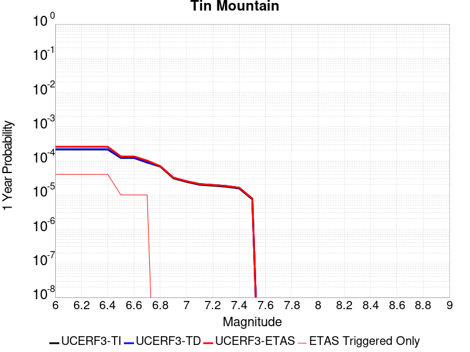 |  |

| Magnitude | 1 wk TI Prob | 1 wk TD Prob | 1 wk ETAS Prob | 1 wk ETAS/TD Gain | 1 wk ETAS Triggered Only | 1 mo TI Prob | 1 mo TD Prob | 1 mo ETAS Prob | 1 mo ETAS/TD Gain | 1 mo ETAS Triggered Only | 1 yr TI Prob | 1 yr TD Prob | 1 yr ETAS Prob | 1 yr ETAS/TD Gain | 1 yr ETAS Triggered Only | 10 yr TI Prob | 10 yr TD Prob | 10 yr ETAS Prob | 10 yr ETAS/TD Gain | 10 yr ETAS Triggered Only |
|-----|-----|-----|-----|-----|-----|-----|-----|-----|-----|-----|-----|-----|-----|-----|-----|-----|-----|-----|-----|-----|
| 6.0 | 4.083776E-6 | 4.1815365E-6 | 2.2330281E-5 | 5.3402095 | 1.814882E-5 | 1.750178E-5 | 1.792077E-5 | 3.6069265E-5 | 2.0127075 | 1.814882E-5 | 2.1306332E-4 | 2.1816725E-4 | 2.5445697E-4 | 1.166339 | 3.629764E-5 | 0.0021285915 | 0.0021798965 | 0.0022342242 | 1.0249221 | 5.444646E-5 |
| 6.1 | 4.083776E-6 | 4.1815365E-6 | 2.2330281E-5 | 5.3402095 | 1.814882E-5 | 1.750178E-5 | 1.792077E-5 | 3.6069265E-5 | 2.0127075 | 1.814882E-5 | 2.1306332E-4 | 2.1816725E-4 | 2.5445697E-4 | 1.166339 | 3.629764E-5 | 0.0021285915 | 0.0021798965 | 0.0022342242 | 1.0249221 | 5.444646E-5 |
| 6.2 | 4.083776E-6 | 4.1815365E-6 | 2.2330281E-5 | 5.3402095 | 1.814882E-5 | 1.750178E-5 | 1.792077E-5 | 3.6069265E-5 | 2.0127075 | 1.814882E-5 | 2.1306332E-4 | 2.1816725E-4 | 2.5445697E-4 | 1.166339 | 3.629764E-5 | 0.0021285915 | 0.0021798965 | 0.0022342242 | 1.0249221 | 5.444646E-5 |
| 6.3 | 4.083776E-6 | 4.1815365E-6 | 2.2330281E-5 | 5.3402095 | 1.814882E-5 | 1.750178E-5 | 1.792077E-5 | 3.6069265E-5 | 2.0127075 | 1.814882E-5 | 2.1306332E-4 | 2.1816725E-4 | 2.5445697E-4 | 1.166339 | 3.629764E-5 | 0.0021285915 | 0.0021798965 | 0.0022342242 | 1.0249221 | 5.444646E-5 |
| 6.4 | 4.083776E-6 | 4.1815365E-6 | 2.2330281E-5 | 5.3402095 | 1.814882E-5 | 1.750178E-5 | 1.792077E-5 | 3.6069265E-5 | 2.0127075 | 1.814882E-5 | 2.1306332E-4 | 2.1816725E-4 | 2.5445697E-4 | 1.166339 | 3.629764E-5 | 0.0021285915 | 0.0021798965 | 0.0022342242 | 1.0249221 | 5.444646E-5 |
| 6.5 | 2.3143427E-6 | 2.3731573E-6 | 2.3731573E-6 | 1.0 | 0.0 | 9.9185745E-6 | 1.0170638E-5 | 1.0170638E-5 | 1.0 | 0.0 | 1.2075195E-4 | 1.2382126E-4 | 1.2382126E-4 | 1.0 | 0.0 | 0.0012068636 | 0.0012375986 | 0.0012557249 | 1.0146464 | 1.814882E-5 |
| 6.6 | 2.3143427E-6 | 2.3731573E-6 | 2.3731573E-6 | 1.0 | 0.0 | 9.9185745E-6 | 1.0170638E-5 | 1.0170638E-5 | 1.0 | 0.0 | 1.2075195E-4 | 1.2382126E-4 | 1.2382126E-4 | 1.0 | 0.0 | 0.0012068636 | 0.0012375986 | 0.0012557249 | 1.0146464 | 1.814882E-5 |
| 6.7 | 1.7029532E-6 | 1.7497915E-6 | 1.7497915E-6 | 1.0 | 0.0 | 7.2983503E-6 | 7.499088E-6 | 7.499088E-6 | 1.0 | 0.0 | 8.885379E-5 | 9.1298105E-5 | 9.1298105E-5 | 1.0 | 0.0 | 8.881827E-4 | 9.1265864E-4 | 9.1265864E-4 | 1.0 | 0.0 |
| 6.8 | 1.2914646E-6 | 1.3299378E-6 | 1.3299378E-6 | 1.0 | 0.0 | 5.534837E-6 | 5.6997237E-6 | 5.6997237E-6 | 1.0 | 0.0 | 6.738455E-5 | 6.939237E-5 | 6.939237E-5 | 1.0 | 0.0 | 6.736412E-4 | 6.9375033E-4 | 6.9375033E-4 | 1.0 | 0.0 |
| 6.9 | 5.8708974E-7 | 6.1169936E-7 | 6.1169936E-7 | 1.0 | 0.0 | 2.5160964E-6 | 2.6215664E-6 | 2.6215664E-6 | 1.0 | 0.0 | 3.0633044E-5 | 3.1917145E-5 | 3.1917145E-5 | 1.0 | 0.0 | 3.0628822E-4 | 3.191297E-4 | 3.191297E-4 | 1.0 | 0.0 |
| 7.0 | 4.6248786E-7 | 4.832015E-7 | 4.832015E-7 | 1.0 | 0.0 | 1.9820893E-6 | 2.0708624E-6 | 2.0708624E-6 | 1.0 | 0.0 | 2.413167E-5 | 2.5212494E-5 | 2.5212494E-5 | 1.0 | 0.0 | 2.412905E-4 | 2.5210003E-4 | 2.5210003E-4 | 1.0 | 0.0 |
| 7.1 | 3.804606E-7 | 3.987147E-7 | 3.987147E-7 | 1.0 | 0.0 | 1.6305444E-6 | 1.7087764E-6 | 1.7087764E-6 | 1.0 | 0.0 | 1.9851697E-5 | 2.0804187E-5 | 2.0804187E-5 | 1.0 | 0.0 | 1.9849923E-4 | 2.0802575E-4 | 2.0802575E-4 | 1.0 | 0.0 |
| 7.2 | 3.5864858E-7 | 3.7616863E-7 | 3.7616863E-7 | 1.0 | 0.0 | 1.5370645E-6 | 1.6121504E-6 | 1.6121504E-6 | 1.0 | 0.0 | 1.87136E-5 | 1.9627789E-5 | 1.9627789E-5 | 1.0 | 0.0 | 1.8712023E-4 | 1.9626386E-4 | 1.9626386E-4 | 1.0 | 0.0 |
| 7.3 | 3.342063E-7 | 3.506347E-7 | 3.506347E-7 | 1.0 | 0.0 | 1.4323119E-6 | 1.5027196E-6 | 1.5027196E-6 | 1.0 | 0.0 | 1.7438259E-5 | 1.829549E-5 | 1.829549E-5 | 1.0 | 0.0 | 1.743689E-4 | 1.8294314E-4 | 1.8294314E-4 | 1.0 | 0.0 |
| 7.4 | 2.971242E-7 | 3.1165817E-7 | 3.1165817E-7 | 1.0 | 0.0 | 1.2733886E-6 | 1.3356774E-6 | 1.3356774E-6 | 1.0 | 0.0 | 1.5503398E-5 | 1.6261785E-5 | 1.6261785E-5 | 1.0 | 0.0 | 1.5502315E-4 | 1.6260923E-4 | 1.6260923E-4 | 1.0 | 0.0 |
| 7.5 | 1.4326713E-7 | 1.5012525E-7 | 1.5012525E-7 | 1.0 | 0.0 | 6.140018E-7 | 6.433939E-7 | 6.433939E-7 | 1.0 | 0.0 | 7.4754466E-6 | 7.8333205E-6 | 7.8333205E-6 | 1.0 | 0.0 | 7.475195E-5 | 7.833321E-5 | 7.833321E-5 | 1.0 | 0.0 |

## Oceanic - West Huasna
*[(top)](#table-of-contents)*

| 1 Week | 1 Month | 1 Year | 10 Year |
|-----|-----|-----|-----|
| 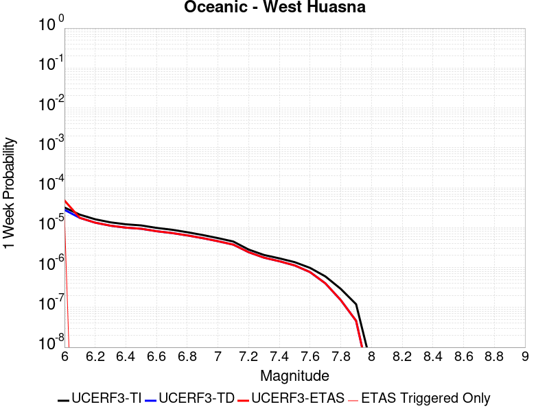 |  |  |  |

| Magnitude | 1 wk TI Prob | 1 wk TD Prob | 1 wk ETAS Prob | 1 wk ETAS/TD Gain | 1 wk ETAS Triggered Only | 1 mo TI Prob | 1 mo TD Prob | 1 mo ETAS Prob | 1 mo ETAS/TD Gain | 1 mo ETAS Triggered Only | 1 yr TI Prob | 1 yr TD Prob | 1 yr ETAS Prob | 1 yr ETAS/TD Gain | 1 yr ETAS Triggered Only | 10 yr TI Prob | 10 yr TD Prob | 10 yr ETAS Prob | 10 yr ETAS/TD Gain | 10 yr ETAS Triggered Only |
|-----|-----|-----|-----|-----|-----|-----|-----|-----|-----|-----|-----|-----|-----|-----|-----|-----|-----|-----|-----|-----|
| 6.0 | 3.195567E-5 | 2.7926868E-5 | 4.607518E-5 | 1.6498513 | 1.814882E-5 | 1.3694567E-4 | 1.1968133E-4 | 1.3782798E-4 | 1.1516247 | 1.814882E-5 | 0.0016660384 | 0.0014561893 | 0.0014924342 | 1.0248902 | 3.629764E-5 | 0.016536033 | 0.014471028 | 0.014524686 | 1.003708 | 5.444646E-5 |
| 6.1 | 2.1156782E-5 | 1.7573486E-5 | 1.7573486E-5 | 1.0 | 0.0 | 9.066878E-5 | 7.531282E-5 | 7.531282E-5 | 1.0 | 0.0 | 0.0011033333 | 9.165572E-4 | 9.165572E-4 | 1.0 | 0.0 | 0.010978713 | 0.009128777 | 0.009146761 | 1.0019699 | 1.814882E-5 |
| 6.2 | 1.6195117E-5 | 1.3327152E-5 | 1.3327152E-5 | 1.0 | 0.0 | 6.9405796E-5 | 5.7115132E-5 | 5.7115132E-5 | 1.0 | 0.0 | 8.44688E-4 | 6.9515745E-4 | 6.9515745E-4 | 1.0 | 0.0 | 0.008414844 | 0.006930123 | 0.0069481465 | 1.0026007 | 1.814882E-5 |
| 6.3 | 1.3559345E-5 | 1.1179142E-5 | 1.1179142E-5 | 1.0 | 0.0 | 5.811018E-5 | 4.7909736E-5 | 4.7909736E-5 | 1.0 | 0.0 | 7.072618E-4 | 5.831459E-4 | 5.831459E-4 | 1.0 | 0.0 | 0.0070501505 | 0.0058162753 | 0.005834318 | 1.0031022 | 1.814882E-5 |
| 6.4 | 1.2120619E-5 | 1.0000977E-5 | 1.0000977E-5 | 1.0 | 0.0 | 5.1944477E-5 | 4.2860633E-5 | 4.2860633E-5 | 1.0 | 0.0 | 6.322405E-4 | 5.2170374E-4 | 5.2170374E-4 | 1.0 | 0.0 | 0.006304447 | 0.0052048573 | 0.005222912 | 1.0034688 | 1.814882E-5 |
| 6.5 | 1.13511915E-5 | 9.3674735E-6 | 9.3674735E-6 | 1.0 | 0.0 | 4.8647056E-5 | 4.01457E-5 | 4.01457E-5 | 1.0 | 0.0 | 5.9211696E-4 | 4.886647E-4 | 4.886647E-4 | 1.0 | 0.0 | 0.0059054173 | 0.0048759608 | 0.004894021 | 1.003704 | 1.814882E-5 |
| 6.6 | 9.850605E-6 | 8.135418E-6 | 8.135418E-6 | 1.0 | 0.0 | 4.2216197E-5 | 3.4865614E-5 | 3.4865614E-5 | 1.0 | 0.0 | 5.1386096E-4 | 4.2440637E-4 | 4.2440637E-4 | 1.0 | 0.0 | 0.0051267436 | 0.004235991 | 0.004235991 | 1.0 | 0.0 |
| 6.7 | 8.8558645E-6 | 7.318433E-6 | 7.318433E-6 | 1.0 | 0.0 | 3.7953152E-5 | 3.1364336E-5 | 3.1364336E-5 | 1.0 | 0.0 | 4.6198163E-4 | 3.8179406E-4 | 3.8179406E-4 | 1.0 | 0.0 | 0.004610224 | 0.0038114067 | 0.0038114067 | 1.0 | 0.0 |
| 6.8 | 7.67136E-6 | 6.391756E-6 | 6.391756E-6 | 1.0 | 0.0 | 3.2876844E-5 | 2.7392953E-5 | 2.7392953E-5 | 1.0 | 0.0 | 4.0020206E-4 | 3.3345833E-4 | 3.3345833E-4 | 1.0 | 0.0 | 0.003994821 | 0.0033296007 | 0.0033296007 | 1.0 | 0.0 |
| 6.9 | 6.534529E-6 | 5.4583297E-6 | 5.4583297E-6 | 1.0 | 0.0 | 2.8004823E-5 | 2.3392633E-5 | 2.3392633E-5 | 1.0 | 0.0 | 3.4090536E-4 | 2.847682E-4 | 2.847682E-4 | 1.0 | 0.0 | 0.0034038287 | 0.0028440498 | 0.0028440498 | 1.0 | 0.0 |
| 7.0 | 5.460525E-6 | 4.5699517E-6 | 4.5699517E-6 | 1.0 | 0.0 | 2.3402039E-5 | 1.958536E-5 | 1.958536E-5 | 1.0 | 0.0 | 2.8488258E-4 | 2.3842578E-4 | 2.3842578E-4 | 1.0 | 0.0 | 0.0028451765 | 0.0023817138 | 0.0023817138 | 1.0 | 0.0 |
| 7.1 | 4.4825083E-6 | 3.7524428E-6 | 3.7524428E-6 | 1.0 | 0.0 | 1.9210609E-5 | 1.60818E-5 | 1.60818E-5 | 1.0 | 0.0 | 2.3386406E-4 | 1.9577841E-4 | 1.9577841E-4 | 1.0 | 0.0 | 0.002336181 | 0.0019560715 | 0.0019560715 | 1.0 | 0.0 |
| 7.2 | 2.821708E-6 | 2.4249334E-6 | 2.4249334E-6 | 1.0 | 0.0 | 1.2092979E-5 | 1.039253E-5 | 1.039253E-5 | 1.0 | 0.0 | 1.4722206E-4 | 1.2652173E-4 | 1.2652173E-4 | 1.0 | 0.0 | 0.0014712457 | 0.0012644994 | 0.0012644994 | 1.0 | 0.0 |
| 7.3 | 2.0644757E-6 | 1.7687412E-6 | 1.7687412E-6 | 1.0 | 0.0 | 8.847723E-6 | 7.5802973E-6 | 7.5802973E-6 | 1.0 | 0.0 | 1.0771569E-4 | 9.228622E-5 | 9.228622E-5 | 1.0 | 0.0 | 0.001076635 | 9.2248066E-4 | 9.2248066E-4 | 1.0 | 0.0 |
| 7.4 | 1.6980367E-6 | 1.4379892E-6 | 1.4379892E-6 | 1.0 | 0.0 | 7.27728E-6 | 6.162796E-6 | 6.162796E-6 | 1.0 | 0.0 | 8.8597284E-5 | 7.5029464E-5 | 7.5029464E-5 | 1.0 | 0.0 | 8.8561967E-4 | 7.500429E-4 | 7.500429E-4 | 1.0 | 0.0 |
| 7.5 | 1.3637683E-6 | 1.1302635E-6 | 1.1302635E-6 | 1.0 | 0.0 | 5.844708E-6 | 4.8439774E-6 | 4.8439774E-6 | 1.0 | 0.0 | 7.1156996E-5 | 5.897383E-5 | 5.897383E-5 | 1.0 | 0.0 | 7.1134215E-4 | 5.895833E-4 | 5.895833E-4 | 1.0 | 0.0 |
| 7.6 | 9.802994E-7 | 7.677247E-7 | 7.677247E-7 | 1.0 | 0.0 | 4.2012766E-6 | 3.2902446E-6 | 3.2902446E-6 | 1.0 | 0.0 | 5.1149345E-5 | 4.0057992E-5 | 4.0057992E-5 | 1.0 | 0.0 | 5.113757E-4 | 4.0050913E-4 | 4.0050913E-4 | 1.0 | 0.0 |
| 7.7 | 5.986191E-7 | 4.0050548E-7 | 4.0050548E-7 | 1.0 | 0.0 | 2.5655079E-6 | 1.7164509E-6 | 1.7164509E-6 | 1.0 | 0.0 | 3.1234613E-5 | 2.089759E-5 | 2.089759E-5 | 1.0 | 0.0 | 3.123022E-4 | 2.089576E-4 | 2.089576E-4 | 1.0 | 0.0 |
| 7.8 | 2.9189815E-7 | 1.5285792E-7 | 1.5285792E-7 | 1.0 | 0.0 | 1.2509914E-6 | 6.5510517E-7 | 6.5510517E-7 | 1.0 | 0.0 | 1.5230714E-5 | 7.9758765E-6 | 7.9758765E-6 | 1.0 | 0.0 | 1.522967E-4 | 7.9757214E-5 | 7.9757214E-5 | 1.0 | 0.0 |
| 7.9 | 1.2057845E-7 | 4.621248E-8 | 4.621248E-8 | 1.0 | 0.0 | 5.1676466E-7 | 1.9805347E-7 | 1.9805347E-7 | 1.0 | 0.0 | 6.2915915E-6 | 2.4112983E-6 | 2.4112983E-6 | 1.0 | 0.0 | 6.2914136E-5 | 2.4114026E-5 | 2.4114026E-5 | 1.0 | 0.0 |
| 8.0 | 3.3806387E-9 | 9.011393E-10 | 9.011393E-10 | 1.0 | 0.0 | 1.4488451E-8 | 3.8620254E-9 | 3.8620254E-9 | 1.0 | 0.0 | 1.7639688E-7 | 4.702016E-8 | 4.702016E-8 | 1.0 | 0.0 | 1.7639674E-6 | 4.7129527E-7 | 4.7129527E-7 | 1.0 | 0.0 |

## White Wolf
*[(top)](#table-of-contents)*

| 1 Week | 1 Month | 1 Year | 10 Year |
|-----|-----|-----|-----|
|  |  | 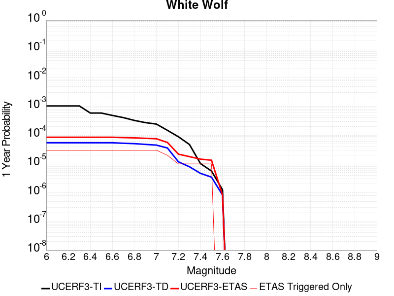 | 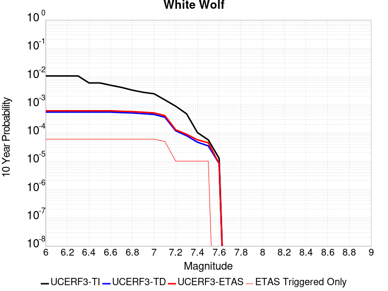 |

| Magnitude | 1 wk TI Prob | 1 wk TD Prob | 1 wk ETAS Prob | 1 wk ETAS/TD Gain | 1 wk ETAS Triggered Only | 1 mo TI Prob | 1 mo TD Prob | 1 mo ETAS Prob | 1 mo ETAS/TD Gain | 1 mo ETAS Triggered Only | 1 yr TI Prob | 1 yr TD Prob | 1 yr ETAS Prob | 1 yr ETAS/TD Gain | 1 yr ETAS Triggered Only | 10 yr TI Prob | 10 yr TD Prob | 10 yr ETAS Prob | 10 yr ETAS/TD Gain | 10 yr ETAS Triggered Only |
|-----|-----|-----|-----|-----|-----|-----|-----|-----|-----|-----|-----|-----|-----|-----|-----|-----|-----|-----|-----|-----|
| 6.0 | 2.0037822E-5 | 1.0469162E-6 | 1.0469162E-6 | 1.0 | 0.0 | 8.587355E-5 | 4.486776E-6 | 4.486776E-6 | 1.0 | 0.0 | 0.001045009 | 5.4625183E-5 | 9.092084E-5 | 1.6644492 | 3.629764E-5 | 0.010401085 | 5.461226E-4 | 6.005393E-4 | 1.0996419 | 5.444646E-5 |
| 6.1 | 2.0037822E-5 | 1.0469162E-6 | 1.0469162E-6 | 1.0 | 0.0 | 8.587355E-5 | 4.486776E-6 | 4.486776E-6 | 1.0 | 0.0 | 0.001045009 | 5.4625183E-5 | 9.092084E-5 | 1.6644492 | 3.629764E-5 | 0.010401085 | 5.461226E-4 | 6.005393E-4 | 1.0996419 | 5.444646E-5 |
| 6.2 | 2.0037822E-5 | 1.0469162E-6 | 1.0469162E-6 | 1.0 | 0.0 | 8.587355E-5 | 4.486776E-6 | 4.486776E-6 | 1.0 | 0.0 | 0.001045009 | 5.4625183E-5 | 9.092084E-5 | 1.6644492 | 3.629764E-5 | 0.010401085 | 5.461226E-4 | 6.005393E-4 | 1.0996419 | 5.444646E-5 |
| 6.3 | 2.0037822E-5 | 1.0469162E-6 | 1.0469162E-6 | 1.0 | 0.0 | 8.587355E-5 | 4.486776E-6 | 4.486776E-6 | 1.0 | 0.0 | 0.001045009 | 5.4625183E-5 | 9.092084E-5 | 1.6644492 | 3.629764E-5 | 0.010401085 | 5.461226E-4 | 6.005393E-4 | 1.0996419 | 5.444646E-5 |
| 6.4 | 1.132487E-5 | 1.0469162E-6 | 1.0469162E-6 | 1.0 | 0.0 | 4.8534253E-5 | 4.486776E-6 | 4.486776E-6 | 1.0 | 0.0 | 5.907443E-4 | 5.4625183E-5 | 9.092084E-5 | 1.6644492 | 3.629764E-5 | 0.005891764 | 5.461226E-4 | 6.005393E-4 | 1.0996419 | 5.444646E-5 |
| 6.5 | 1.132487E-5 | 1.0469162E-6 | 1.0469162E-6 | 1.0 | 0.0 | 4.8534253E-5 | 4.486776E-6 | 4.486776E-6 | 1.0 | 0.0 | 5.907443E-4 | 5.4625183E-5 | 9.092084E-5 | 1.6644492 | 3.629764E-5 | 0.005891764 | 5.461226E-4 | 6.005393E-4 | 1.0996419 | 5.444646E-5 |
| 6.6 | 9.347473E-6 | 1.0469162E-6 | 1.0469162E-6 | 1.0 | 0.0 | 4.0059982E-5 | 4.486776E-6 | 4.486776E-6 | 1.0 | 0.0 | 4.8762115E-4 | 5.4625183E-5 | 9.092084E-5 | 1.6644492 | 3.629764E-5 | 0.0048655253 | 5.461226E-4 | 6.005393E-4 | 1.0996419 | 5.444646E-5 |
| 6.7 | 7.842647E-6 | 1.0048342E-6 | 1.0048342E-6 | 1.0 | 0.0 | 3.361091E-5 | 4.3064256E-6 | 4.3064256E-6 | 1.0 | 0.0 | 4.0913603E-4 | 5.2429517E-5 | 8.872525E-5 | 1.6922767 | 3.629764E-5 | 0.004083836 | 5.2417646E-4 | 5.785944E-4 | 1.103816 | 5.444646E-5 |
| 6.8 | 6.26597E-6 | 9.734822E-7 | 9.734822E-7 | 1.0 | 0.0 | 2.685388E-5 | 4.17206E-6 | 4.17206E-6 | 1.0 | 0.0 | 3.2689696E-4 | 5.0793697E-5 | 8.7089495E-5 | 1.7145728 | 3.629764E-5 | 0.003264165 | 5.078258E-4 | 5.622446E-4 | 1.1071604 | 5.444646E-5 |
| 6.9 | 5.258436E-6 | 9.183254E-7 | 9.183254E-7 | 1.0 | 0.0 | 2.2535958E-5 | 3.9356746E-6 | 3.9356746E-6 | 1.0 | 0.0 | 2.7434074E-4 | 4.7915833E-5 | 8.421174E-5 | 1.7574929 | 3.629764E-5 | 0.0027400232 | 4.790598E-4 | 5.334802E-4 | 1.1135983 | 5.444646E-5 |
| 7.0 | 4.675028E-6 | 8.6611794E-7 | 8.6611794E-7 | 1.0 | 0.0 | 2.003568E-5 | 3.7119291E-6 | 3.7119291E-6 | 1.0 | 0.0 | 2.4390711E-4 | 4.5191846E-5 | 8.1487844E-5 | 1.8031538 | 3.629764E-5 | 0.0024363957 | 4.518313E-4 | 5.0625316E-4 | 1.1204473 | 5.444646E-5 |
| 7.1 | 2.8270078E-6 | 6.8741696E-7 | 6.8741696E-7 | 1.0 | 0.0 | 1.2115692E-5 | 2.9460696E-6 | 2.9460696E-6 | 1.0 | 0.0 | 1.4749856E-4 | 3.5867848E-5 | 5.4016018E-5 | 1.5059732 | 1.814882E-5 | 0.001474007 | 3.586247E-4 | 3.9490932E-4 | 1.1011771 | 3.629764E-5 |
| 7.2 | 1.6881406E-6 | 2.2706382E-7 | 2.2706382E-7 | 1.0 | 0.0 | 7.2348685E-6 | 9.731303E-7 | 9.731303E-7 | 1.0 | 0.0 | 8.808096E-5 | 1.1847799E-5 | 2.9996405E-5 | 2.5318124 | 1.814882E-5 | 8.8046055E-4 | 1.1847183E-4 | 1.366185E-4 | 1.1531729 | 1.814882E-5 |
| 7.3 | 9.086107E-7 | 1.5266386E-7 | 1.5266386E-7 | 1.0 | 0.0 | 3.8940398E-6 | 6.5427355E-7 | 6.5427355E-7 | 1.0 | 0.0 | 4.7408903E-5 | 7.965752E-6 | 2.6114427E-5 | 3.278338 | 1.814882E-5 | 4.739879E-4 | 7.965475E-5 | 9.780212E-5 | 1.2278254 | 1.814882E-5 |
| 7.4 | 1.9717383E-7 | 9.003913E-8 | 9.003913E-8 | 1.0 | 0.0 | 8.450304E-7 | 3.8588192E-7 | 3.8588192E-7 | 1.0 | 0.0 | 1.0288197E-5 | 4.6981027E-6 | 2.2846838E-5 | 4.8629923 | 1.814882E-5 | 1.028772E-4 | 4.6980065E-5 | 6.512803E-5 | 1.3862908 | 1.814882E-5 |
| 7.5 | 1.086975E-7 | 6.6597195E-8 | 6.6597195E-8 | 1.0 | 0.0 | 4.6584634E-7 | 2.8541652E-7 | 2.8541652E-7 | 1.0 | 0.0 | 5.6716644E-6 | 3.474941E-6 | 2.1623699E-5 | 6.2227526 | 1.814882E-5 | 5.6715195E-5 | 3.474889E-5 | 5.2897078E-5 | 1.5222667 | 1.814882E-5 |
| 7.6 | 2.4217808E-8 | 1.5820765E-8 | 1.5820765E-8 | 1.0 | 0.0 | 1.03790605E-7 | 6.780328E-8 | 6.780328E-8 | 1.0 | 0.0 | 1.2636499E-6 | 8.255046E-7 | 8.255046E-7 | 1.0 | 0.0 | 1.2636427E-5 | 8.2550205E-6 | 8.2550205E-6 | 1.0 | 0.0 |

## Northridge
*[(top)](#table-of-contents)*

| 1 Week | 1 Month | 1 Year | 10 Year |
|-----|-----|-----|-----|
|  |  |  |  |

| Magnitude | 1 wk TI Prob | 1 wk TD Prob | 1 wk ETAS Prob | 1 wk ETAS/TD Gain | 1 wk ETAS Triggered Only | 1 mo TI Prob | 1 mo TD Prob | 1 mo ETAS Prob | 1 mo ETAS/TD Gain | 1 mo ETAS Triggered Only | 1 yr TI Prob | 1 yr TD Prob | 1 yr ETAS Prob | 1 yr ETAS/TD Gain | 1 yr ETAS Triggered Only | 10 yr TI Prob | 10 yr TD Prob | 10 yr ETAS Prob | 10 yr ETAS/TD Gain | 10 yr ETAS Triggered Only |
|-----|-----|-----|-----|-----|-----|-----|-----|-----|-----|-----|-----|-----|-----|-----|-----|-----|-----|-----|-----|-----|
| 6.0 | 1.8340852E-5 | 7.5880193E-6 | 7.5880193E-6 | 1.0 | 0.0 | 7.860128E-5 | 3.251969E-5 | 3.251969E-5 | 1.0 | 0.0 | 9.565505E-4 | 3.958575E-4 | 4.1399914E-4 | 1.0458287 | 1.814882E-5 | 0.009524435 | 0.003951746 | 0.0040059774 | 1.0137234 | 5.444646E-5 |
| 6.1 | 1.8340852E-5 | 7.5880193E-6 | 7.5880193E-6 | 1.0 | 0.0 | 7.860128E-5 | 3.251969E-5 | 3.251969E-5 | 1.0 | 0.0 | 9.565505E-4 | 3.958575E-4 | 4.1399914E-4 | 1.0458287 | 1.814882E-5 | 0.009524435 | 0.003951746 | 0.0040059774 | 1.0137234 | 5.444646E-5 |
| 6.2 | 1.8340852E-5 | 7.5880193E-6 | 7.5880193E-6 | 1.0 | 0.0 | 7.860128E-5 | 3.251969E-5 | 3.251969E-5 | 1.0 | 0.0 | 9.565505E-4 | 3.958575E-4 | 4.1399914E-4 | 1.0458287 | 1.814882E-5 | 0.009524435 | 0.003951746 | 0.0040059774 | 1.0137234 | 5.444646E-5 |
| 6.3 | 1.8340852E-5 | 7.5880193E-6 | 7.5880193E-6 | 1.0 | 0.0 | 7.860128E-5 | 3.251969E-5 | 3.251969E-5 | 1.0 | 0.0 | 9.565505E-4 | 3.958575E-4 | 4.1399914E-4 | 1.0458287 | 1.814882E-5 | 0.009524435 | 0.003951746 | 0.0040059774 | 1.0137234 | 5.444646E-5 |
| 6.4 | 1.7361892E-5 | 7.5880193E-6 | 7.5880193E-6 | 1.0 | 0.0 | 7.440598E-5 | 3.251969E-5 | 3.251969E-5 | 1.0 | 0.0 | 9.055163E-4 | 3.958575E-4 | 4.1399914E-4 | 1.0458287 | 1.814882E-5 | 0.009018354 | 0.003951746 | 0.0040059774 | 1.0137234 | 5.444646E-5 |
| 6.5 | 1.7361892E-5 | 7.5880193E-6 | 7.5880193E-6 | 1.0 | 0.0 | 7.440598E-5 | 3.251969E-5 | 3.251969E-5 | 1.0 | 0.0 | 9.055163E-4 | 3.958575E-4 | 4.1399914E-4 | 1.0458287 | 1.814882E-5 | 0.009018354 | 0.003951746 | 0.0040059774 | 1.0137234 | 5.444646E-5 |
| 6.6 | 1.5458201E-5 | 7.5880193E-6 | 7.5880193E-6 | 1.0 | 0.0 | 6.624775E-5 | 3.251969E-5 | 3.251969E-5 | 1.0 | 0.0 | 8.0626784E-4 | 3.958575E-4 | 4.1399914E-4 | 1.0458287 | 1.814882E-5 | 0.008033488 | 0.003951746 | 0.0040059774 | 1.0137234 | 5.444646E-5 |
| 6.7 | 1.2538368E-5 | 6.381603E-6 | 6.381603E-6 | 1.0 | 0.0 | 5.3734755E-5 | 2.7349442E-5 | 2.7349442E-5 | 1.0 | 0.0 | 6.5402425E-4 | 3.3292902E-4 | 3.510718E-4 | 1.0544944 | 1.814882E-5 | 0.0065210275 | 0.0033243506 | 0.003378616 | 1.0163237 | 5.444646E-5 |
| 6.8 | 1.1438097E-5 | 6.3502566E-6 | 6.3502566E-6 | 1.0 | 0.0 | 4.9019498E-5 | 2.7215105E-5 | 2.7215105E-5 | 1.0 | 0.0 | 5.9664896E-4 | 3.3129397E-4 | 3.4943677E-4 | 1.0547634 | 1.814882E-5 | 0.005950495 | 0.0033080487 | 0.003362315 | 1.0164044 | 5.444646E-5 |
| 6.9 | 1.1204891E-5 | 6.2867084E-6 | 6.2867084E-6 | 1.0 | 0.0 | 4.8020076E-5 | 2.694276E-5 | 2.694276E-5 | 1.0 | 0.0 | 5.8448757E-4 | 3.2797916E-4 | 3.4612205E-4 | 1.0553172 | 1.814882E-5 | 0.0058295266 | 0.0032749989 | 0.003329267 | 1.0165704 | 5.444646E-5 |
| 7.0 | 1.061046E-5 | 6.115359E-6 | 6.115359E-6 | 1.0 | 0.0 | 4.5472607E-5 | 2.6208421E-5 | 2.6208421E-5 | 1.0 | 0.0 | 5.534883E-4 | 3.1904122E-4 | 3.1904122E-4 | 1.0 | 0.0 | 0.0055211177 | 0.0031858785 | 0.0032220606 | 1.011357 | 3.629764E-5 |
| 7.1 | 1.0266979E-5 | 6.004274E-6 | 6.004274E-6 | 1.0 | 0.0 | 4.40006E-5 | 2.5732352E-5 | 2.5732352E-5 | 1.0 | 0.0 | 5.355756E-4 | 3.1324677E-4 | 3.1324677E-4 | 1.0 | 0.0 | 0.0053428668 | 0.003128098 | 0.0031642823 | 1.0115675 | 3.629764E-5 |
| 7.2 | 9.91273E-6 | 5.819984E-6 | 5.819984E-6 | 1.0 | 0.0 | 4.248244E-5 | 2.4942554E-5 | 2.4942554E-5 | 1.0 | 0.0 | 5.171009E-4 | 3.036337E-4 | 3.036337E-4 | 1.0 | 0.0 | 0.0051589934 | 0.0030322333 | 0.003068421 | 1.0119343 | 3.629764E-5 |
| 7.3 | 8.4959265E-6 | 5.193062E-6 | 5.193062E-6 | 1.0 | 0.0 | 3.6410605E-5 | 2.225579E-5 | 2.225579E-5 | 1.0 | 0.0 | 4.4320893E-4 | 2.709308E-4 | 2.709308E-4 | 1.0 | 0.0 | 0.00442326 | 0.0027060313 | 0.002742231 | 1.0133773 | 3.629764E-5 |
| 7.4 | 8.0847185E-6 | 4.9819355E-6 | 4.9819355E-6 | 1.0 | 0.0 | 3.4648332E-5 | 2.135098E-5 | 2.135098E-5 | 1.0 | 0.0 | 4.2176177E-4 | 2.599174E-4 | 2.599174E-4 | 1.0 | 0.0 | 0.0042096223 | 0.00259616 | 0.0026323635 | 1.013945 | 3.629764E-5 |
| 7.5 | 6.8220684E-6 | 4.2533075E-6 | 4.2533075E-6 | 1.0 | 0.0 | 2.9237108E-5 | 1.8228335E-5 | 1.8228335E-5 | 1.0 | 0.0 | 3.5590364E-4 | 2.2190758E-4 | 2.2190758E-4 | 1.0 | 0.0 | 0.0035533418 | 0.002216881 | 0.002253098 | 1.016337 | 3.629764E-5 |
| 7.6 | 4.4224143E-6 | 2.8999582E-6 | 2.8999582E-6 | 1.0 | 0.0 | 1.8953066E-5 | 1.2428334E-5 | 1.2428334E-5 | 1.0 | 0.0 | 2.3072914E-4 | 1.5130457E-4 | 1.5130457E-4 | 1.0 | 0.0 | 0.0023048974 | 0.0015120271 | 0.0015301486 | 1.0119848 | 1.814882E-5 |
| 7.7 | 2.5297056E-6 | 1.6045905E-6 | 1.6045905E-6 | 1.0 | 0.0 | 1.0841551E-5 | 6.8767986E-6 | 6.8767986E-6 | 1.0 | 0.0 | 1.319879E-4 | 8.3721854E-5 | 8.3721854E-5 | 1.0 | 0.0 | 0.0013190953 | 8.369078E-4 | 8.369078E-4 | 1.0 | 0.0 |
| 7.8 | 1.2508156E-6 | 8.780076E-7 | 8.780076E-7 | 1.0 | 0.0 | 5.3606273E-6 | 3.7628845E-6 | 3.7628845E-6 | 1.0 | 0.0 | 6.526368E-5 | 4.581217E-5 | 4.581217E-5 | 1.0 | 0.0 | 6.524452E-4 | 4.5802852E-4 | 4.5802852E-4 | 1.0 | 0.0 |
| 7.9 | 2.262199E-7 | 1.4664671E-7 | 1.4664671E-7 | 1.0 | 0.0 | 9.695135E-7 | 6.284858E-7 | 6.284858E-7 | 1.0 | 0.0 | 1.1803763E-5 | 7.651788E-6 | 7.651788E-6 | 1.0 | 0.0 | 1.1803136E-4 | 7.651533E-5 | 7.651533E-5 | 1.0 | 0.0 |
| 8.0 | 2.865362E-9 | 1.2753101E-9 | 1.2753101E-9 | 1.0 | 0.0 | 1.2280123E-8 | 5.4656146E-9 | 5.4656146E-9 | 1.0 | 0.0 | 1.4951048E-7 | 6.654386E-8 | 6.654386E-8 | 1.0 | 0.0 | 1.4951038E-6 | 6.654386E-7 | 6.654386E-7 | 1.0 | 0.0 |

## Elsinore (Coyote Mountains)
*[(top)](#table-of-contents)*

| 1 Week | 1 Month | 1 Year | 10 Year |
|-----|-----|-----|-----|
|  |  |  |  |

| Magnitude | 1 wk TI Prob | 1 wk TD Prob | 1 wk ETAS Prob | 1 wk ETAS/TD Gain | 1 wk ETAS Triggered Only | 1 mo TI Prob | 1 mo TD Prob | 1 mo ETAS Prob | 1 mo ETAS/TD Gain | 1 mo ETAS Triggered Only | 1 yr TI Prob | 1 yr TD Prob | 1 yr ETAS Prob | 1 yr ETAS/TD Gain | 1 yr ETAS Triggered Only | 10 yr TI Prob | 10 yr TD Prob | 10 yr ETAS Prob | 10 yr ETAS/TD Gain | 10 yr ETAS Triggered Only |
|-----|-----|-----|-----|-----|-----|-----|-----|-----|-----|-----|-----|-----|-----|-----|-----|-----|-----|-----|-----|-----|
| 6.0 | 4.20513E-5 | 4.8631882E-5 | 4.8631882E-5 | 1.0 | 0.0 | 1.8020741E-4 | 2.0840895E-4 | 2.26554E-4 | 1.0870646 | 1.814882E-5 | 0.0021918174 | 0.002535 | 0.0025531028 | 1.0071411 | 1.814882E-5 | 0.021703249 | 0.025111282 | 0.025164362 | 1.0021138 | 5.444646E-5 |
| 6.1 | 4.20513E-5 | 4.8631882E-5 | 4.8631882E-5 | 1.0 | 0.0 | 1.8020741E-4 | 2.0840895E-4 | 2.26554E-4 | 1.0870646 | 1.814882E-5 | 0.0021918174 | 0.002535 | 0.0025531028 | 1.0071411 | 1.814882E-5 | 0.021703249 | 0.025111282 | 0.025164362 | 1.0021138 | 5.444646E-5 |
| 6.2 | 2.3413893E-5 | 2.469566E-5 | 2.469566E-5 | 1.0 | 0.0 | 1.0034139E-4 | 1.0583479E-4 | 1.0583479E-4 | 1.0 | 0.0 | 0.0012209718 | 0.0012878707 | 0.0012878707 | 1.0 | 0.0 | 0.012142851 | 0.01281264 | 0.012848472 | 1.0027966 | 3.629764E-5 |
| 6.3 | 2.3413893E-5 | 2.469566E-5 | 2.469566E-5 | 1.0 | 0.0 | 1.0034139E-4 | 1.0583479E-4 | 1.0583479E-4 | 1.0 | 0.0 | 0.0012209718 | 0.0012878707 | 0.0012878707 | 1.0 | 0.0 | 0.012142851 | 0.01281264 | 0.012848472 | 1.0027966 | 3.629764E-5 |
| 6.4 | 1.6894814E-5 | 1.6568361E-5 | 1.6568361E-5 | 1.0 | 0.0 | 7.240433E-5 | 7.1005554E-5 | 7.1005554E-5 | 1.0 | 0.0 | 8.811662E-4 | 8.6418656E-4 | 8.6418656E-4 | 1.0 | 0.0 | 0.0087768035 | 0.00861194 | 0.008629933 | 1.0020893 | 1.814882E-5 |
| 6.5 | 1.6894814E-5 | 1.6568361E-5 | 1.6568361E-5 | 1.0 | 0.0 | 7.240433E-5 | 7.1005554E-5 | 7.1005554E-5 | 1.0 | 0.0 | 8.811662E-4 | 8.6418656E-4 | 8.6418656E-4 | 1.0 | 0.0 | 0.0087768035 | 0.00861194 | 0.008629933 | 1.0020893 | 1.814882E-5 |
| 6.6 | 1.1910969E-5 | 1.0530774E-5 | 1.0530774E-5 | 1.0 | 0.0 | 5.1046012E-5 | 4.5131183E-5 | 4.5131183E-5 | 1.0 | 0.0 | 6.21308E-4 | 5.4934516E-4 | 5.4934516E-4 | 1.0 | 0.0 | 0.0061957375 | 0.005481174 | 0.0054992237 | 1.0032929 | 1.814882E-5 |
| 6.7 | 9.1486E-6 | 7.2028593E-6 | 7.2028593E-6 | 1.0 | 0.0 | 3.9207694E-5 | 3.0869054E-5 | 3.0869054E-5 | 1.0 | 0.0 | 4.7724912E-4 | 3.757697E-4 | 3.757697E-4 | 1.0 | 0.0 | 0.0047622547 | 0.0037517229 | 0.0037698036 | 1.0048193 | 1.814882E-5 |
| 6.8 | 7.90441E-6 | 5.7290276E-6 | 5.7290276E-6 | 1.0 | 0.0 | 3.3875604E-5 | 2.4552752E-5 | 2.4552752E-5 | 1.0 | 0.0 | 4.1235742E-4 | 2.9889002E-4 | 2.9889002E-4 | 1.0 | 0.0 | 0.0041159308 | 0.002985009 | 0.0030031037 | 1.0060618 | 1.814882E-5 |
| 6.9 | 7.77015E-6 | 5.582982E-6 | 5.582982E-6 | 1.0 | 0.0 | 3.3300217E-5 | 2.3926852E-5 | 2.3926852E-5 | 1.0 | 0.0 | 4.0535472E-4 | 2.9127175E-4 | 2.9127175E-4 | 1.0 | 0.0 | 0.004046161 | 0.002909027 | 0.002927123 | 1.0062207 | 1.814882E-5 |
| 7.0 | 7.675798E-6 | 5.47984E-6 | 5.47984E-6 | 1.0 | 0.0 | 3.289586E-5 | 2.3484827E-5 | 2.3484827E-5 | 1.0 | 0.0 | 4.004335E-4 | 2.858915E-4 | 2.858915E-4 | 1.0 | 0.0 | 0.003997127 | 0.0028553635 | 0.0028734608 | 1.0063379 | 1.814882E-5 |
| 7.1 | 7.447814E-6 | 5.238714E-6 | 5.238714E-6 | 1.0 | 0.0 | 3.191881E-5 | 2.2451446E-5 | 2.2451446E-5 | 1.0 | 0.0 | 3.8854225E-4 | 2.7331332E-4 | 2.7331332E-4 | 1.0 | 0.0 | 0.003878636 | 0.0027298962 | 0.0027479955 | 1.0066301 | 1.814882E-5 |
| 7.2 | 7.128185E-6 | 4.905372E-6 | 4.905372E-6 | 1.0 | 0.0 | 3.0549007E-5 | 2.102286E-5 | 2.102286E-5 | 1.0 | 0.0 | 3.7187067E-4 | 2.5592445E-4 | 2.5592445E-4 | 1.0 | 0.0 | 0.00371249 | 0.0025564157 | 0.002574518 | 1.0070812 | 1.814882E-5 |
| 7.3 | 7.0913875E-6 | 4.874047E-6 | 4.874047E-6 | 1.0 | 0.0 | 3.0391306E-5 | 2.0888614E-5 | 2.0888614E-5 | 1.0 | 0.0 | 3.6995133E-4 | 2.5429038E-4 | 2.5429038E-4 | 1.0 | 0.0 | 0.0036933604 | 0.0025401122 | 0.002558215 | 1.0071267 | 1.814882E-5 |
| 7.4 | 7.051521E-6 | 4.837899E-6 | 4.837899E-6 | 1.0 | 0.0 | 3.0220453E-5 | 2.0733693E-5 | 2.0733693E-5 | 1.0 | 0.0 | 3.6787192E-4 | 2.5240466E-4 | 2.5240466E-4 | 1.0 | 0.0 | 0.0036726352 | 0.0025212981 | 0.0025394012 | 1.0071801 | 1.814882E-5 |
| 7.5 | 6.910666E-6 | 4.733448E-6 | 4.733448E-6 | 1.0 | 0.0 | 2.9616802E-5 | 2.0286056E-5 | 2.0286056E-5 | 1.0 | 0.0 | 3.605249E-4 | 2.4695593E-4 | 2.4695593E-4 | 1.0 | 0.0 | 0.0035994058 | 0.0024669329 | 0.0024850368 | 1.0073386 | 1.814882E-5 |
| 7.6 | 6.341753E-6 | 4.3065565E-6 | 4.3065565E-6 | 1.0 | 0.0 | 2.7178658E-5 | 1.8456547E-5 | 1.8456547E-5 | 1.0 | 0.0 | 3.3084993E-4 | 2.2468645E-4 | 2.2468645E-4 | 1.0 | 0.0 | 0.0033035777 | 0.002244708 | 0.002262816 | 1.008067 | 1.814882E-5 |
| 7.7 | 3.9205916E-6 | 2.2439415E-6 | 2.2439415E-6 | 1.0 | 0.0 | 1.6802427E-5 | 9.616861E-6 | 9.616861E-6 | 1.0 | 0.0 | 2.0455034E-4 | 1.1707973E-4 | 1.1707973E-4 | 1.0 | 0.0 | 0.0020436216 | 0.0011702535 | 0.001188381 | 1.0154903 | 1.814882E-5 |
| 7.8 | 2.0846227E-7 | 8.486417E-8 | 8.486417E-8 | 1.0 | 0.0 | 8.9340944E-7 | 3.6370355E-7 | 3.6370355E-7 | 1.0 | 0.0 | 1.0877206E-5 | 4.428085E-6 | 4.428085E-6 | 1.0 | 0.0 | 1.0876673E-4 | 4.4280296E-5 | 4.4280296E-5 | 1.0 | 0.0 |
| 7.9 | 4.4969806E-9 | 2.2691855E-9 | 2.2691855E-9 | 1.0 | 0.0 | 1.9272775E-8 | 9.72508E-9 | 9.72508E-9 | 1.0 | 0.0 | 2.3464601E-7 | 1.18402845E-7 | 1.18402845E-7 | 1.0 | 0.0 | 2.3464577E-6 | 1.184028E-6 | 1.184028E-6 | 1.0 | 0.0 |

## Robinson Creek
*[(top)](#table-of-contents)*

| 1 Week | 1 Month | 1 Year | 10 Year |
|-----|-----|-----|-----|
|  |  |  |  |

| Magnitude | 1 wk TI Prob | 1 wk TD Prob | 1 wk ETAS Prob | 1 wk ETAS/TD Gain | 1 wk ETAS Triggered Only | 1 mo TI Prob | 1 mo TD Prob | 1 mo ETAS Prob | 1 mo ETAS/TD Gain | 1 mo ETAS Triggered Only | 1 yr TI Prob | 1 yr TD Prob | 1 yr ETAS Prob | 1 yr ETAS/TD Gain | 1 yr ETAS Triggered Only | 10 yr TI Prob | 10 yr TD Prob | 10 yr ETAS Prob | 10 yr ETAS/TD Gain | 10 yr ETAS Triggered Only |
|-----|-----|-----|-----|-----|-----|-----|-----|-----|-----|-----|-----|-----|-----|-----|-----|-----|-----|-----|-----|-----|
| 6.0 | 1.3705327E-5 | 1.5285013E-5 | 1.5285013E-5 | 1.0 | 0.0 | 5.8735794E-5 | 6.55072E-5 | 6.55072E-5 | 1.0 | 0.0 | 7.1487366E-4 | 7.9755014E-4 | 8.156845E-4 | 1.0227375 | 1.814882E-5 | 0.0071257832 | 0.007975501 | 0.008029514 | 1.0067723 | 5.444646E-5 |
| 6.1 | 1.3705327E-5 | 1.5285013E-5 | 1.5285013E-5 | 1.0 | 0.0 | 5.8735794E-5 | 6.55072E-5 | 6.55072E-5 | 1.0 | 0.0 | 7.1487366E-4 | 7.9755014E-4 | 8.156845E-4 | 1.0227375 | 1.814882E-5 | 0.0071257832 | 0.007975501 | 0.008029514 | 1.0067723 | 5.444646E-5 |
| 6.2 | 1.3705327E-5 | 1.5285013E-5 | 1.5285013E-5 | 1.0 | 0.0 | 5.8735794E-5 | 6.55072E-5 | 6.55072E-5 | 1.0 | 0.0 | 7.1487366E-4 | 7.9755014E-4 | 8.156845E-4 | 1.0227375 | 1.814882E-5 | 0.0071257832 | 0.007975501 | 0.008029514 | 1.0067723 | 5.444646E-5 |
| 6.3 | 1.3705327E-5 | 1.5285013E-5 | 1.5285013E-5 | 1.0 | 0.0 | 5.8735794E-5 | 6.55072E-5 | 6.55072E-5 | 1.0 | 0.0 | 7.1487366E-4 | 7.9755014E-4 | 8.156845E-4 | 1.0227375 | 1.814882E-5 | 0.0071257832 | 0.007975501 | 0.008029514 | 1.0067723 | 5.444646E-5 |
| 6.4 | 1.3705327E-5 | 1.5285013E-5 | 1.5285013E-5 | 1.0 | 0.0 | 5.8735794E-5 | 6.55072E-5 | 6.55072E-5 | 1.0 | 0.0 | 7.1487366E-4 | 7.9755014E-4 | 8.156845E-4 | 1.0227375 | 1.814882E-5 | 0.0071257832 | 0.007975501 | 0.008029514 | 1.0067723 | 5.444646E-5 |

## Ortigalita (North)
*[(top)](#table-of-contents)*

| 1 Week | 1 Month | 1 Year | 10 Year |
|-----|-----|-----|-----|
|  | 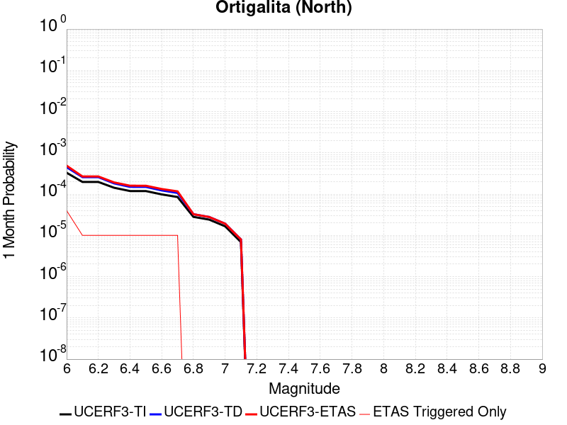 |  | 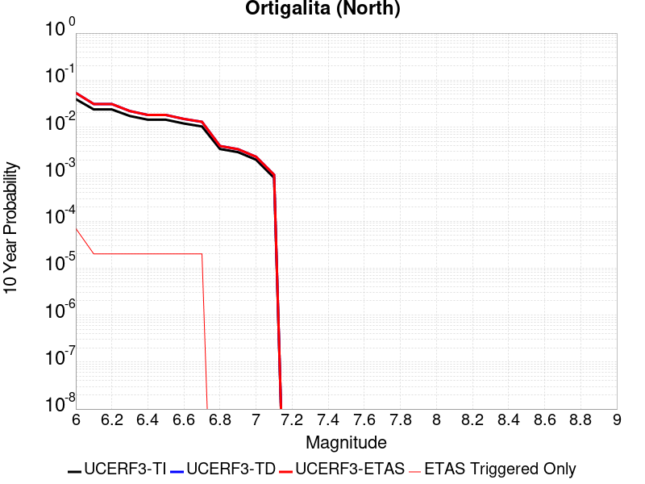 |

| Magnitude | 1 wk TI Prob | 1 wk TD Prob | 1 wk ETAS Prob | 1 wk ETAS/TD Gain | 1 wk ETAS Triggered Only | 1 mo TI Prob | 1 mo TD Prob | 1 mo ETAS Prob | 1 mo ETAS/TD Gain | 1 mo ETAS Triggered Only | 1 yr TI Prob | 1 yr TD Prob | 1 yr ETAS Prob | 1 yr ETAS/TD Gain | 1 yr ETAS Triggered Only | 10 yr TI Prob | 10 yr TD Prob | 10 yr ETAS Prob | 10 yr ETAS/TD Gain | 10 yr ETAS Triggered Only |
|-----|-----|-----|-----|-----|-----|-----|-----|-----|-----|-----|-----|-----|-----|-----|-----|-----|-----|-----|-----|-----|
| 6.0 | 7.711876E-5 | 1.05064966E-4 | 1.2321188E-4 | 1.1727209 | 1.814882E-5 | 3.3046713E-4 | 4.502116E-4 | 4.6835226E-4 | 1.0402936 | 1.814882E-5 | 0.004016016 | 0.0054681194 | 0.0055222684 | 1.0099026 | 5.444646E-5 | 0.039442103 | 0.053454787 | 0.053506322 | 1.0009642 | 5.444646E-5 |
| 6.1 | 4.607858E-5 | 6.0239203E-5 | 6.0239203E-5 | 1.0 | 0.0 | 1.9746469E-4 | 2.5814527E-4 | 2.5814527E-4 | 1.0 | 0.0 | 0.0024014818 | 0.0031387596 | 0.0031568515 | 1.005764 | 1.814882E-5 | 0.023756953 | 0.030975068 | 0.030992655 | 1.0005678 | 1.814882E-5 |
| 6.2 | 4.607858E-5 | 6.0239203E-5 | 6.0239203E-5 | 1.0 | 0.0 | 1.9746469E-4 | 2.5814527E-4 | 2.5814527E-4 | 1.0 | 0.0 | 0.0024014818 | 0.0031387596 | 0.0031568515 | 1.005764 | 1.814882E-5 | 0.023756953 | 0.030975068 | 0.030992655 | 1.0005678 | 1.814882E-5 |
| 6.3 | 3.327423E-5 | 4.2475127E-5 | 4.2475127E-5 | 1.0 | 0.0 | 1.4259605E-4 | 1.8202531E-4 | 1.8202531E-4 | 1.0 | 0.0 | 0.0017347244 | 0.002214197 | 0.0022323057 | 1.0081785 | 1.814882E-5 | 0.017212452 | 0.021945644 | 0.021963395 | 1.0008088 | 1.814882E-5 |
| 6.4 | 2.7732503E-5 | 3.4998593E-5 | 3.4998593E-5 | 1.0 | 0.0 | 1.1884817E-4 | 1.4998685E-4 | 1.4998685E-4 | 1.0 | 0.0 | 0.001446016 | 0.0018248095 | 0.0018429252 | 1.0099274 | 1.814882E-5 | 0.014366428 | 0.018121224 | 0.018139044 | 1.0009834 | 1.814882E-5 |
| 6.5 | 2.7689714E-5 | 3.4948407E-5 | 3.4948407E-5 | 1.0 | 0.0 | 1.186648E-4 | 1.497718E-4 | 1.497718E-4 | 1.0 | 0.0 | 0.0014437864 | 0.0018221956 | 0.0018403113 | 1.0099417 | 1.814882E-5 | 0.014344421 | 0.01809551 | 0.01811333 | 1.0009848 | 1.814882E-5 |
| 6.6 | 2.2976905E-5 | 2.8718265E-5 | 2.8718265E-5 | 1.0 | 0.0 | 9.846873E-5 | 1.230739E-4 | 1.230739E-4 | 1.0 | 0.0 | 0.0011981975 | 0.0014976363 | 0.001515758 | 1.0121002 | 1.814882E-5 | 0.011917574 | 0.014898697 | 0.0149165755 | 1.0012 | 1.814882E-5 |
| 6.7 | 1.9871539E-5 | 2.4904411E-5 | 2.4904411E-5 | 1.0 | 0.0 | 8.516096E-5 | 1.0673023E-4 | 1.0673023E-4 | 1.0 | 0.0 | 0.0010363415 | 0.0012989145 | 0.0013170398 | 1.0139542 | 1.814882E-5 | 0.010315218 | 0.012936919 | 0.012954833 | 1.0013847 | 1.814882E-5 |
| 6.8 | 6.5640475E-6 | 7.6054926E-6 | 7.6054926E-6 | 1.0 | 0.0 | 2.813133E-5 | 3.2594577E-5 | 3.2594577E-5 | 1.0 | 0.0 | 3.424451E-4 | 3.9676955E-4 | 3.9676955E-4 | 1.0 | 0.0 | 0.0034191788 | 0.003960899 | 0.003960899 | 1.0 | 0.0 |
| 6.9 | 5.6219683E-6 | 6.5018376E-6 | 6.5018376E-6 | 1.0 | 0.0 | 2.4093928E-5 | 2.7864735E-5 | 2.7864735E-5 | 1.0 | 0.0 | 2.933041E-4 | 3.3920293E-4 | 3.3920293E-4 | 1.0 | 0.0 | 0.0029291727 | 0.003387109 | 0.003387109 | 1.0 | 0.0 |
| 7.0 | 3.875591E-6 | 4.4847548E-6 | 4.4847548E-6 | 1.0 | 0.0 | 1.6609569E-5 | 1.9220248E-5 | 1.9220248E-5 | 1.0 | 0.0 | 2.0220275E-4 | 2.339835E-4 | 2.339835E-4 | 1.0 | 0.0 | 0.0020201886 | 0.0023375798 | 0.0023375798 | 1.0 | 0.0 |
| 7.1 | 1.6017933E-6 | 1.8570418E-6 | 1.8570418E-6 | 1.0 | 0.0 | 6.8648105E-6 | 7.958732E-6 | 7.958732E-6 | 1.0 | 0.0 | 8.357586E-5 | 9.689432E-5 | 9.689432E-5 | 1.0 | 0.0 | 8.3544437E-4 | 9.686254E-4 | 9.686254E-4 | 1.0 | 0.0 |

## Laguna Salada
*[(top)](#table-of-contents)*

| 1 Week | 1 Month | 1 Year | 10 Year |
|-----|-----|-----|-----|
|  |  |  |  |

| Magnitude | 1 wk TI Prob | 1 wk TD Prob | 1 wk ETAS Prob | 1 wk ETAS/TD Gain | 1 wk ETAS Triggered Only | 1 mo TI Prob | 1 mo TD Prob | 1 mo ETAS Prob | 1 mo ETAS/TD Gain | 1 mo ETAS Triggered Only | 1 yr TI Prob | 1 yr TD Prob | 1 yr ETAS Prob | 1 yr ETAS/TD Gain | 1 yr ETAS Triggered Only | 10 yr TI Prob | 10 yr TD Prob | 10 yr ETAS Prob | 10 yr ETAS/TD Gain | 10 yr ETAS Triggered Only |
|-----|-----|-----|-----|-----|-----|-----|-----|-----|-----|-----|-----|-----|-----|-----|-----|-----|-----|-----|-----|-----|
| 6.0 | 4.6465593E-5 | 4.634639E-5 | 6.449437E-5 | 1.3915726 | 1.814882E-5 | 1.9912305E-4 | 1.9861311E-4 | 2.1675833E-4 | 1.0913596 | 1.814882E-5 | 0.0024216278 | 0.002415429 | 0.002451639 | 1.0149912 | 3.629764E-5 | 0.02395408 | 0.023975259 | 0.0240284 | 1.0022165 | 5.444646E-5 |
| 6.1 | 3.982297E-5 | 3.7246125E-5 | 3.7246125E-5 | 1.0 | 0.0 | 1.706587E-4 | 1.5961716E-4 | 1.5961716E-4 | 1.0 | 0.0 | 0.0020757897 | 0.0019417295 | 0.0019417295 | 1.0 | 0.0 | 0.020565065 | 0.019331863 | 0.019331863 | 1.0 | 0.0 |
| 6.2 | 3.6067784E-5 | 3.2602693E-5 | 3.2602693E-5 | 1.0 | 0.0 | 1.5456705E-4 | 1.3971896E-4 | 1.3971896E-4 | 1.0 | 0.0 | 0.0018802295 | 0.0016998611 | 0.0016998611 | 1.0 | 0.0 | 0.018644003 | 0.016949628 | 0.016949628 | 1.0 | 0.0 |
| 6.3 | 3.2859112E-5 | 2.8849448E-5 | 2.8849448E-5 | 1.0 | 0.0 | 1.4081717E-4 | 1.2363521E-4 | 1.2363521E-4 | 1.0 | 0.0 | 0.0017131006 | 0.0015043203 | 0.0015043203 | 1.0 | 0.0 | 0.016999546 | 0.015018767 | 0.015018767 | 1.0 | 0.0 |
| 6.4 | 2.9132116E-5 | 2.4852965E-5 | 2.4852965E-5 | 1.0 | 0.0 | 1.2484594E-4 | 1.0650887E-4 | 1.0650887E-4 | 1.0 | 0.0 | 0.0015189396 | 0.001296065 | 0.001296065 | 1.0 | 0.0 | 0.015085992 | 0.012956262 | 0.012956262 | 1.0 | 0.0 |
| 6.5 | 2.7075037E-5 | 2.2825836E-5 | 2.2825836E-5 | 1.0 | 0.0 | 1.1603071E-4 | 9.7821845E-5 | 9.7821845E-5 | 1.0 | 0.0 | 0.0014117584 | 0.0011904186 | 0.0011904186 | 1.0 | 0.0 | 0.014028233 | 0.011907749 | 0.011907749 | 1.0 | 0.0 |
| 6.6 | 2.2367465E-5 | 1.8573526E-5 | 1.8573526E-5 | 1.0 | 0.0 | 9.5857045E-5 | 7.959886E-5 | 7.959886E-5 | 1.0 | 0.0 | 0.0011664346 | 9.6876756E-4 | 9.6876756E-4 | 1.0 | 0.0 | 0.011603311 | 0.009702191 | 0.009702191 | 1.0 | 0.0 |
| 6.7 | 1.9458053E-5 | 1.5914242E-5 | 1.5914242E-5 | 1.0 | 0.0 | 8.338899E-5 | 6.8202564E-5 | 6.8202564E-5 | 1.0 | 0.0 | 0.001014788 | 8.3013024E-4 | 8.3013024E-4 | 1.0 | 0.0 | 0.010101665 | 0.0083209425 | 0.0083209425 | 1.0 | 0.0 |
| 6.8 | 1.0767866E-5 | 9.18435E-6 | 9.18435E-6 | 1.0 | 0.0 | 4.614718E-5 | 3.9361294E-5 | 3.9361294E-5 | 1.0 | 0.0 | 5.6169706E-4 | 4.7918706E-4 | 4.7918706E-4 | 1.0 | 0.0 | 0.0056027942 | 0.0048096925 | 0.0048096925 | 1.0 | 0.0 |
| 6.9 | 2.1384765E-6 | 1.7913675E-6 | 1.7913675E-6 | 1.0 | 0.0 | 9.164866E-6 | 7.677269E-6 | 7.677269E-6 | 1.0 | 0.0 | 1.1157654E-4 | 9.346713E-5 | 9.346713E-5 | 1.0 | 0.0 | 0.0011152053 | 9.343165E-4 | 9.343165E-4 | 1.0 | 0.0 |
| 7.0 | 2.0952946E-6 | 1.7493046E-6 | 1.7493046E-6 | 1.0 | 0.0 | 8.979802E-6 | 7.4970003E-6 | 7.4970003E-6 | 1.0 | 0.0 | 1.0932361E-4 | 9.1272545E-5 | 9.1272545E-5 | 1.0 | 0.0 | 0.0010926984 | 9.123888E-4 | 9.123888E-4 | 1.0 | 0.0 |
| 7.1 | 1.7887576E-6 | 1.4500254E-6 | 1.4500254E-6 | 1.0 | 0.0 | 7.666081E-6 | 6.2143813E-6 | 6.2143813E-6 | 1.0 | 0.0 | 9.333054E-5 | 7.565777E-5 | 7.565777E-5 | 1.0 | 0.0 | 9.329135E-4 | 7.563506E-4 | 7.563506E-4 | 1.0 | 0.0 |
| 7.2 | 9.723109E-7 | 7.135619E-7 | 7.135619E-7 | 1.0 | 0.0 | 4.16704E-6 | 3.0581198E-6 | 3.0581198E-6 | 1.0 | 0.0 | 5.073253E-5 | 3.7232137E-5 | 3.7232137E-5 | 1.0 | 0.0 | 5.072095E-4 | 3.7227524E-4 | 3.7227524E-4 | 1.0 | 0.0 |

## Newport-Inglewood alt 1
*[(top)](#table-of-contents)*

| 1 Week | 1 Month | 1 Year | 10 Year |
|-----|-----|-----|-----|
|  |  |  |  |

| Magnitude | 1 wk TI Prob | 1 wk TD Prob | 1 wk ETAS Prob | 1 wk ETAS/TD Gain | 1 wk ETAS Triggered Only | 1 mo TI Prob | 1 mo TD Prob | 1 mo ETAS Prob | 1 mo ETAS/TD Gain | 1 mo ETAS Triggered Only | 1 yr TI Prob | 1 yr TD Prob | 1 yr ETAS Prob | 1 yr ETAS/TD Gain | 1 yr ETAS Triggered Only | 10 yr TI Prob | 10 yr TD Prob | 10 yr ETAS Prob | 10 yr ETAS/TD Gain | 10 yr ETAS Triggered Only |
|-----|-----|-----|-----|-----|-----|-----|-----|-----|-----|-----|-----|-----|-----|-----|-----|-----|-----|-----|-----|-----|
| 6.0 | 2.9668912E-5 | 3.0404817E-5 | 3.0404817E-5 | 1.0 | 0.0 | 1.2714628E-4 | 1.303026E-4 | 1.303026E-4 | 1.0 | 0.0 | 0.0015469068 | 0.0015857625 | 0.0016038825 | 1.0114267 | 1.814882E-5 | 0.015361829 | 0.015792042 | 0.015827768 | 1.0022622 | 3.629764E-5 |
| 6.1 | 2.9668912E-5 | 3.0404817E-5 | 3.0404817E-5 | 1.0 | 0.0 | 1.2714628E-4 | 1.303026E-4 | 1.303026E-4 | 1.0 | 0.0 | 0.0015469068 | 0.0015857625 | 0.0016038825 | 1.0114267 | 1.814882E-5 | 0.015361829 | 0.015792042 | 0.015827768 | 1.0022622 | 3.629764E-5 |
| 6.2 | 2.9668912E-5 | 3.0404817E-5 | 3.0404817E-5 | 1.0 | 0.0 | 1.2714628E-4 | 1.303026E-4 | 1.303026E-4 | 1.0 | 0.0 | 0.0015469068 | 0.0015857625 | 0.0016038825 | 1.0114267 | 1.814882E-5 | 0.015361829 | 0.015792042 | 0.015827768 | 1.0022622 | 3.629764E-5 |
| 6.3 | 2.9668912E-5 | 3.0404817E-5 | 3.0404817E-5 | 1.0 | 0.0 | 1.2714628E-4 | 1.303026E-4 | 1.303026E-4 | 1.0 | 0.0 | 0.0015469068 | 0.0015857625 | 0.0016038825 | 1.0114267 | 1.814882E-5 | 0.015361829 | 0.015792042 | 0.015827768 | 1.0022622 | 3.629764E-5 |
| 6.4 | 1.275942E-5 | 1.0272503E-5 | 1.0272503E-5 | 1.0 | 0.0 | 5.4682085E-5 | 4.402429E-5 | 4.402429E-5 | 1.0 | 0.0 | 6.65551E-4 | 5.358681E-4 | 5.540072E-4 | 1.03385 | 1.814882E-5 | 0.0066356123 | 0.005346184 | 0.005364236 | 1.0033766 | 1.814882E-5 |
| 6.5 | 1.275942E-5 | 1.0272503E-5 | 1.0272503E-5 | 1.0 | 0.0 | 5.4682085E-5 | 4.402429E-5 | 4.402429E-5 | 1.0 | 0.0 | 6.65551E-4 | 5.358681E-4 | 5.540072E-4 | 1.03385 | 1.814882E-5 | 0.0066356123 | 0.005346184 | 0.005364236 | 1.0033766 | 1.814882E-5 |
| 6.6 | 1.1255358E-5 | 8.661884E-6 | 8.661884E-6 | 1.0 | 0.0 | 4.8236358E-5 | 3.712184E-5 | 3.712184E-5 | 1.0 | 0.0 | 5.871194E-4 | 4.518664E-4 | 4.70007E-4 | 1.040146 | 1.814882E-5 | 0.005855706 | 0.004509653 | 0.00452772 | 1.0040063 | 1.814882E-5 |
| 6.7 | 1.0504745E-5 | 7.8997955E-6 | 7.8997955E-6 | 1.0 | 0.0 | 4.5019555E-5 | 3.3855835E-5 | 3.3855835E-5 | 1.0 | 0.0 | 5.4797524E-4 | 4.1211807E-4 | 4.3025942E-4 | 1.0440198 | 1.814882E-5 | 0.0054662596 | 0.004113668 | 0.0041317423 | 1.0043937 | 1.814882E-5 |
| 6.8 | 1.0476007E-5 | 7.881176E-6 | 7.881176E-6 | 1.0 | 0.0 | 4.4896402E-5 | 3.3776043E-5 | 3.3776043E-5 | 1.0 | 0.0 | 5.464766E-4 | 4.1114696E-4 | 4.292883E-4 | 1.0441238 | 1.814882E-5 | 0.005451347 | 0.0041039926 | 0.0041220672 | 1.0044041 | 1.814882E-5 |
| 6.9 | 9.076797E-6 | 6.4896312E-6 | 6.4896312E-6 | 1.0 | 0.0 | 3.889998E-5 | 2.781241E-5 | 2.781241E-5 | 1.0 | 0.0 | 4.7350433E-4 | 3.385638E-4 | 3.567065E-4 | 1.0535872 | 1.814882E-5 | 0.004724967 | 0.0033805177 | 0.0033986052 | 1.0053505 | 1.814882E-5 |
| 7.0 | 8.73795E-6 | 6.2120125E-6 | 6.2120125E-6 | 1.0 | 0.0 | 3.7447822E-5 | 2.6622642E-5 | 2.6622642E-5 | 1.0 | 0.0 | 4.5583185E-4 | 3.2408274E-4 | 3.4222566E-4 | 1.0559825 | 1.814882E-5 | 0.0045489795 | 0.0032361327 | 0.0032542227 | 1.0055901 | 1.814882E-5 |
| 7.1 | 8.391299E-6 | 5.95579E-6 | 5.95579E-6 | 1.0 | 0.0 | 3.5962214E-5 | 2.5524565E-5 | 2.5524565E-5 | 1.0 | 0.0 | 4.37752E-4 | 3.1071753E-4 | 3.288607E-4 | 1.0583912 | 1.814882E-5 | 0.004368907 | 0.0031028606 | 0.003120953 | 1.0058309 | 1.814882E-5 |
| 7.2 | 7.796882E-6 | 5.4965344E-6 | 5.4965344E-6 | 1.0 | 0.0 | 3.341478E-5 | 2.3556364E-5 | 2.3556364E-5 | 1.0 | 0.0 | 4.06749E-4 | 2.867612E-4 | 3.0490482E-4 | 1.0632708 | 1.814882E-5 | 0.0040600533 | 0.0028639357 | 0.0028820324 | 1.0063189 | 1.814882E-5 |
| 7.3 | 6.4738833E-6 | 4.6478162E-6 | 4.6478162E-6 | 1.0 | 0.0 | 2.774492E-5 | 1.9919062E-5 | 1.9919062E-5 | 1.0 | 0.0 | 3.3774204E-4 | 2.4248775E-4 | 2.6063217E-4 | 1.0748261 | 1.814882E-5 | 0.0033722918 | 0.0024222482 | 0.0024403532 | 1.0074744 | 1.814882E-5 |
| 7.4 | 5.382145E-6 | 3.8857597E-6 | 3.8857597E-6 | 1.0 | 0.0 | 2.3066134E-5 | 1.665315E-5 | 1.665315E-5 | 1.0 | 0.0 | 2.8079396E-4 | 2.0273338E-4 | 2.2087853E-4 | 1.0895025 | 1.814882E-5 | 0.0028043943 | 0.0020254988 | 0.002043611 | 1.008942 | 1.814882E-5 |
| 7.5 | 3.648244E-6 | 2.5737843E-6 | 2.5737843E-6 | 1.0 | 0.0 | 1.5635238E-5 | 1.1030458E-5 | 1.1030458E-5 | 1.0 | 0.0 | 1.9034238E-4 | 1.3428765E-4 | 1.3428765E-4 | 1.0 | 0.0 | 0.0019017943 | 0.0013420755 | 0.0013420755 | 1.0 | 0.0 |
| 7.6 | 2.2906888E-6 | 1.5479842E-6 | 1.5479842E-6 | 1.0 | 0.0 | 9.817201E-6 | 6.634202E-6 | 6.634202E-6 | 1.0 | 0.0 | 1.1951787E-4 | 8.076848E-5 | 8.076848E-5 | 1.0 | 0.0 | 0.0011945361 | 8.07398E-4 | 8.07398E-4 | 1.0 | 0.0 |
| 7.7 | 6.0479874E-7 | 3.397512E-7 | 3.397512E-7 | 1.0 | 0.0 | 2.5919921E-6 | 1.4560758E-6 | 1.4560758E-6 | 1.0 | 0.0 | 3.1557047E-5 | 1.7727592E-5 | 1.7727592E-5 | 1.0 | 0.0 | 3.1552566E-4 | 1.7726317E-4 | 1.7726317E-4 | 1.0 | 0.0 |
| 7.8 | 1.16056995E-8 | 9.782373E-9 | 9.782373E-9 | 1.0 | 0.0 | 4.9738713E-8 | 4.1924455E-8 | 4.1924455E-8 | 1.0 | 0.0 | 6.0556863E-7 | 5.1043025E-7 | 5.1043025E-7 | 1.0 | 0.0 | 6.05567E-6 | 5.1043025E-6 | 5.1043025E-6 | 1.0 | 0.0 |

## Hollywood
*[(top)](#table-of-contents)*

| 1 Week | 1 Month | 1 Year | 10 Year |
|-----|-----|-----|-----|
|  | 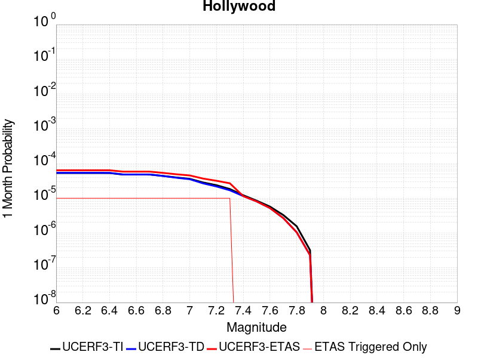 |  |  |

| Magnitude | 1 wk TI Prob | 1 wk TD Prob | 1 wk ETAS Prob | 1 wk ETAS/TD Gain | 1 wk ETAS Triggered Only | 1 mo TI Prob | 1 mo TD Prob | 1 mo ETAS Prob | 1 mo ETAS/TD Gain | 1 mo ETAS Triggered Only | 1 yr TI Prob | 1 yr TD Prob | 1 yr ETAS Prob | 1 yr ETAS/TD Gain | 1 yr ETAS Triggered Only | 10 yr TI Prob | 10 yr TD Prob | 10 yr ETAS Prob | 10 yr ETAS/TD Gain | 10 yr ETAS Triggered Only |
|-----|-----|-----|-----|-----|-----|-----|-----|-----|-----|-----|-----|-----|-----|-----|-----|-----|-----|-----|-----|-----|
| 6.0 | 1.24487615E-5 | 1.2593226E-5 | 3.0741816E-5 | 2.4411392 | 1.814882E-5 | 5.3350745E-5 | 5.3969878E-5 | 7.211772E-5 | 1.3362586 | 1.814882E-5 | 6.4935174E-4 | 6.568898E-4 | 6.931636E-4 | 1.0552205 | 3.629764E-5 | 0.0064745755 | 0.006549969 | 0.0066040587 | 1.008258 | 5.444646E-5 |
| 6.1 | 1.24487615E-5 | 1.2593226E-5 | 3.0741816E-5 | 2.4411392 | 1.814882E-5 | 5.3350745E-5 | 5.3969878E-5 | 7.211772E-5 | 1.3362586 | 1.814882E-5 | 6.4935174E-4 | 6.568898E-4 | 6.931636E-4 | 1.0552205 | 3.629764E-5 | 0.0064745755 | 0.006549969 | 0.0066040587 | 1.008258 | 5.444646E-5 |
| 6.2 | 1.24487615E-5 | 1.2593226E-5 | 3.0741816E-5 | 2.4411392 | 1.814882E-5 | 5.3350745E-5 | 5.3969878E-5 | 7.211772E-5 | 1.3362586 | 1.814882E-5 | 6.4935174E-4 | 6.568898E-4 | 6.931636E-4 | 1.0552205 | 3.629764E-5 | 0.0064745755 | 0.006549969 | 0.0066040587 | 1.008258 | 5.444646E-5 |
| 6.3 | 1.24487615E-5 | 1.2593226E-5 | 3.0741816E-5 | 2.4411392 | 1.814882E-5 | 5.3350745E-5 | 5.3969878E-5 | 7.211772E-5 | 1.3362586 | 1.814882E-5 | 6.4935174E-4 | 6.568898E-4 | 6.931636E-4 | 1.0552205 | 3.629764E-5 | 0.0064745755 | 0.006549969 | 0.0066040587 | 1.008258 | 5.444646E-5 |
| 6.4 | 1.2431024E-5 | 1.2573839E-5 | 3.0722433E-5 | 2.4433613 | 1.814882E-5 | 5.327473E-5 | 5.3886797E-5 | 7.2034636E-5 | 1.3367772 | 1.814882E-5 | 6.4842677E-4 | 6.558789E-4 | 6.921527E-4 | 1.0553057 | 3.629764E-5 | 0.0064653796 | 0.0065399194 | 0.0065940097 | 1.0082709 | 5.444646E-5 |
| 6.5 | 1.1242222E-5 | 1.13178E-5 | 2.9466415E-5 | 2.6035461 | 1.814882E-5 | 4.8180063E-5 | 4.850397E-5 | 6.665191E-5 | 1.3741537 | 1.814882E-5 | 5.864344E-4 | 5.9037853E-4 | 6.266547E-4 | 1.0614457 | 3.629764E-5 | 0.0058488925 | 0.005888388 | 0.0059425137 | 1.009192 | 5.444646E-5 |
| 6.6 | 1.1234066E-5 | 1.13089145E-5 | 2.945753E-5 | 2.6048062 | 1.814882E-5 | 4.8145106E-5 | 4.846589E-5 | 6.661383E-5 | 1.3744477 | 1.814882E-5 | 5.86009E-4 | 5.8991514E-4 | 6.261914E-4 | 1.061494 | 3.629764E-5 | 0.005844661 | 0.0058837784 | 0.0059379046 | 1.0091993 | 5.444646E-5 |
| 6.7 | 1.12294E-5 | 1.1303658E-5 | 2.9452272E-5 | 2.6055524 | 1.814882E-5 | 4.812511E-5 | 4.8443362E-5 | 6.65913E-5 | 1.3746219 | 1.814882E-5 | 5.857657E-4 | 5.89641E-4 | 6.259172E-4 | 1.0615226 | 3.629764E-5 | 0.0058422405 | 0.005881052 | 0.005935178 | 1.0092036 | 5.444646E-5 |
| 6.8 | 1.0252819E-5 | 1.0218445E-5 | 2.836708E-5 | 2.7760663 | 1.814882E-5 | 4.3939912E-5 | 4.379261E-5 | 6.1940635E-5 | 1.4144084 | 1.814882E-5 | 5.3483713E-4 | 5.330467E-4 | 5.69325E-4 | 1.0680584 | 3.629764E-5 | 0.005335517 | 0.005317908 | 0.0053720647 | 1.0101839 | 5.444646E-5 |
| 6.9 | 9.252289E-6 | 9.110306E-6 | 2.725896E-5 | 2.9921017 | 1.814882E-5 | 3.9652066E-5 | 3.9043593E-5 | 5.7191704E-5 | 1.4648167 | 1.814882E-5 | 4.8265693E-4 | 4.752537E-4 | 5.115341E-4 | 1.076339 | 3.629764E-5 | 0.0048161 | 0.004742547 | 0.004796735 | 1.011426 | 5.444646E-5 |
| 7.0 | 8.474604E-6 | 8.258257E-6 | 2.6406928E-5 | 3.1976395 | 1.814882E-5 | 3.6319227E-5 | 3.539206E-5 | 5.3540236E-5 | 1.5127754 | 1.814882E-5 | 4.4209688E-4 | 4.3081454E-4 | 4.6709654E-4 | 1.0842172 | 3.629764E-5 | 0.004412184 | 0.004299944 | 0.004354156 | 1.0126077 | 5.444646E-5 |
| 7.1 | 6.643643E-6 | 6.2683675E-6 | 2.4417073E-5 | 3.8952844 | 1.814882E-5 | 2.8472443E-5 | 2.6864158E-5 | 4.501249E-5 | 1.6755593 | 1.814882E-5 | 3.4659685E-4 | 3.2702246E-4 | 3.4516535E-4 | 1.055479 | 1.814882E-5 | 0.0034605677 | 0.0032654584 | 0.0033016375 | 1.0110793 | 3.629764E-5 |
| 7.2 | 5.549002E-6 | 5.108709E-6 | 2.3257437E-5 | 4.5525074 | 1.814882E-5 | 2.378122E-5 | 2.1894284E-5 | 4.004271E-5 | 1.8289114 | 1.814882E-5 | 2.8949787E-4 | 2.6653046E-4 | 2.8467443E-4 | 1.0680747 | 1.814882E-5 | 0.0028912104 | 0.0026621243 | 0.0026983253 | 1.0135986 | 3.629764E-5 |
| 7.3 | 4.3059727E-6 | 3.9598885E-6 | 2.2108637E-5 | 5.583146 | 1.814882E-5 | 1.8454039E-5 | 1.6970842E-5 | 3.5119356E-5 | 2.0693939 | 1.814882E-5 | 2.2465475E-4 | 2.066005E-4 | 2.2474557E-4 | 1.0878268 | 1.814882E-5 | 0.0022442779 | 0.0020640944 | 0.0020822058 | 1.0087745 | 1.814882E-5 |
| 7.4 | 2.8550733E-6 | 2.7012966E-6 | 2.7012966E-6 | 1.0 | 0.0 | 1.2235971E-5 | 1.1576934E-5 | 1.1576934E-5 | 1.0 | 0.0 | 1.4896276E-4 | 1.409401E-4 | 1.409401E-4 | 1.0 | 0.0 | 0.0014886294 | 0.0014085122 | 0.0014085122 | 1.0 | 0.0 |
| 7.5 | 1.9927045E-6 | 1.8976367E-6 | 1.8976367E-6 | 1.0 | 0.0 | 8.540134E-6 | 8.132703E-6 | 8.132703E-6 | 1.0 | 0.0 | 1.0397117E-4 | 9.90112E-5 | 9.90112E-5 | 1.0 | 0.0 | 0.0010392254 | 9.896745E-4 | 9.896745E-4 | 1.0 | 0.0 |
| 7.6 | 1.345084E-6 | 1.2216007E-6 | 1.2216007E-6 | 1.0 | 0.0 | 5.764633E-6 | 5.235421E-6 | 5.235421E-6 | 1.0 | 0.0 | 7.018215E-5 | 6.3739404E-5 | 6.3739404E-5 | 1.0 | 0.0 | 7.0159987E-4 | 6.3721323E-4 | 6.3721323E-4 | 1.0 | 0.0 |
| 7.7 | 7.6835164E-7 | 6.277697E-7 | 6.277697E-7 | 1.0 | 0.0 | 3.2929315E-6 | 2.6904388E-6 | 2.6904388E-6 | 1.0 | 0.0 | 4.00907E-5 | 3.2755615E-5 | 3.2755615E-5 | 1.0 | 0.0 | 4.0083472E-4 | 3.2750933E-4 | 3.2750933E-4 | 1.0 | 0.0 |
| 7.8 | 3.6562128E-7 | 2.453479E-7 | 2.453479E-7 | 1.0 | 0.0 | 1.5669474E-6 | 1.0514907E-6 | 1.0514907E-6 | 1.0 | 0.0 | 1.9077417E-5 | 1.2801827E-5 | 1.2801827E-5 | 1.0 | 0.0 | 1.907578E-4 | 1.2801126E-4 | 1.2801126E-4 | 1.0 | 0.0 |
| 7.9 | 7.5024424E-8 | 5.3816795E-8 | 5.3816795E-8 | 1.0 | 0.0 | 3.215332E-7 | 2.306434E-7 | 2.306434E-7 | 1.0 | 0.0 | 3.91466E-6 | 2.808081E-6 | 2.808081E-6 | 1.0 | 0.0 | 3.9145907E-5 | 2.8080585E-5 | 2.8080585E-5 | 1.0 | 0.0 |

## Verdugo
*[(top)](#table-of-contents)*

| 1 Week | 1 Month | 1 Year | 10 Year |
|-----|-----|-----|-----|
|  |  |  |  |

| Magnitude | 1 wk TI Prob | 1 wk TD Prob | 1 wk ETAS Prob | 1 wk ETAS/TD Gain | 1 wk ETAS Triggered Only | 1 mo TI Prob | 1 mo TD Prob | 1 mo ETAS Prob | 1 mo ETAS/TD Gain | 1 mo ETAS Triggered Only | 1 yr TI Prob | 1 yr TD Prob | 1 yr ETAS Prob | 1 yr ETAS/TD Gain | 1 yr ETAS Triggered Only | 10 yr TI Prob | 10 yr TD Prob | 10 yr ETAS Prob | 10 yr ETAS/TD Gain | 10 yr ETAS Triggered Only |
|-----|-----|-----|-----|-----|-----|-----|-----|-----|-----|-----|-----|-----|-----|-----|-----|-----|-----|-----|-----|-----|
| 6.0 | 5.392987E-6 | 4.216517E-6 | 4.216517E-6 | 1.0 | 0.0 | 2.3112598E-5 | 1.8070665E-5 | 1.8070665E-5 | 1.0 | 0.0 | 2.8135953E-4 | 2.1998861E-4 | 2.3813343E-4 | 1.0824808 | 1.814882E-5 | 0.0028100356 | 0.0021977562 | 0.002252083 | 1.0247192 | 5.444646E-5 |
| 6.1 | 5.392987E-6 | 4.216517E-6 | 4.216517E-6 | 1.0 | 0.0 | 2.3112598E-5 | 1.8070665E-5 | 1.8070665E-5 | 1.0 | 0.0 | 2.8135953E-4 | 2.1998861E-4 | 2.3813343E-4 | 1.0824808 | 1.814882E-5 | 0.0028100356 | 0.0021977562 | 0.002252083 | 1.0247192 | 5.444646E-5 |
| 6.2 | 5.392987E-6 | 4.216517E-6 | 4.216517E-6 | 1.0 | 0.0 | 2.3112598E-5 | 1.8070665E-5 | 1.8070665E-5 | 1.0 | 0.0 | 2.8135953E-4 | 2.1998861E-4 | 2.3813343E-4 | 1.0824808 | 1.814882E-5 | 0.0028100356 | 0.0021977562 | 0.002252083 | 1.0247192 | 5.444646E-5 |
| 6.3 | 5.392987E-6 | 4.216517E-6 | 4.216517E-6 | 1.0 | 0.0 | 2.3112598E-5 | 1.8070665E-5 | 1.8070665E-5 | 1.0 | 0.0 | 2.8135953E-4 | 2.1998861E-4 | 2.3813343E-4 | 1.0824808 | 1.814882E-5 | 0.0028100356 | 0.0021977562 | 0.002252083 | 1.0247192 | 5.444646E-5 |
| 6.4 | 5.392987E-6 | 4.216517E-6 | 4.216517E-6 | 1.0 | 0.0 | 2.3112598E-5 | 1.8070665E-5 | 1.8070665E-5 | 1.0 | 0.0 | 2.8135953E-4 | 2.1998861E-4 | 2.3813343E-4 | 1.0824808 | 1.814882E-5 | 0.0028100356 | 0.0021977562 | 0.002252083 | 1.0247192 | 5.444646E-5 |
| 6.5 | 4.9154837E-6 | 3.722465E-6 | 3.722465E-6 | 1.0 | 0.0 | 2.1066187E-5 | 1.5953325E-5 | 1.5953325E-5 | 1.0 | 0.0 | 2.5645064E-4 | 1.9421462E-4 | 2.1235993E-4 | 1.0934291 | 1.814882E-5 | 0.002561549 | 0.0019404698 | 0.0019948105 | 1.0280039 | 5.444646E-5 |
| 6.6 | 4.9154837E-6 | 3.722465E-6 | 3.722465E-6 | 1.0 | 0.0 | 2.1066187E-5 | 1.5953325E-5 | 1.5953325E-5 | 1.0 | 0.0 | 2.5645064E-4 | 1.9421462E-4 | 2.1235993E-4 | 1.0934291 | 1.814882E-5 | 0.002561549 | 0.0019404698 | 0.0019948105 | 1.0280039 | 5.444646E-5 |
| 6.7 | 4.817006E-6 | 3.6206518E-6 | 3.6206518E-6 | 1.0 | 0.0 | 2.0644147E-5 | 1.5516987E-5 | 1.5516987E-5 | 1.0 | 0.0 | 2.513135E-4 | 1.8890314E-4 | 2.0704854E-4 | 1.0960566 | 1.814882E-5 | 0.0025102948 | 0.0018874453 | 0.0019417889 | 1.0287921 | 5.444646E-5 |
| 6.8 | 4.507407E-6 | 3.3071042E-6 | 3.3071042E-6 | 1.0 | 0.0 | 1.9317316E-5 | 1.4173227E-5 | 1.4173227E-5 | 1.0 | 0.0 | 2.3516294E-4 | 1.7254551E-4 | 1.7254551E-4 | 1.0 | 0.0 | 0.0023491425 | 0.0017241298 | 0.0017422473 | 1.0105082 | 1.814882E-5 |
| 6.9 | 4.3573054E-6 | 3.161011E-6 | 3.161011E-6 | 1.0 | 0.0 | 1.8674033E-5 | 1.354712E-5 | 1.354712E-5 | 1.0 | 0.0 | 2.2733262E-4 | 1.6492383E-4 | 1.6492383E-4 | 1.0 | 0.0 | 0.0022710022 | 0.0016480266 | 0.0016661455 | 1.0109943 | 1.814882E-5 |
| 7.0 | 4.171527E-6 | 2.9836704E-6 | 2.9836704E-6 | 1.0 | 0.0 | 1.787785E-5 | 1.2787096E-5 | 1.2787096E-5 | 1.0 | 0.0 | 2.1764109E-4 | 1.5567189E-4 | 1.5567189E-4 | 1.0 | 0.0 | 0.0021742806 | 0.0015556397 | 0.0015737603 | 1.0116483 | 1.814882E-5 |
| 7.1 | 4.0405484E-6 | 2.882261E-6 | 2.882261E-6 | 1.0 | 0.0 | 1.731652E-5 | 1.235249E-5 | 1.235249E-5 | 1.0 | 0.0 | 2.1080824E-4 | 1.503813E-4 | 1.503813E-4 | 1.0 | 0.0 | 0.0021060838 | 0.0015028063 | 0.0015209279 | 1.0120585 | 1.814882E-5 |
| 7.2 | 3.8306007E-6 | 2.7018452E-6 | 2.7018452E-6 | 1.0 | 0.0 | 1.6416758E-5 | 1.15792855E-5 | 1.15792855E-5 | 1.0 | 0.0 | 1.9985568E-4 | 1.4096878E-4 | 1.4096878E-4 | 1.0 | 0.0 | 0.0019967605 | 0.0014088044 | 0.0014269276 | 1.0128642 | 1.814882E-5 |
| 7.3 | 3.5750938E-6 | 2.5121758E-6 | 2.5121758E-6 | 1.0 | 0.0 | 1.532174E-5 | 1.0766424E-5 | 1.0766424E-5 | 1.0 | 0.0 | 1.8652623E-4 | 1.3107344E-4 | 1.3107344E-4 | 1.0 | 0.0 | 0.0018636974 | 0.0013099718 | 0.0013099718 | 1.0 | 0.0 |
| 7.4 | 3.3510041E-6 | 2.3408586E-6 | 2.3408586E-6 | 1.0 | 0.0 | 1.4361368E-5 | 1.0032213E-5 | 1.0032213E-5 | 1.0 | 0.0 | 1.7483562E-4 | 1.2213545E-4 | 1.2213545E-4 | 1.0 | 0.0 | 0.0017469813 | 0.0012206937 | 0.0012206937 | 1.0 | 0.0 |
| 7.5 | 2.948287E-6 | 2.0391124E-6 | 2.0391124E-6 | 1.0 | 0.0 | 1.2635454E-5 | 8.739024E-6 | 8.739024E-6 | 1.0 | 0.0 | 1.538258E-4 | 1.0639253E-4 | 1.0639253E-4 | 1.0 | 0.0 | 0.0015371935 | 0.0010634261 | 0.0010634261 | 1.0 | 0.0 |
| 7.6 | 2.0134323E-6 | 1.4471265E-6 | 1.4471265E-6 | 1.0 | 0.0 | 8.628967E-6 | 6.2019562E-6 | 6.2019562E-6 | 1.0 | 0.0 | 1.05052604E-4 | 7.550629E-5 | 7.550629E-5 | 1.0 | 0.0 | 0.0010500296 | 7.548152E-4 | 7.548152E-4 | 1.0 | 0.0 |
| 7.7 | 5.726436E-7 | 4.045248E-7 | 4.045248E-7 | 1.0 | 0.0 | 2.4541846E-6 | 1.7336766E-6 | 1.7336766E-6 | 1.0 | 0.0 | 2.9879287E-5 | 2.1107335E-5 | 2.1107335E-5 | 1.0 | 0.0 | 2.987527E-4 | 2.1105584E-4 | 2.1105584E-4 | 1.0 | 0.0 |
| 7.8 | 1.6248204E-7 | 1.0687696E-7 | 1.0687696E-7 | 1.0 | 0.0 | 6.963514E-7 | 4.5804404E-7 | 4.5804404E-7 | 1.0 | 0.0 | 8.478045E-6 | 5.5766723E-6 | 5.5766723E-6 | 1.0 | 0.0 | 8.477722E-5 | 5.5765355E-5 | 5.5765355E-5 | 1.0 | 0.0 |
| 7.9 | 4.4475744E-8 | 3.0375546E-8 | 3.0375546E-8 | 1.0 | 0.0 | 1.9061031E-7 | 1.301809E-7 | 1.301809E-7 | 1.0 | 0.0 | 2.320678E-6 | 1.5849514E-6 | 1.5849514E-6 | 1.0 | 0.0 | 2.3206538E-5 | 1.5849415E-5 | 1.5849415E-5 | 1.0 | 0.0 |

## San Cayetano
*[(top)](#table-of-contents)*

| 1 Week | 1 Month | 1 Year | 10 Year |
|-----|-----|-----|-----|
|  |  |  |  |

| Magnitude | 1 wk TI Prob | 1 wk TD Prob | 1 wk ETAS Prob | 1 wk ETAS/TD Gain | 1 wk ETAS Triggered Only | 1 mo TI Prob | 1 mo TD Prob | 1 mo ETAS Prob | 1 mo ETAS/TD Gain | 1 mo ETAS Triggered Only | 1 yr TI Prob | 1 yr TD Prob | 1 yr ETAS Prob | 1 yr ETAS/TD Gain | 1 yr ETAS Triggered Only | 10 yr TI Prob | 10 yr TD Prob | 10 yr ETAS Prob | 10 yr ETAS/TD Gain | 10 yr ETAS Triggered Only |
|-----|-----|-----|-----|-----|-----|-----|-----|-----|-----|-----|-----|-----|-----|-----|-----|-----|-----|-----|-----|-----|
| 6.0 | 2.3476267E-5 | 1.816928E-5 | 3.6317768E-5 | 1.9988558 | 1.814882E-5 | 1.0060869E-4 | 7.786603E-5 | 9.601344E-5 | 1.2330594 | 1.814882E-5 | 0.0012242225 | 9.476103E-4 | 9.657419E-4 | 1.019134 | 1.814882E-5 | 0.012175002 | 0.009436584 | 0.009490517 | 1.0057153 | 5.444646E-5 |
| 6.1 | 2.3476267E-5 | 1.816928E-5 | 3.6317768E-5 | 1.9988558 | 1.814882E-5 | 1.0060869E-4 | 7.786603E-5 | 9.601344E-5 | 1.2330594 | 1.814882E-5 | 0.0012242225 | 9.476103E-4 | 9.657419E-4 | 1.019134 | 1.814882E-5 | 0.012175002 | 0.009436584 | 0.009490517 | 1.0057153 | 5.444646E-5 |
| 6.2 | 2.3476267E-5 | 1.816928E-5 | 3.6317768E-5 | 1.9988558 | 1.814882E-5 | 1.0060869E-4 | 7.786603E-5 | 9.601344E-5 | 1.2330594 | 1.814882E-5 | 0.0012242225 | 9.476103E-4 | 9.657419E-4 | 1.019134 | 1.814882E-5 | 0.012175002 | 0.009436584 | 0.009490517 | 1.0057153 | 5.444646E-5 |
| 6.3 | 2.3476267E-5 | 1.816928E-5 | 3.6317768E-5 | 1.9988558 | 1.814882E-5 | 1.0060869E-4 | 7.786603E-5 | 9.601344E-5 | 1.2330594 | 1.814882E-5 | 0.0012242225 | 9.476103E-4 | 9.657419E-4 | 1.019134 | 1.814882E-5 | 0.012175002 | 0.009436584 | 0.009490517 | 1.0057153 | 5.444646E-5 |
| 6.4 | 2.3476267E-5 | 1.816928E-5 | 3.6317768E-5 | 1.9988558 | 1.814882E-5 | 1.0060869E-4 | 7.786603E-5 | 9.601344E-5 | 1.2330594 | 1.814882E-5 | 0.0012242225 | 9.476103E-4 | 9.657419E-4 | 1.019134 | 1.814882E-5 | 0.012175002 | 0.009436584 | 0.009490517 | 1.0057153 | 5.444646E-5 |
| 6.5 | 2.3476267E-5 | 1.816928E-5 | 3.6317768E-5 | 1.9988558 | 1.814882E-5 | 1.0060869E-4 | 7.786603E-5 | 9.601344E-5 | 1.2330594 | 1.814882E-5 | 0.0012242225 | 9.476103E-4 | 9.657419E-4 | 1.019134 | 1.814882E-5 | 0.012175002 | 0.009436584 | 0.009490517 | 1.0057153 | 5.444646E-5 |
| 6.6 | 2.3476267E-5 | 1.816928E-5 | 3.6317768E-5 | 1.9988558 | 1.814882E-5 | 1.0060869E-4 | 7.786603E-5 | 9.601344E-5 | 1.2330594 | 1.814882E-5 | 0.0012242225 | 9.476103E-4 | 9.657419E-4 | 1.019134 | 1.814882E-5 | 0.012175002 | 0.009436584 | 0.009490517 | 1.0057153 | 5.444646E-5 |
| 6.7 | 2.3476267E-5 | 1.816928E-5 | 3.6317768E-5 | 1.9988558 | 1.814882E-5 | 1.0060869E-4 | 7.786603E-5 | 9.601344E-5 | 1.2330594 | 1.814882E-5 | 0.0012242225 | 9.476103E-4 | 9.657419E-4 | 1.019134 | 1.814882E-5 | 0.012175002 | 0.009436584 | 0.009490517 | 1.0057153 | 5.444646E-5 |
| 6.8 | 2.3241924E-5 | 1.7936987E-5 | 3.6085483E-5 | 2.0117917 | 1.814882E-5 | 9.960445E-5 | 7.687056E-5 | 9.501798E-5 | 1.2360777 | 1.814882E-5 | 0.0012120095 | 9.3550084E-4 | 9.5363264E-4 | 1.019382 | 1.814882E-5 | 0.012054204 | 0.009316482 | 0.009370421 | 1.0057896 | 5.444646E-5 |
| 6.9 | 2.2761007E-5 | 1.7432423E-5 | 3.5580928E-5 | 2.0410776 | 1.814882E-5 | 9.7543525E-5 | 7.470827E-5 | 9.285573E-5 | 1.2429111 | 1.814882E-5 | 0.0011869454 | 9.09197E-4 | 9.2732935E-4 | 1.0199432 | 1.814882E-5 | 0.011806256 | 0.009055603 | 0.009109557 | 1.005958 | 5.444646E-5 |
| 7.0 | 2.240283E-5 | 1.7066168E-5 | 3.5214678E-5 | 2.0634203 | 1.814882E-5 | 9.600859E-5 | 7.313869E-5 | 9.128619E-5 | 1.2481244 | 1.814882E-5 | 0.0011682777 | 8.9010317E-4 | 9.0823584E-4 | 1.0203714 | 1.814882E-5 | 0.011621549 | 0.008866196 | 0.008920159 | 1.0060865 | 5.444646E-5 |
| 7.1 | 2.1871154E-5 | 1.6586018E-5 | 3.4734538E-5 | 2.0942059 | 1.814882E-5 | 9.373015E-5 | 7.108101E-5 | 8.9228546E-5 | 1.2553077 | 1.814882E-5 | 0.0011405671 | 8.6507114E-4 | 8.832042E-4 | 1.0209614 | 1.814882E-5 | 0.011347309 | 0.008617838 | 0.0086718155 | 1.0062634 | 5.444646E-5 |
| 7.2 | 2.0714133E-5 | 1.5564561E-5 | 3.37131E-5 | 2.1660168 | 1.814882E-5 | 8.8771834E-5 | 6.670357E-5 | 8.4851185E-5 | 1.2720635 | 1.814882E-5 | 0.0010802611 | 8.1181666E-4 | 8.2995073E-4 | 1.0223377 | 1.814882E-5 | 0.010750249 | 0.008089285 | 0.008125289 | 1.0044508 | 3.629764E-5 |
| 7.3 | 1.8408395E-5 | 1.3996864E-5 | 3.214543E-5 | 2.2966166 | 1.814882E-5 | 7.8890735E-5 | 5.99852E-5 | 7.813293E-5 | 1.3025368 | 1.814882E-5 | 9.600714E-4 | 7.300781E-4 | 7.482137E-4 | 1.0248406 | 1.814882E-5 | 0.009559342 | 0.0072775153 | 0.007313549 | 1.0049514 | 3.629764E-5 |
| 7.4 | 1.6856795E-5 | 1.28500815E-5 | 3.0998668E-5 | 2.4123325 | 1.814882E-5 | 7.2241404E-5 | 5.5070628E-5 | 7.321845E-5 | 1.3295372 | 1.814882E-5 | 8.7918417E-4 | 6.7028153E-4 | 6.8841816E-4 | 1.0270582 | 1.814882E-5 | 0.00875714 | 0.0066832784 | 0.0067193336 | 1.0053948 | 3.629764E-5 |
| 7.5 | 1.2822778E-5 | 9.577542E-6 | 2.7726188E-5 | 2.894917 | 1.814882E-5 | 5.495361E-5 | 4.1045972E-5 | 5.9194048E-5 | 1.4421402 | 1.814882E-5 | 6.688548E-4 | 4.996217E-4 | 5.1776145E-4 | 1.036307 | 1.814882E-5 | 0.006668452 | 0.0049851555 | 0.005021272 | 1.0072448 | 3.629764E-5 |
| 7.6 | 5.6272684E-6 | 3.854903E-6 | 2.2003653E-5 | 5.7079654 | 1.814882E-5 | 2.4116642E-5 | 1.652091E-5 | 3.466943E-5 | 2.0985184 | 1.814882E-5 | 2.9358055E-4 | 2.0112359E-4 | 2.1926877E-4 | 1.090219 | 1.814882E-5 | 0.0029319301 | 0.0020094267 | 0.002027539 | 1.0090137 | 1.814882E-5 |
| 7.7 | 3.5261346E-6 | 2.3407013E-6 | 2.3407013E-6 | 1.0 | 0.0 | 1.5111918E-5 | 1.0031539E-5 | 1.0031539E-5 | 1.0 | 0.0 | 1.8397206E-4 | 1.2212721E-4 | 1.2212721E-4 | 1.0 | 0.0 | 0.0018381984 | 0.0012206084 | 0.0012206084 | 1.0 | 0.0 |
| 7.8 | 1.4826929E-6 | 1.056428E-6 | 1.056428E-6 | 1.0 | 0.0 | 6.354383E-6 | 4.5275406E-6 | 4.5275406E-6 | 1.0 | 0.0 | 7.736187E-5 | 5.5121433E-5 | 5.5121433E-5 | 1.0 | 0.0 | 7.733494E-4 | 5.5107963E-4 | 5.5107963E-4 | 1.0 | 0.0 |
| 7.9 | 2.7568166E-7 | 1.6978244E-7 | 1.6978244E-7 | 1.0 | 0.0 | 1.1814923E-6 | 7.2763885E-7 | 7.2763885E-7 | 1.0 | 0.0 | 1.4384574E-5 | 8.858967E-6 | 8.858967E-6 | 1.0 | 0.0 | 1.4383643E-4 | 8.8586174E-5 | 8.8586174E-5 | 1.0 | 0.0 |
| 8.0 | 5.407832E-8 | 2.6887697E-8 | 2.6887697E-8 | 1.0 | 0.0 | 2.3176422E-7 | 1.15232986E-7 | 1.15232986E-7 | 1.0 | 0.0 | 2.8217257E-6 | 1.4029607E-6 | 1.4029607E-6 | 1.0 | 0.0 | 2.8216898E-5 | 1.4029522E-5 | 1.4029522E-5 | 1.0 | 0.0 |

## Kern Canyon (Lake Isabella) 2011
*[(top)](#table-of-contents)*

| 1 Week | 1 Month | 1 Year | 10 Year |
|-----|-----|-----|-----|
|  |  |  | 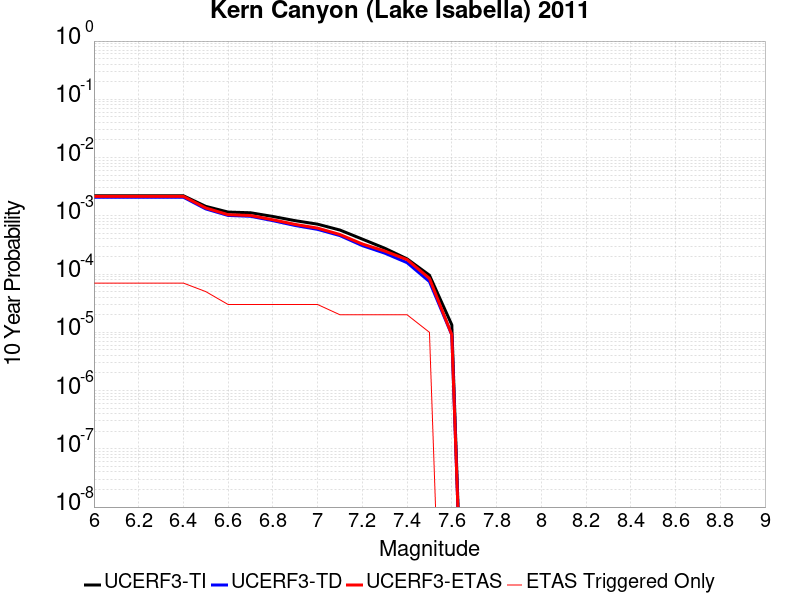 |

| Magnitude | 1 wk TI Prob | 1 wk TD Prob | 1 wk ETAS Prob | 1 wk ETAS/TD Gain | 1 wk ETAS Triggered Only | 1 mo TI Prob | 1 mo TD Prob | 1 mo ETAS Prob | 1 mo ETAS/TD Gain | 1 mo ETAS Triggered Only | 1 yr TI Prob | 1 yr TD Prob | 1 yr ETAS Prob | 1 yr ETAS/TD Gain | 1 yr ETAS Triggered Only | 10 yr TI Prob | 10 yr TD Prob | 10 yr ETAS Prob | 10 yr ETAS/TD Gain | 10 yr ETAS Triggered Only |
|-----|-----|-----|-----|-----|-----|-----|-----|-----|-----|-----|-----|-----|-----|-----|-----|-----|-----|-----|-----|-----|
| 6.0 | 4.2387383E-6 | 4.001639E-6 | 4.001639E-6 | 1.0 | 0.0 | 1.8165894E-5 | 1.7149778E-5 | 1.7149778E-5 | 1.0 | 0.0 | 2.2114732E-4 | 2.087804E-4 | 2.4507046E-4 | 1.1738193 | 3.629764E-5 | 0.0022092736 | 0.0020860266 | 0.0021222485 | 1.017364 | 3.629764E-5 |
| 6.1 | 4.2387383E-6 | 4.001639E-6 | 4.001639E-6 | 1.0 | 0.0 | 1.8165894E-5 | 1.7149778E-5 | 1.7149778E-5 | 1.0 | 0.0 | 2.2114732E-4 | 2.087804E-4 | 2.4507046E-4 | 1.1738193 | 3.629764E-5 | 0.0022092736 | 0.0020860266 | 0.0021222485 | 1.017364 | 3.629764E-5 |
| 6.2 | 4.2387383E-6 | 4.001639E-6 | 4.001639E-6 | 1.0 | 0.0 | 1.8165894E-5 | 1.7149778E-5 | 1.7149778E-5 | 1.0 | 0.0 | 2.2114732E-4 | 2.087804E-4 | 2.4507046E-4 | 1.1738193 | 3.629764E-5 | 0.0022092736 | 0.0020860266 | 0.0021222485 | 1.017364 | 3.629764E-5 |
| 6.3 | 4.2387383E-6 | 4.001639E-6 | 4.001639E-6 | 1.0 | 0.0 | 1.8165894E-5 | 1.7149778E-5 | 1.7149778E-5 | 1.0 | 0.0 | 2.2114732E-4 | 2.087804E-4 | 2.4507046E-4 | 1.1738193 | 3.629764E-5 | 0.0022092736 | 0.0020860266 | 0.0021222485 | 1.017364 | 3.629764E-5 |
| 6.4 | 4.2387383E-6 | 4.001639E-6 | 4.001639E-6 | 1.0 | 0.0 | 1.8165894E-5 | 1.7149778E-5 | 1.7149778E-5 | 1.0 | 0.0 | 2.2114732E-4 | 2.087804E-4 | 2.4507046E-4 | 1.1738193 | 3.629764E-5 | 0.0022092736 | 0.0020860266 | 0.0021222485 | 1.017364 | 3.629764E-5 |
| 6.5 | 2.7857532E-6 | 2.517867E-6 | 2.517867E-6 | 1.0 | 0.0 | 1.1938888E-5 | 1.0790815E-5 | 1.0790815E-5 | 1.0 | 0.0 | 1.4534626E-4 | 1.3137059E-4 | 1.6766346E-4 | 1.2762634 | 3.629764E-5 | 0.0014525123 | 0.001312962 | 0.001349212 | 1.0276093 | 3.629764E-5 |
| 6.6 | 2.2233348E-6 | 1.9441236E-6 | 1.9441236E-6 | 1.0 | 0.0 | 9.528543E-6 | 8.331932E-6 | 8.331932E-6 | 1.0 | 0.0 | 1.1600384E-4 | 1.01436635E-4 | 1.377306E-4 | 1.3577993 | 3.629764E-5 | 0.001159433 | 0.001013912 | 0.0010501728 | 1.0357633 | 3.629764E-5 |
| 6.7 | 2.1635126E-6 | 1.8835036E-6 | 1.8835036E-6 | 1.0 | 0.0 | 9.272164E-6 | 8.072134E-6 | 8.072134E-6 | 1.0 | 0.0 | 1.1288274E-4 | 9.827388E-5 | 1.3456795E-4 | 1.3693156 | 3.629764E-5 | 0.0011282542 | 9.823124E-4 | 0.0010185743 | 1.036915 | 3.629764E-5 |
| 6.8 | 1.8685711E-6 | 1.5831425E-6 | 1.5831425E-6 | 1.0 | 0.0 | 8.008137E-6 | 6.784879E-6 | 6.784879E-6 | 1.0 | 0.0 | 9.74947E-5 | 8.260282E-5 | 1.18897464E-4 | 1.4393874 | 3.629764E-5 | 9.745194E-4 | 8.2572614E-4 | 8.6199376E-4 | 1.0439222 | 3.629764E-5 |
| 6.9 | 1.5815071E-6 | 1.3064928E-6 | 1.3064928E-6 | 1.0 | 0.0 | 6.77787E-6 | 5.599243E-6 | 5.599243E-6 | 1.0 | 0.0 | 8.251744E-5 | 6.816868E-5 | 1.0446385E-4 | 1.5324317 | 3.629764E-5 | 8.248681E-4 | 6.8148033E-4 | 7.1775325E-4 | 1.0532266 | 3.629764E-5 |
| 7.0 | 1.3772564E-6 | 1.1210718E-6 | 1.1210718E-6 | 1.0 | 0.0 | 5.9025137E-6 | 4.8045845E-6 | 4.8045845E-6 | 1.0 | 0.0 | 7.186073E-5 | 5.8494268E-5 | 9.4789786E-5 | 1.620497 | 3.629764E-5 | 7.18375E-4 | 5.847908E-4 | 6.210672E-4 | 1.0620332 | 3.629764E-5 |
| 7.1 | 1.0916998E-6 | 8.763777E-7 | 8.763777E-7 | 1.0 | 0.0 | 4.678705E-6 | 3.7558991E-6 | 3.7558991E-6 | 1.0 | 0.0 | 5.6961744E-5 | 4.5727127E-5 | 6.3875115E-5 | 1.3968759 | 1.814882E-5 | 5.6947145E-4 | 4.571785E-4 | 4.7531904E-4 | 1.0396793 | 1.814882E-5 |
| 7.2 | 7.6277024E-7 | 5.901454E-7 | 5.901454E-7 | 1.0 | 0.0 | 3.2690114E-6 | 2.5291922E-6 | 2.5291922E-6 | 1.0 | 0.0 | 3.9799485E-5 | 3.0792486E-5 | 4.894075E-5 | 1.589373 | 1.814882E-5 | 3.9792358E-4 | 3.0788282E-4 | 3.2602606E-4 | 1.058929 | 1.814882E-5 |
| 7.3 | 5.3265916E-7 | 4.3824414E-7 | 4.3824414E-7 | 1.0 | 0.0 | 2.282823E-6 | 1.878188E-6 | 1.878188E-6 | 1.0 | 0.0 | 2.7793016E-5 | 2.2866701E-5 | 4.1015108E-5 | 1.7936609 | 1.814882E-5 | 2.778954E-4 | 2.2864387E-4 | 2.4678855E-4 | 1.0793577 | 1.814882E-5 |
| 7.4 | 3.4946007E-7 | 3.006571E-7 | 3.006571E-7 | 1.0 | 0.0 | 1.497685E-6 | 1.2885298E-6 | 1.2885298E-6 | 1.0 | 0.0 | 1.8234163E-5 | 1.568774E-5 | 3.3836273E-5 | 2.156861 | 1.814882E-5 | 1.8232666E-4 | 1.5686655E-4 | 1.7501251E-4 | 1.1156778 | 1.814882E-5 |
| 7.5 | 1.8317026E-7 | 1.4244812E-7 | 1.4244812E-7 | 1.0 | 0.0 | 7.850152E-7 | 6.104918E-7 | 6.104918E-7 | 1.0 | 0.0 | 9.557518E-6 | 7.432713E-6 | 2.55814E-5 | 3.441731 | 1.814882E-5 | 9.5571064E-5 | 7.432472E-5 | 9.24722E-5 | 1.2441647 | 1.814882E-5 |
| 7.6 | 2.572245E-8 | 1.7352555E-8 | 1.7352555E-8 | 1.0 | 0.0 | 1.10239064E-7 | 7.436809E-8 | 7.436809E-8 | 1.0 | 0.0 | 1.3421597E-6 | 9.054312E-7 | 9.054312E-7 | 1.0 | 0.0 | 1.3421517E-5 | 9.05428E-6 | 9.05428E-6 | 1.0 | 0.0 |

## Homestead Valley 2011
*[(top)](#table-of-contents)*

| 1 Week | 1 Month | 1 Year | 10 Year |
|-----|-----|-----|-----|
|  |  |  |  |

| Magnitude | 1 wk TI Prob | 1 wk TD Prob | 1 wk ETAS Prob | 1 wk ETAS/TD Gain | 1 wk ETAS Triggered Only | 1 mo TI Prob | 1 mo TD Prob | 1 mo ETAS Prob | 1 mo ETAS/TD Gain | 1 mo ETAS Triggered Only | 1 yr TI Prob | 1 yr TD Prob | 1 yr ETAS Prob | 1 yr ETAS/TD Gain | 1 yr ETAS Triggered Only | 10 yr TI Prob | 10 yr TD Prob | 10 yr ETAS Prob | 10 yr ETAS/TD Gain | 10 yr ETAS Triggered Only |
|-----|-----|-----|-----|-----|-----|-----|-----|-----|-----|-----|-----|-----|-----|-----|-----|-----|-----|-----|-----|-----|
| 6.0 | 1.539795E-5 | 6.286606E-6 | 2.4435312E-5 | 3.8868847 | 1.814882E-5 | 6.5989545E-5 | 2.6942436E-5 | 4.509077E-5 | 1.6735965 | 1.814882E-5 | 8.0312655E-4 | 3.279954E-4 | 3.4613826E-4 | 1.0553144 | 1.814882E-5 | 0.008002302 | 0.0032771337 | 0.0033133125 | 1.0110397 | 3.629764E-5 |
| 6.1 | 1.539795E-5 | 6.286606E-6 | 2.4435312E-5 | 3.8868847 | 1.814882E-5 | 6.5989545E-5 | 2.6942436E-5 | 4.509077E-5 | 1.6735965 | 1.814882E-5 | 8.0312655E-4 | 3.279954E-4 | 3.4613826E-4 | 1.0553144 | 1.814882E-5 | 0.008002302 | 0.0032771337 | 0.0033133125 | 1.0110397 | 3.629764E-5 |
| 6.2 | 1.539795E-5 | 6.286606E-6 | 2.4435312E-5 | 3.8868847 | 1.814882E-5 | 6.5989545E-5 | 2.6942436E-5 | 4.509077E-5 | 1.6735965 | 1.814882E-5 | 8.0312655E-4 | 3.279954E-4 | 3.4613826E-4 | 1.0553144 | 1.814882E-5 | 0.008002302 | 0.0032771337 | 0.0033133125 | 1.0110397 | 3.629764E-5 |
| 6.3 | 1.539795E-5 | 6.286606E-6 | 2.4435312E-5 | 3.8868847 | 1.814882E-5 | 6.5989545E-5 | 2.6942436E-5 | 4.509077E-5 | 1.6735965 | 1.814882E-5 | 8.0312655E-4 | 3.279954E-4 | 3.4613826E-4 | 1.0553144 | 1.814882E-5 | 0.008002302 | 0.0032771337 | 0.0033133125 | 1.0110397 | 3.629764E-5 |
| 6.4 | 1.539795E-5 | 6.286606E-6 | 2.4435312E-5 | 3.8868847 | 1.814882E-5 | 6.5989545E-5 | 2.6942436E-5 | 4.509077E-5 | 1.6735965 | 1.814882E-5 | 8.0312655E-4 | 3.279954E-4 | 3.4613826E-4 | 1.0553144 | 1.814882E-5 | 0.008002302 | 0.0032771337 | 0.0033133125 | 1.0110397 | 3.629764E-5 |
| 6.5 | 1.0265258E-5 | 2.8788488E-6 | 2.8788488E-6 | 1.0 | 0.0 | 4.3993223E-5 | 1.2337905E-5 | 1.2337905E-5 | 1.0 | 0.0 | 5.3548586E-4 | 1.5021059E-4 | 1.5021059E-4 | 1.0 | 0.0 | 0.005341973 | 0.0015017724 | 0.0015017724 | 1.0 | 0.0 |
| 6.6 | 6.664671E-6 | 5.348204E-7 | 5.348204E-7 | 1.0 | 0.0 | 2.8562565E-5 | 2.2920863E-6 | 2.2920863E-6 | 1.0 | 0.0 | 3.476937E-4 | 2.7905911E-5 | 2.7905911E-5 | 1.0 | 0.0 | 0.003471502 | 2.790357E-4 | 2.790357E-4 | 1.0 | 0.0 |
| 6.7 | 6.5954046E-6 | 5.348204E-7 | 5.348204E-7 | 1.0 | 0.0 | 2.8265715E-5 | 2.2920863E-6 | 2.2920863E-6 | 1.0 | 0.0 | 3.4408073E-4 | 2.7905911E-5 | 2.7905911E-5 | 1.0 | 0.0 | 0.0034354846 | 2.790357E-4 | 2.790357E-4 | 1.0 | 0.0 |
| 6.8 | 4.648189E-6 | 2.3265572E-7 | 2.3265572E-7 | 1.0 | 0.0 | 1.9920659E-5 | 9.970956E-7 | 9.970956E-7 | 1.0 | 0.0 | 2.4250703E-4 | 1.2139576E-5 | 1.2139576E-5 | 1.0 | 0.0 | 0.0024224254 | 1.2138961E-4 | 1.2138961E-4 | 1.0 | 0.0 |
| 6.9 | 4.1428534E-6 | 1.9344557E-7 | 1.9344557E-7 | 1.0 | 0.0 | 1.7754966E-5 | 8.290522E-7 | 8.290522E-7 | 1.0 | 0.0 | 2.1614527E-4 | 1.0093667E-5 | 1.0093667E-5 | 1.0 | 0.0 | 0.0021593515 | 1.0093238E-4 | 1.0093238E-4 | 1.0 | 0.0 |
| 7.0 | 3.0673707E-6 | 1.5367603E-7 | 1.5367603E-7 | 1.0 | 0.0 | 1.3145808E-5 | 6.586114E-7 | 6.586114E-7 | 1.0 | 0.0 | 1.6003846E-4 | 8.0185655E-6 | 8.0185655E-6 | 1.0 | 0.0 | 0.0015992324 | 8.0182865E-5 | 8.0182865E-5 | 1.0 | 0.0 |
| 7.1 | 2.340854E-6 | 1.468766E-7 | 1.468766E-7 | 1.0 | 0.0 | 1.0032193E-5 | 6.29471E-7 | 6.29471E-7 | 1.0 | 0.0 | 1.221351E-4 | 7.663783E-6 | 7.663783E-6 | 1.0 | 0.0 | 0.00122068 | 7.663529E-5 | 7.663529E-5 | 1.0 | 0.0 |
| 7.2 | 1.3754182E-6 | 1.3922634E-7 | 1.3922634E-7 | 1.0 | 0.0 | 5.8946357E-6 | 5.966842E-7 | 5.966842E-7 | 1.0 | 0.0 | 7.176483E-5 | 7.2646067E-6 | 7.2646067E-6 | 1.0 | 0.0 | 7.174166E-4 | 7.264379E-5 | 7.264379E-5 | 1.0 | 0.0 |
| 7.3 | 1.2573237E-6 | 1.3827146E-7 | 1.3827146E-7 | 1.0 | 0.0 | 5.388519E-6 | 5.9259185E-7 | 5.9259185E-7 | 1.0 | 0.0 | 6.560324E-5 | 7.2147827E-6 | 7.2147827E-6 | 1.0 | 0.0 | 6.558388E-4 | 7.214558E-5 | 7.214558E-5 | 1.0 | 0.0 |
| 7.4 | 1.0994207E-6 | 1.3106106E-7 | 1.3106106E-7 | 1.0 | 0.0 | 4.7117946E-6 | 5.616901E-7 | 5.616901E-7 | 1.0 | 0.0 | 5.736459E-5 | 6.8385566E-6 | 6.8385566E-6 | 1.0 | 0.0 | 5.734978E-4 | 6.838355E-5 | 6.838355E-5 | 1.0 | 0.0 |
| 7.5 | 5.5569126E-7 | 6.772991E-8 | 6.772991E-8 | 1.0 | 0.0 | 2.3815317E-6 | 2.90271E-7 | 2.90271E-7 | 1.0 | 0.0 | 2.8994764E-5 | 3.5340445E-6 | 3.5340445E-6 | 1.0 | 0.0 | 2.899098E-4 | 3.5339945E-5 | 3.5339945E-5 | 1.0 | 0.0 |

## Great Valley 03 Mysterious Ridge
*[(top)](#table-of-contents)*

| 1 Week | 1 Month | 1 Year | 10 Year |
|-----|-----|-----|-----|
|  |  |  |  |

| Magnitude | 1 wk TI Prob | 1 wk TD Prob | 1 wk ETAS Prob | 1 wk ETAS/TD Gain | 1 wk ETAS Triggered Only | 1 mo TI Prob | 1 mo TD Prob | 1 mo ETAS Prob | 1 mo ETAS/TD Gain | 1 mo ETAS Triggered Only | 1 yr TI Prob | 1 yr TD Prob | 1 yr ETAS Prob | 1 yr ETAS/TD Gain | 1 yr ETAS Triggered Only | 10 yr TI Prob | 10 yr TD Prob | 10 yr ETAS Prob | 10 yr ETAS/TD Gain | 10 yr ETAS Triggered Only |
|-----|-----|-----|-----|-----|-----|-----|-----|-----|-----|-----|-----|-----|-----|-----|-----|-----|-----|-----|-----|-----|
| 6.0 | 3.1182444E-5 | 3.603423E-5 | 3.603423E-5 | 1.0 | 0.0 | 1.336322E-4 | 1.544242E-4 | 1.544242E-4 | 1.0 | 0.0 | 0.0016257578 | 0.0018786696 | 0.0018786696 | 1.0 | 0.0 | 0.016139153 | 0.018646652 | 0.018682271 | 1.0019103 | 3.629764E-5 |
| 6.1 | 3.1182444E-5 | 3.603423E-5 | 3.603423E-5 | 1.0 | 0.0 | 1.336322E-4 | 1.544242E-4 | 1.544242E-4 | 1.0 | 0.0 | 0.0016257578 | 0.0018786696 | 0.0018786696 | 1.0 | 0.0 | 0.016139153 | 0.018646652 | 0.018682271 | 1.0019103 | 3.629764E-5 |
| 6.2 | 3.1182444E-5 | 3.603423E-5 | 3.603423E-5 | 1.0 | 0.0 | 1.336322E-4 | 1.544242E-4 | 1.544242E-4 | 1.0 | 0.0 | 0.0016257578 | 0.0018786696 | 0.0018786696 | 1.0 | 0.0 | 0.016139153 | 0.018646652 | 0.018682271 | 1.0019103 | 3.629764E-5 |
| 6.3 | 2.106934E-5 | 2.3850307E-5 | 2.3850307E-5 | 1.0 | 0.0 | 9.0294045E-5 | 1.0221177E-4 | 1.0221177E-4 | 1.0 | 0.0 | 0.0010987755 | 0.0012437489 | 0.0012437489 | 1.0 | 0.0 | 0.010933585 | 0.012371127 | 0.012406975 | 1.0028977 | 3.629764E-5 |
| 6.4 | 2.106934E-5 | 2.3850307E-5 | 2.3850307E-5 | 1.0 | 0.0 | 9.0294045E-5 | 1.0221177E-4 | 1.0221177E-4 | 1.0 | 0.0 | 0.0010987755 | 0.0012437489 | 0.0012437489 | 1.0 | 0.0 | 0.010933585 | 0.012371127 | 0.012406975 | 1.0028977 | 3.629764E-5 |
| 6.5 | 1.9389783E-5 | 2.1884984E-5 | 2.1884984E-5 | 1.0 | 0.0 | 8.309642E-5 | 9.3789575E-5 | 9.3789575E-5 | 1.0 | 0.0 | 0.0010112294 | 0.0011413174 | 0.0011413174 | 1.0 | 0.0 | 0.010066401 | 0.011357434 | 0.011393319 | 1.0031596 | 3.629764E-5 |
| 6.6 | 1.9370193E-5 | 2.1864906E-5 | 2.1864906E-5 | 1.0 | 0.0 | 8.301247E-5 | 9.370353E-5 | 9.370353E-5 | 1.0 | 0.0 | 0.0010102082 | 0.001140271 | 0.001140271 | 1.0 | 0.0 | 0.010056281 | 0.011347076 | 0.011382962 | 1.0031625 | 3.629764E-5 |
| 6.7 | 1.6723505E-5 | 1.8799281E-5 | 1.8799281E-5 | 1.0 | 0.0 | 7.16702E-5 | 8.056597E-5 | 8.056597E-5 | 1.0 | 0.0 | 8.722353E-4 | 9.804688E-4 | 9.804688E-4 | 1.0 | 0.0 | 0.008688197 | 0.009763439 | 0.009799383 | 1.0036814 | 3.629764E-5 |
| 6.8 | 1.426937E-5 | 1.599721E-5 | 1.599721E-5 | 1.0 | 0.0 | 6.115301E-5 | 6.855775E-5 | 6.855775E-5 | 1.0 | 0.0 | 7.4428355E-4 | 8.343854E-4 | 8.343854E-4 | 1.0 | 0.0 | 0.007417957 | 0.008314005 | 0.008350001 | 1.0043296 | 3.629764E-5 |
| 6.9 | 1.2469891E-5 | 1.3956928E-5 | 1.3956928E-5 | 1.0 | 0.0 | 5.3441294E-5 | 5.9814105E-5 | 5.9814105E-5 | 1.0 | 0.0 | 6.504535E-4 | 7.280055E-4 | 7.280055E-4 | 1.0 | 0.0 | 0.006485529 | 0.00725743 | 0.007293464 | 1.0049652 | 3.629764E-5 |
| 7.0 | 8.7746275E-6 | 9.791734E-6 | 9.791734E-6 | 1.0 | 0.0 | 3.7605005E-5 | 4.196394E-5 | 4.196394E-5 | 1.0 | 0.0 | 4.5774475E-4 | 5.1079853E-4 | 5.1079853E-4 | 1.0 | 0.0 | 0.00456803 | 0.005096977 | 0.0051330896 | 1.0070851 | 3.629764E-5 |
| 7.1 | 6.1067153E-6 | 6.813725E-6 | 6.813725E-6 | 1.0 | 0.0 | 2.6171374E-5 | 2.9201385E-5 | 2.9201385E-5 | 1.0 | 0.0 | 3.1858988E-4 | 3.5547445E-4 | 3.5547445E-4 | 1.0 | 0.0 | 0.0031813353 | 0.003549609 | 0.0035676935 | 1.0050948 | 1.814882E-5 |
| 7.2 | 2.939283E-6 | 3.2741057E-6 | 3.2741057E-6 | 1.0 | 0.0 | 1.2596866E-5 | 1.4031816E-5 | 1.4031816E-5 | 1.0 | 0.0 | 1.5335606E-4 | 1.7082572E-4 | 1.7082572E-4 | 1.0 | 0.0 | 0.0015325027 | 0.001707116 | 0.001725234 | 1.0106131 | 1.814882E-5 |
| 7.3 | 7.2387763E-7 | 8.008505E-7 | 8.008505E-7 | 1.0 | 0.0 | 3.102329E-6 | 3.4322145E-6 | 3.4322145E-6 | 1.0 | 0.0 | 3.77702E-5 | 4.178687E-5 | 4.178687E-5 | 1.0 | 0.0 | 3.7763783E-4 | 4.1783508E-4 | 4.1783508E-4 | 1.0 | 0.0 |
| 7.4 | 3.112171E-8 | 3.2068368E-8 | 3.2068368E-8 | 1.0 | 0.0 | 1.3337875E-7 | 1.3743585E-7 | 1.3743585E-7 | 1.0 | 0.0 | 1.6238852E-6 | 1.6732803E-6 | 1.6732803E-6 | 1.0 | 0.0 | 1.6238733E-5 | 1.6732685E-5 | 1.6732685E-5 | 1.0 | 0.0 |

## Channel Islands Thrust
*[(top)](#table-of-contents)*

| 1 Week | 1 Month | 1 Year | 10 Year |
|-----|-----|-----|-----|
|  |  |  |  |

| Magnitude | 1 wk TI Prob | 1 wk TD Prob | 1 wk ETAS Prob | 1 wk ETAS/TD Gain | 1 wk ETAS Triggered Only | 1 mo TI Prob | 1 mo TD Prob | 1 mo ETAS Prob | 1 mo ETAS/TD Gain | 1 mo ETAS Triggered Only | 1 yr TI Prob | 1 yr TD Prob | 1 yr ETAS Prob | 1 yr ETAS/TD Gain | 1 yr ETAS Triggered Only | 10 yr TI Prob | 10 yr TD Prob | 10 yr ETAS Prob | 10 yr ETAS/TD Gain | 10 yr ETAS Triggered Only |
|-----|-----|-----|-----|-----|-----|-----|-----|-----|-----|-----|-----|-----|-----|-----|-----|-----|-----|-----|-----|-----|
| 6.0 | 2.2156251E-5 | 2.4092022E-5 | 4.2240405E-5 | 1.7532943 | 1.814882E-5 | 9.495191E-5 | 1.03248036E-4 | 1.2139499E-4 | 1.1757607 | 1.814882E-5 | 0.0011554264 | 0.0012564264 | 0.0012745525 | 1.0144266 | 1.814882E-5 | 0.011494373 | 0.0125038205 | 0.012539664 | 1.0028666 | 3.629764E-5 |
| 6.1 | 2.2156251E-5 | 2.4092022E-5 | 4.2240405E-5 | 1.7532943 | 1.814882E-5 | 9.495191E-5 | 1.03248036E-4 | 1.2139499E-4 | 1.1757607 | 1.814882E-5 | 0.0011554264 | 0.0012564264 | 0.0012745525 | 1.0144266 | 1.814882E-5 | 0.011494373 | 0.0125038205 | 0.012539664 | 1.0028666 | 3.629764E-5 |
| 6.2 | 2.2156251E-5 | 2.4092022E-5 | 4.2240405E-5 | 1.7532943 | 1.814882E-5 | 9.495191E-5 | 1.03248036E-4 | 1.2139499E-4 | 1.1757607 | 1.814882E-5 | 0.0011554264 | 0.0012564264 | 0.0012745525 | 1.0144266 | 1.814882E-5 | 0.011494373 | 0.0125038205 | 0.012539664 | 1.0028666 | 3.629764E-5 |
| 6.3 | 2.2156251E-5 | 2.4092022E-5 | 4.2240405E-5 | 1.7532943 | 1.814882E-5 | 9.495191E-5 | 1.03248036E-4 | 1.2139499E-4 | 1.1757607 | 1.814882E-5 | 0.0011554264 | 0.0012564264 | 0.0012745525 | 1.0144266 | 1.814882E-5 | 0.011494373 | 0.0125038205 | 0.012539664 | 1.0028666 | 3.629764E-5 |
| 6.4 | 2.2156251E-5 | 2.4092022E-5 | 4.2240405E-5 | 1.7532943 | 1.814882E-5 | 9.495191E-5 | 1.03248036E-4 | 1.2139499E-4 | 1.1757607 | 1.814882E-5 | 0.0011554264 | 0.0012564264 | 0.0012745525 | 1.0144266 | 1.814882E-5 | 0.011494373 | 0.0125038205 | 0.012539664 | 1.0028666 | 3.629764E-5 |
| 6.5 | 2.2156251E-5 | 2.4092022E-5 | 4.2240405E-5 | 1.7532943 | 1.814882E-5 | 9.495191E-5 | 1.03248036E-4 | 1.2139499E-4 | 1.1757607 | 1.814882E-5 | 0.0011554264 | 0.0012564264 | 0.0012745525 | 1.0144266 | 1.814882E-5 | 0.011494373 | 0.0125038205 | 0.012539664 | 1.0028666 | 3.629764E-5 |
| 6.6 | 2.2156251E-5 | 2.4092022E-5 | 4.2240405E-5 | 1.7532943 | 1.814882E-5 | 9.495191E-5 | 1.03248036E-4 | 1.2139499E-4 | 1.1757607 | 1.814882E-5 | 0.0011554264 | 0.0012564264 | 0.0012745525 | 1.0144266 | 1.814882E-5 | 0.011494373 | 0.0125038205 | 0.012539664 | 1.0028666 | 3.629764E-5 |
| 6.7 | 1.0601296E-5 | 1.1379544E-5 | 1.1379544E-5 | 1.0 | 0.0 | 4.5433335E-5 | 4.876859E-5 | 4.876859E-5 | 1.0 | 0.0 | 5.5301044E-4 | 5.936007E-4 | 5.936007E-4 | 1.0 | 0.0 | 0.005516363 | 0.005920653 | 0.005920653 | 1.0 | 0.0 |
| 6.8 | 1.0246747E-5 | 1.0996669E-5 | 1.0996669E-5 | 1.0 | 0.0 | 4.391389E-5 | 4.7127756E-5 | 4.7127756E-5 | 1.0 | 0.0 | 5.345204E-4 | 5.7363417E-4 | 5.7363417E-4 | 1.0 | 0.0 | 0.0053323656 | 0.005722025 | 0.005722025 | 1.0 | 0.0 |
| 6.9 | 9.049551E-6 | 9.699645E-6 | 9.699645E-6 | 1.0 | 0.0 | 3.878322E-5 | 4.1569267E-5 | 4.1569267E-5 | 1.0 | 0.0 | 4.7208337E-4 | 5.059924E-4 | 5.059924E-4 | 1.0 | 0.0 | 0.0047108172 | 0.0050488203 | 0.0050488203 | 1.0 | 0.0 |
| 7.0 | 8.6542195E-6 | 9.274603E-6 | 9.274603E-6 | 1.0 | 0.0 | 3.7088983E-5 | 3.9747716E-5 | 3.9747716E-5 | 1.0 | 0.0 | 4.5146482E-4 | 4.8382508E-4 | 4.8382508E-4 | 1.0 | 0.0 | 0.004505487 | 0.004828129 | 0.004828129 | 1.0 | 0.0 |
| 7.1 | 8.391028E-6 | 8.992924E-6 | 8.992924E-6 | 1.0 | 0.0 | 3.5961057E-5 | 3.854056E-5 | 3.854056E-5 | 1.0 | 0.0 | 4.3773788E-4 | 4.6913436E-4 | 4.6913436E-4 | 1.0 | 0.0 | 0.004368766 | 0.0046818503 | 0.0046818503 | 1.0 | 0.0 |
| 7.2 | 5.965188E-6 | 6.3716952E-6 | 6.3716952E-6 | 1.0 | 0.0 | 2.556484E-5 | 2.7306982E-5 | 2.7306982E-5 | 1.0 | 0.0 | 3.1120746E-4 | 3.3241234E-4 | 3.3241234E-4 | 1.0 | 0.0 | 0.00310772 | 0.0033192092 | 0.0033192092 | 1.0 | 0.0 |
| 7.3 | 4.877518E-6 | 5.2060063E-6 | 5.2060063E-6 | 1.0 | 0.0 | 2.0903482E-5 | 2.2311267E-5 | 2.2311267E-5 | 1.0 | 0.0 | 2.5447016E-4 | 2.716063E-4 | 2.716063E-4 | 1.0 | 0.0 | 0.0025417898 | 0.0027127895 | 0.0027127895 | 1.0 | 0.0 |
| 7.4 | 3.8829853E-6 | 4.141863E-6 | 4.141863E-6 | 1.0 | 0.0 | 1.664126E-5 | 1.7750723E-5 | 1.7750723E-5 | 1.0 | 0.0 | 2.0258849E-4 | 2.1609402E-4 | 2.1609402E-4 | 1.0 | 0.0 | 0.002024039 | 0.0021588807 | 0.0021588807 | 1.0 | 0.0 |
| 7.5 | 1.3489616E-6 | 1.4277903E-6 | 1.4277903E-6 | 1.0 | 0.0 | 5.7812517E-6 | 6.119087E-6 | 6.119087E-6 | 1.0 | 0.0 | 7.038446E-5 | 7.449738E-5 | 7.449738E-5 | 1.0 | 0.0 | 7.036218E-4 | 7.44728E-4 | 7.44728E-4 | 1.0 | 0.0 |
| 7.6 | 6.058192E-7 | 6.353778E-7 | 6.353778E-7 | 1.0 | 0.0 | 2.5963652E-6 | 2.7230449E-6 | 2.7230449E-6 | 1.0 | 0.0 | 3.161029E-5 | 3.3152584E-5 | 3.3152584E-5 | 1.0 | 0.0 | 3.1605794E-4 | 3.31478E-4 | 3.31478E-4 | 1.0 | 0.0 |
| 7.7 | 2.2170494E-7 | 2.2607902E-7 | 2.2607902E-7 | 1.0 | 0.0 | 9.5016367E-7 | 9.689098E-7 | 9.689098E-7 | 1.0 | 0.0 | 1.1568181E-5 | 1.1796425E-5 | 1.1796425E-5 | 1.0 | 0.0 | 1.1567579E-4 | 1.1795909E-4 | 1.1795909E-4 | 1.0 | 0.0 |
| 7.8 | 2.1613102E-8 | 1.5466682E-8 | 1.5466682E-8 | 1.0 | 0.0 | 9.262757E-8 | 6.628578E-8 | 6.628578E-8 | 1.0 | 0.0 | 1.1277401E-6 | 8.070291E-7 | 8.070291E-7 | 1.0 | 0.0 | 1.1277344E-5 | 8.070269E-6 | 8.070269E-6 | 1.0 | 0.0 |

## Great Valley 09 (Laguna Seca)
*[(top)](#table-of-contents)*

| 1 Week | 1 Month | 1 Year | 10 Year |
|-----|-----|-----|-----|
|  |  |  |  |

| Magnitude | 1 wk TI Prob | 1 wk TD Prob | 1 wk ETAS Prob | 1 wk ETAS/TD Gain | 1 wk ETAS Triggered Only | 1 mo TI Prob | 1 mo TD Prob | 1 mo ETAS Prob | 1 mo ETAS/TD Gain | 1 mo ETAS Triggered Only | 1 yr TI Prob | 1 yr TD Prob | 1 yr ETAS Prob | 1 yr ETAS/TD Gain | 1 yr ETAS Triggered Only | 10 yr TI Prob | 10 yr TD Prob | 10 yr ETAS Prob | 10 yr ETAS/TD Gain | 10 yr ETAS Triggered Only |
|-----|-----|-----|-----|-----|-----|-----|-----|-----|-----|-----|-----|-----|-----|-----|-----|-----|-----|-----|-----|-----|
| 6.0 | 5.4353277E-5 | 7.05022E-5 | 8.8649744E-5 | 1.2574039 | 1.814882E-5 | 2.3292181E-4 | 3.0211566E-4 | 3.2025902E-4 | 1.0600543 | 1.814882E-5 | 0.0028321352 | 0.0036721937 | 0.0037083582 | 1.0098481 | 3.629764E-5 | 0.02796312 | 0.03611547 | 0.03615046 | 1.0009687 | 3.629764E-5 |
| 6.1 | 4.5578287E-5 | 5.822118E-5 | 5.822118E-5 | 1.0 | 0.0 | 1.953209E-4 | 2.4949326E-4 | 2.4949326E-4 | 1.0 | 0.0 | 0.0023754383 | 0.003033432 | 0.0030515257 | 1.0059648 | 1.814882E-5 | 0.023502063 | 0.029919548 | 0.029937154 | 1.0005884 | 1.814882E-5 |
| 6.2 | 2.8536782E-5 | 3.4737273E-5 | 3.4737273E-5 | 1.0 | 0.0 | 1.2229476E-4 | 1.4886224E-4 | 1.4886224E-4 | 1.0 | 0.0 | 0.0014879217 | 0.001810813 | 0.001810813 | 1.0 | 0.0 | 0.014779986 | 0.017958116 | 0.017958116 | 1.0 | 0.0 |
| 6.3 | 2.3698774E-5 | 2.8213295E-5 | 2.8213295E-5 | 1.0 | 0.0 | 1.01562226E-4 | 1.20905075E-4 | 1.20905075E-4 | 1.0 | 0.0 | 0.0012358186 | 0.0014710218 | 0.0014710218 | 1.0 | 0.0 | 0.012289686 | 0.014611342 | 0.014611342 | 1.0 | 0.0 |
| 6.4 | 1.9191197E-5 | 2.2123184E-5 | 2.2123184E-5 | 1.0 | 0.0 | 8.2245395E-5 | 9.4806666E-5 | 9.4806666E-5 | 1.0 | 0.0 | 0.0010008777 | 0.0011536429 | 0.0011536429 | 1.0 | 0.0 | 0.009963818 | 0.011476948 | 0.011476948 | 1.0 | 0.0 |
| 6.5 | 1.5203241E-5 | 1.6802203E-5 | 1.6802203E-5 | 1.0 | 0.0 | 6.5155116E-5 | 7.200386E-5 | 7.200386E-5 | 1.0 | 0.0 | 7.9297484E-4 | 8.7626575E-4 | 8.7626575E-4 | 1.0 | 0.0 | 0.007901512 | 0.0087295165 | 0.0087295165 | 1.0 | 0.0 |
| 6.6 | 1.0984925E-5 | 1.1242595E-5 | 1.1242595E-5 | 1.0 | 0.0 | 4.70774E-5 | 4.8181686E-5 | 4.8181686E-5 | 1.0 | 0.0 | 5.730166E-4 | 5.8645656E-4 | 5.8645656E-4 | 1.0 | 0.0 | 0.005715413 | 0.0058494853 | 0.0058494853 | 1.0 | 0.0 |
| 6.7 | 9.134616E-6 | 9.019894E-6 | 9.019894E-6 | 1.0 | 0.0 | 3.9147766E-5 | 3.865613E-5 | 3.865613E-5 | 1.0 | 0.0 | 4.7651984E-4 | 4.7053912E-4 | 4.7053912E-4 | 1.0 | 0.0 | 0.004754993 | 0.0046956735 | 0.0046956735 | 1.0 | 0.0 |
| 6.8 | 7.785589E-6 | 7.4519444E-6 | 7.4519444E-6 | 1.0 | 0.0 | 3.3366385E-5 | 3.1936524E-5 | 3.1936524E-5 | 1.0 | 0.0 | 4.0616E-4 | 3.8875983E-4 | 3.8875983E-4 | 1.0 | 0.0 | 0.0040541845 | 0.0038810016 | 0.0038810016 | 1.0 | 0.0 |
| 6.9 | 5.579095E-6 | 4.898492E-6 | 4.898492E-6 | 1.0 | 0.0 | 2.3910188E-5 | 2.0993377E-5 | 2.0993377E-5 | 1.0 | 0.0 | 2.9106764E-4 | 2.5556577E-4 | 2.5556577E-4 | 1.0 | 0.0 | 0.002906867 | 0.002552856 | 0.002552856 | 1.0 | 0.0 |
| 7.0 | 2.6816688E-6 | 1.5216126E-6 | 1.5216126E-6 | 1.0 | 0.0 | 1.1492816E-5 | 6.521181E-6 | 6.521181E-6 | 1.0 | 0.0 | 1.3991605E-4 | 7.939258E-5 | 7.939258E-5 | 1.0 | 0.0 | 0.0013982799 | 7.9365086E-4 | 7.9365086E-4 | 1.0 | 0.0 |
| 7.1 | 1.9951021E-6 | 7.453827E-7 | 7.453827E-7 | 1.0 | 0.0 | 8.55041E-6 | 3.1944935E-6 | 3.1944935E-6 | 1.0 | 0.0 | 1.0409627E-4 | 3.8892307E-5 | 3.8892307E-5 | 1.0 | 0.0 | 0.0010404752 | 3.8885913E-4 | 3.8885913E-4 | 1.0 | 0.0 |
| 7.2 | 1.9951021E-6 | 7.453827E-7 | 7.453827E-7 | 1.0 | 0.0 | 8.55041E-6 | 3.1944935E-6 | 3.1944935E-6 | 1.0 | 0.0 | 1.0409627E-4 | 3.8892307E-5 | 3.8892307E-5 | 1.0 | 0.0 | 0.0010404752 | 3.8885913E-4 | 3.8885913E-4 | 1.0 | 0.0 |
| 7.3 | 1.7087556E-6 | 6.578881E-7 | 6.578881E-7 | 1.0 | 0.0 | 7.3232177E-6 | 2.8195177E-6 | 2.8195177E-6 | 1.0 | 0.0 | 8.915652E-5 | 3.4327128E-5 | 3.4327128E-5 | 1.0 | 0.0 | 8.9120766E-4 | 3.432223E-4 | 3.432223E-4 | 1.0 | 0.0 |
| 7.4 | 1.3804846E-6 | 6.073852E-7 | 6.073852E-7 | 1.0 | 0.0 | 5.916349E-6 | 2.6030768E-6 | 2.6030768E-6 | 1.0 | 0.0 | 7.2029165E-5 | 3.169204E-5 | 3.169204E-5 | 1.0 | 0.0 | 7.200583E-4 | 3.1687922E-4 | 3.1687922E-4 | 1.0 | 0.0 |
| 7.5 | 1.3804846E-6 | 6.073852E-7 | 6.073852E-7 | 1.0 | 0.0 | 5.916349E-6 | 2.6030768E-6 | 2.6030768E-6 | 1.0 | 0.0 | 7.2029165E-5 | 3.169204E-5 | 3.169204E-5 | 1.0 | 0.0 | 7.200583E-4 | 3.1687922E-4 | 3.1687922E-4 | 1.0 | 0.0 |

## Elmore Ranch
*[(top)](#table-of-contents)*

| 1 Week | 1 Month | 1 Year | 10 Year |
|-----|-----|-----|-----|
|  |  |  |  |

| Magnitude | 1 wk TI Prob | 1 wk TD Prob | 1 wk ETAS Prob | 1 wk ETAS/TD Gain | 1 wk ETAS Triggered Only | 1 mo TI Prob | 1 mo TD Prob | 1 mo ETAS Prob | 1 mo ETAS/TD Gain | 1 mo ETAS Triggered Only | 1 yr TI Prob | 1 yr TD Prob | 1 yr ETAS Prob | 1 yr ETAS/TD Gain | 1 yr ETAS Triggered Only | 10 yr TI Prob | 10 yr TD Prob | 10 yr ETAS Prob | 10 yr ETAS/TD Gain | 10 yr ETAS Triggered Only |
|-----|-----|-----|-----|-----|-----|-----|-----|-----|-----|-----|-----|-----|-----|-----|-----|-----|-----|-----|-----|-----|
| 6.0 | 9.102099E-5 | 8.952015E-5 | 1.0766734E-4 | 1.2027164 | 1.814882E-5 | 3.9003167E-4 | 3.8361453E-4 | 4.0175638E-4 | 1.0472919 | 1.814882E-5 | 0.0047383 | 0.004662009 | 0.0046981373 | 1.0077496 | 3.629764E-5 | 0.046385348 | 0.045870975 | 0.045905605 | 1.000755 | 3.629764E-5 |
| 6.1 | 3.8306698E-5 | 4.1498504E-5 | 4.1498504E-5 | 1.0 | 0.0 | 1.6416123E-4 | 1.7784268E-4 | 1.7784268E-4 | 1.0 | 0.0 | 0.0019968306 | 0.0021631396 | 0.0021631396 | 1.0 | 0.0 | 0.019789828 | 0.021628205 | 0.021628205 | 1.0 | 0.0 |
| 6.2 | 3.8306698E-5 | 4.1498504E-5 | 4.1498504E-5 | 1.0 | 0.0 | 1.6416123E-4 | 1.7784268E-4 | 1.7784268E-4 | 1.0 | 0.0 | 0.0019968306 | 0.0021631396 | 0.0021631396 | 1.0 | 0.0 | 0.019789828 | 0.021628205 | 0.021628205 | 1.0 | 0.0 |
| 6.3 | 3.3197924E-5 | 3.6554302E-5 | 3.6554302E-5 | 1.0 | 0.0 | 1.4226905E-4 | 1.5665586E-4 | 1.5665586E-4 | 1.0 | 0.0 | 0.0017307495 | 0.001905917 | 0.001905917 | 1.0 | 0.0 | 0.017173318 | 0.01908996 | 0.01908996 | 1.0 | 0.0 |
| 6.4 | 2.5148964E-5 | 2.7420487E-5 | 2.7420487E-5 | 1.0 | 0.0 | 1.0777682E-4 | 1.17514726E-4 | 1.17514726E-4 | 1.0 | 0.0 | 0.0013113929 | 0.0014304507 | 0.0014304507 | 1.0 | 0.0 | 0.01303681 | 0.014387194 | 0.014387194 | 1.0 | 0.0 |
| 6.5 | 2.5148964E-5 | 2.7420487E-5 | 2.7420487E-5 | 1.0 | 0.0 | 1.0777682E-4 | 1.17514726E-4 | 1.17514726E-4 | 1.0 | 0.0 | 0.0013113929 | 0.0014304507 | 0.0014304507 | 1.0 | 0.0 | 0.01303681 | 0.014387194 | 0.014387194 | 1.0 | 0.0 |

## Monterey Bay-Tularcitos
*[(top)](#table-of-contents)*

| 1 Week | 1 Month | 1 Year | 10 Year |
|-----|-----|-----|-----|
|  |  |  |  |

| Magnitude | 1 wk TI Prob | 1 wk TD Prob | 1 wk ETAS Prob | 1 wk ETAS/TD Gain | 1 wk ETAS Triggered Only | 1 mo TI Prob | 1 mo TD Prob | 1 mo ETAS Prob | 1 mo ETAS/TD Gain | 1 mo ETAS Triggered Only | 1 yr TI Prob | 1 yr TD Prob | 1 yr ETAS Prob | 1 yr ETAS/TD Gain | 1 yr ETAS Triggered Only | 10 yr TI Prob | 10 yr TD Prob | 10 yr ETAS Prob | 10 yr ETAS/TD Gain | 10 yr ETAS Triggered Only |
|-----|-----|-----|-----|-----|-----|-----|-----|-----|-----|-----|-----|-----|-----|-----|-----|-----|-----|-----|-----|-----|
| 6.0 | 3.0131365E-5 | 3.279877E-5 | 3.279877E-5 | 1.0 | 0.0 | 1.2912804E-4 | 1.4055918E-4 | 1.4055918E-4 | 1.0 | 0.0 | 0.001571 | 0.0017100703 | 0.001728188 | 1.0105947 | 1.814882E-5 | 0.015599402 | 0.016979916 | 0.017015599 | 1.0021014 | 3.629764E-5 |
| 6.1 | 3.0131365E-5 | 3.279877E-5 | 3.279877E-5 | 1.0 | 0.0 | 1.2912804E-4 | 1.4055918E-4 | 1.4055918E-4 | 1.0 | 0.0 | 0.001571 | 0.0017100703 | 0.001728188 | 1.0105947 | 1.814882E-5 | 0.015599402 | 0.016979916 | 0.017015599 | 1.0021014 | 3.629764E-5 |
| 6.2 | 3.0131365E-5 | 3.279877E-5 | 3.279877E-5 | 1.0 | 0.0 | 1.2912804E-4 | 1.4055918E-4 | 1.4055918E-4 | 1.0 | 0.0 | 0.001571 | 0.0017100703 | 0.001728188 | 1.0105947 | 1.814882E-5 | 0.015599402 | 0.016979916 | 0.017015599 | 1.0021014 | 3.629764E-5 |
| 6.3 | 1.6998249E-5 | 1.8330798E-5 | 1.8330798E-5 | 1.0 | 0.0 | 7.28476E-5 | 7.85583E-5 | 7.85583E-5 | 1.0 | 0.0 | 8.865586E-4 | 9.5604634E-4 | 9.5604634E-4 | 1.0 | 0.0 | 0.0088303005 | 0.009521258 | 0.009539234 | 1.001888 | 1.814882E-5 |
| 6.4 | 1.6998249E-5 | 1.8330798E-5 | 1.8330798E-5 | 1.0 | 0.0 | 7.28476E-5 | 7.85583E-5 | 7.85583E-5 | 1.0 | 0.0 | 8.865586E-4 | 9.5604634E-4 | 9.5604634E-4 | 1.0 | 0.0 | 0.0088303005 | 0.009521258 | 0.009539234 | 1.001888 | 1.814882E-5 |
| 6.5 | 1.27470785E-5 | 1.3693312E-5 | 1.3693312E-5 | 1.0 | 0.0 | 5.4629192E-5 | 5.8684363E-5 | 5.8684363E-5 | 1.0 | 0.0 | 6.649074E-4 | 7.1425823E-4 | 7.1425823E-4 | 1.0 | 0.0 | 0.0066292146 | 0.007120678 | 0.007138698 | 1.0025306 | 1.814882E-5 |
| 6.6 | 1.2739422E-5 | 1.36854E-5 | 1.36854E-5 | 1.0 | 0.0 | 5.4596385E-5 | 5.8650454E-5 | 5.8650454E-5 | 1.0 | 0.0 | 6.645082E-4 | 7.1384566E-4 | 7.1384566E-4 | 1.0 | 0.0 | 0.0066252467 | 0.007116579 | 0.0071345987 | 1.0025321 | 1.814882E-5 |
| 6.7 | 1.0160109E-5 | 1.0885755E-5 | 1.0885755E-5 | 1.0 | 0.0 | 4.35426E-5 | 4.665244E-5 | 4.665244E-5 | 1.0 | 0.0 | 5.300022E-4 | 5.6785246E-4 | 5.6785246E-4 | 1.0 | 0.0 | 0.005287399 | 0.0056647263 | 0.0056647263 | 1.0 | 0.0 |
| 6.8 | 8.349859E-6 | 8.932587E-6 | 8.932587E-6 | 1.0 | 0.0 | 3.578462E-5 | 3.8281985E-5 | 3.8281985E-5 | 1.0 | 0.0 | 4.3559066E-4 | 4.6598914E-4 | 4.6598914E-4 | 1.0 | 0.0 | 0.004347378 | 0.004650685 | 0.004650685 | 1.0 | 0.0 |
| 6.9 | 5.193639E-6 | 5.53643E-6 | 5.53643E-6 | 1.0 | 0.0 | 2.2258262E-5 | 2.372736E-5 | 2.372736E-5 | 1.0 | 0.0 | 2.7096065E-4 | 2.8884556E-4 | 2.8884556E-4 | 1.0 | 0.0 | 0.0027063051 | 0.0028850222 | 0.0028850222 | 1.0 | 0.0 |
| 7.0 | 4.359381E-6 | 4.643366E-6 | 4.643366E-6 | 1.0 | 0.0 | 1.8682927E-5 | 1.9900004E-5 | 1.9900004E-5 | 1.0 | 0.0 | 2.274409E-4 | 2.422586E-4 | 2.422586E-4 | 1.0 | 0.0 | 0.0022720827 | 0.002420238 | 0.002420238 | 1.0 | 0.0 |
| 7.1 | 3.0398533E-6 | 3.2310427E-6 | 3.2310427E-6 | 1.0 | 0.0 | 1.3027877E-5 | 1.3847267E-5 | 1.3847267E-5 | 1.0 | 0.0 | 1.5860285E-4 | 1.6858005E-4 | 1.6858005E-4 | 1.0 | 0.0 | 0.001584897 | 0.0016847793 | 0.0016847793 | 1.0 | 0.0 |
| 7.2 | 1.642335E-6 | 1.7333153E-6 | 1.7333153E-6 | 1.0 | 0.0 | 7.0385595E-6 | 7.428485E-6 | 7.428485E-6 | 1.0 | 0.0 | 8.569109E-5 | 9.044012E-5 | 9.044012E-5 | 1.0 | 0.0 | 8.5658056E-4 | 9.042358E-4 | 9.042358E-4 | 1.0 | 0.0 |
| 7.3 | 3.356842E-7 | 3.2952389E-7 | 3.2952389E-7 | 1.0 | 0.0 | 1.4386458E-6 | 1.4122444E-6 | 1.4122444E-6 | 1.0 | 0.0 | 1.7515373E-5 | 1.7193941E-5 | 1.7193941E-5 | 1.0 | 0.0 | 1.7513991E-4 | 1.719262E-4 | 1.719262E-4 | 1.0 | 0.0 |
| 7.4 | 2.1973483E-7 | 2.1006413E-7 | 2.1006413E-7 | 1.0 | 0.0 | 9.417204E-7 | 9.0027453E-7 | 9.0027453E-7 | 1.0 | 0.0 | 1.1465385E-5 | 1.0960787E-5 | 1.0960787E-5 | 1.0 | 0.0 | 1.1464794E-4 | 1.096025E-4 | 1.096025E-4 | 1.0 | 0.0 |
| 7.5 | 1.1944135E-7 | 1.0696043E-7 | 1.0696043E-7 | 1.0 | 0.0 | 5.118914E-7 | 4.5840173E-7 | 4.5840173E-7 | 1.0 | 0.0 | 6.23226E-6 | 5.581027E-6 | 5.581027E-6 | 1.0 | 0.0 | 6.2320854E-5 | 5.5808883E-5 | 5.5808883E-5 | 1.0 | 0.0 |
| 7.6 | 4.636058E-8 | 3.336489E-8 | 3.336489E-8 | 1.0 | 0.0 | 1.9868818E-7 | 1.4299238E-7 | 1.4299238E-7 | 1.0 | 0.0 | 2.419026E-6 | 1.7409308E-6 | 1.7409308E-6 | 1.0 | 0.0 | 2.4189996E-5 | 1.7409173E-5 | 1.7409173E-5 | 1.0 | 0.0 |
| 7.7 | 1.8588572E-8 | 8.003744E-9 | 8.003744E-9 | 1.0 | 0.0 | 7.9665305E-8 | 3.430176E-8 | 3.430176E-8 | 1.0 | 0.0 | 9.699246E-7 | 4.1762385E-7 | 4.1762385E-7 | 1.0 | 0.0 | 9.699204E-6 | 4.176231E-6 | 4.176231E-6 | 1.0 | 0.0 |
| 7.8 | 2.7960154E-9 | 7.6099427E-10 | 7.6099427E-10 | 1.0 | 0.0 | 1.1982923E-8 | 3.2614043E-9 | 3.2614043E-9 | 1.0 | 0.0 | 1.4589209E-7 | 3.9707597E-8 | 3.9707597E-8 | 1.0 | 0.0 | 1.4589199E-6 | 3.9707595E-7 | 3.9707595E-7 | 1.0 | 0.0 |

## Hunting Creek - Berryessa 2011 CFM
*[(top)](#table-of-contents)*

| 1 Week | 1 Month | 1 Year | 10 Year |
|-----|-----|-----|-----|
|  |  |  |  |

| Magnitude | 1 wk TI Prob | 1 wk TD Prob | 1 wk ETAS Prob | 1 wk ETAS/TD Gain | 1 wk ETAS Triggered Only | 1 mo TI Prob | 1 mo TD Prob | 1 mo ETAS Prob | 1 mo ETAS/TD Gain | 1 mo ETAS Triggered Only | 1 yr TI Prob | 1 yr TD Prob | 1 yr ETAS Prob | 1 yr ETAS/TD Gain | 1 yr ETAS Triggered Only | 10 yr TI Prob | 10 yr TD Prob | 10 yr ETAS Prob | 10 yr ETAS/TD Gain | 10 yr ETAS Triggered Only |
|-----|-----|-----|-----|-----|-----|-----|-----|-----|-----|-----|-----|-----|-----|-----|-----|-----|-----|-----|-----|-----|
| 6.0 | 1.1270982E-4 | 2.0012174E-4 | 2.0012174E-4 | 1.0 | 0.0 | 4.8295266E-4 | 8.5739547E-4 | 8.5739547E-4 | 1.0 | 0.0 | 0.0058641075 | 0.010386313 | 0.010404273 | 1.0017292 | 1.814882E-5 | 0.057117578 | 0.09803703 | 0.098069765 | 1.0003339 | 3.629764E-5 |
| 6.1 | 1.1239393E-4 | 1.9960315E-4 | 1.9960315E-4 | 1.0 | 0.0 | 4.8159933E-4 | 8.551744E-4 | 8.551744E-4 | 1.0 | 0.0 | 0.0058477195 | 0.010359551 | 0.010377512 | 1.0017338 | 1.814882E-5 | 0.056962132 | 0.09779551 | 0.097828254 | 1.0003349 | 3.629764E-5 |
| 6.2 | 7.596265E-5 | 1.2940196E-4 | 1.2940196E-4 | 1.0 | 0.0 | 3.2551357E-4 | 5.5444165E-4 | 5.5444165E-4 | 1.0 | 0.0 | 0.0039559277 | 0.0067210156 | 0.0067210156 | 1.0 | 0.0 | 0.038862433 | 0.0645915 | 0.06460848 | 1.0002629 | 1.814882E-5 |
| 6.3 | 6.78794E-5 | 1.145119E-4 | 1.145119E-4 | 1.0 | 0.0 | 2.9087928E-4 | 4.906513E-4 | 4.906513E-4 | 1.0 | 0.0 | 0.003535705 | 0.005952679 | 0.005952679 | 1.0 | 0.0 | 0.034799766 | 0.057465393 | 0.0574825 | 1.0002977 | 1.814882E-5 |
| 6.4 | 6.2165134E-5 | 1.0436625E-4 | 1.0436625E-4 | 1.0 | 0.0 | 2.6639478E-4 | 4.4721062E-4 | 4.4721062E-4 | 1.0 | 0.0 | 0.0032385332 | 0.005427573 | 0.005427573 | 1.0 | 0.0 | 0.03191742 | 0.052550517 | 0.052567713 | 1.0003272 | 1.814882E-5 |
| 6.5 | 5.4368087E-5 | 9.071415E-5 | 9.071415E-5 | 1.0 | 0.0 | 2.3298527E-4 | 3.8872007E-4 | 3.8872007E-4 | 1.0 | 0.0 | 0.0028329059 | 0.0047198683 | 0.0047198683 | 1.0 | 0.0 | 0.027970633 | 0.045880128 | 0.045897443 | 1.0003774 | 1.814882E-5 |
| 6.6 | 4.729947E-5 | 7.847572E-5 | 7.847572E-5 | 1.0 | 0.0 | 2.0269625E-4 | 3.362842E-4 | 3.362842E-4 | 1.0 | 0.0 | 0.002465034 | 0.0040849647 | 0.0040849647 | 1.0 | 0.0 | 0.02437869 | 0.03985155 | 0.03985155 | 1.0 | 0.0 |
| 6.7 | 3.6875328E-5 | 6.0451803E-5 | 6.0451803E-5 | 1.0 | 0.0 | 1.5802756E-4 | 2.59056E-4 | 2.59056E-4 | 1.0 | 0.0 | 0.0019222875 | 0.0031482063 | 0.0031482063 | 1.0 | 0.0 | 0.019057442 | 0.03089237 | 0.03089237 | 1.0 | 0.0 |
| 6.8 | 2.0292036E-5 | 2.8976308E-5 | 2.8976308E-5 | 1.0 | 0.0 | 8.6962966E-5 | 1.2417832E-4 | 1.2417832E-4 | 1.0 | 0.0 | 0.0010582599 | 0.0015108072 | 0.0015108072 | 1.0 | 0.0 | 0.010532344 | 0.014978523 | 0.014978523 | 1.0 | 0.0 |
| 6.9 | 1.7871042E-5 | 2.4472254E-5 | 2.4472254E-5 | 1.0 | 0.0 | 7.658793E-5 | 1.048769E-4 | 1.048769E-4 | 1.0 | 0.0 | 9.320591E-4 | 0.0012761299 | 0.0012761299 | 1.0 | 0.0 | 0.009281595 | 0.012679775 | 0.012679775 | 1.0 | 0.0 |
| 7.0 | 1.6415532E-5 | 2.1906277E-5 | 2.1906277E-5 | 1.0 | 0.0 | 7.035038E-5 | 9.3880684E-5 | 9.3880684E-5 | 1.0 | 0.0 | 8.561793E-4 | 0.0011424015 | 0.0011424015 | 1.0 | 0.0 | 0.008528882 | 0.01136452 | 0.01136452 | 1.0 | 0.0 |
| 7.1 | 1.5409885E-5 | 2.0346342E-5 | 2.0346342E-5 | 1.0 | 0.0 | 6.6040695E-5 | 8.7195716E-5 | 8.7195716E-5 | 1.0 | 0.0 | 8.0374884E-4 | 0.0010610938 | 0.0010610938 | 1.0 | 0.0 | 0.00800848 | 0.010560595 | 0.010560595 | 1.0 | 0.0 |
| 7.2 | 1.4497423E-5 | 1.9054964E-5 | 1.9054964E-5 | 1.0 | 0.0 | 6.213033E-5 | 8.166159E-5 | 8.166159E-5 | 1.0 | 0.0 | 7.5617427E-4 | 9.937795E-4 | 9.937795E-4 | 1.0 | 0.0 | 0.0075360634 | 0.009893929 | 0.009893929 | 1.0 | 0.0 |
| 7.3 | 1.3615175E-5 | 1.7826127E-5 | 1.7826127E-5 | 1.0 | 0.0 | 5.8349444E-5 | 7.639547E-5 | 7.639547E-5 | 1.0 | 0.0 | 7.101729E-4 | 9.297209E-4 | 9.297209E-4 | 1.0 | 0.0 | 0.0070790765 | 0.009258823 | 0.009258823 | 1.0 | 0.0 |
| 7.4 | 1.2252825E-5 | 1.602625E-5 | 1.602625E-5 | 1.0 | 0.0 | 5.251105E-5 | 6.868213E-5 | 6.868213E-5 | 1.0 | 0.0 | 6.391345E-4 | 8.35887E-4 | 8.35887E-4 | 1.0 | 0.0 | 0.0063729943 | 0.008327872 | 0.008327872 | 1.0 | 0.0 |
| 7.5 | 1.0913301E-5 | 1.4241117E-5 | 1.4241117E-5 | 1.0 | 0.0 | 4.6770452E-5 | 6.1031948E-5 | 6.1031948E-5 | 1.0 | 0.0 | 5.6928146E-4 | 7.4281334E-4 | 7.4281334E-4 | 1.0 | 0.0 | 0.0056782532 | 0.0074036797 | 0.0074036797 | 1.0 | 0.0 |
| 7.6 | 8.623192E-6 | 1.12346415E-5 | 1.12346415E-5 | 1.0 | 0.0 | 3.6956015E-5 | 4.814759E-5 | 4.814759E-5 | 1.0 | 0.0 | 4.4984656E-4 | 5.8604183E-4 | 5.8604183E-4 | 1.0 | 0.0 | 0.00448937 | 0.0058452785 | 0.0058452785 | 1.0 | 0.0 |
| 7.7 | 2.0993634E-6 | 2.662584E-6 | 2.662584E-6 | 1.0 | 0.0 | 8.997241E-6 | 1.1411025E-5 | 1.1411025E-5 | 1.0 | 0.0 | 1.09535904E-4 | 1.3892044E-4 | 1.3892044E-4 | 1.0 | 0.0 | 0.0010948193 | 0.0013883426 | 0.0013883426 | 1.0 | 0.0 |
| 7.8 | 1.8428308E-7 | 2.167437E-7 | 2.167437E-7 | 1.0 | 0.0 | 7.897844E-7 | 9.289013E-7 | 9.289013E-7 | 1.0 | 0.0 | 9.615583E-6 | 1.1309318E-5 | 1.1309318E-5 | 1.0 | 0.0 | 9.615166E-5 | 1.13086026E-4 | 1.13086026E-4 | 1.0 | 0.0 |

## Elsinore (Temecula) rev
*[(top)](#table-of-contents)*

| 1 Week | 1 Month | 1 Year | 10 Year |
|-----|-----|-----|-----|
|  |  |  |  |

| Magnitude | 1 wk TI Prob | 1 wk TD Prob | 1 wk ETAS Prob | 1 wk ETAS/TD Gain | 1 wk ETAS Triggered Only | 1 mo TI Prob | 1 mo TD Prob | 1 mo ETAS Prob | 1 mo ETAS/TD Gain | 1 mo ETAS Triggered Only | 1 yr TI Prob | 1 yr TD Prob | 1 yr ETAS Prob | 1 yr ETAS/TD Gain | 1 yr ETAS Triggered Only | 10 yr TI Prob | 10 yr TD Prob | 10 yr ETAS Prob | 10 yr ETAS/TD Gain | 10 yr ETAS Triggered Only |
|-----|-----|-----|-----|-----|-----|-----|-----|-----|-----|-----|-----|-----|-----|-----|-----|-----|-----|-----|-----|-----|
| 6.0 | 2.9514995E-5 | 2.2517117E-5 | 2.2517117E-5 | 1.0 | 0.0 | 1.264867E-4 | 9.649849E-5 | 9.649849E-5 | 1.0 | 0.0 | 0.0015388876 | 0.0011742581 | 0.0011742581 | 1.0 | 0.0 | 0.015282745 | 0.011696897 | 0.011732771 | 1.0030669 | 3.629764E-5 |
| 6.1 | 2.9514995E-5 | 2.2517117E-5 | 2.2517117E-5 | 1.0 | 0.0 | 1.264867E-4 | 9.649849E-5 | 9.649849E-5 | 1.0 | 0.0 | 0.0015388876 | 0.0011742581 | 0.0011742581 | 1.0 | 0.0 | 0.015282745 | 0.011696897 | 0.011732771 | 1.0030669 | 3.629764E-5 |
| 6.2 | 2.9514995E-5 | 2.2517117E-5 | 2.2517117E-5 | 1.0 | 0.0 | 1.264867E-4 | 9.649849E-5 | 9.649849E-5 | 1.0 | 0.0 | 0.0015388876 | 0.0011742581 | 0.0011742581 | 1.0 | 0.0 | 0.015282745 | 0.011696897 | 0.011732771 | 1.0030669 | 3.629764E-5 |
| 6.3 | 2.3223649E-5 | 1.8406454E-5 | 1.8406454E-5 | 1.0 | 0.0 | 9.952613E-5 | 7.888251E-5 | 7.888251E-5 | 1.0 | 0.0 | 0.001211057 | 9.599888E-4 | 9.599888E-4 | 1.0 | 0.0 | 0.012044783 | 0.009569948 | 0.009605898 | 1.0037565 | 3.629764E-5 |
| 6.4 | 2.3223649E-5 | 1.8406454E-5 | 1.8406454E-5 | 1.0 | 0.0 | 9.952613E-5 | 7.888251E-5 | 7.888251E-5 | 1.0 | 0.0 | 0.001211057 | 9.599888E-4 | 9.599888E-4 | 1.0 | 0.0 | 0.012044783 | 0.009569948 | 0.009605898 | 1.0037565 | 3.629764E-5 |
| 6.5 | 1.8338875E-5 | 1.4750118E-5 | 1.4750118E-5 | 1.0 | 0.0 | 7.8592806E-5 | 6.321331E-5 | 6.321331E-5 | 1.0 | 0.0 | 9.5644733E-4 | 7.69359E-4 | 7.69359E-4 | 1.0 | 0.0 | 0.009523412 | 0.0076739118 | 0.007691921 | 1.0023469 | 1.814882E-5 |
| 6.6 | 1.8223333E-5 | 1.4612673E-5 | 1.4612673E-5 | 1.0 | 0.0 | 7.809766E-5 | 6.262429E-5 | 6.262429E-5 | 1.0 | 0.0 | 9.504242E-4 | 7.6219277E-4 | 7.6219277E-4 | 1.0 | 0.0 | 0.009463696 | 0.0076027405 | 0.0076207514 | 1.002369 | 1.814882E-5 |
| 6.7 | 1.7512752E-5 | 1.402721E-5 | 1.402721E-5 | 1.0 | 0.0 | 7.505249E-5 | 6.011528E-5 | 6.011528E-5 | 1.0 | 0.0 | 9.13381E-4 | 7.3166634E-4 | 7.3166634E-4 | 1.0 | 0.0 | 0.00909636 | 0.00729892 | 0.0073169363 | 1.0024683 | 1.814882E-5 |
| 6.8 | 1.7417142E-5 | 1.3951195E-5 | 1.3951195E-5 | 1.0 | 0.0 | 7.4642754E-5 | 5.9789512E-5 | 5.9789512E-5 | 1.0 | 0.0 | 9.083966E-4 | 7.277028E-4 | 7.277028E-4 | 1.0 | 0.0 | 0.009046922 | 0.0072594886 | 0.0072775055 | 1.0024818 | 1.814882E-5 |
| 6.9 | 1.6402591E-5 | 1.2988613E-5 | 1.2988613E-5 | 1.0 | 0.0 | 7.0294926E-5 | 5.5664343E-5 | 5.5664343E-5 | 1.0 | 0.0 | 8.5550465E-4 | 6.775103E-4 | 6.775103E-4 | 1.0 | 0.0 | 0.008522186 | 0.006760169 | 0.006778195 | 1.0026665 | 1.814882E-5 |
| 7.0 | 1.3912486E-5 | 1.0878233E-5 | 1.0878233E-5 | 1.0 | 0.0 | 5.9623577E-5 | 4.6620182E-5 | 4.6620182E-5 | 1.0 | 0.0 | 7.2567526E-4 | 5.674556E-4 | 5.674556E-4 | 1.0 | 0.0 | 0.0072331014 | 0.005663986 | 0.0056820316 | 1.0031861 | 1.814882E-5 |
| 7.1 | 1.3405147E-5 | 1.03274215E-5 | 1.03274215E-5 | 1.0 | 0.0 | 5.7449364E-5 | 4.425964E-5 | 4.425964E-5 | 1.0 | 0.0 | 6.9922156E-4 | 5.3873047E-4 | 5.3873047E-4 | 1.0 | 0.0 | 0.0069702556 | 0.005377577 | 0.005395628 | 1.0033568 | 1.814882E-5 |
| 7.2 | 1.21402E-5 | 8.996737E-6 | 8.996737E-6 | 1.0 | 0.0 | 5.202839E-5 | 3.8556886E-5 | 3.8556886E-5 | 1.0 | 0.0 | 6.332616E-4 | 4.6933076E-4 | 4.6933076E-4 | 1.0 | 0.0 | 0.0063146 | 0.004684821 | 0.0047028847 | 1.0038558 | 1.814882E-5 |
| 7.3 | 1.05047775E-5 | 7.571771E-6 | 7.571771E-6 | 1.0 | 0.0 | 4.5019697E-5 | 3.245005E-5 | 3.245005E-5 | 1.0 | 0.0 | 5.4797693E-4 | 3.950092E-4 | 3.950092E-4 | 1.0 | 0.0 | 0.005466277 | 0.00394346 | 0.0039615375 | 1.0045841 | 1.814882E-5 |
| 7.4 | 9.624483E-6 | 6.7868696E-6 | 6.7868696E-6 | 1.0 | 0.0 | 4.124713E-5 | 2.9086266E-5 | 2.9086266E-5 | 1.0 | 0.0 | 5.0206814E-4 | 3.5406914E-4 | 3.5406914E-4 | 1.0 | 0.0 | 0.005009353 | 0.003535204 | 0.0035532888 | 1.0051156 | 1.814882E-5 |
| 7.5 | 8.215151E-6 | 5.635538E-6 | 5.635538E-6 | 1.0 | 0.0 | 3.5207315E-5 | 2.4152088E-5 | 2.4152088E-5 | 1.0 | 0.0 | 4.2856473E-4 | 2.9401327E-4 | 2.9401327E-4 | 1.0 | 0.0 | 0.004277392 | 0.002936371 | 0.0029544665 | 1.0061625 | 1.814882E-5 |
| 7.6 | 6.975058E-6 | 4.676045E-6 | 4.676045E-6 | 1.0 | 0.0 | 2.9892764E-5 | 2.0040046E-5 | 2.0040046E-5 | 1.0 | 0.0 | 3.6388362E-4 | 2.439614E-4 | 2.439614E-4 | 1.0 | 0.0 | 0.0036328835 | 0.002437052 | 0.0024551568 | 1.0074289 | 1.814882E-5 |
| 7.7 | 4.159604E-6 | 2.3269924E-6 | 2.3269924E-6 | 1.0 | 0.0 | 1.7826753E-5 | 9.97279E-6 | 9.97279E-6 | 1.0 | 0.0 | 2.1701909E-4 | 1.21412704E-4 | 1.21412704E-4 | 1.0 | 0.0 | 0.0021680726 | 0.0012135367 | 0.0012316635 | 1.0149372 | 1.814882E-5 |
| 7.8 | 2.2692414E-7 | 9.3854695E-8 | 9.3854695E-8 | 1.0 | 0.0 | 9.725317E-7 | 4.0223435E-7 | 4.0223435E-7 | 1.0 | 0.0 | 1.1840509E-5 | 4.8971956E-6 | 4.8971956E-6 | 1.0 | 0.0 | 1.1839878E-4 | 4.8971204E-5 | 4.8971204E-5 | 1.0 | 0.0 |
| 7.9 | 6.676829E-9 | 3.439853E-9 | 3.439853E-9 | 1.0 | 0.0 | 2.861498E-8 | 1.4742227E-8 | 1.4742227E-8 | 1.0 | 0.0 | 3.4838732E-7 | 1.7948659E-7 | 1.7948659E-7 | 1.0 | 0.0 | 3.4838679E-6 | 1.7948646E-6 | 1.7948646E-6 | 1.0 | 0.0 |

## Calaveras (So) - Paicines extension 2011 CFM
*[(top)](#table-of-contents)*

| 1 Week | 1 Month | 1 Year | 10 Year |
|-----|-----|-----|-----|
|  |  |  | 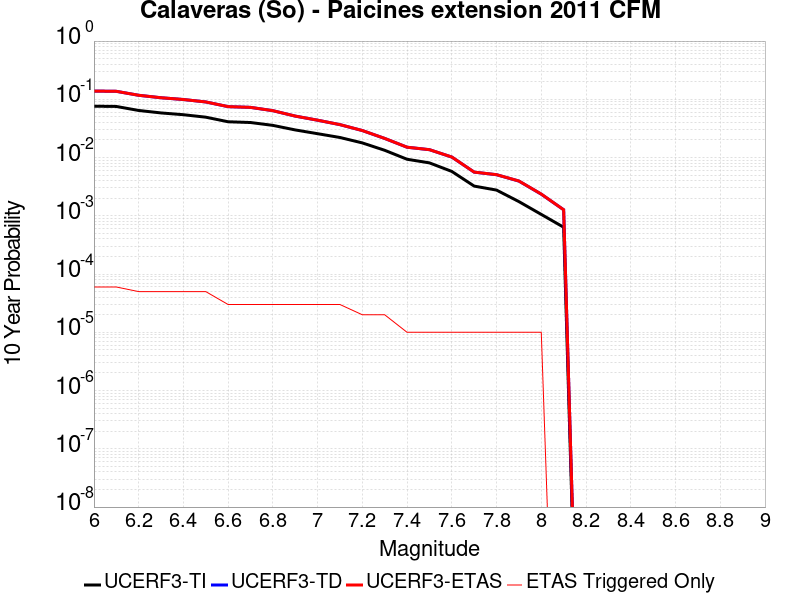 |

| Magnitude | 1 wk TI Prob | 1 wk TD Prob | 1 wk ETAS Prob | 1 wk ETAS/TD Gain | 1 wk ETAS Triggered Only | 1 mo TI Prob | 1 mo TD Prob | 1 mo ETAS Prob | 1 mo ETAS/TD Gain | 1 mo ETAS Triggered Only | 1 yr TI Prob | 1 yr TD Prob | 1 yr ETAS Prob | 1 yr ETAS/TD Gain | 1 yr ETAS Triggered Only | 10 yr TI Prob | 10 yr TD Prob | 10 yr ETAS Prob | 10 yr ETAS/TD Gain | 10 yr ETAS Triggered Only |
|-----|-----|-----|-----|-----|-----|-----|-----|-----|-----|-----|-----|-----|-----|-----|-----|-----|-----|-----|-----|-----|
| 6.0 | 1.5183659E-4 | 3.0533716E-4 | 3.0533716E-4 | 1.0 | 0.0 | 6.5056595E-4 | 0.0013069661 | 0.0013069661 | 1.0 | 0.0 | 0.007891912 | 0.01569571 | 0.015713574 | 1.0011381 | 1.814882E-5 | 0.076174594 | 0.13848671 | 0.13851799 | 1.0002258 | 3.629764E-5 |
| 6.1 | 1.5024997E-4 | 3.0227835E-4 | 3.0227835E-4 | 1.0 | 0.0 | 6.437695E-4 | 0.00129387 | 0.00129387 | 1.0 | 0.0 | 0.0078097614 | 0.015539104 | 0.015556971 | 1.0011498 | 1.814882E-5 | 0.075409345 | 0.13715632 | 0.13718764 | 1.0002284 | 3.629764E-5 |
| 6.2 | 1.2743923E-4 | 2.5306802E-4 | 2.5306802E-4 | 1.0 | 0.0 | 5.460538E-4 | 0.0010841049 | 0.0010841049 | 1.0 | 0.0 | 0.0066279583 | 0.013046704 | 0.013064616 | 1.0013729 | 1.814882E-5 | 0.064337276 | 0.11725405 | 0.117286086 | 1.0002732 | 3.629764E-5 |
| 6.3 | 1.1525114E-4 | 2.2595265E-4 | 2.2595265E-4 | 1.0 | 0.0 | 4.9383997E-4 | 9.6799526E-4 | 9.6799526E-4 | 1.0 | 0.0 | 0.0059959386 | 0.011667927 | 0.011685864 | 1.0015373 | 1.814882E-5 | 0.058367174 | 0.10637007 | 0.10640251 | 1.0003049 | 3.629764E-5 |
| 6.4 | 1.07200925E-4 | 2.0836305E-4 | 2.0836305E-4 | 1.0 | 0.0 | 4.5935164E-4 | 8.926636E-4 | 8.926636E-4 | 1.0 | 0.0 | 0.0055782744 | 0.010772766 | 0.010790719 | 1.0016665 | 1.814882E-5 | 0.0544031 | 0.09919256 | 0.09922526 | 1.0003296 | 3.629764E-5 |
| 6.5 | 9.69631E-5 | 1.8729115E-4 | 1.8729115E-4 | 1.0 | 0.0 | 4.1548995E-4 | 8.024135E-4 | 8.024135E-4 | 1.0 | 0.0 | 0.0050468626 | 0.009694662 | 0.009712636 | 1.001854 | 1.814882E-5 | 0.04933773 | 0.090084255 | 0.09011728 | 1.0003667 | 3.629764E-5 |
| 6.6 | 8.0552316E-5 | 1.5070537E-4 | 1.5070537E-4 | 1.0 | 0.0 | 3.4517853E-4 | 6.456994E-4 | 6.456994E-4 | 1.0 | 0.0 | 0.0041944524 | 0.007826256 | 0.007826256 | 1.0 | 0.0 | 0.04116161 | 0.074854024 | 0.07487082 | 1.0002244 | 1.814882E-5 |
| 6.7 | 7.815757E-5 | 1.4610609E-4 | 1.4610609E-4 | 1.0 | 0.0 | 3.34918E-4 | 6.260017E-4 | 6.260017E-4 | 1.0 | 0.0 | 0.004070005 | 0.0075890915 | 0.0075890915 | 1.0 | 0.0 | 0.039962657 | 0.072703585 | 0.072720416 | 1.0002315 | 1.814882E-5 |
| 6.8 | 6.965264E-5 | 1.2721405E-4 | 1.2721405E-4 | 1.0 | 0.0 | 2.9847719E-4 | 5.450839E-4 | 5.450839E-4 | 1.0 | 0.0 | 0.0036279052 | 0.00661342 | 0.00661342 | 1.0 | 0.0 | 0.03569247 | 0.06379891 | 0.0638159 | 1.0002663 | 1.814882E-5 |
| 6.9 | 5.8000453E-5 | 1.01435086E-4 | 1.01435086E-4 | 1.0 | 0.0 | 2.4854968E-4 | 4.3464993E-4 | 4.3464993E-4 | 1.0 | 0.0 | 0.0030218933 | 0.0052791284 | 0.0052791284 | 1.0 | 0.0 | 0.029811295 | 0.051501602 | 0.051518817 | 1.0003343 | 1.814882E-5 |
| 7.0 | 4.9865852E-5 | 8.567692E-5 | 8.567692E-5 | 1.0 | 0.0 | 2.1369329E-4 | 3.671356E-4 | 3.671356E-4 | 1.0 | 0.0 | 0.0025986114 | 0.0044608037 | 0.0044608037 | 1.0 | 0.0 | 0.025684336 | 0.043781694 | 0.043799046 | 1.0003964 | 1.814882E-5 |
| 7.1 | 4.283875E-5 | 7.112159E-5 | 7.112159E-5 | 1.0 | 0.0 | 1.8358172E-4 | 3.047715E-4 | 3.047715E-4 | 1.0 | 0.0 | 0.0022328163 | 0.003704336 | 0.003704336 | 1.0 | 0.0 | 0.022105146 | 0.03673583 | 0.03675331 | 1.0004759 | 1.814882E-5 |
| 7.2 | 3.450115E-5 | 5.5776054E-5 | 5.5776054E-5 | 1.0 | 0.0 | 1.478537E-4 | 2.390185E-4 | 2.390185E-4 | 1.0 | 0.0 | 0.0017986323 | 0.0029061958 | 0.0029061958 | 1.0 | 0.0 | 0.017841442 | 0.029079199 | 0.02909682 | 1.000606 | 1.814882E-5 |
| 7.3 | 2.5709045E-5 | 4.0588155E-5 | 4.0588155E-5 | 1.0 | 0.0 | 1.1017697E-4 | 1.7393773E-4 | 1.7393773E-4 | 1.0 | 0.0 | 0.0013405791 | 0.002115652 | 0.002115652 | 1.0 | 0.0 | 0.013325208 | 0.021297242 | 0.021315005 | 1.000834 | 1.814882E-5 |
| 7.4 | 1.8003093E-5 | 2.8509934E-5 | 2.8509934E-5 | 1.0 | 0.0 | 7.715383E-5 | 1.2217973E-4 | 1.2217973E-4 | 1.0 | 0.0 | 9.3894306E-4 | 0.0014865254 | 0.0014865254 | 1.0 | 0.0 | 0.009349857 | 0.015052196 | 0.015070071 | 1.0011876 | 1.814882E-5 |
| 7.5 | 1.5595824E-5 | 2.5822499E-5 | 2.5822499E-5 | 1.0 | 0.0 | 6.683753E-5 | 1.1066317E-4 | 1.1066317E-4 | 1.0 | 0.0 | 8.134431E-4 | 0.0013464936 | 0.0013464936 | 1.0 | 0.0 | 0.008104719 | 0.01365213 | 0.013670031 | 1.0013112 | 1.814882E-5 |
| 7.6 | 1.1110309E-5 | 1.9222098E-5 | 1.9222098E-5 | 1.0 | 0.0 | 4.761474E-5 | 8.2377825E-5 | 8.2377825E-5 | 1.0 | 0.0 | 5.795553E-4 | 0.0010024898 | 0.0010024898 | 1.0 | 0.0 | 0.0057804612 | 0.010203943 | 0.010221906 | 1.0017605 | 1.814882E-5 |
| 7.7 | 6.2140443E-6 | 1.0437076E-5 | 1.0437076E-5 | 1.0 | 0.0 | 2.6631347E-5 | 4.4729557E-5 | 4.4729557E-5 | 1.0 | 0.0 | 3.241884E-4 | 5.444464E-4 | 5.444464E-4 | 1.0 | 0.0 | 0.0032371588 | 0.005619835 | 0.005637882 | 1.0032113 | 1.814882E-5 |
| 7.8 | 5.305533E-6 | 9.433038E-6 | 9.433038E-6 | 1.0 | 0.0 | 2.27378E-5 | 4.042668E-5 | 4.042668E-5 | 1.0 | 0.0 | 2.7679754E-4 | 4.920837E-4 | 4.920837E-4 | 1.0 | 0.0 | 0.0027645302 | 0.005074324 | 0.005092381 | 1.0035584 | 1.814882E-5 |
| 7.9 | 3.363505E-6 | 7.3848937E-6 | 7.3848937E-6 | 1.0 | 0.0 | 1.4414942E-5 | 3.164916E-5 | 3.164916E-5 | 1.0 | 0.0 | 1.7548777E-4 | 3.8526047E-4 | 3.8526047E-4 | 1.0 | 0.0 | 0.0017534926 | 0.003948527 | 0.0039666044 | 1.0045782 | 1.814882E-5 |
| 8.0 | 2.0271132E-6 | 4.413104E-6 | 4.413104E-6 | 1.0 | 0.0 | 8.687599E-6 | 1.8913164E-5 | 1.8913164E-5 | 1.0 | 0.0 | 1.05766376E-4 | 2.302435E-4 | 2.302435E-4 | 1.0 | 0.0 | 0.0010571606 | 0.002351099 | 0.002369205 | 1.0077012 | 1.814882E-5 |
| 8.1 | 1.2206116E-6 | 2.3751331E-6 | 2.3751331E-6 | 1.0 | 0.0 | 5.2311816E-6 | 1.0179103E-5 | 1.0179103E-5 | 1.0 | 0.0 | 6.3687774E-5 | 1.2392356E-4 | 1.2392356E-4 | 1.0 | 0.0 | 6.366953E-4 | 0.0012705477 | 0.0012705477 | 1.0 | 0.0 |

## Cleghorn
*[(top)](#table-of-contents)*

| 1 Week | 1 Month | 1 Year | 10 Year |
|-----|-----|-----|-----|
|  | 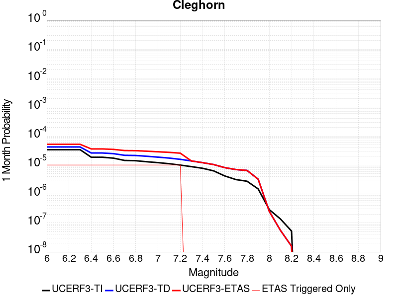 |  |  |

| Magnitude | 1 wk TI Prob | 1 wk TD Prob | 1 wk ETAS Prob | 1 wk ETAS/TD Gain | 1 wk ETAS Triggered Only | 1 mo TI Prob | 1 mo TD Prob | 1 mo ETAS Prob | 1 mo ETAS/TD Gain | 1 mo ETAS Triggered Only | 1 yr TI Prob | 1 yr TD Prob | 1 yr ETAS Prob | 1 yr ETAS/TD Gain | 1 yr ETAS Triggered Only | 10 yr TI Prob | 10 yr TD Prob | 10 yr ETAS Prob | 10 yr ETAS/TD Gain | 10 yr ETAS Triggered Only |
|-----|-----|-----|-----|-----|-----|-----|-----|-----|-----|-----|-----|-----|-----|-----|-----|-----|-----|-----|-----|-----|
| 6.0 | 7.9267165E-6 | 9.831582E-6 | 2.7980224E-5 | 2.8459532 | 1.814882E-5 | 3.39712E-5 | 4.2134732E-5 | 6.028279E-5 | 1.4307148 | 1.814882E-5 | 4.1352084E-4 | 5.128803E-4 | 5.491593E-4 | 1.0707358 | 3.629764E-5 | 0.004127522 | 0.0051320773 | 0.0051681884 | 1.0070364 | 3.629764E-5 |
| 6.1 | 7.9267165E-6 | 9.831582E-6 | 2.7980224E-5 | 2.8459532 | 1.814882E-5 | 3.39712E-5 | 4.2134732E-5 | 6.028279E-5 | 1.4307148 | 1.814882E-5 | 4.1352084E-4 | 5.128803E-4 | 5.491593E-4 | 1.0707358 | 3.629764E-5 | 0.004127522 | 0.0051320773 | 0.0051681884 | 1.0070364 | 3.629764E-5 |
| 6.2 | 7.9267165E-6 | 9.831582E-6 | 2.7980224E-5 | 2.8459532 | 1.814882E-5 | 3.39712E-5 | 4.2134732E-5 | 6.028279E-5 | 1.4307148 | 1.814882E-5 | 4.1352084E-4 | 5.128803E-4 | 5.491593E-4 | 1.0707358 | 3.629764E-5 | 0.004127522 | 0.0051320773 | 0.0051681884 | 1.0070364 | 3.629764E-5 |
| 6.3 | 7.9267165E-6 | 9.831582E-6 | 2.7980224E-5 | 2.8459532 | 1.814882E-5 | 3.39712E-5 | 4.2134732E-5 | 6.028279E-5 | 1.4307148 | 1.814882E-5 | 4.1352084E-4 | 5.128803E-4 | 5.491593E-4 | 1.0707358 | 3.629764E-5 | 0.004127522 | 0.0051320773 | 0.0051681884 | 1.0070364 | 3.629764E-5 |
| 6.4 | 4.3445207E-6 | 6.0914435E-6 | 2.4240153E-5 | 3.9793775 | 1.814882E-5 | 1.8619241E-5 | 2.610593E-5 | 4.4254277E-5 | 1.695181 | 1.814882E-5 | 2.2666567E-4 | 3.1779436E-4 | 3.3593742E-4 | 1.0570905 | 1.814882E-5 | 0.0022643462 | 0.0031875873 | 0.0032056782 | 1.0056754 | 1.814882E-5 |
| 6.5 | 4.3445207E-6 | 6.0914435E-6 | 2.4240153E-5 | 3.9793775 | 1.814882E-5 | 1.8619241E-5 | 2.610593E-5 | 4.4254277E-5 | 1.695181 | 1.814882E-5 | 2.2666567E-4 | 3.1779436E-4 | 3.3593742E-4 | 1.0570905 | 1.814882E-5 | 0.0022643462 | 0.0031875873 | 0.0032056782 | 1.0056754 | 1.814882E-5 |
| 6.6 | 4.040109E-6 | 5.773851E-6 | 2.3922566E-5 | 4.14326 | 1.814882E-5 | 1.7314638E-5 | 2.4744846E-5 | 4.2893218E-5 | 1.7334203 | 1.814882E-5 | 2.1078532E-4 | 3.012278E-4 | 3.1937115E-4 | 1.0602313 | 1.814882E-5 | 0.002105855 | 0.003022377 | 0.0030404709 | 1.0059867 | 1.814882E-5 |
| 6.7 | 3.3632055E-6 | 5.067348E-6 | 2.3216076E-5 | 4.5815043 | 1.814882E-5 | 1.4413658E-5 | 2.1717027E-5 | 3.9865452E-5 | 1.8356773 | 1.814882E-5 | 1.7547216E-4 | 2.6437303E-4 | 2.8251705E-4 | 1.0686303 | 1.814882E-5 | 0.0017533366 | 0.0026547113 | 0.0026728117 | 1.0068183 | 1.814882E-5 |
| 6.8 | 3.2902772E-6 | 4.9892556E-6 | 2.3137985E-5 | 4.6375628 | 1.814882E-5 | 1.4101111E-5 | 2.1382351E-5 | 3.9530783E-5 | 1.8487576 | 1.814882E-5 | 1.716675E-4 | 2.6029933E-4 | 2.7844342E-4 | 1.0697048 | 1.814882E-5 | 0.0017153495 | 0.0026140702 | 0.0026321716 | 1.0069246 | 1.814882E-5 |
| 6.9 | 3.031547E-6 | 4.6910186E-6 | 2.2839753E-5 | 4.8688264 | 1.814882E-5 | 1.299228E-5 | 2.0104211E-5 | 3.8252667E-5 | 1.9027191 | 1.814882E-5 | 1.5816953E-4 | 2.4474156E-4 | 2.6288594E-4 | 1.0741369 | 1.814882E-5 | 0.00158057 | 0.0024588439 | 0.002476948 | 1.0073628 | 1.814882E-5 |
| 7.0 | 2.8259715E-6 | 4.3705895E-6 | 2.251933E-5 | 5.15247 | 1.814882E-5 | 1.211125E-5 | 1.8730963E-5 | 3.6879443E-5 | 1.9689026 | 1.814882E-5 | 1.4744449E-4 | 2.2802586E-4 | 2.4617053E-4 | 1.0795729 | 1.814882E-5 | 0.001473467 | 0.0022920412 | 0.0023101484 | 1.0079 | 1.814882E-5 |
| 7.1 | 2.5962665E-6 | 4.0658106E-6 | 2.2214557E-5 | 5.463746 | 1.814882E-5 | 1.1126809E-5 | 1.7424789E-5 | 3.5573292E-5 | 2.0415337 | 1.814882E-5 | 1.3546048E-4 | 2.1212637E-4 | 2.3027133E-4 | 1.0855385 | 1.814882E-5 | 0.0013537793 | 0.002133366 | 0.002151476 | 1.008489 | 1.814882E-5 |
| 7.2 | 2.3247253E-6 | 3.6763672E-6 | 2.182512E-5 | 5.9365997 | 1.814882E-5 | 9.96307E-6 | 1.5755764E-5 | 3.39043E-5 | 2.1518662 | 1.814882E-5 | 1.21293626E-4 | 1.9180974E-4 | 2.0995508E-4 | 1.0946007 | 1.814882E-5 | 0.0012122744 | 0.0019305905 | 0.0019487042 | 1.0093825 | 1.814882E-5 |
| 7.3 | 2.056928E-6 | 3.2350938E-6 | 3.2350938E-6 | 1.0 | 0.0 | 8.815376E-6 | 1.3864615E-5 | 1.3864615E-5 | 1.0 | 0.0 | 1.0732192E-4 | 1.6878877E-4 | 1.6878877E-4 | 1.0 | 0.0 | 0.001072701 | 0.0017008206 | 0.0017008206 | 1.0 | 0.0 |
| 7.4 | 1.8055999E-6 | 2.8255042E-6 | 2.8255042E-6 | 1.0 | 0.0 | 7.738263E-6 | 1.2109249E-5 | 1.2109249E-5 | 1.0 | 0.0 | 9.4209274E-5 | 1.4742027E-4 | 1.4742027E-4 | 1.0 | 0.0 | 9.4169343E-4 | 0.0014875771 | 0.0014875771 | 1.0 | 0.0 |
| 7.5 | 1.4683443E-6 | 2.4247483E-6 | 2.4247483E-6 | 1.0 | 0.0 | 6.292889E-6 | 1.0391738E-5 | 1.0391738E-5 | 1.0 | 0.0 | 7.661323E-5 | 1.2651215E-4 | 1.2651215E-4 | 1.0 | 0.0 | 7.658682E-4 | 0.0012787961 | 0.0012787961 | 1.0 | 0.0 |
| 7.6 | 9.804088E-7 | 1.900266E-6 | 1.900266E-6 | 1.0 | 0.0 | 4.201745E-6 | 8.143972E-6 | 8.143972E-6 | 1.0 | 0.0 | 5.1155046E-5 | 9.91484E-5 | 9.91484E-5 | 1.0 | 0.0 | 5.114327E-4 | 0.001005471 | 0.001005471 | 1.0 | 0.0 |
| 7.7 | 7.3434086E-7 | 1.6284146E-6 | 1.6284146E-6 | 1.0 | 0.0 | 3.1471714E-6 | 6.978901E-6 | 6.978901E-6 | 1.0 | 0.0 | 3.831614E-5 | 8.4964835E-5 | 8.4964835E-5 | 1.0 | 0.0 | 3.8309532E-4 | 8.6378685E-4 | 8.6378685E-4 | 1.0 | 0.0 |
| 7.8 | 6.434184E-7 | 1.5220047E-6 | 1.5220047E-6 | 1.0 | 0.0 | 2.7575045E-6 | 6.5228614E-6 | 6.5228614E-6 | 1.0 | 0.0 | 3.35721E-5 | 7.941297E-5 | 7.941297E-5 | 1.0 | 0.0 | 3.3567028E-4 | 8.079678E-4 | 8.079678E-4 | 1.0 | 0.0 |
| 7.9 | 3.4943926E-7 | 7.574459E-7 | 7.574459E-7 | 1.0 | 0.0 | 1.497596E-6 | 3.2461926E-6 | 3.2461926E-6 | 1.0 | 0.0 | 1.8233079E-5 | 3.952169E-5 | 3.952169E-5 | 1.0 | 0.0 | 1.8231584E-4 | 4.040099E-4 | 4.040099E-4 | 1.0 | 0.0 |
| 8.0 | 6.717524E-8 | 5.838828E-8 | 5.838828E-8 | 1.0 | 0.0 | 2.8789387E-7 | 2.5023547E-7 | 2.5023547E-7 | 1.0 | 0.0 | 3.505102E-6 | 3.0466126E-6 | 3.0466126E-6 | 1.0 | 0.0 | 3.5050467E-5 | 3.273506E-5 | 3.273506E-5 | 1.0 | 0.0 |
| 8.1 | 3.1984914E-8 | 1.2956093E-8 | 1.2956093E-8 | 1.0 | 0.0 | 1.370782E-7 | 5.552611E-8 | 5.552611E-8 | 1.0 | 0.0 | 1.6689258E-6 | 6.760302E-7 | 6.760302E-7 | 1.0 | 0.0 | 1.6689133E-5 | 7.74454E-6 | 7.74454E-6 | 1.0 | 0.0 |
| 8.2 | 1.21887656E-8 | 3.6495305E-9 | 3.6495305E-9 | 1.0 | 0.0 | 5.2237567E-8 | 1.5640845E-8 | 1.5640845E-8 | 1.0 | 0.0 | 6.359922E-7 | 1.9042727E-7 | 1.9042727E-7 | 1.0 | 0.0 | 6.3599036E-6 | 2.2470974E-6 | 2.2470974E-6 | 1.0 | 0.0 |

## Hat Creek-McArthur-Mayfield
*[(top)](#table-of-contents)*

| 1 Week | 1 Month | 1 Year | 10 Year |
|-----|-----|-----|-----|
|  |  |  | 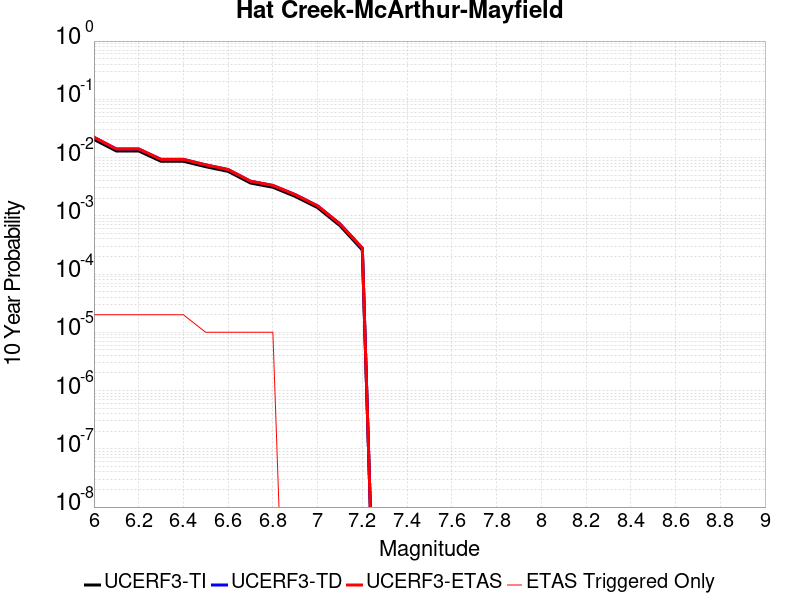 |

| Magnitude | 1 wk TI Prob | 1 wk TD Prob | 1 wk ETAS Prob | 1 wk ETAS/TD Gain | 1 wk ETAS Triggered Only | 1 mo TI Prob | 1 mo TD Prob | 1 mo ETAS Prob | 1 mo ETAS/TD Gain | 1 mo ETAS Triggered Only | 1 yr TI Prob | 1 yr TD Prob | 1 yr ETAS Prob | 1 yr ETAS/TD Gain | 1 yr ETAS Triggered Only | 10 yr TI Prob | 10 yr TD Prob | 10 yr ETAS Prob | 10 yr ETAS/TD Gain | 10 yr ETAS Triggered Only |
|-----|-----|-----|-----|-----|-----|-----|-----|-----|-----|-----|-----|-----|-----|-----|-----|-----|-----|-----|-----|-----|
| 6.0 | 3.967457E-5 | 4.315831E-5 | 7.945438E-5 | 1.8409985 | 3.629764E-5 | 1.7002279E-4 | 1.8495171E-4 | 2.2124265E-4 | 1.1962184 | 3.629764E-5 | 0.002068062 | 0.002249576 | 0.002285792 | 1.016099 | 3.629764E-5 | 0.02048922 | 0.022280399 | 0.022315888 | 1.0015929 | 3.629764E-5 |
| 6.1 | 2.5044013E-5 | 2.7071164E-5 | 6.336782E-5 | 2.3407867 | 3.629764E-5 | 1.0732707E-4 | 1.1601429E-4 | 1.5230772E-4 | 1.3128358 | 3.629764E-5 | 0.0013059238 | 0.0014115906 | 0.001447837 | 1.0256777 | 3.629764E-5 | 0.01298276 | 0.01402966 | 0.014065449 | 1.002551 | 3.629764E-5 |
| 6.2 | 2.5044013E-5 | 2.7071164E-5 | 6.336782E-5 | 2.3407867 | 3.629764E-5 | 1.0732707E-4 | 1.1601429E-4 | 1.5230772E-4 | 1.3128358 | 3.629764E-5 | 0.0013059238 | 0.0014115906 | 0.001447837 | 1.0256777 | 3.629764E-5 | 0.01298276 | 0.01402966 | 0.014065449 | 1.002551 | 3.629764E-5 |
| 6.3 | 1.6624012E-5 | 1.7891072E-5 | 5.418806E-5 | 3.028777 | 3.629764E-5 | 7.124382E-5 | 7.6673816E-5 | 1.1296867E-4 | 1.4733671 | 3.629764E-5 | 8.670483E-4 | 9.331125E-4 | 9.693763E-4 | 1.0388632 | 3.629764E-5 | 0.008636732 | 0.009292879 | 0.009328839 | 1.0038697 | 3.629764E-5 |
| 6.4 | 1.6624012E-5 | 1.7891072E-5 | 5.418806E-5 | 3.028777 | 3.629764E-5 | 7.124382E-5 | 7.6673816E-5 | 1.1296867E-4 | 1.4733671 | 3.629764E-5 | 8.670483E-4 | 9.331125E-4 | 9.693763E-4 | 1.0388632 | 3.629764E-5 | 0.008636732 | 0.009292879 | 0.009328839 | 1.0038697 | 3.629764E-5 |
| 6.5 | 1.3394842E-5 | 1.4392137E-5 | 3.2540695E-5 | 2.2610052 | 1.814882E-5 | 5.7405203E-5 | 6.167916E-5 | 7.982686E-5 | 1.2942275 | 1.814882E-5 | 6.986842E-4 | 7.506906E-4 | 7.688258E-4 | 1.024158 | 1.814882E-5 | 0.006964916 | 0.0074821403 | 0.0075001535 | 1.0024074 | 1.814882E-5 |
| 6.6 | 1.1137514E-5 | 1.1954546E-5 | 3.0103149E-5 | 2.518134 | 1.814882E-5 | 4.7731326E-5 | 5.1232782E-5 | 6.938067E-5 | 1.3542242 | 1.814882E-5 | 5.809739E-4 | 6.2358467E-4 | 6.417222E-4 | 1.0290859 | 1.814882E-5 | 0.005794574 | 0.00621877 | 0.006236806 | 1.0029002 | 1.814882E-5 |
| 6.7 | 7.0200663E-6 | 7.5242897E-6 | 2.5672973E-5 | 3.4120128 | 1.814882E-5 | 3.008565E-5 | 3.2246568E-5 | 5.03948E-5 | 1.5627959 | 1.814882E-5 | 3.6623122E-4 | 3.925328E-4 | 4.106745E-4 | 1.046217 | 1.814882E-5 | 0.0036562826 | 0.0039185574 | 0.003936635 | 1.0046134 | 1.814882E-5 |
| 6.8 | 5.940172E-6 | 6.3654766E-6 | 2.4514182E-5 | 3.8511147 | 1.814882E-5 | 2.545763E-5 | 2.7280335E-5 | 4.542866E-5 | 1.665253 | 1.814882E-5 | 3.0990256E-4 | 3.3208873E-4 | 3.5023154E-4 | 1.0546323 | 1.814882E-5 | 0.0030947074 | 0.0033160534 | 0.003334142 | 1.0054549 | 1.814882E-5 |
| 6.9 | 4.129831E-6 | 4.423547E-6 | 4.423547E-6 | 1.0 | 0.0 | 1.7699154E-5 | 1.8957926E-5 | 1.8957926E-5 | 1.0 | 0.0 | 2.154659E-4 | 2.3078908E-4 | 2.3078908E-4 | 1.0 | 0.0 | 0.002152571 | 0.0023055724 | 0.0023055724 | 1.0 | 0.0 |
| 7.0 | 2.6512955E-6 | 2.8374002E-6 | 2.8374002E-6 | 1.0 | 0.0 | 1.1362646E-5 | 1.2160232E-5 | 1.2160232E-5 | 1.0 | 0.0 | 1.3833142E-4 | 1.480412E-4 | 1.480412E-4 | 1.0 | 0.0 | 0.0013824535 | 0.0014794683 | 0.0014794683 | 1.0 | 0.0 |
| 7.1 | 1.2992575E-6 | 1.3909317E-6 | 1.3909317E-6 | 1.0 | 0.0 | 5.568235E-6 | 5.961124E-6 | 5.961124E-6 | 1.0 | 0.0 | 6.779115E-5 | 7.257448E-5 | 7.257448E-5 | 1.0 | 0.0 | 6.7770475E-4 | 7.2552945E-4 | 7.2552945E-4 | 1.0 | 0.0 |
| 7.2 | 4.968191E-7 | 5.3271475E-7 | 5.3271475E-7 | 1.0 | 0.0 | 2.1292228E-6 | 2.283062E-6 | 2.283062E-6 | 1.0 | 0.0 | 2.592298E-5 | 2.7796052E-5 | 2.7796052E-5 | 1.0 | 0.0 | 2.5919956E-4 | 2.7793812E-4 | 2.7793812E-4 | 1.0 | 0.0 |

## Cerro Prieto
*[(top)](#table-of-contents)*

| 1 Week | 1 Month | 1 Year | 10 Year |
|-----|-----|-----|-----|
| 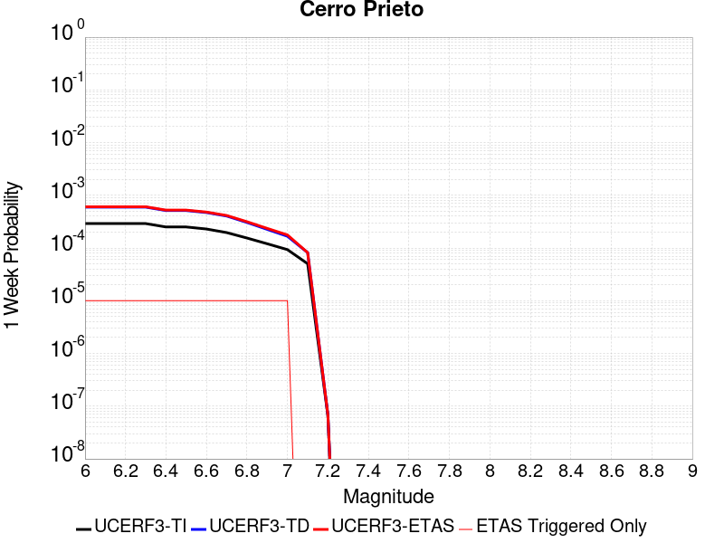 |  |  |  |

| Magnitude | 1 wk TI Prob | 1 wk TD Prob | 1 wk ETAS Prob | 1 wk ETAS/TD Gain | 1 wk ETAS Triggered Only | 1 mo TI Prob | 1 mo TD Prob | 1 mo ETAS Prob | 1 mo ETAS/TD Gain | 1 mo ETAS Triggered Only | 1 yr TI Prob | 1 yr TD Prob | 1 yr ETAS Prob | 1 yr ETAS/TD Gain | 1 yr ETAS Triggered Only | 10 yr TI Prob | 10 yr TD Prob | 10 yr ETAS Prob | 10 yr ETAS/TD Gain | 10 yr ETAS Triggered Only |
|-----|-----|-----|-----|-----|-----|-----|-----|-----|-----|-----|-----|-----|-----|-----|-----|-----|-----|-----|-----|-----|
| 6.0 | 2.9101528E-4 | 5.964804E-4 | 6.1461836E-4 | 1.0304084 | 1.814882E-5 | 0.0012466122 | 0.002554082 | 0.0025721847 | 1.0070877 | 1.814882E-5 | 0.015072231 | 0.03064807 | 0.030665662 | 1.000574 | 1.814882E-5 | 0.14089979 | 0.25397858 | 0.25400564 | 1.0001066 | 3.629764E-5 |
| 6.1 | 2.9101528E-4 | 5.964804E-4 | 6.1461836E-4 | 1.0304084 | 1.814882E-5 | 0.0012466122 | 0.002554082 | 0.0025721847 | 1.0070877 | 1.814882E-5 | 0.015072231 | 0.03064807 | 0.030665662 | 1.000574 | 1.814882E-5 | 0.14089979 | 0.25397858 | 0.25400564 | 1.0001066 | 3.629764E-5 |
| 6.2 | 2.9101528E-4 | 5.964804E-4 | 6.1461836E-4 | 1.0304084 | 1.814882E-5 | 0.0012466122 | 0.002554082 | 0.0025721847 | 1.0070877 | 1.814882E-5 | 0.015072231 | 0.03064807 | 0.030665662 | 1.000574 | 1.814882E-5 | 0.14089979 | 0.25397858 | 0.25400564 | 1.0001066 | 3.629764E-5 |
| 6.3 | 2.9101528E-4 | 5.964804E-4 | 6.1461836E-4 | 1.0304084 | 1.814882E-5 | 0.0012466122 | 0.002554082 | 0.0025721847 | 1.0070877 | 1.814882E-5 | 0.015072231 | 0.03064807 | 0.030665662 | 1.000574 | 1.814882E-5 | 0.14089979 | 0.25397858 | 0.25400564 | 1.0001066 | 3.629764E-5 |
| 6.4 | 2.508648E-4 | 5.1397446E-4 | 5.3211395E-4 | 1.0352926 | 1.814882E-5 | 0.0010746918 | 0.0022010866 | 0.0022191955 | 1.0082272 | 1.814882E-5 | 0.013006088 | 0.026471792 | 0.02648946 | 1.0006675 | 1.814882E-5 | 0.12270685 | 0.22440416 | 0.2244323 | 1.0001254 | 3.629764E-5 |
| 6.5 | 2.508648E-4 | 5.1397446E-4 | 5.3211395E-4 | 1.0352926 | 1.814882E-5 | 0.0010746918 | 0.0022010866 | 0.0022191955 | 1.0082272 | 1.814882E-5 | 0.013006088 | 0.026471792 | 0.02648946 | 1.0006675 | 1.814882E-5 | 0.12270685 | 0.22440416 | 0.2244323 | 1.0001254 | 3.629764E-5 |
| 6.6 | 2.294914E-4 | 4.7116808E-4 | 4.893083E-4 | 1.0385007 | 1.814882E-5 | 9.831638E-4 | 0.0020179166 | 0.0020360288 | 1.0089757 | 1.814882E-5 | 0.011904482 | 0.02429866 | 0.024316369 | 1.0007287 | 1.814882E-5 | 0.11286586 | 0.20858558 | 0.20861429 | 1.0001377 | 3.629764E-5 |
| 6.7 | 1.9621674E-4 | 4.0419117E-4 | 4.2233267E-4 | 1.0448834 | 1.814882E-5 | 8.4065786E-4 | 0.0017312564 | 0.0017493737 | 1.0104649 | 1.814882E-5 | 0.010187071 | 0.020884845 | 0.020902615 | 1.0008508 | 1.814882E-5 | 0.09732539 | 0.18290249 | 0.18291731 | 1.0000811 | 1.814882E-5 |
| 6.8 | 1.5476145E-4 | 3.056516E-4 | 3.2379487E-4 | 1.0593593 | 1.814882E-5 | 6.6309475E-4 | 0.00130938 | 0.0013275051 | 1.0138425 | 1.814882E-5 | 0.008043335 | 0.015836509 | 0.01585437 | 1.0011278 | 1.814882E-5 | 0.07758363 | 0.14336355 | 0.1433791 | 1.0001085 | 1.814882E-5 |
| 6.9 | 1.20509176E-4 | 2.2582515E-4 | 2.4396987E-4 | 1.0803485 | 1.814882E-5 | 5.1636563E-4 | 9.6752634E-4 | 9.856577E-4 | 1.0187398 | 1.814882E-5 | 0.006268645 | 0.011726342 | 0.0117442785 | 1.0015296 | 1.814882E-5 | 0.060947374 | 0.109451205 | 0.109467365 | 1.0001477 | 1.814882E-5 |
| 7.0 | 9.3269155E-5 | 1.6716642E-4 | 1.8531221E-4 | 1.1085492 | 1.814882E-5 | 3.9966372E-4 | 7.162739E-4 | 7.344097E-4 | 1.0253197 | 1.814882E-5 | 0.0048550544 | 0.008693418 | 0.008711409 | 1.0020695 | 1.814882E-5 | 0.04750344 | 0.08315912 | 0.083175756 | 1.0002002 | 1.814882E-5 |
| 7.1 | 5.029709E-5 | 8.1718936E-5 | 8.1718936E-5 | 1.0 | 0.0 | 2.1554115E-4 | 3.5019626E-4 | 3.5019626E-4 | 1.0 | 0.0 | 0.0026210553 | 0.0042587193 | 0.0042587193 | 1.0 | 0.0 | 0.025903556 | 0.042365108 | 0.042365108 | 1.0 | 0.0 |
| 7.2 | 6.5445185E-8 | 6.814903E-8 | 6.814903E-8 | 1.0 | 0.0 | 2.8047933E-7 | 2.9206726E-7 | 2.9206726E-7 | 1.0 | 0.0 | 3.4148304E-6 | 3.555919E-6 | 3.555919E-6 | 1.0 | 0.0 | 3.414778E-5 | 3.5559187E-5 | 3.5559187E-5 | 1.0 | 0.0 |

## Puente Hills
*[(top)](#table-of-contents)*

| 1 Week | 1 Month | 1 Year | 10 Year |
|-----|-----|-----|-----|
|  | 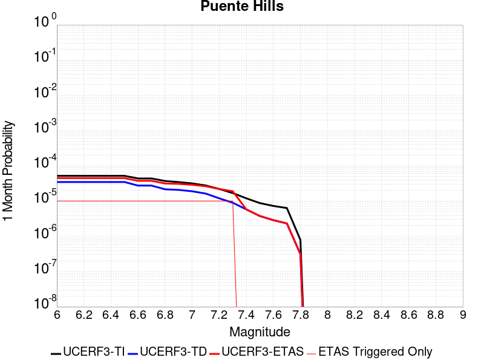 |  |  |

| Magnitude | 1 wk TI Prob | 1 wk TD Prob | 1 wk ETAS Prob | 1 wk ETAS/TD Gain | 1 wk ETAS Triggered Only | 1 mo TI Prob | 1 mo TD Prob | 1 mo ETAS Prob | 1 mo ETAS/TD Gain | 1 mo ETAS Triggered Only | 1 yr TI Prob | 1 yr TD Prob | 1 yr ETAS Prob | 1 yr ETAS/TD Gain | 1 yr ETAS Triggered Only | 10 yr TI Prob | 10 yr TD Prob | 10 yr ETAS Prob | 10 yr ETAS/TD Gain | 10 yr ETAS Triggered Only |
|-----|-----|-----|-----|-----|-----|-----|-----|-----|-----|-----|-----|-----|-----|-----|-----|-----|-----|-----|-----|-----|
| 6.0 | 1.2101656E-5 | 8.098625E-6 | 2.6247299E-5 | 3.2409575 | 1.814882E-5 | 5.1863204E-5 | 3.4707962E-5 | 5.2856154E-5 | 1.5228826 | 1.814882E-5 | 6.312516E-4 | 4.2249315E-4 | 4.5877544E-4 | 1.0858767 | 3.629764E-5 | 0.0062946146 | 0.0042174594 | 0.004253604 | 1.0085702 | 3.629764E-5 |
| 6.1 | 1.2101656E-5 | 8.098625E-6 | 2.6247299E-5 | 3.2409575 | 1.814882E-5 | 5.1863204E-5 | 3.4707962E-5 | 5.2856154E-5 | 1.5228826 | 1.814882E-5 | 6.312516E-4 | 4.2249315E-4 | 4.5877544E-4 | 1.0858767 | 3.629764E-5 | 0.0062946146 | 0.0042174594 | 0.004253604 | 1.0085702 | 3.629764E-5 |
| 6.2 | 1.2101656E-5 | 8.098625E-6 | 2.6247299E-5 | 3.2409575 | 1.814882E-5 | 5.1863204E-5 | 3.4707962E-5 | 5.2856154E-5 | 1.5228826 | 1.814882E-5 | 6.312516E-4 | 4.2249315E-4 | 4.5877544E-4 | 1.0858767 | 3.629764E-5 | 0.0062946146 | 0.0042174594 | 0.004253604 | 1.0085702 | 3.629764E-5 |
| 6.3 | 1.2101656E-5 | 8.098625E-6 | 2.6247299E-5 | 3.2409575 | 1.814882E-5 | 5.1863204E-5 | 3.4707962E-5 | 5.2856154E-5 | 1.5228826 | 1.814882E-5 | 6.312516E-4 | 4.2249315E-4 | 4.5877544E-4 | 1.0858767 | 3.629764E-5 | 0.0062946146 | 0.0042174594 | 0.004253604 | 1.0085702 | 3.629764E-5 |
| 6.4 | 1.2101656E-5 | 8.098625E-6 | 2.6247299E-5 | 3.2409575 | 1.814882E-5 | 5.1863204E-5 | 3.4707962E-5 | 5.2856154E-5 | 1.5228826 | 1.814882E-5 | 6.312516E-4 | 4.2249315E-4 | 4.5877544E-4 | 1.0858767 | 3.629764E-5 | 0.0062946146 | 0.0042174594 | 0.004253604 | 1.0085702 | 3.629764E-5 |
| 6.5 | 1.2101656E-5 | 8.098625E-6 | 2.6247299E-5 | 3.2409575 | 1.814882E-5 | 5.1863204E-5 | 3.4707962E-5 | 5.2856154E-5 | 1.5228826 | 1.814882E-5 | 6.312516E-4 | 4.2249315E-4 | 4.5877544E-4 | 1.0858767 | 3.629764E-5 | 0.0062946146 | 0.0042174594 | 0.004253604 | 1.0085702 | 3.629764E-5 |
| 6.6 | 1.0222488E-5 | 6.3991847E-6 | 2.454789E-5 | 3.8360963 | 1.814882E-5 | 4.3809923E-5 | 2.7424803E-5 | 4.5573124E-5 | 1.6617485 | 1.814882E-5 | 5.332553E-4 | 3.3384826E-4 | 3.7013378E-4 | 1.1086887 | 3.629764E-5 | 0.0053197746 | 0.0033337125 | 0.0033698892 | 1.0108517 | 3.629764E-5 |
| 6.7 | 1.0222488E-5 | 6.3991847E-6 | 2.454789E-5 | 3.8360963 | 1.814882E-5 | 4.3809923E-5 | 2.7424803E-5 | 4.5573124E-5 | 1.6617485 | 1.814882E-5 | 5.332553E-4 | 3.3384826E-4 | 3.7013378E-4 | 1.1086887 | 3.629764E-5 | 0.0053197746 | 0.0033337125 | 0.0033698892 | 1.0108517 | 3.629764E-5 |
| 6.8 | 8.6367845E-6 | 5.0282533E-6 | 2.3176983E-5 | 4.6093507 | 1.814882E-5 | 3.7014266E-5 | 2.1549482E-5 | 3.9697912E-5 | 1.8421748 | 1.814882E-5 | 4.505555E-4 | 2.623339E-4 | 2.9862204E-4 | 1.138328 | 3.629764E-5 | 0.004496431 | 0.0026202986 | 0.002656501 | 1.0138162 | 3.629764E-5 |
| 6.9 | 8.066481E-6 | 4.836117E-6 | 2.298485E-5 | 4.752749 | 1.814882E-5 | 3.4570177E-5 | 2.0726053E-5 | 3.88745E-5 | 1.8756343 | 1.814882E-5 | 4.2081063E-4 | 2.52311E-4 | 2.885995E-4 | 1.1438245 | 3.629764E-5 | 0.0042001465 | 0.0025202993 | 0.0025565054 | 1.0143658 | 3.629764E-5 |
| 7.0 | 7.393828E-6 | 4.417296E-6 | 2.2566037E-5 | 5.108563 | 1.814882E-5 | 3.168745E-5 | 1.8931134E-5 | 3.707961E-5 | 1.9586576 | 1.814882E-5 | 3.857264E-4 | 2.3046264E-4 | 2.4860728E-4 | 1.0787314 | 1.814882E-5 | 0.0038505755 | 0.0023022818 | 0.0023203888 | 1.0078648 | 1.814882E-5 |
| 7.1 | 6.4660953E-6 | 3.8044495E-6 | 2.1953201E-5 | 5.7704015 | 1.814882E-5 | 2.7711543E-5 | 1.6304684E-5 | 3.445321E-5 | 2.1130865 | 1.814882E-5 | 3.373358E-4 | 1.984918E-4 | 2.1663703E-4 | 1.0914154 | 1.814882E-5 | 0.0033682417 | 0.001983181 | 0.002001294 | 1.0091332 | 1.814882E-5 |
| 7.2 | 5.143232E-6 | 2.7865456E-6 | 2.0935315E-5 | 7.5129995 | 1.814882E-5 | 2.2042237E-5 | 1.1942284E-5 | 3.0090887E-5 | 2.519693 | 1.814882E-5 | 2.6833118E-4 | 1.453877E-4 | 1.6353388E-4 | 1.1248124 | 1.814882E-5 | 0.002680074 | 0.0014529356 | 0.001471058 | 1.012473 | 1.814882E-5 |
| 7.3 | 3.928255E-6 | 2.0913774E-6 | 2.0240159E-5 | 9.677909 | 1.814882E-5 | 1.683527E-5 | 8.963015E-6 | 2.7111673E-5 | 3.0248384 | 1.814882E-5 | 2.0495013E-4 | 1.0911931E-4 | 1.2726615E-4 | 1.1663027 | 1.814882E-5 | 0.002047612 | 0.001090664 | 0.001108793 | 1.0166221 | 1.814882E-5 |
| 7.4 | 2.7894434E-6 | 1.3546753E-6 | 1.3546753E-6 | 1.0 | 0.0 | 1.1954703E-5 | 5.8057385E-6 | 5.8057385E-6 | 1.0 | 0.0 | 1.4553878E-4 | 7.068262E-5 | 7.068262E-5 | 1.0 | 0.0 | 0.001454435 | 7.066058E-4 | 7.066058E-4 | 1.0 | 0.0 |
| 7.5 | 2.041735E-6 | 8.787305E-7 | 8.787305E-7 | 1.0 | 0.0 | 8.750263E-6 | 3.7659825E-6 | 3.7659825E-6 | 1.0 | 0.0 | 1.06529245E-4 | 4.5849905E-5 | 4.5849905E-5 | 1.0 | 0.0 | 0.0010647819 | 4.5840783E-4 | 4.5840783E-4 | 1.0 | 0.0 |
| 7.6 | 1.6959062E-6 | 6.6986263E-7 | 6.6986263E-7 | 1.0 | 0.0 | 7.268149E-6 | 2.8708366E-6 | 2.8708366E-6 | 1.0 | 0.0 | 8.848612E-5 | 3.4951907E-5 | 3.4951907E-5 | 1.0 | 0.0 | 8.84509E-4 | 3.4946698E-4 | 3.4946698E-4 | 1.0 | 0.0 |
| 7.7 | 1.4767965E-6 | 5.407607E-7 | 5.407607E-7 | 1.0 | 0.0 | 6.3291122E-6 | 2.317544E-6 | 2.317544E-6 | 1.0 | 0.0 | 7.705422E-5 | 2.8215758E-5 | 2.8215758E-5 | 1.0 | 0.0 | 7.702751E-4 | 2.8212433E-4 | 2.8212433E-4 | 1.0 | 0.0 |
| 7.8 | 1.8432911E-7 | 7.28201E-8 | 7.28201E-8 | 1.0 | 0.0 | 7.8998164E-7 | 3.1208612E-7 | 3.1208612E-7 | 1.0 | 0.0 | 9.617985E-6 | 3.7996451E-6 | 3.7996451E-6 | 1.0 | 0.0 | 9.617568E-5 | 3.7996128E-5 | 3.7996128E-5 | 1.0 | 0.0 |

## Calaveras (So) 2011 CFM
*[(top)](#table-of-contents)*

| 1 Week | 1 Month | 1 Year | 10 Year |
|-----|-----|-----|-----|
|  |  |  |  |

| Magnitude | 1 wk TI Prob | 1 wk TD Prob | 1 wk ETAS Prob | 1 wk ETAS/TD Gain | 1 wk ETAS Triggered Only | 1 mo TI Prob | 1 mo TD Prob | 1 mo ETAS Prob | 1 mo ETAS/TD Gain | 1 mo ETAS Triggered Only | 1 yr TI Prob | 1 yr TD Prob | 1 yr ETAS Prob | 1 yr ETAS/TD Gain | 1 yr ETAS Triggered Only | 10 yr TI Prob | 10 yr TD Prob | 10 yr ETAS Prob | 10 yr ETAS/TD Gain | 10 yr ETAS Triggered Only |
|-----|-----|-----|-----|-----|-----|-----|-----|-----|-----|-----|-----|-----|-----|-----|-----|-----|-----|-----|-----|-----|
| 6.0 | 1.5950744E-4 | 3.071188E-4 | 3.2526205E-4 | 1.0590757 | 1.814882E-5 | 6.834242E-4 | 0.0013155643 | 0.0013336892 | 1.0137773 | 1.814882E-5 | 0.00828899 | 0.01585904 | 0.0158769 | 1.0011263 | 1.814882E-5 | 0.079865426 | 0.14440064 | 0.1444317 | 1.000215 | 3.629764E-5 |
| 6.1 | 1.3584697E-4 | 2.6036944E-4 | 2.6036944E-4 | 1.0 | 0.0 | 5.8207137E-4 | 0.0011153965 | 0.0011153965 | 1.0 | 0.0 | 0.007063716 | 0.013462106 | 0.013462106 | 1.0 | 0.0 | 0.06843361 | 0.12402854 | 0.12404444 | 1.0001281 | 1.814882E-5 |
| 6.2 | 1.14676266E-4 | 2.1726108E-4 | 2.1726108E-4 | 1.0 | 0.0 | 4.9137714E-4 | 9.307893E-4 | 9.307893E-4 | 1.0 | 0.0 | 0.0059661185 | 0.011245592 | 0.011245592 | 1.0 | 0.0 | 0.058084648 | 0.105019294 | 0.105035536 | 1.0001546 | 1.814882E-5 |
| 6.3 | 8.691518E-5 | 1.5987165E-4 | 1.5987165E-4 | 1.0 | 0.0 | 3.7244044E-4 | 6.8496726E-4 | 6.8496726E-4 | 1.0 | 0.0 | 0.004525038 | 0.008300893 | 0.008300893 | 1.0 | 0.0 | 0.044339992 | 0.0793347 | 0.07935141 | 1.0002106 | 1.814882E-5 |
| 6.4 | 8.50982E-5 | 1.5693568E-4 | 1.5693568E-4 | 1.0 | 0.0 | 3.646556E-4 | 6.7239115E-4 | 6.7239115E-4 | 1.0 | 0.0 | 0.0044306475 | 0.008148931 | 0.008148931 | 1.0 | 0.0 | 0.04343345 | 0.077940844 | 0.07795758 | 1.0002147 | 1.814882E-5 |
| 6.5 | 8.4062965E-5 | 1.5518135E-4 | 1.5518135E-4 | 1.0 | 0.0 | 3.602201E-4 | 6.648764E-4 | 6.648764E-4 | 1.0 | 0.0 | 0.004376863 | 0.008058134 | 0.008058134 | 1.0 | 0.0 | 0.042916555 | 0.077112116 | 0.077128865 | 1.0002172 | 1.814882E-5 |
| 6.6 | 8.194716E-5 | 1.5154095E-4 | 1.5154095E-4 | 1.0 | 0.0 | 3.5115483E-4 | 6.492825E-4 | 6.492825E-4 | 1.0 | 0.0 | 0.0042669317 | 0.007869979 | 0.007869979 | 1.0 | 0.0 | 0.04185927 | 0.07539739 | 0.075414166 | 1.0002226 | 1.814882E-5 |
| 6.7 | 8.012326E-5 | 1.4821833E-4 | 1.4821833E-4 | 1.0 | 0.0 | 3.433402E-4 | 6.350497E-4 | 6.350497E-4 | 1.0 | 0.0 | 0.004172157 | 0.007698474 | 0.007698474 | 1.0 | 0.0 | 0.040946912 | 0.073839515 | 0.073856324 | 1.0002277 | 1.814882E-5 |
| 6.8 | 7.119773E-5 | 1.2880519E-4 | 1.2880519E-4 | 1.0 | 0.0 | 3.0509746E-4 | 5.519001E-4 | 5.519001E-4 | 1.0 | 0.0 | 0.0037082357 | 0.0066958875 | 0.0066958875 | 1.0 | 0.0 | 0.036469642 | 0.06468402 | 0.06470099 | 1.0002624 | 1.814882E-5 |
| 6.9 | 5.7343088E-5 | 9.9189E-5 | 9.9189E-5 | 1.0 | 0.0 | 2.4573295E-4 | 4.2502693E-4 | 4.2502693E-4 | 1.0 | 0.0 | 0.0029876942 | 0.0051625078 | 0.0051625078 | 1.0 | 0.0 | 0.02947844 | 0.050509132 | 0.050526366 | 1.0003412 | 1.814882E-5 |
| 7.0 | 4.8746577E-5 | 8.284751E-5 | 8.284751E-5 | 1.0 | 0.0 | 2.0889717E-4 | 3.550128E-4 | 3.550128E-4 | 1.0 | 0.0 | 0.0025403565 | 0.004313781 | 0.004313781 | 1.0 | 0.0 | 0.025115121 | 0.04248505 | 0.04250243 | 1.000409 | 1.814882E-5 |
| 7.1 | 4.2998014E-5 | 7.264914E-5 | 7.264914E-5 | 1.0 | 0.0 | 1.8426418E-4 | 3.1131663E-4 | 3.1131663E-4 | 1.0 | 0.0 | 0.002241108 | 0.0037837527 | 0.0037837527 | 1.0 | 0.0 | 0.022186412 | 0.037423246 | 0.037440713 | 1.0004668 | 1.814882E-5 |
| 7.2 | 3.221292E-5 | 5.390566E-5 | 5.390566E-5 | 1.0 | 0.0 | 1.3804805E-4 | 2.3100396E-4 | 2.3100396E-4 | 1.0 | 0.0 | 0.0016794393 | 0.0028088738 | 0.0028088738 | 1.0 | 0.0 | 0.016668037 | 0.028035998 | 0.028053638 | 1.0006292 | 1.814882E-5 |
| 7.3 | 2.3756531E-5 | 3.9471706E-5 | 3.9471706E-5 | 1.0 | 0.0 | 1.0180973E-4 | 1.6915359E-4 | 1.6915359E-4 | 1.0 | 0.0 | 0.0012388286 | 0.0020575167 | 0.0020575167 | 1.0 | 0.0 | 0.012319452 | 0.02064345 | 0.020661226 | 1.000861 | 1.814882E-5 |
| 7.4 | 1.5997684E-5 | 2.734085E-5 | 2.734085E-5 | 1.0 | 0.0 | 6.8559704E-5 | 1.1716982E-4 | 1.1716982E-4 | 1.0 | 0.0 | 8.343947E-4 | 0.0014256114 | 0.0014256114 | 1.0 | 0.0 | 0.008312687 | 0.014376549 | 0.014394437 | 1.0012442 | 1.814882E-5 |
| 7.5 | 1.3814293E-5 | 2.4782603E-5 | 2.4782603E-5 | 1.0 | 0.0 | 5.9202768E-5 | 1.0620684E-4 | 1.0620684E-4 | 1.0 | 0.0 | 7.205553E-4 | 0.0012923037 | 0.0012923037 | 1.0 | 0.0 | 0.007182234 | 0.013055766 | 0.013073678 | 1.001372 | 1.814882E-5 |
| 7.6 | 8.817309E-6 | 1.6429829E-5 | 1.6429829E-5 | 1.0 | 0.0 | 3.7787922E-5 | 7.041166E-5 | 7.041166E-5 | 1.0 | 0.0 | 4.5997082E-4 | 8.5692614E-4 | 8.5692614E-4 | 1.0 | 0.0 | 0.004590199 | 0.008719863 | 0.008737855 | 1.0020632 | 1.814882E-5 |
| 7.7 | 4.0352206E-6 | 7.706877E-6 | 7.706877E-6 | 1.0 | 0.0 | 1.7293689E-5 | 3.3029053E-5 | 3.3029053E-5 | 1.0 | 0.0 | 2.1053031E-4 | 4.020546E-4 | 4.020546E-4 | 1.0 | 0.0 | 0.0021033096 | 0.0041649863 | 0.0041830596 | 1.0043393 | 1.814882E-5 |
| 7.8 | 3.413169E-6 | 6.7868646E-6 | 6.7868646E-6 | 1.0 | 0.0 | 1.4627784E-5 | 2.9086239E-5 | 2.9086239E-5 | 1.0 | 0.0 | 1.7807873E-4 | 3.5406748E-4 | 3.5406748E-4 | 1.0 | 0.0 | 0.0017793609 | 0.0036663096 | 0.003684392 | 1.004932 | 1.814882E-5 |
| 7.9 | 2.4740732E-6 | 5.278809E-6 | 5.278809E-6 | 1.0 | 0.0 | 1.06031275E-5 | 2.2623271E-5 | 2.2623271E-5 | 1.0 | 0.0 | 1.2908543E-4 | 2.7540355E-4 | 2.7540355E-4 | 1.0 | 0.0 | 0.0012901047 | 0.002834638 | 0.0028527353 | 1.0063844 | 1.814882E-5 |
| 8.0 | 1.5231818E-6 | 3.2887135E-6 | 3.2887135E-6 | 1.0 | 0.0 | 6.527906E-6 | 1.409441E-5 | 1.409441E-5 | 1.0 | 0.0 | 7.9474354E-5 | 1.7158597E-4 | 1.7158597E-4 | 1.0 | 0.0 | 7.944594E-4 | 0.001756374 | 0.0017744909 | 1.010315 | 1.814882E-5 |
| 8.1 | 1.0104524E-6 | 2.0456548E-6 | 2.0456548E-6 | 1.0 | 0.0 | 4.330503E-6 | 8.767062E-6 | 8.767062E-6 | 1.0 | 0.0 | 5.2722597E-5 | 1.06733794E-4 | 1.06733794E-4 | 1.0 | 0.0 | 5.271009E-4 | 0.0010929212 | 0.0010929212 | 1.0 | 0.0 |

## San Jacinto (Borrego)
*[(top)](#table-of-contents)*

| 1 Week | 1 Month | 1 Year | 10 Year |
|-----|-----|-----|-----|
|  | 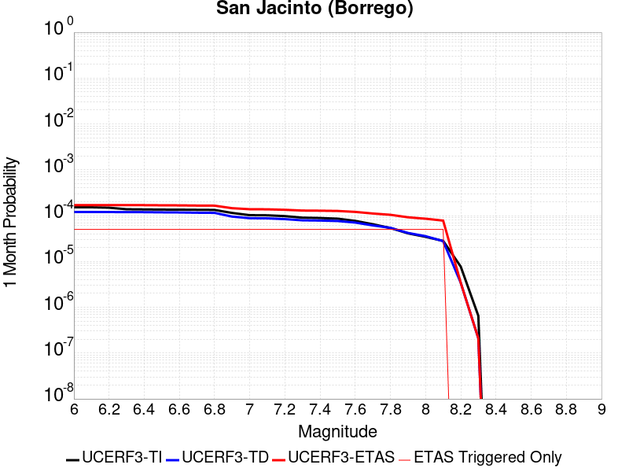 | 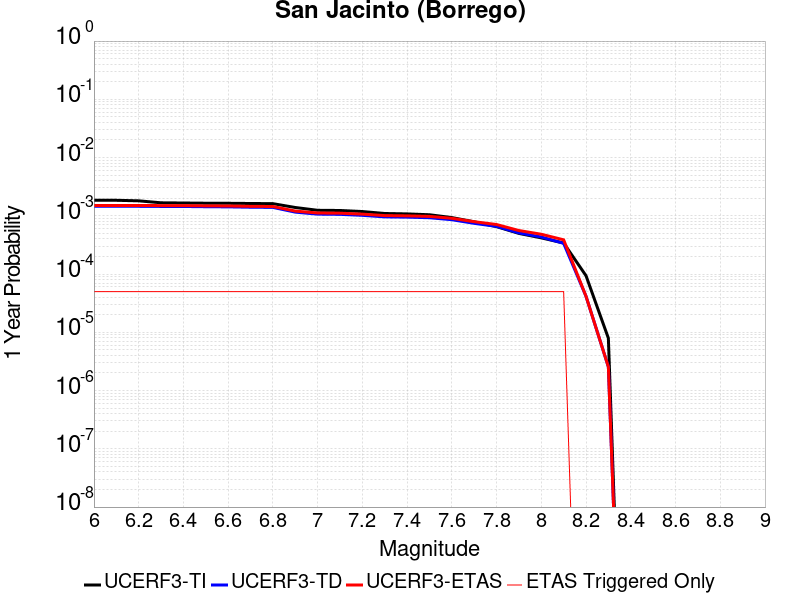 |  |

| Magnitude | 1 wk TI Prob | 1 wk TD Prob | 1 wk ETAS Prob | 1 wk ETAS/TD Gain | 1 wk ETAS Triggered Only | 1 mo TI Prob | 1 mo TD Prob | 1 mo ETAS Prob | 1 mo ETAS/TD Gain | 1 mo ETAS Triggered Only | 1 yr TI Prob | 1 yr TD Prob | 1 yr ETAS Prob | 1 yr ETAS/TD Gain | 1 yr ETAS Triggered Only | 10 yr TI Prob | 10 yr TD Prob | 10 yr ETAS Prob | 10 yr ETAS/TD Gain | 10 yr ETAS Triggered Only |
|-----|-----|-----|-----|-----|-----|-----|-----|-----|-----|-----|-----|-----|-----|-----|-----|-----|-----|-----|-----|-----|
| 6.0 | 3.543992E-5 | 2.7926513E-5 | 6.422314E-5 | 2.2997193 | 3.629764E-5 | 1.5187653E-4 | 1.1967963E-4 | 1.5597293E-4 | 1.3032538 | 3.629764E-5 | 0.0018475284 | 0.0014561379 | 0.0014923826 | 1.024891 | 3.629764E-5 | 0.018322436 | 0.014869647 | 0.014905405 | 1.0024048 | 3.629764E-5 |
| 6.1 | 3.542281E-5 | 2.7926513E-5 | 6.422314E-5 | 2.2997193 | 3.629764E-5 | 1.5180321E-4 | 1.1967963E-4 | 1.5597293E-4 | 1.3032538 | 3.629764E-5 | 0.0018466372 | 0.0014561379 | 0.0014923826 | 1.024891 | 3.629764E-5 | 0.018313672 | 0.014869647 | 0.014905405 | 1.0024048 | 3.629764E-5 |
| 6.2 | 3.4688688E-5 | 2.7926511E-5 | 6.422314E-5 | 2.2997193 | 3.629764E-5 | 1.4865733E-4 | 1.1967963E-4 | 1.5597293E-4 | 1.3032538 | 3.629764E-5 | 0.0018084005 | 0.0014561379 | 0.0014923826 | 1.024891 | 3.629764E-5 | 0.017937548 | 0.014869647 | 0.014905405 | 1.0024048 | 3.629764E-5 |
| 6.3 | 3.2087122E-5 | 2.7771865E-5 | 6.4068496E-5 | 2.306957 | 3.629764E-5 | 1.3750899E-4 | 1.1901691E-4 | 1.5531023E-4 | 1.3049425 | 3.629764E-5 | 0.0016728862 | 0.00144808 | 0.001484325 | 1.0250298 | 3.629764E-5 | 0.016603488 | 0.014790683 | 0.014826444 | 1.0024178 | 3.629764E-5 |
| 6.4 | 3.1828724E-5 | 2.7738852E-5 | 6.4035485E-5 | 2.3085124 | 3.629764E-5 | 1.364017E-4 | 1.1887544E-4 | 1.5516876E-4 | 1.3053055 | 3.629764E-5 | 0.0016594254 | 0.0014463598 | 0.001482605 | 1.0250596 | 3.629764E-5 | 0.016470885 | 0.014773762 | 0.014809523 | 1.0024205 | 3.629764E-5 |
| 6.5 | 3.1563577E-5 | 2.747857E-5 | 6.377522E-5 | 2.3209074 | 3.629764E-5 | 1.3526545E-4 | 1.1776006E-4 | 1.5405341E-4 | 1.3081976 | 3.629764E-5 | 0.0016456128 | 0.0014327979 | 0.0014690435 | 1.025297 | 3.629764E-5 | 0.0163348 | 0.014640348 | 0.014676114 | 1.002443 | 3.629764E-5 |
| 6.6 | 3.1467625E-5 | 2.7322796E-5 | 6.3619445E-5 | 2.3284383 | 3.629764E-5 | 1.3485427E-4 | 1.1709251E-4 | 1.533859E-4 | 1.3099549 | 3.629764E-5 | 0.0016406142 | 0.0014246812 | 0.0014609271 | 1.0254414 | 3.629764E-5 | 0.016285548 | 0.014560594 | 0.0145963635 | 1.0024565 | 3.629764E-5 |
| 6.7 | 3.1223695E-5 | 2.6940816E-5 | 6.323748E-5 | 2.347274 | 3.629764E-5 | 1.3380898E-4 | 1.15455594E-4 | 1.5174905E-4 | 1.3143499 | 3.629764E-5 | 0.0016279068 | 0.0014047775 | 0.0014410242 | 1.0258024 | 3.629764E-5 | 0.01616033 | 0.014364966 | 0.014400742 | 1.0024905 | 3.629764E-5 |
| 6.8 | 3.1015585E-5 | 2.6761822E-5 | 6.305849E-5 | 2.3562853 | 3.629764E-5 | 1.3291716E-4 | 1.1468855E-4 | 1.5098203E-4 | 1.3164525 | 3.629764E-5 | 0.001617065 | 0.0013954508 | 0.0014316977 | 1.0259751 | 3.629764E-5 | 0.016053487 | 0.014272246 | 0.014308025 | 1.002507 | 3.629764E-5 |
| 6.9 | 2.6641965E-5 | 2.2184247E-5 | 5.848108E-5 | 2.6361537 | 3.629764E-5 | 1.1417485E-4 | 9.50719E-5 | 1.3136609E-4 | 1.3817552 | 3.629764E-5 | 0.0013891924 | 0.0011568897 | 0.0011931453 | 1.0313389 | 3.629764E-5 | 0.0138054015 | 0.011882438 | 0.011918305 | 1.0030184 | 3.629764E-5 |
| 7.0 | 2.3854353E-5 | 2.0479023E-5 | 5.677592E-5 | 2.772394 | 3.629764E-5 | 1.02228936E-4 | 8.77643E-5 | 1.2405876E-4 | 1.4135447 | 3.629764E-5 | 0.0012439266 | 0.0010680092 | 0.001104268 | 1.03395 | 3.629764E-5 | 0.012369866 | 0.0109828 | 0.0110187 | 1.0032686 | 3.629764E-5 |
| 7.1 | 2.3672901E-5 | 2.031551E-5 | 5.6612414E-5 | 2.7866597 | 3.629764E-5 | 1.0145135E-4 | 8.7063585E-5 | 1.2335807E-4 | 1.4168732 | 3.629764E-5 | 0.0012344702 | 0.0010594862 | 0.0010957454 | 1.0342233 | 3.629764E-5 | 0.0122763505 | 0.010897976 | 0.010933878 | 1.0032943 | 3.629764E-5 |
| 7.2 | 2.2717244E-5 | 1.9542893E-5 | 5.5839824E-5 | 2.8572958 | 3.629764E-5 | 9.735599E-5 | 8.375258E-5 | 1.2004718E-4 | 1.433355 | 3.629764E-5 | 0.0011846646 | 0.001019213 | 0.0010554736 | 1.035577 | 3.629764E-5 | 0.01178369 | 0.010495341 | 0.010531258 | 1.0034221 | 3.629764E-5 |
| 7.3 | 2.1016205E-5 | 1.8384526E-5 | 5.46815E-5 | 2.974322 | 3.629764E-5 | 9.006634E-5 | 7.878846E-5 | 1.1508323E-4 | 1.4606612 | 3.629764E-5 | 0.001096006 | 9.5882936E-4 | 9.950922E-4 | 1.0378199 | 3.629764E-5 | 0.010906163 | 0.009890967 | 0.009926905 | 1.0036335 | 3.629764E-5 |
| 7.4 | 2.0683625E-5 | 1.8187047E-5 | 5.4484026E-5 | 2.99576 | 3.629764E-5 | 8.86411E-5 | 7.794217E-5 | 1.1423698E-4 | 1.4656633 | 3.629764E-5 | 0.001078671 | 9.485349E-4 | 9.847981E-4 | 1.0382308 | 3.629764E-5 | 0.010734501 | 0.009787692 | 0.009823634 | 1.0036722 | 3.629764E-5 |
| 7.5 | 1.9993966E-5 | 1.7782075E-5 | 5.4079068E-5 | 3.0412128 | 3.629764E-5 | 8.568561E-5 | 7.620667E-5 | 1.1250155E-4 | 1.476269 | 3.629764E-5 | 0.001042723 | 9.2742336E-4 | 9.636873E-4 | 1.0391018 | 3.629764E-5 | 0.010378438 | 0.009574614 | 0.009610564 | 1.0037547 | 3.629764E-5 |
| 7.6 | 1.788966E-5 | 1.6435291E-5 | 5.2732335E-5 | 3.208482 | 3.629764E-5 | 7.666772E-5 | 7.043507E-5 | 1.0673015E-4 | 1.5152985 | 3.629764E-5 | 9.3302975E-4 | 8.572113E-4 | 8.934778E-4 | 1.0423076 | 3.629764E-5 | 0.00929122 | 0.008866487 | 0.008902462 | 1.0040575 | 3.629764E-5 |
| 7.7 | 1.5125781E-5 | 1.4237377E-5 | 5.05345E-5 | 3.549425 | 3.629764E-5 | 6.4823165E-5 | 6.1015908E-5 | 9.7311335E-5 | 1.5948519 | 3.629764E-5 | 7.889362E-4 | 7.426163E-4 | 7.78887E-4 | 1.0488417 | 3.629764E-5 | 0.007861412 | 0.0077142045 | 0.007750222 | 1.004669 | 3.629764E-5 |
| 7.8 | 1.250089E-5 | 1.26304985E-5 | 4.892768E-5 | 3.8737729 | 3.629764E-5 | 5.3574146E-5 | 5.412959E-5 | 9.042527E-5 | 1.6705331 | 3.629764E-5 | 6.5207E-4 | 6.588291E-4 | 6.951028E-4 | 1.0550579 | 3.629764E-5 | 0.006501599 | 0.0068677636 | 0.006903812 | 1.0052489 | 3.629764E-5 |
| 7.9 | 9.561E-6 | 9.754616E-6 | 4.6051904E-5 | 4.721037 | 3.629764E-5 | 4.0975072E-5 | 4.1804833E-5 | 7.810096E-5 | 1.868228 | 3.629764E-5 | 4.987573E-4 | 5.088555E-4 | 5.451347E-4 | 1.0712956 | 3.629764E-5 | 0.0049763937 | 0.0053523467 | 0.00538845 | 1.0067453 | 3.629764E-5 |
| 8.0 | 8.01699E-6 | 8.293488E-6 | 4.4590826E-5 | 5.3766074 | 3.629764E-5 | 3.4358076E-5 | 3.554304E-5 | 7.1839386E-5 | 2.0211945 | 3.629764E-5 | 4.1822926E-4 | 4.3265108E-4 | 4.6893302E-4 | 1.0838596 | 3.629764E-5 | 0.0041744304 | 0.004573375 | 0.0046095066 | 1.0079005 | 3.629764E-5 |
| 8.1 | 6.541947E-6 | 6.4622354E-6 | 4.2759642E-5 | 6.61685 | 3.629764E-5 | 2.8036617E-5 | 2.7695003E-5 | 6.399164E-5 | 2.3105843 | 3.629764E-5 | 3.4129233E-4 | 3.37135E-4 | 3.734204E-4 | 1.1076287 | 3.629764E-5 | 0.0034076865 | 0.0035806994 | 0.0036168671 | 1.0101007 | 3.629764E-5 |
| 8.2 | 1.7968189E-6 | 7.9713476E-7 | 7.9713476E-7 | 1.0 | 0.0 | 7.70063E-6 | 3.4162877E-6 | 3.4162877E-6 | 1.0 | 0.0 | 9.3751136E-5 | 4.159253E-5 | 4.159253E-5 | 1.0 | 0.0 | 9.371159E-4 | 4.712058E-4 | 4.712058E-4 | 1.0 | 0.0 |
| 8.3 | 1.5167889E-7 | 4.897714E-8 | 4.897714E-8 | 1.0 | 0.0 | 6.500522E-7 | 2.09902E-7 | 2.09902E-7 | 1.0 | 0.0 | 7.9143565E-6 | 2.5555544E-6 | 2.5555544E-6 | 1.0 | 0.0 | 7.914075E-5 | 2.969505E-5 | 2.969505E-5 | 1.0 | 0.0 |

## Newport-Inglewood (Offshore)
*[(top)](#table-of-contents)*

| 1 Week | 1 Month | 1 Year | 10 Year |
|-----|-----|-----|-----|
|  |  |  |  |

| Magnitude | 1 wk TI Prob | 1 wk TD Prob | 1 wk ETAS Prob | 1 wk ETAS/TD Gain | 1 wk ETAS Triggered Only | 1 mo TI Prob | 1 mo TD Prob | 1 mo ETAS Prob | 1 mo ETAS/TD Gain | 1 mo ETAS Triggered Only | 1 yr TI Prob | 1 yr TD Prob | 1 yr ETAS Prob | 1 yr ETAS/TD Gain | 1 yr ETAS Triggered Only | 10 yr TI Prob | 10 yr TD Prob | 10 yr ETAS Prob | 10 yr ETAS/TD Gain | 10 yr ETAS Triggered Only |
|-----|-----|-----|-----|-----|-----|-----|-----|-----|-----|-----|-----|-----|-----|-----|-----|-----|-----|-----|-----|-----|
| 6.0 | 1.9626508E-5 | 1.8965357E-5 | 3.711383E-5 | 1.9569278 | 1.814882E-5 | 8.411089E-5 | 8.1277634E-5 | 9.942498E-5 | 1.223276 | 1.814882E-5 | 0.001023569 | 9.891186E-4 | 0.0010072495 | 1.0183303 | 1.814882E-5 | 0.010188672 | 0.009848503 | 0.009884444 | 1.0036494 | 3.629764E-5 |
| 6.1 | 1.331886E-5 | 1.2218092E-5 | 3.0366691E-5 | 2.4853873 | 1.814882E-5 | 5.707958E-5 | 5.2362207E-5 | 7.0510076E-5 | 1.3465834 | 1.814882E-5 | 6.947222E-4 | 6.3732493E-4 | 6.5546215E-4 | 1.0284584 | 1.814882E-5 | 0.006925544 | 0.006355149 | 0.0063731824 | 1.0028377 | 1.814882E-5 |
| 6.2 | 1.2250852E-5 | 1.1076029E-5 | 2.9224648E-5 | 2.6385493 | 1.814882E-5 | 5.2502597E-5 | 4.7467838E-5 | 6.56158E-5 | 1.3823211 | 1.814882E-5 | 6.3903164E-4 | 5.777687E-4 | 5.9590704E-4 | 1.0313938 | 1.814882E-5 | 0.006371971 | 0.0057627866 | 0.005780831 | 1.0031312 | 1.814882E-5 |
| 6.3 | 1.2106258E-5 | 1.0918891E-5 | 2.9067513E-5 | 2.6621306 | 1.814882E-5 | 5.1882926E-5 | 4.6794412E-5 | 6.494238E-5 | 1.3878235 | 1.814882E-5 | 6.3149154E-4 | 5.69574E-4 | 5.877125E-4 | 1.0318457 | 1.814882E-5 | 0.0062970007 | 0.005681259 | 0.005699305 | 1.0031763 | 1.814882E-5 |
| 6.4 | 1.1348758E-5 | 1.0109362E-5 | 2.8257999E-5 | 2.7952306 | 1.814882E-5 | 4.8636626E-5 | 4.3325123E-5 | 6.1473154E-5 | 1.4188801 | 1.814882E-5 | 5.919901E-4 | 5.273565E-4 | 5.454957E-4 | 1.0343965 | 1.814882E-5 | 0.005904155 | 0.0052611465 | 0.0052791997 | 1.0034314 | 1.814882E-5 |
| 6.5 | 1.100837E-5 | 9.7433895E-6 | 9.7433895E-6 | 1.0 | 0.0 | 4.7177873E-5 | 4.1756717E-5 | 4.1756717E-5 | 1.0 | 0.0 | 5.7423924E-4 | 5.082702E-4 | 5.082702E-4 | 1.0 | 0.0 | 0.005727576 | 0.0050711688 | 0.0050711688 | 1.0 | 0.0 |
| 6.6 | 1.0634696E-5 | 9.345544E-6 | 9.345544E-6 | 1.0 | 0.0 | 4.557647E-5 | 4.0051716E-5 | 4.0051716E-5 | 1.0 | 0.0 | 5.5475225E-4 | 4.8752132E-4 | 4.8752132E-4 | 1.0 | 0.0 | 0.0055336943 | 0.0048646047 | 0.0048646047 | 1.0 | 0.0 |
| 6.7 | 9.9780855E-6 | 8.667911E-6 | 8.667911E-6 | 1.0 | 0.0 | 4.276252E-5 | 3.7147664E-5 | 3.7147664E-5 | 1.0 | 0.0 | 5.205093E-4 | 4.5217964E-4 | 4.5217964E-4 | 1.0 | 0.0 | 0.0051929182 | 0.004512675 | 0.004512675 | 1.0 | 0.0 |
| 6.8 | 9.59546E-6 | 8.27295E-6 | 8.27295E-6 | 1.0 | 0.0 | 4.1122752E-5 | 3.5455025E-5 | 3.5455025E-5 | 1.0 | 0.0 | 5.0055445E-4 | 4.315801E-4 | 4.315801E-4 | 1.0 | 0.0 | 0.004994285 | 0.004307495 | 0.004307495 | 1.0 | 0.0 |
| 6.9 | 9.000614E-6 | 7.70684E-6 | 7.70684E-6 | 1.0 | 0.0 | 3.857349E-5 | 3.30289E-5 | 3.30289E-5 | 1.0 | 0.0 | 4.6953102E-4 | 4.0205332E-4 | 4.0205332E-4 | 1.0 | 0.0 | 0.004685402 | 0.0040133307 | 0.0040133307 | 1.0 | 0.0 |
| 7.0 | 7.4070194E-6 | 6.148904E-6 | 6.148904E-6 | 1.0 | 0.0 | 3.1743984E-5 | 2.635218E-5 | 2.635218E-5 | 1.0 | 0.0 | 3.8641447E-4 | 3.207907E-4 | 3.207907E-4 | 1.0 | 0.0 | 0.0038574322 | 0.0032032963 | 0.0032032963 | 1.0 | 0.0 |
| 7.1 | 6.299615E-6 | 5.0565927E-6 | 5.0565927E-6 | 1.0 | 0.0 | 2.699807E-5 | 2.1670932E-5 | 2.1670932E-5 | 1.0 | 0.0 | 3.2865192E-4 | 2.638118E-4 | 2.638118E-4 | 1.0 | 0.0 | 0.003281663 | 0.002635001 | 0.002635001 | 1.0 | 0.0 |
| 7.2 | 5.096653E-6 | 3.892769E-6 | 3.892769E-6 | 1.0 | 0.0 | 2.1842614E-5 | 1.668319E-5 | 1.668319E-5 | 1.0 | 0.0 | 2.6590136E-4 | 2.0309901E-4 | 2.0309901E-4 | 1.0 | 0.0 | 0.0026558342 | 0.0020291451 | 0.0020291451 | 1.0 | 0.0 |
| 7.3 | 3.9753018E-6 | 2.9099103E-6 | 2.9099103E-6 | 1.0 | 0.0 | 1.7036897E-5 | 1.2470985E-5 | 1.2470985E-5 | 1.0 | 0.0 | 2.0740448E-4 | 1.5182374E-4 | 1.5182374E-4 | 1.0 | 0.0 | 0.00207211 | 0.0015172083 | 0.0015172083 | 1.0 | 0.0 |
| 7.4 | 3.0568392E-6 | 2.1449955E-6 | 2.1449955E-6 | 1.0 | 0.0 | 1.3100675E-5 | 9.192806E-6 | 9.192806E-6 | 1.0 | 0.0 | 1.5948903E-4 | 1.1191672E-4 | 1.1191672E-4 | 1.0 | 0.0 | 0.0015937461 | 0.0011186098 | 0.0011186098 | 1.0 | 0.0 |
| 7.5 | 1.7279019E-6 | 1.1469883E-6 | 1.1469883E-6 | 1.0 | 0.0 | 7.405273E-6 | 4.915655E-6 | 4.915655E-6 | 1.0 | 0.0 | 9.015547E-5 | 5.9846494E-5 | 5.9846494E-5 | 1.0 | 0.0 | 9.01189E-4 | 5.9830764E-4 | 5.9830764E-4 | 1.0 | 0.0 |
| 7.6 | 1.1156416E-6 | 7.223012E-7 | 7.223012E-7 | 1.0 | 0.0 | 4.7813123E-6 | 3.095573E-6 | 3.095573E-6 | 1.0 | 0.0 | 5.821092E-5 | 3.7687976E-5 | 3.7687976E-5 | 1.0 | 0.0 | 5.8195676E-4 | 3.7681818E-4 | 3.7681818E-4 | 1.0 | 0.0 |
| 7.7 | 9.117973E-8 | 6.734145E-8 | 6.734145E-8 | 1.0 | 0.0 | 3.907702E-7 | 2.886062E-7 | 2.886062E-7 | 1.0 | 0.0 | 4.757617E-6 | 3.513775E-6 | 3.513775E-6 | 1.0 | 0.0 | 4.7575148E-5 | 3.5137225E-5 | 3.5137225E-5 | 1.0 | 0.0 |

## Simi-Santa Rosa
*[(top)](#table-of-contents)*

| 1 Week | 1 Month | 1 Year | 10 Year |
|-----|-----|-----|-----|
|  |  |  |  |

| Magnitude | 1 wk TI Prob | 1 wk TD Prob | 1 wk ETAS Prob | 1 wk ETAS/TD Gain | 1 wk ETAS Triggered Only | 1 mo TI Prob | 1 mo TD Prob | 1 mo ETAS Prob | 1 mo ETAS/TD Gain | 1 mo ETAS Triggered Only | 1 yr TI Prob | 1 yr TD Prob | 1 yr ETAS Prob | 1 yr ETAS/TD Gain | 1 yr ETAS Triggered Only | 10 yr TI Prob | 10 yr TD Prob | 10 yr ETAS Prob | 10 yr ETAS/TD Gain | 10 yr ETAS Triggered Only |
|-----|-----|-----|-----|-----|-----|-----|-----|-----|-----|-----|-----|-----|-----|-----|-----|-----|-----|-----|-----|-----|
| 6.0 | 2.198912E-5 | 2.2275442E-5 | 2.2275442E-5 | 1.0 | 0.0 | 9.4235686E-5 | 9.5462936E-5 | 9.5462936E-5 | 1.0 | 0.0 | 0.0011467156 | 0.0011616853 | 0.001179813 | 1.0156047 | 1.814882E-5 | 0.011408163 | 0.011560575 | 0.011596453 | 1.0031035 | 3.629764E-5 |
| 6.1 | 2.198912E-5 | 2.2275442E-5 | 2.2275442E-5 | 1.0 | 0.0 | 9.4235686E-5 | 9.5462936E-5 | 9.5462936E-5 | 1.0 | 0.0 | 0.0011467156 | 0.0011616853 | 0.001179813 | 1.0156047 | 1.814882E-5 | 0.011408163 | 0.011560575 | 0.011596453 | 1.0031035 | 3.629764E-5 |
| 6.2 | 1.69983E-5 | 1.6668559E-5 | 1.6668559E-5 | 1.0 | 0.0 | 7.284782E-5 | 7.143489E-5 | 7.143489E-5 | 1.0 | 0.0 | 8.865613E-4 | 8.6940196E-4 | 8.87535E-4 | 1.0208569 | 1.814882E-5 | 0.008830327 | 0.008662928 | 0.0086989105 | 1.0041537 | 3.629764E-5 |
| 6.3 | 1.69983E-5 | 1.6668559E-5 | 1.6668559E-5 | 1.0 | 0.0 | 7.284782E-5 | 7.143489E-5 | 7.143489E-5 | 1.0 | 0.0 | 8.865613E-4 | 8.6940196E-4 | 8.87535E-4 | 1.0208569 | 1.814882E-5 | 0.008830327 | 0.008662928 | 0.0086989105 | 1.0041537 | 3.629764E-5 |
| 6.4 | 1.4666188E-5 | 1.4052543E-5 | 1.4052543E-5 | 1.0 | 0.0 | 6.285358E-5 | 6.0223934E-5 | 6.0223934E-5 | 1.0 | 0.0 | 7.6497364E-4 | 7.3300465E-4 | 7.511401E-4 | 1.0247413 | 1.814882E-5 | 0.0076234564 | 0.007308344 | 0.0073443763 | 1.0049303 | 3.629764E-5 |
| 6.5 | 1.4666188E-5 | 1.4052543E-5 | 1.4052543E-5 | 1.0 | 0.0 | 6.285358E-5 | 6.0223934E-5 | 6.0223934E-5 | 1.0 | 0.0 | 7.6497364E-4 | 7.3300465E-4 | 7.511401E-4 | 1.0247413 | 1.814882E-5 | 0.0076234564 | 0.007308344 | 0.0073443763 | 1.0049303 | 3.629764E-5 |
| 6.6 | 1.4377586E-5 | 1.3729583E-5 | 1.3729583E-5 | 1.0 | 0.0 | 6.1616774E-5 | 5.883988E-5 | 5.883988E-5 | 1.0 | 0.0 | 7.4992597E-4 | 7.1616494E-4 | 7.3430076E-4 | 1.0253235 | 1.814882E-5 | 0.007474003 | 0.0071410383 | 0.007177077 | 1.0050467 | 3.629764E-5 |
| 6.7 | 1.3881404E-5 | 1.320755E-5 | 1.320755E-5 | 1.0 | 0.0 | 5.9490372E-5 | 5.66027E-5 | 5.66027E-5 | 1.0 | 0.0 | 7.240546E-4 | 6.8894465E-4 | 7.07081E-4 | 1.0263247 | 1.814882E-5 | 0.007217 | 0.006870538 | 0.0069065862 | 1.0052468 | 3.629764E-5 |
| 6.8 | 1.0176516E-5 | 9.154151E-6 | 9.154151E-6 | 1.0 | 0.0 | 4.3612912E-5 | 3.9231574E-5 | 3.9231574E-5 | 1.0 | 0.0 | 5.308578E-4 | 4.7755634E-4 | 4.956965E-4 | 1.0379853 | 1.814882E-5 | 0.0052959146 | 0.004766934 | 0.0048030587 | 1.0075781 | 3.629764E-5 |
| 6.9 | 9.699797E-6 | 8.774719E-6 | 8.774719E-6 | 1.0 | 0.0 | 4.15699E-5 | 3.7605492E-5 | 3.7605492E-5 | 1.0 | 0.0 | 5.05996E-4 | 4.577671E-4 | 4.7590764E-4 | 1.0396283 | 1.814882E-5 | 0.005048454 | 0.0045698597 | 0.0046059913 | 1.0079066 | 3.629764E-5 |
| 7.0 | 7.4049476E-6 | 6.559333E-6 | 6.559333E-6 | 1.0 | 0.0 | 3.1735104E-5 | 2.8111197E-5 | 2.8111197E-5 | 1.0 | 0.0 | 3.8630638E-4 | 3.422127E-4 | 3.422127E-4 | 1.0 | 0.0 | 0.0038563553 | 0.0034180996 | 0.0034361864 | 1.0052915 | 1.814882E-5 |
| 7.1 | 3.873439E-6 | 2.7595095E-6 | 2.7595095E-6 | 1.0 | 0.0 | 1.6600346E-5 | 1.1826417E-5 | 1.1826417E-5 | 1.0 | 0.0 | 2.0209046E-4 | 1.4397735E-4 | 1.4397735E-4 | 1.0 | 0.0 | 0.0020190678 | 0.0014388643 | 0.0014388643 | 1.0 | 0.0 |
| 7.2 | 3.417706E-6 | 2.3676484E-6 | 2.3676484E-6 | 1.0 | 0.0 | 1.4647229E-5 | 1.0147027E-5 | 1.0147027E-5 | 1.0 | 0.0 | 1.7831543E-4 | 1.2353327E-4 | 1.2353327E-4 | 1.0 | 0.0 | 0.0017817242 | 0.0012346683 | 0.0012346683 | 1.0 | 0.0 |
| 7.3 | 1.90225E-6 | 1.4073753E-6 | 1.4073753E-6 | 1.0 | 0.0 | 8.152474E-6 | 6.0315947E-6 | 6.0315947E-6 | 1.0 | 0.0 | 9.9251854E-5 | 7.343221E-5 | 7.343221E-5 | 1.0 | 0.0 | 9.920754E-4 | 7.340817E-4 | 7.340817E-4 | 1.0 | 0.0 |
| 7.4 | 1.5170556E-6 | 1.1024773E-6 | 1.1024773E-6 | 1.0 | 0.0 | 6.5016507E-6 | 4.724894E-6 | 4.724894E-6 | 1.0 | 0.0 | 7.915472E-5 | 5.7524077E-5 | 5.7524077E-5 | 1.0 | 0.0 | 7.9126534E-4 | 5.7509297E-4 | 5.7509297E-4 | 1.0 | 0.0 |
| 7.5 | 1.178732E-6 | 8.535102E-7 | 8.535102E-7 | 1.0 | 0.0 | 5.0516987E-6 | 3.6578958E-6 | 3.6578958E-6 | 1.0 | 0.0 | 6.1502695E-5 | 4.453398E-5 | 4.453398E-5 | 1.0 | 0.0 | 6.148568E-4 | 4.452515E-4 | 4.452515E-4 | 1.0 | 0.0 |
| 7.6 | 6.8722386E-7 | 4.793198E-7 | 4.793198E-7 | 1.0 | 0.0 | 2.9452417E-6 | 2.054226E-6 | 2.054226E-6 | 1.0 | 0.0 | 3.5857727E-5 | 2.5009915E-5 | 2.5009915E-5 | 1.0 | 0.0 | 3.5851944E-4 | 2.5007114E-4 | 2.5007114E-4 | 1.0 | 0.0 |
| 7.7 | 5.5126515E-7 | 3.6731157E-7 | 3.6731157E-7 | 1.0 | 0.0 | 2.3625628E-6 | 1.5741915E-6 | 1.5741915E-6 | 1.0 | 0.0 | 2.8763823E-5 | 1.9165615E-5 | 1.9165615E-5 | 1.0 | 0.0 | 2.87601E-4 | 1.9163972E-4 | 1.9163972E-4 | 1.0 | 0.0 |
| 7.8 | 3.3860243E-7 | 2.0075942E-7 | 2.0075942E-7 | 1.0 | 0.0 | 1.4511525E-6 | 8.6039717E-7 | 8.6039717E-7 | 1.0 | 0.0 | 1.7667637E-5 | 1.0475286E-5 | 1.0475286E-5 | 1.0 | 0.0 | 1.7666233E-4 | 1.04747975E-4 | 1.04747975E-4 | 1.0 | 0.0 |
| 7.9 | 2.7955386E-7 | 1.4649108E-7 | 1.4649108E-7 | 1.0 | 0.0 | 1.1980875E-6 | 6.278188E-7 | 6.278188E-7 | 1.0 | 0.0 | 1.4586617E-5 | 7.643667E-6 | 7.643667E-6 | 1.0 | 0.0 | 1.458566E-4 | 7.643409E-5 | 7.643409E-5 | 1.0 | 0.0 |
| 8.0 | 5.6259015E-8 | 3.3355324E-8 | 3.3355324E-8 | 1.0 | 0.0 | 2.4111003E-7 | 1.4295138E-7 | 1.4295138E-7 | 1.0 | 0.0 | 2.9355108E-6 | 1.7404317E-6 | 1.7404317E-6 | 1.0 | 0.0 | 2.935472E-5 | 1.7404194E-5 | 1.7404194E-5 | 1.0 | 0.0 |

## Round Valley
*[(top)](#table-of-contents)*

| 1 Week | 1 Month | 1 Year | 10 Year |
|-----|-----|-----|-----|
|  |  | 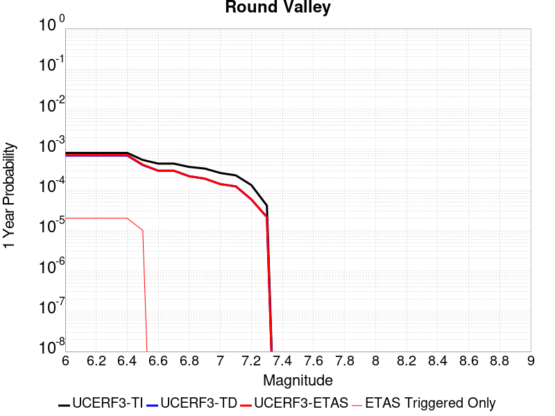 |  |

| Magnitude | 1 wk TI Prob | 1 wk TD Prob | 1 wk ETAS Prob | 1 wk ETAS/TD Gain | 1 wk ETAS Triggered Only | 1 mo TI Prob | 1 mo TD Prob | 1 mo ETAS Prob | 1 mo ETAS/TD Gain | 1 mo ETAS Triggered Only | 1 yr TI Prob | 1 yr TD Prob | 1 yr ETAS Prob | 1 yr ETAS/TD Gain | 1 yr ETAS Triggered Only | 10 yr TI Prob | 10 yr TD Prob | 10 yr ETAS Prob | 10 yr ETAS/TD Gain | 10 yr ETAS Triggered Only |
|-----|-----|-----|-----|-----|-----|-----|-----|-----|-----|-----|-----|-----|-----|-----|-----|-----|-----|-----|-----|-----|
| 6.0 | 1.588152E-5 | 1.3670716E-5 | 3.1819287E-5 | 2.3275511 | 1.814882E-5 | 6.806188E-5 | 5.8587688E-5 | 7.673544E-5 | 1.3097538 | 1.814882E-5 | 8.283384E-4 | 7.13111E-4 | 7.493828E-4 | 1.0508641 | 3.629764E-5 | 0.008252576 | 0.0071121147 | 0.0071481545 | 1.0050673 | 3.629764E-5 |
| 6.1 | 1.588152E-5 | 1.3670716E-5 | 3.1819287E-5 | 2.3275511 | 1.814882E-5 | 6.806188E-5 | 5.8587688E-5 | 7.673544E-5 | 1.3097538 | 1.814882E-5 | 8.283384E-4 | 7.13111E-4 | 7.493828E-4 | 1.0508641 | 3.629764E-5 | 0.008252576 | 0.0071121147 | 0.0071481545 | 1.0050673 | 3.629764E-5 |
| 6.2 | 1.588152E-5 | 1.3670716E-5 | 3.1819287E-5 | 2.3275511 | 1.814882E-5 | 6.806188E-5 | 5.8587688E-5 | 7.673544E-5 | 1.3097538 | 1.814882E-5 | 8.283384E-4 | 7.13111E-4 | 7.493828E-4 | 1.0508641 | 3.629764E-5 | 0.008252576 | 0.0071121147 | 0.0071481545 | 1.0050673 | 3.629764E-5 |
| 6.3 | 1.588152E-5 | 1.3670716E-5 | 3.1819287E-5 | 2.3275511 | 1.814882E-5 | 6.806188E-5 | 5.8587688E-5 | 7.673544E-5 | 1.3097538 | 1.814882E-5 | 8.283384E-4 | 7.13111E-4 | 7.493828E-4 | 1.0508641 | 3.629764E-5 | 0.008252576 | 0.0071121147 | 0.0071481545 | 1.0050673 | 3.629764E-5 |
| 6.4 | 1.588152E-5 | 1.3670716E-5 | 3.1819287E-5 | 2.3275511 | 1.814882E-5 | 6.806188E-5 | 5.8587688E-5 | 7.673544E-5 | 1.3097538 | 1.814882E-5 | 8.283384E-4 | 7.13111E-4 | 7.493828E-4 | 1.0508641 | 3.629764E-5 | 0.008252576 | 0.0071121147 | 0.0071481545 | 1.0050673 | 3.629764E-5 |
| 6.5 | 1.0646776E-5 | 7.953037E-6 | 2.6101714E-5 | 3.2819805 | 1.814882E-5 | 4.5628243E-5 | 3.408405E-5 | 5.223225E-5 | 1.5324544 | 1.814882E-5 | 5.553823E-4 | 4.1490266E-4 | 4.3304396E-4 | 1.0437242 | 1.814882E-5 | 0.005539963 | 0.0041421093 | 0.004160183 | 1.0043634 | 1.814882E-5 |
| 6.6 | 8.632956E-6 | 5.768742E-6 | 5.768742E-6 | 1.0 | 0.0 | 3.6997862E-5 | 2.4722967E-5 | 2.4722967E-5 | 1.0 | 0.0 | 4.5035584E-4 | 3.009644E-4 | 3.009644E-4 | 1.0 | 0.0 | 0.0044944426 | 0.003005946 | 0.003005946 | 1.0 | 0.0 |
| 6.7 | 8.632956E-6 | 5.768742E-6 | 5.768742E-6 | 1.0 | 0.0 | 3.6997862E-5 | 2.4722967E-5 | 2.4722967E-5 | 1.0 | 0.0 | 4.5035584E-4 | 3.009644E-4 | 3.009644E-4 | 1.0 | 0.0 | 0.0044944426 | 0.003005946 | 0.003005946 | 1.0 | 0.0 |
| 6.8 | 7.143895E-6 | 4.2018346E-6 | 4.2018346E-6 | 1.0 | 0.0 | 3.0616335E-5 | 1.8007748E-5 | 1.8007748E-5 | 1.0 | 0.0 | 3.726901E-4 | 2.1922393E-4 | 2.1922393E-4 | 1.0 | 0.0 | 0.0037206567 | 0.0021902416 | 0.0021902416 | 1.0 | 0.0 |
| 6.9 | 6.5120694E-6 | 3.6644687E-6 | 3.6644687E-6 | 1.0 | 0.0 | 2.790857E-5 | 1.570478E-5 | 1.570478E-5 | 1.0 | 0.0 | 3.3973387E-4 | 1.9119044E-4 | 1.9119044E-4 | 1.0 | 0.0 | 0.0033921495 | 0.0019104085 | 0.0019104085 | 1.0 | 0.0 |
| 7.0 | 5.0614435E-6 | 2.6836676E-6 | 2.6836676E-6 | 1.0 | 0.0 | 2.169172E-5 | 1.1501388E-5 | 1.1501388E-5 | 1.0 | 0.0 | 2.6406467E-4 | 1.4002144E-4 | 1.4002144E-4 | 1.0 | 0.0 | 0.0026375111 | 0.0013994334 | 0.0013994334 | 1.0 | 0.0 |
| 7.1 | 4.41728E-6 | 2.3575074E-6 | 2.3575074E-6 | 1.0 | 0.0 | 1.8931061E-5 | 1.0103569E-5 | 1.0103569E-5 | 1.0 | 0.0 | 2.304613E-4 | 1.23005E-4 | 1.23005E-4 | 1.0 | 0.0 | 0.0023022245 | 0.0012294657 | 0.0012294657 | 1.0 | 0.0 |
| 7.2 | 2.535495E-6 | 1.1208391E-6 | 1.1208391E-6 | 1.0 | 0.0 | 1.0866362E-5 | 4.8035904E-6 | 4.8035904E-6 | 1.0 | 0.0 | 1.3228992E-4 | 5.8482667E-5 | 5.8482667E-5 | 1.0 | 0.0 | 0.0013221119 | 5.84724E-4 | 5.84724E-4 | 1.0 | 0.0 |
| 7.3 | 7.900015E-7 | 4.0889498E-7 | 4.0889498E-7 | 1.0 | 0.0 | 3.3857161E-6 | 1.752407E-6 | 1.752407E-6 | 1.0 | 0.0 | 4.1220315E-5 | 2.1335554E-5 | 2.1335554E-5 | 1.0 | 0.0 | 4.121267E-4 | 2.1335555E-4 | 2.1335555E-4 | 1.0 | 0.0 |

## Sierra Madre
*[(top)](#table-of-contents)*

| 1 Week | 1 Month | 1 Year | 10 Year |
|-----|-----|-----|-----|
|  |  |  |  |

| Magnitude | 1 wk TI Prob | 1 wk TD Prob | 1 wk ETAS Prob | 1 wk ETAS/TD Gain | 1 wk ETAS Triggered Only | 1 mo TI Prob | 1 mo TD Prob | 1 mo ETAS Prob | 1 mo ETAS/TD Gain | 1 mo ETAS Triggered Only | 1 yr TI Prob | 1 yr TD Prob | 1 yr ETAS Prob | 1 yr ETAS/TD Gain | 1 yr ETAS Triggered Only | 10 yr TI Prob | 10 yr TD Prob | 10 yr ETAS Prob | 10 yr ETAS/TD Gain | 10 yr ETAS Triggered Only |
|-----|-----|-----|-----|-----|-----|-----|-----|-----|-----|-----|-----|-----|-----|-----|-----|-----|-----|-----|-----|-----|
| 6.0 | 1.3379373E-5 | 1.10007395E-5 | 1.10007395E-5 | 1.0 | 0.0 | 5.7338908E-5 | 4.7145186E-5 | 4.7145186E-5 | 1.0 | 0.0 | 6.978776E-4 | 5.738429E-4 | 5.9198134E-4 | 1.0316087 | 1.814882E-5 | 0.0069569005 | 0.0057239756 | 0.0057600657 | 1.006305 | 3.629764E-5 |
| 6.1 | 1.3379373E-5 | 1.10007395E-5 | 1.10007395E-5 | 1.0 | 0.0 | 5.7338908E-5 | 4.7145186E-5 | 4.7145186E-5 | 1.0 | 0.0 | 6.978776E-4 | 5.738429E-4 | 5.9198134E-4 | 1.0316087 | 1.814882E-5 | 0.0069569005 | 0.0057239756 | 0.0057600657 | 1.006305 | 3.629764E-5 |
| 6.2 | 1.3379373E-5 | 1.10007395E-5 | 1.10007395E-5 | 1.0 | 0.0 | 5.7338908E-5 | 4.7145186E-5 | 4.7145186E-5 | 1.0 | 0.0 | 6.978776E-4 | 5.738429E-4 | 5.9198134E-4 | 1.0316087 | 1.814882E-5 | 0.0069569005 | 0.0057239756 | 0.0057600657 | 1.006305 | 3.629764E-5 |
| 6.3 | 1.3379373E-5 | 1.10007395E-5 | 1.10007395E-5 | 1.0 | 0.0 | 5.7338908E-5 | 4.7145186E-5 | 4.7145186E-5 | 1.0 | 0.0 | 6.978776E-4 | 5.738429E-4 | 5.9198134E-4 | 1.0316087 | 1.814882E-5 | 0.0069569005 | 0.0057239756 | 0.0057600657 | 1.006305 | 3.629764E-5 |
| 6.4 | 1.3379373E-5 | 1.10007395E-5 | 1.10007395E-5 | 1.0 | 0.0 | 5.7338908E-5 | 4.7145186E-5 | 4.7145186E-5 | 1.0 | 0.0 | 6.978776E-4 | 5.738429E-4 | 5.9198134E-4 | 1.0316087 | 1.814882E-5 | 0.0069569005 | 0.0057239756 | 0.0057600657 | 1.006305 | 3.629764E-5 |
| 6.5 | 1.26563245E-5 | 1.0230196E-5 | 1.0230196E-5 | 1.0 | 0.0 | 5.4240263E-5 | 4.3842967E-5 | 4.3842967E-5 | 1.0 | 0.0 | 6.601751E-4 | 5.336584E-4 | 5.336584E-4 | 1.0 | 0.0 | 0.006582173 | 0.0053240913 | 0.005342143 | 1.0033907 | 1.814882E-5 |
| 6.6 | 1.26563245E-5 | 1.0230196E-5 | 1.0230196E-5 | 1.0 | 0.0 | 5.4240263E-5 | 4.3842967E-5 | 4.3842967E-5 | 1.0 | 0.0 | 6.601751E-4 | 5.336584E-4 | 5.336584E-4 | 1.0 | 0.0 | 0.006582173 | 0.0053240913 | 0.005342143 | 1.0033907 | 1.814882E-5 |
| 6.7 | 1.2502474E-5 | 1.006634E-5 | 1.006634E-5 | 1.0 | 0.0 | 5.3580934E-5 | 4.314075E-5 | 4.314075E-5 | 1.0 | 0.0 | 6.521526E-4 | 5.251131E-4 | 5.251131E-4 | 1.0 | 0.0 | 0.0065024206 | 0.0052390425 | 0.005257096 | 1.003446 | 1.814882E-5 |
| 6.8 | 1.2454966E-5 | 1.0018625E-5 | 1.0018625E-5 | 1.0 | 0.0 | 5.3377335E-5 | 4.2936266E-5 | 4.2936266E-5 | 1.0 | 0.0 | 6.4967526E-4 | 5.226247E-4 | 5.226247E-4 | 1.0 | 0.0 | 0.006477792 | 0.0052142753 | 0.0052323295 | 1.0034624 | 1.814882E-5 |
| 6.9 | 1.2225574E-5 | 9.792602E-6 | 9.792602E-6 | 1.0 | 0.0 | 5.2394265E-5 | 4.1967625E-5 | 4.1967625E-5 | 1.0 | 0.0 | 6.3771347E-4 | 5.108371E-4 | 5.108371E-4 | 1.0 | 0.0 | 0.006358865 | 0.0050969445 | 0.005115001 | 1.0035425 | 1.814882E-5 |
| 7.0 | 1.182946E-5 | 9.399144E-6 | 9.399144E-6 | 1.0 | 0.0 | 5.06967E-5 | 4.0281426E-5 | 4.0281426E-5 | 1.0 | 0.0 | 6.1705755E-4 | 4.9031706E-4 | 4.9031706E-4 | 1.0 | 0.0 | 0.006153469 | 0.004892664 | 0.0049107242 | 1.0036912 | 1.814882E-5 |
| 7.1 | 1.14369095E-5 | 8.986159E-6 | 8.986159E-6 | 1.0 | 0.0 | 4.9014405E-5 | 3.8511545E-5 | 3.8511545E-5 | 1.0 | 0.0 | 5.9658696E-4 | 4.687782E-4 | 4.687782E-4 | 1.0 | 0.0 | 0.005949879 | 0.004678199 | 0.004696263 | 1.0038613 | 1.814882E-5 |
| 7.2 | 1.0836419E-5 | 8.3995565E-6 | 8.3995565E-6 | 1.0 | 0.0 | 4.644097E-5 | 3.5997607E-5 | 3.5997607E-5 | 1.0 | 0.0 | 5.652721E-4 | 4.3818366E-4 | 4.3818366E-4 | 1.0 | 0.0 | 0.0056383642 | 0.004373494 | 0.0043915636 | 1.0041316 | 1.814882E-5 |
| 7.3 | 1.0403439E-5 | 8.02082E-6 | 8.02082E-6 | 1.0 | 0.0 | 4.4585406E-5 | 3.4374494E-5 | 3.4374494E-5 | 1.0 | 0.0 | 5.426921E-4 | 4.1843E-4 | 4.1843E-4 | 1.0 | 0.0 | 0.005413687 | 0.004176717 | 0.00419479 | 1.004327 | 1.814882E-5 |
| 7.4 | 9.768864E-6 | 7.414448E-6 | 7.414448E-6 | 1.0 | 0.0 | 4.186589E-5 | 3.1775824E-5 | 3.1775824E-5 | 1.0 | 0.0 | 5.09598E-4 | 3.868029E-4 | 3.868029E-4 | 1.0 | 0.0 | 0.0050843097 | 0.0038615882 | 0.003879667 | 1.0046817 | 1.814882E-5 |
| 7.5 | 8.687089E-6 | 6.4501564E-6 | 6.4501564E-6 | 1.0 | 0.0 | 3.722985E-5 | 2.764324E-5 | 2.764324E-5 | 1.0 | 0.0 | 4.5317915E-4 | 3.3650533E-4 | 3.3650533E-4 | 1.0 | 0.0 | 0.004522561 | 0.0033602451 | 0.003378333 | 1.0053829 | 1.814882E-5 |
| 7.6 | 6.3506063E-6 | 4.4303215E-6 | 4.4303215E-6 | 1.0 | 0.0 | 2.72166E-5 | 1.8986955E-5 | 1.8986955E-5 | 1.0 | 0.0 | 3.3131172E-4 | 2.3114192E-4 | 2.3114192E-4 | 1.0 | 0.0 | 0.003308182 | 0.0023092402 | 0.002327347 | 1.0078411 | 1.814882E-5 |
| 7.7 | 4.62223E-6 | 2.932967E-6 | 2.932967E-6 | 1.0 | 0.0 | 1.9809406E-5 | 1.2569798E-5 | 1.2569798E-5 | 1.0 | 0.0 | 2.4115283E-4 | 1.5302657E-4 | 1.5302657E-4 | 1.0 | 0.0 | 0.0024089129 | 0.001529413 | 0.001529413 | 1.0 | 0.0 |
| 7.8 | 3.2145008E-6 | 1.9494332E-6 | 1.9494332E-6 | 1.0 | 0.0 | 1.3776359E-5 | 8.3546865E-6 | 8.3546865E-6 | 1.0 | 0.0 | 1.6771426E-4 | 1.0171358E-4 | 1.0171358E-4 | 1.0 | 0.0 | 0.0016758774 | 0.0010168145 | 0.0010168145 | 1.0 | 0.0 |
| 7.9 | 1.0391769E-6 | 5.6026335E-7 | 5.6026335E-7 | 1.0 | 0.0 | 4.4536077E-6 | 2.4011265E-6 | 2.4011265E-6 | 1.0 | 0.0 | 5.4221324E-5 | 2.9233326E-5 | 2.9233326E-5 | 1.0 | 0.0 | 5.4208096E-4 | 2.9229524E-4 | 2.9229524E-4 | 1.0 | 0.0 |
| 8.0 | 1.210983E-7 | 6.613821E-8 | 6.613821E-8 | 1.0 | 0.0 | 5.1899264E-7 | 2.8344945E-7 | 2.8344945E-7 | 1.0 | 0.0 | 6.3187167E-6 | 3.4509917E-6 | 3.4509917E-6 | 1.0 | 0.0 | 6.318537E-5 | 3.45094E-5 | 3.45094E-5 | 1.0 | 0.0 |

## San Diego Trough south
*[(top)](#table-of-contents)*

| 1 Week | 1 Month | 1 Year | 10 Year |
|-----|-----|-----|-----|
|  |  |  |  |

| Magnitude | 1 wk TI Prob | 1 wk TD Prob | 1 wk ETAS Prob | 1 wk ETAS/TD Gain | 1 wk ETAS Triggered Only | 1 mo TI Prob | 1 mo TD Prob | 1 mo ETAS Prob | 1 mo ETAS/TD Gain | 1 mo ETAS Triggered Only | 1 yr TI Prob | 1 yr TD Prob | 1 yr ETAS Prob | 1 yr ETAS/TD Gain | 1 yr ETAS Triggered Only | 10 yr TI Prob | 10 yr TD Prob | 10 yr ETAS Prob | 10 yr ETAS/TD Gain | 10 yr ETAS Triggered Only |
|-----|-----|-----|-----|-----|-----|-----|-----|-----|-----|-----|-----|-----|-----|-----|-----|-----|-----|-----|-----|-----|
| 6.0 | 8.279495E-5 | 1.04241306E-4 | 1.04241306E-4 | 1.0 | 0.0 | 3.5478722E-4 | 4.4667677E-4 | 4.4667677E-4 | 1.0 | 0.0 | 0.004310982 | 0.0054256152 | 0.0054436657 | 1.0033269 | 1.814882E-5 | 0.042283054 | 0.05299221 | 0.053026583 | 1.0006486 | 3.629764E-5 |
| 6.1 | 4.6961468E-5 | 5.772944E-5 | 5.772944E-5 | 1.0 | 0.0 | 2.0124791E-4 | 2.473894E-4 | 2.473894E-4 | 1.0 | 0.0 | 0.00244744 | 0.0030079768 | 0.0030079768 | 1.0 | 0.0 | 0.024206603 | 0.029679462 | 0.029697072 | 1.0005933 | 1.814882E-5 |
| 6.2 | 3.5079658E-5 | 4.214154E-5 | 4.214154E-5 | 1.0 | 0.0 | 1.5033272E-4 | 1.8059435E-4 | 1.8059435E-4 | 1.0 | 0.0 | 0.0018287642 | 0.0021965632 | 0.0021965632 | 1.0 | 0.0 | 0.018137876 | 0.021751117 | 0.021768872 | 1.0008162 | 1.814882E-5 |
| 6.3 | 3.5079658E-5 | 4.214154E-5 | 4.214154E-5 | 1.0 | 0.0 | 1.5033272E-4 | 1.8059435E-4 | 1.8059435E-4 | 1.0 | 0.0 | 0.0018287642 | 0.0021965632 | 0.0021965632 | 1.0 | 0.0 | 0.018137876 | 0.021751117 | 0.021768872 | 1.0008162 | 1.814882E-5 |
| 6.4 | 2.7196904E-5 | 3.2087162E-5 | 3.2087162E-5 | 1.0 | 0.0 | 1.16552954E-4 | 1.3750927E-4 | 1.3750927E-4 | 1.0 | 0.0 | 0.0014181085 | 0.0016729041 | 0.0016729041 | 1.0 | 0.0 | 0.014090929 | 0.016604643 | 0.016622491 | 1.0010748 | 1.814882E-5 |
| 6.5 | 2.5584688E-5 | 3.010164E-5 | 3.010164E-5 | 1.0 | 0.0 | 1.0964406E-4 | 1.2900073E-4 | 1.2900073E-4 | 1.0 | 0.0 | 0.0013340989 | 0.0015694655 | 0.0015694655 | 1.0 | 0.0 | 0.013261181 | 0.015585314 | 0.01560318 | 1.0011463 | 1.814882E-5 |
| 6.6 | 2.2034688E-5 | 2.5742738E-5 | 2.5742738E-5 | 1.0 | 0.0 | 9.443096E-5 | 1.1032141E-4 | 1.1032141E-4 | 1.0 | 0.0 | 0.0011490905 | 0.0013423424 | 0.0013423424 | 1.0 | 0.0 | 0.011431668 | 0.013343317 | 0.013361224 | 1.0013419 | 1.814882E-5 |
| 6.7 | 1.9394853E-5 | 2.254176E-5 | 2.254176E-5 | 1.0 | 0.0 | 8.311815E-5 | 9.6603995E-5 | 9.6603995E-5 | 1.0 | 0.0 | 0.0010114936 | 0.0011755243 | 0.0011755243 | 1.0 | 0.0 | 0.01006902 | 0.011693766 | 0.011711703 | 1.0015339 | 1.814882E-5 |
| 6.8 | 1.7615313E-5 | 2.0403182E-5 | 2.0403182E-5 | 1.0 | 0.0 | 7.549201E-5 | 8.74393E-5 | 8.74393E-5 | 1.0 | 0.0 | 9.1872766E-4 | 0.0010640579 | 0.0010640579 | 1.0 | 0.0 | 0.009149387 | 0.010590198 | 0.010608154 | 1.0016956 | 1.814882E-5 |
| 6.9 | 1.5621423E-5 | 1.8026114E-5 | 1.8026114E-5 | 1.0 | 0.0 | 6.6947236E-5 | 7.725251E-5 | 7.725251E-5 | 1.0 | 0.0 | 8.147778E-4 | 9.40147E-4 | 9.40147E-4 | 1.0 | 0.0 | 0.008117969 | 0.009362142 | 0.009380121 | 1.0019203 | 1.814882E-5 |
| 7.0 | 1.3444376E-5 | 1.544809E-5 | 1.544809E-5 | 1.0 | 0.0 | 5.7617483E-5 | 6.620443E-5 | 6.620443E-5 | 1.0 | 0.0 | 7.0126704E-4 | 8.057436E-4 | 8.057436E-4 | 1.0 | 0.0 | 0.006990582 | 0.008028555 | 0.008046558 | 1.0022423 | 1.814882E-5 |
| 7.1 | 1.2268361E-5 | 1.407303E-5 | 1.407303E-5 | 1.0 | 0.0 | 5.2577634E-5 | 6.0311606E-5 | 6.0311606E-5 | 1.0 | 0.0 | 6.399447E-4 | 7.3404907E-4 | 7.3404907E-4 | 1.0 | 0.0 | 0.0063810493 | 0.0073165493 | 0.0073345653 | 1.0024624 | 1.814882E-5 |
| 7.2 | 1.0922655E-5 | 1.2513563E-5 | 1.2513563E-5 | 1.0 | 0.0 | 4.681054E-5 | 5.3628468E-5 | 5.3628468E-5 | 1.0 | 0.0 | 5.697693E-4 | 6.5273355E-4 | 6.5273355E-4 | 1.0 | 0.0 | 0.0056831064 | 0.0065084435 | 0.0065264744 | 1.0027703 | 1.814882E-5 |
| 7.3 | 6.1106753E-6 | 6.928925E-6 | 6.928925E-6 | 1.0 | 0.0 | 2.6188345E-5 | 2.9695057E-5 | 2.9695057E-5 | 1.0 | 0.0 | 3.1879646E-4 | 3.6147775E-4 | 3.6147775E-4 | 1.0 | 0.0 | 0.0031833951 | 0.003608943 | 0.003608943 | 1.0 | 0.0 |
| 7.4 | 4.933187E-6 | 5.5895525E-6 | 5.5895525E-6 | 1.0 | 0.0 | 2.114206E-5 | 2.3955008E-5 | 2.3955008E-5 | 1.0 | 0.0 | 2.5737417E-4 | 2.9161357E-4 | 2.9161357E-4 | 1.0 | 0.0 | 0.002570763 | 0.0029123505 | 0.0029123505 | 1.0 | 0.0 |
| 7.5 | 1.7489613E-6 | 1.969678E-6 | 1.969678E-6 | 1.0 | 0.0 | 7.495527E-6 | 8.4414505E-6 | 8.4414505E-6 | 1.0 | 0.0 | 9.125422E-5 | 1.02770035E-4 | 1.02770035E-4 | 1.0 | 0.0 | 9.1216754E-4 | 0.0010272472 | 0.0010272472 | 1.0 | 0.0 |
| 7.6 | 1.6988751E-7 | 1.7533823E-7 | 1.7533823E-7 | 1.0 | 0.0 | 7.2808916E-7 | 7.5144936E-7 | 7.5144936E-7 | 1.0 | 0.0 | 8.864449E-6 | 9.14886E-6 | 9.14886E-6 | 1.0 | 0.0 | 8.8640954E-5 | 9.1485024E-5 | 9.1485024E-5 | 1.0 | 0.0 |

## Malibu Coast alt 1
*[(top)](#table-of-contents)*

| 1 Week | 1 Month | 1 Year | 10 Year |
|-----|-----|-----|-----|
|  |  |  |  |

| Magnitude | 1 wk TI Prob | 1 wk TD Prob | 1 wk ETAS Prob | 1 wk ETAS/TD Gain | 1 wk ETAS Triggered Only | 1 mo TI Prob | 1 mo TD Prob | 1 mo ETAS Prob | 1 mo ETAS/TD Gain | 1 mo ETAS Triggered Only | 1 yr TI Prob | 1 yr TD Prob | 1 yr ETAS Prob | 1 yr ETAS/TD Gain | 1 yr ETAS Triggered Only | 10 yr TI Prob | 10 yr TD Prob | 10 yr ETAS Prob | 10 yr ETAS/TD Gain | 10 yr ETAS Triggered Only |
|-----|-----|-----|-----|-----|-----|-----|-----|-----|-----|-----|-----|-----|-----|-----|-----|-----|-----|-----|-----|-----|
| 6.0 | 1.6572556E-5 | 1.7598066E-5 | 3.574657E-5 | 2.0312781 | 1.814882E-5 | 7.102331E-5 | 7.541821E-5 | 9.3565664E-5 | 1.2406243 | 1.814882E-5 | 8.6436566E-4 | 9.178488E-4 | 9.3598093E-4 | 1.019755 | 1.814882E-5 | 0.0086101135 | 0.009142512 | 0.009178478 | 1.0039339 | 3.629764E-5 |
| 6.1 | 1.6572556E-5 | 1.7598066E-5 | 3.574657E-5 | 2.0312781 | 1.814882E-5 | 7.102331E-5 | 7.541821E-5 | 9.3565664E-5 | 1.2406243 | 1.814882E-5 | 8.6436566E-4 | 9.178488E-4 | 9.3598093E-4 | 1.019755 | 1.814882E-5 | 0.0086101135 | 0.009142512 | 0.009178478 | 1.0039339 | 3.629764E-5 |
| 6.2 | 1.1085717E-5 | 1.1557147E-5 | 2.9705758E-5 | 2.5703366 | 1.814882E-5 | 4.750935E-5 | 4.952971E-5 | 6.767763E-5 | 1.3664048 | 1.814882E-5 | 5.782728E-4 | 6.028609E-4 | 6.209988E-4 | 1.0300864 | 1.814882E-5 | 0.0057677035 | 0.0060126255 | 0.006048705 | 1.0060006 | 3.629764E-5 |
| 6.3 | 1.0208568E-5 | 1.0592237E-5 | 2.8740866E-5 | 2.7133894 | 1.814882E-5 | 4.375027E-5 | 4.539453E-5 | 6.3542524E-5 | 1.3997837 | 1.814882E-5 | 5.325294E-4 | 5.5254117E-4 | 5.7068E-4 | 1.032828 | 1.814882E-5 | 0.0053125503 | 0.0055119814 | 0.005548079 | 1.0065489 | 3.629764E-5 |
| 6.4 | 9.0682315E-6 | 9.342637E-6 | 2.7491287E-5 | 2.9425619 | 1.814882E-5 | 3.8863272E-5 | 4.003927E-5 | 5.8187365E-5 | 1.4532573 | 1.814882E-5 | 4.730576E-4 | 4.8737114E-4 | 5.055111E-4 | 1.03722 | 1.814882E-5 | 0.0047205184 | 0.004863236 | 0.0048993574 | 1.0074273 | 3.629764E-5 |
| 6.5 | 7.605796E-6 | 7.748587E-6 | 2.5897267E-5 | 3.342192 | 1.814882E-5 | 3.259586E-5 | 3.3207816E-5 | 5.1356034E-5 | 1.5465044 | 1.814882E-5 | 3.9678233E-4 | 4.0423148E-4 | 4.2237298E-4 | 1.044879 | 1.814882E-5 | 0.0039607463 | 0.0040351 | 0.004071251 | 1.0089592 | 3.629764E-5 |
| 6.6 | 5.889873E-6 | 5.8795385E-6 | 2.4028252E-5 | 4.086758 | 1.814882E-5 | 2.5242069E-5 | 2.519778E-5 | 4.3346143E-5 | 1.7202365 | 1.814882E-5 | 3.0727885E-4 | 3.0673988E-4 | 3.2488312E-4 | 1.0591487 | 1.814882E-5 | 0.003068543 | 0.0030631777 | 0.0030993642 | 1.0118134 | 3.629764E-5 |
| 6.7 | 5.66586E-6 | 5.641641E-6 | 2.3790359E-5 | 4.216922 | 1.814882E-5 | 2.428203E-5 | 2.417824E-5 | 4.232662E-5 | 1.7506081 | 1.814882E-5 | 2.955936E-4 | 2.9433038E-4 | 3.1247386E-4 | 1.0616432 | 1.814882E-5 | 0.0029520073 | 0.0029394177 | 0.0029756087 | 1.0123123 | 3.629764E-5 |
| 6.8 | 5.521556E-6 | 5.489427E-6 | 2.3638147E-5 | 4.306123 | 1.814882E-5 | 2.3663597E-5 | 2.3525903E-5 | 4.16743E-5 | 1.7714217 | 1.814882E-5 | 2.880662E-4 | 2.8639034E-4 | 3.0453395E-4 | 1.0633528 | 1.814882E-5 | 0.0028769306 | 0.002860224 | 0.0028964179 | 1.0126542 | 3.629764E-5 |
| 6.9 | 5.29752E-6 | 5.2499317E-6 | 2.3398658E-5 | 4.456945 | 1.814882E-5 | 2.270346E-5 | 2.2499513E-5 | 4.0647927E-5 | 1.8066136 | 1.814882E-5 | 2.7637955E-4 | 2.7389723E-4 | 2.9204108E-4 | 1.0662433 | 1.814882E-5 | 0.0027603607 | 0.0027356069 | 0.002771805 | 1.0132324 | 3.629764E-5 |
| 7.0 | 5.106743E-6 | 5.0476788E-6 | 2.3196408E-5 | 4.5954604 | 1.814882E-5 | 2.1885859E-5 | 2.163273E-5 | 3.9781156E-5 | 1.8389338 | 1.814882E-5 | 2.6642776E-4 | 2.6334674E-4 | 2.8149076E-4 | 1.068898 | 1.814882E-5 | 0.0026610855 | 0.0026303562 | 0.0026665584 | 1.0137632 | 3.629764E-5 |
| 7.1 | 4.8469647E-6 | 4.770373E-6 | 2.2919106E-5 | 4.8044686 | 1.814882E-5 | 2.0772539E-5 | 2.0444295E-5 | 3.8592745E-5 | 1.8877023 | 1.814882E-5 | 2.528763E-4 | 2.4888094E-4 | 2.6702523E-4 | 1.0729035 | 1.814882E-5 | 0.0025258875 | 0.00248603 | 0.0025222376 | 1.0145644 | 3.629764E-5 |
| 7.2 | 4.545514E-6 | 4.4481935E-6 | 2.2596932E-5 | 5.0800247 | 1.814882E-5 | 1.9480629E-5 | 1.9063547E-5 | 3.7212023E-5 | 1.9519988 | 1.814882E-5 | 2.3715083E-4 | 2.3207403E-4 | 2.5021864E-4 | 1.0781846 | 1.814882E-5 | 0.0023689792 | 0.0023183243 | 0.0023545378 | 1.0156206 | 3.629764E-5 |
| 7.3 | 3.794097E-6 | 3.6519348E-6 | 2.1800688E-5 | 5.969627 | 1.814882E-5 | 1.6260314E-5 | 1.5651056E-5 | 3.379959E-5 | 2.1595726 | 1.814882E-5 | 1.9795135E-4 | 1.9053498E-4 | 2.0868034E-4 | 1.0952338 | 1.814882E-5 | 0.001977751 | 0.0019037209 | 0.0019218351 | 1.0095152 | 1.814882E-5 |
| 7.4 | 2.808217E-6 | 2.719077E-6 | 2.719077E-6 | 1.0 | 0.0 | 1.203516E-5 | 1.1653135E-5 | 1.1653135E-5 | 1.0 | 0.0 | 1.4651821E-4 | 1.418677E-4 | 1.418677E-4 | 1.0 | 0.0 | 0.0014642165 | 0.001417774 | 0.001417774 | 1.0 | 0.0 |
| 7.5 | 1.83809E-6 | 1.8190691E-6 | 1.8190691E-6 | 1.0 | 0.0 | 7.877505E-6 | 7.795988E-6 | 7.795988E-6 | 1.0 | 0.0 | 9.59044E-5 | 9.491203E-5 | 9.491203E-5 | 1.0 | 0.0 | 9.5863023E-4 | 9.48717E-4 | 9.48717E-4 | 1.0 | 0.0 |
| 7.6 | 1.1292672E-6 | 1.1001447E-6 | 1.1001447E-6 | 1.0 | 0.0 | 4.839708E-6 | 4.714897E-6 | 4.714897E-6 | 1.0 | 0.0 | 5.8921847E-5 | 5.7402376E-5 | 5.7402376E-5 | 1.0 | 0.0 | 5.890623E-4 | 5.738771E-4 | 5.738771E-4 | 1.0 | 0.0 |
| 7.7 | 5.065272E-7 | 4.609151E-7 | 4.609151E-7 | 1.0 | 0.0 | 2.170829E-6 | 1.975349E-6 | 1.975349E-6 | 1.0 | 0.0 | 2.6429525E-5 | 2.404962E-5 | 2.404962E-5 | 1.0 | 0.0 | 2.642638E-4 | 2.4047129E-4 | 2.4047129E-4 | 1.0 | 0.0 |
| 7.8 | 8.952991E-8 | 6.707874E-8 | 6.707874E-8 | 1.0 | 0.0 | 3.8369956E-7 | 2.8748025E-7 | 2.8748025E-7 | 1.0 | 0.0 | 4.671532E-6 | 3.5000667E-6 | 3.5000667E-6 | 1.0 | 0.0 | 4.671434E-5 | 3.5000136E-5 | 3.5000136E-5 | 1.0 | 0.0 |
| 7.9 | 8.007447E-10 | 6.1608785E-10 | 6.1608785E-10 | 1.0 | 0.0 | 3.4317629E-9 | 2.6403764E-9 | 2.6403764E-9 | 1.0 | 0.0 | 4.1781714E-8 | 3.2146584E-8 | 3.2146584E-8 | 1.0 | 0.0 | 4.1781706E-7 | 3.214658E-7 | 3.214658E-7 | 1.0 | 0.0 |

## Hayward (So) 2011 CFM
*[(top)](#table-of-contents)*

| 1 Week | 1 Month | 1 Year | 10 Year |
|-----|-----|-----|-----|
|  |  | 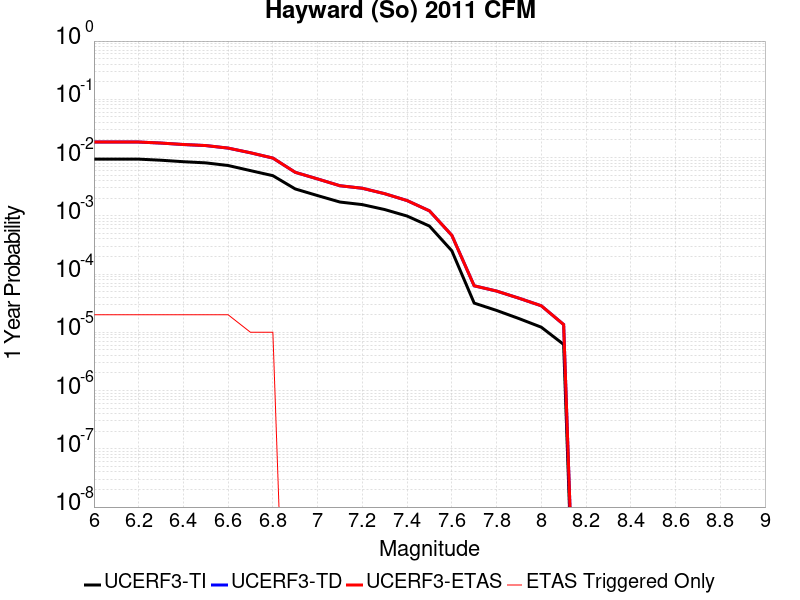 |  |

| Magnitude | 1 wk TI Prob | 1 wk TD Prob | 1 wk ETAS Prob | 1 wk ETAS/TD Gain | 1 wk ETAS Triggered Only | 1 mo TI Prob | 1 mo TD Prob | 1 mo ETAS Prob | 1 mo ETAS/TD Gain | 1 mo ETAS Triggered Only | 1 yr TI Prob | 1 yr TD Prob | 1 yr ETAS Prob | 1 yr ETAS/TD Gain | 1 yr ETAS Triggered Only | 10 yr TI Prob | 10 yr TD Prob | 10 yr ETAS Prob | 10 yr ETAS/TD Gain | 10 yr ETAS Triggered Only |
|-----|-----|-----|-----|-----|-----|-----|-----|-----|-----|-----|-----|-----|-----|-----|-----|-----|-----|-----|-----|-----|
| 6.0 | 1.8091932E-4 | 3.570541E-4 | 3.7519643E-4 | 1.0508112 | 1.814882E-5 | 7.751381E-4 | 0.0015293444 | 0.0015474653 | 1.0118489 | 1.814882E-5 | 0.00939654 | 0.018463207 | 0.018481022 | 1.0009649 | 1.814882E-5 | 0.090090066 | 0.16673161 | 0.16676186 | 1.0001814 | 3.629764E-5 |
| 6.1 | 1.8091932E-4 | 3.570541E-4 | 3.7519643E-4 | 1.0508112 | 1.814882E-5 | 7.751381E-4 | 0.0015293444 | 0.0015474653 | 1.0118489 | 1.814882E-5 | 0.00939654 | 0.018463207 | 0.018481022 | 1.0009649 | 1.814882E-5 | 0.090090066 | 0.16673161 | 0.16676186 | 1.0001814 | 3.629764E-5 |
| 6.2 | 1.8091932E-4 | 3.570541E-4 | 3.7519643E-4 | 1.0508112 | 1.814882E-5 | 7.751381E-4 | 0.0015293444 | 0.0015474653 | 1.0118489 | 1.814882E-5 | 0.00939654 | 0.018463207 | 0.018481022 | 1.0009649 | 1.814882E-5 | 0.090090066 | 0.16673161 | 0.16676186 | 1.0001814 | 3.629764E-5 |
| 6.3 | 1.7322872E-4 | 3.426234E-4 | 3.60766E-4 | 1.052952 | 1.814882E-5 | 7.4219756E-4 | 0.0014675693 | 0.0014856914 | 1.0123484 | 1.814882E-5 | 0.0089988755 | 0.017723544 | 0.017741371 | 1.0010059 | 1.814882E-5 | 0.08643075 | 0.16066726 | 0.16069771 | 1.0001897 | 3.629764E-5 |
| 6.4 | 1.6334097E-4 | 3.234411E-4 | 3.4158406E-4 | 1.0560936 | 1.814882E-5 | 6.998449E-4 | 0.0013854484 | 0.0014035722 | 1.0130814 | 1.814882E-5 | 0.008487372 | 0.016739385 | 0.01675723 | 1.0010661 | 1.814882E-5 | 0.081704415 | 0.15255594 | 0.1525867 | 1.0002016 | 3.629764E-5 |
| 6.5 | 1.5600289E-4 | 3.1018828E-4 | 3.2833146E-4 | 1.0584909 | 1.814882E-5 | 6.684125E-4 | 0.0013287093 | 0.001346834 | 1.0136409 | 1.814882E-5 | 0.008107598 | 0.016058935 | 0.016076792 | 1.001112 | 1.814882E-5 | 0.078181036 | 0.14683272 | 0.14686368 | 1.0002109 | 3.629764E-5 |
| 6.6 | 1.4046066E-4 | 2.8032906E-4 | 2.984728E-4 | 1.064723 | 1.814882E-5 | 6.018354E-4 | 0.0012008639 | 0.0012189909 | 1.015095 | 1.814882E-5 | 0.0073027555 | 0.014524006 | 0.014541891 | 1.0012314 | 1.814882E-5 | 0.07067384 | 0.13391982 | 0.13395126 | 1.0002347 | 3.629764E-5 |
| 6.7 | 1.14696966E-4 | 2.3271477E-4 | 2.3271477E-4 | 1.0 | 0.0 | 4.914658E-4 | 9.969729E-4 | 9.969729E-4 | 1.0 | 0.0 | 0.0059671924 | 0.012071652 | 0.012071652 | 1.0 | 0.0 | 0.058094822 | 0.11274672 | 0.11276282 | 1.0001428 | 1.814882E-5 |
| 6.8 | 9.3874296E-5 | 1.8861453E-4 | 1.8861453E-4 | 1.0 | 0.0 | 4.0225635E-4 | 8.0810126E-4 | 8.0810126E-4 | 1.0 | 0.0 | 0.0048864787 | 0.009794984 | 0.009794984 | 1.0 | 0.0 | 0.047804173 | 0.09259856 | 0.09261502 | 1.0001779 | 1.814882E-5 |
| 6.9 | 5.551852E-5 | 1.072948E-4 | 1.072948E-4 | 1.0 | 0.0 | 2.3791482E-4 | 4.5975443E-4 | 4.5975443E-4 | 1.0 | 0.0 | 0.0028927654 | 0.0055832625 | 0.0055832625 | 1.0 | 0.0 | 0.028553981 | 0.054245494 | 0.054262657 | 1.0003164 | 1.814882E-5 |
| 7.0 | 4.2662363E-5 | 8.2464416E-5 | 8.2464416E-5 | 1.0 | 0.0 | 1.8282588E-4 | 3.5337146E-4 | 3.5337146E-4 | 1.0 | 0.0 | 0.0022236328 | 0.0042938837 | 0.0042938837 | 1.0 | 0.0 | 0.022015138 | 0.042064495 | 0.04208188 | 1.0004133 | 1.814882E-5 |
| 7.1 | 3.305886E-5 | 6.3019055E-5 | 6.3019055E-5 | 1.0 | 0.0 | 1.4167312E-4 | 2.700538E-4 | 2.700538E-4 | 1.0 | 0.0 | 0.0017235056 | 0.0032829668 | 0.0032829668 | 1.0 | 0.0 | 0.017101998 | 0.032452874 | 0.032470435 | 1.0005411 | 1.814882E-5 |
| 7.2 | 2.9856887E-5 | 5.7013647E-5 | 5.7013647E-5 | 1.0 | 0.0 | 1.2795182E-4 | 2.4432142E-4 | 2.4432142E-4 | 1.0 | 0.0 | 0.0015567001 | 0.0029705726 | 0.0029705726 | 1.0 | 0.0 | 0.015458403 | 0.029453589 | 0.029471202 | 1.0005981 | 1.814882E-5 |
| 7.3 | 2.4559737E-5 | 4.599088E-5 | 4.599088E-5 | 1.0 | 0.0 | 1.0525176E-4 | 1.9708896E-4 | 1.9708896E-4 | 1.0 | 0.0 | 0.0012806869 | 0.0023969305 | 0.0023969305 | 1.0 | 0.0 | 0.012733313 | 0.023857482 | 0.023875197 | 1.0007426 | 1.814882E-5 |
| 7.4 | 1.9002231E-5 | 3.5049303E-5 | 3.5049303E-5 | 1.0 | 0.0 | 8.143559E-5 | 1.502027E-4 | 1.502027E-4 | 1.0 | 0.0 | 9.910273E-4 | 0.0018271938 | 0.0018271938 | 1.0 | 0.0 | 0.009866194 | 0.018258283 | 0.018258283 | 1.0 | 0.0 |
| 7.5 | 1.2783333E-5 | 2.3330069E-5 | 2.3330069E-5 | 1.0 | 0.0 | 5.4784563E-5 | 9.998221E-5 | 9.998221E-5 | 1.0 | 0.0 | 6.667979E-4 | 0.0012166094 | 0.0012166094 | 1.0 | 0.0 | 0.006648007 | 0.012209582 | 0.012209582 | 1.0 | 0.0 |
| 7.6 | 4.8149627E-6 | 8.887544E-6 | 8.887544E-6 | 1.0 | 0.0 | 2.063539E-5 | 3.8088925E-5 | 3.8088925E-5 | 1.0 | 0.0 | 2.5120692E-4 | 4.636352E-4 | 4.636352E-4 | 1.0 | 0.0 | 0.0025092314 | 0.0046812436 | 0.0046812436 | 1.0 | 0.0 |
| 7.7 | 6.0838227E-7 | 1.2056693E-6 | 1.2056693E-6 | 1.0 | 0.0 | 2.6073499E-6 | 5.1671436E-6 | 5.1671436E-6 | 1.0 | 0.0 | 3.174402E-5 | 6.290816E-5 | 6.290816E-5 | 1.0 | 0.0 | 3.1739488E-4 | 6.5293367E-4 | 6.5293367E-4 | 1.0 | 0.0 |
| 7.8 | 4.5542808E-7 | 9.792182E-7 | 9.792182E-7 | 1.0 | 0.0 | 1.9518332E-6 | 4.1966427E-6 | 4.1966427E-6 | 1.0 | 0.0 | 2.376331E-5 | 5.1092928E-5 | 5.1092928E-5 | 1.0 | 0.0 | 2.3760769E-4 | 5.321372E-4 | 5.321372E-4 | 1.0 | 0.0 |
| 7.9 | 3.3016747E-7 | 7.386335E-7 | 7.386335E-7 | 1.0 | 0.0 | 1.4150027E-6 | 3.1655684E-6 | 3.1655684E-6 | 1.0 | 0.0 | 1.7227521E-5 | 3.8540114E-5 | 3.8540114E-5 | 1.0 | 0.0 | 1.7226185E-4 | 3.9930744E-4 | 3.9930744E-4 | 1.0 | 0.0 |
| 8.0 | 2.347038E-7 | 5.4714894E-7 | 5.4714894E-7 | 1.0 | 0.0 | 1.0058731E-6 | 2.344922E-6 | 2.344922E-6 | 1.0 | 0.0 | 1.2246436E-5 | 2.8549053E-5 | 2.8549053E-5 | 1.0 | 0.0 | 1.2245761E-4 | 2.9355253E-4 | 2.9355253E-4 | 1.0 | 0.0 |
| 8.1 | 1.18822804E-7 | 2.6058973E-7 | 2.6058973E-7 | 1.0 | 0.0 | 5.092405E-7 | 1.1168127E-6 | 1.1168127E-6 | 1.0 | 0.0 | 6.1999854E-6 | 1.359711E-5 | 1.359711E-5 | 1.0 | 0.0 | 6.199812E-5 | 1.3917852E-4 | 1.3917852E-4 | 1.0 | 0.0 |

## Pitas Point (Lower West)
*[(top)](#table-of-contents)*

| 1 Week | 1 Month | 1 Year | 10 Year |
|-----|-----|-----|-----|
|  |  |  | 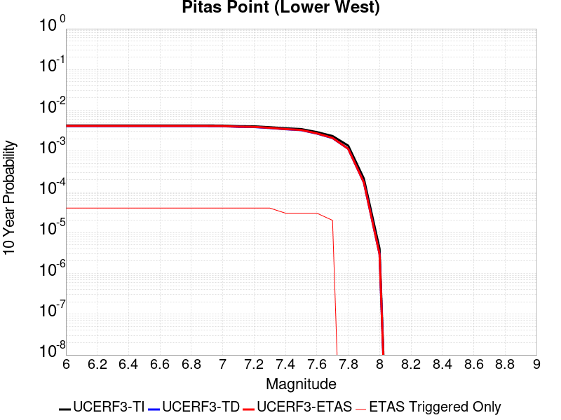 |

| Magnitude | 1 wk TI Prob | 1 wk TD Prob | 1 wk ETAS Prob | 1 wk ETAS/TD Gain | 1 wk ETAS Triggered Only | 1 mo TI Prob | 1 mo TD Prob | 1 mo ETAS Prob | 1 mo ETAS/TD Gain | 1 mo ETAS Triggered Only | 1 yr TI Prob | 1 yr TD Prob | 1 yr ETAS Prob | 1 yr ETAS/TD Gain | 1 yr ETAS Triggered Only | 10 yr TI Prob | 10 yr TD Prob | 10 yr ETAS Prob | 10 yr ETAS/TD Gain | 10 yr ETAS Triggered Only |
|-----|-----|-----|-----|-----|-----|-----|-----|-----|-----|-----|-----|-----|-----|-----|-----|-----|-----|-----|-----|-----|
| 6.0 | 8.151497E-6 | 7.855762E-6 | 7.855762E-6 | 1.0 | 0.0 | 3.493452E-5 | 3.3667122E-5 | 3.3667122E-5 | 1.0 | 0.0 | 4.252448E-4 | 4.0982084E-4 | 4.2796225E-4 | 1.0442666 | 1.814882E-5 | 0.0042443196 | 0.0040907315 | 0.004126881 | 1.0088369 | 3.629764E-5 |
| 6.1 | 8.151497E-6 | 7.855762E-6 | 7.855762E-6 | 1.0 | 0.0 | 3.493452E-5 | 3.3667122E-5 | 3.3667122E-5 | 1.0 | 0.0 | 4.252448E-4 | 4.0982084E-4 | 4.2796225E-4 | 1.0442666 | 1.814882E-5 | 0.0042443196 | 0.0040907315 | 0.004126881 | 1.0088369 | 3.629764E-5 |
| 6.2 | 8.151497E-6 | 7.855762E-6 | 7.855762E-6 | 1.0 | 0.0 | 3.493452E-5 | 3.3667122E-5 | 3.3667122E-5 | 1.0 | 0.0 | 4.252448E-4 | 4.0982084E-4 | 4.2796225E-4 | 1.0442666 | 1.814882E-5 | 0.0042443196 | 0.0040907315 | 0.004126881 | 1.0088369 | 3.629764E-5 |
| 6.3 | 8.151497E-6 | 7.855762E-6 | 7.855762E-6 | 1.0 | 0.0 | 3.493452E-5 | 3.3667122E-5 | 3.3667122E-5 | 1.0 | 0.0 | 4.252448E-4 | 4.0982084E-4 | 4.2796225E-4 | 1.0442666 | 1.814882E-5 | 0.0042443196 | 0.0040907315 | 0.004126881 | 1.0088369 | 3.629764E-5 |
| 6.4 | 8.151497E-6 | 7.855762E-6 | 7.855762E-6 | 1.0 | 0.0 | 3.493452E-5 | 3.3667122E-5 | 3.3667122E-5 | 1.0 | 0.0 | 4.252448E-4 | 4.0982084E-4 | 4.2796225E-4 | 1.0442666 | 1.814882E-5 | 0.0042443196 | 0.0040907315 | 0.004126881 | 1.0088369 | 3.629764E-5 |
| 6.5 | 8.151497E-6 | 7.855762E-6 | 7.855762E-6 | 1.0 | 0.0 | 3.493452E-5 | 3.3667122E-5 | 3.3667122E-5 | 1.0 | 0.0 | 4.252448E-4 | 4.0982084E-4 | 4.2796225E-4 | 1.0442666 | 1.814882E-5 | 0.0042443196 | 0.0040907315 | 0.004126881 | 1.0088369 | 3.629764E-5 |
| 6.6 | 8.151497E-6 | 7.855762E-6 | 7.855762E-6 | 1.0 | 0.0 | 3.493452E-5 | 3.3667122E-5 | 3.3667122E-5 | 1.0 | 0.0 | 4.252448E-4 | 4.0982084E-4 | 4.2796225E-4 | 1.0442666 | 1.814882E-5 | 0.0042443196 | 0.0040907315 | 0.004126881 | 1.0088369 | 3.629764E-5 |
| 6.7 | 8.151497E-6 | 7.855762E-6 | 7.855762E-6 | 1.0 | 0.0 | 3.493452E-5 | 3.3667122E-5 | 3.3667122E-5 | 1.0 | 0.0 | 4.252448E-4 | 4.0982084E-4 | 4.2796225E-4 | 1.0442666 | 1.814882E-5 | 0.0042443196 | 0.0040907315 | 0.004126881 | 1.0088369 | 3.629764E-5 |
| 6.8 | 8.151497E-6 | 7.855762E-6 | 7.855762E-6 | 1.0 | 0.0 | 3.493452E-5 | 3.3667122E-5 | 3.3667122E-5 | 1.0 | 0.0 | 4.252448E-4 | 4.0982084E-4 | 4.2796225E-4 | 1.0442666 | 1.814882E-5 | 0.0042443196 | 0.0040907315 | 0.004126881 | 1.0088369 | 3.629764E-5 |
| 6.9 | 8.151497E-6 | 7.855762E-6 | 7.855762E-6 | 1.0 | 0.0 | 3.493452E-5 | 3.3667122E-5 | 3.3667122E-5 | 1.0 | 0.0 | 4.252448E-4 | 4.0982084E-4 | 4.2796225E-4 | 1.0442666 | 1.814882E-5 | 0.0042443196 | 0.0040907315 | 0.004126881 | 1.0088369 | 3.629764E-5 |
| 7.0 | 8.103535E-6 | 7.805192E-6 | 7.805192E-6 | 1.0 | 0.0 | 3.4728975E-5 | 3.3450397E-5 | 3.3450397E-5 | 1.0 | 0.0 | 4.2274324E-4 | 4.0718322E-4 | 4.2532466E-4 | 1.0445535 | 1.814882E-5 | 0.0042193993 | 0.004064452 | 0.004100602 | 1.0088942 | 3.629764E-5 |
| 7.1 | 7.853298E-6 | 7.540883E-6 | 7.540883E-6 | 1.0 | 0.0 | 3.3656554E-5 | 3.2317676E-5 | 3.2317676E-5 | 1.0 | 0.0 | 4.096915E-4 | 3.9339735E-4 | 4.1153902E-4 | 1.0461154 | 1.814882E-5 | 0.00408937 | 0.0039270855 | 0.0039632404 | 1.0092067 | 3.629764E-5 |
| 7.2 | 7.771102E-6 | 7.453165E-6 | 7.453165E-6 | 1.0 | 0.0 | 3.33043E-5 | 3.194175E-5 | 3.194175E-5 | 1.0 | 0.0 | 4.0540437E-4 | 3.8882208E-4 | 4.0696384E-4 | 1.0466583 | 1.814882E-5 | 0.0040466557 | 0.0038814936 | 0.0039176503 | 1.0093151 | 3.629764E-5 |
| 7.3 | 7.3945344E-6 | 7.0492697E-6 | 7.0492697E-6 | 1.0 | 0.0 | 3.1690477E-5 | 3.021081E-5 | 3.021081E-5 | 1.0 | 0.0 | 3.8576324E-4 | 3.6775516E-4 | 3.858973E-4 | 1.0493321 | 1.814882E-5 | 0.0038509427 | 0.0036715334 | 0.0037076976 | 1.0098499 | 3.629764E-5 |
| 7.4 | 6.964645E-6 | 6.5901186E-6 | 6.5901186E-6 | 1.0 | 0.0 | 2.9848137E-5 | 2.8243063E-5 | 2.8243063E-5 | 1.0 | 0.0 | 3.6334046E-4 | 3.4380553E-4 | 3.4380553E-4 | 1.0 | 0.0 | 0.0036274698 | 0.0034327896 | 0.003450876 | 1.0052688 | 1.814882E-5 |
| 7.5 | 6.6525035E-6 | 6.259157E-6 | 6.259157E-6 | 1.0 | 0.0 | 2.851042E-5 | 2.6824686E-5 | 2.6824686E-5 | 1.0 | 0.0 | 3.4705905E-4 | 3.265421E-4 | 3.265421E-4 | 1.0 | 0.0 | 0.0034651754 | 0.0032606742 | 0.003278764 | 1.0055479 | 1.814882E-5 |
| 7.6 | 5.613338E-6 | 5.151386E-6 | 5.151386E-6 | 1.0 | 0.0 | 2.405694E-5 | 2.2077185E-5 | 2.2077185E-5 | 1.0 | 0.0 | 2.928539E-4 | 2.6875688E-4 | 2.6875688E-4 | 1.0 | 0.0 | 0.0029246826 | 0.0026843501 | 0.0027024501 | 1.0067428 | 1.814882E-5 |
| 7.7 | 4.494704E-6 | 3.996911E-6 | 3.996911E-6 | 1.0 | 0.0 | 1.9262876E-5 | 1.7129507E-5 | 1.7129507E-5 | 1.0 | 0.0 | 2.3450027E-4 | 2.0853203E-4 | 2.0853203E-4 | 1.0 | 0.0 | 0.0023425296 | 0.0020833875 | 0.0021014987 | 1.0086931 | 1.814882E-5 |
| 7.8 | 2.6075882E-6 | 2.1836374E-6 | 2.1836374E-6 | 1.0 | 0.0 | 1.117533E-5 | 9.358413E-6 | 9.358413E-6 | 1.0 | 0.0 | 1.3605114E-4 | 1.1393277E-4 | 1.1393277E-4 | 1.0 | 0.0 | 0.0013596788 | 0.0011387484 | 0.0011387484 | 1.0 | 0.0 |
| 7.9 | 4.045984E-7 | 3.242375E-7 | 3.242375E-7 | 1.0 | 0.0 | 1.733992E-6 | 1.3895885E-6 | 1.3895885E-6 | 1.0 | 0.0 | 2.1111147E-5 | 1.6918111E-5 | 1.6918111E-5 | 1.0 | 0.0 | 2.1109142E-4 | 1.6916855E-4 | 1.6916855E-4 | 1.0 | 0.0 |
| 8.0 | 7.791402E-9 | 5.683497E-9 | 5.683497E-9 | 1.0 | 0.0 | 3.3391725E-8 | 2.4357844E-8 | 2.4357844E-8 | 1.0 | 0.0 | 4.0654416E-7 | 2.9655675E-7 | 2.9655675E-7 | 1.0 | 0.0 | 4.065434E-6 | 2.9655655E-6 | 2.9655655E-6 | 1.0 | 0.0 |

## Hosgri
*[(top)](#table-of-contents)*

| 1 Week | 1 Month | 1 Year | 10 Year |
|-----|-----|-----|-----|
|  |  |  |  |

| Magnitude | 1 wk TI Prob | 1 wk TD Prob | 1 wk ETAS Prob | 1 wk ETAS/TD Gain | 1 wk ETAS Triggered Only | 1 mo TI Prob | 1 mo TD Prob | 1 mo ETAS Prob | 1 mo ETAS/TD Gain | 1 mo ETAS Triggered Only | 1 yr TI Prob | 1 yr TD Prob | 1 yr ETAS Prob | 1 yr ETAS/TD Gain | 1 yr ETAS Triggered Only | 10 yr TI Prob | 10 yr TD Prob | 10 yr ETAS Prob | 10 yr ETAS/TD Gain | 10 yr ETAS Triggered Only |
|-----|-----|-----|-----|-----|-----|-----|-----|-----|-----|-----|-----|-----|-----|-----|-----|-----|-----|-----|-----|-----|
| 6.0 | 2.883978E-5 | 2.9128416E-5 | 2.9128416E-5 | 1.0 | 0.0 | 1.235932E-4 | 1.2483024E-4 | 1.2483024E-4 | 1.0 | 0.0 | 0.0015037085 | 0.001518776 | 0.001518776 | 1.0 | 0.0 | 0.01493574 | 0.01508774 | 0.015123489 | 1.0023695 | 3.629764E-5 |
| 6.1 | 2.883978E-5 | 2.9128416E-5 | 2.9128416E-5 | 1.0 | 0.0 | 1.235932E-4 | 1.2483024E-4 | 1.2483024E-4 | 1.0 | 0.0 | 0.0015037085 | 0.001518776 | 0.001518776 | 1.0 | 0.0 | 0.01493574 | 0.01508774 | 0.015123489 | 1.0023695 | 3.629764E-5 |
| 6.2 | 2.883978E-5 | 2.9128416E-5 | 2.9128416E-5 | 1.0 | 0.0 | 1.235932E-4 | 1.2483024E-4 | 1.2483024E-4 | 1.0 | 0.0 | 0.0015037085 | 0.001518776 | 0.001518776 | 1.0 | 0.0 | 0.01493574 | 0.01508774 | 0.015123489 | 1.0023695 | 3.629764E-5 |
| 6.3 | 2.2914428E-5 | 2.2641969E-5 | 2.2641969E-5 | 1.0 | 0.0 | 9.8200995E-5 | 9.703343E-5 | 9.703343E-5 | 1.0 | 0.0 | 0.0011949413 | 0.0011807467 | 0.0011807467 | 1.0 | 0.0 | 0.011885363 | 0.011746133 | 0.0117820045 | 1.0030539 | 3.629764E-5 |
| 6.4 | 2.0195741E-5 | 1.969656E-5 | 1.969656E-5 | 1.0 | 0.0 | 8.65503E-5 | 8.4411105E-5 | 8.4411105E-5 | 1.0 | 0.0 | 0.0010532405 | 0.0010272227 | 0.0010272227 | 1.0 | 0.0 | 0.010482626 | 0.010225792 | 0.010243756 | 1.0017567 | 1.814882E-5 |
| 6.5 | 1.9924333E-5 | 1.940898E-5 | 1.940898E-5 | 1.0 | 0.0 | 8.53872E-5 | 8.3178704E-5 | 8.3178704E-5 | 1.0 | 0.0 | 0.0010390934 | 0.0010122322 | 0.0010122322 | 1.0 | 0.0 | 0.010342481 | 0.010077253 | 0.010095219 | 1.0017828 | 1.814882E-5 |
| 6.6 | 1.809694E-5 | 1.74583E-5 | 1.74583E-5 | 1.0 | 0.0 | 7.7556004E-5 | 7.4819145E-5 | 7.4819145E-5 | 1.0 | 0.0 | 9.438353E-4 | 9.105437E-4 | 9.105437E-4 | 1.0 | 0.0 | 0.009398366 | 0.009069073 | 0.009087057 | 1.001983 | 1.814882E-5 |
| 6.7 | 1.675989E-5 | 1.6042764E-5 | 1.6042764E-5 | 1.0 | 0.0 | 7.182612E-5 | 6.87529E-5 | 6.87529E-5 | 1.0 | 0.0 | 8.7413215E-4 | 8.3674624E-4 | 8.3674624E-4 | 1.0 | 0.0 | 0.008707017 | 0.0083368635 | 0.00835486 | 1.0021588 | 1.814882E-5 |
| 6.8 | 1.5401129E-5 | 1.4614083E-5 | 1.4614083E-5 | 1.0 | 0.0 | 6.6003166E-5 | 6.2630286E-5 | 6.2630286E-5 | 1.0 | 0.0 | 8.032922E-4 | 7.622578E-4 | 7.622578E-4 | 1.0 | 0.0 | 0.008003947 | 0.007597296 | 0.0076153073 | 1.0023707 | 1.814882E-5 |
| 6.9 | 1.356559E-5 | 1.2689968E-5 | 1.2689968E-5 | 1.0 | 0.0 | 5.8136946E-5 | 5.4384444E-5 | 5.4384444E-5 | 1.0 | 0.0 | 7.0758746E-4 | 6.619299E-4 | 6.619299E-4 | 1.0 | 0.0 | 0.007053386 | 0.006600388 | 0.006618417 | 1.0027316 | 1.814882E-5 |
| 7.0 | 1.2030819E-5 | 1.1095962E-5 | 1.1095962E-5 | 1.0 | 0.0 | 5.155963E-5 | 4.7553254E-5 | 4.7553254E-5 | 1.0 | 0.0 | 6.275577E-4 | 5.7880714E-4 | 5.7880714E-4 | 1.0 | 0.0 | 0.006257884 | 0.005773757 | 0.005791801 | 1.0031252 | 1.814882E-5 |
| 7.1 | 1.0972698E-5 | 1.0022179E-5 | 1.0022179E-5 | 1.0 | 0.0 | 4.7025E-5 | 4.2951488E-5 | 4.2951488E-5 | 1.0 | 0.0 | 5.72379E-4 | 5.22809E-4 | 5.22809E-4 | 1.0 | 0.0 | 0.0057090693 | 0.005216542 | 0.0052345963 | 1.0034609 | 1.814882E-5 |
| 7.2 | 9.961926E-6 | 9.034746E-6 | 9.034746E-6 | 1.0 | 0.0 | 4.2693267E-5 | 3.8719765E-5 | 3.8719765E-5 | 1.0 | 0.0 | 5.1966653E-4 | 4.713112E-4 | 4.713112E-4 | 1.0 | 0.0 | 0.00518453 | 0.0047038626 | 0.004721926 | 1.0038401 | 1.814882E-5 |
| 7.3 | 8.700929E-6 | 7.8281E-6 | 7.8281E-6 | 1.0 | 0.0 | 3.7289166E-5 | 3.354857E-5 | 3.354857E-5 | 1.0 | 0.0 | 4.53901E-4 | 4.0837732E-4 | 4.0837732E-4 | 1.0 | 0.0 | 0.00452975 | 0.004077008 | 0.004095083 | 1.0044334 | 1.814882E-5 |
| 7.4 | 7.866285E-6 | 6.998739E-6 | 6.998739E-6 | 1.0 | 0.0 | 3.3712215E-5 | 2.9994251E-5 | 2.9994251E-5 | 1.0 | 0.0 | 4.103689E-4 | 3.6511885E-4 | 3.6511885E-4 | 1.0 | 0.0 | 0.004096119 | 0.0036459267 | 0.0036640093 | 1.0049597 | 1.814882E-5 |
| 7.5 | 6.8381305E-6 | 5.9596955E-6 | 5.9596955E-6 | 1.0 | 0.0 | 2.9305946E-5 | 2.5541302E-5 | 2.5541302E-5 | 1.0 | 0.0 | 3.5674145E-4 | 3.10921E-4 | 3.10921E-4 | 1.0 | 0.0 | 0.0035616932 | 0.0031055948 | 0.0031055948 | 1.0 | 0.0 |
| 7.6 | 5.503376E-6 | 4.5952443E-6 | 4.5952443E-6 | 1.0 | 0.0 | 2.3585684E-5 | 1.9693754E-5 | 1.9693754E-5 | 1.0 | 0.0 | 2.8711787E-4 | 2.397451E-4 | 2.397451E-4 | 1.0 | 0.0 | 0.002867472 | 0.0023955975 | 0.0023955975 | 1.0 | 0.0 |
| 7.7 | 3.6144982E-6 | 2.6522112E-6 | 2.6522112E-6 | 1.0 | 0.0 | 1.5490614E-5 | 1.1366569E-5 | 1.1366569E-5 | 1.0 | 0.0 | 1.8858191E-4 | 1.383792E-4 | 1.383792E-4 | 1.0 | 0.0 | 0.0018842196 | 0.0013836613 | 0.0013836613 | 1.0 | 0.0 |
| 7.8 | 1.9853494E-6 | 1.1361129E-6 | 1.1361129E-6 | 1.0 | 0.0 | 8.508612E-6 | 4.8690463E-6 | 4.8690463E-6 | 1.0 | 0.0 | 1.0358743E-4 | 5.9279027E-5 | 5.9279027E-5 | 1.0 | 0.0 | 0.0010353916 | 5.9336185E-4 | 5.9336185E-4 | 1.0 | 0.0 |
| 7.9 | 1.1818757E-6 | 5.2951856E-7 | 5.2951856E-7 | 1.0 | 0.0 | 5.0651715E-6 | 2.2693632E-6 | 2.2693632E-6 | 1.0 | 0.0 | 6.1666724E-5 | 2.7629147E-5 | 2.7629147E-5 | 1.0 | 0.0 | 6.1649614E-4 | 2.7694515E-4 | 2.7694515E-4 | 1.0 | 0.0 |
| 8.0 | 6.962958E-7 | 2.7139782E-7 | 2.7139782E-7 | 1.0 | 0.0 | 2.9841215E-6 | 1.163133E-6 | 1.163133E-6 | 1.0 | 0.0 | 3.6331072E-5 | 1.4161053E-5 | 1.4161053E-5 | 1.0 | 0.0 | 3.6325134E-4 | 1.4217179E-4 | 1.4217179E-4 | 1.0 | 0.0 |
| 8.1 | 1.5033264E-7 | 6.527624E-8 | 6.527624E-8 | 1.0 | 0.0 | 6.442826E-7 | 2.7975528E-7 | 2.7975528E-7 | 1.0 | 0.0 | 7.844113E-6 | 3.4060151E-6 | 3.4060151E-6 | 1.0 | 0.0 | 7.843835E-5 | 3.407693E-5 | 3.407693E-5 | 1.0 | 0.0 |

## Great Valley 04a Trout Creek
*[(top)](#table-of-contents)*

| 1 Week | 1 Month | 1 Year | 10 Year |
|-----|-----|-----|-----|
|  |  |  |  |

| Magnitude | 1 wk TI Prob | 1 wk TD Prob | 1 wk ETAS Prob | 1 wk ETAS/TD Gain | 1 wk ETAS Triggered Only | 1 mo TI Prob | 1 mo TD Prob | 1 mo ETAS Prob | 1 mo ETAS/TD Gain | 1 mo ETAS Triggered Only | 1 yr TI Prob | 1 yr TD Prob | 1 yr ETAS Prob | 1 yr ETAS/TD Gain | 1 yr ETAS Triggered Only | 10 yr TI Prob | 10 yr TD Prob | 10 yr ETAS Prob | 10 yr ETAS/TD Gain | 10 yr ETAS Triggered Only |
|-----|-----|-----|-----|-----|-----|-----|-----|-----|-----|-----|-----|-----|-----|-----|-----|-----|-----|-----|-----|-----|
| 6.0 | 1.4088538E-5 | 1.5719554E-5 | 1.5719554E-5 | 1.0 | 0.0 | 6.037805E-5 | 6.7367844E-5 | 6.7367844E-5 | 1.0 | 0.0 | 7.3485484E-4 | 8.199074E-4 | 8.199074E-4 | 1.0 | 0.0 | 0.007324295 | 0.008170108 | 0.0082061095 | 1.0044065 | 3.629764E-5 |
| 6.1 | 1.4088538E-5 | 1.5719554E-5 | 1.5719554E-5 | 1.0 | 0.0 | 6.037805E-5 | 6.7367844E-5 | 6.7367844E-5 | 1.0 | 0.0 | 7.3485484E-4 | 8.199074E-4 | 8.199074E-4 | 1.0 | 0.0 | 0.007324295 | 0.008170108 | 0.0082061095 | 1.0044065 | 3.629764E-5 |
| 6.2 | 1.4088538E-5 | 1.5719554E-5 | 1.5719554E-5 | 1.0 | 0.0 | 6.037805E-5 | 6.7367844E-5 | 6.7367844E-5 | 1.0 | 0.0 | 7.3485484E-4 | 8.199074E-4 | 8.199074E-4 | 1.0 | 0.0 | 0.007324295 | 0.008170108 | 0.0082061095 | 1.0044065 | 3.629764E-5 |
| 6.3 | 1.2882862E-5 | 1.4378603E-5 | 1.4378603E-5 | 1.0 | 0.0 | 5.5211098E-5 | 6.1621184E-5 | 6.1621184E-5 | 1.0 | 0.0 | 6.7198783E-4 | 7.4999005E-4 | 7.4999005E-4 | 1.0 | 0.0 | 0.0066995937 | 0.0074756527 | 0.007511679 | 1.0048192 | 3.629764E-5 |
| 6.4 | 1.2882862E-5 | 1.4378603E-5 | 1.4378603E-5 | 1.0 | 0.0 | 5.5211098E-5 | 6.1621184E-5 | 6.1621184E-5 | 1.0 | 0.0 | 6.7198783E-4 | 7.4999005E-4 | 7.4999005E-4 | 1.0 | 0.0 | 0.0066995937 | 0.0074756527 | 0.007511679 | 1.0048192 | 3.629764E-5 |
| 6.5 | 1.2762329E-5 | 1.424516E-5 | 1.424516E-5 | 1.0 | 0.0 | 5.469455E-5 | 6.1049315E-5 | 6.1049315E-5 | 1.0 | 0.0 | 6.657027E-4 | 7.430323E-4 | 7.430323E-4 | 1.0 | 0.0 | 0.00663712 | 0.0074065393 | 0.007442568 | 1.0048645 | 3.629764E-5 |
| 6.6 | 1.2762329E-5 | 1.424516E-5 | 1.424516E-5 | 1.0 | 0.0 | 5.469455E-5 | 6.1049315E-5 | 6.1049315E-5 | 1.0 | 0.0 | 6.657027E-4 | 7.430323E-4 | 7.430323E-4 | 1.0 | 0.0 | 0.00663712 | 0.0074065393 | 0.007442568 | 1.0048645 | 3.629764E-5 |
| 6.7 | 1.2557959E-5 | 1.4019395E-5 | 1.4019395E-5 | 1.0 | 0.0 | 5.3818712E-5 | 6.0081795E-5 | 6.0081795E-5 | 1.0 | 0.0 | 6.5504585E-4 | 7.312607E-4 | 7.312607E-4 | 1.0 | 0.0 | 0.006531183 | 0.007289598 | 0.0073256316 | 1.0049431 | 3.629764E-5 |
| 6.8 | 1.1871544E-5 | 1.3258823E-5 | 1.3258823E-5 | 1.0 | 0.0 | 5.0877054E-5 | 5.6822348E-5 | 5.6822348E-5 | 1.0 | 0.0 | 6.1925204E-4 | 6.916025E-4 | 6.916025E-4 | 1.0 | 0.0 | 0.0061752927 | 0.0068955184 | 0.0069315657 | 1.0052277 | 3.629764E-5 |
| 6.9 | 1.0500373E-5 | 1.1731261E-5 | 1.1731261E-5 | 1.0 | 0.0 | 4.5000823E-5 | 5.0275914E-5 | 5.0275914E-5 | 1.0 | 0.0 | 5.4774724E-4 | 6.119459E-4 | 6.119459E-4 | 1.0 | 0.0 | 0.005463991 | 0.0061034737 | 0.00613955 | 1.0059108 | 3.629764E-5 |
| 7.0 | 8.524332E-6 | 9.5334835E-6 | 9.5334835E-6 | 1.0 | 0.0 | 3.653234E-5 | 4.0857187E-5 | 4.0857187E-5 | 1.0 | 0.0 | 4.4469046E-4 | 4.9733004E-4 | 4.9733004E-4 | 1.0 | 0.0 | 0.0044380166 | 0.004962902 | 0.0049990197 | 1.0072775 | 3.629764E-5 |
| 7.1 | 6.006849E-6 | 6.711559E-6 | 6.711559E-6 | 1.0 | 0.0 | 2.5743384E-5 | 2.876354E-5 | 2.876354E-5 | 1.0 | 0.0 | 3.1338062E-4 | 3.501454E-4 | 3.501454E-4 | 1.0 | 0.0 | 0.0031293905 | 0.0034964874 | 0.003514573 | 1.0051725 | 1.814882E-5 |
| 7.2 | 2.9122193E-6 | 3.2465305E-6 | 3.2465305E-6 | 1.0 | 0.0 | 1.248088E-5 | 1.3913637E-5 | 1.3913637E-5 | 1.0 | 0.0 | 1.5194413E-4 | 1.6938712E-4 | 1.6938712E-4 | 1.0 | 0.0 | 0.0015184027 | 0.0016927521 | 0.0017108702 | 1.0107033 | 1.814882E-5 |
| 7.3 | 7.2194007E-7 | 7.988761E-7 | 7.988761E-7 | 1.0 | 0.0 | 3.0940253E-6 | 3.4237528E-6 | 3.4237528E-6 | 1.0 | 0.0 | 3.7669106E-5 | 4.1683852E-5 | 4.1683852E-5 | 1.0 | 0.0 | 3.766272E-4 | 4.168053E-4 | 4.168053E-4 | 1.0 | 0.0 |
| 7.4 | 3.112171E-8 | 3.2068368E-8 | 3.2068368E-8 | 1.0 | 0.0 | 1.3337875E-7 | 1.3743585E-7 | 1.3743585E-7 | 1.0 | 0.0 | 1.6238852E-6 | 1.6732803E-6 | 1.6732803E-6 | 1.0 | 0.0 | 1.6238733E-5 | 1.6732685E-5 | 1.6732685E-5 | 1.0 | 0.0 |

## Rinconada 2011 CFM
*[(top)](#table-of-contents)*

| 1 Week | 1 Month | 1 Year | 10 Year |
|-----|-----|-----|-----|
|  |  |  |  |

| Magnitude | 1 wk TI Prob | 1 wk TD Prob | 1 wk ETAS Prob | 1 wk ETAS/TD Gain | 1 wk ETAS Triggered Only | 1 mo TI Prob | 1 mo TD Prob | 1 mo ETAS Prob | 1 mo ETAS/TD Gain | 1 mo ETAS Triggered Only | 1 yr TI Prob | 1 yr TD Prob | 1 yr ETAS Prob | 1 yr ETAS/TD Gain | 1 yr ETAS Triggered Only | 10 yr TI Prob | 10 yr TD Prob | 10 yr ETAS Prob | 10 yr ETAS/TD Gain | 10 yr ETAS Triggered Only |
|-----|-----|-----|-----|-----|-----|-----|-----|-----|-----|-----|-----|-----|-----|-----|-----|-----|-----|-----|-----|-----|
| 6.0 | 1.5752368E-5 | 1.6274716E-5 | 3.442324E-5 | 2.1151361 | 1.814882E-5 | 6.75084E-5 | 6.974694E-5 | 8.789449E-5 | 1.2601914 | 1.814882E-5 | 8.2160486E-4 | 8.488412E-4 | 8.6697465E-4 | 1.0213625 | 1.814882E-5 | 0.008185739 | 0.00845637 | 0.008492361 | 1.004256 | 3.629764E-5 |
| 6.1 | 1.0966133E-5 | 1.1323029E-5 | 2.9471643E-5 | 2.6028056 | 1.814882E-5 | 4.6996865E-5 | 4.852637E-5 | 6.667431E-5 | 1.373981 | 1.814882E-5 | 5.720366E-4 | 5.906491E-4 | 6.0878723E-4 | 1.0307088 | 1.814882E-5 | 0.0057056635 | 0.0058908886 | 0.0059269727 | 1.0061253 | 3.629764E-5 |
| 6.2 | 1.0966133E-5 | 1.1323029E-5 | 2.9471643E-5 | 2.6028056 | 1.814882E-5 | 4.6996865E-5 | 4.852637E-5 | 6.667431E-5 | 1.373981 | 1.814882E-5 | 5.720366E-4 | 5.906491E-4 | 6.0878723E-4 | 1.0307088 | 1.814882E-5 | 0.0057056635 | 0.0058908886 | 0.0059269727 | 1.0061253 | 3.629764E-5 |
| 6.3 | 8.926149E-6 | 9.212771E-6 | 2.7361424E-5 | 2.969945 | 1.814882E-5 | 3.8254362E-5 | 3.948271E-5 | 5.7630816E-5 | 1.4596468 | 1.814882E-5 | 4.6564735E-4 | 4.805963E-4 | 4.987364E-4 | 1.037745 | 1.814882E-5 | 0.0046467283 | 0.0047956146 | 0.004831738 | 1.0075326 | 3.629764E-5 |
| 6.4 | 7.676955E-6 | 7.920191E-6 | 2.6068867E-5 | 3.2914443 | 1.814882E-5 | 3.290082E-5 | 3.3943234E-5 | 5.209144E-5 | 1.5346633 | 1.814882E-5 | 4.0049385E-4 | 4.1318068E-4 | 4.3132203E-4 | 1.0439065 | 1.814882E-5 | 0.0039977287 | 0.004124151 | 0.004160299 | 1.008765 | 3.629764E-5 |
| 6.5 | 6.1671026E-6 | 6.3589546E-6 | 2.4507659E-5 | 3.854039 | 1.814882E-5 | 2.6430173E-5 | 2.725238E-5 | 4.5400706E-5 | 1.6659355 | 1.814882E-5 | 3.2173982E-4 | 3.317473E-4 | 3.4989006E-4 | 1.0546886 | 1.814882E-5 | 0.003212744 | 0.0033125326 | 0.0033487098 | 1.0109214 | 3.629764E-5 |
| 6.6 | 5.553456E-6 | 5.7248126E-6 | 2.3873528E-5 | 4.170185 | 1.814882E-5 | 2.3800309E-5 | 2.453468E-5 | 4.2683056E-5 | 1.7397029 | 1.814882E-5 | 2.897302E-4 | 2.9866883E-4 | 3.1681225E-4 | 1.0607475 | 1.814882E-5 | 0.0028935277 | 0.002982683 | 0.0030188726 | 1.0121331 | 3.629764E-5 |
| 6.7 | 4.787857E-6 | 4.9333094E-6 | 2.308204E-5 | 4.6788144 | 1.814882E-5 | 2.0519226E-5 | 2.1142583E-5 | 3.929102E-5 | 1.858383 | 1.814882E-5 | 2.4979294E-4 | 2.573806E-4 | 2.7552474E-4 | 1.0704954 | 1.814882E-5 | 0.0024951235 | 0.0025708308 | 0.002607035 | 1.0140828 | 3.629764E-5 |
| 6.8 | 3.9955166E-6 | 4.1134763E-6 | 2.2262222E-5 | 5.4120216 | 1.814882E-5 | 1.7123532E-5 | 1.7629065E-5 | 3.5777564E-5 | 2.0294647 | 1.814882E-5 | 2.0845905E-4 | 2.1461274E-4 | 2.3275767E-4 | 1.0845473 | 1.814882E-5 | 0.002082636 | 0.0021440585 | 0.0021621685 | 1.0084466 | 1.814882E-5 |
| 6.9 | 3.4250072E-6 | 3.5224464E-6 | 2.1671203E-5 | 6.152316 | 1.814882E-5 | 1.46785205E-5 | 1.5096111E-5 | 3.3244658E-5 | 2.2022002 | 1.814882E-5 | 1.7869633E-4 | 1.8377967E-4 | 2.0192516E-4 | 1.098735 | 1.814882E-5 | 0.001785527 | 0.0018362794 | 0.0018543949 | 1.0098653 | 1.814882E-5 |
| 7.0 | 2.7712713E-6 | 2.8467E-6 | 2.8467E-6 | 1.0 | 0.0 | 1.1876823E-5 | 1.2200086E-5 | 1.2200086E-5 | 1.0 | 0.0 | 1.4459073E-4 | 1.4852593E-4 | 1.4852593E-4 | 1.0 | 0.0 | 0.0014449668 | 0.0014842682 | 0.0014842682 | 1.0 | 0.0 |
| 7.1 | 2.227358E-6 | 2.2856984E-6 | 2.2856984E-6 | 1.0 | 0.0 | 9.545785E-6 | 9.795814E-6 | 9.795814E-6 | 1.0 | 0.0 | 1.16213734E-4 | 1.19257515E-4 | 1.19257515E-4 | 1.0 | 0.0 | 0.0011615298 | 0.0011919362 | 0.0011919362 | 1.0 | 0.0 |
| 7.2 | 1.581796E-6 | 1.6209011E-6 | 1.6209011E-6 | 1.0 | 0.0 | 6.779108E-6 | 6.9467005E-6 | 6.9467005E-6 | 1.0 | 0.0 | 8.253252E-5 | 8.457281E-5 | 8.457281E-5 | 1.0 | 0.0 | 8.250187E-4 | 8.454067E-4 | 8.454067E-4 | 1.0 | 0.0 |
| 7.3 | 1.0306567E-6 | 1.0546477E-6 | 1.0546477E-6 | 1.0 | 0.0 | 4.4170924E-6 | 4.519911E-6 | 4.519911E-6 | 1.0 | 0.0 | 5.3776774E-5 | 5.5028526E-5 | 5.5028526E-5 | 1.0 | 0.0 | 5.376376E-4 | 5.5014924E-4 | 5.5014924E-4 | 1.0 | 0.0 |
| 7.4 | 6.535541E-7 | 6.682742E-7 | 6.682742E-7 | 1.0 | 0.0 | 2.800943E-6 | 2.864029E-6 | 2.864029E-6 | 1.0 | 0.0 | 3.4100947E-5 | 3.4868997E-5 | 3.4868997E-5 | 1.0 | 0.0 | 3.4095717E-4 | 3.4863537E-4 | 3.4863537E-4 | 1.0 | 0.0 |
| 7.5 | 3.2656962E-7 | 3.3316687E-7 | 3.3316687E-7 | 1.0 | 0.0 | 1.3995833E-6 | 1.4278572E-6 | 1.4278572E-6 | 1.0 | 0.0 | 1.7039794E-5 | 1.7384024E-5 | 1.7384024E-5 | 1.0 | 0.0 | 1.7038487E-4 | 1.7382667E-4 | 1.7382667E-4 | 1.0 | 0.0 |
| 7.6 | 9.754343E-8 | 9.82099E-8 | 9.82099E-8 | 1.0 | 0.0 | 4.180432E-7 | 4.208995E-7 | 4.208995E-7 | 1.0 | 0.0 | 5.089664E-6 | 5.1244397E-6 | 5.1244397E-6 | 1.0 | 0.0 | 5.0895473E-5 | 5.1243223E-5 | 5.1243223E-5 | 1.0 | 0.0 |
| 7.7 | 6.0001453E-9 | 5.8490435E-9 | 5.8490435E-9 | 1.0 | 0.0 | 2.5714908E-8 | 2.506733E-8 | 2.506733E-8 | 1.0 | 0.0 | 3.1307894E-7 | 3.051947E-7 | 3.051947E-7 | 1.0 | 0.0 | 3.1307852E-6 | 3.051943E-6 | 3.051943E-6 | 1.0 | 0.0 |
| 7.8 | 7.400003E-11 | 7.4654505E-11 | 7.4654505E-11 | 1.0 | 0.0 | 3.171432E-10 | 3.1994773E-10 | 3.1994773E-10 | 1.0 | 0.0 | 3.861218E-9 | 3.895363E-9 | 3.895363E-9 | 1.0 | 0.0 | 3.861218E-8 | 3.895363E-8 | 3.895363E-8 | 1.0 | 0.0 |

## Green Valley 2011 CFM
*[(top)](#table-of-contents)*

| 1 Week | 1 Month | 1 Year | 10 Year |
|-----|-----|-----|-----|
|  | 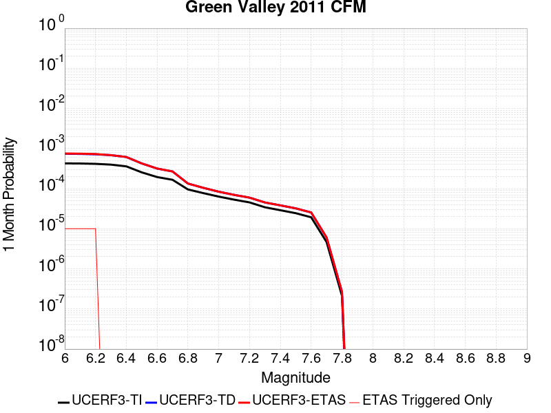 |  |  |

| Magnitude | 1 wk TI Prob | 1 wk TD Prob | 1 wk ETAS Prob | 1 wk ETAS/TD Gain | 1 wk ETAS Triggered Only | 1 mo TI Prob | 1 mo TD Prob | 1 mo ETAS Prob | 1 mo ETAS/TD Gain | 1 mo ETAS Triggered Only | 1 yr TI Prob | 1 yr TD Prob | 1 yr ETAS Prob | 1 yr ETAS/TD Gain | 1 yr ETAS Triggered Only | 10 yr TI Prob | 10 yr TD Prob | 10 yr ETAS Prob | 10 yr ETAS/TD Gain | 10 yr ETAS Triggered Only |
|-----|-----|-----|-----|-----|-----|-----|-----|-----|-----|-----|-----|-----|-----|-----|-----|-----|-----|-----|-----|-----|
| 6.0 | 9.9629346E-5 | 1.7305532E-4 | 1.7305532E-4 | 1.0 | 0.0 | 4.2691303E-4 | 7.4143766E-4 | 7.4143766E-4 | 1.0 | 0.0 | 0.0051852856 | 0.008986705 | 0.008986705 | 1.0 | 0.0 | 0.050659515 | 0.085522056 | 0.08555525 | 1.0003881 | 3.629764E-5 |
| 6.1 | 9.88615E-5 | 1.7152846E-4 | 1.7152846E-4 | 1.0 | 0.0 | 4.2362334E-4 | 7.348976E-4 | 7.348976E-4 | 1.0 | 0.0 | 0.0051454236 | 0.0089077335 | 0.0089077335 | 1.0 | 0.0 | 0.050279044 | 0.084809676 | 0.0848429 | 1.0003917 | 3.629764E-5 |
| 6.2 | 9.696895E-5 | 1.6791887E-4 | 1.6791887E-4 | 1.0 | 0.0 | 4.15515E-4 | 7.194366E-4 | 7.194366E-4 | 1.0 | 0.0 | 0.0050471667 | 0.008721114 | 0.008721114 | 1.0 | 0.0 | 0.04934063 | 0.0831186 | 0.08313525 | 1.0002002 | 1.814882E-5 |
| 6.3 | 9.275224E-5 | 1.5971228E-4 | 1.5971228E-4 | 1.0 | 0.0 | 3.9744904E-4 | 6.842841E-4 | 6.842841E-4 | 1.0 | 0.0 | 0.0048282105 | 0.008296439 | 0.008296439 | 1.0 | 0.0 | 0.047246475 | 0.07925707 | 0.079273775 | 1.0002109 | 1.814882E-5 |
| 6.4 | 8.391499E-5 | 1.4367796E-4 | 1.4367796E-4 | 1.0 | 0.0 | 3.595861E-4 | 6.156248E-4 | 6.156248E-4 | 1.0 | 0.0 | 0.004369175 | 0.0074670846 | 0.0074670846 | 1.0 | 0.0 | 0.04284265 | 0.071630865 | 0.07164771 | 1.0002352 | 1.814882E-5 |
| 6.5 | 5.9519385E-5 | 9.9340905E-5 | 9.9340905E-5 | 1.0 | 0.0 | 2.5505814E-4 | 4.2568138E-4 | 4.2568138E-4 | 1.0 | 0.0 | 0.0031009112 | 0.005168295 | 0.005168295 | 1.0 | 0.0 | 0.030579966 | 0.050145864 | 0.0501631 | 1.0003438 | 1.814882E-5 |
| 6.6 | 4.5361558E-5 | 7.402609E-5 | 7.402609E-5 | 1.0 | 0.0 | 1.9439218E-4 | 3.1721895E-4 | 3.1721895E-4 | 1.0 | 0.0 | 0.0023641558 | 0.0038539418 | 0.0038539418 | 1.0 | 0.0 | 0.023391623 | 0.037665963 | 0.037665963 | 1.0 | 0.0 |
| 6.7 | 3.8808106E-5 | 6.2651976E-5 | 6.2651976E-5 | 1.0 | 0.0 | 1.6630985E-4 | 2.6848342E-4 | 2.6848342E-4 | 1.0 | 0.0 | 0.0020229418 | 0.0032626586 | 0.0032626586 | 1.0 | 0.0 | 0.020046256 | 0.032005914 | 0.032005914 | 1.0 | 0.0 |
| 6.8 | 2.2284667E-5 | 3.1285235E-5 | 3.1285235E-5 | 1.0 | 0.0 | 9.550222E-5 | 1.3407279E-4 | 1.3407279E-4 | 1.0 | 0.0 | 0.0011621192 | 0.0016311078 | 0.0016311078 | 1.0 | 0.0 | 0.011560607 | 0.016165998 | 0.016165998 | 1.0 | 0.0 |
| 6.9 | 1.8050168E-5 | 2.4448054E-5 | 2.4448054E-5 | 1.0 | 0.0 | 7.735557E-5 | 1.047732E-4 | 1.047732E-4 | 1.0 | 0.0 | 9.4139716E-4 | 0.0012748708 | 0.0012748708 | 1.0 | 0.0 | 0.009374191 | 0.012667833 | 0.012667833 | 1.0 | 0.0 |
| 7.0 | 1.4763166E-5 | 1.9582854E-5 | 1.9582854E-5 | 1.0 | 0.0 | 6.326917E-5 | 8.3923835E-5 | 8.3923835E-5 | 1.0 | 0.0 | 7.7002996E-4 | 0.0010212966 | 0.0010212966 | 1.0 | 0.0 | 0.007673672 | 0.010165343 | 0.010165343 | 1.0 | 0.0 |
| 7.1 | 1.2399713E-5 | 1.6303715E-5 | 1.6303715E-5 | 1.0 | 0.0 | 5.3140546E-5 | 6.98712E-5 | 6.98712E-5 | 1.0 | 0.0 | 6.467941E-4 | 8.503518E-4 | 8.503518E-4 | 1.0 | 0.0 | 0.006449148 | 0.008471259 | 0.008471259 | 1.0 | 0.0 |
| 7.2 | 1.0584195E-5 | 1.3921742E-5 | 1.3921742E-5 | 1.0 | 0.0 | 4.5360044E-5 | 5.9663253E-5 | 5.9663253E-5 | 1.0 | 0.0 | 5.521186E-4 | 7.261596E-4 | 7.261596E-4 | 1.0 | 0.0 | 0.0055074887 | 0.007238285 | 0.007238285 | 1.0 | 0.0 |
| 7.3 | 7.998173E-6 | 1.054402E-5 | 1.054402E-5 | 1.0 | 0.0 | 3.4277433E-5 | 4.518788E-5 | 4.518788E-5 | 1.0 | 0.0 | 4.1724785E-4 | 5.500247E-4 | 5.500247E-4 | 1.0 | 0.0 | 0.004164653 | 0.0054868995 | 0.0054868995 | 1.0 | 0.0 |
| 7.4 | 6.7571127E-6 | 8.932697E-6 | 8.932697E-6 | 1.0 | 0.0 | 2.8958733E-5 | 3.828243E-5 | 3.828243E-5 | 1.0 | 0.0 | 3.5251552E-4 | 4.6598984E-4 | 4.6598984E-4 | 1.0 | 0.0 | 0.0035195686 | 0.0046503306 | 0.0046503306 | 1.0 | 0.0 |
| 7.5 | 5.69878E-6 | 7.516314E-6 | 7.516314E-6 | 1.0 | 0.0 | 2.4423114E-5 | 3.221238E-5 | 3.221238E-5 | 1.0 | 0.0 | 2.9731085E-4 | 3.9211605E-4 | 3.9211605E-4 | 1.0 | 0.0 | 0.002969134 | 0.0039143935 | 0.0039143935 | 1.0 | 0.0 |
| 7.6 | 4.503664E-6 | 5.9356807E-6 | 5.9356807E-6 | 1.0 | 0.0 | 1.9301275E-5 | 2.5438389E-5 | 2.5438389E-5 | 1.0 | 0.0 | 2.3496768E-4 | 3.096692E-4 | 3.096692E-4 | 1.0 | 0.0 | 0.002347194 | 0.003092502 | 0.003092502 | 1.0 | 0.0 |
| 7.7 | 1.0873546E-6 | 1.4106979E-6 | 1.4106979E-6 | 1.0 | 0.0 | 4.6600826E-6 | 6.045834E-6 | 6.045834E-6 | 1.0 | 0.0 | 5.6735033E-5 | 7.360557E-5 | 7.360557E-5 | 1.0 | 0.0 | 5.672055E-4 | 7.35814E-4 | 7.35814E-4 | 1.0 | 0.0 |
| 7.8 | 4.9373917E-8 | 6.1777136E-8 | 6.1777136E-8 | 1.0 | 0.0 | 2.1160248E-7 | 2.6475914E-7 | 2.6475914E-7 | 1.0 | 0.0 | 2.5762572E-6 | 3.223439E-6 | 3.223439E-6 | 1.0 | 0.0 | 2.5762274E-5 | 3.2232296E-5 | 3.2232296E-5 | 1.0 | 0.0 |

## Owens Valley Keough Hot Springs
*[(top)](#table-of-contents)*

| 1 Week | 1 Month | 1 Year | 10 Year |
|-----|-----|-----|-----|
|  |  |  | 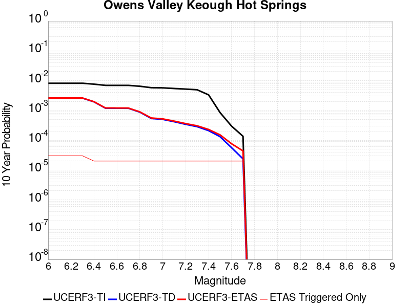 |

| Magnitude | 1 wk TI Prob | 1 wk TD Prob | 1 wk ETAS Prob | 1 wk ETAS/TD Gain | 1 wk ETAS Triggered Only | 1 mo TI Prob | 1 mo TD Prob | 1 mo ETAS Prob | 1 mo ETAS/TD Gain | 1 mo ETAS Triggered Only | 1 yr TI Prob | 1 yr TD Prob | 1 yr ETAS Prob | 1 yr ETAS/TD Gain | 1 yr ETAS Triggered Only | 10 yr TI Prob | 10 yr TD Prob | 10 yr ETAS Prob | 10 yr ETAS/TD Gain | 10 yr ETAS Triggered Only |
|-----|-----|-----|-----|-----|-----|-----|-----|-----|-----|-----|-----|-----|-----|-----|-----|-----|-----|-----|-----|-----|
| 6.0 | 1.5708529E-5 | 4.950656E-6 | 2.3099386E-5 | 4.6659245 | 1.814882E-5 | 6.7320536E-5 | 2.1216953E-5 | 3.936539E-5 | 1.8553742 | 1.814882E-5 | 8.193192E-4 | 2.582909E-4 | 2.9457916E-4 | 1.1404938 | 3.629764E-5 | 0.008163051 | 0.0025805652 | 0.0026167692 | 1.0140295 | 3.629764E-5 |
| 6.1 | 1.5708529E-5 | 4.950656E-6 | 2.3099386E-5 | 4.6659245 | 1.814882E-5 | 6.7320536E-5 | 2.1216953E-5 | 3.936539E-5 | 1.8553742 | 1.814882E-5 | 8.193192E-4 | 2.582909E-4 | 2.9457916E-4 | 1.1404938 | 3.629764E-5 | 0.008163051 | 0.0025805652 | 0.0026167692 | 1.0140295 | 3.629764E-5 |
| 6.2 | 1.5708529E-5 | 4.950656E-6 | 2.3099386E-5 | 4.6659245 | 1.814882E-5 | 6.7320536E-5 | 2.1216953E-5 | 3.936539E-5 | 1.8553742 | 1.814882E-5 | 8.193192E-4 | 2.582909E-4 | 2.9457916E-4 | 1.1404938 | 3.629764E-5 | 0.008163051 | 0.0025805652 | 0.0026167692 | 1.0140295 | 3.629764E-5 |
| 6.3 | 1.5708529E-5 | 4.950656E-6 | 2.3099386E-5 | 4.6659245 | 1.814882E-5 | 6.7320536E-5 | 2.1216953E-5 | 3.936539E-5 | 1.8553742 | 1.814882E-5 | 8.193192E-4 | 2.582909E-4 | 2.9457916E-4 | 1.1404938 | 3.629764E-5 | 0.008163051 | 0.0025805652 | 0.0026167692 | 1.0140295 | 3.629764E-5 |
| 6.4 | 1.4622509E-5 | 3.7265204E-6 | 2.1875274E-5 | 5.8701606 | 1.814882E-5 | 6.266639E-5 | 1.5970723E-5 | 3.4119254E-5 | 2.1363626 | 1.814882E-5 | 7.626962E-4 | 1.944295E-4 | 2.125748E-4 | 1.0933259 | 1.814882E-5 | 0.007600839 | 0.0019430731 | 0.0019611865 | 1.0093222 | 1.814882E-5 |
| 6.5 | 1.3335527E-5 | 2.2777172E-6 | 2.0426496E-5 | 8.967969 | 1.814882E-5 | 5.7151006E-5 | 9.761612E-6 | 2.7910255E-5 | 2.859185 | 1.814882E-5 | 6.955913E-4 | 1.18841825E-4 | 1.3698848E-4 | 1.1526959 | 1.814882E-5 | 0.0069341804 | 0.0011880046 | 0.0012061319 | 1.0152586 | 1.814882E-5 |
| 6.6 | 1.3332855E-5 | 2.2748663E-6 | 2.0423646E-5 | 8.977954 | 1.814882E-5 | 5.7139558E-5 | 9.749395E-6 | 2.7898037E-5 | 2.861515 | 1.814882E-5 | 6.9545204E-4 | 1.186931E-4 | 1.3683976E-4 | 1.1528873 | 1.814882E-5 | 0.0069327964 | 0.0011865189 | 0.0012046462 | 1.0152777 | 1.814882E-5 |
| 6.7 | 1.3318214E-5 | 2.2640966E-6 | 2.0412876E-5 | 9.015903 | 1.814882E-5 | 5.707681E-5 | 9.703239E-6 | 2.7851884E-5 | 2.8703697 | 1.814882E-5 | 6.946886E-4 | 1.1813121E-4 | 1.3627789E-4 | 1.1536145 | 1.814882E-5 | 0.0069252094 | 0.001180906 | 0.0011990333 | 1.0153505 | 1.814882E-5 |
| 6.8 | 1.2441338E-5 | 1.6777863E-6 | 1.9826577E-5 | 11.817104 | 1.814882E-5 | 5.331893E-5 | 7.1904947E-6 | 2.5339185E-5 | 3.5239835 | 1.814882E-5 | 6.489646E-4 | 8.7541055E-5 | 1.0568828E-4 | 1.2072997 | 1.814882E-5 | 0.0064707273 | 8.752499E-4 | 8.933828E-4 | 1.0207174 | 1.814882E-5 |
| 6.9 | 1.1130476E-5 | 1.0303868E-6 | 1.9179188E-5 | 18.613583 | 1.814882E-5 | 4.7701167E-5 | 4.415936E-6 | 2.2564676E-5 | 5.109829 | 1.814882E-5 | 5.806069E-4 | 5.3762706E-5 | 7.191055E-5 | 1.3375546 | 1.814882E-5 | 0.0057909233 | 5.37651E-4 | 5.5579003E-4 | 1.0337377 | 1.814882E-5 |
| 7.0 | 1.0986073E-5 | 9.579413E-7 | 1.9106745E-5 | 19.945631 | 1.814882E-5 | 4.7082318E-5 | 4.1054564E-6 | 2.2254202E-5 | 5.4206405 | 1.814882E-5 | 5.730765E-4 | 4.99828E-5 | 6.8130714E-5 | 1.3630831 | 1.814882E-5 | 0.0057160086 | 4.9986853E-4 | 5.1800825E-4 | 1.0362891 | 1.814882E-5 |
| 7.1 | 1.0451338E-5 | 8.0002656E-7 | 1.8948833E-5 | 23.685255 | 1.814882E-5 | 4.4790682E-5 | 3.4286807E-6 | 2.1577438E-5 | 6.293219 | 1.814882E-5 | 5.451901E-4 | 4.1743395E-5 | 5.9891456E-5 | 1.434753 | 1.814882E-5 | 0.005438545 | 4.1750458E-4 | 4.356458E-4 | 1.0434515 | 1.814882E-5 |
| 7.2 | 9.989061E-6 | 6.544956E-7 | 1.8803305E-5 | 28.729458 | 1.814882E-5 | 4.280956E-5 | 2.804978E-6 | 2.0953748E-5 | 7.4702 | 1.814882E-5 | 5.2108173E-4 | 3.4150078E-5 | 5.2298277E-5 | 1.5314249 | 1.814882E-5 | 0.0051986156 | 3.415851E-4 | 3.597277E-4 | 1.053113 | 1.814882E-5 |
| 7.3 | 9.465365E-6 | 5.4600474E-7 | 1.8694815E-5 | 34.239292 | 1.814882E-5 | 4.056522E-5 | 2.3400182E-6 | 2.0488797E-5 | 8.755828 | 1.814882E-5 | 4.937696E-4 | 2.8489352E-5 | 4.6637655E-5 | 1.6370206 | 1.814882E-5 | 0.0049267393 | 2.8498896E-4 | 3.031326E-4 | 1.0636644 | 1.814882E-5 |
| 7.4 | 6.3824805E-6 | 4.016335E-7 | 1.8550447E-5 | 46.1875 | 1.814882E-5 | 2.73532E-5 | 1.7212853E-6 | 1.9870075E-5 | 11.543742 | 1.814882E-5 | 3.3297433E-4 | 2.095645E-5 | 3.910489E-5 | 1.8660074 | 1.814882E-5 | 0.0033247585 | 2.0963654E-4 | 2.2778154E-4 | 1.0865546 | 1.814882E-5 |
| 7.5 | 1.6192645E-6 | 2.516124E-7 | 1.8400428E-5 | 73.13006 | 1.814882E-5 | 6.9396865E-6 | 1.0783383E-6 | 1.922714E-5 | 17.83034 | 1.814882E-5 | 8.448741E-5 | 1.31286915E-5 | 3.1277275E-5 | 2.3823602 | 1.814882E-5 | 8.4455294E-4 | 1.3127929E-4 | 1.4942573E-4 | 1.1382277 | 1.814882E-5 |
| 7.6 | 5.7062545E-7 | 1.07924045E-7 | 1.8256742E-5 | 169.16289 | 1.814882E-5 | 2.4455355E-6 | 4.6253152E-7 | 1.8611343E-5 | 40.238 | 1.814882E-5 | 2.9773988E-5 | 5.6313074E-6 | 2.3780025E-5 | 4.222825 | 1.814882E-5 | 2.977E-4 | 5.6311732E-5 | 7.445953E-5 | 1.3222739 | 1.814882E-5 |
| 7.7 | 2.5988817E-7 | 4.5457977E-8 | 1.8194278E-5 | 400.2439 | 1.814882E-5 | 1.113806E-6 | 1.9481989E-7 | 1.8343637E-5 | 94.1569 | 1.814882E-5 | 1.3560503E-5 | 2.3719301E-6 | 2.0520707E-5 | 8.651481 | 1.814882E-5 | 1.3559677E-4 | 2.371909E-5 | 4.1867483E-5 | 1.7651385 | 1.814882E-5 |

## Pitas Point (Lower)-Montalvo
*[(top)](#table-of-contents)*

| 1 Week | 1 Month | 1 Year | 10 Year |
|-----|-----|-----|-----|
|  |  |  |  |

| Magnitude | 1 wk TI Prob | 1 wk TD Prob | 1 wk ETAS Prob | 1 wk ETAS/TD Gain | 1 wk ETAS Triggered Only | 1 mo TI Prob | 1 mo TD Prob | 1 mo ETAS Prob | 1 mo ETAS/TD Gain | 1 mo ETAS Triggered Only | 1 yr TI Prob | 1 yr TD Prob | 1 yr ETAS Prob | 1 yr ETAS/TD Gain | 1 yr ETAS Triggered Only | 10 yr TI Prob | 10 yr TD Prob | 10 yr ETAS Prob | 10 yr ETAS/TD Gain | 10 yr ETAS Triggered Only |
|-----|-----|-----|-----|-----|-----|-----|-----|-----|-----|-----|-----|-----|-----|-----|-----|-----|-----|-----|-----|-----|
| 6.0 | 5.2543637E-6 | 4.8378706E-6 | 4.8378706E-6 | 1.0 | 0.0 | 2.2518509E-5 | 2.0733567E-5 | 2.0733567E-5 | 1.0 | 0.0 | 2.7412834E-4 | 2.5240227E-4 | 2.5240227E-4 | 1.0 | 0.0 | 0.0027379042 | 0.0025211885 | 0.0025392915 | 1.0071803 | 1.814882E-5 |
| 6.1 | 5.2543637E-6 | 4.8378706E-6 | 4.8378706E-6 | 1.0 | 0.0 | 2.2518509E-5 | 2.0733567E-5 | 2.0733567E-5 | 1.0 | 0.0 | 2.7412834E-4 | 2.5240227E-4 | 2.5240227E-4 | 1.0 | 0.0 | 0.0027379042 | 0.0025211885 | 0.0025392915 | 1.0071803 | 1.814882E-5 |
| 6.2 | 5.2543637E-6 | 4.8378706E-6 | 4.8378706E-6 | 1.0 | 0.0 | 2.2518509E-5 | 2.0733567E-5 | 2.0733567E-5 | 1.0 | 0.0 | 2.7412834E-4 | 2.5240227E-4 | 2.5240227E-4 | 1.0 | 0.0 | 0.0027379042 | 0.0025211885 | 0.0025392915 | 1.0071803 | 1.814882E-5 |
| 6.3 | 5.2543637E-6 | 4.8378706E-6 | 4.8378706E-6 | 1.0 | 0.0 | 2.2518509E-5 | 2.0733567E-5 | 2.0733567E-5 | 1.0 | 0.0 | 2.7412834E-4 | 2.5240227E-4 | 2.5240227E-4 | 1.0 | 0.0 | 0.0027379042 | 0.0025211885 | 0.0025392915 | 1.0071803 | 1.814882E-5 |
| 6.4 | 5.2543637E-6 | 4.8378706E-6 | 4.8378706E-6 | 1.0 | 0.0 | 2.2518509E-5 | 2.0733567E-5 | 2.0733567E-5 | 1.0 | 0.0 | 2.7412834E-4 | 2.5240227E-4 | 2.5240227E-4 | 1.0 | 0.0 | 0.0027379042 | 0.0025211885 | 0.0025392915 | 1.0071803 | 1.814882E-5 |
| 6.5 | 5.2543637E-6 | 4.8378706E-6 | 4.8378706E-6 | 1.0 | 0.0 | 2.2518509E-5 | 2.0733567E-5 | 2.0733567E-5 | 1.0 | 0.0 | 2.7412834E-4 | 2.5240227E-4 | 2.5240227E-4 | 1.0 | 0.0 | 0.0027379042 | 0.0025211885 | 0.0025392915 | 1.0071803 | 1.814882E-5 |
| 6.6 | 5.2543637E-6 | 4.8378706E-6 | 4.8378706E-6 | 1.0 | 0.0 | 2.2518509E-5 | 2.0733567E-5 | 2.0733567E-5 | 1.0 | 0.0 | 2.7412834E-4 | 2.5240227E-4 | 2.5240227E-4 | 1.0 | 0.0 | 0.0027379042 | 0.0025211885 | 0.0025392915 | 1.0071803 | 1.814882E-5 |
| 6.7 | 5.2543637E-6 | 4.8378706E-6 | 4.8378706E-6 | 1.0 | 0.0 | 2.2518509E-5 | 2.0733567E-5 | 2.0733567E-5 | 1.0 | 0.0 | 2.7412834E-4 | 2.5240227E-4 | 2.5240227E-4 | 1.0 | 0.0 | 0.0027379042 | 0.0025211885 | 0.0025392915 | 1.0071803 | 1.814882E-5 |
| 6.8 | 5.2543637E-6 | 4.8378706E-6 | 4.8378706E-6 | 1.0 | 0.0 | 2.2518509E-5 | 2.0733567E-5 | 2.0733567E-5 | 1.0 | 0.0 | 2.7412834E-4 | 2.5240227E-4 | 2.5240227E-4 | 1.0 | 0.0 | 0.0027379042 | 0.0025211885 | 0.0025392915 | 1.0071803 | 1.814882E-5 |
| 6.9 | 5.2543637E-6 | 4.8378706E-6 | 4.8378706E-6 | 1.0 | 0.0 | 2.2518509E-5 | 2.0733567E-5 | 2.0733567E-5 | 1.0 | 0.0 | 2.7412834E-4 | 2.5240227E-4 | 2.5240227E-4 | 1.0 | 0.0 | 0.0027379042 | 0.0025211885 | 0.0025392915 | 1.0071803 | 1.814882E-5 |
| 7.0 | 5.2543637E-6 | 4.8378706E-6 | 4.8378706E-6 | 1.0 | 0.0 | 2.2518509E-5 | 2.0733567E-5 | 2.0733567E-5 | 1.0 | 0.0 | 2.7412834E-4 | 2.5240227E-4 | 2.5240227E-4 | 1.0 | 0.0 | 0.0027379042 | 0.0025211885 | 0.0025392915 | 1.0071803 | 1.814882E-5 |
| 7.1 | 5.2543637E-6 | 4.8378706E-6 | 4.8378706E-6 | 1.0 | 0.0 | 2.2518509E-5 | 2.0733567E-5 | 2.0733567E-5 | 1.0 | 0.0 | 2.7412834E-4 | 2.5240227E-4 | 2.5240227E-4 | 1.0 | 0.0 | 0.0027379042 | 0.0025211885 | 0.0025392915 | 1.0071803 | 1.814882E-5 |
| 7.2 | 5.2458695E-6 | 4.8290244E-6 | 4.8290244E-6 | 1.0 | 0.0 | 2.2482105E-5 | 2.0695656E-5 | 2.0695656E-5 | 1.0 | 0.0 | 2.7368523E-4 | 2.519408E-4 | 2.519408E-4 | 1.0 | 0.0 | 0.0027334841 | 0.0025165842 | 0.0025346873 | 1.0071936 | 1.814882E-5 |
| 7.3 | 5.22665E-6 | 4.8089414E-6 | 4.8089414E-6 | 1.0 | 0.0 | 2.2399736E-5 | 2.0609588E-5 | 2.0609588E-5 | 1.0 | 0.0 | 2.7268266E-4 | 2.5089315E-4 | 2.5089315E-4 | 1.0 | 0.0 | 0.002723483 | 0.0025061315 | 0.0025242348 | 1.0072236 | 1.814882E-5 |
| 7.4 | 5.210642E-6 | 4.792154E-6 | 4.792154E-6 | 1.0 | 0.0 | 2.233113E-5 | 2.0537642E-5 | 2.0537642E-5 | 1.0 | 0.0 | 2.718476E-4 | 2.5001742E-4 | 2.5001742E-4 | 1.0 | 0.0 | 0.002715153 | 0.0024973939 | 0.0025154974 | 1.007249 | 1.814882E-5 |
| 7.5 | 5.1226016E-6 | 4.7000403E-6 | 4.7000403E-6 | 1.0 | 0.0 | 2.1953823E-5 | 2.0142877E-5 | 2.0142877E-5 | 1.0 | 0.0 | 2.67255E-4 | 2.4521223E-4 | 2.4521223E-4 | 1.0 | 0.0 | 0.0026693381 | 0.0024494485 | 0.0024675527 | 1.0073912 | 1.814882E-5 |
| 7.6 | 4.8796987E-6 | 4.4449403E-6 | 4.4449403E-6 | 1.0 | 0.0 | 2.0912828E-5 | 1.9049607E-5 | 1.9049607E-5 | 1.0 | 0.0 | 2.5458392E-4 | 2.3190459E-4 | 2.3190459E-4 | 1.0 | 0.0 | 0.0025429246 | 0.0023166565 | 0.0023347633 | 1.007816 | 1.814882E-5 |
| 7.7 | 4.0834398E-6 | 3.6091124E-6 | 3.6091124E-6 | 1.0 | 0.0 | 1.7500339E-5 | 1.5467534E-5 | 1.5467534E-5 | 1.0 | 0.0 | 2.1304579E-4 | 1.8830119E-4 | 1.8830119E-4 | 1.0 | 0.0 | 0.0021284167 | 0.00188144 | 0.0018995547 | 1.009628 | 1.814882E-5 |
| 7.8 | 2.5445438E-6 | 2.121228E-6 | 2.121228E-6 | 1.0 | 0.0 | 1.0905142E-5 | 9.090945E-6 | 9.090945E-6 | 1.0 | 0.0 | 1.3276201E-4 | 1.1067669E-4 | 1.1067669E-4 | 1.0 | 0.0 | 0.0013268272 | 0.0011062203 | 0.0011062203 | 1.0 | 0.0 |
| 7.9 | 4.1677114E-7 | 3.3293693E-7 | 3.3293693E-7 | 1.0 | 0.0 | 1.7861609E-6 | 1.4268718E-6 | 1.4268718E-6 | 1.0 | 0.0 | 2.1746291E-5 | 1.737203E-5 | 1.737203E-5 | 1.0 | 0.0 | 2.1744163E-4 | 1.7370703E-4 | 1.7370703E-4 | 1.0 | 0.0 |
| 8.0 | 7.791402E-9 | 5.683497E-9 | 5.683497E-9 | 1.0 | 0.0 | 3.3391725E-8 | 2.4357844E-8 | 2.4357844E-8 | 1.0 | 0.0 | 4.0654416E-7 | 2.9655675E-7 | 2.9655675E-7 | 1.0 | 0.0 | 4.065434E-6 | 2.9655655E-6 | 2.9655655E-6 | 1.0 | 0.0 |

## Johnson Valley (No) 2011 rev
*[(top)](#table-of-contents)*

| 1 Week | 1 Month | 1 Year | 10 Year |
|-----|-----|-----|-----|
|  |  |  |  |

| Magnitude | 1 wk TI Prob | 1 wk TD Prob | 1 wk ETAS Prob | 1 wk ETAS/TD Gain | 1 wk ETAS Triggered Only | 1 mo TI Prob | 1 mo TD Prob | 1 mo ETAS Prob | 1 mo ETAS/TD Gain | 1 mo ETAS Triggered Only | 1 yr TI Prob | 1 yr TD Prob | 1 yr ETAS Prob | 1 yr ETAS/TD Gain | 1 yr ETAS Triggered Only | 10 yr TI Prob | 10 yr TD Prob | 10 yr ETAS Prob | 10 yr ETAS/TD Gain | 10 yr ETAS Triggered Only |
|-----|-----|-----|-----|-----|-----|-----|-----|-----|-----|-----|-----|-----|-----|-----|-----|-----|-----|-----|-----|-----|
| 6.0 | 2.577707E-5 | 1.2900938E-5 | 1.2900938E-5 | 1.0 | 0.0 | 1.1046848E-4 | 5.5288787E-5 | 5.5288787E-5 | 1.0 | 0.0 | 0.0013441239 | 6.7297276E-4 | 6.7297276E-4 | 1.0 | 0.0 | 0.013360229 | 0.006713257 | 0.006731284 | 1.0026853 | 1.814882E-5 |
| 6.1 | 2.577707E-5 | 1.2900938E-5 | 1.2900938E-5 | 1.0 | 0.0 | 1.1046848E-4 | 5.5288787E-5 | 5.5288787E-5 | 1.0 | 0.0 | 0.0013441239 | 6.7297276E-4 | 6.7297276E-4 | 1.0 | 0.0 | 0.013360229 | 0.006713257 | 0.006731284 | 1.0026853 | 1.814882E-5 |
| 6.2 | 2.577707E-5 | 1.2900938E-5 | 1.2900938E-5 | 1.0 | 0.0 | 1.1046848E-4 | 5.5288787E-5 | 5.5288787E-5 | 1.0 | 0.0 | 0.0013441239 | 6.7297276E-4 | 6.7297276E-4 | 1.0 | 0.0 | 0.013360229 | 0.006713257 | 0.006731284 | 1.0026853 | 1.814882E-5 |
| 6.3 | 2.577707E-5 | 1.2900938E-5 | 1.2900938E-5 | 1.0 | 0.0 | 1.1046848E-4 | 5.5288787E-5 | 5.5288787E-5 | 1.0 | 0.0 | 0.0013441239 | 6.7297276E-4 | 6.7297276E-4 | 1.0 | 0.0 | 0.013360229 | 0.006713257 | 0.006731284 | 1.0026853 | 1.814882E-5 |
| 6.4 | 1.5296591E-5 | 7.536742E-6 | 7.536742E-6 | 1.0 | 0.0 | 6.555518E-5 | 3.2300028E-5 | 3.2300028E-5 | 1.0 | 0.0 | 7.97842E-4 | 3.9320064E-4 | 3.9320064E-4 | 1.0 | 0.0 | 0.007949836 | 0.0039268904 | 0.0039449683 | 1.0046035 | 1.814882E-5 |
| 6.5 | 1.5296591E-5 | 7.536742E-6 | 7.536742E-6 | 1.0 | 0.0 | 6.555518E-5 | 3.2300028E-5 | 3.2300028E-5 | 1.0 | 0.0 | 7.97842E-4 | 3.9320064E-4 | 3.9320064E-4 | 1.0 | 0.0 | 0.007949836 | 0.0039268904 | 0.0039449683 | 1.0046035 | 1.814882E-5 |
| 6.6 | 1.3289383E-5 | 5.9917306E-6 | 5.9917306E-6 | 1.0 | 0.0 | 5.6953253E-5 | 2.5678688E-5 | 2.5678688E-5 | 1.0 | 0.0 | 6.9318525E-4 | 3.1261015E-4 | 3.1261015E-4 | 1.0 | 0.0 | 0.0069102696 | 0.0031233684 | 0.0031414605 | 1.0057925 | 1.814882E-5 |
| 6.7 | 1.3289383E-5 | 5.9917306E-6 | 5.9917306E-6 | 1.0 | 0.0 | 5.6953253E-5 | 2.5678688E-5 | 2.5678688E-5 | 1.0 | 0.0 | 6.9318525E-4 | 3.1261015E-4 | 3.1261015E-4 | 1.0 | 0.0 | 0.0069102696 | 0.0031233684 | 0.0031414605 | 1.0057925 | 1.814882E-5 |
| 6.8 | 8.330789E-6 | 2.9211888E-6 | 2.9211888E-6 | 1.0 | 0.0 | 3.570289E-5 | 1.2519352E-5 | 1.2519352E-5 | 1.0 | 0.0 | 4.34596E-4 | 1.5241816E-4 | 1.5241816E-4 | 1.0 | 0.0 | 0.0043374705 | 0.0015236961 | 0.0015418173 | 1.0118929 | 1.814882E-5 |
| 6.9 | 7.2359003E-6 | 2.3013247E-6 | 2.3013247E-6 | 1.0 | 0.0 | 3.1010633E-5 | 9.8628125E-6 | 9.8628125E-6 | 1.0 | 0.0 | 3.7748902E-4 | 1.2007845E-4 | 1.2007845E-4 | 1.0 | 0.0 | 0.0037684843 | 0.0012006586 | 0.0012187856 | 1.0150976 | 1.814882E-5 |
| 7.0 | 6.5149957E-6 | 2.088482E-6 | 2.088482E-6 | 1.0 | 0.0 | 2.792111E-5 | 8.950637E-6 | 8.950637E-6 | 1.0 | 0.0 | 3.398865E-4 | 1.0897385E-4 | 1.0897385E-4 | 1.0 | 0.0 | 0.003393671 | 0.0010897239 | 0.0011078529 | 1.0166364 | 1.814882E-5 |
| 7.1 | 1.1662233E-6 | 2.8802024E-8 | 2.8802024E-8 | 1.0 | 0.0 | 4.9980904E-6 | 1.2343725E-7 | 1.2343725E-7 | 1.0 | 0.0 | 6.0850052E-5 | 1.5028476E-6 | 1.5028476E-6 | 1.0 | 0.0 | 6.083339E-4 | 1.50283895E-5 | 1.50283895E-5 | 1.0 | 0.0 |
| 7.2 | 5.413881E-7 | 2.8802024E-8 | 2.8802024E-8 | 1.0 | 0.0 | 2.3202326E-6 | 1.2343725E-7 | 1.2343725E-7 | 1.0 | 0.0 | 2.8248465E-5 | 1.5028476E-6 | 1.5028476E-6 | 1.0 | 0.0 | 2.8244875E-4 | 1.50283895E-5 | 1.50283895E-5 | 1.0 | 0.0 |
| 7.3 | 5.076821E-7 | 2.8802024E-8 | 2.8802024E-8 | 1.0 | 0.0 | 2.1757785E-6 | 1.2343723E-7 | 1.2343723E-7 | 1.0 | 0.0 | 2.648978E-5 | 1.5028475E-6 | 1.5028475E-6 | 1.0 | 0.0 | 2.6486625E-4 | 1.50283895E-5 | 1.50283895E-5 | 1.0 | 0.0 |
| 7.4 | 4.7568687E-7 | 2.8783948E-8 | 2.8783948E-8 | 1.0 | 0.0 | 2.0386565E-6 | 1.2335977E-7 | 1.2335977E-7 | 1.0 | 0.0 | 2.482036E-5 | 1.5019043E-6 | 1.5019043E-6 | 1.0 | 0.0 | 2.4817587E-4 | 1.5018958E-5 | 1.5018958E-5 | 1.0 | 0.0 |
| 7.5 | 3.435626E-7 | 2.5357679E-8 | 2.5357679E-8 | 1.0 | 0.0 | 1.4724103E-6 | 1.0867576E-7 | 1.0867576E-7 | 1.0 | 0.0 | 1.7926448E-5 | 1.3231268E-6 | 1.3231268E-6 | 1.0 | 0.0 | 1.7925001E-4 | 1.3231205E-5 | 1.3231205E-5 | 1.0 | 0.0 |

## Hector Mine
*[(top)](#table-of-contents)*

| 1 Week | 1 Month | 1 Year | 10 Year |
|-----|-----|-----|-----|
|  | 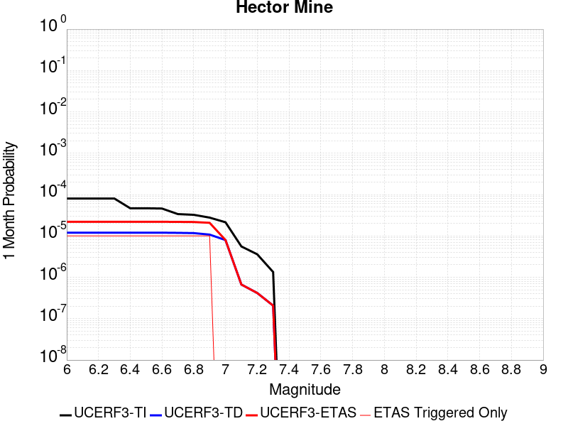 | 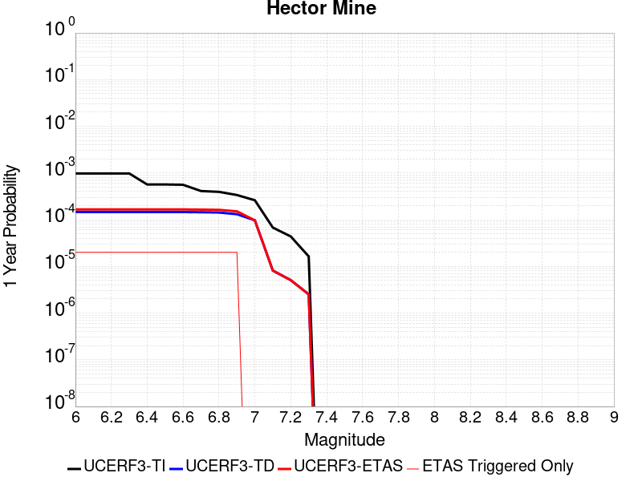 |  |

| Magnitude | 1 wk TI Prob | 1 wk TD Prob | 1 wk ETAS Prob | 1 wk ETAS/TD Gain | 1 wk ETAS Triggered Only | 1 mo TI Prob | 1 mo TD Prob | 1 mo ETAS Prob | 1 mo ETAS/TD Gain | 1 mo ETAS Triggered Only | 1 yr TI Prob | 1 yr TD Prob | 1 yr ETAS Prob | 1 yr ETAS/TD Gain | 1 yr ETAS Triggered Only | 10 yr TI Prob | 10 yr TD Prob | 10 yr ETAS Prob | 10 yr ETAS/TD Gain | 10 yr ETAS Triggered Only |
|-----|-----|-----|-----|-----|-----|-----|-----|-----|-----|-----|-----|-----|-----|-----|-----|-----|-----|-----|-----|-----|
| 6.0 | 1.8760093E-5 | 2.7963818E-6 | 2.7963818E-6 | 1.0 | 0.0 | 8.039792E-5 | 1.1984461E-5 | 1.1984461E-5 | 1.0 | 0.0 | 9.78405E-4 | 1.4590504E-4 | 1.640512E-4 | 1.1243697 | 1.814882E-5 | 0.009741086 | 0.0014584847 | 0.0014766069 | 1.0124254 | 1.814882E-5 |
| 6.1 | 1.8760093E-5 | 2.7963818E-6 | 2.7963818E-6 | 1.0 | 0.0 | 8.039792E-5 | 1.1984461E-5 | 1.1984461E-5 | 1.0 | 0.0 | 9.78405E-4 | 1.4590504E-4 | 1.640512E-4 | 1.1243697 | 1.814882E-5 | 0.009741086 | 0.0014584847 | 0.0014766069 | 1.0124254 | 1.814882E-5 |
| 6.2 | 1.8760093E-5 | 2.7963818E-6 | 2.7963818E-6 | 1.0 | 0.0 | 8.039792E-5 | 1.1984461E-5 | 1.1984461E-5 | 1.0 | 0.0 | 9.78405E-4 | 1.4590504E-4 | 1.640512E-4 | 1.1243697 | 1.814882E-5 | 0.009741086 | 0.0014584847 | 0.0014766069 | 1.0124254 | 1.814882E-5 |
| 6.3 | 1.8760093E-5 | 2.7963818E-6 | 2.7963818E-6 | 1.0 | 0.0 | 8.039792E-5 | 1.1984461E-5 | 1.1984461E-5 | 1.0 | 0.0 | 9.78405E-4 | 1.4590504E-4 | 1.640512E-4 | 1.1243697 | 1.814882E-5 | 0.009741086 | 0.0014584847 | 0.0014766069 | 1.0124254 | 1.814882E-5 |
| 6.4 | 1.0888055E-5 | 2.7963818E-6 | 2.7963818E-6 | 1.0 | 0.0 | 4.666226E-5 | 1.1984461E-5 | 1.1984461E-5 | 1.0 | 0.0 | 5.679649E-4 | 1.4590504E-4 | 1.640512E-4 | 1.1243697 | 1.814882E-5 | 0.0056651547 | 0.0014584847 | 0.0014766069 | 1.0124254 | 1.814882E-5 |
| 6.5 | 1.0888055E-5 | 2.7963818E-6 | 2.7963818E-6 | 1.0 | 0.0 | 4.666226E-5 | 1.1984461E-5 | 1.1984461E-5 | 1.0 | 0.0 | 5.679649E-4 | 1.4590504E-4 | 1.640512E-4 | 1.1243697 | 1.814882E-5 | 0.0056651547 | 0.0014584847 | 0.0014766069 | 1.0124254 | 1.814882E-5 |
| 6.6 | 1.0730738E-5 | 2.7963818E-6 | 2.7963818E-6 | 1.0 | 0.0 | 4.5988065E-5 | 1.1984461E-5 | 1.1984461E-5 | 1.0 | 0.0 | 5.5976084E-4 | 1.4590504E-4 | 1.640512E-4 | 1.1243697 | 1.814882E-5 | 0.0055835294 | 0.0014584847 | 0.0014766069 | 1.0124254 | 1.814882E-5 |
| 6.7 | 7.881326E-6 | 2.7710626E-6 | 2.7710626E-6 | 1.0 | 0.0 | 3.3776672E-5 | 1.1875951E-5 | 1.1875951E-5 | 1.0 | 0.0 | 4.111534E-4 | 1.445841E-4 | 1.627303E-4 | 1.1255062 | 1.814882E-5 | 0.0041039353 | 0.0014452925 | 0.001463415 | 1.012539 | 1.814882E-5 |
| 6.8 | 7.5683483E-6 | 2.7328138E-6 | 2.7328138E-6 | 1.0 | 0.0 | 3.2435375E-5 | 1.1712029E-5 | 1.1712029E-5 | 1.0 | 0.0 | 3.9482914E-4 | 1.4258861E-4 | 1.6073485E-4 | 1.1272628 | 1.814882E-5 | 0.0039412836 | 0.0014253634 | 0.0014434863 | 1.0127146 | 1.814882E-5 |
| 6.9 | 6.473048E-6 | 2.5138945E-6 | 2.5138945E-6 | 1.0 | 0.0 | 2.7741338E-5 | 1.07738115E-5 | 1.07738115E-5 | 1.0 | 0.0 | 3.3769844E-4 | 1.3116724E-4 | 1.4931368E-4 | 1.1383458 | 1.814882E-5 | 0.0033718573 | 0.0013112876 | 0.0013294127 | 1.0138223 | 1.814882E-5 |
| 7.0 | 4.9959954E-6 | 1.8565124E-6 | 1.8565124E-6 | 1.0 | 0.0 | 2.1411232E-5 | 7.956478E-6 | 7.956478E-6 | 1.0 | 0.0 | 2.6065056E-4 | 9.686937E-5 | 9.686937E-5 | 1.0 | 0.0 | 0.0026034506 | 9.6862105E-4 | 9.6862105E-4 | 1.0 | 0.0 |
| 7.1 | 1.2997541E-6 | 1.5602147E-7 | 1.5602147E-7 | 1.0 | 0.0 | 5.5703626E-6 | 6.686633E-7 | 6.686633E-7 | 1.0 | 0.0 | 6.7817055E-5 | 8.140949E-6 | 8.140949E-6 | 1.0 | 0.0 | 6.779636E-4 | 8.1406906E-5 | 8.1406906E-5 | 1.0 | 0.0 |
| 7.2 | 8.392699E-7 | 9.727592E-8 | 9.727592E-8 | 1.0 | 0.0 | 3.596866E-6 | 4.1689677E-7 | 4.1689677E-7 | 1.0 | 0.0 | 4.3790962E-5 | 5.0757085E-6 | 5.0757085E-6 | 1.0 | 0.0 | 4.3782333E-4 | 5.0756116E-5 | 5.0756116E-5 | 1.0 | 0.0 |
| 7.3 | 3.13015E-7 | 4.829262E-8 | 4.829262E-8 | 1.0 | 0.0 | 1.3414921E-6 | 2.0696835E-7 | 2.0696835E-7 | 1.0 | 0.0 | 1.6332544E-5 | 2.5198376E-6 | 2.5198376E-6 | 1.0 | 0.0 | 1.6331344E-4 | 2.5198176E-5 | 2.5198176E-5 | 1.0 | 0.0 |

## Sisar
*[(top)](#table-of-contents)*

| 1 Week | 1 Month | 1 Year | 10 Year |
|-----|-----|-----|-----|
|  |  |  |  |

| Magnitude | 1 wk TI Prob | 1 wk TD Prob | 1 wk ETAS Prob | 1 wk ETAS/TD Gain | 1 wk ETAS Triggered Only | 1 mo TI Prob | 1 mo TD Prob | 1 mo ETAS Prob | 1 mo ETAS/TD Gain | 1 mo ETAS Triggered Only | 1 yr TI Prob | 1 yr TD Prob | 1 yr ETAS Prob | 1 yr ETAS/TD Gain | 1 yr ETAS Triggered Only | 10 yr TI Prob | 10 yr TD Prob | 10 yr ETAS Prob | 10 yr ETAS/TD Gain | 10 yr ETAS Triggered Only |
|-----|-----|-----|-----|-----|-----|-----|-----|-----|-----|-----|-----|-----|-----|-----|-----|-----|-----|-----|-----|-----|
| 6.0 | 4.544193E-6 | 3.839576E-6 | 3.839576E-6 | 1.0 | 0.0 | 1.9474966E-5 | 1.6455224E-5 | 1.6455224E-5 | 1.0 | 0.0 | 2.3708193E-4 | 2.0032428E-4 | 2.0032428E-4 | 1.0 | 0.0 | 0.0023682916 | 0.002001471 | 0.0020195832 | 1.0090495 | 1.814882E-5 |
| 6.1 | 4.544193E-6 | 3.839576E-6 | 3.839576E-6 | 1.0 | 0.0 | 1.9474966E-5 | 1.6455224E-5 | 1.6455224E-5 | 1.0 | 0.0 | 2.3708193E-4 | 2.0032428E-4 | 2.0032428E-4 | 1.0 | 0.0 | 0.0023682916 | 0.002001471 | 0.0020195832 | 1.0090495 | 1.814882E-5 |
| 6.2 | 4.544193E-6 | 3.839576E-6 | 3.839576E-6 | 1.0 | 0.0 | 1.9474966E-5 | 1.6455224E-5 | 1.6455224E-5 | 1.0 | 0.0 | 2.3708193E-4 | 2.0032428E-4 | 2.0032428E-4 | 1.0 | 0.0 | 0.0023682916 | 0.002001471 | 0.0020195832 | 1.0090495 | 1.814882E-5 |
| 6.3 | 4.544193E-6 | 3.839576E-6 | 3.839576E-6 | 1.0 | 0.0 | 1.9474966E-5 | 1.6455224E-5 | 1.6455224E-5 | 1.0 | 0.0 | 2.3708193E-4 | 2.0032428E-4 | 2.0032428E-4 | 1.0 | 0.0 | 0.0023682916 | 0.002001471 | 0.0020195832 | 1.0090495 | 1.814882E-5 |
| 6.4 | 4.544193E-6 | 3.839576E-6 | 3.839576E-6 | 1.0 | 0.0 | 1.9474966E-5 | 1.6455224E-5 | 1.6455224E-5 | 1.0 | 0.0 | 2.3708193E-4 | 2.0032428E-4 | 2.0032428E-4 | 1.0 | 0.0 | 0.0023682916 | 0.002001471 | 0.0020195832 | 1.0090495 | 1.814882E-5 |
| 6.5 | 4.544193E-6 | 3.839576E-6 | 3.839576E-6 | 1.0 | 0.0 | 1.9474966E-5 | 1.6455224E-5 | 1.6455224E-5 | 1.0 | 0.0 | 2.3708193E-4 | 2.0032428E-4 | 2.0032428E-4 | 1.0 | 0.0 | 0.0023682916 | 0.002001471 | 0.0020195832 | 1.0090495 | 1.814882E-5 |
| 6.6 | 4.544193E-6 | 3.839576E-6 | 3.839576E-6 | 1.0 | 0.0 | 1.9474966E-5 | 1.6455224E-5 | 1.6455224E-5 | 1.0 | 0.0 | 2.3708193E-4 | 2.0032428E-4 | 2.0032428E-4 | 1.0 | 0.0 | 0.0023682916 | 0.002001471 | 0.0020195832 | 1.0090495 | 1.814882E-5 |
| 6.7 | 4.544193E-6 | 3.839576E-6 | 3.839576E-6 | 1.0 | 0.0 | 1.9474966E-5 | 1.6455224E-5 | 1.6455224E-5 | 1.0 | 0.0 | 2.3708193E-4 | 2.0032428E-4 | 2.0032428E-4 | 1.0 | 0.0 | 0.0023682916 | 0.002001471 | 0.0020195832 | 1.0090495 | 1.814882E-5 |
| 6.8 | 4.544193E-6 | 3.839576E-6 | 3.839576E-6 | 1.0 | 0.0 | 1.9474966E-5 | 1.6455224E-5 | 1.6455224E-5 | 1.0 | 0.0 | 2.3708193E-4 | 2.0032428E-4 | 2.0032428E-4 | 1.0 | 0.0 | 0.0023682916 | 0.002001471 | 0.0020195832 | 1.0090495 | 1.814882E-5 |
| 6.9 | 4.542225E-6 | 3.8375383E-6 | 3.8375383E-6 | 1.0 | 0.0 | 1.9466532E-5 | 1.6446491E-5 | 1.6446491E-5 | 1.0 | 0.0 | 2.3697925E-4 | 2.0021795E-4 | 2.0021795E-4 | 1.0 | 0.0 | 0.002367267 | 0.0020004094 | 0.002018522 | 1.0090544 | 1.814882E-5 |
| 7.0 | 4.5278484E-6 | 3.822602E-6 | 3.822602E-6 | 1.0 | 0.0 | 1.940492E-5 | 1.638248E-5 | 1.638248E-5 | 1.0 | 0.0 | 2.3622929E-4 | 1.9943877E-4 | 1.9943877E-4 | 1.0 | 0.0 | 0.0023597833 | 0.0019926317 | 0.0020107443 | 1.0090898 | 1.814882E-5 |
| 7.1 | 4.5132488E-6 | 3.8073897E-6 | 3.8073897E-6 | 1.0 | 0.0 | 1.9342351E-5 | 1.6317284E-5 | 1.6317284E-5 | 1.0 | 0.0 | 2.3546767E-4 | 1.9864515E-4 | 1.9864515E-4 | 1.0 | 0.0 | 0.0023521832 | 0.0019847096 | 0.0020028225 | 1.0091262 | 1.814882E-5 |
| 7.2 | 4.448859E-6 | 3.7398502E-6 | 3.7398502E-6 | 1.0 | 0.0 | 1.9066398E-5 | 1.6027832E-5 | 1.6027832E-5 | 1.0 | 0.0 | 2.3210866E-4 | 1.9512173E-4 | 1.9512173E-4 | 1.0 | 0.0 | 0.0023186638 | 0.0019495375 | 0.001967651 | 1.0092912 | 1.814882E-5 |
| 7.3 | 4.3424366E-6 | 3.6336846E-6 | 3.6336846E-6 | 1.0 | 0.0 | 1.861031E-5 | 1.5572843E-5 | 1.5572843E-5 | 1.0 | 0.0 | 2.2655698E-4 | 1.895832E-4 | 1.895832E-4 | 1.0 | 0.0 | 0.0022632615 | 0.0018942481 | 0.0018942481 | 1.0 | 0.0 |
| 7.4 | 4.218641E-6 | 3.5330384E-6 | 3.5330384E-6 | 1.0 | 0.0 | 1.8079765E-5 | 1.5141507E-5 | 1.5141507E-5 | 1.0 | 0.0 | 2.2009891E-4 | 1.8433259E-4 | 1.8433259E-4 | 1.0 | 0.0 | 0.0021988105 | 0.0018418302 | 0.0018418302 | 1.0 | 0.0 |
| 7.5 | 3.983779E-6 | 3.3478068E-6 | 3.3478068E-6 | 1.0 | 0.0 | 1.7073227E-5 | 1.4347666E-5 | 1.4347666E-5 | 1.0 | 0.0 | 2.0784672E-4 | 1.7466917E-4 | 1.7466917E-4 | 1.0 | 0.0 | 0.0020765243 | 0.0017453518 | 0.0017453518 | 1.0 | 0.0 |
| 7.6 | 2.777393E-6 | 2.35225E-6 | 2.35225E-6 | 1.0 | 0.0 | 1.1903058E-5 | 1.0081033E-5 | 1.0081033E-5 | 1.0 | 0.0 | 1.449101E-4 | 1.2272975E-4 | 1.2272975E-4 | 1.0 | 0.0 | 0.0014481564 | 0.0012266274 | 0.0012266274 | 1.0 | 0.0 |
| 7.7 | 1.9028433E-6 | 1.593867E-6 | 1.593867E-6 | 1.0 | 0.0 | 8.155017E-6 | 6.8308404E-6 | 6.8308404E-6 | 1.0 | 0.0 | 9.928281E-5 | 8.3162355E-5 | 8.3162355E-5 | 1.0 | 0.0 | 9.923846E-4 | 8.313171E-4 | 8.313171E-4 | 1.0 | 0.0 |
| 7.8 | 4.9095956E-7 | 4.3583708E-7 | 4.3583708E-7 | 1.0 | 0.0 | 2.1041105E-6 | 1.8678718E-6 | 1.8678718E-6 | 1.0 | 0.0 | 2.5617246E-5 | 2.2741104E-5 | 2.2741104E-5 | 1.0 | 0.0 | 2.5614293E-4 | 2.2738794E-4 | 2.2738794E-4 | 1.0 | 0.0 |
| 7.9 | 1.16657894E-7 | 1.0335569E-7 | 1.0335569E-7 | 1.0 | 0.0 | 4.999623E-7 | 4.4295288E-7 | 4.4295288E-7 | 1.0 | 0.0 | 6.087024E-6 | 5.3929384E-6 | 5.3929384E-6 | 1.0 | 0.0 | 6.0868573E-5 | 5.3928103E-5 | 5.3928103E-5 | 1.0 | 0.0 |
| 8.0 | 2.5100346E-9 | 1.7067566E-9 | 1.7067566E-9 | 1.0 | 0.0 | 1.0757291E-8 | 7.3146724E-9 | 7.3146724E-9 | 1.0 | 0.0 | 1.3097001E-7 | 8.905613E-8 | 8.905613E-8 | 1.0 | 0.0 | 1.3096993E-6 | 8.9056095E-7 | 8.9056095E-7 | 1.0 | 0.0 |

## San Jose
*[(top)](#table-of-contents)*

| 1 Week | 1 Month | 1 Year | 10 Year |
|-----|-----|-----|-----|
|  |  |  | 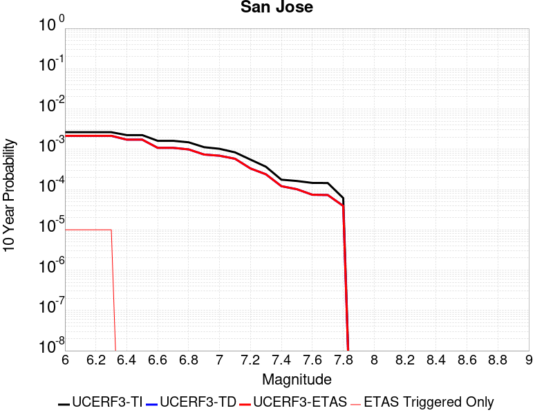 |

| Magnitude | 1 wk TI Prob | 1 wk TD Prob | 1 wk ETAS Prob | 1 wk ETAS/TD Gain | 1 wk ETAS Triggered Only | 1 mo TI Prob | 1 mo TD Prob | 1 mo ETAS Prob | 1 mo ETAS/TD Gain | 1 mo ETAS Triggered Only | 1 yr TI Prob | 1 yr TD Prob | 1 yr ETAS Prob | 1 yr ETAS/TD Gain | 1 yr ETAS Triggered Only | 10 yr TI Prob | 10 yr TD Prob | 10 yr ETAS Prob | 10 yr ETAS/TD Gain | 10 yr ETAS Triggered Only |
|-----|-----|-----|-----|-----|-----|-----|-----|-----|-----|-----|-----|-----|-----|-----|-----|-----|-----|-----|-----|-----|
| 6.0 | 5.0851277E-6 | 4.1256726E-6 | 4.1256726E-6 | 1.0 | 0.0 | 2.1793223E-5 | 1.768135E-5 | 1.768135E-5 | 1.0 | 0.0 | 2.653002E-4 | 2.152518E-4 | 2.3339671E-4 | 1.0842962 | 1.814882E-5 | 0.0026498367 | 0.0021507242 | 0.002168834 | 1.0084203 | 1.814882E-5 |
| 6.1 | 5.0851277E-6 | 4.1256726E-6 | 4.1256726E-6 | 1.0 | 0.0 | 2.1793223E-5 | 1.768135E-5 | 1.768135E-5 | 1.0 | 0.0 | 2.653002E-4 | 2.152518E-4 | 2.3339671E-4 | 1.0842962 | 1.814882E-5 | 0.0026498367 | 0.0021507242 | 0.002168834 | 1.0084203 | 1.814882E-5 |
| 6.2 | 5.0851277E-6 | 4.1256726E-6 | 4.1256726E-6 | 1.0 | 0.0 | 2.1793223E-5 | 1.768135E-5 | 1.768135E-5 | 1.0 | 0.0 | 2.653002E-4 | 2.152518E-4 | 2.3339671E-4 | 1.0842962 | 1.814882E-5 | 0.0026498367 | 0.0021507242 | 0.002168834 | 1.0084203 | 1.814882E-5 |
| 6.3 | 5.0851277E-6 | 4.1256726E-6 | 4.1256726E-6 | 1.0 | 0.0 | 2.1793223E-5 | 1.768135E-5 | 1.768135E-5 | 1.0 | 0.0 | 2.653002E-4 | 2.152518E-4 | 2.3339671E-4 | 1.0842962 | 1.814882E-5 | 0.0026498367 | 0.0021507242 | 0.002168834 | 1.0084203 | 1.814882E-5 |
| 6.4 | 4.3115124E-6 | 3.3237832E-6 | 3.3237832E-6 | 1.0 | 0.0 | 1.8477778E-5 | 1.424472E-5 | 1.424472E-5 | 1.0 | 0.0 | 2.2494372E-4 | 1.7341787E-4 | 1.7341787E-4 | 1.0 | 0.0 | 0.0022471617 | 0.0017330751 | 0.0017330751 | 1.0 | 0.0 |
| 6.5 | 4.3115124E-6 | 3.3237832E-6 | 3.3237832E-6 | 1.0 | 0.0 | 1.8477778E-5 | 1.424472E-5 | 1.424472E-5 | 1.0 | 0.0 | 2.2494372E-4 | 1.7341787E-4 | 1.7341787E-4 | 1.0 | 0.0 | 0.0022471617 | 0.0017330751 | 0.0017330751 | 1.0 | 0.0 |
| 6.6 | 3.110396E-6 | 2.0799866E-6 | 2.0799866E-6 | 1.0 | 0.0 | 1.33302E-5 | 8.9141995E-6 | 8.9141995E-6 | 1.0 | 0.0 | 1.622831E-4 | 1.0852526E-4 | 1.0852526E-4 | 1.0 | 0.0 | 0.0016216465 | 0.0010847825 | 0.0010847825 | 1.0 | 0.0 |
| 6.7 | 3.110396E-6 | 2.0799866E-6 | 2.0799866E-6 | 1.0 | 0.0 | 1.33302E-5 | 8.9141995E-6 | 8.9141995E-6 | 1.0 | 0.0 | 1.622831E-4 | 1.0852526E-4 | 1.0852526E-4 | 1.0 | 0.0 | 0.0016216465 | 0.0010847825 | 0.0010847825 | 1.0 | 0.0 |
| 6.8 | 2.856651E-6 | 1.902435E-6 | 1.902435E-6 | 1.0 | 0.0 | 1.2242733E-5 | 8.153269E-6 | 8.153269E-6 | 1.0 | 0.0 | 1.4904508E-4 | 9.926178E-5 | 9.926178E-5 | 1.0 | 0.0 | 0.0014894515 | 9.922314E-4 | 9.922314E-4 | 1.0 | 0.0 |
| 6.9 | 2.1618725E-6 | 1.4186642E-6 | 1.4186642E-6 | 1.0 | 0.0 | 9.265135E-6 | 6.0799757E-6 | 6.0799757E-6 | 1.0 | 0.0 | 1.12797185E-4 | 7.402128E-5 | 7.402128E-5 | 1.0 | 0.0 | 0.0011273995 | 7.4000744E-4 | 7.4000744E-4 | 1.0 | 0.0 |
| 7.0 | 1.9684312E-6 | 1.3256331E-6 | 1.3256331E-6 | 1.0 | 0.0 | 8.436106E-6 | 5.681273E-6 | 5.681273E-6 | 1.0 | 0.0 | 1.02704755E-4 | 6.9167385E-5 | 6.9167385E-5 | 1.0 | 0.0 | 0.001026573 | 6.914992E-4 | 6.914992E-4 | 1.0 | 0.0 |
| 7.1 | 1.6070337E-6 | 1.1155087E-6 | 1.1155087E-6 | 1.0 | 0.0 | 6.887269E-6 | 4.780743E-6 | 4.780743E-6 | 1.0 | 0.0 | 8.384928E-5 | 5.8204052E-5 | 5.8204052E-5 | 1.0 | 0.0 | 8.3817646E-4 | 5.819267E-4 | 5.819267E-4 | 1.0 | 0.0 |
| 7.2 | 1.0631658E-6 | 6.4037624E-7 | 6.4037624E-7 | 1.0 | 0.0 | 4.556417E-6 | 2.7444669E-6 | 2.7444669E-6 | 1.0 | 0.0 | 5.5472963E-5 | 3.3413387E-5 | 3.3413387E-5 | 1.0 | 0.0 | 5.545912E-4 | 3.3411747E-4 | 3.3411747E-4 | 1.0 | 0.0 |
| 7.3 | 7.060711E-7 | 4.5824706E-7 | 4.5824706E-7 | 1.0 | 0.0 | 3.0260155E-6 | 1.9639147E-6 | 1.9639147E-6 | 1.0 | 0.0 | 3.6841117E-5 | 2.3910407E-5 | 2.3910407E-5 | 1.0 | 0.0 | 3.6835007E-4 | 2.3911172E-4 | 2.3911172E-4 | 1.0 | 0.0 |
| 7.4 | 3.3677085E-7 | 2.3233133E-7 | 2.3233133E-7 | 1.0 | 0.0 | 1.4433028E-6 | 9.957054E-7 | 9.957054E-7 | 1.0 | 0.0 | 1.757207E-5 | 1.21226485E-5 | 1.21226485E-5 | 1.0 | 0.0 | 1.7570681E-4 | 1.2125263E-4 | 1.2125263E-4 | 1.0 | 0.0 |
| 7.5 | 3.129161E-7 | 1.9530925E-7 | 1.9530925E-7 | 1.0 | 0.0 | 1.3410682E-6 | 8.370394E-7 | 8.370394E-7 | 1.0 | 0.0 | 1.6327383E-5 | 1.0190909E-5 | 1.0190909E-5 | 1.0 | 0.0 | 1.6326184E-4 | 1.0193714E-4 | 1.0193714E-4 | 1.0 | 0.0 |
| 7.6 | 2.8008668E-7 | 1.4242323E-7 | 1.4242323E-7 | 1.0 | 0.0 | 1.2003709E-6 | 6.1038514E-7 | 6.1038514E-7 | 1.0 | 0.0 | 1.46144175E-5 | 7.4314153E-6 | 7.4314153E-6 | 1.0 | 0.0 | 1.4613457E-4 | 7.434427E-5 | 7.434427E-5 | 1.0 | 0.0 |
| 7.7 | 2.7852005E-7 | 1.4016913E-7 | 1.4016913E-7 | 1.0 | 0.0 | 1.1936568E-6 | 6.007248E-7 | 6.007248E-7 | 1.0 | 0.0 | 1.4532674E-5 | 7.3138012E-6 | 7.3138012E-6 | 1.0 | 0.0 | 1.4531724E-4 | 7.316821E-5 | 7.316821E-5 | 1.0 | 0.0 |
| 7.8 | 1.1810797E-7 | 7.5190094E-8 | 7.5190094E-8 | 1.0 | 0.0 | 5.0617695E-7 | 3.222432E-7 | 3.222432E-7 | 1.0 | 0.0 | 6.1626865E-6 | 3.9233046E-6 | 3.9233046E-6 | 1.0 | 0.0 | 6.162516E-5 | 3.9250725E-5 | 3.9250725E-5 | 1.0 | 0.0 |

## San Andreas (Santa Cruz Mts) 2011 CFM
*[(top)](#table-of-contents)*

| 1 Week | 1 Month | 1 Year | 10 Year |
|-----|-----|-----|-----|
|  | 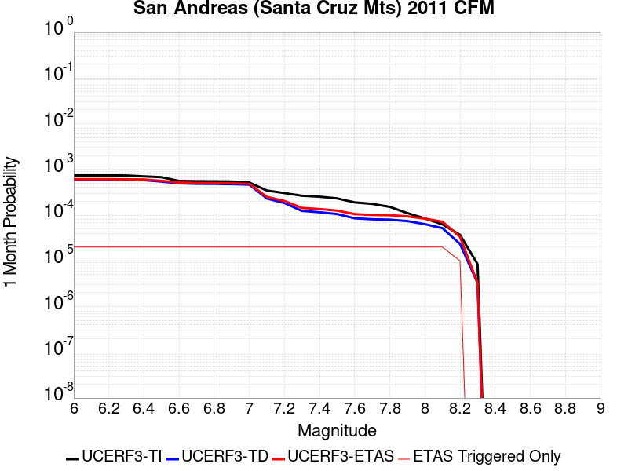 |  |  |

| Magnitude | 1 wk TI Prob | 1 wk TD Prob | 1 wk ETAS Prob | 1 wk ETAS/TD Gain | 1 wk ETAS Triggered Only | 1 mo TI Prob | 1 mo TD Prob | 1 mo ETAS Prob | 1 mo ETAS/TD Gain | 1 mo ETAS Triggered Only | 1 yr TI Prob | 1 yr TD Prob | 1 yr ETAS Prob | 1 yr ETAS/TD Gain | 1 yr ETAS Triggered Only | 10 yr TI Prob | 10 yr TD Prob | 10 yr ETAS Prob | 10 yr ETAS/TD Gain | 10 yr ETAS Triggered Only |
|-----|-----|-----|-----|-----|-----|-----|-----|-----|-----|-----|-----|-----|-----|-----|-----|-----|-----|-----|-----|-----|
| 6.0 | 1.7221631E-4 | 1.3793171E-4 | 1.5607802E-4 | 1.1315602 | 1.814882E-5 | 7.378611E-4 | 5.9100403E-4 | 6.091421E-4 | 1.0306903 | 1.814882E-5 | 0.008946515 | 0.007172124 | 0.0071901428 | 1.0025123 | 1.814882E-5 | 0.08594794 | 0.0705551 | 0.07057197 | 1.0002391 | 1.814882E-5 |
| 6.1 | 1.7221631E-4 | 1.3793171E-4 | 1.5607802E-4 | 1.1315602 | 1.814882E-5 | 7.378611E-4 | 5.9100403E-4 | 6.091421E-4 | 1.0306903 | 1.814882E-5 | 0.008946515 | 0.007172124 | 0.0071901428 | 1.0025123 | 1.814882E-5 | 0.08594794 | 0.0705551 | 0.07057197 | 1.0002391 | 1.814882E-5 |
| 6.2 | 1.7221631E-4 | 1.3793171E-4 | 1.5607802E-4 | 1.1315602 | 1.814882E-5 | 7.378611E-4 | 5.9100403E-4 | 6.091421E-4 | 1.0306903 | 1.814882E-5 | 0.008946515 | 0.007172124 | 0.0071901428 | 1.0025123 | 1.814882E-5 | 0.08594794 | 0.0705551 | 0.07057197 | 1.0002391 | 1.814882E-5 |
| 6.3 | 1.716926E-4 | 1.3712609E-4 | 1.5527241E-4 | 1.1323332 | 1.814882E-5 | 7.3561794E-4 | 5.875529E-4 | 6.0569105E-4 | 1.0308707 | 1.814882E-5 | 0.008919428 | 0.0071303817 | 0.007148401 | 1.0025271 | 1.814882E-5 | 0.08569809 | 0.070167266 | 0.07018414 | 1.0002404 | 1.814882E-5 |
| 6.4 | 1.6392978E-4 | 1.3588481E-4 | 1.5403116E-4 | 1.1335422 | 1.814882E-5 | 7.02367E-4 | 5.822355E-4 | 6.003738E-4 | 1.0311527 | 1.814882E-5 | 0.008517839 | 0.007066063 | 0.0070840837 | 1.0025502 | 1.814882E-5 | 0.08198654 | 0.06940135 | 0.069418244 | 1.0002433 | 1.814882E-5 |
| 6.5 | 1.5742714E-4 | 1.2648388E-4 | 1.446304E-4 | 1.1434691 | 1.814882E-5 | 6.745133E-4 | 5.4196286E-4 | 5.601018E-4 | 1.0334691 | 1.814882E-5 | 0.00818132 | 0.0065787593 | 0.0065967888 | 1.0027405 | 1.814882E-5 | 0.078865945 | 0.06486309 | 0.064880066 | 1.0002617 | 1.814882E-5 |
| 6.6 | 1.3038084E-4 | 1.1588213E-4 | 1.3402884E-4 | 1.1565963 | 1.814882E-5 | 5.5865536E-4 | 4.9654447E-4 | 5.146843E-4 | 1.036532 | 1.814882E-5 | 0.006780438 | 0.0060289134 | 0.0060469527 | 1.0029922 | 1.814882E-5 | 0.0657725 | 0.05932738 | 0.059344452 | 1.0002878 | 1.814882E-5 |
| 6.7 | 1.2867592E-4 | 1.1314701E-4 | 1.3129378E-4 | 1.1603822 | 1.814882E-5 | 5.5135164E-4 | 4.8482692E-4 | 5.029669E-4 | 1.0374155 | 1.814882E-5 | 0.0066920654 | 0.00588703 | 0.005905072 | 1.0030648 | 1.814882E-5 | 0.06494093 | 0.058038417 | 0.058055513 | 1.0002946 | 1.814882E-5 |
| 6.8 | 1.2801298E-4 | 1.1252261E-4 | 1.3066939E-4 | 1.1612723 | 1.814882E-5 | 5.485117E-4 | 4.8215193E-4 | 5.00292E-4 | 1.0376232 | 1.814882E-5 | 0.0066577005 | 0.0058546383 | 0.005872681 | 1.0030818 | 1.814882E-5 | 0.06461738 | 0.057752274 | 0.057769373 | 1.0002961 | 1.814882E-5 |
| 6.9 | 1.269149E-4 | 1.1094465E-4 | 1.2909147E-4 | 1.1635664 | 1.814882E-5 | 5.4380763E-4 | 4.7539172E-4 | 4.9353193E-4 | 1.0381584 | 1.814882E-5 | 0.006600777 | 0.005772772 | 0.0057908157 | 1.0031257 | 1.814882E-5 | 0.06408122 | 0.0570241 | 0.057041213 | 1.0003002 | 1.814882E-5 |
| 7.0 | 1.2030331E-4 | 1.0824504E-4 | 1.263919E-4 | 1.167646 | 1.814882E-5 | 5.154837E-4 | 4.638261E-4 | 4.819665E-4 | 1.0391103 | 1.814882E-5 | 0.006257969 | 0.0056326967 | 0.005650743 | 1.0032039 | 1.814882E-5 | 0.06084648 | 0.055696685 | 0.055713825 | 1.0003077 | 1.814882E-5 |
| 7.1 | 8.049617E-5 | 5.3926604E-5 | 7.207444E-5 | 1.3365285 | 1.814882E-5 | 3.4493793E-4 | 2.3109373E-4 | 2.4923836E-4 | 1.0785164 | 1.814882E-5 | 0.0041915346 | 0.0028099709 | 0.0028280686 | 1.0064405 | 1.814882E-5 | 0.041133516 | 0.029618956 | 0.029636567 | 1.0005946 | 1.814882E-5 |
| 7.2 | 7.093979E-5 | 4.2937932E-5 | 6.108597E-5 | 1.4226576 | 1.814882E-5 | 3.0399222E-4 | 1.8400686E-4 | 2.0215234E-4 | 1.098613 | 1.814882E-5 | 0.0036948253 | 0.0022380045 | 0.0022561126 | 1.0080912 | 1.814882E-5 | 0.03633994 | 0.023941692 | 0.023959406 | 1.0007399 | 1.814882E-5 |
| 7.3 | 6.193693E-5 | 2.8894141E-5 | 4.704244E-5 | 1.628096 | 1.814882E-5 | 2.6541698E-4 | 1.2382616E-4 | 1.4197273E-4 | 1.1465487 | 1.814882E-5 | 0.0032266637 | 0.0015065427 | 0.0015246642 | 1.0120286 | 1.814882E-5 | 0.031802133 | 0.016499156 | 0.016517006 | 1.0010818 | 1.814882E-5 |
| 7.4 | 5.906492E-5 | 2.702346E-5 | 4.517179E-5 | 1.6715769 | 1.814882E-5 | 2.5311083E-4 | 1.1580969E-4 | 1.3395642E-4 | 1.1566943 | 1.814882E-5 | 0.0030772698 | 0.0014090725 | 0.0014271957 | 1.0128618 | 1.814882E-5 | 0.030350044 | 0.015471023 | 0.01548889 | 1.0011549 | 1.814882E-5 |
| 7.5 | 5.424296E-5 | 2.4678277E-5 | 4.2826647E-5 | 1.7353988 | 1.814882E-5 | 2.324491E-4 | 1.05759755E-4 | 1.2390666E-4 | 1.171586 | 1.814882E-5 | 0.002826395 | 0.0012868657 | 0.0013049911 | 1.0140849 | 1.814882E-5 | 0.027907165 | 0.014163188 | 0.014181079 | 1.0012633 | 1.814882E-5 |
| 7.6 | 4.43084E-5 | 1.990431E-5 | 3.805277E-5 | 1.9117854 | 1.814882E-5 | 1.8987931E-4 | 8.53014E-5 | 1.0344867E-4 | 1.2127429 | 1.814882E-5 | 0.0023093296 | 0.0010380499 | 0.00105618 | 1.0174655 | 1.814882E-5 | 0.022854783 | 0.011412679 | 0.011430621 | 1.0015721 | 1.814882E-5 |
| 7.7 | 4.118098E-5 | 1.8936442E-5 | 3.708492E-5 | 1.9583889 | 1.814882E-5 | 1.7647797E-4 | 8.115366E-5 | 9.9301E-5 | 1.2236171 | 1.814882E-5 | 0.002146502 | 9.875982E-4 | 0.0010057291 | 1.0183586 | 1.814882E-5 | 0.021258866 | 0.010870468 | 0.010888419 | 1.0016514 | 1.814882E-5 |
| 7.8 | 3.5408906E-5 | 1.856446E-5 | 3.6712943E-5 | 1.9775928 | 1.814882E-5 | 1.5174363E-4 | 7.955955E-5 | 9.770692E-5 | 1.228098 | 1.814882E-5 | 0.0018459131 | 9.682073E-4 | 9.863386E-4 | 1.0187266 | 1.814882E-5 | 0.018306552 | 0.010652021 | 0.010669976 | 1.0016856 | 1.814882E-5 |
| 7.9 | 2.5860836E-5 | 1.7315993E-5 | 3.5464498E-5 | 2.0480776 | 1.814882E-5 | 1.10827445E-4 | 7.420929E-5 | 9.2356764E-5 | 1.2445445 | 1.814882E-5 | 0.001348489 | 9.031238E-4 | 9.2125626E-4 | 1.0200775 | 1.814882E-5 | 0.013403354 | 0.009907599 | 0.009925568 | 1.0018137 | 1.814882E-5 |
| 8.0 | 1.9777332E-5 | 1.4839596E-5 | 3.2988148E-5 | 2.2229815 | 1.814882E-5 | 8.4757245E-5 | 6.3596715E-5 | 8.174439E-5 | 1.2853553 | 1.814882E-5 | 0.0010314309 | 7.740152E-4 | 7.9215E-4 | 1.0234295 | 1.814882E-5 | 0.010266567 | 0.008508967 | 0.008526962 | 1.0021148 | 1.814882E-5 |
| 8.1 | 1.468494E-5 | 1.2107374E-5 | 3.0255975E-5 | 2.498971 | 1.814882E-5 | 6.293394E-5 | 5.1887713E-5 | 7.003559E-5 | 1.3497529 | 1.814882E-5 | 7.6595135E-4 | 6.3155E-4 | 6.496873E-4 | 1.0287188 | 1.814882E-5 | 0.0076331664 | 0.006969149 | 0.0069871712 | 1.002586 | 1.814882E-5 |
| 8.2 | 8.63836E-6 | 5.469061E-6 | 5.469061E-6 | 1.0 | 0.0 | 3.7021015E-5 | 2.3438623E-5 | 2.3438623E-5 | 1.0 | 0.0 | 4.5063766E-4 | 2.8532793E-4 | 2.8532793E-4 | 1.0 | 0.0 | 0.004497249 | 0.00324569 | 0.00324569 | 1.0 | 0.0 |
| 8.3 | 1.983087E-6 | 7.6599065E-7 | 7.6599065E-7 | 1.0 | 0.0 | 8.498917E-6 | 3.282813E-6 | 3.282813E-6 | 1.0 | 0.0 | 1.034694E-4 | 3.9967534E-5 | 3.9967534E-5 | 1.0 | 0.0 | 0.0010342124 | 4.719687E-4 | 4.719687E-4 | 1.0 | 0.0 |

## Breckenridge 2011
*[(top)](#table-of-contents)*

| 1 Week | 1 Month | 1 Year | 10 Year |
|-----|-----|-----|-----|
|  |  |  |  |

| Magnitude | 1 wk TI Prob | 1 wk TD Prob | 1 wk ETAS Prob | 1 wk ETAS/TD Gain | 1 wk ETAS Triggered Only | 1 mo TI Prob | 1 mo TD Prob | 1 mo ETAS Prob | 1 mo ETAS/TD Gain | 1 mo ETAS Triggered Only | 1 yr TI Prob | 1 yr TD Prob | 1 yr ETAS Prob | 1 yr ETAS/TD Gain | 1 yr ETAS Triggered Only | 10 yr TI Prob | 10 yr TD Prob | 10 yr ETAS Prob | 10 yr ETAS/TD Gain | 10 yr ETAS Triggered Only |
|-----|-----|-----|-----|-----|-----|-----|-----|-----|-----|-----|-----|-----|-----|-----|-----|-----|-----|-----|-----|-----|
| 6.0 | 1.1490393E-6 | 6.7380773E-7 | 6.7380773E-7 | 1.0 | 0.0 | 4.924445E-6 | 2.8877444E-6 | 2.8877444E-6 | 1.0 | 0.0 | 5.995347E-5 | 3.515774E-5 | 5.3305925E-5 | 1.516193 | 1.814882E-5 | 5.9937296E-4 | 3.5152383E-4 | 3.696663E-4 | 1.0516108 | 1.814882E-5 |
| 6.1 | 1.1490393E-6 | 6.7380773E-7 | 6.7380773E-7 | 1.0 | 0.0 | 4.924445E-6 | 2.8877444E-6 | 2.8877444E-6 | 1.0 | 0.0 | 5.995347E-5 | 3.515774E-5 | 5.3305925E-5 | 1.516193 | 1.814882E-5 | 5.9937296E-4 | 3.5152383E-4 | 3.696663E-4 | 1.0516108 | 1.814882E-5 |
| 6.2 | 1.1490393E-6 | 6.7380773E-7 | 6.7380773E-7 | 1.0 | 0.0 | 4.924445E-6 | 2.8877444E-6 | 2.8877444E-6 | 1.0 | 0.0 | 5.995347E-5 | 3.515774E-5 | 5.3305925E-5 | 1.516193 | 1.814882E-5 | 5.9937296E-4 | 3.5152383E-4 | 3.696663E-4 | 1.0516108 | 1.814882E-5 |
| 6.3 | 1.064617E-6 | 5.886475E-7 | 5.886475E-7 | 1.0 | 0.0 | 4.5626366E-6 | 2.5227728E-6 | 2.5227728E-6 | 1.0 | 0.0 | 5.5548684E-5 | 3.0714335E-5 | 4.88626E-5 | 1.5908728 | 1.814882E-5 | 5.55348E-4 | 3.0710208E-4 | 3.2524532E-4 | 1.0590789 | 1.814882E-5 |
| 6.4 | 1.064617E-6 | 5.886475E-7 | 5.886475E-7 | 1.0 | 0.0 | 4.5626366E-6 | 2.5227728E-6 | 2.5227728E-6 | 1.0 | 0.0 | 5.5548684E-5 | 3.0714335E-5 | 4.88626E-5 | 1.5908728 | 1.814882E-5 | 5.55348E-4 | 3.0710208E-4 | 3.2524532E-4 | 1.0590789 | 1.814882E-5 |
| 6.5 | 1.064617E-6 | 5.886475E-7 | 5.886475E-7 | 1.0 | 0.0 | 4.5626366E-6 | 2.5227728E-6 | 2.5227728E-6 | 1.0 | 0.0 | 5.5548684E-5 | 3.0714335E-5 | 4.88626E-5 | 1.5908728 | 1.814882E-5 | 5.55348E-4 | 3.0710208E-4 | 3.2524532E-4 | 1.0590789 | 1.814882E-5 |
| 6.6 | 1.064617E-6 | 5.886475E-7 | 5.886475E-7 | 1.0 | 0.0 | 4.5626366E-6 | 2.5227728E-6 | 2.5227728E-6 | 1.0 | 0.0 | 5.5548684E-5 | 3.0714335E-5 | 4.88626E-5 | 1.5908728 | 1.814882E-5 | 5.55348E-4 | 3.0710208E-4 | 3.2524532E-4 | 1.0590789 | 1.814882E-5 |
| 6.7 | 9.4219524E-7 | 4.954078E-7 | 4.954078E-7 | 1.0 | 0.0 | 4.037973E-6 | 2.1231745E-6 | 2.1231745E-6 | 1.0 | 0.0 | 4.916122E-5 | 2.5849351E-5 | 4.39977E-5 | 1.7020816 | 1.814882E-5 | 4.9150345E-4 | 2.5846408E-4 | 2.7660822E-4 | 1.0701998 | 1.814882E-5 |
| 6.8 | 8.556422E-7 | 4.311975E-7 | 4.311975E-7 | 1.0 | 0.0 | 3.667033E-6 | 1.847988E-6 | 1.847988E-6 | 1.0 | 0.0 | 4.464521E-5 | 2.2499025E-5 | 4.0647436E-5 | 1.8066311 | 1.814882E-5 | 4.4636242E-4 | 2.2496787E-4 | 2.431126E-4 | 1.0806547 | 1.814882E-5 |
| 6.9 | 7.7357794E-7 | 3.8420345E-7 | 3.8420345E-7 | 1.0 | 0.0 | 3.3153299E-6 | 1.6465851E-6 | 1.6465851E-6 | 1.0 | 0.0 | 4.0363393E-5 | 2.0046993E-5 | 3.819545E-5 | 1.9052957 | 1.814882E-5 | 4.035606E-4 | 2.0045215E-4 | 2.1859734E-4 | 1.0905212 | 1.814882E-5 |
| 7.0 | 6.8172454E-7 | 3.3471417E-7 | 3.3471417E-7 | 1.0 | 0.0 | 2.9216735E-6 | 1.4344886E-6 | 1.4344886E-6 | 1.0 | 0.0 | 3.5570793E-5 | 1.7464761E-5 | 3.5613262E-5 | 2.0391498 | 1.814882E-5 | 3.55651E-4 | 1.746341E-4 | 1.9277976E-4 | 1.1039066 | 1.814882E-5 |
| 7.1 | 5.5936397E-7 | 2.890966E-7 | 2.890966E-7 | 1.0 | 0.0 | 2.397272E-6 | 1.2389849E-6 | 1.2389849E-6 | 1.0 | 0.0 | 2.9186394E-5 | 1.5084538E-5 | 3.3233086E-5 | 2.2031224 | 1.814882E-5 | 2.9182562E-4 | 1.5083532E-4 | 1.6898141E-4 | 1.120304 | 1.814882E-5 |
| 7.2 | 3.8420822E-7 | 2.0468339E-7 | 2.0468339E-7 | 1.0 | 0.0 | 1.6466057E-6 | 8.7721423E-7 | 8.7721423E-7 | 1.0 | 0.0 | 2.004724E-5 | 1.0680032E-5 | 2.882866E-5 | 2.6993046 | 1.814882E-5 | 2.004543E-4 | 1.0679527E-4 | 1.2494215E-4 | 1.1699221 | 1.814882E-5 |
| 7.3 | 2.6405158E-7 | 1.647323E-7 | 1.647323E-7 | 1.0 | 0.0 | 1.1316491E-6 | 7.059954E-7 | 7.059954E-7 | 1.0 | 0.0 | 1.37777415E-5 | 8.595461E-6 | 2.6744125E-5 | 3.1114244 | 1.814882E-5 | 1.3776887E-4 | 8.5951346E-5 | 1.040986E-4 | 1.2111341 | 1.814882E-5 |
| 7.4 | 1.792114E-7 | 1.2725314E-7 | 1.2725314E-7 | 1.0 | 0.0 | 7.6804866E-7 | 5.4537054E-7 | 5.4537054E-7 | 1.0 | 0.0 | 9.3509525E-6 | 6.6398666E-6 | 2.4788565E-5 | 3.7332928 | 1.814882E-5 | 9.350559E-5 | 6.639673E-5 | 8.454434E-5 | 1.2733209 | 1.814882E-5 |
| 7.5 | 1.3548703E-7 | 9.3854034E-8 | 9.3854034E-8 | 1.0 | 0.0 | 5.8065854E-7 | 4.022315E-7 | 4.022315E-7 | 1.0 | 0.0 | 7.0694946E-6 | 4.897158E-6 | 2.304589E-5 | 4.705972 | 1.814882E-5 | 7.0692695E-5 | 4.8970534E-5 | 6.711847E-5 | 1.3705888 | 1.814882E-5 |
| 7.6 | 2.572245E-8 | 1.7352555E-8 | 1.7352555E-8 | 1.0 | 0.0 | 1.10239064E-7 | 7.436809E-8 | 7.436809E-8 | 1.0 | 0.0 | 1.3421597E-6 | 9.054312E-7 | 9.054312E-7 | 1.0 | 0.0 | 1.3421517E-5 | 9.05428E-6 | 9.05428E-6 | 1.0 | 0.0 |

## Great Valley 07 (Orestimba)
*[(top)](#table-of-contents)*

| 1 Week | 1 Month | 1 Year | 10 Year |
|-----|-----|-----|-----|
|  |  |  |  |

| Magnitude | 1 wk TI Prob | 1 wk TD Prob | 1 wk ETAS Prob | 1 wk ETAS/TD Gain | 1 wk ETAS Triggered Only | 1 mo TI Prob | 1 mo TD Prob | 1 mo ETAS Prob | 1 mo ETAS/TD Gain | 1 mo ETAS Triggered Only | 1 yr TI Prob | 1 yr TD Prob | 1 yr ETAS Prob | 1 yr ETAS/TD Gain | 1 yr ETAS Triggered Only | 10 yr TI Prob | 10 yr TD Prob | 10 yr ETAS Prob | 10 yr ETAS/TD Gain | 10 yr ETAS Triggered Only |
|-----|-----|-----|-----|-----|-----|-----|-----|-----|-----|-----|-----|-----|-----|-----|-----|-----|-----|-----|-----|-----|
| 6.0 | 2.9687902E-5 | 3.27575E-5 | 3.27575E-5 | 1.0 | 0.0 | 1.2722766E-4 | 1.4038214E-4 | 1.4038214E-4 | 1.0 | 0.0 | 0.0015478961 | 0.0017078844 | 0.0017260022 | 1.0106083 | 1.814882E-5 | 0.015371585 | 0.016955135 | 0.016972978 | 1.0010523 | 1.814882E-5 |
| 6.1 | 2.9687902E-5 | 3.27575E-5 | 3.27575E-5 | 1.0 | 0.0 | 1.2722766E-4 | 1.4038214E-4 | 1.4038214E-4 | 1.0 | 0.0 | 0.0015478961 | 0.0017078844 | 0.0017078844 | 1.0 | 0.0 | 0.015371585 | 0.016955135 | 0.016955135 | 1.0 | 0.0 |
| 6.2 | 1.9231524E-5 | 2.1159167E-5 | 2.1159167E-5 | 1.0 | 0.0 | 8.2418206E-5 | 9.067912E-5 | 9.067912E-5 | 1.0 | 0.0 | 0.0010029797 | 0.0011034822 | 0.0011034822 | 1.0 | 0.0 | 0.00998465 | 0.01098244 | 0.01098244 | 1.0 | 0.0 |
| 6.3 | 1.324766E-5 | 1.4548534E-5 | 1.4548534E-5 | 1.0 | 0.0 | 5.6774446E-5 | 6.234942E-5 | 6.234942E-5 | 1.0 | 0.0 | 6.910097E-4 | 7.5884897E-4 | 7.5884897E-4 | 1.0 | 0.0 | 0.006888649 | 0.0075635235 | 0.0075635235 | 1.0 | 0.0 |
| 6.4 | 7.818645E-6 | 8.57284E-6 | 8.57284E-6 | 1.0 | 0.0 | 3.3508048E-5 | 3.6740246E-5 | 3.6740246E-5 | 1.0 | 0.0 | 4.078841E-4 | 4.4722404E-4 | 4.4722404E-4 | 1.0 | 0.0 | 0.004071363 | 0.0044635804 | 0.0044635804 | 1.0 | 0.0 |
| 6.5 | 5.3076565E-6 | 5.8178007E-6 | 5.8178007E-6 | 1.0 | 0.0 | 2.27469E-5 | 2.4933206E-5 | 2.4933206E-5 | 1.0 | 0.0 | 2.7690834E-4 | 3.035216E-4 | 3.035216E-4 | 1.0 | 0.0 | 0.0027656353 | 0.00303128 | 0.00303128 | 1.0 | 0.0 |
| 6.6 | 3.6003578E-6 | 3.9484953E-6 | 3.9484953E-6 | 1.0 | 0.0 | 1.5430012E-5 | 1.6922022E-5 | 1.6922022E-5 | 1.0 | 0.0 | 1.8784421E-4 | 2.0600771E-4 | 2.0600771E-4 | 1.0 | 0.0 | 0.0018768552 | 0.0020583214 | 0.0020583214 | 1.0 | 0.0 |
| 6.7 | 2.5361826E-6 | 2.7834678E-6 | 2.7834678E-6 | 1.0 | 0.0 | 1.0869308E-5 | 1.1929101E-5 | 1.1929101E-5 | 1.0 | 0.0 | 1.3232579E-4 | 1.4522845E-4 | 1.4522845E-4 | 1.0 | 0.0 | 0.0013224703 | 0.0014514653 | 0.0014514653 | 1.0 | 0.0 |
| 6.8 | 1.2115831E-6 | 1.3313797E-6 | 1.3313797E-6 | 1.0 | 0.0 | 5.1924885E-6 | 5.7059065E-6 | 5.7059065E-6 | 1.0 | 0.0 | 6.3216714E-5 | 6.9468166E-5 | 6.9468166E-5 | 1.0 | 0.0 | 6.3198735E-4 | 6.945596E-4 | 6.945596E-4 | 1.0 | 0.0 |

## Great Valley 06 (Midland) 2011 CFM alt1
*[(top)](#table-of-contents)*

| 1 Week | 1 Month | 1 Year | 10 Year |
|-----|-----|-----|-----|
| 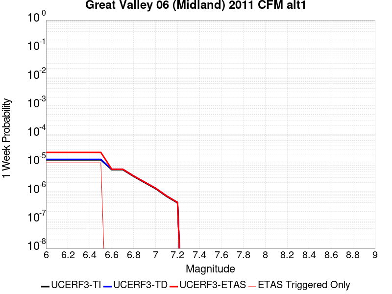 |  |  |  |

| Magnitude | 1 wk TI Prob | 1 wk TD Prob | 1 wk ETAS Prob | 1 wk ETAS/TD Gain | 1 wk ETAS Triggered Only | 1 mo TI Prob | 1 mo TD Prob | 1 mo ETAS Prob | 1 mo ETAS/TD Gain | 1 mo ETAS Triggered Only | 1 yr TI Prob | 1 yr TD Prob | 1 yr ETAS Prob | 1 yr ETAS/TD Gain | 1 yr ETAS Triggered Only | 10 yr TI Prob | 10 yr TD Prob | 10 yr ETAS Prob | 10 yr ETAS/TD Gain | 10 yr ETAS Triggered Only |
|-----|-----|-----|-----|-----|-----|-----|-----|-----|-----|-----|-----|-----|-----|-----|-----|-----|-----|-----|-----|-----|
| 6.0 | 1.2712525E-5 | 1.3210576E-5 | 1.3210576E-5 | 1.0 | 0.0 | 5.4481112E-5 | 5.6615667E-5 | 5.6615667E-5 | 1.0 | 0.0 | 6.6310563E-4 | 6.8910315E-4 | 7.0723944E-4 | 1.0263187 | 1.814882E-5 | 0.0066113044 | 0.006872179 | 0.006890203 | 1.0026227 | 1.814882E-5 |
| 6.1 | 1.2712525E-5 | 1.3210576E-5 | 1.3210576E-5 | 1.0 | 0.0 | 5.4481112E-5 | 5.6615667E-5 | 5.6615667E-5 | 1.0 | 0.0 | 6.6310563E-4 | 6.8910315E-4 | 7.0723944E-4 | 1.0263187 | 1.814882E-5 | 0.0066113044 | 0.006872179 | 0.006890203 | 1.0026227 | 1.814882E-5 |
| 6.2 | 1.2712525E-5 | 1.3210576E-5 | 1.3210576E-5 | 1.0 | 0.0 | 5.4481112E-5 | 5.6615667E-5 | 5.6615667E-5 | 1.0 | 0.0 | 6.6310563E-4 | 6.8910315E-4 | 7.0723944E-4 | 1.0263187 | 1.814882E-5 | 0.0066113044 | 0.006872179 | 0.006890203 | 1.0026227 | 1.814882E-5 |
| 6.3 | 1.2712525E-5 | 1.3210576E-5 | 1.3210576E-5 | 1.0 | 0.0 | 5.4481112E-5 | 5.6615667E-5 | 5.6615667E-5 | 1.0 | 0.0 | 6.6310563E-4 | 6.8910315E-4 | 7.0723944E-4 | 1.0263187 | 1.814882E-5 | 0.0066113044 | 0.006872179 | 0.006890203 | 1.0026227 | 1.814882E-5 |
| 6.4 | 1.2712525E-5 | 1.3210576E-5 | 1.3210576E-5 | 1.0 | 0.0 | 5.4481112E-5 | 5.6615667E-5 | 5.6615667E-5 | 1.0 | 0.0 | 6.6310563E-4 | 6.8910315E-4 | 7.0723944E-4 | 1.0263187 | 1.814882E-5 | 0.0066113044 | 0.006872179 | 0.006890203 | 1.0026227 | 1.814882E-5 |
| 6.5 | 1.2712525E-5 | 1.3210576E-5 | 1.3210576E-5 | 1.0 | 0.0 | 5.4481112E-5 | 5.6615667E-5 | 5.6615667E-5 | 1.0 | 0.0 | 6.6310563E-4 | 6.8910315E-4 | 7.0723944E-4 | 1.0263187 | 1.814882E-5 | 0.0066113044 | 0.006872179 | 0.006890203 | 1.0026227 | 1.814882E-5 |
| 6.6 | 5.7574384E-6 | 5.9706463E-6 | 5.9706463E-6 | 1.0 | 0.0 | 2.4674504E-5 | 2.5588255E-5 | 2.5588255E-5 | 1.0 | 0.0 | 3.0037065E-4 | 3.1149638E-4 | 3.2963956E-4 | 1.0582452 | 1.814882E-5 | 0.0029996498 | 0.0031109843 | 0.0031290767 | 1.0058156 | 1.814882E-5 |
| 6.7 | 5.7574384E-6 | 5.9706463E-6 | 5.9706463E-6 | 1.0 | 0.0 | 2.4674504E-5 | 2.5588255E-5 | 2.5588255E-5 | 1.0 | 0.0 | 3.0037065E-4 | 3.1149638E-4 | 3.2963956E-4 | 1.0582452 | 1.814882E-5 | 0.0029996498 | 0.0031109843 | 0.0031290767 | 1.0058156 | 1.814882E-5 |
| 6.8 | 3.3474828E-6 | 3.4693849E-6 | 3.4693849E-6 | 1.0 | 0.0 | 1.4346277E-5 | 1.4868716E-5 | 1.4868716E-5 | 1.0 | 0.0 | 1.7465191E-4 | 1.8101306E-4 | 1.8101306E-4 | 1.0 | 0.0 | 0.0017451472 | 0.0018088033 | 0.0018088033 | 1.0 | 0.0 |
| 6.9 | 2.035106E-6 | 2.1090357E-6 | 2.1090357E-6 | 1.0 | 0.0 | 8.721853E-6 | 9.038697E-6 | 9.038697E-6 | 1.0 | 0.0 | 1.0618339E-4 | 1.10041314E-4 | 1.10041314E-4 | 1.0 | 0.0 | 0.0010613267 | 0.0010999405 | 0.0010999405 | 1.0 | 0.0 |
| 7.0 | 1.2424716E-6 | 1.2878762E-6 | 1.2878762E-6 | 1.0 | 0.0 | 5.3248673E-6 | 5.51946E-6 | 5.51946E-6 | 1.0 | 0.0 | 6.482833E-5 | 6.7197805E-5 | 6.7197805E-5 | 1.0 | 0.0 | 6.480942E-4 | 6.718192E-4 | 6.718192E-4 | 1.0 | 0.0 |
| 7.1 | 6.6904556E-7 | 6.939035E-7 | 6.939035E-7 | 1.0 | 0.0 | 2.867335E-6 | 2.97387E-6 | 2.97387E-6 | 1.0 | 0.0 | 3.4909244E-5 | 3.6206526E-5 | 3.6206526E-5 | 1.0 | 0.0 | 3.490376E-4 | 3.6203177E-4 | 3.6203177E-4 | 1.0 | 0.0 |
| 7.2 | 3.948168E-7 | 4.095705E-7 | 4.095705E-7 | 1.0 | 0.0 | 1.6920709E-6 | 1.7553022E-6 | 1.7553022E-6 | 1.0 | 0.0 | 2.0600768E-5 | 2.1370803E-5 | 2.1370803E-5 | 1.0 | 0.0 | 2.0598859E-4 | 2.1370803E-4 | 2.1370803E-4 | 1.0 | 0.0 |

## Carlsbad
*[(top)](#table-of-contents)*

| 1 Week | 1 Month | 1 Year | 10 Year |
|-----|-----|-----|-----|
|  |  |  |  |

| Magnitude | 1 wk TI Prob | 1 wk TD Prob | 1 wk ETAS Prob | 1 wk ETAS/TD Gain | 1 wk ETAS Triggered Only | 1 mo TI Prob | 1 mo TD Prob | 1 mo ETAS Prob | 1 mo ETAS/TD Gain | 1 mo ETAS Triggered Only | 1 yr TI Prob | 1 yr TD Prob | 1 yr ETAS Prob | 1 yr ETAS/TD Gain | 1 yr ETAS Triggered Only | 10 yr TI Prob | 10 yr TD Prob | 10 yr ETAS Prob | 10 yr ETAS/TD Gain | 10 yr ETAS Triggered Only |
|-----|-----|-----|-----|-----|-----|-----|-----|-----|-----|-----|-----|-----|-----|-----|-----|-----|-----|-----|-----|-----|
| 6.0 | 4.9038536E-6 | 4.9872565E-6 | 2.3135986E-5 | 4.639021 | 1.814882E-5 | 2.1016345E-5 | 2.1373784E-5 | 3.9522216E-5 | 1.8490978 | 1.814882E-5 | 2.5584397E-4 | 2.601952E-4 | 2.7833928E-4 | 1.0697327 | 1.814882E-5 | 0.002555496 | 0.0025989525 | 0.0026170542 | 1.0069649 | 1.814882E-5 |
| 6.1 | 4.9038536E-6 | 4.9872565E-6 | 2.3135986E-5 | 4.639021 | 1.814882E-5 | 2.1016345E-5 | 2.1373784E-5 | 3.9522216E-5 | 1.8490978 | 1.814882E-5 | 2.5584397E-4 | 2.601952E-4 | 2.7833928E-4 | 1.0697327 | 1.814882E-5 | 0.002555496 | 0.0025989525 | 0.0026170542 | 1.0069649 | 1.814882E-5 |
| 6.2 | 4.3820614E-6 | 4.4547687E-6 | 2.2603508E-5 | 5.0740027 | 1.814882E-5 | 1.8780129E-5 | 1.9091729E-5 | 3.7240203E-5 | 1.9505936 | 1.814882E-5 | 2.2862408E-4 | 2.3241735E-4 | 2.5056195E-4 | 1.0780691 | 1.814882E-5 | 0.00228389 | 0.0023217786 | 0.002339885 | 1.0077987 | 1.814882E-5 |
| 6.3 | 4.302872E-6 | 4.373006E-6 | 2.2521746E-5 | 5.150175 | 1.814882E-5 | 1.8440749E-5 | 1.8741322E-5 | 3.6889804E-5 | 1.9683671 | 1.814882E-5 | 2.24493E-4 | 2.2815206E-4 | 2.4629675E-4 | 1.0795289 | 1.814882E-5 | 0.0022426634 | 0.0022792136 | 0.002297321 | 1.0079446 | 1.814882E-5 |
| 6.4 | 4.0835243E-6 | 4.1476546E-6 | 2.2296399E-5 | 5.3756647 | 1.814882E-5 | 1.75007E-5 | 1.7775543E-5 | 3.592404E-5 | 2.0209813 | 1.814882E-5 | 2.1305021E-4 | 2.1639607E-4 | 2.3454097E-4 | 1.0838504 | 1.814882E-5 | 0.0021284607 | 0.0021618877 | 0.0021799973 | 1.0083767 | 1.814882E-5 |
| 6.5 | 3.987806E-6 | 4.0488867E-6 | 2.2197633E-5 | 5.482404 | 1.814882E-5 | 1.7090486E-5 | 1.7352257E-5 | 3.550076E-5 | 2.0458872 | 1.814882E-5 | 2.080568E-4 | 2.1124359E-4 | 2.2938858E-4 | 1.085896 | 1.814882E-5 | 0.002078621 | 0.0021104617 | 0.0021285722 | 1.0085813 | 1.814882E-5 |
| 6.6 | 3.8707576E-6 | 3.927488E-6 | 2.2076238E-5 | 5.620956 | 1.814882E-5 | 1.6588854E-5 | 1.6831984E-5 | 3.4980498E-5 | 2.078216 | 1.814882E-5 | 2.0195059E-4 | 2.0491047E-4 | 2.2305557E-4 | 1.0885514 | 1.814882E-5 | 0.0020176715 | 0.0020472489 | 0.0020653605 | 1.0088469 | 1.814882E-5 |
| 6.7 | 3.3093434E-6 | 3.3423917E-6 | 2.149115E-5 | 6.4298725 | 1.814882E-5 | 1.4182823E-5 | 1.4324457E-5 | 3.2473017E-5 | 2.2669632 | 1.814882E-5 | 1.7266218E-4 | 1.7438637E-4 | 1.9253202E-4 | 1.1040543 | 1.814882E-5 | 0.001725281 | 0.0017425013 | 0.0017606185 | 1.0103972 | 1.814882E-5 |
| 6.8 | 3.136983E-6 | 3.1664536E-6 | 3.1664536E-6 | 1.0 | 0.0 | 1.3444143E-5 | 1.3570445E-5 | 1.3570445E-5 | 1.0 | 0.0 | 1.6367015E-4 | 1.6520769E-4 | 1.6520769E-4 | 1.0 | 0.0 | 0.0016354966 | 0.0016508545 | 0.0016508545 | 1.0 | 0.0 |
| 6.9 | 2.9056644E-6 | 2.9267585E-6 | 2.9267585E-6 | 1.0 | 0.0 | 1.2452788E-5 | 1.2543191E-5 | 1.2543191E-5 | 1.0 | 0.0 | 1.5160214E-4 | 1.5270269E-4 | 1.5270269E-4 | 1.0 | 0.0 | 0.0015149876 | 0.001525983 | 0.001525983 | 1.0 | 0.0 |
| 7.0 | 2.5071035E-6 | 2.5113977E-6 | 2.5113977E-6 | 1.0 | 0.0 | 1.0744685E-5 | 1.07630885E-5 | 1.07630885E-5 | 1.0 | 0.0 | 1.308087E-4 | 1.3103275E-4 | 1.3103275E-4 | 1.0 | 0.0 | 0.0013073172 | 0.0013095582 | 0.0013095582 | 1.0 | 0.0 |
| 7.1 | 2.1786877E-6 | 2.1678832E-6 | 2.1678832E-6 | 1.0 | 0.0 | 9.3372E-6 | 9.290896E-6 | 9.290896E-6 | 1.0 | 0.0 | 1.13674476E-4 | 1.1311081E-4 | 1.1311081E-4 | 1.0 | 0.0 | 0.0011361635 | 0.0011305353 | 0.0011305353 | 1.0 | 0.0 |
| 7.2 | 1.6628418E-6 | 1.6213872E-6 | 1.6213872E-6 | 1.0 | 0.0 | 7.1264453E-6 | 6.948784E-6 | 6.948784E-6 | 1.0 | 0.0 | 8.676102E-5 | 8.4598185E-5 | 8.4598185E-5 | 1.0 | 0.0 | 8.672715E-4 | 8.45662E-4 | 8.45662E-4 | 1.0 | 0.0 |
| 7.3 | 1.0595926E-6 | 9.816804E-7 | 9.816804E-7 | 1.0 | 0.0 | 4.541103E-6 | 4.2071947E-6 | 4.2071947E-6 | 1.0 | 0.0 | 5.5286528E-5 | 5.1221403E-5 | 5.1221403E-5 | 1.0 | 0.0 | 5.527277E-4 | 5.1209686E-4 | 5.1209686E-4 | 1.0 | 0.0 |
| 7.4 | 7.956623E-7 | 7.1737975E-7 | 7.1737975E-7 | 1.0 | 0.0 | 3.4099767E-6 | 3.074481E-6 | 3.074481E-6 | 1.0 | 0.0 | 4.1515676E-5 | 3.743117E-5 | 3.743117E-5 | 1.0 | 0.0 | 4.150792E-4 | 3.7424936E-4 | 3.7424936E-4 | 1.0 | 0.0 |
| 7.5 | 5.1043804E-7 | 4.4483627E-7 | 4.4483627E-7 | 1.0 | 0.0 | 2.1875896E-6 | 1.9064398E-6 | 1.9064398E-6 | 1.0 | 0.0 | 2.663358E-5 | 2.3210663E-5 | 2.3210663E-5 | 1.0 | 0.0 | 2.6630386E-4 | 2.3208297E-4 | 2.3208297E-4 | 1.0 | 0.0 |
| 7.6 | 2.3723294E-7 | 1.989569E-7 | 1.989569E-7 | 1.0 | 0.0 | 1.0167122E-6 | 8.5267214E-7 | 8.5267214E-7 | 1.0 | 0.0 | 1.2378401E-5 | 1.0381237E-5 | 1.0381237E-5 | 1.0 | 0.0 | 1.237771E-4 | 1.038078E-4 | 1.038078E-4 | 1.0 | 0.0 |
| 7.7 | 1.9992152E-8 | 9.8601785E-9 | 9.8601785E-9 | 1.0 | 0.0 | 8.568065E-8 | 4.225791E-8 | 4.225791E-8 | 1.0 | 0.0 | 1.0431614E-6 | 5.1449E-7 | 5.1449E-7 | 1.0 | 0.0 | 1.0431565E-5 | 5.1449E-6 | 5.1449E-6 | 1.0 | 0.0 |

## Channel Islands Western Deep Ramp
*[(top)](#table-of-contents)*

| 1 Week | 1 Month | 1 Year | 10 Year |
|-----|-----|-----|-----|
|  | 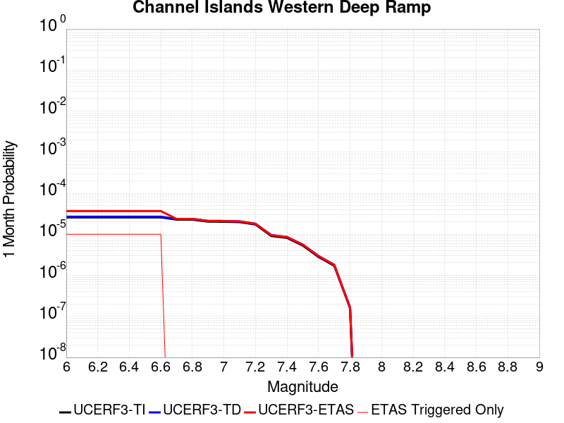 |  |  |

| Magnitude | 1 wk TI Prob | 1 wk TD Prob | 1 wk ETAS Prob | 1 wk ETAS/TD Gain | 1 wk ETAS Triggered Only | 1 mo TI Prob | 1 mo TD Prob | 1 mo ETAS Prob | 1 mo ETAS/TD Gain | 1 mo ETAS Triggered Only | 1 yr TI Prob | 1 yr TD Prob | 1 yr ETAS Prob | 1 yr ETAS/TD Gain | 1 yr ETAS Triggered Only | 10 yr TI Prob | 10 yr TD Prob | 10 yr ETAS Prob | 10 yr ETAS/TD Gain | 10 yr ETAS Triggered Only |
|-----|-----|-----|-----|-----|-----|-----|-----|-----|-----|-----|-----|-----|-----|-----|-----|-----|-----|-----|-----|-----|
| 6.0 | 6.0213506E-6 | 6.2548684E-6 | 2.4403575E-5 | 3.901533 | 1.814882E-5 | 2.5805533E-5 | 2.6806329E-5 | 4.495466E-5 | 1.6770167 | 1.814882E-5 | 3.1413708E-4 | 3.2632265E-4 | 3.4446554E-4 | 1.055598 | 1.814882E-5 | 0.0031369338 | 0.0032588763 | 0.003276966 | 1.0055509 | 1.814882E-5 |
| 6.1 | 6.0213506E-6 | 6.2548684E-6 | 2.4403575E-5 | 3.901533 | 1.814882E-5 | 2.5805533E-5 | 2.6806329E-5 | 4.495466E-5 | 1.6770167 | 1.814882E-5 | 3.1413708E-4 | 3.2632265E-4 | 3.4446554E-4 | 1.055598 | 1.814882E-5 | 0.0031369338 | 0.0032588763 | 0.003276966 | 1.0055509 | 1.814882E-5 |
| 6.2 | 6.0213506E-6 | 6.2548684E-6 | 2.4403575E-5 | 3.901533 | 1.814882E-5 | 2.5805533E-5 | 2.6806329E-5 | 4.495466E-5 | 1.6770167 | 1.814882E-5 | 3.1413708E-4 | 3.2632265E-4 | 3.4446554E-4 | 1.055598 | 1.814882E-5 | 0.0031369338 | 0.0032588763 | 0.003276966 | 1.0055509 | 1.814882E-5 |
| 6.3 | 6.0213506E-6 | 6.2548684E-6 | 2.4403575E-5 | 3.901533 | 1.814882E-5 | 2.5805533E-5 | 2.6806329E-5 | 4.495466E-5 | 1.6770167 | 1.814882E-5 | 3.1413708E-4 | 3.2632265E-4 | 3.4446554E-4 | 1.055598 | 1.814882E-5 | 0.0031369338 | 0.0032588763 | 0.003276966 | 1.0055509 | 1.814882E-5 |
| 6.4 | 6.0213506E-6 | 6.2548684E-6 | 2.4403575E-5 | 3.901533 | 1.814882E-5 | 2.5805533E-5 | 2.6806329E-5 | 4.495466E-5 | 1.6770167 | 1.814882E-5 | 3.1413708E-4 | 3.2632265E-4 | 3.4446554E-4 | 1.055598 | 1.814882E-5 | 0.0031369338 | 0.0032588763 | 0.003276966 | 1.0055509 | 1.814882E-5 |
| 6.5 | 6.0213506E-6 | 6.2548684E-6 | 2.4403575E-5 | 3.901533 | 1.814882E-5 | 2.5805533E-5 | 2.6806329E-5 | 4.495466E-5 | 1.6770167 | 1.814882E-5 | 3.1413708E-4 | 3.2632265E-4 | 3.4446554E-4 | 1.055598 | 1.814882E-5 | 0.0031369338 | 0.0032588763 | 0.003276966 | 1.0055509 | 1.814882E-5 |
| 6.6 | 6.0213506E-6 | 6.2548684E-6 | 2.4403575E-5 | 3.901533 | 1.814882E-5 | 2.5805533E-5 | 2.6806329E-5 | 4.495466E-5 | 1.6770167 | 1.814882E-5 | 3.1413708E-4 | 3.2632265E-4 | 3.4446554E-4 | 1.055598 | 1.814882E-5 | 0.0031369338 | 0.0032588763 | 0.003276966 | 1.0055509 | 1.814882E-5 |
| 6.7 | 5.313309E-6 | 5.5252403E-6 | 5.5252403E-6 | 1.0 | 0.0 | 2.2771126E-5 | 2.367941E-5 | 2.367941E-5 | 1.0 | 0.0 | 2.772032E-4 | 2.8826276E-4 | 2.8826276E-4 | 1.0 | 0.0 | 0.0027685766 | 0.0028792918 | 0.0028792918 | 1.0 | 0.0 |
| 6.8 | 5.313309E-6 | 5.5252403E-6 | 5.5252403E-6 | 1.0 | 0.0 | 2.2771126E-5 | 2.367941E-5 | 2.367941E-5 | 1.0 | 0.0 | 2.772032E-4 | 2.8826276E-4 | 2.8826276E-4 | 1.0 | 0.0 | 0.0027685766 | 0.0028792918 | 0.0028792918 | 1.0 | 0.0 |
| 6.9 | 4.744377E-6 | 4.9394303E-6 | 4.9394303E-6 | 1.0 | 0.0 | 2.0332885E-5 | 2.1168837E-5 | 2.1168837E-5 | 1.0 | 0.0 | 2.4752476E-4 | 2.5770385E-4 | 2.5770385E-4 | 1.0 | 0.0 | 0.0024724922 | 0.0025744175 | 0.0025744175 | 1.0 | 0.0 |
| 7.0 | 4.722209E-6 | 4.9164732E-6 | 4.9164732E-6 | 1.0 | 0.0 | 2.0237881E-5 | 2.107045E-5 | 2.107045E-5 | 1.0 | 0.0 | 2.4636835E-4 | 2.5650626E-4 | 2.5650626E-4 | 1.0 | 0.0 | 0.002460954 | 0.0025624693 | 0.0025624693 | 1.0 | 0.0 |
| 7.1 | 4.611174E-6 | 4.801409E-6 | 4.801409E-6 | 1.0 | 0.0 | 1.9762025E-5 | 2.0577325E-5 | 2.0577325E-5 | 1.0 | 0.0 | 2.4057609E-4 | 2.5050386E-4 | 2.5050386E-4 | 1.0 | 0.0 | 0.002403158 | 0.002502582 | 0.002502582 | 1.0 | 0.0 |
| 7.2 | 4.043994E-6 | 4.2120264E-6 | 4.2120264E-6 | 1.0 | 0.0 | 1.7331287E-5 | 1.8051438E-5 | 1.8051438E-5 | 1.0 | 0.0 | 2.10988E-4 | 2.1975765E-4 | 2.1975765E-4 | 1.0 | 0.0 | 0.002107878 | 0.0021957543 | 0.0021957543 | 1.0 | 0.0 |
| 7.3 | 2.1233036E-6 | 2.2297875E-6 | 2.2297875E-6 | 1.0 | 0.0 | 9.099841E-6 | 9.556197E-6 | 9.556197E-6 | 1.0 | 0.0 | 1.1078493E-4 | 1.1634055E-4 | 1.1634055E-4 | 1.0 | 0.0 | 0.0011072971 | 0.001162802 | 0.001162802 | 1.0 | 0.0 |
| 7.4 | 1.9051884E-6 | 2.0014973E-6 | 2.0014973E-6 | 1.0 | 0.0 | 8.165067E-6 | 8.577817E-6 | 8.577817E-6 | 1.0 | 0.0 | 9.940516E-5 | 1.0442998E-4 | 1.0442998E-4 | 1.0 | 0.0 | 9.93607E-4 | 0.0010438144 | 0.0010438144 | 1.0 | 0.0 |
| 7.5 | 1.2408497E-6 | 1.3038839E-6 | 1.3038839E-6 | 1.0 | 0.0 | 5.317916E-6 | 5.588062E-6 | 5.588062E-6 | 1.0 | 0.0 | 6.4743705E-5 | 6.8032554E-5 | 6.8032554E-5 | 1.0 | 0.0 | 6.4724847E-4 | 6.8011944E-4 | 6.8011944E-4 | 1.0 | 0.0 |
| 7.6 | 6.5440025E-7 | 6.886718E-7 | 6.886718E-7 | 1.0 | 0.0 | 2.8045695E-6 | 2.9514472E-6 | 2.9514472E-6 | 1.0 | 0.0 | 3.4145098E-5 | 3.593329E-5 | 3.593329E-5 | 1.0 | 0.0 | 3.4139853E-4 | 3.5927625E-4 | 3.5927625E-4 | 1.0 | 0.0 |
| 7.7 | 3.985963E-7 | 4.1930787E-7 | 4.1930787E-7 | 1.0 | 0.0 | 1.7082689E-6 | 1.7970326E-6 | 1.7970326E-6 | 1.0 | 0.0 | 2.0797976E-5 | 2.1878664E-5 | 2.1878664E-5 | 1.0 | 0.0 | 2.0796029E-4 | 2.1876628E-4 | 2.1876628E-4 | 1.0 | 0.0 |
| 7.8 | 3.706329E-8 | 3.8591796E-8 | 3.8591796E-8 | 1.0 | 0.0 | 1.5884267E-7 | 1.653934E-7 | 1.653934E-7 | 1.0 | 0.0 | 1.9339077E-6 | 2.0136629E-6 | 2.0136629E-6 | 1.0 | 0.0 | 1.933891E-5 | 2.0136458E-5 | 2.0136458E-5 | 1.0 | 0.0 |

## San Gabriel (Extension)
*[(top)](#table-of-contents)*

| 1 Week | 1 Month | 1 Year | 10 Year |
|-----|-----|-----|-----|
|  |  |  |  |

| Magnitude | 1 wk TI Prob | 1 wk TD Prob | 1 wk ETAS Prob | 1 wk ETAS/TD Gain | 1 wk ETAS Triggered Only | 1 mo TI Prob | 1 mo TD Prob | 1 mo ETAS Prob | 1 mo ETAS/TD Gain | 1 mo ETAS Triggered Only | 1 yr TI Prob | 1 yr TD Prob | 1 yr ETAS Prob | 1 yr ETAS/TD Gain | 1 yr ETAS Triggered Only | 10 yr TI Prob | 10 yr TD Prob | 10 yr ETAS Prob | 10 yr ETAS/TD Gain | 10 yr ETAS Triggered Only |
|-----|-----|-----|-----|-----|-----|-----|-----|-----|-----|-----|-----|-----|-----|-----|-----|-----|-----|-----|-----|-----|
| 6.0 | 5.6486106E-6 | 5.7168304E-6 | 5.7168304E-6 | 1.0 | 0.0 | 2.4208108E-5 | 2.450048E-5 | 2.450048E-5 | 1.0 | 0.0 | 2.9469383E-4 | 2.9825376E-4 | 3.1639717E-4 | 1.0608321 | 1.814882E-5 | 0.0029430336 | 0.0029786653 | 0.00299676 | 1.0060748 | 1.814882E-5 |
| 6.1 | 5.6486106E-6 | 5.7168304E-6 | 5.7168304E-6 | 1.0 | 0.0 | 2.4208108E-5 | 2.450048E-5 | 2.450048E-5 | 1.0 | 0.0 | 2.9469383E-4 | 2.9825376E-4 | 3.1639717E-4 | 1.0608321 | 1.814882E-5 | 0.0029430336 | 0.0029786653 | 0.00299676 | 1.0060748 | 1.814882E-5 |
| 6.2 | 5.6486106E-6 | 5.7168304E-6 | 5.7168304E-6 | 1.0 | 0.0 | 2.4208108E-5 | 2.450048E-5 | 2.450048E-5 | 1.0 | 0.0 | 2.9469383E-4 | 2.9825376E-4 | 3.1639717E-4 | 1.0608321 | 1.814882E-5 | 0.0029430336 | 0.0029786653 | 0.00299676 | 1.0060748 | 1.814882E-5 |
| 6.3 | 5.6486106E-6 | 5.7168304E-6 | 5.7168304E-6 | 1.0 | 0.0 | 2.4208108E-5 | 2.450048E-5 | 2.450048E-5 | 1.0 | 0.0 | 2.9469383E-4 | 2.9825376E-4 | 3.1639717E-4 | 1.0608321 | 1.814882E-5 | 0.0029430336 | 0.0029786653 | 0.00299676 | 1.0060748 | 1.814882E-5 |
| 6.4 | 5.6486106E-6 | 5.7168304E-6 | 5.7168304E-6 | 1.0 | 0.0 | 2.4208108E-5 | 2.450048E-5 | 2.450048E-5 | 1.0 | 0.0 | 2.9469383E-4 | 2.9825376E-4 | 3.1639717E-4 | 1.0608321 | 1.814882E-5 | 0.0029430336 | 0.0029786653 | 0.00299676 | 1.0060748 | 1.814882E-5 |
| 6.5 | 4.7134554E-6 | 4.7542544E-6 | 4.7542544E-6 | 1.0 | 0.0 | 2.0200367E-5 | 2.0375222E-5 | 2.0375222E-5 | 1.0 | 0.0 | 2.459117E-4 | 2.4804095E-4 | 2.6618526E-4 | 1.0731505 | 1.814882E-5 | 0.0024563975 | 0.002477729 | 0.002495833 | 1.0073066 | 1.814882E-5 |
| 6.6 | 4.7134554E-6 | 4.7542544E-6 | 4.7542544E-6 | 1.0 | 0.0 | 2.0200367E-5 | 2.0375222E-5 | 2.0375222E-5 | 1.0 | 0.0 | 2.459117E-4 | 2.4804095E-4 | 2.6618526E-4 | 1.0731505 | 1.814882E-5 | 0.0024563975 | 0.002477729 | 0.002495833 | 1.0073066 | 1.814882E-5 |
| 6.7 | 4.2468837E-6 | 4.2740717E-6 | 4.2740717E-6 | 1.0 | 0.0 | 1.8200803E-5 | 1.8317325E-5 | 1.8317325E-5 | 1.0 | 0.0 | 2.2157225E-4 | 2.2299135E-4 | 2.4113612E-4 | 1.0813699 | 1.814882E-5 | 0.0022135144 | 0.0022277518 | 0.0022458602 | 1.0081285 | 1.814882E-5 |
| 6.8 | 4.1180615E-6 | 4.1414614E-6 | 4.1414614E-6 | 1.0 | 0.0 | 1.7648716E-5 | 1.7749004E-5 | 1.7749004E-5 | 1.0 | 0.0 | 2.1485193E-4 | 2.160734E-4 | 2.342183E-4 | 1.0839757 | 1.814882E-5 | 0.0021464431 | 0.0021587082 | 0.002176818 | 1.0083891 | 1.814882E-5 |
| 6.9 | 3.863861E-6 | 3.8797766E-6 | 3.8797766E-6 | 1.0 | 0.0 | 1.65593E-5 | 1.6627511E-5 | 1.6627511E-5 | 1.0 | 0.0 | 2.0159081E-4 | 2.0242184E-4 | 2.2056699E-4 | 1.0896403 | 1.814882E-5 | 0.0020140803 | 0.002022446 | 0.002040558 | 1.0089556 | 1.814882E-5 |
| 7.0 | 3.6947372E-6 | 3.705676E-6 | 3.705676E-6 | 1.0 | 0.0 | 1.5834492E-5 | 1.5881375E-5 | 1.5881375E-5 | 1.0 | 0.0 | 1.9276788E-4 | 1.9333926E-4 | 2.1148457E-4 | 1.0938522 | 1.814882E-5 | 0.0019260074 | 0.0019317807 | 0.0019498945 | 1.0093768 | 1.814882E-5 |
| 7.1 | 3.5686835E-6 | 3.5728963E-6 | 3.5728963E-6 | 1.0 | 0.0 | 1.5294268E-5 | 1.5312327E-5 | 1.5312327E-5 | 1.0 | 0.0 | 1.861918E-4 | 1.8641229E-4 | 2.0455773E-4 | 1.0973403 | 1.814882E-5 | 0.0018603588 | 0.0018626289 | 0.0018807439 | 1.0097255 | 1.814882E-5 |
| 7.2 | 2.8023446E-6 | 2.7767885E-6 | 2.7767885E-6 | 1.0 | 0.0 | 1.2009994E-5 | 1.1900468E-5 | 1.1900468E-5 | 1.0 | 0.0 | 1.4621185E-4 | 1.4487868E-4 | 1.4487868E-4 | 1.0 | 0.0 | 0.001461157 | 0.0014478569 | 0.0014478569 | 1.0 | 0.0 |
| 7.3 | 2.5843012E-6 | 2.5459642E-6 | 2.5459642E-6 | 1.0 | 0.0 | 1.1075529E-5 | 1.0911231E-5 | 1.0911231E-5 | 1.0 | 0.0 | 1.3483623E-4 | 1.3283623E-4 | 1.3283623E-4 | 1.0 | 0.0 | 0.0013475444 | 0.0013275818 | 0.0013275818 | 1.0 | 0.0 |
| 7.4 | 2.4464468E-6 | 2.396665E-6 | 2.396665E-6 | 1.0 | 0.0 | 1.04847295E-5 | 1.0271382E-5 | 1.0271382E-5 | 1.0 | 0.0 | 1.276441E-4 | 1.25047E-4 | 1.25047E-4 | 1.0 | 0.0 | 0.0012757082 | 0.0012497796 | 0.0012497796 | 1.0 | 0.0 |
| 7.5 | 2.0420266E-6 | 1.8910426E-6 | 1.8910426E-6 | 1.0 | 0.0 | 8.751514E-6 | 8.104444E-6 | 8.104444E-6 | 1.0 | 0.0 | 1.0654447E-4 | 9.8667166E-5 | 9.8667166E-5 | 1.0 | 0.0 | 0.001064934 | 9.862408E-4 | 9.862408E-4 | 1.0 | 0.0 |
| 7.6 | 1.8326596E-6 | 1.6398341E-6 | 1.6398341E-6 | 1.0 | 0.0 | 7.854232E-6 | 7.0278415E-6 | 7.0278415E-6 | 1.0 | 0.0 | 9.562107E-5 | 8.5560634E-5 | 8.5560634E-5 | 1.0 | 0.0 | 9.5579936E-4 | 8.5528276E-4 | 8.5528276E-4 | 1.0 | 0.0 |
| 7.7 | 1.4786998E-6 | 1.2523838E-6 | 1.2523838E-6 | 1.0 | 0.0 | 6.3372695E-6 | 5.367348E-6 | 5.367348E-6 | 1.0 | 0.0 | 7.715353E-5 | 6.534551E-5 | 6.534551E-5 | 1.0 | 0.0 | 7.7126746E-4 | 6.532707E-4 | 6.532707E-4 | 1.0 | 0.0 |
| 7.8 | 7.6975533E-7 | 6.0693884E-7 | 6.0693884E-7 | 1.0 | 0.0 | 3.2989474E-6 | 2.601164E-6 | 2.601164E-6 | 1.0 | 0.0 | 4.0163945E-5 | 3.166871E-5 | 3.166871E-5 | 1.0 | 0.0 | 4.0156685E-4 | 3.1664805E-4 | 3.1664805E-4 | 1.0 | 0.0 |
| 7.9 | 1.7645915E-7 | 9.213256E-8 | 9.213256E-8 | 1.0 | 0.0 | 7.562533E-7 | 3.9485377E-7 | 3.9485377E-7 | 1.0 | 0.0 | 9.207345E-6 | 4.807334E-6 | 4.807334E-6 | 1.0 | 0.0 | 9.206964E-5 | 4.807699E-5 | 4.807699E-5 | 1.0 | 0.0 |
| 8.0 | 1.0463461E-7 | 2.4949307E-8 | 2.4949307E-8 | 1.0 | 0.0 | 4.4843398E-7 | 1.0692559E-7 | 1.0692559E-7 | 1.0 | 0.0 | 5.45967E-6 | 1.3018183E-6 | 1.3018183E-6 | 1.0 | 0.0 | 5.459536E-5 | 1.3022789E-5 | 1.3022789E-5 | 1.0 | 0.0 |
| 8.1 | 7.875717E-8 | 1.3866874E-8 | 1.3866874E-8 | 1.0 | 0.0 | 3.3753068E-7 | 5.942946E-8 | 5.942946E-8 | 1.0 | 0.0 | 4.109428E-6 | 7.235534E-7 | 7.235534E-7 | 1.0 | 0.0 | 4.109352E-5 | 7.2401926E-6 | 7.2401926E-6 | 1.0 | 0.0 |
| 8.2 | 1.33163E-8 | 1.7733891E-9 | 1.7733891E-9 | 1.0 | 0.0 | 5.7069855E-8 | 7.600239E-9 | 7.600239E-9 | 1.0 | 0.0 | 6.9482525E-7 | 9.25329E-8 | 9.25329E-8 | 1.0 | 0.0 | 6.9482307E-6 | 9.272953E-7 | 9.272953E-7 | 1.0 | 0.0 |

## Reliz 2011 CFM
*[(top)](#table-of-contents)*

| 1 Week | 1 Month | 1 Year | 10 Year |
|-----|-----|-----|-----|
|  |  |  |  |

| Magnitude | 1 wk TI Prob | 1 wk TD Prob | 1 wk ETAS Prob | 1 wk ETAS/TD Gain | 1 wk ETAS Triggered Only | 1 mo TI Prob | 1 mo TD Prob | 1 mo ETAS Prob | 1 mo ETAS/TD Gain | 1 mo ETAS Triggered Only | 1 yr TI Prob | 1 yr TD Prob | 1 yr ETAS Prob | 1 yr ETAS/TD Gain | 1 yr ETAS Triggered Only | 10 yr TI Prob | 10 yr TD Prob | 10 yr ETAS Prob | 10 yr ETAS/TD Gain | 10 yr ETAS Triggered Only |
|-----|-----|-----|-----|-----|-----|-----|-----|-----|-----|-----|-----|-----|-----|-----|-----|-----|-----|-----|-----|-----|
| 6.0 | 1.6002472E-5 | 1.6282804E-5 | 1.6282804E-5 | 1.0 | 0.0 | 6.8580215E-5 | 6.9781694E-5 | 6.9781694E-5 | 1.0 | 0.0 | 8.3464425E-4 | 8.4928074E-4 | 8.674142E-4 | 1.0213515 | 1.814882E-5 | 0.008315164 | 0.008462547 | 0.008480543 | 1.0021265 | 1.814882E-5 |
| 6.1 | 1.6002472E-5 | 1.6282804E-5 | 1.6282804E-5 | 1.0 | 0.0 | 6.8580215E-5 | 6.9781694E-5 | 6.9781694E-5 | 1.0 | 0.0 | 8.3464425E-4 | 8.4928074E-4 | 8.674142E-4 | 1.0213515 | 1.814882E-5 | 0.008315164 | 0.008462547 | 0.008480543 | 1.0021265 | 1.814882E-5 |
| 6.2 | 1.6002472E-5 | 1.6282804E-5 | 1.6282804E-5 | 1.0 | 0.0 | 6.8580215E-5 | 6.9781694E-5 | 6.9781694E-5 | 1.0 | 0.0 | 8.3464425E-4 | 8.4928074E-4 | 8.674142E-4 | 1.0213515 | 1.814882E-5 | 0.008315164 | 0.008462547 | 0.008480543 | 1.0021265 | 1.814882E-5 |
| 6.3 | 7.792404E-6 | 7.803802E-6 | 7.803802E-6 | 1.0 | 0.0 | 3.339559E-5 | 3.344444E-5 | 3.344444E-5 | 1.0 | 0.0 | 4.0651546E-4 | 4.0711078E-4 | 4.0711078E-4 | 1.0 | 0.0 | 0.0040577264 | 0.004063926 | 0.004063926 | 1.0 | 0.0 |
| 6.4 | 7.792404E-6 | 7.803802E-6 | 7.803802E-6 | 1.0 | 0.0 | 3.339559E-5 | 3.344444E-5 | 3.344444E-5 | 1.0 | 0.0 | 4.0651546E-4 | 4.0711078E-4 | 4.0711078E-4 | 1.0 | 0.0 | 0.0040577264 | 0.004063926 | 0.004063926 | 1.0 | 0.0 |
| 6.5 | 5.9659374E-6 | 5.928738E-6 | 5.928738E-6 | 1.0 | 0.0 | 2.5568053E-5 | 2.5408632E-5 | 2.5408632E-5 | 1.0 | 0.0 | 3.1124658E-4 | 3.093064E-4 | 3.093064E-4 | 1.0 | 0.0 | 0.00310811 | 0.0030889767 | 0.0030889767 | 1.0 | 0.0 |
| 6.6 | 5.2350692E-6 | 5.178986E-6 | 5.178986E-6 | 1.0 | 0.0 | 2.2435817E-5 | 2.2195467E-5 | 2.2195467E-5 | 1.0 | 0.0 | 2.7312184E-4 | 2.7019644E-4 | 2.7019644E-4 | 1.0 | 0.0 | 0.002727864 | 0.0026988892 | 0.0026988892 | 1.0 | 0.0 |
| 6.7 | 4.580206E-6 | 4.5061206E-6 | 4.5061206E-6 | 1.0 | 0.0 | 1.9629308E-5 | 1.9311801E-5 | 1.9311801E-5 | 1.0 | 0.0 | 2.389606E-4 | 2.350959E-4 | 2.350959E-4 | 1.0 | 0.0 | 0.002387038 | 0.0023486738 | 0.0023486738 | 1.0 | 0.0 |
| 6.8 | 4.0765017E-6 | 3.9882384E-6 | 3.9882384E-6 | 1.0 | 0.0 | 1.7470604E-5 | 1.7092338E-5 | 1.7092338E-5 | 1.0 | 0.0 | 2.1268385E-4 | 2.0807938E-4 | 2.0807938E-4 | 1.0 | 0.0 | 0.002124804 | 0.0020790435 | 0.0020790435 | 1.0 | 0.0 |
| 6.9 | 3.5752896E-6 | 3.4725176E-6 | 3.4725176E-6 | 1.0 | 0.0 | 1.532258E-5 | 1.4882134E-5 | 1.4882134E-5 | 1.0 | 0.0 | 1.8653645E-4 | 1.8117494E-4 | 1.8117494E-4 | 1.0 | 0.0 | 0.0018637994 | 0.0018104686 | 0.0018104686 | 1.0 | 0.0 |
| 7.0 | 3.0259848E-6 | 2.9079417E-6 | 2.9079417E-6 | 1.0 | 0.0 | 1.2968442E-5 | 1.2462548E-5 | 1.2462548E-5 | 1.0 | 0.0 | 1.5787935E-4 | 1.5172097E-4 | 1.5172097E-4 | 1.0 | 0.0 | 0.0015776722 | 0.001516369 | 0.001516369 | 1.0 | 0.0 |
| 7.1 | 2.5861116E-6 | 2.455167E-6 | 2.455167E-6 | 1.0 | 0.0 | 1.1083288E-5 | 1.05221025E-5 | 1.05221025E-5 | 1.0 | 0.0 | 1.3493067E-4 | 1.2809907E-4 | 1.2809907E-4 | 1.0 | 0.0 | 0.0013484878 | 0.001280447 | 0.001280447 | 1.0 | 0.0 |
| 7.2 | 2.1482588E-6 | 2.003237E-6 | 2.003237E-6 | 1.0 | 0.0 | 9.20679E-6 | 8.585273E-6 | 8.585273E-6 | 1.0 | 0.0 | 1.12086906E-4 | 1.0452068E-4 | 1.0452068E-4 | 1.0 | 0.0 | 0.0011203039 | 0.0010449095 | 0.0010449095 | 1.0 | 0.0 |
| 7.3 | 1.7194744E-6 | 1.5611241E-6 | 1.5611241E-6 | 1.0 | 0.0 | 7.3691554E-6 | 6.690515E-6 | 6.690515E-6 | 1.0 | 0.0 | 8.971577E-5 | 8.1453974E-5 | 8.1453974E-5 | 1.0 | 0.0 | 8.967956E-4 | 8.1443513E-4 | 8.1443513E-4 | 1.0 | 0.0 |
| 7.4 | 1.2755178E-6 | 1.10563E-6 | 1.10563E-6 | 1.0 | 0.0 | 5.4664933E-6 | 4.7384056E-6 | 4.7384056E-6 | 1.0 | 0.0 | 6.655252E-5 | 5.768856E-5 | 5.768856E-5 | 1.0 | 0.0 | 6.6532596E-4 | 5.7692965E-4 | 5.7692965E-4 | 1.0 | 0.0 |
| 7.5 | 8.8463224E-7 | 7.0580273E-7 | 7.0580273E-7 | 1.0 | 0.0 | 3.7912755E-6 | 3.0248652E-6 | 3.0248652E-6 | 1.0 | 0.0 | 4.6157802E-5 | 3.6827114E-5 | 3.6827114E-5 | 1.0 | 0.0 | 4.6148215E-4 | 3.684038E-4 | 3.684038E-4 | 1.0 | 0.0 |
| 7.6 | 5.291355E-7 | 3.500777E-7 | 3.500777E-7 | 1.0 | 0.0 | 2.2677216E-6 | 1.5003321E-6 | 1.5003321E-6 | 1.0 | 0.0 | 2.760916E-5 | 1.8266392E-5 | 1.8266392E-5 | 1.0 | 0.0 | 2.760573E-4 | 1.8284164E-4 | 1.8284164E-4 | 1.0 | 0.0 |
| 7.7 | 2.9663357E-7 | 1.351113E-7 | 1.351113E-7 | 1.0 | 0.0 | 1.2712861E-6 | 5.7904833E-7 | 5.7904833E-7 | 1.0 | 0.0 | 1.5477797E-5 | 7.049891E-6 | 7.049891E-6 | 1.0 | 0.0 | 1.547672E-4 | 7.068132E-5 | 7.068132E-5 | 1.0 | 0.0 |
| 7.8 | 1.2509386E-7 | 2.7157126E-8 | 2.7157126E-8 | 1.0 | 0.0 | 5.3611643E-7 | 1.1638769E-7 | 1.1638769E-7 | 1.0 | 0.0 | 6.527198E-6 | 1.4170191E-6 | 1.4170191E-6 | 1.0 | 0.0 | 6.527006E-5 | 1.4326506E-5 | 1.4326506E-5 | 1.0 | 0.0 |
| 7.9 | 6.213493E-8 | 1.1482114E-8 | 1.1482114E-8 | 1.0 | 0.0 | 2.6629255E-7 | 4.920906E-8 | 4.920906E-8 | 1.0 | 0.0 | 3.242107E-6 | 5.9912014E-7 | 5.9912014E-7 | 1.0 | 0.0 | 3.2420594E-5 | 6.1224223E-6 | 6.1224223E-6 | 1.0 | 0.0 |
| 8.0 | 5.92383E-9 | 1.677887E-9 | 1.677887E-9 | 1.0 | 0.0 | 2.5387841E-8 | 7.190944E-9 | 7.190944E-9 | 1.0 | 0.0 | 3.0909692E-7 | 8.754974E-8 | 8.754974E-8 | 1.0 | 0.0 | 3.090965E-6 | 9.003061E-7 | 9.003061E-7 | 1.0 | 0.0 |

## Morales (East)
*[(top)](#table-of-contents)*

| 1 Week | 1 Month | 1 Year | 10 Year |
|-----|-----|-----|-----|
|  |  |  | 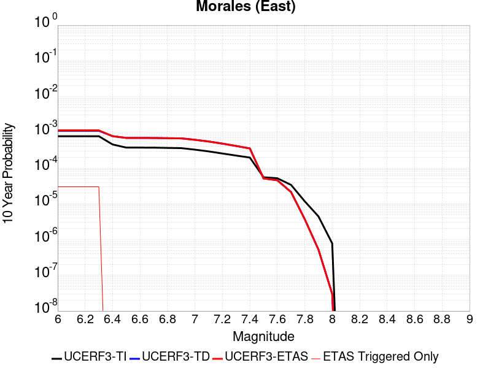 |

| Magnitude | 1 wk TI Prob | 1 wk TD Prob | 1 wk ETAS Prob | 1 wk ETAS/TD Gain | 1 wk ETAS Triggered Only | 1 mo TI Prob | 1 mo TD Prob | 1 mo ETAS Prob | 1 mo ETAS/TD Gain | 1 mo ETAS Triggered Only | 1 yr TI Prob | 1 yr TD Prob | 1 yr ETAS Prob | 1 yr ETAS/TD Gain | 1 yr ETAS Triggered Only | 10 yr TI Prob | 10 yr TD Prob | 10 yr ETAS Prob | 10 yr ETAS/TD Gain | 10 yr ETAS Triggered Only |
|-----|-----|-----|-----|-----|-----|-----|-----|-----|-----|-----|-----|-----|-----|-----|-----|-----|-----|-----|-----|-----|
| 6.0 | 1.4942771E-6 | 2.123479E-6 | 2.123479E-6 | 1.0 | 0.0 | 6.404029E-6 | 9.100596E-6 | 9.100596E-6 | 1.0 | 0.0 | 7.7966266E-5 | 1.107947E-4 | 1.2894151E-4 | 1.1637877 | 1.814882E-5 | 7.793892E-4 | 0.0011074544 | 0.0011255831 | 1.0163697 | 1.814882E-5 |
| 6.1 | 1.4942771E-6 | 2.123479E-6 | 2.123479E-6 | 1.0 | 0.0 | 6.404029E-6 | 9.100596E-6 | 9.100596E-6 | 1.0 | 0.0 | 7.7966266E-5 | 1.107947E-4 | 1.2894151E-4 | 1.1637877 | 1.814882E-5 | 7.793892E-4 | 0.0011074544 | 0.0011255831 | 1.0163697 | 1.814882E-5 |
| 6.2 | 1.4942771E-6 | 2.123479E-6 | 2.123479E-6 | 1.0 | 0.0 | 6.404029E-6 | 9.100596E-6 | 9.100596E-6 | 1.0 | 0.0 | 7.7966266E-5 | 1.107947E-4 | 1.2894151E-4 | 1.1637877 | 1.814882E-5 | 7.793892E-4 | 0.0011074544 | 0.0011255831 | 1.0163697 | 1.814882E-5 |
| 6.3 | 1.4942771E-6 | 2.123479E-6 | 2.123479E-6 | 1.0 | 0.0 | 6.404029E-6 | 9.100596E-6 | 9.100596E-6 | 1.0 | 0.0 | 7.7966266E-5 | 1.107947E-4 | 1.2894151E-4 | 1.1637877 | 1.814882E-5 | 7.793892E-4 | 0.0011074544 | 0.0011255831 | 1.0163697 | 1.814882E-5 |
| 6.4 | 8.798845E-7 | 1.5022731E-6 | 1.5022731E-6 | 1.0 | 0.0 | 3.7709283E-6 | 6.438298E-6 | 6.438298E-6 | 1.0 | 0.0 | 4.5910085E-5 | 7.8383564E-5 | 7.8383564E-5 | 1.0 | 0.0 | 4.59006E-4 | 7.835727E-4 | 7.835727E-4 | 1.0 | 0.0 |
| 6.5 | 7.1751725E-7 | 1.3384229E-6 | 1.3384229E-6 | 1.0 | 0.0 | 3.0750705E-6 | 5.7360858E-6 | 5.7360858E-6 | 1.0 | 0.0 | 3.7438338E-5 | 6.9834685E-5 | 6.9834685E-5 | 1.0 | 0.0 | 3.743203E-4 | 6.9813756E-4 | 6.9813756E-4 | 1.0 | 0.0 |
| 6.6 | 7.1751725E-7 | 1.3384229E-6 | 1.3384229E-6 | 1.0 | 0.0 | 3.0750705E-6 | 5.7360858E-6 | 5.7360858E-6 | 1.0 | 0.0 | 3.7438338E-5 | 6.9834685E-5 | 6.9834685E-5 | 1.0 | 0.0 | 3.743203E-4 | 6.9813756E-4 | 6.9813756E-4 | 1.0 | 0.0 |
| 6.7 | 7.159057E-7 | 1.3358889E-6 | 1.3358889E-6 | 1.0 | 0.0 | 3.0681638E-6 | 5.725226E-6 | 5.725226E-6 | 1.0 | 0.0 | 3.7354253E-5 | 6.970247E-5 | 6.970247E-5 | 1.0 | 0.0 | 3.7347974E-4 | 6.968163E-4 | 6.968163E-4 | 1.0 | 0.0 |
| 6.8 | 7.032203E-7 | 1.3174443E-6 | 1.3174443E-6 | 1.0 | 0.0 | 3.0137978E-6 | 5.646178E-6 | 5.646178E-6 | 1.0 | 0.0 | 3.669237E-5 | 6.8740126E-5 | 6.8740126E-5 | 1.0 | 0.0 | 3.6686313E-4 | 6.871988E-4 | 6.871988E-4 | 1.0 | 0.0 |
| 6.9 | 6.941549E-7 | 1.3025061E-6 | 1.3025061E-6 | 1.0 | 0.0 | 2.974946E-6 | 5.582158E-6 | 5.582158E-6 | 1.0 | 0.0 | 3.6219368E-5 | 6.7960726E-5 | 6.7960726E-5 | 1.0 | 0.0 | 3.6213463E-4 | 6.7940954E-4 | 6.7940954E-4 | 1.0 | 0.0 |
| 7.0 | 6.2932247E-7 | 1.18774E-6 | 1.18774E-6 | 1.0 | 0.0 | 2.6970936E-6 | 5.090305E-6 | 5.090305E-6 | 1.0 | 0.0 | 3.283662E-5 | 6.1972765E-5 | 6.1972765E-5 | 1.0 | 0.0 | 3.283177E-4 | 6.1956374E-4 | 6.1956374E-4 | 1.0 | 0.0 |
| 7.1 | 5.6200963E-7 | 1.0640374E-6 | 1.0640374E-6 | 1.0 | 0.0 | 2.4086105E-6 | 4.5601523E-6 | 4.5601523E-6 | 1.0 | 0.0 | 2.9324437E-5 | 5.551849E-5 | 5.551849E-5 | 1.0 | 0.0 | 2.9320567E-4 | 5.550534E-4 | 5.550534E-4 | 1.0 | 0.0 |
| 7.2 | 4.91044E-7 | 9.285713E-7 | 9.285713E-7 | 1.0 | 0.0 | 2.1044725E-6 | 3.9795855E-6 | 3.9795855E-6 | 1.0 | 0.0 | 2.5621652E-5 | 4.8450413E-5 | 4.8450413E-5 | 1.0 | 0.0 | 2.56187E-4 | 4.8440482E-4 | 4.8440482E-4 | 1.0 | 0.0 |
| 7.3 | 4.2978448E-7 | 7.9739846E-7 | 7.9739846E-7 | 1.0 | 0.0 | 1.8419321E-6 | 3.4174175E-6 | 3.4174175E-6 | 1.0 | 0.0 | 2.2425293E-5 | 4.1606294E-5 | 4.1606294E-5 | 1.0 | 0.0 | 2.242303E-4 | 4.1599068E-4 | 4.1599068E-4 | 1.0 | 0.0 |
| 7.4 | 3.774317E-7 | 6.806746E-7 | 6.806746E-7 | 1.0 | 0.0 | 1.6175634E-6 | 2.9171736E-6 | 2.9171736E-6 | 1.0 | 0.0 | 1.9693656E-5 | 3.5516037E-5 | 3.5516037E-5 | 1.0 | 0.0 | 1.969191E-4 | 3.551089E-4 | 3.551089E-4 | 1.0 | 0.0 |
| 7.5 | 1.0603232E-7 | 9.840901E-8 | 9.840901E-8 | 1.0 | 0.0 | 4.5442414E-7 | 4.2175284E-7 | 4.2175284E-7 | 1.0 | 0.0 | 5.5326E-6 | 5.134829E-6 | 5.134829E-6 | 1.0 | 0.0 | 5.532462E-5 | 5.134967E-5 | 5.134967E-5 | 1.0 | 0.0 |
| 7.6 | 9.960384E-8 | 8.755334E-8 | 8.755334E-8 | 1.0 | 0.0 | 4.2687353E-7 | 3.7522852E-7 | 3.7522852E-7 | 1.0 | 0.0 | 5.197173E-6 | 4.568398E-6 | 4.568398E-6 | 1.0 | 0.0 | 5.1970514E-5 | 4.5685607E-5 | 4.5685607E-5 | 1.0 | 0.0 |
| 7.7 | 6.499468E-8 | 4.1038682E-8 | 4.1038682E-8 | 1.0 | 0.0 | 2.785486E-7 | 1.7588006E-7 | 1.7588006E-7 | 1.0 | 0.0 | 3.3913238E-6 | 2.1413375E-6 | 2.1413375E-6 | 1.0 | 0.0 | 3.3912722E-5 | 2.1415728E-5 | 2.1415728E-5 | 1.0 | 0.0 |
| 7.8 | 2.2517119E-8 | 7.1312614E-9 | 7.1312614E-9 | 1.0 | 0.0 | 9.6501935E-8 | 3.0562546E-8 | 3.0562546E-8 | 1.0 | 0.0 | 1.1749105E-6 | 3.7209892E-7 | 3.7209892E-7 | 1.0 | 0.0 | 1.1749043E-5 | 3.7235213E-6 | 3.7235213E-6 | 1.0 | 0.0 |
| 7.9 | 8.493023E-9 | 9.970124E-10 | 9.970124E-10 | 1.0 | 0.0 | 3.639867E-8 | 4.2729082E-9 | 4.2729082E-9 | 1.0 | 0.0 | 4.4315374E-7 | 5.202266E-8 | 5.202266E-8 | 1.0 | 0.0 | 4.4315284E-6 | 5.2233156E-7 | 5.2233156E-7 | 1.0 | 0.0 |
| 8.0 | 1.4971842E-9 | 5.5458416E-11 | 5.5458416E-11 | 1.0 | 0.0 | 6.4165038E-9 | 2.376762E-10 | 2.376762E-10 | 1.0 | 0.0 | 7.812093E-8 | 2.8937068E-9 | 2.8937068E-9 | 1.0 | 0.0 | 7.81209E-7 | 3.019288E-8 | 3.019288E-8 | 1.0 | 0.0 |

## San Jacinto (Clark) rev
*[(top)](#table-of-contents)*

| 1 Week | 1 Month | 1 Year | 10 Year |
|-----|-----|-----|-----|
|  |  |  |  |

| Magnitude | 1 wk TI Prob | 1 wk TD Prob | 1 wk ETAS Prob | 1 wk ETAS/TD Gain | 1 wk ETAS Triggered Only | 1 mo TI Prob | 1 mo TD Prob | 1 mo ETAS Prob | 1 mo ETAS/TD Gain | 1 mo ETAS Triggered Only | 1 yr TI Prob | 1 yr TD Prob | 1 yr ETAS Prob | 1 yr ETAS/TD Gain | 1 yr ETAS Triggered Only | 10 yr TI Prob | 10 yr TD Prob | 10 yr ETAS Prob | 10 yr ETAS/TD Gain | 10 yr ETAS Triggered Only |
|-----|-----|-----|-----|-----|-----|-----|-----|-----|-----|-----|-----|-----|-----|-----|-----|-----|-----|-----|-----|-----|
| 6.0 | 4.482615E-5 | 2.1154196E-5 | 2.1154196E-5 | 1.0 | 0.0 | 1.9209793E-4 | 9.065773E-5 | 9.065773E-5 | 1.0 | 0.0 | 0.0023362834 | 0.0011032083 | 0.0011213371 | 1.0164328 | 1.814882E-5 | 0.02311874 | 0.011503847 | 0.011521787 | 1.0015595 | 1.814882E-5 |
| 6.1 | 4.482615E-5 | 2.1154196E-5 | 2.1154196E-5 | 1.0 | 0.0 | 1.9209793E-4 | 9.065773E-5 | 9.065773E-5 | 1.0 | 0.0 | 0.0023362834 | 0.0011032083 | 0.0011213371 | 1.0164328 | 1.814882E-5 | 0.02311874 | 0.011503847 | 0.011521787 | 1.0015595 | 1.814882E-5 |
| 6.2 | 4.482615E-5 | 2.1154196E-5 | 2.1154196E-5 | 1.0 | 0.0 | 1.9209793E-4 | 9.065773E-5 | 9.065773E-5 | 1.0 | 0.0 | 0.0023362834 | 0.0011032083 | 0.0011213371 | 1.0164328 | 1.814882E-5 | 0.02311874 | 0.011503847 | 0.011521787 | 1.0015595 | 1.814882E-5 |
| 6.3 | 4.482615E-5 | 2.1154196E-5 | 2.1154196E-5 | 1.0 | 0.0 | 1.9209793E-4 | 9.065773E-5 | 9.065773E-5 | 1.0 | 0.0 | 0.0023362834 | 0.0011032083 | 0.0011213371 | 1.0164328 | 1.814882E-5 | 0.02311874 | 0.011503847 | 0.011521787 | 1.0015595 | 1.814882E-5 |
| 6.4 | 4.482615E-5 | 2.1154196E-5 | 2.1154196E-5 | 1.0 | 0.0 | 1.9209793E-4 | 9.065773E-5 | 9.065773E-5 | 1.0 | 0.0 | 0.0023362834 | 0.0011032083 | 0.0011213371 | 1.0164328 | 1.814882E-5 | 0.02311874 | 0.011503847 | 0.011521787 | 1.0015595 | 1.814882E-5 |
| 6.5 | 3.7294863E-5 | 1.7356087E-5 | 1.7356087E-5 | 1.0 | 0.0 | 1.5982533E-4 | 7.438113E-5 | 7.438113E-5 | 1.0 | 0.0 | 0.0019441366 | 9.052186E-4 | 9.23351E-4 | 1.020031 | 1.814882E-5 | 0.01927216 | 0.0094941035 | 0.00951208 | 1.0018934 | 1.814882E-5 |
| 6.6 | 3.7294863E-5 | 1.7356087E-5 | 1.7356087E-5 | 1.0 | 0.0 | 1.5982533E-4 | 7.438113E-5 | 7.438113E-5 | 1.0 | 0.0 | 0.0019441366 | 9.052186E-4 | 9.23351E-4 | 1.020031 | 1.814882E-5 | 0.01927216 | 0.0094941035 | 0.00951208 | 1.0018934 | 1.814882E-5 |
| 6.7 | 3.6039248E-5 | 1.6604314E-5 | 1.6604314E-5 | 1.0 | 0.0 | 1.5444479E-4 | 7.1159426E-5 | 7.1159426E-5 | 1.0 | 0.0 | 0.0018787434 | 8.6602574E-4 | 8.841589E-4 | 1.0209383 | 1.814882E-5 | 0.01862939 | 0.009096047 | 0.009114031 | 1.0019771 | 1.814882E-5 |
| 6.8 | 3.5031844E-5 | 1.6232942E-5 | 1.6232942E-5 | 1.0 | 0.0 | 1.5012783E-4 | 6.956792E-5 | 6.956792E-5 | 1.0 | 0.0 | 0.0018262739 | 8.4666436E-4 | 8.647978E-4 | 1.0214175 | 1.814882E-5 | 0.01811338 | 0.008895969 | 0.008913957 | 1.002022 | 1.814882E-5 |
| 6.9 | 3.435112E-5 | 1.6063195E-5 | 1.6063195E-5 | 1.0 | 0.0 | 1.4721078E-4 | 6.884047E-5 | 6.884047E-5 | 1.0 | 0.0 | 0.0017908178 | 8.3781447E-4 | 8.5594814E-4 | 1.021644 | 1.814882E-5 | 0.017764548 | 0.008804181 | 0.008822169 | 1.0020432 | 1.814882E-5 |
| 7.0 | 2.8959772E-5 | 1.4336745E-5 | 1.4336745E-5 | 1.0 | 0.0 | 1.241074E-4 | 6.144176E-5 | 6.144176E-5 | 1.0 | 0.0 | 0.0015099603 | 7.477995E-4 | 7.6593476E-4 | 1.0242515 | 1.814882E-5 | 0.014997416 | 0.007868037 | 0.007886043 | 1.0022885 | 1.814882E-5 |
| 7.1 | 2.6002877E-5 | 1.2829002E-5 | 1.2829002E-5 | 1.0 | 0.0 | 1.11436144E-4 | 5.498029E-5 | 5.498029E-5 | 1.0 | 0.0 | 0.0013558907 | 6.691816E-4 | 6.873182E-4 | 1.0271028 | 1.814882E-5 | 0.013476475 | 0.0070465137 | 0.007064535 | 1.0025574 | 1.814882E-5 |
| 7.2 | 2.2544838E-5 | 1.1262543E-5 | 1.1262543E-5 | 1.0 | 0.0 | 9.661716E-5 | 4.8267157E-5 | 4.8267157E-5 | 1.0 | 0.0 | 0.001175679 | 5.874956E-4 | 6.056338E-4 | 1.0308737 | 1.814882E-5 | 0.011694785 | 0.0061927503 | 0.0062107863 | 1.0029125 | 1.814882E-5 |
| 7.3 | 1.75334E-5 | 1.0811715E-5 | 1.0811715E-5 | 1.0 | 0.0 | 7.514098E-5 | 4.6335106E-5 | 4.6335106E-5 | 1.0 | 0.0 | 9.144575E-4 | 5.6398526E-4 | 5.821239E-4 | 1.0321615 | 1.814882E-5 | 0.009107036 | 0.0059337732 | 0.0059518144 | 1.0030404 | 1.814882E-5 |
| 7.4 | 1.5924552E-5 | 1.0611516E-5 | 1.0611516E-5 | 1.0 | 0.0 | 6.82463E-5 | 4.547714E-5 | 4.547714E-5 | 1.0 | 0.0 | 8.305819E-4 | 5.535449E-4 | 5.716837E-4 | 1.0327684 | 1.814882E-5 | 0.008274844 | 0.0058210334 | 0.0058390764 | 1.0030997 | 1.814882E-5 |
| 7.5 | 1.3428931E-5 | 9.8519E-6 | 9.8519E-6 | 1.0 | 0.0 | 5.7551293E-5 | 4.2221753E-5 | 4.2221753E-5 | 1.0 | 0.0 | 7.004617E-4 | 5.1392964E-4 | 5.320691E-4 | 1.0352957 | 1.814882E-5 | 0.006982579 | 0.0054066023 | 0.005424653 | 1.0033387 | 1.814882E-5 |
| 7.6 | 1.0688787E-5 | 8.614839E-6 | 8.614839E-6 | 1.0 | 0.0 | 4.5808283E-5 | 3.692022E-5 | 3.692022E-5 | 1.0 | 0.0 | 5.5757316E-4 | 4.4941145E-4 | 4.6755213E-4 | 1.0403653 | 1.814882E-5 | 0.005561762 | 0.0047416524 | 0.004759715 | 1.0038093 | 1.814882E-5 |
| 7.7 | 8.81236E-6 | 7.4680274E-6 | 7.4680274E-6 | 1.0 | 0.0 | 3.776671E-5 | 3.2005442E-5 | 3.2005442E-5 | 1.0 | 0.0 | 4.597127E-4 | 3.8959677E-4 | 4.0773852E-4 | 1.0465654 | 1.814882E-5 | 0.0045876284 | 0.0041346536 | 0.0041527273 | 1.0043713 | 1.814882E-5 |
| 7.8 | 7.780431E-6 | 6.696579E-6 | 6.696579E-6 | 1.0 | 0.0 | 3.3344273E-5 | 2.8699309E-5 | 2.8699309E-5 | 1.0 | 0.0 | 4.0589093E-4 | 3.4935825E-4 | 3.6750073E-4 | 1.0519309 | 1.814882E-5 | 0.0040515037 | 0.0037227906 | 0.0037408718 | 1.004857 | 1.814882E-5 |
| 7.9 | 6.5437994E-6 | 5.780382E-6 | 5.780382E-6 | 1.0 | 0.0 | 2.8044553E-5 | 2.477283E-5 | 2.477283E-5 | 1.0 | 0.0 | 3.4138895E-4 | 3.0156763E-4 | 3.19711E-4 | 1.0601635 | 1.814882E-5 | 0.0034086495 | 0.0032344845 | 0.0032525747 | 1.005593 | 1.814882E-5 |
| 8.0 | 5.4488164E-6 | 4.8133406E-6 | 4.8133406E-6 | 1.0 | 0.0 | 2.3351862E-5 | 2.062844E-5 | 2.062844E-5 | 1.0 | 0.0 | 2.8427184E-4 | 2.5112246E-4 | 2.6926672E-4 | 1.0722526 | 1.814882E-5 | 0.0028390845 | 0.002710839 | 0.0027289386 | 1.0066768 | 1.814882E-5 |
| 8.1 | 2.8397242E-6 | 1.3670389E-6 | 1.3670389E-6 | 1.0 | 0.0 | 1.217019E-5 | 5.858725E-6 | 5.858725E-6 | 1.0 | 0.0 | 1.4816198E-4 | 7.132765E-5 | 7.132765E-5 | 1.0 | 0.0 | 0.0014806325 | 8.115382E-4 | 8.115382E-4 | 1.0 | 0.0 |
| 8.2 | 2.030244E-6 | 6.318974E-7 | 6.318974E-7 | 1.0 | 0.0 | 8.701017E-6 | 2.708129E-6 | 2.708129E-6 | 1.0 | 0.0 | 1.05929736E-4 | 3.2970976E-5 | 3.2970976E-5 | 1.0 | 0.0 | 0.0010587925 | 3.9486602E-4 | 3.9486602E-4 | 1.0 | 0.0 |
| 8.3 | 1.0659804E-6 | 2.9250086E-7 | 2.9250086E-7 | 1.0 | 0.0 | 4.568479E-6 | 1.2535745E-6 | 1.2535745E-6 | 1.0 | 0.0 | 5.5619817E-5 | 1.5262167E-5 | 1.5262167E-5 | 1.0 | 0.0 | 5.5605895E-4 | 1.8566217E-4 | 1.8566217E-4 | 1.0 | 0.0 |

## Almanor 2011 CFM
*[(top)](#table-of-contents)*

| 1 Week | 1 Month | 1 Year | 10 Year |
|-----|-----|-----|-----|
|  | 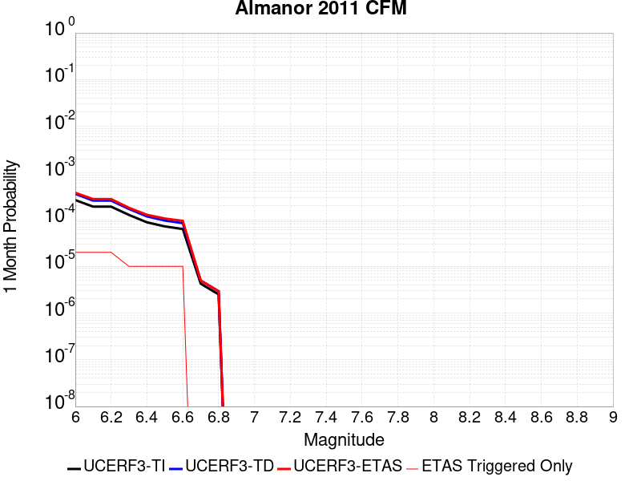 |  |  |

| Magnitude | 1 wk TI Prob | 1 wk TD Prob | 1 wk ETAS Prob | 1 wk ETAS/TD Gain | 1 wk ETAS Triggered Only | 1 mo TI Prob | 1 mo TD Prob | 1 mo ETAS Prob | 1 mo ETAS/TD Gain | 1 mo ETAS Triggered Only | 1 yr TI Prob | 1 yr TD Prob | 1 yr ETAS Prob | 1 yr ETAS/TD Gain | 1 yr ETAS Triggered Only | 10 yr TI Prob | 10 yr TD Prob | 10 yr ETAS Prob | 10 yr ETAS/TD Gain | 10 yr ETAS Triggered Only |
|-----|-----|-----|-----|-----|-----|-----|-----|-----|-----|-----|-----|-----|-----|-----|-----|-----|-----|-----|-----|-----|
| 6.0 | 6.1479834E-5 | 8.32787E-5 | 8.32787E-5 | 1.0 | 0.0 | 2.6345838E-4 | 3.5686578E-4 | 3.7500812E-4 | 1.050838 | 1.814882E-5 | 0.0032028882 | 0.0043366123 | 0.0043546823 | 1.0041668 | 1.814882E-5 | 0.031571172 | 0.04258577 | 0.042603146 | 1.000408 | 1.814882E-5 |
| 6.1 | 4.4387216E-5 | 5.9770442E-5 | 5.9770442E-5 | 1.0 | 0.0 | 1.9021705E-4 | 2.561381E-4 | 2.7428227E-4 | 1.0708375 | 1.814882E-5 | 0.0023134327 | 0.003114426 | 0.0031325184 | 1.0058092 | 1.814882E-5 | 0.022894967 | 0.030755036 | 0.030772626 | 1.000572 | 1.814882E-5 |
| 6.2 | 4.4387216E-5 | 5.9770442E-5 | 5.9770442E-5 | 1.0 | 0.0 | 1.9021705E-4 | 2.561381E-4 | 2.7428227E-4 | 1.0708375 | 1.814882E-5 | 0.0023134327 | 0.003114426 | 0.0031325184 | 1.0058092 | 1.814882E-5 | 0.022894967 | 0.030755036 | 0.030772626 | 1.000572 | 1.814882E-5 |
| 6.3 | 2.9523822E-5 | 3.954719E-5 | 3.954719E-5 | 1.0 | 0.0 | 1.2652454E-4 | 1.6947983E-4 | 1.8762557E-4 | 1.1070672 | 1.814882E-5 | 0.0015393476 | 0.0020618725 | 0.002079984 | 1.0087839 | 1.814882E-5 | 0.015287281 | 0.020460794 | 0.02047857 | 1.0008688 | 1.814882E-5 |
| 6.4 | 2.0512744E-5 | 2.7431617E-5 | 2.7431617E-5 | 1.0 | 0.0 | 8.79088E-5 | 1.175612E-4 | 1.3570789E-4 | 1.1543595 | 1.814882E-5 | 0.001069764 | 0.0014307408 | 0.0014488638 | 1.0126668 | 1.814882E-5 | 0.010646289 | 0.014244413 | 0.014262304 | 1.001256 | 1.814882E-5 |
| 6.5 | 1.6750226E-5 | 2.23913E-5 | 2.23913E-5 | 1.0 | 0.0 | 7.178471E-5 | 9.596152E-5 | 1.14108596E-4 | 1.1891079 | 1.814882E-5 | 8.7362836E-4 | 0.0011680633 | 0.0011861909 | 1.0155194 | 1.814882E-5 | 0.008702018 | 0.011649038 | 0.011666975 | 1.0015398 | 1.814882E-5 |
| 6.6 | 1.4745303E-5 | 1.9707952E-5 | 1.9707952E-5 | 1.0 | 0.0 | 6.319262E-5 | 8.446223E-5 | 1.0260951E-4 | 1.2148569 | 1.814882E-5 | 7.690986E-4 | 0.0010281964 | 0.0010463266 | 1.017633 | 1.814882E-5 | 0.0076644225 | 0.010264971 | 0.010282934 | 1.0017499 | 1.814882E-5 |
| 6.7 | 9.951145E-7 | 1.1616347E-6 | 1.1616347E-6 | 1.0 | 0.0 | 4.26477E-6 | 4.9784257E-6 | 4.9784257E-6 | 1.0 | 0.0 | 5.1922336E-5 | 6.0610826E-5 | 6.0610826E-5 | 1.0 | 0.0 | 5.1910203E-4 | 6.059602E-4 | 6.059602E-4 | 1.0 | 0.0 |
| 6.8 | 5.866312E-7 | 6.849384E-7 | 6.849384E-7 | 1.0 | 0.0 | 2.5141312E-6 | 2.9354478E-6 | 2.9354478E-6 | 1.0 | 0.0 | 3.0609117E-5 | 3.5738623E-5 | 3.5738623E-5 | 1.0 | 0.0 | 3.06049E-4 | 3.5734157E-4 | 3.5734157E-4 | 1.0 | 0.0 |

## Compton
*[(top)](#table-of-contents)*

| 1 Week | 1 Month | 1 Year | 10 Year |
|-----|-----|-----|-----|
|  |  |  |  |

| Magnitude | 1 wk TI Prob | 1 wk TD Prob | 1 wk ETAS Prob | 1 wk ETAS/TD Gain | 1 wk ETAS Triggered Only | 1 mo TI Prob | 1 mo TD Prob | 1 mo ETAS Prob | 1 mo ETAS/TD Gain | 1 mo ETAS Triggered Only | 1 yr TI Prob | 1 yr TD Prob | 1 yr ETAS Prob | 1 yr ETAS/TD Gain | 1 yr ETAS Triggered Only | 10 yr TI Prob | 10 yr TD Prob | 10 yr ETAS Prob | 10 yr ETAS/TD Gain | 10 yr ETAS Triggered Only |
|-----|-----|-----|-----|-----|-----|-----|-----|-----|-----|-----|-----|-----|-----|-----|-----|-----|-----|-----|-----|-----|
| 6.0 | 1.06050875E-5 | 6.358671E-6 | 6.358671E-6 | 1.0 | 0.0 | 4.5449582E-5 | 2.7251177E-5 | 2.7251177E-5 | 1.0 | 0.0 | 5.5320817E-4 | 3.317354E-4 | 3.4987822E-4 | 1.0546906 | 1.814882E-5 | 0.0055183303 | 0.0033126862 | 0.0033307748 | 1.0054604 | 1.814882E-5 |
| 6.1 | 1.06050875E-5 | 6.358671E-6 | 6.358671E-6 | 1.0 | 0.0 | 4.5449582E-5 | 2.7251177E-5 | 2.7251177E-5 | 1.0 | 0.0 | 5.5320817E-4 | 3.317354E-4 | 3.4987822E-4 | 1.0546906 | 1.814882E-5 | 0.0055183303 | 0.0033126862 | 0.0033307748 | 1.0054604 | 1.814882E-5 |
| 6.2 | 1.06050875E-5 | 6.358671E-6 | 6.358671E-6 | 1.0 | 0.0 | 4.5449582E-5 | 2.7251177E-5 | 2.7251177E-5 | 1.0 | 0.0 | 5.5320817E-4 | 3.317354E-4 | 3.4987822E-4 | 1.0546906 | 1.814882E-5 | 0.0055183303 | 0.0033126862 | 0.0033307748 | 1.0054604 | 1.814882E-5 |
| 6.3 | 1.06050875E-5 | 6.358671E-6 | 6.358671E-6 | 1.0 | 0.0 | 4.5449582E-5 | 2.7251177E-5 | 2.7251177E-5 | 1.0 | 0.0 | 5.5320817E-4 | 3.317354E-4 | 3.4987822E-4 | 1.0546906 | 1.814882E-5 | 0.0055183303 | 0.0033126862 | 0.0033307748 | 1.0054604 | 1.814882E-5 |
| 6.4 | 1.06050875E-5 | 6.358671E-6 | 6.358671E-6 | 1.0 | 0.0 | 4.5449582E-5 | 2.7251177E-5 | 2.7251177E-5 | 1.0 | 0.0 | 5.5320817E-4 | 3.317354E-4 | 3.4987822E-4 | 1.0546906 | 1.814882E-5 | 0.0055183303 | 0.0033126862 | 0.0033307748 | 1.0054604 | 1.814882E-5 |
| 6.5 | 1.06050875E-5 | 6.358671E-6 | 6.358671E-6 | 1.0 | 0.0 | 4.5449582E-5 | 2.7251177E-5 | 2.7251177E-5 | 1.0 | 0.0 | 5.5320817E-4 | 3.317354E-4 | 3.4987822E-4 | 1.0546906 | 1.814882E-5 | 0.0055183303 | 0.0033126862 | 0.0033307748 | 1.0054604 | 1.814882E-5 |
| 6.6 | 1.06050875E-5 | 6.358671E-6 | 6.358671E-6 | 1.0 | 0.0 | 4.5449582E-5 | 2.7251177E-5 | 2.7251177E-5 | 1.0 | 0.0 | 5.5320817E-4 | 3.317354E-4 | 3.4987822E-4 | 1.0546906 | 1.814882E-5 | 0.0055183303 | 0.0033126862 | 0.0033307748 | 1.0054604 | 1.814882E-5 |
| 6.7 | 1.06050875E-5 | 6.358671E-6 | 6.358671E-6 | 1.0 | 0.0 | 4.5449582E-5 | 2.7251177E-5 | 2.7251177E-5 | 1.0 | 0.0 | 5.5320817E-4 | 3.317354E-4 | 3.4987822E-4 | 1.0546906 | 1.814882E-5 | 0.0055183303 | 0.0033126862 | 0.0033307748 | 1.0054604 | 1.814882E-5 |
| 6.8 | 1.06050875E-5 | 6.358671E-6 | 6.358671E-6 | 1.0 | 0.0 | 4.5449582E-5 | 2.7251177E-5 | 2.7251177E-5 | 1.0 | 0.0 | 5.5320817E-4 | 3.317354E-4 | 3.4987822E-4 | 1.0546906 | 1.814882E-5 | 0.0055183303 | 0.0033126862 | 0.0033307748 | 1.0054604 | 1.814882E-5 |
| 6.9 | 1.06050875E-5 | 6.358671E-6 | 6.358671E-6 | 1.0 | 0.0 | 4.5449582E-5 | 2.7251177E-5 | 2.7251177E-5 | 1.0 | 0.0 | 5.5320817E-4 | 3.317354E-4 | 3.4987822E-4 | 1.0546906 | 1.814882E-5 | 0.0055183303 | 0.0033126862 | 0.0033307748 | 1.0054604 | 1.814882E-5 |
| 7.0 | 7.672486E-6 | 4.2720512E-6 | 4.2720512E-6 | 1.0 | 0.0 | 3.288167E-5 | 1.8308665E-5 | 1.8308665E-5 | 1.0 | 0.0 | 4.0026082E-4 | 2.2288582E-4 | 2.410306E-4 | 1.0814084 | 1.814882E-5 | 0.0039954064 | 0.002226685 | 0.0022447933 | 1.0081325 | 1.814882E-5 |
| 7.1 | 7.163992E-6 | 3.883762E-6 | 3.883762E-6 | 1.0 | 0.0 | 3.0702464E-5 | 1.6644592E-5 | 1.6644592E-5 | 1.0 | 0.0 | 3.7373835E-4 | 2.0262963E-4 | 2.2077476E-4 | 1.0895483 | 1.814882E-5 | 0.0037311043 | 0.0020245055 | 0.0020426176 | 1.0089464 | 1.814882E-5 |
| 7.2 | 6.3689185E-6 | 3.3102428E-6 | 3.3102428E-6 | 1.0 | 0.0 | 2.729508E-5 | 1.418668E-5 | 1.418668E-5 | 1.0 | 0.0 | 3.322669E-4 | 1.7270957E-4 | 1.9085525E-4 | 1.1050647 | 1.814882E-5 | 0.0033177056 | 0.0017257951 | 0.0017439127 | 1.010498 | 1.814882E-5 |
| 7.3 | 4.4987873E-6 | 2.4480942E-6 | 2.4480942E-6 | 1.0 | 0.0 | 1.9280375E-5 | 1.0491792E-5 | 1.0491792E-5 | 1.0 | 0.0 | 2.3471327E-4 | 1.2773038E-4 | 1.4587688E-4 | 1.1420687 | 1.814882E-5 | 0.002344655 | 0.0012765999 | 0.0012947256 | 1.0141984 | 1.814882E-5 |
| 7.4 | 2.987296E-6 | 1.7394335E-6 | 1.7394335E-6 | 1.0 | 0.0 | 1.2802635E-5 | 7.454694E-6 | 7.454694E-6 | 1.0 | 0.0 | 1.5586092E-4 | 9.0757174E-5 | 1.0890435E-4 | 1.1999531 | 1.814882E-5 | 0.0015575165 | 9.072069E-4 | 9.2533923E-4 | 1.019987 | 1.814882E-5 |
| 7.5 | 2.4111696E-6 | 1.4472155E-6 | 1.4472155E-6 | 1.0 | 0.0 | 1.0333543E-5 | 6.2023378E-6 | 6.2023378E-6 | 1.0 | 0.0 | 1.2580362E-4 | 7.551089E-5 | 7.551089E-5 | 1.0 | 0.0 | 0.0012573242 | 7.54857E-4 | 7.54857E-4 | 1.0 | 0.0 |
| 7.6 | 1.8783096E-6 | 1.1360459E-6 | 1.1360459E-6 | 1.0 | 0.0 | 8.049874E-6 | 4.8687593E-6 | 4.8687593E-6 | 1.0 | 0.0 | 9.8002805E-5 | 5.927557E-5 | 5.927557E-5 | 1.0 | 0.0 | 9.795959E-4 | 5.926016E-4 | 5.926016E-4 | 1.0 | 0.0 |
| 7.7 | 6.6646817E-7 | 3.560237E-7 | 3.560237E-7 | 1.0 | 0.0 | 2.856289E-6 | 1.525815E-6 | 1.525815E-6 | 1.0 | 0.0 | 3.4774763E-5 | 1.8576653E-5 | 1.8576653E-5 | 1.0 | 0.0 | 3.4769322E-4 | 1.8575235E-4 | 1.8575235E-4 | 1.0 | 0.0 |
| 7.8 | 7.054689E-8 | 4.1342968E-8 | 4.1342968E-8 | 1.0 | 0.0 | 3.0234378E-7 | 1.7718413E-7 | 1.7718413E-7 | 1.0 | 0.0 | 3.6810293E-6 | 2.1572148E-6 | 2.1572148E-6 | 1.0 | 0.0 | 3.6809684E-5 | 2.1571948E-5 | 2.1571948E-5 | 1.0 | 0.0 |
| 7.9 | 7.420925E-9 | 4.0131285E-9 | 4.0131285E-9 | 1.0 | 0.0 | 3.1803964E-8 | 1.7199122E-8 | 1.7199122E-8 | 1.0 | 0.0 | 3.872132E-7 | 2.093993E-7 | 2.093993E-7 | 1.0 | 0.0 | 3.872125E-6 | 2.0939913E-6 | 2.0939913E-6 | 1.0 | 0.0 |

## Del Valle
*[(top)](#table-of-contents)*

| 1 Week | 1 Month | 1 Year | 10 Year |
|-----|-----|-----|-----|
|  | 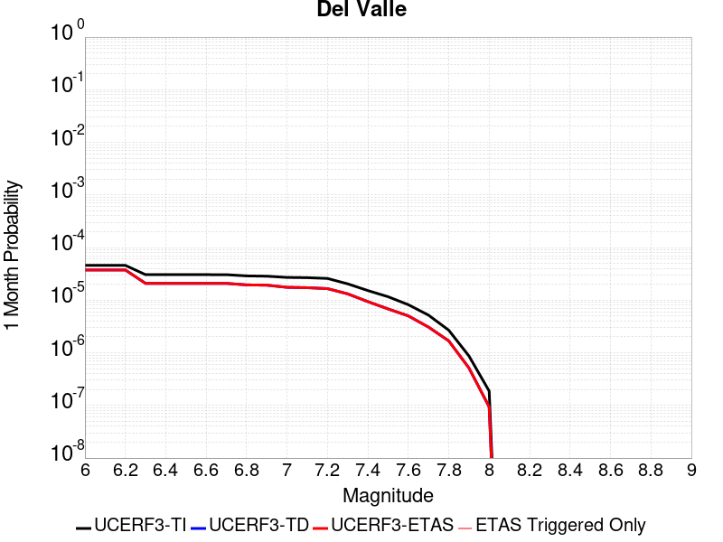 |  |  |

| Magnitude | 1 wk TI Prob | 1 wk TD Prob | 1 wk ETAS Prob | 1 wk ETAS/TD Gain | 1 wk ETAS Triggered Only | 1 mo TI Prob | 1 mo TD Prob | 1 mo ETAS Prob | 1 mo ETAS/TD Gain | 1 mo ETAS Triggered Only | 1 yr TI Prob | 1 yr TD Prob | 1 yr ETAS Prob | 1 yr ETAS/TD Gain | 1 yr ETAS Triggered Only | 10 yr TI Prob | 10 yr TD Prob | 10 yr ETAS Prob | 10 yr ETAS/TD Gain | 10 yr ETAS Triggered Only |
|-----|-----|-----|-----|-----|-----|-----|-----|-----|-----|-----|-----|-----|-----|-----|-----|-----|-----|-----|-----|-----|
| 6.0 | 1.0716125E-5 | 8.767882E-6 | 8.767882E-6 | 1.0 | 0.0 | 4.592544E-5 | 3.7576207E-5 | 3.7576207E-5 | 1.0 | 0.0 | 5.589988E-4 | 4.5741405E-4 | 4.5741405E-4 | 1.0 | 0.0 | 0.0055759475 | 0.00456668 | 0.0045847464 | 1.0039561 | 1.814882E-5 |
| 6.1 | 1.0716125E-5 | 8.767882E-6 | 8.767882E-6 | 1.0 | 0.0 | 4.592544E-5 | 3.7576207E-5 | 3.7576207E-5 | 1.0 | 0.0 | 5.589988E-4 | 4.5741405E-4 | 4.5741405E-4 | 1.0 | 0.0 | 0.0055759475 | 0.00456668 | 0.0045847464 | 1.0039561 | 1.814882E-5 |
| 6.2 | 1.0716125E-5 | 8.767882E-6 | 8.767882E-6 | 1.0 | 0.0 | 4.592544E-5 | 3.7576207E-5 | 3.7576207E-5 | 1.0 | 0.0 | 5.589988E-4 | 4.5741405E-4 | 4.5741405E-4 | 1.0 | 0.0 | 0.0055759475 | 0.00456668 | 0.0045847464 | 1.0039561 | 1.814882E-5 |
| 6.3 | 7.1293784E-6 | 4.865823E-6 | 4.865823E-6 | 1.0 | 0.0 | 3.055412E-5 | 2.0853364E-5 | 2.0853364E-5 | 1.0 | 0.0 | 3.7193293E-4 | 2.5386087E-4 | 2.5386087E-4 | 1.0 | 0.0 | 0.0037131102 | 0.0025357946 | 0.0025538974 | 1.0071388 | 1.814882E-5 |
| 6.4 | 7.1293784E-6 | 4.865823E-6 | 4.865823E-6 | 1.0 | 0.0 | 3.055412E-5 | 2.0853364E-5 | 2.0853364E-5 | 1.0 | 0.0 | 3.7193293E-4 | 2.5386087E-4 | 2.5386087E-4 | 1.0 | 0.0 | 0.0037131102 | 0.0025357946 | 0.0025538974 | 1.0071388 | 1.814882E-5 |
| 6.5 | 7.1293784E-6 | 4.865823E-6 | 4.865823E-6 | 1.0 | 0.0 | 3.055412E-5 | 2.0853364E-5 | 2.0853364E-5 | 1.0 | 0.0 | 3.7193293E-4 | 2.5386087E-4 | 2.5386087E-4 | 1.0 | 0.0 | 0.0037131102 | 0.0025357946 | 0.0025538974 | 1.0071388 | 1.814882E-5 |
| 6.6 | 7.1293784E-6 | 4.865823E-6 | 4.865823E-6 | 1.0 | 0.0 | 3.055412E-5 | 2.0853364E-5 | 2.0853364E-5 | 1.0 | 0.0 | 3.7193293E-4 | 2.5386087E-4 | 2.5386087E-4 | 1.0 | 0.0 | 0.0037131102 | 0.0025357946 | 0.0025538974 | 1.0071388 | 1.814882E-5 |
| 6.7 | 7.12272E-6 | 4.8631987E-6 | 4.8631987E-6 | 1.0 | 0.0 | 3.0525585E-5 | 2.0842117E-5 | 2.0842117E-5 | 1.0 | 0.0 | 3.7158563E-4 | 2.5372396E-4 | 2.5372396E-4 | 1.0 | 0.0 | 0.003709649 | 0.0025344288 | 0.0025525317 | 1.0071428 | 1.814882E-5 |
| 6.8 | 6.7558703E-6 | 4.5594015E-6 | 4.5594015E-6 | 1.0 | 0.0 | 2.895341E-5 | 1.9540148E-5 | 1.9540148E-5 | 1.0 | 0.0 | 3.5245073E-4 | 2.3787597E-4 | 2.3787597E-4 | 1.0 | 0.0 | 0.0035189227 | 0.0023762889 | 0.0023943945 | 1.0076193 | 1.814882E-5 |
| 6.9 | 6.6700386E-6 | 4.502539E-6 | 4.502539E-6 | 1.0 | 0.0 | 2.8585566E-5 | 1.9296456E-5 | 1.9296456E-5 | 1.0 | 0.0 | 3.479737E-4 | 2.3490966E-4 | 2.3490966E-4 | 1.0 | 0.0 | 0.003474293 | 0.0023466884 | 0.0023647947 | 1.0077157 | 1.814882E-5 |
| 7.0 | 6.3181424E-6 | 4.0987034E-6 | 4.0987034E-6 | 1.0 | 0.0 | 2.7077473E-5 | 1.7565755E-5 | 1.7565755E-5 | 1.0 | 0.0 | 3.2961834E-4 | 2.1384252E-4 | 2.1384252E-4 | 1.0 | 0.0 | 0.0032912986 | 0.002136422 | 0.0021545321 | 1.0084769 | 1.814882E-5 |
| 7.1 | 6.248759E-6 | 4.033895E-6 | 4.033895E-6 | 1.0 | 0.0 | 2.678012E-5 | 1.7288008E-5 | 1.7288008E-5 | 1.0 | 0.0 | 3.2599916E-4 | 2.104616E-4 | 2.104616E-4 | 1.0 | 0.0 | 0.0032552136 | 0.0021026772 | 0.002120788 | 1.0086131 | 1.814882E-5 |
| 7.2 | 6.0411944E-6 | 3.869888E-6 | 3.869888E-6 | 1.0 | 0.0 | 2.5890577E-5 | 1.658513E-5 | 1.658513E-5 | 1.0 | 0.0 | 3.1517216E-4 | 2.0190567E-4 | 2.0190567E-4 | 1.0 | 0.0 | 0.0031472554 | 0.0020172757 | 0.0020353878 | 1.0089786 | 1.814882E-5 |
| 7.3 | 4.7691183E-6 | 3.0781202E-6 | 3.0781202E-6 | 1.0 | 0.0 | 2.0438918E-5 | 1.3191879E-5 | 1.3191879E-5 | 1.0 | 0.0 | 2.488154E-4 | 1.605995E-4 | 1.605995E-4 | 1.0 | 0.0 | 0.00248537 | 0.0016048603 | 0.00162298 | 1.0112906 | 1.814882E-5 |
| 7.4 | 3.5524722E-6 | 2.1893363E-6 | 2.1893363E-6 | 1.0 | 0.0 | 1.5224792E-5 | 9.382837E-6 | 9.382837E-6 | 1.0 | 0.0 | 1.8534607E-4 | 1.1423013E-4 | 1.1423013E-4 | 1.0 | 0.0 | 0.0018519156 | 0.0011417224 | 0.0011598505 | 1.0158778 | 1.814882E-5 |
| 7.5 | 2.7133442E-6 | 1.5916097E-6 | 1.5916097E-6 | 1.0 | 0.0 | 1.1628566E-5 | 6.821167E-6 | 6.821167E-6 | 1.0 | 0.0 | 1.415686E-4 | 8.304456E-5 | 8.304456E-5 | 1.0 | 0.0 | 0.0014147845 | 8.301372E-4 | 8.4827095E-4 | 1.0218443 | 1.814882E-5 |
| 7.6 | 1.915338E-6 | 1.173914E-6 | 1.173914E-6 | 1.0 | 0.0 | 8.208566E-6 | 5.0310505E-6 | 5.0310505E-6 | 1.0 | 0.0 | 9.993471E-5 | 6.125133E-5 | 6.125133E-5 | 1.0 | 0.0 | 9.988978E-4 | 6.123454E-4 | 6.123454E-4 | 1.0 | 0.0 |
| 7.7 | 1.2120448E-6 | 7.180313E-7 | 7.180313E-7 | 1.0 | 0.0 | 5.194467E-6 | 3.0772733E-6 | 3.0772733E-6 | 1.0 | 0.0 | 6.3240805E-5 | 3.746516E-5 | 3.746516E-5 | 1.0 | 0.0 | 6.322281E-4 | 3.7458882E-4 | 3.7458882E-4 | 1.0 | 0.0 |
| 7.8 | 6.272381E-7 | 3.932549E-7 | 3.932549E-7 | 1.0 | 0.0 | 2.6881603E-6 | 1.6853771E-6 | 1.6853771E-6 | 1.0 | 0.0 | 3.272786E-5 | 2.0519275E-5 | 2.0519275E-5 | 1.0 | 0.0 | 3.272304E-4 | 2.0517396E-4 | 2.0517396E-4 | 1.0 | 0.0 |
| 7.9 | 2.0292627E-7 | 1.2004622E-7 | 1.2004622E-7 | 1.0 | 0.0 | 8.6968373E-7 | 5.1448376E-7 | 5.1448376E-7 | 1.0 | 0.0 | 1.0588348E-5 | 6.263822E-6 | 6.263822E-6 | 1.0 | 0.0 | 1.0587843E-4 | 6.263647E-5 | 6.263647E-5 | 1.0 | 0.0 |
| 8.0 | 4.374492E-8 | 2.189964E-8 | 2.189964E-8 | 1.0 | 0.0 | 1.8747821E-7 | 9.385559E-8 | 9.385559E-8 | 1.0 | 0.0 | 2.2825448E-6 | 1.1426913E-6 | 1.1426913E-6 | 1.0 | 0.0 | 2.2825214E-5 | 1.1426858E-5 | 1.1426858E-5 | 1.0 | 0.0 |

## Hartley Springs 2011 CFM
*[(top)](#table-of-contents)*

| 1 Week | 1 Month | 1 Year | 10 Year |
|-----|-----|-----|-----|
|  |  |  |  |

| Magnitude | 1 wk TI Prob | 1 wk TD Prob | 1 wk ETAS Prob | 1 wk ETAS/TD Gain | 1 wk ETAS Triggered Only | 1 mo TI Prob | 1 mo TD Prob | 1 mo ETAS Prob | 1 mo ETAS/TD Gain | 1 mo ETAS Triggered Only | 1 yr TI Prob | 1 yr TD Prob | 1 yr ETAS Prob | 1 yr ETAS/TD Gain | 1 yr ETAS Triggered Only | 10 yr TI Prob | 10 yr TD Prob | 10 yr ETAS Prob | 10 yr ETAS/TD Gain | 10 yr ETAS Triggered Only |
|-----|-----|-----|-----|-----|-----|-----|-----|-----|-----|-----|-----|-----|-----|-----|-----|-----|-----|-----|-----|-----|
| 6.0 | 1.4352418E-5 | 1.4434182E-5 | 1.4434182E-5 | 1.0 | 0.0 | 6.1508916E-5 | 6.1860235E-5 | 6.1860235E-5 | 1.0 | 0.0 | 7.486137E-4 | 7.5305253E-4 | 7.5305253E-4 | 1.0 | 0.0 | 0.007460968 | 0.0075211283 | 0.0075391405 | 1.0023949 | 1.814882E-5 |
| 6.1 | 1.4352418E-5 | 1.4434182E-5 | 1.4434182E-5 | 1.0 | 0.0 | 6.1508916E-5 | 6.1860235E-5 | 6.1860235E-5 | 1.0 | 0.0 | 7.486137E-4 | 7.5305253E-4 | 7.5305253E-4 | 1.0 | 0.0 | 0.007460968 | 0.0075211283 | 0.0075391405 | 1.0023949 | 1.814882E-5 |
| 6.2 | 1.4352418E-5 | 1.4434182E-5 | 1.4434182E-5 | 1.0 | 0.0 | 6.1508916E-5 | 6.1860235E-5 | 6.1860235E-5 | 1.0 | 0.0 | 7.486137E-4 | 7.5305253E-4 | 7.5305253E-4 | 1.0 | 0.0 | 0.007460968 | 0.0075211283 | 0.0075391405 | 1.0023949 | 1.814882E-5 |
| 6.3 | 1.4352418E-5 | 1.4434182E-5 | 1.4434182E-5 | 1.0 | 0.0 | 6.1508916E-5 | 6.1860235E-5 | 6.1860235E-5 | 1.0 | 0.0 | 7.486137E-4 | 7.5305253E-4 | 7.5305253E-4 | 1.0 | 0.0 | 0.007460968 | 0.0075211283 | 0.0075391405 | 1.0023949 | 1.814882E-5 |
| 6.4 | 1.4352418E-5 | 1.4434182E-5 | 1.4434182E-5 | 1.0 | 0.0 | 6.1508916E-5 | 6.1860235E-5 | 6.1860235E-5 | 1.0 | 0.0 | 7.486137E-4 | 7.5305253E-4 | 7.5305253E-4 | 1.0 | 0.0 | 0.007460968 | 0.0075211283 | 0.0075391405 | 1.0023949 | 1.814882E-5 |
| 6.5 | 1.2279858E-5 | 1.2133106E-5 | 1.2133106E-5 | 1.0 | 0.0 | 5.26269E-5 | 5.1998883E-5 | 5.1998883E-5 | 1.0 | 0.0 | 6.4054417E-4 | 6.3306064E-4 | 6.3306064E-4 | 1.0 | 0.0 | 0.0063870098 | 0.006328085 | 0.0063461186 | 1.0028498 | 1.814882E-5 |
| 6.6 | 1.2279858E-5 | 1.2133106E-5 | 1.2133106E-5 | 1.0 | 0.0 | 5.26269E-5 | 5.1998883E-5 | 5.1998883E-5 | 1.0 | 0.0 | 6.4054417E-4 | 6.3306064E-4 | 6.3306064E-4 | 1.0 | 0.0 | 0.0063870098 | 0.006328085 | 0.0063461186 | 1.0028498 | 1.814882E-5 |
| 6.7 | 2.1282601E-6 | 8.8948315E-7 | 8.8948315E-7 | 1.0 | 0.0 | 9.121083E-6 | 3.8120663E-6 | 3.8120663E-6 | 1.0 | 0.0 | 1.11043526E-4 | 4.641118E-5 | 4.641118E-5 | 1.0 | 0.0 | 0.0011098806 | 4.6404017E-4 | 4.6404017E-4 | 1.0 | 0.0 |
| 6.8 | 2.00516E-6 | 8.517597E-7 | 8.517597E-7 | 1.0 | 0.0 | 8.593515E-6 | 3.650395E-6 | 3.650395E-6 | 1.0 | 0.0 | 1.04621024E-4 | 4.444291E-5 | 4.444291E-5 | 1.0 | 0.0 | 0.0010457177 | 4.4436535E-4 | 4.4436535E-4 | 1.0 | 0.0 |
| 6.9 | 2.00516E-6 | 8.517597E-7 | 8.517597E-7 | 1.0 | 0.0 | 8.593515E-6 | 3.650395E-6 | 3.650395E-6 | 1.0 | 0.0 | 1.04621024E-4 | 4.444291E-5 | 4.444291E-5 | 1.0 | 0.0 | 0.0010457177 | 4.4436535E-4 | 4.4436535E-4 | 1.0 | 0.0 |
| 7.0 | 1.8366732E-6 | 8.237307E-7 | 8.237307E-7 | 1.0 | 0.0 | 7.871433E-6 | 3.5302712E-6 | 3.5302712E-6 | 1.0 | 0.0 | 9.583048E-5 | 4.298046E-5 | 4.298046E-5 | 1.0 | 0.0 | 9.5789164E-4 | 4.2974652E-4 | 4.2974652E-4 | 1.0 | 0.0 |
| 7.1 | 1.5097997E-6 | 7.1902616E-7 | 7.1902616E-7 | 1.0 | 0.0 | 6.470554E-6 | 3.0815384E-6 | 3.0815384E-6 | 1.0 | 0.0 | 7.877615E-5 | 3.7517326E-5 | 3.7517326E-5 | 1.0 | 0.0 | 7.874823E-4 | 3.7513362E-4 | 3.7513362E-4 | 1.0 | 0.0 |
| 7.2 | 1.3490993E-6 | 6.405254E-7 | 6.405254E-7 | 1.0 | 0.0 | 5.7818415E-6 | 2.7451074E-6 | 2.7451074E-6 | 1.0 | 0.0 | 7.0391645E-5 | 3.3421402E-5 | 3.3421402E-5 | 1.0 | 0.0 | 7.0369354E-4 | 3.341867E-4 | 3.341867E-4 | 1.0 | 0.0 |
| 7.3 | 7.900015E-7 | 4.0889498E-7 | 4.0889498E-7 | 1.0 | 0.0 | 3.3857161E-6 | 1.752407E-6 | 1.752407E-6 | 1.0 | 0.0 | 4.1220315E-5 | 2.1335554E-5 | 2.1335554E-5 | 1.0 | 0.0 | 4.121267E-4 | 2.1335555E-4 | 2.1335555E-4 | 1.0 | 0.0 |

## Yorba Linda
*[(top)](#table-of-contents)*

| 1 Week | 1 Month | 1 Year | 10 Year |
|-----|-----|-----|-----|
|  |  |  |  |

| Magnitude | 1 wk TI Prob | 1 wk TD Prob | 1 wk ETAS Prob | 1 wk ETAS/TD Gain | 1 wk ETAS Triggered Only | 1 mo TI Prob | 1 mo TD Prob | 1 mo ETAS Prob | 1 mo ETAS/TD Gain | 1 mo ETAS Triggered Only | 1 yr TI Prob | 1 yr TD Prob | 1 yr ETAS Prob | 1 yr ETAS/TD Gain | 1 yr ETAS Triggered Only | 10 yr TI Prob | 10 yr TD Prob | 10 yr ETAS Prob | 10 yr ETAS/TD Gain | 10 yr ETAS Triggered Only |
|-----|-----|-----|-----|-----|-----|-----|-----|-----|-----|-----|-----|-----|-----|-----|-----|-----|-----|-----|-----|-----|
| 6.0 | 1.9346849E-6 | 1.6909235E-6 | 1.6909235E-6 | 1.0 | 0.0 | 8.29148E-6 | 7.2468E-6 | 7.2468E-6 | 1.0 | 0.0 | 1.009441E-4 | 8.822717E-5 | 8.822717E-5 | 1.0 | 0.0 | 0.0010089825 | 8.820145E-4 | 9.001473E-4 | 1.0205584 | 1.814882E-5 |
| 6.1 | 1.9346849E-6 | 1.6909235E-6 | 1.6909235E-6 | 1.0 | 0.0 | 8.29148E-6 | 7.2468E-6 | 7.2468E-6 | 1.0 | 0.0 | 1.009441E-4 | 8.822717E-5 | 8.822717E-5 | 1.0 | 0.0 | 0.0010089825 | 8.820145E-4 | 9.001473E-4 | 1.0205584 | 1.814882E-5 |
| 6.2 | 1.9346849E-6 | 1.6909235E-6 | 1.6909235E-6 | 1.0 | 0.0 | 8.29148E-6 | 7.2468E-6 | 7.2468E-6 | 1.0 | 0.0 | 1.009441E-4 | 8.822717E-5 | 8.822717E-5 | 1.0 | 0.0 | 0.0010089825 | 8.820145E-4 | 9.001473E-4 | 1.0205584 | 1.814882E-5 |
| 6.3 | 1.1028608E-6 | 8.481986E-7 | 8.481986E-7 | 1.0 | 0.0 | 4.7265376E-6 | 3.6351323E-6 | 3.6351323E-6 | 1.0 | 0.0 | 5.754407E-5 | 4.4256903E-5 | 4.4256903E-5 | 1.0 | 0.0 | 5.7529175E-4 | 4.4248742E-4 | 4.4248742E-4 | 1.0 | 0.0 |
| 6.4 | 1.1028608E-6 | 8.481986E-7 | 8.481986E-7 | 1.0 | 0.0 | 4.7265376E-6 | 3.6351323E-6 | 3.6351323E-6 | 1.0 | 0.0 | 5.754407E-5 | 4.4256903E-5 | 4.4256903E-5 | 1.0 | 0.0 | 5.7529175E-4 | 4.4248742E-4 | 4.4248742E-4 | 1.0 | 0.0 |
| 6.5 | 8.4451364E-7 | 5.8692325E-7 | 5.8692325E-7 | 1.0 | 0.0 | 3.619339E-6 | 2.5153831E-6 | 2.5153831E-6 | 1.0 | 0.0 | 4.406456E-5 | 3.0624382E-5 | 3.0624382E-5 | 1.0 | 0.0 | 4.4055824E-4 | 3.0620373E-4 | 3.0620373E-4 | 1.0 | 0.0 |
| 6.6 | 8.422957E-7 | 5.8447665E-7 | 5.8447665E-7 | 1.0 | 0.0 | 3.6098338E-6 | 2.5048976E-6 | 2.5048976E-6 | 1.0 | 0.0 | 4.3948843E-5 | 3.0496723E-5 | 3.0496723E-5 | 1.0 | 0.0 | 4.394015E-4 | 3.0492753E-4 | 3.0492753E-4 | 1.0 | 0.0 |
| 6.7 | 8.4119705E-7 | 5.832608E-7 | 5.832608E-7 | 1.0 | 0.0 | 3.6051254E-6 | 2.499687E-6 | 2.499687E-6 | 1.0 | 0.0 | 4.3891516E-5 | 3.0433286E-5 | 3.0433286E-5 | 1.0 | 0.0 | 4.388285E-4 | 3.0429332E-4 | 3.0429332E-4 | 1.0 | 0.0 |
| 6.8 | 7.5919155E-7 | 4.995118E-7 | 4.995118E-7 | 1.0 | 0.0 | 3.253674E-6 | 2.1407632E-6 | 2.1407632E-6 | 1.0 | 0.0 | 3.961276E-5 | 2.6063499E-5 | 2.6063499E-5 | 1.0 | 0.0 | 3.9605703E-4 | 2.6060612E-4 | 2.6060612E-4 | 1.0 | 0.0 |
| 6.9 | 7.5804564E-7 | 4.981302E-7 | 4.981302E-7 | 1.0 | 0.0 | 3.248763E-6 | 2.134842E-6 | 2.134842E-6 | 1.0 | 0.0 | 3.955297E-5 | 2.5991409E-5 | 2.5991409E-5 | 1.0 | 0.0 | 3.9545933E-4 | 2.598854E-4 | 2.598854E-4 | 1.0 | 0.0 |
| 7.0 | 7.539293E-7 | 4.943436E-7 | 4.943436E-7 | 1.0 | 0.0 | 3.2311218E-6 | 2.118614E-6 | 2.118614E-6 | 1.0 | 0.0 | 3.9338196E-5 | 2.5793837E-5 | 2.5793837E-5 | 1.0 | 0.0 | 3.9331234E-4 | 2.5791014E-4 | 2.5791014E-4 | 1.0 | 0.0 |
| 7.1 | 6.0900885E-7 | 3.781838E-7 | 3.781838E-7 | 1.0 | 0.0 | 2.6100352E-6 | 1.6207867E-6 | 1.6207867E-6 | 1.0 | 0.0 | 3.1776715E-5 | 1.9732903E-5 | 1.9732903E-5 | 1.0 | 0.0 | 3.1772171E-4 | 1.9731186E-4 | 1.9731186E-4 | 1.0 | 0.0 |
| 7.2 | 5.849925E-7 | 3.5880063E-7 | 3.5880063E-7 | 1.0 | 0.0 | 2.5071083E-6 | 1.5377161E-6 | 1.5377161E-6 | 1.0 | 0.0 | 3.0523614E-5 | 1.8721537E-5 | 1.8721537E-5 | 1.0 | 0.0 | 3.0519423E-4 | 1.8719993E-4 | 1.8719993E-4 | 1.0 | 0.0 |
| 7.3 | 4.89808E-7 | 3.038045E-7 | 3.038045E-7 | 1.0 | 0.0 | 2.0991754E-6 | 1.3020187E-6 | 1.3020187E-6 | 1.0 | 0.0 | 2.5557161E-5 | 1.5851965E-5 | 1.5851965E-5 | 1.0 | 0.0 | 2.5554223E-4 | 1.5850857E-4 | 1.5850857E-4 | 1.0 | 0.0 |
| 7.4 | 3.8700415E-7 | 2.4723E-7 | 2.4723E-7 | 1.0 | 0.0 | 1.6585881E-6 | 1.0595568E-6 | 1.0595568E-6 | 1.0 | 0.0 | 2.0193123E-5 | 1.2900028E-5 | 1.2900028E-5 | 1.0 | 0.0 | 2.0191289E-4 | 1.2899292E-4 | 1.2899292E-4 | 1.0 | 0.0 |
| 7.5 | 2.900565E-7 | 1.8637812E-7 | 1.8637812E-7 | 1.0 | 0.0 | 1.2430987E-6 | 7.987631E-7 | 7.987631E-7 | 1.0 | 0.0 | 1.5134622E-5 | 9.7248985E-6 | 9.7248985E-6 | 1.0 | 0.0 | 1.5133592E-4 | 9.724481E-5 | 9.724481E-5 | 1.0 | 0.0 |
| 7.6 | 2.2770318E-7 | 1.4814457E-7 | 1.4814457E-7 | 1.0 | 0.0 | 9.758704E-7 | 6.349051E-7 | 6.349051E-7 | 1.0 | 0.0 | 1.1881158E-5 | 7.729943E-6 | 7.729943E-6 | 1.0 | 0.0 | 1.1880523E-4 | 7.729679E-5 | 7.729679E-5 | 1.0 | 0.0 |
| 7.7 | 1.5017194E-7 | 8.735719E-8 | 8.735719E-8 | 1.0 | 0.0 | 6.4359386E-7 | 3.743879E-7 | 3.743879E-7 | 1.0 | 0.0 | 7.835727E-6 | 4.5581633E-6 | 4.5581633E-6 | 1.0 | 0.0 | 7.835451E-5 | 4.5580728E-5 | 4.5580728E-5 | 1.0 | 0.0 |
| 7.8 | 3.895753E-8 | 1.8533399E-8 | 1.8533399E-8 | 1.0 | 0.0 | 1.6696083E-7 | 7.9428844E-8 | 7.9428844E-8 | 1.0 | 0.0 | 2.0327461E-6 | 9.670458E-7 | 9.670458E-7 | 1.0 | 0.0 | 2.0327276E-5 | 9.670418E-6 | 9.670418E-6 | 1.0 | 0.0 |
| 7.9 | 6.648505E-9 | 3.4184469E-9 | 3.4184469E-9 | 1.0 | 0.0 | 2.8493591E-8 | 1.4650486E-8 | 1.4650486E-8 | 1.0 | 0.0 | 3.4690942E-7 | 1.7836966E-7 | 1.7836966E-7 | 1.0 | 0.0 | 3.4690888E-6 | 1.7836953E-6 | 1.7836953E-6 | 1.0 | 0.0 |

## San Jacinto (Superstition Mtn)
*[(top)](#table-of-contents)*

| 1 Week | 1 Month | 1 Year | 10 Year |
|-----|-----|-----|-----|
|  | 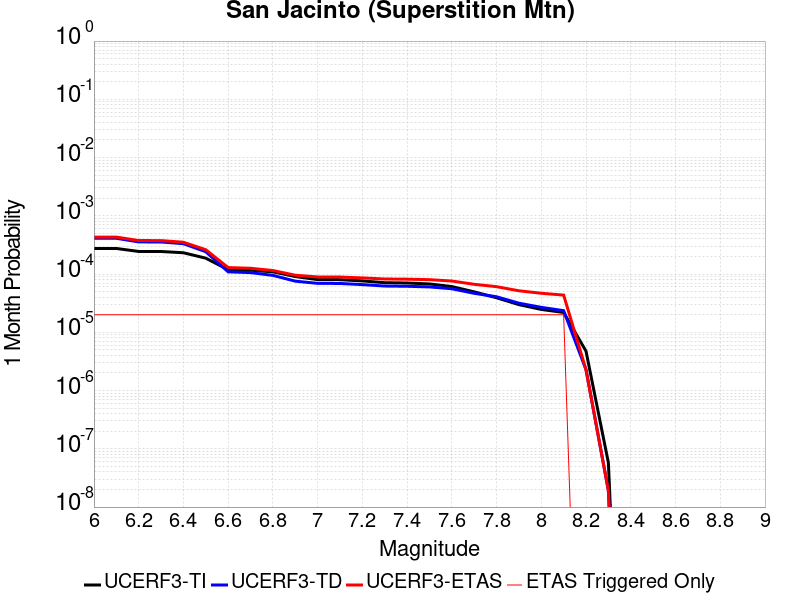 | 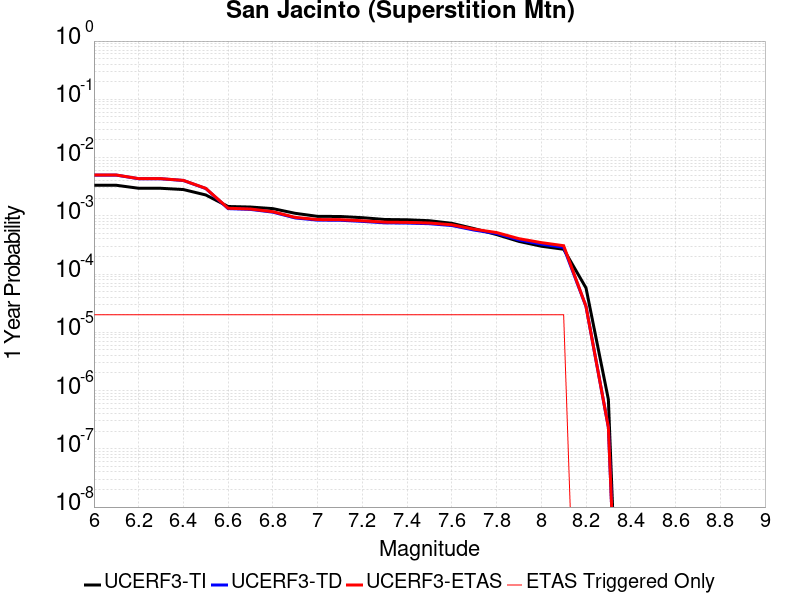 |  |

| Magnitude | 1 wk TI Prob | 1 wk TD Prob | 1 wk ETAS Prob | 1 wk ETAS/TD Gain | 1 wk ETAS Triggered Only | 1 mo TI Prob | 1 mo TD Prob | 1 mo ETAS Prob | 1 mo ETAS/TD Gain | 1 mo ETAS Triggered Only | 1 yr TI Prob | 1 yr TD Prob | 1 yr ETAS Prob | 1 yr ETAS/TD Gain | 1 yr ETAS Triggered Only | 10 yr TI Prob | 10 yr TD Prob | 10 yr ETAS Prob | 10 yr ETAS/TD Gain | 10 yr ETAS Triggered Only |
|-----|-----|-----|-----|-----|-----|-----|-----|-----|-----|-----|-----|-----|-----|-----|-----|-----|-----|-----|-----|-----|
| 6.0 | 6.4193904E-5 | 9.599367E-5 | 1.1414075E-4 | 1.1890445 | 1.814882E-5 | 2.7508775E-4 | 4.1134638E-4 | 4.2948773E-4 | 1.0441024 | 1.814882E-5 | 0.0033440501 | 0.0049980893 | 0.0050161476 | 1.003613 | 1.814882E-5 | 0.03294174 | 0.048823986 | 0.04884125 | 1.0003536 | 1.814882E-5 |
| 6.1 | 6.4193904E-5 | 9.599367E-5 | 1.1414075E-4 | 1.1890445 | 1.814882E-5 | 2.7508775E-4 | 4.1134638E-4 | 4.2948773E-4 | 1.0441024 | 1.814882E-5 | 0.0033440501 | 0.0049980893 | 0.0050161476 | 1.003613 | 1.814882E-5 | 0.03294174 | 0.048823986 | 0.04884125 | 1.0003536 | 1.814882E-5 |
| 6.2 | 5.7023593E-5 | 8.3144434E-5 | 1.0129174E-4 | 1.2182626 | 1.814882E-5 | 2.4436394E-4 | 3.5629404E-4 | 3.7443638E-4 | 1.0509197 | 1.814882E-5 | 0.002971072 | 0.0043308944 | 0.0043489644 | 1.0041724 | 1.814882E-5 | 0.029316625 | 0.04250403 | 0.042521406 | 1.0004089 | 1.814882E-5 |
| 6.3 | 5.6940098E-5 | 8.298979E-5 | 1.01137106E-4 | 1.2186692 | 1.814882E-5 | 2.4400617E-4 | 3.5563146E-4 | 3.7377383E-4 | 1.0510145 | 1.814882E-5 | 0.002966728 | 0.00432286 | 0.0043409304 | 1.0041802 | 1.814882E-5 | 0.029274331 | 0.042427283 | 0.04244466 | 1.0004096 | 1.814882E-5 |
| 6.4 | 5.4171585E-5 | 7.7483564E-5 | 9.5630974E-5 | 1.2342099 | 1.814882E-5 | 2.3214328E-4 | 3.3203943E-4 | 3.5018224E-4 | 1.0546405 | 1.814882E-5 | 0.0028226813 | 0.0040367353 | 0.004054811 | 1.0044777 | 1.814882E-5 | 0.02787096 | 0.03971653 | 0.039733957 | 1.0004388 | 1.814882E-5 |
| 6.5 | 4.375144E-5 | 5.642133E-5 | 7.456912E-5 | 1.3216478 | 1.814882E-5 | 1.874927E-4 | 2.4178992E-4 | 2.5993434E-4 | 1.0750421 | 1.814882E-5 | 0.0022803338 | 0.002940994 | 0.0029590894 | 1.0061529 | 1.814882E-5 | 0.022570757 | 0.029236801 | 0.02925442 | 1.0006026 | 1.814882E-5 |
| 6.6 | 2.772192E-5 | 2.5488358E-5 | 4.3636715E-5 | 1.7120254 | 1.814882E-5 | 1.1880282E-4 | 1.09231354E-4 | 1.273782E-4 | 1.1661321 | 1.814882E-5 | 0.0014454646 | 0.0013290998 | 0.0013472245 | 1.0136368 | 1.814882E-5 | 0.014360986 | 0.01354049 | 0.013558393 | 1.0013222 | 1.814882E-5 |
| 6.7 | 2.7124124E-5 | 2.4699386E-5 | 4.2847758E-5 | 1.7347702 | 1.814882E-5 | 1.1624106E-4 | 1.05850326E-4 | 1.2399723E-4 | 1.1714393 | 1.814882E-5 | 0.0014143161 | 0.001287985 | 0.0013061105 | 1.0140727 | 1.814882E-5 | 0.014053487 | 0.013133943 | 0.013151854 | 1.0013636 | 1.814882E-5 |
| 6.8 | 2.5475807E-5 | 2.216446E-5 | 4.031288E-5 | 1.8188071 | 1.814882E-5 | 1.0917746E-4 | 9.4987154E-5 | 1.1313425E-4 | 1.1910479 | 1.814882E-5 | 0.001328425 | 0.001155867 | 0.0011739949 | 1.0156833 | 1.814882E-5 | 0.0132051185 | 0.011822182 | 0.011840116 | 1.001517 | 1.814882E-5 |
| 6.9 | 2.1162023E-5 | 1.7626244E-5 | 3.5774745E-5 | 2.0296295 | 1.814882E-5 | 9.069123E-5 | 7.5538876E-5 | 9.368633E-5 | 1.2402399 | 1.814882E-5 | 0.0011036064 | 9.193016E-4 | 9.3743374E-4 | 1.0197238 | 1.814882E-5 | 0.010981417 | 0.00944688 | 0.009464857 | 1.0019029 | 1.814882E-5 |
| 7.0 | 1.8754288E-5 | 1.6161559E-5 | 3.4310084E-5 | 2.122944 | 1.814882E-5 | 8.037304E-5 | 6.9261994E-5 | 8.7409564E-5 | 1.2620133 | 1.814882E-5 | 9.781026E-4 | 8.4294105E-4 | 8.6107454E-4 | 1.0215122 | 1.814882E-5 | 0.009738087 | 0.008670042 | 0.008688034 | 1.0020751 | 1.814882E-5 |
| 7.1 | 1.8678527E-5 | 1.6086702E-5 | 3.423523E-5 | 2.1281698 | 1.814882E-5 | 8.0048376E-5 | 6.89412E-5 | 8.708877E-5 | 1.2632326 | 1.814882E-5 | 9.7415317E-4 | 8.3903834E-4 | 8.571719E-4 | 1.0216124 | 1.814882E-5 | 0.009698939 | 0.008630998 | 0.008648991 | 1.0020846 | 1.814882E-5 |
| 7.2 | 1.7804578E-5 | 1.5381282E-5 | 3.352982E-5 | 2.179911 | 1.814882E-5 | 7.6303106E-5 | 6.5918124E-5 | 8.4065745E-5 | 1.2753055 | 1.814882E-5 | 9.285943E-4 | 8.022599E-4 | 8.2039414E-4 | 1.022604 | 1.814882E-5 | 0.009247236 | 0.008262311 | 0.008280311 | 1.0021784 | 1.814882E-5 |
| 7.3 | 1.6583685E-5 | 1.4530388E-5 | 3.2678945E-5 | 2.249007 | 1.814882E-5 | 7.1070994E-5 | 6.227162E-5 | 8.0419304E-5 | 1.291428 | 1.814882E-5 | 8.649459E-4 | 7.5789524E-4 | 7.760303E-4 | 1.0239282 | 1.814882E-5 | 0.00861587 | 0.007817623 | 0.00783563 | 1.0023034 | 1.814882E-5 |
| 7.4 | 1.6387552E-5 | 1.4395274E-5 | 3.2543834E-5 | 2.2607303 | 1.814882E-5 | 7.023047E-5 | 6.169258E-5 | 7.984028E-5 | 1.2941635 | 1.814882E-5 | 8.5472054E-4 | 7.5085036E-4 | 7.6898554E-4 | 1.0241529 | 1.814882E-5 | 0.008514405 | 0.0077470057 | 0.007765014 | 1.0023246 | 1.814882E-5 |
| 7.5 | 1.5790754E-5 | 1.4035962E-5 | 3.218453E-5 | 2.2930048 | 1.814882E-5 | 6.767291E-5 | 6.0152746E-5 | 7.830047E-5 | 1.3016942 | 1.814882E-5 | 8.236062E-4 | 7.321156E-4 | 7.502511E-4 | 1.0247715 | 1.814882E-5 | 0.008205604 | 0.007557569 | 0.007575581 | 1.0023832 | 1.814882E-5 |
| 7.6 | 1.4248672E-5 | 1.3054932E-5 | 3.1203515E-5 | 2.3901706 | 1.814882E-5 | 6.106431E-5 | 5.594852E-5 | 7.409632E-5 | 1.3243661 | 1.814882E-5 | 7.432043E-4 | 6.8096205E-4 | 6.990985E-4 | 1.0266336 | 1.814882E-5 | 0.007407237 | 0.0070401574 | 0.007058178 | 1.0025598 | 1.814882E-5 |
| 7.7 | 1.15449975E-5 | 1.090368E-5 | 2.9052302E-5 | 2.6644495 | 1.814882E-5 | 4.947762E-5 | 4.6729223E-5 | 6.48772E-5 | 1.3883646 | 1.814882E-5 | 6.022235E-4 | 5.687805E-4 | 5.86919E-4 | 1.0318902 | 1.814882E-5 | 0.006005941 | 0.0059101824 | 0.005928224 | 1.0030526 | 1.814882E-5 |
| 7.8 | 9.1391985E-6 | 9.514299E-6 | 2.7662947E-5 | 2.907513 | 1.814882E-5 | 3.9167408E-5 | 4.0774932E-5 | 5.892301E-5 | 1.4450793 | 1.814882E-5 | 4.767588E-4 | 4.963223E-4 | 5.144621E-4 | 1.0365485 | 1.814882E-5 | 0.0047573727 | 0.0051766867 | 0.0051947413 | 1.0034877 | 1.814882E-5 |
| 7.9 | 6.973017E-6 | 7.3821784E-6 | 2.5530864E-5 | 3.4584458 | 1.814882E-5 | 2.9884017E-5 | 3.1637526E-5 | 4.9785773E-5 | 1.5736303 | 1.814882E-5 | 3.6377716E-4 | 3.8511935E-4 | 4.0326116E-4 | 1.047107 | 1.814882E-5 | 0.0036318225 | 0.0040517948 | 0.00406987 | 1.004461 | 1.814882E-5 |
| 8.0 | 5.7638235E-6 | 6.259972E-6 | 2.4408679E-5 | 3.8991675 | 1.814882E-5 | 2.4701867E-5 | 2.6828178E-5 | 4.497651E-5 | 1.6764654 | 1.814882E-5 | 3.0070372E-4 | 3.2658462E-4 | 3.447275E-4 | 1.0555534 | 1.814882E-5 | 0.0030029714 | 0.0034534496 | 0.0034715356 | 1.0052371 | 1.814882E-5 |
| 8.1 | 5.1124434E-6 | 5.4956718E-6 | 2.3644392E-5 | 4.3023663 | 1.814882E-5 | 2.1910288E-5 | 2.355267E-5 | 4.1701063E-5 | 1.7705451 | 1.814882E-5 | 2.6672508E-4 | 2.867165E-4 | 3.0486012E-4 | 1.0632807 | 1.814882E-5 | 0.0026640517 | 0.003040336 | 0.0030584298 | 1.0059512 | 1.814882E-5 |
| 8.2 | 1.1075938E-6 | 5.336568E-7 | 5.336568E-7 | 1.0 | 0.0 | 4.7468216E-6 | 2.2870988E-6 | 2.2870988E-6 | 1.0 | 0.0 | 5.779102E-5 | 2.7845093E-5 | 2.7845093E-5 | 1.0 | 0.0 | 5.777599E-4 | 3.1346595E-4 | 3.1346595E-4 | 1.0 | 0.0 |
| 8.3 | 1.3584393E-8 | 4.473836E-9 | 4.473836E-9 | 1.0 | 0.0 | 5.8218827E-8 | 1.9173582E-8 | 1.9173582E-8 | 1.0 | 0.0 | 7.0881396E-7 | 2.3343837E-7 | 2.3343837E-7 | 1.0 | 0.0 | 7.0881174E-6 | 2.6163038E-6 | 2.6163038E-6 | 1.0 | 0.0 |

## East Huasna 2011 CFM
*[(top)](#table-of-contents)*

| 1 Week | 1 Month | 1 Year | 10 Year |
|-----|-----|-----|-----|
|  |  |  | 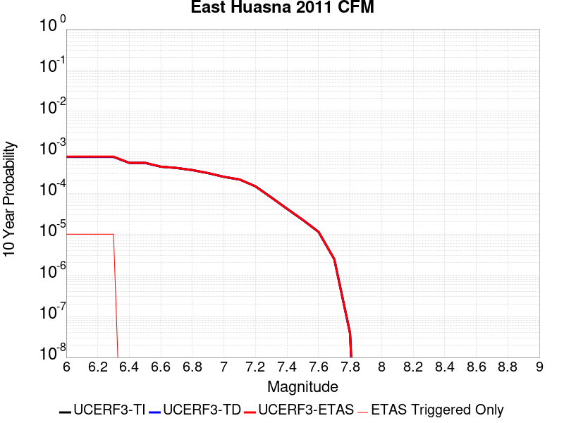 |

| Magnitude | 1 wk TI Prob | 1 wk TD Prob | 1 wk ETAS Prob | 1 wk ETAS/TD Gain | 1 wk ETAS Triggered Only | 1 mo TI Prob | 1 mo TD Prob | 1 mo ETAS Prob | 1 mo ETAS/TD Gain | 1 mo ETAS Triggered Only | 1 yr TI Prob | 1 yr TD Prob | 1 yr ETAS Prob | 1 yr ETAS/TD Gain | 1 yr ETAS Triggered Only | 10 yr TI Prob | 10 yr TD Prob | 10 yr ETAS Prob | 10 yr ETAS/TD Gain | 10 yr ETAS Triggered Only |
|-----|-----|-----|-----|-----|-----|-----|-----|-----|-----|-----|-----|-----|-----|-----|-----|-----|-----|-----|-----|-----|
| 6.0 | 1.4658423E-6 | 1.4715657E-6 | 1.4715657E-6 | 1.0 | 0.0 | 6.282166E-6 | 6.3066955E-6 | 6.3066955E-6 | 1.0 | 0.0 | 7.6482684E-5 | 7.678138E-5 | 7.678138E-5 | 1.0 | 0.0 | 7.645637E-4 | 7.6755555E-4 | 7.8569044E-4 | 1.0236268 | 1.814882E-5 |
| 6.1 | 1.4658423E-6 | 1.4715657E-6 | 1.4715657E-6 | 1.0 | 0.0 | 6.282166E-6 | 6.3066955E-6 | 6.3066955E-6 | 1.0 | 0.0 | 7.6482684E-5 | 7.678138E-5 | 7.678138E-5 | 1.0 | 0.0 | 7.645637E-4 | 7.6755555E-4 | 7.8569044E-4 | 1.0236268 | 1.814882E-5 |
| 6.2 | 1.4658423E-6 | 1.4715657E-6 | 1.4715657E-6 | 1.0 | 0.0 | 6.282166E-6 | 6.3066955E-6 | 6.3066955E-6 | 1.0 | 0.0 | 7.6482684E-5 | 7.678138E-5 | 7.678138E-5 | 1.0 | 0.0 | 7.645637E-4 | 7.6755555E-4 | 7.8569044E-4 | 1.0236268 | 1.814882E-5 |
| 6.3 | 1.4658423E-6 | 1.4715657E-6 | 1.4715657E-6 | 1.0 | 0.0 | 6.282166E-6 | 6.3066955E-6 | 6.3066955E-6 | 1.0 | 0.0 | 7.6482684E-5 | 7.678138E-5 | 7.678138E-5 | 1.0 | 0.0 | 7.645637E-4 | 7.6755555E-4 | 7.8569044E-4 | 1.0236268 | 1.814882E-5 |
| 6.4 | 1.0488257E-6 | 1.0527513E-6 | 1.0527513E-6 | 1.0 | 0.0 | 4.4949593E-6 | 4.5117836E-6 | 4.5117836E-6 | 1.0 | 0.0 | 5.472476E-5 | 5.49296E-5 | 5.49296E-5 | 1.0 | 0.0 | 5.4711284E-4 | 5.491621E-4 | 5.491621E-4 | 1.0 | 0.0 |
| 6.5 | 1.0488257E-6 | 1.0527513E-6 | 1.0527513E-6 | 1.0 | 0.0 | 4.4949593E-6 | 4.5117836E-6 | 4.5117836E-6 | 1.0 | 0.0 | 5.472476E-5 | 5.49296E-5 | 5.49296E-5 | 1.0 | 0.0 | 5.4711284E-4 | 5.491621E-4 | 5.491621E-4 | 1.0 | 0.0 |
| 6.6 | 8.463064E-7 | 8.49363E-7 | 8.49363E-7 | 1.0 | 0.0 | 3.6270226E-6 | 3.6401223E-6 | 3.6401223E-6 | 1.0 | 0.0 | 4.4158103E-5 | 4.4317596E-5 | 4.4317596E-5 | 1.0 | 0.0 | 4.414933E-4 | 4.4308844E-4 | 4.4308844E-4 | 1.0 | 0.0 |
| 6.7 | 7.876149E-7 | 7.902531E-7 | 7.902531E-7 | 1.0 | 0.0 | 3.375488E-6 | 3.3867946E-6 | 3.3867946E-6 | 1.0 | 0.0 | 4.109579E-5 | 4.1233452E-5 | 4.1233452E-5 | 1.0 | 0.0 | 4.108819E-4 | 4.1225864E-4 | 4.1225864E-4 | 1.0 | 0.0 |
| 6.8 | 6.9940785E-7 | 7.0165754E-7 | 7.0165754E-7 | 1.0 | 0.0 | 2.9974588E-6 | 3.0071003E-6 | 3.0071003E-6 | 1.0 | 0.0 | 3.649345E-5 | 3.6610836E-5 | 3.6610836E-5 | 1.0 | 0.0 | 3.6487455E-4 | 3.660485E-4 | 3.660485E-4 | 1.0 | 0.0 |
| 6.9 | 5.899658E-7 | 5.9155974E-7 | 5.9155974E-7 | 1.0 | 0.0 | 2.5284223E-6 | 2.5352535E-6 | 2.5352535E-6 | 1.0 | 0.0 | 3.0783107E-5 | 3.086628E-5 | 3.086628E-5 | 1.0 | 0.0 | 3.0778843E-4 | 3.086202E-4 | 3.086202E-4 | 1.0 | 0.0 |
| 7.0 | 4.793814E-7 | 4.8032706E-7 | 4.8032706E-7 | 1.0 | 0.0 | 2.05449E-6 | 2.058543E-6 | 2.058543E-6 | 1.0 | 0.0 | 2.501313E-5 | 2.5062474E-5 | 2.5062474E-5 | 1.0 | 0.0 | 2.5010316E-4 | 2.5059667E-4 | 2.5059667E-4 | 1.0 | 0.0 |
| 7.1 | 4.1256908E-7 | 4.129939E-7 | 4.129939E-7 | 1.0 | 0.0 | 1.768152E-6 | 1.7699726E-6 | 1.7699726E-6 | 1.0 | 0.0 | 2.1527037E-5 | 2.1549205E-5 | 2.1549205E-5 | 1.0 | 0.0 | 2.1524953E-4 | 2.154713E-4 | 2.154713E-4 | 1.0 | 0.0 |
| 7.2 | 2.822599E-7 | 2.8161398E-7 | 2.8161398E-7 | 1.0 | 0.0 | 1.2096847E-6 | 1.2069165E-6 | 1.2069165E-6 | 1.0 | 0.0 | 1.47278115E-5 | 1.469411E-5 | 1.469411E-5 | 1.0 | 0.0 | 1.4726835E-4 | 1.4693146E-4 | 1.4693146E-4 | 1.0 | 0.0 |
| 7.3 | 1.5261652E-7 | 1.5075E-7 | 1.5075E-7 | 1.0 | 0.0 | 6.540707E-7 | 6.4607127E-7 | 6.4607127E-7 | 1.0 | 0.0 | 7.963281E-6 | 7.8658895E-6 | 7.8658895E-6 | 1.0 | 0.0 | 7.962996E-5 | 7.865613E-5 | 7.865613E-5 | 1.0 | 0.0 |
| 7.4 | 7.976414E-8 | 8.057865E-8 | 8.057865E-8 | 1.0 | 0.0 | 3.418463E-7 | 3.45337E-7 | 3.45337E-7 | 1.0 | 0.0 | 4.1619705E-6 | 4.2044703E-6 | 4.2044703E-6 | 1.0 | 0.0 | 4.161893E-5 | 4.2043914E-5 | 4.2043914E-5 | 1.0 | 0.0 |
| 7.5 | 4.2715055E-8 | 4.3202512E-8 | 4.3202512E-8 | 1.0 | 0.0 | 1.830645E-7 | 1.8515361E-7 | 1.8515361E-7 | 1.0 | 0.0 | 2.228808E-6 | 2.2542429E-6 | 2.2542429E-6 | 1.0 | 0.0 | 2.2287857E-5 | 2.2542203E-5 | 2.2542203E-5 | 1.0 | 0.0 |
| 7.6 | 2.1807532E-8 | 2.2057476E-8 | 2.2057476E-8 | 1.0 | 0.0 | 9.346085E-8 | 9.4532034E-8 | 9.4532034E-8 | 1.0 | 0.0 | 1.1378852E-6 | 1.1509269E-6 | 1.1509269E-6 | 1.0 | 0.0 | 1.1378794E-5 | 1.1509211E-5 | 1.1509211E-5 | 1.0 | 0.0 |
| 7.7 | 4.7196043E-9 | 4.767283E-9 | 4.767283E-9 | 1.0 | 0.0 | 2.0226874E-8 | 2.0431212E-8 | 2.0431212E-8 | 1.0 | 0.0 | 2.4626218E-7 | 2.4874998E-7 | 2.4874998E-7 | 1.0 | 0.0 | 2.462619E-6 | 2.487497E-6 | 2.487497E-6 | 1.0 | 0.0 |
| 7.8 | 7.400003E-11 | 7.4654505E-11 | 7.4654505E-11 | 1.0 | 0.0 | 3.171432E-10 | 3.1994773E-10 | 3.1994773E-10 | 1.0 | 0.0 | 3.861218E-9 | 3.895363E-9 | 3.895363E-9 | 1.0 | 0.0 | 3.861218E-8 | 3.895363E-8 | 3.895363E-8 | 1.0 | 0.0 |

## San Juan
*[(top)](#table-of-contents)*

| 1 Week | 1 Month | 1 Year | 10 Year |
|-----|-----|-----|-----|
|  |  |  |  |

| Magnitude | 1 wk TI Prob | 1 wk TD Prob | 1 wk ETAS Prob | 1 wk ETAS/TD Gain | 1 wk ETAS Triggered Only | 1 mo TI Prob | 1 mo TD Prob | 1 mo ETAS Prob | 1 mo ETAS/TD Gain | 1 mo ETAS Triggered Only | 1 yr TI Prob | 1 yr TD Prob | 1 yr ETAS Prob | 1 yr ETAS/TD Gain | 1 yr ETAS Triggered Only | 10 yr TI Prob | 10 yr TD Prob | 10 yr ETAS Prob | 10 yr ETAS/TD Gain | 10 yr ETAS Triggered Only |
|-----|-----|-----|-----|-----|-----|-----|-----|-----|-----|-----|-----|-----|-----|-----|-----|-----|-----|-----|-----|-----|
| 6.0 | 8.682808E-6 | 8.7491635E-6 | 8.7491635E-6 | 1.0 | 0.0 | 3.72115E-5 | 3.74959E-5 | 3.74959E-5 | 1.0 | 0.0 | 4.5295584E-4 | 4.564218E-4 | 4.7456234E-4 | 1.0397451 | 1.814882E-5 | 0.004520337 | 0.004555385 | 0.0045734514 | 1.0039659 | 1.814882E-5 |
| 6.1 | 8.682808E-6 | 8.7491635E-6 | 8.7491635E-6 | 1.0 | 0.0 | 3.72115E-5 | 3.74959E-5 | 3.74959E-5 | 1.0 | 0.0 | 4.5295584E-4 | 4.564218E-4 | 4.7456234E-4 | 1.0397451 | 1.814882E-5 | 0.004520337 | 0.004555385 | 0.0045734514 | 1.0039659 | 1.814882E-5 |
| 6.2 | 8.682808E-6 | 8.7491635E-6 | 8.7491635E-6 | 1.0 | 0.0 | 3.72115E-5 | 3.74959E-5 | 3.74959E-5 | 1.0 | 0.0 | 4.5295584E-4 | 4.564218E-4 | 4.7456234E-4 | 1.0397451 | 1.814882E-5 | 0.004520337 | 0.004555385 | 0.0045734514 | 1.0039659 | 1.814882E-5 |
| 6.3 | 6.3054235E-6 | 6.2825848E-6 | 6.2825848E-6 | 1.0 | 0.0 | 2.7022963E-5 | 2.6925094E-5 | 2.6925094E-5 | 1.0 | 0.0 | 3.2895492E-4 | 3.2776513E-4 | 3.2776513E-4 | 1.0 | 0.0 | 0.003284684 | 0.003273017 | 0.003273017 | 1.0 | 0.0 |
| 6.4 | 6.1490473E-6 | 6.1144656E-6 | 6.1144656E-6 | 1.0 | 0.0 | 2.6352795E-5 | 2.6204598E-5 | 2.6204598E-5 | 1.0 | 0.0 | 3.2079802E-4 | 3.1899565E-4 | 3.1899565E-4 | 1.0 | 0.0 | 0.0032033534 | 0.0031855737 | 0.0031855737 | 1.0 | 0.0 |
| 6.5 | 5.204848E-6 | 5.137233E-6 | 5.137233E-6 | 1.0 | 0.0 | 2.23063E-5 | 2.2016533E-5 | 2.2016533E-5 | 1.0 | 0.0 | 2.7154534E-4 | 2.6801927E-4 | 2.6801927E-4 | 1.0 | 0.0 | 0.0027121378 | 0.0026771144 | 0.0026771144 | 1.0 | 0.0 |
| 6.6 | 4.5179986E-6 | 4.4150297E-6 | 4.4150297E-6 | 1.0 | 0.0 | 1.9362706E-5 | 1.8921424E-5 | 1.8921424E-5 | 1.0 | 0.0 | 2.3571544E-4 | 2.3034477E-4 | 2.3034477E-4 | 1.0 | 0.0 | 0.0023546559 | 0.0023011973 | 0.0023011973 | 1.0 | 0.0 |
| 6.7 | 3.9442616E-6 | 3.819828E-6 | 3.819828E-6 | 1.0 | 0.0 | 1.6903869E-5 | 1.6370592E-5 | 1.6370592E-5 | 1.0 | 0.0 | 2.0578515E-4 | 1.992944E-4 | 1.992944E-4 | 1.0 | 0.0 | 0.002055947 | 0.0019912818 | 0.0019912818 | 1.0 | 0.0 |
| 6.8 | 3.4536245E-6 | 3.3163353E-6 | 3.3163353E-6 | 1.0 | 0.0 | 1.4801163E-5 | 1.4212792E-5 | 1.4212792E-5 | 1.0 | 0.0 | 1.8018926E-4 | 1.7302761E-4 | 1.7302761E-4 | 1.0 | 0.0 | 0.0018004322 | 0.0017290477 | 0.0017290477 | 1.0 | 0.0 |
| 6.9 | 3.059865E-6 | 2.9120315E-6 | 2.9120315E-6 | 1.0 | 0.0 | 1.3113641E-5 | 1.2480078E-5 | 1.2480078E-5 | 1.0 | 0.0 | 1.596469E-4 | 1.5193493E-4 | 1.5193493E-4 | 1.0 | 0.0 | 0.0015953224 | 0.0015184252 | 0.0015184252 | 1.0 | 0.0 |
| 7.0 | 2.6504351E-6 | 2.4920002E-6 | 2.4920002E-6 | 1.0 | 0.0 | 1.1358958E-5 | 1.0679961E-5 | 1.0679961E-5 | 1.0 | 0.0 | 1.3828653E-4 | 1.300213E-4 | 1.300213E-4 | 1.0 | 0.0 | 0.0013820052 | 0.0012995641 | 0.0012995641 | 1.0 | 0.0 |
| 7.1 | 2.2039317E-6 | 2.0338296E-6 | 2.0338296E-6 | 1.0 | 0.0 | 9.445387E-6 | 8.716386E-6 | 8.716386E-6 | 1.0 | 0.0 | 1.1499152E-4 | 1.0611736E-4 | 1.0611736E-4 | 1.0 | 0.0 | 0.0011493203 | 0.0010607769 | 0.0010607769 | 1.0 | 0.0 |
| 7.2 | 1.0786707E-6 | 8.7701903E-7 | 8.7701903E-7 | 1.0 | 0.0 | 4.622866E-6 | 3.7586476E-6 | 3.7586476E-6 | 1.0 | 0.0 | 5.628194E-5 | 4.5760586E-5 | 4.5760586E-5 | 1.0 | 0.0 | 5.6267687E-4 | 4.5757066E-4 | 4.5757066E-4 | 1.0 | 0.0 |
| 7.3 | 6.846433E-7 | 4.868805E-7 | 4.868805E-7 | 1.0 | 0.0 | 2.9341822E-6 | 2.086629E-6 | 2.086629E-6 | 1.0 | 0.0 | 3.5723086E-5 | 2.5404412E-5 | 2.5404412E-5 | 1.0 | 0.0 | 3.571734E-4 | 2.540486E-4 | 2.540486E-4 | 1.0 | 0.0 |
| 7.4 | 5.23043E-7 | 3.2628162E-7 | 3.2628162E-7 | 1.0 | 0.0 | 2.2416111E-6 | 1.398349E-6 | 1.398349E-6 | 1.0 | 0.0 | 2.7291273E-5 | 1.7024766E-5 | 1.7024766E-5 | 1.0 | 0.0 | 2.7287923E-4 | 1.7026656E-4 | 1.7026656E-4 | 1.0 | 0.0 |
| 7.5 | 4.648444E-7 | 2.7234944E-7 | 2.7234944E-7 | 1.0 | 0.0 | 1.9921886E-6 | 1.1672114E-6 | 1.1672114E-6 | 1.0 | 0.0 | 2.4254627E-5 | 1.42107065E-5 | 1.42107065E-5 | 1.0 | 0.0 | 2.425198E-4 | 1.421276E-4 | 1.421276E-4 | 1.0 | 0.0 |
| 7.6 | 3.9906567E-7 | 2.2083314E-7 | 2.2083314E-7 | 1.0 | 0.0 | 1.7102802E-6 | 9.464274E-7 | 9.464274E-7 | 1.0 | 0.0 | 2.0822463E-5 | 1.1522693E-5 | 1.1522693E-5 | 1.0 | 0.0 | 2.0820512E-4 | 1.15245566E-4 | 1.15245566E-4 | 1.0 | 0.0 |
| 7.7 | 1.8784601E-7 | 5.3666906E-8 | 5.3666906E-8 | 1.0 | 0.0 | 8.0505407E-7 | 2.30001E-7 | 2.30001E-7 | 1.0 | 0.0 | 9.80149E-6 | 2.8002585E-6 | 2.8002585E-6 | 1.0 | 0.0 | 9.801057E-5 | 2.8011282E-5 | 2.8011282E-5 | 1.0 | 0.0 |
| 7.8 | 1.00154914E-7 | 1.2415832E-8 | 1.2415832E-8 | 1.0 | 0.0 | 4.2923529E-7 | 5.3210716E-8 | 5.3210716E-8 | 1.0 | 0.0 | 5.225927E-6 | 6.4784024E-7 | 6.4784024E-7 | 1.0 | 0.0 | 5.225804E-5 | 6.484273E-6 | 6.484273E-6 | 1.0 | 0.0 |
| 7.9 | 6.171429E-8 | 4.2966155E-9 | 4.2966155E-9 | 1.0 | 0.0 | 2.6448978E-7 | 1.8414067E-8 | 1.8414067E-8 | 1.0 | 0.0 | 3.2201583E-6 | 2.2419121E-7 | 2.2419121E-7 | 1.0 | 0.0 | 3.2201115E-5 | 2.2472002E-6 | 2.2472002E-6 | 1.0 | 0.0 |
| 8.0 | 1.3974572E-8 | 3.3788217E-10 | 3.3788217E-10 | 1.0 | 0.0 | 5.989102E-8 | 1.448067E-9 | 1.448067E-9 | 1.0 | 0.0 | 7.2917294E-7 | 1.763022E-8 | 1.763022E-8 | 1.0 | 0.0 | 7.2917055E-6 | 1.8060365E-7 | 1.8060365E-7 | 1.0 | 0.0 |
| 8.1 | 1.8403477E-9 | 1.1302803E-10 | 1.1302803E-10 | 1.0 | 0.0 | 7.887204E-9 | 4.844063E-10 | 4.844063E-10 | 1.0 | 0.0 | 9.602671E-8 | 5.8976446E-9 | 5.8976446E-9 | 1.0 | 0.0 | 9.602667E-7 | 6.021993E-8 | 6.021993E-8 | 1.0 | 0.0 |

## Hayward (No) 2011 CFM
*[(top)](#table-of-contents)*

| 1 Week | 1 Month | 1 Year | 10 Year |
|-----|-----|-----|-----|
|  |  |  |  |

| Magnitude | 1 wk TI Prob | 1 wk TD Prob | 1 wk ETAS Prob | 1 wk ETAS/TD Gain | 1 wk ETAS Triggered Only | 1 mo TI Prob | 1 mo TD Prob | 1 mo ETAS Prob | 1 mo ETAS/TD Gain | 1 mo ETAS Triggered Only | 1 yr TI Prob | 1 yr TD Prob | 1 yr ETAS Prob | 1 yr ETAS/TD Gain | 1 yr ETAS Triggered Only | 10 yr TI Prob | 10 yr TD Prob | 10 yr ETAS Prob | 10 yr ETAS/TD Gain | 10 yr ETAS Triggered Only |
|-----|-----|-----|-----|-----|-----|-----|-----|-----|-----|-----|-----|-----|-----|-----|-----|-----|-----|-----|-----|-----|
| 6.0 | 9.3068506E-5 | 1.739599E-4 | 1.739599E-4 | 1.0 | 0.0 | 3.9880406E-4 | 7.453244E-4 | 7.453244E-4 | 1.0 | 0.0 | 0.0048446343 | 0.009036438 | 0.009036438 | 1.0 | 0.0 | 0.047403704 | 0.08637534 | 0.08639192 | 1.0001919 | 1.814882E-5 |
| 6.1 | 9.055486E-5 | 1.6947114E-4 | 1.6947114E-4 | 1.0 | 0.0 | 3.880345E-4 | 7.261021E-4 | 7.261021E-4 | 1.0 | 0.0 | 0.0047140904 | 0.008804537 | 0.008804537 | 1.0 | 0.0 | 0.046153355 | 0.08426854 | 0.084285155 | 1.0001972 | 1.814882E-5 |
| 6.2 | 9.006742E-5 | 1.6867711E-4 | 1.6867711E-4 | 1.0 | 0.0 | 3.859461E-4 | 7.22701E-4 | 7.22701E-4 | 1.0 | 0.0 | 0.0046887742 | 0.008763513 | 0.008763513 | 1.0 | 0.0 | 0.0459107 | 0.083892785 | 0.08390941 | 1.0001981 | 1.814882E-5 |
| 6.3 | 8.8336754E-5 | 1.6547246E-4 | 1.6547246E-4 | 1.0 | 0.0 | 3.7853114E-4 | 7.089758E-4 | 7.089758E-4 | 1.0 | 0.0 | 0.004598882 | 0.008597788 | 0.008597788 | 1.0 | 0.0 | 0.04504866 | 0.08238599 | 0.08240265 | 1.0002022 | 1.814882E-5 |
| 6.4 | 8.526157E-5 | 1.5974249E-4 | 1.5974249E-4 | 1.0 | 0.0 | 3.6535555E-4 | 6.8443175E-4 | 6.8443175E-4 | 1.0 | 0.0 | 0.0044391346 | 0.008301278 | 0.008301278 | 1.0 | 0.0 | 0.043514993 | 0.079682834 | 0.07969954 | 1.0002096 | 1.814882E-5 |
| 6.5 | 8.152396E-5 | 1.530663E-4 | 1.530663E-4 | 1.0 | 0.0 | 3.493416E-4 | 6.558342E-4 | 6.558342E-4 | 1.0 | 0.0 | 0.0042449418 | 0.007955698 | 0.007955698 | 1.0 | 0.0 | 0.04164765 | 0.07651369 | 0.07653045 | 1.0002191 | 1.814882E-5 |
| 6.6 | 7.987405E-5 | 1.5010842E-4 | 1.5010842E-4 | 1.0 | 0.0 | 3.4227243E-4 | 6.4316386E-4 | 6.4316386E-4 | 1.0 | 0.0 | 0.0041592065 | 0.0078025614 | 0.0078025614 | 1.0 | 0.0 | 0.04082218 | 0.07510622 | 0.075123005 | 1.0002235 | 1.814882E-5 |
| 6.7 | 7.777665E-5 | 1.4650106E-4 | 1.4650106E-4 | 1.0 | 0.0 | 3.332859E-4 | 6.277113E-4 | 6.277113E-4 | 1.0 | 0.0 | 0.004050208 | 0.00761576 | 0.00761576 | 1.0 | 0.0 | 0.039771806 | 0.073382616 | 0.07339943 | 1.0002291 | 1.814882E-5 |
| 6.8 | 7.3284005E-5 | 1.3800753E-4 | 1.3800753E-4 | 1.0 | 0.0 | 3.140365E-4 | 5.913274E-4 | 5.913274E-4 | 1.0 | 0.0 | 0.0038166929 | 0.0071757827 | 0.0071757827 | 1.0 | 0.0 | 0.037518036 | 0.06929621 | 0.0693131 | 1.0002438 | 1.814882E-5 |
| 6.9 | 6.458263E-5 | 1.2131439E-4 | 1.2131439E-4 | 1.0 | 0.0 | 2.7675333E-4 | 5.198157E-4 | 5.198157E-4 | 1.0 | 0.0 | 0.0033642664 | 0.0063104923 | 0.0063104923 | 1.0 | 0.0 | 0.033137884 | 0.061225023 | 0.06124206 | 1.0002782 | 1.814882E-5 |
| 7.0 | 5.3853604E-5 | 1.00250414E-4 | 1.00250414E-4 | 1.0 | 0.0 | 2.3078074E-4 | 4.295742E-4 | 4.295742E-4 | 1.0 | 0.0 | 0.0028061352 | 0.0052175885 | 0.0052175885 | 1.0 | 0.0 | 0.027709642 | 0.0509578 | 0.050975025 | 1.000338 | 1.814882E-5 |
| 7.1 | 4.4308683E-5 | 8.170626E-5 | 8.170626E-5 | 1.0 | 0.0 | 1.8988053E-4 | 3.501229E-4 | 3.501229E-4 | 1.0 | 0.0 | 0.0023093442 | 0.0042544557 | 0.0042544557 | 1.0 | 0.0 | 0.022854926 | 0.04182473 | 0.04184212 | 1.0004158 | 1.814882E-5 |
| 7.2 | 3.295973E-5 | 6.0771144E-5 | 6.0771144E-5 | 1.0 | 0.0 | 1.4124835E-4 | 2.604219E-4 | 2.604219E-4 | 1.0 | 0.0 | 0.0017183421 | 0.0031660495 | 0.0031660495 | 1.0 | 0.0 | 0.017051157 | 0.031369876 | 0.031387456 | 1.0005604 | 1.814882E-5 |
| 7.3 | 2.452256E-5 | 4.5180346E-5 | 4.5180346E-5 | 1.0 | 0.0 | 1.05092455E-4 | 1.9361576E-4 | 1.9361576E-4 | 1.0 | 0.0 | 0.0012787496 | 0.0023547374 | 0.0023547374 | 1.0 | 0.0 | 0.0127141625 | 0.02344111 | 0.023458835 | 1.000756 | 1.814882E-5 |
| 7.4 | 1.8829967E-5 | 3.4602548E-5 | 3.4602548E-5 | 1.0 | 0.0 | 8.069736E-5 | 1.4828827E-4 | 1.4828827E-4 | 1.0 | 0.0 | 9.820475E-4 | 0.0018039243 | 0.0018039243 | 1.0 | 0.0 | 0.009777189 | 0.0180195 | 0.0180195 | 1.0 | 0.0 |
| 7.5 | 1.26374125E-5 | 2.2921116E-5 | 2.2921116E-5 | 1.0 | 0.0 | 5.4159216E-5 | 9.822969E-5 | 9.822969E-5 | 1.0 | 0.0 | 6.5918895E-4 | 0.0011952962 | 0.0011952962 | 1.0 | 0.0 | 0.00657237 | 0.011988836 | 0.011988836 | 1.0 | 0.0 |
| 7.6 | 4.666429E-6 | 8.4791645E-6 | 8.4791645E-6 | 1.0 | 0.0 | 1.9998828E-5 | 3.6338777E-5 | 3.6338777E-5 | 1.0 | 0.0 | 2.4345852E-4 | 4.4233602E-4 | 4.4233602E-4 | 1.0 | 0.0 | 0.0024319198 | 0.0044591012 | 0.0044591012 | 1.0 | 0.0 |
| 7.7 | 3.8399318E-7 | 7.133867E-7 | 7.133867E-7 | 1.0 | 0.0 | 1.6456839E-6 | 3.057368E-6 | 3.057368E-6 | 1.0 | 0.0 | 2.003602E-5 | 3.722282E-5 | 3.722282E-5 | 1.0 | 0.0 | 2.0034213E-4 | 3.8614936E-4 | 3.8614936E-4 | 1.0 | 0.0 |
| 7.8 | 2.5637698E-7 | 5.3662194E-7 | 5.3662194E-7 | 1.0 | 0.0 | 1.098758E-6 | 2.299806E-6 | 2.299806E-6 | 1.0 | 0.0 | 1.3377297E-5 | 2.7999782E-5 | 2.7999782E-5 | 1.0 | 0.0 | 1.3376492E-4 | 2.9244382E-4 | 2.9244382E-4 | 1.0 | 0.0 |
| 7.9 | 1.7141245E-7 | 3.7290573E-7 | 3.7290573E-7 | 1.0 | 0.0 | 7.3462456E-7 | 1.5981665E-6 | 1.5981665E-6 | 1.0 | 0.0 | 8.944017E-6 | 1.9457504E-5 | 1.9457504E-5 | 1.0 | 0.0 | 8.943657E-5 | 2.0245428E-4 | 2.0245428E-4 | 1.0 | 0.0 |
| 8.0 | 1.1808895E-7 | 2.7509762E-7 | 2.7509762E-7 | 1.0 | 0.0 | 5.060954E-7 | 1.1789892E-6 | 1.1789892E-6 | 1.0 | 0.0 | 6.161694E-6 | 1.43541E-5 | 1.43541E-5 | 1.0 | 0.0 | 6.161523E-5 | 1.4816441E-4 | 1.4816441E-4 | 1.0 | 0.0 |
| 8.1 | 5.138535E-8 | 1.1229867E-7 | 1.1229867E-7 | 1.0 | 0.0 | 2.2022292E-7 | 4.812799E-7 | 4.812799E-7 | 1.0 | 0.0 | 2.6812106E-6 | 5.8595674E-6 | 5.8595674E-6 | 1.0 | 0.0 | 2.6811784E-5 | 6.0158476E-5 | 6.0158476E-5 | 1.0 | 0.0 |

## Collayami 2011 CFM
*[(top)](#table-of-contents)*

| 1 Week | 1 Month | 1 Year | 10 Year |
|-----|-----|-----|-----|
|  | 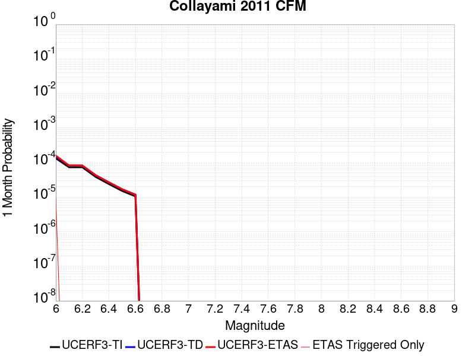 |  |  |

| Magnitude | 1 wk TI Prob | 1 wk TD Prob | 1 wk ETAS Prob | 1 wk ETAS/TD Gain | 1 wk ETAS Triggered Only | 1 mo TI Prob | 1 mo TD Prob | 1 mo ETAS Prob | 1 mo ETAS/TD Gain | 1 mo ETAS Triggered Only | 1 yr TI Prob | 1 yr TD Prob | 1 yr ETAS Prob | 1 yr ETAS/TD Gain | 1 yr ETAS Triggered Only | 10 yr TI Prob | 10 yr TD Prob | 10 yr ETAS Prob | 10 yr ETAS/TD Gain | 10 yr ETAS Triggered Only |
|-----|-----|-----|-----|-----|-----|-----|-----|-----|-----|-----|-----|-----|-----|-----|-----|-----|-----|-----|-----|-----|
| 6.0 | 3.112429E-5 | 3.493857E-5 | 3.493857E-5 | 1.0 | 0.0 | 1.33383E-4 | 1.4972912E-4 | 1.6787522E-4 | 1.1211929 | 1.814882E-5 | 0.0016227282 | 0.0018216016 | 0.0018397174 | 1.0099449 | 1.814882E-5 | 0.016109297 | 0.018084232 | 0.018102052 | 1.0009854 | 1.814882E-5 |
| 6.1 | 1.7119446E-5 | 1.9156616E-5 | 1.9156616E-5 | 1.0 | 0.0 | 7.336699E-5 | 8.209753E-5 | 8.209753E-5 | 1.0 | 0.0 | 8.92877E-4 | 9.991383E-4 | 9.991383E-4 | 1.0 | 0.0 | 0.00889298 | 0.009952341 | 0.009952341 | 1.0 | 0.0 |
| 6.2 | 1.7119446E-5 | 1.9156616E-5 | 1.9156616E-5 | 1.0 | 0.0 | 7.336699E-5 | 8.209753E-5 | 8.209753E-5 | 1.0 | 0.0 | 8.92877E-4 | 9.991383E-4 | 9.991383E-4 | 1.0 | 0.0 | 0.00889298 | 0.009952341 | 0.009952341 | 1.0 | 0.0 |
| 6.3 | 9.041288E-6 | 1.0106096E-5 | 1.0106096E-5 | 1.0 | 0.0 | 3.87478E-5 | 4.3311244E-5 | 4.3311244E-5 | 1.0 | 0.0 | 4.7165234E-4 | 5.2720873E-4 | 5.2720873E-4 | 1.0 | 0.0 | 0.0047065257 | 0.005261738 | 0.005261738 | 1.0 | 0.0 |
| 6.4 | 5.5972064E-6 | 6.2580466E-6 | 6.2580466E-6 | 1.0 | 0.0 | 2.3987806E-5 | 2.6820002E-5 | 2.6820002E-5 | 1.0 | 0.0 | 2.920124E-4 | 3.2649818E-4 | 3.2649818E-4 | 1.0 | 0.0 | 0.0029162897 | 0.0032615191 | 0.0032615191 | 1.0 | 0.0 |
| 6.5 | 3.530659E-6 | 3.9520487E-6 | 3.9520487E-6 | 1.0 | 0.0 | 1.5131307E-5 | 1.69373E-5 | 1.69373E-5 | 1.0 | 0.0 | 1.842081E-4 | 2.062025E-4 | 2.062025E-4 | 1.0 | 0.0 | 0.0018405546 | 0.0020611305 | 0.0020611305 | 1.0 | 0.0 |
| 6.6 | 2.4625563E-6 | 2.7572657E-6 | 2.7572657E-6 | 1.0 | 0.0 | 1.0553769E-5 | 1.1816854E-5 | 1.1816854E-5 | 1.0 | 0.0 | 1.2848456E-4 | 1.4387019E-4 | 1.4387019E-4 | 1.0 | 0.0 | 0.001284103 | 0.0014387019 | 0.0014387019 | 1.0 | 0.0 |

## Santa Susana East (connector)
*[(top)](#table-of-contents)*

| 1 Week | 1 Month | 1 Year | 10 Year |
|-----|-----|-----|-----|
|  |  |  | 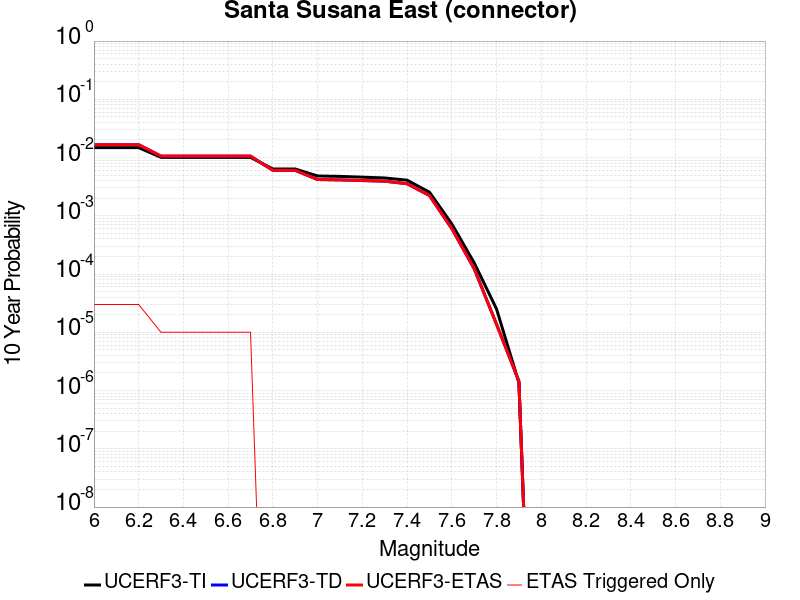 |

| Magnitude | 1 wk TI Prob | 1 wk TD Prob | 1 wk ETAS Prob | 1 wk ETAS/TD Gain | 1 wk ETAS Triggered Only | 1 mo TI Prob | 1 mo TD Prob | 1 mo ETAS Prob | 1 mo ETAS/TD Gain | 1 mo ETAS Triggered Only | 1 yr TI Prob | 1 yr TD Prob | 1 yr ETAS Prob | 1 yr ETAS/TD Gain | 1 yr ETAS Triggered Only | 10 yr TI Prob | 10 yr TD Prob | 10 yr ETAS Prob | 10 yr ETAS/TD Gain | 10 yr ETAS Triggered Only |
|-----|-----|-----|-----|-----|-----|-----|-----|-----|-----|-----|-----|-----|-----|-----|-----|-----|-----|-----|-----|-----|
| 6.0 | 2.858397E-5 | 3.202091E-5 | 3.202091E-5 | 1.0 | 0.0 | 1.2249697E-4 | 1.3722685E-4 | 1.3722685E-4 | 1.0 | 0.0 | 0.0014903803 | 0.0016697381 | 0.0016697381 | 1.0 | 0.0 | 0.014804244 | 0.016599052 | 0.0166169 | 1.0010753 | 1.814882E-5 |
| 6.1 | 2.858397E-5 | 3.202091E-5 | 3.202091E-5 | 1.0 | 0.0 | 1.2249697E-4 | 1.3722685E-4 | 1.3722685E-4 | 1.0 | 0.0 | 0.0014903803 | 0.0016697381 | 0.0016697381 | 1.0 | 0.0 | 0.014804244 | 0.016599052 | 0.0166169 | 1.0010753 | 1.814882E-5 |
| 6.2 | 2.858397E-5 | 3.202091E-5 | 3.202091E-5 | 1.0 | 0.0 | 1.2249697E-4 | 1.3722685E-4 | 1.3722685E-4 | 1.0 | 0.0 | 0.0014903803 | 0.0016697381 | 0.0016697381 | 1.0 | 0.0 | 0.014804244 | 0.016599052 | 0.0166169 | 1.0010753 | 1.814882E-5 |
| 6.3 | 1.943582E-5 | 2.036718E-5 | 2.036718E-5 | 1.0 | 0.0 | 8.329371E-5 | 8.7285625E-5 | 8.7285625E-5 | 1.0 | 0.0 | 0.001013629 | 0.0010622967 | 0.0010622967 | 1.0 | 0.0 | 0.010090181 | 0.010583619 | 0.010583619 | 1.0 | 0.0 |
| 6.4 | 1.943582E-5 | 2.036718E-5 | 2.036718E-5 | 1.0 | 0.0 | 8.329371E-5 | 8.7285625E-5 | 8.7285625E-5 | 1.0 | 0.0 | 0.001013629 | 0.0010622967 | 0.0010622967 | 1.0 | 0.0 | 0.010090181 | 0.010583619 | 0.010583619 | 1.0 | 0.0 |
| 6.5 | 1.943582E-5 | 2.036718E-5 | 2.036718E-5 | 1.0 | 0.0 | 8.329371E-5 | 8.7285625E-5 | 8.7285625E-5 | 1.0 | 0.0 | 0.001013629 | 0.0010622967 | 0.0010622967 | 1.0 | 0.0 | 0.010090181 | 0.010583619 | 0.010583619 | 1.0 | 0.0 |
| 6.6 | 1.943582E-5 | 2.036718E-5 | 2.036718E-5 | 1.0 | 0.0 | 8.329371E-5 | 8.7285625E-5 | 8.7285625E-5 | 1.0 | 0.0 | 0.001013629 | 0.0010622967 | 0.0010622967 | 1.0 | 0.0 | 0.010090181 | 0.010583619 | 0.010583619 | 1.0 | 0.0 |
| 6.7 | 1.9404439E-5 | 2.03546E-5 | 2.03546E-5 | 1.0 | 0.0 | 8.3159226E-5 | 8.723172E-5 | 8.723172E-5 | 1.0 | 0.0 | 0.0010119933 | 0.0010616409 | 0.0010616409 | 1.0 | 0.0 | 0.010073971 | 0.010577125 | 0.010577125 | 1.0 | 0.0 |
| 6.8 | 1.2217526E-5 | 1.1592998E-5 | 1.1592998E-5 | 1.0 | 0.0 | 5.2359774E-5 | 4.9683425E-5 | 4.9683425E-5 | 1.0 | 0.0 | 6.372938E-4 | 6.0474465E-4 | 6.0474465E-4 | 1.0 | 0.0 | 0.0063546924 | 0.006033037 | 0.006033037 | 1.0 | 0.0 |
| 6.9 | 1.2217526E-5 | 1.1592998E-5 | 1.1592998E-5 | 1.0 | 0.0 | 5.2359774E-5 | 4.9683425E-5 | 4.9683425E-5 | 1.0 | 0.0 | 6.372938E-4 | 6.0474465E-4 | 6.0474465E-4 | 1.0 | 0.0 | 0.0063546924 | 0.006033037 | 0.006033037 | 1.0 | 0.0 |
| 7.0 | 9.276017E-6 | 8.059113E-6 | 8.059113E-6 | 1.0 | 0.0 | 3.9753755E-5 | 3.4538618E-5 | 3.4538618E-5 | 1.0 | 0.0 | 4.8389446E-4 | 4.2042998E-4 | 4.2042998E-4 | 1.0 | 0.0 | 0.0048284214 | 0.0041970722 | 0.0041970722 | 1.0 | 0.0 |
| 7.1 | 9.130355E-6 | 7.942286E-6 | 7.942286E-6 | 1.0 | 0.0 | 3.9129503E-5 | 3.4037945E-5 | 3.4037945E-5 | 1.0 | 0.0 | 4.7629757E-4 | 4.1433662E-4 | 4.1433662E-4 | 1.0 | 0.0 | 0.00475278 | 0.004136367 | 0.004136367 | 1.0 | 0.0 |
| 7.2 | 8.851015E-6 | 7.741445E-6 | 7.741445E-6 | 1.0 | 0.0 | 3.7932372E-5 | 3.317722E-5 | 3.317722E-5 | 1.0 | 0.0 | 4.6172875E-4 | 4.038612E-4 | 4.038612E-4 | 1.0 | 0.0 | 0.0046077054 | 0.0040319953 | 0.0040319953 | 1.0 | 0.0 |
| 7.3 | 8.573006E-6 | 7.550166E-6 | 7.550166E-6 | 1.0 | 0.0 | 3.6740938E-5 | 3.2357475E-5 | 3.2357475E-5 | 1.0 | 0.0 | 4.472291E-4 | 3.9388443E-4 | 3.9388443E-4 | 1.0 | 0.0 | 0.004463301 | 0.0039325804 | 0.0039325804 | 1.0 | 0.0 |
| 7.4 | 7.852282E-6 | 6.817687E-6 | 6.817687E-6 | 1.0 | 0.0 | 3.36522E-5 | 2.9218349E-5 | 2.9218349E-5 | 1.0 | 0.0 | 4.096385E-4 | 3.5567835E-4 | 3.5567835E-4 | 1.0 | 0.0 | 0.0040888423 | 0.0035517553 | 0.0035517553 | 1.0 | 0.0 |
| 7.5 | 4.8869324E-6 | 4.279055E-6 | 4.279055E-6 | 1.0 | 0.0 | 2.0943828E-5 | 1.8338687E-5 | 1.8338687E-5 | 1.0 | 0.0 | 2.5496128E-4 | 2.232523E-4 | 2.232523E-4 | 1.0 | 0.0 | 0.0025466895 | 0.0022304445 | 0.0022304445 | 1.0 | 0.0 |
| 7.6 | 1.3894544E-6 | 1.1568179E-6 | 1.1568179E-6 | 1.0 | 0.0 | 5.954791E-6 | 4.957783E-6 | 4.957783E-6 | 1.0 | 0.0 | 7.249717E-5 | 6.0359558E-5 | 6.0359558E-5 | 1.0 | 0.0 | 7.247352E-4 | 6.0345343E-4 | 6.0345343E-4 | 1.0 | 0.0 |
| 7.7 | 2.9924632E-7 | 2.371928E-7 | 2.371928E-7 | 1.0 | 0.0 | 1.2824837E-6 | 1.0165402E-6 | 1.0165402E-6 | 1.0 | 0.0 | 1.5614127E-5 | 1.2376314E-5 | 1.2376314E-5 | 1.0 | 0.0 | 1.5613029E-4 | 1.2375697E-4 | 1.2375697E-4 | 1.0 | 0.0 |
| 7.8 | 4.8188564E-8 | 2.6323061E-8 | 2.6323061E-8 | 1.0 | 0.0 | 2.065224E-7 | 1.1281311E-7 | 1.1281311E-7 | 1.0 | 0.0 | 2.5144072E-6 | 1.3734989E-6 | 1.3734989E-6 | 1.0 | 0.0 | 2.5143789E-5 | 1.3734912E-5 | 1.3734912E-5 | 1.0 | 0.0 |
| 7.9 | 2.6127251E-9 | 2.7681102E-9 | 2.7681102E-9 | 1.0 | 0.0 | 1.1197393E-8 | 1.186333E-8 | 1.186333E-8 | 1.0 | 0.0 | 1.3632825E-7 | 1.4443603E-7 | 1.4443603E-7 | 1.0 | 0.0 | 1.3632817E-6 | 1.4443604E-6 | 1.4443604E-6 | 1.0 | 0.0 |

## Emerson-Copper Mtn 2011
*[(top)](#table-of-contents)*

| 1 Week | 1 Month | 1 Year | 10 Year |
|-----|-----|-----|-----|
|  |  |  |  |

| Magnitude | 1 wk TI Prob | 1 wk TD Prob | 1 wk ETAS Prob | 1 wk ETAS/TD Gain | 1 wk ETAS Triggered Only | 1 mo TI Prob | 1 mo TD Prob | 1 mo ETAS Prob | 1 mo ETAS/TD Gain | 1 mo ETAS Triggered Only | 1 yr TI Prob | 1 yr TD Prob | 1 yr ETAS Prob | 1 yr ETAS/TD Gain | 1 yr ETAS Triggered Only | 10 yr TI Prob | 10 yr TD Prob | 10 yr ETAS Prob | 10 yr ETAS/TD Gain | 10 yr ETAS Triggered Only |
|-----|-----|-----|-----|-----|-----|-----|-----|-----|-----|-----|-----|-----|-----|-----|-----|-----|-----|-----|-----|-----|
| 6.0 | 2.1364202E-5 | 9.968114E-6 | 9.968114E-6 | 1.0 | 0.0 | 9.1557646E-5 | 4.2719836E-5 | 4.2719836E-5 | 1.0 | 0.0 | 0.0011141442 | 5.199986E-4 | 5.38138E-4 | 1.0348835 | 1.814882E-5 | 0.011085749 | 0.005188688 | 0.005206743 | 1.0034796 | 1.814882E-5 |
| 6.1 | 2.1364202E-5 | 9.968114E-6 | 9.968114E-6 | 1.0 | 0.0 | 9.1557646E-5 | 4.2719836E-5 | 4.2719836E-5 | 1.0 | 0.0 | 0.0011141442 | 5.199986E-4 | 5.38138E-4 | 1.0348835 | 1.814882E-5 | 0.011085749 | 0.005188688 | 0.005206743 | 1.0034796 | 1.814882E-5 |
| 6.2 | 2.1364202E-5 | 9.968114E-6 | 9.968114E-6 | 1.0 | 0.0 | 9.1557646E-5 | 4.2719836E-5 | 4.2719836E-5 | 1.0 | 0.0 | 0.0011141442 | 5.199986E-4 | 5.38138E-4 | 1.0348835 | 1.814882E-5 | 0.011085749 | 0.005188688 | 0.005206743 | 1.0034796 | 1.814882E-5 |
| 6.3 | 1.7751237E-5 | 8.089227E-6 | 8.089227E-6 | 1.0 | 0.0 | 7.607452E-5 | 3.466769E-5 | 3.466769E-5 | 1.0 | 0.0 | 9.258136E-4 | 4.2200365E-4 | 4.401448E-4 | 1.0429882 | 1.814882E-5 | 0.00921966 | 0.0042126453 | 0.0042307177 | 1.00429 | 1.814882E-5 |
| 6.4 | 1.7751237E-5 | 8.089227E-6 | 8.089227E-6 | 1.0 | 0.0 | 7.607452E-5 | 3.466769E-5 | 3.466769E-5 | 1.0 | 0.0 | 9.258136E-4 | 4.2200365E-4 | 4.401448E-4 | 1.0429882 | 1.814882E-5 | 0.00921966 | 0.0042126453 | 0.0042307177 | 1.00429 | 1.814882E-5 |
| 6.5 | 1.5886664E-5 | 6.603819E-6 | 6.603819E-6 | 1.0 | 0.0 | 6.808392E-5 | 2.8301802E-5 | 2.8301802E-5 | 1.0 | 0.0 | 8.286065E-4 | 3.4452465E-4 | 3.4452465E-4 | 1.0 | 0.0 | 0.008255237 | 0.0034403696 | 0.0034403696 | 1.0 | 0.0 |
| 6.6 | 1.5886664E-5 | 6.603819E-6 | 6.603819E-6 | 1.0 | 0.0 | 6.808392E-5 | 2.8301802E-5 | 2.8301802E-5 | 1.0 | 0.0 | 8.286065E-4 | 3.4452465E-4 | 3.4452465E-4 | 1.0 | 0.0 | 0.008255237 | 0.0034403696 | 0.0034403696 | 1.0 | 0.0 |
| 6.7 | 1.428471E-5 | 5.470403E-6 | 5.470403E-6 | 1.0 | 0.0 | 6.121875E-5 | 2.3444394E-5 | 2.3444394E-5 | 1.0 | 0.0 | 7.450834E-4 | 2.8540206E-4 | 2.8540206E-4 | 1.0 | 0.0 | 0.007425902 | 0.0028507432 | 0.0028507432 | 1.0 | 0.0 |
| 6.8 | 1.3490684E-5 | 5.073699E-6 | 5.073699E-6 | 1.0 | 0.0 | 5.7815934E-5 | 2.1744265E-5 | 2.1744265E-5 | 1.0 | 0.0 | 7.0368167E-4 | 2.6470813E-4 | 2.6470813E-4 | 1.0 | 0.0 | 0.007014576 | 0.002644309 | 0.002644309 | 1.0 | 0.0 |
| 6.9 | 1.2235421E-5 | 4.289677E-6 | 4.289677E-6 | 1.0 | 0.0 | 5.2436466E-5 | 1.838422E-5 | 1.838422E-5 | 1.0 | 0.0 | 6.38227E-4 | 2.238085E-4 | 2.238085E-4 | 1.0 | 0.0 | 0.0063639707 | 0.0022361854 | 0.0022361854 | 1.0 | 0.0 |
| 7.0 | 1.1009851E-5 | 3.7189886E-6 | 3.7189886E-6 | 1.0 | 0.0 | 4.7184225E-5 | 1.5938444E-5 | 1.5938444E-5 | 1.0 | 0.0 | 5.743165E-4 | 1.9403672E-4 | 1.9403672E-4 | 1.0 | 0.0 | 0.005728345 | 0.0019390108 | 0.0019390108 | 1.0 | 0.0 |
| 7.1 | 9.726373E-6 | 3.2117953E-6 | 3.2117953E-6 | 1.0 | 0.0 | 4.168379E-5 | 1.3764783E-5 | 1.3764783E-5 | 1.0 | 0.0 | 5.07382E-4 | 1.6757673E-4 | 1.6757673E-4 | 1.0 | 0.0 | 0.0050622504 | 0.0016748349 | 0.0016748349 | 1.0 | 0.0 |
| 7.2 | 3.9335127E-6 | 1.1524792E-6 | 1.1524792E-6 | 1.0 | 0.0 | 1.6857803E-5 | 4.9391874E-6 | 4.9391874E-6 | 1.0 | 0.0 | 2.0522442E-4 | 6.0133007E-5 | 6.0133007E-5 | 1.0 | 0.0 | 0.00205035 | 6.011733E-4 | 6.011733E-4 | 1.0 | 0.0 |
| 7.3 | 2.661632E-6 | 6.911505E-7 | 6.911505E-7 | 1.0 | 0.0 | 1.14069435E-5 | 2.9620703E-6 | 2.9620703E-6 | 1.0 | 0.0 | 1.3887069E-4 | 3.6062618E-5 | 3.6062618E-5 | 1.0 | 0.0 | 0.0013878393 | 3.605687E-4 | 3.605687E-4 | 1.0 | 0.0 |
| 7.4 | 2.0893426E-6 | 5.4618386E-7 | 5.4618386E-7 | 1.0 | 0.0 | 8.954295E-6 | 2.3407858E-6 | 2.3407858E-6 | 1.0 | 0.0 | 1.0901308E-4 | 2.84987E-5 | 2.84987E-5 | 1.0 | 0.0 | 0.0010895962 | 2.84951E-4 | 2.84951E-4 | 1.0 | 0.0 |
| 7.5 | 1.1681728E-6 | 3.6030585E-7 | 3.6030585E-7 | 1.0 | 0.0 | 5.0064455E-6 | 1.544167E-6 | 1.544167E-6 | 1.0 | 0.0 | 6.0951766E-5 | 1.8800076E-5 | 1.8800076E-5 | 1.0 | 0.0 | 6.093505E-4 | 1.8798532E-4 | 1.8798532E-4 | 1.0 | 0.0 |
| 7.6 | 1.3154387E-7 | 7.1197384E-8 | 7.1197384E-8 | 1.0 | 0.0 | 5.6375933E-7 | 3.051316E-7 | 3.051316E-7 | 1.0 | 0.0 | 6.863748E-6 | 3.7149728E-6 | 3.7149728E-6 | 1.0 | 0.0 | 6.863536E-5 | 3.7149264E-5 | 3.7149264E-5 | 1.0 | 0.0 |

## San Gregorio (South) 2011 CFM
*[(top)](#table-of-contents)*

| 1 Week | 1 Month | 1 Year | 10 Year |
|-----|-----|-----|-----|
|  |  |  |  |

| Magnitude | 1 wk TI Prob | 1 wk TD Prob | 1 wk ETAS Prob | 1 wk ETAS/TD Gain | 1 wk ETAS Triggered Only | 1 mo TI Prob | 1 mo TD Prob | 1 mo ETAS Prob | 1 mo ETAS/TD Gain | 1 mo ETAS Triggered Only | 1 yr TI Prob | 1 yr TD Prob | 1 yr ETAS Prob | 1 yr ETAS/TD Gain | 1 yr ETAS Triggered Only | 10 yr TI Prob | 10 yr TD Prob | 10 yr ETAS Prob | 10 yr ETAS/TD Gain | 10 yr ETAS Triggered Only |
|-----|-----|-----|-----|-----|-----|-----|-----|-----|-----|-----|-----|-----|-----|-----|-----|-----|-----|-----|-----|-----|
| 6.0 | 1.8770423E-5 | 1.6279751E-5 | 1.6279751E-5 | 1.0 | 0.0 | 8.044219E-5 | 6.976852E-5 | 6.976852E-5 | 1.0 | 0.0 | 9.789435E-4 | 8.491044E-4 | 8.491044E-4 | 1.0 | 0.0 | 0.009746423 | 0.008471312 | 0.008489307 | 1.0021242 | 1.814882E-5 |
| 6.1 | 1.8770423E-5 | 1.6279751E-5 | 1.6279751E-5 | 1.0 | 0.0 | 8.044219E-5 | 6.976852E-5 | 6.976852E-5 | 1.0 | 0.0 | 9.789435E-4 | 8.491044E-4 | 8.491044E-4 | 1.0 | 0.0 | 0.009746423 | 0.008471312 | 0.008489307 | 1.0021242 | 1.814882E-5 |
| 6.2 | 1.7508692E-5 | 1.4899257E-5 | 1.4899257E-5 | 1.0 | 0.0 | 7.5035096E-5 | 6.3852414E-5 | 6.3852414E-5 | 1.0 | 0.0 | 9.1316935E-4 | 7.7712885E-4 | 7.7712885E-4 | 1.0 | 0.0 | 0.00909426 | 0.00775674 | 0.007774748 | 1.0023216 | 1.814882E-5 |
| 6.3 | 1.7508692E-5 | 1.4899257E-5 | 1.4899257E-5 | 1.0 | 0.0 | 7.5035096E-5 | 6.3852414E-5 | 6.3852414E-5 | 1.0 | 0.0 | 9.1316935E-4 | 7.7712885E-4 | 7.7712885E-4 | 1.0 | 0.0 | 0.00909426 | 0.00775674 | 0.007774748 | 1.0023216 | 1.814882E-5 |
| 6.4 | 1.6004591E-5 | 1.3249094E-5 | 1.3249094E-5 | 1.0 | 0.0 | 6.85893E-5 | 5.6780602E-5 | 5.6780602E-5 | 1.0 | 0.0 | 8.347548E-4 | 6.910856E-4 | 6.910856E-4 | 1.0 | 0.0 | 0.008316261 | 0.006901791 | 0.0069198143 | 1.0026114 | 1.814882E-5 |
| 6.5 | 1.6004591E-5 | 1.3249094E-5 | 1.3249094E-5 | 1.0 | 0.0 | 6.85893E-5 | 5.6780602E-5 | 5.6780602E-5 | 1.0 | 0.0 | 8.347548E-4 | 6.910856E-4 | 6.910856E-4 | 1.0 | 0.0 | 0.008316261 | 0.006901791 | 0.0069198143 | 1.0026114 | 1.814882E-5 |
| 6.6 | 1.5442201E-5 | 1.2633725E-5 | 1.2633725E-5 | 1.0 | 0.0 | 6.617918E-5 | 5.4143416E-5 | 5.4143416E-5 | 1.0 | 0.0 | 8.0543366E-4 | 6.5899757E-4 | 6.5899757E-4 | 1.0 | 0.0 | 0.008025207 | 0.006582842 | 0.0066008717 | 1.0027388 | 1.814882E-5 |
| 6.7 | 1.489921E-5 | 1.2042234E-5 | 1.2042234E-5 | 1.0 | 0.0 | 6.3852196E-5 | 5.1608557E-5 | 5.1608557E-5 | 1.0 | 0.0 | 7.7712315E-4 | 6.2815374E-4 | 6.2815374E-4 | 1.0 | 0.0 | 0.0077441116 | 0.006276176 | 0.0062942104 | 1.0028735 | 1.814882E-5 |
| 6.8 | 1.3876024E-5 | 1.0921184E-5 | 1.0921184E-5 | 1.0 | 0.0 | 5.9467322E-5 | 4.6804238E-5 | 4.6804238E-5 | 1.0 | 0.0 | 7.237741E-4 | 5.69693E-4 | 5.69693E-4 | 1.0 | 0.0 | 0.0072142133 | 0.0056946846 | 0.0057127303 | 1.0031688 | 1.814882E-5 |
| 6.9 | 1.33922495E-5 | 1.0392687E-5 | 1.0392687E-5 | 1.0 | 0.0 | 5.7394092E-5 | 4.4539327E-5 | 4.4539327E-5 | 1.0 | 0.0 | 6.9854903E-4 | 5.4213166E-4 | 5.4213166E-4 | 1.0 | 0.0 | 0.0069635725 | 0.005420442 | 0.0054384926 | 1.0033301 | 1.814882E-5 |
| 7.0 | 1.2807324E-5 | 9.752649E-6 | 9.752649E-6 | 1.0 | 0.0 | 5.4887376E-5 | 4.1796397E-5 | 4.1796397E-5 | 1.0 | 0.0 | 6.680489E-4 | 5.087525E-4 | 5.087525E-4 | 1.0 | 0.0 | 0.006660442 | 0.0050882204 | 0.005106277 | 1.0035486 | 1.814882E-5 |
| 7.1 | 1.2191438E-5 | 9.061537E-6 | 9.061537E-6 | 1.0 | 0.0 | 5.224797E-5 | 3.8834576E-5 | 3.8834576E-5 | 1.0 | 0.0 | 6.3593336E-4 | 4.727085E-4 | 4.727085E-4 | 1.0 | 0.0 | 0.0063411663 | 0.0047293645 | 0.0047293645 | 1.0 | 0.0 |
| 7.2 | 1.1769438E-5 | 8.581731E-6 | 8.581731E-6 | 1.0 | 0.0 | 5.0439474E-5 | 3.677833E-5 | 3.677833E-5 | 1.0 | 0.0 | 6.1392755E-4 | 4.4768423E-4 | 4.4768423E-4 | 1.0 | 0.0 | 0.0061223423 | 0.004480157 | 0.004480157 | 1.0 | 0.0 |
| 7.3 | 1.150374E-5 | 8.29716E-6 | 8.29716E-6 | 1.0 | 0.0 | 4.9300812E-5 | 3.5558773E-5 | 3.5558773E-5 | 1.0 | 0.0 | 6.0007203E-4 | 4.3284212E-4 | 4.3284212E-4 | 1.0 | 0.0 | 0.0059845424 | 0.0043323063 | 0.0043323063 | 1.0 | 0.0 |
| 7.4 | 1.12514E-5 | 8.042902E-6 | 8.042902E-6 | 1.0 | 0.0 | 4.8219394E-5 | 3.4469125E-5 | 3.4469125E-5 | 1.0 | 0.0 | 5.8691297E-4 | 4.1958084E-4 | 4.1958084E-4 | 1.0 | 0.0 | 0.005853653 | 0.0042001884 | 0.0042001884 | 1.0 | 0.0 |
| 7.5 | 1.059696E-5 | 7.3931915E-6 | 7.3931915E-6 | 1.0 | 0.0 | 4.5414752E-5 | 3.168472E-5 | 3.168472E-5 | 1.0 | 0.0 | 5.5278436E-4 | 3.8569325E-4 | 3.8569325E-4 | 1.0 | 0.0 | 0.0055141128 | 0.0038624762 | 0.0038624762 | 1.0 | 0.0 |
| 7.6 | 9.018592E-6 | 5.8369624E-6 | 5.8369624E-6 | 1.0 | 0.0 | 3.8650534E-5 | 2.5015313E-5 | 2.5015313E-5 | 1.0 | 0.0 | 4.7046866E-4 | 3.045189E-4 | 3.045189E-4 | 1.0 | 0.0 | 0.004694739 | 0.0030528754 | 0.0030528754 | 1.0 | 0.0 |
| 7.7 | 6.243489E-6 | 3.2395455E-6 | 3.2395455E-6 | 1.0 | 0.0 | 2.6757538E-5 | 1.3883692E-5 | 1.3883692E-5 | 1.0 | 0.0 | 3.257243E-4 | 1.6902086E-4 | 1.6902086E-4 | 1.0 | 0.0 | 0.003252473 | 0.001699108 | 0.001699108 | 1.0 | 0.0 |
| 7.8 | 3.1941963E-6 | 1.3809986E-6 | 1.3809986E-6 | 1.0 | 0.0 | 1.368934E-5 | 5.9185513E-6 | 5.9185513E-6 | 1.0 | 0.0 | 1.6665498E-4 | 7.2055984E-5 | 7.2055984E-5 | 1.0 | 0.0 | 0.0016653005 | 7.263174E-4 | 7.263174E-4 | 1.0 | 0.0 |
| 7.9 | 2.0098398E-6 | 6.9161155E-7 | 6.9161155E-7 | 1.0 | 0.0 | 8.6135715E-6 | 2.964046E-6 | 2.964046E-6 | 1.0 | 0.0 | 1.0486518E-4 | 3.608666E-5 | 3.608666E-5 | 1.0 | 0.0 | 0.0010481571 | 3.657225E-4 | 3.657225E-4 | 1.0 | 0.0 |
| 8.0 | 8.353119E-7 | 3.1623412E-7 | 3.1623412E-7 | 1.0 | 0.0 | 3.579903E-6 | 1.3552883E-6 | 1.3552883E-6 | 1.0 | 0.0 | 4.358445E-5 | 1.6500511E-5 | 1.6500511E-5 | 1.0 | 0.0 | 4.3575902E-4 | 1.6619264E-4 | 1.6619264E-4 | 1.0 | 0.0 |
| 8.1 | 1.5033264E-7 | 6.527624E-8 | 6.527624E-8 | 1.0 | 0.0 | 6.442826E-7 | 2.7975528E-7 | 2.7975528E-7 | 1.0 | 0.0 | 7.844113E-6 | 3.4060151E-6 | 3.4060151E-6 | 1.0 | 0.0 | 7.843835E-5 | 3.407693E-5 | 3.407693E-5 | 1.0 | 0.0 |

## Las Positas
*[(top)](#table-of-contents)*

| 1 Week | 1 Month | 1 Year | 10 Year |
|-----|-----|-----|-----|
|  |  |  |  |

| Magnitude | 1 wk TI Prob | 1 wk TD Prob | 1 wk ETAS Prob | 1 wk ETAS/TD Gain | 1 wk ETAS Triggered Only | 1 mo TI Prob | 1 mo TD Prob | 1 mo ETAS Prob | 1 mo ETAS/TD Gain | 1 mo ETAS Triggered Only | 1 yr TI Prob | 1 yr TD Prob | 1 yr ETAS Prob | 1 yr ETAS/TD Gain | 1 yr ETAS Triggered Only | 10 yr TI Prob | 10 yr TD Prob | 10 yr ETAS Prob | 10 yr ETAS/TD Gain | 10 yr ETAS Triggered Only |
|-----|-----|-----|-----|-----|-----|-----|-----|-----|-----|-----|-----|-----|-----|-----|-----|-----|-----|-----|-----|-----|
| 6.0 | 1.0659424E-5 | 1.15911225E-5 | 1.15911225E-5 | 1.0 | 0.0 | 4.568245E-5 | 4.9676237E-5 | 4.9676237E-5 | 1.0 | 0.0 | 5.560419E-4 | 6.048082E-4 | 6.048082E-4 | 1.0 | 0.0 | 0.005546526 | 0.006048082 | 0.006066121 | 1.0029826 | 1.814882E-5 |
| 6.1 | 1.0659424E-5 | 1.15911225E-5 | 1.15911225E-5 | 1.0 | 0.0 | 4.568245E-5 | 4.9676237E-5 | 4.9676237E-5 | 1.0 | 0.0 | 5.560419E-4 | 6.048082E-4 | 6.048082E-4 | 1.0 | 0.0 | 0.005546526 | 0.006048082 | 0.006066121 | 1.0029826 | 1.814882E-5 |
| 6.2 | 1.0659424E-5 | 1.15911225E-5 | 1.15911225E-5 | 1.0 | 0.0 | 4.568245E-5 | 4.9676237E-5 | 4.9676237E-5 | 1.0 | 0.0 | 5.560419E-4 | 6.048082E-4 | 6.048082E-4 | 1.0 | 0.0 | 0.005546526 | 0.006048082 | 0.006066121 | 1.0029826 | 1.814882E-5 |
| 6.3 | 1.0659424E-5 | 1.15911225E-5 | 1.15911225E-5 | 1.0 | 0.0 | 4.568245E-5 | 4.9676237E-5 | 4.9676237E-5 | 1.0 | 0.0 | 5.560419E-4 | 6.048082E-4 | 6.048082E-4 | 1.0 | 0.0 | 0.005546526 | 0.006048082 | 0.006066121 | 1.0029826 | 1.814882E-5 |

## Rodgers Creek - Healdsburg 2011 CFM
*[(top)](#table-of-contents)*

| 1 Week | 1 Month | 1 Year | 10 Year |
|-----|-----|-----|-----|
| 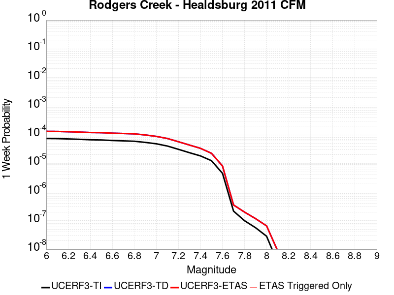 |  |  |  |

| Magnitude | 1 wk TI Prob | 1 wk TD Prob | 1 wk ETAS Prob | 1 wk ETAS/TD Gain | 1 wk ETAS Triggered Only | 1 mo TI Prob | 1 mo TD Prob | 1 mo ETAS Prob | 1 mo ETAS/TD Gain | 1 mo ETAS Triggered Only | 1 yr TI Prob | 1 yr TD Prob | 1 yr ETAS Prob | 1 yr ETAS/TD Gain | 1 yr ETAS Triggered Only | 10 yr TI Prob | 10 yr TD Prob | 10 yr ETAS Prob | 10 yr ETAS/TD Gain | 10 yr ETAS Triggered Only |
|-----|-----|-----|-----|-----|-----|-----|-----|-----|-----|-----|-----|-----|-----|-----|-----|-----|-----|-----|-----|-----|
| 6.0 | 7.390182E-5 | 1.3136698E-4 | 1.3136698E-4 | 1.0 | 0.0 | 3.1668364E-4 | 5.6287815E-4 | 5.6287815E-4 | 1.0 | 0.0 | 0.0038488081 | 0.0068315 | 0.0068315 | 1.0 | 0.0 | 0.037828278 | 0.06619178 | 0.06620873 | 1.0002561 | 1.814882E-5 |
| 6.1 | 7.318768E-5 | 1.3034661E-4 | 1.3034661E-4 | 1.0 | 0.0 | 3.1362378E-4 | 5.585081E-4 | 5.585081E-4 | 1.0 | 0.0 | 0.0038116854 | 0.0067786723 | 0.0067786723 | 1.0 | 0.0 | 0.037469655 | 0.06569639 | 0.065713346 | 1.0002581 | 1.814882E-5 |
| 6.2 | 7.1379836E-5 | 1.2727521E-4 | 1.2727521E-4 | 1.0 | 0.0 | 3.058777E-4 | 5.453505E-4 | 5.453505E-4 | 1.0 | 0.0 | 0.003717703 | 0.0066194604 | 0.0066194604 | 1.0 | 0.0 | 0.0365612 | 0.06421462 | 0.0642316 | 1.0002645 | 1.814882E-5 |
| 6.3 | 6.9255926E-5 | 1.2382054E-4 | 1.2382054E-4 | 1.0 | 0.0 | 2.9677735E-4 | 5.3055194E-4 | 5.3055194E-4 | 1.0 | 0.0 | 0.0036072785 | 0.006440372 | 0.006440372 | 1.0 | 0.0 | 0.035492823 | 0.06254096 | 0.06255797 | 1.000272 | 1.814882E-5 |
| 6.4 | 6.6757144E-5 | 1.1958744E-4 | 1.1958744E-4 | 1.0 | 0.0 | 2.8607066E-4 | 5.1241735E-4 | 5.1241735E-4 | 1.0 | 0.0 | 0.0034773487 | 0.0062209065 | 0.0062209065 | 1.0 | 0.0 | 0.034234364 | 0.060490217 | 0.060507268 | 1.0002819 | 1.814882E-5 |
| 6.5 | 6.5735134E-5 | 1.1808043E-4 | 1.1808043E-4 | 1.0 | 0.0 | 2.8169158E-4 | 5.0596124E-4 | 5.0596124E-4 | 1.0 | 0.0 | 0.003424202 | 0.0061427657 | 0.0061427657 | 1.0 | 0.0 | 0.03371918 | 0.059755135 | 0.059772197 | 1.0002856 | 1.814882E-5 |
| 6.6 | 6.289601E-5 | 1.1343802E-4 | 1.1343802E-4 | 1.0 | 0.0 | 2.6952647E-4 | 4.8607276E-4 | 4.8607276E-4 | 1.0 | 0.0 | 0.0032765474 | 0.005901959 | 0.005901959 | 1.0 | 0.0 | 0.032286562 | 0.057494484 | 0.05751159 | 1.0002975 | 1.814882E-5 |
| 6.7 | 6.115274E-5 | 1.1060895E-4 | 1.1060895E-4 | 1.0 | 0.0 | 2.6205686E-4 | 4.7395262E-4 | 4.7395262E-4 | 1.0 | 0.0 | 0.0031858748 | 0.0057551847 | 0.0057551847 | 1.0 | 0.0 | 0.031405866 | 0.05611298 | 0.056130107 | 1.0003053 | 1.814882E-5 |
| 6.8 | 5.9232367E-5 | 1.0728244E-4 | 1.0728244E-4 | 1.0 | 0.0 | 2.538283E-4 | 4.597012E-4 | 4.597012E-4 | 1.0 | 0.0 | 0.0030859804 | 0.0055825757 | 0.0055825757 | 1.0 | 0.0 | 0.030434765 | 0.054479737 | 0.0544969 | 1.000315 | 1.814882E-5 |
| 6.9 | 5.4030377E-5 | 9.8224424E-5 | 9.8224424E-5 | 1.0 | 0.0 | 2.315382E-4 | 4.2089424E-4 | 4.2089424E-4 | 1.0 | 0.0 | 0.0028153337 | 0.005112413 | 0.005112413 | 1.0 | 0.0 | 0.027799325 | 0.05001516 | 0.0500324 | 1.0003448 | 1.814882E-5 |
| 7.0 | 4.8260714E-5 | 8.740524E-5 | 8.740524E-5 | 1.0 | 0.0 | 2.0681522E-4 | 3.745404E-4 | 3.745404E-4 | 1.0 | 0.0 | 0.0025150678 | 0.004550549 | 0.004550549 | 1.0 | 0.0 | 0.024867928 | 0.044667665 | 0.044685002 | 1.0003881 | 1.814882E-5 |
| 7.1 | 4.0294493E-5 | 7.389041E-5 | 7.389041E-5 | 1.0 | 0.0 | 1.7267925E-4 | 3.1663495E-4 | 3.1663495E-4 | 1.0 | 0.0 | 0.0021003427 | 0.0038482544 | 0.0038482544 | 1.0 | 0.0 | 0.02080602 | 0.037923392 | 0.037940852 | 1.0004604 | 1.814882E-5 |
| 7.2 | 3.096388E-5 | 5.697752E-5 | 5.697752E-5 | 1.0 | 0.0 | 1.326956E-4 | 2.4416664E-4 | 2.4416664E-4 | 1.0 | 0.0 | 0.0016143717 | 0.0029686983 | 0.0029686983 | 1.0 | 0.0 | 0.01602694 | 0.029436996 | 0.02945461 | 1.0005984 | 1.814882E-5 |
| 7.3 | 2.3615226E-5 | 4.3628002E-5 | 4.3628002E-5 | 1.0 | 0.0 | 1.0120418E-4 | 1.8696384E-4 | 1.8696384E-4 | 1.0 | 0.0 | 0.0012314644 | 0.002273922 | 0.002273922 | 1.0 | 0.0 | 0.0122466255 | 0.022636993 | 0.02265473 | 1.0007836 | 1.814882E-5 |
| 7.4 | 1.8251132E-5 | 3.3541033E-5 | 3.3541033E-5 | 1.0 | 0.0 | 7.821679E-5 | 1.4373941E-4 | 1.4373941E-4 | 1.0 | 0.0 | 9.518733E-4 | 0.0017486324 | 0.0017486324 | 1.0 | 0.0 | 0.009478063 | 0.017465532 | 0.017465532 | 1.0 | 0.0 |
| 7.5 | 1.2411432E-5 | 2.246003E-5 | 2.246003E-5 | 1.0 | 0.0 | 5.3190768E-5 | 9.625375E-5 | 9.625375E-5 | 1.0 | 0.0 | 6.4740516E-4 | 0.0011712653 | 0.0011712653 | 1.0 | 0.0 | 0.006455223 | 0.011743283 | 0.011743283 | 1.0 | 0.0 |
| 7.6 | 4.4771446E-6 | 8.083989E-6 | 8.083989E-6 | 1.0 | 0.0 | 1.918762E-5 | 3.4645214E-5 | 3.4645214E-5 | 1.0 | 0.0 | 2.3358424E-4 | 4.2172507E-4 | 4.2172507E-4 | 1.0 | 0.0 | 0.0023333887 | 0.004246066 | 0.004246066 | 1.0 | 0.0 |
| 7.7 | 2.157941E-7 | 3.5349316E-7 | 3.5349316E-7 | 1.0 | 0.0 | 9.248315E-7 | 1.5149698E-6 | 1.5149698E-6 | 1.0 | 0.0 | 1.1259765E-5 | 1.8444602E-5 | 1.8444602E-5 | 1.0 | 0.0 | 1.1259195E-4 | 1.9069147E-4 | 1.9069147E-4 | 1.0 | 0.0 |
| 7.8 | 9.9623286E-8 | 1.989979E-7 | 1.989979E-7 | 1.0 | 0.0 | 4.269569E-7 | 8.528478E-7 | 8.528478E-7 | 1.0 | 0.0 | 5.1981874E-6 | 1.0383373E-5 | 1.0383373E-5 | 1.0 | 0.0 | 5.198066E-5 | 1.09018714E-4 | 1.09018714E-4 | 1.0 | 0.0 |
| 7.9 | 5.6745257E-8 | 1.1773924E-7 | 1.1773924E-7 | 1.0 | 0.0 | 2.4319394E-7 | 5.0459664E-7 | 5.0459664E-7 | 1.0 | 0.0 | 2.960882E-6 | 6.1434466E-6 | 6.1434466E-6 | 1.0 | 0.0 | 2.9608427E-5 | 6.470911E-5 | 6.470911E-5 | 1.0 | 0.0 |
| 8.0 | 2.8614323E-8 | 6.57845E-8 | 6.57845E-8 | 1.0 | 0.0 | 1.2263281E-7 | 2.8193355E-7 | 2.8193355E-7 | 1.0 | 0.0 | 1.4930534E-6 | 3.4325356E-6 | 3.4325356E-6 | 1.0 | 0.0 | 1.4930434E-5 | 3.582588E-5 | 3.582588E-5 | 1.0 | 0.0 |
| 8.1 | 3.5045191E-9 | 8.965783E-9 | 8.965783E-9 | 1.0 | 0.0 | 1.5019367E-8 | 3.8424783E-8 | 3.8424783E-8 | 1.0 | 0.0 | 1.8286079E-7 | 4.6782165E-7 | 4.6782165E-7 | 1.0 | 0.0 | 1.8286064E-6 | 4.8327956E-6 | 4.8327956E-6 | 1.0 | 0.0 |

## Great Valley 05 Pittsburg - Kirby Hills alt1
*[(top)](#table-of-contents)*

| 1 Week | 1 Month | 1 Year | 10 Year |
|-----|-----|-----|-----|
|  |  |  |  |

| Magnitude | 1 wk TI Prob | 1 wk TD Prob | 1 wk ETAS Prob | 1 wk ETAS/TD Gain | 1 wk ETAS Triggered Only | 1 mo TI Prob | 1 mo TD Prob | 1 mo ETAS Prob | 1 mo ETAS/TD Gain | 1 mo ETAS Triggered Only | 1 yr TI Prob | 1 yr TD Prob | 1 yr ETAS Prob | 1 yr ETAS/TD Gain | 1 yr ETAS Triggered Only | 10 yr TI Prob | 10 yr TD Prob | 10 yr ETAS Prob | 10 yr ETAS/TD Gain | 10 yr ETAS Triggered Only |
|-----|-----|-----|-----|-----|-----|-----|-----|-----|-----|-----|-----|-----|-----|-----|-----|-----|-----|-----|-----|-----|
| 6.0 | 4.187212E-5 | 5.3442072E-5 | 5.3442072E-5 | 1.0 | 0.0 | 1.794396E-4 | 2.290231E-4 | 2.290231E-4 | 1.0 | 0.0 | 0.002182488 | 0.0027857882 | 0.0028038863 | 1.0064967 | 1.814882E-5 | 0.021611776 | 0.02760304 | 0.027620686 | 1.0006393 | 1.814882E-5 |
| 6.1 | 4.187212E-5 | 5.3442072E-5 | 5.3442072E-5 | 1.0 | 0.0 | 1.794396E-4 | 2.290231E-4 | 2.290231E-4 | 1.0 | 0.0 | 0.002182488 | 0.0027857882 | 0.0028038863 | 1.0064967 | 1.814882E-5 | 0.021611776 | 0.02760304 | 0.027620686 | 1.0006393 | 1.814882E-5 |
| 6.2 | 1.7353306E-5 | 2.2154374E-5 | 2.2154374E-5 | 1.0 | 0.0 | 7.436919E-5 | 9.494618E-5 | 9.494618E-5 | 1.0 | 0.0 | 9.050688E-4 | 0.0011557543 | 0.0011557543 | 1.0 | 0.0 | 0.009013915 | 0.011535114 | 0.011535114 | 1.0 | 0.0 |
| 6.3 | 1.7353306E-5 | 2.2154374E-5 | 2.2154374E-5 | 1.0 | 0.0 | 7.436919E-5 | 9.494618E-5 | 9.494618E-5 | 1.0 | 0.0 | 9.050688E-4 | 0.0011557543 | 0.0011557543 | 1.0 | 0.0 | 0.009013915 | 0.011535114 | 0.011535114 | 1.0 | 0.0 |
| 6.4 | 1.4028824E-5 | 1.7900597E-5 | 1.7900597E-5 | 1.0 | 0.0 | 6.0122147E-5 | 7.671684E-5 | 7.671684E-5 | 1.0 | 0.0 | 7.3174125E-4 | 9.340275E-4 | 9.340275E-4 | 1.0 | 0.0 | 0.0072933645 | 0.009338138 | 0.009338138 | 1.0 | 0.0 |

## Point Reyes 2011 CFM
*[(top)](#table-of-contents)*

| 1 Week | 1 Month | 1 Year | 10 Year |
|-----|-----|-----|-----|
|  |  |  |  |

| Magnitude | 1 wk TI Prob | 1 wk TD Prob | 1 wk ETAS Prob | 1 wk ETAS/TD Gain | 1 wk ETAS Triggered Only | 1 mo TI Prob | 1 mo TD Prob | 1 mo ETAS Prob | 1 mo ETAS/TD Gain | 1 mo ETAS Triggered Only | 1 yr TI Prob | 1 yr TD Prob | 1 yr ETAS Prob | 1 yr ETAS/TD Gain | 1 yr ETAS Triggered Only | 10 yr TI Prob | 10 yr TD Prob | 10 yr ETAS Prob | 10 yr ETAS/TD Gain | 10 yr ETAS Triggered Only |
|-----|-----|-----|-----|-----|-----|-----|-----|-----|-----|-----|-----|-----|-----|-----|-----|-----|-----|-----|-----|-----|
| 6.0 | 8.8644965E-6 | 8.967163E-6 | 8.967163E-6 | 1.0 | 0.0 | 3.7990147E-5 | 3.843017E-5 | 3.843017E-5 | 1.0 | 0.0 | 4.624319E-4 | 4.6779314E-4 | 4.8593347E-4 | 1.0387785 | 1.814882E-5 | 0.0046147075 | 0.004668713 | 0.004686777 | 1.0038692 | 1.814882E-5 |
| 6.1 | 4.526405E-6 | 4.5392185E-6 | 4.5392185E-6 | 1.0 | 0.0 | 1.9398734E-5 | 1.9453653E-5 | 1.9453653E-5 | 1.0 | 0.0 | 2.36154E-4 | 2.3682354E-4 | 2.5496806E-4 | 1.0766162 | 1.814882E-5 | 0.002359032 | 0.0023658178 | 0.0023839236 | 1.0076531 | 1.814882E-5 |
| 6.2 | 4.526405E-6 | 4.5392185E-6 | 4.5392185E-6 | 1.0 | 0.0 | 1.9398734E-5 | 1.9453653E-5 | 1.9453653E-5 | 1.0 | 0.0 | 2.36154E-4 | 2.3682354E-4 | 2.5496806E-4 | 1.0766162 | 1.814882E-5 | 0.002359032 | 0.0023658178 | 0.0023839236 | 1.0076531 | 1.814882E-5 |
| 6.3 | 2.6842322E-6 | 2.660676E-6 | 2.660676E-6 | 1.0 | 0.0 | 1.1503801E-5 | 1.1402849E-5 | 1.1402849E-5 | 1.0 | 0.0 | 1.4004979E-4 | 1.3882104E-4 | 1.5696733E-4 | 1.1307173 | 1.814882E-5 | 0.0013996155 | 0.0013873649 | 0.0014054886 | 1.0130633 | 1.814882E-5 |
| 6.4 | 2.6842322E-6 | 2.660676E-6 | 2.660676E-6 | 1.0 | 0.0 | 1.1503801E-5 | 1.1402849E-5 | 1.1402849E-5 | 1.0 | 0.0 | 1.4004979E-4 | 1.3882104E-4 | 1.5696733E-4 | 1.1307173 | 1.814882E-5 | 0.0013996155 | 0.0013873649 | 0.0014054886 | 1.0130633 | 1.814882E-5 |
| 6.5 | 1.9281833E-6 | 1.8906262E-6 | 1.8906262E-6 | 1.0 | 0.0 | 8.263617E-6 | 8.102659E-6 | 8.102659E-6 | 1.0 | 0.0 | 1.0060489E-4 | 9.86455E-5 | 9.86455E-5 | 1.0 | 0.0 | 0.0010055936 | 9.860279E-4 | 9.860279E-4 | 1.0 | 0.0 |
| 6.6 | 1.4726726E-6 | 1.4269577E-6 | 1.4269577E-6 | 1.0 | 0.0 | 6.3114385E-6 | 6.1155188E-6 | 6.1155188E-6 | 1.0 | 0.0 | 7.683905E-5 | 7.445395E-5 | 7.445395E-5 | 1.0 | 0.0 | 7.6812494E-4 | 7.4429717E-4 | 7.4429717E-4 | 1.0 | 0.0 |
| 6.7 | 8.572307E-7 | 8.007212E-7 | 8.007212E-7 | 1.0 | 0.0 | 3.6738406E-6 | 3.431658E-6 | 3.431658E-6 | 1.0 | 0.0 | 4.472809E-5 | 4.1779647E-5 | 4.1779647E-5 | 1.0 | 0.0 | 4.471909E-4 | 4.1772184E-4 | 4.1772184E-4 | 1.0 | 0.0 |
| 6.8 | 6.6745434E-7 | 6.0773E-7 | 6.0773E-7 | 1.0 | 0.0 | 2.8605155E-6 | 2.6045543E-6 | 2.6045543E-6 | 1.0 | 0.0 | 3.482622E-5 | 3.171E-5 | 3.171E-5 | 1.0 | 0.0 | 3.4820763E-4 | 3.1705803E-4 | 3.1705803E-4 | 1.0 | 0.0 |
| 6.9 | 4.291521E-7 | 3.6535937E-7 | 3.6535937E-7 | 1.0 | 0.0 | 1.839222E-6 | 1.565825E-6 | 1.565825E-6 | 1.0 | 0.0 | 2.2392298E-5 | 1.9063755E-5 | 1.9063755E-5 | 1.0 | 0.0 | 2.2390042E-4 | 1.9062385E-4 | 1.9062385E-4 | 1.0 | 0.0 |
| 7.0 | 2.6812808E-7 | 2.0187414E-7 | 2.0187414E-7 | 1.0 | 0.0 | 1.1491198E-6 | 8.651746E-7 | 8.651746E-7 | 1.0 | 0.0 | 1.3990444E-5 | 1.0533451E-5 | 1.0533451E-5 | 1.0 | 0.0 | 1.3989564E-4 | 1.0533186E-4 | 1.0533186E-4 | 1.0 | 0.0 |
| 7.1 | 1.9451231E-7 | 1.2725499E-7 | 1.2725499E-7 | 1.0 | 0.0 | 8.336239E-7 | 5.453784E-7 | 5.453784E-7 | 1.0 | 0.0 | 1.0149324E-5 | 6.6399616E-6 | 6.6399616E-6 | 1.0 | 0.0 | 1.014886E-4 | 6.639991E-5 | 6.639991E-5 | 1.0 | 0.0 |
| 7.2 | 1.6715143E-7 | 1.00428394E-7 | 1.00428394E-7 | 1.0 | 0.0 | 7.1636305E-7 | 4.3040734E-7 | 4.3040734E-7 | 1.0 | 0.0 | 8.721685E-6 | 5.2401965E-6 | 5.2401965E-6 | 1.0 | 0.0 | 8.721343E-5 | 5.2402997E-5 | 5.2402997E-5 | 1.0 | 0.0 |
| 7.3 | 1.5503173E-7 | 9.0131024E-8 | 9.0131024E-8 | 1.0 | 0.0 | 6.644215E-7 | 3.8627576E-7 | 3.8627576E-7 | 1.0 | 0.0 | 8.089301E-6 | 4.702897E-6 | 4.702897E-6 | 1.0 | 0.0 | 8.089007E-5 | 4.7030244E-5 | 4.7030244E-5 | 1.0 | 0.0 |
| 7.4 | 1.4251614E-7 | 8.097624E-8 | 8.097624E-8 | 1.0 | 0.0 | 6.1078333E-7 | 3.47041E-7 | 3.47041E-7 | 1.0 | 0.0 | 7.4362615E-6 | 4.225216E-6 | 4.225216E-6 | 1.0 | 0.0 | 7.436013E-5 | 4.2253625E-5 | 4.2253625E-5 | 1.0 | 0.0 |
| 7.5 | 1.2710186E-7 | 7.0296394E-8 | 7.0296394E-8 | 1.0 | 0.0 | 5.447221E-7 | 3.0127023E-7 | 3.0127023E-7 | 1.0 | 0.0 | 6.6319717E-6 | 3.667959E-6 | 3.667959E-6 | 1.0 | 0.0 | 6.6317734E-5 | 3.6681253E-5 | 3.6681253E-5 | 1.0 | 0.0 |
| 7.6 | 1.0144708E-7 | 5.4952274E-8 | 5.4952274E-8 | 1.0 | 0.0 | 4.347731E-7 | 2.3550973E-7 | 2.3550973E-7 | 1.0 | 0.0 | 5.2933497E-6 | 2.8673273E-6 | 2.8673273E-6 | 1.0 | 0.0 | 5.293224E-5 | 2.8675171E-5 | 2.8675171E-5 | 1.0 | 0.0 |
| 7.7 | 7.090527E-8 | 3.98231E-8 | 3.98231E-8 | 1.0 | 0.0 | 3.038797E-7 | 1.7067042E-7 | 1.7067042E-7 | 1.0 | 0.0 | 3.699729E-6 | 2.0779103E-6 | 2.0779103E-6 | 1.0 | 0.0 | 3.6996673E-5 | 2.0781177E-5 | 2.0781177E-5 | 1.0 | 0.0 |
| 7.8 | 3.8712045E-8 | 2.7440025E-8 | 2.7440025E-8 | 1.0 | 0.0 | 1.6590876E-7 | 1.176001E-7 | 1.176001E-7 | 1.0 | 0.0 | 2.0199373E-6 | 1.4317802E-6 | 1.4317802E-6 | 1.0 | 0.0 | 2.0199188E-5 | 1.4319979E-5 | 1.4319979E-5 | 1.0 | 0.0 |
| 7.9 | 1.7068782E-8 | 1.1833354E-8 | 1.1833354E-8 | 1.0 | 0.0 | 7.315192E-8 | 5.0714362E-8 | 5.0714362E-8 | 1.0 | 0.0 | 8.906242E-7 | 6.174472E-7 | 6.174472E-7 | 1.0 | 0.0 | 8.906207E-6 | 6.1767228E-6 | 6.1767228E-6 | 1.0 | 0.0 |
| 8.0 | 1.0172592E-8 | 7.0280843E-9 | 7.0280843E-9 | 1.0 | 0.0 | 4.359682E-8 | 3.0120354E-8 | 3.0120354E-8 | 1.0 | 0.0 | 5.3079117E-7 | 3.6671526E-7 | 3.6671526E-7 | 1.0 | 0.0 | 5.307899E-6 | 3.6694146E-6 | 3.6694146E-6 | 1.0 | 0.0 |
| 8.1 | 3.7861243E-9 | 3.5452439E-9 | 3.5452439E-9 | 1.0 | 0.0 | 1.6226247E-8 | 1.5193901E-8 | 1.5193901E-8 | 1.0 | 0.0 | 1.9755454E-7 | 1.8498575E-7 | 1.8498575E-7 | 1.0 | 0.0 | 1.9755437E-6 | 1.8518531E-6 | 1.8518531E-6 | 1.0 | 0.0 |

## Mission Hills 2011
*[(top)](#table-of-contents)*

| 1 Week | 1 Month | 1 Year | 10 Year |
|-----|-----|-----|-----|
|  |  |  |  |

| Magnitude | 1 wk TI Prob | 1 wk TD Prob | 1 wk ETAS Prob | 1 wk ETAS/TD Gain | 1 wk ETAS Triggered Only | 1 mo TI Prob | 1 mo TD Prob | 1 mo ETAS Prob | 1 mo ETAS/TD Gain | 1 mo ETAS Triggered Only | 1 yr TI Prob | 1 yr TD Prob | 1 yr ETAS Prob | 1 yr ETAS/TD Gain | 1 yr ETAS Triggered Only | 10 yr TI Prob | 10 yr TD Prob | 10 yr ETAS Prob | 10 yr ETAS/TD Gain | 10 yr ETAS Triggered Only |
|-----|-----|-----|-----|-----|-----|-----|-----|-----|-----|-----|-----|-----|-----|-----|-----|-----|-----|-----|-----|-----|
| 6.0 | 1.8765717E-5 | 1.9054645E-5 | 3.720312E-5 | 1.9524436 | 1.814882E-5 | 8.0422025E-5 | 8.166215E-5 | 9.9809484E-5 | 1.2222246 | 1.814882E-5 | 9.786983E-4 | 9.941267E-4 | 0.0010122574 | 1.018238 | 1.814882E-5 | 0.009743992 | 0.009930461 | 0.009948429 | 1.0018095 | 1.814882E-5 |
| 6.1 | 1.8765717E-5 | 1.9054645E-5 | 3.720312E-5 | 1.9524436 | 1.814882E-5 | 8.0422025E-5 | 8.166215E-5 | 9.9809484E-5 | 1.2222246 | 1.814882E-5 | 9.786983E-4 | 9.941267E-4 | 0.0010122574 | 1.018238 | 1.814882E-5 | 0.009743992 | 0.009930461 | 0.009948429 | 1.0018095 | 1.814882E-5 |
| 6.2 | 1.8765717E-5 | 1.9054645E-5 | 3.720312E-5 | 1.9524436 | 1.814882E-5 | 8.0422025E-5 | 8.166215E-5 | 9.9809484E-5 | 1.2222246 | 1.814882E-5 | 9.786983E-4 | 9.941267E-4 | 0.0010122574 | 1.018238 | 1.814882E-5 | 0.009743992 | 0.009930461 | 0.009948429 | 1.0018095 | 1.814882E-5 |
| 6.3 | 1.8765717E-5 | 1.9054645E-5 | 3.720312E-5 | 1.9524436 | 1.814882E-5 | 8.0422025E-5 | 8.166215E-5 | 9.9809484E-5 | 1.2222246 | 1.814882E-5 | 9.786983E-4 | 9.941267E-4 | 0.0010122574 | 1.018238 | 1.814882E-5 | 0.009743992 | 0.009930461 | 0.009948429 | 1.0018095 | 1.814882E-5 |
| 6.4 | 4.566357E-6 | 2.5148488E-6 | 2.5148488E-6 | 1.0 | 0.0 | 1.9569954E-5 | 1.0777889E-5 | 1.0777889E-5 | 1.0 | 0.0 | 2.3823815E-4 | 1.3121472E-4 | 1.3121472E-4 | 1.0 | 0.0 | 0.002379829 | 0.0013115506 | 0.0013115506 | 1.0 | 0.0 |
| 6.5 | 4.566357E-6 | 2.5148488E-6 | 2.5148488E-6 | 1.0 | 0.0 | 1.9569954E-5 | 1.0777889E-5 | 1.0777889E-5 | 1.0 | 0.0 | 2.3823815E-4 | 1.3121472E-4 | 1.3121472E-4 | 1.0 | 0.0 | 0.002379829 | 0.0013115506 | 0.0013115506 | 1.0 | 0.0 |
| 6.6 | 4.566357E-6 | 2.5148488E-6 | 2.5148488E-6 | 1.0 | 0.0 | 1.9569954E-5 | 1.0777889E-5 | 1.0777889E-5 | 1.0 | 0.0 | 2.3823815E-4 | 1.3121472E-4 | 1.3121472E-4 | 1.0 | 0.0 | 0.002379829 | 0.0013115506 | 0.0013115506 | 1.0 | 0.0 |
| 6.7 | 2.3266773E-6 | 1.3296187E-6 | 1.3296187E-6 | 1.0 | 0.0 | 9.971435E-6 | 5.698354E-6 | 5.698354E-6 | 1.0 | 0.0 | 1.2139547E-4 | 6.937531E-5 | 6.937531E-5 | 1.0 | 0.0 | 0.0012132917 | 6.9354265E-4 | 6.9354265E-4 | 1.0 | 0.0 |
| 6.8 | 2.032735E-6 | 1.1894115E-6 | 1.1894115E-6 | 1.0 | 0.0 | 8.711692E-6 | 5.097468E-6 | 5.097468E-6 | 1.0 | 0.0 | 1.06059684E-4 | 6.205996E-5 | 6.205996E-5 | 1.0 | 0.0 | 0.0010600908 | 6.2043115E-4 | 6.2043115E-4 | 1.0 | 0.0 |
| 6.9 | 1.3186259E-6 | 1.0561778E-6 | 1.0561778E-6 | 1.0 | 0.0 | 5.6512413E-6 | 4.5264687E-6 | 4.5264687E-6 | 1.0 | 0.0 | 6.8801695E-5 | 5.5108394E-5 | 5.5108394E-5 | 1.0 | 0.0 | 6.8780396E-4 | 5.5095024E-4 | 5.5095024E-4 | 1.0 | 0.0 |
| 7.0 | 1.2726016E-6 | 1.0159088E-6 | 1.0159088E-6 | 1.0 | 0.0 | 5.4539955E-6 | 4.3538876E-6 | 4.3538876E-6 | 1.0 | 0.0 | 6.6400375E-5 | 5.300732E-5 | 5.300732E-5 | 1.0 | 0.0 | 6.6380535E-4 | 5.299496E-4 | 5.299496E-4 | 1.0 | 0.0 |
| 7.1 | 1.2063913E-6 | 9.570072E-7 | 9.570072E-7 | 1.0 | 0.0 | 5.170238E-6 | 4.101453E-6 | 4.101453E-6 | 1.0 | 0.0 | 6.294583E-5 | 4.9934075E-5 | 4.9934075E-5 | 1.0 | 0.0 | 6.2928005E-4 | 4.992311E-4 | 4.992311E-4 | 1.0 | 0.0 |
| 7.2 | 9.105806E-7 | 7.3765557E-7 | 7.3765557E-7 | 1.0 | 0.0 | 3.9024826E-6 | 3.1613772E-6 | 3.1613772E-6 | 1.0 | 0.0 | 4.7511687E-5 | 3.8489103E-5 | 3.8489103E-5 | 1.0 | 0.0 | 4.7501532E-4 | 3.8482592E-4 | 3.8482592E-4 | 1.0 | 0.0 |
| 7.3 | 7.020432E-7 | 5.710089E-7 | 5.710089E-7 | 1.0 | 0.0 | 3.0087533E-6 | 2.447179E-6 | 2.447179E-6 | 1.0 | 0.0 | 3.6630954E-5 | 2.979401E-5 | 2.979401E-5 | 1.0 | 0.0 | 3.6624918E-4 | 2.9790145E-4 | 2.9790145E-4 | 1.0 | 0.0 |
| 7.4 | 5.3900635E-7 | 4.4480825E-7 | 4.4480825E-7 | 1.0 | 0.0 | 2.3100251E-6 | 1.9063198E-6 | 1.9063198E-6 | 1.0 | 0.0 | 2.8124194E-5 | 2.3209208E-5 | 2.3209208E-5 | 1.0 | 0.0 | 2.8120633E-4 | 2.3206905E-4 | 2.3206905E-4 | 1.0 | 0.0 |
| 7.5 | 2.907075E-7 | 2.2875415E-7 | 2.2875415E-7 | 1.0 | 0.0 | 1.2458887E-6 | 9.803746E-7 | 9.803746E-7 | 1.0 | 0.0 | 1.5168589E-5 | 1.1935997E-5 | 1.1935997E-5 | 1.0 | 0.0 | 1.5167553E-4 | 1.1935373E-4 | 1.1935373E-4 | 1.0 | 0.0 |
| 7.6 | 1.6903675E-7 | 1.2353402E-7 | 1.2353402E-7 | 1.0 | 0.0 | 7.2444305E-7 | 5.294314E-7 | 5.294314E-7 | 1.0 | 0.0 | 8.820059E-6 | 6.4458095E-6 | 6.4458095E-6 | 1.0 | 0.0 | 8.8197085E-5 | 6.445635E-5 | 6.445635E-5 | 1.0 | 0.0 |
| 7.7 | 7.168073E-8 | 3.9135116E-8 | 3.9135116E-8 | 1.0 | 0.0 | 3.072031E-7 | 1.6772192E-7 | 1.6772192E-7 | 1.0 | 0.0 | 3.7401915E-6 | 2.0420127E-6 | 2.0420127E-6 | 1.0 | 0.0 | 3.7401285E-5 | 2.041995E-5 | 2.041995E-5 | 1.0 | 0.0 |
| 7.8 | 6.564101E-8 | 3.3835356E-8 | 3.3835356E-8 | 1.0 | 0.0 | 2.813186E-7 | 1.4500866E-7 | 1.4500866E-7 | 1.0 | 0.0 | 3.4250486E-6 | 1.7654792E-6 | 1.7654792E-6 | 1.0 | 0.0 | 3.424996E-5 | 1.7654662E-5 | 1.7654662E-5 | 1.0 | 0.0 |
| 7.9 | 1.0029074E-8 | 3.7292542E-9 | 3.7292542E-9 | 1.0 | 0.0 | 4.2981743E-8 | 1.5982518E-8 | 1.5982518E-8 | 1.0 | 0.0 | 5.2330256E-7 | 1.9458714E-7 | 1.9458714E-7 | 1.0 | 0.0 | 5.2330133E-6 | 1.945871E-6 | 1.945871E-6 | 1.0 | 0.0 |

## Elsinore (Stepovers Combined)
*[(top)](#table-of-contents)*

| 1 Week | 1 Month | 1 Year | 10 Year |
|-----|-----|-----|-----|
|  |  |  |  |

| Magnitude | 1 wk TI Prob | 1 wk TD Prob | 1 wk ETAS Prob | 1 wk ETAS/TD Gain | 1 wk ETAS Triggered Only | 1 mo TI Prob | 1 mo TD Prob | 1 mo ETAS Prob | 1 mo ETAS/TD Gain | 1 mo ETAS Triggered Only | 1 yr TI Prob | 1 yr TD Prob | 1 yr ETAS Prob | 1 yr ETAS/TD Gain | 1 yr ETAS Triggered Only | 10 yr TI Prob | 10 yr TD Prob | 10 yr ETAS Prob | 10 yr ETAS/TD Gain | 10 yr ETAS Triggered Only |
|-----|-----|-----|-----|-----|-----|-----|-----|-----|-----|-----|-----|-----|-----|-----|-----|-----|-----|-----|-----|-----|
| 6.0 | 2.144392E-5 | 1.9760193E-5 | 1.9760193E-5 | 1.0 | 0.0 | 9.189928E-5 | 8.468392E-5 | 8.468392E-5 | 1.0 | 0.0 | 0.0011182994 | 0.0010305607 | 0.0010305607 | 1.0 | 0.0 | 0.011126885 | 0.010264917 | 0.01028288 | 1.0017499 | 1.814882E-5 |
| 6.1 | 2.144392E-5 | 1.9760193E-5 | 1.9760193E-5 | 1.0 | 0.0 | 9.189928E-5 | 8.468392E-5 | 8.468392E-5 | 1.0 | 0.0 | 0.0011182994 | 0.0010305607 | 0.0010305607 | 1.0 | 0.0 | 0.011126885 | 0.010264917 | 0.01028288 | 1.0017499 | 1.814882E-5 |
| 6.2 | 2.144392E-5 | 1.9760193E-5 | 1.9760193E-5 | 1.0 | 0.0 | 9.189928E-5 | 8.468392E-5 | 8.468392E-5 | 1.0 | 0.0 | 0.0011182994 | 0.0010305607 | 0.0010305607 | 1.0 | 0.0 | 0.011126885 | 0.010264917 | 0.01028288 | 1.0017499 | 1.814882E-5 |
| 6.3 | 1.9751555E-5 | 1.7741453E-5 | 1.7741453E-5 | 1.0 | 0.0 | 8.4646774E-5 | 7.603267E-5 | 7.603267E-5 | 1.0 | 0.0 | 0.0010300872 | 9.253213E-4 | 9.253213E-4 | 1.0 | 0.0 | 0.010253254 | 0.009221276 | 0.009239258 | 1.00195 | 1.814882E-5 |
| 6.4 | 1.9751555E-5 | 1.7741453E-5 | 1.7741453E-5 | 1.0 | 0.0 | 8.4646774E-5 | 7.603267E-5 | 7.603267E-5 | 1.0 | 0.0 | 0.0010300872 | 9.253213E-4 | 9.253213E-4 | 1.0 | 0.0 | 0.010253254 | 0.009221276 | 0.009239258 | 1.00195 | 1.814882E-5 |
| 6.5 | 1.9751555E-5 | 1.7741453E-5 | 1.7741453E-5 | 1.0 | 0.0 | 8.4646774E-5 | 7.603267E-5 | 7.603267E-5 | 1.0 | 0.0 | 0.0010300872 | 9.253213E-4 | 9.253213E-4 | 1.0 | 0.0 | 0.010253254 | 0.009221276 | 0.009239258 | 1.00195 | 1.814882E-5 |
| 6.6 | 1.9188685E-5 | 1.7003393E-5 | 1.7003393E-5 | 1.0 | 0.0 | 8.2234634E-5 | 7.286974E-5 | 7.286974E-5 | 1.0 | 0.0 | 0.0010007467 | 8.868442E-4 | 8.868442E-4 | 1.0 | 0.0 | 0.00996252 | 0.0088398475 | 0.008857836 | 1.0020349 | 1.814882E-5 |
| 6.7 | 1.7608272E-5 | 1.4732616E-5 | 1.4732616E-5 | 1.0 | 0.0 | 7.546184E-5 | 6.3138315E-5 | 6.3138315E-5 | 1.0 | 0.0 | 9.183606E-4 | 7.684476E-4 | 7.684476E-4 | 1.0 | 0.0 | 0.009145746 | 0.00766491 | 0.00768292 | 1.0023496 | 1.814882E-5 |
| 6.8 | 1.697165E-5 | 1.3783365E-5 | 1.3783365E-5 | 1.0 | 0.0 | 7.273361E-5 | 5.9070277E-5 | 5.9070277E-5 | 1.0 | 0.0 | 8.8517193E-4 | 7.18952E-4 | 7.18952E-4 | 1.0 | 0.0 | 0.008816543 | 0.007172675 | 0.0071906936 | 1.0025121 | 1.814882E-5 |
| 6.9 | 1.600365E-5 | 1.2846671E-5 | 1.2846671E-5 | 1.0 | 0.0 | 6.858527E-5 | 5.5056043E-5 | 5.5056043E-5 | 1.0 | 0.0 | 8.347058E-4 | 6.7010894E-4 | 6.7010894E-4 | 1.0 | 0.0 | 0.008315775 | 0.0066867657 | 0.0067047933 | 1.002696 | 1.814882E-5 |
| 7.0 | 1.3314581E-5 | 1.0447548E-5 | 1.0447548E-5 | 1.0 | 0.0 | 5.7061243E-5 | 4.4774453E-5 | 4.4774453E-5 | 1.0 | 0.0 | 6.944992E-4 | 5.449953E-4 | 5.449953E-4 | 1.0 | 0.0 | 0.006923327 | 0.0054405155 | 0.0054585654 | 1.0033177 | 1.814882E-5 |
| 7.1 | 1.2865345E-5 | 9.937536E-6 | 9.937536E-6 | 1.0 | 0.0 | 5.5136024E-5 | 4.258876E-5 | 4.258876E-5 | 1.0 | 0.0 | 6.710743E-4 | 5.183973E-4 | 5.183973E-4 | 1.0 | 0.0 | 0.0066905143 | 0.0051752133 | 0.0051932684 | 1.0034888 | 1.814882E-5 |
| 7.2 | 1.1650051E-5 | 8.633809E-6 | 8.633809E-6 | 1.0 | 0.0 | 4.9927836E-5 | 3.7001522E-5 | 3.7001522E-5 | 1.0 | 0.0 | 6.0770183E-4 | 4.504022E-4 | 4.504022E-4 | 1.0 | 0.0 | 0.0060604266 | 0.0044963174 | 0.0045143845 | 1.0040182 | 1.814882E-5 |
| 7.3 | 1.0008533E-5 | 7.2010425E-6 | 7.2010425E-6 | 1.0 | 0.0 | 4.2893007E-5 | 3.0861254E-5 | 3.0861254E-5 | 1.0 | 0.0 | 5.220972E-4 | 3.7567242E-4 | 3.7567242E-4 | 1.0 | 0.0 | 0.005208723 | 0.003750761 | 0.0037688417 | 1.0048206 | 1.814882E-5 |
| 7.4 | 9.116759E-6 | 6.410068E-6 | 6.410068E-6 | 1.0 | 0.0 | 3.907124E-5 | 2.747144E-5 | 2.747144E-5 | 1.0 | 0.0 | 4.7558855E-4 | 3.3441483E-4 | 3.3441483E-4 | 1.0 | 0.0 | 0.00474572 | 0.0033392678 | 0.0033573562 | 1.0054169 | 1.814882E-5 |
| 7.5 | 7.870524E-6 | 5.3825365E-6 | 5.3825365E-6 | 1.0 | 0.0 | 3.3730383E-5 | 2.3067816E-5 | 2.3067816E-5 | 1.0 | 0.0 | 4.1059E-4 | 2.8081573E-4 | 2.8081573E-4 | 1.0 | 0.0 | 0.0040983222 | 0.0028047354 | 0.0028228334 | 1.0064527 | 1.814882E-5 |
| 7.6 | 6.9774537E-6 | 4.6776067E-6 | 4.6776067E-6 | 1.0 | 0.0 | 2.990303E-5 | 2.0046738E-5 | 2.0046738E-5 | 1.0 | 0.0 | 3.640086E-4 | 2.4404288E-4 | 2.4404288E-4 | 1.0 | 0.0 | 0.003634129 | 0.0024378651 | 0.0024559696 | 1.0074264 | 1.814882E-5 |
| 7.7 | 4.1616954E-6 | 2.32834E-6 | 2.32834E-6 | 1.0 | 0.0 | 1.7835715E-5 | 9.978567E-6 | 9.978567E-6 | 1.0 | 0.0 | 2.171282E-4 | 1.2148302E-4 | 1.2148302E-4 | 1.0 | 0.0 | 0.0021691616 | 0.0012142392 | 0.001232366 | 1.0149285 | 1.814882E-5 |
| 7.8 | 2.2692414E-7 | 9.3854695E-8 | 9.3854695E-8 | 1.0 | 0.0 | 9.725317E-7 | 4.0223435E-7 | 4.0223435E-7 | 1.0 | 0.0 | 1.1840509E-5 | 4.8971956E-6 | 4.8971956E-6 | 1.0 | 0.0 | 1.1839878E-4 | 4.8971204E-5 | 4.8971204E-5 | 1.0 | 0.0 |
| 7.9 | 6.676829E-9 | 3.439853E-9 | 3.439853E-9 | 1.0 | 0.0 | 2.861498E-8 | 1.4742227E-8 | 1.4742227E-8 | 1.0 | 0.0 | 3.4838732E-7 | 1.7948659E-7 | 1.7948659E-7 | 1.0 | 0.0 | 3.4838679E-6 | 1.7948646E-6 | 1.7948646E-6 | 1.0 | 0.0 |

## Great Valley 04b Gordon Valley
*[(top)](#table-of-contents)*

| 1 Week | 1 Month | 1 Year | 10 Year |
|-----|-----|-----|-----|
|  | 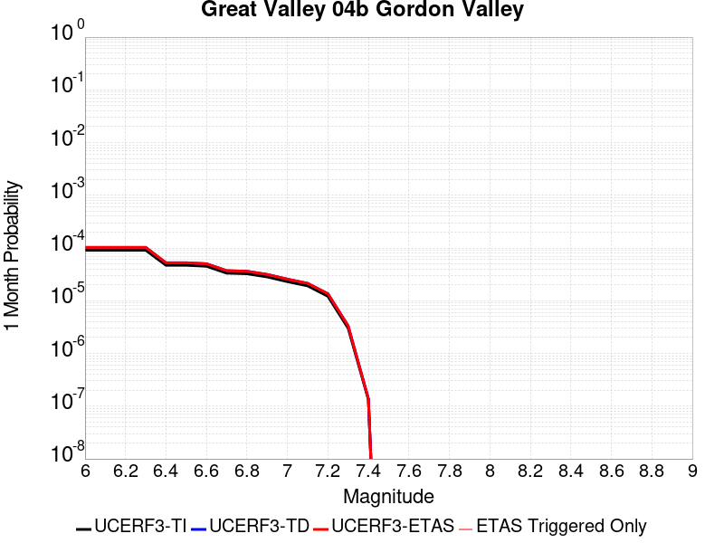 |  |  |

| Magnitude | 1 wk TI Prob | 1 wk TD Prob | 1 wk ETAS Prob | 1 wk ETAS/TD Gain | 1 wk ETAS Triggered Only | 1 mo TI Prob | 1 mo TD Prob | 1 mo ETAS Prob | 1 mo ETAS/TD Gain | 1 mo ETAS Triggered Only | 1 yr TI Prob | 1 yr TD Prob | 1 yr ETAS Prob | 1 yr ETAS/TD Gain | 1 yr ETAS Triggered Only | 10 yr TI Prob | 10 yr TD Prob | 10 yr ETAS Prob | 10 yr ETAS/TD Gain | 10 yr ETAS Triggered Only |
|-----|-----|-----|-----|-----|-----|-----|-----|-----|-----|-----|-----|-----|-----|-----|-----|-----|-----|-----|-----|-----|
| 6.0 | 2.1181217E-5 | 2.3981953E-5 | 2.3981953E-5 | 1.0 | 0.0 | 9.077348E-5 | 1.0277669E-4 | 1.0277669E-4 | 1.0 | 0.0 | 0.0011046068 | 0.0012507546 | 0.0012507546 | 1.0 | 0.0 | 0.010991322 | 0.012453599 | 0.012471521 | 1.0014392 | 1.814882E-5 |
| 6.1 | 2.1181217E-5 | 2.3981953E-5 | 2.3981953E-5 | 1.0 | 0.0 | 9.077348E-5 | 1.0277669E-4 | 1.0277669E-4 | 1.0 | 0.0 | 0.0011046068 | 0.0012507546 | 0.0012507546 | 1.0 | 0.0 | 0.010991322 | 0.012453599 | 0.012471521 | 1.0014392 | 1.814882E-5 |
| 6.2 | 2.1181217E-5 | 2.3981953E-5 | 2.3981953E-5 | 1.0 | 0.0 | 9.077348E-5 | 1.0277669E-4 | 1.0277669E-4 | 1.0 | 0.0 | 0.0011046068 | 0.0012507546 | 0.0012507546 | 1.0 | 0.0 | 0.010991322 | 0.012453599 | 0.012471521 | 1.0014392 | 1.814882E-5 |
| 6.3 | 2.1181217E-5 | 2.3981953E-5 | 2.3981953E-5 | 1.0 | 0.0 | 9.077348E-5 | 1.0277669E-4 | 1.0277669E-4 | 1.0 | 0.0 | 0.0011046068 | 0.0012507546 | 0.0012507546 | 1.0 | 0.0 | 0.010991322 | 0.012453599 | 0.012471521 | 1.0014392 | 1.814882E-5 |
| 6.4 | 1.0988268E-5 | 1.2254499E-5 | 1.2254499E-5 | 1.0 | 0.0 | 4.7091726E-5 | 5.2518313E-5 | 5.2518313E-5 | 1.0 | 0.0 | 5.731909E-4 | 6.392388E-4 | 6.392388E-4 | 1.0 | 0.0 | 0.005717147 | 0.0063755875 | 0.0063936207 | 1.0028285 | 1.814882E-5 |
| 6.5 | 1.0988268E-5 | 1.2254499E-5 | 1.2254499E-5 | 1.0 | 0.0 | 4.7091726E-5 | 5.2518313E-5 | 5.2518313E-5 | 1.0 | 0.0 | 5.731909E-4 | 6.392388E-4 | 6.392388E-4 | 1.0 | 0.0 | 0.005717147 | 0.0063755875 | 0.0063936207 | 1.0028285 | 1.814882E-5 |
| 6.6 | 1.0517822E-5 | 1.1724062E-5 | 1.1724062E-5 | 1.0 | 0.0 | 4.5075605E-5 | 5.02451E-5 | 5.02451E-5 | 1.0 | 0.0 | 5.4865726E-4 | 6.11578E-4 | 6.11578E-4 | 1.0 | 0.0 | 0.0054730466 | 0.0061005033 | 0.006118541 | 1.0029569 | 1.814882E-5 |
| 6.7 | 7.789219E-6 | 8.6776445E-6 | 8.6776445E-6 | 1.0 | 0.0 | 3.3381937E-5 | 3.7189402E-5 | 3.7189402E-5 | 1.0 | 0.0 | 4.063493E-4 | 4.526921E-4 | 4.526921E-4 | 1.0 | 0.0 | 0.004056071 | 0.0045182165 | 0.004536283 | 1.0039986 | 1.814882E-5 |
| 6.8 | 7.5850853E-6 | 8.452389E-6 | 8.452389E-6 | 1.0 | 0.0 | 3.2507105E-5 | 3.622405E-5 | 3.622405E-5 | 1.0 | 0.0 | 3.957021E-4 | 4.409437E-4 | 4.409437E-4 | 1.0 | 0.0 | 0.0039499826 | 0.0044012 | 0.004419269 | 1.0041054 | 1.814882E-5 |
| 6.9 | 6.604105E-6 | 7.3585493E-6 | 7.3585493E-6 | 1.0 | 0.0 | 2.8303E-5 | 3.153628E-5 | 3.153628E-5 | 1.0 | 0.0 | 3.4453452E-4 | 3.8389044E-4 | 3.8389044E-4 | 1.0 | 0.0 | 0.0034400085 | 0.0038326595 | 0.0038507388 | 1.0047171 | 1.814882E-5 |
| 7.0 | 5.3701115E-6 | 5.9884183E-6 | 5.9884183E-6 | 1.0 | 0.0 | 2.301456E-5 | 2.5664414E-5 | 2.5664414E-5 | 1.0 | 0.0 | 2.8016625E-4 | 3.1242234E-4 | 3.1242234E-4 | 1.0 | 0.0 | 0.0027981328 | 0.00312012 | 0.003138212 | 1.0057986 | 1.814882E-5 |
| 7.1 | 4.4685607E-6 | 4.986478E-6 | 4.986478E-6 | 1.0 | 0.0 | 1.9150835E-5 | 2.1370459E-5 | 2.1370459E-5 | 1.0 | 0.0 | 2.3313647E-4 | 2.6015675E-4 | 2.6015675E-4 | 1.0 | 0.0 | 0.0023289204 | 0.0025987667 | 0.0026168684 | 1.0069655 | 1.814882E-5 |
| 7.2 | 2.833378E-6 | 3.164419E-6 | 3.164419E-6 | 1.0 | 0.0 | 1.2142991E-5 | 1.3561736E-5 | 1.3561736E-5 | 1.0 | 0.0 | 1.4783088E-4 | 1.6510337E-4 | 1.6510337E-4 | 1.0 | 0.0 | 0.0014773258 | 0.0016499789 | 0.0016680978 | 1.0109813 | 1.814882E-5 |
| 7.3 | 7.0087293E-7 | 7.7728157E-7 | 7.7728157E-7 | 1.0 | 0.0 | 3.0037377E-6 | 3.3312049E-6 | 3.3312049E-6 | 1.0 | 0.0 | 3.656989E-5 | 4.0557123E-5 | 4.0557123E-5 | 1.0 | 0.0 | 3.6563876E-4 | 4.055422E-4 | 4.055422E-4 | 1.0 | 0.0 |
| 7.4 | 3.112171E-8 | 3.2068368E-8 | 3.2068368E-8 | 1.0 | 0.0 | 1.3337875E-7 | 1.3743585E-7 | 1.3743585E-7 | 1.0 | 0.0 | 1.6238852E-6 | 1.6732803E-6 | 1.6732803E-6 | 1.0 | 0.0 | 1.6238733E-5 | 1.6732685E-5 | 1.6732685E-5 | 1.0 | 0.0 |

## San Luis Range 2011 CFM
*[(top)](#table-of-contents)*

| 1 Week | 1 Month | 1 Year | 10 Year |
|-----|-----|-----|-----|
| 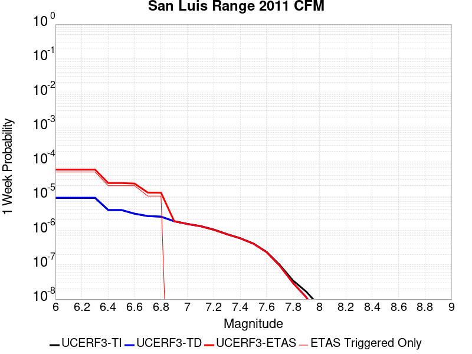 |  | 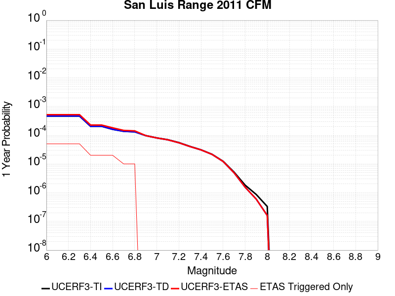 |  |

| Magnitude | 1 wk TI Prob | 1 wk TD Prob | 1 wk ETAS Prob | 1 wk ETAS/TD Gain | 1 wk ETAS Triggered Only | 1 mo TI Prob | 1 mo TD Prob | 1 mo ETAS Prob | 1 mo ETAS/TD Gain | 1 mo ETAS Triggered Only | 1 yr TI Prob | 1 yr TD Prob | 1 yr ETAS Prob | 1 yr ETAS/TD Gain | 1 yr ETAS Triggered Only | 10 yr TI Prob | 10 yr TD Prob | 10 yr ETAS Prob | 10 yr ETAS/TD Gain | 10 yr ETAS Triggered Only |
|-----|-----|-----|-----|-----|-----|-----|-----|-----|-----|-----|-----|-----|-----|-----|-----|-----|-----|-----|-----|-----|
| 6.0 | 8.8368415E-6 | 8.965454E-6 | 2.711411E-5 | 3.0242877 | 1.814882E-5 | 3.787163E-5 | 3.842285E-5 | 5.6570974E-5 | 1.4723263 | 1.814882E-5 | 4.609895E-4 | 4.677057E-4 | 4.8584602E-4 | 1.0387858 | 1.814882E-5 | 0.0046003438 | 0.0046679964 | 0.0046860604 | 1.0038698 | 1.814882E-5 |
| 6.1 | 8.8368415E-6 | 8.965454E-6 | 2.711411E-5 | 3.0242877 | 1.814882E-5 | 3.787163E-5 | 3.842285E-5 | 5.6570974E-5 | 1.4723263 | 1.814882E-5 | 4.609895E-4 | 4.677057E-4 | 4.8584602E-4 | 1.0387858 | 1.814882E-5 | 0.0046003438 | 0.0046679964 | 0.0046860604 | 1.0038698 | 1.814882E-5 |
| 6.2 | 8.8368415E-6 | 8.965454E-6 | 2.711411E-5 | 3.0242877 | 1.814882E-5 | 3.787163E-5 | 3.842285E-5 | 5.6570974E-5 | 1.4723263 | 1.814882E-5 | 4.609895E-4 | 4.677057E-4 | 4.8584602E-4 | 1.0387858 | 1.814882E-5 | 0.0046003438 | 0.0046679964 | 0.0046860604 | 1.0038698 | 1.814882E-5 |
| 6.3 | 8.8368415E-6 | 8.965454E-6 | 2.711411E-5 | 3.0242877 | 1.814882E-5 | 3.787163E-5 | 3.842285E-5 | 5.6570974E-5 | 1.4723263 | 1.814882E-5 | 4.609895E-4 | 4.677057E-4 | 4.8584602E-4 | 1.0387858 | 1.814882E-5 | 0.0046003438 | 0.0046679964 | 0.0046860604 | 1.0038698 | 1.814882E-5 |
| 6.4 | 3.9094193E-6 | 3.9412025E-6 | 3.9412025E-6 | 1.0 | 0.0 | 1.6754546E-5 | 1.689076E-5 | 1.689076E-5 | 1.0 | 0.0 | 2.039675E-4 | 2.056259E-4 | 2.056259E-4 | 1.0 | 0.0 | 0.0020378039 | 0.0020543851 | 0.0020543851 | 1.0 | 0.0 |
| 6.5 | 3.9094193E-6 | 3.9412025E-6 | 3.9412025E-6 | 1.0 | 0.0 | 1.6754546E-5 | 1.689076E-5 | 1.689076E-5 | 1.0 | 0.0 | 2.039675E-4 | 2.056259E-4 | 2.056259E-4 | 1.0 | 0.0 | 0.0020378039 | 0.0020543851 | 0.0020543851 | 1.0 | 0.0 |
| 6.6 | 3.0587726E-6 | 3.0753883E-6 | 3.0753883E-6 | 1.0 | 0.0 | 1.3108959E-5 | 1.318017E-5 | 1.318017E-5 | 1.0 | 0.0 | 1.595899E-4 | 1.6045687E-4 | 1.6045687E-4 | 1.0 | 0.0 | 0.0015947534 | 0.0016034221 | 0.0016034221 | 1.0 | 0.0 |
| 6.7 | 2.6160574E-6 | 2.6251273E-6 | 2.6251273E-6 | 1.0 | 0.0 | 1.1211626E-5 | 1.1250498E-5 | 1.1250498E-5 | 1.0 | 0.0 | 1.3649299E-4 | 1.3696625E-4 | 1.3696625E-4 | 1.0 | 0.0 | 0.0013640919 | 0.0013688246 | 0.0013688246 | 1.0 | 0.0 |
| 6.8 | 2.5110312E-6 | 2.51814E-6 | 2.51814E-6 | 1.0 | 0.0 | 1.0761518E-5 | 1.0791985E-5 | 1.0791985E-5 | 1.0 | 0.0 | 1.310136E-4 | 1.3138456E-4 | 1.3138456E-4 | 1.0 | 0.0 | 0.0013093639 | 0.0013130746 | 0.0013130746 | 1.0 | 0.0 |
| 6.9 | 1.8564405E-6 | 1.852487E-6 | 1.852487E-6 | 1.0 | 0.0 | 7.95615E-6 | 7.939206E-6 | 7.939206E-6 | 1.0 | 0.0 | 9.686181E-5 | 9.665557E-5 | 9.665557E-5 | 1.0 | 0.0 | 9.68196E-4 | 9.661373E-4 | 9.661373E-4 | 1.0 | 0.0 |
| 7.0 | 1.546127E-6 | 1.5369537E-6 | 1.5369537E-6 | 1.0 | 0.0 | 6.626242E-6 | 6.586928E-6 | 6.586928E-6 | 1.0 | 0.0 | 8.06715E-5 | 8.0192905E-5 | 8.0192905E-5 | 1.0 | 0.0 | 8.0642226E-4 | 8.016404E-4 | 8.016404E-4 | 1.0 | 0.0 |
| 7.1 | 1.3368208E-6 | 1.3235326E-6 | 1.3235326E-6 | 1.0 | 0.0 | 5.7292195E-6 | 5.67227E-6 | 5.67227E-6 | 1.0 | 0.0 | 6.975101E-5 | 6.905771E-5 | 6.905771E-5 | 1.0 | 0.0 | 6.972912E-4 | 6.9036294E-4 | 6.9036294E-4 | 1.0 | 0.0 |
| 7.2 | 1.0623363E-6 | 1.0454368E-6 | 1.0454368E-6 | 1.0 | 0.0 | 4.5528623E-6 | 4.4804356E-6 | 4.4804356E-6 | 1.0 | 0.0 | 5.5429686E-5 | 5.4547938E-5 | 5.4547938E-5 | 1.0 | 0.0 | 5.5415864E-4 | 5.4534577E-4 | 5.4534577E-4 | 1.0 | 0.0 |
| 7.3 | 7.831679E-7 | 7.7273904E-7 | 7.7273904E-7 | 1.0 | 0.0 | 3.3564295E-6 | 3.3117344E-6 | 3.3117344E-6 | 1.0 | 0.0 | 4.086376E-5 | 4.0319625E-5 | 4.0319625E-5 | 1.0 | 0.0 | 4.0856248E-4 | 4.031232E-4 | 4.031232E-4 | 1.0 | 0.0 |
| 7.4 | 5.9558846E-7 | 5.910636E-7 | 5.910636E-7 | 1.0 | 0.0 | 2.5525194E-6 | 2.5331274E-6 | 2.5331274E-6 | 1.0 | 0.0 | 3.107648E-5 | 3.084039E-5 | 3.084039E-5 | 1.0 | 0.0 | 3.1072134E-4 | 3.083612E-4 | 3.083612E-4 | 1.0 | 0.0 |
| 7.5 | 4.1616502E-7 | 4.119631E-7 | 4.119631E-7 | 1.0 | 0.0 | 1.7835631E-6 | 1.7655549E-6 | 1.7655549E-6 | 1.0 | 0.0 | 2.1714664E-5 | 2.149542E-5 | 2.149542E-5 | 1.0 | 0.0 | 2.1712543E-4 | 2.1493346E-4 | 2.1493346E-4 | 1.0 | 0.0 |
| 7.6 | 2.3816014E-7 | 2.3376548E-7 | 2.3376548E-7 | 1.0 | 0.0 | 1.0206859E-6 | 1.0018516E-6 | 1.0018516E-6 | 1.0 | 0.0 | 1.242678E-5 | 1.2197475E-5 | 1.2197475E-5 | 1.0 | 0.0 | 1.2426086E-4 | 1.2196808E-4 | 1.2196808E-4 | 1.0 | 0.0 |
| 7.7 | 9.918777E-8 | 9.3867584E-8 | 9.3867584E-8 | 1.0 | 0.0 | 4.2509038E-7 | 4.0228957E-7 | 4.0228957E-7 | 1.0 | 0.0 | 5.1754632E-6 | 4.8978645E-6 | 4.8978645E-6 | 1.0 | 0.0 | 5.1753424E-5 | 4.897757E-5 | 4.897757E-5 | 1.0 | 0.0 |
| 7.8 | 3.4982556E-8 | 2.968655E-8 | 2.968655E-8 | 1.0 | 0.0 | 1.4992524E-7 | 1.2722806E-7 | 1.2722806E-7 | 1.0 | 0.0 | 1.8253382E-6 | 1.5490006E-6 | 1.5490006E-6 | 1.0 | 0.0 | 1.8253233E-5 | 1.5489897E-5 | 1.5489897E-5 | 1.0 | 0.0 |
| 7.9 | 1.6624908E-8 | 1.1477036E-8 | 1.1477036E-8 | 1.0 | 0.0 | 7.12496E-8 | 4.91873E-8 | 4.91873E-8 | 1.0 | 0.0 | 8.6746354E-7 | 5.988552E-7 | 5.988552E-7 | 1.0 | 0.0 | 8.674601E-6 | 5.988536E-6 | 5.988536E-6 | 1.0 | 0.0 |
| 8.0 | 6.3352315E-9 | 3.0888412E-9 | 3.0888412E-9 | 1.0 | 0.0 | 2.715099E-8 | 1.3237893E-8 | 1.3237893E-8 | 1.0 | 0.0 | 3.3056327E-7 | 1.6117131E-7 | 1.6117131E-7 | 1.0 | 0.0 | 3.3056278E-6 | 1.611712E-6 | 1.611712E-6 | 1.0 | 0.0 |

## Thirty Mile Bank
*[(top)](#table-of-contents)*

| 1 Week | 1 Month | 1 Year | 10 Year |
|-----|-----|-----|-----|
| 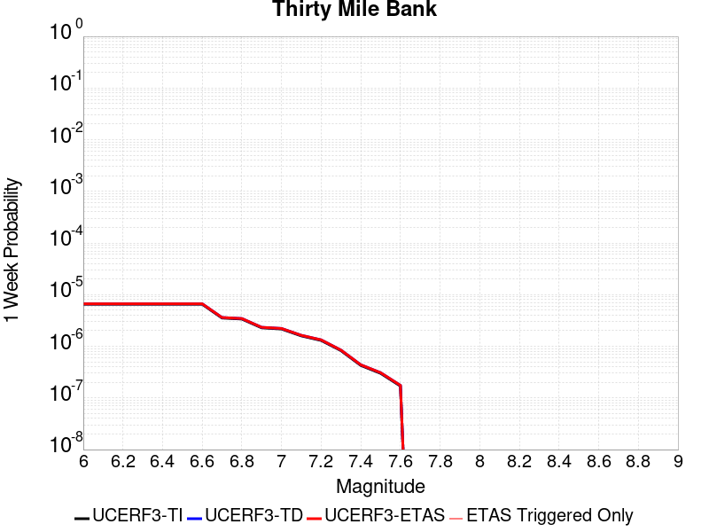 |  |  |  |

| Magnitude | 1 wk TI Prob | 1 wk TD Prob | 1 wk ETAS Prob | 1 wk ETAS/TD Gain | 1 wk ETAS Triggered Only | 1 mo TI Prob | 1 mo TD Prob | 1 mo ETAS Prob | 1 mo ETAS/TD Gain | 1 mo ETAS Triggered Only | 1 yr TI Prob | 1 yr TD Prob | 1 yr ETAS Prob | 1 yr ETAS/TD Gain | 1 yr ETAS Triggered Only | 10 yr TI Prob | 10 yr TD Prob | 10 yr ETAS Prob | 10 yr ETAS/TD Gain | 10 yr ETAS Triggered Only |
|-----|-----|-----|-----|-----|-----|-----|-----|-----|-----|-----|-----|-----|-----|-----|-----|-----|-----|-----|-----|-----|
| 6.0 | 6.5124755E-6 | 6.6592643E-6 | 6.6592643E-6 | 1.0 | 0.0 | 2.791031E-5 | 2.8539416E-5 | 2.8539416E-5 | 1.0 | 0.0 | 3.3975503E-4 | 3.4741635E-4 | 3.4741635E-4 | 1.0 | 0.0 | 0.0033923604 | 0.003469164 | 0.0034872498 | 1.0052133 | 1.814882E-5 |
| 6.1 | 6.5124755E-6 | 6.6592643E-6 | 6.6592643E-6 | 1.0 | 0.0 | 2.791031E-5 | 2.8539416E-5 | 2.8539416E-5 | 1.0 | 0.0 | 3.3975503E-4 | 3.4741635E-4 | 3.4741635E-4 | 1.0 | 0.0 | 0.0033923604 | 0.003469164 | 0.0034872498 | 1.0052133 | 1.814882E-5 |
| 6.2 | 6.5124755E-6 | 6.6592643E-6 | 6.6592643E-6 | 1.0 | 0.0 | 2.791031E-5 | 2.8539416E-5 | 2.8539416E-5 | 1.0 | 0.0 | 3.3975503E-4 | 3.4741635E-4 | 3.4741635E-4 | 1.0 | 0.0 | 0.0033923604 | 0.003469164 | 0.0034872498 | 1.0052133 | 1.814882E-5 |
| 6.3 | 6.5124755E-6 | 6.6592643E-6 | 6.6592643E-6 | 1.0 | 0.0 | 2.791031E-5 | 2.8539416E-5 | 2.8539416E-5 | 1.0 | 0.0 | 3.3975503E-4 | 3.4741635E-4 | 3.4741635E-4 | 1.0 | 0.0 | 0.0033923604 | 0.003469164 | 0.0034872498 | 1.0052133 | 1.814882E-5 |
| 6.4 | 6.5124755E-6 | 6.6592643E-6 | 6.6592643E-6 | 1.0 | 0.0 | 2.791031E-5 | 2.8539416E-5 | 2.8539416E-5 | 1.0 | 0.0 | 3.3975503E-4 | 3.4741635E-4 | 3.4741635E-4 | 1.0 | 0.0 | 0.0033923604 | 0.003469164 | 0.0034872498 | 1.0052133 | 1.814882E-5 |
| 6.5 | 6.5124755E-6 | 6.6592643E-6 | 6.6592643E-6 | 1.0 | 0.0 | 2.791031E-5 | 2.8539416E-5 | 2.8539416E-5 | 1.0 | 0.0 | 3.3975503E-4 | 3.4741635E-4 | 3.4741635E-4 | 1.0 | 0.0 | 0.0033923604 | 0.003469164 | 0.0034872498 | 1.0052133 | 1.814882E-5 |
| 6.6 | 6.5124755E-6 | 6.6592643E-6 | 6.6592643E-6 | 1.0 | 0.0 | 2.791031E-5 | 2.8539416E-5 | 2.8539416E-5 | 1.0 | 0.0 | 3.3975503E-4 | 3.4741635E-4 | 3.4741635E-4 | 1.0 | 0.0 | 0.0033923604 | 0.003469164 | 0.0034872498 | 1.0052133 | 1.814882E-5 |
| 6.7 | 3.5261137E-6 | 3.6098995E-6 | 3.6098995E-6 | 1.0 | 0.0 | 1.5111828E-5 | 1.547091E-5 | 1.547091E-5 | 1.0 | 0.0 | 1.8397097E-4 | 1.883427E-4 | 1.883427E-4 | 1.0 | 0.0 | 0.0018381875 | 0.0018818958 | 0.0018818958 | 1.0 | 0.0 |
| 6.8 | 3.370743E-6 | 3.4509355E-6 | 3.4509355E-6 | 1.0 | 0.0 | 1.4445961E-5 | 1.47896435E-5 | 1.47896435E-5 | 1.0 | 0.0 | 1.7586538E-4 | 1.8004965E-4 | 1.8004965E-4 | 1.0 | 0.0 | 0.0017572626 | 0.0017990996 | 0.0017990996 | 1.0 | 0.0 |
| 6.9 | 2.2756835E-6 | 2.333161E-6 | 2.333161E-6 | 1.0 | 0.0 | 9.752893E-6 | 9.999225E-6 | 9.999225E-6 | 1.0 | 0.0 | 1.18735006E-4 | 1.2173401E-4 | 1.2173401E-4 | 1.0 | 0.0 | 0.0011867158 | 0.0012166979 | 0.0012166979 | 1.0 | 0.0 |
| 7.0 | 2.1617404E-6 | 2.21598E-6 | 2.21598E-6 | 1.0 | 0.0 | 9.264569E-6 | 9.497024E-6 | 9.497024E-6 | 1.0 | 0.0 | 1.1279029E-4 | 1.1562037E-4 | 1.1562037E-4 | 1.0 | 0.0 | 0.0011273306 | 0.0011556263 | 0.0011556263 | 1.0 | 0.0 |
| 7.1 | 1.5900777E-6 | 1.6327014E-6 | 1.6327014E-6 | 1.0 | 0.0 | 6.814601E-6 | 6.997274E-6 | 6.997274E-6 | 1.0 | 0.0 | 8.296461E-5 | 8.518861E-5 | 8.518861E-5 | 1.0 | 0.0 | 8.293364E-4 | 8.5157226E-4 | 8.5157226E-4 | 1.0 | 0.0 |
| 7.2 | 1.2971728E-6 | 1.3328992E-6 | 1.3328992E-6 | 1.0 | 0.0 | 5.5593005E-6 | 5.712413E-6 | 5.712413E-6 | 1.0 | 0.0 | 6.768238E-5 | 6.954651E-5 | 6.954651E-5 | 1.0 | 0.0 | 6.7661767E-4 | 6.952578E-4 | 6.952578E-4 | 1.0 | 0.0 |
| 7.3 | 8.2454284E-7 | 8.448891E-7 | 8.448891E-7 | 1.0 | 0.0 | 3.5337503E-6 | 3.6209485E-6 | 3.6209485E-6 | 1.0 | 0.0 | 4.302256E-5 | 4.408422E-5 | 4.408422E-5 | 1.0 | 0.0 | 4.301423E-4 | 4.4076078E-4 | 4.4076078E-4 | 1.0 | 0.0 |
| 7.4 | 4.2619024E-7 | 4.3863466E-7 | 4.3863466E-7 | 1.0 | 0.0 | 1.8265283E-6 | 1.8798615E-6 | 1.8798615E-6 | 1.0 | 0.0 | 2.2237757E-5 | 2.2887078E-5 | 2.2887078E-5 | 1.0 | 0.0 | 2.223553E-4 | 2.288476E-4 | 2.288476E-4 | 1.0 | 0.0 |
| 7.5 | 2.993922E-7 | 3.086453E-7 | 3.086453E-7 | 1.0 | 0.0 | 1.2831089E-6 | 1.3227649E-6 | 1.3227649E-6 | 1.0 | 0.0 | 1.5621737E-5 | 1.6104546E-5 | 1.6104546E-5 | 1.0 | 0.0 | 1.562064E-4 | 1.6103406E-4 | 1.6103406E-4 | 1.0 | 0.0 |
| 7.6 | 1.6988751E-7 | 1.7533823E-7 | 1.7533823E-7 | 1.0 | 0.0 | 7.2808916E-7 | 7.5144936E-7 | 7.5144936E-7 | 1.0 | 0.0 | 8.864449E-6 | 9.14886E-6 | 9.14886E-6 | 1.0 | 0.0 | 8.8640954E-5 | 9.1485024E-5 | 9.1485024E-5 | 1.0 | 0.0 |

## Elsinore (Julian)
*[(top)](#table-of-contents)*

| 1 Week | 1 Month | 1 Year | 10 Year |
|-----|-----|-----|-----|
|  | 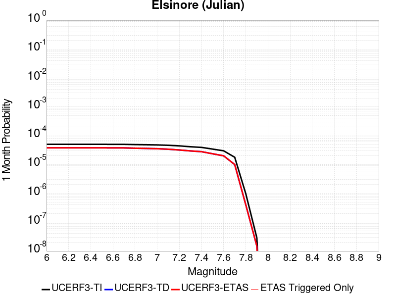 |  |  |

| Magnitude | 1 wk TI Prob | 1 wk TD Prob | 1 wk ETAS Prob | 1 wk ETAS/TD Gain | 1 wk ETAS Triggered Only | 1 mo TI Prob | 1 mo TD Prob | 1 mo ETAS Prob | 1 mo ETAS/TD Gain | 1 mo ETAS Triggered Only | 1 yr TI Prob | 1 yr TD Prob | 1 yr ETAS Prob | 1 yr ETAS/TD Gain | 1 yr ETAS Triggered Only | 10 yr TI Prob | 10 yr TD Prob | 10 yr ETAS Prob | 10 yr ETAS/TD Gain | 10 yr ETAS Triggered Only |
|-----|-----|-----|-----|-----|-----|-----|-----|-----|-----|-----|-----|-----|-----|-----|-----|-----|-----|-----|-----|-----|
| 6.0 | 1.1710231E-5 | 8.845509E-6 | 8.845509E-6 | 1.0 | 0.0 | 5.0185736E-5 | 3.7908783E-5 | 3.7908783E-5 | 1.0 | 0.0 | 6.1084004E-4 | 4.614434E-4 | 4.614434E-4 | 1.0 | 0.0 | 0.006091637 | 0.0046050567 | 0.004623122 | 1.0039229 | 1.814882E-5 |
| 6.1 | 1.1710231E-5 | 8.845509E-6 | 8.845509E-6 | 1.0 | 0.0 | 5.0185736E-5 | 3.7908783E-5 | 3.7908783E-5 | 1.0 | 0.0 | 6.1084004E-4 | 4.614434E-4 | 4.614434E-4 | 1.0 | 0.0 | 0.006091637 | 0.0046050567 | 0.004623122 | 1.0039229 | 1.814882E-5 |
| 6.2 | 1.1710231E-5 | 8.845509E-6 | 8.845509E-6 | 1.0 | 0.0 | 5.0185736E-5 | 3.7908783E-5 | 3.7908783E-5 | 1.0 | 0.0 | 6.1084004E-4 | 4.614434E-4 | 4.614434E-4 | 1.0 | 0.0 | 0.006091637 | 0.0046050567 | 0.004623122 | 1.0039229 | 1.814882E-5 |
| 6.3 | 1.1710231E-5 | 8.845509E-6 | 8.845509E-6 | 1.0 | 0.0 | 5.0185736E-5 | 3.7908783E-5 | 3.7908783E-5 | 1.0 | 0.0 | 6.1084004E-4 | 4.614434E-4 | 4.614434E-4 | 1.0 | 0.0 | 0.006091637 | 0.0046050567 | 0.004623122 | 1.0039229 | 1.814882E-5 |
| 6.4 | 1.1710231E-5 | 8.845509E-6 | 8.845509E-6 | 1.0 | 0.0 | 5.0185736E-5 | 3.7908783E-5 | 3.7908783E-5 | 1.0 | 0.0 | 6.1084004E-4 | 4.614434E-4 | 4.614434E-4 | 1.0 | 0.0 | 0.006091637 | 0.0046050567 | 0.004623122 | 1.0039229 | 1.814882E-5 |
| 6.5 | 1.1710231E-5 | 8.845509E-6 | 8.845509E-6 | 1.0 | 0.0 | 5.0185736E-5 | 3.7908783E-5 | 3.7908783E-5 | 1.0 | 0.0 | 6.1084004E-4 | 4.614434E-4 | 4.614434E-4 | 1.0 | 0.0 | 0.006091637 | 0.0046050567 | 0.004623122 | 1.0039229 | 1.814882E-5 |
| 6.6 | 1.1650619E-5 | 8.777881E-6 | 8.777881E-6 | 1.0 | 0.0 | 4.993027E-5 | 3.7618956E-5 | 3.7618956E-5 | 1.0 | 0.0 | 6.0773146E-4 | 4.5791623E-4 | 4.5791623E-4 | 1.0 | 0.0 | 0.0060607214 | 0.004569931 | 0.0045879968 | 1.0039532 | 1.814882E-5 |
| 6.7 | 1.1650619E-5 | 8.777881E-6 | 8.777881E-6 | 1.0 | 0.0 | 4.993027E-5 | 3.7618956E-5 | 3.7618956E-5 | 1.0 | 0.0 | 6.0773146E-4 | 4.5791623E-4 | 4.5791623E-4 | 1.0 | 0.0 | 0.0060607214 | 0.004569931 | 0.0045879968 | 1.0039532 | 1.814882E-5 |
| 6.8 | 1.1442698E-5 | 8.561041E-6 | 8.561041E-6 | 1.0 | 0.0 | 4.9039216E-5 | 3.6689667E-5 | 3.6689667E-5 | 1.0 | 0.0 | 5.968889E-4 | 4.4660683E-4 | 4.4660683E-4 | 1.0 | 0.0 | 0.0059528816 | 0.004457295 | 0.0044753626 | 1.0040536 | 1.814882E-5 |
| 6.9 | 1.1300589E-5 | 8.408907E-6 | 8.408907E-6 | 1.0 | 0.0 | 4.8430196E-5 | 3.6037683E-5 | 3.6037683E-5 | 1.0 | 0.0 | 5.894781E-4 | 4.3867214E-4 | 4.3867214E-4 | 1.0 | 0.0 | 0.005879169 | 0.0043782624 | 0.0043963315 | 1.004127 | 1.814882E-5 |
| 7.0 | 1.1117729E-5 | 8.226087E-6 | 8.226087E-6 | 1.0 | 0.0 | 4.764654E-5 | 3.525419E-5 | 3.525419E-5 | 1.0 | 0.0 | 5.799422E-4 | 4.291369E-4 | 4.291369E-4 | 1.0 | 0.0 | 0.0057843104 | 0.004283281 | 0.004301352 | 1.0042189 | 1.814882E-5 |
| 7.1 | 1.08053955E-5 | 7.9117535E-6 | 7.9117535E-6 | 1.0 | 0.0 | 4.6308014E-5 | 3.3907087E-5 | 3.3907087E-5 | 1.0 | 0.0 | 5.6365423E-4 | 4.127422E-4 | 4.127422E-4 | 1.0 | 0.0 | 0.005622267 | 0.0041199517 | 0.004138026 | 1.0043869 | 1.814882E-5 |
| 7.2 | 1.032804E-5 | 7.433021E-6 | 7.433021E-6 | 1.0 | 0.0 | 4.4262277E-5 | 3.1855423E-5 | 3.1855423E-5 | 1.0 | 0.0 | 5.387599E-4 | 3.8777234E-4 | 3.8777234E-4 | 1.0 | 0.0 | 0.0053745564 | 0.0038711445 | 0.003889223 | 1.00467 | 1.814882E-5 |
| 7.3 | 9.622426E-6 | 6.8978457E-6 | 6.8978457E-6 | 1.0 | 0.0 | 4.1238312E-5 | 2.9561868E-5 | 2.9561868E-5 | 1.0 | 0.0 | 5.019608E-4 | 3.5985775E-4 | 3.5985775E-4 | 1.0 | 0.0 | 0.005008285 | 0.0035929221 | 0.0036110056 | 1.0050331 | 1.814882E-5 |
| 7.4 | 9.144434E-6 | 6.4963933E-6 | 6.4963933E-6 | 1.0 | 0.0 | 3.9189843E-5 | 2.7841395E-5 | 2.7841395E-5 | 1.0 | 0.0 | 4.7703186E-4 | 3.3891766E-4 | 3.3891766E-4 | 1.0 | 0.0 | 0.0047600917 | 0.0033841513 | 0.0034022387 | 1.0053447 | 1.814882E-5 |
| 7.5 | 7.988981E-6 | 5.4983307E-6 | 5.4983307E-6 | 1.0 | 0.0 | 3.4238044E-5 | 2.356407E-5 | 2.356407E-5 | 1.0 | 0.0 | 4.1676845E-4 | 2.8685606E-4 | 2.8685606E-4 | 1.0 | 0.0 | 0.0041598766 | 0.002864985 | 0.0028830818 | 1.0063165 | 1.814882E-5 |
| 7.6 | 6.9554876E-6 | 4.6625346E-6 | 4.6625346E-6 | 1.0 | 0.0 | 2.9808893E-5 | 1.9982144E-5 | 1.9982144E-5 | 1.0 | 0.0 | 3.6286283E-4 | 2.4325661E-4 | 2.4325661E-4 | 1.0 | 0.0 | 0.0036227088 | 0.0024300197 | 0.0024481243 | 1.0074505 | 1.814882E-5 |
| 7.7 | 4.1557314E-6 | 2.3246462E-6 | 2.3246462E-6 | 1.0 | 0.0 | 1.7810156E-5 | 9.962735E-6 | 9.962735E-6 | 1.0 | 0.0 | 2.1681708E-4 | 1.2129029E-4 | 1.2129029E-4 | 1.0 | 0.0 | 0.0021660565 | 0.001212314 | 0.0012304408 | 1.0149523 | 1.814882E-5 |
| 7.8 | 2.2597293E-7 | 9.332915E-8 | 9.332915E-8 | 1.0 | 0.0 | 9.684551E-7 | 3.99982E-7 | 3.99982E-7 | 1.0 | 0.0 | 1.1790877E-5 | 4.8697734E-6 | 4.8697734E-6 | 1.0 | 0.0 | 1.17902506E-4 | 4.8696995E-5 | 4.8696995E-5 | 1.0 | 0.0 |
| 7.9 | 6.676829E-9 | 3.439853E-9 | 3.439853E-9 | 1.0 | 0.0 | 2.861498E-8 | 1.4742227E-8 | 1.4742227E-8 | 1.0 | 0.0 | 3.4838732E-7 | 1.7948659E-7 | 1.7948659E-7 | 1.0 | 0.0 | 3.4838679E-6 | 1.7948646E-6 | 1.7948646E-6 | 1.0 | 0.0 |

## Cedar Mtn-Mahogany Mtn
*[(top)](#table-of-contents)*

| 1 Week | 1 Month | 1 Year | 10 Year |
|-----|-----|-----|-----|
|  |  |  |  |

| Magnitude | 1 wk TI Prob | 1 wk TD Prob | 1 wk ETAS Prob | 1 wk ETAS/TD Gain | 1 wk ETAS Triggered Only | 1 mo TI Prob | 1 mo TD Prob | 1 mo ETAS Prob | 1 mo ETAS/TD Gain | 1 mo ETAS Triggered Only | 1 yr TI Prob | 1 yr TD Prob | 1 yr ETAS Prob | 1 yr ETAS/TD Gain | 1 yr ETAS Triggered Only | 10 yr TI Prob | 10 yr TD Prob | 10 yr ETAS Prob | 10 yr ETAS/TD Gain | 10 yr ETAS Triggered Only |
|-----|-----|-----|-----|-----|-----|-----|-----|-----|-----|-----|-----|-----|-----|-----|-----|-----|-----|-----|-----|-----|
| 6.0 | 2.7763876E-5 | 2.9588866E-5 | 4.7737147E-5 | 1.6133484 | 1.814882E-5 | 1.1898261E-4 | 1.2680366E-4 | 1.4495017E-4 | 1.1431072 | 1.814882E-5 | 0.0014476506 | 0.0015428112 | 0.001560932 | 1.0117453 | 1.814882E-5 | 0.0143825635 | 0.015328225 | 0.015346096 | 1.0011659 | 1.814882E-5 |
| 6.1 | 1.6162443E-5 | 1.7142966E-5 | 3.5291476E-5 | 2.0586565 | 1.814882E-5 | 6.926578E-5 | 7.346788E-5 | 9.161537E-5 | 1.2470125 | 1.814882E-5 | 8.4298453E-4 | 8.941221E-4 | 9.1225473E-4 | 1.0202798 | 1.814882E-5 | 0.008397939 | 0.008907059 | 0.008925046 | 1.0020194 | 1.814882E-5 |
| 6.2 | 1.6162443E-5 | 1.7142966E-5 | 3.5291476E-5 | 2.0586565 | 1.814882E-5 | 6.926578E-5 | 7.346788E-5 | 9.161537E-5 | 1.2470125 | 1.814882E-5 | 8.4298453E-4 | 8.941221E-4 | 9.1225473E-4 | 1.0202798 | 1.814882E-5 | 0.008397939 | 0.008907059 | 0.008925046 | 1.0020194 | 1.814882E-5 |
| 6.3 | 9.746053E-6 | 1.0303152E-5 | 2.8451785E-5 | 2.7614644 | 1.814882E-5 | 4.1768133E-5 | 4.415564E-5 | 6.230366E-5 | 1.4110012 | 1.814882E-5 | 5.0840835E-4 | 5.3746643E-4 | 5.5560545E-4 | 1.0337492 | 1.814882E-5 | 0.0050724675 | 0.005362084 | 0.005380136 | 1.0033665 | 1.814882E-5 |
| 6.4 | 9.746053E-6 | 1.0303152E-5 | 2.8451785E-5 | 2.7614644 | 1.814882E-5 | 4.1768133E-5 | 4.415564E-5 | 6.230366E-5 | 1.4110012 | 1.814882E-5 | 5.0840835E-4 | 5.3746643E-4 | 5.5560545E-4 | 1.0337492 | 1.814882E-5 | 0.0050724675 | 0.005362084 | 0.005380136 | 1.0033665 | 1.814882E-5 |
| 6.5 | 7.290083E-6 | 7.695325E-6 | 2.5844005E-5 | 3.3584037 | 1.814882E-5 | 3.124284E-5 | 3.297956E-5 | 5.112778E-5 | 1.550287 | 1.814882E-5 | 3.8031515E-4 | 4.014543E-4 | 4.1959583E-4 | 1.0451895 | 1.814882E-5 | 0.0037966494 | 0.004007511 | 0.004025587 | 1.0045105 | 1.814882E-5 |
| 6.6 | 5.67907E-6 | 5.9891527E-6 | 2.4137864E-5 | 4.0302634 | 1.814882E-5 | 2.4338644E-5 | 2.5667552E-5 | 4.3815908E-5 | 1.7070544 | 1.814882E-5 | 2.962827E-4 | 3.12459E-4 | 3.3060214E-4 | 1.0580657 | 1.814882E-5 | 0.0029588798 | 0.003120333 | 0.003138425 | 1.0057981 | 1.814882E-5 |
| 6.7 | 3.4853963E-6 | 3.672631E-6 | 2.1821385E-5 | 5.941622 | 1.814882E-5 | 1.4937327E-5 | 1.5739755E-5 | 3.388829E-5 | 2.1530378 | 1.814882E-5 | 1.8184677E-4 | 1.916153E-4 | 2.0976065E-4 | 1.0946968 | 1.814882E-5 | 0.0018169804 | 0.0019145629 | 0.0019326769 | 1.0094612 | 1.814882E-5 |
| 6.8 | 2.7535168E-6 | 2.9015764E-6 | 2.1050344E-5 | 7.254796 | 1.814882E-5 | 1.1800733E-5 | 1.2435271E-5 | 3.0583866E-5 | 2.459445 | 1.814882E-5 | 1.4366445E-4 | 1.5138938E-4 | 1.6953546E-4 | 1.1198636 | 1.814882E-5 | 0.0014357162 | 0.0015129098 | 0.0015310311 | 1.0119778 | 1.814882E-5 |
| 6.9 | 1.6594106E-6 | 1.7496985E-6 | 1.9898487E-5 | 11.372523 | 1.814882E-5 | 7.1117406E-6 | 7.4986883E-6 | 2.5647372E-5 | 3.4202478 | 1.814882E-5 | 8.6582E-5 | 9.129302E-5 | 1.0944018E-4 | 1.1987793 | 1.814882E-5 | 8.654827E-4 | 9.125856E-4 | 9.3071786E-4 | 1.0198691 | 1.814882E-5 |
| 7.0 | 5.10215E-7 | 5.389254E-7 | 1.8687735E-5 | 34.675926 | 1.814882E-5 | 2.186634E-6 | 2.3096788E-6 | 2.0458458E-5 | 8.857706 | 1.814882E-5 | 2.6621943E-5 | 2.8120105E-5 | 4.6268415E-5 | 1.6453855 | 1.814882E-5 | 2.6618753E-4 | 2.81178E-4 | 2.9932175E-4 | 1.0645275 | 1.814882E-5 |

## San Gabriel
*[(top)](#table-of-contents)*

| 1 Week | 1 Month | 1 Year | 10 Year |
|-----|-----|-----|-----|
|  |  |  |  |

| Magnitude | 1 wk TI Prob | 1 wk TD Prob | 1 wk ETAS Prob | 1 wk ETAS/TD Gain | 1 wk ETAS Triggered Only | 1 mo TI Prob | 1 mo TD Prob | 1 mo ETAS Prob | 1 mo ETAS/TD Gain | 1 mo ETAS Triggered Only | 1 yr TI Prob | 1 yr TD Prob | 1 yr ETAS Prob | 1 yr ETAS/TD Gain | 1 yr ETAS Triggered Only | 10 yr TI Prob | 10 yr TD Prob | 10 yr ETAS Prob | 10 yr ETAS/TD Gain | 10 yr ETAS Triggered Only |
|-----|-----|-----|-----|-----|-----|-----|-----|-----|-----|-----|-----|-----|-----|-----|-----|-----|-----|-----|-----|-----|
| 6.0 | 1.083775E-5 | 1.19851875E-5 | 1.19851875E-5 | 1.0 | 0.0 | 4.6446676E-5 | 5.1364143E-5 | 5.1364143E-5 | 1.0 | 0.0 | 5.653415E-4 | 6.251903E-4 | 6.251903E-4 | 1.0 | 0.0 | 0.0056390543 | 0.006246409 | 0.0062644444 | 1.0028874 | 1.814882E-5 |
| 6.1 | 1.083775E-5 | 1.19851875E-5 | 1.19851875E-5 | 1.0 | 0.0 | 4.6446676E-5 | 5.1364143E-5 | 5.1364143E-5 | 1.0 | 0.0 | 5.653415E-4 | 6.251903E-4 | 6.251903E-4 | 1.0 | 0.0 | 0.0056390543 | 0.006246409 | 0.0062644444 | 1.0028874 | 1.814882E-5 |
| 6.2 | 1.083775E-5 | 1.19851875E-5 | 1.19851875E-5 | 1.0 | 0.0 | 4.6446676E-5 | 5.1364143E-5 | 5.1364143E-5 | 1.0 | 0.0 | 5.653415E-4 | 6.251903E-4 | 6.251903E-4 | 1.0 | 0.0 | 0.0056390543 | 0.006246409 | 0.0062644444 | 1.0028874 | 1.814882E-5 |
| 6.3 | 1.083775E-5 | 1.19851875E-5 | 1.19851875E-5 | 1.0 | 0.0 | 4.6446676E-5 | 5.1364143E-5 | 5.1364143E-5 | 1.0 | 0.0 | 5.653415E-4 | 6.251903E-4 | 6.251903E-4 | 1.0 | 0.0 | 0.0056390543 | 0.006246409 | 0.0062644444 | 1.0028874 | 1.814882E-5 |
| 6.4 | 1.083775E-5 | 1.19851875E-5 | 1.19851875E-5 | 1.0 | 0.0 | 4.6446676E-5 | 5.1364143E-5 | 5.1364143E-5 | 1.0 | 0.0 | 5.653415E-4 | 6.251903E-4 | 6.251903E-4 | 1.0 | 0.0 | 0.0056390543 | 0.006246409 | 0.0062644444 | 1.0028874 | 1.814882E-5 |
| 6.5 | 6.7317824E-6 | 7.716944E-6 | 7.716944E-6 | 1.0 | 0.0 | 2.8850178E-5 | 3.3072207E-5 | 3.3072207E-5 | 1.0 | 0.0 | 3.511943E-4 | 4.0258077E-4 | 4.0258077E-4 | 1.0 | 0.0 | 0.003506398 | 0.0040296097 | 0.0040476853 | 1.0044857 | 1.814882E-5 |
| 6.6 | 6.7317824E-6 | 7.716944E-6 | 7.716944E-6 | 1.0 | 0.0 | 2.8850178E-5 | 3.3072207E-5 | 3.3072207E-5 | 1.0 | 0.0 | 3.511943E-4 | 4.0258077E-4 | 4.0258077E-4 | 1.0 | 0.0 | 0.003506398 | 0.0040296097 | 0.0040476853 | 1.0044857 | 1.814882E-5 |
| 6.7 | 6.274881E-6 | 7.2458647E-6 | 7.2458647E-6 | 1.0 | 0.0 | 2.6892068E-5 | 3.1053343E-5 | 3.1053343E-5 | 1.0 | 0.0 | 3.2736175E-4 | 3.780098E-4 | 3.780098E-4 | 1.0 | 0.0 | 0.0032687993 | 0.0037847564 | 0.0038028364 | 1.0047771 | 1.814882E-5 |
| 6.8 | 5.996209E-6 | 6.958585E-6 | 6.958585E-6 | 1.0 | 0.0 | 2.5697784E-5 | 2.9822171E-5 | 2.9822171E-5 | 1.0 | 0.0 | 3.128256E-4 | 3.6302538E-4 | 3.6302538E-4 | 1.0 | 0.0 | 0.003123856 | 0.0036354093 | 0.003653492 | 1.0049741 | 1.814882E-5 |
| 6.9 | 5.686331E-6 | 6.6236316E-6 | 6.6236316E-6 | 1.0 | 0.0 | 2.4369761E-5 | 2.8386688E-5 | 2.8386688E-5 | 1.0 | 0.0 | 2.9666146E-4 | 3.4555403E-4 | 3.4555403E-4 | 1.0 | 0.0 | 0.0029626573 | 0.0034612515 | 0.0034793376 | 1.0052253 | 1.814882E-5 |
| 7.0 | 5.2329838E-6 | 6.147514E-6 | 6.147514E-6 | 1.0 | 0.0 | 2.242688E-5 | 2.6346226E-5 | 2.6346226E-5 | 1.0 | 0.0 | 2.7301308E-4 | 3.2071886E-4 | 3.2071886E-4 | 1.0 | 0.0 | 0.002726779 | 0.0032136322 | 0.0032317226 | 1.0056293 | 1.814882E-5 |
| 7.1 | 5.135671E-6 | 6.03764E-6 | 6.03764E-6 | 1.0 | 0.0 | 2.2009834E-5 | 2.5875348E-5 | 2.5875348E-5 | 1.0 | 0.0 | 2.6793676E-4 | 3.1498758E-4 | 3.1498758E-4 | 1.0 | 0.0 | 0.0026761394 | 0.0031564834 | 0.0031745748 | 1.0057316 | 1.814882E-5 |
| 7.2 | 4.989062E-6 | 5.87102E-6 | 5.87102E-6 | 1.0 | 0.0 | 2.1381518E-5 | 2.5161276E-5 | 2.5161276E-5 | 1.0 | 0.0 | 2.6028889E-4 | 3.0629625E-4 | 3.0629625E-4 | 1.0 | 0.0 | 0.0025998424 | 0.003069813 | 0.003087906 | 1.0058938 | 1.814882E-5 |
| 7.3 | 4.8219395E-6 | 5.702574E-6 | 5.702574E-6 | 1.0 | 0.0 | 2.0665291E-5 | 2.443938E-5 | 2.443938E-5 | 1.0 | 0.0 | 2.5157086E-4 | 2.9750957E-4 | 2.9750957E-4 | 1.0 | 0.0 | 0.0025128627 | 0.0029821852 | 0.00300028 | 1.0060676 | 1.814882E-5 |
| 7.4 | 4.7118383E-6 | 5.5911332E-6 | 5.5911332E-6 | 1.0 | 0.0 | 2.0193436E-5 | 2.3961782E-5 | 2.3961782E-5 | 1.0 | 0.0 | 2.4582737E-4 | 2.916964E-4 | 2.916964E-4 | 1.0 | 0.0 | 0.002455556 | 0.0029242067 | 0.0029242067 | 1.0 | 0.0 |
| 7.5 | 4.5506545E-6 | 5.4365014E-6 | 5.4365014E-6 | 1.0 | 0.0 | 1.9502659E-5 | 2.3299088E-5 | 2.3299088E-5 | 1.0 | 0.0 | 2.37419E-4 | 2.8363022E-4 | 2.8363022E-4 | 1.0 | 0.0 | 0.002371655 | 0.002843753 | 0.002843753 | 1.0 | 0.0 |
| 7.6 | 4.343636E-6 | 5.2293817E-6 | 5.2293817E-6 | 1.0 | 0.0 | 1.861545E-5 | 2.2411448E-5 | 2.2411448E-5 | 1.0 | 0.0 | 2.2661954E-4 | 2.7282597E-4 | 2.7282597E-4 | 1.0 | 0.0 | 0.0022638857 | 0.0027359722 | 0.0027359722 | 1.0 | 0.0 |
| 7.7 | 2.936235E-6 | 2.7440458E-6 | 2.7440458E-6 | 1.0 | 0.0 | 1.2583803E-5 | 1.1760143E-5 | 1.1760143E-5 | 1.0 | 0.0 | 1.5319703E-4 | 1.4317037E-4 | 1.4317037E-4 | 1.0 | 0.0 | 0.0015309147 | 0.0014380751 | 0.0014380751 | 1.0 | 0.0 |
| 7.8 | 1.4541639E-6 | 9.1237047E-7 | 9.1237047E-7 | 1.0 | 0.0 | 6.232116E-6 | 3.9101533E-6 | 3.9101533E-6 | 1.0 | 0.0 | 7.587337E-5 | 4.7605077E-5 | 4.7605077E-5 | 1.0 | 0.0 | 7.584747E-4 | 4.8085177E-4 | 4.8085177E-4 | 1.0 | 0.0 |
| 7.9 | 8.098958E-7 | 2.41753E-7 | 2.41753E-7 | 1.0 | 0.0 | 3.4709774E-6 | 1.0360839E-6 | 1.0360839E-6 | 1.0 | 0.0 | 4.225833E-5 | 1.2614248E-5 | 1.2614248E-5 | 1.0 | 0.0 | 4.2250296E-4 | 1.2921814E-4 | 1.2921814E-4 | 1.0 | 0.0 |
| 8.0 | 5.2473234E-7 | 7.6792055E-8 | 7.6792055E-8 | 1.0 | 0.0 | 2.248851E-6 | 3.2910876E-7 | 3.2910876E-7 | 1.0 | 0.0 | 2.7379416E-5 | 4.0068917E-6 | 4.0068917E-6 | 1.0 | 0.0 | 2.7376044E-4 | 4.21918E-5 | 4.21918E-5 | 1.0 | 0.0 |
| 8.1 | 3.3162388E-7 | 4.1496126E-8 | 4.1496126E-8 | 1.0 | 0.0 | 1.4212444E-6 | 1.7784053E-7 | 1.7784053E-7 | 1.0 | 0.0 | 1.7303513E-5 | 2.1652063E-6 | 2.1652063E-6 | 1.0 | 0.0 | 1.7302166E-4 | 2.2965523E-5 | 2.2965523E-5 | 1.0 | 0.0 |
| 8.2 | 1.0235345E-7 | 1.4043474E-8 | 1.4043474E-8 | 1.0 | 0.0 | 4.3865757E-7 | 6.0186316E-8 | 6.0186316E-8 | 1.0 | 0.0 | 5.340643E-6 | 7.327681E-7 | 7.327681E-7 | 1.0 | 0.0 | 5.3405143E-5 | 7.9273705E-6 | 7.9273705E-6 | 1.0 | 0.0 |

## Burnt Mtn
*[(top)](#table-of-contents)*

| 1 Week | 1 Month | 1 Year | 10 Year |
|-----|-----|-----|-----|
|  |  |  |  |

| Magnitude | 1 wk TI Prob | 1 wk TD Prob | 1 wk ETAS Prob | 1 wk ETAS/TD Gain | 1 wk ETAS Triggered Only | 1 mo TI Prob | 1 mo TD Prob | 1 mo ETAS Prob | 1 mo ETAS/TD Gain | 1 mo ETAS Triggered Only | 1 yr TI Prob | 1 yr TD Prob | 1 yr ETAS Prob | 1 yr ETAS/TD Gain | 1 yr ETAS Triggered Only | 10 yr TI Prob | 10 yr TD Prob | 10 yr ETAS Prob | 10 yr ETAS/TD Gain | 10 yr ETAS Triggered Only |
|-----|-----|-----|-----|-----|-----|-----|-----|-----|-----|-----|-----|-----|-----|-----|-----|-----|-----|-----|-----|-----|
| 6.0 | 1.5673151E-5 | 1.1749407E-5 | 1.1749407E-5 | 1.0 | 0.0 | 6.716892E-5 | 5.0354356E-5 | 6.850226E-5 | 1.3604039 | 1.814882E-5 | 8.1747473E-4 | 6.1302073E-4 | 6.311584E-4 | 1.0295874 | 1.814882E-5 | 0.008144741 | 0.006125938 | 0.0061439755 | 1.0029445 | 1.814882E-5 |
| 6.1 | 1.5673151E-5 | 1.1749407E-5 | 1.1749407E-5 | 1.0 | 0.0 | 6.716892E-5 | 5.0354356E-5 | 6.850226E-5 | 1.3604039 | 1.814882E-5 | 8.1747473E-4 | 6.1302073E-4 | 6.311584E-4 | 1.0295874 | 1.814882E-5 | 0.008144741 | 0.006125938 | 0.0061439755 | 1.0029445 | 1.814882E-5 |
| 6.2 | 1.5673151E-5 | 1.1749407E-5 | 1.1749407E-5 | 1.0 | 0.0 | 6.716892E-5 | 5.0354356E-5 | 6.850226E-5 | 1.3604039 | 1.814882E-5 | 8.1747473E-4 | 6.1302073E-4 | 6.311584E-4 | 1.0295874 | 1.814882E-5 | 0.008144741 | 0.006125938 | 0.0061439755 | 1.0029445 | 1.814882E-5 |
| 6.3 | 1.5673151E-5 | 1.1749407E-5 | 1.1749407E-5 | 1.0 | 0.0 | 6.716892E-5 | 5.0354356E-5 | 6.850226E-5 | 1.3604039 | 1.814882E-5 | 8.1747473E-4 | 6.1302073E-4 | 6.311584E-4 | 1.0295874 | 1.814882E-5 | 0.008144741 | 0.006125938 | 0.0061439755 | 1.0029445 | 1.814882E-5 |
| 6.4 | 1.5673151E-5 | 1.1749407E-5 | 1.1749407E-5 | 1.0 | 0.0 | 6.716892E-5 | 5.0354356E-5 | 6.850226E-5 | 1.3604039 | 1.814882E-5 | 8.1747473E-4 | 6.1302073E-4 | 6.311584E-4 | 1.0295874 | 1.814882E-5 | 0.008144741 | 0.006125938 | 0.0061439755 | 1.0029445 | 1.814882E-5 |
| 6.5 | 1.36191375E-5 | 1.0078299E-5 | 1.0078299E-5 | 1.0 | 0.0 | 5.8366426E-5 | 4.3192707E-5 | 6.134075E-5 | 1.4201643 | 1.814882E-5 | 7.103795E-4 | 5.2587123E-4 | 5.440105E-4 | 1.0344938 | 1.814882E-5 | 0.0070811296 | 0.0052587125 | 0.0052767657 | 1.003433 | 1.814882E-5 |

## Northridge Hills
*[(top)](#table-of-contents)*

| 1 Week | 1 Month | 1 Year | 10 Year |
|-----|-----|-----|-----|
|  |  |  | 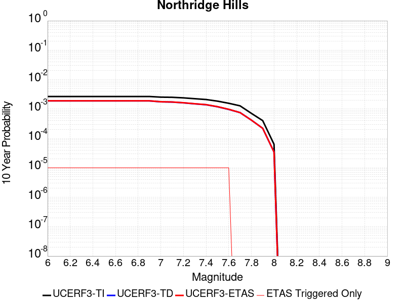 |

| Magnitude | 1 wk TI Prob | 1 wk TD Prob | 1 wk ETAS Prob | 1 wk ETAS/TD Gain | 1 wk ETAS Triggered Only | 1 mo TI Prob | 1 mo TD Prob | 1 mo ETAS Prob | 1 mo ETAS/TD Gain | 1 mo ETAS Triggered Only | 1 yr TI Prob | 1 yr TD Prob | 1 yr ETAS Prob | 1 yr ETAS/TD Gain | 1 yr ETAS Triggered Only | 10 yr TI Prob | 10 yr TD Prob | 10 yr ETAS Prob | 10 yr ETAS/TD Gain | 10 yr ETAS Triggered Only |
|-----|-----|-----|-----|-----|-----|-----|-----|-----|-----|-----|-----|-----|-----|-----|-----|-----|-----|-----|-----|-----|
| 6.0 | 5.095982E-6 | 3.6152098E-6 | 3.6152098E-6 | 1.0 | 0.0 | 2.183974E-5 | 1.5493664E-5 | 1.5493664E-5 | 1.0 | 0.0 | 2.658664E-4 | 1.8861916E-4 | 1.8861916E-4 | 1.0 | 0.0 | 0.0026554854 | 0.001884603 | 0.0019027177 | 1.0096118 | 1.814882E-5 |
| 6.1 | 5.095982E-6 | 3.6152098E-6 | 3.6152098E-6 | 1.0 | 0.0 | 2.183974E-5 | 1.5493664E-5 | 1.5493664E-5 | 1.0 | 0.0 | 2.658664E-4 | 1.8861916E-4 | 1.8861916E-4 | 1.0 | 0.0 | 0.0026554854 | 0.001884603 | 0.0019027177 | 1.0096118 | 1.814882E-5 |
| 6.2 | 5.095982E-6 | 3.6152098E-6 | 3.6152098E-6 | 1.0 | 0.0 | 2.183974E-5 | 1.5493664E-5 | 1.5493664E-5 | 1.0 | 0.0 | 2.658664E-4 | 1.8861916E-4 | 1.8861916E-4 | 1.0 | 0.0 | 0.0026554854 | 0.001884603 | 0.0019027177 | 1.0096118 | 1.814882E-5 |
| 6.3 | 5.095982E-6 | 3.6152098E-6 | 3.6152098E-6 | 1.0 | 0.0 | 2.183974E-5 | 1.5493664E-5 | 1.5493664E-5 | 1.0 | 0.0 | 2.658664E-4 | 1.8861916E-4 | 1.8861916E-4 | 1.0 | 0.0 | 0.0026554854 | 0.001884603 | 0.0019027177 | 1.0096118 | 1.814882E-5 |
| 6.4 | 5.095982E-6 | 3.6152098E-6 | 3.6152098E-6 | 1.0 | 0.0 | 2.183974E-5 | 1.5493664E-5 | 1.5493664E-5 | 1.0 | 0.0 | 2.658664E-4 | 1.8861916E-4 | 1.8861916E-4 | 1.0 | 0.0 | 0.0026554854 | 0.001884603 | 0.0019027177 | 1.0096118 | 1.814882E-5 |
| 6.5 | 5.095982E-6 | 3.6152098E-6 | 3.6152098E-6 | 1.0 | 0.0 | 2.183974E-5 | 1.5493664E-5 | 1.5493664E-5 | 1.0 | 0.0 | 2.658664E-4 | 1.8861916E-4 | 1.8861916E-4 | 1.0 | 0.0 | 0.0026554854 | 0.001884603 | 0.0019027177 | 1.0096118 | 1.814882E-5 |
| 6.6 | 5.095982E-6 | 3.6152098E-6 | 3.6152098E-6 | 1.0 | 0.0 | 2.183974E-5 | 1.5493664E-5 | 1.5493664E-5 | 1.0 | 0.0 | 2.658664E-4 | 1.8861916E-4 | 1.8861916E-4 | 1.0 | 0.0 | 0.0026554854 | 0.001884603 | 0.0019027177 | 1.0096118 | 1.814882E-5 |
| 6.7 | 5.095982E-6 | 3.6152098E-6 | 3.6152098E-6 | 1.0 | 0.0 | 2.183974E-5 | 1.5493664E-5 | 1.5493664E-5 | 1.0 | 0.0 | 2.658664E-4 | 1.8861916E-4 | 1.8861916E-4 | 1.0 | 0.0 | 0.0026554854 | 0.001884603 | 0.0019027177 | 1.0096118 | 1.814882E-5 |
| 6.8 | 5.095982E-6 | 3.6152098E-6 | 3.6152098E-6 | 1.0 | 0.0 | 2.183974E-5 | 1.5493664E-5 | 1.5493664E-5 | 1.0 | 0.0 | 2.658664E-4 | 1.8861916E-4 | 1.8861916E-4 | 1.0 | 0.0 | 0.0026554854 | 0.001884603 | 0.0019027177 | 1.0096118 | 1.814882E-5 |
| 6.9 | 5.0942654E-6 | 3.6134247E-6 | 3.6134247E-6 | 1.0 | 0.0 | 2.1832384E-5 | 1.5486015E-5 | 1.5486015E-5 | 1.0 | 0.0 | 2.6577685E-4 | 1.8852603E-4 | 1.8852603E-4 | 1.0 | 0.0 | 0.002654592 | 0.0018836735 | 0.001901788 | 1.0096166 | 1.814882E-5 |
| 7.0 | 4.851143E-6 | 3.3587396E-6 | 3.3587396E-6 | 1.0 | 0.0 | 2.0790447E-5 | 1.4394519E-5 | 1.4394519E-5 | 1.0 | 0.0 | 2.5309427E-4 | 1.7523921E-4 | 1.7523921E-4 | 1.0 | 0.0 | 0.0025280623 | 0.0017510147 | 0.0017691319 | 1.0103467 | 1.814882E-5 |
| 7.1 | 4.7910607E-6 | 3.2970208E-6 | 3.2970208E-6 | 1.0 | 0.0 | 2.0532956E-5 | 1.4130013E-5 | 1.4130013E-5 | 1.0 | 0.0 | 2.4996005E-4 | 1.7201937E-4 | 1.7201937E-4 | 1.0 | 0.0 | 0.0024967908 | 0.0017188663 | 0.0017369839 | 1.0105405 | 1.814882E-5 |
| 7.2 | 4.580079E-6 | 3.1067987E-6 | 3.1067987E-6 | 1.0 | 0.0 | 1.9628762E-5 | 1.3314784E-5 | 1.3314784E-5 | 1.0 | 0.0 | 2.3895396E-4 | 1.6209547E-4 | 1.6209547E-4 | 1.0 | 0.0 | 0.0023869718 | 0.0016197758 | 0.0016378952 | 1.0111864 | 1.814882E-5 |
| 7.3 | 4.290062E-6 | 2.8682275E-6 | 2.8682275E-6 | 1.0 | 0.0 | 1.838585E-5 | 1.2292346E-5 | 1.2292346E-5 | 1.0 | 0.0 | 2.2382473E-4 | 1.4964906E-4 | 1.4964906E-4 | 1.0 | 0.0 | 0.0022359942 | 0.0014954859 | 0.0015136076 | 1.0121176 | 1.814882E-5 |
| 7.4 | 4.0259683E-6 | 2.673904E-6 | 2.673904E-6 | 1.0 | 0.0 | 1.7254037E-5 | 1.1459538E-5 | 1.1459538E-5 | 1.0 | 0.0 | 2.1004764E-4 | 1.3951097E-4 | 1.3951097E-4 | 1.0 | 0.0 | 0.002098492 | 0.0013942367 | 0.0014123602 | 1.0129989 | 1.814882E-5 |
| 7.5 | 3.5477108E-6 | 2.285216E-6 | 2.285216E-6 | 1.0 | 0.0 | 1.5204386E-5 | 9.793746E-6 | 9.793746E-6 | 1.0 | 0.0 | 1.8509767E-4 | 1.1923235E-4 | 1.1923235E-4 | 1.0 | 0.0 | 0.0018494357 | 0.0011916853 | 0.0012098125 | 1.0152113 | 1.814882E-5 |
| 7.6 | 2.9990608E-6 | 1.8528339E-6 | 1.8528339E-6 | 1.0 | 0.0 | 1.2853055E-5 | 7.940693E-6 | 7.940693E-6 | 1.0 | 0.0 | 1.564747E-4 | 9.667365E-5 | 9.667365E-5 | 1.0 | 0.0 | 0.0015636457 | 9.663168E-4 | 9.84448E-4 | 1.0187633 | 1.814882E-5 |
| 7.7 | 2.4542855E-6 | 1.4461344E-6 | 1.4461344E-6 | 1.0 | 0.0 | 1.05183235E-5 | 6.197704E-6 | 6.197704E-6 | 1.0 | 0.0 | 1.2805307E-4 | 7.545444E-5 | 7.545444E-5 | 1.0 | 0.0 | 0.001279793 | 7.5428875E-4 | 7.5428875E-4 | 1.0 | 0.0 |
| 7.8 | 1.3623128E-6 | 8.016168E-7 | 8.016168E-7 | 1.0 | 0.0 | 5.8384703E-6 | 3.4354962E-6 | 3.4354962E-6 | 1.0 | 0.0 | 7.108106E-5 | 4.1826366E-5 | 4.1826366E-5 | 1.0 | 0.0 | 7.1058323E-4 | 4.1818514E-4 | 4.1818514E-4 | 1.0 | 0.0 |
| 7.9 | 7.716622E-7 | 4.218757E-7 | 4.218757E-7 | 1.0 | 0.0 | 3.3071194E-6 | 1.8080375E-6 | 1.8080375E-6 | 1.0 | 0.0 | 4.0263436E-5 | 2.2012635E-5 | 2.2012635E-5 | 1.0 | 0.0 | 4.0256142E-4 | 2.2010466E-4 | 2.2010466E-4 | 1.0 | 0.0 |
| 8.0 | 1.2117711E-7 | 6.6220565E-8 | 6.6220565E-8 | 1.0 | 0.0 | 5.1933034E-7 | 2.838024E-7 | 2.838024E-7 | 1.0 | 0.0 | 6.3228285E-6 | 3.4552888E-6 | 3.4552888E-6 | 1.0 | 0.0 | 6.3226486E-5 | 3.455237E-5 | 3.455237E-5 | 1.0 | 0.0 |

## Cucamonga
*[(top)](#table-of-contents)*

| 1 Week | 1 Month | 1 Year | 10 Year |
|-----|-----|-----|-----|
|  |  |  |  |

| Magnitude | 1 wk TI Prob | 1 wk TD Prob | 1 wk ETAS Prob | 1 wk ETAS/TD Gain | 1 wk ETAS Triggered Only | 1 mo TI Prob | 1 mo TD Prob | 1 mo ETAS Prob | 1 mo ETAS/TD Gain | 1 mo ETAS Triggered Only | 1 yr TI Prob | 1 yr TD Prob | 1 yr ETAS Prob | 1 yr ETAS/TD Gain | 1 yr ETAS Triggered Only | 10 yr TI Prob | 10 yr TD Prob | 10 yr ETAS Prob | 10 yr ETAS/TD Gain | 10 yr ETAS Triggered Only |
|-----|-----|-----|-----|-----|-----|-----|-----|-----|-----|-----|-----|-----|-----|-----|-----|-----|-----|-----|-----|-----|
| 6.0 | 1.1848348E-5 | 1.1737008E-5 | 1.1737008E-5 | 1.0 | 0.0 | 5.0777642E-5 | 5.030051E-5 | 5.030051E-5 | 1.0 | 0.0 | 6.180424E-4 | 6.1223935E-4 | 6.3037704E-4 | 1.0296252 | 1.814882E-5 | 0.0061632637 | 0.0061067017 | 0.00612474 | 1.0029538 | 1.814882E-5 |
| 6.1 | 1.1848348E-5 | 1.1737008E-5 | 1.1737008E-5 | 1.0 | 0.0 | 5.0777642E-5 | 5.030051E-5 | 5.030051E-5 | 1.0 | 0.0 | 6.180424E-4 | 6.1223935E-4 | 6.3037704E-4 | 1.0296252 | 1.814882E-5 | 0.0061632637 | 0.0061067017 | 0.00612474 | 1.0029538 | 1.814882E-5 |
| 6.2 | 1.1848348E-5 | 1.1737008E-5 | 1.1737008E-5 | 1.0 | 0.0 | 5.0777642E-5 | 5.030051E-5 | 5.030051E-5 | 1.0 | 0.0 | 6.180424E-4 | 6.1223935E-4 | 6.3037704E-4 | 1.0296252 | 1.814882E-5 | 0.0061632637 | 0.0061067017 | 0.00612474 | 1.0029538 | 1.814882E-5 |
| 6.3 | 1.1848348E-5 | 1.1737008E-5 | 1.1737008E-5 | 1.0 | 0.0 | 5.0777642E-5 | 5.030051E-5 | 5.030051E-5 | 1.0 | 0.0 | 6.180424E-4 | 6.1223935E-4 | 6.3037704E-4 | 1.0296252 | 1.814882E-5 | 0.0061632637 | 0.0061067017 | 0.00612474 | 1.0029538 | 1.814882E-5 |
| 6.4 | 1.1848348E-5 | 1.1737008E-5 | 1.1737008E-5 | 1.0 | 0.0 | 5.0777642E-5 | 5.030051E-5 | 5.030051E-5 | 1.0 | 0.0 | 6.180424E-4 | 6.1223935E-4 | 6.3037704E-4 | 1.0296252 | 1.814882E-5 | 0.0061632637 | 0.0061067017 | 0.00612474 | 1.0029538 | 1.814882E-5 |
| 6.5 | 1.16988695E-5 | 1.15760395E-5 | 1.15760395E-5 | 1.0 | 0.0 | 5.013705E-5 | 4.9610666E-5 | 4.9610666E-5 | 1.0 | 0.0 | 6.102476E-4 | 6.0384517E-4 | 6.21983E-4 | 1.0300373 | 1.814882E-5 | 0.006085745 | 0.006023216 | 0.006041256 | 1.002995 | 1.814882E-5 |
| 6.6 | 1.16988695E-5 | 1.15760395E-5 | 1.15760395E-5 | 1.0 | 0.0 | 5.013705E-5 | 4.9610666E-5 | 4.9610666E-5 | 1.0 | 0.0 | 6.102476E-4 | 6.0384517E-4 | 6.21983E-4 | 1.0300373 | 1.814882E-5 | 0.006085745 | 0.006023216 | 0.006041256 | 1.002995 | 1.814882E-5 |
| 6.7 | 1.1397107E-5 | 1.11149475E-5 | 1.11149475E-5 | 1.0 | 0.0 | 4.884383E-5 | 4.7634636E-5 | 4.7634636E-5 | 1.0 | 0.0 | 5.9451134E-4 | 5.797998E-4 | 5.9793814E-4 | 1.0312837 | 1.814882E-5 | 0.005929234 | 0.0057840226 | 0.0058020665 | 1.0031196 | 1.814882E-5 |
| 6.8 | 1.058387E-5 | 9.784992E-6 | 9.784992E-6 | 1.0 | 0.0 | 4.5358654E-5 | 4.193501E-5 | 4.193501E-5 | 1.0 | 0.0 | 5.521017E-4 | 5.1044027E-4 | 5.285798E-4 | 1.0355371 | 1.814882E-5 | 0.00550732 | 0.0050936877 | 0.005111744 | 1.0035448 | 1.814882E-5 |
| 6.9 | 9.690046E-6 | 8.57948E-6 | 8.57948E-6 | 1.0 | 0.0 | 4.1528107E-5 | 3.6768684E-5 | 3.6768684E-5 | 1.0 | 0.0 | 5.054874E-4 | 4.475672E-4 | 4.6570788E-4 | 1.0405318 | 1.814882E-5 | 0.005043391 | 0.004467594 | 0.0044856616 | 1.0040442 | 1.814882E-5 |
| 7.0 | 9.381461E-6 | 8.187101E-6 | 8.187101E-6 | 1.0 | 0.0 | 4.020564E-5 | 3.5087105E-5 | 3.5087105E-5 | 1.0 | 0.0 | 4.893937E-4 | 4.2710215E-4 | 4.452432E-4 | 1.0424747 | 1.814882E-5 | 0.0048831734 | 0.0042637475 | 0.004281819 | 1.0042384 | 1.814882E-5 |
| 7.1 | 8.946492E-6 | 7.781886E-6 | 7.781886E-6 | 1.0 | 0.0 | 3.8341543E-5 | 3.3350516E-5 | 3.3350516E-5 | 1.0 | 0.0 | 4.667083E-4 | 4.0596718E-4 | 4.2410864E-4 | 1.044687 | 1.814882E-5 | 0.0046572937 | 0.004053192 | 0.0040712673 | 1.0044595 | 1.814882E-5 |
| 7.2 | 8.251016E-6 | 6.9752796E-6 | 6.9752796E-6 | 1.0 | 0.0 | 3.5361016E-5 | 2.9893714E-5 | 2.9893714E-5 | 1.0 | 0.0 | 4.3043532E-4 | 3.6389544E-4 | 3.6389544E-4 | 1.0 | 0.0 | 0.0042960253 | 0.0036339292 | 0.0036339292 | 1.0 | 0.0 |
| 7.3 | 7.717881E-6 | 6.4863502E-6 | 6.4863502E-6 | 1.0 | 0.0 | 3.3076216E-5 | 2.7798349E-5 | 2.7798349E-5 | 1.0 | 0.0 | 4.026285E-4 | 3.3839257E-4 | 3.3839257E-4 | 1.0 | 0.0 | 0.004018998 | 0.00337971 | 0.00337971 | 1.0 | 0.0 |
| 7.4 | 7.275623E-6 | 6.031997E-6 | 6.031997E-6 | 1.0 | 0.0 | 3.118087E-5 | 2.585116E-5 | 2.585116E-5 | 1.0 | 0.0 | 3.7956095E-4 | 3.1469265E-4 | 3.1469265E-4 | 1.0 | 0.0 | 0.0037891332 | 0.0031434062 | 0.0031434062 | 1.0 | 0.0 |
| 7.5 | 6.5109502E-6 | 5.1006014E-6 | 5.1006014E-6 | 1.0 | 0.0 | 2.7903774E-5 | 2.1859538E-5 | 2.1859538E-5 | 1.0 | 0.0 | 3.3967546E-4 | 2.661075E-4 | 2.661075E-4 | 1.0 | 0.0 | 0.0033915674 | 0.002658813 | 0.002658813 | 1.0 | 0.0 |
| 7.6 | 5.4495326E-6 | 3.90857E-6 | 3.90857E-6 | 1.0 | 0.0 | 2.335493E-5 | 1.6750908E-5 | 1.6750908E-5 | 1.0 | 0.0 | 2.8430918E-4 | 2.0392328E-4 | 2.0392328E-4 | 1.0 | 0.0 | 0.0028394572 | 0.002038282 | 0.002038282 | 1.0 | 0.0 |
| 7.7 | 4.7997164E-6 | 3.2002547E-6 | 3.2002547E-6 | 1.0 | 0.0 | 2.057005E-5 | 1.3715306E-5 | 1.3715306E-5 | 1.0 | 0.0 | 2.504116E-4 | 1.6697108E-4 | 1.6697108E-4 | 1.0 | 0.0 | 0.002501296 | 0.0016693877 | 0.0016693877 | 1.0 | 0.0 |
| 7.8 | 3.3941733E-6 | 2.0641899E-6 | 2.0641899E-6 | 1.0 | 0.0 | 1.4546376E-5 | 8.846498E-6 | 8.846498E-6 | 1.0 | 0.0 | 1.7708774E-4 | 1.07700806E-4 | 1.07700806E-4 | 1.0 | 0.0 | 0.0017694668 | 0.001076723 | 0.001076723 | 1.0 | 0.0 |
| 7.9 | 9.750552E-7 | 5.155946E-7 | 5.155946E-7 | 1.0 | 0.0 | 4.178801E-6 | 2.2096892E-6 | 2.2096892E-6 | 1.0 | 0.0 | 5.0875715E-5 | 2.690264E-5 | 2.690264E-5 | 1.0 | 0.0 | 5.086407E-4 | 2.6899425E-4 | 2.6899425E-4 | 1.0 | 0.0 |
| 8.0 | 1.133857E-7 | 6.053707E-8 | 6.053707E-8 | 1.0 | 0.0 | 4.8593864E-7 | 2.5944456E-7 | 2.5944456E-7 | 1.0 | 0.0 | 5.9162867E-6 | 3.158733E-6 | 3.158733E-6 | 1.0 | 0.0 | 5.916129E-5 | 3.1586897E-5 | 3.1586897E-5 | 1.0 | 0.0 |

## Quien Sabe 2011 CFM
*[(top)](#table-of-contents)*

| 1 Week | 1 Month | 1 Year | 10 Year |
|-----|-----|-----|-----|
|  |  |  |  |

| Magnitude | 1 wk TI Prob | 1 wk TD Prob | 1 wk ETAS Prob | 1 wk ETAS/TD Gain | 1 wk ETAS Triggered Only | 1 mo TI Prob | 1 mo TD Prob | 1 mo ETAS Prob | 1 mo ETAS/TD Gain | 1 mo ETAS Triggered Only | 1 yr TI Prob | 1 yr TD Prob | 1 yr ETAS Prob | 1 yr ETAS/TD Gain | 1 yr ETAS Triggered Only | 10 yr TI Prob | 10 yr TD Prob | 10 yr ETAS Prob | 10 yr ETAS/TD Gain | 10 yr ETAS Triggered Only |
|-----|-----|-----|-----|-----|-----|-----|-----|-----|-----|-----|-----|-----|-----|-----|-----|-----|-----|-----|-----|-----|
| 6.0 | 3.729899E-5 | 7.087805E-5 | 8.902559E-5 | 1.2560388 | 1.814882E-5 | 1.5984301E-4 | 3.037322E-4 | 3.2187553E-4 | 1.0597346 | 1.814882E-5 | 0.0019443515 | 0.0036852323 | 0.003703314 | 1.0049065 | 1.814882E-5 | 0.019274272 | 0.035349756 | 0.035367265 | 1.0004953 | 1.814882E-5 |
| 6.1 | 1.7825725E-5 | 3.31456E-5 | 3.31456E-5 | 1.0 | 0.0 | 7.639373E-5 | 1.4204586E-4 | 1.4204586E-4 | 1.0 | 0.0 | 9.296967E-4 | 0.0017267246 | 0.0017267246 | 1.0 | 0.0 | 0.009258169 | 0.016698597 | 0.016698597 | 1.0 | 0.0 |
| 6.2 | 4.8865336E-6 | 7.804963E-6 | 7.804963E-6 | 1.0 | 0.0 | 2.0942118E-5 | 3.344947E-5 | 3.344947E-5 | 1.0 | 0.0 | 2.5494045E-4 | 4.0691497E-4 | 4.0691497E-4 | 1.0 | 0.0 | 0.0025464818 | 0.0040135453 | 0.0040135453 | 1.0 | 0.0 |
| 6.3 | 3.858491E-6 | 5.789573E-6 | 5.789573E-6 | 1.0 | 0.0 | 1.6536285E-5 | 2.4812247E-5 | 2.4812247E-5 | 1.0 | 0.0 | 2.0131067E-4 | 3.0205192E-4 | 3.0205192E-4 | 1.0 | 0.0 | 0.002011284 | 0.0030019816 | 0.0030019816 | 1.0 | 0.0 |
| 6.4 | 3.0771805E-6 | 4.384806E-6 | 4.384806E-6 | 1.0 | 0.0 | 1.318785E-5 | 1.8791905E-5 | 1.8791905E-5 | 1.0 | 0.0 | 1.6055023E-4 | 2.2876984E-4 | 2.2876984E-4 | 1.0 | 0.0 | 0.001604343 | 0.002286477 | 0.002286477 | 1.0 | 0.0 |
| 6.5 | 2.5081235E-6 | 3.463511E-6 | 3.463511E-6 | 1.0 | 0.0 | 1.0749056E-5 | 1.4843542E-5 | 1.4843542E-5 | 1.0 | 0.0 | 1.308619E-4 | 1.807066E-4 | 1.807066E-4 | 1.0 | 0.0 | 0.0013078486 | 0.0018123116 | 0.0018123116 | 1.0 | 0.0 |
| 6.6 | 1.7505364E-6 | 2.4023168E-6 | 2.4023168E-6 | 1.0 | 0.0 | 7.502277E-6 | 1.0295607E-5 | 1.0295607E-5 | 1.0 | 0.0 | 9.13364E-5 | 1.2534253E-4 | 1.2534253E-4 | 1.0 | 0.0 | 9.129886E-4 | 0.0012582915 | 0.0012582915 | 1.0 | 0.0 |
| 6.7 | 1.505737E-6 | 2.0637349E-6 | 2.0637349E-6 | 1.0 | 0.0 | 6.4531428E-6 | 8.844551E-6 | 8.844551E-6 | 1.0 | 0.0 | 7.8564175E-5 | 1.0767768E-4 | 1.0767768E-4 | 1.0 | 0.0 | 7.853641E-4 | 0.0010818138 | 0.0010818138 | 1.0 | 0.0 |
| 6.8 | 1.2924105E-6 | 1.7484025E-6 | 1.7484025E-6 | 1.0 | 0.0 | 5.5388905E-6 | 7.4931354E-6 | 7.4931354E-6 | 1.0 | 0.0 | 6.74339E-5 | 9.122565E-5 | 9.122565E-5 | 1.0 | 0.0 | 6.741344E-4 | 9.1609603E-4 | 9.1609603E-4 | 1.0 | 0.0 |
| 6.9 | 8.9075286E-7 | 1.1249955E-6 | 1.1249955E-6 | 1.0 | 0.0 | 3.8175067E-6 | 4.8214015E-6 | 4.8214015E-6 | 1.0 | 0.0 | 4.6477155E-5 | 5.8699206E-5 | 5.8699206E-5 | 1.0 | 0.0 | 4.6467435E-4 | 5.903947E-4 | 5.903947E-4 | 1.0 | 0.0 |
| 7.0 | 6.6891175E-7 | 8.51663E-7 | 8.51663E-7 | 1.0 | 0.0 | 2.8667614E-6 | 3.6499803E-6 | 3.6499803E-6 | 1.0 | 0.0 | 3.4902263E-5 | 4.44378E-5 | 4.44378E-5 | 1.0 | 0.0 | 3.4896782E-4 | 4.4678617E-4 | 4.4678617E-4 | 1.0 | 0.0 |
| 7.1 | 4.4205015E-7 | 5.3919683E-7 | 5.3919683E-7 | 1.0 | 0.0 | 1.8944993E-6 | 2.3108425E-6 | 2.3108425E-6 | 1.0 | 0.0 | 2.3065284E-5 | 2.8134315E-5 | 2.8134315E-5 | 1.0 | 0.0 | 2.3062891E-4 | 2.826926E-4 | 2.826926E-4 | 1.0 | 0.0 |
| 7.2 | 1.6620965E-7 | 1.5987598E-7 | 1.5987598E-7 | 1.0 | 0.0 | 7.123269E-7 | 6.851826E-7 | 6.851826E-7 | 1.0 | 0.0 | 8.672545E-6 | 8.34207E-6 | 8.34207E-6 | 1.0 | 0.0 | 8.6722066E-5 | 8.3573126E-5 | 8.3573126E-5 | 1.0 | 0.0 |
| 7.3 | 1.2142488E-7 | 1.1726492E-7 | 1.1726492E-7 | 1.0 | 0.0 | 5.2039223E-7 | 5.0256386E-7 | 5.0256386E-7 | 1.0 | 0.0 | 6.335757E-6 | 6.118701E-6 | 6.118701E-6 | 1.0 | 0.0 | 6.3355765E-5 | 6.124848E-5 | 6.124848E-5 | 1.0 | 0.0 |
| 7.4 | 2.4192937E-8 | 2.4543448E-8 | 2.4543448E-8 | 1.0 | 0.0 | 1.0368401E-7 | 1.051862E-7 | 1.051862E-7 | 1.0 | 0.0 | 1.2623522E-6 | 1.2806413E-6 | 1.2806413E-6 | 1.0 | 0.0 | 1.2623449E-5 | 1.2812683E-5 | 1.2812683E-5 | 1.0 | 0.0 |
| 7.5 | 1.4432802E-8 | 1.4506471E-8 | 1.4506471E-8 | 1.0 | 0.0 | 6.185486E-8 | 6.2170585E-8 | 6.2170585E-8 | 1.0 | 0.0 | 7.530827E-7 | 7.5692674E-7 | 7.5692674E-7 | 1.0 | 0.0 | 7.530801E-6 | 7.5735175E-6 | 7.5735175E-6 | 1.0 | 0.0 |

## North Frontal  (West)
*[(top)](#table-of-contents)*

| 1 Week | 1 Month | 1 Year | 10 Year |
|-----|-----|-----|-----|
| 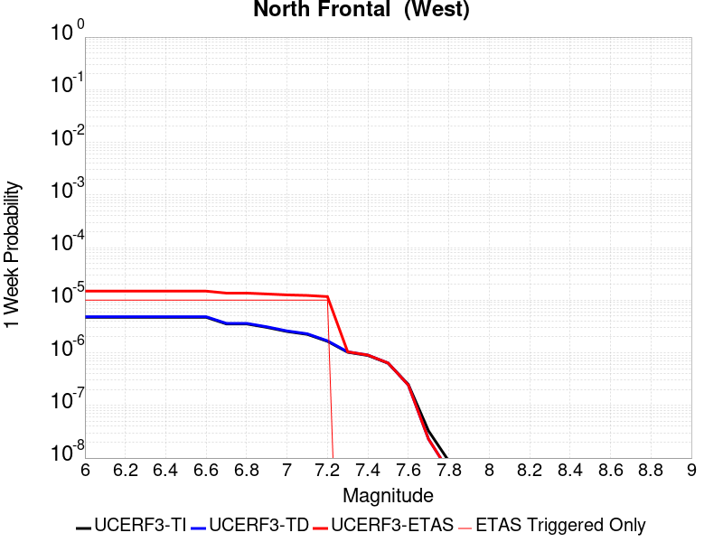 | 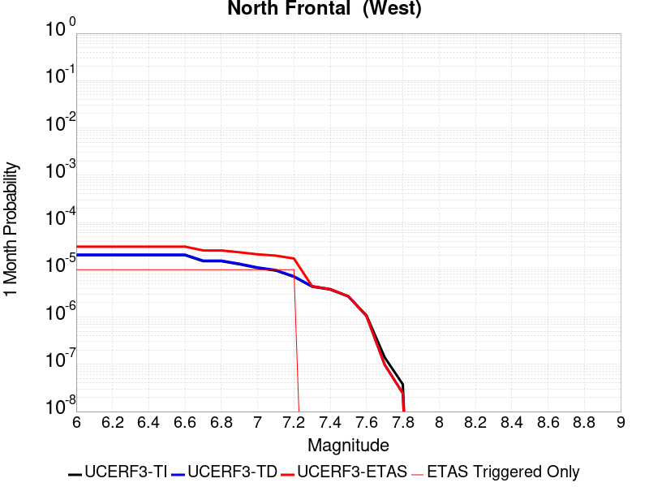 |  |  |

| Magnitude | 1 wk TI Prob | 1 wk TD Prob | 1 wk ETAS Prob | 1 wk ETAS/TD Gain | 1 wk ETAS Triggered Only | 1 mo TI Prob | 1 mo TD Prob | 1 mo ETAS Prob | 1 mo ETAS/TD Gain | 1 mo ETAS Triggered Only | 1 yr TI Prob | 1 yr TD Prob | 1 yr ETAS Prob | 1 yr ETAS/TD Gain | 1 yr ETAS Triggered Only | 10 yr TI Prob | 10 yr TD Prob | 10 yr ETAS Prob | 10 yr ETAS/TD Gain | 10 yr ETAS Triggered Only |
|-----|-----|-----|-----|-----|-----|-----|-----|-----|-----|-----|-----|-----|-----|-----|-----|-----|-----|-----|-----|-----|
| 6.0 | 4.7316266E-6 | 4.8526726E-6 | 2.3001405E-5 | 4.739946 | 1.814882E-5 | 2.0278241E-5 | 2.0797012E-5 | 3.8945454E-5 | 1.8726467 | 1.814882E-5 | 2.4685962E-4 | 2.5317568E-4 | 2.7131988E-4 | 1.0716666 | 1.814882E-5 | 0.0024658558 | 0.0025290183 | 0.0025471214 | 1.007158 | 1.814882E-5 |
| 6.1 | 4.7316266E-6 | 4.8526726E-6 | 2.3001405E-5 | 4.739946 | 1.814882E-5 | 2.0278241E-5 | 2.0797012E-5 | 3.8945454E-5 | 1.8726467 | 1.814882E-5 | 2.4685962E-4 | 2.5317568E-4 | 2.7131988E-4 | 1.0716666 | 1.814882E-5 | 0.0024658558 | 0.0025290183 | 0.0025471214 | 1.007158 | 1.814882E-5 |
| 6.2 | 4.7316266E-6 | 4.8526726E-6 | 2.3001405E-5 | 4.739946 | 1.814882E-5 | 2.0278241E-5 | 2.0797012E-5 | 3.8945454E-5 | 1.8726467 | 1.814882E-5 | 2.4685962E-4 | 2.5317568E-4 | 2.7131988E-4 | 1.0716666 | 1.814882E-5 | 0.0024658558 | 0.0025290183 | 0.0025471214 | 1.007158 | 1.814882E-5 |
| 6.3 | 4.7316266E-6 | 4.8526726E-6 | 2.3001405E-5 | 4.739946 | 1.814882E-5 | 2.0278241E-5 | 2.0797012E-5 | 3.8945454E-5 | 1.8726467 | 1.814882E-5 | 2.4685962E-4 | 2.5317568E-4 | 2.7131988E-4 | 1.0716666 | 1.814882E-5 | 0.0024658558 | 0.0025290183 | 0.0025471214 | 1.007158 | 1.814882E-5 |
| 6.4 | 4.7316266E-6 | 4.8526726E-6 | 2.3001405E-5 | 4.739946 | 1.814882E-5 | 2.0278241E-5 | 2.0797012E-5 | 3.8945454E-5 | 1.8726467 | 1.814882E-5 | 2.4685962E-4 | 2.5317568E-4 | 2.7131988E-4 | 1.0716666 | 1.814882E-5 | 0.0024658558 | 0.0025290183 | 0.0025471214 | 1.007158 | 1.814882E-5 |
| 6.5 | 4.7316266E-6 | 4.8526726E-6 | 2.3001405E-5 | 4.739946 | 1.814882E-5 | 2.0278241E-5 | 2.0797012E-5 | 3.8945454E-5 | 1.8726467 | 1.814882E-5 | 2.4685962E-4 | 2.5317568E-4 | 2.7131988E-4 | 1.0716666 | 1.814882E-5 | 0.0024658558 | 0.0025290183 | 0.0025471214 | 1.007158 | 1.814882E-5 |
| 6.6 | 4.7316266E-6 | 4.8526726E-6 | 2.3001405E-5 | 4.739946 | 1.814882E-5 | 2.0278241E-5 | 2.0797012E-5 | 3.8945454E-5 | 1.8726467 | 1.814882E-5 | 2.4685962E-4 | 2.5317568E-4 | 2.7131988E-4 | 1.0716666 | 1.814882E-5 | 0.0024658558 | 0.0025290183 | 0.0025471214 | 1.007158 | 1.814882E-5 |
| 6.7 | 3.5382777E-6 | 3.6308859E-6 | 2.177964E-5 | 5.998437 | 1.814882E-5 | 1.516396E-5 | 1.5560852E-5 | 3.3709388E-5 | 2.1662946 | 1.814882E-5 | 1.8460557E-4 | 1.8943768E-4 | 2.0758306E-4 | 1.0957855 | 1.814882E-5 | 0.0018445229 | 0.0018928389 | 0.0019109533 | 1.00957 | 1.814882E-5 |
| 6.8 | 3.5382777E-6 | 3.6308859E-6 | 2.177964E-5 | 5.998437 | 1.814882E-5 | 1.516396E-5 | 1.5560852E-5 | 3.3709388E-5 | 2.1662946 | 1.814882E-5 | 1.8460557E-4 | 1.8943768E-4 | 2.0758306E-4 | 1.0957855 | 1.814882E-5 | 0.0018445229 | 0.0018928389 | 0.0019109533 | 1.00957 | 1.814882E-5 |
| 6.9 | 3.0428037E-6 | 3.1227605E-6 | 2.1271524E-5 | 6.811769 | 1.814882E-5 | 1.30405215E-5 | 1.33831945E-5 | 3.1531774E-5 | 2.3560722 | 1.814882E-5 | 1.5875678E-4 | 1.6292889E-4 | 1.8107476E-4 | 1.111373 | 1.814882E-5 | 0.0015864341 | 0.0016281615 | 0.0016462809 | 1.0111287 | 1.814882E-5 |
| 7.0 | 2.538778E-6 | 2.6060904E-6 | 2.0754864E-5 | 7.9639845 | 1.814882E-5 | 1.0880432E-5 | 1.1168913E-5 | 2.931753E-5 | 2.6249223 | 1.814882E-5 | 1.324612E-4 | 1.3597352E-4 | 1.5411986E-4 | 1.133455 | 1.814882E-5 | 0.0013238228 | 0.0013589499 | 0.001377074 | 1.0133369 | 1.814882E-5 |
| 7.1 | 2.2418935E-6 | 2.3012074E-6 | 2.0449987E-5 | 8.886634 | 1.814882E-5 | 9.60808E-6 | 9.862282E-6 | 2.8010923E-5 | 2.840207 | 1.814882E-5 | 1.1697209E-4 | 1.2006712E-4 | 1.3821376E-4 | 1.1511375 | 1.814882E-5 | 0.0011691054 | 0.0012000664 | 0.0012181934 | 1.015105 | 1.814882E-5 |
| 7.2 | 1.6526745E-6 | 1.6924851E-6 | 1.9841274E-5 | 11.723161 | 1.814882E-5 | 7.082872E-6 | 7.253489E-6 | 2.5402178E-5 | 3.5020633 | 1.814882E-5 | 8.623055E-5 | 8.8307905E-5 | 1.0645512E-4 | 1.2054994 | 1.814882E-5 | 8.61971E-4 | 8.827532E-4 | 9.0088596E-4 | 1.0205412 | 1.814882E-5 |
| 7.3 | 1.0246019E-6 | 1.0442261E-6 | 1.0442261E-6 | 1.0 | 0.0 | 4.391144E-6 | 4.4752474E-6 | 4.4752474E-6 | 1.0 | 0.0 | 5.3460866E-5 | 5.448489E-5 | 5.448489E-5 | 1.0 | 0.0 | 5.344801E-4 | 5.4472685E-4 | 5.4472685E-4 | 1.0 | 0.0 |
| 7.4 | 8.9045164E-7 | 9.0565584E-7 | 9.0565584E-7 | 1.0 | 0.0 | 3.8162157E-6 | 3.8813773E-6 | 3.8813773E-6 | 1.0 | 0.0 | 4.646144E-5 | 4.7254853E-5 | 4.7254853E-5 | 1.0 | 0.0 | 4.6451724E-4 | 4.7245892E-4 | 4.7245892E-4 | 1.0 | 0.0 |
| 7.5 | 6.3357E-7 | 6.4027006E-7 | 6.4027006E-7 | 1.0 | 0.0 | 2.7152971E-6 | 2.744012E-6 | 2.744012E-6 | 1.0 | 0.0 | 3.305824E-5 | 3.34079E-5 | 3.34079E-5 | 1.0 | 0.0 | 3.3053322E-4 | 3.3403534E-4 | 3.3403534E-4 | 1.0 | 0.0 |
| 7.6 | 2.5087024E-7 | 2.4361097E-7 | 2.4361097E-7 | 1.0 | 0.0 | 1.0751578E-6 | 1.0440467E-6 | 1.0440467E-6 | 1.0 | 0.0 | 1.3089967E-5 | 1.2711216E-5 | 1.2711216E-5 | 1.0 | 0.0 | 1.3089196E-4 | 1.2710695E-4 | 1.2710695E-4 | 1.0 | 0.0 |
| 7.7 | 3.282987E-8 | 2.2874195E-8 | 2.2874195E-8 | 1.0 | 0.0 | 1.4069944E-7 | 9.803227E-8 | 9.803227E-8 | 1.0 | 0.0 | 1.7130144E-6 | 1.1935423E-6 | 1.1935423E-6 | 1.0 | 0.0 | 1.7130013E-5 | 1.1935367E-5 | 1.1935367E-5 | 1.0 | 0.0 |
| 7.8 | 8.77499E-9 | 5.6815956E-9 | 5.6815956E-9 | 1.0 | 0.0 | 3.7607098E-8 | 2.4349696E-8 | 2.4349696E-8 | 1.0 | 0.0 | 4.578663E-7 | 2.9645753E-7 | 2.9645753E-7 | 1.0 | 0.0 | 4.5786537E-6 | 2.9645726E-6 | 2.9645726E-6 | 1.0 | 0.0 |

## San Gorgonio Pass
*[(top)](#table-of-contents)*

| 1 Week | 1 Month | 1 Year | 10 Year |
|-----|-----|-----|-----|
|  |  |  |  |

| Magnitude | 1 wk TI Prob | 1 wk TD Prob | 1 wk ETAS Prob | 1 wk ETAS/TD Gain | 1 wk ETAS Triggered Only | 1 mo TI Prob | 1 mo TD Prob | 1 mo ETAS Prob | 1 mo ETAS/TD Gain | 1 mo ETAS Triggered Only | 1 yr TI Prob | 1 yr TD Prob | 1 yr ETAS Prob | 1 yr ETAS/TD Gain | 1 yr ETAS Triggered Only | 10 yr TI Prob | 10 yr TD Prob | 10 yr ETAS Prob | 10 yr ETAS/TD Gain | 10 yr ETAS Triggered Only |
|-----|-----|-----|-----|-----|-----|-----|-----|-----|-----|-----|-----|-----|-----|-----|-----|-----|-----|-----|-----|-----|
| 6.0 | 7.644328E-6 | 1.3314231E-5 | 1.3314231E-5 | 1.0 | 0.0 | 3.2760996E-5 | 5.705979E-5 | 5.705979E-5 | 1.0 | 0.0 | 3.987921E-4 | 6.944901E-4 | 6.944901E-4 | 1.0 | 0.0 | 0.003980772 | 0.0069299806 | 0.0069480035 | 1.0026008 | 1.814882E-5 |
| 6.1 | 7.644328E-6 | 1.3314231E-5 | 1.3314231E-5 | 1.0 | 0.0 | 3.2760996E-5 | 5.705979E-5 | 5.705979E-5 | 1.0 | 0.0 | 3.987921E-4 | 6.944901E-4 | 6.944901E-4 | 1.0 | 0.0 | 0.003980772 | 0.0069299806 | 0.0069480035 | 1.0026008 | 1.814882E-5 |
| 6.2 | 7.644328E-6 | 1.3314231E-5 | 1.3314231E-5 | 1.0 | 0.0 | 3.2760996E-5 | 5.705979E-5 | 5.705979E-5 | 1.0 | 0.0 | 3.987921E-4 | 6.944901E-4 | 6.944901E-4 | 1.0 | 0.0 | 0.003980772 | 0.0069299806 | 0.0069480035 | 1.0026008 | 1.814882E-5 |
| 6.3 | 7.644328E-6 | 1.3314231E-5 | 1.3314231E-5 | 1.0 | 0.0 | 3.2760996E-5 | 5.705979E-5 | 5.705979E-5 | 1.0 | 0.0 | 3.987921E-4 | 6.944901E-4 | 6.944901E-4 | 1.0 | 0.0 | 0.003980772 | 0.0069299806 | 0.0069480035 | 1.0026008 | 1.814882E-5 |
| 6.4 | 7.644328E-6 | 1.3314231E-5 | 1.3314231E-5 | 1.0 | 0.0 | 3.2760996E-5 | 5.705979E-5 | 5.705979E-5 | 1.0 | 0.0 | 3.987921E-4 | 6.944901E-4 | 6.944901E-4 | 1.0 | 0.0 | 0.003980772 | 0.0069299806 | 0.0069480035 | 1.0026008 | 1.814882E-5 |
| 6.5 | 7.644328E-6 | 1.3314231E-5 | 1.3314231E-5 | 1.0 | 0.0 | 3.2760996E-5 | 5.705979E-5 | 5.705979E-5 | 1.0 | 0.0 | 3.987921E-4 | 6.944901E-4 | 6.944901E-4 | 1.0 | 0.0 | 0.003980772 | 0.0069299806 | 0.0069480035 | 1.0026008 | 1.814882E-5 |
| 6.6 | 7.644328E-6 | 1.3314231E-5 | 1.3314231E-5 | 1.0 | 0.0 | 3.2760996E-5 | 5.705979E-5 | 5.705979E-5 | 1.0 | 0.0 | 3.987921E-4 | 6.944901E-4 | 6.944901E-4 | 1.0 | 0.0 | 0.003980772 | 0.0069299806 | 0.0069480035 | 1.0026008 | 1.814882E-5 |
| 6.7 | 6.987586E-6 | 1.2618505E-5 | 1.2618505E-5 | 1.0 | 0.0 | 2.9946454E-5 | 5.4078235E-5 | 5.4078235E-5 | 1.0 | 0.0 | 3.645371E-4 | 6.582117E-4 | 6.582117E-4 | 1.0 | 0.0 | 0.0036393967 | 0.0065693567 | 0.006587386 | 1.0027446 | 1.814882E-5 |
| 6.8 | 6.987586E-6 | 1.2618505E-5 | 1.2618505E-5 | 1.0 | 0.0 | 2.9946454E-5 | 5.4078235E-5 | 5.4078235E-5 | 1.0 | 0.0 | 3.645371E-4 | 6.582117E-4 | 6.582117E-4 | 1.0 | 0.0 | 0.0036393967 | 0.0065693567 | 0.006587386 | 1.0027446 | 1.814882E-5 |
| 6.9 | 5.504702E-6 | 1.1049368E-5 | 1.1049368E-5 | 1.0 | 0.0 | 2.3591367E-5 | 4.7353606E-5 | 4.7353606E-5 | 1.0 | 0.0 | 2.8718702E-4 | 5.7638274E-4 | 5.7638274E-4 | 1.0 | 0.0 | 0.0028681618 | 0.005755309 | 0.005755309 | 1.0 | 0.0 |
| 7.0 | 5.4825764E-6 | 1.102571E-5 | 1.102571E-5 | 1.0 | 0.0 | 2.3496545E-5 | 4.7252215E-5 | 4.7252215E-5 | 1.0 | 0.0 | 2.8603288E-4 | 5.751489E-4 | 5.751489E-4 | 1.0 | 0.0 | 0.00285665 | 0.005743035 | 0.005743035 | 1.0 | 0.0 |
| 7.1 | 5.4692787E-6 | 1.101142E-5 | 1.101142E-5 | 1.0 | 0.0 | 2.3439556E-5 | 4.7190973E-5 | 4.7190973E-5 | 1.0 | 0.0 | 2.8533922E-4 | 5.744037E-4 | 5.744037E-4 | 1.0 | 0.0 | 0.0028497311 | 0.0057356213 | 0.0057356213 | 1.0 | 0.0 |
| 7.2 | 5.453661E-6 | 1.0994446E-5 | 1.0994446E-5 | 1.0 | 0.0 | 2.3372622E-5 | 4.7118232E-5 | 4.7118232E-5 | 1.0 | 0.0 | 2.8452452E-4 | 5.7351857E-4 | 5.7351857E-4 | 1.0 | 0.0 | 0.002841605 | 0.0057268157 | 0.0057268157 | 1.0 | 0.0 |
| 7.3 | 5.4422303E-6 | 1.0981369E-5 | 1.0981369E-5 | 1.0 | 0.0 | 2.3323635E-5 | 4.706219E-5 | 4.706219E-5 | 1.0 | 0.0 | 2.8392827E-4 | 5.728366E-4 | 5.728366E-4 | 1.0 | 0.0 | 0.0028356577 | 0.005720031 | 0.005720031 | 1.0 | 0.0 |
| 7.4 | 5.398595E-6 | 1.0928734E-5 | 1.0928734E-5 | 1.0 | 0.0 | 2.313663E-5 | 4.683662E-5 | 4.683662E-5 | 1.0 | 0.0 | 2.8165206E-4 | 5.700917E-4 | 5.700917E-4 | 1.0 | 0.0 | 0.0028129534 | 0.005692723 | 0.005692723 | 1.0 | 0.0 |
| 7.5 | 5.3578788E-6 | 1.0855281E-5 | 1.0855281E-5 | 1.0 | 0.0 | 2.2962136E-5 | 4.6521833E-5 | 4.6521833E-5 | 1.0 | 0.0 | 2.7952815E-4 | 5.662612E-4 | 5.662612E-4 | 1.0 | 0.0 | 0.002791768 | 0.0056546377 | 0.0056546377 | 1.0 | 0.0 |
| 7.6 | 4.8091474E-6 | 9.60368E-6 | 9.60368E-6 | 1.0 | 0.0 | 2.0610469E-5 | 4.1158008E-5 | 4.1158008E-5 | 1.0 | 0.0 | 2.5090357E-4 | 5.0098833E-4 | 5.0098833E-4 | 1.0 | 0.0 | 0.0025062046 | 0.0050053033 | 0.0050053033 | 1.0 | 0.0 |
| 7.7 | 1.5991155E-6 | 3.352866E-6 | 3.352866E-6 | 1.0 | 0.0 | 6.853334E-6 | 1.4369349E-5 | 1.4369349E-5 | 1.0 | 0.0 | 8.343615E-5 | 1.7493303E-4 | 1.7493303E-4 | 1.0 | 0.0 | 8.340483E-4 | 0.0017534072 | 0.0017534072 | 1.0 | 0.0 |
| 7.8 | 9.258398E-7 | 2.0579948E-6 | 2.0579948E-6 | 1.0 | 0.0 | 3.967879E-6 | 8.819949E-6 | 8.819949E-6 | 1.0 | 0.0 | 4.8307855E-5 | 1.073776E-4 | 1.073776E-4 | 1.0 | 0.0 | 4.8297356E-4 | 0.001078687 | 0.001078687 | 1.0 | 0.0 |
| 7.9 | 5.975575E-7 | 1.2291794E-6 | 1.2291794E-6 | 1.0 | 0.0 | 2.5609581E-6 | 5.2679006E-6 | 5.2679006E-6 | 1.0 | 0.0 | 3.117922E-5 | 6.4134816E-5 | 6.4134816E-5 | 1.0 | 0.0 | 3.1174847E-4 | 6.463092E-4 | 6.463092E-4 | 1.0 | 0.0 |
| 8.0 | 3.4413725E-7 | 6.7148494E-7 | 6.7148494E-7 | 1.0 | 0.0 | 1.4748731E-6 | 2.8777895E-6 | 2.8777895E-6 | 1.0 | 0.0 | 1.7956432E-5 | 3.503653E-5 | 3.503653E-5 | 1.0 | 0.0 | 1.7954981E-4 | 3.5373896E-4 | 3.5373896E-4 | 1.0 | 0.0 |
| 8.1 | 1.1787731E-8 | 9.634385E-9 | 9.634385E-9 | 1.0 | 0.0 | 5.0518846E-8 | 4.129022E-8 | 4.129022E-8 | 1.0 | 0.0 | 6.1506677E-7 | 5.027083E-7 | 5.027083E-7 | 1.0 | 0.0 | 6.1506507E-6 | 5.2424944E-6 | 5.2424944E-6 | 1.0 | 0.0 |

## Sierra Madre (San Fernando)
*[(top)](#table-of-contents)*

| 1 Week | 1 Month | 1 Year | 10 Year |
|-----|-----|-----|-----|
|  |  |  |  |

| Magnitude | 1 wk TI Prob | 1 wk TD Prob | 1 wk ETAS Prob | 1 wk ETAS/TD Gain | 1 wk ETAS Triggered Only | 1 mo TI Prob | 1 mo TD Prob | 1 mo ETAS Prob | 1 mo ETAS/TD Gain | 1 mo ETAS Triggered Only | 1 yr TI Prob | 1 yr TD Prob | 1 yr ETAS Prob | 1 yr ETAS/TD Gain | 1 yr ETAS Triggered Only | 10 yr TI Prob | 10 yr TD Prob | 10 yr ETAS Prob | 10 yr ETAS/TD Gain | 10 yr ETAS Triggered Only |
|-----|-----|-----|-----|-----|-----|-----|-----|-----|-----|-----|-----|-----|-----|-----|-----|-----|-----|-----|-----|-----|
| 6.0 | 1.0346413E-5 | 6.2872605E-6 | 6.2872605E-6 | 1.0 | 0.0 | 4.4341014E-5 | 2.694513E-5 | 2.694513E-5 | 1.0 | 0.0 | 5.3971814E-4 | 3.280087E-4 | 3.280087E-4 | 1.0 | 0.0 | 0.0053840918 | 0.0032753581 | 0.0032934474 | 1.0055228 | 1.814882E-5 |
| 6.1 | 1.0346413E-5 | 6.2872605E-6 | 6.2872605E-6 | 1.0 | 0.0 | 4.4341014E-5 | 2.694513E-5 | 2.694513E-5 | 1.0 | 0.0 | 5.3971814E-4 | 3.280087E-4 | 3.280087E-4 | 1.0 | 0.0 | 0.0053840918 | 0.0032753581 | 0.0032934474 | 1.0055228 | 1.814882E-5 |
| 6.2 | 1.0346413E-5 | 6.2872605E-6 | 6.2872605E-6 | 1.0 | 0.0 | 4.4341014E-5 | 2.694513E-5 | 2.694513E-5 | 1.0 | 0.0 | 5.3971814E-4 | 3.280087E-4 | 3.280087E-4 | 1.0 | 0.0 | 0.0053840918 | 0.0032753581 | 0.0032934474 | 1.0055228 | 1.814882E-5 |
| 6.3 | 1.0346413E-5 | 6.2872605E-6 | 6.2872605E-6 | 1.0 | 0.0 | 4.4341014E-5 | 2.694513E-5 | 2.694513E-5 | 1.0 | 0.0 | 5.3971814E-4 | 3.280087E-4 | 3.280087E-4 | 1.0 | 0.0 | 0.0053840918 | 0.0032753581 | 0.0032934474 | 1.0055228 | 1.814882E-5 |
| 6.4 | 1.0249558E-5 | 6.2872605E-6 | 6.2872605E-6 | 1.0 | 0.0 | 4.392594E-5 | 2.694513E-5 | 2.694513E-5 | 1.0 | 0.0 | 5.3466705E-4 | 3.280087E-4 | 3.280087E-4 | 1.0 | 0.0 | 0.0053338245 | 0.0032753581 | 0.0032934474 | 1.0055228 | 1.814882E-5 |
| 6.5 | 1.0249558E-5 | 6.2872605E-6 | 6.2872605E-6 | 1.0 | 0.0 | 4.392594E-5 | 2.694513E-5 | 2.694513E-5 | 1.0 | 0.0 | 5.3466705E-4 | 3.280087E-4 | 3.280087E-4 | 1.0 | 0.0 | 0.0053338245 | 0.0032753581 | 0.0032934474 | 1.0055228 | 1.814882E-5 |
| 6.6 | 9.9035515E-6 | 6.2872605E-6 | 6.2872605E-6 | 1.0 | 0.0 | 4.2443102E-5 | 2.694513E-5 | 2.694513E-5 | 1.0 | 0.0 | 5.166222E-4 | 3.280087E-4 | 3.280087E-4 | 1.0 | 0.0 | 0.0051542283 | 0.0032753581 | 0.0032934474 | 1.0055228 | 1.814882E-5 |
| 6.7 | 9.87217E-6 | 6.2746817E-6 | 6.2746817E-6 | 1.0 | 0.0 | 4.2308613E-5 | 2.689122E-5 | 2.689122E-5 | 1.0 | 0.0 | 5.149856E-4 | 3.2735255E-4 | 3.2735255E-4 | 1.0 | 0.0 | 0.005137938 | 0.0032688158 | 0.0032869054 | 1.0055339 | 1.814882E-5 |
| 6.8 | 9.4359175E-6 | 6.1786586E-6 | 6.1786586E-6 | 1.0 | 0.0 | 4.043902E-5 | 2.6479704E-5 | 2.6479704E-5 | 1.0 | 0.0 | 4.9223384E-4 | 3.2234378E-4 | 3.2234378E-4 | 1.0 | 0.0 | 0.0049114493 | 0.0032188739 | 0.0032369643 | 1.0056201 | 1.814882E-5 |
| 6.9 | 8.700447E-6 | 6.039922E-6 | 6.039922E-6 | 1.0 | 0.0 | 3.72871E-5 | 2.5885129E-5 | 2.5885129E-5 | 1.0 | 0.0 | 4.5387587E-4 | 3.1510694E-4 | 3.1510694E-4 | 1.0 | 0.0 | 0.0045295 | 0.003146711 | 0.0031648027 | 1.0057493 | 1.814882E-5 |
| 7.0 | 8.648878E-6 | 6.0148373E-6 | 6.0148373E-6 | 1.0 | 0.0 | 3.7066096E-5 | 2.5777625E-5 | 2.5777625E-5 | 1.0 | 0.0 | 4.5118626E-4 | 3.1379846E-4 | 3.1379846E-4 | 1.0 | 0.0 | 0.004502713 | 0.003133663 | 0.003151755 | 1.0057734 | 1.814882E-5 |
| 7.1 | 8.505786E-6 | 5.9244676E-6 | 5.9244676E-6 | 1.0 | 0.0 | 3.645286E-5 | 2.5390334E-5 | 2.5390334E-5 | 1.0 | 0.0 | 4.437232E-4 | 3.0908454E-4 | 3.0908454E-4 | 1.0 | 0.0 | 0.0044283825 | 0.0030866556 | 0.0031047484 | 1.0058616 | 1.814882E-5 |
| 7.2 | 8.139752E-6 | 5.6987624E-6 | 5.6987624E-6 | 1.0 | 0.0 | 3.4884186E-5 | 2.4423045E-5 | 2.4423045E-5 | 1.0 | 0.0 | 4.246322E-4 | 2.9731105E-4 | 2.9731105E-4 | 1.0 | 0.0 | 0.004238217 | 0.0029692391 | 0.002987334 | 1.0060941 | 1.814882E-5 |
| 7.3 | 7.8816E-6 | 5.552077E-6 | 5.552077E-6 | 1.0 | 0.0 | 3.3777847E-5 | 2.3794404E-5 | 2.3794404E-5 | 1.0 | 0.0 | 4.111677E-4 | 2.896594E-4 | 2.896594E-4 | 1.0 | 0.0 | 0.004104078 | 0.0028929242 | 0.0029110205 | 1.0062554 | 1.814882E-5 |
| 7.4 | 7.5810603E-6 | 5.3563126E-6 | 5.3563126E-6 | 1.0 | 0.0 | 3.2489854E-5 | 2.2955428E-5 | 2.2955428E-5 | 1.0 | 0.0 | 3.9549218E-4 | 2.7944756E-4 | 2.7944756E-4 | 1.0 | 0.0 | 0.0039478904 | 0.0027910667 | 0.0028091648 | 1.0064843 | 1.814882E-5 |
| 7.5 | 6.349153E-6 | 4.407576E-6 | 4.407576E-6 | 1.0 | 0.0 | 2.7210372E-5 | 1.888948E-5 | 1.888948E-5 | 1.0 | 0.0 | 3.312359E-4 | 2.2995596E-4 | 2.2995596E-4 | 1.0 | 0.0 | 0.0033074263 | 0.0022972622 | 0.0023153692 | 1.007882 | 1.814882E-5 |
| 7.6 | 4.430576E-6 | 2.8905868E-6 | 2.8905868E-6 | 1.0 | 0.0 | 1.8988047E-5 | 1.2388171E-5 | 1.2388171E-5 | 1.0 | 0.0 | 2.3115493E-4 | 1.5081577E-4 | 1.5081577E-4 | 1.0 | 0.0 | 0.0023091463 | 0.0015071568 | 0.0015252782 | 1.0120236 | 1.814882E-5 |
| 7.7 | 3.005066E-6 | 1.7510115E-6 | 1.7510115E-6 | 1.0 | 0.0 | 1.2878791E-5 | 7.504313E-6 | 7.504313E-6 | 1.0 | 0.0 | 1.56788E-4 | 9.1361195E-5 | 9.1361195E-5 | 1.0 | 0.0 | 0.0015667742 | 9.132375E-4 | 9.132375E-4 | 1.0 | 0.0 |
| 7.8 | 1.8459098E-6 | 1.0582091E-6 | 1.0582091E-6 | 1.0 | 0.0 | 7.911018E-6 | 4.535174E-6 | 4.535174E-6 | 1.0 | 0.0 | 9.631238E-5 | 5.5214347E-5 | 5.5214347E-5 | 1.0 | 0.0 | 9.627065E-4 | 5.5200676E-4 | 5.5200676E-4 | 1.0 | 0.0 |
| 7.9 | 9.839262E-7 | 5.23421E-7 | 5.23421E-7 | 1.0 | 0.0 | 4.2168194E-6 | 2.2432312E-6 | 2.2432312E-6 | 1.0 | 0.0 | 5.1338568E-5 | 2.7310998E-5 | 2.7310998E-5 | 1.0 | 0.0 | 5.132671E-4 | 2.730767E-4 | 2.730767E-4 | 1.0 | 0.0 |
| 8.0 | 1.210983E-7 | 6.613821E-8 | 6.613821E-8 | 1.0 | 0.0 | 5.1899264E-7 | 2.8344945E-7 | 2.8344945E-7 | 1.0 | 0.0 | 6.3187167E-6 | 3.4509917E-6 | 3.4509917E-6 | 1.0 | 0.0 | 6.318537E-5 | 3.45094E-5 | 3.45094E-5 | 1.0 | 0.0 |

## Los Osos 2011
*[(top)](#table-of-contents)*

| 1 Week | 1 Month | 1 Year | 10 Year |
|-----|-----|-----|-----|
|  |  |  |  |

| Magnitude | 1 wk TI Prob | 1 wk TD Prob | 1 wk ETAS Prob | 1 wk ETAS/TD Gain | 1 wk ETAS Triggered Only | 1 mo TI Prob | 1 mo TD Prob | 1 mo ETAS Prob | 1 mo ETAS/TD Gain | 1 mo ETAS Triggered Only | 1 yr TI Prob | 1 yr TD Prob | 1 yr ETAS Prob | 1 yr ETAS/TD Gain | 1 yr ETAS Triggered Only | 10 yr TI Prob | 10 yr TD Prob | 10 yr ETAS Prob | 10 yr ETAS/TD Gain | 10 yr ETAS Triggered Only |
|-----|-----|-----|-----|-----|-----|-----|-----|-----|-----|-----|-----|-----|-----|-----|-----|-----|-----|-----|-----|-----|
| 6.0 | 4.8871775E-6 | 4.9814835E-6 | 4.9814835E-6 | 1.0 | 0.0 | 2.0944879E-5 | 2.1349055E-5 | 2.1349055E-5 | 1.0 | 0.0 | 2.5497406E-4 | 2.5989654E-4 | 2.5989654E-4 | 1.0 | 0.0 | 0.002546817 | 0.0025962002 | 0.002614302 | 1.0069724 | 1.814882E-5 |
| 6.1 | 4.8871775E-6 | 4.9814835E-6 | 4.9814835E-6 | 1.0 | 0.0 | 2.0944879E-5 | 2.1349055E-5 | 2.1349055E-5 | 1.0 | 0.0 | 2.5497406E-4 | 2.5989654E-4 | 2.5989654E-4 | 1.0 | 0.0 | 0.002546817 | 0.0025962002 | 0.002614302 | 1.0069724 | 1.814882E-5 |
| 6.2 | 4.8871775E-6 | 4.9814835E-6 | 4.9814835E-6 | 1.0 | 0.0 | 2.0944879E-5 | 2.1349055E-5 | 2.1349055E-5 | 1.0 | 0.0 | 2.5497406E-4 | 2.5989654E-4 | 2.5989654E-4 | 1.0 | 0.0 | 0.002546817 | 0.0025962002 | 0.002614302 | 1.0069724 | 1.814882E-5 |
| 6.3 | 4.8871775E-6 | 4.9814835E-6 | 4.9814835E-6 | 1.0 | 0.0 | 2.0944879E-5 | 2.1349055E-5 | 2.1349055E-5 | 1.0 | 0.0 | 2.5497406E-4 | 2.5989654E-4 | 2.5989654E-4 | 1.0 | 0.0 | 0.002546817 | 0.0025962002 | 0.002614302 | 1.0069724 | 1.814882E-5 |
| 6.4 | 4.8871775E-6 | 4.9814835E-6 | 4.9814835E-6 | 1.0 | 0.0 | 2.0944879E-5 | 2.1349055E-5 | 2.1349055E-5 | 1.0 | 0.0 | 2.5497406E-4 | 2.5989654E-4 | 2.5989654E-4 | 1.0 | 0.0 | 0.002546817 | 0.0025962002 | 0.002614302 | 1.0069724 | 1.814882E-5 |
| 6.5 | 3.1724062E-6 | 3.223395E-6 | 3.223395E-6 | 1.0 | 0.0 | 1.3595956E-5 | 1.3814477E-5 | 1.3814477E-5 | 1.0 | 0.0 | 1.6551818E-4 | 1.681784E-4 | 1.681784E-4 | 1.0 | 0.0 | 0.0016539496 | 0.0016805249 | 0.0016986432 | 1.0107813 | 1.814882E-5 |
| 6.6 | 3.1022591E-6 | 3.1511045E-6 | 3.1511045E-6 | 1.0 | 0.0 | 1.3295328E-5 | 1.3504664E-5 | 1.3504664E-5 | 1.0 | 0.0 | 1.618586E-4 | 1.64407E-4 | 1.64407E-4 | 1.0 | 0.0 | 0.0016174077 | 0.0016428665 | 0.0016609855 | 1.0110289 | 1.814882E-5 |
| 6.7 | 2.611518E-6 | 2.6491832E-6 | 2.6491832E-6 | 1.0 | 0.0 | 1.1192172E-5 | 1.1353593E-5 | 1.1353593E-5 | 1.0 | 0.0 | 1.3625617E-4 | 1.3822126E-4 | 1.3822126E-4 | 1.0 | 0.0 | 0.0013617266 | 0.0013813575 | 0.0013994813 | 1.0131203 | 1.814882E-5 |
| 6.8 | 2.4780884E-6 | 2.5121592E-6 | 2.5121592E-6 | 1.0 | 0.0 | 1.0620336E-5 | 1.0766353E-5 | 1.0766353E-5 | 1.0 | 0.0 | 1.2929492E-4 | 1.3107249E-4 | 1.3107249E-4 | 1.0 | 0.0 | 0.0012921972 | 0.001309956 | 0.001328081 | 1.0138364 | 1.814882E-5 |
| 6.9 | 2.1376322E-6 | 2.1635055E-6 | 2.1635055E-6 | 1.0 | 0.0 | 9.161248E-6 | 9.272134E-6 | 9.272134E-6 | 1.0 | 0.0 | 1.1153249E-4 | 1.128824E-4 | 1.128824E-4 | 1.0 | 0.0 | 0.0011147653 | 0.0011282525 | 0.0011282525 | 1.0 | 0.0 |
| 7.0 | 1.9282882E-6 | 1.9494585E-6 | 1.9494585E-6 | 1.0 | 0.0 | 8.264066E-6 | 8.354796E-6 | 8.354796E-6 | 1.0 | 0.0 | 1.0061036E-4 | 1.017149E-4 | 1.017149E-4 | 1.0 | 0.0 | 0.0010056482 | 0.0010166848 | 0.0010166848 | 1.0 | 0.0 |
| 7.1 | 1.6353226E-6 | 1.6501118E-6 | 1.6501118E-6 | 1.0 | 0.0 | 7.0085066E-6 | 7.0718884E-6 | 7.0718884E-6 | 1.0 | 0.0 | 8.532523E-5 | 8.609685E-5 | 8.609685E-5 | 1.0 | 0.0 | 8.529247E-4 | 8.6063566E-4 | 8.6063566E-4 | 1.0 | 0.0 |
| 7.2 | 1.4446276E-6 | 1.4553341E-6 | 1.4553341E-6 | 1.0 | 0.0 | 6.191247E-6 | 6.237131E-6 | 6.237131E-6 | 1.0 | 0.0 | 7.537582E-5 | 7.593443E-5 | 7.593443E-5 | 1.0 | 0.0 | 7.535026E-4 | 7.590854E-4 | 7.590854E-4 | 1.0 | 0.0 |
| 7.3 | 1.2014582E-6 | 1.2069073E-6 | 1.2069073E-6 | 1.0 | 0.0 | 5.149096E-6 | 5.1724496E-6 | 5.1724496E-6 | 1.0 | 0.0 | 6.268844E-5 | 6.297276E-5 | 6.297276E-5 | 1.0 | 0.0 | 6.267076E-4 | 6.295495E-4 | 6.295495E-4 | 1.0 | 0.0 |
| 7.4 | 9.707733E-7 | 9.709773E-7 | 9.709773E-7 | 1.0 | 0.0 | 4.16045E-6 | 4.161325E-6 | 4.161325E-6 | 1.0 | 0.0 | 5.0652303E-5 | 5.066295E-5 | 5.066295E-5 | 1.0 | 0.0 | 5.064076E-4 | 5.065143E-4 | 5.065143E-4 | 1.0 | 0.0 |
| 7.5 | 7.174908E-7 | 7.1149134E-7 | 7.1149134E-7 | 1.0 | 0.0 | 3.074957E-6 | 3.0492452E-6 | 3.0492452E-6 | 1.0 | 0.0 | 3.743696E-5 | 3.712393E-5 | 3.712393E-5 | 1.0 | 0.0 | 3.7430652E-4 | 3.7117745E-4 | 3.7117745E-4 | 1.0 | 0.0 |
| 7.6 | 4.5535776E-7 | 4.420792E-7 | 4.420792E-7 | 1.0 | 0.0 | 1.9515319E-6 | 1.8946238E-6 | 1.8946238E-6 | 1.0 | 0.0 | 2.3759641E-5 | 2.3066801E-5 | 2.3066801E-5 | 1.0 | 0.0 | 2.37571E-4 | 2.3064416E-4 | 2.3064416E-4 | 1.0 | 0.0 |
| 7.7 | 2.1173553E-7 | 1.9060796E-7 | 1.9060796E-7 | 1.0 | 0.0 | 9.0743765E-7 | 8.1689103E-7 | 8.1689103E-7 | 1.0 | 0.0 | 1.1047998E-5 | 9.945603E-6 | 9.945603E-6 | 1.0 | 0.0 | 1.1047449E-4 | 9.945161E-5 | 9.945161E-5 | 1.0 | 0.0 |
| 7.8 | 9.873608E-8 | 7.3675665E-8 | 7.3675665E-8 | 1.0 | 0.0 | 4.2315455E-7 | 3.157528E-7 | 3.157528E-7 | 1.0 | 0.0 | 5.1518946E-6 | 3.8442836E-6 | 3.8442836E-6 | 1.0 | 0.0 | 5.1517753E-5 | 3.8442176E-5 | 3.8442176E-5 | 1.0 | 0.0 |
| 7.9 | 5.4399106E-8 | 3.1880155E-8 | 3.1880155E-8 | 1.0 | 0.0 | 2.33139E-7 | 1.3662923E-7 | 1.3662923E-7 | 1.0 | 0.0 | 2.8384638E-6 | 1.6634596E-6 | 1.6634596E-6 | 1.0 | 0.0 | 2.8384275E-5 | 1.6634473E-5 | 1.6634473E-5 | 1.0 | 0.0 |
| 8.0 | 1.817203E-8 | 8.420727E-9 | 8.420727E-9 | 1.0 | 0.0 | 7.7880124E-8 | 3.608883E-8 | 3.608883E-8 | 1.0 | 0.0 | 9.481901E-7 | 4.393814E-7 | 4.393814E-7 | 1.0 | 0.0 | 9.481861E-6 | 4.3938057E-6 | 4.3938057E-6 | 1.0 | 0.0 |

## Clamshell-Sawpit
*[(top)](#table-of-contents)*

| 1 Week | 1 Month | 1 Year | 10 Year |
|-----|-----|-----|-----|
|  |  |  |  |

| Magnitude | 1 wk TI Prob | 1 wk TD Prob | 1 wk ETAS Prob | 1 wk ETAS/TD Gain | 1 wk ETAS Triggered Only | 1 mo TI Prob | 1 mo TD Prob | 1 mo ETAS Prob | 1 mo ETAS/TD Gain | 1 mo ETAS Triggered Only | 1 yr TI Prob | 1 yr TD Prob | 1 yr ETAS Prob | 1 yr ETAS/TD Gain | 1 yr ETAS Triggered Only | 10 yr TI Prob | 10 yr TD Prob | 10 yr ETAS Prob | 10 yr ETAS/TD Gain | 10 yr ETAS Triggered Only |
|-----|-----|-----|-----|-----|-----|-----|-----|-----|-----|-----|-----|-----|-----|-----|-----|-----|-----|-----|-----|-----|
| 6.0 | 3.202998E-6 | 3.0127644E-6 | 3.0127644E-6 | 1.0 | 0.0 | 1.3727062E-5 | 1.2911788E-5 | 1.2911788E-5 | 1.0 | 0.0 | 1.6711417E-4 | 1.5719049E-4 | 1.5719049E-4 | 1.0 | 0.0 | 0.0016698855 | 0.0015708724 | 0.0015889927 | 1.0115352 | 1.814882E-5 |
| 6.1 | 3.202998E-6 | 3.0127644E-6 | 3.0127644E-6 | 1.0 | 0.0 | 1.3727062E-5 | 1.2911788E-5 | 1.2911788E-5 | 1.0 | 0.0 | 1.6711417E-4 | 1.5719049E-4 | 1.5719049E-4 | 1.0 | 0.0 | 0.0016698855 | 0.0015708724 | 0.0015889927 | 1.0115352 | 1.814882E-5 |
| 6.2 | 3.202998E-6 | 3.0127644E-6 | 3.0127644E-6 | 1.0 | 0.0 | 1.3727062E-5 | 1.2911788E-5 | 1.2911788E-5 | 1.0 | 0.0 | 1.6711417E-4 | 1.5719049E-4 | 1.5719049E-4 | 1.0 | 0.0 | 0.0016698855 | 0.0015708724 | 0.0015889927 | 1.0115352 | 1.814882E-5 |
| 6.3 | 3.202998E-6 | 3.0127644E-6 | 3.0127644E-6 | 1.0 | 0.0 | 1.3727062E-5 | 1.2911788E-5 | 1.2911788E-5 | 1.0 | 0.0 | 1.6711417E-4 | 1.5719049E-4 | 1.5719049E-4 | 1.0 | 0.0 | 0.0016698855 | 0.0015708724 | 0.0015889927 | 1.0115352 | 1.814882E-5 |
| 6.4 | 3.202998E-6 | 3.0127644E-6 | 3.0127644E-6 | 1.0 | 0.0 | 1.3727062E-5 | 1.2911788E-5 | 1.2911788E-5 | 1.0 | 0.0 | 1.6711417E-4 | 1.5719049E-4 | 1.5719049E-4 | 1.0 | 0.0 | 0.0016698855 | 0.0015708724 | 0.0015889927 | 1.0115352 | 1.814882E-5 |
| 6.5 | 2.5862723E-6 | 2.380775E-6 | 2.380775E-6 | 1.0 | 0.0 | 1.1083977E-5 | 1.0203283E-5 | 1.0203283E-5 | 1.0 | 0.0 | 1.3493907E-4 | 1.2421819E-4 | 1.2421819E-4 | 1.0 | 0.0 | 0.0013485716 | 0.0012415178 | 0.0012596442 | 1.0146002 | 1.814882E-5 |
| 6.6 | 2.5862723E-6 | 2.380775E-6 | 2.380775E-6 | 1.0 | 0.0 | 1.1083977E-5 | 1.0203283E-5 | 1.0203283E-5 | 1.0 | 0.0 | 1.3493907E-4 | 1.2421819E-4 | 1.2421819E-4 | 1.0 | 0.0 | 0.0013485716 | 0.0012415178 | 0.0012596442 | 1.0146002 | 1.814882E-5 |
| 6.7 | 2.5862723E-6 | 2.380775E-6 | 2.380775E-6 | 1.0 | 0.0 | 1.1083977E-5 | 1.0203283E-5 | 1.0203283E-5 | 1.0 | 0.0 | 1.3493907E-4 | 1.2421819E-4 | 1.2421819E-4 | 1.0 | 0.0 | 0.0013485716 | 0.0012415178 | 0.0012596442 | 1.0146002 | 1.814882E-5 |
| 6.8 | 2.4098806E-6 | 2.1977307E-6 | 2.1977307E-6 | 1.0 | 0.0 | 1.0328019E-5 | 9.4188135E-6 | 9.4188135E-6 | 1.0 | 0.0 | 1.2573638E-4 | 1.1466829E-4 | 1.1466829E-4 | 1.0 | 0.0 | 0.0012566525 | 0.0011461178 | 0.0011642459 | 1.0158169 | 1.814882E-5 |
| 6.9 | 2.0073985E-6 | 1.7784248E-6 | 1.7784248E-6 | 1.0 | 0.0 | 8.603109E-6 | 7.621799E-6 | 7.621799E-6 | 1.0 | 0.0 | 1.0473781E-4 | 9.279157E-5 | 9.279157E-5 | 1.0 | 0.0 | 0.0010468846 | 9.275401E-4 | 9.456721E-4 | 1.0195484 | 1.814882E-5 |
| 7.0 | 1.8166766E-6 | 1.5807095E-6 | 1.5807095E-6 | 1.0 | 0.0 | 7.785734E-6 | 6.7744522E-6 | 6.7744522E-6 | 1.0 | 0.0 | 9.478718E-5 | 8.247593E-5 | 8.247593E-5 | 1.0 | 0.0 | 9.4746763E-4 | 8.244633E-4 | 8.425972E-4 | 1.0219947 | 1.814882E-5 |
| 7.1 | 1.5471421E-6 | 1.3052961E-6 | 1.3052961E-6 | 1.0 | 0.0 | 6.6305925E-6 | 5.5941146E-6 | 5.5941146E-6 | 1.0 | 0.0 | 8.072447E-5 | 6.8106274E-5 | 6.8106274E-5 | 1.0 | 0.0 | 8.0695155E-4 | 6.808595E-4 | 6.9899595E-4 | 1.0266376 | 1.814882E-5 |
| 7.2 | 1.3608037E-6 | 1.1153443E-6 | 1.1153443E-6 | 1.0 | 0.0 | 5.8320024E-6 | 4.7800386E-6 | 4.7800386E-6 | 1.0 | 0.0 | 7.1002316E-5 | 5.8195463E-5 | 5.8195463E-5 | 1.0 | 0.0 | 7.097964E-4 | 5.818069E-4 | 5.9994514E-4 | 1.0311757 | 1.814882E-5 |
| 7.3 | 1.0749634E-6 | 8.384254E-7 | 8.384254E-7 | 1.0 | 0.0 | 4.6069777E-6 | 3.593247E-6 | 3.593247E-6 | 1.0 | 0.0 | 5.608851E-5 | 4.374693E-5 | 4.374693E-5 | 1.0 | 0.0 | 5.6074356E-4 | 4.37386E-4 | 4.555269E-4 | 1.0414757 | 1.814882E-5 |
| 7.4 | 8.416856E-7 | 6.200048E-7 | 6.200048E-7 | 1.0 | 0.0 | 3.607219E-6 | 2.6571608E-6 | 2.6571608E-6 | 1.0 | 0.0 | 4.3917007E-5 | 3.2350472E-5 | 3.2350472E-5 | 1.0 | 0.0 | 4.390833E-4 | 3.2345962E-4 | 3.4160257E-4 | 1.0560904 | 1.814882E-5 |
| 7.5 | 6.2779594E-7 | 4.496886E-7 | 4.496886E-7 | 1.0 | 0.0 | 2.6905511E-6 | 1.9272356E-6 | 1.9272356E-6 | 1.0 | 0.0 | 3.275697E-5 | 2.346386E-5 | 2.346386E-5 | 1.0 | 0.0 | 3.275214E-4 | 2.346157E-4 | 2.5276025E-4 | 1.0773374 | 1.814882E-5 |
| 7.6 | 4.3822078E-7 | 3.0595405E-7 | 3.0595405E-7 | 1.0 | 0.0 | 1.8780877E-6 | 1.311231E-6 | 1.311231E-6 | 1.0 | 0.0 | 2.2865479E-5 | 1.5964137E-5 | 1.5964137E-5 | 1.0 | 0.0 | 2.2863125E-4 | 1.5963144E-4 | 1.7777737E-4 | 1.1136738 | 1.814882E-5 |
| 7.7 | 1.8704569E-7 | 1.12379205E-7 | 1.12379205E-7 | 1.0 | 0.0 | 8.0162414E-7 | 4.816251E-7 | 4.816251E-7 | 1.0 | 0.0 | 9.75973E-6 | 5.86377E-6 | 5.86377E-6 | 1.0 | 0.0 | 9.7593016E-5 | 5.863622E-5 | 5.863622E-5 | 1.0 | 0.0 |
| 7.8 | 3.5378733E-8 | 2.1838144E-8 | 2.1838144E-8 | 1.0 | 0.0 | 1.5162313E-7 | 9.359204E-8 | 9.359204E-8 | 1.0 | 0.0 | 1.84601E-6 | 1.1394826E-6 | 1.1394826E-6 | 1.0 | 0.0 | 1.8459947E-5 | 1.139477E-5 | 1.139477E-5 | 1.0 | 0.0 |
| 7.9 | 7.504945E-9 | 5.1920326E-9 | 5.1920326E-9 | 1.0 | 0.0 | 3.2164053E-8 | 2.225157E-8 | 2.225157E-8 | 1.0 | 0.0 | 3.9159727E-7 | 2.7091284E-7 | 2.7091284E-7 | 1.0 | 0.0 | 3.915966E-6 | 2.7091257E-6 | 2.7091257E-6 | 1.0 | 0.0 |
| 8.0 | 1.6554036E-10 | 1.4180768E-10 | 1.4180768E-10 | 1.0 | 0.0 | 7.0945894E-10 | 6.077475E-10 | 6.077475E-10 | 1.0 | 0.0 | 8.637662E-9 | 7.3993256E-9 | 7.3993256E-9 | 1.0 | 0.0 | 8.6376616E-8 | 7.3993256E-8 | 7.3993256E-8 | 1.0 | 0.0 |

