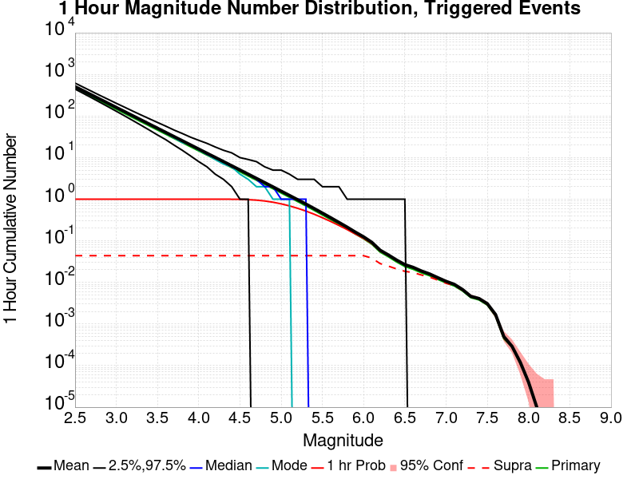
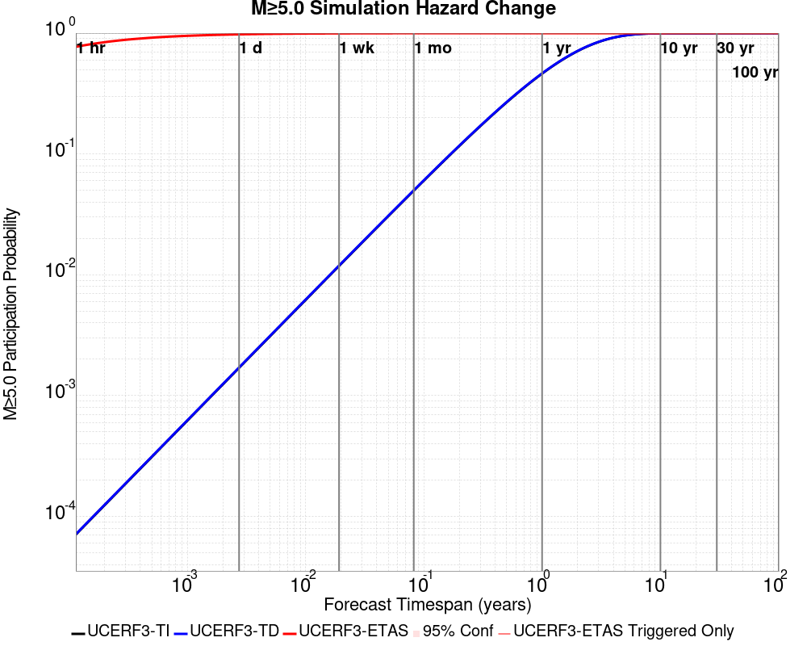
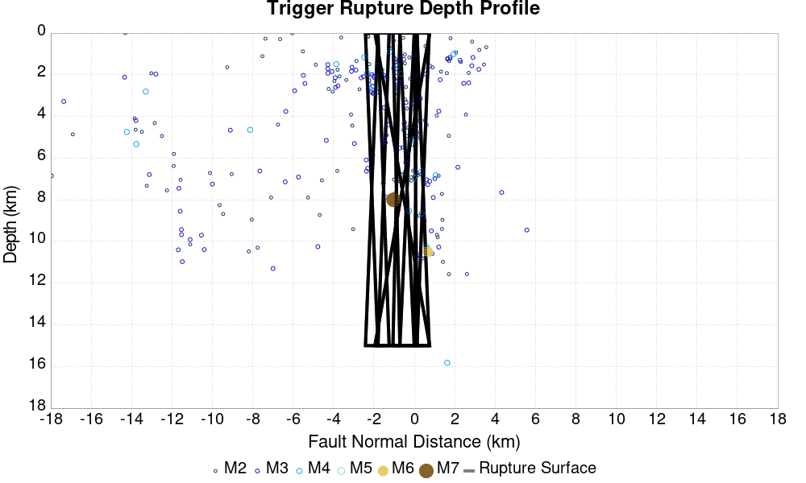
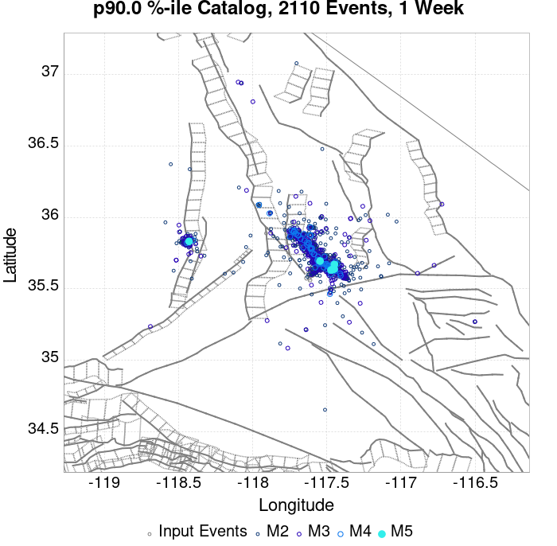
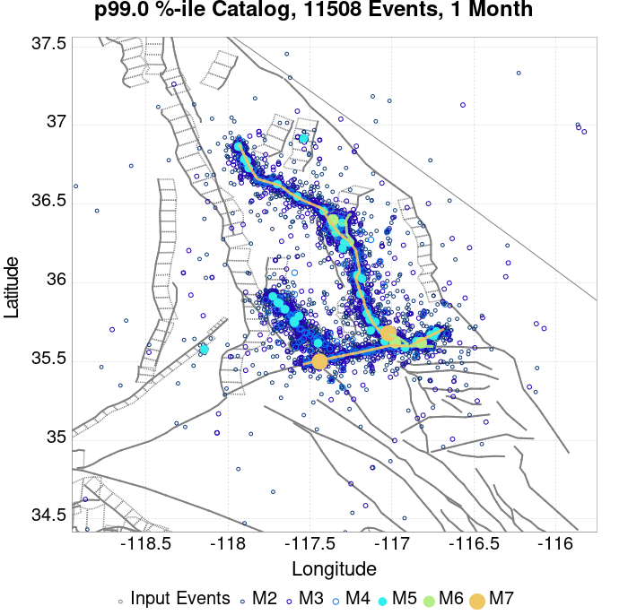
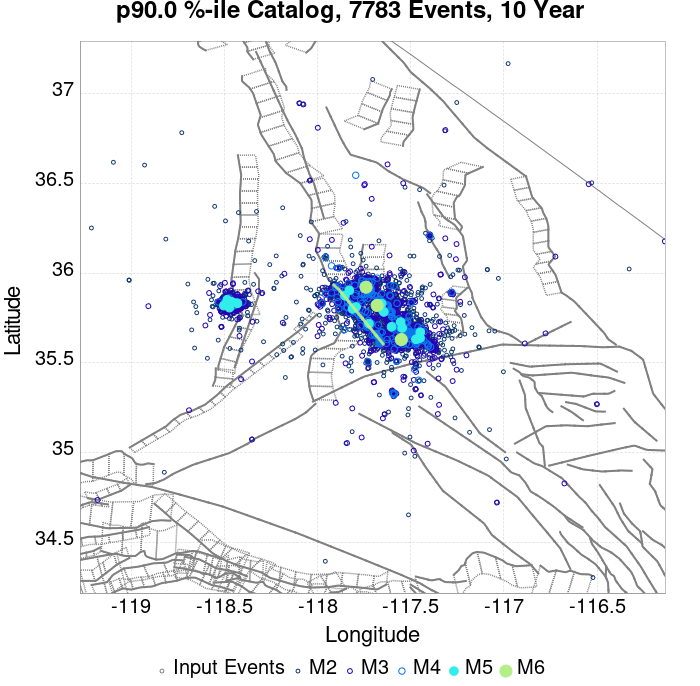
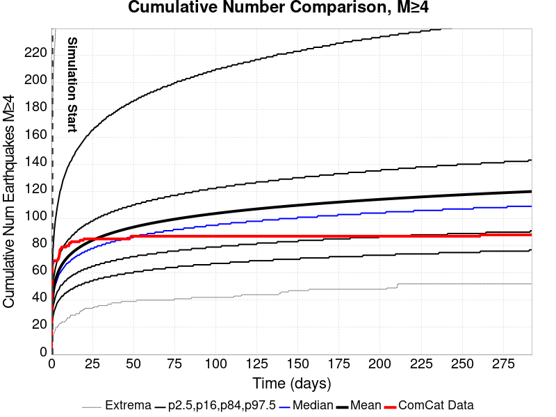
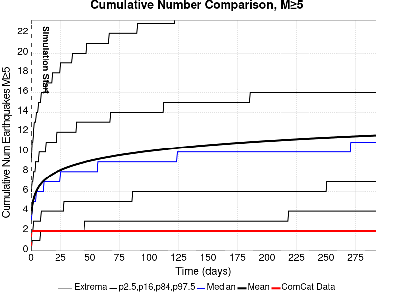
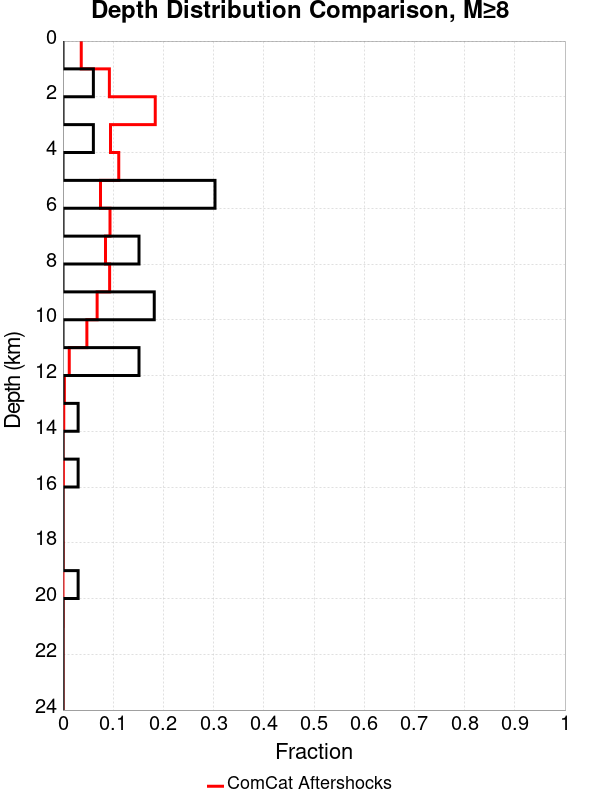
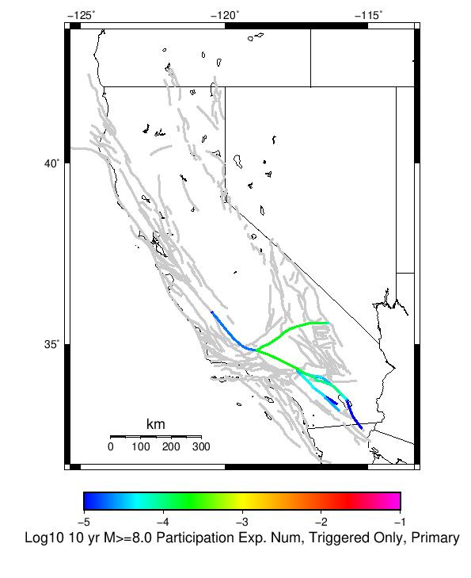

# ComCat M7.1 (ci38457511), ShakeMap Surfaces, Culled Surface Results

|   | ComCat M7.1 (ci38457511), ShakeMap Surfaces, Culled Surface |
|-----|-----|
| Num Simulations | 7633 (incomplete) |
| Start Time | 2019/07/06 03:19:54 UTC |
| Start Time Epoch Milliseconds | 1562383194040 |
| Duration | 10 Years |
| Includes Spontaneous? | false |
| Trigger Ruptures | 269 Trigger Ruptures |
|   | First: M3.98 at 2019/07/04 17:02:55 UTC |
|   | Last: M7.1 at 2019/07/06 03:19:53 UTC |
|   | Largest: M7.1 at 2019/07/06 03:19:53 UTC |
| Historical Ruptures | *(none)* |
| Config Generated With | u3etas_comcat_event_config_builder.sh --event-id ci38457511 --num-simulations 100000 --days-before 7 --mag-complete 3.5 --name-add CulledSurface --finite-surf-shakemap --finite-surf-shakemap-min-mag 5 --hpc-site USC_HPC --nodes 36 --hours 24 --queue scec |

## Table Of Contents

* [Probabilities Summary Table](#probabilities-summary-table)
* [Magnitude Number Distribution](#magnitude-number-distribution)
  * [10 Year Magnitude Number Distribution](#10-year-magnitude-number-distribution)
  * [1 Year Magnitude Number Distribution](#1-year-magnitude-number-distribution)
  * [1 Month Magnitude Number Distribution](#1-month-magnitude-number-distribution)
  * [1 Week Magnitude Number Distribution](#1-week-magnitude-number-distribution)
  * [1 Day Magnitude Number Distribution](#1-day-magnitude-number-distribution)
  * [1 Hour Magnitude Number Distribution](#1-hour-magnitude-number-distribution)
* [Hazard Change Over Time](#hazard-change-over-time)
  * [M&ge;5.0 Hazard Change Over Time](#m50-hazard-change-over-time)
  * [M&ge;6.0 Hazard Change Over Time](#m60-hazard-change-over-time)
  * [M&ge;7.0 Hazard Change Over Time](#m70-hazard-change-over-time)
  * [M&ge;8.0 Hazard Change Over Time](#m80-hazard-change-over-time)
* [Trigger Rupture Fault Map](#trigger-rupture-fault-map)
* [Trigger Rupture Depth Map](#trigger-rupture-depth-map)
* [Fault Distances To Triggers](#fault-distances-to-triggers)
* [Individual Simulated Catalog Maps](#individual-simulated-catalog-maps)
* [ComCat Data Comparisons](#comcat-data-comparisons)
  * [ComCat Magnitude-Number Distributions](#comcat-magnitude-number-distributions)
  * [ComCat Cumulative Number Vs Time](#comcat-cumulative-number-vs-time)
  * [ComCat Cumulative Number Simulation Percentiles](#comcat-cumulative-number-simulation-percentiles)
  * [ComCat Mean Spatial Distribution](#comcat-mean-spatial-distribution)
  * [ComCat Depth Distribution](#comcat-depth-distribution)
* [Section Participation](#section-participation)
  * [Section Participation Plots](#section-participation-plots)
  * [Supra-Seismogenic Parent Sections Table](#supra-seismogenic-parent-sections-table)
  * [M≥6.5 Parent Sections Table](#m65-parent-sections-table)
  * [M≥7 Parent Sections Table](#m7-parent-sections-table)
  * [M≥7.5 Parent Sections Table](#m75-parent-sections-table)
  * [M≥8 Parent Sections Table](#m8-parent-sections-table)
  * [Fault Magnitude-Probability Distributions](#fault-magnitude-probability-distributions)
* [Gridded Nucleation](#gridded-nucleation)
* [JSON Input File](#json-input-file)

## Probabilities Summary Table
*[(top)](#table-of-contents)*

| Magnitude | 1 Hour Prob | 1 Day Prob | 1 Week Prob | 1 Month Prob | 1 Year Prob | 10 Year Prob |
|-----|-----|-----|-----|-----|-----|-----|
| **M&ge;4** | 1.000 (100.00%) | 1.000 (100.00%) | 1.000 (100.00%) | 1.000 (100.00%) | 1.000 (100.00%) | 1.000 (100.00%) |
| **M&ge;4.5** | 0.992 (99.17%) | 1.000 (100.00%) | 1.000 (100.00%) | 1.000 (100.00%) | 1.000 (100.00%) | 1.000 (100.00%) |
| **M&ge;5** | 0.780 (78.02%) | 0.980 (97.96%) | 0.996 (99.59%) | 0.999 (99.86%) | 1.000 (100.00%) | 1.000 (100.00%) |
| **M&ge;5.5** | 0.362 (36.17%) | 0.689 (68.87%) | 0.814 (81.44%) | 0.881 (88.09%) | 0.940 (94.04%) | 0.968 (96.82%) |
| **M&ge;6** | 0.111 (11.15%) | 0.276 (27.64%) | 0.379 (37.89%) | 0.451 (45.07%) | 0.562 (56.16%) | 0.644 (64.39%) |
| **M&ge;6.5** | 0.025 (2.46%) | 0.068 (6.83%) | 0.097 (9.73%) | 0.123 (12.34%) | 0.172 (17.18%) | 0.214 (21.45%) |
| **M&ge;7** | 0.010 (1.03%) | 0.027 (2.74%) | 0.038 (3.79%) | 0.049 (4.90%) | 0.067 (6.71%) | 0.084 (8.40%) |
| **M&ge;7.1** | 9.17E-3 (0.92%) | 0.024 (2.38%) | 0.033 (3.30%) | 0.043 (4.27%) | 0.058 (5.78%) | 0.073 (7.30%) |
| **M&ge;7.5** | 3.67E-3 (0.37%) | 9.43E-3 (0.94%) | 0.013 (1.31%) | 0.017 (1.69%) | 0.023 (2.28%) | 0.028 (2.80%) |
| **M&ge;8** | 0.000 (0.00%) | 0.000 (0.00%) | 1.31E-4 (0.01%) | 2.62E-4 (0.03%) | 2.62E-4 (0.03%) | 2.62E-4 (0.03%) |

## Magnitude Number Distribution
*[(top)](#table-of-contents)*

### 10 Year Magnitude Number Distribution
*[(top)](#table-of-contents)*

**Legend**
* **Mean** (thick black line): mean expected number across all 7633 catalogs
* **2.5%,97.5%** (thin black lines): expected number percentiles across all 7633 catalogs
* **Median** (thin blue line): median expected number across all 7633 catalogs
* **Mode** (thin cyan line): modal expected number across all 7633 catalogs
* **10 yr Probability** (thin red line): 10 year probability calculated as the fraction of catalogs with at least 1 occurrence
* **10 yr Supraseismogenic Probability** (thin dashed red line): same as above, but only for supraseismogenic ruptures on explicitly modeled UCERF3 faults
* **95% Conf** (light red shaded region): binomial 95% confidence bounds on probability
* **Primary** (thin green line): mean expected number from primary triggered aftershocks only (no secondary, tertiary, etc...) across all 7633 catalogs


| Mag | Mean | 2.5 %ile | 97.5 %ile | Median | Mode | 10 yr Probability | 10 yr Supra-Seis Prob | Primary Aftershocks Mean |
|-----|-----|-----|-----|-----|-----|-----|-----|-----|
| **M&ge;2.5** | 5567.999 | 3658.000 | 16031.000 | 4622.000 | 3980.000 | 1.000 (100.00%) | 0.329 (32.86%) | 2393.283 |
| **M&ge;2.6** | 4422.630 | 2905.000 | 12737.000 | 3670.000 | 3452.000 | 1.000 (100.00%) | 0.329 (32.86%) | 1900.985 |
| **M&ge;2.7** | 3512.840 | 2302.000 | 10116.000 | 2918.000 | 2795.000 | 1.000 (100.00%) | 0.329 (32.86%) | 1509.871 |
| **M&ge;2.8** | 2790.517 | 1822.000 | 8055.000 | 2318.000 | 2222.000 | 1.000 (100.00%) | 0.329 (32.86%) | 1199.342 |
| **M&ge;2.9** | 2216.259 | 1442.000 | 6397.000 | 1841.000 | 1799.000 | 1.000 (100.00%) | 0.329 (32.86%) | 952.521 |
| **M&ge;3** | 1760.230 | 1140.000 | 5084.000 | 1463.000 | 1261.000 | 1.000 (100.00%) | 0.329 (32.86%) | 756.474 |
| **M&ge;3.1** | 1397.819 | 902.000 | 4033.000 | 1163.000 | 1066.000 | 1.000 (100.00%) | 0.329 (32.86%) | 600.850 |
| **M&ge;3.2** | 1110.413 | 712.000 | 3200.000 | 925.000 | 848.000 | 1.000 (100.00%) | 0.329 (32.86%) | 477.388 |
| **M&ge;3.3** | 881.844 | 562.000 | 2545.000 | 735.000 | 683.000 | 1.000 (100.00%) | 0.329 (32.86%) | 379.136 |
| **M&ge;3.4** | 700.506 | 440.000 | 2023.000 | 584.000 | 541.000 | 1.000 (100.00%) | 0.329 (32.86%) | 301.170 |
| **M&ge;3.5** | 556.178 | 347.000 | 1592.000 | 465.000 | 455.000 | 1.000 (100.00%) | 0.329 (32.86%) | 239.073 |
| **M&ge;3.6** | 441.699 | 273.000 | 1269.000 | 369.000 | 354.000 | 1.000 (100.00%) | 0.329 (32.86%) | 189.848 |
| **M&ge;3.7** | 350.578 | 215.000 | 1009.000 | 293.000 | 278.000 | 1.000 (100.00%) | 0.329 (32.86%) | 150.709 |
| **M&ge;3.8** | 278.299 | 168.000 | 800.000 | 233.000 | 208.000 | 1.000 (100.00%) | 0.329 (32.86%) | 119.605 |
| **M&ge;3.9** | 221.041 | 131.000 | 634.000 | 186.000 | 177.000 | 1.000 (100.00%) | 0.329 (32.86%) | 94.965 |
| **M&ge;4** | 175.517 | 103.000 | 507.000 | 147.000 | 139.000 | 1.000 (100.00%) | 0.329 (32.86%) | 75.398 |
| **M&ge;4.1** | 139.380 | 79.000 | 402.000 | 117.000 | 104.000 | 1.000 (100.00%) | 0.329 (32.86%) | 59.854 |
| **M&ge;4.2** | 110.590 | 61.000 | 319.000 | 93.000 | 87.000 | 1.000 (100.00%) | 0.329 (32.86%) | 47.513 |
| **M&ge;4.3** | 87.818 | 47.000 | 255.000 | 74.000 | 67.000 | 1.000 (100.00%) | 0.329 (32.86%) | 37.738 |
| **M&ge;4.4** | 69.713 | 36.000 | 201.000 | 59.000 | 52.000 | 1.000 (100.00%) | 0.329 (32.86%) | 29.951 |
| **M&ge;4.5** | 55.299 | 27.000 | 158.000 | 47.000 | 41.000 | 1.000 (100.00%) | 0.329 (32.86%) | 23.767 |
| **M&ge;4.6** | 43.844 | 20.000 | 126.000 | 37.000 | 33.000 | 1.000 (100.00%) | 0.329 (32.86%) | 18.876 |
| **M&ge;4.7** | 34.708 | 15.000 | 100.000 | 29.000 | 26.000 | 1.000 (100.00%) | 0.329 (32.86%) | 14.941 |
| **M&ge;4.8** | 27.491 | 11.000 | 80.000 | 23.000 | 21.000 | 1.000 (100.00%) | 0.329 (32.86%) | 11.824 |
| **M&ge;4.9** | 21.732 | 8.000 | 63.000 | 18.000 | 15.000 | 1.000 (100.00%) | 0.329 (32.86%) | 9.354 |
| **M&ge;5** | 17.131 | 6.000 | 50.000 | 15.000 | 13.000 | 1.000 (100.00%) | 0.329 (32.86%) | 7.399 |
| **M&ge;5.1** | 13.504 | 4.000 | 39.000 | 11.000 | 10.000 | 1.000 (99.99%) | 0.329 (32.86%) | 5.848 |
| **M&ge;5.2** | 10.623 | 3.000 | 31.000 | 9.000 | 7.000 | 0.999 (99.93%) | 0.329 (32.86%) | 4.607 |
| **M&ge;5.3** | 8.329 | 2.000 | 25.000 | 7.000 | 6.000 | 0.995 (99.54%) | 0.329 (32.86%) | 3.612 |
| **M&ge;5.4** | 6.516 | 1.000 | 20.000 | 5.000 | 4.000 | 0.987 (98.68%) | 0.329 (32.86%) | 2.825 |
| **M&ge;5.5** | 5.089 | 0.000 | 16.000 | 4.000 | 3.000 | 0.968 (96.82%) | 0.329 (32.86%) | 2.219 |
| **M&ge;5.6** | 3.932 | 0.000 | 13.000 | 3.000 | 2.000 | 0.934 (93.41%) | 0.329 (32.86%) | 1.716 |
| **M&ge;5.7** | 3.017 | 0.000 | 10.000 | 2.000 | 2.000 | 0.886 (88.60%) | 0.329 (32.86%) | 1.318 |
| **M&ge;5.8** | 2.301 | 0.000 | 8.000 | 2.000 | 1.000 | 0.816 (81.65%) | 0.329 (32.86%) | 1.009 |
| **M&ge;5.9** | 1.739 | 0.000 | 6.000 | 1.000 | 1.000 | 0.734 (73.42%) | 0.328 (32.82%) | 0.766 |
| **M&ge;6** | 1.335 | 0.000 | 5.000 | 1.000 | 0.000 | 0.644 (64.39%) | 0.328 (32.80%) | 0.583 |
| **M&ge;6.1** | 0.970 | 0.000 | 4.000 | 1.000 | 0.000 | 0.543 (54.33%) | 0.286 (28.61%) | 0.433 |
| **M&ge;6.2** | 0.643 | 0.000 | 3.000 | 0.000 | 0.000 | 0.413 (41.32%) | 0.223 (22.28%) | 0.291 |
| **M&ge;6.3** | 0.489 | 0.000 | 3.000 | 0.000 | 0.000 | 0.341 (34.12%) | 0.195 (19.52%) | 0.223 |
| **M&ge;6.4** | 0.369 | 0.000 | 2.000 | 0.000 | 0.000 | 0.266 (26.62%) | 0.165 (16.47%) | 0.163 |
| **M&ge;6.5** | 0.281 | 0.000 | 2.000 | 0.000 | 0.000 | 0.214 (21.45%) | 0.144 (14.36%) | 0.124 |
| **M&ge;6.6** | 0.226 | 0.000 | 2.000 | 0.000 | 0.000 | 0.183 (18.29%) | 0.133 (13.34%) | 0.105 |
| **M&ge;6.7** | 0.183 | 0.000 | 2.000 | 0.000 | 0.000 | 0.152 (15.20%) | 0.116 (11.65%) | 0.086 |
| **M&ge;6.8** | 0.145 | 0.000 | 1.000 | 0.000 | 0.000 | 0.127 (12.67%) | 0.101 (10.13%) | 0.070 |
| **M&ge;6.9** | 0.113 | 0.000 | 1.000 | 0.000 | 0.000 | 0.103 (10.26%) | 0.086 (8.61%) | 0.054 |
| **M&ge;7** | 0.090 | 0.000 | 1.000 | 0.000 | 0.000 | 0.084 (8.40%) | 0.074 (7.43%) | 0.044 |
| **M&ge;7.1** | 0.076 | 0.000 | 1.000 | 0.000 | 0.000 | 0.073 (7.30%) | 0.067 (6.71%) | 0.037 |
| **M&ge;7.2** | 0.059 | 0.000 | 1.000 | 0.000 | 0.000 | 0.057 (5.74%) | 0.054 (5.41%) | 0.028 |
| **M&ge;7.3** | 0.043 | 0.000 | 1.000 | 0.000 | 0.000 | 0.042 (4.19%) | 0.040 (3.98%) | 0.021 |
| **M&ge;7.4** | 0.037 | 0.000 | 1.000 | 0.000 | 0.000 | 0.036 (3.60%) | 0.035 (3.52%) | 0.018 |
| **M&ge;7.5** | 0.029 | 0.000 | 1.000 | 0.000 | 0.000 | 0.028 (2.80%) | 0.028 (2.79%) | 0.014 |
| **M&ge;7.6** | 0.017 | 0.000 | 0.000 | 0.000 | 0.000 | 0.017 (1.69%) | 0.017 (1.69%) | 8.52E-3 |
| **M&ge;7.7** | 5.90E-3 | 0.000 | 0.000 | 0.000 | 0.000 | 5.90E-3 (0.59%) | 5.90E-3 (0.59%) | 3.28E-3 |
| **M&ge;7.8** | 3.93E-3 | 0.000 | 0.000 | 0.000 | 0.000 | 3.93E-3 (0.39%) | 3.93E-3 (0.39%) | 2.23E-3 |
| **M&ge;7.9** | 2.23E-3 | 0.000 | 0.000 | 0.000 | 0.000 | 2.23E-3 (0.22%) | 2.23E-3 (0.22%) | 1.18E-3 |
| **M&ge;8** | 2.62E-4 | 0.000 | 0.000 | 0.000 | 0.000 | 2.62E-4 (0.03%) | 2.62E-4 (0.03%) | 1.31E-4 |
| **M&ge;8.1** | 1.31E-4 | 0.000 | 0.000 | 0.000 | 0.000 | 1.31E-4 (0.01%) | 1.31E-4 (0.01%) | 1.31E-4 |
| **M&ge;8.2** | 0.000 | 0.000 | 0.000 | 0.000 | 0.000 | 0.000 (0.00%) | 0.000 (0.00%) | 0.000 |
| **M&ge;8.3** | 0.000 | 0.000 | 0.000 | 0.000 | 0.000 | 0.000 (0.00%) | 0.000 (0.00%) | 0.000 |
| **M&ge;8.4** | 0.000 | 0.000 | 0.000 | 0.000 | 0.000 | 0.000 (0.00%) | 0.000 (0.00%) | 0.000 |
| **M&ge;8.5** | 0.000 | 0.000 | 0.000 | 0.000 | 0.000 | 0.000 (0.00%) | 0.000 (0.00%) | 0.000 |
| **M&ge;8.6** | 0.000 | 0.000 | 0.000 | 0.000 | 0.000 | 0.000 (0.00%) | 0.000 (0.00%) | 0.000 |
| **M&ge;8.7** | 0.000 | 0.000 | 0.000 | 0.000 | 0.000 | 0.000 (0.00%) | 0.000 (0.00%) | 0.000 |
| **M&ge;8.8** | 0.000 | 0.000 | 0.000 | 0.000 | 0.000 | 0.000 (0.00%) | 0.000 (0.00%) | 0.000 |
| **M&ge;8.9** | 0.000 | 0.000 | 0.000 | 0.000 | 0.000 | 0.000 (0.00%) | 0.000 (0.00%) | 0.000 |
| **M&ge;9** | 0.000 | 0.000 | 0.000 | 0.000 | 0.000 | 0.000 (0.00%) | 0.000 (0.00%) | 0.000 |

### 1 Year Magnitude Number Distribution
*[(top)](#table-of-contents)*

**Legend**
* **Mean** (thick black line): mean expected number across all 7633 catalogs
* **2.5%,97.5%** (thin black lines): expected number percentiles across all 7633 catalogs
* **Median** (thin blue line): median expected number across all 7633 catalogs
* **Mode** (thin cyan line): modal expected number across all 7633 catalogs
* **1 yr Probability** (thin red line): 1 year probability calculated as the fraction of catalogs with at least 1 occurrence
* **1 yr Supraseismogenic Probability** (thin dashed red line): same as above, but only for supraseismogenic ruptures on explicitly modeled UCERF3 faults
* **95% Conf** (light red shaded region): binomial 95% confidence bounds on probability
* **Primary** (thin green line): mean expected number from primary triggered aftershocks only (no secondary, tertiary, etc...) across all 7633 catalogs


| Mag | Mean | 2.5 %ile | 97.5 %ile | Median | Mode | 1 yr Probability | 1 yr Supra-Seis Prob | Primary Aftershocks Mean |
|-----|-----|-----|-----|-----|-----|-----|-----|-----|
| **M&ge;2.5** | 4212.907 | 2951.000 | 11658.000 | 3602.000 | 3406.000 | 1.000 (100.00%) | 0.267 (26.71%) | 2084.768 |
| **M&ge;2.6** | 3346.409 | 2339.000 | 9242.000 | 2866.000 | 2808.000 | 1.000 (100.00%) | 0.267 (26.71%) | 1656.063 |
| **M&ge;2.7** | 2657.918 | 1849.000 | 7337.000 | 2274.000 | 2044.000 | 1.000 (100.00%) | 0.267 (26.71%) | 1315.310 |
| **M&ge;2.8** | 2111.200 | 1465.000 | 5803.000 | 1808.000 | 1592.000 | 1.000 (100.00%) | 0.267 (26.71%) | 1044.785 |
| **M&ge;2.9** | 1676.814 | 1160.000 | 4626.000 | 1437.000 | 1311.000 | 1.000 (100.00%) | 0.267 (26.71%) | 829.768 |
| **M&ge;3** | 1331.821 | 917.000 | 3661.000 | 1142.000 | 1051.000 | 1.000 (100.00%) | 0.267 (26.71%) | 659.004 |
| **M&ge;3.1** | 1057.628 | 722.000 | 2923.000 | 907.000 | 815.000 | 1.000 (100.00%) | 0.267 (26.71%) | 523.437 |
| **M&ge;3.2** | 840.097 | 570.000 | 2312.000 | 721.000 | 665.000 | 1.000 (100.00%) | 0.267 (26.71%) | 415.823 |
| **M&ge;3.3** | 667.286 | 448.000 | 1838.000 | 573.000 | 527.000 | 1.000 (100.00%) | 0.267 (26.71%) | 330.246 |
| **M&ge;3.4** | 530.152 | 353.000 | 1453.000 | 457.000 | 416.000 | 1.000 (100.00%) | 0.267 (26.71%) | 262.345 |
| **M&ge;3.5** | 420.833 | 277.000 | 1144.000 | 363.000 | 333.000 | 1.000 (100.00%) | 0.267 (26.71%) | 208.219 |
| **M&ge;3.6** | 334.186 | 217.000 | 914.000 | 288.000 | 283.000 | 1.000 (100.00%) | 0.267 (26.71%) | 165.338 |
| **M&ge;3.7** | 265.331 | 170.000 | 727.000 | 229.000 | 209.000 | 1.000 (100.00%) | 0.267 (26.71%) | 131.249 |
| **M&ge;3.8** | 210.596 | 134.000 | 577.000 | 181.000 | 176.000 | 1.000 (100.00%) | 0.267 (26.71%) | 104.154 |
| **M&ge;3.9** | 167.242 | 104.000 | 460.000 | 145.000 | 136.000 | 1.000 (100.00%) | 0.267 (26.71%) | 82.678 |
| **M&ge;4** | 132.778 | 80.000 | 368.000 | 115.000 | 106.000 | 1.000 (100.00%) | 0.267 (26.71%) | 65.643 |
| **M&ge;4.1** | 105.469 | 62.000 | 292.000 | 92.000 | 86.000 | 1.000 (100.00%) | 0.267 (26.71%) | 52.118 |
| **M&ge;4.2** | 83.670 | 48.000 | 229.000 | 73.000 | 74.000 | 1.000 (100.00%) | 0.267 (26.71%) | 41.364 |
| **M&ge;4.3** | 66.450 | 36.000 | 181.000 | 58.000 | 52.000 | 1.000 (100.00%) | 0.267 (26.71%) | 32.850 |
| **M&ge;4.4** | 52.773 | 28.000 | 144.000 | 46.000 | 41.000 | 1.000 (100.00%) | 0.267 (26.71%) | 26.067 |
| **M&ge;4.5** | 41.862 | 21.000 | 114.000 | 37.000 | 33.000 | 1.000 (100.00%) | 0.267 (26.71%) | 20.684 |
| **M&ge;4.6** | 33.210 | 15.000 | 91.000 | 29.000 | 26.000 | 1.000 (100.00%) | 0.267 (26.71%) | 16.430 |
| **M&ge;4.7** | 26.280 | 11.000 | 71.000 | 23.000 | 22.000 | 1.000 (100.00%) | 0.267 (26.71%) | 13.003 |
| **M&ge;4.8** | 20.832 | 8.000 | 57.000 | 18.000 | 16.000 | 1.000 (100.00%) | 0.267 (26.71%) | 10.294 |
| **M&ge;4.9** | 16.471 | 6.000 | 45.000 | 14.000 | 13.000 | 1.000 (100.00%) | 0.267 (26.71%) | 8.150 |
| **M&ge;5** | 12.993 | 4.000 | 36.000 | 11.000 | 9.000 | 1.000 (100.00%) | 0.267 (26.71%) | 6.443 |
| **M&ge;5.1** | 10.246 | 3.000 | 28.000 | 9.000 | 8.000 | 0.999 (99.90%) | 0.267 (26.71%) | 5.094 |
| **M&ge;5.2** | 8.067 | 2.000 | 23.000 | 7.000 | 6.000 | 0.996 (99.63%) | 0.267 (26.71%) | 4.012 |
| **M&ge;5.3** | 6.328 | 1.000 | 19.000 | 5.000 | 4.000 | 0.988 (98.81%) | 0.267 (26.71%) | 3.146 |
| **M&ge;5.4** | 4.948 | 0.000 | 15.000 | 4.000 | 3.000 | 0.973 (97.29%) | 0.267 (26.71%) | 2.460 |
| **M&ge;5.5** | 3.861 | 0.000 | 12.000 | 3.000 | 2.000 | 0.940 (94.04%) | 0.267 (26.71%) | 1.927 |
| **M&ge;5.6** | 2.981 | 0.000 | 10.000 | 2.000 | 2.000 | 0.888 (88.84%) | 0.267 (26.71%) | 1.491 |
| **M&ge;5.7** | 2.286 | 0.000 | 8.000 | 2.000 | 1.000 | 0.824 (82.39%) | 0.267 (26.71%) | 1.146 |
| **M&ge;5.8** | 1.738 | 0.000 | 6.000 | 1.000 | 1.000 | 0.742 (74.20%) | 0.267 (26.71%) | 0.877 |
| **M&ge;5.9** | 1.316 | 0.000 | 5.000 | 1.000 | 0.000 | 0.653 (65.32%) | 0.267 (26.67%) | 0.666 |
| **M&ge;6** | 1.008 | 0.000 | 4.000 | 1.000 | 0.000 | 0.562 (56.16%) | 0.267 (26.66%) | 0.506 |
| **M&ge;6.1** | 0.735 | 0.000 | 3.000 | 0.000 | 0.000 | 0.462 (46.23%) | 0.230 (23.04%) | 0.375 |
| **M&ge;6.2** | 0.488 | 0.000 | 3.000 | 0.000 | 0.000 | 0.342 (34.15%) | 0.178 (17.80%) | 0.251 |
| **M&ge;6.3** | 0.372 | 0.000 | 2.000 | 0.000 | 0.000 | 0.279 (27.89%) | 0.157 (15.66%) | 0.193 |
| **M&ge;6.4** | 0.281 | 0.000 | 2.000 | 0.000 | 0.000 | 0.215 (21.54%) | 0.132 (13.18%) | 0.140 |
| **M&ge;6.5** | 0.215 | 0.000 | 2.000 | 0.000 | 0.000 | 0.172 (17.18%) | 0.116 (11.57%) | 0.107 |
| **M&ge;6.6** | 0.172 | 0.000 | 1.000 | 0.000 | 0.000 | 0.146 (14.57%) | 0.107 (10.70%) | 0.091 |
| **M&ge;6.7** | 0.141 | 0.000 | 1.000 | 0.000 | 0.000 | 0.122 (12.20%) | 0.094 (9.42%) | 0.074 |
| **M&ge;6.8** | 0.112 | 0.000 | 1.000 | 0.000 | 0.000 | 0.101 (10.09%) | 0.081 (8.15%) | 0.060 |
| **M&ge;6.9** | 0.087 | 0.000 | 1.000 | 0.000 | 0.000 | 0.081 (8.12%) | 0.069 (6.86%) | 0.047 |
| **M&ge;7** | 0.071 | 0.000 | 1.000 | 0.000 | 0.000 | 0.067 (6.71%) | 0.060 (5.97%) | 0.039 |
| **M&ge;7.1** | 0.060 | 0.000 | 1.000 | 0.000 | 0.000 | 0.058 (5.78%) | 0.053 (5.35%) | 0.033 |
| **M&ge;7.2** | 0.047 | 0.000 | 1.000 | 0.000 | 0.000 | 0.045 (4.53%) | 0.043 (4.30%) | 0.025 |
| **M&ge;7.3** | 0.035 | 0.000 | 1.000 | 0.000 | 0.000 | 0.034 (3.37%) | 0.032 (3.20%) | 0.018 |
| **M&ge;7.4** | 0.030 | 0.000 | 1.000 | 0.000 | 0.000 | 0.029 (2.95%) | 0.029 (2.88%) | 0.016 |
| **M&ge;7.5** | 0.023 | 0.000 | 0.000 | 0.000 | 0.000 | 0.023 (2.28%) | 0.023 (2.27%) | 0.012 |
| **M&ge;7.6** | 0.014 | 0.000 | 0.000 | 0.000 | 0.000 | 0.014 (1.36%) | 0.014 (1.36%) | 7.47E-3 |
| **M&ge;7.7** | 4.45E-3 | 0.000 | 0.000 | 0.000 | 0.000 | 4.45E-3 (0.45%) | 4.45E-3 (0.45%) | 2.49E-3 |
| **M&ge;7.8** | 3.01E-3 | 0.000 | 0.000 | 0.000 | 0.000 | 3.01E-3 (0.30%) | 3.01E-3 (0.30%) | 1.70E-3 |
| **M&ge;7.9** | 1.70E-3 | 0.000 | 0.000 | 0.000 | 0.000 | 1.70E-3 (0.17%) | 1.70E-3 (0.17%) | 1.05E-3 |
| **M&ge;8** | 2.62E-4 | 0.000 | 0.000 | 0.000 | 0.000 | 2.62E-4 (0.03%) | 2.62E-4 (0.03%) | 1.31E-4 |
| **M&ge;8.1** | 1.31E-4 | 0.000 | 0.000 | 0.000 | 0.000 | 1.31E-4 (0.01%) | 1.31E-4 (0.01%) | 1.31E-4 |
| **M&ge;8.2** | 0.000 | 0.000 | 0.000 | 0.000 | 0.000 | 0.000 (0.00%) | 0.000 (0.00%) | 0.000 |
| **M&ge;8.3** | 0.000 | 0.000 | 0.000 | 0.000 | 0.000 | 0.000 (0.00%) | 0.000 (0.00%) | 0.000 |
| **M&ge;8.4** | 0.000 | 0.000 | 0.000 | 0.000 | 0.000 | 0.000 (0.00%) | 0.000 (0.00%) | 0.000 |
| **M&ge;8.5** | 0.000 | 0.000 | 0.000 | 0.000 | 0.000 | 0.000 (0.00%) | 0.000 (0.00%) | 0.000 |
| **M&ge;8.6** | 0.000 | 0.000 | 0.000 | 0.000 | 0.000 | 0.000 (0.00%) | 0.000 (0.00%) | 0.000 |
| **M&ge;8.7** | 0.000 | 0.000 | 0.000 | 0.000 | 0.000 | 0.000 (0.00%) | 0.000 (0.00%) | 0.000 |
| **M&ge;8.8** | 0.000 | 0.000 | 0.000 | 0.000 | 0.000 | 0.000 (0.00%) | 0.000 (0.00%) | 0.000 |
| **M&ge;8.9** | 0.000 | 0.000 | 0.000 | 0.000 | 0.000 | 0.000 (0.00%) | 0.000 (0.00%) | 0.000 |
| **M&ge;9** | 0.000 | 0.000 | 0.000 | 0.000 | 0.000 | 0.000 (0.00%) | 0.000 (0.00%) | 0.000 |

### 1 Month Magnitude Number Distribution
*[(top)](#table-of-contents)*

**Legend**
* **Mean** (thick black line): mean expected number across all 7633 catalogs
* **2.5%,97.5%** (thin black lines): expected number percentiles across all 7633 catalogs
* **Median** (thin blue line): median expected number across all 7633 catalogs
* **Mode** (thin cyan line): modal expected number across all 7633 catalogs
* **1 mo Probability** (thin red line): 1 month probability calculated as the fraction of catalogs with at least 1 occurrence
* **1 mo Supraseismogenic Probability** (thin dashed red line): same as above, but only for supraseismogenic ruptures on explicitly modeled UCERF3 faults
* **95% Conf** (light red shaded region): binomial 95% confidence bounds on probability
* **Primary** (thin green line): mean expected number from primary triggered aftershocks only (no secondary, tertiary, etc...) across all 7633 catalogs


| Mag | Mean | 2.5 %ile | 97.5 %ile | Median | Mode | 1 mo Probability | 1 mo Supra-Seis Prob | Primary Aftershocks Mean |
|-----|-----|-----|-----|-----|-----|-----|-----|-----|
| **M&ge;2.5** | 2915.503 | 2186.000 | 6710.000 | 2566.000 | 2461.000 | 1.000 (100.00%) | 0.198 (19.83%) | 1690.163 |
| **M&ge;2.6** | 2315.985 | 1730.000 | 5345.000 | 2040.000 | 1937.000 | 1.000 (100.00%) | 0.198 (19.83%) | 1342.677 |
| **M&ge;2.7** | 1839.442 | 1367.000 | 4259.000 | 1620.000 | 1472.000 | 1.000 (100.00%) | 0.198 (19.83%) | 1066.379 |
| **M&ge;2.8** | 1461.180 | 1081.000 | 3342.000 | 1288.000 | 1185.000 | 1.000 (100.00%) | 0.198 (19.83%) | 847.026 |
| **M&ge;2.9** | 1160.526 | 856.000 | 2680.000 | 1023.000 | 1016.000 | 1.000 (100.00%) | 0.198 (19.83%) | 672.646 |
| **M&ge;3** | 921.772 | 675.000 | 2124.000 | 814.000 | 777.000 | 1.000 (100.00%) | 0.198 (19.83%) | 534.205 |
| **M&ge;3.1** | 732.043 | 532.000 | 1682.000 | 647.000 | 632.000 | 1.000 (100.00%) | 0.198 (19.83%) | 424.345 |
| **M&ge;3.2** | 581.494 | 419.000 | 1352.000 | 515.000 | 473.000 | 1.000 (100.00%) | 0.198 (19.83%) | 337.150 |
| **M&ge;3.3** | 461.892 | 330.000 | 1075.000 | 409.000 | 390.000 | 1.000 (100.00%) | 0.198 (19.83%) | 267.771 |
| **M&ge;3.4** | 366.965 | 259.000 | 854.000 | 325.000 | 312.000 | 1.000 (100.00%) | 0.198 (19.83%) | 212.766 |
| **M&ge;3.5** | 291.338 | 202.000 | 678.000 | 259.000 | 252.000 | 1.000 (100.00%) | 0.198 (19.83%) | 168.945 |
| **M&ge;3.6** | 231.351 | 158.000 | 540.000 | 206.000 | 203.000 | 1.000 (100.00%) | 0.198 (19.83%) | 134.116 |
| **M&ge;3.7** | 183.653 | 124.000 | 430.000 | 163.000 | 158.000 | 1.000 (100.00%) | 0.198 (19.83%) | 106.480 |
| **M&ge;3.8** | 145.771 | 96.000 | 342.000 | 130.000 | 122.000 | 1.000 (100.00%) | 0.198 (19.83%) | 84.493 |
| **M&ge;3.9** | 115.778 | 74.000 | 274.000 | 103.000 | 99.000 | 1.000 (100.00%) | 0.198 (19.83%) | 67.087 |
| **M&ge;4** | 91.950 | 57.000 | 216.000 | 82.000 | 76.000 | 1.000 (100.00%) | 0.198 (19.83%) | 53.290 |
| **M&ge;4.1** | 73.012 | 44.000 | 174.000 | 65.000 | 61.000 | 1.000 (100.00%) | 0.198 (19.83%) | 42.283 |
| **M&ge;4.2** | 57.909 | 33.000 | 138.000 | 52.000 | 51.000 | 1.000 (100.00%) | 0.198 (19.83%) | 33.566 |
| **M&ge;4.3** | 46.018 | 25.000 | 109.000 | 41.000 | 37.000 | 1.000 (100.00%) | 0.198 (19.83%) | 26.664 |
| **M&ge;4.4** | 36.548 | 19.000 | 87.000 | 33.000 | 29.000 | 1.000 (100.00%) | 0.198 (19.83%) | 21.155 |
| **M&ge;4.5** | 29.000 | 14.000 | 69.000 | 26.000 | 23.000 | 1.000 (100.00%) | 0.198 (19.83%) | 16.783 |
| **M&ge;4.6** | 23.023 | 10.000 | 55.000 | 21.000 | 20.000 | 1.000 (100.00%) | 0.198 (19.83%) | 13.339 |
| **M&ge;4.7** | 18.208 | 7.000 | 44.000 | 16.000 | 16.000 | 1.000 (100.00%) | 0.198 (19.83%) | 10.553 |
| **M&ge;4.8** | 14.438 | 5.000 | 35.000 | 13.000 | 11.000 | 1.000 (100.00%) | 0.198 (19.83%) | 8.356 |
| **M&ge;4.9** | 11.422 | 4.000 | 28.000 | 10.000 | 9.000 | 1.000 (99.99%) | 0.198 (19.83%) | 6.620 |
| **M&ge;5** | 9.011 | 2.000 | 23.000 | 8.000 | 7.000 | 0.999 (99.86%) | 0.198 (19.83%) | 5.236 |
| **M&ge;5.1** | 7.104 | 1.000 | 19.000 | 6.000 | 5.000 | 0.995 (99.52%) | 0.198 (19.83%) | 4.147 |
| **M&ge;5.2** | 5.602 | 1.000 | 15.000 | 5.000 | 4.000 | 0.986 (98.61%) | 0.198 (19.83%) | 3.269 |
| **M&ge;5.3** | 4.397 | 0.000 | 13.000 | 4.000 | 3.000 | 0.966 (96.58%) | 0.198 (19.83%) | 2.561 |
| **M&ge;5.4** | 3.429 | 0.000 | 10.000 | 3.000 | 2.000 | 0.934 (93.38%) | 0.198 (19.83%) | 1.993 |
| **M&ge;5.5** | 2.687 | 0.000 | 8.000 | 2.000 | 1.000 | 0.881 (88.09%) | 0.198 (19.83%) | 1.566 |
| **M&ge;5.6** | 2.073 | 0.000 | 7.000 | 2.000 | 1.000 | 0.814 (81.37%) | 0.198 (19.83%) | 1.207 |
| **M&ge;5.7** | 1.592 | 0.000 | 6.000 | 1.000 | 1.000 | 0.732 (73.17%) | 0.198 (19.83%) | 0.926 |
| **M&ge;5.8** | 1.205 | 0.000 | 5.000 | 1.000 | 0.000 | 0.636 (63.59%) | 0.198 (19.83%) | 0.706 |
| **M&ge;5.9** | 0.912 | 0.000 | 4.000 | 1.000 | 0.000 | 0.543 (54.28%) | 0.198 (19.80%) | 0.536 |
| **M&ge;6** | 0.697 | 0.000 | 3.000 | 0.000 | 0.000 | 0.451 (45.07%) | 0.198 (19.80%) | 0.406 |
| **M&ge;6.1** | 0.508 | 0.000 | 3.000 | 0.000 | 0.000 | 0.357 (35.73%) | 0.170 (17.04%) | 0.298 |
| **M&ge;6.2** | 0.334 | 0.000 | 2.000 | 0.000 | 0.000 | 0.257 (25.65%) | 0.130 (13.02%) | 0.198 |
| **M&ge;6.3** | 0.256 | 0.000 | 2.000 | 0.000 | 0.000 | 0.205 (20.52%) | 0.114 (11.38%) | 0.151 |
| **M&ge;6.4** | 0.194 | 0.000 | 2.000 | 0.000 | 0.000 | 0.158 (15.76%) | 0.095 (9.49%) | 0.110 |
| **M&ge;6.5** | 0.148 | 0.000 | 1.000 | 0.000 | 0.000 | 0.123 (12.34%) | 0.084 (8.38%) | 0.084 |
| **M&ge;6.6** | 0.121 | 0.000 | 1.000 | 0.000 | 0.000 | 0.106 (10.56%) | 0.078 (7.82%) | 0.071 |
| **M&ge;6.7** | 0.100 | 0.000 | 1.000 | 0.000 | 0.000 | 0.089 (8.86%) | 0.069 (6.94%) | 0.059 |
| **M&ge;6.8** | 0.079 | 0.000 | 1.000 | 0.000 | 0.000 | 0.073 (7.30%) | 0.060 (6.00%) | 0.048 |
| **M&ge;6.9** | 0.062 | 0.000 | 1.000 | 0.000 | 0.000 | 0.059 (5.86%) | 0.051 (5.07%) | 0.038 |
| **M&ge;7** | 0.051 | 0.000 | 1.000 | 0.000 | 0.000 | 0.049 (4.90%) | 0.044 (4.44%) | 0.031 |
| **M&ge;7.1** | 0.044 | 0.000 | 1.000 | 0.000 | 0.000 | 0.043 (4.27%) | 0.040 (4.00%) | 0.027 |
| **M&ge;7.2** | 0.035 | 0.000 | 1.000 | 0.000 | 0.000 | 0.034 (3.42%) | 0.032 (3.25%) | 0.021 |
| **M&ge;7.3** | 0.026 | 0.000 | 1.000 | 0.000 | 0.000 | 0.025 (2.52%) | 0.024 (2.38%) | 0.016 |
| **M&ge;7.4** | 0.023 | 0.000 | 0.000 | 0.000 | 0.000 | 0.022 (2.17%) | 0.021 (2.15%) | 0.013 |
| **M&ge;7.5** | 0.017 | 0.000 | 0.000 | 0.000 | 0.000 | 0.017 (1.69%) | 0.017 (1.68%) | 0.010 |
| **M&ge;7.6** | 0.010 | 0.000 | 0.000 | 0.000 | 0.000 | 0.010 (1.01%) | 0.010 (1.01%) | 6.16E-3 |
| **M&ge;7.7** | 3.54E-3 | 0.000 | 0.000 | 0.000 | 0.000 | 3.54E-3 (0.35%) | 3.54E-3 (0.35%) | 2.23E-3 |
| **M&ge;7.8** | 2.23E-3 | 0.000 | 0.000 | 0.000 | 0.000 | 2.23E-3 (0.22%) | 2.23E-3 (0.22%) | 1.57E-3 |
| **M&ge;7.9** | 1.18E-3 | 0.000 | 0.000 | 0.000 | 0.000 | 1.18E-3 (0.12%) | 1.18E-3 (0.12%) | 9.17E-4 |
| **M&ge;8** | 2.62E-4 | 0.000 | 0.000 | 0.000 | 0.000 | 2.62E-4 (0.03%) | 2.62E-4 (0.03%) | 1.31E-4 |
| **M&ge;8.1** | 1.31E-4 | 0.000 | 0.000 | 0.000 | 0.000 | 1.31E-4 (0.01%) | 1.31E-4 (0.01%) | 1.31E-4 |
| **M&ge;8.2** | 0.000 | 0.000 | 0.000 | 0.000 | 0.000 | 0.000 (0.00%) | 0.000 (0.00%) | 0.000 |
| **M&ge;8.3** | 0.000 | 0.000 | 0.000 | 0.000 | 0.000 | 0.000 (0.00%) | 0.000 (0.00%) | 0.000 |
| **M&ge;8.4** | 0.000 | 0.000 | 0.000 | 0.000 | 0.000 | 0.000 (0.00%) | 0.000 (0.00%) | 0.000 |
| **M&ge;8.5** | 0.000 | 0.000 | 0.000 | 0.000 | 0.000 | 0.000 (0.00%) | 0.000 (0.00%) | 0.000 |
| **M&ge;8.6** | 0.000 | 0.000 | 0.000 | 0.000 | 0.000 | 0.000 (0.00%) | 0.000 (0.00%) | 0.000 |
| **M&ge;8.7** | 0.000 | 0.000 | 0.000 | 0.000 | 0.000 | 0.000 (0.00%) | 0.000 (0.00%) | 0.000 |
| **M&ge;8.8** | 0.000 | 0.000 | 0.000 | 0.000 | 0.000 | 0.000 (0.00%) | 0.000 (0.00%) | 0.000 |
| **M&ge;8.9** | 0.000 | 0.000 | 0.000 | 0.000 | 0.000 | 0.000 (0.00%) | 0.000 (0.00%) | 0.000 |
| **M&ge;9** | 0.000 | 0.000 | 0.000 | 0.000 | 0.000 | 0.000 (0.00%) | 0.000 (0.00%) | 0.000 |

### 1 Week Magnitude Number Distribution
*[(top)](#table-of-contents)*

**Legend**
* **Mean** (thick black line): mean expected number across all 7633 catalogs
* **2.5%,97.5%** (thin black lines): expected number percentiles across all 7633 catalogs
* **Median** (thin blue line): median expected number across all 7633 catalogs
* **Mode** (thin cyan line): modal expected number across all 7633 catalogs
* **1 wk Probability** (thin red line): 1 week probability calculated as the fraction of catalogs with at least 1 occurrence
* **1 wk Supraseismogenic Probability** (thin dashed red line): same as above, but only for supraseismogenic ruptures on explicitly modeled UCERF3 faults
* **95% Conf** (light red shaded region): binomial 95% confidence bounds on probability
* **Primary** (thin green line): mean expected number from primary triggered aftershocks only (no secondary, tertiary, etc...) across all 7633 catalogs


| Mag | Mean | 2.5 %ile | 97.5 %ile | Median | Mode | 1 wk Probability | 1 wk Supra-Seis Prob | Primary Aftershocks Mean |
|-----|-----|-----|-----|-----|-----|-----|-----|-----|
| **M&ge;2.5** | 2239.696 | 1755.000 | 4488.000 | 2014.000 | 1867.000 | 1.000 (100.00%) | 0.159 (15.87%) | 1430.981 |
| **M&ge;2.6** | 1779.057 | 1385.000 | 3548.000 | 1602.000 | 1564.000 | 1.000 (100.00%) | 0.159 (15.87%) | 1136.759 |
| **M&ge;2.7** | 1413.088 | 1096.000 | 2827.000 | 1273.000 | 1241.000 | 1.000 (100.00%) | 0.159 (15.87%) | 902.865 |
| **M&ge;2.8** | 1122.547 | 866.000 | 2241.000 | 1011.000 | 958.000 | 1.000 (100.00%) | 0.159 (15.87%) | 717.180 |
| **M&ge;2.9** | 891.548 | 683.000 | 1789.000 | 804.000 | 776.000 | 1.000 (100.00%) | 0.159 (15.87%) | 569.534 |
| **M&ge;3** | 708.138 | 538.000 | 1429.000 | 639.000 | 625.000 | 1.000 (100.00%) | 0.159 (15.87%) | 452.331 |
| **M&ge;3.1** | 562.377 | 424.000 | 1142.000 | 508.000 | 488.000 | 1.000 (100.00%) | 0.159 (15.87%) | 359.307 |
| **M&ge;3.2** | 446.771 | 333.000 | 911.000 | 404.000 | 383.000 | 1.000 (100.00%) | 0.159 (15.87%) | 285.526 |
| **M&ge;3.3** | 355.046 | 261.000 | 722.000 | 321.000 | 302.000 | 1.000 (100.00%) | 0.159 (15.87%) | 226.841 |
| **M&ge;3.4** | 282.108 | 204.000 | 574.000 | 255.000 | 255.000 | 1.000 (100.00%) | 0.159 (15.87%) | 180.279 |
| **M&ge;3.5** | 223.891 | 159.000 | 458.000 | 203.000 | 200.000 | 1.000 (100.00%) | 0.159 (15.87%) | 143.101 |
| **M&ge;3.6** | 177.818 | 124.000 | 367.000 | 162.000 | 158.000 | 1.000 (100.00%) | 0.159 (15.87%) | 113.613 |
| **M&ge;3.7** | 141.191 | 97.000 | 288.000 | 129.000 | 118.000 | 1.000 (100.00%) | 0.159 (15.87%) | 90.206 |
| **M&ge;3.8** | 112.024 | 75.000 | 231.000 | 102.000 | 98.000 | 1.000 (100.00%) | 0.159 (15.87%) | 71.563 |
| **M&ge;3.9** | 88.974 | 58.000 | 183.000 | 81.000 | 78.000 | 1.000 (100.00%) | 0.159 (15.87%) | 56.827 |
| **M&ge;4** | 70.662 | 44.000 | 146.000 | 65.000 | 57.000 | 1.000 (100.00%) | 0.159 (15.87%) | 45.125 |
| **M&ge;4.1** | 56.105 | 34.000 | 119.000 | 51.000 | 52.000 | 1.000 (100.00%) | 0.159 (15.87%) | 35.809 |
| **M&ge;4.2** | 44.501 | 26.000 | 93.000 | 41.000 | 39.000 | 1.000 (100.00%) | 0.159 (15.87%) | 28.426 |
| **M&ge;4.3** | 35.372 | 19.000 | 75.000 | 32.000 | 32.000 | 1.000 (100.00%) | 0.159 (15.87%) | 22.588 |
| **M&ge;4.4** | 28.090 | 14.000 | 60.000 | 26.000 | 24.000 | 1.000 (100.00%) | 0.159 (15.87%) | 17.925 |
| **M&ge;4.5** | 22.301 | 10.000 | 48.000 | 20.000 | 19.000 | 1.000 (100.00%) | 0.159 (15.87%) | 14.233 |
| **M&ge;4.6** | 17.687 | 8.000 | 39.000 | 16.000 | 15.000 | 1.000 (100.00%) | 0.159 (15.87%) | 11.301 |
| **M&ge;4.7** | 14.002 | 5.000 | 32.000 | 13.000 | 11.000 | 1.000 (100.00%) | 0.159 (15.87%) | 8.944 |
| **M&ge;4.8** | 11.100 | 4.000 | 25.000 | 10.000 | 9.000 | 1.000 (99.99%) | 0.159 (15.87%) | 7.081 |
| **M&ge;4.9** | 8.783 | 2.000 | 21.000 | 8.000 | 7.000 | 0.999 (99.90%) | 0.159 (15.87%) | 5.615 |
| **M&ge;5** | 6.927 | 2.000 | 17.000 | 6.000 | 6.000 | 0.996 (99.59%) | 0.159 (15.87%) | 4.446 |
| **M&ge;5.1** | 5.471 | 1.000 | 14.000 | 5.000 | 4.000 | 0.987 (98.74%) | 0.159 (15.87%) | 3.526 |
| **M&ge;5.2** | 4.310 | 0.000 | 11.000 | 4.000 | 3.000 | 0.968 (96.83%) | 0.159 (15.87%) | 2.777 |
| **M&ge;5.3** | 3.387 | 0.000 | 10.000 | 3.000 | 3.000 | 0.936 (93.57%) | 0.159 (15.87%) | 2.182 |
| **M&ge;5.4** | 2.641 | 0.000 | 8.000 | 2.000 | 2.000 | 0.885 (88.51%) | 0.159 (15.87%) | 1.699 |
| **M&ge;5.5** | 2.074 | 0.000 | 7.000 | 2.000 | 1.000 | 0.814 (81.44%) | 0.159 (15.87%) | 1.336 |
| **M&ge;5.6** | 1.596 | 0.000 | 6.000 | 1.000 | 1.000 | 0.735 (73.46%) | 0.159 (15.87%) | 1.028 |
| **M&ge;5.7** | 1.223 | 0.000 | 5.000 | 1.000 | 0.000 | 0.647 (64.73%) | 0.159 (15.87%) | 0.787 |
| **M&ge;5.8** | 0.927 | 0.000 | 4.000 | 1.000 | 0.000 | 0.553 (55.33%) | 0.159 (15.87%) | 0.600 |
| **M&ge;5.9** | 0.696 | 0.000 | 3.000 | 0.000 | 0.000 | 0.463 (46.33%) | 0.159 (15.85%) | 0.453 |
| **M&ge;6** | 0.533 | 0.000 | 3.000 | 0.000 | 0.000 | 0.379 (37.89%) | 0.159 (15.85%) | 0.344 |
| **M&ge;6.1** | 0.390 | 0.000 | 2.000 | 0.000 | 0.000 | 0.294 (29.39%) | 0.136 (13.56%) | 0.251 |
| **M&ge;6.2** | 0.254 | 0.000 | 2.000 | 0.000 | 0.000 | 0.206 (20.61%) | 0.103 (10.32%) | 0.164 |
| **M&ge;6.3** | 0.195 | 0.000 | 1.000 | 0.000 | 0.000 | 0.164 (16.39%) | 0.091 (9.07%) | 0.125 |
| **M&ge;6.4** | 0.146 | 0.000 | 1.000 | 0.000 | 0.000 | 0.125 (12.47%) | 0.076 (7.61%) | 0.091 |
| **M&ge;6.5** | 0.111 | 0.000 | 1.000 | 0.000 | 0.000 | 0.097 (9.73%) | 0.067 (6.69%) | 0.069 |
| **M&ge;6.6** | 0.093 | 0.000 | 1.000 | 0.000 | 0.000 | 0.085 (8.45%) | 0.063 (6.29%) | 0.060 |
| **M&ge;6.7** | 0.077 | 0.000 | 1.000 | 0.000 | 0.000 | 0.071 (7.09%) | 0.056 (5.58%) | 0.050 |
| **M&ge;6.8** | 0.060 | 0.000 | 1.000 | 0.000 | 0.000 | 0.058 (5.75%) | 0.047 (4.74%) | 0.040 |
| **M&ge;6.9** | 0.047 | 0.000 | 1.000 | 0.000 | 0.000 | 0.046 (4.59%) | 0.040 (3.97%) | 0.032 |
| **M&ge;7** | 0.039 | 0.000 | 1.000 | 0.000 | 0.000 | 0.038 (3.79%) | 0.034 (3.43%) | 0.027 |
| **M&ge;7.1** | 0.034 | 0.000 | 1.000 | 0.000 | 0.000 | 0.033 (3.30%) | 0.031 (3.08%) | 0.023 |
| **M&ge;7.2** | 0.027 | 0.000 | 1.000 | 0.000 | 0.000 | 0.026 (2.63%) | 0.025 (2.50%) | 0.018 |
| **M&ge;7.3** | 0.020 | 0.000 | 0.000 | 0.000 | 0.000 | 0.020 (1.99%) | 0.019 (1.90%) | 0.014 |
| **M&ge;7.4** | 0.018 | 0.000 | 0.000 | 0.000 | 0.000 | 0.017 (1.73%) | 0.017 (1.72%) | 0.012 |
| **M&ge;7.5** | 0.013 | 0.000 | 0.000 | 0.000 | 0.000 | 0.013 (1.31%) | 0.013 (1.30%) | 8.91E-3 |
| **M&ge;7.6** | 8.12E-3 | 0.000 | 0.000 | 0.000 | 0.000 | 7.99E-3 (0.80%) | 7.99E-3 (0.80%) | 5.63E-3 |
| **M&ge;7.7** | 3.01E-3 | 0.000 | 0.000 | 0.000 | 0.000 | 3.01E-3 (0.30%) | 3.01E-3 (0.30%) | 2.10E-3 |
| **M&ge;7.8** | 1.70E-3 | 0.000 | 0.000 | 0.000 | 0.000 | 1.70E-3 (0.17%) | 1.70E-3 (0.17%) | 1.44E-3 |
| **M&ge;7.9** | 1.05E-3 | 0.000 | 0.000 | 0.000 | 0.000 | 1.05E-3 (0.10%) | 1.05E-3 (0.10%) | 9.17E-4 |
| **M&ge;8** | 1.31E-4 | 0.000 | 0.000 | 0.000 | 0.000 | 1.31E-4 (0.01%) | 1.31E-4 (0.01%) | 1.31E-4 |
| **M&ge;8.1** | 1.31E-4 | 0.000 | 0.000 | 0.000 | 0.000 | 1.31E-4 (0.01%) | 1.31E-4 (0.01%) | 1.31E-4 |
| **M&ge;8.2** | 0.000 | 0.000 | 0.000 | 0.000 | 0.000 | 0.000 (0.00%) | 0.000 (0.00%) | 0.000 |
| **M&ge;8.3** | 0.000 | 0.000 | 0.000 | 0.000 | 0.000 | 0.000 (0.00%) | 0.000 (0.00%) | 0.000 |
| **M&ge;8.4** | 0.000 | 0.000 | 0.000 | 0.000 | 0.000 | 0.000 (0.00%) | 0.000 (0.00%) | 0.000 |
| **M&ge;8.5** | 0.000 | 0.000 | 0.000 | 0.000 | 0.000 | 0.000 (0.00%) | 0.000 (0.00%) | 0.000 |
| **M&ge;8.6** | 0.000 | 0.000 | 0.000 | 0.000 | 0.000 | 0.000 (0.00%) | 0.000 (0.00%) | 0.000 |
| **M&ge;8.7** | 0.000 | 0.000 | 0.000 | 0.000 | 0.000 | 0.000 (0.00%) | 0.000 (0.00%) | 0.000 |
| **M&ge;8.8** | 0.000 | 0.000 | 0.000 | 0.000 | 0.000 | 0.000 (0.00%) | 0.000 (0.00%) | 0.000 |
| **M&ge;8.9** | 0.000 | 0.000 | 0.000 | 0.000 | 0.000 | 0.000 (0.00%) | 0.000 (0.00%) | 0.000 |
| **M&ge;9** | 0.000 | 0.000 | 0.000 | 0.000 | 0.000 | 0.000 (0.00%) | 0.000 (0.00%) | 0.000 |

### 1 Day Magnitude Number Distribution
*[(top)](#table-of-contents)*

**Legend**
* **Mean** (thick black line): mean expected number across all 7633 catalogs
* **2.5%,97.5%** (thin black lines): expected number percentiles across all 7633 catalogs
* **Median** (thin blue line): median expected number across all 7633 catalogs
* **Mode** (thin cyan line): modal expected number across all 7633 catalogs
* **1 d Probability** (thin red line): 1 day probability calculated as the fraction of catalogs with at least 1 occurrence
* **1 d Supraseismogenic Probability** (thin dashed red line): same as above, but only for supraseismogenic ruptures on explicitly modeled UCERF3 faults
* **95% Conf** (light red shaded region): binomial 95% confidence bounds on probability
* **Primary** (thin green line): mean expected number from primary triggered aftershocks only (no secondary, tertiary, etc...) across all 7633 catalogs


| Mag | Mean | 2.5 %ile | 97.5 %ile | Median | Mode | 1 d Probability | 1 d Supra-Seis Prob | Primary Aftershocks Mean |
|-----|-----|-----|-----|-----|-----|-----|-----|-----|
| **M&ge;2.5** | 1465.266 | 1203.000 | 2579.000 | 1350.000 | 1297.000 | 1.000 (100.00%) | 0.113 (11.33%) | 1064.220 |
| **M&ge;2.6** | 1164.002 | 951.000 | 2041.000 | 1073.000 | 1064.000 | 1.000 (100.00%) | 0.113 (11.33%) | 845.462 |
| **M&ge;2.7** | 924.591 | 749.000 | 1630.000 | 854.000 | 830.000 | 1.000 (100.00%) | 0.113 (11.33%) | 671.529 |
| **M&ge;2.8** | 734.535 | 590.000 | 1304.000 | 679.000 | 674.000 | 1.000 (100.00%) | 0.113 (11.33%) | 533.466 |
| **M&ge;2.9** | 583.409 | 464.000 | 1031.000 | 540.000 | 504.000 | 1.000 (100.00%) | 0.113 (11.33%) | 423.653 |
| **M&ge;3** | 463.287 | 365.000 | 823.000 | 429.000 | 410.000 | 1.000 (100.00%) | 0.113 (11.33%) | 336.449 |
| **M&ge;3.1** | 367.931 | 286.000 | 651.000 | 341.000 | 339.000 | 1.000 (100.00%) | 0.113 (11.33%) | 267.290 |
| **M&ge;3.2** | 292.266 | 224.000 | 516.000 | 271.000 | 260.000 | 1.000 (100.00%) | 0.113 (11.33%) | 212.373 |
| **M&ge;3.3** | 232.281 | 176.000 | 414.000 | 216.000 | 213.000 | 1.000 (100.00%) | 0.113 (11.33%) | 168.738 |
| **M&ge;3.4** | 184.630 | 137.000 | 328.000 | 171.000 | 168.000 | 1.000 (100.00%) | 0.113 (11.33%) | 134.121 |
| **M&ge;3.5** | 146.519 | 107.000 | 257.000 | 136.000 | 136.000 | 1.000 (100.00%) | 0.113 (11.33%) | 106.472 |
| **M&ge;3.6** | 116.355 | 83.000 | 208.000 | 109.000 | 109.000 | 1.000 (100.00%) | 0.113 (11.33%) | 84.524 |
| **M&ge;3.7** | 92.370 | 64.000 | 164.000 | 86.000 | 85.000 | 1.000 (100.00%) | 0.113 (11.33%) | 67.089 |
| **M&ge;3.8** | 73.243 | 49.000 | 131.000 | 68.000 | 65.000 | 1.000 (100.00%) | 0.113 (11.33%) | 53.211 |
| **M&ge;3.9** | 58.187 | 37.000 | 104.000 | 54.000 | 56.000 | 1.000 (100.00%) | 0.113 (11.33%) | 42.275 |
| **M&ge;4** | 46.235 | 29.000 | 84.000 | 43.000 | 42.000 | 1.000 (100.00%) | 0.113 (11.33%) | 33.571 |
| **M&ge;4.1** | 36.685 | 21.000 | 68.000 | 34.000 | 33.000 | 1.000 (100.00%) | 0.113 (11.33%) | 26.621 |
| **M&ge;4.2** | 29.129 | 16.000 | 54.000 | 27.000 | 25.000 | 1.000 (100.00%) | 0.113 (11.33%) | 21.149 |
| **M&ge;4.3** | 23.166 | 12.000 | 43.000 | 22.000 | 20.000 | 1.000 (100.00%) | 0.113 (11.33%) | 16.818 |
| **M&ge;4.4** | 18.380 | 9.000 | 36.000 | 17.000 | 16.000 | 1.000 (100.00%) | 0.113 (11.33%) | 13.336 |
| **M&ge;4.5** | 14.592 | 6.000 | 29.000 | 13.000 | 13.000 | 1.000 (100.00%) | 0.113 (11.33%) | 10.588 |
| **M&ge;4.6** | 11.584 | 4.000 | 24.000 | 11.000 | 10.000 | 1.000 (99.99%) | 0.113 (11.33%) | 8.412 |
| **M&ge;4.7** | 9.168 | 3.000 | 20.000 | 8.000 | 8.000 | 1.000 (99.96%) | 0.113 (11.33%) | 6.652 |
| **M&ge;4.8** | 7.263 | 2.000 | 16.000 | 7.000 | 6.000 | 0.998 (99.80%) | 0.113 (11.33%) | 5.272 |
| **M&ge;4.9** | 5.745 | 1.000 | 13.000 | 5.000 | 4.000 | 0.993 (99.28%) | 0.113 (11.33%) | 4.176 |
| **M&ge;5** | 4.544 | 1.000 | 11.000 | 4.000 | 4.000 | 0.980 (97.96%) | 0.113 (11.33%) | 3.306 |
| **M&ge;5.1** | 3.598 | 0.000 | 9.000 | 3.000 | 3.000 | 0.951 (95.11%) | 0.113 (11.33%) | 2.625 |
| **M&ge;5.2** | 2.839 | 0.000 | 8.000 | 2.000 | 2.000 | 0.907 (90.74%) | 0.113 (11.33%) | 2.071 |
| **M&ge;5.3** | 2.227 | 0.000 | 7.000 | 2.000 | 2.000 | 0.848 (84.82%) | 0.113 (11.33%) | 1.620 |
| **M&ge;5.4** | 1.740 | 0.000 | 6.000 | 1.000 | 1.000 | 0.774 (77.44%) | 0.113 (11.33%) | 1.265 |
| **M&ge;5.5** | 1.371 | 0.000 | 5.000 | 1.000 | 1.000 | 0.689 (68.87%) | 0.113 (11.33%) | 0.996 |
| **M&ge;5.6** | 1.058 | 0.000 | 4.000 | 1.000 | 0.000 | 0.600 (59.98%) | 0.113 (11.33%) | 0.765 |
| **M&ge;5.7** | 0.809 | 0.000 | 3.000 | 1.000 | 0.000 | 0.508 (50.75%) | 0.113 (11.33%) | 0.585 |
| **M&ge;5.8** | 0.617 | 0.000 | 3.000 | 0.000 | 0.000 | 0.422 (42.19%) | 0.113 (11.33%) | 0.447 |
| **M&ge;5.9** | 0.464 | 0.000 | 2.000 | 0.000 | 0.000 | 0.344 (34.40%) | 0.113 (11.32%) | 0.336 |
| **M&ge;6** | 0.354 | 0.000 | 2.000 | 0.000 | 0.000 | 0.276 (27.64%) | 0.113 (11.32%) | 0.256 |
| **M&ge;6.1** | 0.258 | 0.000 | 2.000 | 0.000 | 0.000 | 0.211 (21.12%) | 0.097 (9.69%) | 0.187 |
| **M&ge;6.2** | 0.170 | 0.000 | 1.000 | 0.000 | 0.000 | 0.144 (14.38%) | 0.074 (7.38%) | 0.123 |
| **M&ge;6.3** | 0.132 | 0.000 | 1.000 | 0.000 | 0.000 | 0.115 (11.54%) | 0.066 (6.55%) | 0.094 |
| **M&ge;6.4** | 0.099 | 0.000 | 1.000 | 0.000 | 0.000 | 0.088 (8.78%) | 0.055 (5.53%) | 0.068 |
| **M&ge;6.5** | 0.075 | 0.000 | 1.000 | 0.000 | 0.000 | 0.068 (6.83%) | 0.049 (4.86%) | 0.052 |
| **M&ge;6.6** | 0.063 | 0.000 | 1.000 | 0.000 | 0.000 | 0.058 (5.84%) | 0.045 (4.49%) | 0.045 |
| **M&ge;6.7** | 0.052 | 0.000 | 1.000 | 0.000 | 0.000 | 0.048 (4.83%) | 0.040 (3.98%) | 0.037 |
| **M&ge;6.8** | 0.042 | 0.000 | 1.000 | 0.000 | 0.000 | 0.040 (4.04%) | 0.034 (3.42%) | 0.031 |
| **M&ge;6.9** | 0.034 | 0.000 | 1.000 | 0.000 | 0.000 | 0.033 (3.30%) | 0.029 (2.88%) | 0.025 |
| **M&ge;7** | 0.028 | 0.000 | 1.000 | 0.000 | 0.000 | 0.027 (2.74%) | 0.025 (2.50%) | 0.021 |
| **M&ge;7.1** | 0.024 | 0.000 | 0.000 | 0.000 | 0.000 | 0.024 (2.38%) | 0.023 (2.25%) | 0.018 |
| **M&ge;7.2** | 0.020 | 0.000 | 0.000 | 0.000 | 0.000 | 0.020 (1.95%) | 0.019 (1.86%) | 0.015 |
| **M&ge;7.3** | 0.015 | 0.000 | 0.000 | 0.000 | 0.000 | 0.015 (1.45%) | 0.014 (1.39%) | 0.011 |
| **M&ge;7.4** | 0.013 | 0.000 | 0.000 | 0.000 | 0.000 | 0.012 (1.22%) | 0.012 (1.21%) | 9.43E-3 |
| **M&ge;7.5** | 9.69E-3 | 0.000 | 0.000 | 0.000 | 0.000 | 9.43E-3 (0.94%) | 9.30E-3 (0.93%) | 7.21E-3 |
| **M&ge;7.6** | 5.76E-3 | 0.000 | 0.000 | 0.000 | 0.000 | 5.63E-3 (0.56%) | 5.63E-3 (0.56%) | 4.59E-3 |
| **M&ge;7.7** | 1.97E-3 | 0.000 | 0.000 | 0.000 | 0.000 | 1.97E-3 (0.20%) | 1.97E-3 (0.20%) | 1.44E-3 |
| **M&ge;7.8** | 1.05E-3 | 0.000 | 0.000 | 0.000 | 0.000 | 1.05E-3 (0.10%) | 1.05E-3 (0.10%) | 1.05E-3 |
| **M&ge;7.9** | 6.55E-4 | 0.000 | 0.000 | 0.000 | 0.000 | 6.55E-4 (0.07%) | 6.55E-4 (0.07%) | 6.55E-4 |
| **M&ge;8** | 0.000 | 0.000 | 0.000 | 0.000 | 0.000 | 0.000 (0.00%) | 0.000 (0.00%) | 0.000 |
| **M&ge;8.1** | 0.000 | 0.000 | 0.000 | 0.000 | 0.000 | 0.000 (0.00%) | 0.000 (0.00%) | 0.000 |
| **M&ge;8.2** | 0.000 | 0.000 | 0.000 | 0.000 | 0.000 | 0.000 (0.00%) | 0.000 (0.00%) | 0.000 |
| **M&ge;8.3** | 0.000 | 0.000 | 0.000 | 0.000 | 0.000 | 0.000 (0.00%) | 0.000 (0.00%) | 0.000 |
| **M&ge;8.4** | 0.000 | 0.000 | 0.000 | 0.000 | 0.000 | 0.000 (0.00%) | 0.000 (0.00%) | 0.000 |
| **M&ge;8.5** | 0.000 | 0.000 | 0.000 | 0.000 | 0.000 | 0.000 (0.00%) | 0.000 (0.00%) | 0.000 |
| **M&ge;8.6** | 0.000 | 0.000 | 0.000 | 0.000 | 0.000 | 0.000 (0.00%) | 0.000 (0.00%) | 0.000 |
| **M&ge;8.7** | 0.000 | 0.000 | 0.000 | 0.000 | 0.000 | 0.000 (0.00%) | 0.000 (0.00%) | 0.000 |
| **M&ge;8.8** | 0.000 | 0.000 | 0.000 | 0.000 | 0.000 | 0.000 (0.00%) | 0.000 (0.00%) | 0.000 |
| **M&ge;8.9** | 0.000 | 0.000 | 0.000 | 0.000 | 0.000 | 0.000 (0.00%) | 0.000 (0.00%) | 0.000 |
| **M&ge;9** | 0.000 | 0.000 | 0.000 | 0.000 | 0.000 | 0.000 (0.00%) | 0.000 (0.00%) | 0.000 |

### 1 Hour Magnitude Number Distribution
*[(top)](#table-of-contents)*

**Legend**
* **Mean** (thick black line): mean expected number across all 7633 catalogs
* **2.5%,97.5%** (thin black lines): expected number percentiles across all 7633 catalogs
* **Median** (thin blue line): median expected number across all 7633 catalogs
* **Mode** (thin cyan line): modal expected number across all 7633 catalogs
* **1 hr Probability** (thin red line): 1 hour probability calculated as the fraction of catalogs with at least 1 occurrence
* **1 hr Supraseismogenic Probability** (thin dashed red line): same as above, but only for supraseismogenic ruptures on explicitly modeled UCERF3 faults
* **95% Conf** (light red shaded region): binomial 95% confidence bounds on probability
* **Primary** (thin green line): mean expected number from primary triggered aftershocks only (no secondary, tertiary, etc...) across all 7633 catalogs



| Mag | Mean | 2.5 %ile | 97.5 %ile | Median | Mode | 1 hr Probability | 1 hr Supra-Seis Prob | Primary Aftershocks Mean |
|-----|-----|-----|-----|-----|-----|-----|-----|-----|
| **M&ge;2.5** | 508.898 | 443.000 | 615.000 | 496.000 | 494.000 | 1.000 (100.00%) | 0.042 (4.18%) | 457.494 |
| **M&ge;2.6** | 404.163 | 348.000 | 491.000 | 394.000 | 388.000 | 1.000 (100.00%) | 0.042 (4.18%) | 363.358 |
| **M&ge;2.7** | 321.017 | 274.000 | 391.000 | 313.000 | 316.000 | 1.000 (100.00%) | 0.042 (4.18%) | 288.622 |
| **M&ge;2.8** | 255.021 | 215.000 | 313.000 | 249.000 | 243.000 | 1.000 (100.00%) | 0.042 (4.18%) | 229.255 |
| **M&ge;2.9** | 202.615 | 168.000 | 251.000 | 198.000 | 197.000 | 1.000 (100.00%) | 0.042 (4.18%) | 182.164 |
| **M&ge;3** | 160.934 | 130.000 | 201.000 | 157.000 | 156.000 | 1.000 (100.00%) | 0.042 (4.18%) | 144.716 |
| **M&ge;3.1** | 127.772 | 101.000 | 161.000 | 125.000 | 121.000 | 1.000 (100.00%) | 0.042 (4.18%) | 114.922 |
| **M&ge;3.2** | 101.475 | 78.000 | 131.000 | 99.000 | 97.000 | 1.000 (100.00%) | 0.042 (4.18%) | 91.275 |
| **M&ge;3.3** | 80.621 | 60.000 | 106.000 | 79.000 | 81.000 | 1.000 (100.00%) | 0.042 (4.18%) | 72.501 |
| **M&ge;3.4** | 64.106 | 46.000 | 86.000 | 63.000 | 62.000 | 1.000 (100.00%) | 0.042 (4.18%) | 57.645 |
| **M&ge;3.5** | 50.916 | 35.000 | 70.000 | 50.000 | 47.000 | 1.000 (100.00%) | 0.042 (4.18%) | 45.771 |
| **M&ge;3.6** | 40.409 | 27.000 | 57.000 | 39.000 | 40.000 | 1.000 (100.00%) | 0.042 (4.18%) | 36.317 |
| **M&ge;3.7** | 32.108 | 20.000 | 46.000 | 31.000 | 29.000 | 1.000 (100.00%) | 0.042 (4.18%) | 28.868 |
| **M&ge;3.8** | 25.482 | 15.000 | 38.000 | 25.000 | 22.000 | 1.000 (100.00%) | 0.042 (4.18%) | 22.912 |
| **M&ge;3.9** | 20.268 | 11.000 | 31.000 | 20.000 | 19.000 | 1.000 (100.00%) | 0.042 (4.18%) | 18.219 |
| **M&ge;4** | 16.105 | 8.000 | 26.000 | 16.000 | 14.000 | 1.000 (100.00%) | 0.042 (4.18%) | 14.485 |
| **M&ge;4.1** | 12.765 | 6.000 | 22.000 | 12.000 | 12.000 | 1.000 (100.00%) | 0.042 (4.18%) | 11.472 |
| **M&ge;4.2** | 10.150 | 4.000 | 18.000 | 10.000 | 9.000 | 1.000 (99.99%) | 0.042 (4.18%) | 9.129 |
| **M&ge;4.3** | 8.068 | 3.000 | 15.000 | 8.000 | 7.000 | 1.000 (99.96%) | 0.042 (4.18%) | 7.249 |
| **M&ge;4.4** | 6.389 | 2.000 | 12.000 | 6.000 | 5.000 | 0.997 (99.74%) | 0.042 (4.18%) | 5.740 |
| **M&ge;4.5** | 5.078 | 1.000 | 10.000 | 5.000 | 4.000 | 0.992 (99.17%) | 0.042 (4.18%) | 4.563 |
| **M&ge;4.6** | 4.031 | 1.000 | 9.000 | 4.000 | 3.000 | 0.976 (97.64%) | 0.042 (4.18%) | 3.624 |
| **M&ge;4.7** | 3.173 | 0.000 | 8.000 | 3.000 | 2.000 | 0.949 (94.86%) | 0.042 (4.18%) | 2.853 |
| **M&ge;4.8** | 2.519 | 0.000 | 6.000 | 2.000 | 2.000 | 0.908 (90.82%) | 0.042 (4.18%) | 2.262 |
| **M&ge;4.9** | 1.991 | 0.000 | 5.000 | 2.000 | 1.000 | 0.850 (85.01%) | 0.042 (4.18%) | 1.790 |
| **M&ge;5** | 1.573 | 0.000 | 5.000 | 1.000 | 1.000 | 0.780 (78.02%) | 0.042 (4.18%) | 1.414 |
| **M&ge;5.1** | 1.258 | 0.000 | 4.000 | 1.000 | 1.000 | 0.700 (69.97%) | 0.042 (4.18%) | 1.132 |
| **M&ge;5.2** | 0.995 | 0.000 | 3.000 | 1.000 | 0.000 | 0.613 (61.30%) | 0.042 (4.18%) | 0.895 |
| **M&ge;5.3** | 0.783 | 0.000 | 3.000 | 1.000 | 0.000 | 0.526 (52.60%) | 0.042 (4.18%) | 0.702 |
| **M&ge;5.4** | 0.606 | 0.000 | 3.000 | 0.000 | 0.000 | 0.440 (43.97%) | 0.042 (4.18%) | 0.543 |
| **M&ge;5.5** | 0.473 | 0.000 | 2.000 | 0.000 | 0.000 | 0.362 (36.17%) | 0.042 (4.18%) | 0.425 |
| **M&ge;5.6** | 0.364 | 0.000 | 2.000 | 0.000 | 0.000 | 0.292 (29.20%) | 0.042 (4.18%) | 0.326 |
| **M&ge;5.7** | 0.278 | 0.000 | 2.000 | 0.000 | 0.000 | 0.234 (23.37%) | 0.042 (4.18%) | 0.248 |
| **M&ge;5.8** | 0.214 | 0.000 | 1.000 | 0.000 | 0.000 | 0.187 (18.73%) | 0.042 (4.18%) | 0.193 |
| **M&ge;5.9** | 0.161 | 0.000 | 1.000 | 0.000 | 0.000 | 0.145 (14.53%) | 0.042 (4.18%) | 0.144 |
| **M&ge;6** | 0.122 | 0.000 | 1.000 | 0.000 | 0.000 | 0.111 (11.15%) | 0.042 (4.18%) | 0.109 |
| **M&ge;6.1** | 0.088 | 0.000 | 1.000 | 0.000 | 0.000 | 0.081 (8.15%) | 0.036 (3.60%) | 0.079 |
| **M&ge;6.2** | 0.056 | 0.000 | 1.000 | 0.000 | 0.000 | 0.053 (5.32%) | 0.026 (2.63%) | 0.050 |
| **M&ge;6.3** | 0.043 | 0.000 | 1.000 | 0.000 | 0.000 | 0.042 (4.17%) | 0.023 (2.32%) | 0.038 |
| **M&ge;6.4** | 0.032 | 0.000 | 1.000 | 0.000 | 0.000 | 0.031 (3.14%) | 0.020 (2.00%) | 0.028 |
| **M&ge;6.5** | 0.025 | 0.000 | 0.000 | 0.000 | 0.000 | 0.025 (2.46%) | 0.018 (1.82%) | 0.022 |
| **M&ge;6.6** | 0.022 | 0.000 | 0.000 | 0.000 | 0.000 | 0.022 (2.21%) | 0.018 (1.76%) | 0.020 |
| **M&ge;6.7** | 0.018 | 0.000 | 0.000 | 0.000 | 0.000 | 0.018 (1.77%) | 0.015 (1.55%) | 0.016 |
| **M&ge;6.8** | 0.015 | 0.000 | 0.000 | 0.000 | 0.000 | 0.015 (1.45%) | 0.013 (1.31%) | 0.013 |
| **M&ge;6.9** | 0.012 | 0.000 | 0.000 | 0.000 | 0.000 | 0.012 (1.22%) | 0.011 (1.13%) | 0.011 |
| **M&ge;7** | 0.010 | 0.000 | 0.000 | 0.000 | 0.000 | 0.010 (1.03%) | 9.69E-3 (0.97%) | 9.43E-3 |
| **M&ge;7.1** | 9.30E-3 | 0.000 | 0.000 | 0.000 | 0.000 | 9.17E-3 (0.92%) | 8.78E-3 (0.88%) | 8.25E-3 |
| **M&ge;7.2** | 7.47E-3 | 0.000 | 0.000 | 0.000 | 0.000 | 7.34E-3 (0.73%) | 7.07E-3 (0.71%) | 6.55E-3 |
| **M&ge;7.3** | 5.37E-3 | 0.000 | 0.000 | 0.000 | 0.000 | 5.24E-3 (0.52%) | 5.11E-3 (0.51%) | 4.59E-3 |
| **M&ge;7.4** | 4.59E-3 | 0.000 | 0.000 | 0.000 | 0.000 | 4.45E-3 (0.45%) | 4.45E-3 (0.45%) | 3.80E-3 |
| **M&ge;7.5** | 3.80E-3 | 0.000 | 0.000 | 0.000 | 0.000 | 3.67E-3 (0.37%) | 3.67E-3 (0.37%) | 3.14E-3 |
| **M&ge;7.6** | 2.49E-3 | 0.000 | 0.000 | 0.000 | 0.000 | 2.36E-3 (0.24%) | 2.36E-3 (0.24%) | 1.97E-3 |
| **M&ge;7.7** | 1.05E-3 | 0.000 | 0.000 | 0.000 | 0.000 | 1.05E-3 (0.10%) | 1.05E-3 (0.10%) | 6.55E-4 |
| **M&ge;7.8** | 3.93E-4 | 0.000 | 0.000 | 0.000 | 0.000 | 3.93E-4 (0.04%) | 3.93E-4 (0.04%) | 3.93E-4 |
| **M&ge;7.9** | 1.31E-4 | 0.000 | 0.000 | 0.000 | 0.000 | 1.31E-4 (0.01%) | 1.31E-4 (0.01%) | 1.31E-4 |
| **M&ge;8** | 0.000 | 0.000 | 0.000 | 0.000 | 0.000 | 0.000 (0.00%) | 0.000 (0.00%) | 0.000 |
| **M&ge;8.1** | 0.000 | 0.000 | 0.000 | 0.000 | 0.000 | 0.000 (0.00%) | 0.000 (0.00%) | 0.000 |
| **M&ge;8.2** | 0.000 | 0.000 | 0.000 | 0.000 | 0.000 | 0.000 (0.00%) | 0.000 (0.00%) | 0.000 |
| **M&ge;8.3** | 0.000 | 0.000 | 0.000 | 0.000 | 0.000 | 0.000 (0.00%) | 0.000 (0.00%) | 0.000 |
| **M&ge;8.4** | 0.000 | 0.000 | 0.000 | 0.000 | 0.000 | 0.000 (0.00%) | 0.000 (0.00%) | 0.000 |
| **M&ge;8.5** | 0.000 | 0.000 | 0.000 | 0.000 | 0.000 | 0.000 (0.00%) | 0.000 (0.00%) | 0.000 |
| **M&ge;8.6** | 0.000 | 0.000 | 0.000 | 0.000 | 0.000 | 0.000 (0.00%) | 0.000 (0.00%) | 0.000 |
| **M&ge;8.7** | 0.000 | 0.000 | 0.000 | 0.000 | 0.000 | 0.000 (0.00%) | 0.000 (0.00%) | 0.000 |
| **M&ge;8.8** | 0.000 | 0.000 | 0.000 | 0.000 | 0.000 | 0.000 (0.00%) | 0.000 (0.00%) | 0.000 |
| **M&ge;8.9** | 0.000 | 0.000 | 0.000 | 0.000 | 0.000 | 0.000 (0.00%) | 0.000 (0.00%) | 0.000 |
| **M&ge;9** | 0.000 | 0.000 | 0.000 | 0.000 | 0.000 | 0.000 (0.00%) | 0.000 (0.00%) | 0.000 |


## Hazard Change Over Time
*[(top)](#table-of-contents)*

These plots show how the probability of ruptures of various magnitudes within 100km of any scenario rupture changes over time

### M&ge;5.0 Hazard Change Over Time
*[(top)](#table-of-contents)*



| Forecast Duration | UCERF3-ETAS [95% Conf] | UCERF3-ETAS Triggered Only | UCERF3-TD | UCERF3-ETAS/TD Gain | UCERF3-TI |
|-----|-----|-----|-----|-----|-----|
| 1 Hour | 0.778 [0.769 - 0.787] | 0.778 | 7.14E-5 | 10900.85 | 7.09E-5 |
| 1 Day | 0.979 [0.976 - 0.982] | 0.979 | 1.71E-3 | 572 | 1.70E-3 |
| 1 Week | 0.996 [0.994 - 0.997] | 0.996 | 0.012 | 83.53 | 0.012 |
| 1 Month | 0.999 [0.997 - 0.999] | 0.998 | 0.050 | 19.93 | 0.050 |
| 1 Year | 1.000 [1.000 - 1.000] | 1.000 | 0.465 | 2.15 | 0.463 |
| 10 Years | 1.000 [1.000 - 1.000] | 1.000 | 0.998 | 1 | 0.998 |
| 30 Years | 1.000 [1.000 - 1.000] \* | \* | 1.000 | 1 \* | 1.000 |
| 100 Years | 1.000 [1.000 - 1.000] \* | \* | 1.000 | 1 \* | 1.000 |

\* *forecast duration is longer than simulation length, only ETAS ruptures from the first 10 years are included*
### M&ge;6.0 Hazard Change Over Time
*[(top)](#table-of-contents)*


| Forecast Duration | UCERF3-ETAS [95% Conf] | UCERF3-ETAS Triggered Only | UCERF3-TD | UCERF3-ETAS/TD Gain | UCERF3-TI |
|-----|-----|-----|-----|-----|-----|
| 1 Hour | 0.111 [0.104 - 0.118] | 0.111 | 7.85E-6 | 14094.9 | 7.36E-6 |
| 1 Day | 0.275 [0.265 - 0.285] | 0.275 | 1.88E-4 | 1458.21 | 1.77E-4 |
| 1 Week | 0.377 [0.366 - 0.388] | 0.376 | 1.32E-3 | 286.05 | 1.23E-3 |
| 1 Month | 0.451 [0.440 - 0.462] | 0.448 | 5.64E-3 | 79.91 | 5.28E-3 |
| 1 Year | 0.587 [0.577 - 0.598] | 0.558 | 0.067 | 8.83 | 0.062 |
| 10 Years | 0.819 [0.814 - 0.825] | 0.640 | 0.498 | 1.65 | 0.475 |
| 30 Years | 0.955 [0.953 - 0.956] \* | \* | 0.874 | 1.09 \* | 0.855 |
| 100 Years | 1.000 [1.000 - 1.000] \* | \* | 0.999 | 1 \* | 0.998 |

\* *forecast duration is longer than simulation length, only ETAS ruptures from the first 10 years are included*
### M&ge;7.0 Hazard Change Over Time
*[(top)](#table-of-contents)*


| Forecast Duration | UCERF3-ETAS [95% Conf] | UCERF3-ETAS Triggered Only | UCERF3-TD | UCERF3-ETAS/TD Gain | UCERF3-TI |
|-----|-----|-----|-----|-----|-----|
| 1 Hour | 0.010 [8.14E-3 - 0.013] | 0.010 | 7.16E-7 | 14275.7 | 6.48E-7 |
| 1 Day | 0.027 [0.024 - 0.031] | 0.027 | 1.72E-5 | 1587.06 | 1.55E-5 |
| 1 Week | 0.038 [0.034 - 0.042] | 0.038 | 1.20E-4 | 313.62 | 1.09E-4 |
| 1 Month | 0.049 [0.044 - 0.054] | 0.048 | 5.15E-4 | 94.77 | 4.66E-4 |
| 1 Year | 0.072 [0.066 - 0.077] | 0.066 | 6.26E-3 | 11.45 | 5.66E-3 |
| 10 Years | 0.138 [0.133 - 0.144] | 0.083 | 0.061 | 2.27 | 0.055 |
| 30 Years | 0.242 [0.237 - 0.247] \* | \* | 0.174 | 1.39 \* | 0.157 |
| 100 Years | 0.527 [0.524 - 0.531] \* | \* | 0.485 | 1.09 \* | 0.433 |

\* *forecast duration is longer than simulation length, only ETAS ruptures from the first 10 years are included*
### M&ge;8.0 Hazard Change Over Time
*[(top)](#table-of-contents)*


| Forecast Duration | UCERF3-ETAS [95% Conf] | UCERF3-ETAS Triggered Only | UCERF3-TD | UCERF3-ETAS/TD Gain | UCERF3-TI |
|-----|-----|-----|-----|-----|-----|
| 1 Hour | 1.24E-8 [1.24E-8 - 6.27E-4] | 0.000 | 1.24E-8 | 1 | 1.06E-8 |
| 1 Day | 2.97E-7 [2.97E-7 - 6.27E-4] | 0.000 | 2.97E-7 | 1 | 2.54E-7 |
| 1 Week | 1.33E-4 [8.92E-6 - 8.53E-4] | 1.31E-4 | 2.08E-6 | 64.06 | 1.78E-6 |
| 1 Month | 2.71E-4 [5.43E-5 - 1.07E-3] | 2.62E-4 | 8.90E-6 | 30.43 | 7.63E-6 |
| 1 Year | 3.70E-4 [1.54E-4 - 1.16E-3] | 2.62E-4 | 1.08E-4 | 3.42 | 9.29E-5 |
| 10 Years | 1.36E-3 [1.14E-3 - 2.15E-3] | 2.62E-4 | 1.10E-3 | 1.24 | 9.29E-4 |
| 30 Years | 3.76E-3 [3.55E-3 - 4.56E-3] \* | \* | 3.50E-3 | 1.07 \* | 2.78E-3 |
| 100 Years | 0.014 [0.014 - 0.015] \* | \* | 0.014 | 1.02 \* | 9.25E-3 |

\* *forecast duration is longer than simulation length, only ETAS ruptures from the first 10 years are included*

## Trigger Rupture Fault Map
*[(top)](#table-of-contents)*


## Trigger Rupture Depth Map
*[(top)](#table-of-contents)*


## Fault Distances To Triggers
*[(top)](#table-of-contents)*

| Section Name | Strike, Dip, Rake | # Hypos In Poly | Max Mag w/ Hypo In Poly | # Surfs In Poly | Max Mag w/ Surf In Poly | Min Dist To Any (km) | Min Poly Dist To Any (km) | Min Dist To Largest (km) | Min Poly Dist To Largest (km) | Min Hypo Dist To Largest (km) | Min Hypo Poly Dist To Largest (km) |
|-----|-----|-----|-----|-----|-----|-----|-----|-----|-----|-----|-----|
| Airport Lake | 359, 50, -90 | 90 | 7.1 | 90 | 7.1 | 0.248 | 0.000 | 0.248 | 0.000 | 5.612 | 0.000 |
| Little Lake | 327, 90, 180 | 16 | 3.75 | 17 | 7.1 | 2.268 | 0.000 | 11.284 | 0.000 | 13.471 | 1.469 |
| Garlock (Central) | 71, 90, 0 | 2 | 3.21 | 3 | 7.1 | 5.600 | 0.000 | 5.600 | 0.000 | 22.766 | 10.797 |
| So Sierra Nevada | 2, 50, -90 | 1 | 2.75 | 1 | 2.75 | 1.410 | 0.000 | 4.248 | 4.233 | 16.191 | 15.188 |
| Tank Canyon | 189, 50, -90 | 0 |  | 0 |  | 9.015 | 9.011 | 9.015 | 9.011 | 17.039 | 16.895 |
| Blackwater | 323, 90, 180 | 0 |  | 0 |  | 14.394 | 8.726 | 14.394 | 8.726 | 29.622 | 27.613 |
| Scodie Lineament | 221, 68, 0 | 0 |  | 0 |  | 16.722 | 15.781 | 28.750 | 27.702 | 36.559 | 32.668 |

## Individual Simulated Catalog Maps
*[(top)](#table-of-contents)*

These are map plots of individual catalogs from the simulations, selected as the closest catalog to each of the given percentiles in terms of total number of events.

| Duration | p0.0 %-ile | p25.0 %-ile | p50.0 %-ile | p75.0 %-ile | p90.0 %-ile | p95.0 %-ile | p97.5 %-ile | p98.0 %-ile | p99.0 %-ile | p99.5 %-ile | p99.9 %-ile | p100.0 %-ile |
|-----|-----|-----|-----|-----|-----|-----|-----|-----|-----|-----|-----|-----|
| **1 Week** |  |  |  |  |  |  |  |  |  |  |  |  |
| **1 Month** |  |  |  |  |  |  |  |  |  |  |  |  |
| **1 Year** |  |  |  |  |  |  |  |  |  |  |  |  |
| **10 Year** |  |  |  |  |  |  |  |  |  |  |  |  |

## ComCat Data Comparisons
*[(top)](#table-of-contents)*

These plots compare simulated sequences with data from ComCat. All plots only consider events with hypocenters inside the ComCat region defined in the JSON input file, and consider ruptures above Mc=3.5

Last updated at 2019/09/04 17:38:46 UTC, 2 mo after the simulation start time

### ComCat Magnitude-Number Distributions
*[(top)](#table-of-contents)*

| Incremental MND | Cumulative MND |
|-----|-----|
|  |  |

### ComCat Cumulative Number Vs Time
*[(top)](#table-of-contents)*

| M&ge;3.5 | M&ge;4 | M&ge;5 | M&ge;6 | M&ge;7 |
|-----|-----|-----|-----|-----|
|  |  |  |  |  |

### ComCat Cumulative Number Simulation Percentiles
*[(top)](#table-of-contents)*


### ComCat Mean Spatial Distribution
*[(top)](#table-of-contents)*

|  | 1 Day | 1 Week | 1 Month | 2 Month |
|-----|-----|-----|-----|-----|
| **M≥3.5** |  |  |  |  |
| **M≥4** |  |  |  |  |
| **M≥5** |  |  |  |  |
| **M≥6** |  |  |  |  |
| **M≥7** |  |  |  |  |
| **M≥8** |  |  |  |  |

### ComCat Depth Distribution
*[(top)](#table-of-contents)*

| M&ge;3.5 | M&ge;4 | M&ge;5 | M&ge;6 | M&ge;7 | M&ge;8 |
|-----|-----|-----|-----|-----|-----|
|  |  |  |  |  |  |

## Section Participation
*[(top)](#table-of-contents)*

### Section Participation Plots
*[(top)](#table-of-contents)*

| Min Mag | 1 yr Triggered Ruptures (no spontaneous) | 10 yr Triggered Ruptures (no spontaneous) | 10 yr Triggered Ruptures (primary aftershocks only) |
|-----|-----|-----|-----|
| **All Supra. Seis.** |  |  |  |
| **M&ge;6.5** |  |  |  |
| **M&ge;7** |  |  |  |
| **M&ge;7.5** |  |  |  |
| **M&ge;8** |  |  |  |

### Supra-Seismogenic Parent Sections Table
*[(top)](#table-of-contents)*

*First 10 of 90 with matching ruptures shown*

| Parent Name | Triggered 10 Year Mean Count | Triggered 1 Day Prob | Triggered 1 Week Prob | Triggered 1 Month Prob | Triggered 1 Year Prob | Triggered 10 Year Prob | Triggered 10 Year Primary Mean Count |
|-----|-----|-----|-----|-----|-----|-----|-----|
| Garlock (Central) | 0.16428664 | 0.055417266 | 0.07454474 | 0.09511332 | 0.12760383 | 0.15826018 | 0.09065898 |
| Tank Canyon | 0.13205817 | 0.025546968 | 0.04139919 | 0.054893225 | 0.082536355 | 0.112275645 | 0.035372723 |
| Little Lake | 0.05869252 | 0.018472422 | 0.025153937 | 0.03170444 | 0.04506747 | 0.056989387 | 0.031049391 |
| Airport Lake | 0.050700903 | 0.018341413 | 0.024760908 | 0.03026333 | 0.041137166 | 0.050438885 | 0.032883532 |
| Owl Lake | 0.04742565 | 0.011266868 | 0.017162321 | 0.023057776 | 0.032883532 | 0.04362636 | 0.0110048475 |
| Panamint Valley | 0.036551815 | 0.009170706 | 0.01454212 | 0.019389493 | 0.026988078 | 0.035503734 | 0.013625049 |
| Garlock (East) | 0.03275252 | 0.008646666 | 0.012183938 | 0.016769292 | 0.023319796 | 0.03065636 | 0.009956767 |
| Hunter Mountain-Saline Valley | 0.01532818 | 0.0049783834 | 0.0072055547 | 0.009039696 | 0.012183938 | 0.01493515 | 0.0070745447 |
| Garlock (West) | 0.014280099 | 0.004454343 | 0.006026464 | 0.008253636 | 0.011397878 | 0.014280099 | 0.0070745447 |
| Blackwater | 0.014018079 | 0.0018341412 | 0.004061313 | 0.005633434 | 0.010480807 | 0.013363029 | 0.004061313 |

### M≥6.5 Parent Sections Table
*[(top)](#table-of-contents)*

*First 10 of 77 with matching ruptures shown*

| Parent Name | Triggered 10 Year Mean Count | Triggered 1 Day Prob | Triggered 1 Week Prob | Triggered 1 Month Prob | Triggered 1 Year Prob | Triggered 10 Year Prob | Triggered 10 Year Primary Mean Count |
|-----|-----|-----|-----|-----|-----|-----|-----|
| Garlock (Central) | 0.07022141 | 0.024105856 | 0.032359492 | 0.0415302 | 0.055417266 | 0.06904232 | 0.035896763 |
| Airport Lake | 0.037075855 | 0.013494039 | 0.018210402 | 0.021616664 | 0.03013232 | 0.036944844 | 0.024367876 |
| Little Lake | 0.036813833 | 0.013232019 | 0.017424341 | 0.021878684 | 0.03013232 | 0.036420804 | 0.021616664 |
| Panamint Valley | 0.033800602 | 0.008777676 | 0.013887069 | 0.017948382 | 0.025022928 | 0.03314555 | 0.013494039 |
| Owl Lake | 0.026595049 | 0.007598585 | 0.010349797 | 0.0144111095 | 0.020437574 | 0.026595049 | 0.009694747 |
| Garlock (East) | 0.023581816 | 0.007467575 | 0.010218787 | 0.013625049 | 0.017948382 | 0.022402724 | 0.009694747 |
| Hunter Mountain-Saline Valley | 0.01506616 | 0.0048473733 | 0.0070745447 | 0.008908686 | 0.012052928 | 0.01467313 | 0.0070745447 |
| Garlock (West) | 0.014280099 | 0.004454343 | 0.006026464 | 0.008253636 | 0.011397878 | 0.014280099 | 0.0070745447 |
| Tank Canyon | 0.014149089 | 0.0024891917 | 0.004454343 | 0.005895454 | 0.009039696 | 0.014018079 | 0.0035372723 |
| San Andreas (Mojave N) | 0.006026464 | 0.0018341412 | 0.0027512119 | 0.0034062623 | 0.004454343 | 0.006026464 | 0.0032752522 |

### M≥7 Parent Sections Table
*[(top)](#table-of-contents)*

*First 10 of 55 with matching ruptures shown*

| Parent Name | Triggered 10 Year Mean Count | Triggered 1 Day Prob | Triggered 1 Week Prob | Triggered 1 Month Prob | Triggered 1 Year Prob | Triggered 10 Year Prob | Triggered 10 Year Primary Mean Count |
|-----|-----|-----|-----|-----|-----|-----|-----|
| Garlock (Central) | 0.06118171 | 0.020830603 | 0.02764313 | 0.036158785 | 0.048342723 | 0.06078868 | 0.031049391 |
| Panamint Valley | 0.023188785 | 0.0072055547 | 0.010349797 | 0.013232019 | 0.018079393 | 0.023188785 | 0.011266868 |
| Owl Lake | 0.019651514 | 0.006288484 | 0.007598585 | 0.010480807 | 0.01493515 | 0.019651514 | 0.009301716 |
| Garlock (East) | 0.019389493 | 0.0068125245 | 0.009432727 | 0.012052928 | 0.01532818 | 0.019258482 | 0.009432727 |
| Hunter Mountain-Saline Valley | 0.0144111095 | 0.0047163633 | 0.0068125245 | 0.008646666 | 0.011790908 | 0.0144111095 | 0.0069435346 |
| Garlock (West) | 0.014018079 | 0.004454343 | 0.006026464 | 0.008253636 | 0.011266868 | 0.014018079 | 0.0069435346 |
| Little Lake | 0.008515656 | 0.002882222 | 0.004454343 | 0.0055024237 | 0.007336565 | 0.008515656 | 0.004585353 |
| Airport Lake | 0.007991616 | 0.0026202018 | 0.004192323 | 0.0051093935 | 0.0069435346 | 0.007991616 | 0.004323333 |
| San Andreas (Mojave N) | 0.005895454 | 0.0018341412 | 0.0027512119 | 0.0034062623 | 0.004454343 | 0.005895454 | 0.0032752522 |
| San Andreas (Mojave S) | 0.004585353 | 0.001441111 | 0.0020961615 | 0.0026202018 | 0.0032752522 | 0.004585353 | 0.0024891917 |

### M≥7.5 Parent Sections Table
*[(top)](#table-of-contents)*

*First 10 of 38 with matching ruptures shown*

| Parent Name | Triggered 10 Year Mean Count | Triggered 1 Day Prob | Triggered 1 Week Prob | Triggered 1 Month Prob | Triggered 1 Year Prob | Triggered 10 Year Prob | Triggered 10 Year Primary Mean Count |
|-----|-----|-----|-----|-----|-----|-----|-----|
| Garlock (Central) | 0.025939997 | 0.008777676 | 0.012183938 | 0.01585222 | 0.020699594 | 0.025808988 | 0.013232019 |
| Panamint Valley | 0.013887069 | 0.004585353 | 0.0066815144 | 0.008515656 | 0.011397878 | 0.013887069 | 0.0068125245 |
| Hunter Mountain-Saline Valley | 0.013756059 | 0.004454343 | 0.0065505044 | 0.008384646 | 0.011266868 | 0.013756059 | 0.0066815144 |
| Garlock (West) | 0.012969999 | 0.004454343 | 0.005895454 | 0.007860606 | 0.010349797 | 0.012969999 | 0.0065505044 |
| Garlock (East) | 0.007991616 | 0.0026202018 | 0.0037992925 | 0.0052404036 | 0.0065505044 | 0.007991616 | 0.004061313 |
| San Andreas (Mojave N) | 0.005895454 | 0.0018341412 | 0.0027512119 | 0.0034062623 | 0.004454343 | 0.005895454 | 0.0032752522 |
| San Andreas (Mojave S) | 0.004454343 | 0.001441111 | 0.0020961615 | 0.0026202018 | 0.0032752522 | 0.004454343 | 0.0024891917 |
| Owl Lake | 0.003144242 | 0.0010480807 | 0.0011790908 | 0.001441111 | 0.0022271716 | 0.003144242 | 0.0017031311 |
| San Andreas (San Bernardino N) | 0.0027512119 | 6.5505045E-4 | 0.0011790908 | 0.001441111 | 0.0020961615 | 0.0027512119 | 0.0013101009 |
| Death Valley (Black Mtns Frontal) | 9.170706E-4 | 3.9303026E-4 | 5.2404037E-4 | 5.2404037E-4 | 7.860605E-4 | 9.170706E-4 | 2.6202018E-4 |

### M≥8 Parent Sections Table
*[(top)](#table-of-contents)*

*First 10 of 14 with matching ruptures shown*

| Parent Name | Triggered 10 Year Mean Count | Triggered 1 Day Prob | Triggered 1 Week Prob | Triggered 1 Month Prob | Triggered 1 Year Prob | Triggered 10 Year Prob | Triggered 10 Year Primary Mean Count |
|-----|-----|-----|-----|-----|-----|-----|-----|
| Garlock (Central) | 2.6202018E-4 | 0.0 | 1.3101009E-4 | 2.6202018E-4 | 2.6202018E-4 | 2.6202018E-4 | 1.3101009E-4 |
| Garlock (East) | 2.6202018E-4 | 0.0 | 1.3101009E-4 | 2.6202018E-4 | 2.6202018E-4 | 2.6202018E-4 | 1.3101009E-4 |
| Garlock (West) | 2.6202018E-4 | 0.0 | 1.3101009E-4 | 2.6202018E-4 | 2.6202018E-4 | 2.6202018E-4 | 1.3101009E-4 |
| San Andreas (Mojave N) | 2.6202018E-4 | 0.0 | 1.3101009E-4 | 2.6202018E-4 | 2.6202018E-4 | 2.6202018E-4 | 1.3101009E-4 |
| San Andreas (Mojave S) | 2.6202018E-4 | 0.0 | 1.3101009E-4 | 2.6202018E-4 | 2.6202018E-4 | 2.6202018E-4 | 1.3101009E-4 |
| San Andreas (San Bernardino N) | 2.6202018E-4 | 0.0 | 1.3101009E-4 | 2.6202018E-4 | 2.6202018E-4 | 2.6202018E-4 | 1.3101009E-4 |
| San Andreas (San Bernardino S) | 1.3101009E-4 | 0.0 | 0.0 | 1.3101009E-4 | 1.3101009E-4 | 1.3101009E-4 | 0.0 |
| San Andreas (San Gorgonio Pass-Garnet HIll) | 1.3101009E-4 | 0.0 | 0.0 | 1.3101009E-4 | 1.3101009E-4 | 1.3101009E-4 | 0.0 |
| San Jacinto (Anza) rev | 1.3101009E-4 | 0.0 | 1.3101009E-4 | 1.3101009E-4 | 1.3101009E-4 | 1.3101009E-4 | 1.3101009E-4 |
| San Jacinto (Borrego) | 1.3101009E-4 | 0.0 | 1.3101009E-4 | 1.3101009E-4 | 1.3101009E-4 | 1.3101009E-4 | 1.3101009E-4 |

### Fault Magnitude-Probability Distributions
*[(top)](#table-of-contents)*

The first 5 sections (sorted by trigger rate) are plotted below. All fault MPDs are available [here](plots/parent_sect_mpds/README.md)

| 1 Week | 1 Month | 1 Year | 10 Year |
|-----|-----|-----|-----|
|  |  |  |  |
|  |  |  |  |
|  |  |  |  |
|  |  |  |  |
|  |  |  |  |

## Gridded Nucleation
*[(top)](#table-of-contents)*

| Min Mag | Triggered Ruptures (no spontaneous) | Triggered Ruptures (primary aftershocks only) |
|-----|-----|-----|
| **M&ge;2.5** |  |  |
| **M&ge;5** |  |  |
| **M&ge;6** |  |  |
| **M&ge;7** |  |  |


## JSON Input File
*[(top)](#table-of-contents)*

```
{
  "numSimulations": 100000,
  "duration": 10.0,
  "startTimeMillis": 1562383194040,
  "includeSpontaneous": false,
  "randomSeed": 1567614391640,
  "binaryOutput": true,
  "binaryOutputFilters": [
    {
      "prefix": "results_complete",
      "descendantsOnly": false
    },
    {
      "prefix": "results_m5_preserve_chain",
      "minMag": 5.0,
      "preserveChainBelowMag": true,
      "descendantsOnly": false
    }
  ],
  "forceRecalc": false,
  "simulationName": "ComCat M7.1 (ci38457511), ShakeMap Surfaces, Culled Surface",
  "numRetries": 3,
  "outputDir": "${ETAS_SIM_DIR}/2019_09_04-ComCatM7p1_ci38457511_ShakeMapSurfaces_CulledSurface",
  "triggerRuptures": [
    {
      "occurrenceTimeMillis": 1562259775340,
      "comcatEventID": "ci38443095",
      "mag": 3.98,
      "latitude": 35.708,
      "longitude": -117.5036667,
      "depth": 10.58
    },
    {
      "occurrenceTimeMillis": 1562261629000,
      "comcatEventID": "ci38443183",
      "mag": 6.4,
      "latitude": 35.7053333,
      "longitude": -117.5038333,
      "depth": 10.5,
      "ruptureSurfaces": [
        {
          "outline": [
            {
              "latitude": 35.6051534466,
              "longitude": -117.5905380735,
              "depth": 0.0
            },
            {
              "latitude": 35.6173144101,
              "longitude": -117.57249634649999,
              "depth": 0.0
            },
            {
              "latitude": 35.6173135736,
              "longitude": -117.5726723708,
              "depth": 0.0
            },
            {
              "latitude": 35.61731357360001,
              "longitude": -117.5726723708,
              "depth": 15.0
            },
            {
              "latitude": 35.6173144101,
              "longitude": -117.57249634649999,
              "depth": 15.0
            },
            {
              "latitude": 35.6051534466,
              "longitude": -117.5905380735,
              "depth": 15.0
            },
            {
              "latitude": 35.6051534466,
              "longitude": -117.5905380735,
              "depth": 0.0
            }
          ]
        },
        {
          "outline": [
            {
              "latitude": 35.6338128629,
              "longitude": -117.54831678310002,
              "depth": 0.0
            },
            {
              "latitude": 35.6413274733,
              "longitude": -117.5393878708,
              "depth": 0.0
            },
            {
              "latitude": 35.664283512,
              "longitude": -117.51611643970001,
              "depth": 0.0
            },
            {
              "latitude": 35.664283512000004,
              "longitude": -117.51611643970001,
              "depth": 15.0
            },
            {
              "latitude": 35.641327473299995,
              "longitude": -117.5393878708,
              "depth": 15.0
            },
            {
              "latitude": 35.63381286290001,
              "longitude": -117.54831678310002,
              "depth": 15.0
            },
            {
              "latitude": 35.6338128629,
              "longitude": -117.54831678310002,
              "depth": 0.0
            }
          ]
        },
        {
          "outline": [
            {
              "latitude": 35.6322100797,
              "longitude": -117.55305954249998,
              "depth": 0.0
            },
            {
              "latitude": 35.6196274701,
              "longitude": -117.56969626549999,
              "depth": 0.0
            },
            {
              "latitude": 35.6196274701,
              "longitude": -117.56969626549999,
              "depth": 15.0
            },
            {
              "latitude": 35.6322100797,
              "longitude": -117.55305954249998,
              "depth": 15.0
            },
            {
              "latitude": 35.6322100797,
              "longitude": -117.55305954249998,
              "depth": 0.0
            }
          ]
        }
      ]
    },
    {
      "occurrenceTimeMillis": 1562261701660,
      "comcatEventID": "ci38443191",
      "mag": 4.49,
      "latitude": 35.644,
      "longitude": -117.56716670000002,
      "depth": 4.64
    },
    {
      "occurrenceTimeMillis": 1562261746340,
      "comcatEventID": "ci37222356",
      "mag": 3.63,
      "latitude": 35.6936667,
      "longitude": -117.437,
      "depth": 7.65
    },
    {
      "occurrenceTimeMillis": 1562261752170,
      "comcatEventID": "ci37218988",
      "mag": 4.28,
      "latitude": 35.687,
      "longitude": -117.50616670000001,
      "depth": 1.6
    },
    {
      "occurrenceTimeMillis": 1562261818950,
      "comcatEventID": "ci37222380",
      "mag": 3.41,
      "latitude": 35.7258333,
      "longitude": -117.55933330000002,
      "depth": 5.3
    },
    {
      "occurrenceTimeMillis": 1562261821140,
      "comcatEventID": "ci37222372",
      "mag": 3.66,
      "latitude": 35.7105,
      "longitude": -117.4773333,
      "depth": 1.57
    },
    {
      "occurrenceTimeMillis": 1562261834850,
      "comcatEventID": "ci37222364",
      "mag": 3.97,
      "latitude": 35.6655,
      "longitude": -117.516,
      "depth": 1.64
    },
    {
      "occurrenceTimeMillis": 1562261845640,
      "comcatEventID": "ci37218996",
      "mag": 4.01,
      "latitude": 35.6758333,
      "longitude": -117.45750000000001,
      "depth": 15.82
    },
    {
      "occurrenceTimeMillis": 1562261875500,
      "comcatEventID": "ci38443199",
      "mag": 3.86,
      "latitude": 35.7456667,
      "longitude": -117.5516667,
      "depth": 8.29
    },
    {
      "occurrenceTimeMillis": 1562261901450,
      "comcatEventID": "ci37421941",
      "mag": 3.73,
      "latitude": 35.714,
      "longitude": -117.476,
      "depth": 1.74
    },
    {
      "occurrenceTimeMillis": 1562261927500,
      "comcatEventID": "us70004a0n",
      "mag": 3.5,
      "latitude": 35.6215,
      "longitude": -117.5782,
      "depth": 9.7
    },
    {
      "occurrenceTimeMillis": 1562261927760,
      "comcatEventID": "ci37222396",
      "mag": 3.5,
      "latitude": 35.6235,
      "longitude": -117.596,
      "depth": 8.55
    },
    {
      "occurrenceTimeMillis": 1562261973310,
      "comcatEventID": "ci37222404",
      "mag": 3.11,
      "latitude": 35.5743333,
      "longitude": -117.63666670000002,
      "depth": 6.85
    },
    {
      "occurrenceTimeMillis": 1562261975360,
      "comcatEventID": "ci38443215",
      "mag": 3.69,
      "latitude": 35.6873333,
      "longitude": -117.4935,
      "depth": 10.86
    },
    {
      "occurrenceTimeMillis": 1562262002250,
      "comcatEventID": "ci38443223",
      "mag": 3.8,
      "latitude": 35.7253333,
      "longitude": -117.57083329999999,
      "depth": 6.63
    },
    {
      "occurrenceTimeMillis": 1562262018520,
      "comcatEventID": "ci38443231",
      "mag": 4.13,
      "latitude": 35.707,
      "longitude": -117.5101667,
      "depth": 8.66
    },
    {
      "occurrenceTimeMillis": 1562262034900,
      "comcatEventID": "ci37222508",
      "mag": 3.54,
      "latitude": 35.6948333,
      "longitude": -117.50183330000002,
      "depth": 2.04
    },
    {
      "occurrenceTimeMillis": 1562262046140,
      "comcatEventID": "ci37222516",
      "mag": 3.42,
      "latitude": 35.7298333,
      "longitude": -117.55483330000001,
      "depth": 7.72
    },
    {
      "occurrenceTimeMillis": 1562262080850,
      "comcatEventID": "ci37421957",
      "mag": 3.3,
      "latitude": 35.7266667,
      "longitude": -117.5288333,
      "depth": 1.97
    },
    {
      "occurrenceTimeMillis": 1562262174130,
      "comcatEventID": "ci38443239",
      "mag": 3.22,
      "latitude": 35.7301667,
      "longitude": -117.55866669999999,
      "depth": 7.84
    },
    {
      "occurrenceTimeMillis": 1562262209200,
      "comcatEventID": "us70004a0z",
      "mag": 3.6,
      "latitude": 35.6783,
      "longitude": -117.5488,
      "depth": 5.15
    },
    {
      "occurrenceTimeMillis": 1562262264020,
      "comcatEventID": "ci37421981",
      "mag": 2.77,
      "latitude": 35.7478333,
      "longitude": -117.54000000000002,
      "depth": 9.4
    },
    {
      "occurrenceTimeMillis": 1562262272820,
      "comcatEventID": "ci38443255",
      "mag": 3.86,
      "latitude": 35.6875,
      "longitude": -117.5071667,
      "depth": 1.54
    },
    {
      "occurrenceTimeMillis": 1562262305780,
      "comcatEventID": "ci37421997",
      "mag": 3.03,
      "latitude": 35.6976667,
      "longitude": -117.48649999999999,
      "depth": 2.24
    },
    {
      "occurrenceTimeMillis": 1562262323950,
      "comcatEventID": "ci37421989",
      "mag": 3.03,
      "latitude": 35.7151667,
      "longitude": -117.5473333,
      "depth": 7.21
    },
    {
      "occurrenceTimeMillis": 1562262328630,
      "comcatEventID": "ci37222524",
      "mag": 3.21,
      "latitude": 35.7348333,
      "longitude": -117.53683330000001,
      "depth": 10.34
    },
    {
      "occurrenceTimeMillis": 1562262363710,
      "comcatEventID": "ci38443263",
      "mag": 2.96,
      "latitude": 35.6431667,
      "longitude": -117.6101667,
      "depth": 10.14
    },
    {
      "occurrenceTimeMillis": 1562262380320,
      "comcatEventID": "ci37222532",
      "mag": 2.56,
      "latitude": 35.6563333,
      "longitude": -117.5325,
      "depth": 1.52
    },
    {
      "occurrenceTimeMillis": 1562262409960,
      "comcatEventID": "ci38443271",
      "mag": 3.07,
      "latitude": 35.6385,
      "longitude": -117.6108333,
      "depth": 10.97
    },
    {
      "occurrenceTimeMillis": 1562262437810,
      "comcatEventID": "ci38443279",
      "mag": 3.5,
      "latitude": 35.7455,
      "longitude": -117.5465,
      "depth": 7.11
    },
    {
      "occurrenceTimeMillis": 1562262460970,
      "comcatEventID": "ci37222548",
      "mag": 3.11,
      "latitude": 35.726,
      "longitude": -117.55849999999998,
      "depth": 3.58
    },
    {
      "occurrenceTimeMillis": 1562262474970,
      "comcatEventID": "ci37222556",
      "mag": 3.4,
      "latitude": 35.7286667,
      "longitude": -117.56066670000001,
      "depth": 5.25
    },
    {
      "occurrenceTimeMillis": 1562262483160,
      "comcatEventID": "ci37222564",
      "mag": 3.27,
      "latitude": 35.6365,
      "longitude": -117.55183330000001,
      "depth": 6.62
    },
    {
      "occurrenceTimeMillis": 1562262495680,
      "comcatEventID": "ci37222572",
      "mag": 3.11,
      "latitude": 35.7053333,
      "longitude": -117.5245,
      "depth": 5.52
    },
    {
      "occurrenceTimeMillis": 1562262504150,
      "comcatEventID": "ci37222580",
      "mag": 2.96,
      "latitude": 35.6593333,
      "longitude": -117.52633330000002,
      "depth": 2.68
    },
    {
      "occurrenceTimeMillis": 1562262575190,
      "comcatEventID": "ci37222596",
      "mag": 2.52,
      "latitude": 35.7335,
      "longitude": -117.50683330000001,
      "depth": 3.91
    },
    {
      "occurrenceTimeMillis": 1562262578950,
      "comcatEventID": "ci37222668",
      "mag": 2.57,
      "latitude": 35.687,
      "longitude": -117.49066670000002,
      "depth": 10.66
    },
    {
      "occurrenceTimeMillis": 1562262648290,
      "comcatEventID": "ci37222692",
      "mag": 2.73,
      "latitude": 35.738,
      "longitude": -117.52933329999999,
      "depth": 7.72
    },
    {
      "occurrenceTimeMillis": 1562262648960,
      "comcatEventID": "ci38443303",
      "mag": 2.79,
      "latitude": 35.678,
      "longitude": -117.49916670000002,
      "depth": 1.14
    },
    {
      "occurrenceTimeMillis": 1562262706650,
      "comcatEventID": "ci38443287",
      "mag": 3.46,
      "latitude": 35.674,
      "longitude": -117.52349999999998,
      "depth": 5.3
    },
    {
      "occurrenceTimeMillis": 1562262761700,
      "comcatEventID": "ci38443295",
      "mag": 2.92,
      "latitude": 35.7218333,
      "longitude": -117.5251667,
      "depth": 7.04
    },
    {
      "occurrenceTimeMillis": 1562262899560,
      "comcatEventID": "ci38443327",
      "mag": 2.53,
      "latitude": 35.6391667,
      "longitude": -117.5628333,
      "depth": 10.48
    },
    {
      "occurrenceTimeMillis": 1562262930800,
      "comcatEventID": "ci37222876",
      "mag": 2.57,
      "latitude": 35.6705,
      "longitude": -117.5221667,
      "depth": 3.91
    },
    {
      "occurrenceTimeMillis": 1562263051460,
      "comcatEventID": "ci38443311",
      "mag": 2.95,
      "latitude": 35.6595,
      "longitude": -117.5223333,
      "depth": 2.3
    },
    {
      "occurrenceTimeMillis": 1562263063060,
      "comcatEventID": "ci37222932",
      "mag": 2.78,
      "latitude": 35.6725,
      "longitude": -117.4743333,
      "depth": 8.76
    },
    {
      "occurrenceTimeMillis": 1562263082640,
      "comcatEventID": "ci38443319",
      "mag": 3.33,
      "latitude": 35.702,
      "longitude": -117.50833330000002,
      "depth": 4.77
    },
    {
      "occurrenceTimeMillis": 1562263240190,
      "comcatEventID": "ci38443335",
      "mag": 2.67,
      "latitude": 35.6303333,
      "longitude": -117.569,
      "depth": 1.64
    },
    {
      "occurrenceTimeMillis": 1562263261190,
      "comcatEventID": "ci37223148",
      "mag": 2.59,
      "latitude": 35.6733333,
      "longitude": -117.5118333,
      "depth": 1.49
    },
    {
      "occurrenceTimeMillis": 1562263283180,
      "comcatEventID": "ci37422005",
      "mag": 3.53,
      "latitude": 35.6876667,
      "longitude": -117.50849999999998,
      "depth": 1.26
    },
    {
      "occurrenceTimeMillis": 1562263291230,
      "comcatEventID": "ci37223156",
      "mag": 3.42,
      "latitude": 35.5978333,
      "longitude": -117.5905,
      "depth": 6.79
    },
    {
      "occurrenceTimeMillis": 1562263374110,
      "comcatEventID": "ci38443351",
      "mag": 2.53,
      "latitude": 35.6066667,
      "longitude": -117.58216670000002,
      "depth": 5.8
    },
    {
      "occurrenceTimeMillis": 1562263398590,
      "comcatEventID": "ci38443359",
      "mag": 2.85,
      "latitude": 35.7478333,
      "longitude": -117.5425,
      "depth": 6.85
    },
    {
      "occurrenceTimeMillis": 1562263541830,
      "comcatEventID": "ci38443375",
      "mag": 2.76,
      "latitude": 35.7153333,
      "longitude": -117.5295,
      "depth": 4.54
    },
    {
      "occurrenceTimeMillis": 1562263555910,
      "comcatEventID": "ci37223228",
      "mag": 2.61,
      "latitude": 35.7266667,
      "longitude": -117.5165,
      "depth": 8.96
    },
    {
      "occurrenceTimeMillis": 1562263576110,
      "comcatEventID": "ci38443383",
      "mag": 3.79,
      "latitude": 35.6606667,
      "longitude": -117.523,
      "depth": 2.14
    },
    {
      "occurrenceTimeMillis": 1562263611050,
      "comcatEventID": "ci37223236",
      "mag": 2.6,
      "latitude": 35.6931667,
      "longitude": -117.46200000000002,
      "depth": 11.56
    },
    {
      "occurrenceTimeMillis": 1562263629270,
      "comcatEventID": "ci38443391",
      "mag": 3.51,
      "latitude": 35.5991667,
      "longitude": -117.6101667,
      "depth": 2.12
    },
    {
      "occurrenceTimeMillis": 1562263630910,
      "comcatEventID": "ci37223244",
      "mag": 3.49,
      "latitude": 35.6508333,
      "longitude": -117.54200000000002,
      "depth": 2.77
    },
    {
      "occurrenceTimeMillis": 1562263670810,
      "comcatEventID": "ci37223252",
      "mag": 2.55,
      "latitude": 35.72950000000001,
      "longitude": -117.533,
      "depth": 7.25
    },
    {
      "occurrenceTimeMillis": 1562263713160,
      "comcatEventID": "ci38443407",
      "mag": 3.38,
      "latitude": 35.6678333,
      "longitude": -117.50616670000001,
      "depth": 2.27
    },
    {
      "occurrenceTimeMillis": 1562263725070,
      "comcatEventID": "ci37223308",
      "mag": 3.55,
      "latitude": 35.7108333,
      "longitude": -117.47683329999998,
      "depth": 1.17
    },
    {
      "occurrenceTimeMillis": 1562263832710,
      "comcatEventID": "ci38443415",
      "mag": 3.46,
      "latitude": 35.6598333,
      "longitude": -117.53483330000002,
      "depth": 10.25
    },
    {
      "occurrenceTimeMillis": 1562263882870,
      "comcatEventID": "ci38443423",
      "mag": 2.69,
      "latitude": 35.6003333,
      "longitude": -117.5951667,
      "depth": 7.33
    },
    {
      "occurrenceTimeMillis": 1562263972070,
      "comcatEventID": "ci38443431",
      "mag": 3.44,
      "latitude": 35.6703333,
      "longitude": -117.5605,
      "depth": 6.91
    },
    {
      "occurrenceTimeMillis": 1562264025530,
      "comcatEventID": "ci37223380",
      "mag": 2.89,
      "latitude": 35.7003333,
      "longitude": -117.4873333,
      "depth": 10.98
    },
    {
      "occurrenceTimeMillis": 1562264031400,
      "comcatEventID": "ci38443439",
      "mag": 3.5,
      "latitude": 35.7081667,
      "longitude": -117.485,
      "depth": 6.44
    },
    {
      "occurrenceTimeMillis": 1562264104970,
      "comcatEventID": "ci38443447",
      "mag": 2.75,
      "latitude": 35.6103333,
      "longitude": -117.59500000000001,
      "depth": 4.94
    },
    {
      "occurrenceTimeMillis": 1562264112820,
      "comcatEventID": "ci37420701",
      "mag": 3.23,
      "latitude": 35.6691667,
      "longitude": -117.5203333,
      "depth": 1.84
    },
    {
      "occurrenceTimeMillis": 1562264193730,
      "comcatEventID": "ci38443463",
      "mag": 2.94,
      "latitude": 35.7251667,
      "longitude": -117.53350000000002,
      "depth": 6.74
    },
    {
      "occurrenceTimeMillis": 1562264235320,
      "comcatEventID": "ci38443471",
      "mag": 2.87,
      "latitude": 35.7185,
      "longitude": -117.5336667,
      "depth": 4.94
    },
    {
      "occurrenceTimeMillis": 1562264325720,
      "comcatEventID": "ci38443487",
      "mag": 3.38,
      "latitude": 35.638,
      "longitude": -117.611,
      "depth": 9.43
    },
    {
      "occurrenceTimeMillis": 1562264332070,
      "comcatEventID": "ci37223676",
      "mag": 2.98,
      "latitude": 35.6123333,
      "longitude": -117.624,
      "depth": 0.0
    },
    {
      "occurrenceTimeMillis": 1562264348090,
      "comcatEventID": "ci37223684",
      "mag": 2.6,
      "latitude": 35.7236667,
      "longitude": -117.50849999999998,
      "depth": 11.57
    },
    {
      "occurrenceTimeMillis": 1562264485340,
      "comcatEventID": "ci38443495",
      "mag": 2.61,
      "latitude": 35.67883330000001,
      "longitude": -117.51533330000001,
      "depth": 2.91
    },
    {
      "occurrenceTimeMillis": 1562264763750,
      "comcatEventID": "ci38443519",
      "mag": 3.13,
      "latitude": 35.6638333,
      "longitude": -117.5245,
      "depth": 2.53
    },
    {
      "occurrenceTimeMillis": 1562264846770,
      "comcatEventID": "ci38443527",
      "mag": 3.29,
      "latitude": 35.6748333,
      "longitude": -117.51433329999999,
      "depth": 2.68
    },
    {
      "occurrenceTimeMillis": 1562264879440,
      "comcatEventID": "ci38443535",
      "mag": 4.23,
      "latitude": 35.745,
      "longitude": -117.55216669999999,
      "depth": 6.64
    },
    {
      "occurrenceTimeMillis": 1562264923640,
      "comcatEventID": "ci38443543",
      "mag": 3.75,
      "latitude": 35.6661667,
      "longitude": -117.5656667,
      "depth": 7.14
    },
    {
      "occurrenceTimeMillis": 1562265289010,
      "comcatEventID": "ci37224604",
      "mag": 2.59,
      "latitude": 35.6895,
      "longitude": -117.4883333,
      "depth": 0.63
    },
    {
      "occurrenceTimeMillis": 1562265344040,
      "comcatEventID": "ci38443575",
      "mag": 2.5,
      "latitude": 35.7215,
      "longitude": -117.56550000000001,
      "depth": 0.16
    },
    {
      "occurrenceTimeMillis": 1562265451500,
      "comcatEventID": "ci38443591",
      "mag": 2.64,
      "latitude": 35.72,
      "longitude": -117.5723333,
      "depth": 1.34
    },
    {
      "occurrenceTimeMillis": 1562265525650,
      "comcatEventID": "ci38443599",
      "mag": 2.69,
      "latitude": 35.7046661,
      "longitude": -117.49666600000002,
      "depth": 3.96
    },
    {
      "occurrenceTimeMillis": 1562265584440,
      "comcatEventID": "ci38443607",
      "mag": 4.59,
      "latitude": 35.6013333,
      "longitude": -117.59700000000001,
      "depth": 2.81
    },
    {
      "occurrenceTimeMillis": 1562265656740,
      "comcatEventID": "ci37224612",
      "mag": 3.05,
      "latitude": 35.652,
      "longitude": -117.53683330000001,
      "depth": 2.03
    },
    {
      "occurrenceTimeMillis": 1562265674270,
      "comcatEventID": "ci38443615",
      "mag": 3.07,
      "latitude": 35.6763333,
      "longitude": -117.5115,
      "depth": 2.13
    },
    {
      "occurrenceTimeMillis": 1562265865000,
      "comcatEventID": "ci38443631",
      "mag": 3.09,
      "latitude": 35.719,
      "longitude": -117.55866669999999,
      "depth": 2.06
    },
    {
      "occurrenceTimeMillis": 1562266026590,
      "comcatEventID": "ci38443647",
      "mag": 4.34,
      "latitude": 35.6758333,
      "longitude": -117.48533330000001,
      "depth": 8.53
    },
    {
      "occurrenceTimeMillis": 1562266042600,
      "comcatEventID": "ci37421213",
      "mag": 4.02,
      "latitude": 35.6755,
      "longitude": -117.472,
      "depth": 10.27
    },
    {
      "occurrenceTimeMillis": 1562266207160,
      "comcatEventID": "ci38443663",
      "mag": 2.73,
      "latitude": 35.641,
      "longitude": -117.56266670000001,
      "depth": 8.95
    },
    {
      "occurrenceTimeMillis": 1562266215910,
      "comcatEventID": "ci38443671",
      "mag": 3.7,
      "latitude": 35.682,
      "longitude": -117.4961667,
      "depth": 1.26
    },
    {
      "occurrenceTimeMillis": 1562266333530,
      "comcatEventID": "ci38443679",
      "mag": 2.78,
      "latitude": 35.6543333,
      "longitude": -117.53983330000001,
      "depth": 0.88
    },
    {
      "occurrenceTimeMillis": 1562266376130,
      "comcatEventID": "ci38443687",
      "mag": 2.93,
      "latitude": 35.741,
      "longitude": -117.561,
      "depth": 0.23
    },
    {
      "occurrenceTimeMillis": 1562266407670,
      "comcatEventID": "ci38443695",
      "mag": 3.36,
      "latitude": 35.7285,
      "longitude": -117.5605,
      "depth": 7.87
    },
    {
      "occurrenceTimeMillis": 1562266453990,
      "comcatEventID": "ci38443703",
      "mag": 4.07,
      "latitude": 35.5975,
      "longitude": -117.5996667,
      "depth": 5.33
    },
    {
      "occurrenceTimeMillis": 1562266527680,
      "comcatEventID": "ci38443711",
      "mag": 3.03,
      "latitude": 35.6753333,
      "longitude": -117.4795,
      "depth": 10.71
    },
    {
      "occurrenceTimeMillis": 1562266566420,
      "comcatEventID": "ci38443719",
      "mag": 4.58,
      "latitude": 35.716,
      "longitude": -117.56000000000002,
      "depth": 1.92
    },
    {
      "occurrenceTimeMillis": 1562266582030,
      "comcatEventID": "ci37420717",
      "mag": 4.21,
      "latitude": 35.7086667,
      "longitude": -117.55416669999998,
      "depth": 1.16
    },
    {
      "occurrenceTimeMillis": 1562266687790,
      "comcatEventID": "ci38443727",
      "mag": 2.85,
      "latitude": 35.7266667,
      "longitude": -117.56516670000002,
      "depth": 0.09
    },
    {
      "occurrenceTimeMillis": 1562266809670,
      "comcatEventID": "ci38443751",
      "mag": 3.22,
      "latitude": 35.7111667,
      "longitude": -117.55133329999998,
      "depth": 1.99
    },
    {
      "occurrenceTimeMillis": 1562266870800,
      "comcatEventID": "ci38443759",
      "mag": 3.03,
      "latitude": 35.7086667,
      "longitude": -117.5565,
      "depth": 2.15
    },
    {
      "occurrenceTimeMillis": 1562266944640,
      "comcatEventID": "ci38443775",
      "mag": 2.56,
      "latitude": 35.645,
      "longitude": -117.5373333,
      "depth": 0.01
    },
    {
      "occurrenceTimeMillis": 1562267419820,
      "comcatEventID": "ci38443823",
      "mag": 3.29,
      "latitude": 35.694,
      "longitude": -117.4901667,
      "depth": 1.58
    },
    {
      "occurrenceTimeMillis": 1562267699490,
      "comcatEventID": "ci38443831",
      "mag": 3.0,
      "latitude": 35.6548333,
      "longitude": -117.53883330000001,
      "depth": 2.42
    },
    {
      "occurrenceTimeMillis": 1562267766200,
      "comcatEventID": "ci38443839",
      "mag": 2.5,
      "latitude": 35.721,
      "longitude": -117.56650000000002,
      "depth": 0.12
    },
    {
      "occurrenceTimeMillis": 1562267871360,
      "comcatEventID": "ci38443855",
      "mag": 2.98,
      "latitude": 35.6951667,
      "longitude": -117.50966670000001,
      "depth": 1.46
    },
    {
      "occurrenceTimeMillis": 1562267878140,
      "comcatEventID": "ci37224620",
      "mag": 3.26,
      "latitude": 35.6268333,
      "longitude": -117.601,
      "depth": 10.4
    },
    {
      "occurrenceTimeMillis": 1562268051750,
      "comcatEventID": "ci38443863",
      "mag": 2.8,
      "latitude": 35.6389999,
      "longitude": -117.5526657,
      "depth": 1.11
    },
    {
      "occurrenceTimeMillis": 1562268092090,
      "comcatEventID": "ci38443871",
      "mag": 4.5,
      "latitude": 35.6715,
      "longitude": -117.4788333,
      "depth": 5.16
    },
    {
      "occurrenceTimeMillis": 1562268380340,
      "comcatEventID": "ci38443879",
      "mag": 2.69,
      "latitude": 35.7086667,
      "longitude": -117.48333330000001,
      "depth": 1.39
    },
    {
      "occurrenceTimeMillis": 1562268438340,
      "comcatEventID": "ci38443895",
      "mag": 2.81,
      "latitude": 35.6696667,
      "longitude": -117.47999999999999,
      "depth": 6.24
    },
    {
      "occurrenceTimeMillis": 1562269189760,
      "comcatEventID": "ci38443983",
      "mag": 2.63,
      "latitude": 35.683,
      "longitude": -117.5195,
      "depth": 5.84
    },
    {
      "occurrenceTimeMillis": 1562269229180,
      "comcatEventID": "ci38443991",
      "mag": 2.65,
      "latitude": 35.6556667,
      "longitude": -117.5158333,
      "depth": 1.76
    },
    {
      "occurrenceTimeMillis": 1562269744980,
      "comcatEventID": "ci38444047",
      "mag": 3.26,
      "latitude": 35.683,
      "longitude": -117.4895,
      "depth": 1.04
    },
    {
      "occurrenceTimeMillis": 1562269876980,
      "comcatEventID": "ci38444063",
      "mag": 3.35,
      "latitude": 35.71,
      "longitude": -117.5561667,
      "depth": 2.09
    },
    {
      "occurrenceTimeMillis": 1562269933070,
      "comcatEventID": "ci38444071",
      "mag": 2.86,
      "latitude": 35.6101667,
      "longitude": -117.5861667,
      "depth": 6.38
    },
    {
      "occurrenceTimeMillis": 1562270160500,
      "comcatEventID": "ci38444103",
      "mag": 4.16,
      "latitude": 35.6623333,
      "longitude": -117.524,
      "depth": 1.49
    },
    {
      "occurrenceTimeMillis": 1562270280220,
      "comcatEventID": "ci38444119",
      "mag": 2.65,
      "latitude": 35.7131667,
      "longitude": -117.5561667,
      "depth": 0.16
    },
    {
      "occurrenceTimeMillis": 1562270492930,
      "comcatEventID": "ci38444135",
      "mag": 2.5,
      "latitude": 35.678,
      "longitude": -117.589,
      "depth": 7.89
    },
    {
      "occurrenceTimeMillis": 1562270655500,
      "comcatEventID": "ci38444143",
      "mag": 2.56,
      "latitude": 35.7048333,
      "longitude": -117.48683330000001,
      "depth": 1.23
    },
    {
      "occurrenceTimeMillis": 1562270768250,
      "comcatEventID": "ci38444159",
      "mag": 3.39,
      "latitude": 35.6991667,
      "longitude": -117.48916669999998,
      "depth": 10.27
    },
    {
      "occurrenceTimeMillis": 1562271091460,
      "comcatEventID": "ci38444191",
      "mag": 2.61,
      "latitude": 35.683,
      "longitude": -117.50483330000002,
      "depth": 1.69
    },
    {
      "occurrenceTimeMillis": 1562271290340,
      "comcatEventID": "ci38444215",
      "mag": 3.99,
      "latitude": 35.6991667,
      "longitude": -117.5125,
      "depth": 5.75
    },
    {
      "occurrenceTimeMillis": 1562271456830,
      "comcatEventID": "ci38444231",
      "mag": 3.09,
      "latitude": 35.7,
      "longitude": -117.4836667,
      "depth": 1.25
    },
    {
      "occurrenceTimeMillis": 1562271789930,
      "comcatEventID": "ci38444263",
      "mag": 3.43,
      "latitude": 35.6408333,
      "longitude": -117.59733329999999,
      "depth": 10.39
    },
    {
      "occurrenceTimeMillis": 1562271838650,
      "comcatEventID": "ci38444271",
      "mag": 2.53,
      "latitude": 35.6583333,
      "longitude": -117.56233329999999,
      "depth": 4.39
    },
    {
      "occurrenceTimeMillis": 1562272472100,
      "comcatEventID": "ci38444311",
      "mag": 2.61,
      "latitude": 35.640667,
      "longitude": -117.5833359,
      "depth": 8.68
    },
    {
      "occurrenceTimeMillis": 1562273126710,
      "comcatEventID": "ci38444407",
      "mag": 3.1,
      "latitude": 35.70283330000001,
      "longitude": -117.4775,
      "depth": 1.31
    },
    {
      "occurrenceTimeMillis": 1562273725070,
      "comcatEventID": "ci38444487",
      "mag": 3.4,
      "latitude": 35.7116667,
      "longitude": -117.4808333,
      "depth": 2.39
    },
    {
      "occurrenceTimeMillis": 1562273832360,
      "comcatEventID": "ci38444503",
      "mag": 2.54,
      "latitude": 35.6585,
      "longitude": -117.53199999999998,
      "depth": 8.73
    },
    {
      "occurrenceTimeMillis": 1562274175820,
      "comcatEventID": "ci38444543",
      "mag": 3.47,
      "latitude": 35.69,
      "longitude": -117.4831667,
      "depth": 7.89
    },
    {
      "occurrenceTimeMillis": 1562274428600,
      "comcatEventID": "ci38444559",
      "mag": 2.52,
      "latitude": 35.5995,
      "longitude": -117.59783330000002,
      "depth": 4.74
    },
    {
      "occurrenceTimeMillis": 1562275395050,
      "comcatEventID": "ci38444687",
      "mag": 2.8,
      "latitude": 35.6951667,
      "longitude": -117.4893333,
      "depth": 1.65
    },
    {
      "occurrenceTimeMillis": 1562275595000,
      "comcatEventID": "ci38444719",
      "mag": 2.98,
      "latitude": 35.6748333,
      "longitude": -117.5253333,
      "depth": 9.41
    },
    {
      "occurrenceTimeMillis": 1562275966060,
      "comcatEventID": "ci38444783",
      "mag": 2.62,
      "latitude": 35.725,
      "longitude": -117.56916670000001,
      "depth": 2.03
    },
    {
      "occurrenceTimeMillis": 1562276014350,
      "comcatEventID": "ci38444791",
      "mag": 3.15,
      "latitude": 35.617,
      "longitude": -117.58983330000001,
      "depth": 7.45
    },
    {
      "occurrenceTimeMillis": 1562276433420,
      "comcatEventID": "ci38444823",
      "mag": 3.44,
      "latitude": 35.67016670000001,
      "longitude": -117.51816670000001,
      "depth": 1.78
    },
    {
      "occurrenceTimeMillis": 1562276519830,
      "comcatEventID": "ci38444847",
      "mag": 2.74,
      "latitude": 35.7193333,
      "longitude": -117.53216670000002,
      "depth": 2.19
    },
    {
      "occurrenceTimeMillis": 1562276794030,
      "comcatEventID": "ci38444895",
      "mag": 2.5,
      "latitude": 35.7011667,
      "longitude": -117.47866669999999,
      "depth": 0.93
    },
    {
      "occurrenceTimeMillis": 1562276824370,
      "comcatEventID": "ci38444903",
      "mag": 3.25,
      "latitude": 35.6335,
      "longitude": -117.606,
      "depth": 9.67
    },
    {
      "occurrenceTimeMillis": 1562277755060,
      "comcatEventID": "ci38445015",
      "mag": 3.44,
      "latitude": 35.6768333,
      "longitude": -117.5128333,
      "depth": 2.88
    },
    {
      "occurrenceTimeMillis": 1562277922533,
      "comcatEventID": "us70004ach",
      "mag": 3.3,
      "latitude": 35.7232,
      "longitude": -117.4508,
      "depth": 9.45
    },
    {
      "occurrenceTimeMillis": 1562278328280,
      "comcatEventID": "ci38445087",
      "mag": 4.47,
      "latitude": 35.7443333,
      "longitude": -117.56633329999998,
      "depth": 1.97
    },
    {
      "occurrenceTimeMillis": 1562279346560,
      "comcatEventID": "ci38445183",
      "mag": 2.51,
      "latitude": 35.7038333,
      "longitude": -117.49499999999999,
      "depth": 9.8
    },
    {
      "occurrenceTimeMillis": 1562279407880,
      "comcatEventID": "ci38445199",
      "mag": 2.62,
      "latitude": 35.7008333,
      "longitude": -117.4893333,
      "depth": 1.85
    },
    {
      "occurrenceTimeMillis": 1562280141780,
      "comcatEventID": "ci38445295",
      "mag": 3.23,
      "latitude": 35.7221667,
      "longitude": -117.52349999999998,
      "depth": 4.41
    },
    {
      "occurrenceTimeMillis": 1562281630780,
      "comcatEventID": "ci38445463",
      "mag": 2.59,
      "latitude": 35.7041667,
      "longitude": -117.4886667,
      "depth": 1.92
    },
    {
      "occurrenceTimeMillis": 1562281960400,
      "comcatEventID": "ci38445495",
      "mag": 3.53,
      "latitude": 35.6731667,
      "longitude": -117.4713333,
      "depth": 9.01
    },
    {
      "occurrenceTimeMillis": 1562281985010,
      "comcatEventID": "ci38445503",
      "mag": 3.04,
      "latitude": 35.7461667,
      "longitude": -117.5775,
      "depth": 4.4
    },
    {
      "occurrenceTimeMillis": 1562283240630,
      "comcatEventID": "ci37420973",
      "mag": 3.82,
      "latitude": 35.6623333,
      "longitude": -117.5245,
      "depth": 2.61
    },
    {
      "occurrenceTimeMillis": 1562283242380,
      "comcatEventID": "ci38445703",
      "mag": 4.04,
      "latitude": 35.6011667,
      "longitude": -117.61066670000001,
      "depth": 4.75
    },
    {
      "occurrenceTimeMillis": 1562283753830,
      "comcatEventID": "ci38445751",
      "mag": 3.72,
      "latitude": 35.7478333,
      "longitude": -117.56783330000002,
      "depth": 4.36
    },
    {
      "occurrenceTimeMillis": 1562284476390,
      "comcatEventID": "ci38445839",
      "mag": 3.39,
      "latitude": 35.656,
      "longitude": -117.5233333,
      "depth": 1.71
    },
    {
      "occurrenceTimeMillis": 1562285645640,
      "comcatEventID": "ci38445935",
      "mag": 2.76,
      "latitude": 35.6458333,
      "longitude": -117.54716670000002,
      "depth": 0.29
    },
    {
      "occurrenceTimeMillis": 1562285881410,
      "comcatEventID": "ci38445975",
      "mag": 4.04,
      "latitude": 35.7718333,
      "longitude": -117.61783330000002,
      "depth": 2.59
    },
    {
      "occurrenceTimeMillis": 1562286529030,
      "comcatEventID": "ci38446031",
      "mag": 2.8,
      "latitude": 35.7215,
      "longitude": -117.5465,
      "depth": 7.03
    },
    {
      "occurrenceTimeMillis": 1562286726670,
      "comcatEventID": "ci38446071",
      "mag": 4.02,
      "latitude": 35.7033333,
      "longitude": -117.4828333,
      "depth": 1.0
    },
    {
      "occurrenceTimeMillis": 1562286799610,
      "comcatEventID": "ci38446079",
      "mag": 2.66,
      "latitude": 35.7436676,
      "longitude": -117.55566409999999,
      "depth": 5.42
    },
    {
      "occurrenceTimeMillis": 1562287539460,
      "comcatEventID": "ci38446159",
      "mag": 3.85,
      "latitude": 35.6946667,
      "longitude": -117.50833330000002,
      "depth": 6.22
    },
    {
      "occurrenceTimeMillis": 1562287780920,
      "comcatEventID": "ci38446175",
      "mag": 2.52,
      "latitude": 35.7096667,
      "longitude": -117.47866669999999,
      "depth": 1.91
    },
    {
      "occurrenceTimeMillis": 1562288933450,
      "comcatEventID": "ci38446343",
      "mag": 3.11,
      "latitude": 35.7245,
      "longitude": -117.548,
      "depth": 1.89
    },
    {
      "occurrenceTimeMillis": 1562289493420,
      "comcatEventID": "ci38446391",
      "mag": 3.21,
      "latitude": 35.6583333,
      "longitude": -117.52283329999999,
      "depth": 1.85
    },
    {
      "occurrenceTimeMillis": 1562291154030,
      "comcatEventID": "ci38446527",
      "mag": 2.55,
      "latitude": 35.5946655,
      "longitude": -117.5978317,
      "depth": 4.1
    },
    {
      "occurrenceTimeMillis": 1562291887280,
      "comcatEventID": "ci38446615",
      "mag": 2.68,
      "latitude": 35.7118333,
      "longitude": -117.46816670000001,
      "depth": 0.68
    },
    {
      "occurrenceTimeMillis": 1562292101150,
      "comcatEventID": "ci38446639",
      "mag": 3.25,
      "latitude": 35.7741667,
      "longitude": -117.61650000000002,
      "depth": 2.84
    },
    {
      "occurrenceTimeMillis": 1562292119010,
      "comcatEventID": "ci38446647",
      "mag": 3.98,
      "latitude": 35.6401667,
      "longitude": -117.5461667,
      "depth": 11.3
    },
    {
      "occurrenceTimeMillis": 1562292319180,
      "comcatEventID": "ci38446671",
      "mag": 3.4,
      "latitude": 35.65550000000001,
      "longitude": -117.52266670000002,
      "depth": 1.93
    },
    {
      "occurrenceTimeMillis": 1562292831940,
      "comcatEventID": "ci38446767",
      "mag": 2.65,
      "latitude": 35.6405,
      "longitude": -117.55783329999998,
      "depth": 10.3
    },
    {
      "occurrenceTimeMillis": 1562293181890,
      "comcatEventID": "ci38446807",
      "mag": 3.26,
      "latitude": 35.7726667,
      "longitude": -117.619,
      "depth": 2.83
    },
    {
      "occurrenceTimeMillis": 1562293435650,
      "comcatEventID": "ci38446831",
      "mag": 2.8,
      "latitude": 35.7128333,
      "longitude": -117.4743333,
      "depth": 0.81
    },
    {
      "occurrenceTimeMillis": 1562295589610,
      "comcatEventID": "ci38447047",
      "mag": 2.81,
      "latitude": 35.661,
      "longitude": -117.519,
      "depth": 0.21
    },
    {
      "occurrenceTimeMillis": 1562295673270,
      "comcatEventID": "ci38447055",
      "mag": 2.72,
      "latitude": 35.744,
      "longitude": -117.5648333,
      "depth": 5.49
    },
    {
      "occurrenceTimeMillis": 1562296518700,
      "comcatEventID": "ci38447143",
      "mag": 3.24,
      "latitude": 35.62983330000001,
      "longitude": -117.56616670000001,
      "depth": 4.66
    },
    {
      "occurrenceTimeMillis": 1562296793570,
      "comcatEventID": "ci38447191",
      "mag": 3.41,
      "latitude": 35.655,
      "longitude": -117.5221667,
      "depth": 1.51
    },
    {
      "occurrenceTimeMillis": 1562296893030,
      "comcatEventID": "ci38447207",
      "mag": 2.53,
      "latitude": 35.7783333,
      "longitude": -117.6173333,
      "depth": 1.76
    },
    {
      "occurrenceTimeMillis": 1562297120610,
      "comcatEventID": "ci38447231",
      "mag": 2.54,
      "latitude": 35.6911667,
      "longitude": -117.5123333,
      "depth": 4.17
    },
    {
      "occurrenceTimeMillis": 1562298372730,
      "comcatEventID": "ci38447383",
      "mag": 2.56,
      "latitude": 35.698,
      "longitude": -117.48033330000001,
      "depth": 1.34
    },
    {
      "occurrenceTimeMillis": 1562298414410,
      "comcatEventID": "ci38447391",
      "mag": 3.14,
      "latitude": 35.6811667,
      "longitude": -117.50133329999998,
      "depth": 1.39
    },
    {
      "occurrenceTimeMillis": 1562298613940,
      "comcatEventID": "ci38447407",
      "mag": 2.52,
      "latitude": 35.7093333,
      "longitude": -117.4758333,
      "depth": 0.41
    },
    {
      "occurrenceTimeMillis": 1562299898570,
      "comcatEventID": "ci38447591",
      "mag": 3.53,
      "latitude": 35.722,
      "longitude": -117.5545,
      "depth": 2.02
    },
    {
      "occurrenceTimeMillis": 1562299981170,
      "comcatEventID": "ci38447599",
      "mag": 2.62,
      "latitude": 35.6773333,
      "longitude": -117.551,
      "depth": 7.07
    },
    {
      "occurrenceTimeMillis": 1562300085300,
      "comcatEventID": "ci38447623",
      "mag": 3.56,
      "latitude": 35.6993333,
      "longitude": -117.48100000000001,
      "depth": 1.16
    },
    {
      "occurrenceTimeMillis": 1562301184910,
      "comcatEventID": "ci38447727",
      "mag": 2.54,
      "latitude": 35.6588333,
      "longitude": -117.51783330000002,
      "depth": 2.08
    },
    {
      "occurrenceTimeMillis": 1562302565260,
      "comcatEventID": "ci38447911",
      "mag": 2.52,
      "latitude": 35.6596667,
      "longitude": -117.54183330000001,
      "depth": 7.89
    },
    {
      "occurrenceTimeMillis": 1562302899770,
      "comcatEventID": "ci38447927",
      "mag": 2.61,
      "latitude": 35.5718333,
      "longitude": -117.6181667,
      "depth": 4.86
    },
    {
      "occurrenceTimeMillis": 1562303437400,
      "comcatEventID": "ci38447999",
      "mag": 3.2,
      "latitude": 35.7058333,
      "longitude": -117.4781667,
      "depth": 2.42
    },
    {
      "occurrenceTimeMillis": 1562303905380,
      "comcatEventID": "ci38448031",
      "mag": 3.45,
      "latitude": 35.769,
      "longitude": -117.614,
      "depth": 2.55
    },
    {
      "occurrenceTimeMillis": 1562304556070,
      "comcatEventID": "ci38448071",
      "mag": 2.64,
      "latitude": 35.636,
      "longitude": -117.58783330000001,
      "depth": 6.71
    },
    {
      "occurrenceTimeMillis": 1562305212140,
      "comcatEventID": "ci38448143",
      "mag": 2.82,
      "latitude": 35.6776667,
      "longitude": -117.51066670000002,
      "depth": 2.02
    },
    {
      "occurrenceTimeMillis": 1562305958100,
      "comcatEventID": "ci38448183",
      "mag": 2.5,
      "latitude": 35.70283330000001,
      "longitude": -117.4845,
      "depth": 0.25
    },
    {
      "occurrenceTimeMillis": 1562306963110,
      "comcatEventID": "ci38448295",
      "mag": 3.65,
      "latitude": 35.6228333,
      "longitude": -117.5716667,
      "depth": 7.25
    },
    {
      "occurrenceTimeMillis": 1562308842650,
      "comcatEventID": "ci38448487",
      "mag": 3.22,
      "latitude": 35.701,
      "longitude": -117.5081667,
      "depth": 6.63
    },
    {
      "occurrenceTimeMillis": 1562309940440,
      "comcatEventID": "ci38448591",
      "mag": 2.64,
      "latitude": 35.7166667,
      "longitude": -117.54133330000002,
      "depth": 0.35
    },
    {
      "occurrenceTimeMillis": 1562309973610,
      "comcatEventID": "ci38448599",
      "mag": 2.58,
      "latitude": 35.6706667,
      "longitude": -117.4831667,
      "depth": 6.7
    },
    {
      "occurrenceTimeMillis": 1562310142290,
      "comcatEventID": "ci38448631",
      "mag": 3.17,
      "latitude": 35.7268333,
      "longitude": -117.56416320000001,
      "depth": 1.54
    },
    {
      "occurrenceTimeMillis": 1562311657020,
      "comcatEventID": "ci38448791",
      "mag": 3.72,
      "latitude": 35.75,
      "longitude": -117.56416320000001,
      "depth": 3.38
    },
    {
      "occurrenceTimeMillis": 1562312353540,
      "comcatEventID": "ci38448863",
      "mag": 3.46,
      "latitude": 35.68600080000001,
      "longitude": -117.4801636,
      "depth": 9.49
    },
    {
      "occurrenceTimeMillis": 1562313643330,
      "comcatEventID": "ci38449015",
      "mag": 2.9,
      "latitude": 35.7501667,
      "longitude": -117.56216670000002,
      "depth": 7.07
    },
    {
      "occurrenceTimeMillis": 1562314864840,
      "comcatEventID": "ci38449191",
      "mag": 3.46,
      "latitude": 35.6011658,
      "longitude": -117.6039963,
      "depth": 4.2
    },
    {
      "occurrenceTimeMillis": 1562316409740,
      "comcatEventID": "ci38449335",
      "mag": 3.09,
      "latitude": 35.6926651,
      "longitude": -117.49099730000002,
      "depth": 7.04
    },
    {
      "occurrenceTimeMillis": 1562316842500,
      "comcatEventID": "ci38449351",
      "mag": 3.55,
      "latitude": 35.7039986,
      "longitude": -117.50250240000001,
      "depth": 7.27
    },
    {
      "occurrenceTimeMillis": 1562317880610,
      "comcatEventID": "ci38449503",
      "mag": 2.9,
      "latitude": 35.6663333,
      "longitude": -117.52766670000001,
      "depth": 6.61
    },
    {
      "occurrenceTimeMillis": 1562319989260,
      "comcatEventID": "ci38449719",
      "mag": 3.51,
      "latitude": 35.6479988,
      "longitude": -117.54533390000002,
      "depth": 3.76
    },
    {
      "occurrenceTimeMillis": 1562321794490,
      "comcatEventID": "ci38449919",
      "mag": 3.1,
      "latitude": 35.663166,
      "longitude": -117.50299840000001,
      "depth": 6.09
    },
    {
      "occurrenceTimeMillis": 1562322437720,
      "comcatEventID": "ci38449999",
      "mag": 2.53,
      "latitude": 35.7246667,
      "longitude": -117.5358333,
      "depth": 6.6
    },
    {
      "occurrenceTimeMillis": 1562322796080,
      "comcatEventID": "ci38450047",
      "mag": 2.75,
      "latitude": 35.68050000000001,
      "longitude": -117.4775,
      "depth": 0.83
    },
    {
      "occurrenceTimeMillis": 1562324246570,
      "comcatEventID": "ci38450215",
      "mag": 2.89,
      "latitude": 35.7433333,
      "longitude": -117.54933329999999,
      "depth": 10.81
    },
    {
      "occurrenceTimeMillis": 1562324378860,
      "comcatEventID": "ci38450223",
      "mag": 3.54,
      "latitude": 35.6041679,
      "longitude": -117.5926666,
      "depth": 1.97
    },
    {
      "occurrenceTimeMillis": 1562324873040,
      "comcatEventID": "ci38450263",
      "mag": 5.36,
      "latitude": 35.7603333,
      "longitude": -117.57500000000002,
      "depth": 6.95
    },
    {
      "occurrenceTimeMillis": 1562325009580,
      "comcatEventID": "ci38450271",
      "mag": 3.44,
      "latitude": 35.746666,
      "longitude": -117.59333039999999,
      "depth": 6.49
    },
    {
      "occurrenceTimeMillis": 1562325091820,
      "comcatEventID": "ci38450279",
      "mag": 2.96,
      "latitude": 35.7498333,
      "longitude": -117.56949999999999,
      "depth": 4.28
    },
    {
      "occurrenceTimeMillis": 1562325139080,
      "comcatEventID": "ci38450287",
      "mag": 2.93,
      "latitude": 35.7505,
      "longitude": -117.5688333,
      "depth": 3.62
    },
    {
      "occurrenceTimeMillis": 1562325439580,
      "comcatEventID": "ci38450295",
      "mag": 2.55,
      "latitude": 35.777,
      "longitude": -117.56699999999998,
      "depth": 4.93
    },
    {
      "occurrenceTimeMillis": 1562325624920,
      "comcatEventID": "ci38450319",
      "mag": 2.56,
      "latitude": 35.7588333,
      "longitude": -117.57466670000001,
      "depth": 7.08
    },
    {
      "occurrenceTimeMillis": 1562325908730,
      "comcatEventID": "ci38450367",
      "mag": 2.6,
      "latitude": 35.6436667,
      "longitude": -117.5891667,
      "depth": 8.26
    },
    {
      "occurrenceTimeMillis": 1562326154790,
      "comcatEventID": "ci38450415",
      "mag": 3.05,
      "latitude": 35.7718315,
      "longitude": -117.5686646,
      "depth": 3.75
    },
    {
      "occurrenceTimeMillis": 1562326291390,
      "comcatEventID": "ci38450447",
      "mag": 2.52,
      "latitude": 35.758,
      "longitude": -117.58216670000002,
      "depth": 7.12
    },
    {
      "occurrenceTimeMillis": 1562326563920,
      "comcatEventID": "ci38450511",
      "mag": 3.19,
      "latitude": 35.7631667,
      "longitude": -117.5838333,
      "depth": 7.91
    },
    {
      "occurrenceTimeMillis": 1562327510810,
      "comcatEventID": "ci38450631",
      "mag": 2.72,
      "latitude": 35.6008333,
      "longitude": -117.60383329999999,
      "depth": 4.64
    },
    {
      "occurrenceTimeMillis": 1562327929210,
      "comcatEventID": "ci38450663",
      "mag": 2.88,
      "latitude": 35.648,
      "longitude": -117.585,
      "depth": 6.77
    },
    {
      "occurrenceTimeMillis": 1562329437990,
      "comcatEventID": "ci38450935",
      "mag": 3.26,
      "latitude": 35.7228317,
      "longitude": -117.52850340000002,
      "depth": 3.14
    },
    {
      "occurrenceTimeMillis": 1562330310020,
      "comcatEventID": "ci38451079",
      "mag": 4.09,
      "latitude": 35.7716667,
      "longitude": -117.57066670000002,
      "depth": 6.82
    },
    {
      "occurrenceTimeMillis": 1562331000450,
      "comcatEventID": "ci38451175",
      "mag": 2.65,
      "latitude": 35.758,
      "longitude": -117.57366670000002,
      "depth": 6.92
    },
    {
      "occurrenceTimeMillis": 1562331304830,
      "comcatEventID": "ci38451239",
      "mag": 3.65,
      "latitude": 35.7508316,
      "longitude": -117.5633316,
      "depth": 6.9
    },
    {
      "occurrenceTimeMillis": 1562332343380,
      "comcatEventID": "ci38451383",
      "mag": 2.75,
      "latitude": 35.7586667,
      "longitude": -117.5676667,
      "depth": 5.07
    },
    {
      "occurrenceTimeMillis": 1562334063040,
      "comcatEventID": "ci38451623",
      "mag": 2.75,
      "latitude": 35.7051667,
      "longitude": -117.5111667,
      "depth": 6.82
    },
    {
      "occurrenceTimeMillis": 1562334453490,
      "comcatEventID": "ci38451671",
      "mag": 2.61,
      "latitude": 35.7465,
      "longitude": -117.5656667,
      "depth": 3.19
    },
    {
      "occurrenceTimeMillis": 1562334941070,
      "comcatEventID": "ci38451727",
      "mag": 2.63,
      "latitude": 35.7153333,
      "longitude": -117.5081667,
      "depth": 9.68
    },
    {
      "occurrenceTimeMillis": 1562335307420,
      "comcatEventID": "ci38451775",
      "mag": 2.53,
      "latitude": 35.7918333,
      "longitude": -117.61550000000001,
      "depth": 1.03
    },
    {
      "occurrenceTimeMillis": 1562337573410,
      "comcatEventID": "ci38452095",
      "mag": 3.94,
      "latitude": 35.7428322,
      "longitude": -117.56749730000001,
      "depth": 2.33
    },
    {
      "occurrenceTimeMillis": 1562337629890,
      "comcatEventID": "ci38452103",
      "mag": 3.21,
      "latitude": 35.5613327,
      "longitude": -117.6133347,
      "depth": 3.28
    },
    {
      "occurrenceTimeMillis": 1562338809210,
      "comcatEventID": "ci38452247",
      "mag": 2.78,
      "latitude": 35.6818333,
      "longitude": -117.59733329999999,
      "depth": 0.27
    },
    {
      "occurrenceTimeMillis": 1562339017620,
      "comcatEventID": "ci38452271",
      "mag": 2.76,
      "latitude": 35.663000000000004,
      "longitude": -117.5275,
      "depth": 2.81
    },
    {
      "occurrenceTimeMillis": 1562339537840,
      "comcatEventID": "ci38452367",
      "mag": 2.57,
      "latitude": 35.7438316,
      "longitude": -117.5596695,
      "depth": 1.17
    },
    {
      "occurrenceTimeMillis": 1562339943630,
      "comcatEventID": "ci38452431",
      "mag": 2.55,
      "latitude": 35.7223333,
      "longitude": -117.551,
      "depth": 0.33
    },
    {
      "occurrenceTimeMillis": 1562341563870,
      "comcatEventID": "ci38452607",
      "mag": 2.98,
      "latitude": 35.6993332,
      "longitude": -117.48300170000002,
      "depth": 1.21
    },
    {
      "occurrenceTimeMillis": 1562346156530,
      "comcatEventID": "ci38453279",
      "mag": 3.84,
      "latitude": 35.6175003,
      "longitude": -117.5821686,
      "depth": 9.91
    },
    {
      "occurrenceTimeMillis": 1562349432530,
      "comcatEventID": "ci38453711",
      "mag": 2.51,
      "latitude": 35.7163333,
      "longitude": -117.47483329999999,
      "depth": 1.51
    },
    {
      "occurrenceTimeMillis": 1562349596220,
      "comcatEventID": "ci38453719",
      "mag": 3.42,
      "latitude": 35.7924995,
      "longitude": -117.6153336,
      "depth": 3.33
    },
    {
      "occurrenceTimeMillis": 1562350192590,
      "comcatEventID": "ci38453815",
      "mag": 2.71,
      "latitude": 35.6693333,
      "longitude": -117.5243333,
      "depth": 2.25
    },
    {
      "occurrenceTimeMillis": 1562352030950,
      "comcatEventID": "ci38454007",
      "mag": 2.6,
      "latitude": 35.7251667,
      "longitude": -117.56066670000001,
      "depth": 2.79
    },
    {
      "occurrenceTimeMillis": 1562356776960,
      "comcatEventID": "ci38454567",
      "mag": 2.74,
      "latitude": 35.7391667,
      "longitude": -117.5648333,
      "depth": 2.68
    },
    {
      "occurrenceTimeMillis": 1562359878730,
      "comcatEventID": "ci38454919",
      "mag": 2.74,
      "latitude": 35.6678333,
      "longitude": -117.51833329999998,
      "depth": 4.44
    },
    {
      "occurrenceTimeMillis": 1562359898360,
      "comcatEventID": "ci38454927",
      "mag": 2.64,
      "latitude": 35.6696667,
      "longitude": -117.51499999999999,
      "depth": 2.7
    },
    {
      "occurrenceTimeMillis": 1562361217630,
      "comcatEventID": "ci38455103",
      "mag": 2.82,
      "latitude": 35.7436667,
      "longitude": -117.551,
      "depth": 6.78
    },
    {
      "occurrenceTimeMillis": 1562361451180,
      "comcatEventID": "ci38455135",
      "mag": 2.83,
      "latitude": 35.717,
      "longitude": -117.52466670000001,
      "depth": 4.96
    },
    {
      "occurrenceTimeMillis": 1562362226100,
      "comcatEventID": "ci38455199",
      "mag": 2.77,
      "latitude": 35.6113333,
      "longitude": -117.59233330000002,
      "depth": 7.55
    },
    {
      "occurrenceTimeMillis": 1562364310410,
      "comcatEventID": "ci38455447",
      "mag": 2.83,
      "latitude": 35.6968333,
      "longitude": -117.51066670000002,
      "depth": 2.59
    },
    {
      "occurrenceTimeMillis": 1562364448340,
      "comcatEventID": "ci38455463",
      "mag": 2.8,
      "latitude": 35.6841667,
      "longitude": -117.49983330000002,
      "depth": 6.8
    },
    {
      "occurrenceTimeMillis": 1562364622690,
      "comcatEventID": "ci38455487",
      "mag": 2.57,
      "latitude": 35.7351667,
      "longitude": -117.5451667,
      "depth": 4.51
    },
    {
      "occurrenceTimeMillis": 1562366303380,
      "comcatEventID": "ci38455679",
      "mag": 3.03,
      "latitude": 35.7750015,
      "longitude": -117.6006699,
      "depth": 2.38
    },
    {
      "occurrenceTimeMillis": 1562367667890,
      "comcatEventID": "ci38455855",
      "mag": 2.51,
      "latitude": 35.683,
      "longitude": -117.50616670000001,
      "depth": 0.73
    },
    {
      "occurrenceTimeMillis": 1562368051440,
      "comcatEventID": "ci38455903",
      "mag": 2.63,
      "latitude": 35.7975,
      "longitude": -117.611,
      "depth": 4.21
    },
    {
      "occurrenceTimeMillis": 1562371859260,
      "comcatEventID": "ci38456327",
      "mag": 2.58,
      "latitude": 35.7625,
      "longitude": -117.5686667,
      "depth": 4.19
    },
    {
      "occurrenceTimeMillis": 1562371982560,
      "comcatEventID": "ci38456351",
      "mag": 3.46,
      "latitude": 35.7248344,
      "longitude": -117.55516819999998,
      "depth": 2.11
    },
    {
      "occurrenceTimeMillis": 1562372032500,
      "comcatEventID": "ci38456359",
      "mag": 2.78,
      "latitude": 35.7443333,
      "longitude": -117.5468333,
      "depth": 10.57
    },
    {
      "occurrenceTimeMillis": 1562372081700,
      "comcatEventID": "ci38456367",
      "mag": 2.8,
      "latitude": 35.771,
      "longitude": -117.60016669999999,
      "depth": 2.52
    },
    {
      "occurrenceTimeMillis": 1562372139190,
      "comcatEventID": "ci38456375",
      "mag": 2.97,
      "latitude": 35.7733345,
      "longitude": -117.60250090000001,
      "depth": 2.91
    },
    {
      "occurrenceTimeMillis": 1562372337740,
      "comcatEventID": "ci38456391",
      "mag": 2.68,
      "latitude": 35.7708333,
      "longitude": -117.6183333,
      "depth": 2.46
    },
    {
      "occurrenceTimeMillis": 1562372410300,
      "comcatEventID": "ci38456407",
      "mag": 2.75,
      "latitude": 35.88850000000001,
      "longitude": -117.9086667,
      "depth": 1.93
    },
    {
      "occurrenceTimeMillis": 1562374285720,
      "comcatEventID": "ci38456615",
      "mag": 3.63,
      "latitude": 35.7471657,
      "longitude": -117.58049770000001,
      "depth": 4.9
    },
    {
      "occurrenceTimeMillis": 1562374285720,
      "comcatEventID": "us70004bkq",
      "mag": 3.8,
      "latitude": 35.7472,
      "longitude": -117.5805,
      "depth": 4.9
    },
    {
      "occurrenceTimeMillis": 1562374313780,
      "comcatEventID": "ci38456623",
      "mag": 3.01,
      "latitude": 35.68650050000001,
      "longitude": -117.4781647,
      "depth": 6.98
    },
    {
      "occurrenceTimeMillis": 1562378010760,
      "comcatEventID": "ci38457015",
      "mag": 2.8,
      "latitude": 35.716,
      "longitude": -117.53350000000002,
      "depth": 4.66
    },
    {
      "occurrenceTimeMillis": 1562379072280,
      "comcatEventID": "ci38457103",
      "mag": 2.53,
      "latitude": 35.6246667,
      "longitude": -117.59700000000001,
      "depth": 7.04
    },
    {
      "occurrenceTimeMillis": 1562380934090,
      "comcatEventID": "ci38457263",
      "mag": 2.63,
      "latitude": 35.5985,
      "longitude": -117.5873333,
      "depth": 4.32
    },
    {
      "occurrenceTimeMillis": 1562381713060,
      "comcatEventID": "ci38457343",
      "mag": 2.81,
      "latitude": 35.7715,
      "longitude": -117.6006667,
      "depth": 2.2
    },
    {
      "occurrenceTimeMillis": 1562382992480,
      "comcatEventID": "ci38457487",
      "mag": 4.97,
      "latitude": 35.7253333,
      "longitude": -117.55350000000001,
      "depth": 0.88
    },
    {
      "occurrenceTimeMillis": 1562383193040,
      "comcatEventID": "ci38457511",
      "mag": 7.1,
      "latitude": 35.7695,
      "longitude": -117.59933329999998,
      "depth": 8.0,
      "ruptureSurfaces": [
        {
          "outline": [
            {
              "latitude": 35.5741994328,
              "longitude": -117.3707820945,
              "depth": 0.0
            },
            {
              "latitude": 35.5927834531,
              "longitude": -117.3980967662,
              "depth": 0.0
            },
            {
              "latitude": 35.6086552686,
              "longitude": -117.4139780258,
              "depth": 0.0
            },
            {
              "latitude": 35.6267094027,
              "longitude": -117.43324028070002,
              "depth": 0.0
            },
            {
              "latitude": 35.6351681094,
              "longitude": -117.4477484172,
              "depth": 0.0
            },
            {
              "latitude": 35.635168109400006,
              "longitude": -117.4477484172,
              "depth": 15.0
            },
            {
              "latitude": 35.626709402699994,
              "longitude": -117.43324028070002,
              "depth": 15.0
            },
            {
              "latitude": 35.6086552686,
              "longitude": -117.4139780258,
              "depth": 15.0
            },
            {
              "latitude": 35.5927834531,
              "longitude": -117.3980967662,
              "depth": 15.0
            },
            {
              "latitude": 35.5741994328,
              "longitude": -117.3707820945,
              "depth": 15.0
            },
            {
              "latitude": 35.5741994328,
              "longitude": -117.3707820945,
              "depth": 0.0
            }
          ]
        },
        {
          "outline": [
            {
              "latitude": 35.647137561,
              "longitude": -117.4768565955,
              "depth": 0.0
            },
            {
              "latitude": 35.673709514,
              "longitude": -117.5140293653,
              "depth": 0.0
            },
            {
              "latitude": 35.6880708728,
              "longitude": -117.5367830318,
              "depth": 0.0
            },
            {
              "latitude": 35.6993482891,
              "longitude": -117.5525668245,
              "depth": 0.0
            },
            {
              "latitude": 35.704447509,
              "longitude": -117.55821244250001,
              "depth": 0.0
            },
            {
              "latitude": 35.7161200315,
              "longitude": -117.5672718341,
              "depth": 0.0
            },
            {
              "latitude": 35.7330783349,
              "longitude": -117.58086191600002,
              "depth": 0.0
            },
            {
              "latitude": 35.7354491409,
              "longitude": -117.58267516459999,
              "depth": 0.0
            },
            {
              "latitude": 35.7354491409,
              "longitude": -117.58267516459999,
              "depth": 15.0
            },
            {
              "latitude": 35.7330783349,
              "longitude": -117.58086191600002,
              "depth": 15.0
            },
            {
              "latitude": 35.71612003150001,
              "longitude": -117.5672718341,
              "depth": 15.0
            },
            {
              "latitude": 35.704447509,
              "longitude": -117.55821244250001,
              "depth": 15.0
            },
            {
              "latitude": 35.6993482891,
              "longitude": -117.5525668245,
              "depth": 15.0
            },
            {
              "latitude": 35.688070872800004,
              "longitude": -117.5367830318,
              "depth": 15.0
            },
            {
              "latitude": 35.67370951400001,
              "longitude": -117.5140293653,
              "depth": 15.0
            },
            {
              "latitude": 35.647137561,
              "longitude": -117.4768565955,
              "depth": 15.0
            },
            {
              "latitude": 35.647137561,
              "longitude": -117.4768565955,
              "depth": 0.0
            }
          ]
        },
        {
          "outline": [
            {
              "latitude": 35.7418554538,
              "longitude": -117.5827218422,
              "depth": 0.0
            },
            {
              "latitude": 35.7509546198,
              "longitude": -117.5935664401,
              "depth": 0.0
            },
            {
              "latitude": 35.7646489192,
              "longitude": -117.60040573370001,
              "depth": 0.0
            },
            {
              "latitude": 35.7697604433,
              "longitude": -117.6031393515,
              "depth": 0.0
            },
            {
              "latitude": 35.7752470078,
              "longitude": -117.60407924519998,
              "depth": 0.0
            },
            {
              "latitude": 35.7834586784,
              "longitude": -117.60908341670002,
              "depth": 0.0
            },
            {
              "latitude": 35.7933139887,
              "longitude": -117.6147752736,
              "depth": 0.0
            },
            {
              "latitude": 35.8055577086,
              "longitude": -117.6186895241,
              "depth": 0.0
            },
            {
              "latitude": 35.8154125005,
              "longitude": -117.6243841784,
              "depth": 0.0
            },
            {
              "latitude": 35.8216122107,
              "longitude": -117.6289276417,
              "depth": 0.0
            },
            {
              "latitude": 35.8321616032,
              "longitude": -117.641598301,
              "depth": 0.0
            },
            {
              "latitude": 35.83216160320001,
              "longitude": -117.641598301,
              "depth": 15.0
            },
            {
              "latitude": 35.8216122107,
              "longitude": -117.6289276417,
              "depth": 15.0
            },
            {
              "latitude": 35.8154125005,
              "longitude": -117.6243841784,
              "depth": 15.0
            },
            {
              "latitude": 35.805557708600006,
              "longitude": -117.6186895241,
              "depth": 15.0
            },
            {
              "latitude": 35.79331398870001,
              "longitude": -117.6147752736,
              "depth": 15.0
            },
            {
              "latitude": 35.7834586784,
              "longitude": -117.60908341670002,
              "depth": 15.0
            },
            {
              "latitude": 35.775247007800004,
              "longitude": -117.60407924519998,
              "depth": 15.0
            },
            {
              "latitude": 35.7697604433,
              "longitude": -117.6031393515,
              "depth": 15.0
            },
            {
              "latitude": 35.7646489192,
              "longitude": -117.60040573370001,
              "depth": 15.0
            },
            {
              "latitude": 35.7509546198,
              "longitude": -117.5935664401,
              "depth": 15.0
            },
            {
              "latitude": 35.7418554538,
              "longitude": -117.5827218422,
              "depth": 15.0
            },
            {
              "latitude": 35.7418554538,
              "longitude": -117.5827218422,
              "depth": 0.0
            }
          ]
        },
        {
          "outline": [
            {
              "latitude": 35.8359812017,
              "longitude": -117.64612477370001,
              "depth": 0.0
            },
            {
              "latitude": 35.8556005117,
              "longitude": -117.67326487160001,
              "depth": 0.0
            },
            {
              "latitude": 35.866886145,
              "longitude": -117.6843790855,
              "depth": 0.0
            },
            {
              "latitude": 35.877966777,
              "longitude": -117.6990931394,
              "depth": 0.0
            },
            {
              "latitude": 35.8848651931,
              "longitude": -117.70882546279998,
              "depth": 0.0
            },
            {
              "latitude": 35.884865193100005,
              "longitude": -117.70882546279998,
              "depth": 15.0
            },
            {
              "latitude": 35.877966777,
              "longitude": -117.6990931394,
              "depth": 15.0
            },
            {
              "latitude": 35.86688614500001,
              "longitude": -117.6843790855,
              "depth": 15.0
            },
            {
              "latitude": 35.8556005117,
              "longitude": -117.67326487160001,
              "depth": 15.0
            },
	    {
              "latitude": 35.8359812017,
              "longitude": -117.64612477370001,
              "depth": 15.0
            },
	    {
              "latitude": 35.8359812017,
              "longitude": -117.64612477370001,
              "depth": 0.0
            }
          ]
        },
        {
          "outline": [
            {
              "latitude": 35.6351681094,
              "longitude": -117.4477484172,
              "depth": 0.0
            },
            {
              "latitude": 35.6389256615,
              "longitude": -117.4569297655,
              "depth": 0.0
            },
            {
              "latitude": 35.638925661500004,
              "longitude": -117.4569297655,
              "depth": 15.0
            },
            {
              "latitude": 35.635168109400006,
              "longitude": -117.4477484172,
              "depth": 15.0
            },
            {
              "latitude": 35.6351681094,
              "longitude": -117.4477484172,
              "depth": 0.0
            }
          ]
        },
        {
          "outline": [
            {
              "latitude": 35.647137561,
              "longitude": -117.4768565955,
              "depth": 0.0
            },
            {
              "latitude": 35.6380730813,
              "longitude": -117.4587892553,
              "depth": 0.0
            },
            {
              "latitude": 35.63807308130001,
              "longitude": -117.4587892553,
              "depth": 15.0
            },
            {
              "latitude": 35.647137561,
              "longitude": -117.4768565955,
              "depth": 15.0
            },
            {
              "latitude": 35.647137561,
              "longitude": -117.4768565955,
              "depth": 0.0
            }
          ]
        },
        {
          "outline": [
            {
              "latitude": 35.8848651931,
              "longitude": -117.70882546279998,
              "depth": 0.0
            },
            {
              "latitude": 35.8987339619,
              "longitude": -117.7196478662,
              "depth": 0.0
            },
            {
              "latitude": 35.9077349249,
              "longitude": -117.7360785775,
              "depth": 0.0
            },
            {
              "latitude": 35.9077349249,
              "longitude": -117.7360785775,
              "depth": 15.0
            },
            {
              "latitude": 35.898733961900014,
              "longitude": -117.7196478662,
              "depth": 15.0
            },
            {
              "latitude": 35.884865193100005,
              "longitude": -117.70882546279998,
              "depth": 15.0
            },
            {
              "latitude": 35.8848651931,
              "longitude": -117.70882546279998,
              "depth": 0.0
            }
          ]
        }
      ]
    }
  ],
  "cacheDir": "${ETAS_LAUNCHER}/inputs/cache_fm3p1_ba",
  "fssFile": "${ETAS_LAUNCHER}/inputs/2013_05_10-ucerf3p3-production-10runs_COMPOUND_SOL_FM3_1_SpatSeisU3_MEAN_BRANCH_AVG_SOL.zip",
  "probModel": "FULL_TD",
  "applySubSeisForSupraNucl": true,
  "totRateScaleFactor": 1.14,
  "gridSeisCorr": true,
  "timeIndependentERF": false,
  "griddedOnly": false,
  "imposeGR": false,
  "includeIndirectTriggering": true,
  "gridSeisDiscr": 0.1,
  "catalogCompletenessModel": "RELAXED",
  "configCommand": "u3etas_comcat_event_config_builder.sh --event-id ci38457511 --num-simulations 100000 --days-before 7 --mag-complete 3.5 --name-add CulledSurface --finite-surf-shakemap --finite-surf-shakemap-min-mag 5 --hpc-site USC_HPC --nodes 36 --hours 24 --queue scec",
  "configTime": 1567614391640,
  "comcatMetadata": {
    "region": {
      "border": [
        {
          "latitude": 35.15123745324938,
          "longitude": -117.46198765392752
        },
        {
          "latitude": 35.170513097218205,
          "longitude": -117.55046477274733
        },
        {
          "latitude": 35.201997575622634,
          "longitude": -117.63356287896195
        },
        {
          "latitude": 35.24474776584818,
          "longitude": -117.70878534540662
        },
        {
          "latitude": 35.2893890362986,
          "longitude": -117.76387551603122
        },
        {
          "latitude": 35.288830898189985,
          "longitude": -117.76465036296011
        },
        {
          "latitude": 35.62116745212862,
          "longitude": -118.13026990137416
        },
        {
          "latitude": 35.621789874646055,
          "longitude": -118.12940866580139
        },
        {
          "latitude": 35.621789874646055,
          "longitude": -118.12940866580136
        },
        {
          "latitude": 35.63100857737423,
          "longitude": -118.14083341711117
        },
        {
          "latitude": 35.69213881200874,
          "longitude": -118.19401186444136
        },
        {
          "latitude": 35.759827796433385,
          "longitude": -118.23338865654299
        },
        {
          "latitude": 35.8320329014668,
          "longitude": -118.25773927868946
        },
        {
          "latitude": 35.906569563076914,
          "longitude": -118.26628547708222
        },
        {
          "latitude": 35.9811764992231,
          "longitude": -118.25872343341653
        },
        {
          "latitude": 36.05358395358725,
          "longitude": -118.23523828089384
        },
        {
          "latitude": 36.12158296055357,
          "longitude": -118.19650389473806
        },
        {
          "latitude": 36.18309350302806,
          "longitude": -118.14366730262441
        },
        {
          "latitude": 36.23622937613509,
          "longitude": -118.07831757407638
        },
        {
          "latitude": 36.279357589115186,
          "longitude": -118.00243964650828
        },
        {
          "latitude": 36.31115024550475,
          "longitude": -117.91835419890715
        },
        {
          "latitude": 36.33062704347584,
          "longitude": -117.82864534929934
        },
        {
          "latitude": 36.337186832826475,
          "longitude": -117.7360785775
        },
        {
          "latitude": 36.33062704347584,
          "longitude": -117.64351180570065
        },
        {
          "latitude": 36.31115024550475,
          "longitude": -117.55380295609284
        },
        {
          "latitude": 36.279357589115186,
          "longitude": -117.46971750849171
        },
        {
          "latitude": 36.23622937613509,
          "longitude": -117.39383958092363
        },
        {
          "latitude": 36.19237301765921,
          "longitude": -117.33990236386252
        },
        {
          "latitude": 36.19237301765921,
          "longitude": -117.3399023638625
        },
        {
          "latitude": 36.19300476664728,
          "longitude": -117.33902822340912
        },
        {
          "latitude": 35.858277657147454,
          "longitude": -116.97410396317103
        },
        {
          "latitude": 35.85771127553969,
          "longitude": -116.97489025431044
        },
        {
          "latitude": 35.849566414597014,
          "longitude": -116.96491461360324
        },
        {
          "latitude": 35.78805819220281,
          "longitude": -116.9122967694479
        },
        {
          "latitude": 35.72006106557635,
          "longitude": -116.87372034968973
        },
        {
          "latitude": 35.64765482528862,
          "longitude": -116.85032807444419
        },
        {
          "latitude": 35.57304829206068,
          "longitude": -116.8427916482061
        },
        {
          "latitude": 35.49851117585832,
          "longitude": -116.8512961557198
        },
        {
          "latitude": 35.42630481575459,
          "longitude": -116.87553976530553
        },
        {
          "latitude": 35.35861392859174,
          "longitude": -116.91474809853695
        },
        {
          "latitude": 35.29748137319737,
          "longitude": -116.96770221389164
        },
        {
          "latitude": 35.24474776584818,
          "longitude": -117.03277884359336
        },
        {
          "latitude": 35.201997575622634,
          "longitude": -117.10800131003803
        },
        {
          "latitude": 35.170513097218205,
          "longitude": -117.19109941625265
        },
        {
          "latitude": 35.15123745324938,
          "longitude": -117.27957653507247
        },
        {
          "latitude": 35.14474752487352,
          "longitude": -117.3707820945
        }
      ]
    },
    "eventID": "ci38457511",
    "minDepth": -10.0,
    "maxDepth": 24.0,
    "minMag": 2.5,
    "startTime": 1561778393040,
    "endTime": 1562383193041,
    "magComplete": 3.5
  }
}
```

