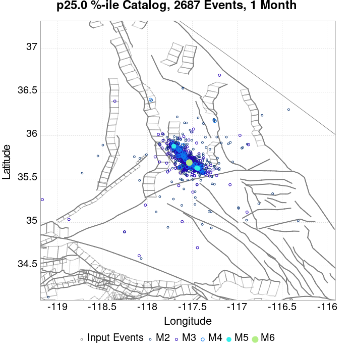
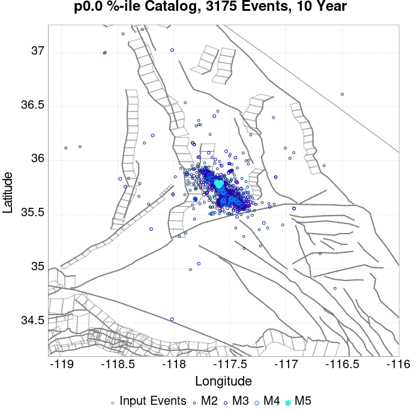
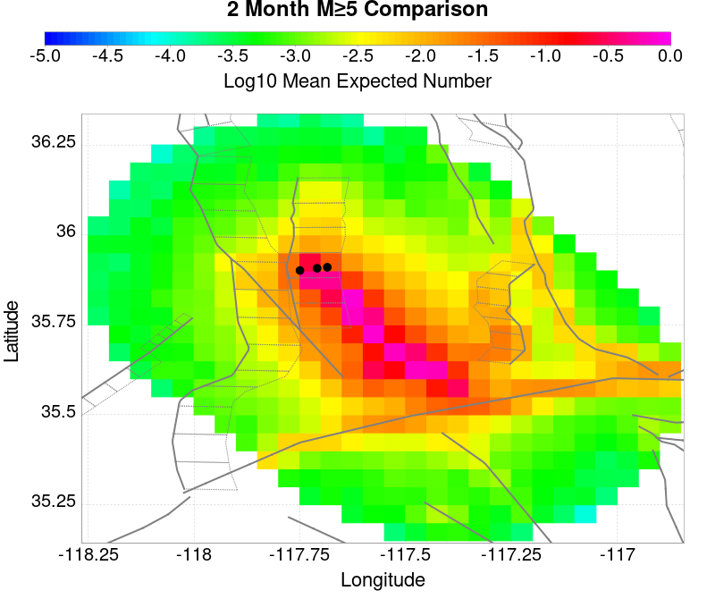
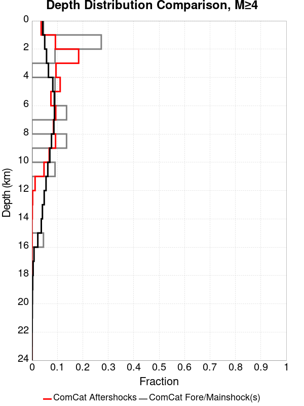
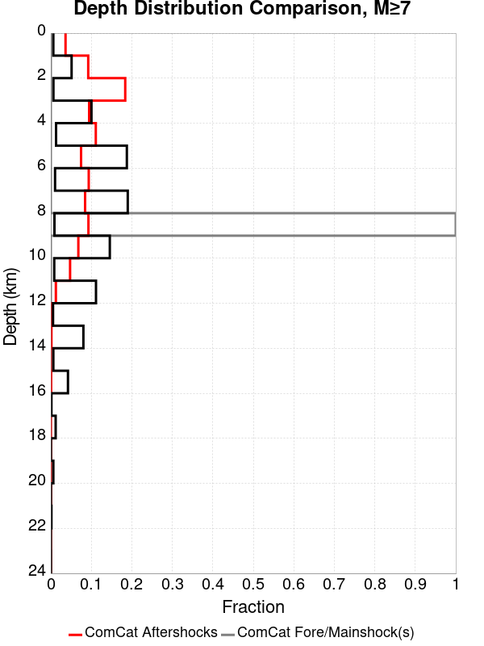
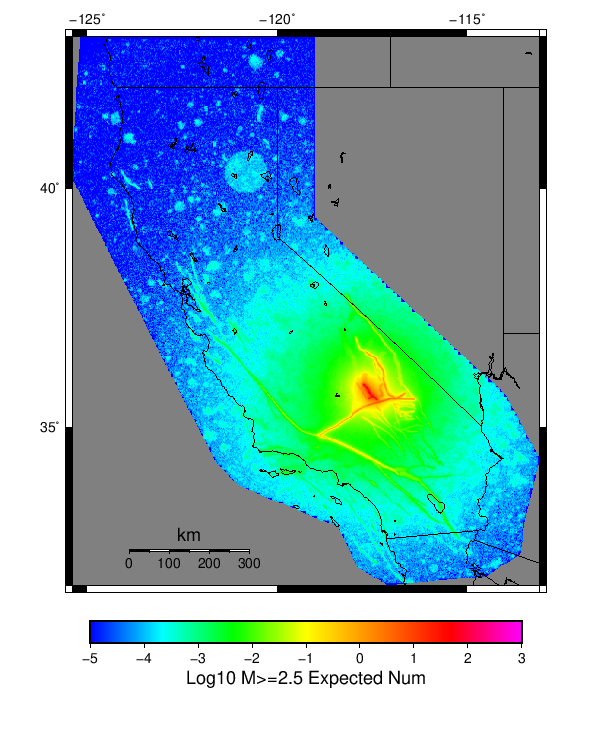

# ComCat M7.1 (ci38457511), ShakeMap Surfaces, Culled Surface Results

|   | ComCat M7.1 (ci38457511), ShakeMap Surfaces, Culled Surface |
|-----|-----|
| Num Simulations | 23514 (incomplete) |
| Start Time | 2019/07/06 03:19:54 UTC |
| Start Time Epoch Milliseconds | 1562383194040 |
| Duration | 10 Years |
| Includes Spontaneous? | false |
| Trigger Ruptures | 269 Trigger Ruptures |
|   | First: M3.98 at 2019/07/04 17:02:55 UTC |
|   | Last: M7.1 at 2019/07/06 03:19:53 UTC |
|   | Largest: M7.1 at 2019/07/06 03:19:53 UTC |
| Historical Ruptures | *(none)* |
| Config Generated With | u3etas_comcat_event_config_builder.sh --event-id ci38457511 --num-simulations 100000 --days-before 7 --mag-complete 3.5 --name-add CulledSurface --finite-surf-shakemap --finite-surf-shakemap-min-mag 5 --hpc-site USC_HPC --nodes 36 --hours 24 --queue scec |

## Table Of Contents

* [Probabilities Summary Table](#probabilities-summary-table)
* [Magnitude Number Distribution](#magnitude-number-distribution)
  * [10 Year Magnitude Number Distribution](#10-year-magnitude-number-distribution)
  * [1 Year Magnitude Number Distribution](#1-year-magnitude-number-distribution)
  * [1 Month Magnitude Number Distribution](#1-month-magnitude-number-distribution)
  * [1 Week Magnitude Number Distribution](#1-week-magnitude-number-distribution)
  * [1 Day Magnitude Number Distribution](#1-day-magnitude-number-distribution)
  * [1 Hour Magnitude Number Distribution](#1-hour-magnitude-number-distribution)
* [Hazard Change Over Time](#hazard-change-over-time)
  * [M&ge;5.0 Hazard Change Over Time](#m50-hazard-change-over-time)
  * [M&ge;6.0 Hazard Change Over Time](#m60-hazard-change-over-time)
  * [M&ge;7.0 Hazard Change Over Time](#m70-hazard-change-over-time)
  * [M&ge;8.0 Hazard Change Over Time](#m80-hazard-change-over-time)
* [Trigger Rupture Fault Map](#trigger-rupture-fault-map)
* [Trigger Rupture Depth Map](#trigger-rupture-depth-map)
* [Fault Distances To Triggers](#fault-distances-to-triggers)
* [Individual Simulated Catalog Maps](#individual-simulated-catalog-maps)
* [ComCat Data Comparisons](#comcat-data-comparisons)
  * [ComCat Magnitude-Number Distributions](#comcat-magnitude-number-distributions)
  * [ComCat Cumulative Number Vs Time](#comcat-cumulative-number-vs-time)
  * [ComCat Cumulative Number Simulation Percentiles](#comcat-cumulative-number-simulation-percentiles)
  * [ComCat Mean Spatial Distribution](#comcat-mean-spatial-distribution)
  * [ComCat Depth Distribution](#comcat-depth-distribution)
* [Section Participation](#section-participation)
  * [Section Participation Plots](#section-participation-plots)
  * [Supra-Seismogenic Parent Sections Table](#supra-seismogenic-parent-sections-table)
  * [M≥6.5 Parent Sections Table](#m65-parent-sections-table)
  * [M≥7 Parent Sections Table](#m7-parent-sections-table)
  * [M≥7.5 Parent Sections Table](#m75-parent-sections-table)
  * [M≥8 Parent Sections Table](#m8-parent-sections-table)
  * [Fault Magnitude-Probability Distributions](#fault-magnitude-probability-distributions)
* [Gridded Nucleation](#gridded-nucleation)
* [JSON Input File](#json-input-file)

## Probabilities Summary Table
*[(top)](#table-of-contents)*

| Magnitude | 1 Hour Prob | 1 Day Prob | 1 Week Prob | 1 Month Prob | 1 Year Prob | 10 Year Prob |
|-----|-----|-----|-----|-----|-----|-----|
| **M&ge;4** | 1.000 (100.00%) | 1.000 (100.00%) | 1.000 (100.00%) | 1.000 (100.00%) | 1.000 (100.00%) | 1.000 (100.00%) |
| **M&ge;4.5** | 0.992 (99.21%) | 1.000 (100.00%) | 1.000 (100.00%) | 1.000 (100.00%) | 1.000 (100.00%) | 1.000 (100.00%) |
| **M&ge;5** | 0.775 (77.47%) | 0.980 (97.96%) | 0.996 (99.63%) | 0.999 (99.88%) | 1.000 (100.00%) | 1.000 (100.00%) |
| **M&ge;5.5** | 0.358 (35.77%) | 0.687 (68.68%) | 0.814 (81.42%) | 0.879 (87.88%) | 0.941 (94.11%) | 0.969 (96.93%) |
| **M&ge;6** | 0.113 (11.29%) | 0.278 (27.84%) | 0.380 (38.05%) | 0.454 (45.36%) | 0.564 (56.35%) | 0.646 (64.62%) |
| **M&ge;6.5** | 0.027 (2.67%) | 0.071 (7.11%) | 0.102 (10.24%) | 0.129 (12.89%) | 0.176 (17.58%) | 0.216 (21.61%) |
| **M&ge;7** | 0.011 (1.11%) | 0.029 (2.86%) | 0.040 (4.01%) | 0.051 (5.07%) | 0.069 (6.90%) | 0.086 (8.64%) |
| **M&ge;7.1** | 9.53E-3 (0.95%) | 0.025 (2.50%) | 0.035 (3.51%) | 0.044 (4.44%) | 0.059 (5.93%) | 0.074 (7.41%) |
| **M&ge;7.5** | 3.40E-3 (0.34%) | 9.53E-3 (0.95%) | 0.013 (1.31%) | 0.016 (1.64%) | 0.022 (2.16%) | 0.028 (2.76%) |
| **M&ge;8** | 4.25E-5 (0.00%) | 1.28E-4 (0.01%) | 2.13E-4 (0.02%) | 3.40E-4 (0.03%) | 3.83E-4 (0.04%) | 5.10E-4 (0.05%) |

## Magnitude Number Distribution
*[(top)](#table-of-contents)*

### 10 Year Magnitude Number Distribution
*[(top)](#table-of-contents)*

**Legend**
* **Mean** (thick black line): mean expected number across all 23514 catalogs
* **2.5%,97.5%** (thin black lines): expected number percentiles across all 23514 catalogs
* **Median** (thin blue line): median expected number across all 23514 catalogs
* **Mode** (thin cyan line): modal expected number across all 23514 catalogs
* **10 yr Probability** (thin red line): 10 year probability calculated as the fraction of catalogs with at least 1 occurrence
* **10 yr Supraseismogenic Probability** (thin dashed red line): same as above, but only for supraseismogenic ruptures on explicitly modeled UCERF3 faults
* **95% Conf** (light red shaded region): binomial 95% confidence bounds on probability
* **Primary** (thin green line): mean expected number from primary triggered aftershocks only (no secondary, tertiary, etc...) across all 23514 catalogs


| Mag | Mean | 2.5 %ile | 97.5 %ile | Median | Mode | 10 yr Probability | 10 yr Supra-Seis Prob | Primary Aftershocks Mean |
|-----|-----|-----|-----|-----|-----|-----|-----|-----|
| **M&ge;2.5** | 5582.198 | 3667.000 | 16224.000 | 4614.000 | 4324.000 | 1.000 (100.00%) | 0.335 (33.45%) | 2393.608 |
| **M&ge;2.6** | 4434.043 | 2908.000 | 12871.000 | 3665.000 | 3351.000 | 1.000 (100.00%) | 0.335 (33.45%) | 1901.230 |
| **M&ge;2.7** | 3522.115 | 2304.000 | 10232.000 | 2913.000 | 2735.000 | 1.000 (100.00%) | 0.335 (33.45%) | 1510.177 |
| **M&ge;2.8** | 2797.763 | 1825.000 | 8109.000 | 2314.000 | 2142.000 | 1.000 (100.00%) | 0.335 (33.45%) | 1199.619 |
| **M&ge;2.9** | 2222.207 | 1444.000 | 6444.000 | 1838.000 | 1646.000 | 1.000 (100.00%) | 0.335 (33.45%) | 952.901 |
| **M&ge;3** | 1765.087 | 1143.000 | 5119.000 | 1461.000 | 1334.000 | 1.000 (100.00%) | 0.335 (33.45%) | 756.880 |
| **M&ge;3.1** | 1401.867 | 903.000 | 4060.000 | 1161.000 | 1053.000 | 1.000 (100.00%) | 0.335 (33.45%) | 601.165 |
| **M&ge;3.2** | 1113.513 | 713.000 | 3225.000 | 922.000 | 846.000 | 1.000 (100.00%) | 0.335 (33.45%) | 477.537 |
| **M&ge;3.3** | 884.431 | 563.000 | 2562.000 | 733.000 | 684.000 | 1.000 (100.00%) | 0.335 (33.45%) | 379.300 |
| **M&ge;3.4** | 702.367 | 443.000 | 2035.000 | 583.000 | 539.000 | 1.000 (100.00%) | 0.335 (33.45%) | 301.233 |
| **M&ge;3.5** | 557.768 | 349.000 | 1617.000 | 464.000 | 424.000 | 1.000 (100.00%) | 0.335 (33.45%) | 239.206 |
| **M&ge;3.6** | 442.934 | 275.000 | 1284.000 | 369.000 | 352.000 | 1.000 (100.00%) | 0.335 (33.45%) | 189.938 |
| **M&ge;3.7** | 351.690 | 215.000 | 1019.000 | 293.000 | 269.000 | 1.000 (100.00%) | 0.335 (33.45%) | 150.822 |
| **M&ge;3.8** | 279.322 | 168.000 | 807.000 | 233.000 | 217.000 | 1.000 (100.00%) | 0.335 (33.45%) | 119.804 |
| **M&ge;3.9** | 221.741 | 131.000 | 643.000 | 185.000 | 167.000 | 1.000 (100.00%) | 0.335 (33.45%) | 95.094 |
| **M&ge;4** | 176.026 | 102.000 | 511.000 | 147.000 | 135.000 | 1.000 (100.00%) | 0.335 (33.45%) | 75.498 |
| **M&ge;4.1** | 139.773 | 79.000 | 406.000 | 117.000 | 101.000 | 1.000 (100.00%) | 0.335 (33.45%) | 59.914 |
| **M&ge;4.2** | 110.940 | 61.000 | 322.000 | 93.000 | 82.000 | 1.000 (100.00%) | 0.335 (33.45%) | 47.572 |
| **M&ge;4.3** | 88.037 | 47.000 | 255.000 | 74.000 | 67.000 | 1.000 (100.00%) | 0.335 (33.45%) | 37.782 |
| **M&ge;4.4** | 69.855 | 36.000 | 203.000 | 59.000 | 52.000 | 1.000 (100.00%) | 0.335 (33.45%) | 29.983 |
| **M&ge;4.5** | 55.404 | 27.000 | 161.000 | 47.000 | 41.000 | 1.000 (100.00%) | 0.335 (33.45%) | 23.783 |
| **M&ge;4.6** | 43.898 | 20.000 | 128.000 | 37.000 | 33.000 | 1.000 (100.00%) | 0.335 (33.45%) | 18.851 |
| **M&ge;4.7** | 34.738 | 15.000 | 102.000 | 29.000 | 26.000 | 1.000 (100.00%) | 0.335 (33.45%) | 14.916 |
| **M&ge;4.8** | 27.474 | 11.000 | 81.000 | 23.000 | 21.000 | 1.000 (100.00%) | 0.335 (33.45%) | 11.798 |
| **M&ge;4.9** | 21.717 | 8.000 | 64.000 | 18.000 | 15.000 | 1.000 (100.00%) | 0.335 (33.45%) | 9.320 |
| **M&ge;5** | 17.117 | 6.000 | 50.000 | 14.000 | 13.000 | 1.000 (100.00%) | 0.335 (33.45%) | 7.359 |
| **M&ge;5.1** | 13.489 | 4.000 | 40.000 | 11.000 | 10.000 | 1.000 (99.99%) | 0.335 (33.45%) | 5.808 |
| **M&ge;5.2** | 10.618 | 3.000 | 32.000 | 9.000 | 8.000 | 0.999 (99.94%) | 0.335 (33.45%) | 4.574 |
| **M&ge;5.3** | 8.339 | 2.000 | 25.000 | 7.000 | 6.000 | 0.997 (99.65%) | 0.335 (33.45%) | 3.598 |
| **M&ge;5.4** | 6.529 | 1.000 | 20.000 | 5.000 | 4.000 | 0.987 (98.75%) | 0.335 (33.45%) | 2.818 |
| **M&ge;5.5** | 5.092 | 0.000 | 16.000 | 4.000 | 3.000 | 0.969 (96.93%) | 0.335 (33.45%) | 2.204 |
| **M&ge;5.6** | 3.945 | 0.000 | 13.000 | 3.000 | 2.000 | 0.935 (93.53%) | 0.335 (33.45%) | 1.710 |
| **M&ge;5.7** | 3.038 | 0.000 | 10.000 | 2.000 | 2.000 | 0.886 (88.56%) | 0.335 (33.45%) | 1.317 |
| **M&ge;5.8** | 2.320 | 0.000 | 8.000 | 2.000 | 1.000 | 0.820 (81.97%) | 0.335 (33.45%) | 1.006 |
| **M&ge;5.9** | 1.750 | 0.000 | 7.000 | 1.000 | 1.000 | 0.734 (73.41%) | 0.334 (33.44%) | 0.760 |
| **M&ge;6** | 1.356 | 0.000 | 6.000 | 1.000 | 0.000 | 0.646 (64.62%) | 0.334 (33.43%) | 0.583 |
| **M&ge;6.1** | 0.989 | 0.000 | 4.000 | 1.000 | 0.000 | 0.541 (54.09%) | 0.290 (28.96%) | 0.434 |
| **M&ge;6.2** | 0.651 | 0.000 | 3.000 | 0.000 | 0.000 | 0.413 (41.30%) | 0.228 (22.83%) | 0.288 |
| **M&ge;6.3** | 0.496 | 0.000 | 3.000 | 0.000 | 0.000 | 0.339 (33.93%) | 0.198 (19.81%) | 0.222 |
| **M&ge;6.4** | 0.377 | 0.000 | 2.000 | 0.000 | 0.000 | 0.268 (26.84%) | 0.169 (16.88%) | 0.164 |
| **M&ge;6.5** | 0.288 | 0.000 | 2.000 | 0.000 | 0.000 | 0.216 (21.61%) | 0.148 (14.80%) | 0.126 |
| **M&ge;6.6** | 0.232 | 0.000 | 2.000 | 0.000 | 0.000 | 0.185 (18.53%) | 0.136 (13.60%) | 0.108 |
| **M&ge;6.7** | 0.188 | 0.000 | 2.000 | 0.000 | 0.000 | 0.155 (15.49%) | 0.119 (11.91%) | 0.088 |
| **M&ge;6.8** | 0.152 | 0.000 | 1.000 | 0.000 | 0.000 | 0.131 (13.10%) | 0.106 (10.58%) | 0.073 |
| **M&ge;6.9** | 0.118 | 0.000 | 1.000 | 0.000 | 0.000 | 0.107 (10.69%) | 0.090 (8.99%) | 0.058 |
| **M&ge;7** | 0.093 | 0.000 | 1.000 | 0.000 | 0.000 | 0.086 (8.64%) | 0.076 (7.65%) | 0.046 |
| **M&ge;7.1** | 0.078 | 0.000 | 1.000 | 0.000 | 0.000 | 0.074 (7.41%) | 0.068 (6.80%) | 0.039 |
| **M&ge;7.2** | 0.060 | 0.000 | 1.000 | 0.000 | 0.000 | 0.058 (5.78%) | 0.054 (5.44%) | 0.029 |
| **M&ge;7.3** | 0.042 | 0.000 | 1.000 | 0.000 | 0.000 | 0.040 (4.04%) | 0.039 (3.87%) | 0.020 |
| **M&ge;7.4** | 0.037 | 0.000 | 1.000 | 0.000 | 0.000 | 0.035 (3.54%) | 0.035 (3.46%) | 0.018 |
| **M&ge;7.5** | 0.028 | 0.000 | 1.000 | 0.000 | 0.000 | 0.028 (2.76%) | 0.027 (2.75%) | 0.014 |
| **M&ge;7.6** | 0.016 | 0.000 | 0.000 | 0.000 | 0.000 | 0.016 (1.59%) | 0.016 (1.58%) | 8.38E-3 |
| **M&ge;7.7** | 5.10E-3 | 0.000 | 0.000 | 0.000 | 0.000 | 4.93E-3 (0.49%) | 4.93E-3 (0.49%) | 2.47E-3 |
| **M&ge;7.8** | 3.44E-3 | 0.000 | 0.000 | 0.000 | 0.000 | 3.44E-3 (0.34%) | 3.44E-3 (0.34%) | 1.74E-3 |
| **M&ge;7.9** | 1.74E-3 | 0.000 | 0.000 | 0.000 | 0.000 | 1.74E-3 (0.17%) | 1.74E-3 (0.17%) | 8.08E-4 |
| **M&ge;8** | 5.10E-4 | 0.000 | 0.000 | 0.000 | 0.000 | 5.10E-4 (0.05%) | 5.10E-4 (0.05%) | 2.13E-4 |
| **M&ge;8.1** | 1.28E-4 | 0.000 | 0.000 | 0.000 | 0.000 | 1.28E-4 (0.01%) | 1.28E-4 (0.01%) | 8.51E-5 |
| **M&ge;8.2** | 0.000 | 0.000 | 0.000 | 0.000 | 0.000 | 0.000 (0.00%) | 0.000 (0.00%) | 0.000 |
| **M&ge;8.3** | 0.000 | 0.000 | 0.000 | 0.000 | 0.000 | 0.000 (0.00%) | 0.000 (0.00%) | 0.000 |
| **M&ge;8.4** | 0.000 | 0.000 | 0.000 | 0.000 | 0.000 | 0.000 (0.00%) | 0.000 (0.00%) | 0.000 |
| **M&ge;8.5** | 0.000 | 0.000 | 0.000 | 0.000 | 0.000 | 0.000 (0.00%) | 0.000 (0.00%) | 0.000 |
| **M&ge;8.6** | 0.000 | 0.000 | 0.000 | 0.000 | 0.000 | 0.000 (0.00%) | 0.000 (0.00%) | 0.000 |
| **M&ge;8.7** | 0.000 | 0.000 | 0.000 | 0.000 | 0.000 | 0.000 (0.00%) | 0.000 (0.00%) | 0.000 |
| **M&ge;8.8** | 0.000 | 0.000 | 0.000 | 0.000 | 0.000 | 0.000 (0.00%) | 0.000 (0.00%) | 0.000 |
| **M&ge;8.9** | 0.000 | 0.000 | 0.000 | 0.000 | 0.000 | 0.000 (0.00%) | 0.000 (0.00%) | 0.000 |
| **M&ge;9** | 0.000 | 0.000 | 0.000 | 0.000 | 0.000 | 0.000 (0.00%) | 0.000 (0.00%) | 0.000 |

### 1 Year Magnitude Number Distribution
*[(top)](#table-of-contents)*

**Legend**
* **Mean** (thick black line): mean expected number across all 23514 catalogs
* **2.5%,97.5%** (thin black lines): expected number percentiles across all 23514 catalogs
* **Median** (thin blue line): median expected number across all 23514 catalogs
* **Mode** (thin cyan line): modal expected number across all 23514 catalogs
* **1 yr Probability** (thin red line): 1 year probability calculated as the fraction of catalogs with at least 1 occurrence
* **1 yr Supraseismogenic Probability** (thin dashed red line): same as above, but only for supraseismogenic ruptures on explicitly modeled UCERF3 faults
* **95% Conf** (light red shaded region): binomial 95% confidence bounds on probability
* **Primary** (thin green line): mean expected number from primary triggered aftershocks only (no secondary, tertiary, etc...) across all 23514 catalogs


| Mag | Mean | 2.5 %ile | 97.5 %ile | Median | Mode | 1 yr Probability | 1 yr Supra-Seis Prob | Primary Aftershocks Mean |
|-----|-----|-----|-----|-----|-----|-----|-----|-----|
| **M&ge;2.5** | 4218.230 | 2958.000 | 11489.000 | 3593.000 | 3337.000 | 1.000 (100.00%) | 0.273 (27.35%) | 2085.061 |
| **M&ge;2.6** | 3350.636 | 2344.000 | 9113.000 | 2855.000 | 2796.000 | 1.000 (100.00%) | 0.273 (27.35%) | 1656.171 |
| **M&ge;2.7** | 2661.390 | 1855.000 | 7240.000 | 2268.000 | 2177.000 | 1.000 (100.00%) | 0.273 (27.35%) | 1315.478 |
| **M&ge;2.8** | 2114.169 | 1469.000 | 5755.000 | 1803.000 | 1680.000 | 1.000 (100.00%) | 0.273 (27.35%) | 1045.012 |
| **M&ge;2.9** | 1679.366 | 1163.000 | 4582.000 | 1432.000 | 1363.000 | 1.000 (100.00%) | 0.273 (27.35%) | 830.091 |
| **M&ge;3** | 1333.898 | 919.000 | 3640.000 | 1138.000 | 1051.000 | 1.000 (100.00%) | 0.273 (27.35%) | 659.336 |
| **M&ge;3.1** | 1059.433 | 726.000 | 2901.000 | 905.000 | 823.000 | 1.000 (100.00%) | 0.273 (27.35%) | 523.684 |
| **M&ge;3.2** | 841.464 | 573.000 | 2304.000 | 719.000 | 667.000 | 1.000 (100.00%) | 0.273 (27.35%) | 415.972 |
| **M&ge;3.3** | 668.352 | 450.000 | 1833.000 | 572.000 | 526.000 | 1.000 (100.00%) | 0.273 (27.35%) | 330.391 |
| **M&ge;3.4** | 530.825 | 354.000 | 1448.000 | 455.000 | 416.000 | 1.000 (100.00%) | 0.273 (27.35%) | 262.403 |
| **M&ge;3.5** | 421.553 | 278.000 | 1150.000 | 362.000 | 333.000 | 1.000 (100.00%) | 0.273 (27.35%) | 208.373 |
| **M&ge;3.6** | 334.752 | 219.000 | 910.000 | 288.000 | 268.000 | 1.000 (100.00%) | 0.273 (27.35%) | 165.453 |
| **M&ge;3.7** | 265.802 | 171.000 | 728.000 | 229.000 | 209.000 | 1.000 (100.00%) | 0.273 (27.35%) | 131.387 |
| **M&ge;3.8** | 211.088 | 134.000 | 574.000 | 182.000 | 169.000 | 1.000 (100.00%) | 0.273 (27.35%) | 104.352 |
| **M&ge;3.9** | 167.573 | 104.000 | 458.000 | 145.000 | 133.000 | 1.000 (100.00%) | 0.273 (27.35%) | 82.823 |
| **M&ge;4** | 133.015 | 80.000 | 364.000 | 115.000 | 105.000 | 1.000 (100.00%) | 0.273 (27.35%) | 65.752 |
| **M&ge;4.1** | 105.624 | 62.000 | 289.000 | 91.000 | 82.000 | 1.000 (100.00%) | 0.273 (27.35%) | 52.183 |
| **M&ge;4.2** | 83.837 | 48.000 | 228.000 | 73.000 | 66.000 | 1.000 (100.00%) | 0.273 (27.35%) | 41.436 |
| **M&ge;4.3** | 66.547 | 36.000 | 182.000 | 58.000 | 50.000 | 1.000 (100.00%) | 0.273 (27.35%) | 32.908 |
| **M&ge;4.4** | 52.821 | 28.000 | 144.000 | 46.000 | 41.000 | 1.000 (100.00%) | 0.273 (27.35%) | 26.117 |
| **M&ge;4.5** | 41.902 | 21.000 | 114.000 | 36.000 | 33.000 | 1.000 (100.00%) | 0.273 (27.35%) | 20.724 |
| **M&ge;4.6** | 33.216 | 15.000 | 90.000 | 29.000 | 26.000 | 1.000 (100.00%) | 0.273 (27.35%) | 16.432 |
| **M&ge;4.7** | 26.286 | 11.000 | 72.000 | 23.000 | 20.000 | 1.000 (100.00%) | 0.273 (27.35%) | 13.006 |
| **M&ge;4.8** | 20.795 | 8.000 | 57.000 | 18.000 | 15.000 | 1.000 (100.00%) | 0.273 (27.35%) | 10.287 |
| **M&ge;4.9** | 16.433 | 6.000 | 45.000 | 14.000 | 13.000 | 1.000 (100.00%) | 0.273 (27.35%) | 8.130 |
| **M&ge;5** | 12.959 | 4.000 | 36.000 | 11.000 | 10.000 | 1.000 (100.00%) | 0.273 (27.35%) | 6.421 |
| **M&ge;5.1** | 10.215 | 3.000 | 29.000 | 9.000 | 7.000 | 0.999 (99.92%) | 0.273 (27.35%) | 5.067 |
| **M&ge;5.2** | 8.043 | 2.000 | 23.000 | 7.000 | 6.000 | 0.997 (99.69%) | 0.273 (27.35%) | 3.988 |
| **M&ge;5.3** | 6.320 | 1.000 | 19.000 | 5.000 | 4.000 | 0.989 (98.91%) | 0.273 (27.35%) | 3.136 |
| **M&ge;5.4** | 4.947 | 0.000 | 15.000 | 4.000 | 3.000 | 0.972 (97.21%) | 0.273 (27.35%) | 2.454 |
| **M&ge;5.5** | 3.861 | 0.000 | 12.000 | 3.000 | 2.000 | 0.941 (94.11%) | 0.273 (27.35%) | 1.919 |
| **M&ge;5.6** | 2.988 | 0.000 | 10.000 | 2.000 | 2.000 | 0.893 (89.25%) | 0.273 (27.35%) | 1.487 |
| **M&ge;5.7** | 2.302 | 0.000 | 8.000 | 2.000 | 1.000 | 0.827 (82.65%) | 0.273 (27.35%) | 1.147 |
| **M&ge;5.8** | 1.754 | 0.000 | 7.000 | 1.000 | 1.000 | 0.745 (74.46%) | 0.273 (27.35%) | 0.876 |
| **M&ge;5.9** | 1.324 | 0.000 | 5.000 | 1.000 | 0.000 | 0.651 (65.13%) | 0.273 (27.34%) | 0.663 |
| **M&ge;6** | 1.026 | 0.000 | 4.000 | 1.000 | 0.000 | 0.564 (56.35%) | 0.273 (27.33%) | 0.508 |
| **M&ge;6.1** | 0.751 | 0.000 | 4.000 | 0.000 | 0.000 | 0.462 (46.23%) | 0.236 (23.62%) | 0.378 |
| **M&ge;6.2** | 0.494 | 0.000 | 3.000 | 0.000 | 0.000 | 0.344 (34.40%) | 0.184 (18.36%) | 0.250 |
| **M&ge;6.3** | 0.376 | 0.000 | 2.000 | 0.000 | 0.000 | 0.280 (28.01%) | 0.159 (15.87%) | 0.194 |
| **M&ge;6.4** | 0.286 | 0.000 | 2.000 | 0.000 | 0.000 | 0.220 (21.97%) | 0.135 (13.54%) | 0.143 |
| **M&ge;6.5** | 0.220 | 0.000 | 2.000 | 0.000 | 0.000 | 0.176 (17.58%) | 0.120 (11.95%) | 0.111 |
| **M&ge;6.6** | 0.178 | 0.000 | 1.000 | 0.000 | 0.000 | 0.150 (15.00%) | 0.110 (10.97%) | 0.094 |
| **M&ge;6.7** | 0.145 | 0.000 | 1.000 | 0.000 | 0.000 | 0.125 (12.49%) | 0.096 (9.64%) | 0.077 |
| **M&ge;6.8** | 0.118 | 0.000 | 1.000 | 0.000 | 0.000 | 0.105 (10.52%) | 0.085 (8.53%) | 0.064 |
| **M&ge;6.9** | 0.092 | 0.000 | 1.000 | 0.000 | 0.000 | 0.085 (8.51%) | 0.072 (7.20%) | 0.051 |
| **M&ge;7** | 0.073 | 0.000 | 1.000 | 0.000 | 0.000 | 0.069 (6.90%) | 0.061 (6.13%) | 0.041 |
| **M&ge;7.1** | 0.061 | 0.000 | 1.000 | 0.000 | 0.000 | 0.059 (5.93%) | 0.055 (5.46%) | 0.035 |
| **M&ge;7.2** | 0.047 | 0.000 | 1.000 | 0.000 | 0.000 | 0.046 (4.55%) | 0.043 (4.30%) | 0.026 |
| **M&ge;7.3** | 0.033 | 0.000 | 1.000 | 0.000 | 0.000 | 0.032 (3.18%) | 0.030 (3.05%) | 0.018 |
| **M&ge;7.4** | 0.029 | 0.000 | 1.000 | 0.000 | 0.000 | 0.028 (2.80%) | 0.027 (2.75%) | 0.016 |
| **M&ge;7.5** | 0.022 | 0.000 | 0.000 | 0.000 | 0.000 | 0.022 (2.16%) | 0.022 (2.16%) | 0.012 |
| **M&ge;7.6** | 0.012 | 0.000 | 0.000 | 0.000 | 0.000 | 0.012 (1.21%) | 0.012 (1.20%) | 7.27E-3 |
| **M&ge;7.7** | 3.83E-3 | 0.000 | 0.000 | 0.000 | 0.000 | 3.74E-3 (0.37%) | 3.74E-3 (0.37%) | 2.08E-3 |
| **M&ge;7.8** | 2.59E-3 | 0.000 | 0.000 | 0.000 | 0.000 | 2.59E-3 (0.26%) | 2.59E-3 (0.26%) | 1.49E-3 |
| **M&ge;7.9** | 1.36E-3 | 0.000 | 0.000 | 0.000 | 0.000 | 1.36E-3 (0.14%) | 1.36E-3 (0.14%) | 7.66E-4 |
| **M&ge;8** | 3.83E-4 | 0.000 | 0.000 | 0.000 | 0.000 | 3.83E-4 (0.04%) | 3.83E-4 (0.04%) | 2.13E-4 |
| **M&ge;8.1** | 8.51E-5 | 0.000 | 0.000 | 0.000 | 0.000 | 8.51E-5 (0.01%) | 8.51E-5 (0.01%) | 8.51E-5 |
| **M&ge;8.2** | 0.000 | 0.000 | 0.000 | 0.000 | 0.000 | 0.000 (0.00%) | 0.000 (0.00%) | 0.000 |
| **M&ge;8.3** | 0.000 | 0.000 | 0.000 | 0.000 | 0.000 | 0.000 (0.00%) | 0.000 (0.00%) | 0.000 |
| **M&ge;8.4** | 0.000 | 0.000 | 0.000 | 0.000 | 0.000 | 0.000 (0.00%) | 0.000 (0.00%) | 0.000 |
| **M&ge;8.5** | 0.000 | 0.000 | 0.000 | 0.000 | 0.000 | 0.000 (0.00%) | 0.000 (0.00%) | 0.000 |
| **M&ge;8.6** | 0.000 | 0.000 | 0.000 | 0.000 | 0.000 | 0.000 (0.00%) | 0.000 (0.00%) | 0.000 |
| **M&ge;8.7** | 0.000 | 0.000 | 0.000 | 0.000 | 0.000 | 0.000 (0.00%) | 0.000 (0.00%) | 0.000 |
| **M&ge;8.8** | 0.000 | 0.000 | 0.000 | 0.000 | 0.000 | 0.000 (0.00%) | 0.000 (0.00%) | 0.000 |
| **M&ge;8.9** | 0.000 | 0.000 | 0.000 | 0.000 | 0.000 | 0.000 (0.00%) | 0.000 (0.00%) | 0.000 |
| **M&ge;9** | 0.000 | 0.000 | 0.000 | 0.000 | 0.000 | 0.000 (0.00%) | 0.000 (0.00%) | 0.000 |

### 1 Month Magnitude Number Distribution
*[(top)](#table-of-contents)*

**Legend**
* **Mean** (thick black line): mean expected number across all 23514 catalogs
* **2.5%,97.5%** (thin black lines): expected number percentiles across all 23514 catalogs
* **Median** (thin blue line): median expected number across all 23514 catalogs
* **Mode** (thin cyan line): modal expected number across all 23514 catalogs
* **1 mo Probability** (thin red line): 1 month probability calculated as the fraction of catalogs with at least 1 occurrence
* **1 mo Supraseismogenic Probability** (thin dashed red line): same as above, but only for supraseismogenic ruptures on explicitly modeled UCERF3 faults
* **95% Conf** (light red shaded region): binomial 95% confidence bounds on probability
* **Primary** (thin green line): mean expected number from primary triggered aftershocks only (no secondary, tertiary, etc...) across all 23514 catalogs


| Mag | Mean | 2.5 %ile | 97.5 %ile | Median | Mode | 1 mo Probability | 1 mo Supra-Seis Prob | Primary Aftershocks Mean |
|-----|-----|-----|-----|-----|-----|-----|-----|-----|
| **M&ge;2.5** | 2918.709 | 2189.000 | 6796.000 | 2563.000 | 2353.000 | 1.000 (100.00%) | 0.204 (20.36%) | 1690.307 |
| **M&ge;2.6** | 2318.415 | 1731.000 | 5418.000 | 2038.000 | 1881.000 | 1.000 (100.00%) | 0.204 (20.36%) | 1342.627 |
| **M&ge;2.7** | 1841.564 | 1371.000 | 4304.000 | 1619.000 | 1533.000 | 1.000 (100.00%) | 0.204 (20.36%) | 1066.440 |
| **M&ge;2.8** | 1462.969 | 1085.000 | 3402.000 | 1287.000 | 1219.000 | 1.000 (100.00%) | 0.204 (20.36%) | 847.202 |
| **M&ge;2.9** | 1162.155 | 858.000 | 2710.000 | 1022.000 | 963.000 | 1.000 (100.00%) | 0.204 (20.36%) | 672.962 |
| **M&ge;3** | 923.165 | 677.000 | 2154.000 | 813.000 | 756.000 | 1.000 (100.00%) | 0.204 (20.36%) | 534.575 |
| **M&ge;3.1** | 733.162 | 534.000 | 1696.000 | 646.000 | 617.000 | 1.000 (100.00%) | 0.204 (20.36%) | 424.579 |
| **M&ge;3.2** | 582.353 | 420.000 | 1352.000 | 514.000 | 487.000 | 1.000 (100.00%) | 0.204 (20.36%) | 337.279 |
| **M&ge;3.3** | 462.550 | 330.000 | 1073.000 | 408.000 | 390.000 | 1.000 (100.00%) | 0.204 (20.36%) | 267.878 |
| **M&ge;3.4** | 367.367 | 259.000 | 855.000 | 325.000 | 312.000 | 1.000 (100.00%) | 0.204 (20.36%) | 212.750 |
| **M&ge;3.5** | 291.756 | 203.000 | 678.000 | 258.000 | 244.000 | 1.000 (100.00%) | 0.204 (20.36%) | 168.960 |
| **M&ge;3.6** | 231.695 | 158.000 | 539.000 | 205.000 | 189.000 | 1.000 (100.00%) | 0.204 (20.36%) | 134.155 |
| **M&ge;3.7** | 183.991 | 123.000 | 429.000 | 163.000 | 158.000 | 1.000 (100.00%) | 0.204 (20.36%) | 106.543 |
| **M&ge;3.8** | 146.136 | 96.000 | 341.000 | 130.000 | 128.000 | 1.000 (100.00%) | 0.204 (20.36%) | 84.623 |
| **M&ge;3.9** | 116.009 | 74.000 | 274.000 | 103.000 | 101.000 | 1.000 (100.00%) | 0.204 (20.36%) | 67.167 |
| **M&ge;4** | 92.108 | 57.000 | 216.000 | 82.000 | 76.000 | 1.000 (100.00%) | 0.204 (20.36%) | 53.337 |
| **M&ge;4.1** | 73.124 | 44.000 | 174.000 | 65.000 | 62.000 | 1.000 (100.00%) | 0.204 (20.36%) | 42.316 |
| **M&ge;4.2** | 58.030 | 33.000 | 139.000 | 52.000 | 51.000 | 1.000 (100.00%) | 0.204 (20.36%) | 33.598 |
| **M&ge;4.3** | 46.081 | 25.000 | 110.000 | 41.000 | 39.000 | 1.000 (100.00%) | 0.204 (20.36%) | 26.687 |
| **M&ge;4.4** | 36.580 | 19.000 | 88.000 | 33.000 | 32.000 | 1.000 (100.00%) | 0.204 (20.36%) | 21.181 |
| **M&ge;4.5** | 29.020 | 14.000 | 70.000 | 26.000 | 23.000 | 1.000 (100.00%) | 0.204 (20.36%) | 16.805 |
| **M&ge;4.6** | 23.006 | 10.000 | 56.000 | 21.000 | 19.000 | 1.000 (100.00%) | 0.204 (20.36%) | 13.326 |
| **M&ge;4.7** | 18.195 | 7.000 | 45.000 | 16.000 | 15.000 | 1.000 (100.00%) | 0.204 (20.36%) | 10.542 |
| **M&ge;4.8** | 14.399 | 5.000 | 36.000 | 13.000 | 13.000 | 1.000 (100.00%) | 0.204 (20.36%) | 8.338 |
| **M&ge;4.9** | 11.371 | 4.000 | 29.000 | 10.000 | 9.000 | 1.000 (99.97%) | 0.204 (20.36%) | 6.585 |
| **M&ge;5** | 8.972 | 2.000 | 23.000 | 8.000 | 7.000 | 0.999 (99.88%) | 0.204 (20.36%) | 5.200 |
| **M&ge;5.1** | 7.071 | 1.000 | 19.000 | 6.000 | 5.000 | 0.996 (99.57%) | 0.204 (20.36%) | 4.108 |
| **M&ge;5.2** | 5.577 | 1.000 | 15.000 | 5.000 | 4.000 | 0.986 (98.56%) | 0.204 (20.36%) | 3.237 |
| **M&ge;5.3** | 4.383 | 0.000 | 13.000 | 4.000 | 3.000 | 0.966 (96.56%) | 0.204 (20.36%) | 2.542 |
| **M&ge;5.4** | 3.424 | 0.000 | 10.000 | 3.000 | 2.000 | 0.931 (93.10%) | 0.204 (20.36%) | 1.983 |
| **M&ge;5.5** | 2.674 | 0.000 | 9.000 | 2.000 | 2.000 | 0.879 (87.88%) | 0.204 (20.36%) | 1.554 |
| **M&ge;5.6** | 2.069 | 0.000 | 7.000 | 2.000 | 1.000 | 0.811 (81.13%) | 0.204 (20.36%) | 1.202 |
| **M&ge;5.7** | 1.596 | 0.000 | 6.000 | 1.000 | 1.000 | 0.730 (73.00%) | 0.204 (20.36%) | 0.928 |
| **M&ge;5.8** | 1.215 | 0.000 | 5.000 | 1.000 | 0.000 | 0.636 (63.65%) | 0.204 (20.36%) | 0.711 |
| **M&ge;5.9** | 0.919 | 0.000 | 4.000 | 1.000 | 0.000 | 0.540 (54.04%) | 0.203 (20.35%) | 0.538 |
| **M&ge;6** | 0.712 | 0.000 | 3.000 | 0.000 | 0.000 | 0.454 (45.36%) | 0.203 (20.35%) | 0.413 |
| **M&ge;6.1** | 0.522 | 0.000 | 3.000 | 0.000 | 0.000 | 0.363 (36.34%) | 0.176 (17.64%) | 0.306 |
| **M&ge;6.2** | 0.341 | 0.000 | 2.000 | 0.000 | 0.000 | 0.261 (26.12%) | 0.136 (13.55%) | 0.201 |
| **M&ge;6.3** | 0.262 | 0.000 | 2.000 | 0.000 | 0.000 | 0.210 (20.97%) | 0.117 (11.73%) | 0.155 |
| **M&ge;6.4** | 0.199 | 0.000 | 2.000 | 0.000 | 0.000 | 0.163 (16.27%) | 0.100 (9.99%) | 0.114 |
| **M&ge;6.5** | 0.153 | 0.000 | 1.000 | 0.000 | 0.000 | 0.129 (12.89%) | 0.088 (8.80%) | 0.089 |
| **M&ge;6.6** | 0.125 | 0.000 | 1.000 | 0.000 | 0.000 | 0.110 (10.98%) | 0.081 (8.11%) | 0.075 |
| **M&ge;6.7** | 0.103 | 0.000 | 1.000 | 0.000 | 0.000 | 0.091 (9.10%) | 0.071 (7.13%) | 0.061 |
| **M&ge;6.8** | 0.084 | 0.000 | 1.000 | 0.000 | 0.000 | 0.077 (7.72%) | 0.063 (6.32%) | 0.052 |
| **M&ge;6.9** | 0.066 | 0.000 | 1.000 | 0.000 | 0.000 | 0.062 (6.23%) | 0.053 (5.34%) | 0.041 |
| **M&ge;7** | 0.053 | 0.000 | 1.000 | 0.000 | 0.000 | 0.051 (5.07%) | 0.046 (4.58%) | 0.033 |
| **M&ge;7.1** | 0.046 | 0.000 | 1.000 | 0.000 | 0.000 | 0.044 (4.44%) | 0.041 (4.13%) | 0.029 |
| **M&ge;7.2** | 0.035 | 0.000 | 1.000 | 0.000 | 0.000 | 0.034 (3.44%) | 0.033 (3.27%) | 0.022 |
| **M&ge;7.3** | 0.025 | 0.000 | 0.000 | 0.000 | 0.000 | 0.024 (2.42%) | 0.023 (2.31%) | 0.016 |
| **M&ge;7.4** | 0.022 | 0.000 | 0.000 | 0.000 | 0.000 | 0.021 (2.13%) | 0.021 (2.08%) | 0.014 |
| **M&ge;7.5** | 0.017 | 0.000 | 0.000 | 0.000 | 0.000 | 0.016 (1.64%) | 0.016 (1.63%) | 0.011 |
| **M&ge;7.6** | 9.19E-3 | 0.000 | 0.000 | 0.000 | 0.000 | 9.02E-3 (0.90%) | 8.97E-3 (0.90%) | 6.04E-3 |
| **M&ge;7.7** | 2.89E-3 | 0.000 | 0.000 | 0.000 | 0.000 | 2.85E-3 (0.28%) | 2.85E-3 (0.28%) | 1.91E-3 |
| **M&ge;7.8** | 1.87E-3 | 0.000 | 0.000 | 0.000 | 0.000 | 1.87E-3 (0.19%) | 1.87E-3 (0.19%) | 1.36E-3 |
| **M&ge;7.9** | 9.78E-4 | 0.000 | 0.000 | 0.000 | 0.000 | 9.78E-4 (0.10%) | 9.78E-4 (0.10%) | 6.80E-4 |
| **M&ge;8** | 3.40E-4 | 0.000 | 0.000 | 0.000 | 0.000 | 3.40E-4 (0.03%) | 3.40E-4 (0.03%) | 2.13E-4 |
| **M&ge;8.1** | 8.51E-5 | 0.000 | 0.000 | 0.000 | 0.000 | 8.51E-5 (0.01%) | 8.51E-5 (0.01%) | 8.51E-5 |
| **M&ge;8.2** | 0.000 | 0.000 | 0.000 | 0.000 | 0.000 | 0.000 (0.00%) | 0.000 (0.00%) | 0.000 |
| **M&ge;8.3** | 0.000 | 0.000 | 0.000 | 0.000 | 0.000 | 0.000 (0.00%) | 0.000 (0.00%) | 0.000 |
| **M&ge;8.4** | 0.000 | 0.000 | 0.000 | 0.000 | 0.000 | 0.000 (0.00%) | 0.000 (0.00%) | 0.000 |
| **M&ge;8.5** | 0.000 | 0.000 | 0.000 | 0.000 | 0.000 | 0.000 (0.00%) | 0.000 (0.00%) | 0.000 |
| **M&ge;8.6** | 0.000 | 0.000 | 0.000 | 0.000 | 0.000 | 0.000 (0.00%) | 0.000 (0.00%) | 0.000 |
| **M&ge;8.7** | 0.000 | 0.000 | 0.000 | 0.000 | 0.000 | 0.000 (0.00%) | 0.000 (0.00%) | 0.000 |
| **M&ge;8.8** | 0.000 | 0.000 | 0.000 | 0.000 | 0.000 | 0.000 (0.00%) | 0.000 (0.00%) | 0.000 |
| **M&ge;8.9** | 0.000 | 0.000 | 0.000 | 0.000 | 0.000 | 0.000 (0.00%) | 0.000 (0.00%) | 0.000 |
| **M&ge;9** | 0.000 | 0.000 | 0.000 | 0.000 | 0.000 | 0.000 (0.00%) | 0.000 (0.00%) | 0.000 |

### 1 Week Magnitude Number Distribution
*[(top)](#table-of-contents)*

**Legend**
* **Mean** (thick black line): mean expected number across all 23514 catalogs
* **2.5%,97.5%** (thin black lines): expected number percentiles across all 23514 catalogs
* **Median** (thin blue line): median expected number across all 23514 catalogs
* **Mode** (thin cyan line): modal expected number across all 23514 catalogs
* **1 wk Probability** (thin red line): 1 week probability calculated as the fraction of catalogs with at least 1 occurrence
* **1 wk Supraseismogenic Probability** (thin dashed red line): same as above, but only for supraseismogenic ruptures on explicitly modeled UCERF3 faults
* **95% Conf** (light red shaded region): binomial 95% confidence bounds on probability
* **Primary** (thin green line): mean expected number from primary triggered aftershocks only (no secondary, tertiary, etc...) across all 23514 catalogs


| Mag | Mean | 2.5 %ile | 97.5 %ile | Median | Mode | 1 wk Probability | 1 wk Supra-Seis Prob | Primary Aftershocks Mean |
|-----|-----|-----|-----|-----|-----|-----|-----|-----|
| **M&ge;2.5** | 2244.130 | 1753.000 | 4538.000 | 2011.000 | 1905.000 | 1.000 (100.00%) | 0.163 (16.27%) | 1431.095 |
| **M&ge;2.6** | 1782.517 | 1386.000 | 3611.000 | 1599.000 | 1525.000 | 1.000 (100.00%) | 0.163 (16.27%) | 1136.717 |
| **M&ge;2.7** | 1415.925 | 1096.000 | 2868.000 | 1271.000 | 1209.000 | 1.000 (100.00%) | 0.163 (16.27%) | 902.850 |
| **M&ge;2.8** | 1124.859 | 866.000 | 2289.000 | 1010.000 | 963.000 | 1.000 (100.00%) | 0.163 (16.27%) | 717.260 |
| **M&ge;2.9** | 893.573 | 684.000 | 1814.000 | 803.000 | 771.000 | 1.000 (100.00%) | 0.163 (16.27%) | 569.740 |
| **M&ge;3** | 709.784 | 539.000 | 1446.000 | 639.000 | 605.000 | 1.000 (100.00%) | 0.163 (16.27%) | 452.558 |
| **M&ge;3.1** | 563.627 | 425.000 | 1149.000 | 508.000 | 488.000 | 1.000 (100.00%) | 0.163 (16.27%) | 359.394 |
| **M&ge;3.2** | 447.694 | 333.000 | 914.000 | 404.000 | 383.000 | 1.000 (100.00%) | 0.163 (16.27%) | 285.494 |
| **M&ge;3.3** | 355.672 | 261.000 | 728.000 | 321.000 | 302.000 | 1.000 (100.00%) | 0.163 (16.27%) | 226.798 |
| **M&ge;3.4** | 282.496 | 205.000 | 578.000 | 255.000 | 247.000 | 1.000 (100.00%) | 0.163 (16.27%) | 180.133 |
| **M&ge;3.5** | 224.332 | 160.000 | 464.000 | 203.000 | 194.000 | 1.000 (100.00%) | 0.163 (16.27%) | 143.049 |
| **M&ge;3.6** | 178.135 | 124.000 | 369.000 | 161.000 | 157.000 | 1.000 (100.00%) | 0.163 (16.27%) | 113.572 |
| **M&ge;3.7** | 141.447 | 96.000 | 293.000 | 128.000 | 121.000 | 1.000 (100.00%) | 0.163 (16.27%) | 90.179 |
| **M&ge;3.8** | 112.321 | 75.000 | 234.000 | 102.000 | 95.000 | 1.000 (100.00%) | 0.163 (16.27%) | 71.620 |
| **M&ge;3.9** | 89.172 | 58.000 | 187.000 | 81.000 | 78.000 | 1.000 (100.00%) | 0.163 (16.27%) | 56.858 |
| **M&ge;4** | 70.815 | 44.000 | 149.000 | 64.000 | 64.000 | 1.000 (100.00%) | 0.163 (16.27%) | 45.154 |
| **M&ge;4.1** | 56.213 | 34.000 | 120.000 | 51.000 | 49.000 | 1.000 (100.00%) | 0.163 (16.27%) | 35.827 |
| **M&ge;4.2** | 44.620 | 26.000 | 95.000 | 41.000 | 39.000 | 1.000 (100.00%) | 0.163 (16.27%) | 28.445 |
| **M&ge;4.3** | 35.446 | 19.000 | 76.000 | 32.000 | 32.000 | 1.000 (100.00%) | 0.163 (16.27%) | 22.602 |
| **M&ge;4.4** | 28.137 | 14.000 | 61.000 | 26.000 | 24.000 | 1.000 (100.00%) | 0.163 (16.27%) | 17.939 |
| **M&ge;4.5** | 22.330 | 11.000 | 49.000 | 20.000 | 19.000 | 1.000 (100.00%) | 0.163 (16.27%) | 14.238 |
| **M&ge;4.6** | 17.696 | 8.000 | 39.000 | 16.000 | 15.000 | 1.000 (100.00%) | 0.163 (16.27%) | 11.289 |
| **M&ge;4.7** | 14.007 | 5.000 | 32.000 | 13.000 | 12.000 | 1.000 (100.00%) | 0.163 (16.27%) | 8.933 |
| **M&ge;4.8** | 11.080 | 4.000 | 26.000 | 10.000 | 8.000 | 1.000 (99.98%) | 0.163 (16.27%) | 7.063 |
| **M&ge;4.9** | 8.745 | 2.000 | 21.000 | 8.000 | 7.000 | 0.999 (99.89%) | 0.163 (16.27%) | 5.579 |
| **M&ge;5** | 6.897 | 2.000 | 17.000 | 6.000 | 6.000 | 0.996 (99.63%) | 0.163 (16.27%) | 4.408 |
| **M&ge;5.1** | 5.436 | 1.000 | 14.000 | 5.000 | 4.000 | 0.988 (98.82%) | 0.163 (16.27%) | 3.483 |
| **M&ge;5.2** | 4.286 | 0.000 | 11.000 | 4.000 | 3.000 | 0.968 (96.76%) | 0.163 (16.27%) | 2.745 |
| **M&ge;5.3** | 3.370 | 0.000 | 10.000 | 3.000 | 2.000 | 0.934 (93.43%) | 0.163 (16.27%) | 2.157 |
| **M&ge;5.4** | 2.630 | 0.000 | 8.000 | 2.000 | 2.000 | 0.883 (88.28%) | 0.163 (16.27%) | 1.681 |
| **M&ge;5.5** | 2.056 | 0.000 | 7.000 | 2.000 | 1.000 | 0.814 (81.42%) | 0.163 (16.27%) | 1.318 |
| **M&ge;5.6** | 1.587 | 0.000 | 6.000 | 1.000 | 1.000 | 0.733 (73.31%) | 0.163 (16.27%) | 1.020 |
| **M&ge;5.7** | 1.223 | 0.000 | 5.000 | 1.000 | 0.000 | 0.645 (64.45%) | 0.163 (16.27%) | 0.787 |
| **M&ge;5.8** | 0.934 | 0.000 | 4.000 | 1.000 | 0.000 | 0.552 (55.16%) | 0.163 (16.27%) | 0.603 |
| **M&ge;5.9** | 0.704 | 0.000 | 3.000 | 0.000 | 0.000 | 0.460 (45.97%) | 0.163 (16.27%) | 0.456 |
| **M&ge;6** | 0.545 | 0.000 | 3.000 | 0.000 | 0.000 | 0.380 (38.05%) | 0.163 (16.26%) | 0.350 |
| **M&ge;6.1** | 0.401 | 0.000 | 2.000 | 0.000 | 0.000 | 0.299 (29.91%) | 0.141 (14.10%) | 0.260 |
| **M&ge;6.2** | 0.261 | 0.000 | 2.000 | 0.000 | 0.000 | 0.211 (21.07%) | 0.108 (10.77%) | 0.169 |
| **M&ge;6.3** | 0.201 | 0.000 | 2.000 | 0.000 | 0.000 | 0.169 (16.88%) | 0.093 (9.34%) | 0.131 |
| **M&ge;6.4** | 0.152 | 0.000 | 1.000 | 0.000 | 0.000 | 0.130 (12.95%) | 0.080 (7.96%) | 0.096 |
| **M&ge;6.5** | 0.118 | 0.000 | 1.000 | 0.000 | 0.000 | 0.102 (10.24%) | 0.070 (7.01%) | 0.075 |
| **M&ge;6.6** | 0.098 | 0.000 | 1.000 | 0.000 | 0.000 | 0.088 (8.81%) | 0.065 (6.52%) | 0.064 |
| **M&ge;6.7** | 0.080 | 0.000 | 1.000 | 0.000 | 0.000 | 0.073 (7.27%) | 0.057 (5.71%) | 0.052 |
| **M&ge;6.8** | 0.066 | 0.000 | 1.000 | 0.000 | 0.000 | 0.062 (6.16%) | 0.050 (5.04%) | 0.044 |
| **M&ge;6.9** | 0.052 | 0.000 | 1.000 | 0.000 | 0.000 | 0.049 (4.94%) | 0.042 (4.24%) | 0.035 |
| **M&ge;7** | 0.041 | 0.000 | 1.000 | 0.000 | 0.000 | 0.040 (4.01%) | 0.036 (3.63%) | 0.028 |
| **M&ge;7.1** | 0.036 | 0.000 | 1.000 | 0.000 | 0.000 | 0.035 (3.51%) | 0.033 (3.27%) | 0.025 |
| **M&ge;7.2** | 0.028 | 0.000 | 1.000 | 0.000 | 0.000 | 0.027 (2.73%) | 0.026 (2.59%) | 0.019 |
| **M&ge;7.3** | 0.020 | 0.000 | 0.000 | 0.000 | 0.000 | 0.019 (1.92%) | 0.018 (1.84%) | 0.013 |
| **M&ge;7.4** | 0.018 | 0.000 | 0.000 | 0.000 | 0.000 | 0.017 (1.71%) | 0.017 (1.67%) | 0.012 |
| **M&ge;7.5** | 0.013 | 0.000 | 0.000 | 0.000 | 0.000 | 0.013 (1.31%) | 0.013 (1.30%) | 9.06E-3 |
| **M&ge;7.6** | 7.40E-3 | 0.000 | 0.000 | 0.000 | 0.000 | 7.27E-3 (0.73%) | 7.23E-3 (0.72%) | 5.23E-3 |
| **M&ge;7.7** | 2.51E-3 | 0.000 | 0.000 | 0.000 | 0.000 | 2.47E-3 (0.25%) | 2.47E-3 (0.25%) | 1.74E-3 |
| **M&ge;7.8** | 1.53E-3 | 0.000 | 0.000 | 0.000 | 0.000 | 1.53E-3 (0.15%) | 1.53E-3 (0.15%) | 1.19E-3 |
| **M&ge;7.9** | 8.08E-4 | 0.000 | 0.000 | 0.000 | 0.000 | 8.08E-4 (0.08%) | 8.08E-4 (0.08%) | 5.95E-4 |
| **M&ge;8** | 2.13E-4 | 0.000 | 0.000 | 0.000 | 0.000 | 2.13E-4 (0.02%) | 2.13E-4 (0.02%) | 1.70E-4 |
| **M&ge;8.1** | 8.51E-5 | 0.000 | 0.000 | 0.000 | 0.000 | 8.51E-5 (0.01%) | 8.51E-5 (0.01%) | 8.51E-5 |
| **M&ge;8.2** | 0.000 | 0.000 | 0.000 | 0.000 | 0.000 | 0.000 (0.00%) | 0.000 (0.00%) | 0.000 |
| **M&ge;8.3** | 0.000 | 0.000 | 0.000 | 0.000 | 0.000 | 0.000 (0.00%) | 0.000 (0.00%) | 0.000 |
| **M&ge;8.4** | 0.000 | 0.000 | 0.000 | 0.000 | 0.000 | 0.000 (0.00%) | 0.000 (0.00%) | 0.000 |
| **M&ge;8.5** | 0.000 | 0.000 | 0.000 | 0.000 | 0.000 | 0.000 (0.00%) | 0.000 (0.00%) | 0.000 |
| **M&ge;8.6** | 0.000 | 0.000 | 0.000 | 0.000 | 0.000 | 0.000 (0.00%) | 0.000 (0.00%) | 0.000 |
| **M&ge;8.7** | 0.000 | 0.000 | 0.000 | 0.000 | 0.000 | 0.000 (0.00%) | 0.000 (0.00%) | 0.000 |
| **M&ge;8.8** | 0.000 | 0.000 | 0.000 | 0.000 | 0.000 | 0.000 (0.00%) | 0.000 (0.00%) | 0.000 |
| **M&ge;8.9** | 0.000 | 0.000 | 0.000 | 0.000 | 0.000 | 0.000 (0.00%) | 0.000 (0.00%) | 0.000 |
| **M&ge;9** | 0.000 | 0.000 | 0.000 | 0.000 | 0.000 | 0.000 (0.00%) | 0.000 (0.00%) | 0.000 |

### 1 Day Magnitude Number Distribution
*[(top)](#table-of-contents)*

**Legend**
* **Mean** (thick black line): mean expected number across all 23514 catalogs
* **2.5%,97.5%** (thin black lines): expected number percentiles across all 23514 catalogs
* **Median** (thin blue line): median expected number across all 23514 catalogs
* **Mode** (thin cyan line): modal expected number across all 23514 catalogs
* **1 d Probability** (thin red line): 1 day probability calculated as the fraction of catalogs with at least 1 occurrence
* **1 d Supraseismogenic Probability** (thin dashed red line): same as above, but only for supraseismogenic ruptures on explicitly modeled UCERF3 faults
* **95% Conf** (light red shaded region): binomial 95% confidence bounds on probability
* **Primary** (thin green line): mean expected number from primary triggered aftershocks only (no secondary, tertiary, etc...) across all 23514 catalogs


| Mag | Mean | 2.5 %ile | 97.5 %ile | Median | Mode | 1 d Probability | 1 d Supra-Seis Prob | Primary Aftershocks Mean |
|-----|-----|-----|-----|-----|-----|-----|-----|-----|
| **M&ge;2.5** | 1465.360 | 1204.000 | 2657.000 | 1350.000 | 1302.000 | 1.000 (100.00%) | 0.116 (11.62%) | 1064.377 |
| **M&ge;2.6** | 1164.028 | 951.000 | 2108.000 | 1073.000 | 1033.000 | 1.000 (100.00%) | 0.116 (11.62%) | 845.506 |
| **M&ge;2.7** | 924.643 | 751.000 | 1678.000 | 853.000 | 830.000 | 1.000 (100.00%) | 0.116 (11.62%) | 671.581 |
| **M&ge;2.8** | 734.624 | 592.000 | 1321.000 | 679.000 | 660.000 | 1.000 (100.00%) | 0.116 (11.62%) | 533.558 |
| **M&ge;2.9** | 583.580 | 466.000 | 1051.000 | 540.000 | 535.000 | 1.000 (100.00%) | 0.116 (11.62%) | 423.827 |
| **M&ge;3** | 463.526 | 366.000 | 837.000 | 429.000 | 410.000 | 1.000 (100.00%) | 0.116 (11.62%) | 336.662 |
| **M&ge;3.1** | 368.096 | 287.000 | 669.000 | 341.000 | 330.000 | 1.000 (100.00%) | 0.116 (11.62%) | 267.353 |
| **M&ge;3.2** | 292.403 | 225.000 | 531.000 | 271.000 | 264.000 | 1.000 (100.00%) | 0.116 (11.62%) | 212.391 |
| **M&ge;3.3** | 232.319 | 176.000 | 421.000 | 216.000 | 209.000 | 1.000 (100.00%) | 0.116 (11.62%) | 168.739 |
| **M&ge;3.4** | 184.523 | 137.000 | 333.000 | 171.000 | 168.000 | 1.000 (100.00%) | 0.116 (11.62%) | 134.015 |
| **M&ge;3.5** | 146.545 | 107.000 | 263.000 | 136.000 | 134.000 | 1.000 (100.00%) | 0.116 (11.62%) | 106.443 |
| **M&ge;3.6** | 116.367 | 83.000 | 211.000 | 108.000 | 104.000 | 1.000 (100.00%) | 0.116 (11.62%) | 84.510 |
| **M&ge;3.7** | 92.402 | 64.000 | 167.000 | 86.000 | 85.000 | 1.000 (100.00%) | 0.116 (11.62%) | 67.100 |
| **M&ge;3.8** | 73.362 | 49.000 | 132.000 | 68.000 | 67.000 | 1.000 (100.00%) | 0.116 (11.62%) | 53.293 |
| **M&ge;3.9** | 58.255 | 38.000 | 105.000 | 54.000 | 52.000 | 1.000 (100.00%) | 0.116 (11.62%) | 42.323 |
| **M&ge;4** | 46.277 | 29.000 | 84.000 | 43.000 | 42.000 | 1.000 (100.00%) | 0.116 (11.62%) | 33.611 |
| **M&ge;4.1** | 36.718 | 21.000 | 68.000 | 34.000 | 33.000 | 1.000 (100.00%) | 0.116 (11.62%) | 26.665 |
| **M&ge;4.2** | 29.158 | 16.000 | 54.000 | 27.000 | 25.000 | 1.000 (100.00%) | 0.116 (11.62%) | 21.179 |
| **M&ge;4.3** | 23.162 | 12.000 | 44.000 | 22.000 | 20.000 | 1.000 (100.00%) | 0.116 (11.62%) | 16.829 |
| **M&ge;4.4** | 18.369 | 9.000 | 36.000 | 17.000 | 16.000 | 1.000 (100.00%) | 0.116 (11.62%) | 13.351 |
| **M&ge;4.5** | 14.582 | 6.000 | 29.000 | 13.000 | 12.000 | 1.000 (100.00%) | 0.116 (11.62%) | 10.603 |
| **M&ge;4.6** | 11.564 | 4.000 | 24.000 | 11.000 | 10.000 | 1.000 (100.00%) | 0.116 (11.62%) | 8.410 |
| **M&ge;4.7** | 9.153 | 3.000 | 20.000 | 8.000 | 8.000 | 1.000 (99.96%) | 0.116 (11.62%) | 6.651 |
| **M&ge;4.8** | 7.237 | 2.000 | 16.000 | 7.000 | 6.000 | 0.998 (99.75%) | 0.116 (11.62%) | 5.261 |
| **M&ge;4.9** | 5.715 | 1.000 | 13.000 | 5.000 | 4.000 | 0.992 (99.23%) | 0.116 (11.62%) | 4.155 |
| **M&ge;5** | 4.508 | 1.000 | 11.000 | 4.000 | 3.000 | 0.980 (97.96%) | 0.116 (11.62%) | 3.279 |
| **M&ge;5.1** | 3.550 | 0.000 | 9.000 | 3.000 | 3.000 | 0.953 (95.32%) | 0.116 (11.62%) | 2.589 |
| **M&ge;5.2** | 2.799 | 0.000 | 8.000 | 2.000 | 2.000 | 0.908 (90.81%) | 0.116 (11.62%) | 2.042 |
| **M&ge;5.3** | 2.196 | 0.000 | 7.000 | 2.000 | 1.000 | 0.848 (84.78%) | 0.116 (11.62%) | 1.600 |
| **M&ge;5.4** | 1.712 | 0.000 | 6.000 | 1.000 | 1.000 | 0.772 (77.18%) | 0.116 (11.62%) | 1.247 |
| **M&ge;5.5** | 1.341 | 0.000 | 5.000 | 1.000 | 1.000 | 0.687 (68.68%) | 0.116 (11.62%) | 0.979 |
| **M&ge;5.6** | 1.039 | 0.000 | 4.000 | 1.000 | 0.000 | 0.598 (59.81%) | 0.116 (11.62%) | 0.759 |
| **M&ge;5.7** | 0.801 | 0.000 | 3.000 | 1.000 | 0.000 | 0.509 (50.86%) | 0.116 (11.62%) | 0.585 |
| **M&ge;5.8** | 0.613 | 0.000 | 3.000 | 0.000 | 0.000 | 0.423 (42.26%) | 0.116 (11.62%) | 0.449 |
| **M&ge;5.9** | 0.462 | 0.000 | 2.000 | 0.000 | 0.000 | 0.344 (34.41%) | 0.116 (11.61%) | 0.338 |
| **M&ge;6** | 0.357 | 0.000 | 2.000 | 0.000 | 0.000 | 0.278 (27.84%) | 0.116 (11.61%) | 0.261 |
| **M&ge;6.1** | 0.263 | 0.000 | 2.000 | 0.000 | 0.000 | 0.216 (21.56%) | 0.101 (10.10%) | 0.194 |
| **M&ge;6.2** | 0.171 | 0.000 | 1.000 | 0.000 | 0.000 | 0.148 (14.79%) | 0.076 (7.63%) | 0.126 |
| **M&ge;6.3** | 0.132 | 0.000 | 1.000 | 0.000 | 0.000 | 0.118 (11.75%) | 0.067 (6.66%) | 0.098 |
| **M&ge;6.4** | 0.100 | 0.000 | 1.000 | 0.000 | 0.000 | 0.089 (8.94%) | 0.057 (5.65%) | 0.072 |
| **M&ge;6.5** | 0.078 | 0.000 | 1.000 | 0.000 | 0.000 | 0.071 (7.11%) | 0.050 (4.99%) | 0.057 |
| **M&ge;6.6** | 0.065 | 0.000 | 1.000 | 0.000 | 0.000 | 0.061 (6.06%) | 0.046 (4.61%) | 0.048 |
| **M&ge;6.7** | 0.054 | 0.000 | 1.000 | 0.000 | 0.000 | 0.050 (5.04%) | 0.041 (4.08%) | 0.040 |
| **M&ge;6.8** | 0.045 | 0.000 | 1.000 | 0.000 | 0.000 | 0.043 (4.33%) | 0.036 (3.61%) | 0.034 |
| **M&ge;6.9** | 0.036 | 0.000 | 1.000 | 0.000 | 0.000 | 0.035 (3.51%) | 0.031 (3.06%) | 0.027 |
| **M&ge;7** | 0.029 | 0.000 | 1.000 | 0.000 | 0.000 | 0.029 (2.86%) | 0.026 (2.62%) | 0.022 |
| **M&ge;7.1** | 0.025 | 0.000 | 1.000 | 0.000 | 0.000 | 0.025 (2.50%) | 0.024 (2.36%) | 0.019 |
| **M&ge;7.2** | 0.020 | 0.000 | 0.000 | 0.000 | 0.000 | 0.020 (1.96%) | 0.019 (1.86%) | 0.015 |
| **M&ge;7.3** | 0.014 | 0.000 | 0.000 | 0.000 | 0.000 | 0.014 (1.39%) | 0.013 (1.33%) | 0.011 |
| **M&ge;7.4** | 0.012 | 0.000 | 0.000 | 0.000 | 0.000 | 0.012 (1.22%) | 0.012 (1.19%) | 9.27E-3 |
| **M&ge;7.5** | 9.65E-3 | 0.000 | 0.000 | 0.000 | 0.000 | 9.53E-3 (0.95%) | 9.40E-3 (0.94%) | 7.27E-3 |
| **M&ge;7.6** | 5.23E-3 | 0.000 | 0.000 | 0.000 | 0.000 | 5.19E-3 (0.52%) | 5.15E-3 (0.51%) | 4.17E-3 |
| **M&ge;7.7** | 1.83E-3 | 0.000 | 0.000 | 0.000 | 0.000 | 1.83E-3 (0.18%) | 1.83E-3 (0.18%) | 1.32E-3 |
| **M&ge;7.8** | 1.06E-3 | 0.000 | 0.000 | 0.000 | 0.000 | 1.06E-3 (0.11%) | 1.06E-3 (0.11%) | 8.93E-4 |
| **M&ge;7.9** | 5.95E-4 | 0.000 | 0.000 | 0.000 | 0.000 | 5.95E-4 (0.06%) | 5.95E-4 (0.06%) | 5.10E-4 |
| **M&ge;8** | 1.28E-4 | 0.000 | 0.000 | 0.000 | 0.000 | 1.28E-4 (0.01%) | 1.28E-4 (0.01%) | 1.28E-4 |
| **M&ge;8.1** | 4.25E-5 | 0.000 | 0.000 | 0.000 | 0.000 | 4.25E-5 (0.00%) | 4.25E-5 (0.00%) | 4.25E-5 |
| **M&ge;8.2** | 0.000 | 0.000 | 0.000 | 0.000 | 0.000 | 0.000 (0.00%) | 0.000 (0.00%) | 0.000 |
| **M&ge;8.3** | 0.000 | 0.000 | 0.000 | 0.000 | 0.000 | 0.000 (0.00%) | 0.000 (0.00%) | 0.000 |
| **M&ge;8.4** | 0.000 | 0.000 | 0.000 | 0.000 | 0.000 | 0.000 (0.00%) | 0.000 (0.00%) | 0.000 |
| **M&ge;8.5** | 0.000 | 0.000 | 0.000 | 0.000 | 0.000 | 0.000 (0.00%) | 0.000 (0.00%) | 0.000 |
| **M&ge;8.6** | 0.000 | 0.000 | 0.000 | 0.000 | 0.000 | 0.000 (0.00%) | 0.000 (0.00%) | 0.000 |
| **M&ge;8.7** | 0.000 | 0.000 | 0.000 | 0.000 | 0.000 | 0.000 (0.00%) | 0.000 (0.00%) | 0.000 |
| **M&ge;8.8** | 0.000 | 0.000 | 0.000 | 0.000 | 0.000 | 0.000 (0.00%) | 0.000 (0.00%) | 0.000 |
| **M&ge;8.9** | 0.000 | 0.000 | 0.000 | 0.000 | 0.000 | 0.000 (0.00%) | 0.000 (0.00%) | 0.000 |
| **M&ge;9** | 0.000 | 0.000 | 0.000 | 0.000 | 0.000 | 0.000 (0.00%) | 0.000 (0.00%) | 0.000 |

### 1 Hour Magnitude Number Distribution
*[(top)](#table-of-contents)*

**Legend**
* **Mean** (thick black line): mean expected number across all 23514 catalogs
* **2.5%,97.5%** (thin black lines): expected number percentiles across all 23514 catalogs
* **Median** (thin blue line): median expected number across all 23514 catalogs
* **Mode** (thin cyan line): modal expected number across all 23514 catalogs
* **1 hr Probability** (thin red line): 1 hour probability calculated as the fraction of catalogs with at least 1 occurrence
* **1 hr Supraseismogenic Probability** (thin dashed red line): same as above, but only for supraseismogenic ruptures on explicitly modeled UCERF3 faults
* **95% Conf** (light red shaded region): binomial 95% confidence bounds on probability
* **Primary** (thin green line): mean expected number from primary triggered aftershocks only (no secondary, tertiary, etc...) across all 23514 catalogs


| Mag | Mean | 2.5 %ile | 97.5 %ile | Median | Mode | 1 hr Probability | 1 hr Supra-Seis Prob | Primary Aftershocks Mean |
|-----|-----|-----|-----|-----|-----|-----|-----|-----|
| **M&ge;2.5** | 508.986 | 444.000 | 621.000 | 496.000 | 495.000 | 1.000 (100.00%) | 0.044 (4.40%) | 457.519 |
| **M&ge;2.6** | 404.346 | 349.000 | 495.000 | 394.000 | 388.000 | 1.000 (100.00%) | 0.044 (4.40%) | 363.452 |
| **M&ge;2.7** | 321.181 | 274.000 | 394.000 | 313.000 | 308.000 | 1.000 (100.00%) | 0.044 (4.40%) | 288.682 |
| **M&ge;2.8** | 255.177 | 214.000 | 316.000 | 249.000 | 243.000 | 1.000 (100.00%) | 0.044 (4.40%) | 229.361 |
| **M&ge;2.9** | 202.773 | 167.000 | 253.000 | 198.000 | 197.000 | 1.000 (100.00%) | 0.044 (4.40%) | 182.268 |
| **M&ge;3** | 161.067 | 130.000 | 202.000 | 157.000 | 158.000 | 1.000 (100.00%) | 0.044 (4.40%) | 144.807 |
| **M&ge;3.1** | 127.894 | 101.000 | 163.000 | 125.000 | 120.000 | 1.000 (100.00%) | 0.044 (4.40%) | 114.985 |
| **M&ge;3.2** | 101.597 | 78.000 | 132.000 | 99.000 | 100.000 | 1.000 (100.00%) | 0.044 (4.40%) | 91.346 |
| **M&ge;3.3** | 80.752 | 60.000 | 107.000 | 79.000 | 76.000 | 1.000 (100.00%) | 0.044 (4.40%) | 72.589 |
| **M&ge;3.4** | 64.128 | 46.000 | 86.000 | 63.000 | 62.000 | 1.000 (100.00%) | 0.044 (4.40%) | 57.650 |
| **M&ge;3.5** | 50.955 | 36.000 | 70.000 | 50.000 | 49.000 | 1.000 (100.00%) | 0.044 (4.40%) | 45.804 |
| **M&ge;3.6** | 40.460 | 27.000 | 57.000 | 39.000 | 39.000 | 1.000 (100.00%) | 0.044 (4.40%) | 36.364 |
| **M&ge;3.7** | 32.133 | 20.000 | 47.000 | 31.000 | 29.000 | 1.000 (100.00%) | 0.044 (4.40%) | 28.878 |
| **M&ge;3.8** | 25.538 | 15.000 | 38.000 | 25.000 | 23.000 | 1.000 (100.00%) | 0.044 (4.40%) | 22.951 |
| **M&ge;3.9** | 20.293 | 11.000 | 32.000 | 20.000 | 20.000 | 1.000 (100.00%) | 0.044 (4.40%) | 18.239 |
| **M&ge;4** | 16.107 | 8.000 | 26.000 | 16.000 | 15.000 | 1.000 (100.00%) | 0.044 (4.40%) | 14.479 |
| **M&ge;4.1** | 12.775 | 6.000 | 22.000 | 12.000 | 12.000 | 1.000 (100.00%) | 0.044 (4.40%) | 11.481 |
| **M&ge;4.2** | 10.151 | 4.000 | 18.000 | 10.000 | 9.000 | 1.000 (99.99%) | 0.044 (4.40%) | 9.126 |
| **M&ge;4.3** | 8.070 | 3.000 | 15.000 | 8.000 | 7.000 | 1.000 (99.95%) | 0.044 (4.40%) | 7.251 |
| **M&ge;4.4** | 6.392 | 2.000 | 13.000 | 6.000 | 6.000 | 0.998 (99.77%) | 0.044 (4.40%) | 5.744 |
| **M&ge;4.5** | 5.074 | 1.000 | 10.000 | 5.000 | 4.000 | 0.992 (99.21%) | 0.044 (4.40%) | 4.562 |
| **M&ge;4.6** | 4.019 | 1.000 | 9.000 | 4.000 | 3.000 | 0.977 (97.73%) | 0.044 (4.40%) | 3.613 |
| **M&ge;4.7** | 3.176 | 0.000 | 8.000 | 3.000 | 2.000 | 0.951 (95.06%) | 0.044 (4.40%) | 2.854 |
| **M&ge;4.8** | 2.509 | 0.000 | 6.000 | 2.000 | 2.000 | 0.907 (90.66%) | 0.044 (4.40%) | 2.254 |
| **M&ge;4.9** | 1.981 | 0.000 | 5.000 | 2.000 | 1.000 | 0.847 (84.68%) | 0.044 (4.40%) | 1.782 |
| **M&ge;5** | 1.558 | 0.000 | 5.000 | 1.000 | 1.000 | 0.775 (77.47%) | 0.044 (4.40%) | 1.403 |
| **M&ge;5.1** | 1.231 | 0.000 | 4.000 | 1.000 | 1.000 | 0.693 (69.27%) | 0.044 (4.40%) | 1.110 |
| **M&ge;5.2** | 0.968 | 0.000 | 3.000 | 1.000 | 0.000 | 0.603 (60.33%) | 0.044 (4.40%) | 0.872 |
| **M&ge;5.3** | 0.761 | 0.000 | 3.000 | 1.000 | 0.000 | 0.518 (51.79%) | 0.044 (4.40%) | 0.685 |
| **M&ge;5.4** | 0.591 | 0.000 | 3.000 | 0.000 | 0.000 | 0.432 (43.21%) | 0.044 (4.40%) | 0.532 |
| **M&ge;5.5** | 0.464 | 0.000 | 2.000 | 0.000 | 0.000 | 0.358 (35.77%) | 0.044 (4.40%) | 0.417 |
| **M&ge;5.6** | 0.361 | 0.000 | 2.000 | 0.000 | 0.000 | 0.291 (29.14%) | 0.044 (4.40%) | 0.324 |
| **M&ge;5.7** | 0.277 | 0.000 | 2.000 | 0.000 | 0.000 | 0.233 (23.34%) | 0.044 (4.40%) | 0.248 |
| **M&ge;5.8** | 0.212 | 0.000 | 1.000 | 0.000 | 0.000 | 0.185 (18.55%) | 0.044 (4.40%) | 0.191 |
| **M&ge;5.9** | 0.160 | 0.000 | 1.000 | 0.000 | 0.000 | 0.144 (14.40%) | 0.044 (4.40%) | 0.144 |
| **M&ge;6** | 0.124 | 0.000 | 1.000 | 0.000 | 0.000 | 0.113 (11.29%) | 0.044 (4.40%) | 0.111 |
| **M&ge;6.1** | 0.092 | 0.000 | 1.000 | 0.000 | 0.000 | 0.085 (8.51%) | 0.038 (3.84%) | 0.082 |
| **M&ge;6.2** | 0.059 | 0.000 | 1.000 | 0.000 | 0.000 | 0.056 (5.63%) | 0.028 (2.83%) | 0.053 |
| **M&ge;6.3** | 0.046 | 0.000 | 1.000 | 0.000 | 0.000 | 0.044 (4.41%) | 0.025 (2.49%) | 0.041 |
| **M&ge;6.4** | 0.034 | 0.000 | 1.000 | 0.000 | 0.000 | 0.033 (3.34%) | 0.021 (2.13%) | 0.031 |
| **M&ge;6.5** | 0.027 | 0.000 | 1.000 | 0.000 | 0.000 | 0.027 (2.67%) | 0.019 (1.91%) | 0.024 |
| **M&ge;6.6** | 0.023 | 0.000 | 0.000 | 0.000 | 0.000 | 0.023 (2.31%) | 0.018 (1.80%) | 0.021 |
| **M&ge;6.7** | 0.019 | 0.000 | 0.000 | 0.000 | 0.000 | 0.019 (1.88%) | 0.016 (1.58%) | 0.017 |
| **M&ge;6.8** | 0.017 | 0.000 | 0.000 | 0.000 | 0.000 | 0.016 (1.64%) | 0.014 (1.42%) | 0.015 |
| **M&ge;6.9** | 0.014 | 0.000 | 0.000 | 0.000 | 0.000 | 0.014 (1.36%) | 0.012 (1.22%) | 0.012 |
| **M&ge;7** | 0.011 | 0.000 | 0.000 | 0.000 | 0.000 | 0.011 (1.11%) | 0.010 (1.03%) | 0.010 |
| **M&ge;7.1** | 9.57E-3 | 0.000 | 0.000 | 0.000 | 0.000 | 9.53E-3 (0.95%) | 9.10E-3 (0.91%) | 8.63E-3 |
| **M&ge;7.2** | 7.19E-3 | 0.000 | 0.000 | 0.000 | 0.000 | 7.14E-3 (0.71%) | 6.85E-3 (0.68%) | 6.51E-3 |
| **M&ge;7.3** | 4.98E-3 | 0.000 | 0.000 | 0.000 | 0.000 | 4.93E-3 (0.49%) | 4.76E-3 (0.48%) | 4.51E-3 |
| **M&ge;7.4** | 4.34E-3 | 0.000 | 0.000 | 0.000 | 0.000 | 4.30E-3 (0.43%) | 4.21E-3 (0.42%) | 3.91E-3 |
| **M&ge;7.5** | 3.44E-3 | 0.000 | 0.000 | 0.000 | 0.000 | 3.40E-3 (0.34%) | 3.36E-3 (0.34%) | 3.10E-3 |
| **M&ge;7.6** | 1.87E-3 | 0.000 | 0.000 | 0.000 | 0.000 | 1.83E-3 (0.18%) | 1.83E-3 (0.18%) | 1.62E-3 |
| **M&ge;7.7** | 7.23E-4 | 0.000 | 0.000 | 0.000 | 0.000 | 7.23E-4 (0.07%) | 7.23E-4 (0.07%) | 5.10E-4 |
| **M&ge;7.8** | 2.98E-4 | 0.000 | 0.000 | 0.000 | 0.000 | 2.98E-4 (0.03%) | 2.98E-4 (0.03%) | 2.55E-4 |
| **M&ge;7.9** | 1.70E-4 | 0.000 | 0.000 | 0.000 | 0.000 | 1.70E-4 (0.02%) | 1.70E-4 (0.02%) | 1.28E-4 |
| **M&ge;8** | 4.25E-5 | 0.000 | 0.000 | 0.000 | 0.000 | 4.25E-5 (0.00%) | 4.25E-5 (0.00%) | 4.25E-5 |
| **M&ge;8.1** | 4.25E-5 | 0.000 | 0.000 | 0.000 | 0.000 | 4.25E-5 (0.00%) | 4.25E-5 (0.00%) | 4.25E-5 |
| **M&ge;8.2** | 0.000 | 0.000 | 0.000 | 0.000 | 0.000 | 0.000 (0.00%) | 0.000 (0.00%) | 0.000 |
| **M&ge;8.3** | 0.000 | 0.000 | 0.000 | 0.000 | 0.000 | 0.000 (0.00%) | 0.000 (0.00%) | 0.000 |
| **M&ge;8.4** | 0.000 | 0.000 | 0.000 | 0.000 | 0.000 | 0.000 (0.00%) | 0.000 (0.00%) | 0.000 |
| **M&ge;8.5** | 0.000 | 0.000 | 0.000 | 0.000 | 0.000 | 0.000 (0.00%) | 0.000 (0.00%) | 0.000 |
| **M&ge;8.6** | 0.000 | 0.000 | 0.000 | 0.000 | 0.000 | 0.000 (0.00%) | 0.000 (0.00%) | 0.000 |
| **M&ge;8.7** | 0.000 | 0.000 | 0.000 | 0.000 | 0.000 | 0.000 (0.00%) | 0.000 (0.00%) | 0.000 |
| **M&ge;8.8** | 0.000 | 0.000 | 0.000 | 0.000 | 0.000 | 0.000 (0.00%) | 0.000 (0.00%) | 0.000 |
| **M&ge;8.9** | 0.000 | 0.000 | 0.000 | 0.000 | 0.000 | 0.000 (0.00%) | 0.000 (0.00%) | 0.000 |
| **M&ge;9** | 0.000 | 0.000 | 0.000 | 0.000 | 0.000 | 0.000 (0.00%) | 0.000 (0.00%) | 0.000 |


## Hazard Change Over Time
*[(top)](#table-of-contents)*

These plots show how the probability of ruptures of various magnitudes within 100km of any scenario rupture changes over time

### M&ge;5.0 Hazard Change Over Time
*[(top)](#table-of-contents)*


| Forecast Duration | UCERF3-ETAS [95% Conf] | UCERF3-ETAS Triggered Only | UCERF3-TD | UCERF3-ETAS/TD Gain | UCERF3-TI |
|-----|-----|-----|-----|-----|-----|
| 1 Hour | 0.772 [0.767 - 0.778] | 0.772 | 7.14E-5 | 10821.31 | 7.09E-5 |
| 1 Day | 0.979 [0.977 - 0.981] | 0.979 | 1.71E-3 | 572.04 | 1.70E-3 |
| 1 Week | 0.996 [0.995 - 0.997] | 0.996 | 0.012 | 83.57 | 0.012 |
| 1 Month | 0.999 [0.998 - 0.999] | 0.999 | 0.050 | 19.94 | 0.050 |
| 1 Year | 1.000 [1.000 - 1.000] | 1.000 | 0.465 | 2.15 | 0.463 |
| 10 Years | 1.000 [1.000 - 1.000] | 1.000 | 0.998 | 1 | 0.998 |
| 30 Years | 1.000 [1.000 - 1.000] \* | \* | 1.000 | 1 \* | 1.000 |
| 100 Years | 1.000 [1.000 - 1.000] \* | \* | 1.000 | 1 \* | 1.000 |

\* *forecast duration is longer than simulation length, only ETAS ruptures from the first 10 years are included*
### M&ge;6.0 Hazard Change Over Time
*[(top)](#table-of-contents)*


| Forecast Duration | UCERF3-ETAS [95% Conf] | UCERF3-ETAS Triggered Only | UCERF3-TD | UCERF3-ETAS/TD Gain | UCERF3-TI |
|-----|-----|-----|-----|-----|-----|
| 1 Hour | 0.112 [0.108 - 0.116] | 0.112 | 7.85E-6 | 14283.96 | 7.36E-6 |
| 1 Day | 0.277 [0.271 - 0.283] | 0.277 | 1.88E-4 | 1468.6 | 1.77E-4 |
| 1 Week | 0.379 [0.373 - 0.385] | 0.378 | 1.32E-3 | 287.32 | 1.23E-3 |
| 1 Month | 0.454 [0.448 - 0.460] | 0.451 | 5.64E-3 | 80.49 | 5.28E-3 |
| 1 Year | 0.589 [0.583 - 0.595] | 0.560 | 0.067 | 8.86 | 0.062 |
| 10 Years | 0.820 [0.817 - 0.823] | 0.642 | 0.498 | 1.65 | 0.475 |
| 30 Years | 0.955 [0.954 - 0.956] \* | \* | 0.874 | 1.09 \* | 0.855 |
| 100 Years | 1.000 [1.000 - 1.000] \* | \* | 0.999 | 1 \* | 0.998 |

\* *forecast duration is longer than simulation length, only ETAS ruptures from the first 10 years are included*
### M&ge;7.0 Hazard Change Over Time
*[(top)](#table-of-contents)*


| Forecast Duration | UCERF3-ETAS [95% Conf] | UCERF3-ETAS Triggered Only | UCERF3-TD | UCERF3-ETAS/TD Gain | UCERF3-TI |
|-----|-----|-----|-----|-----|-----|
| 1 Hour | 0.011 [9.70E-3 - 0.012] | 0.011 | 7.16E-7 | 15328.13 | 6.48E-7 |
| 1 Day | 0.028 [0.026 - 0.031] | 0.028 | 1.72E-5 | 1656.97 | 1.55E-5 |
| 1 Week | 0.040 [0.038 - 0.043] | 0.040 | 1.20E-4 | 332.67 | 1.09E-4 |
| 1 Month | 0.051 [0.048 - 0.054] | 0.050 | 5.15E-4 | 98.58 | 4.66E-4 |
| 1 Year | 0.074 [0.071 - 0.077] | 0.068 | 6.26E-3 | 11.84 | 5.66E-3 |
| 10 Years | 0.141 [0.138 - 0.144] | 0.085 | 0.061 | 2.32 | 0.055 |
| 30 Years | 0.244 [0.241 - 0.247] \* | \* | 0.174 | 1.41 \* | 0.157 |
| 100 Years | 0.529 [0.527 - 0.531] \* | \* | 0.485 | 1.09 \* | 0.433 |

\* *forecast duration is longer than simulation length, only ETAS ruptures from the first 10 years are included*
### M&ge;8.0 Hazard Change Over Time
*[(top)](#table-of-contents)*


| Forecast Duration | UCERF3-ETAS [95% Conf] | UCERF3-ETAS Triggered Only | UCERF3-TD | UCERF3-ETAS/TD Gain | UCERF3-TI |
|-----|-----|-----|-----|-----|-----|
| 1 Hour | 4.25E-5 [2.23E-6 - 2.76E-4] | 4.25E-5 | 1.24E-8 | 3440.05 | 1.06E-8 |
| 1 Day | 1.28E-4 [3.32E-5 - 4.07E-4] | 1.28E-4 | 2.97E-7 | 430.88 | 2.54E-7 |
| 1 Week | 1.72E-4 [5.66E-5 - 4.70E-4] | 1.70E-4 | 2.08E-6 | 82.88 | 1.78E-6 |
| 1 Month | 3.07E-4 [1.39E-4 - 6.52E-4] | 2.98E-4 | 8.90E-6 | 34.44 | 7.63E-6 |
| 1 Year | 4.06E-4 [2.39E-4 - 7.51E-4] | 2.98E-4 | 1.08E-4 | 3.75 | 9.29E-5 |
| 10 Years | 1.44E-3 [1.25E-3 - 1.80E-3] | 3.40E-4 | 1.10E-3 | 1.31 | 9.29E-4 |
| 30 Years | 3.84E-3 [3.66E-3 - 4.20E-3] \* | \* | 3.50E-3 | 1.1 \* | 2.78E-3 |
| 100 Years | 0.014 [0.014 - 0.014] \* | \* | 0.014 | 1.02 \* | 9.25E-3 |

\* *forecast duration is longer than simulation length, only ETAS ruptures from the first 10 years are included*

## Trigger Rupture Fault Map
*[(top)](#table-of-contents)*


## Trigger Rupture Depth Map
*[(top)](#table-of-contents)*


## Fault Distances To Triggers
*[(top)](#table-of-contents)*

| Section Name | Strike, Dip, Rake | # Hypos In Poly | Max Mag w/ Hypo In Poly | # Surfs In Poly | Max Mag w/ Surf In Poly | Min Dist To Any (km) | Min Poly Dist To Any (km) | Min Dist To Largest (km) | Min Poly Dist To Largest (km) | Min Hypo Dist To Largest (km) | Min Hypo Poly Dist To Largest (km) |
|-----|-----|-----|-----|-----|-----|-----|-----|-----|-----|-----|-----|
| Airport Lake | 359, 50, -90 | 90 | 7.1 | 90 | 7.1 | 0.248 | 0.000 | 0.248 | 0.000 | 5.612 | 0.000 |
| Little Lake | 327, 90, 180 | 16 | 3.75 | 17 | 7.1 | 2.268 | 0.000 | 11.284 | 0.000 | 13.471 | 1.469 |
| Garlock (Central) | 71, 90, 0 | 2 | 3.21 | 3 | 7.1 | 5.600 | 0.000 | 5.600 | 0.000 | 22.766 | 10.797 |
| So Sierra Nevada | 2, 50, -90 | 1 | 2.75 | 1 | 2.75 | 1.410 | 0.000 | 4.248 | 4.233 | 16.191 | 15.188 |
| Tank Canyon | 189, 50, -90 | 0 |  | 0 |  | 9.015 | 9.011 | 9.015 | 9.011 | 17.039 | 16.895 |
| Blackwater | 323, 90, 180 | 0 |  | 0 |  | 14.394 | 8.726 | 14.394 | 8.726 | 29.622 | 27.613 |
| Scodie Lineament | 221, 68, 0 | 0 |  | 0 |  | 16.722 | 15.781 | 28.750 | 27.702 | 36.559 | 32.668 |

## Individual Simulated Catalog Maps
*[(top)](#table-of-contents)*

These are map plots of individual catalogs from the simulations, selected as the closest catalog to each of the given percentiles in terms of total number of events.

| Duration | p0.0 %-ile | p25.0 %-ile | p50.0 %-ile | p75.0 %-ile | p90.0 %-ile | p95.0 %-ile | p97.5 %-ile | p98.0 %-ile | p99.0 %-ile | p99.5 %-ile | p99.9 %-ile | p100.0 %-ile |
|-----|-----|-----|-----|-----|-----|-----|-----|-----|-----|-----|-----|-----|
| **1 Week** |  |  |  |  |  |  |  |  |  |  |  |  |
| **1 Month** |  |  |  |  |  |  |  |  |  |  |  |  |
| **1 Year** |  |  |  |  |  |  |  |  |  |  |  |  |
| **10 Year** |  |  |  |  |  |  |  |  |  |  |  |  |

## ComCat Data Comparisons
*[(top)](#table-of-contents)*

These plots compare simulated sequences with data from ComCat. All plots only consider events with hypocenters inside the ComCat region defined in the JSON input file, and consider ruptures above Mc=3.5

Last updated at 2019/09/04 21:37:53 UTC, 2 mo after the simulation start time

### ComCat Magnitude-Number Distributions
*[(top)](#table-of-contents)*

| Incremental MND | Cumulative MND |
|-----|-----|
|  |  |

### ComCat Cumulative Number Vs Time
*[(top)](#table-of-contents)*

| M&ge;3.5 | M&ge;4 | M&ge;5 | M&ge;6 | M&ge;7 |
|-----|-----|-----|-----|-----|
|  |  |  |  |  |

### ComCat Cumulative Number Simulation Percentiles
*[(top)](#table-of-contents)*


### ComCat Mean Spatial Distribution
*[(top)](#table-of-contents)*

|  | 1 Day | 1 Week | 1 Month | 2 Month |
|-----|-----|-----|-----|-----|
| **M≥3.5** |  |  |  |  |
| **M≥4** |  |  |  |  |
| **M≥5** |  |  |  |  |
| **M≥6** |  |  |  |  |
| **M≥7** |  |  |  |  |
| **M≥8** |  |  |  |  |

### ComCat Depth Distribution
*[(top)](#table-of-contents)*

| M&ge;3.5 | M&ge;4 | M&ge;5 | M&ge;6 | M&ge;7 | M&ge;8 |
|-----|-----|-----|-----|-----|-----|
|  |  |  |  |  |  |

## Section Participation
*[(top)](#table-of-contents)*

### Section Participation Plots
*[(top)](#table-of-contents)*

| Min Mag | 1 yr Triggered Ruptures (no spontaneous) | 10 yr Triggered Ruptures (no spontaneous) | 10 yr Triggered Ruptures (primary aftershocks only) |
|-----|-----|-----|-----|
| **All Supra. Seis.** |  |  |  |
| **M&ge;6.5** |  |  |  |
| **M&ge;7** |  |  |  |
| **M&ge;7.5** |  |  |  |
| **M&ge;8** |  |  |  |

### Supra-Seismogenic Parent Sections Table
*[(top)](#table-of-contents)*

*First 10 of 146 with matching ruptures shown*

| Parent Name | Triggered 10 Year Mean Count | Triggered 1 Day Prob | Triggered 1 Week Prob | Triggered 1 Month Prob | Triggered 1 Year Prob | Triggered 10 Year Prob | Triggered 10 Year Primary Mean Count |
|-----|-----|-----|-----|-----|-----|-----|-----|
| Garlock (Central) | 0.16896316 | 0.056859743 | 0.07825126 | 0.09815429 | 0.13162372 | 0.16173343 | 0.094539426 |
| Tank Canyon | 0.13217658 | 0.026452327 | 0.040699158 | 0.05477588 | 0.082206346 | 0.11214595 | 0.034830313 |
| Little Lake | 0.062898695 | 0.021136343 | 0.028918942 | 0.035978567 | 0.04899209 | 0.060772307 | 0.034447562 |
| Owl Lake | 0.052479375 | 0.012460662 | 0.01883984 | 0.025091436 | 0.036233734 | 0.046525475 | 0.012800884 |
| Airport Lake | 0.050480563 | 0.01883984 | 0.026112104 | 0.03151314 | 0.04210258 | 0.05018287 | 0.031980947 |
| Panamint Valley | 0.039508376 | 0.009951518 | 0.015947945 | 0.020923706 | 0.02934422 | 0.038615294 | 0.014714638 |
| Garlock (East) | 0.03431998 | 0.008207876 | 0.0122480225 | 0.016585864 | 0.023347793 | 0.031385556 | 0.0091009615 |
| Hunter Mountain-Saline Valley | 0.017393893 | 0.005273454 | 0.007995237 | 0.00990899 | 0.013056052 | 0.016926087 | 0.007995237 |
| Blackwater | 0.014119248 | 0.0021689206 | 0.0042527854 | 0.0060389554 | 0.009951518 | 0.013353746 | 0.0030620056 |
| Ash Hill | 0.013736498 | 0.0025516714 | 0.004082674 | 0.0054435655 | 0.0091009615 | 0.012800884 | 0.002296504 |

### M≥6.5 Parent Sections Table
*[(top)](#table-of-contents)*

*First 10 of 127 with matching ruptures shown*

| Parent Name | Triggered 10 Year Mean Count | Triggered 1 Day Prob | Triggered 1 Week Prob | Triggered 1 Month Prob | Triggered 1 Year Prob | Triggered 10 Year Prob | Triggered 10 Year Primary Mean Count |
|-----|-----|-----|-----|-----|-----|-----|-----|
| Garlock (Central) | 0.072552525 | 0.023900654 | 0.033979755 | 0.04325083 | 0.057455134 | 0.0711491 | 0.038147487 |
| Little Lake | 0.038232543 | 0.014459471 | 0.019180063 | 0.023517905 | 0.031215446 | 0.037509568 | 0.02241218 |
| Airport Lake | 0.0372544 | 0.01428936 | 0.019307647 | 0.023135154 | 0.031002806 | 0.037169345 | 0.023773072 |
| Panamint Valley | 0.03614868 | 0.00952624 | 0.015012333 | 0.01943523 | 0.027217828 | 0.035595816 | 0.014544527 |
| Owl Lake | 0.029386748 | 0.008675682 | 0.012375606 | 0.016160585 | 0.02258229 | 0.029259164 | 0.011269881 |
| Garlock (East) | 0.02181679 | 0.006719401 | 0.009228544 | 0.0122480225 | 0.016118057 | 0.020796122 | 0.008803266 |
| Hunter Mountain-Saline Valley | 0.01705367 | 0.0052309264 | 0.007910181 | 0.009823935 | 0.012928468 | 0.016713448 | 0.007952709 |
| Tank Canyon | 0.01467211 | 0.0030620056 | 0.0048907036 | 0.006804457 | 0.010461853 | 0.014629582 | 0.0037424513 |
| Garlock (West) | 0.012162967 | 0.004507953 | 0.0058263163 | 0.0074849026 | 0.009738879 | 0.012162967 | 0.006209067 |
| So Sierra Nevada | 0.0056987326 | 0.0011057243 | 0.0016160585 | 0.002296504 | 0.003827507 | 0.0056136767 | 0.0012333078 |

### M≥7 Parent Sections Table
*[(top)](#table-of-contents)*

*First 10 of 92 with matching ruptures shown*

| Parent Name | Triggered 10 Year Mean Count | Triggered 1 Day Prob | Triggered 1 Week Prob | Triggered 1 Month Prob | Triggered 1 Year Prob | Triggered 10 Year Prob | Triggered 10 Year Primary Mean Count |
|-----|-----|-----|-----|-----|-----|-----|-----|
| Garlock (Central) | 0.06340903 | 0.021561623 | 0.030024666 | 0.038147487 | 0.05035298 | 0.062601 | 0.033426896 |
| Panamint Valley | 0.025686825 | 0.0077400696 | 0.011737688 | 0.014884749 | 0.020073147 | 0.025686825 | 0.012375606 |
| Owl Lake | 0.021391511 | 0.0074849026 | 0.01012163 | 0.012800884 | 0.017096197 | 0.021391511 | 0.010972187 |
| Garlock (East) | 0.016755976 | 0.006166539 | 0.008165348 | 0.010291741 | 0.013226164 | 0.01667092 | 0.0085906265 |
| Hunter Mountain-Saline Valley | 0.016415752 | 0.0051458706 | 0.0077825976 | 0.009653823 | 0.012715829 | 0.016373225 | 0.0077825976 |
| Garlock (West) | 0.011992855 | 0.004507953 | 0.0058263163 | 0.0074423747 | 0.009653823 | 0.011992855 | 0.006166539 |
| Little Lake | 0.00893085 | 0.0034022285 | 0.004507953 | 0.0055711493 | 0.0075699585 | 0.00893085 | 0.0055286214 |
| Airport Lake | 0.008165348 | 0.0031045335 | 0.004210258 | 0.0051033427 | 0.006974568 | 0.008165348 | 0.005018287 |
| San Andreas (Mojave N) | 0.0051033427 | 0.0018712257 | 0.0024240878 | 0.0029769498 | 0.003827507 | 0.004975759 | 0.0027217828 |
| San Andreas (Mojave S) | 0.0039550904 | 0.0013183635 | 0.0018286977 | 0.0022114485 | 0.002934422 | 0.0039125625 | 0.002083865 |

### M≥7.5 Parent Sections Table
*[(top)](#table-of-contents)*

*First 10 of 63 with matching ruptures shown*

| Parent Name | Triggered 10 Year Mean Count | Triggered 1 Day Prob | Triggered 1 Week Prob | Triggered 1 Month Prob | Triggered 1 Year Prob | Triggered 10 Year Prob | Triggered 10 Year Primary Mean Count |
|-----|-----|-----|-----|-----|-----|-----|-----|
| Garlock (Central) | 0.025516713 | 0.00893085 | 0.012375606 | 0.015565195 | 0.02003062 | 0.02538913 | 0.013056052 |
| Panamint Valley | 0.015777834 | 0.004933231 | 0.0075274305 | 0.009356128 | 0.0122480225 | 0.015777834 | 0.007655014 |
| Hunter Mountain-Saline Valley | 0.015735306 | 0.0048907036 | 0.0074849026 | 0.0093136 | 0.012205495 | 0.015735306 | 0.0076124864 |
| Garlock (West) | 0.010759547 | 0.0042527854 | 0.005273454 | 0.006719401 | 0.008633154 | 0.010759547 | 0.0055711493 |
| Garlock (East) | 0.006464234 | 0.0026792549 | 0.0033597006 | 0.0042953133 | 0.0051033427 | 0.006464234 | 0.0034022285 |
| San Andreas (Mojave N) | 0.0051033427 | 0.0018712257 | 0.0024240878 | 0.0029769498 | 0.003827507 | 0.004975759 | 0.0027217828 |
| San Andreas (Mojave S) | 0.0038700348 | 0.0012758357 | 0.00178617 | 0.0021689206 | 0.0028918942 | 0.003827507 | 0.002041337 |
| Owl Lake | 0.0025091434 | 9.781406E-4 | 0.0012333078 | 0.0014459471 | 0.0019562813 | 0.0025091434 | 0.0014034192 |
| San Andreas (San Bernardino N) | 0.00238156 | 7.2297355E-4 | 0.0010206685 | 0.0012758357 | 0.0018286977 | 0.00238156 | 0.0010631963 |
| San Andreas (San Bernardino S) | 9.781406E-4 | 2.1263928E-4 | 2.97695E-4 | 4.2527856E-4 | 8.0802926E-4 | 9.781406E-4 | 3.827507E-4 |

### M≥8 Parent Sections Table
*[(top)](#table-of-contents)*

*First 10 of 27 with matching ruptures shown*

| Parent Name | Triggered 10 Year Mean Count | Triggered 1 Day Prob | Triggered 1 Week Prob | Triggered 1 Month Prob | Triggered 1 Year Prob | Triggered 10 Year Prob | Triggered 10 Year Primary Mean Count |
|-----|-----|-----|-----|-----|-----|-----|-----|
| San Andreas (Mojave N) | 5.1033427E-4 | 1.2758357E-4 | 2.1263928E-4 | 3.4022285E-4 | 3.827507E-4 | 5.1033427E-4 | 2.1263928E-4 |
| San Andreas (Mojave S) | 5.1033427E-4 | 1.2758357E-4 | 2.1263928E-4 | 3.4022285E-4 | 3.827507E-4 | 5.1033427E-4 | 2.1263928E-4 |
| San Andreas (San Bernardino N) | 5.1033427E-4 | 1.2758357E-4 | 2.1263928E-4 | 3.4022285E-4 | 3.827507E-4 | 5.1033427E-4 | 2.1263928E-4 |
| Garlock (Central) | 3.4022285E-4 | 1.2758357E-4 | 1.7011142E-4 | 2.97695E-4 | 2.97695E-4 | 3.4022285E-4 | 2.1263928E-4 |
| Garlock (West) | 3.4022285E-4 | 1.2758357E-4 | 1.7011142E-4 | 2.97695E-4 | 2.97695E-4 | 3.4022285E-4 | 2.1263928E-4 |
| Garlock (East) | 2.97695E-4 | 1.2758357E-4 | 1.7011142E-4 | 2.5516714E-4 | 2.5516714E-4 | 2.97695E-4 | 2.1263928E-4 |
| San Andreas (San Bernardino S) | 2.97695E-4 | 8.505571E-5 | 1.2758357E-4 | 2.1263928E-4 | 2.5516714E-4 | 2.97695E-4 | 1.2758357E-4 |
| San Andreas (San Gorgonio Pass-Garnet HIll) | 2.97695E-4 | 8.505571E-5 | 1.2758357E-4 | 2.1263928E-4 | 2.5516714E-4 | 2.97695E-4 | 1.2758357E-4 |
| San Andreas (Coachella) rev | 2.5516714E-4 | 8.505571E-5 | 8.505571E-5 | 1.7011142E-4 | 2.1263928E-4 | 2.5516714E-4 | 1.2758357E-4 |
| San Andreas (Big Bend) | 1.7011142E-4 | 0.0 | 4.2527856E-5 | 4.2527856E-5 | 8.505571E-5 | 1.7011142E-4 | 0.0 |

### Fault Magnitude-Probability Distributions
*[(top)](#table-of-contents)*

The first 5 sections (sorted by trigger rate) are plotted below. All fault MPDs are available [here](plots/parent_sect_mpds/README.md)

| 1 Week | 1 Month | 1 Year | 10 Year |
|-----|-----|-----|-----|
|  |  |  |  |
|  |  |  |  |
|  |  |  |  |
|  |  |  |  |
|  |  |  |  |

## Gridded Nucleation
*[(top)](#table-of-contents)*

| Min Mag | Triggered Ruptures (no spontaneous) | Triggered Ruptures (primary aftershocks only) |
|-----|-----|-----|
| **M&ge;2.5** |  |  |
| **M&ge;5** |  |  |
| **M&ge;6** |  |  |
| **M&ge;7** |  |  |


## JSON Input File
*[(top)](#table-of-contents)*

```
{
  "numSimulations": 100000,
  "duration": 10.0,
  "startTimeMillis": 1562383194040,
  "includeSpontaneous": false,
  "randomSeed": 1567614391640,
  "binaryOutput": true,
  "binaryOutputFilters": [
    {
      "prefix": "results_complete",
      "descendantsOnly": false
    },
    {
      "prefix": "results_m5_preserve_chain",
      "minMag": 5.0,
      "preserveChainBelowMag": true,
      "descendantsOnly": false
    }
  ],
  "forceRecalc": false,
  "simulationName": "ComCat M7.1 (ci38457511), ShakeMap Surfaces, Culled Surface",
  "numRetries": 3,
  "outputDir": "${ETAS_SIM_DIR}/2019_09_04-ComCatM7p1_ci38457511_ShakeMapSurfaces_CulledSurface",
  "triggerRuptures": [
    {
      "occurrenceTimeMillis": 1562259775340,
      "comcatEventID": "ci38443095",
      "mag": 3.98,
      "latitude": 35.708,
      "longitude": -117.5036667,
      "depth": 10.58
    },
    {
      "occurrenceTimeMillis": 1562261629000,
      "comcatEventID": "ci38443183",
      "mag": 6.4,
      "latitude": 35.7053333,
      "longitude": -117.5038333,
      "depth": 10.5,
      "ruptureSurfaces": [
        {
          "outline": [
            {
              "latitude": 35.6051534466,
              "longitude": -117.5905380735,
              "depth": 0.0
            },
            {
              "latitude": 35.6173144101,
              "longitude": -117.57249634649999,
              "depth": 0.0
            },
            {
              "latitude": 35.6173135736,
              "longitude": -117.5726723708,
              "depth": 0.0
            },
            {
              "latitude": 35.61731357360001,
              "longitude": -117.5726723708,
              "depth": 15.0
            },
            {
              "latitude": 35.6173144101,
              "longitude": -117.57249634649999,
              "depth": 15.0
            },
            {
              "latitude": 35.6051534466,
              "longitude": -117.5905380735,
              "depth": 15.0
            },
            {
              "latitude": 35.6051534466,
              "longitude": -117.5905380735,
              "depth": 0.0
            }
          ]
        },
        {
          "outline": [
            {
              "latitude": 35.6338128629,
              "longitude": -117.54831678310002,
              "depth": 0.0
            },
            {
              "latitude": 35.6413274733,
              "longitude": -117.5393878708,
              "depth": 0.0
            },
            {
              "latitude": 35.664283512,
              "longitude": -117.51611643970001,
              "depth": 0.0
            },
            {
              "latitude": 35.664283512000004,
              "longitude": -117.51611643970001,
              "depth": 15.0
            },
            {
              "latitude": 35.641327473299995,
              "longitude": -117.5393878708,
              "depth": 15.0
            },
            {
              "latitude": 35.63381286290001,
              "longitude": -117.54831678310002,
              "depth": 15.0
            },
            {
              "latitude": 35.6338128629,
              "longitude": -117.54831678310002,
              "depth": 0.0
            }
          ]
        },
        {
          "outline": [
            {
              "latitude": 35.6322100797,
              "longitude": -117.55305954249998,
              "depth": 0.0
            },
            {
              "latitude": 35.6196274701,
              "longitude": -117.56969626549999,
              "depth": 0.0
            },
            {
              "latitude": 35.6196274701,
              "longitude": -117.56969626549999,
              "depth": 15.0
            },
            {
              "latitude": 35.6322100797,
              "longitude": -117.55305954249998,
              "depth": 15.0
            },
            {
              "latitude": 35.6322100797,
              "longitude": -117.55305954249998,
              "depth": 0.0
            }
          ]
        }
      ]
    },
    {
      "occurrenceTimeMillis": 1562261701660,
      "comcatEventID": "ci38443191",
      "mag": 4.49,
      "latitude": 35.644,
      "longitude": -117.56716670000002,
      "depth": 4.64
    },
    {
      "occurrenceTimeMillis": 1562261746340,
      "comcatEventID": "ci37222356",
      "mag": 3.63,
      "latitude": 35.6936667,
      "longitude": -117.437,
      "depth": 7.65
    },
    {
      "occurrenceTimeMillis": 1562261752170,
      "comcatEventID": "ci37218988",
      "mag": 4.28,
      "latitude": 35.687,
      "longitude": -117.50616670000001,
      "depth": 1.6
    },
    {
      "occurrenceTimeMillis": 1562261818950,
      "comcatEventID": "ci37222380",
      "mag": 3.41,
      "latitude": 35.7258333,
      "longitude": -117.55933330000002,
      "depth": 5.3
    },
    {
      "occurrenceTimeMillis": 1562261821140,
      "comcatEventID": "ci37222372",
      "mag": 3.66,
      "latitude": 35.7105,
      "longitude": -117.4773333,
      "depth": 1.57
    },
    {
      "occurrenceTimeMillis": 1562261834850,
      "comcatEventID": "ci37222364",
      "mag": 3.97,
      "latitude": 35.6655,
      "longitude": -117.516,
      "depth": 1.64
    },
    {
      "occurrenceTimeMillis": 1562261845640,
      "comcatEventID": "ci37218996",
      "mag": 4.01,
      "latitude": 35.6758333,
      "longitude": -117.45750000000001,
      "depth": 15.82
    },
    {
      "occurrenceTimeMillis": 1562261875500,
      "comcatEventID": "ci38443199",
      "mag": 3.86,
      "latitude": 35.7456667,
      "longitude": -117.5516667,
      "depth": 8.29
    },
    {
      "occurrenceTimeMillis": 1562261901450,
      "comcatEventID": "ci37421941",
      "mag": 3.73,
      "latitude": 35.714,
      "longitude": -117.476,
      "depth": 1.74
    },
    {
      "occurrenceTimeMillis": 1562261927500,
      "comcatEventID": "us70004a0n",
      "mag": 3.5,
      "latitude": 35.6215,
      "longitude": -117.5782,
      "depth": 9.7
    },
    {
      "occurrenceTimeMillis": 1562261927760,
      "comcatEventID": "ci37222396",
      "mag": 3.5,
      "latitude": 35.6235,
      "longitude": -117.596,
      "depth": 8.55
    },
    {
      "occurrenceTimeMillis": 1562261973310,
      "comcatEventID": "ci37222404",
      "mag": 3.11,
      "latitude": 35.5743333,
      "longitude": -117.63666670000002,
      "depth": 6.85
    },
    {
      "occurrenceTimeMillis": 1562261975360,
      "comcatEventID": "ci38443215",
      "mag": 3.69,
      "latitude": 35.6873333,
      "longitude": -117.4935,
      "depth": 10.86
    },
    {
      "occurrenceTimeMillis": 1562262002250,
      "comcatEventID": "ci38443223",
      "mag": 3.8,
      "latitude": 35.7253333,
      "longitude": -117.57083329999999,
      "depth": 6.63
    },
    {
      "occurrenceTimeMillis": 1562262018520,
      "comcatEventID": "ci38443231",
      "mag": 4.13,
      "latitude": 35.707,
      "longitude": -117.5101667,
      "depth": 8.66
    },
    {
      "occurrenceTimeMillis": 1562262034900,
      "comcatEventID": "ci37222508",
      "mag": 3.54,
      "latitude": 35.6948333,
      "longitude": -117.50183330000002,
      "depth": 2.04
    },
    {
      "occurrenceTimeMillis": 1562262046140,
      "comcatEventID": "ci37222516",
      "mag": 3.42,
      "latitude": 35.7298333,
      "longitude": -117.55483330000001,
      "depth": 7.72
    },
    {
      "occurrenceTimeMillis": 1562262080850,
      "comcatEventID": "ci37421957",
      "mag": 3.3,
      "latitude": 35.7266667,
      "longitude": -117.5288333,
      "depth": 1.97
    },
    {
      "occurrenceTimeMillis": 1562262174130,
      "comcatEventID": "ci38443239",
      "mag": 3.22,
      "latitude": 35.7301667,
      "longitude": -117.55866669999999,
      "depth": 7.84
    },
    {
      "occurrenceTimeMillis": 1562262209200,
      "comcatEventID": "us70004a0z",
      "mag": 3.6,
      "latitude": 35.6783,
      "longitude": -117.5488,
      "depth": 5.15
    },
    {
      "occurrenceTimeMillis": 1562262264020,
      "comcatEventID": "ci37421981",
      "mag": 2.77,
      "latitude": 35.7478333,
      "longitude": -117.54000000000002,
      "depth": 9.4
    },
    {
      "occurrenceTimeMillis": 1562262272820,
      "comcatEventID": "ci38443255",
      "mag": 3.86,
      "latitude": 35.6875,
      "longitude": -117.5071667,
      "depth": 1.54
    },
    {
      "occurrenceTimeMillis": 1562262305780,
      "comcatEventID": "ci37421997",
      "mag": 3.03,
      "latitude": 35.6976667,
      "longitude": -117.48649999999999,
      "depth": 2.24
    },
    {
      "occurrenceTimeMillis": 1562262323950,
      "comcatEventID": "ci37421989",
      "mag": 3.03,
      "latitude": 35.7151667,
      "longitude": -117.5473333,
      "depth": 7.21
    },
    {
      "occurrenceTimeMillis": 1562262328630,
      "comcatEventID": "ci37222524",
      "mag": 3.21,
      "latitude": 35.7348333,
      "longitude": -117.53683330000001,
      "depth": 10.34
    },
    {
      "occurrenceTimeMillis": 1562262363710,
      "comcatEventID": "ci38443263",
      "mag": 2.96,
      "latitude": 35.6431667,
      "longitude": -117.6101667,
      "depth": 10.14
    },
    {
      "occurrenceTimeMillis": 1562262380320,
      "comcatEventID": "ci37222532",
      "mag": 2.56,
      "latitude": 35.6563333,
      "longitude": -117.5325,
      "depth": 1.52
    },
    {
      "occurrenceTimeMillis": 1562262409960,
      "comcatEventID": "ci38443271",
      "mag": 3.07,
      "latitude": 35.6385,
      "longitude": -117.6108333,
      "depth": 10.97
    },
    {
      "occurrenceTimeMillis": 1562262437810,
      "comcatEventID": "ci38443279",
      "mag": 3.5,
      "latitude": 35.7455,
      "longitude": -117.5465,
      "depth": 7.11
    },
    {
      "occurrenceTimeMillis": 1562262460970,
      "comcatEventID": "ci37222548",
      "mag": 3.11,
      "latitude": 35.726,
      "longitude": -117.55849999999998,
      "depth": 3.58
    },
    {
      "occurrenceTimeMillis": 1562262474970,
      "comcatEventID": "ci37222556",
      "mag": 3.4,
      "latitude": 35.7286667,
      "longitude": -117.56066670000001,
      "depth": 5.25
    },
    {
      "occurrenceTimeMillis": 1562262483160,
      "comcatEventID": "ci37222564",
      "mag": 3.27,
      "latitude": 35.6365,
      "longitude": -117.55183330000001,
      "depth": 6.62
    },
    {
      "occurrenceTimeMillis": 1562262495680,
      "comcatEventID": "ci37222572",
      "mag": 3.11,
      "latitude": 35.7053333,
      "longitude": -117.5245,
      "depth": 5.52
    },
    {
      "occurrenceTimeMillis": 1562262504150,
      "comcatEventID": "ci37222580",
      "mag": 2.96,
      "latitude": 35.6593333,
      "longitude": -117.52633330000002,
      "depth": 2.68
    },
    {
      "occurrenceTimeMillis": 1562262575190,
      "comcatEventID": "ci37222596",
      "mag": 2.52,
      "latitude": 35.7335,
      "longitude": -117.50683330000001,
      "depth": 3.91
    },
    {
      "occurrenceTimeMillis": 1562262578950,
      "comcatEventID": "ci37222668",
      "mag": 2.57,
      "latitude": 35.687,
      "longitude": -117.49066670000002,
      "depth": 10.66
    },
    {
      "occurrenceTimeMillis": 1562262648290,
      "comcatEventID": "ci37222692",
      "mag": 2.73,
      "latitude": 35.738,
      "longitude": -117.52933329999999,
      "depth": 7.72
    },
    {
      "occurrenceTimeMillis": 1562262648960,
      "comcatEventID": "ci38443303",
      "mag": 2.79,
      "latitude": 35.678,
      "longitude": -117.49916670000002,
      "depth": 1.14
    },
    {
      "occurrenceTimeMillis": 1562262706650,
      "comcatEventID": "ci38443287",
      "mag": 3.46,
      "latitude": 35.674,
      "longitude": -117.52349999999998,
      "depth": 5.3
    },
    {
      "occurrenceTimeMillis": 1562262761700,
      "comcatEventID": "ci38443295",
      "mag": 2.92,
      "latitude": 35.7218333,
      "longitude": -117.5251667,
      "depth": 7.04
    },
    {
      "occurrenceTimeMillis": 1562262899560,
      "comcatEventID": "ci38443327",
      "mag": 2.53,
      "latitude": 35.6391667,
      "longitude": -117.5628333,
      "depth": 10.48
    },
    {
      "occurrenceTimeMillis": 1562262930800,
      "comcatEventID": "ci37222876",
      "mag": 2.57,
      "latitude": 35.6705,
      "longitude": -117.5221667,
      "depth": 3.91
    },
    {
      "occurrenceTimeMillis": 1562263051460,
      "comcatEventID": "ci38443311",
      "mag": 2.95,
      "latitude": 35.6595,
      "longitude": -117.5223333,
      "depth": 2.3
    },
    {
      "occurrenceTimeMillis": 1562263063060,
      "comcatEventID": "ci37222932",
      "mag": 2.78,
      "latitude": 35.6725,
      "longitude": -117.4743333,
      "depth": 8.76
    },
    {
      "occurrenceTimeMillis": 1562263082640,
      "comcatEventID": "ci38443319",
      "mag": 3.33,
      "latitude": 35.702,
      "longitude": -117.50833330000002,
      "depth": 4.77
    },
    {
      "occurrenceTimeMillis": 1562263240190,
      "comcatEventID": "ci38443335",
      "mag": 2.67,
      "latitude": 35.6303333,
      "longitude": -117.569,
      "depth": 1.64
    },
    {
      "occurrenceTimeMillis": 1562263261190,
      "comcatEventID": "ci37223148",
      "mag": 2.59,
      "latitude": 35.6733333,
      "longitude": -117.5118333,
      "depth": 1.49
    },
    {
      "occurrenceTimeMillis": 1562263283180,
      "comcatEventID": "ci37422005",
      "mag": 3.53,
      "latitude": 35.6876667,
      "longitude": -117.50849999999998,
      "depth": 1.26
    },
    {
      "occurrenceTimeMillis": 1562263291230,
      "comcatEventID": "ci37223156",
      "mag": 3.42,
      "latitude": 35.5978333,
      "longitude": -117.5905,
      "depth": 6.79
    },
    {
      "occurrenceTimeMillis": 1562263374110,
      "comcatEventID": "ci38443351",
      "mag": 2.53,
      "latitude": 35.6066667,
      "longitude": -117.58216670000002,
      "depth": 5.8
    },
    {
      "occurrenceTimeMillis": 1562263398590,
      "comcatEventID": "ci38443359",
      "mag": 2.85,
      "latitude": 35.7478333,
      "longitude": -117.5425,
      "depth": 6.85
    },
    {
      "occurrenceTimeMillis": 1562263541830,
      "comcatEventID": "ci38443375",
      "mag": 2.76,
      "latitude": 35.7153333,
      "longitude": -117.5295,
      "depth": 4.54
    },
    {
      "occurrenceTimeMillis": 1562263555910,
      "comcatEventID": "ci37223228",
      "mag": 2.61,
      "latitude": 35.7266667,
      "longitude": -117.5165,
      "depth": 8.96
    },
    {
      "occurrenceTimeMillis": 1562263576110,
      "comcatEventID": "ci38443383",
      "mag": 3.79,
      "latitude": 35.6606667,
      "longitude": -117.523,
      "depth": 2.14
    },
    {
      "occurrenceTimeMillis": 1562263611050,
      "comcatEventID": "ci37223236",
      "mag": 2.6,
      "latitude": 35.6931667,
      "longitude": -117.46200000000002,
      "depth": 11.56
    },
    {
      "occurrenceTimeMillis": 1562263629270,
      "comcatEventID": "ci38443391",
      "mag": 3.51,
      "latitude": 35.5991667,
      "longitude": -117.6101667,
      "depth": 2.12
    },
    {
      "occurrenceTimeMillis": 1562263630910,
      "comcatEventID": "ci37223244",
      "mag": 3.49,
      "latitude": 35.6508333,
      "longitude": -117.54200000000002,
      "depth": 2.77
    },
    {
      "occurrenceTimeMillis": 1562263670810,
      "comcatEventID": "ci37223252",
      "mag": 2.55,
      "latitude": 35.72950000000001,
      "longitude": -117.533,
      "depth": 7.25
    },
    {
      "occurrenceTimeMillis": 1562263713160,
      "comcatEventID": "ci38443407",
      "mag": 3.38,
      "latitude": 35.6678333,
      "longitude": -117.50616670000001,
      "depth": 2.27
    },
    {
      "occurrenceTimeMillis": 1562263725070,
      "comcatEventID": "ci37223308",
      "mag": 3.55,
      "latitude": 35.7108333,
      "longitude": -117.47683329999998,
      "depth": 1.17
    },
    {
      "occurrenceTimeMillis": 1562263832710,
      "comcatEventID": "ci38443415",
      "mag": 3.46,
      "latitude": 35.6598333,
      "longitude": -117.53483330000002,
      "depth": 10.25
    },
    {
      "occurrenceTimeMillis": 1562263882870,
      "comcatEventID": "ci38443423",
      "mag": 2.69,
      "latitude": 35.6003333,
      "longitude": -117.5951667,
      "depth": 7.33
    },
    {
      "occurrenceTimeMillis": 1562263972070,
      "comcatEventID": "ci38443431",
      "mag": 3.44,
      "latitude": 35.6703333,
      "longitude": -117.5605,
      "depth": 6.91
    },
    {
      "occurrenceTimeMillis": 1562264025530,
      "comcatEventID": "ci37223380",
      "mag": 2.89,
      "latitude": 35.7003333,
      "longitude": -117.4873333,
      "depth": 10.98
    },
    {
      "occurrenceTimeMillis": 1562264031400,
      "comcatEventID": "ci38443439",
      "mag": 3.5,
      "latitude": 35.7081667,
      "longitude": -117.485,
      "depth": 6.44
    },
    {
      "occurrenceTimeMillis": 1562264104970,
      "comcatEventID": "ci38443447",
      "mag": 2.75,
      "latitude": 35.6103333,
      "longitude": -117.59500000000001,
      "depth": 4.94
    },
    {
      "occurrenceTimeMillis": 1562264112820,
      "comcatEventID": "ci37420701",
      "mag": 3.23,
      "latitude": 35.6691667,
      "longitude": -117.5203333,
      "depth": 1.84
    },
    {
      "occurrenceTimeMillis": 1562264193730,
      "comcatEventID": "ci38443463",
      "mag": 2.94,
      "latitude": 35.7251667,
      "longitude": -117.53350000000002,
      "depth": 6.74
    },
    {
      "occurrenceTimeMillis": 1562264235320,
      "comcatEventID": "ci38443471",
      "mag": 2.87,
      "latitude": 35.7185,
      "longitude": -117.5336667,
      "depth": 4.94
    },
    {
      "occurrenceTimeMillis": 1562264325720,
      "comcatEventID": "ci38443487",
      "mag": 3.38,
      "latitude": 35.638,
      "longitude": -117.611,
      "depth": 9.43
    },
    {
      "occurrenceTimeMillis": 1562264332070,
      "comcatEventID": "ci37223676",
      "mag": 2.98,
      "latitude": 35.6123333,
      "longitude": -117.624,
      "depth": 0.0
    },
    {
      "occurrenceTimeMillis": 1562264348090,
      "comcatEventID": "ci37223684",
      "mag": 2.6,
      "latitude": 35.7236667,
      "longitude": -117.50849999999998,
      "depth": 11.57
    },
    {
      "occurrenceTimeMillis": 1562264485340,
      "comcatEventID": "ci38443495",
      "mag": 2.61,
      "latitude": 35.67883330000001,
      "longitude": -117.51533330000001,
      "depth": 2.91
    },
    {
      "occurrenceTimeMillis": 1562264763750,
      "comcatEventID": "ci38443519",
      "mag": 3.13,
      "latitude": 35.6638333,
      "longitude": -117.5245,
      "depth": 2.53
    },
    {
      "occurrenceTimeMillis": 1562264846770,
      "comcatEventID": "ci38443527",
      "mag": 3.29,
      "latitude": 35.6748333,
      "longitude": -117.51433329999999,
      "depth": 2.68
    },
    {
      "occurrenceTimeMillis": 1562264879440,
      "comcatEventID": "ci38443535",
      "mag": 4.23,
      "latitude": 35.745,
      "longitude": -117.55216669999999,
      "depth": 6.64
    },
    {
      "occurrenceTimeMillis": 1562264923640,
      "comcatEventID": "ci38443543",
      "mag": 3.75,
      "latitude": 35.6661667,
      "longitude": -117.5656667,
      "depth": 7.14
    },
    {
      "occurrenceTimeMillis": 1562265289010,
      "comcatEventID": "ci37224604",
      "mag": 2.59,
      "latitude": 35.6895,
      "longitude": -117.4883333,
      "depth": 0.63
    },
    {
      "occurrenceTimeMillis": 1562265344040,
      "comcatEventID": "ci38443575",
      "mag": 2.5,
      "latitude": 35.7215,
      "longitude": -117.56550000000001,
      "depth": 0.16
    },
    {
      "occurrenceTimeMillis": 1562265451500,
      "comcatEventID": "ci38443591",
      "mag": 2.64,
      "latitude": 35.72,
      "longitude": -117.5723333,
      "depth": 1.34
    },
    {
      "occurrenceTimeMillis": 1562265525650,
      "comcatEventID": "ci38443599",
      "mag": 2.69,
      "latitude": 35.7046661,
      "longitude": -117.49666600000002,
      "depth": 3.96
    },
    {
      "occurrenceTimeMillis": 1562265584440,
      "comcatEventID": "ci38443607",
      "mag": 4.59,
      "latitude": 35.6013333,
      "longitude": -117.59700000000001,
      "depth": 2.81
    },
    {
      "occurrenceTimeMillis": 1562265656740,
      "comcatEventID": "ci37224612",
      "mag": 3.05,
      "latitude": 35.652,
      "longitude": -117.53683330000001,
      "depth": 2.03
    },
    {
      "occurrenceTimeMillis": 1562265674270,
      "comcatEventID": "ci38443615",
      "mag": 3.07,
      "latitude": 35.6763333,
      "longitude": -117.5115,
      "depth": 2.13
    },
    {
      "occurrenceTimeMillis": 1562265865000,
      "comcatEventID": "ci38443631",
      "mag": 3.09,
      "latitude": 35.719,
      "longitude": -117.55866669999999,
      "depth": 2.06
    },
    {
      "occurrenceTimeMillis": 1562266026590,
      "comcatEventID": "ci38443647",
      "mag": 4.34,
      "latitude": 35.6758333,
      "longitude": -117.48533330000001,
      "depth": 8.53
    },
    {
      "occurrenceTimeMillis": 1562266042600,
      "comcatEventID": "ci37421213",
      "mag": 4.02,
      "latitude": 35.6755,
      "longitude": -117.472,
      "depth": 10.27
    },
    {
      "occurrenceTimeMillis": 1562266207160,
      "comcatEventID": "ci38443663",
      "mag": 2.73,
      "latitude": 35.641,
      "longitude": -117.56266670000001,
      "depth": 8.95
    },
    {
      "occurrenceTimeMillis": 1562266215910,
      "comcatEventID": "ci38443671",
      "mag": 3.7,
      "latitude": 35.682,
      "longitude": -117.4961667,
      "depth": 1.26
    },
    {
      "occurrenceTimeMillis": 1562266333530,
      "comcatEventID": "ci38443679",
      "mag": 2.78,
      "latitude": 35.6543333,
      "longitude": -117.53983330000001,
      "depth": 0.88
    },
    {
      "occurrenceTimeMillis": 1562266376130,
      "comcatEventID": "ci38443687",
      "mag": 2.93,
      "latitude": 35.741,
      "longitude": -117.561,
      "depth": 0.23
    },
    {
      "occurrenceTimeMillis": 1562266407670,
      "comcatEventID": "ci38443695",
      "mag": 3.36,
      "latitude": 35.7285,
      "longitude": -117.5605,
      "depth": 7.87
    },
    {
      "occurrenceTimeMillis": 1562266453990,
      "comcatEventID": "ci38443703",
      "mag": 4.07,
      "latitude": 35.5975,
      "longitude": -117.5996667,
      "depth": 5.33
    },
    {
      "occurrenceTimeMillis": 1562266527680,
      "comcatEventID": "ci38443711",
      "mag": 3.03,
      "latitude": 35.6753333,
      "longitude": -117.4795,
      "depth": 10.71
    },
    {
      "occurrenceTimeMillis": 1562266566420,
      "comcatEventID": "ci38443719",
      "mag": 4.58,
      "latitude": 35.716,
      "longitude": -117.56000000000002,
      "depth": 1.92
    },
    {
      "occurrenceTimeMillis": 1562266582030,
      "comcatEventID": "ci37420717",
      "mag": 4.21,
      "latitude": 35.7086667,
      "longitude": -117.55416669999998,
      "depth": 1.16
    },
    {
      "occurrenceTimeMillis": 1562266687790,
      "comcatEventID": "ci38443727",
      "mag": 2.85,
      "latitude": 35.7266667,
      "longitude": -117.56516670000002,
      "depth": 0.09
    },
    {
      "occurrenceTimeMillis": 1562266809670,
      "comcatEventID": "ci38443751",
      "mag": 3.22,
      "latitude": 35.7111667,
      "longitude": -117.55133329999998,
      "depth": 1.99
    },
    {
      "occurrenceTimeMillis": 1562266870800,
      "comcatEventID": "ci38443759",
      "mag": 3.03,
      "latitude": 35.7086667,
      "longitude": -117.5565,
      "depth": 2.15
    },
    {
      "occurrenceTimeMillis": 1562266944640,
      "comcatEventID": "ci38443775",
      "mag": 2.56,
      "latitude": 35.645,
      "longitude": -117.5373333,
      "depth": 0.01
    },
    {
      "occurrenceTimeMillis": 1562267419820,
      "comcatEventID": "ci38443823",
      "mag": 3.29,
      "latitude": 35.694,
      "longitude": -117.4901667,
      "depth": 1.58
    },
    {
      "occurrenceTimeMillis": 1562267699490,
      "comcatEventID": "ci38443831",
      "mag": 3.0,
      "latitude": 35.6548333,
      "longitude": -117.53883330000001,
      "depth": 2.42
    },
    {
      "occurrenceTimeMillis": 1562267766200,
      "comcatEventID": "ci38443839",
      "mag": 2.5,
      "latitude": 35.721,
      "longitude": -117.56650000000002,
      "depth": 0.12
    },
    {
      "occurrenceTimeMillis": 1562267871360,
      "comcatEventID": "ci38443855",
      "mag": 2.98,
      "latitude": 35.6951667,
      "longitude": -117.50966670000001,
      "depth": 1.46
    },
    {
      "occurrenceTimeMillis": 1562267878140,
      "comcatEventID": "ci37224620",
      "mag": 3.26,
      "latitude": 35.6268333,
      "longitude": -117.601,
      "depth": 10.4
    },
    {
      "occurrenceTimeMillis": 1562268051750,
      "comcatEventID": "ci38443863",
      "mag": 2.8,
      "latitude": 35.6389999,
      "longitude": -117.5526657,
      "depth": 1.11
    },
    {
      "occurrenceTimeMillis": 1562268092090,
      "comcatEventID": "ci38443871",
      "mag": 4.5,
      "latitude": 35.6715,
      "longitude": -117.4788333,
      "depth": 5.16
    },
    {
      "occurrenceTimeMillis": 1562268380340,
      "comcatEventID": "ci38443879",
      "mag": 2.69,
      "latitude": 35.7086667,
      "longitude": -117.48333330000001,
      "depth": 1.39
    },
    {
      "occurrenceTimeMillis": 1562268438340,
      "comcatEventID": "ci38443895",
      "mag": 2.81,
      "latitude": 35.6696667,
      "longitude": -117.47999999999999,
      "depth": 6.24
    },
    {
      "occurrenceTimeMillis": 1562269189760,
      "comcatEventID": "ci38443983",
      "mag": 2.63,
      "latitude": 35.683,
      "longitude": -117.5195,
      "depth": 5.84
    },
    {
      "occurrenceTimeMillis": 1562269229180,
      "comcatEventID": "ci38443991",
      "mag": 2.65,
      "latitude": 35.6556667,
      "longitude": -117.5158333,
      "depth": 1.76
    },
    {
      "occurrenceTimeMillis": 1562269744980,
      "comcatEventID": "ci38444047",
      "mag": 3.26,
      "latitude": 35.683,
      "longitude": -117.4895,
      "depth": 1.04
    },
    {
      "occurrenceTimeMillis": 1562269876980,
      "comcatEventID": "ci38444063",
      "mag": 3.35,
      "latitude": 35.71,
      "longitude": -117.5561667,
      "depth": 2.09
    },
    {
      "occurrenceTimeMillis": 1562269933070,
      "comcatEventID": "ci38444071",
      "mag": 2.86,
      "latitude": 35.6101667,
      "longitude": -117.5861667,
      "depth": 6.38
    },
    {
      "occurrenceTimeMillis": 1562270160500,
      "comcatEventID": "ci38444103",
      "mag": 4.16,
      "latitude": 35.6623333,
      "longitude": -117.524,
      "depth": 1.49
    },
    {
      "occurrenceTimeMillis": 1562270280220,
      "comcatEventID": "ci38444119",
      "mag": 2.65,
      "latitude": 35.7131667,
      "longitude": -117.5561667,
      "depth": 0.16
    },
    {
      "occurrenceTimeMillis": 1562270492930,
      "comcatEventID": "ci38444135",
      "mag": 2.5,
      "latitude": 35.678,
      "longitude": -117.589,
      "depth": 7.89
    },
    {
      "occurrenceTimeMillis": 1562270655500,
      "comcatEventID": "ci38444143",
      "mag": 2.56,
      "latitude": 35.7048333,
      "longitude": -117.48683330000001,
      "depth": 1.23
    },
    {
      "occurrenceTimeMillis": 1562270768250,
      "comcatEventID": "ci38444159",
      "mag": 3.39,
      "latitude": 35.6991667,
      "longitude": -117.48916669999998,
      "depth": 10.27
    },
    {
      "occurrenceTimeMillis": 1562271091460,
      "comcatEventID": "ci38444191",
      "mag": 2.61,
      "latitude": 35.683,
      "longitude": -117.50483330000002,
      "depth": 1.69
    },
    {
      "occurrenceTimeMillis": 1562271290340,
      "comcatEventID": "ci38444215",
      "mag": 3.99,
      "latitude": 35.6991667,
      "longitude": -117.5125,
      "depth": 5.75
    },
    {
      "occurrenceTimeMillis": 1562271456830,
      "comcatEventID": "ci38444231",
      "mag": 3.09,
      "latitude": 35.7,
      "longitude": -117.4836667,
      "depth": 1.25
    },
    {
      "occurrenceTimeMillis": 1562271789930,
      "comcatEventID": "ci38444263",
      "mag": 3.43,
      "latitude": 35.6408333,
      "longitude": -117.59733329999999,
      "depth": 10.39
    },
    {
      "occurrenceTimeMillis": 1562271838650,
      "comcatEventID": "ci38444271",
      "mag": 2.53,
      "latitude": 35.6583333,
      "longitude": -117.56233329999999,
      "depth": 4.39
    },
    {
      "occurrenceTimeMillis": 1562272472100,
      "comcatEventID": "ci38444311",
      "mag": 2.61,
      "latitude": 35.640667,
      "longitude": -117.5833359,
      "depth": 8.68
    },
    {
      "occurrenceTimeMillis": 1562273126710,
      "comcatEventID": "ci38444407",
      "mag": 3.1,
      "latitude": 35.70283330000001,
      "longitude": -117.4775,
      "depth": 1.31
    },
    {
      "occurrenceTimeMillis": 1562273725070,
      "comcatEventID": "ci38444487",
      "mag": 3.4,
      "latitude": 35.7116667,
      "longitude": -117.4808333,
      "depth": 2.39
    },
    {
      "occurrenceTimeMillis": 1562273832360,
      "comcatEventID": "ci38444503",
      "mag": 2.54,
      "latitude": 35.6585,
      "longitude": -117.53199999999998,
      "depth": 8.73
    },
    {
      "occurrenceTimeMillis": 1562274175820,
      "comcatEventID": "ci38444543",
      "mag": 3.47,
      "latitude": 35.69,
      "longitude": -117.4831667,
      "depth": 7.89
    },
    {
      "occurrenceTimeMillis": 1562274428600,
      "comcatEventID": "ci38444559",
      "mag": 2.52,
      "latitude": 35.5995,
      "longitude": -117.59783330000002,
      "depth": 4.74
    },
    {
      "occurrenceTimeMillis": 1562275395050,
      "comcatEventID": "ci38444687",
      "mag": 2.8,
      "latitude": 35.6951667,
      "longitude": -117.4893333,
      "depth": 1.65
    },
    {
      "occurrenceTimeMillis": 1562275595000,
      "comcatEventID": "ci38444719",
      "mag": 2.98,
      "latitude": 35.6748333,
      "longitude": -117.5253333,
      "depth": 9.41
    },
    {
      "occurrenceTimeMillis": 1562275966060,
      "comcatEventID": "ci38444783",
      "mag": 2.62,
      "latitude": 35.725,
      "longitude": -117.56916670000001,
      "depth": 2.03
    },
    {
      "occurrenceTimeMillis": 1562276014350,
      "comcatEventID": "ci38444791",
      "mag": 3.15,
      "latitude": 35.617,
      "longitude": -117.58983330000001,
      "depth": 7.45
    },
    {
      "occurrenceTimeMillis": 1562276433420,
      "comcatEventID": "ci38444823",
      "mag": 3.44,
      "latitude": 35.67016670000001,
      "longitude": -117.51816670000001,
      "depth": 1.78
    },
    {
      "occurrenceTimeMillis": 1562276519830,
      "comcatEventID": "ci38444847",
      "mag": 2.74,
      "latitude": 35.7193333,
      "longitude": -117.53216670000002,
      "depth": 2.19
    },
    {
      "occurrenceTimeMillis": 1562276794030,
      "comcatEventID": "ci38444895",
      "mag": 2.5,
      "latitude": 35.7011667,
      "longitude": -117.47866669999999,
      "depth": 0.93
    },
    {
      "occurrenceTimeMillis": 1562276824370,
      "comcatEventID": "ci38444903",
      "mag": 3.25,
      "latitude": 35.6335,
      "longitude": -117.606,
      "depth": 9.67
    },
    {
      "occurrenceTimeMillis": 1562277755060,
      "comcatEventID": "ci38445015",
      "mag": 3.44,
      "latitude": 35.6768333,
      "longitude": -117.5128333,
      "depth": 2.88
    },
    {
      "occurrenceTimeMillis": 1562277922533,
      "comcatEventID": "us70004ach",
      "mag": 3.3,
      "latitude": 35.7232,
      "longitude": -117.4508,
      "depth": 9.45
    },
    {
      "occurrenceTimeMillis": 1562278328280,
      "comcatEventID": "ci38445087",
      "mag": 4.47,
      "latitude": 35.7443333,
      "longitude": -117.56633329999998,
      "depth": 1.97
    },
    {
      "occurrenceTimeMillis": 1562279346560,
      "comcatEventID": "ci38445183",
      "mag": 2.51,
      "latitude": 35.7038333,
      "longitude": -117.49499999999999,
      "depth": 9.8
    },
    {
      "occurrenceTimeMillis": 1562279407880,
      "comcatEventID": "ci38445199",
      "mag": 2.62,
      "latitude": 35.7008333,
      "longitude": -117.4893333,
      "depth": 1.85
    },
    {
      "occurrenceTimeMillis": 1562280141780,
      "comcatEventID": "ci38445295",
      "mag": 3.23,
      "latitude": 35.7221667,
      "longitude": -117.52349999999998,
      "depth": 4.41
    },
    {
      "occurrenceTimeMillis": 1562281630780,
      "comcatEventID": "ci38445463",
      "mag": 2.59,
      "latitude": 35.7041667,
      "longitude": -117.4886667,
      "depth": 1.92
    },
    {
      "occurrenceTimeMillis": 1562281960400,
      "comcatEventID": "ci38445495",
      "mag": 3.53,
      "latitude": 35.6731667,
      "longitude": -117.4713333,
      "depth": 9.01
    },
    {
      "occurrenceTimeMillis": 1562281985010,
      "comcatEventID": "ci38445503",
      "mag": 3.04,
      "latitude": 35.7461667,
      "longitude": -117.5775,
      "depth": 4.4
    },
    {
      "occurrenceTimeMillis": 1562283240630,
      "comcatEventID": "ci37420973",
      "mag": 3.82,
      "latitude": 35.6623333,
      "longitude": -117.5245,
      "depth": 2.61
    },
    {
      "occurrenceTimeMillis": 1562283242380,
      "comcatEventID": "ci38445703",
      "mag": 4.04,
      "latitude": 35.6011667,
      "longitude": -117.61066670000001,
      "depth": 4.75
    },
    {
      "occurrenceTimeMillis": 1562283753830,
      "comcatEventID": "ci38445751",
      "mag": 3.72,
      "latitude": 35.7478333,
      "longitude": -117.56783330000002,
      "depth": 4.36
    },
    {
      "occurrenceTimeMillis": 1562284476390,
      "comcatEventID": "ci38445839",
      "mag": 3.39,
      "latitude": 35.656,
      "longitude": -117.5233333,
      "depth": 1.71
    },
    {
      "occurrenceTimeMillis": 1562285645640,
      "comcatEventID": "ci38445935",
      "mag": 2.76,
      "latitude": 35.6458333,
      "longitude": -117.54716670000002,
      "depth": 0.29
    },
    {
      "occurrenceTimeMillis": 1562285881410,
      "comcatEventID": "ci38445975",
      "mag": 4.04,
      "latitude": 35.7718333,
      "longitude": -117.61783330000002,
      "depth": 2.59
    },
    {
      "occurrenceTimeMillis": 1562286529030,
      "comcatEventID": "ci38446031",
      "mag": 2.8,
      "latitude": 35.7215,
      "longitude": -117.5465,
      "depth": 7.03
    },
    {
      "occurrenceTimeMillis": 1562286726670,
      "comcatEventID": "ci38446071",
      "mag": 4.02,
      "latitude": 35.7033333,
      "longitude": -117.4828333,
      "depth": 1.0
    },
    {
      "occurrenceTimeMillis": 1562286799610,
      "comcatEventID": "ci38446079",
      "mag": 2.66,
      "latitude": 35.7436676,
      "longitude": -117.55566409999999,
      "depth": 5.42
    },
    {
      "occurrenceTimeMillis": 1562287539460,
      "comcatEventID": "ci38446159",
      "mag": 3.85,
      "latitude": 35.6946667,
      "longitude": -117.50833330000002,
      "depth": 6.22
    },
    {
      "occurrenceTimeMillis": 1562287780920,
      "comcatEventID": "ci38446175",
      "mag": 2.52,
      "latitude": 35.7096667,
      "longitude": -117.47866669999999,
      "depth": 1.91
    },
    {
      "occurrenceTimeMillis": 1562288933450,
      "comcatEventID": "ci38446343",
      "mag": 3.11,
      "latitude": 35.7245,
      "longitude": -117.548,
      "depth": 1.89
    },
    {
      "occurrenceTimeMillis": 1562289493420,
      "comcatEventID": "ci38446391",
      "mag": 3.21,
      "latitude": 35.6583333,
      "longitude": -117.52283329999999,
      "depth": 1.85
    },
    {
      "occurrenceTimeMillis": 1562291154030,
      "comcatEventID": "ci38446527",
      "mag": 2.55,
      "latitude": 35.5946655,
      "longitude": -117.5978317,
      "depth": 4.1
    },
    {
      "occurrenceTimeMillis": 1562291887280,
      "comcatEventID": "ci38446615",
      "mag": 2.68,
      "latitude": 35.7118333,
      "longitude": -117.46816670000001,
      "depth": 0.68
    },
    {
      "occurrenceTimeMillis": 1562292101150,
      "comcatEventID": "ci38446639",
      "mag": 3.25,
      "latitude": 35.7741667,
      "longitude": -117.61650000000002,
      "depth": 2.84
    },
    {
      "occurrenceTimeMillis": 1562292119010,
      "comcatEventID": "ci38446647",
      "mag": 3.98,
      "latitude": 35.6401667,
      "longitude": -117.5461667,
      "depth": 11.3
    },
    {
      "occurrenceTimeMillis": 1562292319180,
      "comcatEventID": "ci38446671",
      "mag": 3.4,
      "latitude": 35.65550000000001,
      "longitude": -117.52266670000002,
      "depth": 1.93
    },
    {
      "occurrenceTimeMillis": 1562292831940,
      "comcatEventID": "ci38446767",
      "mag": 2.65,
      "latitude": 35.6405,
      "longitude": -117.55783329999998,
      "depth": 10.3
    },
    {
      "occurrenceTimeMillis": 1562293181890,
      "comcatEventID": "ci38446807",
      "mag": 3.26,
      "latitude": 35.7726667,
      "longitude": -117.619,
      "depth": 2.83
    },
    {
      "occurrenceTimeMillis": 1562293435650,
      "comcatEventID": "ci38446831",
      "mag": 2.8,
      "latitude": 35.7128333,
      "longitude": -117.4743333,
      "depth": 0.81
    },
    {
      "occurrenceTimeMillis": 1562295589610,
      "comcatEventID": "ci38447047",
      "mag": 2.81,
      "latitude": 35.661,
      "longitude": -117.519,
      "depth": 0.21
    },
    {
      "occurrenceTimeMillis": 1562295673270,
      "comcatEventID": "ci38447055",
      "mag": 2.72,
      "latitude": 35.744,
      "longitude": -117.5648333,
      "depth": 5.49
    },
    {
      "occurrenceTimeMillis": 1562296518700,
      "comcatEventID": "ci38447143",
      "mag": 3.24,
      "latitude": 35.62983330000001,
      "longitude": -117.56616670000001,
      "depth": 4.66
    },
    {
      "occurrenceTimeMillis": 1562296793570,
      "comcatEventID": "ci38447191",
      "mag": 3.41,
      "latitude": 35.655,
      "longitude": -117.5221667,
      "depth": 1.51
    },
    {
      "occurrenceTimeMillis": 1562296893030,
      "comcatEventID": "ci38447207",
      "mag": 2.53,
      "latitude": 35.7783333,
      "longitude": -117.6173333,
      "depth": 1.76
    },
    {
      "occurrenceTimeMillis": 1562297120610,
      "comcatEventID": "ci38447231",
      "mag": 2.54,
      "latitude": 35.6911667,
      "longitude": -117.5123333,
      "depth": 4.17
    },
    {
      "occurrenceTimeMillis": 1562298372730,
      "comcatEventID": "ci38447383",
      "mag": 2.56,
      "latitude": 35.698,
      "longitude": -117.48033330000001,
      "depth": 1.34
    },
    {
      "occurrenceTimeMillis": 1562298414410,
      "comcatEventID": "ci38447391",
      "mag": 3.14,
      "latitude": 35.6811667,
      "longitude": -117.50133329999998,
      "depth": 1.39
    },
    {
      "occurrenceTimeMillis": 1562298613940,
      "comcatEventID": "ci38447407",
      "mag": 2.52,
      "latitude": 35.7093333,
      "longitude": -117.4758333,
      "depth": 0.41
    },
    {
      "occurrenceTimeMillis": 1562299898570,
      "comcatEventID": "ci38447591",
      "mag": 3.53,
      "latitude": 35.722,
      "longitude": -117.5545,
      "depth": 2.02
    },
    {
      "occurrenceTimeMillis": 1562299981170,
      "comcatEventID": "ci38447599",
      "mag": 2.62,
      "latitude": 35.6773333,
      "longitude": -117.551,
      "depth": 7.07
    },
    {
      "occurrenceTimeMillis": 1562300085300,
      "comcatEventID": "ci38447623",
      "mag": 3.56,
      "latitude": 35.6993333,
      "longitude": -117.48100000000001,
      "depth": 1.16
    },
    {
      "occurrenceTimeMillis": 1562301184910,
      "comcatEventID": "ci38447727",
      "mag": 2.54,
      "latitude": 35.6588333,
      "longitude": -117.51783330000002,
      "depth": 2.08
    },
    {
      "occurrenceTimeMillis": 1562302565260,
      "comcatEventID": "ci38447911",
      "mag": 2.52,
      "latitude": 35.6596667,
      "longitude": -117.54183330000001,
      "depth": 7.89
    },
    {
      "occurrenceTimeMillis": 1562302899770,
      "comcatEventID": "ci38447927",
      "mag": 2.61,
      "latitude": 35.5718333,
      "longitude": -117.6181667,
      "depth": 4.86
    },
    {
      "occurrenceTimeMillis": 1562303437400,
      "comcatEventID": "ci38447999",
      "mag": 3.2,
      "latitude": 35.7058333,
      "longitude": -117.4781667,
      "depth": 2.42
    },
    {
      "occurrenceTimeMillis": 1562303905380,
      "comcatEventID": "ci38448031",
      "mag": 3.45,
      "latitude": 35.769,
      "longitude": -117.614,
      "depth": 2.55
    },
    {
      "occurrenceTimeMillis": 1562304556070,
      "comcatEventID": "ci38448071",
      "mag": 2.64,
      "latitude": 35.636,
      "longitude": -117.58783330000001,
      "depth": 6.71
    },
    {
      "occurrenceTimeMillis": 1562305212140,
      "comcatEventID": "ci38448143",
      "mag": 2.82,
      "latitude": 35.6776667,
      "longitude": -117.51066670000002,
      "depth": 2.02
    },
    {
      "occurrenceTimeMillis": 1562305958100,
      "comcatEventID": "ci38448183",
      "mag": 2.5,
      "latitude": 35.70283330000001,
      "longitude": -117.4845,
      "depth": 0.25
    },
    {
      "occurrenceTimeMillis": 1562306963110,
      "comcatEventID": "ci38448295",
      "mag": 3.65,
      "latitude": 35.6228333,
      "longitude": -117.5716667,
      "depth": 7.25
    },
    {
      "occurrenceTimeMillis": 1562308842650,
      "comcatEventID": "ci38448487",
      "mag": 3.22,
      "latitude": 35.701,
      "longitude": -117.5081667,
      "depth": 6.63
    },
    {
      "occurrenceTimeMillis": 1562309940440,
      "comcatEventID": "ci38448591",
      "mag": 2.64,
      "latitude": 35.7166667,
      "longitude": -117.54133330000002,
      "depth": 0.35
    },
    {
      "occurrenceTimeMillis": 1562309973610,
      "comcatEventID": "ci38448599",
      "mag": 2.58,
      "latitude": 35.6706667,
      "longitude": -117.4831667,
      "depth": 6.7
    },
    {
      "occurrenceTimeMillis": 1562310142290,
      "comcatEventID": "ci38448631",
      "mag": 3.17,
      "latitude": 35.7268333,
      "longitude": -117.56416320000001,
      "depth": 1.54
    },
    {
      "occurrenceTimeMillis": 1562311657020,
      "comcatEventID": "ci38448791",
      "mag": 3.72,
      "latitude": 35.75,
      "longitude": -117.56416320000001,
      "depth": 3.38
    },
    {
      "occurrenceTimeMillis": 1562312353540,
      "comcatEventID": "ci38448863",
      "mag": 3.46,
      "latitude": 35.68600080000001,
      "longitude": -117.4801636,
      "depth": 9.49
    },
    {
      "occurrenceTimeMillis": 1562313643330,
      "comcatEventID": "ci38449015",
      "mag": 2.9,
      "latitude": 35.7501667,
      "longitude": -117.56216670000002,
      "depth": 7.07
    },
    {
      "occurrenceTimeMillis": 1562314864840,
      "comcatEventID": "ci38449191",
      "mag": 3.46,
      "latitude": 35.6011658,
      "longitude": -117.6039963,
      "depth": 4.2
    },
    {
      "occurrenceTimeMillis": 1562316409740,
      "comcatEventID": "ci38449335",
      "mag": 3.09,
      "latitude": 35.6926651,
      "longitude": -117.49099730000002,
      "depth": 7.04
    },
    {
      "occurrenceTimeMillis": 1562316842500,
      "comcatEventID": "ci38449351",
      "mag": 3.55,
      "latitude": 35.7039986,
      "longitude": -117.50250240000001,
      "depth": 7.27
    },
    {
      "occurrenceTimeMillis": 1562317880610,
      "comcatEventID": "ci38449503",
      "mag": 2.9,
      "latitude": 35.6663333,
      "longitude": -117.52766670000001,
      "depth": 6.61
    },
    {
      "occurrenceTimeMillis": 1562319989260,
      "comcatEventID": "ci38449719",
      "mag": 3.51,
      "latitude": 35.6479988,
      "longitude": -117.54533390000002,
      "depth": 3.76
    },
    {
      "occurrenceTimeMillis": 1562321794490,
      "comcatEventID": "ci38449919",
      "mag": 3.1,
      "latitude": 35.663166,
      "longitude": -117.50299840000001,
      "depth": 6.09
    },
    {
      "occurrenceTimeMillis": 1562322437720,
      "comcatEventID": "ci38449999",
      "mag": 2.53,
      "latitude": 35.7246667,
      "longitude": -117.5358333,
      "depth": 6.6
    },
    {
      "occurrenceTimeMillis": 1562322796080,
      "comcatEventID": "ci38450047",
      "mag": 2.75,
      "latitude": 35.68050000000001,
      "longitude": -117.4775,
      "depth": 0.83
    },
    {
      "occurrenceTimeMillis": 1562324246570,
      "comcatEventID": "ci38450215",
      "mag": 2.89,
      "latitude": 35.7433333,
      "longitude": -117.54933329999999,
      "depth": 10.81
    },
    {
      "occurrenceTimeMillis": 1562324378860,
      "comcatEventID": "ci38450223",
      "mag": 3.54,
      "latitude": 35.6041679,
      "longitude": -117.5926666,
      "depth": 1.97
    },
    {
      "occurrenceTimeMillis": 1562324873040,
      "comcatEventID": "ci38450263",
      "mag": 5.36,
      "latitude": 35.7603333,
      "longitude": -117.57500000000002,
      "depth": 6.95
    },
    {
      "occurrenceTimeMillis": 1562325009580,
      "comcatEventID": "ci38450271",
      "mag": 3.44,
      "latitude": 35.746666,
      "longitude": -117.59333039999999,
      "depth": 6.49
    },
    {
      "occurrenceTimeMillis": 1562325091820,
      "comcatEventID": "ci38450279",
      "mag": 2.96,
      "latitude": 35.7498333,
      "longitude": -117.56949999999999,
      "depth": 4.28
    },
    {
      "occurrenceTimeMillis": 1562325139080,
      "comcatEventID": "ci38450287",
      "mag": 2.93,
      "latitude": 35.7505,
      "longitude": -117.5688333,
      "depth": 3.62
    },
    {
      "occurrenceTimeMillis": 1562325439580,
      "comcatEventID": "ci38450295",
      "mag": 2.55,
      "latitude": 35.777,
      "longitude": -117.56699999999998,
      "depth": 4.93
    },
    {
      "occurrenceTimeMillis": 1562325624920,
      "comcatEventID": "ci38450319",
      "mag": 2.56,
      "latitude": 35.7588333,
      "longitude": -117.57466670000001,
      "depth": 7.08
    },
    {
      "occurrenceTimeMillis": 1562325908730,
      "comcatEventID": "ci38450367",
      "mag": 2.6,
      "latitude": 35.6436667,
      "longitude": -117.5891667,
      "depth": 8.26
    },
    {
      "occurrenceTimeMillis": 1562326154790,
      "comcatEventID": "ci38450415",
      "mag": 3.05,
      "latitude": 35.7718315,
      "longitude": -117.5686646,
      "depth": 3.75
    },
    {
      "occurrenceTimeMillis": 1562326291390,
      "comcatEventID": "ci38450447",
      "mag": 2.52,
      "latitude": 35.758,
      "longitude": -117.58216670000002,
      "depth": 7.12
    },
    {
      "occurrenceTimeMillis": 1562326563920,
      "comcatEventID": "ci38450511",
      "mag": 3.19,
      "latitude": 35.7631667,
      "longitude": -117.5838333,
      "depth": 7.91
    },
    {
      "occurrenceTimeMillis": 1562327510810,
      "comcatEventID": "ci38450631",
      "mag": 2.72,
      "latitude": 35.6008333,
      "longitude": -117.60383329999999,
      "depth": 4.64
    },
    {
      "occurrenceTimeMillis": 1562327929210,
      "comcatEventID": "ci38450663",
      "mag": 2.88,
      "latitude": 35.648,
      "longitude": -117.585,
      "depth": 6.77
    },
    {
      "occurrenceTimeMillis": 1562329437990,
      "comcatEventID": "ci38450935",
      "mag": 3.26,
      "latitude": 35.7228317,
      "longitude": -117.52850340000002,
      "depth": 3.14
    },
    {
      "occurrenceTimeMillis": 1562330310020,
      "comcatEventID": "ci38451079",
      "mag": 4.09,
      "latitude": 35.7716667,
      "longitude": -117.57066670000002,
      "depth": 6.82
    },
    {
      "occurrenceTimeMillis": 1562331000450,
      "comcatEventID": "ci38451175",
      "mag": 2.65,
      "latitude": 35.758,
      "longitude": -117.57366670000002,
      "depth": 6.92
    },
    {
      "occurrenceTimeMillis": 1562331304830,
      "comcatEventID": "ci38451239",
      "mag": 3.65,
      "latitude": 35.7508316,
      "longitude": -117.5633316,
      "depth": 6.9
    },
    {
      "occurrenceTimeMillis": 1562332343380,
      "comcatEventID": "ci38451383",
      "mag": 2.75,
      "latitude": 35.7586667,
      "longitude": -117.5676667,
      "depth": 5.07
    },
    {
      "occurrenceTimeMillis": 1562334063040,
      "comcatEventID": "ci38451623",
      "mag": 2.75,
      "latitude": 35.7051667,
      "longitude": -117.5111667,
      "depth": 6.82
    },
    {
      "occurrenceTimeMillis": 1562334453490,
      "comcatEventID": "ci38451671",
      "mag": 2.61,
      "latitude": 35.7465,
      "longitude": -117.5656667,
      "depth": 3.19
    },
    {
      "occurrenceTimeMillis": 1562334941070,
      "comcatEventID": "ci38451727",
      "mag": 2.63,
      "latitude": 35.7153333,
      "longitude": -117.5081667,
      "depth": 9.68
    },
    {
      "occurrenceTimeMillis": 1562335307420,
      "comcatEventID": "ci38451775",
      "mag": 2.53,
      "latitude": 35.7918333,
      "longitude": -117.61550000000001,
      "depth": 1.03
    },
    {
      "occurrenceTimeMillis": 1562337573410,
      "comcatEventID": "ci38452095",
      "mag": 3.94,
      "latitude": 35.7428322,
      "longitude": -117.56749730000001,
      "depth": 2.33
    },
    {
      "occurrenceTimeMillis": 1562337629890,
      "comcatEventID": "ci38452103",
      "mag": 3.21,
      "latitude": 35.5613327,
      "longitude": -117.6133347,
      "depth": 3.28
    },
    {
      "occurrenceTimeMillis": 1562338809210,
      "comcatEventID": "ci38452247",
      "mag": 2.78,
      "latitude": 35.6818333,
      "longitude": -117.59733329999999,
      "depth": 0.27
    },
    {
      "occurrenceTimeMillis": 1562339017620,
      "comcatEventID": "ci38452271",
      "mag": 2.76,
      "latitude": 35.663000000000004,
      "longitude": -117.5275,
      "depth": 2.81
    },
    {
      "occurrenceTimeMillis": 1562339537840,
      "comcatEventID": "ci38452367",
      "mag": 2.57,
      "latitude": 35.7438316,
      "longitude": -117.5596695,
      "depth": 1.17
    },
    {
      "occurrenceTimeMillis": 1562339943630,
      "comcatEventID": "ci38452431",
      "mag": 2.55,
      "latitude": 35.7223333,
      "longitude": -117.551,
      "depth": 0.33
    },
    {
      "occurrenceTimeMillis": 1562341563870,
      "comcatEventID": "ci38452607",
      "mag": 2.98,
      "latitude": 35.6993332,
      "longitude": -117.48300170000002,
      "depth": 1.21
    },
    {
      "occurrenceTimeMillis": 1562346156530,
      "comcatEventID": "ci38453279",
      "mag": 3.84,
      "latitude": 35.6175003,
      "longitude": -117.5821686,
      "depth": 9.91
    },
    {
      "occurrenceTimeMillis": 1562349432530,
      "comcatEventID": "ci38453711",
      "mag": 2.51,
      "latitude": 35.7163333,
      "longitude": -117.47483329999999,
      "depth": 1.51
    },
    {
      "occurrenceTimeMillis": 1562349596220,
      "comcatEventID": "ci38453719",
      "mag": 3.42,
      "latitude": 35.7924995,
      "longitude": -117.6153336,
      "depth": 3.33
    },
    {
      "occurrenceTimeMillis": 1562350192590,
      "comcatEventID": "ci38453815",
      "mag": 2.71,
      "latitude": 35.6693333,
      "longitude": -117.5243333,
      "depth": 2.25
    },
    {
      "occurrenceTimeMillis": 1562352030950,
      "comcatEventID": "ci38454007",
      "mag": 2.6,
      "latitude": 35.7251667,
      "longitude": -117.56066670000001,
      "depth": 2.79
    },
    {
      "occurrenceTimeMillis": 1562356776960,
      "comcatEventID": "ci38454567",
      "mag": 2.74,
      "latitude": 35.7391667,
      "longitude": -117.5648333,
      "depth": 2.68
    },
    {
      "occurrenceTimeMillis": 1562359878730,
      "comcatEventID": "ci38454919",
      "mag": 2.74,
      "latitude": 35.6678333,
      "longitude": -117.51833329999998,
      "depth": 4.44
    },
    {
      "occurrenceTimeMillis": 1562359898360,
      "comcatEventID": "ci38454927",
      "mag": 2.64,
      "latitude": 35.6696667,
      "longitude": -117.51499999999999,
      "depth": 2.7
    },
    {
      "occurrenceTimeMillis": 1562361217630,
      "comcatEventID": "ci38455103",
      "mag": 2.82,
      "latitude": 35.7436667,
      "longitude": -117.551,
      "depth": 6.78
    },
    {
      "occurrenceTimeMillis": 1562361451180,
      "comcatEventID": "ci38455135",
      "mag": 2.83,
      "latitude": 35.717,
      "longitude": -117.52466670000001,
      "depth": 4.96
    },
    {
      "occurrenceTimeMillis": 1562362226100,
      "comcatEventID": "ci38455199",
      "mag": 2.77,
      "latitude": 35.6113333,
      "longitude": -117.59233330000002,
      "depth": 7.55
    },
    {
      "occurrenceTimeMillis": 1562364310410,
      "comcatEventID": "ci38455447",
      "mag": 2.83,
      "latitude": 35.6968333,
      "longitude": -117.51066670000002,
      "depth": 2.59
    },
    {
      "occurrenceTimeMillis": 1562364448340,
      "comcatEventID": "ci38455463",
      "mag": 2.8,
      "latitude": 35.6841667,
      "longitude": -117.49983330000002,
      "depth": 6.8
    },
    {
      "occurrenceTimeMillis": 1562364622690,
      "comcatEventID": "ci38455487",
      "mag": 2.57,
      "latitude": 35.7351667,
      "longitude": -117.5451667,
      "depth": 4.51
    },
    {
      "occurrenceTimeMillis": 1562366303380,
      "comcatEventID": "ci38455679",
      "mag": 3.03,
      "latitude": 35.7750015,
      "longitude": -117.6006699,
      "depth": 2.38
    },
    {
      "occurrenceTimeMillis": 1562367667890,
      "comcatEventID": "ci38455855",
      "mag": 2.51,
      "latitude": 35.683,
      "longitude": -117.50616670000001,
      "depth": 0.73
    },
    {
      "occurrenceTimeMillis": 1562368051440,
      "comcatEventID": "ci38455903",
      "mag": 2.63,
      "latitude": 35.7975,
      "longitude": -117.611,
      "depth": 4.21
    },
    {
      "occurrenceTimeMillis": 1562371859260,
      "comcatEventID": "ci38456327",
      "mag": 2.58,
      "latitude": 35.7625,
      "longitude": -117.5686667,
      "depth": 4.19
    },
    {
      "occurrenceTimeMillis": 1562371982560,
      "comcatEventID": "ci38456351",
      "mag": 3.46,
      "latitude": 35.7248344,
      "longitude": -117.55516819999998,
      "depth": 2.11
    },
    {
      "occurrenceTimeMillis": 1562372032500,
      "comcatEventID": "ci38456359",
      "mag": 2.78,
      "latitude": 35.7443333,
      "longitude": -117.5468333,
      "depth": 10.57
    },
    {
      "occurrenceTimeMillis": 1562372081700,
      "comcatEventID": "ci38456367",
      "mag": 2.8,
      "latitude": 35.771,
      "longitude": -117.60016669999999,
      "depth": 2.52
    },
    {
      "occurrenceTimeMillis": 1562372139190,
      "comcatEventID": "ci38456375",
      "mag": 2.97,
      "latitude": 35.7733345,
      "longitude": -117.60250090000001,
      "depth": 2.91
    },
    {
      "occurrenceTimeMillis": 1562372337740,
      "comcatEventID": "ci38456391",
      "mag": 2.68,
      "latitude": 35.7708333,
      "longitude": -117.6183333,
      "depth": 2.46
    },
    {
      "occurrenceTimeMillis": 1562372410300,
      "comcatEventID": "ci38456407",
      "mag": 2.75,
      "latitude": 35.88850000000001,
      "longitude": -117.9086667,
      "depth": 1.93
    },
    {
      "occurrenceTimeMillis": 1562374285720,
      "comcatEventID": "ci38456615",
      "mag": 3.63,
      "latitude": 35.7471657,
      "longitude": -117.58049770000001,
      "depth": 4.9
    },
    {
      "occurrenceTimeMillis": 1562374285720,
      "comcatEventID": "us70004bkq",
      "mag": 3.8,
      "latitude": 35.7472,
      "longitude": -117.5805,
      "depth": 4.9
    },
    {
      "occurrenceTimeMillis": 1562374313780,
      "comcatEventID": "ci38456623",
      "mag": 3.01,
      "latitude": 35.68650050000001,
      "longitude": -117.4781647,
      "depth": 6.98
    },
    {
      "occurrenceTimeMillis": 1562378010760,
      "comcatEventID": "ci38457015",
      "mag": 2.8,
      "latitude": 35.716,
      "longitude": -117.53350000000002,
      "depth": 4.66
    },
    {
      "occurrenceTimeMillis": 1562379072280,
      "comcatEventID": "ci38457103",
      "mag": 2.53,
      "latitude": 35.6246667,
      "longitude": -117.59700000000001,
      "depth": 7.04
    },
    {
      "occurrenceTimeMillis": 1562380934090,
      "comcatEventID": "ci38457263",
      "mag": 2.63,
      "latitude": 35.5985,
      "longitude": -117.5873333,
      "depth": 4.32
    },
    {
      "occurrenceTimeMillis": 1562381713060,
      "comcatEventID": "ci38457343",
      "mag": 2.81,
      "latitude": 35.7715,
      "longitude": -117.6006667,
      "depth": 2.2
    },
    {
      "occurrenceTimeMillis": 1562382992480,
      "comcatEventID": "ci38457487",
      "mag": 4.97,
      "latitude": 35.7253333,
      "longitude": -117.55350000000001,
      "depth": 0.88
    },
    {
      "occurrenceTimeMillis": 1562383193040,
      "comcatEventID": "ci38457511",
      "mag": 7.1,
      "latitude": 35.7695,
      "longitude": -117.59933329999998,
      "depth": 8.0,
      "ruptureSurfaces": [
        {
          "outline": [
            {
              "latitude": 35.5741994328,
              "longitude": -117.3707820945,
              "depth": 0.0
            },
            {
              "latitude": 35.5927834531,
              "longitude": -117.3980967662,
              "depth": 0.0
            },
            {
              "latitude": 35.6086552686,
              "longitude": -117.4139780258,
              "depth": 0.0
            },
            {
              "latitude": 35.6267094027,
              "longitude": -117.43324028070002,
              "depth": 0.0
            },
            {
              "latitude": 35.6351681094,
              "longitude": -117.4477484172,
              "depth": 0.0
            },
            {
              "latitude": 35.635168109400006,
              "longitude": -117.4477484172,
              "depth": 15.0
            },
            {
              "latitude": 35.626709402699994,
              "longitude": -117.43324028070002,
              "depth": 15.0
            },
            {
              "latitude": 35.6086552686,
              "longitude": -117.4139780258,
              "depth": 15.0
            },
            {
              "latitude": 35.5927834531,
              "longitude": -117.3980967662,
              "depth": 15.0
            },
            {
              "latitude": 35.5741994328,
              "longitude": -117.3707820945,
              "depth": 15.0
            },
            {
              "latitude": 35.5741994328,
              "longitude": -117.3707820945,
              "depth": 0.0
            }
          ]
        },
        {
          "outline": [
            {
              "latitude": 35.647137561,
              "longitude": -117.4768565955,
              "depth": 0.0
            },
            {
              "latitude": 35.673709514,
              "longitude": -117.5140293653,
              "depth": 0.0
            },
            {
              "latitude": 35.6880708728,
              "longitude": -117.5367830318,
              "depth": 0.0
            },
            {
              "latitude": 35.6993482891,
              "longitude": -117.5525668245,
              "depth": 0.0
            },
            {
              "latitude": 35.704447509,
              "longitude": -117.55821244250001,
              "depth": 0.0
            },
            {
              "latitude": 35.7161200315,
              "longitude": -117.5672718341,
              "depth": 0.0
            },
            {
              "latitude": 35.7330783349,
              "longitude": -117.58086191600002,
              "depth": 0.0
            },
            {
              "latitude": 35.7354491409,
              "longitude": -117.58267516459999,
              "depth": 0.0
            },
            {
              "latitude": 35.7354491409,
              "longitude": -117.58267516459999,
              "depth": 15.0
            },
            {
              "latitude": 35.7330783349,
              "longitude": -117.58086191600002,
              "depth": 15.0
            },
            {
              "latitude": 35.71612003150001,
              "longitude": -117.5672718341,
              "depth": 15.0
            },
            {
              "latitude": 35.704447509,
              "longitude": -117.55821244250001,
              "depth": 15.0
            },
            {
              "latitude": 35.6993482891,
              "longitude": -117.5525668245,
              "depth": 15.0
            },
            {
              "latitude": 35.688070872800004,
              "longitude": -117.5367830318,
              "depth": 15.0
            },
            {
              "latitude": 35.67370951400001,
              "longitude": -117.5140293653,
              "depth": 15.0
            },
            {
              "latitude": 35.647137561,
              "longitude": -117.4768565955,
              "depth": 15.0
            },
            {
              "latitude": 35.647137561,
              "longitude": -117.4768565955,
              "depth": 0.0
            }
          ]
        },
        {
          "outline": [
            {
              "latitude": 35.7418554538,
              "longitude": -117.5827218422,
              "depth": 0.0
            },
            {
              "latitude": 35.7509546198,
              "longitude": -117.5935664401,
              "depth": 0.0
            },
            {
              "latitude": 35.7646489192,
              "longitude": -117.60040573370001,
              "depth": 0.0
            },
            {
              "latitude": 35.7697604433,
              "longitude": -117.6031393515,
              "depth": 0.0
            },
            {
              "latitude": 35.7752470078,
              "longitude": -117.60407924519998,
              "depth": 0.0
            },
            {
              "latitude": 35.7834586784,
              "longitude": -117.60908341670002,
              "depth": 0.0
            },
            {
              "latitude": 35.7933139887,
              "longitude": -117.6147752736,
              "depth": 0.0
            },
            {
              "latitude": 35.8055577086,
              "longitude": -117.6186895241,
              "depth": 0.0
            },
            {
              "latitude": 35.8154125005,
              "longitude": -117.6243841784,
              "depth": 0.0
            },
            {
              "latitude": 35.8216122107,
              "longitude": -117.6289276417,
              "depth": 0.0
            },
            {
              "latitude": 35.8321616032,
              "longitude": -117.641598301,
              "depth": 0.0
            },
            {
              "latitude": 35.83216160320001,
              "longitude": -117.641598301,
              "depth": 15.0
            },
            {
              "latitude": 35.8216122107,
              "longitude": -117.6289276417,
              "depth": 15.0
            },
            {
              "latitude": 35.8154125005,
              "longitude": -117.6243841784,
              "depth": 15.0
            },
            {
              "latitude": 35.805557708600006,
              "longitude": -117.6186895241,
              "depth": 15.0
            },
            {
              "latitude": 35.79331398870001,
              "longitude": -117.6147752736,
              "depth": 15.0
            },
            {
              "latitude": 35.7834586784,
              "longitude": -117.60908341670002,
              "depth": 15.0
            },
            {
              "latitude": 35.775247007800004,
              "longitude": -117.60407924519998,
              "depth": 15.0
            },
            {
              "latitude": 35.7697604433,
              "longitude": -117.6031393515,
              "depth": 15.0
            },
            {
              "latitude": 35.7646489192,
              "longitude": -117.60040573370001,
              "depth": 15.0
            },
            {
              "latitude": 35.7509546198,
              "longitude": -117.5935664401,
              "depth": 15.0
            },
            {
              "latitude": 35.7418554538,
              "longitude": -117.5827218422,
              "depth": 15.0
            },
            {
              "latitude": 35.7418554538,
              "longitude": -117.5827218422,
              "depth": 0.0
            }
          ]
        },
        {
          "outline": [
            {
              "latitude": 35.8359812017,
              "longitude": -117.64612477370001,
              "depth": 0.0
            },
            {
              "latitude": 35.8556005117,
              "longitude": -117.67326487160001,
              "depth": 0.0
            },
            {
              "latitude": 35.866886145,
              "longitude": -117.6843790855,
              "depth": 0.0
            },
            {
              "latitude": 35.877966777,
              "longitude": -117.6990931394,
              "depth": 0.0
            },
            {
              "latitude": 35.8848651931,
              "longitude": -117.70882546279998,
              "depth": 0.0
            },
            {
              "latitude": 35.884865193100005,
              "longitude": -117.70882546279998,
              "depth": 15.0
            },
            {
              "latitude": 35.877966777,
              "longitude": -117.6990931394,
              "depth": 15.0
            },
            {
              "latitude": 35.86688614500001,
              "longitude": -117.6843790855,
              "depth": 15.0
            },
            {
              "latitude": 35.8556005117,
              "longitude": -117.67326487160001,
              "depth": 15.0
            },
	    {
              "latitude": 35.8359812017,
              "longitude": -117.64612477370001,
              "depth": 15.0
            },
	    {
              "latitude": 35.8359812017,
              "longitude": -117.64612477370001,
              "depth": 0.0
            }
          ]
        },
        {
          "outline": [
            {
              "latitude": 35.6351681094,
              "longitude": -117.4477484172,
              "depth": 0.0
            },
            {
              "latitude": 35.6389256615,
              "longitude": -117.4569297655,
              "depth": 0.0
            },
            {
              "latitude": 35.638925661500004,
              "longitude": -117.4569297655,
              "depth": 15.0
            },
            {
              "latitude": 35.635168109400006,
              "longitude": -117.4477484172,
              "depth": 15.0
            },
            {
              "latitude": 35.6351681094,
              "longitude": -117.4477484172,
              "depth": 0.0
            }
          ]
        },
        {
          "outline": [
            {
              "latitude": 35.647137561,
              "longitude": -117.4768565955,
              "depth": 0.0
            },
            {
              "latitude": 35.6380730813,
              "longitude": -117.4587892553,
              "depth": 0.0
            },
            {
              "latitude": 35.63807308130001,
              "longitude": -117.4587892553,
              "depth": 15.0
            },
            {
              "latitude": 35.647137561,
              "longitude": -117.4768565955,
              "depth": 15.0
            },
            {
              "latitude": 35.647137561,
              "longitude": -117.4768565955,
              "depth": 0.0
            }
          ]
        },
        {
          "outline": [
            {
              "latitude": 35.8848651931,
              "longitude": -117.70882546279998,
              "depth": 0.0
            },
            {
              "latitude": 35.8987339619,
              "longitude": -117.7196478662,
              "depth": 0.0
            },
            {
              "latitude": 35.9077349249,
              "longitude": -117.7360785775,
              "depth": 0.0
            },
            {
              "latitude": 35.9077349249,
              "longitude": -117.7360785775,
              "depth": 15.0
            },
            {
              "latitude": 35.898733961900014,
              "longitude": -117.7196478662,
              "depth": 15.0
            },
            {
              "latitude": 35.884865193100005,
              "longitude": -117.70882546279998,
              "depth": 15.0
            },
            {
              "latitude": 35.8848651931,
              "longitude": -117.70882546279998,
              "depth": 0.0
            }
          ]
        }
      ]
    }
  ],
  "cacheDir": "${ETAS_LAUNCHER}/inputs/cache_fm3p1_ba",
  "fssFile": "${ETAS_LAUNCHER}/inputs/2013_05_10-ucerf3p3-production-10runs_COMPOUND_SOL_FM3_1_SpatSeisU3_MEAN_BRANCH_AVG_SOL.zip",
  "probModel": "FULL_TD",
  "applySubSeisForSupraNucl": true,
  "totRateScaleFactor": 1.14,
  "gridSeisCorr": true,
  "timeIndependentERF": false,
  "griddedOnly": false,
  "imposeGR": false,
  "includeIndirectTriggering": true,
  "gridSeisDiscr": 0.1,
  "catalogCompletenessModel": "RELAXED",
  "configCommand": "u3etas_comcat_event_config_builder.sh --event-id ci38457511 --num-simulations 100000 --days-before 7 --mag-complete 3.5 --name-add CulledSurface --finite-surf-shakemap --finite-surf-shakemap-min-mag 5 --hpc-site USC_HPC --nodes 36 --hours 24 --queue scec",
  "configTime": 1567614391640,
  "comcatMetadata": {
    "region": {
      "border": [
        {
          "latitude": 35.15123745324938,
          "longitude": -117.46198765392752
        },
        {
          "latitude": 35.170513097218205,
          "longitude": -117.55046477274733
        },
        {
          "latitude": 35.201997575622634,
          "longitude": -117.63356287896195
        },
        {
          "latitude": 35.24474776584818,
          "longitude": -117.70878534540662
        },
        {
          "latitude": 35.2893890362986,
          "longitude": -117.76387551603122
        },
        {
          "latitude": 35.288830898189985,
          "longitude": -117.76465036296011
        },
        {
          "latitude": 35.62116745212862,
          "longitude": -118.13026990137416
        },
        {
          "latitude": 35.621789874646055,
          "longitude": -118.12940866580139
        },
        {
          "latitude": 35.621789874646055,
          "longitude": -118.12940866580136
        },
        {
          "latitude": 35.63100857737423,
          "longitude": -118.14083341711117
        },
        {
          "latitude": 35.69213881200874,
          "longitude": -118.19401186444136
        },
        {
          "latitude": 35.759827796433385,
          "longitude": -118.23338865654299
        },
        {
          "latitude": 35.8320329014668,
          "longitude": -118.25773927868946
        },
        {
          "latitude": 35.906569563076914,
          "longitude": -118.26628547708222
        },
        {
          "latitude": 35.9811764992231,
          "longitude": -118.25872343341653
        },
        {
          "latitude": 36.05358395358725,
          "longitude": -118.23523828089384
        },
        {
          "latitude": 36.12158296055357,
          "longitude": -118.19650389473806
        },
        {
          "latitude": 36.18309350302806,
          "longitude": -118.14366730262441
        },
        {
          "latitude": 36.23622937613509,
          "longitude": -118.07831757407638
        },
        {
          "latitude": 36.279357589115186,
          "longitude": -118.00243964650828
        },
        {
          "latitude": 36.31115024550475,
          "longitude": -117.91835419890715
        },
        {
          "latitude": 36.33062704347584,
          "longitude": -117.82864534929934
        },
        {
          "latitude": 36.337186832826475,
          "longitude": -117.7360785775
        },
        {
          "latitude": 36.33062704347584,
          "longitude": -117.64351180570065
        },
        {
          "latitude": 36.31115024550475,
          "longitude": -117.55380295609284
        },
        {
          "latitude": 36.279357589115186,
          "longitude": -117.46971750849171
        },
        {
          "latitude": 36.23622937613509,
          "longitude": -117.39383958092363
        },
        {
          "latitude": 36.19237301765921,
          "longitude": -117.33990236386252
        },
        {
          "latitude": 36.19237301765921,
          "longitude": -117.3399023638625
        },
        {
          "latitude": 36.19300476664728,
          "longitude": -117.33902822340912
        },
        {
          "latitude": 35.858277657147454,
          "longitude": -116.97410396317103
        },
        {
          "latitude": 35.85771127553969,
          "longitude": -116.97489025431044
        },
        {
          "latitude": 35.849566414597014,
          "longitude": -116.96491461360324
        },
        {
          "latitude": 35.78805819220281,
          "longitude": -116.9122967694479
        },
        {
          "latitude": 35.72006106557635,
          "longitude": -116.87372034968973
        },
        {
          "latitude": 35.64765482528862,
          "longitude": -116.85032807444419
        },
        {
          "latitude": 35.57304829206068,
          "longitude": -116.8427916482061
        },
        {
          "latitude": 35.49851117585832,
          "longitude": -116.8512961557198
        },
        {
          "latitude": 35.42630481575459,
          "longitude": -116.87553976530553
        },
        {
          "latitude": 35.35861392859174,
          "longitude": -116.91474809853695
        },
        {
          "latitude": 35.29748137319737,
          "longitude": -116.96770221389164
        },
        {
          "latitude": 35.24474776584818,
          "longitude": -117.03277884359336
        },
        {
          "latitude": 35.201997575622634,
          "longitude": -117.10800131003803
        },
        {
          "latitude": 35.170513097218205,
          "longitude": -117.19109941625265
        },
        {
          "latitude": 35.15123745324938,
          "longitude": -117.27957653507247
        },
        {
          "latitude": 35.14474752487352,
          "longitude": -117.3707820945
        }
      ]
    },
    "eventID": "ci38457511",
    "minDepth": -10.0,
    "maxDepth": 24.0,
    "minMag": 2.5,
    "startTime": 1561778393040,
    "endTime": 1562383193041,
    "magComplete": 3.5
  }
}
```

