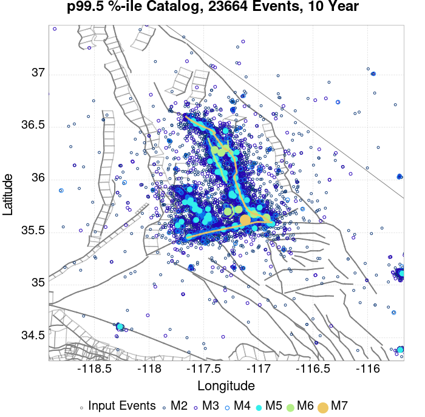
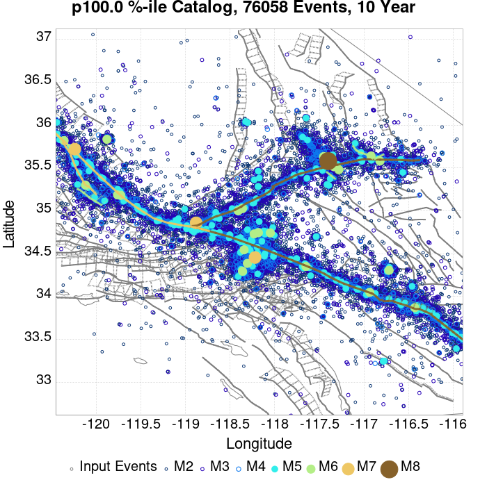
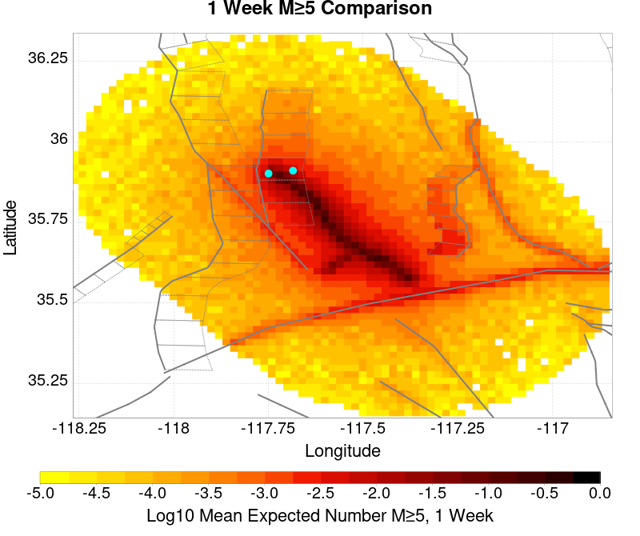
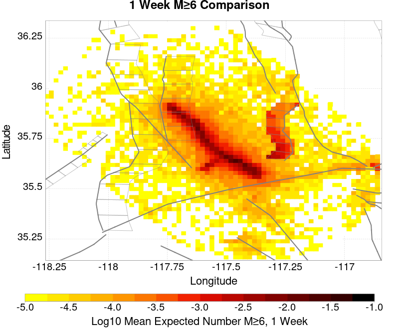
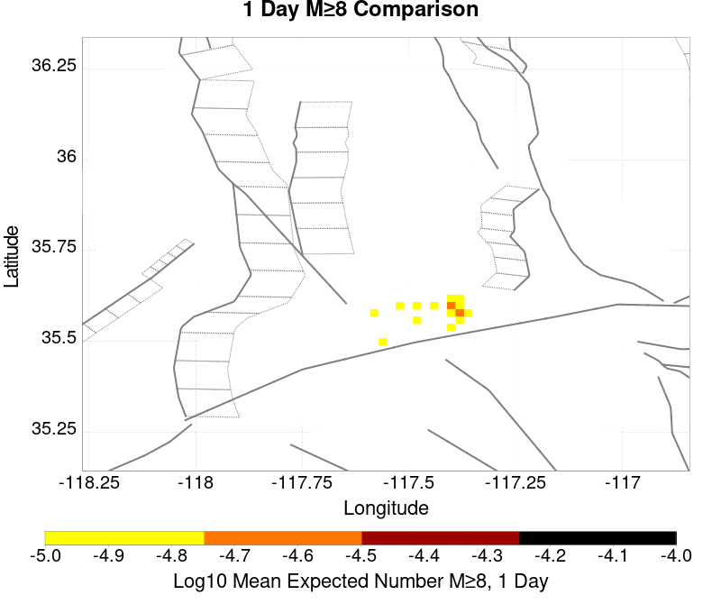
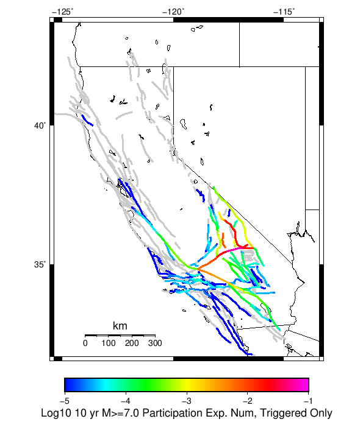
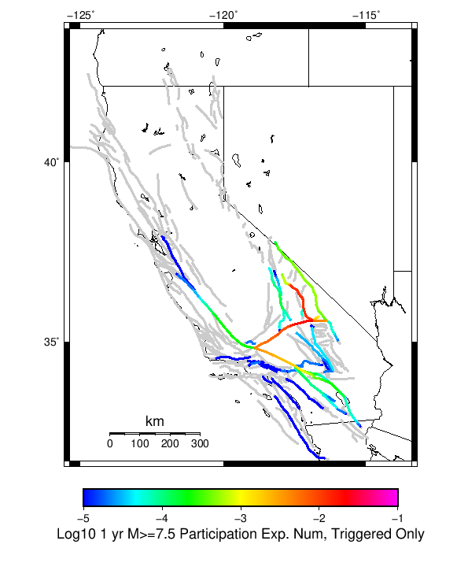
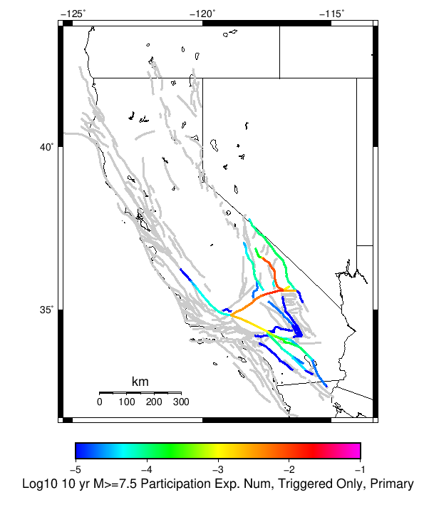
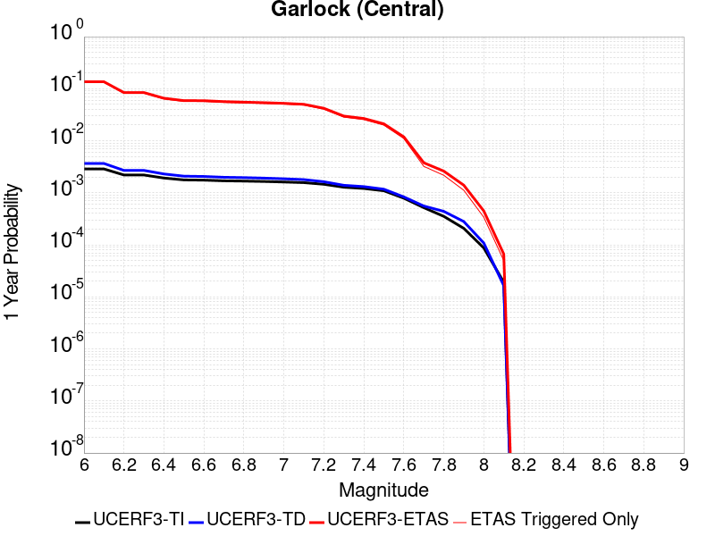
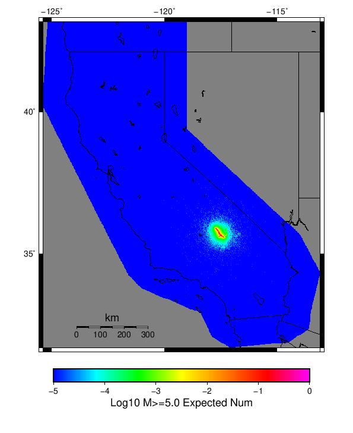

# ComCat M7.1 (ci38457511), ShakeMap Surfaces, Culled Surface Results

|   | ComCat M7.1 (ci38457511), ShakeMap Surfaces, Culled Surface |
|-----|-----|
| Num Simulations | 18358 (incomplete) |
| Start Time | 2019/07/06 03:19:54 UTC |
| Start Time Epoch Milliseconds | 1562383194040 |
| Duration | 10 Years |
| Includes Spontaneous? | false |
| Trigger Ruptures | 269 Trigger Ruptures |
|   | First: M3.98 at 2019/07/04 17:02:55 UTC |
|   | Last: M7.1 at 2019/07/06 03:19:53 UTC |
|   | Largest: M7.1 at 2019/07/06 03:19:53 UTC |
| Historical Ruptures | *(none)* |
| Config Generated With | u3etas_comcat_event_config_builder.sh --event-id ci38457511 --num-simulations 100000 --days-before 7 --mag-complete 3.5 --name-add CulledSurface --finite-surf-shakemap --finite-surf-shakemap-min-mag 5 --hpc-site USC_HPC --nodes 36 --hours 24 --queue scec |

## Table Of Contents

* [Probabilities Summary Table](#probabilities-summary-table)
* [Magnitude Number Distribution](#magnitude-number-distribution)
  * [10 Year Magnitude Number Distribution](#10-year-magnitude-number-distribution)
  * [1 Year Magnitude Number Distribution](#1-year-magnitude-number-distribution)
  * [1 Month Magnitude Number Distribution](#1-month-magnitude-number-distribution)
  * [1 Week Magnitude Number Distribution](#1-week-magnitude-number-distribution)
  * [1 Day Magnitude Number Distribution](#1-day-magnitude-number-distribution)
  * [1 Hour Magnitude Number Distribution](#1-hour-magnitude-number-distribution)
* [Hazard Change Over Time](#hazard-change-over-time)
  * [M&ge;5.0 Hazard Change Over Time](#m50-hazard-change-over-time)
  * [M&ge;6.0 Hazard Change Over Time](#m60-hazard-change-over-time)
  * [M&ge;7.0 Hazard Change Over Time](#m70-hazard-change-over-time)
  * [M&ge;8.0 Hazard Change Over Time](#m80-hazard-change-over-time)
* [Trigger Rupture Fault Map](#trigger-rupture-fault-map)
* [Trigger Rupture Depth Map](#trigger-rupture-depth-map)
* [Fault Distances To Triggers](#fault-distances-to-triggers)
* [Individual Simulated Catalog Maps](#individual-simulated-catalog-maps)
* [ComCat Data Comparisons](#comcat-data-comparisons)
  * [ComCat Magnitude-Number Distributions](#comcat-magnitude-number-distributions)
  * [ComCat Cumulative Number Vs Time](#comcat-cumulative-number-vs-time)
  * [ComCat Cumulative Number Simulation Percentiles](#comcat-cumulative-number-simulation-percentiles)
  * [ComCat Mean Spatial Distribution](#comcat-mean-spatial-distribution)
  * [ComCat Depth Distribution](#comcat-depth-distribution)
* [Section Participation](#section-participation)
  * [Section Participation Plots](#section-participation-plots)
  * [Supra-Seismogenic Parent Sections Table](#supra-seismogenic-parent-sections-table)
  * [M≥6.5 Parent Sections Table](#m65-parent-sections-table)
  * [M≥7 Parent Sections Table](#m7-parent-sections-table)
  * [M≥7.5 Parent Sections Table](#m75-parent-sections-table)
  * [M≥8 Parent Sections Table](#m8-parent-sections-table)
  * [Fault Magnitude-Probability Distributions](#fault-magnitude-probability-distributions)
* [Gridded Nucleation](#gridded-nucleation)
* [JSON Input File](#json-input-file)

## Probabilities Summary Table
*[(top)](#table-of-contents)*

| Magnitude | 1 Hour Prob | 1 Day Prob | 1 Week Prob | 1 Month Prob | 1 Year Prob | 10 Year Prob |
|-----|-----|-----|-----|-----|-----|-----|
| **M&ge;4** | 1.000 (100.00%) | 1.000 (100.00%) | 1.000 (100.00%) | 1.000 (100.00%) | 1.000 (100.00%) | 1.000 (100.00%) |
| **M&ge;4.5** | 0.992 (99.16%) | 1.000 (100.00%) | 1.000 (100.00%) | 1.000 (100.00%) | 1.000 (100.00%) | 1.000 (100.00%) |
| **M&ge;5** | 0.774 (77.35%) | 0.979 (97.92%) | 0.996 (99.59%) | 0.999 (99.87%) | 1.000 (99.99%) | 1.000 (100.00%) |
| **M&ge;5.5** | 0.358 (35.82%) | 0.685 (68.51%) | 0.814 (81.39%) | 0.879 (87.94%) | 0.941 (94.10%) | 0.969 (96.89%) |
| **M&ge;6** | 0.112 (11.22%) | 0.277 (27.66%) | 0.379 (37.93%) | 0.452 (45.22%) | 0.564 (56.43%) | 0.646 (64.56%) |
| **M&ge;6.5** | 0.026 (2.61%) | 0.070 (7.01%) | 0.101 (10.12%) | 0.127 (12.74%) | 0.176 (17.55%) | 0.216 (21.62%) |
| **M&ge;7** | 0.011 (1.05%) | 0.028 (2.84%) | 0.039 (3.93%) | 0.050 (5.02%) | 0.069 (6.88%) | 0.086 (8.56%) |
| **M&ge;7.1** | 8.99E-3 (0.90%) | 0.025 (2.48%) | 0.034 (3.42%) | 0.044 (4.36%) | 0.059 (5.91%) | 0.074 (7.35%) |
| **M&ge;7.5** | 3.27E-3 (0.33%) | 9.31E-3 (0.93%) | 0.013 (1.27%) | 0.016 (1.62%) | 0.022 (2.18%) | 0.027 (2.72%) |
| **M&ge;8** | 0.000 (0.00%) | 0.000 (0.00%) | 1.09E-4 (0.01%) | 2.18E-4 (0.02%) | 2.18E-4 (0.02%) | 2.72E-4 (0.03%) |

## Magnitude Number Distribution
*[(top)](#table-of-contents)*

### 10 Year Magnitude Number Distribution
*[(top)](#table-of-contents)*

**Legend**
* **Mean** (thick black line): mean expected number across all 18358 catalogs
* **2.5%,97.5%** (thin black lines): expected number percentiles across all 18358 catalogs
* **Median** (thin blue line): median expected number across all 18358 catalogs
* **Mode** (thin cyan line): modal expected number across all 18358 catalogs
* **10 yr Probability** (thin red line): 10 year probability calculated as the fraction of catalogs with at least 1 occurrence
* **10 yr Supraseismogenic Probability** (thin dashed red line): same as above, but only for supraseismogenic ruptures on explicitly modeled UCERF3 faults
* **95% Conf** (light red shaded region): binomial 95% confidence bounds on probability
* **Primary** (thin green line): mean expected number from primary triggered aftershocks only (no secondary, tertiary, etc...) across all 18358 catalogs


| Mag | Mean | 2.5 %ile | 97.5 %ile | Median | Mode | 10 yr Probability | 10 yr Supra-Seis Prob | Primary Aftershocks Mean |
|-----|-----|-----|-----|-----|-----|-----|-----|-----|
| **M&ge;2.5** | 5569.690 | 3662.000 | 16079.000 | 4615.000 | 4203.000 | 1.000 (100.00%) | 0.333 (33.32%) | 2393.408 |
| **M&ge;2.6** | 4424.163 | 2905.000 | 12804.000 | 3666.000 | 3336.000 | 1.000 (100.00%) | 0.333 (33.32%) | 1901.067 |
| **M&ge;2.7** | 3514.204 | 2300.000 | 10173.000 | 2914.000 | 2718.000 | 1.000 (100.00%) | 0.333 (33.32%) | 1509.938 |
| **M&ge;2.8** | 2791.334 | 1823.000 | 8090.000 | 2315.000 | 2142.000 | 1.000 (100.00%) | 0.333 (33.32%) | 1199.371 |
| **M&ge;2.9** | 2217.074 | 1442.000 | 6411.000 | 1839.000 | 1640.000 | 1.000 (100.00%) | 0.333 (33.32%) | 952.674 |
| **M&ge;3** | 1760.991 | 1141.000 | 5099.000 | 1461.000 | 1316.000 | 1.000 (100.00%) | 0.333 (33.32%) | 756.712 |
| **M&ge;3.1** | 1398.519 | 902.000 | 4044.000 | 1161.000 | 1062.000 | 1.000 (100.00%) | 0.333 (33.32%) | 601.010 |
| **M&ge;3.2** | 1110.839 | 711.000 | 3212.000 | 923.000 | 844.000 | 1.000 (100.00%) | 0.333 (33.32%) | 477.414 |
| **M&ge;3.3** | 882.314 | 562.000 | 2553.000 | 734.000 | 675.000 | 1.000 (100.00%) | 0.333 (33.32%) | 379.163 |
| **M&ge;3.4** | 700.740 | 442.000 | 2026.000 | 583.000 | 564.000 | 1.000 (100.00%) | 0.333 (33.32%) | 301.152 |
| **M&ge;3.5** | 556.465 | 348.000 | 1604.000 | 464.000 | 428.000 | 1.000 (100.00%) | 0.333 (33.32%) | 239.154 |
| **M&ge;3.6** | 441.895 | 274.000 | 1275.000 | 369.000 | 329.000 | 1.000 (100.00%) | 0.333 (33.32%) | 189.876 |
| **M&ge;3.7** | 350.846 | 215.000 | 1010.000 | 293.000 | 269.000 | 1.000 (100.00%) | 0.333 (33.32%) | 150.775 |
| **M&ge;3.8** | 278.629 | 168.000 | 804.000 | 233.000 | 216.000 | 1.000 (100.00%) | 0.333 (33.32%) | 119.755 |
| **M&ge;3.9** | 221.251 | 131.000 | 639.000 | 185.000 | 167.000 | 1.000 (100.00%) | 0.333 (33.32%) | 95.080 |
| **M&ge;4** | 175.646 | 102.000 | 509.000 | 147.000 | 133.000 | 1.000 (100.00%) | 0.333 (33.32%) | 75.489 |
| **M&ge;4.1** | 139.459 | 79.000 | 405.000 | 117.000 | 109.000 | 1.000 (100.00%) | 0.333 (33.32%) | 59.891 |
| **M&ge;4.2** | 110.640 | 61.000 | 321.000 | 93.000 | 87.000 | 1.000 (100.00%) | 0.333 (33.32%) | 47.528 |
| **M&ge;4.3** | 87.824 | 47.000 | 255.000 | 74.000 | 67.000 | 1.000 (100.00%) | 0.333 (33.32%) | 37.742 |
| **M&ge;4.4** | 69.684 | 36.000 | 202.000 | 59.000 | 52.000 | 1.000 (100.00%) | 0.333 (33.32%) | 29.958 |
| **M&ge;4.5** | 55.269 | 27.000 | 160.000 | 47.000 | 41.000 | 1.000 (100.00%) | 0.333 (33.32%) | 23.762 |
| **M&ge;4.6** | 43.772 | 20.000 | 127.000 | 37.000 | 33.000 | 1.000 (100.00%) | 0.333 (33.32%) | 18.838 |
| **M&ge;4.7** | 34.649 | 15.000 | 101.000 | 29.000 | 26.000 | 1.000 (100.00%) | 0.333 (33.32%) | 14.911 |
| **M&ge;4.8** | 27.407 | 11.000 | 80.000 | 23.000 | 21.000 | 1.000 (100.00%) | 0.333 (33.32%) | 11.793 |
| **M&ge;4.9** | 21.660 | 8.000 | 64.000 | 18.000 | 15.000 | 1.000 (100.00%) | 0.333 (33.32%) | 9.314 |
| **M&ge;5** | 17.076 | 6.000 | 50.000 | 14.000 | 13.000 | 1.000 (100.00%) | 0.333 (33.32%) | 7.355 |
| **M&ge;5.1** | 13.469 | 4.000 | 40.000 | 11.000 | 10.000 | 1.000 (99.99%) | 0.333 (33.32%) | 5.812 |
| **M&ge;5.2** | 10.592 | 3.000 | 32.000 | 9.000 | 7.000 | 0.999 (99.93%) | 0.333 (33.32%) | 4.570 |
| **M&ge;5.3** | 8.308 | 2.000 | 25.000 | 7.000 | 6.000 | 0.996 (99.61%) | 0.333 (33.32%) | 3.590 |
| **M&ge;5.4** | 6.510 | 1.000 | 20.000 | 5.000 | 4.000 | 0.987 (98.70%) | 0.333 (33.32%) | 2.815 |
| **M&ge;5.5** | 5.077 | 0.000 | 16.000 | 4.000 | 3.000 | 0.969 (96.89%) | 0.333 (33.32%) | 2.207 |
| **M&ge;5.6** | 3.935 | 0.000 | 13.000 | 3.000 | 2.000 | 0.935 (93.52%) | 0.333 (33.32%) | 1.713 |
| **M&ge;5.7** | 3.031 | 0.000 | 10.000 | 2.000 | 2.000 | 0.884 (88.42%) | 0.333 (33.32%) | 1.319 |
| **M&ge;5.8** | 2.314 | 0.000 | 8.000 | 2.000 | 1.000 | 0.817 (81.74%) | 0.333 (33.32%) | 1.009 |
| **M&ge;5.9** | 1.750 | 0.000 | 7.000 | 1.000 | 1.000 | 0.733 (73.29%) | 0.333 (33.30%) | 0.765 |
| **M&ge;6** | 1.354 | 0.000 | 5.000 | 1.000 | 0.000 | 0.646 (64.56%) | 0.333 (33.29%) | 0.586 |
| **M&ge;6.1** | 0.986 | 0.000 | 4.000 | 1.000 | 0.000 | 0.542 (54.18%) | 0.288 (28.82%) | 0.435 |
| **M&ge;6.2** | 0.651 | 0.000 | 3.000 | 0.000 | 0.000 | 0.413 (41.35%) | 0.227 (22.66%) | 0.291 |
| **M&ge;6.3** | 0.495 | 0.000 | 3.000 | 0.000 | 0.000 | 0.341 (34.08%) | 0.197 (19.66%) | 0.223 |
| **M&ge;6.4** | 0.376 | 0.000 | 2.000 | 0.000 | 0.000 | 0.268 (26.83%) | 0.167 (16.67%) | 0.165 |
| **M&ge;6.5** | 0.287 | 0.000 | 2.000 | 0.000 | 0.000 | 0.216 (21.62%) | 0.147 (14.69%) | 0.127 |
| **M&ge;6.6** | 0.230 | 0.000 | 2.000 | 0.000 | 0.000 | 0.185 (18.47%) | 0.135 (13.51%) | 0.108 |
| **M&ge;6.7** | 0.187 | 0.000 | 2.000 | 0.000 | 0.000 | 0.154 (15.43%) | 0.119 (11.86%) | 0.088 |
| **M&ge;6.8** | 0.151 | 0.000 | 1.000 | 0.000 | 0.000 | 0.130 (13.03%) | 0.105 (10.53%) | 0.073 |
| **M&ge;6.9** | 0.117 | 0.000 | 1.000 | 0.000 | 0.000 | 0.106 (10.64%) | 0.090 (8.96%) | 0.058 |
| **M&ge;7** | 0.092 | 0.000 | 1.000 | 0.000 | 0.000 | 0.086 (8.56%) | 0.076 (7.59%) | 0.046 |
| **M&ge;7.1** | 0.077 | 0.000 | 1.000 | 0.000 | 0.000 | 0.074 (7.35%) | 0.068 (6.75%) | 0.039 |
| **M&ge;7.2** | 0.060 | 0.000 | 1.000 | 0.000 | 0.000 | 0.058 (5.75%) | 0.054 (5.43%) | 0.030 |
| **M&ge;7.3** | 0.042 | 0.000 | 1.000 | 0.000 | 0.000 | 0.040 (4.04%) | 0.039 (3.86%) | 0.021 |
| **M&ge;7.4** | 0.037 | 0.000 | 1.000 | 0.000 | 0.000 | 0.036 (3.56%) | 0.035 (3.48%) | 0.018 |
| **M&ge;7.5** | 0.028 | 0.000 | 1.000 | 0.000 | 0.000 | 0.027 (2.72%) | 0.027 (2.71%) | 0.014 |
| **M&ge;7.6** | 0.016 | 0.000 | 0.000 | 0.000 | 0.000 | 0.016 (1.60%) | 0.016 (1.60%) | 8.93E-3 |
| **M&ge;7.7** | 4.96E-3 | 0.000 | 0.000 | 0.000 | 0.000 | 4.74E-3 (0.47%) | 4.74E-3 (0.47%) | 2.45E-3 |
| **M&ge;7.8** | 3.16E-3 | 0.000 | 0.000 | 0.000 | 0.000 | 3.16E-3 (0.32%) | 3.16E-3 (0.32%) | 1.63E-3 |
| **M&ge;7.9** | 1.53E-3 | 0.000 | 0.000 | 0.000 | 0.000 | 1.53E-3 (0.15%) | 1.53E-3 (0.15%) | 7.63E-4 |
| **M&ge;8** | 2.72E-4 | 0.000 | 0.000 | 0.000 | 0.000 | 2.72E-4 (0.03%) | 2.72E-4 (0.03%) | 1.09E-4 |
| **M&ge;8.1** | 5.45E-5 | 0.000 | 0.000 | 0.000 | 0.000 | 5.45E-5 (0.01%) | 5.45E-5 (0.01%) | 5.45E-5 |
| **M&ge;8.2** | 0.000 | 0.000 | 0.000 | 0.000 | 0.000 | 0.000 (0.00%) | 0.000 (0.00%) | 0.000 |
| **M&ge;8.3** | 0.000 | 0.000 | 0.000 | 0.000 | 0.000 | 0.000 (0.00%) | 0.000 (0.00%) | 0.000 |
| **M&ge;8.4** | 0.000 | 0.000 | 0.000 | 0.000 | 0.000 | 0.000 (0.00%) | 0.000 (0.00%) | 0.000 |
| **M&ge;8.5** | 0.000 | 0.000 | 0.000 | 0.000 | 0.000 | 0.000 (0.00%) | 0.000 (0.00%) | 0.000 |
| **M&ge;8.6** | 0.000 | 0.000 | 0.000 | 0.000 | 0.000 | 0.000 (0.00%) | 0.000 (0.00%) | 0.000 |
| **M&ge;8.7** | 0.000 | 0.000 | 0.000 | 0.000 | 0.000 | 0.000 (0.00%) | 0.000 (0.00%) | 0.000 |
| **M&ge;8.8** | 0.000 | 0.000 | 0.000 | 0.000 | 0.000 | 0.000 (0.00%) | 0.000 (0.00%) | 0.000 |
| **M&ge;8.9** | 0.000 | 0.000 | 0.000 | 0.000 | 0.000 | 0.000 (0.00%) | 0.000 (0.00%) | 0.000 |
| **M&ge;9** | 0.000 | 0.000 | 0.000 | 0.000 | 0.000 | 0.000 (0.00%) | 0.000 (0.00%) | 0.000 |

### 1 Year Magnitude Number Distribution
*[(top)](#table-of-contents)*

**Legend**
* **Mean** (thick black line): mean expected number across all 18358 catalogs
* **2.5%,97.5%** (thin black lines): expected number percentiles across all 18358 catalogs
* **Median** (thin blue line): median expected number across all 18358 catalogs
* **Mode** (thin cyan line): modal expected number across all 18358 catalogs
* **1 yr Probability** (thin red line): 1 year probability calculated as the fraction of catalogs with at least 1 occurrence
* **1 yr Supraseismogenic Probability** (thin dashed red line): same as above, but only for supraseismogenic ruptures on explicitly modeled UCERF3 faults
* **95% Conf** (light red shaded region): binomial 95% confidence bounds on probability
* **Primary** (thin green line): mean expected number from primary triggered aftershocks only (no secondary, tertiary, etc...) across all 18358 catalogs


| Mag | Mean | 2.5 %ile | 97.5 %ile | Median | Mode | 1 yr Probability | 1 yr Supra-Seis Prob | Primary Aftershocks Mean |
|-----|-----|-----|-----|-----|-----|-----|-----|-----|
| **M&ge;2.5** | 4215.747 | 2956.000 | 11529.000 | 3596.000 | 3327.000 | 1.000 (100.00%) | 0.273 (27.29%) | 2084.889 |
| **M&ge;2.6** | 3348.729 | 2344.000 | 9171.000 | 2857.000 | 2808.000 | 1.000 (100.00%) | 0.273 (27.29%) | 1656.031 |
| **M&ge;2.7** | 2659.807 | 1854.000 | 7292.000 | 2269.000 | 2177.000 | 1.000 (100.00%) | 0.273 (27.29%) | 1315.274 |
| **M&ge;2.8** | 2112.756 | 1469.000 | 5789.000 | 1804.000 | 1592.000 | 1.000 (100.00%) | 0.273 (27.29%) | 1044.803 |
| **M&ge;2.9** | 1678.154 | 1163.000 | 4610.000 | 1433.000 | 1363.000 | 1.000 (100.00%) | 0.273 (27.29%) | 829.884 |
| **M&ge;3** | 1332.941 | 918.000 | 3660.000 | 1139.000 | 1051.000 | 1.000 (100.00%) | 0.273 (27.29%) | 659.201 |
| **M&ge;3.1** | 1058.631 | 724.000 | 2923.000 | 906.000 | 823.000 | 1.000 (100.00%) | 0.273 (27.29%) | 523.571 |
| **M&ge;3.2** | 840.861 | 572.000 | 2311.000 | 719.000 | 657.000 | 1.000 (100.00%) | 0.273 (27.29%) | 415.889 |
| **M&ge;3.3** | 667.940 | 450.000 | 1838.000 | 572.000 | 527.000 | 1.000 (100.00%) | 0.273 (27.29%) | 330.310 |
| **M&ge;3.4** | 530.548 | 354.000 | 1454.000 | 455.000 | 416.000 | 1.000 (100.00%) | 0.273 (27.29%) | 262.375 |
| **M&ge;3.5** | 421.310 | 278.000 | 1157.000 | 362.000 | 345.000 | 1.000 (100.00%) | 0.273 (27.29%) | 208.369 |
| **M&ge;3.6** | 334.560 | 218.000 | 920.000 | 288.000 | 281.000 | 1.000 (100.00%) | 0.273 (27.29%) | 165.427 |
| **M&ge;3.7** | 265.635 | 171.000 | 733.000 | 229.000 | 223.000 | 1.000 (100.00%) | 0.273 (27.29%) | 131.357 |
| **M&ge;3.8** | 210.915 | 133.000 | 580.000 | 182.000 | 173.000 | 1.000 (100.00%) | 0.273 (27.29%) | 104.317 |
| **M&ge;3.9** | 167.485 | 104.000 | 461.000 | 145.000 | 134.000 | 1.000 (100.00%) | 0.273 (27.29%) | 82.812 |
| **M&ge;4** | 132.952 | 80.000 | 367.000 | 115.000 | 106.000 | 1.000 (100.00%) | 0.273 (27.29%) | 65.736 |
| **M&ge;4.1** | 105.581 | 62.000 | 291.000 | 91.000 | 82.000 | 1.000 (100.00%) | 0.273 (27.29%) | 52.162 |
| **M&ge;4.2** | 83.760 | 47.000 | 230.000 | 73.000 | 68.000 | 1.000 (100.00%) | 0.273 (27.29%) | 41.394 |
| **M&ge;4.3** | 66.507 | 36.000 | 183.000 | 58.000 | 50.000 | 1.000 (100.00%) | 0.273 (27.29%) | 32.867 |
| **M&ge;4.4** | 52.794 | 28.000 | 145.000 | 46.000 | 41.000 | 1.000 (100.00%) | 0.273 (27.29%) | 26.091 |
| **M&ge;4.5** | 41.879 | 21.000 | 114.000 | 36.000 | 33.000 | 1.000 (100.00%) | 0.273 (27.29%) | 20.700 |
| **M&ge;4.6** | 33.185 | 15.000 | 91.000 | 29.000 | 26.000 | 1.000 (100.00%) | 0.273 (27.29%) | 16.413 |
| **M&ge;4.7** | 26.268 | 11.000 | 72.000 | 23.000 | 20.000 | 1.000 (100.00%) | 0.273 (27.29%) | 12.996 |
| **M&ge;4.8** | 20.784 | 8.000 | 57.000 | 18.000 | 15.000 | 1.000 (100.00%) | 0.273 (27.29%) | 10.278 |
| **M&ge;4.9** | 16.419 | 6.000 | 45.000 | 14.000 | 13.000 | 1.000 (100.00%) | 0.273 (27.29%) | 8.121 |
| **M&ge;5** | 12.952 | 4.000 | 36.000 | 11.000 | 10.000 | 1.000 (99.99%) | 0.273 (27.29%) | 6.414 |
| **M&ge;5.1** | 10.221 | 3.000 | 29.000 | 9.000 | 7.000 | 0.999 (99.92%) | 0.273 (27.29%) | 5.067 |
| **M&ge;5.2** | 8.039 | 2.000 | 23.000 | 7.000 | 6.000 | 0.997 (99.68%) | 0.273 (27.29%) | 3.982 |
| **M&ge;5.3** | 6.310 | 1.000 | 19.000 | 5.000 | 4.000 | 0.989 (98.88%) | 0.273 (27.29%) | 3.128 |
| **M&ge;5.4** | 4.943 | 0.000 | 15.000 | 4.000 | 3.000 | 0.972 (97.18%) | 0.273 (27.29%) | 2.450 |
| **M&ge;5.5** | 3.856 | 0.000 | 12.000 | 3.000 | 2.000 | 0.941 (94.10%) | 0.273 (27.29%) | 1.920 |
| **M&ge;5.6** | 2.988 | 0.000 | 10.000 | 2.000 | 2.000 | 0.893 (89.29%) | 0.273 (27.29%) | 1.489 |
| **M&ge;5.7** | 2.302 | 0.000 | 8.000 | 2.000 | 1.000 | 0.825 (82.53%) | 0.273 (27.29%) | 1.147 |
| **M&ge;5.8** | 1.754 | 0.000 | 6.000 | 1.000 | 1.000 | 0.743 (74.35%) | 0.273 (27.29%) | 0.877 |
| **M&ge;5.9** | 1.328 | 0.000 | 5.000 | 1.000 | 0.000 | 0.651 (65.15%) | 0.273 (27.27%) | 0.665 |
| **M&ge;6** | 1.027 | 0.000 | 4.000 | 1.000 | 0.000 | 0.564 (56.43%) | 0.273 (27.26%) | 0.508 |
| **M&ge;6.1** | 0.750 | 0.000 | 4.000 | 0.000 | 0.000 | 0.464 (46.36%) | 0.235 (23.52%) | 0.377 |
| **M&ge;6.2** | 0.494 | 0.000 | 3.000 | 0.000 | 0.000 | 0.345 (34.49%) | 0.182 (18.22%) | 0.251 |
| **M&ge;6.3** | 0.376 | 0.000 | 2.000 | 0.000 | 0.000 | 0.281 (28.12%) | 0.157 (15.72%) | 0.194 |
| **M&ge;6.4** | 0.285 | 0.000 | 2.000 | 0.000 | 0.000 | 0.219 (21.90%) | 0.133 (13.31%) | 0.143 |
| **M&ge;6.5** | 0.219 | 0.000 | 2.000 | 0.000 | 0.000 | 0.176 (17.55%) | 0.118 (11.84%) | 0.111 |
| **M&ge;6.6** | 0.177 | 0.000 | 1.000 | 0.000 | 0.000 | 0.149 (14.91%) | 0.109 (10.88%) | 0.094 |
| **M&ge;6.7** | 0.145 | 0.000 | 1.000 | 0.000 | 0.000 | 0.125 (12.47%) | 0.096 (9.59%) | 0.077 |
| **M&ge;6.8** | 0.118 | 0.000 | 1.000 | 0.000 | 0.000 | 0.105 (10.47%) | 0.085 (8.49%) | 0.065 |
| **M&ge;6.9** | 0.092 | 0.000 | 1.000 | 0.000 | 0.000 | 0.085 (8.50%) | 0.072 (7.18%) | 0.051 |
| **M&ge;7** | 0.073 | 0.000 | 1.000 | 0.000 | 0.000 | 0.069 (6.88%) | 0.061 (6.12%) | 0.041 |
| **M&ge;7.1** | 0.061 | 0.000 | 1.000 | 0.000 | 0.000 | 0.059 (5.91%) | 0.054 (5.45%) | 0.035 |
| **M&ge;7.2** | 0.047 | 0.000 | 1.000 | 0.000 | 0.000 | 0.046 (4.56%) | 0.043 (4.32%) | 0.026 |
| **M&ge;7.3** | 0.033 | 0.000 | 1.000 | 0.000 | 0.000 | 0.032 (3.23%) | 0.031 (3.09%) | 0.019 |
| **M&ge;7.4** | 0.030 | 0.000 | 1.000 | 0.000 | 0.000 | 0.029 (2.88%) | 0.028 (2.82%) | 0.016 |
| **M&ge;7.5** | 0.022 | 0.000 | 0.000 | 0.000 | 0.000 | 0.022 (2.18%) | 0.022 (2.17%) | 0.012 |
| **M&ge;7.6** | 0.013 | 0.000 | 0.000 | 0.000 | 0.000 | 0.013 (1.28%) | 0.013 (1.27%) | 7.90E-3 |
| **M&ge;7.7** | 3.81E-3 | 0.000 | 0.000 | 0.000 | 0.000 | 3.70E-3 (0.37%) | 3.70E-3 (0.37%) | 2.12E-3 |
| **M&ge;7.8** | 2.45E-3 | 0.000 | 0.000 | 0.000 | 0.000 | 2.45E-3 (0.25%) | 2.45E-3 (0.25%) | 1.42E-3 |
| **M&ge;7.9** | 1.25E-3 | 0.000 | 0.000 | 0.000 | 0.000 | 1.25E-3 (0.13%) | 1.25E-3 (0.13%) | 7.08E-4 |
| **M&ge;8** | 2.18E-4 | 0.000 | 0.000 | 0.000 | 0.000 | 2.18E-4 (0.02%) | 2.18E-4 (0.02%) | 1.09E-4 |
| **M&ge;8.1** | 5.45E-5 | 0.000 | 0.000 | 0.000 | 0.000 | 5.45E-5 (0.01%) | 5.45E-5 (0.01%) | 5.45E-5 |
| **M&ge;8.2** | 0.000 | 0.000 | 0.000 | 0.000 | 0.000 | 0.000 (0.00%) | 0.000 (0.00%) | 0.000 |
| **M&ge;8.3** | 0.000 | 0.000 | 0.000 | 0.000 | 0.000 | 0.000 (0.00%) | 0.000 (0.00%) | 0.000 |
| **M&ge;8.4** | 0.000 | 0.000 | 0.000 | 0.000 | 0.000 | 0.000 (0.00%) | 0.000 (0.00%) | 0.000 |
| **M&ge;8.5** | 0.000 | 0.000 | 0.000 | 0.000 | 0.000 | 0.000 (0.00%) | 0.000 (0.00%) | 0.000 |
| **M&ge;8.6** | 0.000 | 0.000 | 0.000 | 0.000 | 0.000 | 0.000 (0.00%) | 0.000 (0.00%) | 0.000 |
| **M&ge;8.7** | 0.000 | 0.000 | 0.000 | 0.000 | 0.000 | 0.000 (0.00%) | 0.000 (0.00%) | 0.000 |
| **M&ge;8.8** | 0.000 | 0.000 | 0.000 | 0.000 | 0.000 | 0.000 (0.00%) | 0.000 (0.00%) | 0.000 |
| **M&ge;8.9** | 0.000 | 0.000 | 0.000 | 0.000 | 0.000 | 0.000 (0.00%) | 0.000 (0.00%) | 0.000 |
| **M&ge;9** | 0.000 | 0.000 | 0.000 | 0.000 | 0.000 | 0.000 (0.00%) | 0.000 (0.00%) | 0.000 |

### 1 Month Magnitude Number Distribution
*[(top)](#table-of-contents)*

**Legend**
* **Mean** (thick black line): mean expected number across all 18358 catalogs
* **2.5%,97.5%** (thin black lines): expected number percentiles across all 18358 catalogs
* **Median** (thin blue line): median expected number across all 18358 catalogs
* **Mode** (thin cyan line): modal expected number across all 18358 catalogs
* **1 mo Probability** (thin red line): 1 month probability calculated as the fraction of catalogs with at least 1 occurrence
* **1 mo Supraseismogenic Probability** (thin dashed red line): same as above, but only for supraseismogenic ruptures on explicitly modeled UCERF3 faults
* **95% Conf** (light red shaded region): binomial 95% confidence bounds on probability
* **Primary** (thin green line): mean expected number from primary triggered aftershocks only (no secondary, tertiary, etc...) across all 18358 catalogs


| Mag | Mean | 2.5 %ile | 97.5 %ile | Median | Mode | 1 mo Probability | 1 mo Supra-Seis Prob | Primary Aftershocks Mean |
|-----|-----|-----|-----|-----|-----|-----|-----|-----|
| **M&ge;2.5** | 2913.535 | 2187.000 | 6781.000 | 2561.000 | 2461.000 | 1.000 (100.00%) | 0.202 (20.18%) | 1690.156 |
| **M&ge;2.6** | 2314.345 | 1730.000 | 5393.000 | 2037.000 | 1937.000 | 1.000 (100.00%) | 0.202 (20.18%) | 1342.519 |
| **M&ge;2.7** | 1838.222 | 1370.000 | 4261.000 | 1617.000 | 1464.000 | 1.000 (100.00%) | 0.202 (20.18%) | 1066.261 |
| **M&ge;2.8** | 1460.235 | 1084.000 | 3355.000 | 1285.000 | 1219.000 | 1.000 (100.00%) | 0.202 (20.18%) | 847.018 |
| **M&ge;2.9** | 1159.894 | 857.000 | 2680.000 | 1021.000 | 958.000 | 1.000 (100.00%) | 0.202 (20.18%) | 672.771 |
| **M&ge;3** | 921.384 | 676.000 | 2136.000 | 812.000 | 756.000 | 1.000 (100.00%) | 0.202 (20.18%) | 534.432 |
| **M&ge;3.1** | 731.760 | 533.000 | 1689.000 | 646.000 | 614.000 | 1.000 (100.00%) | 0.202 (20.18%) | 424.490 |
| **M&ge;3.2** | 581.256 | 419.000 | 1351.000 | 513.000 | 487.000 | 1.000 (100.00%) | 0.202 (20.18%) | 337.247 |
| **M&ge;3.3** | 461.701 | 330.000 | 1075.000 | 408.000 | 387.000 | 1.000 (100.00%) | 0.202 (20.18%) | 267.848 |
| **M&ge;3.4** | 366.759 | 259.000 | 855.000 | 325.000 | 312.000 | 1.000 (100.00%) | 0.202 (20.18%) | 212.776 |
| **M&ge;3.5** | 291.277 | 203.000 | 679.000 | 258.000 | 242.000 | 1.000 (100.00%) | 0.202 (20.18%) | 169.008 |
| **M&ge;3.6** | 231.304 | 158.000 | 541.000 | 205.000 | 196.000 | 1.000 (100.00%) | 0.202 (20.18%) | 134.167 |
| **M&ge;3.7** | 183.664 | 123.000 | 431.000 | 163.000 | 158.000 | 1.000 (100.00%) | 0.202 (20.18%) | 106.541 |
| **M&ge;3.8** | 145.845 | 96.000 | 344.000 | 130.000 | 124.000 | 1.000 (100.00%) | 0.202 (20.18%) | 84.604 |
| **M&ge;3.9** | 115.788 | 74.000 | 275.000 | 103.000 | 101.000 | 1.000 (100.00%) | 0.202 (20.18%) | 67.158 |
| **M&ge;4** | 91.938 | 57.000 | 218.000 | 82.000 | 76.000 | 1.000 (100.00%) | 0.202 (20.18%) | 53.317 |
| **M&ge;4.1** | 72.992 | 44.000 | 174.000 | 65.000 | 63.000 | 1.000 (100.00%) | 0.202 (20.18%) | 42.292 |
| **M&ge;4.2** | 57.887 | 33.000 | 139.000 | 52.000 | 51.000 | 1.000 (100.00%) | 0.202 (20.18%) | 33.555 |
| **M&ge;4.3** | 45.978 | 25.000 | 110.000 | 41.000 | 40.000 | 1.000 (100.00%) | 0.202 (20.18%) | 26.647 |
| **M&ge;4.4** | 36.497 | 19.000 | 88.000 | 33.000 | 31.000 | 1.000 (100.00%) | 0.202 (20.18%) | 21.152 |
| **M&ge;4.5** | 28.949 | 14.000 | 70.000 | 26.000 | 23.000 | 1.000 (100.00%) | 0.202 (20.18%) | 16.775 |
| **M&ge;4.6** | 22.938 | 10.000 | 56.000 | 20.000 | 19.000 | 1.000 (100.00%) | 0.202 (20.18%) | 13.300 |
| **M&ge;4.7** | 18.142 | 7.000 | 44.000 | 16.000 | 15.000 | 1.000 (100.00%) | 0.202 (20.18%) | 10.522 |
| **M&ge;4.8** | 14.356 | 5.000 | 36.000 | 13.000 | 11.000 | 1.000 (100.00%) | 0.202 (20.18%) | 8.321 |
| **M&ge;4.9** | 11.338 | 4.000 | 29.000 | 10.000 | 9.000 | 1.000 (99.98%) | 0.202 (20.18%) | 6.569 |
| **M&ge;5** | 8.949 | 2.000 | 23.000 | 8.000 | 7.000 | 0.999 (99.87%) | 0.202 (20.18%) | 5.189 |
| **M&ge;5.1** | 7.058 | 1.000 | 19.000 | 6.000 | 5.000 | 0.996 (99.55%) | 0.202 (20.18%) | 4.105 |
| **M&ge;5.2** | 5.561 | 1.000 | 15.000 | 5.000 | 4.000 | 0.985 (98.53%) | 0.202 (20.18%) | 3.230 |
| **M&ge;5.3** | 4.366 | 0.000 | 13.000 | 4.000 | 3.000 | 0.965 (96.51%) | 0.202 (20.18%) | 2.534 |
| **M&ge;5.4** | 3.411 | 0.000 | 10.000 | 3.000 | 2.000 | 0.931 (93.12%) | 0.202 (20.18%) | 1.976 |
| **M&ge;5.5** | 2.665 | 0.000 | 8.000 | 2.000 | 1.000 | 0.879 (87.94%) | 0.202 (20.18%) | 1.553 |
| **M&ge;5.6** | 2.064 | 0.000 | 7.000 | 2.000 | 1.000 | 0.812 (81.18%) | 0.202 (20.18%) | 1.202 |
| **M&ge;5.7** | 1.590 | 0.000 | 6.000 | 1.000 | 1.000 | 0.728 (72.83%) | 0.202 (20.18%) | 0.925 |
| **M&ge;5.8** | 1.211 | 0.000 | 5.000 | 1.000 | 0.000 | 0.635 (63.49%) | 0.202 (20.18%) | 0.709 |
| **M&ge;5.9** | 0.918 | 0.000 | 4.000 | 1.000 | 0.000 | 0.540 (53.98%) | 0.202 (20.17%) | 0.538 |
| **M&ge;6** | 0.709 | 0.000 | 3.000 | 0.000 | 0.000 | 0.452 (45.22%) | 0.202 (20.16%) | 0.411 |
| **M&ge;6.1** | 0.518 | 0.000 | 3.000 | 0.000 | 0.000 | 0.361 (36.12%) | 0.174 (17.42%) | 0.303 |
| **M&ge;6.2** | 0.339 | 0.000 | 2.000 | 0.000 | 0.000 | 0.260 (26.04%) | 0.133 (13.32%) | 0.200 |
| **M&ge;6.3** | 0.260 | 0.000 | 2.000 | 0.000 | 0.000 | 0.209 (20.87%) | 0.115 (11.53%) | 0.153 |
| **M&ge;6.4** | 0.196 | 0.000 | 2.000 | 0.000 | 0.000 | 0.161 (16.07%) | 0.097 (9.70%) | 0.113 |
| **M&ge;6.5** | 0.151 | 0.000 | 1.000 | 0.000 | 0.000 | 0.127 (12.74%) | 0.086 (8.61%) | 0.088 |
| **M&ge;6.6** | 0.123 | 0.000 | 1.000 | 0.000 | 0.000 | 0.108 (10.80%) | 0.080 (7.96%) | 0.074 |
| **M&ge;6.7** | 0.101 | 0.000 | 1.000 | 0.000 | 0.000 | 0.090 (8.97%) | 0.070 (7.01%) | 0.061 |
| **M&ge;6.8** | 0.083 | 0.000 | 1.000 | 0.000 | 0.000 | 0.076 (7.60%) | 0.062 (6.22%) | 0.051 |
| **M&ge;6.9** | 0.065 | 0.000 | 1.000 | 0.000 | 0.000 | 0.062 (6.17%) | 0.053 (5.28%) | 0.041 |
| **M&ge;7** | 0.052 | 0.000 | 1.000 | 0.000 | 0.000 | 0.050 (5.02%) | 0.045 (4.54%) | 0.033 |
| **M&ge;7.1** | 0.045 | 0.000 | 1.000 | 0.000 | 0.000 | 0.044 (4.36%) | 0.041 (4.06%) | 0.029 |
| **M&ge;7.2** | 0.035 | 0.000 | 1.000 | 0.000 | 0.000 | 0.034 (3.39%) | 0.032 (3.23%) | 0.022 |
| **M&ge;7.3** | 0.025 | 0.000 | 0.000 | 0.000 | 0.000 | 0.024 (2.42%) | 0.023 (2.30%) | 0.016 |
| **M&ge;7.4** | 0.022 | 0.000 | 0.000 | 0.000 | 0.000 | 0.021 (2.14%) | 0.021 (2.09%) | 0.014 |
| **M&ge;7.5** | 0.017 | 0.000 | 0.000 | 0.000 | 0.000 | 0.016 (1.62%) | 0.016 (1.61%) | 0.011 |
| **M&ge;7.6** | 9.86E-3 | 0.000 | 0.000 | 0.000 | 0.000 | 9.70E-3 (0.97%) | 9.64E-3 (0.96%) | 6.59E-3 |
| **M&ge;7.7** | 2.94E-3 | 0.000 | 0.000 | 0.000 | 0.000 | 2.89E-3 (0.29%) | 2.89E-3 (0.29%) | 1.96E-3 |
| **M&ge;7.8** | 1.85E-3 | 0.000 | 0.000 | 0.000 | 0.000 | 1.85E-3 (0.19%) | 1.85E-3 (0.19%) | 1.31E-3 |
| **M&ge;7.9** | 9.26E-4 | 0.000 | 0.000 | 0.000 | 0.000 | 9.26E-4 (0.09%) | 9.26E-4 (0.09%) | 6.54E-4 |
| **M&ge;8** | 2.18E-4 | 0.000 | 0.000 | 0.000 | 0.000 | 2.18E-4 (0.02%) | 2.18E-4 (0.02%) | 1.09E-4 |
| **M&ge;8.1** | 5.45E-5 | 0.000 | 0.000 | 0.000 | 0.000 | 5.45E-5 (0.01%) | 5.45E-5 (0.01%) | 5.45E-5 |
| **M&ge;8.2** | 0.000 | 0.000 | 0.000 | 0.000 | 0.000 | 0.000 (0.00%) | 0.000 (0.00%) | 0.000 |
| **M&ge;8.3** | 0.000 | 0.000 | 0.000 | 0.000 | 0.000 | 0.000 (0.00%) | 0.000 (0.00%) | 0.000 |
| **M&ge;8.4** | 0.000 | 0.000 | 0.000 | 0.000 | 0.000 | 0.000 (0.00%) | 0.000 (0.00%) | 0.000 |
| **M&ge;8.5** | 0.000 | 0.000 | 0.000 | 0.000 | 0.000 | 0.000 (0.00%) | 0.000 (0.00%) | 0.000 |
| **M&ge;8.6** | 0.000 | 0.000 | 0.000 | 0.000 | 0.000 | 0.000 (0.00%) | 0.000 (0.00%) | 0.000 |
| **M&ge;8.7** | 0.000 | 0.000 | 0.000 | 0.000 | 0.000 | 0.000 (0.00%) | 0.000 (0.00%) | 0.000 |
| **M&ge;8.8** | 0.000 | 0.000 | 0.000 | 0.000 | 0.000 | 0.000 (0.00%) | 0.000 (0.00%) | 0.000 |
| **M&ge;8.9** | 0.000 | 0.000 | 0.000 | 0.000 | 0.000 | 0.000 (0.00%) | 0.000 (0.00%) | 0.000 |
| **M&ge;9** | 0.000 | 0.000 | 0.000 | 0.000 | 0.000 | 0.000 (0.00%) | 0.000 (0.00%) | 0.000 |

### 1 Week Magnitude Number Distribution
*[(top)](#table-of-contents)*

**Legend**
* **Mean** (thick black line): mean expected number across all 18358 catalogs
* **2.5%,97.5%** (thin black lines): expected number percentiles across all 18358 catalogs
* **Median** (thin blue line): median expected number across all 18358 catalogs
* **Mode** (thin cyan line): modal expected number across all 18358 catalogs
* **1 wk Probability** (thin red line): 1 week probability calculated as the fraction of catalogs with at least 1 occurrence
* **1 wk Supraseismogenic Probability** (thin dashed red line): same as above, but only for supraseismogenic ruptures on explicitly modeled UCERF3 faults
* **95% Conf** (light red shaded region): binomial 95% confidence bounds on probability
* **Primary** (thin green line): mean expected number from primary triggered aftershocks only (no secondary, tertiary, etc...) across all 18358 catalogs


| Mag | Mean | 2.5 %ile | 97.5 %ile | Median | Mode | 1 wk Probability | 1 wk Supra-Seis Prob | Primary Aftershocks Mean |
|-----|-----|-----|-----|-----|-----|-----|-----|-----|
| **M&ge;2.5** | 2240.609 | 1752.000 | 4512.000 | 2011.000 | 1905.000 | 1.000 (100.00%) | 0.161 (16.14%) | 1430.971 |
| **M&ge;2.6** | 1779.769 | 1386.000 | 3594.000 | 1599.000 | 1491.000 | 1.000 (100.00%) | 0.161 (16.14%) | 1136.626 |
| **M&ge;2.7** | 1413.664 | 1096.000 | 2861.000 | 1271.000 | 1216.000 | 1.000 (100.00%) | 0.161 (16.14%) | 902.721 |
| **M&ge;2.8** | 1123.001 | 866.000 | 2277.000 | 1009.000 | 958.000 | 1.000 (100.00%) | 0.161 (16.14%) | 717.127 |
| **M&ge;2.9** | 891.989 | 683.000 | 1803.000 | 803.000 | 771.000 | 1.000 (100.00%) | 0.161 (16.14%) | 569.596 |
| **M&ge;3** | 708.548 | 538.000 | 1442.000 | 639.000 | 605.000 | 1.000 (100.00%) | 0.161 (16.14%) | 452.469 |
| **M&ge;3.1** | 562.686 | 424.000 | 1146.000 | 508.000 | 488.000 | 1.000 (100.00%) | 0.161 (16.14%) | 359.357 |
| **M&ge;3.2** | 446.964 | 333.000 | 913.000 | 404.000 | 387.000 | 1.000 (100.00%) | 0.161 (16.14%) | 285.500 |
| **M&ge;3.3** | 355.124 | 261.000 | 727.000 | 321.000 | 302.000 | 1.000 (100.00%) | 0.161 (16.14%) | 226.801 |
| **M&ge;3.4** | 282.109 | 205.000 | 577.000 | 255.000 | 247.000 | 1.000 (100.00%) | 0.161 (16.14%) | 180.171 |
| **M&ge;3.5** | 224.025 | 160.000 | 463.000 | 203.000 | 194.000 | 1.000 (100.00%) | 0.161 (16.14%) | 143.095 |
| **M&ge;3.6** | 177.888 | 124.000 | 368.000 | 161.000 | 157.000 | 1.000 (100.00%) | 0.161 (16.14%) | 113.585 |
| **M&ge;3.7** | 141.257 | 97.000 | 293.000 | 128.000 | 126.000 | 1.000 (100.00%) | 0.161 (16.14%) | 90.185 |
| **M&ge;3.8** | 112.158 | 75.000 | 234.000 | 102.000 | 98.000 | 1.000 (100.00%) | 0.161 (16.14%) | 71.622 |
| **M&ge;3.9** | 89.050 | 58.000 | 187.000 | 81.000 | 78.000 | 1.000 (100.00%) | 0.161 (16.14%) | 56.868 |
| **M&ge;4** | 70.718 | 44.000 | 148.000 | 64.000 | 64.000 | 1.000 (100.00%) | 0.161 (16.14%) | 45.152 |
| **M&ge;4.1** | 56.131 | 34.000 | 120.000 | 51.000 | 49.000 | 1.000 (100.00%) | 0.161 (16.14%) | 35.814 |
| **M&ge;4.2** | 44.525 | 26.000 | 95.000 | 41.000 | 39.000 | 1.000 (100.00%) | 0.161 (16.14%) | 28.421 |
| **M&ge;4.3** | 35.373 | 19.000 | 75.000 | 32.000 | 31.000 | 1.000 (100.00%) | 0.161 (16.14%) | 22.576 |
| **M&ge;4.4** | 28.081 | 14.000 | 60.000 | 26.000 | 24.000 | 1.000 (100.00%) | 0.161 (16.14%) | 17.924 |
| **M&ge;4.5** | 22.285 | 10.000 | 48.000 | 20.000 | 19.000 | 1.000 (100.00%) | 0.161 (16.14%) | 14.225 |
| **M&ge;4.6** | 17.655 | 8.000 | 39.000 | 16.000 | 15.000 | 1.000 (100.00%) | 0.161 (16.14%) | 11.278 |
| **M&ge;4.7** | 13.974 | 5.000 | 32.000 | 13.000 | 12.000 | 1.000 (99.99%) | 0.161 (16.14%) | 8.924 |
| **M&ge;4.8** | 11.055 | 4.000 | 25.000 | 10.000 | 8.000 | 1.000 (99.98%) | 0.161 (16.14%) | 7.054 |
| **M&ge;4.9** | 8.725 | 2.000 | 21.000 | 8.000 | 7.000 | 0.999 (99.89%) | 0.161 (16.14%) | 5.571 |
| **M&ge;5** | 6.885 | 2.000 | 17.000 | 6.000 | 6.000 | 0.996 (99.59%) | 0.161 (16.14%) | 4.405 |
| **M&ge;5.1** | 5.431 | 1.000 | 14.000 | 5.000 | 4.000 | 0.987 (98.74%) | 0.161 (16.14%) | 3.486 |
| **M&ge;5.2** | 4.282 | 0.000 | 11.000 | 4.000 | 3.000 | 0.967 (96.68%) | 0.161 (16.14%) | 2.744 |
| **M&ge;5.3** | 3.364 | 0.000 | 10.000 | 3.000 | 2.000 | 0.933 (93.33%) | 0.161 (16.14%) | 2.154 |
| **M&ge;5.4** | 2.625 | 0.000 | 8.000 | 2.000 | 2.000 | 0.882 (88.21%) | 0.161 (16.14%) | 1.678 |
| **M&ge;5.5** | 2.055 | 0.000 | 7.000 | 2.000 | 1.000 | 0.814 (81.39%) | 0.161 (16.14%) | 1.320 |
| **M&ge;5.6** | 1.588 | 0.000 | 6.000 | 1.000 | 1.000 | 0.733 (73.34%) | 0.161 (16.14%) | 1.021 |
| **M&ge;5.7** | 1.223 | 0.000 | 5.000 | 1.000 | 0.000 | 0.644 (64.37%) | 0.161 (16.14%) | 0.786 |
| **M&ge;5.8** | 0.934 | 0.000 | 4.000 | 1.000 | 0.000 | 0.551 (55.14%) | 0.161 (16.14%) | 0.603 |
| **M&ge;5.9** | 0.704 | 0.000 | 3.000 | 0.000 | 0.000 | 0.459 (45.91%) | 0.161 (16.13%) | 0.456 |
| **M&ge;6** | 0.543 | 0.000 | 3.000 | 0.000 | 0.000 | 0.379 (37.93%) | 0.161 (16.13%) | 0.349 |
| **M&ge;6.1** | 0.399 | 0.000 | 2.000 | 0.000 | 0.000 | 0.298 (29.76%) | 0.139 (13.94%) | 0.258 |
| **M&ge;6.2** | 0.260 | 0.000 | 2.000 | 0.000 | 0.000 | 0.210 (21.02%) | 0.106 (10.58%) | 0.169 |
| **M&ge;6.3** | 0.199 | 0.000 | 2.000 | 0.000 | 0.000 | 0.168 (16.76%) | 0.092 (9.18%) | 0.130 |
| **M&ge;6.4** | 0.150 | 0.000 | 1.000 | 0.000 | 0.000 | 0.128 (12.80%) | 0.077 (7.74%) | 0.095 |
| **M&ge;6.5** | 0.116 | 0.000 | 1.000 | 0.000 | 0.000 | 0.101 (10.12%) | 0.069 (6.85%) | 0.074 |
| **M&ge;6.6** | 0.096 | 0.000 | 1.000 | 0.000 | 0.000 | 0.087 (8.68%) | 0.064 (6.42%) | 0.063 |
| **M&ge;6.7** | 0.078 | 0.000 | 1.000 | 0.000 | 0.000 | 0.072 (7.20%) | 0.056 (5.62%) | 0.051 |
| **M&ge;6.8** | 0.064 | 0.000 | 1.000 | 0.000 | 0.000 | 0.061 (6.07%) | 0.050 (4.96%) | 0.043 |
| **M&ge;6.9** | 0.051 | 0.000 | 1.000 | 0.000 | 0.000 | 0.049 (4.88%) | 0.042 (4.18%) | 0.035 |
| **M&ge;7** | 0.041 | 0.000 | 1.000 | 0.000 | 0.000 | 0.039 (3.93%) | 0.036 (3.56%) | 0.028 |
| **M&ge;7.1** | 0.035 | 0.000 | 1.000 | 0.000 | 0.000 | 0.034 (3.42%) | 0.032 (3.20%) | 0.024 |
| **M&ge;7.2** | 0.027 | 0.000 | 1.000 | 0.000 | 0.000 | 0.027 (2.67%) | 0.025 (2.54%) | 0.019 |
| **M&ge;7.3** | 0.020 | 0.000 | 0.000 | 0.000 | 0.000 | 0.019 (1.90%) | 0.018 (1.81%) | 0.013 |
| **M&ge;7.4** | 0.017 | 0.000 | 0.000 | 0.000 | 0.000 | 0.017 (1.69%) | 0.017 (1.66%) | 0.012 |
| **M&ge;7.5** | 0.013 | 0.000 | 0.000 | 0.000 | 0.000 | 0.013 (1.27%) | 0.013 (1.26%) | 9.04E-3 |
| **M&ge;7.6** | 7.95E-3 | 0.000 | 0.000 | 0.000 | 0.000 | 7.79E-3 (0.78%) | 7.74E-3 (0.77%) | 5.72E-3 |
| **M&ge;7.7** | 2.67E-3 | 0.000 | 0.000 | 0.000 | 0.000 | 2.61E-3 (0.26%) | 2.61E-3 (0.26%) | 1.85E-3 |
| **M&ge;7.8** | 1.58E-3 | 0.000 | 0.000 | 0.000 | 0.000 | 1.58E-3 (0.16%) | 1.58E-3 (0.16%) | 1.20E-3 |
| **M&ge;7.9** | 8.17E-4 | 0.000 | 0.000 | 0.000 | 0.000 | 8.17E-4 (0.08%) | 8.17E-4 (0.08%) | 5.99E-4 |
| **M&ge;8** | 1.09E-4 | 0.000 | 0.000 | 0.000 | 0.000 | 1.09E-4 (0.01%) | 1.09E-4 (0.01%) | 5.45E-5 |
| **M&ge;8.1** | 5.45E-5 | 0.000 | 0.000 | 0.000 | 0.000 | 5.45E-5 (0.01%) | 5.45E-5 (0.01%) | 5.45E-5 |
| **M&ge;8.2** | 0.000 | 0.000 | 0.000 | 0.000 | 0.000 | 0.000 (0.00%) | 0.000 (0.00%) | 0.000 |
| **M&ge;8.3** | 0.000 | 0.000 | 0.000 | 0.000 | 0.000 | 0.000 (0.00%) | 0.000 (0.00%) | 0.000 |
| **M&ge;8.4** | 0.000 | 0.000 | 0.000 | 0.000 | 0.000 | 0.000 (0.00%) | 0.000 (0.00%) | 0.000 |
| **M&ge;8.5** | 0.000 | 0.000 | 0.000 | 0.000 | 0.000 | 0.000 (0.00%) | 0.000 (0.00%) | 0.000 |
| **M&ge;8.6** | 0.000 | 0.000 | 0.000 | 0.000 | 0.000 | 0.000 (0.00%) | 0.000 (0.00%) | 0.000 |
| **M&ge;8.7** | 0.000 | 0.000 | 0.000 | 0.000 | 0.000 | 0.000 (0.00%) | 0.000 (0.00%) | 0.000 |
| **M&ge;8.8** | 0.000 | 0.000 | 0.000 | 0.000 | 0.000 | 0.000 (0.00%) | 0.000 (0.00%) | 0.000 |
| **M&ge;8.9** | 0.000 | 0.000 | 0.000 | 0.000 | 0.000 | 0.000 (0.00%) | 0.000 (0.00%) | 0.000 |
| **M&ge;9** | 0.000 | 0.000 | 0.000 | 0.000 | 0.000 | 0.000 (0.00%) | 0.000 (0.00%) | 0.000 |

### 1 Day Magnitude Number Distribution
*[(top)](#table-of-contents)*

**Legend**
* **Mean** (thick black line): mean expected number across all 18358 catalogs
* **2.5%,97.5%** (thin black lines): expected number percentiles across all 18358 catalogs
* **Median** (thin blue line): median expected number across all 18358 catalogs
* **Mode** (thin cyan line): modal expected number across all 18358 catalogs
* **1 d Probability** (thin red line): 1 day probability calculated as the fraction of catalogs with at least 1 occurrence
* **1 d Supraseismogenic Probability** (thin dashed red line): same as above, but only for supraseismogenic ruptures on explicitly modeled UCERF3 faults
* **95% Conf** (light red shaded region): binomial 95% confidence bounds on probability
* **Primary** (thin green line): mean expected number from primary triggered aftershocks only (no secondary, tertiary, etc...) across all 18358 catalogs


| Mag | Mean | 2.5 %ile | 97.5 %ile | Median | Mode | 1 d Probability | 1 d Supra-Seis Prob | Primary Aftershocks Mean |
|-----|-----|-----|-----|-----|-----|-----|-----|-----|
| **M&ge;2.5** | 1463.334 | 1204.000 | 2640.000 | 1349.000 | 1302.000 | 1.000 (100.00%) | 0.116 (11.56%) | 1064.402 |
| **M&ge;2.6** | 1162.409 | 951.000 | 2093.000 | 1073.000 | 1054.000 | 1.000 (100.00%) | 0.116 (11.56%) | 845.515 |
| **M&ge;2.7** | 923.305 | 750.000 | 1664.000 | 852.000 | 830.000 | 1.000 (100.00%) | 0.116 (11.56%) | 671.527 |
| **M&ge;2.8** | 733.486 | 591.000 | 1318.000 | 678.000 | 674.000 | 1.000 (100.00%) | 0.116 (11.56%) | 533.460 |
| **M&ge;2.9** | 582.605 | 465.000 | 1043.000 | 539.000 | 535.000 | 1.000 (100.00%) | 0.116 (11.56%) | 423.702 |
| **M&ge;3** | 462.780 | 365.000 | 830.000 | 429.000 | 410.000 | 1.000 (100.00%) | 0.116 (11.56%) | 336.589 |
| **M&ge;3.1** | 367.510 | 287.000 | 663.000 | 341.000 | 330.000 | 1.000 (100.00%) | 0.116 (11.56%) | 267.317 |
| **M&ge;3.2** | 291.957 | 224.000 | 529.000 | 271.000 | 266.000 | 1.000 (100.00%) | 0.116 (11.56%) | 212.389 |
| **M&ge;3.3** | 231.982 | 176.000 | 420.000 | 215.000 | 205.000 | 1.000 (100.00%) | 0.116 (11.56%) | 168.739 |
| **M&ge;3.4** | 184.297 | 137.000 | 331.000 | 171.000 | 168.000 | 1.000 (100.00%) | 0.116 (11.56%) | 134.041 |
| **M&ge;3.5** | 146.364 | 107.000 | 263.000 | 136.000 | 134.000 | 1.000 (100.00%) | 0.116 (11.56%) | 106.474 |
| **M&ge;3.6** | 116.231 | 83.000 | 210.000 | 108.000 | 104.000 | 1.000 (100.00%) | 0.116 (11.56%) | 84.524 |
| **M&ge;3.7** | 92.297 | 64.000 | 166.000 | 86.000 | 85.000 | 1.000 (100.00%) | 0.116 (11.56%) | 67.110 |
| **M&ge;3.8** | 73.271 | 49.000 | 132.000 | 68.000 | 67.000 | 1.000 (100.00%) | 0.116 (11.56%) | 53.302 |
| **M&ge;3.9** | 58.180 | 37.000 | 105.000 | 54.000 | 54.000 | 1.000 (100.00%) | 0.116 (11.56%) | 42.339 |
| **M&ge;4** | 46.222 | 29.000 | 84.000 | 43.000 | 42.000 | 1.000 (100.00%) | 0.116 (11.56%) | 33.621 |
| **M&ge;4.1** | 36.657 | 21.000 | 68.000 | 34.000 | 33.000 | 1.000 (100.00%) | 0.116 (11.56%) | 26.656 |
| **M&ge;4.2** | 29.093 | 16.000 | 54.000 | 27.000 | 25.000 | 1.000 (100.00%) | 0.116 (11.56%) | 21.159 |
| **M&ge;4.3** | 23.107 | 12.000 | 44.000 | 22.000 | 20.000 | 1.000 (100.00%) | 0.116 (11.56%) | 16.809 |
| **M&ge;4.4** | 18.329 | 9.000 | 36.000 | 17.000 | 16.000 | 1.000 (100.00%) | 0.116 (11.56%) | 13.339 |
| **M&ge;4.5** | 14.548 | 6.000 | 29.000 | 13.000 | 12.000 | 1.000 (100.00%) | 0.116 (11.56%) | 10.593 |
| **M&ge;4.6** | 11.529 | 4.000 | 24.000 | 11.000 | 10.000 | 1.000 (99.99%) | 0.116 (11.56%) | 8.396 |
| **M&ge;4.7** | 9.119 | 3.000 | 20.000 | 8.000 | 8.000 | 1.000 (99.96%) | 0.116 (11.56%) | 6.634 |
| **M&ge;4.8** | 7.208 | 2.000 | 16.000 | 7.000 | 6.000 | 0.998 (99.76%) | 0.116 (11.56%) | 5.245 |
| **M&ge;4.9** | 5.686 | 1.000 | 13.000 | 5.000 | 4.000 | 0.992 (99.19%) | 0.116 (11.56%) | 4.138 |
| **M&ge;5** | 4.488 | 1.000 | 11.000 | 4.000 | 3.000 | 0.979 (97.92%) | 0.116 (11.56%) | 3.268 |
| **M&ge;5.1** | 3.539 | 0.000 | 9.000 | 3.000 | 2.000 | 0.952 (95.15%) | 0.116 (11.56%) | 2.585 |
| **M&ge;5.2** | 2.789 | 0.000 | 8.000 | 2.000 | 2.000 | 0.907 (90.65%) | 0.116 (11.56%) | 2.036 |
| **M&ge;5.3** | 2.185 | 0.000 | 7.000 | 2.000 | 1.000 | 0.846 (84.62%) | 0.116 (11.56%) | 1.593 |
| **M&ge;5.4** | 1.704 | 0.000 | 6.000 | 1.000 | 1.000 | 0.770 (77.05%) | 0.116 (11.56%) | 1.243 |
| **M&ge;5.5** | 1.337 | 0.000 | 5.000 | 1.000 | 1.000 | 0.685 (68.51%) | 0.116 (11.56%) | 0.978 |
| **M&ge;5.6** | 1.038 | 0.000 | 4.000 | 1.000 | 0.000 | 0.597 (59.71%) | 0.116 (11.56%) | 0.759 |
| **M&ge;5.7** | 0.800 | 0.000 | 3.000 | 1.000 | 0.000 | 0.506 (50.62%) | 0.116 (11.56%) | 0.583 |
| **M&ge;5.8** | 0.612 | 0.000 | 3.000 | 0.000 | 0.000 | 0.420 (42.02%) | 0.116 (11.56%) | 0.447 |
| **M&ge;5.9** | 0.461 | 0.000 | 2.000 | 0.000 | 0.000 | 0.342 (34.18%) | 0.116 (11.55%) | 0.337 |
| **M&ge;6** | 0.355 | 0.000 | 2.000 | 0.000 | 0.000 | 0.277 (27.66%) | 0.115 (11.55%) | 0.259 |
| **M&ge;6.1** | 0.261 | 0.000 | 2.000 | 0.000 | 0.000 | 0.214 (21.40%) | 0.100 (10.00%) | 0.192 |
| **M&ge;6.2** | 0.171 | 0.000 | 1.000 | 0.000 | 0.000 | 0.147 (14.72%) | 0.075 (7.51%) | 0.126 |
| **M&ge;6.3** | 0.131 | 0.000 | 1.000 | 0.000 | 0.000 | 0.116 (11.59%) | 0.065 (6.53%) | 0.097 |
| **M&ge;6.4** | 0.098 | 0.000 | 1.000 | 0.000 | 0.000 | 0.088 (8.79%) | 0.055 (5.50%) | 0.071 |
| **M&ge;6.5** | 0.077 | 0.000 | 1.000 | 0.000 | 0.000 | 0.070 (7.01%) | 0.049 (4.89%) | 0.056 |
| **M&ge;6.6** | 0.064 | 0.000 | 1.000 | 0.000 | 0.000 | 0.060 (5.98%) | 0.046 (4.55%) | 0.047 |
| **M&ge;6.7** | 0.053 | 0.000 | 1.000 | 0.000 | 0.000 | 0.050 (5.01%) | 0.040 (4.05%) | 0.039 |
| **M&ge;6.8** | 0.045 | 0.000 | 1.000 | 0.000 | 0.000 | 0.043 (4.31%) | 0.036 (3.58%) | 0.034 |
| **M&ge;6.9** | 0.036 | 0.000 | 1.000 | 0.000 | 0.000 | 0.035 (3.50%) | 0.031 (3.06%) | 0.027 |
| **M&ge;7** | 0.029 | 0.000 | 1.000 | 0.000 | 0.000 | 0.028 (2.84%) | 0.026 (2.60%) | 0.022 |
| **M&ge;7.1** | 0.025 | 0.000 | 0.000 | 0.000 | 0.000 | 0.025 (2.48%) | 0.023 (2.34%) | 0.019 |
| **M&ge;7.2** | 0.020 | 0.000 | 0.000 | 0.000 | 0.000 | 0.019 (1.94%) | 0.019 (1.85%) | 0.015 |
| **M&ge;7.3** | 0.014 | 0.000 | 0.000 | 0.000 | 0.000 | 0.014 (1.39%) | 0.013 (1.32%) | 0.011 |
| **M&ge;7.4** | 0.012 | 0.000 | 0.000 | 0.000 | 0.000 | 0.012 (1.21%) | 0.012 (1.18%) | 9.31E-3 |
| **M&ge;7.5** | 9.48E-3 | 0.000 | 0.000 | 0.000 | 0.000 | 9.31E-3 (0.93%) | 9.21E-3 (0.92%) | 7.30E-3 |
| **M&ge;7.6** | 5.61E-3 | 0.000 | 0.000 | 0.000 | 0.000 | 5.56E-3 (0.56%) | 5.50E-3 (0.55%) | 4.52E-3 |
| **M&ge;7.7** | 1.91E-3 | 0.000 | 0.000 | 0.000 | 0.000 | 1.91E-3 (0.19%) | 1.91E-3 (0.19%) | 1.42E-3 |
| **M&ge;7.8** | 1.03E-3 | 0.000 | 0.000 | 0.000 | 0.000 | 1.03E-3 (0.10%) | 1.03E-3 (0.10%) | 8.72E-4 |
| **M&ge;7.9** | 5.45E-4 | 0.000 | 0.000 | 0.000 | 0.000 | 5.45E-4 (0.05%) | 5.45E-4 (0.05%) | 4.90E-4 |
| **M&ge;8** | 0.000 | 0.000 | 0.000 | 0.000 | 0.000 | 0.000 (0.00%) | 0.000 (0.00%) | 0.000 |
| **M&ge;8.1** | 0.000 | 0.000 | 0.000 | 0.000 | 0.000 | 0.000 (0.00%) | 0.000 (0.00%) | 0.000 |
| **M&ge;8.2** | 0.000 | 0.000 | 0.000 | 0.000 | 0.000 | 0.000 (0.00%) | 0.000 (0.00%) | 0.000 |
| **M&ge;8.3** | 0.000 | 0.000 | 0.000 | 0.000 | 0.000 | 0.000 (0.00%) | 0.000 (0.00%) | 0.000 |
| **M&ge;8.4** | 0.000 | 0.000 | 0.000 | 0.000 | 0.000 | 0.000 (0.00%) | 0.000 (0.00%) | 0.000 |
| **M&ge;8.5** | 0.000 | 0.000 | 0.000 | 0.000 | 0.000 | 0.000 (0.00%) | 0.000 (0.00%) | 0.000 |
| **M&ge;8.6** | 0.000 | 0.000 | 0.000 | 0.000 | 0.000 | 0.000 (0.00%) | 0.000 (0.00%) | 0.000 |
| **M&ge;8.7** | 0.000 | 0.000 | 0.000 | 0.000 | 0.000 | 0.000 (0.00%) | 0.000 (0.00%) | 0.000 |
| **M&ge;8.8** | 0.000 | 0.000 | 0.000 | 0.000 | 0.000 | 0.000 (0.00%) | 0.000 (0.00%) | 0.000 |
| **M&ge;8.9** | 0.000 | 0.000 | 0.000 | 0.000 | 0.000 | 0.000 (0.00%) | 0.000 (0.00%) | 0.000 |
| **M&ge;9** | 0.000 | 0.000 | 0.000 | 0.000 | 0.000 | 0.000 (0.00%) | 0.000 (0.00%) | 0.000 |

### 1 Hour Magnitude Number Distribution
*[(top)](#table-of-contents)*

**Legend**
* **Mean** (thick black line): mean expected number across all 18358 catalogs
* **2.5%,97.5%** (thin black lines): expected number percentiles across all 18358 catalogs
* **Median** (thin blue line): median expected number across all 18358 catalogs
* **Mode** (thin cyan line): modal expected number across all 18358 catalogs
* **1 hr Probability** (thin red line): 1 hour probability calculated as the fraction of catalogs with at least 1 occurrence
* **1 hr Supraseismogenic Probability** (thin dashed red line): same as above, but only for supraseismogenic ruptures on explicitly modeled UCERF3 faults
* **95% Conf** (light red shaded region): binomial 95% confidence bounds on probability
* **Primary** (thin green line): mean expected number from primary triggered aftershocks only (no secondary, tertiary, etc...) across all 18358 catalogs


| Mag | Mean | 2.5 %ile | 97.5 %ile | Median | Mode | 1 hr Probability | 1 hr Supra-Seis Prob | Primary Aftershocks Mean |
|-----|-----|-----|-----|-----|-----|-----|-----|-----|
| **M&ge;2.5** | 508.765 | 444.000 | 618.000 | 496.000 | 495.000 | 1.000 (100.00%) | 0.044 (4.36%) | 457.494 |
| **M&ge;2.6** | 404.136 | 349.000 | 493.000 | 394.000 | 388.000 | 1.000 (100.00%) | 0.044 (4.36%) | 363.391 |
| **M&ge;2.7** | 320.977 | 274.000 | 393.000 | 313.000 | 313.000 | 1.000 (100.00%) | 0.044 (4.36%) | 288.602 |
| **M&ge;2.8** | 254.980 | 214.000 | 314.000 | 249.000 | 243.000 | 1.000 (100.00%) | 0.044 (4.36%) | 229.268 |
| **M&ge;2.9** | 202.572 | 167.000 | 252.000 | 198.000 | 197.000 | 1.000 (100.00%) | 0.044 (4.36%) | 182.155 |
| **M&ge;3** | 160.932 | 130.000 | 201.000 | 157.000 | 158.000 | 1.000 (100.00%) | 0.044 (4.36%) | 144.735 |
| **M&ge;3.1** | 127.795 | 101.000 | 163.000 | 125.000 | 126.000 | 1.000 (100.00%) | 0.044 (4.36%) | 114.943 |
| **M&ge;3.2** | 101.532 | 78.000 | 132.000 | 99.000 | 98.000 | 1.000 (100.00%) | 0.044 (4.36%) | 91.327 |
| **M&ge;3.3** | 80.697 | 60.000 | 106.000 | 79.000 | 81.000 | 1.000 (100.00%) | 0.044 (4.36%) | 72.569 |
| **M&ge;3.4** | 64.090 | 46.000 | 86.000 | 63.000 | 61.000 | 1.000 (100.00%) | 0.044 (4.36%) | 57.633 |
| **M&ge;3.5** | 50.920 | 35.000 | 70.000 | 50.000 | 49.000 | 1.000 (100.00%) | 0.044 (4.36%) | 45.783 |
| **M&ge;3.6** | 40.430 | 27.000 | 57.000 | 39.000 | 39.000 | 1.000 (100.00%) | 0.044 (4.36%) | 36.341 |
| **M&ge;3.7** | 32.115 | 20.000 | 47.000 | 31.000 | 29.000 | 1.000 (100.00%) | 0.044 (4.36%) | 28.863 |
| **M&ge;3.8** | 25.522 | 15.000 | 38.000 | 25.000 | 24.000 | 1.000 (100.00%) | 0.044 (4.36%) | 22.939 |
| **M&ge;3.9** | 20.281 | 11.000 | 32.000 | 20.000 | 19.000 | 1.000 (100.00%) | 0.044 (4.36%) | 18.227 |
| **M&ge;4** | 16.089 | 8.000 | 26.000 | 16.000 | 15.000 | 1.000 (100.00%) | 0.044 (4.36%) | 14.461 |
| **M&ge;4.1** | 12.743 | 6.000 | 22.000 | 12.000 | 12.000 | 1.000 (100.00%) | 0.044 (4.36%) | 11.451 |
| **M&ge;4.2** | 10.122 | 4.000 | 18.000 | 10.000 | 9.000 | 1.000 (99.98%) | 0.044 (4.36%) | 9.099 |
| **M&ge;4.3** | 8.046 | 3.000 | 15.000 | 8.000 | 8.000 | 0.999 (99.95%) | 0.044 (4.36%) | 7.228 |
| **M&ge;4.4** | 6.378 | 2.000 | 13.000 | 6.000 | 6.000 | 0.997 (99.74%) | 0.044 (4.36%) | 5.730 |
| **M&ge;4.5** | 5.063 | 1.000 | 10.000 | 5.000 | 4.000 | 0.992 (99.16%) | 0.044 (4.36%) | 4.551 |
| **M&ge;4.6** | 4.007 | 1.000 | 9.000 | 4.000 | 3.000 | 0.976 (97.61%) | 0.044 (4.36%) | 3.602 |
| **M&ge;4.7** | 3.160 | 0.000 | 8.000 | 3.000 | 2.000 | 0.950 (94.99%) | 0.044 (4.36%) | 2.839 |
| **M&ge;4.8** | 2.496 | 0.000 | 6.000 | 2.000 | 2.000 | 0.906 (90.58%) | 0.044 (4.36%) | 2.241 |
| **M&ge;4.9** | 1.969 | 0.000 | 5.000 | 2.000 | 1.000 | 0.845 (84.52%) | 0.044 (4.36%) | 1.770 |
| **M&ge;5** | 1.553 | 0.000 | 5.000 | 1.000 | 1.000 | 0.774 (77.35%) | 0.044 (4.36%) | 1.398 |
| **M&ge;5.1** | 1.231 | 0.000 | 4.000 | 1.000 | 1.000 | 0.692 (69.20%) | 0.044 (4.36%) | 1.109 |
| **M&ge;5.2** | 0.968 | 0.000 | 3.000 | 1.000 | 0.000 | 0.603 (60.26%) | 0.044 (4.36%) | 0.873 |
| **M&ge;5.3** | 0.760 | 0.000 | 3.000 | 1.000 | 0.000 | 0.516 (51.63%) | 0.044 (4.36%) | 0.683 |
| **M&ge;5.4** | 0.592 | 0.000 | 3.000 | 0.000 | 0.000 | 0.432 (43.20%) | 0.044 (4.36%) | 0.532 |
| **M&ge;5.5** | 0.466 | 0.000 | 2.000 | 0.000 | 0.000 | 0.358 (35.82%) | 0.044 (4.36%) | 0.419 |
| **M&ge;5.6** | 0.363 | 0.000 | 2.000 | 0.000 | 0.000 | 0.292 (29.19%) | 0.044 (4.36%) | 0.326 |
| **M&ge;5.7** | 0.278 | 0.000 | 2.000 | 0.000 | 0.000 | 0.233 (23.30%) | 0.044 (4.36%) | 0.248 |
| **M&ge;5.8** | 0.214 | 0.000 | 1.000 | 0.000 | 0.000 | 0.186 (18.60%) | 0.044 (4.36%) | 0.192 |
| **M&ge;5.9** | 0.159 | 0.000 | 1.000 | 0.000 | 0.000 | 0.143 (14.33%) | 0.044 (4.36%) | 0.143 |
| **M&ge;6** | 0.123 | 0.000 | 1.000 | 0.000 | 0.000 | 0.112 (11.22%) | 0.044 (4.36%) | 0.110 |
| **M&ge;6.1** | 0.091 | 0.000 | 1.000 | 0.000 | 0.000 | 0.085 (8.46%) | 0.038 (3.80%) | 0.081 |
| **M&ge;6.2** | 0.059 | 0.000 | 1.000 | 0.000 | 0.000 | 0.056 (5.63%) | 0.028 (2.77%) | 0.053 |
| **M&ge;6.3** | 0.045 | 0.000 | 1.000 | 0.000 | 0.000 | 0.043 (4.33%) | 0.024 (2.43%) | 0.040 |
| **M&ge;6.4** | 0.034 | 0.000 | 1.000 | 0.000 | 0.000 | 0.033 (3.27%) | 0.021 (2.06%) | 0.030 |
| **M&ge;6.5** | 0.027 | 0.000 | 1.000 | 0.000 | 0.000 | 0.026 (2.61%) | 0.019 (1.87%) | 0.024 |
| **M&ge;6.6** | 0.023 | 0.000 | 0.000 | 0.000 | 0.000 | 0.023 (2.27%) | 0.018 (1.78%) | 0.021 |
| **M&ge;6.7** | 0.019 | 0.000 | 0.000 | 0.000 | 0.000 | 0.019 (1.86%) | 0.016 (1.59%) | 0.017 |
| **M&ge;6.8** | 0.016 | 0.000 | 0.000 | 0.000 | 0.000 | 0.016 (1.60%) | 0.014 (1.40%) | 0.015 |
| **M&ge;6.9** | 0.013 | 0.000 | 0.000 | 0.000 | 0.000 | 0.013 (1.31%) | 0.012 (1.20%) | 0.012 |
| **M&ge;7** | 0.011 | 0.000 | 0.000 | 0.000 | 0.000 | 0.011 (1.05%) | 9.86E-3 (0.99%) | 9.70E-3 |
| **M&ge;7.1** | 9.04E-3 | 0.000 | 0.000 | 0.000 | 0.000 | 8.99E-3 (0.90%) | 8.72E-3 (0.87%) | 8.28E-3 |
| **M&ge;7.2** | 6.75E-3 | 0.000 | 0.000 | 0.000 | 0.000 | 6.70E-3 (0.67%) | 6.48E-3 (0.65%) | 6.16E-3 |
| **M&ge;7.3** | 4.85E-3 | 0.000 | 0.000 | 0.000 | 0.000 | 4.79E-3 (0.48%) | 4.63E-3 (0.46%) | 4.47E-3 |
| **M&ge;7.4** | 4.25E-3 | 0.000 | 0.000 | 0.000 | 0.000 | 4.19E-3 (0.42%) | 4.14E-3 (0.41%) | 3.87E-3 |
| **M&ge;7.5** | 3.32E-3 | 0.000 | 0.000 | 0.000 | 0.000 | 3.27E-3 (0.33%) | 3.27E-3 (0.33%) | 3.05E-3 |
| **M&ge;7.6** | 2.02E-3 | 0.000 | 0.000 | 0.000 | 0.000 | 1.96E-3 (0.20%) | 1.96E-3 (0.20%) | 1.80E-3 |
| **M&ge;7.7** | 7.63E-4 | 0.000 | 0.000 | 0.000 | 0.000 | 7.63E-4 (0.08%) | 7.63E-4 (0.08%) | 5.99E-4 |
| **M&ge;7.8** | 2.72E-4 | 0.000 | 0.000 | 0.000 | 0.000 | 2.72E-4 (0.03%) | 2.72E-4 (0.03%) | 2.72E-4 |
| **M&ge;7.9** | 1.09E-4 | 0.000 | 0.000 | 0.000 | 0.000 | 1.09E-4 (0.01%) | 1.09E-4 (0.01%) | 1.09E-4 |
| **M&ge;8** | 0.000 | 0.000 | 0.000 | 0.000 | 0.000 | 0.000 (0.00%) | 0.000 (0.00%) | 0.000 |
| **M&ge;8.1** | 0.000 | 0.000 | 0.000 | 0.000 | 0.000 | 0.000 (0.00%) | 0.000 (0.00%) | 0.000 |
| **M&ge;8.2** | 0.000 | 0.000 | 0.000 | 0.000 | 0.000 | 0.000 (0.00%) | 0.000 (0.00%) | 0.000 |
| **M&ge;8.3** | 0.000 | 0.000 | 0.000 | 0.000 | 0.000 | 0.000 (0.00%) | 0.000 (0.00%) | 0.000 |
| **M&ge;8.4** | 0.000 | 0.000 | 0.000 | 0.000 | 0.000 | 0.000 (0.00%) | 0.000 (0.00%) | 0.000 |
| **M&ge;8.5** | 0.000 | 0.000 | 0.000 | 0.000 | 0.000 | 0.000 (0.00%) | 0.000 (0.00%) | 0.000 |
| **M&ge;8.6** | 0.000 | 0.000 | 0.000 | 0.000 | 0.000 | 0.000 (0.00%) | 0.000 (0.00%) | 0.000 |
| **M&ge;8.7** | 0.000 | 0.000 | 0.000 | 0.000 | 0.000 | 0.000 (0.00%) | 0.000 (0.00%) | 0.000 |
| **M&ge;8.8** | 0.000 | 0.000 | 0.000 | 0.000 | 0.000 | 0.000 (0.00%) | 0.000 (0.00%) | 0.000 |
| **M&ge;8.9** | 0.000 | 0.000 | 0.000 | 0.000 | 0.000 | 0.000 (0.00%) | 0.000 (0.00%) | 0.000 |
| **M&ge;9** | 0.000 | 0.000 | 0.000 | 0.000 | 0.000 | 0.000 (0.00%) | 0.000 (0.00%) | 0.000 |


## Hazard Change Over Time
*[(top)](#table-of-contents)*

These plots show how the probability of ruptures of various magnitudes within 100km of any scenario rupture changes over time

### M&ge;5.0 Hazard Change Over Time
*[(top)](#table-of-contents)*


| Forecast Duration | UCERF3-ETAS [95% Conf] | UCERF3-ETAS Triggered Only | UCERF3-TD | UCERF3-ETAS/TD Gain | UCERF3-TI |
|-----|-----|-----|-----|-----|-----|
| 1 Hour | 0.771 [0.765 - 0.777] | 0.771 | 7.14E-5 | 10805.63 | 7.09E-5 |
| 1 Day | 0.979 [0.977 - 0.981] | 0.979 | 1.71E-3 | 571.93 | 1.70E-3 |
| 1 Week | 0.996 [0.995 - 0.997] | 0.996 | 0.012 | 83.54 | 0.012 |
| 1 Month | 0.999 [0.998 - 0.999] | 0.999 | 0.050 | 19.94 | 0.050 |
| 1 Year | 1.000 [1.000 - 1.000] | 1.000 | 0.465 | 2.15 | 0.463 |
| 10 Years | 1.000 [1.000 - 1.000] | 1.000 | 0.998 | 1 | 0.998 |
| 30 Years | 1.000 [1.000 - 1.000] \* | \* | 1.000 | 1 \* | 1.000 |
| 100 Years | 1.000 [1.000 - 1.000] \* | \* | 1.000 | 1 \* | 1.000 |

\* *forecast duration is longer than simulation length, only ETAS ruptures from the first 10 years are included*
### M&ge;6.0 Hazard Change Over Time
*[(top)](#table-of-contents)*


| Forecast Duration | UCERF3-ETAS [95% Conf] | UCERF3-ETAS Triggered Only | UCERF3-TD | UCERF3-ETAS/TD Gain | UCERF3-TI |
|-----|-----|-----|-----|-----|-----|
| 1 Hour | 0.112 [0.107 - 0.116] | 0.112 | 7.85E-6 | 14217.68 | 7.36E-6 |
| 1 Day | 0.275 [0.269 - 0.282] | 0.275 | 1.88E-4 | 1458.95 | 1.77E-4 |
| 1 Week | 0.378 [0.371 - 0.385] | 0.377 | 1.32E-3 | 286.43 | 1.23E-3 |
| 1 Month | 0.452 [0.445 - 0.460] | 0.449 | 5.64E-3 | 80.22 | 5.28E-3 |
| 1 Year | 0.590 [0.583 - 0.596] | 0.560 | 0.067 | 8.86 | 0.062 |
| 10 Years | 0.820 [0.816 - 0.823] | 0.641 | 0.498 | 1.65 | 0.475 |
| 30 Years | 0.955 [0.954 - 0.956] \* | \* | 0.874 | 1.09 \* | 0.855 |
| 100 Years | 1.000 [1.000 - 1.000] \* | \* | 0.999 | 1 \* | 0.998 |

\* *forecast duration is longer than simulation length, only ETAS ruptures from the first 10 years are included*
### M&ge;7.0 Hazard Change Over Time
*[(top)](#table-of-contents)*


| Forecast Duration | UCERF3-ETAS [95% Conf] | UCERF3-ETAS Triggered Only | UCERF3-TD | UCERF3-ETAS/TD Gain | UCERF3-TI |
|-----|-----|-----|-----|-----|-----|
| 1 Hour | 0.010 [9.06E-3 - 0.012] | 0.010 | 7.16E-7 | 14610.77 | 6.48E-7 |
| 1 Day | 0.028 [0.026 - 0.031] | 0.028 | 1.72E-5 | 1646.49 | 1.55E-5 |
| 1 Week | 0.039 [0.037 - 0.042] | 0.039 | 1.20E-4 | 326.64 | 1.09E-4 |
| 1 Month | 0.050 [0.047 - 0.054] | 0.050 | 5.15E-4 | 97.68 | 4.66E-4 |
| 1 Year | 0.074 [0.070 - 0.078] | 0.068 | 6.26E-3 | 11.81 | 5.66E-3 |
| 10 Years | 0.140 [0.137 - 0.144] | 0.085 | 0.061 | 2.3 | 0.055 |
| 30 Years | 0.244 [0.240 - 0.247] \* | \* | 0.174 | 1.4 \* | 0.157 |
| 100 Years | 0.528 [0.526 - 0.530] \* | \* | 0.485 | 1.09 \* | 0.433 |

\* *forecast duration is longer than simulation length, only ETAS ruptures from the first 10 years are included*
### M&ge;8.0 Hazard Change Over Time
*[(top)](#table-of-contents)*


| Forecast Duration | UCERF3-ETAS [95% Conf] | UCERF3-ETAS Triggered Only | UCERF3-TD | UCERF3-ETAS/TD Gain | UCERF3-TI |
|-----|-----|-----|-----|-----|-----|
| 1 Hour | 1.24E-8 [1.24E-8 - 2.61E-4] | 0.000 | 1.24E-8 | 1 | 1.06E-8 |
| 1 Day | 2.97E-7 [2.97E-7 - 2.61E-4] | 0.000 | 2.97E-7 | 1 | 2.54E-7 |
| 1 Week | 5.65E-5 [4.92E-6 - 3.56E-4] | 5.45E-5 | 2.08E-6 | 27.22 | 1.78E-6 |
| 1 Month | 1.72E-4 [5.11E-5 - 5.30E-4] | 1.63E-4 | 8.90E-6 | 19.35 | 7.63E-6 |
| 1 Year | 2.72E-4 [1.51E-4 - 6.29E-4] | 1.63E-4 | 1.08E-4 | 2.51 | 9.29E-5 |
| 10 Years | 1.26E-3 [1.14E-3 - 1.62E-3] | 1.63E-4 | 1.10E-3 | 1.15 | 9.29E-4 |
| 30 Years | 3.67E-3 [3.54E-3 - 4.02E-3] \* | \* | 3.50E-3 | 1.05 \* | 2.78E-3 |
| 100 Years | 0.014 [0.014 - 0.014] \* | \* | 0.014 | 1.01 \* | 9.25E-3 |

\* *forecast duration is longer than simulation length, only ETAS ruptures from the first 10 years are included*

## Trigger Rupture Fault Map
*[(top)](#table-of-contents)*


## Trigger Rupture Depth Map
*[(top)](#table-of-contents)*


## Fault Distances To Triggers
*[(top)](#table-of-contents)*

| Section Name | Strike, Dip, Rake | # Hypos In Poly | Max Mag w/ Hypo In Poly | # Surfs In Poly | Max Mag w/ Surf In Poly | Min Dist To Any (km) | Min Poly Dist To Any (km) | Min Dist To Largest (km) | Min Poly Dist To Largest (km) | Min Hypo Dist To Largest (km) | Min Hypo Poly Dist To Largest (km) |
|-----|-----|-----|-----|-----|-----|-----|-----|-----|-----|-----|-----|
| Airport Lake | 359, 50, -90 | 90 | 7.1 | 90 | 7.1 | 0.248 | 0.000 | 0.248 | 0.000 | 5.612 | 0.000 |
| Little Lake | 327, 90, 180 | 16 | 3.75 | 17 | 7.1 | 2.268 | 0.000 | 11.284 | 0.000 | 13.471 | 1.469 |
| Garlock (Central) | 71, 90, 0 | 2 | 3.21 | 3 | 7.1 | 5.600 | 0.000 | 5.600 | 0.000 | 22.766 | 10.797 |
| So Sierra Nevada | 2, 50, -90 | 1 | 2.75 | 1 | 2.75 | 1.410 | 0.000 | 4.248 | 4.233 | 16.191 | 15.188 |
| Tank Canyon | 189, 50, -90 | 0 |  | 0 |  | 9.015 | 9.011 | 9.015 | 9.011 | 17.039 | 16.895 |
| Blackwater | 323, 90, 180 | 0 |  | 0 |  | 14.394 | 8.726 | 14.394 | 8.726 | 29.622 | 27.613 |
| Scodie Lineament | 221, 68, 0 | 0 |  | 0 |  | 16.722 | 15.781 | 28.750 | 27.702 | 36.559 | 32.668 |

## Individual Simulated Catalog Maps
*[(top)](#table-of-contents)*

These are map plots of individual catalogs from the simulations, selected as the closest catalog to each of the given percentiles in terms of total number of events.

| Duration | p0.0 %-ile | p25.0 %-ile | p50.0 %-ile | p75.0 %-ile | p90.0 %-ile | p95.0 %-ile | p97.5 %-ile | p98.0 %-ile | p99.0 %-ile | p99.5 %-ile | p99.9 %-ile | p100.0 %-ile |
|-----|-----|-----|-----|-----|-----|-----|-----|-----|-----|-----|-----|-----|
| **1 Week** |  |  |  |  |  |  |  |  |  |  |  |  |
| **1 Month** |  |  |  |  |  |  |  |  |  |  |  |  |
| **1 Year** |  |  |  |  |  |  |  |  |  |  |  |  |
| **10 Year** |  |  |  |  |  |  |  |  |  |  |  |  |

## ComCat Data Comparisons
*[(top)](#table-of-contents)*

These plots compare simulated sequences with data from ComCat. All plots only consider events with hypocenters inside the ComCat region defined in the JSON input file, and consider ruptures above Mc=3.5

Last updated at 2019/09/04 19:37:54 UTC, 2 mo after the simulation start time

### ComCat Magnitude-Number Distributions
*[(top)](#table-of-contents)*

| Incremental MND | Cumulative MND |
|-----|-----|
|  |  |

### ComCat Cumulative Number Vs Time
*[(top)](#table-of-contents)*

| M&ge;3.5 | M&ge;4 | M&ge;5 | M&ge;6 | M&ge;7 |
|-----|-----|-----|-----|-----|
|  |  |  |  |  |

### ComCat Cumulative Number Simulation Percentiles
*[(top)](#table-of-contents)*


### ComCat Mean Spatial Distribution
*[(top)](#table-of-contents)*

|  | 1 Day | 1 Week | 1 Month | 2 Month |
|-----|-----|-----|-----|-----|
| **M≥3.5** |  |  |  |  |
| **M≥4** |  |  |  |  |
| **M≥5** |  |  |  |  |
| **M≥6** |  |  |  |  |
| **M≥7** |  |  |  |  |
| **M≥8** |  |  |  |  |

### ComCat Depth Distribution
*[(top)](#table-of-contents)*

| M&ge;3.5 | M&ge;4 | M&ge;5 | M&ge;6 | M&ge;7 | M&ge;8 |
|-----|-----|-----|-----|-----|-----|
|  |  |  |  |  |  |

## Section Participation
*[(top)](#table-of-contents)*

### Section Participation Plots
*[(top)](#table-of-contents)*

| Min Mag | 1 yr Triggered Ruptures (no spontaneous) | 10 yr Triggered Ruptures (no spontaneous) | 10 yr Triggered Ruptures (primary aftershocks only) |
|-----|-----|-----|-----|
| **All Supra. Seis.** |  |  |  |
| **M&ge;6.5** |  |  |  |
| **M&ge;7** |  |  |  |
| **M&ge;7.5** |  |  |  |
| **M&ge;8** |  |  |  |

### Supra-Seismogenic Parent Sections Table
*[(top)](#table-of-contents)*

*First 10 of 136 with matching ruptures shown*

| Parent Name | Triggered 10 Year Mean Count | Triggered 1 Day Prob | Triggered 1 Week Prob | Triggered 1 Month Prob | Triggered 1 Year Prob | Triggered 10 Year Prob | Triggered 10 Year Primary Mean Count |
|-----|-----|-----|-----|-----|-----|-----|-----|
| Garlock (Central) | 0.1681011 | 0.05686894 | 0.07751389 | 0.09734176 | 0.13144134 | 0.16134655 | 0.095053926 |
| Tank Canyon | 0.13155028 | 0.026582416 | 0.040418345 | 0.055016886 | 0.08225297 | 0.11150452 | 0.0350256 |
| Little Lake | 0.0624251 | 0.020427061 | 0.028216582 | 0.03480771 | 0.04880706 | 0.06013727 | 0.03371827 |
| Owl Lake | 0.051258307 | 0.011874932 | 0.017921342 | 0.024022225 | 0.035570323 | 0.04586556 | 0.012201765 |
| Airport Lake | 0.050659113 | 0.018193703 | 0.025601918 | 0.030613357 | 0.041834623 | 0.050386753 | 0.031593855 |
| Panamint Valley | 0.03900207 | 0.009423684 | 0.015197734 | 0.020209173 | 0.029088136 | 0.038076043 | 0.014653012 |
| Garlock (East) | 0.03420852 | 0.00806188 | 0.012528598 | 0.016940843 | 0.023967752 | 0.031593855 | 0.009478156 |
| Hunter Mountain-Saline Valley | 0.017049788 | 0.0051748557 | 0.0076261032 | 0.009804989 | 0.012964375 | 0.01661401 | 0.00806188 |
| Blackwater | 0.0143806515 | 0.002287831 | 0.004575662 | 0.006264299 | 0.010513128 | 0.013618041 | 0.003322802 |
| Ash Hill | 0.012855431 | 0.0023967752 | 0.003649635 | 0.0049024946 | 0.008606602 | 0.012038348 | 0.0020699422 |

### M≥6.5 Parent Sections Table
*[(top)](#table-of-contents)*

*First 10 of 116 with matching ruptures shown*

| Parent Name | Triggered 10 Year Mean Count | Triggered 1 Day Prob | Triggered 1 Week Prob | Triggered 1 Month Prob | Triggered 1 Year Prob | Triggered 10 Year Prob | Triggered 10 Year Primary Mean Count |
|-----|-----|-----|-----|-----|-----|-----|-----|
| Garlock (Central) | 0.07239351 | 0.023858808 | 0.033336964 | 0.042706177 | 0.057250246 | 0.07097723 | 0.038076043 |
| Little Lake | 0.038130514 | 0.014053819 | 0.018847369 | 0.023041725 | 0.03121255 | 0.037367906 | 0.021843338 |
| Airport Lake | 0.037367906 | 0.013999347 | 0.019065257 | 0.022497004 | 0.030831246 | 0.03725896 | 0.023477502 |
| Panamint Valley | 0.03573374 | 0.008987907 | 0.014217235 | 0.018792897 | 0.026963722 | 0.035080075 | 0.014489596 |
| Owl Lake | 0.028379997 | 0.008279769 | 0.011765988 | 0.015415623 | 0.021679921 | 0.028271053 | 0.010839961 |
| Garlock (East) | 0.022279115 | 0.006645604 | 0.009423684 | 0.012528598 | 0.016777426 | 0.021353088 | 0.009151324 |
| Hunter Mountain-Saline Valley | 0.016668482 | 0.0051203836 | 0.0075171585 | 0.009696045 | 0.012800959 | 0.016341649 | 0.008007408 |
| Tank Canyon | 0.014053819 | 0.002614664 | 0.004303301 | 0.006264299 | 0.009696045 | 0.013999347 | 0.0033772741 |
| Garlock (West) | 0.0121472925 | 0.0044667176 | 0.0058285217 | 0.0074626864 | 0.009913934 | 0.0121472925 | 0.006264299 |
| So Sierra Nevada | 0.005338272 | 0.0011983876 | 0.0015252206 | 0.0020699422 | 0.0035406908 | 0.0052838 | 0.0011439155 |

### M≥7 Parent Sections Table
*[(top)](#table-of-contents)*

*First 10 of 84 with matching ruptures shown*

| Parent Name | Triggered 10 Year Mean Count | Triggered 1 Day Prob | Triggered 1 Week Prob | Triggered 1 Month Prob | Triggered 1 Year Prob | Triggered 10 Year Prob | Triggered 10 Year Primary Mean Count |
|-----|-----|-----|-----|-----|-----|-----|-----|
| Garlock (Central) | 0.06313324 | 0.021298617 | 0.029414969 | 0.037640266 | 0.050386753 | 0.0624251 | 0.03339144 |
| Panamint Valley | 0.02516614 | 0.007571631 | 0.011166794 | 0.014489596 | 0.01988234 | 0.02516614 | 0.012256237 |
| Owl Lake | 0.020862838 | 0.007244798 | 0.009587101 | 0.01209282 | 0.016450593 | 0.020862838 | 0.0105676 |
| Garlock (East) | 0.017431093 | 0.0061008823 | 0.008443185 | 0.010731016 | 0.014108291 | 0.01732215 | 0.008987907 |
| Hunter Mountain-Saline Valley | 0.016014816 | 0.0050114393 | 0.007353742 | 0.009478156 | 0.01258307 | 0.015960345 | 0.0077895196 |
| Garlock (West) | 0.011983876 | 0.0044667176 | 0.0058285217 | 0.0074082143 | 0.009804989 | 0.011983876 | 0.0062098266 |
| Little Lake | 0.008770019 | 0.0034317463 | 0.0045211897 | 0.005610633 | 0.0074626864 | 0.008770019 | 0.005229328 |
| Airport Lake | 0.00806188 | 0.0030504412 | 0.0041398844 | 0.0050659114 | 0.0068090204 | 0.00806188 | 0.004739078 |
| San Andreas (Mojave N) | 0.0051203836 | 0.00201547 | 0.002614664 | 0.0031049133 | 0.0038675237 | 0.004956967 | 0.0027780803 |
| San Andreas (Mojave S) | 0.003649635 | 0.001307332 | 0.0018520536 | 0.0021244143 | 0.0027236082 | 0.0035951629 | 0.0019065258 |

### M≥7.5 Parent Sections Table
*[(top)](#table-of-contents)*

*First 10 of 58 with matching ruptures shown*

| Parent Name | Triggered 10 Year Mean Count | Triggered 1 Day Prob | Triggered 1 Week Prob | Triggered 1 Month Prob | Triggered 1 Year Prob | Triggered 10 Year Prob | Triggered 10 Year Primary Mean Count |
|-----|-----|-----|-----|-----|-----|-----|-----|
| Garlock (Central) | 0.025057197 | 0.008824491 | 0.01209282 | 0.015470095 | 0.020100228 | 0.024948252 | 0.013018847 |
| Panamint Valley | 0.015306679 | 0.0047935504 | 0.0070813815 | 0.009151324 | 0.01209282 | 0.015306679 | 0.0076261032 |
| Hunter Mountain-Saline Valley | 0.0152522065 | 0.004739078 | 0.0070269094 | 0.009096852 | 0.012038348 | 0.0152522065 | 0.007571631 |
| Garlock (West) | 0.010839961 | 0.0041943565 | 0.005338272 | 0.006700076 | 0.008824491 | 0.010839961 | 0.005610633 |
| Garlock (East) | 0.006700076 | 0.002669136 | 0.0034862186 | 0.0045211897 | 0.0054472163 | 0.006700076 | 0.0035951629 |
| San Andreas (Mojave N) | 0.0051203836 | 0.00201547 | 0.002614664 | 0.0031049133 | 0.0038675237 | 0.004956967 | 0.0027780803 |
| San Andreas (Mojave S) | 0.0035951629 | 0.001307332 | 0.0018520536 | 0.0021244143 | 0.0027236082 | 0.0035406908 | 0.0019065258 |
| Owl Lake | 0.0021788867 | 7.626103E-4 | 0.0010349711 | 0.0011439155 | 0.0016886371 | 0.0021788867 | 0.0011983876 |
| San Andreas (San Bernardino N) | 0.0021788867 | 7.0813816E-4 | 0.0010349711 | 0.0011983876 | 0.0016886371 | 0.0021788867 | 9.80499E-4 |
| San Andreas (San Bernardino S) | 8.7155466E-4 | 1.634165E-4 | 2.7236083E-4 | 3.8130514E-4 | 6.53666E-4 | 8.7155466E-4 | 2.7236083E-4 |

### M≥8 Parent Sections Table
*[(top)](#table-of-contents)*

*First 10 of 24 with matching ruptures shown*

| Parent Name | Triggered 10 Year Mean Count | Triggered 1 Day Prob | Triggered 1 Week Prob | Triggered 1 Month Prob | Triggered 1 Year Prob | Triggered 10 Year Prob | Triggered 10 Year Primary Mean Count |
|-----|-----|-----|-----|-----|-----|-----|-----|
| San Andreas (Mojave N) | 2.7236083E-4 | 0.0 | 1.0894433E-4 | 2.1788866E-4 | 2.1788866E-4 | 2.7236083E-4 | 1.0894433E-4 |
| San Andreas (Mojave S) | 2.7236083E-4 | 0.0 | 1.0894433E-4 | 2.1788866E-4 | 2.1788866E-4 | 2.7236083E-4 | 1.0894433E-4 |
| San Andreas (San Bernardino N) | 2.7236083E-4 | 0.0 | 1.0894433E-4 | 2.1788866E-4 | 2.1788866E-4 | 2.7236083E-4 | 1.0894433E-4 |
| San Andreas (San Bernardino S) | 2.1788866E-4 | 0.0 | 5.4472166E-5 | 1.634165E-4 | 1.634165E-4 | 2.1788866E-4 | 5.4472166E-5 |
| San Andreas (San Gorgonio Pass-Garnet HIll) | 2.1788866E-4 | 0.0 | 5.4472166E-5 | 1.634165E-4 | 1.634165E-4 | 2.1788866E-4 | 5.4472166E-5 |
| Garlock (Central) | 1.634165E-4 | 0.0 | 5.4472166E-5 | 1.634165E-4 | 1.634165E-4 | 1.634165E-4 | 1.0894433E-4 |
| Garlock (East) | 1.634165E-4 | 0.0 | 5.4472166E-5 | 1.634165E-4 | 1.634165E-4 | 1.634165E-4 | 1.0894433E-4 |
| Garlock (West) | 1.634165E-4 | 0.0 | 5.4472166E-5 | 1.634165E-4 | 1.634165E-4 | 1.634165E-4 | 1.0894433E-4 |
| San Andreas (Big Bend) | 1.0894433E-4 | 0.0 | 5.4472166E-5 | 5.4472166E-5 | 5.4472166E-5 | 1.0894433E-4 | 0.0 |
| San Andreas (Carrizo) rev | 1.0894433E-4 | 0.0 | 5.4472166E-5 | 5.4472166E-5 | 5.4472166E-5 | 1.0894433E-4 | 0.0 |

### Fault Magnitude-Probability Distributions
*[(top)](#table-of-contents)*

The first 5 sections (sorted by trigger rate) are plotted below. All fault MPDs are available [here](plots/parent_sect_mpds/README.md)

| 1 Week | 1 Month | 1 Year | 10 Year |
|-----|-----|-----|-----|
|  |  |  |  |
|  |  |  |  |
|  |  |  |  |
|  |  |  |  |
|  |  |  |  |

## Gridded Nucleation
*[(top)](#table-of-contents)*

| Min Mag | Triggered Ruptures (no spontaneous) | Triggered Ruptures (primary aftershocks only) |
|-----|-----|-----|
| **M&ge;2.5** |  |  |
| **M&ge;5** |  |  |
| **M&ge;6** |  |  |
| **M&ge;7** |  |  |


## JSON Input File
*[(top)](#table-of-contents)*

```
{
  "numSimulations": 100000,
  "duration": 10.0,
  "startTimeMillis": 1562383194040,
  "includeSpontaneous": false,
  "randomSeed": 1567614391640,
  "binaryOutput": true,
  "binaryOutputFilters": [
    {
      "prefix": "results_complete",
      "descendantsOnly": false
    },
    {
      "prefix": "results_m5_preserve_chain",
      "minMag": 5.0,
      "preserveChainBelowMag": true,
      "descendantsOnly": false
    }
  ],
  "forceRecalc": false,
  "simulationName": "ComCat M7.1 (ci38457511), ShakeMap Surfaces, Culled Surface",
  "numRetries": 3,
  "outputDir": "${ETAS_SIM_DIR}/2019_09_04-ComCatM7p1_ci38457511_ShakeMapSurfaces_CulledSurface",
  "triggerRuptures": [
    {
      "occurrenceTimeMillis": 1562259775340,
      "comcatEventID": "ci38443095",
      "mag": 3.98,
      "latitude": 35.708,
      "longitude": -117.5036667,
      "depth": 10.58
    },
    {
      "occurrenceTimeMillis": 1562261629000,
      "comcatEventID": "ci38443183",
      "mag": 6.4,
      "latitude": 35.7053333,
      "longitude": -117.5038333,
      "depth": 10.5,
      "ruptureSurfaces": [
        {
          "outline": [
            {
              "latitude": 35.6051534466,
              "longitude": -117.5905380735,
              "depth": 0.0
            },
            {
              "latitude": 35.6173144101,
              "longitude": -117.57249634649999,
              "depth": 0.0
            },
            {
              "latitude": 35.6173135736,
              "longitude": -117.5726723708,
              "depth": 0.0
            },
            {
              "latitude": 35.61731357360001,
              "longitude": -117.5726723708,
              "depth": 15.0
            },
            {
              "latitude": 35.6173144101,
              "longitude": -117.57249634649999,
              "depth": 15.0
            },
            {
              "latitude": 35.6051534466,
              "longitude": -117.5905380735,
              "depth": 15.0
            },
            {
              "latitude": 35.6051534466,
              "longitude": -117.5905380735,
              "depth": 0.0
            }
          ]
        },
        {
          "outline": [
            {
              "latitude": 35.6338128629,
              "longitude": -117.54831678310002,
              "depth": 0.0
            },
            {
              "latitude": 35.6413274733,
              "longitude": -117.5393878708,
              "depth": 0.0
            },
            {
              "latitude": 35.664283512,
              "longitude": -117.51611643970001,
              "depth": 0.0
            },
            {
              "latitude": 35.664283512000004,
              "longitude": -117.51611643970001,
              "depth": 15.0
            },
            {
              "latitude": 35.641327473299995,
              "longitude": -117.5393878708,
              "depth": 15.0
            },
            {
              "latitude": 35.63381286290001,
              "longitude": -117.54831678310002,
              "depth": 15.0
            },
            {
              "latitude": 35.6338128629,
              "longitude": -117.54831678310002,
              "depth": 0.0
            }
          ]
        },
        {
          "outline": [
            {
              "latitude": 35.6322100797,
              "longitude": -117.55305954249998,
              "depth": 0.0
            },
            {
              "latitude": 35.6196274701,
              "longitude": -117.56969626549999,
              "depth": 0.0
            },
            {
              "latitude": 35.6196274701,
              "longitude": -117.56969626549999,
              "depth": 15.0
            },
            {
              "latitude": 35.6322100797,
              "longitude": -117.55305954249998,
              "depth": 15.0
            },
            {
              "latitude": 35.6322100797,
              "longitude": -117.55305954249998,
              "depth": 0.0
            }
          ]
        }
      ]
    },
    {
      "occurrenceTimeMillis": 1562261701660,
      "comcatEventID": "ci38443191",
      "mag": 4.49,
      "latitude": 35.644,
      "longitude": -117.56716670000002,
      "depth": 4.64
    },
    {
      "occurrenceTimeMillis": 1562261746340,
      "comcatEventID": "ci37222356",
      "mag": 3.63,
      "latitude": 35.6936667,
      "longitude": -117.437,
      "depth": 7.65
    },
    {
      "occurrenceTimeMillis": 1562261752170,
      "comcatEventID": "ci37218988",
      "mag": 4.28,
      "latitude": 35.687,
      "longitude": -117.50616670000001,
      "depth": 1.6
    },
    {
      "occurrenceTimeMillis": 1562261818950,
      "comcatEventID": "ci37222380",
      "mag": 3.41,
      "latitude": 35.7258333,
      "longitude": -117.55933330000002,
      "depth": 5.3
    },
    {
      "occurrenceTimeMillis": 1562261821140,
      "comcatEventID": "ci37222372",
      "mag": 3.66,
      "latitude": 35.7105,
      "longitude": -117.4773333,
      "depth": 1.57
    },
    {
      "occurrenceTimeMillis": 1562261834850,
      "comcatEventID": "ci37222364",
      "mag": 3.97,
      "latitude": 35.6655,
      "longitude": -117.516,
      "depth": 1.64
    },
    {
      "occurrenceTimeMillis": 1562261845640,
      "comcatEventID": "ci37218996",
      "mag": 4.01,
      "latitude": 35.6758333,
      "longitude": -117.45750000000001,
      "depth": 15.82
    },
    {
      "occurrenceTimeMillis": 1562261875500,
      "comcatEventID": "ci38443199",
      "mag": 3.86,
      "latitude": 35.7456667,
      "longitude": -117.5516667,
      "depth": 8.29
    },
    {
      "occurrenceTimeMillis": 1562261901450,
      "comcatEventID": "ci37421941",
      "mag": 3.73,
      "latitude": 35.714,
      "longitude": -117.476,
      "depth": 1.74
    },
    {
      "occurrenceTimeMillis": 1562261927500,
      "comcatEventID": "us70004a0n",
      "mag": 3.5,
      "latitude": 35.6215,
      "longitude": -117.5782,
      "depth": 9.7
    },
    {
      "occurrenceTimeMillis": 1562261927760,
      "comcatEventID": "ci37222396",
      "mag": 3.5,
      "latitude": 35.6235,
      "longitude": -117.596,
      "depth": 8.55
    },
    {
      "occurrenceTimeMillis": 1562261973310,
      "comcatEventID": "ci37222404",
      "mag": 3.11,
      "latitude": 35.5743333,
      "longitude": -117.63666670000002,
      "depth": 6.85
    },
    {
      "occurrenceTimeMillis": 1562261975360,
      "comcatEventID": "ci38443215",
      "mag": 3.69,
      "latitude": 35.6873333,
      "longitude": -117.4935,
      "depth": 10.86
    },
    {
      "occurrenceTimeMillis": 1562262002250,
      "comcatEventID": "ci38443223",
      "mag": 3.8,
      "latitude": 35.7253333,
      "longitude": -117.57083329999999,
      "depth": 6.63
    },
    {
      "occurrenceTimeMillis": 1562262018520,
      "comcatEventID": "ci38443231",
      "mag": 4.13,
      "latitude": 35.707,
      "longitude": -117.5101667,
      "depth": 8.66
    },
    {
      "occurrenceTimeMillis": 1562262034900,
      "comcatEventID": "ci37222508",
      "mag": 3.54,
      "latitude": 35.6948333,
      "longitude": -117.50183330000002,
      "depth": 2.04
    },
    {
      "occurrenceTimeMillis": 1562262046140,
      "comcatEventID": "ci37222516",
      "mag": 3.42,
      "latitude": 35.7298333,
      "longitude": -117.55483330000001,
      "depth": 7.72
    },
    {
      "occurrenceTimeMillis": 1562262080850,
      "comcatEventID": "ci37421957",
      "mag": 3.3,
      "latitude": 35.7266667,
      "longitude": -117.5288333,
      "depth": 1.97
    },
    {
      "occurrenceTimeMillis": 1562262174130,
      "comcatEventID": "ci38443239",
      "mag": 3.22,
      "latitude": 35.7301667,
      "longitude": -117.55866669999999,
      "depth": 7.84
    },
    {
      "occurrenceTimeMillis": 1562262209200,
      "comcatEventID": "us70004a0z",
      "mag": 3.6,
      "latitude": 35.6783,
      "longitude": -117.5488,
      "depth": 5.15
    },
    {
      "occurrenceTimeMillis": 1562262264020,
      "comcatEventID": "ci37421981",
      "mag": 2.77,
      "latitude": 35.7478333,
      "longitude": -117.54000000000002,
      "depth": 9.4
    },
    {
      "occurrenceTimeMillis": 1562262272820,
      "comcatEventID": "ci38443255",
      "mag": 3.86,
      "latitude": 35.6875,
      "longitude": -117.5071667,
      "depth": 1.54
    },
    {
      "occurrenceTimeMillis": 1562262305780,
      "comcatEventID": "ci37421997",
      "mag": 3.03,
      "latitude": 35.6976667,
      "longitude": -117.48649999999999,
      "depth": 2.24
    },
    {
      "occurrenceTimeMillis": 1562262323950,
      "comcatEventID": "ci37421989",
      "mag": 3.03,
      "latitude": 35.7151667,
      "longitude": -117.5473333,
      "depth": 7.21
    },
    {
      "occurrenceTimeMillis": 1562262328630,
      "comcatEventID": "ci37222524",
      "mag": 3.21,
      "latitude": 35.7348333,
      "longitude": -117.53683330000001,
      "depth": 10.34
    },
    {
      "occurrenceTimeMillis": 1562262363710,
      "comcatEventID": "ci38443263",
      "mag": 2.96,
      "latitude": 35.6431667,
      "longitude": -117.6101667,
      "depth": 10.14
    },
    {
      "occurrenceTimeMillis": 1562262380320,
      "comcatEventID": "ci37222532",
      "mag": 2.56,
      "latitude": 35.6563333,
      "longitude": -117.5325,
      "depth": 1.52
    },
    {
      "occurrenceTimeMillis": 1562262409960,
      "comcatEventID": "ci38443271",
      "mag": 3.07,
      "latitude": 35.6385,
      "longitude": -117.6108333,
      "depth": 10.97
    },
    {
      "occurrenceTimeMillis": 1562262437810,
      "comcatEventID": "ci38443279",
      "mag": 3.5,
      "latitude": 35.7455,
      "longitude": -117.5465,
      "depth": 7.11
    },
    {
      "occurrenceTimeMillis": 1562262460970,
      "comcatEventID": "ci37222548",
      "mag": 3.11,
      "latitude": 35.726,
      "longitude": -117.55849999999998,
      "depth": 3.58
    },
    {
      "occurrenceTimeMillis": 1562262474970,
      "comcatEventID": "ci37222556",
      "mag": 3.4,
      "latitude": 35.7286667,
      "longitude": -117.56066670000001,
      "depth": 5.25
    },
    {
      "occurrenceTimeMillis": 1562262483160,
      "comcatEventID": "ci37222564",
      "mag": 3.27,
      "latitude": 35.6365,
      "longitude": -117.55183330000001,
      "depth": 6.62
    },
    {
      "occurrenceTimeMillis": 1562262495680,
      "comcatEventID": "ci37222572",
      "mag": 3.11,
      "latitude": 35.7053333,
      "longitude": -117.5245,
      "depth": 5.52
    },
    {
      "occurrenceTimeMillis": 1562262504150,
      "comcatEventID": "ci37222580",
      "mag": 2.96,
      "latitude": 35.6593333,
      "longitude": -117.52633330000002,
      "depth": 2.68
    },
    {
      "occurrenceTimeMillis": 1562262575190,
      "comcatEventID": "ci37222596",
      "mag": 2.52,
      "latitude": 35.7335,
      "longitude": -117.50683330000001,
      "depth": 3.91
    },
    {
      "occurrenceTimeMillis": 1562262578950,
      "comcatEventID": "ci37222668",
      "mag": 2.57,
      "latitude": 35.687,
      "longitude": -117.49066670000002,
      "depth": 10.66
    },
    {
      "occurrenceTimeMillis": 1562262648290,
      "comcatEventID": "ci37222692",
      "mag": 2.73,
      "latitude": 35.738,
      "longitude": -117.52933329999999,
      "depth": 7.72
    },
    {
      "occurrenceTimeMillis": 1562262648960,
      "comcatEventID": "ci38443303",
      "mag": 2.79,
      "latitude": 35.678,
      "longitude": -117.49916670000002,
      "depth": 1.14
    },
    {
      "occurrenceTimeMillis": 1562262706650,
      "comcatEventID": "ci38443287",
      "mag": 3.46,
      "latitude": 35.674,
      "longitude": -117.52349999999998,
      "depth": 5.3
    },
    {
      "occurrenceTimeMillis": 1562262761700,
      "comcatEventID": "ci38443295",
      "mag": 2.92,
      "latitude": 35.7218333,
      "longitude": -117.5251667,
      "depth": 7.04
    },
    {
      "occurrenceTimeMillis": 1562262899560,
      "comcatEventID": "ci38443327",
      "mag": 2.53,
      "latitude": 35.6391667,
      "longitude": -117.5628333,
      "depth": 10.48
    },
    {
      "occurrenceTimeMillis": 1562262930800,
      "comcatEventID": "ci37222876",
      "mag": 2.57,
      "latitude": 35.6705,
      "longitude": -117.5221667,
      "depth": 3.91
    },
    {
      "occurrenceTimeMillis": 1562263051460,
      "comcatEventID": "ci38443311",
      "mag": 2.95,
      "latitude": 35.6595,
      "longitude": -117.5223333,
      "depth": 2.3
    },
    {
      "occurrenceTimeMillis": 1562263063060,
      "comcatEventID": "ci37222932",
      "mag": 2.78,
      "latitude": 35.6725,
      "longitude": -117.4743333,
      "depth": 8.76
    },
    {
      "occurrenceTimeMillis": 1562263082640,
      "comcatEventID": "ci38443319",
      "mag": 3.33,
      "latitude": 35.702,
      "longitude": -117.50833330000002,
      "depth": 4.77
    },
    {
      "occurrenceTimeMillis": 1562263240190,
      "comcatEventID": "ci38443335",
      "mag": 2.67,
      "latitude": 35.6303333,
      "longitude": -117.569,
      "depth": 1.64
    },
    {
      "occurrenceTimeMillis": 1562263261190,
      "comcatEventID": "ci37223148",
      "mag": 2.59,
      "latitude": 35.6733333,
      "longitude": -117.5118333,
      "depth": 1.49
    },
    {
      "occurrenceTimeMillis": 1562263283180,
      "comcatEventID": "ci37422005",
      "mag": 3.53,
      "latitude": 35.6876667,
      "longitude": -117.50849999999998,
      "depth": 1.26
    },
    {
      "occurrenceTimeMillis": 1562263291230,
      "comcatEventID": "ci37223156",
      "mag": 3.42,
      "latitude": 35.5978333,
      "longitude": -117.5905,
      "depth": 6.79
    },
    {
      "occurrenceTimeMillis": 1562263374110,
      "comcatEventID": "ci38443351",
      "mag": 2.53,
      "latitude": 35.6066667,
      "longitude": -117.58216670000002,
      "depth": 5.8
    },
    {
      "occurrenceTimeMillis": 1562263398590,
      "comcatEventID": "ci38443359",
      "mag": 2.85,
      "latitude": 35.7478333,
      "longitude": -117.5425,
      "depth": 6.85
    },
    {
      "occurrenceTimeMillis": 1562263541830,
      "comcatEventID": "ci38443375",
      "mag": 2.76,
      "latitude": 35.7153333,
      "longitude": -117.5295,
      "depth": 4.54
    },
    {
      "occurrenceTimeMillis": 1562263555910,
      "comcatEventID": "ci37223228",
      "mag": 2.61,
      "latitude": 35.7266667,
      "longitude": -117.5165,
      "depth": 8.96
    },
    {
      "occurrenceTimeMillis": 1562263576110,
      "comcatEventID": "ci38443383",
      "mag": 3.79,
      "latitude": 35.6606667,
      "longitude": -117.523,
      "depth": 2.14
    },
    {
      "occurrenceTimeMillis": 1562263611050,
      "comcatEventID": "ci37223236",
      "mag": 2.6,
      "latitude": 35.6931667,
      "longitude": -117.46200000000002,
      "depth": 11.56
    },
    {
      "occurrenceTimeMillis": 1562263629270,
      "comcatEventID": "ci38443391",
      "mag": 3.51,
      "latitude": 35.5991667,
      "longitude": -117.6101667,
      "depth": 2.12
    },
    {
      "occurrenceTimeMillis": 1562263630910,
      "comcatEventID": "ci37223244",
      "mag": 3.49,
      "latitude": 35.6508333,
      "longitude": -117.54200000000002,
      "depth": 2.77
    },
    {
      "occurrenceTimeMillis": 1562263670810,
      "comcatEventID": "ci37223252",
      "mag": 2.55,
      "latitude": 35.72950000000001,
      "longitude": -117.533,
      "depth": 7.25
    },
    {
      "occurrenceTimeMillis": 1562263713160,
      "comcatEventID": "ci38443407",
      "mag": 3.38,
      "latitude": 35.6678333,
      "longitude": -117.50616670000001,
      "depth": 2.27
    },
    {
      "occurrenceTimeMillis": 1562263725070,
      "comcatEventID": "ci37223308",
      "mag": 3.55,
      "latitude": 35.7108333,
      "longitude": -117.47683329999998,
      "depth": 1.17
    },
    {
      "occurrenceTimeMillis": 1562263832710,
      "comcatEventID": "ci38443415",
      "mag": 3.46,
      "latitude": 35.6598333,
      "longitude": -117.53483330000002,
      "depth": 10.25
    },
    {
      "occurrenceTimeMillis": 1562263882870,
      "comcatEventID": "ci38443423",
      "mag": 2.69,
      "latitude": 35.6003333,
      "longitude": -117.5951667,
      "depth": 7.33
    },
    {
      "occurrenceTimeMillis": 1562263972070,
      "comcatEventID": "ci38443431",
      "mag": 3.44,
      "latitude": 35.6703333,
      "longitude": -117.5605,
      "depth": 6.91
    },
    {
      "occurrenceTimeMillis": 1562264025530,
      "comcatEventID": "ci37223380",
      "mag": 2.89,
      "latitude": 35.7003333,
      "longitude": -117.4873333,
      "depth": 10.98
    },
    {
      "occurrenceTimeMillis": 1562264031400,
      "comcatEventID": "ci38443439",
      "mag": 3.5,
      "latitude": 35.7081667,
      "longitude": -117.485,
      "depth": 6.44
    },
    {
      "occurrenceTimeMillis": 1562264104970,
      "comcatEventID": "ci38443447",
      "mag": 2.75,
      "latitude": 35.6103333,
      "longitude": -117.59500000000001,
      "depth": 4.94
    },
    {
      "occurrenceTimeMillis": 1562264112820,
      "comcatEventID": "ci37420701",
      "mag": 3.23,
      "latitude": 35.6691667,
      "longitude": -117.5203333,
      "depth": 1.84
    },
    {
      "occurrenceTimeMillis": 1562264193730,
      "comcatEventID": "ci38443463",
      "mag": 2.94,
      "latitude": 35.7251667,
      "longitude": -117.53350000000002,
      "depth": 6.74
    },
    {
      "occurrenceTimeMillis": 1562264235320,
      "comcatEventID": "ci38443471",
      "mag": 2.87,
      "latitude": 35.7185,
      "longitude": -117.5336667,
      "depth": 4.94
    },
    {
      "occurrenceTimeMillis": 1562264325720,
      "comcatEventID": "ci38443487",
      "mag": 3.38,
      "latitude": 35.638,
      "longitude": -117.611,
      "depth": 9.43
    },
    {
      "occurrenceTimeMillis": 1562264332070,
      "comcatEventID": "ci37223676",
      "mag": 2.98,
      "latitude": 35.6123333,
      "longitude": -117.624,
      "depth": 0.0
    },
    {
      "occurrenceTimeMillis": 1562264348090,
      "comcatEventID": "ci37223684",
      "mag": 2.6,
      "latitude": 35.7236667,
      "longitude": -117.50849999999998,
      "depth": 11.57
    },
    {
      "occurrenceTimeMillis": 1562264485340,
      "comcatEventID": "ci38443495",
      "mag": 2.61,
      "latitude": 35.67883330000001,
      "longitude": -117.51533330000001,
      "depth": 2.91
    },
    {
      "occurrenceTimeMillis": 1562264763750,
      "comcatEventID": "ci38443519",
      "mag": 3.13,
      "latitude": 35.6638333,
      "longitude": -117.5245,
      "depth": 2.53
    },
    {
      "occurrenceTimeMillis": 1562264846770,
      "comcatEventID": "ci38443527",
      "mag": 3.29,
      "latitude": 35.6748333,
      "longitude": -117.51433329999999,
      "depth": 2.68
    },
    {
      "occurrenceTimeMillis": 1562264879440,
      "comcatEventID": "ci38443535",
      "mag": 4.23,
      "latitude": 35.745,
      "longitude": -117.55216669999999,
      "depth": 6.64
    },
    {
      "occurrenceTimeMillis": 1562264923640,
      "comcatEventID": "ci38443543",
      "mag": 3.75,
      "latitude": 35.6661667,
      "longitude": -117.5656667,
      "depth": 7.14
    },
    {
      "occurrenceTimeMillis": 1562265289010,
      "comcatEventID": "ci37224604",
      "mag": 2.59,
      "latitude": 35.6895,
      "longitude": -117.4883333,
      "depth": 0.63
    },
    {
      "occurrenceTimeMillis": 1562265344040,
      "comcatEventID": "ci38443575",
      "mag": 2.5,
      "latitude": 35.7215,
      "longitude": -117.56550000000001,
      "depth": 0.16
    },
    {
      "occurrenceTimeMillis": 1562265451500,
      "comcatEventID": "ci38443591",
      "mag": 2.64,
      "latitude": 35.72,
      "longitude": -117.5723333,
      "depth": 1.34
    },
    {
      "occurrenceTimeMillis": 1562265525650,
      "comcatEventID": "ci38443599",
      "mag": 2.69,
      "latitude": 35.7046661,
      "longitude": -117.49666600000002,
      "depth": 3.96
    },
    {
      "occurrenceTimeMillis": 1562265584440,
      "comcatEventID": "ci38443607",
      "mag": 4.59,
      "latitude": 35.6013333,
      "longitude": -117.59700000000001,
      "depth": 2.81
    },
    {
      "occurrenceTimeMillis": 1562265656740,
      "comcatEventID": "ci37224612",
      "mag": 3.05,
      "latitude": 35.652,
      "longitude": -117.53683330000001,
      "depth": 2.03
    },
    {
      "occurrenceTimeMillis": 1562265674270,
      "comcatEventID": "ci38443615",
      "mag": 3.07,
      "latitude": 35.6763333,
      "longitude": -117.5115,
      "depth": 2.13
    },
    {
      "occurrenceTimeMillis": 1562265865000,
      "comcatEventID": "ci38443631",
      "mag": 3.09,
      "latitude": 35.719,
      "longitude": -117.55866669999999,
      "depth": 2.06
    },
    {
      "occurrenceTimeMillis": 1562266026590,
      "comcatEventID": "ci38443647",
      "mag": 4.34,
      "latitude": 35.6758333,
      "longitude": -117.48533330000001,
      "depth": 8.53
    },
    {
      "occurrenceTimeMillis": 1562266042600,
      "comcatEventID": "ci37421213",
      "mag": 4.02,
      "latitude": 35.6755,
      "longitude": -117.472,
      "depth": 10.27
    },
    {
      "occurrenceTimeMillis": 1562266207160,
      "comcatEventID": "ci38443663",
      "mag": 2.73,
      "latitude": 35.641,
      "longitude": -117.56266670000001,
      "depth": 8.95
    },
    {
      "occurrenceTimeMillis": 1562266215910,
      "comcatEventID": "ci38443671",
      "mag": 3.7,
      "latitude": 35.682,
      "longitude": -117.4961667,
      "depth": 1.26
    },
    {
      "occurrenceTimeMillis": 1562266333530,
      "comcatEventID": "ci38443679",
      "mag": 2.78,
      "latitude": 35.6543333,
      "longitude": -117.53983330000001,
      "depth": 0.88
    },
    {
      "occurrenceTimeMillis": 1562266376130,
      "comcatEventID": "ci38443687",
      "mag": 2.93,
      "latitude": 35.741,
      "longitude": -117.561,
      "depth": 0.23
    },
    {
      "occurrenceTimeMillis": 1562266407670,
      "comcatEventID": "ci38443695",
      "mag": 3.36,
      "latitude": 35.7285,
      "longitude": -117.5605,
      "depth": 7.87
    },
    {
      "occurrenceTimeMillis": 1562266453990,
      "comcatEventID": "ci38443703",
      "mag": 4.07,
      "latitude": 35.5975,
      "longitude": -117.5996667,
      "depth": 5.33
    },
    {
      "occurrenceTimeMillis": 1562266527680,
      "comcatEventID": "ci38443711",
      "mag": 3.03,
      "latitude": 35.6753333,
      "longitude": -117.4795,
      "depth": 10.71
    },
    {
      "occurrenceTimeMillis": 1562266566420,
      "comcatEventID": "ci38443719",
      "mag": 4.58,
      "latitude": 35.716,
      "longitude": -117.56000000000002,
      "depth": 1.92
    },
    {
      "occurrenceTimeMillis": 1562266582030,
      "comcatEventID": "ci37420717",
      "mag": 4.21,
      "latitude": 35.7086667,
      "longitude": -117.55416669999998,
      "depth": 1.16
    },
    {
      "occurrenceTimeMillis": 1562266687790,
      "comcatEventID": "ci38443727",
      "mag": 2.85,
      "latitude": 35.7266667,
      "longitude": -117.56516670000002,
      "depth": 0.09
    },
    {
      "occurrenceTimeMillis": 1562266809670,
      "comcatEventID": "ci38443751",
      "mag": 3.22,
      "latitude": 35.7111667,
      "longitude": -117.55133329999998,
      "depth": 1.99
    },
    {
      "occurrenceTimeMillis": 1562266870800,
      "comcatEventID": "ci38443759",
      "mag": 3.03,
      "latitude": 35.7086667,
      "longitude": -117.5565,
      "depth": 2.15
    },
    {
      "occurrenceTimeMillis": 1562266944640,
      "comcatEventID": "ci38443775",
      "mag": 2.56,
      "latitude": 35.645,
      "longitude": -117.5373333,
      "depth": 0.01
    },
    {
      "occurrenceTimeMillis": 1562267419820,
      "comcatEventID": "ci38443823",
      "mag": 3.29,
      "latitude": 35.694,
      "longitude": -117.4901667,
      "depth": 1.58
    },
    {
      "occurrenceTimeMillis": 1562267699490,
      "comcatEventID": "ci38443831",
      "mag": 3.0,
      "latitude": 35.6548333,
      "longitude": -117.53883330000001,
      "depth": 2.42
    },
    {
      "occurrenceTimeMillis": 1562267766200,
      "comcatEventID": "ci38443839",
      "mag": 2.5,
      "latitude": 35.721,
      "longitude": -117.56650000000002,
      "depth": 0.12
    },
    {
      "occurrenceTimeMillis": 1562267871360,
      "comcatEventID": "ci38443855",
      "mag": 2.98,
      "latitude": 35.6951667,
      "longitude": -117.50966670000001,
      "depth": 1.46
    },
    {
      "occurrenceTimeMillis": 1562267878140,
      "comcatEventID": "ci37224620",
      "mag": 3.26,
      "latitude": 35.6268333,
      "longitude": -117.601,
      "depth": 10.4
    },
    {
      "occurrenceTimeMillis": 1562268051750,
      "comcatEventID": "ci38443863",
      "mag": 2.8,
      "latitude": 35.6389999,
      "longitude": -117.5526657,
      "depth": 1.11
    },
    {
      "occurrenceTimeMillis": 1562268092090,
      "comcatEventID": "ci38443871",
      "mag": 4.5,
      "latitude": 35.6715,
      "longitude": -117.4788333,
      "depth": 5.16
    },
    {
      "occurrenceTimeMillis": 1562268380340,
      "comcatEventID": "ci38443879",
      "mag": 2.69,
      "latitude": 35.7086667,
      "longitude": -117.48333330000001,
      "depth": 1.39
    },
    {
      "occurrenceTimeMillis": 1562268438340,
      "comcatEventID": "ci38443895",
      "mag": 2.81,
      "latitude": 35.6696667,
      "longitude": -117.47999999999999,
      "depth": 6.24
    },
    {
      "occurrenceTimeMillis": 1562269189760,
      "comcatEventID": "ci38443983",
      "mag": 2.63,
      "latitude": 35.683,
      "longitude": -117.5195,
      "depth": 5.84
    },
    {
      "occurrenceTimeMillis": 1562269229180,
      "comcatEventID": "ci38443991",
      "mag": 2.65,
      "latitude": 35.6556667,
      "longitude": -117.5158333,
      "depth": 1.76
    },
    {
      "occurrenceTimeMillis": 1562269744980,
      "comcatEventID": "ci38444047",
      "mag": 3.26,
      "latitude": 35.683,
      "longitude": -117.4895,
      "depth": 1.04
    },
    {
      "occurrenceTimeMillis": 1562269876980,
      "comcatEventID": "ci38444063",
      "mag": 3.35,
      "latitude": 35.71,
      "longitude": -117.5561667,
      "depth": 2.09
    },
    {
      "occurrenceTimeMillis": 1562269933070,
      "comcatEventID": "ci38444071",
      "mag": 2.86,
      "latitude": 35.6101667,
      "longitude": -117.5861667,
      "depth": 6.38
    },
    {
      "occurrenceTimeMillis": 1562270160500,
      "comcatEventID": "ci38444103",
      "mag": 4.16,
      "latitude": 35.6623333,
      "longitude": -117.524,
      "depth": 1.49
    },
    {
      "occurrenceTimeMillis": 1562270280220,
      "comcatEventID": "ci38444119",
      "mag": 2.65,
      "latitude": 35.7131667,
      "longitude": -117.5561667,
      "depth": 0.16
    },
    {
      "occurrenceTimeMillis": 1562270492930,
      "comcatEventID": "ci38444135",
      "mag": 2.5,
      "latitude": 35.678,
      "longitude": -117.589,
      "depth": 7.89
    },
    {
      "occurrenceTimeMillis": 1562270655500,
      "comcatEventID": "ci38444143",
      "mag": 2.56,
      "latitude": 35.7048333,
      "longitude": -117.48683330000001,
      "depth": 1.23
    },
    {
      "occurrenceTimeMillis": 1562270768250,
      "comcatEventID": "ci38444159",
      "mag": 3.39,
      "latitude": 35.6991667,
      "longitude": -117.48916669999998,
      "depth": 10.27
    },
    {
      "occurrenceTimeMillis": 1562271091460,
      "comcatEventID": "ci38444191",
      "mag": 2.61,
      "latitude": 35.683,
      "longitude": -117.50483330000002,
      "depth": 1.69
    },
    {
      "occurrenceTimeMillis": 1562271290340,
      "comcatEventID": "ci38444215",
      "mag": 3.99,
      "latitude": 35.6991667,
      "longitude": -117.5125,
      "depth": 5.75
    },
    {
      "occurrenceTimeMillis": 1562271456830,
      "comcatEventID": "ci38444231",
      "mag": 3.09,
      "latitude": 35.7,
      "longitude": -117.4836667,
      "depth": 1.25
    },
    {
      "occurrenceTimeMillis": 1562271789930,
      "comcatEventID": "ci38444263",
      "mag": 3.43,
      "latitude": 35.6408333,
      "longitude": -117.59733329999999,
      "depth": 10.39
    },
    {
      "occurrenceTimeMillis": 1562271838650,
      "comcatEventID": "ci38444271",
      "mag": 2.53,
      "latitude": 35.6583333,
      "longitude": -117.56233329999999,
      "depth": 4.39
    },
    {
      "occurrenceTimeMillis": 1562272472100,
      "comcatEventID": "ci38444311",
      "mag": 2.61,
      "latitude": 35.640667,
      "longitude": -117.5833359,
      "depth": 8.68
    },
    {
      "occurrenceTimeMillis": 1562273126710,
      "comcatEventID": "ci38444407",
      "mag": 3.1,
      "latitude": 35.70283330000001,
      "longitude": -117.4775,
      "depth": 1.31
    },
    {
      "occurrenceTimeMillis": 1562273725070,
      "comcatEventID": "ci38444487",
      "mag": 3.4,
      "latitude": 35.7116667,
      "longitude": -117.4808333,
      "depth": 2.39
    },
    {
      "occurrenceTimeMillis": 1562273832360,
      "comcatEventID": "ci38444503",
      "mag": 2.54,
      "latitude": 35.6585,
      "longitude": -117.53199999999998,
      "depth": 8.73
    },
    {
      "occurrenceTimeMillis": 1562274175820,
      "comcatEventID": "ci38444543",
      "mag": 3.47,
      "latitude": 35.69,
      "longitude": -117.4831667,
      "depth": 7.89
    },
    {
      "occurrenceTimeMillis": 1562274428600,
      "comcatEventID": "ci38444559",
      "mag": 2.52,
      "latitude": 35.5995,
      "longitude": -117.59783330000002,
      "depth": 4.74
    },
    {
      "occurrenceTimeMillis": 1562275395050,
      "comcatEventID": "ci38444687",
      "mag": 2.8,
      "latitude": 35.6951667,
      "longitude": -117.4893333,
      "depth": 1.65
    },
    {
      "occurrenceTimeMillis": 1562275595000,
      "comcatEventID": "ci38444719",
      "mag": 2.98,
      "latitude": 35.6748333,
      "longitude": -117.5253333,
      "depth": 9.41
    },
    {
      "occurrenceTimeMillis": 1562275966060,
      "comcatEventID": "ci38444783",
      "mag": 2.62,
      "latitude": 35.725,
      "longitude": -117.56916670000001,
      "depth": 2.03
    },
    {
      "occurrenceTimeMillis": 1562276014350,
      "comcatEventID": "ci38444791",
      "mag": 3.15,
      "latitude": 35.617,
      "longitude": -117.58983330000001,
      "depth": 7.45
    },
    {
      "occurrenceTimeMillis": 1562276433420,
      "comcatEventID": "ci38444823",
      "mag": 3.44,
      "latitude": 35.67016670000001,
      "longitude": -117.51816670000001,
      "depth": 1.78
    },
    {
      "occurrenceTimeMillis": 1562276519830,
      "comcatEventID": "ci38444847",
      "mag": 2.74,
      "latitude": 35.7193333,
      "longitude": -117.53216670000002,
      "depth": 2.19
    },
    {
      "occurrenceTimeMillis": 1562276794030,
      "comcatEventID": "ci38444895",
      "mag": 2.5,
      "latitude": 35.7011667,
      "longitude": -117.47866669999999,
      "depth": 0.93
    },
    {
      "occurrenceTimeMillis": 1562276824370,
      "comcatEventID": "ci38444903",
      "mag": 3.25,
      "latitude": 35.6335,
      "longitude": -117.606,
      "depth": 9.67
    },
    {
      "occurrenceTimeMillis": 1562277755060,
      "comcatEventID": "ci38445015",
      "mag": 3.44,
      "latitude": 35.6768333,
      "longitude": -117.5128333,
      "depth": 2.88
    },
    {
      "occurrenceTimeMillis": 1562277922533,
      "comcatEventID": "us70004ach",
      "mag": 3.3,
      "latitude": 35.7232,
      "longitude": -117.4508,
      "depth": 9.45
    },
    {
      "occurrenceTimeMillis": 1562278328280,
      "comcatEventID": "ci38445087",
      "mag": 4.47,
      "latitude": 35.7443333,
      "longitude": -117.56633329999998,
      "depth": 1.97
    },
    {
      "occurrenceTimeMillis": 1562279346560,
      "comcatEventID": "ci38445183",
      "mag": 2.51,
      "latitude": 35.7038333,
      "longitude": -117.49499999999999,
      "depth": 9.8
    },
    {
      "occurrenceTimeMillis": 1562279407880,
      "comcatEventID": "ci38445199",
      "mag": 2.62,
      "latitude": 35.7008333,
      "longitude": -117.4893333,
      "depth": 1.85
    },
    {
      "occurrenceTimeMillis": 1562280141780,
      "comcatEventID": "ci38445295",
      "mag": 3.23,
      "latitude": 35.7221667,
      "longitude": -117.52349999999998,
      "depth": 4.41
    },
    {
      "occurrenceTimeMillis": 1562281630780,
      "comcatEventID": "ci38445463",
      "mag": 2.59,
      "latitude": 35.7041667,
      "longitude": -117.4886667,
      "depth": 1.92
    },
    {
      "occurrenceTimeMillis": 1562281960400,
      "comcatEventID": "ci38445495",
      "mag": 3.53,
      "latitude": 35.6731667,
      "longitude": -117.4713333,
      "depth": 9.01
    },
    {
      "occurrenceTimeMillis": 1562281985010,
      "comcatEventID": "ci38445503",
      "mag": 3.04,
      "latitude": 35.7461667,
      "longitude": -117.5775,
      "depth": 4.4
    },
    {
      "occurrenceTimeMillis": 1562283240630,
      "comcatEventID": "ci37420973",
      "mag": 3.82,
      "latitude": 35.6623333,
      "longitude": -117.5245,
      "depth": 2.61
    },
    {
      "occurrenceTimeMillis": 1562283242380,
      "comcatEventID": "ci38445703",
      "mag": 4.04,
      "latitude": 35.6011667,
      "longitude": -117.61066670000001,
      "depth": 4.75
    },
    {
      "occurrenceTimeMillis": 1562283753830,
      "comcatEventID": "ci38445751",
      "mag": 3.72,
      "latitude": 35.7478333,
      "longitude": -117.56783330000002,
      "depth": 4.36
    },
    {
      "occurrenceTimeMillis": 1562284476390,
      "comcatEventID": "ci38445839",
      "mag": 3.39,
      "latitude": 35.656,
      "longitude": -117.5233333,
      "depth": 1.71
    },
    {
      "occurrenceTimeMillis": 1562285645640,
      "comcatEventID": "ci38445935",
      "mag": 2.76,
      "latitude": 35.6458333,
      "longitude": -117.54716670000002,
      "depth": 0.29
    },
    {
      "occurrenceTimeMillis": 1562285881410,
      "comcatEventID": "ci38445975",
      "mag": 4.04,
      "latitude": 35.7718333,
      "longitude": -117.61783330000002,
      "depth": 2.59
    },
    {
      "occurrenceTimeMillis": 1562286529030,
      "comcatEventID": "ci38446031",
      "mag": 2.8,
      "latitude": 35.7215,
      "longitude": -117.5465,
      "depth": 7.03
    },
    {
      "occurrenceTimeMillis": 1562286726670,
      "comcatEventID": "ci38446071",
      "mag": 4.02,
      "latitude": 35.7033333,
      "longitude": -117.4828333,
      "depth": 1.0
    },
    {
      "occurrenceTimeMillis": 1562286799610,
      "comcatEventID": "ci38446079",
      "mag": 2.66,
      "latitude": 35.7436676,
      "longitude": -117.55566409999999,
      "depth": 5.42
    },
    {
      "occurrenceTimeMillis": 1562287539460,
      "comcatEventID": "ci38446159",
      "mag": 3.85,
      "latitude": 35.6946667,
      "longitude": -117.50833330000002,
      "depth": 6.22
    },
    {
      "occurrenceTimeMillis": 1562287780920,
      "comcatEventID": "ci38446175",
      "mag": 2.52,
      "latitude": 35.7096667,
      "longitude": -117.47866669999999,
      "depth": 1.91
    },
    {
      "occurrenceTimeMillis": 1562288933450,
      "comcatEventID": "ci38446343",
      "mag": 3.11,
      "latitude": 35.7245,
      "longitude": -117.548,
      "depth": 1.89
    },
    {
      "occurrenceTimeMillis": 1562289493420,
      "comcatEventID": "ci38446391",
      "mag": 3.21,
      "latitude": 35.6583333,
      "longitude": -117.52283329999999,
      "depth": 1.85
    },
    {
      "occurrenceTimeMillis": 1562291154030,
      "comcatEventID": "ci38446527",
      "mag": 2.55,
      "latitude": 35.5946655,
      "longitude": -117.5978317,
      "depth": 4.1
    },
    {
      "occurrenceTimeMillis": 1562291887280,
      "comcatEventID": "ci38446615",
      "mag": 2.68,
      "latitude": 35.7118333,
      "longitude": -117.46816670000001,
      "depth": 0.68
    },
    {
      "occurrenceTimeMillis": 1562292101150,
      "comcatEventID": "ci38446639",
      "mag": 3.25,
      "latitude": 35.7741667,
      "longitude": -117.61650000000002,
      "depth": 2.84
    },
    {
      "occurrenceTimeMillis": 1562292119010,
      "comcatEventID": "ci38446647",
      "mag": 3.98,
      "latitude": 35.6401667,
      "longitude": -117.5461667,
      "depth": 11.3
    },
    {
      "occurrenceTimeMillis": 1562292319180,
      "comcatEventID": "ci38446671",
      "mag": 3.4,
      "latitude": 35.65550000000001,
      "longitude": -117.52266670000002,
      "depth": 1.93
    },
    {
      "occurrenceTimeMillis": 1562292831940,
      "comcatEventID": "ci38446767",
      "mag": 2.65,
      "latitude": 35.6405,
      "longitude": -117.55783329999998,
      "depth": 10.3
    },
    {
      "occurrenceTimeMillis": 1562293181890,
      "comcatEventID": "ci38446807",
      "mag": 3.26,
      "latitude": 35.7726667,
      "longitude": -117.619,
      "depth": 2.83
    },
    {
      "occurrenceTimeMillis": 1562293435650,
      "comcatEventID": "ci38446831",
      "mag": 2.8,
      "latitude": 35.7128333,
      "longitude": -117.4743333,
      "depth": 0.81
    },
    {
      "occurrenceTimeMillis": 1562295589610,
      "comcatEventID": "ci38447047",
      "mag": 2.81,
      "latitude": 35.661,
      "longitude": -117.519,
      "depth": 0.21
    },
    {
      "occurrenceTimeMillis": 1562295673270,
      "comcatEventID": "ci38447055",
      "mag": 2.72,
      "latitude": 35.744,
      "longitude": -117.5648333,
      "depth": 5.49
    },
    {
      "occurrenceTimeMillis": 1562296518700,
      "comcatEventID": "ci38447143",
      "mag": 3.24,
      "latitude": 35.62983330000001,
      "longitude": -117.56616670000001,
      "depth": 4.66
    },
    {
      "occurrenceTimeMillis": 1562296793570,
      "comcatEventID": "ci38447191",
      "mag": 3.41,
      "latitude": 35.655,
      "longitude": -117.5221667,
      "depth": 1.51
    },
    {
      "occurrenceTimeMillis": 1562296893030,
      "comcatEventID": "ci38447207",
      "mag": 2.53,
      "latitude": 35.7783333,
      "longitude": -117.6173333,
      "depth": 1.76
    },
    {
      "occurrenceTimeMillis": 1562297120610,
      "comcatEventID": "ci38447231",
      "mag": 2.54,
      "latitude": 35.6911667,
      "longitude": -117.5123333,
      "depth": 4.17
    },
    {
      "occurrenceTimeMillis": 1562298372730,
      "comcatEventID": "ci38447383",
      "mag": 2.56,
      "latitude": 35.698,
      "longitude": -117.48033330000001,
      "depth": 1.34
    },
    {
      "occurrenceTimeMillis": 1562298414410,
      "comcatEventID": "ci38447391",
      "mag": 3.14,
      "latitude": 35.6811667,
      "longitude": -117.50133329999998,
      "depth": 1.39
    },
    {
      "occurrenceTimeMillis": 1562298613940,
      "comcatEventID": "ci38447407",
      "mag": 2.52,
      "latitude": 35.7093333,
      "longitude": -117.4758333,
      "depth": 0.41
    },
    {
      "occurrenceTimeMillis": 1562299898570,
      "comcatEventID": "ci38447591",
      "mag": 3.53,
      "latitude": 35.722,
      "longitude": -117.5545,
      "depth": 2.02
    },
    {
      "occurrenceTimeMillis": 1562299981170,
      "comcatEventID": "ci38447599",
      "mag": 2.62,
      "latitude": 35.6773333,
      "longitude": -117.551,
      "depth": 7.07
    },
    {
      "occurrenceTimeMillis": 1562300085300,
      "comcatEventID": "ci38447623",
      "mag": 3.56,
      "latitude": 35.6993333,
      "longitude": -117.48100000000001,
      "depth": 1.16
    },
    {
      "occurrenceTimeMillis": 1562301184910,
      "comcatEventID": "ci38447727",
      "mag": 2.54,
      "latitude": 35.6588333,
      "longitude": -117.51783330000002,
      "depth": 2.08
    },
    {
      "occurrenceTimeMillis": 1562302565260,
      "comcatEventID": "ci38447911",
      "mag": 2.52,
      "latitude": 35.6596667,
      "longitude": -117.54183330000001,
      "depth": 7.89
    },
    {
      "occurrenceTimeMillis": 1562302899770,
      "comcatEventID": "ci38447927",
      "mag": 2.61,
      "latitude": 35.5718333,
      "longitude": -117.6181667,
      "depth": 4.86
    },
    {
      "occurrenceTimeMillis": 1562303437400,
      "comcatEventID": "ci38447999",
      "mag": 3.2,
      "latitude": 35.7058333,
      "longitude": -117.4781667,
      "depth": 2.42
    },
    {
      "occurrenceTimeMillis": 1562303905380,
      "comcatEventID": "ci38448031",
      "mag": 3.45,
      "latitude": 35.769,
      "longitude": -117.614,
      "depth": 2.55
    },
    {
      "occurrenceTimeMillis": 1562304556070,
      "comcatEventID": "ci38448071",
      "mag": 2.64,
      "latitude": 35.636,
      "longitude": -117.58783330000001,
      "depth": 6.71
    },
    {
      "occurrenceTimeMillis": 1562305212140,
      "comcatEventID": "ci38448143",
      "mag": 2.82,
      "latitude": 35.6776667,
      "longitude": -117.51066670000002,
      "depth": 2.02
    },
    {
      "occurrenceTimeMillis": 1562305958100,
      "comcatEventID": "ci38448183",
      "mag": 2.5,
      "latitude": 35.70283330000001,
      "longitude": -117.4845,
      "depth": 0.25
    },
    {
      "occurrenceTimeMillis": 1562306963110,
      "comcatEventID": "ci38448295",
      "mag": 3.65,
      "latitude": 35.6228333,
      "longitude": -117.5716667,
      "depth": 7.25
    },
    {
      "occurrenceTimeMillis": 1562308842650,
      "comcatEventID": "ci38448487",
      "mag": 3.22,
      "latitude": 35.701,
      "longitude": -117.5081667,
      "depth": 6.63
    },
    {
      "occurrenceTimeMillis": 1562309940440,
      "comcatEventID": "ci38448591",
      "mag": 2.64,
      "latitude": 35.7166667,
      "longitude": -117.54133330000002,
      "depth": 0.35
    },
    {
      "occurrenceTimeMillis": 1562309973610,
      "comcatEventID": "ci38448599",
      "mag": 2.58,
      "latitude": 35.6706667,
      "longitude": -117.4831667,
      "depth": 6.7
    },
    {
      "occurrenceTimeMillis": 1562310142290,
      "comcatEventID": "ci38448631",
      "mag": 3.17,
      "latitude": 35.7268333,
      "longitude": -117.56416320000001,
      "depth": 1.54
    },
    {
      "occurrenceTimeMillis": 1562311657020,
      "comcatEventID": "ci38448791",
      "mag": 3.72,
      "latitude": 35.75,
      "longitude": -117.56416320000001,
      "depth": 3.38
    },
    {
      "occurrenceTimeMillis": 1562312353540,
      "comcatEventID": "ci38448863",
      "mag": 3.46,
      "latitude": 35.68600080000001,
      "longitude": -117.4801636,
      "depth": 9.49
    },
    {
      "occurrenceTimeMillis": 1562313643330,
      "comcatEventID": "ci38449015",
      "mag": 2.9,
      "latitude": 35.7501667,
      "longitude": -117.56216670000002,
      "depth": 7.07
    },
    {
      "occurrenceTimeMillis": 1562314864840,
      "comcatEventID": "ci38449191",
      "mag": 3.46,
      "latitude": 35.6011658,
      "longitude": -117.6039963,
      "depth": 4.2
    },
    {
      "occurrenceTimeMillis": 1562316409740,
      "comcatEventID": "ci38449335",
      "mag": 3.09,
      "latitude": 35.6926651,
      "longitude": -117.49099730000002,
      "depth": 7.04
    },
    {
      "occurrenceTimeMillis": 1562316842500,
      "comcatEventID": "ci38449351",
      "mag": 3.55,
      "latitude": 35.7039986,
      "longitude": -117.50250240000001,
      "depth": 7.27
    },
    {
      "occurrenceTimeMillis": 1562317880610,
      "comcatEventID": "ci38449503",
      "mag": 2.9,
      "latitude": 35.6663333,
      "longitude": -117.52766670000001,
      "depth": 6.61
    },
    {
      "occurrenceTimeMillis": 1562319989260,
      "comcatEventID": "ci38449719",
      "mag": 3.51,
      "latitude": 35.6479988,
      "longitude": -117.54533390000002,
      "depth": 3.76
    },
    {
      "occurrenceTimeMillis": 1562321794490,
      "comcatEventID": "ci38449919",
      "mag": 3.1,
      "latitude": 35.663166,
      "longitude": -117.50299840000001,
      "depth": 6.09
    },
    {
      "occurrenceTimeMillis": 1562322437720,
      "comcatEventID": "ci38449999",
      "mag": 2.53,
      "latitude": 35.7246667,
      "longitude": -117.5358333,
      "depth": 6.6
    },
    {
      "occurrenceTimeMillis": 1562322796080,
      "comcatEventID": "ci38450047",
      "mag": 2.75,
      "latitude": 35.68050000000001,
      "longitude": -117.4775,
      "depth": 0.83
    },
    {
      "occurrenceTimeMillis": 1562324246570,
      "comcatEventID": "ci38450215",
      "mag": 2.89,
      "latitude": 35.7433333,
      "longitude": -117.54933329999999,
      "depth": 10.81
    },
    {
      "occurrenceTimeMillis": 1562324378860,
      "comcatEventID": "ci38450223",
      "mag": 3.54,
      "latitude": 35.6041679,
      "longitude": -117.5926666,
      "depth": 1.97
    },
    {
      "occurrenceTimeMillis": 1562324873040,
      "comcatEventID": "ci38450263",
      "mag": 5.36,
      "latitude": 35.7603333,
      "longitude": -117.57500000000002,
      "depth": 6.95
    },
    {
      "occurrenceTimeMillis": 1562325009580,
      "comcatEventID": "ci38450271",
      "mag": 3.44,
      "latitude": 35.746666,
      "longitude": -117.59333039999999,
      "depth": 6.49
    },
    {
      "occurrenceTimeMillis": 1562325091820,
      "comcatEventID": "ci38450279",
      "mag": 2.96,
      "latitude": 35.7498333,
      "longitude": -117.56949999999999,
      "depth": 4.28
    },
    {
      "occurrenceTimeMillis": 1562325139080,
      "comcatEventID": "ci38450287",
      "mag": 2.93,
      "latitude": 35.7505,
      "longitude": -117.5688333,
      "depth": 3.62
    },
    {
      "occurrenceTimeMillis": 1562325439580,
      "comcatEventID": "ci38450295",
      "mag": 2.55,
      "latitude": 35.777,
      "longitude": -117.56699999999998,
      "depth": 4.93
    },
    {
      "occurrenceTimeMillis": 1562325624920,
      "comcatEventID": "ci38450319",
      "mag": 2.56,
      "latitude": 35.7588333,
      "longitude": -117.57466670000001,
      "depth": 7.08
    },
    {
      "occurrenceTimeMillis": 1562325908730,
      "comcatEventID": "ci38450367",
      "mag": 2.6,
      "latitude": 35.6436667,
      "longitude": -117.5891667,
      "depth": 8.26
    },
    {
      "occurrenceTimeMillis": 1562326154790,
      "comcatEventID": "ci38450415",
      "mag": 3.05,
      "latitude": 35.7718315,
      "longitude": -117.5686646,
      "depth": 3.75
    },
    {
      "occurrenceTimeMillis": 1562326291390,
      "comcatEventID": "ci38450447",
      "mag": 2.52,
      "latitude": 35.758,
      "longitude": -117.58216670000002,
      "depth": 7.12
    },
    {
      "occurrenceTimeMillis": 1562326563920,
      "comcatEventID": "ci38450511",
      "mag": 3.19,
      "latitude": 35.7631667,
      "longitude": -117.5838333,
      "depth": 7.91
    },
    {
      "occurrenceTimeMillis": 1562327510810,
      "comcatEventID": "ci38450631",
      "mag": 2.72,
      "latitude": 35.6008333,
      "longitude": -117.60383329999999,
      "depth": 4.64
    },
    {
      "occurrenceTimeMillis": 1562327929210,
      "comcatEventID": "ci38450663",
      "mag": 2.88,
      "latitude": 35.648,
      "longitude": -117.585,
      "depth": 6.77
    },
    {
      "occurrenceTimeMillis": 1562329437990,
      "comcatEventID": "ci38450935",
      "mag": 3.26,
      "latitude": 35.7228317,
      "longitude": -117.52850340000002,
      "depth": 3.14
    },
    {
      "occurrenceTimeMillis": 1562330310020,
      "comcatEventID": "ci38451079",
      "mag": 4.09,
      "latitude": 35.7716667,
      "longitude": -117.57066670000002,
      "depth": 6.82
    },
    {
      "occurrenceTimeMillis": 1562331000450,
      "comcatEventID": "ci38451175",
      "mag": 2.65,
      "latitude": 35.758,
      "longitude": -117.57366670000002,
      "depth": 6.92
    },
    {
      "occurrenceTimeMillis": 1562331304830,
      "comcatEventID": "ci38451239",
      "mag": 3.65,
      "latitude": 35.7508316,
      "longitude": -117.5633316,
      "depth": 6.9
    },
    {
      "occurrenceTimeMillis": 1562332343380,
      "comcatEventID": "ci38451383",
      "mag": 2.75,
      "latitude": 35.7586667,
      "longitude": -117.5676667,
      "depth": 5.07
    },
    {
      "occurrenceTimeMillis": 1562334063040,
      "comcatEventID": "ci38451623",
      "mag": 2.75,
      "latitude": 35.7051667,
      "longitude": -117.5111667,
      "depth": 6.82
    },
    {
      "occurrenceTimeMillis": 1562334453490,
      "comcatEventID": "ci38451671",
      "mag": 2.61,
      "latitude": 35.7465,
      "longitude": -117.5656667,
      "depth": 3.19
    },
    {
      "occurrenceTimeMillis": 1562334941070,
      "comcatEventID": "ci38451727",
      "mag": 2.63,
      "latitude": 35.7153333,
      "longitude": -117.5081667,
      "depth": 9.68
    },
    {
      "occurrenceTimeMillis": 1562335307420,
      "comcatEventID": "ci38451775",
      "mag": 2.53,
      "latitude": 35.7918333,
      "longitude": -117.61550000000001,
      "depth": 1.03
    },
    {
      "occurrenceTimeMillis": 1562337573410,
      "comcatEventID": "ci38452095",
      "mag": 3.94,
      "latitude": 35.7428322,
      "longitude": -117.56749730000001,
      "depth": 2.33
    },
    {
      "occurrenceTimeMillis": 1562337629890,
      "comcatEventID": "ci38452103",
      "mag": 3.21,
      "latitude": 35.5613327,
      "longitude": -117.6133347,
      "depth": 3.28
    },
    {
      "occurrenceTimeMillis": 1562338809210,
      "comcatEventID": "ci38452247",
      "mag": 2.78,
      "latitude": 35.6818333,
      "longitude": -117.59733329999999,
      "depth": 0.27
    },
    {
      "occurrenceTimeMillis": 1562339017620,
      "comcatEventID": "ci38452271",
      "mag": 2.76,
      "latitude": 35.663000000000004,
      "longitude": -117.5275,
      "depth": 2.81
    },
    {
      "occurrenceTimeMillis": 1562339537840,
      "comcatEventID": "ci38452367",
      "mag": 2.57,
      "latitude": 35.7438316,
      "longitude": -117.5596695,
      "depth": 1.17
    },
    {
      "occurrenceTimeMillis": 1562339943630,
      "comcatEventID": "ci38452431",
      "mag": 2.55,
      "latitude": 35.7223333,
      "longitude": -117.551,
      "depth": 0.33
    },
    {
      "occurrenceTimeMillis": 1562341563870,
      "comcatEventID": "ci38452607",
      "mag": 2.98,
      "latitude": 35.6993332,
      "longitude": -117.48300170000002,
      "depth": 1.21
    },
    {
      "occurrenceTimeMillis": 1562346156530,
      "comcatEventID": "ci38453279",
      "mag": 3.84,
      "latitude": 35.6175003,
      "longitude": -117.5821686,
      "depth": 9.91
    },
    {
      "occurrenceTimeMillis": 1562349432530,
      "comcatEventID": "ci38453711",
      "mag": 2.51,
      "latitude": 35.7163333,
      "longitude": -117.47483329999999,
      "depth": 1.51
    },
    {
      "occurrenceTimeMillis": 1562349596220,
      "comcatEventID": "ci38453719",
      "mag": 3.42,
      "latitude": 35.7924995,
      "longitude": -117.6153336,
      "depth": 3.33
    },
    {
      "occurrenceTimeMillis": 1562350192590,
      "comcatEventID": "ci38453815",
      "mag": 2.71,
      "latitude": 35.6693333,
      "longitude": -117.5243333,
      "depth": 2.25
    },
    {
      "occurrenceTimeMillis": 1562352030950,
      "comcatEventID": "ci38454007",
      "mag": 2.6,
      "latitude": 35.7251667,
      "longitude": -117.56066670000001,
      "depth": 2.79
    },
    {
      "occurrenceTimeMillis": 1562356776960,
      "comcatEventID": "ci38454567",
      "mag": 2.74,
      "latitude": 35.7391667,
      "longitude": -117.5648333,
      "depth": 2.68
    },
    {
      "occurrenceTimeMillis": 1562359878730,
      "comcatEventID": "ci38454919",
      "mag": 2.74,
      "latitude": 35.6678333,
      "longitude": -117.51833329999998,
      "depth": 4.44
    },
    {
      "occurrenceTimeMillis": 1562359898360,
      "comcatEventID": "ci38454927",
      "mag": 2.64,
      "latitude": 35.6696667,
      "longitude": -117.51499999999999,
      "depth": 2.7
    },
    {
      "occurrenceTimeMillis": 1562361217630,
      "comcatEventID": "ci38455103",
      "mag": 2.82,
      "latitude": 35.7436667,
      "longitude": -117.551,
      "depth": 6.78
    },
    {
      "occurrenceTimeMillis": 1562361451180,
      "comcatEventID": "ci38455135",
      "mag": 2.83,
      "latitude": 35.717,
      "longitude": -117.52466670000001,
      "depth": 4.96
    },
    {
      "occurrenceTimeMillis": 1562362226100,
      "comcatEventID": "ci38455199",
      "mag": 2.77,
      "latitude": 35.6113333,
      "longitude": -117.59233330000002,
      "depth": 7.55
    },
    {
      "occurrenceTimeMillis": 1562364310410,
      "comcatEventID": "ci38455447",
      "mag": 2.83,
      "latitude": 35.6968333,
      "longitude": -117.51066670000002,
      "depth": 2.59
    },
    {
      "occurrenceTimeMillis": 1562364448340,
      "comcatEventID": "ci38455463",
      "mag": 2.8,
      "latitude": 35.6841667,
      "longitude": -117.49983330000002,
      "depth": 6.8
    },
    {
      "occurrenceTimeMillis": 1562364622690,
      "comcatEventID": "ci38455487",
      "mag": 2.57,
      "latitude": 35.7351667,
      "longitude": -117.5451667,
      "depth": 4.51
    },
    {
      "occurrenceTimeMillis": 1562366303380,
      "comcatEventID": "ci38455679",
      "mag": 3.03,
      "latitude": 35.7750015,
      "longitude": -117.6006699,
      "depth": 2.38
    },
    {
      "occurrenceTimeMillis": 1562367667890,
      "comcatEventID": "ci38455855",
      "mag": 2.51,
      "latitude": 35.683,
      "longitude": -117.50616670000001,
      "depth": 0.73
    },
    {
      "occurrenceTimeMillis": 1562368051440,
      "comcatEventID": "ci38455903",
      "mag": 2.63,
      "latitude": 35.7975,
      "longitude": -117.611,
      "depth": 4.21
    },
    {
      "occurrenceTimeMillis": 1562371859260,
      "comcatEventID": "ci38456327",
      "mag": 2.58,
      "latitude": 35.7625,
      "longitude": -117.5686667,
      "depth": 4.19
    },
    {
      "occurrenceTimeMillis": 1562371982560,
      "comcatEventID": "ci38456351",
      "mag": 3.46,
      "latitude": 35.7248344,
      "longitude": -117.55516819999998,
      "depth": 2.11
    },
    {
      "occurrenceTimeMillis": 1562372032500,
      "comcatEventID": "ci38456359",
      "mag": 2.78,
      "latitude": 35.7443333,
      "longitude": -117.5468333,
      "depth": 10.57
    },
    {
      "occurrenceTimeMillis": 1562372081700,
      "comcatEventID": "ci38456367",
      "mag": 2.8,
      "latitude": 35.771,
      "longitude": -117.60016669999999,
      "depth": 2.52
    },
    {
      "occurrenceTimeMillis": 1562372139190,
      "comcatEventID": "ci38456375",
      "mag": 2.97,
      "latitude": 35.7733345,
      "longitude": -117.60250090000001,
      "depth": 2.91
    },
    {
      "occurrenceTimeMillis": 1562372337740,
      "comcatEventID": "ci38456391",
      "mag": 2.68,
      "latitude": 35.7708333,
      "longitude": -117.6183333,
      "depth": 2.46
    },
    {
      "occurrenceTimeMillis": 1562372410300,
      "comcatEventID": "ci38456407",
      "mag": 2.75,
      "latitude": 35.88850000000001,
      "longitude": -117.9086667,
      "depth": 1.93
    },
    {
      "occurrenceTimeMillis": 1562374285720,
      "comcatEventID": "ci38456615",
      "mag": 3.63,
      "latitude": 35.7471657,
      "longitude": -117.58049770000001,
      "depth": 4.9
    },
    {
      "occurrenceTimeMillis": 1562374285720,
      "comcatEventID": "us70004bkq",
      "mag": 3.8,
      "latitude": 35.7472,
      "longitude": -117.5805,
      "depth": 4.9
    },
    {
      "occurrenceTimeMillis": 1562374313780,
      "comcatEventID": "ci38456623",
      "mag": 3.01,
      "latitude": 35.68650050000001,
      "longitude": -117.4781647,
      "depth": 6.98
    },
    {
      "occurrenceTimeMillis": 1562378010760,
      "comcatEventID": "ci38457015",
      "mag": 2.8,
      "latitude": 35.716,
      "longitude": -117.53350000000002,
      "depth": 4.66
    },
    {
      "occurrenceTimeMillis": 1562379072280,
      "comcatEventID": "ci38457103",
      "mag": 2.53,
      "latitude": 35.6246667,
      "longitude": -117.59700000000001,
      "depth": 7.04
    },
    {
      "occurrenceTimeMillis": 1562380934090,
      "comcatEventID": "ci38457263",
      "mag": 2.63,
      "latitude": 35.5985,
      "longitude": -117.5873333,
      "depth": 4.32
    },
    {
      "occurrenceTimeMillis": 1562381713060,
      "comcatEventID": "ci38457343",
      "mag": 2.81,
      "latitude": 35.7715,
      "longitude": -117.6006667,
      "depth": 2.2
    },
    {
      "occurrenceTimeMillis": 1562382992480,
      "comcatEventID": "ci38457487",
      "mag": 4.97,
      "latitude": 35.7253333,
      "longitude": -117.55350000000001,
      "depth": 0.88
    },
    {
      "occurrenceTimeMillis": 1562383193040,
      "comcatEventID": "ci38457511",
      "mag": 7.1,
      "latitude": 35.7695,
      "longitude": -117.59933329999998,
      "depth": 8.0,
      "ruptureSurfaces": [
        {
          "outline": [
            {
              "latitude": 35.5741994328,
              "longitude": -117.3707820945,
              "depth": 0.0
            },
            {
              "latitude": 35.5927834531,
              "longitude": -117.3980967662,
              "depth": 0.0
            },
            {
              "latitude": 35.6086552686,
              "longitude": -117.4139780258,
              "depth": 0.0
            },
            {
              "latitude": 35.6267094027,
              "longitude": -117.43324028070002,
              "depth": 0.0
            },
            {
              "latitude": 35.6351681094,
              "longitude": -117.4477484172,
              "depth": 0.0
            },
            {
              "latitude": 35.635168109400006,
              "longitude": -117.4477484172,
              "depth": 15.0
            },
            {
              "latitude": 35.626709402699994,
              "longitude": -117.43324028070002,
              "depth": 15.0
            },
            {
              "latitude": 35.6086552686,
              "longitude": -117.4139780258,
              "depth": 15.0
            },
            {
              "latitude": 35.5927834531,
              "longitude": -117.3980967662,
              "depth": 15.0
            },
            {
              "latitude": 35.5741994328,
              "longitude": -117.3707820945,
              "depth": 15.0
            },
            {
              "latitude": 35.5741994328,
              "longitude": -117.3707820945,
              "depth": 0.0
            }
          ]
        },
        {
          "outline": [
            {
              "latitude": 35.647137561,
              "longitude": -117.4768565955,
              "depth": 0.0
            },
            {
              "latitude": 35.673709514,
              "longitude": -117.5140293653,
              "depth": 0.0
            },
            {
              "latitude": 35.6880708728,
              "longitude": -117.5367830318,
              "depth": 0.0
            },
            {
              "latitude": 35.6993482891,
              "longitude": -117.5525668245,
              "depth": 0.0
            },
            {
              "latitude": 35.704447509,
              "longitude": -117.55821244250001,
              "depth": 0.0
            },
            {
              "latitude": 35.7161200315,
              "longitude": -117.5672718341,
              "depth": 0.0
            },
            {
              "latitude": 35.7330783349,
              "longitude": -117.58086191600002,
              "depth": 0.0
            },
            {
              "latitude": 35.7354491409,
              "longitude": -117.58267516459999,
              "depth": 0.0
            },
            {
              "latitude": 35.7354491409,
              "longitude": -117.58267516459999,
              "depth": 15.0
            },
            {
              "latitude": 35.7330783349,
              "longitude": -117.58086191600002,
              "depth": 15.0
            },
            {
              "latitude": 35.71612003150001,
              "longitude": -117.5672718341,
              "depth": 15.0
            },
            {
              "latitude": 35.704447509,
              "longitude": -117.55821244250001,
              "depth": 15.0
            },
            {
              "latitude": 35.6993482891,
              "longitude": -117.5525668245,
              "depth": 15.0
            },
            {
              "latitude": 35.688070872800004,
              "longitude": -117.5367830318,
              "depth": 15.0
            },
            {
              "latitude": 35.67370951400001,
              "longitude": -117.5140293653,
              "depth": 15.0
            },
            {
              "latitude": 35.647137561,
              "longitude": -117.4768565955,
              "depth": 15.0
            },
            {
              "latitude": 35.647137561,
              "longitude": -117.4768565955,
              "depth": 0.0
            }
          ]
        },
        {
          "outline": [
            {
              "latitude": 35.7418554538,
              "longitude": -117.5827218422,
              "depth": 0.0
            },
            {
              "latitude": 35.7509546198,
              "longitude": -117.5935664401,
              "depth": 0.0
            },
            {
              "latitude": 35.7646489192,
              "longitude": -117.60040573370001,
              "depth": 0.0
            },
            {
              "latitude": 35.7697604433,
              "longitude": -117.6031393515,
              "depth": 0.0
            },
            {
              "latitude": 35.7752470078,
              "longitude": -117.60407924519998,
              "depth": 0.0
            },
            {
              "latitude": 35.7834586784,
              "longitude": -117.60908341670002,
              "depth": 0.0
            },
            {
              "latitude": 35.7933139887,
              "longitude": -117.6147752736,
              "depth": 0.0
            },
            {
              "latitude": 35.8055577086,
              "longitude": -117.6186895241,
              "depth": 0.0
            },
            {
              "latitude": 35.8154125005,
              "longitude": -117.6243841784,
              "depth": 0.0
            },
            {
              "latitude": 35.8216122107,
              "longitude": -117.6289276417,
              "depth": 0.0
            },
            {
              "latitude": 35.8321616032,
              "longitude": -117.641598301,
              "depth": 0.0
            },
            {
              "latitude": 35.83216160320001,
              "longitude": -117.641598301,
              "depth": 15.0
            },
            {
              "latitude": 35.8216122107,
              "longitude": -117.6289276417,
              "depth": 15.0
            },
            {
              "latitude": 35.8154125005,
              "longitude": -117.6243841784,
              "depth": 15.0
            },
            {
              "latitude": 35.805557708600006,
              "longitude": -117.6186895241,
              "depth": 15.0
            },
            {
              "latitude": 35.79331398870001,
              "longitude": -117.6147752736,
              "depth": 15.0
            },
            {
              "latitude": 35.7834586784,
              "longitude": -117.60908341670002,
              "depth": 15.0
            },
            {
              "latitude": 35.775247007800004,
              "longitude": -117.60407924519998,
              "depth": 15.0
            },
            {
              "latitude": 35.7697604433,
              "longitude": -117.6031393515,
              "depth": 15.0
            },
            {
              "latitude": 35.7646489192,
              "longitude": -117.60040573370001,
              "depth": 15.0
            },
            {
              "latitude": 35.7509546198,
              "longitude": -117.5935664401,
              "depth": 15.0
            },
            {
              "latitude": 35.7418554538,
              "longitude": -117.5827218422,
              "depth": 15.0
            },
            {
              "latitude": 35.7418554538,
              "longitude": -117.5827218422,
              "depth": 0.0
            }
          ]
        },
        {
          "outline": [
            {
              "latitude": 35.8359812017,
              "longitude": -117.64612477370001,
              "depth": 0.0
            },
            {
              "latitude": 35.8556005117,
              "longitude": -117.67326487160001,
              "depth": 0.0
            },
            {
              "latitude": 35.866886145,
              "longitude": -117.6843790855,
              "depth": 0.0
            },
            {
              "latitude": 35.877966777,
              "longitude": -117.6990931394,
              "depth": 0.0
            },
            {
              "latitude": 35.8848651931,
              "longitude": -117.70882546279998,
              "depth": 0.0
            },
            {
              "latitude": 35.884865193100005,
              "longitude": -117.70882546279998,
              "depth": 15.0
            },
            {
              "latitude": 35.877966777,
              "longitude": -117.6990931394,
              "depth": 15.0
            },
            {
              "latitude": 35.86688614500001,
              "longitude": -117.6843790855,
              "depth": 15.0
            },
            {
              "latitude": 35.8556005117,
              "longitude": -117.67326487160001,
              "depth": 15.0
            },
	    {
              "latitude": 35.8359812017,
              "longitude": -117.64612477370001,
              "depth": 15.0
            },
	    {
              "latitude": 35.8359812017,
              "longitude": -117.64612477370001,
              "depth": 0.0
            }
          ]
        },
        {
          "outline": [
            {
              "latitude": 35.6351681094,
              "longitude": -117.4477484172,
              "depth": 0.0
            },
            {
              "latitude": 35.6389256615,
              "longitude": -117.4569297655,
              "depth": 0.0
            },
            {
              "latitude": 35.638925661500004,
              "longitude": -117.4569297655,
              "depth": 15.0
            },
            {
              "latitude": 35.635168109400006,
              "longitude": -117.4477484172,
              "depth": 15.0
            },
            {
              "latitude": 35.6351681094,
              "longitude": -117.4477484172,
              "depth": 0.0
            }
          ]
        },
        {
          "outline": [
            {
              "latitude": 35.647137561,
              "longitude": -117.4768565955,
              "depth": 0.0
            },
            {
              "latitude": 35.6380730813,
              "longitude": -117.4587892553,
              "depth": 0.0
            },
            {
              "latitude": 35.63807308130001,
              "longitude": -117.4587892553,
              "depth": 15.0
            },
            {
              "latitude": 35.647137561,
              "longitude": -117.4768565955,
              "depth": 15.0
            },
            {
              "latitude": 35.647137561,
              "longitude": -117.4768565955,
              "depth": 0.0
            }
          ]
        },
        {
          "outline": [
            {
              "latitude": 35.8848651931,
              "longitude": -117.70882546279998,
              "depth": 0.0
            },
            {
              "latitude": 35.8987339619,
              "longitude": -117.7196478662,
              "depth": 0.0
            },
            {
              "latitude": 35.9077349249,
              "longitude": -117.7360785775,
              "depth": 0.0
            },
            {
              "latitude": 35.9077349249,
              "longitude": -117.7360785775,
              "depth": 15.0
            },
            {
              "latitude": 35.898733961900014,
              "longitude": -117.7196478662,
              "depth": 15.0
            },
            {
              "latitude": 35.884865193100005,
              "longitude": -117.70882546279998,
              "depth": 15.0
            },
            {
              "latitude": 35.8848651931,
              "longitude": -117.70882546279998,
              "depth": 0.0
            }
          ]
        }
      ]
    }
  ],
  "cacheDir": "${ETAS_LAUNCHER}/inputs/cache_fm3p1_ba",
  "fssFile": "${ETAS_LAUNCHER}/inputs/2013_05_10-ucerf3p3-production-10runs_COMPOUND_SOL_FM3_1_SpatSeisU3_MEAN_BRANCH_AVG_SOL.zip",
  "probModel": "FULL_TD",
  "applySubSeisForSupraNucl": true,
  "totRateScaleFactor": 1.14,
  "gridSeisCorr": true,
  "timeIndependentERF": false,
  "griddedOnly": false,
  "imposeGR": false,
  "includeIndirectTriggering": true,
  "gridSeisDiscr": 0.1,
  "catalogCompletenessModel": "RELAXED",
  "configCommand": "u3etas_comcat_event_config_builder.sh --event-id ci38457511 --num-simulations 100000 --days-before 7 --mag-complete 3.5 --name-add CulledSurface --finite-surf-shakemap --finite-surf-shakemap-min-mag 5 --hpc-site USC_HPC --nodes 36 --hours 24 --queue scec",
  "configTime": 1567614391640,
  "comcatMetadata": {
    "region": {
      "border": [
        {
          "latitude": 35.15123745324938,
          "longitude": -117.46198765392752
        },
        {
          "latitude": 35.170513097218205,
          "longitude": -117.55046477274733
        },
        {
          "latitude": 35.201997575622634,
          "longitude": -117.63356287896195
        },
        {
          "latitude": 35.24474776584818,
          "longitude": -117.70878534540662
        },
        {
          "latitude": 35.2893890362986,
          "longitude": -117.76387551603122
        },
        {
          "latitude": 35.288830898189985,
          "longitude": -117.76465036296011
        },
        {
          "latitude": 35.62116745212862,
          "longitude": -118.13026990137416
        },
        {
          "latitude": 35.621789874646055,
          "longitude": -118.12940866580139
        },
        {
          "latitude": 35.621789874646055,
          "longitude": -118.12940866580136
        },
        {
          "latitude": 35.63100857737423,
          "longitude": -118.14083341711117
        },
        {
          "latitude": 35.69213881200874,
          "longitude": -118.19401186444136
        },
        {
          "latitude": 35.759827796433385,
          "longitude": -118.23338865654299
        },
        {
          "latitude": 35.8320329014668,
          "longitude": -118.25773927868946
        },
        {
          "latitude": 35.906569563076914,
          "longitude": -118.26628547708222
        },
        {
          "latitude": 35.9811764992231,
          "longitude": -118.25872343341653
        },
        {
          "latitude": 36.05358395358725,
          "longitude": -118.23523828089384
        },
        {
          "latitude": 36.12158296055357,
          "longitude": -118.19650389473806
        },
        {
          "latitude": 36.18309350302806,
          "longitude": -118.14366730262441
        },
        {
          "latitude": 36.23622937613509,
          "longitude": -118.07831757407638
        },
        {
          "latitude": 36.279357589115186,
          "longitude": -118.00243964650828
        },
        {
          "latitude": 36.31115024550475,
          "longitude": -117.91835419890715
        },
        {
          "latitude": 36.33062704347584,
          "longitude": -117.82864534929934
        },
        {
          "latitude": 36.337186832826475,
          "longitude": -117.7360785775
        },
        {
          "latitude": 36.33062704347584,
          "longitude": -117.64351180570065
        },
        {
          "latitude": 36.31115024550475,
          "longitude": -117.55380295609284
        },
        {
          "latitude": 36.279357589115186,
          "longitude": -117.46971750849171
        },
        {
          "latitude": 36.23622937613509,
          "longitude": -117.39383958092363
        },
        {
          "latitude": 36.19237301765921,
          "longitude": -117.33990236386252
        },
        {
          "latitude": 36.19237301765921,
          "longitude": -117.3399023638625
        },
        {
          "latitude": 36.19300476664728,
          "longitude": -117.33902822340912
        },
        {
          "latitude": 35.858277657147454,
          "longitude": -116.97410396317103
        },
        {
          "latitude": 35.85771127553969,
          "longitude": -116.97489025431044
        },
        {
          "latitude": 35.849566414597014,
          "longitude": -116.96491461360324
        },
        {
          "latitude": 35.78805819220281,
          "longitude": -116.9122967694479
        },
        {
          "latitude": 35.72006106557635,
          "longitude": -116.87372034968973
        },
        {
          "latitude": 35.64765482528862,
          "longitude": -116.85032807444419
        },
        {
          "latitude": 35.57304829206068,
          "longitude": -116.8427916482061
        },
        {
          "latitude": 35.49851117585832,
          "longitude": -116.8512961557198
        },
        {
          "latitude": 35.42630481575459,
          "longitude": -116.87553976530553
        },
        {
          "latitude": 35.35861392859174,
          "longitude": -116.91474809853695
        },
        {
          "latitude": 35.29748137319737,
          "longitude": -116.96770221389164
        },
        {
          "latitude": 35.24474776584818,
          "longitude": -117.03277884359336
        },
        {
          "latitude": 35.201997575622634,
          "longitude": -117.10800131003803
        },
        {
          "latitude": 35.170513097218205,
          "longitude": -117.19109941625265
        },
        {
          "latitude": 35.15123745324938,
          "longitude": -117.27957653507247
        },
        {
          "latitude": 35.14474752487352,
          "longitude": -117.3707820945
        }
      ]
    },
    "eventID": "ci38457511",
    "minDepth": -10.0,
    "maxDepth": 24.0,
    "minMag": 2.5,
    "startTime": 1561778393040,
    "endTime": 1562383193041,
    "magComplete": 3.5
  }
}
```

