# Parent Section Magnitude-Probability Distributions

Only fault sections with at least one triggered aftershock are plotted. Sections are sorted by total supraseismogenic trigger rate (decreasing)

## Table Of Contents

* [Garlock (Central)](#garlock-central)
* [Tank Canyon](#tank-canyon)
* [Little Lake](#little-lake)
* [Airport Lake](#airport-lake)
* [Owl Lake](#owl-lake)
* [Panamint Valley](#panamint-valley)
* [Garlock (East)](#garlock-east)
* [Hunter Mountain-Saline Valley](#hunter-mountain-saline-valley)
* [Garlock (West)](#garlock-west)
* [Blackwater](#blackwater)
* [Ash Hill](#ash-hill)
* [McLean Lake](#mclean-lake)
* [Gravel Hills-Harper Lk](#gravel-hills-harper-lk)
* [Goldstone Lake](#goldstone-lake)
* [San Andreas (Mojave N)](#san-andreas-mojave-n)
* [San Andreas (Mojave S)](#san-andreas-mojave-s)
* [So Sierra Nevada](#so-sierra-nevada)
* [Nelson Lake](#nelson-lake)
* [Death Valley (So)](#death-valley-so)
* [Coyote Canyon](#coyote-canyon)
* [San Andreas (San Bernardino N)](#san-andreas-san-bernardino-n)
* [Towne Pass](#towne-pass)
* [Bicycle Lake](#bicycle-lake)
* [Lenwood-Lockhart-Old Woman Springs](#lenwood-lockhart-old-woman-springs)
* [Garlic Springs](#garlic-springs)
* [Paradise](#paradise)
* [Death Valley (Black Mtns Frontal)](#death-valley-black-mtns-frontal)
* [San Andreas (San Bernardino S)](#san-andreas-san-bernardino-s)
* [Helendale-So Lockhart](#helendale-so-lockhart)
* [Death Valley (No)](#death-valley-no)
* [San Andreas (Big Bend)](#san-andreas-big-bend)
* [Coyote Lake](#coyote-lake)
* [Death Valley (Fish Lake Valley)](#death-valley-fish-lake-valley)
* [Ludlow](#ludlow)
* [Manix-Afton Hills](#manix-afton-hills)
* [Big Pine (Central)](#big-pine-central)
* [San Andreas (Parkfield)](#san-andreas-parkfield)
* [San Jacinto (San Bernardino)](#san-jacinto-san-bernardino)
* [San Andreas (Cholame) rev](#san-andreas-cholame-rev)
* [Red Pass](#red-pass)
* [San Andreas (Carrizo) rev](#san-andreas-carrizo-rev)
* [San Andreas (San Gorgonio Pass-Garnet HIll)](#san-andreas-san-gorgonio-pass-garnet-hill)
* [San Andreas (Creeping Section) 2011 CFM](#san-andreas-creeping-section-2011-cfm)
* [Elsinore (Glen Ivy) rev](#elsinore-glen-ivy-rev)
* [Cleghorn Pass](#cleghorn-pass)
* [Santa Cruz Island](#santa-cruz-island)
* [Baker](#baker)
* [Santa Cruz Catalina Ridge alt1](#santa-cruz-catalina-ridge-alt1)
* [Rinconada 2011 CFM](#rinconada-2011-cfm)
* [Camp Rock 2011](#camp-rock-2011)
* [Big Pine (East)](#big-pine-east)
* [Channel Islands Thrust](#channel-islands-thrust)
* [Bullion Mountains](#bullion-mountains)
* [Santa Rosa Island](#santa-rosa-island)
* [Cleghorn](#cleghorn)
* [San Clemente](#san-clemente)
* [North Frontal  (West)](#north-frontal--west)
* [San Jacinto (San Jacinto Valley) rev](#san-jacinto-san-jacinto-valley-rev)
* [Cucamonga](#cucamonga)
* [North Frontal  (East)](#north-frontal--east)
* [San Jacinto (Stepovers Combined)](#san-jacinto-stepovers-combined)
* [Cleghorn Lake](#cleghorn-lake)
* [Pleito](#pleito)
* [Rose Canyon](#rose-canyon)
* [Lake Isabella (Seismicity)](#lake-isabella-seismicity)
* [Cady](#cady)
* [Ortigalita (North)](#ortigalita-north)
* [San Andreas (Santa Cruz Mts) 2011 CFM](#san-andreas-santa-cruz-mts-2011-cfm)
* [West Napa 2011 CFM](#west-napa-2011-cfm)
* [Sierra Madre](#sierra-madre)
* [Calaveras (So) - Paicines extension 2011 CFM](#calaveras-so---paicines-extension-2011-cfm)
* [Coronado Bank alt1](#coronado-bank-alt1)
* [Great Valley 07 (Orestimba)](#great-valley-07-orestimba)
* [San Jacinto (Borrego)](#san-jacinto-borrego)
* [Sheephole](#sheephole)
* [Eaton Roughs 2011 CFM](#eaton-roughs-2011-cfm)
* [Emerson-Copper Mtn 2011](#emerson-copper-mtn-2011)
* [San Jacinto (Anza) rev](#san-jacinto-anza-rev)
* [Santa Ynez (East)](#santa-ynez-east)
* [San Jacinto (Coyote Creek)](#san-jacinto-coyote-creek)
* [Hector Mine](#hector-mine)
* [Pine Mtn](#pine-mtn)
* [San Jacinto (Lytle Creek connector)](#san-jacinto-lytle-creek-connector)
* [Santa Susana East (connector)](#santa-susana-east-connector)
* [Mono Lake 2011 CFM](#mono-lake-2011-cfm)
* [Calico-Hidalgo](#calico-hidalgo)
* [White Mountains](#white-mountains)
* [Mission Creek](#mission-creek)
* [Homestead Valley 2011](#homestead-valley-2011)
* [Anaheim](#anaheim)

## Garlock (Central)
*[(top)](#table-of-contents)*

| 1 Week | 1 Month | 1 Year | 10 Year |
|-----|-----|-----|-----|
|  |  |  |  |

| Magnitude | 1 wk TI Prob | 1 wk TD Prob | 1 wk ETAS Prob | 1 wk ETAS/TD Gain | 1 wk ETAS Triggered Only | 1 mo TI Prob | 1 mo TD Prob | 1 mo ETAS Prob | 1 mo ETAS/TD Gain | 1 mo ETAS Triggered Only | 1 yr TI Prob | 1 yr TD Prob | 1 yr ETAS Prob | 1 yr ETAS/TD Gain | 1 yr ETAS Triggered Only | 10 yr TI Prob | 10 yr TD Prob | 10 yr ETAS Prob | 10 yr ETAS/TD Gain | 10 yr ETAS Triggered Only |
|-----|-----|-----|-----|-----|-----|-----|-----|-----|-----|-----|-----|-----|-----|-----|-----|-----|-----|-----|-----|-----|
| 6.0 | 5.5131142E-5 | 7.024681E-5 | 0.07460975 | 1062.1088 | 0.07454474 | 2.3625491E-4 | 3.010234E-4 | 0.095385715 | 316.87146 | 0.09511332 | 0.0028726095 | 0.0036588663 | 0.1307958 | 35.74763 | 0.12760383 | 0.028357591 | 0.036079824 | 0.18863001 | 5.22813 | 0.15826018 |
| 6.1 | 5.5131142E-5 | 7.024681E-5 | 0.07460975 | 1062.1088 | 0.07454474 | 2.3625491E-4 | 3.010234E-4 | 0.095385715 | 316.87146 | 0.09511332 | 0.0028726095 | 0.0036588663 | 0.1307958 | 35.74763 | 0.12760383 | 0.028357591 | 0.036079824 | 0.18863001 | 5.22813 | 0.15826018 |
| 6.2 | 4.216245E-5 | 5.1661493E-5 | 0.048260882 | 934.1752 | 0.048211712 | 1.806837E-4 | 2.2138779E-4 | 0.061651517 | 278.4775 | 0.06144373 | 0.0021976046 | 0.0026920962 | 0.08383034 | 31.13943 | 0.08135726 | 0.021759989 | 0.026689773 | 0.12500265 | 4.683541 | 0.10100878 |
| 6.3 | 4.216245E-5 | 5.1661493E-5 | 0.048260882 | 934.1752 | 0.048211712 | 1.806837E-4 | 2.2138779E-4 | 0.061651517 | 278.4775 | 0.06144373 | 0.0021976046 | 0.0026920962 | 0.08383034 | 31.13943 | 0.08135726 | 0.021759989 | 0.026689773 | 0.12500265 | 4.683541 | 0.10100878 |
| 6.4 | 3.6858168E-5 | 4.411054E-5 | 0.036070295 | 817.7251 | 0.036027774 | 1.5795401E-4 | 1.8903162E-4 | 0.04616488 | 244.21776 | 0.04598454 | 0.0019213937 | 0.002299056 | 0.06399365 | 27.834751 | 0.06183676 | 0.019048655 | 0.02284894 | 0.097738676 | 4.277602 | 0.076640904 |
| 6.5 | 3.39199E-5 | 4.0018083E-5 | 0.032398216 | 809.58936 | 0.032359492 | 1.453629E-4 | 1.7149492E-4 | 0.04169457 | 243.12424 | 0.0415302 | 0.0017683565 | 0.002085973 | 0.057387643 | 27.51121 | 0.055417266 | 0.017543508 | 0.020759864 | 0.08836887 | 4.256717 | 0.06904232 |
| 6.6 | 3.3571985E-5 | 3.9472274E-5 | 0.032397687 | 820.77075 | 0.032359492 | 1.4387199E-4 | 1.6915603E-4 | 0.04156134 | 245.69824 | 0.04139919 | 0.0017502342 | 0.0020575512 | 0.057230055 | 27.814646 | 0.05528626 | 0.017365133 | 0.020481179 | 0.0879811 | 4.295705 | 0.06891131 |
| 6.7 | 3.2580007E-5 | 3.8088703E-5 | 0.030693281 | 805.8369 | 0.03065636 | 1.3962112E-4 | 1.632272E-4 | 0.039590828 | 242.55043 | 0.039434038 | 0.0016985617 | 0.0019855013 | 0.05454699 | 27.472652 | 0.052666057 | 0.016856372 | 0.019773813 | 0.084111996 | 4.253706 | 0.06563605 |
| 6.8 | 3.2185937E-5 | 3.7515918E-5 | 0.029251669 | 779.7135 | 0.02921525 | 1.3793244E-4 | 1.6077272E-4 | 0.038016602 | 236.46176 | 0.037861917 | 0.0016780337 | 0.001955672 | 0.05255742 | 26.874353 | 0.050700903 | 0.016654192 | 0.019480614 | 0.081525795 | 4.1849704 | 0.06327787 |
| 6.9 | 3.165394E-5 | 3.6720503E-5 | 0.028464865 | 775.17633 | 0.02842919 | 1.3565269E-4 | 1.5736422E-4 | 0.037227385 | 236.5683 | 0.037075855 | 0.0016503202 | 0.001914247 | 0.05134126 | 26.820604 | 0.049521815 | 0.01638118 | 0.019073246 | 0.0799876 | 4.1937065 | 0.062098783 |
| 7.0 | 3.0903822E-5 | 3.5625766E-5 | 0.027677769 | 776.90314 | 0.02764313 | 1.3243823E-4 | 1.5267303E-4 | 0.036305938 | 237.8019 | 0.036158785 | 0.0016112428 | 0.0018572307 | 0.05011017 | 26.981123 | 0.048342723 | 0.015996104 | 0.018512413 | 0.078175746 | 4.2228827 | 0.06078868 |
| 7.1 | 3.0069863E-5 | 3.4392073E-5 | 0.026759531 | 778.0727 | 0.026726058 | 1.2886449E-4 | 1.4738638E-4 | 0.035121925 | 238.2983 | 0.034979694 | 0.0015677959 | 0.0017929734 | 0.048218165 | 26.89285 | 0.04650858 | 0.01556781 | 0.017880075 | 0.07552317 | 4.223873 | 0.05869252 |
| 7.2 | 2.7957109E-5 | 3.128145E-5 | 0.023219341 | 742.27185 | 0.023188785 | 1.1981068E-4 | 1.340566E-4 | 0.030524323 | 227.69728 | 0.03039434 | 0.0014577188 | 0.0016309366 | 0.041000657 | 25.139334 | 0.039434038 | 0.014481937 | 0.016283695 | 0.06512798 | 3.999583 | 0.049652822 |
| 7.3 | 2.4519275E-5 | 2.6714795E-5 | 0.017581597 | 658.12213 | 0.017555352 | 1.0507837E-4 | 1.1448703E-4 | 0.022383653 | 195.51254 | 0.022271715 | 0.0012785783 | 0.001393003 | 0.0303059 | 21.755802 | 0.02895323 | 0.012712469 | 0.013928054 | 0.04945403 | 3.5506778 | 0.036027774 |
| 7.4 | 2.3225532E-5 | 2.51994E-5 | 0.015746014 | 624.8567 | 0.015721211 | 9.95342E-5 | 1.0799304E-4 | 0.01988838 | 184.16353 | 0.019782523 | 0.0012111551 | 0.0013140367 | 0.027219947 | 20.714756 | 0.025939997 | 0.012045753 | 0.013145725 | 0.044691965 | 3.3997335 | 0.031966463 |
| 7.5 | 2.097765E-5 | 2.2483688E-5 | 0.012206148 | 542.88904 | 0.012183938 | 8.9901114E-5 | 9.635517E-5 | 0.015947048 | 165.50278 | 0.01585222 | 0.0010939965 | 0.0011725046 | 0.021847827 | 18.633469 | 0.020699594 | 0.010886264 | 0.011740365 | 0.037246346 | 3.1725032 | 0.025808988 |
| 7.6 | 1.511254E-5 | 1.5991332E-5 | 0.007483447 | 467.96893 | 0.007467575 | 6.476642E-5 | 6.853253E-5 | 0.009631613 | 140.54076 | 0.009563737 | 7.882459E-4 | 8.3407195E-4 | 0.01340055 | 16.06642 | 0.012576968 | 0.007854558 | 0.008383559 | 0.02397297 | 2.8595219 | 0.015721211 |
| 7.7 | 9.934069E-6 | 1.0678794E-5 | 0.002499844 | 234.09422 | 0.0024891917 | 4.2573887E-5 | 4.5765457E-5 | 0.0030588596 | 66.83774 | 0.003013232 | 5.182138E-4 | 5.570524E-4 | 0.0042232913 | 7.581498 | 0.0036682824 | 0.00517007 | 0.005627684 | 0.01057805 | 1.8796455 | 0.0049783834 |
| 7.8 | 6.7562896E-6 | 8.428449E-6 | 0.0015805362 | 187.52397 | 0.001572121 | 2.8955206E-5 | 3.6121426E-5 | 0.0021322072 | 59.028877 | 0.0020961615 | 3.5247262E-4 | 4.3968976E-4 | 0.0030587395 | 6.9565854 | 0.0026202018 | 0.0035191406 | 0.004446654 | 0.007968198 | 1.7919534 | 0.0035372723 |
| 7.9 | 3.975453E-6 | 5.37103E-6 | 9.224367E-4 | 171.74298 | 9.170706E-4 | 1.7037546E-5 | 2.3018498E-5 | 0.0010710751 | 46.53106 | 0.0010480807 | 2.0741238E-4 | 2.8021427E-4 | 0.0017209214 | 6.141448 | 0.001441111 | 0.002072189 | 0.0028336283 | 0.004793211 | 1.6915455 | 0.0019651514 |
| 8.0 | 1.6729537E-6 | 2.0775144E-6 | 1.3308733E-4 | 64.060844 | 1.3101009E-4 | 7.169782E-6 | 8.903603E-6 | 2.7092145E-4 | 30.428293 | 2.6202018E-4 | 8.7288594E-5 | 1.0839601E-4 | 3.7038777E-4 | 3.4169874 | 2.6202018E-4 | 8.7254314E-4 | 0.0010969337 | 0.0013586666 | 1.238604 | 2.6202018E-4 |
| 8.1 | 3.6733252E-7 | 3.1489964E-7 | 1.3132495E-4 | 417.03745 | 1.3101009E-4 | 1.5742813E-6 | 1.3495693E-6 | 1.3235948E-4 | 98.07535 | 1.3101009E-4 | 1.9166706E-5 | 1.6430899E-5 | 1.4743884E-4 | 8.973267 | 1.3101009E-4 | 1.9165053E-4 | 1.6638759E-4 | 2.9737587E-4 | 1.787248 | 1.3101009E-4 |

## Tank Canyon
*[(top)](#table-of-contents)*

| 1 Week | 1 Month | 1 Year | 10 Year |
|-----|-----|-----|-----|
|  |  |  |  |

| Magnitude | 1 wk TI Prob | 1 wk TD Prob | 1 wk ETAS Prob | 1 wk ETAS/TD Gain | 1 wk ETAS Triggered Only | 1 mo TI Prob | 1 mo TD Prob | 1 mo ETAS Prob | 1 mo ETAS/TD Gain | 1 mo ETAS Triggered Only | 1 yr TI Prob | 1 yr TD Prob | 1 yr ETAS Prob | 1 yr ETAS/TD Gain | 1 yr ETAS Triggered Only | 10 yr TI Prob | 10 yr TD Prob | 10 yr ETAS Prob | 10 yr ETAS/TD Gain | 10 yr ETAS Triggered Only |
|-----|-----|-----|-----|-----|-----|-----|-----|-----|-----|-----|-----|-----|-----|-----|-----|-----|-----|-----|-----|-----|
| 6.0 | 4.8284557E-5 | 5.7964822E-5 | 0.04145475 | 715.17084 | 0.04139919 | 2.0691741E-4 | 2.4840087E-4 | 0.055127993 | 221.93156 | 0.054893225 | 0.0025163088 | 0.0030207601 | 0.08530779 | 28.240505 | 0.082536355 | 0.02488006 | 0.029863637 | 0.13878632 | 4.647335 | 0.112275645 |
| 6.1 | 1.7796336E-5 | 2.0873314E-5 | 0.013907652 | 666.28864 | 0.013887069 | 7.626778E-5 | 8.945422E-5 | 0.019084217 | 213.3406 | 0.018996462 | 9.281647E-4 | 0.0010885983 | 0.03053378 | 28.048714 | 0.02947727 | 0.009242975 | 0.010836744 | 0.052435253 | 4.8386536 | 0.04205424 |
| 6.2 | 1.7796336E-5 | 2.0873314E-5 | 0.013907652 | 666.28864 | 0.013887069 | 7.626778E-5 | 8.945422E-5 | 0.019084217 | 213.3406 | 0.018996462 | 9.281647E-4 | 0.0010885983 | 0.03053378 | 28.048714 | 0.02947727 | 0.009242975 | 0.010836744 | 0.052435253 | 4.8386536 | 0.04205424 |
| 6.3 | 1.3515912E-5 | 1.5759564E-5 | 0.009186321 | 582.9045 | 0.009170706 | 5.792405E-5 | 6.753938E-5 | 0.013036662 | 193.02313 | 0.012969999 | 7.049971E-4 | 8.2200574E-4 | 0.021897292 | 26.638855 | 0.021092623 | 0.007027647 | 0.0081922645 | 0.038727418 | 4.7273154 | 0.030787371 |
| 6.4 | 1.0870146E-5 | 1.2618021E-5 | 0.00656304 | 520.13226 | 0.0065505044 | 4.658551E-5 | 5.4076212E-5 | 0.009224286 | 170.57938 | 0.009170706 | 5.67031E-4 | 6.581969E-4 | 0.015190745 | 23.079332 | 0.01454212 | 0.005655863 | 0.0065644905 | 0.028950304 | 4.410137 | 0.022533735 |
| 6.5 | 7.964826E-6 | 9.196094E-6 | 0.004463498 | 485.3689 | 0.004454343 | 3.4134522E-5 | 3.9411298E-5 | 0.005934633 | 150.58203 | 0.005895454 | 4.1550855E-4 | 4.7973756E-4 | 0.009515097 | 19.833963 | 0.009039696 | 0.0041473247 | 0.004788321 | 0.018739277 | 3.9135382 | 0.014018079 |
| 6.6 | 6.6317E-6 | 7.6122988E-6 | 0.003806876 | 500.09543 | 0.0037992925 | 2.8421264E-5 | 3.2623782E-5 | 0.004879839 | 149.5792 | 0.0048473733 | 3.4597394E-4 | 3.9713128E-4 | 0.0074688667 | 18.807047 | 0.0070745447 | 0.0034543579 | 0.003965368 | 0.015318049 | 3.8629577 | 0.011397878 |
| 6.7 | 4.793663E-6 | 5.4307857E-6 | 0.0022325902 | 411.09894 | 0.0022271716 | 2.0544108E-5 | 2.3274613E-5 | 0.0026434155 | 113.57505 | 0.0026202018 | 2.500958E-4 | 2.8333595E-4 | 0.0035576602 | 12.556332 | 0.0032752522 | 0.0024981452 | 0.0028304397 | 0.008317289 | 2.938515 | 0.0055024237 |
| 6.8 | 4.382823E-6 | 4.9692567E-6 | 0.0019701107 | 396.45984 | 0.0019651514 | 1.8783392E-5 | 2.1296666E-5 | 0.0022484206 | 105.57619 | 0.0022271716 | 2.286638E-4 | 2.5926033E-4 | 0.003140735 | 12.114214 | 0.002882222 | 0.0022842865 | 0.002590253 | 0.0076864115 | 2.9674368 | 0.0051093935 |
| 6.9 | 2.729601E-6 | 3.0735416E-6 | 7.891317E-4 | 256.74994 | 7.860605E-4 | 1.1698237E-5 | 1.3172262E-5 | 9.302308E-4 | 70.62043 | 9.170706E-4 | 1.4241673E-4 | 1.6036171E-4 | 0.0010772853 | 6.717846 | 9.170706E-4 | 0.001423255 | 0.0016026258 | 0.003695428 | 2.3058581 | 0.0020961615 |
| 7.0 | 1.8987357E-6 | 2.126939E-6 | 1.3313675E-4 | 62.59547 | 1.3101009E-4 | 8.137413E-6 | 9.115425E-6 | 1.4012432E-4 | 15.37222 | 1.3101009E-4 | 9.90685E-5 | 1.1097535E-4 | 2.4197089E-4 | 2.1804023 | 1.3101009E-4 | 9.902435E-4 | 0.0011092679 | 0.001632727 | 1.4718959 | 5.2404037E-4 |
| 7.1 | 1.4928986E-6 | 1.6641272E-6 | 1.6641272E-6 | 1.0 | 0.0 | 6.398121E-6 | 7.1319573E-6 | 7.1319573E-6 | 1.0 | 0.0 | 7.789434E-5 | 8.682871E-5 | 8.682871E-5 | 1.0 | 0.0 | 7.786704E-4 | 8.6800574E-4 | 0.0012606948 | 1.4524038 | 3.9303026E-4 |
| 7.2 | 1.069082E-6 | 1.1828573E-6 | 1.1828573E-6 | 1.0 | 0.0 | 4.581772E-6 | 5.0693816E-6 | 5.0693816E-6 | 1.0 | 0.0 | 5.5781646E-5 | 6.171851E-5 | 6.171851E-5 | 1.0 | 0.0 | 5.576765E-4 | 6.170659E-4 | 6.170659E-4 | 1.0 | 0.0 |
| 7.3 | 8.776551E-7 | 9.770005E-7 | 9.770005E-7 | 1.0 | 0.0 | 3.7613736E-6 | 4.1871413E-6 | 4.1871413E-6 | 1.0 | 0.0 | 4.579376E-5 | 5.097777E-5 | 5.097777E-5 | 1.0 | 0.0 | 4.5784327E-4 | 5.097118E-4 | 5.097118E-4 | 1.0 | 0.0 |
| 7.4 | 7.55721E-7 | 8.510244E-7 | 8.510244E-7 | 1.0 | 0.0 | 3.2388E-6 | 3.6472454E-6 | 3.6472454E-6 | 1.0 | 0.0 | 3.9431678E-5 | 4.4404827E-5 | 4.4404827E-5 | 1.0 | 0.0 | 3.942468E-4 | 4.440104E-4 | 4.440104E-4 | 1.0 | 0.0 |
| 7.5 | 5.587665E-7 | 6.305619E-7 | 6.305619E-7 | 1.0 | 0.0 | 2.3947114E-6 | 2.702408E-6 | 2.702408E-6 | 1.0 | 0.0 | 2.915522E-5 | 3.290182E-5 | 3.290182E-5 | 1.0 | 0.0 | 2.9151395E-4 | 3.290182E-4 | 3.290182E-4 | 1.0 | 0.0 |

## Little Lake
*[(top)](#table-of-contents)*

| 1 Week | 1 Month | 1 Year | 10 Year |
|-----|-----|-----|-----|
|  |  |  | 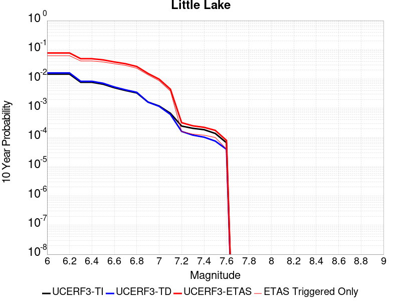 |

| Magnitude | 1 wk TI Prob | 1 wk TD Prob | 1 wk ETAS Prob | 1 wk ETAS/TD Gain | 1 wk ETAS Triggered Only | 1 mo TI Prob | 1 mo TD Prob | 1 mo ETAS Prob | 1 mo ETAS/TD Gain | 1 mo ETAS Triggered Only | 1 yr TI Prob | 1 yr TD Prob | 1 yr ETAS Prob | 1 yr ETAS/TD Gain | 1 yr ETAS Triggered Only | 10 yr TI Prob | 10 yr TD Prob | 10 yr ETAS Prob | 10 yr ETAS/TD Gain | 10 yr ETAS Triggered Only |
|-----|-----|-----|-----|-----|-----|-----|-----|-----|-----|-----|-----|-----|-----|-----|-----|-----|-----|-----|-----|-----|
| 6.0 | 2.8424427E-5 | 3.120572E-5 | 0.025184358 | 807.04297 | 0.025153937 | 1.2181328E-4 | 1.337327E-4 | 0.031833936 | 238.04152 | 0.03170444 | 0.0014820677 | 0.0016271127 | 0.04662125 | 28.65275 | 0.04506747 | 0.014722223 | 0.016165402 | 0.072233535 | 4.4684033 | 0.056989387 |
| 6.1 | 2.8424427E-5 | 3.120572E-5 | 0.025184358 | 807.04297 | 0.025153937 | 1.2181328E-4 | 1.337327E-4 | 0.031833936 | 238.04152 | 0.03170444 | 0.0014820677 | 0.0016271127 | 0.04662125 | 28.65275 | 0.04506747 | 0.014722223 | 0.016165402 | 0.072233535 | 4.4684033 | 0.056989387 |
| 6.2 | 2.8424427E-5 | 3.120572E-5 | 0.025184358 | 807.04297 | 0.025153937 | 1.2181328E-4 | 1.337327E-4 | 0.031833936 | 238.04152 | 0.03170444 | 0.0014820677 | 0.0016271127 | 0.04662125 | 28.65275 | 0.04506747 | 0.014722223 | 0.016165402 | 0.072233535 | 4.4684033 | 0.056989387 |
| 6.3 | 1.48860645E-5 | 1.6081389E-5 | 0.018226191 | 1133.3716 | 0.018210402 | 6.379586E-5 | 6.8918576E-5 | 0.022732101 | 329.83997 | 0.022664744 | 7.7643775E-4 | 8.3878887E-4 | 0.032385737 | 38.610115 | 0.03157343 | 0.007737305 | 0.008359048 | 0.046683963 | 5.584842 | 0.038647976 |
| 6.4 | 1.48860645E-5 | 1.6081389E-5 | 0.018226191 | 1133.3716 | 0.018210402 | 6.379586E-5 | 6.8918576E-5 | 0.022732101 | 329.83997 | 0.022664744 | 7.7643775E-4 | 8.3878887E-4 | 0.032385737 | 38.610115 | 0.03157343 | 0.007737305 | 0.008359048 | 0.046683963 | 5.584842 | 0.038647976 |
| 6.5 | 1.2797581E-5 | 1.3765565E-5 | 0.017437868 | 1266.7745 | 0.017424341 | 5.4845623E-5 | 5.899409E-5 | 0.021936389 | 371.84045 | 0.021878684 | 6.675408E-4 | 7.18042E-4 | 0.030828726 | 42.93443 | 0.03013232 | 0.006655392 | 0.00715977 | 0.04331981 | 6.050447 | 0.036420804 |
| 6.6 | 9.661896E-6 | 1.0289038E-5 | 0.015076295 | 1465.2773 | 0.01506616 | 4.1407468E-5 | 4.409522E-5 | 0.01903972 | 431.78647 | 0.018996462 | 5.040193E-4 | 5.367433E-4 | 0.027117517 | 50.522316 | 0.026595049 | 0.005028777 | 0.0053560743 | 0.036760397 | 6.8633094 | 0.03157343 |
| 6.7 | 7.767871E-6 | 8.199687E-6 | 0.013109101 | 1598.7319 | 0.013101009 | 3.329045E-5 | 3.5141118E-5 | 0.01693485 | 481.9098 | 0.016900301 | 4.0523586E-4 | 4.2777284E-4 | 0.024130454 | 56.409504 | 0.023712825 | 0.004044977 | 0.004270846 | 0.032317717 | 7.567053 | 0.02816717 |
| 6.8 | 6.4235196E-6 | 6.7357446E-6 | 0.010225453 | 1518.0881 | 0.010218787 | 2.752908E-5 | 2.8867229E-5 | 0.013129498 | 454.8236 | 0.013101009 | 3.35115E-4 | 3.5141467E-4 | 0.018424453 | 52.429382 | 0.018079393 | 0.003346101 | 0.00350985 | 0.024920093 | 7.1000447 | 0.021485655 |
| 6.9 | 3.1283696E-6 | 3.1121804E-6 | 0.0064225863 | 2063.6936 | 0.0064194943 | 1.3407229E-5 | 1.3337856E-5 | 0.00774283 | 580.5153 | 0.007729595 | 1.6322079E-4 | 1.6237781E-4 | 0.011427416 | 70.37547 | 0.011266868 | 0.0016310095 | 0.00162274 | 0.015356476 | 9.463301 | 0.013756059 |
| 7.0 | 2.290603E-6 | 2.2286815E-6 | 0.0044565615 | 1999.6404 | 0.004454343 | 9.816834E-6 | 9.551463E-6 | 0.0055119228 | 577.07623 | 0.0055024237 | 1.19513395E-4 | 1.162839E-4 | 0.0074519957 | 64.0845 | 0.007336565 | 0.0011944914 | 0.0011623327 | 0.00966809 | 8.317834 | 0.008515656 |
| 7.1 | 1.293693E-6 | 1.1776827E-6 | 0.0019663267 | 1669.6573 | 0.0019651514 | 5.5443866E-6 | 5.0472063E-6 | 0.0024942262 | 494.1796 | 0.0024891917 | 6.750081E-5 | 6.14487E-5 | 0.0032054975 | 52.165424 | 0.003144242 | 6.7480316E-4 | 6.143856E-4 | 0.004018555 | 6.5407705 | 0.0034062623 |
| 7.2 | 4.715842E-7 | 3.0917857E-7 | 3.0917857E-7 | 1.0 | 0.0 | 2.0210737E-6 | 1.3250503E-6 | 1.3250503E-6 | 1.0 | 0.0 | 2.4606294E-5 | 1.6132375E-5 | 1.6132375E-5 | 1.0 | 0.0 | 2.460357E-4 | 1.6131258E-4 | 1.6131258E-4 | 1.0 | 0.0 |
| 7.3 | 3.9430947E-7 | 2.3097488E-7 | 2.3097488E-7 | 1.0 | 0.0 | 1.6898966E-6 | 9.89892E-7 | 9.89892E-7 | 1.0 | 0.0 | 2.0574296E-5 | 1.2051869E-5 | 1.2051869E-5 | 1.0 | 0.0 | 2.0572392E-4 | 1.20512224E-4 | 1.20512224E-4 | 1.0 | 0.0 |
| 7.4 | 3.547123E-7 | 1.9679135E-7 | 1.9679135E-7 | 1.0 | 0.0 | 1.5201948E-6 | 8.4339126E-7 | 8.4339126E-7 | 1.0 | 0.0 | 1.8508214E-5 | 1.0268241E-5 | 1.0268241E-5 | 1.0 | 0.0 | 1.8506673E-4 | 1.02677724E-4 | 1.02677724E-4 | 1.0 | 0.0 |
| 7.5 | 2.6354266E-7 | 1.4423138E-7 | 1.4423138E-7 | 1.0 | 0.0 | 1.129468E-6 | 6.181344E-7 | 6.181344E-7 | 1.0 | 0.0 | 1.3751187E-5 | 7.5257603E-6 | 7.5257603E-6 | 1.0 | 0.0 | 1.3750336E-4 | 7.5255106E-5 | 7.5255106E-5 | 1.0 | 0.0 |
| 7.6 | 1.269913E-7 | 7.572556E-8 | 7.572556E-8 | 1.0 | 0.0 | 5.4424834E-7 | 3.245381E-7 | 3.245381E-7 | 1.0 | 0.0 | 6.6262032E-6 | 3.9512443E-6 | 3.9512443E-6 | 1.0 | 0.0 | 6.626006E-5 | 3.9511775E-5 | 3.9511775E-5 | 1.0 | 0.0 |

## Airport Lake
*[(top)](#table-of-contents)*

| 1 Week | 1 Month | 1 Year | 10 Year |
|-----|-----|-----|-----|
|  |  |  |  |

| Magnitude | 1 wk TI Prob | 1 wk TD Prob | 1 wk ETAS Prob | 1 wk ETAS/TD Gain | 1 wk ETAS Triggered Only | 1 mo TI Prob | 1 mo TD Prob | 1 mo ETAS Prob | 1 mo ETAS/TD Gain | 1 mo ETAS Triggered Only | 1 yr TI Prob | 1 yr TD Prob | 1 yr ETAS Prob | 1 yr ETAS/TD Gain | 1 yr ETAS Triggered Only | 10 yr TI Prob | 10 yr TD Prob | 10 yr ETAS Prob | 10 yr ETAS/TD Gain | 10 yr ETAS Triggered Only |
|-----|-----|-----|-----|-----|-----|-----|-----|-----|-----|-----|-----|-----|-----|-----|-----|-----|-----|-----|-----|-----|
| 6.0 | 1.2387061E-5 | 1.3103157E-5 | 0.024773685 | 1890.6654 | 0.024760908 | 5.3086325E-5 | 5.615534E-5 | 0.030317787 | 539.8914 | 0.03026333 | 6.461343E-4 | 6.8350515E-4 | 0.041792557 | 61.144463 | 0.041137166 | 0.0064425888 | 0.0068168393 | 0.05691189 | 8.348721 | 0.050438885 |
| 6.1 | 1.2387061E-5 | 1.3103157E-5 | 0.024773685 | 1890.6654 | 0.024760908 | 5.3086325E-5 | 5.615534E-5 | 0.030317787 | 539.8914 | 0.03026333 | 6.461343E-4 | 6.8350515E-4 | 0.041792557 | 61.144463 | 0.041137166 | 0.0064425888 | 0.0068168393 | 0.05691189 | 8.348721 | 0.050438885 |
| 6.2 | 1.2387061E-5 | 1.3103157E-5 | 0.024773685 | 1890.6654 | 0.024760908 | 5.3086325E-5 | 5.615534E-5 | 0.030317787 | 539.8914 | 0.03026333 | 6.461343E-4 | 6.8350515E-4 | 0.041792557 | 61.144463 | 0.041137166 | 0.0064425888 | 0.0068168393 | 0.05691189 | 8.348721 | 0.050438885 |
| 6.3 | 1.2387061E-5 | 1.3103157E-5 | 0.024773685 | 1890.6654 | 0.024760908 | 5.3086325E-5 | 5.615534E-5 | 0.030317787 | 539.8914 | 0.03026333 | 6.461343E-4 | 6.8350515E-4 | 0.041792557 | 61.144463 | 0.041137166 | 0.0064425888 | 0.0068168393 | 0.05691189 | 8.348721 | 0.050438885 |
| 6.4 | 1.2387061E-5 | 1.3103157E-5 | 0.024773685 | 1890.6654 | 0.024760908 | 5.3086325E-5 | 5.615534E-5 | 0.030317787 | 539.8914 | 0.03026333 | 6.461343E-4 | 6.8350515E-4 | 0.041792557 | 61.144463 | 0.041137166 | 0.0064425888 | 0.0068168393 | 0.05691189 | 8.348721 | 0.050438885 |
| 6.5 | 6.9922594E-6 | 7.384925E-6 | 0.018217653 | 2466.8704 | 0.018210402 | 2.996648E-5 | 3.1649324E-5 | 0.02164763 | 683.9839 | 0.021616664 | 3.6478083E-4 | 3.8526783E-4 | 0.03050598 | 79.18122 | 0.03013232 | 0.003641826 | 0.0038465366 | 0.040649273 | 10.567759 | 0.036944844 |
| 6.6 | 6.9922594E-6 | 7.384925E-6 | 0.018217653 | 2466.8704 | 0.018210402 | 2.996648E-5 | 3.1649324E-5 | 0.02164763 | 683.9839 | 0.021616664 | 3.6478083E-4 | 3.8526783E-4 | 0.03050598 | 79.18122 | 0.03013232 | 0.003641826 | 0.0038465366 | 0.040649273 | 10.567759 | 0.036944844 |
| 6.7 | 5.477277E-6 | 5.7860684E-6 | 0.016381953 | 2831.2751 | 0.01637626 | 2.3473833E-5 | 2.4797222E-5 | 0.01941381 | 782.9026 | 0.019389493 | 2.8575645E-4 | 3.0186825E-4 | 0.026888888 | 89.07491 | 0.026595049 | 0.0028538927 | 0.003014966 | 0.03514628 | 11.657272 | 0.03222848 |
| 6.8 | 3.9950432E-6 | 4.2190873E-6 | 0.01114003 | 2640.3887 | 0.011135858 | 1.7121502E-5 | 1.8081691E-5 | 0.013511877 | 747.2684 | 0.013494039 | 2.0843433E-4 | 2.2012512E-4 | 0.018819463 | 85.49439 | 0.018603433 | 0.0020823893 | 0.0021993418 | 0.024944961 | 11.342012 | 0.022795755 |
| 6.9 | 2.95695E-6 | 3.1230243E-6 | 0.007994713 | 2559.9268 | 0.007991616 | 1.2672582E-5 | 1.3384334E-5 | 0.009576993 | 715.5375 | 0.009563737 | 1.5427776E-4 | 1.6294434E-4 | 0.013392807 | 82.19252 | 0.013232019 | 0.001541707 | 0.0016284712 | 0.017847268 | 10.959523 | 0.016245252 |
| 7.0 | 1.456072E-6 | 1.540812E-6 | 0.0041938573 | 2721.8486 | 0.004192323 | 6.2402937E-6 | 6.603469E-6 | 0.005115963 | 774.7387 | 0.0051093935 | 7.597293E-5 | 8.039528E-5 | 0.0070233718 | 87.360504 | 0.0069435346 | 7.594696E-4 | 8.0376083E-4 | 0.008788953 | 10.934787 | 0.007991616 |
| 7.1 | 6.995192E-7 | 7.4089746E-7 | 0.0019658909 | 2653.391 | 0.0019651514 | 2.997936E-6 | 3.1752747E-6 | 0.0024923591 | 784.92706 | 0.0024891917 | 3.649926E-5 | 3.865897E-5 | 0.0031827795 | 82.32965 | 0.003144242 | 3.6493264E-4 | 3.865897E-4 | 0.003791535 | 9.807647 | 0.0034062623 |

## Owl Lake
*[(top)](#table-of-contents)*

| 1 Week | 1 Month | 1 Year | 10 Year |
|-----|-----|-----|-----|
|  |  |  |  |

| Magnitude | 1 wk TI Prob | 1 wk TD Prob | 1 wk ETAS Prob | 1 wk ETAS/TD Gain | 1 wk ETAS Triggered Only | 1 mo TI Prob | 1 mo TD Prob | 1 mo ETAS Prob | 1 mo ETAS/TD Gain | 1 mo ETAS Triggered Only | 1 yr TI Prob | 1 yr TD Prob | 1 yr ETAS Prob | 1 yr ETAS/TD Gain | 1 yr ETAS Triggered Only | 10 yr TI Prob | 10 yr TD Prob | 10 yr ETAS Prob | 10 yr ETAS/TD Gain | 10 yr ETAS Triggered Only |
|-----|-----|-----|-----|-----|-----|-----|-----|-----|-----|-----|-----|-----|-----|-----|-----|-----|-----|-----|-----|-----|
| 6.0 | 5.0320643E-5 | 6.635816E-5 | 0.017227542 | 259.61453 | 0.017162321 | 2.1564208E-4 | 2.843674E-4 | 0.023335585 | 82.0614 | 0.023057776 | 0.0026222812 | 0.0034577388 | 0.03622757 | 10.477242 | 0.032883532 | 0.02591553 | 0.034140717 | 0.07627764 | 2.234213 | 0.04362636 |
| 6.1 | 5.0320643E-5 | 6.635816E-5 | 0.017227542 | 259.61453 | 0.017162321 | 2.1564208E-4 | 2.843674E-4 | 0.023335585 | 82.0614 | 0.023057776 | 0.0026222812 | 0.0034577388 | 0.03622757 | 10.477242 | 0.032883532 | 0.02591553 | 0.034140717 | 0.07627764 | 2.234213 | 0.04362636 |
| 6.2 | 2.4125871E-5 | 3.0981035E-5 | 0.011690518 | 377.3443 | 0.011659898 | 1.0339249E-4 | 1.3277028E-4 | 0.016375864 | 123.339836 | 0.016245252 | 0.0012580766 | 0.001615439 | 0.025551556 | 15.817098 | 0.023974845 | 0.012509781 | 0.016070465 | 0.04778102 | 2.9732196 | 0.03222848 |
| 6.3 | 1.7433485E-5 | 2.2355514E-5 | 0.010502928 | 469.81378 | 0.010480807 | 7.471279E-5 | 9.580672E-5 | 0.01476753 | 154.13878 | 0.01467313 | 9.0924866E-4 | 0.0011659743 | 0.02249572 | 19.293495 | 0.021354644 | 0.009055373 | 0.011628896 | 0.039339025 | 3.3828685 | 0.028036159 |
| 6.4 | 1.7433485E-5 | 2.2355514E-5 | 0.010502928 | 469.81378 | 0.010480807 | 7.471279E-5 | 9.580672E-5 | 0.01476753 | 154.13878 | 0.01467313 | 9.0924866E-4 | 0.0011659743 | 0.02249572 | 19.293495 | 0.021354644 | 0.009055373 | 0.011628896 | 0.039339025 | 3.3828685 | 0.028036159 |
| 6.5 | 1.5182742E-5 | 1.9429144E-5 | 0.010369025 | 533.6841 | 0.010349797 | 6.506727E-5 | 8.326596E-5 | 0.014493176 | 174.05884 | 0.0144111095 | 7.919061E-4 | 0.0010134429 | 0.021430304 | 21.14604 | 0.020437574 | 0.0078909 | 0.010118429 | 0.036444377 | 3.6017823 | 0.026595049 |
| 6.6 | 6.7271576E-6 | 8.547361E-6 | 0.007869085 | 920.645 | 0.007860606 | 2.8830356E-5 | 3.6631063E-5 | 0.011041075 | 301.4129 | 0.0110048475 | 3.5095305E-4 | 4.458976E-4 | 0.015898194 | 35.65436 | 0.01545919 | 0.0035039932 | 0.004467813 | 0.024553226 | 5.4955807 | 0.020175554 |
| 6.7 | 6.682835E-6 | 8.479807E-6 | 0.007869018 | 927.9714 | 0.007860606 | 2.8640408E-5 | 3.6341557E-5 | 0.011040789 | 303.80618 | 0.0110048475 | 3.4864116E-4 | 4.4237426E-4 | 0.015894726 | 35.930492 | 0.01545919 | 0.003480947 | 0.0044327388 | 0.024518859 | 5.5313115 | 0.020175554 |
| 6.8 | 6.5774975E-6 | 8.32628E-6 | 0.0077378573 | 929.3294 | 0.007729595 | 2.8188972E-5 | 3.5683603E-5 | 0.010778127 | 302.04706 | 0.010742827 | 3.4314668E-4 | 4.343669E-4 | 0.015624936 | 35.971745 | 0.01519717 | 0.0034261728 | 0.004352885 | 0.024179736 | 5.5548763 | 0.019913534 |
| 6.9 | 6.363419E-6 | 7.999454E-6 | 0.0077375327 | 967.25757 | 0.007729595 | 2.727151E-5 | 3.428296E-5 | 0.010645736 | 310.5256 | 0.010611817 | 3.3198006E-4 | 4.1732067E-4 | 0.0154771935 | 37.08705 | 0.01506616 | 0.0033148455 | 0.0041828766 | 0.023882652 | 5.709624 | 0.019782523 |
| 7.0 | 6.1342453E-6 | 7.6316555E-6 | 0.007606159 | 996.65906 | 0.007598585 | 2.6289357E-5 | 3.2706717E-5 | 0.010513171 | 321.43768 | 0.010480807 | 3.2002592E-4 | 3.9813702E-4 | 0.015327341 | 38.497654 | 0.01493515 | 0.0031956544 | 0.003991571 | 0.023564644 | 5.9036016 | 0.019651514 |
| 7.1 | 5.842926E-6 | 7.142211E-6 | 0.0072126454 | 1009.8617 | 0.0072055547 | 2.504087E-5 | 3.0609146E-5 | 0.009987071 | 326.27734 | 0.009956767 | 3.0482994E-4 | 3.7260808E-4 | 0.014647387 | 39.31044 | 0.014280099 | 0.0030441214 | 0.0037370329 | 0.022531984 | 6.029378 | 0.018865453 |
| 7.2 | 4.77173E-6 | 5.358483E-6 | 0.0044596777 | 832.2649 | 0.004454343 | 2.045011E-5 | 2.2964748E-5 | 0.0065733185 | 286.23517 | 0.0065505044 | 2.4895166E-4 | 2.79564E-4 | 0.009709653 | 34.731415 | 0.009432727 | 0.0024867293 | 0.002808645 | 0.01535029 | 5.4653716 | 0.012576968 |
| 7.3 | 3.0494948E-6 | 2.710463E-6 | 0.0014438175 | 532.683 | 0.001441111 | 1.3069198E-5 | 1.1616219E-5 | 0.0019767447 | 170.1711 | 0.0019651514 | 1.5910587E-4 | 1.4141845E-4 | 0.0034162074 | 24.15673 | 0.0032752522 | 0.0015899199 | 0.0014232415 | 0.0058712447 | 4.1252627 | 0.004454343 |
| 7.4 | 2.7263884E-6 | 2.3056762E-6 | 0.0011813937 | 512.38495 | 0.0011790908 | 1.1684469E-5 | 9.881433E-6 | 0.0015819869 | 160.09692 | 0.001572121 | 1.4224913E-4 | 1.20299905E-4 | 0.0027401864 | 22.77796 | 0.0026202018 | 0.0014215811 | 0.0012112238 | 0.0047442117 | 3.9168746 | 0.0035372723 |
| 7.5 | 2.6090431E-6 | 2.1656133E-6 | 0.0011812538 | 545.4593 | 0.0011790908 | 1.1181565E-5 | 9.281167E-6 | 0.0014503788 | 156.27116 | 0.001441111 | 1.3612706E-4 | 1.1299244E-4 | 0.0023399123 | 20.708572 | 0.0022271716 | 0.001360437 | 0.0011379806 | 0.0042786445 | 3.7598572 | 0.003144242 |
| 7.6 | 2.3008756E-6 | 1.8727933E-6 | 7.8793184E-4 | 420.72546 | 7.860605E-4 | 9.860858E-6 | 8.0262325E-6 | 9.2508947E-4 | 115.25824 | 9.170706E-4 | 1.20049335E-4 | 9.7715085E-5 | 0.0016696826 | 17.087254 | 0.001572121 | 0.001199845 | 9.849932E-4 | 0.003209971 | 3.2588763 | 0.0022271716 |
| 7.7 | 1.7184348E-6 | 1.3419171E-6 | 3.9437166E-4 | 293.88675 | 3.9303026E-4 | 7.3646997E-6 | 5.7510606E-6 | 3.9877906E-4 | 69.34009 | 3.9303026E-4 | 8.966153E-5 | 7.0016955E-5 | 4.630197E-4 | 6.612965 | 3.9303026E-4 | 8.962536E-4 | 7.078345E-4 | 0.0014933386 | 2.1097286 | 7.860605E-4 |
| 7.8 | 8.4612907E-7 | 8.4058576E-7 | 1.3185057E-4 | 156.85558 | 1.3101009E-4 | 3.6262625E-6 | 3.6025056E-6 | 1.3461213E-4 | 37.36625 | 1.3101009E-4 | 4.4148852E-5 | 4.3859643E-5 | 1.7486399E-4 | 3.9868994 | 1.3101009E-4 | 4.414008E-4 | 4.4398365E-4 | 7.058875E-4 | 1.5898952 | 2.6202018E-4 |
| 7.9 | 2.716738E-7 | 3.768106E-7 | 3.768106E-7 | 1.0 | 0.0 | 1.1643157E-6 | 1.6149015E-6 | 1.6149015E-6 | 1.0 | 0.0 | 1.4175452E-5 | 1.966126E-5 | 1.966126E-5 | 1.0 | 0.0 | 1.4174548E-4 | 1.9836679E-4 | 1.9836679E-4 | 1.0 | 0.0 |
| 8.0 | 2.1995428E-8 | 3.384878E-8 | 3.384878E-8 | 1.0 | 0.0 | 9.426611E-8 | 1.4506621E-7 | 1.4506621E-7 | 1.0 | 0.0 | 1.1476893E-6 | 1.7661803E-6 | 1.7661803E-6 | 1.0 | 0.0 | 1.14768345E-5 | 1.7963059E-5 | 1.7963059E-5 | 1.0 | 0.0 |

## Panamint Valley
*[(top)](#table-of-contents)*

| 1 Week | 1 Month | 1 Year | 10 Year |
|-----|-----|-----|-----|
|  |  |  |  |

| Magnitude | 1 wk TI Prob | 1 wk TD Prob | 1 wk ETAS Prob | 1 wk ETAS/TD Gain | 1 wk ETAS Triggered Only | 1 mo TI Prob | 1 mo TD Prob | 1 mo ETAS Prob | 1 mo ETAS/TD Gain | 1 mo ETAS Triggered Only | 1 yr TI Prob | 1 yr TD Prob | 1 yr ETAS Prob | 1 yr ETAS/TD Gain | 1 yr ETAS Triggered Only | 10 yr TI Prob | 10 yr TD Prob | 10 yr ETAS Prob | 10 yr ETAS/TD Gain | 10 yr ETAS Triggered Only |
|-----|-----|-----|-----|-----|-----|-----|-----|-----|-----|-----|-----|-----|-----|-----|-----|-----|-----|-----|-----|-----|
| 6.0 | 3.0211835E-5 | 3.3984514E-5 | 0.01457561 | 428.88977 | 0.01454212 | 1.2947287E-4 | 1.4563995E-4 | 0.01953231 | 134.11368 | 0.019389493 | 0.0015751923 | 0.0017717537 | 0.028712016 | 16.205421 | 0.026988078 | 0.015640736 | 0.017583137 | 0.052462604 | 2.9836886 | 0.035503734 |
| 6.1 | 3.0211835E-5 | 3.3984514E-5 | 0.01457561 | 428.88977 | 0.01454212 | 1.2947287E-4 | 1.4563995E-4 | 0.01953231 | 134.11368 | 0.019389493 | 0.0015751923 | 0.0017717537 | 0.028712016 | 16.205421 | 0.026988078 | 0.015640736 | 0.017583137 | 0.052462604 | 2.9836886 | 0.035503734 |
| 6.2 | 3.0211835E-5 | 3.3984514E-5 | 0.01457561 | 428.88977 | 0.01454212 | 1.2947287E-4 | 1.4563995E-4 | 0.01953231 | 134.11368 | 0.019389493 | 0.0015751923 | 0.0017717537 | 0.028712016 | 16.205421 | 0.026988078 | 0.015640736 | 0.017583137 | 0.052462604 | 2.9836886 | 0.035503734 |
| 6.3 | 2.8573924E-5 | 3.210268E-5 | 0.014049732 | 437.6498 | 0.014018079 | 1.2245393E-4 | 1.3757581E-4 | 0.018607456 | 135.25238 | 0.018472422 | 0.001489857 | 0.0016737265 | 0.027570307 | 16.47241 | 0.025939997 | 0.01479908 | 0.016617801 | 0.050372045 | 3.03121 | 0.034324642 |
| 6.4 | 2.8573924E-5 | 3.210268E-5 | 0.014049732 | 437.6498 | 0.014018079 | 1.2245393E-4 | 1.3757581E-4 | 0.018607456 | 135.25238 | 0.018472422 | 0.001489857 | 0.0016737265 | 0.027570307 | 16.47241 | 0.025939997 | 0.01479908 | 0.016617801 | 0.050372045 | 3.03121 | 0.034324642 |
| 6.5 | 2.7468774E-5 | 3.0828433E-5 | 0.013917469 | 451.44913 | 0.013887069 | 1.1771801E-4 | 1.3211532E-4 | 0.018078126 | 136.83595 | 0.017948382 | 0.0014322745 | 0.0016073446 | 0.026590051 | 16.542845 | 0.025022928 | 0.014230782 | 0.015963677 | 0.048580103 | 3.0431652 | 0.03314555 |
| 6.6 | 2.6135967E-5 | 2.925248E-5 | 0.01378491 | 471.23898 | 0.013756059 | 1.1200648E-4 | 1.253619E-4 | 0.017809507 | 142.06474 | 0.017686361 | 0.0013628257 | 0.0015252391 | 0.02585595 | 16.952063 | 0.024367876 | 0.013544982 | 0.015154043 | 0.046894133 | 3.0944965 | 0.03222848 |
| 6.7 | 2.4498746E-5 | 2.7341335E-5 | 0.013652018 | 499.3179 | 0.013625049 | 1.04990395E-4 | 1.1717203E-4 | 0.017539471 | 149.68993 | 0.017424341 | 0.0012775084 | 0.0014256609 | 0.025235504 | 17.700914 | 0.023843836 | 0.012701893 | 0.014171274 | 0.045038965 | 3.1781871 | 0.03131141 |
| 6.8 | 2.2244329E-5 | 2.4935423E-5 | 0.01260159 | 505.369 | 0.012576968 | 9.532935E-5 | 1.0686185E-4 | 0.016088385 | 150.55312 | 0.015983231 | 0.0011600169 | 0.0013002884 | 0.023019684 | 17.703524 | 0.021747675 | 0.011539802 | 0.0129325185 | 0.041123364 | 3.1798418 | 0.028560199 |
| 6.9 | 1.9902658E-5 | 2.2290267E-5 | 0.011288906 | 506.45004 | 0.011266868 | 8.529431E-5 | 9.552632E-5 | 0.01450526 | 151.84569 | 0.0144111095 | 0.0010379635 | 0.0011624309 | 0.020398527 | 17.548162 | 0.019258482 | 0.010331288 | 0.011568608 | 0.036431547 | 3.1491733 | 0.025153937 |
| 7.0 | 1.8353881E-5 | 2.0566185E-5 | 0.01037015 | 504.23303 | 0.010349797 | 7.865712E-5 | 8.813792E-5 | 0.01331899 | 151.11533 | 0.013232019 | 9.5722964E-4 | 0.0010725686 | 0.01913257 | 17.838085 | 0.018079393 | 0.009531168 | 0.010678849 | 0.033620004 | 3.14828 | 0.023188785 |
| 7.1 | 1.7667631E-5 | 1.9772613E-5 | 0.01010735 | 511.1793 | 0.010087777 | 7.571623E-5 | 8.473711E-5 | 0.013053637 | 154.04863 | 0.012969999 | 9.2145515E-4 | 0.0010312037 | 0.018830203 | 18.26041 | 0.017817372 | 0.009176437 | 0.010269073 | 0.03270107 | 3.1844232 | 0.022664744 |
| 7.2 | 1.6381597E-5 | 1.8158249E-5 | 0.009581721 | 527.67865 | 0.009563737 | 7.020495E-5 | 7.781885E-5 | 0.011998809 | 154.18898 | 0.011921918 | 8.544101E-4 | 9.4704994E-4 | 0.016784258 | 17.722675 | 0.01585222 | 0.008511325 | 0.009434792 | 0.029030671 | 3.0769806 | 0.019782523 |
| 7.3 | 1.4520491E-5 | 1.5966476E-5 | 0.007090398 | 444.08035 | 0.0070745447 | 6.222919E-5 | 6.842605E-5 | 0.009107503 | 133.09995 | 0.009039696 | 7.57377E-4 | 8.327849E-4 | 0.013006576 | 15.61817 | 0.012183938 | 0.0075480095 | 0.00829975 | 0.023240866 | 2.8001883 | 0.01506616 |
| 7.4 | 1.2852287E-5 | 1.4145411E-5 | 0.0069575817 | 491.86142 | 0.0069435346 | 5.5080065E-5 | 6.062187E-5 | 0.008837766 | 145.78511 | 0.008777676 | 6.7039346E-4 | 7.378371E-4 | 0.012520045 | 16.968576 | 0.011790908 | 0.0066837464 | 0.0073567946 | 0.021531839 | 2.9267962 | 0.014280099 |
| 7.5 | 1.1637851E-5 | 1.2836797E-5 | 0.0066942656 | 521.4903 | 0.0066815144 | 4.987555E-5 | 5.5013777E-5 | 0.008570201 | 155.78282 | 0.008515656 | 6.070656E-4 | 6.6960254E-4 | 0.012059848 | 18.010458 | 0.011397878 | 0.006054099 | 0.0066787465 | 0.020473067 | 3.0654058 | 0.013887069 |
| 7.6 | 3.0068115E-6 | 3.3330316E-6 | 0.0032785742 | 983.6613 | 0.0032752522 | 1.2886271E-5 | 1.4284384E-5 | 0.0040755393 | 285.3143 | 0.004061313 | 1.5687906E-4 | 1.7390578E-4 | 0.0055443854 | 31.881548 | 0.0053714137 | 0.0015676835 | 0.0017391363 | 0.008409031 | 4.8351765 | 0.0066815144 |

## Garlock (East)
*[(top)](#table-of-contents)*

| 1 Week | 1 Month | 1 Year | 10 Year |
|-----|-----|-----|-----|
|  |  |  |  |

| Magnitude | 1 wk TI Prob | 1 wk TD Prob | 1 wk ETAS Prob | 1 wk ETAS/TD Gain | 1 wk ETAS Triggered Only | 1 mo TI Prob | 1 mo TD Prob | 1 mo ETAS Prob | 1 mo ETAS/TD Gain | 1 mo ETAS Triggered Only | 1 yr TI Prob | 1 yr TD Prob | 1 yr ETAS Prob | 1 yr ETAS/TD Gain | 1 yr ETAS Triggered Only | 10 yr TI Prob | 10 yr TD Prob | 10 yr ETAS Prob | 10 yr ETAS/TD Gain | 10 yr ETAS Triggered Only |
|-----|-----|-----|-----|-----|-----|-----|-----|-----|-----|-----|-----|-----|-----|-----|-----|-----|-----|-----|-----|-----|
| 6.0 | 4.5092507E-5 | 6.290325E-5 | 0.012246075 | 194.68112 | 0.012183938 | 1.9323928E-4 | 2.6956003E-4 | 0.017034331 | 63.193092 | 0.016769292 | 0.0023501497 | 0.0032774 | 0.026520768 | 8.092014 | 0.023319796 | 0.023254504 | 0.032351844 | 0.062016416 | 1.9169359 | 0.03065636 |
| 6.1 | 4.5092507E-5 | 6.290325E-5 | 0.012246075 | 194.68112 | 0.012183938 | 1.9323928E-4 | 2.6956003E-4 | 0.017034331 | 63.193092 | 0.016769292 | 0.0023501497 | 0.0032774 | 0.026520768 | 8.092014 | 0.023319796 | 0.023254504 | 0.032351844 | 0.062016416 | 1.9169359 | 0.03065636 |
| 6.2 | 2.6674514E-5 | 3.4509674E-5 | 0.01038395 | 300.89966 | 0.010349797 | 1.1431433E-4 | 1.4789042E-4 | 0.013901915 | 94.001465 | 0.013756059 | 0.0013908884 | 0.0017991117 | 0.019845977 | 11.030986 | 0.018079393 | 0.01382215 | 0.017890299 | 0.040406898 | 2.2585926 | 0.022926765 |
| 6.3 | 2.6674514E-5 | 3.4509674E-5 | 0.01038395 | 300.89966 | 0.010349797 | 1.1431433E-4 | 1.4789042E-4 | 0.013901915 | 94.001465 | 0.013756059 | 0.0013908884 | 0.0017991117 | 0.019845977 | 11.030986 | 0.018079393 | 0.01382215 | 0.017890299 | 0.040406898 | 2.2585926 | 0.022926765 |
| 6.4 | 2.5312667E-5 | 3.233893E-5 | 0.010250796 | 316.98004 | 0.010218787 | 1.0847834E-4 | 1.3858822E-4 | 0.0137617495 | 99.29956 | 0.013625049 | 0.0013199237 | 0.0016860351 | 0.019604156 | 11.627371 | 0.017948382 | 0.013121112 | 0.016778335 | 0.03880518 | 2.3128147 | 0.022402724 |
| 6.5 | 2.5312667E-5 | 3.233893E-5 | 0.010250796 | 316.98004 | 0.010218787 | 1.0847834E-4 | 1.3858822E-4 | 0.0137617495 | 99.29956 | 0.013625049 | 0.0013199237 | 0.0016860351 | 0.019604156 | 11.627371 | 0.017948382 | 0.013121112 | 0.016778335 | 0.03880518 | 2.3128147 | 0.022402724 |
| 6.6 | 2.246556E-5 | 2.8133776E-5 | 0.009853614 | 350.24142 | 0.009825757 | 9.627742E-5 | 1.20567885E-4 | 0.012958009 | 107.47479 | 0.012838989 | 0.0011715472 | 0.0014669491 | 0.018342458 | 12.503814 | 0.016900301 | 0.011653901 | 0.01461866 | 0.035661127 | 2.4394252 | 0.021354644 |
| 6.7 | 2.2241198E-5 | 2.7803519E-5 | 0.009853287 | 354.38992 | 0.009825757 | 9.531594E-5 | 1.1915263E-4 | 0.012956612 | 108.73962 | 0.012838989 | 0.0011598538 | 0.0014497414 | 0.018325541 | 12.640559 | 0.016900301 | 0.011538187 | 0.014448853 | 0.035494946 | 2.4565926 | 0.021354644 |
| 6.8 | 1.9528685E-5 | 2.389819E-5 | 0.009718413 | 406.65894 | 0.009694747 | 8.369167E-5 | 1.0241691E-4 | 0.012809094 | 125.06815 | 0.0127079785 | 0.0010184698 | 0.0012462323 | 0.017863778 | 14.3342285 | 0.01663828 | 0.010138147 | 0.012436427 | 0.033137355 | 2.6645396 | 0.020961614 |
| 6.9 | 1.3318621E-5 | 1.5198884E-5 | 0.009447782 | 621.6102 | 0.009432727 | 5.7078556E-5 | 6.513648E-5 | 0.012248281 | 188.04025 | 0.012183938 | 6.9470983E-4 | 7.927538E-4 | 0.01623969 | 20.485159 | 0.01545919 | 0.0069254204 | 0.007939888 | 0.02717543 | 3.4226468 | 0.019389493 |
| 7.0 | 1.1760853E-5 | 1.31077895E-5 | 0.00944571 | 720.6181 | 0.009432727 | 5.0402683E-5 | 5.6175057E-5 | 0.012108426 | 215.54808 | 0.012052928 | 6.134799E-4 | 6.8372174E-4 | 0.016001422 | 23.403412 | 0.01532818 | 0.0061178906 | 0.00685652 | 0.025982957 | 3.7895253 | 0.019258482 |
| 7.1 | 1.0064758E-5 | 1.0902931E-5 | 0.009443526 | 866.1457 | 0.009432727 | 4.3133965E-5 | 4.672603E-5 | 0.012099091 | 258.93686 | 0.012052928 | 5.2502943E-4 | 5.687444E-4 | 0.015102593 | 26.554272 | 0.01454212 | 0.005237907 | 0.0057129986 | 0.02342858 | 4.100925 | 0.017817372 |
| 7.2 | 9.768808E-6 | 1.0498807E-5 | 0.009181108 | 874.49066 | 0.009170706 | 4.186565E-5 | 4.499413E-5 | 0.011704368 | 260.13098 | 0.011659898 | 5.095951E-4 | 5.4766936E-4 | 0.01468901 | 26.820946 | 0.014149089 | 0.0050842804 | 0.0055032647 | 0.022831716 | 4.1487584 | 0.017424341 |
| 7.3 | 9.344516E-6 | 9.944468E-6 | 0.008656524 | 870.48645 | 0.008646666 | 4.004731E-5 | 4.261847E-5 | 0.010653983 | 249.98512 | 0.010611817 | 4.8746695E-4 | 5.1875977E-4 | 0.013612973 | 26.241379 | 0.013101009 | 0.0048639905 | 0.0052149445 | 0.02124515 | 4.073898 | 0.01611424 |
| 7.4 | 9.023491E-6 | 9.490661E-6 | 0.007214977 | 760.2186 | 0.0072055547 | 3.867153E-5 | 4.0673647E-5 | 0.008948998 | 220.01955 | 0.008908686 | 4.7072413E-4 | 4.950925E-4 | 0.011625437 | 23.481344 | 0.011135858 | 0.004697283 | 0.0049783974 | 0.018405259 | 3.6970246 | 0.013494039 |
| 7.5 | 7.081253E-6 | 7.087672E-6 | 0.0038063533 | 537.0386 | 0.0037992925 | 3.0347876E-5 | 3.0375388E-5 | 0.00527062 | 173.51613 | 0.0052404036 | 3.6942272E-4 | 3.6975832E-4 | 0.006917841 | 18.709087 | 0.0065505044 | 0.003688092 | 0.0037243143 | 0.011686167 | 3.1378036 | 0.007991616 |
| 7.6 | 6.116396E-6 | 5.959245E-6 | 0.0027571546 | 462.6685 | 0.0027512119 | 2.6212863E-5 | 2.5539372E-5 | 0.0038247348 | 149.75838 | 0.0037992925 | 3.1909486E-4 | 3.1089774E-4 | 0.004894825 | 15.744164 | 0.004585353 | 0.0031863707 | 0.0031357552 | 0.008620924 | 2.749234 | 0.0055024237 |
| 7.7 | 4.797145E-6 | 4.757281E-6 | 0.0015768709 | 331.46472 | 0.001572121 | 2.055903E-5 | 2.0388188E-5 | 0.0019854994 | 97.38479 | 0.0019651514 | 2.5027743E-4 | 2.4819805E-4 | 0.0026057942 | 10.498851 | 0.0023581816 | 0.0024999576 | 0.0025093474 | 0.005515018 | 2.19779 | 0.003013232 |
| 7.8 | 3.4028885E-6 | 3.978462E-6 | 0.0011830645 | 297.36734 | 0.0011790908 | 1.4583726E-5 | 1.7050439E-5 | 0.0015891447 | 93.20257 | 0.001572121 | 1.775424E-4 | 2.0756939E-4 | 0.0020413299 | 9.834445 | 0.0018341412 | 0.0017740062 | 0.0021012232 | 0.0045851846 | 2.1821501 | 0.0024891917 |
| 7.9 | 2.5928412E-6 | 3.3724489E-6 | 7.8943034E-4 | 234.08221 | 7.860605E-4 | 1.1112129E-5 | 1.4453272E-5 | 9.3151064E-4 | 64.44981 | 9.170706E-4 | 1.3528178E-4 | 1.7595445E-4 | 0.0013548378 | 7.699935 | 0.0011790908 | 0.0013519945 | 0.0017812408 | 0.0034813383 | 1.9544456 | 0.0017031311 |
| 8.0 | 1.3743648E-6 | 1.6734747E-6 | 1.3268334E-4 | 79.28614 | 1.3101009E-4 | 5.8901214E-6 | 7.1720146E-6 | 2.6919032E-4 | 37.53343 | 2.6202018E-4 | 7.1709874E-5 | 8.731581E-5 | 3.493131E-4 | 4.0005713 | 2.6202018E-4 | 7.1686733E-4 | 8.837234E-4 | 0.001145512 | 1.2962337 | 2.6202018E-4 |
| 8.1 | 3.6733252E-7 | 3.1489964E-7 | 1.3132495E-4 | 417.03745 | 1.3101009E-4 | 1.5742813E-6 | 1.3495693E-6 | 1.3235948E-4 | 98.07535 | 1.3101009E-4 | 1.9166706E-5 | 1.6430899E-5 | 1.4743884E-4 | 8.973267 | 1.3101009E-4 | 1.9165053E-4 | 1.6638759E-4 | 2.9737587E-4 | 1.787248 | 1.3101009E-4 |

## Hunter Mountain-Saline Valley
*[(top)](#table-of-contents)*

| 1 Week | 1 Month | 1 Year | 10 Year |
|-----|-----|-----|-----|
|  |  |  |  |

| Magnitude | 1 wk TI Prob | 1 wk TD Prob | 1 wk ETAS Prob | 1 wk ETAS/TD Gain | 1 wk ETAS Triggered Only | 1 mo TI Prob | 1 mo TD Prob | 1 mo ETAS Prob | 1 mo ETAS/TD Gain | 1 mo ETAS Triggered Only | 1 yr TI Prob | 1 yr TD Prob | 1 yr ETAS Prob | 1 yr ETAS/TD Gain | 1 yr ETAS Triggered Only | 10 yr TI Prob | 10 yr TD Prob | 10 yr ETAS Prob | 10 yr ETAS/TD Gain | 10 yr ETAS Triggered Only |
|-----|-----|-----|-----|-----|-----|-----|-----|-----|-----|-----|-----|-----|-----|-----|-----|-----|-----|-----|-----|-----|
| 6.0 | 4.5103672E-5 | 5.4570177E-5 | 0.0072597316 | 133.03479 | 0.0072055547 | 1.9328714E-4 | 2.3385242E-4 | 0.0092714345 | 39.64652 | 0.009039696 | 0.002350731 | 0.0028435152 | 0.014992808 | 5.2726316 | 0.012183938 | 0.023260195 | 0.028091887 | 0.04260748 | 1.5167184 | 0.01493515 |
| 6.1 | 4.5103672E-5 | 5.4570177E-5 | 0.0072597316 | 133.03479 | 0.0072055547 | 1.9328714E-4 | 2.3385242E-4 | 0.0092714345 | 39.64652 | 0.009039696 | 0.002350731 | 0.0028435152 | 0.014992808 | 5.2726316 | 0.012183938 | 0.023260195 | 0.028091887 | 0.04260748 | 1.5167184 | 0.01493515 |
| 6.2 | 3.9363465E-5 | 4.706337E-5 | 0.007121275 | 151.31248 | 0.0070745447 | 1.6868966E-4 | 2.0168544E-4 | 0.009108575 | 45.16228 | 0.008908686 | 0.002051862 | 0.0024528175 | 0.014476182 | 5.901859 | 0.012052928 | 0.020330196 | 0.024273481 | 0.038590442 | 1.5898191 | 0.01467313 |
| 6.3 | 3.9363465E-5 | 4.706337E-5 | 0.007121275 | 151.31248 | 0.0070745447 | 1.6868966E-4 | 2.0168544E-4 | 0.009108575 | 45.16228 | 0.008908686 | 0.002051862 | 0.0024528175 | 0.014476182 | 5.901859 | 0.012052928 | 0.020330196 | 0.024273481 | 0.038590442 | 1.5898191 | 0.01467313 |
| 6.4 | 3.2311684E-5 | 3.795099E-5 | 0.0071122274 | 187.40558 | 0.0070745447 | 1.384713E-4 | 1.6263737E-4 | 0.009069875 | 55.767467 | 0.008908686 | 0.0016845843 | 0.0019783843 | 0.014007467 | 7.0802555 | 0.012052928 | 0.016718714 | 0.019616475 | 0.034001768 | 1.7333273 | 0.01467313 |
| 6.5 | 3.2311684E-5 | 3.795099E-5 | 0.0071122274 | 187.40558 | 0.0070745447 | 1.384713E-4 | 1.6263737E-4 | 0.009069875 | 55.767467 | 0.008908686 | 0.0016845843 | 0.0019783843 | 0.014007467 | 7.0802555 | 0.012052928 | 0.016718714 | 0.019616475 | 0.034001768 | 1.7333273 | 0.01467313 |
| 6.6 | 2.9305844E-5 | 3.418183E-5 | 0.006977479 | 204.1283 | 0.0069435346 | 1.2559042E-4 | 1.4648569E-4 | 0.008922876 | 60.912952 | 0.008777676 | 0.0015279909 | 0.001782067 | 0.01368274 | 7.678016 | 0.011921918 | 0.015175272 | 0.01768569 | 0.031970624 | 1.8077112 | 0.01454212 |
| 6.7 | 2.7826512E-5 | 3.2344276E-5 | 0.0069756545 | 215.6689 | 0.0069435346 | 1.19251024E-4 | 1.386113E-4 | 0.00891507 | 64.317055 | 0.008777676 | 0.0014509142 | 0.0016863465 | 0.01358816 | 8.057751 | 0.011921918 | 0.014414776 | 0.016743187 | 0.031041825 | 1.8539975 | 0.01454212 |
| 6.8 | 2.3389874E-5 | 2.6866714E-5 | 0.0069702147 | 259.43683 | 0.0069435346 | 1.0023846E-4 | 1.15138246E-4 | 0.008891803 | 77.227196 | 0.008777676 | 0.00121972 | 0.001400954 | 0.01330617 | 9.497935 | 0.011921918 | 0.01213047 | 0.013927434 | 0.028267018 | 2.0295928 | 0.01454212 |
| 6.9 | 2.069209E-5 | 2.3570032E-5 | 0.0068359342 | 290.02652 | 0.0068125245 | 8.867737E-5 | 1.01010715E-4 | 0.008746803 | 86.59283 | 0.008646666 | 0.0010791123 | 0.0012291478 | 0.013005563 | 10.580959 | 0.011790908 | 0.010738871 | 0.012228523 | 0.026463406 | 2.164072 | 0.0144111095 |
| 7.0 | 1.7462342E-5 | 1.9633546E-5 | 0.0068320245 | 347.9771 | 0.0068125245 | 7.483646E-5 | 8.414118E-5 | 0.008730079 | 103.755135 | 0.008646666 | 9.1075303E-4 | 0.0010239601 | 0.012802795 | 12.503217 | 0.011790908 | 0.009070295 | 0.0101960525 | 0.024460226 | 2.3989897 | 0.0144111095 |
| 7.1 | 1.4807709E-5 | 1.6441749E-5 | 0.0068288543 | 415.33624 | 0.0068125245 | 6.3460066E-5 | 7.046283E-5 | 0.008716519 | 123.7038 | 0.008646666 | 7.723524E-4 | 8.575638E-4 | 0.01263836 | 14.737516 | 0.011790908 | 0.007696735 | 0.008545532 | 0.02283349 | 2.6719801 | 0.0144111095 |
| 7.2 | 1.4180048E-5 | 1.5698337E-5 | 0.006828116 | 434.95795 | 0.0068125245 | 6.077022E-5 | 6.727694E-5 | 0.008713361 | 129.51482 | 0.008646666 | 7.396263E-4 | 8.188051E-4 | 0.012600059 | 15.388348 | 0.011790908 | 0.0073716943 | 0.008160833 | 0.022454336 | 2.7514758 | 0.0144111095 |
| 7.3 | 1.3730402E-5 | 1.5172075E-5 | 0.0068275933 | 450.0105 | 0.0068125245 | 5.8843252E-5 | 6.502165E-5 | 0.008711125 | 133.97269 | 0.008646666 | 7.161811E-4 | 7.9136714E-4 | 0.012572944 | 15.887625 | 0.011790908 | 0.007138774 | 0.007888422 | 0.02218585 | 2.8124573 | 0.0144111095 |
| 7.4 | 1.2810095E-5 | 1.4109277E-5 | 0.0068265377 | 483.83328 | 0.0068125245 | 5.489925E-5 | 6.0467017E-5 | 0.00870661 | 143.98941 | 0.008646666 | 6.681934E-4 | 7.359531E-4 | 0.01238727 | 16.831602 | 0.011659898 | 0.006661878 | 0.007338053 | 0.021383315 | 2.9140313 | 0.014149089 |
| 7.5 | 1.1595659E-5 | 1.2800664E-5 | 0.006563221 | 512.72504 | 0.0065505044 | 4.9694736E-5 | 5.4858923E-5 | 0.0084390445 | 153.83176 | 0.008384646 | 6.0486543E-4 | 6.6771836E-4 | 0.011927063 | 17.862415 | 0.011266868 | 0.006032217 | 0.0066599925 | 0.020324437 | 3.0517206 | 0.013756059 |
| 7.6 | 2.997694E-6 | 3.3251579E-6 | 0.0032785665 | 985.9882 | 0.0032752522 | 1.28471975E-5 | 1.425064E-5 | 0.0040755053 | 285.98755 | 0.004061313 | 1.564034E-4 | 1.73495E-4 | 0.0055439766 | 31.954676 | 0.0053714137 | 0.0015629337 | 0.001735031 | 0.0084049525 | 4.8442664 | 0.0066815144 |

## Garlock (West)
*[(top)](#table-of-contents)*

| 1 Week | 1 Month | 1 Year | 10 Year |
|-----|-----|-----|-----|
|  |  |  |  |

| Magnitude | 1 wk TI Prob | 1 wk TD Prob | 1 wk ETAS Prob | 1 wk ETAS/TD Gain | 1 wk ETAS Triggered Only | 1 mo TI Prob | 1 mo TD Prob | 1 mo ETAS Prob | 1 mo ETAS/TD Gain | 1 mo ETAS Triggered Only | 1 yr TI Prob | 1 yr TD Prob | 1 yr ETAS Prob | 1 yr ETAS/TD Gain | 1 yr ETAS Triggered Only | 10 yr TI Prob | 10 yr TD Prob | 10 yr ETAS Prob | 10 yr ETAS/TD Gain | 10 yr ETAS Triggered Only |
|-----|-----|-----|-----|-----|-----|-----|-----|-----|-----|-----|-----|-----|-----|-----|-----|-----|-----|-----|-----|-----|
| 6.0 | 2.5181727E-5 | 2.51973E-5 | 0.0060515096 | 240.165 | 0.006026464 | 1.0791722E-4 | 1.0798398E-4 | 0.008360729 | 77.42564 | 0.008253636 | 0.0013131002 | 0.0013139155 | 0.0126968175 | 9.663344 | 0.011397878 | 0.013053683 | 0.013141977 | 0.027234407 | 2.0723221 | 0.014280099 |
| 6.1 | 2.5077732E-5 | 2.5098372E-5 | 0.0060514114 | 241.10771 | 0.006026464 | 1.0747157E-4 | 1.0756004E-4 | 0.008360308 | 77.7269 | 0.008253636 | 0.001307681 | 0.0013087603 | 0.01269172 | 9.697515 | 0.011397878 | 0.013000126 | 0.013091032 | 0.02718419 | 2.0765505 | 0.014280099 |
| 6.2 | 2.494612E-5 | 2.498005E-5 | 0.0060512936 | 242.24506 | 0.006026464 | 1.0690756E-4 | 1.0705298E-4 | 0.008359805 | 78.09035 | 0.008253636 | 0.0013008224 | 0.0013025942 | 0.012685625 | 9.738739 | 0.011397878 | 0.012932341 | 0.013030097 | 0.027124126 | 2.081652 | 0.014280099 |
| 6.3 | 2.4733758E-5 | 2.479942E-5 | 0.006051114 | 244.00224 | 0.006026464 | 1.0599751E-4 | 1.06278916E-4 | 0.008359037 | 78.651886 | 0.008253636 | 0.0012897556 | 0.0012931811 | 0.012676319 | 9.802431 | 0.011397878 | 0.012822957 | 0.012937066 | 0.027032424 | 2.0895326 | 0.014280099 |
| 6.4 | 2.3237335E-5 | 2.317873E-5 | 0.006049503 | 260.9937 | 0.006026464 | 9.958477E-5 | 9.933365E-5 | 0.008352149 | 84.08177 | 0.008253636 | 0.0012117702 | 0.001208719 | 0.0125928195 | 10.418319 | 0.011397878 | 0.012051838 | 0.012101916 | 0.026209198 | 2.1657066 | 0.014280099 |
| 6.5 | 2.2732203E-5 | 2.2993298E-5 | 0.0060493187 | 263.0905 | 0.006026464 | 9.742009E-5 | 9.8539E-5 | 0.008351361 | 84.75184 | 0.008253636 | 0.0011854442 | 0.0011990548 | 0.012583266 | 10.494321 | 0.011397878 | 0.011791403 | 0.012006322 | 0.02611497 | 2.1751015 | 0.014280099 |
| 6.6 | 2.1319436E-5 | 2.17735E-5 | 0.006048106 | 277.77374 | 0.006026464 | 9.136581E-5 | 9.331167E-5 | 0.008346177 | 89.444084 | 0.008253636 | 0.001111811 | 0.0011354799 | 0.012520416 | 11.026542 | 0.011397878 | 0.011062649 | 0.011377227 | 0.025494859 | 2.2408676 | 0.014280099 |
| 6.7 | 1.970802E-5 | 2.0393396E-5 | 0.0060467348 | 296.50455 | 0.006026464 | 8.446021E-5 | 8.739735E-5 | 0.008340311 | 95.4298 | 0.008253636 | 0.001027818 | 0.001063545 | 0.012449301 | 11.705476 | 0.011397878 | 0.010230771 | 0.010664964 | 0.024663154 | 2.3125398 | 0.014149089 |
| 6.8 | 1.8744462E-5 | 1.9901045E-5 | 0.0060462453 | 303.81546 | 0.006026464 | 8.033094E-5 | 8.5287415E-5 | 0.008338219 | 97.76611 | 0.008253636 | 9.775903E-4 | 0.0010378812 | 0.012423929 | 11.970472 | 0.011397878 | 0.009733009 | 0.01041075 | 0.024412537 | 2.3449354 | 0.014149089 |
| 6.9 | 1.7559682E-5 | 1.8953415E-5 | 0.0060453033 | 318.9559 | 0.006026464 | 7.5253614E-5 | 8.12264E-5 | 0.0083341915 | 102.60447 | 0.008253636 | 9.158276E-4 | 9.884841E-4 | 0.012375095 | 12.519265 | 0.011397878 | 0.0091206245 | 0.009921231 | 0.023929944 | 2.4119935 | 0.014149089 |
| 7.0 | 1.6794445E-5 | 1.8216237E-5 | 0.0060445704 | 331.8232 | 0.006026464 | 7.197421E-5 | 7.8067256E-5 | 0.008331059 | 106.71642 | 0.008253636 | 8.759337E-4 | 9.5005584E-4 | 0.012206219 | 12.847897 | 0.011266868 | 0.008724891 | 0.009540141 | 0.023424486 | 2.4553607 | 0.014018079 |
| 7.1 | 1.6337795E-5 | 1.7717046E-5 | 0.0060440744 | 341.1446 | 0.006026464 | 7.0017246E-5 | 7.5927994E-5 | 0.008328937 | 109.695206 | 0.008253636 | 8.521265E-4 | 9.240326E-4 | 0.0121804895 | 13.181883 | 0.011266868 | 0.008488664 | 0.009281996 | 0.023169959 | 2.496226 | 0.014018079 |
| 7.2 | 1.5780008E-5 | 1.7165687E-5 | 0.0060435263 | 352.0702 | 0.006026464 | 6.762685E-5 | 7.356516E-5 | 0.008326594 | 113.186646 | 0.008253636 | 8.2304585E-4 | 8.9528906E-4 | 0.0120211765 | 13.427145 | 0.011135858 | 0.008200042 | 0.008996838 | 0.022758968 | 2.5296628 | 0.013887069 |
| 7.3 | 1.5058865E-5 | 1.6618762E-5 | 0.0060429825 | 363.6241 | 0.006026464 | 6.45364E-5 | 7.122133E-5 | 0.008324269 | 116.87888 | 0.008253636 | 7.854473E-4 | 8.667759E-4 | 0.011992981 | 13.836311 | 0.011135858 | 0.00782677 | 0.008713539 | 0.022479603 | 2.5798478 | 0.013887069 |
| 7.4 | 1.4887923E-5 | 1.6454731E-5 | 0.0060428195 | 367.239 | 0.006026464 | 6.380382E-5 | 7.051838E-5 | 0.008192571 | 116.17639 | 0.008122626 | 7.7653467E-4 | 8.582243E-4 | 0.011853627 | 13.811806 | 0.0110048475 | 0.0077382675 | 0.008628399 | 0.022135885 | 2.5654685 | 0.013625049 |
| 7.5 | 1.4509299E-5 | 1.6046748E-5 | 0.005911406 | 368.38654 | 0.005895454 | 6.218123E-5 | 6.876997E-5 | 0.007928834 | 115.29501 | 0.007860606 | 7.567935E-4 | 8.36954E-4 | 0.011178088 | 13.3556795 | 0.010349797 | 0.0075422134 | 0.008416704 | 0.021277538 | 2.528013 | 0.012969999 |
| 7.6 | 1.2756717E-5 | 1.4050848E-5 | 0.0042063147 | 299.36377 | 0.004192323 | 5.4670498E-5 | 6.0216535E-5 | 0.0055623087 | 92.37179 | 0.0055024237 | 6.6541E-4 | 7.328904E-4 | 0.007933164 | 10.82449 | 0.0072055547 | 0.006634211 | 0.0073816874 | 0.016354656 | 2.2155714 | 0.009039696 |
| 7.7 | 1.0328985E-5 | 1.1460557E-5 | 0.0025006237 | 218.19391 | 0.0024891917 | 4.4266326E-5 | 4.911575E-5 | 0.0030621998 | 62.346596 | 0.003013232 | 5.388092E-4 | 5.978206E-4 | 0.00426391 | 7.1324244 | 0.0036682824 | 0.0053750467 | 0.006038511 | 0.010986833 | 1.8194605 | 0.0049783834 |
| 7.8 | 7.0306583E-6 | 8.899601E-6 | 0.0015810067 | 177.64915 | 0.001572121 | 3.0131043E-5 | 3.814059E-5 | 0.002134222 | 55.95671 | 0.0020961615 | 3.667837E-4 | 4.642629E-4 | 0.0030832482 | 6.6411686 | 0.0026202018 | 0.003661789 | 0.0046952725 | 0.008215936 | 1.7498317 | 0.0035372723 |
| 7.9 | 4.060633E-6 | 5.4653938E-6 | 9.22531E-4 | 168.79497 | 9.170706E-4 | 1.7402595E-5 | 2.3422906E-5 | 0.001071479 | 45.744923 | 0.0010480807 | 2.11856E-4 | 2.851367E-4 | 0.0017258368 | 6.0526648 | 0.001441111 | 0.0021165414 | 0.002884201 | 0.0048436844 | 1.6793852 | 0.0019651514 |
| 8.0 | 1.6729537E-6 | 2.0775144E-6 | 1.3308733E-4 | 64.060844 | 1.3101009E-4 | 7.169782E-6 | 8.903603E-6 | 2.7092145E-4 | 30.428293 | 2.6202018E-4 | 8.7288594E-5 | 1.0839601E-4 | 3.7038777E-4 | 3.4169874 | 2.6202018E-4 | 8.7254314E-4 | 0.0010969337 | 0.0013586666 | 1.238604 | 2.6202018E-4 |
| 8.1 | 3.6733252E-7 | 3.1489964E-7 | 1.3132495E-4 | 417.03745 | 1.3101009E-4 | 1.5742813E-6 | 1.3495693E-6 | 1.3235948E-4 | 98.07535 | 1.3101009E-4 | 1.9166706E-5 | 1.6430899E-5 | 1.4743884E-4 | 8.973267 | 1.3101009E-4 | 1.9165053E-4 | 1.6638759E-4 | 2.9737587E-4 | 1.787248 | 1.3101009E-4 |

## Blackwater
*[(top)](#table-of-contents)*

| 1 Week | 1 Month | 1 Year | 10 Year |
|-----|-----|-----|-----|
|  |  |  |  |

| Magnitude | 1 wk TI Prob | 1 wk TD Prob | 1 wk ETAS Prob | 1 wk ETAS/TD Gain | 1 wk ETAS Triggered Only | 1 mo TI Prob | 1 mo TD Prob | 1 mo ETAS Prob | 1 mo ETAS/TD Gain | 1 mo ETAS Triggered Only | 1 yr TI Prob | 1 yr TD Prob | 1 yr ETAS Prob | 1 yr ETAS/TD Gain | 1 yr ETAS Triggered Only | 10 yr TI Prob | 10 yr TD Prob | 10 yr ETAS Prob | 10 yr ETAS/TD Gain | 10 yr ETAS Triggered Only |
|-----|-----|-----|-----|-----|-----|-----|-----|-----|-----|-----|-----|-----|-----|-----|-----|-----|-----|-----|-----|-----|
| 6.0 | 3.0708583E-5 | 3.3095846E-5 | 0.0040942742 | 123.7096 | 0.004061313 | 1.3160157E-4 | 1.4183241E-4 | 0.0057744673 | 40.713314 | 0.005633434 | 0.0016010714 | 0.0017255784 | 0.0121883005 | 7.0633125 | 0.010480807 | 0.015895851 | 0.017135633 | 0.030269679 | 1.7664756 | 0.013363029 |
| 6.1 | 3.0708583E-5 | 3.3095846E-5 | 0.0040942742 | 123.7096 | 0.004061313 | 1.3160157E-4 | 1.4183241E-4 | 0.0057744673 | 40.713314 | 0.005633434 | 0.0016010714 | 0.0017255784 | 0.0121883005 | 7.0633125 | 0.010480807 | 0.015895851 | 0.017135633 | 0.030269679 | 1.7664756 | 0.013363029 |
| 6.2 | 1.1707779E-5 | 1.2545122E-5 | 0.0013226295 | 105.42979 | 0.0013101009 | 5.017523E-5 | 5.3763757E-5 | 0.0020188093 | 37.549637 | 0.0019651514 | 6.107122E-4 | 6.5438676E-4 | 0.0043202685 | 6.602011 | 0.0036682824 | 0.006090366 | 0.0065255696 | 0.010690535 | 1.6382532 | 0.004192323 |
| 6.3 | 1.1707779E-5 | 1.2545122E-5 | 0.0013226295 | 105.42979 | 0.0013101009 | 5.017523E-5 | 5.3763757E-5 | 0.0020188093 | 37.549637 | 0.0019651514 | 6.107122E-4 | 6.5438676E-4 | 0.0043202685 | 6.602011 | 0.0036682824 | 0.006090366 | 0.0065255696 | 0.010690535 | 1.6382532 | 0.004192323 |
| 6.4 | 7.929244E-6 | 8.480098E-6 | 0.0010565519 | 124.59194 | 0.0010480807 | 3.3982033E-5 | 3.6342793E-5 | 0.0014774014 | 40.65184 | 0.001441111 | 4.136527E-4 | 4.423877E-4 | 0.0029304782 | 6.6242304 | 0.0024891917 | 0.0041288356 | 0.0044154758 | 0.007415403 | 1.679412 | 0.003013232 |
| 6.5 | 5.8832115E-6 | 6.285991E-6 | 6.6133233E-4 | 105.20733 | 6.5505045E-4 | 2.521352E-5 | 2.6939697E-5 | 9.439856E-4 | 35.04069 | 9.170706E-4 | 3.0693135E-4 | 3.27944E-4 | 0.0018995495 | 5.7922983 | 0.001572121 | 0.0030650778 | 0.0032748538 | 0.0049724076 | 1.5183601 | 0.0017031311 |
| 6.6 | 5.8832115E-6 | 6.285991E-6 | 6.6133233E-4 | 105.20733 | 6.5505045E-4 | 2.521352E-5 | 2.6939697E-5 | 9.439856E-4 | 35.04069 | 9.170706E-4 | 3.0693135E-4 | 3.27944E-4 | 0.0018995495 | 5.7922983 | 0.001572121 | 0.0030650778 | 0.0032748538 | 0.0049724076 | 1.5183601 | 0.0017031311 |
| 6.7 | 3.0715053E-6 | 3.2814662E-6 | 2.6530077E-4 | 80.84824 | 2.6202018E-4 | 1.3163528E-5 | 1.4063357E-5 | 2.7607984E-4 | 19.631147 | 2.6202018E-4 | 1.6025416E-4 | 1.7120909E-4 | 9.5713505E-4 | 5.5904455 | 7.860605E-4 | 0.0016013865 | 0.0017108864 | 0.002626388 | 1.5351037 | 9.170706E-4 |
| 6.8 | 2.2722281E-6 | 2.4287538E-6 | 2.4287538E-6 | 1.0 | 0.0 | 9.738084E-6 | 1.0408908E-5 | 1.0408908E-5 | 1.0 | 0.0 | 1.1855473E-4 | 1.26722E-4 | 5.1970244E-4 | 4.1011224 | 3.9303026E-4 | 0.001184915 | 0.0012665876 | 0.0016591201 | 1.3099134 | 3.9303026E-4 |
| 6.9 | 9.952399E-7 | 1.0653489E-6 | 1.0653489E-6 | 1.0 | 0.0 | 4.265307E-6 | 4.5657757E-6 | 4.5657757E-6 | 1.0 | 0.0 | 5.1928873E-5 | 5.5587418E-5 | 3.1759302E-4 | 5.713398 | 2.6202018E-4 | 5.191674E-4 | 5.557858E-4 | 8.176603E-4 | 1.471179 | 2.6202018E-4 |
| 7.0 | 4.7385504E-7 | 5.0755597E-7 | 5.0755597E-7 | 1.0 | 0.0 | 2.0308057E-6 | 2.1752398E-6 | 2.1752398E-6 | 1.0 | 0.0 | 2.4724779E-5 | 2.6483543E-5 | 1.5749017E-4 | 5.9467177 | 1.3101009E-4 | 2.4722028E-4 | 2.6483546E-4 | 3.9581084E-4 | 1.4945539 | 1.3101009E-4 |

## Ash Hill
*[(top)](#table-of-contents)*

| 1 Week | 1 Month | 1 Year | 10 Year |
|-----|-----|-----|-----|
|  |  |  |  |

| Magnitude | 1 wk TI Prob | 1 wk TD Prob | 1 wk ETAS Prob | 1 wk ETAS/TD Gain | 1 wk ETAS Triggered Only | 1 mo TI Prob | 1 mo TD Prob | 1 mo ETAS Prob | 1 mo ETAS/TD Gain | 1 mo ETAS Triggered Only | 1 yr TI Prob | 1 yr TD Prob | 1 yr ETAS Prob | 1 yr ETAS/TD Gain | 1 yr ETAS Triggered Only | 10 yr TI Prob | 10 yr TD Prob | 10 yr ETAS Prob | 10 yr ETAS/TD Gain | 10 yr ETAS Triggered Only |
|-----|-----|-----|-----|-----|-----|-----|-----|-----|-----|-----|-----|-----|-----|-----|-----|-----|-----|-----|-----|-----|
| 6.0 | 2.1545662E-5 | 2.3194447E-5 | 0.004084413 | 176.09444 | 0.004061313 | 9.2335285E-5 | 9.940143E-5 | 0.00507729 | 51.078636 | 0.0049783834 | 0.0011236023 | 0.0012096206 | 0.009714976 | 8.031424 | 0.008515656 | 0.011179381 | 0.012038348 | 0.02394618 | 1.9891582 | 0.012052928 |
| 6.1 | 2.1545662E-5 | 2.3194447E-5 | 0.004084413 | 176.09444 | 0.004061313 | 9.2335285E-5 | 9.940143E-5 | 0.00507729 | 51.078636 | 0.0049783834 | 0.0011236023 | 0.0012096206 | 0.009714976 | 8.031424 | 0.008515656 | 0.011179381 | 0.012038348 | 0.02394618 | 1.9891582 | 0.012052928 |
| 6.2 | 2.1545662E-5 | 2.3194447E-5 | 0.004084413 | 176.09444 | 0.004061313 | 9.2335285E-5 | 9.940143E-5 | 0.00507729 | 51.078636 | 0.0049783834 | 0.0011236023 | 0.0012096206 | 0.009714976 | 8.031424 | 0.008515656 | 0.011179381 | 0.012038348 | 0.02394618 | 1.9891582 | 0.012052928 |
| 6.3 | 1.0025529E-5 | 1.0746934E-5 | 0.0018448684 | 171.66463 | 0.0018341412 | 4.2965847E-5 | 4.605755E-5 | 0.0022731265 | 49.354046 | 0.0022271716 | 5.229836E-4 | 5.6061964E-4 | 0.0035721625 | 6.371811 | 0.003013232 | 0.005217545 | 0.0055933665 | 0.010022795 | 1.7919074 | 0.004454343 |
| 6.4 | 1.0025529E-5 | 1.0746934E-5 | 0.0018448684 | 171.66463 | 0.0018341412 | 4.2965847E-5 | 4.605755E-5 | 0.0022731265 | 49.354046 | 0.0022271716 | 5.229836E-4 | 5.6061964E-4 | 0.0035721625 | 6.371811 | 0.003013232 | 0.005217545 | 0.0055933665 | 0.010022795 | 1.7919074 | 0.004454343 |
| 6.5 | 6.9617327E-6 | 7.456634E-6 | 7.935113E-4 | 106.416824 | 7.860605E-4 | 2.9835655E-5 | 3.195666E-5 | 0.0012110098 | 37.89538 | 0.0011790908 | 3.6318856E-4 | 3.8901155E-4 | 0.0023533984 | 6.049688 | 0.0019651514 | 0.0036259557 | 0.0038841602 | 0.006755187 | 1.7391628 | 0.002882222 |
| 6.6 | 4.9919777E-6 | 5.3466883E-6 | 5.2938424E-4 | 99.01161 | 5.2404037E-4 | 2.1394015E-5 | 2.2914215E-5 | 8.0895674E-4 | 35.303707 | 7.860605E-4 | 2.60441E-4 | 2.7895154E-4 | 0.0014577134 | 5.2256866 | 0.0011790908 | 0.0026013597 | 0.0027866727 | 0.0047463477 | 1.7032312 | 0.0019651514 |
| 6.7 | 3.6630722E-6 | 3.924624E-6 | 1.3493419E-4 | 34.381435 | 1.3101009E-4 | 1.5698786E-5 | 1.681974E-5 | 2.788355E-4 | 16.577873 | 2.6202018E-4 | 1.9111596E-4 | 2.0476682E-4 | 7.2869984E-4 | 3.5586812 | 5.2404037E-4 | 0.0019095168 | 0.0020463446 | 0.0029615385 | 1.4472336 | 9.170706E-4 |
| 6.8 | 2.5599613E-6 | 2.744925E-6 | 1.3375466E-4 | 48.727978 | 1.3101009E-4 | 1.0971216E-5 | 1.1763939E-5 | 2.7378104E-4 | 23.272903 | 2.6202018E-4 | 1.3356637E-4 | 1.4322149E-4 | 5.3619547E-4 | 3.7438197 | 3.9303026E-4 | 0.0013348613 | 0.0014317769 | 0.0022167119 | 1.5482244 | 7.860605E-4 |
| 6.9 | 1.7684905E-6 | 1.8968707E-6 | 1.8968707E-6 | 1.0 | 0.0 | 7.579223E-6 | 8.129446E-6 | 8.129446E-6 | 1.0 | 0.0 | 9.2273134E-5 | 9.8976E-5 | 9.8976E-5 | 1.0 | 0.0 | 9.223483E-4 | 9.8976E-4 | 0.0013824013 | 1.3967035 | 3.9303026E-4 |

## McLean Lake
*[(top)](#table-of-contents)*

| 1 Week | 1 Month | 1 Year | 10 Year |
|-----|-----|-----|-----|
|  |  |  |  |

| Magnitude | 1 wk TI Prob | 1 wk TD Prob | 1 wk ETAS Prob | 1 wk ETAS/TD Gain | 1 wk ETAS Triggered Only | 1 mo TI Prob | 1 mo TD Prob | 1 mo ETAS Prob | 1 mo ETAS/TD Gain | 1 mo ETAS Triggered Only | 1 yr TI Prob | 1 yr TD Prob | 1 yr ETAS Prob | 1 yr ETAS/TD Gain | 1 yr ETAS Triggered Only | 10 yr TI Prob | 10 yr TD Prob | 10 yr ETAS Prob | 10 yr ETAS/TD Gain | 10 yr ETAS Triggered Only |
|-----|-----|-----|-----|-----|-----|-----|-----|-----|-----|-----|-----|-----|-----|-----|-----|-----|-----|-----|-----|-----|
| 6.0 | 1.7360222E-5 | 1.8501627E-5 | 0.0021146243 | 114.29396 | 0.0020961615 | 7.439883E-5 | 7.9290556E-5 | 0.003878282 | 48.91228 | 0.0037992925 | 9.0542925E-4 | 9.6498354E-4 | 0.0068547484 | 7.1034875 | 0.005895454 | 0.009017491 | 0.0096127745 | 0.018306073 | 1.9043485 | 0.008777676 |
| 6.1 | 9.062689E-6 | 9.592193E-6 | 0.0010576629 | 110.26288 | 0.0010480807 | 3.8839516E-5 | 4.1108804E-5 | 0.0022681886 | 55.175255 | 0.0022271716 | 4.727685E-4 | 5.003936E-4 | 0.0036430624 | 7.280393 | 0.003144242 | 0.0047176396 | 0.004993552 | 0.009556008 | 1.9136695 | 0.004585353 |
| 6.2 | 9.062689E-6 | 9.592193E-6 | 0.0010576629 | 110.26288 | 0.0010480807 | 3.8839516E-5 | 4.1108804E-5 | 0.0022681886 | 55.175255 | 0.0022271716 | 4.727685E-4 | 5.003936E-4 | 0.0036430624 | 7.280393 | 0.003144242 | 0.0047176396 | 0.004993552 | 0.009556008 | 1.9136695 | 0.004585353 |
| 6.3 | 7.2575485E-6 | 7.66771E-6 | 9.247313E-4 | 120.60072 | 9.170706E-4 | 3.110341E-5 | 3.2861237E-5 | 0.0018669422 | 56.8129 | 0.0018341412 | 3.786182E-4 | 4.0001926E-4 | 0.0028882152 | 7.2201905 | 0.0024891917 | 0.0037797375 | 0.0039936965 | 0.007777816 | 1.947523 | 0.0037992925 |
| 6.4 | 7.2575485E-6 | 7.66771E-6 | 9.247313E-4 | 120.60072 | 9.170706E-4 | 3.110341E-5 | 3.2861237E-5 | 0.0018669422 | 56.8129 | 0.0018341412 | 3.786182E-4 | 4.0001926E-4 | 0.0028882152 | 7.2201905 | 0.0024891917 | 0.0037797375 | 0.0039936965 | 0.007777816 | 1.947523 | 0.0037992925 |
| 6.5 | 6.06582E-6 | 6.4038773E-6 | 7.9245935E-4 | 123.74681 | 7.860605E-4 | 2.5996113E-5 | 2.7444936E-5 | 0.0017305294 | 63.054596 | 0.0017031311 | 3.164567E-4 | 3.3409733E-4 | 0.0025605247 | 7.664008 | 0.0022271716 | 0.0031600643 | 0.0033365893 | 0.006600913 | 1.9783416 | 0.0032752522 |
| 6.6 | 5.598744E-6 | 5.910262E-6 | 6.6095684E-4 | 111.83206 | 6.5505045E-4 | 2.3994397E-5 | 2.5329486E-5 | 0.001466404 | 57.89316 | 0.001441111 | 2.9209262E-4 | 3.0834923E-4 | 0.0022728946 | 7.37117 | 0.0019651514 | 0.0029170897 | 0.003079843 | 0.006083795 | 1.9753587 | 0.003013232 |
| 6.7 | 5.246996E-6 | 5.539162E-6 | 6.60586E-4 | 119.257385 | 6.5505045E-4 | 2.2486933E-5 | 2.3739085E-5 | 0.0014648158 | 61.70481 | 0.001441111 | 2.73744E-4 | 2.8899137E-4 | 0.0022535748 | 7.798069 | 0.0019651514 | 0.0027340704 | 0.0028867796 | 0.0057606813 | 1.995539 | 0.002882222 |
| 6.8 | 4.02324E-6 | 4.2469046E-6 | 5.2828505E-4 | 124.39297 | 5.2404037E-4 | 1.7242342E-5 | 1.8200926E-5 | 0.0011972702 | 65.78073 | 0.0011790908 | 2.099053E-4 | 2.2157968E-4 | 0.0017933524 | 8.093487 | 0.001572121 | 0.0020970714 | 0.002214172 | 0.004436412 | 2.003644 | 0.0022271716 |
| 6.9 | 6.835972E-7 | 7.1399285E-7 | 1.3172398E-4 | 184.48923 | 1.3101009E-4 | 2.9296991E-6 | 3.0599674E-6 | 3.9608902E-4 | 129.44223 | 3.9303026E-4 | 3.56685E-5 | 3.7254784E-5 | 5.6127564E-4 | 15.065866 | 5.2404037E-4 | 3.5662777E-4 | 3.7251666E-4 | 0.0010273231 | 2.757791 | 6.5505045E-4 |

## Gravel Hills-Harper Lk
*[(top)](#table-of-contents)*

| 1 Week | 1 Month | 1 Year | 10 Year |
|-----|-----|-----|-----|
| 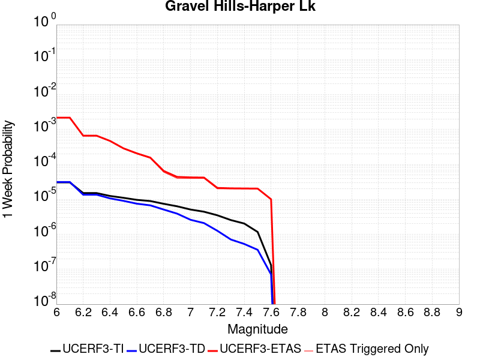 |  |  |  |

| Magnitude | 1 wk TI Prob | 1 wk TD Prob | 1 wk ETAS Prob | 1 wk ETAS/TD Gain | 1 wk ETAS Triggered Only | 1 mo TI Prob | 1 mo TD Prob | 1 mo ETAS Prob | 1 mo ETAS/TD Gain | 1 mo ETAS Triggered Only | 1 yr TI Prob | 1 yr TD Prob | 1 yr ETAS Prob | 1 yr ETAS/TD Gain | 1 yr ETAS Triggered Only | 10 yr TI Prob | 10 yr TD Prob | 10 yr ETAS Prob | 10 yr ETAS/TD Gain | 10 yr ETAS Triggered Only |
|-----|-----|-----|-----|-----|-----|-----|-----|-----|-----|-----|-----|-----|-----|-----|-----|-----|-----|-----|-----|-----|
| 6.0 | 3.0679566E-5 | 3.1464646E-5 | 0.0031756079 | 100.92622 | 0.003144242 | 1.3147724E-4 | 1.3484273E-4 | 0.0041956077 | 31.114822 | 0.004061313 | 0.0015995599 | 0.0016406906 | 0.0075264717 | 4.5873804 | 0.005895454 | 0.015880952 | 0.01630734 | 0.024941875 | 1.5294877 | 0.008777676 |
| 6.1 | 3.0679566E-5 | 3.1464646E-5 | 0.0031756079 | 100.92622 | 0.003144242 | 1.3147724E-4 | 1.3484273E-4 | 0.0041956077 | 31.114822 | 0.004061313 | 0.0015995599 | 0.0016406906 | 0.0075264717 | 4.5873804 | 0.005895454 | 0.015880952 | 0.01630734 | 0.024941875 | 1.5294877 | 0.008777676 |
| 6.2 | 1.514536E-5 | 1.3635206E-5 | 7.99685E-4 | 58.648544 | 7.860605E-4 | 6.490707E-5 | 5.843536E-5 | 9.7545236E-4 | 16.692844 | 9.170706E-4 | 7.8995706E-4 | 7.1123015E-4 | 0.0020203993 | 2.8407109 | 0.0013101009 | 0.007871548 | 0.0070907404 | 0.009172038 | 1.2935234 | 0.0020961615 |
| 6.3 | 1.514536E-5 | 1.3635206E-5 | 7.99685E-4 | 58.648544 | 7.860605E-4 | 6.490707E-5 | 5.843536E-5 | 9.7545236E-4 | 16.692844 | 9.170706E-4 | 7.8995706E-4 | 7.1123015E-4 | 0.0020203993 | 2.8407109 | 0.0013101009 | 0.007871548 | 0.0070907404 | 0.009172038 | 1.2935234 | 0.0020961615 |
| 6.4 | 1.2532521E-5 | 1.06896905E-5 | 4.0371576E-4 | 37.76683 | 3.9303026E-4 | 5.37097E-5 | 4.581219E-5 | 5.6982855E-4 | 12.438361 | 5.2404037E-4 | 6.537194E-4 | 5.576265E-4 | 0.0013432486 | 2.408868 | 7.860605E-4 | 0.0065179965 | 0.005562863 | 0.0068656756 | 1.2341983 | 0.0013101009 |
| 6.5 | 1.1094058E-5 | 9.083664E-6 | 2.7110145E-4 | 29.844948 | 2.6202018E-4 | 4.7545094E-5 | 3.892943E-5 | 4.3194438E-4 | 11.095575 | 3.9303026E-4 | 5.787078E-4 | 4.7386673E-4 | 9.976588E-4 | 2.1053572 | 5.2404037E-4 | 0.0057720304 | 0.0047289706 | 0.0053809234 | 1.1378635 | 6.5505045E-4 |
| 6.6 | 9.688328E-6 | 7.5316952E-6 | 2.695499E-4 | 35.788742 | 2.6202018E-4 | 4.1520743E-5 | 3.227831E-5 | 2.9429002E-4 | 9.1172695 | 2.6202018E-4 | 5.053978E-4 | 3.9292008E-4 | 7.857959E-4 | 1.9998873 | 3.9303026E-4 | 0.0050424994 | 0.0039225104 | 0.0043139993 | 1.0998056 | 3.9303026E-4 |
| 6.7 | 8.974824E-6 | 6.749413E-6 | 2.6876782E-4 | 39.82092 | 2.6202018E-4 | 3.8462964E-5 | 2.8925748E-5 | 2.9093833E-4 | 10.05811 | 2.6202018E-4 | 4.6818596E-4 | 3.5211627E-4 | 7.450081E-4 | 2.1158016 | 3.9303026E-4 | 0.004672008 | 0.0035158044 | 0.003907453 | 1.1113966 | 3.9303026E-4 |
| 6.8 | 7.4780046E-6 | 5.1161933E-6 | 2.6713504E-4 | 52.21363 | 2.6202018E-4 | 3.20482E-5 | 2.1926366E-5 | 2.8394078E-4 | 12.949742 | 2.6202018E-4 | 3.9011694E-4 | 2.669222E-4 | 5.288724E-4 | 1.981373 | 2.6202018E-4 | 0.0038943281 | 0.0026661542 | 0.0029274758 | 1.0980145 | 2.6202018E-4 |
| 6.9 | 6.3409307E-6 | 3.9074966E-6 | 2.6592665E-4 | 68.055504 | 2.6202018E-4 | 2.7175134E-5 | 1.6746313E-5 | 2.787621E-4 | 16.646177 | 2.6202018E-4 | 3.3080703E-4 | 2.0386827E-4 | 4.6583504E-4 | 2.2849805 | 2.6202018E-4 | 0.0033031502 | 0.0020369107 | 0.0022983972 | 1.1283741 | 2.6202018E-4 |
| 7.0 | 5.1239335E-6 | 2.6058565E-6 | 2.6462536E-4 | 101.55024 | 2.6202018E-4 | 2.195953E-5 | 1.116791E-5 | 2.7318517E-4 | 24.461618 | 2.6202018E-4 | 2.6732447E-4 | 1.3596108E-4 | 3.9794564E-4 | 2.9269085 | 2.6202018E-4 | 0.0026700313 | 0.0013588042 | 0.0016204683 | 1.1925694 | 2.6202018E-4 |
| 7.1 | 4.438899E-6 | 2.0984728E-6 | 2.641181E-4 | 125.86205 | 2.6202018E-4 | 1.9023713E-5 | 8.993425E-6 | 2.7101123E-4 | 30.134375 | 2.6202018E-4 | 2.315891E-4 | 1.0948967E-4 | 3.7148115E-4 | 3.392842 | 2.6202018E-4 | 0.002313479 | 0.0010943791 | 0.0013561125 | 1.2391616 | 2.6202018E-4 |
| 7.2 | 3.50367E-6 | 1.2615716E-6 | 1.322715E-4 | 104.8466 | 1.3101009E-4 | 1.5015643E-5 | 5.4067245E-6 | 1.364161E-4 | 25.230822 | 1.3101009E-4 | 1.8280011E-4 | 6.582497E-5 | 1.9682643E-4 | 2.9901485 | 1.3101009E-4 | 0.0018264982 | 6.580629E-4 | 7.889868E-4 | 1.1989534 | 1.3101009E-4 |
| 7.3 | 2.561638E-6 | 7.1191585E-7 | 1.3172191E-4 | 185.02455 | 1.3101009E-4 | 1.0978401E-5 | 3.0510646E-6 | 1.3406076E-4 | 43.93901 | 1.3101009E-4 | 1.3365384E-4 | 3.71461E-5 | 1.6815132E-4 | 4.526756 | 1.3101009E-4 | 0.0013357349 | 3.7140088E-4 | 5.023623E-4 | 1.3526148 | 1.3101009E-4 |
| 7.4 | 2.0368864E-6 | 5.304837E-7 | 1.315405E-4 | 247.96332 | 1.3101009E-4 | 8.729483E-6 | 2.2734996E-6 | 1.3328329E-4 | 58.62472 | 1.3101009E-4 | 1.06276275E-4 | 2.7679513E-5 | 1.5868597E-4 | 5.7329755 | 1.3101009E-4 | 0.0010622547 | 2.767612E-4 | 4.0773503E-4 | 1.4732378 | 1.3101009E-4 |
| 7.5 | 1.1681728E-6 | 3.6030585E-7 | 1.3137034E-4 | 364.60788 | 1.3101009E-4 | 5.0064455E-6 | 1.544167E-6 | 1.3255405E-4 | 85.84178 | 1.3101009E-4 | 6.0951766E-5 | 1.8800076E-5 | 1.498077E-4 | 7.9684625 | 1.3101009E-4 | 6.093505E-4 | 1.8798532E-4 | 3.189708E-4 | 1.6967856 | 1.3101009E-4 |
| 7.6 | 1.3154387E-7 | 7.1197384E-8 | 7.1197384E-8 | 1.0 | 0.0 | 5.6375933E-7 | 3.051316E-7 | 3.051316E-7 | 1.0 | 0.0 | 6.863748E-6 | 3.7149728E-6 | 3.7149728E-6 | 1.0 | 0.0 | 6.863536E-5 | 3.7149264E-5 | 3.7149264E-5 | 1.0 | 0.0 |

## Goldstone Lake
*[(top)](#table-of-contents)*

| 1 Week | 1 Month | 1 Year | 10 Year |
|-----|-----|-----|-----|
|  |  |  |  |

| Magnitude | 1 wk TI Prob | 1 wk TD Prob | 1 wk ETAS Prob | 1 wk ETAS/TD Gain | 1 wk ETAS Triggered Only | 1 mo TI Prob | 1 mo TD Prob | 1 mo ETAS Prob | 1 mo ETAS/TD Gain | 1 mo ETAS Triggered Only | 1 yr TI Prob | 1 yr TD Prob | 1 yr ETAS Prob | 1 yr ETAS/TD Gain | 1 yr ETAS Triggered Only | 10 yr TI Prob | 10 yr TD Prob | 10 yr ETAS Prob | 10 yr ETAS/TD Gain | 10 yr ETAS Triggered Only |
|-----|-----|-----|-----|-----|-----|-----|-----|-----|-----|-----|-----|-----|-----|-----|-----|-----|-----|-----|-----|-----|
| 6.0 | 2.671352E-5 | 3.037609E-5 | 0.0014714433 | 48.440838 | 0.001441111 | 1.1448149E-4 | 1.3017785E-4 | 0.0030120246 | 23.137766 | 0.002882222 | 0.001392921 | 0.0015839594 | 0.0057696416 | 3.6425438 | 0.004192323 | 0.013842222 | 0.015746197 | 0.022193555 | 1.4094551 | 0.0065505044 |
| 6.1 | 2.671352E-5 | 3.037609E-5 | 0.0014714433 | 48.440838 | 0.001441111 | 1.1448149E-4 | 1.3017785E-4 | 0.0030120246 | 23.137766 | 0.002882222 | 0.001392921 | 0.0015839594 | 0.0057696416 | 3.6425438 | 0.004192323 | 0.013842222 | 0.015746197 | 0.022193555 | 1.4094551 | 0.0065505044 |
| 6.2 | 1.4197047E-5 | 1.6096245E-5 | 8.021441E-4 | 49.83424 | 7.860605E-4 | 6.0843064E-5 | 6.8982634E-5 | 0.0016409953 | 23.788527 | 0.001572121 | 7.4051257E-4 | 8.3963864E-4 | 0.00293404 | 3.4944081 | 0.0020961615 | 0.007380498 | 0.0083743585 | 0.011102531 | 1.3257768 | 0.0027512119 |
| 6.3 | 1.4197047E-5 | 1.6096245E-5 | 8.021441E-4 | 49.83424 | 7.860605E-4 | 6.0843064E-5 | 6.8982634E-5 | 0.0016409953 | 23.788527 | 0.001572121 | 7.4051257E-4 | 8.3963864E-4 | 0.00293404 | 3.4944081 | 0.0020961615 | 0.007380498 | 0.0083743585 | 0.011102531 | 1.3257768 | 0.0027512119 |
| 6.4 | 1.3238931E-5 | 1.500846E-5 | 8.010572E-4 | 53.37371 | 7.860605E-4 | 5.6737044E-5 | 6.4320935E-5 | 0.0016363409 | 25.440252 | 0.001572121 | 6.9055456E-4 | 7.82924E-4 | 0.0028774443 | 3.6752536 | 0.0020961615 | 0.006884126 | 0.0078112837 | 0.010541005 | 1.3494587 | 0.0027512119 |
| 6.5 | 1.3238931E-5 | 1.500846E-5 | 8.010572E-4 | 53.37371 | 7.860605E-4 | 5.6737044E-5 | 6.4320935E-5 | 0.0016363409 | 25.440252 | 0.001572121 | 6.9055456E-4 | 7.82924E-4 | 0.0028774443 | 3.6752536 | 0.0020961615 | 0.006884126 | 0.0078112837 | 0.010541005 | 1.3494587 | 0.0027512119 |
| 6.6 | 1.1328278E-5 | 1.2855166E-5 | 5.368888E-4 | 41.76444 | 5.2404037E-4 | 4.8548856E-5 | 5.5092944E-5 | 0.0011031159 | 20.022818 | 0.0010480807 | 5.90922E-4 | 6.7064585E-4 | 0.0022417125 | 3.3426175 | 0.001572121 | 0.0058935313 | 0.0066956086 | 0.008647602 | 1.2915334 | 0.0019651514 |
| 6.7 | 8.651175E-6 | 9.824565E-6 | 4.0285097E-4 | 41.00446 | 3.9303026E-4 | 3.707594E-5 | 4.2105108E-5 | 6.9712795E-4 | 16.55685 | 6.5505045E-4 | 4.5130608E-4 | 5.1259965E-4 | 0.0015601431 | 3.04359 | 0.0010480807 | 0.0045039062 | 0.005123051 | 0.006556779 | 1.2798582 | 0.001441111 |
| 6.8 | 1.0215377E-6 | 1.1754702E-6 | 1.1754702E-6 | 1.0 | 0.0 | 4.378012E-6 | 5.0377203E-6 | 5.0377203E-6 | 1.0 | 0.0 | 5.3300988E-5 | 6.1332634E-5 | 6.1332634E-5 | 1.0 | 0.0 | 5.3288206E-4 | 6.1316835E-4 | 6.1316835E-4 | 1.0 | 0.0 |
| 6.9 | 7.9360774E-7 | 9.2833966E-7 | 9.2833966E-7 | 1.0 | 0.0 | 3.4011714E-6 | 3.9785928E-6 | 3.9785928E-6 | 1.0 | 0.0 | 4.1408475E-5 | 4.843836E-5 | 4.843836E-5 | 1.0 | 0.0 | 4.140076E-4 | 4.8428503E-4 | 4.8428503E-4 | 1.0 | 0.0 |
| 7.0 | 7.4382757E-7 | 8.7473285E-7 | 8.7473285E-7 | 1.0 | 0.0 | 3.1878285E-6 | 3.74885E-6 | 3.74885E-6 | 1.0 | 0.0 | 3.8811122E-5 | 4.564136E-5 | 4.564136E-5 | 1.0 | 0.0 | 3.8804344E-4 | 4.5632652E-4 | 4.5632652E-4 | 1.0 | 0.0 |
| 7.1 | 6.4709513E-7 | 7.7113E-7 | 7.7113E-7 | 1.0 | 0.0 | 2.773262E-6 | 3.3048389E-6 | 3.3048389E-6 | 1.0 | 0.0 | 3.376394E-5 | 4.0235733E-5 | 4.0235733E-5 | 1.0 | 0.0 | 3.375881E-4 | 4.0229043E-4 | 4.0229043E-4 | 1.0 | 0.0 |
| 7.2 | 6.356704E-7 | 7.5883594E-7 | 7.5883594E-7 | 1.0 | 0.0 | 2.7242988E-6 | 3.2521505E-6 | 3.2521505E-6 | 1.0 | 0.0 | 3.3167835E-5 | 3.959427E-5 | 3.959427E-5 | 1.0 | 0.0 | 3.3162883E-4 | 3.958781E-4 | 3.958781E-4 | 1.0 | 0.0 |
| 7.3 | 5.7695723E-7 | 6.8965653E-7 | 6.8965653E-7 | 1.0 | 0.0 | 2.4726714E-6 | 2.9556677E-6 | 2.9556677E-6 | 1.0 | 0.0 | 3.0104358E-5 | 3.5984718E-5 | 3.5984718E-5 | 1.0 | 0.0 | 3.0100282E-4 | 3.5979465E-4 | 3.5979465E-4 | 1.0 | 0.0 |
| 7.4 | 5.209647E-7 | 6.193514E-7 | 6.193514E-7 | 1.0 | 0.0 | 2.232704E-6 | 2.6543607E-6 | 2.6543607E-6 | 1.0 | 0.0 | 2.718283E-5 | 3.2316417E-5 | 3.2316417E-5 | 1.0 | 0.0 | 2.7179506E-4 | 3.2312275E-4 | 3.2312275E-4 | 1.0 | 0.0 |
| 7.5 | 4.512955E-7 | 5.348885E-7 | 5.348885E-7 | 1.0 | 0.0 | 1.934122E-6 | 2.2923775E-6 | 2.2923775E-6 | 1.0 | 0.0 | 2.3547682E-5 | 2.7909393E-5 | 2.7909393E-5 | 1.0 | 0.0 | 2.3545188E-4 | 2.7906417E-4 | 2.7906417E-4 | 1.0 | 0.0 |
| 7.6 | 2.21172E-7 | 2.603961E-7 | 2.603961E-7 | 1.0 | 0.0 | 9.478797E-7 | 1.1159829E-6 | 1.1159829E-6 | 1.0 | 0.0 | 1.1540374E-5 | 1.3587036E-5 | 1.3587036E-5 | 1.0 | 0.0 | 1.1539775E-4 | 1.3586486E-4 | 1.3586486E-4 | 1.0 | 0.0 |

## San Andreas (Mojave N)
*[(top)](#table-of-contents)*

| 1 Week | 1 Month | 1 Year | 10 Year |
|-----|-----|-----|-----|
|  |  |  |  |

| Magnitude | 1 wk TI Prob | 1 wk TD Prob | 1 wk ETAS Prob | 1 wk ETAS/TD Gain | 1 wk ETAS Triggered Only | 1 mo TI Prob | 1 mo TD Prob | 1 mo ETAS Prob | 1 mo ETAS/TD Gain | 1 mo ETAS Triggered Only | 1 yr TI Prob | 1 yr TD Prob | 1 yr ETAS Prob | 1 yr ETAS/TD Gain | 1 yr ETAS Triggered Only | 10 yr TI Prob | 10 yr TD Prob | 10 yr ETAS Prob | 10 yr ETAS/TD Gain | 10 yr ETAS Triggered Only |
|-----|-----|-----|-----|-----|-----|-----|-----|-----|-----|-----|-----|-----|-----|-----|-----|-----|-----|-----|-----|-----|
| 6.0 | 9.877682E-5 | 1.9400702E-4 | 0.002944685 | 15.17824 | 0.0027512119 | 4.2326056E-4 | 8.311939E-4 | 0.004234625 | 5.0946293 | 0.0034062623 | 0.0051410277 | 0.010072956 | 0.01448243 | 1.4377538 | 0.004454343 | 0.05023708 | 0.09831428 | 0.103748254 | 1.0552715 | 0.006026464 |
| 6.1 | 9.877682E-5 | 1.9400702E-4 | 0.002944685 | 15.17824 | 0.0027512119 | 4.2326056E-4 | 8.311939E-4 | 0.004234625 | 5.0946293 | 0.0034062623 | 0.0051410277 | 0.010072956 | 0.01448243 | 1.4377538 | 0.004454343 | 0.05023708 | 0.09831428 | 0.103748254 | 1.0552715 | 0.006026464 |
| 6.2 | 9.877682E-5 | 1.9400702E-4 | 0.002944685 | 15.17824 | 0.0027512119 | 4.2326056E-4 | 8.311939E-4 | 0.004234625 | 5.0946293 | 0.0034062623 | 0.0051410277 | 0.010072956 | 0.01448243 | 1.4377538 | 0.004454343 | 0.05023708 | 0.09831428 | 0.103748254 | 1.0552715 | 0.006026464 |
| 6.3 | 9.877682E-5 | 1.9400702E-4 | 0.002944685 | 15.17824 | 0.0027512119 | 4.2326056E-4 | 8.311939E-4 | 0.004234625 | 5.0946293 | 0.0034062623 | 0.0051410277 | 0.010072956 | 0.01448243 | 1.4377538 | 0.004454343 | 0.05023708 | 0.09831428 | 0.103748254 | 1.0552715 | 0.006026464 |
| 6.4 | 9.877682E-5 | 1.9400702E-4 | 0.002944685 | 15.17824 | 0.0027512119 | 4.2326056E-4 | 8.311939E-4 | 0.004234625 | 5.0946293 | 0.0034062623 | 0.0051410277 | 0.010072956 | 0.01448243 | 1.4377538 | 0.004454343 | 0.05023708 | 0.09831428 | 0.103748254 | 1.0552715 | 0.006026464 |
| 6.5 | 9.861474E-5 | 1.9374468E-4 | 0.0029444236 | 15.197442 | 0.0027512119 | 4.2256617E-4 | 8.300703E-4 | 0.004233505 | 5.1001763 | 0.0034062623 | 0.0051326132 | 0.010059402 | 0.014468938 | 1.4383496 | 0.004454343 | 0.050156746 | 0.098192066 | 0.10362678 | 1.0553478 | 0.006026464 |
| 6.6 | 9.861474E-5 | 1.9374468E-4 | 0.0029444236 | 15.197442 | 0.0027512119 | 4.2256617E-4 | 8.300703E-4 | 0.004233505 | 5.1001763 | 0.0034062623 | 0.0051326132 | 0.010059402 | 0.014468938 | 1.4383496 | 0.004454343 | 0.050156746 | 0.098192066 | 0.10362678 | 1.0553478 | 0.006026464 |
| 6.7 | 9.8552715E-5 | 1.9364421E-4 | 0.0029443232 | 15.204809 | 0.0027512119 | 4.223004E-4 | 8.2964E-4 | 0.0042330762 | 5.102305 | 0.0034062623 | 0.0051293927 | 0.010054212 | 0.01446377 | 1.4385781 | 0.004454343 | 0.050125998 | 0.098145254 | 0.10358025 | 1.055377 | 0.006026464 |
| 6.8 | 9.8464974E-5 | 1.9349584E-4 | 0.0029441754 | 15.215703 | 0.0027512119 | 4.219245E-4 | 8.290045E-4 | 0.004232443 | 5.105452 | 0.0034062623 | 0.0051248376 | 0.010046546 | 0.014456139 | 1.4389162 | 0.004454343 | 0.05008251 | 0.09807528 | 0.1035107 | 1.0554209 | 0.006026464 |
| 6.9 | 9.825824E-5 | 1.9317595E-4 | 0.0029438564 | 15.239249 | 0.0027512119 | 4.2103877E-4 | 8.276344E-4 | 0.0042310776 | 5.112254 | 0.0034062623 | 0.0051141046 | 0.010030019 | 0.014439685 | 1.4396468 | 0.004454343 | 0.049980022 | 0.09792438 | 0.103360705 | 1.0555155 | 0.006026464 |
| 7.0 | 9.781462E-5 | 1.924896E-4 | 0.002943172 | 15.2900305 | 0.0027512119 | 4.1913814E-4 | 8.246948E-4 | 0.004228148 | 5.1269245 | 0.0034062623 | 0.005091073 | 0.009994558 | 0.014404383 | 1.4412224 | 0.004454343 | 0.04976007 | 0.09760077 | 0.10292082 | 1.0545083 | 0.005895454 |
| 7.1 | 9.7121134E-5 | 1.9150671E-4 | 0.0029421917 | 15.363386 | 0.0027512119 | 4.1616702E-4 | 8.204851E-4 | 0.0042239525 | 5.148116 | 0.0034062623 | 0.005055068 | 0.009943774 | 0.014353824 | 1.4434986 | 0.004454343 | 0.04941613 | 0.09713728 | 0.10246007 | 1.0547966 | 0.005895454 |
| 7.2 | 9.663819E-5 | 1.9081456E-4 | 0.0029415013 | 15.415497 | 0.0027512119 | 4.1409794E-4 | 8.175206E-4 | 0.0042209984 | 5.1631703 | 0.0034062623 | 0.0050299936 | 0.00990801 | 0.01431822 | 1.4451156 | 0.004454343 | 0.049176537 | 0.09681055 | 0.102135256 | 1.0550014 | 0.005895454 |
| 7.3 | 9.6277574E-5 | 1.9033969E-4 | 0.002941028 | 15.451468 | 0.0027512119 | 4.125529E-4 | 8.154867E-4 | 0.0042189714 | 5.173562 | 0.0034062623 | 0.0050112694 | 0.009883473 | 0.014293792 | 1.4462317 | 0.004454343 | 0.04899759 | 0.09658401 | 0.101910055 | 1.0551442 | 0.005895454 |
| 7.4 | 9.593308E-5 | 1.897375E-4 | 0.0029404273 | 15.497344 | 0.0027512119 | 4.1107697E-4 | 8.129075E-4 | 0.004216401 | 5.186815 | 0.0034062623 | 0.0049933824 | 0.009852355 | 0.014262812 | 1.4476551 | 0.004454343 | 0.04882661 | 0.09630218 | 0.10162989 | 1.0553228 | 0.005895454 |
| 7.5 | 9.561707E-5 | 1.8919831E-4 | 0.0029398897 | 15.538667 | 0.0027512119 | 4.0972308E-4 | 8.1059814E-4 | 0.004214099 | 5.198753 | 0.0034062623 | 0.0049769743 | 0.009824493 | 0.014235074 | 1.4489373 | 0.004454343 | 0.048669744 | 0.09604836 | 0.10137757 | 1.0554847 | 0.005895454 |
| 7.6 | 9.418194E-5 | 1.8572104E-4 | 0.002936422 | 15.810927 | 0.0027512119 | 4.0357444E-4 | 7.957047E-4 | 0.0041992567 | 5.2774057 | 0.0034062623 | 0.004902454 | 0.009644784 | 0.014056166 | 1.4573852 | 0.004454343 | 0.047957025 | 0.094430685 | 0.09976943 | 1.0565361 | 0.005895454 |
| 7.7 | 8.202141E-5 | 1.6021315E-4 | 0.002779995 | 17.351852 | 0.0026202018 | 3.51473E-4 | 6.8644714E-4 | 0.003828531 | 5.5773134 | 0.003144242 | 0.00427079 | 0.008325525 | 0.012223106 | 1.4681484 | 0.003930303 | 0.04189639 | 0.08223219 | 0.08704167 | 1.0584865 | 0.0052404036 |
| 7.8 | 7.2859846E-5 | 1.4516473E-4 | 0.0018480486 | 12.7307005 | 0.0017031311 | 3.1221908E-4 | 6.219862E-4 | 0.0028477723 | 4.5785136 | 0.0022271716 | 0.003794643 | 0.0075464295 | 0.010406901 | 1.3790497 | 0.002882222 | 0.037304975 | 0.07472468 | 0.078240074 | 1.0470446 | 0.0037992925 |
| 7.9 | 5.3874453E-5 | 1.0045676E-4 | 0.0011484321 | 11.432104 | 0.0010480807 | 2.3087008E-4 | 4.3045796E-4 | 0.0016090412 | 3.7379754 | 0.0011790908 | 0.0028072202 | 0.0052282433 | 0.00692247 | 1.3240528 | 0.0017031311 | 0.02772022 | 0.05242443 | 0.05453484 | 1.0402563 | 0.0022271716 |
| 8.0 | 3.468538E-5 | 5.4260272E-5 | 1.8526326E-4 | 3.4143443 | 1.3101009E-4 | 1.4864317E-4 | 2.325233E-4 | 4.944826E-4 | 2.1265936 | 2.6202018E-4 | 0.0018082283 | 0.002827298 | 0.0030885772 | 1.0924131 | 2.6202018E-4 | 0.017935853 | 0.028947512 | 0.029201947 | 1.0087895 | 2.6202018E-4 |
| 8.1 | 1.9152367E-5 | 1.940263E-5 | 1.5041018E-4 | 7.752051 | 1.3101009E-4 | 8.207899E-5 | 8.3151484E-5 | 2.1415067E-4 | 2.5754282 | 1.3101009E-4 | 9.988535E-4 | 0.0010118998 | 0.0011427773 | 1.1293384 | 1.3101009E-4 | 0.009943757 | 0.01085625 | 0.010985838 | 1.0119367 | 1.3101009E-4 |
| 8.2 | 8.643924E-6 | 5.4748625E-6 | 5.4748625E-6 | 1.0 | 0.0 | 3.704486E-5 | 2.3463486E-5 | 2.3463486E-5 | 1.0 | 0.0 | 4.5092785E-4 | 2.8563058E-4 | 2.8563058E-4 | 1.0 | 0.0 | 0.0045001395 | 0.0032487072 | 0.0032487072 | 1.0 | 0.0 |
| 8.3 | 1.983087E-6 | 7.6599065E-7 | 7.6599065E-7 | 1.0 | 0.0 | 8.498917E-6 | 3.282813E-6 | 3.282813E-6 | 1.0 | 0.0 | 1.034694E-4 | 3.9967534E-5 | 3.9967534E-5 | 1.0 | 0.0 | 0.0010342124 | 4.719687E-4 | 4.719687E-4 | 1.0 | 0.0 |

## San Andreas (Mojave S)
*[(top)](#table-of-contents)*

| 1 Week | 1 Month | 1 Year | 10 Year |
|-----|-----|-----|-----|
|  |  |  |  |

| Magnitude | 1 wk TI Prob | 1 wk TD Prob | 1 wk ETAS Prob | 1 wk ETAS/TD Gain | 1 wk ETAS Triggered Only | 1 mo TI Prob | 1 mo TD Prob | 1 mo ETAS Prob | 1 mo ETAS/TD Gain | 1 mo ETAS Triggered Only | 1 yr TI Prob | 1 yr TD Prob | 1 yr ETAS Prob | 1 yr ETAS/TD Gain | 1 yr ETAS Triggered Only | 10 yr TI Prob | 10 yr TD Prob | 10 yr ETAS Prob | 10 yr ETAS/TD Gain | 10 yr ETAS Triggered Only |
|-----|-----|-----|-----|-----|-----|-----|-----|-----|-----|-----|-----|-----|-----|-----|-----|-----|-----|-----|-----|-----|
| 6.0 | 3.1064058E-4 | 6.7460834E-4 | 0.0029002773 | 4.299202 | 0.0022271716 | 0.0013306376 | 0.0028881032 | 0.0056313695 | 1.9498504 | 0.0027512119 | 0.016080605 | 0.03462235 | 0.038290102 | 1.1059359 | 0.0037992925 | 0.1496549 | 0.28660452 | 0.29043648 | 1.0133702 | 0.0053714137 |
| 6.1 | 3.1064058E-4 | 6.7460834E-4 | 0.0029002773 | 4.299202 | 0.0022271716 | 0.0013306376 | 0.0028881032 | 0.0056313695 | 1.9498504 | 0.0027512119 | 0.016080605 | 0.03462235 | 0.038290102 | 1.1059359 | 0.0037992925 | 0.1496549 | 0.28660452 | 0.29043648 | 1.0133702 | 0.0053714137 |
| 6.2 | 3.1064058E-4 | 6.7460834E-4 | 0.0029002773 | 4.299202 | 0.0022271716 | 0.0013306376 | 0.0028881032 | 0.0056313695 | 1.9498504 | 0.0027512119 | 0.016080605 | 0.03462235 | 0.038290102 | 1.1059359 | 0.0037992925 | 0.1496549 | 0.28660452 | 0.29043648 | 1.0133702 | 0.0053714137 |
| 6.3 | 3.1064058E-4 | 6.7460834E-4 | 0.0029002773 | 4.299202 | 0.0022271716 | 0.0013306376 | 0.0028881032 | 0.0056313695 | 1.9498504 | 0.0027512119 | 0.016080605 | 0.03462235 | 0.038290102 | 1.1059359 | 0.0037992925 | 0.1496549 | 0.28660452 | 0.29043648 | 1.0133702 | 0.0053714137 |
| 6.4 | 1.9872203E-4 | 4.3179357E-4 | 0.0026580035 | 6.1557274 | 0.0022271716 | 8.5138786E-4 | 0.0018492596 | 0.0045953835 | 2.4849858 | 0.0027512119 | 0.010316478 | 0.02228844 | 0.025874961 | 1.1609141 | 0.0036682824 | 0.098504856 | 0.19699748 | 0.20099513 | 1.0202929 | 0.0049783834 |
| 6.5 | 1.291105E-4 | 2.875267E-4 | 0.0025140578 | 8.743737 | 0.0022271716 | 5.5321335E-4 | 0.0012316781 | 0.0039795013 | 3.230959 | 0.0027512119 | 0.006714592 | 0.0148934 | 0.01837799 | 1.2339687 | 0.0035372723 | 0.065152965 | 0.13803436 | 0.14221263 | 1.0302697 | 0.0048473733 |
| 6.6 | 1.291105E-4 | 2.875267E-4 | 0.0025140578 | 8.743737 | 0.0022271716 | 5.5321335E-4 | 0.0012316781 | 0.0039795013 | 3.230959 | 0.0027512119 | 0.006714592 | 0.0148934 | 0.01837799 | 1.2339687 | 0.0035372723 | 0.065152965 | 0.13803436 | 0.14221263 | 1.0302697 | 0.0048473733 |
| 6.7 | 1.08001186E-4 | 2.4333889E-4 | 0.0024699685 | 10.150324 | 0.0022271716 | 4.6278012E-4 | 0.0010424647 | 0.0037908086 | 3.6363902 | 0.0027512119 | 0.0056198016 | 0.012618446 | 0.016111083 | 1.2767882 | 0.0035372723 | 0.054797906 | 0.119176775 | 0.12344646 | 1.0358264 | 0.0048473733 |
| 6.8 | 1.0624356E-4 | 2.3851555E-4 | 0.002465156 | 10.335409 | 0.0022271716 | 4.5525006E-4 | 0.0010218095 | 0.00377021 | 3.6897385 | 0.0027512119 | 0.0055285925 | 0.012369843 | 0.01586336 | 1.2824221 | 0.0035372723 | 0.053930566 | 0.11712591 | 0.121405534 | 1.0365386 | 0.0048473733 |
| 6.9 | 1.0393785E-4 | 2.3221898E-4 | 0.0023278936 | 10.024562 | 0.0020961615 | 4.4537184E-4 | 9.948451E-4 | 0.00361244 | 3.6311584 | 0.0026202018 | 0.0054089287 | 0.012045221 | 0.015410454 | 1.2793833 | 0.0034062623 | 0.05279156 | 0.11442335 | 0.118600056 | 1.0365021 | 0.0047163633 |
| 7.0 | 1.0155622E-4 | 2.2591476E-4 | 0.0023216025 | 10.276454 | 0.0020961615 | 4.3516833E-4 | 9.6784724E-4 | 0.003585513 | 3.704627 | 0.0026202018 | 0.005285311 | 0.0117200995 | 0.014956966 | 1.2761807 | 0.0032752522 | 0.05161361 | 0.111683756 | 0.115756996 | 1.0364712 | 0.004585353 |
| 7.1 | 9.885595E-5 | 2.1879886E-4 | 0.0023145017 | 10.578217 | 0.0020961615 | 4.2359953E-4 | 9.3737274E-4 | 0.0035551183 | 3.7926412 | 0.0026202018 | 0.0051451353 | 0.011352993 | 0.014591061 | 1.2852172 | 0.0032752522 | 0.05027629 | 0.1085682 | 0.11265573 | 1.0376494 | 0.004585353 |
| 7.2 | 9.6411415E-5 | 2.124288E-4 | 0.002308145 | 10.865499 | 0.0020961615 | 4.1312634E-4 | 9.1009185E-4 | 0.003527909 | 3.876432 | 0.0026202018 | 0.005018219 | 0.011024255 | 0.014263401 | 1.2938198 | 0.0032752522 | 0.049064007 | 0.105758004 | 0.109858416 | 1.0387716 | 0.004585353 |
| 7.3 | 9.1180635E-5 | 1.9471257E-4 | 0.0022904659 | 11.763317 | 0.0020961615 | 3.907156E-4 | 8.342157E-4 | 0.0034522316 | 4.138296 | 0.0026202018 | 0.004746591 | 0.01010939 | 0.013351531 | 1.3207059 | 0.0032752522 | 0.046464786 | 0.09795115 | 0.10208736 | 1.0422273 | 0.004585353 |
| 7.4 | 8.887388E-5 | 1.8719878E-4 | 0.0022829678 | 12.19542 | 0.0020961615 | 3.8083247E-4 | 8.020339E-4 | 0.003420134 | 4.264326 | 0.0026202018 | 0.0046267817 | 0.00972114 | 0.012964553 | 1.3336453 | 0.0032752522 | 0.045316286 | 0.09458615 | 0.09861917 | 1.0426387 | 0.004454343 |
| 7.5 | 8.6750515E-5 | 1.8051457E-4 | 0.0022762977 | 12.610049 | 0.0020961615 | 3.7173493E-4 | 7.7340455E-4 | 0.00339158 | 4.3852596 | 0.0026202018 | 0.004516484 | 0.009375632 | 0.012620176 | 1.3460615 | 0.0032752522 | 0.04425787 | 0.091549896 | 0.09559644 | 1.0442004 | 0.004454343 |
| 7.6 | 8.453092E-5 | 1.7439072E-4 | 0.0022701866 | 13.0178175 | 0.0020961615 | 3.6222505E-4 | 7.471748E-4 | 0.0033654189 | 4.5041924 | 0.0026202018 | 0.0044011753 | 0.009058985 | 0.012304566 | 1.3582722 | 0.0032752522 | 0.04315024 | 0.08870898 | 0.092768185 | 1.0457586 | 0.004454343 |
| 7.7 | 8.259102E-5 | 1.6961215E-4 | 0.002265418 | 13.356461 | 0.0020961615 | 3.539135E-4 | 7.2670676E-4 | 0.0033450045 | 4.602963 | 0.0026202018 | 0.004300386 | 0.008811831 | 0.012058222 | 1.3684129 | 0.0032752522 | 0.042181134 | 0.08645982 | 0.09052905 | 1.0470649 | 0.004454343 |
| 7.8 | 7.444844E-5 | 1.5283503E-4 | 0.0018557059 | 12.141889 | 0.0017031311 | 3.1902574E-4 | 6.548429E-4 | 0.0028805558 | 4.3988504 | 0.0022271716 | 0.0038772223 | 0.007943616 | 0.010802942 | 1.3599528 | 0.002882222 | 0.03810269 | 0.078290746 | 0.08179259 | 1.0447288 | 0.0037992925 |
| 7.9 | 5.2586525E-5 | 1.00064186E-4 | 0.00114804 | 11.473036 | 0.0010480807 | 2.2535135E-4 | 4.2877605E-4 | 0.0016073612 | 3.74872 | 0.0011790908 | 0.0027402006 | 0.005207864 | 0.006902125 | 1.3253275 | 0.0017031311 | 0.027066574 | 0.052200034 | 0.054310948 | 1.0404389 | 0.0022271716 |
| 8.0 | 3.379877E-5 | 5.4074168E-5 | 1.8507717E-4 | 3.4226542 | 1.3101009E-4 | 1.4484383E-4 | 2.3172585E-4 | 4.936853E-4 | 2.1304715 | 2.6202018E-4 | 0.0017620471 | 0.002817614 | 0.0030788959 | 1.0927316 | 2.6202018E-4 | 0.017481409 | 0.028834904 | 0.029089367 | 1.008825 | 2.6202018E-4 |
| 8.1 | 1.8668277E-5 | 1.9309397E-5 | 1.5031695E-4 | 7.784653 | 1.3101009E-4 | 8.000444E-5 | 8.275194E-5 | 2.1375118E-4 | 2.5830355 | 1.3101009E-4 | 9.736188E-4 | 0.0010070398 | 0.001137918 | 1.1299633 | 1.3101009E-4 | 0.009693642 | 0.010798888 | 0.010928484 | 1.0120008 | 1.3101009E-4 |
| 8.2 | 8.541571E-6 | 5.460819E-6 | 5.460819E-6 | 1.0 | 0.0 | 3.660622E-5 | 2.3403301E-5 | 2.3403301E-5 | 1.0 | 0.0 | 4.455896E-4 | 2.84898E-4 | 2.84898E-4 | 1.0 | 0.0 | 0.0044469717 | 0.0032408056 | 0.0032408056 | 1.0 | 0.0 |
| 8.3 | 1.983087E-6 | 7.6599065E-7 | 7.6599065E-7 | 1.0 | 0.0 | 8.498917E-6 | 3.282813E-6 | 3.282813E-6 | 1.0 | 0.0 | 1.034694E-4 | 3.9967534E-5 | 3.9967534E-5 | 1.0 | 0.0 | 0.0010342124 | 4.719687E-4 | 4.719687E-4 | 1.0 | 0.0 |

## So Sierra Nevada
*[(top)](#table-of-contents)*

| 1 Week | 1 Month | 1 Year | 10 Year |
|-----|-----|-----|-----|
|  |  |  |  |

| Magnitude | 1 wk TI Prob | 1 wk TD Prob | 1 wk ETAS Prob | 1 wk ETAS/TD Gain | 1 wk ETAS Triggered Only | 1 mo TI Prob | 1 mo TD Prob | 1 mo ETAS Prob | 1 mo ETAS/TD Gain | 1 mo ETAS Triggered Only | 1 yr TI Prob | 1 yr TD Prob | 1 yr ETAS Prob | 1 yr ETAS/TD Gain | 1 yr ETAS Triggered Only | 10 yr TI Prob | 10 yr TD Prob | 10 yr ETAS Prob | 10 yr ETAS/TD Gain | 10 yr ETAS Triggered Only |
|-----|-----|-----|-----|-----|-----|-----|-----|-----|-----|-----|-----|-----|-----|-----|-----|-----|-----|-----|-----|-----|
| 6.0 | 1.15488665E-5 | 1.1079643E-5 | 0.0014521746 | 131.06693 | 0.001441111 | 4.9494203E-5 | 4.748339E-5 | 0.002274549 | 47.901997 | 0.0022271716 | 6.024253E-4 | 5.7796965E-4 | 0.004506001 | 7.796258 | 0.003930303 | 0.006007948 | 0.005765934 | 0.010976122 | 1.9036156 | 0.0052404036 |
| 6.1 | 1.15488665E-5 | 1.1079643E-5 | 0.0014521746 | 131.06693 | 0.001441111 | 4.9494203E-5 | 4.748339E-5 | 0.002274549 | 47.901997 | 0.0022271716 | 6.024253E-4 | 5.7796965E-4 | 0.004506001 | 7.796258 | 0.003930303 | 0.006007948 | 0.005765934 | 0.010976122 | 1.9036156 | 0.0052404036 |
| 6.2 | 1.15488665E-5 | 1.1079643E-5 | 0.0014521746 | 131.06693 | 0.001441111 | 4.9494203E-5 | 4.748339E-5 | 0.002274549 | 47.901997 | 0.0022271716 | 6.024253E-4 | 5.7796965E-4 | 0.004506001 | 7.796258 | 0.003930303 | 0.006007948 | 0.005765934 | 0.010976122 | 1.9036156 | 0.0052404036 |
| 6.3 | 1.15488665E-5 | 1.1079643E-5 | 0.0014521746 | 131.06693 | 0.001441111 | 4.9494203E-5 | 4.748339E-5 | 0.002274549 | 47.901997 | 0.0022271716 | 6.024253E-4 | 5.7796965E-4 | 0.004506001 | 7.796258 | 0.003930303 | 0.006007948 | 0.005765934 | 0.010976122 | 1.9036156 | 0.0052404036 |
| 6.4 | 1.15488665E-5 | 1.1079643E-5 | 0.0014521746 | 131.06693 | 0.001441111 | 4.9494203E-5 | 4.748339E-5 | 0.002274549 | 47.901997 | 0.0022271716 | 6.024253E-4 | 5.7796965E-4 | 0.004506001 | 7.796258 | 0.003930303 | 0.006007948 | 0.005765934 | 0.010976122 | 1.9036156 | 0.0052404036 |
| 6.5 | 1.15488665E-5 | 1.1079643E-5 | 0.0014521746 | 131.06693 | 0.001441111 | 4.9494203E-5 | 4.748339E-5 | 0.002274549 | 47.901997 | 0.0022271716 | 6.024253E-4 | 5.7796965E-4 | 0.004506001 | 7.796258 | 0.003930303 | 0.006007948 | 0.005765934 | 0.010976122 | 1.9036156 | 0.0052404036 |
| 6.6 | 7.587044E-6 | 6.935635E-6 | 0.0010550091 | 152.11427 | 0.0010480807 | 3.2515498E-5 | 2.9723828E-5 | 0.0016017981 | 53.889362 | 0.001572121 | 3.9580427E-4 | 3.6183043E-4 | 0.002588196 | 7.1530633 | 0.0022271716 | 0.003951 | 0.0036127048 | 0.006484514 | 1.7949195 | 0.002882222 |
| 6.7 | 7.587044E-6 | 6.935635E-6 | 0.0010550091 | 152.11427 | 0.0010480807 | 3.2515498E-5 | 2.9723828E-5 | 0.0016017981 | 53.889362 | 0.001572121 | 3.9580427E-4 | 3.6183043E-4 | 0.002588196 | 7.1530633 | 0.0022271716 | 0.003951 | 0.0036127048 | 0.006484514 | 1.7949195 | 0.002882222 |
| 6.8 | 5.9026956E-6 | 5.1793927E-6 | 6.6022645E-4 | 127.47179 | 6.5505045E-4 | 2.5297022E-5 | 2.2197215E-5 | 9.392475E-4 | 42.31375 | 9.170706E-4 | 3.0794772E-4 | 2.7021873E-4 | 0.0015799656 | 5.8469877 | 0.0013101009 | 0.0030752132 | 0.002699018 | 0.004266896 | 1.5809067 | 0.001572121 |
| 6.9 | 5.0118915E-6 | 4.2524252E-6 | 6.593001E-4 | 155.04095 | 6.5505045E-4 | 2.1479358E-5 | 1.8224557E-5 | 8.0427073E-4 | 44.131157 | 7.860605E-4 | 2.614798E-4 | 2.2186211E-4 | 0.0011387293 | 5.132599 | 9.170706E-4 | 0.0026117235 | 0.0022164788 | 0.0033929562 | 1.5307866 | 0.0011790908 |
| 7.0 | 4.4924795E-6 | 3.7139177E-6 | 6.5876194E-4 | 177.37656 | 6.5505045E-4 | 1.925334E-5 | 1.5916696E-5 | 8.019647E-4 | 50.385124 | 7.860605E-4 | 2.3438422E-4 | 1.9376918E-4 | 9.796774E-4 | 5.055899 | 7.860605E-4 | 0.0023413717 | 0.0019360651 | 0.0029821168 | 1.5402976 | 0.0010480807 |
| 7.1 | 3.9118436E-6 | 3.1119775E-6 | 3.9614103E-4 | 127.295586 | 3.9303026E-4 | 1.6764936E-5 | 1.3336982E-5 | 4.06362E-4 | 30.468813 | 3.9303026E-4 | 2.0409399E-4 | 1.6236622E-4 | 5.553327E-4 | 3.4202476 | 3.9303026E-4 | 0.0020390663 | 0.001622532 | 0.0022765195 | 1.403066 | 6.5505045E-4 |
| 7.2 | 3.4200818E-6 | 2.6054543E-6 | 3.956347E-4 | 151.84865 | 3.9303026E-4 | 1.4657411E-5 | 1.11661875E-5 | 4.0419208E-4 | 36.197857 | 3.9303026E-4 | 1.7843937E-4 | 1.3594035E-4 | 5.289172E-4 | 3.8908033 | 3.9303026E-4 | 0.0017829615 | 0.0013586218 | 0.0018819502 | 1.3851906 | 5.2404037E-4 |
| 7.3 | 2.6593618E-6 | 1.8284203E-6 | 2.638481E-4 | 144.30386 | 2.6202018E-4 | 1.13972155E-5 | 7.836065E-6 | 2.6985418E-4 | 34.43746 | 2.6202018E-4 | 1.3875226E-4 | 9.540021E-5 | 3.573954E-4 | 3.7462747 | 2.6202018E-4 | 0.0013866565 | 9.5362146E-4 | 0.001346277 | 1.4117519 | 3.9303026E-4 |
| 7.4 | 2.2577992E-6 | 1.436438E-6 | 2.6345623E-4 | 183.40941 | 2.6202018E-4 | 9.676246E-6 | 6.15615E-6 | 2.681747E-4 | 43.562084 | 2.6202018E-4 | 1.1780193E-4 | 7.49488E-5 | 3.3694934E-4 | 4.495727 | 2.6202018E-4 | 0.001177395 | 7.492603E-4 | 0.0011419961 | 1.5241647 | 3.9303026E-4 |
| 7.5 | 1.489319E-6 | 7.353936E-7 | 7.353936E-7 | 1.0 | 0.0 | 6.3827797E-6 | 3.1516831E-6 | 3.1516831E-6 | 1.0 | 0.0 | 7.770758E-5 | 3.8371072E-5 | 3.8371072E-5 | 1.0 | 0.0 | 7.7680405E-4 | 3.836449E-4 | 3.836449E-4 | 1.0 | 0.0 |
| 7.6 | 1.0680322E-6 | 4.6596554E-7 | 4.6596554E-7 | 1.0 | 0.0 | 4.577273E-6 | 1.9969937E-6 | 1.9969937E-6 | 1.0 | 0.0 | 5.5726876E-5 | 2.4313129E-5 | 2.4313129E-5 | 1.0 | 0.0 | 5.5712904E-4 | 2.4310495E-4 | 2.4310495E-4 | 1.0 | 0.0 |
| 7.7 | 5.509146E-7 | 1.5580486E-7 | 1.5580486E-7 | 1.0 | 0.0 | 2.3610605E-6 | 6.677349E-7 | 6.677349E-7 | 1.0 | 0.0 | 2.8745531E-5 | 8.129644E-6 | 8.129644E-6 | 1.0 | 0.0 | 2.8741814E-4 | 8.1293576E-5 | 8.1293576E-5 | 1.0 | 0.0 |

## Nelson Lake
*[(top)](#table-of-contents)*

| 1 Week | 1 Month | 1 Year | 10 Year |
|-----|-----|-----|-----|
|  |  |  |  |

| Magnitude | 1 wk TI Prob | 1 wk TD Prob | 1 wk ETAS Prob | 1 wk ETAS/TD Gain | 1 wk ETAS Triggered Only | 1 mo TI Prob | 1 mo TD Prob | 1 mo ETAS Prob | 1 mo ETAS/TD Gain | 1 mo ETAS Triggered Only | 1 yr TI Prob | 1 yr TD Prob | 1 yr ETAS Prob | 1 yr ETAS/TD Gain | 1 yr ETAS Triggered Only | 10 yr TI Prob | 10 yr TD Prob | 10 yr ETAS Prob | 10 yr ETAS/TD Gain | 10 yr ETAS Triggered Only |
|-----|-----|-----|-----|-----|-----|-----|-----|-----|-----|-----|-----|-----|-----|-----|-----|-----|-----|-----|-----|-----|
| 6.0 | 9.913453E-6 | 1.0192255E-5 | 0.001189271 | 116.68379 | 0.0011790908 | 4.2485535E-5 | 4.3680422E-5 | 0.002008746 | 45.987328 | 0.0019651514 | 5.1713863E-4 | 5.316897E-4 | 0.0038052006 | 7.156807 | 0.0032752522 | 0.0051593683 | 0.005305204 | 0.009475285 | 1.786036 | 0.004192323 |
| 6.1 | 9.913453E-6 | 1.0192255E-5 | 0.001189271 | 116.68379 | 0.0011790908 | 4.2485535E-5 | 4.3680422E-5 | 0.002008746 | 45.987328 | 0.0019651514 | 5.1713863E-4 | 5.316897E-4 | 0.0038052006 | 7.156807 | 0.0032752522 | 0.0051593683 | 0.005305204 | 0.009475285 | 1.786036 | 0.004192323 |
| 6.2 | 4.5596407E-6 | 4.696313E-6 | 5.287342E-4 | 112.58495 | 5.2404037E-4 | 1.954117E-5 | 2.0126909E-5 | 9.371791E-4 | 46.563488 | 9.170706E-4 | 2.3788778E-4 | 2.4501883E-4 | 0.0018167547 | 7.414756 | 0.001572121 | 0.0023763329 | 0.0024476128 | 0.0042772647 | 1.7475251 | 0.0018341412 |
| 6.3 | 4.5596407E-6 | 4.696313E-6 | 5.287342E-4 | 112.58495 | 5.2404037E-4 | 1.954117E-5 | 2.0126909E-5 | 9.371791E-4 | 46.563488 | 9.170706E-4 | 2.3788778E-4 | 2.4501883E-4 | 0.0018167547 | 7.414756 | 0.001572121 | 0.0023763329 | 0.0024476128 | 0.0042772647 | 1.7475251 | 0.0018341412 |
| 6.4 | 3.4025713E-6 | 3.5098972E-6 | 5.275484E-4 | 150.30309 | 5.2404037E-4 | 1.4582367E-5 | 1.5042335E-5 | 9.320992E-4 | 61.965057 | 9.170706E-4 | 1.7752586E-4 | 1.8312587E-4 | 0.0014929868 | 8.15279 | 0.0013101009 | 0.001773841 | 0.0018298327 | 0.003399077 | 1.857589 | 0.001572121 |
| 6.5 | 2.8352947E-6 | 2.927856E-6 | 3.9595697E-4 | 135.23785 | 3.9303026E-4 | 1.2151207E-5 | 1.2547898E-5 | 7.985986E-4 | 63.64401 | 7.860605E-4 | 1.479309E-4 | 1.5276071E-4 | 0.0013316714 | 8.717369 | 0.0011790908 | 0.0014783246 | 0.0015266308 | 0.0029655418 | 1.9425402 | 0.001441111 |
| 6.6 | 2.251518E-6 | 2.3290677E-6 | 2.6434864E-4 | 113.49977 | 2.6202018E-4 | 9.649328E-6 | 9.981683E-6 | 5.340168E-4 | 53.499672 | 5.2404037E-4 | 1.1747423E-4 | 1.2152085E-4 | 0.00103848 | 8.545694 | 9.170706E-4 | 0.0011741214 | 0.0012146058 | 0.0022614135 | 1.8618498 | 0.0010480807 |
| 6.7 | 1.8911853E-6 | 1.9591396E-6 | 2.639788E-4 | 134.7422 | 2.6202018E-4 | 8.105055E-6 | 8.39629E-6 | 5.324322E-4 | 63.412804 | 5.2404037E-4 | 9.867457E-5 | 1.0222061E-4 | 7.572041E-4 | 7.407548 | 6.5505045E-4 | 9.863076E-4 | 0.0010217935 | 0.0018070508 | 1.7685089 | 7.860605E-4 |
| 6.8 | 1.4874814E-6 | 1.5438305E-6 | 2.635636E-4 | 170.72055 | 2.6202018E-4 | 6.374905E-6 | 6.6164025E-6 | 5.306533E-4 | 80.20269 | 5.2404037E-4 | 7.76117E-5 | 8.055224E-5 | 7.355499E-4 | 9.13134 | 6.5505045E-4 | 7.75846E-4 | 8.0528157E-4 | 0.0015907091 | 1.9753453 | 7.860605E-4 |
| 6.9 | 6.835972E-7 | 7.1399285E-7 | 1.3172398E-4 | 184.48923 | 1.3101009E-4 | 2.9296991E-6 | 3.0599674E-6 | 3.9608902E-4 | 129.44223 | 3.9303026E-4 | 3.56685E-5 | 3.7254784E-5 | 5.6127564E-4 | 15.065866 | 5.2404037E-4 | 3.5662777E-4 | 3.7251666E-4 | 0.0010273231 | 2.757791 | 6.5505045E-4 |

## Death Valley (So)
*[(top)](#table-of-contents)*

| 1 Week | 1 Month | 1 Year | 10 Year |
|-----|-----|-----|-----|
|  |  |  |  |

| Magnitude | 1 wk TI Prob | 1 wk TD Prob | 1 wk ETAS Prob | 1 wk ETAS/TD Gain | 1 wk ETAS Triggered Only | 1 mo TI Prob | 1 mo TD Prob | 1 mo ETAS Prob | 1 mo ETAS/TD Gain | 1 mo ETAS Triggered Only | 1 yr TI Prob | 1 yr TD Prob | 1 yr ETAS Prob | 1 yr ETAS/TD Gain | 1 yr ETAS Triggered Only | 10 yr TI Prob | 10 yr TD Prob | 10 yr ETAS Prob | 10 yr ETAS/TD Gain | 10 yr ETAS Triggered Only |
|-----|-----|-----|-----|-----|-----|-----|-----|-----|-----|-----|-----|-----|-----|-----|-----|-----|-----|-----|-----|-----|
| 6.0 | 2.0684236E-5 | 2.5617775E-5 | 0.0010736716 | 41.911194 | 0.0010480807 | 8.864371E-5 | 1.0978594E-4 | 0.0015507387 | 14.125112 | 0.001441111 | 0.0010787029 | 0.0013358411 | 0.004345048 | 3.2526681 | 0.003013232 | 0.010734817 | 0.013281397 | 0.01780585 | 1.3406609 | 0.004585353 |
| 6.1 | 2.0684236E-5 | 2.5617775E-5 | 0.0010736716 | 41.911194 | 0.0010480807 | 8.864371E-5 | 1.0978594E-4 | 0.0015507387 | 14.125112 | 0.001441111 | 0.0010787029 | 0.0013358411 | 0.004345048 | 3.2526681 | 0.003013232 | 0.010734817 | 0.013281397 | 0.01780585 | 1.3406609 | 0.004585353 |
| 6.2 | 2.0684236E-5 | 2.5617775E-5 | 0.0010736716 | 41.911194 | 0.0010480807 | 8.864371E-5 | 1.0978594E-4 | 0.0015507387 | 14.125112 | 0.001441111 | 0.0010787029 | 0.0013358411 | 0.004345048 | 3.2526681 | 0.003013232 | 0.010734817 | 0.013281397 | 0.01780585 | 1.3406609 | 0.004585353 |
| 6.3 | 2.0240292E-5 | 2.511786E-5 | 0.0010731722 | 42.725464 | 0.0010480807 | 8.6741224E-5 | 1.07643624E-4 | 0.0015485995 | 14.386355 | 0.001441111 | 0.0010555626 | 0.00130979 | 0.004188237 | 3.19764 | 0.002882222 | 0.010505628 | 0.013023956 | 0.017290981 | 1.327629 | 0.004323333 |
| 6.4 | 2.0240292E-5 | 2.511786E-5 | 0.0010731722 | 42.725464 | 0.0010480807 | 8.6741224E-5 | 1.07643624E-4 | 0.0015485995 | 14.386355 | 0.001441111 | 0.0010555626 | 0.00130979 | 0.004188237 | 3.19764 | 0.002882222 | 0.010505628 | 0.013023956 | 0.017290981 | 1.327629 | 0.004323333 |
| 6.5 | 1.9962767E-5 | 2.4807114E-5 | 0.0010728618 | 43.24815 | 0.0010480807 | 8.55519E-5 | 1.0631196E-4 | 0.0015472698 | 14.55405 | 0.001441111 | 0.0010410968 | 0.0012935963 | 0.00417209 | 3.2251868 | 0.002882222 | 0.010362327 | 0.012863902 | 0.017131621 | 1.3317592 | 0.004323333 |
| 6.6 | 1.8937297E-5 | 2.3310964E-5 | 8.093532E-4 | 34.71985 | 7.860605E-4 | 8.115732E-5 | 9.990039E-5 | 0.0012788734 | 12.801485 | 0.0011790908 | 9.876423E-4 | 0.0012156231 | 0.0038326397 | 3.152819 | 0.0026202018 | 0.009832645 | 0.012092789 | 0.016104989 | 1.3317845 | 0.004061313 |
| 6.7 | 1.8621096E-5 | 2.2911607E-5 | 8.089541E-4 | 35.307613 | 7.860605E-4 | 7.980225E-5 | 9.818898E-5 | 0.001277164 | 13.007202 | 0.0011790908 | 9.711593E-4 | 0.0011948098 | 0.003811881 | 3.1903663 | 0.0026202018 | 0.009669261 | 0.011886904 | 0.01589994 | 1.3376014 | 0.004061313 |
| 6.8 | 1.7830353E-5 | 2.1805688E-5 | 8.0784905E-4 | 37.04763 | 7.860605E-4 | 7.641356E-5 | 9.344968E-5 | 0.0012724303 | 13.616208 | 0.0011790908 | 9.29938E-4 | 0.00113717 | 0.00349267 | 3.0713701 | 0.0023581816 | 0.009260561 | 0.011316354 | 0.015072653 | 1.3319354 | 0.0037992925 |
| 6.9 | 1.3135183E-5 | 1.5303925E-5 | 6.7034434E-4 | 43.80212 | 6.5505045E-4 | 5.6292425E-5 | 6.558664E-5 | 9.825971E-4 | 14.981667 | 9.170706E-4 | 6.8514474E-4 | 7.982312E-4 | 0.0026309083 | 3.2959228 | 0.0018341412 | 0.006830362 | 0.007954649 | 0.010813943 | 1.3594495 | 0.002882222 |
| 7.0 | 1.1507512E-5 | 1.3154199E-5 | 5.371877E-4 | 40.83773 | 5.2404037E-4 | 4.9316975E-5 | 5.6373956E-5 | 7.113875E-4 | 12.619081 | 6.5505045E-4 | 6.002687E-4 | 6.8614254E-4 | 0.0022571848 | 3.2896736 | 0.001572121 | 0.0059864987 | 0.0068409415 | 0.009443219 | 1.3803976 | 0.0026202018 |
| 7.1 | 9.715903E-6 | 1.0865278E-5 | 5.3489994E-4 | 49.23021 | 5.2404037E-4 | 4.1638916E-5 | 4.656467E-5 | 7.015846E-4 | 15.066887 | 6.5505045E-4 | 5.068359E-4 | 5.667817E-4 | 0.0014833325 | 2.6171145 | 9.170706E-4 | 0.0050568148 | 0.0056538144 | 0.006826239 | 1.2073687 | 0.0011790908 |
| 7.2 | 9.233269E-6 | 1.02863105E-5 | 5.343213E-4 | 51.944893 | 5.2404037E-4 | 3.9570554E-5 | 4.4083466E-5 | 6.9910503E-4 | 15.858667 | 6.5505045E-4 | 4.81665E-4 | 5.3658825E-4 | 0.0014531668 | 2.70816 | 9.170706E-4 | 0.0048062233 | 0.0053533576 | 0.0063958275 | 1.194732 | 0.0010480807 |
| 7.3 | 8.8041315E-6 | 9.808164E-6 | 5.3384335E-4 | 54.42847 | 5.2404037E-4 | 3.7731446E-5 | 4.2034335E-5 | 6.970572E-4 | 16.583044 | 6.5505045E-4 | 4.592835E-4 | 5.1165203E-4 | 0.0014282535 | 2.7914546 | 9.170706E-4 | 0.0045833546 | 0.005105167 | 0.0061478973 | 1.20425 | 0.0010480807 |
| 7.4 | 8.708749E-6 | 9.707175E-6 | 5.337424E-4 | 54.98432 | 5.2404037E-4 | 3.7322676E-5 | 4.160154E-5 | 6.9662475E-4 | 16.745167 | 6.5505045E-4 | 4.5430884E-4 | 5.0638523E-4 | 0.0014229914 | 2.8100967 | 9.170706E-4 | 0.004533812 | 0.0050527398 | 0.006095525 | 1.2063801 | 0.0010480807 |
| 7.5 | 8.612678E-6 | 9.604817E-6 | 5.3364015E-4 | 55.559635 | 5.2404037E-4 | 3.6910955E-5 | 4.1162875E-5 | 5.6518166E-4 | 13.730373 | 5.2404037E-4 | 4.492982E-4 | 5.01047E-4 | 0.0012867136 | 2.56805 | 7.860605E-4 | 0.004483909 | 0.0049995985 | 0.005912084 | 1.1825118 | 9.170706E-4 |
| 7.6 | 8.319024E-6 | 9.283916E-6 | 4.0231054E-4 | 43.33414 | 3.9303026E-4 | 3.5652476E-5 | 3.978763E-5 | 4.3280225E-4 | 10.87781 | 3.9303026E-4 | 4.3398244E-4 | 4.8431093E-4 | 0.0011390441 | 2.351886 | 6.5505045E-4 | 0.0043313587 | 0.0048329784 | 0.00561524 | 1.1618592 | 7.860605E-4 |
| 7.7 | 7.4718328E-6 | 8.34517E-6 | 4.0137215E-4 | 48.096344 | 3.9303026E-4 | 3.2021748E-5 | 3.5764548E-5 | 4.2878074E-4 | 11.988989 | 3.9303026E-4 | 3.8979502E-4 | 4.353504E-4 | 9.591626E-4 | 2.2031968 | 5.2404037E-4 | 0.00389112 | 0.0043453807 | 0.0049975845 | 1.1500913 | 6.5505045E-4 |
| 7.8 | 3.4586725E-7 | 3.6482615E-7 | 3.6482615E-7 | 1.0 | 0.0 | 1.4822873E-6 | 1.5635396E-6 | 1.5635396E-6 | 1.0 | 0.0 | 1.80467E-5 | 1.9035933E-5 | 1.5004353E-4 | 7.8821206 | 1.3101009E-4 | 1.8045233E-4 | 1.9034347E-4 | 3.213286E-4 | 1.6881515 | 1.3101009E-4 |
| 7.9 | 2.5591178E-9 | 2.6696718E-9 | 2.6696718E-9 | 1.0 | 0.0 | 1.0967647E-8 | 1.14414505E-8 | 1.14414505E-8 | 1.0 | 0.0 | 1.335311E-7 | 1.3929966E-7 | 1.3929966E-7 | 1.0 | 0.0 | 1.3353102E-6 | 1.3929966E-6 | 1.3929966E-6 | 1.0 | 0.0 |

## Coyote Canyon
*[(top)](#table-of-contents)*

| 1 Week | 1 Month | 1 Year | 10 Year |
|-----|-----|-----|-----|
|  |  |  |  |

| Magnitude | 1 wk TI Prob | 1 wk TD Prob | 1 wk ETAS Prob | 1 wk ETAS/TD Gain | 1 wk ETAS Triggered Only | 1 mo TI Prob | 1 mo TD Prob | 1 mo ETAS Prob | 1 mo ETAS/TD Gain | 1 mo ETAS Triggered Only | 1 yr TI Prob | 1 yr TD Prob | 1 yr ETAS Prob | 1 yr ETAS/TD Gain | 1 yr ETAS Triggered Only | 10 yr TI Prob | 10 yr TD Prob | 10 yr ETAS Prob | 10 yr ETAS/TD Gain | 10 yr ETAS Triggered Only |
|-----|-----|-----|-----|-----|-----|-----|-----|-----|-----|-----|-----|-----|-----|-----|-----|-----|-----|-----|-----|-----|
| 6.0 | 3.5090034E-5 | 4.0364324E-5 | 9.573979E-4 | 23.718914 | 9.170706E-4 | 1.503772E-4 | 1.7297994E-4 | 0.0013518668 | 7.815165 | 0.0011790908 | 0.0018293047 | 0.0021042528 | 0.0043267375 | 2.0561872 | 0.0022271716 | 0.018143194 | 0.020869201 | 0.02446093 | 1.1721066 | 0.0036682824 |
| 6.1 | 3.5090034E-5 | 4.0364324E-5 | 9.573979E-4 | 23.718914 | 9.170706E-4 | 1.503772E-4 | 1.7297994E-4 | 0.0013518668 | 7.815165 | 0.0011790908 | 0.0018293047 | 0.0021042528 | 0.0043267375 | 2.0561872 | 0.0022271716 | 0.018143194 | 0.020869201 | 0.02446093 | 1.1721066 | 0.0036682824 |
| 6.2 | 1.841879E-5 | 2.1059794E-5 | 5.4508913E-4 | 25.882927 | 5.2404037E-4 | 7.8935285E-5 | 9.0253714E-5 | 6.1424676E-4 | 6.8057785 | 5.2404037E-4 | 9.606133E-4 | 0.001098387 | 0.0024070488 | 2.1914396 | 0.0013101009 | 0.0095647145 | 0.010939667 | 0.013012897 | 1.1895149 | 0.0020961615 |
| 6.3 | 1.841879E-5 | 2.1059794E-5 | 5.4508913E-4 | 25.882927 | 5.2404037E-4 | 7.8935285E-5 | 9.0253714E-5 | 6.1424676E-4 | 6.8057785 | 5.2404037E-4 | 9.606133E-4 | 0.001098387 | 0.0024070488 | 2.1914396 | 0.0013101009 | 0.0095647145 | 0.010939667 | 0.013012897 | 1.1895149 | 0.0020961615 |
| 6.4 | 1.712201E-5 | 1.9565212E-5 | 5.435953E-4 | 27.783768 | 5.2404037E-4 | 7.337798E-5 | 8.3848776E-5 | 6.078452E-4 | 7.249303 | 5.2404037E-4 | 8.930107E-4 | 0.0010204813 | 0.0021983688 | 2.154247 | 0.0011790908 | 0.008894307 | 0.010167871 | 0.01211304 | 1.1913055 | 0.0019651514 |
| 6.5 | 1.4744935E-5 | 1.6836972E-5 | 5.408685E-4 | 32.12386 | 5.2404037E-4 | 6.3191044E-5 | 7.215698E-5 | 5.9615955E-4 | 8.26198 | 5.2404037E-4 | 7.6907943E-4 | 8.7825063E-4 | 0.0019254108 | 2.192325 | 0.0010480807 | 0.007664232 | 0.008756994 | 0.010575074 | 1.2076145 | 0.0018341412 |
| 6.6 | 1.2017839E-5 | 1.37240895E-5 | 5.3775724E-4 | 39.183456 | 5.2404037E-4 | 5.150401E-5 | 5.88167E-5 | 5.828262E-4 | 9.909197 | 5.2404037E-4 | 6.268809E-4 | 7.159466E-4 | 0.0016323606 | 2.2800033 | 9.170706E-4 | 0.0062511545 | 0.0071450938 | 0.008836056 | 1.2366606 | 0.0017031311 |
| 6.7 | 1.00956095E-5 | 1.1533517E-5 | 5.355678E-4 | 46.43578 | 5.2404037E-4 | 4.326618E-5 | 4.942891E-5 | 5.7344337E-4 | 11.601376 | 5.2404037E-4 | 5.266384E-4 | 6.017178E-4 | 0.0013873053 | 2.3055747 | 7.860605E-4 | 0.005253921 | 0.0060094125 | 0.0073116403 | 1.216698 | 0.0013101009 |

## San Andreas (San Bernardino N)
*[(top)](#table-of-contents)*

| 1 Week | 1 Month | 1 Year | 10 Year |
|-----|-----|-----|-----|
|  |  |  |  |

| Magnitude | 1 wk TI Prob | 1 wk TD Prob | 1 wk ETAS Prob | 1 wk ETAS/TD Gain | 1 wk ETAS Triggered Only | 1 mo TI Prob | 1 mo TD Prob | 1 mo ETAS Prob | 1 mo ETAS/TD Gain | 1 mo ETAS Triggered Only | 1 yr TI Prob | 1 yr TD Prob | 1 yr ETAS Prob | 1 yr ETAS/TD Gain | 1 yr ETAS Triggered Only | 10 yr TI Prob | 10 yr TD Prob | 10 yr ETAS Prob | 10 yr ETAS/TD Gain | 10 yr ETAS Triggered Only |
|-----|-----|-----|-----|-----|-----|-----|-----|-----|-----|-----|-----|-----|-----|-----|-----|-----|-----|-----|-----|-----|
| 6.0 | 1.4273766E-4 | 3.1606483E-4 | 0.0016257516 | 5.1437283 | 0.0013101009 | 6.115894E-4 | 0.0013538664 | 0.002923859 | 2.1596363 | 0.001572121 | 0.0074207084 | 0.016360244 | 0.018550977 | 1.133906 | 0.0022271716 | 0.07177748 | 0.15026689 | 0.15293865 | 1.0177802 | 0.003144242 |
| 6.1 | 1.4273766E-4 | 3.1606483E-4 | 0.0016257516 | 5.1437283 | 0.0013101009 | 6.115894E-4 | 0.0013538664 | 0.002923859 | 2.1596363 | 0.001572121 | 0.0074207084 | 0.016360244 | 0.018550977 | 1.133906 | 0.0022271716 | 0.07177748 | 0.15026689 | 0.15293865 | 1.0177802 | 0.003144242 |
| 6.2 | 1.4273766E-4 | 3.1606483E-4 | 0.0016257516 | 5.1437283 | 0.0013101009 | 6.115894E-4 | 0.0013538664 | 0.002923859 | 2.1596363 | 0.001572121 | 0.0074207084 | 0.016360244 | 0.018550977 | 1.133906 | 0.0022271716 | 0.07177748 | 0.15026689 | 0.15293865 | 1.0177802 | 0.003144242 |
| 6.3 | 1.3730655E-4 | 3.0511338E-4 | 0.0016148145 | 5.292506 | 0.0013101009 | 5.883239E-4 | 0.0013069791 | 0.0028770454 | 2.2012942 | 0.001572121 | 0.0071393442 | 0.015797773 | 0.01798976 | 1.1387529 | 0.0022271716 | 0.06914291 | 0.14556676 | 0.14814137 | 1.0176867 | 0.003013232 |
| 6.4 | 1.3730655E-4 | 3.0511338E-4 | 0.0016148145 | 5.292506 | 0.0013101009 | 5.883239E-4 | 0.0013069791 | 0.0028770454 | 2.2012942 | 0.001572121 | 0.0071393442 | 0.015797773 | 0.01798976 | 1.1387529 | 0.0022271716 | 0.06914291 | 0.14556676 | 0.14814137 | 1.0176867 | 0.003013232 |
| 6.5 | 1.2942807E-4 | 2.8925808E-4 | 0.00159898 | 5.5278664 | 0.0013101009 | 5.545738E-4 | 0.0012390936 | 0.0028092668 | 2.2671947 | 0.001572121 | 0.0067310524 | 0.01498286 | 0.017176662 | 1.1464208 | 0.0022271716 | 0.06530788 | 0.13870941 | 0.14130469 | 1.0187101 | 0.003013232 |
| 6.6 | 1.1125901E-4 | 2.536472E-4 | 0.0015634157 | 6.1637416 | 0.0013101009 | 4.767372E-4 | 0.0010866089 | 0.0026570216 | 2.445242 | 0.001572121 | 0.005788839 | 0.013149847 | 0.015347731 | 1.1671414 | 0.0022271716 | 0.056403454 | 0.122999296 | 0.1256419 | 1.0214847 | 0.003013232 |
| 6.7 | 1.02209575E-4 | 2.3499702E-4 | 0.00154479 | 6.573658 | 0.0013101009 | 4.3796748E-4 | 0.0010067427 | 0.002577281 | 2.5600195 | 0.001572121 | 0.0053192247 | 0.012188629 | 0.014388655 | 1.1804981 | 0.0022271716 | 0.051936906 | 0.114790924 | 0.11745826 | 1.0232365 | 0.003013232 |
| 6.8 | 9.610582E-5 | 2.2025521E-4 | 0.0015300675 | 6.946794 | 0.0013101009 | 4.1181705E-4 | 9.436101E-4 | 0.0025142478 | 2.6644986 | 0.001572121 | 0.0050023515 | 0.011428202 | 0.013629921 | 1.1926566 | 0.0022271716 | 0.048912346 | 0.1081929 | 0.11088012 | 1.0248374 | 0.003013232 |
| 6.9 | 9.3877505E-5 | 2.1481077E-4 | 0.0013936483 | 6.487795 | 0.0011790908 | 4.0227012E-4 | 9.2029345E-4 | 0.0023600783 | 2.5644844 | 0.001441111 | 0.0048866454 | 0.011147255 | 0.01322005 | 1.1859467 | 0.0020961615 | 0.04780577 | 0.10578323 | 0.10836056 | 1.0243642 | 0.002882222 |
| 7.0 | 9.1019785E-5 | 2.0808022E-4 | 0.0013869257 | 6.665341 | 0.0011790908 | 3.900265E-4 | 8.914682E-4 | 0.0023312946 | 2.6151178 | 0.001441111 | 0.0047382377 | 0.010799837 | 0.01287336 | 1.1919957 | 0.0020961615 | 0.046384744 | 0.102753714 | 0.10533978 | 1.0251676 | 0.002882222 |
| 7.1 | 8.771155E-5 | 1.9982594E-4 | 0.0013786812 | 6.89941 | 0.0011790908 | 3.758525E-4 | 8.5611636E-4 | 0.0022959935 | 2.681871 | 0.001441111 | 0.0045664064 | 0.0103736 | 0.012448017 | 1.1999707 | 0.0020961615 | 0.044737056 | 0.09906527 | 0.10166196 | 1.026212 | 0.002882222 |
| 7.2 | 8.0830236E-5 | 1.8388197E-4 | 0.001362756 | 7.411036 | 0.0011790908 | 3.4636928E-4 | 7.8782777E-4 | 0.0022278035 | 2.8277798 | 0.001441111 | 0.0042088944 | 0.009549725 | 0.011625868 | 1.2174035 | 0.0020961615 | 0.041300658 | 0.09179615 | 0.094413795 | 1.0285158 | 0.002882222 |
| 7.3 | 7.7668235E-5 | 1.7331762E-4 | 0.001352204 | 7.8018847 | 0.0011790908 | 3.328214E-4 | 7.425784E-4 | 0.0021826192 | 2.939244 | 0.001441111 | 0.0040445733 | 0.009003494 | 0.011080783 | 1.2307203 | 0.0020961615 | 0.03971748 | 0.08706327 | 0.08969455 | 1.0302227 | 0.002882222 |
| 7.4 | 7.520177E-5 | 1.6551897E-4 | 0.0013444147 | 8.122419 | 0.0011790908 | 3.2225347E-4 | 7.0917426E-4 | 0.0021492632 | 3.030656 | 0.001441111 | 0.0039163795 | 0.008600081 | 0.010678216 | 1.2416413 | 0.0020961615 | 0.038480744 | 0.08351955 | 0.08604098 | 1.0301898 | 0.0027512119 |
| 7.5 | 7.274697E-5 | 1.5839566E-4 | 0.0013372997 | 8.44278 | 0.0011790908 | 3.1173544E-4 | 6.78662E-4 | 0.002118795 | 3.122018 | 0.001441111 | 0.003788775 | 0.008231463 | 0.01031037 | 1.2525562 | 0.0020961615 | 0.03724827 | 0.08023631 | 0.08276677 | 1.0315377 | 0.0027512119 |
| 7.6 | 7.1185845E-5 | 1.540943E-4 | 0.0013330034 | 8.650569 | 0.0011790908 | 3.0504653E-4 | 6.6023704E-4 | 0.0021003967 | 3.1812763 | 0.001441111 | 0.0037076178 | 0.008008812 | 0.010088185 | 1.2596357 | 0.0020961615 | 0.036463667 | 0.07822598 | 0.08076197 | 1.0324188 | 0.0027512119 |
| 7.7 | 6.709961E-5 | 1.4318313E-4 | 0.0013221051 | 9.233665 | 0.0011790908 | 2.8753807E-4 | 6.1349774E-4 | 0.0020537246 | 3.3475668 | 0.001441111 | 0.003495157 | 0.0074437927 | 0.00952435 | 1.2795024 | 0.0020961615 | 0.034406938 | 0.07305469 | 0.075604916 | 1.0349084 | 0.0027512119 |
| 7.8 | 6.300812E-5 | 1.3202413E-4 | 0.0013109592 | 9.929694 | 0.0011790908 | 2.7000686E-4 | 5.65695E-4 | 0.0020059908 | 3.5460641 | 0.001441111 | 0.0032823787 | 0.006865616 | 0.0089473855 | 1.3032168 | 0.0020961615 | 0.032343175 | 0.06771354 | 0.07027846 | 1.037879 | 0.0027512119 |
| 7.9 | 4.983037E-5 | 9.723488E-5 | 0.0011452137 | 11.777807 | 0.0010480807 | 2.1354125E-4 | 4.1665437E-4 | 0.0015952539 | 3.8287222 | 0.0011790908 | 0.0025967648 | 0.0050609782 | 0.00675549 | 1.334819 | 0.0017031311 | 0.025666296 | 0.05064886 | 0.052763227 | 1.0417457 | 0.0022271716 |
| 8.0 | 3.2211527E-5 | 5.3304586E-5 | 1.8430769E-4 | 3.4576328 | 1.3101009E-4 | 1.380421E-4 | 2.2842824E-4 | 4.9038854E-4 | 2.1467948 | 2.6202018E-4 | 0.0016793669 | 0.0027775685 | 0.003038861 | 1.0940723 | 2.6202018E-4 | 0.016667323 | 0.028361378 | 0.028615968 | 1.0089766 | 2.6202018E-4 |
| 8.1 | 1.743376E-5 | 1.8824427E-5 | 1.4983205E-4 | 7.9594483 | 1.3101009E-4 | 7.471398E-5 | 8.067362E-5 | 2.1167313E-4 | 2.623821 | 1.3101009E-4 | 9.0926304E-4 | 9.817594E-4 | 0.0011126408 | 1.1333132 | 1.3101009E-4 | 0.009055517 | 0.010484105 | 0.010613741 | 1.0123651 | 1.3101009E-4 |
| 8.2 | 7.831616E-6 | 5.1551065E-6 | 5.1551065E-6 | 1.0 | 0.0 | 3.3563636E-5 | 2.2093127E-5 | 2.2093127E-5 | 1.0 | 0.0 | 4.0856065E-4 | 2.6895068E-4 | 2.6895068E-4 | 1.0 | 0.0 | 0.004078103 | 0.0030418145 | 0.0030418145 | 1.0 | 0.0 |
| 8.3 | 1.983087E-6 | 7.6599065E-7 | 7.6599065E-7 | 1.0 | 0.0 | 8.498917E-6 | 3.282813E-6 | 3.282813E-6 | 1.0 | 0.0 | 1.034694E-4 | 3.9967534E-5 | 3.9967534E-5 | 1.0 | 0.0 | 0.0010342124 | 4.719687E-4 | 4.719687E-4 | 1.0 | 0.0 |

## Towne Pass
*[(top)](#table-of-contents)*

| 1 Week | 1 Month | 1 Year | 10 Year |
|-----|-----|-----|-----|
|  |  |  |  |

| Magnitude | 1 wk TI Prob | 1 wk TD Prob | 1 wk ETAS Prob | 1 wk ETAS/TD Gain | 1 wk ETAS Triggered Only | 1 mo TI Prob | 1 mo TD Prob | 1 mo ETAS Prob | 1 mo ETAS/TD Gain | 1 mo ETAS Triggered Only | 1 yr TI Prob | 1 yr TD Prob | 1 yr ETAS Prob | 1 yr ETAS/TD Gain | 1 yr ETAS Triggered Only | 10 yr TI Prob | 10 yr TD Prob | 10 yr ETAS Prob | 10 yr ETAS/TD Gain | 10 yr ETAS Triggered Only |
|-----|-----|-----|-----|-----|-----|-----|-----|-----|-----|-----|-----|-----|-----|-----|-----|-----|-----|-----|-----|-----|
| 6.0 | 3.849728E-6 | 3.8945414E-6 | 0.0011829807 | 303.75354 | 0.0011790908 | 1.649873E-5 | 1.669081E-5 | 0.0018508014 | 110.88746 | 0.0018341412 | 2.0085352E-4 | 2.0319603E-4 | 0.0029538488 | 14.536942 | 0.0027512119 | 0.0020067208 | 0.0020305314 | 0.0054298774 | 2.6741164 | 0.0034062623 |
| 6.1 | 3.849728E-6 | 3.8945414E-6 | 0.0011829807 | 303.75354 | 0.0011790908 | 1.649873E-5 | 1.669081E-5 | 0.0018508014 | 110.88746 | 0.0018341412 | 2.0085352E-4 | 2.0319603E-4 | 0.0029538488 | 14.536942 | 0.0027512119 | 0.0020067208 | 0.0020305314 | 0.0054298774 | 2.6741164 | 0.0034062623 |
| 6.2 | 3.849728E-6 | 3.8945414E-6 | 0.0011829807 | 303.75354 | 0.0011790908 | 1.649873E-5 | 1.669081E-5 | 0.0018508014 | 110.88746 | 0.0018341412 | 2.0085352E-4 | 2.0319603E-4 | 0.0029538488 | 14.536942 | 0.0027512119 | 0.0020067208 | 0.0020305314 | 0.0054298774 | 2.6741164 | 0.0034062623 |
| 6.3 | 3.849728E-6 | 3.8945414E-6 | 0.0011829807 | 303.75354 | 0.0011790908 | 1.649873E-5 | 1.669081E-5 | 0.0018508014 | 110.88746 | 0.0018341412 | 2.0085352E-4 | 2.0319603E-4 | 0.0029538488 | 14.536942 | 0.0027512119 | 0.0020067208 | 0.0020305314 | 0.0054298774 | 2.6741164 | 0.0034062623 |
| 6.4 | 3.849728E-6 | 3.8945414E-6 | 0.0011829807 | 303.75354 | 0.0011790908 | 1.649873E-5 | 1.669081E-5 | 0.0018508014 | 110.88746 | 0.0018341412 | 2.0085352E-4 | 2.0319603E-4 | 0.0029538488 | 14.536942 | 0.0027512119 | 0.0020067208 | 0.0020305314 | 0.0054298774 | 2.6741164 | 0.0034062623 |
| 6.5 | 1.1953545E-6 | 1.203052E-6 | 1.3221298E-4 | 109.89798 | 1.3101009E-4 | 5.1229376E-6 | 5.1559277E-6 | 2.6717476E-4 | 51.818947 | 2.6202018E-4 | 6.236998E-5 | 6.277173E-5 | 5.867792E-4 | 9.347825 | 5.2404037E-4 | 6.235248E-4 | 6.275517E-4 | 0.0012821911 | 2.043164 | 6.5505045E-4 |
| 6.6 | 1.1953545E-6 | 1.203052E-6 | 1.3221298E-4 | 109.89798 | 1.3101009E-4 | 5.1229376E-6 | 5.1559277E-6 | 2.6717476E-4 | 51.818947 | 2.6202018E-4 | 6.236998E-5 | 6.277173E-5 | 5.867792E-4 | 9.347825 | 5.2404037E-4 | 6.235248E-4 | 6.275517E-4 | 0.0012821911 | 2.043164 | 6.5505045E-4 |
| 6.7 | 8.375951E-7 | 8.4106705E-7 | 8.4106705E-7 | 1.0 | 0.0 | 3.5896885E-6 | 3.6045683E-6 | 3.6045683E-6 | 1.0 | 0.0 | 4.370358E-5 | 4.3884793E-5 | 3.0589348E-4 | 6.970375 | 2.6202018E-4 | 4.3694986E-4 | 4.38767E-4 | 7.006722E-4 | 1.5969118 | 2.6202018E-4 |
| 6.8 | 6.38041E-7 | 6.392156E-7 | 6.392156E-7 | 1.0 | 0.0 | 2.7344586E-6 | 2.7394929E-6 | 2.7394929E-6 | 1.0 | 0.0 | 3.3291526E-5 | 3.3352855E-5 | 1.6435857E-4 | 4.927871 | 1.3101009E-4 | 3.3286537E-4 | 3.334823E-4 | 4.644487E-4 | 1.3927237 | 1.3101009E-4 |
| 6.9 | 5.3460053E-7 | 5.345333E-7 | 5.345333E-7 | 1.0 | 0.0 | 2.2911431E-6 | 2.2908553E-6 | 2.2908553E-6 | 1.0 | 0.0 | 2.789431E-5 | 2.789084E-5 | 1.5889727E-4 | 5.6971135 | 1.3101009E-4 | 2.789081E-4 | 2.7887672E-4 | 4.0985027E-4 | 1.4696468 | 1.3101009E-4 |
| 7.0 | 3.557783E-7 | 3.5324226E-7 | 3.5324226E-7 | 1.0 | 0.0 | 1.5247632E-6 | 1.5138945E-6 | 1.5138945E-6 | 1.0 | 0.0 | 1.8563835E-5 | 1.843152E-5 | 1.843152E-5 | 1.0 | 0.0 | 1.8562283E-4 | 1.8430075E-4 | 1.8430075E-4 | 1.0 | 0.0 |
| 7.1 | 3.037942E-7 | 3.0002218E-7 | 3.0002218E-7 | 1.0 | 0.0 | 1.3019744E-6 | 1.2858087E-6 | 1.2858087E-6 | 1.0 | 0.0 | 1.5851423E-5 | 1.5654618E-5 | 1.5654618E-5 | 1.0 | 0.0 | 1.5850292E-4 | 1.5653588E-4 | 1.5653588E-4 | 1.0 | 0.0 |
| 7.2 | 2.0808248E-7 | 2.0217689E-7 | 2.0217689E-7 | 1.0 | 0.0 | 8.917818E-7 | 8.6647213E-7 | 8.6647213E-7 | 1.0 | 0.0 | 1.0857389E-5 | 1.0549252E-5 | 1.0549252E-5 | 1.0 | 0.0 | 1.0856859E-4 | 1.0548797E-4 | 1.0548797E-4 | 1.0 | 0.0 |
| 7.3 | 1.1162073E-7 | 1.0636894E-7 | 1.0636894E-7 | 1.0 | 0.0 | 4.7837443E-7 | 4.558668E-7 | 4.558668E-7 | 1.0 | 0.0 | 5.8241935E-6 | 5.550166E-6 | 5.550166E-6 | 1.0 | 0.0 | 5.8240406E-5 | 5.5500474E-5 | 5.5500474E-5 | 1.0 | 0.0 |

## Bicycle Lake
*[(top)](#table-of-contents)*

| 1 Week | 1 Month | 1 Year | 10 Year |
|-----|-----|-----|-----|
|  |  |  |  |

| Magnitude | 1 wk TI Prob | 1 wk TD Prob | 1 wk ETAS Prob | 1 wk ETAS/TD Gain | 1 wk ETAS Triggered Only | 1 mo TI Prob | 1 mo TD Prob | 1 mo ETAS Prob | 1 mo ETAS/TD Gain | 1 mo ETAS Triggered Only | 1 yr TI Prob | 1 yr TD Prob | 1 yr ETAS Prob | 1 yr ETAS/TD Gain | 1 yr ETAS Triggered Only | 10 yr TI Prob | 10 yr TD Prob | 10 yr ETAS Prob | 10 yr ETAS/TD Gain | 10 yr ETAS Triggered Only |
|-----|-----|-----|-----|-----|-----|-----|-----|-----|-----|-----|-----|-----|-----|-----|-----|-----|-----|-----|-----|-----|
| 6.0 | 1.9621975E-5 | 2.2097078E-5 | 5.4612587E-4 | 24.714846 | 5.2404037E-4 | 8.4091465E-5 | 9.4699084E-5 | 8.8068517E-4 | 9.299828 | 7.860605E-4 | 0.0010233327 | 0.0011524865 | 0.0024610776 | 2.1354501 | 0.0013101009 | 0.01018633 | 0.011478408 | 0.014068534 | 1.225652 | 0.0026202018 |
| 6.1 | 1.9621975E-5 | 2.2097078E-5 | 5.4612587E-4 | 24.714846 | 5.2404037E-4 | 8.4091465E-5 | 9.4699084E-5 | 8.8068517E-4 | 9.299828 | 7.860605E-4 | 0.0010233327 | 0.0011524865 | 0.0024610776 | 2.1354501 | 0.0013101009 | 0.01018633 | 0.011478408 | 0.014068534 | 1.225652 | 0.0026202018 |
| 6.2 | 9.9971285E-6 | 1.1255639E-5 | 1.4226425E-4 | 12.639376 | 1.3101009E-4 | 4.2844134E-5 | 4.8237856E-5 | 1.7924163E-4 | 3.7157874 | 1.3101009E-4 | 5.2150246E-4 | 5.871896E-4 | 8.49056E-4 | 1.4459655 | 2.6202018E-4 | 0.0052028033 | 0.005861487 | 0.0067731817 | 1.15554 | 9.170706E-4 |
| 6.3 | 9.589428E-6 | 1.0798346E-5 | 1.4180702E-4 | 13.132291 | 1.3101009E-4 | 4.10969E-5 | 4.62781E-5 | 1.7728213E-4 | 3.8307998 | 1.3101009E-4 | 5.002399E-4 | 5.6334207E-4 | 8.252146E-4 | 1.4648553 | 2.6202018E-4 | 0.0049911533 | 0.0056242296 | 0.0065361424 | 1.16214 | 9.170706E-4 |
| 6.4 | 9.589428E-6 | 1.0798346E-5 | 1.4180702E-4 | 13.132291 | 1.3101009E-4 | 4.10969E-5 | 4.62781E-5 | 1.7728213E-4 | 3.8307998 | 1.3101009E-4 | 5.002399E-4 | 5.6334207E-4 | 8.252146E-4 | 1.4648553 | 2.6202018E-4 | 0.0049911533 | 0.0056242296 | 0.0065361424 | 1.16214 | 9.170706E-4 |
| 6.5 | 5.557707E-6 | 6.2856016E-6 | 1.3729486E-4 | 21.842756 | 1.3101009E-4 | 2.3818526E-5 | 2.6938165E-5 | 1.5794473E-4 | 5.8632326 | 1.3101009E-4 | 2.8995197E-4 | 3.2794967E-4 | 5.8988394E-4 | 1.7987025 | 2.6202018E-4 | 0.0028957394 | 0.0032772934 | 0.004060778 | 1.2390645 | 7.860605E-4 |
| 6.6 | 4.8742945E-6 | 5.5132896E-6 | 1.3652265E-4 | 24.762466 | 1.3101009E-4 | 2.0889667E-5 | 2.3628318E-5 | 1.5463532E-4 | 6.544491 | 1.3101009E-4 | 2.54302E-4 | 2.87663E-4 | 5.496078E-4 | 1.9105961 | 2.6202018E-4 | 0.002540112 | 0.0028754752 | 0.0036592754 | 1.2725811 | 7.860605E-4 |
| 6.7 | 3.991108E-6 | 4.5159104E-6 | 4.5159104E-6 | 1.0 | 0.0 | 1.7104636E-5 | 1.9353902E-5 | 1.9353902E-5 | 1.0 | 0.0 | 2.0822904E-4 | 2.3563375E-4 | 2.3563375E-4 | 1.0 | 0.0 | 0.0020803404 | 0.0023563374 | 0.0027484416 | 1.1664041 | 3.9303026E-4 |

## Lenwood-Lockhart-Old Woman Springs
*[(top)](#table-of-contents)*

| 1 Week | 1 Month | 1 Year | 10 Year |
|-----|-----|-----|-----|
|  |  |  |  |

| Magnitude | 1 wk TI Prob | 1 wk TD Prob | 1 wk ETAS Prob | 1 wk ETAS/TD Gain | 1 wk ETAS Triggered Only | 1 mo TI Prob | 1 mo TD Prob | 1 mo ETAS Prob | 1 mo ETAS/TD Gain | 1 mo ETAS Triggered Only | 1 yr TI Prob | 1 yr TD Prob | 1 yr ETAS Prob | 1 yr ETAS/TD Gain | 1 yr ETAS Triggered Only | 10 yr TI Prob | 10 yr TD Prob | 10 yr ETAS Prob | 10 yr ETAS/TD Gain | 10 yr ETAS Triggered Only |
|-----|-----|-----|-----|-----|-----|-----|-----|-----|-----|-----|-----|-----|-----|-----|-----|-----|-----|-----|-----|-----|
| 6.0 | 3.744542E-5 | 4.396252E-5 | 4.369755E-4 | 9.939729 | 3.9303026E-4 | 1.604705E-4 | 1.8839816E-4 | 9.743106E-4 | 5.1715503 | 7.860605E-4 | 0.0019519776 | 0.0022915069 | 0.0037293155 | 1.6274512 | 0.001441111 | 0.019349206 | 0.022696787 | 0.025129482 | 1.1071824 | 0.0024891917 |
| 6.1 | 3.744542E-5 | 4.396252E-5 | 4.369755E-4 | 9.939729 | 3.9303026E-4 | 1.604705E-4 | 1.8839816E-4 | 9.743106E-4 | 5.1715503 | 7.860605E-4 | 0.0019519776 | 0.0022915069 | 0.0037293155 | 1.6274512 | 0.001441111 | 0.019349206 | 0.022696787 | 0.025129482 | 1.1071824 | 0.0024891917 |
| 6.2 | 3.744542E-5 | 4.396252E-5 | 4.369755E-4 | 9.939729 | 3.9303026E-4 | 1.604705E-4 | 1.8839816E-4 | 9.743106E-4 | 5.1715503 | 7.860605E-4 | 0.0019519776 | 0.0022915069 | 0.0037293155 | 1.6274512 | 0.001441111 | 0.019349206 | 0.022696787 | 0.025129482 | 1.1071824 | 0.0024891917 |
| 6.3 | 2.1079984E-5 | 2.5353434E-5 | 4.1837373E-4 | 16.50166 | 3.9303026E-4 | 9.0339665E-5 | 1.0865316E-4 | 7.636324E-4 | 7.028166 | 6.5505045E-4 | 0.0010993304 | 0.0013220694 | 0.0022379276 | 1.6927459 | 9.170706E-4 | 0.010939079 | 0.0131442575 | 0.014437138 | 1.0983609 | 0.0013101009 |
| 6.4 | 2.1079984E-5 | 2.5353434E-5 | 4.1837373E-4 | 16.50166 | 3.9303026E-4 | 9.0339665E-5 | 1.0865316E-4 | 7.636324E-4 | 7.028166 | 6.5505045E-4 | 0.0010993304 | 0.0013220694 | 0.0022379276 | 1.6927459 | 9.170706E-4 | 0.010939079 | 0.0131442575 | 0.014437138 | 1.0983609 | 0.0013101009 |
| 6.5 | 1.7397282E-5 | 2.066241E-5 | 4.1368455E-4 | 20.021118 | 3.9303026E-4 | 7.455765E-5 | 8.8550245E-5 | 7.435427E-4 | 8.396845 | 6.5505045E-4 | 9.073613E-4 | 0.0010775778 | 0.0018627913 | 1.7286838 | 7.860605E-4 | 0.009036654 | 0.010724821 | 0.011761662 | 1.0966767 | 0.0010480807 |
| 6.6 | 1.52050325E-5 | 1.7679693E-5 | 4.10703E-4 | 23.230211 | 3.9303026E-4 | 6.51628E-5 | 7.576796E-5 | 5.997686E-4 | 7.9158607 | 5.2404037E-4 | 7.9306826E-4 | 9.220924E-4 | 0.0015765388 | 1.7097406 | 6.5505045E-4 | 0.007902439 | 0.009183526 | 0.010092175 | 1.0989434 | 9.170706E-4 |
| 6.7 | 1.332523E-5 | 1.5264002E-5 | 4.0828827E-4 | 26.74844 | 3.9303026E-4 | 5.7106878E-5 | 6.5415545E-5 | 5.894216E-4 | 9.010421 | 5.2404037E-4 | 6.950544E-4 | 7.961491E-4 | 0.001450678 | 1.8221185 | 6.5505045E-4 | 0.006928845 | 0.007933599 | 0.008843394 | 1.1146762 | 9.170706E-4 |
| 6.8 | 1.1525329E-5 | 1.3030979E-5 | 4.0605612E-4 | 31.16083 | 3.9303026E-4 | 4.9393333E-5 | 5.584588E-5 | 5.79857E-4 | 10.383164 | 5.2404037E-4 | 6.011979E-4 | 6.797157E-4 | 0.001334321 | 1.9630573 | 6.5505045E-4 | 0.00599574 | 0.006776819 | 0.007557553 | 1.1152065 | 7.860605E-4 |
| 6.9 | 1.0253909E-5 | 1.15144385E-5 | 4.045402E-4 | 35.133297 | 3.9303026E-4 | 4.3944583E-5 | 4.9346683E-5 | 5.733612E-4 | 11.619042 | 5.2404037E-4 | 5.3489394E-4 | 6.0063385E-4 | 0.0012552908 | 2.0899436 | 6.5505045E-4 | 0.0053360825 | 0.0059904843 | 0.006771836 | 1.1304321 | 7.860605E-4 |
| 7.0 | 8.104563E-6 | 8.991279E-6 | 4.0201802E-4 | 44.711994 | 3.9303026E-4 | 3.4733377E-5 | 3.8533497E-5 | 5.6255364E-4 | 14.599081 | 5.2404037E-4 | 4.2279682E-4 | 4.6904673E-4 | 0.0011237899 | 2.3959017 | 6.5505045E-4 | 0.0042199334 | 0.0046808156 | 0.005463197 | 1.1671463 | 7.860605E-4 |
| 7.1 | 6.7986157E-6 | 7.515816E-6 | 2.69534E-4 | 35.862244 | 2.6202018E-4 | 2.91366E-5 | 3.2210253E-5 | 4.2522786E-4 | 13.201631 | 3.9303026E-4 | 3.5468035E-4 | 3.920914E-4 | 9.159263E-4 | 2.3360019 | 5.2404037E-4 | 0.003541148 | 0.003914213 | 0.0045666993 | 1.1666967 | 6.5505045E-4 |
| 7.2 | 5.6893327E-6 | 6.2800136E-6 | 1.3728927E-4 | 21.861301 | 1.3101009E-4 | 2.4382627E-5 | 2.6914078E-5 | 2.889272E-4 | 10.73517 | 2.6202018E-4 | 2.9681803E-4 | 3.2763163E-4 | 7.2053313E-4 | 2.1992173 | 3.9303026E-4 | 0.002964219 | 0.0032716845 | 0.0037940105 | 1.1596504 | 5.2404037E-4 |
| 7.3 | 4.253348E-6 | 4.7069107E-6 | 1.3571639E-4 | 28.833431 | 1.3101009E-4 | 1.8228506E-5 | 2.0172329E-5 | 2.8218722E-4 | 13.988828 | 2.6202018E-4 | 2.2190946E-4 | 2.4557224E-4 | 6.3850597E-4 | 2.6000738 | 3.9303026E-4 | 0.00221688 | 0.0024531898 | 0.0029759447 | 1.2130919 | 5.2404037E-4 |
| 7.4 | 2.5448119E-6 | 2.852045E-6 | 1.3386176E-4 | 46.93536 | 1.3101009E-4 | 1.0906291E-5 | 1.2223002E-5 | 2.7423998E-4 | 22.436384 | 2.6202018E-4 | 1.3277601E-4 | 1.4880655E-4 | 4.1078773E-4 | 2.7605488 | 2.6202018E-4 | 0.001326967 | 0.0014872311 | 0.001879677 | 1.2638768 | 3.9303026E-4 |
| 7.5 | 4.3706837E-8 | 4.562909E-8 | 4.562909E-8 | 1.0 | 0.0 | 1.8731501E-7 | 1.9555324E-7 | 1.9555324E-7 | 1.0 | 0.0 | 2.2805577E-6 | 2.3808586E-6 | 2.3808586E-6 | 1.0 | 0.0 | 2.2805343E-5 | 2.3808387E-5 | 2.3808387E-5 | 1.0 | 0.0 |

## Garlic Springs
*[(top)](#table-of-contents)*

| 1 Week | 1 Month | 1 Year | 10 Year |
|-----|-----|-----|-----|
|  |  |  |  |

| Magnitude | 1 wk TI Prob | 1 wk TD Prob | 1 wk ETAS Prob | 1 wk ETAS/TD Gain | 1 wk ETAS Triggered Only | 1 mo TI Prob | 1 mo TD Prob | 1 mo ETAS Prob | 1 mo ETAS/TD Gain | 1 mo ETAS Triggered Only | 1 yr TI Prob | 1 yr TD Prob | 1 yr ETAS Prob | 1 yr ETAS/TD Gain | 1 yr ETAS Triggered Only | 10 yr TI Prob | 10 yr TD Prob | 10 yr ETAS Prob | 10 yr ETAS/TD Gain | 10 yr ETAS Triggered Only |
|-----|-----|-----|-----|-----|-----|-----|-----|-----|-----|-----|-----|-----|-----|-----|-----|-----|-----|-----|-----|-----|
| 6.0 | 1.6760017E-5 | 1.8776833E-5 | 1.4978446E-4 | 7.977089 | 1.3101009E-4 | 7.182667E-5 | 8.0470316E-5 | 2.1146986E-4 | 2.6279237 | 1.3101009E-4 | 8.7413884E-4 | 9.794032E-4 | 0.0017646939 | 1.8018053 | 7.860605E-4 | 0.008707083 | 0.009762413 | 0.01170838 | 1.1993326 | 0.0019651514 |
| 6.1 | 9.852767E-6 | 1.09735865E-5 | 1.09735865E-5 | 1.0 | 0.0 | 4.222546E-5 | 4.702921E-5 | 4.702921E-5 | 1.0 | 0.0 | 5.139737E-4 | 5.7250116E-4 | 8.343713E-4 | 1.4574142 | 2.6202018E-4 | 0.005127866 | 0.005717221 | 0.006629049 | 1.1594878 | 9.170706E-4 |
| 6.2 | 9.852767E-6 | 1.09735865E-5 | 1.09735865E-5 | 1.0 | 0.0 | 4.222546E-5 | 4.702921E-5 | 4.702921E-5 | 1.0 | 0.0 | 5.139737E-4 | 5.7250116E-4 | 8.343713E-4 | 1.4574142 | 2.6202018E-4 | 0.005127866 | 0.005717221 | 0.006629049 | 1.1594878 | 9.170706E-4 |
| 6.3 | 4.3167724E-6 | 4.7780286E-6 | 4.7780286E-6 | 1.0 | 0.0 | 1.8500323E-5 | 2.0477235E-5 | 2.0477235E-5 | 1.0 | 0.0 | 2.2521814E-4 | 2.4930484E-4 | 2.4930484E-4 | 1.0 | 0.0 | 0.0022499003 | 0.00249251 | 0.002753877 | 1.104861 | 2.6202018E-4 |
| 6.4 | 4.3167724E-6 | 4.7780286E-6 | 4.7780286E-6 | 1.0 | 0.0 | 1.8500323E-5 | 2.0477235E-5 | 2.0477235E-5 | 1.0 | 0.0 | 2.2521814E-4 | 2.4930484E-4 | 2.4930484E-4 | 1.0 | 0.0 | 0.0022499003 | 0.00249251 | 0.002753877 | 1.104861 | 2.6202018E-4 |
| 6.5 | 4.3167724E-6 | 4.7780286E-6 | 4.7780286E-6 | 1.0 | 0.0 | 1.8500323E-5 | 2.0477235E-5 | 2.0477235E-5 | 1.0 | 0.0 | 2.2521814E-4 | 2.4930484E-4 | 2.4930484E-4 | 1.0 | 0.0 | 0.0022499003 | 0.00249251 | 0.002753877 | 1.104861 | 2.6202018E-4 |
| 6.6 | 4.301311E-6 | 4.760897E-6 | 4.760897E-6 | 1.0 | 0.0 | 1.8434059E-5 | 2.0403815E-5 | 2.0403815E-5 | 1.0 | 0.0 | 2.2441156E-4 | 2.4841115E-4 | 2.4841115E-4 | 1.0 | 0.0 | 0.0022418506 | 0.002483593 | 0.0027449625 | 1.1052384 | 2.6202018E-4 |
| 6.7 | 3.8599724E-6 | 4.27106E-6 | 4.27106E-6 | 1.0 | 0.0 | 1.6542634E-5 | 1.8304541E-5 | 1.8304541E-5 | 1.0 | 0.0 | 2.0138794E-4 | 2.228578E-4 | 2.228578E-4 | 1.0 | 0.0 | 0.0020120554 | 0.002228578 | 0.0023592962 | 1.0586554 | 1.3101009E-4 |

## Paradise
*[(top)](#table-of-contents)*

| 1 Week | 1 Month | 1 Year | 10 Year |
|-----|-----|-----|-----|
|  |  |  |  |

| Magnitude | 1 wk TI Prob | 1 wk TD Prob | 1 wk ETAS Prob | 1 wk ETAS/TD Gain | 1 wk ETAS Triggered Only | 1 mo TI Prob | 1 mo TD Prob | 1 mo ETAS Prob | 1 mo ETAS/TD Gain | 1 mo ETAS Triggered Only | 1 yr TI Prob | 1 yr TD Prob | 1 yr ETAS Prob | 1 yr ETAS/TD Gain | 1 yr ETAS Triggered Only | 10 yr TI Prob | 10 yr TD Prob | 10 yr ETAS Prob | 10 yr ETAS/TD Gain | 10 yr ETAS Triggered Only |
|-----|-----|-----|-----|-----|-----|-----|-----|-----|-----|-----|-----|-----|-----|-----|-----|-----|-----|-----|-----|-----|
| 6.0 | 1.4851273E-5 | 1.6694692E-5 | 4.097184E-4 | 24.541838 | 3.9303026E-4 | 6.364676E-5 | 7.154685E-5 | 7.265504E-4 | 10.154891 | 6.5505045E-4 | 7.7462377E-4 | 8.707584E-4 | 0.0017870305 | 2.052269 | 9.170706E-4 | 0.0077192914 | 0.008675844 | 0.010494073 | 1.2095736 | 0.0018341412 |
| 6.1 | 1.4851273E-5 | 1.6694692E-5 | 4.097184E-4 | 24.541838 | 3.9303026E-4 | 6.364676E-5 | 7.154685E-5 | 7.265504E-4 | 10.154891 | 6.5505045E-4 | 7.7462377E-4 | 8.707584E-4 | 0.0017870305 | 2.052269 | 9.170706E-4 | 0.0077192914 | 0.008675844 | 0.010494073 | 1.2095736 | 0.0018341412 |
| 6.2 | 1.4851273E-5 | 1.6694692E-5 | 4.097184E-4 | 24.541838 | 3.9303026E-4 | 6.364676E-5 | 7.154685E-5 | 7.265504E-4 | 10.154891 | 6.5505045E-4 | 7.7462377E-4 | 8.707584E-4 | 0.0017870305 | 2.052269 | 9.170706E-4 | 0.0077192914 | 0.008675844 | 0.010494073 | 1.2095736 | 0.0018341412 |
| 6.3 | 1.0426831E-5 | 1.188862E-5 | 1.188862E-5 | 1.0 | 0.0 | 4.4685654E-5 | 5.0950268E-5 | 5.0950268E-5 | 1.0 | 0.0 | 5.43912E-4 | 6.201489E-4 | 7.510777E-4 | 1.2111249 | 1.3101009E-4 | 0.0054258266 | 0.0061847917 | 0.006705591 | 1.0842065 | 5.2404037E-4 |
| 6.4 | 1.0426831E-5 | 1.188862E-5 | 1.188862E-5 | 1.0 | 0.0 | 4.4685654E-5 | 5.0950268E-5 | 5.0950268E-5 | 1.0 | 0.0 | 5.43912E-4 | 6.201489E-4 | 7.510777E-4 | 1.2111249 | 1.3101009E-4 | 0.0054258266 | 0.0061847917 | 0.006705591 | 1.0842065 | 5.2404037E-4 |
| 6.5 | 9.25027E-6 | 1.06199595E-5 | 1.06199595E-5 | 1.0 | 0.0 | 3.964341E-5 | 4.551335E-5 | 4.551335E-5 | 1.0 | 0.0 | 4.8255164E-4 | 5.53989E-4 | 6.849265E-4 | 1.236354 | 1.3101009E-4 | 0.0048150513 | 0.0055265795 | 0.0057871514 | 1.047149 | 2.6202018E-4 |
| 6.6 | 7.904275E-6 | 9.159525E-6 | 9.159525E-6 | 1.0 | 0.0 | 3.3875025E-5 | 3.9254537E-5 | 3.9254537E-5 | 1.0 | 0.0 | 4.1235037E-4 | 4.7782314E-4 | 4.7782314E-4 | 1.0 | 0.0 | 0.0041158604 | 0.0047683544 | 0.00489874 | 1.0273439 | 1.3101009E-4 |
| 6.7 | 7.2061953E-6 | 8.407248E-6 | 8.407248E-6 | 1.0 | 0.0 | 3.088333E-5 | 3.6030586E-5 | 3.6030586E-5 | 1.0 | 0.0 | 3.7593965E-4 | 4.3858777E-4 | 4.3858777E-4 | 1.0 | 0.0 | 0.003753043 | 0.004377591 | 0.004377591 | 1.0 | 0.0 |
| 6.8 | 6.6948724E-6 | 7.842166E-6 | 7.842166E-6 | 1.0 | 0.0 | 2.8691995E-5 | 3.360887E-5 | 3.360887E-5 | 1.0 | 0.0 | 3.4926904E-4 | 4.0911473E-4 | 4.0911473E-4 | 1.0 | 0.0 | 0.003487206 | 0.0040839734 | 0.0040839734 | 1.0 | 0.0 |
| 6.9 | 6.0421025E-6 | 7.130621E-6 | 7.130621E-6 | 1.0 | 0.0 | 2.5894467E-5 | 3.0559466E-5 | 3.0559466E-5 | 1.0 | 0.0 | 3.1521954E-4 | 3.7200135E-4 | 3.7200135E-4 | 1.0 | 0.0 | 0.0031477278 | 0.0037141247 | 0.0037141247 | 1.0 | 0.0 |
| 7.0 | 4.134091E-6 | 5.0803087E-6 | 5.0803087E-6 | 1.0 | 0.0 | 1.7717413E-5 | 2.177258E-5 | 2.177258E-5 | 1.0 | 0.0 | 2.1568815E-4 | 2.6505045E-4 | 2.6505045E-4 | 1.0 | 0.0 | 0.0021547892 | 0.0026474963 | 0.0026474963 | 1.0 | 0.0 |
| 7.1 | 3.7674888E-6 | 4.6318696E-6 | 4.6318696E-6 | 1.0 | 0.0 | 1.6146281E-5 | 1.9850726E-5 | 1.9850726E-5 | 1.0 | 0.0 | 1.9656324E-4 | 2.4165731E-4 | 2.4165731E-4 | 1.0 | 0.0 | 0.0019638946 | 0.002414096 | 0.002414096 | 1.0 | 0.0 |
| 7.2 | 3.4065345E-6 | 4.156723E-6 | 4.156723E-6 | 1.0 | 0.0 | 1.4599351E-5 | 1.7814415E-5 | 1.7814415E-5 | 1.0 | 0.0 | 1.777326E-4 | 2.1687041E-4 | 2.1687041E-4 | 1.0 | 0.0 | 0.0017759053 | 0.002166736 | 0.002166736 | 1.0 | 0.0 |
| 7.3 | 2.9934936E-6 | 3.6293168E-6 | 3.6293168E-6 | 1.0 | 0.0 | 1.2829195E-5 | 1.555413E-5 | 1.555413E-5 | 1.0 | 0.0 | 1.5618425E-4 | 1.8935655E-4 | 1.8935655E-4 | 1.0 | 0.0 | 0.0015607453 | 0.0018920974 | 0.0018920974 | 1.0 | 0.0 |
| 7.4 | 2.4049796E-6 | 2.8889842E-6 | 2.8889842E-6 | 1.0 | 0.0 | 1.0307015E-5 | 1.238131E-5 | 1.238131E-5 | 1.0 | 0.0 | 1.2548068E-4 | 1.5073347E-4 | 1.5073347E-4 | 1.0 | 0.0 | 0.0012540985 | 0.0015064536 | 0.0015064536 | 1.0 | 0.0 |
| 7.5 | 1.2710091E-6 | 1.5134682E-6 | 1.5134682E-6 | 1.0 | 0.0 | 5.44717E-6 | 6.4862834E-6 | 6.4862834E-6 | 1.0 | 0.0 | 6.631728E-5 | 7.8968886E-5 | 7.8968886E-5 | 1.0 | 0.0 | 6.6297496E-4 | 7.8953087E-4 | 7.8953087E-4 | 1.0 | 0.0 |
| 7.6 | 2.21172E-7 | 2.603961E-7 | 2.603961E-7 | 1.0 | 0.0 | 9.478797E-7 | 1.1159829E-6 | 1.1159829E-6 | 1.0 | 0.0 | 1.1540374E-5 | 1.3587036E-5 | 1.3587036E-5 | 1.0 | 0.0 | 1.1539775E-4 | 1.3586486E-4 | 1.3586486E-4 | 1.0 | 0.0 |

## Death Valley (Black Mtns Frontal)
*[(top)](#table-of-contents)*

| 1 Week | 1 Month | 1 Year | 10 Year |
|-----|-----|-----|-----|
| 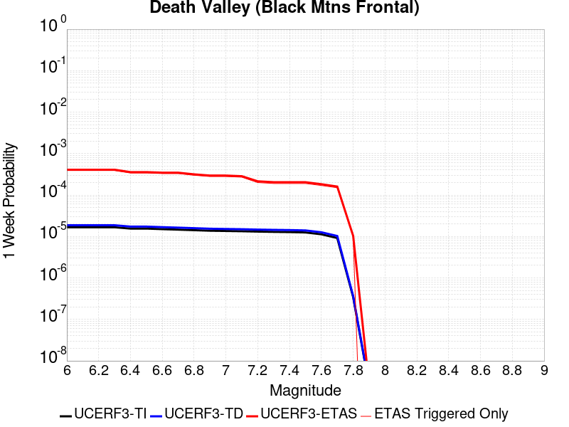 |  |  |  |

| Magnitude | 1 wk TI Prob | 1 wk TD Prob | 1 wk ETAS Prob | 1 wk ETAS/TD Gain | 1 wk ETAS Triggered Only | 1 mo TI Prob | 1 mo TD Prob | 1 mo ETAS Prob | 1 mo ETAS/TD Gain | 1 mo ETAS Triggered Only | 1 yr TI Prob | 1 yr TD Prob | 1 yr ETAS Prob | 1 yr ETAS/TD Gain | 1 yr ETAS Triggered Only | 10 yr TI Prob | 10 yr TD Prob | 10 yr ETAS Prob | 10 yr ETAS/TD Gain | 10 yr ETAS Triggered Only |
|-----|-----|-----|-----|-----|-----|-----|-----|-----|-----|-----|-----|-----|-----|-----|-----|-----|-----|-----|-----|-----|
| 6.0 | 1.6707214E-5 | 1.867027E-5 | 6.737085E-4 | 36.084564 | 6.5505045E-4 | 7.160038E-5 | 8.001302E-5 | 9.970103E-4 | 12.4606 | 9.170706E-4 | 8.71386E-4 | 9.737309E-4 | 0.0021516734 | 2.209721 | 0.0011790908 | 0.00867977 | 0.009695496 | 0.011252375 | 1.1605775 | 0.001572121 |
| 6.1 | 1.6707214E-5 | 1.867027E-5 | 6.737085E-4 | 36.084564 | 6.5505045E-4 | 7.160038E-5 | 8.001302E-5 | 9.970103E-4 | 12.4606 | 9.170706E-4 | 8.71386E-4 | 9.737309E-4 | 0.0021516734 | 2.209721 | 0.0011790908 | 0.00867977 | 0.009695496 | 0.011252375 | 1.1605775 | 0.001572121 |
| 6.2 | 1.6707214E-5 | 1.867027E-5 | 6.737085E-4 | 36.084564 | 6.5505045E-4 | 7.160038E-5 | 8.001302E-5 | 9.970103E-4 | 12.4606 | 9.170706E-4 | 8.71386E-4 | 9.737309E-4 | 0.0021516734 | 2.209721 | 0.0011790908 | 0.00867977 | 0.009695496 | 0.011252375 | 1.1605775 | 0.001572121 |
| 6.3 | 1.6707214E-5 | 1.867027E-5 | 6.737085E-4 | 36.084564 | 6.5505045E-4 | 7.160038E-5 | 8.001302E-5 | 9.970103E-4 | 12.4606 | 9.170706E-4 | 8.71386E-4 | 9.737309E-4 | 0.0021516734 | 2.209721 | 0.0011790908 | 0.00867977 | 0.009695496 | 0.011252375 | 1.1605775 | 0.001572121 |
| 6.4 | 1.5515609E-5 | 1.7338214E-5 | 6.723773E-4 | 38.78008 | 6.5505045E-4 | 6.649377E-5 | 7.4304546E-5 | 9.91307E-4 | 13.341135 | 9.170706E-4 | 8.0926094E-4 | 9.042885E-4 | 0.002082313 | 2.3027089 | 0.0011790908 | 0.008063202 | 0.009006773 | 0.010434904 | 1.158562 | 0.001441111 |
| 6.5 | 1.5515609E-5 | 1.7338214E-5 | 6.723773E-4 | 38.78008 | 6.5505045E-4 | 6.649377E-5 | 7.4304546E-5 | 9.91307E-4 | 13.341135 | 9.170706E-4 | 8.0926094E-4 | 9.042885E-4 | 0.002082313 | 2.3027089 | 0.0011790908 | 0.008063202 | 0.009006773 | 0.010434904 | 1.158562 | 0.001441111 |
| 6.6 | 1.5041828E-5 | 1.6809145E-5 | 6.718486E-4 | 39.96923 | 6.5505045E-4 | 6.4463384E-5 | 7.203723E-5 | 9.890418E-4 | 13.729591 | 9.170706E-4 | 7.8455906E-4 | 8.767063E-4 | 0.0020547635 | 2.3437304 | 0.0011790908 | 0.00781795 | 0.008733132 | 0.010031792 | 1.1487049 | 0.0013101009 |
| 6.7 | 1.4634985E-5 | 1.6356016E-5 | 6.7139574E-4 | 41.048855 | 6.5505045E-4 | 6.271985E-5 | 7.009536E-5 | 9.871017E-4 | 14.082269 | 9.170706E-4 | 7.6334673E-4 | 8.5308263E-4 | 0.0020311675 | 2.380974 | 0.0011790908 | 0.007607299 | 0.008498715 | 0.009797682 | 1.1528428 | 0.0013101009 |
| 6.8 | 1.4209158E-5 | 1.5882048E-5 | 6.709221E-4 | 42.244053 | 6.5505045E-4 | 6.089497E-5 | 6.8064175E-5 | 9.850723E-4 | 14.4727 | 9.170706E-4 | 7.4114406E-4 | 8.2837185E-4 | 0.0020064858 | 2.4222043 | 0.0011790908 | 0.007386771 | 0.008253456 | 0.009552744 | 1.1574235 | 0.0013101009 |
| 6.9 | 1.3780098E-5 | 1.5404594E-5 | 5.394369E-4 | 35.017925 | 5.2404037E-4 | 5.9056227E-5 | 6.6018045E-5 | 8.520267E-4 | 12.905967 | 7.860605E-4 | 7.1877235E-4 | 8.0347876E-4 | 0.0018507174 | 2.3033805 | 0.0010480807 | 0.0071645193 | 0.008006332 | 0.009175983 | 1.1460906 | 0.0011790908 |
| 7.0 | 1.3585064E-5 | 1.5188155E-5 | 5.392205E-4 | 35.5027 | 5.2404037E-4 | 5.8220405E-5 | 6.50905E-5 | 7.200983E-4 | 11.063032 | 6.5505045E-4 | 7.086029E-4 | 7.9219416E-4 | 0.0017085383 | 2.1567166 | 9.170706E-4 | 0.007063476 | 0.007894293 | 0.008934101 | 1.1317163 | 0.0010480807 |
| 7.1 | 1.3398601E-5 | 1.49813395E-5 | 5.390138E-4 | 35.979015 | 5.2404037E-4 | 5.742131E-5 | 6.420419E-5 | 7.192126E-4 | 11.201957 | 6.5505045E-4 | 6.9888023E-4 | 7.8141113E-4 | 0.0016977651 | 2.1726913 | 9.170706E-4 | 0.0069668638 | 0.007787224 | 0.008827143 | 1.1335417 | 0.0010480807 |
| 7.2 | 1.3126312E-5 | 1.4679561E-5 | 5.387122E-4 | 36.698116 | 5.2404037E-4 | 5.6254412E-5 | 6.291092E-5 | 7.1792013E-4 | 11.411695 | 6.5505045E-4 | 6.846822E-4 | 7.6567667E-4 | 0.0016820452 | 2.1968086 | 9.170706E-4 | 0.006825765 | 0.00763097 | 0.008671053 | 1.1362976 | 0.0010480807 |
| 7.3 | 1.2922429E-5 | 1.4453788E-5 | 5.384866E-4 | 37.25574 | 5.2404037E-4 | 5.5380664E-5 | 6.194336E-5 | 7.1695325E-4 | 11.574334 | 6.5505045E-4 | 6.74051E-4 | 7.53905E-4 | 0.0016702842 | 2.2155104 | 9.170706E-4 | 0.006720101 | 0.007514055 | 0.00855426 | 1.1384346 | 0.0010480807 |
| 7.4 | 1.2768878E-5 | 1.4283772E-5 | 5.383166E-4 | 37.68729 | 5.2404037E-4 | 5.4722615E-5 | 6.1214756E-5 | 7.1622507E-4 | 11.700203 | 6.5505045E-4 | 6.660441E-4 | 7.4504025E-4 | 0.0016614276 | 2.2299838 | 9.170706E-4 | 0.0066405144 | 0.0074260035 | 0.0084663015 | 1.1400884 | 0.0010480807 |
| 7.5 | 1.2521929E-5 | 1.40120155E-5 | 5.38045E-4 | 38.398834 | 5.2404037E-4 | 5.366431E-5 | 6.005014E-5 | 5.8405905E-4 | 9.726189 | 5.2404037E-4 | 6.531671E-4 | 7.3087064E-4 | 0.0015163567 | 2.0747263 | 7.860605E-4 | 0.006512506 | 0.0072852457 | 0.008195635 | 1.1249634 | 9.170706E-4 |
| 7.6 | 1.1301089E-5 | 1.2648149E-5 | 4.0567343E-4 | 32.073742 | 3.9303026E-4 | 4.8432343E-5 | 5.4205255E-5 | 4.472142E-4 | 8.250384 | 3.9303026E-4 | 5.895042E-4 | 6.5975444E-4 | 0.0013143728 | 1.992215 | 6.5505045E-4 | 0.0058794282 | 0.00657851 | 0.0073594 | 1.1187031 | 7.860605E-4 |
| 7.7 | 9.189108E-6 | 1.0283358E-5 | 4.033096E-4 | 39.219635 | 3.9303026E-4 | 3.93813E-5 | 4.407082E-5 | 4.3708377E-4 | 9.917759 | 3.9303026E-4 | 4.7936183E-4 | 5.3643517E-4 | 0.0010601945 | 1.9763701 | 5.2404037E-4 | 0.004783291 | 0.005351914 | 0.0060034585 | 1.1217405 | 6.5505045E-4 |
| 7.8 | 3.4586725E-7 | 3.6482615E-7 | 3.6482615E-7 | 1.0 | 0.0 | 1.4822873E-6 | 1.5635396E-6 | 1.5635396E-6 | 1.0 | 0.0 | 1.80467E-5 | 1.9035933E-5 | 1.5004353E-4 | 7.8821206 | 1.3101009E-4 | 1.8045233E-4 | 1.9034347E-4 | 3.213286E-4 | 1.6881515 | 1.3101009E-4 |
| 7.9 | 2.5591178E-9 | 2.6696718E-9 | 2.6696718E-9 | 1.0 | 0.0 | 1.0967647E-8 | 1.14414505E-8 | 1.14414505E-8 | 1.0 | 0.0 | 1.335311E-7 | 1.3929966E-7 | 1.3929966E-7 | 1.0 | 0.0 | 1.3353102E-6 | 1.3929966E-6 | 1.3929966E-6 | 1.0 | 0.0 |

## San Andreas (San Bernardino S)
*[(top)](#table-of-contents)*

| 1 Week | 1 Month | 1 Year | 10 Year |
|-----|-----|-----|-----|
|  |  | 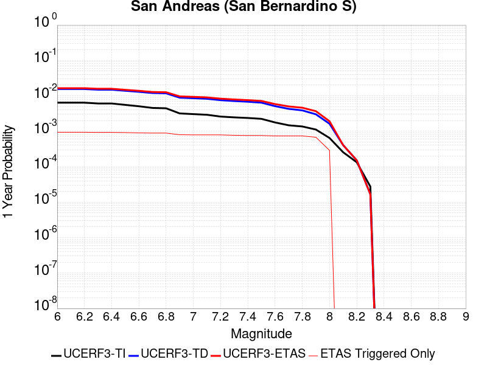 |  |

| Magnitude | 1 wk TI Prob | 1 wk TD Prob | 1 wk ETAS Prob | 1 wk ETAS/TD Gain | 1 wk ETAS Triggered Only | 1 mo TI Prob | 1 mo TD Prob | 1 mo ETAS Prob | 1 mo ETAS/TD Gain | 1 mo ETAS Triggered Only | 1 yr TI Prob | 1 yr TD Prob | 1 yr ETAS Prob | 1 yr ETAS/TD Gain | 1 yr ETAS Triggered Only | 10 yr TI Prob | 10 yr TD Prob | 10 yr ETAS Prob | 10 yr ETAS/TD Gain | 10 yr ETAS Triggered Only |
|-----|-----|-----|-----|-----|-----|-----|-----|-----|-----|-----|-----|-----|-----|-----|-----|-----|-----|-----|-----|-----|
| 6.0 | 1.2336002E-4 | 3.0004102E-4 | 6.9295336E-4 | 2.3095288 | 3.9303026E-4 | 5.2857865E-4 | 0.0012852824 | 0.0018086493 | 1.4071999 | 5.2404037E-4 | 0.006416472 | 0.015540994 | 0.016443813 | 1.0580927 | 9.170706E-4 | 0.06234337 | 0.14283717 | 0.14407244 | 1.008648 | 0.001441111 |
| 6.1 | 1.2336002E-4 | 3.0004102E-4 | 6.9295336E-4 | 2.3095288 | 3.9303026E-4 | 5.2857865E-4 | 0.0012852824 | 0.0018086493 | 1.4071999 | 5.2404037E-4 | 0.006416472 | 0.015540994 | 0.016443813 | 1.0580927 | 9.170706E-4 | 0.06234337 | 0.14283717 | 0.14407244 | 1.008648 | 0.001441111 |
| 6.2 | 1.2336002E-4 | 3.0004102E-4 | 6.9295336E-4 | 2.3095288 | 3.9303026E-4 | 5.2857865E-4 | 0.0012852824 | 0.0018086493 | 1.4071999 | 5.2404037E-4 | 0.006416472 | 0.015540994 | 0.016443813 | 1.0580927 | 9.170706E-4 | 0.06234337 | 0.14283717 | 0.14407244 | 1.008648 | 0.001441111 |
| 6.3 | 1.1712257E-4 | 2.8792414E-4 | 6.808412E-4 | 2.364655 | 3.9303026E-4 | 5.018573E-4 | 0.0012334028 | 0.0017567967 | 1.4243497 | 5.2404037E-4 | 0.006093008 | 0.014918125 | 0.015821515 | 1.0605565 | 9.170706E-4 | 0.059286322 | 0.13754563 | 0.13878852 | 1.0090362 | 0.001441111 |
| 6.4 | 1.1712257E-4 | 2.8792414E-4 | 6.808412E-4 | 2.364655 | 3.9303026E-4 | 5.018573E-4 | 0.0012334028 | 0.0017567967 | 1.4243497 | 5.2404037E-4 | 0.006093008 | 0.014918125 | 0.015821515 | 1.0605565 | 9.170706E-4 | 0.059286322 | 0.13754563 | 0.13878852 | 1.0090362 | 0.001441111 |
| 6.5 | 1.0689076E-4 | 2.680528E-4 | 6.609777E-4 | 2.465849 | 3.9303026E-4 | 4.5802278E-4 | 0.0011483167 | 0.0016717552 | 1.4558312 | 5.2404037E-4 | 0.0055621783 | 0.01389575 | 0.014800077 | 1.0650795 | 9.170706E-4 | 0.05425003 | 0.12879294 | 0.13004845 | 1.0097482 | 0.001441111 |
| 6.6 | 9.7648895E-5 | 2.50501E-4 | 6.4343284E-4 | 2.5685837 | 3.9303026E-4 | 4.1842813E-4 | 0.0010731576 | 0.0015966357 | 1.4877923 | 5.2404037E-4 | 0.005082469 | 0.012991785 | 0.013896941 | 1.0696714 | 9.170706E-4 | 0.049677886 | 0.12095292 | 0.12221972 | 1.0104735 | 0.001441111 |
| 6.7 | 8.757013E-5 | 2.3120902E-4 | 6.241484E-4 | 2.6994984 | 3.9303026E-4 | 3.7524657E-4 | 9.905418E-4 | 0.0015140631 | 1.5285201 | 5.2404037E-4 | 0.00455906 | 0.011997245 | 0.012903313 | 1.075523 | 9.170706E-4 | 0.04466656 | 0.11226123 | 0.11354056 | 1.011396 | 0.001441111 |
| 6.8 | 8.562978E-5 | 2.2680782E-4 | 6.1974896E-4 | 2.7324848 | 3.9303026E-4 | 3.6693315E-4 | 9.7169366E-4 | 0.0014952248 | 1.5387821 | 5.2404037E-4 | 0.004458263 | 0.011770263 | 0.01267654 | 1.0769972 | 9.170706E-4 | 0.043698758 | 0.11027153 | 0.11155373 | 1.0116277 | 0.001441111 |
| 6.9 | 6.124075E-5 | 1.7065753E-4 | 5.636207E-4 | 3.302642 | 3.9303026E-4 | 2.6243398E-4 | 7.311852E-4 | 0.0012548424 | 1.7161758 | 5.2404037E-4 | 0.0031904527 | 0.008866051 | 0.00977499 | 1.1025192 | 9.170706E-4 | 0.031450346 | 0.08418263 | 0.08538244 | 1.0142525 | 0.0013101009 |
| 7.0 | 5.8598747E-5 | 1.649477E-4 | 5.5791315E-4 | 3.3823638 | 3.9303026E-4 | 2.5111332E-4 | 7.06728E-4 | 0.0012303981 | 1.7409781 | 5.2404037E-4 | 0.0030530186 | 0.008570663 | 0.009479874 | 1.1060841 | 9.170706E-4 | 0.03011414 | 0.081500374 | 0.082703695 | 1.0147647 | 0.0013101009 |
| 7.1 | 5.613814E-5 | 1.5913323E-4 | 5.5210094E-4 | 3.469426 | 3.9303026E-4 | 2.4056983E-4 | 6.818221E-4 | 0.0012055051 | 1.7680641 | 5.2404037E-4 | 0.0029250039 | 0.008269769 | 0.009179255 | 1.1099772 | 9.170706E-4 | 0.028868021 | 0.07879931 | 0.080006175 | 1.0153157 | 0.0013101009 |
| 7.2 | 4.991222E-5 | 1.4519796E-4 | 5.3817115E-4 | 3.706465 | 3.9303026E-4 | 2.1389198E-4 | 6.2212895E-4 | 0.0011458433 | 1.84181 | 5.2404037E-4 | 0.002601025 | 0.007548217 | 0.008458366 | 1.1205779 | 9.170706E-4 | 0.025707912 | 0.07225321 | 0.07334711 | 1.0151398 | 0.0011790908 |
| 7.3 | 4.7410045E-5 | 1.3714004E-4 | 3.9912428E-4 | 2.910341 | 2.6202018E-4 | 2.0317009E-4 | 5.8761094E-4 | 9.804103E-4 | 1.6684684 | 3.9303026E-4 | 0.0024707897 | 0.0071307817 | 0.007911237 | 1.1094488 | 7.860605E-4 | 0.024434982 | 0.06853558 | 0.06951183 | 1.0142444 | 0.0010480807 |
| 7.4 | 4.5556746E-5 | 1.3121912E-4 | 3.9320491E-4 | 2.996552 | 2.6202018E-4 | 1.952286E-4 | 5.622468E-4 | 9.5505605E-4 | 1.6986421 | 3.9303026E-4 | 0.002374317 | 0.0068239477 | 0.007604644 | 1.1144054 | 7.860605E-4 | 0.023491086 | 0.065788016 | 0.06664475 | 1.0130227 | 9.170706E-4 |
| 7.5 | 4.3084514E-5 | 1.2357246E-4 | 3.8556027E-4 | 3.1201146 | 2.6202018E-4 | 1.8463485E-4 | 5.2948913E-4 | 9.223113E-4 | 1.741889 | 3.9303026E-4 | 0.0022456115 | 0.0064275465 | 0.0072085545 | 1.1215096 | 7.860605E-4 | 0.022230545 | 0.062188786 | 0.063048825 | 1.0138295 | 9.170706E-4 |
| 7.6 | 3.408608E-5 | 9.83552E-5 | 3.603496E-4 | 3.6637576 | 2.6202018E-4 | 1.4607502E-4 | 4.214543E-4 | 8.143189E-4 | 1.9321643 | 3.9303026E-4 | 0.0017770125 | 0.0051191594 | 0.0059011956 | 1.1527666 | 7.860605E-4 | 0.017628696 | 0.050020292 | 0.050891493 | 1.017417 | 9.170706E-4 |
| 7.7 | 2.8315713E-5 | 8.248679E-5 | 3.4448536E-4 | 4.1762486 | 2.6202018E-4 | 1.2134742E-4 | 3.5346695E-4 | 7.463583E-4 | 2.1115363 | 3.9303026E-4 | 0.0014764034 | 0.0042949775 | 0.005077662 | 1.1822325 | 7.860605E-4 | 0.01466633 | 0.0422714 | 0.043149706 | 1.0207777 | 9.170706E-4 |
| 7.8 | 2.6222975E-5 | 7.463088E-5 | 3.366315E-4 | 4.5106196 | 2.6202018E-4 | 1.1237934E-4 | 3.1980744E-4 | 7.12712E-4 | 2.2285662 | 3.9303026E-4 | 0.0013673597 | 0.0038867102 | 0.0046697157 | 1.2014571 | 7.860605E-4 | 0.013589768 | 0.03843674 | 0.03931856 | 1.0229422 | 9.170706E-4 |
| 7.9 | 2.1469694E-5 | 5.787864E-5 | 3.1988366E-4 | 5.5267997 | 2.6202018E-4 | 9.200973E-5 | 2.4802773E-4 | 6.409605E-4 | 2.5842292 | 3.9303026E-4 | 0.0011196428 | 0.0030155594 | 0.0037992494 | 1.2598822 | 7.860605E-4 | 0.011140184 | 0.030152109 | 0.031041527 | 1.0294977 | 9.170706E-4 |
| 8.0 | 1.2420249E-5 | 3.131896E-5 | 3.131896E-5 | 1.0 | 0.0 | 5.322855E-5 | 1.342172E-4 | 2.652097E-4 | 1.975974 | 1.3101009E-4 | 6.478649E-4 | 0.0016328706 | 0.0017636669 | 1.080102 | 1.3101009E-4 | 0.0064597935 | 0.016522504 | 0.01665135 | 1.0077982 | 1.3101009E-4 |
| 8.1 | 4.9197724E-6 | 7.822348E-6 | 7.822348E-6 | 1.0 | 0.0 | 2.1084568E-5 | 3.352392E-5 | 3.352392E-5 | 1.0 | 0.0 | 2.566744E-4 | 4.0807744E-4 | 4.0807744E-4 | 1.0 | 0.0 | 0.002563781 | 0.0043843705 | 0.0043843705 | 1.0 | 0.0 |
| 8.2 | 2.5634774E-6 | 2.9067196E-6 | 2.9067196E-6 | 1.0 | 0.0 | 1.0986286E-5 | 1.2457311E-5 | 1.2457311E-5 | 1.0 | 0.0 | 1.3374983E-4 | 1.5165724E-4 | 1.5165724E-4 | 1.0 | 0.0 | 0.0013366934 | 0.0017049741 | 0.0017049741 | 1.0 | 0.0 |
| 8.3 | 5.2850464E-7 | 3.2088764E-7 | 3.2088764E-7 | 1.0 | 0.0 | 2.2650179E-6 | 1.375232E-6 | 1.375232E-6 | 1.0 | 0.0 | 2.7576245E-5 | 1.6743334E-5 | 1.6743334E-5 | 1.0 | 0.0 | 2.7572823E-4 | 1.9870348E-4 | 1.9870348E-4 | 1.0 | 0.0 |

## Helendale-So Lockhart
*[(top)](#table-of-contents)*

| 1 Week | 1 Month | 1 Year | 10 Year |
|-----|-----|-----|-----|
|  |  |  |  |

| Magnitude | 1 wk TI Prob | 1 wk TD Prob | 1 wk ETAS Prob | 1 wk ETAS/TD Gain | 1 wk ETAS Triggered Only | 1 mo TI Prob | 1 mo TD Prob | 1 mo ETAS Prob | 1 mo ETAS/TD Gain | 1 mo ETAS Triggered Only | 1 yr TI Prob | 1 yr TD Prob | 1 yr ETAS Prob | 1 yr ETAS/TD Gain | 1 yr ETAS Triggered Only | 10 yr TI Prob | 10 yr TD Prob | 10 yr ETAS Prob | 10 yr ETAS/TD Gain | 10 yr ETAS Triggered Only |
|-----|-----|-----|-----|-----|-----|-----|-----|-----|-----|-----|-----|-----|-----|-----|-----|-----|-----|-----|-----|-----|
| 6.0 | 1.7296055E-5 | 1.8103729E-5 | 4.1112688E-4 | 22.709513 | 3.9303026E-4 | 7.412385E-5 | 7.7585224E-5 | 7.3258486E-4 | 9.442325 | 6.5505045E-4 | 9.0208417E-4 | 9.4421144E-4 | 0.0018604161 | 1.9703385 | 9.170706E-4 | 0.008984311 | 0.009404116 | 0.010831675 | 1.1518015 | 0.001441111 |
| 6.1 | 1.7296055E-5 | 1.8103729E-5 | 4.1112688E-4 | 22.709513 | 3.9303026E-4 | 7.412385E-5 | 7.7585224E-5 | 7.3258486E-4 | 9.442325 | 6.5505045E-4 | 9.0208417E-4 | 9.4421144E-4 | 0.0018604161 | 1.9703385 | 9.170706E-4 | 0.008984311 | 0.009404116 | 0.010831675 | 1.1518015 | 0.001441111 |
| 6.2 | 1.7296055E-5 | 1.8103729E-5 | 4.1112688E-4 | 22.709513 | 3.9303026E-4 | 7.412385E-5 | 7.7585224E-5 | 7.3258486E-4 | 9.442325 | 6.5505045E-4 | 9.0208417E-4 | 9.4421144E-4 | 0.0018604161 | 1.9703385 | 9.170706E-4 | 0.008984311 | 0.009404116 | 0.010831675 | 1.1518015 | 0.001441111 |
| 6.3 | 1.0669118E-5 | 1.1135425E-5 | 1.4214405E-4 | 12.765033 | 1.3101009E-4 | 4.5723988E-5 | 4.772239E-5 | 1.7872623E-4 | 3.7451231 | 1.3101009E-4 | 5.5654737E-4 | 5.80868E-4 | 9.7367E-4 | 1.6762327 | 3.9303026E-4 | 0.0055515557 | 0.0057937936 | 0.0065753 | 1.1348867 | 7.860605E-4 |
| 6.4 | 1.0669118E-5 | 1.1135425E-5 | 1.4214405E-4 | 12.765033 | 1.3101009E-4 | 4.5723988E-5 | 4.772239E-5 | 1.7872623E-4 | 3.7451231 | 1.3101009E-4 | 5.5654737E-4 | 5.80868E-4 | 9.7367E-4 | 1.6762327 | 3.9303026E-4 | 0.0055515557 | 0.0057937936 | 0.0065753 | 1.1348867 | 7.860605E-4 |
| 6.5 | 8.790038E-6 | 9.170197E-6 | 1.4017908E-4 | 15.286377 | 1.3101009E-4 | 3.767105E-5 | 3.930026E-5 | 1.703052E-4 | 4.333437 | 1.3101009E-4 | 4.585485E-4 | 4.7837716E-4 | 8.7121944E-4 | 1.8211977 | 3.9303026E-4 | 0.0045760344 | 0.004773638 | 0.0055559464 | 1.163881 | 7.860605E-4 |
| 6.6 | 7.396949E-6 | 7.715537E-6 | 1.3872462E-4 | 17.979904 | 1.3101009E-4 | 3.1700827E-5 | 3.3066175E-5 | 1.6407193E-4 | 4.9619265 | 1.3101009E-4 | 3.858892E-4 | 4.025073E-4 | 7.953794E-4 | 1.9760619 | 3.9303026E-4 | 0.003852198 | 0.00401789 | 0.0046703084 | 1.1623784 | 6.5505045E-4 |
| 6.7 | 6.4600285E-6 | 6.738031E-6 | 1.3774724E-4 | 20.443247 | 1.3101009E-4 | 2.7685543E-5 | 2.887696E-5 | 1.5988326E-4 | 5.536707 | 1.3101009E-4 | 3.3701936E-4 | 3.5152107E-4 | 7.444132E-4 | 2.1176915 | 3.9303026E-4 | 0.0033650869 | 0.003509732 | 0.0041624834 | 1.1859833 | 6.5505045E-4 |
| 6.8 | 5.600104E-6 | 5.836009E-6 | 1.3684534E-4 | 23.448442 | 1.3101009E-4 | 2.4000226E-5 | 2.5011232E-5 | 1.5601804E-4 | 6.237919 | 1.3101009E-4 | 2.9216358E-4 | 3.044698E-4 | 5.664102E-4 | 1.8603165 | 2.6202018E-4 | 0.0029177975 | 0.003040588 | 0.0034324233 | 1.1288682 | 3.9303026E-4 |
| 6.9 | 4.839122E-6 | 5.0395092E-6 | 1.3604894E-4 | 26.996466 | 1.3101009E-4 | 2.0738931E-5 | 2.159772E-5 | 1.5260497E-4 | 7.065791 | 1.3101009E-4 | 2.5246723E-4 | 2.6292098E-4 | 5.248723E-4 | 1.9963118 | 2.6202018E-4 | 0.002521806 | 0.002626147 | 0.003018145 | 1.1492674 | 3.9303026E-4 |
| 7.0 | 3.6937633E-6 | 3.845208E-6 | 1.348548E-4 | 35.07087 | 1.3101009E-4 | 1.5830317E-5 | 1.647936E-5 | 1.4748728E-4 | 8.949819 | 1.3101009E-4 | 1.9271708E-4 | 2.0061806E-4 | 4.6258565E-4 | 2.3058028 | 2.6202018E-4 | 0.0019255003 | 0.002004401 | 0.0023966434 | 1.1956906 | 3.9303026E-4 |
| 7.1 | 2.7858857E-6 | 2.8978538E-6 | 1.3390757E-4 | 46.20922 | 1.3101009E-4 | 1.1939455E-5 | 1.2419316E-5 | 1.4342778E-4 | 11.548766 | 1.3101009E-4 | 1.4535317E-4 | 1.511949E-4 | 4.1317544E-4 | 2.7327342 | 2.6202018E-4 | 0.0014525814 | 0.0015109418 | 0.0019033782 | 1.2597296 | 3.9303026E-4 |
| 7.2 | 2.1672065E-6 | 2.2540128E-6 | 1.332638E-4 | 59.122913 | 1.3101009E-4 | 9.2879945E-6 | 9.66002E-6 | 1.4066884E-4 | 14.561962 | 1.3101009E-4 | 1.1307546E-4 | 1.1760458E-4 | 3.7959396E-4 | 3.2277138 | 2.6202018E-4 | 0.0011301794 | 0.0011754417 | 0.00156801 | 1.3339751 | 3.9303026E-4 |
| 7.3 | 1.4823496E-6 | 1.5422102E-6 | 1.325521E-4 | 85.94943 | 1.3101009E-4 | 6.3529114E-6 | 6.6094562E-6 | 1.3761868E-4 | 20.821482 | 1.3101009E-4 | 7.734395E-5 | 8.046731E-5 | 3.424664E-4 | 4.255969 | 2.6202018E-4 | 7.731704E-4 | 8.0439687E-4 | 0.001197111 | 1.4882094 | 3.9303026E-4 |
| 7.4 | 4.2321457E-7 | 4.4108765E-7 | 1.3145112E-4 | 298.01587 | 1.3101009E-4 | 1.8137755E-6 | 1.8903745E-6 | 1.3290021E-4 | 70.30364 | 1.3101009E-4 | 2.2082493E-5 | 2.3015113E-5 | 1.5402219E-4 | 6.6922193 | 1.3101009E-4 | 2.2080299E-4 | 2.3013182E-4 | 4.920917E-4 | 2.1383035 | 2.6202018E-4 |
| 7.5 | 5.6942316E-8 | 5.9415648E-8 | 5.9415648E-8 | 1.0 | 0.0 | 2.440385E-7 | 2.5463845E-7 | 2.5463845E-7 | 1.0 | 0.0 | 2.9711643E-6 | 3.1002196E-6 | 3.1002196E-6 | 1.0 | 0.0 | 2.9711247E-5 | 3.1001844E-5 | 3.1001844E-5 | 1.0 | 0.0 |

## Death Valley (No)
*[(top)](#table-of-contents)*

| 1 Week | 1 Month | 1 Year | 10 Year |
|-----|-----|-----|-----|
|  |  |  |  |

| Magnitude | 1 wk TI Prob | 1 wk TD Prob | 1 wk ETAS Prob | 1 wk ETAS/TD Gain | 1 wk ETAS Triggered Only | 1 mo TI Prob | 1 mo TD Prob | 1 mo ETAS Prob | 1 mo ETAS/TD Gain | 1 mo ETAS Triggered Only | 1 yr TI Prob | 1 yr TD Prob | 1 yr ETAS Prob | 1 yr ETAS/TD Gain | 1 yr ETAS Triggered Only | 10 yr TI Prob | 10 yr TD Prob | 10 yr ETAS Prob | 10 yr ETAS/TD Gain | 10 yr ETAS Triggered Only |
|-----|-----|-----|-----|-----|-----|-----|-----|-----|-----|-----|-----|-----|-----|-----|-----|-----|-----|-----|-----|-----|
| 6.0 | 2.0074807E-5 | 2.2500084E-5 | 6.775358E-4 | 30.112589 | 6.5505045E-4 | 8.603206E-5 | 9.642541E-5 | 7.514127E-4 | 7.7926836 | 6.5505045E-4 | 0.001046937 | 0.0011733545 | 0.002089349 | 1.7806631 | 9.170706E-4 | 0.010420183 | 0.011672506 | 0.012708354 | 1.0887425 | 0.0010480807 |
| 6.1 | 2.0074807E-5 | 2.2500084E-5 | 6.775358E-4 | 30.112589 | 6.5505045E-4 | 8.603206E-5 | 9.642541E-5 | 7.514127E-4 | 7.7926836 | 6.5505045E-4 | 0.001046937 | 0.0011733545 | 0.002089349 | 1.7806631 | 9.170706E-4 | 0.010420183 | 0.011672506 | 0.012708354 | 1.0887425 | 0.0010480807 |
| 6.2 | 2.0074807E-5 | 2.2500084E-5 | 6.775358E-4 | 30.112589 | 6.5505045E-4 | 8.603206E-5 | 9.642541E-5 | 7.514127E-4 | 7.7926836 | 6.5505045E-4 | 0.001046937 | 0.0011733545 | 0.002089349 | 1.7806631 | 9.170706E-4 | 0.010420183 | 0.011672506 | 0.012708354 | 1.0887425 | 0.0010480807 |
| 6.3 | 1.9050609E-5 | 2.1336948E-5 | 6.763734E-4 | 31.699633 | 6.5505045E-4 | 8.164292E-5 | 9.1440896E-5 | 7.464314E-4 | 8.162993 | 6.5505045E-4 | 9.935491E-4 | 0.001112731 | 0.0020287812 | 1.8232449 | 9.170706E-4 | 0.009891188 | 0.011072419 | 0.012108895 | 1.0936089 | 0.0010480807 |
| 6.4 | 1.9050609E-5 | 2.1336948E-5 | 6.763734E-4 | 31.699633 | 6.5505045E-4 | 8.164292E-5 | 9.1440896E-5 | 7.464314E-4 | 8.162993 | 6.5505045E-4 | 9.935491E-4 | 0.001112731 | 0.0020287812 | 1.8232449 | 9.170706E-4 | 0.009891188 | 0.011072419 | 0.012108895 | 1.0936089 | 0.0010480807 |
| 6.5 | 1.8367004E-5 | 2.0561009E-5 | 5.445906E-4 | 26.48657 | 5.2404037E-4 | 7.8713354E-5 | 8.811567E-5 | 6.1210984E-4 | 6.946663 | 5.2404037E-4 | 9.5791375E-4 | 0.0010722869 | 0.0018575045 | 1.7322832 | 7.860605E-4 | 0.009537951 | 0.0106719155 | 0.011579199 | 1.085016 | 9.170706E-4 |
| 6.6 | 1.779439E-5 | 1.9910927E-5 | 5.4394087E-4 | 27.318708 | 5.2404037E-4 | 7.625944E-5 | 8.53298E-5 | 6.093254E-4 | 7.1408286 | 5.2404037E-4 | 9.280632E-4 | 0.0010384015 | 0.0018236458 | 1.7562048 | 7.860605E-4 | 0.009241969 | 0.010336253 | 0.011243844 | 1.0878066 | 9.170706E-4 |
| 6.7 | 1.7025437E-5 | 1.9043426E-5 | 5.430738E-4 | 28.517653 | 5.2404037E-4 | 7.296412E-5 | 8.161216E-5 | 6.0560973E-4 | 7.4205823 | 5.2404037E-4 | 8.87976E-4 | 9.931813E-4 | 0.0017784612 | 1.7906712 | 7.860605E-4 | 0.008844362 | 0.009888145 | 0.010796147 | 1.0918274 | 9.170706E-4 |
| 6.8 | 1.6545107E-5 | 1.8512545E-5 | 5.425432E-4 | 29.306786 | 5.2404037E-4 | 7.090568E-5 | 7.93371E-5 | 6.0333585E-4 | 7.604713 | 5.2404037E-4 | 8.629347E-4 | 9.655073E-4 | 0.0017508089 | 1.8133564 | 7.860605E-4 | 0.008595915 | 0.009613829 | 0.010522082 | 1.0944737 | 9.170706E-4 |
| 6.9 | 1.615478E-5 | 1.8087594E-5 | 5.4211845E-4 | 29.97184 | 5.2404037E-4 | 6.9232934E-5 | 7.751599E-5 | 6.015157E-4 | 7.759892 | 5.2404037E-4 | 8.4258494E-4 | 9.433546E-4 | 0.0017286737 | 1.8324748 | 7.860605E-4 | 0.008393973 | 0.009394196 | 0.010302651 | 1.0967039 | 9.170706E-4 |
| 7.0 | 1.5894311E-5 | 1.780555E-5 | 5.4183655E-4 | 30.430769 | 5.2404037E-4 | 6.81167E-5 | 7.6307304E-5 | 6.0030766E-4 | 7.8669753 | 5.2404037E-4 | 8.2900526E-4 | 9.286515E-4 | 0.0017139821 | 1.8456677 | 7.860605E-4 | 0.008259195 | 0.009248397 | 0.010156986 | 1.0982429 | 9.170706E-4 |
| 7.1 | 1.5602263E-5 | 1.7483504E-5 | 5.415147E-4 | 30.972895 | 5.2404037E-4 | 6.6865134E-5 | 7.492718E-5 | 5.9892825E-4 | 7.993471 | 5.2404037E-4 | 8.137789E-4 | 9.118627E-4 | 0.0016972065 | 1.8612522 | 7.860605E-4 | 0.008108052 | 0.009081894 | 0.009990635 | 1.1000608 | 9.170706E-4 |
| 7.2 | 1.5323829E-5 | 1.717063E-5 | 5.4120197E-4 | 31.519053 | 5.2404037E-4 | 6.56719E-5 | 7.358637E-5 | 5.9758814E-4 | 8.120908 | 5.2404037E-4 | 7.99262E-4 | 8.9555193E-4 | 0.0016809085 | 1.8769526 | 7.860605E-4 | 0.007963934 | 0.008920107 | 0.009828997 | 1.1018924 | 9.170706E-4 |
| 7.3 | 1.4556212E-5 | 1.6302456E-5 | 5.4033427E-4 | 33.14435 | 5.2404037E-4 | 6.238227E-5 | 6.9865826E-5 | 5.9386954E-4 | 8.500144 | 5.2404037E-4 | 7.592395E-4 | 8.5029035E-4 | 0.0016356825 | 1.9236753 | 7.860605E-4 | 0.0075665074 | 0.008471014 | 0.009380316 | 1.1073427 | 9.170706E-4 |
| 7.4 | 1.411725E-5 | 1.580796E-5 | 5.3984E-4 | 34.149887 | 5.2404037E-4 | 6.0501097E-5 | 6.7746674E-5 | 5.9175154E-4 | 8.734769 | 5.2404037E-4 | 7.363519E-4 | 8.245094E-4 | 0.0016099218 | 1.9525815 | 7.860605E-4 | 0.0073391674 | 0.008215138 | 0.009124675 | 1.1107147 | 9.170706E-4 |
| 7.5 | 1.3503312E-5 | 1.5126289E-5 | 5.391587E-4 | 35.643818 | 5.2404037E-4 | 5.7870053E-5 | 6.482538E-5 | 5.888318E-4 | 9.083353 | 5.2404037E-4 | 7.043401E-4 | 7.8896893E-4 | 0.0015744093 | 1.9955276 | 7.860605E-4 | 0.007021119 | 0.007862304 | 0.008772165 | 1.1157244 | 9.170706E-4 |
| 7.6 | 1.1279839E-5 | 1.2626327E-5 | 4.0565163E-4 | 32.127445 | 3.9303026E-4 | 4.834127E-5 | 5.4111737E-5 | 4.4712072E-4 | 8.262916 | 3.9303026E-4 | 5.88396E-4 | 6.5861654E-4 | 0.0013132356 | 1.9939303 | 6.5505045E-4 | 0.005868405 | 0.006567199 | 0.007348097 | 1.1189089 | 7.860605E-4 |
| 7.7 | 9.189108E-6 | 1.0283358E-5 | 4.033096E-4 | 39.219635 | 3.9303026E-4 | 3.93813E-5 | 4.407082E-5 | 4.3708377E-4 | 9.917759 | 3.9303026E-4 | 4.7936183E-4 | 5.3643517E-4 | 0.0010601945 | 1.9763701 | 5.2404037E-4 | 0.004783291 | 0.005351914 | 0.0060034585 | 1.1217405 | 6.5505045E-4 |
| 7.8 | 3.4586725E-7 | 3.6482615E-7 | 3.6482615E-7 | 1.0 | 0.0 | 1.4822873E-6 | 1.5635396E-6 | 1.5635396E-6 | 1.0 | 0.0 | 1.80467E-5 | 1.9035933E-5 | 1.5004353E-4 | 7.8821206 | 1.3101009E-4 | 1.8045233E-4 | 1.9034347E-4 | 3.213286E-4 | 1.6881515 | 1.3101009E-4 |
| 7.9 | 2.5591178E-9 | 2.6696718E-9 | 2.6696718E-9 | 1.0 | 0.0 | 1.0967647E-8 | 1.14414505E-8 | 1.14414505E-8 | 1.0 | 0.0 | 1.335311E-7 | 1.3929966E-7 | 1.3929966E-7 | 1.0 | 0.0 | 1.3353102E-6 | 1.3929966E-6 | 1.3929966E-6 | 1.0 | 0.0 |

## San Andreas (Big Bend)
*[(top)](#table-of-contents)*

| 1 Week | 1 Month | 1 Year | 10 Year |
|-----|-----|-----|-----|
|  |  |  |  |

| Magnitude | 1 wk TI Prob | 1 wk TD Prob | 1 wk ETAS Prob | 1 wk ETAS/TD Gain | 1 wk ETAS Triggered Only | 1 mo TI Prob | 1 mo TD Prob | 1 mo ETAS Prob | 1 mo ETAS/TD Gain | 1 mo ETAS Triggered Only | 1 yr TI Prob | 1 yr TD Prob | 1 yr ETAS Prob | 1 yr ETAS/TD Gain | 1 yr ETAS Triggered Only | 10 yr TI Prob | 10 yr TD Prob | 10 yr ETAS Prob | 10 yr ETAS/TD Gain | 10 yr ETAS Triggered Only |
|-----|-----|-----|-----|-----|-----|-----|-----|-----|-----|-----|-----|-----|-----|-----|-----|-----|-----|-----|-----|-----|
| 6.0 | 1.0179969E-4 | 2.0072258E-4 | 3.317064E-4 | 1.6525613 | 1.3101009E-4 | 4.362114E-4 | 8.599571E-4 | 9.908545E-4 | 1.1522139 | 1.3101009E-4 | 0.0052979486 | 0.010419999 | 0.0108089335 | 1.0373259 | 3.9303026E-4 | 0.051734097 | 0.10144902 | 0.102155335 | 1.0069623 | 7.860605E-4 |
| 6.1 | 1.0179969E-4 | 2.0072258E-4 | 3.317064E-4 | 1.6525613 | 1.3101009E-4 | 4.362114E-4 | 8.599571E-4 | 9.908545E-4 | 1.1522139 | 1.3101009E-4 | 0.0052979486 | 0.010419999 | 0.0108089335 | 1.0373259 | 3.9303026E-4 | 0.051734097 | 0.10144902 | 0.102155335 | 1.0069623 | 7.860605E-4 |
| 6.2 | 1.0179969E-4 | 2.0072258E-4 | 3.317064E-4 | 1.6525613 | 1.3101009E-4 | 4.362114E-4 | 8.599571E-4 | 9.908545E-4 | 1.1522139 | 1.3101009E-4 | 0.0052979486 | 0.010419999 | 0.0108089335 | 1.0373259 | 3.9303026E-4 | 0.051734097 | 0.10144902 | 0.102155335 | 1.0069623 | 7.860605E-4 |
| 6.3 | 1.0179969E-4 | 2.0072258E-4 | 3.317064E-4 | 1.6525613 | 1.3101009E-4 | 4.362114E-4 | 8.599571E-4 | 9.908545E-4 | 1.1522139 | 1.3101009E-4 | 0.0052979486 | 0.010419999 | 0.0108089335 | 1.0373259 | 3.9303026E-4 | 0.051734097 | 0.10144902 | 0.102155335 | 1.0069623 | 7.860605E-4 |
| 6.4 | 9.1639464E-5 | 1.8429532E-4 | 3.1528127E-4 | 1.7107394 | 1.3101009E-4 | 3.9268145E-4 | 7.895982E-4 | 9.2050486E-4 | 1.1657889 | 1.3101009E-4 | 0.0047704205 | 0.009571102 | 0.009960371 | 1.0406712 | 3.9303026E-4 | 0.046693064 | 0.09377527 | 0.09448762 | 1.0075964 | 7.860605E-4 |
| 6.5 | 9.1639464E-5 | 1.8429532E-4 | 3.1528127E-4 | 1.7107394 | 1.3101009E-4 | 3.9268145E-4 | 7.895982E-4 | 9.2050486E-4 | 1.1657889 | 1.3101009E-4 | 0.0047704205 | 0.009571102 | 0.009960371 | 1.0406712 | 3.9303026E-4 | 0.046693064 | 0.09377527 | 0.09448762 | 1.0075964 | 7.860605E-4 |
| 6.6 | 9.042622E-5 | 1.823659E-4 | 3.133521E-4 | 1.7182603 | 1.3101009E-4 | 3.8748336E-4 | 7.8133424E-4 | 9.12242E-4 | 1.1675438 | 1.3101009E-4 | 0.0047074095 | 0.009471365 | 0.009860673 | 1.0411036 | 3.9303026E-4 | 0.046089325 | 0.092869274 | 0.093463495 | 1.0063984 | 6.5505045E-4 |
| 6.7 | 8.9836685E-5 | 1.8150927E-4 | 3.1249557E-4 | 1.7216508 | 1.3101009E-4 | 3.8495753E-4 | 7.776651E-4 | 9.0857333E-4 | 1.168335 | 1.3101009E-4 | 0.00467679 | 0.00942708 | 0.009816405 | 1.0412986 | 3.9303026E-4 | 0.045795817 | 0.09246355 | 0.093058035 | 1.0064293 | 6.5505045E-4 |
| 6.8 | 8.9471854E-5 | 1.8097709E-4 | 3.1196346E-4 | 1.7237732 | 1.3101009E-4 | 3.8339442E-4 | 7.7538576E-4 | 9.0629427E-4 | 1.1688302 | 1.3101009E-4 | 0.004657841 | 0.009399569 | 0.009788904 | 1.0414206 | 3.9303026E-4 | 0.04561414 | 0.092210755 | 0.09280541 | 1.0064487 | 6.5505045E-4 |
| 6.9 | 8.858234E-5 | 1.7979681E-4 | 3.1078336E-4 | 1.7285253 | 1.3101009E-4 | 3.7958333E-4 | 7.703304E-4 | 9.012396E-4 | 1.1699389 | 1.3101009E-4 | 0.004611638 | 0.009338548 | 0.009727908 | 1.0416938 | 3.9303026E-4 | 0.04517103 | 0.09165087 | 0.092245884 | 1.0064921 | 6.5505045E-4 |
| 7.0 | 8.7433385E-5 | 1.7818481E-4 | 3.0917156E-4 | 1.7351173 | 1.3101009E-4 | 3.746607E-4 | 7.634259E-4 | 8.94336E-4 | 1.1714771 | 1.3101009E-4 | 0.004551957 | 0.009255203 | 0.009644596 | 1.0420729 | 3.9303026E-4 | 0.044598386 | 0.09088532 | 0.09124263 | 1.0039314 | 3.9303026E-4 |
| 7.1 | 8.684964E-5 | 1.7730435E-4 | 3.082912E-4 | 1.7387685 | 1.3101009E-4 | 3.7215967E-4 | 7.596547E-4 | 8.905653E-4 | 1.1723291 | 1.3101009E-4 | 0.0045216335 | 0.009209678 | 0.009599089 | 1.0422827 | 3.9303026E-4 | 0.04430731 | 0.09046686 | 0.090824336 | 1.0039514 | 3.9303026E-4 |
| 7.2 | 8.606521E-5 | 1.762105E-4 | 3.071975E-4 | 1.7433553 | 1.3101009E-4 | 3.6879873E-4 | 7.549695E-4 | 8.8588067E-4 | 1.1733993 | 1.3101009E-4 | 0.0044808835 | 0.0091531165 | 0.009542549 | 1.0425465 | 3.9303026E-4 | 0.043916024 | 0.089947365 | 0.090305045 | 1.0039766 | 3.9303026E-4 |
| 7.3 | 8.568266E-5 | 1.7563057E-4 | 3.0661764E-4 | 1.7458103 | 1.3101009E-4 | 3.6715972E-4 | 7.524855E-4 | 8.83397E-4 | 1.1739721 | 1.3101009E-4 | 0.0044610105 | 0.009123127 | 0.009512572 | 1.0426877 | 3.9303026E-4 | 0.043725148 | 0.08966853 | 0.09002631 | 1.0039902 | 3.9303026E-4 |
| 7.4 | 8.5432206E-5 | 1.7525644E-4 | 3.0624357E-4 | 1.7474027 | 1.3101009E-4 | 3.6608664E-4 | 7.50883E-4 | 8.817947E-4 | 1.1743437 | 1.3101009E-4 | 0.004447999 | 0.009103781 | 0.009493233 | 1.0427792 | 3.9303026E-4 | 0.043600157 | 0.08948871 | 0.08984657 | 1.0039989 | 3.9303026E-4 |
| 7.5 | 8.4791965E-5 | 1.7394972E-4 | 3.0493704E-4 | 1.7530181 | 1.3101009E-4 | 3.633435E-4 | 7.4528606E-4 | 8.7619846E-4 | 1.1756539 | 1.3101009E-4 | 0.0044147377 | 0.009036204 | 0.009425683 | 1.043102 | 3.9303026E-4 | 0.043280575 | 0.088866346 | 0.08922445 | 1.0040296 | 3.9303026E-4 |
| 7.6 | 8.241105E-5 | 1.6840403E-4 | 2.9939206E-4 | 1.77782 | 1.3101009E-4 | 3.531424E-4 | 7.215321E-4 | 8.524477E-4 | 1.1814411 | 1.3101009E-4 | 0.0042910352 | 0.008749358 | 0.00913895 | 1.044528 | 3.9303026E-4 | 0.042091176 | 0.086243294 | 0.08660243 | 1.0041642 | 3.9303026E-4 |
| 7.7 | 7.00432E-5 | 1.42045E-4 | 2.7303648E-4 | 1.9221829 | 1.3101009E-4 | 3.001506E-4 | 6.0862233E-4 | 7.3955266E-4 | 1.2151258 | 1.3101009E-4 | 0.0036482112 | 0.0073848404 | 0.0076449257 | 1.0352188 | 2.6202018E-4 | 0.035888977 | 0.07351733 | 0.073760085 | 1.0033021 | 2.6202018E-4 |
| 7.8 | 6.415362E-5 | 1.2968935E-4 | 2.6068243E-4 | 2.010053 | 1.3101009E-4 | 2.749151E-4 | 5.556931E-4 | 6.866304E-4 | 1.2356287 | 1.3101009E-4 | 0.0033419547 | 0.0067446055 | 0.0070048585 | 1.0385869 | 2.6202018E-4 | 0.03292141 | 0.06725231 | 0.0674967 | 1.0036341 | 2.6202018E-4 |
| 7.9 | 4.939911E-5 | 9.3411545E-5 | 2.2440939E-4 | 2.4023733 | 1.3101009E-4 | 2.116933E-4 | 4.0027377E-4 | 5.312314E-4 | 1.3271703 | 1.3101009E-4 | 0.0025743195 | 0.004862453 | 0.005123199 | 1.0536244 | 2.6202018E-4 | 0.025447013 | 0.048914436 | 0.04916364 | 1.0050946 | 2.6202018E-4 |
| 8.0 | 3.344983E-5 | 5.222685E-5 | 5.222685E-5 | 1.0 | 0.0 | 1.4334853E-4 | 2.2381016E-4 | 2.2381016E-4 | 1.0 | 0.0 | 0.0017438711 | 0.0027214854 | 0.0027214854 | 1.0 | 0.0 | 0.017302496 | 0.027922187 | 0.027922187 | 1.0 | 0.0 |
| 8.1 | 1.9104898E-5 | 1.9173063E-5 | 1.9173063E-5 | 1.0 | 0.0 | 8.1875565E-5 | 8.216769E-5 | 8.216769E-5 | 1.0 | 0.0 | 9.963791E-4 | 9.999331E-4 | 9.999331E-4 | 1.0 | 0.0 | 0.009919235 | 0.010749801 | 0.010749801 | 1.0 | 0.0 |
| 8.2 | 8.643924E-6 | 5.4748625E-6 | 5.4748625E-6 | 1.0 | 0.0 | 3.704486E-5 | 2.3463486E-5 | 2.3463486E-5 | 1.0 | 0.0 | 4.5092785E-4 | 2.8563058E-4 | 2.8563058E-4 | 1.0 | 0.0 | 0.0045001395 | 0.0032487072 | 0.0032487072 | 1.0 | 0.0 |
| 8.3 | 1.983087E-6 | 7.6599065E-7 | 7.6599065E-7 | 1.0 | 0.0 | 8.498917E-6 | 3.282813E-6 | 3.282813E-6 | 1.0 | 0.0 | 1.034694E-4 | 3.9967534E-5 | 3.9967534E-5 | 1.0 | 0.0 | 0.0010342124 | 4.719687E-4 | 4.719687E-4 | 1.0 | 0.0 |

## Coyote Lake
*[(top)](#table-of-contents)*

| 1 Week | 1 Month | 1 Year | 10 Year |
|-----|-----|-----|-----|
| 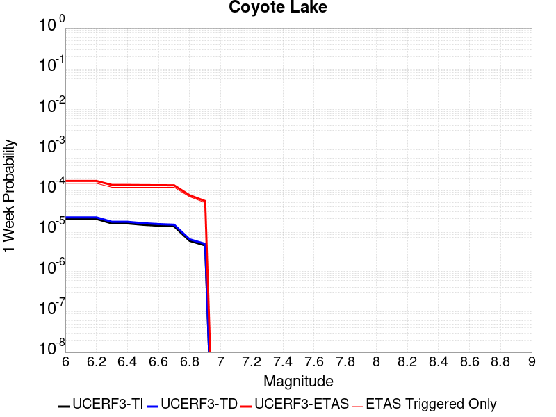 |  | 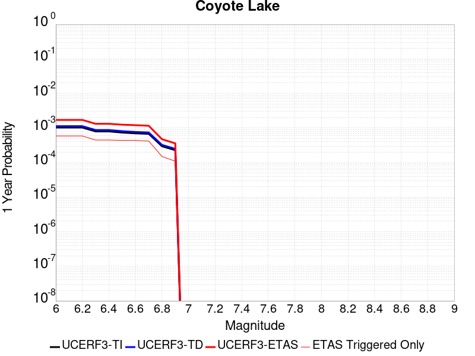 |  |

| Magnitude | 1 wk TI Prob | 1 wk TD Prob | 1 wk ETAS Prob | 1 wk ETAS/TD Gain | 1 wk ETAS Triggered Only | 1 mo TI Prob | 1 mo TD Prob | 1 mo ETAS Prob | 1 mo ETAS/TD Gain | 1 mo ETAS Triggered Only | 1 yr TI Prob | 1 yr TD Prob | 1 yr ETAS Prob | 1 yr ETAS/TD Gain | 1 yr ETAS Triggered Only | 10 yr TI Prob | 10 yr TD Prob | 10 yr ETAS Prob | 10 yr ETAS/TD Gain | 10 yr ETAS Triggered Only |
|-----|-----|-----|-----|-----|-----|-----|-----|-----|-----|-----|-----|-----|-----|-----|-----|-----|-----|-----|-----|-----|
| 6.0 | 1.980352E-5 | 2.1706745E-5 | 2.1706745E-5 | 1.0 | 0.0 | 8.486947E-5 | 9.302599E-5 | 9.302599E-5 | 1.0 | 0.0 | 0.0010327959 | 0.0011320751 | 0.0013937986 | 1.2311893 | 2.6202018E-4 | 0.010280091 | 0.011270258 | 0.011917925 | 1.057467 | 6.5505045E-4 |
| 6.1 | 1.980352E-5 | 2.1706745E-5 | 2.1706745E-5 | 1.0 | 0.0 | 8.486947E-5 | 9.302599E-5 | 9.302599E-5 | 1.0 | 0.0 | 0.0010327959 | 0.0011320751 | 0.0013937986 | 1.2311893 | 2.6202018E-4 | 0.010280091 | 0.011270258 | 0.011917925 | 1.057467 | 6.5505045E-4 |
| 6.2 | 1.980352E-5 | 2.1706745E-5 | 2.1706745E-5 | 1.0 | 0.0 | 8.486947E-5 | 9.302599E-5 | 9.302599E-5 | 1.0 | 0.0 | 0.0010327959 | 0.0011320751 | 0.0013937986 | 1.2311893 | 2.6202018E-4 | 0.010280091 | 0.011270258 | 0.011917925 | 1.057467 | 6.5505045E-4 |
| 6.3 | 1.5344787E-5 | 1.682067E-5 | 1.682067E-5 | 1.0 | 0.0 | 6.576172E-5 | 7.2086936E-5 | 7.2086936E-5 | 1.0 | 0.0 | 8.003548E-4 | 8.773662E-4 | 8.773662E-4 | 1.0 | 0.0 | 0.007974784 | 0.00874507 | 0.009004798 | 1.0297 | 2.6202018E-4 |
| 6.4 | 1.5344787E-5 | 1.682067E-5 | 1.682067E-5 | 1.0 | 0.0 | 6.576172E-5 | 7.2086936E-5 | 7.2086936E-5 | 1.0 | 0.0 | 8.003548E-4 | 8.773662E-4 | 8.773662E-4 | 1.0 | 0.0 | 0.007974784 | 0.00874507 | 0.009004798 | 1.0297 | 2.6202018E-4 |
| 6.5 | 1.4189697E-5 | 1.5557987E-5 | 1.5557987E-5 | 1.0 | 0.0 | 6.081157E-5 | 6.6675726E-5 | 6.6675726E-5 | 1.0 | 0.0 | 7.401293E-4 | 8.115349E-4 | 8.115349E-4 | 1.0 | 0.0 | 0.0073766913 | 0.008091656 | 0.008351556 | 1.0321195 | 2.6202018E-4 |
| 6.6 | 1.3469301E-5 | 1.4771577E-5 | 1.4771577E-5 | 1.0 | 0.0 | 5.7724297E-5 | 6.330556E-5 | 6.330556E-5 | 1.0 | 0.0 | 7.025667E-4 | 7.7053264E-4 | 7.7053264E-4 | 1.0 | 0.0 | 0.0070034964 | 0.0076845144 | 0.007944521 | 1.0338352 | 2.6202018E-4 |
| 6.7 | 1.3027966E-5 | 1.4281745E-5 | 1.4281745E-5 | 1.0 | 0.0 | 5.5832945E-5 | 6.120638E-5 | 6.120638E-5 | 1.0 | 0.0 | 6.7955407E-4 | 7.4499263E-4 | 7.4499263E-4 | 1.0 | 0.0 | 0.006774798 | 0.0074308286 | 0.0075608655 | 1.0174996 | 1.3101009E-4 |
| 6.8 | 5.695434E-6 | 6.2244176E-6 | 6.2244176E-6 | 1.0 | 0.0 | 2.4408775E-5 | 2.6675973E-5 | 2.6675973E-5 | 1.0 | 0.0 | 2.971363E-4 | 3.2476155E-4 | 3.2476155E-4 | 1.0 | 0.0 | 0.0029673933 | 0.0032458105 | 0.0032458105 | 1.0 | 0.0 |
| 6.9 | 4.385688E-6 | 4.7930553E-6 | 4.7930553E-6 | 1.0 | 0.0 | 1.879567E-5 | 2.0541665E-5 | 2.0541665E-5 | 1.0 | 0.0 | 2.2881327E-4 | 2.5009477E-4 | 2.5009477E-4 | 1.0 | 0.0 | 0.002285778 | 0.0025009478 | 0.0025009478 | 1.0 | 0.0 |

## Death Valley (Fish Lake Valley)
*[(top)](#table-of-contents)*

| 1 Week | 1 Month | 1 Year | 10 Year |
|-----|-----|-----|-----|
|  |  |  |  |

| Magnitude | 1 wk TI Prob | 1 wk TD Prob | 1 wk ETAS Prob | 1 wk ETAS/TD Gain | 1 wk ETAS Triggered Only | 1 mo TI Prob | 1 mo TD Prob | 1 mo ETAS Prob | 1 mo ETAS/TD Gain | 1 mo ETAS Triggered Only | 1 yr TI Prob | 1 yr TD Prob | 1 yr ETAS Prob | 1 yr ETAS/TD Gain | 1 yr ETAS Triggered Only | 10 yr TI Prob | 10 yr TD Prob | 10 yr ETAS Prob | 10 yr ETAS/TD Gain | 10 yr ETAS Triggered Only |
|-----|-----|-----|-----|-----|-----|-----|-----|-----|-----|-----|-----|-----|-----|-----|-----|-----|-----|-----|-----|-----|
| 6.0 | 3.872328E-5 | 4.7267473E-5 | 4.4027917E-4 | 9.314633 | 3.9303026E-4 | 1.6594635E-4 | 2.0256084E-4 | 5.955115E-4 | 2.9399142 | 3.9303026E-4 | 0.0020185246 | 0.002463534 | 0.0029862833 | 1.2121949 | 5.2404037E-4 | 0.02000288 | 0.024388181 | 0.025027256 | 1.0262043 | 6.5505045E-4 |
| 6.1 | 3.872328E-5 | 4.7267473E-5 | 4.4027917E-4 | 9.314633 | 3.9303026E-4 | 1.6594635E-4 | 2.0256084E-4 | 5.955115E-4 | 2.9399142 | 3.9303026E-4 | 0.0020185246 | 0.002463534 | 0.0029862833 | 1.2121949 | 5.2404037E-4 | 0.02000288 | 0.024388181 | 0.025027256 | 1.0262043 | 6.5505045E-4 |
| 6.2 | 3.872328E-5 | 4.7267473E-5 | 4.4027917E-4 | 9.314633 | 3.9303026E-4 | 1.6594635E-4 | 2.0256084E-4 | 5.955115E-4 | 2.9399142 | 3.9303026E-4 | 0.0020185246 | 0.002463534 | 0.0029862833 | 1.2121949 | 5.2404037E-4 | 0.02000288 | 0.024388181 | 0.025027256 | 1.0262043 | 6.5505045E-4 |
| 6.3 | 2.8356371E-5 | 3.3609853E-5 | 4.266269E-4 | 12.693508 | 3.9303026E-4 | 1.2152165E-4 | 1.4403471E-4 | 5.3700834E-4 | 3.728326 | 3.9303026E-4 | 0.0014785219 | 0.0017522911 | 0.0022754131 | 1.2985361 | 5.2404037E-4 | 0.014687235 | 0.017391782 | 0.01803544 | 1.0370094 | 6.5505045E-4 |
| 6.4 | 2.8356371E-5 | 3.3609853E-5 | 4.266269E-4 | 12.693508 | 3.9303026E-4 | 1.2152165E-4 | 1.4403471E-4 | 5.3700834E-4 | 3.728326 | 3.9303026E-4 | 0.0014785219 | 0.0017522911 | 0.0022754131 | 1.2985361 | 5.2404037E-4 | 0.014687235 | 0.017391782 | 0.01803544 | 1.0370094 | 6.5505045E-4 |
| 6.5 | 2.4448687E-5 | 2.8607552E-5 | 4.2162658E-4 | 14.738296 | 3.9303026E-4 | 1.0477588E-4 | 1.2259831E-4 | 5.155804E-4 | 4.2054443 | 3.9303026E-4 | 0.0012748998 | 0.0014916632 | 0.0020149217 | 1.3507887 | 5.2404037E-4 | 0.012676105 | 0.014821377 | 0.015466718 | 1.0435413 | 6.5505045E-4 |
| 6.6 | 2.1298161E-5 | 2.4660083E-5 | 4.1768065E-4 | 16.93752 | 3.9303026E-4 | 9.127464E-5 | 1.0568198E-4 | 4.9867074E-4 | 4.7185974 | 3.9303026E-4 | 0.0011107022 | 0.0012859525 | 0.001809319 | 1.4069874 | 5.2404037E-4 | 0.011051672 | 0.012788526 | 0.013435199 | 1.0505667 | 6.5505045E-4 |
| 6.7 | 1.8959729E-5 | 2.1781025E-5 | 4.1480272E-4 | 19.044224 | 3.9303026E-4 | 8.125345E-5 | 9.334405E-5 | 4.8633764E-4 | 5.2101617 | 3.9303026E-4 | 9.888117E-4 | 0.001135897 | 0.0016593421 | 1.4608209 | 5.2404037E-4 | 0.009844234 | 0.01130357 | 0.011951216 | 1.0572957 | 6.5505045E-4 |
| 6.8 | 1.6691629E-5 | 1.9018353E-5 | 4.1204115E-4 | 21.66545 | 3.9303026E-4 | 7.153359E-5 | 8.150477E-5 | 4.74503E-4 | 5.8217816 | 3.9303026E-4 | 8.7057345E-4 | 9.918857E-4 | 0.0015154063 | 1.5278033 | 5.2404037E-4 | 0.008671708 | 0.009876343 | 0.010524925 | 1.0656701 | 6.5505045E-4 |
| 6.9 | 1.450505E-5 | 1.638954E-5 | 4.0941336E-4 | 24.980162 | 3.9303026E-4 | 6.216302E-5 | 7.0239046E-5 | 4.632417E-4 | 6.5952168 | 3.9303026E-4 | 7.5657194E-4 | 8.5483363E-4 | 0.001378426 | 1.6125079 | 5.2404037E-4 | 0.007540013 | 0.008516385 | 0.009165857 | 1.0762614 | 6.5505045E-4 |
| 7.0 | 1.2940855E-5 | 1.4537972E-5 | 4.0756253E-4 | 28.034346 | 3.9303026E-4 | 5.545963E-5 | 6.230414E-5 | 4.5530993E-4 | 7.30786 | 3.9303026E-4 | 6.750118E-4 | 7.5829466E-4 | 0.0012819377 | 1.6905534 | 5.2404037E-4 | 0.006729651 | 0.0075576897 | 0.00820779 | 1.0860183 | 6.5505045E-4 |
| 7.1 | 1.2544658E-5 | 1.4078208E-5 | 4.0710293E-4 | 28.917242 | 3.9303026E-4 | 5.3761712E-5 | 6.0333812E-5 | 4.5334036E-4 | 7.5138693 | 3.9303026E-4 | 6.5435225E-4 | 7.343222E-4 | 0.0012579777 | 1.7131141 | 5.2404037E-4 | 0.006524288 | 0.007319551 | 0.007969807 | 1.0888382 | 6.5505045E-4 |
| 7.2 | 1.2489416E-5 | 1.4015674E-5 | 4.0704044E-4 | 29.041801 | 3.9303026E-4 | 5.3524967E-5 | 6.0065824E-5 | 4.5307248E-4 | 7.542933 | 3.9303026E-4 | 6.514716E-4 | 7.310616E-4 | 0.0012547189 | 1.716297 | 5.2404037E-4 | 0.006495651 | 0.0072871596 | 0.007937437 | 1.089236 | 6.5505045E-4 |
| 7.3 | 1.2368307E-5 | 1.3879812E-5 | 4.069046E-4 | 29.31629 | 3.9303026E-4 | 5.3005948E-5 | 5.9483587E-5 | 4.5249047E-4 | 7.6069803 | 3.9303026E-4 | 6.451563E-4 | 7.2397763E-4 | 0.0012476386 | 1.723311 | 5.2404037E-4 | 0.0064328653 | 0.007216782 | 0.007867105 | 1.0901126 | 6.5505045E-4 |
| 7.4 | 1.2161707E-5 | 1.36478675E-5 | 4.0667277E-4 | 29.797531 | 3.9303026E-4 | 5.212056E-5 | 5.8489582E-5 | 4.5149686E-4 | 7.7192698 | 3.9303026E-4 | 6.3438306E-4 | 7.118836E-4 | 0.0012355509 | 1.735608 | 5.2404037E-4 | 0.006325751 | 0.0070966207 | 0.0077470224 | 1.0916495 | 6.5505045E-4 |
| 7.5 | 1.1707948E-5 | 1.3145515E-5 | 4.061706E-4 | 30.898037 | 3.9303026E-4 | 5.0175953E-5 | 5.6336736E-5 | 4.4934487E-4 | 7.976054 | 3.9303026E-4 | 6.10721E-4 | 6.856895E-4 | 0.0012093706 | 1.7637291 | 5.2404037E-4 | 0.0060904534 | 0.006836321 | 0.0074868933 | 1.0951641 | 6.5505045E-4 |
| 7.6 | 1.0319538E-5 | 1.1579622E-5 | 4.0460532E-4 | 34.94115 | 3.9303026E-4 | 4.4225842E-5 | 4.9626036E-5 | 4.426368E-4 | 8.919447 | 3.9303026E-4 | 5.383166E-4 | 6.040347E-4 | 0.0011277585 | 1.8670427 | 5.2404037E-4 | 0.0053701443 | 0.0060244603 | 0.0066755647 | 1.1080768 | 6.5505045E-4 |
| 7.7 | 8.937764E-6 | 1.0022779E-5 | 4.030491E-4 | 40.213306 | 3.9303026E-4 | 3.830414E-5 | 4.295409E-5 | 4.3596746E-4 | 10.149615 | 3.9303026E-4 | 4.6625308E-4 | 5.228456E-4 | 0.0010466119 | 2.0017612 | 5.2404037E-4 | 0.0046527605 | 0.005216664 | 0.0058682975 | 1.1249138 | 6.5505045E-4 |
| 7.8 | 3.108007E-7 | 3.284654E-7 | 3.284654E-7 | 1.0 | 0.0 | 1.3320023E-6 | 1.407708E-6 | 1.407708E-6 | 1.0 | 0.0 | 1.6217007E-5 | 1.7138715E-5 | 1.4814656E-4 | 8.643971 | 1.3101009E-4 | 1.6215823E-4 | 1.7137431E-4 | 3.0236196E-4 | 1.7643365 | 1.3101009E-4 |
| 7.9 | 2.5591178E-9 | 2.6696718E-9 | 2.6696718E-9 | 1.0 | 0.0 | 1.0967647E-8 | 1.14414505E-8 | 1.14414505E-8 | 1.0 | 0.0 | 1.335311E-7 | 1.3929966E-7 | 1.3929966E-7 | 1.0 | 0.0 | 1.3353102E-6 | 1.3929966E-6 | 1.3929966E-6 | 1.0 | 0.0 |

## Ludlow
*[(top)](#table-of-contents)*

| 1 Week | 1 Month | 1 Year | 10 Year |
|-----|-----|-----|-----|
|  |  |  |  |

| Magnitude | 1 wk TI Prob | 1 wk TD Prob | 1 wk ETAS Prob | 1 wk ETAS/TD Gain | 1 wk ETAS Triggered Only | 1 mo TI Prob | 1 mo TD Prob | 1 mo ETAS Prob | 1 mo ETAS/TD Gain | 1 mo ETAS Triggered Only | 1 yr TI Prob | 1 yr TD Prob | 1 yr ETAS Prob | 1 yr ETAS/TD Gain | 1 yr ETAS Triggered Only | 10 yr TI Prob | 10 yr TD Prob | 10 yr ETAS Prob | 10 yr ETAS/TD Gain | 10 yr ETAS Triggered Only |
|-----|-----|-----|-----|-----|-----|-----|-----|-----|-----|-----|-----|-----|-----|-----|-----|-----|-----|-----|-----|-----|
| 6.0 | 2.2407607E-5 | 2.3657254E-5 | 1.5466425E-4 | 6.537709 | 1.3101009E-4 | 9.602906E-5 | 1.0138454E-4 | 3.6337815E-4 | 3.5841575 | 2.6202018E-4 | 0.0011685267 | 0.001233702 | 0.0016262473 | 1.318185 | 3.9303026E-4 | 0.011624013 | 0.012273042 | 0.012920053 | 1.052718 | 6.5505045E-4 |
| 6.1 | 2.2407607E-5 | 2.3657254E-5 | 1.5466425E-4 | 6.537709 | 1.3101009E-4 | 9.602906E-5 | 1.0138454E-4 | 3.6337815E-4 | 3.5841575 | 2.6202018E-4 | 0.0011685267 | 0.001233702 | 0.0016262473 | 1.318185 | 3.9303026E-4 | 0.011624013 | 0.012273042 | 0.012920053 | 1.052718 | 6.5505045E-4 |
| 6.2 | 1.0781252E-5 | 1.1365663E-5 | 1.1365663E-5 | 1.0 | 0.0 | 4.620455E-5 | 4.8709102E-5 | 1.797128E-4 | 3.689512 | 1.3101009E-4 | 5.623952E-4 | 5.9287593E-4 | 7.2380836E-4 | 1.2208428 | 1.3101009E-4 | 0.00560974 | 0.0059133614 | 0.0060435967 | 1.0220239 | 1.3101009E-4 |
| 6.3 | 1.0781252E-5 | 1.1365663E-5 | 1.1365663E-5 | 1.0 | 0.0 | 4.620455E-5 | 4.8709102E-5 | 1.797128E-4 | 3.689512 | 1.3101009E-4 | 5.623952E-4 | 5.9287593E-4 | 7.2380836E-4 | 1.2208428 | 1.3101009E-4 | 0.00560974 | 0.0059133614 | 0.0060435967 | 1.0220239 | 1.3101009E-4 |
| 6.4 | 7.814439E-6 | 8.237729E-6 | 8.237729E-6 | 1.0 | 0.0 | 3.3490025E-5 | 3.530408E-5 | 1.6630955E-4 | 4.710774 | 1.3101009E-4 | 4.0766477E-4 | 4.2974384E-4 | 5.6069763E-4 | 1.3047253 | 1.3101009E-4 | 0.0040691774 | 0.0042892746 | 0.0044197226 | 1.0304127 | 1.3101009E-4 |
| 6.5 | 6.4986366E-6 | 6.85092E-6 | 6.85092E-6 | 1.0 | 0.0 | 2.7851002E-5 | 2.9360759E-5 | 1.60367E-4 | 5.4619503 | 1.3101009E-4 | 3.390332E-4 | 3.5740953E-4 | 4.883728E-4 | 1.3664235 | 1.3101009E-4 | 0.003385164 | 0.0035684432 | 0.0036989858 | 1.0365825 | 1.3101009E-4 |
| 6.6 | 5.582177E-6 | 5.8860055E-6 | 5.8860055E-6 | 1.0 | 0.0 | 2.3923398E-5 | 2.5225498E-5 | 1.5623229E-4 | 6.193427 | 1.3101009E-4 | 2.9122844E-4 | 3.0707786E-4 | 4.3804772E-4 | 1.4265038 | 1.3101009E-4 | 0.0029084706 | 0.003066609 | 0.0031972171 | 1.0425905 | 1.3101009E-4 |
| 6.7 | 4.6858763E-6 | 4.940427E-6 | 4.940427E-6 | 1.0 | 0.0 | 2.0082172E-5 | 2.1173091E-5 | 1.5218041E-4 | 7.187444 | 1.3101009E-4 | 2.4447302E-4 | 2.5775246E-4 | 3.8872877E-4 | 1.5081477 | 1.3101009E-4 | 0.0024420423 | 0.0025745912 | 0.0027052641 | 1.0507548 | 1.3101009E-4 |
| 6.8 | 3.5584908E-6 | 3.7520183E-6 | 3.7520183E-6 | 1.0 | 0.0 | 1.5250586E-5 | 1.6079981E-5 | 1.4708797E-4 | 9.147272 | 1.3101009E-4 | 1.8566006E-4 | 1.957566E-4 | 3.2674105E-4 | 1.6691189 | 1.3101009E-4 | 0.0018550502 | 0.0019558826 | 0.0020866366 | 1.0668516 | 1.3101009E-4 |
| 6.9 | 2.532834E-6 | 2.6710034E-6 | 2.6710034E-6 | 1.0 | 0.0 | 1.0854958E-5 | 1.1447109E-5 | 1.424557E-4 | 12.444688 | 1.3101009E-4 | 1.3215111E-4 | 1.3935992E-4 | 2.7035174E-4 | 1.9399534 | 1.3101009E-4 | 0.0013207254 | 0.0013927529 | 0.0015235805 | 1.0939345 | 1.3101009E-4 |
| 7.0 | 1.7083285E-6 | 1.8019439E-6 | 1.8019439E-6 | 1.0 | 0.0 | 7.3213873E-6 | 7.722595E-6 | 1.3873167E-4 | 17.964386 | 1.3101009E-4 | 8.913424E-5 | 9.40187E-5 | 2.2501647E-4 | 2.393316 | 1.3101009E-4 | 8.9098496E-4 | 9.3980576E-4 | 0.0010706927 | 1.1392702 | 1.3101009E-4 |
| 7.1 | 1.0905424E-6 | 1.1497619E-6 | 1.1497619E-6 | 1.0 | 0.0 | 4.6737446E-6 | 4.9275427E-6 | 1.3593698E-4 | 27.587175 | 1.3101009E-4 | 5.6901354E-5 | 5.999128E-5 | 1.9099351E-4 | 3.183688 | 1.3101009E-4 | 5.6886784E-4 | 5.997606E-4 | 7.306921E-4 | 1.2183063 | 1.3101009E-4 |
| 7.2 | 6.06668E-7 | 6.387277E-7 | 6.387277E-7 | 1.0 | 0.0 | 2.600003E-6 | 2.7374022E-6 | 1.3374713E-4 | 48.859146 | 1.3101009E-4 | 3.1654577E-5 | 3.3327433E-5 | 1.6433315E-4 | 4.9308677 | 1.3101009E-4 | 3.1650066E-4 | 3.3323118E-4 | 4.641976E-4 | 1.3930198 | 1.3101009E-4 |

## Manix-Afton Hills
*[(top)](#table-of-contents)*

| 1 Week | 1 Month | 1 Year | 10 Year |
|-----|-----|-----|-----|
|  |  |  |  |

| Magnitude | 1 wk TI Prob | 1 wk TD Prob | 1 wk ETAS Prob | 1 wk ETAS/TD Gain | 1 wk ETAS Triggered Only | 1 mo TI Prob | 1 mo TD Prob | 1 mo ETAS Prob | 1 mo ETAS/TD Gain | 1 mo ETAS Triggered Only | 1 yr TI Prob | 1 yr TD Prob | 1 yr ETAS Prob | 1 yr ETAS/TD Gain | 1 yr ETAS Triggered Only | 10 yr TI Prob | 10 yr TD Prob | 10 yr ETAS Prob | 10 yr ETAS/TD Gain | 10 yr ETAS Triggered Only |
|-----|-----|-----|-----|-----|-----|-----|-----|-----|-----|-----|-----|-----|-----|-----|-----|-----|-----|-----|-----|-----|
| 6.0 | 1.3783202E-5 | 1.47110895E-5 | 1.4571926E-4 | 9.905401 | 1.3101009E-4 | 5.906953E-5 | 6.30461E-5 | 1.9404793E-4 | 3.0778735 | 1.3101009E-4 | 7.189342E-4 | 7.6733343E-4 | 0.0011600622 | 1.5118097 | 3.9303026E-4 | 0.0071661277 | 0.007648596 | 0.008168628 | 1.0679905 | 5.2404037E-4 |
| 6.1 | 1.3783202E-5 | 1.47110895E-5 | 1.4571926E-4 | 9.905401 | 1.3101009E-4 | 5.906953E-5 | 6.30461E-5 | 1.9404793E-4 | 3.0778735 | 1.3101009E-4 | 7.189342E-4 | 7.6733343E-4 | 0.0011600622 | 1.5118097 | 3.9303026E-4 | 0.0071661277 | 0.007648596 | 0.008168628 | 1.0679905 | 5.2404037E-4 |
| 6.2 | 1.3783202E-5 | 1.47110895E-5 | 1.4571926E-4 | 9.905401 | 1.3101009E-4 | 5.906953E-5 | 6.30461E-5 | 1.9404793E-4 | 3.0778735 | 1.3101009E-4 | 7.189342E-4 | 7.6733343E-4 | 0.0011600622 | 1.5118097 | 3.9303026E-4 | 0.0071661277 | 0.007648596 | 0.008168628 | 1.0679905 | 5.2404037E-4 |
| 6.3 | 1.10494875E-5 | 1.1793136E-5 | 1.1793136E-5 | 1.0 | 0.0 | 4.7354086E-5 | 5.054109E-5 | 5.054109E-5 | 1.0 | 0.0 | 5.763835E-4 | 6.151744E-4 | 7.461039E-4 | 1.2128332 | 1.3101009E-4 | 0.005748908 | 0.0061357557 | 0.006396168 | 1.0424418 | 2.6202018E-4 |
| 6.4 | 1.10494875E-5 | 1.1793136E-5 | 1.1793136E-5 | 1.0 | 0.0 | 4.7354086E-5 | 5.054109E-5 | 5.054109E-5 | 1.0 | 0.0 | 5.763835E-4 | 6.151744E-4 | 7.461039E-4 | 1.2128332 | 1.3101009E-4 | 0.005748908 | 0.0061357557 | 0.006396168 | 1.0424418 | 2.6202018E-4 |
| 6.5 | 9.788949E-6 | 1.045432E-5 | 1.045432E-5 | 1.0 | 0.0 | 4.1951964E-5 | 4.480351E-5 | 4.480351E-5 | 1.0 | 0.0 | 5.1064545E-4 | 5.453555E-4 | 6.7629415E-4 | 1.2400978 | 1.3101009E-4 | 0.0050947363 | 0.0054410985 | 0.0057016932 | 1.0478938 | 2.6202018E-4 |
| 6.6 | 8.810006E-6 | 9.4136285E-6 | 9.4136285E-6 | 1.0 | 0.0 | 3.775662E-5 | 4.0343548E-5 | 4.0343548E-5 | 1.0 | 0.0 | 4.5958988E-4 | 4.9108086E-4 | 6.220266E-4 | 1.266648 | 1.3101009E-4 | 0.0045864056 | 0.004900839 | 0.005161575 | 1.0532023 | 2.6202018E-4 |
| 6.7 | 8.80128E-6 | 9.404108E-6 | 9.404108E-6 | 1.0 | 0.0 | 3.7719226E-5 | 4.0302748E-5 | 4.0302748E-5 | 1.0 | 0.0 | 4.591348E-4 | 4.9058435E-4 | 6.2153017E-4 | 1.2669181 | 1.3101009E-4 | 0.004581874 | 0.0048958957 | 0.0051566334 | 1.0532563 | 2.6202018E-4 |
| 6.8 | 6.8994877E-6 | 7.380076E-6 | 7.380076E-6 | 1.0 | 0.0 | 2.9568899E-5 | 3.162856E-5 | 3.162856E-5 | 1.0 | 0.0 | 3.5994186E-4 | 3.8501783E-4 | 5.159775E-4 | 1.3401392 | 1.3101009E-4 | 0.003593594 | 0.0038443129 | 0.004105326 | 1.0678959 | 2.6202018E-4 |
| 6.9 | 4.9328037E-6 | 5.2709615E-6 | 5.2709615E-6 | 1.0 | 0.0 | 2.1140417E-5 | 2.2589675E-5 | 2.2589675E-5 | 1.0 | 0.0 | 2.5735417E-4 | 2.7500073E-4 | 4.0597477E-4 | 1.476268 | 1.3101009E-4 | 0.0025705635 | 0.0027472095 | 0.0028778596 | 1.0475574 | 1.3101009E-4 |
| 7.0 | 3.347973E-6 | 3.59003E-6 | 3.59003E-6 | 1.0 | 0.0 | 1.4348378E-5 | 1.5385775E-5 | 1.5385775E-5 | 1.0 | 0.0 | 1.746775E-4 | 1.8730981E-4 | 1.8730981E-4 | 1.0 | 0.0 | 0.0017454025 | 0.0018719219 | 0.0018719219 | 1.0 | 0.0 |
| 7.1 | 1.2073567E-6 | 1.293482E-6 | 1.293482E-6 | 1.0 | 0.0 | 5.1743755E-6 | 5.543492E-6 | 5.543492E-6 | 1.0 | 0.0 | 6.29962E-5 | 6.749156E-5 | 6.749156E-5 | 1.0 | 0.0 | 6.297835E-4 | 6.7487074E-4 | 6.7487074E-4 | 1.0 | 0.0 |

## Big Pine (Central)
*[(top)](#table-of-contents)*

| 1 Week | 1 Month | 1 Year | 10 Year |
|-----|-----|-----|-----|
|  |  |  |  |

| Magnitude | 1 wk TI Prob | 1 wk TD Prob | 1 wk ETAS Prob | 1 wk ETAS/TD Gain | 1 wk ETAS Triggered Only | 1 mo TI Prob | 1 mo TD Prob | 1 mo ETAS Prob | 1 mo ETAS/TD Gain | 1 mo ETAS Triggered Only | 1 yr TI Prob | 1 yr TD Prob | 1 yr ETAS Prob | 1 yr ETAS/TD Gain | 1 yr ETAS Triggered Only | 10 yr TI Prob | 10 yr TD Prob | 10 yr ETAS Prob | 10 yr ETAS/TD Gain | 10 yr ETAS Triggered Only |
|-----|-----|-----|-----|-----|-----|-----|-----|-----|-----|-----|-----|-----|-----|-----|-----|-----|-----|-----|-----|-----|
| 6.0 | 1.2706755E-5 | 1.4250529E-5 | 4.072752E-4 | 28.579657 | 3.9303026E-4 | 5.4456385E-5 | 6.107247E-5 | 4.5407872E-4 | 7.4350805 | 3.9303026E-4 | 6.628048E-4 | 7.433402E-4 | 0.0011360783 | 1.5283424 | 3.9303026E-4 | 0.006608314 | 0.0074135666 | 0.007933722 | 1.0701627 | 5.2404037E-4 |
| 6.1 | 8.342579E-6 | 9.510762E-6 | 2.7152844E-4 | 28.5496 | 2.6202018E-4 | 3.5753423E-5 | 4.0759893E-5 | 3.027694E-4 | 7.4281206 | 2.6202018E-4 | 4.3521097E-4 | 4.961604E-4 | 7.580506E-4 | 1.5278337 | 2.6202018E-4 | 0.0043435963 | 0.0049540824 | 0.0053451657 | 1.0789416 | 3.9303026E-4 |
| 6.2 | 6.923899E-6 | 7.967147E-6 | 7.967147E-6 | 1.0 | 0.0 | 2.9673516E-5 | 3.4144578E-5 | 3.4144578E-5 | 1.0 | 0.0 | 3.6121515E-4 | 4.156502E-4 | 4.156502E-4 | 1.0 | 0.0 | 0.003606286 | 0.0041520367 | 0.004282503 | 1.0314223 | 1.3101009E-4 |
| 6.3 | 2.728396E-6 | 3.4242908E-6 | 3.4242908E-6 | 1.0 | 0.0 | 1.1693074E-5 | 1.4675454E-5 | 1.4675454E-5 | 1.0 | 0.0 | 1.4235388E-4 | 1.7865987E-4 | 1.7865987E-4 | 1.0 | 0.0 | 0.0014226272 | 0.0017866704 | 0.0019174464 | 1.0731953 | 1.3101009E-4 |
| 6.4 | 2.7136944E-6 | 3.408584E-6 | 3.408584E-6 | 1.0 | 0.0 | 1.1630066E-5 | 1.4608141E-5 | 1.4608141E-5 | 1.0 | 0.0 | 1.4158686E-4 | 1.7784047E-4 | 1.7784047E-4 | 1.0 | 0.0 | 0.0014149669 | 0.0017784894 | 0.0019092666 | 1.0735327 | 1.3101009E-4 |
| 6.5 | 2.6971882E-6 | 3.3909291E-6 | 3.3909291E-6 | 1.0 | 0.0 | 1.1559327E-5 | 1.45324775E-5 | 1.45324775E-5 | 1.0 | 0.0 | 1.4072572E-4 | 1.7691942E-4 | 1.7691942E-4 | 1.0 | 0.0 | 0.0014063664 | 0.0017692937 | 0.001900072 | 1.0739155 | 1.3101009E-4 |
| 6.6 | 2.669092E-6 | 3.3609497E-6 | 3.3609497E-6 | 1.0 | 0.0 | 1.1438916E-5 | 1.4403995E-5 | 1.4403995E-5 | 1.0 | 0.0 | 1.3925991E-4 | 1.753554E-4 | 1.753554E-4 | 1.0 | 0.0 | 0.0013917267 | 0.0017536782 | 0.0018844586 | 1.0745748 | 1.3101009E-4 |
| 6.7 | 2.6408059E-6 | 3.3309752E-6 | 3.3309752E-6 | 1.0 | 0.0 | 1.1317691E-5 | 1.4275535E-5 | 1.4275535E-5 | 1.0 | 0.0 | 1.3778417E-4 | 1.7379165E-4 | 1.7379165E-4 | 1.0 | 0.0 | 0.0013769877 | 0.0017380653 | 0.0018688476 | 1.075246 | 1.3101009E-4 |
| 6.8 | 2.1786943E-6 | 2.8544325E-6 | 2.8544325E-6 | 1.0 | 0.0 | 9.337228E-6 | 1.2233229E-5 | 1.2233229E-5 | 1.0 | 0.0 | 1.1367482E-4 | 1.4893012E-4 | 1.4893012E-4 | 1.0 | 0.0 | 0.0011361669 | 0.0014897975 | 0.0016206125 | 1.0878072 | 1.3101009E-4 |
| 6.9 | 1.4411696E-6 | 2.068499E-6 | 2.068499E-6 | 1.0 | 0.0 | 6.1764263E-6 | 8.864968E-6 | 8.864968E-6 | 1.0 | 0.0 | 7.51954E-5 | 1.079259E-4 | 1.079259E-4 | 1.0 | 0.0 | 7.5169955E-4 | 0.0010801847 | 0.0012110532 | 1.1211538 | 1.3101009E-4 |
| 7.0 | 1.0073411E-6 | 1.554261E-6 | 1.554261E-6 | 1.0 | 0.0 | 4.317169E-6 | 6.6611024E-6 | 6.6611024E-6 | 1.0 | 0.0 | 5.2560266E-5 | 8.1096056E-5 | 8.1096056E-5 | 1.0 | 0.0 | 5.2547833E-4 | 8.1210316E-4 | 8.1210316E-4 | 1.0 | 0.0 |
| 7.1 | 8.947104E-7 | 1.4302494E-6 | 1.4302494E-6 | 1.0 | 0.0 | 3.834468E-6 | 6.129627E-6 | 6.129627E-6 | 1.0 | 0.0 | 4.6683643E-5 | 7.46258E-5 | 7.46258E-5 | 1.0 | 0.0 | 4.6673836E-4 | 7.474457E-4 | 7.474457E-4 | 1.0 | 0.0 |
| 7.2 | 5.215166E-7 | 1.0111678E-6 | 1.0111678E-6 | 1.0 | 0.0 | 2.2350691E-6 | 4.3335694E-6 | 4.3335694E-6 | 1.0 | 0.0 | 2.7211627E-5 | 5.2759973E-5 | 5.2759973E-5 | 1.0 | 0.0 | 2.7208295E-4 | 5.2890263E-4 | 5.2890263E-4 | 1.0 | 0.0 |
| 7.3 | 4.4024807E-7 | 9.219589E-7 | 9.219589E-7 | 1.0 | 0.0 | 1.8867761E-6 | 3.9512465E-6 | 3.9512465E-6 | 1.0 | 0.0 | 2.2971257E-5 | 4.810541E-5 | 4.810541E-5 | 1.0 | 0.0 | 2.2968883E-4 | 4.8237795E-4 | 4.8237795E-4 | 1.0 | 0.0 |
| 7.4 | 3.6130905E-7 | 8.358523E-7 | 8.358523E-7 | 1.0 | 0.0 | 1.5484665E-6 | 3.5822195E-6 | 3.5822195E-6 | 1.0 | 0.0 | 1.8852415E-5 | 4.3612687E-5 | 4.3612687E-5 | 1.0 | 0.0 | 1.8850817E-4 | 4.374597E-4 | 4.374597E-4 | 1.0 | 0.0 |
| 7.5 | 3.408184E-7 | 8.108147E-7 | 8.108147E-7 | 1.0 | 0.0 | 1.4606494E-6 | 3.4749157E-6 | 3.4749157E-6 | 1.0 | 0.0 | 1.7783263E-5 | 4.2306317E-5 | 4.2306317E-5 | 1.0 | 0.0 | 1.778184E-4 | 4.2437963E-4 | 4.2437963E-4 | 1.0 | 0.0 |
| 7.6 | 3.1428627E-7 | 7.7316E-7 | 7.7316E-7 | 1.0 | 0.0 | 1.3469405E-6 | 3.3135389E-6 | 3.3135389E-6 | 1.0 | 0.0 | 1.6398877E-5 | 4.0341627E-5 | 4.0341627E-5 | 1.0 | 0.0 | 1.6397667E-4 | 4.0471106E-4 | 4.0471106E-4 | 1.0 | 0.0 |
| 7.7 | 1.7972785E-7 | 5.077752E-7 | 5.077752E-7 | 1.0 | 0.0 | 7.70262E-7 | 2.1761778E-6 | 2.1761778E-6 | 1.0 | 0.0 | 9.377899E-6 | 2.6494654E-5 | 2.6494654E-5 | 1.0 | 0.0 | 9.377503E-5 | 2.662899E-4 | 2.662899E-4 | 1.0 | 0.0 |
| 7.8 | 4.9230927E-8 | 1.198079E-7 | 1.198079E-7 | 1.0 | 0.0 | 2.1098968E-7 | 5.134623E-7 | 5.134623E-7 | 1.0 | 0.0 | 2.5687964E-6 | 6.2513873E-6 | 6.2513873E-6 | 1.0 | 0.0 | 2.5687666E-5 | 6.295415E-5 | 6.295415E-5 | 1.0 | 0.0 |
| 7.9 | 3.6805972E-9 | 4.105293E-9 | 4.105293E-9 | 1.0 | 0.0 | 1.5773987E-8 | 1.7594115E-8 | 1.7594115E-8 | 1.0 | 0.0 | 1.9204828E-7 | 2.1420831E-7 | 2.1420831E-7 | 1.0 | 0.0 | 1.920481E-6 | 2.1900614E-6 | 2.1900614E-6 | 1.0 | 0.0 |

## San Andreas (Parkfield)
*[(top)](#table-of-contents)*

| 1 Week | 1 Month | 1 Year | 10 Year |
|-----|-----|-----|-----|
|  |  |  |  |

| Magnitude | 1 wk TI Prob | 1 wk TD Prob | 1 wk ETAS Prob | 1 wk ETAS/TD Gain | 1 wk ETAS Triggered Only | 1 mo TI Prob | 1 mo TD Prob | 1 mo ETAS Prob | 1 mo ETAS/TD Gain | 1 mo ETAS Triggered Only | 1 yr TI Prob | 1 yr TD Prob | 1 yr ETAS Prob | 1 yr ETAS/TD Gain | 1 yr ETAS Triggered Only | 10 yr TI Prob | 10 yr TD Prob | 10 yr ETAS Prob | 10 yr ETAS/TD Gain | 10 yr ETAS Triggered Only |
|-----|-----|-----|-----|-----|-----|-----|-----|-----|-----|-----|-----|-----|-----|-----|-----|-----|-----|-----|-----|-----|
| 6.0 | 5.556969E-4 | 7.7782426E-4 | 7.7782426E-4 | 1.0 | 0.0 | 0.0023793848 | 0.0033298214 | 0.0035909691 | 1.078427 | 2.6202018E-4 | 0.028586963 | 0.040191233 | 0.04069421 | 1.0125146 | 5.2404037E-4 | 0.25176284 | 0.33716413 | 0.3375115 | 1.0010302 | 5.2404037E-4 |
| 6.1 | 1.925858E-4 | 3.0276453E-4 | 3.0276453E-4 | 1.0 | 0.0 | 8.2510663E-4 | 0.0012970108 | 0.0012970108 | 1.0 | 0.0 | 0.0099994885 | 0.015778083 | 0.015907027 | 1.0081723 | 1.3101009E-4 | 0.095613256 | 0.1497237 | 0.14983508 | 1.000744 | 1.3101009E-4 |
| 6.2 | 9.4306815E-5 | 1.8242796E-4 | 1.8242796E-4 | 1.0 | 0.0 | 4.0410945E-4 | 7.816011E-4 | 7.816011E-4 | 1.0 | 0.0 | 0.0049089384 | 0.009474681 | 0.009604449 | 1.0136964 | 1.3101009E-4 | 0.048019063 | 0.09185409 | 0.09197307 | 1.0012953 | 1.3101009E-4 |
| 6.3 | 9.283051E-5 | 1.7939322E-4 | 1.7939322E-4 | 1.0 | 0.0 | 3.9778434E-4 | 7.686027E-4 | 7.686027E-4 | 1.0 | 0.0 | 0.0048322747 | 0.009317789 | 0.009447578 | 1.0139292 | 1.3101009E-4 | 0.047285385 | 0.09050704 | 0.09062619 | 1.0013165 | 1.3101009E-4 |
| 6.4 | 9.138826E-5 | 1.770153E-4 | 1.770153E-4 | 1.0 | 0.0 | 3.916052E-4 | 7.5841765E-4 | 7.5841765E-4 | 1.0 | 0.0 | 0.0047573745 | 0.00919484 | 0.009324646 | 1.0141172 | 1.3101009E-4 | 0.046568092 | 0.08940927 | 0.08952857 | 1.0013343 | 1.3101009E-4 |
| 6.5 | 9.000255E-5 | 1.7459576E-4 | 1.7459576E-4 | 1.0 | 0.0 | 3.8566816E-4 | 7.480541E-4 | 7.480541E-4 | 1.0 | 0.0 | 0.0046854047 | 0.009069731 | 0.009199554 | 1.0143137 | 1.3101009E-4 | 0.045878403 | 0.088295065 | 0.088414505 | 1.0013528 | 1.3101009E-4 |
| 6.6 | 8.8109264E-5 | 1.7140752E-4 | 1.7140752E-4 | 1.0 | 0.0 | 3.7755648E-4 | 7.3439797E-4 | 7.3439797E-4 | 1.0 | 0.0 | 0.0045870654 | 0.008904854 | 0.009034697 | 1.0145812 | 1.3101009E-4 | 0.04493529 | 0.0868267 | 0.08694633 | 1.0013778 | 1.3101009E-4 |
| 6.7 | 8.738073E-5 | 1.7007832E-4 | 1.7007832E-4 | 1.0 | 0.0 | 3.7443507E-4 | 7.287046E-4 | 7.287046E-4 | 1.0 | 0.0 | 0.0045492216 | 0.008836143 | 0.008965995 | 1.0146956 | 1.3101009E-4 | 0.04457213 | 0.08622707 | 0.086346775 | 1.0013883 | 1.3101009E-4 |
| 6.8 | 8.710195E-5 | 1.6953335E-4 | 1.6953335E-4 | 1.0 | 0.0 | 3.7324068E-4 | 7.263703E-4 | 7.263703E-4 | 1.0 | 0.0 | 0.0045347405 | 0.008807961 | 0.008937817 | 1.0147431 | 1.3101009E-4 | 0.04443313 | 0.08597467 | 0.08609442 | 1.0013928 | 1.3101009E-4 |
| 6.9 | 8.6801556E-5 | 1.689429E-4 | 1.689429E-4 | 1.0 | 0.0 | 3.7195362E-4 | 7.2384125E-4 | 7.2384125E-4 | 1.0 | 0.0 | 0.0045191357 | 0.008777418 | 0.008907278 | 1.0147948 | 1.3101009E-4 | 0.044283327 | 0.085700735 | 0.08582052 | 1.0013977 | 1.3101009E-4 |
| 7.0 | 8.5571606E-5 | 1.6647128E-4 | 1.6647128E-4 | 1.0 | 0.0 | 3.6668387E-4 | 7.132544E-4 | 7.132544E-4 | 1.0 | 0.0 | 0.004455241 | 0.008649553 | 0.008779431 | 1.0150155 | 1.3101009E-4 | 0.043669727 | 0.08454914 | 0.084669076 | 1.0014185 | 1.3101009E-4 |
| 7.1 | 7.82589E-5 | 1.5128135E-4 | 1.5128135E-4 | 1.0 | 0.0 | 3.3535215E-4 | 6.481883E-4 | 6.481883E-4 | 1.0 | 0.0 | 0.0040752706 | 0.007863307 | 0.0079932865 | 1.0165299 | 1.3101009E-4 | 0.040013418 | 0.07746111 | 0.07758197 | 1.0015603 | 1.3101009E-4 |
| 7.2 | 7.690929E-5 | 1.4865391E-4 | 1.4865391E-4 | 1.0 | 0.0 | 3.2956956E-4 | 6.369334E-4 | 6.369334E-4 | 1.0 | 0.0 | 0.004005129 | 0.007727258 | 0.007857256 | 1.0168233 | 1.3101009E-4 | 0.0393371 | 0.07623427 | 0.07635529 | 1.0015875 | 1.3101009E-4 |
| 7.3 | 7.5543794E-5 | 1.4561978E-4 | 1.4561978E-4 | 1.0 | 0.0 | 3.2371894E-4 | 6.2393624E-4 | 6.2393624E-4 | 1.0 | 0.0 | 0.003934157 | 0.007570127 | 0.0077001457 | 1.0171752 | 1.3101009E-4 | 0.038652334 | 0.074797355 | 0.07491856 | 1.0016205 | 1.3101009E-4 |
| 7.4 | 7.4214564E-5 | 1.4262961E-4 | 1.4262961E-4 | 1.0 | 0.0 | 3.1802364E-4 | 6.111273E-4 | 6.111273E-4 | 1.0 | 0.0 | 0.003865065 | 0.00741525 | 0.0075452887 | 1.0175366 | 1.3101009E-4 | 0.03798529 | 0.07337123 | 0.07349263 | 1.0016546 | 1.3101009E-4 |
| 7.5 | 6.149578E-5 | 1.11907226E-4 | 1.11907226E-4 | 1.0 | 0.0 | 2.6352672E-4 | 4.7951436E-4 | 4.7951436E-4 | 1.0 | 0.0 | 0.0032037178 | 0.0058224914 | 0.0059527387 | 1.0223696 | 1.3101009E-4 | 0.03157923 | 0.058557566 | 0.058680903 | 1.0021063 | 1.3101009E-4 |
| 7.6 | 6.0643448E-5 | 1.10193796E-4 | 1.10193796E-4 | 1.0 | 0.0 | 2.598746E-4 | 4.7217376E-4 | 4.7217376E-4 | 1.0 | 0.0 | 0.0031593828 | 0.0057335934 | 0.0058638523 | 1.0227185 | 1.3101009E-4 | 0.031148417 | 0.057718582 | 0.057842027 | 1.0021389 | 1.3101009E-4 |
| 7.7 | 5.1652263E-5 | 9.174698E-5 | 9.174698E-5 | 1.0 | 0.0 | 2.2134806E-4 | 3.931421E-4 | 3.931421E-4 | 1.0 | 0.0 | 0.002691582 | 0.0047760103 | 0.0047760103 | 1.0 | 0.0 | 0.026592141 | 0.04853623 | 0.04853623 | 1.0 | 0.0 |
| 7.8 | 4.8090482E-5 | 8.559635E-5 | 8.559635E-5 | 1.0 | 0.0 | 2.060858E-4 | 3.6678996E-4 | 3.6678996E-4 | 1.0 | 0.0 | 0.0025062072 | 0.0044565317 | 0.0044565317 | 1.0 | 0.0 | 0.024781305 | 0.04530245 | 0.04530245 | 1.0 | 0.0 |
| 7.9 | 3.970278E-5 | 6.750426E-5 | 6.750426E-5 | 1.0 | 0.0 | 1.7014367E-4 | 2.892719E-4 | 2.892719E-4 | 1.0 | 0.0 | 0.002069531 | 0.0035162016 | 0.0035162016 | 1.0 | 0.0 | 0.020503636 | 0.035881363 | 0.035881363 | 1.0 | 0.0 |
| 8.0 | 2.8982335E-5 | 4.069796E-5 | 4.069796E-5 | 1.0 | 0.0 | 1.2420409E-4 | 1.7440817E-4 | 1.7440817E-4 | 1.0 | 0.0 | 0.0015111357 | 0.0021213528 | 0.0021213528 | 1.0 | 0.0 | 0.015009012 | 0.022010697 | 0.022010697 | 1.0 | 0.0 |
| 8.1 | 1.8836186E-5 | 1.8681134E-5 | 1.8681134E-5 | 1.0 | 0.0 | 8.0724014E-5 | 8.005955E-5 | 8.005955E-5 | 1.0 | 0.0 | 9.823717E-4 | 9.742898E-4 | 9.742898E-4 | 1.0 | 0.0 | 0.009780403 | 0.010488115 | 0.010488115 | 1.0 | 0.0 |
| 8.2 | 8.643924E-6 | 5.4748625E-6 | 5.4748625E-6 | 1.0 | 0.0 | 3.704486E-5 | 2.3463486E-5 | 2.3463486E-5 | 1.0 | 0.0 | 4.5092785E-4 | 2.8563058E-4 | 2.8563058E-4 | 1.0 | 0.0 | 0.0045001395 | 0.0032487072 | 0.0032487072 | 1.0 | 0.0 |
| 8.3 | 1.983087E-6 | 7.6599065E-7 | 7.6599065E-7 | 1.0 | 0.0 | 8.498917E-6 | 3.282813E-6 | 3.282813E-6 | 1.0 | 0.0 | 1.034694E-4 | 3.9967534E-5 | 3.9967534E-5 | 1.0 | 0.0 | 0.0010342124 | 4.719687E-4 | 4.719687E-4 | 1.0 | 0.0 |

## San Jacinto (San Bernardino)
*[(top)](#table-of-contents)*

| 1 Week | 1 Month | 1 Year | 10 Year |
|-----|-----|-----|-----|
|  |  |  |  |

| Magnitude | 1 wk TI Prob | 1 wk TD Prob | 1 wk ETAS Prob | 1 wk ETAS/TD Gain | 1 wk ETAS Triggered Only | 1 mo TI Prob | 1 mo TD Prob | 1 mo ETAS Prob | 1 mo ETAS/TD Gain | 1 mo ETAS Triggered Only | 1 yr TI Prob | 1 yr TD Prob | 1 yr ETAS Prob | 1 yr ETAS/TD Gain | 1 yr ETAS Triggered Only | 10 yr TI Prob | 10 yr TD Prob | 10 yr ETAS Prob | 10 yr ETAS/TD Gain | 10 yr ETAS Triggered Only |
|-----|-----|-----|-----|-----|-----|-----|-----|-----|-----|-----|-----|-----|-----|-----|-----|-----|-----|-----|-----|-----|
| 6.0 | 3.409352E-5 | 3.5986508E-5 | 5.60008E-4 | 15.561609 | 5.2404037E-4 | 1.461069E-4 | 1.542188E-4 | 6.7817833E-4 | 4.3975077 | 5.2404037E-4 | 0.0017774 | 0.0018759987 | 0.002399056 | 1.2788154 | 5.2404037E-4 | 0.01763251 | 0.019349935 | 0.019863835 | 1.0265583 | 5.2404037E-4 |
| 6.1 | 3.409352E-5 | 3.5986508E-5 | 5.60008E-4 | 15.561609 | 5.2404037E-4 | 1.461069E-4 | 1.542188E-4 | 6.7817833E-4 | 4.3975077 | 5.2404037E-4 | 0.0017774 | 0.0018759987 | 0.002399056 | 1.2788154 | 5.2404037E-4 | 0.01763251 | 0.019349935 | 0.019863835 | 1.0265583 | 5.2404037E-4 |
| 6.2 | 3.409352E-5 | 3.5986508E-5 | 5.60008E-4 | 15.561609 | 5.2404037E-4 | 1.461069E-4 | 1.542188E-4 | 6.7817833E-4 | 4.3975077 | 5.2404037E-4 | 0.0017774 | 0.0018759987 | 0.002399056 | 1.2788154 | 5.2404037E-4 | 0.01763251 | 0.019349935 | 0.019863835 | 1.0265583 | 5.2404037E-4 |
| 6.3 | 3.409352E-5 | 3.5986508E-5 | 5.60008E-4 | 15.561609 | 5.2404037E-4 | 1.461069E-4 | 1.542188E-4 | 6.7817833E-4 | 4.3975077 | 5.2404037E-4 | 0.0017774 | 0.0018759987 | 0.002399056 | 1.2788154 | 5.2404037E-4 | 0.01763251 | 0.019349935 | 0.019863835 | 1.0265583 | 5.2404037E-4 |
| 6.4 | 3.400795E-5 | 3.5879173E-5 | 5.599007E-4 | 15.605174 | 5.2404037E-4 | 1.4574021E-4 | 1.5375883E-4 | 6.777186E-4 | 4.407673 | 5.2404037E-4 | 0.0017729428 | 0.0018704084 | 0.0023934685 | 1.2796502 | 5.2404037E-4 | 0.017588645 | 0.019295016 | 0.019808946 | 1.0266353 | 5.2404037E-4 |
| 6.5 | 3.341482E-5 | 3.5139812E-5 | 5.5916177E-4 | 15.912486 | 5.2404037E-4 | 1.4319851E-4 | 1.5059051E-4 | 6.7455193E-4 | 4.479379 | 5.2404037E-4 | 0.0017420477 | 0.0018318989 | 0.0023549793 | 1.28554 | 5.2404037E-4 | 0.017284546 | 0.018916558 | 0.019430686 | 1.0271786 | 5.2404037E-4 |
| 6.6 | 3.3364955E-5 | 3.5077028E-5 | 5.59099E-4 | 15.9391775 | 5.2404037E-4 | 1.4298483E-4 | 1.5032147E-4 | 6.742831E-4 | 4.485607 | 5.2404037E-4 | 0.0017394501 | 0.001828629 | 0.002351711 | 1.2860515 | 5.2404037E-4 | 0.017258976 | 0.018884424 | 0.019398568 | 1.0272259 | 5.2404037E-4 |
| 6.7 | 3.335922E-5 | 3.5066805E-5 | 5.590888E-4 | 15.943534 | 5.2404037E-4 | 1.4296026E-4 | 1.5027766E-4 | 6.7423924E-4 | 4.4866233 | 5.2404037E-4 | 0.0017391514 | 0.0018280965 | 0.0023511788 | 1.286135 | 5.2404037E-4 | 0.017256035 | 0.018879214 | 0.019393362 | 1.0272335 | 5.2404037E-4 |
| 6.8 | 3.327683E-5 | 3.496087E-5 | 5.589829E-4 | 15.988815 | 5.2404037E-4 | 1.4260718E-4 | 1.498237E-4 | 6.737855E-4 | 4.497189 | 5.2404037E-4 | 0.0017348597 | 0.0018225788 | 0.002345664 | 1.2870028 | 5.2404037E-4 | 0.017213784 | 0.018824987 | 0.019339161 | 1.0273135 | 5.2404037E-4 |
| 6.9 | 3.3235785E-5 | 3.4901823E-5 | 5.589239E-4 | 16.014174 | 5.2404037E-4 | 1.4243131E-4 | 1.4957068E-4 | 6.7353266E-4 | 4.503106 | 5.2404037E-4 | 0.0017327217 | 0.0018195034 | 0.0023425904 | 1.2874888 | 5.2404037E-4 | 0.017192734 | 0.018794855 | 0.019309046 | 1.027358 | 5.2404037E-4 |
| 7.0 | 3.3197095E-5 | 3.4841752E-5 | 5.5886386E-4 | 16.04006 | 5.2404037E-4 | 1.422655E-4 | 1.4931326E-4 | 6.732754E-4 | 4.509146 | 5.2404037E-4 | 0.0017307063 | 0.0018163746 | 0.0023394632 | 1.287985 | 5.2404037E-4 | 0.017172894 | 0.018764233 | 0.01927844 | 1.0274036 | 5.2404037E-4 |
| 7.1 | 3.3129716E-5 | 3.4721965E-5 | 5.587441E-4 | 16.09195 | 5.2404037E-4 | 1.4197677E-4 | 1.4879994E-4 | 6.7276234E-4 | 4.521254 | 5.2404037E-4 | 0.0017271966 | 0.0018101353 | 0.002333227 | 1.2889794 | 5.2404037E-4 | 0.017138338 | 0.018703312 | 0.01921755 | 1.0274945 | 5.2404037E-4 |
| 7.2 | 3.3034008E-5 | 3.458941E-5 | 5.5861165E-4 | 16.149788 | 5.2404037E-4 | 1.4156665E-4 | 1.4823192E-4 | 6.721946E-4 | 4.534749 | 5.2404037E-4 | 0.0017222111 | 0.0018032312 | 0.0023263267 | 1.2900878 | 5.2404037E-4 | 0.017089253 | 0.018635705 | 0.01914998 | 1.0275962 | 5.2404037E-4 |
| 7.3 | 3.2956614E-5 | 3.445717E-5 | 5.5847946E-4 | 16.207932 | 5.2404037E-4 | 1.4123498E-4 | 1.4766524E-4 | 6.716282E-4 | 4.5483165 | 5.2404037E-4 | 0.0017181796 | 0.0017963431 | 0.002319442 | 1.2912022 | 5.2404037E-4 | 0.017049557 | 0.018568452 | 0.019082762 | 1.027698 | 5.2404037E-4 |
| 7.4 | 3.2915937E-5 | 3.4378863E-5 | 5.584012E-4 | 16.242573 | 5.2404037E-4 | 1.4106068E-4 | 1.4732967E-4 | 6.7129283E-4 | 4.5563993 | 5.2404037E-4 | 0.0017160608 | 0.0017922645 | 0.0023153657 | 1.2918661 | 5.2404037E-4 | 0.017028693 | 0.018528719 | 0.019043049 | 1.0277586 | 5.2404037E-4 |
| 7.5 | 3.281791E-5 | 3.4243778E-5 | 5.582662E-4 | 16.302704 | 5.2404037E-4 | 1.406406E-4 | 1.4675081E-4 | 6.7071425E-4 | 4.57043 | 5.2404037E-4 | 0.0017109542 | 0.0017852283 | 0.002308333 | 1.2930185 | 5.2404037E-4 | 0.016978411 | 0.018459605 | 0.018973973 | 1.0278645 | 5.2404037E-4 |
| 7.6 | 3.2521442E-5 | 3.396873E-5 | 5.5799127E-4 | 16.426617 | 5.2404037E-4 | 1.3937015E-4 | 1.4557215E-4 | 6.6953624E-4 | 4.599343 | 5.2404037E-4 | 0.0016955109 | 0.0017709016 | 0.002294014 | 1.2953932 | 5.2404037E-4 | 0.016826328 | 0.018317232 | 0.018831674 | 1.0280851 | 5.2404037E-4 |
| 7.7 | 3.0287873E-5 | 3.245276E-5 | 5.564761E-4 | 17.147264 | 5.2404037E-4 | 1.297987E-4 | 1.3907586E-4 | 6.6304335E-4 | 4.767494 | 5.2404037E-4 | 0.0015791537 | 0.0016919347 | 0.0022150883 | 1.3092045 | 5.2404037E-4 | 0.01567979 | 0.01752809 | 0.018042946 | 1.0293732 | 5.2404037E-4 |
| 7.8 | 2.6316151E-5 | 2.9663592E-5 | 5.536884E-4 | 18.665588 | 5.2404037E-4 | 1.1277862E-4 | 1.2712348E-4 | 6.510972E-4 | 5.12177 | 5.2404037E-4 | 0.0013722149 | 0.0015466306 | 0.0020698605 | 1.3383031 | 5.2404037E-4 | 0.013637724 | 0.016069634 | 0.016585253 | 1.0320866 | 5.2404037E-4 |
| 7.9 | 2.0761147E-5 | 2.34181E-5 | 4.1643917E-4 | 17.78279 | 3.9303026E-4 | 8.897331E-5 | 1.0035944E-4 | 4.9335026E-4 | 4.9158335 | 3.9303026E-4 | 0.0010827117 | 0.0012211921 | 0.0016137423 | 1.3214484 | 3.9303026E-4 | 0.010774517 | 0.012793174 | 0.013181176 | 1.0303289 | 3.9303026E-4 |
| 8.0 | 1.5738568E-5 | 1.6033575E-5 | 1.4704156E-4 | 9.170853 | 1.3101009E-4 | 6.744926E-5 | 6.871352E-5 | 1.997146E-4 | 2.906482 | 1.3101009E-4 | 8.2088535E-4 | 8.3626667E-4 | 9.671672E-4 | 1.1565297 | 1.3101009E-4 | 0.008178596 | 0.008865921 | 0.00899577 | 1.0146458 | 1.3101009E-4 |
| 8.1 | 1.0105832E-5 | 8.3304985E-6 | 1.3933949E-4 | 16.726429 | 1.3101009E-4 | 4.3309992E-5 | 3.570165E-5 | 1.6670706E-4 | 4.66945 | 1.3101009E-4 | 5.2717153E-4 | 4.345814E-4 | 5.655346E-4 | 1.3013318 | 1.3101009E-4 | 0.005259227 | 0.004677232 | 0.004807629 | 1.0278791 | 1.3101009E-4 |
| 8.2 | 4.189207E-6 | 1.5784357E-6 | 1.5784357E-6 | 1.0 | 0.0 | 1.7953622E-5 | 6.7647065E-6 | 6.7647065E-6 | 1.0 | 0.0 | 2.1856341E-4 | 8.235722E-5 | 8.235722E-5 | 1.0 | 0.0 | 0.0021834858 | 9.565867E-4 | 9.565867E-4 | 1.0 | 0.0 |
| 8.3 | 1.2758221E-6 | 3.6149942E-7 | 3.6149942E-7 | 1.0 | 0.0 | 5.4677976E-6 | 1.5492824E-6 | 1.5492824E-6 | 1.0 | 0.0 | 6.65684E-5 | 1.8862354E-5 | 1.8862354E-5 | 1.0 | 0.0 | 6.6548464E-4 | 2.2751294E-4 | 2.2751294E-4 | 1.0 | 0.0 |

## San Andreas (Cholame) rev
*[(top)](#table-of-contents)*

| 1 Week | 1 Month | 1 Year | 10 Year |
|-----|-----|-----|-----|
|  |  |  |  |

| Magnitude | 1 wk TI Prob | 1 wk TD Prob | 1 wk ETAS Prob | 1 wk ETAS/TD Gain | 1 wk ETAS Triggered Only | 1 mo TI Prob | 1 mo TD Prob | 1 mo ETAS Prob | 1 mo ETAS/TD Gain | 1 mo ETAS Triggered Only | 1 yr TI Prob | 1 yr TD Prob | 1 yr ETAS Prob | 1 yr ETAS/TD Gain | 1 yr ETAS Triggered Only | 10 yr TI Prob | 10 yr TD Prob | 10 yr ETAS Prob | 10 yr ETAS/TD Gain | 10 yr ETAS Triggered Only |
|-----|-----|-----|-----|-----|-----|-----|-----|-----|-----|-----|-----|-----|-----|-----|-----|-----|-----|-----|-----|-----|
| 6.0 | 1.2302514E-4 | 2.5204287E-4 | 3.8301994E-4 | 1.5196619 | 1.3101009E-4 | 5.27144E-4 | 0.0010797381 | 0.0012106068 | 1.121204 | 1.3101009E-4 | 0.0063991086 | 0.0130670825 | 0.013454977 | 1.0296849 | 3.9303026E-4 | 0.06217949 | 0.12439073 | 0.12484958 | 1.0036888 | 5.2404037E-4 |
| 6.1 | 1.2302514E-4 | 2.5204287E-4 | 3.8301994E-4 | 1.5196619 | 1.3101009E-4 | 5.27144E-4 | 0.0010797381 | 0.0012106068 | 1.121204 | 1.3101009E-4 | 0.0063991086 | 0.0130670825 | 0.013454977 | 1.0296849 | 3.9303026E-4 | 0.06217949 | 0.12439073 | 0.12484958 | 1.0036888 | 5.2404037E-4 |
| 6.2 | 1.2203569E-4 | 2.5021084E-4 | 3.8118815E-4 | 1.5234678 | 1.3101009E-4 | 5.2290526E-4 | 0.0010718931 | 0.0012027627 | 1.1220921 | 1.3101009E-4 | 0.006347804 | 0.01297271 | 0.013360641 | 1.0299037 | 3.9303026E-4 | 0.061695136 | 0.12357691 | 0.124036185 | 1.0037166 | 5.2404037E-4 |
| 6.3 | 1.2142645E-4 | 2.4907055E-4 | 3.80048E-4 | 1.5258648 | 1.3101009E-4 | 5.202953E-4 | 0.0010670102 | 0.0011978805 | 1.1226515 | 1.3101009E-4 | 0.006316212 | 0.012913967 | 0.013301921 | 1.0300415 | 3.9303026E-4 | 0.06139677 | 0.12307103 | 0.123530574 | 1.003734 | 5.2404037E-4 |
| 6.4 | 1.1865206E-4 | 2.44126E-4 | 3.751041E-4 | 1.5365185 | 1.3101009E-4 | 5.0840975E-4 | 0.0010458364 | 0.0011767094 | 1.1251372 | 1.3101009E-4 | 0.006172335 | 0.012659196 | 0.013047251 | 1.030654 | 3.9303026E-4 | 0.060036868 | 0.1208638 | 0.12132451 | 1.0038117 | 5.2404037E-4 |
| 6.5 | 1.17443946E-4 | 2.4205919E-4 | 3.7303756E-4 | 1.5411006 | 1.3101009E-4 | 5.032341E-4 | 0.0010369857 | 0.0011678599 | 1.1262064 | 1.3101009E-4 | 0.006109677 | 0.012552682 | 0.012940779 | 1.0309174 | 3.9303026E-4 | 0.059444077 | 0.11993805 | 0.120399244 | 1.0038452 | 5.2404037E-4 |
| 6.6 | 1.13579066E-4 | 2.3514954E-4 | 3.661288E-4 | 1.5570042 | 1.3101009E-4 | 4.866766E-4 | 0.001007396 | 0.0011382741 | 1.1299173 | 1.3101009E-4 | 0.0059092017 | 0.012196515 | 0.0125847515 | 1.0318317 | 3.9303026E-4 | 0.057545185 | 0.11685214 | 0.11731495 | 1.0039606 | 5.2404037E-4 |
| 6.7 | 1.1271412E-4 | 2.3359268E-4 | 3.6457216E-4 | 1.5607175 | 1.3101009E-4 | 4.829711E-4 | 0.0010007289 | 0.0011316079 | 1.1307837 | 1.3101009E-4 | 0.005864331 | 0.012116249 | 0.012504517 | 1.0320452 | 3.9303026E-4 | 0.057119697 | 0.116155714 | 0.11661888 | 1.0039876 | 5.2404037E-4 |
| 6.8 | 1.1217975E-4 | 2.3247694E-4 | 3.6345658E-4 | 1.5634091 | 1.3101009E-4 | 4.8068175E-4 | 9.959509E-4 | 0.0011268305 | 1.1314117 | 1.3101009E-4 | 0.005836608 | 0.012058721 | 0.012447012 | 1.0322 | 3.9303026E-4 | 0.056856725 | 0.11565396 | 0.116117395 | 1.0040071 | 5.2404037E-4 |
| 6.9 | 1.1146753E-4 | 2.3096445E-4 | 3.619443E-4 | 1.5670996 | 1.3101009E-4 | 4.7763053E-4 | 9.894737E-4 | 0.0011203542 | 1.1322728 | 1.3101009E-4 | 0.0057996577 | 0.011980731 | 0.0123690525 | 1.0324122 | 3.9303026E-4 | 0.056506127 | 0.11497439 | 0.11543818 | 1.0040338 | 5.2404037E-4 |
| 7.0 | 1.0965793E-4 | 2.2719789E-4 | 3.5817822E-4 | 1.5765033 | 1.3101009E-4 | 4.698779E-4 | 9.733434E-4 | 0.001104226 | 1.134467 | 1.3101009E-4 | 0.005705768 | 0.011786487 | 0.012174885 | 1.0329528 | 3.9303026E-4 | 0.055614736 | 0.11327597 | 0.113740645 | 1.0041022 | 5.2404037E-4 |
| 7.1 | 9.927982E-5 | 2.0538924E-4 | 3.363724E-4 | 1.6377314 | 1.3101009E-4 | 4.2541555E-4 | 8.7994366E-4 | 0.0010108384 | 1.1487536 | 1.3101009E-4 | 0.0051671406 | 0.010660981 | 0.011049821 | 1.0364732 | 3.9303026E-4 | 0.05048634 | 0.1033706 | 0.103723004 | 1.0034091 | 3.9303026E-4 |
| 7.2 | 9.696786E-5 | 2.0043184E-4 | 3.3141568E-4 | 1.6535081 | 1.3101009E-4 | 4.1551032E-4 | 8.5871184E-4 | 9.896094E-4 | 1.1524348 | 1.3101009E-4 | 0.00504711 | 0.010404981 | 0.010793922 | 1.0373802 | 3.9303026E-4 | 0.04934009 | 0.1011086 | 0.101461895 | 1.0034941 | 3.9303026E-4 |
| 7.3 | 9.4727984E-5 | 1.9472468E-4 | 3.2570926E-4 | 1.6726655 | 1.3101009E-4 | 4.0591392E-4 | 8.3426846E-4 | 9.651692E-4 | 1.1569049 | 1.3101009E-4 | 0.0049308087 | 0.010110183 | 0.010499239 | 1.0384817 | 3.9303026E-4 | 0.048228268 | 0.09847952 | 0.09883384 | 1.003598 | 3.9303026E-4 |
| 7.4 | 9.220358E-5 | 1.8843076E-4 | 3.1941617E-4 | 1.6951381 | 1.3101009E-4 | 3.9509835E-4 | 8.073114E-4 | 9.382157E-4 | 1.1621485 | 1.3101009E-4 | 0.004799717 | 0.009784967 | 0.010174151 | 1.0397737 | 3.9303026E-4 | 0.046973653 | 0.095557496 | 0.09591297 | 1.00372 | 3.9303026E-4 |
| 7.5 | 7.71631E-5 | 1.5177966E-4 | 2.8276988E-4 | 1.8630286 | 1.3101009E-4 | 3.306571E-4 | 6.503223E-4 | 7.8124716E-4 | 1.201323 | 1.3101009E-4 | 0.0040183207 | 0.007889002 | 0.008278931 | 1.049427 | 3.9303026E-4 | 0.03946433 | 0.07828531 | 0.07864757 | 1.0046275 | 3.9303026E-4 |
| 7.6 | 7.5634416E-5 | 1.483744E-4 | 2.7936505E-4 | 1.8828386 | 1.3101009E-4 | 3.241072E-4 | 6.3573546E-4 | 7.6666224E-4 | 1.2059454 | 1.3101009E-4 | 0.0039388672 | 0.0077126776 | 0.008102677 | 1.050566 | 3.9303026E-4 | 0.038697794 | 0.07664872 | 0.07701162 | 1.0047346 | 3.9303026E-4 |
| 7.7 | 6.3783E-5 | 1.235872E-4 | 2.545811E-4 | 2.0599308 | 1.3101009E-4 | 2.7332708E-4 | 5.29552E-4 | 6.604927E-4 | 1.247267 | 1.3101009E-4 | 0.0033226798 | 0.0064282627 | 0.0066885985 | 1.0404986 | 2.6202018E-4 | 0.032734364 | 0.06454029 | 0.0647854 | 1.0037978 | 2.6202018E-4 |
| 7.8 | 5.863422E-5 | 1.1416107E-4 | 2.451562E-4 | 2.1474588 | 1.3101009E-4 | 2.512653E-4 | 4.8917E-4 | 6.20116E-4 | 1.2676902 | 1.3101009E-4 | 0.003054864 | 0.0059394026 | 0.0061998665 | 1.0438535 | 2.6202018E-4 | 0.030132094 | 0.059659187 | 0.059905574 | 1.0041299 | 2.6202018E-4 |
| 7.9 | 4.595283E-5 | 8.426331E-5 | 2.1526236E-4 | 2.554639 | 1.3101009E-4 | 1.9692584E-4 | 3.610785E-4 | 4.920413E-4 | 1.3626989 | 1.3101009E-4 | 0.0023949358 | 0.0043872762 | 0.0046481467 | 1.0594608 | 2.6202018E-4 | 0.023692891 | 0.044362005 | 0.044612404 | 1.0056444 | 2.6202018E-4 |
| 8.0 | 3.2950178E-5 | 5.0772942E-5 | 5.0772942E-5 | 1.0 | 0.0 | 1.412074E-4 | 2.1758018E-4 | 2.1758018E-4 | 1.0 | 0.0 | 0.0017178444 | 0.0026458222 | 0.0026458222 | 1.0 | 0.0 | 0.017046256 | 0.027180137 | 0.027180137 | 1.0 | 0.0 |
| 8.1 | 1.9177472E-5 | 1.9185145E-5 | 1.9185145E-5 | 1.0 | 0.0 | 8.218658E-5 | 8.221946E-5 | 8.221946E-5 | 1.0 | 0.0 | 0.0010001622 | 0.0010005629 | 0.0010005629 | 1.0 | 0.0 | 0.009956728 | 0.010758142 | 0.010758142 | 1.0 | 0.0 |
| 8.2 | 8.643924E-6 | 5.4748625E-6 | 5.4748625E-6 | 1.0 | 0.0 | 3.704486E-5 | 2.3463486E-5 | 2.3463486E-5 | 1.0 | 0.0 | 4.5092785E-4 | 2.8563058E-4 | 2.8563058E-4 | 1.0 | 0.0 | 0.0045001395 | 0.0032487072 | 0.0032487072 | 1.0 | 0.0 |
| 8.3 | 1.983087E-6 | 7.6599065E-7 | 7.6599065E-7 | 1.0 | 0.0 | 8.498917E-6 | 3.282813E-6 | 3.282813E-6 | 1.0 | 0.0 | 1.034694E-4 | 3.9967534E-5 | 3.9967534E-5 | 1.0 | 0.0 | 0.0010342124 | 4.719687E-4 | 4.719687E-4 | 1.0 | 0.0 |

## Red Pass
*[(top)](#table-of-contents)*

| 1 Week | 1 Month | 1 Year | 10 Year |
|-----|-----|-----|-----|
|  |  |  |  |

| Magnitude | 1 wk TI Prob | 1 wk TD Prob | 1 wk ETAS Prob | 1 wk ETAS/TD Gain | 1 wk ETAS Triggered Only | 1 mo TI Prob | 1 mo TD Prob | 1 mo ETAS Prob | 1 mo ETAS/TD Gain | 1 mo ETAS Triggered Only | 1 yr TI Prob | 1 yr TD Prob | 1 yr ETAS Prob | 1 yr ETAS/TD Gain | 1 yr ETAS Triggered Only | 10 yr TI Prob | 10 yr TD Prob | 10 yr ETAS Prob | 10 yr ETAS/TD Gain | 10 yr ETAS Triggered Only |
|-----|-----|-----|-----|-----|-----|-----|-----|-----|-----|-----|-----|-----|-----|-----|-----|-----|-----|-----|-----|-----|
| 6.0 | 8.258278E-6 | 8.551265E-6 | 1.3956023E-4 | 16.32042 | 1.3101009E-4 | 3.539214E-5 | 3.6647863E-5 | 1.6765315E-4 | 4.5747046 | 1.3101009E-4 | 4.308141E-4 | 4.4611428E-4 | 5.770659E-4 | 1.2935383 | 1.3101009E-4 | 0.0042997985 | 0.004453945 | 0.004845225 | 1.0878501 | 3.9303026E-4 |
| 6.1 | 3.649988E-6 | 3.7753161E-6 | 3.7753161E-6 | 1.0 | 0.0 | 1.5642712E-5 | 1.6179853E-5 | 1.6179853E-5 | 1.0 | 0.0 | 1.9043336E-4 | 1.9697666E-4 | 1.9697666E-4 | 1.0 | 0.0 | 0.0019027026 | 0.001968488 | 0.001968488 | 1.0 | 0.0 |
| 6.2 | 3.649988E-6 | 3.7753161E-6 | 3.7753161E-6 | 1.0 | 0.0 | 1.5642712E-5 | 1.6179853E-5 | 1.6179853E-5 | 1.0 | 0.0 | 1.9043336E-4 | 1.9697666E-4 | 1.9697666E-4 | 1.0 | 0.0 | 0.0019027026 | 0.001968488 | 0.001968488 | 1.0 | 0.0 |
| 6.3 | 1.3924937E-6 | 1.4411166E-6 | 1.4411166E-6 | 1.0 | 0.0 | 5.9678164E-6 | 6.1762075E-6 | 6.1762075E-6 | 1.0 | 0.0 | 7.265574E-5 | 7.519415E-5 | 7.519415E-5 | 1.0 | 0.0 | 7.263199E-4 | 7.518258E-4 | 7.518258E-4 | 1.0 | 0.0 |
| 6.4 | 1.3924937E-6 | 1.4411166E-6 | 1.4411166E-6 | 1.0 | 0.0 | 5.9678164E-6 | 6.1762075E-6 | 6.1762075E-6 | 1.0 | 0.0 | 7.265574E-5 | 7.519415E-5 | 7.519415E-5 | 1.0 | 0.0 | 7.263199E-4 | 7.518258E-4 | 7.518258E-4 | 1.0 | 0.0 |
| 6.5 | 9.876812E-7 | 1.0221912E-6 | 1.0221912E-6 | 1.0 | 0.0 | 4.2329125E-6 | 4.3808195E-6 | 4.3808195E-6 | 1.0 | 0.0 | 5.153449E-5 | 5.3336476E-5 | 5.3336476E-5 | 1.0 | 0.0 | 5.1522546E-4 | 5.333648E-4 | 5.333648E-4 | 1.0 | 0.0 |

## San Andreas (Carrizo) rev
*[(top)](#table-of-contents)*

| 1 Week | 1 Month | 1 Year | 10 Year |
|-----|-----|-----|-----|
|  |  |  |  |

| Magnitude | 1 wk TI Prob | 1 wk TD Prob | 1 wk ETAS Prob | 1 wk ETAS/TD Gain | 1 wk ETAS Triggered Only | 1 mo TI Prob | 1 mo TD Prob | 1 mo ETAS Prob | 1 mo ETAS/TD Gain | 1 mo ETAS Triggered Only | 1 yr TI Prob | 1 yr TD Prob | 1 yr ETAS Prob | 1 yr ETAS/TD Gain | 1 yr ETAS Triggered Only | 10 yr TI Prob | 10 yr TD Prob | 10 yr ETAS Prob | 10 yr ETAS/TD Gain | 10 yr ETAS Triggered Only |
|-----|-----|-----|-----|-----|-----|-----|-----|-----|-----|-----|-----|-----|-----|-----|-----|-----|-----|-----|-----|-----|
| 6.0 | 1.1674632E-4 | 2.432302E-4 | 3.7420844E-4 | 1.538495 | 1.3101009E-4 | 5.002454E-4 | 0.0010420004 | 0.0011728739 | 1.1255984 | 1.3101009E-4 | 0.006073493 | 0.012613042 | 0.013001115 | 1.0307676 | 3.9303026E-4 | 0.0591016 | 0.12061418 | 0.1209598 | 1.0028656 | 3.9303026E-4 |
| 6.1 | 1.1674632E-4 | 2.432302E-4 | 3.7420844E-4 | 1.538495 | 1.3101009E-4 | 5.002454E-4 | 0.0010420004 | 0.0011728739 | 1.1255984 | 1.3101009E-4 | 0.006073493 | 0.012613042 | 0.013001115 | 1.0307676 | 3.9303026E-4 | 0.0591016 | 0.12061418 | 0.1209598 | 1.0028656 | 3.9303026E-4 |
| 6.2 | 1.1674632E-4 | 2.432302E-4 | 3.7420844E-4 | 1.538495 | 1.3101009E-4 | 5.002454E-4 | 0.0010420004 | 0.0011728739 | 1.1255984 | 1.3101009E-4 | 0.006073493 | 0.012613042 | 0.013001115 | 1.0307676 | 3.9303026E-4 | 0.0591016 | 0.12061418 | 0.1209598 | 1.0028656 | 3.9303026E-4 |
| 6.3 | 1.1674632E-4 | 2.432302E-4 | 3.7420844E-4 | 1.538495 | 1.3101009E-4 | 5.002454E-4 | 0.0010420004 | 0.0011728739 | 1.1255984 | 1.3101009E-4 | 0.006073493 | 0.012613042 | 0.013001115 | 1.0307676 | 3.9303026E-4 | 0.0591016 | 0.12061418 | 0.1209598 | 1.0028656 | 3.9303026E-4 |
| 6.4 | 1.1674632E-4 | 2.432302E-4 | 3.7420844E-4 | 1.538495 | 1.3101009E-4 | 5.002454E-4 | 0.0010420004 | 0.0011728739 | 1.1255984 | 1.3101009E-4 | 0.006073493 | 0.012613042 | 0.013001115 | 1.0307676 | 3.9303026E-4 | 0.0591016 | 0.12061418 | 0.1209598 | 1.0028656 | 3.9303026E-4 |
| 6.5 | 1.13136164E-4 | 2.3643032E-4 | 3.6740943E-4 | 1.5539861 | 1.3101009E-4 | 4.847792E-4 | 0.0010128808 | 0.0011437582 | 1.129213 | 1.3101009E-4 | 0.0058862255 | 0.012262545 | 0.012650755 | 1.0316583 | 3.9303026E-4 | 0.057327334 | 0.117585555 | 0.117932364 | 1.0029495 | 3.9303026E-4 |
| 6.6 | 1.13136164E-4 | 2.3643032E-4 | 3.6740943E-4 | 1.5539861 | 1.3101009E-4 | 4.847792E-4 | 0.0010128808 | 0.0011437582 | 1.129213 | 1.3101009E-4 | 0.0058862255 | 0.012262545 | 0.012650755 | 1.0316583 | 3.9303026E-4 | 0.057327334 | 0.117585555 | 0.117932364 | 1.0029495 | 3.9303026E-4 |
| 6.7 | 1.1149675E-4 | 2.3334254E-4 | 3.6432207E-4 | 1.5613186 | 1.3101009E-4 | 4.777557E-4 | 9.996577E-4 | 0.0011305368 | 1.130924 | 1.3101009E-4 | 0.0058011734 | 0.012103349 | 0.012491622 | 1.0320798 | 3.9303026E-4 | 0.05652051 | 0.1162071 | 0.116554454 | 1.0029892 | 3.9303026E-4 |
| 6.8 | 1.1103589E-4 | 2.3236412E-4 | 3.6334377E-4 | 1.5636827 | 1.3101009E-4 | 4.7578133E-4 | 9.954676E-4 | 0.0011263473 | 1.1314756 | 1.3101009E-4 | 0.005777263 | 0.012052901 | 0.012441195 | 1.0322157 | 3.9303026E-4 | 0.056293584 | 0.1157674 | 0.11611493 | 1.0030019 | 3.9303026E-4 |
| 6.9 | 1.1053259E-4 | 2.3128795E-4 | 3.6226775E-4 | 1.5663061 | 1.3101009E-4 | 4.7362508E-4 | 9.90859E-4 | 0.0011217393 | 1.1320877 | 1.3101009E-4 | 0.0057511497 | 0.01199741 | 0.012385725 | 1.0323665 | 3.9303026E-4 | 0.05604569 | 0.11528359 | 0.11563131 | 1.0030162 | 3.9303026E-4 |
| 7.0 | 1.1005377E-4 | 2.3029637E-4 | 3.612763E-4 | 1.568745 | 1.3101009E-4 | 4.7157376E-4 | 9.866126E-4 | 0.0011174935 | 1.1326568 | 1.3101009E-4 | 0.0057263062 | 0.011946279 | 0.012334614 | 1.0325068 | 3.9303026E-4 | 0.055809796 | 0.11483591 | 0.11518381 | 1.0030295 | 3.9303026E-4 |
| 7.1 | 1.0308142E-4 | 2.1539345E-4 | 3.463753E-4 | 1.6081052 | 1.3101009E-4 | 4.417027E-4 | 9.227892E-4 | 0.0010536785 | 1.1418408 | 1.3101009E-4 | 0.0053644776 | 0.011177397 | 0.011566035 | 1.0347699 | 3.9303026E-4 | 0.052368138 | 0.108092256 | 0.108442806 | 1.0032431 | 3.9303026E-4 |
| 7.2 | 1.0027479E-4 | 2.094724E-4 | 3.4045507E-4 | 1.6252978 | 1.3101009E-4 | 4.296783E-4 | 8.9743105E-4 | 0.0010283235 | 1.1458524 | 1.3101009E-4 | 0.0052187922 | 0.010871782 | 0.011260539 | 1.0357584 | 3.9303026E-4 | 0.050979212 | 0.10539625 | 0.105747856 | 1.0033361 | 3.9303026E-4 |
| 7.3 | 9.816942E-5 | 2.0422463E-4 | 3.3520797E-4 | 1.6413689 | 1.3101009E-4 | 4.2065824E-4 | 8.7495585E-4 | 0.0010058513 | 1.1496024 | 1.3101009E-4 | 0.005109493 | 0.010600842 | 0.010989706 | 1.0366824 | 3.9303026E-4 | 0.049935985 | 0.102979995 | 0.10333256 | 1.0034236 | 3.9303026E-4 |
| 7.4 | 9.5634205E-5 | 1.9791997E-4 | 3.2890413E-4 | 1.6618036 | 1.3101009E-4 | 4.0979648E-4 | 8.479536E-4 | 9.788526E-4 | 1.1543704 | 1.3101009E-4 | 0.0049778637 | 0.010275229 | 0.010664221 | 1.0378573 | 3.9303026E-4 | 0.048678253 | 0.10006632 | 0.10042002 | 1.0035347 | 3.9303026E-4 |
| 7.5 | 8.052417E-5 | 1.611261E-4 | 2.921151E-4 | 1.8129594 | 1.3101009E-4 | 3.4505792E-4 | 6.903579E-4 | 8.212775E-4 | 1.1896403 | 1.3101009E-4 | 0.0041929903 | 0.008372796 | 0.008762536 | 1.0465484 | 3.9303026E-4 | 0.04114753 | 0.08281049 | 0.08317097 | 1.0043532 | 3.9303026E-4 |
| 7.6 | 7.897024E-5 | 1.5765853E-4 | 2.8864798E-4 | 1.8308426 | 1.3101009E-4 | 3.384E-4 | 6.755046E-4 | 8.064262E-4 | 1.193813 | 1.3101009E-4 | 0.0041122385 | 0.008193332 | 0.008583142 | 1.0475765 | 3.9303026E-4 | 0.040369697 | 0.08115171 | 0.08151284 | 1.0044501 | 3.9303026E-4 |
| 7.7 | 6.707427E-5 | 1.3276102E-4 | 2.6375373E-4 | 1.9866803 | 1.3101009E-4 | 2.8742946E-4 | 5.688518E-4 | 6.9978734E-4 | 1.2301751 | 1.3101009E-4 | 0.003493839 | 0.00690381 | 0.0071640215 | 1.037691 | 2.6202018E-4 | 0.034394164 | 0.069048055 | 0.06929199 | 1.0035328 | 2.6202018E-4 |
| 7.8 | 6.147705E-5 | 1.2197486E-4 | 2.5296898E-4 | 2.0739434 | 1.3101009E-4 | 2.6344648E-4 | 5.226447E-4 | 6.5358635E-4 | 1.2505366 | 1.3101009E-4 | 0.0032027436 | 0.006344659 | 0.0066050165 | 1.0410358 | 2.6202018E-4 | 0.031569764 | 0.06351457 | 0.063759945 | 1.0038633 | 2.6202018E-4 |
| 7.9 | 4.7636717E-5 | 8.87977E-5 | 2.1979616E-4 | 2.475246 | 1.3101009E-4 | 2.0414138E-4 | 3.8050607E-4 | 5.114663E-4 | 1.3441738 | 1.3101009E-4 | 0.0024825884 | 0.0046228287 | 0.0048836377 | 1.0564176 | 2.6202018E-4 | 0.024550365 | 0.046628095 | 0.046877895 | 1.0053574 | 2.6202018E-4 |
| 8.0 | 3.3554235E-5 | 5.2136907E-5 | 5.2136907E-5 | 1.0 | 0.0 | 1.4379594E-4 | 2.2342477E-4 | 2.2342477E-4 | 1.0 | 0.0 | 0.0017493097 | 0.002716805 | 0.002716805 | 1.0 | 0.0 | 0.017356034 | 0.027880952 | 0.027880952 | 1.0 | 0.0 |
| 8.1 | 1.9175432E-5 | 1.9184976E-5 | 1.9184976E-5 | 1.0 | 0.0 | 8.217783E-5 | 8.2218736E-5 | 8.2218736E-5 | 1.0 | 0.0 | 0.0010000558 | 0.0010005541 | 0.0010005541 | 1.0 | 0.0 | 0.009955673 | 0.0107580265 | 0.0107580265 | 1.0 | 0.0 |
| 8.2 | 8.643924E-6 | 5.4748625E-6 | 5.4748625E-6 | 1.0 | 0.0 | 3.704486E-5 | 2.3463486E-5 | 2.3463486E-5 | 1.0 | 0.0 | 4.5092785E-4 | 2.8563058E-4 | 2.8563058E-4 | 1.0 | 0.0 | 0.0045001395 | 0.0032487072 | 0.0032487072 | 1.0 | 0.0 |
| 8.3 | 1.983087E-6 | 7.6599065E-7 | 7.6599065E-7 | 1.0 | 0.0 | 8.498917E-6 | 3.282813E-6 | 3.282813E-6 | 1.0 | 0.0 | 1.034694E-4 | 3.9967534E-5 | 3.9967534E-5 | 1.0 | 0.0 | 0.0010342124 | 4.719687E-4 | 4.719687E-4 | 1.0 | 0.0 |

## San Andreas (San Gorgonio Pass-Garnet HIll)
*[(top)](#table-of-contents)*

| 1 Week | 1 Month | 1 Year | 10 Year |
|-----|-----|-----|-----|
|  |  |  |  |

| Magnitude | 1 wk TI Prob | 1 wk TD Prob | 1 wk ETAS Prob | 1 wk ETAS/TD Gain | 1 wk ETAS Triggered Only | 1 mo TI Prob | 1 mo TD Prob | 1 mo ETAS Prob | 1 mo ETAS/TD Gain | 1 mo ETAS Triggered Only | 1 yr TI Prob | 1 yr TD Prob | 1 yr ETAS Prob | 1 yr ETAS/TD Gain | 1 yr ETAS Triggered Only | 10 yr TI Prob | 10 yr TD Prob | 10 yr ETAS Prob | 10 yr ETAS/TD Gain | 10 yr ETAS Triggered Only |
|-----|-----|-----|-----|-----|-----|-----|-----|-----|-----|-----|-----|-----|-----|-----|-----|-----|-----|-----|-----|-----|
| 6.0 | 8.31567E-5 | 2.3382473E-4 | 3.6480417E-4 | 1.5601609 | 1.3101009E-4 | 3.5633717E-4 | 0.0010017233 | 0.0012634811 | 1.2613074 | 2.6202018E-4 | 0.004329778 | 0.012127888 | 0.012386731 | 1.0213428 | 2.6202018E-4 | 0.042463828 | 0.11257892 | 0.112927705 | 1.0030981 | 3.9303026E-4 |
| 6.1 | 8.31567E-5 | 2.3382473E-4 | 3.6480417E-4 | 1.5601609 | 1.3101009E-4 | 3.5633717E-4 | 0.0010017233 | 0.0012634811 | 1.2613074 | 2.6202018E-4 | 0.004329778 | 0.012127888 | 0.012386731 | 1.0213428 | 2.6202018E-4 | 0.042463828 | 0.11257892 | 0.112927705 | 1.0030981 | 3.9303026E-4 |
| 6.2 | 8.31567E-5 | 2.3382473E-4 | 3.6480417E-4 | 1.5601609 | 1.3101009E-4 | 3.5633717E-4 | 0.0010017233 | 0.0012634811 | 1.2613074 | 2.6202018E-4 | 0.004329778 | 0.012127888 | 0.012386731 | 1.0213428 | 2.6202018E-4 | 0.042463828 | 0.11257892 | 0.112927705 | 1.0030981 | 3.9303026E-4 |
| 6.3 | 8.31567E-5 | 2.3382473E-4 | 3.6480417E-4 | 1.5601609 | 1.3101009E-4 | 3.5633717E-4 | 0.0010017233 | 0.0012634811 | 1.2613074 | 2.6202018E-4 | 0.004329778 | 0.012127888 | 0.012386731 | 1.0213428 | 2.6202018E-4 | 0.042463828 | 0.11257892 | 0.112927705 | 1.0030981 | 3.9303026E-4 |
| 6.4 | 8.059055E-5 | 2.2940808E-4 | 3.603881E-4 | 1.5709478 | 1.3101009E-4 | 3.4534236E-4 | 9.828096E-4 | 0.0012445722 | 1.2663412 | 2.6202018E-4 | 0.0041964394 | 0.011900152 | 0.012159054 | 1.0217562 | 2.6202018E-4 | 0.041180745 | 0.11056015 | 0.11090972 | 1.0031619 | 3.9303026E-4 |
| 6.5 | 8.059055E-5 | 2.2940808E-4 | 3.603881E-4 | 1.5709478 | 1.3101009E-4 | 3.4534236E-4 | 9.828096E-4 | 0.0012445722 | 1.2663412 | 2.6202018E-4 | 0.0041964394 | 0.011900152 | 0.012159054 | 1.0217562 | 2.6202018E-4 | 0.041180745 | 0.11056015 | 0.11090972 | 1.0031619 | 3.9303026E-4 |
| 6.6 | 7.619237E-5 | 2.218517E-4 | 3.5283272E-4 | 1.590399 | 1.3101009E-4 | 3.2649786E-4 | 9.5044886E-4 | 0.00121222 | 1.2754184 | 2.6202018E-4 | 0.0039678677 | 0.01151087 | 0.011769874 | 1.0225009 | 2.6202018E-4 | 0.03897764 | 0.10709683 | 0.107447766 | 1.0032768 | 3.9303026E-4 |
| 6.7 | 7.440636E-5 | 2.1860997E-4 | 3.4959143E-4 | 1.5991559 | 1.3101009E-4 | 3.188454E-4 | 9.3656575E-4 | 0.0011983406 | 1.279505 | 2.6202018E-4 | 0.0038750346 | 0.011343609 | 0.011602656 | 1.0228364 | 2.6202018E-4 | 0.038081564 | 0.105605274 | 0.1059568 | 1.0033287 | 3.9303026E-4 |
| 6.8 | 7.3735864E-5 | 2.1708169E-4 | 3.4806333E-4 | 1.603375 | 1.3101009E-4 | 3.1597257E-4 | 9.3002064E-4 | 0.0011917971 | 1.2814739 | 2.6202018E-4 | 0.0038401815 | 0.011264749 | 0.011523818 | 1.0229982 | 2.6202018E-4 | 0.03774495 | 0.10490683 | 0.10525863 | 1.0033535 | 3.9303026E-4 |
| 6.9 | 7.27575E-5 | 2.1477141E-4 | 3.4575336E-4 | 1.6098667 | 1.3101009E-4 | 3.117806E-4 | 9.201265E-4 | 0.0011819056 | 1.2845033 | 2.6202018E-4 | 0.003789323 | 0.011145527 | 0.011404626 | 1.023247 | 2.6202018E-4 | 0.037253562 | 0.103854746 | 0.10420696 | 1.0033914 | 3.9303026E-4 |
| 7.0 | 7.102591E-5 | 2.1061185E-4 | 3.4159434E-4 | 1.6219141 | 1.3101009E-4 | 3.0436125E-4 | 9.023122E-4 | 0.001164096 | 1.2901255 | 2.6202018E-4 | 0.003699303 | 0.010930831 | 0.011189987 | 1.0237087 | 2.6202018E-4 | 0.03638325 | 0.10195695 | 0.102309905 | 1.0034618 | 3.9303026E-4 |
| 7.1 | 7.028513E-5 | 2.0896831E-4 | 3.3995102E-4 | 1.6268066 | 1.3101009E-4 | 3.0118722E-4 | 8.9527335E-4 | 0.001157059 | 1.2924086 | 2.6202018E-4 | 0.0036607897 | 0.010845989 | 0.011105168 | 1.0238962 | 2.6202018E-4 | 0.036010686 | 0.101199985 | 0.10155324 | 1.0034907 | 3.9303026E-4 |
| 7.2 | 6.8498244E-5 | 2.0504706E-4 | 3.360303E-4 | 1.6387959 | 1.3101009E-4 | 2.9353087E-4 | 8.784794E-4 | 0.0011402693 | 1.2980036 | 2.6202018E-4 | 0.003567883 | 0.010643536 | 0.010902767 | 1.0243558 | 2.6202018E-4 | 0.035111405 | 0.09939202 | 0.099627994 | 1.0023742 | 2.6202018E-4 |
| 7.3 | 6.622592E-5 | 1.9732013E-4 | 1.9732013E-4 | 1.0 | 0.0 | 2.8379448E-4 | 8.453858E-4 | 9.7628514E-4 | 1.1548398 | 1.3101009E-4 | 0.0034497243 | 0.0102444785 | 0.0103741465 | 1.0126574 | 1.3101009E-4 | 0.033966612 | 0.095888525 | 0.096006975 | 1.0012352 | 1.3101009E-4 |
| 7.4 | 5.1050705E-5 | 1.4689034E-4 | 1.4689034E-4 | 1.0 | 0.0 | 2.1877038E-4 | 6.29379E-4 | 7.603066E-4 | 1.2080266 | 1.3101009E-4 | 0.002660276 | 0.0076359594 | 0.0077659693 | 1.017026 | 1.3101009E-4 | 0.02628654 | 0.07286301 | 0.07298448 | 1.001667 | 1.3101009E-4 |
| 7.5 | 3.9302922E-5 | 1.1129847E-4 | 1.1129847E-4 | 1.0 | 0.0 | 1.6843023E-4 | 4.7690657E-4 | 6.0785416E-4 | 1.274577 | 1.3101009E-4 | 0.0020487092 | 0.005790949 | 0.0059212 | 1.0224923 | 1.3101009E-4 | 0.020299247 | 0.05600951 | 0.056133185 | 1.0022081 | 1.3101009E-4 |
| 7.6 | 2.9851626E-5 | 8.4949745E-5 | 8.4949745E-5 | 1.0 | 0.0 | 1.2792926E-4 | 3.6401965E-4 | 4.9498206E-4 | 1.3597674 | 1.3101009E-4 | 0.0015564259 | 0.0044229585 | 0.0045533893 | 1.0294894 | 1.3101009E-4 | 0.0154556995 | 0.04319374 | 0.043319087 | 1.002902 | 1.3101009E-4 |
| 7.7 | 2.1135214E-5 | 6.3529005E-5 | 6.3529005E-5 | 1.0 | 0.0 | 9.0576345E-5 | 2.7223877E-4 | 4.032132E-4 | 1.4811013 | 1.3101009E-4 | 0.0011022091 | 0.0033094748 | 0.0034400513 | 1.0394554 | 1.3101009E-4 | 0.010967582 | 0.032582592 | 0.032709334 | 1.0038898 | 1.3101009E-4 |
| 7.8 | 1.883379E-5 | 5.564028E-5 | 5.564028E-5 | 1.0 | 0.0 | 8.0713755E-5 | 2.3843657E-4 | 3.6941541E-4 | 1.5493237 | 1.3101009E-4 | 9.822468E-4 | 0.0028991038 | 0.0030297341 | 1.0450588 | 1.3101009E-4 | 0.0097791655 | 0.028695205 | 0.028822457 | 1.0044346 | 1.3101009E-4 |
| 7.9 | 1.5156185E-5 | 4.1658426E-5 | 4.1658426E-5 | 1.0 | 0.0 | 6.495346E-5 | 1.785239E-4 | 3.095106E-4 | 1.7337208 | 1.3101009E-4 | 7.9052144E-4 | 0.0021713632 | 0.0023020888 | 1.0602044 | 1.3101009E-4 | 0.007877152 | 0.021759422 | 0.021887582 | 1.0058899 | 1.3101009E-4 |
| 8.0 | 1.1405907E-5 | 2.9974231E-5 | 2.9974231E-5 | 1.0 | 0.0 | 4.8881542E-5 | 1.2845467E-4 | 2.5944793E-4 | 2.0197625 | 1.3101009E-4 | 5.9497025E-4 | 0.0015628147 | 0.00169362 | 1.0836985 | 1.3101009E-4 | 0.005933798 | 0.015772851 | 0.015901795 | 1.008175 | 1.3101009E-4 |
| 8.1 | 4.3511436E-6 | 7.369219E-6 | 7.369219E-6 | 1.0 | 0.0 | 1.8647626E-5 | 3.1581985E-5 | 3.1581985E-5 | 1.0 | 0.0 | 2.2701119E-4 | 3.8444297E-4 | 3.8444297E-4 | 1.0 | 0.0 | 0.0022677942 | 0.0041163345 | 0.0041163345 | 1.0 | 0.0 |
| 8.2 | 2.3042528E-6 | 2.7329415E-6 | 2.7329415E-6 | 1.0 | 0.0 | 9.875332E-6 | 1.1712554E-5 | 1.1712554E-5 | 1.0 | 0.0 | 1.2022553E-4 | 1.4259106E-4 | 1.4259106E-4 | 1.0 | 0.0 | 0.0012016051 | 0.0015979785 | 0.0015979785 | 1.0 | 0.0 |
| 8.3 | 5.202968E-7 | 3.1598344E-7 | 3.1598344E-7 | 1.0 | 0.0 | 2.2298414E-6 | 1.3542141E-6 | 1.3542141E-6 | 1.0 | 0.0 | 2.714798E-5 | 1.6487444E-5 | 1.6487444E-5 | 1.0 | 0.0 | 2.7144665E-4 | 1.9563142E-4 | 1.9563142E-4 | 1.0 | 0.0 |

## San Andreas (Creeping Section) 2011 CFM
*[(top)](#table-of-contents)*

| 1 Week | 1 Month | 1 Year | 10 Year |
|-----|-----|-----|-----|
|  |  |  |  |

| Magnitude | 1 wk TI Prob | 1 wk TD Prob | 1 wk ETAS Prob | 1 wk ETAS/TD Gain | 1 wk ETAS Triggered Only | 1 mo TI Prob | 1 mo TD Prob | 1 mo ETAS Prob | 1 mo ETAS/TD Gain | 1 mo ETAS Triggered Only | 1 yr TI Prob | 1 yr TD Prob | 1 yr ETAS Prob | 1 yr ETAS/TD Gain | 1 yr ETAS Triggered Only | 10 yr TI Prob | 10 yr TD Prob | 10 yr ETAS Prob | 10 yr ETAS/TD Gain | 10 yr ETAS Triggered Only |
|-----|-----|-----|-----|-----|-----|-----|-----|-----|-----|-----|-----|-----|-----|-----|-----|-----|-----|-----|-----|-----|
| 6.0 | 5.986481E-4 | 0.001228691 | 0.001228691 | 1.0 | 0.0 | 0.0025631124 | 0.005246795 | 0.0053771175 | 1.0248386 | 1.3101009E-4 | 0.030762846 | 0.061203245 | 0.061572224 | 1.0060287 | 3.9303026E-4 | 0.26835477 | 0.425928 | 0.42615363 | 1.0005298 | 3.9303026E-4 |
| 6.1 | 5.015945E-4 | 0.0010230356 | 0.0010230356 | 1.0 | 0.0 | 0.00214792 | 0.004369436 | 0.004499873 | 1.0298523 | 1.3101009E-4 | 0.025839351 | 0.051246606 | 0.051619496 | 1.0072764 | 3.9303026E-4 | 0.23032776 | 0.37284943 | 0.37309593 | 1.0006611 | 3.9303026E-4 |
| 6.2 | 4.073338E-4 | 8.1157376E-4 | 8.1157376E-4 | 1.0 | 0.0 | 0.0017445484 | 0.0034683137 | 0.0035988693 | 1.0376424 | 1.3101009E-4 | 0.021034058 | 0.04093177 | 0.041183066 | 1.0061394 | 2.6202018E-4 | 0.19150782 | 0.31302592 | 0.31320593 | 1.0005751 | 2.6202018E-4 |
| 6.3 | 3.464099E-4 | 6.7455834E-4 | 6.7455834E-4 | 1.0 | 0.0 | 0.0014837692 | 0.0028832308 | 0.0030138632 | 1.0453076 | 1.3101009E-4 | 0.017915873 | 0.034187846 | 0.03444091 | 1.0074021 | 2.6202018E-4 | 0.16538359 | 0.27130842 | 0.27149934 | 1.0007037 | 2.6202018E-4 |
| 6.4 | 2.935057E-4 | 5.5516965E-4 | 5.5516965E-4 | 1.0 | 0.0 | 0.0012572751 | 0.0023727308 | 0.00250343 | 1.0550839 | 1.3101009E-4 | 0.015200248 | 0.02826279 | 0.028517405 | 1.0090089 | 2.6202018E-4 | 0.14201577 | 0.23297668 | 0.23317765 | 1.0008626 | 2.6202018E-4 |
| 6.5 | 2.3409708E-4 | 4.2132285E-4 | 4.2132285E-4 | 1.0 | 0.0 | 0.0010028875 | 0.0018017791 | 0.0019325532 | 1.0725805 | 1.3101009E-4 | 0.012141965 | 0.021586355 | 0.021842718 | 1.0118762 | 2.6202018E-4 | 0.11499573 | 0.1868149 | 0.18702798 | 1.0011406 | 2.6202018E-4 |
| 6.6 | 1.5842178E-4 | 2.5068692E-4 | 2.5068692E-4 | 1.0 | 0.0 | 6.7877385E-4 | 0.0010739256 | 0.001204795 | 1.1218607 | 1.3101009E-4 | 0.0082328 | 0.012995283 | 0.013253898 | 1.0199007 | 2.6202018E-4 | 0.07934396 | 0.12313759 | 0.12336735 | 1.0018659 | 2.6202018E-4 |
| 6.7 | 1.5616413E-4 | 2.4605254E-4 | 2.4605254E-4 | 1.0 | 0.0 | 6.691031E-4 | 0.0010540807 | 0.0011849527 | 1.1241574 | 1.3101009E-4 | 0.0081159435 | 0.012757154 | 0.013015832 | 1.020277 | 2.6202018E-4 | 0.0782586 | 0.12116472 | 0.12139499 | 1.0019004 | 2.6202018E-4 |
| 6.8 | 1.5538467E-4 | 2.442914E-4 | 2.442914E-4 | 1.0 | 0.0 | 6.6576427E-4 | 0.001046539 | 0.001177412 | 1.1250532 | 1.3101009E-4 | 0.008075596 | 0.012666538 | 0.012925239 | 1.020424 | 2.6202018E-4 | 0.07788358 | 0.12039561 | 0.12062608 | 1.0019143 | 2.6202018E-4 |
| 6.9 | 1.5153569E-4 | 2.3538464E-4 | 2.3538464E-4 | 1.0 | 0.0 | 6.49277E-4 | 0.0010084033 | 0.0011392813 | 1.1297873 | 1.3101009E-4 | 0.007876333 | 0.012208726 | 0.012467547 | 1.0211997 | 2.6202018E-4 | 0.07602952 | 0.11646574 | 0.116697244 | 1.0019877 | 2.6202018E-4 |
| 7.0 | 1.4588932E-4 | 2.2395732E-4 | 2.2395732E-4 | 1.0 | 0.0 | 6.250901E-4 | 9.59466E-4 | 0.0010903504 | 1.1364138 | 1.3101009E-4 | 0.0075839474 | 0.011619428 | 0.011878404 | 1.0222882 | 2.6202018E-4 | 0.073302895 | 0.11131206 | 0.111544915 | 1.0020919 | 2.6202018E-4 |
| 7.1 | 1.1565079E-4 | 1.6281323E-4 | 1.6281323E-4 | 1.0 | 0.0 | 4.955521E-4 | 6.9758523E-4 | 6.9758523E-4 | 1.0 | 0.0 | 0.006016669 | 0.008460228 | 0.00859013 | 1.0153544 | 1.3101009E-4 | 0.058563538 | 0.08366478 | 0.08378483 | 1.0014349 | 1.3101009E-4 |
| 7.2 | 1.0393792E-4 | 1.4615392E-4 | 1.4615392E-4 | 1.0 | 0.0 | 4.4537216E-4 | 6.262243E-4 | 6.262243E-4 | 1.0 | 0.0 | 0.005408933 | 0.0075977976 | 0.0077278125 | 1.0171121 | 1.3101009E-4 | 0.052791595 | 0.07561503 | 0.07573614 | 1.0016016 | 1.3101009E-4 |
| 7.3 | 9.332884E-5 | 1.2780601E-4 | 1.2780601E-4 | 1.0 | 0.0 | 3.999194E-4 | 5.4762565E-4 | 5.4762565E-4 | 1.0 | 0.0 | 0.0048581534 | 0.0066470946 | 0.006777234 | 1.0195783 | 1.3101009E-4 | 0.047533102 | 0.06647954 | 0.06660184 | 1.0018396 | 1.3101009E-4 |
| 7.4 | 8.670252E-5 | 1.1702972E-4 | 1.1702972E-4 | 1.0 | 0.0 | 3.715293E-4 | 5.014601E-4 | 5.014601E-4 | 1.0 | 0.0 | 0.004513991 | 0.0060883067 | 0.006218519 | 1.0213873 | 1.3101009E-4 | 0.044233937 | 0.061148684 | 0.061271682 | 1.0020114 | 1.3101009E-4 |
| 7.5 | 7.3036405E-5 | 9.005699E-5 | 9.005699E-5 | 1.0 | 0.0 | 3.129756E-4 | 3.859015E-4 | 3.859015E-4 | 1.0 | 0.0 | 0.0038038217 | 0.0046882504 | 0.0048186462 | 1.0278133 | 1.3101009E-4 | 0.03739367 | 0.047875606 | 0.048000347 | 1.0026054 | 1.3101009E-4 |
| 7.6 | 6.3935775E-5 | 8.280209E-5 | 8.280209E-5 | 1.0 | 0.0 | 2.7398168E-4 | 3.5481792E-4 | 3.5481792E-4 | 1.0 | 0.0 | 0.0033306254 | 0.00431137 | 0.0044418154 | 1.0302562 | 1.3101009E-4 | 0.032811474 | 0.043990135 | 0.044115383 | 1.0028472 | 1.3101009E-4 |
| 7.7 | 5.5050095E-5 | 6.661729E-5 | 6.661729E-5 | 1.0 | 0.0 | 2.3590765E-4 | 2.8547147E-4 | 2.8547147E-4 | 1.0 | 0.0 | 0.0028683927 | 0.0034700802 | 0.0034700802 | 1.0 | 0.0 | 0.0283165 | 0.03579509 | 0.03579509 | 1.0 | 0.0 |
| 7.8 | 5.027131E-5 | 6.1627725E-5 | 6.1627725E-5 | 1.0 | 0.0 | 2.1543067E-4 | 2.640921E-4 | 2.640921E-4 | 1.0 | 0.0 | 0.0026197135 | 0.003210584 | 0.003210584 | 1.0 | 0.0 | 0.025890453 | 0.03312572 | 0.03312572 | 1.0 | 0.0 |
| 7.9 | 3.7271806E-5 | 5.0224386E-5 | 5.0224386E-5 | 1.0 | 0.0 | 1.5972654E-4 | 2.1522962E-4 | 2.1522962E-4 | 1.0 | 0.0 | 0.0019429359 | 0.0026172737 | 0.0026172737 | 1.0 | 0.0 | 0.019260362 | 0.027066687 | 0.027066687 | 1.0 | 0.0 |
| 8.0 | 2.7310243E-5 | 3.1428404E-5 | 3.1428404E-5 | 1.0 | 0.0 | 1.17038646E-4 | 1.3468621E-4 | 1.3468621E-4 | 1.0 | 0.0 | 0.0014240141 | 0.0016385721 | 0.0016385721 | 1.0 | 0.0 | 0.014149235 | 0.01721387 | 0.01721387 | 1.0 | 0.0 |
| 8.1 | 1.7940547E-5 | 1.7400796E-5 | 1.7400796E-5 | 1.0 | 0.0 | 7.688579E-5 | 7.457271E-5 | 7.457271E-5 | 1.0 | 0.0 | 9.3568244E-4 | 9.075451E-4 | 9.075451E-4 | 1.0 | 0.0 | 0.009317525 | 0.009799073 | 0.009799073 | 1.0 | 0.0 |
| 8.2 | 8.643924E-6 | 5.4748625E-6 | 5.4748625E-6 | 1.0 | 0.0 | 3.704486E-5 | 2.3463486E-5 | 2.3463486E-5 | 1.0 | 0.0 | 4.5092785E-4 | 2.8563058E-4 | 2.8563058E-4 | 1.0 | 0.0 | 0.0045001395 | 0.0032487072 | 0.0032487072 | 1.0 | 0.0 |
| 8.3 | 1.983087E-6 | 7.6599065E-7 | 7.6599065E-7 | 1.0 | 0.0 | 8.498917E-6 | 3.282813E-6 | 3.282813E-6 | 1.0 | 0.0 | 1.034694E-4 | 3.9967534E-5 | 3.9967534E-5 | 1.0 | 0.0 | 0.0010342124 | 4.719687E-4 | 4.719687E-4 | 1.0 | 0.0 |

## Elsinore (Glen Ivy) rev
*[(top)](#table-of-contents)*

| 1 Week | 1 Month | 1 Year | 10 Year |
|-----|-----|-----|-----|
|  |  | 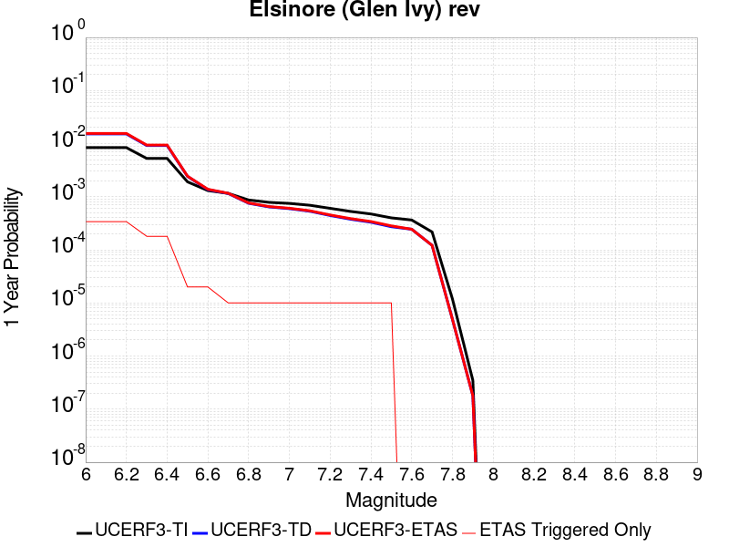 |  |

| Magnitude | 1 wk TI Prob | 1 wk TD Prob | 1 wk ETAS Prob | 1 wk ETAS/TD Gain | 1 wk ETAS Triggered Only | 1 mo TI Prob | 1 mo TD Prob | 1 mo ETAS Prob | 1 mo ETAS/TD Gain | 1 mo ETAS Triggered Only | 1 yr TI Prob | 1 yr TD Prob | 1 yr ETAS Prob | 1 yr ETAS/TD Gain | 1 yr ETAS Triggered Only | 10 yr TI Prob | 10 yr TD Prob | 10 yr ETAS Prob | 10 yr ETAS/TD Gain | 10 yr ETAS Triggered Only |
|-----|-----|-----|-----|-----|-----|-----|-----|-----|-----|-----|-----|-----|-----|-----|-----|-----|-----|-----|-----|-----|
| 6.0 | 1.6204086E-4 | 2.9360707E-4 | 4.245787E-4 | 1.446078 | 1.3101009E-4 | 6.94276E-4 | 0.0012578638 | 0.0013887092 | 1.1040218 | 1.3101009E-4 | 0.008420097 | 0.015234485 | 0.015492514 | 1.0169371 | 2.6202018E-4 | 0.081081145 | 0.13969168 | 0.1400298 | 1.0024205 | 3.9303026E-4 |
| 6.1 | 1.6204086E-4 | 2.9360707E-4 | 4.245787E-4 | 1.446078 | 1.3101009E-4 | 6.94276E-4 | 0.0012578638 | 0.0013887092 | 1.1040218 | 1.3101009E-4 | 0.008420097 | 0.015234485 | 0.015492514 | 1.0169371 | 2.6202018E-4 | 0.081081145 | 0.13969168 | 0.1400298 | 1.0024205 | 3.9303026E-4 |
| 6.2 | 1.6204086E-4 | 2.9360707E-4 | 4.245787E-4 | 1.446078 | 1.3101009E-4 | 6.94276E-4 | 0.0012578638 | 0.0013887092 | 1.1040218 | 1.3101009E-4 | 0.008420097 | 0.015234485 | 0.015492514 | 1.0169371 | 2.6202018E-4 | 0.081081145 | 0.13969168 | 0.1400298 | 1.0024205 | 3.9303026E-4 |
| 6.3 | 1.0111737E-4 | 1.7703383E-4 | 1.7703383E-4 | 1.0 | 0.0 | 4.332882E-4 | 7.5861247E-4 | 7.5861247E-4 | 1.0 | 0.0 | 0.005262531 | 0.009217682 | 0.009347484 | 1.014082 | 1.3101009E-4 | 0.0513964 | 0.0870191 | 0.087138705 | 1.0013745 | 1.3101009E-4 |
| 6.4 | 1.0111737E-4 | 1.7703383E-4 | 1.7703383E-4 | 1.0 | 0.0 | 4.332882E-4 | 7.5861247E-4 | 7.5861247E-4 | 1.0 | 0.0 | 0.005262531 | 0.009217682 | 0.009347484 | 1.014082 | 1.3101009E-4 | 0.0513964 | 0.0870191 | 0.087138705 | 1.0013745 | 1.3101009E-4 |
| 6.5 | 3.6624708E-5 | 4.6391084E-5 | 4.6391084E-5 | 1.0 | 0.0 | 1.569536E-4 | 1.9880582E-4 | 1.9880582E-4 | 1.0 | 0.0 | 0.001909235 | 0.0024181372 | 0.0024181372 | 1.0 | 0.0 | 0.01892915 | 0.023739954 | 0.023739954 | 1.0 | 0.0 |
| 6.6 | 2.5051324E-5 | 2.614772E-5 | 2.614772E-5 | 1.0 | 0.0 | 1.073584E-4 | 1.12057096E-4 | 1.12057096E-4 | 1.0 | 0.0 | 0.0013063047 | 0.0013634858 | 0.0013634858 | 1.0 | 0.0 | 0.012986525 | 0.013564618 | 0.013564618 | 1.0 | 0.0 |
| 6.7 | 2.2189772E-5 | 2.2072849E-5 | 2.2072849E-5 | 1.0 | 0.0 | 9.509556E-5 | 9.4594696E-5 | 9.4594696E-5 | 1.0 | 0.0 | 0.0011571734 | 0.0011511183 | 0.0011511183 | 1.0 | 0.0 | 0.011511663 | 0.011465415 | 0.011465415 | 1.0 | 0.0 |
| 6.8 | 1.6654378E-5 | 1.4437705E-5 | 1.4437705E-5 | 1.0 | 0.0 | 7.137396E-5 | 6.187444E-5 | 6.187444E-5 | 1.0 | 0.0 | 8.686314E-4 | 7.530661E-4 | 7.530661E-4 | 1.0 | 0.0 | 0.008652439 | 0.00751048 | 0.00751048 | 1.0 | 0.0 |
| 6.9 | 1.5042909E-5 | 1.2332022E-5 | 1.2332022E-5 | 1.0 | 0.0 | 6.446802E-5 | 5.285047E-5 | 5.285047E-5 | 1.0 | 0.0 | 7.8461546E-4 | 6.4326765E-4 | 6.4326765E-4 | 1.0 | 0.0 | 0.007818509 | 0.00641828 | 0.00641828 | 1.0 | 0.0 |
| 7.0 | 1.4361385E-5 | 1.1451324E-5 | 1.1451324E-5 | 1.0 | 0.0 | 6.154734E-5 | 4.9076196E-5 | 4.9076196E-5 | 1.0 | 0.0 | 7.490812E-4 | 5.973418E-4 | 5.973418E-4 | 1.0 | 0.0 | 0.007465612 | 0.0059613534 | 0.0059613534 | 1.0 | 0.0 |
| 7.1 | 1.3265571E-5 | 1.0244926E-5 | 1.0244926E-5 | 1.0 | 0.0 | 5.6851208E-5 | 4.39061E-5 | 4.39061E-5 | 1.0 | 0.0 | 6.919436E-4 | 5.344282E-4 | 5.344282E-4 | 1.0 | 0.0 | 0.006897931 | 0.0053347866 | 0.0053347866 | 1.0 | 0.0 |
| 7.2 | 1.1596403E-5 | 8.505067E-6 | 8.505067E-6 | 1.0 | 0.0 | 4.9697923E-5 | 3.6449786E-5 | 3.6449786E-5 | 1.0 | 0.0 | 6.049042E-4 | 4.436875E-4 | 4.436875E-4 | 1.0 | 0.0 | 0.006032603 | 0.0044294316 | 0.0044294316 | 1.0 | 0.0 |
| 7.3 | 1.0150827E-5 | 7.2387597E-6 | 7.2387597E-6 | 1.0 | 0.0 | 4.3502816E-5 | 3.1022897E-5 | 3.1022897E-5 | 1.0 | 0.0 | 5.2951806E-4 | 3.7763975E-4 | 3.7763975E-4 | 1.0 | 0.0 | 0.005282581 | 0.0037703665 | 0.0037703665 | 1.0 | 0.0 |
| 7.4 | 9.080705E-6 | 6.352519E-6 | 6.352519E-6 | 1.0 | 0.0 | 3.8916725E-5 | 2.7224805E-5 | 2.7224805E-5 | 1.0 | 0.0 | 4.7370812E-4 | 3.3141294E-4 | 3.3141294E-4 | 1.0 | 0.0 | 0.004726996 | 0.0033093381 | 0.0033093381 | 1.0 | 0.0 |
| 7.5 | 7.671649E-6 | 5.2256332E-6 | 5.2256332E-6 | 1.0 | 0.0 | 3.287808E-5 | 2.2395385E-5 | 2.2395385E-5 | 1.0 | 0.0 | 4.0021708E-4 | 2.7263095E-4 | 2.7263095E-4 | 1.0 | 0.0 | 0.0039949706 | 0.00272309 | 0.00272309 | 1.0 | 0.0 |
| 7.6 | 6.990086E-6 | 4.687545E-6 | 4.687545E-6 | 1.0 | 0.0 | 2.9957167E-5 | 2.008933E-5 | 2.008933E-5 | 1.0 | 0.0 | 3.6466747E-4 | 2.445613E-4 | 2.445613E-4 | 1.0 | 0.0 | 0.0036406964 | 0.002443038 | 0.002443038 | 1.0 | 0.0 |
| 7.7 | 4.163505E-6 | 2.3295343E-6 | 2.3295343E-6 | 1.0 | 0.0 | 1.7843471E-5 | 9.983683E-6 | 9.983683E-6 | 1.0 | 0.0 | 2.172226E-4 | 1.21545316E-4 | 1.21545316E-4 | 1.0 | 0.0 | 0.0021701038 | 0.0012148614 | 0.0012148614 | 1.0 | 0.0 |
| 7.8 | 2.2692414E-7 | 9.3854695E-8 | 9.3854695E-8 | 1.0 | 0.0 | 9.725317E-7 | 4.0223435E-7 | 4.0223435E-7 | 1.0 | 0.0 | 1.1840509E-5 | 4.8971956E-6 | 4.8971956E-6 | 1.0 | 0.0 | 1.1839878E-4 | 4.8971204E-5 | 4.8971204E-5 | 1.0 | 0.0 |
| 7.9 | 6.676829E-9 | 3.439853E-9 | 3.439853E-9 | 1.0 | 0.0 | 2.861498E-8 | 1.4742227E-8 | 1.4742227E-8 | 1.0 | 0.0 | 3.4838732E-7 | 1.7948659E-7 | 1.7948659E-7 | 1.0 | 0.0 | 3.4838679E-6 | 1.7948646E-6 | 1.7948646E-6 | 1.0 | 0.0 |

## Cleghorn Pass
*[(top)](#table-of-contents)*

| 1 Week | 1 Month | 1 Year | 10 Year |
|-----|-----|-----|-----|
|  |  |  |  |

| Magnitude | 1 wk TI Prob | 1 wk TD Prob | 1 wk ETAS Prob | 1 wk ETAS/TD Gain | 1 wk ETAS Triggered Only | 1 mo TI Prob | 1 mo TD Prob | 1 mo ETAS Prob | 1 mo ETAS/TD Gain | 1 mo ETAS Triggered Only | 1 yr TI Prob | 1 yr TD Prob | 1 yr ETAS Prob | 1 yr ETAS/TD Gain | 1 yr ETAS Triggered Only | 10 yr TI Prob | 10 yr TD Prob | 10 yr ETAS Prob | 10 yr ETAS/TD Gain | 10 yr ETAS Triggered Only |
|-----|-----|-----|-----|-----|-----|-----|-----|-----|-----|-----|-----|-----|-----|-----|-----|-----|-----|-----|-----|-----|
| 6.0 | 1.0522846E-5 | 1.1040642E-5 | 1.4204928E-4 | 12.866035 | 1.3101009E-4 | 4.509713E-5 | 4.7316473E-5 | 3.0932424E-4 | 6.537348 | 2.6202018E-4 | 5.4891926E-4 | 5.759784E-4 | 8.378477E-4 | 1.4546511 | 2.6202018E-4 | 0.0054756533 | 0.005750022 | 0.0061407923 | 1.0679598 | 3.9303026E-4 |
| 6.1 | 1.0522846E-5 | 1.1040642E-5 | 1.4204928E-4 | 12.866035 | 1.3101009E-4 | 4.509713E-5 | 4.7316473E-5 | 3.0932424E-4 | 6.537348 | 2.6202018E-4 | 5.4891926E-4 | 5.759784E-4 | 8.378477E-4 | 1.4546511 | 2.6202018E-4 | 0.0054756533 | 0.005750022 | 0.0061407923 | 1.0679598 | 3.9303026E-4 |
| 6.2 | 2.1045846E-6 | 2.2082024E-6 | 1.33218E-4 | 60.32871 | 1.3101009E-4 | 9.019617E-6 | 9.463714E-6 | 1.4047256E-4 | 14.843281 | 1.3101009E-4 | 1.098083E-4 | 1.1521882E-4 | 2.462138E-4 | 2.1369236 | 1.3101009E-4 | 0.0010975406 | 0.0011520023 | 0.0012828615 | 1.1135927 | 1.3101009E-4 |
| 6.3 | 2.1045846E-6 | 2.2082024E-6 | 1.33218E-4 | 60.32871 | 1.3101009E-4 | 9.019617E-6 | 9.463714E-6 | 1.4047256E-4 | 14.843281 | 1.3101009E-4 | 1.098083E-4 | 1.1521882E-4 | 2.462138E-4 | 2.1369236 | 1.3101009E-4 | 0.0010975406 | 0.0011520023 | 0.0012828615 | 1.1135927 | 1.3101009E-4 |
| 6.4 | 1.7259927E-6 | 1.810877E-6 | 1.3282073E-4 | 73.34608 | 1.3101009E-4 | 7.3970905E-6 | 7.760902E-6 | 1.3876997E-4 | 17.880651 | 1.3101009E-4 | 9.005586E-5 | 9.4488976E-5 | 2.2548668E-4 | 2.386381 | 1.3101009E-4 | 9.001937E-4 | 9.448898E-4 | 0.0010757761 | 1.1385201 | 1.3101009E-4 |

## Santa Cruz Island
*[(top)](#table-of-contents)*

| 1 Week | 1 Month | 1 Year | 10 Year |
|-----|-----|-----|-----|
|  |  | 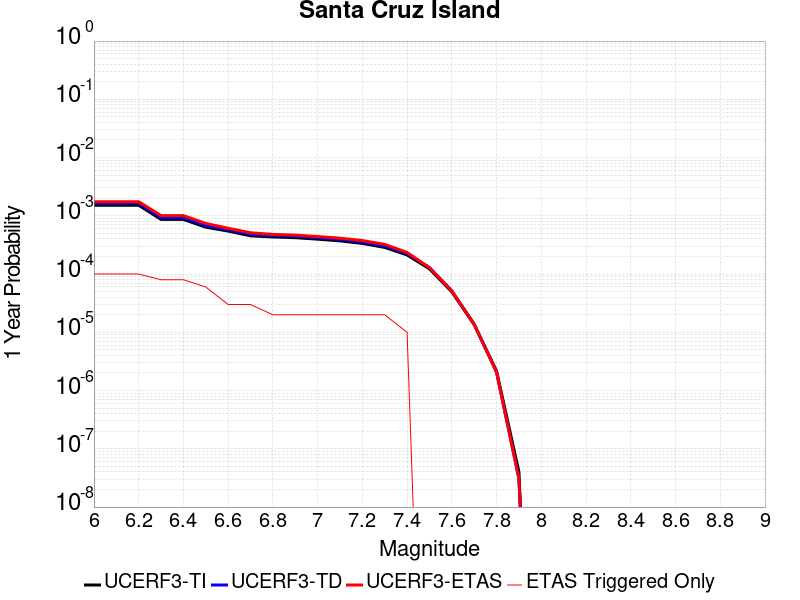 |  |

| Magnitude | 1 wk TI Prob | 1 wk TD Prob | 1 wk ETAS Prob | 1 wk ETAS/TD Gain | 1 wk ETAS Triggered Only | 1 mo TI Prob | 1 mo TD Prob | 1 mo ETAS Prob | 1 mo ETAS/TD Gain | 1 mo ETAS Triggered Only | 1 yr TI Prob | 1 yr TD Prob | 1 yr ETAS Prob | 1 yr ETAS/TD Gain | 1 yr ETAS Triggered Only | 10 yr TI Prob | 10 yr TD Prob | 10 yr ETAS Prob | 10 yr ETAS/TD Gain | 10 yr ETAS Triggered Only |
|-----|-----|-----|-----|-----|-----|-----|-----|-----|-----|-----|-----|-----|-----|-----|-----|-----|-----|-----|-----|-----|
| 6.0 | 2.9164563E-5 | 3.1599742E-5 | 3.1599742E-5 | 1.0 | 0.0 | 1.2498499E-4 | 1.3542121E-4 | 3.974059E-4 | 2.9345913 | 2.6202018E-4 | 0.0015206301 | 0.0016476426 | 0.0020400253 | 1.238148 | 3.9303026E-4 | 0.015102667 | 0.016368 | 0.016754596 | 1.023619 | 3.9303026E-4 |
| 6.1 | 2.9164563E-5 | 3.1599742E-5 | 3.1599742E-5 | 1.0 | 0.0 | 1.2498499E-4 | 1.3542121E-4 | 3.974059E-4 | 2.9345913 | 2.6202018E-4 | 0.0015206301 | 0.0016476426 | 0.0020400253 | 1.238148 | 3.9303026E-4 | 0.015102667 | 0.016368 | 0.016754596 | 1.023619 | 3.9303026E-4 |
| 6.2 | 2.9164563E-5 | 3.1599742E-5 | 3.1599742E-5 | 1.0 | 0.0 | 1.2498499E-4 | 1.3542121E-4 | 3.974059E-4 | 2.9345913 | 2.6202018E-4 | 0.0015206301 | 0.0016476426 | 0.0020400253 | 1.238148 | 3.9303026E-4 | 0.015102667 | 0.016368 | 0.016754596 | 1.023619 | 3.9303026E-4 |
| 6.3 | 1.6635553E-5 | 1.780436E-5 | 1.780436E-5 | 1.0 | 0.0 | 7.1293274E-5 | 7.630226E-5 | 3.3830246E-4 | 4.4337144 | 2.6202018E-4 | 8.6765E-4 | 9.2860236E-4 | 0.0011903793 | 1.2819041 | 2.6202018E-4 | 0.008642701 | 0.009249094 | 0.00950869 | 1.0280672 | 2.6202018E-4 |
| 6.4 | 1.6635553E-5 | 1.780436E-5 | 1.780436E-5 | 1.0 | 0.0 | 7.1293274E-5 | 7.630226E-5 | 3.3830246E-4 | 4.4337144 | 2.6202018E-4 | 8.6765E-4 | 9.2860236E-4 | 0.0011903793 | 1.2819041 | 2.6202018E-4 | 0.008642701 | 0.009249094 | 0.00950869 | 1.0280672 | 2.6202018E-4 |
| 6.5 | 1.2238748E-5 | 1.3042995E-5 | 1.3042995E-5 | 1.0 | 0.0 | 5.2450723E-5 | 5.5897377E-5 | 1.8690014E-4 | 3.34363 | 1.3101009E-4 | 6.3840044E-4 | 6.8034173E-4 | 8.112627E-4 | 1.1924341 | 1.3101009E-4 | 0.0063656955 | 0.0067829876 | 0.006913109 | 1.0191835 | 1.3101009E-4 |
| 6.6 | 1.0489767E-5 | 1.1156636E-5 | 1.1156636E-5 | 1.0 | 0.0 | 4.495537E-5 | 4.781329E-5 | 4.781329E-5 | 1.0 | 0.0 | 5.4719415E-4 | 5.819735E-4 | 5.819735E-4 | 1.0 | 0.0 | 0.005458487 | 0.0058047357 | 0.0058047357 | 1.0 | 0.0 |
| 6.7 | 8.699222E-6 | 9.236782E-6 | 9.236782E-6 | 1.0 | 0.0 | 3.7281847E-5 | 3.958561E-5 | 3.958561E-5 | 1.0 | 0.0 | 4.5381195E-4 | 4.8184878E-4 | 4.8184878E-4 | 1.0 | 0.0 | 0.0045288634 | 0.004808108 | 0.004808108 | 1.0 | 0.0 |
| 6.8 | 8.307732E-6 | 8.8169045E-6 | 8.8169045E-6 | 1.0 | 0.0 | 3.560408E-5 | 3.7786187E-5 | 3.7786187E-5 | 1.0 | 0.0 | 4.3339343E-4 | 4.5995016E-4 | 4.5995016E-4 | 1.0 | 0.0 | 0.004325492 | 0.0045900354 | 0.0045900354 | 1.0 | 0.0 |
| 6.9 | 8.073121E-6 | 8.564939E-6 | 8.564939E-6 | 1.0 | 0.0 | 3.459863E-5 | 3.6706366E-5 | 3.6706366E-5 | 1.0 | 0.0 | 4.2115687E-4 | 4.468088E-4 | 4.468088E-4 | 1.0 | 0.0 | 0.004203596 | 0.004459156 | 0.004459156 | 1.0 | 0.0 |
| 7.0 | 7.617019E-6 | 8.074664E-6 | 8.074664E-6 | 1.0 | 0.0 | 3.264396E-5 | 3.4605247E-5 | 3.4605247E-5 | 1.0 | 0.0 | 3.9736772E-4 | 4.212378E-4 | 4.212378E-4 | 1.0 | 0.0 | 0.003966579 | 0.0042044413 | 0.0042044413 | 1.0 | 0.0 |
| 7.1 | 7.1224836E-6 | 7.545788E-6 | 7.545788E-6 | 1.0 | 0.0 | 3.052457E-5 | 3.2338692E-5 | 3.2338692E-5 | 1.0 | 0.0 | 3.715733E-4 | 3.936528E-4 | 3.936528E-4 | 1.0 | 0.0 | 0.003709526 | 0.003929598 | 0.003929598 | 1.0 | 0.0 |
| 7.2 | 6.441115E-6 | 6.8273835E-6 | 6.8273835E-6 | 1.0 | 0.0 | 2.7604487E-5 | 2.9259887E-5 | 2.9259887E-5 | 1.0 | 0.0 | 3.360328E-4 | 3.5618112E-4 | 3.5618112E-4 | 1.0 | 0.0 | 0.0033552512 | 0.003556131 | 0.003556131 | 1.0 | 0.0 |
| 7.3 | 5.494274E-6 | 5.8199944E-6 | 5.8199944E-6 | 1.0 | 0.0 | 2.3546674E-5 | 2.4942596E-5 | 2.4942596E-5 | 1.0 | 0.0 | 2.8664304E-4 | 3.0363398E-4 | 3.0363398E-4 | 1.0 | 0.0 | 0.002862736 | 0.0030322142 | 0.0030322142 | 1.0 | 0.0 |
| 7.4 | 4.0802624E-6 | 4.312256E-6 | 4.312256E-6 | 1.0 | 0.0 | 1.7486722E-5 | 1.8480967E-5 | 1.8480967E-5 | 1.0 | 0.0 | 2.1288003E-4 | 2.2498262E-4 | 2.2498262E-4 | 1.0 | 0.0 | 0.0021267622 | 0.0022475575 | 0.0022475575 | 1.0 | 0.0 |
| 7.5 | 2.3584746E-6 | 2.4753094E-6 | 2.4753094E-6 | 1.0 | 0.0 | 1.0107709E-5 | 1.0608426E-5 | 1.0608426E-5 | 1.0 | 0.0 | 1.2305441E-4 | 1.2915E-4 | 1.2915E-4 | 1.0 | 0.0 | 0.0012298629 | 0.0012907543 | 0.0012907543 | 1.0 | 0.0 |
| 7.6 | 9.4981914E-7 | 9.86093E-7 | 9.86093E-7 | 1.0 | 0.0 | 4.0706473E-6 | 4.2261063E-6 | 4.2261063E-6 | 1.0 | 0.0 | 4.9559E-5 | 5.145164E-5 | 5.145164E-5 | 1.0 | 0.0 | 4.954795E-4 | 5.1439856E-4 | 5.1439856E-4 | 1.0 | 0.0 |
| 7.7 | 2.6013532E-7 | 2.6416603E-7 | 2.6416603E-7 | 1.0 | 0.0 | 1.1148652E-6 | 1.1321397E-6 | 1.1321397E-6 | 1.0 | 0.0 | 1.3573399E-5 | 1.3783714E-5 | 1.3783714E-5 | 1.0 | 0.0 | 1.357257E-4 | 1.3782867E-4 | 1.3782867E-4 | 1.0 | 0.0 |
| 7.8 | 4.1522263E-8 | 3.965679E-8 | 3.965679E-8 | 1.0 | 0.0 | 1.7795254E-7 | 1.6995766E-7 | 1.6995766E-7 | 1.0 | 0.0 | 2.16657E-6 | 2.0692328E-6 | 2.0692328E-6 | 1.0 | 0.0 | 2.1665488E-5 | 2.0692156E-5 | 2.0692156E-5 | 1.0 | 0.0 |
| 7.9 | 7.7242046E-10 | 5.9468175E-10 | 5.9468175E-10 | 1.0 | 0.0 | 3.3103735E-9 | 2.5486364E-9 | 2.5486364E-9 | 1.0 | 0.0 | 4.0303796E-8 | 3.1029646E-8 | 3.1029646E-8 | 1.0 | 0.0 | 4.030379E-7 | 3.1029643E-7 | 3.1029643E-7 | 1.0 | 0.0 |

## Baker
*[(top)](#table-of-contents)*

| 1 Week | 1 Month | 1 Year | 10 Year |
|-----|-----|-----|-----|
|  |  |  |  |

| Magnitude | 1 wk TI Prob | 1 wk TD Prob | 1 wk ETAS Prob | 1 wk ETAS/TD Gain | 1 wk ETAS Triggered Only | 1 mo TI Prob | 1 mo TD Prob | 1 mo ETAS Prob | 1 mo ETAS/TD Gain | 1 mo ETAS Triggered Only | 1 yr TI Prob | 1 yr TD Prob | 1 yr ETAS Prob | 1 yr ETAS/TD Gain | 1 yr ETAS Triggered Only | 10 yr TI Prob | 10 yr TD Prob | 10 yr ETAS Prob | 10 yr ETAS/TD Gain | 10 yr ETAS Triggered Only |
|-----|-----|-----|-----|-----|-----|-----|-----|-----|-----|-----|-----|-----|-----|-----|-----|-----|-----|-----|-----|-----|
| 6.0 | 5.695525E-6 | 5.8348373E-6 | 1.3684416E-4 | 23.452953 | 1.3101009E-4 | 2.4409164E-5 | 2.5006228E-5 | 1.5601303E-4 | 6.2389674 | 1.3101009E-4 | 2.9714106E-4 | 3.044123E-4 | 5.663527E-4 | 1.8604791 | 2.6202018E-4 | 0.0029674405 | 0.0030403486 | 0.003432184 | 1.1288784 | 3.9303026E-4 |
| 6.1 | 5.695525E-6 | 5.8348373E-6 | 1.3684416E-4 | 23.452953 | 1.3101009E-4 | 2.4409164E-5 | 2.5006228E-5 | 1.5601303E-4 | 6.2389674 | 1.3101009E-4 | 2.9714106E-4 | 3.044123E-4 | 5.663527E-4 | 1.8604791 | 2.6202018E-4 | 0.0029674405 | 0.0030403486 | 0.003432184 | 1.1288784 | 3.9303026E-4 |
| 6.2 | 5.695525E-6 | 5.8348373E-6 | 1.3684416E-4 | 23.452953 | 1.3101009E-4 | 2.4409164E-5 | 2.5006228E-5 | 1.5601303E-4 | 6.2389674 | 1.3101009E-4 | 2.9714106E-4 | 3.044123E-4 | 5.663527E-4 | 1.8604791 | 2.6202018E-4 | 0.0029674405 | 0.0030403486 | 0.003432184 | 1.1288784 | 3.9303026E-4 |
| 6.3 | 3.2995713E-6 | 3.383667E-6 | 3.383667E-6 | 1.0 | 0.0 | 1.4140943E-5 | 1.4501353E-5 | 1.4501353E-5 | 1.0 | 0.0 | 1.7215237E-4 | 1.7654014E-4 | 3.075271E-4 | 1.7419671 | 1.3101009E-4 | 0.0017201907 | 0.001764046 | 0.002025604 | 1.1482716 | 2.6202018E-4 |
| 6.4 | 3.2995713E-6 | 3.383667E-6 | 3.383667E-6 | 1.0 | 0.0 | 1.4140943E-5 | 1.4501353E-5 | 1.4501353E-5 | 1.0 | 0.0 | 1.7215237E-4 | 1.7654014E-4 | 3.075271E-4 | 1.7419671 | 1.3101009E-4 | 0.0017201907 | 0.001764046 | 0.002025604 | 1.1482716 | 2.6202018E-4 |
| 6.5 | 2.782202E-6 | 2.8558404E-6 | 2.8558404E-6 | 1.0 | 0.0 | 1.1923668E-5 | 1.223926E-5 | 1.223926E-5 | 1.0 | 0.0 | 1.4516099E-4 | 1.4900314E-4 | 2.799937E-4 | 1.8791128 | 1.3101009E-4 | 0.001450662 | 0.0014890651 | 0.001750695 | 1.1757009 | 2.6202018E-4 |
| 6.6 | 2.3163404E-6 | 2.38092E-6 | 2.38092E-6 | 1.0 | 0.0 | 9.927136E-6 | 1.0203904E-5 | 1.0203904E-5 | 1.0 | 0.0 | 1.20856166E-4 | 1.2422565E-4 | 2.5521946E-4 | 2.0544827 | 1.3101009E-4 | 0.0012079047 | 0.0012415823 | 0.0015032772 | 1.2107753 | 2.6202018E-4 |
| 6.7 | 2.037056E-6 | 2.0965003E-6 | 2.0965003E-6 | 1.0 | 0.0 | 8.7302105E-6 | 8.984972E-6 | 8.984972E-6 | 1.0 | 0.0 | 1.0628513E-4 | 1.093867E-4 | 2.4038246E-4 | 2.1975474 | 1.3101009E-4 | 0.0010623431 | 0.0010933448 | 0.0013550784 | 1.2393881 | 2.6202018E-4 |
| 6.8 | 1.8356744E-6 | 1.8915287E-6 | 1.8915287E-6 | 1.0 | 0.0 | 7.867153E-6 | 8.106527E-6 | 8.106527E-6 | 1.0 | 0.0 | 9.577837E-5 | 9.869264E-5 | 2.296898E-4 | 2.3273246 | 1.3101009E-4 | 9.57371E-4 | 9.86502E-4 | 0.0012482638 | 1.2653433 | 2.6202018E-4 |
| 6.9 | 1.6310546E-6 | 1.6832072E-6 | 1.6832072E-6 | 1.0 | 0.0 | 6.9902153E-6 | 7.213726E-6 | 7.213726E-6 | 1.0 | 0.0 | 8.510255E-5 | 8.782368E-5 | 2.1882227E-4 | 2.4916089 | 1.3101009E-4 | 8.5069967E-4 | 8.7790104E-4 | 0.0011396912 | 1.2982 | 2.6202018E-4 |
| 7.0 | 1.2058036E-6 | 1.2508665E-6 | 1.2508665E-6 | 1.0 | 0.0 | 5.1677193E-6 | 5.3608455E-6 | 5.3608455E-6 | 1.0 | 0.0 | 6.291517E-5 | 6.5266366E-5 | 1.9626791E-4 | 3.007183 | 1.3101009E-4 | 6.289736E-4 | 6.524743E-4 | 9.143235E-4 | 1.4013172 | 2.6202018E-4 |
| 7.1 | 1.052382E-6 | 1.0951609E-6 | 1.0951609E-6 | 1.0 | 0.0 | 4.5102006E-6 | 4.693538E-6 | 4.693538E-6 | 1.0 | 0.0 | 5.491031E-5 | 5.7142337E-5 | 1.8814494E-4 | 3.2925663 | 1.3101009E-4 | 5.4896745E-4 | 5.7127734E-4 | 8.331478E-4 | 1.4583946 | 2.6202018E-4 |
| 7.2 | 1.0067454E-6 | 1.0487711E-6 | 1.0487711E-6 | 1.0 | 0.0 | 4.3146156E-6 | 4.4947255E-6 | 4.4947255E-6 | 1.0 | 0.0 | 5.252918E-5 | 5.4721917E-5 | 1.8572483E-4 | 3.3939753 | 1.3101009E-4 | 5.251676E-4 | 5.470853E-4 | 6.780237E-4 | 1.2393382 | 1.3101009E-4 |
| 7.3 | 9.3596316E-7 | 9.767723E-7 | 9.767723E-7 | 1.0 | 0.0 | 4.0112645E-6 | 4.1861604E-6 | 4.1861604E-6 | 1.0 | 0.0 | 4.8836053E-5 | 5.096532E-5 | 1.8196873E-4 | 3.5704422 | 1.3101009E-4 | 4.8825322E-4 | 5.095371E-4 | 6.4048043E-4 | 1.2569848 | 1.3101009E-4 |
| 7.4 | 8.8117395E-7 | 9.2076635E-7 | 9.2076635E-7 | 1.0 | 0.0 | 3.7764542E-6 | 3.9461356E-6 | 3.9461356E-6 | 1.0 | 0.0 | 4.5977362E-5 | 4.8043148E-5 | 1.7904694E-4 | 3.7267945 | 1.3101009E-4 | 4.596785E-4 | 4.8032837E-4 | 6.1127555E-4 | 1.2726201 | 1.3101009E-4 |
| 7.5 | 8.292386E-7 | 8.6745956E-7 | 8.6745956E-7 | 1.0 | 0.0 | 3.5538749E-6 | 3.7176785E-6 | 3.7176785E-6 | 1.0 | 0.0 | 4.326757E-5 | 4.5261804E-5 | 1.7626597E-4 | 3.8943644 | 1.3101009E-4 | 4.3259145E-4 | 4.5252658E-4 | 5.834774E-4 | 1.289377 | 1.3101009E-4 |
| 7.6 | 7.553842E-7 | 7.9144706E-7 | 7.9144706E-7 | 1.0 | 0.0 | 3.2373566E-6 | 3.3919116E-6 | 3.3919116E-6 | 1.0 | 0.0 | 3.9414106E-5 | 4.129575E-5 | 1.7230042E-4 | 4.172353 | 1.3101009E-4 | 3.9407116E-4 | 4.1288146E-4 | 5.4383744E-4 | 1.3171757 | 1.3101009E-4 |
| 7.7 | 6.5285366E-7 | 6.852797E-7 | 6.852797E-7 | 1.0 | 0.0 | 2.797941E-6 | 2.9369096E-6 | 2.9369096E-6 | 1.0 | 0.0 | 3.40644E-5 | 3.5756293E-5 | 1.667617E-4 | 4.6638417 | 1.3101009E-4 | 3.405918E-4 | 3.5750607E-4 | 4.884693E-4 | 1.3663245 | 1.3101009E-4 |
| 7.8 | 3.4586725E-7 | 3.6482615E-7 | 3.6482615E-7 | 1.0 | 0.0 | 1.4822873E-6 | 1.5635396E-6 | 1.5635396E-6 | 1.0 | 0.0 | 1.80467E-5 | 1.9035933E-5 | 1.5004353E-4 | 7.8821206 | 1.3101009E-4 | 1.8045233E-4 | 1.9034347E-4 | 3.213286E-4 | 1.6881515 | 1.3101009E-4 |
| 7.9 | 2.5591178E-9 | 2.6696718E-9 | 2.6696718E-9 | 1.0 | 0.0 | 1.0967647E-8 | 1.14414505E-8 | 1.14414505E-8 | 1.0 | 0.0 | 1.335311E-7 | 1.3929966E-7 | 1.3929966E-7 | 1.0 | 0.0 | 1.3353102E-6 | 1.3929966E-6 | 1.3929966E-6 | 1.0 | 0.0 |

## Santa Cruz Catalina Ridge alt1
*[(top)](#table-of-contents)*

| 1 Week | 1 Month | 1 Year | 10 Year |
|-----|-----|-----|-----|
|  |  |  |  |

| Magnitude | 1 wk TI Prob | 1 wk TD Prob | 1 wk ETAS Prob | 1 wk ETAS/TD Gain | 1 wk ETAS Triggered Only | 1 mo TI Prob | 1 mo TD Prob | 1 mo ETAS Prob | 1 mo ETAS/TD Gain | 1 mo ETAS Triggered Only | 1 yr TI Prob | 1 yr TD Prob | 1 yr ETAS Prob | 1 yr ETAS/TD Gain | 1 yr ETAS Triggered Only | 10 yr TI Prob | 10 yr TD Prob | 10 yr ETAS Prob | 10 yr ETAS/TD Gain | 10 yr ETAS Triggered Only |
|-----|-----|-----|-----|-----|-----|-----|-----|-----|-----|-----|-----|-----|-----|-----|-----|-----|-----|-----|-----|-----|
| 6.0 | 3.2833184E-5 | 3.65584E-5 | 1.675637E-4 | 4.5834527 | 1.3101009E-4 | 1.4070606E-4 | 1.5667039E-4 | 4.186495E-4 | 2.6721675 | 2.6202018E-4 | 0.00171175 | 0.0019059596 | 0.0021674803 | 1.1372122 | 2.6202018E-4 | 0.016986247 | 0.018913029 | 0.019298626 | 1.0203879 | 3.9303026E-4 |
| 6.1 | 1.9835548E-5 | 2.1659505E-5 | 1.5266676E-4 | 7.0484877 | 1.3101009E-4 | 8.500672E-5 | 9.282326E-5 | 3.5481912E-4 | 3.8225236 | 2.6202018E-4 | 0.0010344655 | 0.0011295575 | 0.0013912817 | 1.2317051 | 2.6202018E-4 | 0.010296632 | 0.011240295 | 0.01149937 | 1.0230488 | 2.6202018E-4 |
| 6.2 | 1.9835548E-5 | 2.1659505E-5 | 1.5266676E-4 | 7.0484877 | 1.3101009E-4 | 8.500672E-5 | 9.282326E-5 | 3.5481912E-4 | 3.8225236 | 2.6202018E-4 | 0.0010344655 | 0.0011295575 | 0.0013912817 | 1.2317051 | 2.6202018E-4 | 0.010296632 | 0.011240295 | 0.01149937 | 1.0230488 | 2.6202018E-4 |
| 6.3 | 1.5728183E-5 | 1.703395E-5 | 1.703395E-5 | 1.0 | 0.0 | 6.7404755E-5 | 7.300063E-5 | 2.0400116E-4 | 2.7945123 | 1.3101009E-4 | 8.2034385E-4 | 8.884264E-4 | 0.0010193201 | 1.1473321 | 1.3101009E-4 | 0.008173222 | 0.008849427 | 0.008979278 | 1.0146734 | 1.3101009E-4 |
| 6.4 | 1.5728183E-5 | 1.703395E-5 | 1.703395E-5 | 1.0 | 0.0 | 6.7404755E-5 | 7.300063E-5 | 2.0400116E-4 | 2.7945123 | 1.3101009E-4 | 8.2034385E-4 | 8.884264E-4 | 0.0010193201 | 1.1473321 | 1.3101009E-4 | 0.008173222 | 0.008849427 | 0.008979278 | 1.0146734 | 1.3101009E-4 |
| 6.5 | 1.3707734E-5 | 1.4794522E-5 | 1.4794522E-5 | 1.0 | 0.0 | 5.8746107E-5 | 6.3403575E-5 | 1.9440535E-4 | 3.0661578 | 1.3101009E-4 | 7.1499916E-4 | 7.716686E-4 | 9.025776E-4 | 1.169644 | 1.3101009E-4 | 0.0071270303 | 0.0076902895 | 0.007820292 | 1.0169047 | 1.3101009E-4 |
| 6.6 | 1.2539813E-5 | 1.3510219E-5 | 1.3510219E-5 | 1.0 | 0.0 | 5.3740947E-5 | 5.789967E-5 | 1.8890217E-4 | 3.2625778 | 1.3101009E-4 | 6.540996E-4 | 7.0470315E-4 | 8.356209E-4 | 1.1857772 | 1.3101009E-4 | 0.0065217763 | 0.0070249885 | 0.007155078 | 1.0185181 | 1.3101009E-4 |
| 6.7 | 1.1504083E-5 | 1.2377375E-5 | 1.2377375E-5 | 1.0 | 0.0 | 4.930228E-5 | 5.3044827E-5 | 1.8404797E-4 | 3.4696686 | 1.3101009E-4 | 6.0008996E-4 | 6.456314E-4 | 7.765569E-4 | 1.2027868 | 1.3101009E-4 | 0.005984721 | 0.006437786 | 0.0065679527 | 1.0202192 | 1.3101009E-4 |
| 6.8 | 1.012739E-5 | 1.0877071E-5 | 1.0877071E-5 | 1.0 | 0.0 | 4.340238E-5 | 4.6615194E-5 | 1.7761918E-4 | 3.8103278 | 1.3101009E-4 | 5.282958E-4 | 5.673937E-4 | 6.983295E-4 | 1.230767 | 1.3101009E-4 | 0.0052704164 | 0.0056596193 | 0.005789888 | 1.0230172 | 1.3101009E-4 |
| 6.9 | 8.9607865E-6 | 9.609117E-6 | 9.609117E-6 | 1.0 | 0.0 | 3.8402806E-5 | 4.1181287E-5 | 1.7218597E-4 | 4.1811705 | 1.3101009E-4 | 4.6745385E-4 | 5.012679E-4 | 6.322123E-4 | 1.2612264 | 1.3101009E-4 | 0.0046647177 | 0.005001492 | 0.0051318468 | 1.0260632 | 1.3101009E-4 |
| 7.0 | 8.046829E-6 | 8.619746E-6 | 8.619746E-6 | 1.0 | 0.0 | 3.4485955E-5 | 3.694125E-5 | 1.6794649E-4 | 4.5463133 | 1.3101009E-4 | 4.1978562E-4 | 4.496677E-4 | 5.8061886E-4 | 1.2912177 | 1.3101009E-4 | 0.004189935 | 0.0044876686 | 0.004618091 | 1.0290624 | 1.3101009E-4 |
| 7.1 | 7.136131E-6 | 7.637656E-6 | 7.637656E-6 | 1.0 | 0.0 | 3.0583058E-5 | 3.2732405E-5 | 3.2732405E-5 | 1.0 | 0.0 | 3.7228514E-4 | 3.9844486E-4 | 3.9844486E-4 | 1.0 | 0.0 | 0.0037166206 | 0.003977381 | 0.003977381 | 1.0 | 0.0 |
| 7.2 | 6.362014E-6 | 6.8049585E-6 | 6.8049585E-6 | 1.0 | 0.0 | 2.726549E-5 | 2.9163786E-5 | 2.9163786E-5 | 1.0 | 0.0 | 3.3190678E-4 | 3.550119E-4 | 3.550119E-4 | 1.0 | 0.0 | 0.0033141149 | 0.003544516 | 0.003544516 | 1.0 | 0.0 |
| 7.3 | 5.004101E-6 | 5.351715E-6 | 5.351715E-6 | 1.0 | 0.0 | 2.1445969E-5 | 2.2935723E-5 | 2.2935723E-5 | 1.0 | 0.0 | 2.6107338E-4 | 2.792072E-4 | 2.792072E-4 | 1.0 | 0.0 | 0.002607669 | 0.0027886187 | 0.0027886187 | 1.0 | 0.0 |
| 7.4 | 3.4901443E-6 | 3.7320526E-6 | 3.7320526E-6 | 1.0 | 0.0 | 1.4957676E-5 | 1.5994416E-5 | 1.5994416E-5 | 1.0 | 0.0 | 1.8209449E-4 | 1.9471499E-4 | 1.9471499E-4 | 1.0 | 0.0 | 0.0018194534 | 0.0019454823 | 0.0019454823 | 1.0 | 0.0 |
| 7.5 | 1.1215045E-6 | 1.189387E-6 | 1.189387E-6 | 1.0 | 0.0 | 4.806439E-6 | 5.097363E-6 | 5.097363E-6 | 1.0 | 0.0 | 5.851682E-5 | 6.205866E-5 | 6.205866E-5 | 1.0 | 0.0 | 5.850142E-4 | 6.2041637E-4 | 6.2041637E-4 | 1.0 | 0.0 |
| 7.6 | 2.8599047E-7 | 2.9951994E-7 | 2.9951994E-7 | 1.0 | 0.0 | 1.2256729E-6 | 1.2836562E-6 | 1.2836562E-6 | 1.0 | 0.0 | 1.4922465E-5 | 1.5628404E-5 | 1.5628404E-5 | 1.0 | 0.0 | 1.4921463E-4 | 1.5627318E-4 | 1.5627318E-4 | 1.0 | 0.0 |
| 7.7 | 2.0781519E-7 | 2.1744323E-7 | 2.1744323E-7 | 1.0 | 0.0 | 8.906362E-7 | 9.3189925E-7 | 9.3189925E-7 | 1.0 | 0.0 | 1.08434415E-5 | 1.13458145E-5 | 1.13458145E-5 | 1.0 | 0.0 | 1.0842913E-4 | 1.1345245E-4 | 1.1345245E-4 | 1.0 | 0.0 |
| 7.8 | 3.614776E-8 | 3.764102E-8 | 3.764102E-8 | 1.0 | 0.0 | 1.5491896E-7 | 1.6131864E-7 | 1.6131864E-7 | 1.0 | 0.0 | 1.8861368E-6 | 1.9640527E-6 | 1.9640527E-6 | 1.0 | 0.0 | 1.8861208E-5 | 1.9640367E-5 | 1.9640367E-5 | 1.0 | 0.0 |

## Rinconada 2011 CFM
*[(top)](#table-of-contents)*

| 1 Week | 1 Month | 1 Year | 10 Year |
|-----|-----|-----|-----|
|  |  | 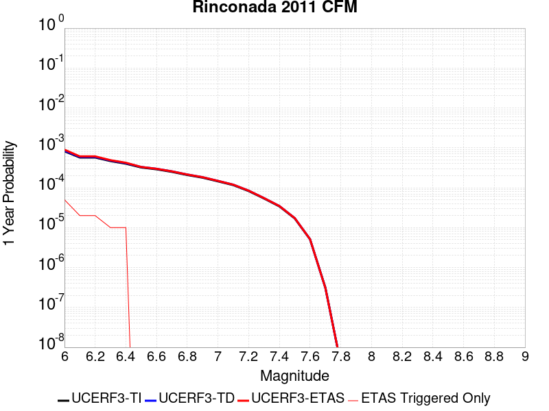 |  |

| Magnitude | 1 wk TI Prob | 1 wk TD Prob | 1 wk ETAS Prob | 1 wk ETAS/TD Gain | 1 wk ETAS Triggered Only | 1 mo TI Prob | 1 mo TD Prob | 1 mo ETAS Prob | 1 mo ETAS/TD Gain | 1 mo ETAS Triggered Only | 1 yr TI Prob | 1 yr TD Prob | 1 yr ETAS Prob | 1 yr ETAS/TD Gain | 1 yr ETAS Triggered Only | 10 yr TI Prob | 10 yr TD Prob | 10 yr ETAS Prob | 10 yr ETAS/TD Gain | 10 yr ETAS Triggered Only |
|-----|-----|-----|-----|-----|-----|-----|-----|-----|-----|-----|-----|-----|-----|-----|-----|-----|-----|-----|-----|-----|
| 6.0 | 1.5752368E-5 | 1.6274716E-5 | 1.4728267E-4 | 9.049785 | 1.3101009E-4 | 6.75084E-5 | 6.974694E-5 | 3.3174883E-4 | 4.756465 | 2.6202018E-4 | 8.2160486E-4 | 8.488412E-4 | 0.001110639 | 1.3084178 | 2.6202018E-4 | 0.008185739 | 0.00845637 | 0.008716174 | 1.030723 | 2.6202018E-4 |
| 6.1 | 1.0966133E-5 | 1.1323029E-5 | 1.1323029E-5 | 1.0 | 0.0 | 4.6996865E-5 | 4.852637E-5 | 4.852637E-5 | 1.0 | 0.0 | 5.720366E-4 | 5.906491E-4 | 5.906491E-4 | 1.0 | 0.0 | 0.0057056635 | 0.0058908886 | 0.0058908886 | 1.0 | 0.0 |
| 6.2 | 1.0966133E-5 | 1.1323029E-5 | 1.1323029E-5 | 1.0 | 0.0 | 4.6996865E-5 | 4.852637E-5 | 4.852637E-5 | 1.0 | 0.0 | 5.720366E-4 | 5.906491E-4 | 5.906491E-4 | 1.0 | 0.0 | 0.0057056635 | 0.0058908886 | 0.0058908886 | 1.0 | 0.0 |
| 6.3 | 8.926149E-6 | 9.212771E-6 | 9.212771E-6 | 1.0 | 0.0 | 3.8254362E-5 | 3.948271E-5 | 3.948271E-5 | 1.0 | 0.0 | 4.6564735E-4 | 4.805963E-4 | 4.805963E-4 | 1.0 | 0.0 | 0.0046467283 | 0.0047956146 | 0.0047956146 | 1.0 | 0.0 |
| 6.4 | 7.676955E-6 | 7.920191E-6 | 7.920191E-6 | 1.0 | 0.0 | 3.290082E-5 | 3.3943234E-5 | 3.3943234E-5 | 1.0 | 0.0 | 4.0049385E-4 | 4.1318068E-4 | 4.1318068E-4 | 1.0 | 0.0 | 0.0039977287 | 0.004124151 | 0.004124151 | 1.0 | 0.0 |
| 6.5 | 6.1671026E-6 | 6.3589546E-6 | 6.3589546E-6 | 1.0 | 0.0 | 2.6430173E-5 | 2.725238E-5 | 2.725238E-5 | 1.0 | 0.0 | 3.2173982E-4 | 3.317473E-4 | 3.317473E-4 | 1.0 | 0.0 | 0.003212744 | 0.0033125326 | 0.0033125326 | 1.0 | 0.0 |
| 6.6 | 5.553456E-6 | 5.7248126E-6 | 5.7248126E-6 | 1.0 | 0.0 | 2.3800309E-5 | 2.453468E-5 | 2.453468E-5 | 1.0 | 0.0 | 2.897302E-4 | 2.9866883E-4 | 2.9866883E-4 | 1.0 | 0.0 | 0.0028935277 | 0.002982683 | 0.002982683 | 1.0 | 0.0 |
| 6.7 | 4.787857E-6 | 4.9333094E-6 | 4.9333094E-6 | 1.0 | 0.0 | 2.0519226E-5 | 2.1142583E-5 | 2.1142583E-5 | 1.0 | 0.0 | 2.4979294E-4 | 2.573806E-4 | 2.573806E-4 | 1.0 | 0.0 | 0.0024951235 | 0.0025708308 | 0.0025708308 | 1.0 | 0.0 |
| 6.8 | 3.9955166E-6 | 4.1134763E-6 | 4.1134763E-6 | 1.0 | 0.0 | 1.7123532E-5 | 1.7629065E-5 | 1.7629065E-5 | 1.0 | 0.0 | 2.0845905E-4 | 2.1461274E-4 | 2.1461274E-4 | 1.0 | 0.0 | 0.002082636 | 0.0021440585 | 0.0021440585 | 1.0 | 0.0 |
| 6.9 | 3.4250072E-6 | 3.5224464E-6 | 3.5224464E-6 | 1.0 | 0.0 | 1.46785205E-5 | 1.5096111E-5 | 1.5096111E-5 | 1.0 | 0.0 | 1.7869633E-4 | 1.8377967E-4 | 1.8377967E-4 | 1.0 | 0.0 | 0.001785527 | 0.0018362794 | 0.0018362794 | 1.0 | 0.0 |
| 7.0 | 2.7712713E-6 | 2.8467E-6 | 2.8467E-6 | 1.0 | 0.0 | 1.1876823E-5 | 1.2200086E-5 | 1.2200086E-5 | 1.0 | 0.0 | 1.4459073E-4 | 1.4852593E-4 | 1.4852593E-4 | 1.0 | 0.0 | 0.0014449668 | 0.0014842682 | 0.0014842682 | 1.0 | 0.0 |
| 7.1 | 2.227358E-6 | 2.2856984E-6 | 2.2856984E-6 | 1.0 | 0.0 | 9.545785E-6 | 9.795814E-6 | 9.795814E-6 | 1.0 | 0.0 | 1.16213734E-4 | 1.19257515E-4 | 1.19257515E-4 | 1.0 | 0.0 | 0.0011615298 | 0.0011919362 | 0.0011919362 | 1.0 | 0.0 |
| 7.2 | 1.581796E-6 | 1.6209011E-6 | 1.6209011E-6 | 1.0 | 0.0 | 6.779108E-6 | 6.9467005E-6 | 6.9467005E-6 | 1.0 | 0.0 | 8.253252E-5 | 8.457281E-5 | 8.457281E-5 | 1.0 | 0.0 | 8.250187E-4 | 8.454067E-4 | 8.454067E-4 | 1.0 | 0.0 |
| 7.3 | 1.0306567E-6 | 1.0546477E-6 | 1.0546477E-6 | 1.0 | 0.0 | 4.4170924E-6 | 4.519911E-6 | 4.519911E-6 | 1.0 | 0.0 | 5.3776774E-5 | 5.5028526E-5 | 5.5028526E-5 | 1.0 | 0.0 | 5.376376E-4 | 5.5014924E-4 | 5.5014924E-4 | 1.0 | 0.0 |
| 7.4 | 6.535541E-7 | 6.682742E-7 | 6.682742E-7 | 1.0 | 0.0 | 2.800943E-6 | 2.864029E-6 | 2.864029E-6 | 1.0 | 0.0 | 3.4100947E-5 | 3.4868997E-5 | 3.4868997E-5 | 1.0 | 0.0 | 3.4095717E-4 | 3.4863537E-4 | 3.4863537E-4 | 1.0 | 0.0 |
| 7.5 | 3.2656962E-7 | 3.3316687E-7 | 3.3316687E-7 | 1.0 | 0.0 | 1.3995833E-6 | 1.4278572E-6 | 1.4278572E-6 | 1.0 | 0.0 | 1.7039794E-5 | 1.7384024E-5 | 1.7384024E-5 | 1.0 | 0.0 | 1.7038487E-4 | 1.7382667E-4 | 1.7382667E-4 | 1.0 | 0.0 |
| 7.6 | 9.754343E-8 | 9.82099E-8 | 9.82099E-8 | 1.0 | 0.0 | 4.180432E-7 | 4.208995E-7 | 4.208995E-7 | 1.0 | 0.0 | 5.089664E-6 | 5.1244397E-6 | 5.1244397E-6 | 1.0 | 0.0 | 5.0895473E-5 | 5.1243223E-5 | 5.1243223E-5 | 1.0 | 0.0 |
| 7.7 | 6.0001453E-9 | 5.8490435E-9 | 5.8490435E-9 | 1.0 | 0.0 | 2.5714908E-8 | 2.506733E-8 | 2.506733E-8 | 1.0 | 0.0 | 3.1307894E-7 | 3.051947E-7 | 3.051947E-7 | 1.0 | 0.0 | 3.1307852E-6 | 3.051943E-6 | 3.051943E-6 | 1.0 | 0.0 |
| 7.8 | 7.400003E-11 | 7.4654505E-11 | 7.4654505E-11 | 1.0 | 0.0 | 3.171432E-10 | 3.1994773E-10 | 3.1994773E-10 | 1.0 | 0.0 | 3.861218E-9 | 3.895363E-9 | 3.895363E-9 | 1.0 | 0.0 | 3.861218E-8 | 3.895363E-8 | 3.895363E-8 | 1.0 | 0.0 |

## Camp Rock 2011
*[(top)](#table-of-contents)*

| 1 Week | 1 Month | 1 Year | 10 Year |
|-----|-----|-----|-----|
|  |  |  |  |

| Magnitude | 1 wk TI Prob | 1 wk TD Prob | 1 wk ETAS Prob | 1 wk ETAS/TD Gain | 1 wk ETAS Triggered Only | 1 mo TI Prob | 1 mo TD Prob | 1 mo ETAS Prob | 1 mo ETAS/TD Gain | 1 mo ETAS Triggered Only | 1 yr TI Prob | 1 yr TD Prob | 1 yr ETAS Prob | 1 yr ETAS/TD Gain | 1 yr ETAS Triggered Only | 10 yr TI Prob | 10 yr TD Prob | 10 yr ETAS Prob | 10 yr ETAS/TD Gain | 10 yr ETAS Triggered Only |
|-----|-----|-----|-----|-----|-----|-----|-----|-----|-----|-----|-----|-----|-----|-----|-----|-----|-----|-----|-----|-----|
| 6.0 | 1.6710783E-5 | 4.25026E-6 | 2.6626932E-4 | 62.64777 | 2.6202018E-4 | 7.161568E-5 | 1.8215276E-5 | 2.8023068E-4 | 15.384377 | 2.6202018E-4 | 8.7157206E-4 | 2.2174895E-4 | 4.8371102E-4 | 2.1813452 | 2.6202018E-4 | 0.008681616 | 0.0022153298 | 0.0024767695 | 1.1180139 | 2.6202018E-4 |
| 6.1 | 1.6710783E-5 | 4.25026E-6 | 2.6626932E-4 | 62.64777 | 2.6202018E-4 | 7.161568E-5 | 1.8215276E-5 | 2.8023068E-4 | 15.384377 | 2.6202018E-4 | 8.7157206E-4 | 2.2174895E-4 | 4.8371102E-4 | 2.1813452 | 2.6202018E-4 | 0.008681616 | 0.0022153298 | 0.0024767695 | 1.1180139 | 2.6202018E-4 |
| 6.2 | 1.6710783E-5 | 4.25026E-6 | 2.6626932E-4 | 62.64777 | 2.6202018E-4 | 7.161568E-5 | 1.8215276E-5 | 2.8023068E-4 | 15.384377 | 2.6202018E-4 | 8.7157206E-4 | 2.2174895E-4 | 4.8371102E-4 | 2.1813452 | 2.6202018E-4 | 0.008681616 | 0.0022153298 | 0.0024767695 | 1.1180139 | 2.6202018E-4 |
| 6.3 | 1.6710783E-5 | 4.25026E-6 | 2.6626932E-4 | 62.64777 | 2.6202018E-4 | 7.161568E-5 | 1.8215276E-5 | 2.8023068E-4 | 15.384377 | 2.6202018E-4 | 8.7157206E-4 | 2.2174895E-4 | 4.8371102E-4 | 2.1813452 | 2.6202018E-4 | 0.008681616 | 0.0022153298 | 0.0024767695 | 1.1180139 | 2.6202018E-4 |
| 6.4 | 7.982846E-6 | 3.6820884E-6 | 2.657013E-4 | 72.160484 | 2.6202018E-4 | 3.421175E-5 | 1.5780286E-5 | 2.7779632E-4 | 17.604012 | 2.6202018E-4 | 4.1644843E-4 | 1.9210839E-4 | 4.5407822E-4 | 2.3636565 | 2.6202018E-4 | 0.0041566887 | 0.001919458 | 0.0021809752 | 1.1362454 | 2.6202018E-4 |
| 6.5 | 7.982846E-6 | 3.6820884E-6 | 2.657013E-4 | 72.160484 | 2.6202018E-4 | 3.421175E-5 | 1.5780286E-5 | 2.7779632E-4 | 17.604012 | 2.6202018E-4 | 4.1644843E-4 | 1.9210839E-4 | 4.5407822E-4 | 2.3636565 | 2.6202018E-4 | 0.0041566887 | 0.001919458 | 0.0021809752 | 1.1362454 | 2.6202018E-4 |
| 6.6 | 7.048869E-6 | 3.4243571E-6 | 2.6544364E-4 | 77.51634 | 2.6202018E-4 | 3.0209088E-5 | 1.4675736E-5 | 2.7669207E-4 | 18.85371 | 2.6202018E-4 | 3.677336E-4 | 1.7866275E-4 | 4.406361E-4 | 2.466301 | 2.6202018E-4 | 0.0036712566 | 0.0017852228 | 0.002046775 | 1.1465096 | 2.6202018E-4 |
| 6.7 | 6.987307E-6 | 3.3623348E-6 | 2.6538162E-4 | 78.92778 | 2.6202018E-4 | 2.9945259E-5 | 1.4409929E-5 | 2.7642632E-4 | 19.183046 | 2.6202018E-4 | 3.6452254E-4 | 1.7542706E-4 | 4.3740126E-4 | 2.4933512 | 2.6202018E-4 | 0.0036392517 | 0.001752917 | 0.0020144777 | 1.1492146 | 2.6202018E-4 |
| 6.8 | 6.3737602E-6 | 3.1179077E-6 | 2.6513726E-4 | 85.03692 | 2.6202018E-4 | 2.731583E-5 | 1.3362394E-5 | 2.7537908E-4 | 20.608513 | 2.6202018E-4 | 3.3251947E-4 | 1.626753E-4 | 4.2465286E-4 | 2.6104324 | 2.6202018E-4 | 0.0033202237 | 0.0016255907 | 0.001887185 | 1.1609225 | 2.6202018E-4 |
| 6.9 | 6.112211E-6 | 2.9331156E-6 | 2.649525E-4 | 90.33143 | 2.6202018E-4 | 2.6194928E-5 | 1.2570436E-5 | 2.745873E-4 | 21.843897 | 2.6202018E-4 | 3.1887658E-4 | 1.5303459E-4 | 4.1501466E-4 | 2.711901 | 2.6202018E-4 | 0.003184194 | 0.0015293199 | 0.0017909394 | 1.1710691 | 2.6202018E-4 |
| 7.0 | 5.5140117E-6 | 2.641923E-6 | 2.6466142E-4 | 100.17757 | 2.6202018E-4 | 2.3631264E-5 | 1.132248E-5 | 2.7333968E-4 | 24.141329 | 2.6202018E-4 | 2.8767265E-4 | 1.3784273E-4 | 3.9982676E-4 | 2.9006014 | 2.6202018E-4 | 0.0028730053 | 0.0013775975 | 0.0016392567 | 1.1899388 | 2.6202018E-4 |
| 7.1 | 4.8151105E-6 | 2.1342705E-6 | 2.6415387E-4 | 123.76777 | 2.6202018E-4 | 2.0636026E-5 | 9.146843E-6 | 2.711646E-4 | 29.645708 | 2.6202018E-4 | 2.5121463E-4 | 1.1135734E-4 | 3.7334833E-4 | 3.3527052 | 2.6202018E-4 | 0.0025093083 | 0.0011130372 | 0.0013747658 | 1.2351481 | 2.6202018E-4 |
| 7.2 | 3.818335E-6 | 1.2937425E-6 | 1.3230366E-4 | 102.2643 | 1.3101009E-4 | 1.6364189E-5 | 5.5445994E-6 | 1.3655396E-4 | 24.628283 | 1.3101009E-4 | 1.9921579E-4 | 6.750349E-5 | 1.9850473E-4 | 2.9406588 | 1.3101009E-4 | 0.0019903728 | 6.748381E-4 | 8.0575974E-4 | 1.1940045 | 1.3101009E-4 |
| 7.3 | 2.7166698E-6 | 7.3835776E-7 | 1.3174835E-4 | 178.4343 | 1.3101009E-4 | 1.1642818E-5 | 3.1643867E-6 | 1.3417406E-4 | 42.401283 | 1.3101009E-4 | 1.4174209E-4 | 3.8525748E-5 | 1.6953079E-4 | 4.400454 | 1.3101009E-4 | 0.0014165172 | 3.851927E-4 | 5.161523E-4 | 1.3399847 | 1.3101009E-4 |
| 7.4 | 2.0893426E-6 | 5.4618386E-7 | 1.315562E-4 | 240.86432 | 1.3101009E-4 | 8.954295E-6 | 2.3407858E-6 | 1.3335056E-4 | 56.96829 | 1.3101009E-4 | 1.0901308E-4 | 2.84987E-5 | 1.5950506E-4 | 5.596924 | 1.3101009E-4 | 0.0010895962 | 2.84951E-4 | 4.1592377E-4 | 1.4596325 | 1.3101009E-4 |
| 7.5 | 1.1681728E-6 | 3.6030585E-7 | 1.3137034E-4 | 364.60788 | 1.3101009E-4 | 5.0064455E-6 | 1.544167E-6 | 1.3255405E-4 | 85.84178 | 1.3101009E-4 | 6.0951766E-5 | 1.8800076E-5 | 1.498077E-4 | 7.9684625 | 1.3101009E-4 | 6.093505E-4 | 1.8798532E-4 | 3.189708E-4 | 1.6967856 | 1.3101009E-4 |
| 7.6 | 1.3154387E-7 | 7.1197384E-8 | 7.1197384E-8 | 1.0 | 0.0 | 5.6375933E-7 | 3.051316E-7 | 3.051316E-7 | 1.0 | 0.0 | 6.863748E-6 | 3.7149728E-6 | 3.7149728E-6 | 1.0 | 0.0 | 6.863536E-5 | 3.7149264E-5 | 3.7149264E-5 | 1.0 | 0.0 |

## Big Pine (East)
*[(top)](#table-of-contents)*

| 1 Week | 1 Month | 1 Year | 10 Year |
|-----|-----|-----|-----|
|  |  |  |  |

| Magnitude | 1 wk TI Prob | 1 wk TD Prob | 1 wk ETAS Prob | 1 wk ETAS/TD Gain | 1 wk ETAS Triggered Only | 1 mo TI Prob | 1 mo TD Prob | 1 mo ETAS Prob | 1 mo ETAS/TD Gain | 1 mo ETAS Triggered Only | 1 yr TI Prob | 1 yr TD Prob | 1 yr ETAS Prob | 1 yr ETAS/TD Gain | 1 yr ETAS Triggered Only | 10 yr TI Prob | 10 yr TD Prob | 10 yr ETAS Prob | 10 yr ETAS/TD Gain | 10 yr ETAS Triggered Only |
|-----|-----|-----|-----|-----|-----|-----|-----|-----|-----|-----|-----|-----|-----|-----|-----|-----|-----|-----|-----|-----|
| 6.0 | 9.916913E-6 | 1.2816984E-5 | 1.2816984E-5 | 1.0 | 0.0 | 4.250036E-5 | 5.49289E-5 | 5.49289E-5 | 1.0 | 0.0 | 5.173191E-4 | 6.685763E-4 | 6.685763E-4 | 1.0 | 0.0 | 0.0051611643 | 0.006670441 | 0.0069307135 | 1.0390188 | 2.6202018E-4 |
| 6.1 | 9.916913E-6 | 1.2816984E-5 | 1.2816984E-5 | 1.0 | 0.0 | 4.250036E-5 | 5.49289E-5 | 5.49289E-5 | 1.0 | 0.0 | 5.173191E-4 | 6.685763E-4 | 6.685763E-4 | 1.0 | 0.0 | 0.0051611643 | 0.006670441 | 0.0069307135 | 1.0390188 | 2.6202018E-4 |
| 6.2 | 9.916913E-6 | 1.2816984E-5 | 1.2816984E-5 | 1.0 | 0.0 | 4.250036E-5 | 5.49289E-5 | 5.49289E-5 | 1.0 | 0.0 | 5.173191E-4 | 6.685763E-4 | 6.685763E-4 | 1.0 | 0.0 | 0.0051611643 | 0.006670441 | 0.0069307135 | 1.0390188 | 2.6202018E-4 |
| 6.3 | 5.479711E-6 | 8.112951E-6 | 8.112951E-6 | 1.0 | 0.0 | 2.3484265E-5 | 3.4769346E-5 | 3.4769346E-5 | 1.0 | 0.0 | 2.858834E-4 | 4.2323777E-4 | 4.2323777E-4 | 1.0 | 0.0 | 0.0028551589 | 0.004227244 | 0.004488156 | 1.0617217 | 2.6202018E-4 |
| 6.4 | 5.465009E-6 | 8.097245E-6 | 8.097245E-6 | 1.0 | 0.0 | 2.3421257E-5 | 3.4702036E-5 | 3.4702036E-5 | 1.0 | 0.0 | 2.851165E-4 | 4.2241855E-4 | 4.2241855E-4 | 1.0 | 0.0 | 0.0028475097 | 0.0042190826 | 0.0044799973 | 1.0618416 | 2.6202018E-4 |
| 6.5 | 4.826767E-6 | 7.422301E-6 | 7.422301E-6 | 1.0 | 0.0 | 2.068598E-5 | 3.180949E-5 | 3.180949E-5 | 1.0 | 0.0 | 2.518227E-4 | 3.872145E-4 | 3.872145E-4 | 1.0 | 0.0 | 0.0025153751 | 0.003868283 | 0.0041292896 | 1.0674735 | 2.6202018E-4 |
| 6.6 | 4.3146847E-6 | 6.8822374E-6 | 6.8822374E-6 | 1.0 | 0.0 | 1.8491375E-5 | 2.9494982E-5 | 2.9494982E-5 | 1.0 | 0.0 | 2.2510924E-4 | 3.590447E-4 | 3.590447E-4 | 1.0 | 0.0 | 0.0022488134 | 0.0035874986 | 0.0038485785 | 1.072775 | 2.6202018E-4 |
| 6.7 | 3.6968106E-6 | 5.9954727E-6 | 5.9954727E-6 | 1.0 | 0.0 | 1.5843378E-5 | 2.5694639E-5 | 2.5694639E-5 | 1.0 | 0.0 | 1.9287605E-4 | 3.1278885E-4 | 3.1278885E-4 | 1.0 | 0.0 | 0.0019270873 | 0.0031262483 | 0.0033874493 | 1.0835509 | 2.6202018E-4 |
| 6.8 | 3.4671132E-6 | 5.702177E-6 | 5.702177E-6 | 1.0 | 0.0 | 1.4858972E-5 | 2.4437682E-5 | 2.4437682E-5 | 1.0 | 0.0 | 1.8089297E-4 | 2.974896E-4 | 2.974896E-4 | 1.0 | 0.0 | 0.0018074579 | 0.002973667 | 0.0032349082 | 1.0878514 | 2.6202018E-4 |
| 6.9 | 2.7686972E-6 | 4.825223E-6 | 4.825223E-6 | 1.0 | 0.0 | 1.1865792E-5 | 2.0679368E-5 | 2.0679368E-5 | 1.0 | 0.0 | 1.4445644E-4 | 2.5174298E-4 | 2.5174298E-4 | 1.0 | 0.0 | 0.0014436257 | 0.0025172636 | 0.0027786244 | 1.1038272 | 2.6202018E-4 |
| 7.0 | 2.1472624E-6 | 3.9850406E-6 | 3.9850406E-6 | 1.0 | 0.0 | 9.20252E-6 | 1.7078637E-5 | 1.7078637E-5 | 1.0 | 0.0 | 1.12034926E-4 | 2.079131E-4 | 2.079131E-4 | 1.0 | 0.0 | 0.0011197845 | 0.0020798394 | 0.0020798394 | 1.0 | 0.0 |
| 7.1 | 1.7018335E-6 | 3.344876E-6 | 3.344876E-6 | 1.0 | 0.0 | 7.293552E-6 | 1.4335106E-5 | 1.4335106E-5 | 1.0 | 0.0 | 8.879537E-5 | 1.7451629E-4 | 1.7451629E-4 | 1.0 | 0.0 | 8.87599E-4 | 0.0017464145 | 0.0017464145 | 1.0 | 0.0 |
| 7.2 | 1.25603E-6 | 2.794484E-6 | 2.794484E-6 | 1.0 | 0.0 | 5.3829745E-6 | 1.1976307E-5 | 1.1976307E-5 | 1.0 | 0.0 | 6.553574E-5 | 1.4580201E-4 | 1.4580201E-4 | 1.0 | 0.0 | 6.551642E-4 | 0.001459661 | 0.001459661 | 1.0 | 0.0 |
| 7.3 | 1.112297E-6 | 2.610332E-6 | 2.610332E-6 | 1.0 | 0.0 | 4.7669787E-6 | 1.118709E-5 | 1.118709E-5 | 1.0 | 0.0 | 5.803642E-5 | 1.3619453E-4 | 1.3619453E-4 | 1.0 | 0.0 | 5.802127E-4 | 0.0013635408 | 0.0013635408 | 1.0 | 0.0 |
| 7.4 | 1.0137181E-6 | 2.4834917E-6 | 2.4834917E-6 | 1.0 | 0.0 | 4.3444993E-6 | 1.0643494E-5 | 1.0643494E-5 | 1.0 | 0.0 | 5.2892992E-5 | 1.2957705E-4 | 1.2957705E-4 | 1.0 | 0.0 | 5.288041E-4 | 0.0012972289 | 0.0012972289 | 1.0 | 0.0 |
| 7.5 | 9.598608E-7 | 2.4071483E-6 | 2.4071483E-6 | 1.0 | 0.0 | 4.1136827E-6 | 1.031631E-5 | 1.031631E-5 | 1.0 | 0.0 | 5.0082934E-5 | 1.2559404E-4 | 1.2559404E-4 | 1.0 | 0.0 | 5.007165E-4 | 0.0012572526 | 0.0012572526 | 1.0 | 0.0 |
| 7.6 | 7.929459E-7 | 2.0448588E-6 | 2.0448588E-6 | 1.0 | 0.0 | 3.3983351E-6 | 8.763653E-6 | 8.763653E-6 | 1.0 | 0.0 | 4.1373947E-5 | 1.06692416E-4 | 1.06692416E-4 | 1.0 | 0.0 | 4.1366243E-4 | 0.0010685222 | 0.0010685222 | 1.0 | 0.0 |
| 7.7 | 4.155788E-7 | 1.1605589E-6 | 1.1605589E-6 | 1.0 | 0.0 | 1.7810507E-6 | 4.9738146E-6 | 4.9738146E-6 | 1.0 | 0.0 | 2.1684076E-5 | 6.0554554E-5 | 6.0554554E-5 | 1.0 | 0.0 | 2.1681961E-4 | 6.0857297E-4 | 6.0857297E-4 | 1.0 | 0.0 |
| 7.8 | 1.14666925E-7 | 2.592015E-7 | 2.592015E-7 | 1.0 | 0.0 | 4.914296E-7 | 1.1108631E-6 | 1.1108631E-6 | 1.0 | 0.0 | 5.9831386E-6 | 1.3524678E-5 | 1.3524678E-5 | 1.0 | 0.0 | 5.9829777E-5 | 1.3634123E-4 | 1.3634123E-4 | 1.0 | 0.0 |
| 7.9 | 2.9231824E-8 | 4.1463963E-8 | 4.1463963E-8 | 1.0 | 0.0 | 1.2527924E-7 | 1.7770269E-7 | 1.7770269E-7 | 1.0 | 0.0 | 1.5252737E-6 | 2.1635283E-6 | 2.1635283E-6 | 1.0 | 0.0 | 1.5252632E-5 | 2.1967755E-5 | 2.1967755E-5 | 1.0 | 0.0 |

## Channel Islands Thrust
*[(top)](#table-of-contents)*

| 1 Week | 1 Month | 1 Year | 10 Year |
|-----|-----|-----|-----|
|  |  |  |  |

| Magnitude | 1 wk TI Prob | 1 wk TD Prob | 1 wk ETAS Prob | 1 wk ETAS/TD Gain | 1 wk ETAS Triggered Only | 1 mo TI Prob | 1 mo TD Prob | 1 mo ETAS Prob | 1 mo ETAS/TD Gain | 1 mo ETAS Triggered Only | 1 yr TI Prob | 1 yr TD Prob | 1 yr ETAS Prob | 1 yr ETAS/TD Gain | 1 yr ETAS Triggered Only | 10 yr TI Prob | 10 yr TD Prob | 10 yr ETAS Prob | 10 yr ETAS/TD Gain | 10 yr ETAS Triggered Only |
|-----|-----|-----|-----|-----|-----|-----|-----|-----|-----|-----|-----|-----|-----|-----|-----|-----|-----|-----|-----|-----|
| 6.0 | 2.2156251E-5 | 2.4092022E-5 | 2.4092022E-5 | 1.0 | 0.0 | 9.495191E-5 | 1.03248036E-4 | 2.342446E-4 | 2.268756 | 1.3101009E-4 | 0.0011554264 | 0.0012564264 | 0.001387272 | 1.104141 | 1.3101009E-4 | 0.011494373 | 0.0125038205 | 0.012633192 | 1.0103467 | 1.3101009E-4 |
| 6.1 | 2.2156251E-5 | 2.4092022E-5 | 2.4092022E-5 | 1.0 | 0.0 | 9.495191E-5 | 1.03248036E-4 | 2.342446E-4 | 2.268756 | 1.3101009E-4 | 0.0011554264 | 0.0012564264 | 0.001387272 | 1.104141 | 1.3101009E-4 | 0.011494373 | 0.0125038205 | 0.012633192 | 1.0103467 | 1.3101009E-4 |
| 6.2 | 2.2156251E-5 | 2.4092022E-5 | 2.4092022E-5 | 1.0 | 0.0 | 9.495191E-5 | 1.03248036E-4 | 2.342446E-4 | 2.268756 | 1.3101009E-4 | 0.0011554264 | 0.0012564264 | 0.001387272 | 1.104141 | 1.3101009E-4 | 0.011494373 | 0.0125038205 | 0.012633192 | 1.0103467 | 1.3101009E-4 |
| 6.3 | 2.2156251E-5 | 2.4092022E-5 | 2.4092022E-5 | 1.0 | 0.0 | 9.495191E-5 | 1.03248036E-4 | 2.342446E-4 | 2.268756 | 1.3101009E-4 | 0.0011554264 | 0.0012564264 | 0.001387272 | 1.104141 | 1.3101009E-4 | 0.011494373 | 0.0125038205 | 0.012633192 | 1.0103467 | 1.3101009E-4 |
| 6.4 | 2.2156251E-5 | 2.4092022E-5 | 2.4092022E-5 | 1.0 | 0.0 | 9.495191E-5 | 1.03248036E-4 | 2.342446E-4 | 2.268756 | 1.3101009E-4 | 0.0011554264 | 0.0012564264 | 0.001387272 | 1.104141 | 1.3101009E-4 | 0.011494373 | 0.0125038205 | 0.012633192 | 1.0103467 | 1.3101009E-4 |
| 6.5 | 2.2156251E-5 | 2.4092022E-5 | 2.4092022E-5 | 1.0 | 0.0 | 9.495191E-5 | 1.03248036E-4 | 2.342446E-4 | 2.268756 | 1.3101009E-4 | 0.0011554264 | 0.0012564264 | 0.001387272 | 1.104141 | 1.3101009E-4 | 0.011494373 | 0.0125038205 | 0.012633192 | 1.0103467 | 1.3101009E-4 |
| 6.6 | 2.2156251E-5 | 2.4092022E-5 | 2.4092022E-5 | 1.0 | 0.0 | 9.495191E-5 | 1.03248036E-4 | 2.342446E-4 | 2.268756 | 1.3101009E-4 | 0.0011554264 | 0.0012564264 | 0.001387272 | 1.104141 | 1.3101009E-4 | 0.011494373 | 0.0125038205 | 0.012633192 | 1.0103467 | 1.3101009E-4 |
| 6.7 | 1.0601296E-5 | 1.1379544E-5 | 1.1379544E-5 | 1.0 | 0.0 | 4.5433335E-5 | 4.876859E-5 | 1.797723E-4 | 3.6862311 | 1.3101009E-4 | 5.5301044E-4 | 5.936007E-4 | 7.24533E-4 | 1.2205731 | 1.3101009E-4 | 0.005516363 | 0.005920653 | 0.0060508875 | 1.0219966 | 1.3101009E-4 |
| 6.8 | 1.0246747E-5 | 1.0996669E-5 | 1.0996669E-5 | 1.0 | 0.0 | 4.391389E-5 | 4.7127756E-5 | 1.7813167E-4 | 3.7797613 | 1.3101009E-4 | 5.345204E-4 | 5.7363417E-4 | 7.045691E-4 | 1.2282552 | 1.3101009E-4 | 0.0053323656 | 0.005722025 | 0.0058522853 | 1.0227648 | 1.3101009E-4 |
| 6.9 | 9.049551E-6 | 9.699645E-6 | 9.699645E-6 | 1.0 | 0.0 | 3.878322E-5 | 4.1569267E-5 | 1.7257391E-4 | 4.1514783 | 1.3101009E-4 | 4.7208337E-4 | 5.059924E-4 | 6.3693617E-4 | 1.2587861 | 1.3101009E-4 | 0.0047108172 | 0.0050488203 | 0.0051791687 | 1.0258176 | 1.3101009E-4 |
| 7.0 | 8.6542195E-6 | 9.274603E-6 | 9.274603E-6 | 1.0 | 0.0 | 3.7088983E-5 | 3.9747716E-5 | 1.707526E-4 | 4.2959094 | 1.3101009E-4 | 4.5146482E-4 | 4.8382508E-4 | 6.147718E-4 | 1.2706488 | 1.3101009E-4 | 0.004505487 | 0.004828129 | 0.0049585067 | 1.0270038 | 1.3101009E-4 |
| 7.1 | 8.391028E-6 | 8.992924E-6 | 8.992924E-6 | 1.0 | 0.0 | 3.5961057E-5 | 3.854056E-5 | 3.854056E-5 | 1.0 | 0.0 | 4.3773788E-4 | 4.6913436E-4 | 4.6913436E-4 | 1.0 | 0.0 | 0.004368766 | 0.0046818503 | 0.0046818503 | 1.0 | 0.0 |
| 7.2 | 5.965188E-6 | 6.3716952E-6 | 6.3716952E-6 | 1.0 | 0.0 | 2.556484E-5 | 2.7306982E-5 | 2.7306982E-5 | 1.0 | 0.0 | 3.1120746E-4 | 3.3241234E-4 | 3.3241234E-4 | 1.0 | 0.0 | 0.00310772 | 0.0033192092 | 0.0033192092 | 1.0 | 0.0 |
| 7.3 | 4.877518E-6 | 5.2060063E-6 | 5.2060063E-6 | 1.0 | 0.0 | 2.0903482E-5 | 2.2311267E-5 | 2.2311267E-5 | 1.0 | 0.0 | 2.5447016E-4 | 2.716063E-4 | 2.716063E-4 | 1.0 | 0.0 | 0.0025417898 | 0.0027127895 | 0.0027127895 | 1.0 | 0.0 |
| 7.4 | 3.8829853E-6 | 4.141863E-6 | 4.141863E-6 | 1.0 | 0.0 | 1.664126E-5 | 1.7750723E-5 | 1.7750723E-5 | 1.0 | 0.0 | 2.0258849E-4 | 2.1609402E-4 | 2.1609402E-4 | 1.0 | 0.0 | 0.002024039 | 0.0021588807 | 0.0021588807 | 1.0 | 0.0 |
| 7.5 | 1.3489616E-6 | 1.4277903E-6 | 1.4277903E-6 | 1.0 | 0.0 | 5.7812517E-6 | 6.119087E-6 | 6.119087E-6 | 1.0 | 0.0 | 7.038446E-5 | 7.449738E-5 | 7.449738E-5 | 1.0 | 0.0 | 7.036218E-4 | 7.44728E-4 | 7.44728E-4 | 1.0 | 0.0 |
| 7.6 | 6.058192E-7 | 6.353778E-7 | 6.353778E-7 | 1.0 | 0.0 | 2.5963652E-6 | 2.7230449E-6 | 2.7230449E-6 | 1.0 | 0.0 | 3.161029E-5 | 3.3152584E-5 | 3.3152584E-5 | 1.0 | 0.0 | 3.1605794E-4 | 3.31478E-4 | 3.31478E-4 | 1.0 | 0.0 |
| 7.7 | 2.2170494E-7 | 2.2607902E-7 | 2.2607902E-7 | 1.0 | 0.0 | 9.5016367E-7 | 9.689098E-7 | 9.689098E-7 | 1.0 | 0.0 | 1.1568181E-5 | 1.1796425E-5 | 1.1796425E-5 | 1.0 | 0.0 | 1.1567579E-4 | 1.1795909E-4 | 1.1795909E-4 | 1.0 | 0.0 |
| 7.8 | 2.1613102E-8 | 1.5466682E-8 | 1.5466682E-8 | 1.0 | 0.0 | 9.262757E-8 | 6.628578E-8 | 6.628578E-8 | 1.0 | 0.0 | 1.1277401E-6 | 8.070291E-7 | 8.070291E-7 | 1.0 | 0.0 | 1.1277344E-5 | 8.070269E-6 | 8.070269E-6 | 1.0 | 0.0 |

## Bullion Mountains
*[(top)](#table-of-contents)*

| 1 Week | 1 Month | 1 Year | 10 Year |
|-----|-----|-----|-----|
|  |  |  |  |

| Magnitude | 1 wk TI Prob | 1 wk TD Prob | 1 wk ETAS Prob | 1 wk ETAS/TD Gain | 1 wk ETAS Triggered Only | 1 mo TI Prob | 1 mo TD Prob | 1 mo ETAS Prob | 1 mo ETAS/TD Gain | 1 mo ETAS Triggered Only | 1 yr TI Prob | 1 yr TD Prob | 1 yr ETAS Prob | 1 yr ETAS/TD Gain | 1 yr ETAS Triggered Only | 10 yr TI Prob | 10 yr TD Prob | 10 yr ETAS Prob | 10 yr ETAS/TD Gain | 10 yr ETAS Triggered Only |
|-----|-----|-----|-----|-----|-----|-----|-----|-----|-----|-----|-----|-----|-----|-----|-----|-----|-----|-----|-----|-----|
| 6.0 | 1.6420427E-5 | 1.4692089E-5 | 1.4570025E-4 | 9.916919 | 1.3101009E-4 | 7.037136E-5 | 6.296479E-5 | 1.9396664E-4 | 3.0805569 | 1.3101009E-4 | 8.5643446E-4 | 7.663651E-4 | 0.0010281844 | 1.341638 | 2.6202018E-4 | 0.008531413 | 0.007641016 | 0.007901034 | 1.0340292 | 2.6202018E-4 |
| 6.1 | 1.6420427E-5 | 1.4692089E-5 | 1.4570025E-4 | 9.916919 | 1.3101009E-4 | 7.037136E-5 | 6.296479E-5 | 1.9396664E-4 | 3.0805569 | 1.3101009E-4 | 8.5643446E-4 | 7.663651E-4 | 0.0010281844 | 1.341638 | 2.6202018E-4 | 0.008531413 | 0.007641016 | 0.007901034 | 1.0340292 | 2.6202018E-4 |
| 6.2 | 1.6420427E-5 | 1.4692089E-5 | 1.4570025E-4 | 9.916919 | 1.3101009E-4 | 7.037136E-5 | 6.296479E-5 | 1.9396664E-4 | 3.0805569 | 1.3101009E-4 | 8.5643446E-4 | 7.663651E-4 | 0.0010281844 | 1.341638 | 2.6202018E-4 | 0.008531413 | 0.007641016 | 0.007901034 | 1.0340292 | 2.6202018E-4 |
| 6.3 | 1.2046778E-5 | 9.862335E-6 | 1.4087113E-4 | 14.283751 | 1.3101009E-4 | 5.1628023E-5 | 4.2266598E-5 | 1.7327115E-4 | 4.099482 | 1.3101009E-4 | 6.283899E-4 | 5.144975E-4 | 7.7638286E-4 | 1.509012 | 2.6202018E-4 | 0.0062661595 | 0.005135345 | 0.0053960197 | 1.0507609 | 2.6202018E-4 |
| 6.4 | 1.2046778E-5 | 9.862335E-6 | 1.4087113E-4 | 14.283751 | 1.3101009E-4 | 5.1628023E-5 | 4.2266598E-5 | 1.7327115E-4 | 4.099482 | 1.3101009E-4 | 6.283899E-4 | 5.144975E-4 | 7.7638286E-4 | 1.509012 | 2.6202018E-4 | 0.0062661595 | 0.005135345 | 0.0053960197 | 1.0507609 | 2.6202018E-4 |
| 6.5 | 1.0244343E-5 | 7.879458E-6 | 1.3888851E-4 | 17.626657 | 1.3101009E-4 | 4.390359E-5 | 3.3768785E-5 | 1.6477445E-4 | 4.87949 | 1.3101009E-4 | 5.343951E-4 | 4.110781E-4 | 6.729906E-4 | 1.6371355 | 2.6202018E-4 | 0.005331118 | 0.004105208 | 0.0043661525 | 1.0635643 | 2.6202018E-4 |
| 6.6 | 9.605408E-6 | 7.1774966E-6 | 1.3818665E-4 | 19.252764 | 1.3101009E-4 | 4.1165385E-5 | 3.076045E-5 | 1.6176651E-4 | 5.258912 | 1.3101009E-4 | 5.010733E-4 | 3.744645E-4 | 6.3638657E-4 | 1.6994576 | 2.6202018E-4 | 0.00499945 | 0.003740332 | 0.004001372 | 1.0697906 | 2.6202018E-4 |
| 6.7 | 8.60418E-6 | 6.1240044E-6 | 1.3713329E-4 | 22.392748 | 1.3101009E-4 | 3.687454E-5 | 2.624558E-5 | 1.5725223E-4 | 5.99157 | 1.3101009E-4 | 4.48855E-4 | 3.1951256E-4 | 5.81449E-4 | 1.8198001 | 2.6202018E-4 | 0.004479495 | 0.0031924439 | 0.0034536275 | 1.0818131 | 2.6202018E-4 |
| 6.8 | 5.187994E-6 | 2.5631666E-6 | 1.3357292E-4 | 52.112457 | 1.3101009E-4 | 2.223407E-5 | 1.0984976E-5 | 1.4199363E-4 | 12.926166 | 1.3101009E-4 | 2.7066618E-4 | 1.3373788E-4 | 2.6473045E-4 | 1.9794725 | 1.3101009E-4 | 0.0027033675 | 0.0013369655 | 0.0014678005 | 1.0978596 | 1.3101009E-4 |
| 6.9 | 4.5302368E-6 | 2.3443165E-6 | 1.333541E-4 | 56.883995 | 1.3101009E-4 | 1.9415156E-5 | 1.0047055E-5 | 1.4105583E-4 | 14.03952 | 1.3101009E-4 | 2.3635388E-4 | 1.2232E-4 | 2.5331407E-4 | 2.0709128 | 1.3101009E-4 | 0.0023610266 | 0.0012229157 | 0.0013537656 | 1.1069983 | 1.3101009E-4 |
| 7.0 | 3.431668E-6 | 1.6882402E-6 | 1.326981E-4 | 78.60144 | 1.3101009E-4 | 1.4707065E-5 | 7.235315E-6 | 1.3824446E-4 | 19.106901 | 1.3101009E-4 | 1.7904381E-4 | 8.808996E-5 | 2.1908851E-4 | 2.4870996 | 1.3101009E-4 | 0.0017889962 | 8.808996E-4 | 0.0010117943 | 1.148592 | 1.3101009E-4 |

## Santa Rosa Island
*[(top)](#table-of-contents)*

| 1 Week | 1 Month | 1 Year | 10 Year |
|-----|-----|-----|-----|
|  |  |  |  |

| Magnitude | 1 wk TI Prob | 1 wk TD Prob | 1 wk ETAS Prob | 1 wk ETAS/TD Gain | 1 wk ETAS Triggered Only | 1 mo TI Prob | 1 mo TD Prob | 1 mo ETAS Prob | 1 mo ETAS/TD Gain | 1 mo ETAS Triggered Only | 1 yr TI Prob | 1 yr TD Prob | 1 yr ETAS Prob | 1 yr ETAS/TD Gain | 1 yr ETAS Triggered Only | 10 yr TI Prob | 10 yr TD Prob | 10 yr ETAS Prob | 10 yr ETAS/TD Gain | 10 yr ETAS Triggered Only |
|-----|-----|-----|-----|-----|-----|-----|-----|-----|-----|-----|-----|-----|-----|-----|-----|-----|-----|-----|-----|-----|
| 6.0 | 4.1143165E-5 | 4.7091133E-5 | 4.7091133E-5 | 1.0 | 0.0 | 1.7631594E-4 | 2.0180465E-4 | 2.0180465E-4 | 1.0 | 0.0 | 0.002144533 | 0.0024544 | 0.0024544 | 1.0 | 0.0 | 0.021239553 | 0.024293551 | 0.024549205 | 1.0105236 | 2.6202018E-4 |
| 6.1 | 2.1061249E-5 | 2.3864959E-5 | 2.3864959E-5 | 1.0 | 0.0 | 9.0259375E-5 | 1.0227455E-4 | 1.0227455E-4 | 1.0 | 0.0 | 0.0010983539 | 0.0012445104 | 0.0012445104 | 1.0 | 0.0 | 0.01092941 | 0.012378449 | 0.012507836 | 1.0104527 | 1.3101009E-4 |
| 6.2 | 2.1061249E-5 | 2.3864959E-5 | 2.3864959E-5 | 1.0 | 0.0 | 9.0259375E-5 | 1.0227455E-4 | 1.0227455E-4 | 1.0 | 0.0 | 0.0010983539 | 0.0012445104 | 0.0012445104 | 1.0 | 0.0 | 0.01092941 | 0.012378449 | 0.012507836 | 1.0104527 | 1.3101009E-4 |
| 6.3 | 1.5158236E-5 | 1.7074419E-5 | 1.7074419E-5 | 1.0 | 0.0 | 6.496225E-5 | 7.3174095E-5 | 7.3174095E-5 | 1.0 | 0.0 | 7.906284E-4 | 8.905424E-4 | 8.905424E-4 | 1.0 | 0.0 | 0.007878214 | 0.008870989 | 0.009000838 | 1.0146374 | 1.3101009E-4 |
| 6.4 | 1.2341918E-5 | 1.3852917E-5 | 1.3852917E-5 | 1.0 | 0.0 | 5.2892858E-5 | 5.9368336E-5 | 5.9368336E-5 | 1.0 | 0.0 | 6.437803E-4 | 7.225779E-4 | 7.225779E-4 | 1.0 | 0.0 | 0.006419184 | 0.007203121 | 0.007333188 | 1.018057 | 1.3101009E-4 |
| 6.5 | 9.061158E-6 | 1.0117031E-5 | 1.0117031E-5 | 1.0 | 0.0 | 3.883296E-5 | 4.3358013E-5 | 4.3358013E-5 | 1.0 | 0.0 | 4.726887E-4 | 5.277613E-4 | 5.277613E-4 | 1.0 | 0.0 | 0.004716845 | 0.0052656173 | 0.0053959377 | 1.0247493 | 1.3101009E-4 |
| 6.6 | 7.5461685E-6 | 8.400733E-6 | 8.400733E-6 | 1.0 | 0.0 | 3.2340322E-5 | 3.600267E-5 | 3.600267E-5 | 1.0 | 0.0 | 3.936723E-4 | 4.3824865E-4 | 4.3824865E-4 | 1.0 | 0.0 | 0.003929756 | 0.0043742736 | 0.004504711 | 1.0298191 | 1.3101009E-4 |
| 6.7 | 5.5023775E-6 | 6.087381E-6 | 6.087381E-6 | 1.0 | 0.0 | 2.3581404E-5 | 2.6088532E-5 | 2.6088532E-5 | 1.0 | 0.0 | 2.8706578E-4 | 3.1758484E-4 | 3.1758484E-4 | 1.0 | 0.0 | 0.0028669522 | 0.0031716314 | 0.0031716314 | 1.0 | 0.0 |
| 6.8 | 3.7351679E-6 | 4.0831405E-6 | 4.0831405E-6 | 1.0 | 0.0 | 1.6007763E-5 | 1.749907E-5 | 1.749907E-5 | 1.0 | 0.0 | 1.948771E-4 | 2.1303284E-4 | 2.1303284E-4 | 1.0 | 0.0 | 0.0019470629 | 0.0021285315 | 0.0021285315 | 1.0 | 0.0 |
| 6.9 | 2.456366E-6 | 2.6292705E-6 | 2.6292705E-6 | 1.0 | 0.0 | 1.0527241E-5 | 1.1268254E-5 | 1.1268254E-5 | 1.0 | 0.0 | 1.2816161E-4 | 1.3718237E-4 | 1.3718237E-4 | 1.0 | 0.0 | 0.0012808773 | 0.0013709799 | 0.0013709799 | 1.0 | 0.0 |
| 7.0 | 2.3245157E-6 | 2.4827782E-6 | 2.4827782E-6 | 1.0 | 0.0 | 9.962172E-6 | 1.0640435E-5 | 1.0640435E-5 | 1.0 | 0.0 | 1.2128269E-4 | 1.2953962E-4 | 1.2953962E-4 | 1.0 | 0.0 | 0.0012121652 | 0.0012946434 | 0.0012946434 | 1.0 | 0.0 |
| 7.1 | 2.2248344E-6 | 2.37325E-6 | 2.37325E-6 | 1.0 | 0.0 | 9.53497E-6 | 1.0171032E-5 | 1.0171032E-5 | 1.0 | 0.0 | 1.1608207E-4 | 1.2382529E-4 | 1.2382529E-4 | 1.0 | 0.0 | 0.0011602144 | 0.001237565 | 0.001237565 | 1.0 | 0.0 |
| 7.2 | 2.1350402E-6 | 2.276154E-6 | 2.276154E-6 | 1.0 | 0.0 | 9.150141E-6 | 9.754909E-6 | 9.754909E-6 | 1.0 | 0.0 | 1.1139726E-4 | 1.1875956E-4 | 1.1875956E-4 | 1.0 | 0.0 | 0.0011134144 | 0.0011869629 | 0.0011869629 | 1.0 | 0.0 |
| 7.3 | 1.9793572E-6 | 2.108719E-6 | 2.108719E-6 | 1.0 | 0.0 | 8.482932E-6 | 9.037336E-6 | 9.037336E-6 | 1.0 | 0.0 | 1.032748E-4 | 1.10024026E-4 | 1.10024026E-4 | 1.0 | 0.0 | 0.0010322682 | 0.0010996973 | 0.0010996973 | 1.0 | 0.0 |
| 7.4 | 1.6951194E-6 | 1.8045733E-6 | 1.8045733E-6 | 1.0 | 0.0 | 7.264777E-6 | 7.733863E-6 | 7.733863E-6 | 1.0 | 0.0 | 8.844508E-5 | 9.415573E-5 | 9.415573E-5 | 1.0 | 0.0 | 8.840988E-4 | 9.4116E-4 | 9.4116E-4 | 1.0 | 0.0 |
| 7.5 | 8.987207E-7 | 9.5122147E-7 | 9.5122147E-7 | 1.0 | 0.0 | 3.8516546E-6 | 4.076657E-6 | 4.076657E-6 | 1.0 | 0.0 | 4.6892885E-5 | 4.963218E-5 | 4.963218E-5 | 1.0 | 0.0 | 4.688299E-4 | 4.9621216E-4 | 4.9621216E-4 | 1.0 | 0.0 |
| 7.6 | 3.8783037E-7 | 4.052932E-7 | 4.052932E-7 | 1.0 | 0.0 | 1.6621291E-6 | 1.7369698E-6 | 1.7369698E-6 | 1.0 | 0.0 | 2.0236233E-5 | 2.1147409E-5 | 2.1147409E-5 | 1.0 | 0.0 | 2.023439E-4 | 2.1145462E-4 | 2.1145462E-4 | 1.0 | 0.0 |
| 7.7 | 6.181804E-8 | 6.339035E-8 | 6.339035E-8 | 1.0 | 0.0 | 2.6493444E-7 | 2.7167292E-7 | 2.7167292E-7 | 1.0 | 0.0 | 3.225572E-6 | 3.3076128E-6 | 3.3076128E-6 | 1.0 | 0.0 | 3.225525E-5 | 3.307564E-5 | 3.307564E-5 | 1.0 | 0.0 |
| 7.8 | 1.3704449E-9 | 1.3964153E-9 | 1.3964153E-9 | 1.0 | 0.0 | 5.873335E-9 | 5.984637E-9 | 5.984637E-9 | 1.0 | 0.0 | 7.1507856E-8 | 7.286295E-8 | 7.286295E-8 | 1.0 | 0.0 | 7.1507833E-7 | 7.286294E-7 | 7.286294E-7 | 1.0 | 0.0 |

## Cleghorn
*[(top)](#table-of-contents)*

| 1 Week | 1 Month | 1 Year | 10 Year |
|-----|-----|-----|-----|
|  |  |  |  |

| Magnitude | 1 wk TI Prob | 1 wk TD Prob | 1 wk ETAS Prob | 1 wk ETAS/TD Gain | 1 wk ETAS Triggered Only | 1 mo TI Prob | 1 mo TD Prob | 1 mo ETAS Prob | 1 mo ETAS/TD Gain | 1 mo ETAS Triggered Only | 1 yr TI Prob | 1 yr TD Prob | 1 yr ETAS Prob | 1 yr ETAS/TD Gain | 1 yr ETAS Triggered Only | 10 yr TI Prob | 10 yr TD Prob | 10 yr ETAS Prob | 10 yr ETAS/TD Gain | 10 yr ETAS Triggered Only |
|-----|-----|-----|-----|-----|-----|-----|-----|-----|-----|-----|-----|-----|-----|-----|-----|-----|-----|-----|-----|-----|
| 6.0 | 7.9267165E-6 | 9.831582E-6 | 1.4084038E-4 | 14.325301 | 1.3101009E-4 | 3.39712E-5 | 4.2134732E-5 | 3.0414388E-4 | 7.2183647 | 2.6202018E-4 | 4.1352084E-4 | 5.128803E-4 | 7.74766E-4 | 1.5106179 | 2.6202018E-4 | 0.004127522 | 0.0051320773 | 0.0053927526 | 1.0507934 | 2.6202018E-4 |
| 6.1 | 7.9267165E-6 | 9.831582E-6 | 1.4084038E-4 | 14.325301 | 1.3101009E-4 | 3.39712E-5 | 4.2134732E-5 | 3.0414388E-4 | 7.2183647 | 2.6202018E-4 | 4.1352084E-4 | 5.128803E-4 | 7.74766E-4 | 1.5106179 | 2.6202018E-4 | 0.004127522 | 0.0051320773 | 0.0053927526 | 1.0507934 | 2.6202018E-4 |
| 6.2 | 7.9267165E-6 | 9.831582E-6 | 1.4084038E-4 | 14.325301 | 1.3101009E-4 | 3.39712E-5 | 4.2134732E-5 | 3.0414388E-4 | 7.2183647 | 2.6202018E-4 | 4.1352084E-4 | 5.128803E-4 | 7.74766E-4 | 1.5106179 | 2.6202018E-4 | 0.004127522 | 0.0051320773 | 0.0053927526 | 1.0507934 | 2.6202018E-4 |
| 6.3 | 7.9267165E-6 | 9.831582E-6 | 1.4084038E-4 | 14.325301 | 1.3101009E-4 | 3.39712E-5 | 4.2134732E-5 | 3.0414388E-4 | 7.2183647 | 2.6202018E-4 | 4.1352084E-4 | 5.128803E-4 | 7.74766E-4 | 1.5106179 | 2.6202018E-4 | 0.004127522 | 0.0051320773 | 0.0053927526 | 1.0507934 | 2.6202018E-4 |
| 6.4 | 4.3445207E-6 | 6.0914435E-6 | 1.3710074E-4 | 22.507101 | 1.3101009E-4 | 1.8619241E-5 | 2.610593E-5 | 2.8811928E-4 | 11.036545 | 2.6202018E-4 | 2.2666567E-4 | 3.1779436E-4 | 5.7973125E-4 | 1.824234 | 2.6202018E-4 | 0.0022643462 | 0.0031875873 | 0.0034487722 | 1.0819381 | 2.6202018E-4 |
| 6.5 | 4.3445207E-6 | 6.0914435E-6 | 1.3710074E-4 | 22.507101 | 1.3101009E-4 | 1.8619241E-5 | 2.610593E-5 | 2.8811928E-4 | 11.036545 | 2.6202018E-4 | 2.2666567E-4 | 3.1779436E-4 | 5.7973125E-4 | 1.824234 | 2.6202018E-4 | 0.0022643462 | 0.0031875873 | 0.0034487722 | 1.0819381 | 2.6202018E-4 |
| 6.6 | 4.040109E-6 | 5.773851E-6 | 1.3678319E-4 | 23.690113 | 1.3101009E-4 | 1.7314638E-5 | 2.4744846E-5 | 2.8675853E-4 | 11.588616 | 2.6202018E-4 | 2.1078532E-4 | 3.012278E-4 | 5.631691E-4 | 1.8695786 | 2.6202018E-4 | 0.002105855 | 0.003022377 | 0.0032836052 | 1.0864314 | 2.6202018E-4 |
| 6.7 | 3.3632055E-6 | 5.067348E-6 | 1.3607678E-4 | 26.853647 | 1.3101009E-4 | 1.4413658E-5 | 2.1717027E-5 | 2.8373153E-4 | 13.064934 | 2.6202018E-4 | 1.7547216E-4 | 2.6437303E-4 | 5.263239E-4 | 1.9908382 | 2.6202018E-4 | 0.0017533366 | 0.0026547113 | 0.0029160357 | 1.098438 | 2.6202018E-4 |
| 6.8 | 3.2902772E-6 | 4.9892556E-6 | 1.3599869E-4 | 27.258312 | 1.3101009E-4 | 1.4101111E-5 | 2.1382351E-5 | 2.8339692E-4 | 13.2537775 | 2.6202018E-4 | 1.716675E-4 | 2.6029933E-4 | 5.222513E-4 | 2.006349 | 2.6202018E-4 | 0.0017153495 | 0.0026140702 | 0.0028754054 | 1.0999725 | 2.6202018E-4 |
| 6.9 | 3.031547E-6 | 4.6910186E-6 | 1.357005E-4 | 28.927725 | 1.3101009E-4 | 1.299228E-5 | 2.0104211E-5 | 2.8211912E-4 | 14.032837 | 2.6202018E-4 | 1.5816953E-4 | 2.4474156E-4 | 5.066976E-4 | 2.0703375 | 2.6202018E-4 | 0.00158057 | 0.0024588439 | 0.0027202198 | 1.1063004 | 2.6202018E-4 |
| 7.0 | 2.8259715E-6 | 4.3705895E-6 | 1.353801E-4 | 30.975252 | 1.3101009E-4 | 1.211125E-5 | 1.8730963E-5 | 2.8074623E-4 | 14.988349 | 2.6202018E-4 | 1.4744449E-4 | 2.2802586E-4 | 4.8998627E-4 | 2.148819 | 2.6202018E-4 | 0.001473467 | 0.0022920412 | 0.0025534607 | 1.1140554 | 2.6202018E-4 |
| 7.1 | 2.5962665E-6 | 4.0658106E-6 | 1.3507536E-4 | 33.222248 | 1.3101009E-4 | 1.1126809E-5 | 1.7424789E-5 | 2.794404E-4 | 16.036947 | 2.6202018E-4 | 1.3546048E-4 | 2.1212637E-4 | 4.7409095E-4 | 2.234946 | 2.6202018E-4 | 0.0013537793 | 0.002133366 | 0.002394827 | 1.1225581 | 2.6202018E-4 |
| 7.2 | 2.3247253E-6 | 3.6763672E-6 | 1.3468598E-4 | 36.635616 | 1.3101009E-4 | 9.96307E-6 | 1.5755764E-5 | 2.7777182E-4 | 17.629852 | 2.6202018E-4 | 1.21293626E-4 | 1.9180974E-4 | 4.5377965E-4 | 2.36578 | 2.6202018E-4 | 0.0012122744 | 0.0019305905 | 0.0021921047 | 1.1354582 | 2.6202018E-4 |
| 7.3 | 2.056928E-6 | 3.2350938E-6 | 1.3424476E-4 | 41.496407 | 1.3101009E-4 | 8.815376E-6 | 1.3864615E-5 | 2.7588115E-4 | 19.89822 | 2.6202018E-4 | 1.0732192E-4 | 1.6878877E-4 | 4.3076472E-4 | 2.5520935 | 2.6202018E-4 | 0.001072701 | 0.0017008206 | 0.0019623952 | 1.1537931 | 2.6202018E-4 |
| 7.4 | 1.8055999E-6 | 2.8255042E-6 | 1.3383522E-4 | 47.366844 | 1.3101009E-4 | 7.738263E-6 | 1.2109249E-5 | 2.7412624E-4 | 22.637758 | 2.6202018E-4 | 9.4209274E-5 | 1.4742027E-4 | 4.094018E-4 | 2.7771068 | 2.6202018E-4 | 9.4169343E-4 | 0.0014875771 | 0.0017492075 | 1.1758769 | 2.6202018E-4 |
| 7.5 | 1.4683443E-6 | 2.4247483E-6 | 1.3343451E-4 | 55.030254 | 1.3101009E-4 | 6.292889E-6 | 1.0391738E-5 | 2.724092E-4 | 26.214016 | 2.6202018E-4 | 7.661323E-5 | 1.2651215E-4 | 3.8849917E-4 | 3.0708447 | 2.6202018E-4 | 7.658682E-4 | 0.0012787961 | 0.0015404812 | 1.204634 | 2.6202018E-4 |
| 7.6 | 9.804088E-7 | 1.900266E-6 | 1.329101E-4 | 69.942894 | 1.3101009E-4 | 4.201745E-6 | 8.143972E-6 | 1.39153E-4 | 17.086624 | 1.3101009E-4 | 5.1155046E-5 | 9.91484E-5 | 2.301455E-4 | 2.3212225 | 1.3101009E-4 | 5.114327E-4 | 0.001005471 | 0.0011363494 | 1.1301662 | 1.3101009E-4 |
| 7.7 | 7.3434086E-7 | 1.6284146E-6 | 1.6284146E-6 | 1.0 | 0.0 | 3.1471714E-6 | 6.978901E-6 | 6.978901E-6 | 1.0 | 0.0 | 3.831614E-5 | 8.4964835E-5 | 8.4964835E-5 | 1.0 | 0.0 | 3.8309532E-4 | 8.6378685E-4 | 8.6378685E-4 | 1.0 | 0.0 |
| 7.8 | 6.434184E-7 | 1.5220047E-6 | 1.5220047E-6 | 1.0 | 0.0 | 2.7575045E-6 | 6.5228614E-6 | 6.5228614E-6 | 1.0 | 0.0 | 3.35721E-5 | 7.941297E-5 | 7.941297E-5 | 1.0 | 0.0 | 3.3567028E-4 | 8.079678E-4 | 8.079678E-4 | 1.0 | 0.0 |
| 7.9 | 3.4943926E-7 | 7.574459E-7 | 7.574459E-7 | 1.0 | 0.0 | 1.497596E-6 | 3.2461926E-6 | 3.2461926E-6 | 1.0 | 0.0 | 1.8233079E-5 | 3.952169E-5 | 3.952169E-5 | 1.0 | 0.0 | 1.8231584E-4 | 4.040099E-4 | 4.040099E-4 | 1.0 | 0.0 |
| 8.0 | 6.717524E-8 | 5.838828E-8 | 5.838828E-8 | 1.0 | 0.0 | 2.8789387E-7 | 2.5023547E-7 | 2.5023547E-7 | 1.0 | 0.0 | 3.505102E-6 | 3.0466126E-6 | 3.0466126E-6 | 1.0 | 0.0 | 3.5050467E-5 | 3.273506E-5 | 3.273506E-5 | 1.0 | 0.0 |
| 8.1 | 3.1984914E-8 | 1.2956093E-8 | 1.2956093E-8 | 1.0 | 0.0 | 1.370782E-7 | 5.552611E-8 | 5.552611E-8 | 1.0 | 0.0 | 1.6689258E-6 | 6.760302E-7 | 6.760302E-7 | 1.0 | 0.0 | 1.6689133E-5 | 7.74454E-6 | 7.74454E-6 | 1.0 | 0.0 |
| 8.2 | 1.21887656E-8 | 3.6495305E-9 | 3.6495305E-9 | 1.0 | 0.0 | 5.2237567E-8 | 1.5640845E-8 | 1.5640845E-8 | 1.0 | 0.0 | 6.359922E-7 | 1.9042727E-7 | 1.9042727E-7 | 1.0 | 0.0 | 6.3599036E-6 | 2.2470974E-6 | 2.2470974E-6 | 1.0 | 0.0 |

## San Clemente
*[(top)](#table-of-contents)*

| 1 Week | 1 Month | 1 Year | 10 Year |
|-----|-----|-----|-----|
|  |  |  |  |

| Magnitude | 1 wk TI Prob | 1 wk TD Prob | 1 wk ETAS Prob | 1 wk ETAS/TD Gain | 1 wk ETAS Triggered Only | 1 mo TI Prob | 1 mo TD Prob | 1 mo ETAS Prob | 1 mo ETAS/TD Gain | 1 mo ETAS Triggered Only | 1 yr TI Prob | 1 yr TD Prob | 1 yr ETAS Prob | 1 yr ETAS/TD Gain | 1 yr ETAS Triggered Only | 10 yr TI Prob | 10 yr TD Prob | 10 yr ETAS Prob | 10 yr ETAS/TD Gain | 10 yr ETAS Triggered Only |
|-----|-----|-----|-----|-----|-----|-----|-----|-----|-----|-----|-----|-----|-----|-----|-----|-----|-----|-----|-----|-----|
| 6.0 | 6.681379E-5 | 8.163422E-5 | 8.163422E-5 | 1.0 | 0.0 | 2.8631336E-4 | 3.498173E-4 | 3.498173E-4 | 1.0 | 0.0 | 0.003480294 | 0.0042512873 | 0.0043817405 | 1.0306855 | 1.3101009E-4 | 0.03426291 | 0.041755714 | 0.042006794 | 1.006013 | 2.6202018E-4 |
| 6.1 | 6.681379E-5 | 8.163422E-5 | 8.163422E-5 | 1.0 | 0.0 | 2.8631336E-4 | 3.498173E-4 | 3.498173E-4 | 1.0 | 0.0 | 0.003480294 | 0.0042512873 | 0.0043817405 | 1.0306855 | 1.3101009E-4 | 0.03426291 | 0.041755714 | 0.041881252 | 1.0030066 | 1.3101009E-4 |
| 6.2 | 3.9400576E-5 | 4.6451984E-5 | 4.6451984E-5 | 1.0 | 0.0 | 1.6884868E-4 | 1.9906509E-4 | 1.9906509E-4 | 1.0 | 0.0 | 0.0020537945 | 0.002420985 | 0.0025516776 | 1.0539833 | 1.3101009E-4 | 0.020349167 | 0.02395286 | 0.024080733 | 1.0053384 | 1.3101009E-4 |
| 6.3 | 3.2590255E-5 | 3.7929087E-5 | 3.7929087E-5 | 1.0 | 0.0 | 1.3966505E-4 | 1.6254328E-4 | 1.6254328E-4 | 1.0 | 0.0 | 0.0016990956 | 0.0019771985 | 0.0021079495 | 1.0661294 | 1.3101009E-4 | 0.01686163 | 0.019599866 | 0.019728309 | 1.0065532 | 1.3101009E-4 |
| 6.4 | 2.9454652E-5 | 3.4097775E-5 | 3.4097775E-5 | 1.0 | 0.0 | 1.2622811E-4 | 1.4612528E-4 | 1.4612528E-4 | 1.0 | 0.0 | 0.0015357438 | 0.0017776482 | 0.0019084254 | 1.0735675 | 1.3101009E-4 | 0.015251739 | 0.017637458 | 0.017766157 | 1.0072969 | 1.3101009E-4 |
| 6.5 | 2.790836E-5 | 3.2247463E-5 | 3.2247463E-5 | 1.0 | 0.0 | 1.1960178E-4 | 1.3819622E-4 | 1.3819622E-4 | 1.0 | 0.0 | 0.001455179 | 0.0016812651 | 0.0018120549 | 1.0777925 | 1.3101009E-4 | 0.014456868 | 0.016688475 | 0.016817298 | 1.0077193 | 1.3101009E-4 |
| 6.6 | 2.2492153E-5 | 2.5762707E-5 | 2.5762707E-5 | 1.0 | 0.0 | 9.639138E-5 | 1.1040701E-4 | 1.1040701E-4 | 1.0 | 0.0 | 0.0011729331 | 0.0013433908 | 0.001474225 | 1.0973909 | 1.3101009E-4 | 0.011667615 | 0.013354415 | 0.013483676 | 1.0096792 | 1.3101009E-4 |
| 6.7 | 1.9862755E-5 | 2.2666423E-5 | 2.2666423E-5 | 1.0 | 0.0 | 8.512331E-5 | 9.713826E-5 | 9.713826E-5 | 1.0 | 0.0 | 0.0010358836 | 0.0011820279 | 0.0013128831 | 1.1107041 | 1.3101009E-4 | 0.010310682 | 0.011758701 | 0.011888171 | 1.0110105 | 1.3101009E-4 |
| 6.8 | 1.6697575E-5 | 1.897771E-5 | 1.897771E-5 | 1.0 | 0.0 | 7.155907E-5 | 8.133056E-5 | 8.133056E-5 | 1.0 | 0.0 | 8.7088346E-4 | 9.897591E-4 | 9.897591E-4 | 1.0 | 0.0 | 0.008674784 | 0.0098545365 | 0.0098545365 | 1.0 | 0.0 |
| 6.9 | 1.5218415E-5 | 1.72694E-5 | 1.72694E-5 | 1.0 | 0.0 | 6.522015E-5 | 7.4009666E-5 | 7.4009666E-5 | 1.0 | 0.0 | 7.93766E-4 | 9.00704E-4 | 9.00704E-4 | 1.0 | 0.0 | 0.007909367 | 0.008971481 | 0.008971481 | 1.0 | 0.0 |
| 7.0 | 1.2392958E-5 | 1.4033016E-5 | 1.4033016E-5 | 1.0 | 0.0 | 5.3111595E-5 | 6.014015E-5 | 6.014015E-5 | 1.0 | 0.0 | 6.4644177E-4 | 7.319679E-4 | 7.319679E-4 | 1.0 | 0.0 | 0.0064456454 | 0.0072963564 | 0.0072963564 | 1.0 | 0.0 |
| 7.1 | 1.0934128E-5 | 1.2375138E-5 | 1.2375138E-5 | 1.0 | 0.0 | 4.6859706E-5 | 5.303527E-5 | 5.303527E-5 | 1.0 | 0.0 | 5.7036756E-4 | 6.455204E-4 | 6.455204E-4 | 1.0 | 0.0 | 0.0056890585 | 0.0064371997 | 0.0064371997 | 1.0 | 0.0 |
| 7.2 | 9.5798805E-6 | 1.0844935E-5 | 1.0844935E-5 | 1.0 | 0.0 | 4.1055984E-5 | 4.6477508E-5 | 4.6477508E-5 | 1.0 | 0.0 | 4.9974193E-4 | 5.657239E-4 | 5.657239E-4 | 1.0 | 0.0 | 0.0049861963 | 0.0056435615 | 0.0056435615 | 1.0 | 0.0 |
| 7.3 | 8.0167365E-6 | 9.083918E-6 | 9.083918E-6 | 1.0 | 0.0 | 3.4356988E-5 | 3.8930535E-5 | 3.8930535E-5 | 1.0 | 0.0 | 4.1821605E-4 | 4.7388324E-4 | 4.7388324E-4 | 1.0 | 0.0 | 0.0041742986 | 0.0047294297 | 0.0047294297 | 1.0 | 0.0 |
| 7.4 | 2.9581017E-6 | 3.3623792E-6 | 3.3623792E-6 | 1.0 | 0.0 | 1.2677518E-5 | 1.4410146E-5 | 1.4410146E-5 | 1.0 | 0.0 | 1.5433785E-4 | 1.7543444E-4 | 1.7543444E-4 | 1.0 | 0.0 | 0.001542307 | 0.0017534546 | 0.0017534546 | 1.0 | 0.0 |

## North Frontal  (West)
*[(top)](#table-of-contents)*

| 1 Week | 1 Month | 1 Year | 10 Year |
|-----|-----|-----|-----|
| 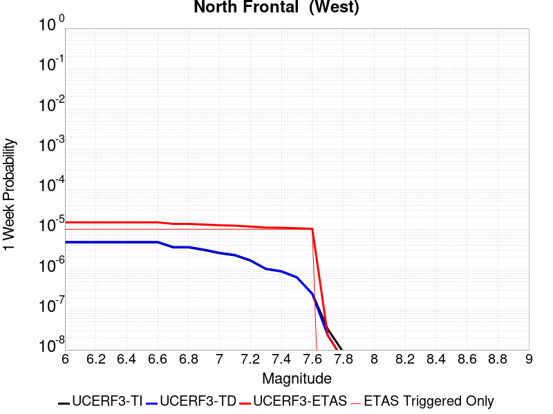 |  |  |  |

| Magnitude | 1 wk TI Prob | 1 wk TD Prob | 1 wk ETAS Prob | 1 wk ETAS/TD Gain | 1 wk ETAS Triggered Only | 1 mo TI Prob | 1 mo TD Prob | 1 mo ETAS Prob | 1 mo ETAS/TD Gain | 1 mo ETAS Triggered Only | 1 yr TI Prob | 1 yr TD Prob | 1 yr ETAS Prob | 1 yr ETAS/TD Gain | 1 yr ETAS Triggered Only | 10 yr TI Prob | 10 yr TD Prob | 10 yr ETAS Prob | 10 yr ETAS/TD Gain | 10 yr ETAS Triggered Only |
|-----|-----|-----|-----|-----|-----|-----|-----|-----|-----|-----|-----|-----|-----|-----|-----|-----|-----|-----|-----|-----|
| 6.0 | 4.7316266E-6 | 4.8526726E-6 | 1.3586212E-4 | 27.997381 | 1.3101009E-4 | 2.0278241E-5 | 2.0797012E-5 | 2.8281173E-4 | 13.598672 | 2.6202018E-4 | 2.4685962E-4 | 2.5317568E-4 | 5.151295E-4 | 2.0346723 | 2.6202018E-4 | 0.0024658558 | 0.0025290183 | 0.0027903758 | 1.1033435 | 2.6202018E-4 |
| 6.1 | 4.7316266E-6 | 4.8526726E-6 | 1.3586212E-4 | 27.997381 | 1.3101009E-4 | 2.0278241E-5 | 2.0797012E-5 | 2.8281173E-4 | 13.598672 | 2.6202018E-4 | 2.4685962E-4 | 2.5317568E-4 | 5.151295E-4 | 2.0346723 | 2.6202018E-4 | 0.0024658558 | 0.0025290183 | 0.0027903758 | 1.1033435 | 2.6202018E-4 |
| 6.2 | 4.7316266E-6 | 4.8526726E-6 | 1.3586212E-4 | 27.997381 | 1.3101009E-4 | 2.0278241E-5 | 2.0797012E-5 | 2.8281173E-4 | 13.598672 | 2.6202018E-4 | 2.4685962E-4 | 2.5317568E-4 | 5.151295E-4 | 2.0346723 | 2.6202018E-4 | 0.0024658558 | 0.0025290183 | 0.0027903758 | 1.1033435 | 2.6202018E-4 |
| 6.3 | 4.7316266E-6 | 4.8526726E-6 | 1.3586212E-4 | 27.997381 | 1.3101009E-4 | 2.0278241E-5 | 2.0797012E-5 | 2.8281173E-4 | 13.598672 | 2.6202018E-4 | 2.4685962E-4 | 2.5317568E-4 | 5.151295E-4 | 2.0346723 | 2.6202018E-4 | 0.0024658558 | 0.0025290183 | 0.0027903758 | 1.1033435 | 2.6202018E-4 |
| 6.4 | 4.7316266E-6 | 4.8526726E-6 | 1.3586212E-4 | 27.997381 | 1.3101009E-4 | 2.0278241E-5 | 2.0797012E-5 | 2.8281173E-4 | 13.598672 | 2.6202018E-4 | 2.4685962E-4 | 2.5317568E-4 | 5.151295E-4 | 2.0346723 | 2.6202018E-4 | 0.0024658558 | 0.0025290183 | 0.0027903758 | 1.1033435 | 2.6202018E-4 |
| 6.5 | 4.7316266E-6 | 4.8526726E-6 | 1.3586212E-4 | 27.997381 | 1.3101009E-4 | 2.0278241E-5 | 2.0797012E-5 | 2.8281173E-4 | 13.598672 | 2.6202018E-4 | 2.4685962E-4 | 2.5317568E-4 | 5.151295E-4 | 2.0346723 | 2.6202018E-4 | 0.0024658558 | 0.0025290183 | 0.0027903758 | 1.1033435 | 2.6202018E-4 |
| 6.6 | 4.7316266E-6 | 4.8526726E-6 | 1.3586212E-4 | 27.997381 | 1.3101009E-4 | 2.0278241E-5 | 2.0797012E-5 | 2.8281173E-4 | 13.598672 | 2.6202018E-4 | 2.4685962E-4 | 2.5317568E-4 | 5.151295E-4 | 2.0346723 | 2.6202018E-4 | 0.0024658558 | 0.0025290183 | 0.0027903758 | 1.1033435 | 2.6202018E-4 |
| 6.7 | 3.5382777E-6 | 3.6308859E-6 | 1.346405E-4 | 37.081997 | 1.3101009E-4 | 1.516396E-5 | 1.5560852E-5 | 2.7757694E-4 | 17.83816 | 2.6202018E-4 | 1.8460557E-4 | 1.8943768E-4 | 4.514082E-4 | 2.3828852 | 2.6202018E-4 | 0.0018445229 | 0.0018928389 | 0.002154363 | 1.1381651 | 2.6202018E-4 |
| 6.8 | 3.5382777E-6 | 3.6308859E-6 | 1.346405E-4 | 37.081997 | 1.3101009E-4 | 1.516396E-5 | 1.5560852E-5 | 2.7757694E-4 | 17.83816 | 2.6202018E-4 | 1.8460557E-4 | 1.8943768E-4 | 4.514082E-4 | 2.3828852 | 2.6202018E-4 | 0.0018445229 | 0.0018928389 | 0.002154363 | 1.1381651 | 2.6202018E-4 |
| 6.9 | 3.0428037E-6 | 3.1227605E-6 | 1.3413244E-4 | 42.953163 | 1.3101009E-4 | 1.30405215E-5 | 1.33831945E-5 | 2.7539986E-4 | 20.578035 | 2.6202018E-4 | 1.5875678E-4 | 1.6292889E-4 | 4.2490638E-4 | 2.6079252 | 2.6202018E-4 | 0.0015864341 | 0.0016281615 | 0.0018897551 | 1.160668 | 2.6202018E-4 |
| 7.0 | 2.538778E-6 | 2.6060904E-6 | 1.3361583E-4 | 51.270607 | 1.3101009E-4 | 1.0880432E-5 | 1.1168913E-5 | 2.7318616E-4 | 24.45951 | 2.6202018E-4 | 1.324612E-4 | 1.3597352E-4 | 3.9795807E-4 | 2.9267323 | 2.6202018E-4 | 0.0013238228 | 0.0013589499 | 0.001620614 | 1.1925488 | 2.6202018E-4 |
| 7.1 | 2.2418935E-6 | 2.3012074E-6 | 1.33311E-4 | 57.930893 | 1.3101009E-4 | 9.60808E-6 | 9.862282E-6 | 2.7187986E-4 | 27.567642 | 2.6202018E-4 | 1.1697209E-4 | 1.2006712E-4 | 3.8205582E-4 | 3.182019 | 2.6202018E-4 | 0.0011691054 | 0.0012000664 | 0.0014617721 | 1.218076 | 2.6202018E-4 |
| 7.2 | 1.6526745E-6 | 1.6924851E-6 | 1.3270235E-4 | 78.40681 | 1.3101009E-4 | 7.082872E-6 | 7.253489E-6 | 2.6927175E-4 | 37.12307 | 2.6202018E-4 | 8.623055E-5 | 8.8307905E-5 | 3.5030494E-4 | 3.9668584 | 2.6202018E-4 | 8.61971E-4 | 8.827532E-4 | 0.001144542 | 1.2965596 | 2.6202018E-4 |
| 7.3 | 1.0246019E-6 | 1.0442261E-6 | 1.3205418E-4 | 126.461296 | 1.3101009E-4 | 4.391144E-6 | 4.4752474E-6 | 2.6649426E-4 | 59.548492 | 2.6202018E-4 | 5.3460866E-5 | 5.448489E-5 | 3.164908E-4 | 5.8087807 | 2.6202018E-4 | 5.344801E-4 | 5.4472685E-4 | 8.066043E-4 | 1.4807501 | 2.6202018E-4 |
| 7.4 | 8.9045164E-7 | 9.0565584E-7 | 1.3191563E-4 | 145.65756 | 1.3101009E-4 | 3.8162157E-6 | 3.8813773E-6 | 2.6590054E-4 | 68.50675 | 2.6202018E-4 | 4.646144E-5 | 4.7254853E-5 | 3.0926266E-4 | 6.544569 | 2.6202018E-4 | 4.6451724E-4 | 4.7245892E-4 | 7.343553E-4 | 1.5543263 | 2.6202018E-4 |
| 7.5 | 6.3357E-7 | 6.4027006E-7 | 1.3165027E-4 | 205.61679 | 1.3101009E-4 | 2.7152971E-6 | 2.744012E-6 | 2.6476348E-4 | 96.487724 | 2.6202018E-4 | 3.305824E-5 | 3.34079E-5 | 2.9541933E-4 | 8.842798 | 2.6202018E-4 | 3.3053322E-4 | 3.3403534E-4 | 5.95968E-4 | 1.7841465 | 2.6202018E-4 |
| 7.6 | 2.5087024E-7 | 2.4361097E-7 | 1.3125366E-4 | 538.7839 | 1.3101009E-4 | 1.0751578E-6 | 1.0440467E-6 | 1.32054E-4 | 126.48284 | 1.3101009E-4 | 1.3089967E-5 | 1.2711216E-5 | 1.4371963E-4 | 11.306521 | 1.3101009E-4 | 1.3089196E-4 | 1.2710695E-4 | 2.581004E-4 | 2.0305765 | 1.3101009E-4 |
| 7.7 | 3.282987E-8 | 2.2874195E-8 | 2.2874195E-8 | 1.0 | 0.0 | 1.4069944E-7 | 9.803227E-8 | 9.803227E-8 | 1.0 | 0.0 | 1.7130144E-6 | 1.1935423E-6 | 1.1935423E-6 | 1.0 | 0.0 | 1.7130013E-5 | 1.1935367E-5 | 1.1935367E-5 | 1.0 | 0.0 |
| 7.8 | 8.77499E-9 | 5.6815956E-9 | 5.6815956E-9 | 1.0 | 0.0 | 3.7607098E-8 | 2.4349696E-8 | 2.4349696E-8 | 1.0 | 0.0 | 4.578663E-7 | 2.9645753E-7 | 2.9645753E-7 | 1.0 | 0.0 | 4.5786537E-6 | 2.9645726E-6 | 2.9645726E-6 | 1.0 | 0.0 |

## San Jacinto (San Jacinto Valley) rev
*[(top)](#table-of-contents)*

| 1 Week | 1 Month | 1 Year | 10 Year |
|-----|-----|-----|-----|
|  |  |  |  |

| Magnitude | 1 wk TI Prob | 1 wk TD Prob | 1 wk ETAS Prob | 1 wk ETAS/TD Gain | 1 wk ETAS Triggered Only | 1 mo TI Prob | 1 mo TD Prob | 1 mo ETAS Prob | 1 mo ETAS/TD Gain | 1 mo ETAS Triggered Only | 1 yr TI Prob | 1 yr TD Prob | 1 yr ETAS Prob | 1 yr ETAS/TD Gain | 1 yr ETAS Triggered Only | 10 yr TI Prob | 10 yr TD Prob | 10 yr ETAS Prob | 10 yr ETAS/TD Gain | 10 yr ETAS Triggered Only |
|-----|-----|-----|-----|-----|-----|-----|-----|-----|-----|-----|-----|-----|-----|-----|-----|-----|-----|-----|-----|-----|
| 6.0 | 3.652694E-5 | 3.4402394E-5 | 2.9641355E-4 | 8.616074 | 2.6202018E-4 | 1.5653463E-4 | 1.474305E-4 | 4.0941205E-4 | 2.7769833 | 2.6202018E-4 | 0.0019041431 | 0.00179349 | 0.0020550403 | 1.1458331 | 2.6202018E-4 | 0.018879099 | 0.018526595 | 0.018783761 | 1.0138808 | 2.6202018E-4 |
| 6.1 | 3.652694E-5 | 3.4402394E-5 | 2.9641355E-4 | 8.616074 | 2.6202018E-4 | 1.5653463E-4 | 1.474305E-4 | 4.0941205E-4 | 2.7769833 | 2.6202018E-4 | 0.0019041431 | 0.00179349 | 0.0020550403 | 1.1458331 | 2.6202018E-4 | 0.018879099 | 0.018526595 | 0.018783761 | 1.0138808 | 2.6202018E-4 |
| 6.2 | 3.652694E-5 | 3.4402394E-5 | 2.9641355E-4 | 8.616074 | 2.6202018E-4 | 1.5653463E-4 | 1.474305E-4 | 4.0941205E-4 | 2.7769833 | 2.6202018E-4 | 0.0019041431 | 0.00179349 | 0.0020550403 | 1.1458331 | 2.6202018E-4 | 0.018879099 | 0.018526595 | 0.018783761 | 1.0138808 | 2.6202018E-4 |
| 6.3 | 3.652694E-5 | 3.4402394E-5 | 2.9641355E-4 | 8.616074 | 2.6202018E-4 | 1.5653463E-4 | 1.474305E-4 | 4.0941205E-4 | 2.7769833 | 2.6202018E-4 | 0.0019041431 | 0.00179349 | 0.0020550403 | 1.1458331 | 2.6202018E-4 | 0.018879099 | 0.018526595 | 0.018783761 | 1.0138808 | 2.6202018E-4 |
| 6.4 | 3.646941E-5 | 3.432397E-5 | 2.9633514E-4 | 8.633475 | 2.6202018E-4 | 1.5628811E-4 | 1.4709444E-4 | 4.0907608E-4 | 2.7810438 | 2.6202018E-4 | 0.0019011468 | 0.0017894056 | 0.002050957 | 1.1461666 | 2.6202018E-4 | 0.018849645 | 0.018486476 | 0.018743653 | 1.0139116 | 2.6202018E-4 |
| 6.5 | 3.646941E-5 | 3.432397E-5 | 2.9633514E-4 | 8.633475 | 2.6202018E-4 | 1.5628811E-4 | 1.4709444E-4 | 4.0907608E-4 | 2.7810438 | 2.6202018E-4 | 0.0019011468 | 0.0017894056 | 0.002050957 | 1.1461666 | 2.6202018E-4 | 0.018849645 | 0.018486476 | 0.018743653 | 1.0139116 | 2.6202018E-4 |
| 6.6 | 3.6442503E-5 | 3.4287354E-5 | 2.9629856E-4 | 8.641627 | 2.6202018E-4 | 1.561728E-4 | 1.4693754E-4 | 4.089192E-4 | 2.7829459 | 2.6202018E-4 | 0.0018997455 | 0.0017874985 | 0.0020490503 | 1.1463228 | 2.6202018E-4 | 0.018835869 | 0.018467745 | 0.018724926 | 1.0139259 | 2.6202018E-4 |
| 6.7 | 3.6432113E-5 | 3.4272925E-5 | 2.9628412E-4 | 8.644845 | 2.6202018E-4 | 1.5612828E-4 | 1.4687571E-4 | 4.088574E-4 | 2.7836964 | 2.6202018E-4 | 0.0018992044 | 0.0017867472 | 0.0020482992 | 1.1463845 | 2.6202018E-4 | 0.018830549 | 0.018460369 | 0.018717552 | 1.0139316 | 2.6202018E-4 |
| 6.8 | 3.6409598E-5 | 3.424198E-5 | 2.962532E-4 | 8.651753 | 2.6202018E-4 | 1.560318E-4 | 1.4674311E-4 | 4.0872482E-4 | 2.7853086 | 2.6202018E-4 | 0.0018980318 | 0.0017851355 | 0.0020466878 | 1.1465168 | 2.6202018E-4 | 0.018819023 | 0.018444523 | 0.01870171 | 1.0139438 | 2.6202018E-4 |
| 6.9 | 3.638078E-5 | 3.4202407E-5 | 2.962136E-4 | 8.660607 | 2.6202018E-4 | 1.5590832E-4 | 1.4657351E-4 | 4.085553E-4 | 2.7873745 | 2.6202018E-4 | 0.0018965311 | 0.001783074 | 0.002044627 | 1.1466866 | 2.6202018E-4 | 0.018804269 | 0.018424258 | 0.01868145 | 1.0139594 | 2.6202018E-4 |
| 7.0 | 3.6294874E-5 | 3.408442E-5 | 2.9609568E-4 | 8.687126 | 2.6202018E-4 | 1.5554018E-4 | 1.4606792E-4 | 4.0804982E-4 | 2.7935622 | 2.6202018E-4 | 0.0018920569 | 0.001776929 | 0.0020384835 | 1.1471947 | 2.6202018E-4 | 0.018760284 | 0.018363839 | 0.018621048 | 1.0140063 | 2.6202018E-4 |
| 7.1 | 3.6260717E-5 | 3.4040702E-5 | 2.9605196E-4 | 8.697 | 2.6202018E-4 | 1.5539382E-4 | 1.4588058E-4 | 4.0786254E-4 | 2.7958658 | 2.6202018E-4 | 0.001890278 | 0.0017746518 | 0.0020362071 | 1.1473839 | 2.6202018E-4 | 0.018742796 | 0.018341439 | 0.018598653 | 1.0140237 | 2.6202018E-4 |
| 7.2 | 3.6210204E-5 | 3.397492E-5 | 2.959862E-4 | 8.711903 | 2.6202018E-4 | 1.5517735E-4 | 1.455987E-4 | 4.0758072E-4 | 2.7993433 | 2.6202018E-4 | 0.001887647 | 0.0017712255 | 0.0020327815 | 1.1476696 | 2.6202018E-4 | 0.01871693 | 0.01830772 | 0.018564943 | 1.01405 | 2.6202018E-4 |
| 7.3 | 3.6119454E-5 | 3.386321E-5 | 2.9587452E-4 | 8.737345 | 2.6202018E-4 | 1.5478847E-4 | 1.4511998E-4 | 4.0710214E-4 | 2.8052797 | 2.6202018E-4 | 0.0018829206 | 0.0017654065 | 0.0020269642 | 1.1481571 | 2.6202018E-4 | 0.018670462 | 0.018250274 | 0.01850751 | 1.0140951 | 2.6202018E-4 |
| 7.4 | 3.607848E-5 | 3.381071E-5 | 2.95822E-4 | 8.749359 | 2.6202018E-4 | 1.5461289E-4 | 1.44895E-4 | 4.0687723E-4 | 2.808083 | 2.6202018E-4 | 0.0018807866 | 0.0017626719 | 0.0020242303 | 1.1483874 | 2.6202018E-4 | 0.018649481 | 0.018223269 | 0.018480513 | 1.0141163 | 2.6202018E-4 |
| 7.5 | 3.5856774E-5 | 3.3620483E-5 | 2.9563185E-4 | 8.793207 | 2.6202018E-4 | 1.5366284E-4 | 1.4407984E-4 | 4.0606226E-4 | 2.8183143 | 2.6202018E-4 | 0.0018692396 | 0.0017527633 | 0.002014324 | 1.1492277 | 2.6202018E-4 | 0.018535944 | 0.018124366 | 0.018381638 | 1.0141947 | 2.6202018E-4 |
| 7.6 | 3.286655E-5 | 3.2143445E-5 | 2.941552E-4 | 9.151327 | 2.6202018E-4 | 1.4084904E-4 | 1.3775036E-4 | 3.9973445E-4 | 2.9018757 | 2.6202018E-4 | 0.001713488 | 0.0016758227 | 0.0019374037 | 1.1560911 | 2.6202018E-4 | 0.017003361 | 0.017344031 | 0.017601507 | 1.0148453 | 2.6202018E-4 |
| 7.7 | 2.8882527E-5 | 2.9236293E-5 | 2.912488E-4 | 9.961892 | 2.6202018E-4 | 1.237764E-4 | 1.2529238E-4 | 3.8727972E-4 | 3.0910077 | 2.6202018E-4 | 0.0015059357 | 0.0015243685 | 0.0017859893 | 1.1716256 | 2.6202018E-4 | 0.014957713 | 0.015830461 | 0.016088333 | 1.0162896 | 2.6202018E-4 |
| 7.8 | 2.4950225E-5 | 2.6527203E-5 | 2.8854044E-4 | 10.877152 | 2.6202018E-4 | 1.0692515E-4 | 1.1368306E-4 | 3.7567347E-4 | 3.3045683 | 2.6202018E-4 | 0.0013010362 | 0.0013832134 | 0.0016448712 | 1.1891665 | 2.6202018E-4 | 0.012934455 | 0.014411755 | 0.014669999 | 1.017919 | 2.6202018E-4 |
| 7.9 | 1.9881603E-5 | 2.1507445E-5 | 2.8352198E-4 | 13.182504 | 2.6202018E-4 | 8.520408E-5 | 9.217151E-5 | 3.5416754E-4 | 3.8424838 | 2.6202018E-4 | 0.001036866 | 0.0011216112 | 0.0013833375 | 1.2333485 | 2.6202018E-4 | 0.010320415 | 0.011777027 | 0.012035961 | 1.0219864 | 2.6202018E-4 |
| 8.0 | 1.563292E-5 | 1.5937347E-5 | 1.4694534E-4 | 9.220189 | 1.3101009E-4 | 6.6996516E-5 | 6.8301124E-5 | 1.9930226E-4 | 2.9179938 | 1.3101009E-4 | 8.153773E-4 | 8.3124964E-4 | 9.621508E-4 | 1.1574752 | 1.3101009E-4 | 0.00812392 | 0.008810506 | 0.008940362 | 1.0147388 | 1.3101009E-4 |
| 8.1 | 1.0045313E-5 | 8.301802E-6 | 1.393108E-4 | 16.78079 | 1.3101009E-4 | 4.305063E-5 | 3.5578672E-5 | 1.665841E-4 | 4.6821337 | 1.3101009E-4 | 5.2401534E-4 | 4.3308473E-4 | 5.640381E-4 | 1.3023735 | 1.3101009E-4 | 0.0052278144 | 0.0046591135 | 0.0047895135 | 1.0279881 | 1.3101009E-4 |
| 8.2 | 4.1554413E-6 | 1.5655598E-6 | 1.5655598E-6 | 1.0 | 0.0 | 1.7808914E-5 | 6.709525E-6 | 6.709525E-6 | 1.0 | 0.0 | 2.1680194E-4 | 8.168544E-5 | 8.168544E-5 | 1.0 | 0.0 | 0.0021659054 | 9.482903E-4 | 9.482903E-4 | 1.0 | 0.0 |
| 8.3 | 1.2758221E-6 | 3.6149942E-7 | 3.6149942E-7 | 1.0 | 0.0 | 5.4677976E-6 | 1.5492824E-6 | 1.5492824E-6 | 1.0 | 0.0 | 6.65684E-5 | 1.8862354E-5 | 1.8862354E-5 | 1.0 | 0.0 | 6.6548464E-4 | 2.2751294E-4 | 2.2751294E-4 | 1.0 | 0.0 |

## Cucamonga
*[(top)](#table-of-contents)*

| 1 Week | 1 Month | 1 Year | 10 Year |
|-----|-----|-----|-----|
|  |  |  | 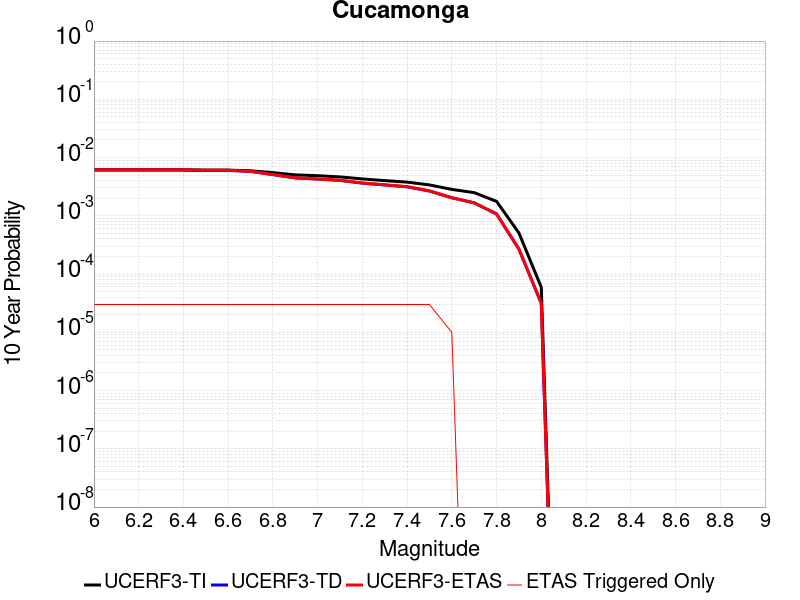 |

| Magnitude | 1 wk TI Prob | 1 wk TD Prob | 1 wk ETAS Prob | 1 wk ETAS/TD Gain | 1 wk ETAS Triggered Only | 1 mo TI Prob | 1 mo TD Prob | 1 mo ETAS Prob | 1 mo ETAS/TD Gain | 1 mo ETAS Triggered Only | 1 yr TI Prob | 1 yr TD Prob | 1 yr ETAS Prob | 1 yr ETAS/TD Gain | 1 yr ETAS Triggered Only | 10 yr TI Prob | 10 yr TD Prob | 10 yr ETAS Prob | 10 yr ETAS/TD Gain | 10 yr ETAS Triggered Only |
|-----|-----|-----|-----|-----|-----|-----|-----|-----|-----|-----|-----|-----|-----|-----|-----|-----|-----|-----|-----|-----|
| 6.0 | 1.1848348E-5 | 1.1737008E-5 | 1.4274556E-4 | 12.162005 | 1.3101009E-4 | 5.0777642E-5 | 5.030051E-5 | 3.123075E-4 | 6.2088337 | 2.6202018E-4 | 6.180424E-4 | 6.1223935E-4 | 8.740991E-4 | 1.4277081 | 2.6202018E-4 | 0.0061632637 | 0.0061067017 | 0.006367122 | 1.042645 | 2.6202018E-4 |
| 6.1 | 1.1848348E-5 | 1.1737008E-5 | 1.4274556E-4 | 12.162005 | 1.3101009E-4 | 5.0777642E-5 | 5.030051E-5 | 3.123075E-4 | 6.2088337 | 2.6202018E-4 | 6.180424E-4 | 6.1223935E-4 | 8.740991E-4 | 1.4277081 | 2.6202018E-4 | 0.0061632637 | 0.0061067017 | 0.006367122 | 1.042645 | 2.6202018E-4 |
| 6.2 | 1.1848348E-5 | 1.1737008E-5 | 1.4274556E-4 | 12.162005 | 1.3101009E-4 | 5.0777642E-5 | 5.030051E-5 | 3.123075E-4 | 6.2088337 | 2.6202018E-4 | 6.180424E-4 | 6.1223935E-4 | 8.740991E-4 | 1.4277081 | 2.6202018E-4 | 0.0061632637 | 0.0061067017 | 0.006367122 | 1.042645 | 2.6202018E-4 |
| 6.3 | 1.1848348E-5 | 1.1737008E-5 | 1.4274556E-4 | 12.162005 | 1.3101009E-4 | 5.0777642E-5 | 5.030051E-5 | 3.123075E-4 | 6.2088337 | 2.6202018E-4 | 6.180424E-4 | 6.1223935E-4 | 8.740991E-4 | 1.4277081 | 2.6202018E-4 | 0.0061632637 | 0.0061067017 | 0.006367122 | 1.042645 | 2.6202018E-4 |
| 6.4 | 1.1848348E-5 | 1.1737008E-5 | 1.4274556E-4 | 12.162005 | 1.3101009E-4 | 5.0777642E-5 | 5.030051E-5 | 3.123075E-4 | 6.2088337 | 2.6202018E-4 | 6.180424E-4 | 6.1223935E-4 | 8.740991E-4 | 1.4277081 | 2.6202018E-4 | 0.0061632637 | 0.0061067017 | 0.006367122 | 1.042645 | 2.6202018E-4 |
| 6.5 | 1.16988695E-5 | 1.15760395E-5 | 1.4258461E-4 | 12.317219 | 1.3101009E-4 | 5.013705E-5 | 4.9610666E-5 | 3.1161786E-4 | 6.2812667 | 2.6202018E-4 | 6.102476E-4 | 6.0384517E-4 | 8.657071E-4 | 1.4336574 | 2.6202018E-4 | 0.006085745 | 0.006023216 | 0.006283658 | 1.0432397 | 2.6202018E-4 |
| 6.6 | 1.16988695E-5 | 1.15760395E-5 | 1.4258461E-4 | 12.317219 | 1.3101009E-4 | 5.013705E-5 | 4.9610666E-5 | 3.1161786E-4 | 6.2812667 | 2.6202018E-4 | 6.102476E-4 | 6.0384517E-4 | 8.657071E-4 | 1.4336574 | 2.6202018E-4 | 0.006085745 | 0.006023216 | 0.006283658 | 1.0432397 | 2.6202018E-4 |
| 6.7 | 1.1397107E-5 | 1.11149475E-5 | 1.4212358E-4 | 12.786707 | 1.3101009E-4 | 4.884383E-5 | 4.7634636E-5 | 3.0964232E-4 | 6.5003614 | 2.6202018E-4 | 5.9451134E-4 | 5.797998E-4 | 8.416681E-4 | 1.4516529 | 2.6202018E-4 | 0.005929234 | 0.0057840226 | 0.0060445275 | 1.0450387 | 2.6202018E-4 |
| 6.8 | 1.058387E-5 | 9.784992E-6 | 1.407938E-4 | 14.38875 | 1.3101009E-4 | 4.5358654E-5 | 4.193501E-5 | 3.039442E-4 | 7.247982 | 2.6202018E-4 | 5.521017E-4 | 5.1044027E-4 | 7.7232666E-4 | 1.5130599 | 2.6202018E-4 | 0.00550732 | 0.0050936877 | 0.0053543733 | 1.0511781 | 2.6202018E-4 |
| 6.9 | 9.690046E-6 | 8.57948E-6 | 1.3958845E-4 | 16.270035 | 1.3101009E-4 | 4.1528107E-5 | 3.6768684E-5 | 2.9877922E-4 | 8.125916 | 2.6202018E-4 | 5.054874E-4 | 4.475672E-4 | 7.0947007E-4 | 1.58517 | 2.6202018E-4 | 0.005043391 | 0.004467594 | 0.0047284435 | 1.058387 | 2.6202018E-4 |
| 7.0 | 9.381461E-6 | 8.187101E-6 | 1.3919611E-4 | 17.00188 | 1.3101009E-4 | 4.020564E-5 | 3.5087105E-5 | 2.970981E-4 | 8.467443 | 2.6202018E-4 | 4.893937E-4 | 4.2710215E-4 | 6.890104E-4 | 1.6132216 | 2.6202018E-4 | 0.0048831734 | 0.0042637475 | 0.0045246505 | 1.061191 | 2.6202018E-4 |
| 7.1 | 8.946492E-6 | 7.781886E-6 | 1.3879096E-4 | 17.83513 | 1.3101009E-4 | 3.8341543E-5 | 3.3350516E-5 | 2.9536194E-4 | 8.856294 | 2.6202018E-4 | 4.667083E-4 | 4.0596718E-4 | 6.67881E-4 | 1.6451601 | 2.6202018E-4 | 0.0046572937 | 0.004053192 | 0.00431415 | 1.0643834 | 2.6202018E-4 |
| 7.2 | 8.251016E-6 | 6.9752796E-6 | 1.3798445E-4 | 19.781925 | 1.3101009E-4 | 3.5361016E-5 | 2.9893714E-5 | 2.9190606E-4 | 9.764797 | 2.6202018E-4 | 4.3043532E-4 | 3.6389544E-4 | 6.2582025E-4 | 1.7197804 | 2.6202018E-4 | 0.0042960253 | 0.0036339292 | 0.003894997 | 1.0718418 | 2.6202018E-4 |
| 7.3 | 7.717881E-6 | 6.4863502E-6 | 1.3749559E-4 | 21.197681 | 1.3101009E-4 | 3.3076216E-5 | 2.7798349E-5 | 2.8981123E-4 | 10.425484 | 2.6202018E-4 | 4.026285E-4 | 3.3839257E-4 | 6.0032407E-4 | 1.7740463 | 2.6202018E-4 | 0.004018998 | 0.00337971 | 0.0036408447 | 1.0772654 | 2.6202018E-4 |
| 7.4 | 7.275623E-6 | 6.031997E-6 | 1.370413E-4 | 22.719059 | 1.3101009E-4 | 3.118087E-5 | 2.585116E-5 | 2.8786456E-4 | 11.13546 | 2.6202018E-4 | 3.7956095E-4 | 3.1469265E-4 | 5.7663035E-4 | 1.8323605 | 2.6202018E-4 | 0.0037891332 | 0.0031434062 | 0.0034046029 | 1.0830935 | 2.6202018E-4 |
| 7.5 | 6.5109502E-6 | 5.1006014E-6 | 1.3611001E-4 | 26.685093 | 1.3101009E-4 | 2.7903774E-5 | 2.1859538E-5 | 2.83874E-4 | 12.986276 | 2.6202018E-4 | 3.3967546E-4 | 2.661075E-4 | 5.28058E-4 | 1.9843782 | 2.6202018E-4 | 0.0033915674 | 0.002658813 | 0.0029201366 | 1.0982858 | 2.6202018E-4 |
| 7.6 | 5.4495326E-6 | 3.90857E-6 | 1.3491814E-4 | 34.518543 | 1.3101009E-4 | 2.335493E-5 | 1.6750908E-5 | 1.477588E-4 | 8.820943 | 1.3101009E-4 | 2.8430918E-4 | 2.0392328E-4 | 3.3490665E-4 | 1.6423169 | 1.3101009E-4 | 0.0028394572 | 0.002038282 | 0.0021690254 | 1.0641438 | 1.3101009E-4 |
| 7.7 | 4.7997164E-6 | 3.2002547E-6 | 3.2002547E-6 | 1.0 | 0.0 | 2.057005E-5 | 1.3715306E-5 | 1.3715306E-5 | 1.0 | 0.0 | 2.504116E-4 | 1.6697108E-4 | 1.6697108E-4 | 1.0 | 0.0 | 0.002501296 | 0.0016693877 | 0.0016693877 | 1.0 | 0.0 |
| 7.8 | 3.3941733E-6 | 2.0641899E-6 | 2.0641899E-6 | 1.0 | 0.0 | 1.4546376E-5 | 8.846498E-6 | 8.846498E-6 | 1.0 | 0.0 | 1.7708774E-4 | 1.07700806E-4 | 1.07700806E-4 | 1.0 | 0.0 | 0.0017694668 | 0.001076723 | 0.001076723 | 1.0 | 0.0 |
| 7.9 | 9.750552E-7 | 5.155946E-7 | 5.155946E-7 | 1.0 | 0.0 | 4.178801E-6 | 2.2096892E-6 | 2.2096892E-6 | 1.0 | 0.0 | 5.0875715E-5 | 2.690264E-5 | 2.690264E-5 | 1.0 | 0.0 | 5.086407E-4 | 2.6899425E-4 | 2.6899425E-4 | 1.0 | 0.0 |
| 8.0 | 1.133857E-7 | 6.053707E-8 | 6.053707E-8 | 1.0 | 0.0 | 4.8593864E-7 | 2.5944456E-7 | 2.5944456E-7 | 1.0 | 0.0 | 5.9162867E-6 | 3.158733E-6 | 3.158733E-6 | 1.0 | 0.0 | 5.916129E-5 | 3.1586897E-5 | 3.1586897E-5 | 1.0 | 0.0 |

## North Frontal  (East)
*[(top)](#table-of-contents)*

| 1 Week | 1 Month | 1 Year | 10 Year |
|-----|-----|-----|-----|
| 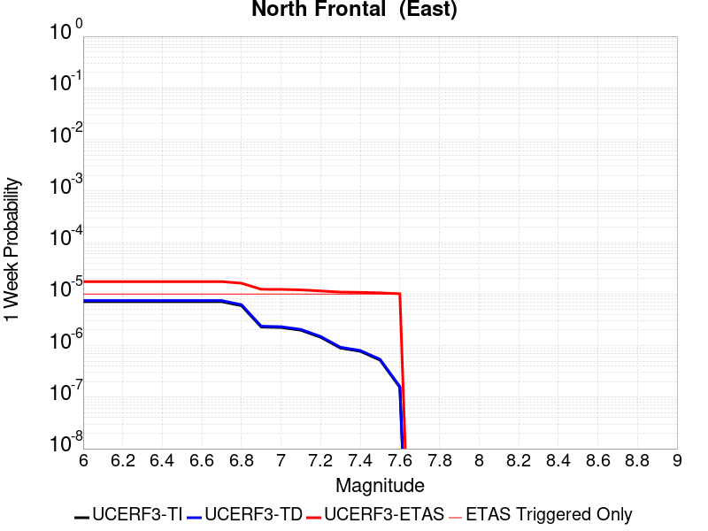 |  |  |  |

| Magnitude | 1 wk TI Prob | 1 wk TD Prob | 1 wk ETAS Prob | 1 wk ETAS/TD Gain | 1 wk ETAS Triggered Only | 1 mo TI Prob | 1 mo TD Prob | 1 mo ETAS Prob | 1 mo ETAS/TD Gain | 1 mo ETAS Triggered Only | 1 yr TI Prob | 1 yr TD Prob | 1 yr ETAS Prob | 1 yr ETAS/TD Gain | 1 yr ETAS Triggered Only | 10 yr TI Prob | 10 yr TD Prob | 10 yr ETAS Prob | 10 yr ETAS/TD Gain | 10 yr ETAS Triggered Only |
|-----|-----|-----|-----|-----|-----|-----|-----|-----|-----|-----|-----|-----|-----|-----|-----|-----|-----|-----|-----|-----|
| 6.0 | 7.135738E-6 | 7.4771765E-6 | 1.3848628E-4 | 18.5212 | 1.3101009E-4 | 3.0581377E-5 | 3.204476E-5 | 2.9405655E-4 | 9.176431 | 2.6202018E-4 | 3.7226462E-4 | 3.9009505E-4 | 6.52013E-4 | 1.6714208 | 2.6202018E-4 | 0.0037164164 | 0.0038960609 | 0.0041570603 | 1.0669906 | 2.6202018E-4 |
| 6.1 | 7.135738E-6 | 7.4771765E-6 | 1.3848628E-4 | 18.5212 | 1.3101009E-4 | 3.0581377E-5 | 3.204476E-5 | 2.9405655E-4 | 9.176431 | 2.6202018E-4 | 3.7226462E-4 | 3.9009505E-4 | 6.52013E-4 | 1.6714208 | 2.6202018E-4 | 0.0037164164 | 0.0038960609 | 0.0041570603 | 1.0669906 | 2.6202018E-4 |
| 6.2 | 7.135738E-6 | 7.4771765E-6 | 1.3848628E-4 | 18.5212 | 1.3101009E-4 | 3.0581377E-5 | 3.204476E-5 | 2.9405655E-4 | 9.176431 | 2.6202018E-4 | 3.7226462E-4 | 3.9009505E-4 | 6.52013E-4 | 1.6714208 | 2.6202018E-4 | 0.0037164164 | 0.0038960609 | 0.0041570603 | 1.0669906 | 2.6202018E-4 |
| 6.3 | 7.135738E-6 | 7.4771765E-6 | 1.3848628E-4 | 18.5212 | 1.3101009E-4 | 3.0581377E-5 | 3.204476E-5 | 2.9405655E-4 | 9.176431 | 2.6202018E-4 | 3.7226462E-4 | 3.9009505E-4 | 6.52013E-4 | 1.6714208 | 2.6202018E-4 | 0.0037164164 | 0.0038960609 | 0.0041570603 | 1.0669906 | 2.6202018E-4 |
| 6.4 | 7.135738E-6 | 7.4771765E-6 | 1.3848628E-4 | 18.5212 | 1.3101009E-4 | 3.0581377E-5 | 3.204476E-5 | 2.9405655E-4 | 9.176431 | 2.6202018E-4 | 3.7226462E-4 | 3.9009505E-4 | 6.52013E-4 | 1.6714208 | 2.6202018E-4 | 0.0037164164 | 0.0038960609 | 0.0041570603 | 1.0669906 | 2.6202018E-4 |
| 6.5 | 7.135738E-6 | 7.4771765E-6 | 1.3848628E-4 | 18.5212 | 1.3101009E-4 | 3.0581377E-5 | 3.204476E-5 | 2.9405655E-4 | 9.176431 | 2.6202018E-4 | 3.7226462E-4 | 3.9009505E-4 | 6.52013E-4 | 1.6714208 | 2.6202018E-4 | 0.0037164164 | 0.0038960609 | 0.0041570603 | 1.0669906 | 2.6202018E-4 |
| 6.6 | 7.135738E-6 | 7.4771765E-6 | 1.3848628E-4 | 18.5212 | 1.3101009E-4 | 3.0581377E-5 | 3.204476E-5 | 2.9405655E-4 | 9.176431 | 2.6202018E-4 | 3.7226462E-4 | 3.9009505E-4 | 6.52013E-4 | 1.6714208 | 2.6202018E-4 | 0.0037164164 | 0.0038960609 | 0.0041570603 | 1.0669906 | 2.6202018E-4 |
| 6.7 | 7.135738E-6 | 7.4771765E-6 | 1.3848628E-4 | 18.5212 | 1.3101009E-4 | 3.0581377E-5 | 3.204476E-5 | 2.9405655E-4 | 9.176431 | 2.6202018E-4 | 3.7226462E-4 | 3.9009505E-4 | 6.52013E-4 | 1.6714208 | 2.6202018E-4 | 0.0037164164 | 0.0038960609 | 0.0041570603 | 1.0669906 | 2.6202018E-4 |
| 6.8 | 5.959142E-6 | 6.236683E-6 | 1.3724595E-4 | 22.006243 | 1.3101009E-4 | 2.553893E-5 | 2.6728469E-5 | 2.8874163E-4 | 10.802775 | 2.6202018E-4 | 3.108921E-4 | 3.253886E-4 | 5.873235E-4 | 1.8049911 | 2.6202018E-4 | 0.0031045752 | 0.0032508948 | 0.003512063 | 1.0803374 | 2.6202018E-4 |
| 6.9 | 2.2946929E-6 | 2.3824605E-6 | 1.3339224E-4 | 55.989273 | 1.3101009E-4 | 9.834361E-6 | 1.0210508E-5 | 2.72228E-4 | 26.661554 | 2.6202018E-4 | 1.1972676E-4 | 1.2430632E-4 | 3.8629392E-4 | 3.1075969 | 2.6202018E-4 | 0.0011966228 | 0.0012424142 | 0.0015041089 | 1.210634 | 2.6202018E-4 |
| 7.0 | 2.2468673E-6 | 2.3321538E-6 | 1.3334193E-4 | 57.17545 | 1.3101009E-4 | 9.629396E-6 | 9.994909E-6 | 2.7201246E-4 | 27.215101 | 2.6202018E-4 | 1.1723159E-4 | 1.21681696E-4 | 3.8366998E-4 | 3.1530626 | 2.6202018E-4 | 0.0011716976 | 0.0012161969 | 0.0014778984 | 1.2151802 | 2.6202018E-4 |
| 7.1 | 1.9921076E-6 | 2.0646032E-6 | 1.3307443E-4 | 64.4552 | 1.3101009E-4 | 8.537577E-6 | 8.848272E-6 | 2.7086612E-4 | 30.61232 | 2.6202018E-4 | 1.0394004E-4 | 1.0772282E-4 | 3.6971478E-4 | 3.4320934 | 2.6202018E-4 | 0.0010389143 | 0.0010767487 | 0.0013384868 | 1.2430818 | 2.6202018E-4 |
| 7.2 | 1.4524545E-6 | 1.5045148E-6 | 1.3251441E-4 | 88.077835 | 1.3101009E-4 | 6.2247905E-6 | 6.447906E-6 | 2.684664E-4 | 41.636215 | 2.6202018E-4 | 7.5784184E-5 | 7.850068E-5 | 3.405003E-4 | 4.337546 | 2.6202018E-4 | 7.575835E-4 | 7.8475394E-4 | 0.0010465685 | 1.3336263 | 2.6202018E-4 |
| 7.3 | 8.9802575E-7 | 9.3087283E-7 | 1.3194083E-4 | 141.73885 | 1.3101009E-4 | 3.848676E-6 | 3.9894494E-6 | 2.6600857E-4 | 66.67802 | 2.6202018E-4 | 4.685662E-5 | 4.857058E-5 | 3.1057803E-4 | 6.3943653 | 2.6202018E-4 | 4.6846745E-4 | 4.8561094E-4 | 7.475039E-4 | 1.539306 | 2.6202018E-4 |
| 7.4 | 7.776139E-7 | 8.0604747E-7 | 1.3181604E-4 | 163.53383 | 1.3101009E-4 | 3.3326266E-6 | 3.4544853E-6 | 2.6547376E-4 | 76.84901 | 2.6202018E-4 | 4.0573974E-5 | 4.2057654E-5 | 3.040668E-4 | 7.229761 | 2.6202018E-4 | 4.0566566E-4 | 4.205077E-4 | 6.824177E-4 | 1.6228423 | 2.6202018E-4 |
| 7.5 | 5.244417E-7 | 5.441219E-7 | 1.3155414E-4 | 241.77327 | 1.3101009E-4 | 2.2476054E-6 | 2.3319494E-6 | 2.6435152E-4 | 113.36074 | 2.6202018E-4 | 2.7364253E-5 | 2.839118E-5 | 2.9040393E-4 | 10.228666 | 2.6202018E-4 | 2.7360884E-4 | 2.8388205E-4 | 5.4582785E-4 | 1.9227276 | 2.6202018E-4 |
| 7.6 | 1.5489647E-7 | 1.6089504E-7 | 1.3117096E-4 | 815.25793 | 1.3101009E-4 | 6.6384183E-7 | 6.895501E-7 | 1.3169955E-4 | 190.99344 | 1.3101009E-4 | 8.082245E-6 | 8.395261E-6 | 1.3940425E-4 | 16.605112 | 1.3101009E-4 | 8.08195E-5 | 8.395143E-5 | 2.1495052E-4 | 2.5604153 | 1.3101009E-4 |

## San Jacinto (Stepovers Combined)
*[(top)](#table-of-contents)*

| 1 Week | 1 Month | 1 Year | 10 Year |
|-----|-----|-----|-----|
|  |  |  |  |

| Magnitude | 1 wk TI Prob | 1 wk TD Prob | 1 wk ETAS Prob | 1 wk ETAS/TD Gain | 1 wk ETAS Triggered Only | 1 mo TI Prob | 1 mo TD Prob | 1 mo ETAS Prob | 1 mo ETAS/TD Gain | 1 mo ETAS Triggered Only | 1 yr TI Prob | 1 yr TD Prob | 1 yr ETAS Prob | 1 yr ETAS/TD Gain | 1 yr ETAS Triggered Only | 10 yr TI Prob | 10 yr TD Prob | 10 yr ETAS Prob | 10 yr ETAS/TD Gain | 10 yr ETAS Triggered Only |
|-----|-----|-----|-----|-----|-----|-----|-----|-----|-----|-----|-----|-----|-----|-----|-----|-----|-----|-----|-----|-----|
| 6.0 | 4.0667746E-5 | 3.5272755E-5 | 2.972837E-4 | 8.428139 | 2.6202018E-4 | 1.742787E-4 | 1.5116022E-4 | 4.1314078E-4 | 2.733132 | 2.6202018E-4 | 0.0021197782 | 0.0018388226 | 0.002100361 | 1.1422315 | 2.6202018E-4 | 0.020996714 | 0.018986892 | 0.019243937 | 1.013538 | 2.6202018E-4 |
| 6.1 | 4.0667746E-5 | 3.5272755E-5 | 2.972837E-4 | 8.428139 | 2.6202018E-4 | 1.742787E-4 | 1.5116022E-4 | 4.1314078E-4 | 2.733132 | 2.6202018E-4 | 0.0021197782 | 0.0018388226 | 0.002100361 | 1.1422315 | 2.6202018E-4 | 0.020996714 | 0.018986892 | 0.019243937 | 1.013538 | 2.6202018E-4 |
| 6.2 | 4.0667746E-5 | 3.5272755E-5 | 2.972837E-4 | 8.428139 | 2.6202018E-4 | 1.742787E-4 | 1.5116022E-4 | 4.1314078E-4 | 2.733132 | 2.6202018E-4 | 0.0021197782 | 0.0018388226 | 0.002100361 | 1.1422315 | 2.6202018E-4 | 0.020996714 | 0.018986892 | 0.019243937 | 1.013538 | 2.6202018E-4 |
| 6.3 | 4.0667746E-5 | 3.5272755E-5 | 2.972837E-4 | 8.428139 | 2.6202018E-4 | 1.742787E-4 | 1.5116022E-4 | 4.1314078E-4 | 2.733132 | 2.6202018E-4 | 0.0021197782 | 0.0018388226 | 0.002100361 | 1.1422315 | 2.6202018E-4 | 0.020996714 | 0.018986892 | 0.019243937 | 1.013538 | 2.6202018E-4 |
| 6.4 | 4.0577226E-5 | 3.5144654E-5 | 2.971556E-4 | 8.455215 | 2.6202018E-4 | 1.738908E-4 | 1.5061127E-4 | 4.12592E-4 | 2.7394495 | 2.6202018E-4 | 0.0021150648 | 0.0018321523 | 0.0020936923 | 1.1427503 | 2.6202018E-4 | 0.020950472 | 0.018921461 | 0.019178523 | 1.0135858 | 2.6202018E-4 |
| 6.5 | 4.0577226E-5 | 3.5144654E-5 | 2.971556E-4 | 8.455215 | 2.6202018E-4 | 1.738908E-4 | 1.5061127E-4 | 4.12592E-4 | 2.7394495 | 2.6202018E-4 | 0.0021150648 | 0.0018321523 | 0.0020936923 | 1.1427503 | 2.6202018E-4 | 0.020950472 | 0.018921461 | 0.019178523 | 1.0135858 | 2.6202018E-4 |
| 6.6 | 4.053861E-5 | 3.509E-5 | 2.9710098E-4 | 8.466827 | 2.6202018E-4 | 1.7372532E-4 | 1.5037706E-4 | 4.1235785E-4 | 2.7421591 | 2.6202018E-4 | 0.0021130538 | 0.0018293057 | 0.0020908464 | 1.1429727 | 2.6202018E-4 | 0.020930743 | 0.018893538 | 0.01915061 | 1.0136062 | 2.6202018E-4 |
| 6.7 | 4.0516545E-5 | 3.5059067E-5 | 2.9707004E-4 | 8.473415 | 2.6202018E-4 | 1.7363077E-4 | 1.5024451E-4 | 4.1222532E-4 | 2.7436962 | 2.6202018E-4 | 0.002111905 | 0.001827695 | 0.0020892364 | 1.143099 | 2.6202018E-4 | 0.020919468 | 0.018877735 | 0.019134808 | 1.0136179 | 2.6202018E-4 |
| 6.8 | 4.049434E-5 | 3.5030633E-5 | 2.9704164E-4 | 8.479483 | 2.6202018E-4 | 1.7353562E-4 | 1.5012265E-4 | 4.121035E-4 | 2.745112 | 2.6202018E-4 | 0.0021107488 | 0.0018262138 | 0.0020877556 | 1.1432153 | 2.6202018E-4 | 0.020908125 | 0.018863149 | 0.019120226 | 1.0136286 | 2.6202018E-4 |
| 6.9 | 4.046386E-5 | 3.499319E-5 | 2.970042E-4 | 8.487485 | 2.6202018E-4 | 1.73405E-4 | 1.4996222E-4 | 4.119431E-4 | 2.7469792 | 2.6202018E-4 | 0.0021091616 | 0.0018242638 | 0.0020858059 | 1.1433686 | 2.6202018E-4 | 0.020892553 | 0.01884392 | 0.019101003 | 1.0136428 | 2.6202018E-4 |
| 7.0 | 4.036382E-5 | 3.487376E-5 | 2.968848E-4 | 8.513129 | 2.6202018E-4 | 1.7297632E-4 | 1.4945042E-4 | 4.1143142E-4 | 2.7529628 | 2.6202018E-4 | 0.0021039525 | 0.0018180435 | 0.0020795874 | 1.14386 | 2.6202018E-4 | 0.02084144 | 0.018782536 | 0.019039635 | 1.0136882 | 2.6202018E-4 |
| 7.1 | 4.0343282E-5 | 3.4852223E-5 | 2.9686326E-4 | 8.517772 | 2.6202018E-4 | 1.7288832E-4 | 1.4935812E-4 | 4.1133916E-4 | 2.7540462 | 2.6202018E-4 | 0.002102883 | 0.0018169218 | 0.002078466 | 1.143949 | 2.6202018E-4 | 0.020830948 | 0.018771412 | 0.019028515 | 1.0136964 | 2.6202018E-4 |
| 7.2 | 4.0257353E-5 | 3.4756722E-5 | 2.967678E-4 | 8.538428 | 2.6202018E-4 | 1.725201E-4 | 1.489489E-4 | 4.1093005E-4 | 2.758866 | 2.6202018E-4 | 0.0020984085 | 0.0018119477 | 0.002073493 | 1.1443449 | 2.6202018E-4 | 0.020787042 | 0.018722152 | 0.018979266 | 1.0137331 | 2.6202018E-4 |
| 7.3 | 3.9940667E-5 | 3.4584376E-5 | 2.9659548E-4 | 8.575996 | 2.6202018E-4 | 1.7116306E-4 | 1.4821035E-4 | 4.101917E-4 | 2.7676318 | 2.6202018E-4 | 0.0020819185 | 0.0018029709 | 0.0020645186 | 1.1450648 | 2.6202018E-4 | 0.020625217 | 0.018630784 | 0.018887922 | 1.0138018 | 2.6202018E-4 |
| 7.4 | 3.9721202E-5 | 3.4469766E-5 | 2.9648092E-4 | 8.601187 | 2.6202018E-4 | 1.7022261E-4 | 1.4771923E-4 | 4.097007E-4 | 2.7735097 | 2.6202018E-4 | 0.0020704903 | 0.0017970012 | 0.0020585505 | 1.1455476 | 2.6202018E-4 | 0.020513052 | 0.018569905 | 0.01882706 | 1.013848 | 2.6202018E-4 |
| 7.5 | 3.7036873E-5 | 3.3537188E-5 | 2.9554858E-4 | 8.812563 | 2.6202018E-4 | 1.5871979E-4 | 1.437229E-4 | 4.0570542E-4 | 2.8228307 | 2.6202018E-4 | 0.0019307006 | 0.0017484248 | 0.002009987 | 1.1495987 | 2.6202018E-4 | 0.019140124 | 0.018071463 | 0.018328749 | 1.014237 | 2.6202018E-4 |
| 7.6 | 3.2940967E-5 | 3.1317984E-5 | 2.9332997E-4 | 9.366182 | 2.6202018E-4 | 1.4116794E-4 | 1.3421304E-4 | 3.9619807E-4 | 2.9520085 | 2.6202018E-4 | 0.0017173645 | 0.0016328214 | 0.0018944137 | 1.1602088 | 2.6202018E-4 | 0.01704153 | 0.016904354 | 0.017161945 | 1.0152382 | 2.6202018E-4 |
| 7.7 | 2.8236149E-5 | 2.7883889E-5 | 2.8989677E-4 | 10.396568 | 2.6202018E-4 | 1.2100645E-4 | 1.19496915E-4 | 3.814858E-4 | 3.192432 | 2.6202018E-4 | 0.0014722579 | 0.001453905 | 0.0017155443 | 1.1799562 | 2.6202018E-4 | 0.014625421 | 0.015115095 | 0.015373155 | 1.017073 | 2.6202018E-4 |
| 7.8 | 2.4329287E-5 | 2.5207537E-5 | 2.872211E-4 | 11.394256 | 2.6202018E-4 | 1.042642E-4 | 1.0802783E-4 | 3.700197E-4 | 3.4252257 | 2.6202018E-4 | 0.0012686774 | 0.0013144462 | 0.0015761219 | 1.1990768 | 2.6202018E-4 | 0.012614589 | 0.013712396 | 0.013970823 | 1.0188463 | 2.6202018E-4 |
| 7.9 | 1.9370926E-5 | 2.0421452E-5 | 2.824363E-4 | 13.830372 | 2.6202018E-4 | 8.301561E-5 | 8.7517576E-5 | 3.4951483E-4 | 3.9936528 | 2.6202018E-4 | 0.0010102465 | 0.0010650064 | 0.0013267475 | 1.2457649 | 2.6202018E-4 | 0.0100566605 | 0.011199483 | 0.011458568 | 1.0231338 | 2.6202018E-4 |
| 8.0 | 1.5583017E-5 | 1.588647E-5 | 1.4689447E-4 | 9.246515 | 1.3101009E-4 | 6.6782646E-5 | 6.808309E-5 | 1.9908426E-4 | 2.9241366 | 1.3101009E-4 | 8.127754E-4 | 8.285971E-4 | 9.5949863E-4 | 1.1579797 | 1.3101009E-4 | 0.008098091 | 0.008781809 | 0.008911669 | 1.0147873 | 1.3101009E-4 |
| 8.1 | 1.0024873E-5 | 8.292404E-6 | 1.3930141E-4 | 16.798676 | 1.3101009E-4 | 4.2963035E-5 | 3.5538393E-5 | 1.6654383E-4 | 4.686307 | 1.3101009E-4 | 5.229494E-4 | 4.3259456E-4 | 5.6354795E-4 | 1.3027163 | 1.3101009E-4 | 0.0052172043 | 0.0046534105 | 0.004783811 | 1.0280225 | 1.3101009E-4 |
| 8.2 | 4.142796E-6 | 1.5610041E-6 | 1.5610041E-6 | 1.0 | 0.0 | 1.775472E-5 | 6.69E-6 | 6.69E-6 | 1.0 | 0.0 | 2.1614227E-4 | 8.144774E-5 | 8.144774E-5 | 1.0 | 0.0 | 0.0021593217 | 9.454649E-4 | 9.454649E-4 | 1.0 | 0.0 |
| 8.3 | 1.2750878E-6 | 3.612133E-7 | 3.612133E-7 | 1.0 | 0.0 | 5.4646503E-6 | 1.548056E-6 | 1.548056E-6 | 1.0 | 0.0 | 6.653009E-5 | 1.8847424E-5 | 1.8847424E-5 | 1.0 | 0.0 | 6.6510175E-4 | 2.2734253E-4 | 2.2734253E-4 | 1.0 | 0.0 |

## Cleghorn Lake
*[(top)](#table-of-contents)*

| 1 Week | 1 Month | 1 Year | 10 Year |
|-----|-----|-----|-----|
|  |  |  |  |

| Magnitude | 1 wk TI Prob | 1 wk TD Prob | 1 wk ETAS Prob | 1 wk ETAS/TD Gain | 1 wk ETAS Triggered Only | 1 mo TI Prob | 1 mo TD Prob | 1 mo ETAS Prob | 1 mo ETAS/TD Gain | 1 mo ETAS Triggered Only | 1 yr TI Prob | 1 yr TD Prob | 1 yr ETAS Prob | 1 yr ETAS/TD Gain | 1 yr ETAS Triggered Only | 10 yr TI Prob | 10 yr TD Prob | 10 yr ETAS Prob | 10 yr ETAS/TD Gain | 10 yr ETAS Triggered Only |
|-----|-----|-----|-----|-----|-----|-----|-----|-----|-----|-----|-----|-----|-----|-----|-----|-----|-----|-----|-----|-----|
| 6.0 | 1.5467183E-5 | 1.6794203E-5 | 1.4780209E-4 | 8.80078 | 1.3101009E-4 | 6.6286244E-5 | 7.197348E-5 | 3.339748E-4 | 4.640248 | 2.6202018E-4 | 8.067362E-4 | 8.759797E-4 | 0.0011377704 | 1.2988547 | 2.6202018E-4 | 0.008038137 | 0.008730696 | 0.008990428 | 1.0297494 | 2.6202018E-4 |
| 6.1 | 1.5467183E-5 | 1.6794203E-5 | 1.4780209E-4 | 8.80078 | 1.3101009E-4 | 6.6286244E-5 | 7.197348E-5 | 3.339748E-4 | 4.640248 | 2.6202018E-4 | 8.067362E-4 | 8.759797E-4 | 0.0011377704 | 1.2988547 | 2.6202018E-4 | 0.008038137 | 0.008730696 | 0.008990428 | 1.0297494 | 2.6202018E-4 |
| 6.2 | 1.2624631E-5 | 1.3681544E-5 | 1.4468984E-4 | 10.575548 | 1.3101009E-4 | 5.410444E-5 | 5.863415E-5 | 3.2063897E-4 | 5.468468 | 2.6202018E-4 | 6.585225E-4 | 7.1368564E-4 | 9.755188E-4 | 1.3668747 | 2.6202018E-4 | 0.0065657445 | 0.0071187317 | 0.0073788865 | 1.0365452 | 2.6202018E-4 |
| 6.3 | 1.2624631E-5 | 1.3681544E-5 | 1.4468984E-4 | 10.575548 | 1.3101009E-4 | 5.410444E-5 | 5.863415E-5 | 3.2063897E-4 | 5.468468 | 2.6202018E-4 | 6.585225E-4 | 7.1368564E-4 | 9.755188E-4 | 1.3668747 | 2.6202018E-4 | 0.0065657445 | 0.0071187317 | 0.0073788865 | 1.0365452 | 2.6202018E-4 |
| 6.4 | 9.417684E-6 | 1.0170118E-5 | 1.4117887E-4 | 13.881735 | 1.3101009E-4 | 4.036088E-5 | 4.3585722E-5 | 3.0559447E-4 | 7.011344 | 2.6202018E-4 | 4.912829E-4 | 5.3056807E-4 | 7.924492E-4 | 1.4935864 | 2.6202018E-4 | 0.004901982 | 0.005297049 | 0.0055576814 | 1.0492033 | 2.6202018E-4 |
| 6.5 | 9.368219E-6 | 1.0117545E-5 | 1.4112631E-4 | 13.948672 | 1.3101009E-4 | 4.014889E-5 | 4.3360415E-5 | 3.0536923E-4 | 7.042581 | 2.6202018E-4 | 4.8870314E-4 | 5.2782625E-4 | 7.8970817E-4 | 1.4961517 | 2.6202018E-4 | 0.004876298 | 0.0052697617 | 0.0055304007 | 1.0494595 | 2.6202018E-4 |
| 6.6 | 7.803798E-6 | 8.441831E-6 | 1.3945081E-4 | 16.519024 | 1.3101009E-4 | 3.3444423E-5 | 3.6179E-5 | 2.981897E-4 | 8.242065 | 2.6202018E-4 | 4.0710976E-4 | 4.4043022E-4 | 7.02335E-4 | 1.5946567 | 2.6202018E-4 | 0.0040636472 | 0.0043994905 | 0.0046603577 | 1.0592949 | 2.6202018E-4 |
| 6.7 | 2.3108669E-6 | 2.4438336E-6 | 2.4438336E-6 | 1.0 | 0.0 | 9.903678E-6 | 1.0473532E-5 | 1.4148225E-4 | 13.508552 | 1.3101009E-4 | 1.205706E-4 | 1.2750797E-4 | 2.5850136E-4 | 2.027335 | 1.3101009E-4 | 0.001205052 | 0.0012743667 | 0.0014052099 | 1.102673 | 1.3101009E-4 |
| 6.8 | 2.0882828E-6 | 2.2062823E-6 | 2.2062823E-6 | 1.0 | 0.0 | 8.949753E-6 | 9.455462E-6 | 1.4046431E-4 | 14.855362 | 1.3101009E-4 | 1.08957785E-4 | 1.1511434E-4 | 2.4610935E-4 | 2.1379557 | 1.3101009E-4 | 0.0010890438 | 0.0011505639 | 0.0012814233 | 1.113735 | 1.3101009E-4 |
| 6.9 | 1.876935E-6 | 1.981051E-6 | 1.981051E-6 | 1.0 | 0.0 | 8.043982E-6 | 8.490192E-6 | 1.3949917E-4 | 16.430626 | 1.3101009E-4 | 9.7931086E-5 | 1.03363345E-4 | 2.3435989E-4 | 2.2673404 | 1.3101009E-4 | 9.788794E-4 | 0.0010331686 | 0.0011640434 | 1.1266731 | 1.3101009E-4 |
| 7.0 | 1.5357559E-6 | 1.6202807E-6 | 1.6202807E-6 | 1.0 | 0.0 | 6.5817944E-6 | 6.9440425E-6 | 1.3795322E-4 | 19.866413 | 1.3101009E-4 | 8.01304E-5 | 8.454057E-5 | 2.1553958E-4 | 2.5495403 | 1.3101009E-4 | 8.010151E-4 | 8.450965E-4 | 9.7599585E-4 | 1.1548928 | 1.3101009E-4 |
| 7.1 | 1.0905424E-6 | 1.1497619E-6 | 1.1497619E-6 | 1.0 | 0.0 | 4.6737446E-6 | 4.9275427E-6 | 1.3593698E-4 | 27.587175 | 1.3101009E-4 | 5.6901354E-5 | 5.999128E-5 | 1.9099351E-4 | 3.183688 | 1.3101009E-4 | 5.6886784E-4 | 5.997606E-4 | 7.306921E-4 | 1.2183063 | 1.3101009E-4 |
| 7.2 | 6.06668E-7 | 6.387277E-7 | 6.387277E-7 | 1.0 | 0.0 | 2.600003E-6 | 2.7374022E-6 | 1.3374713E-4 | 48.859146 | 1.3101009E-4 | 3.1654577E-5 | 3.3327433E-5 | 1.6433315E-4 | 4.9308677 | 1.3101009E-4 | 3.1650066E-4 | 3.3323118E-4 | 4.641976E-4 | 1.3930198 | 1.3101009E-4 |

## Pleito
*[(top)](#table-of-contents)*

| 1 Week | 1 Month | 1 Year | 10 Year |
|-----|-----|-----|-----|
|  |  |  | 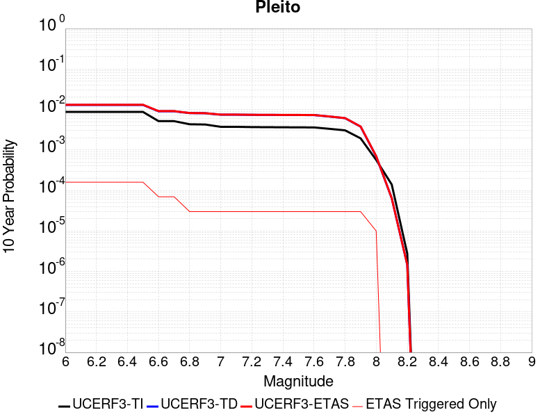 |

| Magnitude | 1 wk TI Prob | 1 wk TD Prob | 1 wk ETAS Prob | 1 wk ETAS/TD Gain | 1 wk ETAS Triggered Only | 1 mo TI Prob | 1 mo TD Prob | 1 mo ETAS Prob | 1 mo ETAS/TD Gain | 1 mo ETAS Triggered Only | 1 yr TI Prob | 1 yr TD Prob | 1 yr ETAS Prob | 1 yr ETAS/TD Gain | 1 yr ETAS Triggered Only | 10 yr TI Prob | 10 yr TD Prob | 10 yr ETAS Prob | 10 yr ETAS/TD Gain | 10 yr ETAS Triggered Only |
|-----|-----|-----|-----|-----|-----|-----|-----|-----|-----|-----|-----|-----|-----|-----|-----|-----|-----|-----|-----|-----|
| 6.0 | 1.6763008E-5 | 2.4763838E-5 | 2.4763838E-5 | 1.0 | 0.0 | 7.183948E-5 | 1.0612683E-4 | 1.0612683E-4 | 1.0 | 0.0 | 8.742947E-4 | 0.0012914003 | 0.0015530821 | 1.2026341 | 2.6202018E-4 | 0.00870863 | 0.0129538905 | 0.013212516 | 1.0199652 | 2.6202018E-4 |
| 6.1 | 1.6763008E-5 | 2.4763838E-5 | 2.4763838E-5 | 1.0 | 0.0 | 7.183948E-5 | 1.0612683E-4 | 1.0612683E-4 | 1.0 | 0.0 | 8.742947E-4 | 0.0012914003 | 0.0015530821 | 1.2026341 | 2.6202018E-4 | 0.00870863 | 0.0129538905 | 0.013212516 | 1.0199652 | 2.6202018E-4 |
| 6.2 | 1.6763008E-5 | 2.4763838E-5 | 2.4763838E-5 | 1.0 | 0.0 | 7.183948E-5 | 1.0612683E-4 | 1.0612683E-4 | 1.0 | 0.0 | 8.742947E-4 | 0.0012914003 | 0.0015530821 | 1.2026341 | 2.6202018E-4 | 0.00870863 | 0.0129538905 | 0.013212516 | 1.0199652 | 2.6202018E-4 |
| 6.3 | 1.6763008E-5 | 2.4763838E-5 | 2.4763838E-5 | 1.0 | 0.0 | 7.183948E-5 | 1.0612683E-4 | 1.0612683E-4 | 1.0 | 0.0 | 8.742947E-4 | 0.0012914003 | 0.0015530821 | 1.2026341 | 2.6202018E-4 | 0.00870863 | 0.0129538905 | 0.013212516 | 1.0199652 | 2.6202018E-4 |
| 6.4 | 1.6763008E-5 | 2.4763838E-5 | 2.4763838E-5 | 1.0 | 0.0 | 7.183948E-5 | 1.0612683E-4 | 1.0612683E-4 | 1.0 | 0.0 | 8.742947E-4 | 0.0012914003 | 0.0015530821 | 1.2026341 | 2.6202018E-4 | 0.00870863 | 0.0129538905 | 0.013212516 | 1.0199652 | 2.6202018E-4 |
| 6.5 | 1.6763008E-5 | 2.4763838E-5 | 2.4763838E-5 | 1.0 | 0.0 | 7.183948E-5 | 1.0612683E-4 | 1.0612683E-4 | 1.0 | 0.0 | 8.742947E-4 | 0.0012914003 | 0.0015530821 | 1.2026341 | 2.6202018E-4 | 0.00870863 | 0.0129538905 | 0.013212516 | 1.0199652 | 2.6202018E-4 |
| 6.6 | 9.910213E-6 | 1.7214623E-5 | 1.7214623E-5 | 1.0 | 0.0 | 4.247165E-5 | 7.377489E-5 | 7.377489E-5 | 1.0 | 0.0 | 5.169696E-4 | 8.978429E-4 | 0.0010287353 | 1.1457855 | 1.3101009E-4 | 0.0051576863 | 0.009050702 | 0.009180526 | 1.0143441 | 1.3101009E-4 |
| 6.7 | 9.910213E-6 | 1.7214623E-5 | 1.7214623E-5 | 1.0 | 0.0 | 4.247165E-5 | 7.377489E-5 | 7.377489E-5 | 1.0 | 0.0 | 5.169696E-4 | 8.978429E-4 | 0.0010287353 | 1.1457855 | 1.3101009E-4 | 0.0051576863 | 0.009050702 | 0.009180526 | 1.0143441 | 1.3101009E-4 |
| 6.8 | 8.300162E-6 | 1.5474232E-5 | 1.5474232E-5 | 1.0 | 0.0 | 3.557164E-5 | 6.631646E-5 | 6.631646E-5 | 1.0 | 0.0 | 4.3299864E-4 | 8.071053E-4 | 8.071053E-4 | 1.0 | 0.0 | 0.004321559 | 0.008150139 | 0.008150139 | 1.0 | 0.0 |
| 6.9 | 8.183114E-6 | 1.5345448E-5 | 1.5345448E-5 | 1.0 | 0.0 | 3.5070017E-5 | 6.576455E-5 | 6.576455E-5 | 1.0 | 0.0 | 4.2689382E-4 | 8.003907E-4 | 8.003907E-4 | 1.0 | 0.0 | 0.0042607468 | 0.008083483 | 0.008083483 | 1.0 | 0.0 |
| 7.0 | 7.1748823E-6 | 1.413244E-5 | 1.413244E-5 | 1.0 | 0.0 | 3.0749135E-5 | 6.0566195E-5 | 6.0566195E-5 | 1.0 | 0.0 | 3.743064E-4 | 7.371445E-4 | 7.371445E-4 | 1.0 | 0.0 | 0.0037367654 | 0.007454939 | 0.007454939 | 1.0 | 0.0 |
| 7.1 | 7.1671807E-6 | 1.412281E-5 | 1.412281E-5 | 1.0 | 0.0 | 3.0716128E-5 | 6.052493E-5 | 6.052493E-5 | 1.0 | 0.0 | 3.7390468E-4 | 7.366424E-4 | 7.366424E-4 | 1.0 | 0.0 | 0.0037327618 | 0.0074499524 | 0.0074499524 | 1.0 | 0.0 |
| 7.2 | 7.0649667E-6 | 1.39701015E-5 | 1.39701015E-5 | 1.0 | 0.0 | 3.0278077E-5 | 5.9870494E-5 | 5.9870494E-5 | 1.0 | 0.0 | 3.6857324E-4 | 7.2868E-4 | 7.2868E-4 | 1.0 | 0.0 | 0.0036796255 | 0.0073707094 | 0.0073707094 | 1.0 | 0.0 |
| 7.3 | 7.02082E-6 | 1.3913556E-5 | 1.3913556E-5 | 1.0 | 0.0 | 3.008888E-5 | 5.9628168E-5 | 5.9628168E-5 | 1.0 | 0.0 | 3.6627054E-4 | 7.2573166E-4 | 7.2573166E-4 | 1.0 | 0.0 | 0.0036566744 | 0.007341209 | 0.007341209 | 1.0 | 0.0 |
| 7.4 | 6.987146E-6 | 1.3873118E-5 | 1.3873118E-5 | 1.0 | 0.0 | 2.9944567E-5 | 5.945487E-5 | 5.945487E-5 | 1.0 | 0.0 | 3.6451413E-4 | 7.2362315E-4 | 7.2362315E-4 | 1.0 | 0.0 | 0.0036391679 | 0.007320144 | 0.007320144 | 1.0 | 0.0 |
| 7.5 | 6.9494554E-6 | 1.3830024E-5 | 1.3830024E-5 | 1.0 | 0.0 | 2.9783041E-5 | 5.9270187E-5 | 5.9270187E-5 | 1.0 | 0.0 | 3.625482E-4 | 7.2137616E-4 | 7.2137616E-4 | 1.0 | 0.0 | 0.0036195726 | 0.0072977724 | 0.0072977724 | 1.0 | 0.0 |
| 7.6 | 6.92694E-6 | 1.3789138E-5 | 1.3789138E-5 | 1.0 | 0.0 | 2.9686547E-5 | 5.909497E-5 | 5.909497E-5 | 1.0 | 0.0 | 3.6137376E-4 | 7.1924424E-4 | 7.1924424E-4 | 1.0 | 0.0 | 0.0036078666 | 0.0072765257 | 0.0072765257 | 1.0 | 0.0 |
| 7.7 | 6.395867E-6 | 1.2668219E-5 | 1.2668219E-5 | 1.0 | 0.0 | 2.741057E-5 | 5.429124E-5 | 5.429124E-5 | 1.0 | 0.0 | 3.336726E-4 | 6.6079566E-4 | 6.6079566E-4 | 1.0 | 0.0 | 0.0033317201 | 0.0066951844 | 0.0066951844 | 1.0 | 0.0 |
| 7.8 | 5.8664327E-6 | 1.153586E-5 | 1.153586E-5 | 1.0 | 0.0 | 2.5141611E-5 | 4.9438466E-5 | 4.9438466E-5 | 1.0 | 0.0 | 3.060561E-4 | 6.017473E-4 | 6.017473E-4 | 1.0 | 0.0 | 0.0030563495 | 0.0061006667 | 0.0061006667 | 1.0 | 0.0 |
| 7.9 | 3.7167474E-6 | 7.1140853E-6 | 7.1140853E-6 | 1.0 | 0.0 | 1.592882E-5 | 3.0488582E-5 | 3.0488582E-5 | 1.0 | 0.0 | 1.9391612E-4 | 3.7113542E-4 | 3.7113542E-4 | 1.0 | 0.0 | 0.0019374699 | 0.0037674906 | 0.0037674906 | 1.0 | 0.0 |
| 8.0 | 1.0903841E-6 | 1.2879392E-6 | 1.2879392E-6 | 1.0 | 0.0 | 4.6730665E-6 | 5.5197274E-6 | 5.5197274E-6 | 1.0 | 0.0 | 5.68931E-5 | 6.720063E-5 | 6.720063E-5 | 1.0 | 0.0 | 5.6878536E-4 | 6.941948E-4 | 6.941948E-4 | 1.0 | 0.0 |
| 8.1 | 2.6894583E-7 | 1.1060341E-7 | 1.1060341E-7 | 1.0 | 0.0 | 1.1526245E-6 | 4.740145E-7 | 4.740145E-7 | 1.0 | 0.0 | 1.4033113E-5 | 5.7711113E-6 | 5.7711113E-6 | 1.0 | 0.0 | 1.4032227E-4 | 6.456908E-5 | 6.456908E-5 | 1.0 | 0.0 |
| 8.2 | 5.2967013E-9 | 2.4578228E-9 | 2.4578228E-9 | 1.0 | 0.0 | 2.2700148E-8 | 1.0533527E-8 | 1.0533527E-8 | 1.0 | 0.0 | 2.7637427E-7 | 1.2824569E-7 | 1.2824569E-7 | 1.0 | 0.0 | 2.7637393E-6 | 1.4592787E-6 | 1.4592787E-6 | 1.0 | 0.0 |

## Rose Canyon
*[(top)](#table-of-contents)*

| 1 Week | 1 Month | 1 Year | 10 Year |
|-----|-----|-----|-----|
|  |  |  |  |

| Magnitude | 1 wk TI Prob | 1 wk TD Prob | 1 wk ETAS Prob | 1 wk ETAS/TD Gain | 1 wk ETAS Triggered Only | 1 mo TI Prob | 1 mo TD Prob | 1 mo ETAS Prob | 1 mo ETAS/TD Gain | 1 mo ETAS Triggered Only | 1 yr TI Prob | 1 yr TD Prob | 1 yr ETAS Prob | 1 yr ETAS/TD Gain | 1 yr ETAS Triggered Only | 10 yr TI Prob | 10 yr TD Prob | 10 yr ETAS Prob | 10 yr ETAS/TD Gain | 10 yr ETAS Triggered Only |
|-----|-----|-----|-----|-----|-----|-----|-----|-----|-----|-----|-----|-----|-----|-----|-----|-----|-----|-----|-----|-----|
| 6.0 | 4.5923203E-5 | 4.9714225E-5 | 1.807178E-4 | 3.6351326 | 1.3101009E-4 | 1.9679888E-4 | 2.1304491E-4 | 3.440271E-4 | 1.6148101 | 1.3101009E-4 | 0.0023933933 | 0.0025909345 | 0.0027216051 | 1.0504338 | 1.3101009E-4 | 0.023677798 | 0.02563999 | 0.025767641 | 1.0049785 | 1.3101009E-4 |
| 6.1 | 4.5923203E-5 | 4.9714225E-5 | 1.807178E-4 | 3.6351326 | 1.3101009E-4 | 1.9679888E-4 | 2.1304491E-4 | 3.440271E-4 | 1.6148101 | 1.3101009E-4 | 0.0023933933 | 0.0025909345 | 0.0027216051 | 1.0504338 | 1.3101009E-4 | 0.023677798 | 0.02563999 | 0.025767641 | 1.0049785 | 1.3101009E-4 |
| 6.2 | 2.8844734E-5 | 2.9668723E-5 | 1.6067493E-4 | 5.415633 | 1.3101009E-4 | 1.2361443E-4 | 1.2714567E-4 | 2.581391E-4 | 2.0302627 | 1.3101009E-4 | 0.0015039665 | 0.0015468939 | 0.0016777012 | 1.0845613 | 1.3101009E-4 | 0.0149382865 | 0.015374276 | 0.015503272 | 1.0083904 | 1.3101009E-4 |
| 6.3 | 2.3171577E-5 | 2.3161238E-5 | 1.5416829E-4 | 6.6563063 | 1.3101009E-4 | 9.9302975E-5 | 9.9258745E-5 | 2.3025583E-4 | 2.3197536 | 1.3101009E-4 | 0.0012083431 | 0.0012078186 | 0.0013386705 | 1.1083373 | 1.3101009E-4 | 0.012017938 | 0.012022437 | 0.012151872 | 1.0107661 | 1.3101009E-4 |
| 6.4 | 2.0066604E-5 | 1.9667024E-5 | 1.5067453E-4 | 7.661278 | 1.3101009E-4 | 8.599689E-5 | 8.4284584E-5 | 2.1528362E-4 | 2.554247 | 1.3101009E-4 | 0.0010465092 | 0.0010256917 | 0.0011565675 | 1.1275976 | 1.3101009E-4 | 0.010415946 | 0.010217559 | 0.01034723 | 1.012691 | 1.3101009E-4 |
| 6.5 | 1.776989E-5 | 1.7113807E-5 | 1.4812165E-4 | 8.655097 | 1.3101009E-4 | 7.615444E-5 | 7.334287E-5 | 2.0434335E-4 | 2.786138 | 1.3101009E-4 | 9.267859E-4 | 8.925905E-4 | 0.0010234837 | 1.1466441 | 1.3101009E-4 | 0.009229303 | 0.008896211 | 0.009026055 | 1.0145955 | 1.3101009E-4 |
| 6.6 | 1.5227364E-5 | 1.433926E-5 | 1.4534747E-4 | 10.13633 | 1.3101009E-4 | 6.52585E-5 | 6.1452556E-5 | 1.924546E-4 | 3.131759 | 1.3101009E-4 | 7.942326E-4 | 7.479332E-4 | 8.788453E-4 | 1.1750318 | 1.3101009E-4 | 0.007914 | 0.007458359 | 0.007588392 | 1.0174345 | 1.3101009E-4 |
| 6.7 | 1.2703898E-5 | 1.1673274E-5 | 1.4268183E-4 | 12.222949 | 1.3101009E-4 | 5.4444143E-5 | 5.0027378E-5 | 1.8103092E-4 | 3.6186366 | 1.3101009E-4 | 6.626558E-4 | 6.089174E-4 | 7.3984766E-4 | 1.2150215 | 1.3101009E-4 | 0.006606833 | 0.0060750856 | 0.0062053 | 1.0214342 | 1.3101009E-4 |
| 6.8 | 1.1554917E-5 | 1.0609337E-5 | 1.4161803E-4 | 13.3484335 | 1.3101009E-4 | 4.9520135E-5 | 4.546782E-5 | 1.7647195E-4 | 3.8812497 | 1.3101009E-4 | 6.0274085E-4 | 5.5343413E-4 | 6.843717E-4 | 1.2365911 | 1.3101009E-4 | 0.0060110865 | 0.0055225673 | 0.0056528538 | 1.0235916 | 1.3101009E-4 |
| 6.9 | 8.732078E-6 | 7.881357E-6 | 7.881357E-6 | 1.0 | 0.0 | 3.7422655E-5 | 3.3776825E-5 | 3.3776825E-5 | 1.0 | 0.0 | 4.5552556E-4 | 4.111582E-4 | 4.111582E-4 | 1.0 | 0.0 | 0.0045459294 | 0.0041048084 | 0.0041048084 | 1.0 | 0.0 |
| 7.0 | 5.9337494E-6 | 5.1074853E-6 | 5.1074853E-6 | 1.0 | 0.0 | 2.5430107E-5 | 2.188904E-5 | 2.188904E-5 | 1.0 | 0.0 | 3.0956755E-4 | 2.664666E-4 | 2.664666E-4 | 1.0 | 0.0 | 0.0030913667 | 0.0026614866 | 0.0026614866 | 1.0 | 0.0 |
| 7.1 | 5.013409E-6 | 4.1773833E-6 | 4.1773833E-6 | 1.0 | 0.0 | 2.1485863E-5 | 1.7902948E-5 | 1.7902948E-5 | 1.0 | 0.0 | 2.6155898E-4 | 2.179467E-4 | 2.179467E-4 | 1.0 | 0.0 | 0.0026125133 | 0.0021773411 | 0.0021773411 | 1.0 | 0.0 |
| 7.2 | 4.120763E-6 | 3.2821383E-6 | 3.2821383E-6 | 1.0 | 0.0 | 1.7660293E-5 | 1.4066231E-5 | 1.4066231E-5 | 1.0 | 0.0 | 2.1499286E-4 | 1.7124301E-4 | 1.7124301E-4 | 1.0 | 0.0 | 0.0021478499 | 0.00171112 | 0.00171112 | 1.0 | 0.0 |
| 7.3 | 3.2081239E-6 | 2.4405372E-6 | 2.4405372E-6 | 1.0 | 0.0 | 1.374903E-5 | 1.0459404E-5 | 1.0459404E-5 | 1.0 | 0.0 | 1.6738157E-4 | 1.2733586E-4 | 1.2733586E-4 | 1.0 | 0.0 | 0.0016725556 | 0.001272636 | 0.001272636 | 1.0 | 0.0 |
| 7.4 | 2.4194755E-6 | 1.7680634E-6 | 1.7680634E-6 | 1.0 | 0.0 | 1.0369139E-5 | 7.577393E-6 | 7.577393E-6 | 1.0 | 0.0 | 1.2623696E-4 | 9.2250906E-5 | 9.2250906E-5 | 1.0 | 0.0 | 0.0012616527 | 9.2213147E-4 | 9.2213147E-4 | 1.0 | 0.0 |
| 7.5 | 1.3842889E-6 | 9.3786275E-7 | 9.3786275E-7 | 1.0 | 0.0 | 5.9326535E-6 | 4.019406E-6 | 4.019406E-6 | 1.0 | 0.0 | 7.222766E-5 | 4.8935202E-5 | 4.8935202E-5 | 1.0 | 0.0 | 7.220419E-4 | 4.892478E-4 | 4.892478E-4 | 1.0 | 0.0 |
| 7.6 | 1.0021575E-6 | 6.411463E-7 | 6.411463E-7 | 1.0 | 0.0 | 4.2949537E-6 | 2.7477672E-6 | 2.7477672E-6 | 1.0 | 0.0 | 5.2289808E-5 | 3.3453573E-5 | 3.3453573E-5 | 1.0 | 0.0 | 5.2277505E-4 | 3.344875E-4 | 3.344875E-4 | 1.0 | 0.0 |
| 7.7 | 8.7620116E-8 | 6.4492404E-8 | 6.4492404E-8 | 1.0 | 0.0 | 3.7551473E-7 | 2.76396E-7 | 2.76396E-7 | 1.0 | 0.0 | 4.5718825E-6 | 3.3651165E-6 | 3.3651165E-6 | 1.0 | 0.0 | 4.5717883E-5 | 3.3650686E-5 | 3.3650686E-5 | 1.0 | 0.0 |

## Lake Isabella (Seismicity)
*[(top)](#table-of-contents)*

| 1 Week | 1 Month | 1 Year | 10 Year |
|-----|-----|-----|-----|
|  |  |  |  |

| Magnitude | 1 wk TI Prob | 1 wk TD Prob | 1 wk ETAS Prob | 1 wk ETAS/TD Gain | 1 wk ETAS Triggered Only | 1 mo TI Prob | 1 mo TD Prob | 1 mo ETAS Prob | 1 mo ETAS/TD Gain | 1 mo ETAS Triggered Only | 1 yr TI Prob | 1 yr TD Prob | 1 yr ETAS Prob | 1 yr ETAS/TD Gain | 1 yr ETAS Triggered Only | 10 yr TI Prob | 10 yr TD Prob | 10 yr ETAS Prob | 10 yr ETAS/TD Gain | 10 yr ETAS Triggered Only |
|-----|-----|-----|-----|-----|-----|-----|-----|-----|-----|-----|-----|-----|-----|-----|-----|-----|-----|-----|-----|-----|
| 6.0 | 9.431637E-6 | 9.741651E-6 | 9.741651E-6 | 1.0 | 0.0 | 4.0420677E-5 | 4.1749343E-5 | 4.1749343E-5 | 1.0 | 0.0 | 4.920106E-4 | 5.0819275E-4 | 7.700798E-4 | 1.5153301 | 2.6202018E-4 | 0.004909227 | 0.005071599 | 0.00533229 | 1.0514022 | 2.6202018E-4 |
| 6.1 | 9.431637E-6 | 9.741651E-6 | 9.741651E-6 | 1.0 | 0.0 | 4.0420677E-5 | 4.1749343E-5 | 4.1749343E-5 | 1.0 | 0.0 | 4.920106E-4 | 5.0819275E-4 | 7.700798E-4 | 1.5153301 | 2.6202018E-4 | 0.004909227 | 0.005071599 | 0.00533229 | 1.0514022 | 2.6202018E-4 |
| 6.2 | 9.431637E-6 | 9.741651E-6 | 9.741651E-6 | 1.0 | 0.0 | 4.0420677E-5 | 4.1749343E-5 | 4.1749343E-5 | 1.0 | 0.0 | 4.920106E-4 | 5.0819275E-4 | 7.700798E-4 | 1.5153301 | 2.6202018E-4 | 0.004909227 | 0.005071599 | 0.00533229 | 1.0514022 | 2.6202018E-4 |
| 6.3 | 9.431637E-6 | 9.741651E-6 | 9.741651E-6 | 1.0 | 0.0 | 4.0420677E-5 | 4.1749343E-5 | 4.1749343E-5 | 1.0 | 0.0 | 4.920106E-4 | 5.0819275E-4 | 7.700798E-4 | 1.5153301 | 2.6202018E-4 | 0.004909227 | 0.005071599 | 0.00533229 | 1.0514022 | 2.6202018E-4 |
| 6.4 | 5.144063E-6 | 5.3000763E-6 | 5.3000763E-6 | 1.0 | 0.0 | 2.2045799E-5 | 2.2714434E-5 | 2.2714434E-5 | 1.0 | 0.0 | 2.6837454E-4 | 2.765166E-4 | 5.384643E-4 | 1.9473128 | 2.6202018E-4 | 0.0026805066 | 0.0027620657 | 0.0030233623 | 1.0946019 | 2.6202018E-4 |
| 6.5 | 5.144063E-6 | 5.3000763E-6 | 5.3000763E-6 | 1.0 | 0.0 | 2.2045799E-5 | 2.2714434E-5 | 2.2714434E-5 | 1.0 | 0.0 | 2.6837454E-4 | 2.765166E-4 | 5.384643E-4 | 1.9473128 | 2.6202018E-4 | 0.0026805066 | 0.0027620657 | 0.0030233623 | 1.0946019 | 2.6202018E-4 |
| 6.6 | 3.4009804E-6 | 3.498786E-6 | 3.498786E-6 | 1.0 | 0.0 | 1.4575549E-5 | 1.4994721E-5 | 1.4994721E-5 | 1.0 | 0.0 | 1.7744285E-4 | 1.8254704E-4 | 3.135332E-4 | 1.7175475 | 1.3101009E-4 | 0.0017730123 | 0.0018241286 | 0.0019548996 | 1.0716896 | 1.3101009E-4 |
| 6.7 | 3.3880428E-6 | 3.4856528E-6 | 3.4856528E-6 | 1.0 | 0.0 | 1.4520103E-5 | 1.4938435E-5 | 1.4938435E-5 | 1.0 | 0.0 | 1.767679E-4 | 1.8186188E-4 | 3.1284813E-4 | 1.7202513 | 1.3101009E-4 | 0.0017662736 | 0.0018172882 | 0.0019480602 | 1.07196 | 1.3101009E-4 |
| 6.8 | 2.6582E-6 | 2.7337003E-6 | 2.7337003E-6 | 1.0 | 0.0 | 1.1392236E-5 | 1.1715813E-5 | 1.1715813E-5 | 1.0 | 0.0 | 1.3869164E-4 | 1.4263204E-4 | 2.7362345E-4 | 1.9183869 | 1.3101009E-4 | 0.0013860512 | 0.0014255369 | 0.0015563603 | 1.0917712 | 1.3101009E-4 |
| 6.9 | 2.406011E-6 | 2.4743288E-6 | 2.4743288E-6 | 1.0 | 0.0 | 1.0311434E-5 | 1.0604231E-5 | 1.0604231E-5 | 1.0 | 0.0 | 1.2553448E-4 | 1.2910018E-4 | 2.6009337E-4 | 2.014663 | 1.3101009E-4 | 0.0012546359 | 0.0012903814 | 0.0014212225 | 1.1013972 | 1.3101009E-4 |
| 7.0 | 1.6953097E-6 | 1.7429371E-6 | 1.7429371E-6 | 1.0 | 0.0 | 7.265593E-6 | 7.469715E-6 | 7.469715E-6 | 1.0 | 0.0 | 8.8455E-5 | 9.094104E-5 | 9.094104E-5 | 1.0 | 0.0 | 8.84198E-4 | 9.09141E-4 | 9.09141E-4 | 1.0 | 0.0 |
| 7.1 | 3.5013824E-7 | 3.5714822E-7 | 3.5714822E-7 | 1.0 | 0.0 | 1.5005916E-6 | 1.5306344E-6 | 1.5306344E-6 | 1.0 | 0.0 | 1.826955E-5 | 1.8635317E-5 | 1.8635317E-5 | 1.0 | 0.0 | 1.8268047E-4 | 1.863378E-4 | 1.863378E-4 | 1.0 | 0.0 |
| 7.2 | 2.2321095E-7 | 2.2750574E-7 | 2.2750574E-7 | 1.0 | 0.0 | 9.56618E-7 | 9.750242E-7 | 9.750242E-7 | 1.0 | 0.0 | 1.1646762E-5 | 1.1870856E-5 | 1.1870856E-5 | 1.0 | 0.0 | 1.1646151E-4 | 1.1870232E-4 | 1.1870232E-4 | 1.0 | 0.0 |
| 7.3 | 1.5760406E-7 | 1.6060922E-7 | 1.6060922E-7 | 1.0 | 0.0 | 6.7544585E-7 | 6.8832503E-7 | 6.8832503E-7 | 1.0 | 0.0 | 8.223522E-6 | 8.380326E-6 | 8.380326E-6 | 1.0 | 0.0 | 8.2232174E-5 | 8.3800165E-5 | 8.3800165E-5 | 1.0 | 0.0 |
| 7.4 | 1.1216497E-7 | 1.1431706E-7 | 1.1431706E-7 | 1.0 | 0.0 | 4.8070694E-7 | 4.899302E-7 | 4.899302E-7 | 1.0 | 0.0 | 5.852591E-6 | 5.964884E-6 | 5.964884E-6 | 1.0 | 0.0 | 5.8524372E-5 | 5.9647282E-5 | 5.9647282E-5 | 1.0 | 0.0 |
| 7.5 | 4.885185E-8 | 4.9787737E-8 | 4.9787737E-8 | 1.0 | 0.0 | 2.0936506E-7 | 2.13376E-7 | 2.13376E-7 | 1.0 | 0.0 | 2.5490165E-6 | 2.59785E-6 | 2.59785E-6 | 1.0 | 0.0 | 2.5489873E-5 | 2.5978214E-5 | 2.5978214E-5 | 1.0 | 0.0 |
| 7.6 | 1.504641E-9 | 1.5317903E-9 | 1.5317903E-9 | 1.0 | 0.0 | 6.4484613E-9 | 6.5648154E-9 | 6.5648154E-9 | 1.0 | 0.0 | 7.851001E-8 | 7.992663E-8 | 7.992663E-8 | 1.0 | 0.0 | 7.8509987E-7 | 7.992663E-7 | 7.992663E-7 | 1.0 | 0.0 |

## Cady
*[(top)](#table-of-contents)*

| 1 Week | 1 Month | 1 Year | 10 Year |
|-----|-----|-----|-----|
|  |  |  |  |

| Magnitude | 1 wk TI Prob | 1 wk TD Prob | 1 wk ETAS Prob | 1 wk ETAS/TD Gain | 1 wk ETAS Triggered Only | 1 mo TI Prob | 1 mo TD Prob | 1 mo ETAS Prob | 1 mo ETAS/TD Gain | 1 mo ETAS Triggered Only | 1 yr TI Prob | 1 yr TD Prob | 1 yr ETAS Prob | 1 yr ETAS/TD Gain | 1 yr ETAS Triggered Only | 10 yr TI Prob | 10 yr TD Prob | 10 yr ETAS Prob | 10 yr ETAS/TD Gain | 10 yr ETAS Triggered Only |
|-----|-----|-----|-----|-----|-----|-----|-----|-----|-----|-----|-----|-----|-----|-----|-----|-----|-----|-----|-----|-----|
| 6.0 | 1.9892565E-5 | 2.1858728E-5 | 2.1858728E-5 | 1.0 | 0.0 | 8.525106E-5 | 9.3677416E-5 | 9.3677416E-5 | 1.0 | 0.0 | 0.0010374374 | 0.0011400167 | 0.0012708774 | 1.1147884 | 1.3101009E-4 | 0.010326075 | 0.011350701 | 0.011609746 | 1.022822 | 2.6202018E-4 |
| 6.1 | 1.9892565E-5 | 2.1858728E-5 | 2.1858728E-5 | 1.0 | 0.0 | 8.525106E-5 | 9.3677416E-5 | 9.3677416E-5 | 1.0 | 0.0 | 0.0010374374 | 0.0011400167 | 0.0012708774 | 1.1147884 | 1.3101009E-4 | 0.010326075 | 0.011350701 | 0.011609746 | 1.022822 | 2.6202018E-4 |
| 6.2 | 1.9892565E-5 | 2.1858728E-5 | 2.1858728E-5 | 1.0 | 0.0 | 8.525106E-5 | 9.3677416E-5 | 9.3677416E-5 | 1.0 | 0.0 | 0.0010374374 | 0.0011400167 | 0.0012708774 | 1.1147884 | 1.3101009E-4 | 0.010326075 | 0.011350701 | 0.011609746 | 1.022822 | 2.6202018E-4 |
| 6.3 | 1.1117327E-5 | 1.2176583E-5 | 1.2176583E-5 | 1.0 | 0.0 | 4.764482E-5 | 5.2184492E-5 | 5.2184492E-5 | 1.0 | 0.0 | 5.7992124E-4 | 6.351925E-4 | 7.6611934E-4 | 1.2061216 | 1.3101009E-4 | 0.0057841022 | 0.0063368753 | 0.0065972353 | 1.0410864 | 2.6202018E-4 |
| 6.4 | 1.1117327E-5 | 1.2176583E-5 | 1.2176583E-5 | 1.0 | 0.0 | 4.764482E-5 | 5.2184492E-5 | 5.2184492E-5 | 1.0 | 0.0 | 5.7992124E-4 | 6.351925E-4 | 7.6611934E-4 | 1.2061216 | 1.3101009E-4 | 0.0057841022 | 0.0063368753 | 0.0065972353 | 1.0410864 | 2.6202018E-4 |
| 6.5 | 6.103093E-6 | 6.672021E-6 | 6.672021E-6 | 1.0 | 0.0 | 2.615585E-5 | 2.8594131E-5 | 2.8594131E-5 | 1.0 | 0.0 | 3.1840094E-4 | 3.480905E-4 | 3.480905E-4 | 1.0 | 0.0 | 0.0031794512 | 0.0034766865 | 0.0036072412 | 1.0375514 | 1.3101009E-4 |
| 6.6 | 5.817237E-6 | 6.3656585E-6 | 6.3656585E-6 | 1.0 | 0.0 | 2.4930776E-5 | 2.728118E-5 | 2.728118E-5 | 1.0 | 0.0 | 3.034899E-4 | 3.3211018E-4 | 3.3211018E-4 | 1.0 | 0.0 | 0.0030307577 | 0.0033173605 | 0.0034479361 | 1.0393612 | 1.3101009E-4 |
| 6.7 | 4.8846314E-6 | 5.3405684E-6 | 5.3405684E-6 | 1.0 | 0.0 | 2.0933967E-5 | 2.2888014E-5 | 2.2888014E-5 | 1.0 | 0.0 | 2.5484123E-4 | 2.7863772E-4 | 2.7863772E-4 | 1.0 | 0.0 | 0.0025454918 | 0.0027840391 | 0.0029146844 | 1.0469265 | 1.3101009E-4 |
| 6.8 | 1.7788773E-6 | 1.9399079E-6 | 1.9399079E-6 | 1.0 | 0.0 | 7.6237375E-6 | 8.313874E-6 | 8.313874E-6 | 1.0 | 0.0 | 9.281505E-5 | 1.01218284E-4 | 1.01218284E-4 | 1.0 | 0.0 | 9.2776294E-4 | 0.0010118765 | 0.001142754 | 1.1293414 | 1.3101009E-4 |
| 6.9 | 7.5455404E-7 | 8.297092E-7 | 8.297092E-7 | 1.0 | 0.0 | 3.233799E-6 | 3.5558937E-6 | 3.5558937E-6 | 1.0 | 0.0 | 3.937079E-5 | 4.3292483E-5 | 4.3292483E-5 | 1.0 | 0.0 | 3.9363815E-4 | 4.3287344E-4 | 4.3287344E-4 | 1.0 | 0.0 |
| 7.0 | 6.8578805E-7 | 7.541816E-7 | 7.541816E-7 | 1.0 | 0.0 | 2.9390883E-6 | 3.2322048E-6 | 3.2322048E-6 | 1.0 | 0.0 | 3.578281E-5 | 3.9351715E-5 | 3.9351715E-5 | 1.0 | 0.0 | 3.577705E-4 | 3.9347992E-4 | 3.9347992E-4 | 1.0 | 0.0 |

## Ortigalita (North)
*[(top)](#table-of-contents)*

| 1 Week | 1 Month | 1 Year | 10 Year |
|-----|-----|-----|-----|
|  |  |  |  |

| Magnitude | 1 wk TI Prob | 1 wk TD Prob | 1 wk ETAS Prob | 1 wk ETAS/TD Gain | 1 wk ETAS Triggered Only | 1 mo TI Prob | 1 mo TD Prob | 1 mo ETAS Prob | 1 mo ETAS/TD Gain | 1 mo ETAS Triggered Only | 1 yr TI Prob | 1 yr TD Prob | 1 yr ETAS Prob | 1 yr ETAS/TD Gain | 1 yr ETAS Triggered Only | 10 yr TI Prob | 10 yr TD Prob | 10 yr ETAS Prob | 10 yr ETAS/TD Gain | 10 yr ETAS Triggered Only |
|-----|-----|-----|-----|-----|-----|-----|-----|-----|-----|-----|-----|-----|-----|-----|-----|-----|-----|-----|-----|-----|
| 6.0 | 7.711876E-5 | 1.05064966E-4 | 1.05064966E-4 | 1.0 | 0.0 | 3.3046713E-4 | 4.502116E-4 | 4.502116E-4 | 1.0 | 0.0 | 0.004016016 | 0.0054681194 | 0.0054681194 | 1.0 | 0.0 | 0.039442103 | 0.053454787 | 0.053578794 | 1.0023198 | 1.3101009E-4 |
| 6.1 | 4.607858E-5 | 6.0239203E-5 | 6.0239203E-5 | 1.0 | 0.0 | 1.9746469E-4 | 2.5814527E-4 | 2.5814527E-4 | 1.0 | 0.0 | 0.0024014818 | 0.0031387596 | 0.0031387596 | 1.0 | 0.0 | 0.023756953 | 0.030975068 | 0.030975068 | 1.0 | 0.0 |
| 6.2 | 4.607858E-5 | 6.0239203E-5 | 6.0239203E-5 | 1.0 | 0.0 | 1.9746469E-4 | 2.5814527E-4 | 2.5814527E-4 | 1.0 | 0.0 | 0.0024014818 | 0.0031387596 | 0.0031387596 | 1.0 | 0.0 | 0.023756953 | 0.030975068 | 0.030975068 | 1.0 | 0.0 |
| 6.3 | 3.327423E-5 | 4.2475127E-5 | 4.2475127E-5 | 1.0 | 0.0 | 1.4259605E-4 | 1.8202531E-4 | 1.8202531E-4 | 1.0 | 0.0 | 0.0017347244 | 0.002214197 | 0.002214197 | 1.0 | 0.0 | 0.017212452 | 0.021945644 | 0.021945644 | 1.0 | 0.0 |
| 6.4 | 2.7732503E-5 | 3.4998593E-5 | 3.4998593E-5 | 1.0 | 0.0 | 1.1884817E-4 | 1.4998685E-4 | 1.4998685E-4 | 1.0 | 0.0 | 0.001446016 | 0.0018248095 | 0.0018248095 | 1.0 | 0.0 | 0.014366428 | 0.018121224 | 0.018121224 | 1.0 | 0.0 |
| 6.5 | 2.7689714E-5 | 3.4948407E-5 | 3.4948407E-5 | 1.0 | 0.0 | 1.186648E-4 | 1.497718E-4 | 1.497718E-4 | 1.0 | 0.0 | 0.0014437864 | 0.0018221956 | 0.0018221956 | 1.0 | 0.0 | 0.014344421 | 0.01809551 | 0.01809551 | 1.0 | 0.0 |
| 6.6 | 2.2976905E-5 | 2.8718265E-5 | 2.8718265E-5 | 1.0 | 0.0 | 9.846873E-5 | 1.230739E-4 | 1.230739E-4 | 1.0 | 0.0 | 0.0011981975 | 0.0014976363 | 0.0014976363 | 1.0 | 0.0 | 0.011917574 | 0.014898697 | 0.014898697 | 1.0 | 0.0 |
| 6.7 | 1.9871539E-5 | 2.4904411E-5 | 2.4904411E-5 | 1.0 | 0.0 | 8.516096E-5 | 1.0673023E-4 | 1.0673023E-4 | 1.0 | 0.0 | 0.0010363415 | 0.0012989145 | 0.0012989145 | 1.0 | 0.0 | 0.010315218 | 0.012936919 | 0.012936919 | 1.0 | 0.0 |
| 6.8 | 6.5640475E-6 | 7.6054926E-6 | 7.6054926E-6 | 1.0 | 0.0 | 2.813133E-5 | 3.2594577E-5 | 3.2594577E-5 | 1.0 | 0.0 | 3.424451E-4 | 3.9676955E-4 | 3.9676955E-4 | 1.0 | 0.0 | 0.0034191788 | 0.003960899 | 0.003960899 | 1.0 | 0.0 |
| 6.9 | 5.6219683E-6 | 6.5018376E-6 | 6.5018376E-6 | 1.0 | 0.0 | 2.4093928E-5 | 2.7864735E-5 | 2.7864735E-5 | 1.0 | 0.0 | 2.933041E-4 | 3.3920293E-4 | 3.3920293E-4 | 1.0 | 0.0 | 0.0029291727 | 0.003387109 | 0.003387109 | 1.0 | 0.0 |
| 7.0 | 3.875591E-6 | 4.4847548E-6 | 4.4847548E-6 | 1.0 | 0.0 | 1.6609569E-5 | 1.9220248E-5 | 1.9220248E-5 | 1.0 | 0.0 | 2.0220275E-4 | 2.339835E-4 | 2.339835E-4 | 1.0 | 0.0 | 0.0020201886 | 0.0023375798 | 0.0023375798 | 1.0 | 0.0 |
| 7.1 | 1.6017933E-6 | 1.8570418E-6 | 1.8570418E-6 | 1.0 | 0.0 | 6.8648105E-6 | 7.958732E-6 | 7.958732E-6 | 1.0 | 0.0 | 8.357586E-5 | 9.689432E-5 | 9.689432E-5 | 1.0 | 0.0 | 8.3544437E-4 | 9.686254E-4 | 9.686254E-4 | 1.0 | 0.0 |

## San Andreas (Santa Cruz Mts) 2011 CFM
*[(top)](#table-of-contents)*

| 1 Week | 1 Month | 1 Year | 10 Year |
|-----|-----|-----|-----|
|  |  |  |  |

| Magnitude | 1 wk TI Prob | 1 wk TD Prob | 1 wk ETAS Prob | 1 wk ETAS/TD Gain | 1 wk ETAS Triggered Only | 1 mo TI Prob | 1 mo TD Prob | 1 mo ETAS Prob | 1 mo ETAS/TD Gain | 1 mo ETAS Triggered Only | 1 yr TI Prob | 1 yr TD Prob | 1 yr ETAS Prob | 1 yr ETAS/TD Gain | 1 yr ETAS Triggered Only | 10 yr TI Prob | 10 yr TD Prob | 10 yr ETAS Prob | 10 yr ETAS/TD Gain | 10 yr ETAS Triggered Only |
|-----|-----|-----|-----|-----|-----|-----|-----|-----|-----|-----|-----|-----|-----|-----|-----|-----|-----|-----|-----|-----|
| 6.0 | 1.7221631E-4 | 1.3793171E-4 | 1.3793171E-4 | 1.0 | 0.0 | 7.378611E-4 | 5.9100403E-4 | 7.219367E-4 | 1.2215427 | 1.3101009E-4 | 0.008946515 | 0.007172124 | 0.0073021944 | 1.0181355 | 1.3101009E-4 | 0.08594794 | 0.0705551 | 0.07067686 | 1.0017258 | 1.3101009E-4 |
| 6.1 | 1.7221631E-4 | 1.3793171E-4 | 1.3793171E-4 | 1.0 | 0.0 | 7.378611E-4 | 5.9100403E-4 | 7.219367E-4 | 1.2215427 | 1.3101009E-4 | 0.008946515 | 0.007172124 | 0.0073021944 | 1.0181355 | 1.3101009E-4 | 0.08594794 | 0.0705551 | 0.07067686 | 1.0017258 | 1.3101009E-4 |
| 6.2 | 1.7221631E-4 | 1.3793171E-4 | 1.3793171E-4 | 1.0 | 0.0 | 7.378611E-4 | 5.9100403E-4 | 7.219367E-4 | 1.2215427 | 1.3101009E-4 | 0.008946515 | 0.007172124 | 0.0073021944 | 1.0181355 | 1.3101009E-4 | 0.08594794 | 0.0705551 | 0.07067686 | 1.0017258 | 1.3101009E-4 |
| 6.3 | 1.716926E-4 | 1.3712609E-4 | 1.3712609E-4 | 1.0 | 0.0 | 7.3561794E-4 | 5.875529E-4 | 7.18486E-4 | 1.2228448 | 1.3101009E-4 | 0.008919428 | 0.0071303817 | 0.0072604576 | 1.0182425 | 1.3101009E-4 | 0.08569809 | 0.070167266 | 0.07028908 | 1.001736 | 1.3101009E-4 |
| 6.4 | 1.6392978E-4 | 1.3588481E-4 | 1.3588481E-4 | 1.0 | 0.0 | 7.02367E-4 | 5.822355E-4 | 7.1316934E-4 | 1.2248812 | 1.3101009E-4 | 0.008517839 | 0.007066063 | 0.0071961475 | 1.0184097 | 1.3101009E-4 | 0.08198654 | 0.06940135 | 0.06952327 | 1.0017567 | 1.3101009E-4 |
| 6.5 | 1.5742714E-4 | 1.2648388E-4 | 1.2648388E-4 | 1.0 | 0.0 | 6.745133E-4 | 5.4196286E-4 | 6.729019E-4 | 1.2416016 | 1.3101009E-4 | 0.00818132 | 0.0065787593 | 0.0067089074 | 1.0197831 | 1.3101009E-4 | 0.078865945 | 0.06486309 | 0.06498561 | 1.0018888 | 1.3101009E-4 |
| 6.6 | 1.3038084E-4 | 1.1588213E-4 | 1.1588213E-4 | 1.0 | 0.0 | 5.5865536E-4 | 4.9654447E-4 | 6.274895E-4 | 1.2637126 | 1.3101009E-4 | 0.006780438 | 0.0060289134 | 0.0061591337 | 1.0215993 | 1.3101009E-4 | 0.0657725 | 0.05932738 | 0.059450615 | 1.0020772 | 1.3101009E-4 |
| 6.7 | 1.2867592E-4 | 1.1314701E-4 | 1.1314701E-4 | 1.0 | 0.0 | 5.5135164E-4 | 4.8482692E-4 | 6.157735E-4 | 1.2700893 | 1.3101009E-4 | 0.0066920654 | 0.00588703 | 0.006017269 | 1.022123 | 1.3101009E-4 | 0.06494093 | 0.058038417 | 0.058161825 | 1.0021263 | 1.3101009E-4 |
| 6.8 | 1.2801298E-4 | 1.1252261E-4 | 1.1252261E-4 | 1.0 | 0.0 | 5.485117E-4 | 4.8215193E-4 | 6.1309885E-4 | 1.2715886 | 1.3101009E-4 | 0.0066577005 | 0.0058546383 | 0.0059848814 | 1.0222461 | 1.3101009E-4 | 0.06461738 | 0.057752274 | 0.057875715 | 1.0021374 | 1.3101009E-4 |
| 6.9 | 1.269149E-4 | 1.1094465E-4 | 1.1094465E-4 | 1.0 | 0.0 | 5.4380763E-4 | 4.7539172E-4 | 6.0633954E-4 | 1.2754525 | 1.3101009E-4 | 0.006600777 | 0.005772772 | 0.0059030256 | 1.0225635 | 1.3101009E-4 | 0.06408122 | 0.0570241 | 0.057147637 | 1.0021664 | 1.3101009E-4 |
| 7.0 | 1.2030331E-4 | 1.0824504E-4 | 1.0824504E-4 | 1.0 | 0.0 | 5.154837E-4 | 4.638261E-4 | 5.947754E-4 | 1.2823242 | 1.3101009E-4 | 0.006257969 | 0.0056326967 | 0.0057629687 | 1.0231278 | 1.3101009E-4 | 0.06084648 | 0.055696685 | 0.055820398 | 1.0022212 | 1.3101009E-4 |
| 7.1 | 8.049617E-5 | 5.3926604E-5 | 5.3926604E-5 | 1.0 | 0.0 | 3.4493793E-4 | 2.3109373E-4 | 2.3109373E-4 | 1.0 | 0.0 | 0.0041915346 | 0.0028099709 | 0.0028099709 | 1.0 | 0.0 | 0.041133516 | 0.029618956 | 0.029618956 | 1.0 | 0.0 |
| 7.2 | 7.093979E-5 | 4.2937932E-5 | 4.2937932E-5 | 1.0 | 0.0 | 3.0399222E-4 | 1.8400686E-4 | 1.8400686E-4 | 1.0 | 0.0 | 0.0036948253 | 0.0022380045 | 0.0022380045 | 1.0 | 0.0 | 0.03633994 | 0.023941692 | 0.023941692 | 1.0 | 0.0 |
| 7.3 | 6.193693E-5 | 2.8894141E-5 | 2.8894141E-5 | 1.0 | 0.0 | 2.6541698E-4 | 1.2382616E-4 | 1.2382616E-4 | 1.0 | 0.0 | 0.0032266637 | 0.0015065427 | 0.0015065427 | 1.0 | 0.0 | 0.031802133 | 0.016499156 | 0.016499156 | 1.0 | 0.0 |
| 7.4 | 5.906492E-5 | 2.702346E-5 | 2.702346E-5 | 1.0 | 0.0 | 2.5311083E-4 | 1.1580969E-4 | 1.1580969E-4 | 1.0 | 0.0 | 0.0030772698 | 0.0014090725 | 0.0014090725 | 1.0 | 0.0 | 0.030350044 | 0.015471023 | 0.015471023 | 1.0 | 0.0 |
| 7.5 | 5.424296E-5 | 2.4678277E-5 | 2.4678277E-5 | 1.0 | 0.0 | 2.324491E-4 | 1.05759755E-4 | 1.05759755E-4 | 1.0 | 0.0 | 0.002826395 | 0.0012868657 | 0.0012868657 | 1.0 | 0.0 | 0.027907165 | 0.014163188 | 0.014163188 | 1.0 | 0.0 |
| 7.6 | 4.43084E-5 | 1.990431E-5 | 1.990431E-5 | 1.0 | 0.0 | 1.8987931E-4 | 8.53014E-5 | 8.53014E-5 | 1.0 | 0.0 | 0.0023093296 | 0.0010380499 | 0.0010380499 | 1.0 | 0.0 | 0.022854783 | 0.011412679 | 0.011412679 | 1.0 | 0.0 |
| 7.7 | 4.118098E-5 | 1.8936442E-5 | 1.8936442E-5 | 1.0 | 0.0 | 1.7647797E-4 | 8.115366E-5 | 8.115366E-5 | 1.0 | 0.0 | 0.002146502 | 9.875982E-4 | 9.875982E-4 | 1.0 | 0.0 | 0.021258866 | 0.010870468 | 0.010870468 | 1.0 | 0.0 |
| 7.8 | 3.5408906E-5 | 1.856446E-5 | 1.856446E-5 | 1.0 | 0.0 | 1.5174363E-4 | 7.955955E-5 | 7.955955E-5 | 1.0 | 0.0 | 0.0018459131 | 9.682073E-4 | 9.682073E-4 | 1.0 | 0.0 | 0.018306552 | 0.010652021 | 0.010652021 | 1.0 | 0.0 |
| 7.9 | 2.5860836E-5 | 1.7315993E-5 | 1.7315993E-5 | 1.0 | 0.0 | 1.10827445E-4 | 7.420929E-5 | 7.420929E-5 | 1.0 | 0.0 | 0.001348489 | 9.031238E-4 | 9.031238E-4 | 1.0 | 0.0 | 0.013403354 | 0.009907599 | 0.009907599 | 1.0 | 0.0 |
| 8.0 | 1.9777332E-5 | 1.4839596E-5 | 1.4839596E-5 | 1.0 | 0.0 | 8.4757245E-5 | 6.3596715E-5 | 6.3596715E-5 | 1.0 | 0.0 | 0.0010314309 | 7.740152E-4 | 7.740152E-4 | 1.0 | 0.0 | 0.010266567 | 0.008508967 | 0.008508967 | 1.0 | 0.0 |
| 8.1 | 1.468494E-5 | 1.2107374E-5 | 1.2107374E-5 | 1.0 | 0.0 | 6.293394E-5 | 5.1887713E-5 | 5.1887713E-5 | 1.0 | 0.0 | 7.6595135E-4 | 6.3155E-4 | 6.3155E-4 | 1.0 | 0.0 | 0.0076331664 | 0.006969149 | 0.006969149 | 1.0 | 0.0 |
| 8.2 | 8.63836E-6 | 5.469061E-6 | 5.469061E-6 | 1.0 | 0.0 | 3.7021015E-5 | 2.3438623E-5 | 2.3438623E-5 | 1.0 | 0.0 | 4.5063766E-4 | 2.8532793E-4 | 2.8532793E-4 | 1.0 | 0.0 | 0.004497249 | 0.00324569 | 0.00324569 | 1.0 | 0.0 |
| 8.3 | 1.983087E-6 | 7.6599065E-7 | 7.6599065E-7 | 1.0 | 0.0 | 8.498917E-6 | 3.282813E-6 | 3.282813E-6 | 1.0 | 0.0 | 1.034694E-4 | 3.9967534E-5 | 3.9967534E-5 | 1.0 | 0.0 | 0.0010342124 | 4.719687E-4 | 4.719687E-4 | 1.0 | 0.0 |

## West Napa 2011 CFM
*[(top)](#table-of-contents)*

| 1 Week | 1 Month | 1 Year | 10 Year |
|-----|-----|-----|-----|
|  |  |  |  |

| Magnitude | 1 wk TI Prob | 1 wk TD Prob | 1 wk ETAS Prob | 1 wk ETAS/TD Gain | 1 wk ETAS Triggered Only | 1 mo TI Prob | 1 mo TD Prob | 1 mo ETAS Prob | 1 mo ETAS/TD Gain | 1 mo ETAS Triggered Only | 1 yr TI Prob | 1 yr TD Prob | 1 yr ETAS Prob | 1 yr ETAS/TD Gain | 1 yr ETAS Triggered Only | 10 yr TI Prob | 10 yr TD Prob | 10 yr ETAS Prob | 10 yr ETAS/TD Gain | 10 yr ETAS Triggered Only |
|-----|-----|-----|-----|-----|-----|-----|-----|-----|-----|-----|-----|-----|-----|-----|-----|-----|-----|-----|-----|-----|
| 6.0 | 3.773104E-5 | 4.452845E-5 | 4.452845E-5 | 1.0 | 0.0 | 1.6169442E-4 | 1.9082405E-4 | 1.9082405E-4 | 1.0 | 0.0 | 0.001966852 | 0.0023211248 | 0.0023211248 | 1.0 | 0.0 | 0.019495348 | 0.023002245 | 0.023130242 | 1.0055646 | 1.3101009E-4 |
| 6.1 | 3.773104E-5 | 4.452845E-5 | 4.452845E-5 | 1.0 | 0.0 | 1.6169442E-4 | 1.9082405E-4 | 1.9082405E-4 | 1.0 | 0.0 | 0.001966852 | 0.0023211248 | 0.0023211248 | 1.0 | 0.0 | 0.019495348 | 0.023002245 | 0.023130242 | 1.0055646 | 1.3101009E-4 |
| 6.2 | 3.773104E-5 | 4.452845E-5 | 4.452845E-5 | 1.0 | 0.0 | 1.6169442E-4 | 1.9082405E-4 | 1.9082405E-4 | 1.0 | 0.0 | 0.001966852 | 0.0023211248 | 0.0023211248 | 1.0 | 0.0 | 0.019495348 | 0.023002245 | 0.023130242 | 1.0055646 | 1.3101009E-4 |
| 6.3 | 2.147964E-5 | 2.4987039E-5 | 2.4987039E-5 | 1.0 | 0.0 | 9.2052345E-5 | 1.0708343E-4 | 1.0708343E-4 | 1.0 | 0.0 | 0.001120161 | 0.0013030528 | 0.0013030528 | 1.0 | 0.0 | 0.011145315 | 0.0129647385 | 0.0129647385 | 1.0 | 0.0 |
| 6.4 | 2.147964E-5 | 2.4987039E-5 | 2.4987039E-5 | 1.0 | 0.0 | 9.2052345E-5 | 1.0708343E-4 | 1.0708343E-4 | 1.0 | 0.0 | 0.001120161 | 0.0013030528 | 0.0013030528 | 1.0 | 0.0 | 0.011145315 | 0.0129647385 | 0.0129647385 | 1.0 | 0.0 |
| 6.5 | 1.688201E-5 | 1.9547346E-5 | 1.9547346E-5 | 1.0 | 0.0 | 7.234947E-5 | 8.377206E-5 | 8.377206E-5 | 1.0 | 0.0 | 8.804988E-4 | 0.0010195201 | 0.0010195201 | 1.0 | 0.0 | 0.008770182 | 0.010157098 | 0.010157098 | 1.0 | 0.0 |
| 6.6 | 1.6846381E-5 | 1.9507039E-5 | 1.9507039E-5 | 1.0 | 0.0 | 7.219678E-5 | 8.359933E-5 | 8.359933E-5 | 1.0 | 0.0 | 8.7864127E-4 | 0.001017419 | 0.001017419 | 1.0 | 0.0 | 0.008751754 | 0.010136279 | 0.010136279 | 1.0 | 0.0 |
| 6.7 | 1.3396501E-5 | 1.5467655E-5 | 1.5467655E-5 | 1.0 | 0.0 | 5.7412315E-5 | 6.628862E-5 | 6.628862E-5 | 1.0 | 0.0 | 6.9877075E-4 | 8.0682867E-4 | 8.0682867E-4 | 1.0 | 0.0 | 0.0069657755 | 0.008046719 | 0.008046719 | 1.0 | 0.0 |
| 6.8 | 1.0139058E-5 | 1.1672149E-5 | 1.1672149E-5 | 1.0 | 0.0 | 4.3452383E-5 | 5.0022853E-5 | 5.0022853E-5 | 1.0 | 0.0 | 5.289043E-4 | 6.0891354E-4 | 6.0891354E-4 | 1.0 | 0.0 | 0.005276473 | 0.006079373 | 0.006079373 | 1.0 | 0.0 |
| 6.9 | 7.761281E-6 | 8.890694E-6 | 8.890694E-6 | 1.0 | 0.0 | 3.326221E-5 | 3.8102706E-5 | 3.8102706E-5 | 1.0 | 0.0 | 4.0489217E-4 | 4.6385307E-4 | 4.6385307E-4 | 1.0 | 0.0 | 0.0040415525 | 0.004635363 | 0.004635363 | 1.0 | 0.0 |
| 7.0 | 2.2109202E-6 | 2.3666025E-6 | 2.3666025E-6 | 1.0 | 0.0 | 9.475338E-6 | 1.0142544E-5 | 1.0142544E-5 | 1.0 | 0.0 | 1.1535613E-4 | 1.2347854E-4 | 1.2347854E-4 | 1.0 | 0.0 | 0.0011529627 | 0.0012355851 | 0.0012355851 | 1.0 | 0.0 |
| 7.1 | 1.9008926E-6 | 2.0132914E-6 | 2.0132914E-6 | 1.0 | 0.0 | 8.146657E-6 | 8.6283635E-6 | 8.6283635E-6 | 1.0 | 0.0 | 9.918104E-5 | 1.05045285E-4 | 1.05045285E-4 | 1.0 | 0.0 | 9.913679E-4 | 0.001051437 | 0.001051437 | 1.0 | 0.0 |
| 7.2 | 1.8495944E-6 | 1.9560982E-6 | 1.9560982E-6 | 1.0 | 0.0 | 7.926808E-6 | 8.383251E-6 | 8.383251E-6 | 1.0 | 0.0 | 9.650462E-5 | 1.0206133E-4 | 1.0206133E-4 | 1.0 | 0.0 | 9.6462725E-4 | 0.0010216252 | 0.0010216252 | 1.0 | 0.0 |
| 7.3 | 1.7883189E-6 | 1.8880608E-6 | 1.8880608E-6 | 1.0 | 0.0 | 7.664201E-6 | 8.091664E-6 | 8.091664E-6 | 1.0 | 0.0 | 9.330765E-5 | 9.8511584E-5 | 9.8511584E-5 | 1.0 | 0.0 | 9.3268487E-4 | 9.861597E-4 | 9.861597E-4 | 1.0 | 0.0 |
| 7.4 | 1.6520572E-6 | 1.741484E-6 | 1.741484E-6 | 1.0 | 0.0 | 7.0802257E-6 | 7.463482E-6 | 7.463482E-6 | 1.0 | 0.0 | 8.6198335E-5 | 9.086413E-5 | 9.086413E-5 | 1.0 | 0.0 | 8.616491E-4 | 9.0974604E-4 | 9.0974604E-4 | 1.0 | 0.0 |
| 7.5 | 1.4040345E-6 | 1.4800074E-6 | 1.4800074E-6 | 1.0 | 0.0 | 6.0172765E-6 | 6.3428733E-6 | 6.3428733E-6 | 1.0 | 0.0 | 7.325788E-5 | 7.7221775E-5 | 7.7221775E-5 | 1.0 | 0.0 | 7.3233736E-4 | 7.7339396E-4 | 7.7339396E-4 | 1.0 | 0.0 |
| 7.6 | 1.3013842E-7 | 1.4415936E-7 | 1.4415936E-7 | 1.0 | 0.0 | 5.57736E-7 | 6.1782566E-7 | 6.1782566E-7 | 1.0 | 0.0 | 6.790414E-6 | 7.5220014E-6 | 7.5220014E-6 | 1.0 | 0.0 | 6.790207E-5 | 7.614869E-5 | 7.614869E-5 | 1.0 | 0.0 |
| 7.7 | 8.541512E-8 | 9.716316E-8 | 9.716316E-8 | 1.0 | 0.0 | 3.6606474E-7 | 4.1641349E-7 | 4.1641349E-7 | 1.0 | 0.0 | 4.456829E-6 | 5.0698222E-6 | 5.0698222E-6 | 1.0 | 0.0 | 4.4567398E-5 | 5.160297E-5 | 5.160297E-5 | 1.0 | 0.0 |
| 7.8 | 5.6074793E-8 | 6.89534E-8 | 6.89534E-8 | 1.0 | 0.0 | 2.403205E-7 | 2.9551452E-7 | 2.9551452E-7 | 1.0 | 0.0 | 2.9258983E-6 | 3.5978833E-6 | 3.5978833E-6 | 1.0 | 0.0 | 2.9258597E-5 | 3.681433E-5 | 3.681433E-5 | 1.0 | 0.0 |
| 7.9 | 2.9475839E-8 | 3.8566046E-8 | 3.8566046E-8 | 1.0 | 0.0 | 1.2632502E-7 | 1.6528305E-7 | 1.6528305E-7 | 1.0 | 0.0 | 1.538006E-6 | 2.0123193E-6 | 2.0123193E-6 | 1.0 | 0.0 | 1.5379954E-5 | 2.0665891E-5 | 2.0665891E-5 | 1.0 | 0.0 |
| 8.0 | 1.3337122E-8 | 2.163124E-8 | 2.163124E-8 | 1.0 | 0.0 | 5.7159088E-8 | 9.270532E-8 | 9.270532E-8 | 1.0 | 0.0 | 6.959117E-7 | 1.1286867E-6 | 1.1286867E-6 | 1.0 | 0.0 | 6.959095E-6 | 1.1645628E-5 | 1.1645628E-5 | 1.0 | 0.0 |
| 8.1 | 2.6589986E-10 | 4.8615456E-10 | 4.8615456E-10 | 1.0 | 0.0 | 1.1395708E-9 | 2.0835205E-9 | 2.0835205E-9 | 1.0 | 0.0 | 1.3874274E-8 | 2.536686E-8 | 2.536686E-8 | 1.0 | 0.0 | 1.3874273E-7 | 2.6035906E-7 | 2.6035906E-7 | 1.0 | 0.0 |

## Sierra Madre
*[(top)](#table-of-contents)*

| 1 Week | 1 Month | 1 Year | 10 Year |
|-----|-----|-----|-----|
|  |  |  |  |

| Magnitude | 1 wk TI Prob | 1 wk TD Prob | 1 wk ETAS Prob | 1 wk ETAS/TD Gain | 1 wk ETAS Triggered Only | 1 mo TI Prob | 1 mo TD Prob | 1 mo ETAS Prob | 1 mo ETAS/TD Gain | 1 mo ETAS Triggered Only | 1 yr TI Prob | 1 yr TD Prob | 1 yr ETAS Prob | 1 yr ETAS/TD Gain | 1 yr ETAS Triggered Only | 10 yr TI Prob | 10 yr TD Prob | 10 yr ETAS Prob | 10 yr ETAS/TD Gain | 10 yr ETAS Triggered Only |
|-----|-----|-----|-----|-----|-----|-----|-----|-----|-----|-----|-----|-----|-----|-----|-----|-----|-----|-----|-----|-----|
| 6.0 | 1.3379373E-5 | 1.10007395E-5 | 1.4200939E-4 | 12.909076 | 1.3101009E-4 | 5.7338908E-5 | 4.7145186E-5 | 1.781491E-4 | 3.7787337 | 1.3101009E-4 | 6.978776E-4 | 5.738429E-4 | 7.0477783E-4 | 1.2281721 | 1.3101009E-4 | 0.0069569005 | 0.0057239756 | 0.005854236 | 1.0227569 | 1.3101009E-4 |
| 6.1 | 1.3379373E-5 | 1.10007395E-5 | 1.4200939E-4 | 12.909076 | 1.3101009E-4 | 5.7338908E-5 | 4.7145186E-5 | 1.781491E-4 | 3.7787337 | 1.3101009E-4 | 6.978776E-4 | 5.738429E-4 | 7.0477783E-4 | 1.2281721 | 1.3101009E-4 | 0.0069569005 | 0.0057239756 | 0.005854236 | 1.0227569 | 1.3101009E-4 |
| 6.2 | 1.3379373E-5 | 1.10007395E-5 | 1.4200939E-4 | 12.909076 | 1.3101009E-4 | 5.7338908E-5 | 4.7145186E-5 | 1.781491E-4 | 3.7787337 | 1.3101009E-4 | 6.978776E-4 | 5.738429E-4 | 7.0477783E-4 | 1.2281721 | 1.3101009E-4 | 0.0069569005 | 0.0057239756 | 0.005854236 | 1.0227569 | 1.3101009E-4 |
| 6.3 | 1.3379373E-5 | 1.10007395E-5 | 1.4200939E-4 | 12.909076 | 1.3101009E-4 | 5.7338908E-5 | 4.7145186E-5 | 1.781491E-4 | 3.7787337 | 1.3101009E-4 | 6.978776E-4 | 5.738429E-4 | 7.0477783E-4 | 1.2281721 | 1.3101009E-4 | 0.0069569005 | 0.0057239756 | 0.005854236 | 1.0227569 | 1.3101009E-4 |
| 6.4 | 1.3379373E-5 | 1.10007395E-5 | 1.4200939E-4 | 12.909076 | 1.3101009E-4 | 5.7338908E-5 | 4.7145186E-5 | 1.781491E-4 | 3.7787337 | 1.3101009E-4 | 6.978776E-4 | 5.738429E-4 | 7.0477783E-4 | 1.2281721 | 1.3101009E-4 | 0.0069569005 | 0.0057239756 | 0.005854236 | 1.0227569 | 1.3101009E-4 |
| 6.5 | 1.26563245E-5 | 1.0230196E-5 | 1.4123894E-4 | 13.806084 | 1.3101009E-4 | 5.4240263E-5 | 4.3842967E-5 | 1.7484732E-4 | 3.9880357 | 1.3101009E-4 | 6.601751E-4 | 5.336584E-4 | 6.645986E-4 | 1.2453632 | 1.3101009E-4 | 0.006582173 | 0.0053240913 | 0.005454404 | 1.024476 | 1.3101009E-4 |
| 6.6 | 1.26563245E-5 | 1.0230196E-5 | 1.4123894E-4 | 13.806084 | 1.3101009E-4 | 5.4240263E-5 | 4.3842967E-5 | 1.7484732E-4 | 3.9880357 | 1.3101009E-4 | 6.601751E-4 | 5.336584E-4 | 6.645986E-4 | 1.2453632 | 1.3101009E-4 | 0.006582173 | 0.0053240913 | 0.005454404 | 1.024476 | 1.3101009E-4 |
| 6.7 | 1.2502474E-5 | 1.006634E-5 | 1.4107511E-4 | 14.014539 | 1.3101009E-4 | 5.3580934E-5 | 4.314075E-5 | 1.7414519E-4 | 4.036675 | 1.3101009E-4 | 6.521526E-4 | 5.251131E-4 | 6.560544E-4 | 1.2493583 | 1.3101009E-4 | 0.0065024206 | 0.0052390425 | 0.005369366 | 1.0248755 | 1.3101009E-4 |
| 6.8 | 1.2454966E-5 | 1.0018625E-5 | 1.410274E-4 | 14.076522 | 1.3101009E-4 | 5.3377335E-5 | 4.2936266E-5 | 1.7394073E-4 | 4.051138 | 1.3101009E-4 | 6.4967526E-4 | 5.226247E-4 | 6.535663E-4 | 1.2505462 | 1.3101009E-4 | 0.006477792 | 0.0052142753 | 0.0053446023 | 1.0249943 | 1.3101009E-4 |
| 6.9 | 1.2225574E-5 | 9.792602E-6 | 1.408014E-4 | 14.378345 | 1.3101009E-4 | 5.2394265E-5 | 4.1967625E-5 | 1.7297221E-4 | 4.121563 | 1.3101009E-4 | 6.3771347E-4 | 5.108371E-4 | 6.4178027E-4 | 1.2563306 | 1.3101009E-4 | 0.006358865 | 0.0050969445 | 0.005227287 | 1.0255727 | 1.3101009E-4 |
| 7.0 | 1.182946E-5 | 9.399144E-6 | 1.40408E-4 | 14.938382 | 1.3101009E-4 | 5.06967E-5 | 4.0281426E-5 | 1.7128624E-4 | 4.2522388 | 1.3101009E-4 | 6.1705755E-4 | 4.9031706E-4 | 6.212629E-4 | 1.2670636 | 1.3101009E-4 | 0.006153469 | 0.004892664 | 0.0050230334 | 1.0266458 | 1.3101009E-4 |
| 7.1 | 1.14369095E-5 | 8.986159E-6 | 1.3999507E-4 | 15.578966 | 1.3101009E-4 | 4.9014405E-5 | 3.8511545E-5 | 1.6951658E-4 | 4.401708 | 1.3101009E-4 | 5.9658696E-4 | 4.687782E-4 | 5.9972686E-4 | 1.2793404 | 1.3101009E-4 | 0.005949879 | 0.004678199 | 0.0048085963 | 1.0278734 | 1.3101009E-4 |
| 7.2 | 1.0836419E-5 | 8.3995565E-6 | 1.3940854E-4 | 16.597132 | 1.3101009E-4 | 4.644097E-5 | 3.5997607E-5 | 1.6700297E-4 | 4.63928 | 1.3101009E-4 | 5.652721E-4 | 4.3818366E-4 | 5.6913635E-4 | 1.2988534 | 1.3101009E-4 | 0.0056383642 | 0.004373494 | 0.0045039314 | 1.0298245 | 1.3101009E-4 |
| 7.3 | 1.0403439E-5 | 8.02082E-6 | 1.3902986E-4 | 17.333622 | 1.3101009E-4 | 4.4585406E-5 | 3.4374494E-5 | 1.6538007E-4 | 4.8111277 | 1.3101009E-4 | 5.426921E-4 | 4.1843E-4 | 5.4938527E-4 | 1.3129681 | 1.3101009E-4 | 0.005413687 | 0.004176717 | 0.0043071797 | 1.0312357 | 1.3101009E-4 |
| 7.4 | 9.768864E-6 | 7.414448E-6 | 1.3842357E-4 | 18.669436 | 1.3101009E-4 | 4.186589E-5 | 3.1775824E-5 | 1.6278175E-4 | 5.1228175 | 1.3101009E-4 | 5.09598E-4 | 3.868029E-4 | 5.177623E-4 | 1.3385688 | 1.3101009E-4 | 0.0050843097 | 0.0038615882 | 0.0039920923 | 1.0337955 | 1.3101009E-4 |
| 7.5 | 8.687089E-6 | 6.4501564E-6 | 1.374594E-4 | 21.311018 | 1.3101009E-4 | 3.722985E-5 | 2.764324E-5 | 1.5864971E-4 | 5.7391863 | 1.3101009E-4 | 4.5317915E-4 | 3.3650533E-4 | 4.6747134E-4 | 1.3891945 | 1.3101009E-4 | 0.004522561 | 0.0033602451 | 0.003490815 | 1.0388572 | 1.3101009E-4 |
| 7.6 | 6.3506063E-6 | 4.4303215E-6 | 1.3543983E-4 | 30.571106 | 1.3101009E-4 | 2.72166E-5 | 1.8986955E-5 | 1.4999455E-4 | 7.8998737 | 1.3101009E-4 | 3.3131172E-4 | 2.3114192E-4 | 3.6212173E-4 | 1.566664 | 1.3101009E-4 | 0.003308182 | 0.0023092402 | 0.0024399478 | 1.056602 | 1.3101009E-4 |
| 7.7 | 4.62223E-6 | 2.932967E-6 | 2.932967E-6 | 1.0 | 0.0 | 1.9809406E-5 | 1.2569798E-5 | 1.2569798E-5 | 1.0 | 0.0 | 2.4115283E-4 | 1.5302657E-4 | 1.5302657E-4 | 1.0 | 0.0 | 0.0024089129 | 0.001529413 | 0.001529413 | 1.0 | 0.0 |
| 7.8 | 3.2145008E-6 | 1.9494332E-6 | 1.9494332E-6 | 1.0 | 0.0 | 1.3776359E-5 | 8.3546865E-6 | 8.3546865E-6 | 1.0 | 0.0 | 1.6771426E-4 | 1.0171358E-4 | 1.0171358E-4 | 1.0 | 0.0 | 0.0016758774 | 0.0010168145 | 0.0010168145 | 1.0 | 0.0 |
| 7.9 | 1.0391769E-6 | 5.6026335E-7 | 5.6026335E-7 | 1.0 | 0.0 | 4.4536077E-6 | 2.4011265E-6 | 2.4011265E-6 | 1.0 | 0.0 | 5.4221324E-5 | 2.9233326E-5 | 2.9233326E-5 | 1.0 | 0.0 | 5.4208096E-4 | 2.9229524E-4 | 2.9229524E-4 | 1.0 | 0.0 |
| 8.0 | 1.210983E-7 | 6.613821E-8 | 6.613821E-8 | 1.0 | 0.0 | 5.1899264E-7 | 2.8344945E-7 | 2.8344945E-7 | 1.0 | 0.0 | 6.3187167E-6 | 3.4509917E-6 | 3.4509917E-6 | 1.0 | 0.0 | 6.318537E-5 | 3.45094E-5 | 3.45094E-5 | 1.0 | 0.0 |

## Calaveras (So) - Paicines extension 2011 CFM
*[(top)](#table-of-contents)*

| 1 Week | 1 Month | 1 Year | 10 Year |
|-----|-----|-----|-----|
|  |  |  |  |

| Magnitude | 1 wk TI Prob | 1 wk TD Prob | 1 wk ETAS Prob | 1 wk ETAS/TD Gain | 1 wk ETAS Triggered Only | 1 mo TI Prob | 1 mo TD Prob | 1 mo ETAS Prob | 1 mo ETAS/TD Gain | 1 mo ETAS Triggered Only | 1 yr TI Prob | 1 yr TD Prob | 1 yr ETAS Prob | 1 yr ETAS/TD Gain | 1 yr ETAS Triggered Only | 10 yr TI Prob | 10 yr TD Prob | 10 yr ETAS Prob | 10 yr ETAS/TD Gain | 10 yr ETAS Triggered Only |
|-----|-----|-----|-----|-----|-----|-----|-----|-----|-----|-----|-----|-----|-----|-----|-----|-----|-----|-----|-----|-----|
| 6.0 | 1.5183659E-4 | 3.0533716E-4 | 3.0533716E-4 | 1.0 | 0.0 | 6.5056595E-4 | 0.0013069661 | 0.001437805 | 1.1001089 | 1.3101009E-4 | 0.007891912 | 0.01569571 | 0.015824664 | 1.0082159 | 1.3101009E-4 | 0.076174594 | 0.13848671 | 0.13859959 | 1.000815 | 1.3101009E-4 |
| 6.1 | 1.5024997E-4 | 3.0227835E-4 | 3.0227835E-4 | 1.0 | 0.0 | 6.437695E-4 | 0.00129387 | 0.0014247106 | 1.1011235 | 1.3101009E-4 | 0.0078097614 | 0.015539104 | 0.01566808 | 1.0083 | 1.3101009E-4 | 0.075409345 | 0.13715632 | 0.13726936 | 1.0008242 | 1.3101009E-4 |
| 6.2 | 1.2743923E-4 | 2.5306802E-4 | 2.5306802E-4 | 1.0 | 0.0 | 5.460538E-4 | 0.0010841049 | 0.0012149729 | 1.1207153 | 1.3101009E-4 | 0.0066279583 | 0.013046704 | 0.013176004 | 1.0099106 | 1.3101009E-4 | 0.064337276 | 0.11725405 | 0.1173697 | 1.0009863 | 1.3101009E-4 |
| 6.3 | 1.1525114E-4 | 2.2595265E-4 | 2.2595265E-4 | 1.0 | 0.0 | 4.9383997E-4 | 9.6799526E-4 | 0.0010988786 | 1.1352106 | 1.3101009E-4 | 0.0059959386 | 0.011667927 | 0.011797409 | 1.0110972 | 1.3101009E-4 | 0.058367174 | 0.10637007 | 0.10648715 | 1.0011007 | 1.3101009E-4 |
| 6.4 | 1.07200925E-4 | 2.0836305E-4 | 2.0836305E-4 | 1.0 | 0.0 | 4.5935164E-4 | 8.926636E-4 | 0.0010235567 | 1.1466321 | 1.3101009E-4 | 0.0055782744 | 0.010772766 | 0.010902364 | 1.0120302 | 1.3101009E-4 | 0.0544031 | 0.09919256 | 0.09931058 | 1.0011897 | 1.3101009E-4 |
| 6.5 | 9.69631E-5 | 1.8729115E-4 | 1.8729115E-4 | 1.0 | 0.0 | 4.1548995E-4 | 8.024135E-4 | 9.3331846E-4 | 1.163139 | 1.3101009E-4 | 0.0050468626 | 0.009694662 | 0.009824403 | 1.0133827 | 1.3101009E-4 | 0.04933773 | 0.090084255 | 0.090203464 | 1.0013233 | 1.3101009E-4 |
| 6.6 | 8.0552316E-5 | 1.5070537E-4 | 1.5070537E-4 | 1.0 | 0.0 | 3.4517853E-4 | 6.456994E-4 | 7.766249E-4 | 1.2027655 | 1.3101009E-4 | 0.0041944524 | 0.007826256 | 0.00795624 | 1.0166088 | 1.3101009E-4 | 0.04116161 | 0.074854024 | 0.07497523 | 1.0016192 | 1.3101009E-4 |
| 6.7 | 7.815757E-5 | 1.4610609E-4 | 1.4610609E-4 | 1.0 | 0.0 | 3.34918E-4 | 6.260017E-4 | 7.5692974E-4 | 1.2091497 | 1.3101009E-4 | 0.004070005 | 0.0075890915 | 0.0077191074 | 1.0171319 | 1.3101009E-4 | 0.039962657 | 0.072703585 | 0.07282507 | 1.001671 | 1.3101009E-4 |
| 6.8 | 6.965264E-5 | 1.2721405E-4 | 1.2721405E-4 | 1.0 | 0.0 | 2.9847719E-4 | 5.450839E-4 | 6.7602255E-4 | 1.2402174 | 1.3101009E-4 | 0.0036279052 | 0.00661342 | 0.0067435633 | 1.0196787 | 1.3101009E-4 | 0.03569247 | 0.06379891 | 0.06392156 | 1.0019225 | 1.3101009E-4 |
| 6.9 | 5.8000453E-5 | 1.01435086E-4 | 1.01435086E-4 | 1.0 | 0.0 | 2.4854968E-4 | 4.3464993E-4 | 5.656031E-4 | 1.3012842 | 1.3101009E-4 | 0.0030218933 | 0.0052791284 | 0.005409447 | 1.0246856 | 1.3101009E-4 | 0.029811295 | 0.051501602 | 0.051625866 | 1.0024128 | 1.3101009E-4 |
| 7.0 | 4.9865852E-5 | 8.567692E-5 | 8.567692E-5 | 1.0 | 0.0 | 2.1369329E-4 | 3.671356E-4 | 4.9809756E-4 | 1.3567128 | 1.3101009E-4 | 0.0025986114 | 0.0044608037 | 0.0045912294 | 1.0292381 | 1.3101009E-4 | 0.025684336 | 0.043781694 | 0.043906968 | 1.0028614 | 1.3101009E-4 |
| 7.1 | 4.283875E-5 | 7.112159E-5 | 7.112159E-5 | 1.0 | 0.0 | 1.8358172E-4 | 3.047715E-4 | 3.047715E-4 | 1.0 | 0.0 | 0.0022328163 | 0.003704336 | 0.003704336 | 1.0 | 0.0 | 0.022105146 | 0.03673583 | 0.03673583 | 1.0 | 0.0 |
| 7.2 | 3.450115E-5 | 5.5776054E-5 | 5.5776054E-5 | 1.0 | 0.0 | 1.478537E-4 | 2.390185E-4 | 2.390185E-4 | 1.0 | 0.0 | 0.0017986323 | 0.0029061958 | 0.0029061958 | 1.0 | 0.0 | 0.017841442 | 0.029079199 | 0.029079199 | 1.0 | 0.0 |
| 7.3 | 2.5709045E-5 | 4.0588155E-5 | 4.0588155E-5 | 1.0 | 0.0 | 1.1017697E-4 | 1.7393773E-4 | 1.7393773E-4 | 1.0 | 0.0 | 0.0013405791 | 0.002115652 | 0.002115652 | 1.0 | 0.0 | 0.013325208 | 0.021297242 | 0.021297242 | 1.0 | 0.0 |
| 7.4 | 1.8003093E-5 | 2.8509934E-5 | 2.8509934E-5 | 1.0 | 0.0 | 7.715383E-5 | 1.2217973E-4 | 1.2217973E-4 | 1.0 | 0.0 | 9.3894306E-4 | 0.0014865254 | 0.0014865254 | 1.0 | 0.0 | 0.009349857 | 0.015052196 | 0.015052196 | 1.0 | 0.0 |
| 7.5 | 1.5595824E-5 | 2.5822499E-5 | 2.5822499E-5 | 1.0 | 0.0 | 6.683753E-5 | 1.1066317E-4 | 1.1066317E-4 | 1.0 | 0.0 | 8.134431E-4 | 0.0013464936 | 0.0013464936 | 1.0 | 0.0 | 0.008104719 | 0.01365213 | 0.01365213 | 1.0 | 0.0 |
| 7.6 | 1.1110309E-5 | 1.9222098E-5 | 1.9222098E-5 | 1.0 | 0.0 | 4.761474E-5 | 8.2377825E-5 | 8.2377825E-5 | 1.0 | 0.0 | 5.795553E-4 | 0.0010024898 | 0.0010024898 | 1.0 | 0.0 | 0.0057804612 | 0.010203943 | 0.010203943 | 1.0 | 0.0 |
| 7.7 | 6.2140443E-6 | 1.0437076E-5 | 1.0437076E-5 | 1.0 | 0.0 | 2.6631347E-5 | 4.4729557E-5 | 4.4729557E-5 | 1.0 | 0.0 | 3.241884E-4 | 5.444464E-4 | 5.444464E-4 | 1.0 | 0.0 | 0.0032371588 | 0.005619835 | 0.005619835 | 1.0 | 0.0 |
| 7.8 | 5.305533E-6 | 9.433038E-6 | 9.433038E-6 | 1.0 | 0.0 | 2.27378E-5 | 4.042668E-5 | 4.042668E-5 | 1.0 | 0.0 | 2.7679754E-4 | 4.920837E-4 | 4.920837E-4 | 1.0 | 0.0 | 0.0027645302 | 0.005074324 | 0.005074324 | 1.0 | 0.0 |
| 7.9 | 3.363505E-6 | 7.3848937E-6 | 7.3848937E-6 | 1.0 | 0.0 | 1.4414942E-5 | 3.164916E-5 | 3.164916E-5 | 1.0 | 0.0 | 1.7548777E-4 | 3.8526047E-4 | 3.8526047E-4 | 1.0 | 0.0 | 0.0017534926 | 0.003948527 | 0.003948527 | 1.0 | 0.0 |
| 8.0 | 2.0271132E-6 | 4.413104E-6 | 4.413104E-6 | 1.0 | 0.0 | 8.687599E-6 | 1.8913164E-5 | 1.8913164E-5 | 1.0 | 0.0 | 1.05766376E-4 | 2.302435E-4 | 2.302435E-4 | 1.0 | 0.0 | 0.0010571606 | 0.002351099 | 0.002351099 | 1.0 | 0.0 |
| 8.1 | 1.2206116E-6 | 2.3751331E-6 | 2.3751331E-6 | 1.0 | 0.0 | 5.2311816E-6 | 1.0179103E-5 | 1.0179103E-5 | 1.0 | 0.0 | 6.3687774E-5 | 1.2392356E-4 | 1.2392356E-4 | 1.0 | 0.0 | 6.366953E-4 | 0.0012705477 | 0.0012705477 | 1.0 | 0.0 |

## Coronado Bank alt1
*[(top)](#table-of-contents)*

| 1 Week | 1 Month | 1 Year | 10 Year |
|-----|-----|-----|-----|
|  | 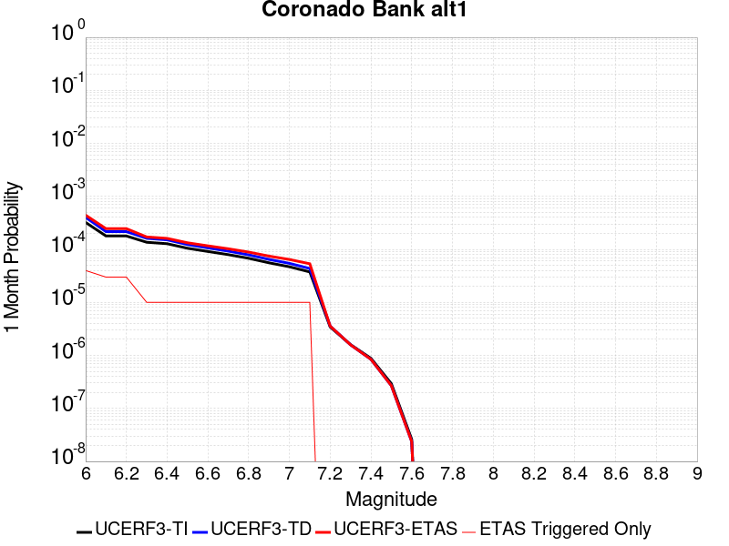 |  |  |

| Magnitude | 1 wk TI Prob | 1 wk TD Prob | 1 wk ETAS Prob | 1 wk ETAS/TD Gain | 1 wk ETAS Triggered Only | 1 mo TI Prob | 1 mo TD Prob | 1 mo ETAS Prob | 1 mo ETAS/TD Gain | 1 mo ETAS Triggered Only | 1 yr TI Prob | 1 yr TD Prob | 1 yr ETAS Prob | 1 yr ETAS/TD Gain | 1 yr ETAS Triggered Only | 10 yr TI Prob | 10 yr TD Prob | 10 yr ETAS Prob | 10 yr ETAS/TD Gain | 10 yr ETAS Triggered Only |
|-----|-----|-----|-----|-----|-----|-----|-----|-----|-----|-----|-----|-----|-----|-----|-----|-----|-----|-----|-----|-----|
| 6.0 | 7.533492E-5 | 9.394913E-5 | 2.2494691E-4 | 2.394348 | 1.3101009E-4 | 3.22824E-4 | 4.0258127E-4 | 5.335386E-4 | 1.3252941 | 1.3101009E-4 | 0.0039233007 | 0.0048909658 | 0.0050213346 | 1.0266551 | 1.3101009E-4 | 0.03854755 | 0.04790356 | 0.048028294 | 1.0026039 | 1.3101009E-4 |
| 6.1 | 4.1807285E-5 | 5.049283E-5 | 5.049283E-5 | 1.0 | 0.0 | 1.7916178E-4 | 2.1638049E-4 | 2.1638049E-4 | 1.0 | 0.0 | 0.0021791123 | 0.0026313474 | 0.0026313474 | 1.0 | 0.0 | 0.021578677 | 0.026011046 | 0.026011046 | 1.0 | 0.0 |
| 6.2 | 4.1807285E-5 | 5.049283E-5 | 5.049283E-5 | 1.0 | 0.0 | 1.7916178E-4 | 2.1638049E-4 | 2.1638049E-4 | 1.0 | 0.0 | 0.0021791123 | 0.0026313474 | 0.0026313474 | 1.0 | 0.0 | 0.021578677 | 0.026011046 | 0.026011046 | 1.0 | 0.0 |
| 6.3 | 3.1793104E-5 | 3.7711117E-5 | 3.7711117E-5 | 1.0 | 0.0 | 1.3624904E-4 | 1.6160926E-4 | 1.6160926E-4 | 1.0 | 0.0 | 0.0016575698 | 0.001965848 | 0.001965848 | 1.0 | 0.0 | 0.016452603 | 0.019488465 | 0.019488465 | 1.0 | 0.0 |
| 6.4 | 2.9878007E-5 | 3.5335794E-5 | 3.5335794E-5 | 1.0 | 0.0 | 1.2804232E-4 | 1.5143053E-4 | 1.5143053E-4 | 1.0 | 0.0 | 0.0015578003 | 0.0018421387 | 0.0018421387 | 1.0 | 0.0 | 0.015469253 | 0.01827244 | 0.01827244 | 1.0 | 0.0 |
| 6.5 | 2.4512565E-5 | 2.8764043E-5 | 2.8764043E-5 | 1.0 | 0.0 | 1.0504962E-4 | 1.2326881E-4 | 1.2326881E-4 | 1.0 | 0.0 | 0.0012782287 | 0.0014997921 | 0.0014997921 | 1.0 | 0.0 | 0.012709012 | 0.014899683 | 0.014899683 | 1.0 | 0.0 |
| 6.6 | 2.1317413E-5 | 2.490667E-5 | 2.490667E-5 | 1.0 | 0.0 | 9.135714E-5 | 1.0673863E-4 | 1.0673863E-4 | 1.0 | 0.0 | 0.0011117056 | 0.0012987906 | 0.0012987906 | 1.0 | 0.0 | 0.011061605 | 0.012914404 | 0.012914404 | 1.0 | 0.0 |
| 6.7 | 1.8585655E-5 | 2.163488E-5 | 2.163488E-5 | 1.0 | 0.0 | 7.9650374E-5 | 9.271773E-5 | 9.271773E-5 | 1.0 | 0.0 | 9.6931186E-4 | 0.0011282742 | 0.0011282742 | 1.0 | 0.0 | 0.0096509475 | 0.011227623 | 0.011227623 | 1.0 | 0.0 |
| 6.8 | 1.5862879E-5 | 1.8419474E-5 | 1.8419474E-5 | 1.0 | 0.0 | 6.798199E-5 | 7.893833E-5 | 7.893833E-5 | 1.0 | 0.0 | 8.273665E-4 | 9.6066965E-4 | 9.6066965E-4 | 1.0 | 0.0 | 0.008242928 | 0.00956715 | 0.00956715 | 1.0 | 0.0 |
| 6.9 | 1.3021509E-5 | 1.5095265E-5 | 1.5095265E-5 | 1.0 | 0.0 | 5.5805274E-5 | 6.469249E-5 | 6.469249E-5 | 1.0 | 0.0 | 6.792174E-4 | 7.8736455E-4 | 7.8736455E-4 | 1.0 | 0.0 | 0.006771452 | 0.007847573 | 0.007847573 | 1.0 | 0.0 |
| 7.0 | 1.0974371E-5 | 1.2720104E-5 | 1.2720104E-5 | 1.0 | 0.0 | 4.7032172E-5 | 5.451369E-5 | 5.451369E-5 | 1.0 | 0.0 | 5.7246623E-4 | 6.6351966E-4 | 6.6351966E-4 | 1.0 | 0.0 | 0.0057099373 | 0.006617135 | 0.006617135 | 1.0 | 0.0 |
| 7.1 | 8.766221E-6 | 1.01638325E-5 | 1.01638325E-5 | 1.0 | 0.0 | 3.7568978E-5 | 4.355865E-5 | 4.355865E-5 | 1.0 | 0.0 | 4.573063E-4 | 5.3021475E-4 | 5.3021475E-4 | 1.0 | 0.0 | 0.0045636636 | 0.0052911965 | 0.0052911965 | 1.0 | 0.0 |
| 7.2 | 8.026024E-7 | 8.331765E-7 | 8.331765E-7 | 1.0 | 0.0 | 3.43972E-6 | 3.5707515E-6 | 3.5707515E-6 | 1.0 | 0.0 | 4.1877785E-5 | 4.3473043E-5 | 4.3473043E-5 | 1.0 | 0.0 | 4.1869894E-4 | 4.3464647E-4 | 4.3464647E-4 | 1.0 | 0.0 |
| 7.3 | 3.7293114E-7 | 3.7000953E-7 | 3.7000953E-7 | 1.0 | 0.0 | 1.5982754E-6 | 1.5857541E-6 | 1.5857541E-6 | 1.0 | 0.0 | 1.9458828E-5 | 1.9306386E-5 | 1.9306386E-5 | 1.0 | 0.0 | 1.9457124E-4 | 1.9304715E-4 | 1.9304715E-4 | 1.0 | 0.0 |
| 7.4 | 2.0557036E-7 | 1.9674363E-7 | 1.9674363E-7 | 1.0 | 0.0 | 8.810155E-7 | 8.431867E-7 | 8.431867E-7 | 1.0 | 0.0 | 1.0726311E-5 | 1.026575E-5 | 1.026575E-5 | 1.0 | 0.0 | 1.0725793E-4 | 1.0265279E-4 | 1.0265279E-4 | 1.0 | 0.0 |
| 7.5 | 6.845446E-8 | 6.279369E-8 | 6.279369E-8 | 1.0 | 0.0 | 2.9337625E-7 | 2.691158E-7 | 2.691158E-7 | 1.0 | 0.0 | 3.5718497E-6 | 3.2764797E-6 | 3.2764797E-6 | 1.0 | 0.0 | 3.5717923E-5 | 3.2764325E-5 | 3.2764325E-5 | 1.0 | 0.0 |
| 7.6 | 6.0975145E-9 | 5.53185E-9 | 5.53185E-9 | 1.0 | 0.0 | 2.6132206E-8 | 2.370793E-8 | 2.370793E-8 | 1.0 | 0.0 | 3.1815955E-7 | 2.88644E-7 | 2.88644E-7 | 1.0 | 0.0 | 3.181591E-6 | 2.8864374E-6 | 2.8864374E-6 | 1.0 | 0.0 |

## Great Valley 07 (Orestimba)
*[(top)](#table-of-contents)*

| 1 Week | 1 Month | 1 Year | 10 Year |
|-----|-----|-----|-----|
|  |  |  |  |

| Magnitude | 1 wk TI Prob | 1 wk TD Prob | 1 wk ETAS Prob | 1 wk ETAS/TD Gain | 1 wk ETAS Triggered Only | 1 mo TI Prob | 1 mo TD Prob | 1 mo ETAS Prob | 1 mo ETAS/TD Gain | 1 mo ETAS Triggered Only | 1 yr TI Prob | 1 yr TD Prob | 1 yr ETAS Prob | 1 yr ETAS/TD Gain | 1 yr ETAS Triggered Only | 10 yr TI Prob | 10 yr TD Prob | 10 yr ETAS Prob | 10 yr ETAS/TD Gain | 10 yr ETAS Triggered Only |
|-----|-----|-----|-----|-----|-----|-----|-----|-----|-----|-----|-----|-----|-----|-----|-----|-----|-----|-----|-----|-----|
| 6.0 | 2.9687902E-5 | 3.27575E-5 | 3.27575E-5 | 1.0 | 0.0 | 1.2722766E-4 | 1.4038214E-4 | 1.4038214E-4 | 1.0 | 0.0 | 0.0015478961 | 0.0017078844 | 0.0017078844 | 1.0 | 0.0 | 0.015371585 | 0.016955135 | 0.017083924 | 1.0075959 | 1.3101009E-4 |
| 6.1 | 2.9687902E-5 | 3.27575E-5 | 3.27575E-5 | 1.0 | 0.0 | 1.2722766E-4 | 1.4038214E-4 | 1.4038214E-4 | 1.0 | 0.0 | 0.0015478961 | 0.0017078844 | 0.0017078844 | 1.0 | 0.0 | 0.015371585 | 0.016955135 | 0.017083924 | 1.0075959 | 1.3101009E-4 |
| 6.2 | 1.9231524E-5 | 2.1159167E-5 | 2.1159167E-5 | 1.0 | 0.0 | 8.2418206E-5 | 9.067912E-5 | 9.067912E-5 | 1.0 | 0.0 | 0.0010029797 | 0.0011034822 | 0.0011034822 | 1.0 | 0.0 | 0.00998465 | 0.01098244 | 0.011112012 | 1.011798 | 1.3101009E-4 |
| 6.3 | 1.324766E-5 | 1.4548534E-5 | 1.4548534E-5 | 1.0 | 0.0 | 5.6774446E-5 | 6.234942E-5 | 6.234942E-5 | 1.0 | 0.0 | 6.910097E-4 | 7.5884897E-4 | 7.5884897E-4 | 1.0 | 0.0 | 0.006888649 | 0.0075635235 | 0.0076935426 | 1.0171903 | 1.3101009E-4 |
| 6.4 | 7.818645E-6 | 8.57284E-6 | 8.57284E-6 | 1.0 | 0.0 | 3.3508048E-5 | 3.6740246E-5 | 3.6740246E-5 | 1.0 | 0.0 | 4.078841E-4 | 4.4722404E-4 | 4.4722404E-4 | 1.0 | 0.0 | 0.004071363 | 0.0044635804 | 0.0044635804 | 1.0 | 0.0 |
| 6.5 | 5.3076565E-6 | 5.8178007E-6 | 5.8178007E-6 | 1.0 | 0.0 | 2.27469E-5 | 2.4933206E-5 | 2.4933206E-5 | 1.0 | 0.0 | 2.7690834E-4 | 3.035216E-4 | 3.035216E-4 | 1.0 | 0.0 | 0.0027656353 | 0.00303128 | 0.00303128 | 1.0 | 0.0 |
| 6.6 | 3.6003578E-6 | 3.9484953E-6 | 3.9484953E-6 | 1.0 | 0.0 | 1.5430012E-5 | 1.6922022E-5 | 1.6922022E-5 | 1.0 | 0.0 | 1.8784421E-4 | 2.0600771E-4 | 2.0600771E-4 | 1.0 | 0.0 | 0.0018768552 | 0.0020583214 | 0.0020583214 | 1.0 | 0.0 |
| 6.7 | 2.5361826E-6 | 2.7834678E-6 | 2.7834678E-6 | 1.0 | 0.0 | 1.0869308E-5 | 1.1929101E-5 | 1.1929101E-5 | 1.0 | 0.0 | 1.3232579E-4 | 1.4522845E-4 | 1.4522845E-4 | 1.0 | 0.0 | 0.0013224703 | 0.0014514653 | 0.0014514653 | 1.0 | 0.0 |
| 6.8 | 1.2115831E-6 | 1.3313797E-6 | 1.3313797E-6 | 1.0 | 0.0 | 5.1924885E-6 | 5.7059065E-6 | 5.7059065E-6 | 1.0 | 0.0 | 6.3216714E-5 | 6.9468166E-5 | 6.9468166E-5 | 1.0 | 0.0 | 6.3198735E-4 | 6.945596E-4 | 6.945596E-4 | 1.0 | 0.0 |

## San Jacinto (Borrego)
*[(top)](#table-of-contents)*

| 1 Week | 1 Month | 1 Year | 10 Year |
|-----|-----|-----|-----|
|  |  |  |  |

| Magnitude | 1 wk TI Prob | 1 wk TD Prob | 1 wk ETAS Prob | 1 wk ETAS/TD Gain | 1 wk ETAS Triggered Only | 1 mo TI Prob | 1 mo TD Prob | 1 mo ETAS Prob | 1 mo ETAS/TD Gain | 1 mo ETAS Triggered Only | 1 yr TI Prob | 1 yr TD Prob | 1 yr ETAS Prob | 1 yr ETAS/TD Gain | 1 yr ETAS Triggered Only | 10 yr TI Prob | 10 yr TD Prob | 10 yr ETAS Prob | 10 yr ETAS/TD Gain | 10 yr ETAS Triggered Only |
|-----|-----|-----|-----|-----|-----|-----|-----|-----|-----|-----|-----|-----|-----|-----|-----|-----|-----|-----|-----|-----|
| 6.0 | 3.543992E-5 | 2.7926513E-5 | 1.5893295E-4 | 5.691113 | 1.3101009E-4 | 1.5187653E-4 | 1.1967963E-4 | 2.5067403E-4 | 2.0945423 | 1.3101009E-4 | 0.0018475284 | 0.0014561379 | 0.0015869571 | 1.0898399 | 1.3101009E-4 | 0.018322436 | 0.014869647 | 0.01499871 | 1.0086795 | 1.3101009E-4 |
| 6.1 | 3.542281E-5 | 2.7926513E-5 | 1.5893295E-4 | 5.691113 | 1.3101009E-4 | 1.5180321E-4 | 1.1967963E-4 | 2.5067403E-4 | 2.0945423 | 1.3101009E-4 | 0.0018466372 | 0.0014561379 | 0.0015869571 | 1.0898399 | 1.3101009E-4 | 0.018313672 | 0.014869647 | 0.01499871 | 1.0086795 | 1.3101009E-4 |
| 6.2 | 3.4688688E-5 | 2.7926511E-5 | 1.5893295E-4 | 5.691113 | 1.3101009E-4 | 1.4865733E-4 | 1.1967963E-4 | 2.5067403E-4 | 2.0945423 | 1.3101009E-4 | 0.0018084005 | 0.0014561379 | 0.0015869571 | 1.0898399 | 1.3101009E-4 | 0.017937548 | 0.014869647 | 0.014998709 | 1.0086795 | 1.3101009E-4 |
| 6.3 | 3.2087122E-5 | 2.7771865E-5 | 1.5877832E-4 | 5.7172365 | 1.3101009E-4 | 1.3750899E-4 | 1.1901691E-4 | 2.5001142E-4 | 2.1006377 | 1.3101009E-4 | 0.0016728862 | 0.00144808 | 0.0015789004 | 1.0903406 | 1.3101009E-4 | 0.016603488 | 0.014790683 | 0.014919755 | 1.0087266 | 1.3101009E-4 |
| 6.4 | 3.1828724E-5 | 2.7738852E-5 | 1.587453E-4 | 5.722851 | 1.3101009E-4 | 1.364017E-4 | 1.1887544E-4 | 2.4986995E-4 | 2.1019475 | 1.3101009E-4 | 0.0016594254 | 0.0014463598 | 0.0015771805 | 1.0904481 | 1.3101009E-4 | 0.016470885 | 0.014773762 | 0.014902837 | 1.0087367 | 1.3101009E-4 |
| 6.5 | 3.1563577E-5 | 2.747857E-5 | 1.5848505E-4 | 5.7675877 | 1.3101009E-4 | 1.3526545E-4 | 1.1776006E-4 | 2.4875472E-4 | 2.1123862 | 1.3101009E-4 | 0.0016456128 | 0.0014327979 | 0.0015636203 | 1.0913055 | 1.3101009E-4 | 0.0163348 | 0.014640348 | 0.01476944 | 1.0088176 | 1.3101009E-4 |
| 6.6 | 3.1467625E-5 | 2.7322796E-5 | 1.583293E-4 | 5.79477 | 1.3101009E-4 | 1.3485427E-4 | 1.1709251E-4 | 2.4808725E-4 | 2.1187286 | 1.3101009E-4 | 0.0016406142 | 0.0014246812 | 0.0015555046 | 1.0918264 | 1.3101009E-4 | 0.016285548 | 0.014560594 | 0.014689697 | 1.0088665 | 1.3101009E-4 |
| 6.7 | 3.1223695E-5 | 2.6940816E-5 | 1.5794738E-4 | 5.8627543 | 1.3101009E-4 | 1.3380898E-4 | 1.15455594E-4 | 2.4645057E-4 | 2.1345918 | 1.3101009E-4 | 0.0016279068 | 0.0014047775 | 0.0015356037 | 1.0931294 | 1.3101009E-4 | 0.01616033 | 0.014364966 | 0.014494094 | 1.0089891 | 1.3101009E-4 |
| 6.8 | 3.1015585E-5 | 2.6761822E-5 | 1.577684E-4 | 5.895279 | 1.3101009E-4 | 1.3291716E-4 | 1.1468855E-4 | 2.4568362E-4 | 2.142181 | 1.3101009E-4 | 0.001617065 | 0.0013954508 | 0.0015262781 | 1.0937527 | 1.3101009E-4 | 0.016053487 | 0.014272246 | 0.0144013865 | 1.0090483 | 1.3101009E-4 |
| 6.9 | 2.6641965E-5 | 2.2184247E-5 | 1.5319143E-4 | 6.905415 | 1.3101009E-4 | 1.1417485E-4 | 9.50719E-5 | 2.2606953E-4 | 2.3778796 | 1.3101009E-4 | 0.0013891924 | 0.0011568897 | 0.0012877482 | 1.1131123 | 1.3101009E-4 | 0.0138054015 | 0.011882438 | 0.012011892 | 1.0108945 | 1.3101009E-4 |
| 7.0 | 2.3854353E-5 | 2.0479023E-5 | 1.5148643E-4 | 7.397151 | 1.3101009E-4 | 1.02228936E-4 | 8.77643E-5 | 2.187629E-4 | 2.492618 | 1.3101009E-4 | 0.0012439266 | 0.0010680092 | 0.0011988793 | 1.1225365 | 1.3101009E-4 | 0.012369866 | 0.0109828 | 0.011112371 | 1.0117977 | 1.3101009E-4 |
| 7.1 | 2.3672901E-5 | 2.031551E-5 | 1.5132294E-4 | 7.4486403 | 1.3101009E-4 | 1.0145135E-4 | 8.7063585E-5 | 2.1806227E-4 | 2.5046322 | 1.3101009E-4 | 0.0012344702 | 0.0010594862 | 0.0011903575 | 1.1235234 | 1.3101009E-4 | 0.0122763505 | 0.010897976 | 0.011027559 | 1.0118905 | 1.3101009E-4 |
| 7.2 | 2.2717244E-5 | 1.9542893E-5 | 1.5055042E-4 | 7.7035894 | 1.3101009E-4 | 9.735599E-5 | 8.375258E-5 | 2.147517E-4 | 2.5641203 | 1.3101009E-4 | 0.0011846646 | 0.001019213 | 0.0011500895 | 1.1284094 | 1.3101009E-4 | 0.01178369 | 0.010495341 | 0.010624977 | 1.0123516 | 1.3101009E-4 |
| 7.3 | 2.1016205E-5 | 1.8384526E-5 | 1.493922E-4 | 8.125976 | 1.3101009E-4 | 9.006634E-5 | 7.878846E-5 | 2.0978822E-4 | 2.6626773 | 1.3101009E-4 | 0.001096006 | 9.5882936E-4 | 0.0010897139 | 1.1365044 | 1.3101009E-4 | 0.010906163 | 0.009890967 | 0.010020681 | 1.0131145 | 1.3101009E-4 |
| 7.4 | 2.0683625E-5 | 1.8187047E-5 | 1.4919475E-4 | 8.203352 | 1.3101009E-4 | 8.86411E-5 | 7.794217E-5 | 2.0894204E-4 | 2.6807318 | 1.3101009E-4 | 0.001078671 | 9.485349E-4 | 0.0010794207 | 1.1379874 | 1.3101009E-4 | 0.010734501 | 0.009787692 | 0.009917419 | 1.0132542 | 1.3101009E-4 |
| 7.5 | 1.9993966E-5 | 1.7782075E-5 | 1.4878983E-4 | 8.367406 | 1.3101009E-4 | 8.568561E-5 | 7.620667E-5 | 2.0720677E-4 | 2.7190108 | 1.3101009E-4 | 0.001042723 | 9.2742336E-4 | 0.0010583119 | 1.1411314 | 1.3101009E-4 | 0.010378438 | 0.009574614 | 0.00970437 | 1.0135521 | 1.3101009E-4 |
| 7.6 | 1.788966E-5 | 1.6435291E-5 | 1.4744322E-4 | 8.971136 | 1.3101009E-4 | 7.666772E-5 | 7.043507E-5 | 2.0143593E-4 | 2.8598812 | 1.3101009E-4 | 9.3302975E-4 | 8.572113E-4 | 9.881092E-4 | 1.1527019 | 1.3101009E-4 | 0.00929122 | 0.008866487 | 0.008996335 | 1.0146449 | 1.3101009E-4 |
| 7.7 | 1.5125781E-5 | 1.4237377E-5 | 1.452456E-4 | 10.201711 | 1.3101009E-4 | 6.4823165E-5 | 6.1015908E-5 | 1.9201801E-4 | 3.1470153 | 1.3101009E-4 | 7.889362E-4 | 7.426163E-4 | 8.735291E-4 | 1.1762859 | 1.3101009E-4 | 0.007861412 | 0.0077142045 | 0.007844204 | 1.0168519 | 1.3101009E-4 |
| 7.8 | 1.250089E-5 | 1.26304985E-5 | 1.4363893E-4 | 11.372388 | 1.3101009E-4 | 5.3574146E-5 | 5.412959E-5 | 1.8513258E-4 | 3.4201736 | 1.3101009E-4 | 6.5207E-4 | 6.588291E-4 | 7.8975287E-4 | 1.1987219 | 1.3101009E-4 | 0.006501599 | 0.0068677636 | 0.006997874 | 1.0189451 | 1.3101009E-4 |
| 7.9 | 9.561E-6 | 9.754616E-6 | 1.4076343E-4 | 14.430442 | 1.3101009E-4 | 4.0975072E-5 | 4.1804833E-5 | 1.7280945E-4 | 4.1337194 | 1.3101009E-4 | 4.987573E-4 | 5.088555E-4 | 6.3979893E-4 | 1.2573292 | 1.3101009E-4 | 0.0049763937 | 0.0053523467 | 0.0054826555 | 1.0243461 | 1.3101009E-4 |
| 8.0 | 8.01699E-6 | 8.293488E-6 | 1.3930249E-4 | 16.796612 | 1.3101009E-4 | 3.4358076E-5 | 3.554304E-5 | 1.6654847E-4 | 4.6858253 | 1.3101009E-4 | 4.1822926E-4 | 4.3265108E-4 | 5.6360447E-4 | 1.3026767 | 1.3101009E-4 | 0.0041744304 | 0.004573375 | 0.004703786 | 1.0285152 | 1.3101009E-4 |
| 8.1 | 6.541947E-6 | 6.4622354E-6 | 1.3747148E-4 | 21.273052 | 1.3101009E-4 | 2.8036617E-5 | 2.7695003E-5 | 1.5870146E-4 | 5.7303286 | 1.3101009E-4 | 3.4129233E-4 | 3.37135E-4 | 4.6810092E-4 | 1.3884673 | 1.3101009E-4 | 0.0034076865 | 0.0035806994 | 0.0037112404 | 1.0364568 | 1.3101009E-4 |
| 8.2 | 1.7968189E-6 | 7.9713476E-7 | 7.9713476E-7 | 1.0 | 0.0 | 7.70063E-6 | 3.4162877E-6 | 3.4162877E-6 | 1.0 | 0.0 | 9.3751136E-5 | 4.159253E-5 | 4.159253E-5 | 1.0 | 0.0 | 9.371159E-4 | 4.712058E-4 | 4.712058E-4 | 1.0 | 0.0 |
| 8.3 | 1.5167889E-7 | 4.897714E-8 | 4.897714E-8 | 1.0 | 0.0 | 6.500522E-7 | 2.09902E-7 | 2.09902E-7 | 1.0 | 0.0 | 7.9143565E-6 | 2.5555544E-6 | 2.5555544E-6 | 1.0 | 0.0 | 7.914075E-5 | 2.969505E-5 | 2.969505E-5 | 1.0 | 0.0 |

## Sheephole
*[(top)](#table-of-contents)*

| 1 Week | 1 Month | 1 Year | 10 Year |
|-----|-----|-----|-----|
|  |  |  |  |

| Magnitude | 1 wk TI Prob | 1 wk TD Prob | 1 wk ETAS Prob | 1 wk ETAS/TD Gain | 1 wk ETAS Triggered Only | 1 mo TI Prob | 1 mo TD Prob | 1 mo ETAS Prob | 1 mo ETAS/TD Gain | 1 mo ETAS Triggered Only | 1 yr TI Prob | 1 yr TD Prob | 1 yr ETAS Prob | 1 yr ETAS/TD Gain | 1 yr ETAS Triggered Only | 10 yr TI Prob | 10 yr TD Prob | 10 yr ETAS Prob | 10 yr ETAS/TD Gain | 10 yr ETAS Triggered Only |
|-----|-----|-----|-----|-----|-----|-----|-----|-----|-----|-----|-----|-----|-----|-----|-----|-----|-----|-----|-----|-----|
| 6.0 | 4.5579695E-6 | 4.7412627E-6 | 4.7412627E-6 | 1.0 | 0.0 | 1.9534009E-5 | 2.031957E-5 | 1.51327E-4 | 7.4473524 | 1.3101009E-4 | 2.3780059E-4 | 2.473682E-4 | 3.783459E-4 | 1.5294846 | 1.3101009E-4 | 0.0023754628 | 0.002471473 | 0.0026021595 | 1.0528779 | 1.3101009E-4 |
| 6.1 | 4.5579695E-6 | 4.7412627E-6 | 4.7412627E-6 | 1.0 | 0.0 | 1.9534009E-5 | 2.031957E-5 | 1.51327E-4 | 7.4473524 | 1.3101009E-4 | 2.3780059E-4 | 2.473682E-4 | 3.783459E-4 | 1.5294846 | 1.3101009E-4 | 0.0023754628 | 0.002471473 | 0.0026021595 | 1.0528779 | 1.3101009E-4 |
| 6.2 | 2.6677674E-6 | 2.7873941E-6 | 2.7873941E-6 | 1.0 | 0.0 | 1.1433239E-5 | 1.1945926E-5 | 1.4295445E-4 | 11.966795 | 1.3101009E-4 | 1.3919079E-4 | 1.4543302E-4 | 2.7642405E-4 | 1.9006966 | 1.3101009E-4 | 0.0013910364 | 0.0014534844 | 0.001584304 | 1.0900042 | 1.3101009E-4 |
| 6.3 | 2.6677674E-6 | 2.7873941E-6 | 2.7873941E-6 | 1.0 | 0.0 | 1.1433239E-5 | 1.1945926E-5 | 1.4295445E-4 | 11.966795 | 1.3101009E-4 | 1.3919079E-4 | 1.4543302E-4 | 2.7642405E-4 | 1.9006966 | 1.3101009E-4 | 0.0013910364 | 0.0014534844 | 0.001584304 | 1.0900042 | 1.3101009E-4 |
| 6.4 | 2.2159759E-6 | 2.3228788E-6 | 2.3228788E-6 | 1.0 | 0.0 | 9.497005E-6 | 9.955161E-6 | 1.4096395E-4 | 14.159886 | 1.3101009E-4 | 1.156199E-4 | 1.2119815E-4 | 2.5219237E-4 | 2.0808268 | 1.3101009E-4 | 0.0011555976 | 0.0012113999 | 0.0013422513 | 1.1080166 | 1.3101009E-4 |
| 6.5 | 2.1986082E-6 | 2.304759E-6 | 2.304759E-6 | 1.0 | 0.0 | 9.4225725E-6 | 9.877506E-6 | 1.408863E-4 | 14.263348 | 1.3101009E-4 | 1.1471378E-4 | 1.2025281E-4 | 2.5124714E-4 | 2.0893245 | 1.3101009E-4 | 0.0011465458 | 0.0012019566 | 0.0013328092 | 1.1088663 | 1.3101009E-4 |
| 6.6 | 1.5232331E-6 | 1.6018919E-6 | 1.6018919E-6 | 1.0 | 0.0 | 6.5281256E-6 | 6.865234E-6 | 1.3787442E-4 | 20.08299 | 1.3101009E-4 | 7.947703E-5 | 8.35812E-5 | 2.1458034E-4 | 2.5673277 | 1.3101009E-4 | 7.9448614E-4 | 8.3551643E-4 | 9.66417E-4 | 1.1566703 | 1.3101009E-4 |
| 6.7 | 1.3137362E-6 | 1.382819E-6 | 1.382819E-6 | 1.0 | 0.0 | 5.6302856E-6 | 5.926355E-6 | 1.3693566E-4 | 23.106222 | 1.3101009E-4 | 6.854657E-5 | 7.215112E-5 | 2.0315175E-4 | 2.8156424 | 1.3101009E-4 | 6.8525434E-4 | 7.212908E-4 | 8.5220643E-4 | 1.1815017 | 1.3101009E-4 |
| 6.8 | 1.2275751E-6 | 1.2922847E-6 | 1.2922847E-6 | 1.0 | 0.0 | 5.2610258E-6 | 5.5383516E-6 | 1.3654771E-4 | 24.654938 | 1.3101009E-4 | 6.4051106E-5 | 6.7427485E-5 | 1.9842874E-4 | 2.9428465 | 1.3101009E-4 | 6.4032647E-4 | 6.740836E-4 | 8.050054E-4 | 1.1942219 | 1.3101009E-4 |
| 6.9 | 1.1837088E-6 | 1.246102E-6 | 1.246102E-6 | 1.0 | 0.0 | 5.0730278E-6 | 5.340427E-6 | 1.3634982E-4 | 25.531631 | 1.3101009E-4 | 6.176237E-5 | 6.501789E-5 | 1.9601946E-4 | 3.0148542 | 1.3101009E-4 | 6.17452E-4 | 6.5000186E-4 | 7.809268E-4 | 1.2014225 | 1.3101009E-4 |
| 7.0 | 9.849371E-7 | 1.0366288E-6 | 1.0366288E-6 | 1.0 | 0.0 | 4.2211523E-6 | 4.442688E-6 | 1.354522E-4 | 30.488794 | 1.3101009E-4 | 5.1391315E-5 | 5.4088487E-5 | 1.8509149E-4 | 3.4220128 | 1.3101009E-4 | 5.137943E-4 | 5.407633E-4 | 6.7170255E-4 | 1.2421378 | 1.3101009E-4 |
| 7.1 | 8.1643645E-7 | 8.591669E-7 | 8.591669E-7 | 1.0 | 0.0 | 3.4990085E-6 | 3.682139E-6 | 1.3469174E-4 | 36.579754 | 1.3101009E-4 | 4.2599597E-5 | 4.482921E-5 | 1.7583343E-4 | 3.9222958 | 1.3101009E-4 | 4.259143E-4 | 4.4821028E-4 | 5.791617E-4 | 1.292165 | 1.3101009E-4 |
| 7.2 | 5.7295756E-7 | 6.029502E-7 | 6.029502E-7 | 1.0 | 0.0 | 2.45553E-6 | 2.58407E-6 | 1.3359381E-4 | 51.698994 | 1.3101009E-4 | 2.9895667E-5 | 3.1460666E-5 | 1.6246663E-4 | 5.1641192 | 1.3101009E-4 | 2.9891645E-4 | 3.145688E-4 | 4.455377E-4 | 1.4163442 | 1.3101009E-4 |

## Eaton Roughs 2011 CFM
*[(top)](#table-of-contents)*

| 1 Week | 1 Month | 1 Year | 10 Year |
|-----|-----|-----|-----|
|  |  |  |  |

| Magnitude | 1 wk TI Prob | 1 wk TD Prob | 1 wk ETAS Prob | 1 wk ETAS/TD Gain | 1 wk ETAS Triggered Only | 1 mo TI Prob | 1 mo TD Prob | 1 mo ETAS Prob | 1 mo ETAS/TD Gain | 1 mo ETAS Triggered Only | 1 yr TI Prob | 1 yr TD Prob | 1 yr ETAS Prob | 1 yr ETAS/TD Gain | 1 yr ETAS Triggered Only | 10 yr TI Prob | 10 yr TD Prob | 10 yr ETAS Prob | 10 yr ETAS/TD Gain | 10 yr ETAS Triggered Only |
|-----|-----|-----|-----|-----|-----|-----|-----|-----|-----|-----|-----|-----|-----|-----|-----|-----|-----|-----|-----|-----|
| 6.0 | 6.8044945E-5 | 8.843646E-5 | 8.843646E-5 | 1.0 | 0.0 | 2.9158857E-4 | 3.7896493E-4 | 3.7896493E-4 | 1.0 | 0.0 | 0.0035443127 | 0.0046050907 | 0.0046050907 | 1.0 | 0.0 | 0.03488314 | 0.04516335 | 0.04528844 | 1.0027698 | 1.3101009E-4 |
| 6.1 | 6.8044945E-5 | 8.843646E-5 | 8.843646E-5 | 1.0 | 0.0 | 2.9158857E-4 | 3.7896493E-4 | 3.7896493E-4 | 1.0 | 0.0 | 0.0035443127 | 0.0046050907 | 0.0046050907 | 1.0 | 0.0 | 0.03488314 | 0.04516335 | 0.04528844 | 1.0027698 | 1.3101009E-4 |
| 6.2 | 6.8044945E-5 | 8.843646E-5 | 8.843646E-5 | 1.0 | 0.0 | 2.9158857E-4 | 3.7896493E-4 | 3.7896493E-4 | 1.0 | 0.0 | 0.0035443127 | 0.0046050907 | 0.0046050907 | 1.0 | 0.0 | 0.03488314 | 0.04516335 | 0.04528844 | 1.0027698 | 1.3101009E-4 |
| 6.3 | 6.8044945E-5 | 8.843646E-5 | 8.843646E-5 | 1.0 | 0.0 | 2.9158857E-4 | 3.7896493E-4 | 3.7896493E-4 | 1.0 | 0.0 | 0.0035443127 | 0.0046050907 | 0.0046050907 | 1.0 | 0.0 | 0.03488314 | 0.04516335 | 0.04528844 | 1.0027698 | 1.3101009E-4 |
| 6.4 | 4.5830013E-5 | 5.715427E-5 | 5.715427E-5 | 1.0 | 0.0 | 1.9639956E-4 | 2.4492692E-4 | 2.4492692E-4 | 1.0 | 0.0 | 0.0023885423 | 0.0029784471 | 0.0029784471 | 1.0 | 0.0 | 0.023630321 | 0.029421588 | 0.029548744 | 1.0043218 | 1.3101009E-4 |
| 6.5 | 4.5830013E-5 | 5.715427E-5 | 5.715427E-5 | 1.0 | 0.0 | 1.9639956E-4 | 2.4492692E-4 | 2.4492692E-4 | 1.0 | 0.0 | 0.0023885423 | 0.0029784471 | 0.0029784471 | 1.0 | 0.0 | 0.023630321 | 0.029421588 | 0.029548744 | 1.0043218 | 1.3101009E-4 |
| 6.6 | 3.222194E-5 | 3.8261504E-5 | 3.8261504E-5 | 1.0 | 0.0 | 1.3808672E-4 | 1.639682E-4 | 1.639682E-4 | 1.0 | 0.0 | 0.0016799092 | 0.001994599 | 0.001994599 | 1.0 | 0.0 | 0.016672665 | 0.019776601 | 0.019776601 | 1.0 | 0.0 |
| 6.7 | 2.4155654E-5 | 2.7786238E-5 | 2.7786238E-5 | 1.0 | 0.0 | 1.0352012E-4 | 1.1907848E-4 | 1.1907848E-4 | 1.0 | 0.0 | 0.0012596287 | 0.0014488247 | 0.0014488247 | 1.0 | 0.0 | 0.012525126 | 0.014394943 | 0.014394943 | 1.0 | 0.0 |
| 6.8 | 2.1814667E-5 | 2.4940868E-5 | 2.4940868E-5 | 1.0 | 0.0 | 9.348808E-5 | 1.06885076E-4 | 1.06885076E-4 | 1.0 | 0.0 | 0.001137623 | 0.0013005526 | 0.0013005526 | 1.0 | 0.0 | 0.011318169 | 0.012930038 | 0.012930038 | 1.0 | 0.0 |
| 6.9 | 2.0700467E-5 | 2.3628932E-5 | 2.3628932E-5 | 1.0 | 0.0 | 8.871327E-5 | 1.01262944E-4 | 1.01262944E-4 | 1.0 | 0.0 | 0.0010795488 | 0.0012321823 | 0.0012321823 | 1.0 | 0.0 | 0.010743194 | 0.012254035 | 0.012254035 | 1.0 | 0.0 |
| 7.0 | 2.0104066E-5 | 2.29365E-5 | 2.29365E-5 | 1.0 | 0.0 | 8.615744E-5 | 9.82956E-5 | 9.82956E-5 | 1.0 | 0.0 | 0.0010484619 | 0.0011960949 | 0.0011960949 | 1.0 | 0.0 | 0.010435291 | 0.011897073 | 0.011897073 | 1.0 | 0.0 |
| 7.1 | 1.8225232E-5 | 2.0773046E-5 | 2.0773046E-5 | 1.0 | 0.0 | 7.81058E-5 | 8.902431E-5 | 8.902431E-5 | 1.0 | 0.0 | 9.5052324E-4 | 0.0010833336 | 0.0010833336 | 1.0 | 0.0 | 0.009464677 | 0.010780825 | 0.010780825 | 1.0 | 0.0 |
| 7.2 | 1.7526572E-5 | 1.9993488E-5 | 1.9993488E-5 | 1.0 | 0.0 | 7.511172E-5 | 8.5683576E-5 | 8.5683576E-5 | 1.0 | 0.0 | 9.141015E-4 | 0.0010426997 | 0.0010426997 | 1.0 | 0.0 | 0.009103506 | 0.010378351 | 0.010378351 | 1.0 | 0.0 |
| 7.3 | 1.5727232E-5 | 1.8021507E-5 | 1.8021507E-5 | 1.0 | 0.0 | 6.740067E-5 | 7.723275E-5 | 7.723275E-5 | 1.0 | 0.0 | 8.2029426E-4 | 9.399043E-4 | 9.399043E-4 | 1.0 | 0.0 | 0.008172729 | 0.009359511 | 0.009359511 | 1.0 | 0.0 |
| 7.4 | 1.4457361E-5 | 1.6598358E-5 | 1.6598358E-5 | 1.0 | 0.0 | 6.195865E-5 | 7.113389E-5 | 7.113389E-5 | 1.0 | 0.0 | 7.540854E-4 | 8.657119E-4 | 8.657119E-4 | 1.0 | 0.0 | 0.007515317 | 0.008623555 | 0.008623555 | 1.0 | 0.0 |
| 7.5 | 1.33280955E-5 | 1.5345435E-5 | 1.5345435E-5 | 1.0 | 0.0 | 5.711916E-5 | 6.57645E-5 | 6.57645E-5 | 1.0 | 0.0 | 6.9520384E-4 | 8.0038945E-4 | 8.0038945E-4 | 1.0 | 0.0 | 0.00693033 | 0.007975209 | 0.007975209 | 1.0 | 0.0 |
| 7.6 | 1.0699478E-5 | 1.2387815E-5 | 1.2387815E-5 | 1.0 | 0.0 | 4.5854096E-5 | 5.308956E-5 | 5.308956E-5 | 1.0 | 0.0 | 5.581306E-4 | 6.4617425E-4 | 6.4617425E-4 | 1.0 | 0.0 | 0.005567309 | 0.0064430353 | 0.0064430353 | 1.0 | 0.0 |
| 7.7 | 5.9390236E-6 | 6.852951E-6 | 6.852951E-6 | 1.0 | 0.0 | 2.545271E-5 | 2.9369461E-5 | 2.9369461E-5 | 1.0 | 0.0 | 3.0984267E-4 | 3.5751477E-4 | 3.5751477E-4 | 1.0 | 0.0 | 0.0030941102 | 0.0035694204 | 0.0035694204 | 1.0 | 0.0 |
| 7.8 | 2.1622036E-6 | 2.3296996E-6 | 2.3296996E-6 | 1.0 | 0.0 | 9.266554E-6 | 9.984388E-6 | 9.984388E-6 | 1.0 | 0.0 | 1.1281446E-4 | 1.21553225E-4 | 1.21553225E-4 | 1.0 | 0.0 | 0.001127572 | 0.001214873 | 0.001214873 | 1.0 | 0.0 |
| 7.9 | 4.9586197E-7 | 5.2189216E-7 | 5.2189216E-7 | 1.0 | 0.0 | 2.125121E-6 | 2.2366787E-6 | 2.2366787E-6 | 1.0 | 0.0 | 2.5873042E-5 | 2.7231245E-5 | 2.7231245E-5 | 1.0 | 0.0 | 2.5870028E-4 | 2.7228118E-4 | 2.7228118E-4 | 1.0 | 0.0 |

## Emerson-Copper Mtn 2011
*[(top)](#table-of-contents)*

| 1 Week | 1 Month | 1 Year | 10 Year |
|-----|-----|-----|-----|
|  |  |  | 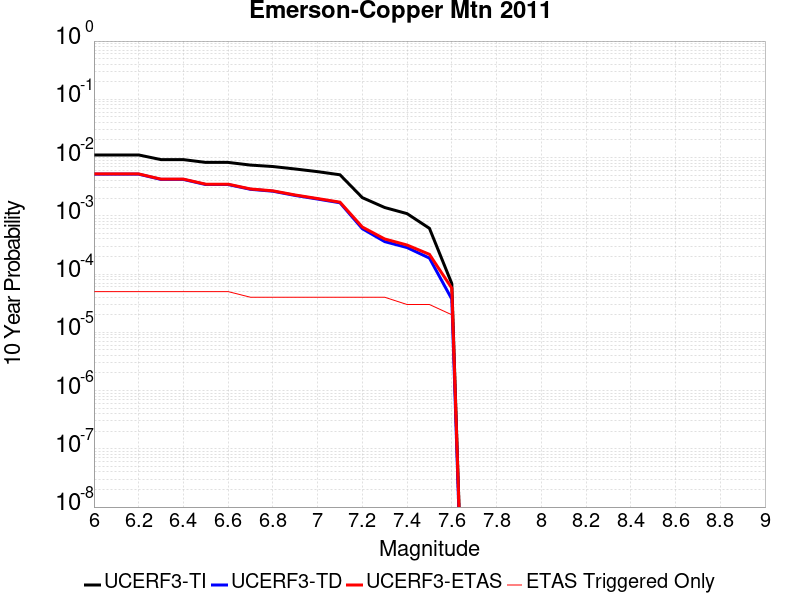 |

| Magnitude | 1 wk TI Prob | 1 wk TD Prob | 1 wk ETAS Prob | 1 wk ETAS/TD Gain | 1 wk ETAS Triggered Only | 1 mo TI Prob | 1 mo TD Prob | 1 mo ETAS Prob | 1 mo ETAS/TD Gain | 1 mo ETAS Triggered Only | 1 yr TI Prob | 1 yr TD Prob | 1 yr ETAS Prob | 1 yr ETAS/TD Gain | 1 yr ETAS Triggered Only | 10 yr TI Prob | 10 yr TD Prob | 10 yr ETAS Prob | 10 yr ETAS/TD Gain | 10 yr ETAS Triggered Only |
|-----|-----|-----|-----|-----|-----|-----|-----|-----|-----|-----|-----|-----|-----|-----|-----|-----|-----|-----|-----|-----|
| 6.0 | 2.1364202E-5 | 9.968114E-6 | 1.4097689E-4 | 14.142786 | 1.3101009E-4 | 9.1557646E-5 | 4.2719836E-5 | 1.7372433E-4 | 4.0665965 | 1.3101009E-4 | 0.0011141442 | 5.199986E-4 | 6.509406E-4 | 1.2518121 | 1.3101009E-4 | 0.011085749 | 0.005188688 | 0.0053190184 | 1.0251181 | 1.3101009E-4 |
| 6.1 | 2.1364202E-5 | 9.968114E-6 | 1.4097689E-4 | 14.142786 | 1.3101009E-4 | 9.1557646E-5 | 4.2719836E-5 | 1.7372433E-4 | 4.0665965 | 1.3101009E-4 | 0.0011141442 | 5.199986E-4 | 6.509406E-4 | 1.2518121 | 1.3101009E-4 | 0.011085749 | 0.005188688 | 0.0053190184 | 1.0251181 | 1.3101009E-4 |
| 6.2 | 2.1364202E-5 | 9.968114E-6 | 1.4097689E-4 | 14.142786 | 1.3101009E-4 | 9.1557646E-5 | 4.2719836E-5 | 1.7372433E-4 | 4.0665965 | 1.3101009E-4 | 0.0011141442 | 5.199986E-4 | 6.509406E-4 | 1.2518121 | 1.3101009E-4 | 0.011085749 | 0.005188688 | 0.0053190184 | 1.0251181 | 1.3101009E-4 |
| 6.3 | 1.7751237E-5 | 8.089227E-6 | 1.3909825E-4 | 17.195494 | 1.3101009E-4 | 7.607452E-5 | 3.466769E-5 | 1.6567323E-4 | 4.778895 | 1.3101009E-4 | 9.258136E-4 | 4.2200365E-4 | 5.5295846E-4 | 1.3103168 | 1.3101009E-4 | 0.00921966 | 0.0042126453 | 0.0043431036 | 1.0309682 | 1.3101009E-4 |
| 6.4 | 1.7751237E-5 | 8.089227E-6 | 1.3909825E-4 | 17.195494 | 1.3101009E-4 | 7.607452E-5 | 3.466769E-5 | 1.6567323E-4 | 4.778895 | 1.3101009E-4 | 9.258136E-4 | 4.2200365E-4 | 5.5295846E-4 | 1.3103168 | 1.3101009E-4 | 0.00921966 | 0.0042126453 | 0.0043431036 | 1.0309682 | 1.3101009E-4 |
| 6.5 | 1.5886664E-5 | 6.603819E-6 | 1.3761304E-4 | 20.838404 | 1.3101009E-4 | 6.808392E-5 | 2.8301802E-5 | 1.5930818E-4 | 5.6289062 | 1.3101009E-4 | 8.286065E-4 | 3.4452465E-4 | 4.754896E-4 | 1.3801323 | 1.3101009E-4 | 0.008255237 | 0.0034403696 | 0.003570929 | 1.0379492 | 1.3101009E-4 |
| 6.6 | 1.5886664E-5 | 6.603819E-6 | 1.3761304E-4 | 20.838404 | 1.3101009E-4 | 6.808392E-5 | 2.8301802E-5 | 1.5930818E-4 | 5.6289062 | 1.3101009E-4 | 8.286065E-4 | 3.4452465E-4 | 4.754896E-4 | 1.3801323 | 1.3101009E-4 | 0.008255237 | 0.0034403696 | 0.003570929 | 1.0379492 | 1.3101009E-4 |
| 6.7 | 1.428471E-5 | 5.470403E-6 | 1.3647978E-4 | 24.948761 | 1.3101009E-4 | 6.121875E-5 | 2.3444394E-5 | 1.5445141E-4 | 6.587989 | 1.3101009E-4 | 7.450834E-4 | 2.8540206E-4 | 4.1637477E-4 | 1.4589059 | 1.3101009E-4 | 0.007425902 | 0.0028507432 | 0.0029813799 | 1.0458255 | 1.3101009E-4 |
| 6.8 | 1.3490684E-5 | 5.073699E-6 | 1.3608312E-4 | 26.821285 | 1.3101009E-4 | 5.7815934E-5 | 2.1744265E-5 | 1.527515E-4 | 7.02491 | 1.3101009E-4 | 7.0368167E-4 | 2.6470813E-4 | 3.9568354E-4 | 1.4947917 | 1.3101009E-4 | 0.007014576 | 0.002644309 | 0.0027749727 | 1.0494132 | 1.3101009E-4 |
| 6.9 | 1.2235421E-5 | 4.289677E-6 | 1.352992E-4 | 31.540651 | 1.3101009E-4 | 5.2436466E-5 | 1.838422E-5 | 1.493919E-4 | 8.126094 | 1.3101009E-4 | 6.38227E-4 | 2.238085E-4 | 3.5478926E-4 | 1.5852358 | 1.3101009E-4 | 0.0063639707 | 0.0022361854 | 0.0023669025 | 1.0584553 | 1.3101009E-4 |
| 7.0 | 1.1009851E-5 | 3.7189886E-6 | 1.3472859E-4 | 36.22721 | 1.3101009E-4 | 4.7184225E-5 | 1.5938444E-5 | 1.4694645E-4 | 9.219623 | 1.3101009E-4 | 5.743165E-4 | 1.9403672E-4 | 3.250214E-4 | 1.675051 | 1.3101009E-4 | 0.005728345 | 0.0019390108 | 0.0020697669 | 1.0674344 | 1.3101009E-4 |
| 7.1 | 9.726373E-6 | 3.2117953E-6 | 1.3422147E-4 | 41.79017 | 1.3101009E-4 | 4.168379E-5 | 1.3764783E-5 | 1.4477306E-4 | 10.517642 | 1.3101009E-4 | 5.07382E-4 | 1.6757673E-4 | 2.9856485E-4 | 1.7816607 | 1.3101009E-4 | 0.0050622504 | 0.0016748349 | 0.0018056255 | 1.0780916 | 1.3101009E-4 |
| 7.2 | 3.9335127E-6 | 1.1524792E-6 | 1.3216241E-4 | 114.67662 | 1.3101009E-4 | 1.6857803E-5 | 4.9391874E-6 | 1.3594863E-4 | 27.524492 | 1.3101009E-4 | 2.0522442E-4 | 6.0133007E-5 | 1.9113522E-4 | 3.1785407 | 1.3101009E-4 | 0.00205035 | 6.011733E-4 | 7.3210464E-4 | 1.217793 | 1.3101009E-4 |
| 7.3 | 2.661632E-6 | 6.911505E-7 | 1.3170115E-4 | 190.5535 | 1.3101009E-4 | 1.14069435E-5 | 2.9620703E-6 | 1.3397177E-4 | 45.2291 | 1.3101009E-4 | 1.3887069E-4 | 3.6062618E-5 | 1.6706798E-4 | 4.632719 | 1.3101009E-4 | 0.0013878393 | 3.605687E-4 | 4.9153157E-4 | 1.3632119 | 1.3101009E-4 |
| 7.4 | 2.0893426E-6 | 5.4618386E-7 | 1.315562E-4 | 240.86432 | 1.3101009E-4 | 8.954295E-6 | 2.3407858E-6 | 1.3335056E-4 | 56.96829 | 1.3101009E-4 | 1.0901308E-4 | 2.84987E-5 | 1.5950506E-4 | 5.596924 | 1.3101009E-4 | 0.0010895962 | 2.84951E-4 | 4.1592377E-4 | 1.4596325 | 1.3101009E-4 |
| 7.5 | 1.1681728E-6 | 3.6030585E-7 | 1.3137034E-4 | 364.60788 | 1.3101009E-4 | 5.0064455E-6 | 1.544167E-6 | 1.3255405E-4 | 85.84178 | 1.3101009E-4 | 6.0951766E-5 | 1.8800076E-5 | 1.498077E-4 | 7.9684625 | 1.3101009E-4 | 6.093505E-4 | 1.8798532E-4 | 3.189708E-4 | 1.6967856 | 1.3101009E-4 |
| 7.6 | 1.3154387E-7 | 7.1197384E-8 | 7.1197384E-8 | 1.0 | 0.0 | 5.6375933E-7 | 3.051316E-7 | 3.051316E-7 | 1.0 | 0.0 | 6.863748E-6 | 3.7149728E-6 | 3.7149728E-6 | 1.0 | 0.0 | 6.863536E-5 | 3.7149264E-5 | 3.7149264E-5 | 1.0 | 0.0 |

## San Jacinto (Anza) rev
*[(top)](#table-of-contents)*

| 1 Week | 1 Month | 1 Year | 10 Year |
|-----|-----|-----|-----|
|  |  |  |  |

| Magnitude | 1 wk TI Prob | 1 wk TD Prob | 1 wk ETAS Prob | 1 wk ETAS/TD Gain | 1 wk ETAS Triggered Only | 1 mo TI Prob | 1 mo TD Prob | 1 mo ETAS Prob | 1 mo ETAS/TD Gain | 1 mo ETAS Triggered Only | 1 yr TI Prob | 1 yr TD Prob | 1 yr ETAS Prob | 1 yr ETAS/TD Gain | 1 yr ETAS Triggered Only | 10 yr TI Prob | 10 yr TD Prob | 10 yr ETAS Prob | 10 yr ETAS/TD Gain | 10 yr ETAS Triggered Only |
|-----|-----|-----|-----|-----|-----|-----|-----|-----|-----|-----|-----|-----|-----|-----|-----|-----|-----|-----|-----|-----|
| 6.0 | 6.3015636E-5 | 4.3302647E-5 | 1.7430706E-4 | 4.025321 | 1.3101009E-4 | 2.7003905E-4 | 1.8556965E-4 | 3.165554E-4 | 1.7058578 | 1.3101009E-4 | 0.0032827691 | 0.0022569813 | 0.0023876957 | 1.0579156 | 1.3101009E-4 | 0.032346968 | 0.023296192 | 0.02342415 | 1.0054927 | 1.3101009E-4 |
| 6.1 | 6.3015636E-5 | 4.3302647E-5 | 1.7430706E-4 | 4.025321 | 1.3101009E-4 | 2.7003905E-4 | 1.8556965E-4 | 3.165554E-4 | 1.7058578 | 1.3101009E-4 | 0.0032827691 | 0.0022569813 | 0.0023876957 | 1.0579156 | 1.3101009E-4 | 0.032346968 | 0.023296192 | 0.02342415 | 1.0054927 | 1.3101009E-4 |
| 6.2 | 6.3015636E-5 | 4.3302647E-5 | 1.7430706E-4 | 4.025321 | 1.3101009E-4 | 2.7003905E-4 | 1.8556965E-4 | 3.165554E-4 | 1.7058578 | 1.3101009E-4 | 0.0032827691 | 0.0022569813 | 0.0023876957 | 1.0579156 | 1.3101009E-4 | 0.032346968 | 0.023296192 | 0.02342415 | 1.0054927 | 1.3101009E-4 |
| 6.3 | 6.3015636E-5 | 4.3302647E-5 | 1.7430706E-4 | 4.025321 | 1.3101009E-4 | 2.7003905E-4 | 1.8556965E-4 | 3.165554E-4 | 1.7058578 | 1.3101009E-4 | 0.0032827691 | 0.0022569813 | 0.0023876957 | 1.0579156 | 1.3101009E-4 | 0.032346968 | 0.023296192 | 0.02342415 | 1.0054927 | 1.3101009E-4 |
| 6.4 | 6.3015636E-5 | 4.3302647E-5 | 1.7430706E-4 | 4.025321 | 1.3101009E-4 | 2.7003905E-4 | 1.8556965E-4 | 3.165554E-4 | 1.7058578 | 1.3101009E-4 | 0.0032827691 | 0.0022569813 | 0.0023876957 | 1.0579156 | 1.3101009E-4 | 0.032346968 | 0.023296192 | 0.02342415 | 1.0054927 | 1.3101009E-4 |
| 6.5 | 5.811017E-5 | 4.0082516E-5 | 1.7108735E-4 | 4.2683787 | 1.3101009E-4 | 2.4901982E-4 | 1.7177092E-4 | 3.027585E-4 | 1.7625713 | 1.3101009E-4 | 0.0030276014 | 0.002089311 | 0.0022200472 | 1.0625739 | 1.3101009E-4 | 0.02986684 | 0.021593736 | 0.021721918 | 1.005936 | 1.3101009E-4 |
| 6.6 | 5.811017E-5 | 4.0082516E-5 | 1.7108735E-4 | 4.2683787 | 1.3101009E-4 | 2.4901982E-4 | 1.7177092E-4 | 3.027585E-4 | 1.7625713 | 1.3101009E-4 | 0.0030276014 | 0.002089311 | 0.0022200472 | 1.0625739 | 1.3101009E-4 | 0.02986684 | 0.021593736 | 0.021721918 | 1.005936 | 1.3101009E-4 |
| 6.7 | 5.712442E-5 | 3.9505223E-5 | 1.7051013E-4 | 4.3161416 | 1.3101009E-4 | 2.4479596E-4 | 1.6929714E-4 | 3.0028506E-4 | 1.773716 | 1.3101009E-4 | 0.0029763177 | 0.0020592497 | 0.00218999 | 1.0634893 | 1.3101009E-4 | 0.029367693 | 0.021285562 | 0.021413784 | 1.0060239 | 1.3101009E-4 |
| 6.8 | 5.6967532E-5 | 3.9361643E-5 | 1.7036658E-4 | 4.3282385 | 1.3101009E-4 | 2.4412372E-4 | 1.6868189E-4 | 2.9966986E-4 | 1.7765386 | 1.3101009E-4 | 0.0029681553 | 0.002051773 | 0.0021825142 | 1.0637212 | 1.3101009E-4 | 0.029288229 | 0.021210281 | 0.021338513 | 1.0060457 | 1.3101009E-4 |
| 6.9 | 5.6211324E-5 | 3.9066435E-5 | 1.700714E-4 | 4.3533893 | 1.3101009E-4 | 2.4088343E-4 | 1.6741687E-4 | 2.9840504E-4 | 1.7824072 | 1.3101009E-4 | 0.0029288116 | 0.0020364004 | 0.0021671436 | 1.0642031 | 1.3101009E-4 | 0.028905109 | 0.021049714 | 0.021177966 | 1.0060928 | 1.3101009E-4 |
| 7.0 | 5.4383527E-5 | 3.792697E-5 | 1.6893209E-4 | 4.4541416 | 1.3101009E-4 | 2.3305144E-4 | 1.6253405E-4 | 2.9352284E-4 | 1.805916 | 1.3101009E-4 | 0.0028337094 | 0.001977061 | 0.002107812 | 1.0661341 | 1.3101009E-4 | 0.027978465 | 0.020440677 | 0.020569008 | 1.0062783 | 1.3101009E-4 |
| 7.1 | 5.1393665E-5 | 3.6389913E-5 | 1.6739524E-4 | 4.6000447 | 1.3101009E-4 | 2.2023996E-4 | 1.5594746E-4 | 2.8693714E-4 | 1.8399601 | 1.3101009E-4 | 0.0026781242 | 0.0018970112 | 0.0020277728 | 1.0689303 | 1.3101009E-4 | 0.026460782 | 0.019614287 | 0.019742727 | 1.0065483 | 1.3101009E-4 |
| 7.2 | 4.785222E-5 | 3.4741795E-5 | 1.6574733E-4 | 4.7708335 | 1.3101009E-4 | 2.0506482E-4 | 1.4888494E-4 | 2.7987553E-4 | 1.8798108 | 1.3101009E-4 | 0.0024938055 | 0.0018111705 | 0.0019419433 | 1.0722035 | 1.3101009E-4 | 0.024660049 | 0.018728992 | 0.018857548 | 1.0068641 | 1.3101009E-4 |
| 7.3 | 4.2143256E-5 | 3.383628E-5 | 1.6484193E-4 | 4.8717513 | 1.3101009E-4 | 1.8060145E-4 | 1.4500458E-4 | 2.7599567E-4 | 1.9033582 | 1.3101009E-4 | 0.002196605 | 0.0017640047 | 0.0018947837 | 1.0741376 | 1.3101009E-4 | 0.02175019 | 0.01823724 | 0.018365862 | 1.0070527 | 1.3101009E-4 |
| 7.4 | 4.0264713E-5 | 3.347446E-5 | 1.6448017E-4 | 4.9136014 | 1.3101009E-4 | 1.7255165E-4 | 1.4345412E-4 | 2.744454E-4 | 1.9131233 | 1.3101009E-4 | 0.002098792 | 0.0017451581 | 0.0018759395 | 1.0749396 | 1.3101009E-4 | 0.020790804 | 0.018041821 | 0.018170467 | 1.0071305 | 1.3101009E-4 |
| 7.5 | 3.694492E-5 | 3.218847E-5 | 1.6319435E-4 | 5.069963 | 1.3101009E-4 | 1.5832575E-4 | 1.379433E-4 | 2.689353E-4 | 1.9496077 | 1.3101009E-4 | 0.0019259118 | 0.001678169 | 0.0018089592 | 1.0779363 | 1.3101009E-4 | 0.01909306 | 0.01735827 | 0.017487006 | 1.0074164 | 1.3101009E-4 |
| 7.6 | 3.200565E-5 | 2.9504106E-5 | 1.6051033E-4 | 5.440271 | 1.3101009E-4 | 1.3715986E-4 | 1.2644005E-4 | 2.5743357E-4 | 2.036013 | 1.3101009E-4 | 0.001668642 | 0.0015383229 | 0.0016691315 | 1.0850332 | 1.3101009E-4 | 0.01656168 | 0.0159463 | 0.016075222 | 1.0080847 | 1.3101009E-4 |
| 7.7 | 2.731642E-5 | 2.6092788E-5 | 1.5709945E-4 | 6.0208 | 1.3101009E-4 | 1.1706512E-4 | 1.1182144E-4 | 2.4281688E-4 | 2.1714697 | 1.3101009E-4 | 0.001424336 | 0.0013605768 | 0.0014914087 | 1.0961591 | 1.3101009E-4 | 0.014152412 | 0.014167004 | 0.014296159 | 1.0091165 | 1.3101009E-4 |
| 7.8 | 2.3466424E-5 | 2.3504817E-5 | 1.5451183E-4 | 6.5736237 | 1.3101009E-4 | 1.0056651E-4 | 1.0073105E-4 | 2.3172794E-4 | 2.300462 | 1.3101009E-4 | 0.0012237094 | 0.0012257113 | 0.0013565609 | 1.106754 | 1.3101009E-4 | 0.012169928 | 0.012808893 | 0.012938225 | 1.010097 | 1.3101009E-4 |
| 7.9 | 1.8611925E-5 | 1.8908117E-5 | 1.4991572E-4 | 7.928644 | 1.3101009E-4 | 7.9762955E-5 | 8.1032274E-5 | 2.1203175E-4 | 2.6166334 | 1.3101009E-4 | 9.7068126E-4 | 9.861222E-4 | 0.001117003 | 1.1327229 | 1.3101009E-4 | 0.0096645225 | 0.010393824 | 0.010523473 | 1.0124736 | 1.3101009E-4 |
| 8.0 | 1.5460775E-5 | 1.5740965E-5 | 1.46749E-4 | 9.322744 | 1.3101009E-4 | 6.6258784E-5 | 6.7459536E-5 | 1.9846078E-4 | 2.9419234 | 1.3101009E-4 | 8.0640207E-4 | 8.21011E-4 | 9.519136E-4 | 1.1594406 | 1.3101009E-4 | 0.008034821 | 0.0087028835 | 0.008832754 | 1.0149226 | 1.3101009E-4 |
| 8.1 | 9.983884E-6 | 8.269952E-6 | 1.3927896E-4 | 16.841568 | 1.3101009E-4 | 4.2787375E-5 | 3.544217E-5 | 1.6644761E-4 | 4.6963153 | 1.3101009E-4 | 5.2081177E-4 | 4.314235E-4 | 5.623771E-4 | 1.3035383 | 1.3101009E-4 | 0.0051959283 | 0.004640022 | 0.004770424 | 1.0281038 | 1.3101009E-4 |
| 8.2 | 4.1226E-6 | 1.5529788E-6 | 1.5529788E-6 | 1.0 | 0.0 | 1.7668166E-5 | 6.6556063E-6 | 6.6556063E-6 | 1.0 | 0.0 | 2.1508869E-4 | 8.102902E-5 | 8.102902E-5 | 1.0 | 0.0 | 0.0021488064 | 9.4050163E-4 | 9.4050163E-4 | 1.0 | 0.0 |
| 8.3 | 1.2750878E-6 | 3.612133E-7 | 3.612133E-7 | 1.0 | 0.0 | 5.4646503E-6 | 1.548056E-6 | 1.548056E-6 | 1.0 | 0.0 | 6.653009E-5 | 1.8847424E-5 | 1.8847424E-5 | 1.0 | 0.0 | 6.6510175E-4 | 2.2734253E-4 | 2.2734253E-4 | 1.0 | 0.0 |

## Santa Ynez (East)
*[(top)](#table-of-contents)*

| 1 Week | 1 Month | 1 Year | 10 Year |
|-----|-----|-----|-----|
|  |  |  |  |

| Magnitude | 1 wk TI Prob | 1 wk TD Prob | 1 wk ETAS Prob | 1 wk ETAS/TD Gain | 1 wk ETAS Triggered Only | 1 mo TI Prob | 1 mo TD Prob | 1 mo ETAS Prob | 1 mo ETAS/TD Gain | 1 mo ETAS Triggered Only | 1 yr TI Prob | 1 yr TD Prob | 1 yr ETAS Prob | 1 yr ETAS/TD Gain | 1 yr ETAS Triggered Only | 10 yr TI Prob | 10 yr TD Prob | 10 yr ETAS Prob | 10 yr ETAS/TD Gain | 10 yr ETAS Triggered Only |
|-----|-----|-----|-----|-----|-----|-----|-----|-----|-----|-----|-----|-----|-----|-----|-----|-----|-----|-----|-----|-----|
| 6.0 | 3.2269712E-5 | 3.67505E-5 | 3.67505E-5 | 1.0 | 0.0 | 1.3829143E-4 | 1.5749598E-4 | 2.8848543E-4 | 1.8317003 | 1.3101009E-4 | 0.0016823979 | 0.0019164166 | 0.0020471755 | 1.068231 | 1.3101009E-4 | 0.016697178 | 0.019056441 | 0.019184954 | 1.0067438 | 1.3101009E-4 |
| 6.1 | 3.2269712E-5 | 3.67505E-5 | 3.67505E-5 | 1.0 | 0.0 | 1.3829143E-4 | 1.5749598E-4 | 2.8848543E-4 | 1.8317003 | 1.3101009E-4 | 0.0016823979 | 0.0019164166 | 0.0020471755 | 1.068231 | 1.3101009E-4 | 0.016697178 | 0.019056441 | 0.019184954 | 1.0067438 | 1.3101009E-4 |
| 6.2 | 3.2269712E-5 | 3.67505E-5 | 3.67505E-5 | 1.0 | 0.0 | 1.3829143E-4 | 1.5749598E-4 | 2.8848543E-4 | 1.8317003 | 1.3101009E-4 | 0.0016823979 | 0.0019164166 | 0.0020471755 | 1.068231 | 1.3101009E-4 | 0.016697178 | 0.019056441 | 0.019184954 | 1.0067438 | 1.3101009E-4 |
| 6.3 | 3.2269712E-5 | 3.67505E-5 | 3.67505E-5 | 1.0 | 0.0 | 1.3829143E-4 | 1.5749598E-4 | 2.8848543E-4 | 1.8317003 | 1.3101009E-4 | 0.0016823979 | 0.0019164166 | 0.0020471755 | 1.068231 | 1.3101009E-4 | 0.016697178 | 0.019056441 | 0.019184954 | 1.0067438 | 1.3101009E-4 |
| 6.4 | 1.4404779E-5 | 1.4849382E-5 | 1.4849382E-5 | 1.0 | 0.0 | 6.1733306E-5 | 6.363868E-5 | 6.363868E-5 | 1.0 | 0.0 | 7.513438E-4 | 7.745306E-4 | 7.745306E-4 | 1.0 | 0.0 | 0.0074880854 | 0.007718862 | 0.007718862 | 1.0 | 0.0 |
| 6.5 | 1.4404779E-5 | 1.4849382E-5 | 1.4849382E-5 | 1.0 | 0.0 | 6.1733306E-5 | 6.363868E-5 | 6.363868E-5 | 1.0 | 0.0 | 7.513438E-4 | 7.745306E-4 | 7.745306E-4 | 1.0 | 0.0 | 0.0074880854 | 0.007718862 | 0.007718862 | 1.0 | 0.0 |
| 6.6 | 1.280208E-5 | 1.3011947E-5 | 1.3011947E-5 | 1.0 | 0.0 | 5.4864904E-5 | 5.5764307E-5 | 5.5764307E-5 | 1.0 | 0.0 | 6.6777546E-4 | 6.787207E-4 | 6.787207E-4 | 1.0 | 0.0 | 0.006657724 | 0.0067666885 | 0.0067666885 | 1.0 | 0.0 |
| 6.7 | 1.2457027E-5 | 1.2628468E-5 | 1.2628468E-5 | 1.0 | 0.0 | 5.3386164E-5 | 5.412089E-5 | 5.412089E-5 | 1.0 | 0.0 | 6.497827E-4 | 6.587243E-4 | 6.587243E-4 | 1.0 | 0.0 | 0.00647886 | 0.006567915 | 0.006567915 | 1.0 | 0.0 |
| 6.8 | 1.2095134E-5 | 1.2230915E-5 | 1.2230915E-5 | 1.0 | 0.0 | 5.1835254E-5 | 5.241716E-5 | 5.241716E-5 | 1.0 | 0.0 | 6.309115E-4 | 6.379937E-4 | 6.379937E-4 | 1.0 | 0.0 | 0.0062912325 | 0.006361809 | 0.006361809 | 1.0 | 0.0 |
| 6.9 | 1.1104036E-5 | 1.1157347E-5 | 1.1157347E-5 | 1.0 | 0.0 | 4.758786E-5 | 4.781633E-5 | 4.781633E-5 | 1.0 | 0.0 | 5.7922816E-4 | 5.820096E-4 | 5.820096E-4 | 1.0 | 0.0 | 0.005777207 | 0.0058049993 | 0.0058049993 | 1.0 | 0.0 |
| 7.0 | 1.0577444E-5 | 1.058168E-5 | 1.058168E-5 | 1.0 | 0.0 | 4.5331115E-5 | 4.5349276E-5 | 4.5349276E-5 | 1.0 | 0.0 | 5.5176654E-4 | 5.519888E-4 | 5.519888E-4 | 1.0 | 0.0 | 0.0055039856 | 0.0055063153 | 0.0055063153 | 1.0 | 0.0 |
| 7.1 | 1.0021775E-5 | 9.980988E-6 | 9.980988E-6 | 1.0 | 0.0 | 4.294976E-5 | 4.2774966E-5 | 4.2774966E-5 | 1.0 | 0.0 | 5.2278786E-4 | 5.2066194E-4 | 5.2066194E-4 | 1.0 | 0.0 | 0.0052155964 | 0.0051945536 | 0.0051945536 | 1.0 | 0.0 |
| 7.2 | 8.874109E-6 | 8.748793E-6 | 8.748793E-6 | 1.0 | 0.0 | 3.8031343E-5 | 3.7494297E-5 | 3.7494297E-5 | 1.0 | 0.0 | 4.629332E-4 | 4.5639853E-4 | 4.5639853E-4 | 1.0 | 0.0 | 0.0046197 | 0.0045547304 | 0.0045547304 | 1.0 | 0.0 |
| 7.3 | 7.5504267E-6 | 7.5051175E-6 | 7.5051175E-6 | 1.0 | 0.0 | 3.235857E-5 | 3.21644E-5 | 3.21644E-5 | 1.0 | 0.0 | 3.9389438E-4 | 3.915322E-4 | 3.915322E-4 | 1.0 | 0.0 | 0.0039319694 | 0.003908531 | 0.003908531 | 1.0 | 0.0 |
| 7.4 | 6.309394E-6 | 6.1831556E-6 | 6.1831556E-6 | 1.0 | 0.0 | 2.703998E-5 | 2.6498974E-5 | 2.6498974E-5 | 1.0 | 0.0 | 3.2916202E-4 | 3.225782E-4 | 3.225782E-4 | 1.0 | 0.0 | 0.003286749 | 0.003221197 | 0.003221197 | 1.0 | 0.0 |
| 7.5 | 4.6103073E-6 | 4.4408903E-6 | 4.4408903E-6 | 1.0 | 0.0 | 1.975831E-5 | 1.9032252E-5 | 1.9032252E-5 | 1.0 | 0.0 | 2.4053088E-4 | 2.3169373E-4 | 2.3169373E-4 | 1.0 | 0.0 | 0.002402707 | 0.002314591 | 0.002314591 | 1.0 | 0.0 |
| 7.6 | 1.2858658E-6 | 1.3008173E-6 | 1.3008173E-6 | 1.0 | 0.0 | 5.5108417E-6 | 5.5749197E-6 | 5.5749197E-6 | 1.0 | 0.0 | 6.7092435E-5 | 6.78726E-5 | 6.78726E-5 | 1.0 | 0.0 | 6.707218E-4 | 6.785256E-4 | 6.785256E-4 | 1.0 | 0.0 |
| 7.7 | 5.3302307E-7 | 5.612138E-7 | 5.612138E-7 | 1.0 | 0.0 | 2.2843826E-6 | 2.4052001E-6 | 2.4052001E-6 | 1.0 | 0.0 | 2.7812002E-5 | 2.9282954E-5 | 2.9282954E-5 | 1.0 | 0.0 | 2.7808524E-4 | 2.9279452E-4 | 2.9279452E-4 | 1.0 | 0.0 |
| 7.8 | 4.613933E-8 | 4.80301E-8 | 4.80301E-8 | 1.0 | 0.0 | 1.9773998E-7 | 2.0584326E-7 | 2.0584326E-7 | 1.0 | 0.0 | 2.4074816E-6 | 2.5061388E-6 | 2.5061388E-6 | 1.0 | 0.0 | 2.4074554E-5 | 2.5061116E-5 | 2.5061116E-5 | 1.0 | 0.0 |

## San Jacinto (Coyote Creek)
*[(top)](#table-of-contents)*

| 1 Week | 1 Month | 1 Year | 10 Year |
|-----|-----|-----|-----|
|  | 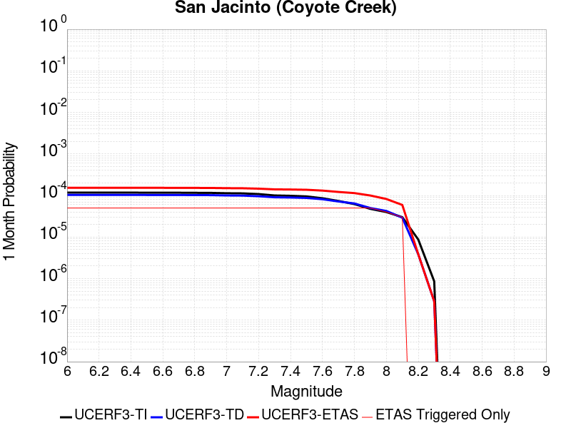 |  |  |

| Magnitude | 1 wk TI Prob | 1 wk TD Prob | 1 wk ETAS Prob | 1 wk ETAS/TD Gain | 1 wk ETAS Triggered Only | 1 mo TI Prob | 1 mo TD Prob | 1 mo ETAS Prob | 1 mo ETAS/TD Gain | 1 mo ETAS Triggered Only | 1 yr TI Prob | 1 yr TD Prob | 1 yr ETAS Prob | 1 yr ETAS/TD Gain | 1 yr ETAS Triggered Only | 10 yr TI Prob | 10 yr TD Prob | 10 yr ETAS Prob | 10 yr ETAS/TD Gain | 10 yr ETAS Triggered Only |
|-----|-----|-----|-----|-----|-----|-----|-----|-----|-----|-----|-----|-----|-----|-----|-----|-----|-----|-----|-----|-----|
| 6.0 | 2.7374346E-5 | 2.4145214E-5 | 1.5515214E-4 | 6.4257927 | 1.3101009E-4 | 1.1731335E-4 | 1.034754E-4 | 2.3447193E-4 | 2.2659678 | 1.3101009E-4 | 0.0014273542 | 0.0012590875 | 0.0013899326 | 1.1039206 | 1.3101009E-4 | 0.01418221 | 0.012928318 | 0.013057634 | 1.0100026 | 1.3101009E-4 |
| 6.1 | 2.7374346E-5 | 2.4145214E-5 | 1.5515214E-4 | 6.4257927 | 1.3101009E-4 | 1.1731335E-4 | 1.034754E-4 | 2.3447193E-4 | 2.2659678 | 1.3101009E-4 | 0.0014273542 | 0.0012590875 | 0.0013899326 | 1.1039206 | 1.3101009E-4 | 0.01418221 | 0.012928318 | 0.013057634 | 1.0100026 | 1.3101009E-4 |
| 6.2 | 2.7374346E-5 | 2.4145214E-5 | 1.5515214E-4 | 6.4257927 | 1.3101009E-4 | 1.1731335E-4 | 1.034754E-4 | 2.3447193E-4 | 2.2659678 | 1.3101009E-4 | 0.0014273542 | 0.0012590875 | 0.0013899326 | 1.1039206 | 1.3101009E-4 | 0.01418221 | 0.012928318 | 0.013057634 | 1.0100026 | 1.3101009E-4 |
| 6.3 | 2.7374346E-5 | 2.4145214E-5 | 1.5515214E-4 | 6.4257927 | 1.3101009E-4 | 1.1731335E-4 | 1.034754E-4 | 2.3447193E-4 | 2.2659678 | 1.3101009E-4 | 0.0014273542 | 0.0012590875 | 0.0013899326 | 1.1039206 | 1.3101009E-4 | 0.01418221 | 0.012928318 | 0.013057634 | 1.0100026 | 1.3101009E-4 |
| 6.4 | 2.7374346E-5 | 2.4145214E-5 | 1.5515214E-4 | 6.4257927 | 1.3101009E-4 | 1.1731335E-4 | 1.034754E-4 | 2.3447193E-4 | 2.2659678 | 1.3101009E-4 | 0.0014273542 | 0.0012590875 | 0.0013899326 | 1.1039206 | 1.3101009E-4 | 0.01418221 | 0.012928318 | 0.013057634 | 1.0100026 | 1.3101009E-4 |
| 6.5 | 2.7282445E-5 | 2.4031293E-5 | 1.5503823E-4 | 6.4515147 | 1.3101009E-4 | 1.16919524E-4 | 1.029872E-4 | 2.339838E-4 | 2.2719696 | 1.3101009E-4 | 0.0014225657 | 0.0012531505 | 0.0013839965 | 1.1044135 | 1.3101009E-4 | 0.014134934 | 0.012869646 | 0.012998969 | 1.0100487 | 1.3101009E-4 |
| 6.6 | 2.7282445E-5 | 2.4031293E-5 | 1.5503823E-4 | 6.4515147 | 1.3101009E-4 | 1.16919524E-4 | 1.029872E-4 | 2.339838E-4 | 2.2719696 | 1.3101009E-4 | 0.0014225657 | 0.0012531505 | 0.0013839965 | 1.1044135 | 1.3101009E-4 | 0.014134934 | 0.012869646 | 0.012998969 | 1.0100487 | 1.3101009E-4 |
| 6.7 | 2.7216198E-5 | 2.3956412E-5 | 1.5496336E-4 | 6.4685545 | 1.3101009E-4 | 1.1663563E-4 | 1.02666316E-4 | 2.3366295E-4 | 2.2759457 | 1.3101009E-4 | 0.0014191137 | 0.0012492483 | 0.0013800948 | 1.1047401 | 1.3101009E-4 | 0.014100855 | 0.0128310565 | 0.0129603855 | 1.0100794 | 1.3101009E-4 |
| 6.8 | 2.7078617E-5 | 2.387363E-5 | 1.5488059E-4 | 6.4875174 | 1.3101009E-4 | 1.1604605E-4 | 1.0231156E-4 | 2.3330824E-4 | 2.2803702 | 1.3101009E-4 | 0.001411945 | 0.0012449342 | 0.0013757811 | 1.1051035 | 1.3101009E-4 | 0.014030075 | 0.012788199 | 0.0129175335 | 1.0101136 | 1.3101009E-4 |
| 6.9 | 2.6982952E-5 | 2.3793142E-5 | 1.5480012E-4 | 6.506081 | 1.3101009E-4 | 1.15636096E-4 | 1.0196664E-4 | 2.3296337E-4 | 2.2847018 | 1.3101009E-4 | 0.0014069602 | 0.0012407395 | 0.001371587 | 1.1054593 | 1.3101009E-4 | 0.013980856 | 0.012746515 | 0.012875855 | 1.0101471 | 1.3101009E-4 |
| 7.0 | 2.6449972E-5 | 2.3370165E-5 | 1.543772E-4 | 6.605738 | 1.3101009E-4 | 1.1335209E-4 | 1.00154015E-4 | 2.3115099E-4 | 2.3079553 | 1.3101009E-4 | 0.001379188 | 0.0012186957 | 0.001349546 | 1.1073692 | 1.3101009E-4 | 0.0137065975 | 0.0125278765 | 0.012657246 | 1.0103265 | 1.3101009E-4 |
| 7.1 | 2.6257849E-5 | 2.3196202E-5 | 1.5420326E-4 | 6.6477804 | 1.3101009E-4 | 1.1252879E-4 | 9.940852E-5 | 2.3040558E-4 | 2.317765 | 1.3101009E-4 | 0.0013691769 | 0.0012096294 | 0.0013404809 | 1.1081749 | 1.3101009E-4 | 0.013607717 | 0.012437741 | 0.0125671225 | 1.0104022 | 1.3101009E-4 |
| 7.2 | 2.5270041E-5 | 2.2390966E-5 | 1.5339813E-4 | 6.8508935 | 1.3101009E-4 | 1.0829568E-4 | 9.595777E-5 | 2.2695528E-4 | 2.365158 | 1.3101009E-4 | 0.0013177024 | 0.0011676621 | 0.0012985192 | 1.1120676 | 1.3101009E-4 | 0.013099162 | 0.012018777 | 0.012148213 | 1.0107695 | 1.3101009E-4 |
| 7.3 | 2.339701E-5 | 2.1122814E-5 | 1.5213013E-4 | 7.202172 | 1.3101009E-4 | 1.0026905E-4 | 9.0523215E-5 | 2.2152145E-4 | 2.447123 | 1.3101009E-4 | 0.001220092 | 0.0011015651 | 0.0012324308 | 1.1187998 | 1.3101009E-4 | 0.012134149 | 0.011357696 | 0.011487218 | 1.0114039 | 1.3101009E-4 |
| 7.4 | 2.296333E-5 | 2.0853171E-5 | 1.5186053E-4 | 7.282371 | 1.3101009E-4 | 9.841056E-5 | 8.936768E-5 | 2.2036606E-4 | 2.4658363 | 1.3101009E-4 | 0.0011974899 | 0.0010875105 | 0.0012183781 | 1.1203369 | 1.3101009E-4 | 0.011910575 | 0.01121681 | 0.01134635 | 1.0115488 | 1.3101009E-4 |
| 7.5 | 2.2188895E-5 | 2.0376096E-5 | 1.5138352E-4 | 7.4294662 | 1.3101009E-4 | 9.50918E-5 | 8.732321E-5 | 2.1832186E-4 | 2.5001583 | 1.3101009E-4 | 0.0011571277 | 0.0010626436 | 0.0011935144 | 1.123156 | 1.3101009E-4 | 0.011511209 | 0.010966429 | 0.011096002 | 1.0118154 | 1.3101009E-4 |
| 7.6 | 2.0013189E-5 | 1.8962366E-5 | 1.4996997E-4 | 7.9088216 | 1.3101009E-4 | 8.5767984E-5 | 8.1264756E-5 | 2.122642E-4 | 2.612008 | 1.3101009E-4 | 0.001043725 | 9.889511E-4 | 0.0011198317 | 1.1323428 | 1.3101009E-4 | 0.010388365 | 0.010224434 | 0.010354104 | 1.0126824 | 1.3101009E-4 |
| 7.7 | 1.7230794E-5 | 1.674371E-5 | 1.477516E-4 | 8.824305 | 1.3101009E-4 | 7.384417E-5 | 7.175679E-5 | 2.0275748E-4 | 2.825621 | 1.3101009E-4 | 8.986819E-4 | 8.7328954E-4 | 0.0010041852 | 1.149888 | 1.3101009E-4 | 0.008950562 | 0.009062956 | 0.009192779 | 1.0143245 | 1.3101009E-4 |
| 7.8 | 1.4478809E-5 | 1.4990978E-5 | 1.459991E-4 | 9.739131 | 1.3101009E-4 | 6.205057E-5 | 6.424547E-5 | 1.9524714E-4 | 3.0390801 | 1.3101009E-4 | 7.552038E-4 | 7.819085E-4 | 9.128162E-4 | 1.1674206 | 1.3101009E-4 | 0.0075264242 | 0.008141387 | 0.008271331 | 1.0159608 | 1.3101009E-4 |
| 7.9 | 1.1114467E-5 | 1.1645102E-5 | 1.4265366E-4 | 12.2501 | 1.3101009E-4 | 4.7632562E-5 | 4.990663E-5 | 1.8091018E-4 | 3.6249728 | 1.3101009E-4 | 5.797721E-4 | 6.074444E-4 | 7.383749E-4 | 1.2155432 | 1.3101009E-4 | 0.0057826187 | 0.0063803247 | 0.006510499 | 1.0204024 | 1.3101009E-4 |
| 8.0 | 9.327402E-6 | 9.899186E-6 | 1.4090797E-4 | 14.234299 | 1.3101009E-4 | 3.9973966E-5 | 4.2424395E-5 | 1.7342893E-4 | 4.0879526 | 1.3101009E-4 | 4.8657437E-4 | 5.1639514E-4 | 6.473376E-4 | 1.2535702 | 1.3101009E-4 | 0.0048551033 | 0.0054499684 | 0.0055802646 | 1.0239077 | 1.3101009E-4 |
| 8.1 | 7.0235833E-6 | 6.827495E-6 | 1.3783669E-4 | 20.18847 | 1.3101009E-4 | 3.0100724E-5 | 2.9260367E-5 | 1.6026662E-4 | 5.477259 | 1.3101009E-4 | 3.664147E-4 | 3.5618723E-4 | 4.8715065E-4 | 1.3676814 | 1.3101009E-4 | 0.003658111 | 0.0037876023 | 0.0039181164 | 1.0344582 | 1.3101009E-4 |
| 8.2 | 2.0358202E-6 | 8.994527E-7 | 8.994527E-7 | 1.0 | 0.0 | 8.724915E-6 | 3.854792E-6 | 3.854792E-6 | 1.0 | 0.0 | 1.06220665E-4 | 4.69311E-5 | 4.69311E-5 | 1.0 | 0.0 | 0.001061699 | 5.3254166E-4 | 5.3254166E-4 | 1.0 | 0.0 |
| 8.3 | 2.0051264E-7 | 6.617272E-8 | 6.617272E-8 | 1.0 | 0.0 | 8.5933965E-7 | 2.8359733E-7 | 2.8359733E-7 | 1.0 | 0.0 | 1.046241E-5 | 3.4527925E-6 | 3.4527925E-6 | 1.0 | 0.0 | 1.0461917E-4 | 4.01389E-5 | 4.01389E-5 | 1.0 | 0.0 |

## Hector Mine
*[(top)](#table-of-contents)*

| 1 Week | 1 Month | 1 Year | 10 Year |
|-----|-----|-----|-----|
|  |  |  |  |

| Magnitude | 1 wk TI Prob | 1 wk TD Prob | 1 wk ETAS Prob | 1 wk ETAS/TD Gain | 1 wk ETAS Triggered Only | 1 mo TI Prob | 1 mo TD Prob | 1 mo ETAS Prob | 1 mo ETAS/TD Gain | 1 mo ETAS Triggered Only | 1 yr TI Prob | 1 yr TD Prob | 1 yr ETAS Prob | 1 yr ETAS/TD Gain | 1 yr ETAS Triggered Only | 10 yr TI Prob | 10 yr TD Prob | 10 yr ETAS Prob | 10 yr ETAS/TD Gain | 10 yr ETAS Triggered Only |
|-----|-----|-----|-----|-----|-----|-----|-----|-----|-----|-----|-----|-----|-----|-----|-----|-----|-----|-----|-----|-----|
| 6.0 | 1.8760093E-5 | 2.7963818E-6 | 1.338061E-4 | 47.849728 | 1.3101009E-4 | 8.039792E-5 | 1.1984461E-5 | 1.4299298E-4 | 11.931532 | 1.3101009E-4 | 9.78405E-4 | 1.4590504E-4 | 2.76896E-4 | 1.8977823 | 1.3101009E-4 | 0.009741086 | 0.0014584847 | 0.0015893036 | 1.0896952 | 1.3101009E-4 |
| 6.1 | 1.8760093E-5 | 2.7963818E-6 | 1.338061E-4 | 47.849728 | 1.3101009E-4 | 8.039792E-5 | 1.1984461E-5 | 1.4299298E-4 | 11.931532 | 1.3101009E-4 | 9.78405E-4 | 1.4590504E-4 | 2.76896E-4 | 1.8977823 | 1.3101009E-4 | 0.009741086 | 0.0014584847 | 0.0015893036 | 1.0896952 | 1.3101009E-4 |
| 6.2 | 1.8760093E-5 | 2.7963818E-6 | 1.338061E-4 | 47.849728 | 1.3101009E-4 | 8.039792E-5 | 1.1984461E-5 | 1.4299298E-4 | 11.931532 | 1.3101009E-4 | 9.78405E-4 | 1.4590504E-4 | 2.76896E-4 | 1.8977823 | 1.3101009E-4 | 0.009741086 | 0.0014584847 | 0.0015893036 | 1.0896952 | 1.3101009E-4 |
| 6.3 | 1.8760093E-5 | 2.7963818E-6 | 1.338061E-4 | 47.849728 | 1.3101009E-4 | 8.039792E-5 | 1.1984461E-5 | 1.4299298E-4 | 11.931532 | 1.3101009E-4 | 9.78405E-4 | 1.4590504E-4 | 2.76896E-4 | 1.8977823 | 1.3101009E-4 | 0.009741086 | 0.0014584847 | 0.0015893036 | 1.0896952 | 1.3101009E-4 |
| 6.4 | 1.0888055E-5 | 2.7963818E-6 | 1.338061E-4 | 47.849728 | 1.3101009E-4 | 4.666226E-5 | 1.1984461E-5 | 1.4299298E-4 | 11.931532 | 1.3101009E-4 | 5.679649E-4 | 1.4590504E-4 | 2.76896E-4 | 1.8977823 | 1.3101009E-4 | 0.0056651547 | 0.0014584847 | 0.0015893036 | 1.0896952 | 1.3101009E-4 |
| 6.5 | 1.0888055E-5 | 2.7963818E-6 | 1.338061E-4 | 47.849728 | 1.3101009E-4 | 4.666226E-5 | 1.1984461E-5 | 1.4299298E-4 | 11.931532 | 1.3101009E-4 | 5.679649E-4 | 1.4590504E-4 | 2.76896E-4 | 1.8977823 | 1.3101009E-4 | 0.0056651547 | 0.0014584847 | 0.0015893036 | 1.0896952 | 1.3101009E-4 |
| 6.6 | 1.0730738E-5 | 2.7963818E-6 | 1.338061E-4 | 47.849728 | 1.3101009E-4 | 4.5988065E-5 | 1.1984461E-5 | 1.4299298E-4 | 11.931532 | 1.3101009E-4 | 5.5976084E-4 | 1.4590504E-4 | 2.76896E-4 | 1.8977823 | 1.3101009E-4 | 0.0055835294 | 0.0014584847 | 0.0015893036 | 1.0896952 | 1.3101009E-4 |
| 6.7 | 7.881326E-6 | 2.7710626E-6 | 1.3378079E-4 | 48.277798 | 1.3101009E-4 | 3.3776672E-5 | 1.1875951E-5 | 1.4288448E-4 | 12.031415 | 1.3101009E-4 | 4.111534E-4 | 1.445841E-4 | 2.7557524E-4 | 1.9059858 | 1.3101009E-4 | 0.0041039353 | 0.0014452925 | 0.0015761132 | 1.090515 | 1.3101009E-4 |
| 6.8 | 7.5683483E-6 | 2.7328138E-6 | 1.3374255E-4 | 48.939503 | 1.3101009E-4 | 3.2435375E-5 | 1.1712029E-5 | 1.4272059E-4 | 12.185812 | 1.3101009E-4 | 3.9482914E-4 | 1.4258861E-4 | 2.7358002E-4 | 1.9186666 | 1.3101009E-4 | 0.0039412836 | 0.0014253634 | 0.0015561867 | 1.0917825 | 1.3101009E-4 |
| 6.9 | 6.473048E-6 | 2.5138945E-6 | 1.3352366E-4 | 53.11426 | 1.3101009E-4 | 2.7741338E-5 | 1.07738115E-5 | 1.4178248E-4 | 13.159919 | 1.3101009E-4 | 3.3769844E-4 | 1.3116724E-4 | 2.6216015E-4 | 1.9986709 | 1.3101009E-4 | 0.0033718573 | 0.0013112876 | 0.001442126 | 1.0997785 | 1.3101009E-4 |
| 7.0 | 4.9959954E-6 | 1.8565124E-6 | 1.3286636E-4 | 71.56772 | 1.3101009E-4 | 2.1411232E-5 | 7.956478E-6 | 1.3896552E-4 | 17.46571 | 1.3101009E-4 | 2.6065056E-4 | 9.686937E-5 | 2.2786677E-4 | 2.3523097 | 1.3101009E-4 | 0.0026034506 | 9.6862105E-4 | 0.0010995043 | 1.1351233 | 1.3101009E-4 |
| 7.1 | 1.2997541E-6 | 1.5602147E-7 | 1.5602147E-7 | 1.0 | 0.0 | 5.5703626E-6 | 6.686633E-7 | 6.686633E-7 | 1.0 | 0.0 | 6.7817055E-5 | 8.140949E-6 | 8.140949E-6 | 1.0 | 0.0 | 6.779636E-4 | 8.1406906E-5 | 8.1406906E-5 | 1.0 | 0.0 |
| 7.2 | 8.392699E-7 | 9.727592E-8 | 9.727592E-8 | 1.0 | 0.0 | 3.596866E-6 | 4.1689677E-7 | 4.1689677E-7 | 1.0 | 0.0 | 4.3790962E-5 | 5.0757085E-6 | 5.0757085E-6 | 1.0 | 0.0 | 4.3782333E-4 | 5.0756116E-5 | 5.0756116E-5 | 1.0 | 0.0 |
| 7.3 | 3.13015E-7 | 4.829262E-8 | 4.829262E-8 | 1.0 | 0.0 | 1.3414921E-6 | 2.0696835E-7 | 2.0696835E-7 | 1.0 | 0.0 | 1.6332544E-5 | 2.5198376E-6 | 2.5198376E-6 | 1.0 | 0.0 | 1.6331344E-4 | 2.5198176E-5 | 2.5198176E-5 | 1.0 | 0.0 |

## Pine Mtn
*[(top)](#table-of-contents)*

| 1 Week | 1 Month | 1 Year | 10 Year |
|-----|-----|-----|-----|
|  |  | 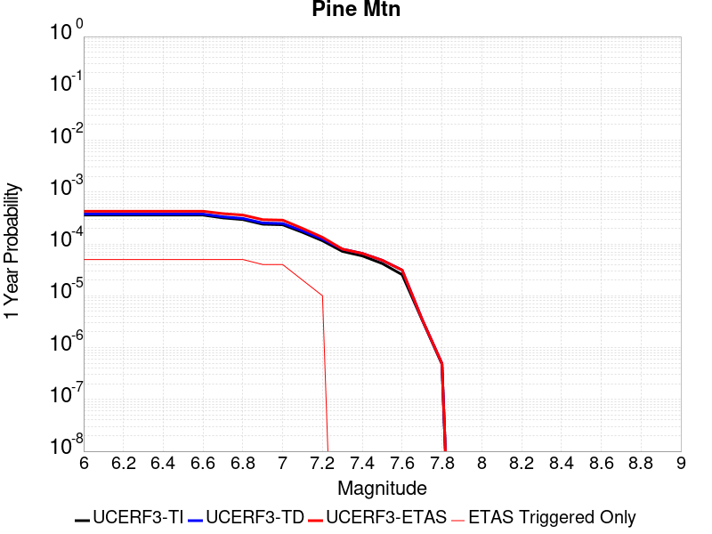 |  |

| Magnitude | 1 wk TI Prob | 1 wk TD Prob | 1 wk ETAS Prob | 1 wk ETAS/TD Gain | 1 wk ETAS Triggered Only | 1 mo TI Prob | 1 mo TD Prob | 1 mo ETAS Prob | 1 mo ETAS/TD Gain | 1 mo ETAS Triggered Only | 1 yr TI Prob | 1 yr TD Prob | 1 yr ETAS Prob | 1 yr ETAS/TD Gain | 1 yr ETAS Triggered Only | 10 yr TI Prob | 10 yr TD Prob | 10 yr ETAS Prob | 10 yr ETAS/TD Gain | 10 yr ETAS Triggered Only |
|-----|-----|-----|-----|-----|-----|-----|-----|-----|-----|-----|-----|-----|-----|-----|-----|-----|-----|-----|-----|-----|
| 6.0 | 6.894797E-6 | 7.225461E-6 | 7.225461E-6 | 1.0 | 0.0 | 2.9548795E-5 | 3.096591E-5 | 3.096591E-5 | 1.0 | 0.0 | 3.596972E-4 | 3.7694772E-4 | 5.0790847E-4 | 1.347424 | 1.3101009E-4 | 0.0035911554 | 0.003763381 | 0.003893898 | 1.0346808 | 1.3101009E-4 |
| 6.1 | 6.894797E-6 | 7.225461E-6 | 7.225461E-6 | 1.0 | 0.0 | 2.9548795E-5 | 3.096591E-5 | 3.096591E-5 | 1.0 | 0.0 | 3.596972E-4 | 3.7694772E-4 | 5.0790847E-4 | 1.347424 | 1.3101009E-4 | 0.0035911554 | 0.003763381 | 0.003893898 | 1.0346808 | 1.3101009E-4 |
| 6.2 | 6.894797E-6 | 7.225461E-6 | 7.225461E-6 | 1.0 | 0.0 | 2.9548795E-5 | 3.096591E-5 | 3.096591E-5 | 1.0 | 0.0 | 3.596972E-4 | 3.7694772E-4 | 5.0790847E-4 | 1.347424 | 1.3101009E-4 | 0.0035911554 | 0.003763381 | 0.003893898 | 1.0346808 | 1.3101009E-4 |
| 6.3 | 6.894797E-6 | 7.225461E-6 | 7.225461E-6 | 1.0 | 0.0 | 2.9548795E-5 | 3.096591E-5 | 3.096591E-5 | 1.0 | 0.0 | 3.596972E-4 | 3.7694772E-4 | 5.0790847E-4 | 1.347424 | 1.3101009E-4 | 0.0035911554 | 0.003763381 | 0.003893898 | 1.0346808 | 1.3101009E-4 |
| 6.4 | 6.894797E-6 | 7.225461E-6 | 7.225461E-6 | 1.0 | 0.0 | 2.9548795E-5 | 3.096591E-5 | 3.096591E-5 | 1.0 | 0.0 | 3.596972E-4 | 3.7694772E-4 | 5.0790847E-4 | 1.347424 | 1.3101009E-4 | 0.0035911554 | 0.003763381 | 0.003893898 | 1.0346808 | 1.3101009E-4 |
| 6.5 | 6.894797E-6 | 7.225461E-6 | 7.225461E-6 | 1.0 | 0.0 | 2.9548795E-5 | 3.096591E-5 | 3.096591E-5 | 1.0 | 0.0 | 3.596972E-4 | 3.7694772E-4 | 5.0790847E-4 | 1.347424 | 1.3101009E-4 | 0.0035911554 | 0.003763381 | 0.003893898 | 1.0346808 | 1.3101009E-4 |
| 6.6 | 6.894797E-6 | 7.225461E-6 | 7.225461E-6 | 1.0 | 0.0 | 2.9548795E-5 | 3.096591E-5 | 3.096591E-5 | 1.0 | 0.0 | 3.596972E-4 | 3.7694772E-4 | 5.0790847E-4 | 1.347424 | 1.3101009E-4 | 0.0035911554 | 0.003763381 | 0.003893898 | 1.0346808 | 1.3101009E-4 |
| 6.7 | 6.0867933E-6 | 6.3971133E-6 | 6.3971133E-6 | 1.0 | 0.0 | 2.6085996E-5 | 2.7415923E-5 | 2.7415923E-5 | 1.0 | 0.0 | 3.1755073E-4 | 3.3373994E-4 | 4.647063E-4 | 1.3924204 | 1.3101009E-4 | 0.0031709734 | 0.0033326065 | 0.0034631798 | 1.0391806 | 1.3101009E-4 |
| 6.8 | 5.6530425E-6 | 5.9505956E-6 | 5.9505956E-6 | 1.0 | 0.0 | 2.42271E-5 | 2.5502315E-5 | 2.5502315E-5 | 1.0 | 0.0 | 2.94925E-4 | 3.104485E-4 | 4.414179E-4 | 1.4218717 | 1.3101009E-4 | 0.002945339 | 0.0031003528 | 0.0032309568 | 1.0421255 | 1.3101009E-4 |
| 6.9 | 4.6015225E-6 | 4.863834E-6 | 4.863834E-6 | 1.0 | 0.0 | 1.9720663E-5 | 2.0844845E-5 | 2.0844845E-5 | 1.0 | 0.0 | 2.4007261E-4 | 2.5375787E-4 | 3.847347E-4 | 1.5161489 | 1.3101009E-4 | 0.0023981342 | 0.0025348254 | 0.0026655034 | 1.051553 | 1.3101009E-4 |
| 7.0 | 4.4875965E-6 | 4.747473E-6 | 4.747473E-6 | 1.0 | 0.0 | 1.9232413E-5 | 2.0346162E-5 | 2.0346162E-5 | 1.0 | 0.0 | 2.3412947E-4 | 2.4768783E-4 | 3.7866546E-4 | 1.5288013 | 1.3101009E-4 | 0.0023388295 | 0.0024742614 | 0.0026049474 | 1.0528182 | 1.3101009E-4 |
| 7.1 | 3.203907E-6 | 3.4294096E-6 | 3.4294096E-6 | 1.0 | 0.0 | 1.3730958E-5 | 1.4697391E-5 | 1.4697391E-5 | 1.0 | 0.0 | 1.6716159E-4 | 1.789267E-4 | 1.789267E-4 | 1.0 | 0.0 | 0.0016703589 | 0.0017878925 | 0.0017878925 | 1.0 | 0.0 |
| 7.2 | 2.2060601E-6 | 2.3784817E-6 | 2.3784817E-6 | 1.0 | 0.0 | 9.4545085E-6 | 1.0193455E-5 | 1.0193455E-5 | 1.0 | 0.0 | 1.15102564E-4 | 1.240987E-4 | 1.240987E-4 | 1.0 | 0.0 | 0.0011504296 | 0.0012403389 | 0.0012403389 | 1.0 | 0.0 |
| 7.3 | 1.3765207E-6 | 1.5216481E-6 | 1.5216481E-6 | 1.0 | 0.0 | 5.899361E-6 | 6.521333E-6 | 6.521333E-6 | 1.0 | 0.0 | 7.182235E-5 | 7.939443E-5 | 7.939443E-5 | 1.0 | 0.0 | 7.1799144E-4 | 7.936697E-4 | 7.936697E-4 | 1.0 | 0.0 |
| 7.4 | 1.1245983E-6 | 1.2587075E-6 | 1.2587075E-6 | 1.0 | 0.0 | 4.819698E-6 | 5.39445E-6 | 5.39445E-6 | 1.0 | 0.0 | 5.8678244E-5 | 6.567554E-5 | 6.567554E-5 | 1.0 | 0.0 | 5.866275E-4 | 6.5656955E-4 | 6.5656955E-4 | 1.0 | 0.0 |
| 7.5 | 8.031682E-7 | 9.276951E-7 | 9.276951E-7 | 1.0 | 0.0 | 3.4421448E-6 | 3.9758306E-6 | 3.9758306E-6 | 1.0 | 0.0 | 4.1907308E-5 | 4.840473E-5 | 4.840473E-5 | 1.0 | 0.0 | 4.1899405E-4 | 4.8394862E-4 | 4.8394862E-4 | 1.0 | 0.0 |
| 7.6 | 4.8953444E-7 | 6.003009E-7 | 6.003009E-7 | 1.0 | 0.0 | 2.098003E-6 | 2.5727159E-6 | 2.5727159E-6 | 1.0 | 0.0 | 2.5542888E-5 | 3.1322415E-5 | 3.1322415E-5 | 1.0 | 0.0 | 2.5539953E-4 | 3.1318486E-4 | 3.1318486E-4 | 1.0 | 0.0 |
| 7.7 | 6.634529E-8 | 6.788826E-8 | 6.788826E-8 | 1.0 | 0.0 | 2.843369E-7 | 2.9094966E-7 | 2.9094966E-7 | 1.0 | 0.0 | 3.4617963E-6 | 3.5423066E-6 | 3.5423066E-6 | 1.0 | 0.0 | 3.4617424E-5 | 3.542255E-5 | 3.542255E-5 | 1.0 | 0.0 |
| 7.8 | 9.235578E-9 | 9.488566E-9 | 9.488566E-9 | 1.0 | 0.0 | 3.9581046E-8 | 4.0665284E-8 | 4.0665284E-8 | 1.0 | 0.0 | 4.818991E-7 | 4.950997E-7 | 4.950997E-7 | 1.0 | 0.0 | 4.8189804E-6 | 4.950988E-6 | 4.950988E-6 | 1.0 | 0.0 |

## San Jacinto (Lytle Creek connector)
*[(top)](#table-of-contents)*

| 1 Week | 1 Month | 1 Year | 10 Year |
|-----|-----|-----|-----|
|  |  |  |  |

| Magnitude | 1 wk TI Prob | 1 wk TD Prob | 1 wk ETAS Prob | 1 wk ETAS/TD Gain | 1 wk ETAS Triggered Only | 1 mo TI Prob | 1 mo TD Prob | 1 mo ETAS Prob | 1 mo ETAS/TD Gain | 1 mo ETAS Triggered Only | 1 yr TI Prob | 1 yr TD Prob | 1 yr ETAS Prob | 1 yr ETAS/TD Gain | 1 yr ETAS Triggered Only | 10 yr TI Prob | 10 yr TD Prob | 10 yr ETAS Prob | 10 yr ETAS/TD Gain | 10 yr ETAS Triggered Only |
|-----|-----|-----|-----|-----|-----|-----|-----|-----|-----|-----|-----|-----|-----|-----|-----|-----|-----|-----|-----|-----|
| 6.0 | 6.693995E-6 | 6.660216E-6 | 1.3766943E-4 | 20.670414 | 1.3101009E-4 | 2.8688235E-5 | 2.854347E-5 | 1.5954982E-4 | 5.589713 | 1.3101009E-4 | 3.492233E-4 | 3.4746144E-4 | 4.78426E-4 | 1.3769183 | 1.3101009E-4 | 0.00348675 | 0.0035493854 | 0.0036799305 | 1.0367796 | 1.3101009E-4 |
| 6.1 | 6.693995E-6 | 6.660216E-6 | 1.3766943E-4 | 20.670414 | 1.3101009E-4 | 2.8688235E-5 | 2.854347E-5 | 1.5954982E-4 | 5.589713 | 1.3101009E-4 | 3.492233E-4 | 3.4746144E-4 | 4.78426E-4 | 1.3769183 | 1.3101009E-4 | 0.00348675 | 0.0035493854 | 0.0036799305 | 1.0367796 | 1.3101009E-4 |
| 6.2 | 6.693995E-6 | 6.660216E-6 | 1.3766943E-4 | 20.670414 | 1.3101009E-4 | 2.8688235E-5 | 2.854347E-5 | 1.5954982E-4 | 5.589713 | 1.3101009E-4 | 3.492233E-4 | 3.4746144E-4 | 4.78426E-4 | 1.3769183 | 1.3101009E-4 | 0.00348675 | 0.0035493854 | 0.0036799305 | 1.0367796 | 1.3101009E-4 |
| 6.3 | 6.693995E-6 | 6.660216E-6 | 1.3766943E-4 | 20.670414 | 1.3101009E-4 | 2.8688235E-5 | 2.854347E-5 | 1.5954982E-4 | 5.589713 | 1.3101009E-4 | 3.492233E-4 | 3.4746144E-4 | 4.78426E-4 | 1.3769183 | 1.3101009E-4 | 0.00348675 | 0.0035493854 | 0.0036799305 | 1.0367796 | 1.3101009E-4 |
| 6.4 | 6.693995E-6 | 6.660216E-6 | 1.3766943E-4 | 20.670414 | 1.3101009E-4 | 2.8688235E-5 | 2.854347E-5 | 1.5954982E-4 | 5.589713 | 1.3101009E-4 | 3.492233E-4 | 3.4746144E-4 | 4.78426E-4 | 1.3769183 | 1.3101009E-4 | 0.00348675 | 0.0035493854 | 0.0036799305 | 1.0367796 | 1.3101009E-4 |
| 6.5 | 6.6561875E-6 | 6.6204343E-6 | 1.3762966E-4 | 20.788614 | 1.3101009E-4 | 2.8526205E-5 | 2.837298E-5 | 1.5937936E-4 | 5.617293 | 1.3101009E-4 | 3.472512E-4 | 3.4538636E-4 | 4.763512E-4 | 1.3791835 | 1.3101009E-4 | 0.0034670907 | 0.003528701 | 0.0036592486 | 1.036996 | 1.3101009E-4 |
| 6.6 | 6.6561875E-6 | 6.6204343E-6 | 1.3762966E-4 | 20.788614 | 1.3101009E-4 | 2.8526205E-5 | 2.837298E-5 | 1.5937936E-4 | 5.617293 | 1.3101009E-4 | 3.472512E-4 | 3.4538636E-4 | 4.763512E-4 | 1.3791835 | 1.3101009E-4 | 0.0034670907 | 0.003528701 | 0.0036592486 | 1.036996 | 1.3101009E-4 |
| 6.7 | 6.5802237E-6 | 6.539611E-6 | 1.3754884E-4 | 21.033184 | 1.3101009E-4 | 2.8200653E-5 | 2.8026603E-5 | 1.5903302E-4 | 5.6743593 | 1.3101009E-4 | 3.4328885E-4 | 3.4117055E-4 | 4.7213593E-4 | 1.3838707 | 1.3101009E-4 | 0.0034275902 | 0.0034866752 | 0.0036172285 | 1.0374435 | 1.3101009E-4 |
| 6.8 | 6.575632E-6 | 6.5341005E-6 | 1.3754333E-4 | 21.05008 | 1.3101009E-4 | 2.8180975E-5 | 2.8002989E-5 | 1.590094E-4 | 5.6783013 | 1.3101009E-4 | 3.4304935E-4 | 3.4088313E-4 | 4.7184856E-4 | 1.3841945 | 1.3101009E-4 | 0.0034252026 | 0.00348381 | 0.0036143637 | 1.0374744 | 1.3101009E-4 |
| 6.9 | 6.570433E-6 | 6.525495E-6 | 1.3753473E-4 | 21.07652 | 1.3101009E-4 | 2.8158694E-5 | 2.7966107E-5 | 1.5897253E-4 | 5.684471 | 1.3101009E-4 | 3.4277816E-4 | 3.4043423E-4 | 4.7139972E-4 | 1.3847013 | 1.3101009E-4 | 0.0034224992 | 0.0034793352 | 0.0036098894 | 1.0375228 | 1.3101009E-4 |
| 7.0 | 6.5643826E-6 | 6.515616E-6 | 1.3752485E-4 | 21.10696 | 1.3101009E-4 | 2.8132765E-5 | 2.792377E-5 | 1.589302E-4 | 5.691574 | 1.3101009E-4 | 3.424626E-4 | 3.3991894E-4 | 4.708845E-4 | 1.3852847 | 1.3101009E-4 | 0.0034193532 | 0.0034741985 | 0.0036047534 | 1.0375785 | 1.3101009E-4 |
| 7.1 | 6.557402E-6 | 6.5043278E-6 | 1.3751356E-4 | 21.141857 | 1.3101009E-4 | 2.8102848E-5 | 2.7875392E-5 | 1.5888183E-4 | 5.699716 | 1.3101009E-4 | 3.4209844E-4 | 3.3933012E-4 | 4.7029575E-4 | 1.3859534 | 1.3101009E-4 | 0.0034157229 | 0.0034683298 | 0.0035988856 | 1.0376422 | 1.3101009E-4 |
| 7.2 | 6.546394E-6 | 6.4862943E-6 | 1.3749553E-4 | 21.197855 | 1.3101009E-4 | 2.8055672E-5 | 2.7798109E-5 | 1.5880456E-4 | 5.712783 | 1.3101009E-4 | 3.4152428E-4 | 3.3838948E-4 | 4.6935523E-4 | 1.3870267 | 1.3101009E-4 | 0.0034099987 | 0.0034589572 | 0.003589514 | 1.0377446 | 1.3101009E-4 |
| 7.3 | 6.5364216E-6 | 6.4670803E-6 | 1.3747632E-4 | 21.257864 | 1.3101009E-4 | 2.8012933E-5 | 2.7715765E-5 | 1.5872222E-4 | 5.7267847 | 1.3101009E-4 | 3.4100408E-4 | 3.3738726E-4 | 4.6835316E-4 | 1.3881768 | 1.3101009E-4 | 0.003404813 | 0.0034489788 | 0.003579537 | 1.0378542 | 1.3101009E-4 |
| 7.4 | 6.5269523E-6 | 6.4481674E-6 | 1.374574E-4 | 21.317284 | 1.3101009E-4 | 2.7972354E-5 | 2.7634711E-5 | 1.5864118E-4 | 5.740649 | 1.3101009E-4 | 3.4051016E-4 | 3.3640073E-4 | 4.6736674E-4 | 1.3893155 | 1.3101009E-4 | 0.0033998888 | 0.003439161 | 0.0035697205 | 1.0379626 | 1.3101009E-4 |
| 7.5 | 6.5111835E-6 | 6.424442E-6 | 1.3743369E-4 | 21.392315 | 1.3101009E-4 | 2.7904773E-5 | 2.7533031E-5 | 1.5853951E-4 | 5.758157 | 1.3101009E-4 | 3.3968766E-4 | 3.3516317E-4 | 4.6612936E-4 | 1.3907535 | 1.3101009E-4 | 0.0033916887 | 0.003426834 | 0.0035573952 | 1.0380996 | 1.3101009E-4 |
| 7.6 | 6.4768806E-6 | 6.383551E-6 | 1.373928E-4 | 21.522942 | 1.3101009E-4 | 2.7757764E-5 | 2.735779E-5 | 1.5836429E-4 | 5.788636 | 1.3101009E-4 | 3.3789838E-4 | 3.3303024E-4 | 4.6399672E-4 | 1.3932569 | 1.3101009E-4 | 0.0033738504 | 0.0034055663 | 0.00353613 | 1.0383384 | 1.3101009E-4 |
| 7.7 | 6.1655364E-6 | 6.1760365E-6 | 1.3718531E-4 | 22.212517 | 1.3101009E-4 | 2.642346E-5 | 2.646846E-5 | 1.5747508E-4 | 5.949537 | 1.3101009E-4 | 3.2165812E-4 | 3.2220592E-4 | 4.531738E-4 | 1.4064726 | 1.3101009E-4 | 0.0032119295 | 0.0032971818 | 0.0034277597 | 1.039603 | 1.3101009E-4 |
| 7.8 | 5.5043524E-6 | 5.737097E-6 | 1.3674643E-4 | 23.835476 | 1.3101009E-4 | 2.3589868E-5 | 2.4587327E-5 | 1.555942E-4 | 6.3282275 | 1.3101009E-4 | 2.871688E-4 | 2.9930964E-4 | 4.3028052E-4 | 1.4375765 | 1.3101009E-4 | 0.0028679797 | 0.0030672832 | 0.0031978916 | 1.0425811 | 1.3101009E-4 |
| 7.9 | 3.889249E-6 | 4.076761E-6 | 1.3508632E-4 | 33.135696 | 1.3101009E-4 | 1.6668104E-5 | 1.7471715E-5 | 1.4847952E-4 | 8.498279 | 1.3101009E-4 | 2.0291525E-4 | 2.1269741E-4 | 3.4367965E-4 | 1.6158148 | 1.3101009E-4 | 0.0020273007 | 0.0021943315 | 0.002325054 | 1.0595728 | 1.3101009E-4 |
| 8.0 | 2.668535E-6 | 2.5315155E-6 | 2.5315155E-6 | 1.0 | 0.0 | 1.1436528E-5 | 1.0849307E-5 | 1.0849307E-5 | 1.0 | 0.0 | 1.3923083E-4 | 1.3208234E-4 | 1.3208234E-4 | 1.0 | 0.0 | 0.0013914363 | 0.0013757964 | 0.0013757964 | 1.0 | 0.0 |
| 8.1 | 1.5911459E-6 | 1.218661E-6 | 1.218661E-6 | 1.0 | 0.0 | 6.8191785E-6 | 5.2228224E-6 | 5.2228224E-6 | 1.0 | 0.0 | 8.3020335E-5 | 6.3586034E-5 | 6.3586034E-5 | 1.0 | 0.0 | 8.298933E-4 | 6.6932244E-4 | 6.6932244E-4 | 1.0 | 0.0 |
| 8.2 | 6.1294963E-7 | 2.1812275E-7 | 2.1812275E-7 | 1.0 | 0.0 | 2.6269242E-6 | 9.3481145E-7 | 9.3481145E-7 | 1.0 | 0.0 | 3.1982334E-5 | 1.138127E-5 | 1.138127E-5 | 1.0 | 0.0 | 3.1977732E-4 | 1.2784546E-4 | 1.2784546E-4 | 1.0 | 0.0 |
| 8.3 | 1.762871E-7 | 4.7546838E-8 | 4.7546838E-8 | 1.0 | 0.0 | 7.5551594E-7 | 2.0377215E-7 | 2.0377215E-7 | 1.0 | 0.0 | 9.1983675E-6 | 2.480923E-6 | 2.480923E-6 | 1.0 | 0.0 | 9.197987E-5 | 2.868753E-5 | 2.868753E-5 | 1.0 | 0.0 |

## Santa Susana East (connector)
*[(top)](#table-of-contents)*

| 1 Week | 1 Month | 1 Year | 10 Year |
|-----|-----|-----|-----|
|  |  |  |  |

| Magnitude | 1 wk TI Prob | 1 wk TD Prob | 1 wk ETAS Prob | 1 wk ETAS/TD Gain | 1 wk ETAS Triggered Only | 1 mo TI Prob | 1 mo TD Prob | 1 mo ETAS Prob | 1 mo ETAS/TD Gain | 1 mo ETAS Triggered Only | 1 yr TI Prob | 1 yr TD Prob | 1 yr ETAS Prob | 1 yr ETAS/TD Gain | 1 yr ETAS Triggered Only | 10 yr TI Prob | 10 yr TD Prob | 10 yr ETAS Prob | 10 yr ETAS/TD Gain | 10 yr ETAS Triggered Only |
|-----|-----|-----|-----|-----|-----|-----|-----|-----|-----|-----|-----|-----|-----|-----|-----|-----|-----|-----|-----|-----|
| 6.0 | 2.858397E-5 | 3.202091E-5 | 3.202091E-5 | 1.0 | 0.0 | 1.2249697E-4 | 1.3722685E-4 | 1.3722685E-4 | 1.0 | 0.0 | 0.0014903803 | 0.0016697381 | 0.0016697381 | 1.0 | 0.0 | 0.014804244 | 0.016599052 | 0.016727887 | 1.0077616 | 1.3101009E-4 |
| 6.1 | 2.858397E-5 | 3.202091E-5 | 3.202091E-5 | 1.0 | 0.0 | 1.2249697E-4 | 1.3722685E-4 | 1.3722685E-4 | 1.0 | 0.0 | 0.0014903803 | 0.0016697381 | 0.0016697381 | 1.0 | 0.0 | 0.014804244 | 0.016599052 | 0.016727887 | 1.0077616 | 1.3101009E-4 |
| 6.2 | 2.858397E-5 | 3.202091E-5 | 3.202091E-5 | 1.0 | 0.0 | 1.2249697E-4 | 1.3722685E-4 | 1.3722685E-4 | 1.0 | 0.0 | 0.0014903803 | 0.0016697381 | 0.0016697381 | 1.0 | 0.0 | 0.014804244 | 0.016599052 | 0.016727887 | 1.0077616 | 1.3101009E-4 |
| 6.3 | 1.943582E-5 | 2.036718E-5 | 2.036718E-5 | 1.0 | 0.0 | 8.329371E-5 | 8.7285625E-5 | 8.7285625E-5 | 1.0 | 0.0 | 0.001013629 | 0.0010622967 | 0.0010622967 | 1.0 | 0.0 | 0.010090181 | 0.010583619 | 0.010583619 | 1.0 | 0.0 |
| 6.4 | 1.943582E-5 | 2.036718E-5 | 2.036718E-5 | 1.0 | 0.0 | 8.329371E-5 | 8.7285625E-5 | 8.7285625E-5 | 1.0 | 0.0 | 0.001013629 | 0.0010622967 | 0.0010622967 | 1.0 | 0.0 | 0.010090181 | 0.010583619 | 0.010583619 | 1.0 | 0.0 |
| 6.5 | 1.943582E-5 | 2.036718E-5 | 2.036718E-5 | 1.0 | 0.0 | 8.329371E-5 | 8.7285625E-5 | 8.7285625E-5 | 1.0 | 0.0 | 0.001013629 | 0.0010622967 | 0.0010622967 | 1.0 | 0.0 | 0.010090181 | 0.010583619 | 0.010583619 | 1.0 | 0.0 |
| 6.6 | 1.943582E-5 | 2.036718E-5 | 2.036718E-5 | 1.0 | 0.0 | 8.329371E-5 | 8.7285625E-5 | 8.7285625E-5 | 1.0 | 0.0 | 0.001013629 | 0.0010622967 | 0.0010622967 | 1.0 | 0.0 | 0.010090181 | 0.010583619 | 0.010583619 | 1.0 | 0.0 |
| 6.7 | 1.9404439E-5 | 2.03546E-5 | 2.03546E-5 | 1.0 | 0.0 | 8.3159226E-5 | 8.723172E-5 | 8.723172E-5 | 1.0 | 0.0 | 0.0010119933 | 0.0010616409 | 0.0010616409 | 1.0 | 0.0 | 0.010073971 | 0.010577125 | 0.010577125 | 1.0 | 0.0 |
| 6.8 | 1.2217526E-5 | 1.1592998E-5 | 1.1592998E-5 | 1.0 | 0.0 | 5.2359774E-5 | 4.9683425E-5 | 4.9683425E-5 | 1.0 | 0.0 | 6.372938E-4 | 6.0474465E-4 | 6.0474465E-4 | 1.0 | 0.0 | 0.0063546924 | 0.006033037 | 0.006033037 | 1.0 | 0.0 |
| 6.9 | 1.2217526E-5 | 1.1592998E-5 | 1.1592998E-5 | 1.0 | 0.0 | 5.2359774E-5 | 4.9683425E-5 | 4.9683425E-5 | 1.0 | 0.0 | 6.372938E-4 | 6.0474465E-4 | 6.0474465E-4 | 1.0 | 0.0 | 0.0063546924 | 0.006033037 | 0.006033037 | 1.0 | 0.0 |
| 7.0 | 9.276017E-6 | 8.059113E-6 | 8.059113E-6 | 1.0 | 0.0 | 3.9753755E-5 | 3.4538618E-5 | 3.4538618E-5 | 1.0 | 0.0 | 4.8389446E-4 | 4.2042998E-4 | 4.2042998E-4 | 1.0 | 0.0 | 0.0048284214 | 0.0041970722 | 0.0041970722 | 1.0 | 0.0 |
| 7.1 | 9.130355E-6 | 7.942286E-6 | 7.942286E-6 | 1.0 | 0.0 | 3.9129503E-5 | 3.4037945E-5 | 3.4037945E-5 | 1.0 | 0.0 | 4.7629757E-4 | 4.1433662E-4 | 4.1433662E-4 | 1.0 | 0.0 | 0.00475278 | 0.004136367 | 0.004136367 | 1.0 | 0.0 |
| 7.2 | 8.851015E-6 | 7.741445E-6 | 7.741445E-6 | 1.0 | 0.0 | 3.7932372E-5 | 3.317722E-5 | 3.317722E-5 | 1.0 | 0.0 | 4.6172875E-4 | 4.038612E-4 | 4.038612E-4 | 1.0 | 0.0 | 0.0046077054 | 0.0040319953 | 0.0040319953 | 1.0 | 0.0 |
| 7.3 | 8.573006E-6 | 7.550166E-6 | 7.550166E-6 | 1.0 | 0.0 | 3.6740938E-5 | 3.2357475E-5 | 3.2357475E-5 | 1.0 | 0.0 | 4.472291E-4 | 3.9388443E-4 | 3.9388443E-4 | 1.0 | 0.0 | 0.004463301 | 0.0039325804 | 0.0039325804 | 1.0 | 0.0 |
| 7.4 | 7.852282E-6 | 6.817687E-6 | 6.817687E-6 | 1.0 | 0.0 | 3.36522E-5 | 2.9218349E-5 | 2.9218349E-5 | 1.0 | 0.0 | 4.096385E-4 | 3.5567835E-4 | 3.5567835E-4 | 1.0 | 0.0 | 0.0040888423 | 0.0035517553 | 0.0035517553 | 1.0 | 0.0 |
| 7.5 | 4.8869324E-6 | 4.279055E-6 | 4.279055E-6 | 1.0 | 0.0 | 2.0943828E-5 | 1.8338687E-5 | 1.8338687E-5 | 1.0 | 0.0 | 2.5496128E-4 | 2.232523E-4 | 2.232523E-4 | 1.0 | 0.0 | 0.0025466895 | 0.0022304445 | 0.0022304445 | 1.0 | 0.0 |
| 7.6 | 1.3894544E-6 | 1.1568179E-6 | 1.1568179E-6 | 1.0 | 0.0 | 5.954791E-6 | 4.957783E-6 | 4.957783E-6 | 1.0 | 0.0 | 7.249717E-5 | 6.0359558E-5 | 6.0359558E-5 | 1.0 | 0.0 | 7.247352E-4 | 6.0345343E-4 | 6.0345343E-4 | 1.0 | 0.0 |
| 7.7 | 2.9924632E-7 | 2.371928E-7 | 2.371928E-7 | 1.0 | 0.0 | 1.2824837E-6 | 1.0165402E-6 | 1.0165402E-6 | 1.0 | 0.0 | 1.5614127E-5 | 1.2376314E-5 | 1.2376314E-5 | 1.0 | 0.0 | 1.5613029E-4 | 1.2375697E-4 | 1.2375697E-4 | 1.0 | 0.0 |
| 7.8 | 4.8188564E-8 | 2.6323061E-8 | 2.6323061E-8 | 1.0 | 0.0 | 2.065224E-7 | 1.1281311E-7 | 1.1281311E-7 | 1.0 | 0.0 | 2.5144072E-6 | 1.3734989E-6 | 1.3734989E-6 | 1.0 | 0.0 | 2.5143789E-5 | 1.3734912E-5 | 1.3734912E-5 | 1.0 | 0.0 |
| 7.9 | 2.6127251E-9 | 2.7681102E-9 | 2.7681102E-9 | 1.0 | 0.0 | 1.1197393E-8 | 1.186333E-8 | 1.186333E-8 | 1.0 | 0.0 | 1.3632825E-7 | 1.4443603E-7 | 1.4443603E-7 | 1.0 | 0.0 | 1.3632817E-6 | 1.4443604E-6 | 1.4443604E-6 | 1.0 | 0.0 |

## Mono Lake 2011 CFM
*[(top)](#table-of-contents)*

| 1 Week | 1 Month | 1 Year | 10 Year |
|-----|-----|-----|-----|
|  |  |  |  |

| Magnitude | 1 wk TI Prob | 1 wk TD Prob | 1 wk ETAS Prob | 1 wk ETAS/TD Gain | 1 wk ETAS Triggered Only | 1 mo TI Prob | 1 mo TD Prob | 1 mo ETAS Prob | 1 mo ETAS/TD Gain | 1 mo ETAS Triggered Only | 1 yr TI Prob | 1 yr TD Prob | 1 yr ETAS Prob | 1 yr ETAS/TD Gain | 1 yr ETAS Triggered Only | 10 yr TI Prob | 10 yr TD Prob | 10 yr ETAS Prob | 10 yr ETAS/TD Gain | 10 yr ETAS Triggered Only |
|-----|-----|-----|-----|-----|-----|-----|-----|-----|-----|-----|-----|-----|-----|-----|-----|-----|-----|-----|-----|-----|
| 6.0 | 2.0341662E-5 | 2.3828166E-5 | 1.5483513E-4 | 6.4979877 | 1.3101009E-4 | 8.717564E-5 | 1.0211971E-4 | 2.3311643E-4 | 2.2827759 | 1.3101009E-4 | 0.0010608466 | 0.0012431298 | 0.001373977 | 1.1052563 | 1.3101009E-4 | 0.010557966 | 0.012413835 | 0.012543219 | 1.0104226 | 1.3101009E-4 |
| 6.1 | 2.0341662E-5 | 2.3828166E-5 | 1.5483513E-4 | 6.4979877 | 1.3101009E-4 | 8.717564E-5 | 1.0211971E-4 | 2.3311643E-4 | 2.2827759 | 1.3101009E-4 | 0.0010608466 | 0.0012431298 | 0.001373977 | 1.1052563 | 1.3101009E-4 | 0.010557966 | 0.012413835 | 0.012543219 | 1.0104226 | 1.3101009E-4 |
| 6.2 | 2.0341662E-5 | 2.3828166E-5 | 1.5483513E-4 | 6.4979877 | 1.3101009E-4 | 8.717564E-5 | 1.0211971E-4 | 2.3311643E-4 | 2.2827759 | 1.3101009E-4 | 0.0010608466 | 0.0012431298 | 0.001373977 | 1.1052563 | 1.3101009E-4 | 0.010557966 | 0.012413835 | 0.012543219 | 1.0104226 | 1.3101009E-4 |
| 6.3 | 2.0341662E-5 | 2.3828166E-5 | 1.5483513E-4 | 6.4979877 | 1.3101009E-4 | 8.717564E-5 | 1.0211971E-4 | 2.3311643E-4 | 2.2827759 | 1.3101009E-4 | 0.0010608466 | 0.0012431298 | 0.001373977 | 1.1052563 | 1.3101009E-4 | 0.010557966 | 0.012413835 | 0.012543219 | 1.0104226 | 1.3101009E-4 |
| 6.4 | 1.749821E-5 | 2.0490985E-5 | 1.5149839E-4 | 7.3934164 | 1.3101009E-4 | 7.499018E-5 | 8.781851E-5 | 2.1881709E-4 | 2.4916968 | 1.3101009E-4 | 9.1262296E-4 | 0.0010691903 | 0.0012000604 | 1.122401 | 1.3101009E-4 | 0.009088841 | 0.010691865 | 0.010821475 | 1.0121223 | 1.3101009E-4 |
| 6.5 | 1.749821E-5 | 2.0490985E-5 | 1.5149839E-4 | 7.3934164 | 1.3101009E-4 | 7.499018E-5 | 8.781851E-5 | 2.1881709E-4 | 2.4916968 | 1.3101009E-4 | 9.1262296E-4 | 0.0010691903 | 0.0012000604 | 1.122401 | 1.3101009E-4 | 0.009088841 | 0.010691865 | 0.010821475 | 1.0121223 | 1.3101009E-4 |

## Calico-Hidalgo
*[(top)](#table-of-contents)*

| 1 Week | 1 Month | 1 Year | 10 Year |
|-----|-----|-----|-----|
|  |  |  |  |

| Magnitude | 1 wk TI Prob | 1 wk TD Prob | 1 wk ETAS Prob | 1 wk ETAS/TD Gain | 1 wk ETAS Triggered Only | 1 mo TI Prob | 1 mo TD Prob | 1 mo ETAS Prob | 1 mo ETAS/TD Gain | 1 mo ETAS Triggered Only | 1 yr TI Prob | 1 yr TD Prob | 1 yr ETAS Prob | 1 yr ETAS/TD Gain | 1 yr ETAS Triggered Only | 10 yr TI Prob | 10 yr TD Prob | 10 yr ETAS Prob | 10 yr ETAS/TD Gain | 10 yr ETAS Triggered Only |
|-----|-----|-----|-----|-----|-----|-----|-----|-----|-----|-----|-----|-----|-----|-----|-----|-----|-----|-----|-----|-----|
| 6.0 | 4.0906612E-5 | 5.0703686E-5 | 5.0703686E-5 | 1.0 | 0.0 | 1.7530227E-4 | 2.172857E-4 | 2.172857E-4 | 1.0 | 0.0 | 0.0021322158 | 0.002642648 | 0.002642648 | 1.0 | 0.0 | 0.02111873 | 0.026152607 | 0.02628019 | 1.0048784 | 1.3101009E-4 |
| 6.1 | 4.0906612E-5 | 5.0703686E-5 | 5.0703686E-5 | 1.0 | 0.0 | 1.7530227E-4 | 2.172857E-4 | 2.172857E-4 | 1.0 | 0.0 | 0.0021322158 | 0.002642648 | 0.002642648 | 1.0 | 0.0 | 0.02111873 | 0.026152607 | 0.02628019 | 1.0048784 | 1.3101009E-4 |
| 6.2 | 4.0906612E-5 | 5.0703686E-5 | 5.0703686E-5 | 1.0 | 0.0 | 1.7530227E-4 | 2.172857E-4 | 2.172857E-4 | 1.0 | 0.0 | 0.0021322158 | 0.002642648 | 0.002642648 | 1.0 | 0.0 | 0.02111873 | 0.026152607 | 0.02628019 | 1.0048784 | 1.3101009E-4 |
| 6.3 | 2.4242801E-5 | 3.0090669E-5 | 3.0090669E-5 | 1.0 | 0.0 | 1.0389358E-4 | 1.2895382E-4 | 1.2895382E-4 | 1.0 | 0.0 | 0.0012641704 | 0.0015689151 | 0.0015689151 | 1.0 | 0.0 | 0.01257003 | 0.01558206 | 0.01558206 | 1.0 | 0.0 |
| 6.4 | 2.4242801E-5 | 3.0090669E-5 | 3.0090669E-5 | 1.0 | 0.0 | 1.0389358E-4 | 1.2895382E-4 | 1.2895382E-4 | 1.0 | 0.0 | 0.0012641704 | 0.0015689151 | 0.0015689151 | 1.0 | 0.0 | 0.01257003 | 0.01558206 | 0.01558206 | 1.0 | 0.0 |
| 6.5 | 2.0286952E-5 | 2.5315738E-5 | 2.5315738E-5 | 1.0 | 0.0 | 8.694118E-5 | 1.0849161E-4 | 1.0849161E-4 | 1.0 | 0.0 | 0.0010579949 | 0.001320102 | 0.001320102 | 1.0 | 0.0 | 0.010529719 | 0.013124538 | 0.013124538 | 1.0 | 0.0 |
| 6.6 | 2.0269223E-5 | 2.5296687E-5 | 2.5296687E-5 | 1.0 | 0.0 | 8.6865206E-5 | 1.08409964E-4 | 1.08409964E-4 | 1.0 | 0.0 | 0.0010570707 | 0.0013191093 | 0.0013191093 | 1.0 | 0.0 | 0.010520565 | 0.013114728 | 0.013114728 | 1.0 | 0.0 |
| 6.7 | 1.799852E-5 | 2.25406E-5 | 2.25406E-5 | 1.0 | 0.0 | 7.713423E-5 | 9.659908E-5 | 9.659908E-5 | 1.0 | 0.0 | 9.3870464E-4 | 0.0011754738 | 0.0011754738 | 1.0 | 0.0 | 0.009347493 | 0.011694173 | 0.011694173 | 1.0 | 0.0 |
| 6.8 | 1.7458793E-5 | 2.184212E-5 | 2.184212E-5 | 1.0 | 0.0 | 7.4821255E-5 | 9.3605806E-5 | 9.3605806E-5 | 1.0 | 0.0 | 9.10568E-4 | 0.0011390693 | 0.0011390693 | 1.0 | 0.0 | 0.009068459 | 0.011333893 | 0.011333893 | 1.0 | 0.0 |
| 6.9 | 1.542884E-5 | 1.9025927E-5 | 1.9025927E-5 | 1.0 | 0.0 | 6.612192E-5 | 8.153721E-5 | 8.153721E-5 | 1.0 | 0.0 | 8.04737E-4 | 9.922766E-4 | 9.922766E-4 | 1.0 | 0.0 | 0.008018291 | 0.009879857 | 0.009879857 | 1.0 | 0.0 |
| 7.0 | 1.468253E-5 | 1.8030598E-5 | 1.8030598E-5 | 1.0 | 0.0 | 6.292361E-5 | 7.7271776E-5 | 7.7271776E-5 | 1.0 | 0.0 | 7.658257E-4 | 9.4039086E-4 | 9.4039086E-4 | 1.0 | 0.0 | 0.0076319184 | 0.009365481 | 0.009365481 | 1.0 | 0.0 |
| 7.1 | 1.3139281E-5 | 1.6200942E-5 | 1.6200942E-5 | 1.0 | 0.0 | 5.6309986E-5 | 6.943083E-5 | 6.943083E-5 | 1.0 | 0.0 | 6.853584E-4 | 8.4500515E-4 | 8.4500515E-4 | 1.0 | 0.0 | 0.0068324856 | 0.0084192185 | 0.0084192185 | 1.0 | 0.0 |
| 7.2 | 1.1127404E-5 | 1.3866597E-5 | 1.3866597E-5 | 1.0 | 0.0 | 4.7688E-5 | 5.942698E-5 | 5.942698E-5 | 1.0 | 0.0 | 5.8044674E-4 | 7.232942E-4 | 7.232942E-4 | 1.0 | 0.0 | 0.0057893298 | 0.0072105085 | 0.0072105085 | 1.0 | 0.0 |
| 7.3 | 9.808154E-6 | 1.2176215E-5 | 1.2176215E-5 | 1.0 | 0.0 | 4.2034266E-5 | 5.2182797E-5 | 5.2182797E-5 | 1.0 | 0.0 | 5.11647E-4 | 6.3515105E-4 | 6.3515105E-4 | 1.0 | 0.0 | 0.0051047057 | 0.006334433 | 0.006334433 | 1.0 | 0.0 |
| 7.4 | 7.942452E-6 | 9.792144E-6 | 9.792144E-6 | 1.0 | 0.0 | 3.4038632E-5 | 4.1965708E-5 | 4.1965708E-5 | 1.0 | 0.0 | 4.1434157E-4 | 5.1082217E-4 | 5.1082217E-4 | 1.0 | 0.0 | 0.0041356985 | 0.005097421 | 0.005097421 | 1.0 | 0.0 |
| 7.5 | 4.7121216E-6 | 5.772836E-6 | 5.772836E-6 | 1.0 | 0.0 | 2.019465E-5 | 2.4740535E-5 | 2.4740535E-5 | 1.0 | 0.0 | 2.4584212E-4 | 3.0118204E-4 | 3.0118204E-4 | 1.0 | 0.0 | 0.0024557032 | 0.0030084911 | 0.0030084911 | 1.0 | 0.0 |
| 7.6 | 2.21172E-7 | 2.603961E-7 | 2.603961E-7 | 1.0 | 0.0 | 9.478797E-7 | 1.1159829E-6 | 1.1159829E-6 | 1.0 | 0.0 | 1.1540374E-5 | 1.3587036E-5 | 1.3587036E-5 | 1.0 | 0.0 | 1.1539775E-4 | 1.3586486E-4 | 1.3586486E-4 | 1.0 | 0.0 |

## White Mountains
*[(top)](#table-of-contents)*

| 1 Week | 1 Month | 1 Year | 10 Year |
|-----|-----|-----|-----|
|  |  |  |  |

| Magnitude | 1 wk TI Prob | 1 wk TD Prob | 1 wk ETAS Prob | 1 wk ETAS/TD Gain | 1 wk ETAS Triggered Only | 1 mo TI Prob | 1 mo TD Prob | 1 mo ETAS Prob | 1 mo ETAS/TD Gain | 1 mo ETAS Triggered Only | 1 yr TI Prob | 1 yr TD Prob | 1 yr ETAS Prob | 1 yr ETAS/TD Gain | 1 yr ETAS Triggered Only | 10 yr TI Prob | 10 yr TD Prob | 10 yr ETAS Prob | 10 yr ETAS/TD Gain | 10 yr ETAS Triggered Only |
|-----|-----|-----|-----|-----|-----|-----|-----|-----|-----|-----|-----|-----|-----|-----|-----|-----|-----|-----|-----|-----|
| 6.0 | 3.503579E-5 | 3.378405E-5 | 3.378405E-5 | 1.0 | 0.0 | 1.5014476E-4 | 1.4478143E-4 | 1.4478143E-4 | 1.0 | 0.0 | 0.0018264796 | 0.0017614096 | 0.0018921889 | 1.074247 | 1.3101009E-4 | 0.018115403 | 0.017486818 | 0.017615538 | 1.0073609 | 1.3101009E-4 |
| 6.1 | 3.503579E-5 | 3.378405E-5 | 3.378405E-5 | 1.0 | 0.0 | 1.5014476E-4 | 1.4478143E-4 | 1.4478143E-4 | 1.0 | 0.0 | 0.0018264796 | 0.0017614096 | 0.0018921889 | 1.074247 | 1.3101009E-4 | 0.018115403 | 0.017486818 | 0.017615538 | 1.0073609 | 1.3101009E-4 |
| 6.2 | 3.503579E-5 | 3.378405E-5 | 3.378405E-5 | 1.0 | 0.0 | 1.5014476E-4 | 1.4478143E-4 | 1.4478143E-4 | 1.0 | 0.0 | 0.0018264796 | 0.0017614096 | 0.0018921889 | 1.074247 | 1.3101009E-4 | 0.018115403 | 0.017486818 | 0.017615538 | 1.0073609 | 1.3101009E-4 |
| 6.3 | 1.7818425E-5 | 1.5916074E-5 | 1.5916074E-5 | 1.0 | 0.0 | 7.636245E-5 | 6.821004E-5 | 6.821004E-5 | 1.0 | 0.0 | 9.293162E-4 | 8.301551E-4 | 9.6105644E-4 | 1.157683 | 1.3101009E-4 | 0.009254395 | 0.008271999 | 0.008401925 | 1.0157068 | 1.3101009E-4 |
| 6.4 | 1.7818425E-5 | 1.5916074E-5 | 1.5916074E-5 | 1.0 | 0.0 | 7.636245E-5 | 6.821004E-5 | 6.821004E-5 | 1.0 | 0.0 | 9.293162E-4 | 8.301551E-4 | 9.6105644E-4 | 1.157683 | 1.3101009E-4 | 0.009254395 | 0.008271999 | 0.008401925 | 1.0157068 | 1.3101009E-4 |
| 6.5 | 1.3397557E-5 | 1.13362685E-5 | 1.13362685E-5 | 1.0 | 0.0 | 5.741684E-5 | 4.858314E-5 | 4.858314E-5 | 1.0 | 0.0 | 6.988258E-4 | 5.913462E-4 | 5.913462E-4 | 1.0 | 0.0 | 0.006966323 | 0.005898432 | 0.005898432 | 1.0 | 0.0 |
| 6.6 | 1.0818695E-5 | 8.625366E-6 | 8.625366E-6 | 1.0 | 0.0 | 4.6365014E-5 | 3.6965357E-5 | 3.6965357E-5 | 1.0 | 0.0 | 5.6434784E-4 | 4.4996463E-4 | 4.4996463E-4 | 1.0 | 0.0 | 0.005629168 | 0.004490972 | 0.004490972 | 1.0 | 0.0 |
| 6.7 | 9.067908E-6 | 6.802442E-6 | 6.802442E-6 | 1.0 | 0.0 | 3.8861883E-5 | 2.9153016E-5 | 2.9153016E-5 | 1.0 | 0.0 | 4.7304068E-4 | 3.5488335E-4 | 3.5488335E-4 | 1.0 | 0.0 | 0.00472035 | 0.0035434833 | 0.0035434833 | 1.0 | 0.0 |
| 6.8 | 7.295947E-6 | 4.936391E-6 | 4.936391E-6 | 1.0 | 0.0 | 3.126797E-5 | 2.1155796E-5 | 2.1155796E-5 | 1.0 | 0.0 | 3.8062103E-4 | 2.575425E-4 | 2.575425E-4 | 1.0 | 0.0 | 0.0037996976 | 0.0025725532 | 0.0025725532 | 1.0 | 0.0 |
| 6.9 | 6.2243444E-6 | 3.832213E-6 | 3.832213E-6 | 1.0 | 0.0 | 2.6675489E-5 | 1.642367E-5 | 1.642367E-5 | 1.0 | 0.0 | 3.2472567E-4 | 1.9994036E-4 | 1.9994036E-4 | 1.0 | 0.0 | 0.0032425157 | 0.0019976576 | 0.0019976576 | 1.0 | 0.0 |
| 7.0 | 4.9878413E-6 | 2.6795342E-6 | 2.6795342E-6 | 1.0 | 0.0 | 2.1376287E-5 | 1.14836685E-5 | 1.14836685E-5 | 1.0 | 0.0 | 2.602252E-4 | 1.3980496E-4 | 1.3980496E-4 | 1.0 | 0.0 | 0.002599207 | 0.0013971963 | 0.0013971963 | 1.0 | 0.0 |
| 7.1 | 4.0252844E-6 | 1.8857575E-6 | 1.8857575E-6 | 1.0 | 0.0 | 1.7251105E-5 | 8.081794E-6 | 8.081794E-6 | 1.0 | 0.0 | 2.1001195E-4 | 9.8391516E-5 | 9.8391516E-5 | 1.0 | 0.0 | 0.0020981359 | 9.834924E-4 | 9.834924E-4 | 1.0 | 0.0 |
| 7.2 | 3.3284066E-6 | 1.281964E-6 | 1.281964E-6 | 1.0 | 0.0 | 1.4264522E-5 | 5.494121E-6 | 5.494121E-6 | 1.0 | 0.0 | 1.736567E-4 | 6.688897E-5 | 6.688897E-5 | 1.0 | 0.0 | 0.0017352107 | 6.6869846E-4 | 6.6869846E-4 | 1.0 | 0.0 |
| 7.3 | 2.458226E-6 | 6.05722E-7 | 6.05722E-7 | 1.0 | 0.0 | 1.0535211E-5 | 2.5959491E-6 | 2.5959491E-6 | 1.0 | 0.0 | 1.2825865E-4 | 3.1605257E-5 | 3.1605257E-5 | 1.0 | 0.0 | 0.0012818464 | 3.160114E-4 | 3.160114E-4 | 1.0 | 0.0 |
| 7.4 | 1.965953E-6 | 3.1089303E-7 | 3.1089303E-7 | 1.0 | 0.0 | 8.425486E-6 | 1.332398E-6 | 1.332398E-6 | 1.0 | 0.0 | 1.0257547E-4 | 1.6221828E-5 | 1.6221828E-5 | 1.0 | 0.0 | 0.0010252813 | 1.6220656E-4 | 1.6220656E-4 | 1.0 | 0.0 |
| 7.5 | 1.2014192E-6 | 1.8244253E-7 | 1.8244253E-7 | 1.0 | 0.0 | 5.148929E-6 | 7.8189635E-7 | 7.8189635E-7 | 1.0 | 0.0 | 6.2686406E-5 | 9.519547E-6 | 9.519547E-6 | 1.0 | 0.0 | 6.266873E-4 | 9.519148E-5 | 9.519148E-5 | 1.0 | 0.0 |
| 7.6 | 2.5612175E-7 | 4.8946475E-8 | 4.8946475E-8 | 1.0 | 0.0 | 1.0976642E-6 | 2.0977059E-7 | 2.0977059E-7 | 1.0 | 0.0 | 1.3363979E-5 | 2.5539543E-6 | 2.5539543E-6 | 1.0 | 0.0 | 1.3363175E-4 | 2.5539286E-5 | 2.5539286E-5 | 1.0 | 0.0 |

## Mission Creek
*[(top)](#table-of-contents)*

| 1 Week | 1 Month | 1 Year | 10 Year |
|-----|-----|-----|-----|
|  |  |  |  |

| Magnitude | 1 wk TI Prob | 1 wk TD Prob | 1 wk ETAS Prob | 1 wk ETAS/TD Gain | 1 wk ETAS Triggered Only | 1 mo TI Prob | 1 mo TD Prob | 1 mo ETAS Prob | 1 mo ETAS/TD Gain | 1 mo ETAS Triggered Only | 1 yr TI Prob | 1 yr TD Prob | 1 yr ETAS Prob | 1 yr ETAS/TD Gain | 1 yr ETAS Triggered Only | 10 yr TI Prob | 10 yr TD Prob | 10 yr ETAS Prob | 10 yr ETAS/TD Gain | 10 yr ETAS Triggered Only |
|-----|-----|-----|-----|-----|-----|-----|-----|-----|-----|-----|-----|-----|-----|-----|-----|-----|-----|-----|-----|-----|
| 6.0 | 1.1549387E-5 | 1.632237E-5 | 1.632237E-5 | 1.0 | 0.0 | 4.9496433E-5 | 6.9951224E-5 | 6.9951224E-5 | 1.0 | 0.0 | 6.0245243E-4 | 8.513384E-4 | 9.822369E-4 | 1.1537561 | 1.3101009E-4 | 0.006008218 | 0.008509998 | 0.0086398935 | 1.0152638 | 1.3101009E-4 |
| 6.1 | 1.1549387E-5 | 1.632237E-5 | 1.632237E-5 | 1.0 | 0.0 | 4.9496433E-5 | 6.9951224E-5 | 6.9951224E-5 | 1.0 | 0.0 | 6.0245243E-4 | 8.513384E-4 | 9.822369E-4 | 1.1537561 | 1.3101009E-4 | 0.006008218 | 0.008509998 | 0.0086398935 | 1.0152638 | 1.3101009E-4 |
| 6.2 | 1.1549387E-5 | 1.632237E-5 | 1.632237E-5 | 1.0 | 0.0 | 4.9496433E-5 | 6.9951224E-5 | 6.9951224E-5 | 1.0 | 0.0 | 6.0245243E-4 | 8.513384E-4 | 9.822369E-4 | 1.1537561 | 1.3101009E-4 | 0.006008218 | 0.008509998 | 0.0086398935 | 1.0152638 | 1.3101009E-4 |
| 6.3 | 1.1549387E-5 | 1.632237E-5 | 1.632237E-5 | 1.0 | 0.0 | 4.9496433E-5 | 6.9951224E-5 | 6.9951224E-5 | 1.0 | 0.0 | 6.0245243E-4 | 8.513384E-4 | 9.822369E-4 | 1.1537561 | 1.3101009E-4 | 0.006008218 | 0.008509998 | 0.0086398935 | 1.0152638 | 1.3101009E-4 |
| 6.4 | 1.1549387E-5 | 1.632237E-5 | 1.632237E-5 | 1.0 | 0.0 | 4.9496433E-5 | 6.9951224E-5 | 6.9951224E-5 | 1.0 | 0.0 | 6.0245243E-4 | 8.513384E-4 | 9.822369E-4 | 1.1537561 | 1.3101009E-4 | 0.006008218 | 0.008509998 | 0.0086398935 | 1.0152638 | 1.3101009E-4 |
| 6.5 | 1.1549387E-5 | 1.632237E-5 | 1.632237E-5 | 1.0 | 0.0 | 4.9496433E-5 | 6.9951224E-5 | 6.9951224E-5 | 1.0 | 0.0 | 6.0245243E-4 | 8.513384E-4 | 9.822369E-4 | 1.1537561 | 1.3101009E-4 | 0.006008218 | 0.008509998 | 0.0086398935 | 1.0152638 | 1.3101009E-4 |
| 6.6 | 9.202681E-6 | 1.3845646E-5 | 1.3845646E-5 | 1.0 | 0.0 | 3.9439463E-5 | 5.9337188E-5 | 5.9337188E-5 | 1.0 | 0.0 | 4.800697E-4 | 7.221998E-4 | 8.531153E-4 | 1.1812732 | 1.3101009E-4 | 0.004790339 | 0.0072271815 | 0.007357245 | 1.0179964 | 1.3101009E-4 |
| 6.7 | 9.019164E-6 | 1.3651316E-5 | 1.3651316E-5 | 1.0 | 0.0 | 3.8652986E-5 | 5.8504378E-5 | 5.8504378E-5 | 1.0 | 0.0 | 4.7049852E-4 | 7.12067E-4 | 8.4298383E-4 | 1.1838546 | 1.3101009E-4 | 0.004695036 | 0.007126506 | 0.0072565824 | 1.0182525 | 1.3101009E-4 |
| 6.8 | 8.673558E-6 | 1.3273427E-5 | 1.3273427E-5 | 1.0 | 0.0 | 3.717186E-5 | 5.6884925E-5 | 5.6884925E-5 | 1.0 | 0.0 | 4.524734E-4 | 6.923627E-4 | 8.232821E-4 | 1.1890907 | 1.3101009E-4 | 0.0045155324 | 0.006930694 | 0.007060796 | 1.0187719 | 1.3101009E-4 |
| 6.9 | 7.002255E-6 | 1.1477657E-5 | 1.1477657E-5 | 1.0 | 0.0 | 3.000932E-5 | 4.9189068E-5 | 4.9189068E-5 | 1.0 | 0.0 | 3.653022E-4 | 5.9871917E-4 | 7.2965084E-4 | 1.2186862 | 1.3101009E-4 | 0.0036470229 | 0.005999517 | 0.006129741 | 1.0217057 | 1.3101009E-4 |
| 7.0 | 5.84644E-6 | 9.67498E-6 | 9.67498E-6 | 1.0 | 0.0 | 2.5055931E-5 | 4.1463565E-5 | 4.1463565E-5 | 1.0 | 0.0 | 3.0501327E-4 | 5.047066E-4 | 6.3565053E-4 | 1.2594458 | 1.3101009E-4 | 0.0030459496 | 0.0050638523 | 0.005194199 | 1.0257406 | 1.3101009E-4 |
| 7.1 | 5.54703E-6 | 9.329456E-6 | 9.329456E-6 | 1.0 | 0.0 | 2.377277E-5 | 3.9982795E-5 | 3.9982795E-5 | 1.0 | 0.0 | 2.8939504E-4 | 4.8668624E-4 | 6.176326E-4 | 1.2690569 | 1.3101009E-4 | 0.0028901845 | 0.004884446 | 0.0050148163 | 1.0266908 | 1.3101009E-4 |
| 7.2 | 4.384709E-6 | 7.68157E-6 | 7.68157E-6 | 1.0 | 0.0 | 1.8791474E-5 | 3.2920623E-5 | 3.2920623E-5 | 1.0 | 0.0 | 2.2876218E-4 | 4.0073853E-4 | 5.3169613E-4 | 1.3267906 | 1.3101009E-4 | 0.0022852682 | 0.004028366 | 0.004158848 | 1.0323908 | 1.3101009E-4 |
| 7.3 | 3.7888456E-6 | 6.915452E-6 | 6.915452E-6 | 1.0 | 0.0 | 1.623781E-5 | 2.9637333E-5 | 2.9637333E-5 | 1.0 | 0.0 | 1.9767738E-4 | 3.6077813E-4 | 4.9174094E-4 | 1.363001 | 1.3101009E-4 | 0.0019750162 | 0.0036301152 | 0.0037606496 | 1.0359588 | 1.3101009E-4 |
| 7.4 | 2.1982462E-6 | 5.0237763E-6 | 5.0237763E-6 | 1.0 | 0.0 | 9.421021E-6 | 2.1530293E-5 | 2.1530293E-5 | 1.0 | 0.0 | 1.1469489E-4 | 2.621E-4 | 3.9307575E-4 | 1.4997168 | 1.3101009E-4 | 0.0011463572 | 0.0026458844 | 0.002776548 | 1.0493836 | 1.3101009E-4 |
| 7.5 | 2.051923E-6 | 4.615016E-6 | 4.615016E-6 | 1.0 | 0.0 | 8.793926E-6 | 1.9778492E-5 | 1.9778492E-5 | 1.0 | 0.0 | 1.0706078E-4 | 2.4077666E-4 | 3.7175522E-4 | 1.5439836 | 1.3101009E-4 | 0.0010700922 | 0.0024335422 | 0.0025642333 | 1.0537041 | 1.3101009E-4 |
| 7.6 | 1.8733427E-6 | 4.1233748E-6 | 4.1233748E-6 | 1.0 | 0.0 | 8.028587E-6 | 1.7671488E-5 | 1.7671488E-5 | 1.0 | 0.0 | 9.774366E-5 | 2.151292E-4 | 3.461111E-4 | 1.6088523 | 1.3101009E-4 | 9.770069E-4 | 0.0021780801 | 0.002308805 | 1.0600183 | 1.3101009E-4 |
| 7.7 | 1.8411953E-6 | 4.0430496E-6 | 4.0430496E-6 | 1.0 | 0.0 | 7.890813E-6 | 1.732724E-5 | 1.732724E-5 | 1.0 | 0.0 | 9.606641E-5 | 2.1093882E-4 | 3.4192126E-4 | 1.62095 | 1.3101009E-4 | 9.6024893E-4 | 0.0021363653 | 0.0022670955 | 1.0611929 | 1.3101009E-4 |
| 7.8 | 1.7194251E-6 | 3.7104276E-6 | 3.7104276E-6 | 1.0 | 0.0 | 7.368944E-6 | 1.5901736E-5 | 1.5901736E-5 | 1.0 | 0.0 | 8.97132E-5 | 1.9358651E-4 | 3.2457124E-4 | 1.6766212 | 1.3101009E-4 | 8.967699E-4 | 0.0019623525 | 0.0020931053 | 1.0666307 | 1.3101009E-4 |
| 7.9 | 1.4035052E-6 | 2.9500632E-6 | 2.9500632E-6 | 1.0 | 0.0 | 6.0150082E-6 | 1.2643067E-5 | 1.2643067E-5 | 1.0 | 0.0 | 7.3230265E-5 | 1.5391852E-4 | 2.8490846E-4 | 1.8510342 | 1.3101009E-4 | 7.3206134E-4 | 0.0015631086 | 0.001693914 | 1.0836828 | 1.3101009E-4 |
| 8.0 | 3.9318823E-7 | 5.528522E-7 | 5.528522E-7 | 1.0 | 0.0 | 1.6850913E-6 | 2.3693647E-6 | 2.3693647E-6 | 1.0 | 0.0 | 2.0515794E-5 | 2.8846638E-5 | 2.8846638E-5 | 1.0 | 0.0 | 2.0513899E-4 | 2.9899E-4 | 2.9899E-4 | 1.0 | 0.0 |
| 8.1 | 1.596793E-7 | 1.1380002E-7 | 1.1380002E-7 | 1.0 | 0.0 | 6.8433974E-7 | 4.877143E-7 | 4.877143E-7 | 1.0 | 0.0 | 8.331805E-6 | 5.937906E-6 | 5.937906E-6 | 1.0 | 0.0 | 8.331492E-5 | 6.549966E-5 | 6.549966E-5 | 1.0 | 0.0 |
| 8.2 | 4.9003038E-8 | 2.5444924E-8 | 2.5444924E-8 | 1.0 | 0.0 | 2.10013E-7 | 1.0904967E-7 | 1.0904967E-7 | 1.0 | 0.0 | 2.5569052E-6 | 1.327679E-6 | 1.327679E-6 | 1.0 | 0.0 | 2.556876E-5 | 1.495635E-5 | 1.495635E-5 | 1.0 | 0.0 |

## Homestead Valley 2011
*[(top)](#table-of-contents)*

| 1 Week | 1 Month | 1 Year | 10 Year |
|-----|-----|-----|-----|
|  |  |  |  |

| Magnitude | 1 wk TI Prob | 1 wk TD Prob | 1 wk ETAS Prob | 1 wk ETAS/TD Gain | 1 wk ETAS Triggered Only | 1 mo TI Prob | 1 mo TD Prob | 1 mo ETAS Prob | 1 mo ETAS/TD Gain | 1 mo ETAS Triggered Only | 1 yr TI Prob | 1 yr TD Prob | 1 yr ETAS Prob | 1 yr ETAS/TD Gain | 1 yr ETAS Triggered Only | 10 yr TI Prob | 10 yr TD Prob | 10 yr ETAS Prob | 10 yr ETAS/TD Gain | 10 yr ETAS Triggered Only |
|-----|-----|-----|-----|-----|-----|-----|-----|-----|-----|-----|-----|-----|-----|-----|-----|-----|-----|-----|-----|-----|
| 6.0 | 1.539795E-5 | 6.286606E-6 | 1.3729586E-4 | 21.839426 | 1.3101009E-4 | 6.5989545E-5 | 2.6942436E-5 | 1.5794899E-4 | 5.8624616 | 1.3101009E-4 | 8.0312655E-4 | 3.279954E-4 | 4.589625E-4 | 1.3992956 | 1.3101009E-4 | 0.008002302 | 0.0032771337 | 0.0034077144 | 1.0398461 | 1.3101009E-4 |
| 6.1 | 1.539795E-5 | 6.286606E-6 | 1.3729586E-4 | 21.839426 | 1.3101009E-4 | 6.5989545E-5 | 2.6942436E-5 | 1.5794899E-4 | 5.8624616 | 1.3101009E-4 | 8.0312655E-4 | 3.279954E-4 | 4.589625E-4 | 1.3992956 | 1.3101009E-4 | 0.008002302 | 0.0032771337 | 0.0034077144 | 1.0398461 | 1.3101009E-4 |
| 6.2 | 1.539795E-5 | 6.286606E-6 | 1.3729586E-4 | 21.839426 | 1.3101009E-4 | 6.5989545E-5 | 2.6942436E-5 | 1.5794899E-4 | 5.8624616 | 1.3101009E-4 | 8.0312655E-4 | 3.279954E-4 | 4.589625E-4 | 1.3992956 | 1.3101009E-4 | 0.008002302 | 0.0032771337 | 0.0034077144 | 1.0398461 | 1.3101009E-4 |
| 6.3 | 1.539795E-5 | 6.286606E-6 | 1.3729586E-4 | 21.839426 | 1.3101009E-4 | 6.5989545E-5 | 2.6942436E-5 | 1.5794899E-4 | 5.8624616 | 1.3101009E-4 | 8.0312655E-4 | 3.279954E-4 | 4.589625E-4 | 1.3992956 | 1.3101009E-4 | 0.008002302 | 0.0032771337 | 0.0034077144 | 1.0398461 | 1.3101009E-4 |
| 6.4 | 1.539795E-5 | 6.286606E-6 | 1.3729586E-4 | 21.839426 | 1.3101009E-4 | 6.5989545E-5 | 2.6942436E-5 | 1.5794899E-4 | 5.8624616 | 1.3101009E-4 | 8.0312655E-4 | 3.279954E-4 | 4.589625E-4 | 1.3992956 | 1.3101009E-4 | 0.008002302 | 0.0032771337 | 0.0034077144 | 1.0398461 | 1.3101009E-4 |
| 6.5 | 1.0265258E-5 | 2.8788488E-6 | 1.3388856E-4 | 46.50767 | 1.3101009E-4 | 4.3993223E-5 | 1.2337905E-5 | 1.4334638E-4 | 11.618373 | 1.3101009E-4 | 5.3548586E-4 | 1.5021059E-4 | 2.81201E-4 | 1.872045 | 1.3101009E-4 | 0.005341973 | 0.0015017724 | 0.0016325858 | 1.087106 | 1.3101009E-4 |
| 6.6 | 6.664671E-6 | 5.348204E-7 | 1.3154483E-4 | 245.96075 | 1.3101009E-4 | 2.8562565E-5 | 2.2920863E-6 | 1.3330187E-4 | 58.157444 | 1.3101009E-4 | 3.476937E-4 | 2.7905911E-5 | 1.5891234E-4 | 5.6945763 | 1.3101009E-4 | 0.003471502 | 2.790357E-4 | 4.1000923E-4 | 1.4693791 | 1.3101009E-4 |
| 6.7 | 6.5954046E-6 | 5.348204E-7 | 1.3154483E-4 | 245.96075 | 1.3101009E-4 | 2.8265715E-5 | 2.2920863E-6 | 1.3330187E-4 | 58.157444 | 1.3101009E-4 | 3.4408073E-4 | 2.7905911E-5 | 1.5891234E-4 | 5.6945763 | 1.3101009E-4 | 0.0034354846 | 2.790357E-4 | 4.1000923E-4 | 1.4693791 | 1.3101009E-4 |
| 6.8 | 4.648189E-6 | 2.3265572E-7 | 1.3124272E-4 | 564.10693 | 1.3101009E-4 | 1.9920659E-5 | 9.970956E-7 | 1.3200706E-4 | 132.39157 | 1.3101009E-4 | 2.4250703E-4 | 1.2139576E-5 | 1.4314808E-4 | 11.791851 | 1.3101009E-4 | 0.0024224254 | 1.2138961E-4 | 2.523838E-4 | 2.0791218 | 1.3101009E-4 |
| 6.9 | 4.1428534E-6 | 1.9344557E-7 | 1.312035E-4 | 678.24506 | 1.3101009E-4 | 1.7754966E-5 | 8.290522E-7 | 1.3183903E-4 | 159.0238 | 1.3101009E-4 | 2.1614527E-4 | 1.0093667E-5 | 1.4110243E-4 | 13.979303 | 1.3101009E-4 | 0.0021593515 | 1.0093238E-4 | 2.3192924E-4 | 2.2978675 | 1.3101009E-4 |
| 7.0 | 3.0673707E-6 | 1.5367603E-7 | 1.3116375E-4 | 853.5082 | 1.3101009E-4 | 1.3145808E-5 | 6.586114E-7 | 1.3166861E-4 | 199.91852 | 1.3101009E-4 | 1.6003846E-4 | 8.0185655E-6 | 1.390276E-4 | 17.338215 | 1.3101009E-4 | 0.0015992324 | 8.0182865E-5 | 2.1118244E-4 | 2.6337605 | 1.3101009E-4 |
| 7.1 | 2.340854E-6 | 1.468766E-7 | 1.3115695E-4 | 892.97375 | 1.3101009E-4 | 1.0032193E-5 | 6.29471E-7 | 1.3163948E-4 | 209.12715 | 1.3101009E-4 | 1.221351E-4 | 7.663783E-6 | 1.3867287E-4 | 18.09457 | 1.3101009E-4 | 0.00122068 | 7.663529E-5 | 2.0763534E-4 | 2.709396 | 1.3101009E-4 |
| 7.2 | 1.3754182E-6 | 1.3922634E-7 | 1.311493E-4 | 941.98627 | 1.3101009E-4 | 5.8946357E-6 | 5.966842E-7 | 1.3160669E-4 | 220.5634 | 1.3101009E-4 | 7.176483E-5 | 7.2646067E-6 | 1.3827374E-4 | 19.033894 | 1.3101009E-4 | 7.174166E-4 | 7.264379E-5 | 2.0364435E-4 | 2.803328 | 1.3101009E-4 |
| 7.3 | 1.2573237E-6 | 1.3827146E-7 | 1.3114834E-4 | 948.48456 | 1.3101009E-4 | 5.388519E-6 | 5.9259185E-7 | 1.316026E-4 | 222.07968 | 1.3101009E-4 | 6.560324E-5 | 7.2147827E-6 | 1.3822393E-4 | 19.158432 | 1.3101009E-4 | 6.558388E-4 | 7.214558E-5 | 2.031462E-4 | 2.815782 | 1.3101009E-4 |
| 7.4 | 1.0994207E-6 | 1.3106106E-7 | 1.3114113E-4 | 1000.61096 | 1.3101009E-4 | 4.7117946E-6 | 5.616901E-7 | 1.3157171E-4 | 234.24251 | 1.3101009E-4 | 5.736459E-5 | 6.8385566E-6 | 1.3784775E-4 | 20.157433 | 1.3101009E-4 | 5.734978E-4 | 6.838355E-5 | 1.9938468E-4 | 2.9156818 | 1.3101009E-4 |
| 7.5 | 5.5569126E-7 | 6.772991E-8 | 1.310778E-4 | 1935.3018 | 1.3101009E-4 | 2.3815317E-6 | 2.90271E-7 | 1.3130032E-4 | 452.33704 | 1.3101009E-4 | 2.8994764E-5 | 3.5340445E-6 | 1.3454368E-4 | 38.070736 | 1.3101009E-4 | 2.899098E-4 | 3.5339945E-5 | 1.663454E-4 | 4.707008 | 1.3101009E-4 |

## Anaheim
*[(top)](#table-of-contents)*

| 1 Week | 1 Month | 1 Year | 10 Year |
|-----|-----|-----|-----|
|  |  |  |  |

| Magnitude | 1 wk TI Prob | 1 wk TD Prob | 1 wk ETAS Prob | 1 wk ETAS/TD Gain | 1 wk ETAS Triggered Only | 1 mo TI Prob | 1 mo TD Prob | 1 mo ETAS Prob | 1 mo ETAS/TD Gain | 1 mo ETAS Triggered Only | 1 yr TI Prob | 1 yr TD Prob | 1 yr ETAS Prob | 1 yr ETAS/TD Gain | 1 yr ETAS Triggered Only | 10 yr TI Prob | 10 yr TD Prob | 10 yr ETAS Prob | 10 yr ETAS/TD Gain | 10 yr ETAS Triggered Only |
|-----|-----|-----|-----|-----|-----|-----|-----|-----|-----|-----|-----|-----|-----|-----|-----|-----|-----|-----|-----|-----|
| 6.0 | 2.9254998E-6 | 2.5122863E-6 | 2.5122863E-6 | 1.0 | 0.0 | 1.25377965E-5 | 1.0766909E-5 | 1.4177558E-4 | 13.167714 | 1.3101009E-4 | 1.5263697E-4 | 1.3108159E-4 | 2.620745E-4 | 1.9993235 | 1.3101009E-4 | 0.0015253217 | 0.0013102728 | 0.0014411113 | 1.0998559 | 1.3101009E-4 |
| 6.1 | 1.6729715E-6 | 1.2337348E-6 | 1.2337348E-6 | 1.0 | 0.0 | 7.1698582E-6 | 5.287426E-6 | 1.3629682E-4 | 25.777536 | 1.3101009E-4 | 8.7289525E-5 | 6.437293E-5 | 1.9537458E-4 | 3.0350425 | 1.3101009E-4 | 8.7255245E-4 | 6.435838E-4 | 7.7450956E-4 | 1.2034323 | 1.3101009E-4 |
| 6.2 | 1.6729715E-6 | 1.2337348E-6 | 1.2337348E-6 | 1.0 | 0.0 | 7.1698582E-6 | 5.287426E-6 | 1.3629682E-4 | 25.777536 | 1.3101009E-4 | 8.7289525E-5 | 6.437293E-5 | 1.9537458E-4 | 3.0350425 | 1.3101009E-4 | 8.7255245E-4 | 6.435838E-4 | 7.7450956E-4 | 1.2034323 | 1.3101009E-4 |
| 6.3 | 1.1444064E-6 | 6.9596666E-7 | 6.9596666E-7 | 1.0 | 0.0 | 4.9045893E-6 | 2.9827113E-6 | 2.9827113E-6 | 1.0 | 0.0 | 5.971174E-5 | 3.631396E-5 | 3.631396E-5 | 1.0 | 0.0 | 5.96957E-4 | 3.6308577E-4 | 3.6308577E-4 | 1.0 | 0.0 |
| 6.4 | 1.1444064E-6 | 6.9596666E-7 | 6.9596666E-7 | 1.0 | 0.0 | 4.9045893E-6 | 2.9827113E-6 | 2.9827113E-6 | 1.0 | 0.0 | 5.971174E-5 | 3.631396E-5 | 3.631396E-5 | 1.0 | 0.0 | 5.96957E-4 | 3.6308577E-4 | 3.6308577E-4 | 1.0 | 0.0 |
| 6.5 | 1.1385318E-6 | 6.9003505E-7 | 6.9003505E-7 | 1.0 | 0.0 | 4.879413E-6 | 2.95729E-6 | 2.95729E-6 | 1.0 | 0.0 | 5.9405233E-5 | 3.6004465E-5 | 3.6004465E-5 | 1.0 | 0.0 | 5.938936E-4 | 3.5999183E-4 | 3.5999183E-4 | 1.0 | 0.0 |
| 6.6 | 1.1165511E-6 | 6.678222E-7 | 6.678222E-7 | 1.0 | 0.0 | 4.78521E-6 | 2.862092E-6 | 2.862092E-6 | 1.0 | 0.0 | 5.8258374E-5 | 3.484547E-5 | 3.484547E-5 | 1.0 | 0.0 | 5.8243104E-4 | 3.484055E-4 | 3.484055E-4 | 1.0 | 0.0 |
| 6.7 | 1.1098243E-6 | 6.610416E-7 | 6.610416E-7 | 1.0 | 0.0 | 4.7563813E-6 | 2.8330326E-6 | 2.8330326E-6 | 1.0 | 0.0 | 5.7907404E-5 | 3.449168E-5 | 3.449168E-5 | 1.0 | 0.0 | 5.7892315E-4 | 3.4486872E-4 | 3.4486872E-4 | 1.0 | 0.0 |
| 6.8 | 1.1077587E-6 | 6.589619E-7 | 6.589619E-7 | 1.0 | 0.0 | 4.7475287E-6 | 2.8241195E-6 | 2.8241195E-6 | 1.0 | 0.0 | 5.779963E-5 | 3.438317E-5 | 3.438317E-5 | 1.0 | 0.0 | 5.77846E-4 | 3.4378393E-4 | 3.4378393E-4 | 1.0 | 0.0 |
| 6.9 | 1.1024468E-6 | 6.5361957E-7 | 6.5361957E-7 | 1.0 | 0.0 | 4.7247636E-6 | 2.8012241E-6 | 2.8012241E-6 | 1.0 | 0.0 | 5.752248E-5 | 3.4104425E-5 | 3.4104425E-5 | 1.0 | 0.0 | 5.750759E-4 | 3.4099736E-4 | 3.4099736E-4 | 1.0 | 0.0 |
| 7.0 | 1.0993066E-6 | 6.510303E-7 | 6.510303E-7 | 1.0 | 0.0 | 4.7113053E-6 | 2.7901272E-6 | 2.7901272E-6 | 1.0 | 0.0 | 5.7358633E-5 | 3.3969325E-5 | 3.3969325E-5 | 1.0 | 0.0 | 5.734383E-4 | 3.3964674E-4 | 3.3964674E-4 | 1.0 | 0.0 |
| 7.1 | 8.334877E-7 | 4.4049145E-7 | 4.4049145E-7 | 1.0 | 0.0 | 3.5720855E-6 | 1.8878193E-6 | 1.8878193E-6 | 1.0 | 0.0 | 4.348927E-5 | 2.298398E-5 | 2.298398E-5 | 1.0 | 0.0 | 4.3480762E-4 | 2.2981827E-4 | 2.2981827E-4 | 1.0 | 0.0 |
| 7.2 | 7.794411E-7 | 3.997645E-7 | 3.997645E-7 | 1.0 | 0.0 | 3.3404576E-6 | 1.7132754E-6 | 1.7132754E-6 | 1.0 | 0.0 | 4.0669314E-5 | 2.0858948E-5 | 2.0858948E-5 | 1.0 | 0.0 | 4.066187E-4 | 2.0857195E-4 | 2.0857195E-4 | 1.0 | 0.0 |
| 7.3 | 5.01704E-7 | 2.5573388E-7 | 2.5573388E-7 | 1.0 | 0.0 | 2.150158E-6 | 1.0960019E-6 | 1.0960019E-6 | 1.0 | 0.0 | 2.617786E-5 | 1.3343754E-5 | 1.3343754E-5 | 1.0 | 0.0 | 2.6174777E-4 | 1.3343077E-4 | 1.3343077E-4 | 1.0 | 0.0 |
| 7.4 | 2.4008182E-7 | 1.2367859E-7 | 1.2367859E-7 | 1.0 | 0.0 | 1.0289217E-6 | 5.30051E-7 | 5.30051E-7 | 1.0 | 0.0 | 1.252705E-5 | 6.4533597E-6 | 6.4533597E-6 | 1.0 | 0.0 | 1.2526344E-4 | 6.453248E-5 | 6.453248E-5 | 1.0 | 0.0 |
| 7.5 | 2.0263876E-8 | 1.6120866E-8 | 1.6120866E-8 | 1.0 | 0.0 | 8.684518E-8 | 6.908943E-8 | 6.908943E-8 | 1.0 | 0.0 | 1.0573395E-6 | 8.4116357E-7 | 8.4116357E-7 | 1.0 | 0.0 | 1.0573345E-5 | 8.411613E-6 | 8.411613E-6 | 1.0 | 0.0 |
| 7.6 | 1.4871431E-9 | 1.508418E-9 | 1.508418E-9 | 1.0 | 0.0 | 6.37347E-9 | 6.4646484E-9 | 6.4646484E-9 | 1.0 | 0.0 | 7.7596994E-8 | 7.870709E-8 | 7.870709E-8 | 1.0 | 0.0 | 7.759697E-7 | 7.8707063E-7 | 7.8707063E-7 | 1.0 | 0.0 |
| 7.7 | 1.5093293E-10 | 1.5333512E-10 | 1.5333512E-10 | 1.0 | 0.0 | 6.4685546E-10 | 6.571509E-10 | 6.571509E-10 | 1.0 | 0.0 | 7.875465E-9 | 8.0008125E-9 | 8.0008125E-9 | 1.0 | 0.0 | 7.8754645E-8 | 8.000812E-8 | 8.000812E-8 | 1.0 | 0.0 |

