# Parent Section Magnitude-Probability Distributions

Only fault sections with at least one triggered aftershock are plotted. Sections are sorted by total supraseismogenic trigger rate (decreasing)

## Table Of Contents

* [Garlock (Central)](#garlock-central)
* [Tank Canyon](#tank-canyon)
* [Little Lake](#little-lake)
* [Owl Lake](#owl-lake)
* [Airport Lake](#airport-lake)
* [Panamint Valley](#panamint-valley)
* [Garlock (East)](#garlock-east)
* [Hunter Mountain-Saline Valley](#hunter-mountain-saline-valley)
* [Blackwater](#blackwater)
* [Ash Hill](#ash-hill)
* [Garlock (West)](#garlock-west)
* [McLean Lake](#mclean-lake)
* [Gravel Hills-Harper Lk](#gravel-hills-harper-lk)
* [Goldstone Lake](#goldstone-lake)
* [So Sierra Nevada](#so-sierra-nevada)
* [San Andreas (Mojave S)](#san-andreas-mojave-s)
* [Coyote Canyon](#coyote-canyon)
* [San Andreas (Mojave N)](#san-andreas-mojave-n)
* [Death Valley (So)](#death-valley-so)
* [Nelson Lake](#nelson-lake)
* [Towne Pass](#towne-pass)
* [Lenwood-Lockhart-Old Woman Springs](#lenwood-lockhart-old-woman-springs)
* [San Andreas (San Bernardino N)](#san-andreas-san-bernardino-n)
* [Bicycle Lake](#bicycle-lake)
* [Paradise](#paradise)
* [Garlic Springs](#garlic-springs)
* [Death Valley (Black Mtns Frontal)](#death-valley-black-mtns-frontal)
* [San Andreas (San Bernardino S)](#san-andreas-san-bernardino-s)
* [Helendale-So Lockhart](#helendale-so-lockhart)
* [Coyote Lake](#coyote-lake)
* [Death Valley (No)](#death-valley-no)
* [San Andreas (Big Bend)](#san-andreas-big-bend)
* [Death Valley (Fish Lake Valley)](#death-valley-fish-lake-valley)
* [San Andreas (San Gorgonio Pass-Garnet HIll)](#san-andreas-san-gorgonio-pass-garnet-hill)
* [San Andreas (Parkfield)](#san-andreas-parkfield)
* [Red Pass](#red-pass)
* [Elsinore (Glen Ivy) rev](#elsinore-glen-ivy-rev)
* [San Andreas (Cholame) rev](#san-andreas-cholame-rev)
* [San Andreas (Carrizo) rev](#san-andreas-carrizo-rev)
* [Ludlow](#ludlow)
* [Cady](#cady)
* [San Andreas (Coachella) rev](#san-andreas-coachella-rev)
* [Baker](#baker)
* [Sierra Nevada  (No Extension)](#sierra-nevada--no-extension)
* [Calico-Hidalgo](#calico-hidalgo)
* [Lake Isabella (Seismicity)](#lake-isabella-seismicity)
* [San Jacinto (San Bernardino)](#san-jacinto-san-bernardino)
* [Manix-Afton Hills](#manix-afton-hills)
* [White Wolf (Extension)](#white-wolf-extension)
* [San Andreas (Creeping Section) 2011 CFM](#san-andreas-creeping-section-2011-cfm)
* [Mission Creek](#mission-creek)
* [Scodie Lineament](#scodie-lineament)
* [San Andreas (North Branch Mill Creek)](#san-andreas-north-branch-mill-creek)
* [Cleghorn Lake](#cleghorn-lake)
* [Rose Canyon](#rose-canyon)
* [Independence rev 2011](#independence-rev-2011)
* [Pinto Mtn](#pinto-mtn)
* [San Jacinto (San Jacinto Valley) rev](#san-jacinto-san-jacinto-valley-rev)
* [Imperial](#imperial)
* [Santa Ynez (West)](#santa-ynez-west)
* [San Jacinto (Stepovers Combined)](#san-jacinto-stepovers-combined)
* [Brawley (Seismic Zone) alt 1](#brawley-seismic-zone-alt-1)
* [San Clemente](#san-clemente)
* [Santa Ynez (East)](#santa-ynez-east)
* [Deep Springs](#deep-springs)
* [Mission Ridge-Arroyo Parida-Santa Ana](#mission-ridge-arroyo-parida-santa-ana)
* [Pleito](#pleito)
* [Tin Mountain](#tin-mountain)
* [San Jacinto (Anza) rev](#san-jacinto-anza-rev)
* [Kern Canyon (North Kern) 2011](#kern-canyon-north-kern-2011)
* [Chino alt 1](#chino-alt-1)
* [Santa Cruz Island](#santa-cruz-island)
* [Cleghorn Pass](#cleghorn-pass)
* [Big Pine (Central)](#big-pine-central)
* [Ortigalita (North)](#ortigalita-north)
* [San Jacinto (Lytle Creek connector)](#san-jacinto-lytle-creek-connector)
* [Santa Rosa Island](#santa-rosa-island)
* [Channel Islands Thrust](#channel-islands-thrust)
* [White Mountains](#white-mountains)
* [Owens Valley](#owens-valley)
* [Camp Rock 2011](#camp-rock-2011)
* [Blue Cut](#blue-cut)
* [Lost Hills](#lost-hills)
* [Ventura-Pitas Point](#ventura-pitas-point)
* [Bullion Mountains](#bullion-mountains)
* [Pisgah-Bullion Mtn-Mesquite Lk](#pisgah-bullion-mtn-mesquite-lk)
* [Oak Ridge (Onshore)](#oak-ridge-onshore)
* [Pine Mtn](#pine-mtn)
* [San Jacinto (Borrego)](#san-jacinto-borrego)
* [Kern Canyon (South Kern) 2011](#kern-canyon-south-kern-2011)
* [San Diego Trough south](#san-diego-trough-south)
* [Whittier alt 1](#whittier-alt-1)
* [San Jacinto (Coyote Creek)](#san-jacinto-coyote-creek)
* [Big Pine (East)](#big-pine-east)
* [Kern Canyon (Lake Isabella) 2011](#kern-canyon-lake-isabella-2011)
* [San Cayetano](#san-cayetano)
* [Elysian Park (Upper)](#elysian-park-upper)
* [Oceanic - West Huasna](#oceanic---west-huasna)
* [Hayward (So) 2011 CFM](#hayward-so-2011-cfm)
* [Red Mountain](#red-mountain)
* [Dry Mountain](#dry-mountain)
* [Great Valley 09 (Laguna Seca)](#great-valley-09-laguna-seca)
* [San Diego Trough north alt1](#san-diego-trough-north-alt1)
* [San Jacinto (Superstition Mtn)](#san-jacinto-superstition-mtn)
* [San Juan](#san-juan)
* [Coronado Bank alt1](#coronado-bank-alt1)
* [Rinconada 2011 CFM](#rinconada-2011-cfm)
* [Cleghorn](#cleghorn)
* [Santa Susana alt 1](#santa-susana-alt-1)
* [Santa Ynez River](#santa-ynez-river)
* [Monterey Bay-Tularcitos](#monterey-bay-tularcitos)
* [Sheephole](#sheephole)
* [Mono Lake 2011 CFM](#mono-lake-2011-cfm)
* [Emerson-Copper Mtn 2011](#emerson-copper-mtn-2011)
* [San Pedro Basin](#san-pedro-basin)
* [Palos Verdes](#palos-verdes)
* [Hayward (So) extension 2011 CFM](#hayward-so-extension-2011-cfm)
* [Santa Cruz Catalina Ridge alt1](#santa-cruz-catalina-ridge-alt1)
* [Ortigalita (South)](#ortigalita-south)
* [Raymond](#raymond)
* [San Jacinto (Clark) rev](#san-jacinto-clark-rev)
* [Great Valley 08 (Quinto)](#great-valley-08-quinto)
* [Simi-Santa Rosa](#simi-santa-rosa)
* [Sierra Madre](#sierra-madre)
* [Santa Susana East (connector)](#santa-susana-east-connector)
* [San Luis Range 2011 CFM](#san-luis-range-2011-cfm)
* [Malibu Coast (Extension) alt 1](#malibu-coast-extension-alt-1)
* [Calaveras (Central) 2011 CFM](#calaveras-central-2011-cfm)
* [Newport-Inglewood alt 1](#newport-inglewood-alt-1)
* [San Andreas (Santa Cruz Mts) 2011 CFM](#san-andreas-santa-cruz-mts-2011-cfm)
* [White Wolf](#white-wolf)
* [Verdugo](#verdugo)
* [Channel Islands Western Deep Ramp](#channel-islands-western-deep-ramp)
* [Great Valley 05 Pittsburg - Kirby Hills alt1](#great-valley-05-pittsburg---kirby-hills-alt1)
* [San Gabriel](#san-gabriel)
* [Hollywood](#hollywood)
* [Cucamonga](#cucamonga)
* [Green Valley 2011 CFM](#green-valley-2011-cfm)
* [San Gabriel (Extension)](#san-gabriel-extension)
* [Reliz 2011 CFM](#reliz-2011-cfm)
* [Hunting Creek - Berryessa 2011 CFM](#hunting-creek---berryessa-2011-cfm)
* [North Frontal  (East)](#north-frontal--east)
* [Great Valley 03a Dunnigan Hills](#great-valley-03a-dunnigan-hills)
* [Northridge](#northridge)
* [Laguna Salada](#laguna-salada)
* [San Andreas (Offshore) 2011 CFM](#san-andreas-offshore-2011-cfm)
* [North Frontal  (West)](#north-frontal--west)
* [Calaveras (So) - Paicines extension 2011 CFM](#calaveras-so---paicines-extension-2011-cfm)
* [Bennett Valley 2011 CFM](#bennett-valley-2011-cfm)
* [Elsinore (Temecula) rev](#elsinore-temecula-rev)
* [Mission Hills 2011](#mission-hills-2011)
* [Calaveras (So) 2011 CFM](#calaveras-so-2011-cfm)
* [Franklin 2011 CFM](#franklin-2011-cfm)
* [Malibu Coast alt 1](#malibu-coast-alt-1)
* [Santa Monica alt 1](#santa-monica-alt-1)
* [Los Alamos 2011 CFM](#los-alamos-2011-cfm)
* [Richfield](#richfield)
* [Concord 2011 CFM](#concord-2011-cfm)
* [Elmore Ranch](#elmore-ranch)
* [Hosgri](#hosgri)
* [Round Valley](#round-valley)
* [Antelope Valley 2011](#antelope-valley-2011)
* [Elsinore (Coyote Mountains)](#elsinore-coyote-mountains)
* [Hosgri (Extension)](#hosgri-extension)
* [La Panza 2011](#la-panza-2011)
* [Los Osos 2011](#los-osos-2011)
* [Sisar](#sisar)
* [Calaveras (No) 2011 CFM](#calaveras-no-2011-cfm)
* [Superstition Hills](#superstition-hills)
* [Casmalia 2011 CFM](#casmalia-2011-cfm)
* [Peralta Hills](#peralta-hills)
* [Compton](#compton)
* [Likely 2011 CFM](#likely-2011-cfm)
* [Mission (connected) 2011 CFM](#mission-connected-2011-cfm)
* [Northridge Hills](#northridge-hills)
* [San Gregorio (South) 2011 CFM](#san-gregorio-south-2011-cfm)
* [Sierra Madre (San Fernando)](#sierra-madre-san-fernando)
* [Elsinore (Stepovers Combined)](#elsinore-stepovers-combined)
* [San Gregorio (North) 2011 CFM](#san-gregorio-north-2011-cfm)
* [Honey Lake 2011 CFM](#honey-lake-2011-cfm)
* [Johnson Valley (No) 2011 rev](#johnson-valley-no-2011-rev)
* [Contra Costa (Lafayette) 2011 CFM](#contra-costa-lafayette-2011-cfm)
* [Cedar Mtn-Mahogany Mtn](#cedar-mtn-mahogany-mtn)
* [Morales (East)](#morales-east)
* [Almanor 2011 CFM](#almanor-2011-cfm)
* [Great Valley 07 (Orestimba)](#great-valley-07-orestimba)
* [Garberville - Briceland 2011 CFM](#garberville---briceland-2011-cfm)
* [Newport-Inglewood (Offshore)](#newport-inglewood-offshore)
* [Homestead Valley 2011](#homestead-valley-2011)
* [Trinidad (alt1)](#trinidad-alt1)
* [Gillem - Big Crack 2011 CFM](#gillem---big-crack-2011-cfm)
* [Cerro Prieto](#cerro-prieto)
* [Pitas Point (Lower)-Montalvo](#pitas-point-lower-montalvo)
* [Del Valle](#del-valle)
* [Point Reyes 2011 CFM](#point-reyes-2011-cfm)
* [Hilton Creek 2011 CFM](#hilton-creek-2011-cfm)
* [San Luis Range - Pecho 2011 CFM](#san-luis-range---pecho-2011-cfm)
* [Hat Creek-McArthur-Mayfield](#hat-creek-mcarthur-mayfield)
* [Hayward (No) 2011 CFM](#hayward-no-2011-cfm)
* [Fontana (Seismicity)](#fontana-seismicity)
* [Fitzhugh Creek](#fitzhugh-creek)
* [Great Valley 10 (Panoche)](#great-valley-10-panoche)
* [Elsinore (Julian)](#elsinore-julian)
* [Eaton Roughs 2011 CFM](#eaton-roughs-2011-cfm)
* [San Luis Range - Oceano 2011 CFM](#san-luis-range---oceano-2011-cfm)
* [Burnt Mtn](#burnt-mtn)
* [Owens Valley Keough Hot Springs](#owens-valley-keough-hot-springs)
* [Contra Costa Shear Zone (connector) 2011 CFM](#contra-costa-shear-zone-connector-2011-cfm)
* [Rocky Ledge 2011 CFM](#rocky-ledge-2011-cfm)
* [Hector Mine](#hector-mine)
* [Robinson Creek](#robinson-creek)
* [Pitas Point (Lower West)](#pitas-point-lower-west)
* [West Napa 2011 CFM](#west-napa-2011-cfm)
* [Anaheim](#anaheim)
* [Monte Vista - Shannon 2011 CFM](#monte-vista---shannon-2011-cfm)
* [Los Alamos extension](#los-alamos-extension)

## Garlock (Central)
*[(top)](#table-of-contents)*

| 1 Week | 1 Month | 1 Year | 10 Year |
|-----|-----|-----|-----|
|  |  |  |  |

| Magnitude | 1 wk TI Prob | 1 wk TD Prob | 1 wk ETAS Prob | 1 wk ETAS/TD Gain | 1 wk ETAS Triggered Only | 1 mo TI Prob | 1 mo TD Prob | 1 mo ETAS Prob | 1 mo ETAS/TD Gain | 1 mo ETAS Triggered Only | 1 yr TI Prob | 1 yr TD Prob | 1 yr ETAS Prob | 1 yr ETAS/TD Gain | 1 yr ETAS Triggered Only | 10 yr TI Prob | 10 yr TD Prob | 10 yr ETAS Prob | 10 yr ETAS/TD Gain | 10 yr ETAS Triggered Only |
|-----|-----|-----|-----|-----|-----|-----|-----|-----|-----|-----|-----|-----|-----|-----|-----|-----|-----|-----|-----|-----|
| 6.0 | 5.5131142E-5 | 7.024681E-5 | 0.08016462 | 1141.1852 | 0.0801 | 2.3625491E-4 | 3.010234E-4 | 0.09917125 | 329.447 | 0.0989 | 0.0028726095 | 0.0036588663 | 0.1359929 | 37.16804 | 0.13282 | 0.028357591 | 0.036079824 | 0.1932181 | 5.3552947 | 0.16302 |
| 6.1 | 5.5131142E-5 | 7.024681E-5 | 0.08016462 | 1141.1852 | 0.0801 | 2.3625491E-4 | 3.010234E-4 | 0.09917125 | 329.447 | 0.0989 | 0.0028726095 | 0.0036588663 | 0.1359929 | 37.16804 | 0.13282 | 0.028357591 | 0.036079824 | 0.1932181 | 5.3552947 | 0.16302 |
| 6.2 | 4.216245E-5 | 5.1661493E-5 | 0.04828917 | 934.72266 | 0.04824 | 1.806837E-4 | 2.2138779E-4 | 0.060807973 | 274.66724 | 0.0606 | 0.0021976046 | 0.0026920962 | 0.08433172 | 31.32567 | 0.08186 | 0.021759989 | 0.026689773 | 0.1254321 | 4.699631 | 0.10145 |
| 6.3 | 4.216245E-5 | 5.1661493E-5 | 0.04828917 | 934.72266 | 0.04824 | 1.806837E-4 | 2.2138779E-4 | 0.060807973 | 274.66724 | 0.0606 | 0.0021976046 | 0.0026920962 | 0.08433172 | 31.32567 | 0.08186 | 0.021759989 | 0.026689773 | 0.1254321 | 4.699631 | 0.10145 |
| 6.4 | 3.6858168E-5 | 4.411054E-5 | 0.03708248 | 840.6716 | 0.03704 | 1.5795401E-4 | 1.8903162E-4 | 0.0469002 | 248.1077 | 0.04672 | 0.0019213937 | 0.002299056 | 0.06564309 | 28.552193 | 0.06349 | 0.019048655 | 0.02284894 | 0.0998289 | 4.3690825 | 0.07878 |
| 6.5 | 3.39199E-5 | 4.0018083E-5 | 0.03327869 | 831.59125 | 0.03324 | 1.453629E-4 | 1.7149492E-4 | 0.04218429 | 245.97981 | 0.04202 | 0.0017683565 | 0.002085973 | 0.059036925 | 28.301865 | 0.05707 | 0.017543508 | 0.020759864 | 0.09015861 | 4.342929 | 0.07087 |
| 6.6 | 3.3571985E-5 | 3.9472274E-5 | 0.033228163 | 841.81024 | 0.03319 | 1.4387199E-4 | 1.6915603E-4 | 0.04211206 | 248.95393 | 0.04195 | 0.0017502342 | 0.0020575512 | 0.058880392 | 28.616734 | 0.05694 | 0.017365133 | 0.020481179 | 0.08974295 | 4.381728 | 0.07071 |
| 6.7 | 3.2580007E-5 | 3.8088703E-5 | 0.031896874 | 837.43665 | 0.03186 | 1.3962112E-4 | 1.632272E-4 | 0.04043665 | 247.73232 | 0.04028 | 0.0016985617 | 0.0019855013 | 0.056517012 | 28.464859 | 0.05464 | 0.016856372 | 0.019773813 | 0.08618414 | 4.3584986 | 0.06775 |
| 6.8 | 3.2185937E-5 | 3.7515918E-5 | 0.03111635 | 829.41724 | 0.03108 | 1.3793244E-4 | 1.6077272E-4 | 0.03955444 | 246.02705 | 0.0394 | 0.0016780337 | 0.001955672 | 0.055201337 | 28.226274 | 0.05335 | 0.016654192 | 0.019480614 | 0.08442041 | 4.33356 | 0.06623 |
| 6.9 | 3.165394E-5 | 3.6720503E-5 | 0.030435605 | 828.845 | 0.0304 | 1.3565269E-4 | 1.5736422E-4 | 0.038601313 | 245.29918 | 0.03845 | 0.0016503202 | 0.001914247 | 0.053894553 | 28.154438 | 0.05208 | 0.01638118 | 0.019073246 | 0.08257844 | 4.329543 | 0.06474 |
| 7.0 | 3.0903822E-5 | 3.5625766E-5 | 0.02968457 | 833.23315 | 0.02965 | 1.3243823E-4 | 1.5267303E-4 | 0.03763695 | 246.51996 | 0.03749 | 0.0016112428 | 0.0018572307 | 0.052393198 | 28.210388 | 0.05063 | 0.015996104 | 0.018512413 | 0.080316685 | 4.3385315 | 0.06297 |
| 7.1 | 3.0069863E-5 | 3.4392073E-5 | 0.02857341 | 830.8139 | 0.02854 | 1.2886449E-4 | 1.4738638E-4 | 0.036132082 | 245.1521 | 0.03599 | 0.0015677959 | 0.0017929734 | 0.050166085 | 27.97927 | 0.04846 | 0.01556781 | 0.017880075 | 0.077003695 | 4.3066764 | 0.0602 |
| 7.2 | 2.7957109E-5 | 3.128145E-5 | 0.023760539 | 759.57275 | 0.02373 | 1.1981068E-4 | 1.340566E-4 | 0.030190026 | 225.2036 | 0.03006 | 0.0014577188 | 0.0016309366 | 0.042064883 | 25.791857 | 0.0405 | 0.014481937 | 0.016283695 | 0.06571544 | 4.035659 | 0.05025 |
| 7.3 | 2.4519275E-5 | 2.6714795E-5 | 0.016696269 | 624.9821 | 0.01667 | 1.0507837E-4 | 1.1448703E-4 | 0.021012094 | 183.53252 | 0.0209 | 0.0012785783 | 0.001393003 | 0.029803373 | 21.39505 | 0.02845 | 0.012712469 | 0.013928054 | 0.048884302 | 3.5097728 | 0.03545 |
| 7.4 | 2.3225532E-5 | 2.51994E-5 | 0.014974822 | 594.2532 | 0.01495 | 9.95342E-5 | 1.0799304E-4 | 0.018865967 | 174.69614 | 0.01876 | 0.0012111551 | 0.0013140367 | 0.026790516 | 20.38795 | 0.02551 | 0.012045753 | 0.013145725 | 0.044557296 | 3.3894894 | 0.03183 |
| 7.5 | 2.097765E-5 | 2.2483688E-5 | 0.011622223 | 516.91797 | 0.0116 | 8.9901114E-5 | 9.635517E-5 | 0.01478494 | 153.4421 | 0.01469 | 0.0010939965 | 0.0011725046 | 0.021149054 | 18.037502 | 0.02 | 0.010886264 | 0.011740365 | 0.036446854 | 3.1044056 | 0.025 |
| 7.6 | 1.511254E-5 | 1.5991332E-5 | 0.006415889 | 401.2104 | 0.0064 | 6.476642E-5 | 6.853253E-5 | 0.008237973 | 120.20529 | 0.00817 | 7.882459E-4 | 8.3407195E-4 | 0.0118748555 | 14.237207 | 0.01105 | 0.007854558 | 0.008383559 | 0.022206692 | 2.6488383 | 0.01394 |
| 7.7 | 9.934069E-6 | 1.0678794E-5 | 0.0019906578 | 186.41223 | 0.00198 | 4.2573887E-5 | 4.5765457E-5 | 0.0024656546 | 53.87589 | 0.00242 | 5.182138E-4 | 5.570524E-4 | 0.0037752585 | 6.777206 | 0.00322 | 0.00517007 | 0.005627684 | 0.009724498 | 1.7279751 | 0.00412 |
| 7.8 | 6.7562896E-6 | 8.428449E-6 | 0.0012784178 | 151.67888 | 0.00127 | 2.8955206E-5 | 3.6121426E-5 | 0.0016460633 | 45.570274 | 0.00161 | 3.5247262E-4 | 4.3968976E-4 | 0.0026087356 | 5.933128 | 0.00217 | 0.0035191406 | 0.004446654 | 0.007184426 | 1.6156925 | 0.00275 |
| 7.9 | 3.975453E-6 | 5.37103E-6 | 6.6536746E-4 | 123.88079 | 6.6E-4 | 1.7037546E-5 | 2.3018498E-5 | 8.929985E-4 | 38.79482 | 8.7E-4 | 2.0741238E-4 | 2.8021427E-4 | 0.0013999004 | 4.9958215 | 0.00112 | 0.002072189 | 0.0028336283 | 0.004259576 | 1.5032233 | 0.00143 |
| 8.0 | 1.6729537E-6 | 2.0775144E-6 | 2.1207708E-4 | 102.08212 | 2.1E-4 | 7.169782E-6 | 8.903603E-6 | 3.3890066E-4 | 38.063316 | 3.3E-4 | 8.7288594E-5 | 1.0839601E-4 | 4.4835915E-4 | 4.136307 | 3.4E-4 | 8.7254314E-4 | 0.0010969337 | 0.0015264621 | 1.3915718 | 4.3E-4 |
| 8.1 | 3.6733252E-7 | 3.1489964E-7 | 3.031489E-5 | 96.26842 | 3.0E-5 | 1.5742813E-6 | 1.3495693E-6 | 4.1349515E-5 | 30.639046 | 4.0E-5 | 1.9166706E-5 | 1.6430899E-5 | 6.6430075E-5 | 4.0429974 | 5.0E-5 | 1.9165053E-4 | 1.6638759E-4 | 2.263776E-4 | 1.3605438 | 6.0E-5 |

## Tank Canyon
*[(top)](#table-of-contents)*

| 1 Week | 1 Month | 1 Year | 10 Year |
|-----|-----|-----|-----|
|  |  |  |  |

| Magnitude | 1 wk TI Prob | 1 wk TD Prob | 1 wk ETAS Prob | 1 wk ETAS/TD Gain | 1 wk ETAS Triggered Only | 1 mo TI Prob | 1 mo TD Prob | 1 mo ETAS Prob | 1 mo ETAS/TD Gain | 1 mo ETAS Triggered Only | 1 yr TI Prob | 1 yr TD Prob | 1 yr ETAS Prob | 1 yr ETAS/TD Gain | 1 yr ETAS Triggered Only | 10 yr TI Prob | 10 yr TD Prob | 10 yr ETAS Prob | 10 yr ETAS/TD Gain | 10 yr ETAS Triggered Only |
|-----|-----|-----|-----|-----|-----|-----|-----|-----|-----|-----|-----|-----|-----|-----|-----|-----|-----|-----|-----|-----|
| 6.0 | 4.8284557E-5 | 5.7964822E-5 | 0.040975593 | 706.9045 | 0.04092 | 2.0691741E-4 | 2.4840087E-4 | 0.055374704 | 222.92476 | 0.05514 | 0.0025163088 | 0.0030207601 | 0.0866075 | 28.670763 | 0.08384 | 0.02488006 | 0.029863637 | 0.13943084 | 4.668917 | 0.11294 |
| 6.1 | 1.7796336E-5 | 2.0873314E-5 | 0.014640568 | 701.4012 | 0.01462 | 7.626778E-5 | 8.945422E-5 | 0.019947678 | 222.99315 | 0.01986 | 9.281647E-4 | 0.0010885983 | 0.031645298 | 29.069769 | 0.03059 | 0.009242975 | 0.010836744 | 0.052767374 | 4.869302 | 0.04239 |
| 6.2 | 1.7796336E-5 | 2.0873314E-5 | 0.014640568 | 701.4012 | 0.01462 | 7.626778E-5 | 8.945422E-5 | 0.019947678 | 222.99315 | 0.01986 | 9.281647E-4 | 0.0010885983 | 0.031645298 | 29.069769 | 0.03059 | 0.009242975 | 0.010836744 | 0.052767374 | 4.869302 | 0.04239 |
| 6.3 | 1.3515912E-5 | 1.5759564E-5 | 0.010615593 | 673.5968 | 0.0106 | 5.792405E-5 | 6.753938E-5 | 0.014536562 | 215.23091 | 0.01447 | 7.049971E-4 | 8.2200574E-4 | 0.023013748 | 27.997066 | 0.02221 | 0.007027647 | 0.0081922645 | 0.038720105 | 4.726423 | 0.03078 |
| 6.4 | 1.0870146E-5 | 1.2618021E-5 | 0.007892518 | 625.4958 | 0.00788 | 4.658551E-5 | 5.4076212E-5 | 0.010833493 | 200.33751 | 0.01078 | 5.67031E-4 | 6.581969E-4 | 0.017457133 | 26.52266 | 0.01681 | 0.005655863 | 0.0065644905 | 0.029731406 | 4.529126 | 0.02332 |
| 6.5 | 7.964826E-6 | 9.196094E-6 | 0.0047991523 | 521.8685 | 0.00479 | 3.4134522E-5 | 3.9411298E-5 | 0.0066891494 | 169.7267 | 0.00665 | 4.1550855E-4 | 4.7973756E-4 | 0.010944715 | 22.813963 | 0.01047 | 0.0041473247 | 0.004788321 | 0.019149225 | 3.9991524 | 0.01443 |
| 6.6 | 6.6317E-6 | 7.6122988E-6 | 0.0035675853 | 468.66068 | 0.00356 | 2.8421264E-5 | 3.2623782E-5 | 0.0048524668 | 148.74016 | 0.00482 | 3.4597394E-4 | 3.9713128E-4 | 0.008034097 | 20.230331 | 0.00764 | 0.0034543579 | 0.003965368 | 0.014493454 | 3.6550086 | 0.01057 |
| 6.7 | 4.793663E-6 | 5.4307857E-6 | 0.0020354197 | 374.79288 | 0.00203 | 2.0544108E-5 | 2.3274613E-5 | 0.0027532112 | 118.29246 | 0.00273 | 2.500958E-4 | 2.8333595E-4 | 0.0047420724 | 16.736572 | 0.00446 | 0.0024981452 | 0.0028304397 | 0.008963033 | 3.1666572 | 0.00615 |
| 6.8 | 4.382823E-6 | 4.9692567E-6 | 0.0018149603 | 365.23776 | 0.00181 | 1.8783392E-5 | 2.1296666E-5 | 0.002451245 | 115.09994 | 0.00243 | 2.286638E-4 | 2.5926033E-4 | 0.0042382283 | 16.347385 | 0.00398 | 0.0022842865 | 0.002590253 | 0.008115903 | 3.1332474 | 0.00554 |
| 6.9 | 2.729601E-6 | 3.0735416E-6 | 8.5307093E-4 | 277.55307 | 8.5E-4 | 1.1698237E-5 | 1.3172262E-5 | 0.0010731583 | 81.47107 | 0.00106 | 1.4241673E-4 | 1.6036171E-4 | 0.0018600891 | 11.599334 | 0.0017 | 0.001423255 | 0.0016026258 | 0.0039887954 | 2.4889126 | 0.00239 |
| 7.0 | 1.8987357E-6 | 2.126939E-6 | 3.521262E-4 | 165.55537 | 3.5E-4 | 8.137413E-6 | 9.115425E-6 | 4.191117E-4 | 45.978294 | 4.1E-4 | 9.90685E-5 | 1.1097535E-4 | 8.108977E-4 | 7.3070073 | 7.0E-4 | 9.902435E-4 | 0.0011092679 | 0.0021081588 | 1.9004954 | 0.001 |
| 7.1 | 1.4928986E-6 | 1.6641272E-6 | 2.616637E-4 | 157.2378 | 2.6E-4 | 6.398121E-6 | 7.1319573E-6 | 3.1712974E-4 | 44.46602 | 3.1E-4 | 7.789434E-5 | 8.682871E-5 | 5.267905E-4 | 6.067008 | 4.4E-4 | 7.786704E-4 | 8.6800574E-4 | 0.0014774762 | 1.7021503 | 6.1E-4 |
| 7.2 | 1.069082E-6 | 1.1828573E-6 | 8.118276E-5 | 68.63277 | 8.0E-5 | 4.581772E-6 | 5.0693816E-6 | 1.0506887E-4 | 20.726173 | 1.0E-4 | 5.5781646E-5 | 6.171851E-5 | 2.417074E-4 | 3.9162874 | 1.8E-4 | 5.576765E-4 | 6.170659E-4 | 8.669116E-4 | 1.4048932 | 2.5E-4 |
| 7.3 | 8.776551E-7 | 9.770005E-7 | 5.0976952E-5 | 52.177 | 5.0E-5 | 3.7613736E-6 | 4.1871413E-6 | 7.418685E-5 | 17.717781 | 7.0E-5 | 4.579376E-5 | 5.097777E-5 | 1.8097114E-4 | 3.5500011 | 1.3E-4 | 4.5784327E-4 | 5.097118E-4 | 6.8962004E-4 | 1.3529607 | 1.8E-4 |
| 7.4 | 7.55721E-7 | 8.510244E-7 | 5.085098E-5 | 59.75267 | 5.0E-5 | 3.2388E-6 | 3.6472454E-6 | 6.364703E-5 | 17.45071 | 6.0E-5 | 3.9431678E-5 | 4.4404827E-5 | 1.3440083E-4 | 3.0267167 | 9.0E-5 | 3.942468E-4 | 4.440104E-4 | 5.5396155E-4 | 1.2476319 | 1.1E-4 |
| 7.5 | 5.587665E-7 | 6.305619E-7 | 4.0630537E-5 | 64.43545 | 4.0E-5 | 2.3947114E-6 | 2.702408E-6 | 4.27023E-5 | 15.801574 | 4.0E-5 | 2.915522E-5 | 3.290182E-5 | 9.289984E-5 | 2.8235474 | 6.0E-5 | 2.9151395E-4 | 3.290182E-4 | 3.9899515E-4 | 1.2126842 | 7.0E-5 |

## Little Lake
*[(top)](#table-of-contents)*

| 1 Week | 1 Month | 1 Year | 10 Year |
|-----|-----|-----|-----|
| 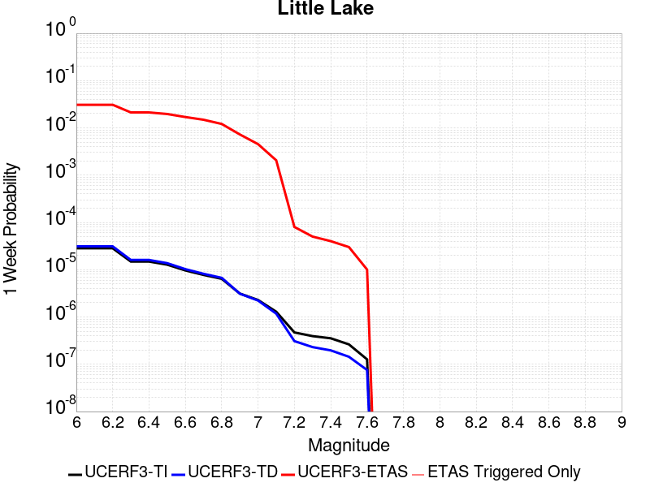 |  |  |  |

| Magnitude | 1 wk TI Prob | 1 wk TD Prob | 1 wk ETAS Prob | 1 wk ETAS/TD Gain | 1 wk ETAS Triggered Only | 1 mo TI Prob | 1 mo TD Prob | 1 mo ETAS Prob | 1 mo ETAS/TD Gain | 1 mo ETAS Triggered Only | 1 yr TI Prob | 1 yr TD Prob | 1 yr ETAS Prob | 1 yr ETAS/TD Gain | 1 yr ETAS Triggered Only | 10 yr TI Prob | 10 yr TD Prob | 10 yr ETAS Prob | 10 yr ETAS/TD Gain | 10 yr ETAS Triggered Only |
|-----|-----|-----|-----|-----|-----|-----|-----|-----|-----|-----|-----|-----|-----|-----|-----|-----|-----|-----|-----|-----|
| 6.0 | 2.8424427E-5 | 3.120572E-5 | 0.030840244 | 988.28815 | 0.03081 | 1.2181328E-4 | 1.337327E-4 | 0.03798867 | 284.06418 | 0.03786 | 0.0014820677 | 0.0016271127 | 0.052084878 | 32.010616 | 0.05054 | 0.014722223 | 0.016165402 | 0.07805844 | 4.828735 | 0.06291 |
| 6.1 | 2.8424427E-5 | 3.120572E-5 | 0.030840244 | 988.28815 | 0.03081 | 1.2181328E-4 | 1.337327E-4 | 0.03798867 | 284.06418 | 0.03786 | 0.0014820677 | 0.0016271127 | 0.052084878 | 32.010616 | 0.05054 | 0.014722223 | 0.016165402 | 0.07805844 | 4.828735 | 0.06291 |
| 6.2 | 2.8424427E-5 | 3.120572E-5 | 0.030840244 | 988.28815 | 0.03081 | 1.2181328E-4 | 1.337327E-4 | 0.03798867 | 284.06418 | 0.03786 | 0.0014820677 | 0.0016271127 | 0.052084878 | 32.010616 | 0.05054 | 0.014722223 | 0.016165402 | 0.07805844 | 4.828735 | 0.06291 |
| 6.3 | 1.48860645E-5 | 1.6081389E-5 | 0.02121574 | 1319.2728 | 0.0212 | 6.379586E-5 | 6.8918576E-5 | 0.025827143 | 374.74863 | 0.02576 | 7.7643775E-4 | 8.3878887E-4 | 0.034520514 | 41.155186 | 0.03371 | 0.007737305 | 0.008359048 | 0.049601395 | 5.933857 | 0.04159 |
| 6.4 | 1.48860645E-5 | 1.6081389E-5 | 0.02121574 | 1319.2728 | 0.0212 | 6.379586E-5 | 6.8918576E-5 | 0.025827143 | 374.74863 | 0.02576 | 7.7643775E-4 | 8.3878887E-4 | 0.034520514 | 41.155186 | 0.03371 | 0.007737305 | 0.008359048 | 0.049601395 | 5.933857 | 0.04159 |
| 6.5 | 1.2797581E-5 | 1.3765565E-5 | 0.019663496 | 1428.4553 | 0.01965 | 5.4845623E-5 | 5.899409E-5 | 0.02386759 | 404.57596 | 0.02381 | 6.675408E-4 | 7.18042E-4 | 0.03186566 | 44.378544 | 0.03117 | 0.006655392 | 0.00715977 | 0.045274906 | 6.323514 | 0.03839 |
| 6.6 | 9.661896E-6 | 1.0289038E-5 | 0.016970115 | 1649.3394 | 0.01696 | 4.1407468E-5 | 4.409522E-5 | 0.020643188 | 468.1502 | 0.0206 | 5.040193E-4 | 5.367433E-4 | 0.027632192 | 51.481205 | 0.02711 | 0.005028777 | 0.0053560743 | 0.038487665 | 7.185797 | 0.03331 |
| 6.7 | 7.767871E-6 | 8.199687E-6 | 0.014868078 | 1813.2495 | 0.01486 | 3.329045E-5 | 3.5141118E-5 | 0.018044509 | 513.487 | 0.01801 | 4.0523586E-4 | 4.2777284E-4 | 0.02424758 | 56.683304 | 0.02383 | 0.004044977 | 0.004270846 | 0.033435754 | 7.828836 | 0.02929 |
| 6.8 | 6.4235196E-6 | 6.7357446E-6 | 0.012116654 | 1798.8589 | 0.01211 | 2.752908E-5 | 2.8867229E-5 | 0.014428452 | 499.82114 | 0.0144 | 3.35115E-4 | 3.5141467E-4 | 0.019444702 | 55.332645 | 0.0191 | 0.003346101 | 0.00350985 | 0.02684765 | 7.64923 | 0.02342 |
| 6.9 | 3.1283696E-6 | 3.1121804E-6 | 0.0072530895 | 2330.549 | 0.00725 | 1.3407229E-5 | 1.3337856E-5 | 0.008493225 | 636.7758 | 0.00848 | 1.6322079E-4 | 1.6237781E-4 | 0.011440546 | 70.45634 | 0.01128 | 0.0016310095 | 0.00162274 | 0.015570071 | 9.594926 | 0.01397 |
| 7.0 | 2.290603E-6 | 2.2286815E-6 | 0.0045322184 | 2033.5873 | 0.00453 | 9.816834E-6 | 9.551463E-6 | 0.005319501 | 556.9304 | 0.00531 | 1.19513395E-4 | 1.162839E-4 | 0.0071554654 | 61.534443 | 0.00704 | 0.0011944914 | 0.0011623327 | 0.009882186 | 8.502028 | 0.00873 |
| 7.1 | 1.293693E-6 | 1.1776827E-6 | 0.0020611752 | 1750.1957 | 0.00206 | 5.5443866E-6 | 5.0472063E-6 | 0.0024350348 | 482.45206 | 0.00243 | 6.750081E-5 | 6.14487E-5 | 0.0033012496 | 53.72367 | 0.00324 | 6.7480316E-4 | 6.143856E-4 | 0.0044920016 | 7.3113728 | 0.00388 |
| 7.2 | 4.715842E-7 | 3.0917857E-7 | 8.030915E-5 | 259.75006 | 8.0E-5 | 2.0210737E-6 | 1.3250503E-6 | 1.0132492E-4 | 76.46873 | 1.0E-4 | 2.4606294E-5 | 1.6132375E-5 | 1.4613027E-4 | 9.0582 | 1.3E-4 | 2.460357E-4 | 1.6131258E-4 | 3.2128676E-4 | 1.9917032 | 1.6E-4 |
| 7.3 | 3.9430947E-7 | 2.3097488E-7 | 5.0230963E-5 | 217.47371 | 5.0E-5 | 1.6898966E-6 | 9.89892E-7 | 7.098982E-5 | 71.71472 | 7.0E-5 | 2.0574296E-5 | 1.2051869E-5 | 1.12050664E-4 | 9.297369 | 1.0E-4 | 2.0572392E-4 | 1.20512224E-4 | 2.5049655E-4 | 2.0785987 | 1.3E-4 |
| 7.4 | 3.547123E-7 | 1.9679135E-7 | 4.0196785E-5 | 204.26093 | 4.0E-5 | 1.5201948E-6 | 8.4339126E-7 | 6.084334E-5 | 72.1413 | 6.0E-5 | 1.8508214E-5 | 1.0268241E-5 | 1.00267316E-4 | 9.7648 | 9.0E-5 | 1.8506673E-4 | 1.02677724E-4 | 2.226654E-4 | 2.1685853 | 1.2E-4 |
| 7.5 | 2.6354266E-7 | 1.4423138E-7 | 3.0144227E-5 | 208.99908 | 3.0E-5 | 1.129468E-6 | 6.181344E-7 | 4.061811E-5 | 65.71081 | 4.0E-5 | 1.3751187E-5 | 7.5257603E-6 | 7.7525234E-5 | 10.301315 | 7.0E-5 | 1.3750336E-4 | 7.5255106E-5 | 1.7524758E-4 | 2.3287134 | 1.0E-4 |
| 7.6 | 1.269913E-7 | 7.572556E-8 | 1.0075725E-5 | 133.0558 | 1.0E-5 | 5.4424834E-7 | 3.245381E-7 | 2.032453E-5 | 62.62603 | 2.0E-5 | 6.6262032E-6 | 3.9512443E-6 | 4.3951088E-5 | 11.123353 | 4.0E-5 | 6.626006E-5 | 3.9511775E-5 | 7.9510195E-5 | 2.0123165 | 4.0E-5 |

## Owl Lake
*[(top)](#table-of-contents)*

| 1 Week | 1 Month | 1 Year | 10 Year |
|-----|-----|-----|-----|
|  |  |  |  |

| Magnitude | 1 wk TI Prob | 1 wk TD Prob | 1 wk ETAS Prob | 1 wk ETAS/TD Gain | 1 wk ETAS Triggered Only | 1 mo TI Prob | 1 mo TD Prob | 1 mo ETAS Prob | 1 mo ETAS/TD Gain | 1 mo ETAS Triggered Only | 1 yr TI Prob | 1 yr TD Prob | 1 yr ETAS Prob | 1 yr ETAS/TD Gain | 1 yr ETAS Triggered Only | 10 yr TI Prob | 10 yr TD Prob | 10 yr ETAS Prob | 10 yr ETAS/TD Gain | 10 yr ETAS Triggered Only |
|-----|-----|-----|-----|-----|-----|-----|-----|-----|-----|-----|-----|-----|-----|-----|-----|-----|-----|-----|-----|-----|
| 6.0 | 5.0320643E-5 | 6.635816E-5 | 0.01855513 | 279.62097 | 0.01849 | 2.1564208E-4 | 2.843674E-4 | 0.025217276 | 88.67851 | 0.02494 | 0.0026222812 | 0.0034577388 | 0.040080667 | 11.591583 | 0.03675 | 0.02591553 | 0.034140717 | 0.08055992 | 2.3596432 | 0.04806 |
| 6.1 | 5.0320643E-5 | 6.635816E-5 | 0.01855513 | 279.62097 | 0.01849 | 2.1564208E-4 | 2.843674E-4 | 0.025217276 | 88.67851 | 0.02494 | 0.0026222812 | 0.0034577388 | 0.040080667 | 11.591583 | 0.03675 | 0.02591553 | 0.034140717 | 0.08055992 | 2.3596432 | 0.04806 |
| 6.2 | 2.4125871E-5 | 3.0981035E-5 | 0.01458053 | 470.6276 | 0.01455 | 1.0339249E-4 | 1.3277028E-4 | 0.019670175 | 148.15195 | 0.01954 | 0.0012580766 | 0.001615439 | 0.02988969 | 18.50252 | 0.02832 | 0.012509781 | 0.016070465 | 0.052534893 | 3.269034 | 0.03706 |
| 6.3 | 1.7433485E-5 | 2.2355514E-5 | 0.013122062 | 586.9721 | 0.0131 | 7.471279E-5 | 9.580672E-5 | 0.01749414 | 182.59825 | 0.0174 | 9.0924866E-4 | 0.0011659743 | 0.025957035 | 22.262098 | 0.02482 | 0.009055373 | 0.011628896 | 0.043405026 | 3.7325149 | 0.03215 |
| 6.4 | 1.7433485E-5 | 2.2355514E-5 | 0.013122062 | 586.9721 | 0.0131 | 7.471279E-5 | 9.580672E-5 | 0.01749414 | 182.59825 | 0.0174 | 9.0924866E-4 | 0.0011659743 | 0.025957035 | 22.262098 | 0.02482 | 0.009055373 | 0.011628896 | 0.043405026 | 3.7325149 | 0.03215 |
| 6.5 | 1.5182742E-5 | 1.9429144E-5 | 0.012679183 | 652.58575 | 0.01266 | 6.506727E-5 | 8.326596E-5 | 0.016881866 | 202.74632 | 0.0168 | 7.919061E-4 | 0.0010134429 | 0.024779333 | 24.450645 | 0.02379 | 0.0078909 | 0.010118429 | 0.040537488 | 4.006303 | 0.03073 |
| 6.6 | 6.7271576E-6 | 8.547361E-6 | 0.010868454 | 1271.5568 | 0.01086 | 2.8830356E-5 | 3.6631063E-5 | 0.014006119 | 382.35632 | 0.01397 | 3.5095305E-4 | 4.458976E-4 | 0.019147554 | 42.941597 | 0.01871 | 0.0035039932 | 0.004467813 | 0.027822997 | 6.227432 | 0.02346 |
| 6.7 | 6.682835E-6 | 8.479807E-6 | 0.010848388 | 1279.3201 | 0.01084 | 2.8640408E-5 | 3.6341557E-5 | 0.013975835 | 384.56897 | 0.01394 | 3.4864116E-4 | 4.4237426E-4 | 0.019094119 | 43.162815 | 0.01866 | 0.003480947 | 0.0044327388 | 0.027738968 | 6.257749 | 0.02341 |
| 6.8 | 6.5774975E-6 | 8.32628E-6 | 0.010798236 | 1296.886 | 0.01079 | 2.8188972E-5 | 3.5683603E-5 | 0.013905189 | 389.68005 | 0.01387 | 3.4314668E-4 | 4.343669E-4 | 0.019006297 | 43.756317 | 0.01858 | 0.0034261728 | 0.004352885 | 0.027571376 | 6.334047 | 0.02332 |
| 6.9 | 6.363419E-6 | 7.999454E-6 | 0.010747913 | 1343.5808 | 0.01074 | 2.727151E-5 | 3.428296E-5 | 0.013803811 | 402.64352 | 0.01377 | 3.3198006E-4 | 4.1732067E-4 | 0.018879613 | 45.240063 | 0.01847 | 0.0033148455 | 0.0041828766 | 0.027265918 | 6.5184608 | 0.02318 |
| 7.0 | 6.1342453E-6 | 7.6316555E-6 | 0.01069755 | 1401.7339 | 0.01069 | 2.6289357E-5 | 3.2706717E-5 | 0.013722259 | 419.55478 | 0.01369 | 3.2002592E-4 | 3.9813702E-4 | 0.018740831 | 47.071312 | 0.01835 | 0.0031956544 | 0.003991571 | 0.026949566 | 6.7516193 | 0.02305 |
| 7.1 | 5.842926E-6 | 7.142211E-6 | 0.010207069 | 1429.1189 | 0.0102 | 2.504087E-5 | 3.0609146E-5 | 0.013090209 | 427.65677 | 0.01306 | 3.0482994E-4 | 3.7260808E-4 | 0.017766126 | 47.68046 | 0.0174 | 0.0030441214 | 0.0037370329 | 0.025515342 | 6.8277006 | 0.02186 |
| 7.2 | 4.77173E-6 | 5.358483E-6 | 0.006625323 | 1236.4176 | 0.00662 | 2.045011E-5 | 2.2964748E-5 | 0.008592768 | 374.1721 | 0.00857 | 2.4895166E-4 | 2.79564E-4 | 0.011676377 | 41.766384 | 0.0114 | 0.0024867293 | 0.002808645 | 0.016988706 | 6.0487194 | 0.01422 |
| 7.3 | 3.0494948E-6 | 2.710463E-6 | 0.0018327055 | 676.1596 | 0.00183 | 1.3069198E-5 | 1.1616219E-5 | 0.00226159 | 194.69244 | 0.00225 | 1.5910587E-4 | 1.4141845E-4 | 0.0032309815 | 22.846958 | 0.00309 | 0.0015899199 | 0.0014232415 | 0.005317691 | 3.7363238 | 0.0039 |
| 7.4 | 2.7263884E-6 | 2.3056762E-6 | 0.001172303 | 508.44214 | 0.00117 | 1.1684469E-5 | 9.881433E-6 | 0.0014998667 | 151.78636 | 0.00149 | 1.4224913E-4 | 1.20299905E-4 | 0.0021600544 | 17.95558 | 0.00204 | 0.0014215811 | 0.0012112238 | 0.0038280503 | 3.1604815 | 0.00262 |
| 7.5 | 2.6090431E-6 | 2.1656133E-6 | 9.821635E-4 | 453.52673 | 9.8E-4 | 1.1181565E-5 | 9.281167E-6 | 0.0012892693 | 138.91241 | 0.00128 | 1.3612706E-4 | 1.1299244E-4 | 0.0018627947 | 16.486012 | 0.00175 | 0.001360437 | 0.0011379806 | 0.0034353633 | 3.018824 | 0.0023 |
| 7.6 | 2.3008756E-6 | 1.8727933E-6 | 6.5187155E-4 | 348.0745 | 6.5E-4 | 9.860858E-6 | 8.0262325E-6 | 8.380196E-4 | 104.41007 | 8.3E-4 | 1.20049335E-4 | 9.7715085E-5 | 0.0012676008 | 12.972416 | 0.00117 | 0.001199845 | 9.849932E-4 | 0.002563437 | 2.602492 | 0.00158 |
| 7.7 | 1.7184348E-6 | 1.3419171E-6 | 4.0134139E-4 | 299.0806 | 4.0E-4 | 7.3646997E-6 | 5.7510606E-6 | 4.6574842E-4 | 80.98479 | 4.6E-4 | 8.966153E-5 | 7.0016955E-5 | 6.9997285E-4 | 9.99719 | 6.3E-4 | 8.962536E-4 | 7.078345E-4 | 0.0016071975 | 2.2705836 | 9.0E-4 |
| 7.8 | 8.4612907E-7 | 8.4058576E-7 | 1.9084042E-4 | 227.03267 | 1.9E-4 | 3.6262625E-6 | 3.6025056E-6 | 2.2360172E-4 | 62.068386 | 2.2E-4 | 4.4148852E-5 | 4.3859643E-5 | 3.638456E-4 | 8.295681 | 3.2E-4 | 4.414008E-4 | 4.4398365E-4 | 8.937838E-4 | 2.0131009 | 4.5E-4 |
| 7.9 | 2.716738E-7 | 3.768106E-7 | 6.0376788E-5 | 160.23114 | 6.0E-5 | 1.1643157E-6 | 1.6149015E-6 | 7.161479E-5 | 44.346226 | 7.0E-5 | 1.4175452E-5 | 1.966126E-5 | 1.1965929E-4 | 6.0860443 | 1.0E-4 | 1.4174548E-4 | 1.9836679E-4 | 3.18343E-4 | 1.60482 | 1.2E-4 |
| 8.0 | 2.1995428E-8 | 3.384878E-8 | 3.384878E-8 | 1.0 | 0.0 | 9.426611E-8 | 1.4506621E-7 | 1.4506621E-7 | 1.0 | 0.0 | 1.1476893E-6 | 1.7661803E-6 | 1.7661803E-6 | 1.0 | 0.0 | 1.14768345E-5 | 1.7963059E-5 | 1.7963059E-5 | 1.0 | 0.0 |

## Airport Lake
*[(top)](#table-of-contents)*

| 1 Week | 1 Month | 1 Year | 10 Year |
|-----|-----|-----|-----|
|  |  |  |  |

| Magnitude | 1 wk TI Prob | 1 wk TD Prob | 1 wk ETAS Prob | 1 wk ETAS/TD Gain | 1 wk ETAS Triggered Only | 1 mo TI Prob | 1 mo TD Prob | 1 mo ETAS Prob | 1 mo ETAS/TD Gain | 1 mo ETAS Triggered Only | 1 yr TI Prob | 1 yr TD Prob | 1 yr ETAS Prob | 1 yr ETAS/TD Gain | 1 yr ETAS Triggered Only | 10 yr TI Prob | 10 yr TD Prob | 10 yr ETAS Prob | 10 yr ETAS/TD Gain | 10 yr ETAS Triggered Only |
|-----|-----|-----|-----|-----|-----|-----|-----|-----|-----|-----|-----|-----|-----|-----|-----|-----|-----|-----|-----|-----|
| 6.0 | 1.2387061E-5 | 1.3103157E-5 | 0.026572755 | 2027.966 | 0.02656 | 5.3086325E-5 | 5.615534E-5 | 0.03207436 | 571.172 | 0.03202 | 6.461343E-4 | 6.8350515E-4 | 0.043054525 | 62.99078 | 0.0424 | 0.0064425888 | 0.0068168393 | 0.05827366 | 8.548487 | 0.05181 |
| 6.1 | 1.2387061E-5 | 1.3103157E-5 | 0.026572755 | 2027.966 | 0.02656 | 5.3086325E-5 | 5.615534E-5 | 0.03207436 | 571.172 | 0.03202 | 6.461343E-4 | 6.8350515E-4 | 0.043054525 | 62.99078 | 0.0424 | 0.0064425888 | 0.0068168393 | 0.05827366 | 8.548487 | 0.05181 |
| 6.2 | 1.2387061E-5 | 1.3103157E-5 | 0.026572755 | 2027.966 | 0.02656 | 5.3086325E-5 | 5.615534E-5 | 0.03207436 | 571.172 | 0.03202 | 6.461343E-4 | 6.8350515E-4 | 0.043054525 | 62.99078 | 0.0424 | 0.0064425888 | 0.0068168393 | 0.05827366 | 8.548487 | 0.05181 |
| 6.3 | 1.2387061E-5 | 1.3103157E-5 | 0.026572755 | 2027.966 | 0.02656 | 5.3086325E-5 | 5.615534E-5 | 0.03207436 | 571.172 | 0.03202 | 6.461343E-4 | 6.8350515E-4 | 0.043054525 | 62.99078 | 0.0424 | 0.0064425888 | 0.0068168393 | 0.05827366 | 8.548487 | 0.05181 |
| 6.4 | 1.2387061E-5 | 1.3103157E-5 | 0.026572755 | 2027.966 | 0.02656 | 5.3086325E-5 | 5.615534E-5 | 0.03207436 | 571.172 | 0.03202 | 6.461343E-4 | 6.8350515E-4 | 0.043054525 | 62.99078 | 0.0424 | 0.0064425888 | 0.0068168393 | 0.05827366 | 8.548487 | 0.05181 |
| 6.5 | 6.9922594E-6 | 7.384925E-6 | 0.01969724 | 2667.2227 | 0.01969 | 2.996648E-5 | 3.1649324E-5 | 0.023800896 | 752.0191 | 0.02377 | 3.6478083E-4 | 3.8526783E-4 | 0.03172319 | 82.340614 | 0.03135 | 0.003641826 | 0.0038465366 | 0.042407636 | 11.024888 | 0.03871 |
| 6.6 | 6.9922594E-6 | 7.384925E-6 | 0.01969724 | 2667.2227 | 0.01969 | 2.996648E-5 | 3.1649324E-5 | 0.023800896 | 752.0191 | 0.02377 | 3.6478083E-4 | 3.8526783E-4 | 0.03172319 | 82.340614 | 0.03135 | 0.003641826 | 0.0038465366 | 0.042407636 | 11.024888 | 0.03871 |
| 6.7 | 5.477277E-6 | 5.7860684E-6 | 0.016875688 | 2916.6072 | 0.01687 | 2.3473833E-5 | 2.4797222E-5 | 0.020384293 | 822.03937 | 0.02036 | 2.8575645E-4 | 3.0186825E-4 | 0.02715376 | 89.952354 | 0.02686 | 0.0028538927 | 0.003014966 | 0.03599523 | 11.938851 | 0.03308 |
| 6.8 | 3.9950432E-6 | 4.2190873E-6 | 0.012954164 | 3070.3713 | 0.01295 | 1.7121502E-5 | 1.8081691E-5 | 0.0154078035 | 852.12177 | 0.01539 | 2.0843433E-4 | 2.2012512E-4 | 0.02045567 | 92.92747 | 0.02024 | 0.0020823893 | 0.0021993418 | 0.027094468 | 12.319353 | 0.02495 |
| 6.9 | 2.95695E-6 | 3.1230243E-6 | 0.009063095 | 2902.0251 | 0.00906 | 1.2672582E-5 | 1.3384334E-5 | 0.010713241 | 800.4314 | 0.0107 | 1.5427776E-4 | 1.6294434E-4 | 0.014320637 | 87.88667 | 0.01416 | 0.001541707 | 0.0016284712 | 0.019249728 | 11.820737 | 0.01765 |
| 7.0 | 1.456072E-6 | 1.540812E-6 | 0.0042215344 | 2739.8115 | 0.00422 | 6.2402937E-6 | 6.603469E-6 | 0.004926571 | 746.05804 | 0.00492 | 7.597293E-5 | 8.039528E-5 | 0.00660987 | 82.21715 | 0.00653 | 7.594696E-4 | 8.0376083E-4 | 0.008927226 | 11.106819 | 0.00813 |
| 7.1 | 6.995192E-7 | 7.4089746E-7 | 0.0019307395 | 2605.947 | 0.00193 | 2.997936E-6 | 3.1752747E-6 | 0.002253168 | 709.59784 | 0.00225 | 3.649926E-5 | 3.865897E-5 | 0.0030285434 | 78.33999 | 0.00299 | 3.6493264E-4 | 3.865897E-4 | 0.0039652055 | 10.256884 | 0.00358 |

## Panamint Valley
*[(top)](#table-of-contents)*

| 1 Week | 1 Month | 1 Year | 10 Year |
|-----|-----|-----|-----|
|  |  |  |  |

| Magnitude | 1 wk TI Prob | 1 wk TD Prob | 1 wk ETAS Prob | 1 wk ETAS/TD Gain | 1 wk ETAS Triggered Only | 1 mo TI Prob | 1 mo TD Prob | 1 mo ETAS Prob | 1 mo ETAS/TD Gain | 1 mo ETAS Triggered Only | 1 yr TI Prob | 1 yr TD Prob | 1 yr ETAS Prob | 1 yr ETAS/TD Gain | 1 yr ETAS Triggered Only | 10 yr TI Prob | 10 yr TD Prob | 10 yr ETAS Prob | 10 yr ETAS/TD Gain | 10 yr ETAS Triggered Only |
|-----|-----|-----|-----|-----|-----|-----|-----|-----|-----|-----|-----|-----|-----|-----|-----|-----|-----|-----|-----|-----|
| 6.0 | 3.0211835E-5 | 3.3984514E-5 | 0.015123472 | 445.0107 | 0.01509 | 1.2947287E-4 | 1.4563995E-4 | 0.019692793 | 135.2156 | 0.01955 | 0.0015751923 | 0.0017717537 | 0.030241223 | 17.068525 | 0.02852 | 0.015640736 | 0.017583137 | 0.054531835 | 3.1013713 | 0.03761 |
| 6.1 | 3.0211835E-5 | 3.3984514E-5 | 0.015123472 | 445.0107 | 0.01509 | 1.2947287E-4 | 1.4563995E-4 | 0.019692793 | 135.2156 | 0.01955 | 0.0015751923 | 0.0017717537 | 0.030241223 | 17.068525 | 0.02852 | 0.015640736 | 0.017583137 | 0.054531835 | 3.1013713 | 0.03761 |
| 6.2 | 3.0211835E-5 | 3.3984514E-5 | 0.015123472 | 445.0107 | 0.01509 | 1.2947287E-4 | 1.4563995E-4 | 0.019692793 | 135.2156 | 0.01955 | 0.0015751923 | 0.0017717537 | 0.030241223 | 17.068525 | 0.02852 | 0.015640736 | 0.017583137 | 0.054531835 | 3.1013713 | 0.03761 |
| 6.3 | 2.8573924E-5 | 3.210268E-5 | 0.0144316405 | 449.5463 | 0.0144 | 1.2245393E-4 | 1.3757581E-4 | 0.01878501 | 136.54297 | 0.01865 | 0.001489857 | 0.0016737265 | 0.028868135 | 17.24782 | 0.02724 | 0.01479908 | 0.016617801 | 0.05168521 | 3.1102316 | 0.03566 |
| 6.4 | 2.8573924E-5 | 3.210268E-5 | 0.0144316405 | 449.5463 | 0.0144 | 1.2245393E-4 | 1.3757581E-4 | 0.01878501 | 136.54297 | 0.01865 | 0.001489857 | 0.0016737265 | 0.028868135 | 17.24782 | 0.02724 | 0.01479908 | 0.016617801 | 0.05168521 | 3.1102316 | 0.03566 |
| 6.5 | 2.7468774E-5 | 3.0828433E-5 | 0.014130394 | 458.35587 | 0.0141 | 1.1771801E-4 | 1.3211532E-4 | 0.01825972 | 138.21046 | 0.01813 | 0.0014322745 | 0.0016073446 | 0.028024815 | 17.435474 | 0.02646 | 0.014230782 | 0.015963677 | 0.049981814 | 3.1309712 | 0.03457 |
| 6.6 | 2.6135967E-5 | 2.925248E-5 | 0.013768851 | 470.69003 | 0.01374 | 1.1200648E-4 | 1.253619E-4 | 0.017703159 | 141.21642 | 0.01758 | 0.0013628257 | 0.0015252391 | 0.027096178 | 17.765202 | 0.02561 | 0.013544982 | 0.015154043 | 0.0480282 | 3.1693325 | 0.03338 |
| 6.7 | 2.4498746E-5 | 2.7341335E-5 | 0.013376976 | 489.25836 | 0.01335 | 1.04990395E-4 | 1.1717203E-4 | 0.017185172 | 146.66617 | 0.01707 | 0.0012775084 | 0.0014256609 | 0.026040519 | 18.265575 | 0.02465 | 0.012701893 | 0.014171274 | 0.04560935 | 3.2184367 | 0.03189 |
| 6.8 | 2.2244329E-5 | 2.4935423E-5 | 0.012564623 | 503.88647 | 0.01254 | 9.532935E-5 | 1.0686185E-4 | 0.016055157 | 150.24219 | 0.01595 | 0.0011600169 | 0.0013002884 | 0.024160525 | 18.580898 | 0.02289 | 0.011539802 | 0.0129325185 | 0.04207075 | 3.253098 | 0.02952 |
| 6.9 | 1.9902658E-5 | 2.2290267E-5 | 0.011462036 | 514.21704 | 0.01144 | 8.529431E-5 | 9.552632E-5 | 0.014524148 | 152.04341 | 0.01443 | 0.0010379635 | 0.0011624309 | 0.021508751 | 18.503252 | 0.02037 | 0.010331288 | 0.011568608 | 0.037386436 | 3.2317145 | 0.02612 |
| 7.0 | 1.8353881E-5 | 2.0566185E-5 | 0.0108103445 | 525.6368 | 0.01079 | 7.865712E-5 | 8.813792E-5 | 0.01367694 | 155.17657 | 0.01359 | 9.5722964E-4 | 0.0010725686 | 0.020072168 | 18.714111 | 0.01902 | 0.009531168 | 0.010678849 | 0.034669887 | 3.246594 | 0.02425 |
| 7.1 | 1.7667631E-5 | 1.9772613E-5 | 0.010529565 | 532.53284 | 0.01051 | 7.571623E-5 | 8.473711E-5 | 0.013303617 | 156.9987 | 0.01322 | 9.2145515E-4 | 0.0010312037 | 0.019412229 | 18.824827 | 0.0184 | 0.009176437 | 0.010269073 | 0.033319905 | 3.244685 | 0.02329 |
| 7.2 | 1.6381597E-5 | 1.8158249E-5 | 0.009297989 | 512.05316 | 0.00928 | 7.020495E-5 | 7.781885E-5 | 0.011796907 | 151.59447 | 0.01172 | 8.544101E-4 | 9.4704994E-4 | 0.017251594 | 18.21614 | 0.01632 | 0.008511325 | 0.009434792 | 0.030008832 | 3.1806564 | 0.02077 |
| 7.3 | 1.4520491E-5 | 1.5966476E-5 | 0.0075158468 | 470.7267 | 0.0075 | 6.222919E-5 | 6.842605E-5 | 0.009597774 | 140.26491 | 0.00953 | 7.57377E-4 | 8.327849E-4 | 0.014131701 | 16.969208 | 0.01331 | 0.0075480095 | 0.00829975 | 0.025198324 | 3.0360336 | 0.01704 |
| 7.4 | 1.2852287E-5 | 1.4145411E-5 | 0.0072940425 | 515.6473 | 0.00728 | 5.5080065E-5 | 6.062187E-5 | 0.009270064 | 152.91615 | 0.00921 | 6.7039346E-4 | 7.378371E-4 | 0.013538386 | 18.348745 | 0.01281 | 0.0066837464 | 0.0073567946 | 0.023546806 | 3.2006881 | 0.01631 |
| 7.5 | 1.1637851E-5 | 1.2836797E-5 | 0.007182745 | 559.54333 | 0.00717 | 4.987555E-5 | 5.5013777E-5 | 0.009144514 | 166.22226 | 0.00909 | 6.070656E-4 | 6.6960254E-4 | 0.013321125 | 19.894077 | 0.01266 | 0.006054099 | 0.0066787465 | 0.022641419 | 3.3900702 | 0.01607 |
| 7.6 | 3.0068115E-6 | 3.3330316E-6 | 0.0033633218 | 1009.0879 | 0.00336 | 1.2886271E-5 | 1.4284384E-5 | 0.0042742235 | 299.2235 | 0.00426 | 1.5687906E-4 | 1.7390578E-4 | 0.00601289 | 34.575565 | 0.00584 | 0.0015676835 | 0.0017391363 | 0.009046406 | 5.201666 | 0.00732 |

## Garlock (East)
*[(top)](#table-of-contents)*

| 1 Week | 1 Month | 1 Year | 10 Year |
|-----|-----|-----|-----|
|  | 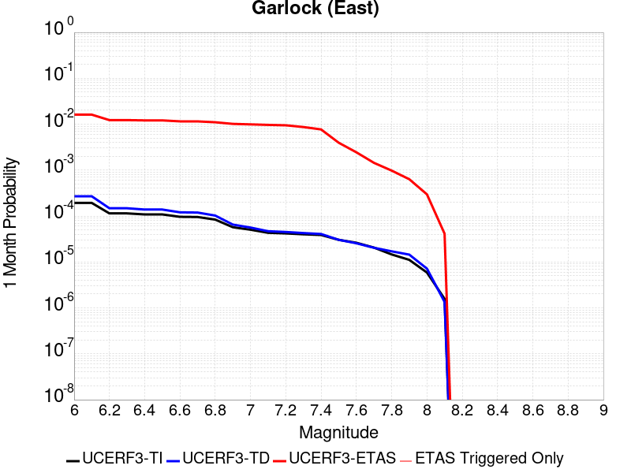 | 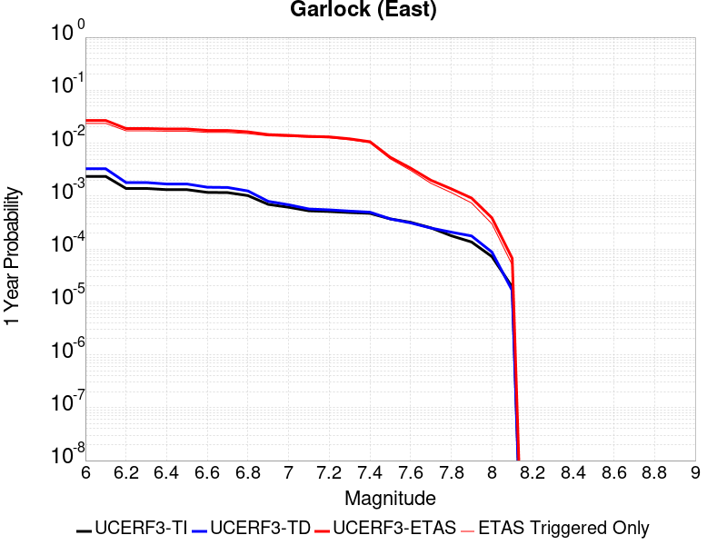 |  |

| Magnitude | 1 wk TI Prob | 1 wk TD Prob | 1 wk ETAS Prob | 1 wk ETAS/TD Gain | 1 wk ETAS Triggered Only | 1 mo TI Prob | 1 mo TD Prob | 1 mo ETAS Prob | 1 mo ETAS/TD Gain | 1 mo ETAS Triggered Only | 1 yr TI Prob | 1 yr TD Prob | 1 yr ETAS Prob | 1 yr ETAS/TD Gain | 1 yr ETAS Triggered Only | 10 yr TI Prob | 10 yr TD Prob | 10 yr ETAS Prob | 10 yr ETAS/TD Gain | 10 yr ETAS Triggered Only |
|-----|-----|-----|-----|-----|-----|-----|-----|-----|-----|-----|-----|-----|-----|-----|-----|-----|-----|-----|-----|-----|
| 6.0 | 4.5092507E-5 | 6.290325E-5 | 0.011852162 | 188.41891 | 0.01179 | 1.9323928E-4 | 2.6956003E-4 | 0.016165273 | 59.96911 | 0.0159 | 0.0023501497 | 0.0032774 | 0.02681002 | 8.180271 | 0.02361 | 0.023254504 | 0.032351844 | 0.06324885 | 1.9550307 | 0.03193 |
| 6.1 | 4.5092507E-5 | 6.290325E-5 | 0.011852162 | 188.41891 | 0.01179 | 1.9323928E-4 | 2.6956003E-4 | 0.016165273 | 59.96911 | 0.0159 | 0.0023501497 | 0.0032774 | 0.02681002 | 8.180271 | 0.02361 | 0.023254504 | 0.032351844 | 0.06324885 | 1.9550307 | 0.03193 |
| 6.2 | 2.6674514E-5 | 3.4509674E-5 | 0.009394187 | 272.21893 | 0.00936 | 1.1431433E-4 | 1.4789042E-4 | 0.012286095 | 83.07567 | 0.01214 | 0.0013908884 | 0.0017991117 | 0.01887833 | 10.493138 | 0.01711 | 0.01382215 | 0.017890299 | 0.039585102 | 2.2126575 | 0.02209 |
| 6.3 | 2.6674514E-5 | 3.4509674E-5 | 0.009394187 | 272.21893 | 0.00936 | 1.1431433E-4 | 1.4789042E-4 | 0.012286095 | 83.07567 | 0.01214 | 0.0013908884 | 0.0017991117 | 0.01887833 | 10.493138 | 0.01711 | 0.01382215 | 0.017890299 | 0.039585102 | 2.2126575 | 0.02209 |
| 6.4 | 2.5312667E-5 | 3.233893E-5 | 0.009232041 | 285.47763 | 0.0092 | 1.0847834E-4 | 1.3858822E-4 | 0.012106929 | 87.35901 | 0.01197 | 0.0013199237 | 0.0016860351 | 0.018477676 | 10.959248 | 0.01682 | 0.013121112 | 0.016778335 | 0.038025755 | 2.2663605 | 0.02161 |
| 6.5 | 2.5312667E-5 | 3.233893E-5 | 0.009232041 | 285.47763 | 0.0092 | 1.0847834E-4 | 1.3858822E-4 | 0.012106929 | 87.35901 | 0.01197 | 0.0013199237 | 0.0016860351 | 0.018477676 | 10.959248 | 0.01682 | 0.013121112 | 0.016778335 | 0.038025755 | 2.2663605 | 0.02161 |
| 6.6 | 2.246556E-5 | 2.8133776E-5 | 0.008867885 | 315.20422 | 0.00884 | 9.627742E-5 | 1.20567885E-4 | 0.011539191 | 95.707 | 0.01142 | 0.0011715472 | 0.0014669491 | 0.017383566 | 11.850149 | 0.01594 | 0.011653901 | 0.01461866 | 0.034730293 | 2.3757508 | 0.02041 |
| 6.7 | 2.2241198E-5 | 2.7803519E-5 | 0.008867558 | 318.93652 | 0.00884 | 9.531594E-5 | 1.1915263E-4 | 0.011517794 | 96.66421 | 0.0114 | 0.0011598538 | 0.0014497414 | 0.017336676 | 11.958461 | 0.01591 | 0.011538187 | 0.014448853 | 0.03452453 | 2.3894305 | 0.02037 |
| 6.8 | 1.9528685E-5 | 2.389819E-5 | 0.008593693 | 359.59598 | 0.00857 | 8.369167E-5 | 1.0241691E-4 | 0.011031297 | 107.70973 | 0.01093 | 0.0010184698 | 0.0012462323 | 0.016337402 | 13.109436 | 0.01511 | 0.010138147 | 0.012436427 | 0.031456903 | 2.5294163 | 0.01926 |
| 6.9 | 1.3318621E-5 | 1.5198884E-5 | 0.008035077 | 528.6623 | 0.00802 | 5.7078556E-5 | 6.513648E-5 | 0.010164479 | 156.04893 | 0.0101 | 6.9470983E-4 | 7.927538E-4 | 0.014501877 | 18.29304 | 0.01372 | 0.0069254204 | 0.007939888 | 0.025033083 | 3.1528258 | 0.01723 |
| 7.0 | 1.1760853E-5 | 1.31077895E-5 | 0.0078430055 | 598.3469 | 0.00783 | 5.0402683E-5 | 5.6175057E-5 | 0.009915621 | 176.51288 | 0.00986 | 6.134799E-4 | 6.8372174E-4 | 0.014024594 | 20.512136 | 0.01335 | 0.0061178906 | 0.00685652 | 0.023481742 | 3.4247317 | 0.01674 |
| 7.1 | 1.0064758E-5 | 1.0902931E-5 | 0.007700819 | 706.30725 | 0.00769 | 4.3133965E-5 | 4.672603E-5 | 0.009666276 | 206.87135 | 0.00962 | 5.2502943E-4 | 5.687444E-4 | 0.01342143 | 23.598352 | 0.01286 | 0.005237907 | 0.0057129986 | 0.021611648 | 3.7828903 | 0.01599 |
| 7.2 | 9.768808E-6 | 1.0498807E-5 | 0.00752042 | 716.3119 | 0.00751 | 4.186565E-5 | 4.499413E-5 | 0.00946457 | 210.35123 | 0.00942 | 5.095951E-4 | 5.4766936E-4 | 0.01312078 | 23.957485 | 0.01258 | 0.0050842804 | 0.0055032647 | 0.02104725 | 3.8245025 | 0.01563 |
| 7.3 | 9.344516E-6 | 9.944468E-6 | 0.0069098757 | 694.84625 | 0.0069 | 4.004731E-5 | 4.261847E-5 | 0.00868225 | 203.72037 | 0.00864 | 4.8746695E-4 | 5.1875977E-4 | 0.012062768 | 23.25309 | 0.01155 | 0.0048639905 | 0.0052149445 | 0.019510007 | 3.7411723 | 0.01437 |
| 7.4 | 9.023491E-6 | 9.490661E-6 | 0.006119433 | 644.78467 | 0.00611 | 3.867153E-5 | 4.0673647E-5 | 0.0077003622 | 189.32068 | 0.00766 | 4.7072413E-4 | 4.950925E-4 | 0.010650062 | 21.51126 | 0.01016 | 0.004697283 | 0.0049783974 | 0.01759527 | 3.5343244 | 0.01268 |
| 7.5 | 7.081253E-6 | 7.087672E-6 | 0.0030370662 | 428.49982 | 0.00303 | 3.0347876E-5 | 3.0375388E-5 | 0.0039502564 | 130.04793 | 0.00392 | 3.6942272E-4 | 3.6975832E-4 | 0.005407895 | 14.625484 | 0.00504 | 0.003688092 | 0.0037243143 | 0.009941074 | 2.6692362 | 0.00624 |
| 7.6 | 6.116396E-6 | 5.959245E-6 | 0.0018459483 | 309.76212 | 0.00184 | 2.6212863E-5 | 2.5539372E-5 | 0.0024454775 | 95.75324 | 0.00242 | 3.1909486E-4 | 3.1089774E-4 | 0.0033699465 | 10.839405 | 0.00306 | 0.0031863707 | 0.0031357552 | 0.007023526 | 2.2398195 | 0.0039 |
| 7.7 | 4.797145E-6 | 4.757281E-6 | 0.001124752 | 236.42747 | 0.00112 | 2.055903E-5 | 2.0388188E-5 | 0.0014403593 | 70.64675 | 0.00142 | 2.5027743E-4 | 2.4819805E-4 | 0.0019877662 | 8.008791 | 0.00174 | 0.0024999576 | 0.0025093474 | 0.0047237766 | 1.8824722 | 0.00222 |
| 7.8 | 3.4028885E-6 | 3.978462E-6 | 7.3397555E-4 | 184.48727 | 7.3E-4 | 1.4583726E-5 | 1.7050439E-5 | 9.770341E-4 | 57.302574 | 9.6E-4 | 1.775424E-4 | 2.0756939E-4 | 0.0013673286 | 6.5873322 | 0.00116 | 0.0017740062 | 0.0021012232 | 0.0035781134 | 1.7028717 | 0.00148 |
| 7.9 | 2.5928412E-6 | 3.3724489E-6 | 4.7337086E-4 | 140.36414 | 4.7E-4 | 1.1112129E-5 | 1.4453272E-5 | 6.344443E-4 | 43.89624 | 6.2E-4 | 1.3528178E-4 | 1.7595445E-4 | 9.1582426E-4 | 5.204894 | 7.4E-4 | 0.0013519945 | 0.0017812408 | 0.0027694774 | 1.5548023 | 9.9E-4 |
| 8.0 | 1.3743648E-6 | 1.6734747E-6 | 1.8167317E-4 | 108.560455 | 1.8E-4 | 5.8901214E-6 | 7.1720146E-6 | 2.9716993E-4 | 41.43465 | 2.9E-4 | 7.1709874E-5 | 8.731581E-5 | 3.8728962E-4 | 4.435504 | 3.0E-4 | 7.1686733E-4 | 8.837234E-4 | 0.0012733787 | 1.4409245 | 3.9E-4 |
| 8.1 | 3.6733252E-7 | 3.1489964E-7 | 3.031489E-5 | 96.26842 | 3.0E-5 | 1.5742813E-6 | 1.3495693E-6 | 4.1349515E-5 | 30.639046 | 4.0E-5 | 1.9166706E-5 | 1.6430899E-5 | 6.6430075E-5 | 4.0429974 | 5.0E-5 | 1.9165053E-4 | 1.6638759E-4 | 2.263776E-4 | 1.3605438 | 6.0E-5 |

## Hunter Mountain-Saline Valley
*[(top)](#table-of-contents)*

| 1 Week | 1 Month | 1 Year | 10 Year |
|-----|-----|-----|-----|
|  |  |  |  |

| Magnitude | 1 wk TI Prob | 1 wk TD Prob | 1 wk ETAS Prob | 1 wk ETAS/TD Gain | 1 wk ETAS Triggered Only | 1 mo TI Prob | 1 mo TD Prob | 1 mo ETAS Prob | 1 mo ETAS/TD Gain | 1 mo ETAS Triggered Only | 1 yr TI Prob | 1 yr TD Prob | 1 yr ETAS Prob | 1 yr ETAS/TD Gain | 1 yr ETAS Triggered Only | 10 yr TI Prob | 10 yr TD Prob | 10 yr ETAS Prob | 10 yr ETAS/TD Gain | 10 yr ETAS Triggered Only |
|-----|-----|-----|-----|-----|-----|-----|-----|-----|-----|-----|-----|-----|-----|-----|-----|-----|-----|-----|-----|-----|
| 6.0 | 4.5103672E-5 | 5.4570177E-5 | 0.0074841646 | 137.14752 | 0.00743 | 1.9328714E-4 | 2.3385242E-4 | 0.00965165 | 41.272392 | 0.00942 | 0.002350731 | 0.0028435152 | 0.016115667 | 5.6675158 | 0.01331 | 0.023260195 | 0.028091887 | 0.04466292 | 1.5898868 | 0.01705 |
| 6.1 | 4.5103672E-5 | 5.4570177E-5 | 0.0074841646 | 137.14752 | 0.00743 | 1.9328714E-4 | 2.3385242E-4 | 0.00965165 | 41.272392 | 0.00942 | 0.002350731 | 0.0028435152 | 0.016115667 | 5.6675158 | 0.01331 | 0.023260195 | 0.028091887 | 0.04466292 | 1.5898868 | 0.01705 |
| 6.2 | 3.9363465E-5 | 4.706337E-5 | 0.0074367155 | 158.01494 | 0.00739 | 1.6868966E-4 | 2.0168544E-4 | 0.009569796 | 47.449116 | 0.00937 | 0.002051862 | 0.0024528175 | 0.015660342 | 6.384634 | 0.01324 | 0.020330196 | 0.024273481 | 0.04080229 | 1.680941 | 0.01694 |
| 6.3 | 3.9363465E-5 | 4.706337E-5 | 0.0074367155 | 158.01494 | 0.00739 | 1.6868966E-4 | 2.0168544E-4 | 0.009569796 | 47.449116 | 0.00937 | 0.002051862 | 0.0024528175 | 0.015660342 | 6.384634 | 0.01324 | 0.020330196 | 0.024273481 | 0.04080229 | 1.680941 | 0.01694 |
| 6.4 | 3.2311684E-5 | 3.795099E-5 | 0.0074076713 | 195.19046 | 0.00737 | 1.384713E-4 | 1.6263737E-4 | 0.009511117 | 58.48051 | 0.00935 | 0.0016845843 | 0.0019783843 | 0.01515227 | 7.6589108 | 0.0132 | 0.016718714 | 0.019616475 | 0.036116328 | 1.8411223 | 0.01683 |
| 6.5 | 3.2311684E-5 | 3.795099E-5 | 0.0074076713 | 195.19046 | 0.00737 | 1.384713E-4 | 1.6263737E-4 | 0.009511117 | 58.48051 | 0.00935 | 0.0016845843 | 0.0019783843 | 0.01515227 | 7.6589108 | 0.0132 | 0.016718714 | 0.019616475 | 0.036116328 | 1.8411223 | 0.01683 |
| 6.6 | 2.9305844E-5 | 3.418183E-5 | 0.00739393 | 216.3117 | 0.00736 | 1.2559042E-4 | 1.4648569E-4 | 0.009475119 | 64.6829 | 0.00933 | 0.0015279909 | 0.001782067 | 0.014908633 | 8.365921 | 0.01315 | 0.015175272 | 0.01768569 | 0.034139454 | 1.9303433 | 0.01675 |
| 6.7 | 2.7826512E-5 | 3.2344276E-5 | 0.007392106 | 228.5445 | 0.00736 | 1.19251024E-4 | 1.386113E-4 | 0.009467318 | 68.3012 | 0.00933 | 0.0014509142 | 0.0016863465 | 0.014814171 | 8.784773 | 0.01315 | 0.014414776 | 0.016743187 | 0.033212736 | 1.983657 | 0.01675 |
| 6.8 | 2.3389874E-5 | 2.6866714E-5 | 0.0073766694 | 274.56537 | 0.00735 | 1.0023846E-4 | 1.15138246E-4 | 0.009424066 | 81.850006 | 0.00931 | 0.00121972 | 0.001400954 | 0.014472616 | 10.3305435 | 0.01309 | 0.01213047 | 0.013927434 | 0.030345542 | 2.1788323 | 0.01665 |
| 6.9 | 2.069209E-5 | 2.3570032E-5 | 0.0073433975 | 311.55655 | 0.00732 | 8.867737E-5 | 1.01010715E-4 | 0.009350076 | 92.56519 | 0.00925 | 0.0010791123 | 0.0012291478 | 0.014233144 | 11.579685 | 0.01302 | 0.010738871 | 0.012228523 | 0.028586019 | 2.337651 | 0.01656 |
| 7.0 | 1.7462342E-5 | 1.9633546E-5 | 0.0073194904 | 372.80533 | 0.0073 | 7.483646E-5 | 8.414118E-5 | 0.0093133645 | 110.687355 | 0.00923 | 9.1075303E-4 | 0.0010239601 | 0.01394072 | 13.614515 | 0.01293 | 0.009070295 | 0.0101960525 | 0.026498124 | 2.598861 | 0.01647 |
| 7.1 | 1.4807709E-5 | 1.6441749E-5 | 0.007306322 | 444.3762 | 0.00729 | 6.3460066E-5 | 7.046283E-5 | 0.009289813 | 131.8399 | 0.00922 | 7.723524E-4 | 8.575638E-4 | 0.0137265185 | 16.00641 | 0.01288 | 0.007696735 | 0.008545532 | 0.02479547 | 2.9015715 | 0.01639 |
| 7.2 | 1.4180048E-5 | 1.5698337E-5 | 0.007295584 | 464.7361 | 0.00728 | 6.077022E-5 | 6.727694E-5 | 0.009276657 | 137.88762 | 0.00921 | 7.396263E-4 | 8.188051E-4 | 0.013678267 | 16.705154 | 0.01287 | 0.0073716943 | 0.008160833 | 0.02440716 | 2.990768 | 0.01638 |
| 7.3 | 1.3730402E-5 | 1.5172075E-5 | 0.007295062 | 480.8216 | 0.00728 | 5.8843252E-5 | 6.502165E-5 | 0.009274423 | 142.63593 | 0.00921 | 7.161811E-4 | 7.9136714E-4 | 0.013631198 | 17.224873 | 0.01285 | 0.007138774 | 0.007888422 | 0.024119368 | 3.0575655 | 0.01636 |
| 7.4 | 1.2810095E-5 | 1.4109277E-5 | 0.007274007 | 515.5478 | 0.00726 | 5.489925E-5 | 6.0467017E-5 | 0.009249912 | 152.97449 | 0.00919 | 6.681934E-4 | 7.359531E-4 | 0.013506548 | 18.352457 | 0.01278 | 0.006661878 | 0.007338053 | 0.023488663 | 3.2009394 | 0.01627 |
| 7.5 | 1.1595659E-5 | 1.2800664E-5 | 0.0071627093 | 559.5576 | 0.00715 | 4.9694736E-5 | 5.4858923E-5 | 0.009124361 | 166.32411 | 0.00907 | 6.0486543E-4 | 6.6771836E-4 | 0.013289285 | 19.90253 | 0.01263 | 0.006032217 | 0.0066599925 | 0.022583233 | 3.3908796 | 0.01603 |
| 7.6 | 2.997694E-6 | 3.3251579E-6 | 0.003363314 | 1011.475 | 0.00336 | 1.28471975E-5 | 1.425064E-5 | 0.00427419 | 299.9297 | 0.00426 | 1.564034E-4 | 1.73495E-4 | 0.0060124816 | 34.65507 | 0.00584 | 0.0015629337 | 0.001735031 | 0.009042331 | 5.2116246 | 0.00732 |

## Blackwater
*[(top)](#table-of-contents)*

| 1 Week | 1 Month | 1 Year | 10 Year |
|-----|-----|-----|-----|
|  |  |  |  |

| Magnitude | 1 wk TI Prob | 1 wk TD Prob | 1 wk ETAS Prob | 1 wk ETAS/TD Gain | 1 wk ETAS Triggered Only | 1 mo TI Prob | 1 mo TD Prob | 1 mo ETAS Prob | 1 mo ETAS/TD Gain | 1 mo ETAS Triggered Only | 1 yr TI Prob | 1 yr TD Prob | 1 yr ETAS Prob | 1 yr ETAS/TD Gain | 1 yr ETAS Triggered Only | 10 yr TI Prob | 10 yr TD Prob | 10 yr ETAS Prob | 10 yr ETAS/TD Gain | 10 yr ETAS Triggered Only |
|-----|-----|-----|-----|-----|-----|-----|-----|-----|-----|-----|-----|-----|-----|-----|-----|-----|-----|-----|-----|-----|
| 6.0 | 3.0708583E-5 | 3.3095846E-5 | 0.004342953 | 131.22351 | 0.00431 | 1.3160157E-4 | 1.4183241E-4 | 0.0061409813 | 43.297447 | 0.006 | 0.0016010714 | 0.0017255784 | 0.011398857 | 6.6058183 | 0.00969 | 0.015895851 | 0.017135633 | 0.030512417 | 1.7806413 | 0.01361 |
| 6.1 | 3.0708583E-5 | 3.3095846E-5 | 0.004342953 | 131.22351 | 0.00431 | 1.3160157E-4 | 1.4183241E-4 | 0.0061409813 | 43.297447 | 0.006 | 0.0016010714 | 0.0017255784 | 0.011398857 | 6.6058183 | 0.00969 | 0.015895851 | 0.017135633 | 0.030512417 | 1.7806413 | 0.01361 |
| 6.2 | 1.1707779E-5 | 1.2545122E-5 | 0.0013625282 | 108.6102 | 0.00135 | 5.017523E-5 | 5.3763757E-5 | 0.0019736604 | 36.70987 | 0.00192 | 6.107122E-4 | 6.5438676E-4 | 0.003812319 | 5.8257885 | 0.00316 | 0.006090366 | 0.0065255696 | 0.0112147685 | 1.7185885 | 0.00472 |
| 6.3 | 1.1707779E-5 | 1.2545122E-5 | 0.0013625282 | 108.6102 | 0.00135 | 5.017523E-5 | 5.3763757E-5 | 0.0019736604 | 36.70987 | 0.00192 | 6.107122E-4 | 6.5438676E-4 | 0.003812319 | 5.8257885 | 0.00316 | 0.006090366 | 0.0065255696 | 0.0112147685 | 1.7185885 | 0.00472 |
| 6.4 | 7.929244E-6 | 8.480098E-6 | 8.684728E-4 | 102.41306 | 8.6E-4 | 3.3982033E-5 | 3.6342793E-5 | 0.001296297 | 35.668613 | 0.00126 | 4.136527E-4 | 4.423877E-4 | 0.0025714454 | 5.812651 | 0.00213 | 0.0041288356 | 0.0044154758 | 0.0075416113 | 1.707995 | 0.00314 |
| 6.5 | 5.8832115E-6 | 6.285991E-6 | 5.8628235E-4 | 93.26809 | 5.8E-4 | 2.521352E-5 | 2.6939697E-5 | 8.9691626E-4 | 33.29348 | 8.7E-4 | 3.0693135E-4 | 3.27944E-4 | 0.0018174554 | 5.541969 | 0.00149 | 0.0030650778 | 0.0032748538 | 0.0054078456 | 1.6513243 | 0.00214 |
| 6.6 | 5.8832115E-6 | 6.285991E-6 | 5.8628235E-4 | 93.26809 | 5.8E-4 | 2.521352E-5 | 2.6939697E-5 | 8.9691626E-4 | 33.29348 | 8.7E-4 | 3.0693135E-4 | 3.27944E-4 | 0.0018174554 | 5.541969 | 0.00149 | 0.0030650778 | 0.0032748538 | 0.0054078456 | 1.6513243 | 0.00214 |
| 6.7 | 3.0715053E-6 | 3.2814662E-6 | 2.7328057E-4 | 83.28002 | 2.7E-4 | 1.3163528E-5 | 1.4063357E-5 | 3.94058E-4 | 28.020195 | 3.8E-4 | 1.6025416E-4 | 1.7120909E-4 | 8.310961E-4 | 4.8542757 | 6.6E-4 | 0.0016013865 | 0.0017108864 | 0.0026892098 | 1.5718225 | 9.8E-4 |
| 6.8 | 2.2722281E-6 | 2.4287538E-6 | 1.924283E-4 | 79.22923 | 1.9E-4 | 9.738084E-6 | 1.0408908E-5 | 2.704062E-4 | 25.978346 | 2.6E-4 | 1.1855473E-4 | 1.26722E-4 | 5.76665E-4 | 4.55063 | 4.5E-4 | 0.001184915 | 0.0012665876 | 0.0018957896 | 1.4967694 | 6.3E-4 |
| 6.9 | 9.952399E-7 | 1.0653489E-6 | 4.1065305E-5 | 38.546345 | 4.0E-5 | 4.265307E-6 | 4.5657757E-6 | 6.45655E-5 | 14.14119 | 6.0E-5 | 5.1928873E-5 | 5.5587418E-5 | 1.9557963E-4 | 3.5184155 | 1.4E-4 | 5.191674E-4 | 5.557858E-4 | 8.056468E-4 | 1.4495636 | 2.5E-4 |
| 7.0 | 4.7385504E-7 | 5.0755597E-7 | 1.05075505E-5 | 20.702251 | 1.0E-5 | 2.0308057E-6 | 2.1752398E-6 | 1.2175218E-5 | 5.597184 | 1.0E-5 | 2.4724779E-5 | 2.6483543E-5 | 8.648195E-5 | 3.2654977 | 6.0E-5 | 2.4722028E-4 | 2.6483546E-4 | 3.7480632E-4 | 1.4152423 | 1.1E-4 |

## Ash Hill
*[(top)](#table-of-contents)*

| 1 Week | 1 Month | 1 Year | 10 Year |
|-----|-----|-----|-----|
|  |  |  |  |

| Magnitude | 1 wk TI Prob | 1 wk TD Prob | 1 wk ETAS Prob | 1 wk ETAS/TD Gain | 1 wk ETAS Triggered Only | 1 mo TI Prob | 1 mo TD Prob | 1 mo ETAS Prob | 1 mo ETAS/TD Gain | 1 mo ETAS Triggered Only | 1 yr TI Prob | 1 yr TD Prob | 1 yr ETAS Prob | 1 yr ETAS/TD Gain | 1 yr ETAS Triggered Only | 10 yr TI Prob | 10 yr TD Prob | 10 yr ETAS Prob | 10 yr ETAS/TD Gain | 10 yr ETAS Triggered Only |
|-----|-----|-----|-----|-----|-----|-----|-----|-----|-----|-----|-----|-----|-----|-----|-----|-----|-----|-----|-----|-----|
| 6.0 | 2.1545662E-5 | 2.3194447E-5 | 0.0039031045 | 168.27754 | 0.00388 | 9.2335285E-5 | 9.940143E-5 | 0.0054588686 | 54.917404 | 0.00536 | 0.0011236023 | 0.0012096206 | 0.010308601 | 8.522178 | 0.00911 | 0.011179381 | 0.012038348 | 0.02488185 | 2.0668824 | 0.013 |
| 6.1 | 2.1545662E-5 | 2.3194447E-5 | 0.0039031045 | 168.27754 | 0.00388 | 9.2335285E-5 | 9.940143E-5 | 0.0054588686 | 54.917404 | 0.00536 | 0.0011236023 | 0.0012096206 | 0.010308601 | 8.522178 | 0.00911 | 0.011179381 | 0.012038348 | 0.02488185 | 2.0668824 | 0.013 |
| 6.2 | 2.1545662E-5 | 2.3194447E-5 | 0.0039031045 | 168.27754 | 0.00388 | 9.2335285E-5 | 9.940143E-5 | 0.0054588686 | 54.917404 | 0.00536 | 0.0011236023 | 0.0012096206 | 0.010308601 | 8.522178 | 0.00911 | 0.011179381 | 0.012038348 | 0.02488185 | 2.0668824 | 0.013 |
| 6.3 | 1.0025529E-5 | 1.0746934E-5 | 0.0016407294 | 152.66953 | 0.00163 | 4.2965847E-5 | 4.605755E-5 | 0.0023259525 | 50.501003 | 0.00228 | 5.229836E-4 | 5.6061964E-4 | 0.0042385566 | 7.5604854 | 0.00368 | 0.005217545 | 0.0055933665 | 0.01103277 | 1.9724742 | 0.00547 |
| 6.4 | 1.0025529E-5 | 1.0746934E-5 | 0.0016407294 | 152.66953 | 0.00163 | 4.2965847E-5 | 4.605755E-5 | 0.0023259525 | 50.501003 | 0.00228 | 5.229836E-4 | 5.6061964E-4 | 0.0042385566 | 7.5604854 | 0.00368 | 0.005217545 | 0.0055933665 | 0.01103277 | 1.9724742 | 0.00547 |
| 6.5 | 6.9617327E-6 | 7.456634E-6 | 0.001037449 | 139.131 | 0.00103 | 2.9835655E-5 | 3.195666E-5 | 0.0015119094 | 47.311245 | 0.00148 | 3.6318856E-4 | 3.8901155E-4 | 0.0028380584 | 7.2955637 | 0.00245 | 0.0036259557 | 0.0038841602 | 0.007569789 | 1.9488869 | 0.0037 |
| 6.6 | 4.9919777E-6 | 5.3466883E-6 | 7.5534265E-4 | 141.273 | 7.5E-4 | 2.1394015E-5 | 2.2914215E-5 | 0.0010428908 | 45.512833 | 0.00102 | 2.60441E-4 | 2.7895154E-4 | 0.0019884745 | 7.1283865 | 0.00171 | 0.0026013597 | 0.0027866727 | 0.0053993715 | 1.9375694 | 0.00262 |
| 6.7 | 3.6630722E-6 | 3.924624E-6 | 5.5392244E-4 | 141.14027 | 5.5E-4 | 1.5698786E-5 | 1.681974E-5 | 7.9680665E-4 | 47.373302 | 7.8E-4 | 1.9111596E-4 | 2.0476682E-4 | 0.0015344945 | 7.4938626 | 0.00133 | 0.0019095168 | 0.0020463446 | 0.0041121086 | 2.0094898 | 0.00207 |
| 6.8 | 2.5599613E-6 | 2.744925E-6 | 4.3274375E-4 | 157.6523 | 4.3E-4 | 1.0971216E-5 | 1.1763939E-5 | 5.817572E-4 | 49.452587 | 5.7E-4 | 1.3356637E-4 | 1.4322149E-4 | 0.0011230812 | 7.8415685 | 9.8E-4 | 0.0013348613 | 0.0014317769 | 0.0029096578 | 2.0322006 | 0.00148 |
| 6.9 | 1.7684905E-6 | 1.8968707E-6 | 2.8189633E-4 | 148.61125 | 2.8E-4 | 7.579223E-6 | 8.129446E-6 | 3.8812635E-4 | 47.743275 | 3.8E-4 | 9.2273134E-5 | 9.8976E-5 | 7.3891267E-4 | 7.465574 | 6.4E-4 | 9.223483E-4 | 9.8976E-4 | 0.0019787801 | 1.9992524 | 9.9E-4 |

## Garlock (West)
*[(top)](#table-of-contents)*

| 1 Week | 1 Month | 1 Year | 10 Year |
|-----|-----|-----|-----|
|  |  |  |  |

| Magnitude | 1 wk TI Prob | 1 wk TD Prob | 1 wk ETAS Prob | 1 wk ETAS/TD Gain | 1 wk ETAS Triggered Only | 1 mo TI Prob | 1 mo TD Prob | 1 mo ETAS Prob | 1 mo ETAS/TD Gain | 1 mo ETAS Triggered Only | 1 yr TI Prob | 1 yr TD Prob | 1 yr ETAS Prob | 1 yr ETAS/TD Gain | 1 yr ETAS Triggered Only | 10 yr TI Prob | 10 yr TD Prob | 10 yr ETAS Prob | 10 yr ETAS/TD Gain | 10 yr ETAS Triggered Only |
|-----|-----|-----|-----|-----|-----|-----|-----|-----|-----|-----|-----|-----|-----|-----|-----|-----|-----|-----|-----|-----|
| 6.0 | 2.5181727E-5 | 2.51973E-5 | 0.0053750626 | 213.31898 | 0.00535 | 1.0791722E-4 | 1.0798398E-4 | 0.006987241 | 64.706276 | 0.00688 | 0.0013131002 | 0.0013139155 | 0.010511815 | 8.000373 | 0.00921 | 0.013053683 | 0.013141977 | 0.024392158 | 1.8560494 | 0.0114 |
| 6.1 | 2.5077732E-5 | 2.5098372E-5 | 0.0053749643 | 214.15588 | 0.00535 | 1.0747157E-4 | 1.0756004E-4 | 0.00698682 | 64.9574 | 0.00688 | 0.001307681 | 0.0013087603 | 0.010506706 | 8.027985 | 0.00921 | 0.013000126 | 0.013091032 | 0.024341794 | 1.8594252 | 0.0114 |
| 6.2 | 2.494612E-5 | 2.498005E-5 | 0.0053748465 | 215.16556 | 0.00535 | 1.0690756E-4 | 1.0705298E-4 | 0.0069863163 | 65.26036 | 0.00688 | 0.0013008224 | 0.0013025942 | 0.010500598 | 8.0612955 | 0.00921 | 0.012932341 | 0.013030097 | 0.024281554 | 1.8634976 | 0.0114 |
| 6.3 | 2.4733758E-5 | 2.479942E-5 | 0.005374667 | 216.72551 | 0.00535 | 1.0599751E-4 | 1.06278916E-4 | 0.0069855475 | 65.72845 | 0.00688 | 0.0012897556 | 0.0012931811 | 0.010491271 | 8.112762 | 0.00921 | 0.012822957 | 0.012937066 | 0.024189584 | 1.869789 | 0.0114 |
| 6.4 | 2.3237335E-5 | 2.317873E-5 | 0.0053730546 | 231.80971 | 0.00535 | 9.958477E-5 | 9.933365E-5 | 0.00697865 | 70.25465 | 0.00688 | 0.0012117702 | 0.001208719 | 0.010397599 | 8.602163 | 0.0092 | 0.012051838 | 0.012101916 | 0.023344196 | 1.928967 | 0.01138 |
| 6.5 | 2.2732203E-5 | 2.2993298E-5 | 0.0053628706 | 233.23625 | 0.00534 | 9.742009E-5 | 9.8539E-5 | 0.006967862 | 70.711716 | 0.00687 | 0.0011854442 | 0.0011990548 | 0.010368047 | 8.646851 | 0.00918 | 0.011791403 | 0.012006322 | 0.02322993 | 1.9348081 | 0.01136 |
| 6.6 | 2.1319436E-5 | 2.17735E-5 | 0.005361657 | 246.24693 | 0.00534 | 9.136581E-5 | 9.331167E-5 | 0.0069526713 | 74.5102 | 0.00686 | 0.001111811 | 0.0011354799 | 0.010295068 | 9.066711 | 0.00917 | 0.011062649 | 0.011377227 | 0.022598095 | 1.986257 | 0.01135 |
| 6.7 | 1.970802E-5 | 2.0393396E-5 | 0.0053602844 | 262.84415 | 0.00534 | 8.446021E-5 | 8.739735E-5 | 0.006946798 | 79.48522 | 0.00686 | 0.001027818 | 0.001063545 | 0.010213803 | 9.603545 | 0.00916 | 0.010230771 | 0.010664964 | 0.021854343 | 2.0491717 | 0.01131 |
| 6.8 | 1.8744462E-5 | 1.9901045E-5 | 0.005359795 | 269.3223 | 0.00534 | 8.033094E-5 | 8.5287415E-5 | 0.0069447025 | 81.42705 | 0.00686 | 9.775903E-4 | 0.0010378812 | 0.010178384 | 9.806888 | 0.00915 | 0.009733009 | 0.01041075 | 0.021593109 | 2.0741165 | 0.0113 |
| 6.9 | 1.7559682E-5 | 1.8953415E-5 | 0.0053488524 | 282.21048 | 0.00533 | 7.5253614E-5 | 8.12264E-5 | 0.0069206706 | 85.20223 | 0.00684 | 9.158276E-4 | 9.884841E-4 | 0.010109459 | 10.227234 | 0.00913 | 0.0091206245 | 0.009921231 | 0.02108932 | 2.1256757 | 0.01128 |
| 7.0 | 1.6794445E-5 | 1.8216237E-5 | 0.0053281197 | 292.49286 | 0.00531 | 7.197421E-5 | 7.8067256E-5 | 0.0068875356 | 88.22566 | 0.00681 | 8.759337E-4 | 9.5005584E-4 | 0.010011439 | 10.537738 | 0.00907 | 0.008724891 | 0.009540141 | 0.0206531 | 2.1648633 | 0.01122 |
| 7.1 | 1.6337795E-5 | 1.7717046E-5 | 0.005307623 | 299.57724 | 0.00529 | 7.0017246E-5 | 7.5927994E-5 | 0.006845414 | 90.156654 | 0.00677 | 8.521265E-4 | 9.240326E-4 | 0.009945689 | 10.763352 | 0.00903 | 0.008488664 | 0.009281996 | 0.020358223 | 2.1933024 | 0.01118 |
| 7.2 | 1.5780008E-5 | 1.7165687E-5 | 0.005307075 | 309.16766 | 0.00529 | 6.762685E-5 | 7.356516E-5 | 0.0068430672 | 93.020485 | 0.00677 | 8.2304585E-4 | 8.9528906E-4 | 0.009897223 | 11.054778 | 0.00901 | 0.008200042 | 0.008996838 | 0.020046523 | 2.2281742 | 0.01115 |
| 7.3 | 1.5058865E-5 | 1.6618762E-5 | 0.0052765314 | 317.5045 | 0.00526 | 6.45364E-5 | 7.122133E-5 | 0.006800742 | 95.487434 | 0.00673 | 7.854473E-4 | 8.667759E-4 | 0.009829001 | 11.3397255 | 0.00897 | 0.00782677 | 0.008713539 | 0.019716818 | 2.2627797 | 0.0111 |
| 7.4 | 1.4887923E-5 | 1.6454731E-5 | 0.00516637 | 313.97473 | 0.00515 | 6.380382E-5 | 7.051838E-5 | 0.0066500544 | 94.30243 | 0.00658 | 7.7653467E-4 | 8.582243E-4 | 0.009640681 | 11.233288 | 0.00879 | 0.0077382675 | 0.008628399 | 0.019414522 | 2.2500722 | 0.01088 |
| 7.5 | 1.4509299E-5 | 1.6046748E-5 | 0.0047559706 | 296.3822 | 0.00474 | 6.218123E-5 | 6.876997E-5 | 0.006148352 | 89.4046 | 0.00608 | 7.567935E-4 | 8.36954E-4 | 0.008950158 | 10.6937275 | 0.00812 | 0.0075422134 | 0.008416704 | 0.018411864 | 2.1875384 | 0.01008 |
| 7.6 | 1.2756717E-5 | 1.4050848E-5 | 0.003064008 | 218.06569 | 0.00305 | 5.4670498E-5 | 6.0216535E-5 | 0.00398998 | 66.26054 | 0.00393 | 6.6541E-4 | 7.328904E-4 | 0.00596905 | 8.144533 | 0.00524 | 0.006634211 | 0.0073816874 | 0.0139826 | 1.894228 | 0.00665 |
| 7.7 | 1.0328985E-5 | 1.1460557E-5 | 0.0020014378 | 174.63704 | 0.00199 | 4.4266326E-5 | 4.911575E-5 | 0.0024789963 | 50.472534 | 0.00243 | 5.388092E-4 | 5.978206E-4 | 0.0038258897 | 6.399729 | 0.00323 | 0.0053750467 | 0.006038511 | 0.010143572 | 1.6798134 | 0.00413 |
| 7.8 | 7.0306583E-6 | 8.899601E-6 | 0.0012888882 | 144.8254 | 0.00128 | 3.0131043E-5 | 3.814059E-5 | 0.0016580787 | 43.472813 | 0.00162 | 3.667837E-4 | 4.642629E-4 | 0.0026432509 | 5.693435 | 0.00218 | 0.003661789 | 0.0046952725 | 0.0074423137 | 1.5850654 | 0.00276 |
| 7.9 | 4.060633E-6 | 5.4653938E-6 | 6.754617E-4 | 123.588844 | 6.7E-4 | 1.7402595E-5 | 2.3422906E-5 | 9.034023E-4 | 38.56918 | 8.8E-4 | 2.11856E-4 | 2.851367E-4 | 0.0014148145 | 4.9618816 | 0.00113 | 0.0021165414 | 0.002884201 | 0.004320048 | 1.4978317 | 0.00144 |
| 8.0 | 1.6729537E-6 | 2.0775144E-6 | 2.1207708E-4 | 102.08212 | 2.1E-4 | 7.169782E-6 | 8.903603E-6 | 3.3890066E-4 | 38.063316 | 3.3E-4 | 8.7288594E-5 | 1.0839601E-4 | 4.4835915E-4 | 4.136307 | 3.4E-4 | 8.7254314E-4 | 0.0010969337 | 0.0015264621 | 1.3915718 | 4.3E-4 |
| 8.1 | 3.6733252E-7 | 3.1489964E-7 | 3.031489E-5 | 96.26842 | 3.0E-5 | 1.5742813E-6 | 1.3495693E-6 | 4.1349515E-5 | 30.639046 | 4.0E-5 | 1.9166706E-5 | 1.6430899E-5 | 6.6430075E-5 | 4.0429974 | 5.0E-5 | 1.9165053E-4 | 1.6638759E-4 | 2.263776E-4 | 1.3605438 | 6.0E-5 |

## McLean Lake
*[(top)](#table-of-contents)*

| 1 Week | 1 Month | 1 Year | 10 Year |
|-----|-----|-----|-----|
|  |  |  |  |

| Magnitude | 1 wk TI Prob | 1 wk TD Prob | 1 wk ETAS Prob | 1 wk ETAS/TD Gain | 1 wk ETAS Triggered Only | 1 mo TI Prob | 1 mo TD Prob | 1 mo ETAS Prob | 1 mo ETAS/TD Gain | 1 mo ETAS Triggered Only | 1 yr TI Prob | 1 yr TD Prob | 1 yr ETAS Prob | 1 yr ETAS/TD Gain | 1 yr ETAS Triggered Only | 10 yr TI Prob | 10 yr TD Prob | 10 yr ETAS Prob | 10 yr ETAS/TD Gain | 10 yr ETAS Triggered Only |
|-----|-----|-----|-----|-----|-----|-----|-----|-----|-----|-----|-----|-----|-----|-----|-----|-----|-----|-----|-----|-----|
| 6.0 | 1.7360222E-5 | 1.8501627E-5 | 0.0019884652 | 107.47515 | 0.00197 | 7.439883E-5 | 7.9290556E-5 | 0.0032490392 | 40.97637 | 0.00317 | 9.0542925E-4 | 9.6498354E-4 | 0.0066894544 | 6.932195 | 0.00573 | 0.009017491 | 0.0096127745 | 0.01839751 | 1.9138604 | 0.00887 |
| 6.1 | 9.062689E-6 | 9.592193E-6 | 0.0011295815 | 117.7605 | 0.00112 | 3.8839516E-5 | 4.1108804E-5 | 0.0016610422 | 40.406 | 0.00162 | 4.727685E-4 | 5.003936E-4 | 0.0033589625 | 6.712641 | 0.00286 | 0.0047176396 | 0.004993552 | 0.009620331 | 1.926551 | 0.00465 |
| 6.2 | 9.062689E-6 | 9.592193E-6 | 0.0011295815 | 117.7605 | 0.00112 | 3.8839516E-5 | 4.1108804E-5 | 0.0016610422 | 40.406 | 0.00162 | 4.727685E-4 | 5.003936E-4 | 0.0033589625 | 6.712641 | 0.00286 | 0.0047176396 | 0.004993552 | 0.009620331 | 1.926551 | 0.00465 |
| 6.3 | 7.2575485E-6 | 7.66771E-6 | 8.376613E-4 | 109.245316 | 8.3E-4 | 3.110341E-5 | 3.2861237E-5 | 0.0012628208 | 38.428886 | 0.00123 | 3.786182E-4 | 4.0001926E-4 | 0.0026391232 | 6.5974903 | 0.00224 | 0.0037797375 | 0.0039936965 | 0.007559399 | 1.8928326 | 0.00358 |
| 6.4 | 7.2575485E-6 | 7.66771E-6 | 8.376613E-4 | 109.245316 | 8.3E-4 | 3.110341E-5 | 3.2861237E-5 | 0.0012628208 | 38.428886 | 0.00123 | 3.786182E-4 | 4.0001926E-4 | 0.0026391232 | 6.5974903 | 0.00224 | 0.0037797375 | 0.0039936965 | 0.007559399 | 1.8928326 | 0.00358 |
| 6.5 | 6.06582E-6 | 6.4038773E-6 | 6.863995E-4 | 107.18499 | 6.8E-4 | 2.5996113E-5 | 2.7444936E-5 | 0.0010274175 | 37.435596 | 0.001 | 3.164567E-4 | 3.3409733E-4 | 0.0021834793 | 6.5354586 | 0.00185 | 0.0031600643 | 0.0033365893 | 0.0063265795 | 1.8961217 | 0.003 |
| 6.6 | 5.598744E-6 | 5.910262E-6 | 6.459065E-4 | 109.28559 | 6.4E-4 | 2.3994397E-5 | 2.5329486E-5 | 9.5530594E-4 | 37.71517 | 9.3E-4 | 2.9209262E-4 | 3.0834923E-4 | 0.002007825 | 6.511529 | 0.0017 | 0.0029170897 | 0.003079843 | 0.0058114044 | 1.8869157 | 0.00274 |
| 6.7 | 5.246996E-6 | 5.539162E-6 | 6.055358E-4 | 109.31903 | 6.0E-4 | 2.2486933E-5 | 2.3739085E-5 | 8.9371845E-4 | 37.647552 | 8.7E-4 | 2.73744E-4 | 2.8899137E-4 | 0.0019085233 | 6.6040835 | 0.00162 | 0.0027340704 | 0.0028867796 | 0.0054693026 | 1.8946035 | 0.00259 |
| 6.8 | 4.02324E-6 | 4.2469046E-6 | 4.3424507E-4 | 102.24979 | 4.3E-4 | 1.7242342E-5 | 1.8200926E-5 | 6.281898E-4 | 34.514168 | 6.1E-4 | 2.099053E-4 | 2.2157968E-4 | 0.0014313116 | 6.4595795 | 0.00121 | 0.0020970714 | 0.002214172 | 0.004169832 | 1.8832468 | 0.00196 |
| 6.9 | 6.835972E-7 | 7.1399285E-7 | 7.071394E-5 | 99.04013 | 7.0E-5 | 2.9296991E-6 | 3.0599674E-6 | 1.1305963E-4 | 36.947987 | 1.1E-4 | 3.56685E-5 | 3.7254784E-5 | 2.4724696E-4 | 6.6366496 | 2.1E-4 | 3.5662777E-4 | 3.7251666E-4 | 6.5241236E-4 | 1.7513642 | 2.8E-4 |

## Gravel Hills-Harper Lk
*[(top)](#table-of-contents)*

| 1 Week | 1 Month | 1 Year | 10 Year |
|-----|-----|-----|-----|
|  |  |  |  |

| Magnitude | 1 wk TI Prob | 1 wk TD Prob | 1 wk ETAS Prob | 1 wk ETAS/TD Gain | 1 wk ETAS Triggered Only | 1 mo TI Prob | 1 mo TD Prob | 1 mo ETAS Prob | 1 mo ETAS/TD Gain | 1 mo ETAS Triggered Only | 1 yr TI Prob | 1 yr TD Prob | 1 yr ETAS Prob | 1 yr ETAS/TD Gain | 1 yr ETAS Triggered Only | 10 yr TI Prob | 10 yr TD Prob | 10 yr ETAS Prob | 10 yr ETAS/TD Gain | 10 yr ETAS Triggered Only |
|-----|-----|-----|-----|-----|-----|-----|-----|-----|-----|-----|-----|-----|-----|-----|-----|-----|-----|-----|-----|-----|
| 6.0 | 3.0679566E-5 | 3.1464646E-5 | 0.002181397 | 69.32851 | 0.00215 | 1.3147724E-4 | 1.3484273E-4 | 0.003114441 | 23.096838 | 0.00298 | 0.0015995599 | 0.0016406906 | 0.0067223394 | 4.097262 | 0.00509 | 0.015880952 | 0.01630734 | 0.0234096 | 1.4355254 | 0.00722 |
| 6.1 | 3.0679566E-5 | 3.1464646E-5 | 0.002181397 | 69.32851 | 0.00215 | 1.3147724E-4 | 1.3484273E-4 | 0.003114441 | 23.096838 | 0.00298 | 0.0015995599 | 0.0016406906 | 0.0067223394 | 4.097262 | 0.00509 | 0.015880952 | 0.01630734 | 0.0234096 | 1.4355254 | 0.00722 |
| 6.2 | 1.514536E-5 | 1.3635206E-5 | 6.6362636E-4 | 48.67006 | 6.5E-4 | 6.490707E-5 | 5.843536E-5 | 9.6838217E-4 | 16.571854 | 9.1E-4 | 7.8995706E-4 | 7.1123015E-4 | 0.0022601278 | 3.1777728 | 0.00155 | 0.007871548 | 0.0070907404 | 0.00928507 | 1.3094641 | 0.00221 |
| 6.3 | 1.514536E-5 | 1.3635206E-5 | 6.6362636E-4 | 48.67006 | 6.5E-4 | 6.490707E-5 | 5.843536E-5 | 9.6838217E-4 | 16.571854 | 9.1E-4 | 7.8995706E-4 | 7.1123015E-4 | 0.0022601278 | 3.1777728 | 0.00155 | 0.007871548 | 0.0070907404 | 0.00928507 | 1.3094641 | 0.00221 |
| 6.4 | 1.2532521E-5 | 1.06896905E-5 | 4.7068478E-4 | 44.031654 | 4.6E-4 | 5.37097E-5 | 4.581219E-5 | 7.05782E-4 | 15.405987 | 6.6E-4 | 6.537194E-4 | 5.576265E-4 | 0.001677002 | 3.007393 | 0.00112 | 0.0065179965 | 0.005562863 | 0.007094296 | 1.2752959 | 0.00154 |
| 6.5 | 1.1094058E-5 | 9.083664E-6 | 2.8908113E-4 | 31.824287 | 2.8E-4 | 4.7545094E-5 | 3.892943E-5 | 4.4891346E-4 | 11.531468 | 4.1E-4 | 5.787078E-4 | 4.7386673E-4 | 0.0012335066 | 2.6030664 | 7.6E-4 | 0.0057720304 | 0.0047289706 | 0.005744147 | 1.2146717 | 0.00102 |
| 6.6 | 9.688328E-6 | 7.5316952E-6 | 2.0753019E-4 | 27.554247 | 2.0E-4 | 4.1520743E-5 | 3.227831E-5 | 3.1226926E-4 | 9.674276 | 2.8E-4 | 5.053978E-4 | 3.9292008E-4 | 8.727315E-4 | 2.2211425 | 4.8E-4 | 0.0050424994 | 0.0039225104 | 0.004589882 | 1.170139 | 6.7E-4 |
| 6.7 | 8.974824E-6 | 6.749413E-6 | 1.567484E-4 | 23.224005 | 1.5E-4 | 3.8462964E-5 | 2.8925748E-5 | 2.1892025E-4 | 7.5683527 | 1.9E-4 | 4.6818596E-4 | 3.5211627E-4 | 7.1198953E-4 | 2.0220296 | 3.6E-4 | 0.004672008 | 0.0035158044 | 0.0040240115 | 1.1445493 | 5.1E-4 |
| 6.8 | 7.4780046E-6 | 5.1161933E-6 | 6.5115884E-5 | 12.727409 | 6.0E-5 | 3.20482E-5 | 2.1926366E-5 | 1.1192439E-4 | 5.1045575 | 9.0E-5 | 3.9011694E-4 | 2.669222E-4 | 4.368768E-4 | 1.6367197 | 1.7E-4 | 0.0038943281 | 0.0026661542 | 0.0029154876 | 1.093518 | 2.5E-4 |
| 6.9 | 6.3409307E-6 | 3.9074966E-6 | 4.390734E-5 | 11.236692 | 4.0E-5 | 2.7175134E-5 | 1.6746313E-5 | 5.6745645E-5 | 3.3885455 | 4.0E-5 | 3.3080703E-4 | 2.0386827E-4 | 2.9384994E-4 | 1.4413716 | 9.0E-5 | 0.0033031502 | 0.0020369107 | 0.0021866052 | 1.073491 | 1.5E-4 |
| 7.0 | 5.1239335E-6 | 2.6058565E-6 | 4.2605752E-5 | 16.35 | 4.0E-5 | 2.195953E-5 | 1.116791E-5 | 5.1167463E-5 | 4.5816507 | 4.0E-5 | 2.6732447E-4 | 1.3596108E-4 | 2.1595019E-4 | 1.5883237 | 8.0E-5 | 0.0026700313 | 0.0013588042 | 0.0014686547 | 1.0808436 | 1.1E-4 |
| 7.1 | 4.438899E-6 | 2.0984728E-6 | 4.209839E-5 | 20.061441 | 4.0E-5 | 1.9023713E-5 | 8.993425E-6 | 4.8993064E-5 | 5.447654 | 4.0E-5 | 2.315891E-4 | 1.0948967E-4 | 1.79482E-4 | 1.6392597 | 7.0E-5 | 0.002313479 | 0.0010943791 | 0.0011942697 | 1.091276 | 1.0E-4 |
| 7.2 | 3.50367E-6 | 1.2615716E-6 | 2.1261547E-5 | 16.853222 | 2.0E-5 | 1.5015643E-5 | 5.4067245E-6 | 2.5406616E-5 | 4.699077 | 2.0E-5 | 1.8280011E-4 | 6.582497E-5 | 9.5822994E-5 | 1.4557241 | 3.0E-5 | 0.0018264982 | 6.580629E-4 | 6.9803663E-4 | 1.0607444 | 4.0E-5 |
| 7.3 | 2.561638E-6 | 7.1191585E-7 | 2.0711901E-5 | 29.093187 | 2.0E-5 | 1.0978401E-5 | 3.0510646E-6 | 2.3051003E-5 | 7.555069 | 2.0E-5 | 1.3365384E-4 | 3.71461E-5 | 6.714498E-5 | 1.8075918 | 3.0E-5 | 0.0013357349 | 3.7140088E-4 | 4.1138602E-4 | 1.1076603 | 4.0E-5 |
| 7.4 | 2.0368864E-6 | 5.304837E-7 | 2.0530473E-5 | 38.70142 | 2.0E-5 | 8.729483E-6 | 2.2734996E-6 | 2.2273454E-5 | 9.79699 | 2.0E-5 | 1.06276275E-4 | 2.7679513E-5 | 5.7678684E-5 | 2.0838041 | 3.0E-5 | 0.0010622547 | 2.767612E-4 | 3.067529E-4 | 1.1083667 | 3.0E-5 |
| 7.5 | 1.1681728E-6 | 3.6030585E-7 | 2.03603E-5 | 56.508377 | 2.0E-5 | 5.0064455E-6 | 1.544167E-6 | 2.1544136E-5 | 13.951946 | 2.0E-5 | 6.0951766E-5 | 1.8800076E-5 | 4.8799513E-5 | 2.5957081 | 3.0E-5 | 6.093505E-4 | 1.8798532E-4 | 2.1797969E-4 | 1.1595569 | 3.0E-5 |
| 7.6 | 1.3154387E-7 | 7.1197384E-8 | 1.0071197E-5 | 141.45459 | 1.0E-5 | 5.6375933E-7 | 3.051316E-7 | 1.0305129E-5 | 33.77273 | 1.0E-5 | 6.863748E-6 | 3.7149728E-6 | 2.3714898E-5 | 6.3835998 | 2.0E-5 | 6.863536E-5 | 3.7149264E-5 | 5.714852E-5 | 1.5383487 | 2.0E-5 |

## Goldstone Lake
*[(top)](#table-of-contents)*

| 1 Week | 1 Month | 1 Year | 10 Year |
|-----|-----|-----|-----|
|  |  |  |  |

| Magnitude | 1 wk TI Prob | 1 wk TD Prob | 1 wk ETAS Prob | 1 wk ETAS/TD Gain | 1 wk ETAS Triggered Only | 1 mo TI Prob | 1 mo TD Prob | 1 mo ETAS Prob | 1 mo ETAS/TD Gain | 1 mo ETAS Triggered Only | 1 yr TI Prob | 1 yr TD Prob | 1 yr ETAS Prob | 1 yr ETAS/TD Gain | 1 yr ETAS Triggered Only | 10 yr TI Prob | 10 yr TD Prob | 10 yr ETAS Prob | 10 yr ETAS/TD Gain | 10 yr ETAS Triggered Only |
|-----|-----|-----|-----|-----|-----|-----|-----|-----|-----|-----|-----|-----|-----|-----|-----|-----|-----|-----|-----|-----|
| 6.0 | 2.671352E-5 | 3.037609E-5 | 0.0013003375 | 42.80793 | 0.00127 | 1.1448149E-4 | 1.3017785E-4 | 0.0021999085 | 16.899252 | 0.00207 | 0.001392921 | 0.0015839594 | 0.005777307 | 3.647383 | 0.0042 | 0.013842222 | 0.015746197 | 0.022380067 | 1.4212999 | 0.00674 |
| 6.1 | 2.671352E-5 | 3.037609E-5 | 0.0013003375 | 42.80793 | 0.00127 | 1.1448149E-4 | 1.3017785E-4 | 0.0021999085 | 16.899252 | 0.00207 | 0.001392921 | 0.0015839594 | 0.005777307 | 3.647383 | 0.0042 | 0.013842222 | 0.015746197 | 0.022380067 | 1.4212999 | 0.00674 |
| 6.2 | 1.4197047E-5 | 1.6096245E-5 | 6.660858E-4 | 41.38144 | 6.5E-4 | 6.0843064E-5 | 6.8982634E-5 | 0.0011489082 | 16.655033 | 0.00108 | 7.4051257E-4 | 8.3963864E-4 | 0.0030078166 | 3.5822752 | 0.00217 | 0.007380498 | 0.0083743585 | 0.011874798 | 1.4179949 | 0.00353 |
| 6.3 | 1.4197047E-5 | 1.6096245E-5 | 6.660858E-4 | 41.38144 | 6.5E-4 | 6.0843064E-5 | 6.8982634E-5 | 0.0011489082 | 16.655033 | 0.00108 | 7.4051257E-4 | 8.3963864E-4 | 0.0030078166 | 3.5822752 | 0.00217 | 0.007380498 | 0.0083743585 | 0.011874798 | 1.4179949 | 0.00353 |
| 6.4 | 1.3238931E-5 | 1.500846E-5 | 6.3499913E-4 | 42.309418 | 6.2E-4 | 5.6737044E-5 | 6.4320935E-5 | 0.0010942547 | 17.012419 | 0.00103 | 6.9055456E-4 | 7.82924E-4 | 0.0028513034 | 3.6418648 | 0.00207 | 0.006884126 | 0.0078112837 | 0.011164881 | 1.4293274 | 0.00338 |
| 6.5 | 1.3238931E-5 | 1.500846E-5 | 6.3499913E-4 | 42.309418 | 6.2E-4 | 5.6737044E-5 | 6.4320935E-5 | 0.0010942547 | 17.012419 | 0.00103 | 6.9055456E-4 | 7.82924E-4 | 0.0028513034 | 3.6418648 | 0.00207 | 0.006884126 | 0.0078112837 | 0.011164881 | 1.4293274 | 0.00338 |
| 6.6 | 1.1328278E-5 | 1.2855166E-5 | 5.428484E-4 | 42.22803 | 5.3E-4 | 4.8548856E-5 | 5.5092944E-5 | 8.950467E-4 | 16.246122 | 8.4E-4 | 5.90922E-4 | 6.7064585E-4 | 0.0023894922 | 3.562972 | 0.00172 | 0.0058935313 | 0.0066956086 | 0.009556325 | 1.4272527 | 0.00288 |
| 6.7 | 8.651175E-6 | 9.824565E-6 | 4.3982035E-4 | 44.767414 | 4.3E-4 | 3.707594E-5 | 4.2105108E-5 | 6.720786E-4 | 15.9619255 | 6.3E-4 | 4.5130608E-4 | 5.1259965E-4 | 0.001831923 | 3.5737891 | 0.00132 | 0.0045039062 | 0.005123051 | 0.0072620367 | 1.4175218 | 0.00215 |
| 6.8 | 1.0215377E-6 | 1.1754702E-6 | 1.1175459E-5 | 9.507224 | 1.0E-5 | 4.378012E-6 | 5.0377203E-6 | 2.503762E-5 | 4.9700294 | 2.0E-5 | 5.3300988E-5 | 6.1332634E-5 | 1.2132896E-4 | 1.978212 | 6.0E-5 | 5.3288206E-4 | 6.1316835E-4 | 7.13107E-4 | 1.1629874 | 1.0E-4 |
| 6.9 | 7.9360774E-7 | 9.2833966E-7 | 1.092833E-5 | 11.77191 | 1.0E-5 | 3.4011714E-6 | 3.9785928E-6 | 1.3978553E-5 | 3.5134416 | 1.0E-5 | 4.1408475E-5 | 4.843836E-5 | 6.8437395E-5 | 1.4128759 | 2.0E-5 | 4.140076E-4 | 4.8428503E-4 | 5.142705E-4 | 1.061917 | 3.0E-5 |
| 7.0 | 7.4382757E-7 | 8.7473285E-7 | 1.08747245E-5 | 12.432052 | 1.0E-5 | 3.1878285E-6 | 3.74885E-6 | 1.3748812E-5 | 3.6674747 | 1.0E-5 | 3.8811122E-5 | 4.564136E-5 | 6.5640445E-5 | 1.438179 | 2.0E-5 | 3.8804344E-4 | 4.5632652E-4 | 4.863128E-4 | 1.0657125 | 3.0E-5 |
| 7.1 | 6.4709513E-7 | 7.7113E-7 | 1.0771122E-5 | 13.967973 | 1.0E-5 | 2.773262E-6 | 3.3048389E-6 | 1.3304806E-5 | 4.025856 | 1.0E-5 | 3.376394E-5 | 4.0235733E-5 | 5.023533E-5 | 1.2485253 | 1.0E-5 | 3.375881E-4 | 4.0229043E-4 | 4.122864E-4 | 1.0248476 | 1.0E-5 |
| 7.2 | 6.356704E-7 | 7.5883594E-7 | 1.07588285E-5 | 14.178069 | 1.0E-5 | 2.7242988E-6 | 3.2521505E-6 | 1.3252118E-5 | 4.0748787 | 1.0E-5 | 3.3167835E-5 | 3.959427E-5 | 4.9593877E-5 | 1.2525518 | 1.0E-5 | 3.3162883E-4 | 3.958781E-4 | 4.0587416E-4 | 1.0252503 | 1.0E-5 |
| 7.3 | 5.7695723E-7 | 6.8965653E-7 | 1.068965E-5 | 15.499962 | 1.0E-5 | 2.4726714E-6 | 2.9556677E-6 | 1.2955638E-5 | 4.3833203 | 1.0E-5 | 3.0104358E-5 | 3.5984718E-5 | 4.598436E-5 | 1.2778857 | 1.0E-5 | 3.0100282E-4 | 3.5979465E-4 | 3.6979106E-4 | 1.0277836 | 1.0E-5 |
| 7.4 | 5.209647E-7 | 6.193514E-7 | 1.0619346E-5 | 17.145914 | 1.0E-5 | 2.232704E-6 | 2.6543607E-6 | 1.2654335E-5 | 4.7673755 | 1.0E-5 | 2.718283E-5 | 3.2316417E-5 | 4.2316096E-5 | 1.3094302 | 1.0E-5 | 2.7179506E-4 | 3.2312275E-4 | 3.331195E-4 | 1.030938 | 1.0E-5 |
| 7.5 | 4.512955E-7 | 5.348885E-7 | 1.0534884E-5 | 19.695475 | 1.0E-5 | 1.934122E-6 | 2.2923775E-6 | 1.2292355E-5 | 5.362273 | 1.0E-5 | 2.3547682E-5 | 2.7909393E-5 | 3.7909114E-5 | 1.3582923 | 1.0E-5 | 2.3545188E-4 | 2.7906417E-4 | 2.890614E-4 | 1.0358241 | 1.0E-5 |
| 7.6 | 2.21172E-7 | 2.603961E-7 | 2.603961E-7 | 1.0 | 0.0 | 9.478797E-7 | 1.1159829E-6 | 1.1159829E-6 | 1.0 | 0.0 | 1.1540374E-5 | 1.3587036E-5 | 1.3587036E-5 | 1.0 | 0.0 | 1.1539775E-4 | 1.3586486E-4 | 1.3586486E-4 | 1.0 | 0.0 |

## So Sierra Nevada
*[(top)](#table-of-contents)*

| 1 Week | 1 Month | 1 Year | 10 Year |
|-----|-----|-----|-----|
|  |  |  |  |

| Magnitude | 1 wk TI Prob | 1 wk TD Prob | 1 wk ETAS Prob | 1 wk ETAS/TD Gain | 1 wk ETAS Triggered Only | 1 mo TI Prob | 1 mo TD Prob | 1 mo ETAS Prob | 1 mo ETAS/TD Gain | 1 mo ETAS Triggered Only | 1 yr TI Prob | 1 yr TD Prob | 1 yr ETAS Prob | 1 yr ETAS/TD Gain | 1 yr ETAS Triggered Only | 10 yr TI Prob | 10 yr TD Prob | 10 yr ETAS Prob | 10 yr ETAS/TD Gain | 10 yr ETAS Triggered Only |
|-----|-----|-----|-----|-----|-----|-----|-----|-----|-----|-----|-----|-----|-----|-----|-----|-----|-----|-----|-----|-----|
| 6.0 | 1.15488665E-5 | 1.1079643E-5 | 0.0019110586 | 172.48378 | 0.0019 | 4.9494203E-5 | 4.748339E-5 | 0.002587363 | 54.48985 | 0.00254 | 6.024253E-4 | 5.7796965E-4 | 0.0046156347 | 7.985946 | 0.00404 | 0.006007948 | 0.005765934 | 0.011373414 | 1.9725189 | 0.00564 |
| 6.1 | 1.15488665E-5 | 1.1079643E-5 | 0.0019110586 | 172.48378 | 0.0019 | 4.9494203E-5 | 4.748339E-5 | 0.002587363 | 54.48985 | 0.00254 | 6.024253E-4 | 5.7796965E-4 | 0.0046156347 | 7.985946 | 0.00404 | 0.006007948 | 0.005765934 | 0.011373414 | 1.9725189 | 0.00564 |
| 6.2 | 1.15488665E-5 | 1.1079643E-5 | 0.0019110586 | 172.48378 | 0.0019 | 4.9494203E-5 | 4.748339E-5 | 0.002587363 | 54.48985 | 0.00254 | 6.024253E-4 | 5.7796965E-4 | 0.0046156347 | 7.985946 | 0.00404 | 0.006007948 | 0.005765934 | 0.011373414 | 1.9725189 | 0.00564 |
| 6.3 | 1.15488665E-5 | 1.1079643E-5 | 0.0019110586 | 172.48378 | 0.0019 | 4.9494203E-5 | 4.748339E-5 | 0.002587363 | 54.48985 | 0.00254 | 6.024253E-4 | 5.7796965E-4 | 0.0046156347 | 7.985946 | 0.00404 | 0.006007948 | 0.005765934 | 0.011373414 | 1.9725189 | 0.00564 |
| 6.4 | 1.15488665E-5 | 1.1079643E-5 | 0.0019110586 | 172.48378 | 0.0019 | 4.9494203E-5 | 4.748339E-5 | 0.002587363 | 54.48985 | 0.00254 | 6.024253E-4 | 5.7796965E-4 | 0.0046156347 | 7.985946 | 0.00404 | 0.006007948 | 0.005765934 | 0.011373414 | 1.9725189 | 0.00564 |
| 6.5 | 1.15488665E-5 | 1.1079643E-5 | 0.0019110586 | 172.48378 | 0.0019 | 4.9494203E-5 | 4.748339E-5 | 0.002587363 | 54.48985 | 0.00254 | 6.024253E-4 | 5.7796965E-4 | 0.0046156347 | 7.985946 | 0.00404 | 0.006007948 | 0.005765934 | 0.011373414 | 1.9725189 | 0.00564 |
| 6.6 | 7.587044E-6 | 6.935635E-6 | 0.0011269279 | 162.48373 | 0.00112 | 3.2515498E-5 | 2.9723828E-5 | 0.0014796808 | 49.78096 | 0.00145 | 3.9580427E-4 | 3.6183043E-4 | 0.0026510018 | 7.326641 | 0.00229 | 0.003951 | 0.0036127048 | 0.0066217943 | 1.8329188 | 0.00302 |
| 6.7 | 7.587044E-6 | 6.935635E-6 | 0.0011269279 | 162.48373 | 0.00112 | 3.2515498E-5 | 2.9723828E-5 | 0.0014796808 | 49.78096 | 0.00145 | 3.9580427E-4 | 3.6183043E-4 | 0.0026510018 | 7.326641 | 0.00229 | 0.003951 | 0.0036127048 | 0.0066217943 | 1.8329188 | 0.00302 |
| 6.8 | 5.9026956E-6 | 5.1793927E-6 | 7.951753E-4 | 153.52675 | 7.9E-4 | 2.5297022E-5 | 2.2197215E-5 | 0.0010321748 | 46.500195 | 0.00101 | 3.0794772E-4 | 2.7021873E-4 | 0.0017498188 | 6.475564 | 0.00148 | 0.0030752132 | 0.002699018 | 0.004553998 | 1.6872796 | 0.00186 |
| 6.9 | 5.0118915E-6 | 4.2524252E-6 | 6.9424947E-4 | 163.25966 | 6.9E-4 | 2.1479358E-5 | 1.8224557E-5 | 8.782089E-4 | 48.188217 | 8.6E-4 | 2.614798E-4 | 2.2186211E-4 | 0.0014315937 | 6.4526277 | 0.00121 | 0.0026117235 | 0.0022164788 | 0.0037630433 | 1.6977574 | 0.00155 |
| 7.0 | 4.4924795E-6 | 3.7139177E-6 | 6.337116E-4 | 170.63156 | 6.3E-4 | 1.925334E-5 | 1.5916696E-5 | 7.859044E-4 | 49.376102 | 7.7E-4 | 2.3438422E-4 | 1.9376918E-4 | 0.0012535638 | 6.469366 | 0.00106 | 0.0023413717 | 0.0019360651 | 0.003293432 | 1.7010957 | 0.00136 |
| 7.1 | 3.9118436E-6 | 3.1119775E-6 | 4.131107E-4 | 132.74861 | 4.1E-4 | 1.6764936E-5 | 1.3336982E-5 | 5.233302E-4 | 39.239025 | 5.1E-4 | 2.0409399E-4 | 1.6236622E-4 | 8.822493E-4 | 5.4336996 | 7.2E-4 | 0.0020390663 | 0.001622532 | 0.0025909583 | 1.596861 | 9.7E-4 |
| 7.2 | 3.4200818E-6 | 2.6054543E-6 | 3.0260466E-4 | 116.14277 | 3.0E-4 | 1.4657411E-5 | 1.11661875E-5 | 3.6116227E-4 | 32.344276 | 3.5E-4 | 1.7843937E-4 | 1.3594035E-4 | 6.2587374E-4 | 4.604032 | 4.9E-4 | 0.0017829615 | 0.0013586218 | 0.0020576706 | 1.514528 | 7.0E-4 |
| 7.3 | 2.6593618E-6 | 1.8284203E-6 | 1.7182811E-4 | 93.976265 | 1.7E-4 | 1.13972155E-5 | 7.836065E-6 | 1.9783458E-4 | 25.246674 | 1.9E-4 | 1.3875226E-4 | 9.540021E-5 | 3.553754E-4 | 3.725101 | 2.6E-4 | 0.0013866565 | 9.5362146E-4 | 0.0013432496 | 1.4085773 | 3.9E-4 |
| 7.4 | 2.2577992E-6 | 1.436438E-6 | 1.6143621E-4 | 112.386475 | 1.6E-4 | 9.676246E-6 | 6.15615E-6 | 1.8615504E-4 | 30.238874 | 1.8E-4 | 1.1780193E-4 | 7.49488E-5 | 3.149308E-4 | 4.201946 | 2.4E-4 | 0.001177395 | 7.492603E-4 | 0.0010890055 | 1.4534409 | 3.4E-4 |
| 7.5 | 1.489319E-6 | 7.353936E-7 | 1.0073532E-4 | 136.9815 | 1.0E-4 | 6.3827797E-6 | 3.1516831E-6 | 1.13151335E-4 | 35.901875 | 1.1E-4 | 7.770758E-5 | 3.8371072E-5 | 1.8836532E-4 | 4.909045 | 1.5E-4 | 7.7680405E-4 | 3.836449E-4 | 5.835682E-4 | 1.5211154 | 2.0E-4 |
| 7.6 | 1.0680322E-6 | 4.6596554E-7 | 4.0465948E-5 | 86.843216 | 4.0E-5 | 4.577273E-6 | 1.9969937E-6 | 5.1996893E-5 | 26.037586 | 5.0E-5 | 5.5726876E-5 | 2.4313129E-5 | 1.04311184E-4 | 4.2903233 | 8.0E-5 | 5.5712904E-4 | 2.4310495E-4 | 3.4308064E-4 | 1.411245 | 1.0E-4 |
| 7.7 | 5.509146E-7 | 1.5580486E-7 | 1.01558035E-5 | 65.18284 | 1.0E-5 | 2.3610605E-6 | 6.677349E-7 | 1.0667728E-5 | 15.975992 | 1.0E-5 | 2.8745531E-5 | 8.129644E-6 | 1.8129562E-5 | 2.2300563 | 1.0E-5 | 2.8741814E-4 | 8.1293576E-5 | 1.0129195E-4 | 1.2460018 | 2.0E-5 |

## San Andreas (Mojave S)
*[(top)](#table-of-contents)*

| 1 Week | 1 Month | 1 Year | 10 Year |
|-----|-----|-----|-----|
|  |  |  |  |

| Magnitude | 1 wk TI Prob | 1 wk TD Prob | 1 wk ETAS Prob | 1 wk ETAS/TD Gain | 1 wk ETAS Triggered Only | 1 mo TI Prob | 1 mo TD Prob | 1 mo ETAS Prob | 1 mo ETAS/TD Gain | 1 mo ETAS Triggered Only | 1 yr TI Prob | 1 yr TD Prob | 1 yr ETAS Prob | 1 yr ETAS/TD Gain | 1 yr ETAS Triggered Only | 10 yr TI Prob | 10 yr TD Prob | 10 yr ETAS Prob | 10 yr ETAS/TD Gain | 10 yr ETAS Triggered Only |
|-----|-----|-----|-----|-----|-----|-----|-----|-----|-----|-----|-----|-----|-----|-----|-----|-----|-----|-----|-----|-----|
| 6.0 | 3.1064058E-4 | 6.7460834E-4 | 0.002823158 | 4.1848845 | 0.00215 | 0.0013306376 | 0.0028881032 | 0.005550392 | 1.9218122 | 0.00267 | 0.016080605 | 0.03462235 | 0.038136322 | 1.1014944 | 0.00364 | 0.1496549 | 0.28660452 | 0.2901073 | 1.0122216 | 0.00491 |
| 6.1 | 3.1064058E-4 | 6.7460834E-4 | 0.002823158 | 4.1848845 | 0.00215 | 0.0013306376 | 0.0028881032 | 0.005550392 | 1.9218122 | 0.00267 | 0.016080605 | 0.03462235 | 0.038136322 | 1.1014944 | 0.00364 | 0.1496549 | 0.28660452 | 0.2901073 | 1.0122216 | 0.00491 |
| 6.2 | 3.1064058E-4 | 6.7460834E-4 | 0.002823158 | 4.1848845 | 0.00215 | 0.0013306376 | 0.0028881032 | 0.005550392 | 1.9218122 | 0.00267 | 0.016080605 | 0.03462235 | 0.038136322 | 1.1014944 | 0.00364 | 0.1496549 | 0.28660452 | 0.2901073 | 1.0122216 | 0.00491 |
| 6.3 | 3.1064058E-4 | 6.7460834E-4 | 0.002823158 | 4.1848845 | 0.00215 | 0.0013306376 | 0.0028881032 | 0.005550392 | 1.9218122 | 0.00267 | 0.016080605 | 0.03462235 | 0.038136322 | 1.1014944 | 0.00364 | 0.1496549 | 0.28660452 | 0.2901073 | 1.0122216 | 0.00491 |
| 6.4 | 1.9872203E-4 | 4.3179357E-4 | 0.0023609602 | 5.4677987 | 0.00193 | 8.5138786E-4 | 0.0018492596 | 0.004254803 | 2.3008142 | 0.00241 | 0.010316478 | 0.02228844 | 0.025534442 | 1.1456362 | 0.00332 | 0.098504856 | 0.19699748 | 0.2005869 | 1.0182207 | 0.00447 |
| 6.5 | 1.291105E-4 | 2.875267E-4 | 0.0020570178 | 7.15418 | 0.00177 | 5.5321335E-4 | 0.0012316781 | 0.0034589313 | 2.8083081 | 0.00223 | 0.006714592 | 0.0148934 | 0.017917678 | 1.2030616 | 0.00307 | 0.065152965 | 0.13803436 | 0.14152531 | 1.0252905 | 0.00405 |
| 6.6 | 1.291105E-4 | 2.875267E-4 | 0.0020570178 | 7.15418 | 0.00177 | 5.5321335E-4 | 0.0012316781 | 0.0034589313 | 2.8083081 | 0.00223 | 0.006714592 | 0.0148934 | 0.017917678 | 1.2030616 | 0.00307 | 0.065152965 | 0.13803436 | 0.14152531 | 1.0252905 | 0.00405 |
| 6.7 | 1.08001186E-4 | 2.4333889E-4 | 0.0020029107 | 8.230951 | 0.00176 | 4.6278012E-4 | 0.0010424647 | 0.003250161 | 3.117766 | 0.00221 | 0.0056198016 | 0.012618446 | 0.015610212 | 1.2370946 | 0.00303 | 0.054797906 | 0.119176775 | 0.122656025 | 1.029194 | 0.00395 |
| 6.8 | 1.0624356E-4 | 2.3851555E-4 | 0.0019880983 | 8.335298 | 0.00175 | 4.5525006E-4 | 0.0010218095 | 0.0032195617 | 3.1508431 | 0.0022 | 0.0055285925 | 0.012369843 | 0.015352487 | 1.2411221 | 0.00302 | 0.053930566 | 0.11712591 | 0.12059561 | 1.0296236 | 0.00393 |
| 6.9 | 1.0393785E-4 | 2.3221898E-4 | 0.001971815 | 8.491187 | 0.00174 | 4.4537184E-4 | 9.948451E-4 | 0.0031826664 | 3.1991577 | 0.00219 | 0.0054089287 | 0.012045221 | 0.015018965 | 1.2468816 | 0.00301 | 0.05279156 | 0.11442335 | 0.117885955 | 1.0302614 | 0.00391 |
| 7.0 | 1.0155622E-4 | 2.2591476E-4 | 0.0019555239 | 8.656026 | 0.00173 | 4.3516833E-4 | 9.6784724E-4 | 0.0031457373 | 3.2502415 | 0.00218 | 0.005285311 | 0.0117200995 | 0.014675057 | 1.2521273 | 0.00299 | 0.05161361 | 0.111683756 | 0.115139306 | 1.0309405 | 0.00389 |
| 7.1 | 9.885595E-5 | 2.1879886E-4 | 0.0019484203 | 8.905075 | 0.00173 | 4.2359953E-4 | 9.3737274E-4 | 0.0031153292 | 3.323469 | 0.00218 | 0.0051451353 | 0.011352993 | 0.014309048 | 1.2603767 | 0.00299 | 0.05027629 | 0.1085682 | 0.11203587 | 1.03194 | 0.00389 |
| 7.2 | 9.6411415E-5 | 2.124288E-4 | 0.0019320634 | 9.09511 | 0.00172 | 4.1312634E-4 | 9.1009185E-4 | 0.003078117 | 3.3822048 | 0.00217 | 0.005018219 | 0.011024255 | 0.0139615135 | 1.266436 | 0.00297 | 0.049064007 | 0.105758004 | 0.10921872 | 1.032723 | 0.00387 |
| 7.3 | 9.1180635E-5 | 1.9471257E-4 | 0.0018543893 | 9.523726 | 0.00166 | 3.907156E-4 | 8.342157E-4 | 0.002922472 | 3.5032573 | 0.00209 | 0.004746591 | 0.01010939 | 0.012970174 | 1.2829828 | 0.00289 | 0.046464786 | 0.09795115 | 0.10135188 | 1.0347185 | 0.00377 |
| 7.4 | 8.887388E-5 | 1.8719878E-4 | 0.001846888 | 9.865919 | 0.00166 | 3.8083247E-4 | 8.020339E-4 | 0.0028903577 | 3.6037848 | 0.00209 | 0.0046267817 | 0.00972114 | 0.0125731435 | 1.2933816 | 0.00288 | 0.045316286 | 0.09458615 | 0.09797239 | 1.0358007 | 0.00374 |
| 7.5 | 8.6750515E-5 | 1.8051457E-4 | 0.0018302167 | 10.138886 | 0.00165 | 3.7173493E-4 | 7.7340455E-4 | 0.0028517959 | 3.6873274 | 0.00208 | 0.004516484 | 0.009375632 | 0.012218724 | 1.3032427 | 0.00287 | 0.04425787 | 0.091549896 | 0.09493841 | 1.0370128 | 0.00373 |
| 7.6 | 8.453092E-5 | 1.7439072E-4 | 0.0018141047 | 10.40253 | 0.00164 | 3.6222505E-4 | 7.471748E-4 | 0.0028056356 | 3.7549922 | 0.00206 | 0.0044011753 | 0.009058985 | 0.011883167 | 1.3117548 | 0.00285 | 0.04315024 | 0.08870898 | 0.09208076 | 1.0380094 | 0.0037 |
| 7.7 | 8.259102E-5 | 1.6961215E-4 | 0.001809334 | 10.667479 | 0.00164 | 3.539135E-4 | 7.2670676E-4 | 0.0027852098 | 3.832646 | 0.00206 | 0.004300386 | 0.008811831 | 0.011626804 | 1.319454 | 0.00284 | 0.042181134 | 0.08645982 | 0.089830786 | 1.0389888 | 0.00369 |
| 7.8 | 7.444844E-5 | 1.5283503E-4 | 0.0014726333 | 9.635444 | 0.00132 | 3.1902574E-4 | 6.548429E-4 | 0.0023437361 | 3.5790818 | 0.00169 | 0.0038772223 | 0.007943616 | 0.010274949 | 1.293485 | 0.00235 | 0.03810269 | 0.078290746 | 0.08111118 | 1.036025 | 0.00306 |
| 7.9 | 5.2586525E-5 | 1.00064186E-4 | 8.0999313E-4 | 8.094736 | 7.1E-4 | 2.2535135E-4 | 4.2877605E-4 | 0.001368373 | 3.1913466 | 9.4E-4 | 0.0027402006 | 0.005207864 | 0.006461302 | 1.2406818 | 0.00126 | 0.027066574 | 0.052200034 | 0.05378286 | 1.0303223 | 0.00167 |
| 8.0 | 3.379877E-5 | 5.4074168E-5 | 2.8406174E-4 | 5.253187 | 2.3E-4 | 1.4484383E-4 | 2.3172585E-4 | 6.016401E-4 | 2.5963445 | 3.7E-4 | 0.0017620471 | 0.002817614 | 0.0032364307 | 1.1486423 | 4.2E-4 | 0.017481409 | 0.028834904 | 0.029378755 | 1.0188609 | 5.6E-4 |
| 8.1 | 1.8668277E-5 | 1.9309397E-5 | 4.930882E-5 | 2.5536177 | 3.0E-5 | 8.000444E-5 | 8.275194E-5 | 1.2274862E-4 | 1.4833324 | 4.0E-5 | 9.736188E-4 | 0.0010070398 | 0.0010569894 | 1.0496005 | 5.0E-5 | 0.009693642 | 0.010798888 | 0.010868132 | 1.0064121 | 7.0E-5 |
| 8.2 | 8.541571E-6 | 5.460819E-6 | 5.460819E-6 | 1.0 | 0.0 | 3.660622E-5 | 2.3403301E-5 | 2.3403301E-5 | 1.0 | 0.0 | 4.455896E-4 | 2.84898E-4 | 2.84898E-4 | 1.0 | 0.0 | 0.0044469717 | 0.0032408056 | 0.0032408056 | 1.0 | 0.0 |
| 8.3 | 1.983087E-6 | 7.6599065E-7 | 7.6599065E-7 | 1.0 | 0.0 | 8.498917E-6 | 3.282813E-6 | 3.282813E-6 | 1.0 | 0.0 | 1.034694E-4 | 3.9967534E-5 | 3.9967534E-5 | 1.0 | 0.0 | 0.0010342124 | 4.719687E-4 | 4.719687E-4 | 1.0 | 0.0 |

## Coyote Canyon
*[(top)](#table-of-contents)*

| 1 Week | 1 Month | 1 Year | 10 Year |
|-----|-----|-----|-----|
|  |  |  |  |

| Magnitude | 1 wk TI Prob | 1 wk TD Prob | 1 wk ETAS Prob | 1 wk ETAS/TD Gain | 1 wk ETAS Triggered Only | 1 mo TI Prob | 1 mo TD Prob | 1 mo ETAS Prob | 1 mo ETAS/TD Gain | 1 mo ETAS Triggered Only | 1 yr TI Prob | 1 yr TD Prob | 1 yr ETAS Prob | 1 yr ETAS/TD Gain | 1 yr ETAS Triggered Only | 10 yr TI Prob | 10 yr TD Prob | 10 yr ETAS Prob | 10 yr ETAS/TD Gain | 10 yr ETAS Triggered Only |
|-----|-----|-----|-----|-----|-----|-----|-----|-----|-----|-----|-----|-----|-----|-----|-----|-----|-----|-----|-----|-----|
| 6.0 | 3.5090034E-5 | 4.0364324E-5 | 0.0010803223 | 26.764288 | 0.00104 | 1.503772E-4 | 1.7297994E-4 | 0.0017127135 | 9.901226 | 0.00154 | 0.0018293047 | 0.0021042528 | 0.004898361 | 2.3278387 | 0.0028 | 0.018143194 | 0.020869201 | 0.025461325 | 1.2200431 | 0.00469 |
| 6.1 | 3.5090034E-5 | 4.0364324E-5 | 0.0010803223 | 26.764288 | 0.00104 | 1.503772E-4 | 1.7297994E-4 | 0.0017127135 | 9.901226 | 0.00154 | 0.0018293047 | 0.0021042528 | 0.004898361 | 2.3278387 | 0.0028 | 0.018143194 | 0.020869201 | 0.025461325 | 1.2200431 | 0.00469 |
| 6.2 | 1.841879E-5 | 2.1059794E-5 | 5.2104925E-4 | 24.741423 | 5.0E-4 | 7.8935285E-5 | 9.0253714E-5 | 8.601842E-4 | 9.530735 | 7.7E-4 | 9.606133E-4 | 0.001098387 | 0.0026366955 | 2.400516 | 0.00154 | 0.0095647145 | 0.010939667 | 0.013481552 | 1.2323549 | 0.00257 |
| 6.3 | 1.841879E-5 | 2.1059794E-5 | 5.2104925E-4 | 24.741423 | 5.0E-4 | 7.8935285E-5 | 9.0253714E-5 | 8.601842E-4 | 9.530735 | 7.7E-4 | 9.606133E-4 | 0.001098387 | 0.0026366955 | 2.400516 | 0.00154 | 0.0095647145 | 0.010939667 | 0.013481552 | 1.2323549 | 0.00257 |
| 6.4 | 1.712201E-5 | 1.9565212E-5 | 4.9955584E-4 | 25.53286 | 4.8E-4 | 7.337798E-5 | 8.3848776E-5 | 8.1378757E-4 | 9.70542 | 7.3E-4 | 8.930107E-4 | 0.0010204813 | 0.0024889812 | 2.4390268 | 0.00147 | 0.008894307 | 0.010167871 | 0.012602857 | 1.2394786 | 0.00246 |
| 6.5 | 1.4744935E-5 | 1.6836972E-5 | 4.1683024E-4 | 24.756842 | 4.0E-4 | 6.3191044E-5 | 7.215698E-5 | 6.82113E-4 | 9.45318 | 6.1E-4 | 7.6907943E-4 | 8.7825063E-4 | 0.0021671178 | 2.467539 | 0.00129 | 0.007664232 | 0.008756994 | 0.010967466 | 1.2524235 | 0.00223 |
| 6.6 | 1.2017839E-5 | 1.37240895E-5 | 2.8372038E-4 | 20.673166 | 2.7E-4 | 5.150401E-5 | 5.88167E-5 | 4.887914E-4 | 8.310419 | 4.3E-4 | 6.268809E-4 | 7.159466E-4 | 0.0017452092 | 2.4376247 | 0.00103 | 0.0062511545 | 0.0071450938 | 0.00895209 | 1.2529002 | 0.00182 |
| 6.7 | 1.00956095E-5 | 1.1533517E-5 | 2.6153063E-4 | 22.675707 | 2.5E-4 | 4.326618E-5 | 4.942891E-5 | 4.3940963E-4 | 8.8897295 | 3.9E-4 | 5.266384E-4 | 6.017178E-4 | 0.0015311582 | 2.544645 | 9.3E-4 | 0.005253921 | 0.0060094125 | 0.007619677 | 1.2679571 | 0.00162 |

## San Andreas (Mojave N)
*[(top)](#table-of-contents)*

| 1 Week | 1 Month | 1 Year | 10 Year |
|-----|-----|-----|-----|
|  |  |  |  |

| Magnitude | 1 wk TI Prob | 1 wk TD Prob | 1 wk ETAS Prob | 1 wk ETAS/TD Gain | 1 wk ETAS Triggered Only | 1 mo TI Prob | 1 mo TD Prob | 1 mo ETAS Prob | 1 mo ETAS/TD Gain | 1 mo ETAS Triggered Only | 1 yr TI Prob | 1 yr TD Prob | 1 yr ETAS Prob | 1 yr ETAS/TD Gain | 1 yr ETAS Triggered Only | 10 yr TI Prob | 10 yr TD Prob | 10 yr ETAS Prob | 10 yr ETAS/TD Gain | 10 yr ETAS Triggered Only |
|-----|-----|-----|-----|-----|-----|-----|-----|-----|-----|-----|-----|-----|-----|-----|-----|-----|-----|-----|-----|-----|
| 6.0 | 9.877682E-5 | 1.9400702E-4 | 0.0024535686 | 12.646803 | 0.00226 | 4.2326056E-4 | 8.311939E-4 | 0.0036388582 | 4.377869 | 0.00281 | 0.0051410277 | 0.010072956 | 0.013804981 | 1.3704995 | 0.00377 | 0.05023708 | 0.09831428 | 0.102705486 | 1.044665 | 0.00487 |
| 6.1 | 9.877682E-5 | 1.9400702E-4 | 0.0024535686 | 12.646803 | 0.00226 | 4.2326056E-4 | 8.311939E-4 | 0.0036388582 | 4.377869 | 0.00281 | 0.0051410277 | 0.010072956 | 0.013804981 | 1.3704995 | 0.00377 | 0.05023708 | 0.09831428 | 0.102705486 | 1.044665 | 0.00487 |
| 6.2 | 9.877682E-5 | 1.9400702E-4 | 0.0024535686 | 12.646803 | 0.00226 | 4.2326056E-4 | 8.311939E-4 | 0.0036388582 | 4.377869 | 0.00281 | 0.0051410277 | 0.010072956 | 0.013804981 | 1.3704995 | 0.00377 | 0.05023708 | 0.09831428 | 0.102705486 | 1.044665 | 0.00487 |
| 6.3 | 9.877682E-5 | 1.9400702E-4 | 0.0024535686 | 12.646803 | 0.00226 | 4.2326056E-4 | 8.311939E-4 | 0.0036388582 | 4.377869 | 0.00281 | 0.0051410277 | 0.010072956 | 0.013804981 | 1.3704995 | 0.00377 | 0.05023708 | 0.09831428 | 0.102705486 | 1.044665 | 0.00487 |
| 6.4 | 9.877682E-5 | 1.9400702E-4 | 0.0024535686 | 12.646803 | 0.00226 | 4.2326056E-4 | 8.311939E-4 | 0.0036388582 | 4.377869 | 0.00281 | 0.0051410277 | 0.010072956 | 0.013804981 | 1.3704995 | 0.00377 | 0.05023708 | 0.09831428 | 0.102705486 | 1.044665 | 0.00487 |
| 6.5 | 9.861474E-5 | 1.9374468E-4 | 0.002453307 | 12.662577 | 0.00226 | 4.2256617E-4 | 8.300703E-4 | 0.0036377378 | 4.3824453 | 0.00281 | 0.0051326132 | 0.010059402 | 0.013791479 | 1.3710037 | 0.00377 | 0.050156746 | 0.098192066 | 0.10258387 | 1.0447267 | 0.00487 |
| 6.6 | 9.861474E-5 | 1.9374468E-4 | 0.002453307 | 12.662577 | 0.00226 | 4.2256617E-4 | 8.300703E-4 | 0.0036377378 | 4.3824453 | 0.00281 | 0.0051326132 | 0.010059402 | 0.013791479 | 1.3710037 | 0.00377 | 0.050156746 | 0.098192066 | 0.10258387 | 1.0447267 | 0.00487 |
| 6.7 | 9.8552715E-5 | 1.9364421E-4 | 0.0024532066 | 12.668629 | 0.00226 | 4.223004E-4 | 8.2964E-4 | 0.0036373087 | 4.384201 | 0.00281 | 0.0051293927 | 0.010054212 | 0.013786308 | 1.3711972 | 0.00377 | 0.050125998 | 0.098145254 | 0.10252827 | 1.0446584 | 0.00486 |
| 6.8 | 9.8464974E-5 | 1.9349584E-4 | 0.0024530585 | 12.677577 | 0.00226 | 4.219245E-4 | 8.290045E-4 | 0.003636675 | 4.3867974 | 0.00281 | 0.0051248376 | 0.010046546 | 0.013778672 | 1.3714833 | 0.00377 | 0.05008251 | 0.09807528 | 0.10245863 | 1.0446938 | 0.00486 |
| 6.9 | 9.825824E-5 | 1.9317595E-4 | 0.0024527393 | 12.696919 | 0.00226 | 4.2103877E-4 | 8.276344E-4 | 0.0036353087 | 4.392409 | 0.00281 | 0.0051141046 | 0.010030019 | 0.013762206 | 1.3721017 | 0.00377 | 0.049980022 | 0.09792438 | 0.10230847 | 1.0447701 | 0.00486 |
| 7.0 | 9.781462E-5 | 1.924896E-4 | 0.0024520545 | 12.738634 | 0.00226 | 4.1913814E-4 | 8.246948E-4 | 0.0036323774 | 4.404511 | 0.00281 | 0.005091073 | 0.009994558 | 0.013726879 | 1.3734353 | 0.00377 | 0.04976007 | 0.09760077 | 0.10197741 | 1.0448422 | 0.00485 |
| 7.1 | 9.7121134E-5 | 1.9150671E-4 | 0.0024410759 | 12.746685 | 0.00225 | 4.1616702E-4 | 8.204851E-4 | 0.0036181877 | 4.4098153 | 0.0028 | 0.005055068 | 0.009943774 | 0.013666386 | 1.374366 | 0.00376 | 0.04941613 | 0.09713728 | 0.10150714 | 1.0449864 | 0.00484 |
| 7.2 | 9.663819E-5 | 1.9081456E-4 | 0.0024403853 | 12.789303 | 0.00225 | 4.1409794E-4 | 8.175206E-4 | 0.0036152315 | 4.42219 | 0.0028 | 0.0050299936 | 0.00990801 | 0.013630756 | 1.3757309 | 0.00376 | 0.049176537 | 0.09681055 | 0.101181984 | 1.0451546 | 0.00484 |
| 7.3 | 9.6277574E-5 | 1.9033969E-4 | 0.0024399115 | 12.818721 | 0.00225 | 4.125529E-4 | 8.154867E-4 | 0.0036132033 | 4.4307323 | 0.0028 | 0.0050112694 | 0.009883473 | 0.013606311 | 1.3766731 | 0.00376 | 0.04899759 | 0.09658401 | 0.10095654 | 1.0452719 | 0.00484 |
| 7.4 | 9.593308E-5 | 1.897375E-4 | 0.0024393105 | 12.856238 | 0.00225 | 4.1107697E-4 | 8.129075E-4 | 0.0036106315 | 4.4416265 | 0.0028 | 0.0049933824 | 0.009852355 | 0.013575311 | 1.3778746 | 0.00376 | 0.04882661 | 0.09630218 | 0.10067608 | 1.0454185 | 0.00484 |
| 7.5 | 9.561707E-5 | 1.8919831E-4 | 0.0024287745 | 12.837189 | 0.00224 | 4.0972308E-4 | 8.1059814E-4 | 0.0035983366 | 4.4391127 | 0.00279 | 0.0049769743 | 0.009824493 | 0.013537651 | 1.3779491 | 0.00375 | 0.048669744 | 0.09604836 | 0.10041445 | 1.0454571 | 0.00483 |
| 7.6 | 9.418194E-5 | 1.8572104E-4 | 0.0024153069 | 13.005025 | 0.00223 | 4.0357444E-4 | 7.957047E-4 | 0.0035734926 | 4.4909782 | 0.00278 | 0.004902454 | 0.009644784 | 0.013348713 | 1.3840344 | 0.00374 | 0.047957025 | 0.094430685 | 0.09878647 | 1.0461268 | 0.00481 |
| 7.7 | 8.202141E-5 | 1.6021315E-4 | 0.0021798895 | 13.606183 | 0.00202 | 3.51473E-4 | 6.8644714E-4 | 0.0031747378 | 4.624883 | 0.00249 | 0.00427079 | 0.008325525 | 0.011667468 | 1.4014093 | 0.00337 | 0.04189639 | 0.08223219 | 0.08624284 | 1.0487722 | 0.00437 |
| 7.8 | 7.2859846E-5 | 1.4516473E-4 | 0.0014649731 | 10.091799 | 0.00132 | 3.1221908E-4 | 6.219862E-4 | 0.002310935 | 3.7154121 | 0.00169 | 0.003794643 | 0.0075464295 | 0.009858847 | 1.3064253 | 0.00233 | 0.037304975 | 0.07472468 | 0.07752827 | 1.0375189 | 0.00303 |
| 7.9 | 5.3874453E-5 | 1.0045676E-4 | 8.1038545E-4 | 8.067007 | 7.1E-4 | 2.3087008E-4 | 4.3045796E-4 | 0.0013700533 | 3.1827807 | 9.4E-4 | 0.0028072202 | 0.0052282433 | 0.0064816554 | 1.2397387 | 0.00126 | 0.02772022 | 0.05242443 | 0.054006882 | 1.0301853 | 0.00167 |
| 8.0 | 3.468538E-5 | 5.4260272E-5 | 2.842478E-4 | 5.238599 | 2.3E-4 | 1.4864317E-4 | 2.325233E-4 | 6.0243724E-4 | 2.5908685 | 3.7E-4 | 0.0018082283 | 0.002827298 | 0.0032461104 | 1.1481317 | 4.2E-4 | 0.017935853 | 0.028947512 | 0.0294913 | 1.0187854 | 5.6E-4 |
| 8.1 | 1.9152367E-5 | 1.940263E-5 | 4.940205E-5 | 2.546152 | 3.0E-5 | 8.207899E-5 | 8.3151484E-5 | 1.2314816E-4 | 1.4810097 | 4.0E-5 | 9.988535E-4 | 0.0010118998 | 0.0010618492 | 1.0493621 | 5.0E-5 | 0.009943757 | 0.01085625 | 0.01092549 | 1.0063779 | 7.0E-5 |
| 8.2 | 8.643924E-6 | 5.4748625E-6 | 5.4748625E-6 | 1.0 | 0.0 | 3.704486E-5 | 2.3463486E-5 | 2.3463486E-5 | 1.0 | 0.0 | 4.5092785E-4 | 2.8563058E-4 | 2.8563058E-4 | 1.0 | 0.0 | 0.0045001395 | 0.0032487072 | 0.0032487072 | 1.0 | 0.0 |
| 8.3 | 1.983087E-6 | 7.6599065E-7 | 7.6599065E-7 | 1.0 | 0.0 | 8.498917E-6 | 3.282813E-6 | 3.282813E-6 | 1.0 | 0.0 | 1.034694E-4 | 3.9967534E-5 | 3.9967534E-5 | 1.0 | 0.0 | 0.0010342124 | 4.719687E-4 | 4.719687E-4 | 1.0 | 0.0 |

## Death Valley (So)
*[(top)](#table-of-contents)*

| 1 Week | 1 Month | 1 Year | 10 Year |
|-----|-----|-----|-----|
|  |  |  |  |

| Magnitude | 1 wk TI Prob | 1 wk TD Prob | 1 wk ETAS Prob | 1 wk ETAS/TD Gain | 1 wk ETAS Triggered Only | 1 mo TI Prob | 1 mo TD Prob | 1 mo ETAS Prob | 1 mo ETAS/TD Gain | 1 mo ETAS Triggered Only | 1 yr TI Prob | 1 yr TD Prob | 1 yr ETAS Prob | 1 yr ETAS/TD Gain | 1 yr ETAS Triggered Only | 10 yr TI Prob | 10 yr TD Prob | 10 yr ETAS Prob | 10 yr ETAS/TD Gain | 10 yr ETAS Triggered Only |
|-----|-----|-----|-----|-----|-----|-----|-----|-----|-----|-----|-----|-----|-----|-----|-----|-----|-----|-----|-----|-----|
| 6.0 | 2.0684236E-5 | 2.5617775E-5 | 0.0011555888 | 45.108868 | 0.00113 | 8.864371E-5 | 1.0978594E-4 | 0.0017696037 | 16.118673 | 0.00166 | 0.0010787029 | 0.0013358411 | 0.0043917536 | 3.2876315 | 0.00306 | 0.010734817 | 0.013281397 | 0.017790701 | 1.3395203 | 0.00457 |
| 6.1 | 2.0684236E-5 | 2.5617775E-5 | 0.0011555888 | 45.108868 | 0.00113 | 8.864371E-5 | 1.0978594E-4 | 0.0017696037 | 16.118673 | 0.00166 | 0.0010787029 | 0.0013358411 | 0.0043917536 | 3.2876315 | 0.00306 | 0.010734817 | 0.013281397 | 0.017790701 | 1.3395203 | 0.00457 |
| 6.2 | 2.0684236E-5 | 2.5617775E-5 | 0.0011555888 | 45.108868 | 0.00113 | 8.864371E-5 | 1.0978594E-4 | 0.0017696037 | 16.118673 | 0.00166 | 0.0010787029 | 0.0013358411 | 0.0043917536 | 3.2876315 | 0.00306 | 0.010734817 | 0.013281397 | 0.017790701 | 1.3395203 | 0.00457 |
| 6.3 | 2.0240292E-5 | 2.511786E-5 | 0.0011050907 | 43.996212 | 0.00108 | 8.6741224E-5 | 1.07643624E-4 | 0.0016974725 | 15.769373 | 0.00159 | 0.0010555626 | 0.00130979 | 0.0042159786 | 3.2188203 | 0.00291 | 0.010505628 | 0.013023956 | 0.017317303 | 1.3296499 | 0.00435 |
| 6.4 | 2.0240292E-5 | 2.511786E-5 | 0.0011050907 | 43.996212 | 0.00108 | 8.6741224E-5 | 1.07643624E-4 | 0.0016974725 | 15.769373 | 0.00159 | 0.0010555626 | 0.00130979 | 0.0042159786 | 3.2188203 | 0.00291 | 0.010505628 | 0.013023956 | 0.017317303 | 1.3296499 | 0.00435 |
| 6.5 | 1.9962767E-5 | 2.4807114E-5 | 0.0010847808 | 43.72862 | 0.00106 | 8.55519E-5 | 1.0631196E-4 | 0.0016661461 | 15.6722355 | 0.00156 | 0.0010410968 | 0.0012935963 | 0.0041498966 | 3.2080307 | 0.00286 | 0.010362327 | 0.012863902 | 0.017088845 | 1.328434 | 0.00428 |
| 6.6 | 1.8937297E-5 | 2.3310964E-5 | 9.6328906E-4 | 41.323433 | 9.4E-4 | 8.115732E-5 | 9.990039E-5 | 0.0015097596 | 15.112649 | 0.00141 | 9.876423E-4 | 0.0012156231 | 0.003782499 | 3.111572 | 0.00257 | 0.009832645 | 0.012092789 | 0.015896231 | 1.3145216 | 0.00385 |
| 6.7 | 1.8621096E-5 | 2.2911607E-5 | 9.1289124E-4 | 39.84405 | 8.9E-4 | 7.980225E-5 | 9.818898E-5 | 0.0014480564 | 14.747646 | 0.00135 | 9.711593E-4 | 0.0011948098 | 0.0036618586 | 3.0648046 | 0.00247 | 0.009669261 | 0.011886904 | 0.015552804 | 1.3083981 | 0.00371 |
| 6.8 | 1.7830353E-5 | 2.1805688E-5 | 8.7178714E-4 | 39.979805 | 8.5E-4 | 7.641356E-5 | 9.344968E-5 | 0.00137333 | 14.695931 | 0.00128 | 9.29938E-4 | 0.00113717 | 0.003444543 | 3.0290484 | 0.00231 | 0.009260561 | 0.011316354 | 0.014747087 | 1.3031658 | 0.00347 |
| 6.9 | 1.3135183E-5 | 1.5303925E-5 | 6.1529473E-4 | 40.20503 | 6.0E-4 | 5.6292425E-5 | 6.558664E-5 | 9.555283E-4 | 14.568948 | 8.9E-4 | 6.8514474E-4 | 7.982312E-4 | 0.002396954 | 3.0028317 | 0.0016 | 0.006830362 | 0.007954649 | 0.010266114 | 1.2905805 | 0.00233 |
| 7.0 | 1.1507512E-5 | 1.3154199E-5 | 4.1314893E-4 | 31.40814 | 4.0E-4 | 4.9316975E-5 | 5.6373956E-5 | 6.963379E-4 | 12.35212 | 6.4E-4 | 6.002687E-4 | 6.8614254E-4 | 0.001875326 | 2.7331436 | 0.00119 | 0.0059864987 | 0.0068409415 | 0.00857897 | 1.2540628 | 0.00175 |
| 7.1 | 9.715903E-6 | 1.0865278E-5 | 2.9086223E-4 | 26.769884 | 2.8E-4 | 4.1638916E-5 | 4.656467E-5 | 4.965437E-4 | 10.663529 | 4.5E-4 | 5.068359E-4 | 5.667817E-4 | 0.0013063622 | 2.3048775 | 7.4E-4 | 0.0050568148 | 0.0056538144 | 0.006628274 | 1.1723543 | 9.8E-4 |
| 7.2 | 9.233269E-6 | 1.02863105E-5 | 2.0028435E-4 | 19.470963 | 1.9E-4 | 3.9570554E-5 | 4.4083466E-5 | 3.740689E-4 | 8.48547 | 3.3E-4 | 4.81665E-4 | 5.3658825E-4 | 0.0011162771 | 2.0803232 | 5.8E-4 | 0.0048062233 | 0.0053533576 | 0.006129182 | 1.144923 | 7.8E-4 |
| 7.3 | 8.8041315E-6 | 9.808164E-6 | 1.5980669E-4 | 16.293232 | 1.5E-4 | 3.7731446E-5 | 4.2034335E-5 | 3.2202256E-4 | 7.660941 | 2.8E-4 | 4.592835E-4 | 5.1165203E-4 | 9.814115E-4 | 1.918123 | 4.7E-4 | 0.0045833546 | 0.005105167 | 0.0057518487 | 1.126672 | 6.5E-4 |
| 7.4 | 8.708749E-6 | 9.707175E-6 | 1.5970571E-4 | 16.452337 | 1.5E-4 | 3.7322676E-5 | 4.160154E-5 | 3.115903E-4 | 7.4898744 | 2.7E-4 | 4.5430884E-4 | 5.0638523E-4 | 9.5615734E-4 | 1.8882015 | 4.5E-4 | 0.004533812 | 0.0050527398 | 0.005669607 | 1.1220857 | 6.2E-4 |
| 7.5 | 8.612678E-6 | 9.604817E-6 | 1.5960338E-4 | 16.617014 | 1.5E-4 | 3.6910955E-5 | 4.1162875E-5 | 2.911526E-4 | 7.0731835 | 2.5E-4 | 4.492982E-4 | 5.01047E-4 | 9.3083153E-4 | 1.857773 | 4.3E-4 | 0.004483909 | 0.0049995985 | 0.005596599 | 1.1194097 | 6.0E-4 |
| 7.6 | 8.319024E-6 | 9.283916E-6 | 1.3928271E-4 | 15.002582 | 1.3E-4 | 3.5652476E-5 | 3.978763E-5 | 2.6977848E-4 | 6.7804613 | 2.3E-4 | 4.3398244E-4 | 4.8431093E-4 | 8.841172E-4 | 1.8255157 | 4.0E-4 | 0.0043313587 | 0.0048329784 | 0.005390272 | 1.1153105 | 5.6E-4 |
| 7.7 | 7.4718328E-6 | 8.34517E-6 | 1.3834408E-4 | 16.577744 | 1.3E-4 | 3.2021748E-5 | 3.5764548E-5 | 2.357574E-4 | 6.5919304 | 2.0E-4 | 3.8979502E-4 | 4.353504E-4 | 7.652067E-4 | 1.75768 | 3.3E-4 | 0.00389112 | 0.0043453807 | 0.004823295 | 1.1099821 | 4.8E-4 |
| 7.8 | 3.4586725E-7 | 3.6482615E-7 | 1.0364823E-5 | 28.410307 | 1.0E-5 | 1.4822873E-6 | 1.5635396E-6 | 2.1563508E-5 | 13.791469 | 2.0E-5 | 1.80467E-5 | 1.9035933E-5 | 4.9035363E-5 | 2.5759368 | 3.0E-5 | 1.8045233E-4 | 1.9034347E-4 | 2.2033777E-4 | 1.1575798 | 3.0E-5 |
| 7.9 | 2.5591178E-9 | 2.6696718E-9 | 2.6696718E-9 | 1.0 | 0.0 | 1.0967647E-8 | 1.14414505E-8 | 1.14414505E-8 | 1.0 | 0.0 | 1.335311E-7 | 1.3929966E-7 | 1.3929966E-7 | 1.0 | 0.0 | 1.3353102E-6 | 1.3929966E-6 | 1.3929966E-6 | 1.0 | 0.0 |

## Nelson Lake
*[(top)](#table-of-contents)*

| 1 Week | 1 Month | 1 Year | 10 Year |
|-----|-----|-----|-----|
|  |  |  |  |

| Magnitude | 1 wk TI Prob | 1 wk TD Prob | 1 wk ETAS Prob | 1 wk ETAS/TD Gain | 1 wk ETAS Triggered Only | 1 mo TI Prob | 1 mo TD Prob | 1 mo ETAS Prob | 1 mo ETAS/TD Gain | 1 mo ETAS Triggered Only | 1 yr TI Prob | 1 yr TD Prob | 1 yr ETAS Prob | 1 yr ETAS/TD Gain | 1 yr ETAS Triggered Only | 10 yr TI Prob | 10 yr TD Prob | 10 yr ETAS Prob | 10 yr ETAS/TD Gain | 10 yr ETAS Triggered Only |
|-----|-----|-----|-----|-----|-----|-----|-----|-----|-----|-----|-----|-----|-----|-----|-----|-----|-----|-----|-----|-----|
| 6.0 | 9.913453E-6 | 1.0192255E-5 | 8.701835E-4 | 85.37693 | 8.6E-4 | 4.2485535E-5 | 4.3680422E-5 | 0.0013936214 | 31.904945 | 0.00135 | 5.1713863E-4 | 5.316897E-4 | 0.0030003765 | 5.643097 | 0.00247 | 0.0051593683 | 0.005305204 | 0.009343665 | 1.7612263 | 0.00406 |
| 6.1 | 9.913453E-6 | 1.0192255E-5 | 8.701835E-4 | 85.37693 | 8.6E-4 | 4.2485535E-5 | 4.3680422E-5 | 0.0013936214 | 31.904945 | 0.00135 | 5.1713863E-4 | 5.316897E-4 | 0.0030003765 | 5.643097 | 0.00247 | 0.0051593683 | 0.005305204 | 0.009343665 | 1.7612263 | 0.00406 |
| 6.2 | 4.5596407E-6 | 4.696313E-6 | 3.8469452E-4 | 81.914154 | 3.8E-4 | 1.954117E-5 | 2.0126909E-5 | 6.6011405E-4 | 32.79759 | 6.4E-4 | 2.3788778E-4 | 2.4501883E-4 | 0.0014547224 | 5.9371862 | 0.00121 | 0.0023763329 | 0.0024476128 | 0.0043030605 | 1.7580642 | 0.00186 |
| 6.3 | 4.5596407E-6 | 4.696313E-6 | 3.8469452E-4 | 81.914154 | 3.8E-4 | 1.954117E-5 | 2.0126909E-5 | 6.6011405E-4 | 32.79759 | 6.4E-4 | 2.3788778E-4 | 2.4501883E-4 | 0.0014547224 | 5.9371862 | 0.00121 | 0.0023763329 | 0.0024476128 | 0.0043030605 | 1.7580642 | 0.00186 |
| 6.4 | 3.4025713E-6 | 3.5098972E-6 | 3.2350878E-4 | 92.17044 | 3.2E-4 | 1.4582367E-5 | 1.5042335E-5 | 5.4503436E-4 | 36.23336 | 5.3E-4 | 1.7752586E-4 | 1.8312587E-4 | 0.00114295 | 6.241336 | 9.6E-4 | 0.001773841 | 0.0018298327 | 0.003287161 | 1.7964271 | 0.00146 |
| 6.5 | 2.8352947E-6 | 2.927856E-6 | 2.629271E-4 | 89.80192 | 2.6E-4 | 1.2151207E-5 | 1.2547898E-5 | 4.525424E-4 | 36.065193 | 4.4E-4 | 1.479309E-4 | 1.5276071E-4 | 9.526385E-4 | 6.236149 | 8.0E-4 | 0.0014783246 | 0.0015266308 | 0.0027347836 | 1.791385 | 0.00121 |
| 6.6 | 2.251518E-6 | 2.3290677E-6 | 2.2232856E-4 | 95.45818 | 2.2E-4 | 9.649328E-6 | 9.981683E-6 | 3.7997798E-4 | 38.067524 | 3.7E-4 | 1.1747423E-4 | 1.2152085E-4 | 8.2143577E-4 | 6.7596283 | 7.0E-4 | 0.0011741214 | 0.0012146058 | 0.0021734396 | 1.78942 | 9.6E-4 |
| 6.7 | 1.8911853E-6 | 1.9591396E-6 | 1.8195879E-4 | 92.876884 | 1.8E-4 | 8.105055E-6 | 8.39629E-6 | 3.183937E-4 | 37.92076 | 3.1E-4 | 9.867457E-5 | 1.0222061E-4 | 6.7216234E-4 | 6.575605 | 5.7E-4 | 9.863076E-4 | 0.0010217935 | 0.0018409556 | 1.8016906 | 8.2E-4 |
| 6.8 | 1.4874814E-6 | 1.5438305E-6 | 1.4154361E-4 | 91.68339 | 1.4E-4 | 6.374905E-6 | 6.6164025E-6 | 2.3661488E-4 | 35.761864 | 2.3E-4 | 7.76117E-5 | 8.055224E-5 | 5.205168E-4 | 6.4618535 | 4.4E-4 | 7.75846E-4 | 8.0528157E-4 | 0.0014047984 | 1.744481 | 6.0E-4 |
| 6.9 | 6.835972E-7 | 7.1399285E-7 | 7.071394E-5 | 99.04013 | 7.0E-5 | 2.9296991E-6 | 3.0599674E-6 | 1.1305963E-4 | 36.947987 | 1.1E-4 | 3.56685E-5 | 3.7254784E-5 | 2.4724696E-4 | 6.6366496 | 2.1E-4 | 3.5662777E-4 | 3.7251666E-4 | 6.5241236E-4 | 1.7513642 | 2.8E-4 |

## Towne Pass
*[(top)](#table-of-contents)*

| 1 Week | 1 Month | 1 Year | 10 Year |
|-----|-----|-----|-----|
|  |  |  | 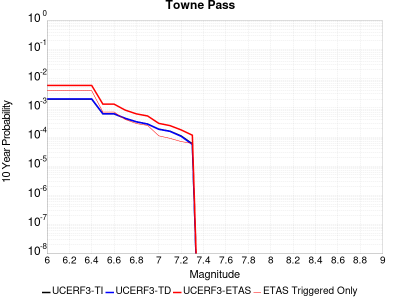 |

| Magnitude | 1 wk TI Prob | 1 wk TD Prob | 1 wk ETAS Prob | 1 wk ETAS/TD Gain | 1 wk ETAS Triggered Only | 1 mo TI Prob | 1 mo TD Prob | 1 mo ETAS Prob | 1 mo ETAS/TD Gain | 1 mo ETAS Triggered Only | 1 yr TI Prob | 1 yr TD Prob | 1 yr ETAS Prob | 1 yr ETAS/TD Gain | 1 yr ETAS Triggered Only | 10 yr TI Prob | 10 yr TD Prob | 10 yr ETAS Prob | 10 yr ETAS/TD Gain | 10 yr ETAS Triggered Only |
|-----|-----|-----|-----|-----|-----|-----|-----|-----|-----|-----|-----|-----|-----|-----|-----|-----|-----|-----|-----|-----|
| 6.0 | 3.849728E-6 | 3.8945414E-6 | 9.0389105E-4 | 232.09178 | 9.0E-4 | 1.649873E-5 | 1.669081E-5 | 0.0014466669 | 86.67446 | 0.00143 | 2.0085352E-4 | 2.0319603E-4 | 0.0026327022 | 12.956465 | 0.00243 | 0.0020067208 | 0.0020305314 | 0.005902653 | 2.9069498 | 0.00388 |
| 6.1 | 3.849728E-6 | 3.8945414E-6 | 9.0389105E-4 | 232.09178 | 9.0E-4 | 1.649873E-5 | 1.669081E-5 | 0.0014466669 | 86.67446 | 0.00143 | 2.0085352E-4 | 2.0319603E-4 | 0.0026327022 | 12.956465 | 0.00243 | 0.0020067208 | 0.0020305314 | 0.005902653 | 2.9069498 | 0.00388 |
| 6.2 | 3.849728E-6 | 3.8945414E-6 | 9.0389105E-4 | 232.09178 | 9.0E-4 | 1.649873E-5 | 1.669081E-5 | 0.0014466669 | 86.67446 | 0.00143 | 2.0085352E-4 | 2.0319603E-4 | 0.0026327022 | 12.956465 | 0.00243 | 0.0020067208 | 0.0020305314 | 0.005902653 | 2.9069498 | 0.00388 |
| 6.3 | 3.849728E-6 | 3.8945414E-6 | 9.0389105E-4 | 232.09178 | 9.0E-4 | 1.649873E-5 | 1.669081E-5 | 0.0014466669 | 86.67446 | 0.00143 | 2.0085352E-4 | 2.0319603E-4 | 0.0026327022 | 12.956465 | 0.00243 | 0.0020067208 | 0.0020305314 | 0.005902653 | 2.9069498 | 0.00388 |
| 6.4 | 3.849728E-6 | 3.8945414E-6 | 9.0389105E-4 | 232.09178 | 9.0E-4 | 1.649873E-5 | 1.669081E-5 | 0.0014466669 | 86.67446 | 0.00143 | 2.0085352E-4 | 2.0319603E-4 | 0.0026327022 | 12.956465 | 0.00243 | 0.0020067208 | 0.0020305314 | 0.005902653 | 2.9069498 | 0.00388 |
| 6.5 | 1.1953545E-6 | 1.203052E-6 | 1.3120289E-4 | 109.05837 | 1.3E-4 | 5.1229376E-6 | 5.1559277E-6 | 2.9515443E-4 | 57.24565 | 2.9E-4 | 6.236998E-5 | 6.277173E-5 | 5.427416E-4 | 8.646275 | 4.8E-4 | 6.235248E-4 | 6.275517E-4 | 0.0013470999 | 2.1465957 | 7.2E-4 |
| 6.6 | 1.1953545E-6 | 1.203052E-6 | 1.3120289E-4 | 109.05837 | 1.3E-4 | 5.1229376E-6 | 5.1559277E-6 | 2.9515443E-4 | 57.24565 | 2.9E-4 | 6.236998E-5 | 6.277173E-5 | 5.427416E-4 | 8.646275 | 4.8E-4 | 6.235248E-4 | 6.275517E-4 | 0.0013470999 | 2.1465957 | 7.2E-4 |
| 6.7 | 8.375951E-7 | 8.4106705E-7 | 6.0841016E-5 | 72.33789 | 6.0E-5 | 3.5896885E-6 | 3.6045683E-6 | 1.5360402E-4 | 42.61371 | 1.5E-4 | 4.370358E-5 | 4.3884793E-5 | 3.3387207E-4 | 7.6079216 | 2.9E-4 | 4.3694986E-4 | 4.38767E-4 | 8.385915E-4 | 1.9112456 | 4.0E-4 |
| 6.8 | 6.38041E-7 | 6.392156E-7 | 4.0639192E-5 | 63.576653 | 4.0E-5 | 2.7344586E-6 | 2.7394929E-6 | 8.273927E-5 | 30.202404 | 8.0E-5 | 3.3291526E-5 | 3.3352855E-5 | 2.3334619E-4 | 6.9962883 | 2.0E-4 | 3.3286537E-4 | 3.334823E-4 | 6.233856E-4 | 1.8693213 | 2.9E-4 |
| 6.9 | 5.3460053E-7 | 5.345333E-7 | 4.0534513E-5 | 75.83159 | 4.0E-5 | 2.2911431E-6 | 2.2908553E-6 | 7.229069E-5 | 31.556204 | 7.0E-5 | 2.789431E-5 | 2.789084E-5 | 1.978861E-4 | 7.0950212 | 1.7E-4 | 2.789081E-4 | 2.7887672E-4 | 5.28807E-4 | 1.8962035 | 2.5E-4 |
| 7.0 | 3.557783E-7 | 3.5324226E-7 | 2.0353235E-5 | 57.618347 | 2.0E-5 | 1.5247632E-6 | 1.5138945E-6 | 3.151385E-5 | 20.81641 | 3.0E-5 | 1.8563835E-5 | 1.843152E-5 | 7.8430414E-5 | 4.2552333 | 6.0E-5 | 1.8562283E-4 | 1.8430075E-4 | 2.9428047E-4 | 1.5967405 | 1.1E-4 |
| 7.1 | 3.037942E-7 | 3.0002218E-7 | 2.0300016E-5 | 67.66172 | 2.0E-5 | 1.3019744E-6 | 1.2858087E-6 | 3.128577E-5 | 24.331589 | 3.0E-5 | 1.5851423E-5 | 1.5654618E-5 | 7.5653676E-5 | 4.832675 | 6.0E-5 | 1.5850292E-4 | 1.5653588E-4 | 2.465218E-4 | 1.5748581 | 9.0E-5 |
| 7.2 | 2.0808248E-7 | 2.0217689E-7 | 2.0202173E-5 | 99.923256 | 2.0E-5 | 8.917818E-7 | 8.6647213E-7 | 3.0866446E-5 | 35.623127 | 3.0E-5 | 1.0857389E-5 | 1.0549252E-5 | 6.0548726E-5 | 5.7396226 | 5.0E-5 | 1.0856859E-4 | 1.0548797E-4 | 1.7548059E-4 | 1.6635127 | 7.0E-5 |
| 7.3 | 1.1162073E-7 | 1.0636894E-7 | 1.0106368E-5 | 95.0124 | 1.0E-5 | 4.7837443E-7 | 4.558668E-7 | 2.0455858E-5 | 44.872444 | 2.0E-5 | 5.8241935E-6 | 5.550166E-6 | 4.5549943E-5 | 8.206951 | 4.0E-5 | 5.8240406E-5 | 5.5500474E-5 | 1.1549715E-4 | 2.0810118 | 6.0E-5 |

## Lenwood-Lockhart-Old Woman Springs
*[(top)](#table-of-contents)*

| 1 Week | 1 Month | 1 Year | 10 Year |
|-----|-----|-----|-----|
|  |  |  |  |

| Magnitude | 1 wk TI Prob | 1 wk TD Prob | 1 wk ETAS Prob | 1 wk ETAS/TD Gain | 1 wk ETAS Triggered Only | 1 mo TI Prob | 1 mo TD Prob | 1 mo ETAS Prob | 1 mo ETAS/TD Gain | 1 mo ETAS Triggered Only | 1 yr TI Prob | 1 yr TD Prob | 1 yr ETAS Prob | 1 yr ETAS/TD Gain | 1 yr ETAS Triggered Only | 10 yr TI Prob | 10 yr TD Prob | 10 yr ETAS Prob | 10 yr ETAS/TD Gain | 10 yr ETAS Triggered Only |
|-----|-----|-----|-----|-----|-----|-----|-----|-----|-----|-----|-----|-----|-----|-----|-----|-----|-----|-----|-----|-----|
| 6.0 | 3.744542E-5 | 4.396252E-5 | 0.0013139067 | 29.886974 | 0.00127 | 1.604705E-4 | 1.8839816E-4 | 0.0018880779 | 10.021743 | 0.0017 | 0.0019519776 | 0.0022915069 | 0.00498532 | 2.175564 | 0.0027 | 0.019349206 | 0.022696787 | 0.026361674 | 1.1614716 | 0.00375 |
| 6.1 | 3.744542E-5 | 4.396252E-5 | 0.0013139067 | 29.886974 | 0.00127 | 1.604705E-4 | 1.8839816E-4 | 0.0018880779 | 10.021743 | 0.0017 | 0.0019519776 | 0.0022915069 | 0.00498532 | 2.175564 | 0.0027 | 0.019349206 | 0.022696787 | 0.026361674 | 1.1614716 | 0.00375 |
| 6.2 | 3.744542E-5 | 4.396252E-5 | 0.0013139067 | 29.886974 | 0.00127 | 1.604705E-4 | 1.8839816E-4 | 0.0018880779 | 10.021743 | 0.0017 | 0.0019519776 | 0.0022915069 | 0.00498532 | 2.175564 | 0.0027 | 0.019349206 | 0.022696787 | 0.026361674 | 1.1614716 | 0.00375 |
| 6.3 | 2.1079984E-5 | 2.5353434E-5 | 5.5533997E-4 | 21.903936 | 5.3E-4 | 9.0339665E-5 | 1.0865316E-4 | 8.785695E-4 | 8.086 | 7.7E-4 | 0.0010993304 | 0.0013220694 | 0.0024405888 | 1.8460367 | 0.00112 | 0.010939079 | 0.0131442575 | 0.014752832 | 1.1223785 | 0.00163 |
| 6.4 | 2.1079984E-5 | 2.5353434E-5 | 5.5533997E-4 | 21.903936 | 5.3E-4 | 9.0339665E-5 | 1.0865316E-4 | 8.785695E-4 | 8.086 | 7.7E-4 | 0.0010993304 | 0.0013220694 | 0.0024405888 | 1.8460367 | 0.00112 | 0.010939079 | 0.0131442575 | 0.014752832 | 1.1223785 | 0.00163 |
| 6.5 | 1.7397282E-5 | 2.066241E-5 | 4.4065373E-4 | 21.326347 | 4.2E-4 | 7.455765E-5 | 8.8550245E-5 | 6.4850063E-4 | 7.323533 | 5.6E-4 | 9.073613E-4 | 0.0010775778 | 0.0018867049 | 1.7508758 | 8.1E-4 | 0.009036654 | 0.010724821 | 0.01187238 | 1.1070004 | 0.00116 |
| 6.6 | 1.52050325E-5 | 1.7679693E-5 | 3.7767334E-4 | 21.361984 | 3.6E-4 | 6.51628E-5 | 7.576796E-5 | 5.6573085E-4 | 7.4666233 | 4.9E-4 | 7.9306826E-4 | 9.220924E-4 | 0.0016314377 | 1.7692779 | 7.1E-4 | 0.007902439 | 0.009183526 | 0.010184251 | 1.1089696 | 0.00101 |
| 6.7 | 1.332523E-5 | 1.5264002E-5 | 2.9525973E-4 | 19.343533 | 2.8E-4 | 5.7106878E-5 | 6.5415545E-5 | 4.5539002E-4 | 6.9614954 | 3.9E-4 | 6.950544E-4 | 7.961491E-4 | 0.0013557032 | 1.7028258 | 5.6E-4 | 0.006928845 | 0.007933599 | 0.008757014 | 1.1037884 | 8.3E-4 |
| 6.8 | 1.1525329E-5 | 1.3030979E-5 | 1.9302864E-4 | 14.813057 | 1.8E-4 | 4.9393333E-5 | 5.584588E-5 | 3.1583136E-4 | 5.6554103 | 2.6E-4 | 6.011979E-4 | 6.797157E-4 | 0.001089437 | 1.6027833 | 4.1E-4 | 0.00599574 | 0.006776819 | 0.0074025495 | 1.0923339 | 6.3E-4 |
| 6.9 | 1.0253909E-5 | 1.15144385E-5 | 1.5151282E-4 | 13.158507 | 1.4E-4 | 4.3944583E-5 | 4.9346683E-5 | 2.6933584E-4 | 5.458033 | 2.2E-4 | 5.3489394E-4 | 6.0063385E-4 | 9.404296E-4 | 1.5657287 | 3.4E-4 | 0.0053360825 | 0.0059904843 | 0.0065272492 | 1.089603 | 5.4E-4 |
| 7.0 | 8.104563E-6 | 8.991279E-6 | 1.0899038E-4 | 12.121788 | 1.0E-4 | 3.4733377E-5 | 3.8533497E-5 | 2.1852656E-4 | 5.6710806 | 1.8E-4 | 4.2279682E-4 | 4.6904673E-4 | 7.289248E-4 | 1.5540558 | 2.6E-4 | 0.0042199334 | 0.0046808156 | 0.005128709 | 1.095687 | 4.5E-4 |
| 7.1 | 6.7986157E-6 | 7.515816E-6 | 8.751522E-5 | 11.64414 | 8.0E-5 | 2.91366E-5 | 3.2210253E-5 | 1.7220575E-4 | 5.346302 | 1.4E-4 | 3.5468035E-4 | 3.920914E-4 | 5.92013E-4 | 1.5098852 | 2.0E-4 | 0.003541148 | 0.003914213 | 0.0042528817 | 1.0865229 | 3.4E-4 |
| 7.2 | 5.6893327E-6 | 6.2800136E-6 | 6.627964E-5 | 10.554059 | 6.0E-5 | 2.4382627E-5 | 2.6914078E-5 | 1.3691111E-4 | 5.0869703 | 1.1E-4 | 2.9681803E-4 | 3.2763163E-4 | 4.7758248E-4 | 1.4576813 | 1.5E-4 | 0.002964219 | 0.0032716845 | 0.0035607358 | 1.0883493 | 2.9E-4 |
| 7.3 | 4.253348E-6 | 4.7069107E-6 | 4.470672E-5 | 9.498103 | 4.0E-5 | 1.8228506E-5 | 2.0172329E-5 | 1.0017071E-4 | 4.965749 | 8.0E-5 | 2.2190946E-4 | 2.4557224E-4 | 3.6554277E-4 | 1.4885346 | 1.2E-4 | 0.00221688 | 0.0024531898 | 0.0026726502 | 1.0894592 | 2.2E-4 |
| 7.4 | 2.5448119E-6 | 2.852045E-6 | 2.2851988E-5 | 8.012492 | 2.0E-5 | 1.0906291E-5 | 1.2223002E-5 | 5.2222513E-5 | 4.2724786 | 4.0E-5 | 1.3277601E-4 | 1.4880655E-4 | 2.1879612E-4 | 1.4703394 | 7.0E-5 | 0.001326967 | 0.0014872311 | 0.0016170378 | 1.0872808 | 1.3E-4 |
| 7.5 | 4.3706837E-8 | 4.562909E-8 | 4.562909E-8 | 1.0 | 0.0 | 1.8731501E-7 | 1.9555324E-7 | 1.9555324E-7 | 1.0 | 0.0 | 2.2805577E-6 | 2.3808586E-6 | 2.3808586E-6 | 1.0 | 0.0 | 2.2805343E-5 | 2.3808387E-5 | 2.3808387E-5 | 1.0 | 0.0 |

## San Andreas (San Bernardino N)
*[(top)](#table-of-contents)*

| 1 Week | 1 Month | 1 Year | 10 Year |
|-----|-----|-----|-----|
| 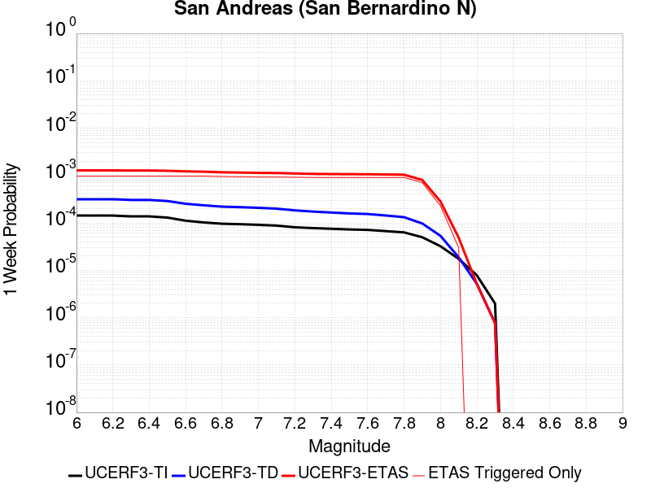 |  |  |  |

| Magnitude | 1 wk TI Prob | 1 wk TD Prob | 1 wk ETAS Prob | 1 wk ETAS/TD Gain | 1 wk ETAS Triggered Only | 1 mo TI Prob | 1 mo TD Prob | 1 mo ETAS Prob | 1 mo ETAS/TD Gain | 1 mo ETAS Triggered Only | 1 yr TI Prob | 1 yr TD Prob | 1 yr ETAS Prob | 1 yr ETAS/TD Gain | 1 yr ETAS Triggered Only | 10 yr TI Prob | 10 yr TD Prob | 10 yr ETAS Prob | 10 yr ETAS/TD Gain | 10 yr ETAS Triggered Only |
|-----|-----|-----|-----|-----|-----|-----|-----|-----|-----|-----|-----|-----|-----|-----|-----|-----|-----|-----|-----|-----|
| 6.0 | 1.4273766E-4 | 3.1606483E-4 | 0.0012857582 | 4.0680203 | 9.7E-4 | 6.115894E-4 | 0.0013538664 | 0.0026321334 | 1.9441605 | 0.00128 | 0.0074207084 | 0.016360244 | 0.018101286 | 1.1064191 | 0.00177 | 0.07177748 | 0.15026689 | 0.15229775 | 1.013515 | 0.00239 |
| 6.1 | 1.4273766E-4 | 3.1606483E-4 | 0.0012857582 | 4.0680203 | 9.7E-4 | 6.115894E-4 | 0.0013538664 | 0.0026321334 | 1.9441605 | 0.00128 | 0.0074207084 | 0.016360244 | 0.018101286 | 1.1064191 | 0.00177 | 0.07177748 | 0.15026689 | 0.15229775 | 1.013515 | 0.00239 |
| 6.2 | 1.4273766E-4 | 3.1606483E-4 | 0.0012857582 | 4.0680203 | 9.7E-4 | 6.115894E-4 | 0.0013538664 | 0.0026321334 | 1.9441605 | 0.00128 | 0.0074207084 | 0.016360244 | 0.018101286 | 1.1064191 | 0.00177 | 0.07177748 | 0.15026689 | 0.15229775 | 1.013515 | 0.00239 |
| 6.3 | 1.3730655E-4 | 3.0511338E-4 | 0.0012748174 | 4.178176 | 9.7E-4 | 5.883239E-4 | 0.0013069791 | 0.0025853063 | 1.9780777 | 0.00128 | 0.0071393442 | 0.015797773 | 0.01753981 | 1.1102711 | 0.00177 | 0.06914291 | 0.14556676 | 0.14759177 | 1.0139112 | 0.00237 |
| 6.4 | 1.3730655E-4 | 3.0511338E-4 | 0.0012748174 | 4.178176 | 9.7E-4 | 5.883239E-4 | 0.0013069791 | 0.0025853063 | 1.9780777 | 0.00128 | 0.0071393442 | 0.015797773 | 0.01753981 | 1.1102711 | 0.00177 | 0.06914291 | 0.14556676 | 0.14759177 | 1.0139112 | 0.00237 |
| 6.5 | 1.2942807E-4 | 2.8925808E-4 | 0.0012589775 | 4.352437 | 9.7E-4 | 5.545738E-4 | 0.0012390936 | 0.00250752 | 2.0236728 | 0.00127 | 0.0067310524 | 0.01498286 | 0.01671649 | 1.1157075 | 0.00176 | 0.06530788 | 0.13870941 | 0.14074206 | 1.014654 | 0.00236 |
| 6.6 | 1.1125901E-4 | 2.536472E-4 | 0.0012234012 | 4.8232393 | 9.7E-4 | 4.767372E-4 | 0.0010866089 | 0.0023552289 | 2.1675038 | 0.00127 | 0.005788839 | 0.013149847 | 0.014876835 | 1.1313314 | 0.00175 | 0.056403454 | 0.122999296 | 0.1250427 | 1.0166132 | 0.00233 |
| 6.7 | 1.02209575E-4 | 2.3499702E-4 | 0.001204769 | 5.126742 | 9.7E-4 | 4.3796748E-4 | 0.0010067427 | 0.0022554842 | 2.2403781 | 0.00125 | 0.0053192247 | 0.012188629 | 0.013877787 | 1.1385847 | 0.00171 | 0.051936906 | 0.114790924 | 0.116791494 | 1.0174279 | 0.00226 |
| 6.8 | 9.610582E-5 | 2.2025521E-4 | 0.0011700459 | 5.312228 | 9.5E-4 | 4.1181705E-4 | 9.436101E-4 | 0.0021724494 | 2.3022745 | 0.00123 | 0.0050023515 | 0.011428202 | 0.013098888 | 1.1461898 | 0.00169 | 0.048912346 | 0.1081929 | 0.11018163 | 1.0183814 | 0.00223 |
| 6.9 | 9.3877505E-5 | 2.1481077E-4 | 0.0011546089 | 5.3750043 | 9.4E-4 | 4.0227012E-4 | 9.2029345E-4 | 0.0021391707 | 2.324444 | 0.00122 | 0.0048866454 | 0.011147255 | 0.012808528 | 1.1490297 | 0.00168 | 0.04780577 | 0.10578323 | 0.107759446 | 1.0186818 | 0.00221 |
| 7.0 | 9.1019785E-5 | 2.0808022E-4 | 0.0011378867 | 5.4685 | 9.3E-4 | 3.900265E-4 | 8.914682E-4 | 0.0021003895 | 2.3561015 | 0.00121 | 0.0047382377 | 0.010799837 | 0.012451801 | 1.152962 | 0.00167 | 0.046384744 | 0.102753714 | 0.104727656 | 1.0192105 | 0.0022 |
| 7.1 | 8.771155E-5 | 1.9982594E-4 | 0.0011296401 | 5.65312 | 9.3E-4 | 3.758525E-4 | 8.5611636E-4 | 0.0020650805 | 2.4121492 | 0.00121 | 0.0045664064 | 0.0103736 | 0.0120262755 | 1.1593156 | 0.00167 | 0.044737056 | 0.09906527 | 0.10104732 | 1.0200076 | 0.0022 |
| 7.2 | 8.0830236E-5 | 1.8388197E-4 | 0.0011037128 | 6.0022893 | 9.2E-4 | 3.4636928E-4 | 7.8782777E-4 | 0.0019868824 | 2.5219755 | 0.0012 | 0.0042088944 | 0.009549725 | 0.011183968 | 1.1711298 | 0.00165 | 0.041300658 | 0.09179615 | 0.09377603 | 1.0215683 | 0.00218 |
| 7.3 | 7.7668235E-5 | 1.7331762E-4 | 0.0010831599 | 6.249566 | 9.1E-4 | 3.328214E-4 | 7.425784E-4 | 0.0019217022 | 2.5878778 | 0.00118 | 0.0040445733 | 0.009003494 | 0.010618818 | 1.1794108 | 0.00163 | 0.03971748 | 0.08706327 | 0.08902608 | 1.0225447 | 0.00215 |
| 7.4 | 7.520177E-5 | 1.6551897E-4 | 0.0010753684 | 6.496949 | 9.1E-4 | 3.2225347E-4 | 7.0917426E-4 | 0.0018883374 | 2.6627269 | 0.00118 | 0.0039163795 | 0.008600081 | 0.010206149 | 1.1867503 | 0.00162 | 0.038480744 | 0.08351955 | 0.08546249 | 1.0232633 | 0.00212 |
| 7.5 | 7.274697E-5 | 1.5839566E-4 | 0.0010682516 | 6.744197 | 9.1E-4 | 3.1173544E-4 | 6.78662E-4 | 0.0018578612 | 2.7375352 | 0.00118 | 0.003788775 | 0.008231463 | 0.0098381275 | 1.1951859 | 0.00162 | 0.03724827 | 0.08023631 | 0.08218621 | 1.024302 | 0.00212 |
| 7.6 | 7.1185845E-5 | 1.540943E-4 | 0.0010639541 | 6.9045644 | 9.1E-4 | 3.0504653E-4 | 6.6023704E-4 | 0.0018294646 | 2.7709208 | 0.00117 | 0.0037076178 | 0.008008812 | 0.009605917 | 1.1994185 | 0.00161 | 0.036463667 | 0.07822598 | 0.08017092 | 1.0248631 | 0.00211 |
| 7.7 | 6.709961E-5 | 1.4318313E-4 | 0.0010530528 | 7.354587 | 9.1E-4 | 2.8753807E-4 | 6.1349774E-4 | 0.0017827799 | 2.9059277 | 0.00117 | 0.003495157 | 0.0074437927 | 0.0090318825 | 1.2133442 | 0.0016 | 0.034406938 | 0.07305469 | 0.07500128 | 1.0266455 | 0.0021 |
| 7.8 | 6.300812E-5 | 1.3202413E-4 | 0.001041904 | 7.8917694 | 9.1E-4 | 2.7000686E-4 | 5.65695E-4 | 0.0017350331 | 3.0670822 | 0.00117 | 0.0032823787 | 0.006865616 | 0.008454631 | 1.2314453 | 0.0016 | 0.032343175 | 0.06771354 | 0.06967134 | 1.028913 | 0.0021 |
| 7.9 | 4.983037E-5 | 9.723488E-5 | 8.0716587E-4 | 8.301196 | 7.1E-4 | 2.1354125E-4 | 4.1665437E-4 | 0.0013562627 | 3.2551265 | 9.4E-4 | 0.0025967648 | 0.0050609782 | 0.006304652 | 1.2457378 | 0.00125 | 0.025666296 | 0.05064886 | 0.05221529 | 1.0309272 | 0.00165 |
| 8.0 | 3.2211527E-5 | 5.3304586E-5 | 2.8329232E-4 | 5.3145957 | 2.3E-4 | 1.380421E-4 | 2.2842824E-4 | 5.9834373E-4 | 2.6193948 | 3.7E-4 | 0.0016793669 | 0.0027775685 | 0.003196402 | 1.1507914 | 4.2E-4 | 0.016667323 | 0.028361378 | 0.028905496 | 1.0191852 | 5.6E-4 |
| 8.1 | 1.743376E-5 | 1.8824427E-5 | 4.8823862E-5 | 2.5936441 | 3.0E-5 | 7.471398E-5 | 8.067362E-5 | 1.206704E-4 | 1.495785 | 4.0E-5 | 9.0926304E-4 | 9.817594E-4 | 0.0010317103 | 1.050879 | 5.0E-5 | 0.009055517 | 0.010484105 | 0.010553371 | 1.0066068 | 7.0E-5 |
| 8.2 | 7.831616E-6 | 5.1551065E-6 | 5.1551065E-6 | 1.0 | 0.0 | 3.3563636E-5 | 2.2093127E-5 | 2.2093127E-5 | 1.0 | 0.0 | 4.0856065E-4 | 2.6895068E-4 | 2.6895068E-4 | 1.0 | 0.0 | 0.004078103 | 0.0030418145 | 0.0030418145 | 1.0 | 0.0 |
| 8.3 | 1.983087E-6 | 7.6599065E-7 | 7.6599065E-7 | 1.0 | 0.0 | 8.498917E-6 | 3.282813E-6 | 3.282813E-6 | 1.0 | 0.0 | 1.034694E-4 | 3.9967534E-5 | 3.9967534E-5 | 1.0 | 0.0 | 0.0010342124 | 4.719687E-4 | 4.719687E-4 | 1.0 | 0.0 |

## Bicycle Lake
*[(top)](#table-of-contents)*

| 1 Week | 1 Month | 1 Year | 10 Year |
|-----|-----|-----|-----|
|  |  |  |  |

| Magnitude | 1 wk TI Prob | 1 wk TD Prob | 1 wk ETAS Prob | 1 wk ETAS/TD Gain | 1 wk ETAS Triggered Only | 1 mo TI Prob | 1 mo TD Prob | 1 mo ETAS Prob | 1 mo ETAS/TD Gain | 1 mo ETAS Triggered Only | 1 yr TI Prob | 1 yr TD Prob | 1 yr ETAS Prob | 1 yr ETAS/TD Gain | 1 yr ETAS Triggered Only | 10 yr TI Prob | 10 yr TD Prob | 10 yr ETAS Prob | 10 yr ETAS/TD Gain | 10 yr ETAS Triggered Only |
|-----|-----|-----|-----|-----|-----|-----|-----|-----|-----|-----|-----|-----|-----|-----|-----|-----|-----|-----|-----|-----|
| 6.0 | 1.9621975E-5 | 2.2097078E-5 | 4.5208758E-4 | 20.459156 | 4.3E-4 | 8.4091465E-5 | 9.4699084E-5 | 7.646356E-4 | 8.074372 | 6.7E-4 | 0.0010233327 | 0.0011524865 | 0.0026108038 | 2.265366 | 0.00146 | 0.01018633 | 0.011478408 | 0.013761893 | 1.1989374 | 0.00231 |
| 6.1 | 1.9621975E-5 | 2.2097078E-5 | 4.5208758E-4 | 20.459156 | 4.3E-4 | 8.4091465E-5 | 9.4699084E-5 | 7.646356E-4 | 8.074372 | 6.7E-4 | 0.0010233327 | 0.0011524865 | 0.0026108038 | 2.265366 | 0.00146 | 0.01018633 | 0.011478408 | 0.013761893 | 1.1989374 | 0.00231 |
| 6.2 | 9.9971285E-6 | 1.1255639E-5 | 2.4125304E-4 | 21.433971 | 2.3E-4 | 4.2844134E-5 | 4.8237856E-5 | 3.8822147E-4 | 8.048066 | 3.4E-4 | 5.2150246E-4 | 5.871896E-4 | 0.0014167023 | 2.4126825 | 8.3E-4 | 0.0052028033 | 0.005861487 | 0.0072135148 | 1.2306631 | 0.00136 |
| 6.3 | 9.589428E-6 | 1.0798346E-5 | 2.2079608E-4 | 20.447212 | 2.1E-4 | 4.10969E-5 | 4.62781E-5 | 3.662633E-4 | 7.914398 | 3.2E-4 | 5.002399E-4 | 5.6334207E-4 | 0.0013728858 | 2.4370377 | 8.1E-4 | 0.0049911533 | 0.0056242296 | 0.006926862 | 1.2316108 | 0.00131 |
| 6.4 | 9.589428E-6 | 1.0798346E-5 | 2.2079608E-4 | 20.447212 | 2.1E-4 | 4.10969E-5 | 4.62781E-5 | 3.662633E-4 | 7.914398 | 3.2E-4 | 5.002399E-4 | 5.6334207E-4 | 0.0013728858 | 2.4370377 | 8.1E-4 | 0.0049911533 | 0.0056242296 | 0.006926862 | 1.2316108 | 0.00131 |
| 6.5 | 5.557707E-6 | 6.2856016E-6 | 1.1628491E-4 | 18.500204 | 1.1E-4 | 2.3818526E-5 | 2.6938165E-5 | 2.2693278E-4 | 8.424211 | 2.0E-4 | 2.8995197E-4 | 3.2794967E-4 | 8.3778246E-4 | 2.5546067 | 5.1E-4 | 0.0028957394 | 0.0032772934 | 0.0040946063 | 1.2493864 | 8.2E-4 |
| 6.6 | 4.8742945E-6 | 5.5132896E-6 | 9.551279E-5 | 17.324102 | 9.0E-5 | 2.0889667E-5 | 2.3628318E-5 | 1.7362478E-4 | 7.3481646 | 1.5E-4 | 2.54302E-4 | 2.87663E-4 | 7.175393E-4 | 2.4943748 | 4.3E-4 | 0.002540112 | 0.0028754752 | 0.00355352 | 1.2358027 | 6.8E-4 |
| 6.7 | 3.991108E-6 | 4.5159104E-6 | 8.451555E-5 | 18.715063 | 8.0E-5 | 1.7104636E-5 | 1.9353902E-5 | 1.2935177E-4 | 6.6834984 | 1.1E-4 | 2.0822904E-4 | 2.3563375E-4 | 5.9554895E-4 | 2.5274348 | 3.6E-4 | 0.0020803404 | 0.0023563374 | 0.0029449472 | 1.2497985 | 5.9E-4 |

## Paradise
*[(top)](#table-of-contents)*

| 1 Week | 1 Month | 1 Year | 10 Year |
|-----|-----|-----|-----|
|  |  |  |  |

| Magnitude | 1 wk TI Prob | 1 wk TD Prob | 1 wk ETAS Prob | 1 wk ETAS/TD Gain | 1 wk ETAS Triggered Only | 1 mo TI Prob | 1 mo TD Prob | 1 mo ETAS Prob | 1 mo ETAS/TD Gain | 1 mo ETAS Triggered Only | 1 yr TI Prob | 1 yr TD Prob | 1 yr ETAS Prob | 1 yr ETAS/TD Gain | 1 yr ETAS Triggered Only | 10 yr TI Prob | 10 yr TD Prob | 10 yr ETAS Prob | 10 yr ETAS/TD Gain | 10 yr ETAS Triggered Only |
|-----|-----|-----|-----|-----|-----|-----|-----|-----|-----|-----|-----|-----|-----|-----|-----|-----|-----|-----|-----|-----|
| 6.0 | 1.4851273E-5 | 1.6694692E-5 | 4.6668717E-4 | 27.954226 | 4.5E-4 | 6.364676E-5 | 7.154685E-5 | 7.3149963E-4 | 10.224065 | 6.6E-4 | 7.7462377E-4 | 8.707584E-4 | 0.0021996002 | 2.5260742 | 0.00133 | 0.0077192914 | 0.008675844 | 0.010856758 | 1.2513776 | 0.0022 |
| 6.1 | 1.4851273E-5 | 1.6694692E-5 | 4.6668717E-4 | 27.954226 | 4.5E-4 | 6.364676E-5 | 7.154685E-5 | 7.3149963E-4 | 10.224065 | 6.6E-4 | 7.7462377E-4 | 8.707584E-4 | 0.0021996002 | 2.5260742 | 0.00133 | 0.0077192914 | 0.008675844 | 0.010856758 | 1.2513776 | 0.0022 |
| 6.2 | 1.4851273E-5 | 1.6694692E-5 | 4.6668717E-4 | 27.954226 | 4.5E-4 | 6.364676E-5 | 7.154685E-5 | 7.3149963E-4 | 10.224065 | 6.6E-4 | 7.7462377E-4 | 8.707584E-4 | 0.0021996002 | 2.5260742 | 0.00133 | 0.0077192914 | 0.008675844 | 0.010856758 | 1.2513776 | 0.0022 |
| 6.3 | 1.0426831E-5 | 1.188862E-5 | 2.0188636E-4 | 16.98148 | 1.9E-4 | 4.4685654E-5 | 5.0950268E-5 | 3.30936E-4 | 6.495275 | 2.8E-4 | 5.43912E-4 | 6.201489E-4 | 0.0012497582 | 2.015255 | 6.3E-4 | 0.0054258266 | 0.0061847917 | 0.007248174 | 1.171935 | 0.00107 |
| 6.4 | 1.0426831E-5 | 1.188862E-5 | 2.0188636E-4 | 16.98148 | 1.9E-4 | 4.4685654E-5 | 5.0950268E-5 | 3.30936E-4 | 6.495275 | 2.8E-4 | 5.43912E-4 | 6.201489E-4 | 0.0012497582 | 2.015255 | 6.3E-4 | 0.0054258266 | 0.0061847917 | 0.007248174 | 1.171935 | 0.00107 |
| 6.5 | 9.25027E-6 | 1.06199595E-5 | 1.7061827E-4 | 16.065811 | 1.6E-4 | 3.964341E-5 | 4.551335E-5 | 2.7550288E-4 | 6.0532327 | 2.3E-4 | 4.8255164E-4 | 5.53989E-4 | 0.0010637065 | 1.9200859 | 5.1E-4 | 0.0048150513 | 0.0055265795 | 0.006292324 | 1.1385567 | 7.7E-4 |
| 6.6 | 7.904275E-6 | 9.159525E-6 | 1.3915834E-4 | 15.192745 | 1.3E-4 | 3.3875025E-5 | 3.9254537E-5 | 1.8924865E-4 | 4.821064 | 1.5E-4 | 4.1235037E-4 | 4.7782314E-4 | 7.376989E-4 | 1.5438744 | 2.6E-4 | 0.0041158604 | 0.0047683544 | 0.005206256 | 1.091835 | 4.4E-4 |
| 6.7 | 7.2061953E-6 | 8.407248E-6 | 1.2840625E-4 | 15.273277 | 1.2E-4 | 3.088333E-5 | 3.6030586E-5 | 1.7602554E-4 | 4.8854475 | 1.4E-4 | 3.7593965E-4 | 4.3858777E-4 | 6.584913E-4 | 1.50139 | 2.2E-4 | 0.003753043 | 0.004377591 | 0.004736015 | 1.081877 | 3.6E-4 |
| 6.8 | 6.6948724E-6 | 7.842166E-6 | 1.2784122E-4 | 16.301775 | 1.2E-4 | 2.8691995E-5 | 3.360887E-5 | 1.7360416E-4 | 5.165427 | 1.4E-4 | 3.4926904E-4 | 4.0911473E-4 | 6.190288E-4 | 1.5130935 | 2.1E-4 | 0.003487206 | 0.0040839734 | 0.0043927073 | 1.0755965 | 3.1E-4 |
| 6.9 | 6.0421025E-6 | 7.130621E-6 | 1.07129905E-4 | 15.023924 | 1.0E-4 | 2.5894467E-5 | 3.0559466E-5 | 1.405561E-4 | 4.5994296 | 1.1E-4 | 3.1521954E-4 | 3.7200135E-4 | 5.2194553E-4 | 1.4030744 | 1.5E-4 | 0.0031477278 | 0.0037141247 | 0.0039333077 | 1.0590134 | 2.2E-4 |
| 7.0 | 4.134091E-6 | 5.0803087E-6 | 4.5080105E-5 | 8.873497 | 4.0E-5 | 1.7717413E-5 | 2.177258E-5 | 7.1771494E-5 | 3.2964165 | 5.0E-5 | 2.1568815E-4 | 2.6505045E-4 | 3.4502926E-4 | 1.3017493 | 8.0E-5 | 0.0021547892 | 0.0026474963 | 0.0027671787 | 1.0452058 | 1.2E-4 |
| 7.1 | 3.7674888E-6 | 4.6318696E-6 | 4.4631684E-5 | 9.635782 | 4.0E-5 | 1.6146281E-5 | 1.9850726E-5 | 6.984973E-5 | 3.5187495 | 5.0E-5 | 1.9656324E-4 | 2.4165731E-4 | 3.1164038E-4 | 1.2895964 | 7.0E-5 | 0.0019638946 | 0.002414096 | 0.0025038787 | 1.037191 | 9.0E-5 |
| 7.2 | 3.4065345E-6 | 4.156723E-6 | 2.415664E-5 | 5.8114624 | 2.0E-5 | 1.4599351E-5 | 1.7814415E-5 | 4.781388E-5 | 2.6839995 | 3.0E-5 | 1.777326E-4 | 2.1687041E-4 | 2.6685957E-4 | 1.2305025 | 5.0E-5 | 0.0017759053 | 0.002166736 | 0.0022166276 | 1.0230262 | 5.0E-5 |
| 7.3 | 2.9934936E-6 | 3.6293168E-6 | 2.3629244E-5 | 6.510659 | 2.0E-5 | 1.2829195E-5 | 1.555413E-5 | 4.5553665E-5 | 2.928718 | 3.0E-5 | 1.5618425E-4 | 1.8935655E-4 | 2.393471E-4 | 1.2640021 | 5.0E-5 | 0.0015607453 | 0.0018920974 | 0.0019420028 | 1.0263757 | 5.0E-5 |
| 7.4 | 2.4049796E-6 | 2.8889842E-6 | 2.2888926E-5 | 7.9228287 | 2.0E-5 | 1.0307015E-5 | 1.238131E-5 | 4.238094E-5 | 3.422977 | 3.0E-5 | 1.2548068E-4 | 1.5073347E-4 | 2.0072592E-4 | 1.3316613 | 5.0E-5 | 0.0012540985 | 0.0015064536 | 0.0015563783 | 1.0331405 | 5.0E-5 |
| 7.5 | 1.2710091E-6 | 1.5134682E-6 | 1.15134535E-5 | 7.607331 | 1.0E-5 | 5.44717E-6 | 6.4862834E-6 | 2.6486154E-5 | 4.08341 | 2.0E-5 | 6.631728E-5 | 7.8968886E-5 | 1.1896573E-4 | 1.5064886 | 4.0E-5 | 6.6297496E-4 | 7.8953087E-4 | 8.294993E-4 | 1.0506229 | 4.0E-5 |
| 7.6 | 2.21172E-7 | 2.603961E-7 | 2.603961E-7 | 1.0 | 0.0 | 9.478797E-7 | 1.1159829E-6 | 1.1159829E-6 | 1.0 | 0.0 | 1.1540374E-5 | 1.3587036E-5 | 1.3587036E-5 | 1.0 | 0.0 | 1.1539775E-4 | 1.3586486E-4 | 1.3586486E-4 | 1.0 | 0.0 |

## Garlic Springs
*[(top)](#table-of-contents)*

| 1 Week | 1 Month | 1 Year | 10 Year |
|-----|-----|-----|-----|
|  |  |  |  |

| Magnitude | 1 wk TI Prob | 1 wk TD Prob | 1 wk ETAS Prob | 1 wk ETAS/TD Gain | 1 wk ETAS Triggered Only | 1 mo TI Prob | 1 mo TD Prob | 1 mo ETAS Prob | 1 mo ETAS/TD Gain | 1 mo ETAS Triggered Only | 1 yr TI Prob | 1 yr TD Prob | 1 yr ETAS Prob | 1 yr ETAS/TD Gain | 1 yr ETAS Triggered Only | 10 yr TI Prob | 10 yr TD Prob | 10 yr ETAS Prob | 10 yr ETAS/TD Gain | 10 yr ETAS Triggered Only |
|-----|-----|-----|-----|-----|-----|-----|-----|-----|-----|-----|-----|-----|-----|-----|-----|-----|-----|-----|-----|-----|
| 6.0 | 1.6760017E-5 | 1.8776833E-5 | 2.487725E-4 | 13.248907 | 2.3E-4 | 7.182667E-5 | 8.0470316E-5 | 5.004365E-4 | 6.218896 | 4.2E-4 | 8.7413884E-4 | 9.794032E-4 | 0.0020683357 | 2.1118326 | 0.00109 | 0.008707083 | 0.009762413 | 0.011614157 | 1.189681 | 0.00187 |
| 6.1 | 9.852767E-6 | 1.09735865E-5 | 1.2097238E-4 | 11.02396 | 1.1E-4 | 4.222546E-5 | 4.702921E-5 | 2.770184E-4 | 5.8903475 | 2.3E-4 | 5.139737E-4 | 5.7250116E-4 | 0.0012021405 | 2.0998044 | 6.3E-4 | 0.005127866 | 0.005717221 | 0.006840761 | 1.1965184 | 0.00113 |
| 6.2 | 9.852767E-6 | 1.09735865E-5 | 1.2097238E-4 | 11.02396 | 1.1E-4 | 4.222546E-5 | 4.702921E-5 | 2.770184E-4 | 5.8903475 | 2.3E-4 | 5.139737E-4 | 5.7250116E-4 | 0.0012021405 | 2.0998044 | 6.3E-4 | 0.005127866 | 0.005717221 | 0.006840761 | 1.1965184 | 0.00113 |
| 6.3 | 4.3167724E-6 | 4.7780286E-6 | 4.4777837E-5 | 9.3716135 | 4.0E-5 | 1.8500323E-5 | 2.0477235E-5 | 1.004756E-4 | 4.9066978 | 8.0E-5 | 2.2521814E-4 | 2.4930484E-4 | 4.6925E-4 | 1.8822337 | 2.2E-4 | 0.0022499003 | 0.00249251 | 0.0028715627 | 1.1520767 | 3.8E-4 |
| 6.4 | 4.3167724E-6 | 4.7780286E-6 | 4.4777837E-5 | 9.3716135 | 4.0E-5 | 1.8500323E-5 | 2.0477235E-5 | 1.004756E-4 | 4.9066978 | 8.0E-5 | 2.2521814E-4 | 2.4930484E-4 | 4.6925E-4 | 1.8822337 | 2.2E-4 | 0.0022499003 | 0.00249251 | 0.0028715627 | 1.1520767 | 3.8E-4 |
| 6.5 | 4.3167724E-6 | 4.7780286E-6 | 4.4777837E-5 | 9.3716135 | 4.0E-5 | 1.8500323E-5 | 2.0477235E-5 | 1.004756E-4 | 4.9066978 | 8.0E-5 | 2.2521814E-4 | 2.4930484E-4 | 4.6925E-4 | 1.8822337 | 2.2E-4 | 0.0022499003 | 0.00249251 | 0.0028715627 | 1.1520767 | 3.8E-4 |
| 6.6 | 4.301311E-6 | 4.760897E-6 | 4.4760705E-5 | 9.401738 | 4.0E-5 | 1.8434059E-5 | 2.0403815E-5 | 1.0040218E-4 | 4.9207554 | 8.0E-5 | 2.2441156E-4 | 2.4841115E-4 | 4.683565E-4 | 1.8854085 | 2.2E-4 | 0.0022418506 | 0.002483593 | 0.0028626493 | 1.1526241 | 3.8E-4 |
| 6.7 | 3.8599724E-6 | 4.27106E-6 | 4.4270888E-5 | 10.365317 | 4.0E-5 | 1.6542634E-5 | 1.8304541E-5 | 9.830308E-5 | 5.37042 | 8.0E-5 | 2.0138794E-4 | 2.228578E-4 | 4.2281323E-4 | 1.8972332 | 2.0E-4 | 0.0020120554 | 0.002228578 | 0.0025578425 | 1.1477464 | 3.3E-4 |

## Death Valley (Black Mtns Frontal)
*[(top)](#table-of-contents)*

| 1 Week | 1 Month | 1 Year | 10 Year |
|-----|-----|-----|-----|
|  |  |  |  |

| Magnitude | 1 wk TI Prob | 1 wk TD Prob | 1 wk ETAS Prob | 1 wk ETAS/TD Gain | 1 wk ETAS Triggered Only | 1 mo TI Prob | 1 mo TD Prob | 1 mo ETAS Prob | 1 mo ETAS/TD Gain | 1 mo ETAS Triggered Only | 1 yr TI Prob | 1 yr TD Prob | 1 yr ETAS Prob | 1 yr ETAS/TD Gain | 1 yr ETAS Triggered Only | 10 yr TI Prob | 10 yr TD Prob | 10 yr ETAS Prob | 10 yr ETAS/TD Gain | 10 yr ETAS Triggered Only |
|-----|-----|-----|-----|-----|-----|-----|-----|-----|-----|-----|-----|-----|-----|-----|-----|-----|-----|-----|-----|-----|
| 6.0 | 1.6707214E-5 | 1.867027E-5 | 4.0866298E-4 | 21.888437 | 3.9E-4 | 7.160038E-5 | 8.001302E-5 | 7.099626E-4 | 8.873088 | 6.3E-4 | 8.71386E-4 | 9.737309E-4 | 0.0019627667 | 2.015718 | 9.9E-4 | 0.00867977 | 0.009695496 | 0.011062117 | 1.1409541 | 0.00138 |
| 6.1 | 1.6707214E-5 | 1.867027E-5 | 4.0866298E-4 | 21.888437 | 3.9E-4 | 7.160038E-5 | 8.001302E-5 | 7.099626E-4 | 8.873088 | 6.3E-4 | 8.71386E-4 | 9.737309E-4 | 0.0019627667 | 2.015718 | 9.9E-4 | 0.00867977 | 0.009695496 | 0.011062117 | 1.1409541 | 0.00138 |
| 6.2 | 1.6707214E-5 | 1.867027E-5 | 4.0866298E-4 | 21.888437 | 3.9E-4 | 7.160038E-5 | 8.001302E-5 | 7.099626E-4 | 8.873088 | 6.3E-4 | 8.71386E-4 | 9.737309E-4 | 0.0019627667 | 2.015718 | 9.9E-4 | 0.00867977 | 0.009695496 | 0.011062117 | 1.1409541 | 0.00138 |
| 6.3 | 1.6707214E-5 | 1.867027E-5 | 4.0866298E-4 | 21.888437 | 3.9E-4 | 7.160038E-5 | 8.001302E-5 | 7.099626E-4 | 8.873088 | 6.3E-4 | 8.71386E-4 | 9.737309E-4 | 0.0019627667 | 2.015718 | 9.9E-4 | 0.00867977 | 0.009695496 | 0.011062117 | 1.1409541 | 0.00138 |
| 6.4 | 1.5515609E-5 | 1.7338214E-5 | 3.5733232E-4 | 20.609524 | 3.4E-4 | 6.649377E-5 | 7.4304546E-5 | 6.142644E-4 | 8.266849 | 5.4E-4 | 8.0926094E-4 | 9.042885E-4 | 0.0017735017 | 1.9612124 | 8.7E-4 | 0.008063202 | 0.009006773 | 0.010186055 | 1.1309328 | 0.00119 |
| 6.5 | 1.5515609E-5 | 1.7338214E-5 | 3.5733232E-4 | 20.609524 | 3.4E-4 | 6.649377E-5 | 7.4304546E-5 | 6.142644E-4 | 8.266849 | 5.4E-4 | 8.0926094E-4 | 9.042885E-4 | 0.0017735017 | 1.9612124 | 8.7E-4 | 0.008063202 | 0.009006773 | 0.010186055 | 1.1309328 | 0.00119 |
| 6.6 | 1.5041828E-5 | 1.6809145E-5 | 3.468036E-4 | 20.631842 | 3.3E-4 | 6.4463384E-5 | 7.203723E-5 | 6.0199905E-4 | 8.356776 | 5.3E-4 | 7.8455906E-4 | 8.767063E-4 | 0.0017159699 | 1.9572916 | 8.4E-4 | 0.00781795 | 0.008733132 | 0.009853264 | 1.1282623 | 0.00113 |
| 6.7 | 1.4634985E-5 | 1.6356016E-5 | 3.4635063E-4 | 21.175732 | 3.3E-4 | 6.271985E-5 | 7.009536E-5 | 5.900589E-4 | 8.417945 | 5.2E-4 | 7.6334673E-4 | 8.5308263E-4 | 0.0016623917 | 1.9486877 | 8.1E-4 | 0.007607299 | 0.008498715 | 0.009579452 | 1.1271647 | 0.00109 |
| 6.8 | 1.4209158E-5 | 1.5882048E-5 | 3.158773E-4 | 19.888952 | 3.0E-4 | 6.089497E-5 | 6.8064175E-5 | 5.380322E-4 | 7.904778 | 4.7E-4 | 7.4114406E-4 | 8.2837185E-4 | 0.0015677589 | 1.8925786 | 7.4E-4 | 0.007386771 | 0.008253456 | 0.009245203 | 1.1201614 | 0.001 |
| 6.9 | 1.3780098E-5 | 1.5404594E-5 | 2.9540027E-4 | 19.176117 | 2.8E-4 | 5.9056227E-5 | 6.6018045E-5 | 5.1598833E-4 | 7.8158684 | 4.5E-4 | 7.1877235E-4 | 8.0347876E-4 | 0.0015229002 | 1.8953834 | 7.2E-4 | 0.0071645193 | 0.008006332 | 0.008968567 | 1.1201841 | 9.7E-4 |
| 7.0 | 1.3585064E-5 | 1.5188155E-5 | 2.951839E-4 | 19.435139 | 2.8E-4 | 5.8220405E-5 | 6.50905E-5 | 5.050619E-4 | 7.759379 | 4.4E-4 | 7.086029E-4 | 7.9219416E-4 | 0.0015016317 | 1.8955349 | 7.1E-4 | 0.007063476 | 0.007894293 | 0.008826873 | 1.1181333 | 9.4E-4 |
| 7.1 | 1.3398601E-5 | 1.49813395E-5 | 2.849773E-4 | 19.02215 | 2.7E-4 | 5.742131E-5 | 6.420419E-5 | 4.941766E-4 | 7.6969523 | 4.3E-4 | 6.9888023E-4 | 7.8141113E-4 | 0.0014808641 | 1.8951153 | 7.0E-4 | 0.0069668638 | 0.007787224 | 0.008690137 | 1.1159481 | 9.1E-4 |
| 7.2 | 1.3126312E-5 | 1.4679561E-5 | 2.1467662E-4 | 14.624186 | 2.0E-4 | 5.6254412E-5 | 6.291092E-5 | 4.0288953E-4 | 6.4041276 | 3.4E-4 | 6.846822E-4 | 7.6567667E-4 | 0.001355225 | 1.7699702 | 5.9E-4 | 0.006825765 | 0.00763097 | 0.008424865 | 1.104036 | 8.0E-4 |
| 7.3 | 1.2922429E-5 | 1.4453788E-5 | 2.0445105E-4 | 14.145153 | 1.9E-4 | 5.5380664E-5 | 6.194336E-5 | 3.9192292E-4 | 6.327117 | 3.3E-4 | 6.74051E-4 | 7.53905E-4 | 0.0013034903 | 1.728985 | 5.5E-4 | 0.006720101 | 0.007514055 | 0.008268344 | 1.1003838 | 7.6E-4 |
| 7.4 | 1.2768878E-5 | 1.4283772E-5 | 2.0428105E-4 | 14.30162 | 1.9E-4 | 5.4722615E-5 | 6.1214756E-5 | 3.9119457E-4 | 6.390527 | 3.3E-4 | 6.660441E-4 | 7.4504025E-4 | 0.001284638 | 1.724253 | 5.4E-4 | 0.0066405144 | 0.0074260035 | 0.008170434 | 1.1002464 | 7.5E-4 |
| 7.5 | 1.2521929E-5 | 1.40120155E-5 | 2.0400935E-4 | 14.559601 | 1.9E-4 | 5.366431E-5 | 6.005014E-5 | 3.700315E-4 | 6.1620426 | 3.1E-4 | 6.531671E-4 | 7.3087064E-4 | 0.0012504905 | 1.7109601 | 5.2E-4 | 0.006512506 | 0.0072852457 | 0.008009927 | 1.0994725 | 7.3E-4 |
| 7.6 | 1.1301089E-5 | 1.2648149E-5 | 1.8264599E-4 | 14.440532 | 1.7E-4 | 4.8432343E-5 | 5.4205255E-5 | 3.4418952E-4 | 6.349745 | 2.9E-4 | 5.895042E-4 | 6.5975444E-4 | 0.0011294443 | 1.7119162 | 4.7E-4 | 0.0058794282 | 0.00657851 | 0.0072341682 | 1.0996667 | 6.6E-4 |
| 7.7 | 9.189108E-6 | 1.0283358E-5 | 1.6028182E-4 | 15.586524 | 1.5E-4 | 3.93813E-5 | 4.407082E-5 | 2.7406067E-4 | 6.2186427 | 2.3E-4 | 4.7936183E-4 | 5.3643517E-4 | 8.9624204E-4 | 1.6707369 | 3.6E-4 | 0.004783291 | 0.005351914 | 0.0058591845 | 1.0947831 | 5.1E-4 |
| 7.8 | 3.4586725E-7 | 3.6482615E-7 | 1.0364823E-5 | 28.410307 | 1.0E-5 | 1.4822873E-6 | 1.5635396E-6 | 2.1563508E-5 | 13.791469 | 2.0E-5 | 1.80467E-5 | 1.9035933E-5 | 4.9035363E-5 | 2.5759368 | 3.0E-5 | 1.8045233E-4 | 1.9034347E-4 | 2.2033777E-4 | 1.1575798 | 3.0E-5 |
| 7.9 | 2.5591178E-9 | 2.6696718E-9 | 2.6696718E-9 | 1.0 | 0.0 | 1.0967647E-8 | 1.14414505E-8 | 1.14414505E-8 | 1.0 | 0.0 | 1.335311E-7 | 1.3929966E-7 | 1.3929966E-7 | 1.0 | 0.0 | 1.3353102E-6 | 1.3929966E-6 | 1.3929966E-6 | 1.0 | 0.0 |

## San Andreas (San Bernardino S)
*[(top)](#table-of-contents)*

| 1 Week | 1 Month | 1 Year | 10 Year |
|-----|-----|-----|-----|
|  | 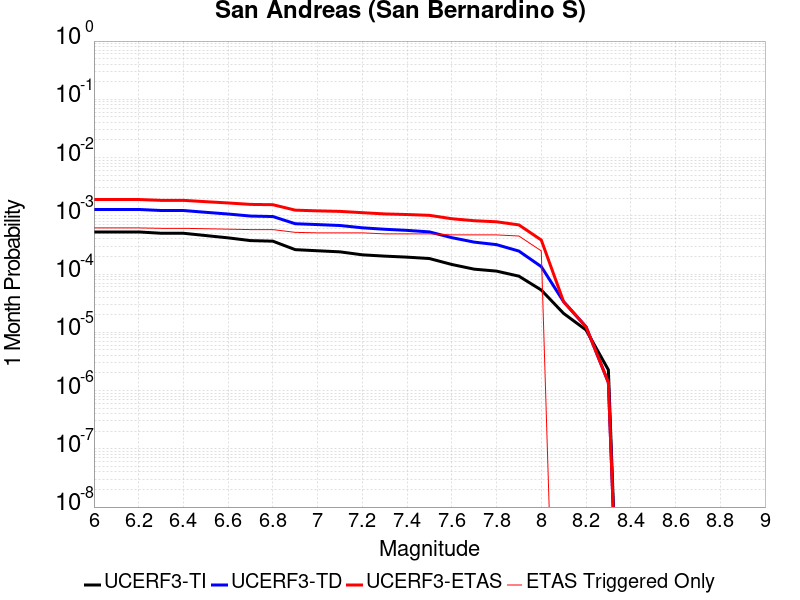 |  |  |

| Magnitude | 1 wk TI Prob | 1 wk TD Prob | 1 wk ETAS Prob | 1 wk ETAS/TD Gain | 1 wk ETAS Triggered Only | 1 mo TI Prob | 1 mo TD Prob | 1 mo ETAS Prob | 1 mo ETAS/TD Gain | 1 mo ETAS Triggered Only | 1 yr TI Prob | 1 yr TD Prob | 1 yr ETAS Prob | 1 yr ETAS/TD Gain | 1 yr ETAS Triggered Only | 10 yr TI Prob | 10 yr TD Prob | 10 yr ETAS Prob | 10 yr ETAS/TD Gain | 10 yr ETAS Triggered Only |
|-----|-----|-----|-----|-----|-----|-----|-----|-----|-----|-----|-----|-----|-----|-----|-----|-----|-----|-----|-----|-----|
| 6.0 | 1.2336002E-4 | 3.0004102E-4 | 6.99921E-4 | 2.332751 | 4.0E-4 | 5.2857865E-4 | 0.0012852824 | 0.0019044856 | 1.4817642 | 6.2E-4 | 0.006416472 | 0.015540994 | 0.016466385 | 1.0595452 | 9.4E-4 | 0.06234337 | 0.14283717 | 0.14395148 | 1.0078013 | 0.0013 |
| 6.1 | 1.2336002E-4 | 3.0004102E-4 | 6.99921E-4 | 2.332751 | 4.0E-4 | 5.2857865E-4 | 0.0012852824 | 0.0019044856 | 1.4817642 | 6.2E-4 | 0.006416472 | 0.015540994 | 0.016466385 | 1.0595452 | 9.4E-4 | 0.06234337 | 0.14283717 | 0.14395148 | 1.0078013 | 0.0013 |
| 6.2 | 1.2336002E-4 | 3.0004102E-4 | 6.99921E-4 | 2.332751 | 4.0E-4 | 5.2857865E-4 | 0.0012852824 | 0.0019044856 | 1.4817642 | 6.2E-4 | 0.006416472 | 0.015540994 | 0.016466385 | 1.0595452 | 9.4E-4 | 0.06234337 | 0.14283717 | 0.14395148 | 1.0078013 | 0.0013 |
| 6.3 | 1.1712257E-4 | 2.8792414E-4 | 6.7781185E-4 | 2.3541334 | 3.9E-4 | 5.018573E-4 | 0.0012334028 | 0.0018426504 | 1.4939568 | 6.1E-4 | 0.006093008 | 0.014918125 | 0.015834251 | 1.0614103 | 9.3E-4 | 0.059286322 | 0.13754563 | 0.13864957 | 1.008026 | 0.00128 |
| 6.4 | 1.1712257E-4 | 2.8792414E-4 | 6.7781185E-4 | 2.3541334 | 3.9E-4 | 5.018573E-4 | 0.0012334028 | 0.0018426504 | 1.4939568 | 6.1E-4 | 0.006093008 | 0.014918125 | 0.015834251 | 1.0614103 | 9.3E-4 | 0.059286322 | 0.13754563 | 0.13864957 | 1.008026 | 0.00128 |
| 6.5 | 1.0689076E-4 | 2.680528E-4 | 6.479509E-4 | 2.417251 | 3.8E-4 | 4.5802278E-4 | 0.0011483167 | 0.0017476277 | 1.521904 | 6.0E-4 | 0.0055621783 | 0.01389575 | 0.014802966 | 1.0652872 | 9.2E-4 | 0.05425003 | 0.12879294 | 0.12989067 | 1.0085231 | 0.00126 |
| 6.6 | 9.7648895E-5 | 2.50501E-4 | 6.2040833E-4 | 2.47667 | 3.7E-4 | 4.1842813E-4 | 0.0010731576 | 0.0016625245 | 1.5491894 | 5.9E-4 | 0.005082469 | 0.012991785 | 0.013880093 | 1.0683745 | 9.0E-4 | 0.049677886 | 0.12095292 | 0.122025356 | 1.0088665 | 0.00122 |
| 6.7 | 8.757013E-5 | 2.3120902E-4 | 5.911258E-4 | 2.5566726 | 3.6E-4 | 3.7524657E-4 | 9.905418E-4 | 0.0015699673 | 1.5849581 | 5.8E-4 | 0.00455906 | 0.011997245 | 0.012876567 | 1.0732937 | 8.9E-4 | 0.04466656 | 0.11226123 | 0.11333539 | 1.0095685 | 0.00121 |
| 6.8 | 8.562978E-5 | 2.2680782E-4 | 5.867262E-4 | 2.586887 | 3.6E-4 | 3.6693315E-4 | 9.7169366E-4 | 0.0015511301 | 1.596316 | 5.8E-4 | 0.004458263 | 0.011770263 | 0.012649788 | 1.0747243 | 8.9E-4 | 0.043698758 | 0.11027153 | 0.1113481 | 1.0097629 | 0.00121 |
| 6.9 | 6.124075E-5 | 1.7065753E-4 | 5.3059607E-4 | 3.109128 | 3.6E-4 | 2.6243398E-4 | 7.311852E-4 | 0.001250805 | 1.7106541 | 5.2E-4 | 0.0031904527 | 0.008866051 | 0.009658958 | 1.0894319 | 8.0E-4 | 0.031450346 | 0.08418263 | 0.08518087 | 1.011858 | 0.00109 |
| 7.0 | 5.8598747E-5 | 1.649477E-4 | 5.1488995E-4 | 3.1215346 | 3.5E-4 | 2.5111332E-4 | 7.06728E-4 | 0.0012163676 | 1.7211255 | 5.1E-4 | 0.0030530186 | 0.008570663 | 0.009353892 | 1.0913849 | 7.9E-4 | 0.03011414 | 0.081500374 | 0.08249235 | 1.0121715 | 0.00108 |
| 7.1 | 5.613814E-5 | 1.5913323E-4 | 5.090775E-4 | 3.199065 | 3.5E-4 | 2.4056983E-4 | 6.818221E-4 | 0.0011914744 | 1.7474858 | 5.1E-4 | 0.0029250039 | 0.008269769 | 0.009053236 | 1.0947387 | 7.9E-4 | 0.028868021 | 0.07879931 | 0.079785 | 1.0125087 | 0.00107 |
| 7.2 | 4.991222E-5 | 1.4519796E-4 | 4.9514713E-4 | 3.4101522 | 3.5E-4 | 2.1389198E-4 | 6.2212895E-4 | 0.0011318116 | 1.8192557 | 5.1E-4 | 0.002601025 | 0.007548217 | 0.008332254 | 1.1038705 | 7.9E-4 | 0.025707912 | 0.07225321 | 0.07323662 | 1.0136106 | 0.00106 |
| 7.3 | 4.7410045E-5 | 1.3714004E-4 | 4.7709342E-4 | 3.4788775 | 3.4E-4 | 2.0317009E-4 | 5.8761094E-4 | 0.001077323 | 1.8333951 | 4.9E-4 | 0.0024707897 | 0.0071307817 | 0.007895291 | 1.1072125 | 7.7E-4 | 0.024434982 | 0.06853558 | 0.069504306 | 1.0141346 | 0.00104 |
| 7.4 | 4.5556746E-5 | 1.3121912E-4 | 4.711745E-4 | 3.590746 | 3.4E-4 | 1.952286E-4 | 5.622468E-4 | 0.0010519712 | 1.8710135 | 4.9E-4 | 0.002374317 | 0.0068239477 | 0.0075787613 | 1.1106125 | 7.6E-4 | 0.023491086 | 0.065788016 | 0.066731565 | 1.0143423 | 0.00101 |
| 7.5 | 4.3084514E-5 | 1.2357246E-4 | 4.6353045E-4 | 3.751082 | 3.4E-4 | 1.8463485E-4 | 5.2948913E-4 | 0.0010192296 | 1.9249303 | 4.9E-4 | 0.0022456115 | 0.0064275465 | 0.007182662 | 1.1174811 | 7.6E-4 | 0.022230545 | 0.062188786 | 0.063135974 | 1.0152309 | 0.00101 |
| 7.6 | 3.408608E-5 | 9.83552E-5 | 4.2832273E-4 | 4.354856 | 3.3E-4 | 1.4607502E-4 | 4.214543E-4 | 8.912562E-4 | 2.1147163 | 4.7E-4 | 0.0017770125 | 0.0051191594 | 0.005855371 | 1.143815 | 7.4E-4 | 0.017628696 | 0.050020292 | 0.050941773 | 1.0184221 | 9.7E-4 |
| 7.7 | 2.8315713E-5 | 8.248679E-5 | 4.1245957E-4 | 5.0003104 | 3.3E-4 | 1.2134742E-4 | 3.5346695E-4 | 8.2330086E-4 | 2.3292158 | 4.7E-4 | 0.0014764034 | 0.0042949775 | 0.005031799 | 1.1715543 | 7.4E-4 | 0.01466633 | 0.0422714 | 0.0432004 | 1.021977 | 9.7E-4 |
| 7.8 | 2.6222975E-5 | 7.463088E-5 | 4.0460625E-4 | 5.421432 | 3.3E-4 | 1.1237934E-4 | 3.1980744E-4 | 7.896571E-4 | 2.4691644 | 4.7E-4 | 0.0013673597 | 0.0038867102 | 0.004623834 | 1.1896523 | 7.4E-4 | 0.013589768 | 0.03843674 | 0.039369456 | 1.0242662 | 9.7E-4 |
| 7.9 | 2.1469694E-5 | 5.787864E-5 | 3.678607E-4 | 6.355725 | 3.1E-4 | 9.200973E-5 | 2.4802773E-4 | 6.9791614E-4 | 2.813863 | 4.5E-4 | 0.0011196428 | 0.0030155594 | 0.0036935087 | 1.2248172 | 6.8E-4 | 0.011140184 | 0.030152109 | 0.031005574 | 1.0283054 | 8.8E-4 |
| 8.0 | 1.2420249E-5 | 3.131896E-5 | 1.7131458E-4 | 5.469996 | 1.4E-4 | 5.322855E-5 | 1.342172E-4 | 3.8418366E-4 | 2.8624024 | 2.5E-4 | 6.478649E-4 | 0.0016328706 | 0.0019223972 | 1.1773113 | 2.9E-4 | 0.0064597935 | 0.016522504 | 0.01688639 | 1.0220237 | 3.7E-4 |
| 8.1 | 4.9197724E-6 | 7.822348E-6 | 7.822348E-6 | 1.0 | 0.0 | 2.1084568E-5 | 3.352392E-5 | 3.352392E-5 | 1.0 | 0.0 | 2.566744E-4 | 4.0807744E-4 | 4.0807744E-4 | 1.0 | 0.0 | 0.002563781 | 0.0043843705 | 0.0043843705 | 1.0 | 0.0 |
| 8.2 | 2.5634774E-6 | 2.9067196E-6 | 2.9067196E-6 | 1.0 | 0.0 | 1.0986286E-5 | 1.2457311E-5 | 1.2457311E-5 | 1.0 | 0.0 | 1.3374983E-4 | 1.5165724E-4 | 1.5165724E-4 | 1.0 | 0.0 | 0.0013366934 | 0.0017049741 | 0.0017049741 | 1.0 | 0.0 |
| 8.3 | 5.2850464E-7 | 3.2088764E-7 | 3.2088764E-7 | 1.0 | 0.0 | 2.2650179E-6 | 1.375232E-6 | 1.375232E-6 | 1.0 | 0.0 | 2.7576245E-5 | 1.6743334E-5 | 1.6743334E-5 | 1.0 | 0.0 | 2.7572823E-4 | 1.9870348E-4 | 1.9870348E-4 | 1.0 | 0.0 |

## Helendale-So Lockhart
*[(top)](#table-of-contents)*

| 1 Week | 1 Month | 1 Year | 10 Year |
|-----|-----|-----|-----|
|  |  |  |  |

| Magnitude | 1 wk TI Prob | 1 wk TD Prob | 1 wk ETAS Prob | 1 wk ETAS/TD Gain | 1 wk ETAS Triggered Only | 1 mo TI Prob | 1 mo TD Prob | 1 mo ETAS Prob | 1 mo ETAS/TD Gain | 1 mo ETAS Triggered Only | 1 yr TI Prob | 1 yr TD Prob | 1 yr ETAS Prob | 1 yr ETAS/TD Gain | 1 yr ETAS Triggered Only | 10 yr TI Prob | 10 yr TD Prob | 10 yr ETAS Prob | 10 yr ETAS/TD Gain | 10 yr ETAS Triggered Only |
|-----|-----|-----|-----|-----|-----|-----|-----|-----|-----|-----|-----|-----|-----|-----|-----|-----|-----|-----|-----|-----|
| 6.0 | 1.7296055E-5 | 1.8103729E-5 | 3.3809795E-4 | 18.675596 | 3.2E-4 | 7.412385E-5 | 7.7585224E-5 | 5.5754796E-4 | 7.1862655 | 4.8E-4 | 9.0208417E-4 | 9.4421144E-4 | 0.0017334655 | 1.835887 | 7.9E-4 | 0.008984311 | 0.009404116 | 0.010602738 | 1.127457 | 0.00121 |
| 6.1 | 1.7296055E-5 | 1.8103729E-5 | 3.3809795E-4 | 18.675596 | 3.2E-4 | 7.412385E-5 | 7.7585224E-5 | 5.5754796E-4 | 7.1862655 | 4.8E-4 | 9.0208417E-4 | 9.4421144E-4 | 0.0017334655 | 1.835887 | 7.9E-4 | 0.008984311 | 0.009404116 | 0.010602738 | 1.127457 | 0.00121 |
| 6.2 | 1.7296055E-5 | 1.8103729E-5 | 3.3809795E-4 | 18.675596 | 3.2E-4 | 7.412385E-5 | 7.7585224E-5 | 5.5754796E-4 | 7.1862655 | 4.8E-4 | 9.0208417E-4 | 9.4421144E-4 | 0.0017334655 | 1.835887 | 7.9E-4 | 0.008984311 | 0.009404116 | 0.010602738 | 1.127457 | 0.00121 |
| 6.3 | 1.0669118E-5 | 1.1135425E-5 | 2.111332E-4 | 18.960499 | 2.0E-4 | 4.5723988E-5 | 4.772239E-5 | 3.3770854E-4 | 7.0765224 | 2.9E-4 | 5.5654737E-4 | 5.80868E-4 | 0.0010805776 | 1.8602808 | 5.0E-4 | 0.0055515557 | 0.0057937936 | 0.0065493905 | 1.1304148 | 7.6E-4 |
| 6.4 | 1.0669118E-5 | 1.1135425E-5 | 2.111332E-4 | 18.960499 | 2.0E-4 | 4.5723988E-5 | 4.772239E-5 | 3.3770854E-4 | 7.0765224 | 2.9E-4 | 5.5654737E-4 | 5.80868E-4 | 0.0010805776 | 1.8602808 | 5.0E-4 | 0.0055515557 | 0.0057937936 | 0.0065493905 | 1.1304148 | 7.6E-4 |
| 6.5 | 8.790038E-6 | 9.170197E-6 | 1.7916864E-4 | 19.538145 | 1.7E-4 | 3.767105E-5 | 3.930026E-5 | 2.7929083E-4 | 7.10659 | 2.4E-4 | 4.585485E-4 | 4.7837716E-4 | 8.981762E-4 | 1.8775483 | 4.2E-4 | 0.0045760344 | 0.004773638 | 0.0054205353 | 1.1355145 | 6.5E-4 |
| 6.6 | 7.396949E-6 | 7.715537E-6 | 1.5771438E-4 | 20.441141 | 1.5E-4 | 3.1700827E-5 | 3.3066175E-5 | 2.530589E-4 | 7.6531053 | 2.2E-4 | 3.858892E-4 | 4.025073E-4 | 7.623624E-4 | 1.8940337 | 3.6E-4 | 0.003852198 | 0.00401789 | 0.00457564 | 1.1388166 | 5.6E-4 |
| 6.7 | 6.4600285E-6 | 6.738031E-6 | 1.3673716E-4 | 20.29334 | 1.3E-4 | 2.7685543E-5 | 2.887696E-5 | 2.2887118E-4 | 7.925737 | 2.0E-4 | 3.3701936E-4 | 3.5152107E-4 | 6.614121E-4 | 1.8815718 | 3.1E-4 | 0.0033650869 | 0.003509732 | 0.0039980123 | 1.1391218 | 4.9E-4 |
| 6.8 | 5.600104E-6 | 5.836009E-6 | 7.5835604E-5 | 12.994428 | 7.0E-5 | 2.4000226E-5 | 2.5011232E-5 | 1.4500823E-4 | 5.7977242 | 1.2E-4 | 2.9216358E-4 | 3.044698E-4 | 4.7441805E-4 | 1.5581777 | 1.7E-4 | 0.0029177975 | 0.003040588 | 0.003359615 | 1.1049228 | 3.2E-4 |
| 6.9 | 4.839122E-6 | 5.0395092E-6 | 6.503921E-5 | 12.905861 | 6.0E-5 | 2.0738931E-5 | 2.159772E-5 | 1.2159556E-4 | 5.630018 | 1.0E-4 | 2.5246723E-4 | 2.6292098E-4 | 4.0288418E-4 | 1.5323393 | 1.4E-4 | 0.002521806 | 0.002626147 | 0.0029054114 | 1.10634 | 2.8E-4 |
| 7.0 | 3.6937633E-6 | 3.845208E-6 | 6.384498E-5 | 16.603777 | 6.0E-5 | 1.5830317E-5 | 1.647936E-5 | 1.0647788E-4 | 6.461287 | 9.0E-5 | 1.9271708E-4 | 2.0061806E-4 | 3.3059198E-4 | 1.6478676 | 1.3E-4 | 0.0019255003 | 0.002004401 | 0.0022738597 | 1.1344336 | 2.7E-4 |
| 7.1 | 2.7858857E-6 | 2.8978538E-6 | 5.289771E-5 | 18.254099 | 5.0E-5 | 1.1939455E-5 | 1.2419316E-5 | 9.241832E-5 | 7.4414988 | 8.0E-5 | 1.4535317E-4 | 1.511949E-4 | 2.5117976E-4 | 1.661298 | 1.0E-4 | 0.0014525814 | 0.0015109418 | 0.0017206245 | 1.1387762 | 2.1E-4 |
| 7.2 | 2.1672065E-6 | 2.2540128E-6 | 4.2253923E-5 | 18.746088 | 4.0E-5 | 9.2879945E-6 | 9.66002E-6 | 7.9659345E-5 | 8.246292 | 7.0E-5 | 1.1307546E-4 | 1.1760458E-4 | 1.9759517E-4 | 1.6801656 | 8.0E-5 | 0.0011301794 | 0.0011754417 | 0.0013552301 | 1.152954 | 1.8E-4 |
| 7.3 | 1.4823496E-6 | 1.5422102E-6 | 2.1542179E-5 | 13.968381 | 2.0E-5 | 6.3529114E-6 | 6.6094562E-6 | 4.660919E-5 | 7.0518947 | 4.0E-5 | 7.734395E-5 | 8.046731E-5 | 1.3046329E-4 | 1.6213204 | 5.0E-5 | 7.731704E-4 | 8.0439687E-4 | 9.0431643E-4 | 1.1242168 | 1.0E-4 |
| 7.4 | 4.2321457E-7 | 4.4108765E-7 | 1.0441083E-5 | 23.67122 | 1.0E-5 | 1.8137755E-6 | 1.8903745E-6 | 1.1890355E-5 | 6.289947 | 1.0E-5 | 2.2082493E-5 | 2.3015113E-5 | 3.3014883E-5 | 1.4344871 | 1.0E-5 | 2.2080299E-4 | 2.3013182E-4 | 2.5012722E-4 | 1.0868868 | 2.0E-5 |
| 7.5 | 5.6942316E-8 | 5.9415648E-8 | 5.9415648E-8 | 1.0 | 0.0 | 2.440385E-7 | 2.5463845E-7 | 2.5463845E-7 | 1.0 | 0.0 | 2.9711643E-6 | 3.1002196E-6 | 3.1002196E-6 | 1.0 | 0.0 | 2.9711247E-5 | 3.1001844E-5 | 3.1001844E-5 | 1.0 | 0.0 |

## Coyote Lake
*[(top)](#table-of-contents)*

| 1 Week | 1 Month | 1 Year | 10 Year |
|-----|-----|-----|-----|
|  |  |  | 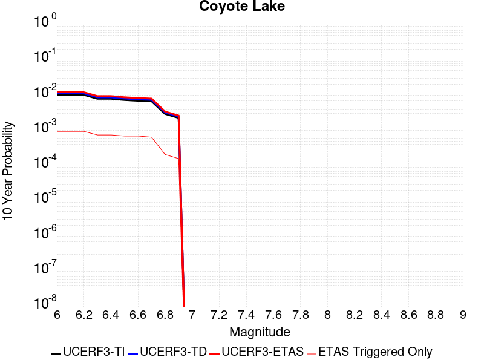 |

| Magnitude | 1 wk TI Prob | 1 wk TD Prob | 1 wk ETAS Prob | 1 wk ETAS/TD Gain | 1 wk ETAS Triggered Only | 1 mo TI Prob | 1 mo TD Prob | 1 mo ETAS Prob | 1 mo ETAS/TD Gain | 1 mo ETAS Triggered Only | 1 yr TI Prob | 1 yr TD Prob | 1 yr ETAS Prob | 1 yr ETAS/TD Gain | 1 yr ETAS Triggered Only | 10 yr TI Prob | 10 yr TD Prob | 10 yr ETAS Prob | 10 yr ETAS/TD Gain | 10 yr ETAS Triggered Only |
|-----|-----|-----|-----|-----|-----|-----|-----|-----|-----|-----|-----|-----|-----|-----|-----|-----|-----|-----|-----|-----|
| 6.0 | 1.980352E-5 | 2.1706745E-5 | 1.7170349E-4 | 7.9101443 | 1.5E-4 | 8.486947E-5 | 9.302599E-5 | 3.4300273E-4 | 3.6871707 | 2.5E-4 | 0.0010327959 | 0.0011320751 | 0.0017214072 | 1.5205768 | 5.9E-4 | 0.010280091 | 0.011270258 | 0.012209551 | 1.0833427 | 9.5E-4 |
| 6.1 | 1.980352E-5 | 2.1706745E-5 | 1.7170349E-4 | 7.9101443 | 1.5E-4 | 8.486947E-5 | 9.302599E-5 | 3.4300273E-4 | 3.6871707 | 2.5E-4 | 0.0010327959 | 0.0011320751 | 0.0017214072 | 1.5205768 | 5.9E-4 | 0.010280091 | 0.011270258 | 0.012209551 | 1.0833427 | 9.5E-4 |
| 6.2 | 1.980352E-5 | 2.1706745E-5 | 1.7170349E-4 | 7.9101443 | 1.5E-4 | 8.486947E-5 | 9.302599E-5 | 3.4300273E-4 | 3.6871707 | 2.5E-4 | 0.0010327959 | 0.0011320751 | 0.0017214072 | 1.5205768 | 5.9E-4 | 0.010280091 | 0.011270258 | 0.012209551 | 1.0833427 | 9.5E-4 |
| 6.3 | 1.5344787E-5 | 1.682067E-5 | 1.3681865E-4 | 8.13396 | 1.2E-4 | 6.576172E-5 | 7.2086936E-5 | 2.7207253E-4 | 3.7742279 | 2.0E-4 | 8.003548E-4 | 8.773662E-4 | 0.0013269715 | 1.5124487 | 4.5E-4 | 0.007974784 | 0.00874507 | 0.00948851 | 1.0850126 | 7.5E-4 |
| 6.4 | 1.5344787E-5 | 1.682067E-5 | 1.3681865E-4 | 8.13396 | 1.2E-4 | 6.576172E-5 | 7.2086936E-5 | 2.7207253E-4 | 3.7742279 | 2.0E-4 | 8.003548E-4 | 8.773662E-4 | 0.0013269715 | 1.5124487 | 4.5E-4 | 0.007974784 | 0.00874507 | 0.00948851 | 1.0850126 | 7.5E-4 |
| 6.5 | 1.4189697E-5 | 1.5557987E-5 | 1.3555613E-4 | 8.71296 | 1.2E-4 | 6.081157E-5 | 6.6675726E-5 | 2.5666304E-4 | 3.849423 | 1.9E-4 | 7.401293E-4 | 8.115349E-4 | 0.0012511777 | 1.5417424 | 4.4E-4 | 0.0073766913 | 0.008091656 | 0.008785992 | 1.0858089 | 7.0E-4 |
| 6.6 | 1.3469301E-5 | 1.4771577E-5 | 1.347698E-4 | 9.1235895 | 1.2E-4 | 5.7724297E-5 | 6.330556E-5 | 2.5329355E-4 | 4.0011263 | 1.9E-4 | 7.025667E-4 | 7.7053264E-4 | 0.0012101936 | 1.5705936 | 4.4E-4 | 0.0070034964 | 0.0076845144 | 0.008379135 | 1.0903922 | 7.0E-4 |
| 6.7 | 1.3027966E-5 | 1.4281745E-5 | 1.3428002E-4 | 9.402215 | 1.2E-4 | 5.5832945E-5 | 6.120638E-5 | 2.5119475E-4 | 4.1040616 | 1.9E-4 | 6.7955407E-4 | 7.4499263E-4 | 0.0011646798 | 1.563344 | 4.2E-4 | 0.006774798 | 0.0074308286 | 0.008075999 | 1.0868235 | 6.5E-4 |
| 6.8 | 5.695434E-6 | 6.2244176E-6 | 7.622398E-5 | 12.245962 | 7.0E-5 | 2.4408775E-5 | 2.6675973E-5 | 1.16673575E-4 | 4.3737326 | 9.0E-5 | 2.971363E-4 | 3.2476155E-4 | 4.7471284E-4 | 1.4617274 | 1.5E-4 | 0.0029673933 | 0.0032458105 | 0.0034551288 | 1.0644888 | 2.1E-4 |
| 6.9 | 4.385688E-6 | 4.7930553E-6 | 5.4792818E-5 | 11.431709 | 5.0E-5 | 1.879567E-5 | 2.0541665E-5 | 9.054023E-5 | 4.407638 | 7.0E-5 | 2.2881327E-4 | 2.5009477E-4 | 3.6006726E-4 | 1.4397233 | 1.1E-4 | 0.002285778 | 0.0025009478 | 0.0026605476 | 1.0638157 | 1.6E-4 |

## Death Valley (No)
*[(top)](#table-of-contents)*

| 1 Week | 1 Month | 1 Year | 10 Year |
|-----|-----|-----|-----|
|  |  |  | 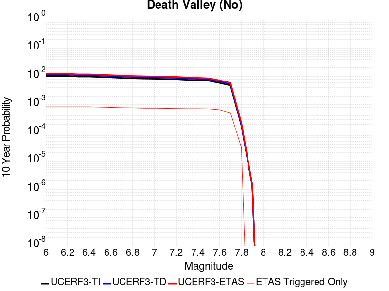 |

| Magnitude | 1 wk TI Prob | 1 wk TD Prob | 1 wk ETAS Prob | 1 wk ETAS/TD Gain | 1 wk ETAS Triggered Only | 1 mo TI Prob | 1 mo TD Prob | 1 mo ETAS Prob | 1 mo ETAS/TD Gain | 1 mo ETAS Triggered Only | 1 yr TI Prob | 1 yr TD Prob | 1 yr ETAS Prob | 1 yr ETAS/TD Gain | 1 yr ETAS Triggered Only | 10 yr TI Prob | 10 yr TD Prob | 10 yr ETAS Prob | 10 yr ETAS/TD Gain | 10 yr ETAS Triggered Only |
|-----|-----|-----|-----|-----|-----|-----|-----|-----|-----|-----|-----|-----|-----|-----|-----|-----|-----|-----|-----|-----|
| 6.0 | 2.0074807E-5 | 2.2500084E-5 | 2.624947E-4 | 11.666388 | 2.4E-4 | 8.603206E-5 | 9.642541E-5 | 4.6638973E-4 | 4.836793 | 3.7E-4 | 0.001046937 | 0.0011733545 | 0.0017726504 | 1.5107545 | 6.0E-4 | 0.010420183 | 0.011672506 | 0.012502702 | 1.071124 | 8.4E-4 |
| 6.1 | 2.0074807E-5 | 2.2500084E-5 | 2.624947E-4 | 11.666388 | 2.4E-4 | 8.603206E-5 | 9.642541E-5 | 4.6638973E-4 | 4.836793 | 3.7E-4 | 0.001046937 | 0.0011733545 | 0.0017726504 | 1.5107545 | 6.0E-4 | 0.010420183 | 0.011672506 | 0.012502702 | 1.071124 | 8.4E-4 |
| 6.2 | 2.0074807E-5 | 2.2500084E-5 | 2.624947E-4 | 11.666388 | 2.4E-4 | 8.603206E-5 | 9.642541E-5 | 4.6638973E-4 | 4.836793 | 3.7E-4 | 0.001046937 | 0.0011733545 | 0.0017726504 | 1.5107545 | 6.0E-4 | 0.010420183 | 0.011672506 | 0.012502702 | 1.071124 | 8.4E-4 |
| 6.3 | 1.9050609E-5 | 2.1336948E-5 | 2.6133182E-4 | 12.247854 | 2.4E-4 | 8.164292E-5 | 9.1440896E-5 | 4.6140706E-4 | 5.0459595 | 3.7E-4 | 9.935491E-4 | 0.001112731 | 0.0017120634 | 1.5386139 | 6.0E-4 | 0.009891188 | 0.011072419 | 0.011903118 | 1.0750241 | 8.4E-4 |
| 6.4 | 1.9050609E-5 | 2.1336948E-5 | 2.6133182E-4 | 12.247854 | 2.4E-4 | 8.164292E-5 | 9.1440896E-5 | 4.6140706E-4 | 5.0459595 | 3.7E-4 | 9.935491E-4 | 0.001112731 | 0.0017120634 | 1.5386139 | 6.0E-4 | 0.009891188 | 0.011072419 | 0.011903118 | 1.0750241 | 8.4E-4 |
| 6.5 | 1.8367004E-5 | 2.0561009E-5 | 2.5055627E-4 | 12.185992 | 2.3E-4 | 7.8713354E-5 | 8.811567E-5 | 4.4808394E-4 | 5.085179 | 3.6E-4 | 9.5791375E-4 | 0.0010722869 | 0.0016516648 | 1.54032 | 5.8E-4 | 0.009537951 | 0.0106719155 | 0.0114831645 | 1.0760171 | 8.2E-4 |
| 6.6 | 1.779439E-5 | 1.9910927E-5 | 2.4990636E-4 | 12.551215 | 2.3E-4 | 7.625944E-5 | 8.53298E-5 | 4.4529908E-4 | 5.218565 | 3.6E-4 | 9.280632E-4 | 0.0010384015 | 0.0016078096 | 1.5483506 | 5.7E-4 | 0.009241969 | 0.010336253 | 0.011127983 | 1.0765975 | 8.0E-4 |
| 6.7 | 1.7025437E-5 | 1.9043426E-5 | 2.2903943E-4 | 12.027218 | 2.1E-4 | 7.296412E-5 | 8.161216E-5 | 4.215844E-4 | 5.1657057 | 3.4E-4 | 8.87976E-4 | 9.931813E-4 | 0.001542635 | 1.553226 | 5.5E-4 | 0.008844362 | 0.009888145 | 0.010660432 | 1.0781024 | 7.8E-4 |
| 6.8 | 1.6545107E-5 | 1.8512545E-5 | 2.2850865E-4 | 12.343449 | 2.1E-4 | 7.090568E-5 | 7.93371E-5 | 4.1931012E-4 | 5.2851706 | 3.4E-4 | 8.629347E-4 | 9.655073E-4 | 0.0015149763 | 1.5690987 | 5.5E-4 | 0.008595915 | 0.009613829 | 0.010376426 | 1.0793229 | 7.7E-4 |
| 6.9 | 1.615478E-5 | 1.8087594E-5 | 2.1808398E-4 | 12.057102 | 2.0E-4 | 6.9232934E-5 | 7.751599E-5 | 3.9749118E-4 | 5.1278605 | 3.2E-4 | 8.4258494E-4 | 9.433546E-4 | 0.0014728546 | 1.5612948 | 5.3E-4 | 0.008393973 | 0.009394196 | 0.01013715 | 1.0790865 | 7.5E-4 |
| 7.0 | 1.5894311E-5 | 1.780555E-5 | 2.17802E-4 | 12.232253 | 2.0E-4 | 6.81167E-5 | 7.6307304E-5 | 3.9628288E-4 | 5.1932497 | 3.2E-4 | 8.2900526E-4 | 9.286515E-4 | 0.0014581593 | 1.5701901 | 5.3E-4 | 0.008259195 | 0.009248397 | 0.009991461 | 1.0803452 | 7.5E-4 |
| 7.1 | 1.5602263E-5 | 1.7483504E-5 | 2.0748017E-4 | 11.867197 | 1.9E-4 | 6.6865134E-5 | 7.492718E-5 | 3.8490395E-4 | 5.13704 | 3.1E-4 | 8.137789E-4 | 9.118627E-4 | 0.0014313885 | 1.5697412 | 5.2E-4 | 0.008108052 | 0.009081894 | 0.009815173 | 1.0807408 | 7.4E-4 |
| 7.2 | 1.5323829E-5 | 1.717063E-5 | 2.0716737E-4 | 12.065216 | 1.9E-4 | 6.56719E-5 | 7.358637E-5 | 3.8356357E-4 | 5.2124267 | 3.1E-4 | 7.99262E-4 | 8.9555193E-4 | 0.0014150862 | 1.5801275 | 5.2E-4 | 0.007963934 | 0.008920107 | 0.009643595 | 1.0811076 | 7.3E-4 |
| 7.3 | 1.4556212E-5 | 1.6302456E-5 | 1.9629952E-4 | 12.041101 | 1.8E-4 | 6.238227E-5 | 6.9865826E-5 | 3.6984487E-4 | 5.293645 | 3.0E-4 | 7.592395E-4 | 8.5029035E-4 | 0.0013598567 | 1.5992851 | 5.1E-4 | 0.0075665074 | 0.008471014 | 0.009184916 | 1.0842757 | 7.2E-4 |
| 7.4 | 1.411725E-5 | 1.580796E-5 | 1.9580511E-4 | 12.386489 | 1.8E-4 | 6.0501097E-5 | 6.7746674E-5 | 3.6772634E-4 | 5.427962 | 3.0E-4 | 7.363519E-4 | 8.245094E-4 | 0.001334089 | 1.6180396 | 5.1E-4 | 0.0073391674 | 0.008215138 | 0.008929224 | 1.0869231 | 7.2E-4 |
| 7.5 | 1.3503312E-5 | 1.5126289E-5 | 1.9512356E-4 | 12.899632 | 1.8E-4 | 5.7870053E-5 | 6.482538E-5 | 3.6480592E-4 | 5.627517 | 3.0E-4 | 7.043401E-4 | 7.8896893E-4 | 0.0012985666 | 1.6459032 | 5.1E-4 | 0.007021119 | 0.007862304 | 0.008566722 | 1.0895944 | 7.1E-4 |
| 7.6 | 1.1279839E-5 | 1.2626327E-5 | 1.8262418E-4 | 14.463761 | 1.7E-4 | 4.834127E-5 | 5.4111737E-5 | 3.4409604E-4 | 6.358991 | 2.9E-4 | 5.88396E-4 | 6.5861654E-4 | 0.001128307 | 1.713147 | 4.7E-4 | 0.005868405 | 0.006567199 | 0.0072228643 | 1.0998394 | 6.6E-4 |
| 7.7 | 9.189108E-6 | 1.0283358E-5 | 1.6028182E-4 | 15.586524 | 1.5E-4 | 3.93813E-5 | 4.407082E-5 | 2.7406067E-4 | 6.2186427 | 2.3E-4 | 4.7936183E-4 | 5.3643517E-4 | 8.9624204E-4 | 1.6707369 | 3.6E-4 | 0.004783291 | 0.005351914 | 0.0058591845 | 1.0947831 | 5.1E-4 |
| 7.8 | 3.4586725E-7 | 3.6482615E-7 | 1.0364823E-5 | 28.410307 | 1.0E-5 | 1.4822873E-6 | 1.5635396E-6 | 2.1563508E-5 | 13.791469 | 2.0E-5 | 1.80467E-5 | 1.9035933E-5 | 4.9035363E-5 | 2.5759368 | 3.0E-5 | 1.8045233E-4 | 1.9034347E-4 | 2.2033777E-4 | 1.1575798 | 3.0E-5 |
| 7.9 | 2.5591178E-9 | 2.6696718E-9 | 2.6696718E-9 | 1.0 | 0.0 | 1.0967647E-8 | 1.14414505E-8 | 1.14414505E-8 | 1.0 | 0.0 | 1.335311E-7 | 1.3929966E-7 | 1.3929966E-7 | 1.0 | 0.0 | 1.3353102E-6 | 1.3929966E-6 | 1.3929966E-6 | 1.0 | 0.0 |

## San Andreas (Big Bend)
*[(top)](#table-of-contents)*

| 1 Week | 1 Month | 1 Year | 10 Year |
|-----|-----|-----|-----|
|  |  |  |  |

| Magnitude | 1 wk TI Prob | 1 wk TD Prob | 1 wk ETAS Prob | 1 wk ETAS/TD Gain | 1 wk ETAS Triggered Only | 1 mo TI Prob | 1 mo TD Prob | 1 mo ETAS Prob | 1 mo ETAS/TD Gain | 1 mo ETAS Triggered Only | 1 yr TI Prob | 1 yr TD Prob | 1 yr ETAS Prob | 1 yr ETAS/TD Gain | 1 yr ETAS Triggered Only | 10 yr TI Prob | 10 yr TD Prob | 10 yr ETAS Prob | 10 yr ETAS/TD Gain | 10 yr ETAS Triggered Only |
|-----|-----|-----|-----|-----|-----|-----|-----|-----|-----|-----|-----|-----|-----|-----|-----|-----|-----|-----|-----|-----|
| 6.0 | 1.0179969E-4 | 2.0072258E-4 | 3.7068847E-4 | 1.84677 | 1.7E-4 | 4.362114E-4 | 8.599571E-4 | 0.0011297249 | 1.3136991 | 2.7E-4 | 0.0052979486 | 0.010419999 | 0.010855414 | 1.0417866 | 4.4E-4 | 0.051734097 | 0.10144902 | 0.10213192 | 1.0067314 | 7.6E-4 |
| 6.1 | 1.0179969E-4 | 2.0072258E-4 | 3.7068847E-4 | 1.84677 | 1.7E-4 | 4.362114E-4 | 8.599571E-4 | 0.0011297249 | 1.3136991 | 2.7E-4 | 0.0052979486 | 0.010419999 | 0.010855414 | 1.0417866 | 4.4E-4 | 0.051734097 | 0.10144902 | 0.10213192 | 1.0067314 | 7.6E-4 |
| 6.2 | 1.0179969E-4 | 2.0072258E-4 | 3.7068847E-4 | 1.84677 | 1.7E-4 | 4.362114E-4 | 8.599571E-4 | 0.0011297249 | 1.3136991 | 2.7E-4 | 0.0052979486 | 0.010419999 | 0.010855414 | 1.0417866 | 4.4E-4 | 0.051734097 | 0.10144902 | 0.10213192 | 1.0067314 | 7.6E-4 |
| 6.3 | 1.0179969E-4 | 2.0072258E-4 | 3.7068847E-4 | 1.84677 | 1.7E-4 | 4.362114E-4 | 8.599571E-4 | 0.0011297249 | 1.3136991 | 2.7E-4 | 0.0052979486 | 0.010419999 | 0.010855414 | 1.0417866 | 4.4E-4 | 0.051734097 | 0.10144902 | 0.10213192 | 1.0067314 | 7.6E-4 |
| 6.4 | 9.1639464E-5 | 1.8429532E-4 | 3.042732E-4 | 1.6510088 | 1.2E-4 | 3.9268145E-4 | 7.895982E-4 | 9.794482E-4 | 1.2404387 | 1.9E-4 | 0.0047704205 | 0.009571102 | 0.009907848 | 1.0351835 | 3.4E-4 | 0.046693064 | 0.09377527 | 0.09428276 | 1.0054117 | 5.6E-4 |
| 6.5 | 9.1639464E-5 | 1.8429532E-4 | 3.042732E-4 | 1.6510088 | 1.2E-4 | 3.9268145E-4 | 7.895982E-4 | 9.794482E-4 | 1.2404387 | 1.9E-4 | 0.0047704205 | 0.009571102 | 0.009907848 | 1.0351835 | 3.4E-4 | 0.046693064 | 0.09377527 | 0.09428276 | 1.0054117 | 5.6E-4 |
| 6.6 | 9.042622E-5 | 1.823659E-4 | 3.02344E-4 | 1.6578977 | 1.2E-4 | 3.8748336E-4 | 7.8133424E-4 | 9.4120926E-4 | 1.2046179 | 1.6E-4 | 0.0047074095 | 0.009471365 | 0.009758619 | 1.0303286 | 2.9E-4 | 0.046089325 | 0.092869274 | 0.0933047 | 1.0046885 | 4.8E-4 |
| 6.7 | 8.9836685E-5 | 1.8150927E-4 | 2.914893E-4 | 1.6059197 | 1.1E-4 | 3.8495753E-4 | 7.776651E-4 | 9.275485E-4 | 1.1927351 | 1.5E-4 | 0.00467679 | 0.00942708 | 0.009694535 | 1.0283709 | 2.7E-4 | 0.045795817 | 0.09246355 | 0.09288102 | 1.0045149 | 4.6E-4 |
| 6.8 | 8.9471854E-5 | 1.8097709E-4 | 2.909572E-4 | 1.6077018 | 1.1E-4 | 3.8339442E-4 | 7.7538576E-4 | 9.2526944E-4 | 1.1933022 | 1.5E-4 | 0.004657841 | 0.009399569 | 0.009667031 | 1.0284548 | 2.7E-4 | 0.04561414 | 0.092210755 | 0.09262834 | 1.0045285 | 4.6E-4 |
| 6.9 | 8.858234E-5 | 1.7979681E-4 | 2.7977885E-4 | 1.5560833 | 1.0E-4 | 3.7958333E-4 | 7.703304E-4 | 9.102226E-4 | 1.1816002 | 1.4E-4 | 0.004611638 | 0.009338548 | 0.009596121 | 1.0275816 | 2.6E-4 | 0.04517103 | 0.09165087 | 0.092050545 | 1.0043608 | 4.4E-4 |
| 7.0 | 8.7433385E-5 | 1.7818481E-4 | 2.78167E-4 | 1.561115 | 1.0E-4 | 3.746607E-4 | 7.634259E-4 | 9.0331904E-4 | 1.1832439 | 1.4E-4 | 0.004551957 | 0.009255203 | 0.00950289 | 1.0267619 | 2.5E-4 | 0.044598386 | 0.09088532 | 0.09125806 | 1.0041012 | 4.1E-4 |
| 7.1 | 8.684964E-5 | 1.7730435E-4 | 2.672884E-4 | 1.5075117 | 9.0E-5 | 3.7215967E-4 | 7.596547E-4 | 8.8955596E-4 | 1.1710004 | 1.3E-4 | 0.0045216335 | 0.009209678 | 0.0094474675 | 1.0258195 | 2.4E-4 | 0.04430731 | 0.09046686 | 0.090830676 | 1.0040215 | 4.0E-4 |
| 7.2 | 8.606521E-5 | 1.762105E-4 | 2.6619463E-4 | 1.5106628 | 9.0E-5 | 3.6879873E-4 | 7.549695E-4 | 8.8487135E-4 | 1.1720624 | 1.3E-4 | 0.0044808835 | 0.0091531165 | 0.0093909195 | 1.0259806 | 2.4E-4 | 0.043916024 | 0.089947365 | 0.09031139 | 1.004047 | 4.0E-4 |
| 7.3 | 8.568266E-5 | 1.7563057E-4 | 2.6561477E-4 | 1.5123492 | 9.0E-5 | 3.6715972E-4 | 7.524855E-4 | 8.823877E-4 | 1.1726308 | 1.3E-4 | 0.0044610105 | 0.009123127 | 0.009360937 | 1.0260668 | 2.4E-4 | 0.043725148 | 0.08966853 | 0.09003266 | 1.0040609 | 4.0E-4 |
| 7.4 | 8.5432206E-5 | 1.7525644E-4 | 2.6524067E-4 | 1.5134432 | 9.0E-5 | 3.6608664E-4 | 7.50883E-4 | 8.807854E-4 | 1.1729995 | 1.3E-4 | 0.004447999 | 0.009103781 | 0.009341596 | 1.0261227 | 2.4E-4 | 0.043600157 | 0.08948871 | 0.089852914 | 1.0040698 | 4.0E-4 |
| 7.5 | 8.4791965E-5 | 1.7394972E-4 | 2.6393408E-4 | 1.5173008 | 9.0E-5 | 3.633435E-4 | 7.4528606E-4 | 8.7518914E-4 | 1.1742997 | 1.3E-4 | 0.0044147377 | 0.009036204 | 0.009274036 | 1.0263199 | 2.4E-4 | 0.043280575 | 0.088866346 | 0.0892308 | 1.0041012 | 4.0E-4 |
| 7.6 | 8.241105E-5 | 1.6840403E-4 | 2.4839057E-4 | 1.474968 | 8.0E-5 | 3.531424E-4 | 7.215321E-4 | 8.414455E-4 | 1.1661928 | 1.2E-4 | 0.0042910352 | 0.008749358 | 0.008977346 | 1.0260576 | 2.3E-4 | 0.042091176 | 0.086243294 | 0.08659052 | 1.0040262 | 3.8E-4 |
| 7.7 | 7.00432E-5 | 1.42045E-4 | 1.8203932E-4 | 1.2815609 | 4.0E-5 | 3.001506E-4 | 6.0862233E-4 | 6.7857973E-4 | 1.1149439 | 7.0E-5 | 0.0036482112 | 0.0073848404 | 0.007543659 | 1.021506 | 1.6E-4 | 0.035888977 | 0.07351733 | 0.073776744 | 1.0035286 | 2.8E-4 |
| 7.8 | 6.415362E-5 | 1.2968935E-4 | 1.6968415E-4 | 1.3083893 | 4.0E-5 | 2.749151E-4 | 5.556931E-4 | 6.256542E-4 | 1.1258988 | 7.0E-5 | 0.0033419547 | 0.0067446055 | 0.006893594 | 1.02209 | 1.5E-4 | 0.03292141 | 0.06725231 | 0.067504145 | 1.0037447 | 2.7E-4 |
| 7.9 | 4.939911E-5 | 9.3411545E-5 | 1.3340781E-4 | 1.4281726 | 4.0E-5 | 2.116933E-4 | 4.0027377E-4 | 4.6024975E-4 | 1.1498374 | 6.0E-5 | 0.0025743195 | 0.004862453 | 0.0049918205 | 1.0266055 | 1.3E-4 | 0.025447013 | 0.048914436 | 0.04913319 | 1.0044721 | 2.3E-4 |
| 8.0 | 3.344983E-5 | 5.222685E-5 | 7.2225805E-5 | 1.3829248 | 2.0E-5 | 1.4334853E-4 | 2.2381016E-4 | 2.6380122E-4 | 1.1786829 | 4.0E-5 | 0.0017438711 | 0.0027214854 | 0.002801268 | 1.0293157 | 8.0E-5 | 0.017302496 | 0.027922187 | 0.028048558 | 1.0045258 | 1.3E-4 |
| 8.1 | 1.9104898E-5 | 1.9173063E-5 | 1.9173063E-5 | 1.0 | 0.0 | 8.1875565E-5 | 8.216769E-5 | 8.216769E-5 | 1.0 | 0.0 | 9.963791E-4 | 9.999331E-4 | 9.999331E-4 | 1.0 | 0.0 | 0.009919235 | 0.010749801 | 0.010759694 | 1.0009203 | 1.0E-5 |
| 8.2 | 8.643924E-6 | 5.4748625E-6 | 5.4748625E-6 | 1.0 | 0.0 | 3.704486E-5 | 2.3463486E-5 | 2.3463486E-5 | 1.0 | 0.0 | 4.5092785E-4 | 2.8563058E-4 | 2.8563058E-4 | 1.0 | 0.0 | 0.0045001395 | 0.0032487072 | 0.0032487072 | 1.0 | 0.0 |
| 8.3 | 1.983087E-6 | 7.6599065E-7 | 7.6599065E-7 | 1.0 | 0.0 | 8.498917E-6 | 3.282813E-6 | 3.282813E-6 | 1.0 | 0.0 | 1.034694E-4 | 3.9967534E-5 | 3.9967534E-5 | 1.0 | 0.0 | 0.0010342124 | 4.719687E-4 | 4.719687E-4 | 1.0 | 0.0 |

## Death Valley (Fish Lake Valley)
*[(top)](#table-of-contents)*

| 1 Week | 1 Month | 1 Year | 10 Year |
|-----|-----|-----|-----|
|  |  |  |  |

| Magnitude | 1 wk TI Prob | 1 wk TD Prob | 1 wk ETAS Prob | 1 wk ETAS/TD Gain | 1 wk ETAS Triggered Only | 1 mo TI Prob | 1 mo TD Prob | 1 mo ETAS Prob | 1 mo ETAS/TD Gain | 1 mo ETAS Triggered Only | 1 yr TI Prob | 1 yr TD Prob | 1 yr ETAS Prob | 1 yr ETAS/TD Gain | 1 yr ETAS Triggered Only | 10 yr TI Prob | 10 yr TD Prob | 10 yr ETAS Prob | 10 yr ETAS/TD Gain | 10 yr ETAS Triggered Only |
|-----|-----|-----|-----|-----|-----|-----|-----|-----|-----|-----|-----|-----|-----|-----|-----|-----|-----|-----|-----|-----|
| 6.0 | 3.872328E-5 | 4.7267473E-5 | 2.1725944E-4 | 4.5963836 | 1.7E-4 | 1.6594635E-4 | 2.0256084E-4 | 4.7250616E-4 | 2.3326628 | 2.7E-4 | 0.0020185246 | 0.002463534 | 0.0028725239 | 1.1660175 | 4.1E-4 | 0.02000288 | 0.024388181 | 0.024963792 | 1.023602 | 5.9E-4 |
| 6.1 | 3.872328E-5 | 4.7267473E-5 | 2.1725944E-4 | 4.5963836 | 1.7E-4 | 1.6594635E-4 | 2.0256084E-4 | 4.7250616E-4 | 2.3326628 | 2.7E-4 | 0.0020185246 | 0.002463534 | 0.0028725239 | 1.1660175 | 4.1E-4 | 0.02000288 | 0.024388181 | 0.024963792 | 1.023602 | 5.9E-4 |
| 6.2 | 3.872328E-5 | 4.7267473E-5 | 2.1725944E-4 | 4.5963836 | 1.7E-4 | 1.6594635E-4 | 2.0256084E-4 | 4.7250616E-4 | 2.3326628 | 2.7E-4 | 0.0020185246 | 0.002463534 | 0.0028725239 | 1.1660175 | 4.1E-4 | 0.02000288 | 0.024388181 | 0.024963792 | 1.023602 | 5.9E-4 |
| 6.3 | 2.8356371E-5 | 3.3609853E-5 | 2.0360414E-4 | 6.057871 | 1.7E-4 | 1.2152165E-4 | 1.4403471E-4 | 4.0399726E-4 | 2.8048604 | 2.6E-4 | 0.0014785219 | 0.0017522911 | 0.00215159 | 1.2278726 | 4.0E-4 | 0.014687235 | 0.017391782 | 0.017961696 | 1.0327691 | 5.8E-4 |
| 6.4 | 2.8356371E-5 | 3.3609853E-5 | 2.0360414E-4 | 6.057871 | 1.7E-4 | 1.2152165E-4 | 1.4403471E-4 | 4.0399726E-4 | 2.8048604 | 2.6E-4 | 0.0014785219 | 0.0017522911 | 0.00215159 | 1.2278726 | 4.0E-4 | 0.014687235 | 0.017391782 | 0.017961696 | 1.0327691 | 5.8E-4 |
| 6.5 | 2.4448687E-5 | 2.8607552E-5 | 1.9860269E-4 | 6.9423165 | 1.7E-4 | 1.0477588E-4 | 1.2259831E-4 | 3.8256645E-4 | 3.1204867 | 2.6E-4 | 0.0012748998 | 0.0014916632 | 0.0018910664 | 1.267757 | 4.0E-4 | 0.012676105 | 0.014821377 | 0.01539278 | 1.0385526 | 5.8E-4 |
| 6.6 | 2.1298161E-5 | 2.4660083E-5 | 1.9465589E-4 | 7.893562 | 1.7E-4 | 9.127464E-5 | 1.0568198E-4 | 3.656545E-4 | 3.4599512 | 2.6E-4 | 0.0011107022 | 0.0012859525 | 0.0016854382 | 1.3106534 | 4.0E-4 | 0.011051672 | 0.012788526 | 0.013351236 | 1.0440012 | 5.7E-4 |
| 6.7 | 1.8959729E-5 | 2.1781025E-5 | 1.9177732E-4 | 8.804789 | 1.7E-4 | 8.125345E-5 | 9.334405E-5 | 3.5331977E-4 | 3.7851343 | 2.6E-4 | 9.888117E-4 | 0.001135897 | 0.0015354425 | 1.3517447 | 4.0E-4 | 0.009844234 | 0.01130357 | 0.011867126 | 1.0498565 | 5.7E-4 |
| 6.8 | 1.6691629E-5 | 1.9018353E-5 | 1.8901512E-4 | 9.938564 | 1.7E-4 | 7.153359E-5 | 8.150477E-5 | 3.4148357E-4 | 4.1897373 | 2.6E-4 | 8.7057345E-4 | 9.918857E-4 | 0.001391489 | 1.4028723 | 4.0E-4 | 0.008671708 | 0.009876343 | 0.010440714 | 1.0571437 | 5.7E-4 |
| 6.9 | 1.450505E-5 | 1.638954E-5 | 1.8638675E-4 | 11.372299 | 1.7E-4 | 6.216302E-5 | 7.0239046E-5 | 3.302208E-4 | 4.701385 | 2.6E-4 | 7.5657194E-4 | 8.5483363E-4 | 0.0012445003 | 1.4558392 | 3.9E-4 | 0.007540013 | 0.008516385 | 0.009071616 | 1.0651956 | 5.6E-4 |
| 7.0 | 1.2940855E-5 | 1.4537972E-5 | 1.845355E-4 | 12.693346 | 1.7E-4 | 5.545963E-5 | 6.230414E-5 | 3.2228793E-4 | 5.1728177 | 2.6E-4 | 6.750118E-4 | 7.5829466E-4 | 0.001147999 | 1.513922 | 3.9E-4 | 0.006729651 | 0.0075576897 | 0.008113458 | 1.0735368 | 5.6E-4 |
| 7.1 | 1.2544658E-5 | 1.4078208E-5 | 1.8407582E-4 | 13.075231 | 1.7E-4 | 5.3761712E-5 | 6.0333812E-5 | 3.2031813E-4 | 5.3090982 | 2.6E-4 | 6.5435225E-4 | 7.343222E-4 | 0.0011240358 | 1.530712 | 3.9E-4 | 0.006524288 | 0.007319551 | 0.007875452 | 1.0759474 | 5.6E-4 |
| 7.2 | 1.2489416E-5 | 1.4015674E-5 | 1.8401329E-4 | 13.129107 | 1.7E-4 | 5.3524967E-5 | 6.0065824E-5 | 3.200502E-4 | 5.328325 | 2.6E-4 | 6.514716E-4 | 7.310616E-4 | 0.0011207765 | 1.5330807 | 3.9E-4 | 0.006495651 | 0.0072871596 | 0.007843079 | 1.0762875 | 5.6E-4 |
| 7.3 | 1.2368307E-5 | 1.3879812E-5 | 1.8387745E-4 | 13.247834 | 1.7E-4 | 5.3005948E-5 | 5.9483587E-5 | 3.1946812E-4 | 5.3706937 | 2.6E-4 | 6.451563E-4 | 7.2397763E-4 | 0.0011136952 | 1.5383006 | 3.9E-4 | 0.0064328653 | 0.007216782 | 0.0077727404 | 1.0770369 | 5.6E-4 |
| 7.4 | 1.2161707E-5 | 1.36478675E-5 | 1.8364555E-4 | 13.455988 | 1.7E-4 | 5.212056E-5 | 5.8489582E-5 | 3.1847437E-4 | 5.444976 | 2.6E-4 | 6.3438306E-4 | 7.118836E-4 | 0.001101606 | 1.5474523 | 3.9E-4 | 0.006325751 | 0.0070966207 | 0.0076526464 | 1.0783508 | 5.6E-4 |
| 7.5 | 1.1707948E-5 | 1.3145515E-5 | 1.8314327E-4 | 13.931997 | 1.7E-4 | 5.0175953E-5 | 5.6336736E-5 | 3.1632208E-4 | 5.6148458 | 2.6E-4 | 6.10721E-4 | 6.856895E-4 | 0.001075422 | 1.5683806 | 3.9E-4 | 0.0060904534 | 0.006836321 | 0.0073825615 | 1.0799026 | 5.5E-4 |
| 7.6 | 1.0319538E-5 | 1.1579622E-5 | 1.8157765E-4 | 15.680793 | 1.7E-4 | 4.4225842E-5 | 4.9626036E-5 | 3.0961313E-4 | 6.238925 | 2.6E-4 | 5.383166E-4 | 6.040347E-4 | 9.937991E-4 | 1.6452683 | 3.9E-4 | 0.0053701443 | 0.0060244603 | 0.006571147 | 1.0907445 | 5.5E-4 |
| 7.7 | 8.937764E-6 | 1.0022779E-5 | 1.6002127E-4 | 15.965759 | 1.5E-4 | 3.830414E-5 | 4.295409E-5 | 2.7294422E-4 | 6.3543243 | 2.3E-4 | 4.6625308E-4 | 5.228456E-4 | 8.726626E-4 | 1.6690637 | 3.5E-4 | 0.0046527605 | 0.005216664 | 0.0056941602 | 1.0915328 | 4.8E-4 |
| 7.8 | 3.108007E-7 | 3.284654E-7 | 1.0328462E-5 | 31.444597 | 1.0E-5 | 1.3320023E-6 | 1.407708E-6 | 2.140768E-5 | 15.207471 | 2.0E-5 | 1.6217007E-5 | 1.7138715E-5 | 4.71382E-5 | 2.750393 | 3.0E-5 | 1.6215823E-4 | 1.7137431E-4 | 2.0136917E-4 | 1.1750255 | 3.0E-5 |
| 7.9 | 2.5591178E-9 | 2.6696718E-9 | 2.6696718E-9 | 1.0 | 0.0 | 1.0967647E-8 | 1.14414505E-8 | 1.14414505E-8 | 1.0 | 0.0 | 1.335311E-7 | 1.3929966E-7 | 1.3929966E-7 | 1.0 | 0.0 | 1.3353102E-6 | 1.3929966E-6 | 1.3929966E-6 | 1.0 | 0.0 |

## San Andreas (San Gorgonio Pass-Garnet HIll)
*[(top)](#table-of-contents)*

| 1 Week | 1 Month | 1 Year | 10 Year |
|-----|-----|-----|-----|
|  |  |  |  |

| Magnitude | 1 wk TI Prob | 1 wk TD Prob | 1 wk ETAS Prob | 1 wk ETAS/TD Gain | 1 wk ETAS Triggered Only | 1 mo TI Prob | 1 mo TD Prob | 1 mo ETAS Prob | 1 mo ETAS/TD Gain | 1 mo ETAS Triggered Only | 1 yr TI Prob | 1 yr TD Prob | 1 yr ETAS Prob | 1 yr ETAS/TD Gain | 1 yr ETAS Triggered Only | 10 yr TI Prob | 10 yr TD Prob | 10 yr ETAS Prob | 10 yr ETAS/TD Gain | 10 yr ETAS Triggered Only |
|-----|-----|-----|-----|-----|-----|-----|-----|-----|-----|-----|-----|-----|-----|-----|-----|-----|-----|-----|-----|-----|
| 6.0 | 8.31567E-5 | 2.3382473E-4 | 4.3377798E-4 | 1.8551415 | 2.0E-4 | 3.5633717E-4 | 0.0010017233 | 0.0013413827 | 1.3390751 | 3.4E-4 | 0.004329778 | 0.012127888 | 0.012542794 | 1.0342109 | 4.2E-4 | 0.042463828 | 0.11257892 | 0.113102496 | 1.0046507 | 5.9E-4 |
| 6.1 | 8.31567E-5 | 2.3382473E-4 | 4.3377798E-4 | 1.8551415 | 2.0E-4 | 3.5633717E-4 | 0.0010017233 | 0.0013413827 | 1.3390751 | 3.4E-4 | 0.004329778 | 0.012127888 | 0.012542794 | 1.0342109 | 4.2E-4 | 0.042463828 | 0.11257892 | 0.113102496 | 1.0046507 | 5.9E-4 |
| 6.2 | 8.31567E-5 | 2.3382473E-4 | 4.3377798E-4 | 1.8551415 | 2.0E-4 | 3.5633717E-4 | 0.0010017233 | 0.0013413827 | 1.3390751 | 3.4E-4 | 0.004329778 | 0.012127888 | 0.012542794 | 1.0342109 | 4.2E-4 | 0.042463828 | 0.11257892 | 0.113102496 | 1.0046507 | 5.9E-4 |
| 6.3 | 8.31567E-5 | 2.3382473E-4 | 4.3377798E-4 | 1.8551415 | 2.0E-4 | 3.5633717E-4 | 0.0010017233 | 0.0013413827 | 1.3390751 | 3.4E-4 | 0.004329778 | 0.012127888 | 0.012542794 | 1.0342109 | 4.2E-4 | 0.042463828 | 0.11257892 | 0.113102496 | 1.0046507 | 5.9E-4 |
| 6.4 | 8.059055E-5 | 2.2940808E-4 | 4.1936449E-4 | 1.8280284 | 1.9E-4 | 3.4534236E-4 | 9.828096E-4 | 0.0013124852 | 1.3354421 | 3.3E-4 | 0.0041964394 | 0.011900152 | 0.012305273 | 1.0340433 | 4.1E-4 | 0.041180745 | 0.11056015 | 0.11107602 | 1.004666 | 5.8E-4 |
| 6.5 | 8.059055E-5 | 2.2940808E-4 | 4.1936449E-4 | 1.8280284 | 1.9E-4 | 3.4534236E-4 | 9.828096E-4 | 0.0013124852 | 1.3354421 | 3.3E-4 | 0.0041964394 | 0.011900152 | 0.012305273 | 1.0340433 | 4.1E-4 | 0.041180745 | 0.11056015 | 0.11107602 | 1.004666 | 5.8E-4 |
| 6.6 | 7.619237E-5 | 2.218517E-4 | 4.1180954E-4 | 1.856238 | 1.9E-4 | 3.2649786E-4 | 9.5044886E-4 | 0.0012801352 | 1.3468744 | 3.3E-4 | 0.0039678677 | 0.01151087 | 0.01191615 | 1.0352085 | 4.1E-4 | 0.03897764 | 0.10709683 | 0.10761471 | 1.0048356 | 5.8E-4 |
| 6.7 | 7.440636E-5 | 2.1860997E-4 | 4.0856842E-4 | 1.8689378 | 1.9E-4 | 3.188454E-4 | 9.3656575E-4 | 0.0012662567 | 1.3520211 | 3.3E-4 | 0.0038750346 | 0.011343609 | 0.011748957 | 1.0357337 | 4.1E-4 | 0.038081564 | 0.105605274 | 0.10612402 | 1.0049121 | 5.8E-4 |
| 6.8 | 7.3735864E-5 | 2.1708169E-4 | 4.0704044E-4 | 1.8750566 | 1.9E-4 | 3.1597257E-4 | 9.3002064E-4 | 0.0012597138 | 1.3545009 | 3.3E-4 | 0.0038401815 | 0.011264749 | 0.01167013 | 1.0359868 | 4.1E-4 | 0.03774495 | 0.10490683 | 0.10542598 | 1.0049487 | 5.8E-4 |
| 6.9 | 7.27575E-5 | 2.1477141E-4 | 3.9473275E-4 | 1.8379203 | 1.8E-4 | 3.117806E-4 | 9.201265E-4 | 0.001239832 | 1.3474582 | 3.2E-4 | 0.003789323 | 0.011145527 | 0.011541068 | 1.0354888 | 4.0E-4 | 0.037253562 | 0.103854746 | 0.10436554 | 1.0049185 | 5.7E-4 |
| 7.0 | 7.102591E-5 | 2.1061185E-4 | 3.9057393E-4 | 1.8544728 | 1.8E-4 | 3.0436125E-4 | 9.023122E-4 | 0.0012220235 | 1.3543245 | 3.2E-4 | 0.003699303 | 0.010930831 | 0.011326458 | 1.0361937 | 4.0E-4 | 0.03638325 | 0.10195695 | 0.10246883 | 1.0050206 | 5.7E-4 |
| 7.1 | 7.028513E-5 | 2.0896831E-4 | 3.889307E-4 | 1.8611946 | 1.8E-4 | 3.0118722E-4 | 8.9527335E-4 | 0.0012149869 | 1.3571128 | 3.2E-4 | 0.0036607897 | 0.010845989 | 0.011241651 | 1.03648 | 4.0E-4 | 0.036010686 | 0.101199985 | 0.1017123 | 1.0050625 | 5.7E-4 |
| 7.2 | 6.8498244E-5 | 2.0504706E-4 | 3.8501015E-4 | 1.8776672 | 1.8E-4 | 2.9353087E-4 | 8.784794E-4 | 0.0011981983 | 1.3639458 | 3.2E-4 | 0.003567883 | 0.010643536 | 0.0110392785 | 1.0371815 | 4.0E-4 | 0.035111405 | 0.09939202 | 0.09989636 | 1.0050743 | 5.6E-4 |
| 7.3 | 6.622592E-5 | 1.9732013E-4 | 3.672866E-4 | 1.8613741 | 1.7E-4 | 2.8379448E-4 | 8.453858E-4 | 0.0011551237 | 1.3663865 | 3.1E-4 | 0.0034497243 | 0.0102444785 | 0.010630484 | 1.0376793 | 3.9E-4 | 0.033966612 | 0.095888525 | 0.09638579 | 1.0051858 | 5.5E-4 |
| 7.4 | 5.1050705E-5 | 1.4689034E-4 | 3.1686536E-4 | 2.157156 | 1.7E-4 | 2.1877038E-4 | 6.29379E-4 | 9.291902E-4 | 1.4763603 | 3.0E-4 | 0.002660276 | 0.0076359594 | 0.008003134 | 1.048085 | 3.7E-4 | 0.02628654 | 0.07286301 | 0.0733544 | 1.0067439 | 5.3E-4 |
| 7.5 | 3.9302922E-5 | 1.1129847E-4 | 2.7128067E-4 | 2.4374158 | 1.6E-4 | 1.6843023E-4 | 4.7690657E-4 | 7.6676824E-4 | 1.6077956 | 2.9E-4 | 0.0020487092 | 0.005790949 | 0.006148864 | 1.061806 | 3.6E-4 | 0.020299247 | 0.05600951 | 0.056500386 | 1.0087641 | 5.2E-4 |
| 7.6 | 2.9851626E-5 | 8.4949745E-5 | 2.34937E-4 | 2.7656 | 1.5E-4 | 1.2792926E-4 | 3.6401965E-4 | 6.439177E-4 | 1.7689092 | 2.8E-4 | 0.0015564259 | 0.0044229585 | 0.0047714105 | 1.0787826 | 3.5E-4 | 0.0154556995 | 0.04319374 | 0.043662574 | 1.0108542 | 4.9E-4 |
| 7.7 | 2.1135214E-5 | 6.3529005E-5 | 2.1351947E-4 | 3.3609765 | 1.5E-4 | 9.0576345E-5 | 2.7223877E-4 | 5.521625E-4 | 2.028229 | 2.8E-4 | 0.0011022091 | 0.0033094748 | 0.0036583166 | 1.105407 | 3.5E-4 | 0.010967582 | 0.032582592 | 0.033056628 | 1.0145487 | 4.9E-4 |
| 7.8 | 1.883379E-5 | 5.564028E-5 | 2.0563194E-4 | 3.6957388 | 1.5E-4 | 8.0713755E-5 | 2.3843657E-4 | 5.183698E-4 | 2.1740365 | 2.8E-4 | 9.822468E-4 | 0.0028991038 | 0.0032480892 | 1.120377 | 3.5E-4 | 0.0097791655 | 0.028695205 | 0.029171145 | 1.0165861 | 4.9E-4 |
| 7.9 | 1.5156185E-5 | 4.1658426E-5 | 1.9165217E-4 | 4.600562 | 1.5E-4 | 6.495346E-5 | 1.785239E-4 | 4.5847392E-4 | 2.5681374 | 2.8E-4 | 7.9052144E-4 | 0.0021713632 | 0.002510625 | 1.1562437 | 3.4E-4 | 0.007877152 | 0.021759422 | 0.022219196 | 1.0211298 | 4.7E-4 |
| 8.0 | 1.1405907E-5 | 2.9974231E-5 | 1.3997093E-4 | 4.6697087 | 1.1E-4 | 4.8881542E-5 | 1.2845467E-4 | 3.384277E-4 | 2.634608 | 2.1E-4 | 5.9497025E-4 | 0.0015628147 | 0.0018024396 | 1.1533291 | 2.4E-4 | 0.005933798 | 0.015772851 | 0.016087802 | 1.019968 | 3.2E-4 |
| 8.1 | 4.3511436E-6 | 7.369219E-6 | 7.369219E-6 | 1.0 | 0.0 | 1.8647626E-5 | 3.1581985E-5 | 3.1581985E-5 | 1.0 | 0.0 | 2.2701119E-4 | 3.8444297E-4 | 3.8444297E-4 | 1.0 | 0.0 | 0.0022677942 | 0.0041163345 | 0.0041163345 | 1.0 | 0.0 |
| 8.2 | 2.3042528E-6 | 2.7329415E-6 | 2.7329415E-6 | 1.0 | 0.0 | 9.875332E-6 | 1.1712554E-5 | 1.1712554E-5 | 1.0 | 0.0 | 1.2022553E-4 | 1.4259106E-4 | 1.4259106E-4 | 1.0 | 0.0 | 0.0012016051 | 0.0015979785 | 0.0015979785 | 1.0 | 0.0 |
| 8.3 | 5.202968E-7 | 3.1598344E-7 | 3.1598344E-7 | 1.0 | 0.0 | 2.2298414E-6 | 1.3542141E-6 | 1.3542141E-6 | 1.0 | 0.0 | 2.714798E-5 | 1.6487444E-5 | 1.6487444E-5 | 1.0 | 0.0 | 2.7144665E-4 | 1.9563142E-4 | 1.9563142E-4 | 1.0 | 0.0 |

## San Andreas (Parkfield)
*[(top)](#table-of-contents)*

| 1 Week | 1 Month | 1 Year | 10 Year |
|-----|-----|-----|-----|
|  |  |  | 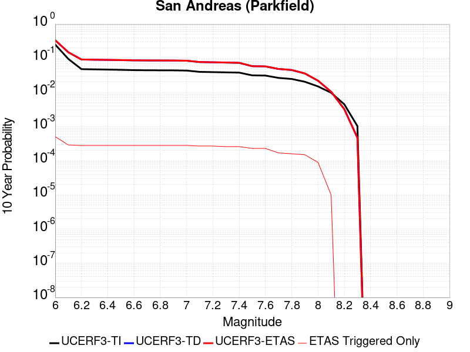 |

| Magnitude | 1 wk TI Prob | 1 wk TD Prob | 1 wk ETAS Prob | 1 wk ETAS/TD Gain | 1 wk ETAS Triggered Only | 1 mo TI Prob | 1 mo TD Prob | 1 mo ETAS Prob | 1 mo ETAS/TD Gain | 1 mo ETAS Triggered Only | 1 yr TI Prob | 1 yr TD Prob | 1 yr ETAS Prob | 1 yr ETAS/TD Gain | 1 yr ETAS Triggered Only | 10 yr TI Prob | 10 yr TD Prob | 10 yr ETAS Prob | 10 yr ETAS/TD Gain | 10 yr ETAS Triggered Only |
|-----|-----|-----|-----|-----|-----|-----|-----|-----|-----|-----|-----|-----|-----|-----|-----|-----|-----|-----|-----|-----|
| 6.0 | 5.556969E-4 | 7.7782426E-4 | 9.077231E-4 | 1.1670029 | 1.3E-4 | 0.0023793848 | 0.0033298214 | 0.0035391222 | 1.0628564 | 2.1E-4 | 0.028586963 | 0.040191233 | 0.04054636 | 1.008836 | 3.7E-4 | 0.25176284 | 0.33716413 | 0.33750218 | 1.0010027 | 5.1E-4 |
| 6.1 | 1.925858E-4 | 3.0276453E-4 | 3.6274636E-4 | 1.1981138 | 6.0E-5 | 8.2510663E-4 | 0.0012970108 | 0.001386894 | 1.0693003 | 9.0E-5 | 0.0099994885 | 0.015778083 | 0.015974928 | 1.0124758 | 2.0E-4 | 0.095613256 | 0.1497237 | 0.14997026 | 1.0016469 | 2.9E-4 |
| 6.2 | 9.4306815E-5 | 1.8242796E-4 | 2.4241701E-4 | 1.3288369 | 6.0E-5 | 4.0410945E-4 | 7.816011E-4 | 8.7153073E-4 | 1.1150583 | 9.0E-5 | 0.0049089384 | 0.009474681 | 0.009662881 | 1.0198635 | 1.9E-4 | 0.048019063 | 0.09185409 | 0.09210837 | 1.0027683 | 2.8E-4 |
| 6.3 | 9.283051E-5 | 1.7939322E-4 | 2.3938245E-4 | 1.3344008 | 6.0E-5 | 3.9778434E-4 | 7.686027E-4 | 8.5853355E-4 | 1.1170056 | 9.0E-5 | 0.0048322747 | 0.009317789 | 0.009506019 | 1.0202011 | 1.9E-4 | 0.047285385 | 0.09050704 | 0.09076169 | 1.0028137 | 2.8E-4 |
| 6.4 | 9.138826E-5 | 1.770153E-4 | 2.3700469E-4 | 1.3388938 | 6.0E-5 | 3.916052E-4 | 7.5841765E-4 | 8.483494E-4 | 1.1185781 | 9.0E-5 | 0.0047573745 | 0.00919484 | 0.009383093 | 1.0204737 | 1.9E-4 | 0.046568092 | 0.08940927 | 0.089664236 | 1.0028517 | 2.8E-4 |
| 6.5 | 9.000255E-5 | 1.7459576E-4 | 2.3458528E-4 | 1.343591 | 6.0E-5 | 3.8566816E-4 | 7.480541E-4 | 8.379868E-4 | 1.1202221 | 9.0E-5 | 0.0046854047 | 0.009069731 | 0.009258009 | 1.0207587 | 1.9E-4 | 0.045878403 | 0.088295065 | 0.088550344 | 1.0028912 | 2.8E-4 |
| 6.6 | 8.8109264E-5 | 1.7140752E-4 | 2.3139724E-4 | 1.349983 | 6.0E-5 | 3.7755648E-4 | 7.3439797E-4 | 8.243319E-4 | 1.1224594 | 9.0E-5 | 0.0045870654 | 0.008904854 | 0.009093162 | 1.0211467 | 1.9E-4 | 0.04493529 | 0.0868267 | 0.087082386 | 1.0029448 | 2.8E-4 |
| 6.7 | 8.738073E-5 | 1.7007832E-4 | 2.3006812E-4 | 1.3527186 | 6.0E-5 | 3.7443507E-4 | 7.287046E-4 | 8.1863906E-4 | 1.1234168 | 9.0E-5 | 0.0045492216 | 0.008836143 | 0.0090244645 | 1.0213126 | 1.9E-4 | 0.04457213 | 0.08622707 | 0.08648292 | 1.0029672 | 2.8E-4 |
| 6.8 | 8.710195E-5 | 1.6953335E-4 | 2.2952317E-4 | 1.3538526 | 6.0E-5 | 3.7324068E-4 | 7.263703E-4 | 8.1630494E-4 | 1.1238137 | 9.0E-5 | 0.0045347405 | 0.008807961 | 0.008996287 | 1.0213814 | 1.9E-4 | 0.04443313 | 0.08597467 | 0.0862306 | 1.0029768 | 2.8E-4 |
| 6.9 | 8.6801556E-5 | 1.689429E-4 | 2.2893277E-4 | 1.3550895 | 6.0E-5 | 3.7195362E-4 | 7.2384125E-4 | 8.137761E-4 | 1.1242466 | 9.0E-5 | 0.0045191357 | 0.008777418 | 0.00896575 | 1.0214565 | 1.9E-4 | 0.044283327 | 0.085700735 | 0.08595674 | 1.0029871 | 2.8E-4 |
| 7.0 | 8.5571606E-5 | 1.6647128E-4 | 2.2646128E-4 | 1.3603625 | 6.0E-5 | 3.6668387E-4 | 7.132544E-4 | 8.031902E-4 | 1.1260922 | 9.0E-5 | 0.004455241 | 0.008649553 | 0.00883791 | 1.0217764 | 1.9E-4 | 0.043669727 | 0.08454914 | 0.084805466 | 1.0030317 | 2.8E-4 |
| 7.1 | 7.82589E-5 | 1.5128135E-4 | 2.1127227E-4 | 1.396552 | 6.0E-5 | 3.3535215E-4 | 6.481883E-4 | 7.3812995E-4 | 1.1387585 | 9.0E-5 | 0.0040752706 | 0.007863307 | 0.008051813 | 1.0239729 | 1.9E-4 | 0.040013418 | 0.07746111 | 0.0777102 | 1.0032157 | 2.7E-4 |
| 7.2 | 7.690929E-5 | 1.4865391E-4 | 2.08645E-4 | 1.4035621 | 6.0E-5 | 3.2956956E-4 | 6.369334E-4 | 7.26876E-4 | 1.1412121 | 9.0E-5 | 0.004005129 | 0.007727258 | 0.007915789 | 1.0243983 | 1.9E-4 | 0.0393371 | 0.07623427 | 0.07648369 | 1.0032717 | 2.7E-4 |
| 7.3 | 7.5543794E-5 | 1.4561978E-4 | 1.956125E-4 | 1.34331 | 5.0E-5 | 3.2371894E-4 | 6.2393624E-4 | 7.038863E-4 | 1.1281382 | 8.0E-5 | 0.003934157 | 0.007570127 | 0.0077487645 | 1.0235977 | 1.8E-4 | 0.038652334 | 0.074797355 | 0.075037904 | 1.003216 | 2.6E-4 |
| 7.4 | 7.4214564E-5 | 1.4262961E-4 | 1.9262248E-4 | 1.3505083 | 5.0E-5 | 3.1802364E-4 | 6.111273E-4 | 6.910784E-4 | 1.1308256 | 8.0E-5 | 0.003865065 | 0.00741525 | 0.0075939153 | 1.0240943 | 1.8E-4 | 0.03798529 | 0.07337123 | 0.07361215 | 1.0032836 | 2.6E-4 |
| 7.5 | 6.149578E-5 | 1.11907226E-4 | 1.6190163E-4 | 1.4467486 | 5.0E-5 | 2.6352672E-4 | 4.7951436E-4 | 5.59476E-4 | 1.1667554 | 8.0E-5 | 0.0032037178 | 0.0058224914 | 0.00598156 | 1.0273197 | 1.6E-4 | 0.03157923 | 0.058557566 | 0.058774095 | 1.0036978 | 2.3E-4 |
| 7.6 | 6.0643448E-5 | 1.10193796E-4 | 1.6018828E-4 | 1.453696 | 5.0E-5 | 2.598746E-4 | 4.7217376E-4 | 5.52136E-4 | 1.1693492 | 8.0E-5 | 0.0031593828 | 0.0057335934 | 0.0058926763 | 1.0277457 | 1.6E-4 | 0.031148417 | 0.057718582 | 0.057935305 | 1.0037549 | 2.3E-4 |
| 7.7 | 5.1652263E-5 | 9.174698E-5 | 1.1174515E-4 | 1.2179708 | 2.0E-5 | 2.2134806E-4 | 3.931421E-4 | 4.3312638E-4 | 1.1017044 | 4.0E-5 | 0.002691582 | 0.0047760103 | 0.004875533 | 1.020838 | 1.0E-4 | 0.026592141 | 0.04853623 | 0.04869798 | 1.0033325 | 1.7E-4 |
| 7.8 | 4.8090482E-5 | 8.559635E-5 | 1.0559464E-4 | 1.2336348 | 2.0E-5 | 2.060858E-4 | 3.6678996E-4 | 4.067753E-4 | 1.1090143 | 4.0E-5 | 0.0025062072 | 0.0044565317 | 0.004546131 | 1.0201051 | 9.0E-5 | 0.024781305 | 0.04530245 | 0.045455202 | 1.0033718 | 1.6E-4 |
| 7.9 | 3.970278E-5 | 6.750426E-5 | 8.750291E-5 | 1.2962576 | 2.0E-5 | 1.7014367E-4 | 2.892719E-4 | 3.2926034E-4 | 1.1382382 | 4.0E-5 | 0.002069531 | 0.0035162016 | 0.0036058852 | 1.0255058 | 9.0E-5 | 0.020503636 | 0.035881363 | 0.03602598 | 1.0040305 | 1.5E-4 |
| 8.0 | 2.8982335E-5 | 4.069796E-5 | 5.0697552E-5 | 1.2457026 | 1.0E-5 | 1.2420409E-4 | 1.7440817E-4 | 2.0440294E-4 | 1.1719803 | 3.0E-5 | 0.0015111357 | 0.0021213528 | 0.0021812255 | 1.0282239 | 6.0E-5 | 0.015009012 | 0.022010697 | 0.022098716 | 1.0039989 | 9.0E-5 |
| 8.1 | 1.8836186E-5 | 1.8681134E-5 | 1.8681134E-5 | 1.0 | 0.0 | 8.0724014E-5 | 8.005955E-5 | 8.005955E-5 | 1.0 | 0.0 | 9.823717E-4 | 9.742898E-4 | 9.742898E-4 | 1.0 | 0.0 | 0.009780403 | 0.010488115 | 0.010498011 | 1.0009434 | 1.0E-5 |
| 8.2 | 8.643924E-6 | 5.4748625E-6 | 5.4748625E-6 | 1.0 | 0.0 | 3.704486E-5 | 2.3463486E-5 | 2.3463486E-5 | 1.0 | 0.0 | 4.5092785E-4 | 2.8563058E-4 | 2.8563058E-4 | 1.0 | 0.0 | 0.0045001395 | 0.0032487072 | 0.0032487072 | 1.0 | 0.0 |
| 8.3 | 1.983087E-6 | 7.6599065E-7 | 7.6599065E-7 | 1.0 | 0.0 | 8.498917E-6 | 3.282813E-6 | 3.282813E-6 | 1.0 | 0.0 | 1.034694E-4 | 3.9967534E-5 | 3.9967534E-5 | 1.0 | 0.0 | 0.0010342124 | 4.719687E-4 | 4.719687E-4 | 1.0 | 0.0 |

## Red Pass
*[(top)](#table-of-contents)*

| 1 Week | 1 Month | 1 Year | 10 Year |
|-----|-----|-----|-----|
|  |  | 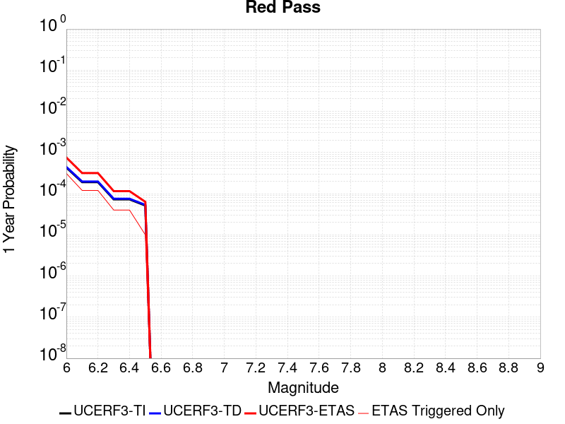 |  |

| Magnitude | 1 wk TI Prob | 1 wk TD Prob | 1 wk ETAS Prob | 1 wk ETAS/TD Gain | 1 wk ETAS Triggered Only | 1 mo TI Prob | 1 mo TD Prob | 1 mo ETAS Prob | 1 mo ETAS/TD Gain | 1 mo ETAS Triggered Only | 1 yr TI Prob | 1 yr TD Prob | 1 yr ETAS Prob | 1 yr ETAS/TD Gain | 1 yr ETAS Triggered Only | 10 yr TI Prob | 10 yr TD Prob | 10 yr ETAS Prob | 10 yr ETAS/TD Gain | 10 yr ETAS Triggered Only |
|-----|-----|-----|-----|-----|-----|-----|-----|-----|-----|-----|-----|-----|-----|-----|-----|-----|-----|-----|-----|-----|
| 6.0 | 8.258278E-6 | 8.551265E-6 | 1.685499E-4 | 19.710522 | 1.6E-4 | 3.539214E-5 | 3.6647863E-5 | 2.1664127E-4 | 5.9114294 | 1.8E-4 | 4.308141E-4 | 4.4611428E-4 | 7.5597595E-4 | 1.6945792 | 3.1E-4 | 0.0042997985 | 0.004453945 | 0.004971629 | 1.1162305 | 5.2E-4 |
| 6.1 | 3.649988E-6 | 3.7753161E-6 | 7.377505E-5 | 19.541424 | 7.0E-5 | 1.5642712E-5 | 1.6179853E-5 | 9.6178555E-5 | 5.9443407 | 8.0E-5 | 1.9043336E-4 | 1.9697666E-4 | 3.1695302E-4 | 1.6090893 | 1.2E-4 | 0.0019027026 | 0.001968488 | 0.0021481337 | 1.0912608 | 1.8E-4 |
| 6.2 | 3.649988E-6 | 3.7753161E-6 | 7.377505E-5 | 19.541424 | 7.0E-5 | 1.5642712E-5 | 1.6179853E-5 | 9.6178555E-5 | 5.9443407 | 8.0E-5 | 1.9043336E-4 | 1.9697666E-4 | 3.1695302E-4 | 1.6090893 | 1.2E-4 | 0.0019027026 | 0.001968488 | 0.0021481337 | 1.0912608 | 1.8E-4 |
| 6.3 | 1.3924937E-6 | 1.4411166E-6 | 3.144107E-5 | 21.817162 | 3.0E-5 | 5.9678164E-6 | 6.1762075E-6 | 3.617602E-5 | 5.85732 | 3.0E-5 | 7.265574E-5 | 7.519415E-5 | 1.1519114E-4 | 1.5319163 | 4.0E-5 | 7.263199E-4 | 7.518258E-4 | 8.117807E-4 | 1.0797458 | 6.0E-5 |
| 6.4 | 1.3924937E-6 | 1.4411166E-6 | 3.144107E-5 | 21.817162 | 3.0E-5 | 5.9678164E-6 | 6.1762075E-6 | 3.617602E-5 | 5.85732 | 3.0E-5 | 7.265574E-5 | 7.519415E-5 | 1.1519114E-4 | 1.5319163 | 4.0E-5 | 7.263199E-4 | 7.518258E-4 | 8.117807E-4 | 1.0797458 | 6.0E-5 |
| 6.5 | 9.876812E-7 | 1.0221912E-6 | 1.1022181E-5 | 10.782895 | 1.0E-5 | 4.2329125E-6 | 4.3808195E-6 | 1.4380776E-5 | 3.2826679 | 1.0E-5 | 5.153449E-5 | 5.3336476E-5 | 6.3335945E-5 | 1.1874789 | 1.0E-5 | 5.1522546E-4 | 5.333648E-4 | 5.6334876E-4 | 1.0562167 | 3.0E-5 |

## Elsinore (Glen Ivy) rev
*[(top)](#table-of-contents)*

| 1 Week | 1 Month | 1 Year | 10 Year |
|-----|-----|-----|-----|
|  |  |  |  |

| Magnitude | 1 wk TI Prob | 1 wk TD Prob | 1 wk ETAS Prob | 1 wk ETAS/TD Gain | 1 wk ETAS Triggered Only | 1 mo TI Prob | 1 mo TD Prob | 1 mo ETAS Prob | 1 mo ETAS/TD Gain | 1 mo ETAS Triggered Only | 1 yr TI Prob | 1 yr TD Prob | 1 yr ETAS Prob | 1 yr ETAS/TD Gain | 1 yr ETAS Triggered Only | 10 yr TI Prob | 10 yr TD Prob | 10 yr ETAS Prob | 10 yr ETAS/TD Gain | 10 yr ETAS Triggered Only |
|-----|-----|-----|-----|-----|-----|-----|-----|-----|-----|-----|-----|-----|-----|-----|-----|-----|-----|-----|-----|-----|
| 6.0 | 1.6204086E-4 | 2.9360707E-4 | 4.535601E-4 | 1.544786 | 1.6E-4 | 6.94276E-4 | 0.0012578638 | 0.0014376375 | 1.1429198 | 1.8E-4 | 0.008420097 | 0.015234485 | 0.015569305 | 1.0219778 | 3.4E-4 | 0.081081145 | 0.13969168 | 0.14007881 | 1.0027714 | 4.5E-4 |
| 6.1 | 1.6204086E-4 | 2.9360707E-4 | 4.535601E-4 | 1.544786 | 1.6E-4 | 6.94276E-4 | 0.0012578638 | 0.0014376375 | 1.1429198 | 1.8E-4 | 0.008420097 | 0.015234485 | 0.015569305 | 1.0219778 | 3.4E-4 | 0.081081145 | 0.13969168 | 0.14007881 | 1.0027714 | 4.5E-4 |
| 6.2 | 1.6204086E-4 | 2.9360707E-4 | 4.535601E-4 | 1.544786 | 1.6E-4 | 6.94276E-4 | 0.0012578638 | 0.0014376375 | 1.1429198 | 1.8E-4 | 0.008420097 | 0.015234485 | 0.015569305 | 1.0219778 | 3.4E-4 | 0.081081145 | 0.13969168 | 0.14007881 | 1.0027714 | 4.5E-4 |
| 6.3 | 1.0111737E-4 | 1.7703383E-4 | 2.4702144E-4 | 1.3953347 | 7.0E-5 | 4.332882E-4 | 7.5861247E-4 | 8.2855934E-4 | 1.0922037 | 7.0E-5 | 0.005262531 | 0.009217682 | 0.009396023 | 1.0193477 | 1.8E-4 | 0.0513964 | 0.0870191 | 0.0872656 | 1.0028328 | 2.7E-4 |
| 6.4 | 1.0111737E-4 | 1.7703383E-4 | 2.4702144E-4 | 1.3953347 | 7.0E-5 | 4.332882E-4 | 7.5861247E-4 | 8.2855934E-4 | 1.0922037 | 7.0E-5 | 0.005262531 | 0.009217682 | 0.009396023 | 1.0193477 | 1.8E-4 | 0.0513964 | 0.0870191 | 0.0872656 | 1.0028328 | 2.7E-4 |
| 6.5 | 3.6624708E-5 | 4.6391084E-5 | 5.6390618E-5 | 1.2155486 | 1.0E-5 | 1.569536E-4 | 1.9880582E-4 | 2.0880383E-4 | 1.0502903 | 1.0E-5 | 0.001909235 | 0.0024181372 | 0.0024380886 | 1.0082508 | 2.0E-5 | 0.01892915 | 0.023739954 | 0.023779005 | 1.001645 | 4.0E-5 |
| 6.6 | 2.5051324E-5 | 2.614772E-5 | 3.614746E-5 | 1.3824326 | 1.0E-5 | 1.073584E-4 | 1.12057096E-4 | 1.2205597E-4 | 1.0892302 | 1.0E-5 | 0.0013063047 | 0.0013634858 | 0.0013834585 | 1.0146483 | 2.0E-5 | 0.012986525 | 0.013564618 | 0.013604076 | 1.0029088 | 4.0E-5 |
| 6.7 | 2.2189772E-5 | 2.2072849E-5 | 3.207263E-5 | 1.4530352 | 1.0E-5 | 9.509556E-5 | 9.4594696E-5 | 1.0459375E-4 | 1.1057042 | 1.0E-5 | 0.0011571734 | 0.0011511183 | 0.0011611069 | 1.0086772 | 1.0E-5 | 0.011511663 | 0.011465415 | 0.011485186 | 1.0017244 | 2.0E-5 |
| 6.8 | 1.6654378E-5 | 1.4437705E-5 | 2.443756E-5 | 1.6926209 | 1.0E-5 | 7.137396E-5 | 6.187444E-5 | 7.187382E-5 | 1.1616076 | 1.0E-5 | 8.686314E-4 | 7.530661E-4 | 7.6305855E-4 | 1.0132691 | 1.0E-5 | 0.008652439 | 0.00751048 | 0.007520405 | 1.0013214 | 1.0E-5 |
| 6.9 | 1.5042909E-5 | 1.2332022E-5 | 2.2331898E-5 | 1.810887 | 1.0E-5 | 6.446802E-5 | 5.285047E-5 | 6.284994E-5 | 1.189203 | 1.0E-5 | 7.8461546E-4 | 6.4326765E-4 | 6.532612E-4 | 1.0155356 | 1.0E-5 | 0.007818509 | 0.00641828 | 0.0064282157 | 1.001548 | 1.0E-5 |
| 7.0 | 1.4361385E-5 | 1.1451324E-5 | 2.145121E-5 | 1.8732514 | 1.0E-5 | 6.154734E-5 | 4.9076196E-5 | 5.9075704E-5 | 1.2037548 | 1.0E-5 | 7.490812E-4 | 5.973418E-4 | 6.073358E-4 | 1.0167308 | 1.0E-5 | 0.007465612 | 0.0059613534 | 0.005971294 | 1.0016675 | 1.0E-5 |
| 7.1 | 1.3265571E-5 | 1.0244926E-5 | 2.0244823E-5 | 1.9760829 | 1.0E-5 | 5.6851208E-5 | 4.39061E-5 | 5.390566E-5 | 1.2277488 | 1.0E-5 | 6.919436E-4 | 5.344282E-4 | 5.4442283E-4 | 1.0187016 | 1.0E-5 | 0.006897931 | 0.0053347866 | 0.005344733 | 1.0018644 | 1.0E-5 |
| 7.2 | 1.1596403E-5 | 8.505067E-6 | 1.8504981E-5 | 2.1757598 | 1.0E-5 | 4.9697923E-5 | 3.6449786E-5 | 4.6449422E-5 | 1.27434 | 1.0E-5 | 6.049042E-4 | 4.436875E-4 | 4.5368305E-4 | 1.0225284 | 1.0E-5 | 0.006032603 | 0.0044294316 | 0.0044393875 | 1.0022476 | 1.0E-5 |
| 7.3 | 1.0150827E-5 | 7.2387597E-6 | 1.7238688E-5 | 2.381442 | 1.0E-5 | 4.3502816E-5 | 3.1022897E-5 | 4.1022588E-5 | 1.3223326 | 1.0E-5 | 5.2951806E-4 | 3.7763975E-4 | 3.8763596E-4 | 1.0264703 | 1.0E-5 | 0.005282581 | 0.0037703665 | 0.003780329 | 1.0026423 | 1.0E-5 |
| 7.4 | 9.080705E-6 | 6.352519E-6 | 1.6352456E-5 | 2.5741687 | 1.0E-5 | 3.8916725E-5 | 2.7224805E-5 | 3.7224534E-5 | 1.3673021 | 1.0E-5 | 4.7370812E-4 | 3.3141294E-4 | 3.4140964E-4 | 1.0301639 | 1.0E-5 | 0.004726996 | 0.0033093381 | 0.003319305 | 1.0030117 | 1.0E-5 |
| 7.5 | 7.671649E-6 | 5.2256332E-6 | 1.5225581E-5 | 2.9136338 | 1.0E-5 | 3.287808E-5 | 2.2395385E-5 | 3.239516E-5 | 1.4465106 | 1.0E-5 | 4.0021708E-4 | 2.7263095E-4 | 2.8262823E-4 | 1.0366696 | 1.0E-5 | 0.0039949706 | 0.00272309 | 0.0027330627 | 1.0036623 | 1.0E-5 |
| 7.6 | 6.990086E-6 | 4.687545E-6 | 4.687545E-6 | 1.0 | 0.0 | 2.9957167E-5 | 2.008933E-5 | 2.008933E-5 | 1.0 | 0.0 | 3.6466747E-4 | 2.445613E-4 | 2.445613E-4 | 1.0 | 0.0 | 0.0036406964 | 0.002443038 | 0.002443038 | 1.0 | 0.0 |
| 7.7 | 4.163505E-6 | 2.3295343E-6 | 2.3295343E-6 | 1.0 | 0.0 | 1.7843471E-5 | 9.983683E-6 | 9.983683E-6 | 1.0 | 0.0 | 2.172226E-4 | 1.21545316E-4 | 1.21545316E-4 | 1.0 | 0.0 | 0.0021701038 | 0.0012148614 | 0.0012148614 | 1.0 | 0.0 |
| 7.8 | 2.2692414E-7 | 9.3854695E-8 | 9.3854695E-8 | 1.0 | 0.0 | 9.725317E-7 | 4.0223435E-7 | 4.0223435E-7 | 1.0 | 0.0 | 1.1840509E-5 | 4.8971956E-6 | 4.8971956E-6 | 1.0 | 0.0 | 1.1839878E-4 | 4.8971204E-5 | 4.8971204E-5 | 1.0 | 0.0 |
| 7.9 | 6.676829E-9 | 3.439853E-9 | 3.439853E-9 | 1.0 | 0.0 | 2.861498E-8 | 1.4742227E-8 | 1.4742227E-8 | 1.0 | 0.0 | 3.4838732E-7 | 1.7948659E-7 | 1.7948659E-7 | 1.0 | 0.0 | 3.4838679E-6 | 1.7948646E-6 | 1.7948646E-6 | 1.0 | 0.0 |

## San Andreas (Cholame) rev
*[(top)](#table-of-contents)*

| 1 Week | 1 Month | 1 Year | 10 Year |
|-----|-----|-----|-----|
|  |  |  |  |

| Magnitude | 1 wk TI Prob | 1 wk TD Prob | 1 wk ETAS Prob | 1 wk ETAS/TD Gain | 1 wk ETAS Triggered Only | 1 mo TI Prob | 1 mo TD Prob | 1 mo ETAS Prob | 1 mo ETAS/TD Gain | 1 mo ETAS Triggered Only | 1 yr TI Prob | 1 yr TD Prob | 1 yr ETAS Prob | 1 yr ETAS/TD Gain | 1 yr ETAS Triggered Only | 10 yr TI Prob | 10 yr TD Prob | 10 yr ETAS Prob | 10 yr ETAS/TD Gain | 10 yr ETAS Triggered Only |
|-----|-----|-----|-----|-----|-----|-----|-----|-----|-----|-----|-----|-----|-----|-----|-----|-----|-----|-----|-----|-----|
| 6.0 | 1.2302514E-4 | 2.5204287E-4 | 3.4202018E-4 | 1.3569921 | 9.0E-5 | 5.27144E-4 | 0.0010797381 | 0.0012095978 | 1.1202695 | 1.3E-4 | 0.0063991086 | 0.0130670825 | 0.013343424 | 1.0211478 | 2.8E-4 | 0.06217949 | 0.12439073 | 0.12479351 | 1.0032381 | 4.6E-4 |
| 6.1 | 1.2302514E-4 | 2.5204287E-4 | 3.4202018E-4 | 1.3569921 | 9.0E-5 | 5.27144E-4 | 0.0010797381 | 0.0012095978 | 1.1202695 | 1.3E-4 | 0.0063991086 | 0.0130670825 | 0.013343424 | 1.0211478 | 2.8E-4 | 0.06217949 | 0.12439073 | 0.12479351 | 1.0032381 | 4.6E-4 |
| 6.2 | 1.2203569E-4 | 2.5021084E-4 | 3.4018833E-4 | 1.3596066 | 9.0E-5 | 5.2290526E-4 | 0.0010718931 | 0.0012017537 | 1.1211507 | 1.3E-4 | 0.006347804 | 0.01297271 | 0.013239207 | 1.020543 | 2.7E-4 | 0.061695136 | 0.12357691 | 0.1239713 | 1.0031915 | 4.5E-4 |
| 6.3 | 1.2142645E-4 | 2.4907055E-4 | 3.3904816E-4 | 1.3612534 | 9.0E-5 | 5.202953E-4 | 0.0010670102 | 0.0011968715 | 1.1217058 | 1.3E-4 | 0.006316212 | 0.012913967 | 0.01318048 | 1.0206376 | 2.7E-4 | 0.06139677 | 0.12307103 | 0.12345688 | 1.0031352 | 4.4E-4 |
| 6.4 | 1.1865206E-4 | 2.44126E-4 | 3.3410403E-4 | 1.3685721 | 9.0E-5 | 5.0840975E-4 | 0.0010458364 | 0.0011757005 | 1.1241724 | 1.3E-4 | 0.006172335 | 0.012659196 | 0.0129257785 | 1.0210583 | 2.7E-4 | 0.060036868 | 0.1208638 | 0.12125062 | 1.0032004 | 4.4E-4 |
| 6.5 | 1.17443946E-4 | 2.4205919E-4 | 3.320374E-4 | 1.3717198 | 9.0E-5 | 5.032341E-4 | 0.0010369857 | 0.0011668509 | 1.1252334 | 1.3E-4 | 0.006109677 | 0.012552682 | 0.012819293 | 1.0212394 | 2.7E-4 | 0.059444077 | 0.11993805 | 0.12032528 | 1.0032285 | 4.4E-4 |
| 6.6 | 1.13579066E-4 | 2.3514954E-4 | 3.2512838E-4 | 1.3826451 | 9.0E-5 | 4.866766E-4 | 0.001007396 | 0.0011372651 | 1.1289155 | 1.3E-4 | 0.0059092017 | 0.012196515 | 0.012463221 | 1.0218675 | 2.7E-4 | 0.057545185 | 0.11685214 | 0.11724073 | 1.0033255 | 4.4E-4 |
| 6.7 | 1.1271412E-4 | 2.3359268E-4 | 3.2357167E-4 | 1.3851961 | 9.0E-5 | 4.829711E-4 | 0.0010007289 | 0.0011305988 | 1.1297753 | 1.3E-4 | 0.005864331 | 0.012116249 | 0.012382978 | 1.0220141 | 2.7E-4 | 0.057119697 | 0.116155714 | 0.116544604 | 1.003348 | 4.4E-4 |
| 6.8 | 1.1217975E-4 | 2.3247694E-4 | 3.2245604E-4 | 1.3870451 | 9.0E-5 | 4.8068175E-4 | 9.959509E-4 | 0.0011258214 | 1.1303985 | 1.3E-4 | 0.005836608 | 0.012058721 | 0.012325466 | 1.0221205 | 2.7E-4 | 0.056856725 | 0.11565396 | 0.116043076 | 1.0033644 | 4.4E-4 |
| 6.9 | 1.1146753E-4 | 2.3096445E-4 | 3.2094365E-4 | 1.3895804 | 9.0E-5 | 4.7763053E-4 | 9.894737E-4 | 0.0011193451 | 1.131253 | 1.3E-4 | 0.0057996577 | 0.011980731 | 0.012247496 | 1.0222661 | 2.7E-4 | 0.056506127 | 0.11497439 | 0.1153638 | 1.003387 | 4.4E-4 |
| 7.0 | 1.0965793E-4 | 2.2719789E-4 | 3.1717744E-4 | 1.3960404 | 9.0E-5 | 4.698779E-4 | 9.733434E-4 | 0.0011032169 | 1.1334302 | 1.3E-4 | 0.005705768 | 0.011786487 | 0.012043422 | 1.0217992 | 2.6E-4 | 0.055614736 | 0.11327597 | 0.11365726 | 1.003366 | 4.3E-4 |
| 7.1 | 9.927982E-5 | 2.0538924E-4 | 2.9537076E-4 | 1.4381024 | 9.0E-5 | 4.2541555E-4 | 8.7994366E-4 | 0.0010098292 | 1.1476067 | 1.3E-4 | 0.0051671406 | 0.010660981 | 0.010908316 | 1.0232 | 2.5E-4 | 0.05048634 | 0.1033706 | 0.10372925 | 1.0034696 | 4.0E-4 |
| 7.2 | 9.696786E-5 | 2.0043184E-4 | 2.904138E-4 | 1.4489404 | 9.0E-5 | 4.1551032E-4 | 8.5871184E-4 | 9.886002E-4 | 1.1512595 | 1.3E-4 | 0.00504711 | 0.010404981 | 0.010652379 | 1.023777 | 2.5E-4 | 0.04934009 | 0.1011086 | 0.10146816 | 1.0035561 | 4.0E-4 |
| 7.3 | 9.4727984E-5 | 1.9472468E-4 | 2.747091E-4 | 1.4107565 | 8.0E-5 | 4.0591392E-4 | 8.3426846E-4 | 9.541683E-4 | 1.1437186 | 1.2E-4 | 0.0049308087 | 0.010110183 | 0.010347757 | 1.0234984 | 2.4E-4 | 0.048228268 | 0.09847952 | 0.098822095 | 1.0034786 | 3.8E-4 |
| 7.4 | 9.220358E-5 | 1.8843076E-4 | 2.684157E-4 | 1.4244791 | 8.0E-5 | 3.9509835E-4 | 8.073114E-4 | 9.272145E-4 | 1.1485215 | 1.2E-4 | 0.004799717 | 0.009784967 | 0.010022618 | 1.0242875 | 2.4E-4 | 0.046973653 | 0.095557496 | 0.095901184 | 1.0035967 | 3.8E-4 |
| 7.5 | 7.71631E-5 | 1.5177966E-4 | 2.3176752E-4 | 1.5269998 | 8.0E-5 | 3.306571E-4 | 6.503223E-4 | 7.702442E-4 | 1.1844039 | 1.2E-4 | 0.0040183207 | 0.007889002 | 0.008107265 | 1.0276669 | 2.2E-4 | 0.03946433 | 0.07828531 | 0.0786079 | 1.0041208 | 3.5E-4 |
| 7.6 | 7.5634416E-5 | 1.483744E-4 | 2.2836252E-4 | 1.5390966 | 8.0E-5 | 3.241072E-4 | 6.3573546E-4 | 7.556592E-4 | 1.1886377 | 1.2E-4 | 0.0039388672 | 0.0077126776 | 0.007930981 | 1.0283045 | 2.2E-4 | 0.038697794 | 0.07664872 | 0.076971896 | 1.0042163 | 3.5E-4 |
| 7.7 | 6.3783E-5 | 1.235872E-4 | 1.6358226E-4 | 1.323618 | 4.0E-5 | 2.7332708E-4 | 5.29552E-4 | 5.995149E-4 | 1.1321173 | 7.0E-5 | 0.0033226798 | 0.0064282627 | 0.0065772985 | 1.0231844 | 1.5E-4 | 0.032734364 | 0.06454029 | 0.064774156 | 1.0036236 | 2.5E-4 |
| 7.8 | 5.863422E-5 | 1.1416107E-4 | 1.5415651E-4 | 1.3503422 | 4.0E-5 | 2.512653E-4 | 4.8917E-4 | 5.591358E-4 | 1.1430296 | 7.0E-5 | 0.003054864 | 0.0059394026 | 0.006078571 | 1.0234314 | 1.4E-4 | 0.030132094 | 0.059659187 | 0.05988487 | 1.0037829 | 2.4E-4 |
| 7.9 | 4.595283E-5 | 8.426331E-5 | 1.2425994E-4 | 1.4746624 | 4.0E-5 | 1.9692584E-4 | 3.610785E-4 | 4.2105684E-4 | 1.1661088 | 6.0E-5 | 0.0023949358 | 0.0043872762 | 0.004516706 | 1.0295012 | 1.3E-4 | 0.023692891 | 0.044362005 | 0.04456269 | 1.0045238 | 2.1E-4 |
| 8.0 | 3.2950178E-5 | 5.0772942E-5 | 7.077193E-5 | 1.3938906 | 2.0E-5 | 1.412074E-4 | 2.1758018E-4 | 2.575715E-4 | 1.1838002 | 4.0E-5 | 0.0017178444 | 0.0026458222 | 0.0027256107 | 1.0301564 | 8.0E-5 | 0.017046256 | 0.027180137 | 0.027306603 | 1.0046529 | 1.3E-4 |
| 8.1 | 1.9177472E-5 | 1.9185145E-5 | 1.9185145E-5 | 1.0 | 0.0 | 8.218658E-5 | 8.221946E-5 | 8.221946E-5 | 1.0 | 0.0 | 0.0010001622 | 0.0010005629 | 0.0010005629 | 1.0 | 0.0 | 0.009956728 | 0.010758142 | 0.0107680345 | 1.0009196 | 1.0E-5 |
| 8.2 | 8.643924E-6 | 5.4748625E-6 | 5.4748625E-6 | 1.0 | 0.0 | 3.704486E-5 | 2.3463486E-5 | 2.3463486E-5 | 1.0 | 0.0 | 4.5092785E-4 | 2.8563058E-4 | 2.8563058E-4 | 1.0 | 0.0 | 0.0045001395 | 0.0032487072 | 0.0032487072 | 1.0 | 0.0 |
| 8.3 | 1.983087E-6 | 7.6599065E-7 | 7.6599065E-7 | 1.0 | 0.0 | 8.498917E-6 | 3.282813E-6 | 3.282813E-6 | 1.0 | 0.0 | 1.034694E-4 | 3.9967534E-5 | 3.9967534E-5 | 1.0 | 0.0 | 0.0010342124 | 4.719687E-4 | 4.719687E-4 | 1.0 | 0.0 |

## San Andreas (Carrizo) rev
*[(top)](#table-of-contents)*

| 1 Week | 1 Month | 1 Year | 10 Year |
|-----|-----|-----|-----|
|  | 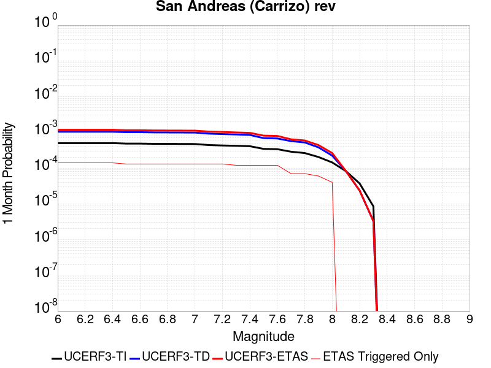 |  |  |

| Magnitude | 1 wk TI Prob | 1 wk TD Prob | 1 wk ETAS Prob | 1 wk ETAS/TD Gain | 1 wk ETAS Triggered Only | 1 mo TI Prob | 1 mo TD Prob | 1 mo ETAS Prob | 1 mo ETAS/TD Gain | 1 mo ETAS Triggered Only | 1 yr TI Prob | 1 yr TD Prob | 1 yr ETAS Prob | 1 yr ETAS/TD Gain | 1 yr ETAS Triggered Only | 10 yr TI Prob | 10 yr TD Prob | 10 yr ETAS Prob | 10 yr ETAS/TD Gain | 10 yr ETAS Triggered Only |
|-----|-----|-----|-----|-----|-----|-----|-----|-----|-----|-----|-----|-----|-----|-----|-----|-----|-----|-----|-----|-----|
| 6.0 | 1.1674632E-4 | 2.432302E-4 | 3.4320587E-4 | 1.4110332 | 1.0E-4 | 5.002454E-4 | 0.0010420004 | 0.0011818545 | 1.1342169 | 1.4E-4 | 0.006073493 | 0.012613042 | 0.012899385 | 1.0227021 | 2.9E-4 | 0.0591016 | 0.12061418 | 0.12101869 | 1.0033538 | 4.6E-4 |
| 6.1 | 1.1674632E-4 | 2.432302E-4 | 3.4320587E-4 | 1.4110332 | 1.0E-4 | 5.002454E-4 | 0.0010420004 | 0.0011818545 | 1.1342169 | 1.4E-4 | 0.006073493 | 0.012613042 | 0.012899385 | 1.0227021 | 2.9E-4 | 0.0591016 | 0.12061418 | 0.12101869 | 1.0033538 | 4.6E-4 |
| 6.2 | 1.1674632E-4 | 2.432302E-4 | 3.4320587E-4 | 1.4110332 | 1.0E-4 | 5.002454E-4 | 0.0010420004 | 0.0011818545 | 1.1342169 | 1.4E-4 | 0.006073493 | 0.012613042 | 0.012899385 | 1.0227021 | 2.9E-4 | 0.0591016 | 0.12061418 | 0.12101869 | 1.0033538 | 4.6E-4 |
| 6.3 | 1.1674632E-4 | 2.432302E-4 | 3.4320587E-4 | 1.4110332 | 1.0E-4 | 5.002454E-4 | 0.0010420004 | 0.0011818545 | 1.1342169 | 1.4E-4 | 0.006073493 | 0.012613042 | 0.012899385 | 1.0227021 | 2.9E-4 | 0.0591016 | 0.12061418 | 0.12101869 | 1.0033538 | 4.6E-4 |
| 6.4 | 1.1674632E-4 | 2.432302E-4 | 3.4320587E-4 | 1.4110332 | 1.0E-4 | 5.002454E-4 | 0.0010420004 | 0.0011818545 | 1.1342169 | 1.4E-4 | 0.006073493 | 0.012613042 | 0.012899385 | 1.0227021 | 2.9E-4 | 0.0591016 | 0.12061418 | 0.12101869 | 1.0033538 | 4.6E-4 |
| 6.5 | 1.13136164E-4 | 2.3643032E-4 | 3.2640903E-4 | 1.3805718 | 9.0E-5 | 4.847792E-4 | 0.0010128808 | 0.0011427492 | 1.1282167 | 1.3E-4 | 0.0058862255 | 0.012262545 | 0.012539111 | 1.0225538 | 2.8E-4 | 0.057327334 | 0.117585555 | 0.11798264 | 1.003377 | 4.5E-4 |
| 6.6 | 1.13136164E-4 | 2.3643032E-4 | 3.2640903E-4 | 1.3805718 | 9.0E-5 | 4.847792E-4 | 0.0010128808 | 0.0011427492 | 1.1282167 | 1.3E-4 | 0.0058862255 | 0.012262545 | 0.012539111 | 1.0225538 | 2.8E-4 | 0.057327334 | 0.117585555 | 0.11798264 | 1.003377 | 4.5E-4 |
| 6.7 | 1.1149675E-4 | 2.3334254E-4 | 3.2332152E-4 | 1.385609 | 9.0E-5 | 4.777557E-4 | 9.996577E-4 | 0.0011295277 | 1.1299145 | 1.3E-4 | 0.0058011734 | 0.012103349 | 0.01237996 | 1.0228541 | 2.8E-4 | 0.05652051 | 0.1162071 | 0.116604805 | 1.0034224 | 4.5E-4 |
| 6.8 | 1.1103589E-4 | 2.3236412E-4 | 3.223432E-4 | 1.3872331 | 9.0E-5 | 4.7578133E-4 | 9.954676E-4 | 0.0011253383 | 1.1304619 | 1.3E-4 | 0.005777263 | 0.012052901 | 0.012329526 | 1.0229509 | 2.8E-4 | 0.056293584 | 0.1157674 | 0.1161653 | 1.0034372 | 4.5E-4 |
| 6.9 | 1.1053259E-4 | 2.3128795E-4 | 3.2126714E-4 | 1.3890353 | 9.0E-5 | 4.7362508E-4 | 9.90859E-4 | 0.0011207302 | 1.1310693 | 1.3E-4 | 0.0057511497 | 0.01199741 | 0.012274051 | 1.0230584 | 2.8E-4 | 0.05604569 | 0.11528359 | 0.115681715 | 1.0034534 | 4.5E-4 |
| 7.0 | 1.1005377E-4 | 2.3029637E-4 | 3.2027563E-4 | 1.3907107 | 9.0E-5 | 4.7157376E-4 | 9.866126E-4 | 0.0011164844 | 1.131634 | 1.3E-4 | 0.0057263062 | 0.011946279 | 0.012213053 | 1.0223312 | 2.7E-4 | 0.055809796 | 0.11483591 | 0.11522538 | 1.0033915 | 4.4E-4 |
| 7.1 | 1.0308142E-4 | 2.1539345E-4 | 3.0537407E-4 | 1.41775 | 9.0E-5 | 4.417027E-4 | 9.227892E-4 | 0.0010526692 | 1.1407472 | 1.3E-4 | 0.0053644776 | 0.011177397 | 0.01144438 | 1.0238858 | 2.7E-4 | 0.052368138 | 0.108092256 | 0.108475775 | 1.003548 | 4.3E-4 |
| 7.2 | 1.0027479E-4 | 2.094724E-4 | 2.9945356E-4 | 1.4295609 | 9.0E-5 | 4.296783E-4 | 8.9743105E-4 | 0.0010273143 | 1.144728 | 1.3E-4 | 0.0052187922 | 0.010871782 | 0.0111289555 | 1.0236552 | 2.6E-4 | 0.050979212 | 0.10539625 | 0.10577198 | 1.003565 | 4.2E-4 |
| 7.3 | 9.816942E-5 | 2.0422463E-4 | 2.842083E-4 | 1.3916456 | 8.0E-5 | 4.2065824E-4 | 8.7495585E-4 | 9.948509E-4 | 1.1370298 | 1.2E-4 | 0.005109493 | 0.010600842 | 0.010848192 | 1.0233331 | 2.5E-4 | 0.049935985 | 0.102979995 | 0.10333881 | 1.0034842 | 4.0E-4 |
| 7.4 | 9.5634205E-5 | 1.9791997E-4 | 2.7790412E-4 | 1.4041238 | 8.0E-5 | 4.0979648E-4 | 8.479536E-4 | 9.6785184E-4 | 1.1413971 | 1.2E-4 | 0.0049778637 | 0.010275229 | 0.01052266 | 1.0240804 | 2.5E-4 | 0.048678253 | 0.10006632 | 0.100426294 | 1.0035974 | 4.0E-4 |
| 7.5 | 8.052417E-5 | 1.611261E-4 | 2.411132E-4 | 1.4964255 | 8.0E-5 | 3.4505792E-4 | 6.903579E-4 | 8.10275E-4 | 1.1737028 | 1.2E-4 | 0.0041929903 | 0.008372796 | 0.00860087 | 1.0272399 | 2.3E-4 | 0.04114753 | 0.08281049 | 0.08314985 | 1.004098 | 3.7E-4 |
| 7.6 | 7.897024E-5 | 1.5765853E-4 | 2.3764592E-4 | 1.5073458 | 8.0E-5 | 3.384E-4 | 6.755046E-4 | 7.954236E-4 | 1.1775249 | 1.2E-4 | 0.0041122385 | 0.008193332 | 0.008421447 | 1.0278416 | 2.3E-4 | 0.040369697 | 0.08115171 | 0.08149168 | 1.0041894 | 3.7E-4 |
| 7.7 | 6.707427E-5 | 1.3276102E-4 | 1.7275572E-4 | 1.3012532 | 4.0E-5 | 2.8742946E-4 | 5.688518E-4 | 6.3881197E-4 | 1.1229849 | 7.0E-5 | 0.003493839 | 0.00690381 | 0.0070627052 | 1.0230156 | 1.6E-4 | 0.034394164 | 0.069048055 | 0.069299415 | 1.0036403 | 2.7E-4 |
| 7.8 | 6.147705E-5 | 1.2197486E-4 | 1.6196999E-4 | 1.3278965 | 4.0E-5 | 2.6344648E-4 | 5.226447E-4 | 5.926081E-4 | 1.1338642 | 7.0E-5 | 0.0032027436 | 0.006344659 | 0.006493707 | 1.023492 | 1.5E-4 | 0.031569764 | 0.06351457 | 0.06375805 | 1.0038335 | 2.6E-4 |
| 7.9 | 4.7636717E-5 | 8.87977E-5 | 1.2879414E-4 | 1.4504222 | 4.0E-5 | 2.0414138E-4 | 3.8050607E-4 | 4.4048324E-4 | 1.1576247 | 6.0E-5 | 0.0024825884 | 0.0046228287 | 0.0047522276 | 1.0279913 | 1.3E-4 | 0.024550365 | 0.046628095 | 0.046837837 | 1.0044982 | 2.2E-4 |
| 8.0 | 3.3554235E-5 | 5.2136907E-5 | 7.213587E-5 | 1.3835855 | 2.0E-5 | 1.4379594E-4 | 2.2342477E-4 | 2.6341583E-4 | 1.1789912 | 4.0E-5 | 0.0017493097 | 0.002716805 | 0.0027965878 | 1.0293664 | 8.0E-5 | 0.017356034 | 0.027880952 | 0.028007329 | 1.0045327 | 1.3E-4 |
| 8.1 | 1.9175432E-5 | 1.9184976E-5 | 1.9184976E-5 | 1.0 | 0.0 | 8.217783E-5 | 8.2218736E-5 | 8.2218736E-5 | 1.0 | 0.0 | 0.0010000558 | 0.0010005541 | 0.0010005541 | 1.0 | 0.0 | 0.009955673 | 0.0107580265 | 0.010767919 | 1.0009196 | 1.0E-5 |
| 8.2 | 8.643924E-6 | 5.4748625E-6 | 5.4748625E-6 | 1.0 | 0.0 | 3.704486E-5 | 2.3463486E-5 | 2.3463486E-5 | 1.0 | 0.0 | 4.5092785E-4 | 2.8563058E-4 | 2.8563058E-4 | 1.0 | 0.0 | 0.0045001395 | 0.0032487072 | 0.0032487072 | 1.0 | 0.0 |
| 8.3 | 1.983087E-6 | 7.6599065E-7 | 7.6599065E-7 | 1.0 | 0.0 | 8.498917E-6 | 3.282813E-6 | 3.282813E-6 | 1.0 | 0.0 | 1.034694E-4 | 3.9967534E-5 | 3.9967534E-5 | 1.0 | 0.0 | 0.0010342124 | 4.719687E-4 | 4.719687E-4 | 1.0 | 0.0 |

## Ludlow
*[(top)](#table-of-contents)*

| 1 Week | 1 Month | 1 Year | 10 Year |
|-----|-----|-----|-----|
|  |  |  |  |

| Magnitude | 1 wk TI Prob | 1 wk TD Prob | 1 wk ETAS Prob | 1 wk ETAS/TD Gain | 1 wk ETAS Triggered Only | 1 mo TI Prob | 1 mo TD Prob | 1 mo ETAS Prob | 1 mo ETAS/TD Gain | 1 mo ETAS Triggered Only | 1 yr TI Prob | 1 yr TD Prob | 1 yr ETAS Prob | 1 yr ETAS/TD Gain | 1 yr ETAS Triggered Only | 10 yr TI Prob | 10 yr TD Prob | 10 yr ETAS Prob | 10 yr ETAS/TD Gain | 10 yr ETAS Triggered Only |
|-----|-----|-----|-----|-----|-----|-----|-----|-----|-----|-----|-----|-----|-----|-----|-----|-----|-----|-----|-----|-----|
| 6.0 | 2.2407607E-5 | 2.3657254E-5 | 1.6365394E-4 | 6.9177065 | 1.4E-4 | 9.602906E-5 | 1.0138454E-4 | 2.7136732E-4 | 2.6766143 | 1.7E-4 | 0.0011685267 | 0.001233702 | 0.0015233442 | 1.2347748 | 2.9E-4 | 0.011624013 | 0.012273042 | 0.012727397 | 1.0370206 | 4.6E-4 |
| 6.1 | 2.2407607E-5 | 2.3657254E-5 | 1.6365394E-4 | 6.9177065 | 1.4E-4 | 9.602906E-5 | 1.0138454E-4 | 2.7136732E-4 | 2.6766143 | 1.7E-4 | 0.0011685267 | 0.001233702 | 0.0015233442 | 1.2347748 | 2.9E-4 | 0.011624013 | 0.012273042 | 0.012727397 | 1.0370206 | 4.6E-4 |
| 6.2 | 1.0781252E-5 | 1.1365663E-5 | 7.136498E-5 | 6.2789984 | 6.0E-5 | 4.620455E-5 | 4.8709102E-5 | 1.287052E-4 | 2.6423235 | 8.0E-5 | 5.623952E-4 | 5.9287593E-4 | 7.2279887E-4 | 1.2191402 | 1.3E-4 | 0.00560974 | 0.0059133614 | 0.006112179 | 1.0336217 | 2.0E-4 |
| 6.3 | 1.0781252E-5 | 1.1365663E-5 | 7.136498E-5 | 6.2789984 | 6.0E-5 | 4.620455E-5 | 4.8709102E-5 | 1.287052E-4 | 2.6423235 | 8.0E-5 | 5.623952E-4 | 5.9287593E-4 | 7.2279887E-4 | 1.2191402 | 1.3E-4 | 0.00560974 | 0.0059133614 | 0.006112179 | 1.0336217 | 2.0E-4 |
| 6.4 | 7.814439E-6 | 8.237729E-6 | 2.8237564E-5 | 3.4278336 | 2.0E-5 | 3.3490025E-5 | 3.530408E-5 | 6.530302E-5 | 1.8497301 | 3.0E-5 | 4.0766477E-4 | 4.2974384E-4 | 5.0970947E-4 | 1.1860774 | 8.0E-5 | 0.0040691774 | 0.0042892746 | 0.0044187168 | 1.0301782 | 1.3E-4 |
| 6.5 | 6.4986366E-6 | 6.85092E-6 | 1.685085E-5 | 2.4596481 | 1.0E-5 | 2.7851002E-5 | 2.9360759E-5 | 4.9360173E-5 | 1.6811613 | 2.0E-5 | 3.390332E-4 | 3.5740953E-4 | 4.1738807E-4 | 1.1678146 | 6.0E-5 | 0.003385164 | 0.0035684432 | 0.0036680864 | 1.0279235 | 1.0E-4 |
| 6.6 | 5.582177E-6 | 5.8860055E-6 | 1.5885948E-5 | 2.698935 | 1.0E-5 | 2.3923398E-5 | 2.5225498E-5 | 4.5224995E-5 | 1.7928286 | 2.0E-5 | 2.9122844E-4 | 3.0707786E-4 | 3.6705946E-4 | 1.1953301 | 6.0E-5 | 0.0029084706 | 0.003066609 | 0.0031563328 | 1.0292584 | 9.0E-5 |
| 6.7 | 4.6858763E-6 | 4.940427E-6 | 1.4940378E-5 | 3.0241065 | 1.0E-5 | 2.0082172E-5 | 2.1173091E-5 | 4.117267E-5 | 1.9445752 | 2.0E-5 | 2.4447302E-4 | 2.5775246E-4 | 3.0773957E-4 | 1.1939346 | 5.0E-5 | 0.0024420423 | 0.0025745912 | 0.002644411 | 1.0271188 | 7.0E-5 |
| 6.8 | 3.5584908E-6 | 3.7520183E-6 | 1.3751981E-5 | 3.6652222 | 1.0E-5 | 1.5250586E-5 | 1.6079981E-5 | 3.607966E-5 | 2.2437625 | 2.0E-5 | 1.8566006E-4 | 1.957566E-4 | 2.3574877E-4 | 1.2042954 | 4.0E-5 | 0.0018550502 | 0.0019558826 | 0.0020157653 | 1.0306166 | 6.0E-5 |
| 6.9 | 2.532834E-6 | 2.6710034E-6 | 2.6710034E-6 | 1.0 | 0.0 | 1.0854958E-5 | 1.1447109E-5 | 2.1446995E-5 | 1.8735731 | 1.0E-5 | 1.3215111E-4 | 1.3935992E-4 | 1.6935574E-4 | 1.2152399 | 3.0E-5 | 0.0013207254 | 0.0013927529 | 0.0014326972 | 1.0286801 | 4.0E-5 |
| 7.0 | 1.7083285E-6 | 1.8019439E-6 | 1.8019439E-6 | 1.0 | 0.0 | 7.3213873E-6 | 7.722595E-6 | 1.7722517E-5 | 2.2948916 | 1.0E-5 | 8.913424E-5 | 9.40187E-5 | 1.1401682E-4 | 1.2127036 | 2.0E-5 | 8.9098496E-4 | 9.3980576E-4 | 9.697775E-4 | 1.0318915 | 3.0E-5 |
| 7.1 | 1.0905424E-6 | 1.1497619E-6 | 1.1497619E-6 | 1.0 | 0.0 | 4.6737446E-6 | 4.9275427E-6 | 1.4927493E-5 | 3.0293992 | 1.0E-5 | 5.6901354E-5 | 5.999128E-5 | 7.999008E-5 | 1.3333617 | 2.0E-5 | 5.6886784E-4 | 5.997606E-4 | 6.2974263E-4 | 1.0499899 | 3.0E-5 |
| 7.2 | 6.06668E-7 | 6.387277E-7 | 6.387277E-7 | 1.0 | 0.0 | 2.600003E-6 | 2.7374022E-6 | 1.2737375E-5 | 4.6530886 | 1.0E-5 | 3.1654577E-5 | 3.3327433E-5 | 5.3326767E-5 | 1.6000862 | 2.0E-5 | 3.1650066E-4 | 3.3323118E-4 | 3.5322452E-4 | 1.0599984 | 2.0E-5 |

## Cady
*[(top)](#table-of-contents)*

| 1 Week | 1 Month | 1 Year | 10 Year |
|-----|-----|-----|-----|
|  |  |  |  |

| Magnitude | 1 wk TI Prob | 1 wk TD Prob | 1 wk ETAS Prob | 1 wk ETAS/TD Gain | 1 wk ETAS Triggered Only | 1 mo TI Prob | 1 mo TD Prob | 1 mo ETAS Prob | 1 mo ETAS/TD Gain | 1 mo ETAS Triggered Only | 1 yr TI Prob | 1 yr TD Prob | 1 yr ETAS Prob | 1 yr ETAS/TD Gain | 1 yr ETAS Triggered Only | 10 yr TI Prob | 10 yr TD Prob | 10 yr ETAS Prob | 10 yr ETAS/TD Gain | 10 yr ETAS Triggered Only |
|-----|-----|-----|-----|-----|-----|-----|-----|-----|-----|-----|-----|-----|-----|-----|-----|-----|-----|-----|-----|-----|
| 6.0 | 1.9892565E-5 | 2.1858728E-5 | 1.9185501E-4 | 8.777043 | 1.7E-4 | 8.525106E-5 | 9.3677416E-5 | 2.7366055E-4 | 2.9213076 | 1.8E-4 | 0.0010374374 | 0.0011400167 | 0.0013897317 | 1.219045 | 2.5E-4 | 0.010326075 | 0.011350701 | 0.01177582 | 1.0374532 | 4.3E-4 |
| 6.1 | 1.9892565E-5 | 2.1858728E-5 | 1.9185501E-4 | 8.777043 | 1.7E-4 | 8.525106E-5 | 9.3677416E-5 | 2.7366055E-4 | 2.9213076 | 1.8E-4 | 0.0010374374 | 0.0011400167 | 0.0013897317 | 1.219045 | 2.5E-4 | 0.010326075 | 0.011350701 | 0.01177582 | 1.0374532 | 4.3E-4 |
| 6.2 | 1.9892565E-5 | 2.1858728E-5 | 1.9185501E-4 | 8.777043 | 1.7E-4 | 8.525106E-5 | 9.3677416E-5 | 2.7366055E-4 | 2.9213076 | 1.8E-4 | 0.0010374374 | 0.0011400167 | 0.0013897317 | 1.219045 | 2.5E-4 | 0.010326075 | 0.011350701 | 0.01177582 | 1.0374532 | 4.3E-4 |
| 6.3 | 1.1117327E-5 | 1.2176583E-5 | 9.217561E-5 | 7.569907 | 8.0E-5 | 4.764482E-5 | 5.2184492E-5 | 1.421798E-4 | 2.7245603 | 9.0E-5 | 5.7992124E-4 | 6.351925E-4 | 7.751036E-4 | 1.2202656 | 1.4E-4 | 0.0057841022 | 0.0063368753 | 0.006615101 | 1.0439059 | 2.8E-4 |
| 6.4 | 1.1117327E-5 | 1.2176583E-5 | 9.217561E-5 | 7.569907 | 8.0E-5 | 4.764482E-5 | 5.2184492E-5 | 1.421798E-4 | 2.7245603 | 9.0E-5 | 5.7992124E-4 | 6.351925E-4 | 7.751036E-4 | 1.2202656 | 1.4E-4 | 0.0057841022 | 0.0063368753 | 0.006615101 | 1.0439059 | 2.8E-4 |
| 6.5 | 6.103093E-6 | 6.672021E-6 | 3.667182E-5 | 5.496359 | 3.0E-5 | 2.615585E-5 | 2.8594131E-5 | 6.8592984E-5 | 2.3988485 | 4.0E-5 | 3.1840094E-4 | 3.480905E-4 | 4.1806613E-4 | 1.2010272 | 7.0E-5 | 0.0031794512 | 0.0034766865 | 0.0036062347 | 1.037262 | 1.3E-4 |
| 6.6 | 5.817237E-6 | 6.3656585E-6 | 3.636547E-5 | 5.712758 | 3.0E-5 | 2.4930776E-5 | 2.728118E-5 | 6.728009E-5 | 2.4661722 | 4.0E-5 | 3.034899E-4 | 3.3211018E-4 | 4.020869E-4 | 1.2107034 | 7.0E-5 | 0.0030307577 | 0.0033173605 | 0.0034469294 | 1.0390577 | 1.3E-4 |
| 6.7 | 4.8846314E-6 | 5.3405684E-6 | 3.5340407E-5 | 6.6173496 | 3.0E-5 | 2.0933967E-5 | 2.2888014E-5 | 5.2887328E-5 | 2.3106997 | 3.0E-5 | 2.5484123E-4 | 2.7863772E-4 | 3.1862658E-4 | 1.1435156 | 4.0E-5 | 0.0025454918 | 0.0027840391 | 0.0028638165 | 1.0286552 | 8.0E-5 |
| 6.8 | 1.7788773E-6 | 1.9399079E-6 | 2.193987E-5 | 11.309748 | 2.0E-5 | 7.6237375E-6 | 8.313874E-6 | 2.8313707E-5 | 3.4055974 | 2.0E-5 | 9.281505E-5 | 1.01218284E-4 | 1.3121525E-4 | 1.2963592 | 3.0E-5 | 9.2776294E-4 | 0.0010118765 | 0.001051836 | 1.0394905 | 4.0E-5 |
| 6.9 | 7.5455404E-7 | 8.297092E-7 | 2.0829693E-5 | 25.10481 | 2.0E-5 | 3.233799E-6 | 3.5558937E-6 | 2.3555822E-5 | 6.624445 | 2.0E-5 | 3.937079E-5 | 4.3292483E-5 | 7.329118E-5 | 1.6929309 | 3.0E-5 | 3.9363815E-4 | 4.3287344E-4 | 4.6286045E-4 | 1.0692743 | 3.0E-5 |
| 7.0 | 6.8578805E-7 | 7.541816E-7 | 2.0754167E-5 | 27.518791 | 2.0E-5 | 2.9390883E-6 | 3.2322048E-6 | 2.323214E-5 | 7.187707 | 2.0E-5 | 3.578281E-5 | 3.9351715E-5 | 6.9350535E-5 | 1.7623256 | 3.0E-5 | 3.577705E-4 | 3.9347992E-4 | 4.2346813E-4 | 1.0762128 | 3.0E-5 |

## San Andreas (Coachella) rev
*[(top)](#table-of-contents)*

| 1 Week | 1 Month | 1 Year | 10 Year |
|-----|-----|-----|-----|
|  |  |  |  |

| Magnitude | 1 wk TI Prob | 1 wk TD Prob | 1 wk ETAS Prob | 1 wk ETAS/TD Gain | 1 wk ETAS Triggered Only | 1 mo TI Prob | 1 mo TD Prob | 1 mo ETAS Prob | 1 mo ETAS/TD Gain | 1 mo ETAS Triggered Only | 1 yr TI Prob | 1 yr TD Prob | 1 yr ETAS Prob | 1 yr ETAS/TD Gain | 1 yr ETAS Triggered Only | 10 yr TI Prob | 10 yr TD Prob | 10 yr ETAS Prob | 10 yr ETAS/TD Gain | 10 yr ETAS Triggered Only |
|-----|-----|-----|-----|-----|-----|-----|-----|-----|-----|-----|-----|-----|-----|-----|-----|-----|-----|-----|-----|-----|
| 6.0 | 1.1925945E-4 | 3.2729402E-4 | 4.772449E-4 | 1.4581535 | 1.5E-4 | 5.110118E-4 | 0.0014019393 | 0.0016316168 | 1.1638285 | 2.3E-4 | 0.0062038354 | 0.016936364 | 0.017211622 | 1.0162525 | 2.8E-4 | 0.060334753 | 0.15265316 | 0.15300904 | 1.0023314 | 4.2E-4 |
| 6.1 | 1.1925945E-4 | 3.2729402E-4 | 4.772449E-4 | 1.4581535 | 1.5E-4 | 5.110118E-4 | 0.0014019393 | 0.0016316168 | 1.1638285 | 2.3E-4 | 0.0062038354 | 0.016936364 | 0.017211622 | 1.0162525 | 2.8E-4 | 0.060334753 | 0.15265316 | 0.15300904 | 1.0023314 | 4.2E-4 |
| 6.2 | 1.07432395E-4 | 3.0230157E-4 | 4.522562E-4 | 1.4960433 | 1.5E-4 | 4.603433E-4 | 0.0012949388 | 0.0015246411 | 1.1773846 | 2.3E-4 | 0.005590286 | 0.015653009 | 0.015928626 | 1.0176079 | 2.8E-4 | 0.05451731 | 0.14182423 | 0.14218467 | 1.0025414 | 4.2E-4 |
| 6.3 | 1.0718766E-4 | 3.0175463E-4 | 4.5170935E-4 | 1.4969426 | 1.5E-4 | 4.592948E-4 | 0.0012925972 | 0.0015222998 | 1.1777064 | 2.3E-4 | 0.005577586 | 0.015624908 | 0.015900532 | 1.0176401 | 2.8E-4 | 0.054396555 | 0.14159249 | 0.14195302 | 1.0025463 | 4.2E-4 |
| 6.4 | 1.0355944E-4 | 2.9383553E-4 | 4.4379145E-4 | 1.5103396 | 1.5E-4 | 4.4375064E-4 | 0.0012586913 | 0.0014884018 | 1.1824995 | 2.3E-4 | 0.0053892885 | 0.015217941 | 0.015493681 | 1.0181193 | 2.8E-4 | 0.052604496 | 0.13815255 | 0.13851453 | 1.0026201 | 4.2E-4 |
| 6.5 | 1.0227914E-4 | 2.9102986E-4 | 4.4098622E-4 | 1.515261 | 1.5E-4 | 4.382655E-4 | 0.0012466786 | 0.0014763919 | 1.1842602 | 2.3E-4 | 0.0053228354 | 0.01507372 | 0.01533965 | 1.017642 | 2.7E-4 | 0.051971316 | 0.13693172 | 0.13728558 | 1.0025842 | 4.1E-4 |
| 6.6 | 1.0116757E-4 | 2.8868738E-4 | 4.3864409E-4 | 1.5194432 | 1.5E-4 | 4.3350324E-4 | 0.0012366489 | 0.0014663645 | 1.1857564 | 2.3E-4 | 0.0052651367 | 0.01495329 | 0.0152192535 | 1.0177863 | 2.7E-4 | 0.051421247 | 0.1359099 | 0.13626418 | 1.0026067 | 4.1E-4 |
| 6.7 | 1.0050676E-4 | 2.8727303E-4 | 4.3722993E-4 | 1.5220014 | 1.5E-4 | 4.3067214E-4 | 0.0012305931 | 0.0014603101 | 1.1866717 | 2.3E-4 | 0.005230834 | 0.014880571 | 0.015146553 | 1.0178745 | 2.7E-4 | 0.051094085 | 0.13529462 | 0.13564914 | 1.0026205 | 4.1E-4 |
| 6.8 | 9.976819E-5 | 2.853096E-4 | 4.352668E-4 | 1.5255947 | 1.5E-4 | 4.2750788E-4 | 0.0012221863 | 0.0014519052 | 1.1879574 | 2.3E-4 | 0.0051924936 | 0.0147796115 | 0.0150456205 | 1.0179985 | 2.7E-4 | 0.050728295 | 0.13444631 | 0.1348012 | 1.0026395 | 4.1E-4 |
| 6.9 | 9.77719E-5 | 2.8027873E-4 | 4.202395E-4 | 1.4993627 | 1.4E-4 | 4.1895514E-4 | 0.0012006456 | 0.0014203814 | 1.1830148 | 2.2E-4 | 0.0050888555 | 0.014520878 | 0.0147771025 | 1.0176452 | 2.6E-4 | 0.049738888 | 0.1322748 | 0.1326219 | 1.002624 | 4.0E-4 |
| 7.0 | 8.500761E-5 | 2.4762485E-4 | 3.7759266E-4 | 1.5248576 | 1.3E-4 | 3.6426744E-4 | 0.001060821 | 0.0012705983 | 1.1977499 | 2.1E-4 | 0.0044259406 | 0.012839786 | 0.013086576 | 1.0192207 | 2.5E-4 | 0.04338823 | 0.11813272 | 0.11846783 | 1.0028367 | 3.8E-4 |
| 7.1 | 8.319876E-5 | 2.4365232E-4 | 3.7362066E-4 | 1.5334171 | 1.3E-4 | 3.5651738E-4 | 0.0010438096 | 0.0012535903 | 1.2009761 | 2.1E-4 | 0.004331963 | 0.012635092 | 0.012881934 | 1.0195361 | 2.5E-4 | 0.042484846 | 0.116353 | 0.11668879 | 1.0028859 | 3.8E-4 |
| 7.2 | 7.563917E-5 | 2.2413683E-4 | 3.541077E-4 | 1.5798728 | 1.3E-4 | 3.2412758E-4 | 9.602359E-4 | 0.0011700343 | 1.2184863 | 2.1E-4 | 0.0039391145 | 0.011628893 | 0.011875986 | 1.0212482 | 2.5E-4 | 0.03870018 | 0.10775925 | 0.1080983 | 1.0031464 | 3.8E-4 |
| 7.3 | 7.082985E-5 | 2.0729867E-4 | 3.3727172E-4 | 1.6269845 | 1.3E-4 | 3.0352117E-4 | 8.881233E-4 | 0.0010979368 | 1.2362436 | 2.1E-4 | 0.0036891096 | 0.010759917 | 0.011007227 | 1.0229844 | 2.5E-4 | 0.03628465 | 0.100282 | 0.10062389 | 1.0034093 | 3.8E-4 |
| 7.4 | 5.146215E-5 | 1.4273795E-4 | 2.727194E-4 | 1.91063 | 1.3E-4 | 2.2053342E-4 | 6.115915E-4 | 8.1146916E-4 | 1.3268156 | 2.0E-4 | 0.0026816884 | 0.0074208933 | 0.007659112 | 1.0321012 | 2.4E-4 | 0.02649557 | 0.070849575 | 0.07118407 | 1.0047212 | 3.6E-4 |
| 7.5 | 4.0285166E-5 | 1.09416E-4 | 2.2940287E-4 | 2.0966117 | 1.2E-4 | 1.7263928E-4 | 4.6884175E-4 | 6.587527E-4 | 1.405064 | 1.9E-4 | 0.002099857 | 0.0056932783 | 0.0059219687 | 1.0401685 | 2.3E-4 | 0.020801254 | 0.055011146 | 0.055341892 | 1.0060123 | 3.5E-4 |
| 7.6 | 3.1168736E-5 | 8.4389096E-5 | 1.9437981E-4 | 2.303376 | 1.1E-4 | 1.3357346E-4 | 3.6161754E-4 | 5.4155244E-4 | 1.4975835 | 1.8E-4 | 0.0016250437 | 0.0043938323 | 0.004612866 | 1.0498502 | 2.2E-4 | 0.016132116 | 0.04281005 | 0.04311635 | 1.0071548 | 3.2E-4 |
| 7.7 | 2.2100989E-5 | 6.238755E-5 | 1.7238069E-4 | 2.7630622 | 1.1E-4 | 9.4715084E-5 | 2.6734784E-4 | 4.4729974E-4 | 1.6731001 | 1.8E-4 | 0.001152546 | 0.0032501083 | 0.0034693934 | 1.0674701 | 2.2E-4 | 0.011465867 | 0.0319002 | 0.032209992 | 1.0097113 | 3.2E-4 |
| 7.8 | 1.7484861E-5 | 5.179572E-5 | 1.6179003E-4 | 3.1236176 | 1.1E-4 | 7.493296E-5 | 2.2196278E-4 | 4.0192282E-4 | 1.8107668 | 1.8E-4 | 9.1192697E-4 | 0.0026990508 | 0.002918457 | 1.0812901 | 2.2E-4 | 0.009081938 | 0.026640115 | 0.02695159 | 1.0116919 | 3.2E-4 |
| 7.9 | 1.3967285E-5 | 3.822255E-5 | 1.4821834E-4 | 3.877772 | 1.1E-4 | 5.985842E-5 | 1.6380067E-4 | 3.437712E-4 | 2.0987167 | 1.8E-4 | 7.2853256E-4 | 0.00199245 | 0.0022020317 | 1.1051879 | 2.1E-4 | 0.0072614877 | 0.019909438 | 0.020203464 | 1.0147682 | 3.0E-4 |
| 8.0 | 1.1887396E-5 | 3.106521E-5 | 1.410618E-4 | 4.5408287 | 1.1E-4 | 5.094499E-5 | 1.3312983E-4 | 3.1310588E-4 | 2.3518836 | 1.8E-4 | 6.200787E-4 | 0.0016196516 | 0.0018293115 | 1.1294475 | 2.1E-4 | 0.006183513 | 0.016279267 | 0.016564546 | 1.0175241 | 2.9E-4 |
| 8.1 | 5.100864E-6 | 8.973418E-6 | 1.8973327E-5 | 2.1143928 | 1.0E-5 | 2.1860664E-5 | 3.8456936E-5 | 4.8456553E-5 | 1.2600211 | 1.0E-5 | 2.6612106E-4 | 4.6811273E-4 | 4.7810806E-4 | 1.0213524 | 1.0E-5 | 0.002658026 | 0.004917731 | 0.0049276818 | 1.0020235 | 1.0E-5 |
| 8.2 | 2.3004484E-6 | 2.7864487E-6 | 2.7864487E-6 | 1.0 | 0.0 | 9.859027E-6 | 1.1941868E-5 | 1.1941868E-5 | 1.0 | 0.0 | 1.2002704E-4 | 1.4538258E-4 | 1.4538258E-4 | 1.0 | 0.0 | 0.0011996223 | 0.0015973912 | 0.0015973912 | 1.0 | 0.0 |
| 8.3 | 1.0424446E-7 | 5.8161504E-8 | 5.8161504E-8 | 1.0 | 0.0 | 4.4676187E-7 | 2.4926356E-7 | 2.4926356E-7 | 1.0 | 0.0 | 5.439312E-6 | 3.03478E-6 | 3.03478E-6 | 1.0 | 0.0 | 5.4391792E-5 | 3.190716E-5 | 3.190716E-5 | 1.0 | 0.0 |

## Baker
*[(top)](#table-of-contents)*

| 1 Week | 1 Month | 1 Year | 10 Year |
|-----|-----|-----|-----|
|  |  |  |  |

| Magnitude | 1 wk TI Prob | 1 wk TD Prob | 1 wk ETAS Prob | 1 wk ETAS/TD Gain | 1 wk ETAS Triggered Only | 1 mo TI Prob | 1 mo TD Prob | 1 mo ETAS Prob | 1 mo ETAS/TD Gain | 1 mo ETAS Triggered Only | 1 yr TI Prob | 1 yr TD Prob | 1 yr ETAS Prob | 1 yr ETAS/TD Gain | 1 yr ETAS Triggered Only | 10 yr TI Prob | 10 yr TD Prob | 10 yr ETAS Prob | 10 yr ETAS/TD Gain | 10 yr ETAS Triggered Only |
|-----|-----|-----|-----|-----|-----|-----|-----|-----|-----|-----|-----|-----|-----|-----|-----|-----|-----|-----|-----|-----|
| 6.0 | 5.695525E-6 | 5.8348373E-6 | 9.5834315E-5 | 16.424505 | 9.0E-5 | 2.4409164E-5 | 2.5006228E-5 | 1.8500222E-4 | 7.3982463 | 1.6E-4 | 2.9714106E-4 | 3.044123E-4 | 5.343423E-4 | 1.7553242 | 2.3E-4 | 0.0029674405 | 0.0030403486 | 0.0034491022 | 1.1344429 | 4.1E-4 |
| 6.1 | 5.695525E-6 | 5.8348373E-6 | 9.5834315E-5 | 16.424505 | 9.0E-5 | 2.4409164E-5 | 2.5006228E-5 | 1.8500222E-4 | 7.3982463 | 1.6E-4 | 2.9714106E-4 | 3.044123E-4 | 5.343423E-4 | 1.7553242 | 2.3E-4 | 0.0029674405 | 0.0030403486 | 0.0034491022 | 1.1344429 | 4.1E-4 |
| 6.2 | 5.695525E-6 | 5.8348373E-6 | 9.5834315E-5 | 16.424505 | 9.0E-5 | 2.4409164E-5 | 2.5006228E-5 | 1.8500222E-4 | 7.3982463 | 1.6E-4 | 2.9714106E-4 | 3.044123E-4 | 5.343423E-4 | 1.7553242 | 2.3E-4 | 0.0029674405 | 0.0030403486 | 0.0034491022 | 1.1344429 | 4.1E-4 |
| 6.3 | 3.2995713E-6 | 3.383667E-6 | 6.3383464E-5 | 18.732182 | 6.0E-5 | 1.4140943E-5 | 1.4501353E-5 | 1.3449961E-4 | 9.27497 | 1.2E-4 | 1.7215237E-4 | 1.7654014E-4 | 3.4651012E-4 | 1.9627838 | 1.7E-4 | 0.0017201907 | 0.001764046 | 0.0020635168 | 1.1697636 | 3.0E-4 |
| 6.4 | 3.2995713E-6 | 3.383667E-6 | 6.3383464E-5 | 18.732182 | 6.0E-5 | 1.4140943E-5 | 1.4501353E-5 | 1.3449961E-4 | 9.27497 | 1.2E-4 | 1.7215237E-4 | 1.7654014E-4 | 3.4651012E-4 | 1.9627838 | 1.7E-4 | 0.0017201907 | 0.001764046 | 0.0020635168 | 1.1697636 | 3.0E-4 |
| 6.5 | 2.782202E-6 | 2.8558404E-6 | 5.28557E-5 | 18.50793 | 5.0E-5 | 1.1923668E-5 | 1.223926E-5 | 1.12238034E-4 | 9.170328 | 1.0E-4 | 1.4516099E-4 | 1.4900314E-4 | 2.8898226E-4 | 1.9394375 | 1.4E-4 | 0.001450662 | 0.0014890651 | 0.0017486779 | 1.1743462 | 2.6E-4 |
| 6.6 | 2.3163404E-6 | 2.38092E-6 | 5.23808E-5 | 22.000237 | 5.0E-5 | 9.927136E-6 | 1.0203904E-5 | 1.10202884E-4 | 10.800071 | 1.0E-4 | 1.20856166E-4 | 1.2422565E-4 | 2.6420827E-4 | 2.1268413 | 1.4E-4 | 0.0012079047 | 0.0012415823 | 0.0014912719 | 1.201106 | 2.5E-4 |
| 6.7 | 2.037056E-6 | 2.0965003E-6 | 4.2096417E-5 | 20.079374 | 4.0E-5 | 8.7302105E-6 | 8.984972E-6 | 9.8984165E-5 | 11.016636 | 9.0E-5 | 1.0628513E-4 | 1.093867E-4 | 2.3937249E-4 | 2.1883142 | 1.3E-4 | 0.0010623431 | 0.0010933448 | 0.0013031152 | 1.1918612 | 2.1E-4 |
| 6.8 | 1.8356744E-6 | 1.8915287E-6 | 4.1891453E-5 | 22.146877 | 4.0E-5 | 7.867153E-6 | 8.106527E-6 | 9.81058E-5 | 12.102075 | 9.0E-5 | 9.577837E-5 | 9.869264E-5 | 2.2867981E-4 | 2.3170907 | 1.3E-4 | 9.57371E-4 | 9.86502E-4 | 0.0011962949 | 1.2126634 | 2.1E-4 |
| 6.9 | 1.6310546E-6 | 1.6832072E-6 | 3.1683157E-5 | 18.823088 | 3.0E-5 | 6.9902153E-6 | 7.213726E-6 | 8.721315E-5 | 12.08989 | 8.0E-5 | 8.510255E-5 | 8.782368E-5 | 1.9781402E-4 | 2.2523994 | 1.1E-4 | 8.5069967E-4 | 8.7790104E-4 | 0.0010677342 | 1.2162353 | 1.9E-4 |
| 7.0 | 1.2058036E-6 | 1.2508665E-6 | 3.1250827E-5 | 24.983343 | 3.0E-5 | 5.1677193E-6 | 5.3608455E-6 | 7.536047E-5 | 14.057571 | 7.0E-5 | 6.291517E-5 | 6.5266366E-5 | 1.6525984E-4 | 2.5320828 | 1.0E-4 | 6.289736E-4 | 6.524743E-4 | 8.123699E-4 | 1.2450604 | 1.6E-4 |
| 7.1 | 1.052382E-6 | 1.0951609E-6 | 3.109513E-5 | 28.393206 | 3.0E-5 | 4.5102006E-6 | 4.693538E-6 | 7.469321E-5 | 15.914052 | 7.0E-5 | 5.491031E-5 | 5.7142337E-5 | 1.5713662E-4 | 2.7499158 | 1.0E-4 | 5.4896745E-4 | 5.7127734E-4 | 7.311859E-4 | 1.2799141 | 1.6E-4 |
| 7.2 | 1.0067454E-6 | 1.0487711E-6 | 3.104874E-5 | 29.604877 | 3.0E-5 | 4.3146156E-6 | 4.4947255E-6 | 7.449441E-5 | 16.57374 | 7.0E-5 | 5.252918E-5 | 5.4721917E-5 | 1.4471699E-4 | 2.6445892 | 9.0E-5 | 5.251676E-4 | 5.470853E-4 | 6.8700867E-4 | 1.2557616 | 1.4E-4 |
| 7.3 | 9.3596316E-7 | 9.767723E-7 | 2.0976753E-5 | 21.47558 | 2.0E-5 | 4.0112645E-6 | 4.1861604E-6 | 6.418591E-5 | 15.332883 | 6.0E-5 | 4.8836053E-5 | 5.096532E-5 | 1.3096124E-4 | 2.569615 | 8.0E-5 | 4.8825322E-4 | 5.095371E-4 | 6.29476E-4 | 1.2353879 | 1.2E-4 |
| 7.4 | 8.8117395E-7 | 9.2076635E-7 | 2.0920748E-5 | 22.721018 | 2.0E-5 | 3.7764542E-6 | 3.9461356E-6 | 5.394594E-5 | 13.670574 | 5.0E-5 | 4.5977362E-5 | 4.8043148E-5 | 1.1803979E-4 | 2.4569535 | 7.0E-5 | 4.596785E-4 | 4.8032837E-4 | 5.802803E-4 | 1.2080909 | 1.0E-4 |
| 7.5 | 8.292386E-7 | 8.6745956E-7 | 2.0867443E-5 | 24.055809 | 2.0E-5 | 3.5538749E-6 | 3.7176785E-6 | 5.3717493E-5 | 14.449203 | 5.0E-5 | 4.326757E-5 | 4.5261804E-5 | 1.15258634E-4 | 2.5464878 | 7.0E-5 | 4.3259145E-4 | 4.5252658E-4 | 5.5248133E-4 | 1.2208815 | 1.0E-4 |
| 7.6 | 7.553842E-7 | 7.9144706E-7 | 1.0791439E-5 | 13.635074 | 1.0E-5 | 3.2373566E-6 | 3.3919116E-6 | 4.3391778E-5 | 12.79272 | 4.0E-5 | 3.9414106E-5 | 4.129575E-5 | 1.0129327E-4 | 2.4528742 | 6.0E-5 | 3.9407116E-4 | 4.1288146E-4 | 4.928484E-4 | 1.1936802 | 8.0E-5 |
| 7.7 | 6.5285366E-7 | 6.852797E-7 | 1.0685273E-5 | 15.592572 | 1.0E-5 | 2.797941E-6 | 2.9369096E-6 | 3.2936823E-5 | 11.214789 | 3.0E-5 | 3.40644E-5 | 3.5756293E-5 | 8.575451E-5 | 2.3983052 | 5.0E-5 | 3.405918E-4 | 3.5750607E-4 | 4.2748105E-4 | 1.1957309 | 7.0E-5 |
| 7.8 | 3.4586725E-7 | 3.6482615E-7 | 1.0364823E-5 | 28.410307 | 1.0E-5 | 1.4822873E-6 | 1.5635396E-6 | 2.1563508E-5 | 13.791469 | 2.0E-5 | 1.80467E-5 | 1.9035933E-5 | 4.9035363E-5 | 2.5759368 | 3.0E-5 | 1.8045233E-4 | 1.9034347E-4 | 2.2033777E-4 | 1.1575798 | 3.0E-5 |
| 7.9 | 2.5591178E-9 | 2.6696718E-9 | 2.6696718E-9 | 1.0 | 0.0 | 1.0967647E-8 | 1.14414505E-8 | 1.14414505E-8 | 1.0 | 0.0 | 1.335311E-7 | 1.3929966E-7 | 1.3929966E-7 | 1.0 | 0.0 | 1.3353102E-6 | 1.3929966E-6 | 1.3929966E-6 | 1.0 | 0.0 |

## Sierra Nevada  (No Extension)
*[(top)](#table-of-contents)*

| 1 Week | 1 Month | 1 Year | 10 Year |
|-----|-----|-----|-----|
| 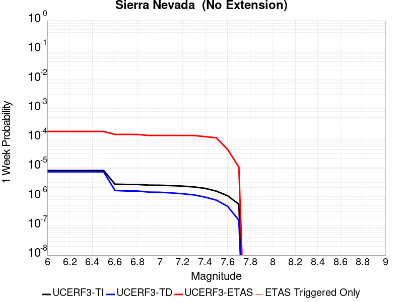 |  |  |  |

| Magnitude | 1 wk TI Prob | 1 wk TD Prob | 1 wk ETAS Prob | 1 wk ETAS/TD Gain | 1 wk ETAS Triggered Only | 1 mo TI Prob | 1 mo TD Prob | 1 mo ETAS Prob | 1 mo ETAS/TD Gain | 1 mo ETAS Triggered Only | 1 yr TI Prob | 1 yr TD Prob | 1 yr ETAS Prob | 1 yr ETAS/TD Gain | 1 yr ETAS Triggered Only | 10 yr TI Prob | 10 yr TD Prob | 10 yr ETAS Prob | 10 yr ETAS/TD Gain | 10 yr ETAS Triggered Only |
|-----|-----|-----|-----|-----|-----|-----|-----|-----|-----|-----|-----|-----|-----|-----|-----|-----|-----|-----|-----|-----|
| 6.0 | 7.7690465E-6 | 6.976322E-6 | 1.6697521E-4 | 23.934563 | 1.6E-4 | 3.329549E-5 | 2.9898381E-5 | 2.09893E-4 | 7.0202127 | 1.8E-4 | 4.0529718E-4 | 3.6398784E-4 | 6.238932E-4 | 1.7140496 | 2.6E-4 | 0.004045588 | 0.0036374326 | 0.003996123 | 1.0986109 | 3.6E-4 |
| 6.1 | 7.7690465E-6 | 6.976322E-6 | 1.6697521E-4 | 23.934563 | 1.6E-4 | 3.329549E-5 | 2.9898381E-5 | 2.09893E-4 | 7.0202127 | 1.8E-4 | 4.0529718E-4 | 3.6398784E-4 | 6.238932E-4 | 1.7140496 | 2.6E-4 | 0.004045588 | 0.0036374326 | 0.003996123 | 1.0986109 | 3.6E-4 |
| 6.2 | 7.7690465E-6 | 6.976322E-6 | 1.6697521E-4 | 23.934563 | 1.6E-4 | 3.329549E-5 | 2.9898381E-5 | 2.09893E-4 | 7.0202127 | 1.8E-4 | 4.0529718E-4 | 3.6398784E-4 | 6.238932E-4 | 1.7140496 | 2.6E-4 | 0.004045588 | 0.0036374326 | 0.003996123 | 1.0986109 | 3.6E-4 |
| 6.3 | 7.7690465E-6 | 6.976322E-6 | 1.6697521E-4 | 23.934563 | 1.6E-4 | 3.329549E-5 | 2.9898381E-5 | 2.09893E-4 | 7.0202127 | 1.8E-4 | 4.0529718E-4 | 3.6398784E-4 | 6.238932E-4 | 1.7140496 | 2.6E-4 | 0.004045588 | 0.0036374326 | 0.003996123 | 1.0986109 | 3.6E-4 |
| 6.4 | 7.7690465E-6 | 6.976322E-6 | 1.6697521E-4 | 23.934563 | 1.6E-4 | 3.329549E-5 | 2.9898381E-5 | 2.09893E-4 | 7.0202127 | 1.8E-4 | 4.0529718E-4 | 3.6398784E-4 | 6.238932E-4 | 1.7140496 | 2.6E-4 | 0.004045588 | 0.0036374326 | 0.003996123 | 1.0986109 | 3.6E-4 |
| 6.5 | 7.7690465E-6 | 6.976322E-6 | 1.6697521E-4 | 23.934563 | 1.6E-4 | 3.329549E-5 | 2.9898381E-5 | 2.09893E-4 | 7.0202127 | 1.8E-4 | 4.0529718E-4 | 3.6398784E-4 | 6.238932E-4 | 1.7140496 | 2.6E-4 | 0.004045588 | 0.0036374326 | 0.003996123 | 1.0986109 | 3.6E-4 |
| 6.6 | 2.653E-6 | 1.614854E-6 | 1.3161464E-4 | 81.5025 | 1.3E-4 | 1.136995E-5 | 6.9207845E-6 | 1.5691975E-4 | 22.673693 | 1.5E-4 | 1.3842035E-4 | 8.425733E-5 | 2.8424046E-4 | 3.3734808 | 2.0E-4 | 0.0013833415 | 8.422573E-4 | 0.0011020383 | 1.3084342 | 2.6E-4 |
| 6.7 | 2.5902466E-6 | 1.5501876E-6 | 1.3154998E-4 | 84.860695 | 1.3E-4 | 1.11010095E-5 | 6.643644E-6 | 1.5664265E-4 | 23.57782 | 1.5E-4 | 1.351464E-4 | 8.0883394E-5 | 2.70868E-4 | 3.3488708 | 1.9E-4 | 0.0013506424 | 8.0854254E-4 | 0.0010583404 | 1.3089483 | 2.5E-4 |
| 6.8 | 2.5853892E-6 | 1.5469877E-6 | 1.3154678E-4 | 85.03415 | 1.3E-4 | 1.1080193E-5 | 6.629931E-6 | 1.5662894E-4 | 23.624521 | 1.5E-4 | 1.34893E-4 | 8.071645E-5 | 2.707011E-4 | 3.3537292 | 1.9E-4 | 0.0013481114 | 8.068743E-4 | 0.0010566725 | 1.3095876 | 2.5E-4 |
| 6.9 | 2.458257E-6 | 1.4220619E-6 | 1.21421894E-4 | 85.38439 | 1.2E-4 | 1.0535345E-5 | 6.094537E-6 | 1.4609369E-4 | 23.971252 | 1.4E-4 | 1.2826028E-4 | 7.4198484E-5 | 2.541851E-4 | 3.4257455 | 1.8E-4 | 0.0012818627 | 7.4173906E-4 | 9.81561E-4 | 1.323324 | 2.4E-4 |
| 7.0 | 2.4341468E-6 | 1.3990258E-6 | 1.2139886E-4 | 86.77385 | 1.2E-4 | 1.0432016E-5 | 5.9958115E-6 | 1.4599497E-4 | 24.349495 | 1.4E-4 | 1.270024E-4 | 7.2996576E-5 | 2.5298345E-4 | 3.4656892 | 1.8E-4 | 0.0012692984 | 7.297279E-4 | 9.695528E-4 | 1.3286498 | 2.4E-4 |
| 7.1 | 2.3652476E-6 | 1.3339754E-6 | 1.2133382E-4 | 90.95656 | 1.2E-4 | 1.0136736E-5 | 5.717025E-6 | 1.4571623E-4 | 25.488121 | 1.4E-4 | 1.2340778E-4 | 6.9602575E-5 | 2.4959006E-4 | 3.5859313 | 1.8E-4 | 0.0012333926 | 6.9580943E-4 | 9.3564246E-4 | 1.344682 | 2.4E-4 |
| 7.2 | 2.272158E-6 | 1.2502821E-6 | 1.2125013E-4 | 96.97822 | 1.2E-4 | 9.737784E-6 | 5.3583412E-6 | 1.453576E-4 | 27.12735 | 1.4E-4 | 1.1855107E-4 | 6.5235865E-5 | 2.4522413E-4 | 3.7590384 | 1.8E-4 | 0.0011848784 | 6.5216864E-4 | 8.9201215E-4 | 1.3677629 | 2.4E-4 |
| 7.3 | 2.1382127E-6 | 1.1419703E-6 | 1.21141835E-4 | 106.08142 | 1.2E-4 | 9.163737E-6 | 4.8941492E-6 | 1.4489346E-4 | 29.605444 | 1.4E-4 | 1.1156279E-4 | 5.958465E-5 | 2.3957393E-4 | 4.0207324 | 1.8E-4 | 0.001115068 | 5.956879E-4 | 8.3554495E-4 | 1.4026555 | 2.4E-4 |
| 7.4 | 1.9048055E-6 | 9.575242E-7 | 1.1095742E-4 | 115.879486 | 1.1E-4 | 8.163426E-6 | 4.1036687E-6 | 1.3410313E-4 | 32.67884 | 1.3E-4 | 9.9385186E-5 | 4.996103E-5 | 2.1995253E-4 | 4.402482 | 1.7E-4 | 9.934074E-4 | 4.994987E-4 | 7.293838E-4 | 1.4602317 | 2.3E-4 |
| 7.5 | 1.5373403E-6 | 7.560042E-7 | 1.00755926E-4 | 133.27429 | 1.0E-4 | 6.5885843E-6 | 3.2400142E-6 | 1.1323966E-4 | 34.95036 | 1.1E-4 | 8.021306E-5 | 3.9446462E-5 | 1.8944054E-4 | 4.802472 | 1.5E-4 | 8.0184115E-4 | 3.943951E-4 | 5.943162E-4 | 1.5069057 | 2.0E-4 |
| 7.6 | 1.0680322E-6 | 4.6596554E-7 | 4.0465948E-5 | 86.843216 | 4.0E-5 | 4.577273E-6 | 1.9969937E-6 | 5.1996893E-5 | 26.037586 | 5.0E-5 | 5.5726876E-5 | 2.4313129E-5 | 1.04311184E-4 | 4.2903233 | 8.0E-5 | 5.5712904E-4 | 2.4310495E-4 | 3.4308064E-4 | 1.411245 | 1.0E-4 |
| 7.7 | 5.509146E-7 | 1.5580486E-7 | 1.01558035E-5 | 65.18284 | 1.0E-5 | 2.3610605E-6 | 6.677349E-7 | 1.0667728E-5 | 15.975992 | 1.0E-5 | 2.8745531E-5 | 8.129644E-6 | 1.8129562E-5 | 2.2300563 | 1.0E-5 | 2.8741814E-4 | 8.1293576E-5 | 1.0129195E-4 | 1.2460018 | 2.0E-5 |

## Calico-Hidalgo
*[(top)](#table-of-contents)*

| 1 Week | 1 Month | 1 Year | 10 Year |
|-----|-----|-----|-----|
|  |  |  |  |

| Magnitude | 1 wk TI Prob | 1 wk TD Prob | 1 wk ETAS Prob | 1 wk ETAS/TD Gain | 1 wk ETAS Triggered Only | 1 mo TI Prob | 1 mo TD Prob | 1 mo ETAS Prob | 1 mo ETAS/TD Gain | 1 mo ETAS Triggered Only | 1 yr TI Prob | 1 yr TD Prob | 1 yr ETAS Prob | 1 yr ETAS/TD Gain | 1 yr ETAS Triggered Only | 10 yr TI Prob | 10 yr TD Prob | 10 yr ETAS Prob | 10 yr ETAS/TD Gain | 10 yr ETAS Triggered Only |
|-----|-----|-----|-----|-----|-----|-----|-----|-----|-----|-----|-----|-----|-----|-----|-----|-----|-----|-----|-----|-----|
| 6.0 | 4.0906612E-5 | 5.0703686E-5 | 2.0069609E-4 | 3.9582148 | 1.5E-4 | 1.7530227E-4 | 2.172857E-4 | 4.0724443E-4 | 1.8742348 | 1.9E-4 | 0.0021322158 | 0.002642648 | 0.0028820138 | 1.090578 | 2.4E-4 | 0.02111873 | 0.026152607 | 0.026503192 | 1.0134053 | 3.6E-4 |
| 6.1 | 4.0906612E-5 | 5.0703686E-5 | 2.0069609E-4 | 3.9582148 | 1.5E-4 | 1.7530227E-4 | 2.172857E-4 | 4.0724443E-4 | 1.8742348 | 1.9E-4 | 0.0021322158 | 0.002642648 | 0.0028820138 | 1.090578 | 2.4E-4 | 0.02111873 | 0.026152607 | 0.026503192 | 1.0134053 | 3.6E-4 |
| 6.2 | 4.0906612E-5 | 5.0703686E-5 | 2.0069609E-4 | 3.9582148 | 1.5E-4 | 1.7530227E-4 | 2.172857E-4 | 4.0724443E-4 | 1.8742348 | 1.9E-4 | 0.0021322158 | 0.002642648 | 0.0028820138 | 1.090578 | 2.4E-4 | 0.02111873 | 0.026152607 | 0.026503192 | 1.0134053 | 3.6E-4 |
| 6.3 | 2.4242801E-5 | 3.0090669E-5 | 1.4008736E-4 | 4.6555085 | 1.1E-4 | 1.0389358E-4 | 1.2895382E-4 | 2.4893833E-4 | 1.9304457 | 1.2E-4 | 0.0012641704 | 0.0015689151 | 0.0017386484 | 1.1081852 | 1.7E-4 | 0.01257003 | 0.01558206 | 0.015838008 | 1.0164258 | 2.6E-4 |
| 6.4 | 2.4242801E-5 | 3.0090669E-5 | 1.4008736E-4 | 4.6555085 | 1.1E-4 | 1.0389358E-4 | 1.2895382E-4 | 2.4893833E-4 | 1.9304457 | 1.2E-4 | 0.0012641704 | 0.0015689151 | 0.0017386484 | 1.1081852 | 1.7E-4 | 0.01257003 | 0.01558206 | 0.015838008 | 1.0164258 | 2.6E-4 |
| 6.5 | 2.0286952E-5 | 2.5315738E-5 | 1.253132E-4 | 4.950012 | 1.0E-4 | 8.694118E-5 | 1.0849161E-4 | 2.1847968E-4 | 2.0137932 | 1.1E-4 | 0.0010579949 | 0.001320102 | 0.0014798908 | 1.1210427 | 1.6E-4 | 0.010529719 | 0.013124538 | 0.01335152 | 1.0172944 | 2.3E-4 |
| 6.6 | 2.0269223E-5 | 2.5296687E-5 | 1.2529416E-4 | 4.9529867 | 1.0E-4 | 8.6865206E-5 | 1.08409964E-4 | 2.1839804E-4 | 2.014557 | 1.1E-4 | 0.0010570707 | 0.0013191093 | 0.0014788982 | 1.1211339 | 1.6E-4 | 0.010520565 | 0.013114728 | 0.013341711 | 1.0173075 | 2.3E-4 |
| 6.7 | 1.799852E-5 | 2.25406E-5 | 1.1253857E-4 | 4.9927053 | 9.0E-5 | 7.713423E-5 | 9.659908E-5 | 1.9658942E-4 | 2.0351067 | 1.0E-4 | 9.3870464E-4 | 0.0011754738 | 0.0013252975 | 1.1274581 | 1.5E-4 | 0.009347493 | 0.011694173 | 0.011901718 | 1.0177476 | 2.1E-4 |
| 6.8 | 1.7458793E-5 | 2.184212E-5 | 1.11840156E-4 | 5.120389 | 9.0E-5 | 7.4821255E-5 | 9.3605806E-5 | 1.9359645E-4 | 2.06821 | 1.0E-4 | 9.10568E-4 | 0.0011390693 | 0.0012888985 | 1.1315365 | 1.5E-4 | 0.009068459 | 0.011333893 | 0.011531627 | 1.0174462 | 2.0E-4 |
| 6.9 | 1.542884E-5 | 1.9025927E-5 | 9.902441E-5 | 5.2047086 | 8.0E-5 | 6.612192E-5 | 8.153721E-5 | 1.7152987E-4 | 2.1037004 | 9.0E-5 | 8.04737E-4 | 9.922766E-4 | 0.0011321377 | 1.1409497 | 1.4E-4 | 0.008018291 | 0.009879857 | 0.010067981 | 1.0190411 | 1.9E-4 |
| 7.0 | 1.468253E-5 | 1.8030598E-5 | 8.802934E-5 | 4.8822193 | 7.0E-5 | 6.292361E-5 | 7.7271776E-5 | 1.572656E-4 | 2.0352268 | 8.0E-5 | 7.658257E-4 | 9.4039086E-4 | 0.0010702686 | 1.1381104 | 1.3E-4 | 0.0076319184 | 0.009365481 | 0.009543795 | 1.0190395 | 1.8E-4 |
| 7.1 | 1.3139281E-5 | 1.6200942E-5 | 6.620013E-5 | 4.08619 | 5.0E-5 | 5.6309986E-5 | 6.943083E-5 | 1.2942667E-4 | 1.8641094 | 6.0E-5 | 6.853584E-4 | 8.4500515E-4 | 9.4492064E-4 | 1.1182425 | 1.0E-4 | 0.0068324856 | 0.0084192185 | 0.00855804 | 1.0164887 | 1.4E-4 |
| 7.2 | 1.1127404E-5 | 1.3866597E-5 | 3.386632E-5 | 2.4422948 | 2.0E-5 | 4.7688E-5 | 5.942698E-5 | 8.94252E-5 | 1.5047911 | 3.0E-5 | 5.8044674E-4 | 7.232942E-4 | 7.932436E-4 | 1.0967094 | 7.0E-5 | 0.0057893298 | 0.0072105085 | 0.0072998595 | 1.0123918 | 9.0E-5 |
| 7.3 | 9.808154E-6 | 1.2176215E-5 | 3.2175973E-5 | 2.6425266 | 2.0E-5 | 4.2034266E-5 | 5.2182797E-5 | 8.218123E-5 | 1.5748721 | 3.0E-5 | 5.11647E-4 | 6.3515105E-4 | 7.051066E-4 | 1.11014 | 7.0E-5 | 0.0051047057 | 0.006334433 | 0.006423863 | 1.0141181 | 9.0E-5 |
| 7.4 | 7.942452E-6 | 9.792144E-6 | 2.9791947E-5 | 3.0424337 | 2.0E-5 | 3.4038632E-5 | 4.1965708E-5 | 7.1964445E-5 | 1.7148395 | 3.0E-5 | 4.1434157E-4 | 5.1082217E-4 | 5.6079665E-4 | 1.0978314 | 5.0E-5 | 0.0041356985 | 0.005097421 | 0.0051670643 | 1.0136625 | 7.0E-5 |
| 7.5 | 4.7121216E-6 | 5.772836E-6 | 1.5772779E-5 | 2.7322407 | 1.0E-5 | 2.019465E-5 | 2.4740535E-5 | 4.474004E-5 | 1.8083699 | 2.0E-5 | 2.4584212E-4 | 3.0118204E-4 | 3.4117E-4 | 1.1327701 | 4.0E-5 | 0.0024557032 | 0.0030084911 | 0.0030583406 | 1.0165696 | 5.0E-5 |
| 7.6 | 2.21172E-7 | 2.603961E-7 | 2.603961E-7 | 1.0 | 0.0 | 9.478797E-7 | 1.1159829E-6 | 1.1159829E-6 | 1.0 | 0.0 | 1.1540374E-5 | 1.3587036E-5 | 1.3587036E-5 | 1.0 | 0.0 | 1.1539775E-4 | 1.3586486E-4 | 1.3586486E-4 | 1.0 | 0.0 |

## Lake Isabella (Seismicity)
*[(top)](#table-of-contents)*

| 1 Week | 1 Month | 1 Year | 10 Year |
|-----|-----|-----|-----|
|  |  |  |  |

| Magnitude | 1 wk TI Prob | 1 wk TD Prob | 1 wk ETAS Prob | 1 wk ETAS/TD Gain | 1 wk ETAS Triggered Only | 1 mo TI Prob | 1 mo TD Prob | 1 mo ETAS Prob | 1 mo ETAS/TD Gain | 1 mo ETAS Triggered Only | 1 yr TI Prob | 1 yr TD Prob | 1 yr ETAS Prob | 1 yr ETAS/TD Gain | 1 yr ETAS Triggered Only | 10 yr TI Prob | 10 yr TD Prob | 10 yr ETAS Prob | 10 yr ETAS/TD Gain | 10 yr ETAS Triggered Only |
|-----|-----|-----|-----|-----|-----|-----|-----|-----|-----|-----|-----|-----|-----|-----|-----|-----|-----|-----|-----|-----|
| 6.0 | 9.431637E-6 | 9.741651E-6 | 1.2974048E-4 | 13.31812 | 1.2E-4 | 4.0420677E-5 | 4.1749343E-5 | 2.0174266E-4 | 4.832236 | 1.6E-4 | 4.920106E-4 | 5.0819275E-4 | 7.780555E-4 | 1.5310245 | 2.7E-4 | 0.004909227 | 0.005071599 | 0.005429773 | 1.0706235 | 3.6E-4 |
| 6.1 | 9.431637E-6 | 9.741651E-6 | 1.2974048E-4 | 13.31812 | 1.2E-4 | 4.0420677E-5 | 4.1749343E-5 | 2.0174266E-4 | 4.832236 | 1.6E-4 | 4.920106E-4 | 5.0819275E-4 | 7.780555E-4 | 1.5310245 | 2.7E-4 | 0.004909227 | 0.005071599 | 0.005429773 | 1.0706235 | 3.6E-4 |
| 6.2 | 9.431637E-6 | 9.741651E-6 | 1.2974048E-4 | 13.31812 | 1.2E-4 | 4.0420677E-5 | 4.1749343E-5 | 2.0174266E-4 | 4.832236 | 1.6E-4 | 4.920106E-4 | 5.0819275E-4 | 7.780555E-4 | 1.5310245 | 2.7E-4 | 0.004909227 | 0.005071599 | 0.005429773 | 1.0706235 | 3.6E-4 |
| 6.3 | 9.431637E-6 | 9.741651E-6 | 1.2974048E-4 | 13.31812 | 1.2E-4 | 4.0420677E-5 | 4.1749343E-5 | 2.0174266E-4 | 4.832236 | 1.6E-4 | 4.920106E-4 | 5.0819275E-4 | 7.780555E-4 | 1.5310245 | 2.7E-4 | 0.004909227 | 0.005071599 | 0.005429773 | 1.0706235 | 3.6E-4 |
| 6.4 | 5.144063E-6 | 5.3000763E-6 | 7.529971E-5 | 14.207288 | 7.0E-5 | 2.2045799E-5 | 2.2714434E-5 | 9.271284E-5 | 4.0816708 | 7.0E-5 | 2.6837454E-4 | 2.765166E-4 | 3.7648893E-4 | 1.361542 | 1.0E-4 | 0.0026805066 | 0.0027620657 | 0.0029216239 | 1.0577676 | 1.6E-4 |
| 6.5 | 5.144063E-6 | 5.3000763E-6 | 7.529971E-5 | 14.207288 | 7.0E-5 | 2.2045799E-5 | 2.2714434E-5 | 9.271284E-5 | 4.0816708 | 7.0E-5 | 2.6837454E-4 | 2.765166E-4 | 3.7648893E-4 | 1.361542 | 1.0E-4 | 0.0026805066 | 0.0027620657 | 0.0029216239 | 1.0577676 | 1.6E-4 |
| 6.6 | 3.4009804E-6 | 3.498786E-6 | 7.3498544E-5 | 21.006868 | 7.0E-5 | 1.4575549E-5 | 1.4994721E-5 | 8.499367E-5 | 5.6682396 | 7.0E-5 | 1.7744285E-4 | 1.8254704E-4 | 2.6253244E-4 | 1.4381633 | 8.0E-5 | 0.0017730123 | 0.0018241286 | 0.0019439097 | 1.0656649 | 1.2E-4 |
| 6.7 | 3.3880428E-6 | 3.4856528E-6 | 7.348541E-5 | 21.082253 | 7.0E-5 | 1.4520103E-5 | 1.4938435E-5 | 8.493739E-5 | 5.685829 | 7.0E-5 | 1.767679E-4 | 1.8186188E-4 | 2.6184734E-4 | 1.4398143 | 8.0E-5 | 0.0017662736 | 0.0018172882 | 0.0019370702 | 1.0659125 | 1.2E-4 |
| 6.8 | 2.6582E-6 | 2.7337003E-6 | 6.273354E-5 | 22.948214 | 6.0E-5 | 1.1392236E-5 | 1.1715813E-5 | 7.171511E-5 | 6.1212234 | 6.0E-5 | 1.3869164E-4 | 1.4263204E-4 | 2.1262205E-4 | 1.4907033 | 7.0E-5 | 0.0013860512 | 0.0014255369 | 0.0015154086 | 1.0630441 | 9.0E-5 |
| 6.9 | 2.406011E-6 | 2.4743288E-6 | 5.2474206E-5 | 21.20745 | 5.0E-5 | 1.0311434E-5 | 1.0604231E-5 | 6.06037E-5 | 5.7150493 | 5.0E-5 | 1.2553448E-4 | 1.2910018E-4 | 1.8909243E-4 | 1.4646953 | 6.0E-5 | 0.0012546359 | 0.0012903814 | 0.0013702782 | 1.0619172 | 8.0E-5 |
| 7.0 | 1.6953097E-6 | 1.7429371E-6 | 3.1742886E-5 | 18.212294 | 3.0E-5 | 7.265593E-6 | 7.469715E-6 | 3.746949E-5 | 5.016187 | 3.0E-5 | 8.8455E-5 | 9.094104E-5 | 1.20938304E-4 | 1.3298541 | 3.0E-5 | 8.84198E-4 | 9.09141E-4 | 9.491046E-4 | 1.0439576 | 4.0E-5 |
| 7.1 | 3.5013824E-7 | 3.5714822E-7 | 1.0357145E-5 | 28.999569 | 1.0E-5 | 1.5005916E-6 | 1.5306344E-6 | 1.1530619E-5 | 7.533229 | 1.0E-5 | 1.826955E-5 | 1.8635317E-5 | 2.8635131E-5 | 1.5366055 | 1.0E-5 | 1.8268047E-4 | 1.863378E-4 | 1.9633592E-4 | 1.053656 | 1.0E-5 |
| 7.2 | 2.2321095E-7 | 2.2750574E-7 | 2.2750574E-7 | 1.0 | 0.0 | 9.56618E-7 | 9.750242E-7 | 9.750242E-7 | 1.0 | 0.0 | 1.1646762E-5 | 1.1870856E-5 | 1.1870856E-5 | 1.0 | 0.0 | 1.1646151E-4 | 1.1870232E-4 | 1.1870232E-4 | 1.0 | 0.0 |
| 7.3 | 1.5760406E-7 | 1.6060922E-7 | 1.6060922E-7 | 1.0 | 0.0 | 6.7544585E-7 | 6.8832503E-7 | 6.8832503E-7 | 1.0 | 0.0 | 8.223522E-6 | 8.380326E-6 | 8.380326E-6 | 1.0 | 0.0 | 8.2232174E-5 | 8.3800165E-5 | 8.3800165E-5 | 1.0 | 0.0 |
| 7.4 | 1.1216497E-7 | 1.1431706E-7 | 1.1431706E-7 | 1.0 | 0.0 | 4.8070694E-7 | 4.899302E-7 | 4.899302E-7 | 1.0 | 0.0 | 5.852591E-6 | 5.964884E-6 | 5.964884E-6 | 1.0 | 0.0 | 5.8524372E-5 | 5.9647282E-5 | 5.9647282E-5 | 1.0 | 0.0 |
| 7.5 | 4.885185E-8 | 4.9787737E-8 | 4.9787737E-8 | 1.0 | 0.0 | 2.0936506E-7 | 2.13376E-7 | 2.13376E-7 | 1.0 | 0.0 | 2.5490165E-6 | 2.59785E-6 | 2.59785E-6 | 1.0 | 0.0 | 2.5489873E-5 | 2.5978214E-5 | 2.5978214E-5 | 1.0 | 0.0 |
| 7.6 | 1.504641E-9 | 1.5317903E-9 | 1.5317903E-9 | 1.0 | 0.0 | 6.4484613E-9 | 6.5648154E-9 | 6.5648154E-9 | 1.0 | 0.0 | 7.851001E-8 | 7.992663E-8 | 7.992663E-8 | 1.0 | 0.0 | 7.8509987E-7 | 7.992663E-7 | 7.992663E-7 | 1.0 | 0.0 |

## San Jacinto (San Bernardino)
*[(top)](#table-of-contents)*

| 1 Week | 1 Month | 1 Year | 10 Year |
|-----|-----|-----|-----|
|  |  |  |  |

| Magnitude | 1 wk TI Prob | 1 wk TD Prob | 1 wk ETAS Prob | 1 wk ETAS/TD Gain | 1 wk ETAS Triggered Only | 1 mo TI Prob | 1 mo TD Prob | 1 mo ETAS Prob | 1 mo ETAS/TD Gain | 1 mo ETAS Triggered Only | 1 yr TI Prob | 1 yr TD Prob | 1 yr ETAS Prob | 1 yr ETAS/TD Gain | 1 yr ETAS Triggered Only | 10 yr TI Prob | 10 yr TD Prob | 10 yr ETAS Prob | 10 yr ETAS/TD Gain | 10 yr ETAS Triggered Only |
|-----|-----|-----|-----|-----|-----|-----|-----|-----|-----|-----|-----|-----|-----|-----|-----|-----|-----|-----|-----|-----|
| 6.0 | 3.409352E-5 | 3.5986508E-5 | 1.7598148E-4 | 4.890207 | 1.4E-4 | 1.461069E-4 | 1.542188E-4 | 3.3419102E-4 | 2.166993 | 1.8E-4 | 0.0017774 | 0.0018759987 | 0.0020856047 | 1.1117303 | 2.1E-4 | 0.01763251 | 0.019349935 | 0.01967355 | 1.0167243 | 3.3E-4 |
| 6.1 | 3.409352E-5 | 3.5986508E-5 | 1.7598148E-4 | 4.890207 | 1.4E-4 | 1.461069E-4 | 1.542188E-4 | 3.3419102E-4 | 2.166993 | 1.8E-4 | 0.0017774 | 0.0018759987 | 0.0020856047 | 1.1117303 | 2.1E-4 | 0.01763251 | 0.019349935 | 0.01967355 | 1.0167243 | 3.3E-4 |
| 6.2 | 3.409352E-5 | 3.5986508E-5 | 1.7598148E-4 | 4.890207 | 1.4E-4 | 1.461069E-4 | 1.542188E-4 | 3.3419102E-4 | 2.166993 | 1.8E-4 | 0.0017774 | 0.0018759987 | 0.0020856047 | 1.1117303 | 2.1E-4 | 0.01763251 | 0.019349935 | 0.01967355 | 1.0167243 | 3.3E-4 |
| 6.3 | 3.409352E-5 | 3.5986508E-5 | 1.7598148E-4 | 4.890207 | 1.4E-4 | 1.461069E-4 | 1.542188E-4 | 3.3419102E-4 | 2.166993 | 1.8E-4 | 0.0017774 | 0.0018759987 | 0.0020856047 | 1.1117303 | 2.1E-4 | 0.01763251 | 0.019349935 | 0.01967355 | 1.0167243 | 3.3E-4 |
| 6.4 | 3.400795E-5 | 3.5879173E-5 | 1.7587416E-4 | 4.9018455 | 1.4E-4 | 1.4574021E-4 | 1.5375883E-4 | 3.3373115E-4 | 2.1704845 | 1.8E-4 | 0.0017729428 | 0.0018704084 | 0.0020800156 | 1.112065 | 2.1E-4 | 0.017588645 | 0.019295016 | 0.019618649 | 1.0167729 | 3.3E-4 |
| 6.5 | 3.341482E-5 | 3.5139812E-5 | 1.7513489E-4 | 4.9839454 | 1.4E-4 | 1.4319851E-4 | 1.5059051E-4 | 3.305634E-4 | 2.1951146 | 1.8E-4 | 0.0017420477 | 0.0018318989 | 0.0020415143 | 1.1144252 | 2.1E-4 | 0.017284546 | 0.018916558 | 0.019230505 | 1.0165964 | 3.2E-4 |
| 6.6 | 3.3364955E-5 | 3.5077028E-5 | 1.7507211E-4 | 4.991076 | 1.4E-4 | 1.4298483E-4 | 1.5032147E-4 | 3.3029442E-4 | 2.1972537 | 1.8E-4 | 0.0017394501 | 0.001828629 | 0.002038245 | 1.1146301 | 2.1E-4 | 0.017258976 | 0.018884424 | 0.01919838 | 1.0166252 | 3.2E-4 |
| 6.7 | 3.335922E-5 | 3.5066805E-5 | 1.750619E-4 | 4.99224 | 1.4E-4 | 1.4296026E-4 | 1.5027766E-4 | 3.302506E-4 | 2.197603 | 1.8E-4 | 0.0017391514 | 0.0018280965 | 0.0020377126 | 1.1146636 | 2.1E-4 | 0.017256035 | 0.018879214 | 0.019193174 | 1.0166298 | 3.2E-4 |
| 6.8 | 3.327683E-5 | 3.496087E-5 | 1.7495597E-4 | 5.004337 | 1.4E-4 | 1.4260718E-4 | 1.498237E-4 | 3.2979672E-4 | 2.201232 | 1.8E-4 | 0.0017348597 | 0.0018225788 | 0.0020321961 | 1.1150113 | 2.1E-4 | 0.017213784 | 0.018824987 | 0.019138962 | 1.0166787 | 3.2E-4 |
| 6.9 | 3.3235785E-5 | 3.4901823E-5 | 1.7489694E-4 | 5.0111117 | 1.4E-4 | 1.4243131E-4 | 1.4957068E-4 | 3.2954375E-4 | 2.2032645 | 1.8E-4 | 0.0017327217 | 0.0018195034 | 0.0020291214 | 1.1152061 | 2.1E-4 | 0.017192734 | 0.018794855 | 0.019108841 | 1.016706 | 3.2E-4 |
| 7.0 | 3.3197095E-5 | 3.4841752E-5 | 1.7483688E-4 | 5.0180273 | 1.4E-4 | 1.422655E-4 | 1.4931326E-4 | 3.2928638E-4 | 2.2053392 | 1.8E-4 | 0.0017307063 | 0.0018163746 | 0.0020259933 | 1.115405 | 2.1E-4 | 0.017172894 | 0.018764233 | 0.019078229 | 1.0167338 | 3.2E-4 |
| 7.1 | 3.3129716E-5 | 3.4721965E-5 | 1.747171E-4 | 5.03189 | 1.4E-4 | 1.4197677E-4 | 1.4879994E-4 | 3.2877317E-4 | 2.209498 | 1.8E-4 | 0.0017271966 | 0.0018101353 | 0.0020197553 | 1.1158035 | 2.1E-4 | 0.017138338 | 0.018703312 | 0.019017328 | 1.0167893 | 3.2E-4 |
| 7.2 | 3.3034008E-5 | 3.458941E-5 | 1.7458457E-4 | 5.0473413 | 1.4E-4 | 1.4156665E-4 | 1.4823192E-4 | 3.2820523E-4 | 2.2141333 | 1.8E-4 | 0.0017222111 | 0.0018032312 | 0.0020128526 | 1.1162477 | 2.1E-4 | 0.017089253 | 0.018635705 | 0.018949741 | 1.0168513 | 3.2E-4 |
| 7.3 | 3.2956614E-5 | 3.445717E-5 | 1.7445235E-4 | 5.0628753 | 1.4E-4 | 1.4123498E-4 | 1.4766524E-4 | 3.2763864E-4 | 2.2187934 | 1.8E-4 | 0.0017181796 | 0.0017963431 | 0.002005966 | 1.1166942 | 2.1E-4 | 0.017049557 | 0.018568452 | 0.018882511 | 1.0169135 | 3.2E-4 |
| 7.4 | 3.2915937E-5 | 3.4378863E-5 | 1.7437406E-4 | 5.0721292 | 1.4E-4 | 1.4106068E-4 | 1.4732967E-4 | 3.2730316E-4 | 2.2215698 | 1.8E-4 | 0.0017160608 | 0.0017922645 | 0.0020018881 | 1.1169602 | 2.1E-4 | 0.017028693 | 0.018528719 | 0.018842788 | 1.0169505 | 3.2E-4 |
| 7.5 | 3.281791E-5 | 3.4243778E-5 | 1.7423899E-4 | 5.088194 | 1.4E-4 | 1.406406E-4 | 1.4675081E-4 | 3.267244E-4 | 2.2263892 | 1.8E-4 | 0.0017109542 | 0.0017852283 | 0.0019948534 | 1.117422 | 2.1E-4 | 0.016978411 | 0.018459605 | 0.0187737 | 1.0170151 | 3.2E-4 |
| 7.6 | 3.2521442E-5 | 3.396873E-5 | 1.7396397E-4 | 5.1212974 | 1.4E-4 | 1.3937015E-4 | 1.4557215E-4 | 3.2554596E-4 | 2.2363203 | 1.8E-4 | 0.0016955109 | 0.0017709016 | 0.0019805296 | 1.1183736 | 2.1E-4 | 0.016826328 | 0.018317232 | 0.01863137 | 1.0171499 | 3.2E-4 |
| 7.7 | 3.0287873E-5 | 3.245276E-5 | 1.7244821E-4 | 5.3138223 | 1.4E-4 | 1.297987E-4 | 1.3907586E-4 | 3.090522E-4 | 2.2221844 | 1.7E-4 | 0.0015791537 | 0.0016919347 | 0.0018915962 | 1.1180079 | 2.0E-4 | 0.01567979 | 0.01752809 | 0.017832657 | 1.017376 | 3.1E-4 |
| 7.8 | 2.6316151E-5 | 2.9663592E-5 | 1.6965944E-4 | 5.7194505 | 1.4E-4 | 1.1277862E-4 | 1.2712348E-4 | 2.9710188E-4 | 2.3371124 | 1.7E-4 | 0.0013722149 | 0.0015466306 | 0.0017463212 | 1.1291133 | 2.0E-4 | 0.013637724 | 0.016069634 | 0.016374653 | 1.0189811 | 3.1E-4 |
| 7.9 | 2.0761147E-5 | 2.34181E-5 | 1.434153E-4 | 6.124121 | 1.2E-4 | 8.897331E-5 | 1.0035944E-4 | 2.5034437E-4 | 2.4944777 | 1.5E-4 | 0.0010827117 | 0.0012211921 | 0.0013909844 | 1.1390382 | 1.7E-4 | 0.010774517 | 0.012793174 | 0.013069592 | 1.0216067 | 2.8E-4 |
| 8.0 | 1.5738568E-5 | 1.6033575E-5 | 5.6032935E-5 | 3.4947248 | 4.0E-5 | 6.744926E-5 | 6.871352E-5 | 1.1871008E-4 | 1.7276089 | 5.0E-5 | 8.2088535E-4 | 8.3626667E-4 | 8.962165E-4 | 1.0716875 | 6.0E-5 | 0.008178596 | 0.008865921 | 0.008984856 | 1.013415 | 1.2E-4 |
| 8.1 | 1.0105832E-5 | 8.3304985E-6 | 2.8330332E-5 | 3.400797 | 2.0E-5 | 4.3309992E-5 | 3.570165E-5 | 6.570058E-5 | 1.8402673 | 3.0E-5 | 5.2717153E-4 | 4.345814E-4 | 4.7456403E-4 | 1.0920026 | 4.0E-5 | 0.005259227 | 0.004677232 | 0.004736951 | 1.0127681 | 6.0E-5 |
| 8.2 | 4.189207E-6 | 1.5784357E-6 | 1.5784357E-6 | 1.0 | 0.0 | 1.7953622E-5 | 6.7647065E-6 | 6.7647065E-6 | 1.0 | 0.0 | 2.1856341E-4 | 8.235722E-5 | 8.235722E-5 | 1.0 | 0.0 | 0.0021834858 | 9.565867E-4 | 9.565867E-4 | 1.0 | 0.0 |
| 8.3 | 1.2758221E-6 | 3.6149942E-7 | 3.6149942E-7 | 1.0 | 0.0 | 5.4677976E-6 | 1.5492824E-6 | 1.5492824E-6 | 1.0 | 0.0 | 6.65684E-5 | 1.8862354E-5 | 1.8862354E-5 | 1.0 | 0.0 | 6.6548464E-4 | 2.2751294E-4 | 2.2751294E-4 | 1.0 | 0.0 |

## Manix-Afton Hills
*[(top)](#table-of-contents)*

| 1 Week | 1 Month | 1 Year | 10 Year |
|-----|-----|-----|-----|
| 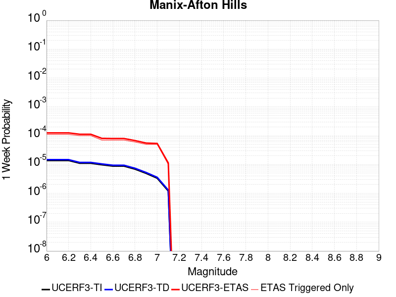 |  |  |  |

| Magnitude | 1 wk TI Prob | 1 wk TD Prob | 1 wk ETAS Prob | 1 wk ETAS/TD Gain | 1 wk ETAS Triggered Only | 1 mo TI Prob | 1 mo TD Prob | 1 mo ETAS Prob | 1 mo ETAS/TD Gain | 1 mo ETAS Triggered Only | 1 yr TI Prob | 1 yr TD Prob | 1 yr ETAS Prob | 1 yr ETAS/TD Gain | 1 yr ETAS Triggered Only | 10 yr TI Prob | 10 yr TD Prob | 10 yr ETAS Prob | 10 yr ETAS/TD Gain | 10 yr ETAS Triggered Only |
|-----|-----|-----|-----|-----|-----|-----|-----|-----|-----|-----|-----|-----|-----|-----|-----|-----|-----|-----|-----|-----|
| 6.0 | 1.3783202E-5 | 1.47110895E-5 | 1.2470948E-4 | 8.477242 | 1.1E-4 | 5.906953E-5 | 6.30461E-5 | 1.9303791E-4 | 3.0618532 | 1.3E-4 | 7.189342E-4 | 7.6733343E-4 | 9.871647E-4 | 1.2864872 | 2.2E-4 | 0.0071661277 | 0.007648596 | 0.007966149 | 1.0415177 | 3.2E-4 |
| 6.1 | 1.3783202E-5 | 1.47110895E-5 | 1.2470948E-4 | 8.477242 | 1.1E-4 | 5.906953E-5 | 6.30461E-5 | 1.9303791E-4 | 3.0618532 | 1.3E-4 | 7.189342E-4 | 7.6733343E-4 | 9.871647E-4 | 1.2864872 | 2.2E-4 | 0.0071661277 | 0.007648596 | 0.007966149 | 1.0415177 | 3.2E-4 |
| 6.2 | 1.3783202E-5 | 1.47110895E-5 | 1.2470948E-4 | 8.477242 | 1.1E-4 | 5.906953E-5 | 6.30461E-5 | 1.9303791E-4 | 3.0618532 | 1.3E-4 | 7.189342E-4 | 7.6733343E-4 | 9.871647E-4 | 1.2864872 | 2.2E-4 | 0.0071661277 | 0.007648596 | 0.007966149 | 1.0415177 | 3.2E-4 |
| 6.3 | 1.10494875E-5 | 1.1793136E-5 | 1.1179195E-4 | 9.479409 | 1.0E-4 | 4.7354086E-5 | 5.054109E-5 | 1.6053554E-4 | 3.176337 | 1.1E-4 | 5.763835E-4 | 6.151744E-4 | 7.8506983E-4 | 1.2761744 | 1.7E-4 | 0.005748908 | 0.0061357557 | 0.0063842214 | 1.0404948 | 2.5E-4 |
| 6.4 | 1.10494875E-5 | 1.1793136E-5 | 1.1179195E-4 | 9.479409 | 1.0E-4 | 4.7354086E-5 | 5.054109E-5 | 1.6053554E-4 | 3.176337 | 1.1E-4 | 5.763835E-4 | 6.151744E-4 | 7.8506983E-4 | 1.2761744 | 1.7E-4 | 0.005748908 | 0.0061357557 | 0.0063842214 | 1.0404948 | 2.5E-4 |
| 6.5 | 9.788949E-6 | 1.045432E-5 | 8.045359E-5 | 7.695727 | 7.0E-5 | 4.1951964E-5 | 4.480351E-5 | 1.2479993E-4 | 2.7854943 | 8.0E-5 | 5.1064545E-4 | 5.453555E-4 | 6.752846E-4 | 1.2382467 | 1.3E-4 | 0.0050947363 | 0.0054410985 | 0.005649956 | 1.0383852 | 2.1E-4 |
| 6.6 | 8.810006E-6 | 9.4136285E-6 | 7.941297E-5 | 8.435958 | 7.0E-5 | 3.775662E-5 | 4.0343548E-5 | 1.2034032E-4 | 2.982889 | 8.0E-5 | 4.5958988E-4 | 4.9108086E-4 | 6.1102194E-4 | 1.244239 | 1.2E-4 | 0.0045864056 | 0.004900839 | 0.005079957 | 1.0365484 | 1.8E-4 |
| 6.7 | 8.80128E-6 | 9.404108E-6 | 7.940345E-5 | 8.443485 | 7.0E-5 | 3.7719226E-5 | 4.0302748E-5 | 1.20299526E-4 | 2.9848964 | 8.0E-5 | 4.591348E-4 | 4.9058435E-4 | 6.105255E-4 | 1.2444862 | 1.2E-4 | 0.004581874 | 0.0048958957 | 0.0050750147 | 1.0365855 | 1.8E-4 |
| 6.8 | 6.8994877E-6 | 7.380076E-6 | 6.737963E-5 | 9.129937 | 6.0E-5 | 2.9568899E-5 | 3.162856E-5 | 9.1626665E-5 | 2.8969598 | 6.0E-5 | 3.5994186E-4 | 3.8501783E-4 | 4.8497933E-4 | 1.2596282 | 1.0E-4 | 0.003593594 | 0.0038443129 | 0.0039837747 | 1.0362774 | 1.4E-4 |
| 6.9 | 4.9328037E-6 | 5.2709615E-6 | 5.52707E-5 | 10.485886 | 5.0E-5 | 2.1140417E-5 | 2.2589675E-5 | 7.258855E-5 | 3.2133508 | 5.0E-5 | 2.5735417E-4 | 2.7500073E-4 | 3.5497872E-4 | 1.2908283 | 8.0E-5 | 0.0025705635 | 0.0027472095 | 0.0028569072 | 1.0399306 | 1.1E-4 |
| 7.0 | 3.347973E-6 | 3.59003E-6 | 5.358985E-5 | 14.92741 | 5.0E-5 | 1.4348378E-5 | 1.5385775E-5 | 6.538501E-5 | 4.249705 | 5.0E-5 | 1.746775E-4 | 1.8730981E-4 | 2.572967E-4 | 1.3736424 | 7.0E-5 | 0.0017454025 | 0.0018719219 | 0.0019617535 | 1.0479889 | 9.0E-5 |
| 7.1 | 1.2073567E-6 | 1.293482E-6 | 1.12934695E-5 | 8.73106 | 1.0E-5 | 5.1743755E-6 | 5.543492E-6 | 1.5543437E-5 | 2.8039072 | 1.0E-5 | 6.29962E-5 | 6.749156E-5 | 7.7490884E-5 | 1.1481566 | 1.0E-5 | 6.297835E-4 | 6.7487074E-4 | 6.84864E-4 | 1.0148077 | 1.0E-5 |

## White Wolf (Extension)
*[(top)](#table-of-contents)*

| 1 Week | 1 Month | 1 Year | 10 Year |
|-----|-----|-----|-----|
|  |  | 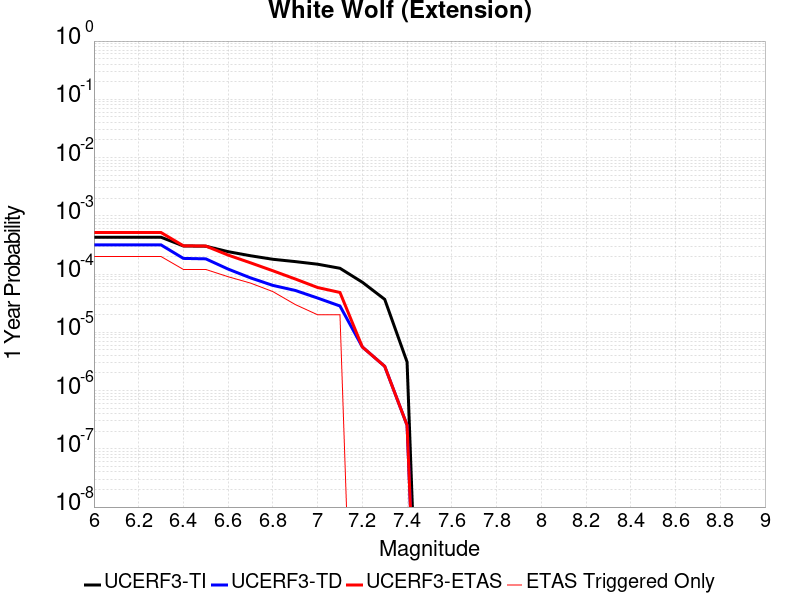 | 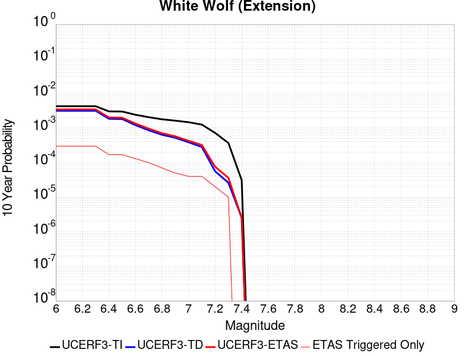 |

| Magnitude | 1 wk TI Prob | 1 wk TD Prob | 1 wk ETAS Prob | 1 wk ETAS/TD Gain | 1 wk ETAS Triggered Only | 1 mo TI Prob | 1 mo TD Prob | 1 mo ETAS Prob | 1 mo ETAS/TD Gain | 1 mo ETAS Triggered Only | 1 yr TI Prob | 1 yr TD Prob | 1 yr ETAS Prob | 1 yr ETAS/TD Gain | 1 yr ETAS Triggered Only | 10 yr TI Prob | 10 yr TD Prob | 10 yr ETAS Prob | 10 yr ETAS/TD Gain | 10 yr ETAS Triggered Only |
|-----|-----|-----|-----|-----|-----|-----|-----|-----|-----|-----|-----|-----|-----|-----|-----|-----|-----|-----|-----|-----|
| 6.0 | 8.222555E-6 | 6.0666657E-6 | 8.606618E-5 | 14.186735 | 8.0E-5 | 3.5239045E-5 | 2.5999774E-5 | 1.559964E-4 | 5.9999137 | 1.3E-4 | 4.289509E-4 | 3.1650788E-4 | 5.164446E-4 | 1.6316957 | 2.0E-4 | 0.0042812387 | 0.003161223 | 0.0034602745 | 1.0946 | 3.0E-4 |
| 6.1 | 8.222555E-6 | 6.0666657E-6 | 8.606618E-5 | 14.186735 | 8.0E-5 | 3.5239045E-5 | 2.5999774E-5 | 1.559964E-4 | 5.9999137 | 1.3E-4 | 4.289509E-4 | 3.1650788E-4 | 5.164446E-4 | 1.6316957 | 2.0E-4 | 0.0042812387 | 0.003161223 | 0.0034602745 | 1.0946 | 3.0E-4 |
| 6.2 | 8.222555E-6 | 6.0666657E-6 | 8.606618E-5 | 14.186735 | 8.0E-5 | 3.5239045E-5 | 2.5999774E-5 | 1.559964E-4 | 5.9999137 | 1.3E-4 | 4.289509E-4 | 3.1650788E-4 | 5.164446E-4 | 1.6316957 | 2.0E-4 | 0.0042812387 | 0.003161223 | 0.0034602745 | 1.0946 | 3.0E-4 |
| 6.3 | 8.222555E-6 | 6.0666657E-6 | 8.606618E-5 | 14.186735 | 8.0E-5 | 3.5239045E-5 | 2.5999774E-5 | 1.559964E-4 | 5.9999137 | 1.3E-4 | 4.289509E-4 | 3.1650788E-4 | 5.164446E-4 | 1.6316957 | 2.0E-4 | 0.0042812387 | 0.003161223 | 0.0034602745 | 1.0946 | 3.0E-4 |
| 6.4 | 5.821773E-6 | 3.5571766E-6 | 3.355707E-5 | 9.433625 | 3.0E-5 | 2.4950215E-5 | 1.5244959E-5 | 9.524374E-5 | 6.247556 | 8.0E-5 | 3.0372653E-4 | 1.8559267E-4 | 3.055704E-4 | 1.6464573 | 1.2E-4 | 0.0030331176 | 0.001854485 | 0.0020241698 | 1.0914997 | 1.7E-4 |
| 6.5 | 5.766023E-6 | 3.4991106E-6 | 3.3499007E-5 | 9.573577 | 3.0E-5 | 2.4711293E-5 | 1.4996108E-5 | 9.499491E-5 | 6.334637 | 8.0E-5 | 3.0081844E-4 | 1.8256342E-4 | 3.025415E-4 | 1.6571858 | 1.2E-4 | 0.0030041158 | 0.0018242426 | 0.0019939325 | 1.0930194 | 1.7E-4 |
| 6.6 | 4.643576E-6 | 2.332624E-6 | 2.2332577E-5 | 9.574015 | 2.0E-5 | 1.9900888E-5 | 9.996925E-6 | 6.999633E-5 | 7.0017858 | 6.0E-5 | 2.4226638E-4 | 1.2170619E-4 | 2.1169524E-4 | 1.7393959 | 9.0E-5 | 0.0024200242 | 0.0012164378 | 0.0013462796 | 1.1067394 | 1.3E-4 |
| 6.7 | 3.9529173E-6 | 1.6483477E-6 | 1.1648332E-5 | 7.066671 | 1.0E-5 | 1.6940963E-5 | 7.0643296E-6 | 5.7063975E-5 | 8.077763 | 5.0E-5 | 2.0623671E-4 | 8.6005006E-5 | 1.5599899E-4 | 1.8138361 | 7.0E-5 | 0.002060454 | 8.597357E-4 | 9.5964974E-4 | 1.1162149 | 1.0E-4 |
| 6.8 | 3.4377522E-6 | 1.2245237E-6 | 1.2245237E-6 | 1.0 | 0.0 | 1.473314E-5 | 5.2479486E-6 | 3.524779E-5 | 6.7164893 | 3.0E-5 | 1.7936122E-4 | 6.3891996E-5 | 1.138888E-4 | 1.7825207 | 5.0E-5 | 0.0017921652 | 6.387454E-4 | 7.087006E-4 | 1.1095198 | 7.0E-5 |
| 6.9 | 3.1367306E-6 | 1.0033783E-6 | 1.0033783E-6 | 1.0 | 0.0 | 1.3443062E-5 | 4.3001864E-6 | 2.43001E-5 | 5.6509414 | 2.0E-5 | 1.63657E-4 | 5.235359E-5 | 8.235202E-5 | 1.5729966 | 3.0E-5 | 0.0016353652 | 5.2342017E-4 | 5.73394E-4 | 1.0954756 | 5.0E-5 |
| 7.0 | 2.8298145E-6 | 7.4286646E-7 | 7.4286646E-7 | 1.0 | 0.0 | 1.2127721E-5 | 3.1837099E-6 | 1.3183678E-5 | 4.14098 | 1.0E-5 | 1.47645E-4 | 3.8761027E-5 | 5.876025E-5 | 1.5159621 | 2.0E-5 | 0.0014754693 | 3.8754768E-4 | 4.2753218E-4 | 1.1031731 | 4.0E-5 |
| 7.1 | 2.4091064E-6 | 5.4227525E-7 | 5.4227525E-7 | 1.0 | 0.0 | 1.03247E-5 | 2.3240348E-6 | 1.2324012E-5 | 5.3028517 | 1.0E-5 | 1.2569598E-4 | 2.8294799E-5 | 4.829423E-5 | 1.7068237 | 2.0E-5 | 0.001256249 | 2.8291598E-4 | 3.2290467E-4 | 1.1413447 | 4.0E-5 |
| 7.2 | 1.3875518E-6 | 1.0743063E-7 | 1.0743063E-7 | 1.0 | 0.0 | 5.9466374E-6 | 4.6041689E-7 | 4.6041689E-7 | 1.0 | 0.0 | 7.23979E-5 | 5.6055624E-6 | 5.6055624E-6 | 1.0 | 0.0 | 7.2374323E-4 | 5.6054323E-5 | 7.6053206E-5 | 1.3567767 | 2.0E-5 |
| 7.3 | 7.056077E-7 | 5.002034E-8 | 5.002034E-8 | 1.0 | 0.0 | 3.0240296E-6 | 2.1437286E-7 | 2.1437286E-7 | 1.0 | 0.0 | 3.681694E-5 | 2.609987E-6 | 2.609987E-6 | 1.0 | 0.0 | 3.681084E-4 | 2.609961E-5 | 3.6099347E-5 | 1.3831375 | 1.0E-5 |
| 7.4 | 5.9334678E-8 | 4.8683537E-9 | 4.8683537E-9 | 1.0 | 0.0 | 2.5429145E-7 | 2.0864372E-8 | 2.0864372E-8 | 1.0 | 0.0 | 3.095994E-6 | 2.5402372E-7 | 2.5402372E-7 | 1.0 | 0.0 | 3.095951E-5 | 2.5402353E-6 | 2.5402353E-6 | 1.0 | 0.0 |

## San Andreas (Creeping Section) 2011 CFM
*[(top)](#table-of-contents)*

| 1 Week | 1 Month | 1 Year | 10 Year |
|-----|-----|-----|-----|
|  |  |  |  |

| Magnitude | 1 wk TI Prob | 1 wk TD Prob | 1 wk ETAS Prob | 1 wk ETAS/TD Gain | 1 wk ETAS Triggered Only | 1 mo TI Prob | 1 mo TD Prob | 1 mo ETAS Prob | 1 mo ETAS/TD Gain | 1 mo ETAS Triggered Only | 1 yr TI Prob | 1 yr TD Prob | 1 yr ETAS Prob | 1 yr ETAS/TD Gain | 1 yr ETAS Triggered Only | 10 yr TI Prob | 10 yr TD Prob | 10 yr ETAS Prob | 10 yr ETAS/TD Gain | 10 yr ETAS Triggered Only |
|-----|-----|-----|-----|-----|-----|-----|-----|-----|-----|-----|-----|-----|-----|-----|-----|-----|-----|-----|-----|-----|
| 6.0 | 5.986481E-4 | 0.001228691 | 0.0012886173 | 1.0487725 | 6.0E-5 | 0.0025631124 | 0.005246795 | 0.005336323 | 1.0170634 | 9.0E-5 | 0.030762846 | 0.061203245 | 0.061362844 | 1.0026076 | 1.7E-4 | 0.26835477 | 0.425928 | 0.426083 | 1.000364 | 2.7E-4 |
| 6.1 | 5.015945E-4 | 0.0010230356 | 0.0010729844 | 1.0488242 | 5.0E-5 | 0.00214792 | 0.004369436 | 0.0044490863 | 1.018229 | 8.0E-5 | 0.025839351 | 0.051246606 | 0.05138892 | 1.002777 | 1.5E-4 | 0.23032776 | 0.37284943 | 0.37300622 | 1.0004206 | 2.5E-4 |
| 6.2 | 4.073338E-4 | 8.1157376E-4 | 8.515413E-4 | 1.0492469 | 4.0E-5 | 0.0017445484 | 0.0034683137 | 0.003538071 | 1.0201128 | 7.0E-5 | 0.021034058 | 0.04093177 | 0.041056447 | 1.003046 | 1.3E-4 | 0.19150782 | 0.31302592 | 0.3131839 | 1.0005047 | 2.3E-4 |
| 6.3 | 3.464099E-4 | 6.7455834E-4 | 7.1453134E-4 | 1.0592581 | 4.0E-5 | 0.0014837692 | 0.0028832308 | 0.002953029 | 1.0242083 | 7.0E-5 | 0.017915873 | 0.034187846 | 0.034313403 | 1.0036725 | 1.3E-4 | 0.16538359 | 0.27130842 | 0.271476 | 1.0006177 | 2.3E-4 |
| 6.4 | 2.935057E-4 | 5.5516965E-4 | 5.9514743E-4 | 1.07201 | 4.0E-5 | 0.0012572751 | 0.0023727308 | 0.0024425648 | 1.0294318 | 7.0E-5 | 0.015200248 | 0.02826279 | 0.028389117 | 1.0044696 | 1.3E-4 | 0.14201577 | 0.23297668 | 0.23315309 | 1.0007572 | 2.3E-4 |
| 6.5 | 2.3409708E-4 | 4.2132285E-4 | 4.61306E-4 | 1.094899 | 4.0E-5 | 0.0010028875 | 0.0018017791 | 0.001871653 | 1.0387805 | 7.0E-5 | 0.012141965 | 0.021586355 | 0.021713547 | 1.0058923 | 1.3E-4 | 0.11499573 | 0.1868149 | 0.18700194 | 1.0010011 | 2.3E-4 |
| 6.6 | 1.5842178E-4 | 2.5068692E-4 | 2.906769E-4 | 1.1595216 | 4.0E-5 | 6.7877385E-4 | 0.0010739256 | 0.0011338611 | 1.0558097 | 6.0E-5 | 0.0082328 | 0.012995283 | 0.013103854 | 1.0083547 | 1.1E-4 | 0.07934396 | 0.12313759 | 0.123312965 | 1.0014242 | 2.0E-4 |
| 6.7 | 1.5616413E-4 | 2.4605254E-4 | 2.860427E-4 | 1.1625268 | 4.0E-5 | 6.691031E-4 | 0.0010540807 | 0.0011140174 | 1.0568616 | 6.0E-5 | 0.0081159435 | 0.012757154 | 0.012865751 | 1.0085126 | 1.1E-4 | 0.0782586 | 0.12116472 | 0.12134048 | 1.0014507 | 2.0E-4 |
| 6.8 | 1.5538467E-4 | 2.442914E-4 | 2.8428165E-4 | 1.1636989 | 4.0E-5 | 6.6576427E-4 | 0.001046539 | 0.0011064763 | 1.0572718 | 6.0E-5 | 0.008075596 | 0.012666538 | 0.012775145 | 1.0085742 | 1.1E-4 | 0.07788358 | 0.12039561 | 0.120571524 | 1.0014611 | 2.0E-4 |
| 6.9 | 1.5153569E-4 | 2.3538464E-4 | 2.753752E-4 | 1.1698946 | 4.0E-5 | 6.49277E-4 | 0.0010084033 | 0.0010683428 | 1.05944 | 6.0E-5 | 0.007876333 | 0.012208726 | 0.012317384 | 1.0088999 | 1.1E-4 | 0.07602952 | 0.11646574 | 0.116642445 | 1.0015173 | 2.0E-4 |
| 7.0 | 1.4588932E-4 | 2.2395732E-4 | 2.6394837E-4 | 1.1785655 | 4.0E-5 | 6.250901E-4 | 9.59466E-4 | 0.0010194085 | 1.0624747 | 6.0E-5 | 0.0075839474 | 0.011619428 | 0.01172815 | 1.0093569 | 1.1E-4 | 0.073302895 | 0.11131206 | 0.1114898 | 1.0015968 | 2.0E-4 |
| 7.1 | 1.1565079E-4 | 1.6281323E-4 | 2.0280671E-4 | 1.2456403 | 4.0E-5 | 4.955521E-4 | 6.9758523E-4 | 7.4755034E-4 | 1.0716258 | 5.0E-5 | 0.006016669 | 0.008460228 | 0.008559382 | 1.0117201 | 1.0E-4 | 0.058563538 | 0.08366478 | 0.08382972 | 1.0019715 | 1.8E-4 |
| 7.2 | 1.0393792E-4 | 1.4615392E-4 | 1.8614807E-4 | 1.2736441 | 4.0E-5 | 4.4537216E-4 | 6.262243E-4 | 6.7619304E-4 | 1.0797936 | 5.0E-5 | 0.005408933 | 0.0075977976 | 0.007697038 | 1.0130618 | 1.0E-4 | 0.052791595 | 0.07561503 | 0.07577218 | 1.0020782 | 1.7E-4 |
| 7.3 | 9.332884E-5 | 1.2780601E-4 | 1.6780088E-4 | 1.3129344 | 4.0E-5 | 3.999194E-4 | 5.4762565E-4 | 5.9759826E-4 | 1.0912533 | 5.0E-5 | 0.0048581534 | 0.0066470946 | 0.00674643 | 1.0149442 | 1.0E-4 | 0.047533102 | 0.06647954 | 0.06663824 | 1.0023872 | 1.7E-4 |
| 7.4 | 8.670252E-5 | 1.1702972E-4 | 1.5702503E-4 | 1.3417535 | 4.0E-5 | 3.715293E-4 | 5.014601E-4 | 5.5143505E-4 | 1.0996588 | 5.0E-5 | 0.004513991 | 0.0060883067 | 0.006187698 | 1.0163249 | 1.0E-4 | 0.044233937 | 0.061148684 | 0.061308287 | 1.0026101 | 1.7E-4 |
| 7.5 | 7.3036405E-5 | 9.005699E-5 | 1.3005338E-4 | 1.4441233 | 4.0E-5 | 3.129756E-4 | 3.859015E-4 | 4.358822E-4 | 1.1295167 | 5.0E-5 | 0.0038038217 | 0.0046882504 | 0.0047778287 | 1.019107 | 9.0E-5 | 0.03739367 | 0.047875606 | 0.048018426 | 1.0029831 | 1.5E-4 |
| 7.6 | 6.3935775E-5 | 8.280209E-5 | 1.2279878E-4 | 1.4830396 | 4.0E-5 | 2.7398168E-4 | 3.5481792E-4 | 4.0480017E-4 | 1.1408674 | 5.0E-5 | 0.0033306254 | 0.00431137 | 0.004400982 | 1.0207851 | 9.0E-5 | 0.032811474 | 0.043990135 | 0.044133537 | 1.0032599 | 1.5E-4 |
| 7.7 | 5.5050095E-5 | 6.661729E-5 | 8.661596E-5 | 1.3002024 | 2.0E-5 | 2.3590765E-4 | 2.8547147E-4 | 3.154629E-4 | 1.1050593 | 3.0E-5 | 0.0028683927 | 0.0034700802 | 0.0035298718 | 1.0172306 | 6.0E-5 | 0.0283165 | 0.03579509 | 0.035910793 | 1.0032324 | 1.2E-4 |
| 7.8 | 5.027131E-5 | 6.1627725E-5 | 8.162649E-5 | 1.3245093 | 2.0E-5 | 2.1543067E-4 | 2.640921E-4 | 2.9408417E-4 | 1.1135668 | 3.0E-5 | 0.0026197135 | 0.003210584 | 0.0032604234 | 1.0155234 | 5.0E-5 | 0.025890453 | 0.03312572 | 0.033232074 | 1.0032107 | 1.1E-4 |
| 7.9 | 3.7271806E-5 | 5.0224386E-5 | 7.022338E-5 | 1.3981929 | 2.0E-5 | 1.5972654E-4 | 2.1522962E-4 | 2.4522317E-4 | 1.139356 | 3.0E-5 | 0.0019429359 | 0.0026172737 | 0.0026671428 | 1.0190538 | 5.0E-5 | 0.019260362 | 0.027066687 | 0.02716398 | 1.0035946 | 1.0E-4 |
| 8.0 | 2.7310243E-5 | 3.1428404E-5 | 4.142809E-5 | 1.3181735 | 1.0E-5 | 1.17038646E-4 | 1.3468621E-4 | 1.5468353E-4 | 1.1484733 | 2.0E-5 | 0.0014240141 | 0.0016385721 | 0.001668523 | 1.0182786 | 3.0E-5 | 0.014149235 | 0.01721387 | 0.017263008 | 1.0028546 | 5.0E-5 |
| 8.1 | 1.7940547E-5 | 1.7400796E-5 | 1.7400796E-5 | 1.0 | 0.0 | 7.688579E-5 | 7.457271E-5 | 7.457271E-5 | 1.0 | 0.0 | 9.3568244E-4 | 9.075451E-4 | 9.075451E-4 | 1.0 | 0.0 | 0.009317525 | 0.009799073 | 0.009808975 | 1.0010105 | 1.0E-5 |
| 8.2 | 8.643924E-6 | 5.4748625E-6 | 5.4748625E-6 | 1.0 | 0.0 | 3.704486E-5 | 2.3463486E-5 | 2.3463486E-5 | 1.0 | 0.0 | 4.5092785E-4 | 2.8563058E-4 | 2.8563058E-4 | 1.0 | 0.0 | 0.0045001395 | 0.0032487072 | 0.0032487072 | 1.0 | 0.0 |
| 8.3 | 1.983087E-6 | 7.6599065E-7 | 7.6599065E-7 | 1.0 | 0.0 | 8.498917E-6 | 3.282813E-6 | 3.282813E-6 | 1.0 | 0.0 | 1.034694E-4 | 3.9967534E-5 | 3.9967534E-5 | 1.0 | 0.0 | 0.0010342124 | 4.719687E-4 | 4.719687E-4 | 1.0 | 0.0 |

## Mission Creek
*[(top)](#table-of-contents)*

| 1 Week | 1 Month | 1 Year | 10 Year |
|-----|-----|-----|-----|
|  |  |  |  |

| Magnitude | 1 wk TI Prob | 1 wk TD Prob | 1 wk ETAS Prob | 1 wk ETAS/TD Gain | 1 wk ETAS Triggered Only | 1 mo TI Prob | 1 mo TD Prob | 1 mo ETAS Prob | 1 mo ETAS/TD Gain | 1 mo ETAS Triggered Only | 1 yr TI Prob | 1 yr TD Prob | 1 yr ETAS Prob | 1 yr ETAS/TD Gain | 1 yr ETAS Triggered Only | 10 yr TI Prob | 10 yr TD Prob | 10 yr ETAS Prob | 10 yr ETAS/TD Gain | 10 yr ETAS Triggered Only |
|-----|-----|-----|-----|-----|-----|-----|-----|-----|-----|-----|-----|-----|-----|-----|-----|-----|-----|-----|-----|-----|
| 6.0 | 1.1549387E-5 | 1.632237E-5 | 1.063209E-4 | 6.5138154 | 9.0E-5 | 4.9496433E-5 | 6.9951224E-5 | 1.6994422E-4 | 2.4294677 | 1.0E-4 | 6.0245243E-4 | 8.513384E-4 | 0.0010311852 | 1.2112517 | 1.8E-4 | 0.006008218 | 0.008509998 | 0.008757871 | 1.0291272 | 2.5E-4 |
| 6.1 | 1.1549387E-5 | 1.632237E-5 | 1.063209E-4 | 6.5138154 | 9.0E-5 | 4.9496433E-5 | 6.9951224E-5 | 1.6994422E-4 | 2.4294677 | 1.0E-4 | 6.0245243E-4 | 8.513384E-4 | 0.0010311852 | 1.2112517 | 1.8E-4 | 0.006008218 | 0.008509998 | 0.008757871 | 1.0291272 | 2.5E-4 |
| 6.2 | 1.1549387E-5 | 1.632237E-5 | 1.063209E-4 | 6.5138154 | 9.0E-5 | 4.9496433E-5 | 6.9951224E-5 | 1.6994422E-4 | 2.4294677 | 1.0E-4 | 6.0245243E-4 | 8.513384E-4 | 0.0010311852 | 1.2112517 | 1.8E-4 | 0.006008218 | 0.008509998 | 0.008757871 | 1.0291272 | 2.5E-4 |
| 6.3 | 1.1549387E-5 | 1.632237E-5 | 1.063209E-4 | 6.5138154 | 9.0E-5 | 4.9496433E-5 | 6.9951224E-5 | 1.6994422E-4 | 2.4294677 | 1.0E-4 | 6.0245243E-4 | 8.513384E-4 | 0.0010311852 | 1.2112517 | 1.8E-4 | 0.006008218 | 0.008509998 | 0.008757871 | 1.0291272 | 2.5E-4 |
| 6.4 | 1.1549387E-5 | 1.632237E-5 | 1.063209E-4 | 6.5138154 | 9.0E-5 | 4.9496433E-5 | 6.9951224E-5 | 1.6994422E-4 | 2.4294677 | 1.0E-4 | 6.0245243E-4 | 8.513384E-4 | 0.0010311852 | 1.2112517 | 1.8E-4 | 0.006008218 | 0.008509998 | 0.008757871 | 1.0291272 | 2.5E-4 |
| 6.5 | 1.1549387E-5 | 1.632237E-5 | 1.063209E-4 | 6.5138154 | 9.0E-5 | 4.9496433E-5 | 6.9951224E-5 | 1.6994422E-4 | 2.4294677 | 1.0E-4 | 6.0245243E-4 | 8.513384E-4 | 0.0010311852 | 1.2112517 | 1.8E-4 | 0.006008218 | 0.008509998 | 0.008757871 | 1.0291272 | 2.5E-4 |
| 6.6 | 9.202681E-6 | 1.3845646E-5 | 1.038444E-4 | 7.5001483 | 9.0E-5 | 3.9439463E-5 | 5.9337188E-5 | 1.5933125E-4 | 2.6851838 | 1.0E-4 | 4.800697E-4 | 7.221998E-4 | 9.0206985E-4 | 1.2490585 | 1.8E-4 | 0.004790339 | 0.0072271815 | 0.0074753747 | 1.0343416 | 2.5E-4 |
| 6.7 | 9.019164E-6 | 1.3651316E-5 | 1.0365009E-4 | 7.592681 | 9.0E-5 | 3.8652986E-5 | 5.8504378E-5 | 1.5849853E-4 | 2.7091737 | 1.0E-4 | 4.7049852E-4 | 7.12067E-4 | 8.9193886E-4 | 1.2526052 | 1.8E-4 | 0.004695036 | 0.007126506 | 0.0073747244 | 1.0348303 | 2.5E-4 |
| 6.8 | 8.673558E-6 | 1.3273427E-5 | 1.03272236E-4 | 7.7803745 | 9.0E-5 | 3.717186E-5 | 5.6884925E-5 | 1.5687924E-4 | 2.757835 | 1.0E-4 | 4.524734E-4 | 6.923627E-4 | 8.7223813E-4 | 1.2597994 | 1.8E-4 | 0.0045155324 | 0.006930694 | 0.0071789613 | 1.0358214 | 2.5E-4 |
| 6.9 | 7.002255E-6 | 1.1477657E-5 | 1.01476624E-4 | 8.841232 | 9.0E-5 | 3.000932E-5 | 4.9189068E-5 | 1.4918415E-4 | 3.032872 | 1.0E-4 | 3.653022E-4 | 5.9871917E-4 | 7.686174E-4 | 1.2837695 | 1.7E-4 | 0.0036470229 | 0.005999517 | 0.0062181973 | 1.0364497 | 2.2E-4 |
| 7.0 | 5.84644E-6 | 9.67498E-6 | 9.967411E-5 | 10.302255 | 9.0E-5 | 2.5055931E-5 | 4.1463565E-5 | 1.4145942E-4 | 3.411656 | 1.0E-4 | 3.0501327E-4 | 5.047066E-4 | 6.7462074E-4 | 1.3366594 | 1.7E-4 | 0.0030459496 | 0.0050638523 | 0.0052827382 | 1.0432252 | 2.2E-4 |
| 7.1 | 5.54703E-6 | 9.329456E-6 | 9.9328616E-5 | 10.646774 | 9.0E-5 | 2.377277E-5 | 3.9982795E-5 | 1.399788E-4 | 3.5009758 | 1.0E-4 | 2.8939504E-4 | 4.8668624E-4 | 6.5660354E-4 | 1.349131 | 1.7E-4 | 0.0028901845 | 0.004884446 | 0.0051033716 | 1.0448209 | 2.2E-4 |
| 7.2 | 4.384709E-6 | 7.68157E-6 | 9.768088E-5 | 12.716264 | 9.0E-5 | 1.8791474E-5 | 3.2920623E-5 | 1.3291732E-4 | 4.0375094 | 1.0E-4 | 2.2876218E-4 | 4.0073853E-4 | 5.706704E-4 | 1.4240468 | 1.7E-4 | 0.0022852682 | 0.004028366 | 0.0042474796 | 1.0543927 | 2.2E-4 |
| 7.3 | 3.7888456E-6 | 6.915452E-6 | 9.691483E-5 | 14.014244 | 9.0E-5 | 1.623781E-5 | 2.9637333E-5 | 1.2963437E-4 | 4.374023 | 1.0E-4 | 1.9767738E-4 | 3.6077813E-4 | 5.307168E-4 | 1.4710337 | 1.7E-4 | 0.0019750162 | 0.0036301152 | 0.0038393529 | 1.0576394 | 2.1E-4 |
| 7.4 | 2.1982462E-6 | 5.0237763E-6 | 9.502332E-5 | 18.91472 | 9.0E-5 | 9.421021E-6 | 2.1530293E-5 | 1.21528145E-4 | 5.6445184 | 1.0E-4 | 1.1469489E-4 | 2.621E-4 | 4.3205544E-4 | 1.6484374 | 1.7E-4 | 0.0011463572 | 0.0026458844 | 0.0028553288 | 1.0791585 | 2.1E-4 |
| 7.5 | 2.051923E-6 | 4.615016E-6 | 9.46146E-5 | 20.501467 | 9.0E-5 | 8.793926E-6 | 1.9778492E-5 | 1.19776516E-4 | 6.055897 | 1.0E-4 | 1.0706078E-4 | 2.4077666E-4 | 4.1073572E-4 | 1.7058785 | 1.7E-4 | 0.0010700922 | 0.0024335422 | 0.002643031 | 1.086084 | 2.1E-4 |
| 7.6 | 1.8733427E-6 | 4.1233748E-6 | 9.4123E-5 | 22.82669 | 9.0E-5 | 8.028587E-6 | 1.7671488E-5 | 1.1766972E-4 | 6.658733 | 1.0E-4 | 9.774366E-5 | 2.151292E-4 | 3.8509263E-4 | 1.7900528 | 1.7E-4 | 9.770069E-4 | 0.0021780801 | 0.0023876228 | 1.0962052 | 2.1E-4 |
| 7.7 | 1.8411953E-6 | 4.0430496E-6 | 9.404268E-5 | 23.260334 | 9.0E-5 | 7.890813E-6 | 1.732724E-5 | 1.1732551E-4 | 6.771159 | 1.0E-4 | 9.606641E-5 | 2.1093882E-4 | 3.8090296E-4 | 1.8057508 | 1.7E-4 | 9.6024893E-4 | 0.0021363653 | 0.0023459166 | 1.0980878 | 2.1E-4 |
| 7.8 | 1.7194251E-6 | 3.7104276E-6 | 9.371009E-5 | 25.255875 | 9.0E-5 | 7.368944E-6 | 1.5901736E-5 | 1.1590015E-4 | 7.288522 | 1.0E-4 | 8.97132E-5 | 1.9358651E-4 | 3.635536E-4 | 1.8779904 | 1.7E-4 | 8.967699E-4 | 0.0019623525 | 0.0021719404 | 1.1068044 | 2.1E-4 |
| 7.9 | 1.4035052E-6 | 2.9500632E-6 | 9.29498E-5 | 31.507732 | 9.0E-5 | 6.0150082E-6 | 1.2643067E-5 | 1.126418E-4 | 8.909373 | 1.0E-4 | 7.3230265E-5 | 1.5391852E-4 | 3.2389237E-4 | 2.1043105 | 1.7E-4 | 7.3206134E-4 | 0.0015631086 | 0.0017727804 | 1.1341376 | 2.1E-4 |
| 8.0 | 3.9318823E-7 | 5.528522E-7 | 3.0552837E-5 | 55.26402 | 3.0E-5 | 1.6850913E-6 | 2.3693647E-6 | 4.236927E-5 | 17.882124 | 4.0E-5 | 2.0515794E-5 | 2.8846638E-5 | 6.884548E-5 | 2.3866034 | 4.0E-5 | 2.0513899E-4 | 2.9899E-4 | 3.3897802E-4 | 1.1337438 | 4.0E-5 |
| 8.1 | 1.596793E-7 | 1.1380002E-7 | 1.1380002E-7 | 1.0 | 0.0 | 6.8433974E-7 | 4.877143E-7 | 4.877143E-7 | 1.0 | 0.0 | 8.331805E-6 | 5.937906E-6 | 5.937906E-6 | 1.0 | 0.0 | 8.331492E-5 | 6.549966E-5 | 6.549966E-5 | 1.0 | 0.0 |
| 8.2 | 4.9003038E-8 | 2.5444924E-8 | 2.5444924E-8 | 1.0 | 0.0 | 2.10013E-7 | 1.0904967E-7 | 1.0904967E-7 | 1.0 | 0.0 | 2.5569052E-6 | 1.327679E-6 | 1.327679E-6 | 1.0 | 0.0 | 2.556876E-5 | 1.495635E-5 | 1.495635E-5 | 1.0 | 0.0 |

## Scodie Lineament
*[(top)](#table-of-contents)*

| 1 Week | 1 Month | 1 Year | 10 Year |
|-----|-----|-----|-----|
|  |  |  |  |

| Magnitude | 1 wk TI Prob | 1 wk TD Prob | 1 wk ETAS Prob | 1 wk ETAS/TD Gain | 1 wk ETAS Triggered Only | 1 mo TI Prob | 1 mo TD Prob | 1 mo ETAS Prob | 1 mo ETAS/TD Gain | 1 mo ETAS Triggered Only | 1 yr TI Prob | 1 yr TD Prob | 1 yr ETAS Prob | 1 yr ETAS/TD Gain | 1 yr ETAS Triggered Only | 10 yr TI Prob | 10 yr TD Prob | 10 yr ETAS Prob | 10 yr ETAS/TD Gain | 10 yr ETAS Triggered Only |
|-----|-----|-----|-----|-----|-----|-----|-----|-----|-----|-----|-----|-----|-----|-----|-----|-----|-----|-----|-----|-----|
| 6.0 | 3.2919327E-6 | 3.0133422E-6 | 4.301322E-5 | 14.274257 | 4.0E-5 | 1.4108206E-5 | 1.2914278E-5 | 1.02913116E-4 | 7.9689407 | 9.0E-5 | 1.7175387E-4 | 1.5722317E-4 | 3.3719486E-4 | 2.1446896 | 1.8E-4 | 0.0017162118 | 0.0015714309 | 0.0018110537 | 1.152487 | 2.4E-4 |
| 6.1 | 1.8663811E-6 | 1.5490499E-6 | 1.1549035E-5 | 7.4555597 | 1.0E-5 | 7.998751E-6 | 6.6387715E-6 | 4.6638506E-5 | 7.0251713 | 4.0E-5 | 9.738045E-5 | 8.082454E-5 | 1.308205E-4 | 1.618574 | 5.0E-5 | 9.7337784E-4 | 8.080003E-4 | 8.779437E-4 | 1.0865636 | 7.0E-5 |
| 6.2 | 1.8663811E-6 | 1.5490499E-6 | 1.1549035E-5 | 7.4555597 | 1.0E-5 | 7.998751E-6 | 6.6387715E-6 | 4.6638506E-5 | 7.0251713 | 4.0E-5 | 9.738045E-5 | 8.082454E-5 | 1.308205E-4 | 1.618574 | 5.0E-5 | 9.7337784E-4 | 8.080003E-4 | 8.779437E-4 | 1.0865636 | 7.0E-5 |
| 6.3 | 1.8663811E-6 | 1.5490499E-6 | 1.1549035E-5 | 7.4555597 | 1.0E-5 | 7.998751E-6 | 6.6387715E-6 | 4.6638506E-5 | 7.0251713 | 4.0E-5 | 9.738045E-5 | 8.082454E-5 | 1.308205E-4 | 1.618574 | 5.0E-5 | 9.7337784E-4 | 8.080003E-4 | 8.779437E-4 | 1.0865636 | 7.0E-5 |
| 6.4 | 1.8663811E-6 | 1.5490499E-6 | 1.1549035E-5 | 7.4555597 | 1.0E-5 | 7.998751E-6 | 6.6387715E-6 | 4.6638506E-5 | 7.0251713 | 4.0E-5 | 9.738045E-5 | 8.082454E-5 | 1.308205E-4 | 1.618574 | 5.0E-5 | 9.7337784E-4 | 8.080003E-4 | 8.779437E-4 | 1.0865636 | 7.0E-5 |
| 6.5 | 1.8106311E-6 | 1.4909839E-6 | 1.1490969E-5 | 7.70697 | 1.0E-5 | 7.759824E-6 | 6.3899183E-6 | 4.638966E-5 | 7.259821 | 4.0E-5 | 9.447177E-5 | 7.7794975E-5 | 1.2779108E-4 | 1.642665 | 5.0E-5 | 9.4431615E-4 | 7.7772606E-4 | 8.4767165E-4 | 1.089936 | 7.0E-5 |
| 6.6 | 1.2414679E-6 | 8.997558E-7 | 8.997558E-7 | 1.0 | 0.0 | 5.320566E-6 | 3.856091E-6 | 2.3856013E-5 | 6.1865797 | 2.0E-5 | 6.477596E-5 | 4.6946985E-5 | 7.694557E-5 | 1.6389887 | 3.0E-5 | 6.475708E-4 | 4.693793E-4 | 5.093605E-4 | 1.085179 | 4.0E-5 |
| 6.7 | 1.1062215E-6 | 7.594311E-7 | 7.594311E-7 | 1.0 | 0.0 | 4.7409408E-6 | 3.2547011E-6 | 2.3254635E-5 | 7.1449375 | 2.0E-5 | 5.7719422E-5 | 3.9625334E-5 | 6.962415E-5 | 1.7570614 | 3.0E-5 | 5.770443E-4 | 3.961897E-4 | 4.261778E-4 | 1.0756913 | 3.0E-5 |
| 6.8 | 1.0006736E-6 | 6.500397E-7 | 6.500397E-7 | 1.0 | 0.0 | 4.288594E-6 | 2.7858816E-6 | 2.2785825E-5 | 8.179036 | 2.0E-5 | 5.221238E-5 | 3.3917644E-5 | 6.3916625E-5 | 1.8844655 | 3.0E-5 | 5.220012E-4 | 3.3913075E-4 | 3.6912056E-4 | 1.0884315 | 3.0E-5 |
| 6.9 | 9.167364E-7 | 5.631625E-7 | 5.631625E-7 | 1.0 | 0.0 | 3.9288643E-6 | 2.4135516E-6 | 2.2413504E-5 | 9.286524 | 2.0E-5 | 4.7832873E-5 | 2.9384651E-5 | 5.938377E-5 | 2.0209112 | 3.0E-5 | 4.782258E-4 | 2.9381333E-4 | 3.2380453E-4 | 1.1020757 | 3.0E-5 |
| 7.0 | 7.6987664E-7 | 4.113383E-7 | 4.113383E-7 | 1.0 | 0.0 | 3.2994672E-6 | 1.7628774E-6 | 1.176286E-5 | 6.672534 | 1.0E-5 | 4.0170275E-5 | 2.1462862E-5 | 4.146243E-5 | 1.9318222 | 2.0E-5 | 4.0163012E-4 | 2.1461173E-4 | 2.3460745E-4 | 1.0931716 | 2.0E-5 |
| 7.1 | 7.1038727E-7 | 3.5211494E-7 | 3.5211494E-7 | 1.0 | 0.0 | 3.0445133E-6 | 1.5090633E-6 | 1.1509048E-5 | 7.6266174 | 1.0E-5 | 3.706632E-5 | 1.8372726E-5 | 3.837236E-5 | 2.08855 | 2.0E-5 | 3.7060137E-4 | 1.8371557E-4 | 2.037119E-4 | 1.1088439 | 2.0E-5 |
| 7.2 | 2.0799602E-7 | 3.1186854E-8 | 3.1186854E-8 | 1.0 | 0.0 | 8.914113E-7 | 1.3365793E-7 | 1.3365793E-7 | 1.0 | 0.0 | 1.0852878E-5 | 1.6272843E-6 | 1.6272843E-6 | 1.0 | 0.0 | 1.08523476E-4 | 1.627273E-5 | 1.627273E-5 | 1.0 | 0.0 |
| 7.3 | 1.5048182E-7 | 1.5945696E-8 | 1.5945696E-8 | 1.0 | 0.0 | 6.449219E-7 | 6.83387E-8 | 6.83387E-8 | 1.0 | 0.0 | 7.851896E-6 | 8.320234E-7 | 8.320234E-7 | 1.0 | 0.0 | 7.851618E-5 | 8.320206E-6 | 8.320206E-6 | 1.0 | 0.0 |
| 7.4 | 5.9334678E-8 | 4.8683537E-9 | 4.8683537E-9 | 1.0 | 0.0 | 2.5429145E-7 | 2.0864372E-8 | 2.0864372E-8 | 1.0 | 0.0 | 3.095994E-6 | 2.5402372E-7 | 2.5402372E-7 | 1.0 | 0.0 | 3.095951E-5 | 2.5402353E-6 | 2.5402353E-6 | 1.0 | 0.0 |

## San Andreas (North Branch Mill Creek)
*[(top)](#table-of-contents)*

| 1 Week | 1 Month | 1 Year | 10 Year |
|-----|-----|-----|-----|
|  |  |  |  |

| Magnitude | 1 wk TI Prob | 1 wk TD Prob | 1 wk ETAS Prob | 1 wk ETAS/TD Gain | 1 wk ETAS Triggered Only | 1 mo TI Prob | 1 mo TD Prob | 1 mo ETAS Prob | 1 mo ETAS/TD Gain | 1 mo ETAS Triggered Only | 1 yr TI Prob | 1 yr TD Prob | 1 yr ETAS Prob | 1 yr ETAS/TD Gain | 1 yr ETAS Triggered Only | 10 yr TI Prob | 10 yr TD Prob | 10 yr ETAS Prob | 10 yr ETAS/TD Gain | 10 yr ETAS Triggered Only |
|-----|-----|-----|-----|-----|-----|-----|-----|-----|-----|-----|-----|-----|-----|-----|-----|-----|-----|-----|-----|-----|
| 6.0 | 1.3461156E-5 | 2.3499893E-5 | 1.4349708E-4 | 6.106286 | 1.2E-4 | 5.7689394E-5 | 1.00709956E-4 | 2.6069384E-4 | 2.5885608 | 1.6E-4 | 7.02142E-4 | 0.0012254574 | 0.0014152245 | 1.1548542 | 1.9E-4 | 0.0069992766 | 0.01222957 | 0.012427124 | 1.0161538 | 2.0E-4 |
| 6.1 | 1.3461156E-5 | 2.3499893E-5 | 1.4349708E-4 | 6.106286 | 1.2E-4 | 5.7689394E-5 | 1.00709956E-4 | 2.6069384E-4 | 2.5885608 | 1.6E-4 | 7.02142E-4 | 0.0012254574 | 0.0014152245 | 1.1548542 | 1.9E-4 | 0.0069992766 | 0.01222957 | 0.012427124 | 1.0161538 | 2.0E-4 |
| 6.2 | 1.3461156E-5 | 2.3499893E-5 | 1.4349708E-4 | 6.106286 | 1.2E-4 | 5.7689394E-5 | 1.00709956E-4 | 2.6069384E-4 | 2.5885608 | 1.6E-4 | 7.02142E-4 | 0.0012254574 | 0.0014152245 | 1.1548542 | 1.9E-4 | 0.0069992766 | 0.01222957 | 0.012427124 | 1.0161538 | 2.0E-4 |
| 6.3 | 1.3461156E-5 | 2.3499893E-5 | 1.4349708E-4 | 6.106286 | 1.2E-4 | 5.7689394E-5 | 1.00709956E-4 | 2.6069384E-4 | 2.5885608 | 1.6E-4 | 7.02142E-4 | 0.0012254574 | 0.0014152245 | 1.1548542 | 1.9E-4 | 0.0069992766 | 0.01222957 | 0.012427124 | 1.0161538 | 2.0E-4 |
| 6.4 | 1.3461156E-5 | 2.3499893E-5 | 1.4349708E-4 | 6.106286 | 1.2E-4 | 5.7689394E-5 | 1.00709956E-4 | 2.6069384E-4 | 2.5885608 | 1.6E-4 | 7.02142E-4 | 0.0012254574 | 0.0014152245 | 1.1548542 | 1.9E-4 | 0.0069992766 | 0.01222957 | 0.012427124 | 1.0161538 | 2.0E-4 |
| 6.5 | 1.3450706E-5 | 2.3488852E-5 | 1.4348603E-4 | 6.1086864 | 1.2E-4 | 5.764461E-5 | 1.0066265E-4 | 2.6064654E-4 | 2.5893075 | 1.6E-4 | 7.0159714E-4 | 0.001224882 | 0.0014146493 | 1.154927 | 1.9E-4 | 0.006993862 | 0.01222388 | 0.012421435 | 1.0161614 | 2.0E-4 |
| 6.6 | 1.3074523E-5 | 2.3103135E-5 | 1.4310036E-4 | 6.19398 | 1.2E-4 | 5.6032466E-5 | 9.9009696E-5 | 2.5899385E-4 | 2.6158433 | 1.6E-4 | 6.8198174E-4 | 0.0012047797 | 0.0013945508 | 1.1575152 | 1.9E-4 | 0.006798926 | 0.012025044 | 0.012222639 | 1.0164319 | 2.0E-4 |
| 6.7 | 1.3050216E-5 | 2.3078432E-5 | 1.4307567E-4 | 6.19954 | 1.2E-4 | 5.59283E-5 | 9.890384E-5 | 2.58888E-4 | 2.617573 | 1.6E-4 | 6.8071426E-4 | 0.0012034923 | 0.0013932636 | 1.1576838 | 1.9E-4 | 0.0067863287 | 0.012012309 | 0.012209907 | 1.0164496 | 2.0E-4 |
| 6.8 | 1.29049395E-5 | 2.292684E-5 | 1.429241E-4 | 6.2339196 | 1.2E-4 | 5.530571E-5 | 9.825421E-5 | 2.582385E-4 | 2.628269 | 1.6E-4 | 6.73139E-4 | 0.0011955918 | 0.0013853646 | 1.1587272 | 1.9E-4 | 0.0067110364 | 0.011934154 | 0.012131767 | 1.0165586 | 2.0E-4 |
| 6.9 | 1.2867369E-5 | 2.2886245E-5 | 1.428835E-4 | 6.243204 | 1.2E-4 | 5.51447E-5 | 9.8080236E-5 | 2.5806454E-4 | 2.6311574 | 1.6E-4 | 6.711799E-4 | 0.0011934759 | 0.0013832492 | 1.1590089 | 1.9E-4 | 0.006691564 | 0.011913223 | 0.0121108405 | 1.0165881 | 2.0E-4 |
| 7.0 | 1.2495996E-5 | 2.2286325E-5 | 1.4228365E-4 | 6.384348 | 1.2E-4 | 5.3553173E-5 | 9.550934E-5 | 2.5549406E-4 | 2.6750689 | 1.6E-4 | 6.518148E-4 | 0.0011622087 | 0.001351988 | 1.1632918 | 1.9E-4 | 0.0064990623 | 0.0116038285 | 0.011801507 | 1.0170357 | 2.0E-4 |
| 7.1 | 1.2452067E-5 | 2.2231397E-5 | 1.4222873E-4 | 6.397651 | 1.2E-4 | 5.3364907E-5 | 9.527396E-5 | 2.5525872E-4 | 2.6792076 | 1.6E-4 | 6.4952404E-4 | 0.0011593461 | 0.0013491258 | 1.1636955 | 1.9E-4 | 0.0064762887 | 0.0115755 | 0.011773185 | 1.0170779 | 2.0E-4 |
| 7.2 | 1.2002777E-5 | 2.1609963E-5 | 1.4160736E-4 | 6.552874 | 1.2E-4 | 5.143946E-5 | 9.2610855E-5 | 2.5259604E-4 | 2.7274992 | 1.6E-4 | 6.2609545E-4 | 0.0011269567 | 0.0013167425 | 1.1684057 | 1.9E-4 | 0.006243344 | 0.011254923 | 0.011452672 | 1.01757 | 2.0E-4 |
| 7.3 | 1.1923425E-5 | 2.1479793E-5 | 1.4147721E-4 | 6.586526 | 1.2E-4 | 5.109939E-5 | 9.205302E-5 | 2.520383E-4 | 2.7379687 | 1.6E-4 | 6.219575E-4 | 0.001120172 | 0.0013099591 | 1.1694268 | 1.9E-4 | 0.0062021962 | 0.011187789 | 0.011385552 | 1.0176766 | 2.0E-4 |
| 7.4 | 1.16105175E-5 | 2.0853771E-5 | 1.4085128E-4 | 6.754235 | 1.2E-4 | 4.975841E-5 | 8.937026E-5 | 2.4935597E-4 | 2.7901447 | 1.6E-4 | 6.0564023E-4 | 0.0010875424 | 0.0012773357 | 1.1745158 | 1.9E-4 | 0.006039923 | 0.010865397 | 0.011063224 | 1.0182071 | 2.0E-4 |
| 7.5 | 1.1037265E-5 | 1.9553907E-5 | 1.3955156E-4 | 7.1367607 | 1.2E-4 | 4.7301706E-5 | 8.379978E-5 | 2.4378637E-4 | 2.909153 | 1.6E-4 | 5.757461E-4 | 0.0010197869 | 0.0012095931 | 1.1861234 | 1.9E-4 | 0.005742567 | 0.010194898 | 0.010392859 | 1.0194176 | 2.0E-4 |
| 7.6 | 1.0720915E-5 | 1.899582E-5 | 1.3899354E-4 | 7.3170595 | 1.2E-4 | 4.5945973E-5 | 8.140812E-5 | 2.413951E-4 | 2.9652457 | 1.6E-4 | 5.592486E-4 | 9.906954E-4 | 0.0011805071 | 1.1915945 | 1.9E-4 | 0.005578433 | 0.009906623 | 0.01010464 | 1.0199885 | 2.0E-4 |
| 7.7 | 9.276279E-6 | 1.6441649E-5 | 1.3643967E-4 | 8.298418 | 1.2E-4 | 3.9754876E-5 | 7.0462316E-5 | 2.3045104E-4 | 3.2705574 | 1.6E-4 | 4.839081E-4 | 8.575427E-4 | 0.0010473798 | 1.2213733 | 1.9E-4 | 0.0048285574 | 0.008586041 | 0.008784324 | 1.0230936 | 2.0E-4 |
| 7.8 | 5.8346777E-6 | 1.1155013E-5 | 1.3115368E-4 | 11.757375 | 1.2E-4 | 2.5005522E-5 | 4.7806327E-5 | 2.0779867E-4 | 4.3466773 | 1.6E-4 | 3.043997E-4 | 5.818867E-4 | 7.7177613E-4 | 1.326334 | 1.9E-4 | 0.0030398308 | 0.0058469265 | 0.006045757 | 1.034006 | 2.0E-4 |
| 7.9 | 4.690204E-6 | 8.509093E-6 | 1.1850816E-4 | 13.927237 | 1.1E-4 | 2.0100719E-5 | 3.6467034E-5 | 1.8646156E-4 | 5.113154 | 1.5E-4 | 2.4469878E-4 | 4.4389578E-4 | 6.1382033E-4 | 1.3828027 | 1.7E-4 | 0.002444295 | 0.0044707474 | 0.0046499423 | 1.0400817 | 1.8E-4 |
| 8.0 | 2.9570454E-6 | 4.846947E-6 | 5.4846703E-5 | 11.315722 | 5.0E-5 | 1.267299E-5 | 2.0772464E-5 | 9.077101E-5 | 4.369776 | 7.0E-5 | 1.5428272E-4 | 2.5287544E-4 | 3.2285773E-4 | 1.2767462 | 7.0E-5 | 0.0015417566 | 0.002549644 | 0.0026194656 | 1.0273848 | 7.0E-5 |
| 8.1 | 1.6376824E-6 | 2.1968929E-6 | 1.2196871E-5 | 5.5518737 | 1.0E-5 | 7.01862E-6 | 9.41522E-6 | 1.9415127E-5 | 2.0621 | 1.0E-5 | 8.544835E-5 | 1.14624294E-4 | 1.2462315E-4 | 1.0872315 | 1.0E-5 | 8.54155E-4 | 0.0011606582 | 0.0011706466 | 1.0086058 | 1.0E-5 |
| 8.2 | 6.9631557E-7 | 4.5360213E-7 | 4.5360213E-7 | 1.0 | 0.0 | 2.984206E-6 | 1.9440076E-6 | 1.9440076E-6 | 1.0 | 0.0 | 3.63321E-5 | 2.3668037E-5 | 2.3668037E-5 | 1.0 | 0.0 | 3.6326164E-4 | 2.451564E-4 | 2.451564E-4 | 1.0 | 0.0 |
| 8.3 | 1.7876137E-7 | 8.360375E-8 | 8.360375E-8 | 1.0 | 0.0 | 7.661199E-7 | 3.5830175E-7 | 3.5830175E-7 | 1.0 | 0.0 | 9.32747E-6 | 4.3623154E-6 | 4.3623154E-6 | 1.0 | 0.0 | 9.3270784E-5 | 4.5817014E-5 | 4.5817014E-5 | 1.0 | 0.0 |

## Cleghorn Lake
*[(top)](#table-of-contents)*

| 1 Week | 1 Month | 1 Year | 10 Year |
|-----|-----|-----|-----|
|  |  |  |  |

| Magnitude | 1 wk TI Prob | 1 wk TD Prob | 1 wk ETAS Prob | 1 wk ETAS/TD Gain | 1 wk ETAS Triggered Only | 1 mo TI Prob | 1 mo TD Prob | 1 mo ETAS Prob | 1 mo ETAS/TD Gain | 1 mo ETAS Triggered Only | 1 yr TI Prob | 1 yr TD Prob | 1 yr ETAS Prob | 1 yr ETAS/TD Gain | 1 yr ETAS Triggered Only | 10 yr TI Prob | 10 yr TD Prob | 10 yr ETAS Prob | 10 yr ETAS/TD Gain | 10 yr ETAS Triggered Only |
|-----|-----|-----|-----|-----|-----|-----|-----|-----|-----|-----|-----|-----|-----|-----|-----|-----|-----|-----|-----|-----|
| 6.0 | 1.5467183E-5 | 1.6794203E-5 | 8.679303E-5 | 5.1680346 | 7.0E-5 | 6.6286244E-5 | 7.197348E-5 | 1.6196701E-4 | 2.2503705 | 9.0E-5 | 8.067362E-4 | 8.759797E-4 | 0.0010258483 | 1.1710868 | 1.5E-4 | 0.008038137 | 0.008730696 | 0.008928949 | 1.0227077 | 2.0E-4 |
| 6.1 | 1.5467183E-5 | 1.6794203E-5 | 8.679303E-5 | 5.1680346 | 7.0E-5 | 6.6286244E-5 | 7.197348E-5 | 1.6196701E-4 | 2.2503705 | 9.0E-5 | 8.067362E-4 | 8.759797E-4 | 0.0010258483 | 1.1710868 | 1.5E-4 | 0.008038137 | 0.008730696 | 0.008928949 | 1.0227077 | 2.0E-4 |
| 6.2 | 1.2624631E-5 | 1.3681544E-5 | 8.3680585E-5 | 6.1163116 | 7.0E-5 | 5.410444E-5 | 5.863415E-5 | 1.4862887E-4 | 2.5348518 | 9.0E-5 | 6.585225E-4 | 7.1368564E-4 | 8.4359286E-4 | 1.182023 | 1.3E-4 | 0.0065657445 | 0.0071187317 | 0.0072875214 | 1.0237106 | 1.7E-4 |
| 6.3 | 1.2624631E-5 | 1.3681544E-5 | 8.3680585E-5 | 6.1163116 | 7.0E-5 | 5.410444E-5 | 5.863415E-5 | 1.4862887E-4 | 2.5348518 | 9.0E-5 | 6.585225E-4 | 7.1368564E-4 | 8.4359286E-4 | 1.182023 | 1.3E-4 | 0.0065657445 | 0.0071187317 | 0.0072875214 | 1.0237106 | 1.7E-4 |
| 6.4 | 9.417684E-6 | 1.0170118E-5 | 6.016961E-5 | 5.916314 | 5.0E-5 | 4.036088E-5 | 4.3585722E-5 | 1.0358311E-4 | 2.3765376 | 6.0E-5 | 4.912829E-4 | 5.3056807E-4 | 6.30515E-4 | 1.1883773 | 1.0E-4 | 0.004901982 | 0.005297049 | 0.0054263603 | 1.0244119 | 1.3E-4 |
| 6.5 | 9.368219E-6 | 1.0117545E-5 | 6.011704E-5 | 5.9418607 | 5.0E-5 | 4.014889E-5 | 4.3360415E-5 | 1.03357816E-4 | 2.3836906 | 6.0E-5 | 4.8870314E-4 | 5.2782625E-4 | 6.2777346E-4 | 1.1893563 | 1.0E-4 | 0.004876298 | 0.0052697617 | 0.0053990763 | 1.024539 | 1.3E-4 |
| 6.6 | 7.803798E-6 | 8.441831E-6 | 3.8441576E-5 | 4.5537014 | 3.0E-5 | 3.3444423E-5 | 3.6179E-5 | 7.617755E-5 | 2.105574 | 4.0E-5 | 4.0710976E-4 | 4.4043022E-4 | 5.20395E-4 | 1.1815606 | 8.0E-5 | 0.0040636472 | 0.0043994905 | 0.0045090066 | 1.0248929 | 1.1E-4 |
| 6.7 | 2.3108669E-6 | 2.4438336E-6 | 2.4438336E-6 | 1.0 | 0.0 | 9.903678E-6 | 1.0473532E-5 | 2.0473428E-5 | 1.9547777 | 1.0E-5 | 1.205706E-4 | 1.2750797E-4 | 1.5750415E-4 | 1.2352494 | 3.0E-5 | 0.001205052 | 0.0012743667 | 0.0013143158 | 1.0313481 | 4.0E-5 |
| 6.8 | 2.0882828E-6 | 2.2062823E-6 | 2.2062823E-6 | 1.0 | 0.0 | 8.949753E-6 | 9.455462E-6 | 1.9455367E-5 | 2.0575798 | 1.0E-5 | 1.08957785E-4 | 1.1511434E-4 | 1.4511088E-4 | 1.2605804 | 3.0E-5 | 0.0010890438 | 0.0011505639 | 0.0011905179 | 1.0347255 | 4.0E-5 |
| 6.9 | 1.876935E-6 | 1.981051E-6 | 1.981051E-6 | 1.0 | 0.0 | 8.043982E-6 | 8.490192E-6 | 1.8490107E-5 | 2.1778197 | 1.0E-5 | 9.7931086E-5 | 1.03363345E-4 | 1.3336024E-4 | 1.2902083 | 3.0E-5 | 9.788794E-4 | 0.0010331686 | 0.0010731274 | 1.0386759 | 4.0E-5 |
| 7.0 | 1.5357559E-6 | 1.6202807E-6 | 1.6202807E-6 | 1.0 | 0.0 | 6.5817944E-6 | 6.9440425E-6 | 1.6943974E-5 | 2.4400733 | 1.0E-5 | 8.01304E-5 | 8.454057E-5 | 1.0453887E-4 | 1.2365528 | 2.0E-5 | 8.010151E-4 | 8.450965E-4 | 8.750711E-4 | 1.0354689 | 3.0E-5 |
| 7.1 | 1.0905424E-6 | 1.1497619E-6 | 1.1497619E-6 | 1.0 | 0.0 | 4.6737446E-6 | 4.9275427E-6 | 1.4927493E-5 | 3.0293992 | 1.0E-5 | 5.6901354E-5 | 5.999128E-5 | 7.999008E-5 | 1.3333617 | 2.0E-5 | 5.6886784E-4 | 5.997606E-4 | 6.2974263E-4 | 1.0499899 | 3.0E-5 |
| 7.2 | 6.06668E-7 | 6.387277E-7 | 6.387277E-7 | 1.0 | 0.0 | 2.600003E-6 | 2.7374022E-6 | 1.2737375E-5 | 4.6530886 | 1.0E-5 | 3.1654577E-5 | 3.3327433E-5 | 5.3326767E-5 | 1.6000862 | 2.0E-5 | 3.1650066E-4 | 3.3323118E-4 | 3.5322452E-4 | 1.0599984 | 2.0E-5 |

## Rose Canyon
*[(top)](#table-of-contents)*

| 1 Week | 1 Month | 1 Year | 10 Year |
|-----|-----|-----|-----|
| 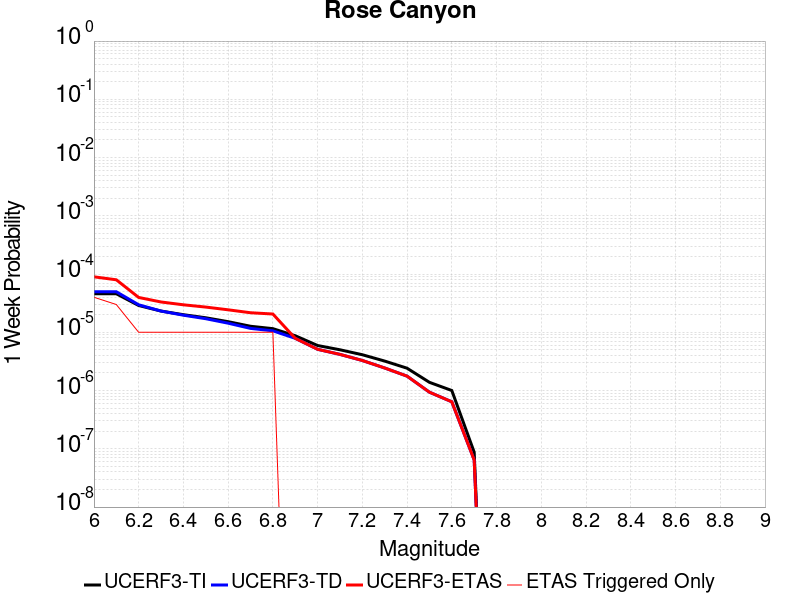 |  | 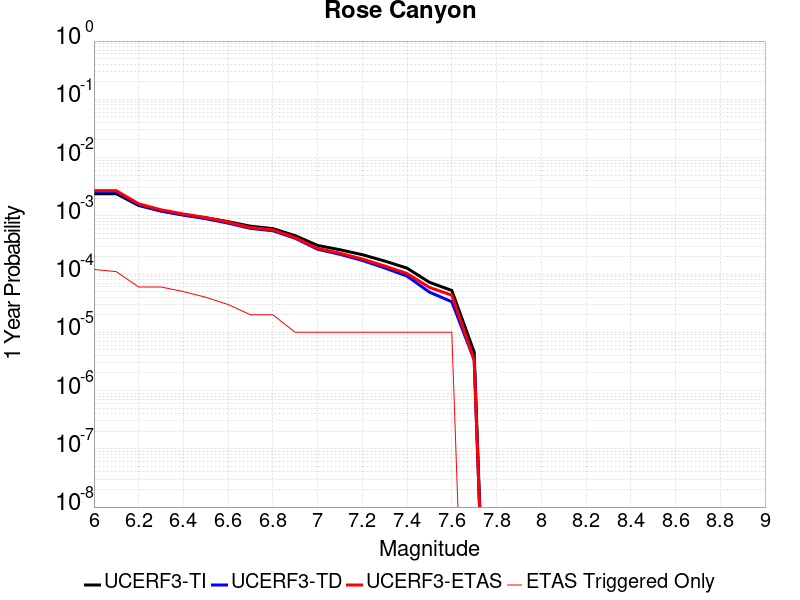 |  |

| Magnitude | 1 wk TI Prob | 1 wk TD Prob | 1 wk ETAS Prob | 1 wk ETAS/TD Gain | 1 wk ETAS Triggered Only | 1 mo TI Prob | 1 mo TD Prob | 1 mo ETAS Prob | 1 mo ETAS/TD Gain | 1 mo ETAS Triggered Only | 1 yr TI Prob | 1 yr TD Prob | 1 yr ETAS Prob | 1 yr ETAS/TD Gain | 1 yr ETAS Triggered Only | 10 yr TI Prob | 10 yr TD Prob | 10 yr ETAS Prob | 10 yr ETAS/TD Gain | 10 yr ETAS Triggered Only |
|-----|-----|-----|-----|-----|-----|-----|-----|-----|-----|-----|-----|-----|-----|-----|-----|-----|-----|-----|-----|-----|
| 6.0 | 4.5923203E-5 | 4.9714225E-5 | 8.971224E-5 | 1.8045586 | 4.0E-5 | 1.9679888E-4 | 2.1304491E-4 | 2.8303E-4 | 1.3284992 | 7.0E-5 | 0.0023933933 | 0.0025909345 | 0.0027106234 | 1.0461954 | 1.2E-4 | 0.023677798 | 0.02563999 | 0.025805632 | 1.0064603 | 1.7E-4 |
| 6.1 | 4.5923203E-5 | 4.9714225E-5 | 7.9712736E-5 | 1.603419 | 3.0E-5 | 1.9679888E-4 | 2.1304491E-4 | 2.7303214E-4 | 1.2815708 | 6.0E-5 | 0.0023933933 | 0.0025909345 | 0.0027006494 | 1.0423458 | 1.1E-4 | 0.023677798 | 0.02563999 | 0.025766658 | 1.0049402 | 1.3E-4 |
| 6.2 | 2.8844734E-5 | 2.9668723E-5 | 3.9668426E-5 | 1.3370453 | 1.0E-5 | 1.2361443E-4 | 1.2714567E-4 | 1.4714313E-4 | 1.1572798 | 2.0E-5 | 0.0015039665 | 0.0015468939 | 0.0016068011 | 1.0387274 | 6.0E-5 | 0.0149382865 | 0.015374276 | 0.0154432 | 1.0044831 | 7.0E-5 |
| 6.3 | 2.3171577E-5 | 2.3161238E-5 | 3.3161006E-5 | 1.4317459 | 1.0E-5 | 9.9302975E-5 | 9.9258745E-5 | 1.19256765E-4 | 1.2014736 | 2.0E-5 | 0.0012083431 | 0.0012078186 | 0.0012677462 | 1.0496163 | 6.0E-5 | 0.012017938 | 0.012022437 | 0.012081715 | 1.0049306 | 6.0E-5 |
| 6.4 | 2.0066604E-5 | 1.9667024E-5 | 2.9666828E-5 | 1.5084553 | 1.0E-5 | 8.599689E-5 | 8.4284584E-5 | 1.04282895E-4 | 1.2372713 | 2.0E-5 | 0.0010465092 | 0.0010256917 | 0.0010756404 | 1.0486976 | 5.0E-5 | 0.010415946 | 0.010217559 | 0.010267047 | 1.0048436 | 5.0E-5 |
| 6.5 | 1.776989E-5 | 1.7113807E-5 | 2.7113636E-5 | 1.5843135 | 1.0E-5 | 7.615444E-5 | 7.334287E-5 | 9.33414E-5 | 1.2726718 | 2.0E-5 | 9.267859E-4 | 8.925905E-4 | 9.3255483E-4 | 1.0447733 | 4.0E-5 | 0.009229303 | 0.008896211 | 0.008935855 | 1.0044563 | 4.0E-5 |
| 6.6 | 1.5227364E-5 | 1.433926E-5 | 2.4339117E-5 | 1.697376 | 1.0E-5 | 6.52585E-5 | 6.1452556E-5 | 7.145194E-5 | 1.1627172 | 1.0E-5 | 7.942326E-4 | 7.479332E-4 | 7.7791075E-4 | 1.0400805 | 3.0E-5 | 0.007914 | 0.007458359 | 0.0074881352 | 1.0039923 | 3.0E-5 |
| 6.7 | 1.2703898E-5 | 1.1673274E-5 | 2.1673157E-5 | 1.8566477 | 1.0E-5 | 5.4444143E-5 | 5.0027378E-5 | 6.002688E-5 | 1.1998806 | 1.0E-5 | 6.626558E-4 | 6.089174E-4 | 6.289052E-4 | 1.0328252 | 2.0E-5 | 0.006606833 | 0.0060750856 | 0.006094964 | 1.0032722 | 2.0E-5 |
| 6.8 | 1.1554917E-5 | 1.0609337E-5 | 2.0609232E-5 | 1.942556 | 1.0E-5 | 4.9520135E-5 | 4.546782E-5 | 5.5467364E-5 | 1.2199258 | 1.0E-5 | 6.0274085E-4 | 5.5343413E-4 | 5.7342305E-4 | 1.036118 | 2.0E-5 | 0.0060110865 | 0.0055225673 | 0.005542457 | 1.0036016 | 2.0E-5 |
| 6.9 | 8.732078E-6 | 7.881357E-6 | 7.881357E-6 | 1.0 | 0.0 | 3.7422655E-5 | 3.3776825E-5 | 3.3776825E-5 | 1.0 | 0.0 | 4.5552556E-4 | 4.111582E-4 | 4.2115408E-4 | 1.0243115 | 1.0E-5 | 0.0045459294 | 0.0041048084 | 0.0041147675 | 1.0024261 | 1.0E-5 |
| 7.0 | 5.9337494E-6 | 5.1074853E-6 | 5.1074853E-6 | 1.0 | 0.0 | 2.5430107E-5 | 2.188904E-5 | 2.188904E-5 | 1.0 | 0.0 | 3.0956755E-4 | 2.664666E-4 | 2.7646395E-4 | 1.0375181 | 1.0E-5 | 0.0030913667 | 0.0026614866 | 0.00267146 | 1.0037473 | 1.0E-5 |
| 7.1 | 5.013409E-6 | 4.1773833E-6 | 4.1773833E-6 | 1.0 | 0.0 | 2.1485863E-5 | 1.7902948E-5 | 1.7902948E-5 | 1.0 | 0.0 | 2.6155898E-4 | 2.179467E-4 | 2.2794452E-4 | 1.0458728 | 1.0E-5 | 0.0026125133 | 0.0021773411 | 0.0021873193 | 1.0045828 | 1.0E-5 |
| 7.2 | 4.120763E-6 | 3.2821383E-6 | 3.2821383E-6 | 1.0 | 0.0 | 1.7660293E-5 | 1.4066231E-5 | 1.4066231E-5 | 1.0 | 0.0 | 2.1499286E-4 | 1.7124301E-4 | 1.812413E-4 | 1.0583866 | 1.0E-5 | 0.0021478499 | 0.00171112 | 0.0017211029 | 1.0058341 | 1.0E-5 |
| 7.3 | 3.2081239E-6 | 2.4405372E-6 | 2.4405372E-6 | 1.0 | 0.0 | 1.374903E-5 | 1.0459404E-5 | 1.0459404E-5 | 1.0 | 0.0 | 1.6738157E-4 | 1.2733586E-4 | 1.373346E-4 | 1.0785224 | 1.0E-5 | 0.0016725556 | 0.001272636 | 0.0012826233 | 1.0078477 | 1.0E-5 |
| 7.4 | 2.4194755E-6 | 1.7680634E-6 | 1.7680634E-6 | 1.0 | 0.0 | 1.0369139E-5 | 7.577393E-6 | 7.577393E-6 | 1.0 | 0.0 | 1.2623696E-4 | 9.2250906E-5 | 1.02249986E-4 | 1.10839 | 1.0E-5 | 0.0012616527 | 9.2213147E-4 | 9.3212223E-4 | 1.0108345 | 1.0E-5 |
| 7.5 | 1.3842889E-6 | 9.3786275E-7 | 9.3786275E-7 | 1.0 | 0.0 | 5.9326535E-6 | 4.019406E-6 | 4.019406E-6 | 1.0 | 0.0 | 7.222766E-5 | 4.8935202E-5 | 5.893471E-5 | 1.2043419 | 1.0E-5 | 7.220419E-4 | 4.892478E-4 | 4.992429E-4 | 1.0204295 | 1.0E-5 |
| 7.6 | 1.0021575E-6 | 6.411463E-7 | 6.411463E-7 | 1.0 | 0.0 | 4.2949537E-6 | 2.7477672E-6 | 2.7477672E-6 | 1.0 | 0.0 | 5.2289808E-5 | 3.3453573E-5 | 4.3453238E-5 | 1.2989117 | 1.0E-5 | 5.2277505E-4 | 3.344875E-4 | 3.4448417E-4 | 1.0298865 | 1.0E-5 |
| 7.7 | 8.7620116E-8 | 6.4492404E-8 | 6.4492404E-8 | 1.0 | 0.0 | 3.7551473E-7 | 2.76396E-7 | 2.76396E-7 | 1.0 | 0.0 | 4.5718825E-6 | 3.3651165E-6 | 3.3651165E-6 | 1.0 | 0.0 | 4.5717883E-5 | 3.3650686E-5 | 3.3650686E-5 | 1.0 | 0.0 |

## Independence rev 2011
*[(top)](#table-of-contents)*

| 1 Week | 1 Month | 1 Year | 10 Year |
|-----|-----|-----|-----|
|  |  |  | 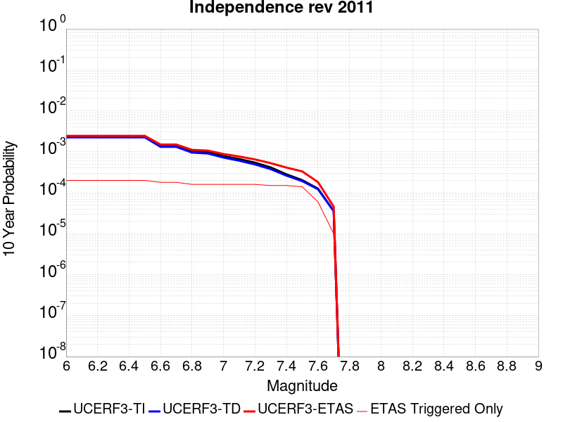 |

| Magnitude | 1 wk TI Prob | 1 wk TD Prob | 1 wk ETAS Prob | 1 wk ETAS/TD Gain | 1 wk ETAS Triggered Only | 1 mo TI Prob | 1 mo TD Prob | 1 mo ETAS Prob | 1 mo ETAS/TD Gain | 1 mo ETAS Triggered Only | 1 yr TI Prob | 1 yr TD Prob | 1 yr ETAS Prob | 1 yr ETAS/TD Gain | 1 yr ETAS Triggered Only | 10 yr TI Prob | 10 yr TD Prob | 10 yr ETAS Prob | 10 yr ETAS/TD Gain | 10 yr ETAS Triggered Only |
|-----|-----|-----|-----|-----|-----|-----|-----|-----|-----|-----|-----|-----|-----|-----|-----|-----|-----|-----|-----|-----|
| 6.0 | 4.422171E-6 | 4.326227E-6 | 8.432588E-5 | 19.491783 | 8.0E-5 | 1.8952025E-5 | 1.8540857E-5 | 1.0853919E-4 | 5.8540545 | 9.0E-5 | 2.3071647E-4 | 2.2571455E-4 | 3.6568294E-4 | 1.6201124 | 1.4E-4 | 0.0023047708 | 0.0022551466 | 0.0024546955 | 1.0884861 | 2.0E-4 |
| 6.1 | 4.422171E-6 | 4.326227E-6 | 8.432588E-5 | 19.491783 | 8.0E-5 | 1.8952025E-5 | 1.8540857E-5 | 1.0853919E-4 | 5.8540545 | 9.0E-5 | 2.3071647E-4 | 2.2571455E-4 | 3.6568294E-4 | 1.6201124 | 1.4E-4 | 0.0023047708 | 0.0022551466 | 0.0024546955 | 1.0884861 | 2.0E-4 |
| 6.2 | 4.422171E-6 | 4.326227E-6 | 8.432588E-5 | 19.491783 | 8.0E-5 | 1.8952025E-5 | 1.8540857E-5 | 1.0853919E-4 | 5.8540545 | 9.0E-5 | 2.3071647E-4 | 2.2571455E-4 | 3.6568294E-4 | 1.6201124 | 1.4E-4 | 0.0023047708 | 0.0022551466 | 0.0024546955 | 1.0884861 | 2.0E-4 |
| 6.3 | 4.422171E-6 | 4.326227E-6 | 8.432588E-5 | 19.491783 | 8.0E-5 | 1.8952025E-5 | 1.8540857E-5 | 1.0853919E-4 | 5.8540545 | 9.0E-5 | 2.3071647E-4 | 2.2571455E-4 | 3.6568294E-4 | 1.6201124 | 1.4E-4 | 0.0023047708 | 0.0022551466 | 0.0024546955 | 1.0884861 | 2.0E-4 |
| 6.4 | 4.422171E-6 | 4.326227E-6 | 8.432588E-5 | 19.491783 | 8.0E-5 | 1.8952025E-5 | 1.8540857E-5 | 1.0853919E-4 | 5.8540545 | 9.0E-5 | 2.3071647E-4 | 2.2571455E-4 | 3.6568294E-4 | 1.6201124 | 1.4E-4 | 0.0023047708 | 0.0022551466 | 0.0024546955 | 1.0884861 | 2.0E-4 |
| 6.5 | 4.422171E-6 | 4.326227E-6 | 8.432588E-5 | 19.491783 | 8.0E-5 | 1.8952025E-5 | 1.8540857E-5 | 1.0853919E-4 | 5.8540545 | 9.0E-5 | 2.3071647E-4 | 2.2571455E-4 | 3.6568294E-4 | 1.6201124 | 1.4E-4 | 0.0023047708 | 0.0022551466 | 0.0024546955 | 1.0884861 | 2.0E-4 |
| 6.6 | 2.663744E-6 | 2.5319862E-6 | 8.2531784E-5 | 32.59567 | 8.0E-5 | 1.1415996E-5 | 1.0851327E-5 | 1.0085035E-4 | 9.293826 | 9.0E-5 | 1.3898089E-4 | 1.3210738E-4 | 2.620902E-4 | 1.983918 | 1.3E-4 | 0.0013889399 | 0.0013203367 | 0.0015000991 | 1.1361488 | 1.8E-4 |
| 6.7 | 2.663744E-6 | 2.5319862E-6 | 8.2531784E-5 | 32.59567 | 8.0E-5 | 1.1415996E-5 | 1.0851327E-5 | 1.0085035E-4 | 9.293826 | 9.0E-5 | 1.3898089E-4 | 1.3210738E-4 | 2.620902E-4 | 1.983918 | 1.3E-4 | 0.0013889399 | 0.0013203367 | 0.0015000991 | 1.1361488 | 1.8E-4 |
| 6.8 | 1.9716529E-6 | 1.8322585E-6 | 7.183213E-5 | 39.204147 | 7.0E-5 | 8.449913E-6 | 7.852514E-6 | 8.7851884E-5 | 11.187741 | 8.0E-5 | 1.0287284E-4 | 9.5600284E-5 | 2.0558976E-4 | 2.1505141 | 1.1E-4 | 0.0010282523 | 9.556045E-4 | 0.0011154516 | 1.1672733 | 1.6E-4 |
| 6.9 | 1.8788617E-6 | 1.7429993E-6 | 7.174288E-5 | 41.160587 | 7.0E-5 | 8.0522395E-6 | 7.4699765E-6 | 8.746938E-5 | 11.709458 | 8.0E-5 | 9.80316E-5 | 9.0943286E-5 | 2.0093328E-4 | 2.209435 | 1.1E-4 | 9.798837E-4 | 9.0907275E-4 | 0.0010689272 | 1.1758435 | 1.6E-4 |
| 7.0 | 1.5045488E-6 | 1.3849503E-6 | 7.138486E-5 | 51.543255 | 7.0E-5 | 6.44805E-6 | 5.9354884E-6 | 8.593501E-5 | 14.47817 | 8.0E-5 | 7.8502184E-5 | 7.226223E-5 | 1.8225428E-4 | 2.5221238 | 1.1E-4 | 7.8474457E-4 | 7.2239246E-4 | 8.8227686E-4 | 1.2213262 | 1.6E-4 |
| 7.1 | 1.272341E-6 | 1.1625096E-6 | 7.116243E-5 | 61.21448 | 7.0E-5 | 5.4528787E-6 | 4.982175E-6 | 8.498177E-5 | 17.057163 | 8.0E-5 | 6.6386776E-5 | 6.0656326E-5 | 1.7064966E-4 | 2.813386 | 1.1E-4 | 6.636695E-4 | 6.064009E-4 | 7.6630386E-4 | 1.2636919 | 1.6E-4 |
| 7.2 | 1.0416892E-6 | 9.4098806E-7 | 7.094092E-5 | 75.389824 | 7.0E-5 | 4.464375E-6 | 4.0328E-6 | 8.403248E-5 | 20.837255 | 8.0E-5 | 5.4352407E-5 | 4.909825E-5 | 1.5909284E-4 | 3.2402956 | 1.1E-4 | 5.4339116E-4 | 4.9087586E-4 | 6.5079733E-4 | 1.325788 | 1.6E-4 |
| 7.3 | 7.9450155E-7 | 7.235002E-7 | 7.072345E-5 | 97.75181 | 7.0E-5 | 3.4050022E-6 | 3.1007114E-6 | 8.3100465E-5 | 26.800451 | 8.0E-5 | 4.1455114E-5 | 3.775052E-5 | 1.4774637E-4 | 3.9137573 | 1.1E-4 | 4.144738E-4 | 3.7744216E-4 | 5.2738556E-4 | 1.3972619 | 1.5E-4 |
| 7.4 | 5.3893444E-7 | 5.019512E-7 | 7.050192E-5 | 140.45572 | 7.0E-5 | 2.309717E-6 | 2.1512178E-6 | 8.215105E-5 | 38.18816 | 8.0E-5 | 2.8120441E-5 | 2.6190766E-5 | 1.3618788E-4 | 5.1998434 | 1.1E-4 | 2.8116882E-4 | 2.6187726E-4 | 4.1183797E-4 | 1.5726374 | 1.5E-4 |
| 7.5 | 3.8852085E-7 | 3.682554E-7 | 6.0368235E-5 | 163.93034 | 6.0E-5 | 1.6650882E-6 | 1.5782365E-6 | 7.157813E-5 | 45.353233 | 7.0E-5 | 2.027226E-5 | 1.9214862E-5 | 1.1921294E-4 | 6.204205 | 1.0E-4 | 2.0270412E-4 | 1.9213221E-4 | 3.3210532E-4 | 1.7285249 | 1.4E-4 |
| 7.6 | 2.414929E-7 | 2.345755E-7 | 2.0234571E-5 | 86.260376 | 2.0E-5 | 1.0349692E-6 | 1.0053232E-6 | 3.1005293E-5 | 30.84112 | 3.0E-5 | 1.2600677E-5 | 1.2239742E-5 | 6.223913E-5 | 5.0850034 | 5.0E-5 | 1.2599962E-4 | 1.223908E-4 | 1.8238346E-4 | 1.4901729 | 6.0E-5 |
| 7.7 | 6.8298014E-8 | 6.85897E-8 | 1.0068589E-5 | 146.79448 | 1.0E-5 | 2.9270575E-7 | 2.9395582E-7 | 1.0293953E-5 | 35.018707 | 1.0E-5 | 3.5636867E-6 | 3.5789067E-6 | 1.35788705E-5 | 3.7941394 | 1.0E-5 | 3.5636294E-5 | 3.5788536E-5 | 4.578818E-5 | 1.279409 | 1.0E-5 |

## Pinto Mtn
*[(top)](#table-of-contents)*

| 1 Week | 1 Month | 1 Year | 10 Year |
|-----|-----|-----|-----|
|  |  | 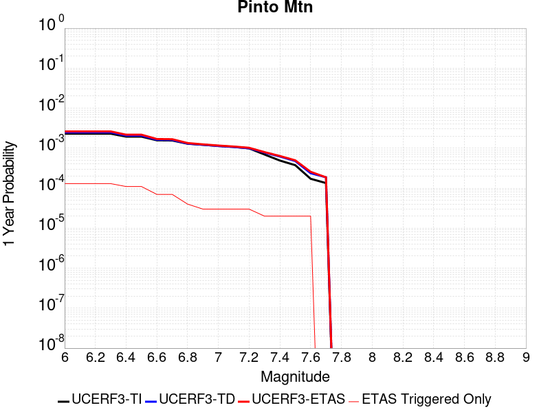 |  |

| Magnitude | 1 wk TI Prob | 1 wk TD Prob | 1 wk ETAS Prob | 1 wk ETAS/TD Gain | 1 wk ETAS Triggered Only | 1 mo TI Prob | 1 mo TD Prob | 1 mo ETAS Prob | 1 mo ETAS/TD Gain | 1 mo ETAS Triggered Only | 1 yr TI Prob | 1 yr TD Prob | 1 yr ETAS Prob | 1 yr ETAS/TD Gain | 1 yr ETAS Triggered Only | 10 yr TI Prob | 10 yr TD Prob | 10 yr ETAS Prob | 10 yr ETAS/TD Gain | 10 yr ETAS Triggered Only |
|-----|-----|-----|-----|-----|-----|-----|-----|-----|-----|-----|-----|-----|-----|-----|-----|-----|-----|-----|-----|-----|
| 6.0 | 4.4194956E-5 | 4.785362E-5 | 8.78517E-5 | 1.8358425 | 4.0E-5 | 1.893932E-4 | 2.0507174E-4 | 2.8505534E-4 | 1.3900274 | 8.0E-5 | 0.0023034236 | 0.0024940541 | 0.0026237299 | 1.051994 | 1.3E-4 | 0.022796938 | 0.024678145 | 0.024863455 | 1.0075091 | 1.9E-4 |
| 6.1 | 4.4194956E-5 | 4.785362E-5 | 8.78517E-5 | 1.8358425 | 4.0E-5 | 1.893932E-4 | 2.0507174E-4 | 2.8505534E-4 | 1.3900274 | 8.0E-5 | 0.0023034236 | 0.0024940541 | 0.0026237299 | 1.051994 | 1.3E-4 | 0.022796938 | 0.024678145 | 0.024863455 | 1.0075091 | 1.9E-4 |
| 6.2 | 4.4194956E-5 | 4.785362E-5 | 8.78517E-5 | 1.8358425 | 4.0E-5 | 1.893932E-4 | 2.0507174E-4 | 2.8505534E-4 | 1.3900274 | 8.0E-5 | 0.0023034236 | 0.0024940541 | 0.0026237299 | 1.051994 | 1.3E-4 | 0.022796938 | 0.024678145 | 0.024863455 | 1.0075091 | 1.9E-4 |
| 6.3 | 4.4194956E-5 | 4.785362E-5 | 8.78517E-5 | 1.8358425 | 4.0E-5 | 1.893932E-4 | 2.0507174E-4 | 2.8505534E-4 | 1.3900274 | 8.0E-5 | 0.0023034236 | 0.0024940541 | 0.0026237299 | 1.051994 | 1.3E-4 | 0.022796938 | 0.024678145 | 0.024863455 | 1.0075091 | 1.9E-4 |
| 6.4 | 3.729929E-5 | 3.9603186E-5 | 7.96016E-5 | 2.0099797 | 4.0E-5 | 1.5984432E-4 | 1.6971743E-4 | 2.3970555E-4 | 1.4123803 | 7.0E-5 | 0.0019443673 | 0.002064445 | 0.002174218 | 1.0531731 | 1.1E-4 | 0.019274427 | 0.02046269 | 0.020619417 | 1.0076591 | 1.6E-4 |
| 6.5 | 3.729929E-5 | 3.9603186E-5 | 7.96016E-5 | 2.0099797 | 4.0E-5 | 1.5984432E-4 | 1.6971743E-4 | 2.3970555E-4 | 1.4123803 | 7.0E-5 | 0.0019443673 | 0.002064445 | 0.002174218 | 1.0531731 | 1.1E-4 | 0.019274427 | 0.02046269 | 0.020619417 | 1.0076591 | 1.6E-4 |
| 6.6 | 3.0204548E-5 | 3.1205298E-5 | 6.120436E-5 | 1.9613452 | 3.0E-5 | 1.2944164E-4 | 1.3373033E-4 | 1.7372498E-4 | 1.2990694 | 4.0E-5 | 0.0015748127 | 0.0016269855 | 0.0016968716 | 1.0429543 | 7.0E-5 | 0.015636992 | 0.01615461 | 0.01627267 | 1.0073082 | 1.2E-4 |
| 6.7 | 2.9857754E-5 | 3.081468E-5 | 6.0813756E-5 | 1.9735318 | 3.0E-5 | 1.2795553E-4 | 1.3205643E-4 | 1.7205115E-4 | 1.3028609 | 4.0E-5 | 0.0015567453 | 0.001606636 | 0.0016765235 | 1.0434994 | 7.0E-5 | 0.015458848 | 0.01595405 | 0.016072134 | 1.0074016 | 1.2E-4 |
| 6.8 | 2.4819734E-5 | 2.5009364E-5 | 3.5009114E-5 | 1.3998402 | 1.0E-5 | 1.0636595E-4 | 1.07178705E-4 | 1.2717657E-4 | 1.1865842 | 2.0E-5 | 0.0012942362 | 0.0013041412 | 0.001344089 | 1.0306315 | 4.0E-5 | 0.012867244 | 0.0129672475 | 0.01305608 | 1.0068506 | 9.0E-5 |
| 6.9 | 2.331124E-5 | 2.3337643E-5 | 3.333741E-5 | 1.4284823 | 1.0E-5 | 9.990149E-5 | 1.00014746E-4 | 1.20012744E-4 | 1.1999505 | 2.0E-5 | 0.001215622 | 0.0012170197 | 0.0012469832 | 1.0246204 | 3.0E-5 | 0.012089936 | 0.012105742 | 0.012165015 | 1.0048963 | 6.0E-5 |
| 7.0 | 2.1818534E-5 | 2.1760772E-5 | 3.1760555E-5 | 1.4595325 | 1.0E-5 | 9.3504656E-5 | 9.325723E-5 | 1.13255366E-4 | 1.2144406 | 2.0E-5 | 0.0011378246 | 0.0011348352 | 0.0011648012 | 1.0264056 | 3.0E-5 | 0.011320163 | 0.011292503 | 0.011351826 | 1.0052533 | 6.0E-5 |
| 7.1 | 2.066081E-5 | 2.0540418E-5 | 3.0540214E-5 | 1.486835 | 1.0E-5 | 8.854332E-5 | 8.8027504E-5 | 1.0802574E-4 | 1.2271817 | 2.0E-5 | 0.0010774818 | 0.0010712275 | 0.0011011953 | 1.0279752 | 3.0E-5 | 0.010722724 | 0.010662688 | 0.010722049 | 1.0055671 | 6.0E-5 |
| 7.2 | 1.8990233E-5 | 1.9053701E-5 | 2.9053512E-5 | 1.5248224 | 1.0E-5 | 8.138417E-5 | 8.1656275E-5 | 1.01654645E-4 | 1.2449092 | 2.0E-5 | 9.904018E-4 | 9.937311E-4 | 0.0010237013 | 1.0301592 | 3.0E-5 | 0.009859995 | 0.009894874 | 0.00995428 | 1.0060037 | 6.0E-5 |
| 7.3 | 1.3335872E-5 | 1.4906372E-5 | 2.4906223E-5 | 1.6708441 | 1.0E-5 | 5.7152483E-5 | 6.388296E-5 | 7.388232E-5 | 1.1565263 | 1.0E-5 | 6.956093E-4 | 7.775102E-4 | 7.9749466E-4 | 1.0257032 | 2.0E-5 | 0.006934359 | 0.0077491994 | 0.007788889 | 1.0051218 | 4.0E-5 |
| 7.4 | 9.414066E-6 | 1.186061E-5 | 2.1860491E-5 | 1.843117 | 1.0E-5 | 4.0345374E-5 | 5.0830247E-5 | 6.082974E-5 | 1.1967232 | 1.0E-5 | 4.910942E-4 | 6.1869196E-4 | 6.386796E-4 | 1.0323063 | 2.0E-5 | 0.0049001034 | 0.006170644 | 0.006210397 | 1.0064423 | 4.0E-5 |
| 7.5 | 7.2101157E-6 | 9.157893E-6 | 1.9157802E-5 | 2.0919442 | 1.0E-5 | 3.090013E-5 | 3.924757E-5 | 4.9247177E-5 | 1.2547828 | 1.0E-5 | 3.7614413E-4 | 4.7774217E-4 | 4.977326E-4 | 1.0418435 | 2.0E-5 | 0.0037550807 | 0.004767927 | 0.0047977837 | 1.0062621 | 3.0E-5 |
| 7.6 | 3.296375E-6 | 4.5453176E-6 | 1.4545272E-5 | 3.2000563 | 1.0E-5 | 1.4127245E-5 | 1.9479796E-5 | 2.9479601E-5 | 1.5133424 | 1.0E-5 | 1.7198564E-4 | 2.3714209E-4 | 2.5713735E-4 | 1.0843176 | 2.0E-5 | 0.0017185259 | 0.0023690276 | 0.0023889802 | 1.0084223 | 2.0E-5 |
| 7.7 | 2.5741092E-6 | 3.584251E-6 | 3.584251E-6 | 1.0 | 0.0 | 1.103185E-5 | 1.5360993E-5 | 1.5360993E-5 | 1.0 | 0.0 | 1.3430449E-4 | 1.8700535E-4 | 1.8700535E-4 | 1.0 | 0.0 | 0.0013422335 | 0.0018686098 | 0.0018686098 | 1.0 | 0.0 |

## San Jacinto (San Jacinto Valley) rev
*[(top)](#table-of-contents)*

| 1 Week | 1 Month | 1 Year | 10 Year |
|-----|-----|-----|-----|
|  |  |  |  |

| Magnitude | 1 wk TI Prob | 1 wk TD Prob | 1 wk ETAS Prob | 1 wk ETAS/TD Gain | 1 wk ETAS Triggered Only | 1 mo TI Prob | 1 mo TD Prob | 1 mo ETAS Prob | 1 mo ETAS/TD Gain | 1 mo ETAS Triggered Only | 1 yr TI Prob | 1 yr TD Prob | 1 yr ETAS Prob | 1 yr ETAS/TD Gain | 1 yr ETAS Triggered Only | 10 yr TI Prob | 10 yr TD Prob | 10 yr ETAS Prob | 10 yr ETAS/TD Gain | 10 yr ETAS Triggered Only |
|-----|-----|-----|-----|-----|-----|-----|-----|-----|-----|-----|-----|-----|-----|-----|-----|-----|-----|-----|-----|-----|
| 6.0 | 3.652694E-5 | 3.4402394E-5 | 1.1439964E-4 | 3.3253398 | 8.0E-5 | 1.5653463E-4 | 1.474305E-4 | 2.4741577E-4 | 1.6781857 | 1.0E-4 | 0.0019041431 | 0.00179349 | 0.0019132748 | 1.0667887 | 1.2E-4 | 0.018879099 | 0.018526595 | 0.018713076 | 1.0100656 | 1.9E-4 |
| 6.1 | 3.652694E-5 | 3.4402394E-5 | 1.1439964E-4 | 3.3253398 | 8.0E-5 | 1.5653463E-4 | 1.474305E-4 | 2.4741577E-4 | 1.6781857 | 1.0E-4 | 0.0019041431 | 0.00179349 | 0.0019132748 | 1.0667887 | 1.2E-4 | 0.018879099 | 0.018526595 | 0.018713076 | 1.0100656 | 1.9E-4 |
| 6.2 | 3.652694E-5 | 3.4402394E-5 | 1.1439964E-4 | 3.3253398 | 8.0E-5 | 1.5653463E-4 | 1.474305E-4 | 2.4741577E-4 | 1.6781857 | 1.0E-4 | 0.0019041431 | 0.00179349 | 0.0019132748 | 1.0667887 | 1.2E-4 | 0.018879099 | 0.018526595 | 0.018713076 | 1.0100656 | 1.9E-4 |
| 6.3 | 3.652694E-5 | 3.4402394E-5 | 1.1439964E-4 | 3.3253398 | 8.0E-5 | 1.5653463E-4 | 1.474305E-4 | 2.4741577E-4 | 1.6781857 | 1.0E-4 | 0.0019041431 | 0.00179349 | 0.0019132748 | 1.0667887 | 1.2E-4 | 0.018879099 | 0.018526595 | 0.018713076 | 1.0100656 | 1.9E-4 |
| 6.4 | 3.646941E-5 | 3.432397E-5 | 1.1432122E-4 | 3.3306527 | 8.0E-5 | 1.5628811E-4 | 1.4709444E-4 | 2.4707973E-4 | 1.6797353 | 1.0E-4 | 0.0019011468 | 0.0017894056 | 0.0019091909 | 1.0669414 | 1.2E-4 | 0.018849645 | 0.018486476 | 0.018672964 | 1.0100877 | 1.9E-4 |
| 6.5 | 3.646941E-5 | 3.432397E-5 | 1.1432122E-4 | 3.3306527 | 8.0E-5 | 1.5628811E-4 | 1.4709444E-4 | 2.4707973E-4 | 1.6797353 | 1.0E-4 | 0.0019011468 | 0.0017894056 | 0.0019091909 | 1.0669414 | 1.2E-4 | 0.018849645 | 0.018486476 | 0.018672964 | 1.0100877 | 1.9E-4 |
| 6.6 | 3.6442503E-5 | 3.4287354E-5 | 1.1428461E-4 | 3.3331418 | 8.0E-5 | 1.561728E-4 | 1.4693754E-4 | 2.4692283E-4 | 1.6804613 | 1.0E-4 | 0.0018997455 | 0.0017874985 | 0.001907284 | 1.0670129 | 1.2E-4 | 0.018835869 | 0.018467745 | 0.018654237 | 1.0100982 | 1.9E-4 |
| 6.7 | 3.6432113E-5 | 3.4272925E-5 | 1.1427019E-4 | 3.3341238 | 8.0E-5 | 1.5612828E-4 | 1.4687571E-4 | 2.4686102E-4 | 1.6807477 | 1.0E-4 | 0.0018992044 | 0.0017867472 | 0.0019065328 | 1.0670412 | 1.2E-4 | 0.018830549 | 0.018460369 | 0.01864686 | 1.0101023 | 1.9E-4 |
| 6.8 | 3.6409598E-5 | 3.424198E-5 | 1.1423924E-4 | 3.3362334 | 8.0E-5 | 1.560318E-4 | 1.4674311E-4 | 2.4672842E-4 | 1.681363 | 1.0E-4 | 0.0018980318 | 0.0017851355 | 0.0019049213 | 1.0671018 | 1.2E-4 | 0.018819023 | 0.018444523 | 0.018631019 | 1.0101112 | 1.9E-4 |
| 6.9 | 3.638078E-5 | 3.4202407E-5 | 1.1419967E-4 | 3.3389368 | 8.0E-5 | 1.5590832E-4 | 1.4657351E-4 | 2.4655886E-4 | 1.6821514 | 1.0E-4 | 0.0018965311 | 0.001783074 | 0.0019028601 | 1.0671796 | 1.2E-4 | 0.018804269 | 0.018424258 | 0.018610757 | 1.0101225 | 1.9E-4 |
| 7.0 | 3.6294874E-5 | 3.408442E-5 | 1.140817E-4 | 3.3470335 | 8.0E-5 | 1.5554018E-4 | 1.4606792E-4 | 2.4605333E-4 | 1.684513 | 1.0E-4 | 0.0018920569 | 0.001776929 | 0.0018967157 | 1.0674123 | 1.2E-4 | 0.018760284 | 0.018363839 | 0.01855035 | 1.0101564 | 1.9E-4 |
| 7.1 | 3.6260717E-5 | 3.4040702E-5 | 1.1403798E-4 | 3.3500478 | 8.0E-5 | 1.5539382E-4 | 1.4588058E-4 | 2.45866E-4 | 1.6853921 | 1.0E-4 | 0.001890278 | 0.0017746518 | 0.0018944389 | 1.0674989 | 1.2E-4 | 0.018742796 | 0.018341439 | 0.018527955 | 1.010169 | 1.9E-4 |
| 7.2 | 3.6210204E-5 | 3.397492E-5 | 1.139722E-4 | 3.354598 | 8.0E-5 | 1.5517735E-4 | 1.455987E-4 | 2.4558415E-4 | 1.6867193 | 1.0E-4 | 0.001887647 | 0.0017712255 | 0.0018910129 | 1.0676297 | 1.2E-4 | 0.01871693 | 0.01830772 | 0.018494241 | 1.0101881 | 1.9E-4 |
| 7.3 | 3.6119454E-5 | 3.386321E-5 | 1.138605E-4 | 3.362366 | 8.0E-5 | 1.5478847E-4 | 1.4511998E-4 | 2.4510548E-4 | 1.688985 | 1.0E-4 | 0.0018829206 | 0.0017654065 | 0.0018851947 | 1.067853 | 1.2E-4 | 0.018670462 | 0.018250274 | 0.018436804 | 1.0102208 | 1.9E-4 |
| 7.4 | 3.607848E-5 | 3.381071E-5 | 1.13808004E-4 | 3.3660343 | 8.0E-5 | 1.5461289E-4 | 1.44895E-4 | 2.448805E-4 | 1.6900549 | 1.0E-4 | 0.0018807866 | 0.0017626719 | 0.0018824604 | 1.0679585 | 1.2E-4 | 0.018649481 | 0.018223269 | 0.018409805 | 1.0102363 | 1.9E-4 |
| 7.5 | 3.5856774E-5 | 3.3620483E-5 | 1.1361779E-4 | 3.379422 | 8.0E-5 | 1.5366284E-4 | 1.4407984E-4 | 2.4406542E-4 | 1.6939597 | 1.0E-4 | 0.0018692396 | 0.0017527633 | 0.0018725529 | 1.0683433 | 1.2E-4 | 0.018535944 | 0.018124366 | 0.018310923 | 1.0102931 | 1.9E-4 |
| 7.6 | 3.286655E-5 | 3.2143445E-5 | 1.1214088E-4 | 3.4887633 | 8.0E-5 | 1.4084904E-4 | 1.3775036E-4 | 2.3773659E-4 | 1.7258509 | 1.0E-4 | 0.001713488 | 0.0016758227 | 0.0017956215 | 1.0714866 | 1.2E-4 | 0.017003361 | 0.017344031 | 0.017530736 | 1.0107647 | 1.9E-4 |
| 7.7 | 2.8882527E-5 | 2.9236293E-5 | 1.0923395E-4 | 3.736245 | 8.0E-5 | 1.237764E-4 | 1.2529238E-4 | 2.152811E-4 | 1.7182298 | 9.0E-5 | 0.0015059357 | 0.0015243685 | 0.0016342008 | 1.072051 | 1.1E-4 | 0.014957713 | 0.015830461 | 0.016007612 | 1.0111905 | 1.8E-4 |
| 7.8 | 2.4950225E-5 | 2.6527203E-5 | 1.0652508E-4 | 4.015692 | 8.0E-5 | 1.0692515E-4 | 1.1368306E-4 | 2.0367284E-4 | 1.7915846 | 9.0E-5 | 0.0013010362 | 0.0013832134 | 0.0014930613 | 1.079415 | 1.1E-4 | 0.012934455 | 0.014411755 | 0.014589161 | 1.0123098 | 1.8E-4 |
| 7.9 | 1.9881603E-5 | 2.1507445E-5 | 1.0150573E-4 | 4.719562 | 8.0E-5 | 8.520408E-5 | 9.217151E-5 | 1.8216322E-4 | 1.9763505 | 9.0E-5 | 0.001036866 | 0.0011216112 | 0.001221499 | 1.0890574 | 1.0E-4 | 0.010320415 | 0.011777027 | 0.011945024 | 1.014265 | 1.7E-4 |
| 8.0 | 1.563292E-5 | 1.5937347E-5 | 5.5936707E-5 | 3.5097883 | 4.0E-5 | 6.6996516E-5 | 6.8301124E-5 | 1.18297714E-4 | 1.7320024 | 5.0E-5 | 8.153773E-4 | 8.3124964E-4 | 8.9119974E-4 | 1.0721204 | 6.0E-5 | 0.00812392 | 0.008810506 | 0.008929449 | 1.0135001 | 1.2E-4 |
| 8.1 | 1.0045313E-5 | 8.301802E-6 | 2.8301636E-5 | 3.4090953 | 2.0E-5 | 4.305063E-5 | 3.5578672E-5 | 6.55776E-5 | 1.8431718 | 3.0E-5 | 5.2401534E-4 | 4.3308473E-4 | 4.7306743E-4 | 1.0923207 | 4.0E-5 | 0.0052278144 | 0.0046591135 | 0.004718834 | 1.012818 | 6.0E-5 |
| 8.2 | 4.1554413E-6 | 1.5655598E-6 | 1.5655598E-6 | 1.0 | 0.0 | 1.7808914E-5 | 6.709525E-6 | 6.709525E-6 | 1.0 | 0.0 | 2.1680194E-4 | 8.168544E-5 | 8.168544E-5 | 1.0 | 0.0 | 0.0021659054 | 9.482903E-4 | 9.482903E-4 | 1.0 | 0.0 |
| 8.3 | 1.2758221E-6 | 3.6149942E-7 | 3.6149942E-7 | 1.0 | 0.0 | 5.4677976E-6 | 1.5492824E-6 | 1.5492824E-6 | 1.0 | 0.0 | 6.65684E-5 | 1.8862354E-5 | 1.8862354E-5 | 1.0 | 0.0 | 6.6548464E-4 | 2.2751294E-4 | 2.2751294E-4 | 1.0 | 0.0 |

## Imperial
*[(top)](#table-of-contents)*

| 1 Week | 1 Month | 1 Year | 10 Year |
|-----|-----|-----|-----|
|  |  |  |  |

| Magnitude | 1 wk TI Prob | 1 wk TD Prob | 1 wk ETAS Prob | 1 wk ETAS/TD Gain | 1 wk ETAS Triggered Only | 1 mo TI Prob | 1 mo TD Prob | 1 mo ETAS Prob | 1 mo ETAS/TD Gain | 1 mo ETAS Triggered Only | 1 yr TI Prob | 1 yr TD Prob | 1 yr ETAS Prob | 1 yr ETAS/TD Gain | 1 yr ETAS Triggered Only | 10 yr TI Prob | 10 yr TD Prob | 10 yr ETAS Prob | 10 yr ETAS/TD Gain | 10 yr ETAS Triggered Only |
|-----|-----|-----|-----|-----|-----|-----|-----|-----|-----|-----|-----|-----|-----|-----|-----|-----|-----|-----|-----|-----|
| 6.0 | 2.7496446E-4 | 5.0552754E-4 | 5.3551234E-4 | 1.0593139 | 3.0E-5 | 0.0011778869 | 0.002164787 | 0.002224657 | 1.0276563 | 6.0E-5 | 0.0142467655 | 0.026038699 | 0.026145834 | 1.0041145 | 1.1E-4 | 0.13367249 | 0.2280438 | 0.22819047 | 1.0006431 | 1.9E-4 |
| 6.1 | 2.5356023E-4 | 4.8656776E-4 | 5.165532E-4 | 1.0616263 | 3.0E-5 | 0.001086234 | 0.0020836622 | 0.002133558 | 1.0239462 | 5.0E-5 | 0.013144928 | 0.025071215 | 0.025168708 | 1.0038886 | 1.0E-4 | 0.123940155 | 0.21947981 | 0.2196125 | 1.0006045 | 1.7E-4 |
| 6.2 | 2.4820742E-4 | 4.7752203E-4 | 5.075077E-4 | 1.0627943 | 3.0E-5 | 0.0010633124 | 0.0020449557 | 0.0020948534 | 1.0244004 | 5.0E-5 | 0.01286919 | 0.024611235 | 0.02469902 | 1.0035669 | 9.0E-5 | 0.12148927 | 0.21598552 | 0.21611096 | 1.0005808 | 1.6E-4 |
| 6.3 | 2.3205351E-4 | 4.5890483E-4 | 4.8889103E-4 | 1.065343 | 3.0E-5 | 9.94136E-4 | 0.0019652895 | 0.0020151911 | 1.0253916 | 5.0E-5 | 0.012036599 | 0.02366133 | 0.0237492 | 1.0037137 | 9.0E-5 | 0.11405133 | 0.20793462 | 0.20806135 | 1.0006095 | 1.6E-4 |
| 6.4 | 2.0304754E-4 | 3.987652E-4 | 4.2875324E-4 | 1.0752022 | 3.0E-5 | 8.6991355E-4 | 0.0017078889 | 0.0017578036 | 1.029226 | 5.0E-5 | 0.010539869 | 0.020595672 | 0.020674024 | 1.0038043 | 8.0E-5 | 0.100537635 | 0.1850669 | 0.18518913 | 1.0006605 | 1.5E-4 |
| 6.5 | 1.854992E-4 | 3.6988858E-4 | 3.998775E-4 | 1.0810755 | 3.0E-5 | 7.9475436E-4 | 0.0015842861 | 0.0016342069 | 1.03151 | 5.0E-5 | 0.009633281 | 0.01911948 | 0.019197952 | 1.0041043 | 8.0E-5 | 0.0922623 | 0.173298 | 0.17342201 | 1.0007156 | 1.5E-4 |
| 6.6 | 1.6586106E-4 | 3.403506E-4 | 3.7034042E-4 | 1.0881144 | 3.0E-5 | 7.106394E-4 | 0.0014578402 | 0.0015077674 | 1.0342473 | 5.0E-5 | 0.008617763 | 0.01760642 | 0.017685011 | 1.0044638 | 8.0E-5 | 0.08291132 | 0.16077545 | 0.16090132 | 1.000783 | 1.5E-4 |
| 6.7 | 1.4224656E-4 | 3.076692E-4 | 3.3765996E-4 | 1.0974773 | 3.0E-5 | 6.094856E-4 | 0.001317924 | 0.0013678581 | 1.0378884 | 5.0E-5 | 0.0073952693 | 0.015929576 | 0.016008303 | 1.004942 | 8.0E-5 | 0.07153955 | 0.14648417 | 0.1466122 | 1.000874 | 1.5E-4 |
| 6.8 | 1.2317259E-4 | 2.779122E-4 | 3.0790386E-4 | 1.1079178 | 3.0E-5 | 5.2777573E-4 | 0.0011905148 | 0.0012404552 | 1.0419487 | 5.0E-5 | 0.0064067547 | 0.0143995695 | 0.014478418 | 1.0054758 | 8.0E-5 | 0.06225166 | 0.13293684 | 0.1330669 | 1.0009784 | 1.5E-4 |
| 6.9 | 9.859898E-5 | 2.5014306E-4 | 2.8013554E-4 | 1.1199014 | 3.0E-5 | 4.2249862E-4 | 0.0010716055 | 0.0011215518 | 1.0466089 | 5.0E-5 | 0.0051317946 | 0.012969712 | 0.013048674 | 1.0060883 | 8.0E-5 | 0.05014893 | 0.11940631 | 0.119538404 | 1.0011063 | 1.5E-4 |
| 7.0 | 7.3191884E-5 | 2.1266776E-4 | 2.4266138E-4 | 1.1410351 | 3.0E-5 | 3.136418E-4 | 9.1111806E-4 | 9.610725E-4 | 1.0548276 | 5.0E-5 | 0.003811904 | 0.011037128 | 0.011116245 | 1.0071683 | 8.0E-5 | 0.037471764 | 0.10206493 | 0.102199614 | 1.0013196 | 1.5E-4 |
| 7.1 | 7.1760296E-5 | 2.0968143E-4 | 2.3967514E-4 | 1.1430442 | 3.0E-5 | 3.0750787E-4 | 8.983284E-4 | 9.482834E-4 | 1.055609 | 5.0E-5 | 0.003737482 | 0.010882978 | 0.010962107 | 1.0072709 | 8.0E-5 | 0.03675245 | 0.10070146 | 0.10083635 | 1.0013396 | 1.5E-4 |
| 7.2 | 6.46614E-5 | 1.9136685E-4 | 2.2136112E-4 | 1.156737 | 3.0E-5 | 2.7709085E-4 | 8.1988896E-4 | 8.6984795E-4 | 1.0609338 | 5.0E-5 | 0.0033683628 | 0.0099370815 | 0.010016287 | 1.0079707 | 8.0E-5 | 0.033177625 | 0.09250898 | 0.0926451 | 1.0014715 | 1.5E-4 |
| 7.3 | 6.088115E-5 | 1.78084E-4 | 2.0807865E-4 | 1.1684299 | 3.0E-5 | 2.6089314E-4 | 7.6299673E-4 | 8.129586E-4 | 1.0654811 | 5.0E-5 | 0.0031717476 | 0.009250494 | 0.009329754 | 1.0085682 | 8.0E-5 | 0.031268585 | 0.08655989 | 0.08669691 | 1.0015829 | 1.5E-4 |
| 7.4 | 4.199346E-5 | 1.1510366E-4 | 1.4510022E-4 | 1.2606046 | 3.0E-5 | 1.7995955E-4 | 4.9320905E-4 | 5.3318933E-4 | 1.0810615 | 4.0E-5 | 0.0021888057 | 0.0059884563 | 0.006058037 | 1.0116192 | 7.0E-5 | 0.02167372 | 0.057439793 | 0.05756233 | 1.0021333 | 1.3E-4 |
| 7.5 | 3.130448E-5 | 8.33328E-5 | 1.03331135E-4 | 1.2399815 | 2.0E-5 | 1.3415517E-4 | 3.57092E-4 | 3.870813E-4 | 1.083982 | 3.0E-5 | 0.0016321153 | 0.004338988 | 0.004398728 | 1.0137681 | 6.0E-5 | 0.016201803 | 0.04213201 | 0.042246953 | 1.0027282 | 1.2E-4 |
| 7.6 | 2.3074248E-5 | 6.0844646E-5 | 7.084404E-5 | 1.164343 | 1.0E-5 | 9.888588E-5 | 2.6073685E-4 | 2.8073162E-4 | 1.0766857 | 2.0E-5 | 0.0012032706 | 0.0031698733 | 0.0032197149 | 1.0157235 | 5.0E-5 | 0.011967761 | 0.031026395 | 0.031113602 | 1.0028107 | 9.0E-5 |
| 7.7 | 1.45864815E-5 | 4.0124698E-5 | 5.0124298E-5 | 1.2492131 | 1.0E-5 | 6.2511994E-5 | 1.7195169E-4 | 1.9194825E-4 | 1.1162918 | 2.0E-5 | 7.608177E-4 | 0.0020915072 | 0.0021414026 | 1.0238562 | 5.0E-5 | 0.007582182 | 0.020627763 | 0.020715907 | 1.004273 | 9.0E-5 |
| 7.8 | 1.0352979E-5 | 3.0960902E-5 | 4.0960593E-5 | 1.322978 | 1.0E-5 | 4.4369157E-5 | 1.3268284E-4 | 1.5268018E-4 | 1.1507154 | 2.0E-5 | 5.400606E-4 | 0.0016142189 | 0.0016641383 | 1.0309247 | 5.0E-5 | 0.0053875 | 0.016016833 | 0.016105391 | 1.005529 | 9.0E-5 |
| 7.9 | 8.137906E-6 | 2.2149103E-5 | 3.214888E-5 | 1.4514756 | 1.0E-5 | 3.4876273E-5 | 9.492128E-5 | 1.1491938E-4 | 1.210681 | 2.0E-5 | 4.2453592E-4 | 0.0011550548 | 0.0011950086 | 1.0345904 | 4.0E-5 | 0.004237258 | 0.011617903 | 0.01168709 | 1.0059552 | 7.0E-5 |
| 8.0 | 6.93792E-6 | 1.8008766E-5 | 2.8008586E-5 | 1.5552752 | 1.0E-5 | 2.9733603E-5 | 7.717814E-5 | 9.71766E-5 | 1.2591207 | 2.0E-5 | 3.6194647E-4 | 9.3923963E-4 | 9.79202E-4 | 1.0425476 | 4.0E-5 | 0.0036135751 | 0.00950155 | 0.009560981 | 1.0062548 | 6.0E-5 |
| 8.1 | 3.4286315E-6 | 6.379872E-6 | 6.379872E-6 | 1.0 | 0.0 | 1.4694053E-5 | 2.7342023E-5 | 2.7342023E-5 | 1.0 | 0.0 | 1.7888541E-4 | 3.328384E-4 | 3.328384E-4 | 1.0 | 0.0 | 0.0017874148 | 0.003486031 | 0.003486031 | 1.0 | 0.0 |
| 8.2 | 1.4906886E-6 | 1.9366646E-6 | 1.9366646E-6 | 1.0 | 0.0 | 6.3886496E-6 | 8.299965E-6 | 8.299965E-6 | 1.0 | 0.0 | 7.7779034E-5 | 1.0104742E-4 | 1.0104742E-4 | 1.0 | 0.0 | 7.775182E-4 | 0.0011075331 | 0.0011075331 | 1.0 | 0.0 |
| 8.3 | 2.5758007E-8 | 1.4500102E-8 | 1.4500102E-8 | 1.0 | 0.0 | 1.10391454E-7 | 6.214329E-8 | 6.214329E-8 | 1.0 | 0.0 | 1.3440151E-6 | 7.565946E-7 | 7.565946E-7 | 1.0 | 0.0 | 1.344007E-5 | 7.887763E-6 | 7.887763E-6 | 1.0 | 0.0 |

## Santa Ynez (West)
*[(top)](#table-of-contents)*

| 1 Week | 1 Month | 1 Year | 10 Year |
|-----|-----|-----|-----|
|  | 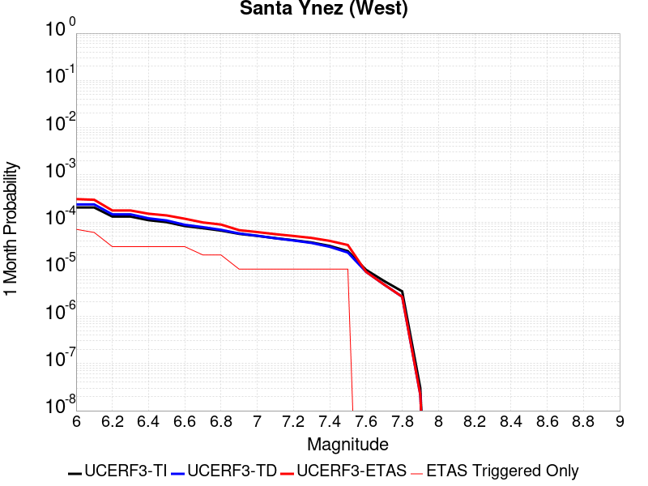 |  |  |

| Magnitude | 1 wk TI Prob | 1 wk TD Prob | 1 wk ETAS Prob | 1 wk ETAS/TD Gain | 1 wk ETAS Triggered Only | 1 mo TI Prob | 1 mo TD Prob | 1 mo ETAS Prob | 1 mo ETAS/TD Gain | 1 mo ETAS Triggered Only | 1 yr TI Prob | 1 yr TD Prob | 1 yr ETAS Prob | 1 yr ETAS/TD Gain | 1 yr ETAS Triggered Only | 10 yr TI Prob | 10 yr TD Prob | 10 yr ETAS Prob | 10 yr ETAS/TD Gain | 10 yr ETAS Triggered Only |
|-----|-----|-----|-----|-----|-----|-----|-----|-----|-----|-----|-----|-----|-----|-----|-----|-----|-----|-----|-----|-----|
| 6.0 | 4.7352758E-5 | 5.4972126E-5 | 8.4970474E-5 | 1.5457011 | 3.0E-5 | 2.0292461E-4 | 2.3557522E-4 | 3.0555873E-4 | 1.297075 | 7.0E-5 | 0.0024678076 | 0.0028645284 | 0.0029742133 | 1.0382907 | 1.1E-4 | 0.024405818 | 0.028304417 | 0.028459888 | 1.0054928 | 1.6E-4 |
| 6.1 | 4.7352758E-5 | 5.4972126E-5 | 8.4970474E-5 | 1.5457011 | 3.0E-5 | 2.0292461E-4 | 2.3557522E-4 | 2.9556107E-4 | 1.2546357 | 6.0E-5 | 0.0024678076 | 0.0028645284 | 0.0029542705 | 1.0313288 | 9.0E-5 | 0.024405818 | 0.028304417 | 0.028440455 | 1.0048063 | 1.4E-4 |
| 6.2 | 3.0415853E-5 | 3.392511E-5 | 3.392511E-5 | 1.0 | 0.0 | 1.3034715E-4 | 1.4538545E-4 | 1.7538108E-4 | 1.206318 | 3.0E-5 | 0.0015858212 | 0.0017686661 | 0.0018285599 | 1.0338639 | 6.0E-5 | 0.015745522 | 0.017549807 | 0.017648052 | 1.0055981 | 1.0E-4 |
| 6.3 | 3.0415853E-5 | 3.392511E-5 | 3.392511E-5 | 1.0 | 0.0 | 1.3034715E-4 | 1.4538545E-4 | 1.7538108E-4 | 1.206318 | 3.0E-5 | 0.0015858212 | 0.0017686661 | 0.0018285599 | 1.0338639 | 6.0E-5 | 0.015745522 | 0.017549807 | 0.017648052 | 1.0055981 | 1.0E-4 |
| 6.4 | 2.5452082E-5 | 2.7912422E-5 | 2.7912422E-5 | 1.0 | 0.0 | 1.09075794E-4 | 1.196193E-4 | 1.496157E-4 | 1.2507657 | 3.0E-5 | 0.0013271887 | 0.0014554089 | 0.001505336 | 1.0343046 | 5.0E-5 | 0.013192902 | 0.014460951 | 0.014549649 | 1.0061337 | 9.0E-5 |
| 6.5 | 2.3143784E-5 | 2.5128256E-5 | 2.5128256E-5 | 1.0 | 0.0 | 9.9183875E-5 | 1.0768817E-4 | 1.3768494E-4 | 1.2785522 | 3.0E-5 | 0.0012068948 | 0.0013103267 | 0.0013602612 | 1.0381085 | 5.0E-5 | 0.012003611 | 0.01302768 | 0.013106638 | 1.0060607 | 8.0E-5 |
| 6.6 | 1.9118515E-5 | 2.035434E-5 | 2.035434E-5 | 1.0 | 0.0 | 8.193392E-5 | 8.7230015E-5 | 1.172274E-4 | 1.3438883 | 3.0E-5 | 9.97089E-4 | 0.001061516 | 0.0011014736 | 1.037642 | 4.0E-5 | 0.00992627 | 0.010565365 | 0.010624731 | 1.0056189 | 6.0E-5 |
| 6.7 | 1.722807E-5 | 1.8146347E-5 | 1.8146347E-5 | 1.0 | 0.0 | 7.3832496E-5 | 7.776777E-5 | 9.776622E-5 | 1.2571559 | 2.0E-5 | 8.985399E-4 | 9.464169E-4 | 9.763885E-4 | 1.0316685 | 3.0E-5 | 0.008949154 | 0.0094245095 | 0.009474039 | 1.0052553 | 5.0E-5 |
| 6.8 | 1.5317364E-5 | 1.5926486E-5 | 1.5926486E-5 | 1.0 | 0.0 | 6.56442E-5 | 6.82546E-5 | 8.825324E-5 | 1.2930006 | 2.0E-5 | 7.98925E-4 | 8.306873E-4 | 8.506706E-4 | 1.0240564 | 2.0E-5 | 0.007960589 | 0.00827631 | 0.008315979 | 1.004793 | 4.0E-5 |
| 6.9 | 1.3071226E-5 | 1.3329624E-5 | 1.3329624E-5 | 1.0 | 0.0 | 5.6018336E-5 | 5.7125722E-5 | 6.712515E-5 | 1.1750425 | 1.0E-5 | 6.8180985E-4 | 6.9528597E-4 | 7.05279E-4 | 1.0143726 | 1.0E-5 | 0.0067972173 | 0.006931367 | 0.006961159 | 1.0042981 | 3.0E-5 |
| 7.0 | 1.1836986E-5 | 1.19327815E-5 | 1.19327815E-5 | 1.0 | 0.0 | 5.0728955E-5 | 5.11395E-5 | 6.113899E-5 | 1.1955335 | 1.0E-5 | 6.1745E-4 | 6.2244723E-4 | 6.32441E-4 | 1.0160556 | 1.0E-5 | 0.006157372 | 0.006207231 | 0.006237045 | 1.0048031 | 3.0E-5 |
| 7.1 | 1.0597169E-5 | 1.0542201E-5 | 1.0542201E-5 | 1.0 | 0.0 | 4.541565E-5 | 4.5180084E-5 | 5.5179633E-5 | 1.2213265 | 1.0E-5 | 5.5279525E-4 | 5.4992986E-4 | 5.5992434E-4 | 1.0181742 | 1.0E-5 | 0.0055142213 | 0.005485821 | 0.0055057113 | 1.0036258 | 2.0E-5 |
| 7.2 | 9.59113E-6 | 9.459144E-6 | 9.459144E-6 | 1.0 | 0.0 | 4.11042E-5 | 4.0538565E-5 | 5.0538158E-5 | 1.2466687 | 1.0E-5 | 5.0032866E-4 | 4.934463E-4 | 5.034414E-4 | 1.0202557 | 1.0E-5 | 0.004992037 | 0.0049236254 | 0.004933576 | 1.0020211 | 1.0E-5 |
| 7.3 | 8.586084E-6 | 8.379583E-6 | 8.379583E-6 | 1.0 | 0.0 | 3.679698E-5 | 3.5912013E-5 | 4.5911653E-5 | 1.2784483 | 1.0E-5 | 4.4791115E-4 | 4.3714207E-4 | 4.471377E-4 | 1.0228659 | 1.0E-5 | 0.004470094 | 0.004362933 | 0.004372889 | 1.002282 | 1.0E-5 |
| 7.4 | 7.2622997E-6 | 6.9515427E-6 | 6.9515427E-6 | 1.0 | 0.0 | 3.112377E-5 | 2.979199E-5 | 3.9791692E-5 | 1.3356507 | 1.0E-5 | 3.78866E-4 | 3.626581E-4 | 3.7265447E-4 | 1.0275642 | 1.0E-5 | 0.0037822074 | 0.0036207628 | 0.0036307266 | 1.0027518 | 1.0E-5 |
| 7.5 | 5.627296E-6 | 5.251588E-6 | 5.251588E-6 | 1.0 | 0.0 | 2.411676E-5 | 2.2506614E-5 | 3.250639E-5 | 1.4443039 | 1.0E-5 | 2.9358198E-4 | 2.739843E-4 | 2.8398156E-4 | 1.0364884 | 1.0E-5 | 0.0029319443 | 0.002736537 | 0.0027465096 | 1.0036442 | 1.0E-5 |
| 7.6 | 2.265244E-6 | 2.0608625E-6 | 2.0608625E-6 | 1.0 | 0.0 | 9.708152E-6 | 8.832238E-6 | 8.832238E-6 | 1.0 | 0.0 | 1.18190335E-4 | 1.0752728E-4 | 1.0752728E-4 | 1.0 | 0.0 | 0.001181275 | 0.0010747612 | 0.0010747612 | 1.0 | 0.0 |
| 7.7 | 1.3099874E-6 | 1.1016252E-6 | 1.1016252E-6 | 1.0 | 0.0 | 5.61422E-6 | 4.7212425E-6 | 4.7212425E-6 | 1.0 | 0.0 | 6.8350986E-5 | 5.7479636E-5 | 5.7479636E-5 | 1.0 | 0.0 | 6.832996E-4 | 5.7465007E-4 | 5.7465007E-4 | 1.0 | 0.0 |
| 7.8 | 7.903951E-7 | 6.0711415E-7 | 6.0711415E-7 | 1.0 | 0.0 | 3.3874032E-6 | 2.6019152E-6 | 2.6019152E-6 | 1.0 | 0.0 | 4.1240855E-5 | 3.167787E-5 | 3.167787E-5 | 1.0 | 0.0 | 4.12332E-4 | 3.167349E-4 | 3.167349E-4 | 1.0 | 0.0 |
| 7.9 | 7.0753297E-9 | 5.0899476E-9 | 5.0899476E-9 | 1.0 | 0.0 | 3.032284E-8 | 2.181406E-8 | 2.181406E-8 | 1.0 | 0.0 | 3.6918053E-7 | 2.6558615E-7 | 2.6558615E-7 | 1.0 | 0.0 | 3.691799E-6 | 2.6558594E-6 | 2.6558594E-6 | 1.0 | 0.0 |

## San Jacinto (Stepovers Combined)
*[(top)](#table-of-contents)*

| 1 Week | 1 Month | 1 Year | 10 Year |
|-----|-----|-----|-----|
|  |  |  | 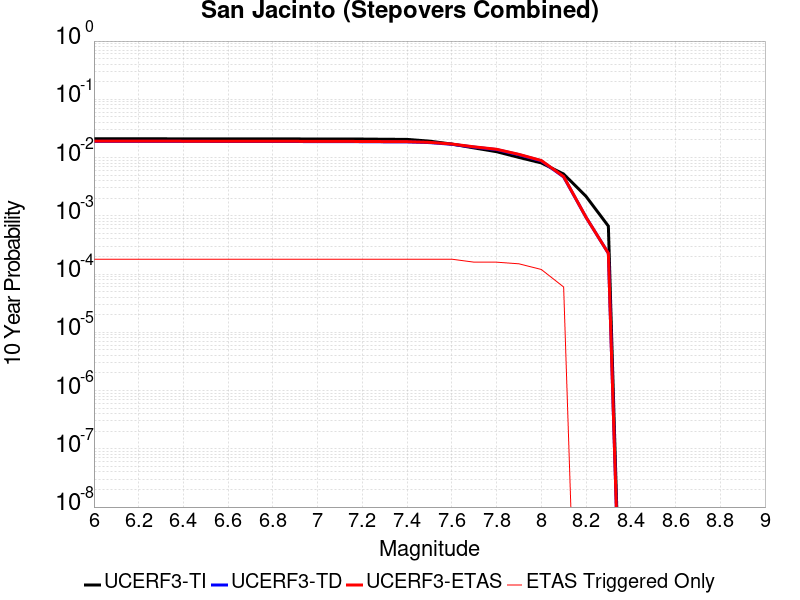 |

| Magnitude | 1 wk TI Prob | 1 wk TD Prob | 1 wk ETAS Prob | 1 wk ETAS/TD Gain | 1 wk ETAS Triggered Only | 1 mo TI Prob | 1 mo TD Prob | 1 mo ETAS Prob | 1 mo ETAS/TD Gain | 1 mo ETAS Triggered Only | 1 yr TI Prob | 1 yr TD Prob | 1 yr ETAS Prob | 1 yr ETAS/TD Gain | 1 yr ETAS Triggered Only | 10 yr TI Prob | 10 yr TD Prob | 10 yr ETAS Prob | 10 yr ETAS/TD Gain | 10 yr ETAS Triggered Only |
|-----|-----|-----|-----|-----|-----|-----|-----|-----|-----|-----|-----|-----|-----|-----|-----|-----|-----|-----|-----|-----|
| 6.0 | 4.0667746E-5 | 3.5272755E-5 | 1.0527029E-4 | 2.9844644 | 7.0E-5 | 1.742787E-4 | 1.5116022E-4 | 2.4114661E-4 | 1.5953047 | 9.0E-5 | 0.0021197782 | 0.0018388226 | 0.0019486203 | 1.0597109 | 1.1E-4 | 0.020996714 | 0.018986892 | 0.019163474 | 1.0093002 | 1.8E-4 |
| 6.1 | 4.0667746E-5 | 3.5272755E-5 | 1.0527029E-4 | 2.9844644 | 7.0E-5 | 1.742787E-4 | 1.5116022E-4 | 2.4114661E-4 | 1.5953047 | 9.0E-5 | 0.0021197782 | 0.0018388226 | 0.0019486203 | 1.0597109 | 1.1E-4 | 0.020996714 | 0.018986892 | 0.019163474 | 1.0093002 | 1.8E-4 |
| 6.2 | 4.0667746E-5 | 3.5272755E-5 | 1.0527029E-4 | 2.9844644 | 7.0E-5 | 1.742787E-4 | 1.5116022E-4 | 2.4114661E-4 | 1.5953047 | 9.0E-5 | 0.0021197782 | 0.0018388226 | 0.0019486203 | 1.0597109 | 1.1E-4 | 0.020996714 | 0.018986892 | 0.019163474 | 1.0093002 | 1.8E-4 |
| 6.3 | 4.0667746E-5 | 3.5272755E-5 | 1.0527029E-4 | 2.9844644 | 7.0E-5 | 1.742787E-4 | 1.5116022E-4 | 2.4114661E-4 | 1.5953047 | 9.0E-5 | 0.0021197782 | 0.0018388226 | 0.0019486203 | 1.0597109 | 1.1E-4 | 0.020996714 | 0.018986892 | 0.019163474 | 1.0093002 | 1.8E-4 |
| 6.4 | 4.0577226E-5 | 3.5144654E-5 | 1.0514219E-4 | 2.991698 | 7.0E-5 | 1.738908E-4 | 1.5061127E-4 | 2.4059771E-4 | 1.5974748 | 9.0E-5 | 0.0021150648 | 0.0018321523 | 0.0019419508 | 1.0599287 | 1.1E-4 | 0.020950472 | 0.018921461 | 0.019098055 | 1.009333 | 1.8E-4 |
| 6.5 | 4.0577226E-5 | 3.5144654E-5 | 1.0514219E-4 | 2.991698 | 7.0E-5 | 1.738908E-4 | 1.5061127E-4 | 2.4059771E-4 | 1.5974748 | 9.0E-5 | 0.0021150648 | 0.0018321523 | 0.0019419508 | 1.0599287 | 1.1E-4 | 0.020950472 | 0.018921461 | 0.019098055 | 1.009333 | 1.8E-4 |
| 6.6 | 4.053861E-5 | 3.509E-5 | 1.0508754E-4 | 2.9948003 | 7.0E-5 | 1.7372532E-4 | 1.5037706E-4 | 2.4036353E-4 | 1.5984055 | 9.0E-5 | 0.0021130538 | 0.0018293057 | 0.0019391044 | 1.0600221 | 1.1E-4 | 0.020930743 | 0.018893538 | 0.019070137 | 1.0093471 | 1.8E-4 |
| 6.7 | 4.0516545E-5 | 3.5059067E-5 | 1.0505661E-4 | 2.9965603 | 7.0E-5 | 1.7363077E-4 | 1.5024451E-4 | 2.4023099E-4 | 1.5989336 | 9.0E-5 | 0.002111905 | 0.001827695 | 0.0019374939 | 1.060075 | 1.1E-4 | 0.020919468 | 0.018877735 | 0.019054336 | 1.0093551 | 1.8E-4 |
| 6.8 | 4.049434E-5 | 3.5030633E-5 | 1.0502818E-4 | 2.998181 | 7.0E-5 | 1.7353562E-4 | 1.5012265E-4 | 2.4010915E-4 | 1.5994198 | 9.0E-5 | 0.0021107488 | 0.0018262138 | 0.001936013 | 1.0601239 | 1.1E-4 | 0.020908125 | 0.018863149 | 0.019039752 | 1.0093625 | 1.8E-4 |
| 6.9 | 4.046386E-5 | 3.499319E-5 | 1.04990744E-4 | 3.0003192 | 7.0E-5 | 1.73405E-4 | 1.4996222E-4 | 2.3994873E-4 | 1.6000612 | 9.0E-5 | 0.0021091616 | 0.0018242638 | 0.0019340632 | 1.0601883 | 1.1E-4 | 0.020892553 | 0.01884392 | 0.01902053 | 1.0093721 | 1.8E-4 |
| 7.0 | 4.036382E-5 | 3.487376E-5 | 1.0487132E-4 | 3.00717 | 7.0E-5 | 1.7297632E-4 | 1.4945042E-4 | 2.3943697E-4 | 1.6021165 | 9.0E-5 | 0.0021039525 | 0.0018180435 | 0.0019278436 | 1.0603946 | 1.1E-4 | 0.02084144 | 0.018782536 | 0.018959155 | 1.0094033 | 1.8E-4 |
| 7.1 | 4.0343282E-5 | 3.4852223E-5 | 1.0484978E-4 | 3.0084102 | 7.0E-5 | 1.7288832E-4 | 1.4935812E-4 | 2.3934469E-4 | 1.6024885 | 9.0E-5 | 0.002102883 | 0.0018169218 | 0.0019267219 | 1.060432 | 1.1E-4 | 0.020830948 | 0.018771412 | 0.018948033 | 1.0094091 | 1.8E-4 |
| 7.2 | 4.0257353E-5 | 3.4756722E-5 | 1.0475429E-4 | 3.013929 | 7.0E-5 | 1.725201E-4 | 1.489489E-4 | 2.3893549E-4 | 1.6041441 | 9.0E-5 | 0.0020984085 | 0.0018119477 | 0.0019217484 | 1.0605981 | 1.1E-4 | 0.020787042 | 0.018722152 | 0.018898781 | 1.0094342 | 1.8E-4 |
| 7.3 | 3.9940667E-5 | 3.4584376E-5 | 1.0458196E-4 | 3.0239654 | 7.0E-5 | 1.7116306E-4 | 1.4821035E-4 | 2.3819701E-4 | 1.607155 | 9.0E-5 | 0.0020819185 | 0.0018029709 | 0.0019127725 | 1.0609004 | 1.1E-4 | 0.020625217 | 0.018630784 | 0.01880743 | 1.0094814 | 1.8E-4 |
| 7.4 | 3.9721202E-5 | 3.4469766E-5 | 1.04467355E-4 | 3.0306952 | 7.0E-5 | 1.7022261E-4 | 1.4771923E-4 | 2.3770593E-4 | 1.609174 | 9.0E-5 | 0.0020704903 | 0.0017970012 | 0.0019068036 | 1.0611031 | 1.1E-4 | 0.020513052 | 0.018569905 | 0.018746564 | 1.0095131 | 1.8E-4 |
| 7.5 | 3.7036873E-5 | 3.3537188E-5 | 1.0353484E-4 | 3.0871654 | 7.0E-5 | 1.5871979E-4 | 1.437229E-4 | 2.3370996E-4 | 1.6261151 | 9.0E-5 | 0.0019307006 | 0.0017484248 | 0.0018582325 | 1.0628037 | 1.1E-4 | 0.019140124 | 0.018071463 | 0.018248212 | 1.0097804 | 1.8E-4 |
| 7.6 | 3.2940967E-5 | 3.1317984E-5 | 1.01315796E-4 | 3.2350674 | 7.0E-5 | 1.4116794E-4 | 1.3421304E-4 | 2.2420097E-4 | 1.6704856 | 9.0E-5 | 0.0017173645 | 0.0016328214 | 0.0017426417 | 1.067258 | 1.1E-4 | 0.01704153 | 0.016904354 | 0.017081311 | 1.0104681 | 1.8E-4 |
| 7.7 | 2.8236149E-5 | 2.7883889E-5 | 9.788194E-5 | 3.5103402 | 7.0E-5 | 1.2100645E-4 | 1.19496915E-4 | 1.9948736E-4 | 1.6693933 | 8.0E-5 | 0.0014722579 | 0.001453905 | 0.0015537597 | 1.0686803 | 1.0E-4 | 0.014625421 | 0.015115095 | 0.015272677 | 1.0104254 | 1.6E-4 |
| 7.8 | 2.4329287E-5 | 2.5207537E-5 | 9.5205774E-5 | 3.7768772 | 7.0E-5 | 1.042642E-4 | 1.0802783E-4 | 1.8801918E-4 | 1.7404699 | 8.0E-5 | 0.0012686774 | 0.0013144462 | 0.0014143147 | 1.0759777 | 1.0E-4 | 0.012614589 | 0.013712396 | 0.013870202 | 1.0115082 | 1.6E-4 |
| 7.9 | 1.9370926E-5 | 2.0421452E-5 | 9.042002E-5 | 4.427698 | 7.0E-5 | 8.301561E-5 | 8.7517576E-5 | 1.6751057E-4 | 1.9140221 | 8.0E-5 | 0.0010102465 | 0.0010650064 | 0.0011549105 | 1.0844165 | 9.0E-5 | 0.0100566605 | 0.011199483 | 0.011347802 | 1.0132434 | 1.5E-4 |
| 8.0 | 1.5583017E-5 | 1.588647E-5 | 5.5885834E-5 | 3.517826 | 4.0E-5 | 6.6782646E-5 | 6.808309E-5 | 1.1807969E-4 | 1.7343467 | 5.0E-5 | 8.127754E-4 | 8.285971E-4 | 8.885474E-4 | 1.0723516 | 6.0E-5 | 0.008098091 | 0.008781809 | 0.008900756 | 1.0135446 | 1.2E-4 |
| 8.1 | 1.0024873E-5 | 8.292404E-6 | 2.8292237E-5 | 3.411826 | 2.0E-5 | 4.2963035E-5 | 3.5538393E-5 | 6.553733E-5 | 1.8441274 | 3.0E-5 | 5.229494E-4 | 4.3259456E-4 | 4.7257726E-4 | 1.0924253 | 4.0E-5 | 0.0052172043 | 0.0046534105 | 0.0047131316 | 1.0128337 | 6.0E-5 |
| 8.2 | 4.142796E-6 | 1.5610041E-6 | 1.5610041E-6 | 1.0 | 0.0 | 1.775472E-5 | 6.69E-6 | 6.69E-6 | 1.0 | 0.0 | 2.1614227E-4 | 8.144774E-5 | 8.144774E-5 | 1.0 | 0.0 | 0.0021593217 | 9.454649E-4 | 9.454649E-4 | 1.0 | 0.0 |
| 8.3 | 1.2750878E-6 | 3.612133E-7 | 3.612133E-7 | 1.0 | 0.0 | 5.4646503E-6 | 1.548056E-6 | 1.548056E-6 | 1.0 | 0.0 | 6.653009E-5 | 1.8847424E-5 | 1.8847424E-5 | 1.0 | 0.0 | 6.6510175E-4 | 2.2734253E-4 | 2.2734253E-4 | 1.0 | 0.0 |

## Brawley (Seismic Zone) alt 1
*[(top)](#table-of-contents)*

| 1 Week | 1 Month | 1 Year | 10 Year |
|-----|-----|-----|-----|
|  |  | 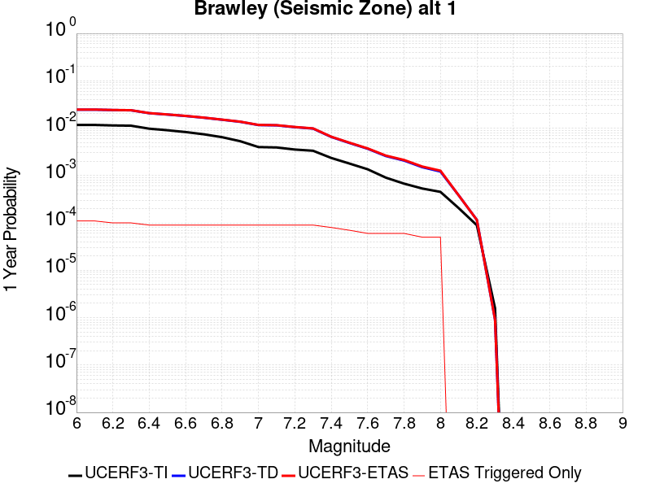 |  |

| Magnitude | 1 wk TI Prob | 1 wk TD Prob | 1 wk ETAS Prob | 1 wk ETAS/TD Gain | 1 wk ETAS Triggered Only | 1 mo TI Prob | 1 mo TD Prob | 1 mo ETAS Prob | 1 mo ETAS/TD Gain | 1 mo ETAS Triggered Only | 1 yr TI Prob | 1 yr TD Prob | 1 yr ETAS Prob | 1 yr ETAS/TD Gain | 1 yr ETAS Triggered Only | 10 yr TI Prob | 10 yr TD Prob | 10 yr ETAS Prob | 10 yr ETAS/TD Gain | 10 yr ETAS Triggered Only |
|-----|-----|-----|-----|-----|-----|-----|-----|-----|-----|-----|-----|-----|-----|-----|-----|-----|-----|-----|-----|-----|
| 6.0 | 2.2521618E-4 | 4.7632487E-4 | 5.0631055E-4 | 1.0629523 | 3.0E-5 | 9.6485513E-4 | 0.0020398323 | 0.0020997098 | 1.0293542 | 6.0E-5 | 0.011683988 | 0.024546238 | 0.024653537 | 1.0043713 | 1.1E-4 | 0.11088423 | 0.21350002 | 0.2136416 | 1.000663 | 1.8E-4 |
| 6.1 | 2.2521618E-4 | 4.7632487E-4 | 5.0631055E-4 | 1.0629523 | 3.0E-5 | 9.6485513E-4 | 0.0020398323 | 0.0020997098 | 1.0293542 | 6.0E-5 | 0.011683988 | 0.024546238 | 0.024653537 | 1.0043713 | 1.1E-4 | 0.11088423 | 0.21350002 | 0.2136416 | 1.000663 | 1.8E-4 |
| 6.2 | 2.198148E-4 | 4.6717093E-4 | 4.971569E-4 | 1.0641863 | 3.0E-5 | 9.417233E-4 | 0.0020006616 | 0.0020605414 | 1.0299301 | 6.0E-5 | 0.011405343 | 0.024080504 | 0.024178095 | 1.0040528 | 1.0E-4 | 0.10837428 | 0.20993657 | 0.21007088 | 1.0006398 | 1.7E-4 |
| 6.3 | 2.1704129E-4 | 4.615278E-4 | 4.915139E-4 | 1.0649714 | 3.0E-5 | 9.298453E-4 | 0.0019765133 | 0.0020363948 | 1.0302964 | 6.0E-5 | 0.011262234 | 0.02379366 | 0.023891281 | 1.0041028 | 1.0E-4 | 0.107082725 | 0.20782755 | 0.20796221 | 1.000648 | 1.7E-4 |
| 6.4 | 1.876142E-4 | 4.00449E-4 | 4.30437E-4 | 1.0748858 | 3.0E-5 | 8.038131E-4 | 0.0017150956 | 0.0017749927 | 1.0349234 | 6.0E-5 | 0.00974259 | 0.020680401 | 0.02076854 | 1.004262 | 9.0E-5 | 0.093263686 | 0.18457815 | 0.18470863 | 1.0007068 | 1.6E-4 |
| 6.5 | 1.7390939E-4 | 3.7477075E-4 | 4.047595E-4 | 1.0800189 | 3.0E-5 | 7.45113E-4 | 0.0016051838 | 0.0016650875 | 1.037319 | 6.0E-5 | 0.009034078 | 0.019368723 | 0.01945698 | 1.0045567 | 9.0E-5 | 0.086755216 | 0.17440031 | 0.17453241 | 1.0007575 | 1.6E-4 |
| 6.6 | 1.591791E-4 | 3.4891962E-4 | 3.7890914E-4 | 1.0859497 | 3.0E-5 | 6.8201777E-4 | 0.0014945229 | 0.0015544333 | 1.0400866 | 6.0E-5 | 0.008271996 | 0.018045569 | 0.018133946 | 1.0048974 | 9.0E-5 | 0.07970774 | 0.16380852 | 0.16394232 | 1.0008167 | 1.6E-4 |
| 6.7 | 1.4268003E-4 | 3.20582E-4 | 3.505724E-4 | 1.0935498 | 3.0E-5 | 6.1134255E-4 | 0.0013732077 | 0.0014331252 | 1.0436333 | 6.0E-5 | 0.007417723 | 0.016592601 | 0.016681109 | 1.0053341 | 9.0E-5 | 0.07174956 | 0.15193306 | 0.15206875 | 1.0008931 | 1.6E-4 |
| 6.8 | 1.239713E-4 | 2.9053655E-4 | 3.2052785E-4 | 1.1032273 | 3.0E-5 | 5.3119735E-4 | 0.0012445687 | 0.001304494 | 1.0481495 | 6.0E-5 | 0.0064481674 | 0.015048777 | 0.015137423 | 1.0058906 | 9.0E-5 | 0.06264243 | 0.13837762 | 0.13851549 | 1.0009962 | 1.6E-4 |
| 6.9 | 1.0180238E-4 | 2.625439E-4 | 2.9253602E-4 | 1.1142366 | 3.0E-5 | 4.3622297E-4 | 0.0011247073 | 0.0011846398 | 1.0532873 | 6.0E-5 | 0.005298089 | 0.013608336 | 0.013697111 | 1.0065236 | 9.0E-5 | 0.05173543 | 0.124961674 | 0.12510169 | 1.0011204 | 1.6E-4 |
| 7.0 | 7.6619996E-5 | 2.23993E-4 | 2.5398628E-4 | 1.1339028 | 3.0E-5 | 3.283301E-4 | 9.5962E-4 | 0.0010195625 | 1.0624647 | 6.0E-5 | 0.0039900932 | 0.011621496 | 0.011710449 | 1.0076543 | 9.0E-5 | 0.039192066 | 0.107266866 | 0.1074097 | 1.0013316 | 1.6E-4 |
| 7.1 | 7.5127435E-5 | 2.2082464E-4 | 2.50818E-4 | 1.1358244 | 3.0E-5 | 3.2193496E-4 | 9.4605127E-4 | 0.0010059945 | 1.0633615 | 6.0E-5 | 0.0039125155 | 0.011458045 | 0.011547013 | 1.0077647 | 9.0E-5 | 0.038443442 | 0.10583085 | 0.105973914 | 1.0013518 | 1.6E-4 |
| 7.2 | 6.788582E-5 | 2.0210193E-4 | 2.3209587E-4 | 1.14841 | 3.0E-5 | 2.9090676E-4 | 8.6586666E-4 | 9.2581473E-4 | 1.0692347 | 6.0E-5 | 0.0035360386 | 0.0104916105 | 0.010580666 | 1.0084883 | 9.0E-5 | 0.034803 | 0.09750131 | 0.09764571 | 1.001481 | 1.6E-4 |
| 7.3 | 6.399602E-5 | 1.8841137E-4 | 2.1840572E-4 | 1.159196 | 3.0E-5 | 2.7423984E-4 | 8.072303E-4 | 8.6718187E-4 | 1.0742682 | 6.0E-5 | 0.0033337586 | 0.009784332 | 0.009873451 | 1.0091084 | 9.0E-5 | 0.03284188 | 0.09139617 | 0.09154154 | 1.0015906 | 1.6E-4 |
| 7.4 | 4.506759E-5 | 1.2529209E-4 | 1.5528833E-4 | 1.2394105 | 3.0E-5 | 1.9313251E-4 | 5.368565E-4 | 5.868296E-4 | 1.0930848 | 5.0E-5 | 0.0023488526 | 0.0065168133 | 0.006596292 | 1.012196 | 8.0E-5 | 0.023241805 | 0.062363707 | 0.062494975 | 1.0021049 | 1.4E-4 |
| 7.5 | 3.43289E-5 | 9.33541E-5 | 1.1335223E-4 | 1.214218 | 2.0E-5 | 1.4711556E-4 | 4.00028E-4 | 4.4001197E-4 | 1.099953 | 4.0E-5 | 0.0017896603 | 0.0048595266 | 0.0049291863 | 1.0143347 | 7.0E-5 | 0.01775316 | 0.04705519 | 0.047179073 | 1.0026327 | 1.3E-4 |
| 7.6 | 2.5980507E-5 | 7.053101E-5 | 8.0530306E-5 | 1.1417716 | 1.0E-5 | 1.1134028E-4 | 3.0224086E-4 | 3.322318E-4 | 1.0992286 | 3.0E-5 | 0.001354725 | 0.003673598 | 0.0037333774 | 1.0162728 | 6.0E-5 | 0.013464959 | 0.035840835 | 0.03593725 | 1.0026901 | 1.0E-4 |
| 7.7 | 1.7292105E-5 | 4.9407296E-5 | 5.9406804E-5 | 1.2023892 | 1.0E-5 | 7.4106916E-5 | 2.117284E-4 | 2.4172205E-4 | 1.1416609 | 3.0E-5 | 9.018782E-4 | 0.0025747516 | 0.0026345972 | 1.0232432 | 6.0E-5 | 0.008982267 | 0.025290398 | 0.025387868 | 1.003854 | 1.0E-4 |
| 7.8 | 1.2927471E-5 | 3.9693266E-5 | 4.969287E-5 | 1.2519219 | 1.0E-5 | 5.5402274E-5 | 1.7010293E-4 | 2.0009783E-4 | 1.1763338 | 3.0E-5 | 6.743139E-4 | 0.0020690386 | 0.0021289145 | 1.028939 | 6.0E-5 | 0.0067227143 | 0.020431727 | 0.020529686 | 1.0047944 | 1.0E-4 |
| 7.9 | 1.0200774E-5 | 2.874569E-5 | 3.8745402E-5 | 1.3478682 | 1.0E-5 | 4.371687E-5 | 1.2319001E-4 | 1.5318631E-4 | 1.2434963 | 3.0E-5 | 5.321229E-4 | 0.0014988075 | 0.0015487325 | 1.0333098 | 5.0E-5 | 0.005308505 | 0.014991644 | 0.015070445 | 1.0052563 | 8.0E-5 |
| 8.0 | 8.650396E-6 | 2.3277367E-5 | 3.3277134E-5 | 1.4295919 | 1.0E-5 | 3.70726E-5 | 9.975634E-5 | 1.2975335E-4 | 1.3007028 | 3.0E-5 | 4.5126543E-4 | 0.0012138576 | 0.0012637969 | 1.041141 | 5.0E-5 | 0.0045035016 | 0.012211097 | 0.0122802425 | 1.0056624 | 7.0E-5 |
| 8.1 | 3.9368224E-6 | 7.3279825E-6 | 7.3279825E-6 | 1.0 | 0.0 | 1.6871985E-5 | 3.140526E-5 | 3.140526E-5 | 1.0 | 0.0 | 2.0539707E-4 | 3.8229208E-4 | 3.8229208E-4 | 1.0 | 0.0 | 0.0020520731 | 0.004001185 | 0.004001185 | 1.0 | 0.0 |
| 8.2 | 1.7101195E-6 | 2.217876E-6 | 2.217876E-6 | 1.0 | 0.0 | 7.329063E-6 | 9.505149E-6 | 9.505149E-6 | 1.0 | 0.0 | 8.922769E-5 | 1.1571907E-4 | 1.1571907E-4 | 1.0 | 0.0 | 8.9191867E-4 | 0.0012666774 | 0.0012666774 | 1.0 | 0.0 |
| 8.3 | 3.0346666E-8 | 1.721586E-8 | 1.721586E-8 | 1.0 | 0.0 | 1.3005713E-7 | 7.378226E-8 | 7.378226E-8 | 1.0 | 0.0 | 1.5834444E-6 | 8.9829894E-7 | 8.9829894E-7 | 1.0 | 0.0 | 1.5834332E-5 | 9.367729E-6 | 9.367729E-6 | 1.0 | 0.0 |

## San Clemente
*[(top)](#table-of-contents)*

| 1 Week | 1 Month | 1 Year | 10 Year |
|-----|-----|-----|-----|
| 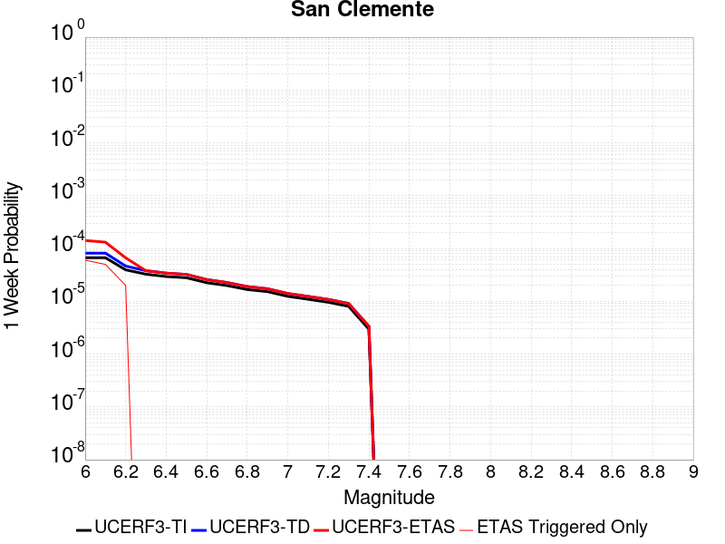 |  | 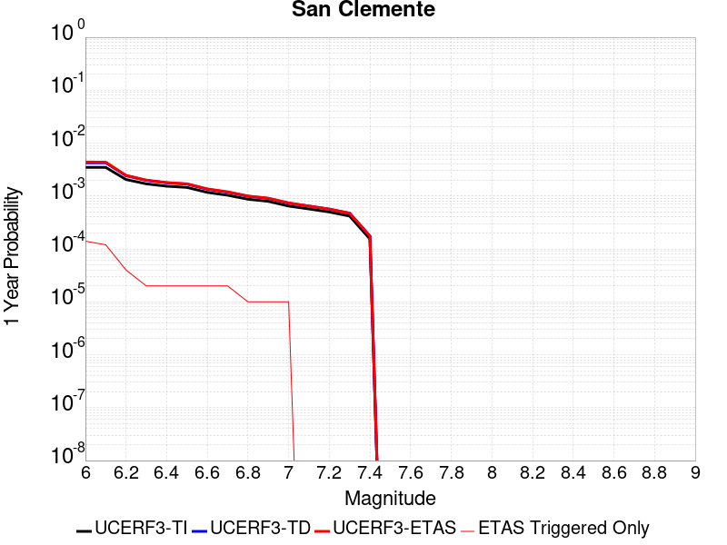 |  |

| Magnitude | 1 wk TI Prob | 1 wk TD Prob | 1 wk ETAS Prob | 1 wk ETAS/TD Gain | 1 wk ETAS Triggered Only | 1 mo TI Prob | 1 mo TD Prob | 1 mo ETAS Prob | 1 mo ETAS/TD Gain | 1 mo ETAS Triggered Only | 1 yr TI Prob | 1 yr TD Prob | 1 yr ETAS Prob | 1 yr ETAS/TD Gain | 1 yr ETAS Triggered Only | 10 yr TI Prob | 10 yr TD Prob | 10 yr ETAS Prob | 10 yr ETAS/TD Gain | 10 yr ETAS Triggered Only |
|-----|-----|-----|-----|-----|-----|-----|-----|-----|-----|-----|-----|-----|-----|-----|-----|-----|-----|-----|-----|-----|
| 6.0 | 6.681379E-5 | 8.163422E-5 | 1.4162932E-4 | 1.7349259 | 6.0E-5 | 2.8631336E-4 | 3.498173E-4 | 4.3978583E-4 | 1.2571871 | 9.0E-5 | 0.003480294 | 0.0042512873 | 0.0043906923 | 1.0327913 | 1.4E-4 | 0.03426291 | 0.041755714 | 0.041918617 | 1.0039012 | 1.7E-4 |
| 6.1 | 6.681379E-5 | 8.163422E-5 | 1.3163014E-4 | 1.6124382 | 5.0E-5 | 2.8631336E-4 | 3.498173E-4 | 4.1979284E-4 | 1.2000345 | 7.0E-5 | 0.003480294 | 0.0042512873 | 0.0043707774 | 1.0281067 | 1.2E-4 | 0.03426291 | 0.041755714 | 0.04188987 | 1.0032128 | 1.4E-4 |
| 6.2 | 3.9400576E-5 | 4.6451984E-5 | 6.645106E-5 | 1.4305321 | 2.0E-5 | 1.6884868E-4 | 1.9906509E-4 | 2.1906111E-4 | 1.1004497 | 2.0E-5 | 0.0020537945 | 0.002420985 | 0.002460888 | 1.0164822 | 4.0E-5 | 0.020349167 | 0.02395286 | 0.023991901 | 1.00163 | 4.0E-5 |
| 6.3 | 3.2590255E-5 | 3.7929087E-5 | 3.7929087E-5 | 1.0 | 0.0 | 1.3966505E-4 | 1.6254328E-4 | 1.6254328E-4 | 1.0 | 0.0 | 0.0016990956 | 0.0019771985 | 0.0019971589 | 1.0100954 | 2.0E-5 | 0.01686163 | 0.019599866 | 0.019619474 | 1.0010004 | 2.0E-5 |
| 6.4 | 2.9454652E-5 | 3.4097775E-5 | 3.4097775E-5 | 1.0 | 0.0 | 1.2622811E-4 | 1.4612528E-4 | 1.4612528E-4 | 1.0 | 0.0 | 0.0015357438 | 0.0017776482 | 0.0017976126 | 1.0112308 | 2.0E-5 | 0.015251739 | 0.017637458 | 0.017657105 | 1.0011139 | 2.0E-5 |
| 6.5 | 2.790836E-5 | 3.2247463E-5 | 3.2247463E-5 | 1.0 | 0.0 | 1.1960178E-4 | 1.3819622E-4 | 1.3819622E-4 | 1.0 | 0.0 | 0.001455179 | 0.0016812651 | 0.0017012315 | 1.0118757 | 2.0E-5 | 0.014456868 | 0.016688475 | 0.016708141 | 1.0011784 | 2.0E-5 |
| 6.6 | 2.2492153E-5 | 2.5762707E-5 | 2.5762707E-5 | 1.0 | 0.0 | 9.639138E-5 | 1.1040701E-4 | 1.1040701E-4 | 1.0 | 0.0 | 0.0011729331 | 0.0013433908 | 0.0013633639 | 1.0148677 | 2.0E-5 | 0.011667615 | 0.013354415 | 0.013374148 | 1.0014776 | 2.0E-5 |
| 6.7 | 1.9862755E-5 | 2.2666423E-5 | 2.2666423E-5 | 1.0 | 0.0 | 8.512331E-5 | 9.713826E-5 | 9.713826E-5 | 1.0 | 0.0 | 0.0010358836 | 0.0011820279 | 0.0012020043 | 1.0169001 | 2.0E-5 | 0.010310682 | 0.011758701 | 0.0117784655 | 1.0016809 | 2.0E-5 |
| 6.8 | 1.6697575E-5 | 1.897771E-5 | 1.897771E-5 | 1.0 | 0.0 | 7.155907E-5 | 8.133056E-5 | 8.133056E-5 | 1.0 | 0.0 | 8.7088346E-4 | 9.897591E-4 | 9.997492E-4 | 1.0100935 | 1.0E-5 | 0.008674784 | 0.0098545365 | 0.009864438 | 1.0010048 | 1.0E-5 |
| 6.9 | 1.5218415E-5 | 1.72694E-5 | 1.72694E-5 | 1.0 | 0.0 | 6.522015E-5 | 7.4009666E-5 | 7.4009666E-5 | 1.0 | 0.0 | 7.93766E-4 | 9.00704E-4 | 9.10695E-4 | 1.0110924 | 1.0E-5 | 0.007909367 | 0.008971481 | 0.008981391 | 1.0011046 | 1.0E-5 |
| 7.0 | 1.2392958E-5 | 1.4033016E-5 | 1.4033016E-5 | 1.0 | 0.0 | 5.3111595E-5 | 6.014015E-5 | 6.014015E-5 | 1.0 | 0.0 | 6.4644177E-4 | 7.319679E-4 | 7.419606E-4 | 1.0136518 | 1.0E-5 | 0.0064456454 | 0.0072963564 | 0.007306284 | 1.0013605 | 1.0E-5 |
| 7.1 | 1.0934128E-5 | 1.2375138E-5 | 1.2375138E-5 | 1.0 | 0.0 | 4.6859706E-5 | 5.303527E-5 | 5.303527E-5 | 1.0 | 0.0 | 5.7036756E-4 | 6.455204E-4 | 6.455204E-4 | 1.0 | 0.0 | 0.0056890585 | 0.0064371997 | 0.0064371997 | 1.0 | 0.0 |
| 7.2 | 9.5798805E-6 | 1.0844935E-5 | 1.0844935E-5 | 1.0 | 0.0 | 4.1055984E-5 | 4.6477508E-5 | 4.6477508E-5 | 1.0 | 0.0 | 4.9974193E-4 | 5.657239E-4 | 5.657239E-4 | 1.0 | 0.0 | 0.0049861963 | 0.0056435615 | 0.0056435615 | 1.0 | 0.0 |
| 7.3 | 8.0167365E-6 | 9.083918E-6 | 9.083918E-6 | 1.0 | 0.0 | 3.4356988E-5 | 3.8930535E-5 | 3.8930535E-5 | 1.0 | 0.0 | 4.1821605E-4 | 4.7388324E-4 | 4.7388324E-4 | 1.0 | 0.0 | 0.0041742986 | 0.0047294297 | 0.0047294297 | 1.0 | 0.0 |
| 7.4 | 2.9581017E-6 | 3.3623792E-6 | 3.3623792E-6 | 1.0 | 0.0 | 1.2677518E-5 | 1.4410146E-5 | 1.4410146E-5 | 1.0 | 0.0 | 1.5433785E-4 | 1.7543444E-4 | 1.7543444E-4 | 1.0 | 0.0 | 0.001542307 | 0.0017534546 | 0.0017534546 | 1.0 | 0.0 |

## Santa Ynez (East)
*[(top)](#table-of-contents)*

| 1 Week | 1 Month | 1 Year | 10 Year |
|-----|-----|-----|-----|
|  |  |  |  |

| Magnitude | 1 wk TI Prob | 1 wk TD Prob | 1 wk ETAS Prob | 1 wk ETAS/TD Gain | 1 wk ETAS Triggered Only | 1 mo TI Prob | 1 mo TD Prob | 1 mo ETAS Prob | 1 mo ETAS/TD Gain | 1 mo ETAS Triggered Only | 1 yr TI Prob | 1 yr TD Prob | 1 yr ETAS Prob | 1 yr ETAS/TD Gain | 1 yr ETAS Triggered Only | 10 yr TI Prob | 10 yr TD Prob | 10 yr ETAS Prob | 10 yr ETAS/TD Gain | 10 yr ETAS Triggered Only |
|-----|-----|-----|-----|-----|-----|-----|-----|-----|-----|-----|-----|-----|-----|-----|-----|-----|-----|-----|-----|-----|
| 6.0 | 3.2269712E-5 | 3.67505E-5 | 7.6749035E-5 | 2.0883806 | 4.0E-5 | 1.3829143E-4 | 1.5749598E-4 | 2.3748337E-4 | 1.5078695 | 8.0E-5 | 0.0016823979 | 0.0019164166 | 0.0020262059 | 1.0572888 | 1.1E-4 | 0.016697178 | 0.019056441 | 0.019203583 | 1.0077213 | 1.5E-4 |
| 6.1 | 3.2269712E-5 | 3.67505E-5 | 7.6749035E-5 | 2.0883806 | 4.0E-5 | 1.3829143E-4 | 1.5749598E-4 | 2.3748337E-4 | 1.5078695 | 8.0E-5 | 0.0016823979 | 0.0019164166 | 0.0020262059 | 1.0572888 | 1.1E-4 | 0.016697178 | 0.019056441 | 0.019203583 | 1.0077213 | 1.5E-4 |
| 6.2 | 3.2269712E-5 | 3.67505E-5 | 7.6749035E-5 | 2.0883806 | 4.0E-5 | 1.3829143E-4 | 1.5749598E-4 | 2.3748337E-4 | 1.5078695 | 8.0E-5 | 0.0016823979 | 0.0019164166 | 0.0020262059 | 1.0572888 | 1.1E-4 | 0.016697178 | 0.019056441 | 0.019203583 | 1.0077213 | 1.5E-4 |
| 6.3 | 3.2269712E-5 | 3.67505E-5 | 7.6749035E-5 | 2.0883806 | 4.0E-5 | 1.3829143E-4 | 1.5749598E-4 | 2.3748337E-4 | 1.5078695 | 8.0E-5 | 0.0016823979 | 0.0019164166 | 0.0020262059 | 1.0572888 | 1.1E-4 | 0.016697178 | 0.019056441 | 0.019203583 | 1.0077213 | 1.5E-4 |
| 6.4 | 1.4404779E-5 | 1.4849382E-5 | 1.4849382E-5 | 1.0 | 0.0 | 6.1733306E-5 | 6.363868E-5 | 7.3638046E-5 | 1.1571271 | 1.0E-5 | 7.513438E-4 | 7.745306E-4 | 7.9451513E-4 | 1.0258021 | 2.0E-5 | 0.0074880854 | 0.007718862 | 0.007758553 | 1.0051421 | 4.0E-5 |
| 6.5 | 1.4404779E-5 | 1.4849382E-5 | 1.4849382E-5 | 1.0 | 0.0 | 6.1733306E-5 | 6.363868E-5 | 7.3638046E-5 | 1.1571271 | 1.0E-5 | 7.513438E-4 | 7.745306E-4 | 7.9451513E-4 | 1.0258021 | 2.0E-5 | 0.0074880854 | 0.007718862 | 0.007758553 | 1.0051421 | 4.0E-5 |
| 6.6 | 1.280208E-5 | 1.3011947E-5 | 1.3011947E-5 | 1.0 | 0.0 | 5.4864904E-5 | 5.5764307E-5 | 6.576375E-5 | 1.1793162 | 1.0E-5 | 6.6777546E-4 | 6.787207E-4 | 6.987071E-4 | 1.0294472 | 2.0E-5 | 0.006657724 | 0.0067666885 | 0.006806418 | 1.0058713 | 4.0E-5 |
| 6.7 | 1.2457027E-5 | 1.2628468E-5 | 1.2628468E-5 | 1.0 | 0.0 | 5.3386164E-5 | 5.412089E-5 | 6.412035E-5 | 1.1847615 | 1.0E-5 | 6.497827E-4 | 6.587243E-4 | 6.787111E-4 | 1.0303417 | 2.0E-5 | 0.00647886 | 0.006567915 | 0.006607652 | 1.0060502 | 4.0E-5 |
| 6.8 | 1.2095134E-5 | 1.2230915E-5 | 1.2230915E-5 | 1.0 | 0.0 | 5.1835254E-5 | 5.241716E-5 | 6.2416635E-5 | 1.1907672 | 1.0E-5 | 6.309115E-4 | 6.379937E-4 | 6.579809E-4 | 1.0313283 | 2.0E-5 | 0.0062912325 | 0.006361809 | 0.0064015547 | 1.0062475 | 4.0E-5 |
| 6.9 | 1.1104036E-5 | 1.1157347E-5 | 1.1157347E-5 | 1.0 | 0.0 | 4.758786E-5 | 4.781633E-5 | 5.7815854E-5 | 1.2091236 | 1.0E-5 | 5.7922816E-4 | 5.820096E-4 | 6.0199795E-4 | 1.0343437 | 2.0E-5 | 0.005777207 | 0.0058049993 | 0.005834825 | 1.0051379 | 3.0E-5 |
| 7.0 | 1.0577444E-5 | 1.058168E-5 | 1.058168E-5 | 1.0 | 0.0 | 4.5331115E-5 | 4.5349276E-5 | 5.5348824E-5 | 1.2205007 | 1.0E-5 | 5.5176654E-4 | 5.519888E-4 | 5.7197775E-4 | 1.0362126 | 2.0E-5 | 0.0055039856 | 0.0055063153 | 0.00553615 | 1.0054183 | 3.0E-5 |
| 7.1 | 1.0021775E-5 | 9.980988E-6 | 9.980988E-6 | 1.0 | 0.0 | 4.294976E-5 | 4.2774966E-5 | 5.277454E-5 | 1.2337716 | 1.0E-5 | 5.2278786E-4 | 5.2066194E-4 | 5.4065156E-4 | 1.0383927 | 2.0E-5 | 0.0052155964 | 0.0051945536 | 0.005224398 | 1.0057453 | 3.0E-5 |
| 7.2 | 8.874109E-6 | 8.748793E-6 | 8.748793E-6 | 1.0 | 0.0 | 3.8031343E-5 | 3.7494297E-5 | 4.7493922E-5 | 1.2666973 | 1.0E-5 | 4.629332E-4 | 4.5639853E-4 | 4.6639398E-4 | 1.0219007 | 1.0E-5 | 0.0046197 | 0.0045547304 | 0.004564685 | 1.0021855 | 1.0E-5 |
| 7.3 | 7.5504267E-6 | 7.5051175E-6 | 7.5051175E-6 | 1.0 | 0.0 | 3.235857E-5 | 3.21644E-5 | 4.2164076E-5 | 1.3108927 | 1.0E-5 | 3.9389438E-4 | 3.915322E-4 | 4.015283E-4 | 1.0255307 | 1.0E-5 | 0.0039319694 | 0.003908531 | 0.003918492 | 1.0025485 | 1.0E-5 |
| 7.4 | 6.309394E-6 | 6.1831556E-6 | 6.1831556E-6 | 1.0 | 0.0 | 2.703998E-5 | 2.6498974E-5 | 3.649871E-5 | 1.3773631 | 1.0E-5 | 3.2916202E-4 | 3.225782E-4 | 3.3257497E-4 | 1.0309902 | 1.0E-5 | 0.003286749 | 0.003221197 | 0.0032311648 | 1.0030944 | 1.0E-5 |
| 7.5 | 4.6103073E-6 | 4.4408903E-6 | 4.4408903E-6 | 1.0 | 0.0 | 1.975831E-5 | 1.9032252E-5 | 2.9032062E-5 | 1.5254139 | 1.0E-5 | 2.4053088E-4 | 2.3169373E-4 | 2.416914E-4 | 1.0431504 | 1.0E-5 | 0.002402707 | 0.002314591 | 0.002324568 | 1.0043104 | 1.0E-5 |
| 7.6 | 1.2858658E-6 | 1.3008173E-6 | 1.3008173E-6 | 1.0 | 0.0 | 5.5108417E-6 | 5.5749197E-6 | 5.5749197E-6 | 1.0 | 0.0 | 6.7092435E-5 | 6.78726E-5 | 6.78726E-5 | 1.0 | 0.0 | 6.707218E-4 | 6.785256E-4 | 6.785256E-4 | 1.0 | 0.0 |
| 7.7 | 5.3302307E-7 | 5.612138E-7 | 5.612138E-7 | 1.0 | 0.0 | 2.2843826E-6 | 2.4052001E-6 | 2.4052001E-6 | 1.0 | 0.0 | 2.7812002E-5 | 2.9282954E-5 | 2.9282954E-5 | 1.0 | 0.0 | 2.7808524E-4 | 2.9279452E-4 | 2.9279452E-4 | 1.0 | 0.0 |
| 7.8 | 4.613933E-8 | 4.80301E-8 | 4.80301E-8 | 1.0 | 0.0 | 1.9773998E-7 | 2.0584326E-7 | 2.0584326E-7 | 1.0 | 0.0 | 2.4074816E-6 | 2.5061388E-6 | 2.5061388E-6 | 1.0 | 0.0 | 2.4074554E-5 | 2.5061116E-5 | 2.5061116E-5 | 1.0 | 0.0 |

## Deep Springs
*[(top)](#table-of-contents)*

| 1 Week | 1 Month | 1 Year | 10 Year |
|-----|-----|-----|-----|
|  |  |  |  |

| Magnitude | 1 wk TI Prob | 1 wk TD Prob | 1 wk ETAS Prob | 1 wk ETAS/TD Gain | 1 wk ETAS Triggered Only | 1 mo TI Prob | 1 mo TD Prob | 1 mo ETAS Prob | 1 mo ETAS/TD Gain | 1 mo ETAS Triggered Only | 1 yr TI Prob | 1 yr TD Prob | 1 yr ETAS Prob | 1 yr ETAS/TD Gain | 1 yr ETAS Triggered Only | 10 yr TI Prob | 10 yr TD Prob | 10 yr ETAS Prob | 10 yr ETAS/TD Gain | 10 yr ETAS Triggered Only |
|-----|-----|-----|-----|-----|-----|-----|-----|-----|-----|-----|-----|-----|-----|-----|-----|-----|-----|-----|-----|-----|
| 6.0 | 1.9810619E-5 | 2.311252E-5 | 7.311136E-5 | 3.1632798 | 5.0E-5 | 8.489989E-5 | 9.905276E-5 | 1.490478E-4 | 1.5047315 | 5.0E-5 | 0.001033166 | 0.0012058079 | 0.0013156753 | 1.0911151 | 1.1E-4 | 0.010283757 | 0.012042425 | 0.0122103775 | 1.0139468 | 1.7E-4 |
| 6.1 | 1.9810619E-5 | 2.311252E-5 | 7.311136E-5 | 3.1632798 | 5.0E-5 | 8.489989E-5 | 9.905276E-5 | 1.490478E-4 | 1.5047315 | 5.0E-5 | 0.001033166 | 0.0012058079 | 0.0013156753 | 1.0911151 | 1.1E-4 | 0.010283757 | 0.012042425 | 0.0122103775 | 1.0139468 | 1.7E-4 |
| 6.2 | 1.9810619E-5 | 2.311252E-5 | 7.311136E-5 | 3.1632798 | 5.0E-5 | 8.489989E-5 | 9.905276E-5 | 1.490478E-4 | 1.5047315 | 5.0E-5 | 0.001033166 | 0.0012058079 | 0.0013156753 | 1.0911151 | 1.1E-4 | 0.010283757 | 0.012042425 | 0.0122103775 | 1.0139468 | 1.7E-4 |
| 6.3 | 1.9810619E-5 | 2.311252E-5 | 7.311136E-5 | 3.1632798 | 5.0E-5 | 8.489989E-5 | 9.905276E-5 | 1.490478E-4 | 1.5047315 | 5.0E-5 | 0.001033166 | 0.0012058079 | 0.0013156753 | 1.0911151 | 1.1E-4 | 0.010283757 | 0.012042425 | 0.0122103775 | 1.0139468 | 1.7E-4 |
| 6.4 | 1.9810619E-5 | 2.311252E-5 | 7.311136E-5 | 3.1632798 | 5.0E-5 | 8.489989E-5 | 9.905276E-5 | 1.490478E-4 | 1.5047315 | 5.0E-5 | 0.001033166 | 0.0012058079 | 0.0013156753 | 1.0911151 | 1.1E-4 | 0.010283757 | 0.012042425 | 0.0122103775 | 1.0139468 | 1.7E-4 |
| 6.5 | 1.7190405E-5 | 2.0050555E-5 | 7.004955E-5 | 3.4936464 | 5.0E-5 | 7.367108E-5 | 8.593095E-5 | 1.3592666E-4 | 1.5818125 | 5.0E-5 | 8.9657627E-4 | 0.0010462094 | 0.0011560943 | 1.1050315 | 1.1E-4 | 0.008929676 | 0.010462056 | 0.010620383 | 1.0151334 | 1.6E-4 |
| 6.6 | 1.7190405E-5 | 2.0050555E-5 | 7.004955E-5 | 3.4936464 | 5.0E-5 | 7.367108E-5 | 8.593095E-5 | 1.3592666E-4 | 1.5818125 | 5.0E-5 | 8.9657627E-4 | 0.0010462094 | 0.0011560943 | 1.1050315 | 1.1E-4 | 0.008929676 | 0.010462056 | 0.010620383 | 1.0151334 | 1.6E-4 |

## Mission Ridge-Arroyo Parida-Santa Ana
*[(top)](#table-of-contents)*

| 1 Week | 1 Month | 1 Year | 10 Year |
|-----|-----|-----|-----|
|  |  |  |  |

| Magnitude | 1 wk TI Prob | 1 wk TD Prob | 1 wk ETAS Prob | 1 wk ETAS/TD Gain | 1 wk ETAS Triggered Only | 1 mo TI Prob | 1 mo TD Prob | 1 mo ETAS Prob | 1 mo ETAS/TD Gain | 1 mo ETAS Triggered Only | 1 yr TI Prob | 1 yr TD Prob | 1 yr ETAS Prob | 1 yr ETAS/TD Gain | 1 yr ETAS Triggered Only | 10 yr TI Prob | 10 yr TD Prob | 10 yr ETAS Prob | 10 yr ETAS/TD Gain | 10 yr ETAS Triggered Only |
|-----|-----|-----|-----|-----|-----|-----|-----|-----|-----|-----|-----|-----|-----|-----|-----|-----|-----|-----|-----|-----|
| 6.0 | 4.169034E-5 | 4.7138263E-5 | 6.713732E-5 | 1.4242637 | 2.0E-5 | 1.7866064E-4 | 2.0201034E-4 | 2.3200428E-4 | 1.1484772 | 3.0E-5 | 0.0021730233 | 0.00245745 | 0.0025372533 | 1.032474 | 8.0E-5 | 0.021518968 | 0.024384614 | 0.0245212 | 1.0056013 | 1.4E-4 |
| 6.1 | 1.73813E-5 | 1.6854226E-5 | 2.6854057E-5 | 1.593313 | 1.0E-5 | 7.4489166E-5 | 7.223046E-5 | 8.222974E-5 | 1.1384357 | 1.0E-5 | 9.065282E-4 | 8.790618E-4 | 9.0903544E-4 | 1.0340973 | 3.0E-5 | 0.009028391 | 0.008756988 | 0.008816463 | 1.0067917 | 6.0E-5 |
| 6.2 | 1.4622182E-5 | 1.367329E-5 | 1.367329E-5 | 1.0 | 0.0 | 6.2664985E-5 | 5.8598518E-5 | 5.8598518E-5 | 1.0 | 0.0 | 7.6267915E-4 | 7.132073E-4 | 7.33193E-4 | 1.0280223 | 2.0E-5 | 0.007600669 | 0.007109627 | 0.0071592717 | 1.0069827 | 5.0E-5 |
| 6.3 | 1.3552434E-5 | 1.2482201E-5 | 1.2482201E-5 | 1.0 | 0.0 | 5.8080568E-5 | 5.3494066E-5 | 5.3494066E-5 | 1.0 | 0.0 | 7.069015E-4 | 6.510988E-4 | 6.710858E-4 | 1.0306973 | 2.0E-5 | 0.00704657 | 0.006492275 | 0.00654195 | 1.0076514 | 5.0E-5 |
| 6.4 | 1.30977305E-5 | 1.1979156E-5 | 1.1979156E-5 | 1.0 | 0.0 | 5.613192E-5 | 5.1338247E-5 | 5.1338247E-5 | 1.0 | 0.0 | 6.831918E-4 | 6.248669E-4 | 6.448544E-4 | 1.0319868 | 2.0E-5 | 0.006810953 | 0.0062314444 | 0.006281133 | 1.0079738 | 5.0E-5 |
| 6.5 | 1.225205E-5 | 1.1048803E-5 | 1.1048803E-5 | 1.0 | 0.0 | 5.2507727E-5 | 4.7351168E-5 | 4.7351168E-5 | 1.0 | 0.0 | 6.3909404E-4 | 5.7635066E-4 | 5.863449E-4 | 1.0173405 | 1.0E-5 | 0.006372592 | 0.005748869 | 0.005788639 | 1.0069178 | 4.0E-5 |
| 6.6 | 1.1352241E-5 | 1.0063535E-5 | 1.0063535E-5 | 1.0 | 0.0 | 4.8651553E-5 | 4.3128734E-5 | 4.3128734E-5 | 1.0 | 0.0 | 5.921717E-4 | 5.2496797E-4 | 5.349627E-4 | 1.0190388 | 1.0E-5 | 0.0059059616 | 0.0052375244 | 0.0052773147 | 1.0075972 | 4.0E-5 |
| 6.7 | 1.0864116E-5 | 9.517027E-6 | 9.517027E-6 | 1.0 | 0.0 | 4.6559664E-5 | 4.0786632E-5 | 4.0786632E-5 | 1.0 | 0.0 | 5.667165E-4 | 4.964661E-4 | 5.0646113E-4 | 1.0201323 | 1.0E-5 | 0.005652734 | 0.004953804 | 0.004983655 | 1.0060259 | 3.0E-5 |
| 6.8 | 1.0666365E-5 | 9.299779E-6 | 9.299779E-6 | 1.0 | 0.0 | 4.571219E-5 | 3.9855597E-5 | 3.9855597E-5 | 1.0 | 0.0 | 5.564038E-4 | 4.8513585E-4 | 4.95131E-4 | 1.0206028 | 1.0E-5 | 0.005550127 | 0.0048410003 | 0.004870855 | 1.006167 | 3.0E-5 |
| 6.9 | 1.0038665E-5 | 8.592046E-6 | 8.592046E-6 | 1.0 | 0.0 | 4.302214E-5 | 3.682254E-5 | 3.682254E-5 | 1.0 | 0.0 | 5.236687E-4 | 4.4822405E-4 | 4.5821955E-4 | 1.0223002 | 1.0E-5 | 0.005224364 | 0.004473411 | 0.0045032767 | 1.0066763 | 3.0E-5 |
| 7.0 | 9.5379955E-6 | 8.025073E-6 | 8.025073E-6 | 1.0 | 0.0 | 4.0876483E-5 | 3.4392728E-5 | 3.4392728E-5 | 1.0 | 0.0 | 4.975576E-4 | 4.1865272E-4 | 4.2864852E-4 | 1.0238762 | 1.0E-5 | 0.00496445 | 0.0041788397 | 0.0042087142 | 1.007149 | 3.0E-5 |
| 7.1 | 9.207389E-6 | 7.652375E-6 | 7.652375E-6 | 1.0 | 0.0 | 3.945964E-5 | 3.279549E-5 | 3.279549E-5 | 1.0 | 0.0 | 4.803152E-4 | 3.9921363E-4 | 4.0920964E-4 | 1.0250392 | 1.0E-5 | 0.004792784 | 0.003985161 | 0.0040150415 | 1.0074979 | 3.0E-5 |
| 7.2 | 7.638091E-6 | 5.9311183E-6 | 5.9311183E-6 | 1.0 | 0.0 | 3.2734264E-5 | 2.541883E-5 | 2.541883E-5 | 1.0 | 0.0 | 3.984668E-4 | 3.0943064E-4 | 3.0943064E-4 | 1.0 | 0.0 | 0.0039775306 | 0.0030900547 | 0.0031000238 | 1.0032262 | 1.0E-5 |
| 7.3 | 7.2500147E-6 | 5.5961527E-6 | 5.5961527E-6 | 1.0 | 0.0 | 3.1071122E-5 | 2.3983293E-5 | 2.3983293E-5 | 1.0 | 0.0 | 3.7822526E-4 | 2.9195778E-4 | 2.9195778E-4 | 1.0 | 0.0 | 0.0037758215 | 0.0029157975 | 0.0029257683 | 1.0034196 | 1.0E-5 |
| 7.4 | 6.3899715E-6 | 4.9184964E-6 | 4.9184964E-6 | 1.0 | 0.0 | 2.7385306E-5 | 2.10791E-5 | 2.10791E-5 | 1.0 | 0.0 | 3.3336508E-4 | 2.5660804E-4 | 2.5660804E-4 | 1.0 | 0.0 | 0.0033286542 | 0.0025631618 | 0.002573136 | 1.0038915 | 1.0E-5 |
| 7.5 | 5.379025E-6 | 4.0838527E-6 | 4.0838527E-6 | 1.0 | 0.0 | 2.305276E-5 | 1.7502109E-5 | 1.7502109E-5 | 1.0 | 0.0 | 2.806312E-4 | 2.1306744E-4 | 2.1306744E-4 | 1.0 | 0.0 | 0.0028027708 | 0.002128643 | 0.002128643 | 1.0 | 0.0 |
| 7.6 | 4.1270696E-6 | 3.0883439E-6 | 3.0883439E-6 | 1.0 | 0.0 | 1.768732E-5 | 1.3235693E-5 | 1.3235693E-5 | 1.0 | 0.0 | 2.1532185E-4 | 1.6113273E-4 | 1.6113273E-4 | 1.0 | 0.0 | 0.0021511333 | 0.001610167 | 0.001610167 | 1.0 | 0.0 |
| 7.7 | 2.5406805E-6 | 1.8282013E-6 | 1.8282013E-6 | 1.0 | 0.0 | 1.0888585E-5 | 7.835125E-6 | 7.835125E-6 | 1.0 | 0.0 | 1.3256045E-4 | 9.538854E-5 | 9.538854E-5 | 1.0 | 0.0 | 0.0013248142 | 9.534821E-4 | 9.534821E-4 | 1.0 | 0.0 |
| 7.8 | 4.8608285E-7 | 3.5098864E-7 | 3.5098864E-7 | 1.0 | 0.0 | 2.0832106E-6 | 1.5042363E-6 | 1.5042363E-6 | 1.0 | 0.0 | 2.5362791E-5 | 1.8313924E-5 | 1.8313924E-5 | 1.0 | 0.0 | 2.5359896E-4 | 1.8312426E-4 | 1.8312426E-4 | 1.0 | 0.0 |
| 7.9 | 2.0472514E-8 | 1.2688783E-8 | 1.2688783E-8 | 1.0 | 0.0 | 8.7739345E-8 | 5.43805E-8 | 5.43805E-8 | 1.0 | 0.0 | 1.068226E-6 | 6.6208236E-7 | 6.6208236E-7 | 1.0 | 0.0 | 1.0682209E-5 | 6.620805E-6 | 6.620805E-6 | 1.0 | 0.0 |
| 8.0 | 4.443582E-9 | 2.0321211E-9 | 2.0321211E-9 | 1.0 | 0.0 | 1.9043922E-8 | 8.70909E-9 | 8.70909E-9 | 1.0 | 0.0 | 2.3185973E-7 | 1.0603316E-7 | 1.0603316E-7 | 1.0 | 0.0 | 2.3185949E-6 | 1.0603312E-6 | 1.0603312E-6 | 1.0 | 0.0 |

## Pleito
*[(top)](#table-of-contents)*

| 1 Week | 1 Month | 1 Year | 10 Year |
|-----|-----|-----|-----|
|  |  |  |  |

| Magnitude | 1 wk TI Prob | 1 wk TD Prob | 1 wk ETAS Prob | 1 wk ETAS/TD Gain | 1 wk ETAS Triggered Only | 1 mo TI Prob | 1 mo TD Prob | 1 mo ETAS Prob | 1 mo ETAS/TD Gain | 1 mo ETAS Triggered Only | 1 yr TI Prob | 1 yr TD Prob | 1 yr ETAS Prob | 1 yr ETAS/TD Gain | 1 yr ETAS Triggered Only | 10 yr TI Prob | 10 yr TD Prob | 10 yr ETAS Prob | 10 yr ETAS/TD Gain | 10 yr ETAS Triggered Only |
|-----|-----|-----|-----|-----|-----|-----|-----|-----|-----|-----|-----|-----|-----|-----|-----|-----|-----|-----|-----|-----|
| 6.0 | 1.6763008E-5 | 2.4763838E-5 | 4.4763343E-5 | 1.8076092 | 2.0E-5 | 7.183948E-5 | 1.0612683E-4 | 1.2612471E-4 | 1.1884338 | 2.0E-5 | 8.742947E-4 | 0.0012914003 | 0.0013812841 | 1.0696018 | 9.0E-5 | 0.00870863 | 0.0129538905 | 0.013111818 | 1.0121915 | 1.6E-4 |
| 6.1 | 1.6763008E-5 | 2.4763838E-5 | 4.4763343E-5 | 1.8076092 | 2.0E-5 | 7.183948E-5 | 1.0612683E-4 | 1.2612471E-4 | 1.1884338 | 2.0E-5 | 8.742947E-4 | 0.0012914003 | 0.0013812841 | 1.0696018 | 9.0E-5 | 0.00870863 | 0.0129538905 | 0.013111818 | 1.0121915 | 1.6E-4 |
| 6.2 | 1.6763008E-5 | 2.4763838E-5 | 4.4763343E-5 | 1.8076092 | 2.0E-5 | 7.183948E-5 | 1.0612683E-4 | 1.2612471E-4 | 1.1884338 | 2.0E-5 | 8.742947E-4 | 0.0012914003 | 0.0013812841 | 1.0696018 | 9.0E-5 | 0.00870863 | 0.0129538905 | 0.013111818 | 1.0121915 | 1.6E-4 |
| 6.3 | 1.6763008E-5 | 2.4763838E-5 | 4.4763343E-5 | 1.8076092 | 2.0E-5 | 7.183948E-5 | 1.0612683E-4 | 1.2612471E-4 | 1.1884338 | 2.0E-5 | 8.742947E-4 | 0.0012914003 | 0.0013812841 | 1.0696018 | 9.0E-5 | 0.00870863 | 0.0129538905 | 0.013111818 | 1.0121915 | 1.6E-4 |
| 6.4 | 1.6763008E-5 | 2.4763838E-5 | 4.4763343E-5 | 1.8076092 | 2.0E-5 | 7.183948E-5 | 1.0612683E-4 | 1.2612471E-4 | 1.1884338 | 2.0E-5 | 8.742947E-4 | 0.0012914003 | 0.0013812841 | 1.0696018 | 9.0E-5 | 0.00870863 | 0.0129538905 | 0.013111818 | 1.0121915 | 1.6E-4 |
| 6.5 | 1.6763008E-5 | 2.4763838E-5 | 4.4763343E-5 | 1.8076092 | 2.0E-5 | 7.183948E-5 | 1.0612683E-4 | 1.2612471E-4 | 1.1884338 | 2.0E-5 | 8.742947E-4 | 0.0012914003 | 0.0013812841 | 1.0696018 | 9.0E-5 | 0.00870863 | 0.0129538905 | 0.013111818 | 1.0121915 | 1.6E-4 |
| 6.6 | 9.910213E-6 | 1.7214623E-5 | 2.7214452E-5 | 1.5808915 | 1.0E-5 | 4.247165E-5 | 7.377489E-5 | 8.377415E-5 | 1.1355375 | 1.0E-5 | 5.169696E-4 | 8.978429E-4 | 9.2781597E-4 | 1.0333834 | 3.0E-5 | 0.0051576863 | 0.009050702 | 0.0091200685 | 1.0076642 | 7.0E-5 |
| 6.7 | 9.910213E-6 | 1.7214623E-5 | 2.7214452E-5 | 1.5808915 | 1.0E-5 | 4.247165E-5 | 7.377489E-5 | 8.377415E-5 | 1.1355375 | 1.0E-5 | 5.169696E-4 | 8.978429E-4 | 9.2781597E-4 | 1.0333834 | 3.0E-5 | 0.0051576863 | 0.009050702 | 0.0091200685 | 1.0076642 | 7.0E-5 |
| 6.8 | 8.300162E-6 | 1.5474232E-5 | 2.5474077E-5 | 1.6462256 | 1.0E-5 | 3.557164E-5 | 6.631646E-5 | 7.6315795E-5 | 1.1507821 | 1.0E-5 | 4.3299864E-4 | 8.071053E-4 | 8.270891E-4 | 1.0247599 | 2.0E-5 | 0.004321559 | 0.008150139 | 0.008179895 | 1.0036509 | 3.0E-5 |
| 6.9 | 8.183114E-6 | 1.5345448E-5 | 2.5345294E-5 | 1.6516491 | 1.0E-5 | 3.5070017E-5 | 6.576455E-5 | 7.57639E-5 | 1.1520476 | 1.0E-5 | 4.2689382E-4 | 8.003907E-4 | 8.203747E-4 | 1.0249678 | 2.0E-5 | 0.0042607468 | 0.008083483 | 0.008113241 | 1.0036813 | 3.0E-5 |
| 7.0 | 7.1748823E-6 | 1.413244E-5 | 2.4132298E-5 | 1.7075819 | 1.0E-5 | 3.0749135E-5 | 6.0566195E-5 | 7.056559E-5 | 1.1650985 | 1.0E-5 | 3.743064E-4 | 7.371445E-4 | 7.5712975E-4 | 1.0271118 | 2.0E-5 | 0.0037367654 | 0.007454939 | 0.0074847154 | 1.0039942 | 3.0E-5 |
| 7.1 | 7.1671807E-6 | 1.412281E-5 | 2.412267E-5 | 1.7080643 | 1.0E-5 | 3.0716128E-5 | 6.052493E-5 | 7.052432E-5 | 1.1652112 | 1.0E-5 | 3.7390468E-4 | 7.366424E-4 | 7.5662765E-4 | 1.0271302 | 2.0E-5 | 0.0037327618 | 0.0074499524 | 0.0074797287 | 1.0039968 | 3.0E-5 |
| 7.2 | 7.0649667E-6 | 1.39701015E-5 | 2.3969962E-5 | 1.7158045 | 1.0E-5 | 3.0278077E-5 | 5.9870494E-5 | 6.986989E-5 | 1.1670172 | 1.0E-5 | 3.6857324E-4 | 7.2868E-4 | 7.486654E-4 | 1.0274268 | 2.0E-5 | 0.0036796255 | 0.0073707094 | 0.0074004885 | 1.0040401 | 3.0E-5 |
| 7.3 | 7.02082E-6 | 1.3913556E-5 | 2.3913417E-5 | 1.7187135 | 1.0E-5 | 3.008888E-5 | 5.9628168E-5 | 6.9627575E-5 | 1.167696 | 1.0E-5 | 3.6627054E-4 | 7.2573166E-4 | 7.4571715E-4 | 1.0275384 | 2.0E-5 | 0.0036566744 | 0.007341209 | 0.007370989 | 1.0040566 | 3.0E-5 |
| 7.4 | 6.987146E-6 | 1.3873118E-5 | 2.3872979E-5 | 1.7208085 | 1.0E-5 | 2.9944567E-5 | 5.945487E-5 | 6.9454276E-5 | 1.1681848 | 1.0E-5 | 3.6451413E-4 | 7.2362315E-4 | 7.436087E-4 | 1.0276186 | 2.0E-5 | 0.0036391679 | 0.007320144 | 0.0073499247 | 1.0040683 | 3.0E-5 |
| 7.5 | 6.9494554E-6 | 1.3830024E-5 | 2.3829885E-5 | 1.7230545 | 1.0E-5 | 2.9783041E-5 | 5.9270187E-5 | 6.92696E-5 | 1.1687089 | 1.0E-5 | 3.625482E-4 | 7.2137616E-4 | 7.413617E-4 | 1.0277048 | 2.0E-5 | 0.0036195726 | 0.0072977724 | 0.007327554 | 1.0040809 | 3.0E-5 |
| 7.6 | 6.92694E-6 | 1.3789138E-5 | 2.3789E-5 | 1.7251985 | 1.0E-5 | 2.9686547E-5 | 5.909497E-5 | 6.909438E-5 | 1.1692091 | 1.0E-5 | 3.6137376E-4 | 7.1924424E-4 | 7.392299E-4 | 1.027787 | 2.0E-5 | 0.0036078666 | 0.0072765257 | 0.0073063076 | 1.0040928 | 3.0E-5 |
| 7.7 | 6.395867E-6 | 1.2668219E-5 | 2.2668091E-5 | 1.789367 | 1.0E-5 | 2.741057E-5 | 5.429124E-5 | 6.4290696E-5 | 1.1841818 | 1.0E-5 | 3.336726E-4 | 6.6079566E-4 | 6.807825E-4 | 1.0302465 | 2.0E-5 | 0.0033317201 | 0.0066951844 | 0.0067249835 | 1.0044508 | 3.0E-5 |
| 7.8 | 5.8664327E-6 | 1.153586E-5 | 2.1535745E-5 | 1.8668522 | 1.0E-5 | 2.5141611E-5 | 4.9438466E-5 | 5.943797E-5 | 1.2022617 | 1.0E-5 | 3.060561E-4 | 6.017473E-4 | 6.2173523E-4 | 1.0332166 | 2.0E-5 | 0.0030563495 | 0.0061006667 | 0.0061304835 | 1.0048875 | 3.0E-5 |
| 7.9 | 3.7167474E-6 | 7.1140853E-6 | 1.7114015E-5 | 2.405652 | 1.0E-5 | 1.592882E-5 | 3.0488582E-5 | 4.0488278E-5 | 1.3279816 | 1.0E-5 | 1.9391612E-4 | 3.7113542E-4 | 3.9112798E-4 | 1.0538687 | 2.0E-5 | 0.0019374699 | 0.0037674906 | 0.0037973775 | 1.0079329 | 3.0E-5 |
| 8.0 | 1.0903841E-6 | 1.2879392E-6 | 1.1287926E-5 | 8.764332 | 1.0E-5 | 4.6730665E-6 | 5.5197274E-6 | 1.5519672E-5 | 2.8116736 | 1.0E-5 | 5.68931E-5 | 6.720063E-5 | 7.7199955E-5 | 1.1487981 | 1.0E-5 | 5.6878536E-4 | 6.941948E-4 | 7.041879E-4 | 1.0143952 | 1.0E-5 |
| 8.1 | 2.6894583E-7 | 1.1060341E-7 | 1.1060341E-7 | 1.0 | 0.0 | 1.1526245E-6 | 4.740145E-7 | 4.740145E-7 | 1.0 | 0.0 | 1.4033113E-5 | 5.7711113E-6 | 5.7711113E-6 | 1.0 | 0.0 | 1.4032227E-4 | 6.456908E-5 | 6.456908E-5 | 1.0 | 0.0 |
| 8.2 | 5.2967013E-9 | 2.4578228E-9 | 2.4578228E-9 | 1.0 | 0.0 | 2.2700148E-8 | 1.0533527E-8 | 1.0533527E-8 | 1.0 | 0.0 | 2.7637427E-7 | 1.2824569E-7 | 1.2824569E-7 | 1.0 | 0.0 | 2.7637393E-6 | 1.4592787E-6 | 1.4592787E-6 | 1.0 | 0.0 |

## Tin Mountain
*[(top)](#table-of-contents)*

| 1 Week | 1 Month | 1 Year | 10 Year |
|-----|-----|-----|-----|
|  |  |  |  |

| Magnitude | 1 wk TI Prob | 1 wk TD Prob | 1 wk ETAS Prob | 1 wk ETAS/TD Gain | 1 wk ETAS Triggered Only | 1 mo TI Prob | 1 mo TD Prob | 1 mo ETAS Prob | 1 mo ETAS/TD Gain | 1 mo ETAS Triggered Only | 1 yr TI Prob | 1 yr TD Prob | 1 yr ETAS Prob | 1 yr ETAS/TD Gain | 1 yr ETAS Triggered Only | 10 yr TI Prob | 10 yr TD Prob | 10 yr ETAS Prob | 10 yr ETAS/TD Gain | 10 yr ETAS Triggered Only |
|-----|-----|-----|-----|-----|-----|-----|-----|-----|-----|-----|-----|-----|-----|-----|-----|-----|-----|-----|-----|-----|
| 6.0 | 4.083776E-6 | 4.1815365E-6 | 5.4181328E-5 | 12.957276 | 5.0E-5 | 1.750178E-5 | 1.792077E-5 | 9.7919336E-5 | 5.464014 | 8.0E-5 | 2.1306332E-4 | 2.1816725E-4 | 3.581367E-4 | 1.6415695 | 1.4E-4 | 0.0021285915 | 0.0021798965 | 0.0023395475 | 1.073238 | 1.6E-4 |
| 6.1 | 4.083776E-6 | 4.1815365E-6 | 5.4181328E-5 | 12.957276 | 5.0E-5 | 1.750178E-5 | 1.792077E-5 | 9.7919336E-5 | 5.464014 | 8.0E-5 | 2.1306332E-4 | 2.1816725E-4 | 3.581367E-4 | 1.6415695 | 1.4E-4 | 0.0021285915 | 0.0021798965 | 0.0023395475 | 1.073238 | 1.6E-4 |
| 6.2 | 4.083776E-6 | 4.1815365E-6 | 5.4181328E-5 | 12.957276 | 5.0E-5 | 1.750178E-5 | 1.792077E-5 | 9.7919336E-5 | 5.464014 | 8.0E-5 | 2.1306332E-4 | 2.1816725E-4 | 3.581367E-4 | 1.6415695 | 1.4E-4 | 0.0021285915 | 0.0021798965 | 0.0023395475 | 1.073238 | 1.6E-4 |
| 6.3 | 4.083776E-6 | 4.1815365E-6 | 5.4181328E-5 | 12.957276 | 5.0E-5 | 1.750178E-5 | 1.792077E-5 | 9.7919336E-5 | 5.464014 | 8.0E-5 | 2.1306332E-4 | 2.1816725E-4 | 3.581367E-4 | 1.6415695 | 1.4E-4 | 0.0021285915 | 0.0021798965 | 0.0023395475 | 1.073238 | 1.6E-4 |
| 6.4 | 4.083776E-6 | 4.1815365E-6 | 5.4181328E-5 | 12.957276 | 5.0E-5 | 1.750178E-5 | 1.792077E-5 | 9.7919336E-5 | 5.464014 | 8.0E-5 | 2.1306332E-4 | 2.1816725E-4 | 3.581367E-4 | 1.6415695 | 1.4E-4 | 0.0021285915 | 0.0021798965 | 0.0023395475 | 1.073238 | 1.6E-4 |
| 6.5 | 2.3143427E-6 | 2.3731573E-6 | 5.2373038E-5 | 22.06893 | 5.0E-5 | 9.9185745E-6 | 1.0170638E-5 | 7.017003E-5 | 6.899275 | 6.0E-5 | 1.2075195E-4 | 1.2382126E-4 | 2.3380763E-4 | 1.8882674 | 1.1E-4 | 0.0012068636 | 0.0012375986 | 0.0013474625 | 1.0887718 | 1.1E-4 |
| 6.6 | 2.3143427E-6 | 2.3731573E-6 | 5.2373038E-5 | 22.06893 | 5.0E-5 | 9.9185745E-6 | 1.0170638E-5 | 7.017003E-5 | 6.899275 | 6.0E-5 | 1.2075195E-4 | 1.2382126E-4 | 2.3380763E-4 | 1.8882674 | 1.1E-4 | 0.0012068636 | 0.0012375986 | 0.0013474625 | 1.0887718 | 1.1E-4 |
| 6.7 | 1.7029532E-6 | 1.7497915E-6 | 3.174974E-5 | 18.14487 | 3.0E-5 | 7.2983503E-6 | 7.499088E-6 | 3.7498863E-5 | 5.0004563 | 3.0E-5 | 8.885379E-5 | 9.1298105E-5 | 1.6129171E-4 | 1.7666491 | 7.0E-5 | 8.881827E-4 | 9.1265864E-4 | 9.825947E-4 | 1.076629 | 7.0E-5 |
| 6.8 | 1.2914646E-6 | 1.3299378E-6 | 3.13299E-5 | 23.557415 | 3.0E-5 | 5.534837E-6 | 5.6997237E-6 | 3.569955E-5 | 6.263383 | 3.0E-5 | 6.738455E-5 | 6.939237E-5 | 1.2938821E-4 | 1.8645884 | 6.0E-5 | 6.736412E-4 | 6.9375033E-4 | 7.537087E-4 | 1.0864265 | 6.0E-5 |
| 6.9 | 5.8708974E-7 | 6.1169936E-7 | 1.0611693E-5 | 17.347889 | 1.0E-5 | 2.5160964E-6 | 2.6215664E-6 | 1.262154E-5 | 4.8145037 | 1.0E-5 | 3.0633044E-5 | 3.1917145E-5 | 4.1916825E-5 | 1.3133012 | 1.0E-5 | 3.0628822E-4 | 3.191297E-4 | 3.2912652E-4 | 1.0313252 | 1.0E-5 |
| 7.0 | 4.6248786E-7 | 4.832015E-7 | 1.0483197E-5 | 21.69529 | 1.0E-5 | 1.9820893E-6 | 2.0708624E-6 | 1.2070842E-5 | 5.8288965 | 1.0E-5 | 2.413167E-5 | 2.5212494E-5 | 3.521224E-5 | 1.3966187 | 1.0E-5 | 2.412905E-4 | 2.5210003E-4 | 2.620975E-4 | 1.0396568 | 1.0E-5 |
| 7.1 | 3.804606E-7 | 3.987147E-7 | 3.987147E-7 | 1.0 | 0.0 | 1.6305444E-6 | 1.7087764E-6 | 1.7087764E-6 | 1.0 | 0.0 | 1.9851697E-5 | 2.0804187E-5 | 2.0804187E-5 | 1.0 | 0.0 | 1.9849923E-4 | 2.0802575E-4 | 2.0802575E-4 | 1.0 | 0.0 |
| 7.2 | 3.5864858E-7 | 3.7616863E-7 | 3.7616863E-7 | 1.0 | 0.0 | 1.5370645E-6 | 1.6121504E-6 | 1.6121504E-6 | 1.0 | 0.0 | 1.87136E-5 | 1.9627789E-5 | 1.9627789E-5 | 1.0 | 0.0 | 1.8712023E-4 | 1.9626386E-4 | 1.9626386E-4 | 1.0 | 0.0 |
| 7.3 | 3.342063E-7 | 3.506347E-7 | 3.506347E-7 | 1.0 | 0.0 | 1.4323119E-6 | 1.5027196E-6 | 1.5027196E-6 | 1.0 | 0.0 | 1.7438259E-5 | 1.829549E-5 | 1.829549E-5 | 1.0 | 0.0 | 1.743689E-4 | 1.8294314E-4 | 1.8294314E-4 | 1.0 | 0.0 |
| 7.4 | 2.971242E-7 | 3.1165817E-7 | 3.1165817E-7 | 1.0 | 0.0 | 1.2733886E-6 | 1.3356774E-6 | 1.3356774E-6 | 1.0 | 0.0 | 1.5503398E-5 | 1.6261785E-5 | 1.6261785E-5 | 1.0 | 0.0 | 1.5502315E-4 | 1.6260923E-4 | 1.6260923E-4 | 1.0 | 0.0 |
| 7.5 | 1.4326713E-7 | 1.5012525E-7 | 1.5012525E-7 | 1.0 | 0.0 | 6.140018E-7 | 6.433939E-7 | 6.433939E-7 | 1.0 | 0.0 | 7.4754466E-6 | 7.8333205E-6 | 7.8333205E-6 | 1.0 | 0.0 | 7.475195E-5 | 7.833321E-5 | 7.833321E-5 | 1.0 | 0.0 |

## San Jacinto (Anza) rev
*[(top)](#table-of-contents)*

| 1 Week | 1 Month | 1 Year | 10 Year |
|-----|-----|-----|-----|
| 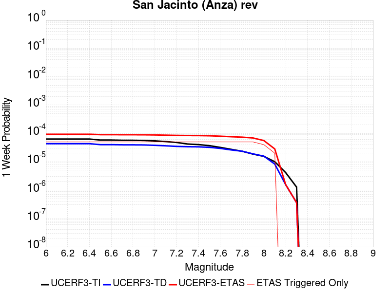 |  |  |  |

| Magnitude | 1 wk TI Prob | 1 wk TD Prob | 1 wk ETAS Prob | 1 wk ETAS/TD Gain | 1 wk ETAS Triggered Only | 1 mo TI Prob | 1 mo TD Prob | 1 mo ETAS Prob | 1 mo ETAS/TD Gain | 1 mo ETAS Triggered Only | 1 yr TI Prob | 1 yr TD Prob | 1 yr ETAS Prob | 1 yr ETAS/TD Gain | 1 yr ETAS Triggered Only | 10 yr TI Prob | 10 yr TD Prob | 10 yr ETAS Prob | 10 yr ETAS/TD Gain | 10 yr ETAS Triggered Only |
|-----|-----|-----|-----|-----|-----|-----|-----|-----|-----|-----|-----|-----|-----|-----|-----|-----|-----|-----|-----|-----|
| 6.0 | 6.3015636E-5 | 4.3302647E-5 | 9.3300485E-5 | 2.1546137 | 5.0E-5 | 2.7003905E-4 | 1.8556965E-4 | 2.5555666E-4 | 1.3771468 | 7.0E-5 | 0.0032827691 | 0.0022569813 | 0.002346778 | 1.0397862 | 9.0E-5 | 0.032346968 | 0.023296192 | 0.023442699 | 1.0062888 | 1.5E-4 |
| 6.1 | 6.3015636E-5 | 4.3302647E-5 | 9.3300485E-5 | 2.1546137 | 5.0E-5 | 2.7003905E-4 | 1.8556965E-4 | 2.5555666E-4 | 1.3771468 | 7.0E-5 | 0.0032827691 | 0.0022569813 | 0.002346778 | 1.0397862 | 9.0E-5 | 0.032346968 | 0.023296192 | 0.023442699 | 1.0062888 | 1.5E-4 |
| 6.2 | 6.3015636E-5 | 4.3302647E-5 | 9.3300485E-5 | 2.1546137 | 5.0E-5 | 2.7003905E-4 | 1.8556965E-4 | 2.5555666E-4 | 1.3771468 | 7.0E-5 | 0.0032827691 | 0.0022569813 | 0.002346778 | 1.0397862 | 9.0E-5 | 0.032346968 | 0.023296192 | 0.023442699 | 1.0062888 | 1.5E-4 |
| 6.3 | 6.3015636E-5 | 4.3302647E-5 | 9.3300485E-5 | 2.1546137 | 5.0E-5 | 2.7003905E-4 | 1.8556965E-4 | 2.5555666E-4 | 1.3771468 | 7.0E-5 | 0.0032827691 | 0.0022569813 | 0.002346778 | 1.0397862 | 9.0E-5 | 0.032346968 | 0.023296192 | 0.023442699 | 1.0062888 | 1.5E-4 |
| 6.4 | 6.3015636E-5 | 4.3302647E-5 | 9.3300485E-5 | 2.1546137 | 5.0E-5 | 2.7003905E-4 | 1.8556965E-4 | 2.5555666E-4 | 1.3771468 | 7.0E-5 | 0.0032827691 | 0.0022569813 | 0.002346778 | 1.0397862 | 9.0E-5 | 0.032346968 | 0.023296192 | 0.023442699 | 1.0062888 | 1.5E-4 |
| 6.5 | 5.811017E-5 | 4.0082516E-5 | 9.008051E-5 | 2.2473767 | 5.0E-5 | 2.4901982E-4 | 1.7177092E-4 | 2.417589E-4 | 1.4074495 | 7.0E-5 | 0.0030276014 | 0.002089311 | 0.0021791228 | 1.0429864 | 9.0E-5 | 0.02986684 | 0.021593736 | 0.021740498 | 1.0067965 | 1.5E-4 |
| 6.6 | 5.811017E-5 | 4.0082516E-5 | 9.008051E-5 | 2.2473767 | 5.0E-5 | 2.4901982E-4 | 1.7177092E-4 | 2.417589E-4 | 1.4074495 | 7.0E-5 | 0.0030276014 | 0.002089311 | 0.0021791228 | 1.0429864 | 9.0E-5 | 0.02986684 | 0.021593736 | 0.021740498 | 1.0067965 | 1.5E-4 |
| 6.7 | 5.712442E-5 | 3.9505223E-5 | 8.950325E-5 | 2.2656054 | 5.0E-5 | 2.4479596E-4 | 1.6929714E-4 | 2.3928529E-4 | 1.4134042 | 7.0E-5 | 0.0029763177 | 0.0020592497 | 0.0021490643 | 1.0436152 | 9.0E-5 | 0.029367693 | 0.021285562 | 0.02143237 | 1.006897 | 1.5E-4 |
| 6.8 | 5.6967532E-5 | 3.9361643E-5 | 8.935967E-5 | 2.2702222 | 5.0E-5 | 2.4412372E-4 | 1.6868189E-4 | 2.3867008E-4 | 1.4149123 | 7.0E-5 | 0.0029681553 | 0.002051773 | 0.0021415884 | 1.0437745 | 9.0E-5 | 0.029288229 | 0.021210281 | 0.0213571 | 1.006922 | 1.5E-4 |
| 6.9 | 5.6211324E-5 | 3.9066435E-5 | 8.906448E-5 | 2.279821 | 5.0E-5 | 2.4088343E-4 | 1.6741687E-4 | 2.3740515E-4 | 1.4180479 | 7.0E-5 | 0.0029288116 | 0.0020364004 | 0.0021262171 | 1.0441056 | 9.0E-5 | 0.028905109 | 0.021049714 | 0.021196555 | 1.006976 | 1.5E-4 |
| 7.0 | 5.4383527E-5 | 3.792697E-5 | 8.792507E-5 | 2.318273 | 5.0E-5 | 2.3305144E-4 | 1.6253405E-4 | 2.3252268E-4 | 1.430609 | 7.0E-5 | 0.0028337094 | 0.001977061 | 0.002066883 | 1.0454321 | 9.0E-5 | 0.027978465 | 0.020440677 | 0.02058761 | 1.0071883 | 1.5E-4 |
| 7.1 | 5.1393665E-5 | 3.6389913E-5 | 8.638809E-5 | 2.3739572 | 5.0E-5 | 2.2023996E-4 | 1.5594746E-4 | 2.2593656E-4 | 1.4487991 | 7.0E-5 | 0.0026781242 | 0.0018970112 | 0.0019868405 | 1.047353 | 9.0E-5 | 0.026460782 | 0.019614287 | 0.019761344 | 1.0074974 | 1.5E-4 |
| 7.2 | 4.785222E-5 | 3.4741795E-5 | 8.474006E-5 | 2.4391387 | 5.0E-5 | 2.0506482E-4 | 1.4888494E-4 | 2.1887451E-4 | 1.4700917 | 7.0E-5 | 0.0024938055 | 0.0018111705 | 0.0019010075 | 1.0496017 | 9.0E-5 | 0.024660049 | 0.018728992 | 0.018876182 | 1.007859 | 1.5E-4 |
| 7.3 | 4.2143256E-5 | 3.383628E-5 | 8.383459E-5 | 2.4776537 | 5.0E-5 | 1.8060145E-4 | 1.4500458E-4 | 2.1499443E-4 | 1.4826734 | 7.0E-5 | 0.002196605 | 0.0017640047 | 0.0018538459 | 1.0509303 | 9.0E-5 | 0.02175019 | 0.01823724 | 0.018384505 | 1.0080749 | 1.5E-4 |
| 7.4 | 4.0264713E-5 | 3.347446E-5 | 8.347279E-5 | 2.4936259 | 5.0E-5 | 1.7255165E-4 | 1.4345412E-4 | 2.1344407E-4 | 1.487891 | 7.0E-5 | 0.002098792 | 0.0017451581 | 0.001835001 | 1.0514812 | 9.0E-5 | 0.020790804 | 0.018041821 | 0.018189114 | 1.008164 | 1.5E-4 |
| 7.5 | 3.694492E-5 | 3.218847E-5 | 8.218686E-5 | 2.5533013 | 5.0E-5 | 1.5832575E-4 | 1.379433E-4 | 2.0793364E-4 | 1.5073849 | 7.0E-5 | 0.0019259118 | 0.001678169 | 0.0017680179 | 1.0535399 | 9.0E-5 | 0.01909306 | 0.01735827 | 0.017505666 | 1.0084914 | 1.5E-4 |
| 7.6 | 3.200565E-5 | 2.9504106E-5 | 7.950263E-5 | 2.6946294 | 5.0E-5 | 1.3715986E-4 | 1.2644005E-4 | 1.9643121E-4 | 1.553552 | 7.0E-5 | 0.001668642 | 0.0015383229 | 0.0016281845 | 1.0584153 | 9.0E-5 | 0.01656168 | 0.0159463 | 0.016093908 | 1.0092566 | 1.5E-4 |
| 7.7 | 2.731642E-5 | 2.6092788E-5 | 7.6091485E-5 | 2.9161882 | 5.0E-5 | 1.1706512E-4 | 1.1182144E-4 | 1.7181474E-4 | 1.5365098 | 6.0E-5 | 0.001424336 | 0.0013605768 | 0.001440468 | 1.0587186 | 8.0E-5 | 0.014152412 | 0.014167004 | 0.014295163 | 1.0090462 | 1.3E-4 |
| 7.8 | 2.3466424E-5 | 2.3504817E-5 | 7.3503645E-5 | 3.1271734 | 5.0E-5 | 1.0056651E-4 | 1.0073105E-4 | 1.60725E-4 | 1.5955856 | 6.0E-5 | 0.0012237094 | 0.0012257113 | 0.0013056133 | 1.0651882 | 8.0E-5 | 0.012169928 | 0.012808893 | 0.012937228 | 1.0100192 | 1.3E-4 |
| 7.9 | 1.8611925E-5 | 1.8908117E-5 | 6.8907175E-5 | 3.644317 | 5.0E-5 | 7.9762955E-5 | 8.1032274E-5 | 1.4102741E-4 | 1.7403858 | 6.0E-5 | 9.7068126E-4 | 9.861222E-4 | 0.0010560531 | 1.0709151 | 7.0E-5 | 0.0096645225 | 0.010393824 | 0.010512577 | 1.0114254 | 1.2E-4 |
| 8.0 | 1.5460775E-5 | 1.5740965E-5 | 5.5740336E-5 | 3.5411003 | 4.0E-5 | 6.6258784E-5 | 6.7459536E-5 | 1.1745616E-4 | 1.741135 | 5.0E-5 | 8.0640207E-4 | 8.21011E-4 | 8.809618E-4 | 1.0730206 | 6.0E-5 | 0.008034821 | 0.0087028835 | 0.0088119265 | 1.0125295 | 1.1E-4 |
| 8.1 | 9.983884E-6 | 8.269952E-6 | 2.8269786E-5 | 3.4183738 | 2.0E-5 | 4.2787375E-5 | 3.544217E-5 | 6.5441105E-5 | 1.8464192 | 3.0E-5 | 5.2081177E-4 | 4.314235E-4 | 4.7140627E-4 | 1.0926763 | 4.0E-5 | 0.0051959283 | 0.004640022 | 0.004699744 | 1.012871 | 6.0E-5 |
| 8.2 | 4.1226E-6 | 1.5529788E-6 | 1.5529788E-6 | 1.0 | 0.0 | 1.7668166E-5 | 6.6556063E-6 | 6.6556063E-6 | 1.0 | 0.0 | 2.1508869E-4 | 8.102902E-5 | 8.102902E-5 | 1.0 | 0.0 | 0.0021488064 | 9.4050163E-4 | 9.4050163E-4 | 1.0 | 0.0 |
| 8.3 | 1.2750878E-6 | 3.612133E-7 | 3.612133E-7 | 1.0 | 0.0 | 5.4646503E-6 | 1.548056E-6 | 1.548056E-6 | 1.0 | 0.0 | 6.653009E-5 | 1.8847424E-5 | 1.8847424E-5 | 1.0 | 0.0 | 6.6510175E-4 | 2.2734253E-4 | 2.2734253E-4 | 1.0 | 0.0 |

## Kern Canyon (North Kern) 2011
*[(top)](#table-of-contents)*

| 1 Week | 1 Month | 1 Year | 10 Year |
|-----|-----|-----|-----|
| 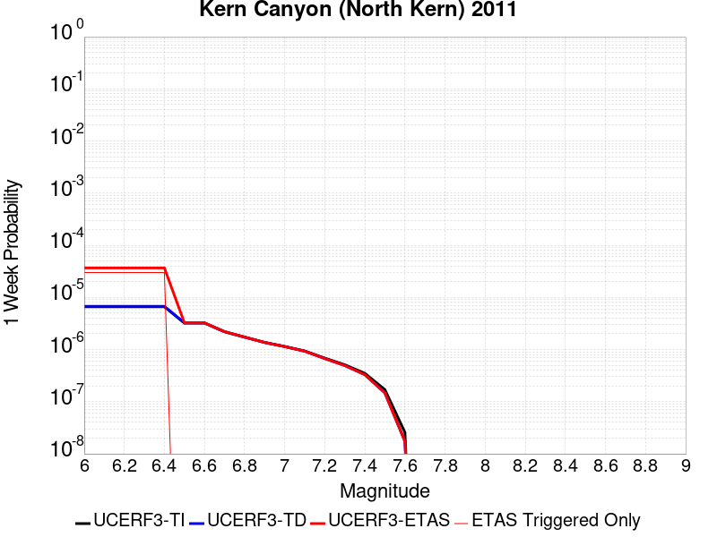 | 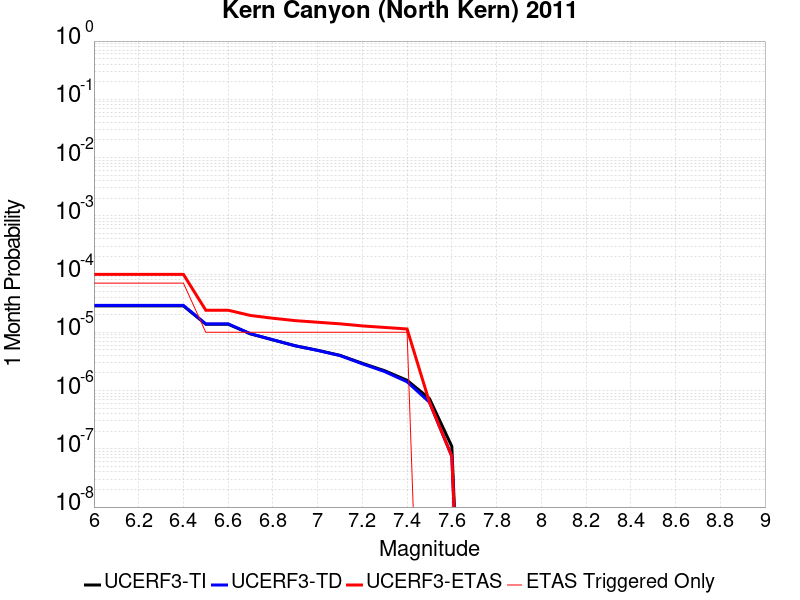 | 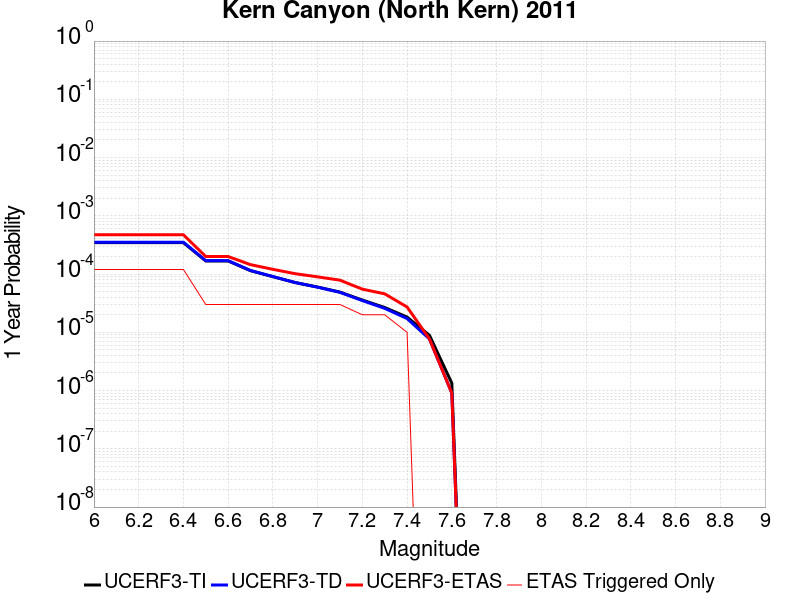 | 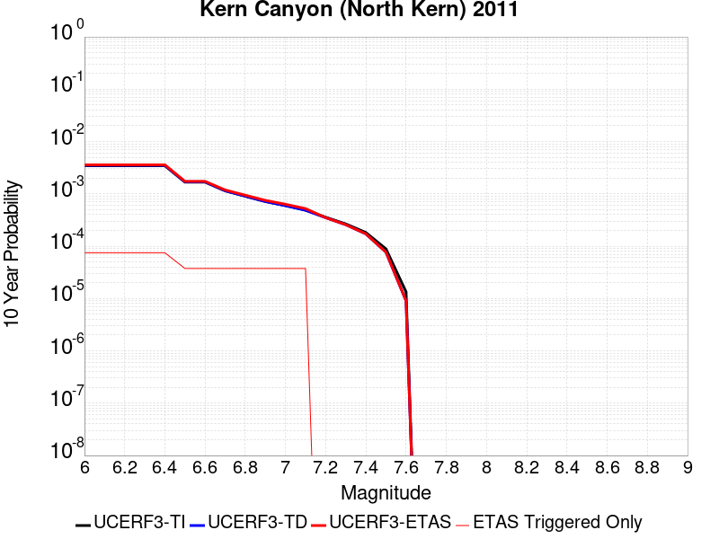 |

| Magnitude | 1 wk TI Prob | 1 wk TD Prob | 1 wk ETAS Prob | 1 wk ETAS/TD Gain | 1 wk ETAS Triggered Only | 1 mo TI Prob | 1 mo TD Prob | 1 mo ETAS Prob | 1 mo ETAS/TD Gain | 1 mo ETAS Triggered Only | 1 yr TI Prob | 1 yr TD Prob | 1 yr ETAS Prob | 1 yr ETAS/TD Gain | 1 yr ETAS Triggered Only | 10 yr TI Prob | 10 yr TD Prob | 10 yr ETAS Prob | 10 yr ETAS/TD Gain | 10 yr ETAS Triggered Only |
|-----|-----|-----|-----|-----|-----|-----|-----|-----|-----|-----|-----|-----|-----|-----|-----|-----|-----|-----|-----|-----|
| 6.0 | 6.6264497E-6 | 6.75733E-6 | 3.6757127E-5 | 5.4395933 | 3.0E-5 | 2.8398761E-5 | 2.895971E-5 | 9.895768E-5 | 3.4170814 | 7.0E-5 | 3.4570007E-4 | 3.5253543E-4 | 4.7249312E-4 | 1.3402714 | 1.2E-4 | 0.0034516277 | 0.0035205502 | 0.0036700221 | 1.042457 | 1.5E-4 |
| 6.1 | 6.6264497E-6 | 6.75733E-6 | 3.6757127E-5 | 5.4395933 | 3.0E-5 | 2.8398761E-5 | 2.895971E-5 | 9.895768E-5 | 3.4170814 | 7.0E-5 | 3.4570007E-4 | 3.5253543E-4 | 4.7249312E-4 | 1.3402714 | 1.2E-4 | 0.0034516277 | 0.0035205502 | 0.0036700221 | 1.042457 | 1.5E-4 |
| 6.2 | 6.6264497E-6 | 6.75733E-6 | 3.6757127E-5 | 5.4395933 | 3.0E-5 | 2.8398761E-5 | 2.895971E-5 | 9.895768E-5 | 3.4170814 | 7.0E-5 | 3.4570007E-4 | 3.5253543E-4 | 4.7249312E-4 | 1.3402714 | 1.2E-4 | 0.0034516277 | 0.0035205502 | 0.0036700221 | 1.042457 | 1.5E-4 |
| 6.3 | 6.6264497E-6 | 6.75733E-6 | 3.6757127E-5 | 5.4395933 | 3.0E-5 | 2.8398761E-5 | 2.895971E-5 | 9.895768E-5 | 3.4170814 | 7.0E-5 | 3.4570007E-4 | 3.5253543E-4 | 4.7249312E-4 | 1.3402714 | 1.2E-4 | 0.0034516277 | 0.0035205502 | 0.0036700221 | 1.042457 | 1.5E-4 |
| 6.4 | 6.6264497E-6 | 6.75733E-6 | 3.6757127E-5 | 5.4395933 | 3.0E-5 | 2.8398761E-5 | 2.895971E-5 | 9.895768E-5 | 3.4170814 | 7.0E-5 | 3.4570007E-4 | 3.5253543E-4 | 4.7249312E-4 | 1.3402714 | 1.2E-4 | 0.0034516277 | 0.0035205502 | 0.0036700221 | 1.042457 | 1.5E-4 |
| 6.5 | 3.2162225E-6 | 3.2570915E-6 | 3.2570915E-6 | 1.0 | 0.0 | 1.3783738E-5 | 1.3958893E-5 | 2.3958753E-5 | 1.7163792 | 1.0E-5 | 1.6780409E-4 | 1.6993708E-4 | 1.9993198E-4 | 1.1765059 | 3.0E-5 | 0.0016767744 | 0.001698151 | 0.0017380831 | 1.023515 | 4.0E-5 |
| 6.6 | 3.2162225E-6 | 3.2570915E-6 | 3.2570915E-6 | 1.0 | 0.0 | 1.3783738E-5 | 1.3958893E-5 | 2.3958753E-5 | 1.7163792 | 1.0E-5 | 1.6780409E-4 | 1.6993708E-4 | 1.9993198E-4 | 1.1765059 | 3.0E-5 | 0.0016767744 | 0.001698151 | 0.0017380831 | 1.023515 | 4.0E-5 |
| 6.7 | 2.1908265E-6 | 2.2071222E-6 | 2.2071222E-6 | 1.0 | 0.0 | 9.389223E-6 | 9.459061E-6 | 1.9458967E-5 | 2.0571773 | 1.0E-5 | 1.1430779E-4 | 1.1515819E-4 | 1.4515473E-4 | 1.2604812 | 3.0E-5 | 0.0011424901 | 0.0011510046 | 0.0011909585 | 1.0347122 | 4.0E-5 |
| 6.8 | 1.7303895E-6 | 1.7365529E-6 | 1.7365529E-6 | 1.0 | 0.0 | 7.415934E-6 | 7.4423488E-6 | 1.7442275E-5 | 2.3436518 | 1.0E-5 | 9.028525E-5 | 9.0606925E-5 | 1.2060421E-4 | 1.3310705 | 3.0E-5 | 9.024858E-4 | 9.057096E-4 | 9.456734E-4 | 1.0441242 | 4.0E-5 |
| 6.9 | 1.3700314E-6 | 1.3688622E-6 | 1.3688622E-6 | 1.0 | 0.0 | 5.87155E-6 | 5.8665396E-6 | 1.586648E-5 | 2.7045724 | 1.0E-5 | 7.148377E-5 | 7.142282E-5 | 1.0142068E-4 | 1.4200038 | 3.0E-5 | 7.146078E-4 | 7.140032E-4 | 7.439818E-4 | 1.0419866 | 3.0E-5 |
| 7.0 | 1.1467797E-6 | 1.1413804E-6 | 1.1413804E-6 | 1.0 | 0.0 | 4.9147607E-6 | 4.8916213E-6 | 1.4891572E-5 | 3.044302 | 1.0E-5 | 5.983557E-5 | 5.9553895E-5 | 8.955211E-5 | 1.5037154 | 3.0E-5 | 5.981946E-4 | 5.953825E-4 | 6.2536466E-4 | 1.0503578 | 3.0E-5 |
| 7.1 | 9.3952065E-7 | 9.3026904E-7 | 9.3026904E-7 | 1.0 | 0.0 | 4.026511E-6 | 3.9868614E-6 | 1.3986822E-5 | 3.5082288 | 1.0E-5 | 4.9021666E-5 | 4.8538972E-5 | 7.8537516E-5 | 1.6180301 | 3.0E-5 | 4.901085E-4 | 4.8528548E-4 | 5.152709E-4 | 1.0617893 | 3.0E-5 |
| 7.2 | 6.858055E-7 | 6.7193E-7 | 6.7193E-7 | 1.0 | 0.0 | 2.939163E-6 | 2.879697E-6 | 1.2879668E-5 | 4.4725776 | 1.0E-5 | 3.5783723E-5 | 3.5059755E-5 | 5.5059056E-5 | 1.5704346 | 2.0E-5 | 3.5777962E-4 | 3.5054312E-4 | 3.7053612E-4 | 1.0570344 | 2.0E-5 |
| 7.3 | 5.1101983E-7 | 4.9393E-7 | 4.9393E-7 | 1.0 | 0.0 | 2.1900833E-6 | 2.116841E-6 | 1.211682E-5 | 5.7240105 | 1.0E-5 | 2.6663936E-5 | 2.5772239E-5 | 4.5771725E-5 | 1.7760088 | 2.0E-5 | 2.6660739E-4 | 2.57693E-4 | 2.7768782E-4 | 1.0775918 | 2.0E-5 |
| 7.4 | 3.4999414E-7 | 3.2995905E-7 | 3.2995905E-7 | 1.0 | 0.0 | 1.499974E-6 | 1.4141094E-6 | 1.1414096E-5 | 8.071578 | 1.0E-5 | 1.8262032E-5 | 1.721665E-5 | 2.7216476E-5 | 1.5808231 | 1.0E-5 | 1.826053E-4 | 1.7215339E-4 | 1.8215168E-4 | 1.0580777 | 1.0E-5 |
| 7.5 | 1.7021522E-7 | 1.4750044E-7 | 1.4750044E-7 | 1.0 | 0.0 | 7.2949354E-7 | 6.321446E-7 | 6.321446E-7 | 1.0 | 0.0 | 8.881548E-6 | 7.696334E-6 | 7.696334E-6 | 1.0 | 0.0 | 8.8811925E-5 | 7.696076E-5 | 7.696076E-5 | 1.0 | 0.0 |
| 7.6 | 2.572245E-8 | 1.7352555E-8 | 1.7352555E-8 | 1.0 | 0.0 | 1.10239064E-7 | 7.436809E-8 | 7.436809E-8 | 1.0 | 0.0 | 1.3421597E-6 | 9.054312E-7 | 9.054312E-7 | 1.0 | 0.0 | 1.3421517E-5 | 9.05428E-6 | 9.05428E-6 | 1.0 | 0.0 |

## Chino alt 1
*[(top)](#table-of-contents)*

| 1 Week | 1 Month | 1 Year | 10 Year |
|-----|-----|-----|-----|
|  |  |  |  |

| Magnitude | 1 wk TI Prob | 1 wk TD Prob | 1 wk ETAS Prob | 1 wk ETAS/TD Gain | 1 wk ETAS Triggered Only | 1 mo TI Prob | 1 mo TD Prob | 1 mo ETAS Prob | 1 mo ETAS/TD Gain | 1 mo ETAS Triggered Only | 1 yr TI Prob | 1 yr TD Prob | 1 yr ETAS Prob | 1 yr ETAS/TD Gain | 1 yr ETAS Triggered Only | 10 yr TI Prob | 10 yr TD Prob | 10 yr ETAS Prob | 10 yr ETAS/TD Gain | 10 yr ETAS Triggered Only |
|-----|-----|-----|-----|-----|-----|-----|-----|-----|-----|-----|-----|-----|-----|-----|-----|-----|-----|-----|-----|-----|
| 6.0 | 3.939946E-5 | 4.8948554E-5 | 5.8948066E-5 | 1.2042861 | 1.0E-5 | 1.6884391E-4 | 2.097656E-4 | 2.297614E-4 | 1.0953245 | 2.0E-5 | 0.0020537362 | 0.0025513945 | 0.002641165 | 1.0351849 | 9.0E-5 | 0.020348595 | 0.025277847 | 0.025414309 | 1.0053984 | 1.4E-4 |
| 6.1 | 2.1505624E-5 | 2.6879026E-5 | 3.6878755E-5 | 1.3720273 | 1.0E-5 | 9.2163704E-5 | 1.1519137E-4 | 1.2519021E-4 | 1.086802 | 1.0E-5 | 0.0011215154 | 0.001401664 | 0.0014515939 | 1.0356219 | 5.0E-5 | 0.011158722 | 0.013945141 | 0.014024026 | 1.0056567 | 8.0E-5 |
| 6.2 | 2.1505624E-5 | 2.6879026E-5 | 3.6878755E-5 | 1.3720273 | 1.0E-5 | 9.2163704E-5 | 1.1519137E-4 | 1.2519021E-4 | 1.086802 | 1.0E-5 | 0.0011215154 | 0.001401664 | 0.0014515939 | 1.0356219 | 5.0E-5 | 0.011158722 | 0.013945141 | 0.014024026 | 1.0056567 | 8.0E-5 |
| 6.3 | 1.4290785E-5 | 1.8165128E-5 | 1.8165128E-5 | 1.0 | 0.0 | 6.1244784E-5 | 7.784848E-5 | 7.784848E-5 | 1.0 | 0.0 | 7.454001E-4 | 9.4743853E-4 | 9.6741953E-4 | 1.0210896 | 2.0E-5 | 0.007429048 | 0.0094444575 | 0.00948408 | 1.0041953 | 4.0E-5 |
| 6.4 | 1.4290785E-5 | 1.8165128E-5 | 1.8165128E-5 | 1.0 | 0.0 | 6.1244784E-5 | 7.784848E-5 | 7.784848E-5 | 1.0 | 0.0 | 7.454001E-4 | 9.4743853E-4 | 9.6741953E-4 | 1.0210896 | 2.0E-5 | 0.007429048 | 0.0094444575 | 0.00948408 | 1.0041953 | 4.0E-5 |
| 6.5 | 1.3017944E-5 | 1.6652088E-5 | 1.6652088E-5 | 1.0 | 0.0 | 5.5789995E-5 | 7.136439E-5 | 7.136439E-5 | 1.0 | 0.0 | 6.790315E-4 | 8.685589E-4 | 8.7855017E-4 | 1.0115033 | 1.0E-5 | 0.0067696036 | 0.008661949 | 0.008691689 | 1.0034335 | 3.0E-5 |
| 6.6 | 9.470016E-6 | 1.2039424E-5 | 1.2039424E-5 | 1.0 | 0.0 | 4.058515E-5 | 5.1596704E-5 | 5.1596704E-5 | 1.0 | 0.0 | 4.940122E-4 | 6.280428E-4 | 6.3803646E-4 | 1.0159125 | 1.0E-5 | 0.004929154 | 0.0062718987 | 0.0063017104 | 1.0047532 | 3.0E-5 |
| 6.7 | 8.314155E-6 | 1.0407736E-5 | 1.0407736E-5 | 1.0 | 0.0 | 3.5631605E-5 | 4.4604003E-5 | 4.4604003E-5 | 1.0 | 0.0 | 4.3372845E-4 | 5.429507E-4 | 5.429507E-4 | 1.0 | 0.0 | 0.004328829 | 0.005425775 | 0.005435721 | 1.0018331 | 1.0E-5 |
| 6.8 | 3.4856364E-6 | 3.8133708E-6 | 3.8133708E-6 | 1.0 | 0.0 | 1.4938357E-5 | 1.6342927E-5 | 1.6342927E-5 | 1.0 | 0.0 | 1.8185932E-4 | 1.9895904E-4 | 1.9895904E-4 | 1.0 | 0.0 | 0.0018171056 | 0.0019894864 | 0.0019894864 | 1.0 | 0.0 |
| 6.9 | 2.2645952E-6 | 2.1529022E-6 | 2.1529022E-6 | 1.0 | 0.0 | 9.705372E-6 | 9.226692E-6 | 9.226692E-6 | 1.0 | 0.0 | 1.18156495E-4 | 1.123294E-4 | 1.123294E-4 | 1.0 | 0.0 | 0.0011809369 | 0.0011233423 | 0.0011233423 | 1.0 | 0.0 |
| 7.0 | 1.7864003E-6 | 1.5430785E-6 | 1.5430785E-6 | 1.0 | 0.0 | 7.655979E-6 | 6.613177E-6 | 6.613177E-6 | 1.0 | 0.0 | 9.3207556E-5 | 8.051251E-5 | 8.051251E-5 | 1.0 | 0.0 | 9.316847E-4 | 8.0528046E-4 | 8.0528046E-4 | 1.0 | 0.0 |
| 7.1 | 1.7315456E-6 | 1.4733511E-6 | 1.4733511E-6 | 1.0 | 0.0 | 7.420889E-6 | 6.3143466E-6 | 6.3143466E-6 | 1.0 | 0.0 | 9.034557E-5 | 7.6874516E-5 | 7.6874516E-5 | 1.0 | 0.0 | 9.0308854E-4 | 7.6891703E-4 | 7.6891703E-4 | 1.0 | 0.0 |
| 7.2 | 1.6008337E-6 | 1.3574215E-6 | 1.3574215E-6 | 1.0 | 0.0 | 6.860698E-6 | 5.817508E-6 | 5.817508E-6 | 1.0 | 0.0 | 8.352579E-5 | 7.082591E-5 | 7.082591E-5 | 1.0 | 0.0 | 8.34944E-4 | 7.0845755E-4 | 7.0845755E-4 | 1.0 | 0.0 |
| 7.3 | 1.3320939E-6 | 1.121782E-6 | 1.121782E-6 | 1.0 | 0.0 | 5.7089615E-6 | 4.807629E-6 | 4.807629E-6 | 1.0 | 0.0 | 6.9504385E-5 | 5.8531357E-5 | 5.8531357E-5 | 1.0 | 0.0 | 6.9482654E-4 | 5.8530393E-4 | 5.8530393E-4 | 1.0 | 0.0 |
| 7.4 | 1.114294E-6 | 9.237111E-7 | 9.237111E-7 | 1.0 | 0.0 | 4.775537E-6 | 3.958756E-6 | 3.958756E-6 | 1.0 | 0.0 | 5.8140613E-5 | 4.8196827E-5 | 4.8196827E-5 | 1.0 | 0.0 | 5.81254E-4 | 4.8188053E-4 | 4.8188053E-4 | 1.0 | 0.0 |
| 7.5 | 9.354081E-7 | 7.6234323E-7 | 7.6234323E-7 | 1.0 | 0.0 | 4.0088858E-6 | 3.2671815E-6 | 3.2671815E-6 | 1.0 | 0.0 | 4.8807087E-5 | 3.9777242E-5 | 3.9777242E-5 | 1.0 | 0.0 | 4.879637E-4 | 3.977046E-4 | 3.977046E-4 | 1.0 | 0.0 |
| 7.6 | 8.521771E-7 | 6.88071E-7 | 6.88071E-7 | 1.0 | 0.0 | 3.6521824E-6 | 2.9488726E-6 | 2.9488726E-6 | 1.0 | 0.0 | 4.4464414E-5 | 3.5901965E-5 | 3.5901965E-5 | 1.0 | 0.0 | 4.4455516E-4 | 3.589648E-4 | 3.589648E-4 | 1.0 | 0.0 |
| 7.7 | 2.1803626E-7 | 1.418649E-7 | 1.418649E-7 | 1.0 | 0.0 | 9.344408E-7 | 6.079923E-7 | 6.079923E-7 | 1.0 | 0.0 | 1.1376757E-5 | 7.4022914E-6 | 7.4022914E-6 | 1.0 | 0.0 | 1.13761744E-4 | 7.402141E-5 | 7.402141E-5 | 1.0 | 0.0 |

## Santa Cruz Island
*[(top)](#table-of-contents)*

| 1 Week | 1 Month | 1 Year | 10 Year |
|-----|-----|-----|-----|
|  |  |  |  |

| Magnitude | 1 wk TI Prob | 1 wk TD Prob | 1 wk ETAS Prob | 1 wk ETAS/TD Gain | 1 wk ETAS Triggered Only | 1 mo TI Prob | 1 mo TD Prob | 1 mo ETAS Prob | 1 mo ETAS/TD Gain | 1 mo ETAS Triggered Only | 1 yr TI Prob | 1 yr TD Prob | 1 yr ETAS Prob | 1 yr ETAS/TD Gain | 1 yr ETAS Triggered Only | 10 yr TI Prob | 10 yr TD Prob | 10 yr ETAS Prob | 10 yr ETAS/TD Gain | 10 yr ETAS Triggered Only |
|-----|-----|-----|-----|-----|-----|-----|-----|-----|-----|-----|-----|-----|-----|-----|-----|-----|-----|-----|-----|-----|
| 6.0 | 2.9164563E-5 | 3.1599742E-5 | 4.159943E-5 | 1.3164482 | 1.0E-5 | 1.2498499E-4 | 1.3542121E-4 | 1.6541715E-4 | 1.221501 | 3.0E-5 | 0.0015206301 | 0.0016476426 | 0.0017474778 | 1.0605928 | 1.0E-4 | 0.015102667 | 0.016368 | 0.016505707 | 1.0084133 | 1.4E-4 |
| 6.1 | 2.9164563E-5 | 3.1599742E-5 | 4.159943E-5 | 1.3164482 | 1.0E-5 | 1.2498499E-4 | 1.3542121E-4 | 1.6541715E-4 | 1.221501 | 3.0E-5 | 0.0015206301 | 0.0016476426 | 0.0017474778 | 1.0605928 | 1.0E-4 | 0.015102667 | 0.016368 | 0.016505707 | 1.0084133 | 1.4E-4 |
| 6.2 | 2.9164563E-5 | 3.1599742E-5 | 4.159943E-5 | 1.3164482 | 1.0E-5 | 1.2498499E-4 | 1.3542121E-4 | 1.6541715E-4 | 1.221501 | 3.0E-5 | 0.0015206301 | 0.0016476426 | 0.0017474778 | 1.0605928 | 1.0E-4 | 0.015102667 | 0.016368 | 0.016505707 | 1.0084133 | 1.4E-4 |
| 6.3 | 1.6635553E-5 | 1.780436E-5 | 1.780436E-5 | 1.0 | 0.0 | 7.1293274E-5 | 7.630226E-5 | 9.630074E-5 | 1.2620955 | 2.0E-5 | 8.6765E-4 | 9.2860236E-4 | 0.001008528 | 1.086071 | 8.0E-5 | 0.008642701 | 0.009249094 | 0.009338262 | 1.0096407 | 9.0E-5 |
| 6.4 | 1.6635553E-5 | 1.780436E-5 | 1.780436E-5 | 1.0 | 0.0 | 7.1293274E-5 | 7.630226E-5 | 9.630074E-5 | 1.2620955 | 2.0E-5 | 8.6765E-4 | 9.2860236E-4 | 0.001008528 | 1.086071 | 8.0E-5 | 0.008642701 | 0.009249094 | 0.009338262 | 1.0096407 | 9.0E-5 |
| 6.5 | 1.2238748E-5 | 1.3042995E-5 | 1.3042995E-5 | 1.0 | 0.0 | 5.2450723E-5 | 5.5897377E-5 | 6.589681E-5 | 1.1788893 | 1.0E-5 | 6.3840044E-4 | 6.8034173E-4 | 7.403009E-4 | 1.088131 | 6.0E-5 | 0.0063656955 | 0.0067829876 | 0.006852513 | 1.01025 | 7.0E-5 |
| 6.6 | 1.0489767E-5 | 1.1156636E-5 | 1.1156636E-5 | 1.0 | 0.0 | 4.495537E-5 | 4.781329E-5 | 4.781329E-5 | 1.0 | 0.0 | 5.4719415E-4 | 5.819735E-4 | 6.1195606E-4 | 1.0515187 | 3.0E-5 | 0.005458487 | 0.0058047357 | 0.0058445036 | 1.006851 | 4.0E-5 |
| 6.7 | 8.699222E-6 | 9.236782E-6 | 9.236782E-6 | 1.0 | 0.0 | 3.7281847E-5 | 3.958561E-5 | 3.958561E-5 | 1.0 | 0.0 | 4.5381195E-4 | 4.8184878E-4 | 5.1183434E-4 | 1.0622302 | 3.0E-5 | 0.0045288634 | 0.004808108 | 0.0048379637 | 1.0062095 | 3.0E-5 |
| 6.8 | 8.307732E-6 | 8.8169045E-6 | 8.8169045E-6 | 1.0 | 0.0 | 3.560408E-5 | 3.7786187E-5 | 3.7786187E-5 | 1.0 | 0.0 | 4.3339343E-4 | 4.5995016E-4 | 4.7994094E-4 | 1.043463 | 2.0E-5 | 0.004325492 | 0.0045900354 | 0.0046099434 | 1.0043373 | 2.0E-5 |
| 6.9 | 8.073121E-6 | 8.564939E-6 | 8.564939E-6 | 1.0 | 0.0 | 3.459863E-5 | 3.6706366E-5 | 3.6706366E-5 | 1.0 | 0.0 | 4.2115687E-4 | 4.468088E-4 | 4.6679986E-4 | 1.0447419 | 2.0E-5 | 0.004203596 | 0.004459156 | 0.004479067 | 1.0044651 | 2.0E-5 |
| 7.0 | 7.617019E-6 | 8.074664E-6 | 8.074664E-6 | 1.0 | 0.0 | 3.264396E-5 | 3.4605247E-5 | 3.4605247E-5 | 1.0 | 0.0 | 3.9736772E-4 | 4.212378E-4 | 4.412294E-4 | 1.0474591 | 2.0E-5 | 0.003966579 | 0.0042044413 | 0.004224357 | 1.0047369 | 2.0E-5 |
| 7.1 | 7.1224836E-6 | 7.545788E-6 | 7.545788E-6 | 1.0 | 0.0 | 3.052457E-5 | 3.2338692E-5 | 3.2338692E-5 | 1.0 | 0.0 | 3.715733E-4 | 3.936528E-4 | 4.136449E-4 | 1.0507861 | 2.0E-5 | 0.003709526 | 0.003929598 | 0.0039495192 | 1.0050696 | 2.0E-5 |
| 7.2 | 6.441115E-6 | 6.8273835E-6 | 6.8273835E-6 | 1.0 | 0.0 | 2.7604487E-5 | 2.9259887E-5 | 2.9259887E-5 | 1.0 | 0.0 | 3.360328E-4 | 3.5618112E-4 | 3.76174E-4 | 1.0561312 | 2.0E-5 | 0.0033552512 | 0.003556131 | 0.0035760598 | 1.0056041 | 2.0E-5 |
| 7.3 | 5.494274E-6 | 5.8199944E-6 | 5.8199944E-6 | 1.0 | 0.0 | 2.3546674E-5 | 2.4942596E-5 | 2.4942596E-5 | 1.0 | 0.0 | 2.8664304E-4 | 3.0363398E-4 | 3.236279E-4 | 1.0658488 | 2.0E-5 | 0.002862736 | 0.0030322142 | 0.0030521536 | 1.0065758 | 2.0E-5 |
| 7.4 | 4.0802624E-6 | 4.312256E-6 | 4.312256E-6 | 1.0 | 0.0 | 1.7486722E-5 | 1.8480967E-5 | 1.8480967E-5 | 1.0 | 0.0 | 2.1288003E-4 | 2.2498262E-4 | 2.3498037E-4 | 1.0444379 | 1.0E-5 | 0.0021267622 | 0.0022475575 | 0.002257535 | 1.0044392 | 1.0E-5 |
| 7.5 | 2.3584746E-6 | 2.4753094E-6 | 2.4753094E-6 | 1.0 | 0.0 | 1.0107709E-5 | 1.0608426E-5 | 1.0608426E-5 | 1.0 | 0.0 | 1.2305441E-4 | 1.2915E-4 | 1.2915E-4 | 1.0 | 0.0 | 0.0012298629 | 0.0012907543 | 0.0012907543 | 1.0 | 0.0 |
| 7.6 | 9.4981914E-7 | 9.86093E-7 | 9.86093E-7 | 1.0 | 0.0 | 4.0706473E-6 | 4.2261063E-6 | 4.2261063E-6 | 1.0 | 0.0 | 4.9559E-5 | 5.145164E-5 | 5.145164E-5 | 1.0 | 0.0 | 4.954795E-4 | 5.1439856E-4 | 5.1439856E-4 | 1.0 | 0.0 |
| 7.7 | 2.6013532E-7 | 2.6416603E-7 | 2.6416603E-7 | 1.0 | 0.0 | 1.1148652E-6 | 1.1321397E-6 | 1.1321397E-6 | 1.0 | 0.0 | 1.3573399E-5 | 1.3783714E-5 | 1.3783714E-5 | 1.0 | 0.0 | 1.357257E-4 | 1.3782867E-4 | 1.3782867E-4 | 1.0 | 0.0 |
| 7.8 | 4.1522263E-8 | 3.965679E-8 | 3.965679E-8 | 1.0 | 0.0 | 1.7795254E-7 | 1.6995766E-7 | 1.6995766E-7 | 1.0 | 0.0 | 2.16657E-6 | 2.0692328E-6 | 2.0692328E-6 | 1.0 | 0.0 | 2.1665488E-5 | 2.0692156E-5 | 2.0692156E-5 | 1.0 | 0.0 |
| 7.9 | 7.7242046E-10 | 5.9468175E-10 | 5.9468175E-10 | 1.0 | 0.0 | 3.3103735E-9 | 2.5486364E-9 | 2.5486364E-9 | 1.0 | 0.0 | 4.0303796E-8 | 3.1029646E-8 | 3.1029646E-8 | 1.0 | 0.0 | 4.030379E-7 | 3.1029643E-7 | 3.1029643E-7 | 1.0 | 0.0 |

## Cleghorn Pass
*[(top)](#table-of-contents)*

| 1 Week | 1 Month | 1 Year | 10 Year |
|-----|-----|-----|-----|
|  |  |  |  |

| Magnitude | 1 wk TI Prob | 1 wk TD Prob | 1 wk ETAS Prob | 1 wk ETAS/TD Gain | 1 wk ETAS Triggered Only | 1 mo TI Prob | 1 mo TD Prob | 1 mo ETAS Prob | 1 mo ETAS/TD Gain | 1 mo ETAS Triggered Only | 1 yr TI Prob | 1 yr TD Prob | 1 yr ETAS Prob | 1 yr ETAS/TD Gain | 1 yr ETAS Triggered Only | 10 yr TI Prob | 10 yr TD Prob | 10 yr ETAS Prob | 10 yr ETAS/TD Gain | 10 yr ETAS Triggered Only |
|-----|-----|-----|-----|-----|-----|-----|-----|-----|-----|-----|-----|-----|-----|-----|-----|-----|-----|-----|-----|-----|
| 6.0 | 1.0522846E-5 | 1.1040642E-5 | 5.10402E-5 | 4.6229377 | 4.0E-5 | 4.509713E-5 | 4.7316473E-5 | 1.0731364E-4 | 2.2679973 | 6.0E-5 | 5.4891926E-4 | 5.759784E-4 | 6.7592086E-4 | 1.1735176 | 1.0E-4 | 0.0054756533 | 0.005750022 | 0.005879274 | 1.0224786 | 1.3E-4 |
| 6.1 | 1.0522846E-5 | 1.1040642E-5 | 5.10402E-5 | 4.6229377 | 4.0E-5 | 4.509713E-5 | 4.7316473E-5 | 1.0731364E-4 | 2.2679973 | 6.0E-5 | 5.4891926E-4 | 5.759784E-4 | 6.7592086E-4 | 1.1735176 | 1.0E-4 | 0.0054756533 | 0.005750022 | 0.005879274 | 1.0224786 | 1.3E-4 |
| 6.2 | 2.1045846E-6 | 2.2082024E-6 | 1.220818E-5 | 5.52856 | 1.0E-5 | 9.019617E-6 | 9.463714E-6 | 1.946362E-5 | 2.0566576 | 1.0E-5 | 1.098083E-4 | 1.1521882E-4 | 1.3521651E-4 | 1.1735628 | 2.0E-5 | 0.0010975406 | 0.0011520023 | 0.0011819677 | 1.0260116 | 3.0E-5 |
| 6.3 | 2.1045846E-6 | 2.2082024E-6 | 1.220818E-5 | 5.52856 | 1.0E-5 | 9.019617E-6 | 9.463714E-6 | 1.946362E-5 | 2.0566576 | 1.0E-5 | 1.098083E-4 | 1.1521882E-4 | 1.3521651E-4 | 1.1735628 | 2.0E-5 | 0.0010975406 | 0.0011520023 | 0.0011819677 | 1.0260116 | 3.0E-5 |
| 6.4 | 1.7259927E-6 | 1.810877E-6 | 1.1810859E-5 | 6.522176 | 1.0E-5 | 7.3970905E-6 | 7.760902E-6 | 1.7760824E-5 | 2.2885 | 1.0E-5 | 9.005586E-5 | 9.4488976E-5 | 1.1448709E-4 | 1.2116449 | 2.0E-5 | 9.001937E-4 | 9.448898E-4 | 9.7486144E-4 | 1.0317197 | 3.0E-5 |

## Big Pine (Central)
*[(top)](#table-of-contents)*

| 1 Week | 1 Month | 1 Year | 10 Year |
|-----|-----|-----|-----|
| 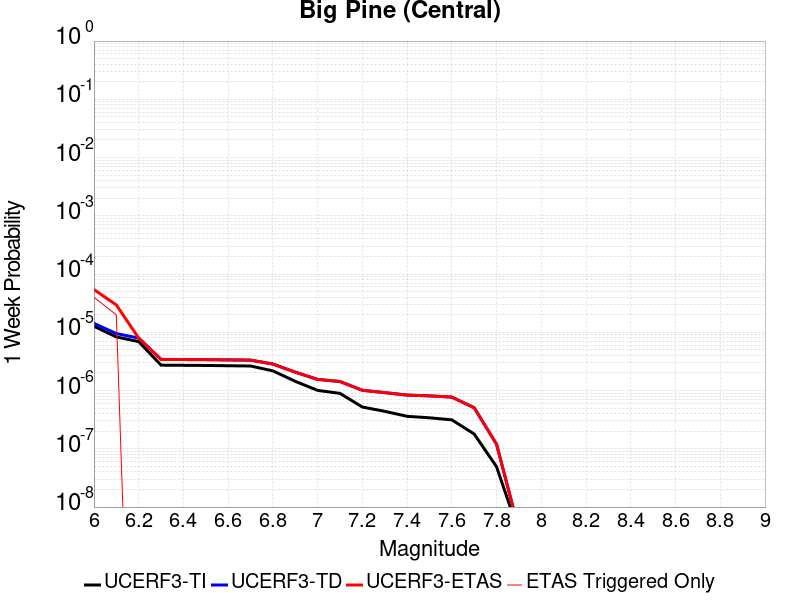 |  |  |  |

| Magnitude | 1 wk TI Prob | 1 wk TD Prob | 1 wk ETAS Prob | 1 wk ETAS/TD Gain | 1 wk ETAS Triggered Only | 1 mo TI Prob | 1 mo TD Prob | 1 mo ETAS Prob | 1 mo ETAS/TD Gain | 1 mo ETAS Triggered Only | 1 yr TI Prob | 1 yr TD Prob | 1 yr ETAS Prob | 1 yr ETAS/TD Gain | 1 yr ETAS Triggered Only | 10 yr TI Prob | 10 yr TD Prob | 10 yr ETAS Prob | 10 yr ETAS/TD Gain | 10 yr ETAS Triggered Only |
|-----|-----|-----|-----|-----|-----|-----|-----|-----|-----|-----|-----|-----|-----|-----|-----|-----|-----|-----|-----|-----|
| 6.0 | 1.2706755E-5 | 1.4250529E-5 | 5.424996E-5 | 3.8068736 | 4.0E-5 | 5.4456385E-5 | 6.107247E-5 | 1.11069414E-4 | 1.8186495 | 5.0E-5 | 6.628048E-4 | 7.433402E-4 | 8.1328815E-4 | 1.0940995 | 7.0E-5 | 0.006608314 | 0.0074135666 | 0.0075525288 | 1.0187443 | 1.4E-4 |
| 6.1 | 8.342579E-6 | 9.510762E-6 | 2.9510571E-5 | 3.102861 | 2.0E-5 | 3.5753423E-5 | 4.0759893E-5 | 7.075867E-5 | 1.7359877 | 3.0E-5 | 4.3521097E-4 | 4.961604E-4 | 5.361406E-4 | 1.080579 | 4.0E-5 | 0.0043435963 | 0.0049540824 | 0.005053587 | 1.0200853 | 1.0E-4 |
| 6.2 | 6.923899E-6 | 7.967147E-6 | 7.967147E-6 | 1.0 | 0.0 | 2.9673516E-5 | 3.4144578E-5 | 4.414424E-5 | 1.2928623 | 1.0E-5 | 3.6121515E-4 | 4.156502E-4 | 4.3564188E-4 | 1.0480974 | 2.0E-5 | 0.003606286 | 0.0041520367 | 0.004221746 | 1.0167892 | 7.0E-5 |
| 6.3 | 2.728396E-6 | 3.4242908E-6 | 3.4242908E-6 | 1.0 | 0.0 | 1.1693074E-5 | 1.4675454E-5 | 1.4675454E-5 | 1.0 | 0.0 | 1.4235388E-4 | 1.7865987E-4 | 1.8865809E-4 | 1.0559623 | 1.0E-5 | 0.0014226272 | 0.0017866704 | 0.001836581 | 1.027935 | 5.0E-5 |
| 6.4 | 2.7136944E-6 | 3.408584E-6 | 3.408584E-6 | 1.0 | 0.0 | 1.1630066E-5 | 1.4608141E-5 | 1.4608141E-5 | 1.0 | 0.0 | 1.4158686E-4 | 1.7784047E-4 | 1.8783868E-4 | 1.0562202 | 1.0E-5 | 0.0014149669 | 0.0017784894 | 0.0018284005 | 1.0280638 | 5.0E-5 |
| 6.5 | 2.6971882E-6 | 3.3909291E-6 | 3.3909291E-6 | 1.0 | 0.0 | 1.1559327E-5 | 1.45324775E-5 | 1.45324775E-5 | 1.0 | 0.0 | 1.4072572E-4 | 1.7691942E-4 | 1.8691765E-4 | 1.056513 | 1.0E-5 | 0.0014063664 | 0.0017692937 | 0.0018192052 | 1.0282098 | 5.0E-5 |
| 6.6 | 2.669092E-6 | 3.3609497E-6 | 3.3609497E-6 | 1.0 | 0.0 | 1.1438916E-5 | 1.4403995E-5 | 1.4403995E-5 | 1.0 | 0.0 | 1.3925991E-4 | 1.753554E-4 | 1.8535365E-4 | 1.0570171 | 1.0E-5 | 0.0013917267 | 0.0017536782 | 0.0018035906 | 1.0284615 | 5.0E-5 |
| 6.7 | 2.6408059E-6 | 3.3309752E-6 | 3.3309752E-6 | 1.0 | 0.0 | 1.1317691E-5 | 1.4275535E-5 | 1.4275535E-5 | 1.0 | 0.0 | 1.3778417E-4 | 1.7379165E-4 | 1.837899E-4 | 1.0575302 | 1.0E-5 | 0.0013769877 | 0.0017380653 | 0.0017879783 | 1.0287176 | 5.0E-5 |
| 6.8 | 2.1786943E-6 | 2.8544325E-6 | 2.8544325E-6 | 1.0 | 0.0 | 9.337228E-6 | 1.2233229E-5 | 1.2233229E-5 | 1.0 | 0.0 | 1.1367482E-4 | 1.4893012E-4 | 1.5892863E-4 | 1.0671356 | 1.0E-5 | 0.0011361669 | 0.0014897975 | 0.001529738 | 1.0268093 | 4.0E-5 |
| 6.9 | 1.4411696E-6 | 2.068499E-6 | 2.068499E-6 | 1.0 | 0.0 | 6.1764263E-6 | 8.864968E-6 | 8.864968E-6 | 1.0 | 0.0 | 7.51954E-5 | 1.079259E-4 | 1.1792482E-4 | 1.0926461 | 1.0E-5 | 7.5169955E-4 | 0.0010801847 | 0.0011101522 | 1.027743 | 3.0E-5 |
| 7.0 | 1.0073411E-6 | 1.554261E-6 | 1.554261E-6 | 1.0 | 0.0 | 4.317169E-6 | 6.6611024E-6 | 6.6611024E-6 | 1.0 | 0.0 | 5.2560266E-5 | 8.1096056E-5 | 8.1096056E-5 | 1.0 | 0.0 | 5.2547833E-4 | 8.1210316E-4 | 8.1210316E-4 | 1.0 | 0.0 |
| 7.1 | 8.947104E-7 | 1.4302494E-6 | 1.4302494E-6 | 1.0 | 0.0 | 3.834468E-6 | 6.129627E-6 | 6.129627E-6 | 1.0 | 0.0 | 4.6683643E-5 | 7.46258E-5 | 7.46258E-5 | 1.0 | 0.0 | 4.6673836E-4 | 7.474457E-4 | 7.474457E-4 | 1.0 | 0.0 |
| 7.2 | 5.215166E-7 | 1.0111678E-6 | 1.0111678E-6 | 1.0 | 0.0 | 2.2350691E-6 | 4.3335694E-6 | 4.3335694E-6 | 1.0 | 0.0 | 2.7211627E-5 | 5.2759973E-5 | 5.2759973E-5 | 1.0 | 0.0 | 2.7208295E-4 | 5.2890263E-4 | 5.2890263E-4 | 1.0 | 0.0 |
| 7.3 | 4.4024807E-7 | 9.219589E-7 | 9.219589E-7 | 1.0 | 0.0 | 1.8867761E-6 | 3.9512465E-6 | 3.9512465E-6 | 1.0 | 0.0 | 2.2971257E-5 | 4.810541E-5 | 4.810541E-5 | 1.0 | 0.0 | 2.2968883E-4 | 4.8237795E-4 | 4.8237795E-4 | 1.0 | 0.0 |
| 7.4 | 3.6130905E-7 | 8.358523E-7 | 8.358523E-7 | 1.0 | 0.0 | 1.5484665E-6 | 3.5822195E-6 | 3.5822195E-6 | 1.0 | 0.0 | 1.8852415E-5 | 4.3612687E-5 | 4.3612687E-5 | 1.0 | 0.0 | 1.8850817E-4 | 4.374597E-4 | 4.374597E-4 | 1.0 | 0.0 |
| 7.5 | 3.408184E-7 | 8.108147E-7 | 8.108147E-7 | 1.0 | 0.0 | 1.4606494E-6 | 3.4749157E-6 | 3.4749157E-6 | 1.0 | 0.0 | 1.7783263E-5 | 4.2306317E-5 | 4.2306317E-5 | 1.0 | 0.0 | 1.778184E-4 | 4.2437963E-4 | 4.2437963E-4 | 1.0 | 0.0 |
| 7.6 | 3.1428627E-7 | 7.7316E-7 | 7.7316E-7 | 1.0 | 0.0 | 1.3469405E-6 | 3.3135389E-6 | 3.3135389E-6 | 1.0 | 0.0 | 1.6398877E-5 | 4.0341627E-5 | 4.0341627E-5 | 1.0 | 0.0 | 1.6397667E-4 | 4.0471106E-4 | 4.0471106E-4 | 1.0 | 0.0 |
| 7.7 | 1.7972785E-7 | 5.077752E-7 | 5.077752E-7 | 1.0 | 0.0 | 7.70262E-7 | 2.1761778E-6 | 2.1761778E-6 | 1.0 | 0.0 | 9.377899E-6 | 2.6494654E-5 | 2.6494654E-5 | 1.0 | 0.0 | 9.377503E-5 | 2.662899E-4 | 2.662899E-4 | 1.0 | 0.0 |
| 7.8 | 4.9230927E-8 | 1.198079E-7 | 1.198079E-7 | 1.0 | 0.0 | 2.1098968E-7 | 5.134623E-7 | 5.134623E-7 | 1.0 | 0.0 | 2.5687964E-6 | 6.2513873E-6 | 6.2513873E-6 | 1.0 | 0.0 | 2.5687666E-5 | 6.295415E-5 | 6.295415E-5 | 1.0 | 0.0 |
| 7.9 | 3.6805972E-9 | 4.105293E-9 | 4.105293E-9 | 1.0 | 0.0 | 1.5773987E-8 | 1.7594115E-8 | 1.7594115E-8 | 1.0 | 0.0 | 1.9204828E-7 | 2.1420831E-7 | 2.1420831E-7 | 1.0 | 0.0 | 1.920481E-6 | 2.1900614E-6 | 2.1900614E-6 | 1.0 | 0.0 |

## Ortigalita (North)
*[(top)](#table-of-contents)*

| 1 Week | 1 Month | 1 Year | 10 Year |
|-----|-----|-----|-----|
|  |  |  |  |

| Magnitude | 1 wk TI Prob | 1 wk TD Prob | 1 wk ETAS Prob | 1 wk ETAS/TD Gain | 1 wk ETAS Triggered Only | 1 mo TI Prob | 1 mo TD Prob | 1 mo ETAS Prob | 1 mo ETAS/TD Gain | 1 mo ETAS Triggered Only | 1 yr TI Prob | 1 yr TD Prob | 1 yr ETAS Prob | 1 yr ETAS/TD Gain | 1 yr ETAS Triggered Only | 10 yr TI Prob | 10 yr TD Prob | 10 yr ETAS Prob | 10 yr ETAS/TD Gain | 10 yr ETAS Triggered Only |
|-----|-----|-----|-----|-----|-----|-----|-----|-----|-----|-----|-----|-----|-----|-----|-----|-----|-----|-----|-----|-----|
| 6.0 | 7.711876E-5 | 1.05064966E-4 | 1.2506287E-4 | 1.1903384 | 2.0E-5 | 3.3046713E-4 | 4.502116E-4 | 4.901936E-4 | 1.0888071 | 4.0E-5 | 0.004016016 | 0.0054681194 | 0.0055576274 | 1.016369 | 9.0E-5 | 0.039442103 | 0.053454787 | 0.053568374 | 1.0021249 | 1.2E-4 |
| 6.1 | 4.607858E-5 | 6.0239203E-5 | 6.0239203E-5 | 1.0 | 0.0 | 1.9746469E-4 | 2.5814527E-4 | 2.6814267E-4 | 1.0387279 | 1.0E-5 | 0.0024014818 | 0.0031387596 | 0.0031686653 | 1.0095279 | 3.0E-5 | 0.023756953 | 0.030975068 | 0.03101383 | 1.0012513 | 4.0E-5 |
| 6.2 | 4.607858E-5 | 6.0239203E-5 | 6.0239203E-5 | 1.0 | 0.0 | 1.9746469E-4 | 2.5814527E-4 | 2.6814267E-4 | 1.0387279 | 1.0E-5 | 0.0024014818 | 0.0031387596 | 0.0031686653 | 1.0095279 | 3.0E-5 | 0.023756953 | 0.030975068 | 0.03101383 | 1.0012513 | 4.0E-5 |
| 6.3 | 3.327423E-5 | 4.2475127E-5 | 4.2475127E-5 | 1.0 | 0.0 | 1.4259605E-4 | 1.8202531E-4 | 1.920235E-4 | 1.0549275 | 1.0E-5 | 0.0017347244 | 0.002214197 | 0.0022441307 | 1.0135189 | 3.0E-5 | 0.017212452 | 0.021945644 | 0.021984767 | 1.0017827 | 4.0E-5 |
| 6.4 | 2.7732503E-5 | 3.4998593E-5 | 3.4998593E-5 | 1.0 | 0.0 | 1.1884817E-4 | 1.4998685E-4 | 1.5998536E-4 | 1.0666625 | 1.0E-5 | 0.001446016 | 0.0018248095 | 0.0018447731 | 1.0109401 | 2.0E-5 | 0.014366428 | 0.018121224 | 0.01815068 | 1.0016255 | 3.0E-5 |
| 6.5 | 2.7689714E-5 | 3.4948407E-5 | 3.4948407E-5 | 1.0 | 0.0 | 1.186648E-4 | 1.497718E-4 | 1.597703E-4 | 1.0667583 | 1.0E-5 | 0.0014437864 | 0.0018221956 | 0.0018421591 | 1.0109558 | 2.0E-5 | 0.014344421 | 0.01809551 | 0.018124968 | 1.0016279 | 3.0E-5 |
| 6.6 | 2.2976905E-5 | 2.8718265E-5 | 2.8718265E-5 | 1.0 | 0.0 | 9.846873E-5 | 1.230739E-4 | 1.3307267E-4 | 1.081242 | 1.0E-5 | 0.0011981975 | 0.0014976363 | 0.0015176064 | 1.0133344 | 2.0E-5 | 0.011917574 | 0.014898697 | 0.014928251 | 1.0019836 | 3.0E-5 |
| 6.7 | 1.9871539E-5 | 2.4904411E-5 | 2.4904411E-5 | 1.0 | 0.0 | 8.516096E-5 | 1.0673023E-4 | 1.1672916E-4 | 1.0936842 | 1.0E-5 | 0.0010363415 | 0.0012989145 | 0.0013188886 | 1.0153775 | 2.0E-5 | 0.010315218 | 0.012936919 | 0.012966531 | 1.0022889 | 3.0E-5 |
| 6.8 | 6.5640475E-6 | 7.6054926E-6 | 7.6054926E-6 | 1.0 | 0.0 | 2.813133E-5 | 3.2594577E-5 | 3.2594577E-5 | 1.0 | 0.0 | 3.424451E-4 | 3.9676955E-4 | 3.9676955E-4 | 1.0 | 0.0 | 0.0034191788 | 0.003960899 | 0.003960899 | 1.0 | 0.0 |
| 6.9 | 5.6219683E-6 | 6.5018376E-6 | 6.5018376E-6 | 1.0 | 0.0 | 2.4093928E-5 | 2.7864735E-5 | 2.7864735E-5 | 1.0 | 0.0 | 2.933041E-4 | 3.3920293E-4 | 3.3920293E-4 | 1.0 | 0.0 | 0.0029291727 | 0.003387109 | 0.003387109 | 1.0 | 0.0 |
| 7.0 | 3.875591E-6 | 4.4847548E-6 | 4.4847548E-6 | 1.0 | 0.0 | 1.6609569E-5 | 1.9220248E-5 | 1.9220248E-5 | 1.0 | 0.0 | 2.0220275E-4 | 2.339835E-4 | 2.339835E-4 | 1.0 | 0.0 | 0.0020201886 | 0.0023375798 | 0.0023375798 | 1.0 | 0.0 |
| 7.1 | 1.6017933E-6 | 1.8570418E-6 | 1.8570418E-6 | 1.0 | 0.0 | 6.8648105E-6 | 7.958732E-6 | 7.958732E-6 | 1.0 | 0.0 | 8.357586E-5 | 9.689432E-5 | 9.689432E-5 | 1.0 | 0.0 | 8.3544437E-4 | 9.686254E-4 | 9.686254E-4 | 1.0 | 0.0 |

## San Jacinto (Lytle Creek connector)
*[(top)](#table-of-contents)*

| 1 Week | 1 Month | 1 Year | 10 Year |
|-----|-----|-----|-----|
|  |  |  |  |

| Magnitude | 1 wk TI Prob | 1 wk TD Prob | 1 wk ETAS Prob | 1 wk ETAS/TD Gain | 1 wk ETAS Triggered Only | 1 mo TI Prob | 1 mo TD Prob | 1 mo ETAS Prob | 1 mo ETAS/TD Gain | 1 mo ETAS Triggered Only | 1 yr TI Prob | 1 yr TD Prob | 1 yr ETAS Prob | 1 yr ETAS/TD Gain | 1 yr ETAS Triggered Only | 10 yr TI Prob | 10 yr TD Prob | 10 yr ETAS Prob | 10 yr ETAS/TD Gain | 10 yr ETAS Triggered Only |
|-----|-----|-----|-----|-----|-----|-----|-----|-----|-----|-----|-----|-----|-----|-----|-----|-----|-----|-----|-----|-----|
| 6.0 | 6.693995E-6 | 6.660216E-6 | 5.6659883E-5 | 8.507214 | 5.0E-5 | 2.8688235E-5 | 2.854347E-5 | 8.854176E-5 | 3.101997 | 6.0E-5 | 3.492233E-4 | 3.4746144E-4 | 4.074406E-4 | 1.172621 | 6.0E-5 | 0.00348675 | 0.0035493854 | 0.003678924 | 1.036496 | 1.3E-4 |
| 6.1 | 6.693995E-6 | 6.660216E-6 | 5.6659883E-5 | 8.507214 | 5.0E-5 | 2.8688235E-5 | 2.854347E-5 | 8.854176E-5 | 3.101997 | 6.0E-5 | 3.492233E-4 | 3.4746144E-4 | 4.074406E-4 | 1.172621 | 6.0E-5 | 0.00348675 | 0.0035493854 | 0.003678924 | 1.036496 | 1.3E-4 |
| 6.2 | 6.693995E-6 | 6.660216E-6 | 5.6659883E-5 | 8.507214 | 5.0E-5 | 2.8688235E-5 | 2.854347E-5 | 8.854176E-5 | 3.101997 | 6.0E-5 | 3.492233E-4 | 3.4746144E-4 | 4.074406E-4 | 1.172621 | 6.0E-5 | 0.00348675 | 0.0035493854 | 0.003678924 | 1.036496 | 1.3E-4 |
| 6.3 | 6.693995E-6 | 6.660216E-6 | 5.6659883E-5 | 8.507214 | 5.0E-5 | 2.8688235E-5 | 2.854347E-5 | 8.854176E-5 | 3.101997 | 6.0E-5 | 3.492233E-4 | 3.4746144E-4 | 4.074406E-4 | 1.172621 | 6.0E-5 | 0.00348675 | 0.0035493854 | 0.003678924 | 1.036496 | 1.3E-4 |
| 6.4 | 6.693995E-6 | 6.660216E-6 | 5.6659883E-5 | 8.507214 | 5.0E-5 | 2.8688235E-5 | 2.854347E-5 | 8.854176E-5 | 3.101997 | 6.0E-5 | 3.492233E-4 | 3.4746144E-4 | 4.074406E-4 | 1.172621 | 6.0E-5 | 0.00348675 | 0.0035493854 | 0.003678924 | 1.036496 | 1.3E-4 |
| 6.5 | 6.6561875E-6 | 6.6204343E-6 | 5.66201E-5 | 8.552324 | 5.0E-5 | 2.8526205E-5 | 2.837298E-5 | 8.837128E-5 | 3.1146278 | 6.0E-5 | 3.472512E-4 | 3.4538636E-4 | 4.0536566E-4 | 1.1736585 | 6.0E-5 | 0.0034670907 | 0.003528701 | 0.003658242 | 1.0367107 | 1.3E-4 |
| 6.6 | 6.6561875E-6 | 6.6204343E-6 | 5.66201E-5 | 8.552324 | 5.0E-5 | 2.8526205E-5 | 2.837298E-5 | 8.837128E-5 | 3.1146278 | 6.0E-5 | 3.472512E-4 | 3.4538636E-4 | 4.0536566E-4 | 1.1736585 | 6.0E-5 | 0.0034670907 | 0.003528701 | 0.003658242 | 1.0367107 | 1.3E-4 |
| 6.7 | 6.5802237E-6 | 6.539611E-6 | 5.6539284E-5 | 8.645664 | 5.0E-5 | 2.8200653E-5 | 2.8026603E-5 | 8.802492E-5 | 3.140763 | 6.0E-5 | 3.4328885E-4 | 3.4117055E-4 | 4.011501E-4 | 1.1758051 | 6.0E-5 | 0.0034275902 | 0.0034866752 | 0.003616222 | 1.0371548 | 1.3E-4 |
| 6.8 | 6.575632E-6 | 6.5341005E-6 | 5.6533772E-5 | 8.652112 | 5.0E-5 | 2.8180975E-5 | 2.8002989E-5 | 8.800131E-5 | 3.1425683 | 6.0E-5 | 3.4304935E-4 | 3.4088313E-4 | 4.0086266E-4 | 1.1759534 | 6.0E-5 | 0.0034252026 | 0.00348381 | 0.0036133572 | 1.0371854 | 1.3E-4 |
| 6.9 | 6.570433E-6 | 6.525495E-6 | 5.652517E-5 | 8.662204 | 5.0E-5 | 2.8158694E-5 | 2.7966107E-5 | 8.796443E-5 | 3.145394 | 6.0E-5 | 3.4277816E-4 | 3.4043423E-4 | 4.004138E-4 | 1.1761855 | 6.0E-5 | 0.0034224992 | 0.0034793352 | 0.003608883 | 1.0372335 | 1.3E-4 |
| 7.0 | 6.5643826E-6 | 6.515616E-6 | 5.651529E-5 | 8.673821 | 5.0E-5 | 2.8132765E-5 | 2.792377E-5 | 8.79221E-5 | 3.148647 | 6.0E-5 | 3.424626E-4 | 3.3991894E-4 | 3.9989853E-4 | 1.1764526 | 6.0E-5 | 0.0034193532 | 0.0034741985 | 0.0036037469 | 1.0372887 | 1.3E-4 |
| 7.1 | 6.557402E-6 | 6.5043278E-6 | 5.6504003E-5 | 8.6871395 | 5.0E-5 | 2.8102848E-5 | 2.7875392E-5 | 8.787372E-5 | 3.152376 | 6.0E-5 | 3.4209844E-4 | 3.3933012E-4 | 3.9930976E-4 | 1.176759 | 6.0E-5 | 0.0034157229 | 0.0034683298 | 0.0035978789 | 1.037352 | 1.3E-4 |
| 7.2 | 6.546394E-6 | 6.4862943E-6 | 5.648597E-5 | 8.708511 | 5.0E-5 | 2.8055672E-5 | 2.7798109E-5 | 8.779644E-5 | 3.1583602 | 6.0E-5 | 3.4152428E-4 | 3.3838948E-4 | 3.983692E-4 | 1.1772505 | 6.0E-5 | 0.0034099987 | 0.0034589572 | 0.0035885074 | 1.0374535 | 1.3E-4 |
| 7.3 | 6.5364216E-6 | 6.4670803E-6 | 5.6466757E-5 | 8.731414 | 5.0E-5 | 2.8012933E-5 | 2.7715765E-5 | 8.77141E-5 | 3.164773 | 6.0E-5 | 3.4100408E-4 | 3.3738726E-4 | 3.9736702E-4 | 1.1777772 | 6.0E-5 | 0.003404813 | 0.0034489788 | 0.0035785304 | 1.0375624 | 1.3E-4 |
| 7.4 | 6.5269523E-6 | 6.4481674E-6 | 5.6447847E-5 | 8.754091 | 5.0E-5 | 2.7972354E-5 | 2.7634711E-5 | 8.763305E-5 | 3.1711226 | 6.0E-5 | 3.4051016E-4 | 3.3640073E-4 | 3.9638055E-4 | 1.1782987 | 6.0E-5 | 0.0033998888 | 0.003439161 | 0.0035687138 | 1.0376699 | 1.3E-4 |
| 7.5 | 6.5111835E-6 | 6.424442E-6 | 5.642412E-5 | 8.782727 | 5.0E-5 | 2.7904773E-5 | 2.7533031E-5 | 8.753138E-5 | 3.1791406 | 6.0E-5 | 3.3968766E-4 | 3.3516317E-4 | 3.9514306E-4 | 1.1789572 | 6.0E-5 | 0.0033916887 | 0.003426834 | 0.0035563887 | 1.0378059 | 1.3E-4 |
| 7.6 | 6.4768806E-6 | 6.383551E-6 | 5.6383233E-5 | 8.832581 | 5.0E-5 | 2.7757764E-5 | 2.735779E-5 | 8.735615E-5 | 3.1930997 | 6.0E-5 | 3.3789838E-4 | 3.3303024E-4 | 3.9301027E-4 | 1.1801038 | 6.0E-5 | 0.0033738504 | 0.0034055663 | 0.0035351235 | 1.0380428 | 1.3E-4 |
| 7.7 | 6.1655364E-6 | 6.1760365E-6 | 5.6175726E-5 | 9.0957575 | 5.0E-5 | 2.642346E-5 | 2.646846E-5 | 8.646687E-5 | 3.266789 | 6.0E-5 | 3.2165812E-4 | 3.2220592E-4 | 3.8218658E-4 | 1.1861563 | 6.0E-5 | 0.0032119295 | 0.0032971818 | 0.003426753 | 1.0392976 | 1.3E-4 |
| 7.8 | 5.5043524E-6 | 5.737097E-6 | 5.573681E-5 | 9.715159 | 5.0E-5 | 2.3589868E-5 | 2.4587327E-5 | 8.458585E-5 | 3.4402215 | 6.0E-5 | 2.871688E-4 | 2.9930964E-4 | 3.5929168E-4 | 1.2004013 | 6.0E-5 | 0.0028679797 | 0.0030672832 | 0.0031968846 | 1.0422528 | 1.3E-4 |
| 7.9 | 3.889249E-6 | 4.076761E-6 | 4.4076598E-5 | 10.811671 | 4.0E-5 | 1.6668104E-5 | 1.7471715E-5 | 6.747084E-5 | 3.8617182 | 5.0E-5 | 2.0291525E-4 | 2.1269741E-4 | 2.6268678E-4 | 1.2350258 | 5.0E-5 | 0.0020273007 | 0.0021943315 | 0.0023040902 | 1.0500191 | 1.1E-4 |
| 8.0 | 2.668535E-6 | 2.5315155E-6 | 2.2531465E-5 | 8.900386 | 2.0E-5 | 1.1436528E-5 | 1.0849307E-5 | 4.084898E-5 | 3.7651236 | 3.0E-5 | 1.3923083E-4 | 1.3208234E-4 | 1.6207837E-4 | 1.2271011 | 3.0E-5 | 0.0013914363 | 0.0013757964 | 0.0014556863 | 1.0580682 | 8.0E-5 |
| 8.1 | 1.5911459E-6 | 1.218661E-6 | 1.1218649E-5 | 9.205717 | 1.0E-5 | 6.8191785E-6 | 5.2228224E-6 | 2.5222718E-5 | 4.829327 | 2.0E-5 | 8.3020335E-5 | 6.3586034E-5 | 8.358476E-5 | 1.3145145 | 2.0E-5 | 8.298933E-4 | 6.6932244E-4 | 7.092957E-4 | 1.059722 | 4.0E-5 |
| 8.2 | 6.1294963E-7 | 2.1812275E-7 | 2.1812275E-7 | 1.0 | 0.0 | 2.6269242E-6 | 9.3481145E-7 | 9.3481145E-7 | 1.0 | 0.0 | 3.1982334E-5 | 1.138127E-5 | 1.138127E-5 | 1.0 | 0.0 | 3.1977732E-4 | 1.2784546E-4 | 1.2784546E-4 | 1.0 | 0.0 |
| 8.3 | 1.762871E-7 | 4.7546838E-8 | 4.7546838E-8 | 1.0 | 0.0 | 7.5551594E-7 | 2.0377215E-7 | 2.0377215E-7 | 1.0 | 0.0 | 9.1983675E-6 | 2.480923E-6 | 2.480923E-6 | 1.0 | 0.0 | 9.197987E-5 | 2.868753E-5 | 2.868753E-5 | 1.0 | 0.0 |

## Santa Rosa Island
*[(top)](#table-of-contents)*

| 1 Week | 1 Month | 1 Year | 10 Year |
|-----|-----|-----|-----|
|  |  |  |  |

| Magnitude | 1 wk TI Prob | 1 wk TD Prob | 1 wk ETAS Prob | 1 wk ETAS/TD Gain | 1 wk ETAS Triggered Only | 1 mo TI Prob | 1 mo TD Prob | 1 mo ETAS Prob | 1 mo ETAS/TD Gain | 1 mo ETAS Triggered Only | 1 yr TI Prob | 1 yr TD Prob | 1 yr ETAS Prob | 1 yr ETAS/TD Gain | 1 yr ETAS Triggered Only | 10 yr TI Prob | 10 yr TD Prob | 10 yr ETAS Prob | 10 yr ETAS/TD Gain | 10 yr ETAS Triggered Only |
|-----|-----|-----|-----|-----|-----|-----|-----|-----|-----|-----|-----|-----|-----|-----|-----|-----|-----|-----|-----|-----|
| 6.0 | 4.1143165E-5 | 4.7091133E-5 | 5.7090663E-5 | 1.2123442 | 1.0E-5 | 1.7631594E-4 | 2.0180465E-4 | 2.2180061E-4 | 1.0990857 | 2.0E-5 | 0.002144533 | 0.0024544 | 0.0025142527 | 1.0243859 | 6.0E-5 | 0.021239553 | 0.024293551 | 0.024420394 | 1.0052212 | 1.3E-4 |
| 6.1 | 2.1061249E-5 | 2.3864959E-5 | 2.3864959E-5 | 1.0 | 0.0 | 9.0259375E-5 | 1.0227455E-4 | 1.0227455E-4 | 1.0 | 0.0 | 0.0010983539 | 0.0012445104 | 0.0012544979 | 1.0080253 | 1.0E-5 | 0.01092941 | 0.012378449 | 0.012417953 | 1.0031915 | 4.0E-5 |
| 6.2 | 2.1061249E-5 | 2.3864959E-5 | 2.3864959E-5 | 1.0 | 0.0 | 9.0259375E-5 | 1.0227455E-4 | 1.0227455E-4 | 1.0 | 0.0 | 0.0010983539 | 0.0012445104 | 0.0012544979 | 1.0080253 | 1.0E-5 | 0.01092941 | 0.012378449 | 0.012417953 | 1.0031915 | 4.0E-5 |
| 6.3 | 1.5158236E-5 | 1.7074419E-5 | 1.7074419E-5 | 1.0 | 0.0 | 6.496225E-5 | 7.3174095E-5 | 7.3174095E-5 | 1.0 | 0.0 | 7.906284E-4 | 8.905424E-4 | 9.005335E-4 | 1.0112191 | 1.0E-5 | 0.007878214 | 0.008870989 | 0.008890812 | 1.0022346 | 2.0E-5 |
| 6.4 | 1.2341918E-5 | 1.3852917E-5 | 1.3852917E-5 | 1.0 | 0.0 | 5.2892858E-5 | 5.9368336E-5 | 5.9368336E-5 | 1.0 | 0.0 | 6.437803E-4 | 7.225779E-4 | 7.325707E-4 | 1.0138294 | 1.0E-5 | 0.006419184 | 0.007203121 | 0.007222977 | 1.0027566 | 2.0E-5 |
| 6.5 | 9.061158E-6 | 1.0117031E-5 | 1.0117031E-5 | 1.0 | 0.0 | 3.883296E-5 | 4.3358013E-5 | 4.3358013E-5 | 1.0 | 0.0 | 4.726887E-4 | 5.277613E-4 | 5.37756E-4 | 1.018938 | 1.0E-5 | 0.004716845 | 0.0052656173 | 0.005285512 | 1.0037782 | 2.0E-5 |
| 6.6 | 7.5461685E-6 | 8.400733E-6 | 8.400733E-6 | 1.0 | 0.0 | 3.2340322E-5 | 3.600267E-5 | 3.600267E-5 | 1.0 | 0.0 | 3.936723E-4 | 4.3824865E-4 | 4.4824427E-4 | 1.0228081 | 1.0E-5 | 0.003929756 | 0.0043742736 | 0.004394186 | 1.0045522 | 2.0E-5 |
| 6.7 | 5.5023775E-6 | 6.087381E-6 | 6.087381E-6 | 1.0 | 0.0 | 2.3581404E-5 | 2.6088532E-5 | 2.6088532E-5 | 1.0 | 0.0 | 2.8706578E-4 | 3.1758484E-4 | 3.2758166E-4 | 1.0314777 | 1.0E-5 | 0.0028669522 | 0.0031716314 | 0.0031815998 | 1.003143 | 1.0E-5 |
| 6.8 | 3.7351679E-6 | 4.0831405E-6 | 4.0831405E-6 | 1.0 | 0.0 | 1.6007763E-5 | 1.749907E-5 | 1.749907E-5 | 1.0 | 0.0 | 1.948771E-4 | 2.1303284E-4 | 2.2303071E-4 | 1.0469311 | 1.0E-5 | 0.0019470629 | 0.0021285315 | 0.00213851 | 1.004688 | 1.0E-5 |
| 6.9 | 2.456366E-6 | 2.6292705E-6 | 2.6292705E-6 | 1.0 | 0.0 | 1.0527241E-5 | 1.1268254E-5 | 1.1268254E-5 | 1.0 | 0.0 | 1.2816161E-4 | 1.3718237E-4 | 1.4718101E-4 | 1.0728856 | 1.0E-5 | 0.0012808773 | 0.0013709799 | 0.0013809662 | 1.007284 | 1.0E-5 |
| 7.0 | 2.3245157E-6 | 2.4827782E-6 | 2.4827782E-6 | 1.0 | 0.0 | 9.962172E-6 | 1.0640435E-5 | 1.0640435E-5 | 1.0 | 0.0 | 1.2128269E-4 | 1.2953962E-4 | 1.3953832E-4 | 1.0771865 | 1.0E-5 | 0.0012121652 | 0.0012946434 | 0.0013046304 | 1.0077142 | 1.0E-5 |
| 7.1 | 2.2248344E-6 | 2.37325E-6 | 2.37325E-6 | 1.0 | 0.0 | 9.53497E-6 | 1.0171032E-5 | 1.0171032E-5 | 1.0 | 0.0 | 1.1608207E-4 | 1.2382529E-4 | 1.3382405E-4 | 1.0807489 | 1.0E-5 | 0.0011602144 | 0.001237565 | 0.0012475526 | 1.0080703 | 1.0E-5 |
| 7.2 | 2.1350402E-6 | 2.276154E-6 | 2.276154E-6 | 1.0 | 0.0 | 9.150141E-6 | 9.754909E-6 | 9.754909E-6 | 1.0 | 0.0 | 1.1139726E-4 | 1.1875956E-4 | 1.2875837E-4 | 1.0841937 | 1.0E-5 | 0.0011134144 | 0.0011869629 | 0.001196951 | 1.0084149 | 1.0E-5 |
| 7.3 | 1.9793572E-6 | 2.108719E-6 | 2.108719E-6 | 1.0 | 0.0 | 8.482932E-6 | 9.037336E-6 | 9.037336E-6 | 1.0 | 0.0 | 1.032748E-4 | 1.10024026E-4 | 1.2002293E-4 | 1.0908792 | 1.0E-5 | 0.0010322682 | 0.0010996973 | 0.0011096863 | 1.0090834 | 1.0E-5 |
| 7.4 | 1.6951194E-6 | 1.8045733E-6 | 1.8045733E-6 | 1.0 | 0.0 | 7.264777E-6 | 7.733863E-6 | 7.733863E-6 | 1.0 | 0.0 | 8.844508E-5 | 9.415573E-5 | 1.0415479E-4 | 1.106197 | 1.0E-5 | 8.840988E-4 | 9.4116E-4 | 9.511506E-4 | 1.0106152 | 1.0E-5 |
| 7.5 | 8.987207E-7 | 9.5122147E-7 | 9.5122147E-7 | 1.0 | 0.0 | 3.8516546E-6 | 4.076657E-6 | 4.076657E-6 | 1.0 | 0.0 | 4.6892885E-5 | 4.963218E-5 | 4.963218E-5 | 1.0 | 0.0 | 4.688299E-4 | 4.9621216E-4 | 4.9621216E-4 | 1.0 | 0.0 |
| 7.6 | 3.8783037E-7 | 4.052932E-7 | 4.052932E-7 | 1.0 | 0.0 | 1.6621291E-6 | 1.7369698E-6 | 1.7369698E-6 | 1.0 | 0.0 | 2.0236233E-5 | 2.1147409E-5 | 2.1147409E-5 | 1.0 | 0.0 | 2.023439E-4 | 2.1145462E-4 | 2.1145462E-4 | 1.0 | 0.0 |
| 7.7 | 6.181804E-8 | 6.339035E-8 | 6.339035E-8 | 1.0 | 0.0 | 2.6493444E-7 | 2.7167292E-7 | 2.7167292E-7 | 1.0 | 0.0 | 3.225572E-6 | 3.3076128E-6 | 3.3076128E-6 | 1.0 | 0.0 | 3.225525E-5 | 3.307564E-5 | 3.307564E-5 | 1.0 | 0.0 |
| 7.8 | 1.3704449E-9 | 1.3964153E-9 | 1.3964153E-9 | 1.0 | 0.0 | 5.873335E-9 | 5.984637E-9 | 5.984637E-9 | 1.0 | 0.0 | 7.1507856E-8 | 7.286295E-8 | 7.286295E-8 | 1.0 | 0.0 | 7.1507833E-7 | 7.286294E-7 | 7.286294E-7 | 1.0 | 0.0 |

## Channel Islands Thrust
*[(top)](#table-of-contents)*

| 1 Week | 1 Month | 1 Year | 10 Year |
|-----|-----|-----|-----|
|  |  |  |  |

| Magnitude | 1 wk TI Prob | 1 wk TD Prob | 1 wk ETAS Prob | 1 wk ETAS/TD Gain | 1 wk ETAS Triggered Only | 1 mo TI Prob | 1 mo TD Prob | 1 mo ETAS Prob | 1 mo ETAS/TD Gain | 1 mo ETAS Triggered Only | 1 yr TI Prob | 1 yr TD Prob | 1 yr ETAS Prob | 1 yr ETAS/TD Gain | 1 yr ETAS Triggered Only | 10 yr TI Prob | 10 yr TD Prob | 10 yr ETAS Prob | 10 yr ETAS/TD Gain | 10 yr ETAS Triggered Only |
|-----|-----|-----|-----|-----|-----|-----|-----|-----|-----|-----|-----|-----|-----|-----|-----|-----|-----|-----|-----|-----|
| 6.0 | 2.2156251E-5 | 2.4092022E-5 | 5.40913E-5 | 2.2451954 | 3.0E-5 | 9.495191E-5 | 1.03248036E-4 | 1.5324287E-4 | 1.4842207 | 5.0E-5 | 0.0011554264 | 0.0012564264 | 0.001336326 | 1.0635927 | 8.0E-5 | 0.011494373 | 0.0125038205 | 0.012612445 | 1.0086873 | 1.1E-4 |
| 6.1 | 2.2156251E-5 | 2.4092022E-5 | 5.40913E-5 | 2.2451954 | 3.0E-5 | 9.495191E-5 | 1.03248036E-4 | 1.5324287E-4 | 1.4842207 | 5.0E-5 | 0.0011554264 | 0.0012564264 | 0.001336326 | 1.0635927 | 8.0E-5 | 0.011494373 | 0.0125038205 | 0.012612445 | 1.0086873 | 1.1E-4 |
| 6.2 | 2.2156251E-5 | 2.4092022E-5 | 5.40913E-5 | 2.2451954 | 3.0E-5 | 9.495191E-5 | 1.03248036E-4 | 1.5324287E-4 | 1.4842207 | 5.0E-5 | 0.0011554264 | 0.0012564264 | 0.001336326 | 1.0635927 | 8.0E-5 | 0.011494373 | 0.0125038205 | 0.012612445 | 1.0086873 | 1.1E-4 |
| 6.3 | 2.2156251E-5 | 2.4092022E-5 | 5.40913E-5 | 2.2451954 | 3.0E-5 | 9.495191E-5 | 1.03248036E-4 | 1.5324287E-4 | 1.4842207 | 5.0E-5 | 0.0011554264 | 0.0012564264 | 0.001336326 | 1.0635927 | 8.0E-5 | 0.011494373 | 0.0125038205 | 0.012612445 | 1.0086873 | 1.1E-4 |
| 6.4 | 2.2156251E-5 | 2.4092022E-5 | 5.40913E-5 | 2.2451954 | 3.0E-5 | 9.495191E-5 | 1.03248036E-4 | 1.5324287E-4 | 1.4842207 | 5.0E-5 | 0.0011554264 | 0.0012564264 | 0.001336326 | 1.0635927 | 8.0E-5 | 0.011494373 | 0.0125038205 | 0.012612445 | 1.0086873 | 1.1E-4 |
| 6.5 | 2.2156251E-5 | 2.4092022E-5 | 5.40913E-5 | 2.2451954 | 3.0E-5 | 9.495191E-5 | 1.03248036E-4 | 1.5324287E-4 | 1.4842207 | 5.0E-5 | 0.0011554264 | 0.0012564264 | 0.001336326 | 1.0635927 | 8.0E-5 | 0.011494373 | 0.0125038205 | 0.012612445 | 1.0086873 | 1.1E-4 |
| 6.6 | 2.2156251E-5 | 2.4092022E-5 | 5.40913E-5 | 2.2451954 | 3.0E-5 | 9.495191E-5 | 1.03248036E-4 | 1.5324287E-4 | 1.4842207 | 5.0E-5 | 0.0011554264 | 0.0012564264 | 0.001336326 | 1.0635927 | 8.0E-5 | 0.011494373 | 0.0125038205 | 0.012612445 | 1.0086873 | 1.1E-4 |
| 6.7 | 1.0601296E-5 | 1.1379544E-5 | 2.137943E-5 | 1.8787599 | 1.0E-5 | 4.5433335E-5 | 4.876859E-5 | 7.876712E-5 | 1.61512 | 3.0E-5 | 5.5301044E-4 | 5.936007E-4 | 6.535651E-4 | 1.1010181 | 6.0E-5 | 0.005516363 | 0.005920653 | 0.005980298 | 1.010074 | 6.0E-5 |
| 6.8 | 1.0246747E-5 | 1.0996669E-5 | 2.0996558E-5 | 1.9093564 | 1.0E-5 | 4.391389E-5 | 4.7127756E-5 | 7.7126344E-5 | 1.6365376 | 3.0E-5 | 5.345204E-4 | 5.7363417E-4 | 6.3359976E-4 | 1.1045363 | 6.0E-5 | 0.0053323656 | 0.005722025 | 0.0057816813 | 1.0104258 | 6.0E-5 |
| 6.9 | 9.049551E-6 | 9.699645E-6 | 1.9699548E-5 | 2.0309556 | 1.0E-5 | 3.878322E-5 | 4.1569267E-5 | 7.1568014E-5 | 1.721657 | 3.0E-5 | 4.7208337E-4 | 5.059924E-4 | 5.559671E-4 | 1.0987657 | 5.0E-5 | 0.0047108172 | 0.0050488203 | 0.005098568 | 1.0098534 | 5.0E-5 |
| 7.0 | 8.6542195E-6 | 9.274603E-6 | 1.927451E-5 | 2.0782032 | 1.0E-5 | 3.7088983E-5 | 3.9747716E-5 | 6.974652E-5 | 1.7547303 | 3.0E-5 | 4.5146482E-4 | 4.8382508E-4 | 5.3380086E-4 | 1.1032932 | 5.0E-5 | 0.004505487 | 0.004828129 | 0.0048778877 | 1.010306 | 5.0E-5 |
| 7.1 | 8.391028E-6 | 8.992924E-6 | 1.8992834E-5 | 2.1119752 | 1.0E-5 | 3.5961057E-5 | 3.854056E-5 | 5.853979E-5 | 1.5189139 | 2.0E-5 | 4.3773788E-4 | 4.6913436E-4 | 5.091156E-4 | 1.0852234 | 4.0E-5 | 0.004368766 | 0.0046818503 | 0.004721663 | 1.0085037 | 4.0E-5 |
| 7.2 | 5.965188E-6 | 6.3716952E-6 | 1.6371632E-5 | 2.569431 | 1.0E-5 | 2.556484E-5 | 2.7306982E-5 | 3.730671E-5 | 1.3661968 | 1.0E-5 | 3.1120746E-4 | 3.3241234E-4 | 3.5240568E-4 | 1.0601462 | 2.0E-5 | 0.00310772 | 0.0033192092 | 0.0033391428 | 1.0060055 | 2.0E-5 |
| 7.3 | 4.877518E-6 | 5.2060063E-6 | 1.5205955E-5 | 2.9208481 | 1.0E-5 | 2.0903482E-5 | 2.2311267E-5 | 3.2311043E-5 | 1.448194 | 1.0E-5 | 2.5447016E-4 | 2.716063E-4 | 2.9160085E-4 | 1.073616 | 2.0E-5 | 0.0025417898 | 0.0027127895 | 0.0027327354 | 1.0073525 | 2.0E-5 |
| 7.4 | 3.8829853E-6 | 4.141863E-6 | 1.4141821E-5 | 3.4143627 | 1.0E-5 | 1.664126E-5 | 1.7750723E-5 | 2.7750544E-5 | 1.5633473 | 1.0E-5 | 2.0258849E-4 | 2.1609402E-4 | 2.360897E-4 | 1.0925323 | 2.0E-5 | 0.002024039 | 0.0021588807 | 0.0021788375 | 1.0092441 | 2.0E-5 |
| 7.5 | 1.3489616E-6 | 1.4277903E-6 | 1.4277903E-6 | 1.0 | 0.0 | 5.7812517E-6 | 6.119087E-6 | 6.119087E-6 | 1.0 | 0.0 | 7.038446E-5 | 7.449738E-5 | 7.449738E-5 | 1.0 | 0.0 | 7.036218E-4 | 7.44728E-4 | 7.44728E-4 | 1.0 | 0.0 |
| 7.6 | 6.058192E-7 | 6.353778E-7 | 6.353778E-7 | 1.0 | 0.0 | 2.5963652E-6 | 2.7230449E-6 | 2.7230449E-6 | 1.0 | 0.0 | 3.161029E-5 | 3.3152584E-5 | 3.3152584E-5 | 1.0 | 0.0 | 3.1605794E-4 | 3.31478E-4 | 3.31478E-4 | 1.0 | 0.0 |
| 7.7 | 2.2170494E-7 | 2.2607902E-7 | 2.2607902E-7 | 1.0 | 0.0 | 9.5016367E-7 | 9.689098E-7 | 9.689098E-7 | 1.0 | 0.0 | 1.1568181E-5 | 1.1796425E-5 | 1.1796425E-5 | 1.0 | 0.0 | 1.1567579E-4 | 1.1795909E-4 | 1.1795909E-4 | 1.0 | 0.0 |
| 7.8 | 2.1613102E-8 | 1.5466682E-8 | 1.5466682E-8 | 1.0 | 0.0 | 9.262757E-8 | 6.628578E-8 | 6.628578E-8 | 1.0 | 0.0 | 1.1277401E-6 | 8.070291E-7 | 8.070291E-7 | 1.0 | 0.0 | 1.1277344E-5 | 8.070269E-6 | 8.070269E-6 | 1.0 | 0.0 |

## White Mountains
*[(top)](#table-of-contents)*

| 1 Week | 1 Month | 1 Year | 10 Year |
|-----|-----|-----|-----|
|  |  |  | 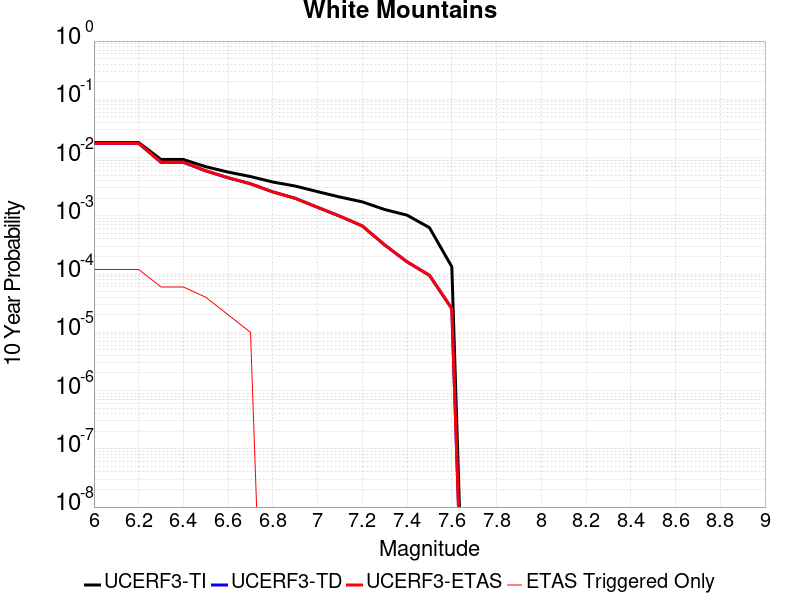 |

| Magnitude | 1 wk TI Prob | 1 wk TD Prob | 1 wk ETAS Prob | 1 wk ETAS/TD Gain | 1 wk ETAS Triggered Only | 1 mo TI Prob | 1 mo TD Prob | 1 mo ETAS Prob | 1 mo ETAS/TD Gain | 1 mo ETAS Triggered Only | 1 yr TI Prob | 1 yr TD Prob | 1 yr ETAS Prob | 1 yr ETAS/TD Gain | 1 yr ETAS Triggered Only | 10 yr TI Prob | 10 yr TD Prob | 10 yr ETAS Prob | 10 yr ETAS/TD Gain | 10 yr ETAS Triggered Only |
|-----|-----|-----|-----|-----|-----|-----|-----|-----|-----|-----|-----|-----|-----|-----|-----|-----|-----|-----|-----|-----|
| 6.0 | 3.503579E-5 | 3.378405E-5 | 7.37827E-5 | 2.1839507 | 4.0E-5 | 1.5014476E-4 | 1.4478143E-4 | 1.947742E-4 | 1.3452982 | 5.0E-5 | 0.0018264796 | 0.0017614096 | 0.0018612334 | 1.0566727 | 1.0E-4 | 0.018115403 | 0.017486818 | 0.01760472 | 1.0067424 | 1.2E-4 |
| 6.1 | 3.503579E-5 | 3.378405E-5 | 7.37827E-5 | 2.1839507 | 4.0E-5 | 1.5014476E-4 | 1.4478143E-4 | 1.947742E-4 | 1.3452982 | 5.0E-5 | 0.0018264796 | 0.0017614096 | 0.0018612334 | 1.0566727 | 1.0E-4 | 0.018115403 | 0.017486818 | 0.01760472 | 1.0067424 | 1.2E-4 |
| 6.2 | 3.503579E-5 | 3.378405E-5 | 7.37827E-5 | 2.1839507 | 4.0E-5 | 1.5014476E-4 | 1.4478143E-4 | 1.947742E-4 | 1.3452982 | 5.0E-5 | 0.0018264796 | 0.0017614096 | 0.0018612334 | 1.0566727 | 1.0E-4 | 0.018115403 | 0.017486818 | 0.01760472 | 1.0067424 | 1.2E-4 |
| 6.3 | 1.7818425E-5 | 1.5916074E-5 | 3.5915757E-5 | 2.2565713 | 2.0E-5 | 7.636245E-5 | 6.821004E-5 | 8.8208675E-5 | 1.2931919 | 2.0E-5 | 9.293162E-4 | 8.301551E-4 | 8.801136E-4 | 1.0601797 | 5.0E-5 | 0.009254395 | 0.008271999 | 0.008331502 | 1.0071933 | 6.0E-5 |
| 6.4 | 1.7818425E-5 | 1.5916074E-5 | 3.5915757E-5 | 2.2565713 | 2.0E-5 | 7.636245E-5 | 6.821004E-5 | 8.8208675E-5 | 1.2931919 | 2.0E-5 | 9.293162E-4 | 8.301551E-4 | 8.801136E-4 | 1.0601797 | 5.0E-5 | 0.009254395 | 0.008271999 | 0.008331502 | 1.0071933 | 6.0E-5 |
| 6.5 | 1.3397557E-5 | 1.13362685E-5 | 3.1336043E-5 | 2.764229 | 2.0E-5 | 5.741684E-5 | 4.858314E-5 | 6.858217E-5 | 1.4116454 | 2.0E-5 | 6.988258E-4 | 5.913462E-4 | 6.3132256E-4 | 1.0676023 | 4.0E-5 | 0.006966323 | 0.005898432 | 0.005938196 | 1.0067414 | 4.0E-5 |
| 6.6 | 1.0818695E-5 | 8.625366E-6 | 8.625366E-6 | 1.0 | 0.0 | 4.6365014E-5 | 3.6965357E-5 | 3.6965357E-5 | 1.0 | 0.0 | 5.6434784E-4 | 4.4996463E-4 | 4.6995562E-4 | 1.044428 | 2.0E-5 | 0.005629168 | 0.004490972 | 0.0045108823 | 1.0044334 | 2.0E-5 |
| 6.7 | 9.067908E-6 | 6.802442E-6 | 6.802442E-6 | 1.0 | 0.0 | 3.8861883E-5 | 2.9153016E-5 | 2.9153016E-5 | 1.0 | 0.0 | 4.7304068E-4 | 3.5488335E-4 | 3.648798E-4 | 1.0281683 | 1.0E-5 | 0.00472035 | 0.0035434833 | 0.003553448 | 1.002812 | 1.0E-5 |
| 6.8 | 7.295947E-6 | 4.936391E-6 | 4.936391E-6 | 1.0 | 0.0 | 3.126797E-5 | 2.1155796E-5 | 2.1155796E-5 | 1.0 | 0.0 | 3.8062103E-4 | 2.575425E-4 | 2.575425E-4 | 1.0 | 0.0 | 0.0037996976 | 0.0025725532 | 0.0025725532 | 1.0 | 0.0 |
| 6.9 | 6.2243444E-6 | 3.832213E-6 | 3.832213E-6 | 1.0 | 0.0 | 2.6675489E-5 | 1.642367E-5 | 1.642367E-5 | 1.0 | 0.0 | 3.2472567E-4 | 1.9994036E-4 | 1.9994036E-4 | 1.0 | 0.0 | 0.0032425157 | 0.0019976576 | 0.0019976576 | 1.0 | 0.0 |
| 7.0 | 4.9878413E-6 | 2.6795342E-6 | 2.6795342E-6 | 1.0 | 0.0 | 2.1376287E-5 | 1.14836685E-5 | 1.14836685E-5 | 1.0 | 0.0 | 2.602252E-4 | 1.3980496E-4 | 1.3980496E-4 | 1.0 | 0.0 | 0.002599207 | 0.0013971963 | 0.0013971963 | 1.0 | 0.0 |
| 7.1 | 4.0252844E-6 | 1.8857575E-6 | 1.8857575E-6 | 1.0 | 0.0 | 1.7251105E-5 | 8.081794E-6 | 8.081794E-6 | 1.0 | 0.0 | 2.1001195E-4 | 9.8391516E-5 | 9.8391516E-5 | 1.0 | 0.0 | 0.0020981359 | 9.834924E-4 | 9.834924E-4 | 1.0 | 0.0 |
| 7.2 | 3.3284066E-6 | 1.281964E-6 | 1.281964E-6 | 1.0 | 0.0 | 1.4264522E-5 | 5.494121E-6 | 5.494121E-6 | 1.0 | 0.0 | 1.736567E-4 | 6.688897E-5 | 6.688897E-5 | 1.0 | 0.0 | 0.0017352107 | 6.6869846E-4 | 6.6869846E-4 | 1.0 | 0.0 |
| 7.3 | 2.458226E-6 | 6.05722E-7 | 6.05722E-7 | 1.0 | 0.0 | 1.0535211E-5 | 2.5959491E-6 | 2.5959491E-6 | 1.0 | 0.0 | 1.2825865E-4 | 3.1605257E-5 | 3.1605257E-5 | 1.0 | 0.0 | 0.0012818464 | 3.160114E-4 | 3.160114E-4 | 1.0 | 0.0 |
| 7.4 | 1.965953E-6 | 3.1089303E-7 | 3.1089303E-7 | 1.0 | 0.0 | 8.425486E-6 | 1.332398E-6 | 1.332398E-6 | 1.0 | 0.0 | 1.0257547E-4 | 1.6221828E-5 | 1.6221828E-5 | 1.0 | 0.0 | 0.0010252813 | 1.6220656E-4 | 1.6220656E-4 | 1.0 | 0.0 |
| 7.5 | 1.2014192E-6 | 1.8244253E-7 | 1.8244253E-7 | 1.0 | 0.0 | 5.148929E-6 | 7.8189635E-7 | 7.8189635E-7 | 1.0 | 0.0 | 6.2686406E-5 | 9.519547E-6 | 9.519547E-6 | 1.0 | 0.0 | 6.266873E-4 | 9.519148E-5 | 9.519148E-5 | 1.0 | 0.0 |
| 7.6 | 2.5612175E-7 | 4.8946475E-8 | 4.8946475E-8 | 1.0 | 0.0 | 1.0976642E-6 | 2.0977059E-7 | 2.0977059E-7 | 1.0 | 0.0 | 1.3363979E-5 | 2.5539543E-6 | 2.5539543E-6 | 1.0 | 0.0 | 1.3363175E-4 | 2.5539286E-5 | 2.5539286E-5 | 1.0 | 0.0 |

## Owens Valley
*[(top)](#table-of-contents)*

| 1 Week | 1 Month | 1 Year | 10 Year |
|-----|-----|-----|-----|
|  |  |  |  |

| Magnitude | 1 wk TI Prob | 1 wk TD Prob | 1 wk ETAS Prob | 1 wk ETAS/TD Gain | 1 wk ETAS Triggered Only | 1 mo TI Prob | 1 mo TD Prob | 1 mo ETAS Prob | 1 mo ETAS/TD Gain | 1 mo ETAS Triggered Only | 1 yr TI Prob | 1 yr TD Prob | 1 yr ETAS Prob | 1 yr ETAS/TD Gain | 1 yr ETAS Triggered Only | 10 yr TI Prob | 10 yr TD Prob | 10 yr ETAS Prob | 10 yr ETAS/TD Gain | 10 yr ETAS Triggered Only |
|-----|-----|-----|-----|-----|-----|-----|-----|-----|-----|-----|-----|-----|-----|-----|-----|-----|-----|-----|-----|-----|
| 6.0 | 4.83821E-5 | 3.626567E-6 | 5.3626387E-5 | 14.787094 | 5.0E-5 | 2.0733538E-4 | 1.5542342E-5 | 8.554126E-5 | 5.5037556 | 7.0E-5 | 0.002521386 | 1.8921259E-4 | 2.7919555E-4 | 1.4755654 | 9.0E-5 | 0.024929691 | 0.001925011 | 0.00204478 | 1.0622174 | 1.2E-4 |
| 6.1 | 4.83821E-5 | 3.626567E-6 | 5.3626387E-5 | 14.787094 | 5.0E-5 | 2.0733538E-4 | 1.5542342E-5 | 8.554126E-5 | 5.5037556 | 7.0E-5 | 0.002521386 | 1.8921259E-4 | 2.7919555E-4 | 1.4755654 | 9.0E-5 | 0.024929691 | 0.001925011 | 0.00204478 | 1.0622174 | 1.2E-4 |
| 6.2 | 4.83821E-5 | 3.626567E-6 | 5.3626387E-5 | 14.787094 | 5.0E-5 | 2.0733538E-4 | 1.5542342E-5 | 8.554126E-5 | 5.5037556 | 7.0E-5 | 0.002521386 | 1.8921259E-4 | 2.7919555E-4 | 1.4755654 | 9.0E-5 | 0.024929691 | 0.001925011 | 0.00204478 | 1.0622174 | 1.2E-4 |
| 6.3 | 3.953008E-5 | 3.1553948E-6 | 4.315527E-5 | 13.676662 | 4.0E-5 | 1.6940363E-4 | 1.3523055E-5 | 7.352224E-5 | 5.436807 | 6.0E-5 | 0.002060538 | 1.6463149E-4 | 2.446183E-4 | 1.4858538 | 8.0E-5 | 0.020415364 | 0.0016592 | 0.0017690174 | 1.066187 | 1.1E-4 |
| 6.4 | 3.953008E-5 | 3.1553948E-6 | 4.315527E-5 | 13.676662 | 4.0E-5 | 1.6940363E-4 | 1.3523055E-5 | 7.352224E-5 | 5.436807 | 6.0E-5 | 0.002060538 | 1.6463149E-4 | 2.446183E-4 | 1.4858538 | 8.0E-5 | 0.020415364 | 0.0016592 | 0.0017690174 | 1.066187 | 1.1E-4 |
| 6.5 | 3.457342E-5 | 2.9715961E-6 | 4.297148E-5 | 14.460739 | 4.0E-5 | 1.4816338E-4 | 1.2735354E-5 | 7.273459E-5 | 5.711234 | 6.0E-5 | 0.0018023965 | 1.550426E-4 | 2.2503175E-4 | 1.4514188 | 7.0E-5 | 0.017878477 | 0.001555719 | 0.0016555634 | 1.064179 | 1.0E-4 |
| 6.6 | 3.1127765E-5 | 2.8744932E-6 | 4.2874377E-5 | 14.915456 | 4.0E-5 | 1.3339789E-4 | 1.2319203E-5 | 6.2318584E-5 | 5.0586543 | 5.0E-5 | 0.0016229092 | 1.4997667E-4 | 2.0996766E-4 | 1.4000022 | 6.0E-5 | 0.016111081 | 0.0015012559 | 0.0015911207 | 1.0598598 | 9.0E-5 |
| 6.7 | 2.806885E-5 | 2.8104134E-6 | 4.28103E-5 | 15.232741 | 4.0E-5 | 1.2028952E-4 | 1.20445775E-5 | 6.2043975E-5 | 5.151196 | 5.0E-5 | 0.001463541 | 1.4663354E-4 | 2.0662474E-4 | 1.4091233 | 6.0E-5 | 0.014539397 | 0.0014657511 | 0.0015456338 | 1.0544995 | 8.0E-5 |
| 6.8 | 2.524524E-5 | 2.2353688E-6 | 4.223528E-5 | 18.8941 | 4.0E-5 | 1.0818939E-4 | 9.580118E-6 | 5.957964E-5 | 6.2190924 | 5.0E-5 | 0.0013164099 | 1.16632E-4 | 1.76625E-4 | 1.5143785 | 6.0E-5 | 0.01308639 | 0.0011659812 | 0.0012458878 | 1.0685318 | 8.0E-5 |
| 6.9 | 2.2704568E-5 | 1.6081682E-6 | 4.1608106E-5 | 25.87298 | 4.0E-5 | 9.730166E-5 | 6.8921313E-6 | 5.6891786E-5 | 8.2546 | 5.0E-5 | 0.0011840039 | 8.390849E-5 | 1.4390345E-4 | 1.7150047 | 6.0E-5 | 0.011777153 | 8.3897985E-4 | 9.189127E-4 | 1.0952739 | 8.0E-5 |
| 7.0 | 2.0871712E-5 | 1.5395453E-6 | 4.1539482E-5 | 26.981657 | 4.0E-5 | 8.944713E-5 | 6.598035E-6 | 5.6597706E-5 | 8.577964 | 5.0E-5 | 0.0010884746 | 8.032813E-5 | 1.403233E-4 | 1.7468764 | 6.0E-5 | 0.010831586 | 8.0316263E-4 | 8.8309834E-4 | 1.0995263 | 8.0E-5 |
| 7.1 | 1.944928E-5 | 1.3864178E-6 | 4.1386364E-5 | 29.851292 | 4.0E-5 | 8.335139E-5 | 5.941777E-6 | 5.594148E-5 | 9.414941 | 5.0E-5 | 0.0010143308 | 7.233874E-5 | 1.323344E-4 | 1.8293711 | 6.0E-5 | 0.010097133 | 7.2330976E-4 | 8.0325187E-4 | 1.1105226 | 8.0E-5 |
| 7.2 | 1.7876306E-5 | 1.2489141E-6 | 4.1248863E-5 | 33.027782 | 4.0E-5 | 7.6610486E-5 | 5.352478E-6 | 5.535221E-5 | 10.341417 | 5.0E-5 | 9.3233347E-4 | 6.516448E-5 | 1.2516057E-4 | 1.920687 | 6.0E-5 | 0.009284316 | 6.5159105E-4 | 7.315389E-4 | 1.1226964 | 8.0E-5 |
| 7.3 | 1.2618672E-5 | 1.1115209E-6 | 4.1111478E-5 | 36.986687 | 4.0E-5 | 5.40789E-5 | 4.763652E-6 | 5.4763415E-5 | 11.4960985 | 5.0E-5 | 6.582117E-4 | 5.799593E-5 | 1.1799245E-4 | 2.0344954 | 6.0E-5 | 0.0065626553 | 5.7994033E-4 | 6.5989397E-4 | 1.1378652 | 8.0E-5 |
| 7.4 | 7.4874442E-6 | 8.5486437E-7 | 3.0854837E-5 | 36.093254 | 3.0E-5 | 3.208865E-5 | 3.6636993E-6 | 4.3663553E-5 | 11.917887 | 4.0E-5 | 3.906093E-4 | 4.4604632E-5 | 9.46024E-5 | 2.12091 | 5.0E-5 | 0.003899234 | 4.4604883E-4 | 5.160176E-4 | 1.1568635 | 7.0E-5 |
| 7.5 | 2.4734156E-6 | 6.068616E-7 | 3.0606843E-5 | 50.43464 | 3.0E-5 | 1.060031E-5 | 2.6008327E-6 | 3.2600754E-5 | 12.534738 | 3.0E-5 | 1.2905113E-4 | 3.166468E-5 | 7.166342E-5 | 2.2631972 | 4.0E-5 | 0.0012897621 | 3.1660203E-4 | 3.665862E-4 | 1.157877 | 5.0E-5 |
| 7.6 | 1.1328841E-6 | 3.196531E-7 | 2.0319647E-5 | 63.567806 | 2.0E-5 | 4.8552088E-6 | 1.3699412E-6 | 2.1369913E-5 | 15.599147 | 2.0E-5 | 5.9110564E-5 | 1.6678909E-5 | 4.6678408E-5 | 2.7986488 | 3.0E-5 | 5.9094845E-4 | 1.6677675E-4 | 2.0677008E-4 | 1.2398016 | 4.0E-5 |
| 7.7 | 4.8613185E-7 | 8.964689E-8 | 8.964689E-8 | 1.0 | 0.0 | 2.0834207E-6 | 3.8420092E-7 | 3.8420092E-7 | 1.0 | 0.0 | 2.536535E-5 | 4.6776368E-6 | 4.6776368E-6 | 1.0 | 0.0 | 2.5362454E-4 | 4.677545E-5 | 5.677498E-5 | 1.2137773 | 1.0E-5 |

## Camp Rock 2011
*[(top)](#table-of-contents)*

| 1 Week | 1 Month | 1 Year | 10 Year |
|-----|-----|-----|-----|
|  |  |  |  |

| Magnitude | 1 wk TI Prob | 1 wk TD Prob | 1 wk ETAS Prob | 1 wk ETAS/TD Gain | 1 wk ETAS Triggered Only | 1 mo TI Prob | 1 mo TD Prob | 1 mo ETAS Prob | 1 mo ETAS/TD Gain | 1 mo ETAS Triggered Only | 1 yr TI Prob | 1 yr TD Prob | 1 yr ETAS Prob | 1 yr ETAS/TD Gain | 1 yr ETAS Triggered Only | 10 yr TI Prob | 10 yr TD Prob | 10 yr ETAS Prob | 10 yr ETAS/TD Gain | 10 yr ETAS Triggered Only |
|-----|-----|-----|-----|-----|-----|-----|-----|-----|-----|-----|-----|-----|-----|-----|-----|-----|-----|-----|-----|-----|
| 6.0 | 1.6710783E-5 | 4.25026E-6 | 4.425009E-5 | 10.411148 | 4.0E-5 | 7.161568E-5 | 1.8215276E-5 | 5.8214548E-5 | 3.195919 | 4.0E-5 | 8.7157206E-4 | 2.2174895E-4 | 3.0173123E-4 | 1.3606883 | 8.0E-5 | 0.008681616 | 0.0022153298 | 0.0023350639 | 1.0540481 | 1.2E-4 |
| 6.1 | 1.6710783E-5 | 4.25026E-6 | 4.425009E-5 | 10.411148 | 4.0E-5 | 7.161568E-5 | 1.8215276E-5 | 5.8214548E-5 | 3.195919 | 4.0E-5 | 8.7157206E-4 | 2.2174895E-4 | 3.0173123E-4 | 1.3606883 | 8.0E-5 | 0.008681616 | 0.0022153298 | 0.0023350639 | 1.0540481 | 1.2E-4 |
| 6.2 | 1.6710783E-5 | 4.25026E-6 | 4.425009E-5 | 10.411148 | 4.0E-5 | 7.161568E-5 | 1.8215276E-5 | 5.8214548E-5 | 3.195919 | 4.0E-5 | 8.7157206E-4 | 2.2174895E-4 | 3.0173123E-4 | 1.3606883 | 8.0E-5 | 0.008681616 | 0.0022153298 | 0.0023350639 | 1.0540481 | 1.2E-4 |
| 6.3 | 1.6710783E-5 | 4.25026E-6 | 4.425009E-5 | 10.411148 | 4.0E-5 | 7.161568E-5 | 1.8215276E-5 | 5.8214548E-5 | 3.195919 | 4.0E-5 | 8.7157206E-4 | 2.2174895E-4 | 3.0173123E-4 | 1.3606883 | 8.0E-5 | 0.008681616 | 0.0022153298 | 0.0023350639 | 1.0540481 | 1.2E-4 |
| 6.4 | 7.982846E-6 | 3.6820884E-6 | 4.3681943E-5 | 11.86336 | 4.0E-5 | 3.421175E-5 | 1.5780286E-5 | 5.5779656E-5 | 3.5347683 | 4.0E-5 | 4.1644843E-4 | 1.9210839E-4 | 2.7209302E-4 | 1.4163516 | 8.0E-5 | 0.0041566887 | 0.001919458 | 0.0020292469 | 1.0571978 | 1.1E-4 |
| 6.5 | 7.982846E-6 | 3.6820884E-6 | 4.3681943E-5 | 11.86336 | 4.0E-5 | 3.421175E-5 | 1.5780286E-5 | 5.5779656E-5 | 3.5347683 | 4.0E-5 | 4.1644843E-4 | 1.9210839E-4 | 2.7209302E-4 | 1.4163516 | 8.0E-5 | 0.0041566887 | 0.001919458 | 0.0020292469 | 1.0571978 | 1.1E-4 |
| 6.6 | 7.048869E-6 | 3.4243571E-6 | 4.342422E-5 | 12.6809845 | 4.0E-5 | 3.0209088E-5 | 1.4675736E-5 | 5.4675147E-5 | 3.7255473 | 4.0E-5 | 3.677336E-4 | 1.7866275E-4 | 2.5864845E-4 | 1.447691 | 8.0E-5 | 0.0036712566 | 0.0017852228 | 0.0018950264 | 1.061507 | 1.1E-4 |
| 6.7 | 6.987307E-6 | 3.3623348E-6 | 4.33622E-5 | 12.896456 | 4.0E-5 | 2.9945259E-5 | 1.4409929E-5 | 5.4409353E-5 | 3.7758238 | 4.0E-5 | 3.6452254E-4 | 1.7542706E-4 | 2.5541303E-4 | 1.45595 | 8.0E-5 | 0.0036392517 | 0.001752917 | 0.0018627242 | 1.0626426 | 1.1E-4 |
| 6.8 | 6.3737602E-6 | 3.1179077E-6 | 4.3117783E-5 | 13.829077 | 4.0E-5 | 2.731583E-5 | 1.3362394E-5 | 5.336186E-5 | 3.9934354 | 4.0E-5 | 3.3251947E-4 | 1.626753E-4 | 2.4266228E-4 | 1.4916972 | 8.0E-5 | 0.0033202237 | 0.0016255907 | 0.0017354119 | 1.0675577 | 1.1E-4 |
| 6.9 | 6.112211E-6 | 2.9331156E-6 | 4.2933E-5 | 14.637336 | 4.0E-5 | 2.6194928E-5 | 1.2570436E-5 | 5.2569932E-5 | 4.1820292 | 4.0E-5 | 3.1887658E-4 | 1.5303459E-4 | 2.3302235E-4 | 1.5226777 | 8.0E-5 | 0.003184194 | 0.0015293199 | 0.0016391516 | 1.0718174 | 1.1E-4 |
| 7.0 | 5.5140117E-6 | 2.641923E-6 | 4.2641816E-5 | 16.140448 | 4.0E-5 | 2.3631264E-5 | 1.132248E-5 | 5.1322026E-5 | 4.5327554 | 4.0E-5 | 2.8767265E-4 | 1.3784273E-4 | 2.178317E-4 | 1.5802916 | 8.0E-5 | 0.0028730053 | 0.0013775975 | 0.0014874459 | 1.0797392 | 1.1E-4 |
| 7.1 | 4.8151105E-6 | 2.1342705E-6 | 4.2134187E-5 | 19.741728 | 4.0E-5 | 2.0636026E-5 | 9.146843E-6 | 4.9146478E-5 | 5.373054 | 4.0E-5 | 2.5121463E-4 | 1.1135734E-4 | 1.8134955E-4 | 1.6285369 | 7.0E-5 | 0.0025093083 | 0.0011130372 | 0.001212926 | 1.0897442 | 1.0E-4 |
| 7.2 | 3.818335E-6 | 1.2937425E-6 | 2.1293716E-5 | 16.459007 | 2.0E-5 | 1.6364189E-5 | 5.5445994E-6 | 2.5544488E-5 | 4.607094 | 2.0E-5 | 1.9921579E-4 | 6.750349E-5 | 9.750146E-5 | 1.4443915 | 3.0E-5 | 0.0019903728 | 6.748381E-4 | 7.148111E-4 | 1.0592334 | 4.0E-5 |
| 7.3 | 2.7166698E-6 | 7.3835776E-7 | 2.0738344E-5 | 28.08712 | 2.0E-5 | 1.1642818E-5 | 3.1643867E-6 | 2.3164323E-5 | 7.32032 | 2.0E-5 | 1.4174209E-4 | 3.8525748E-5 | 6.852459E-5 | 1.7786701 | 3.0E-5 | 0.0014165172 | 3.851927E-4 | 4.2517728E-4 | 1.1038041 | 4.0E-5 |
| 7.4 | 2.0893426E-6 | 5.4618386E-7 | 2.0546173E-5 | 37.617687 | 2.0E-5 | 8.954295E-6 | 2.3407858E-6 | 2.2340739E-5 | 9.544119 | 2.0E-5 | 1.0901308E-4 | 2.84987E-5 | 5.8497844E-5 | 2.0526495 | 3.0E-5 | 0.0010895962 | 2.84951E-4 | 3.1494244E-4 | 1.1052513 | 3.0E-5 |
| 7.5 | 1.1681728E-6 | 3.6030585E-7 | 2.03603E-5 | 56.508377 | 2.0E-5 | 5.0064455E-6 | 1.544167E-6 | 2.1544136E-5 | 13.951946 | 2.0E-5 | 6.0951766E-5 | 1.8800076E-5 | 4.8799513E-5 | 2.5957081 | 3.0E-5 | 6.093505E-4 | 1.8798532E-4 | 2.1797969E-4 | 1.1595569 | 3.0E-5 |
| 7.6 | 1.3154387E-7 | 7.1197384E-8 | 1.0071197E-5 | 141.45459 | 1.0E-5 | 5.6375933E-7 | 3.051316E-7 | 1.0305129E-5 | 33.77273 | 1.0E-5 | 6.863748E-6 | 3.7149728E-6 | 2.3714898E-5 | 6.3835998 | 2.0E-5 | 6.863536E-5 | 3.7149264E-5 | 5.714852E-5 | 1.5383487 | 2.0E-5 |

## Blue Cut
*[(top)](#table-of-contents)*

| 1 Week | 1 Month | 1 Year | 10 Year |
|-----|-----|-----|-----|
|  |  |  |  |

| Magnitude | 1 wk TI Prob | 1 wk TD Prob | 1 wk ETAS Prob | 1 wk ETAS/TD Gain | 1 wk ETAS Triggered Only | 1 mo TI Prob | 1 mo TD Prob | 1 mo ETAS Prob | 1 mo ETAS/TD Gain | 1 mo ETAS Triggered Only | 1 yr TI Prob | 1 yr TD Prob | 1 yr ETAS Prob | 1 yr ETAS/TD Gain | 1 yr ETAS Triggered Only | 10 yr TI Prob | 10 yr TD Prob | 10 yr ETAS Prob | 10 yr ETAS/TD Gain | 10 yr ETAS Triggered Only |
|-----|-----|-----|-----|-----|-----|-----|-----|-----|-----|-----|-----|-----|-----|-----|-----|-----|-----|-----|-----|-----|
| 6.0 | 2.1227985E-5 | 2.2719574E-5 | 6.271867E-5 | 2.7605565 | 4.0E-5 | 9.097391E-5 | 9.73663E-5 | 1.4736142E-4 | 1.5134747 | 5.0E-5 | 0.0011070445 | 0.0011848481 | 0.0012647533 | 1.0674392 | 8.0E-5 | 0.011015458 | 0.011791152 | 0.011909736 | 1.0100571 | 1.2E-4 |
| 6.1 | 2.1227985E-5 | 2.2719574E-5 | 6.271867E-5 | 2.7605565 | 4.0E-5 | 9.097391E-5 | 9.73663E-5 | 1.4736142E-4 | 1.5134747 | 5.0E-5 | 0.0011070445 | 0.0011848481 | 0.0012647533 | 1.0674392 | 8.0E-5 | 0.011015458 | 0.011791152 | 0.011909736 | 1.0100571 | 1.2E-4 |
| 6.2 | 2.1227985E-5 | 2.2719574E-5 | 6.271867E-5 | 2.7605565 | 4.0E-5 | 9.097391E-5 | 9.73663E-5 | 1.4736142E-4 | 1.5134747 | 5.0E-5 | 0.0011070445 | 0.0011848481 | 0.0012647533 | 1.0674392 | 8.0E-5 | 0.011015458 | 0.011791152 | 0.011909736 | 1.0100571 | 1.2E-4 |
| 6.3 | 1.1613981E-5 | 1.2353542E-5 | 4.235317E-5 | 3.4284234 | 3.0E-5 | 4.9773254E-5 | 5.2942745E-5 | 8.294116E-5 | 1.5666199 | 3.0E-5 | 6.0582085E-4 | 6.443998E-4 | 6.9436757E-4 | 1.0775416 | 5.0E-5 | 0.0060417196 | 0.0064265593 | 0.006506045 | 1.0123683 | 8.0E-5 |
| 6.4 | 1.1613981E-5 | 1.2353542E-5 | 4.235317E-5 | 3.4284234 | 3.0E-5 | 4.9773254E-5 | 5.2942745E-5 | 8.294116E-5 | 1.5666199 | 3.0E-5 | 6.0582085E-4 | 6.443998E-4 | 6.9436757E-4 | 1.0775416 | 5.0E-5 | 0.0060417196 | 0.0064265593 | 0.006506045 | 1.0123683 | 8.0E-5 |
| 6.5 | 8.931326E-6 | 9.4816E-6 | 3.9481314E-5 | 4.163993 | 3.0E-5 | 3.8276554E-5 | 4.0634844E-5 | 7.063363E-5 | 1.7382526 | 3.0E-5 | 4.6591737E-4 | 4.946261E-4 | 5.3460634E-4 | 1.0808291 | 4.0E-5 | 0.0046494175 | 0.004936161 | 0.0050058155 | 1.014111 | 7.0E-5 |
| 6.6 | 7.345353E-6 | 7.79028E-6 | 2.7790124E-5 | 3.5672822 | 2.0E-5 | 3.1479703E-5 | 3.338653E-5 | 5.3385862E-5 | 1.599024 | 2.0E-5 | 3.83198E-4 | 4.064132E-4 | 4.36401E-4 | 1.0737865 | 3.0E-5 | 0.0038253788 | 0.0040574907 | 0.004117247 | 1.0147275 | 6.0E-5 |
| 6.7 | 6.2775666E-6 | 6.655149E-6 | 2.6655016E-5 | 4.005172 | 2.0E-5 | 2.690358E-5 | 2.8521798E-5 | 4.8521226E-5 | 1.7011981 | 2.0E-5 | 3.2750185E-4 | 3.472051E-4 | 3.7719466E-4 | 1.0863743 | 3.0E-5 | 0.0032701963 | 0.003467367 | 0.003527159 | 1.0172442 | 6.0E-5 |
| 6.8 | 5.5234095E-6 | 5.8551113E-6 | 2.5854994E-5 | 4.415799 | 2.0E-5 | 2.367154E-5 | 2.5093133E-5 | 4.509263E-5 | 1.7970108 | 2.0E-5 | 2.8816288E-4 | 3.0547334E-4 | 3.2546723E-4 | 1.0654522 | 2.0E-5 | 0.002877895 | 0.0030512505 | 0.003101098 | 1.0163367 | 5.0E-5 |
| 6.9 | 4.7780054E-6 | 5.0654203E-6 | 2.506532E-5 | 4.9483194 | 2.0E-5 | 2.0477004E-5 | 2.1708804E-5 | 4.170837E-5 | 1.9212652 | 2.0E-5 | 2.4927902E-4 | 2.642797E-4 | 2.842744E-4 | 1.0756574 | 2.0E-5 | 0.0024899957 | 0.002640346 | 0.0026902142 | 1.0188869 | 5.0E-5 |
| 7.0 | 3.883171E-6 | 4.118487E-6 | 1.41184455E-5 | 3.428066 | 1.0E-5 | 1.6642054E-5 | 1.7650578E-5 | 2.7650402E-5 | 1.5665437 | 1.0E-5 | 2.0259817E-4 | 2.1488148E-4 | 2.2487935E-4 | 1.0465273 | 1.0E-5 | 0.0020241356 | 0.0021474129 | 0.0021773484 | 1.0139403 | 3.0E-5 |
| 7.1 | 2.8358215E-6 | 3.0097158E-6 | 3.0097158E-6 | 1.0 | 0.0 | 1.2153464E-5 | 1.2898756E-5 | 1.2898756E-5 | 1.0 | 0.0 | 1.4795837E-4 | 1.5703762E-4 | 1.5703762E-4 | 1.0 | 0.0 | 0.001478599 | 0.0015699116 | 0.0015898802 | 1.0127195 | 2.0E-5 |

## Lost Hills
*[(top)](#table-of-contents)*

| 1 Week | 1 Month | 1 Year | 10 Year |
|-----|-----|-----|-----|
|  |  |  |  |

| Magnitude | 1 wk TI Prob | 1 wk TD Prob | 1 wk ETAS Prob | 1 wk ETAS/TD Gain | 1 wk ETAS Triggered Only | 1 mo TI Prob | 1 mo TD Prob | 1 mo ETAS Prob | 1 mo ETAS/TD Gain | 1 mo ETAS Triggered Only | 1 yr TI Prob | 1 yr TD Prob | 1 yr ETAS Prob | 1 yr ETAS/TD Gain | 1 yr ETAS Triggered Only | 10 yr TI Prob | 10 yr TD Prob | 10 yr ETAS Prob | 10 yr ETAS/TD Gain | 10 yr ETAS Triggered Only |
|-----|-----|-----|-----|-----|-----|-----|-----|-----|-----|-----|-----|-----|-----|-----|-----|-----|-----|-----|-----|-----|
| 6.0 | 2.233523E-5 | 2.5106583E-5 | 5.510583E-5 | 2.1948757 | 3.0E-5 | 9.571891E-5 | 1.0759615E-4 | 1.3759293E-4 | 1.2787904 | 3.0E-5 | 0.0011647546 | 0.001309364 | 0.0013992462 | 1.0686457 | 9.0E-5 | 0.011586686 | 0.013033091 | 0.013131787 | 1.0075728 | 1.0E-4 |
| 6.1 | 2.233523E-5 | 2.5106583E-5 | 5.510583E-5 | 2.1948757 | 3.0E-5 | 9.571891E-5 | 1.0759615E-4 | 1.3759293E-4 | 1.2787904 | 3.0E-5 | 0.0011647546 | 0.001309364 | 0.0013992462 | 1.0686457 | 9.0E-5 | 0.011586686 | 0.013033091 | 0.013131787 | 1.0075728 | 1.0E-4 |
| 6.2 | 2.233523E-5 | 2.5106583E-5 | 5.510583E-5 | 2.1948757 | 3.0E-5 | 9.571891E-5 | 1.0759615E-4 | 1.3759293E-4 | 1.2787904 | 3.0E-5 | 0.0011647546 | 0.001309364 | 0.0013992462 | 1.0686457 | 9.0E-5 | 0.011586686 | 0.013033091 | 0.013131787 | 1.0075728 | 1.0E-4 |
| 6.3 | 2.233523E-5 | 2.5106583E-5 | 5.510583E-5 | 2.1948757 | 3.0E-5 | 9.571891E-5 | 1.0759615E-4 | 1.3759293E-4 | 1.2787904 | 3.0E-5 | 0.0011647546 | 0.001309364 | 0.0013992462 | 1.0686457 | 9.0E-5 | 0.011586686 | 0.013033091 | 0.013131787 | 1.0075728 | 1.0E-4 |
| 6.4 | 1.2288092E-5 | 1.3781108E-5 | 3.378083E-5 | 2.4512422 | 2.0E-5 | 5.2662188E-5 | 5.906108E-5 | 7.90599E-5 | 1.3386124 | 2.0E-5 | 6.409735E-4 | 7.189252E-4 | 7.888749E-4 | 1.0972975 | 7.0E-5 | 0.006391279 | 0.0071752006 | 0.0072546266 | 1.0110695 | 8.0E-5 |
| 6.5 | 1.2288092E-5 | 1.3781108E-5 | 3.378083E-5 | 2.4512422 | 2.0E-5 | 5.2662188E-5 | 5.906108E-5 | 7.90599E-5 | 1.3386124 | 2.0E-5 | 6.409735E-4 | 7.189252E-4 | 7.888749E-4 | 1.0972975 | 7.0E-5 | 0.006391279 | 0.0071752006 | 0.0072546266 | 1.0110695 | 8.0E-5 |
| 6.6 | 8.58281E-6 | 9.63377E-6 | 1.9633673E-5 | 2.0380054 | 1.0E-5 | 3.6782953E-5 | 4.12874E-5 | 5.128699E-5 | 1.2421947 | 1.0E-5 | 4.4774043E-4 | 5.026414E-4 | 5.326263E-4 | 1.0596547 | 3.0E-5 | 0.0044683935 | 0.005023205 | 0.0050630043 | 1.007923 | 4.0E-5 |
| 6.7 | 7.205685E-6 | 8.088302E-6 | 1.8088222E-5 | 2.2363434 | 1.0E-5 | 3.088114E-5 | 3.466415E-5 | 4.4663804E-5 | 1.2884725 | 1.0E-5 | 3.7591302E-4 | 4.2203604E-4 | 4.5202338E-4 | 1.071054 | 3.0E-5 | 0.0037527776 | 0.0042203604 | 0.0042601917 | 1.0094379 | 4.0E-5 |

## Ventura-Pitas Point
*[(top)](#table-of-contents)*

| 1 Week | 1 Month | 1 Year | 10 Year |
|-----|-----|-----|-----|
|  |  | 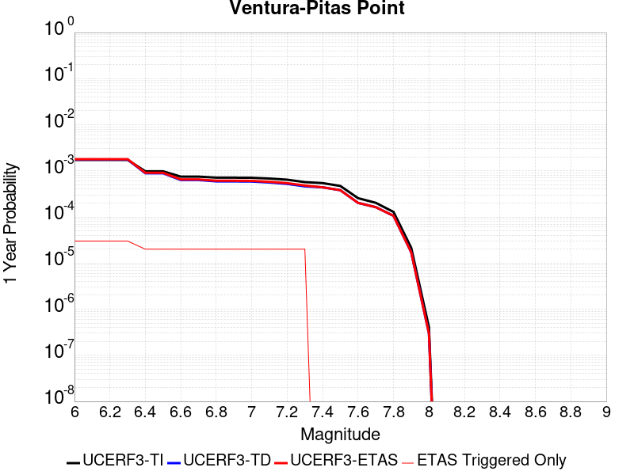 |  |

| Magnitude | 1 wk TI Prob | 1 wk TD Prob | 1 wk ETAS Prob | 1 wk ETAS/TD Gain | 1 wk ETAS Triggered Only | 1 mo TI Prob | 1 mo TD Prob | 1 mo ETAS Prob | 1 mo ETAS/TD Gain | 1 mo ETAS Triggered Only | 1 yr TI Prob | 1 yr TD Prob | 1 yr ETAS Prob | 1 yr ETAS/TD Gain | 1 yr ETAS Triggered Only | 10 yr TI Prob | 10 yr TD Prob | 10 yr ETAS Prob | 10 yr ETAS/TD Gain | 10 yr ETAS Triggered Only |
|-----|-----|-----|-----|-----|-----|-----|-----|-----|-----|-----|-----|-----|-----|-----|-----|-----|-----|-----|-----|-----|
| 6.0 | 3.3179622E-5 | 3.3735185E-5 | 5.3734508E-5 | 1.5928328 | 2.0E-5 | 1.4219063E-4 | 1.445728E-4 | 1.6456991E-4 | 1.1383187 | 2.0E-5 | 0.0017297962 | 0.0017590096 | 0.0017889568 | 1.017025 | 3.0E-5 | 0.017163932 | 0.0174764 | 0.017564828 | 1.0050598 | 9.0E-5 |
| 6.1 | 3.3179622E-5 | 3.3735185E-5 | 5.3734508E-5 | 1.5928328 | 2.0E-5 | 1.4219063E-4 | 1.445728E-4 | 1.6456991E-4 | 1.1383187 | 2.0E-5 | 0.0017297962 | 0.0017590096 | 0.0017889568 | 1.017025 | 3.0E-5 | 0.017163932 | 0.0174764 | 0.017564828 | 1.0050598 | 9.0E-5 |
| 6.2 | 3.3179622E-5 | 3.3735185E-5 | 5.3734508E-5 | 1.5928328 | 2.0E-5 | 1.4219063E-4 | 1.445728E-4 | 1.6456991E-4 | 1.1383187 | 2.0E-5 | 0.0017297962 | 0.0017590096 | 0.0017889568 | 1.017025 | 3.0E-5 | 0.017163932 | 0.0174764 | 0.017564828 | 1.0050598 | 9.0E-5 |
| 6.3 | 3.3179622E-5 | 3.3735185E-5 | 5.3734508E-5 | 1.5928328 | 2.0E-5 | 1.4219063E-4 | 1.445728E-4 | 1.6456991E-4 | 1.1383187 | 2.0E-5 | 0.0017297962 | 0.0017590096 | 0.0017889568 | 1.017025 | 3.0E-5 | 0.017163932 | 0.0174764 | 0.017564828 | 1.0050598 | 9.0E-5 |
| 6.4 | 1.8754668E-5 | 1.701961E-5 | 3.7019272E-5 | 2.175095 | 2.0E-5 | 8.037467E-5 | 7.293928E-5 | 9.293782E-5 | 1.2741807 | 2.0E-5 | 9.781223E-4 | 8.8769704E-4 | 9.0767926E-4 | 1.0225102 | 2.0E-5 | 0.009738282 | 0.008843848 | 0.008893406 | 1.0056037 | 5.0E-5 |
| 6.5 | 1.8754668E-5 | 1.701961E-5 | 3.7019272E-5 | 2.175095 | 2.0E-5 | 8.037467E-5 | 7.293928E-5 | 9.293782E-5 | 1.2741807 | 2.0E-5 | 9.781223E-4 | 8.8769704E-4 | 9.0767926E-4 | 1.0225102 | 2.0E-5 | 0.009738282 | 0.008843848 | 0.008893406 | 1.0056037 | 5.0E-5 |
| 6.6 | 1.4361558E-5 | 1.2122275E-5 | 3.2122032E-5 | 2.6498353 | 2.0E-5 | 6.154808E-5 | 5.1951585E-5 | 7.195055E-5 | 1.3849539 | 2.0E-5 | 7.490902E-4 | 6.3232926E-4 | 6.523166E-4 | 1.031609 | 2.0E-5 | 0.0074657016 | 0.0063055577 | 0.0063552423 | 1.0078795 | 5.0E-5 |
| 6.7 | 1.4361558E-5 | 1.2122275E-5 | 3.2122032E-5 | 2.6498353 | 2.0E-5 | 6.154808E-5 | 5.1951585E-5 | 7.195055E-5 | 1.3849539 | 2.0E-5 | 7.490902E-4 | 6.3232926E-4 | 6.523166E-4 | 1.031609 | 2.0E-5 | 0.0074657016 | 0.0063055577 | 0.0063552423 | 1.0078795 | 5.0E-5 |
| 6.8 | 1.3663846E-5 | 1.13444175E-5 | 3.1344192E-5 | 2.7629616 | 2.0E-5 | 5.8558027E-5 | 4.861804E-5 | 6.861707E-5 | 1.4113499 | 2.0E-5 | 7.127108E-4 | 5.917658E-4 | 6.1175396E-4 | 1.0337771 | 2.0E-5 | 0.007104293 | 0.005902116 | 0.005951821 | 1.0084215 | 5.0E-5 |
| 6.9 | 1.3644157E-5 | 1.1322519E-5 | 3.132229E-5 | 2.7663715 | 2.0E-5 | 5.8473648E-5 | 4.8524187E-5 | 6.8523215E-5 | 1.4121456 | 2.0E-5 | 7.116841E-4 | 5.9062376E-4 | 6.10612E-4 | 1.0338424 | 2.0E-5 | 0.007094092 | 0.0058907564 | 0.005940462 | 1.0084379 | 5.0E-5 |
| 7.0 | 1.3568845E-5 | 1.1242086E-5 | 3.124186E-5 | 2.7790093 | 2.0E-5 | 5.8150898E-5 | 4.817949E-5 | 6.8178524E-5 | 1.4150944 | 2.0E-5 | 7.077572E-4 | 5.864293E-4 | 6.064176E-4 | 1.0340847 | 2.0E-5 | 0.007055073 | 0.0058490336 | 0.005898741 | 1.0084984 | 5.0E-5 |
| 7.1 | 1.306572E-5 | 1.072054E-5 | 3.0720326E-5 | 2.8655577 | 2.0E-5 | 5.599474E-5 | 4.5944373E-5 | 6.594345E-5 | 1.435289 | 2.0E-5 | 6.815227E-4 | 5.5923103E-4 | 5.7921984E-4 | 1.0357434 | 2.0E-5 | 0.0067943637 | 0.0055784425 | 0.0056281635 | 1.008913 | 5.0E-5 |
| 7.2 | 1.232604E-5 | 9.995143E-6 | 2.9994942E-5 | 3.0009518 | 2.0E-5 | 5.2824813E-5 | 4.2835632E-5 | 6.283478E-5 | 1.466881 | 2.0E-5 | 6.429523E-4 | 5.214008E-4 | 5.413904E-4 | 1.0383382 | 2.0E-5 | 0.0064109527 | 0.005201967 | 0.0052517066 | 1.0095618 | 5.0E-5 |
| 7.3 | 1.0917261E-5 | 8.84384E-6 | 2.8843664E-5 | 3.261441 | 2.0E-5 | 4.678742E-5 | 3.790163E-5 | 5.7900874E-5 | 1.5276618 | 2.0E-5 | 5.69488E-4 | 4.6135622E-4 | 4.81347E-4 | 1.0433304 | 2.0E-5 | 0.0056803077 | 0.00460415 | 0.00465392 | 1.0108098 | 5.0E-5 |
| 7.4 | 1.039959E-5 | 8.423562E-6 | 8.423562E-6 | 1.0 | 0.0 | 4.456891E-5 | 3.610049E-5 | 3.610049E-5 | 1.0 | 0.0 | 5.424914E-4 | 4.3943635E-4 | 4.3943635E-4 | 1.0 | 0.0 | 0.0054116896 | 0.004385836 | 0.0044157044 | 1.0068102 | 3.0E-5 |
| 7.5 | 9.015877E-6 | 7.2975445E-6 | 7.2975445E-6 | 1.0 | 0.0 | 3.86389E-5 | 3.1274823E-5 | 3.1274823E-5 | 1.0 | 0.0 | 4.7032707E-4 | 3.8070587E-4 | 3.8070587E-4 | 1.0 | 0.0 | 0.004693329 | 0.0038006818 | 0.0038305677 | 1.0078633 | 3.0E-5 |
| 7.6 | 4.900162E-6 | 3.8741155E-6 | 3.8741155E-6 | 1.0 | 0.0 | 2.1000526E-5 | 1.6603248E-5 | 1.6603248E-5 | 1.0 | 0.0 | 2.556514E-4 | 2.0212591E-4 | 2.0212591E-4 | 1.0 | 0.0 | 0.0025535747 | 0.0020194345 | 0.002049374 | 1.0148257 | 3.0E-5 |
| 7.7 | 3.8850626E-6 | 3.1267302E-6 | 3.1267302E-6 | 1.0 | 0.0 | 1.6650163E-5 | 1.3400205E-5 | 1.3400205E-5 | 1.0 | 0.0 | 2.0269687E-4 | 1.6313537E-4 | 1.6313537E-4 | 1.0 | 0.0 | 0.002025121 | 0.0016301654 | 0.0016501328 | 1.0122486 | 2.0E-5 |
| 7.8 | 2.4654719E-6 | 2.029875E-6 | 2.029875E-6 | 1.0 | 0.0 | 1.0566265E-5 | 8.699436E-6 | 8.699436E-6 | 1.0 | 0.0 | 1.2863669E-4 | 1.0591053E-4 | 1.0591053E-4 | 1.0 | 0.0 | 0.0012856225 | 0.0010586053 | 0.0010685946 | 1.0094364 | 1.0E-5 |
| 7.9 | 4.095894E-7 | 3.2764765E-7 | 3.2764765E-7 | 1.0 | 0.0 | 1.7553821E-6 | 1.4042034E-6 | 1.4042034E-6 | 1.0 | 0.0 | 2.1371567E-5 | 1.7096047E-5 | 1.7096047E-5 | 1.0 | 0.0 | 2.1369511E-4 | 1.7094762E-4 | 1.7094762E-4 | 1.0 | 0.0 |
| 8.0 | 7.791402E-9 | 5.683497E-9 | 5.683497E-9 | 1.0 | 0.0 | 3.3391725E-8 | 2.4357844E-8 | 2.4357844E-8 | 1.0 | 0.0 | 4.0654416E-7 | 2.9655675E-7 | 2.9655675E-7 | 1.0 | 0.0 | 4.065434E-6 | 2.9655655E-6 | 2.9655655E-6 | 1.0 | 0.0 |

## Bullion Mountains
*[(top)](#table-of-contents)*

| 1 Week | 1 Month | 1 Year | 10 Year |
|-----|-----|-----|-----|
|  |  |  |  |

| Magnitude | 1 wk TI Prob | 1 wk TD Prob | 1 wk ETAS Prob | 1 wk ETAS/TD Gain | 1 wk ETAS Triggered Only | 1 mo TI Prob | 1 mo TD Prob | 1 mo ETAS Prob | 1 mo ETAS/TD Gain | 1 mo ETAS Triggered Only | 1 yr TI Prob | 1 yr TD Prob | 1 yr ETAS Prob | 1 yr ETAS/TD Gain | 1 yr ETAS Triggered Only | 10 yr TI Prob | 10 yr TD Prob | 10 yr ETAS Prob | 10 yr ETAS/TD Gain | 10 yr ETAS Triggered Only |
|-----|-----|-----|-----|-----|-----|-----|-----|-----|-----|-----|-----|-----|-----|-----|-----|-----|-----|-----|-----|-----|
| 6.0 | 1.6420427E-5 | 1.4692089E-5 | 7.4691205E-5 | 5.0837703 | 6.0E-5 | 7.037136E-5 | 6.296479E-5 | 1.2296102E-4 | 1.9528534 | 6.0E-5 | 8.5643446E-4 | 7.663651E-4 | 8.3631143E-4 | 1.0912703 | 7.0E-5 | 0.008531413 | 0.007641016 | 0.0077501754 | 1.014286 | 1.1E-4 |
| 6.1 | 1.6420427E-5 | 1.4692089E-5 | 7.4691205E-5 | 5.0837703 | 6.0E-5 | 7.037136E-5 | 6.296479E-5 | 1.2296102E-4 | 1.9528534 | 6.0E-5 | 8.5643446E-4 | 7.663651E-4 | 8.3631143E-4 | 1.0912703 | 7.0E-5 | 0.008531413 | 0.007641016 | 0.0077501754 | 1.014286 | 1.1E-4 |
| 6.2 | 1.6420427E-5 | 1.4692089E-5 | 7.4691205E-5 | 5.0837703 | 6.0E-5 | 7.037136E-5 | 6.296479E-5 | 1.2296102E-4 | 1.9528534 | 6.0E-5 | 8.5643446E-4 | 7.663651E-4 | 8.3631143E-4 | 1.0912703 | 7.0E-5 | 0.008531413 | 0.007641016 | 0.0077501754 | 1.014286 | 1.1E-4 |
| 6.3 | 1.2046778E-5 | 9.862335E-6 | 3.986204E-5 | 4.041846 | 3.0E-5 | 5.1628023E-5 | 4.2266598E-5 | 7.226533E-5 | 1.7097504 | 3.0E-5 | 6.283899E-4 | 5.144975E-4 | 5.544769E-4 | 1.0777057 | 4.0E-5 | 0.0062661595 | 0.005135345 | 0.005185088 | 1.0096865 | 5.0E-5 |
| 6.4 | 1.2046778E-5 | 9.862335E-6 | 3.986204E-5 | 4.041846 | 3.0E-5 | 5.1628023E-5 | 4.2266598E-5 | 7.226533E-5 | 1.7097504 | 3.0E-5 | 6.283899E-4 | 5.144975E-4 | 5.544769E-4 | 1.0777057 | 4.0E-5 | 0.0062661595 | 0.005135345 | 0.005185088 | 1.0096865 | 5.0E-5 |
| 6.5 | 1.0244343E-5 | 7.879458E-6 | 2.7879301E-5 | 3.5382257 | 2.0E-5 | 4.390359E-5 | 3.3768785E-5 | 5.376811E-5 | 1.592243 | 2.0E-5 | 5.343951E-4 | 4.110781E-4 | 4.4106576E-4 | 1.0729488 | 3.0E-5 | 0.005331118 | 0.004105208 | 0.004145044 | 1.0097038 | 4.0E-5 |
| 6.6 | 9.605408E-6 | 7.1774966E-6 | 2.7177353E-5 | 3.7864668 | 2.0E-5 | 4.1165385E-5 | 3.076045E-5 | 5.0759834E-5 | 1.6501656 | 2.0E-5 | 5.010733E-4 | 3.744645E-4 | 4.0445325E-4 | 1.0800844 | 3.0E-5 | 0.00499945 | 0.003740332 | 0.0037702199 | 1.0079907 | 3.0E-5 |
| 6.7 | 8.60418E-6 | 6.1240044E-6 | 2.6123882E-5 | 4.2658167 | 2.0E-5 | 3.687454E-5 | 2.624558E-5 | 4.6245055E-5 | 1.7620131 | 2.0E-5 | 4.48855E-4 | 3.1951256E-4 | 3.4950298E-4 | 1.093863 | 3.0E-5 | 0.004479495 | 0.0031924439 | 0.003222348 | 1.0093672 | 3.0E-5 |
| 6.8 | 5.187994E-6 | 2.5631666E-6 | 1.2563141E-5 | 4.901414 | 1.0E-5 | 2.223407E-5 | 1.0984976E-5 | 2.0984866E-5 | 1.9103242 | 1.0E-5 | 2.7066618E-4 | 1.3373788E-4 | 1.4373654E-4 | 1.0747632 | 1.0E-5 | 0.0027033675 | 0.0013369655 | 0.0013469522 | 1.0074697 | 1.0E-5 |
| 6.9 | 4.5302368E-6 | 2.3443165E-6 | 1.2344293E-5 | 5.2656255 | 1.0E-5 | 1.9415156E-5 | 1.0047055E-5 | 2.0046955E-5 | 1.9953066 | 1.0E-5 | 2.3635388E-4 | 1.2232E-4 | 1.3231878E-4 | 1.0817428 | 1.0E-5 | 0.0023610266 | 0.0012229157 | 0.0012329036 | 1.0081671 | 1.0E-5 |
| 7.0 | 3.431668E-6 | 1.6882402E-6 | 1.1688223E-5 | 6.9233174 | 1.0E-5 | 1.4707065E-5 | 7.235315E-6 | 1.7235243E-5 | 2.3820999 | 1.0E-5 | 1.7904381E-4 | 8.808996E-5 | 9.808908E-5 | 1.1135104 | 1.0E-5 | 0.0017889962 | 8.808996E-4 | 8.9089083E-4 | 1.011342 | 1.0E-5 |

## Pisgah-Bullion Mtn-Mesquite Lk
*[(top)](#table-of-contents)*

| 1 Week | 1 Month | 1 Year | 10 Year |
|-----|-----|-----|-----|
|  | 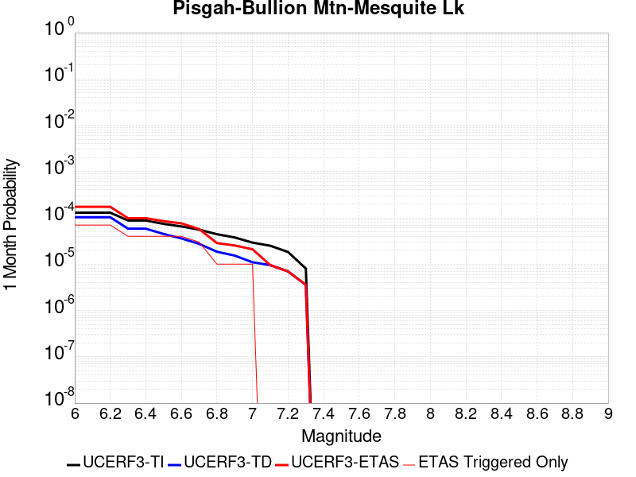 | 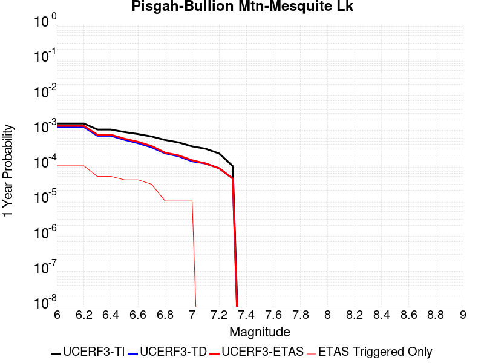 | 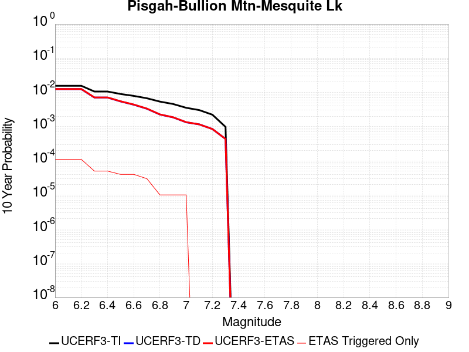 |

| Magnitude | 1 wk TI Prob | 1 wk TD Prob | 1 wk ETAS Prob | 1 wk ETAS/TD Gain | 1 wk ETAS Triggered Only | 1 mo TI Prob | 1 mo TD Prob | 1 mo ETAS Prob | 1 mo ETAS/TD Gain | 1 mo ETAS Triggered Only | 1 yr TI Prob | 1 yr TD Prob | 1 yr ETAS Prob | 1 yr ETAS/TD Gain | 1 yr ETAS Triggered Only | 10 yr TI Prob | 10 yr TD Prob | 10 yr ETAS Prob | 10 yr ETAS/TD Gain | 10 yr ETAS Triggered Only |
|-----|-----|-----|-----|-----|-----|-----|-----|-----|-----|-----|-----|-----|-----|-----|-----|-----|-----|-----|-----|-----|
| 6.0 | 3.0240792E-5 | 2.4091114E-5 | 8.408967E-5 | 3.4904847 | 6.0E-5 | 1.2959696E-4 | 1.03244114E-4 | 1.7323688E-4 | 1.6779348 | 7.0E-5 | 0.0015767008 | 0.0012563728 | 0.0013562471 | 1.0794942 | 1.0E-4 | 0.015655609 | 0.012502721 | 0.012611345 | 1.0086881 | 1.1E-4 |
| 6.1 | 3.0240792E-5 | 2.4091114E-5 | 8.408967E-5 | 3.4904847 | 6.0E-5 | 1.2959696E-4 | 1.03244114E-4 | 1.7323688E-4 | 1.6779348 | 7.0E-5 | 0.0015767008 | 0.0012563728 | 0.0013562471 | 1.0794942 | 1.0E-4 | 0.015655609 | 0.012502721 | 0.012611345 | 1.0086881 | 1.1E-4 |
| 6.2 | 3.0240792E-5 | 2.4091114E-5 | 8.408967E-5 | 3.4904847 | 6.0E-5 | 1.2959696E-4 | 1.03244114E-4 | 1.7323688E-4 | 1.6779348 | 7.0E-5 | 0.0015767008 | 0.0012563728 | 0.0013562471 | 1.0794942 | 1.0E-4 | 0.015655609 | 0.012502721 | 0.012611345 | 1.0086881 | 1.1E-4 |
| 6.3 | 2.0498217E-5 | 1.36380695E-5 | 4.363766E-5 | 3.1996949 | 3.0E-5 | 8.784654E-5 | 5.844765E-5 | 9.8445315E-5 | 1.6843331 | 4.0E-5 | 0.0010690069 | 7.1138405E-4 | 7.6134846E-4 | 1.0702355 | 5.0E-5 | 0.01063879 | 0.0070926943 | 0.00714234 | 1.0069995 | 5.0E-5 |
| 6.4 | 2.0498217E-5 | 1.36380695E-5 | 4.363766E-5 | 3.1996949 | 3.0E-5 | 8.784654E-5 | 5.844765E-5 | 9.8445315E-5 | 1.6843331 | 4.0E-5 | 0.0010690069 | 7.1138405E-4 | 7.6134846E-4 | 1.0702355 | 5.0E-5 | 0.01063879 | 0.0070926943 | 0.00714234 | 1.0069995 | 5.0E-5 |
| 6.5 | 1.7316182E-5 | 1.0477042E-5 | 4.0476727E-5 | 3.8633735 | 3.0E-5 | 7.42101E-5 | 4.4900895E-5 | 8.48991E-5 | 1.8908108 | 4.0E-5 | 9.0313336E-4 | 5.465413E-4 | 5.865194E-4 | 1.0731475 | 4.0E-5 | 0.008994718 | 0.0054529672 | 0.005492749 | 1.0072955 | 4.0E-5 |
| 6.6 | 1.5251077E-5 | 8.414273E-6 | 3.8414022E-5 | 4.5653405 | 3.0E-5 | 6.536012E-5 | 3.6060712E-5 | 7.605927E-5 | 2.1092005 | 4.0E-5 | 7.9546886E-4 | 4.3895794E-4 | 4.789404E-4 | 1.091085 | 4.0E-5 | 0.007926274 | 0.0043816264 | 0.004421451 | 1.009089 | 4.0E-5 |
| 6.7 | 1.2997425E-5 | 6.4114965E-6 | 2.6411368E-5 | 4.1193767 | 2.0E-5 | 5.570206E-5 | 2.7477578E-5 | 5.7476755E-5 | 2.0917692 | 3.0E-5 | 6.7796157E-4 | 3.3449283E-4 | 3.6448278E-4 | 1.089658 | 3.0E-5 | 0.0067589693 | 0.0033403537 | 0.0033702536 | 1.0089511 | 3.0E-5 |
| 6.8 | 1.035386E-5 | 4.3332193E-6 | 4.3332193E-6 | 1.0 | 0.0 | 4.437293E-5 | 1.8570812E-5 | 2.8570626E-5 | 1.5384694 | 1.0E-5 | 5.401065E-4 | 2.2607706E-4 | 2.360748E-4 | 1.0442227 | 1.0E-5 | 0.0053879567 | 0.0022585576 | 0.0022685349 | 1.0044177 | 1.0E-5 |
| 6.9 | 8.816252E-6 | 3.580638E-6 | 3.580638E-6 | 1.0 | 0.0 | 3.778339E-5 | 1.5345504E-5 | 2.534535E-5 | 1.6516467 | 1.0E-5 | 4.5991567E-4 | 1.8681608E-4 | 1.968142E-4 | 1.0535185 | 1.0E-5 | 0.00458965 | 0.0018666488 | 0.0018766301 | 1.0053473 | 1.0E-5 |
| 7.0 | 6.8232207E-6 | 2.5675843E-6 | 2.5675843E-6 | 1.0 | 0.0 | 2.9242048E-5 | 1.1003888E-5 | 2.1003778E-5 | 1.9087597 | 1.0E-5 | 3.5596377E-4 | 1.3396442E-4 | 1.4396307E-4 | 1.0746367 | 1.0E-5 | 0.0035539411 | 0.0013388677 | 0.0013488543 | 1.007459 | 1.0E-5 |
| 7.1 | 5.837013E-6 | 2.22738E-6 | 2.22738E-6 | 1.0 | 0.0 | 2.501553E-5 | 9.545881E-6 | 9.545881E-6 | 1.0 | 0.0 | 3.045215E-4 | 1.16215204E-4 | 1.16215204E-4 | 1.0 | 0.0 | 0.0030410455 | 0.0011615733 | 0.0011615733 | 1.0 | 0.0 |
| 7.2 | 4.278052E-6 | 1.6275711E-6 | 1.6275711E-6 | 1.0 | 0.0 | 1.833438E-5 | 6.9752873E-6 | 6.9752873E-6 | 1.0 | 0.0 | 2.231982E-4 | 8.492105E-5 | 8.492105E-5 | 1.0 | 0.0 | 0.0022297418 | 8.489092E-4 | 8.489092E-4 | 1.0 | 0.0 |
| 7.3 | 1.8803692E-6 | 8.344926E-7 | 8.344926E-7 | 1.0 | 0.0 | 8.0587E-6 | 3.5763926E-6 | 3.5763926E-6 | 1.0 | 0.0 | 9.811026E-5 | 4.354186E-5 | 4.354186E-5 | 1.0 | 0.0 | 9.806695E-4 | 4.3534773E-4 | 4.3534773E-4 | 1.0 | 0.0 |

## Oak Ridge (Onshore)
*[(top)](#table-of-contents)*

| 1 Week | 1 Month | 1 Year | 10 Year |
|-----|-----|-----|-----|
|  |  |  |  |

| Magnitude | 1 wk TI Prob | 1 wk TD Prob | 1 wk ETAS Prob | 1 wk ETAS/TD Gain | 1 wk ETAS Triggered Only | 1 mo TI Prob | 1 mo TD Prob | 1 mo ETAS Prob | 1 mo ETAS/TD Gain | 1 mo ETAS Triggered Only | 1 yr TI Prob | 1 yr TD Prob | 1 yr ETAS Prob | 1 yr ETAS/TD Gain | 1 yr ETAS Triggered Only | 10 yr TI Prob | 10 yr TD Prob | 10 yr ETAS Prob | 10 yr ETAS/TD Gain | 10 yr ETAS Triggered Only |
|-----|-----|-----|-----|-----|-----|-----|-----|-----|-----|-----|-----|-----|-----|-----|-----|-----|-----|-----|-----|-----|
| 6.0 | 3.155064E-5 | 2.9525974E-5 | 4.9525384E-5 | 1.6773497 | 2.0E-5 | 1.3521002E-4 | 1.2653397E-4 | 1.4653144E-4 | 1.1580403 | 2.0E-5 | 0.001644939 | 0.0015395004 | 0.0015894235 | 1.032428 | 5.0E-5 | 0.01632816 | 0.015292859 | 0.015391329 | 1.006439 | 1.0E-4 |
| 6.1 | 3.155064E-5 | 2.9525974E-5 | 4.9525384E-5 | 1.6773497 | 2.0E-5 | 1.3521002E-4 | 1.2653397E-4 | 1.4653144E-4 | 1.1580403 | 2.0E-5 | 0.001644939 | 0.0015395004 | 0.0015894235 | 1.032428 | 5.0E-5 | 0.01632816 | 0.015292859 | 0.015391329 | 1.006439 | 1.0E-4 |
| 6.2 | 3.155064E-5 | 2.9525974E-5 | 4.9525384E-5 | 1.6773497 | 2.0E-5 | 1.3521002E-4 | 1.2653397E-4 | 1.4653144E-4 | 1.1580403 | 2.0E-5 | 0.001644939 | 0.0015395004 | 0.0015894235 | 1.032428 | 5.0E-5 | 0.01632816 | 0.015292859 | 0.015391329 | 1.006439 | 1.0E-4 |
| 6.3 | 3.155064E-5 | 2.9525974E-5 | 4.9525384E-5 | 1.6773497 | 2.0E-5 | 1.3521002E-4 | 1.2653397E-4 | 1.4653144E-4 | 1.1580403 | 2.0E-5 | 0.001644939 | 0.0015395004 | 0.0015894235 | 1.032428 | 5.0E-5 | 0.01632816 | 0.015292859 | 0.015391329 | 1.006439 | 1.0E-4 |
| 6.4 | 3.155064E-5 | 2.9525974E-5 | 4.9525384E-5 | 1.6773497 | 2.0E-5 | 1.3521002E-4 | 1.2653397E-4 | 1.4653144E-4 | 1.1580403 | 2.0E-5 | 0.001644939 | 0.0015395004 | 0.0015894235 | 1.032428 | 5.0E-5 | 0.01632816 | 0.015292859 | 0.015391329 | 1.006439 | 1.0E-4 |
| 6.5 | 3.155064E-5 | 2.9525974E-5 | 4.9525384E-5 | 1.6773497 | 2.0E-5 | 1.3521002E-4 | 1.2653397E-4 | 1.4653144E-4 | 1.1580403 | 2.0E-5 | 0.001644939 | 0.0015395004 | 0.0015894235 | 1.032428 | 5.0E-5 | 0.01632816 | 0.015292859 | 0.015391329 | 1.006439 | 1.0E-4 |
| 6.6 | 3.155064E-5 | 2.9525974E-5 | 4.9525384E-5 | 1.6773497 | 2.0E-5 | 1.3521002E-4 | 1.2653397E-4 | 1.4653144E-4 | 1.1580403 | 2.0E-5 | 0.001644939 | 0.0015395004 | 0.0015894235 | 1.032428 | 5.0E-5 | 0.01632816 | 0.015292859 | 0.015391329 | 1.006439 | 1.0E-4 |
| 6.7 | 3.098897E-5 | 2.8864175E-5 | 4.8863596E-5 | 1.6928805 | 2.0E-5 | 1.328031E-4 | 1.2369796E-4 | 1.4369548E-4 | 1.1616641 | 2.0E-5 | 0.0016156785 | 0.0015050198 | 0.0015549446 | 1.0331721 | 5.0E-5 | 0.016039822 | 0.014952714 | 0.015051219 | 1.0065877 | 1.0E-4 |
| 6.8 | 3.0449872E-5 | 2.8239372E-5 | 4.8238806E-5 | 1.7082111 | 2.0E-5 | 1.3049292E-4 | 1.2102048E-4 | 1.4101806E-4 | 1.1652412 | 2.0E-5 | 0.0015875935 | 0.0014724657 | 0.001522392 | 1.0339067 | 5.0E-5 | 0.015762992 | 0.014631462 | 0.014729999 | 1.0067346 | 1.0E-4 |
| 6.9 | 2.697928E-5 | 2.4219773E-5 | 4.421929E-5 | 1.8257515 | 2.0E-5 | 1.15620365E-4 | 1.0379502E-4 | 1.2379294E-4 | 1.1926675 | 2.0E-5 | 0.0014067689 | 0.0012629933 | 0.0013029428 | 1.0316308 | 4.0E-5 | 0.0139789665 | 0.01256087 | 0.012649739 | 1.0070751 | 9.0E-5 |
| 7.0 | 2.4893961E-5 | 2.1862043E-5 | 4.1861604E-5 | 1.9148077 | 2.0E-5 | 1.0668404E-4 | 9.3691204E-5 | 1.13689326E-4 | 1.2134472 | 2.0E-5 | 0.0012981043 | 0.0011401111 | 0.001170077 | 1.0262833 | 3.0E-5 | 0.012905477 | 0.011344905 | 0.011414112 | 1.0061002 | 7.0E-5 |
| 7.1 | 2.0945363E-5 | 1.7354487E-5 | 3.735414E-5 | 2.1524198 | 2.0E-5 | 8.976275E-5 | 7.437428E-5 | 9.4372794E-5 | 1.2688901 | 2.0E-5 | 0.0010923136 | 9.051354E-4 | 9.351083E-4 | 1.0331142 | 3.0E-5 | 0.0108696 | 0.009015423 | 0.009084792 | 1.0076945 | 7.0E-5 |
| 7.2 | 2.0439404E-5 | 1.6809423E-5 | 3.6809088E-5 | 2.1897888 | 2.0E-5 | 8.7594504E-5 | 7.203843E-5 | 9.2036986E-5 | 1.2776096 | 2.0E-5 | 0.0010659413 | 8.767196E-4 | 9.066933E-4 | 1.0341885 | 3.0E-5 | 0.010608427 | 0.008733526 | 0.008802915 | 1.0079451 | 7.0E-5 |
| 7.3 | 1.8463334E-5 | 1.5381811E-5 | 3.53815E-5 | 2.3002172 | 2.0E-5 | 7.912617E-5 | 6.59204E-5 | 8.5919084E-5 | 1.3033762 | 2.0E-5 | 9.6293533E-4 | 8.0228975E-4 | 8.3226565E-4 | 1.0373629 | 3.0E-5 | 0.009587734 | 0.007994797 | 0.008064237 | 1.0086857 | 7.0E-5 |
| 7.4 | 1.763139E-5 | 1.451684E-5 | 2.4516694E-5 | 1.6888452 | 1.0E-5 | 7.556091E-5 | 6.221356E-5 | 7.221294E-5 | 1.1607267 | 1.0E-5 | 9.1956573E-4 | 7.571909E-4 | 7.7717577E-4 | 1.0263934 | 2.0E-5 | 0.009157699 | 0.007546914 | 0.0076064607 | 1.0078902 | 6.0E-5 |
| 7.5 | 1.3594944E-5 | 1.1163356E-5 | 2.1163245E-5 | 1.895778 | 1.0E-5 | 5.8262744E-5 | 4.784209E-5 | 5.7841615E-5 | 1.209011 | 1.0E-5 | 7.0911803E-4 | 5.8232434E-4 | 6.023127E-4 | 1.0343251 | 2.0E-5 | 0.007068595 | 0.0058082556 | 0.005848023 | 1.0068468 | 4.0E-5 |
| 7.6 | 6.9889534E-6 | 5.6367144E-6 | 5.6367144E-6 | 1.0 | 0.0 | 2.9952313E-5 | 2.4157125E-5 | 2.4157125E-5 | 1.0 | 0.0 | 3.646084E-4 | 2.9407372E-4 | 2.9407372E-4 | 1.0 | 0.0 | 0.0036401073 | 0.0029368899 | 0.0029568311 | 1.0067899 | 2.0E-5 |
| 7.7 | 4.0824193E-6 | 3.2832586E-6 | 3.2832586E-6 | 1.0 | 0.0 | 1.7495966E-5 | 1.4071033E-5 | 1.4071033E-5 | 1.0 | 0.0 | 2.1299256E-4 | 1.713015E-4 | 1.713015E-4 | 1.0 | 0.0 | 0.0021278851 | 0.0017117079 | 0.0017216908 | 1.0058321 | 1.0E-5 |
| 7.8 | 1.7023609E-6 | 1.4370495E-6 | 1.4370495E-6 | 1.0 | 0.0 | 7.295812E-6 | 6.1587693E-6 | 6.1587693E-6 | 1.0 | 0.0 | 8.882289E-5 | 7.498047E-5 | 7.498047E-5 | 1.0 | 0.0 | 8.8787393E-4 | 7.495545E-4 | 7.495545E-4 | 1.0 | 0.0 |
| 7.9 | 2.721225E-7 | 2.2616497E-7 | 2.2616497E-7 | 1.0 | 0.0 | 1.1662388E-6 | 9.692781E-7 | 9.692781E-7 | 1.0 | 0.0 | 1.4198865E-5 | 1.1800899E-5 | 1.1800899E-5 | 1.0 | 0.0 | 1.4197957E-4 | 1.1800301E-4 | 1.1800301E-4 | 1.0 | 0.0 |
| 8.0 | 9.364255E-9 | 5.1206666E-9 | 5.1206666E-9 | 1.0 | 0.0 | 4.0132523E-8 | 2.1945715E-8 | 2.1945715E-8 | 1.0 | 0.0 | 4.8861335E-7 | 2.6718905E-7 | 2.6718905E-7 | 1.0 | 0.0 | 4.8861225E-6 | 2.6718876E-6 | 2.6718876E-6 | 1.0 | 0.0 |

## Pine Mtn
*[(top)](#table-of-contents)*

| 1 Week | 1 Month | 1 Year | 10 Year |
|-----|-----|-----|-----|
|  |  |  |  |

| Magnitude | 1 wk TI Prob | 1 wk TD Prob | 1 wk ETAS Prob | 1 wk ETAS/TD Gain | 1 wk ETAS Triggered Only | 1 mo TI Prob | 1 mo TD Prob | 1 mo ETAS Prob | 1 mo ETAS/TD Gain | 1 mo ETAS Triggered Only | 1 yr TI Prob | 1 yr TD Prob | 1 yr ETAS Prob | 1 yr ETAS/TD Gain | 1 yr ETAS Triggered Only | 10 yr TI Prob | 10 yr TD Prob | 10 yr ETAS Prob | 10 yr ETAS/TD Gain | 10 yr ETAS Triggered Only |
|-----|-----|-----|-----|-----|-----|-----|-----|-----|-----|-----|-----|-----|-----|-----|-----|-----|-----|-----|-----|-----|
| 6.0 | 6.894797E-6 | 7.225461E-6 | 2.7225316E-5 | 3.7679694 | 2.0E-5 | 2.9548795E-5 | 3.096591E-5 | 5.0965293E-5 | 1.6458515 | 2.0E-5 | 3.596972E-4 | 3.7694772E-4 | 4.269289E-4 | 1.1325943 | 5.0E-5 | 0.0035911554 | 0.003763381 | 0.0038630047 | 1.0264719 | 1.0E-4 |
| 6.1 | 6.894797E-6 | 7.225461E-6 | 2.7225316E-5 | 3.7679694 | 2.0E-5 | 2.9548795E-5 | 3.096591E-5 | 5.0965293E-5 | 1.6458515 | 2.0E-5 | 3.596972E-4 | 3.7694772E-4 | 4.269289E-4 | 1.1325943 | 5.0E-5 | 0.0035911554 | 0.003763381 | 0.0038630047 | 1.0264719 | 1.0E-4 |
| 6.2 | 6.894797E-6 | 7.225461E-6 | 2.7225316E-5 | 3.7679694 | 2.0E-5 | 2.9548795E-5 | 3.096591E-5 | 5.0965293E-5 | 1.6458515 | 2.0E-5 | 3.596972E-4 | 3.7694772E-4 | 4.269289E-4 | 1.1325943 | 5.0E-5 | 0.0035911554 | 0.003763381 | 0.0038630047 | 1.0264719 | 1.0E-4 |
| 6.3 | 6.894797E-6 | 7.225461E-6 | 2.7225316E-5 | 3.7679694 | 2.0E-5 | 2.9548795E-5 | 3.096591E-5 | 5.0965293E-5 | 1.6458515 | 2.0E-5 | 3.596972E-4 | 3.7694772E-4 | 4.269289E-4 | 1.1325943 | 5.0E-5 | 0.0035911554 | 0.003763381 | 0.0038630047 | 1.0264719 | 1.0E-4 |
| 6.4 | 6.894797E-6 | 7.225461E-6 | 2.7225316E-5 | 3.7679694 | 2.0E-5 | 2.9548795E-5 | 3.096591E-5 | 5.0965293E-5 | 1.6458515 | 2.0E-5 | 3.596972E-4 | 3.7694772E-4 | 4.269289E-4 | 1.1325943 | 5.0E-5 | 0.0035911554 | 0.003763381 | 0.0038630047 | 1.0264719 | 1.0E-4 |
| 6.5 | 6.894797E-6 | 7.225461E-6 | 2.7225316E-5 | 3.7679694 | 2.0E-5 | 2.9548795E-5 | 3.096591E-5 | 5.0965293E-5 | 1.6458515 | 2.0E-5 | 3.596972E-4 | 3.7694772E-4 | 4.269289E-4 | 1.1325943 | 5.0E-5 | 0.0035911554 | 0.003763381 | 0.0038630047 | 1.0264719 | 1.0E-4 |
| 6.6 | 6.894797E-6 | 7.225461E-6 | 2.7225316E-5 | 3.7679694 | 2.0E-5 | 2.9548795E-5 | 3.096591E-5 | 5.0965293E-5 | 1.6458515 | 2.0E-5 | 3.596972E-4 | 3.7694772E-4 | 4.269289E-4 | 1.1325943 | 5.0E-5 | 0.0035911554 | 0.003763381 | 0.0038630047 | 1.0264719 | 1.0E-4 |
| 6.7 | 6.0867933E-6 | 6.3971133E-6 | 2.6396985E-5 | 4.12639 | 2.0E-5 | 2.6085996E-5 | 2.7415923E-5 | 4.7415375E-5 | 1.729483 | 2.0E-5 | 3.1755073E-4 | 3.3373994E-4 | 3.8372327E-4 | 1.1497673 | 5.0E-5 | 0.0031709734 | 0.0033326065 | 0.0034322732 | 1.0299065 | 1.0E-4 |
| 6.8 | 5.6530425E-6 | 5.9505956E-6 | 2.5950476E-5 | 4.360988 | 2.0E-5 | 2.42271E-5 | 2.5502315E-5 | 4.5501805E-5 | 1.7842225 | 2.0E-5 | 2.94925E-4 | 3.104485E-4 | 3.6043298E-4 | 1.1610073 | 5.0E-5 | 0.002945339 | 0.0031003528 | 0.0031900739 | 1.028939 | 9.0E-5 |
| 6.9 | 4.6015225E-6 | 4.863834E-6 | 1.48637855E-5 | 3.0559812 | 1.0E-5 | 1.9720663E-5 | 2.0844845E-5 | 3.0844636E-5 | 1.4797249 | 1.0E-5 | 2.4007261E-4 | 2.5375787E-4 | 2.9374773E-4 | 1.1575906 | 4.0E-5 | 0.0023981342 | 0.0025348254 | 0.002604648 | 1.0275453 | 7.0E-5 |
| 7.0 | 4.4875965E-6 | 4.747473E-6 | 1.4747426E-5 | 3.1063738 | 1.0E-5 | 1.9232413E-5 | 2.0346162E-5 | 3.0345958E-5 | 1.4914832 | 1.0E-5 | 2.3412947E-4 | 2.4768783E-4 | 2.8767792E-4 | 1.1614536 | 4.0E-5 | 0.0023388295 | 0.0024742614 | 0.002534113 | 1.0241897 | 6.0E-5 |
| 7.1 | 3.203907E-6 | 3.4294096E-6 | 1.3429375E-5 | 3.9159439 | 1.0E-5 | 1.3730958E-5 | 1.4697391E-5 | 2.4697243E-5 | 1.6803828 | 1.0E-5 | 1.6716159E-4 | 1.789267E-4 | 1.9892312E-4 | 1.1117576 | 2.0E-5 | 0.0016703589 | 0.0017878925 | 0.0018178389 | 1.0167495 | 3.0E-5 |
| 7.2 | 2.2060601E-6 | 2.3784817E-6 | 1.23784575E-5 | 5.204353 | 1.0E-5 | 9.4545085E-6 | 1.0193455E-5 | 2.0193353E-5 | 1.9810116 | 1.0E-5 | 1.15102564E-4 | 1.240987E-4 | 1.3409746E-4 | 1.080571 | 1.0E-5 | 0.0011504296 | 0.0012403389 | 0.001260314 | 1.0161046 | 2.0E-5 |
| 7.3 | 1.3765207E-6 | 1.5216481E-6 | 1.5216481E-6 | 1.0 | 0.0 | 5.899361E-6 | 6.521333E-6 | 6.521333E-6 | 1.0 | 0.0 | 7.182235E-5 | 7.939443E-5 | 7.939443E-5 | 1.0 | 0.0 | 7.1799144E-4 | 7.936697E-4 | 7.936697E-4 | 1.0 | 0.0 |
| 7.4 | 1.1245983E-6 | 1.2587075E-6 | 1.2587075E-6 | 1.0 | 0.0 | 4.819698E-6 | 5.39445E-6 | 5.39445E-6 | 1.0 | 0.0 | 5.8678244E-5 | 6.567554E-5 | 6.567554E-5 | 1.0 | 0.0 | 5.866275E-4 | 6.5656955E-4 | 6.5656955E-4 | 1.0 | 0.0 |
| 7.5 | 8.031682E-7 | 9.276951E-7 | 9.276951E-7 | 1.0 | 0.0 | 3.4421448E-6 | 3.9758306E-6 | 3.9758306E-6 | 1.0 | 0.0 | 4.1907308E-5 | 4.840473E-5 | 4.840473E-5 | 1.0 | 0.0 | 4.1899405E-4 | 4.8394862E-4 | 4.8394862E-4 | 1.0 | 0.0 |
| 7.6 | 4.8953444E-7 | 6.003009E-7 | 6.003009E-7 | 1.0 | 0.0 | 2.098003E-6 | 2.5727159E-6 | 2.5727159E-6 | 1.0 | 0.0 | 2.5542888E-5 | 3.1322415E-5 | 3.1322415E-5 | 1.0 | 0.0 | 2.5539953E-4 | 3.1318486E-4 | 3.1318486E-4 | 1.0 | 0.0 |
| 7.7 | 6.634529E-8 | 6.788826E-8 | 6.788826E-8 | 1.0 | 0.0 | 2.843369E-7 | 2.9094966E-7 | 2.9094966E-7 | 1.0 | 0.0 | 3.4617963E-6 | 3.5423066E-6 | 3.5423066E-6 | 1.0 | 0.0 | 3.4617424E-5 | 3.542255E-5 | 3.542255E-5 | 1.0 | 0.0 |
| 7.8 | 9.235578E-9 | 9.488566E-9 | 9.488566E-9 | 1.0 | 0.0 | 3.9581046E-8 | 4.0665284E-8 | 4.0665284E-8 | 1.0 | 0.0 | 4.818991E-7 | 4.950997E-7 | 4.950997E-7 | 1.0 | 0.0 | 4.8189804E-6 | 4.950988E-6 | 4.950988E-6 | 1.0 | 0.0 |

## San Jacinto (Borrego)
*[(top)](#table-of-contents)*

| 1 Week | 1 Month | 1 Year | 10 Year |
|-----|-----|-----|-----|
|  |  |  |  |

| Magnitude | 1 wk TI Prob | 1 wk TD Prob | 1 wk ETAS Prob | 1 wk ETAS/TD Gain | 1 wk ETAS Triggered Only | 1 mo TI Prob | 1 mo TD Prob | 1 mo ETAS Prob | 1 mo ETAS/TD Gain | 1 mo ETAS Triggered Only | 1 yr TI Prob | 1 yr TD Prob | 1 yr ETAS Prob | 1 yr ETAS/TD Gain | 1 yr ETAS Triggered Only | 10 yr TI Prob | 10 yr TD Prob | 10 yr ETAS Prob | 10 yr ETAS/TD Gain | 10 yr ETAS Triggered Only |
|-----|-----|-----|-----|-----|-----|-----|-----|-----|-----|-----|-----|-----|-----|-----|-----|-----|-----|-----|-----|-----|
| 6.0 | 3.543992E-5 | 2.7926513E-5 | 5.7925674E-5 | 2.074218 | 3.0E-5 | 1.5187653E-4 | 1.1967963E-4 | 1.5967485E-4 | 1.3341856 | 4.0E-5 | 0.0018475284 | 0.0014561379 | 0.0015160504 | 1.0411448 | 6.0E-5 | 0.018322436 | 0.014869647 | 0.014958309 | 1.0059626 | 9.0E-5 |
| 6.1 | 3.542281E-5 | 2.7926513E-5 | 5.7925674E-5 | 2.074218 | 3.0E-5 | 1.5180321E-4 | 1.1967963E-4 | 1.5967485E-4 | 1.3341856 | 4.0E-5 | 0.0018466372 | 0.0014561379 | 0.0015160504 | 1.0411448 | 6.0E-5 | 0.018313672 | 0.014869647 | 0.014958309 | 1.0059626 | 9.0E-5 |
| 6.2 | 3.4688688E-5 | 2.7926511E-5 | 5.7925674E-5 | 2.074218 | 3.0E-5 | 1.4865733E-4 | 1.1967963E-4 | 1.5967485E-4 | 1.3341856 | 4.0E-5 | 0.0018084005 | 0.0014561379 | 0.0015160504 | 1.0411448 | 6.0E-5 | 0.017937548 | 0.014869647 | 0.014958309 | 1.0059626 | 9.0E-5 |
| 6.3 | 3.2087122E-5 | 2.7771865E-5 | 5.777103E-5 | 2.0802 | 3.0E-5 | 1.3750899E-4 | 1.1901691E-4 | 1.5901215E-4 | 1.3360467 | 4.0E-5 | 0.0016728862 | 0.00144808 | 0.0015079931 | 1.0413742 | 6.0E-5 | 0.016603488 | 0.014790683 | 0.0148793515 | 1.0059949 | 9.0E-5 |
| 6.4 | 3.1828724E-5 | 2.7738852E-5 | 5.773802E-5 | 2.0814855 | 3.0E-5 | 1.364017E-4 | 1.1887544E-4 | 1.5887068E-4 | 1.3364466 | 4.0E-5 | 0.0016594254 | 0.0014463598 | 0.001506273 | 1.0414234 | 6.0E-5 | 0.016470885 | 0.014773762 | 0.014862432 | 1.0060018 | 9.0E-5 |
| 6.5 | 3.1563577E-5 | 2.747857E-5 | 5.7477744E-5 | 2.0917299 | 3.0E-5 | 1.3526545E-4 | 1.1776006E-4 | 1.5775535E-4 | 1.3396337 | 4.0E-5 | 0.0016456128 | 0.0014327979 | 0.001492712 | 1.0418161 | 6.0E-5 | 0.0163348 | 0.014640348 | 0.01472903 | 1.0060574 | 9.0E-5 |
| 6.6 | 3.1467625E-5 | 2.7322796E-5 | 5.7321977E-5 | 2.0979543 | 3.0E-5 | 1.3485427E-4 | 1.1709251E-4 | 1.5708782E-4 | 1.3415703 | 4.0E-5 | 0.0016406142 | 0.0014246812 | 0.0014845957 | 1.0420547 | 6.0E-5 | 0.016285548 | 0.014560594 | 0.014649284 | 1.0060911 | 9.0E-5 |
| 6.7 | 3.1223695E-5 | 2.6940816E-5 | 5.6940007E-5 | 2.113522 | 3.0E-5 | 1.3380898E-4 | 1.15455594E-4 | 1.5545098E-4 | 1.3464135 | 4.0E-5 | 0.0016279068 | 0.0014047775 | 0.0014646933 | 1.0426514 | 6.0E-5 | 0.01616033 | 0.014364966 | 0.014453673 | 1.0061753 | 9.0E-5 |
| 6.8 | 3.1015585E-5 | 2.6761822E-5 | 5.676102E-5 | 2.12097 | 3.0E-5 | 1.3291716E-4 | 1.1468855E-4 | 1.5468396E-4 | 1.3487307 | 4.0E-5 | 0.001617065 | 0.0013954508 | 0.0014553671 | 1.0429368 | 6.0E-5 | 0.016053487 | 0.014272246 | 0.0143609615 | 1.0062159 | 9.0E-5 |
| 6.9 | 2.6641965E-5 | 2.2184247E-5 | 5.2183583E-5 | 2.3522809 | 3.0E-5 | 1.1417485E-4 | 9.50719E-5 | 1.350681E-4 | 1.4206942 | 4.0E-5 | 0.0013891924 | 0.0011568897 | 0.0012068318 | 1.0431694 | 5.0E-5 | 0.0138054015 | 0.011882438 | 0.011961488 | 1.0066526 | 8.0E-5 |
| 7.0 | 2.3854353E-5 | 2.0479023E-5 | 5.0478408E-5 | 2.4648836 | 3.0E-5 | 1.02228936E-4 | 8.77643E-5 | 1.277608E-4 | 1.4557261 | 4.0E-5 | 0.0012439266 | 0.0010680092 | 0.0011179558 | 1.046766 | 5.0E-5 | 0.012369866 | 0.0109828 | 0.011061922 | 1.0072042 | 8.0E-5 |
| 7.1 | 2.3672901E-5 | 2.031551E-5 | 5.0314902E-5 | 2.476674 | 3.0E-5 | 1.0145135E-4 | 8.7063585E-5 | 1.270601E-4 | 1.4593943 | 4.0E-5 | 0.0012344702 | 0.0010594862 | 0.0011094332 | 1.0471427 | 5.0E-5 | 0.0122763505 | 0.010897976 | 0.010977104 | 1.0072608 | 8.0E-5 |
| 7.2 | 2.2717244E-5 | 1.9542893E-5 | 4.9542305E-5 | 2.535055 | 3.0E-5 | 9.735599E-5 | 8.375258E-5 | 1.2374923E-4 | 1.4775572 | 4.0E-5 | 0.0011846646 | 0.001019213 | 0.001069162 | 1.0490074 | 5.0E-5 | 0.01178369 | 0.010495341 | 0.010574502 | 1.0075424 | 8.0E-5 |
| 7.3 | 2.1016205E-5 | 1.8384526E-5 | 4.8383972E-5 | 2.631777 | 3.0E-5 | 9.006634E-5 | 7.878846E-5 | 1.18785305E-4 | 1.5076486 | 4.0E-5 | 0.001096006 | 9.5882936E-4 | 0.0010087814 | 1.052097 | 5.0E-5 | 0.010906163 | 0.009890967 | 0.009970175 | 1.0080082 | 8.0E-5 |
| 7.4 | 2.0683625E-5 | 1.8187047E-5 | 4.8186503E-5 | 2.6494956 | 3.0E-5 | 8.86411E-5 | 7.794217E-5 | 1.1793905E-4 | 1.5131611 | 4.0E-5 | 0.001078671 | 9.485349E-4 | 9.984875E-4 | 1.0526628 | 5.0E-5 | 0.010734501 | 0.009787692 | 0.009866909 | 1.0080935 | 8.0E-5 |
| 7.5 | 1.9993966E-5 | 1.7782075E-5 | 4.778154E-5 | 2.6870623 | 3.0E-5 | 8.568561E-5 | 7.620667E-5 | 1.1620363E-4 | 1.5248485 | 4.0E-5 | 0.001042723 | 9.2742336E-4 | 9.773769E-4 | 1.0538628 | 5.0E-5 | 0.010378438 | 0.009574614 | 0.009653849 | 1.0082754 | 8.0E-5 |
| 7.6 | 1.788966E-5 | 1.6435291E-5 | 4.6434798E-5 | 2.8253105 | 3.0E-5 | 7.666772E-5 | 7.043507E-5 | 1.1043225E-4 | 1.5678589 | 4.0E-5 | 9.3302975E-4 | 8.572113E-4 | 9.0716843E-4 | 1.0582787 | 5.0E-5 | 0.00929122 | 0.008866487 | 0.008945777 | 1.0089427 | 8.0E-5 |
| 7.7 | 1.5125781E-5 | 1.4237377E-5 | 4.423695E-5 | 3.1070995 | 3.0E-5 | 6.4823165E-5 | 6.1015908E-5 | 1.01013466E-4 | 1.6555268 | 4.0E-5 | 7.889362E-4 | 7.426163E-4 | 7.925792E-4 | 1.0672796 | 5.0E-5 | 0.007861412 | 0.0077142045 | 0.0077836644 | 1.0090041 | 7.0E-5 |
| 7.8 | 1.250089E-5 | 1.26304985E-5 | 4.263012E-5 | 3.375173 | 3.0E-5 | 5.3574146E-5 | 5.412959E-5 | 9.412742E-5 | 1.7389274 | 4.0E-5 | 6.5207E-4 | 6.588291E-4 | 7.0879614E-4 | 1.0758423 | 5.0E-5 | 0.006501599 | 0.0068677636 | 0.006937283 | 1.0101225 | 7.0E-5 |
| 7.9 | 9.561E-6 | 9.754616E-6 | 3.9754323E-5 | 4.075437 | 3.0E-5 | 4.0975072E-5 | 4.1804833E-5 | 8.180316E-5 | 1.9567872 | 4.0E-5 | 4.987573E-4 | 5.088555E-4 | 5.488352E-4 | 1.0785677 | 4.0E-5 | 0.0049763937 | 0.0053523467 | 0.0054120254 | 1.01115 | 6.0E-5 |
| 8.0 | 8.01699E-6 | 8.293488E-6 | 2.8293322E-5 | 3.4115107 | 2.0E-5 | 3.4358076E-5 | 3.554304E-5 | 6.554197E-5 | 1.8440171 | 3.0E-5 | 4.1822926E-4 | 4.3265108E-4 | 4.626381E-4 | 1.06931 | 3.0E-5 | 0.0041744304 | 0.004573375 | 0.0046231463 | 1.0108829 | 5.0E-5 |
| 8.1 | 6.541947E-6 | 6.4622354E-6 | 2.6462107E-5 | 4.0948844 | 2.0E-5 | 2.8036617E-5 | 2.7695003E-5 | 5.769417E-5 | 2.0831978 | 3.0E-5 | 3.4129233E-4 | 3.37135E-4 | 3.6712489E-4 | 1.0889552 | 3.0E-5 | 0.0034076865 | 0.0035806994 | 0.0036305203 | 1.0139138 | 5.0E-5 |
| 8.2 | 1.7968189E-6 | 7.9713476E-7 | 7.9713476E-7 | 1.0 | 0.0 | 7.70063E-6 | 3.4162877E-6 | 3.4162877E-6 | 1.0 | 0.0 | 9.3751136E-5 | 4.159253E-5 | 4.159253E-5 | 1.0 | 0.0 | 9.371159E-4 | 4.712058E-4 | 4.712058E-4 | 1.0 | 0.0 |
| 8.3 | 1.5167889E-7 | 4.897714E-8 | 4.897714E-8 | 1.0 | 0.0 | 6.500522E-7 | 2.09902E-7 | 2.09902E-7 | 1.0 | 0.0 | 7.9143565E-6 | 2.5555544E-6 | 2.5555544E-6 | 1.0 | 0.0 | 7.914075E-5 | 2.969505E-5 | 2.969505E-5 | 1.0 | 0.0 |

## Kern Canyon (South Kern) 2011
*[(top)](#table-of-contents)*

| 1 Week | 1 Month | 1 Year | 10 Year |
|-----|-----|-----|-----|
| 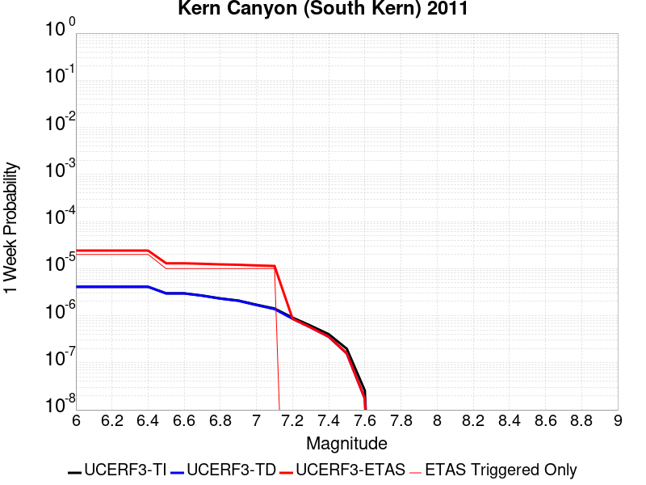 | 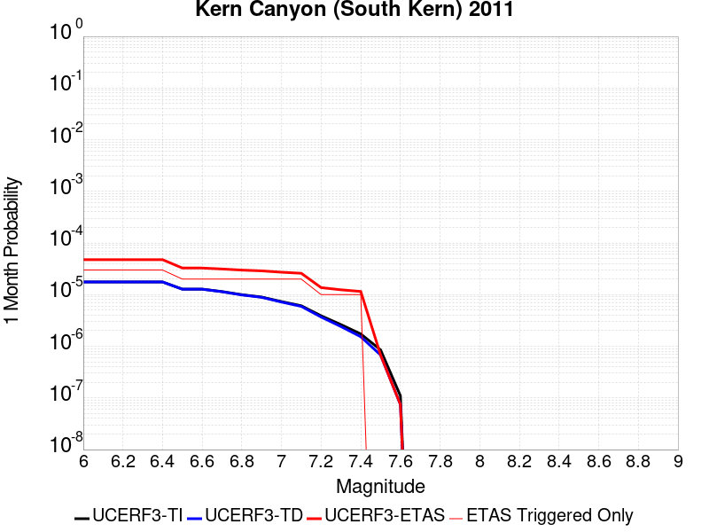 | 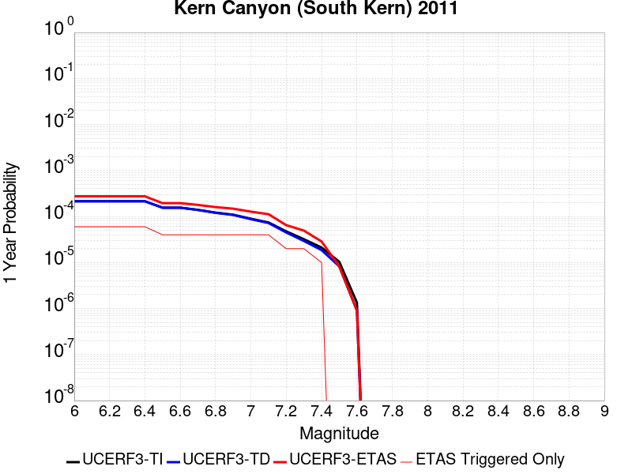 | 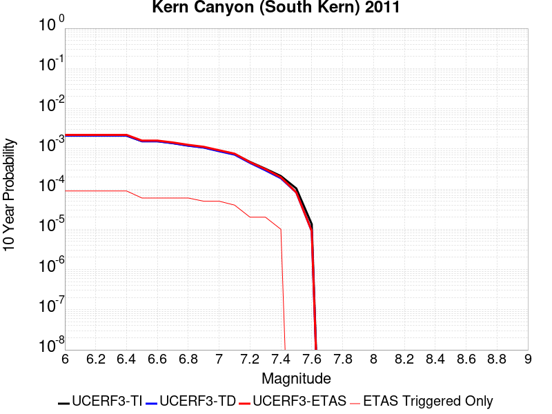 |

| Magnitude | 1 wk TI Prob | 1 wk TD Prob | 1 wk ETAS Prob | 1 wk ETAS/TD Gain | 1 wk ETAS Triggered Only | 1 mo TI Prob | 1 mo TD Prob | 1 mo ETAS Prob | 1 mo ETAS/TD Gain | 1 mo ETAS Triggered Only | 1 yr TI Prob | 1 yr TD Prob | 1 yr ETAS Prob | 1 yr ETAS/TD Gain | 1 yr ETAS Triggered Only | 10 yr TI Prob | 10 yr TD Prob | 10 yr ETAS Prob | 10 yr ETAS/TD Gain | 10 yr ETAS Triggered Only |
|-----|-----|-----|-----|-----|-----|-----|-----|-----|-----|-----|-----|-----|-----|-----|-----|-----|-----|-----|-----|-----|
| 6.0 | 4.105075E-6 | 4.1137264E-6 | 2.4113644E-5 | 5.861752 | 2.0E-5 | 1.7593058E-5 | 1.763014E-5 | 4.762961E-5 | 2.7016013 | 3.0E-5 | 2.1417443E-4 | 2.1462646E-4 | 2.746136E-4 | 1.2794955 | 6.0E-5 | 0.0021396813 | 0.0021442557 | 0.0022340626 | 1.0418826 | 9.0E-5 |
| 6.1 | 4.105075E-6 | 4.1137264E-6 | 2.4113644E-5 | 5.861752 | 2.0E-5 | 1.7593058E-5 | 1.763014E-5 | 4.762961E-5 | 2.7016013 | 3.0E-5 | 2.1417443E-4 | 2.1462646E-4 | 2.746136E-4 | 1.2794955 | 6.0E-5 | 0.0021396813 | 0.0021442557 | 0.0022340626 | 1.0418826 | 9.0E-5 |
| 6.2 | 4.105075E-6 | 4.1137264E-6 | 2.4113644E-5 | 5.861752 | 2.0E-5 | 1.7593058E-5 | 1.763014E-5 | 4.762961E-5 | 2.7016013 | 3.0E-5 | 2.1417443E-4 | 2.1462646E-4 | 2.746136E-4 | 1.2794955 | 6.0E-5 | 0.0021396813 | 0.0021442557 | 0.0022340626 | 1.0418826 | 9.0E-5 |
| 6.3 | 4.105075E-6 | 4.1137264E-6 | 2.4113644E-5 | 5.861752 | 2.0E-5 | 1.7593058E-5 | 1.763014E-5 | 4.762961E-5 | 2.7016013 | 3.0E-5 | 2.1417443E-4 | 2.1462646E-4 | 2.746136E-4 | 1.2794955 | 6.0E-5 | 0.0021396813 | 0.0021442557 | 0.0022340626 | 1.0418826 | 9.0E-5 |
| 6.4 | 4.105075E-6 | 4.1137264E-6 | 2.4113644E-5 | 5.861752 | 2.0E-5 | 1.7593058E-5 | 1.763014E-5 | 4.762961E-5 | 2.7016013 | 3.0E-5 | 2.1417443E-4 | 2.1462646E-4 | 2.746136E-4 | 1.2794955 | 6.0E-5 | 0.0021396813 | 0.0021442557 | 0.0022340626 | 1.0418826 | 9.0E-5 |
| 6.5 | 2.9849807E-6 | 2.9731548E-6 | 1.2973125E-5 | 4.363421 | 1.0E-5 | 1.2792712E-5 | 1.274203E-5 | 3.2741777E-5 | 2.5695887 | 2.0E-5 | 1.5574014E-4 | 1.5512333E-4 | 1.9511711E-4 | 1.2578193 | 4.0E-5 | 0.0015563103 | 0.0015501656 | 0.0016100726 | 1.0386455 | 6.0E-5 |
| 6.6 | 2.9849807E-6 | 2.9731548E-6 | 1.2973125E-5 | 4.363421 | 1.0E-5 | 1.2792712E-5 | 1.274203E-5 | 3.2741777E-5 | 2.5695887 | 2.0E-5 | 1.5574014E-4 | 1.5512333E-4 | 1.9511711E-4 | 1.2578193 | 4.0E-5 | 0.0015563103 | 0.0015501656 | 0.0016100726 | 1.0386455 | 6.0E-5 |
| 6.7 | 2.6756725E-6 | 2.6582206E-6 | 1.26581945E-5 | 4.7619047 | 1.0E-5 | 1.1467117E-5 | 1.1392325E-5 | 3.1392097E-5 | 2.7555478 | 2.0E-5 | 1.396032E-4 | 1.3869285E-4 | 1.7868729E-4 | 1.2883672 | 4.0E-5 | 0.0013951553 | 0.0013860738 | 0.0014459906 | 1.0432278 | 6.0E-5 |
| 6.8 | 2.3283721E-6 | 2.3047787E-6 | 1.2304756E-5 | 5.338801 | 1.0E-5 | 9.9787E-6 | 9.877586E-6 | 2.9877388E-5 | 3.0247662 | 2.0E-5 | 1.214839E-4 | 1.20253055E-4 | 1.6024824E-4 | 1.3325919 | 4.0E-5 | 0.001214175 | 0.0012018873 | 0.0012618152 | 1.0498614 | 6.0E-5 |
| 6.9 | 2.0972677E-6 | 2.0696411E-6 | 1.206962E-5 | 5.8317456 | 1.0E-5 | 8.988259E-6 | 8.869861E-6 | 2.8869683E-5 | 3.2548068 | 2.0E-5 | 1.0942656E-4 | 1.0798526E-4 | 1.4798094E-4 | 1.3703809 | 4.0E-5 | 0.0010937268 | 0.0010793337 | 0.0011292797 | 1.0462749 | 5.0E-5 |
| 7.0 | 1.7132242E-6 | 1.6787036E-6 | 1.1678687E-5 | 6.956968 | 1.0E-5 | 7.3423685E-6 | 7.194424E-6 | 2.719428E-5 | 3.7799106 | 2.0E-5 | 8.938967E-5 | 8.758863E-5 | 1.2758512E-4 | 1.4566402 | 4.0E-5 | 8.935372E-4 | 8.7554497E-4 | 9.2550117E-4 | 1.0570573 | 5.0E-5 |
| 7.1 | 1.4215541E-6 | 1.3815752E-6 | 1.1381561E-5 | 8.238105 | 1.0E-5 | 6.0923603E-6 | 5.9210233E-6 | 2.5920905E-5 | 4.3777747 | 2.0E-5 | 7.417196E-5 | 7.20861E-5 | 1.1208322E-4 | 1.554852 | 4.0E-5 | 7.414721E-4 | 7.206299E-4 | 7.606011E-4 | 1.055467 | 4.0E-5 |
| 7.2 | 9.097853E-7 | 8.6037755E-7 | 8.6037755E-7 | 1.0 | 0.0 | 3.899074E-6 | 3.6873273E-6 | 1.368729E-5 | 3.7119815 | 1.0E-5 | 4.7470192E-5 | 4.4892295E-5 | 6.48914E-5 | 1.4454907 | 2.0E-5 | 4.7460053E-4 | 4.4883334E-4 | 4.6882438E-4 | 1.0445399 | 2.0E-5 |
| 7.3 | 6.144169E-7 | 5.628206E-7 | 5.628206E-7 | 1.0 | 0.0 | 2.6332125E-6 | 2.4120861E-6 | 1.24120625E-5 | 5.1457787 | 1.0E-5 | 3.205889E-5 | 2.9366758E-5 | 4.9366172E-5 | 1.6810222 | 2.0E-5 | 3.2054266E-4 | 2.936293E-4 | 3.1362343E-4 | 1.0680931 | 2.0E-5 |
| 7.4 | 4.049844E-7 | 3.5728314E-7 | 3.5728314E-7 | 1.0 | 0.0 | 1.7356463E-6 | 1.5312125E-6 | 1.1531197E-5 | 7.530762 | 1.0E-5 | 2.1131287E-5 | 1.8642357E-5 | 2.864217E-5 | 1.536403 | 1.0E-5 | 2.1129279E-4 | 1.8640817E-4 | 1.964063E-4 | 1.0536357 | 1.0E-5 |
| 7.5 | 1.9871162E-7 | 1.583044E-7 | 1.583044E-7 | 1.0 | 0.0 | 8.5162094E-7 | 6.7844724E-7 | 6.7844724E-7 | 1.0 | 0.0 | 1.0368436E-5 | 8.260065E-6 | 8.260065E-6 | 1.0 | 0.0 | 1.0367952E-4 | 8.259767E-5 | 8.259767E-5 | 1.0 | 0.0 |
| 7.6 | 2.572245E-8 | 1.7352555E-8 | 1.7352555E-8 | 1.0 | 0.0 | 1.10239064E-7 | 7.436809E-8 | 7.436809E-8 | 1.0 | 0.0 | 1.3421597E-6 | 9.054312E-7 | 9.054312E-7 | 1.0 | 0.0 | 1.3421517E-5 | 9.05428E-6 | 9.05428E-6 | 1.0 | 0.0 |

## San Diego Trough south
*[(top)](#table-of-contents)*

| 1 Week | 1 Month | 1 Year | 10 Year |
|-----|-----|-----|-----|
|  |  |  |  |

| Magnitude | 1 wk TI Prob | 1 wk TD Prob | 1 wk ETAS Prob | 1 wk ETAS/TD Gain | 1 wk ETAS Triggered Only | 1 mo TI Prob | 1 mo TD Prob | 1 mo ETAS Prob | 1 mo ETAS/TD Gain | 1 mo ETAS Triggered Only | 1 yr TI Prob | 1 yr TD Prob | 1 yr ETAS Prob | 1 yr ETAS/TD Gain | 1 yr ETAS Triggered Only | 10 yr TI Prob | 10 yr TD Prob | 10 yr ETAS Prob | 10 yr ETAS/TD Gain | 10 yr ETAS Triggered Only |
|-----|-----|-----|-----|-----|-----|-----|-----|-----|-----|-----|-----|-----|-----|-----|-----|-----|-----|-----|-----|-----|
| 6.0 | 8.279495E-5 | 1.04241306E-4 | 1.3423817E-4 | 1.2877638 | 3.0E-5 | 3.5478722E-4 | 4.4667677E-4 | 4.966544E-4 | 1.1118878 | 5.0E-5 | 0.004310982 | 0.0054256152 | 0.005475344 | 1.0091655 | 5.0E-5 | 0.042283054 | 0.05299221 | 0.05307744 | 1.0016084 | 9.0E-5 |
| 6.1 | 4.6961468E-5 | 5.772944E-5 | 7.7728284E-5 | 1.3464236 | 2.0E-5 | 2.0124791E-4 | 2.473894E-4 | 2.6738446E-4 | 1.0808243 | 2.0E-5 | 0.00244744 | 0.0030079768 | 0.0030279167 | 1.006629 | 2.0E-5 | 0.024206603 | 0.029679462 | 0.029708572 | 1.0009809 | 3.0E-5 |
| 6.2 | 3.5079658E-5 | 4.214154E-5 | 6.2140694E-5 | 1.4745711 | 2.0E-5 | 1.5033272E-4 | 1.8059435E-4 | 2.0059074E-4 | 1.1107254 | 2.0E-5 | 0.0018287642 | 0.0021965632 | 0.002216519 | 1.0090852 | 2.0E-5 | 0.018137876 | 0.021751117 | 0.021780465 | 1.0013492 | 3.0E-5 |
| 6.3 | 3.5079658E-5 | 4.214154E-5 | 6.2140694E-5 | 1.4745711 | 2.0E-5 | 1.5033272E-4 | 1.8059435E-4 | 2.0059074E-4 | 1.1107254 | 2.0E-5 | 0.0018287642 | 0.0021965632 | 0.002216519 | 1.0090852 | 2.0E-5 | 0.018137876 | 0.021751117 | 0.021780465 | 1.0013492 | 3.0E-5 |
| 6.4 | 2.7196904E-5 | 3.2087162E-5 | 5.208652E-5 | 1.6232822 | 2.0E-5 | 1.16552954E-4 | 1.3750927E-4 | 1.5750651E-4 | 1.1454247 | 2.0E-5 | 0.0014181085 | 0.0016729041 | 0.0016928706 | 1.0119352 | 2.0E-5 | 0.014090929 | 0.016604643 | 0.016634146 | 1.0017767 | 3.0E-5 |
| 6.5 | 2.5584688E-5 | 3.010164E-5 | 5.010104E-5 | 1.6643956 | 2.0E-5 | 1.0964406E-4 | 1.2900073E-4 | 1.4899815E-4 | 1.1550179 | 2.0E-5 | 0.0013340989 | 0.0015694655 | 0.0015894341 | 1.0127232 | 2.0E-5 | 0.013261181 | 0.015585314 | 0.015614847 | 1.0018948 | 3.0E-5 |
| 6.6 | 2.2034688E-5 | 2.5742738E-5 | 3.574248E-5 | 1.3884491 | 1.0E-5 | 9.443096E-5 | 1.1032141E-4 | 1.2032031E-4 | 1.0906342 | 1.0E-5 | 0.0011490905 | 0.0013423424 | 0.0013523289 | 1.0074396 | 1.0E-5 | 0.011431668 | 0.013343317 | 0.013363051 | 1.0014789 | 2.0E-5 |
| 6.7 | 1.9394853E-5 | 2.254176E-5 | 3.2541535E-5 | 1.443611 | 1.0E-5 | 8.311815E-5 | 9.6603995E-5 | 1.0660303E-4 | 1.1035054 | 1.0E-5 | 0.0010114936 | 0.0011755243 | 0.0011855125 | 1.0084969 | 1.0E-5 | 0.01006902 | 0.011693766 | 0.011713532 | 1.0016903 | 2.0E-5 |
| 6.8 | 1.7615313E-5 | 2.0403182E-5 | 3.0402978E-5 | 1.4901096 | 1.0E-5 | 7.549201E-5 | 8.74393E-5 | 9.743843E-5 | 1.1143551 | 1.0E-5 | 9.1872766E-4 | 0.0010640579 | 0.0010740473 | 1.009388 | 1.0E-5 | 0.009149387 | 0.010590198 | 0.010609986 | 1.0018685 | 2.0E-5 |
| 6.9 | 1.5621423E-5 | 1.8026114E-5 | 2.8025934E-5 | 1.5547407 | 1.0E-5 | 6.6947236E-5 | 7.725251E-5 | 8.7251734E-5 | 1.1294357 | 1.0E-5 | 8.147778E-4 | 9.40147E-4 | 9.5013756E-4 | 1.0106267 | 1.0E-5 | 0.008117969 | 0.009362142 | 0.009372048 | 1.0010581 | 1.0E-5 |
| 7.0 | 1.3444376E-5 | 1.544809E-5 | 2.5447935E-5 | 1.6473193 | 1.0E-5 | 5.7617483E-5 | 6.620443E-5 | 7.620377E-5 | 1.1510373 | 1.0E-5 | 7.0126704E-4 | 8.057436E-4 | 8.1573555E-4 | 1.0124009 | 1.0E-5 | 0.006990582 | 0.008028555 | 0.008038475 | 1.0012356 | 1.0E-5 |
| 7.1 | 1.2268361E-5 | 1.407303E-5 | 2.407289E-5 | 1.710569 | 1.0E-5 | 5.2577634E-5 | 6.0311606E-5 | 7.0311005E-5 | 1.1657956 | 1.0E-5 | 6.399447E-4 | 7.3404907E-4 | 7.440417E-4 | 1.0136131 | 1.0E-5 | 0.0063810493 | 0.0073165493 | 0.007326476 | 1.0013567 | 1.0E-5 |
| 7.2 | 1.0922655E-5 | 1.2513563E-5 | 2.2513437E-5 | 1.7991229 | 1.0E-5 | 4.681054E-5 | 5.3628468E-5 | 6.362793E-5 | 1.1864581 | 1.0E-5 | 5.697693E-4 | 6.5273355E-4 | 6.62727E-4 | 1.0153102 | 1.0E-5 | 0.0056831064 | 0.0065084435 | 0.006518379 | 1.0015265 | 1.0E-5 |
| 7.3 | 6.1106753E-6 | 6.928925E-6 | 1.6928856E-5 | 2.4432154 | 1.0E-5 | 2.6188345E-5 | 2.9695057E-5 | 3.9694758E-5 | 1.3367463 | 1.0E-5 | 3.1879646E-4 | 3.6147775E-4 | 3.7147413E-4 | 1.0276542 | 1.0E-5 | 0.0031833951 | 0.003608943 | 0.003618907 | 1.0027609 | 1.0E-5 |
| 7.4 | 4.933187E-6 | 5.5895525E-6 | 1.5589496E-5 | 2.789042 | 1.0E-5 | 2.114206E-5 | 2.3955008E-5 | 3.395477E-5 | 1.4174392 | 1.0E-5 | 2.5737417E-4 | 2.9161357E-4 | 3.0161065E-4 | 1.034282 | 1.0E-5 | 0.002570763 | 0.0029123505 | 0.0029223212 | 1.0034237 | 1.0E-5 |
| 7.5 | 1.7489613E-6 | 1.969678E-6 | 1.1969658E-5 | 6.076962 | 1.0E-5 | 7.495527E-6 | 8.4414505E-6 | 1.8441366E-5 | 2.1846206 | 1.0E-5 | 9.125422E-5 | 1.02770035E-4 | 1.1276901E-4 | 1.0972946 | 1.0E-5 | 9.1216754E-4 | 0.0010272472 | 0.0010372369 | 1.0097247 | 1.0E-5 |
| 7.6 | 1.6988751E-7 | 1.7533823E-7 | 1.7533823E-7 | 1.0 | 0.0 | 7.2808916E-7 | 7.5144936E-7 | 7.5144936E-7 | 1.0 | 0.0 | 8.864449E-6 | 9.14886E-6 | 9.14886E-6 | 1.0 | 0.0 | 8.8640954E-5 | 9.1485024E-5 | 9.1485024E-5 | 1.0 | 0.0 |

## Whittier alt 1
*[(top)](#table-of-contents)*

| 1 Week | 1 Month | 1 Year | 10 Year |
|-----|-----|-----|-----|
|  |  | 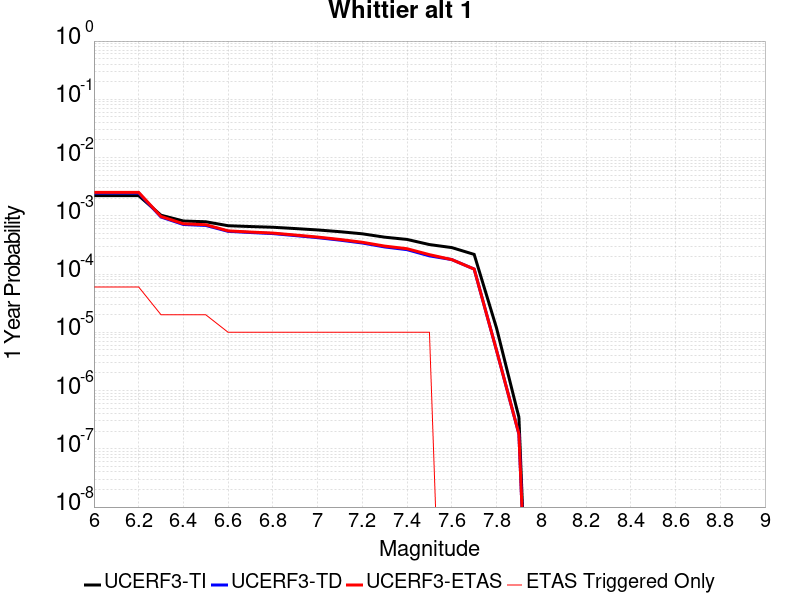 |  |

| Magnitude | 1 wk TI Prob | 1 wk TD Prob | 1 wk ETAS Prob | 1 wk ETAS/TD Gain | 1 wk ETAS Triggered Only | 1 mo TI Prob | 1 mo TD Prob | 1 mo ETAS Prob | 1 mo ETAS/TD Gain | 1 mo ETAS Triggered Only | 1 yr TI Prob | 1 yr TD Prob | 1 yr ETAS Prob | 1 yr ETAS/TD Gain | 1 yr ETAS Triggered Only | 10 yr TI Prob | 10 yr TD Prob | 10 yr ETAS Prob | 10 yr ETAS/TD Gain | 10 yr ETAS Triggered Only |
|-----|-----|-----|-----|-----|-----|-----|-----|-----|-----|-----|-----|-----|-----|-----|-----|-----|-----|-----|-----|-----|
| 6.0 | 4.2554693E-5 | 4.725218E-5 | 6.725123E-5 | 1.4232409 | 2.0E-5 | 1.8236451E-4 | 2.0249544E-4 | 2.524853E-4 | 1.2468691 | 5.0E-5 | 0.002218027 | 0.0024629154 | 0.0025227675 | 1.0243014 | 6.0E-5 | 0.02196019 | 0.024390234 | 0.024478039 | 1.0036 | 9.0E-5 |
| 6.1 | 4.2554693E-5 | 4.725218E-5 | 6.725123E-5 | 1.4232409 | 2.0E-5 | 1.8236451E-4 | 2.0249544E-4 | 2.524853E-4 | 1.2468691 | 5.0E-5 | 0.002218027 | 0.0024629154 | 0.0025227675 | 1.0243014 | 6.0E-5 | 0.02196019 | 0.024390234 | 0.024478039 | 1.0036 | 9.0E-5 |
| 6.2 | 4.2554693E-5 | 4.725218E-5 | 6.725123E-5 | 1.4232409 | 2.0E-5 | 1.8236451E-4 | 2.0249544E-4 | 2.524853E-4 | 1.2468691 | 5.0E-5 | 0.002218027 | 0.0024629154 | 0.0025227675 | 1.0243014 | 6.0E-5 | 0.02196019 | 0.024390234 | 0.024478039 | 1.0036 | 9.0E-5 |
| 6.3 | 1.9617712E-5 | 1.8268593E-5 | 2.8268409E-5 | 1.5473776 | 1.0E-5 | 8.40732E-5 | 7.829172E-5 | 9.8290155E-5 | 1.2554349 | 2.0E-5 | 0.0010231105 | 9.52804E-4 | 9.7278494E-4 | 1.0209707 | 2.0E-5 | 0.01018413 | 0.009490474 | 0.00952019 | 1.003131 | 3.0E-5 |
| 6.4 | 1.5611336E-5 | 1.3604271E-5 | 2.3604134E-5 | 1.7350533 | 1.0E-5 | 6.690401E-5 | 5.8302747E-5 | 7.830158E-5 | 1.343017 | 2.0E-5 | 8.142519E-4 | 7.0961076E-4 | 7.295966E-4 | 1.0281645 | 2.0E-5 | 0.008112748 | 0.0070754145 | 0.007095273 | 1.0028067 | 2.0E-5 |
| 6.5 | 1.5150166E-5 | 1.3100925E-5 | 2.3100794E-5 | 1.7632949 | 1.0E-5 | 6.492767E-5 | 5.6145647E-5 | 7.6144526E-5 | 1.3561964 | 2.0E-5 | 7.9020765E-4 | 6.8336475E-4 | 7.0335105E-4 | 1.0292469 | 2.0E-5 | 0.007874036 | 0.0068145846 | 0.0068344483 | 1.0029149 | 2.0E-5 |
| 6.6 | 1.295588E-5 | 1.0380725E-5 | 2.0380621E-5 | 1.9633138 | 1.0E-5 | 5.552402E-5 | 4.4488075E-5 | 5.448763E-5 | 1.2247694 | 1.0E-5 | 6.7579525E-4 | 5.4150965E-4 | 5.5150426E-4 | 1.0184569 | 1.0E-5 | 0.006737438 | 0.0054033357 | 0.0054132817 | 1.0018407 | 1.0E-5 |
| 6.7 | 1.2542085E-5 | 9.899369E-6 | 1.989927E-5 | 2.0101554 | 1.0E-5 | 5.3750682E-5 | 4.242519E-5 | 5.2424763E-5 | 1.235699 | 1.0E-5 | 6.542181E-4 | 5.164061E-4 | 5.264009E-4 | 1.0193546 | 1.0E-5 | 0.006522954 | 0.0051534795 | 0.005163428 | 1.0019305 | 1.0E-5 |
| 6.8 | 1.2195878E-5 | 9.495415E-6 | 1.9495319E-5 | 2.05313 | 1.0E-5 | 5.2267E-5 | 4.069401E-5 | 5.06936E-5 | 1.2457265 | 1.0E-5 | 6.36165E-4 | 4.9533875E-4 | 5.053338E-4 | 1.0201782 | 1.0E-5 | 0.0063434686 | 0.004943688 | 0.0049536387 | 1.0020127 | 1.0E-5 |
| 6.9 | 1.1580298E-5 | 8.772933E-6 | 1.8772846E-5 | 2.1398597 | 1.0E-5 | 4.9628903E-5 | 3.7597754E-5 | 4.759738E-5 | 1.2659633 | 1.0E-5 | 6.040644E-4 | 4.5765814E-4 | 4.676536E-4 | 1.0218403 | 1.0E-5 | 0.00602425 | 0.0045684157 | 0.00457837 | 1.0021789 | 1.0E-5 |
| 7.0 | 1.0964795E-5 | 8.083994E-6 | 1.8083912E-5 | 2.2370024 | 1.0E-5 | 4.6991136E-5 | 3.4645236E-5 | 4.464489E-5 | 1.28863 | 1.0E-5 | 5.7196687E-4 | 4.2172565E-4 | 4.3172142E-4 | 1.0237021 | 1.0E-5 | 0.0057049696 | 0.004210462 | 0.0042204196 | 1.002365 | 1.0E-5 |
| 7.1 | 1.0230601E-5 | 7.3266697E-6 | 1.7326596E-5 | 2.3648667 | 1.0E-5 | 4.3844695E-5 | 3.1399642E-5 | 4.139933E-5 | 1.318465 | 1.0E-5 | 5.336784E-4 | 3.8222488E-4 | 3.9222106E-4 | 1.0261526 | 1.0E-5 | 0.005323986 | 0.0038168381 | 0.0038268 | 1.00261 | 1.0E-5 |
| 7.2 | 9.40865E-6 | 6.543289E-6 | 1.6543223E-5 | 2.5282733 | 1.0E-5 | 4.032216E-5 | 2.8042374E-5 | 3.8042093E-5 | 1.3565933 | 1.0E-5 | 4.908117E-4 | 3.4136363E-4 | 3.513602E-4 | 1.0292842 | 1.0E-5 | 0.0048972913 | 0.003409485 | 0.0034194512 | 1.002923 | 1.0E-5 |
| 7.3 | 8.237384E-6 | 5.5977525E-6 | 1.5597696E-5 | 2.7864213 | 1.0E-5 | 3.5302593E-5 | 2.3990153E-5 | 3.3989912E-5 | 1.4168277 | 1.0E-5 | 4.2972428E-4 | 2.92042E-4 | 3.020391E-4 | 1.0342317 | 1.0E-5 | 0.0042889426 | 0.002916903 | 0.002926874 | 1.0034183 | 1.0E-5 |
| 7.4 | 7.5316966E-6 | 5.027819E-6 | 1.5027769E-5 | 2.9889238 | 1.0E-5 | 3.2278298E-5 | 2.1547625E-5 | 3.154741E-5 | 1.4640783 | 1.0E-5 | 3.9291743E-4 | 2.6231175E-4 | 2.7230915E-4 | 1.0381125 | 1.0E-5 | 0.0039222343 | 0.0026201333 | 0.002630107 | 1.0038066 | 1.0E-5 |
| 7.5 | 6.149649E-6 | 3.933841E-6 | 1.3933802E-5 | 3.5420349 | 1.0E-5 | 2.6355372E-5 | 1.6859214E-5 | 2.6859045E-5 | 1.5931375 | 1.0E-5 | 3.208294E-4 | 2.052425E-4 | 2.1524045E-4 | 1.0487128 | 1.0E-5 | 0.003203666 | 0.0020506186 | 0.0020605982 | 1.0048666 | 1.0E-5 |
| 7.6 | 5.457711E-6 | 3.3953788E-6 | 3.3953788E-6 | 1.0 | 0.0 | 2.338998E-5 | 1.4551547E-5 | 1.4551547E-5 | 1.0 | 0.0 | 2.8473578E-4 | 1.771515E-4 | 1.771515E-4 | 1.0 | 0.0 | 0.0028437122 | 0.0017701836 | 0.0017701836 | 1.0 | 0.0 |
| 7.7 | 4.1676276E-6 | 2.3331952E-6 | 2.3331952E-6 | 1.0 | 0.0 | 1.7861139E-5 | 9.999374E-6 | 9.999374E-6 | 1.0 | 0.0 | 2.1743766E-4 | 1.2173632E-4 | 1.2173632E-4 | 1.0 | 0.0 | 0.0021722503 | 0.0012167693 | 0.0012167693 | 1.0 | 0.0 |
| 7.8 | 2.2692414E-7 | 9.3854695E-8 | 9.3854695E-8 | 1.0 | 0.0 | 9.725317E-7 | 4.0223435E-7 | 4.0223435E-7 | 1.0 | 0.0 | 1.1840509E-5 | 4.8971956E-6 | 4.8971956E-6 | 1.0 | 0.0 | 1.1839878E-4 | 4.8971204E-5 | 4.8971204E-5 | 1.0 | 0.0 |
| 7.9 | 6.676829E-9 | 3.439853E-9 | 3.439853E-9 | 1.0 | 0.0 | 2.861498E-8 | 1.4742227E-8 | 1.4742227E-8 | 1.0 | 0.0 | 3.4838732E-7 | 1.7948659E-7 | 1.7948659E-7 | 1.0 | 0.0 | 3.4838679E-6 | 1.7948646E-6 | 1.7948646E-6 | 1.0 | 0.0 |

## San Jacinto (Coyote Creek)
*[(top)](#table-of-contents)*

| 1 Week | 1 Month | 1 Year | 10 Year |
|-----|-----|-----|-----|
|  |  | 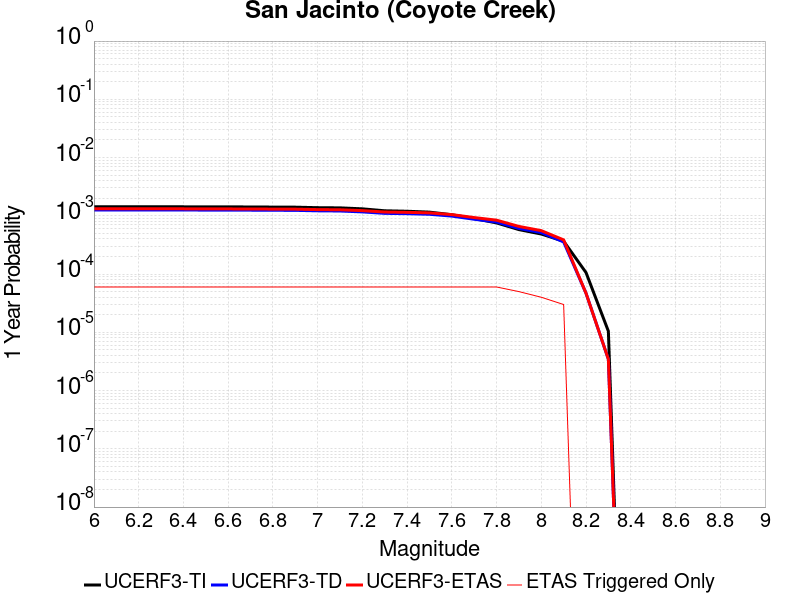 |  |

| Magnitude | 1 wk TI Prob | 1 wk TD Prob | 1 wk ETAS Prob | 1 wk ETAS/TD Gain | 1 wk ETAS Triggered Only | 1 mo TI Prob | 1 mo TD Prob | 1 mo ETAS Prob | 1 mo ETAS/TD Gain | 1 mo ETAS Triggered Only | 1 yr TI Prob | 1 yr TD Prob | 1 yr ETAS Prob | 1 yr ETAS/TD Gain | 1 yr ETAS Triggered Only | 10 yr TI Prob | 10 yr TD Prob | 10 yr ETAS Prob | 10 yr ETAS/TD Gain | 10 yr ETAS Triggered Only |
|-----|-----|-----|-----|-----|-----|-----|-----|-----|-----|-----|-----|-----|-----|-----|-----|-----|-----|-----|-----|-----|
| 6.0 | 2.7374346E-5 | 2.4145214E-5 | 6.4144246E-5 | 2.656603 | 4.0E-5 | 1.1731335E-4 | 1.034754E-4 | 1.5347023E-4 | 1.4831567 | 5.0E-5 | 0.0014273542 | 0.0012590875 | 0.0013190119 | 1.0475936 | 6.0E-5 | 0.01418221 | 0.012928318 | 0.013017154 | 1.0068715 | 9.0E-5 |
| 6.1 | 2.7374346E-5 | 2.4145214E-5 | 6.4144246E-5 | 2.656603 | 4.0E-5 | 1.1731335E-4 | 1.034754E-4 | 1.5347023E-4 | 1.4831567 | 5.0E-5 | 0.0014273542 | 0.0012590875 | 0.0013190119 | 1.0475936 | 6.0E-5 | 0.01418221 | 0.012928318 | 0.013017154 | 1.0068715 | 9.0E-5 |
| 6.2 | 2.7374346E-5 | 2.4145214E-5 | 6.4144246E-5 | 2.656603 | 4.0E-5 | 1.1731335E-4 | 1.034754E-4 | 1.5347023E-4 | 1.4831567 | 5.0E-5 | 0.0014273542 | 0.0012590875 | 0.0013190119 | 1.0475936 | 6.0E-5 | 0.01418221 | 0.012928318 | 0.013017154 | 1.0068715 | 9.0E-5 |
| 6.3 | 2.7374346E-5 | 2.4145214E-5 | 6.4144246E-5 | 2.656603 | 4.0E-5 | 1.1731335E-4 | 1.034754E-4 | 1.5347023E-4 | 1.4831567 | 5.0E-5 | 0.0014273542 | 0.0012590875 | 0.0013190119 | 1.0475936 | 6.0E-5 | 0.01418221 | 0.012928318 | 0.013017154 | 1.0068715 | 9.0E-5 |
| 6.4 | 2.7374346E-5 | 2.4145214E-5 | 6.4144246E-5 | 2.656603 | 4.0E-5 | 1.1731335E-4 | 1.034754E-4 | 1.5347023E-4 | 1.4831567 | 5.0E-5 | 0.0014273542 | 0.0012590875 | 0.0013190119 | 1.0475936 | 6.0E-5 | 0.01418221 | 0.012928318 | 0.013017154 | 1.0068715 | 9.0E-5 |
| 6.5 | 2.7282445E-5 | 2.4031293E-5 | 6.403033E-5 | 2.6644564 | 4.0E-5 | 1.16919524E-4 | 1.029872E-4 | 1.5298206E-4 | 1.4854472 | 5.0E-5 | 0.0014225657 | 0.0012531505 | 0.0013130754 | 1.0478194 | 6.0E-5 | 0.014134934 | 0.012869646 | 0.0129584875 | 1.0069032 | 9.0E-5 |
| 6.6 | 2.7282445E-5 | 2.4031293E-5 | 6.403033E-5 | 2.6644564 | 4.0E-5 | 1.16919524E-4 | 1.029872E-4 | 1.5298206E-4 | 1.4854472 | 5.0E-5 | 0.0014225657 | 0.0012531505 | 0.0013130754 | 1.0478194 | 6.0E-5 | 0.014134934 | 0.012869646 | 0.0129584875 | 1.0069032 | 9.0E-5 |
| 6.7 | 2.7216198E-5 | 2.3956412E-5 | 6.395546E-5 | 2.6696591 | 4.0E-5 | 1.1663563E-4 | 1.02666316E-4 | 1.5266119E-4 | 1.4869647 | 5.0E-5 | 0.0014191137 | 0.0012492483 | 0.0013091734 | 1.0479689 | 6.0E-5 | 0.014100855 | 0.0128310565 | 0.012919902 | 1.0069243 | 9.0E-5 |
| 6.8 | 2.7078617E-5 | 2.387363E-5 | 6.387268E-5 | 2.675449 | 4.0E-5 | 1.1604605E-4 | 1.0231156E-4 | 1.5230644E-4 | 1.4886533 | 5.0E-5 | 0.001411945 | 0.0012449342 | 0.0013048594 | 1.0481353 | 6.0E-5 | 0.014030075 | 0.012788199 | 0.012877048 | 1.0069478 | 9.0E-5 |
| 6.9 | 2.6982952E-5 | 2.3793142E-5 | 6.379219E-5 | 2.6811168 | 4.0E-5 | 1.15636096E-4 | 1.0196664E-4 | 1.5196153E-4 | 1.4903065 | 5.0E-5 | 0.0014069602 | 0.0012407395 | 0.001300665 | 1.0482982 | 6.0E-5 | 0.013980856 | 0.012746515 | 0.012835368 | 1.0069708 | 9.0E-5 |
| 7.0 | 2.6449972E-5 | 2.3370165E-5 | 6.336923E-5 | 2.711544 | 4.0E-5 | 1.1335209E-4 | 1.00154015E-4 | 1.50149E-4 | 1.4991812 | 5.0E-5 | 0.001379188 | 0.0012186957 | 0.0012786225 | 1.049173 | 6.0E-5 | 0.0137065975 | 0.0125278765 | 0.01261675 | 1.007094 | 9.0E-5 |
| 7.1 | 2.6257849E-5 | 2.3196202E-5 | 6.319527E-5 | 2.7243803 | 4.0E-5 | 1.1252879E-4 | 9.940852E-5 | 1.4940355E-4 | 1.502925 | 5.0E-5 | 0.0013691769 | 0.0012096294 | 0.0012695567 | 1.049542 | 6.0E-5 | 0.013607717 | 0.012437741 | 0.012526622 | 1.007146 | 9.0E-5 |
| 7.2 | 2.5270041E-5 | 2.2390966E-5 | 6.239007E-5 | 2.7863948 | 4.0E-5 | 1.0829568E-4 | 9.595777E-5 | 1.4595297E-4 | 1.5210125 | 5.0E-5 | 0.0013177024 | 0.0011676621 | 0.001227592 | 1.0513247 | 6.0E-5 | 0.013099162 | 0.012018777 | 0.012107695 | 1.0073982 | 9.0E-5 |
| 7.3 | 2.339701E-5 | 2.1122814E-5 | 6.112197E-5 | 2.893647 | 4.0E-5 | 1.0026905E-4 | 9.0523215E-5 | 1.4051869E-4 | 1.5522945 | 5.0E-5 | 0.001220092 | 0.0011015651 | 0.001161499 | 1.054408 | 6.0E-5 | 0.012134149 | 0.011357696 | 0.011446673 | 1.0078342 | 9.0E-5 |
| 7.4 | 2.296333E-5 | 2.0853171E-5 | 6.0852337E-5 | 2.9181335 | 4.0E-5 | 9.841056E-5 | 8.936768E-5 | 1.3936321E-4 | 1.5594364 | 5.0E-5 | 0.0011974899 | 0.0010875105 | 0.0011474452 | 1.0551119 | 6.0E-5 | 0.011910575 | 0.01121681 | 0.0113058 | 1.0079336 | 9.0E-5 |
| 7.5 | 2.2188895E-5 | 2.0376096E-5 | 6.037528E-5 | 2.9630446 | 4.0E-5 | 9.50918E-5 | 8.732321E-5 | 1.3731884E-4 | 1.5725354 | 5.0E-5 | 0.0011571277 | 0.0010626436 | 0.0011225798 | 1.0564029 | 6.0E-5 | 0.011511209 | 0.010966429 | 0.011055442 | 1.0081168 | 9.0E-5 |
| 7.6 | 2.0013189E-5 | 1.8962366E-5 | 5.8961607E-5 | 3.1094015 | 4.0E-5 | 8.5767984E-5 | 8.1264756E-5 | 1.3126069E-4 | 1.6152228 | 5.0E-5 | 0.001043725 | 9.889511E-4 | 0.0010488918 | 1.0606103 | 6.0E-5 | 0.010388365 | 0.010224434 | 0.010313514 | 1.0087124 | 9.0E-5 |
| 7.7 | 1.7230794E-5 | 1.674371E-5 | 5.674304E-5 | 3.3889167 | 4.0E-5 | 7.384417E-5 | 7.175679E-5 | 1.217532E-4 | 1.6967481 | 5.0E-5 | 8.986819E-4 | 8.7328954E-4 | 9.3323714E-4 | 1.0686457 | 6.0E-5 | 0.008950562 | 0.009062956 | 0.009142231 | 1.0087471 | 8.0E-5 |
| 7.8 | 1.4478809E-5 | 1.4990978E-5 | 5.4990378E-5 | 3.6682315 | 4.0E-5 | 6.205057E-5 | 6.424547E-5 | 1.14242255E-4 | 1.7782149 | 5.0E-5 | 7.552038E-4 | 7.819085E-4 | 8.4186165E-4 | 1.0766753 | 6.0E-5 | 0.0075264242 | 0.008141387 | 0.008220736 | 1.0097463 | 8.0E-5 |
| 7.9 | 1.1114467E-5 | 1.1645102E-5 | 5.1644638E-5 | 4.4348807 | 4.0E-5 | 4.7632562E-5 | 4.990663E-5 | 9.990414E-5 | 2.0018208 | 5.0E-5 | 5.797721E-4 | 6.074444E-4 | 6.57414E-4 | 1.082262 | 5.0E-5 | 0.0057826187 | 0.0063803247 | 0.006449878 | 1.0109012 | 7.0E-5 |
| 8.0 | 9.327402E-6 | 9.899186E-6 | 3.989889E-5 | 4.0305223 | 3.0E-5 | 3.9973966E-5 | 4.2424395E-5 | 8.24227E-5 | 1.9428138 | 4.0E-5 | 4.8657437E-4 | 5.1639514E-4 | 5.563745E-4 | 1.0774201 | 4.0E-5 | 0.0048551033 | 0.0054499684 | 0.0055096415 | 1.0109493 | 6.0E-5 |
| 8.1 | 7.0235833E-6 | 6.827495E-6 | 2.6827358E-5 | 3.929312 | 2.0E-5 | 3.0100724E-5 | 2.9260367E-5 | 5.9259488E-5 | 2.0252476 | 3.0E-5 | 3.664147E-4 | 3.5618723E-4 | 3.8617654E-4 | 1.0841954 | 3.0E-5 | 0.003658111 | 0.0037876023 | 0.003837413 | 1.0131509 | 5.0E-5 |
| 8.2 | 2.0358202E-6 | 8.994527E-7 | 8.994527E-7 | 1.0 | 0.0 | 8.724915E-6 | 3.854792E-6 | 3.854792E-6 | 1.0 | 0.0 | 1.06220665E-4 | 4.69311E-5 | 4.69311E-5 | 1.0 | 0.0 | 0.001061699 | 5.3254166E-4 | 5.3254166E-4 | 1.0 | 0.0 |
| 8.3 | 2.0051264E-7 | 6.617272E-8 | 6.617272E-8 | 1.0 | 0.0 | 8.5933965E-7 | 2.8359733E-7 | 2.8359733E-7 | 1.0 | 0.0 | 1.046241E-5 | 3.4527925E-6 | 3.4527925E-6 | 1.0 | 0.0 | 1.0461917E-4 | 4.01389E-5 | 4.01389E-5 | 1.0 | 0.0 |

## Big Pine (East)
*[(top)](#table-of-contents)*

| 1 Week | 1 Month | 1 Year | 10 Year |
|-----|-----|-----|-----|
|  |  |  |  |

| Magnitude | 1 wk TI Prob | 1 wk TD Prob | 1 wk ETAS Prob | 1 wk ETAS/TD Gain | 1 wk ETAS Triggered Only | 1 mo TI Prob | 1 mo TD Prob | 1 mo ETAS Prob | 1 mo ETAS/TD Gain | 1 mo ETAS Triggered Only | 1 yr TI Prob | 1 yr TD Prob | 1 yr ETAS Prob | 1 yr ETAS/TD Gain | 1 yr ETAS Triggered Only | 10 yr TI Prob | 10 yr TD Prob | 10 yr ETAS Prob | 10 yr ETAS/TD Gain | 10 yr ETAS Triggered Only |
|-----|-----|-----|-----|-----|-----|-----|-----|-----|-----|-----|-----|-----|-----|-----|-----|-----|-----|-----|-----|-----|
| 6.0 | 9.916913E-6 | 1.2816984E-5 | 4.28166E-5 | 3.340614 | 3.0E-5 | 4.250036E-5 | 5.49289E-5 | 8.4927255E-5 | 1.5461305 | 3.0E-5 | 5.173191E-4 | 6.685763E-4 | 7.1854284E-4 | 1.0747358 | 5.0E-5 | 0.0051611643 | 0.006670441 | 0.0067598405 | 1.0134023 | 9.0E-5 |
| 6.1 | 9.916913E-6 | 1.2816984E-5 | 4.28166E-5 | 3.340614 | 3.0E-5 | 4.250036E-5 | 5.49289E-5 | 8.4927255E-5 | 1.5461305 | 3.0E-5 | 5.173191E-4 | 6.685763E-4 | 7.1854284E-4 | 1.0747358 | 5.0E-5 | 0.0051611643 | 0.006670441 | 0.0067598405 | 1.0134023 | 9.0E-5 |
| 6.2 | 9.916913E-6 | 1.2816984E-5 | 4.28166E-5 | 3.340614 | 3.0E-5 | 4.250036E-5 | 5.49289E-5 | 8.4927255E-5 | 1.5461305 | 3.0E-5 | 5.173191E-4 | 6.685763E-4 | 7.1854284E-4 | 1.0747358 | 5.0E-5 | 0.0051611643 | 0.006670441 | 0.0067598405 | 1.0134023 | 9.0E-5 |
| 6.3 | 5.479711E-6 | 8.112951E-6 | 2.8112789E-5 | 3.4651742 | 2.0E-5 | 2.3484265E-5 | 3.4769346E-5 | 5.476865E-5 | 1.5751994 | 2.0E-5 | 2.858834E-4 | 4.2323777E-4 | 4.6322084E-4 | 1.0944695 | 4.0E-5 | 0.0028551589 | 0.004227244 | 0.0043069054 | 1.0188448 | 8.0E-5 |
| 6.4 | 5.465009E-6 | 8.097245E-6 | 2.8097083E-5 | 3.469956 | 2.0E-5 | 2.3421257E-5 | 3.4702036E-5 | 5.470134E-5 | 1.576315 | 2.0E-5 | 2.851165E-4 | 4.2241855E-4 | 4.6240166E-4 | 1.0946528 | 4.0E-5 | 0.0028475097 | 0.0042190826 | 0.004298745 | 1.0188814 | 8.0E-5 |
| 6.5 | 4.826767E-6 | 7.422301E-6 | 2.7422153E-5 | 3.6945622 | 2.0E-5 | 2.068598E-5 | 3.180949E-5 | 5.1808853E-5 | 1.6287231 | 2.0E-5 | 2.518227E-4 | 3.872145E-4 | 4.27199E-4 | 1.103262 | 4.0E-5 | 0.0025153751 | 0.003868283 | 0.0039479737 | 1.020601 | 8.0E-5 |
| 6.6 | 4.3146847E-6 | 6.8822374E-6 | 2.68821E-5 | 3.9060118 | 2.0E-5 | 1.8491375E-5 | 2.9494982E-5 | 4.9494392E-5 | 1.6780615 | 2.0E-5 | 2.2510924E-4 | 3.590447E-4 | 3.9903034E-4 | 1.1113667 | 4.0E-5 | 0.0022488134 | 0.0035874986 | 0.0036672114 | 1.0222197 | 8.0E-5 |
| 6.7 | 3.6968106E-6 | 5.9954727E-6 | 1.5995412E-5 | 2.667915 | 1.0E-5 | 1.5843378E-5 | 2.5694639E-5 | 3.5694382E-5 | 1.3891762 | 1.0E-5 | 1.9287605E-4 | 3.1278885E-4 | 3.327826E-4 | 1.0639209 | 2.0E-5 | 0.0019270873 | 0.0031262483 | 0.0031860606 | 1.0191324 | 6.0E-5 |
| 6.8 | 3.4671132E-6 | 5.702177E-6 | 1.570212E-5 | 2.7537062 | 1.0E-5 | 1.4858972E-5 | 2.4437682E-5 | 3.443744E-5 | 1.4091941 | 1.0E-5 | 1.8089297E-4 | 2.974896E-4 | 3.1748365E-4 | 1.0672092 | 2.0E-5 | 0.0018074579 | 0.002973667 | 0.0030334888 | 1.0201172 | 6.0E-5 |
| 6.9 | 2.7686972E-6 | 4.825223E-6 | 4.825223E-6 | 1.0 | 0.0 | 1.1865792E-5 | 2.0679368E-5 | 2.0679368E-5 | 1.0 | 0.0 | 1.4445644E-4 | 2.5174298E-4 | 2.6174047E-4 | 1.039713 | 1.0E-5 | 0.0014436257 | 0.0025172636 | 0.0025571631 | 1.0158503 | 4.0E-5 |
| 7.0 | 2.1472624E-6 | 3.9850406E-6 | 3.9850406E-6 | 1.0 | 0.0 | 9.20252E-6 | 1.7078637E-5 | 1.7078637E-5 | 1.0 | 0.0 | 1.12034926E-4 | 2.079131E-4 | 2.079131E-4 | 1.0 | 0.0 | 0.0011197845 | 0.0020798394 | 0.0020798394 | 1.0 | 0.0 |
| 7.1 | 1.7018335E-6 | 3.344876E-6 | 3.344876E-6 | 1.0 | 0.0 | 7.293552E-6 | 1.4335106E-5 | 1.4335106E-5 | 1.0 | 0.0 | 8.879537E-5 | 1.7451629E-4 | 1.7451629E-4 | 1.0 | 0.0 | 8.87599E-4 | 0.0017464145 | 0.0017464145 | 1.0 | 0.0 |
| 7.2 | 1.25603E-6 | 2.794484E-6 | 2.794484E-6 | 1.0 | 0.0 | 5.3829745E-6 | 1.1976307E-5 | 1.1976307E-5 | 1.0 | 0.0 | 6.553574E-5 | 1.4580201E-4 | 1.4580201E-4 | 1.0 | 0.0 | 6.551642E-4 | 0.001459661 | 0.001459661 | 1.0 | 0.0 |
| 7.3 | 1.112297E-6 | 2.610332E-6 | 2.610332E-6 | 1.0 | 0.0 | 4.7669787E-6 | 1.118709E-5 | 1.118709E-5 | 1.0 | 0.0 | 5.803642E-5 | 1.3619453E-4 | 1.3619453E-4 | 1.0 | 0.0 | 5.802127E-4 | 0.0013635408 | 0.0013635408 | 1.0 | 0.0 |
| 7.4 | 1.0137181E-6 | 2.4834917E-6 | 2.4834917E-6 | 1.0 | 0.0 | 4.3444993E-6 | 1.0643494E-5 | 1.0643494E-5 | 1.0 | 0.0 | 5.2892992E-5 | 1.2957705E-4 | 1.2957705E-4 | 1.0 | 0.0 | 5.288041E-4 | 0.0012972289 | 0.0012972289 | 1.0 | 0.0 |
| 7.5 | 9.598608E-7 | 2.4071483E-6 | 2.4071483E-6 | 1.0 | 0.0 | 4.1136827E-6 | 1.031631E-5 | 1.031631E-5 | 1.0 | 0.0 | 5.0082934E-5 | 1.2559404E-4 | 1.2559404E-4 | 1.0 | 0.0 | 5.007165E-4 | 0.0012572526 | 0.0012572526 | 1.0 | 0.0 |
| 7.6 | 7.929459E-7 | 2.0448588E-6 | 2.0448588E-6 | 1.0 | 0.0 | 3.3983351E-6 | 8.763653E-6 | 8.763653E-6 | 1.0 | 0.0 | 4.1373947E-5 | 1.06692416E-4 | 1.06692416E-4 | 1.0 | 0.0 | 4.1366243E-4 | 0.0010685222 | 0.0010685222 | 1.0 | 0.0 |
| 7.7 | 4.155788E-7 | 1.1605589E-6 | 1.1605589E-6 | 1.0 | 0.0 | 1.7810507E-6 | 4.9738146E-6 | 4.9738146E-6 | 1.0 | 0.0 | 2.1684076E-5 | 6.0554554E-5 | 6.0554554E-5 | 1.0 | 0.0 | 2.1681961E-4 | 6.0857297E-4 | 6.0857297E-4 | 1.0 | 0.0 |
| 7.8 | 1.14666925E-7 | 2.592015E-7 | 2.592015E-7 | 1.0 | 0.0 | 4.914296E-7 | 1.1108631E-6 | 1.1108631E-6 | 1.0 | 0.0 | 5.9831386E-6 | 1.3524678E-5 | 1.3524678E-5 | 1.0 | 0.0 | 5.9829777E-5 | 1.3634123E-4 | 1.3634123E-4 | 1.0 | 0.0 |
| 7.9 | 2.9231824E-8 | 4.1463963E-8 | 4.1463963E-8 | 1.0 | 0.0 | 1.2527924E-7 | 1.7770269E-7 | 1.7770269E-7 | 1.0 | 0.0 | 1.5252737E-6 | 2.1635283E-6 | 2.1635283E-6 | 1.0 | 0.0 | 1.5252632E-5 | 2.1967755E-5 | 2.1967755E-5 | 1.0 | 0.0 |

## Kern Canyon (Lake Isabella) 2011
*[(top)](#table-of-contents)*

| 1 Week | 1 Month | 1 Year | 10 Year |
|-----|-----|-----|-----|
|  |  |  | 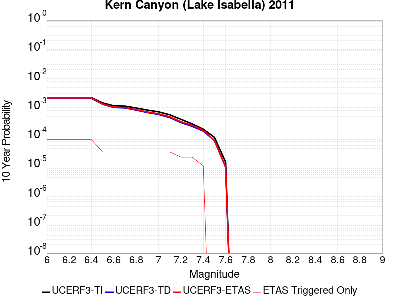 |

| Magnitude | 1 wk TI Prob | 1 wk TD Prob | 1 wk ETAS Prob | 1 wk ETAS/TD Gain | 1 wk ETAS Triggered Only | 1 mo TI Prob | 1 mo TD Prob | 1 mo ETAS Prob | 1 mo ETAS/TD Gain | 1 mo ETAS Triggered Only | 1 yr TI Prob | 1 yr TD Prob | 1 yr ETAS Prob | 1 yr ETAS/TD Gain | 1 yr ETAS Triggered Only | 10 yr TI Prob | 10 yr TD Prob | 10 yr ETAS Prob | 10 yr ETAS/TD Gain | 10 yr ETAS Triggered Only |
|-----|-----|-----|-----|-----|-----|-----|-----|-----|-----|-----|-----|-----|-----|-----|-----|-----|-----|-----|-----|-----|
| 6.0 | 4.2387383E-6 | 4.001639E-6 | 2.4001558E-5 | 5.9979324 | 2.0E-5 | 1.8165894E-5 | 1.7149778E-5 | 5.7149093E-5 | 3.3323517 | 4.0E-5 | 2.2114732E-4 | 2.087804E-4 | 2.6876788E-4 | 1.2873232 | 6.0E-5 | 0.0022092736 | 0.0020860266 | 0.0021658596 | 1.0382705 | 8.0E-5 |
| 6.1 | 4.2387383E-6 | 4.001639E-6 | 2.4001558E-5 | 5.9979324 | 2.0E-5 | 1.8165894E-5 | 1.7149778E-5 | 5.7149093E-5 | 3.3323517 | 4.0E-5 | 2.2114732E-4 | 2.087804E-4 | 2.6876788E-4 | 1.2873232 | 6.0E-5 | 0.0022092736 | 0.0020860266 | 0.0021658596 | 1.0382705 | 8.0E-5 |
| 6.2 | 4.2387383E-6 | 4.001639E-6 | 2.4001558E-5 | 5.9979324 | 2.0E-5 | 1.8165894E-5 | 1.7149778E-5 | 5.7149093E-5 | 3.3323517 | 4.0E-5 | 2.2114732E-4 | 2.087804E-4 | 2.6876788E-4 | 1.2873232 | 6.0E-5 | 0.0022092736 | 0.0020860266 | 0.0021658596 | 1.0382705 | 8.0E-5 |
| 6.3 | 4.2387383E-6 | 4.001639E-6 | 2.4001558E-5 | 5.9979324 | 2.0E-5 | 1.8165894E-5 | 1.7149778E-5 | 5.7149093E-5 | 3.3323517 | 4.0E-5 | 2.2114732E-4 | 2.087804E-4 | 2.6876788E-4 | 1.2873232 | 6.0E-5 | 0.0022092736 | 0.0020860266 | 0.0021658596 | 1.0382705 | 8.0E-5 |
| 6.4 | 4.2387383E-6 | 4.001639E-6 | 2.4001558E-5 | 5.9979324 | 2.0E-5 | 1.8165894E-5 | 1.7149778E-5 | 5.7149093E-5 | 3.3323517 | 4.0E-5 | 2.2114732E-4 | 2.087804E-4 | 2.6876788E-4 | 1.2873232 | 6.0E-5 | 0.0022092736 | 0.0020860266 | 0.0021658596 | 1.0382705 | 8.0E-5 |
| 6.5 | 2.7857532E-6 | 2.517867E-6 | 1.2517842E-5 | 4.971606 | 1.0E-5 | 1.1938888E-5 | 1.0790815E-5 | 3.07906E-5 | 2.853408 | 2.0E-5 | 1.4534626E-4 | 1.3137059E-4 | 1.6136665E-4 | 1.2283316 | 3.0E-5 | 0.0014525123 | 0.001312962 | 0.0013429226 | 1.022819 | 3.0E-5 |
| 6.6 | 2.2233348E-6 | 1.9441236E-6 | 1.1944104E-5 | 6.143696 | 1.0E-5 | 9.528543E-6 | 8.331932E-6 | 2.8331766E-5 | 3.4003837 | 2.0E-5 | 1.1600384E-4 | 1.01436635E-4 | 1.314336E-4 | 1.2957212 | 3.0E-5 | 0.001159433 | 0.001013912 | 0.0010438815 | 1.0295584 | 3.0E-5 |
| 6.7 | 2.1635126E-6 | 1.8835036E-6 | 1.1883485E-5 | 6.3092446 | 1.0E-5 | 9.272164E-6 | 8.072134E-6 | 2.8071972E-5 | 3.4776397 | 2.0E-5 | 1.1288274E-4 | 9.827388E-5 | 1.2827093E-4 | 1.3052393 | 3.0E-5 | 0.0011282542 | 9.823124E-4 | 0.0010122829 | 1.0305102 | 3.0E-5 |
| 6.8 | 1.8685711E-6 | 1.5831425E-6 | 1.1583126E-5 | 7.3165407 | 1.0E-5 | 8.008137E-6 | 6.784879E-6 | 2.6784743E-5 | 3.9477112 | 2.0E-5 | 9.74947E-5 | 8.260282E-5 | 1.1260034E-4 | 1.3631537 | 3.0E-5 | 9.745194E-4 | 8.2572614E-4 | 8.5570134E-4 | 1.0363016 | 3.0E-5 |
| 6.9 | 1.5815071E-6 | 1.3064928E-6 | 1.130648E-5 | 8.65407 | 1.0E-5 | 6.77787E-6 | 5.599243E-6 | 2.559913E-5 | 4.5718913 | 2.0E-5 | 8.251744E-5 | 6.816868E-5 | 9.816663E-5 | 1.4400548 | 3.0E-5 | 8.248681E-4 | 6.8148033E-4 | 7.114599E-4 | 1.0439918 | 3.0E-5 |
| 7.0 | 1.3772564E-6 | 1.1210718E-6 | 1.112106E-5 | 9.920025 | 1.0E-5 | 5.9025137E-6 | 4.8045845E-6 | 2.4804489E-5 | 5.1626706 | 2.0E-5 | 7.186073E-5 | 5.8494268E-5 | 8.849251E-5 | 1.5128407 | 3.0E-5 | 7.18375E-4 | 5.847908E-4 | 6.1477325E-4 | 1.0512704 | 3.0E-5 |
| 7.1 | 1.0916998E-6 | 8.763777E-7 | 1.0876369E-5 | 12.410595 | 1.0E-5 | 4.678705E-6 | 3.7558991E-6 | 2.3755823E-5 | 6.3249364 | 2.0E-5 | 5.6961744E-5 | 4.5727127E-5 | 7.572575E-5 | 1.6560357 | 3.0E-5 | 5.6947145E-4 | 4.571785E-4 | 4.871648E-4 | 1.0655899 | 3.0E-5 |
| 7.2 | 7.6277024E-7 | 5.901454E-7 | 5.901454E-7 | 1.0 | 0.0 | 3.2690114E-6 | 2.5291922E-6 | 1.2529167E-5 | 4.953821 | 1.0E-5 | 3.9799485E-5 | 3.0792486E-5 | 5.079187E-5 | 1.649489 | 2.0E-5 | 3.9792358E-4 | 3.0788282E-4 | 3.2787665E-4 | 1.0649397 | 2.0E-5 |
| 7.3 | 5.3265916E-7 | 4.3824414E-7 | 4.3824414E-7 | 1.0 | 0.0 | 2.282823E-6 | 1.878188E-6 | 1.1878169E-5 | 6.3242707 | 1.0E-5 | 2.7793016E-5 | 2.2866701E-5 | 4.2866246E-5 | 1.8746142 | 2.0E-5 | 2.778954E-4 | 2.2864387E-4 | 2.486393E-4 | 1.0874523 | 2.0E-5 |
| 7.4 | 3.4946007E-7 | 3.006571E-7 | 3.006571E-7 | 1.0 | 0.0 | 1.497685E-6 | 1.2885298E-6 | 1.1288517E-5 | 8.760773 | 1.0E-5 | 1.8234163E-5 | 1.568774E-5 | 2.5687583E-5 | 1.6374304 | 1.0E-5 | 1.8232666E-4 | 1.5686655E-4 | 1.6686496E-4 | 1.0637385 | 1.0E-5 |
| 7.5 | 1.8317026E-7 | 1.4244812E-7 | 1.4244812E-7 | 1.0 | 0.0 | 7.850152E-7 | 6.104918E-7 | 6.104918E-7 | 1.0 | 0.0 | 9.557518E-6 | 7.432713E-6 | 7.432713E-6 | 1.0 | 0.0 | 9.5571064E-5 | 7.432472E-5 | 7.432472E-5 | 1.0 | 0.0 |
| 7.6 | 2.572245E-8 | 1.7352555E-8 | 1.7352555E-8 | 1.0 | 0.0 | 1.10239064E-7 | 7.436809E-8 | 7.436809E-8 | 1.0 | 0.0 | 1.3421597E-6 | 9.054312E-7 | 9.054312E-7 | 1.0 | 0.0 | 1.3421517E-5 | 9.05428E-6 | 9.05428E-6 | 1.0 | 0.0 |

## San Cayetano
*[(top)](#table-of-contents)*

| 1 Week | 1 Month | 1 Year | 10 Year |
|-----|-----|-----|-----|
|  |  | 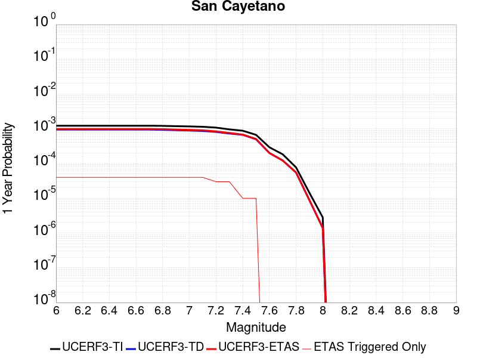 |  |

| Magnitude | 1 wk TI Prob | 1 wk TD Prob | 1 wk ETAS Prob | 1 wk ETAS/TD Gain | 1 wk ETAS Triggered Only | 1 mo TI Prob | 1 mo TD Prob | 1 mo ETAS Prob | 1 mo ETAS/TD Gain | 1 mo ETAS Triggered Only | 1 yr TI Prob | 1 yr TD Prob | 1 yr ETAS Prob | 1 yr ETAS/TD Gain | 1 yr ETAS Triggered Only | 10 yr TI Prob | 10 yr TD Prob | 10 yr ETAS Prob | 10 yr ETAS/TD Gain | 10 yr ETAS Triggered Only |
|-----|-----|-----|-----|-----|-----|-----|-----|-----|-----|-----|-----|-----|-----|-----|-----|-----|-----|-----|-----|-----|
| 6.0 | 2.3476267E-5 | 1.816928E-5 | 3.8168917E-5 | 2.1007392 | 2.0E-5 | 1.0060869E-4 | 7.786603E-5 | 1.078637E-4 | 1.3852471 | 3.0E-5 | 0.0012242225 | 9.476103E-4 | 9.875724E-4 | 1.0421715 | 4.0E-5 | 0.012175002 | 0.009436584 | 0.009515829 | 1.0083977 | 8.0E-5 |
| 6.1 | 2.3476267E-5 | 1.816928E-5 | 3.8168917E-5 | 2.1007392 | 2.0E-5 | 1.0060869E-4 | 7.786603E-5 | 1.078637E-4 | 1.3852471 | 3.0E-5 | 0.0012242225 | 9.476103E-4 | 9.875724E-4 | 1.0421715 | 4.0E-5 | 0.012175002 | 0.009436584 | 0.009515829 | 1.0083977 | 8.0E-5 |
| 6.2 | 2.3476267E-5 | 1.816928E-5 | 3.8168917E-5 | 2.1007392 | 2.0E-5 | 1.0060869E-4 | 7.786603E-5 | 1.078637E-4 | 1.3852471 | 3.0E-5 | 0.0012242225 | 9.476103E-4 | 9.875724E-4 | 1.0421715 | 4.0E-5 | 0.012175002 | 0.009436584 | 0.009515829 | 1.0083977 | 8.0E-5 |
| 6.3 | 2.3476267E-5 | 1.816928E-5 | 3.8168917E-5 | 2.1007392 | 2.0E-5 | 1.0060869E-4 | 7.786603E-5 | 1.078637E-4 | 1.3852471 | 3.0E-5 | 0.0012242225 | 9.476103E-4 | 9.875724E-4 | 1.0421715 | 4.0E-5 | 0.012175002 | 0.009436584 | 0.009515829 | 1.0083977 | 8.0E-5 |
| 6.4 | 2.3476267E-5 | 1.816928E-5 | 3.8168917E-5 | 2.1007392 | 2.0E-5 | 1.0060869E-4 | 7.786603E-5 | 1.078637E-4 | 1.3852471 | 3.0E-5 | 0.0012242225 | 9.476103E-4 | 9.875724E-4 | 1.0421715 | 4.0E-5 | 0.012175002 | 0.009436584 | 0.009515829 | 1.0083977 | 8.0E-5 |
| 6.5 | 2.3476267E-5 | 1.816928E-5 | 3.8168917E-5 | 2.1007392 | 2.0E-5 | 1.0060869E-4 | 7.786603E-5 | 1.078637E-4 | 1.3852471 | 3.0E-5 | 0.0012242225 | 9.476103E-4 | 9.875724E-4 | 1.0421715 | 4.0E-5 | 0.012175002 | 0.009436584 | 0.009515829 | 1.0083977 | 8.0E-5 |
| 6.6 | 2.3476267E-5 | 1.816928E-5 | 3.8168917E-5 | 2.1007392 | 2.0E-5 | 1.0060869E-4 | 7.786603E-5 | 1.078637E-4 | 1.3852471 | 3.0E-5 | 0.0012242225 | 9.476103E-4 | 9.875724E-4 | 1.0421715 | 4.0E-5 | 0.012175002 | 0.009436584 | 0.009515829 | 1.0083977 | 8.0E-5 |
| 6.7 | 2.3476267E-5 | 1.816928E-5 | 3.8168917E-5 | 2.1007392 | 2.0E-5 | 1.0060869E-4 | 7.786603E-5 | 1.078637E-4 | 1.3852471 | 3.0E-5 | 0.0012242225 | 9.476103E-4 | 9.875724E-4 | 1.0421715 | 4.0E-5 | 0.012175002 | 0.009436584 | 0.009515829 | 1.0083977 | 8.0E-5 |
| 6.8 | 2.3241924E-5 | 1.7936987E-5 | 3.793663E-5 | 2.1149945 | 2.0E-5 | 9.960445E-5 | 7.687056E-5 | 1.06868254E-4 | 1.3902365 | 3.0E-5 | 0.0012120095 | 9.3550084E-4 | 9.7546336E-4 | 1.0427178 | 4.0E-5 | 0.012054204 | 0.009316482 | 0.009395736 | 1.0085069 | 8.0E-5 |
| 6.9 | 2.2761007E-5 | 1.7432423E-5 | 3.7432073E-5 | 2.1472673 | 2.0E-5 | 9.7543525E-5 | 7.470827E-5 | 1.0470602E-4 | 1.4015319 | 3.0E-5 | 0.0011869454 | 9.09197E-4 | 9.4916066E-4 | 1.0439548 | 4.0E-5 | 0.011806256 | 0.009055603 | 0.009134878 | 1.0087543 | 8.0E-5 |
| 7.0 | 2.240283E-5 | 1.7066168E-5 | 3.7065827E-5 | 2.1718893 | 2.0E-5 | 9.600859E-5 | 7.313869E-5 | 1.03136495E-4 | 1.4101496 | 3.0E-5 | 0.0011682777 | 8.9010317E-4 | 9.300676E-4 | 1.0448986 | 4.0E-5 | 0.011621549 | 0.008866196 | 0.008945486 | 1.0089431 | 8.0E-5 |
| 7.1 | 2.1871154E-5 | 1.6586018E-5 | 3.6585687E-5 | 2.2058148 | 2.0E-5 | 9.373015E-5 | 7.108101E-5 | 1.01078884E-4 | 1.4220237 | 3.0E-5 | 0.0011405671 | 8.6507114E-4 | 9.050365E-4 | 1.046199 | 4.0E-5 | 0.011347309 | 0.008617838 | 0.008697149 | 1.0092031 | 8.0E-5 |
| 7.2 | 2.0714133E-5 | 1.5564561E-5 | 3.5564248E-5 | 2.2849505 | 2.0E-5 | 8.8771834E-5 | 6.670357E-5 | 9.670157E-5 | 1.449721 | 3.0E-5 | 0.0010802611 | 8.1181666E-4 | 8.417923E-4 | 1.0369241 | 3.0E-5 | 0.010750249 | 0.008089285 | 0.0081488 | 1.0073572 | 6.0E-5 |
| 7.3 | 1.8408395E-5 | 1.3996864E-5 | 3.3996585E-5 | 2.4288714 | 2.0E-5 | 7.8890735E-5 | 5.99852E-5 | 8.99834E-5 | 1.5000933 | 3.0E-5 | 9.600714E-4 | 7.300781E-4 | 7.600562E-4 | 1.0410615 | 3.0E-5 | 0.009559342 | 0.0072775153 | 0.007337079 | 1.0081846 | 6.0E-5 |
| 7.4 | 1.6856795E-5 | 1.28500815E-5 | 1.28500815E-5 | 1.0 | 0.0 | 7.2241404E-5 | 5.5070628E-5 | 6.507008E-5 | 1.181575 | 1.0E-5 | 8.7918417E-4 | 6.7028153E-4 | 6.802748E-4 | 1.0149091 | 1.0E-5 | 0.00875714 | 0.0066832784 | 0.006723011 | 1.0059451 | 4.0E-5 |
| 7.5 | 1.2822778E-5 | 9.577542E-6 | 9.577542E-6 | 1.0 | 0.0 | 5.495361E-5 | 4.1045972E-5 | 5.104556E-5 | 1.2436193 | 1.0E-5 | 6.688548E-4 | 4.996217E-4 | 5.096167E-4 | 1.0200051 | 1.0E-5 | 0.006668452 | 0.0049851555 | 0.0050050556 | 1.003992 | 2.0E-5 |
| 7.6 | 5.6272684E-6 | 3.854903E-6 | 3.854903E-6 | 1.0 | 0.0 | 2.4116642E-5 | 1.652091E-5 | 1.652091E-5 | 1.0 | 0.0 | 2.9358055E-4 | 2.0112359E-4 | 2.0112359E-4 | 1.0 | 0.0 | 0.0029319301 | 0.0020094267 | 0.0020194065 | 1.0049665 | 1.0E-5 |
| 7.7 | 3.5261346E-6 | 2.3407013E-6 | 2.3407013E-6 | 1.0 | 0.0 | 1.5111918E-5 | 1.0031539E-5 | 1.0031539E-5 | 1.0 | 0.0 | 1.8397206E-4 | 1.2212721E-4 | 1.2212721E-4 | 1.0 | 0.0 | 0.0018381984 | 0.0012206084 | 0.0012305961 | 1.0081826 | 1.0E-5 |
| 7.8 | 1.4826929E-6 | 1.056428E-6 | 1.056428E-6 | 1.0 | 0.0 | 6.354383E-6 | 4.5275406E-6 | 4.5275406E-6 | 1.0 | 0.0 | 7.736187E-5 | 5.5121433E-5 | 5.5121433E-5 | 1.0 | 0.0 | 7.733494E-4 | 5.5107963E-4 | 5.610741E-4 | 1.0181361 | 1.0E-5 |
| 7.9 | 2.7568166E-7 | 1.6978244E-7 | 1.6978244E-7 | 1.0 | 0.0 | 1.1814923E-6 | 7.2763885E-7 | 7.2763885E-7 | 1.0 | 0.0 | 1.4384574E-5 | 8.858967E-6 | 8.858967E-6 | 1.0 | 0.0 | 1.4383643E-4 | 8.8586174E-5 | 8.8586174E-5 | 1.0 | 0.0 |
| 8.0 | 5.407832E-8 | 2.6887697E-8 | 2.6887697E-8 | 1.0 | 0.0 | 2.3176422E-7 | 1.15232986E-7 | 1.15232986E-7 | 1.0 | 0.0 | 2.8217257E-6 | 1.4029607E-6 | 1.4029607E-6 | 1.0 | 0.0 | 2.8216898E-5 | 1.4029522E-5 | 1.4029522E-5 | 1.0 | 0.0 |

## Elysian Park (Upper)
*[(top)](#table-of-contents)*

| 1 Week | 1 Month | 1 Year | 10 Year |
|-----|-----|-----|-----|
| 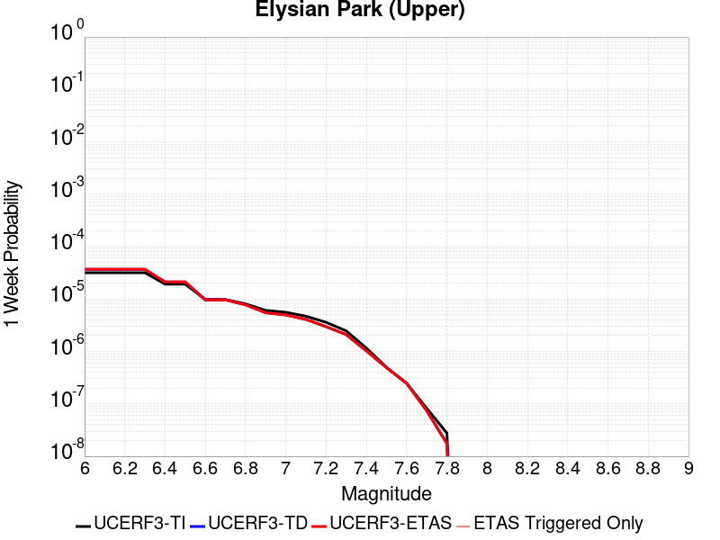 |  |  |  |

| Magnitude | 1 wk TI Prob | 1 wk TD Prob | 1 wk ETAS Prob | 1 wk ETAS/TD Gain | 1 wk ETAS Triggered Only | 1 mo TI Prob | 1 mo TD Prob | 1 mo ETAS Prob | 1 mo ETAS/TD Gain | 1 mo ETAS Triggered Only | 1 yr TI Prob | 1 yr TD Prob | 1 yr ETAS Prob | 1 yr ETAS/TD Gain | 1 yr ETAS Triggered Only | 10 yr TI Prob | 10 yr TD Prob | 10 yr ETAS Prob | 10 yr ETAS/TD Gain | 10 yr ETAS Triggered Only |
|-----|-----|-----|-----|-----|-----|-----|-----|-----|-----|-----|-----|-----|-----|-----|-----|-----|-----|-----|-----|-----|
| 6.0 | 3.1876025E-5 | 3.7035516E-5 | 3.7035516E-5 | 1.0 | 0.0 | 1.3660437E-4 | 1.587167E-4 | 1.7871354E-4 | 1.1259906 | 2.0E-5 | 0.0016618895 | 0.0019311075 | 0.001981011 | 1.0258418 | 5.0E-5 | 0.016495159 | 0.019189782 | 0.019268248 | 1.0040889 | 8.0E-5 |
| 6.1 | 3.1876025E-5 | 3.7035516E-5 | 3.7035516E-5 | 1.0 | 0.0 | 1.3660437E-4 | 1.587167E-4 | 1.7871354E-4 | 1.1259906 | 2.0E-5 | 0.0016618895 | 0.0019311075 | 0.001981011 | 1.0258418 | 5.0E-5 | 0.016495159 | 0.019189782 | 0.019268248 | 1.0040889 | 8.0E-5 |
| 6.2 | 3.1876025E-5 | 3.7035516E-5 | 3.7035516E-5 | 1.0 | 0.0 | 1.3660437E-4 | 1.587167E-4 | 1.7871354E-4 | 1.1259906 | 2.0E-5 | 0.0016618895 | 0.0019311075 | 0.001981011 | 1.0258418 | 5.0E-5 | 0.016495159 | 0.019189782 | 0.019268248 | 1.0040889 | 8.0E-5 |
| 6.3 | 3.1876025E-5 | 3.7035516E-5 | 3.7035516E-5 | 1.0 | 0.0 | 1.3660437E-4 | 1.587167E-4 | 1.7871354E-4 | 1.1259906 | 2.0E-5 | 0.0016618895 | 0.0019311075 | 0.001981011 | 1.0258418 | 5.0E-5 | 0.016495159 | 0.019189782 | 0.019268248 | 1.0040889 | 8.0E-5 |
| 6.4 | 1.9273462E-5 | 2.1202266E-5 | 2.1202266E-5 | 1.0 | 0.0 | 8.259794E-5 | 9.086466E-5 | 1.00863756E-4 | 1.1100438 | 1.0E-5 | 0.001005166 | 0.0011058892 | 0.001135856 | 1.0270975 | 3.0E-5 | 0.010006315 | 0.011020724 | 0.011060283 | 1.0035895 | 4.0E-5 |
| 6.5 | 1.9273462E-5 | 2.1202266E-5 | 2.1202266E-5 | 1.0 | 0.0 | 8.259794E-5 | 9.086466E-5 | 1.00863756E-4 | 1.1100438 | 1.0E-5 | 0.001005166 | 0.0011058892 | 0.001135856 | 1.0270975 | 3.0E-5 | 0.010006315 | 0.011020724 | 0.011060283 | 1.0035895 | 4.0E-5 |
| 6.6 | 9.813258E-6 | 9.665599E-6 | 9.665599E-6 | 1.0 | 0.0 | 4.205614E-5 | 4.1423376E-5 | 4.1423376E-5 | 1.0 | 0.0 | 5.119132E-4 | 5.0422014E-4 | 5.142151E-4 | 1.0198226 | 1.0E-5 | 0.005107356 | 0.0050314846 | 0.0050414344 | 1.0019774 | 1.0E-5 |
| 6.7 | 9.801478E-6 | 9.653168E-6 | 9.653168E-6 | 1.0 | 0.0 | 4.2005657E-5 | 4.1370105E-5 | 4.1370105E-5 | 1.0 | 0.0 | 5.112989E-4 | 5.035719E-4 | 5.1356683E-4 | 1.0198481 | 1.0E-5 | 0.0051012407 | 0.0050250315 | 0.005034981 | 1.0019801 | 1.0E-5 |
| 6.8 | 8.102489E-6 | 7.773004E-6 | 7.773004E-6 | 1.0 | 0.0 | 3.4724493E-5 | 3.3312477E-5 | 3.3312477E-5 | 1.0 | 0.0 | 4.2268867E-4 | 4.055089E-4 | 4.1550485E-4 | 1.0246503 | 1.0E-5 | 0.004218856 | 0.0040481836 | 0.004058143 | 1.0024602 | 1.0E-5 |
| 6.9 | 6.08275E-6 | 5.4814514E-6 | 5.4814514E-6 | 1.0 | 0.0 | 2.6068668E-5 | 2.3491726E-5 | 2.3491726E-5 | 1.0 | 0.0 | 3.173398E-4 | 2.85975E-4 | 2.9597213E-4 | 1.0349581 | 1.0E-5 | 0.0031688702 | 0.0028561477 | 0.0028661191 | 1.0034912 | 1.0E-5 |
| 7.0 | 5.5995934E-6 | 4.98278E-6 | 4.98278E-6 | 1.0 | 0.0 | 2.3998036E-5 | 2.13546E-5 | 2.13546E-5 | 1.0 | 0.0 | 2.9213692E-4 | 2.599619E-4 | 2.699593E-4 | 1.0384572 | 1.0E-5 | 0.0029175316 | 0.0025966454 | 0.0026066194 | 1.0038412 | 1.0E-5 |
| 7.1 | 4.709881E-6 | 4.0874015E-6 | 4.0874015E-6 | 1.0 | 0.0 | 2.0185047E-5 | 1.7517319E-5 | 1.7517319E-5 | 1.0 | 0.0 | 2.4572524E-4 | 2.132529E-4 | 2.132529E-4 | 1.0 | 0.0 | 0.002454537 | 0.002130524 | 0.002130524 | 1.0 | 0.0 |
| 7.2 | 3.6063436E-6 | 2.9779544E-6 | 2.9779544E-6 | 1.0 | 0.0 | 1.5455667E-5 | 1.27626E-5 | 1.27626E-5 | 1.0 | 0.0 | 1.881565E-4 | 1.5537368E-4 | 1.5537368E-4 | 1.0 | 0.0 | 0.0018799726 | 0.0015526618 | 0.0015526618 | 1.0 | 0.0 |
| 7.3 | 2.471135E-6 | 2.0954615E-6 | 2.0954615E-6 | 1.0 | 0.0 | 1.0590536E-5 | 8.980519E-6 | 8.980519E-6 | 1.0 | 0.0 | 1.2893214E-4 | 1.093324E-4 | 1.093324E-4 | 1.0 | 0.0 | 0.0012885736 | 0.0010927934 | 0.0010927934 | 1.0 | 0.0 |
| 7.4 | 1.163943E-6 | 1.0275091E-6 | 1.0275091E-6 | 1.0 | 0.0 | 4.988318E-6 | 4.4036033E-6 | 4.4036033E-6 | 1.0 | 0.0 | 6.0731076E-5 | 5.3612584E-5 | 5.3612584E-5 | 1.0 | 0.0 | 6.071448E-4 | 5.359995E-4 | 5.359995E-4 | 1.0 | 0.0 |
| 7.5 | 4.99459E-7 | 4.917604E-7 | 4.917604E-7 | 1.0 | 0.0 | 2.140537E-6 | 2.1075427E-6 | 2.1075427E-6 | 1.0 | 0.0 | 2.6060725E-5 | 2.5659048E-5 | 2.5659048E-5 | 1.0 | 0.0 | 2.605767E-4 | 2.5656243E-4 | 2.5656243E-4 | 1.0 | 0.0 |
| 7.6 | 2.4667852E-7 | 2.4778336E-7 | 2.4778336E-7 | 1.0 | 0.0 | 1.0571932E-6 | 1.0619283E-6 | 1.0619283E-6 | 1.0 | 0.0 | 1.2871251E-5 | 1.2928905E-5 | 1.2928905E-5 | 1.0 | 0.0 | 1.2870505E-4 | 1.2928189E-4 | 1.2928189E-4 | 1.0 | 0.0 |
| 7.7 | 8.2312795E-8 | 7.3864456E-8 | 7.3864456E-8 | 1.0 | 0.0 | 3.527691E-7 | 3.165619E-7 | 3.165619E-7 | 1.0 | 0.0 | 4.294955E-6 | 3.8541357E-6 | 3.8541357E-6 | 1.0 | 0.0 | 4.2948723E-5 | 3.8540802E-5 | 3.8540802E-5 | 1.0 | 0.0 |
| 7.8 | 2.7819295E-8 | 1.7566023E-8 | 1.7566023E-8 | 1.0 | 0.0 | 1.1922555E-7 | 7.5282955E-8 | 7.5282955E-8 | 1.0 | 0.0 | 1.45157E-6 | 9.165697E-7 | 9.165697E-7 | 1.0 | 0.0 | 1.45156055E-5 | 9.165675E-6 | 9.165675E-6 | 1.0 | 0.0 |

## Oceanic - West Huasna
*[(top)](#table-of-contents)*

| 1 Week | 1 Month | 1 Year | 10 Year |
|-----|-----|-----|-----|
|  |  |  |  |

| Magnitude | 1 wk TI Prob | 1 wk TD Prob | 1 wk ETAS Prob | 1 wk ETAS/TD Gain | 1 wk ETAS Triggered Only | 1 mo TI Prob | 1 mo TD Prob | 1 mo ETAS Prob | 1 mo ETAS/TD Gain | 1 mo ETAS Triggered Only | 1 yr TI Prob | 1 yr TD Prob | 1 yr ETAS Prob | 1 yr ETAS/TD Gain | 1 yr ETAS Triggered Only | 10 yr TI Prob | 10 yr TD Prob | 10 yr ETAS Prob | 10 yr ETAS/TD Gain | 10 yr ETAS Triggered Only |
|-----|-----|-----|-----|-----|-----|-----|-----|-----|-----|-----|-----|-----|-----|-----|-----|-----|-----|-----|-----|-----|
| 6.0 | 3.195567E-5 | 2.7926868E-5 | 3.7926588E-5 | 1.3580681 | 1.0E-5 | 1.3694567E-4 | 1.1968133E-4 | 1.3967893E-4 | 1.1670904 | 2.0E-5 | 0.0016660384 | 0.0014561893 | 0.0014861457 | 1.0205717 | 3.0E-5 | 0.016536033 | 0.014471028 | 0.014520304 | 1.0034052 | 5.0E-5 |
| 6.1 | 2.1156782E-5 | 1.7573486E-5 | 1.7573486E-5 | 1.0 | 0.0 | 9.066878E-5 | 7.531282E-5 | 8.5312065E-5 | 1.1327695 | 1.0E-5 | 0.0011033333 | 9.165572E-4 | 9.2654803E-4 | 1.0109004 | 1.0E-5 | 0.010978713 | 0.009128777 | 0.009148595 | 1.0021709 | 2.0E-5 |
| 6.2 | 1.6195117E-5 | 1.3327152E-5 | 1.3327152E-5 | 1.0 | 0.0 | 6.9405796E-5 | 5.7115132E-5 | 6.711456E-5 | 1.1750749 | 1.0E-5 | 8.44688E-4 | 6.9515745E-4 | 7.0515054E-4 | 1.0143752 | 1.0E-5 | 0.008414844 | 0.006930123 | 0.0069499845 | 1.0028659 | 2.0E-5 |
| 6.3 | 1.3559345E-5 | 1.1179142E-5 | 1.1179142E-5 | 1.0 | 0.0 | 5.811018E-5 | 4.7909736E-5 | 5.790926E-5 | 1.2087158 | 1.0E-5 | 7.072618E-4 | 5.831459E-4 | 5.931401E-4 | 1.0171384 | 1.0E-5 | 0.0070501505 | 0.0058162753 | 0.005836159 | 1.0034187 | 2.0E-5 |
| 6.4 | 1.2120619E-5 | 1.0000977E-5 | 1.0000977E-5 | 1.0 | 0.0 | 5.1944477E-5 | 4.2860633E-5 | 5.2860203E-5 | 1.2333044 | 1.0E-5 | 6.322405E-4 | 5.2170374E-4 | 5.316985E-4 | 1.019158 | 1.0E-5 | 0.006304447 | 0.0052048573 | 0.005224753 | 1.0038226 | 2.0E-5 |
| 6.5 | 1.13511915E-5 | 9.3674735E-6 | 9.3674735E-6 | 1.0 | 0.0 | 4.8647056E-5 | 4.01457E-5 | 5.01453E-5 | 1.2490827 | 1.0E-5 | 5.9211696E-4 | 4.886647E-4 | 4.9865985E-4 | 1.0204539 | 1.0E-5 | 0.0059054173 | 0.0048759608 | 0.004895863 | 1.0040817 | 2.0E-5 |
| 6.6 | 9.850605E-6 | 8.135418E-6 | 8.135418E-6 | 1.0 | 0.0 | 4.2216197E-5 | 3.4865614E-5 | 3.4865614E-5 | 1.0 | 0.0 | 5.1386096E-4 | 4.2440637E-4 | 4.2440637E-4 | 1.0 | 0.0 | 0.0051267436 | 0.004235991 | 0.0042459485 | 1.0023507 | 1.0E-5 |
| 6.7 | 8.8558645E-6 | 7.318433E-6 | 7.318433E-6 | 1.0 | 0.0 | 3.7953152E-5 | 3.1364336E-5 | 3.1364336E-5 | 1.0 | 0.0 | 4.6198163E-4 | 3.8179406E-4 | 3.8179406E-4 | 1.0 | 0.0 | 0.004610224 | 0.0038114067 | 0.0038213686 | 1.0026137 | 1.0E-5 |
| 6.8 | 7.67136E-6 | 6.391756E-6 | 6.391756E-6 | 1.0 | 0.0 | 3.2876844E-5 | 2.7392953E-5 | 2.7392953E-5 | 1.0 | 0.0 | 4.0020206E-4 | 3.3345833E-4 | 3.3345833E-4 | 1.0 | 0.0 | 0.003994821 | 0.0033296007 | 0.0033296007 | 1.0 | 0.0 |
| 6.9 | 6.534529E-6 | 5.4583297E-6 | 5.4583297E-6 | 1.0 | 0.0 | 2.8004823E-5 | 2.3392633E-5 | 2.3392633E-5 | 1.0 | 0.0 | 3.4090536E-4 | 2.847682E-4 | 2.847682E-4 | 1.0 | 0.0 | 0.0034038287 | 0.0028440498 | 0.0028440498 | 1.0 | 0.0 |
| 7.0 | 5.460525E-6 | 4.5699517E-6 | 4.5699517E-6 | 1.0 | 0.0 | 2.3402039E-5 | 1.958536E-5 | 1.958536E-5 | 1.0 | 0.0 | 2.8488258E-4 | 2.3842578E-4 | 2.3842578E-4 | 1.0 | 0.0 | 0.0028451765 | 0.0023817138 | 0.0023817138 | 1.0 | 0.0 |
| 7.1 | 4.4825083E-6 | 3.7524428E-6 | 3.7524428E-6 | 1.0 | 0.0 | 1.9210609E-5 | 1.60818E-5 | 1.60818E-5 | 1.0 | 0.0 | 2.3386406E-4 | 1.9577841E-4 | 1.9577841E-4 | 1.0 | 0.0 | 0.002336181 | 0.0019560715 | 0.0019560715 | 1.0 | 0.0 |
| 7.2 | 2.821708E-6 | 2.4249334E-6 | 2.4249334E-6 | 1.0 | 0.0 | 1.2092979E-5 | 1.039253E-5 | 1.039253E-5 | 1.0 | 0.0 | 1.4722206E-4 | 1.2652173E-4 | 1.2652173E-4 | 1.0 | 0.0 | 0.0014712457 | 0.0012644994 | 0.0012644994 | 1.0 | 0.0 |
| 7.3 | 2.0644757E-6 | 1.7687412E-6 | 1.7687412E-6 | 1.0 | 0.0 | 8.847723E-6 | 7.5802973E-6 | 7.5802973E-6 | 1.0 | 0.0 | 1.0771569E-4 | 9.228622E-5 | 9.228622E-5 | 1.0 | 0.0 | 0.001076635 | 9.2248066E-4 | 9.2248066E-4 | 1.0 | 0.0 |
| 7.4 | 1.6980367E-6 | 1.4379892E-6 | 1.4379892E-6 | 1.0 | 0.0 | 7.27728E-6 | 6.162796E-6 | 6.162796E-6 | 1.0 | 0.0 | 8.8597284E-5 | 7.5029464E-5 | 7.5029464E-5 | 1.0 | 0.0 | 8.8561967E-4 | 7.500429E-4 | 7.500429E-4 | 1.0 | 0.0 |
| 7.5 | 1.3637683E-6 | 1.1302635E-6 | 1.1302635E-6 | 1.0 | 0.0 | 5.844708E-6 | 4.8439774E-6 | 4.8439774E-6 | 1.0 | 0.0 | 7.1156996E-5 | 5.897383E-5 | 5.897383E-5 | 1.0 | 0.0 | 7.1134215E-4 | 5.895833E-4 | 5.895833E-4 | 1.0 | 0.0 |
| 7.6 | 9.802994E-7 | 7.677247E-7 | 7.677247E-7 | 1.0 | 0.0 | 4.2012766E-6 | 3.2902446E-6 | 3.2902446E-6 | 1.0 | 0.0 | 5.1149345E-5 | 4.0057992E-5 | 4.0057992E-5 | 1.0 | 0.0 | 5.113757E-4 | 4.0050913E-4 | 4.0050913E-4 | 1.0 | 0.0 |
| 7.7 | 5.986191E-7 | 4.0050548E-7 | 4.0050548E-7 | 1.0 | 0.0 | 2.5655079E-6 | 1.7164509E-6 | 1.7164509E-6 | 1.0 | 0.0 | 3.1234613E-5 | 2.089759E-5 | 2.089759E-5 | 1.0 | 0.0 | 3.123022E-4 | 2.089576E-4 | 2.089576E-4 | 1.0 | 0.0 |
| 7.8 | 2.9189815E-7 | 1.5285792E-7 | 1.5285792E-7 | 1.0 | 0.0 | 1.2509914E-6 | 6.5510517E-7 | 6.5510517E-7 | 1.0 | 0.0 | 1.5230714E-5 | 7.9758765E-6 | 7.9758765E-6 | 1.0 | 0.0 | 1.522967E-4 | 7.9757214E-5 | 7.9757214E-5 | 1.0 | 0.0 |
| 7.9 | 1.2057845E-7 | 4.621248E-8 | 4.621248E-8 | 1.0 | 0.0 | 5.1676466E-7 | 1.9805347E-7 | 1.9805347E-7 | 1.0 | 0.0 | 6.2915915E-6 | 2.4112983E-6 | 2.4112983E-6 | 1.0 | 0.0 | 6.2914136E-5 | 2.4114026E-5 | 2.4114026E-5 | 1.0 | 0.0 |
| 8.0 | 3.3806387E-9 | 9.011393E-10 | 9.011393E-10 | 1.0 | 0.0 | 1.4488451E-8 | 3.8620254E-9 | 3.8620254E-9 | 1.0 | 0.0 | 1.7639688E-7 | 4.702016E-8 | 4.702016E-8 | 1.0 | 0.0 | 1.7639674E-6 | 4.7129527E-7 | 4.7129527E-7 | 1.0 | 0.0 |

## Hayward (So) 2011 CFM
*[(top)](#table-of-contents)*

| 1 Week | 1 Month | 1 Year | 10 Year |
|-----|-----|-----|-----|
|  | 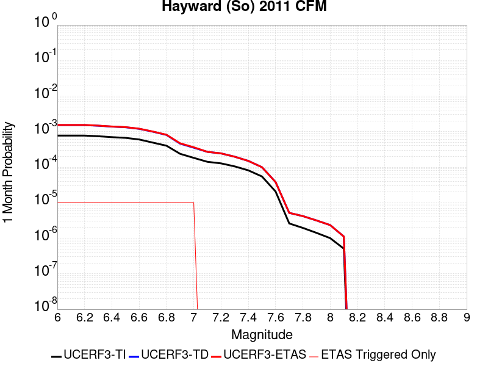 | 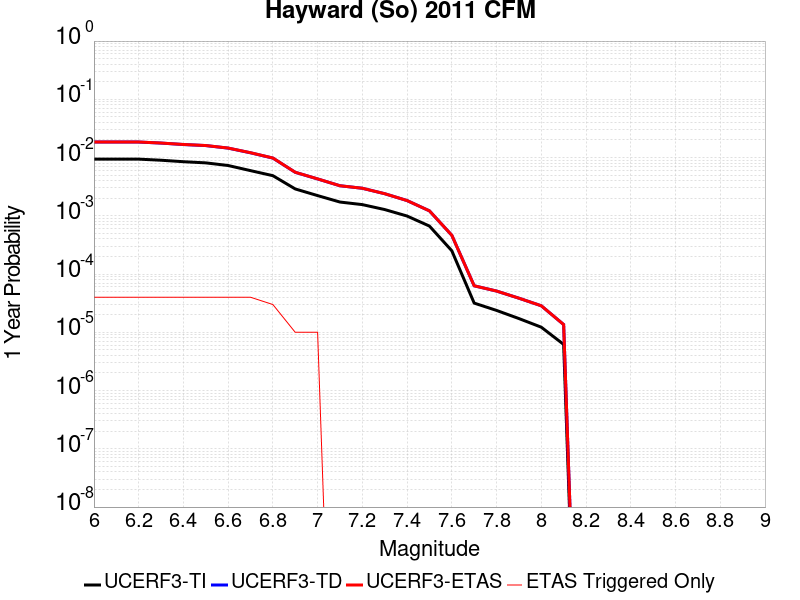 | 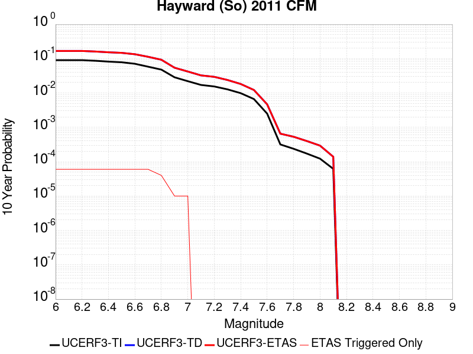 |

| Magnitude | 1 wk TI Prob | 1 wk TD Prob | 1 wk ETAS Prob | 1 wk ETAS/TD Gain | 1 wk ETAS Triggered Only | 1 mo TI Prob | 1 mo TD Prob | 1 mo ETAS Prob | 1 mo ETAS/TD Gain | 1 mo ETAS Triggered Only | 1 yr TI Prob | 1 yr TD Prob | 1 yr ETAS Prob | 1 yr ETAS/TD Gain | 1 yr ETAS Triggered Only | 10 yr TI Prob | 10 yr TD Prob | 10 yr ETAS Prob | 10 yr ETAS/TD Gain | 10 yr ETAS Triggered Only |
|-----|-----|-----|-----|-----|-----|-----|-----|-----|-----|-----|-----|-----|-----|-----|-----|-----|-----|-----|-----|-----|
| 6.0 | 1.8091932E-4 | 3.570541E-4 | 3.570541E-4 | 1.0 | 0.0 | 7.751381E-4 | 0.0015293444 | 0.0015393291 | 1.0065287 | 1.0E-5 | 0.00939654 | 0.018463207 | 0.01850247 | 1.0021265 | 4.0E-5 | 0.090090066 | 0.16673161 | 0.1667816 | 1.0002998 | 6.0E-5 |
| 6.1 | 1.8091932E-4 | 3.570541E-4 | 3.570541E-4 | 1.0 | 0.0 | 7.751381E-4 | 0.0015293444 | 0.0015393291 | 1.0065287 | 1.0E-5 | 0.00939654 | 0.018463207 | 0.01850247 | 1.0021265 | 4.0E-5 | 0.090090066 | 0.16673161 | 0.1667816 | 1.0002998 | 6.0E-5 |
| 6.2 | 1.8091932E-4 | 3.570541E-4 | 3.570541E-4 | 1.0 | 0.0 | 7.751381E-4 | 0.0015293444 | 0.0015393291 | 1.0065287 | 1.0E-5 | 0.00939654 | 0.018463207 | 0.01850247 | 1.0021265 | 4.0E-5 | 0.090090066 | 0.16673161 | 0.1667816 | 1.0002998 | 6.0E-5 |
| 6.3 | 1.7322872E-4 | 3.426234E-4 | 3.426234E-4 | 1.0 | 0.0 | 7.4219756E-4 | 0.0014675693 | 0.0014775546 | 1.006804 | 1.0E-5 | 0.0089988755 | 0.017723544 | 0.017762836 | 1.0022169 | 4.0E-5 | 0.08643075 | 0.16066726 | 0.16071762 | 1.0003134 | 6.0E-5 |
| 6.4 | 1.6334097E-4 | 3.234411E-4 | 3.234411E-4 | 1.0 | 0.0 | 6.998449E-4 | 0.0013854484 | 0.0013954346 | 1.0072079 | 1.0E-5 | 0.008487372 | 0.016739385 | 0.016778715 | 1.0023496 | 4.0E-5 | 0.081704415 | 0.15255594 | 0.15260679 | 1.0003333 | 6.0E-5 |
| 6.5 | 1.5600289E-4 | 3.1018828E-4 | 3.1018828E-4 | 1.0 | 0.0 | 6.684125E-4 | 0.0013287093 | 0.001338696 | 1.0075161 | 1.0E-5 | 0.008107598 | 0.016058935 | 0.016098293 | 1.0024508 | 4.0E-5 | 0.078181036 | 0.14683272 | 0.1468839 | 1.0003487 | 6.0E-5 |
| 6.6 | 1.4046066E-4 | 2.8032906E-4 | 2.8032906E-4 | 1.0 | 0.0 | 6.018354E-4 | 0.0012008639 | 0.0012108518 | 1.0083174 | 1.0E-5 | 0.0073027555 | 0.014524006 | 0.014563425 | 1.002714 | 4.0E-5 | 0.07067384 | 0.13391982 | 0.1339718 | 1.000388 | 6.0E-5 |
| 6.7 | 1.14696966E-4 | 2.3271477E-4 | 2.3271477E-4 | 1.0 | 0.0 | 4.914658E-4 | 9.969729E-4 | 0.0010069628 | 1.0100204 | 1.0E-5 | 0.0059671924 | 0.012071652 | 0.01211117 | 1.0032736 | 4.0E-5 | 0.058094822 | 0.11274672 | 0.11279996 | 1.0004722 | 6.0E-5 |
| 6.8 | 9.3874296E-5 | 1.8861453E-4 | 1.8861453E-4 | 1.0 | 0.0 | 4.0225635E-4 | 8.0810126E-4 | 8.180932E-4 | 1.0123647 | 1.0E-5 | 0.0048864787 | 0.009794984 | 0.00982469 | 1.0030328 | 3.0E-5 | 0.047804173 | 0.09259856 | 0.09263486 | 1.000392 | 4.0E-5 |
| 6.9 | 5.551852E-5 | 1.072948E-4 | 1.072948E-4 | 1.0 | 0.0 | 2.3791482E-4 | 4.5975443E-4 | 4.6974982E-4 | 1.0217408 | 1.0E-5 | 0.0028927654 | 0.0055832625 | 0.0055932067 | 1.0017811 | 1.0E-5 | 0.028553981 | 0.054245494 | 0.05425495 | 1.0001744 | 1.0E-5 |
| 7.0 | 4.2662363E-5 | 8.2464416E-5 | 8.2464416E-5 | 1.0 | 0.0 | 1.8282588E-4 | 3.5337146E-4 | 3.6336793E-4 | 1.0282888 | 1.0E-5 | 0.0022236328 | 0.0042938837 | 0.004303841 | 1.0023189 | 1.0E-5 | 0.022015138 | 0.042064495 | 0.042074073 | 1.0002277 | 1.0E-5 |
| 7.1 | 3.305886E-5 | 6.3019055E-5 | 6.3019055E-5 | 1.0 | 0.0 | 1.4167312E-4 | 2.700538E-4 | 2.700538E-4 | 1.0 | 0.0 | 0.0017235056 | 0.0032829668 | 0.0032829668 | 1.0 | 0.0 | 0.017101998 | 0.032452874 | 0.032452874 | 1.0 | 0.0 |
| 7.2 | 2.9856887E-5 | 5.7013647E-5 | 5.7013647E-5 | 1.0 | 0.0 | 1.2795182E-4 | 2.4432142E-4 | 2.4432142E-4 | 1.0 | 0.0 | 0.0015567001 | 0.0029705726 | 0.0029705726 | 1.0 | 0.0 | 0.015458403 | 0.029453589 | 0.029453589 | 1.0 | 0.0 |
| 7.3 | 2.4559737E-5 | 4.599088E-5 | 4.599088E-5 | 1.0 | 0.0 | 1.0525176E-4 | 1.9708896E-4 | 1.9708896E-4 | 1.0 | 0.0 | 0.0012806869 | 0.0023969305 | 0.0023969305 | 1.0 | 0.0 | 0.012733313 | 0.023857482 | 0.023857482 | 1.0 | 0.0 |
| 7.4 | 1.9002231E-5 | 3.5049303E-5 | 3.5049303E-5 | 1.0 | 0.0 | 8.143559E-5 | 1.502027E-4 | 1.502027E-4 | 1.0 | 0.0 | 9.910273E-4 | 0.0018271938 | 0.0018271938 | 1.0 | 0.0 | 0.009866194 | 0.018258283 | 0.018258283 | 1.0 | 0.0 |
| 7.5 | 1.2783333E-5 | 2.3330069E-5 | 2.3330069E-5 | 1.0 | 0.0 | 5.4784563E-5 | 9.998221E-5 | 9.998221E-5 | 1.0 | 0.0 | 6.667979E-4 | 0.0012166094 | 0.0012166094 | 1.0 | 0.0 | 0.006648007 | 0.012209582 | 0.012209582 | 1.0 | 0.0 |
| 7.6 | 4.8149627E-6 | 8.887544E-6 | 8.887544E-6 | 1.0 | 0.0 | 2.063539E-5 | 3.8088925E-5 | 3.8088925E-5 | 1.0 | 0.0 | 2.5120692E-4 | 4.636352E-4 | 4.636352E-4 | 1.0 | 0.0 | 0.0025092314 | 0.0046812436 | 0.0046812436 | 1.0 | 0.0 |
| 7.7 | 6.0838227E-7 | 1.2056693E-6 | 1.2056693E-6 | 1.0 | 0.0 | 2.6073499E-6 | 5.1671436E-6 | 5.1671436E-6 | 1.0 | 0.0 | 3.174402E-5 | 6.290816E-5 | 6.290816E-5 | 1.0 | 0.0 | 3.1739488E-4 | 6.5293367E-4 | 6.5293367E-4 | 1.0 | 0.0 |
| 7.8 | 4.5542808E-7 | 9.792182E-7 | 9.792182E-7 | 1.0 | 0.0 | 1.9518332E-6 | 4.1966427E-6 | 4.1966427E-6 | 1.0 | 0.0 | 2.376331E-5 | 5.1092928E-5 | 5.1092928E-5 | 1.0 | 0.0 | 2.3760769E-4 | 5.321372E-4 | 5.321372E-4 | 1.0 | 0.0 |
| 7.9 | 3.3016747E-7 | 7.386335E-7 | 7.386335E-7 | 1.0 | 0.0 | 1.4150027E-6 | 3.1655684E-6 | 3.1655684E-6 | 1.0 | 0.0 | 1.7227521E-5 | 3.8540114E-5 | 3.8540114E-5 | 1.0 | 0.0 | 1.7226185E-4 | 3.9930744E-4 | 3.9930744E-4 | 1.0 | 0.0 |
| 8.0 | 2.347038E-7 | 5.4714894E-7 | 5.4714894E-7 | 1.0 | 0.0 | 1.0058731E-6 | 2.344922E-6 | 2.344922E-6 | 1.0 | 0.0 | 1.2246436E-5 | 2.8549053E-5 | 2.8549053E-5 | 1.0 | 0.0 | 1.2245761E-4 | 2.9355253E-4 | 2.9355253E-4 | 1.0 | 0.0 |
| 8.1 | 1.18822804E-7 | 2.6058973E-7 | 2.6058973E-7 | 1.0 | 0.0 | 5.092405E-7 | 1.1168127E-6 | 1.1168127E-6 | 1.0 | 0.0 | 6.1999854E-6 | 1.359711E-5 | 1.359711E-5 | 1.0 | 0.0 | 6.199812E-5 | 1.3917852E-4 | 1.3917852E-4 | 1.0 | 0.0 |

## Red Mountain
*[(top)](#table-of-contents)*

| 1 Week | 1 Month | 1 Year | 10 Year |
|-----|-----|-----|-----|
|  |  |  |  |

| Magnitude | 1 wk TI Prob | 1 wk TD Prob | 1 wk ETAS Prob | 1 wk ETAS/TD Gain | 1 wk ETAS Triggered Only | 1 mo TI Prob | 1 mo TD Prob | 1 mo ETAS Prob | 1 mo ETAS/TD Gain | 1 mo ETAS Triggered Only | 1 yr TI Prob | 1 yr TD Prob | 1 yr ETAS Prob | 1 yr ETAS/TD Gain | 1 yr ETAS Triggered Only | 10 yr TI Prob | 10 yr TD Prob | 10 yr ETAS Prob | 10 yr ETAS/TD Gain | 10 yr ETAS Triggered Only |
|-----|-----|-----|-----|-----|-----|-----|-----|-----|-----|-----|-----|-----|-----|-----|-----|-----|-----|-----|-----|-----|
| 6.0 | 4.1810763E-5 | 4.7589947E-5 | 5.758947E-5 | 1.2101184 | 1.0E-5 | 1.7917668E-4 | 2.039419E-4 | 2.1393986E-4 | 1.0490236 | 1.0E-5 | 0.0021792934 | 0.0024803306 | 0.0025102561 | 1.0120652 | 3.0E-5 | 0.021580452 | 0.024544092 | 0.024602618 | 1.0023845 | 6.0E-5 |
| 6.1 | 4.1810763E-5 | 4.7589947E-5 | 5.758947E-5 | 1.2101184 | 1.0E-5 | 1.7917668E-4 | 2.039419E-4 | 2.1393986E-4 | 1.0490236 | 1.0E-5 | 0.0021792934 | 0.0024803306 | 0.0025102561 | 1.0120652 | 3.0E-5 | 0.021580452 | 0.024544092 | 0.024602618 | 1.0023845 | 6.0E-5 |
| 6.2 | 4.1810763E-5 | 4.7589947E-5 | 5.758947E-5 | 1.2101184 | 1.0E-5 | 1.7917668E-4 | 2.039419E-4 | 2.1393986E-4 | 1.0490236 | 1.0E-5 | 0.0021792934 | 0.0024803306 | 0.0025102561 | 1.0120652 | 3.0E-5 | 0.021580452 | 0.024544092 | 0.024602618 | 1.0023845 | 6.0E-5 |
| 6.3 | 4.1810763E-5 | 4.7589947E-5 | 5.758947E-5 | 1.2101184 | 1.0E-5 | 1.7917668E-4 | 2.039419E-4 | 2.1393986E-4 | 1.0490236 | 1.0E-5 | 0.0021792934 | 0.0024803306 | 0.0025102561 | 1.0120652 | 3.0E-5 | 0.021580452 | 0.024544092 | 0.024602618 | 1.0023845 | 6.0E-5 |
| 6.4 | 4.1810763E-5 | 4.7589947E-5 | 5.758947E-5 | 1.2101184 | 1.0E-5 | 1.7917668E-4 | 2.039419E-4 | 2.1393986E-4 | 1.0490236 | 1.0E-5 | 0.0021792934 | 0.0024803306 | 0.0025102561 | 1.0120652 | 3.0E-5 | 0.021580452 | 0.024544092 | 0.024602618 | 1.0023845 | 6.0E-5 |
| 6.5 | 3.154503E-5 | 3.5359728E-5 | 4.5359375E-5 | 1.2827976 | 1.0E-5 | 1.3518598E-4 | 1.5153342E-4 | 1.6153189E-4 | 1.0659821 | 1.0E-5 | 0.0016446467 | 0.0018434501 | 0.0018733948 | 1.0162438 | 3.0E-5 | 0.01632528 | 0.018291233 | 0.018350136 | 1.0032202 | 6.0E-5 |
| 6.6 | 3.1535834E-5 | 3.534911E-5 | 4.5348756E-5 | 1.2828826 | 1.0E-5 | 1.3514658E-4 | 1.5148791E-4 | 1.6148639E-4 | 1.0660019 | 1.0E-5 | 0.0016441676 | 0.001842897 | 0.0018728419 | 1.0162487 | 3.0E-5 | 0.01632056 | 0.018285794 | 0.018344698 | 1.0032213 | 6.0E-5 |
| 6.7 | 2.8267326E-5 | 3.146934E-5 | 4.1469026E-5 | 1.3177596 | 1.0E-5 | 1.2114006E-4 | 1.348621E-4 | 1.4486075E-4 | 1.0741398 | 1.0E-5 | 0.0014738824 | 0.0016407946 | 0.0016707453 | 1.0182538 | 3.0E-5 | 0.014641452 | 0.016295563 | 0.016354585 | 1.0036219 | 6.0E-5 |
| 6.8 | 2.8212884E-5 | 3.1407224E-5 | 4.140691E-5 | 1.3183881 | 1.0E-5 | 1.20906756E-4 | 1.3459593E-4 | 1.4459458E-4 | 1.0742865 | 1.0E-5 | 0.0014710457 | 0.0016375587 | 0.0016675096 | 1.0182899 | 3.0E-5 | 0.014613459 | 0.01626368 | 0.016322704 | 1.0036292 | 6.0E-5 |
| 6.9 | 2.4227871E-5 | 2.6706979E-5 | 3.670671E-5 | 1.374424 | 1.0E-5 | 1.03829596E-4 | 1.14453884E-4 | 1.2445274E-4 | 1.0873615 | 1.0E-5 | 0.0012633923 | 0.0013926612 | 0.0014126333 | 1.014341 | 2.0E-5 | 0.012562336 | 0.013847026 | 0.013896333 | 1.0035609 | 5.0E-5 |
| 7.0 | 2.348524E-5 | 2.5835763E-5 | 3.5835503E-5 | 1.3870504 | 1.0E-5 | 1.0064714E-4 | 1.1072042E-4 | 1.2071932E-4 | 1.0903076 | 1.0E-5 | 0.0012246901 | 0.0013472632 | 0.0013672363 | 1.0148249 | 2.0E-5 | 0.012179627 | 0.01339859 | 0.01344792 | 1.0036818 | 5.0E-5 |
| 7.1 | 2.2311642E-5 | 2.4462828E-5 | 2.4462828E-5 | 1.0 | 0.0 | 9.561782E-5 | 1.048369E-4 | 1.048369E-4 | 1.0 | 0.0 | 0.0011635252 | 0.0012757168 | 0.001285704 | 1.0078287 | 1.0E-5 | 0.01157452 | 0.012691451 | 0.012730944 | 1.0031117 | 4.0E-5 |
| 7.2 | 1.6533986E-5 | 1.7670347E-5 | 1.7670347E-5 | 1.0 | 0.0 | 7.085802E-5 | 7.572822E-5 | 7.572822E-5 | 1.0 | 0.0 | 8.623549E-4 | 9.216645E-4 | 9.316553E-4 | 1.0108399 | 1.0E-5 | 0.008590161 | 0.009184699 | 0.009214424 | 1.0032363 | 3.0E-5 |
| 7.3 | 1.4703092E-5 | 1.555952E-5 | 1.555952E-5 | 1.0 | 0.0 | 6.301173E-5 | 6.66823E-5 | 6.66823E-5 | 1.0 | 0.0 | 7.668978E-4 | 8.1161625E-4 | 8.216081E-4 | 1.0123111 | 1.0E-5 | 0.0076425658 | 0.008092596 | 0.008122353 | 1.0036771 | 3.0E-5 |
| 7.4 | 6.1331984E-6 | 5.528872E-6 | 5.528872E-6 | 1.0 | 0.0 | 2.6284872E-5 | 2.3694953E-5 | 2.3694953E-5 | 1.0 | 0.0 | 3.199713E-4 | 2.8844838E-4 | 2.8844838E-4 | 1.0 | 0.0 | 0.0031951098 | 0.0028807942 | 0.0028907654 | 1.0034612 | 1.0E-5 |
| 7.5 | 5.954766E-6 | 5.3385015E-6 | 5.3385015E-6 | 1.0 | 0.0 | 2.5520176E-5 | 2.2879094E-5 | 2.2879094E-5 | 1.0 | 0.0 | 3.1066386E-4 | 2.785179E-4 | 2.785179E-4 | 1.0 | 0.0 | 0.003102299 | 0.0027817423 | 0.0027917144 | 1.0035849 | 1.0E-5 |
| 7.6 | 4.9726646E-6 | 4.315295E-6 | 4.315295E-6 | 1.0 | 0.0 | 2.1311245E-5 | 1.8493993E-5 | 1.8493993E-5 | 1.0 | 0.0 | 2.5943352E-4 | 2.2514143E-4 | 2.2514143E-4 | 1.0 | 0.0 | 0.0025913084 | 0.002249168 | 0.0022591455 | 1.0044361 | 1.0E-5 |
| 7.7 | 3.3613894E-6 | 2.8526642E-6 | 2.8526642E-6 | 1.0 | 0.0 | 1.4405875E-5 | 1.2225649E-5 | 1.2225649E-5 | 1.0 | 0.0 | 1.7537741E-4 | 1.4883737E-4 | 1.4883737E-4 | 1.0 | 0.0 | 0.0017523908 | 0.0014874031 | 0.0014973882 | 1.0067132 | 1.0E-5 |
| 7.8 | 1.1828961E-6 | 1.0122756E-6 | 1.0122756E-6 | 1.0 | 0.0 | 5.069545E-6 | 4.338317E-6 | 4.338317E-6 | 1.0 | 0.0 | 6.171996E-5 | 5.281776E-5 | 5.281776E-5 | 1.0 | 0.0 | 6.170282E-4 | 5.2805495E-4 | 5.380497E-4 | 1.0189275 | 1.0E-5 |
| 7.9 | 2.2967266E-7 | 1.8618952E-7 | 1.8618952E-7 | 1.0 | 0.0 | 9.843111E-7 | 7.9795484E-7 | 7.9795484E-7 | 1.0 | 0.0 | 1.19839215E-5 | 9.7150605E-6 | 9.7150605E-6 | 1.0 | 0.0 | 1.1983275E-4 | 9.714664E-5 | 9.714664E-5 | 1.0 | 0.0 |

## Dry Mountain
*[(top)](#table-of-contents)*

| 1 Week | 1 Month | 1 Year | 10 Year |
|-----|-----|-----|-----|
|  |  |  |  |

| Magnitude | 1 wk TI Prob | 1 wk TD Prob | 1 wk ETAS Prob | 1 wk ETAS/TD Gain | 1 wk ETAS Triggered Only | 1 mo TI Prob | 1 mo TD Prob | 1 mo ETAS Prob | 1 mo ETAS/TD Gain | 1 mo ETAS Triggered Only | 1 yr TI Prob | 1 yr TD Prob | 1 yr ETAS Prob | 1 yr ETAS/TD Gain | 1 yr ETAS Triggered Only | 10 yr TI Prob | 10 yr TD Prob | 10 yr ETAS Prob | 10 yr ETAS/TD Gain | 10 yr ETAS Triggered Only |
|-----|-----|-----|-----|-----|-----|-----|-----|-----|-----|-----|-----|-----|-----|-----|-----|-----|-----|-----|-----|-----|
| 6.0 | 6.222801E-6 | 6.439381E-6 | 2.6439253E-5 | 4.1058683 | 2.0E-5 | 2.6668875E-5 | 2.7597147E-5 | 4.7596594E-5 | 1.7246926 | 2.0E-5 | 3.2464517E-4 | 3.3595937E-4 | 3.8594258E-4 | 1.1487775 | 5.0E-5 | 0.0032417132 | 0.0033560768 | 0.003425842 | 1.0207877 | 7.0E-5 |
| 6.1 | 6.222801E-6 | 6.439381E-6 | 2.6439253E-5 | 4.1058683 | 2.0E-5 | 2.6668875E-5 | 2.7597147E-5 | 4.7596594E-5 | 1.7246926 | 2.0E-5 | 3.2464517E-4 | 3.3595937E-4 | 3.8594258E-4 | 1.1487775 | 5.0E-5 | 0.0032417132 | 0.0033560768 | 0.003425842 | 1.0207877 | 7.0E-5 |
| 6.2 | 6.222801E-6 | 6.439381E-6 | 2.6439253E-5 | 4.1058683 | 2.0E-5 | 2.6668875E-5 | 2.7597147E-5 | 4.7596594E-5 | 1.7246926 | 2.0E-5 | 3.2464517E-4 | 3.3595937E-4 | 3.8594258E-4 | 1.1487775 | 5.0E-5 | 0.0032417132 | 0.0033560768 | 0.003425842 | 1.0207877 | 7.0E-5 |
| 6.3 | 6.222801E-6 | 6.439381E-6 | 2.6439253E-5 | 4.1058683 | 2.0E-5 | 2.6668875E-5 | 2.7597147E-5 | 4.7596594E-5 | 1.7246926 | 2.0E-5 | 3.2464517E-4 | 3.3595937E-4 | 3.8594258E-4 | 1.1487775 | 5.0E-5 | 0.0032417132 | 0.0033560768 | 0.003425842 | 1.0207877 | 7.0E-5 |
| 6.4 | 6.222801E-6 | 6.439381E-6 | 2.6439253E-5 | 4.1058683 | 2.0E-5 | 2.6668875E-5 | 2.7597147E-5 | 4.7596594E-5 | 1.7246926 | 2.0E-5 | 3.2464517E-4 | 3.3595937E-4 | 3.8594258E-4 | 1.1487775 | 5.0E-5 | 0.0032417132 | 0.0033560768 | 0.003425842 | 1.0207877 | 7.0E-5 |
| 6.5 | 2.8528623E-6 | 2.9521684E-6 | 1.2952139E-5 | 4.3873305 | 1.0E-5 | 1.22264955E-5 | 1.2652138E-5 | 2.2652011E-5 | 1.7903702 | 1.0E-5 | 1.4884741E-4 | 1.540376E-4 | 1.8403298E-4 | 1.1947277 | 3.0E-5 | 0.0014874774 | 0.0015401616 | 0.0015801 | 1.0259314 | 4.0E-5 |
| 6.6 | 2.8528623E-6 | 2.9521684E-6 | 1.2952139E-5 | 4.3873305 | 1.0E-5 | 1.22264955E-5 | 1.2652138E-5 | 2.2652011E-5 | 1.7903702 | 1.0E-5 | 1.4884741E-4 | 1.540376E-4 | 1.8403298E-4 | 1.1947277 | 3.0E-5 | 0.0014874774 | 0.0015401616 | 0.0015801 | 1.0259314 | 4.0E-5 |
| 6.7 | 2.541E-6 | 2.6293578E-6 | 1.2629332E-5 | 4.8032 | 1.0E-5 | 1.0889954E-5 | 1.1268677E-5 | 2.1268565E-5 | 1.8874056 | 1.0E-5 | 1.3257713E-4 | 1.3719614E-4 | 1.6719202E-4 | 1.2186351 | 3.0E-5 | 0.0013249806 | 0.0013719613 | 0.0014119064 | 1.0291153 | 4.0E-5 |

## Great Valley 09 (Laguna Seca)
*[(top)](#table-of-contents)*

| 1 Week | 1 Month | 1 Year | 10 Year |
|-----|-----|-----|-----|
|  |  |  |  |

| Magnitude | 1 wk TI Prob | 1 wk TD Prob | 1 wk ETAS Prob | 1 wk ETAS/TD Gain | 1 wk ETAS Triggered Only | 1 mo TI Prob | 1 mo TD Prob | 1 mo ETAS Prob | 1 mo ETAS/TD Gain | 1 mo ETAS Triggered Only | 1 yr TI Prob | 1 yr TD Prob | 1 yr ETAS Prob | 1 yr ETAS/TD Gain | 1 yr ETAS Triggered Only | 10 yr TI Prob | 10 yr TD Prob | 10 yr ETAS Prob | 10 yr ETAS/TD Gain | 10 yr ETAS Triggered Only |
|-----|-----|-----|-----|-----|-----|-----|-----|-----|-----|-----|-----|-----|-----|-----|-----|-----|-----|-----|-----|-----|
| 6.0 | 5.4353277E-5 | 7.05022E-5 | 9.050079E-5 | 1.2836591 | 2.0E-5 | 2.3292181E-4 | 3.0211566E-4 | 3.221096E-4 | 1.0661798 | 2.0E-5 | 0.0028321352 | 0.0036721937 | 0.0037220102 | 1.0135659 | 5.0E-5 | 0.02796312 | 0.03611547 | 0.036182944 | 1.0018682 | 7.0E-5 |
| 6.1 | 4.5578287E-5 | 5.822118E-5 | 7.8220015E-5 | 1.3434976 | 2.0E-5 | 1.953209E-4 | 2.4949326E-4 | 2.6948826E-4 | 1.0801425 | 2.0E-5 | 0.0023754383 | 0.003033432 | 0.003063341 | 1.0098598 | 3.0E-5 | 0.023502063 | 0.029919548 | 0.02995835 | 1.0012969 | 4.0E-5 |
| 6.2 | 2.8536782E-5 | 3.4737273E-5 | 5.4736578E-5 | 1.5757304 | 2.0E-5 | 1.2229476E-4 | 1.4886224E-4 | 1.6885926E-4 | 1.1343324 | 2.0E-5 | 0.0014879217 | 0.001810813 | 0.0018307768 | 1.0110247 | 2.0E-5 | 0.014779986 | 0.017958116 | 0.017987577 | 1.0016406 | 3.0E-5 |
| 6.3 | 2.3698774E-5 | 2.8213295E-5 | 3.8213013E-5 | 1.3544328 | 1.0E-5 | 1.01562226E-4 | 1.20905075E-4 | 1.3090386E-4 | 1.0826995 | 1.0E-5 | 0.0012358186 | 0.0014710218 | 0.0014810071 | 1.006788 | 1.0E-5 | 0.012289686 | 0.014611342 | 0.01463105 | 1.0013489 | 2.0E-5 |
| 6.4 | 1.9191197E-5 | 2.2123184E-5 | 3.2122964E-5 | 1.4520046 | 1.0E-5 | 8.2245395E-5 | 9.4806666E-5 | 1.0480572E-4 | 1.1054678 | 1.0E-5 | 0.0010008777 | 0.0011536429 | 0.0011636313 | 1.0086582 | 1.0E-5 | 0.009963818 | 0.011476948 | 0.011496718 | 1.0017226 | 2.0E-5 |
| 6.5 | 1.5203241E-5 | 1.6802203E-5 | 1.6802203E-5 | 1.0 | 0.0 | 6.5155116E-5 | 7.200386E-5 | 7.200386E-5 | 1.0 | 0.0 | 7.9297484E-4 | 8.7626575E-4 | 8.7626575E-4 | 1.0 | 0.0 | 0.007901512 | 0.0087295165 | 0.0087295165 | 1.0 | 0.0 |
| 6.6 | 1.0984925E-5 | 1.1242595E-5 | 1.1242595E-5 | 1.0 | 0.0 | 4.70774E-5 | 4.8181686E-5 | 4.8181686E-5 | 1.0 | 0.0 | 5.730166E-4 | 5.8645656E-4 | 5.8645656E-4 | 1.0 | 0.0 | 0.005715413 | 0.0058494853 | 0.0058494853 | 1.0 | 0.0 |
| 6.7 | 9.134616E-6 | 9.019894E-6 | 9.019894E-6 | 1.0 | 0.0 | 3.9147766E-5 | 3.865613E-5 | 3.865613E-5 | 1.0 | 0.0 | 4.7651984E-4 | 4.7053912E-4 | 4.7053912E-4 | 1.0 | 0.0 | 0.004754993 | 0.0046956735 | 0.0046956735 | 1.0 | 0.0 |
| 6.8 | 7.785589E-6 | 7.4519444E-6 | 7.4519444E-6 | 1.0 | 0.0 | 3.3366385E-5 | 3.1936524E-5 | 3.1936524E-5 | 1.0 | 0.0 | 4.0616E-4 | 3.8875983E-4 | 3.8875983E-4 | 1.0 | 0.0 | 0.0040541845 | 0.0038810016 | 0.0038810016 | 1.0 | 0.0 |
| 6.9 | 5.579095E-6 | 4.898492E-6 | 4.898492E-6 | 1.0 | 0.0 | 2.3910188E-5 | 2.0993377E-5 | 2.0993377E-5 | 1.0 | 0.0 | 2.9106764E-4 | 2.5556577E-4 | 2.5556577E-4 | 1.0 | 0.0 | 0.002906867 | 0.002552856 | 0.002552856 | 1.0 | 0.0 |
| 7.0 | 2.6816688E-6 | 1.5216126E-6 | 1.5216126E-6 | 1.0 | 0.0 | 1.1492816E-5 | 6.521181E-6 | 6.521181E-6 | 1.0 | 0.0 | 1.3991605E-4 | 7.939258E-5 | 7.939258E-5 | 1.0 | 0.0 | 0.0013982799 | 7.9365086E-4 | 7.9365086E-4 | 1.0 | 0.0 |
| 7.1 | 1.9951021E-6 | 7.453827E-7 | 7.453827E-7 | 1.0 | 0.0 | 8.55041E-6 | 3.1944935E-6 | 3.1944935E-6 | 1.0 | 0.0 | 1.0409627E-4 | 3.8892307E-5 | 3.8892307E-5 | 1.0 | 0.0 | 0.0010404752 | 3.8885913E-4 | 3.8885913E-4 | 1.0 | 0.0 |
| 7.2 | 1.9951021E-6 | 7.453827E-7 | 7.453827E-7 | 1.0 | 0.0 | 8.55041E-6 | 3.1944935E-6 | 3.1944935E-6 | 1.0 | 0.0 | 1.0409627E-4 | 3.8892307E-5 | 3.8892307E-5 | 1.0 | 0.0 | 0.0010404752 | 3.8885913E-4 | 3.8885913E-4 | 1.0 | 0.0 |
| 7.3 | 1.7087556E-6 | 6.578881E-7 | 6.578881E-7 | 1.0 | 0.0 | 7.3232177E-6 | 2.8195177E-6 | 2.8195177E-6 | 1.0 | 0.0 | 8.915652E-5 | 3.4327128E-5 | 3.4327128E-5 | 1.0 | 0.0 | 8.9120766E-4 | 3.432223E-4 | 3.432223E-4 | 1.0 | 0.0 |
| 7.4 | 1.3804846E-6 | 6.073852E-7 | 6.073852E-7 | 1.0 | 0.0 | 5.916349E-6 | 2.6030768E-6 | 2.6030768E-6 | 1.0 | 0.0 | 7.2029165E-5 | 3.169204E-5 | 3.169204E-5 | 1.0 | 0.0 | 7.200583E-4 | 3.1687922E-4 | 3.1687922E-4 | 1.0 | 0.0 |
| 7.5 | 1.3804846E-6 | 6.073852E-7 | 6.073852E-7 | 1.0 | 0.0 | 5.916349E-6 | 2.6030768E-6 | 2.6030768E-6 | 1.0 | 0.0 | 7.2029165E-5 | 3.169204E-5 | 3.169204E-5 | 1.0 | 0.0 | 7.200583E-4 | 3.1687922E-4 | 3.1687922E-4 | 1.0 | 0.0 |

## San Diego Trough north alt1
*[(top)](#table-of-contents)*

| 1 Week | 1 Month | 1 Year | 10 Year |
|-----|-----|-----|-----|
| 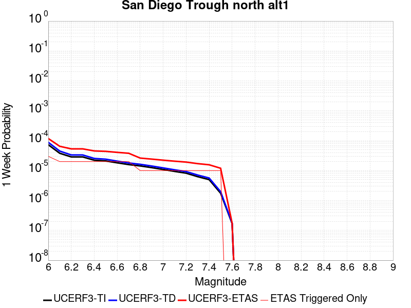 | 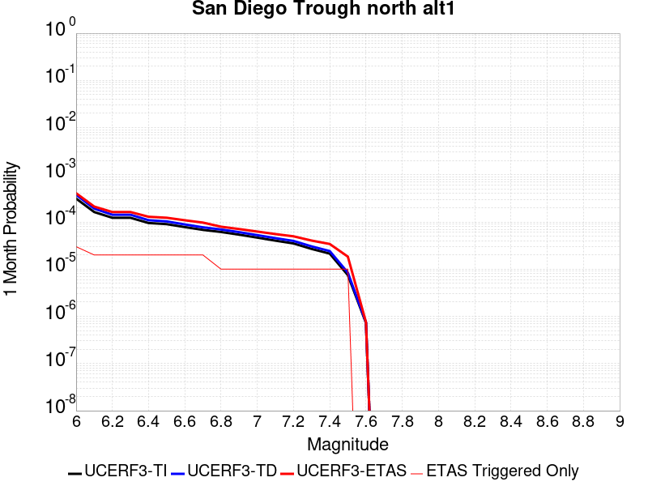 | 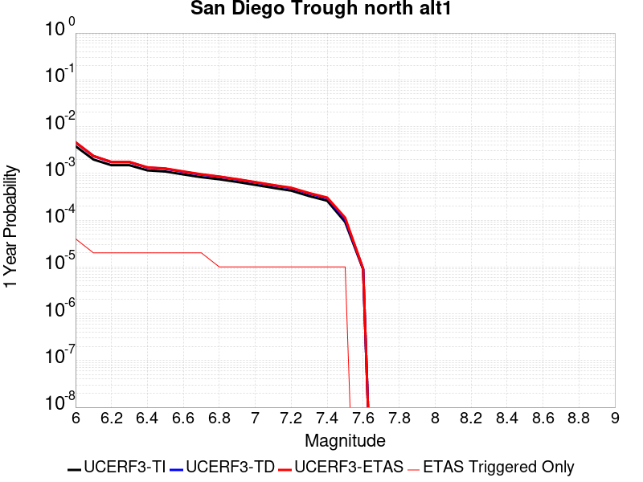 | 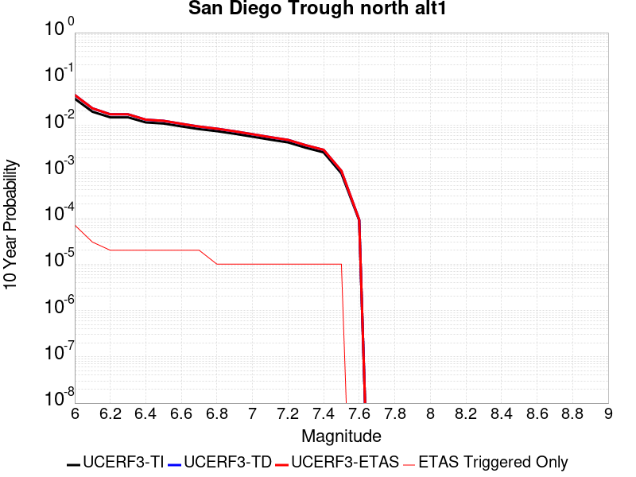 |

| Magnitude | 1 wk TI Prob | 1 wk TD Prob | 1 wk ETAS Prob | 1 wk ETAS/TD Gain | 1 wk ETAS Triggered Only | 1 mo TI Prob | 1 mo TD Prob | 1 mo ETAS Prob | 1 mo ETAS/TD Gain | 1 mo ETAS Triggered Only | 1 yr TI Prob | 1 yr TD Prob | 1 yr ETAS Prob | 1 yr ETAS/TD Gain | 1 yr ETAS Triggered Only | 10 yr TI Prob | 10 yr TD Prob | 10 yr ETAS Prob | 10 yr ETAS/TD Gain | 10 yr ETAS Triggered Only |
|-----|-----|-----|-----|-----|-----|-----|-----|-----|-----|-----|-----|-----|-----|-----|-----|-----|-----|-----|-----|-----|
| 6.0 | 7.329252E-5 | 8.821093E-5 | 1.18208285E-4 | 1.3400639 | 3.0E-5 | 3.14073E-4 | 3.7799572E-4 | 4.0798436E-4 | 1.0793359 | 3.0E-5 | 0.0038171355 | 0.004593027 | 0.004632843 | 1.0086689 | 4.0E-5 | 0.03752231 | 0.045044992 | 0.04511184 | 1.001484 | 7.0E-5 |
| 6.1 | 3.7940346E-5 | 4.4885E-5 | 6.48841E-5 | 1.4455632 | 2.0E-5 | 1.6259136E-4 | 1.9235066E-4 | 2.1234681E-4 | 1.1039568 | 2.0E-5 | 0.0019777524 | 0.0023394432 | 0.0023593963 | 1.0085291 | 2.0E-5 | 0.019602431 | 0.023156688 | 0.023185993 | 1.0012655 | 3.0E-5 |
| 6.2 | 2.8645263E-5 | 3.329678E-5 | 5.3296113E-5 | 1.6006386 | 2.0E-5 | 1.2275964E-4 | 1.4269284E-4 | 1.6268999E-4 | 1.1401412 | 2.0E-5 | 0.0014935739 | 0.0017359189 | 0.0017558842 | 1.0115013 | 2.0E-5 | 0.0148357535 | 0.017226247 | 0.017245904 | 1.0011411 | 2.0E-5 |
| 6.3 | 2.8645263E-5 | 3.329678E-5 | 5.3296113E-5 | 1.6006386 | 2.0E-5 | 1.2275964E-4 | 1.4269284E-4 | 1.6268999E-4 | 1.1401412 | 2.0E-5 | 0.0014935739 | 0.0017359189 | 0.0017558842 | 1.0115013 | 2.0E-5 | 0.0148357535 | 0.017226247 | 0.017245904 | 1.0011411 | 2.0E-5 |
| 6.4 | 2.2204576E-5 | 2.5448318E-5 | 4.544781E-5 | 1.7858865 | 2.0E-5 | 9.5159E-5 | 1.0905972E-4 | 1.2905753E-4 | 1.1833658 | 2.0E-5 | 0.001157945 | 0.0013270034 | 0.0013469768 | 1.0150516 | 2.0E-5 | 0.011519298 | 0.013191955 | 0.013211691 | 1.0014961 | 2.0E-5 |
| 6.5 | 2.1004838E-5 | 2.4024694E-5 | 4.4024215E-5 | 1.8324568 | 2.0E-5 | 9.0017624E-5 | 1.0295896E-4 | 1.229569E-4 | 1.1942321 | 2.0E-5 | 0.0010954136 | 0.0012528138 | 0.0012727889 | 1.015944 | 2.0E-5 | 0.010900296 | 0.012458589 | 0.0124783395 | 1.0015854 | 2.0E-5 |
| 6.6 | 1.820557E-5 | 2.0704787E-5 | 4.0704374E-5 | 1.9659402 | 2.0E-5 | 7.802154E-5 | 8.873181E-5 | 1.0873003E-4 | 1.2253783 | 2.0E-5 | 9.4949827E-4 | 0.0010797799 | 0.0010997583 | 1.0185022 | 2.0E-5 | 0.009454516 | 0.010746004 | 0.010765789 | 1.0018412 | 2.0E-5 |
| 6.7 | 1.5884485E-5 | 1.7983646E-5 | 3.7983285E-5 | 2.1121016 | 2.0E-5 | 6.807459E-5 | 7.707051E-5 | 9.7068965E-5 | 1.2594826 | 2.0E-5 | 8.284929E-4 | 9.3793223E-4 | 9.5791346E-4 | 1.0213035 | 2.0E-5 | 0.008254109 | 0.009340104 | 0.009359917 | 1.0021213 | 2.0E-5 |
| 6.8 | 1.4331171E-5 | 1.6201066E-5 | 2.6200903E-5 | 1.6172334 | 1.0E-5 | 6.141786E-5 | 6.94313E-5 | 7.94306E-5 | 1.1440172 | 1.0E-5 | 7.4750587E-4 | 8.450002E-4 | 8.549917E-4 | 1.0118244 | 1.0E-5 | 0.0074499645 | 0.008418139 | 0.008428055 | 1.0011779 | 1.0E-5 |
| 6.9 | 1.2574203E-5 | 1.4205835E-5 | 2.4205692E-5 | 1.7039261 | 1.0E-5 | 5.3888325E-5 | 6.0880735E-5 | 7.088013E-5 | 1.1642456 | 1.0E-5 | 6.558929E-4 | 7.409723E-4 | 7.5096486E-4 | 1.0134858 | 1.0E-5 | 0.0065396037 | 0.007385203 | 0.0073951297 | 1.0013441 | 1.0E-5 |
| 7.0 | 1.0883844E-5 | 1.2289262E-5 | 2.2289138E-5 | 1.8137085 | 1.0E-5 | 4.664421E-5 | 5.2667205E-5 | 6.266668E-5 | 1.1898614 | 1.0E-5 | 5.677453E-4 | 6.4103556E-4 | 6.510292E-4 | 1.0155897 | 1.0E-5 | 0.00566297 | 0.006391993 | 0.0064019286 | 1.0015545 | 1.0E-5 |
| 7.1 | 9.393088E-6 | 1.060702E-5 | 2.0606914E-5 | 1.9427619 | 1.0E-5 | 4.025547E-5 | 4.545787E-5 | 5.5457414E-5 | 1.2199739 | 1.0E-5 | 4.900001E-4 | 5.533098E-4 | 5.6330423E-4 | 1.0180631 | 1.0E-5 | 0.0048892107 | 0.005519418 | 0.0055293627 | 1.0018017 | 1.0E-5 |
| 7.2 | 8.190791E-6 | 9.258625E-6 | 1.9258532E-5 | 2.0800638 | 1.0E-5 | 3.510292E-5 | 3.9679224E-5 | 4.9678827E-5 | 1.2520111 | 1.0E-5 | 4.2729423E-4 | 4.8298817E-4 | 4.929833E-4 | 1.0206945 | 1.0E-5 | 0.0042647356 | 0.004819465 | 0.0048294165 | 1.002065 | 1.0E-5 |
| 7.3 | 6.268162E-6 | 7.089716E-6 | 1.7089646E-5 | 2.4104838 | 1.0E-5 | 2.6863276E-5 | 3.0384144E-5 | 4.038384E-5 | 1.3291091 | 1.0E-5 | 3.2701128E-4 | 3.6986457E-4 | 3.7986087E-4 | 1.0270269 | 1.0E-5 | 0.003265305 | 0.003692536 | 0.003702499 | 1.0026982 | 1.0E-5 |
| 7.4 | 4.985186E-6 | 5.6426816E-6 | 1.5642625E-5 | 2.772197 | 1.0E-5 | 2.1364907E-5 | 2.4182698E-5 | 3.4182456E-5 | 1.4135088 | 1.0E-5 | 2.600867E-4 | 2.9438498E-4 | 3.0438203E-4 | 1.0339592 | 1.0E-5 | 0.002597825 | 0.0029399914 | 0.002949962 | 1.0033914 | 1.0E-5 |
| 7.5 | 1.7489613E-6 | 1.969678E-6 | 1.1969658E-5 | 6.076962 | 1.0E-5 | 7.495527E-6 | 8.4414505E-6 | 1.8441366E-5 | 2.1846206 | 1.0E-5 | 9.125422E-5 | 1.02770035E-4 | 1.1276901E-4 | 1.0972946 | 1.0E-5 | 9.1216754E-4 | 0.0010272472 | 0.0010372369 | 1.0097247 | 1.0E-5 |
| 7.6 | 1.6988751E-7 | 1.7533823E-7 | 1.7533823E-7 | 1.0 | 0.0 | 7.2808916E-7 | 7.5144936E-7 | 7.5144936E-7 | 1.0 | 0.0 | 8.864449E-6 | 9.14886E-6 | 9.14886E-6 | 1.0 | 0.0 | 8.8640954E-5 | 9.1485024E-5 | 9.1485024E-5 | 1.0 | 0.0 |

## San Jacinto (Superstition Mtn)
*[(top)](#table-of-contents)*

| 1 Week | 1 Month | 1 Year | 10 Year |
|-----|-----|-----|-----|
|  |  |  |  |

| Magnitude | 1 wk TI Prob | 1 wk TD Prob | 1 wk ETAS Prob | 1 wk ETAS/TD Gain | 1 wk ETAS Triggered Only | 1 mo TI Prob | 1 mo TD Prob | 1 mo ETAS Prob | 1 mo ETAS/TD Gain | 1 mo ETAS Triggered Only | 1 yr TI Prob | 1 yr TD Prob | 1 yr ETAS Prob | 1 yr ETAS/TD Gain | 1 yr ETAS Triggered Only | 10 yr TI Prob | 10 yr TD Prob | 10 yr ETAS Prob | 10 yr ETAS/TD Gain | 10 yr ETAS Triggered Only |
|-----|-----|-----|-----|-----|-----|-----|-----|-----|-----|-----|-----|-----|-----|-----|-----|-----|-----|-----|-----|-----|
| 6.0 | 6.4193904E-5 | 9.599367E-5 | 1.1599175E-4 | 1.208327 | 2.0E-5 | 2.7508775E-4 | 4.1134638E-4 | 4.3133815E-4 | 1.0486008 | 2.0E-5 | 0.0033440501 | 0.0049980893 | 0.0050478396 | 1.0099539 | 5.0E-5 | 0.03294174 | 0.048823986 | 0.04889057 | 1.0013638 | 7.0E-5 |
| 6.1 | 6.4193904E-5 | 9.599367E-5 | 1.1599175E-4 | 1.208327 | 2.0E-5 | 2.7508775E-4 | 4.1134638E-4 | 4.3133815E-4 | 1.0486008 | 2.0E-5 | 0.0033440501 | 0.0049980893 | 0.0050478396 | 1.0099539 | 5.0E-5 | 0.03294174 | 0.048823986 | 0.04889057 | 1.0013638 | 7.0E-5 |
| 6.2 | 5.7023593E-5 | 8.3144434E-5 | 1.0314277E-4 | 1.2405252 | 2.0E-5 | 2.4436394E-4 | 3.5629404E-4 | 3.762869E-4 | 1.0561134 | 2.0E-5 | 0.002971072 | 0.0043308944 | 0.004380678 | 1.011495 | 5.0E-5 | 0.029316625 | 0.04250403 | 0.042571053 | 1.0015769 | 7.0E-5 |
| 6.3 | 5.6940098E-5 | 8.298979E-5 | 1.0298813E-4 | 1.2409735 | 2.0E-5 | 2.4400617E-4 | 3.5563146E-4 | 3.7562437E-4 | 1.056218 | 2.0E-5 | 0.002966728 | 0.00432286 | 0.004372644 | 1.0115165 | 5.0E-5 | 0.029274331 | 0.042427283 | 0.042494312 | 1.0015799 | 7.0E-5 |
| 6.4 | 5.4171585E-5 | 7.7483564E-5 | 8.748279E-5 | 1.1290497 | 1.0E-5 | 2.3214328E-4 | 3.3203943E-4 | 3.4203613E-4 | 1.0301069 | 1.0E-5 | 0.0028226813 | 0.0040367353 | 0.0040765735 | 1.009869 | 4.0E-5 | 0.02787096 | 0.03971653 | 0.03977415 | 1.0014507 | 6.0E-5 |
| 6.5 | 4.375144E-5 | 5.642133E-5 | 6.642076E-5 | 1.177228 | 1.0E-5 | 1.874927E-4 | 2.4178992E-4 | 2.517875E-4 | 1.0413482 | 1.0E-5 | 0.0022803338 | 0.002940994 | 0.0029808762 | 1.0135609 | 4.0E-5 | 0.022570757 | 0.029236801 | 0.029295048 | 1.0019922 | 6.0E-5 |
| 6.6 | 2.772192E-5 | 2.5488358E-5 | 3.54881E-5 | 1.392326 | 1.0E-5 | 1.1880282E-4 | 1.09231354E-4 | 1.1923026E-4 | 1.0915388 | 1.0E-5 | 0.0014454646 | 0.0013290998 | 0.0013590599 | 1.0225416 | 3.0E-5 | 0.014360986 | 0.01354049 | 0.013589813 | 1.0036427 | 5.0E-5 |
| 6.7 | 2.7124124E-5 | 2.4699386E-5 | 3.469914E-5 | 1.4048584 | 1.0E-5 | 1.1624106E-4 | 1.05850326E-4 | 1.1584927E-4 | 1.094463 | 1.0E-5 | 0.0014143161 | 0.001287985 | 0.0013179464 | 1.0232621 | 3.0E-5 | 0.014053487 | 0.013133943 | 0.013183286 | 1.0037569 | 5.0E-5 |
| 6.8 | 2.5475807E-5 | 2.216446E-5 | 3.2164236E-5 | 1.4511627 | 1.0E-5 | 1.0917746E-4 | 9.4987154E-5 | 1.04986204E-4 | 1.1052674 | 1.0E-5 | 0.001328425 | 0.001155867 | 0.0011858323 | 1.0259246 | 3.0E-5 | 0.0132051185 | 0.011822182 | 0.01187159 | 1.0041794 | 5.0E-5 |
| 6.9 | 2.1162023E-5 | 1.7626244E-5 | 2.7626067E-5 | 1.5673258 | 1.0E-5 | 9.069123E-5 | 7.5538876E-5 | 8.553812E-5 | 1.1323721 | 1.0E-5 | 0.0011036064 | 9.193016E-4 | 9.3928317E-4 | 1.0217357 | 2.0E-5 | 0.010981417 | 0.00944688 | 0.009486502 | 1.0041943 | 4.0E-5 |
| 7.0 | 1.8754288E-5 | 1.6161559E-5 | 2.6161397E-5 | 1.6187422 | 1.0E-5 | 8.037304E-5 | 6.9261994E-5 | 7.926131E-5 | 1.1443694 | 1.0E-5 | 9.781026E-4 | 8.4294105E-4 | 8.629242E-4 | 1.0237064 | 2.0E-5 | 0.009738087 | 0.008670042 | 0.008709695 | 1.0045736 | 4.0E-5 |
| 7.1 | 1.8678527E-5 | 1.6086702E-5 | 2.608654E-5 | 1.6216215 | 1.0E-5 | 8.0048376E-5 | 6.89412E-5 | 7.894051E-5 | 1.1450411 | 1.0E-5 | 9.7415317E-4 | 8.3903834E-4 | 8.5902156E-4 | 1.0238168 | 2.0E-5 | 0.009698939 | 0.008630998 | 0.008670653 | 1.0045944 | 4.0E-5 |
| 7.2 | 1.7804578E-5 | 1.5381282E-5 | 2.5381127E-5 | 1.6501309 | 1.0E-5 | 7.6303106E-5 | 6.5918124E-5 | 7.5917465E-5 | 1.1516933 | 1.0E-5 | 9.285943E-4 | 8.022599E-4 | 8.2224386E-4 | 1.0249096 | 2.0E-5 | 0.009247236 | 0.008262311 | 0.008301981 | 1.0048013 | 4.0E-5 |
| 7.3 | 1.6583685E-5 | 1.4530388E-5 | 2.4530244E-5 | 1.6882029 | 1.0E-5 | 7.1070994E-5 | 6.227162E-5 | 7.2270996E-5 | 1.1605768 | 1.0E-5 | 8.649459E-4 | 7.5789524E-4 | 7.778801E-4 | 1.0263689 | 2.0E-5 | 0.00861587 | 0.007817623 | 0.007857311 | 1.0050766 | 4.0E-5 |
| 7.4 | 1.6387552E-5 | 1.4395274E-5 | 2.4395129E-5 | 1.6946625 | 1.0E-5 | 7.023047E-5 | 6.169258E-5 | 7.169197E-5 | 1.162084 | 1.0E-5 | 8.5472054E-4 | 7.5085036E-4 | 7.708353E-4 | 1.0266165 | 2.0E-5 | 0.008514405 | 0.0077470057 | 0.007786696 | 1.0051233 | 4.0E-5 |
| 7.5 | 1.5790754E-5 | 1.4035962E-5 | 2.4035822E-5 | 1.7124456 | 1.0E-5 | 6.767291E-5 | 6.0152746E-5 | 7.015214E-5 | 1.1662334 | 1.0E-5 | 8.236062E-4 | 7.321156E-4 | 7.5210095E-4 | 1.0272981 | 2.0E-5 | 0.008205604 | 0.007557569 | 0.0075972667 | 1.0052527 | 4.0E-5 |
| 7.6 | 1.4248672E-5 | 1.3054932E-5 | 2.3054801E-5 | 1.765984 | 1.0E-5 | 6.106431E-5 | 5.594852E-5 | 6.594796E-5 | 1.1787257 | 1.0E-5 | 7.432043E-4 | 6.8096205E-4 | 7.0094847E-4 | 1.0293502 | 2.0E-5 | 0.007407237 | 0.0070401574 | 0.0070798756 | 1.0056417 | 4.0E-5 |
| 7.7 | 1.15449975E-5 | 1.090368E-5 | 2.090357E-5 | 1.9171116 | 1.0E-5 | 4.947762E-5 | 4.6729223E-5 | 5.6728757E-5 | 1.2139889 | 1.0E-5 | 6.022235E-4 | 5.687805E-4 | 5.8876915E-4 | 1.0351429 | 2.0E-5 | 0.006005941 | 0.0059101824 | 0.0059400047 | 1.005046 | 3.0E-5 |
| 7.8 | 9.1391985E-6 | 9.514299E-6 | 1.9514204E-5 | 2.0510397 | 1.0E-5 | 3.9167408E-5 | 4.0774932E-5 | 5.0774524E-5 | 1.2452388 | 1.0E-5 | 4.767588E-4 | 4.963223E-4 | 5.163124E-4 | 1.0402764 | 2.0E-5 | 0.0047573727 | 0.0051766867 | 0.0052065314 | 1.0057652 | 3.0E-5 |
| 7.9 | 6.973017E-6 | 7.3821784E-6 | 1.7382104E-5 | 2.3546038 | 1.0E-5 | 2.9884017E-5 | 3.1637526E-5 | 4.163721E-5 | 1.3160703 | 1.0E-5 | 3.6377716E-4 | 3.8511935E-4 | 3.951155E-4 | 1.025956 | 1.0E-5 | 0.0036318225 | 0.0040517948 | 0.0040717134 | 1.0049161 | 2.0E-5 |
| 8.0 | 5.7638235E-6 | 6.259972E-6 | 6.259972E-6 | 1.0 | 0.0 | 2.4701867E-5 | 2.6828178E-5 | 2.6828178E-5 | 1.0 | 0.0 | 3.0070372E-4 | 3.2658462E-4 | 3.2658462E-4 | 1.0 | 0.0 | 0.0030029714 | 0.0034534496 | 0.003463415 | 1.0028857 | 1.0E-5 |
| 8.1 | 5.1124434E-6 | 5.4956718E-6 | 5.4956718E-6 | 1.0 | 0.0 | 2.1910288E-5 | 2.355267E-5 | 2.355267E-5 | 1.0 | 0.0 | 2.6672508E-4 | 2.867165E-4 | 2.867165E-4 | 1.0 | 0.0 | 0.0026640517 | 0.003040336 | 0.0030503056 | 1.0032791 | 1.0E-5 |
| 8.2 | 1.1075938E-6 | 5.336568E-7 | 5.336568E-7 | 1.0 | 0.0 | 4.7468216E-6 | 2.2870988E-6 | 2.2870988E-6 | 1.0 | 0.0 | 5.779102E-5 | 2.7845093E-5 | 2.7845093E-5 | 1.0 | 0.0 | 5.777599E-4 | 3.1346595E-4 | 3.1346595E-4 | 1.0 | 0.0 |
| 8.3 | 1.3584393E-8 | 4.473836E-9 | 4.473836E-9 | 1.0 | 0.0 | 5.8218827E-8 | 1.9173582E-8 | 1.9173582E-8 | 1.0 | 0.0 | 7.0881396E-7 | 2.3343837E-7 | 2.3343837E-7 | 1.0 | 0.0 | 7.0881174E-6 | 2.6163038E-6 | 2.6163038E-6 | 1.0 | 0.0 |

## San Juan
*[(top)](#table-of-contents)*

| 1 Week | 1 Month | 1 Year | 10 Year |
|-----|-----|-----|-----|
|  |  |  |  |

| Magnitude | 1 wk TI Prob | 1 wk TD Prob | 1 wk ETAS Prob | 1 wk ETAS/TD Gain | 1 wk ETAS Triggered Only | 1 mo TI Prob | 1 mo TD Prob | 1 mo ETAS Prob | 1 mo ETAS/TD Gain | 1 mo ETAS Triggered Only | 1 yr TI Prob | 1 yr TD Prob | 1 yr ETAS Prob | 1 yr ETAS/TD Gain | 1 yr ETAS Triggered Only | 10 yr TI Prob | 10 yr TD Prob | 10 yr ETAS Prob | 10 yr ETAS/TD Gain | 10 yr ETAS Triggered Only |
|-----|-----|-----|-----|-----|-----|-----|-----|-----|-----|-----|-----|-----|-----|-----|-----|-----|-----|-----|-----|-----|
| 6.0 | 8.682808E-6 | 8.7491635E-6 | 8.7491635E-6 | 1.0 | 0.0 | 3.72115E-5 | 3.74959E-5 | 3.74959E-5 | 1.0 | 0.0 | 4.5295584E-4 | 4.564218E-4 | 4.7641268E-4 | 1.0437992 | 2.0E-5 | 0.004520337 | 0.004555385 | 0.004625066 | 1.0152965 | 7.0E-5 |
| 6.1 | 8.682808E-6 | 8.7491635E-6 | 8.7491635E-6 | 1.0 | 0.0 | 3.72115E-5 | 3.74959E-5 | 3.74959E-5 | 1.0 | 0.0 | 4.5295584E-4 | 4.564218E-4 | 4.7641268E-4 | 1.0437992 | 2.0E-5 | 0.004520337 | 0.004555385 | 0.004625066 | 1.0152965 | 7.0E-5 |
| 6.2 | 8.682808E-6 | 8.7491635E-6 | 8.7491635E-6 | 1.0 | 0.0 | 3.72115E-5 | 3.74959E-5 | 3.74959E-5 | 1.0 | 0.0 | 4.5295584E-4 | 4.564218E-4 | 4.7641268E-4 | 1.0437992 | 2.0E-5 | 0.004520337 | 0.004555385 | 0.004625066 | 1.0152965 | 7.0E-5 |
| 6.3 | 6.3054235E-6 | 6.2825848E-6 | 6.2825848E-6 | 1.0 | 0.0 | 2.7022963E-5 | 2.6925094E-5 | 2.6925094E-5 | 1.0 | 0.0 | 3.2895492E-4 | 3.2776513E-4 | 3.4775856E-4 | 1.0609993 | 2.0E-5 | 0.003284684 | 0.003273017 | 0.0033427877 | 1.021317 | 7.0E-5 |
| 6.4 | 6.1490473E-6 | 6.1144656E-6 | 6.1144656E-6 | 1.0 | 0.0 | 2.6352795E-5 | 2.6204598E-5 | 2.6204598E-5 | 1.0 | 0.0 | 3.2079802E-4 | 3.1899565E-4 | 3.3898925E-4 | 1.0626768 | 2.0E-5 | 0.0032033534 | 0.0031855737 | 0.0032553507 | 1.0219041 | 7.0E-5 |
| 6.5 | 5.204848E-6 | 5.137233E-6 | 5.137233E-6 | 1.0 | 0.0 | 2.23063E-5 | 2.2016533E-5 | 2.2016533E-5 | 1.0 | 0.0 | 2.7154534E-4 | 2.6801927E-4 | 2.780166E-4 | 1.0373007 | 1.0E-5 | 0.0027121378 | 0.0026771144 | 0.0027269805 | 1.0186268 | 5.0E-5 |
| 6.6 | 4.5179986E-6 | 4.4150297E-6 | 4.4150297E-6 | 1.0 | 0.0 | 1.9362706E-5 | 1.8921424E-5 | 1.8921424E-5 | 1.0 | 0.0 | 2.3571544E-4 | 2.3034477E-4 | 2.4034247E-4 | 1.0434031 | 1.0E-5 | 0.0023546559 | 0.0023011973 | 0.0023411051 | 1.0173422 | 4.0E-5 |
| 6.7 | 3.9442616E-6 | 3.819828E-6 | 3.819828E-6 | 1.0 | 0.0 | 1.6903869E-5 | 1.6370592E-5 | 1.6370592E-5 | 1.0 | 0.0 | 2.0578515E-4 | 1.992944E-4 | 1.992944E-4 | 1.0 | 0.0 | 0.002055947 | 0.0019912818 | 0.002021222 | 1.0150356 | 3.0E-5 |
| 6.8 | 3.4536245E-6 | 3.3163353E-6 | 3.3163353E-6 | 1.0 | 0.0 | 1.4801163E-5 | 1.4212792E-5 | 1.4212792E-5 | 1.0 | 0.0 | 1.8018926E-4 | 1.7302761E-4 | 1.7302761E-4 | 1.0 | 0.0 | 0.0018004322 | 0.0017290477 | 0.0017589959 | 1.0173206 | 3.0E-5 |
| 6.9 | 3.059865E-6 | 2.9120315E-6 | 2.9120315E-6 | 1.0 | 0.0 | 1.3113641E-5 | 1.2480078E-5 | 1.2480078E-5 | 1.0 | 0.0 | 1.596469E-4 | 1.5193493E-4 | 1.5193493E-4 | 1.0 | 0.0 | 0.0015953224 | 0.0015184252 | 0.0015483797 | 1.0197273 | 3.0E-5 |
| 7.0 | 2.6504351E-6 | 2.4920002E-6 | 2.4920002E-6 | 1.0 | 0.0 | 1.1358958E-5 | 1.0679961E-5 | 1.0679961E-5 | 1.0 | 0.0 | 1.3828653E-4 | 1.300213E-4 | 1.300213E-4 | 1.0 | 0.0 | 0.0013820052 | 0.0012995641 | 0.0013295253 | 1.0230547 | 3.0E-5 |
| 7.1 | 2.2039317E-6 | 2.0338296E-6 | 2.0338296E-6 | 1.0 | 0.0 | 9.445387E-6 | 8.716386E-6 | 8.716386E-6 | 1.0 | 0.0 | 1.1499152E-4 | 1.0611736E-4 | 1.0611736E-4 | 1.0 | 0.0 | 0.0011493203 | 0.0010607769 | 0.0010907451 | 1.0282512 | 3.0E-5 |
| 7.2 | 1.0786707E-6 | 8.7701903E-7 | 8.7701903E-7 | 1.0 | 0.0 | 4.622866E-6 | 3.7586476E-6 | 3.7586476E-6 | 1.0 | 0.0 | 5.628194E-5 | 4.5760586E-5 | 4.5760586E-5 | 1.0 | 0.0 | 5.6267687E-4 | 4.5757066E-4 | 4.5757066E-4 | 1.0 | 0.0 |
| 7.3 | 6.846433E-7 | 4.868805E-7 | 4.868805E-7 | 1.0 | 0.0 | 2.9341822E-6 | 2.086629E-6 | 2.086629E-6 | 1.0 | 0.0 | 3.5723086E-5 | 2.5404412E-5 | 2.5404412E-5 | 1.0 | 0.0 | 3.571734E-4 | 2.540486E-4 | 2.540486E-4 | 1.0 | 0.0 |
| 7.4 | 5.23043E-7 | 3.2628162E-7 | 3.2628162E-7 | 1.0 | 0.0 | 2.2416111E-6 | 1.398349E-6 | 1.398349E-6 | 1.0 | 0.0 | 2.7291273E-5 | 1.7024766E-5 | 1.7024766E-5 | 1.0 | 0.0 | 2.7287923E-4 | 1.7026656E-4 | 1.7026656E-4 | 1.0 | 0.0 |
| 7.5 | 4.648444E-7 | 2.7234944E-7 | 2.7234944E-7 | 1.0 | 0.0 | 1.9921886E-6 | 1.1672114E-6 | 1.1672114E-6 | 1.0 | 0.0 | 2.4254627E-5 | 1.42107065E-5 | 1.42107065E-5 | 1.0 | 0.0 | 2.425198E-4 | 1.421276E-4 | 1.421276E-4 | 1.0 | 0.0 |
| 7.6 | 3.9906567E-7 | 2.2083314E-7 | 2.2083314E-7 | 1.0 | 0.0 | 1.7102802E-6 | 9.464274E-7 | 9.464274E-7 | 1.0 | 0.0 | 2.0822463E-5 | 1.1522693E-5 | 1.1522693E-5 | 1.0 | 0.0 | 2.0820512E-4 | 1.15245566E-4 | 1.15245566E-4 | 1.0 | 0.0 |
| 7.7 | 1.8784601E-7 | 5.3666906E-8 | 5.3666906E-8 | 1.0 | 0.0 | 8.0505407E-7 | 2.30001E-7 | 2.30001E-7 | 1.0 | 0.0 | 9.80149E-6 | 2.8002585E-6 | 2.8002585E-6 | 1.0 | 0.0 | 9.801057E-5 | 2.8011282E-5 | 2.8011282E-5 | 1.0 | 0.0 |
| 7.8 | 1.00154914E-7 | 1.2415832E-8 | 1.2415832E-8 | 1.0 | 0.0 | 4.2923529E-7 | 5.3210716E-8 | 5.3210716E-8 | 1.0 | 0.0 | 5.225927E-6 | 6.4784024E-7 | 6.4784024E-7 | 1.0 | 0.0 | 5.225804E-5 | 6.484273E-6 | 6.484273E-6 | 1.0 | 0.0 |
| 7.9 | 6.171429E-8 | 4.2966155E-9 | 4.2966155E-9 | 1.0 | 0.0 | 2.6448978E-7 | 1.8414067E-8 | 1.8414067E-8 | 1.0 | 0.0 | 3.2201583E-6 | 2.2419121E-7 | 2.2419121E-7 | 1.0 | 0.0 | 3.2201115E-5 | 2.2472002E-6 | 2.2472002E-6 | 1.0 | 0.0 |
| 8.0 | 1.3974572E-8 | 3.3788217E-10 | 3.3788217E-10 | 1.0 | 0.0 | 5.989102E-8 | 1.448067E-9 | 1.448067E-9 | 1.0 | 0.0 | 7.2917294E-7 | 1.763022E-8 | 1.763022E-8 | 1.0 | 0.0 | 7.2917055E-6 | 1.8060365E-7 | 1.8060365E-7 | 1.0 | 0.0 |
| 8.1 | 1.8403477E-9 | 1.1302803E-10 | 1.1302803E-10 | 1.0 | 0.0 | 7.887204E-9 | 4.844063E-10 | 4.844063E-10 | 1.0 | 0.0 | 9.602671E-8 | 5.8976446E-9 | 5.8976446E-9 | 1.0 | 0.0 | 9.602667E-7 | 6.021993E-8 | 6.021993E-8 | 1.0 | 0.0 |

## Coronado Bank alt1
*[(top)](#table-of-contents)*

| 1 Week | 1 Month | 1 Year | 10 Year |
|-----|-----|-----|-----|
|  |  |  |  |

| Magnitude | 1 wk TI Prob | 1 wk TD Prob | 1 wk ETAS Prob | 1 wk ETAS/TD Gain | 1 wk ETAS Triggered Only | 1 mo TI Prob | 1 mo TD Prob | 1 mo ETAS Prob | 1 mo ETAS/TD Gain | 1 mo ETAS Triggered Only | 1 yr TI Prob | 1 yr TD Prob | 1 yr ETAS Prob | 1 yr ETAS/TD Gain | 1 yr ETAS Triggered Only | 10 yr TI Prob | 10 yr TD Prob | 10 yr ETAS Prob | 10 yr ETAS/TD Gain | 10 yr ETAS Triggered Only |
|-----|-----|-----|-----|-----|-----|-----|-----|-----|-----|-----|-----|-----|-----|-----|-----|-----|-----|-----|-----|-----|
| 6.0 | 7.533492E-5 | 9.394913E-5 | 1.2394632E-4 | 1.3192917 | 3.0E-5 | 3.22824E-4 | 4.0258127E-4 | 4.4256516E-4 | 1.0993189 | 4.0E-5 | 0.0039233007 | 0.0048909658 | 0.004950672 | 1.0122075 | 6.0E-5 | 0.03854755 | 0.04790356 | 0.04797021 | 1.0013913 | 7.0E-5 |
| 6.1 | 4.1807285E-5 | 5.049283E-5 | 7.049182E-5 | 1.3960758 | 2.0E-5 | 1.7916178E-4 | 2.1638049E-4 | 2.46374E-4 | 1.1386147 | 3.0E-5 | 0.0021791123 | 0.0026313474 | 0.0026612685 | 1.011371 | 3.0E-5 | 0.021578677 | 0.026011046 | 0.026050007 | 1.0014979 | 4.0E-5 |
| 6.2 | 4.1807285E-5 | 5.049283E-5 | 7.049182E-5 | 1.3960758 | 2.0E-5 | 1.7916178E-4 | 2.1638049E-4 | 2.46374E-4 | 1.1386147 | 3.0E-5 | 0.0021791123 | 0.0026313474 | 0.0026612685 | 1.011371 | 3.0E-5 | 0.021578677 | 0.026011046 | 0.026050007 | 1.0014979 | 4.0E-5 |
| 6.3 | 3.1793104E-5 | 3.7711117E-5 | 3.7711117E-5 | 1.0 | 0.0 | 1.3624904E-4 | 1.6160926E-4 | 1.7160765E-4 | 1.0618676 | 1.0E-5 | 0.0016575698 | 0.001965848 | 0.0019758283 | 1.0050769 | 1.0E-5 | 0.016452603 | 0.019488465 | 0.019508075 | 1.0010062 | 2.0E-5 |
| 6.4 | 2.9878007E-5 | 3.5335794E-5 | 3.5335794E-5 | 1.0 | 0.0 | 1.2804232E-4 | 1.5143053E-4 | 1.6142902E-4 | 1.0660269 | 1.0E-5 | 0.0015578003 | 0.0018421387 | 0.0018521203 | 1.0054184 | 1.0E-5 | 0.015469253 | 0.01827244 | 0.018292075 | 1.0010746 | 2.0E-5 |
| 6.5 | 2.4512565E-5 | 2.8764043E-5 | 2.8764043E-5 | 1.0 | 0.0 | 1.0504962E-4 | 1.2326881E-4 | 1.3326757E-4 | 1.0811136 | 1.0E-5 | 0.0012782287 | 0.0014997921 | 0.0015097772 | 1.0066576 | 1.0E-5 | 0.012709012 | 0.014899683 | 0.014919385 | 1.0013223 | 2.0E-5 |
| 6.6 | 2.1317413E-5 | 2.490667E-5 | 2.490667E-5 | 1.0 | 0.0 | 9.135714E-5 | 1.0673863E-4 | 1.1673757E-4 | 1.0936768 | 1.0E-5 | 0.0011117056 | 0.0012987906 | 0.0013087775 | 1.0076895 | 1.0E-5 | 0.011061605 | 0.012914404 | 0.012934146 | 1.0015286 | 2.0E-5 |
| 6.7 | 1.8585655E-5 | 2.163488E-5 | 2.163488E-5 | 1.0 | 0.0 | 7.9650374E-5 | 9.271773E-5 | 1.02716804E-4 | 1.1078442 | 1.0E-5 | 9.6931186E-4 | 0.0011282742 | 0.001138263 | 1.0088531 | 1.0E-5 | 0.0096509475 | 0.011227623 | 0.01123751 | 1.0008807 | 1.0E-5 |
| 6.8 | 1.5862879E-5 | 1.8419474E-5 | 1.8419474E-5 | 1.0 | 0.0 | 6.798199E-5 | 7.893833E-5 | 8.893754E-5 | 1.1266712 | 1.0E-5 | 8.273665E-4 | 9.6066965E-4 | 9.7066E-4 | 1.0103995 | 1.0E-5 | 0.008242928 | 0.00956715 | 0.0095770545 | 1.0010352 | 1.0E-5 |
| 6.9 | 1.3021509E-5 | 1.5095265E-5 | 1.5095265E-5 | 1.0 | 0.0 | 5.5805274E-5 | 6.469249E-5 | 7.4691845E-5 | 1.1545675 | 1.0E-5 | 6.792174E-4 | 7.8736455E-4 | 7.9735665E-4 | 1.0126905 | 1.0E-5 | 0.006771452 | 0.007847573 | 0.007857494 | 1.0012643 | 1.0E-5 |
| 7.0 | 1.0974371E-5 | 1.2720104E-5 | 1.2720104E-5 | 1.0 | 0.0 | 4.7032172E-5 | 5.451369E-5 | 6.4513144E-5 | 1.1834302 | 1.0E-5 | 5.7246623E-4 | 6.6351966E-4 | 6.73513E-4 | 1.0150611 | 1.0E-5 | 0.0057099373 | 0.006617135 | 0.0066270684 | 1.0015012 | 1.0E-5 |
| 7.1 | 8.766221E-6 | 1.01638325E-5 | 1.01638325E-5 | 1.0 | 0.0 | 3.7568978E-5 | 4.355865E-5 | 5.3558215E-5 | 1.2295655 | 1.0E-5 | 4.573063E-4 | 5.3021475E-4 | 5.402094E-4 | 1.0188503 | 1.0E-5 | 0.0045636636 | 0.0052911965 | 0.0053011435 | 1.0018799 | 1.0E-5 |
| 7.2 | 8.026024E-7 | 8.331765E-7 | 8.331765E-7 | 1.0 | 0.0 | 3.43972E-6 | 3.5707515E-6 | 3.5707515E-6 | 1.0 | 0.0 | 4.1877785E-5 | 4.3473043E-5 | 4.3473043E-5 | 1.0 | 0.0 | 4.1869894E-4 | 4.3464647E-4 | 4.3464647E-4 | 1.0 | 0.0 |
| 7.3 | 3.7293114E-7 | 3.7000953E-7 | 3.7000953E-7 | 1.0 | 0.0 | 1.5982754E-6 | 1.5857541E-6 | 1.5857541E-6 | 1.0 | 0.0 | 1.9458828E-5 | 1.9306386E-5 | 1.9306386E-5 | 1.0 | 0.0 | 1.9457124E-4 | 1.9304715E-4 | 1.9304715E-4 | 1.0 | 0.0 |
| 7.4 | 2.0557036E-7 | 1.9674363E-7 | 1.9674363E-7 | 1.0 | 0.0 | 8.810155E-7 | 8.431867E-7 | 8.431867E-7 | 1.0 | 0.0 | 1.0726311E-5 | 1.026575E-5 | 1.026575E-5 | 1.0 | 0.0 | 1.0725793E-4 | 1.0265279E-4 | 1.0265279E-4 | 1.0 | 0.0 |
| 7.5 | 6.845446E-8 | 6.279369E-8 | 6.279369E-8 | 1.0 | 0.0 | 2.9337625E-7 | 2.691158E-7 | 2.691158E-7 | 1.0 | 0.0 | 3.5718497E-6 | 3.2764797E-6 | 3.2764797E-6 | 1.0 | 0.0 | 3.5717923E-5 | 3.2764325E-5 | 3.2764325E-5 | 1.0 | 0.0 |
| 7.6 | 6.0975145E-9 | 5.53185E-9 | 5.53185E-9 | 1.0 | 0.0 | 2.6132206E-8 | 2.370793E-8 | 2.370793E-8 | 1.0 | 0.0 | 3.1815955E-7 | 2.88644E-7 | 2.88644E-7 | 1.0 | 0.0 | 3.181591E-6 | 2.8864374E-6 | 2.8864374E-6 | 1.0 | 0.0 |

## Rinconada 2011 CFM
*[(top)](#table-of-contents)*

| 1 Week | 1 Month | 1 Year | 10 Year |
|-----|-----|-----|-----|
|  |  |  |  |

| Magnitude | 1 wk TI Prob | 1 wk TD Prob | 1 wk ETAS Prob | 1 wk ETAS/TD Gain | 1 wk ETAS Triggered Only | 1 mo TI Prob | 1 mo TD Prob | 1 mo ETAS Prob | 1 mo ETAS/TD Gain | 1 mo ETAS Triggered Only | 1 yr TI Prob | 1 yr TD Prob | 1 yr ETAS Prob | 1 yr ETAS/TD Gain | 1 yr ETAS Triggered Only | 10 yr TI Prob | 10 yr TD Prob | 10 yr ETAS Prob | 10 yr ETAS/TD Gain | 10 yr ETAS Triggered Only |
|-----|-----|-----|-----|-----|-----|-----|-----|-----|-----|-----|-----|-----|-----|-----|-----|-----|-----|-----|-----|-----|
| 6.0 | 1.5752368E-5 | 1.6274716E-5 | 4.627423E-5 | 2.8433201 | 3.0E-5 | 6.75084E-5 | 6.974694E-5 | 1.1974345E-4 | 1.7168274 | 5.0E-5 | 8.2160486E-4 | 8.488412E-4 | 8.987988E-4 | 1.0588539 | 5.0E-5 | 0.008185739 | 0.00845637 | 0.008515863 | 1.0070353 | 6.0E-5 |
| 6.1 | 1.0966133E-5 | 1.1323029E-5 | 2.1322916E-5 | 1.8831459 | 1.0E-5 | 4.6996865E-5 | 4.852637E-5 | 6.85254E-5 | 1.412127 | 2.0E-5 | 5.720366E-4 | 5.906491E-4 | 6.106373E-4 | 1.033841 | 2.0E-5 | 0.0057056635 | 0.0058908886 | 0.005920712 | 1.0050626 | 3.0E-5 |
| 6.2 | 1.0966133E-5 | 1.1323029E-5 | 2.1322916E-5 | 1.8831459 | 1.0E-5 | 4.6996865E-5 | 4.852637E-5 | 6.85254E-5 | 1.412127 | 2.0E-5 | 5.720366E-4 | 5.906491E-4 | 6.106373E-4 | 1.033841 | 2.0E-5 | 0.0057056635 | 0.0058908886 | 0.005920712 | 1.0050626 | 3.0E-5 |
| 6.3 | 8.926149E-6 | 9.212771E-6 | 1.9212679E-5 | 2.0854397 | 1.0E-5 | 3.8254362E-5 | 3.948271E-5 | 4.9482314E-5 | 1.2532654 | 1.0E-5 | 4.6564735E-4 | 4.805963E-4 | 4.905915E-4 | 1.0207975 | 1.0E-5 | 0.0046467283 | 0.0047956146 | 0.0048155184 | 1.0041505 | 2.0E-5 |
| 6.4 | 7.676955E-6 | 7.920191E-6 | 1.7920112E-5 | 2.2625859 | 1.0E-5 | 3.290082E-5 | 3.3943234E-5 | 4.3942895E-5 | 1.2945995 | 1.0E-5 | 4.0049385E-4 | 4.1318068E-4 | 4.2317656E-4 | 1.0241925 | 1.0E-5 | 0.0039977287 | 0.004124151 | 0.004144069 | 1.0048295 | 2.0E-5 |
| 6.5 | 6.1671026E-6 | 6.3589546E-6 | 6.3589546E-6 | 1.0 | 0.0 | 2.6430173E-5 | 2.725238E-5 | 2.725238E-5 | 1.0 | 0.0 | 3.2173982E-4 | 3.317473E-4 | 3.317473E-4 | 1.0 | 0.0 | 0.003212744 | 0.0033125326 | 0.0033224993 | 1.0030088 | 1.0E-5 |
| 6.6 | 5.553456E-6 | 5.7248126E-6 | 5.7248126E-6 | 1.0 | 0.0 | 2.3800309E-5 | 2.453468E-5 | 2.453468E-5 | 1.0 | 0.0 | 2.897302E-4 | 2.9866883E-4 | 2.9866883E-4 | 1.0 | 0.0 | 0.0028935277 | 0.002982683 | 0.0029926533 | 1.0033426 | 1.0E-5 |
| 6.7 | 4.787857E-6 | 4.9333094E-6 | 4.9333094E-6 | 1.0 | 0.0 | 2.0519226E-5 | 2.1142583E-5 | 2.1142583E-5 | 1.0 | 0.0 | 2.4979294E-4 | 2.573806E-4 | 2.573806E-4 | 1.0 | 0.0 | 0.0024951235 | 0.0025708308 | 0.002580805 | 1.0038798 | 1.0E-5 |
| 6.8 | 3.9955166E-6 | 4.1134763E-6 | 4.1134763E-6 | 1.0 | 0.0 | 1.7123532E-5 | 1.7629065E-5 | 1.7629065E-5 | 1.0 | 0.0 | 2.0845905E-4 | 2.1461274E-4 | 2.1461274E-4 | 1.0 | 0.0 | 0.002082636 | 0.0021440585 | 0.0021440585 | 1.0 | 0.0 |
| 6.9 | 3.4250072E-6 | 3.5224464E-6 | 3.5224464E-6 | 1.0 | 0.0 | 1.46785205E-5 | 1.5096111E-5 | 1.5096111E-5 | 1.0 | 0.0 | 1.7869633E-4 | 1.8377967E-4 | 1.8377967E-4 | 1.0 | 0.0 | 0.001785527 | 0.0018362794 | 0.0018362794 | 1.0 | 0.0 |
| 7.0 | 2.7712713E-6 | 2.8467E-6 | 2.8467E-6 | 1.0 | 0.0 | 1.1876823E-5 | 1.2200086E-5 | 1.2200086E-5 | 1.0 | 0.0 | 1.4459073E-4 | 1.4852593E-4 | 1.4852593E-4 | 1.0 | 0.0 | 0.0014449668 | 0.0014842682 | 0.0014842682 | 1.0 | 0.0 |
| 7.1 | 2.227358E-6 | 2.2856984E-6 | 2.2856984E-6 | 1.0 | 0.0 | 9.545785E-6 | 9.795814E-6 | 9.795814E-6 | 1.0 | 0.0 | 1.16213734E-4 | 1.19257515E-4 | 1.19257515E-4 | 1.0 | 0.0 | 0.0011615298 | 0.0011919362 | 0.0011919362 | 1.0 | 0.0 |
| 7.2 | 1.581796E-6 | 1.6209011E-6 | 1.6209011E-6 | 1.0 | 0.0 | 6.779108E-6 | 6.9467005E-6 | 6.9467005E-6 | 1.0 | 0.0 | 8.253252E-5 | 8.457281E-5 | 8.457281E-5 | 1.0 | 0.0 | 8.250187E-4 | 8.454067E-4 | 8.454067E-4 | 1.0 | 0.0 |
| 7.3 | 1.0306567E-6 | 1.0546477E-6 | 1.0546477E-6 | 1.0 | 0.0 | 4.4170924E-6 | 4.519911E-6 | 4.519911E-6 | 1.0 | 0.0 | 5.3776774E-5 | 5.5028526E-5 | 5.5028526E-5 | 1.0 | 0.0 | 5.376376E-4 | 5.5014924E-4 | 5.5014924E-4 | 1.0 | 0.0 |
| 7.4 | 6.535541E-7 | 6.682742E-7 | 6.682742E-7 | 1.0 | 0.0 | 2.800943E-6 | 2.864029E-6 | 2.864029E-6 | 1.0 | 0.0 | 3.4100947E-5 | 3.4868997E-5 | 3.4868997E-5 | 1.0 | 0.0 | 3.4095717E-4 | 3.4863537E-4 | 3.4863537E-4 | 1.0 | 0.0 |
| 7.5 | 3.2656962E-7 | 3.3316687E-7 | 3.3316687E-7 | 1.0 | 0.0 | 1.3995833E-6 | 1.4278572E-6 | 1.4278572E-6 | 1.0 | 0.0 | 1.7039794E-5 | 1.7384024E-5 | 1.7384024E-5 | 1.0 | 0.0 | 1.7038487E-4 | 1.7382667E-4 | 1.7382667E-4 | 1.0 | 0.0 |
| 7.6 | 9.754343E-8 | 9.82099E-8 | 9.82099E-8 | 1.0 | 0.0 | 4.180432E-7 | 4.208995E-7 | 4.208995E-7 | 1.0 | 0.0 | 5.089664E-6 | 5.1244397E-6 | 5.1244397E-6 | 1.0 | 0.0 | 5.0895473E-5 | 5.1243223E-5 | 5.1243223E-5 | 1.0 | 0.0 |
| 7.7 | 6.0001453E-9 | 5.8490435E-9 | 5.8490435E-9 | 1.0 | 0.0 | 2.5714908E-8 | 2.506733E-8 | 2.506733E-8 | 1.0 | 0.0 | 3.1307894E-7 | 3.051947E-7 | 3.051947E-7 | 1.0 | 0.0 | 3.1307852E-6 | 3.051943E-6 | 3.051943E-6 | 1.0 | 0.0 |
| 7.8 | 7.400003E-11 | 7.4654505E-11 | 7.4654505E-11 | 1.0 | 0.0 | 3.171432E-10 | 3.1994773E-10 | 3.1994773E-10 | 1.0 | 0.0 | 3.861218E-9 | 3.895363E-9 | 3.895363E-9 | 1.0 | 0.0 | 3.861218E-8 | 3.895363E-8 | 3.895363E-8 | 1.0 | 0.0 |

## Cleghorn
*[(top)](#table-of-contents)*

| 1 Week | 1 Month | 1 Year | 10 Year |
|-----|-----|-----|-----|
|  |  |  |  |

| Magnitude | 1 wk TI Prob | 1 wk TD Prob | 1 wk ETAS Prob | 1 wk ETAS/TD Gain | 1 wk ETAS Triggered Only | 1 mo TI Prob | 1 mo TD Prob | 1 mo ETAS Prob | 1 mo ETAS/TD Gain | 1 mo ETAS Triggered Only | 1 yr TI Prob | 1 yr TD Prob | 1 yr ETAS Prob | 1 yr ETAS/TD Gain | 1 yr ETAS Triggered Only | 10 yr TI Prob | 10 yr TD Prob | 10 yr ETAS Prob | 10 yr ETAS/TD Gain | 10 yr ETAS Triggered Only |
|-----|-----|-----|-----|-----|-----|-----|-----|-----|-----|-----|-----|-----|-----|-----|-----|-----|-----|-----|-----|-----|
| 6.0 | 7.9267165E-6 | 9.831582E-6 | 1.9831485E-5 | 2.0171201 | 1.0E-5 | 3.39712E-5 | 4.2134732E-5 | 6.213389E-5 | 1.4746478 | 2.0E-5 | 4.1352084E-4 | 5.128803E-4 | 5.4286484E-4 | 1.0584632 | 3.0E-5 | 0.004127522 | 0.0051320773 | 0.005191769 | 1.0116311 | 6.0E-5 |
| 6.1 | 7.9267165E-6 | 9.831582E-6 | 1.9831485E-5 | 2.0171201 | 1.0E-5 | 3.39712E-5 | 4.2134732E-5 | 6.213389E-5 | 1.4746478 | 2.0E-5 | 4.1352084E-4 | 5.128803E-4 | 5.4286484E-4 | 1.0584632 | 3.0E-5 | 0.004127522 | 0.0051320773 | 0.005191769 | 1.0116311 | 6.0E-5 |
| 6.2 | 7.9267165E-6 | 9.831582E-6 | 1.9831485E-5 | 2.0171201 | 1.0E-5 | 3.39712E-5 | 4.2134732E-5 | 6.213389E-5 | 1.4746478 | 2.0E-5 | 4.1352084E-4 | 5.128803E-4 | 5.4286484E-4 | 1.0584632 | 3.0E-5 | 0.004127522 | 0.0051320773 | 0.005191769 | 1.0116311 | 6.0E-5 |
| 6.3 | 7.9267165E-6 | 9.831582E-6 | 1.9831485E-5 | 2.0171201 | 1.0E-5 | 3.39712E-5 | 4.2134732E-5 | 6.213389E-5 | 1.4746478 | 2.0E-5 | 4.1352084E-4 | 5.128803E-4 | 5.4286484E-4 | 1.0584632 | 3.0E-5 | 0.004127522 | 0.0051320773 | 0.005191769 | 1.0116311 | 6.0E-5 |
| 6.4 | 4.3445207E-6 | 6.0914435E-6 | 1.6091382E-5 | 2.641637 | 1.0E-5 | 1.8619241E-5 | 2.610593E-5 | 4.6105408E-5 | 1.7660894 | 2.0E-5 | 2.2666567E-4 | 3.1779436E-4 | 3.4778484E-4 | 1.0943707 | 3.0E-5 | 0.0022643462 | 0.0031875873 | 0.0032274597 | 1.0125086 | 4.0E-5 |
| 6.5 | 4.3445207E-6 | 6.0914435E-6 | 1.6091382E-5 | 2.641637 | 1.0E-5 | 1.8619241E-5 | 2.610593E-5 | 4.6105408E-5 | 1.7660894 | 2.0E-5 | 2.2666567E-4 | 3.1779436E-4 | 3.4778484E-4 | 1.0943707 | 3.0E-5 | 0.0022643462 | 0.0031875873 | 0.0032274597 | 1.0125086 | 4.0E-5 |
| 6.6 | 4.040109E-6 | 5.773851E-6 | 1.5773794E-5 | 2.7319362 | 1.0E-5 | 1.7314638E-5 | 2.4744846E-5 | 4.4744353E-5 | 1.8082291 | 2.0E-5 | 2.1078532E-4 | 3.012278E-4 | 3.3121876E-4 | 1.0995624 | 3.0E-5 | 0.002105855 | 0.003022377 | 0.0030622561 | 1.0131946 | 4.0E-5 |
| 6.7 | 3.3632055E-6 | 5.067348E-6 | 1.5067298E-5 | 2.973409 | 1.0E-5 | 1.4413658E-5 | 2.1717027E-5 | 4.1716594E-5 | 1.9209164 | 2.0E-5 | 1.7547216E-4 | 2.6437303E-4 | 2.943651E-4 | 1.113446 | 3.0E-5 | 0.0017533366 | 0.0026547113 | 0.002694605 | 1.0150275 | 4.0E-5 |
| 6.8 | 3.2902772E-6 | 4.9892556E-6 | 1.4989206E-5 | 3.004297 | 1.0E-5 | 1.4101111E-5 | 2.1382351E-5 | 4.138192E-5 | 1.9353309 | 2.0E-5 | 1.716675E-4 | 2.6029933E-4 | 2.9029153E-4 | 1.115222 | 3.0E-5 | 0.0017153495 | 0.0026140702 | 0.0026539655 | 1.0152618 | 4.0E-5 |
| 6.9 | 3.031547E-6 | 4.6910186E-6 | 1.46909715E-5 | 3.1317232 | 1.0E-5 | 1.299228E-5 | 2.0104211E-5 | 4.010381E-5 | 1.9947964 | 2.0E-5 | 1.5816953E-4 | 2.4474156E-4 | 2.6473665E-4 | 1.0816989 | 2.0E-5 | 0.00158057 | 0.0024588439 | 0.00248877 | 1.0121709 | 3.0E-5 |
| 7.0 | 2.8259715E-6 | 4.3705895E-6 | 1.4370546E-5 | 3.288011 | 1.0E-5 | 1.211125E-5 | 1.8730963E-5 | 3.8730588E-5 | 2.0677307 | 2.0E-5 | 1.4744449E-4 | 2.2802586E-4 | 2.480213E-4 | 1.0876894 | 2.0E-5 | 0.001473467 | 0.0022920412 | 0.0023219723 | 1.0130588 | 3.0E-5 |
| 7.1 | 2.5962665E-6 | 4.0658106E-6 | 1.406577E-5 | 3.4595242 | 1.0E-5 | 1.1126809E-5 | 1.7424789E-5 | 3.742444E-5 | 2.1477702 | 2.0E-5 | 1.3546048E-4 | 2.1212637E-4 | 2.3212213E-4 | 1.0942634 | 2.0E-5 | 0.0013537793 | 0.002133366 | 0.002163302 | 1.0140322 | 3.0E-5 |
| 7.2 | 2.3247253E-6 | 3.6763672E-6 | 1.367633E-5 | 3.7200665 | 1.0E-5 | 9.96307E-6 | 1.5755764E-5 | 3.575545E-5 | 2.2693567 | 2.0E-5 | 1.21293626E-4 | 1.9180974E-4 | 2.118059E-4 | 1.10425 | 2.0E-5 | 0.0012122744 | 0.0019305905 | 0.0019605325 | 1.0155092 | 3.0E-5 |
| 7.3 | 2.056928E-6 | 3.2350938E-6 | 1.32350615E-5 | 4.0910907 | 1.0E-5 | 8.815376E-6 | 1.3864615E-5 | 3.3864337E-5 | 2.442501 | 2.0E-5 | 1.0732192E-4 | 1.6878877E-4 | 1.8878539E-4 | 1.1184713 | 2.0E-5 | 0.001072701 | 0.0017008206 | 0.0017307696 | 1.0176085 | 3.0E-5 |
| 7.4 | 1.8055999E-6 | 2.8255042E-6 | 1.2825476E-5 | 4.539181 | 1.0E-5 | 7.738263E-6 | 1.2109249E-5 | 3.2109005E-5 | 2.6516101 | 2.0E-5 | 9.4209274E-5 | 1.4742027E-4 | 1.6741733E-4 | 1.1356466 | 2.0E-5 | 9.4169343E-4 | 0.0014875771 | 0.0015175325 | 1.0201371 | 3.0E-5 |
| 7.5 | 1.4683443E-6 | 2.4247483E-6 | 1.2424724E-5 | 5.1241293 | 1.0E-5 | 6.292889E-6 | 1.0391738E-5 | 3.039153E-5 | 2.9245858 | 2.0E-5 | 7.661323E-5 | 1.2651215E-4 | 1.4650963E-4 | 1.1580676 | 2.0E-5 | 7.658682E-4 | 0.0012787961 | 0.0013087578 | 1.0234295 | 3.0E-5 |
| 7.6 | 9.804088E-7 | 1.900266E-6 | 1.1900247E-5 | 6.2624106 | 1.0E-5 | 4.201745E-6 | 8.143972E-6 | 1.8143892E-5 | 2.227892 | 1.0E-5 | 5.1155046E-5 | 9.91484E-5 | 1.0914741E-4 | 1.1008489 | 1.0E-5 | 5.114327E-4 | 0.001005471 | 0.0010254509 | 1.0198711 | 2.0E-5 |
| 7.7 | 7.3434086E-7 | 1.6284146E-6 | 1.6284146E-6 | 1.0 | 0.0 | 3.1471714E-6 | 6.978901E-6 | 6.978901E-6 | 1.0 | 0.0 | 3.831614E-5 | 8.4964835E-5 | 8.4964835E-5 | 1.0 | 0.0 | 3.8309532E-4 | 8.6378685E-4 | 8.737782E-4 | 1.0115669 | 1.0E-5 |
| 7.8 | 6.434184E-7 | 1.5220047E-6 | 1.5220047E-6 | 1.0 | 0.0 | 2.7575045E-6 | 6.5228614E-6 | 6.5228614E-6 | 1.0 | 0.0 | 3.35721E-5 | 7.941297E-5 | 7.941297E-5 | 1.0 | 0.0 | 3.3567028E-4 | 8.079678E-4 | 8.179597E-4 | 1.0123668 | 1.0E-5 |
| 7.9 | 3.4943926E-7 | 7.574459E-7 | 7.574459E-7 | 1.0 | 0.0 | 1.497596E-6 | 3.2461926E-6 | 3.2461926E-6 | 1.0 | 0.0 | 1.8233079E-5 | 3.952169E-5 | 3.952169E-5 | 1.0 | 0.0 | 1.8231584E-4 | 4.040099E-4 | 4.1400586E-4 | 1.0247419 | 1.0E-5 |
| 8.0 | 6.717524E-8 | 5.838828E-8 | 5.838828E-8 | 1.0 | 0.0 | 2.8789387E-7 | 2.5023547E-7 | 2.5023547E-7 | 1.0 | 0.0 | 3.505102E-6 | 3.0466126E-6 | 3.0466126E-6 | 1.0 | 0.0 | 3.5050467E-5 | 3.273506E-5 | 3.273506E-5 | 1.0 | 0.0 |
| 8.1 | 3.1984914E-8 | 1.2956093E-8 | 1.2956093E-8 | 1.0 | 0.0 | 1.370782E-7 | 5.552611E-8 | 5.552611E-8 | 1.0 | 0.0 | 1.6689258E-6 | 6.760302E-7 | 6.760302E-7 | 1.0 | 0.0 | 1.6689133E-5 | 7.74454E-6 | 7.74454E-6 | 1.0 | 0.0 |
| 8.2 | 1.21887656E-8 | 3.6495305E-9 | 3.6495305E-9 | 1.0 | 0.0 | 5.2237567E-8 | 1.5640845E-8 | 1.5640845E-8 | 1.0 | 0.0 | 6.359922E-7 | 1.9042727E-7 | 1.9042727E-7 | 1.0 | 0.0 | 6.3599036E-6 | 2.2470974E-6 | 2.2470974E-6 | 1.0 | 0.0 |

## Santa Susana alt 1
*[(top)](#table-of-contents)*

| 1 Week | 1 Month | 1 Year | 10 Year |
|-----|-----|-----|-----|
|  |  |  | 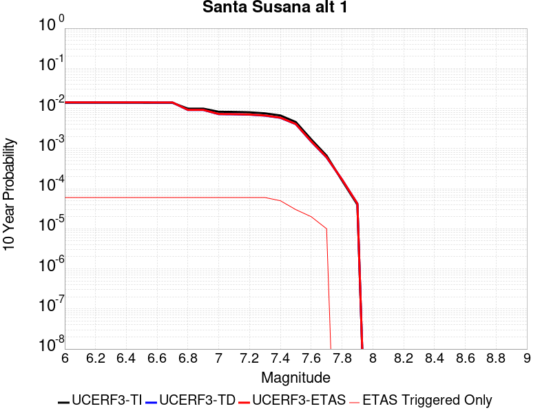 |

| Magnitude | 1 wk TI Prob | 1 wk TD Prob | 1 wk ETAS Prob | 1 wk ETAS/TD Gain | 1 wk ETAS Triggered Only | 1 mo TI Prob | 1 mo TD Prob | 1 mo ETAS Prob | 1 mo ETAS/TD Gain | 1 mo ETAS Triggered Only | 1 yr TI Prob | 1 yr TD Prob | 1 yr ETAS Prob | 1 yr ETAS/TD Gain | 1 yr ETAS Triggered Only | 10 yr TI Prob | 10 yr TD Prob | 10 yr ETAS Prob | 10 yr ETAS/TD Gain | 10 yr ETAS Triggered Only |
|-----|-----|-----|-----|-----|-----|-----|-----|-----|-----|-----|-----|-----|-----|-----|-----|-----|-----|-----|-----|-----|
| 6.0 | 2.674877E-5 | 2.7198023E-5 | 4.7197478E-5 | 1.7353276 | 2.0E-5 | 1.1463255E-4 | 1.1655839E-4 | 1.3655606E-4 | 1.1715678 | 2.0E-5 | 0.0013947578 | 0.0014182882 | 0.0014382598 | 1.0140815 | 2.0E-5 | 0.013860362 | 0.014104128 | 0.014163282 | 1.004194 | 6.0E-5 |
| 6.1 | 2.674877E-5 | 2.7198023E-5 | 4.7197478E-5 | 1.7353276 | 2.0E-5 | 1.1463255E-4 | 1.1655839E-4 | 1.3655606E-4 | 1.1715678 | 2.0E-5 | 0.0013947578 | 0.0014182882 | 0.0014382598 | 1.0140815 | 2.0E-5 | 0.013860362 | 0.014104128 | 0.014163282 | 1.004194 | 6.0E-5 |
| 6.2 | 2.674877E-5 | 2.7198023E-5 | 4.7197478E-5 | 1.7353276 | 2.0E-5 | 1.1463255E-4 | 1.1655839E-4 | 1.3655606E-4 | 1.1715678 | 2.0E-5 | 0.0013947578 | 0.0014182882 | 0.0014382598 | 1.0140815 | 2.0E-5 | 0.013860362 | 0.014104128 | 0.014163282 | 1.004194 | 6.0E-5 |
| 6.3 | 2.674877E-5 | 2.7198023E-5 | 4.7197478E-5 | 1.7353276 | 2.0E-5 | 1.1463255E-4 | 1.1655839E-4 | 1.3655606E-4 | 1.1715678 | 2.0E-5 | 0.0013947578 | 0.0014182882 | 0.0014382598 | 1.0140815 | 2.0E-5 | 0.013860362 | 0.014104128 | 0.014163282 | 1.004194 | 6.0E-5 |
| 6.4 | 2.674877E-5 | 2.7198023E-5 | 4.7197478E-5 | 1.7353276 | 2.0E-5 | 1.1463255E-4 | 1.1655839E-4 | 1.3655606E-4 | 1.1715678 | 2.0E-5 | 0.0013947578 | 0.0014182882 | 0.0014382598 | 1.0140815 | 2.0E-5 | 0.013860362 | 0.014104128 | 0.014163282 | 1.004194 | 6.0E-5 |
| 6.5 | 2.674877E-5 | 2.7198023E-5 | 4.7197478E-5 | 1.7353276 | 2.0E-5 | 1.1463255E-4 | 1.1655839E-4 | 1.3655606E-4 | 1.1715678 | 2.0E-5 | 0.0013947578 | 0.0014182882 | 0.0014382598 | 1.0140815 | 2.0E-5 | 0.013860362 | 0.014104128 | 0.014163282 | 1.004194 | 6.0E-5 |
| 6.6 | 2.6647976E-5 | 2.7074359E-5 | 4.707382E-5 | 1.7386863 | 2.0E-5 | 1.14200615E-4 | 1.1602845E-4 | 1.3602612E-4 | 1.1723515 | 2.0E-5 | 0.0013895056 | 0.0014118447 | 0.0014318166 | 1.0141459 | 2.0E-5 | 0.013808494 | 0.014040513 | 0.014099671 | 1.0042133 | 6.0E-5 |
| 6.7 | 2.6647976E-5 | 2.7074359E-5 | 4.707382E-5 | 1.7386863 | 2.0E-5 | 1.14200615E-4 | 1.1602845E-4 | 1.3602612E-4 | 1.1723515 | 2.0E-5 | 0.0013895056 | 0.0014118447 | 0.0014318166 | 1.0141459 | 2.0E-5 | 0.013808494 | 0.014040513 | 0.014099671 | 1.0042133 | 6.0E-5 |
| 6.8 | 1.9073179E-5 | 1.7637283E-5 | 3.763693E-5 | 2.1339414 | 2.0E-5 | 8.1739636E-5 | 7.558627E-5 | 9.558476E-5 | 1.2645783 | 2.0E-5 | 9.947256E-4 | 9.198925E-4 | 9.398741E-4 | 1.0217217 | 2.0E-5 | 0.009902848 | 0.009163101 | 0.009222551 | 1.006488 | 6.0E-5 |
| 6.9 | 1.9041876E-5 | 1.7619415E-5 | 3.7619062E-5 | 2.1350915 | 2.0E-5 | 8.160549E-5 | 7.55097E-5 | 9.5508185E-5 | 1.2648467 | 2.0E-5 | 9.930939E-4 | 9.1896096E-4 | 9.389426E-4 | 1.0217437 | 2.0E-5 | 0.0098866755 | 0.0091538625 | 0.009213313 | 1.0064946 | 6.0E-5 |
| 7.0 | 1.5917482E-5 | 1.3863864E-5 | 3.3863587E-5 | 2.4425793 | 2.0E-5 | 6.8215995E-5 | 5.9415237E-5 | 7.941405E-5 | 1.336594 | 2.0E-5 | 8.302132E-4 | 7.231451E-4 | 7.4313063E-4 | 1.027637 | 2.0E-5 | 0.008271185 | 0.0072088144 | 0.007268382 | 1.0082631 | 6.0E-5 |
| 7.1 | 1.577788E-5 | 1.3743872E-5 | 3.3743596E-5 | 2.455174 | 2.0E-5 | 6.761774E-5 | 5.8901005E-5 | 7.889983E-5 | 1.3395327 | 2.0E-5 | 8.2293496E-4 | 7.1688846E-4 | 7.368741E-4 | 1.0278783 | 2.0E-5 | 0.008198941 | 0.007146652 | 0.007206223 | 1.0083356 | 6.0E-5 |
| 7.2 | 1.5416446E-5 | 1.3469944E-5 | 3.3469674E-5 | 2.4847672 | 2.0E-5 | 6.606882E-5 | 5.772708E-5 | 7.772593E-5 | 1.3464378 | 2.0E-5 | 8.0409093E-4 | 7.026052E-4 | 7.225911E-4 | 1.0284455 | 2.0E-5 | 0.008011877 | 0.0070047234 | 0.007064303 | 1.0085057 | 6.0E-5 |
| 7.3 | 1.4534083E-5 | 1.2717879E-5 | 3.2717624E-5 | 2.5725694 | 2.0E-5 | 6.228744E-5 | 5.4504082E-5 | 7.450299E-5 | 1.366925 | 2.0E-5 | 7.580857E-4 | 6.633896E-4 | 6.8337633E-4 | 1.0301282 | 2.0E-5 | 0.007555048 | 0.0066149444 | 0.0066745477 | 1.0090103 | 6.0E-5 |
| 7.4 | 1.2858995E-5 | 1.1229652E-5 | 2.122954E-5 | 1.8904896 | 1.0E-5 | 5.5108816E-5 | 4.8126214E-5 | 5.8125734E-5 | 1.2077769 | 1.0E-5 | 6.7074323E-4 | 5.857831E-4 | 5.9577724E-4 | 1.0170611 | 1.0E-5 | 0.0066872234 | 0.005843165 | 0.005892873 | 1.008507 | 5.0E-5 |
| 7.5 | 8.827668E-6 | 7.805457E-6 | 1.780538E-5 | 2.2811449 | 1.0E-5 | 3.7832317E-5 | 3.3451546E-5 | 4.345121E-5 | 1.2989298 | 1.0E-5 | 4.605111E-4 | 4.071989E-4 | 4.1719482E-4 | 1.024548 | 1.0E-5 | 0.0045955796 | 0.0040647765 | 0.0040946547 | 1.0073504 | 3.0E-5 |
| 7.6 | 3.2533426E-6 | 2.871988E-6 | 2.871988E-6 | 1.0 | 0.0 | 1.3942822E-5 | 1.2308465E-5 | 1.2308465E-5 | 1.0 | 0.0 | 1.6974064E-4 | 1.4984563E-4 | 1.4984563E-4 | 1.0 | 0.0 | 0.0016961104 | 0.0014974826 | 0.0015174528 | 1.0133357 | 2.0E-5 |
| 7.7 | 1.2751709E-6 | 1.1491089E-6 | 1.1491089E-6 | 1.0 | 0.0 | 5.4650063E-6 | 4.9247437E-6 | 4.9247437E-6 | 1.0 | 0.0 | 6.653442E-5 | 5.9957198E-5 | 5.9957198E-5 | 1.0 | 0.0 | 6.6514505E-4 | 5.994191E-4 | 6.0941314E-4 | 1.0166728 | 1.0E-5 |
| 7.8 | 3.067544E-7 | 3.2400436E-7 | 3.2400436E-7 | 1.0 | 0.0 | 1.3146611E-6 | 1.3885895E-6 | 1.3885895E-6 | 1.0 | 0.0 | 1.600588E-5 | 1.6905957E-5 | 1.6905957E-5 | 1.0 | 0.0 | 1.6004729E-4 | 1.6904772E-4 | 1.6904772E-4 | 1.0 | 0.0 |
| 7.9 | 7.622999E-8 | 8.087964E-8 | 8.087964E-8 | 1.0 | 0.0 | 3.2669993E-7 | 3.4662696E-7 | 3.4662696E-7 | 1.0 | 0.0 | 3.977564E-6 | 4.2201773E-6 | 4.2201773E-6 | 1.0 | 0.0 | 3.977493E-5 | 4.220118E-5 | 4.220118E-5 | 1.0 | 0.0 |

## Santa Ynez River
*[(top)](#table-of-contents)*

| 1 Week | 1 Month | 1 Year | 10 Year |
|-----|-----|-----|-----|
|  |  |  |  |

| Magnitude | 1 wk TI Prob | 1 wk TD Prob | 1 wk ETAS Prob | 1 wk ETAS/TD Gain | 1 wk ETAS Triggered Only | 1 mo TI Prob | 1 mo TD Prob | 1 mo ETAS Prob | 1 mo ETAS/TD Gain | 1 mo ETAS Triggered Only | 1 yr TI Prob | 1 yr TD Prob | 1 yr ETAS Prob | 1 yr ETAS/TD Gain | 1 yr ETAS Triggered Only | 10 yr TI Prob | 10 yr TD Prob | 10 yr ETAS Prob | 10 yr ETAS/TD Gain | 10 yr ETAS Triggered Only |
|-----|-----|-----|-----|-----|-----|-----|-----|-----|-----|-----|-----|-----|-----|-----|-----|-----|-----|-----|-----|-----|
| 6.0 | 1.6396456E-5 | 1.7209435E-5 | 1.7209435E-5 | 1.0 | 0.0 | 7.026863E-5 | 7.375284E-5 | 8.37521E-5 | 1.135578 | 1.0E-5 | 8.551848E-4 | 8.976064E-4 | 9.375705E-4 | 1.044523 | 4.0E-5 | 0.0085190125 | 0.008943358 | 0.0090028215 | 1.0066489 | 6.0E-5 |
| 6.1 | 1.6396456E-5 | 1.7209435E-5 | 1.7209435E-5 | 1.0 | 0.0 | 7.026863E-5 | 7.375284E-5 | 8.37521E-5 | 1.135578 | 1.0E-5 | 8.551848E-4 | 8.976064E-4 | 9.375705E-4 | 1.044523 | 4.0E-5 | 0.0085190125 | 0.008943358 | 0.0090028215 | 1.0066489 | 6.0E-5 |
| 6.2 | 1.6396456E-5 | 1.7209435E-5 | 1.7209435E-5 | 1.0 | 0.0 | 7.026863E-5 | 7.375284E-5 | 8.37521E-5 | 1.135578 | 1.0E-5 | 8.551848E-4 | 8.976064E-4 | 9.375705E-4 | 1.044523 | 4.0E-5 | 0.0085190125 | 0.008943358 | 0.0090028215 | 1.0066489 | 6.0E-5 |
| 6.3 | 9.736976E-6 | 1.012233E-5 | 1.012233E-5 | 1.0 | 0.0 | 4.172923E-5 | 4.338072E-5 | 5.338029E-5 | 1.2305071 | 1.0E-5 | 5.0793495E-4 | 5.280373E-4 | 5.680162E-4 | 1.0757122 | 4.0E-5 | 0.005067755 | 0.005268332 | 0.005328016 | 1.0113288 | 6.0E-5 |
| 6.4 | 9.736976E-6 | 1.012233E-5 | 1.012233E-5 | 1.0 | 0.0 | 4.172923E-5 | 4.338072E-5 | 5.338029E-5 | 1.2305071 | 1.0E-5 | 5.0793495E-4 | 5.280373E-4 | 5.680162E-4 | 1.0757122 | 4.0E-5 | 0.005067755 | 0.005268332 | 0.005328016 | 1.0113288 | 6.0E-5 |
| 6.5 | 7.081964E-6 | 7.3298966E-6 | 7.3298966E-6 | 1.0 | 0.0 | 3.035092E-5 | 3.1413474E-5 | 4.1413157E-5 | 1.3183248 | 1.0E-5 | 3.694598E-4 | 3.8239348E-4 | 4.0238583E-4 | 1.0522821 | 2.0E-5 | 0.0036884616 | 0.0038175168 | 0.0038474023 | 1.0078285 | 3.0E-5 |
| 6.6 | 5.873247E-6 | 6.059743E-6 | 6.059743E-6 | 1.0 | 0.0 | 2.5170815E-5 | 2.5970074E-5 | 3.5969813E-5 | 1.3850486 | 1.0E-5 | 3.064116E-4 | 3.1614062E-4 | 3.361343E-4 | 1.063243 | 2.0E-5 | 0.0030598943 | 0.0031569963 | 0.0031869016 | 1.0094727 | 3.0E-5 |
| 6.7 | 4.973277E-6 | 5.115901E-6 | 5.115901E-6 | 1.0 | 0.0 | 2.1313872E-5 | 2.1925109E-5 | 2.1925109E-5 | 1.0 | 0.0 | 2.5946548E-4 | 2.66906E-4 | 2.769033E-4 | 1.0374564 | 1.0E-5 | 0.0025916274 | 0.0026659032 | 0.0026858498 | 1.0074822 | 2.0E-5 |
| 6.8 | 4.396492E-6 | 4.5109778E-6 | 4.5109778E-6 | 1.0 | 0.0 | 1.884197E-5 | 1.9332621E-5 | 1.9332621E-5 | 1.0 | 0.0 | 2.2937685E-4 | 2.3534958E-4 | 2.453472E-4 | 1.04248 | 1.0E-5 | 0.0022914023 | 0.0023510386 | 0.0023709917 | 1.0084869 | 2.0E-5 |
| 6.9 | 3.5255632E-6 | 3.6013332E-6 | 3.6013332E-6 | 1.0 | 0.0 | 1.5109469E-5 | 1.5434196E-5 | 1.5434196E-5 | 1.0 | 0.0 | 1.8394225E-4 | 1.8789528E-4 | 1.978934E-4 | 1.0532111 | 1.0E-5 | 0.0018379007 | 0.0018773803 | 0.0018973427 | 1.0106331 | 2.0E-5 |
| 7.0 | 3.211603E-6 | 3.273654E-6 | 3.273654E-6 | 1.0 | 0.0 | 1.376394E-5 | 1.4029872E-5 | 1.4029872E-5 | 1.0 | 0.0 | 1.6756308E-4 | 1.7080043E-4 | 1.8079873E-4 | 1.0585378 | 1.0E-5 | 0.0016743679 | 0.0017067058 | 0.0017266716 | 1.0116985 | 2.0E-5 |
| 7.1 | 2.5094619E-6 | 2.5409204E-6 | 2.5409204E-6 | 1.0 | 0.0 | 1.0754793E-5 | 1.0889614E-5 | 1.0889614E-5 | 1.0 | 0.0 | 1.3093173E-4 | 1.3257304E-4 | 1.3257304E-4 | 1.0 | 0.0 | 0.0013085462 | 0.0013249456 | 0.0013349323 | 1.0075375 | 1.0E-5 |
| 7.2 | 2.0515774E-6 | 2.0619375E-6 | 2.0619375E-6 | 1.0 | 0.0 | 8.792445E-6 | 8.836846E-6 | 8.836846E-6 | 1.0 | 0.0 | 1.0704277E-4 | 1.0758333E-4 | 1.0758333E-4 | 1.0 | 0.0 | 0.0010699122 | 0.0010753168 | 0.0010753168 | 1.0 | 0.0 |
| 7.3 | 1.6845745E-6 | 1.6773907E-6 | 1.6773907E-6 | 1.0 | 0.0 | 7.219585E-6 | 7.1887976E-6 | 7.1887976E-6 | 1.0 | 0.0 | 8.78949E-5 | 8.752012E-5 | 8.752012E-5 | 1.0 | 0.0 | 8.7860145E-4 | 8.7485946E-4 | 8.7485946E-4 | 1.0 | 0.0 |
| 7.4 | 1.3600285E-6 | 1.3333357E-6 | 1.3333357E-6 | 1.0 | 0.0 | 5.82868E-6 | 5.714284E-6 | 5.714284E-6 | 1.0 | 0.0 | 7.096187E-5 | 6.956921E-5 | 6.956921E-5 | 1.0 | 0.0 | 7.0939213E-4 | 6.954765E-4 | 6.954765E-4 | 1.0 | 0.0 |
| 7.5 | 9.735342E-7 | 9.290103E-7 | 9.290103E-7 | 1.0 | 0.0 | 4.172283E-6 | 3.9814668E-6 | 3.9814668E-6 | 1.0 | 0.0 | 5.079636E-5 | 4.8473295E-5 | 4.8473295E-5 | 1.0 | 0.0 | 5.0784746E-4 | 4.8462892E-4 | 4.8462892E-4 | 1.0 | 0.0 |
| 7.6 | 5.067187E-7 | 4.77857E-7 | 4.77857E-7 | 1.0 | 0.0 | 2.1716498E-6 | 2.047957E-6 | 2.047957E-6 | 1.0 | 0.0 | 2.6439517E-5 | 2.4933597E-5 | 2.4933597E-5 | 1.0 | 0.0 | 2.643637E-4 | 2.4930874E-4 | 2.4930874E-4 | 1.0 | 0.0 |
| 7.7 | 2.769089E-7 | 2.5759124E-7 | 2.5759124E-7 | 1.0 | 0.0 | 1.1867519E-6 | 1.1039621E-6 | 1.1039621E-6 | 1.0 | 0.0 | 1.4448608E-5 | 1.34406555E-5 | 1.34406555E-5 | 1.0 | 0.0 | 1.444767E-4 | 1.3439846E-4 | 1.3439846E-4 | 1.0 | 0.0 |
| 7.8 | 1.7044663E-7 | 1.5449015E-7 | 1.5449015E-7 | 1.0 | 0.0 | 7.3048534E-7 | 6.621005E-7 | 6.621005E-7 | 1.0 | 0.0 | 8.893623E-6 | 8.061043E-6 | 8.061043E-6 | 1.0 | 0.0 | 8.893267E-5 | 8.060753E-5 | 8.060753E-5 | 1.0 | 0.0 |
| 7.9 | 4.8344287E-8 | 4.0910923E-8 | 4.0910923E-8 | 1.0 | 0.0 | 2.0718979E-7 | 1.7533252E-7 | 1.7533252E-7 | 1.0 | 0.0 | 2.5225327E-6 | 2.1346711E-6 | 2.1346711E-6 | 1.0 | 0.0 | 2.5225041E-5 | 2.1346512E-5 | 2.1346512E-5 | 1.0 | 0.0 |

## Monterey Bay-Tularcitos
*[(top)](#table-of-contents)*

| 1 Week | 1 Month | 1 Year | 10 Year |
|-----|-----|-----|-----|
|  |  |  |  |

| Magnitude | 1 wk TI Prob | 1 wk TD Prob | 1 wk ETAS Prob | 1 wk ETAS/TD Gain | 1 wk ETAS Triggered Only | 1 mo TI Prob | 1 mo TD Prob | 1 mo ETAS Prob | 1 mo ETAS/TD Gain | 1 mo ETAS Triggered Only | 1 yr TI Prob | 1 yr TD Prob | 1 yr ETAS Prob | 1 yr ETAS/TD Gain | 1 yr ETAS Triggered Only | 10 yr TI Prob | 10 yr TD Prob | 10 yr ETAS Prob | 10 yr ETAS/TD Gain | 10 yr ETAS Triggered Only |
|-----|-----|-----|-----|-----|-----|-----|-----|-----|-----|-----|-----|-----|-----|-----|-----|-----|-----|-----|-----|-----|
| 6.0 | 3.0131365E-5 | 3.279877E-5 | 5.2798114E-5 | 1.609759 | 2.0E-5 | 1.2912804E-4 | 1.4055918E-4 | 1.6055637E-4 | 1.1422688 | 2.0E-5 | 0.001571 | 0.0017100703 | 0.0017599848 | 1.0291885 | 5.0E-5 | 0.015599402 | 0.016979916 | 0.017038899 | 1.0034736 | 6.0E-5 |
| 6.1 | 3.0131365E-5 | 3.279877E-5 | 5.2798114E-5 | 1.609759 | 2.0E-5 | 1.2912804E-4 | 1.4055918E-4 | 1.6055637E-4 | 1.1422688 | 2.0E-5 | 0.001571 | 0.0017100703 | 0.0017599848 | 1.0291885 | 5.0E-5 | 0.015599402 | 0.016979916 | 0.017038899 | 1.0034736 | 6.0E-5 |
| 6.2 | 3.0131365E-5 | 3.279877E-5 | 5.2798114E-5 | 1.609759 | 2.0E-5 | 1.2912804E-4 | 1.4055918E-4 | 1.6055637E-4 | 1.1422688 | 2.0E-5 | 0.001571 | 0.0017100703 | 0.0017599848 | 1.0291885 | 5.0E-5 | 0.015599402 | 0.016979916 | 0.017038899 | 1.0034736 | 6.0E-5 |
| 6.3 | 1.6998249E-5 | 1.8330798E-5 | 3.8330432E-5 | 2.09104 | 2.0E-5 | 7.28476E-5 | 7.85583E-5 | 9.855673E-5 | 1.254568 | 2.0E-5 | 8.865586E-4 | 9.5604634E-4 | 9.760272E-4 | 1.0208995 | 2.0E-5 | 0.0088303005 | 0.009521258 | 0.009541067 | 1.0020806 | 2.0E-5 |
| 6.4 | 1.6998249E-5 | 1.8330798E-5 | 3.8330432E-5 | 2.09104 | 2.0E-5 | 7.28476E-5 | 7.85583E-5 | 9.855673E-5 | 1.254568 | 2.0E-5 | 8.865586E-4 | 9.5604634E-4 | 9.760272E-4 | 1.0208995 | 2.0E-5 | 0.0088303005 | 0.009521258 | 0.009541067 | 1.0020806 | 2.0E-5 |
| 6.5 | 1.27470785E-5 | 1.3693312E-5 | 2.3693176E-5 | 1.7302735 | 1.0E-5 | 5.4629192E-5 | 5.8684363E-5 | 6.8683774E-5 | 1.1703931 | 1.0E-5 | 6.649074E-4 | 7.1425823E-4 | 7.242511E-4 | 1.0139905 | 1.0E-5 | 0.0066292146 | 0.007120678 | 0.007130607 | 1.0013944 | 1.0E-5 |
| 6.6 | 1.2739422E-5 | 1.36854E-5 | 2.3685263E-5 | 1.7306957 | 1.0E-5 | 5.4596385E-5 | 5.8650454E-5 | 6.864987E-5 | 1.1704917 | 1.0E-5 | 6.645082E-4 | 7.1384566E-4 | 7.238385E-4 | 1.0139986 | 1.0E-5 | 0.0066252467 | 0.007116579 | 0.007126508 | 1.0013952 | 1.0E-5 |
| 6.7 | 1.0160109E-5 | 1.0885755E-5 | 2.0885645E-5 | 1.9186218 | 1.0E-5 | 4.35426E-5 | 4.665244E-5 | 5.6651974E-5 | 1.214341 | 1.0E-5 | 5.300022E-4 | 5.6785246E-4 | 5.778468E-4 | 1.0176002 | 1.0E-5 | 0.005287399 | 0.0056647263 | 0.0056746695 | 1.0017554 | 1.0E-5 |
| 6.8 | 8.349859E-6 | 8.932587E-6 | 1.8932498E-5 | 2.1194866 | 1.0E-5 | 3.578462E-5 | 3.8281985E-5 | 4.8281603E-5 | 1.2612095 | 1.0E-5 | 4.3559066E-4 | 4.6598914E-4 | 4.759845E-4 | 1.0214497 | 1.0E-5 | 0.004347378 | 0.004650685 | 0.0046606385 | 1.0021402 | 1.0E-5 |
| 6.9 | 5.193639E-6 | 5.53643E-6 | 5.53643E-6 | 1.0 | 0.0 | 2.2258262E-5 | 2.372736E-5 | 2.372736E-5 | 1.0 | 0.0 | 2.7096065E-4 | 2.8884556E-4 | 2.8884556E-4 | 1.0 | 0.0 | 0.0027063051 | 0.0028850222 | 0.0028850222 | 1.0 | 0.0 |
| 7.0 | 4.359381E-6 | 4.643366E-6 | 4.643366E-6 | 1.0 | 0.0 | 1.8682927E-5 | 1.9900004E-5 | 1.9900004E-5 | 1.0 | 0.0 | 2.274409E-4 | 2.422586E-4 | 2.422586E-4 | 1.0 | 0.0 | 0.0022720827 | 0.002420238 | 0.002420238 | 1.0 | 0.0 |
| 7.1 | 3.0398533E-6 | 3.2310427E-6 | 3.2310427E-6 | 1.0 | 0.0 | 1.3027877E-5 | 1.3847267E-5 | 1.3847267E-5 | 1.0 | 0.0 | 1.5860285E-4 | 1.6858005E-4 | 1.6858005E-4 | 1.0 | 0.0 | 0.001584897 | 0.0016847793 | 0.0016847793 | 1.0 | 0.0 |
| 7.2 | 1.642335E-6 | 1.7333153E-6 | 1.7333153E-6 | 1.0 | 0.0 | 7.0385595E-6 | 7.428485E-6 | 7.428485E-6 | 1.0 | 0.0 | 8.569109E-5 | 9.044012E-5 | 9.044012E-5 | 1.0 | 0.0 | 8.5658056E-4 | 9.042358E-4 | 9.042358E-4 | 1.0 | 0.0 |
| 7.3 | 3.356842E-7 | 3.2952389E-7 | 3.2952389E-7 | 1.0 | 0.0 | 1.4386458E-6 | 1.4122444E-6 | 1.4122444E-6 | 1.0 | 0.0 | 1.7515373E-5 | 1.7193941E-5 | 1.7193941E-5 | 1.0 | 0.0 | 1.7513991E-4 | 1.719262E-4 | 1.719262E-4 | 1.0 | 0.0 |
| 7.4 | 2.1973483E-7 | 2.1006413E-7 | 2.1006413E-7 | 1.0 | 0.0 | 9.417204E-7 | 9.0027453E-7 | 9.0027453E-7 | 1.0 | 0.0 | 1.1465385E-5 | 1.0960787E-5 | 1.0960787E-5 | 1.0 | 0.0 | 1.1464794E-4 | 1.096025E-4 | 1.096025E-4 | 1.0 | 0.0 |
| 7.5 | 1.1944135E-7 | 1.0696043E-7 | 1.0696043E-7 | 1.0 | 0.0 | 5.118914E-7 | 4.5840173E-7 | 4.5840173E-7 | 1.0 | 0.0 | 6.23226E-6 | 5.581027E-6 | 5.581027E-6 | 1.0 | 0.0 | 6.2320854E-5 | 5.5808883E-5 | 5.5808883E-5 | 1.0 | 0.0 |
| 7.6 | 4.636058E-8 | 3.336489E-8 | 3.336489E-8 | 1.0 | 0.0 | 1.9868818E-7 | 1.4299238E-7 | 1.4299238E-7 | 1.0 | 0.0 | 2.419026E-6 | 1.7409308E-6 | 1.7409308E-6 | 1.0 | 0.0 | 2.4189996E-5 | 1.7409173E-5 | 1.7409173E-5 | 1.0 | 0.0 |
| 7.7 | 1.8588572E-8 | 8.003744E-9 | 8.003744E-9 | 1.0 | 0.0 | 7.9665305E-8 | 3.430176E-8 | 3.430176E-8 | 1.0 | 0.0 | 9.699246E-7 | 4.1762385E-7 | 4.1762385E-7 | 1.0 | 0.0 | 9.699204E-6 | 4.176231E-6 | 4.176231E-6 | 1.0 | 0.0 |
| 7.8 | 2.7960154E-9 | 7.6099427E-10 | 7.6099427E-10 | 1.0 | 0.0 | 1.1982923E-8 | 3.2614043E-9 | 3.2614043E-9 | 1.0 | 0.0 | 1.4589209E-7 | 3.9707597E-8 | 3.9707597E-8 | 1.0 | 0.0 | 1.4589199E-6 | 3.9707595E-7 | 3.9707595E-7 | 1.0 | 0.0 |

## Sheephole
*[(top)](#table-of-contents)*

| 1 Week | 1 Month | 1 Year | 10 Year |
|-----|-----|-----|-----|
| 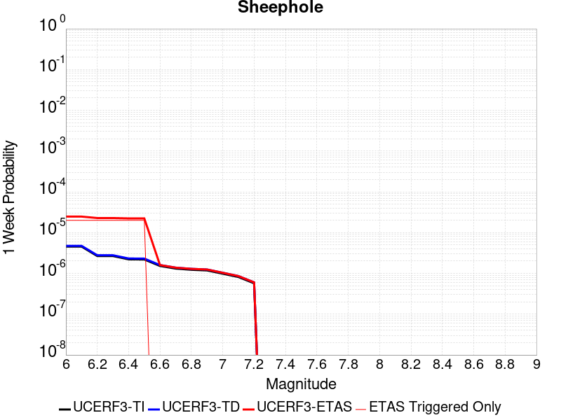 |  |  |  |

| Magnitude | 1 wk TI Prob | 1 wk TD Prob | 1 wk ETAS Prob | 1 wk ETAS/TD Gain | 1 wk ETAS Triggered Only | 1 mo TI Prob | 1 mo TD Prob | 1 mo ETAS Prob | 1 mo ETAS/TD Gain | 1 mo ETAS Triggered Only | 1 yr TI Prob | 1 yr TD Prob | 1 yr ETAS Prob | 1 yr ETAS/TD Gain | 1 yr ETAS Triggered Only | 10 yr TI Prob | 10 yr TD Prob | 10 yr ETAS Prob | 10 yr ETAS/TD Gain | 10 yr ETAS Triggered Only |
|-----|-----|-----|-----|-----|-----|-----|-----|-----|-----|-----|-----|-----|-----|-----|-----|-----|-----|-----|-----|-----|
| 6.0 | 4.5579695E-6 | 4.7412627E-6 | 2.4741168E-5 | 5.2182655 | 2.0E-5 | 1.9534009E-5 | 2.031957E-5 | 5.031896E-5 | 2.4763792 | 3.0E-5 | 2.3780059E-4 | 2.473682E-4 | 3.073534E-4 | 1.2424934 | 6.0E-5 | 0.0023754628 | 0.002471473 | 0.0025313247 | 1.024217 | 6.0E-5 |
| 6.1 | 4.5579695E-6 | 4.7412627E-6 | 2.4741168E-5 | 5.2182655 | 2.0E-5 | 1.9534009E-5 | 2.031957E-5 | 5.031896E-5 | 2.4763792 | 3.0E-5 | 2.3780059E-4 | 2.473682E-4 | 3.073534E-4 | 1.2424934 | 6.0E-5 | 0.0023754628 | 0.002471473 | 0.0025313247 | 1.024217 | 6.0E-5 |
| 6.2 | 2.6677674E-6 | 2.7873941E-6 | 2.2787339E-5 | 8.17514 | 2.0E-5 | 1.1433239E-5 | 1.1945926E-5 | 4.194557E-5 | 3.5112863 | 3.0E-5 | 1.3919079E-4 | 1.4543302E-4 | 1.9542576E-4 | 1.3437508 | 5.0E-5 | 0.0013910364 | 0.0014534844 | 0.0015034117 | 1.03435 | 5.0E-5 |
| 6.3 | 2.6677674E-6 | 2.7873941E-6 | 2.2787339E-5 | 8.17514 | 2.0E-5 | 1.1433239E-5 | 1.1945926E-5 | 4.194557E-5 | 3.5112863 | 3.0E-5 | 1.3919079E-4 | 1.4543302E-4 | 1.9542576E-4 | 1.3437508 | 5.0E-5 | 0.0013910364 | 0.0014534844 | 0.0015034117 | 1.03435 | 5.0E-5 |
| 6.4 | 2.2159759E-6 | 2.3228788E-6 | 2.2322833E-5 | 9.609986 | 2.0E-5 | 9.497005E-6 | 9.955161E-6 | 3.9954863E-5 | 4.013482 | 3.0E-5 | 1.156199E-4 | 1.2119815E-4 | 1.7119209E-4 | 1.4124975 | 5.0E-5 | 0.0011555976 | 0.0012113999 | 0.0012613393 | 1.0412246 | 5.0E-5 |
| 6.5 | 2.1986082E-6 | 2.304759E-6 | 2.2304714E-5 | 9.677677 | 2.0E-5 | 9.4225725E-6 | 9.877506E-6 | 3.987721E-5 | 4.0371737 | 3.0E-5 | 1.1471378E-4 | 1.2025281E-4 | 1.702468E-4 | 1.4157407 | 5.0E-5 | 0.0011465458 | 0.0012019566 | 0.0012518966 | 1.0415488 | 5.0E-5 |
| 6.6 | 1.5232331E-6 | 1.6018919E-6 | 1.6018919E-6 | 1.0 | 0.0 | 6.5281256E-6 | 6.865234E-6 | 1.6865166E-5 | 2.4566047 | 1.0E-5 | 7.947703E-5 | 8.35812E-5 | 1.13578695E-4 | 1.3589023 | 3.0E-5 | 7.9448614E-4 | 8.3551643E-4 | 8.6549134E-4 | 1.0358759 | 3.0E-5 |
| 6.7 | 1.3137362E-6 | 1.382819E-6 | 1.382819E-6 | 1.0 | 0.0 | 5.6302856E-6 | 5.926355E-6 | 1.5926295E-5 | 2.687368 | 1.0E-5 | 6.854657E-5 | 7.215112E-5 | 1.0214896E-4 | 1.415764 | 3.0E-5 | 6.8525434E-4 | 7.212908E-4 | 7.512692E-4 | 1.0415621 | 3.0E-5 |
| 6.8 | 1.2275751E-6 | 1.2922847E-6 | 1.2922847E-6 | 1.0 | 0.0 | 5.2610258E-6 | 5.5383516E-6 | 1.5538297E-5 | 2.8055813 | 1.0E-5 | 6.4051106E-5 | 6.7427485E-5 | 9.742546E-5 | 1.4448924 | 3.0E-5 | 6.4032647E-4 | 6.740836E-4 | 7.040634E-4 | 1.0444748 | 3.0E-5 |
| 6.9 | 1.1837088E-6 | 1.246102E-6 | 1.246102E-6 | 1.0 | 0.0 | 5.0730278E-6 | 5.340427E-6 | 1.5340374E-5 | 2.8724995 | 1.0E-5 | 6.176237E-5 | 6.501789E-5 | 9.5015945E-5 | 1.4613814 | 3.0E-5 | 6.17452E-4 | 6.5000186E-4 | 6.7998236E-4 | 1.0461237 | 3.0E-5 |
| 7.0 | 9.849371E-7 | 1.0366288E-6 | 1.0366288E-6 | 1.0 | 0.0 | 4.2211523E-6 | 4.442688E-6 | 1.4442643E-5 | 3.2508795 | 1.0E-5 | 5.1391315E-5 | 5.4088487E-5 | 7.40874E-5 | 1.3697444 | 2.0E-5 | 5.137943E-4 | 5.407633E-4 | 5.6075247E-4 | 1.0369648 | 2.0E-5 |
| 7.1 | 8.1643645E-7 | 8.591669E-7 | 8.591669E-7 | 1.0 | 0.0 | 3.4990085E-6 | 3.682139E-6 | 1.3682103E-5 | 3.7158027 | 1.0E-5 | 4.2599597E-5 | 4.482921E-5 | 6.482832E-5 | 1.4461176 | 2.0E-5 | 4.259143E-4 | 4.4821028E-4 | 4.6820132E-4 | 1.0446019 | 2.0E-5 |
| 7.2 | 5.7295756E-7 | 6.029502E-7 | 6.029502E-7 | 1.0 | 0.0 | 2.45553E-6 | 2.58407E-6 | 1.2584044E-5 | 4.869854 | 1.0E-5 | 2.9895667E-5 | 3.1460666E-5 | 5.1460036E-5 | 1.6356944 | 2.0E-5 | 2.9891645E-4 | 3.145688E-4 | 3.3456253E-4 | 1.063559 | 2.0E-5 |

## Mono Lake 2011 CFM
*[(top)](#table-of-contents)*

| 1 Week | 1 Month | 1 Year | 10 Year |
|-----|-----|-----|-----|
|  |  |  |  |

| Magnitude | 1 wk TI Prob | 1 wk TD Prob | 1 wk ETAS Prob | 1 wk ETAS/TD Gain | 1 wk ETAS Triggered Only | 1 mo TI Prob | 1 mo TD Prob | 1 mo ETAS Prob | 1 mo ETAS/TD Gain | 1 mo ETAS Triggered Only | 1 yr TI Prob | 1 yr TD Prob | 1 yr ETAS Prob | 1 yr ETAS/TD Gain | 1 yr ETAS Triggered Only | 10 yr TI Prob | 10 yr TD Prob | 10 yr ETAS Prob | 10 yr ETAS/TD Gain | 10 yr ETAS Triggered Only |
|-----|-----|-----|-----|-----|-----|-----|-----|-----|-----|-----|-----|-----|-----|-----|-----|-----|-----|-----|-----|-----|
| 6.0 | 2.0341662E-5 | 2.3828166E-5 | 5.382745E-5 | 2.258984 | 3.0E-5 | 8.717564E-5 | 1.0211971E-4 | 1.4211563E-4 | 1.3916571 | 4.0E-5 | 0.0010608466 | 0.0012431298 | 0.0012830801 | 1.0321368 | 4.0E-5 | 0.010557966 | 0.012413835 | 0.012463215 | 1.0039778 | 5.0E-5 |
| 6.1 | 2.0341662E-5 | 2.3828166E-5 | 5.382745E-5 | 2.258984 | 3.0E-5 | 8.717564E-5 | 1.0211971E-4 | 1.4211563E-4 | 1.3916571 | 4.0E-5 | 0.0010608466 | 0.0012431298 | 0.0012830801 | 1.0321368 | 4.0E-5 | 0.010557966 | 0.012413835 | 0.012463215 | 1.0039778 | 5.0E-5 |
| 6.2 | 2.0341662E-5 | 2.3828166E-5 | 5.382745E-5 | 2.258984 | 3.0E-5 | 8.717564E-5 | 1.0211971E-4 | 1.4211563E-4 | 1.3916571 | 4.0E-5 | 0.0010608466 | 0.0012431298 | 0.0012830801 | 1.0321368 | 4.0E-5 | 0.010557966 | 0.012413835 | 0.012463215 | 1.0039778 | 5.0E-5 |
| 6.3 | 2.0341662E-5 | 2.3828166E-5 | 5.382745E-5 | 2.258984 | 3.0E-5 | 8.717564E-5 | 1.0211971E-4 | 1.4211563E-4 | 1.3916571 | 4.0E-5 | 0.0010608466 | 0.0012431298 | 0.0012830801 | 1.0321368 | 4.0E-5 | 0.010557966 | 0.012413835 | 0.012463215 | 1.0039778 | 5.0E-5 |
| 6.4 | 1.749821E-5 | 2.0490985E-5 | 5.049037E-5 | 2.4640284 | 3.0E-5 | 7.499018E-5 | 8.781851E-5 | 1.27815E-4 | 1.4554448 | 4.0E-5 | 9.1262296E-4 | 0.0010691903 | 0.0011091476 | 1.0373715 | 4.0E-5 | 0.009088841 | 0.010691865 | 0.010741331 | 1.0046264 | 5.0E-5 |
| 6.5 | 1.749821E-5 | 2.0490985E-5 | 5.049037E-5 | 2.4640284 | 3.0E-5 | 7.499018E-5 | 8.781851E-5 | 1.27815E-4 | 1.4554448 | 4.0E-5 | 9.1262296E-4 | 0.0010691903 | 0.0011091476 | 1.0373715 | 4.0E-5 | 0.009088841 | 0.010691865 | 0.010741331 | 1.0046264 | 5.0E-5 |

## Emerson-Copper Mtn 2011
*[(top)](#table-of-contents)*

| 1 Week | 1 Month | 1 Year | 10 Year |
|-----|-----|-----|-----|
|  |  |  |  |

| Magnitude | 1 wk TI Prob | 1 wk TD Prob | 1 wk ETAS Prob | 1 wk ETAS/TD Gain | 1 wk ETAS Triggered Only | 1 mo TI Prob | 1 mo TD Prob | 1 mo ETAS Prob | 1 mo ETAS/TD Gain | 1 mo ETAS Triggered Only | 1 yr TI Prob | 1 yr TD Prob | 1 yr ETAS Prob | 1 yr ETAS/TD Gain | 1 yr ETAS Triggered Only | 10 yr TI Prob | 10 yr TD Prob | 10 yr ETAS Prob | 10 yr ETAS/TD Gain | 10 yr ETAS Triggered Only |
|-----|-----|-----|-----|-----|-----|-----|-----|-----|-----|-----|-----|-----|-----|-----|-----|-----|-----|-----|-----|-----|
| 6.0 | 2.1364202E-5 | 9.968114E-6 | 2.9967914E-5 | 3.0063777 | 2.0E-5 | 9.1557646E-5 | 4.2719836E-5 | 6.271898E-5 | 1.4681466 | 2.0E-5 | 0.0011141442 | 5.199986E-4 | 5.49983E-4 | 1.0576625 | 3.0E-5 | 0.011085749 | 0.005188688 | 0.0052384287 | 1.0095863 | 5.0E-5 |
| 6.1 | 2.1364202E-5 | 9.968114E-6 | 2.9967914E-5 | 3.0063777 | 2.0E-5 | 9.1557646E-5 | 4.2719836E-5 | 6.271898E-5 | 1.4681466 | 2.0E-5 | 0.0011141442 | 5.199986E-4 | 5.49983E-4 | 1.0576625 | 3.0E-5 | 0.011085749 | 0.005188688 | 0.0052384287 | 1.0095863 | 5.0E-5 |
| 6.2 | 2.1364202E-5 | 9.968114E-6 | 2.9967914E-5 | 3.0063777 | 2.0E-5 | 9.1557646E-5 | 4.2719836E-5 | 6.271898E-5 | 1.4681466 | 2.0E-5 | 0.0011141442 | 5.199986E-4 | 5.49983E-4 | 1.0576625 | 3.0E-5 | 0.011085749 | 0.005188688 | 0.0052384287 | 1.0095863 | 5.0E-5 |
| 6.3 | 1.7751237E-5 | 8.089227E-6 | 2.8089065E-5 | 3.4724042 | 2.0E-5 | 7.607452E-5 | 3.466769E-5 | 5.4666994E-5 | 1.576886 | 2.0E-5 | 9.258136E-4 | 4.2200365E-4 | 4.5199099E-4 | 1.0710595 | 3.0E-5 | 0.00921966 | 0.0042126453 | 0.004262435 | 1.011819 | 5.0E-5 |
| 6.4 | 1.7751237E-5 | 8.089227E-6 | 2.8089065E-5 | 3.4724042 | 2.0E-5 | 7.607452E-5 | 3.466769E-5 | 5.4666994E-5 | 1.576886 | 2.0E-5 | 9.258136E-4 | 4.2200365E-4 | 4.5199099E-4 | 1.0710595 | 3.0E-5 | 0.00921966 | 0.0042126453 | 0.004262435 | 1.011819 | 5.0E-5 |
| 6.5 | 1.5886664E-5 | 6.603819E-6 | 2.6603688E-5 | 4.0285306 | 2.0E-5 | 6.808392E-5 | 2.8301802E-5 | 4.8301234E-5 | 1.7066488 | 2.0E-5 | 8.286065E-4 | 3.4452465E-4 | 3.7451432E-4 | 1.0870465 | 3.0E-5 | 0.008255237 | 0.0034403696 | 0.0034901975 | 1.0144833 | 5.0E-5 |
| 6.6 | 1.5886664E-5 | 6.603819E-6 | 2.6603688E-5 | 4.0285306 | 2.0E-5 | 6.808392E-5 | 2.8301802E-5 | 4.8301234E-5 | 1.7066488 | 2.0E-5 | 8.286065E-4 | 3.4452465E-4 | 3.7451432E-4 | 1.0870465 | 3.0E-5 | 0.008255237 | 0.0034403696 | 0.0034901975 | 1.0144833 | 5.0E-5 |
| 6.7 | 1.428471E-5 | 5.470403E-6 | 2.5470294E-5 | 4.656018 | 2.0E-5 | 6.121875E-5 | 2.3444394E-5 | 4.3443924E-5 | 1.8530624 | 2.0E-5 | 7.450834E-4 | 2.8540206E-4 | 3.153935E-4 | 1.1050849 | 3.0E-5 | 0.007425902 | 0.0028507432 | 0.0028906292 | 1.0139915 | 4.0E-5 |
| 6.8 | 1.3490684E-5 | 5.073699E-6 | 2.5073597E-5 | 4.9418774 | 2.0E-5 | 5.7815934E-5 | 2.1744265E-5 | 4.1743828E-5 | 1.9197628 | 2.0E-5 | 7.0368167E-4 | 2.6470813E-4 | 2.9470018E-4 | 1.1133024 | 3.0E-5 | 0.007014576 | 0.002644309 | 0.0026842032 | 1.0150868 | 4.0E-5 |
| 6.9 | 1.2235421E-5 | 4.289677E-6 | 2.4289591E-5 | 5.662336 | 2.0E-5 | 5.2436466E-5 | 1.838422E-5 | 3.8383852E-5 | 2.0878694 | 2.0E-5 | 6.38227E-4 | 2.238085E-4 | 2.538018E-4 | 1.1340132 | 3.0E-5 | 0.0063639707 | 0.0022361854 | 0.002276096 | 1.0178477 | 4.0E-5 |
| 7.0 | 1.1009851E-5 | 3.7189886E-6 | 2.3718914E-5 | 6.377786 | 2.0E-5 | 4.7184225E-5 | 1.5938444E-5 | 3.5938127E-5 | 2.2548077 | 2.0E-5 | 5.743165E-4 | 1.9403672E-4 | 2.240309E-4 | 1.1545799 | 3.0E-5 | 0.005728345 | 0.0019390108 | 0.0019789333 | 1.0205891 | 4.0E-5 |
| 7.1 | 9.726373E-6 | 3.2117953E-6 | 2.321173E-5 | 7.227027 | 2.0E-5 | 4.168379E-5 | 1.3764783E-5 | 3.3764507E-5 | 2.4529634 | 2.0E-5 | 5.07382E-4 | 1.6757673E-4 | 1.975717E-4 | 1.1789925 | 3.0E-5 | 0.0050622504 | 0.0016748349 | 0.0017147679 | 1.0238429 | 4.0E-5 |
| 7.2 | 3.9335127E-6 | 1.1524792E-6 | 2.1152457E-5 | 18.353872 | 2.0E-5 | 1.6857803E-5 | 4.9391874E-6 | 2.4939089E-5 | 5.049229 | 2.0E-5 | 2.0522442E-4 | 6.0133007E-5 | 9.01312E-5 | 1.498864 | 3.0E-5 | 0.00205035 | 6.011733E-4 | 6.4114924E-4 | 1.0664966 | 4.0E-5 |
| 7.3 | 2.661632E-6 | 6.911505E-7 | 2.0691137E-5 | 29.937239 | 2.0E-5 | 1.14069435E-5 | 2.9620703E-6 | 2.2962011E-5 | 7.752014 | 2.0E-5 | 1.3887069E-4 | 3.6062618E-5 | 6.606153E-5 | 1.8318564 | 3.0E-5 | 0.0013878393 | 3.605687E-4 | 4.0055427E-4 | 1.1108959 | 4.0E-5 |
| 7.4 | 2.0893426E-6 | 5.4618386E-7 | 2.0546173E-5 | 37.617687 | 2.0E-5 | 8.954295E-6 | 2.3407858E-6 | 2.2340739E-5 | 9.544119 | 2.0E-5 | 1.0901308E-4 | 2.84987E-5 | 5.8497844E-5 | 2.0526495 | 3.0E-5 | 0.0010895962 | 2.84951E-4 | 3.1494244E-4 | 1.1052513 | 3.0E-5 |
| 7.5 | 1.1681728E-6 | 3.6030585E-7 | 2.03603E-5 | 56.508377 | 2.0E-5 | 5.0064455E-6 | 1.544167E-6 | 2.1544136E-5 | 13.951946 | 2.0E-5 | 6.0951766E-5 | 1.8800076E-5 | 4.8799513E-5 | 2.5957081 | 3.0E-5 | 6.093505E-4 | 1.8798532E-4 | 2.1797969E-4 | 1.1595569 | 3.0E-5 |
| 7.6 | 1.3154387E-7 | 7.1197384E-8 | 1.0071197E-5 | 141.45459 | 1.0E-5 | 5.6375933E-7 | 3.051316E-7 | 1.0305129E-5 | 33.77273 | 1.0E-5 | 6.863748E-6 | 3.7149728E-6 | 2.3714898E-5 | 6.3835998 | 2.0E-5 | 6.863536E-5 | 3.7149264E-5 | 5.714852E-5 | 1.5383487 | 2.0E-5 |

## San Pedro Basin
*[(top)](#table-of-contents)*

| 1 Week | 1 Month | 1 Year | 10 Year |
|-----|-----|-----|-----|
| 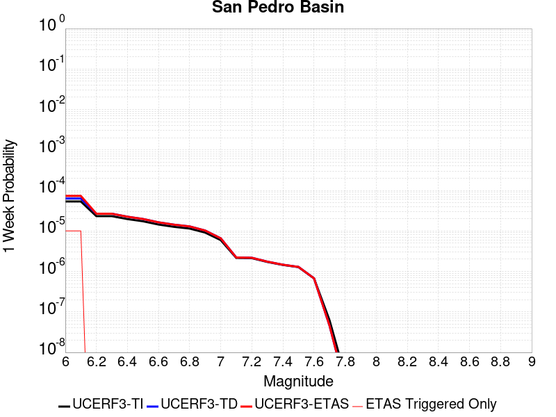 | 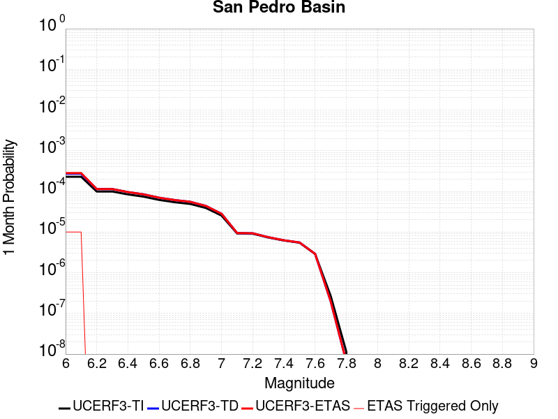 | 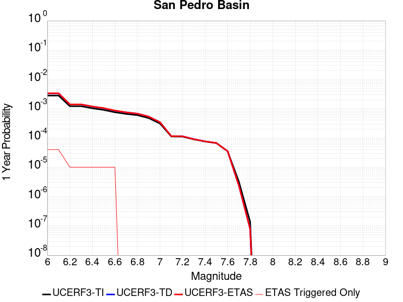 | 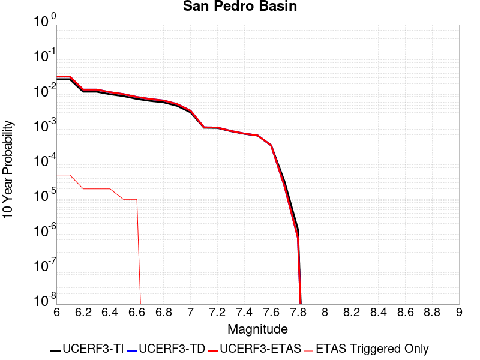 |

| Magnitude | 1 wk TI Prob | 1 wk TD Prob | 1 wk ETAS Prob | 1 wk ETAS/TD Gain | 1 wk ETAS Triggered Only | 1 mo TI Prob | 1 mo TD Prob | 1 mo ETAS Prob | 1 mo ETAS/TD Gain | 1 mo ETAS Triggered Only | 1 yr TI Prob | 1 yr TD Prob | 1 yr ETAS Prob | 1 yr ETAS/TD Gain | 1 yr ETAS Triggered Only | 10 yr TI Prob | 10 yr TD Prob | 10 yr ETAS Prob | 10 yr ETAS/TD Gain | 10 yr ETAS Triggered Only |
|-----|-----|-----|-----|-----|-----|-----|-----|-----|-----|-----|-----|-----|-----|-----|-----|-----|-----|-----|-----|-----|
| 6.0 | 5.3449043E-5 | 6.336954E-5 | 7.33689E-5 | 1.1577945 | 1.0E-5 | 2.2904722E-4 | 2.715589E-4 | 2.8155622E-4 | 1.0368145 | 1.0E-5 | 0.0027850836 | 0.0033018254 | 0.0033416932 | 1.0120745 | 4.0E-5 | 0.027504366 | 0.03258945 | 0.03263782 | 1.0014843 | 5.0E-5 |
| 6.1 | 5.3449043E-5 | 6.336954E-5 | 7.33689E-5 | 1.1577945 | 1.0E-5 | 2.2904722E-4 | 2.715589E-4 | 2.8155622E-4 | 1.0368145 | 1.0E-5 | 0.0027850836 | 0.0033018254 | 0.0033416932 | 1.0120745 | 4.0E-5 | 0.027504366 | 0.03258945 | 0.03263782 | 1.0014843 | 5.0E-5 |
| 6.2 | 2.3189454E-5 | 2.6642796E-5 | 2.6642796E-5 | 1.0 | 0.0 | 9.9379584E-5 | 1.14178685E-4 | 1.14178685E-4 | 1.0 | 0.0 | 0.0012092749 | 0.0013892864 | 0.0013992725 | 1.007188 | 1.0E-5 | 0.012027155 | 0.013810883 | 0.013830608 | 1.0014281 | 2.0E-5 |
| 6.3 | 2.3189454E-5 | 2.6642796E-5 | 2.6642796E-5 | 1.0 | 0.0 | 9.9379584E-5 | 1.14178685E-4 | 1.14178685E-4 | 1.0 | 0.0 | 0.0012092749 | 0.0013892864 | 0.0013992725 | 1.007188 | 1.0E-5 | 0.012027155 | 0.013810883 | 0.013830608 | 1.0014281 | 2.0E-5 |
| 6.4 | 1.966056E-5 | 2.2463413E-5 | 2.2463413E-5 | 1.0 | 0.0 | 8.425682E-5 | 9.626844E-5 | 9.626844E-5 | 1.0 | 0.0 | 0.001025344 | 0.0011714783 | 0.0011814666 | 1.0085262 | 1.0E-5 | 0.010206259 | 0.011657117 | 0.011676883 | 1.0016956 | 2.0E-5 |
| 6.5 | 1.7342953E-5 | 1.9745148E-5 | 1.9745148E-5 | 1.0 | 0.0 | 7.4324824E-5 | 8.4619525E-5 | 8.4619525E-5 | 1.0 | 0.0 | 9.04529E-4 | 0.0010297928 | 0.0010397824 | 1.0097007 | 1.0E-5 | 0.009008561 | 0.010253931 | 0.010263829 | 1.0009652 | 1.0E-5 |
| 6.6 | 1.439804E-5 | 1.6322716E-5 | 1.6322716E-5 | 1.0 | 0.0 | 6.170443E-5 | 6.99528E-5 | 6.99528E-5 | 1.0 | 0.0 | 7.509924E-4 | 8.513747E-4 | 8.6136616E-4 | 1.0117357 | 1.0E-5 | 0.0074845953 | 0.008484332 | 0.008494248 | 1.0011686 | 1.0E-5 |
| 6.7 | 1.2634884E-5 | 1.4285297E-5 | 1.4285297E-5 | 1.0 | 0.0 | 5.414838E-5 | 6.1221435E-5 | 6.1221435E-5 | 1.0 | 0.0 | 6.590571E-4 | 7.4514654E-4 | 7.4514654E-4 | 1.0 | 0.0 | 0.006571059 | 0.007429501 | 0.007429501 | 1.0 | 0.0 |
| 6.8 | 1.146091E-5 | 1.2933192E-5 | 1.2933192E-5 | 1.0 | 0.0 | 4.911726E-5 | 5.5426954E-5 | 5.5426954E-5 | 1.0 | 0.0 | 5.9783855E-4 | 6.7464396E-4 | 6.7464396E-4 | 1.0 | 0.0 | 0.0059623276 | 0.006728899 | 0.006728899 | 1.0 | 0.0 |
| 6.9 | 9.109035E-6 | 1.0235011E-5 | 1.0235011E-5 | 1.0 | 0.0 | 3.9038136E-5 | 4.3863754E-5 | 4.3863754E-5 | 1.0 | 0.0 | 4.7518566E-4 | 5.3393835E-4 | 5.3393835E-4 | 1.0 | 0.0 | 0.0047417083 | 0.005329309 | 0.005329309 | 1.0 | 0.0 |
| 7.0 | 5.9351028E-6 | 6.583964E-6 | 6.583964E-6 | 1.0 | 0.0 | 2.5435906E-5 | 2.8216817E-5 | 2.8216817E-5 | 1.0 | 0.0 | 3.0963816E-4 | 3.435092E-4 | 3.435092E-4 | 1.0 | 0.0 | 0.0030920706 | 0.0034320992 | 0.0034320992 | 1.0 | 0.0 |
| 7.1 | 2.1557585E-6 | 2.209648E-6 | 2.209648E-6 | 1.0 | 0.0 | 9.238933E-6 | 9.469887E-6 | 9.469887E-6 | 1.0 | 0.0 | 1.1247819E-4 | 1.1528993E-4 | 1.1528993E-4 | 1.0 | 0.0 | 0.0011242128 | 0.0011523166 | 0.0011523166 | 1.0 | 0.0 |
| 7.2 | 2.1251979E-6 | 2.1779945E-6 | 2.1779945E-6 | 1.0 | 0.0 | 9.107958E-6 | 9.334229E-6 | 9.334229E-6 | 1.0 | 0.0 | 1.1088375E-4 | 1.1363847E-4 | 1.1363847E-4 | 1.0 | 0.0 | 0.0011082845 | 0.0011358189 | 0.0011358189 | 1.0 | 0.0 |
| 7.3 | 1.7145798E-6 | 1.7442874E-6 | 1.7442874E-6 | 1.0 | 0.0 | 7.3481783E-6 | 7.4754967E-6 | 7.4754967E-6 | 1.0 | 0.0 | 8.94604E-5 | 9.1010465E-5 | 9.1010465E-5 | 1.0 | 0.0 | 8.9424395E-4 | 9.0974104E-4 | 9.0974104E-4 | 1.0 | 0.0 |
| 7.4 | 1.4467993E-6 | 1.4641868E-6 | 1.4641868E-6 | 1.0 | 0.0 | 6.200554E-6 | 6.2750714E-6 | 6.2750714E-6 | 1.0 | 0.0 | 7.548913E-5 | 7.639639E-5 | 7.639639E-5 | 1.0 | 0.0 | 7.546349E-4 | 7.6370855E-4 | 7.6370855E-4 | 1.0 | 0.0 |
| 7.5 | 1.2803735E-6 | 1.2931497E-6 | 1.2931497E-6 | 1.0 | 0.0 | 5.487303E-6 | 5.5420587E-6 | 5.5420587E-6 | 1.0 | 0.0 | 6.680587E-5 | 6.7472545E-5 | 6.7472545E-5 | 1.0 | 0.0 | 6.678579E-4 | 6.7452766E-4 | 6.7452766E-4 | 1.0 | 0.0 |
| 7.6 | 6.755009E-7 | 6.769465E-7 | 6.769465E-7 | 1.0 | 0.0 | 2.8950008E-6 | 2.9011965E-6 | 2.9011965E-6 | 1.0 | 0.0 | 3.5246063E-5 | 3.5321555E-5 | 3.5321555E-5 | 1.0 | 0.0 | 3.5240475E-4 | 3.5316512E-4 | 3.5316512E-4 | 1.0 | 0.0 |
| 7.7 | 6.211885E-8 | 4.569953E-8 | 4.569953E-8 | 1.0 | 0.0 | 2.6622362E-7 | 1.9585512E-7 | 1.9585512E-7 | 1.0 | 0.0 | 3.2412677E-6 | 2.3845337E-6 | 2.3845337E-6 | 1.0 | 0.0 | 3.2412205E-5 | 2.3845101E-5 | 2.3845101E-5 | 1.0 | 0.0 |
| 7.8 | 2.6580573E-9 | 1.5138163E-9 | 1.5138163E-9 | 1.0 | 0.0 | 1.1391674E-8 | 6.487784E-9 | 6.487784E-9 | 1.0 | 0.0 | 1.3869362E-7 | 7.898877E-8 | 7.898877E-8 | 1.0 | 0.0 | 1.3869354E-6 | 7.898877E-7 | 7.898877E-7 | 1.0 | 0.0 |

## Palos Verdes
*[(top)](#table-of-contents)*

| 1 Week | 1 Month | 1 Year | 10 Year |
|-----|-----|-----|-----|
| 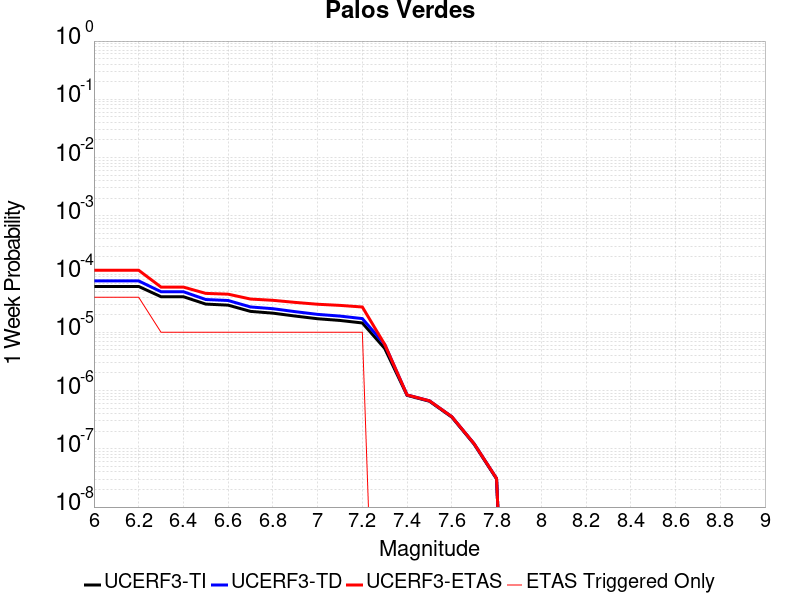 | 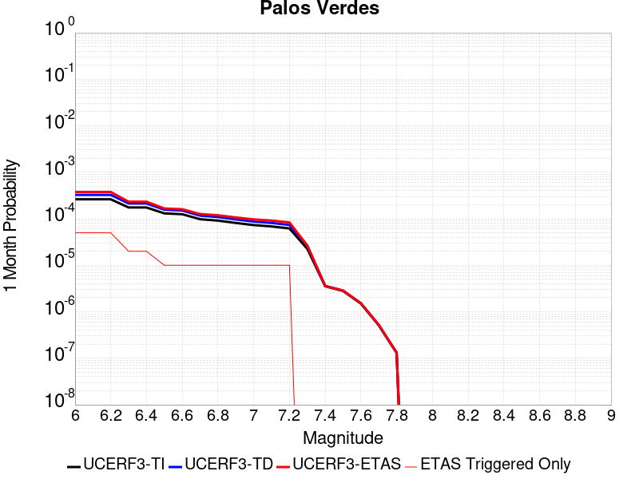 | 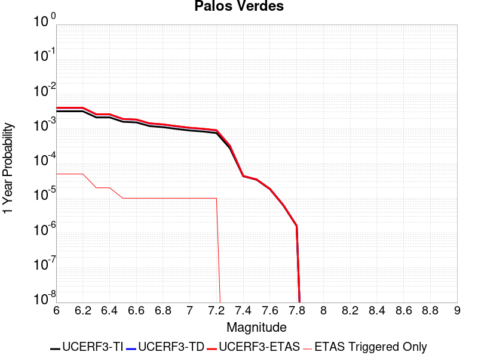 | 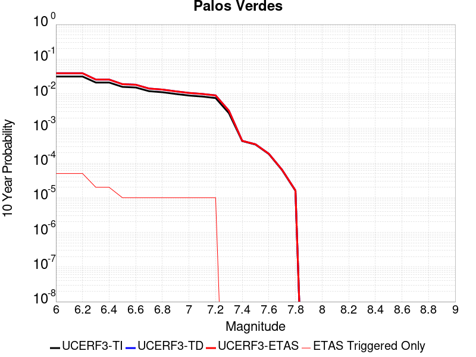 |

| Magnitude | 1 wk TI Prob | 1 wk TD Prob | 1 wk ETAS Prob | 1 wk ETAS/TD Gain | 1 wk ETAS Triggered Only | 1 mo TI Prob | 1 mo TD Prob | 1 mo ETAS Prob | 1 mo ETAS/TD Gain | 1 mo ETAS Triggered Only | 1 yr TI Prob | 1 yr TD Prob | 1 yr ETAS Prob | 1 yr ETAS/TD Gain | 1 yr ETAS Triggered Only | 10 yr TI Prob | 10 yr TD Prob | 10 yr ETAS Prob | 10 yr ETAS/TD Gain | 10 yr ETAS Triggered Only |
|-----|-----|-----|-----|-----|-----|-----|-----|-----|-----|-----|-----|-----|-----|-----|-----|-----|-----|-----|-----|-----|
| 6.0 | 6.126063E-5 | 7.622612E-5 | 1.1622307E-4 | 1.5247145 | 4.0E-5 | 2.6251914E-4 | 3.2664582E-4 | 3.766295E-4 | 1.153021 | 5.0E-5 | 0.0031914865 | 0.003970174 | 0.0040199757 | 1.0125439 | 5.0E-5 | 0.031460393 | 0.039048895 | 0.039096944 | 1.0012305 | 5.0E-5 |
| 6.1 | 6.126063E-5 | 7.622612E-5 | 1.1622307E-4 | 1.5247145 | 4.0E-5 | 2.6251914E-4 | 3.2664582E-4 | 3.766295E-4 | 1.153021 | 5.0E-5 | 0.0031914865 | 0.003970174 | 0.0040199757 | 1.0125439 | 5.0E-5 | 0.031460393 | 0.039048895 | 0.039096944 | 1.0012305 | 5.0E-5 |
| 6.2 | 6.126063E-5 | 7.622612E-5 | 1.1622307E-4 | 1.5247145 | 4.0E-5 | 2.6251914E-4 | 3.2664582E-4 | 3.766295E-4 | 1.153021 | 5.0E-5 | 0.0031914865 | 0.003970174 | 0.0040199757 | 1.0125439 | 5.0E-5 | 0.031460393 | 0.039048895 | 0.039096944 | 1.0012305 | 5.0E-5 |
| 6.3 | 4.0838047E-5 | 4.9749437E-5 | 5.9748938E-5 | 1.2009974 | 1.0E-5 | 1.7500846E-4 | 2.1319572E-4 | 2.3319144E-4 | 1.0937905 | 2.0E-5 | 0.0021286458 | 0.0025927818 | 0.00261273 | 1.0076938 | 2.0E-5 | 0.021083709 | 0.025646681 | 0.025666168 | 1.0007598 | 2.0E-5 |
| 6.4 | 4.0838047E-5 | 4.9749437E-5 | 5.9748938E-5 | 1.2009974 | 1.0E-5 | 1.7500846E-4 | 2.1319572E-4 | 2.3319144E-4 | 1.0937905 | 2.0E-5 | 0.0021286458 | 0.0025927818 | 0.00261273 | 1.0076938 | 2.0E-5 | 0.021083709 | 0.025646681 | 0.025666168 | 1.0007598 | 2.0E-5 |
| 6.5 | 3.0512005E-5 | 3.656162E-5 | 4.6561257E-5 | 1.2735008 | 1.0E-5 | 1.3075917E-4 | 1.5668393E-4 | 1.6668237E-4 | 1.0638127 | 1.0E-5 | 0.0015908304 | 0.0019060767 | 0.0019160575 | 1.0052364 | 1.0E-5 | 0.015794903 | 0.018909154 | 0.018918965 | 1.0005188 | 1.0E-5 |
| 6.6 | 2.9255087E-5 | 3.515442E-5 | 4.515407E-5 | 1.2844492 | 1.0E-5 | 1.2537291E-4 | 1.5065377E-4 | 1.6065226E-4 | 1.0663674 | 1.0E-5 | 0.0015253464 | 0.0018327828 | 0.0018427644 | 1.0054462 | 1.0E-5 | 0.015149189 | 0.018188225 | 0.018198043 | 1.0005398 | 1.0E-5 |
| 6.7 | 2.287198E-5 | 2.7248278E-5 | 3.7248006E-5 | 1.3669857 | 1.0E-5 | 9.801909E-5 | 1.16773626E-4 | 1.2677246E-4 | 1.0856258 | 1.0E-5 | 0.001192729 | 0.0014208833 | 0.0014308691 | 1.0070279 | 1.0E-5 | 0.011863477 | 0.014127217 | 0.014137076 | 1.0006979 | 1.0E-5 |
| 6.8 | 2.1325764E-5 | 2.5431877E-5 | 3.543162E-5 | 1.3931973 | 1.0E-5 | 9.139293E-5 | 1.0898971E-4 | 1.18988624E-4 | 1.0917418 | 1.0E-5 | 0.001112141 | 0.0013262323 | 0.001336219 | 1.0075302 | 1.0E-5 | 0.011065915 | 0.013192211 | 0.01320208 | 1.000748 | 1.0E-5 |
| 6.9 | 1.9009392E-5 | 2.2613547E-5 | 3.2613323E-5 | 1.4422028 | 1.0E-5 | 8.1466285E-5 | 9.6912096E-5 | 1.0691113E-4 | 1.1031762 | 1.0E-5 | 9.914007E-4 | 0.0011793535 | 0.0011893417 | 1.0084692 | 1.0E-5 | 0.009869894 | 0.011739632 | 0.011749515 | 1.0008419 | 1.0E-5 |
| 7.0 | 1.7098473E-5 | 2.0319356E-5 | 3.0319152E-5 | 1.4921316 | 1.0E-5 | 7.3277115E-5 | 8.708052E-5 | 9.7079654E-5 | 1.1148262 | 1.0E-5 | 8.917837E-4 | 0.001059775 | 0.0010697644 | 1.009426 | 1.0E-5 | 0.008882134 | 0.010555646 | 0.010565541 | 1.0009373 | 1.0E-5 |
| 7.1 | 1.5982785E-5 | 1.899476E-5 | 2.8994571E-5 | 1.526451 | 1.0E-5 | 6.849585E-5 | 8.1404054E-5 | 9.1403235E-5 | 1.122834 | 1.0E-5 | 8.336179E-4 | 9.907284E-4 | 0.0010007184 | 1.0100836 | 1.0E-5 | 0.008304977 | 0.009871479 | 0.009881381 | 1.001003 | 1.0E-5 |
| 7.2 | 1.4468002E-5 | 1.7197237E-5 | 2.7197064E-5 | 1.5814788 | 1.0E-5 | 6.200425E-5 | 7.370083E-5 | 8.370009E-5 | 1.1356736 | 1.0E-5 | 7.546402E-4 | 8.970222E-4 | 9.0701325E-4 | 1.011138 | 1.0E-5 | 0.007520827 | 0.008942284 | 0.008952194 | 1.0011083 | 1.0E-5 |
| 7.3 | 5.288233E-6 | 6.2036747E-6 | 6.2036747E-6 | 1.0 | 0.0 | 2.2663658E-5 | 2.6587102E-5 | 2.6587102E-5 | 1.0 | 0.0 | 2.7589512E-4 | 3.236848E-4 | 3.236848E-4 | 1.0 | 0.0 | 0.0027555283 | 0.0032355562 | 0.0032355562 | 1.0 | 0.0 |
| 7.4 | 8.279556E-7 | 8.408347E-7 | 8.408347E-7 | 1.0 | 0.0 | 3.5483763E-6 | 3.6035726E-6 | 3.6035726E-6 | 1.0 | 0.0 | 4.3200624E-5 | 4.3872686E-5 | 4.3872686E-5 | 1.0 | 0.0 | 4.3192226E-4 | 4.3864746E-4 | 4.3864746E-4 | 1.0 | 0.0 |
| 7.5 | 6.559831E-7 | 6.667229E-7 | 6.667229E-7 | 1.0 | 0.0 | 2.8113532E-6 | 2.857381E-6 | 2.857381E-6 | 1.0 | 0.0 | 3.4227687E-5 | 3.4788125E-5 | 3.4788125E-5 | 1.0 | 0.0 | 3.4222414E-4 | 3.4783344E-4 | 3.4783344E-4 | 1.0 | 0.0 |
| 7.6 | 3.5018968E-7 | 3.5620027E-7 | 3.5620027E-7 | 1.0 | 0.0 | 1.500812E-6 | 1.526572E-6 | 1.526572E-6 | 1.0 | 0.0 | 1.8272232E-5 | 1.8585903E-5 | 1.8585903E-5 | 1.0 | 0.0 | 1.8270731E-4 | 1.8584808E-4 | 1.8584808E-4 | 1.0 | 0.0 |
| 7.7 | 1.1986104E-7 | 1.2198376E-7 | 1.2198376E-7 | 1.0 | 0.0 | 5.1369005E-7 | 5.2278745E-7 | 5.2278745E-7 | 1.0 | 0.0 | 6.2541585E-6 | 6.364919E-6 | 6.364919E-6 | 1.0 | 0.0 | 6.2539824E-5 | 6.364741E-5 | 6.364741E-5 | 1.0 | 0.0 |
| 7.8 | 3.0445005E-8 | 3.1027582E-8 | 3.1027582E-8 | 1.0 | 0.0 | 1.3047858E-7 | 1.3297536E-7 | 1.3297536E-7 | 1.0 | 0.0 | 1.5885756E-6 | 1.6189739E-6 | 1.6189739E-6 | 1.0 | 0.0 | 1.5885644E-5 | 1.6189642E-5 | 1.6189642E-5 | 1.0 | 0.0 |

## Hayward (So) extension 2011 CFM
*[(top)](#table-of-contents)*

| 1 Week | 1 Month | 1 Year | 10 Year |
|-----|-----|-----|-----|
|  |  | 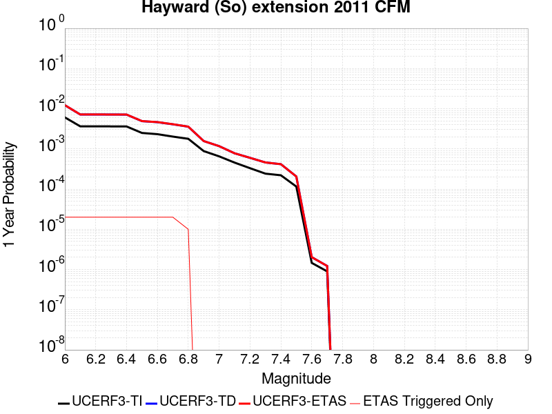 | 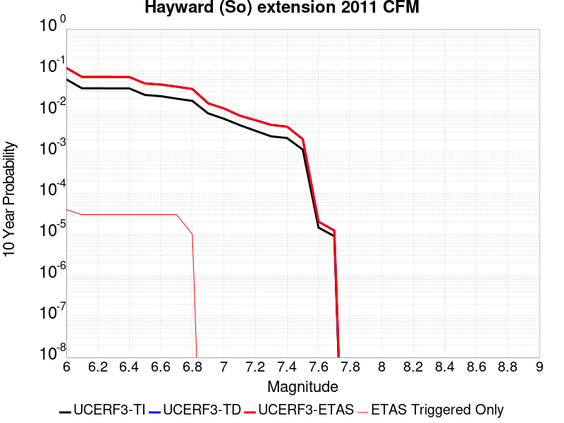 |

| Magnitude | 1 wk TI Prob | 1 wk TD Prob | 1 wk ETAS Prob | 1 wk ETAS/TD Gain | 1 wk ETAS Triggered Only | 1 mo TI Prob | 1 mo TD Prob | 1 mo ETAS Prob | 1 mo ETAS/TD Gain | 1 mo ETAS Triggered Only | 1 yr TI Prob | 1 yr TD Prob | 1 yr ETAS Prob | 1 yr ETAS/TD Gain | 1 yr ETAS Triggered Only | 10 yr TI Prob | 10 yr TD Prob | 10 yr ETAS Prob | 10 yr ETAS/TD Gain | 10 yr ETAS Triggered Only |
|-----|-----|-----|-----|-----|-----|-----|-----|-----|-----|-----|-----|-----|-----|-----|-----|-----|-----|-----|-----|-----|
| 6.0 | 1.1721256E-4 | 2.3697627E-4 | 2.3697627E-4 | 1.0 | 0.0 | 5.022428E-4 | 0.0010129517 | 0.0010129517 | 1.0 | 0.0 | 0.0060976758 | 0.012248711 | 0.012268466 | 1.0016128 | 2.0E-5 | 0.0593305 | 0.112843215 | 0.1128787 | 1.0003145 | 4.0E-5 |
| 6.1 | 6.99169E-5 | 1.3822885E-4 | 1.3822885E-4 | 1.0 | 0.0 | 2.9960944E-4 | 5.9128006E-4 | 5.9128006E-4 | 1.0 | 0.0 | 0.0036416445 | 0.0071720886 | 0.007191945 | 1.0027686 | 2.0E-5 | 0.035825435 | 0.067803554 | 0.067831516 | 1.0004125 | 3.0E-5 |
| 6.2 | 6.99169E-5 | 1.3822885E-4 | 1.3822885E-4 | 1.0 | 0.0 | 2.9960944E-4 | 5.9128006E-4 | 5.9128006E-4 | 1.0 | 0.0 | 0.0036416445 | 0.0071720886 | 0.007191945 | 1.0027686 | 2.0E-5 | 0.035825435 | 0.067803554 | 0.067831516 | 1.0004125 | 3.0E-5 |
| 6.3 | 6.970908E-5 | 1.379104E-4 | 1.379104E-4 | 1.0 | 0.0 | 2.9871898E-4 | 5.899159E-4 | 5.899159E-4 | 1.0 | 0.0 | 0.0036308395 | 0.007155625 | 0.007175482 | 1.002775 | 2.0E-5 | 0.035720866 | 0.067652516 | 0.067680486 | 1.0004134 | 3.0E-5 |
| 6.4 | 6.9517155E-5 | 1.375792E-4 | 1.375792E-4 | 1.0 | 0.0 | 2.9789665E-4 | 5.884971E-4 | 5.884971E-4 | 1.0 | 0.0 | 0.0036208609 | 0.0071385372 | 0.0071583944 | 1.0027817 | 2.0E-5 | 0.03562429 | 0.06749655 | 0.06752453 | 1.0004145 | 3.0E-5 |
| 6.5 | 4.786248E-5 | 9.41498E-5 | 9.41498E-5 | 1.0 | 0.0 | 2.0510878E-4 | 4.034394E-4 | 4.034394E-4 | 1.0 | 0.0 | 0.0024943394 | 0.004901227 | 0.004921129 | 1.0040606 | 2.0E-5 | 0.02466527 | 0.046901822 | 0.046930414 | 1.0006096 | 3.0E-5 |
| 6.6 | 4.4662214E-5 | 8.881654E-5 | 8.881654E-5 | 1.0 | 0.0 | 1.9139545E-4 | 3.805894E-4 | 3.805894E-4 | 1.0 | 0.0 | 0.0023277493 | 0.0046242937 | 0.004644201 | 1.004305 | 2.0E-5 | 0.02303517 | 0.044293344 | 0.044322018 | 1.0006473 | 3.0E-5 |
| 6.7 | 3.884542E-5 | 7.8648096E-5 | 7.8648096E-5 | 1.0 | 0.0 | 1.6646975E-4 | 3.370222E-4 | 3.370222E-4 | 1.0 | 0.0 | 0.002024885 | 0.0040959697 | 0.004115888 | 1.0048629 | 2.0E-5 | 0.020065336 | 0.039333146 | 0.039361965 | 1.0007327 | 3.0E-5 |
| 6.8 | 3.4221863E-5 | 6.855653E-5 | 6.855653E-5 | 1.0 | 0.0 | 1.4665688E-4 | 2.93783E-4 | 2.93783E-4 | 1.0 | 0.0 | 0.0017840851 | 0.0035713627 | 0.003581327 | 1.0027901 | 1.0E-5 | 0.017698295 | 0.034421004 | 0.034430657 | 1.0002805 | 1.0E-5 |
| 6.9 | 1.6927712E-5 | 3.0061563E-5 | 3.0061563E-5 | 1.0 | 0.0 | 7.2545314E-5 | 1.2882923E-4 | 1.2882923E-4 | 1.0 | 0.0 | 8.828813E-4 | 0.0015674243 | 0.0015674243 | 1.0 | 0.0 | 0.008793819 | 0.01546327 | 0.01546327 | 1.0 | 0.0 |
| 7.0 | 1.2509653E-5 | 2.2462571E-5 | 2.2462571E-5 | 1.0 | 0.0 | 5.3611697E-5 | 9.6264856E-5 | 9.6264856E-5 | 1.0 | 0.0 | 6.525269E-4 | 0.0011714385 | 0.0011714385 | 1.0 | 0.0 | 0.0065061417 | 0.01158231 | 0.01158231 | 1.0 | 0.0 |
| 7.1 | 8.751583E-6 | 1.4925648E-5 | 1.4925648E-5 | 1.0 | 0.0 | 3.750624E-5 | 6.3965526E-5 | 6.3965526E-5 | 1.0 | 0.0 | 4.5654282E-4 | 7.785079E-4 | 7.785079E-4 | 1.0 | 0.0 | 0.0045560603 | 0.007763496 | 0.007763496 | 1.0 | 0.0 |
| 7.2 | 6.354379E-6 | 1.1498636E-5 | 1.1498636E-5 | 1.0 | 0.0 | 2.7232769E-5 | 4.9278966E-5 | 4.9278966E-5 | 1.0 | 0.0 | 3.3150852E-4 | 5.99811E-4 | 5.99811E-4 | 1.0 | 0.0 | 0.0033101442 | 0.0060003046 | 0.0060003046 | 1.0 | 0.0 |
| 7.3 | 4.645554E-6 | 8.818172E-6 | 8.818172E-6 | 1.0 | 0.0 | 1.9909365E-5 | 3.779164E-5 | 3.779164E-5 | 1.0 | 0.0 | 2.4236954E-4 | 4.6002E-4 | 4.6002E-4 | 1.0 | 0.0 | 0.0024210536 | 0.004610708 | 0.004610708 | 1.0 | 0.0 |
| 7.4 | 4.23437E-6 | 7.992532E-6 | 7.992532E-6 | 1.0 | 0.0 | 1.8147173E-5 | 3.425328E-5 | 3.425328E-5 | 1.0 | 0.0 | 2.2091944E-4 | 4.1695772E-4 | 4.1695772E-4 | 1.0 | 0.0 | 0.0022069993 | 0.004181972 | 0.004181972 | 1.0 | 0.0 |
| 7.5 | 2.2187417E-6 | 3.9522306E-6 | 3.9522306E-6 | 1.0 | 0.0 | 9.508858E-6 | 1.6938036E-5 | 1.6938036E-5 | 1.0 | 0.0 | 1.157642E-4 | 2.0620368E-4 | 2.0620368E-4 | 1.0 | 0.0 | 0.0011570391 | 0.0020734754 | 0.0020734754 | 1.0 | 0.0 |
| 7.6 | 2.7952495E-8 | 3.878529E-8 | 3.878529E-8 | 1.0 | 0.0 | 1.1979641E-7 | 1.6622266E-7 | 1.6622266E-7 | 1.0 | 0.0 | 1.4585203E-6 | 2.0237592E-6 | 2.0237592E-6 | 1.0 | 0.0 | 1.4585107E-5 | 2.0328182E-5 | 2.0328182E-5 | 1.0 | 0.0 |
| 7.7 | 1.7192724E-8 | 2.3436517E-8 | 2.3436517E-8 | 1.0 | 0.0 | 7.36831E-8 | 1.0044221E-7 | 1.0044221E-7 | 1.0 | 0.0 | 8.9709135E-7 | 1.2228833E-6 | 1.2228833E-6 | 1.0 | 0.0 | 8.970877E-6 | 1.2296933E-5 | 1.2296933E-5 | 1.0 | 0.0 |

## Santa Cruz Catalina Ridge alt1
*[(top)](#table-of-contents)*

| 1 Week | 1 Month | 1 Year | 10 Year |
|-----|-----|-----|-----|
| 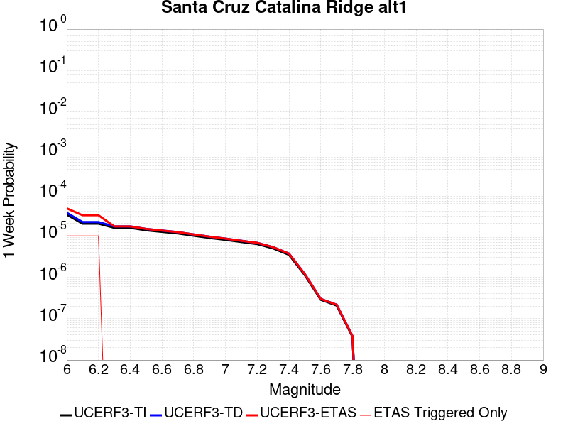 |  |  |  |

| Magnitude | 1 wk TI Prob | 1 wk TD Prob | 1 wk ETAS Prob | 1 wk ETAS/TD Gain | 1 wk ETAS Triggered Only | 1 mo TI Prob | 1 mo TD Prob | 1 mo ETAS Prob | 1 mo ETAS/TD Gain | 1 mo ETAS Triggered Only | 1 yr TI Prob | 1 yr TD Prob | 1 yr ETAS Prob | 1 yr ETAS/TD Gain | 1 yr ETAS Triggered Only | 10 yr TI Prob | 10 yr TD Prob | 10 yr ETAS Prob | 10 yr ETAS/TD Gain | 10 yr ETAS Triggered Only |
|-----|-----|-----|-----|-----|-----|-----|-----|-----|-----|-----|-----|-----|-----|-----|-----|-----|-----|-----|-----|-----|
| 6.0 | 3.2833184E-5 | 3.65584E-5 | 4.6558034E-5 | 1.273525 | 1.0E-5 | 1.4070606E-4 | 1.5667039E-4 | 1.7666725E-4 | 1.1276366 | 2.0E-5 | 0.00171175 | 0.0019059596 | 0.0019458833 | 1.0209469 | 4.0E-5 | 0.016986247 | 0.018913029 | 0.018962083 | 1.0025936 | 5.0E-5 |
| 6.1 | 1.9835548E-5 | 2.1659505E-5 | 3.165929E-5 | 1.461681 | 1.0E-5 | 8.500672E-5 | 9.282326E-5 | 1.12821406E-4 | 1.2154433 | 2.0E-5 | 0.0010344655 | 0.0011295575 | 0.0011695123 | 1.0353721 | 4.0E-5 | 0.010296632 | 0.011240295 | 0.011279846 | 1.0035186 | 4.0E-5 |
| 6.2 | 1.9835548E-5 | 2.1659505E-5 | 3.165929E-5 | 1.461681 | 1.0E-5 | 8.500672E-5 | 9.282326E-5 | 1.12821406E-4 | 1.2154433 | 2.0E-5 | 0.0010344655 | 0.0011295575 | 0.0011695123 | 1.0353721 | 4.0E-5 | 0.010296632 | 0.011240295 | 0.011279846 | 1.0035186 | 4.0E-5 |
| 6.3 | 1.5728183E-5 | 1.703395E-5 | 1.703395E-5 | 1.0 | 0.0 | 6.7404755E-5 | 7.300063E-5 | 8.29999E-5 | 1.1369752 | 1.0E-5 | 8.2034385E-4 | 8.884264E-4 | 9.183997E-4 | 1.0337375 | 3.0E-5 | 0.008173222 | 0.008849427 | 0.008879161 | 1.00336 | 3.0E-5 |
| 6.4 | 1.5728183E-5 | 1.703395E-5 | 1.703395E-5 | 1.0 | 0.0 | 6.7404755E-5 | 7.300063E-5 | 8.29999E-5 | 1.1369752 | 1.0E-5 | 8.2034385E-4 | 8.884264E-4 | 9.183997E-4 | 1.0337375 | 3.0E-5 | 0.008173222 | 0.008849427 | 0.008879161 | 1.00336 | 3.0E-5 |
| 6.5 | 1.3707734E-5 | 1.4794522E-5 | 1.4794522E-5 | 1.0 | 0.0 | 5.8746107E-5 | 6.3403575E-5 | 7.340294E-5 | 1.1577098 | 1.0E-5 | 7.1499916E-4 | 7.716686E-4 | 8.0164545E-4 | 1.0388469 | 3.0E-5 | 0.0071270303 | 0.0076902895 | 0.007720059 | 1.003871 | 3.0E-5 |
| 6.6 | 1.2539813E-5 | 1.3510219E-5 | 1.3510219E-5 | 1.0 | 0.0 | 5.3740947E-5 | 5.789967E-5 | 6.789909E-5 | 1.1727026 | 1.0E-5 | 6.540996E-4 | 7.0470315E-4 | 7.34682E-4 | 1.0425411 | 3.0E-5 | 0.0065217763 | 0.0070249885 | 0.007054778 | 1.0042405 | 3.0E-5 |
| 6.7 | 1.1504083E-5 | 1.2377375E-5 | 1.2377375E-5 | 1.0 | 0.0 | 4.930228E-5 | 5.3044827E-5 | 6.3044296E-5 | 1.1885098 | 1.0E-5 | 6.0008996E-4 | 6.456314E-4 | 6.75612E-4 | 1.0464362 | 3.0E-5 | 0.005984721 | 0.006437786 | 0.006467593 | 1.00463 | 3.0E-5 |
| 6.8 | 1.012739E-5 | 1.0877071E-5 | 1.0877071E-5 | 1.0 | 0.0 | 4.340238E-5 | 4.6615194E-5 | 5.661473E-5 | 1.2145123 | 1.0E-5 | 5.282958E-4 | 5.673937E-4 | 5.9737667E-4 | 1.0528433 | 3.0E-5 | 0.0052704164 | 0.0056596193 | 0.0056894496 | 1.0052707 | 3.0E-5 |
| 6.9 | 8.9607865E-6 | 9.609117E-6 | 9.609117E-6 | 1.0 | 0.0 | 3.8402806E-5 | 4.1181287E-5 | 5.1180876E-5 | 1.2428187 | 1.0E-5 | 4.6745385E-4 | 5.012679E-4 | 5.312529E-4 | 1.0598183 | 3.0E-5 | 0.0046647177 | 0.005001492 | 0.0050313417 | 1.0059682 | 3.0E-5 |
| 7.0 | 8.046829E-6 | 8.619746E-6 | 8.619746E-6 | 1.0 | 0.0 | 3.4485955E-5 | 3.694125E-5 | 4.694088E-5 | 1.2706901 | 1.0E-5 | 4.1978562E-4 | 4.496677E-4 | 4.796542E-4 | 1.0666859 | 3.0E-5 | 0.004189935 | 0.0044876686 | 0.0045175343 | 1.006655 | 3.0E-5 |
| 7.1 | 7.136131E-6 | 7.637656E-6 | 7.637656E-6 | 1.0 | 0.0 | 3.0583058E-5 | 3.2732405E-5 | 3.2732405E-5 | 1.0 | 0.0 | 3.7228514E-4 | 3.9844486E-4 | 4.184369E-4 | 1.0501752 | 2.0E-5 | 0.0037166206 | 0.003977381 | 0.0039973017 | 1.0050085 | 2.0E-5 |
| 7.2 | 6.362014E-6 | 6.8049585E-6 | 6.8049585E-6 | 1.0 | 0.0 | 2.726549E-5 | 2.9163786E-5 | 2.9163786E-5 | 1.0 | 0.0 | 3.3190678E-4 | 3.550119E-4 | 3.7500478E-4 | 1.0563161 | 2.0E-5 | 0.0033141149 | 0.003544516 | 0.003564445 | 1.0056225 | 2.0E-5 |
| 7.3 | 5.004101E-6 | 5.351715E-6 | 5.351715E-6 | 1.0 | 0.0 | 2.1445969E-5 | 2.2935723E-5 | 2.2935723E-5 | 1.0 | 0.0 | 2.6107338E-4 | 2.792072E-4 | 2.8920438E-4 | 1.0358057 | 1.0E-5 | 0.002607669 | 0.0027886187 | 0.0027985908 | 1.003576 | 1.0E-5 |
| 7.4 | 3.4901443E-6 | 3.7320526E-6 | 3.7320526E-6 | 1.0 | 0.0 | 1.4957676E-5 | 1.5994416E-5 | 1.5994416E-5 | 1.0 | 0.0 | 1.8209449E-4 | 1.9471499E-4 | 1.9471499E-4 | 1.0 | 0.0 | 0.0018194534 | 0.0019454823 | 0.0019454823 | 1.0 | 0.0 |
| 7.5 | 1.1215045E-6 | 1.189387E-6 | 1.189387E-6 | 1.0 | 0.0 | 4.806439E-6 | 5.097363E-6 | 5.097363E-6 | 1.0 | 0.0 | 5.851682E-5 | 6.205866E-5 | 6.205866E-5 | 1.0 | 0.0 | 5.850142E-4 | 6.2041637E-4 | 6.2041637E-4 | 1.0 | 0.0 |
| 7.6 | 2.8599047E-7 | 2.9951994E-7 | 2.9951994E-7 | 1.0 | 0.0 | 1.2256729E-6 | 1.2836562E-6 | 1.2836562E-6 | 1.0 | 0.0 | 1.4922465E-5 | 1.5628404E-5 | 1.5628404E-5 | 1.0 | 0.0 | 1.4921463E-4 | 1.5627318E-4 | 1.5627318E-4 | 1.0 | 0.0 |
| 7.7 | 2.0781519E-7 | 2.1744323E-7 | 2.1744323E-7 | 1.0 | 0.0 | 8.906362E-7 | 9.3189925E-7 | 9.3189925E-7 | 1.0 | 0.0 | 1.08434415E-5 | 1.13458145E-5 | 1.13458145E-5 | 1.0 | 0.0 | 1.0842913E-4 | 1.1345245E-4 | 1.1345245E-4 | 1.0 | 0.0 |
| 7.8 | 3.614776E-8 | 3.764102E-8 | 3.764102E-8 | 1.0 | 0.0 | 1.5491896E-7 | 1.6131864E-7 | 1.6131864E-7 | 1.0 | 0.0 | 1.8861368E-6 | 1.9640527E-6 | 1.9640527E-6 | 1.0 | 0.0 | 1.8861208E-5 | 1.9640367E-5 | 1.9640367E-5 | 1.0 | 0.0 |

## Ortigalita (South)
*[(top)](#table-of-contents)*

| 1 Week | 1 Month | 1 Year | 10 Year |
|-----|-----|-----|-----|
| 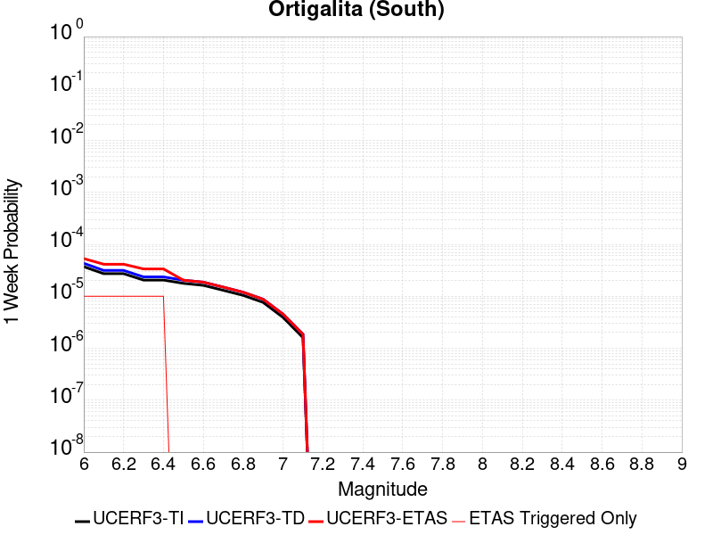 |  |  | 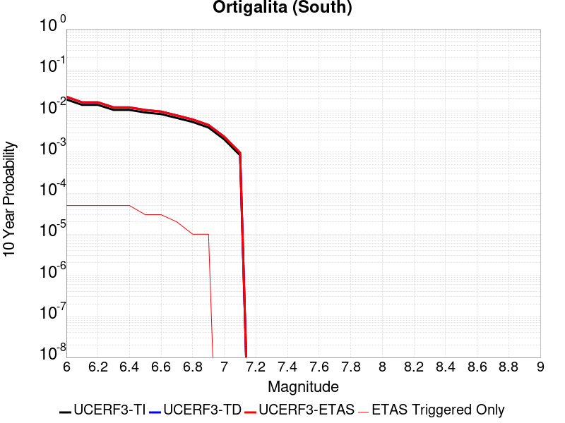 |

| Magnitude | 1 wk TI Prob | 1 wk TD Prob | 1 wk ETAS Prob | 1 wk ETAS/TD Gain | 1 wk ETAS Triggered Only | 1 mo TI Prob | 1 mo TD Prob | 1 mo ETAS Prob | 1 mo ETAS/TD Gain | 1 mo ETAS Triggered Only | 1 yr TI Prob | 1 yr TD Prob | 1 yr ETAS Prob | 1 yr ETAS/TD Gain | 1 yr ETAS Triggered Only | 10 yr TI Prob | 10 yr TD Prob | 10 yr ETAS Prob | 10 yr ETAS/TD Gain | 10 yr ETAS Triggered Only |
|-----|-----|-----|-----|-----|-----|-----|-----|-----|-----|-----|-----|-----|-----|-----|-----|-----|-----|-----|-----|-----|
| 6.0 | 3.72394E-5 | 4.325562E-5 | 5.3255186E-5 | 1.2311739 | 1.0E-5 | 1.5958765E-4 | 1.8536893E-4 | 2.0536523E-4 | 1.107873 | 2.0E-5 | 0.0019412481 | 0.0022546875 | 0.0023045747 | 1.0221261 | 5.0E-5 | 0.019243775 | 0.022334497 | 0.02238338 | 1.0021887 | 5.0E-5 |
| 6.1 | 2.7299884E-5 | 3.149204E-5 | 4.1491727E-5 | 1.3175305 | 1.0E-5 | 1.16994255E-4 | 1.3495922E-4 | 1.5495653E-4 | 1.1481729 | 2.0E-5 | 0.0014234743 | 0.0016419457 | 0.0016918636 | 1.0304017 | 5.0E-5 | 0.014143906 | 0.01630407 | 0.016353255 | 1.0030167 | 5.0E-5 |
| 6.2 | 2.7299884E-5 | 3.149204E-5 | 4.1491727E-5 | 1.3175305 | 1.0E-5 | 1.16994255E-4 | 1.3495922E-4 | 1.5495653E-4 | 1.1481729 | 2.0E-5 | 0.0014234743 | 0.0016419457 | 0.0016918636 | 1.0304017 | 5.0E-5 | 0.014143906 | 0.01630407 | 0.016353255 | 1.0030167 | 5.0E-5 |
| 6.3 | 2.0546433E-5 | 2.363145E-5 | 3.3631215E-5 | 1.4231548 | 1.0E-5 | 8.805317E-5 | 1.0127382E-4 | 1.212718E-4 | 1.1974643 | 2.0E-5 | 0.00107152 | 0.0012323303 | 0.0012822687 | 1.0405235 | 5.0E-5 | 0.010663681 | 0.01225703 | 0.012306417 | 1.0040293 | 5.0E-5 |
| 6.4 | 2.0546433E-5 | 2.363145E-5 | 3.3631215E-5 | 1.4231548 | 1.0E-5 | 8.805317E-5 | 1.0127382E-4 | 1.212718E-4 | 1.1974643 | 2.0E-5 | 0.00107152 | 0.0012323303 | 0.0012822687 | 1.0405235 | 5.0E-5 | 0.010663681 | 0.01225703 | 0.012306417 | 1.0040293 | 5.0E-5 |
| 6.5 | 1.7779594E-5 | 2.0446974E-5 | 2.0446974E-5 | 1.0 | 0.0 | 7.619603E-5 | 8.762702E-5 | 9.762614E-5 | 1.11411 | 1.0E-5 | 9.272918E-4 | 0.0010663504 | 0.0010963185 | 1.0281034 | 3.0E-5 | 0.009234319 | 0.010613803 | 0.010643485 | 1.0027965 | 3.0E-5 |
| 6.6 | 1.6272212E-5 | 1.8714967E-5 | 1.8714967E-5 | 1.0 | 0.0 | 6.973618E-5 | 8.0204605E-5 | 9.02038E-5 | 1.1246711 | 1.0E-5 | 8.487073E-4 | 9.760658E-4 | 0.0010060365 | 1.0307057 | 3.0E-5 | 0.008454733 | 0.009719091 | 0.009748799 | 1.0030568 | 3.0E-5 |
| 6.7 | 1.3051484E-5 | 1.5038758E-5 | 1.5038758E-5 | 1.0 | 0.0 | 5.593373E-5 | 6.445028E-5 | 6.445028E-5 | 1.0 | 0.0 | 6.807804E-4 | 7.844092E-4 | 8.043935E-4 | 1.0254769 | 2.0E-5 | 0.006786986 | 0.007817388 | 0.007837231 | 1.0025384 | 2.0E-5 |
| 6.8 | 1.04277415E-5 | 1.1987235E-5 | 1.1987235E-5 | 1.0 | 0.0 | 4.4689557E-5 | 5.1372896E-5 | 5.1372896E-5 | 1.0 | 0.0 | 5.439595E-4 | 6.2529295E-4 | 6.352867E-4 | 1.0159825 | 1.0E-5 | 0.0054262993 | 0.00623609 | 0.0062460275 | 1.0015936 | 1.0E-5 |
| 6.9 | 7.639968E-6 | 8.791503E-6 | 8.791503E-6 | 1.0 | 0.0 | 3.274231E-5 | 3.767736E-5 | 3.767736E-5 | 1.0 | 0.0 | 3.9856473E-4 | 4.586312E-4 | 4.686266E-4 | 1.021794 | 1.0E-5 | 0.003978506 | 0.004577433 | 0.004587387 | 1.0021746 | 1.0E-5 |
| 7.0 | 3.919831E-6 | 4.5334014E-6 | 4.5334014E-6 | 1.0 | 0.0 | 1.679917E-5 | 1.942873E-5 | 1.942873E-5 | 1.0 | 0.0 | 2.045107E-4 | 2.3652123E-4 | 2.3652123E-4 | 1.0 | 0.0 | 0.0020432258 | 0.0023629034 | 0.0023629034 | 1.0 | 0.0 |
| 7.1 | 1.6017933E-6 | 1.8570418E-6 | 1.8570418E-6 | 1.0 | 0.0 | 6.8648105E-6 | 7.958732E-6 | 7.958732E-6 | 1.0 | 0.0 | 8.357586E-5 | 9.689432E-5 | 9.689432E-5 | 1.0 | 0.0 | 8.3544437E-4 | 9.686254E-4 | 9.686254E-4 | 1.0 | 0.0 |

## Raymond
*[(top)](#table-of-contents)*

| 1 Week | 1 Month | 1 Year | 10 Year |
|-----|-----|-----|-----|
| 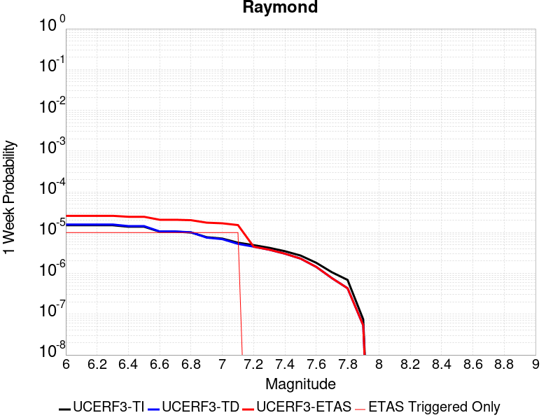 |  |  |  |

| Magnitude | 1 wk TI Prob | 1 wk TD Prob | 1 wk ETAS Prob | 1 wk ETAS/TD Gain | 1 wk ETAS Triggered Only | 1 mo TI Prob | 1 mo TD Prob | 1 mo ETAS Prob | 1 mo ETAS/TD Gain | 1 mo ETAS Triggered Only | 1 yr TI Prob | 1 yr TD Prob | 1 yr ETAS Prob | 1 yr ETAS/TD Gain | 1 yr ETAS Triggered Only | 10 yr TI Prob | 10 yr TD Prob | 10 yr ETAS Prob | 10 yr ETAS/TD Gain | 10 yr ETAS Triggered Only |
|-----|-----|-----|-----|-----|-----|-----|-----|-----|-----|-----|-----|-----|-----|-----|-----|-----|-----|-----|-----|-----|
| 6.0 | 1.5157413E-5 | 1.5810128E-5 | 2.580997E-5 | 1.632496 | 1.0E-5 | 6.4958724E-5 | 6.7756075E-5 | 7.7755394E-5 | 1.1475782 | 1.0E-5 | 7.905855E-4 | 8.2464307E-4 | 8.346348E-4 | 1.0121164 | 1.0E-5 | 0.007877788 | 0.008218348 | 0.008267937 | 1.0060339 | 5.0E-5 |
| 6.1 | 1.5157413E-5 | 1.5810128E-5 | 2.580997E-5 | 1.632496 | 1.0E-5 | 6.4958724E-5 | 6.7756075E-5 | 7.7755394E-5 | 1.1475782 | 1.0E-5 | 7.905855E-4 | 8.2464307E-4 | 8.346348E-4 | 1.0121164 | 1.0E-5 | 0.007877788 | 0.008218348 | 0.008267937 | 1.0060339 | 5.0E-5 |
| 6.2 | 1.5157413E-5 | 1.5810128E-5 | 2.580997E-5 | 1.632496 | 1.0E-5 | 6.4958724E-5 | 6.7756075E-5 | 7.7755394E-5 | 1.1475782 | 1.0E-5 | 7.905855E-4 | 8.2464307E-4 | 8.346348E-4 | 1.0121164 | 1.0E-5 | 0.007877788 | 0.008218348 | 0.008267937 | 1.0060339 | 5.0E-5 |
| 6.3 | 1.5157413E-5 | 1.5810128E-5 | 2.580997E-5 | 1.632496 | 1.0E-5 | 6.4958724E-5 | 6.7756075E-5 | 7.7755394E-5 | 1.1475782 | 1.0E-5 | 7.905855E-4 | 8.2464307E-4 | 8.346348E-4 | 1.0121164 | 1.0E-5 | 0.007877788 | 0.008218348 | 0.008267937 | 1.0060339 | 5.0E-5 |
| 6.4 | 1.3941944E-5 | 1.445469E-5 | 2.4454546E-5 | 1.6918069 | 1.0E-5 | 5.9749822E-5 | 6.1947336E-5 | 7.194671E-5 | 1.1614175 | 1.0E-5 | 7.2721124E-4 | 7.5397117E-4 | 7.639636E-4 | 1.0132531 | 1.0E-5 | 0.007248361 | 0.0075164647 | 0.007566089 | 1.006602 | 5.0E-5 |
| 6.5 | 1.3941944E-5 | 1.445469E-5 | 2.4454546E-5 | 1.6918069 | 1.0E-5 | 5.9749822E-5 | 6.1947336E-5 | 7.194671E-5 | 1.1614175 | 1.0E-5 | 7.2721124E-4 | 7.5397117E-4 | 7.639636E-4 | 1.0132531 | 1.0E-5 | 0.007248361 | 0.0075164647 | 0.007566089 | 1.006602 | 5.0E-5 |
| 6.6 | 1.0542609E-5 | 1.0671113E-5 | 2.0671006E-5 | 1.9370993 | 1.0E-5 | 4.5181827E-5 | 4.573257E-5 | 5.573211E-5 | 1.2186525 | 1.0E-5 | 5.499499E-4 | 5.5665727E-4 | 5.666517E-4 | 1.0179543 | 1.0E-5 | 0.005485909 | 0.00555319 | 0.0055830237 | 1.0053723 | 3.0E-5 |
| 6.7 | 1.0542609E-5 | 1.0671113E-5 | 2.0671006E-5 | 1.9370993 | 1.0E-5 | 4.5181827E-5 | 4.573257E-5 | 5.573211E-5 | 1.2186525 | 1.0E-5 | 5.499499E-4 | 5.5665727E-4 | 5.666517E-4 | 1.0179543 | 1.0E-5 | 0.005485909 | 0.00555319 | 0.0055830237 | 1.0053723 | 3.0E-5 |
| 6.8 | 1.0079132E-5 | 1.0176646E-5 | 2.0176545E-5 | 1.982632 | 1.0E-5 | 4.3195567E-5 | 4.3613498E-5 | 5.361306E-5 | 1.2292768 | 1.0E-5 | 5.257791E-4 | 5.3087034E-4 | 5.40865E-4 | 1.018827 | 1.0E-5 | 0.0052453685 | 0.005296571 | 0.005326412 | 1.0056341 | 3.0E-5 |
| 6.9 | 7.721598E-6 | 7.5489047E-6 | 1.754883E-5 | 2.3246856 | 1.0E-5 | 3.3092143E-5 | 3.2352054E-5 | 4.235173E-5 | 1.3090894 | 1.0E-5 | 4.0282236E-4 | 3.9381627E-4 | 4.0381236E-4 | 1.0253825 | 1.0E-5 | 0.0040209293 | 0.0039313175 | 0.0039612 | 1.007601 | 3.0E-5 |
| 7.0 | 7.137566E-6 | 6.9113057E-6 | 1.6911237E-5 | 2.4468946 | 1.0E-5 | 3.058921E-5 | 2.961955E-5 | 3.9619255E-5 | 1.3376049 | 1.0E-5 | 3.7236E-4 | 3.6055944E-4 | 3.7055582E-4 | 1.0277246 | 1.0E-5 | 0.0037173668 | 0.0035998628 | 0.0036297548 | 1.0083036 | 3.0E-5 |
| 7.1 | 5.654976E-6 | 5.29954E-6 | 1.5299487E-5 | 2.8869462 | 1.0E-5 | 2.4235387E-5 | 2.2712118E-5 | 3.271189E-5 | 1.4402835 | 1.0E-5 | 2.9502588E-4 | 2.7648517E-4 | 2.8648242E-4 | 1.0361583 | 1.0E-5 | 0.0029463451 | 0.002761443 | 0.00279136 | 1.0108339 | 3.0E-5 |
| 7.2 | 4.9358455E-6 | 4.5266574E-6 | 4.5266574E-6 | 1.0 | 0.0 | 2.1153453E-5 | 1.9399817E-5 | 1.9399817E-5 | 1.0 | 0.0 | 2.5751285E-4 | 2.3616731E-4 | 2.3616731E-4 | 1.0 | 0.0 | 0.0025721465 | 0.0023591854 | 0.0023791383 | 1.0084575 | 2.0E-5 |
| 7.3 | 4.2368597E-6 | 3.8056164E-6 | 3.8056164E-6 | 1.0 | 0.0 | 1.8157843E-5 | 1.6309683E-5 | 1.6309683E-5 | 1.0 | 0.0 | 2.2104931E-4 | 1.9855241E-4 | 1.9855241E-4 | 1.0 | 0.0 | 0.0022082955 | 0.0019837688 | 0.001993749 | 1.0050309 | 1.0E-5 |
| 7.4 | 3.4999923E-6 | 3.043744E-6 | 3.043744E-6 | 1.0 | 0.0 | 1.49998805E-5 | 1.3044552E-5 | 1.3044552E-5 | 1.0 | 0.0 | 1.8260824E-4 | 1.5880594E-4 | 1.5880594E-4 | 1.0 | 0.0 | 0.0018245826 | 0.0015869403 | 0.0015969244 | 1.0062914 | 1.0E-5 |
| 7.5 | 2.738017E-6 | 2.3020468E-6 | 2.3020468E-6 | 1.0 | 0.0 | 1.1734306E-5 | 9.865878E-6 | 9.865878E-6 | 1.0 | 0.0 | 1.428558E-4 | 1.2011051E-4 | 1.2011051E-4 | 1.0 | 0.0 | 0.0014276401 | 0.0012004703 | 0.0012104583 | 1.0083201 | 1.0E-5 |
| 7.6 | 1.8186392E-6 | 1.442312E-6 | 1.442312E-6 | 1.0 | 0.0 | 7.794145E-6 | 6.181323E-6 | 6.181323E-6 | 1.0 | 0.0 | 9.488958E-5 | 7.5255055E-5 | 7.5255055E-5 | 1.0 | 0.0 | 9.4849075E-4 | 7.523072E-4 | 7.523072E-4 | 1.0 | 0.0 |
| 7.7 | 1.0660348E-6 | 7.6438056E-7 | 7.6438056E-7 | 1.0 | 0.0 | 4.5687125E-6 | 3.2759126E-6 | 3.2759126E-6 | 1.0 | 0.0 | 5.5622655E-5 | 3.9883522E-5 | 3.9883522E-5 | 1.0 | 0.0 | 5.5608735E-4 | 3.9877277E-4 | 3.9877277E-4 | 1.0 | 0.0 |
| 7.8 | 6.913602E-7 | 4.3204133E-7 | 4.3204133E-7 | 1.0 | 0.0 | 2.962969E-6 | 1.8516045E-6 | 1.8516045E-6 | 1.0 | 0.0 | 3.607355E-5 | 2.2543056E-5 | 2.2543056E-5 | 1.0 | 0.0 | 3.6067693E-4 | 2.2541556E-4 | 2.2541556E-4 | 1.0 | 0.0 |
| 7.9 | 7.425201E-8 | 5.3222113E-8 | 5.3222113E-8 | 1.0 | 0.0 | 3.1822285E-7 | 2.2809476E-7 | 2.2809476E-7 | 1.0 | 0.0 | 3.874356E-6 | 2.7770516E-6 | 2.7770516E-6 | 1.0 | 0.0 | 3.8742884E-5 | 2.7770298E-5 | 2.7770298E-5 | 1.0 | 0.0 |

## San Jacinto (Clark) rev
*[(top)](#table-of-contents)*

| 1 Week | 1 Month | 1 Year | 10 Year |
|-----|-----|-----|-----|
|  | 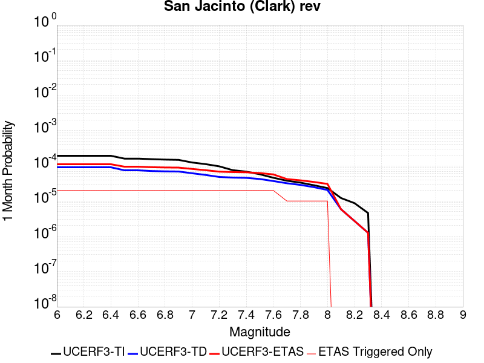 | 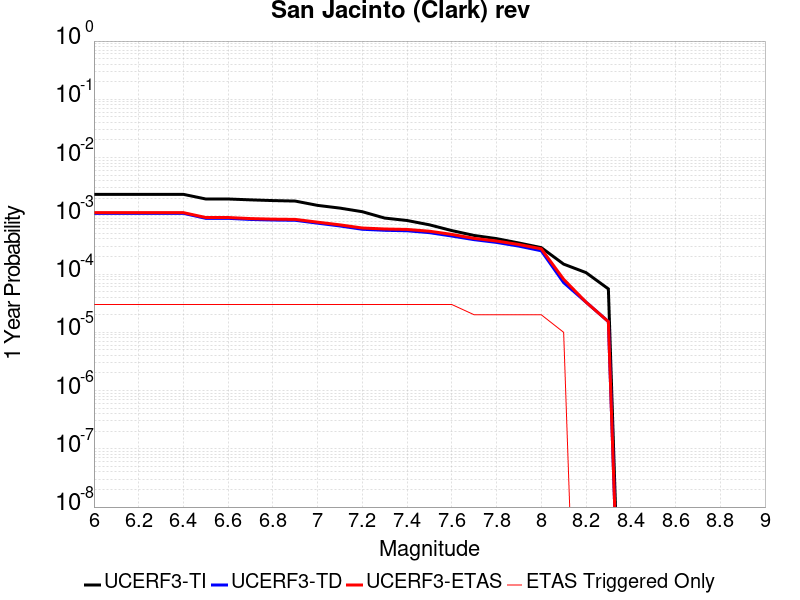 | 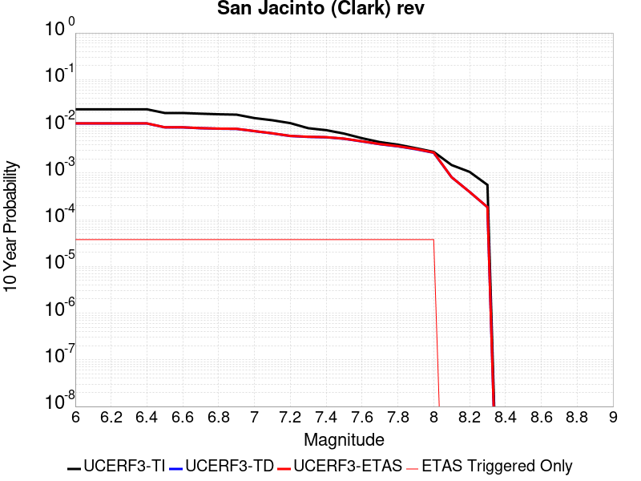 |

| Magnitude | 1 wk TI Prob | 1 wk TD Prob | 1 wk ETAS Prob | 1 wk ETAS/TD Gain | 1 wk ETAS Triggered Only | 1 mo TI Prob | 1 mo TD Prob | 1 mo ETAS Prob | 1 mo ETAS/TD Gain | 1 mo ETAS Triggered Only | 1 yr TI Prob | 1 yr TD Prob | 1 yr ETAS Prob | 1 yr ETAS/TD Gain | 1 yr ETAS Triggered Only | 10 yr TI Prob | 10 yr TD Prob | 10 yr ETAS Prob | 10 yr ETAS/TD Gain | 10 yr ETAS Triggered Only |
|-----|-----|-----|-----|-----|-----|-----|-----|-----|-----|-----|-----|-----|-----|-----|-----|-----|-----|-----|-----|-----|
| 6.0 | 4.482615E-5 | 2.1154196E-5 | 3.1153984E-5 | 1.4727095 | 1.0E-5 | 1.9209793E-4 | 9.065773E-5 | 1.1065592E-4 | 1.22059 | 2.0E-5 | 0.0023362834 | 0.0011032083 | 0.0011331752 | 1.0271634 | 3.0E-5 | 0.02311874 | 0.011503847 | 0.011553272 | 1.0042964 | 5.0E-5 |
| 6.1 | 4.482615E-5 | 2.1154196E-5 | 3.1153984E-5 | 1.4727095 | 1.0E-5 | 1.9209793E-4 | 9.065773E-5 | 1.1065592E-4 | 1.22059 | 2.0E-5 | 0.0023362834 | 0.0011032083 | 0.0011331752 | 1.0271634 | 3.0E-5 | 0.02311874 | 0.011503847 | 0.011553272 | 1.0042964 | 5.0E-5 |
| 6.2 | 4.482615E-5 | 2.1154196E-5 | 3.1153984E-5 | 1.4727095 | 1.0E-5 | 1.9209793E-4 | 9.065773E-5 | 1.1065592E-4 | 1.22059 | 2.0E-5 | 0.0023362834 | 0.0011032083 | 0.0011331752 | 1.0271634 | 3.0E-5 | 0.02311874 | 0.011503847 | 0.011553272 | 1.0042964 | 5.0E-5 |
| 6.3 | 4.482615E-5 | 2.1154196E-5 | 3.1153984E-5 | 1.4727095 | 1.0E-5 | 1.9209793E-4 | 9.065773E-5 | 1.1065592E-4 | 1.22059 | 2.0E-5 | 0.0023362834 | 0.0011032083 | 0.0011331752 | 1.0271634 | 3.0E-5 | 0.02311874 | 0.011503847 | 0.011553272 | 1.0042964 | 5.0E-5 |
| 6.4 | 4.482615E-5 | 2.1154196E-5 | 3.1153984E-5 | 1.4727095 | 1.0E-5 | 1.9209793E-4 | 9.065773E-5 | 1.1065592E-4 | 1.22059 | 2.0E-5 | 0.0023362834 | 0.0011032083 | 0.0011331752 | 1.0271634 | 3.0E-5 | 0.02311874 | 0.011503847 | 0.011553272 | 1.0042964 | 5.0E-5 |
| 6.5 | 3.7294863E-5 | 1.7356087E-5 | 2.7355914E-5 | 1.5761567 | 1.0E-5 | 1.5982533E-4 | 7.438113E-5 | 9.437965E-5 | 1.2688653 | 2.0E-5 | 0.0019441366 | 9.052186E-4 | 9.351914E-4 | 1.0331112 | 3.0E-5 | 0.01927216 | 0.0094941035 | 0.009543628 | 1.0052165 | 5.0E-5 |
| 6.6 | 3.7294863E-5 | 1.7356087E-5 | 2.7355914E-5 | 1.5761567 | 1.0E-5 | 1.5982533E-4 | 7.438113E-5 | 9.437965E-5 | 1.2688653 | 2.0E-5 | 0.0019441366 | 9.052186E-4 | 9.351914E-4 | 1.0331112 | 3.0E-5 | 0.01927216 | 0.0094941035 | 0.009543628 | 1.0052165 | 5.0E-5 |
| 6.7 | 3.6039248E-5 | 1.6604314E-5 | 2.6604146E-5 | 1.6022432 | 1.0E-5 | 1.5444479E-4 | 7.1159426E-5 | 9.1158E-5 | 1.281039 | 2.0E-5 | 0.0018787434 | 8.6602574E-4 | 8.959998E-4 | 1.034611 | 3.0E-5 | 0.01862939 | 0.009096047 | 0.009145592 | 1.0054469 | 5.0E-5 |
| 6.8 | 3.5031844E-5 | 1.6232942E-5 | 2.623278E-5 | 1.6160213 | 1.0E-5 | 1.5012783E-4 | 6.956792E-5 | 8.956653E-5 | 1.2874688 | 2.0E-5 | 0.0018262739 | 8.4666436E-4 | 8.766389E-4 | 1.0354031 | 3.0E-5 | 0.01811338 | 0.008895969 | 0.008945525 | 1.0055705 | 5.0E-5 |
| 6.9 | 3.435112E-5 | 1.6063195E-5 | 2.6063033E-5 | 1.6225312 | 1.0E-5 | 1.4721078E-4 | 6.884047E-5 | 8.883909E-5 | 1.2905068 | 2.0E-5 | 0.0017908178 | 8.3781447E-4 | 8.677894E-4 | 1.0357774 | 3.0E-5 | 0.017764548 | 0.008804181 | 0.00885374 | 1.0056291 | 5.0E-5 |
| 7.0 | 2.8959772E-5 | 1.4336745E-5 | 2.4336601E-5 | 1.6974984 | 1.0E-5 | 1.241074E-4 | 6.144176E-5 | 8.1440536E-5 | 1.3254915 | 2.0E-5 | 0.0015099603 | 7.477995E-4 | 7.7777705E-4 | 1.0400877 | 3.0E-5 | 0.014997416 | 0.007868037 | 0.007917643 | 1.0063049 | 5.0E-5 |
| 7.1 | 2.6002877E-5 | 1.2829002E-5 | 2.2828874E-5 | 1.7794739 | 1.0E-5 | 1.11436144E-4 | 5.498029E-5 | 7.497919E-5 | 1.3637468 | 2.0E-5 | 0.0013558907 | 6.691816E-4 | 6.991615E-4 | 1.0448009 | 3.0E-5 | 0.013476475 | 0.0070465137 | 0.0070961616 | 1.0070457 | 5.0E-5 |
| 7.2 | 2.2544838E-5 | 1.1262543E-5 | 2.126243E-5 | 1.8878889 | 1.0E-5 | 9.661716E-5 | 4.8267157E-5 | 6.826619E-5 | 1.4143404 | 2.0E-5 | 0.001175679 | 5.874956E-4 | 6.1747804E-4 | 1.0510342 | 3.0E-5 | 0.011694785 | 0.0061927503 | 0.0062424405 | 1.008024 | 5.0E-5 |
| 7.3 | 1.75334E-5 | 1.0811715E-5 | 2.0811607E-5 | 1.9249127 | 1.0E-5 | 7.514098E-5 | 4.6335106E-5 | 6.633418E-5 | 1.4316182 | 2.0E-5 | 9.144575E-4 | 5.6398526E-4 | 5.939684E-4 | 1.0531629 | 3.0E-5 | 0.009107036 | 0.0059337732 | 0.0059834765 | 1.0083764 | 5.0E-5 |
| 7.4 | 1.5924552E-5 | 1.0611516E-5 | 2.0611411E-5 | 1.9423624 | 1.0E-5 | 6.82463E-5 | 4.547714E-5 | 6.547623E-5 | 1.4397614 | 2.0E-5 | 8.305819E-4 | 5.535449E-4 | 5.835283E-4 | 1.0541662 | 3.0E-5 | 0.008274844 | 0.0058210334 | 0.0058707423 | 1.0085396 | 5.0E-5 |
| 7.5 | 1.3428931E-5 | 9.8519E-6 | 1.9851801E-5 | 2.0150228 | 1.0E-5 | 5.7551293E-5 | 4.2221753E-5 | 6.2220905E-5 | 1.4736695 | 2.0E-5 | 7.004617E-4 | 5.1392964E-4 | 5.439142E-4 | 1.0583438 | 3.0E-5 | 0.006982579 | 0.0054066023 | 0.005456332 | 1.009198 | 5.0E-5 |
| 7.6 | 1.0688787E-5 | 8.614839E-6 | 1.8614754E-5 | 2.1607778 | 1.0E-5 | 4.5808283E-5 | 3.692022E-5 | 5.691948E-5 | 1.5416886 | 2.0E-5 | 5.5757316E-4 | 4.4941145E-4 | 4.7939798E-4 | 1.066724 | 3.0E-5 | 0.005561762 | 0.0047416524 | 0.0047914153 | 1.0104948 | 5.0E-5 |
| 7.7 | 8.81236E-6 | 7.4680274E-6 | 1.7467954E-5 | 2.3390317 | 1.0E-5 | 3.776671E-5 | 3.2005442E-5 | 4.2005122E-5 | 1.3124368 | 1.0E-5 | 4.597127E-4 | 3.8959677E-4 | 4.0958897E-4 | 1.0513151 | 2.0E-5 | 0.0045876284 | 0.0041346536 | 0.004174488 | 1.0096344 | 4.0E-5 |
| 7.8 | 7.780431E-6 | 6.696579E-6 | 1.6696513E-5 | 2.4932897 | 1.0E-5 | 3.3344273E-5 | 2.8699309E-5 | 3.869902E-5 | 1.3484304 | 1.0E-5 | 4.0589093E-4 | 3.4935825E-4 | 3.6935127E-4 | 1.0572278 | 2.0E-5 | 0.0040515037 | 0.0037227906 | 0.0037626417 | 1.0107046 | 4.0E-5 |
| 7.9 | 6.5437994E-6 | 5.780382E-6 | 1.5780324E-5 | 2.7299795 | 1.0E-5 | 2.8044553E-5 | 2.477283E-5 | 3.4772584E-5 | 1.403658 | 1.0E-5 | 3.4138895E-4 | 3.0156763E-4 | 3.2156162E-4 | 1.0663002 | 2.0E-5 | 0.0034086495 | 0.0032344845 | 0.003274355 | 1.0123267 | 4.0E-5 |
| 8.0 | 5.4488164E-6 | 4.8133406E-6 | 1.4813292E-5 | 3.0775492 | 1.0E-5 | 2.3351862E-5 | 2.062844E-5 | 3.0628235E-5 | 1.4847577 | 1.0E-5 | 2.8427184E-4 | 2.5112246E-4 | 2.7111746E-4 | 1.0796224 | 2.0E-5 | 0.0028390845 | 0.002710839 | 0.0027507306 | 1.0147156 | 4.0E-5 |
| 8.1 | 2.8397242E-6 | 1.3670389E-6 | 1.3670389E-6 | 1.0 | 0.0 | 1.217019E-5 | 5.858725E-6 | 5.858725E-6 | 1.0 | 0.0 | 1.4816198E-4 | 7.132765E-5 | 8.132694E-5 | 1.1401881 | 1.0E-5 | 0.0014806325 | 8.115382E-4 | 8.2153006E-4 | 1.0123123 | 1.0E-5 |
| 8.2 | 2.030244E-6 | 6.318974E-7 | 6.318974E-7 | 1.0 | 0.0 | 8.701017E-6 | 2.708129E-6 | 2.708129E-6 | 1.0 | 0.0 | 1.05929736E-4 | 3.2970976E-5 | 3.2970976E-5 | 1.0 | 0.0 | 0.0010587925 | 3.9486602E-4 | 3.9486602E-4 | 1.0 | 0.0 |
| 8.3 | 1.0659804E-6 | 2.9250086E-7 | 2.9250086E-7 | 1.0 | 0.0 | 4.568479E-6 | 1.2535745E-6 | 1.2535745E-6 | 1.0 | 0.0 | 5.5619817E-5 | 1.5262167E-5 | 1.5262167E-5 | 1.0 | 0.0 | 5.5605895E-4 | 1.8566217E-4 | 1.8566217E-4 | 1.0 | 0.0 |

## Great Valley 08 (Quinto)
*[(top)](#table-of-contents)*

| 1 Week | 1 Month | 1 Year | 10 Year |
|-----|-----|-----|-----|
|  |  |  |  |

| Magnitude | 1 wk TI Prob | 1 wk TD Prob | 1 wk ETAS Prob | 1 wk ETAS/TD Gain | 1 wk ETAS Triggered Only | 1 mo TI Prob | 1 mo TD Prob | 1 mo ETAS Prob | 1 mo ETAS/TD Gain | 1 mo ETAS Triggered Only | 1 yr TI Prob | 1 yr TD Prob | 1 yr ETAS Prob | 1 yr ETAS/TD Gain | 1 yr ETAS Triggered Only | 10 yr TI Prob | 10 yr TD Prob | 10 yr ETAS Prob | 10 yr ETAS/TD Gain | 10 yr ETAS Triggered Only |
|-----|-----|-----|-----|-----|-----|-----|-----|-----|-----|-----|-----|-----|-----|-----|-----|-----|-----|-----|-----|-----|
| 6.0 | 7.737697E-6 | 8.253038E-6 | 8.253038E-6 | 1.0 | 0.0 | 3.3161137E-5 | 3.536979E-5 | 4.5369437E-5 | 1.2827171 | 1.0E-5 | 4.0366207E-4 | 4.3056096E-4 | 4.6054804E-4 | 1.0696466 | 3.0E-5 | 0.004029296 | 0.0042991205 | 0.0043489058 | 1.0115802 | 5.0E-5 |
| 6.1 | 7.737697E-6 | 8.253038E-6 | 8.253038E-6 | 1.0 | 0.0 | 3.3161137E-5 | 3.536979E-5 | 4.5369437E-5 | 1.2827171 | 1.0E-5 | 4.0366207E-4 | 4.3056096E-4 | 4.6054804E-4 | 1.0696466 | 3.0E-5 | 0.004029296 | 0.0042991205 | 0.0043489058 | 1.0115802 | 5.0E-5 |
| 6.2 | 7.737697E-6 | 8.253038E-6 | 8.253038E-6 | 1.0 | 0.0 | 3.3161137E-5 | 3.536979E-5 | 4.5369437E-5 | 1.2827171 | 1.0E-5 | 4.0366207E-4 | 4.3056096E-4 | 4.6054804E-4 | 1.0696466 | 3.0E-5 | 0.004029296 | 0.0042991205 | 0.0043489058 | 1.0115802 | 5.0E-5 |
| 6.3 | 5.374012E-6 | 5.7505736E-6 | 5.7505736E-6 | 1.0 | 0.0 | 2.3031276E-5 | 2.4645145E-5 | 3.4644898E-5 | 1.4057494 | 1.0E-5 | 2.803697E-4 | 3.0002446E-4 | 3.3001546E-4 | 1.0999619 | 3.0E-5 | 0.0028001624 | 0.0029972875 | 0.0030371675 | 1.0133054 | 4.0E-5 |
| 6.4 | 5.374012E-6 | 5.7505736E-6 | 5.7505736E-6 | 1.0 | 0.0 | 2.3031276E-5 | 2.4645145E-5 | 3.4644898E-5 | 1.4057494 | 1.0E-5 | 2.803697E-4 | 3.0002446E-4 | 3.3001546E-4 | 1.0999619 | 3.0E-5 | 0.0028001624 | 0.0029972875 | 0.0030371675 | 1.0133054 | 4.0E-5 |
| 6.5 | 3.65427E-6 | 3.941324E-6 | 3.941324E-6 | 1.0 | 0.0 | 1.5661062E-5 | 1.689132E-5 | 1.689132E-5 | 1.0 | 0.0 | 1.9065675E-4 | 2.0563944E-4 | 2.0563944E-4 | 1.0 | 0.0 | 0.0019049325 | 0.0020551833 | 0.0020551833 | 1.0 | 0.0 |
| 6.6 | 3.6143538E-6 | 3.8985104E-6 | 3.8985104E-6 | 1.0 | 0.0 | 1.5489995E-5 | 1.6707834E-5 | 1.6707834E-5 | 1.0 | 0.0 | 1.8857437E-4 | 2.0340596E-4 | 2.0340596E-4 | 1.0 | 0.0 | 0.0018841444 | 0.0020328893 | 0.0020328893 | 1.0 | 0.0 |
| 6.7 | 2.4821015E-6 | 2.6857067E-6 | 2.6857067E-6 | 1.0 | 0.0 | 1.0637535E-5 | 1.1510153E-5 | 1.1510153E-5 | 1.0 | 0.0 | 1.2950429E-4 | 1.4013276E-4 | 1.4013276E-4 | 1.0 | 0.0 | 0.0012942884 | 0.0014009989 | 0.0014009989 | 1.0 | 0.0 |
| 6.8 | 4.7110538E-7 | 5.193021E-7 | 5.193021E-7 | 1.0 | 0.0 | 2.0190216E-6 | 2.2255786E-6 | 2.2255786E-6 | 1.0 | 0.0 | 2.458131E-5 | 2.70961E-5 | 2.70961E-5 | 1.0 | 0.0 | 2.457859E-4 | 2.7092977E-4 | 2.7092977E-4 | 1.0 | 0.0 |
| 6.9 | 3.958685E-7 | 4.3703452E-7 | 4.3703452E-7 | 1.0 | 0.0 | 1.6965782E-6 | 1.8730038E-6 | 1.8730038E-6 | 1.0 | 0.0 | 2.0655643E-5 | 2.28036E-5 | 2.28036E-5 | 1.0 | 0.0 | 2.0653724E-4 | 2.2801422E-4 | 2.2801422E-4 | 1.0 | 0.0 |
| 7.0 | 2.70294E-7 | 2.9920008E-7 | 2.9920008E-7 | 1.0 | 0.0 | 1.1584025E-6 | 1.2822856E-6 | 1.2822856E-6 | 1.0 | 0.0 | 1.4103458E-5 | 1.5611728E-5 | 1.5611728E-5 | 1.0 | 0.0 | 1.4102564E-4 | 1.5610759E-4 | 1.5610759E-4 | 1.0 | 0.0 |
| 7.1 | 1.4828602E-7 | 1.6469107E-7 | 1.6469107E-7 | 1.0 | 0.0 | 6.3551136E-7 | 7.058187E-7 | 7.058187E-7 | 1.0 | 0.0 | 7.737323E-6 | 8.593317E-6 | 8.593317E-6 | 1.0 | 0.0 | 7.737054E-5 | 8.593065E-5 | 8.593065E-5 | 1.0 | 0.0 |

## Simi-Santa Rosa
*[(top)](#table-of-contents)*

| 1 Week | 1 Month | 1 Year | 10 Year |
|-----|-----|-----|-----|
|  |  | 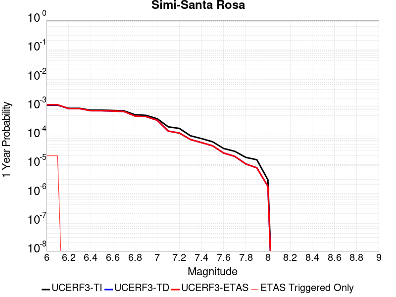 | 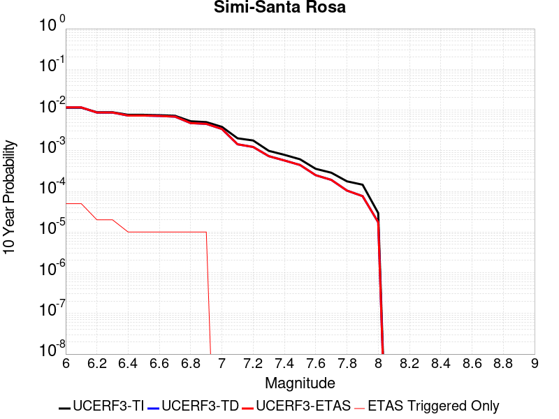 |

| Magnitude | 1 wk TI Prob | 1 wk TD Prob | 1 wk ETAS Prob | 1 wk ETAS/TD Gain | 1 wk ETAS Triggered Only | 1 mo TI Prob | 1 mo TD Prob | 1 mo ETAS Prob | 1 mo ETAS/TD Gain | 1 mo ETAS Triggered Only | 1 yr TI Prob | 1 yr TD Prob | 1 yr ETAS Prob | 1 yr ETAS/TD Gain | 1 yr ETAS Triggered Only | 10 yr TI Prob | 10 yr TD Prob | 10 yr ETAS Prob | 10 yr ETAS/TD Gain | 10 yr ETAS Triggered Only |
|-----|-----|-----|-----|-----|-----|-----|-----|-----|-----|-----|-----|-----|-----|-----|-----|-----|-----|-----|-----|-----|
| 6.0 | 2.198912E-5 | 2.2275442E-5 | 2.2275442E-5 | 1.0 | 0.0 | 9.4235686E-5 | 9.5462936E-5 | 9.5462936E-5 | 1.0 | 0.0 | 0.0011467156 | 0.0011616853 | 0.0011816622 | 1.0171964 | 2.0E-5 | 0.011408163 | 0.011560575 | 0.011609997 | 1.0042751 | 5.0E-5 |
| 6.1 | 2.198912E-5 | 2.2275442E-5 | 2.2275442E-5 | 1.0 | 0.0 | 9.4235686E-5 | 9.5462936E-5 | 9.5462936E-5 | 1.0 | 0.0 | 0.0011467156 | 0.0011616853 | 0.0011816622 | 1.0171964 | 2.0E-5 | 0.011408163 | 0.011560575 | 0.011609997 | 1.0042751 | 5.0E-5 |
| 6.2 | 1.69983E-5 | 1.6668559E-5 | 1.6668559E-5 | 1.0 | 0.0 | 7.284782E-5 | 7.143489E-5 | 7.143489E-5 | 1.0 | 0.0 | 8.865613E-4 | 8.6940196E-4 | 8.6940196E-4 | 1.0 | 0.0 | 0.008830327 | 0.008662928 | 0.008682754 | 1.0022887 | 2.0E-5 |
| 6.3 | 1.69983E-5 | 1.6668559E-5 | 1.6668559E-5 | 1.0 | 0.0 | 7.284782E-5 | 7.143489E-5 | 7.143489E-5 | 1.0 | 0.0 | 8.865613E-4 | 8.6940196E-4 | 8.6940196E-4 | 1.0 | 0.0 | 0.008830327 | 0.008662928 | 0.008682754 | 1.0022887 | 2.0E-5 |
| 6.4 | 1.4666188E-5 | 1.4052543E-5 | 1.4052543E-5 | 1.0 | 0.0 | 6.285358E-5 | 6.0223934E-5 | 6.0223934E-5 | 1.0 | 0.0 | 7.6497364E-4 | 7.3300465E-4 | 7.3300465E-4 | 1.0 | 0.0 | 0.0076234564 | 0.007308344 | 0.007318271 | 1.0013583 | 1.0E-5 |
| 6.5 | 1.4666188E-5 | 1.4052543E-5 | 1.4052543E-5 | 1.0 | 0.0 | 6.285358E-5 | 6.0223934E-5 | 6.0223934E-5 | 1.0 | 0.0 | 7.6497364E-4 | 7.3300465E-4 | 7.3300465E-4 | 1.0 | 0.0 | 0.0076234564 | 0.007308344 | 0.007318271 | 1.0013583 | 1.0E-5 |
| 6.6 | 1.4377586E-5 | 1.3729583E-5 | 1.3729583E-5 | 1.0 | 0.0 | 6.1616774E-5 | 5.883988E-5 | 5.883988E-5 | 1.0 | 0.0 | 7.4992597E-4 | 7.1616494E-4 | 7.1616494E-4 | 1.0 | 0.0 | 0.007474003 | 0.0071410383 | 0.007150967 | 1.0013903 | 1.0E-5 |
| 6.7 | 1.3881404E-5 | 1.320755E-5 | 1.320755E-5 | 1.0 | 0.0 | 5.9490372E-5 | 5.66027E-5 | 5.66027E-5 | 1.0 | 0.0 | 7.240546E-4 | 6.8894465E-4 | 6.8894465E-4 | 1.0 | 0.0 | 0.007217 | 0.006870538 | 0.0068804696 | 1.0014455 | 1.0E-5 |
| 6.8 | 1.0176516E-5 | 9.154151E-6 | 9.154151E-6 | 1.0 | 0.0 | 4.3612912E-5 | 3.9231574E-5 | 3.9231574E-5 | 1.0 | 0.0 | 5.308578E-4 | 4.7755634E-4 | 4.7755634E-4 | 1.0 | 0.0 | 0.0052959146 | 0.004766934 | 0.0047768867 | 1.0020878 | 1.0E-5 |
| 6.9 | 9.699797E-6 | 8.774719E-6 | 8.774719E-6 | 1.0 | 0.0 | 4.15699E-5 | 3.7605492E-5 | 3.7605492E-5 | 1.0 | 0.0 | 5.05996E-4 | 4.577671E-4 | 4.577671E-4 | 1.0 | 0.0 | 0.005048454 | 0.0045698597 | 0.004579814 | 1.0021782 | 1.0E-5 |
| 7.0 | 7.4049476E-6 | 6.559333E-6 | 6.559333E-6 | 1.0 | 0.0 | 3.1735104E-5 | 2.8111197E-5 | 2.8111197E-5 | 1.0 | 0.0 | 3.8630638E-4 | 3.422127E-4 | 3.422127E-4 | 1.0 | 0.0 | 0.0038563553 | 0.0034180996 | 0.0034180996 | 1.0 | 0.0 |
| 7.1 | 3.873439E-6 | 2.7595095E-6 | 2.7595095E-6 | 1.0 | 0.0 | 1.6600346E-5 | 1.1826417E-5 | 1.1826417E-5 | 1.0 | 0.0 | 2.0209046E-4 | 1.4397735E-4 | 1.4397735E-4 | 1.0 | 0.0 | 0.0020190678 | 0.0014388643 | 0.0014388643 | 1.0 | 0.0 |
| 7.2 | 3.417706E-6 | 2.3676484E-6 | 2.3676484E-6 | 1.0 | 0.0 | 1.4647229E-5 | 1.0147027E-5 | 1.0147027E-5 | 1.0 | 0.0 | 1.7831543E-4 | 1.2353327E-4 | 1.2353327E-4 | 1.0 | 0.0 | 0.0017817242 | 0.0012346683 | 0.0012346683 | 1.0 | 0.0 |
| 7.3 | 1.90225E-6 | 1.4073753E-6 | 1.4073753E-6 | 1.0 | 0.0 | 8.152474E-6 | 6.0315947E-6 | 6.0315947E-6 | 1.0 | 0.0 | 9.9251854E-5 | 7.343221E-5 | 7.343221E-5 | 1.0 | 0.0 | 9.920754E-4 | 7.340817E-4 | 7.340817E-4 | 1.0 | 0.0 |
| 7.4 | 1.5170556E-6 | 1.1024773E-6 | 1.1024773E-6 | 1.0 | 0.0 | 6.5016507E-6 | 4.724894E-6 | 4.724894E-6 | 1.0 | 0.0 | 7.915472E-5 | 5.7524077E-5 | 5.7524077E-5 | 1.0 | 0.0 | 7.9126534E-4 | 5.7509297E-4 | 5.7509297E-4 | 1.0 | 0.0 |
| 7.5 | 1.178732E-6 | 8.535102E-7 | 8.535102E-7 | 1.0 | 0.0 | 5.0516987E-6 | 3.6578958E-6 | 3.6578958E-6 | 1.0 | 0.0 | 6.1502695E-5 | 4.453398E-5 | 4.453398E-5 | 1.0 | 0.0 | 6.148568E-4 | 4.452515E-4 | 4.452515E-4 | 1.0 | 0.0 |
| 7.6 | 6.8722386E-7 | 4.793198E-7 | 4.793198E-7 | 1.0 | 0.0 | 2.9452417E-6 | 2.054226E-6 | 2.054226E-6 | 1.0 | 0.0 | 3.5857727E-5 | 2.5009915E-5 | 2.5009915E-5 | 1.0 | 0.0 | 3.5851944E-4 | 2.5007114E-4 | 2.5007114E-4 | 1.0 | 0.0 |
| 7.7 | 5.5126515E-7 | 3.6731157E-7 | 3.6731157E-7 | 1.0 | 0.0 | 2.3625628E-6 | 1.5741915E-6 | 1.5741915E-6 | 1.0 | 0.0 | 2.8763823E-5 | 1.9165615E-5 | 1.9165615E-5 | 1.0 | 0.0 | 2.87601E-4 | 1.9163972E-4 | 1.9163972E-4 | 1.0 | 0.0 |
| 7.8 | 3.3860243E-7 | 2.0075942E-7 | 2.0075942E-7 | 1.0 | 0.0 | 1.4511525E-6 | 8.6039717E-7 | 8.6039717E-7 | 1.0 | 0.0 | 1.7667637E-5 | 1.0475286E-5 | 1.0475286E-5 | 1.0 | 0.0 | 1.7666233E-4 | 1.04747975E-4 | 1.04747975E-4 | 1.0 | 0.0 |
| 7.9 | 2.7955386E-7 | 1.4649108E-7 | 1.4649108E-7 | 1.0 | 0.0 | 1.1980875E-6 | 6.278188E-7 | 6.278188E-7 | 1.0 | 0.0 | 1.4586617E-5 | 7.643667E-6 | 7.643667E-6 | 1.0 | 0.0 | 1.458566E-4 | 7.643409E-5 | 7.643409E-5 | 1.0 | 0.0 |
| 8.0 | 5.6259015E-8 | 3.3355324E-8 | 3.3355324E-8 | 1.0 | 0.0 | 2.4111003E-7 | 1.4295138E-7 | 1.4295138E-7 | 1.0 | 0.0 | 2.9355108E-6 | 1.7404317E-6 | 1.7404317E-6 | 1.0 | 0.0 | 2.935472E-5 | 1.7404194E-5 | 1.7404194E-5 | 1.0 | 0.0 |

## Sierra Madre
*[(top)](#table-of-contents)*

| 1 Week | 1 Month | 1 Year | 10 Year |
|-----|-----|-----|-----|
|  |  |  |  |

| Magnitude | 1 wk TI Prob | 1 wk TD Prob | 1 wk ETAS Prob | 1 wk ETAS/TD Gain | 1 wk ETAS Triggered Only | 1 mo TI Prob | 1 mo TD Prob | 1 mo ETAS Prob | 1 mo ETAS/TD Gain | 1 mo ETAS Triggered Only | 1 yr TI Prob | 1 yr TD Prob | 1 yr ETAS Prob | 1 yr ETAS/TD Gain | 1 yr ETAS Triggered Only | 10 yr TI Prob | 10 yr TD Prob | 10 yr ETAS Prob | 10 yr ETAS/TD Gain | 10 yr ETAS Triggered Only |
|-----|-----|-----|-----|-----|-----|-----|-----|-----|-----|-----|-----|-----|-----|-----|-----|-----|-----|-----|-----|-----|
| 6.0 | 1.3379373E-5 | 1.10007395E-5 | 4.100041E-5 | 3.7270594 | 3.0E-5 | 5.7338908E-5 | 4.7145186E-5 | 7.714377E-5 | 1.6363022 | 3.0E-5 | 6.978776E-4 | 5.738429E-4 | 6.038257E-4 | 1.0522491 | 3.0E-5 | 0.0069569005 | 0.0057239756 | 0.0057736896 | 1.0086852 | 5.0E-5 |
| 6.1 | 1.3379373E-5 | 1.10007395E-5 | 4.100041E-5 | 3.7270594 | 3.0E-5 | 5.7338908E-5 | 4.7145186E-5 | 7.714377E-5 | 1.6363022 | 3.0E-5 | 6.978776E-4 | 5.738429E-4 | 6.038257E-4 | 1.0522491 | 3.0E-5 | 0.0069569005 | 0.0057239756 | 0.0057736896 | 1.0086852 | 5.0E-5 |
| 6.2 | 1.3379373E-5 | 1.10007395E-5 | 4.100041E-5 | 3.7270594 | 3.0E-5 | 5.7338908E-5 | 4.7145186E-5 | 7.714377E-5 | 1.6363022 | 3.0E-5 | 6.978776E-4 | 5.738429E-4 | 6.038257E-4 | 1.0522491 | 3.0E-5 | 0.0069569005 | 0.0057239756 | 0.0057736896 | 1.0086852 | 5.0E-5 |
| 6.3 | 1.3379373E-5 | 1.10007395E-5 | 4.100041E-5 | 3.7270594 | 3.0E-5 | 5.7338908E-5 | 4.7145186E-5 | 7.714377E-5 | 1.6363022 | 3.0E-5 | 6.978776E-4 | 5.738429E-4 | 6.038257E-4 | 1.0522491 | 3.0E-5 | 0.0069569005 | 0.0057239756 | 0.0057736896 | 1.0086852 | 5.0E-5 |
| 6.4 | 1.3379373E-5 | 1.10007395E-5 | 4.100041E-5 | 3.7270594 | 3.0E-5 | 5.7338908E-5 | 4.7145186E-5 | 7.714377E-5 | 1.6363022 | 3.0E-5 | 6.978776E-4 | 5.738429E-4 | 6.038257E-4 | 1.0522491 | 3.0E-5 | 0.0069569005 | 0.0057239756 | 0.0057736896 | 1.0086852 | 5.0E-5 |
| 6.5 | 1.26563245E-5 | 1.0230196E-5 | 4.022989E-5 | 3.9324653 | 3.0E-5 | 5.4240263E-5 | 4.3842967E-5 | 7.384165E-5 | 1.6842303 | 3.0E-5 | 6.601751E-4 | 5.336584E-4 | 5.636424E-4 | 1.0561857 | 3.0E-5 | 0.006582173 | 0.0053240913 | 0.005373825 | 1.0093412 | 5.0E-5 |
| 6.6 | 1.26563245E-5 | 1.0230196E-5 | 4.022989E-5 | 3.9324653 | 3.0E-5 | 5.4240263E-5 | 4.3842967E-5 | 7.384165E-5 | 1.6842303 | 3.0E-5 | 6.601751E-4 | 5.336584E-4 | 5.636424E-4 | 1.0561857 | 3.0E-5 | 0.006582173 | 0.0053240913 | 0.005373825 | 1.0093412 | 5.0E-5 |
| 6.7 | 1.2502474E-5 | 1.006634E-5 | 4.006604E-5 | 3.980199 | 3.0E-5 | 5.3580934E-5 | 4.314075E-5 | 7.3139454E-5 | 1.6953682 | 3.0E-5 | 6.521526E-4 | 5.251131E-4 | 5.5509736E-4 | 1.0571005 | 3.0E-5 | 0.0065024206 | 0.0052390425 | 0.00528878 | 1.0094937 | 5.0E-5 |
| 6.8 | 1.2454966E-5 | 1.0018625E-5 | 4.0018323E-5 | 3.9943926 | 3.0E-5 | 5.3377335E-5 | 4.2936266E-5 | 7.293498E-5 | 1.69868 | 3.0E-5 | 6.4967526E-4 | 5.226247E-4 | 5.5260904E-4 | 1.0573726 | 3.0E-5 | 0.006477792 | 0.0052142753 | 0.0052640145 | 1.009539 | 5.0E-5 |
| 6.9 | 1.2225574E-5 | 9.792602E-6 | 3.9792307E-5 | 4.063507 | 3.0E-5 | 5.2394265E-5 | 4.1967625E-5 | 7.1966366E-5 | 1.7148067 | 3.0E-5 | 6.3771347E-4 | 5.108371E-4 | 5.4082175E-4 | 1.0586971 | 3.0E-5 | 0.006358865 | 0.0050969445 | 0.0051466897 | 1.0097598 | 5.0E-5 |
| 7.0 | 1.182946E-5 | 9.399144E-6 | 3.9398863E-5 | 4.19175 | 3.0E-5 | 5.06967E-5 | 4.0281426E-5 | 7.028022E-5 | 1.7447301 | 3.0E-5 | 6.1705755E-4 | 4.9031706E-4 | 5.2030233E-4 | 1.0611548 | 3.0E-5 | 0.006153469 | 0.004892664 | 0.0049424195 | 1.0101694 | 5.0E-5 |
| 7.1 | 1.14369095E-5 | 8.986159E-6 | 3.898589E-5 | 4.3384376 | 3.0E-5 | 4.9014405E-5 | 3.8511545E-5 | 6.8510395E-5 | 1.7789571 | 3.0E-5 | 5.9658696E-4 | 4.687782E-4 | 4.987641E-4 | 1.0639662 | 3.0E-5 | 0.005949879 | 0.004678199 | 0.004727965 | 1.0106379 | 5.0E-5 |
| 7.2 | 1.0836419E-5 | 8.3995565E-6 | 2.8399389E-5 | 3.381058 | 2.0E-5 | 4.644097E-5 | 3.5997607E-5 | 5.599689E-5 | 1.5555725 | 2.0E-5 | 5.652721E-4 | 4.3818366E-4 | 4.581749E-4 | 1.045623 | 2.0E-5 | 0.0056383642 | 0.004373494 | 0.0044133193 | 1.009106 | 4.0E-5 |
| 7.3 | 1.0403439E-5 | 8.02082E-6 | 2.8020659E-5 | 3.4934907 | 2.0E-5 | 4.4585406E-5 | 3.4374494E-5 | 5.4373806E-5 | 1.5818068 | 2.0E-5 | 5.426921E-4 | 4.1843E-4 | 4.3842164E-4 | 1.0477778 | 2.0E-5 | 0.005413687 | 0.004176717 | 0.0042065918 | 1.0071527 | 3.0E-5 |
| 7.4 | 9.768864E-6 | 7.414448E-6 | 2.74143E-5 | 3.697416 | 2.0E-5 | 4.186589E-5 | 3.1775824E-5 | 5.177519E-5 | 1.6293893 | 2.0E-5 | 5.09598E-4 | 3.868029E-4 | 4.0679515E-4 | 1.0516859 | 2.0E-5 | 0.0050843097 | 0.0038615882 | 0.0038914725 | 1.0077388 | 3.0E-5 |
| 7.5 | 8.687089E-6 | 6.4501564E-6 | 2.6450027E-5 | 4.10068 | 2.0E-5 | 3.722985E-5 | 2.764324E-5 | 4.7642687E-5 | 1.7234842 | 2.0E-5 | 4.5317915E-4 | 3.3650533E-4 | 3.564986E-4 | 1.0594144 | 2.0E-5 | 0.004522561 | 0.0033602451 | 0.0033901443 | 1.0088979 | 3.0E-5 |
| 7.6 | 6.3506063E-6 | 4.4303215E-6 | 1.4430278E-5 | 3.2571623 | 1.0E-5 | 2.72166E-5 | 1.8986955E-5 | 2.8986766E-5 | 1.5266674 | 1.0E-5 | 3.3131172E-4 | 2.3114192E-4 | 2.4113961E-4 | 1.0432534 | 1.0E-5 | 0.003308182 | 0.0023092402 | 0.002319217 | 1.0043204 | 1.0E-5 |
| 7.7 | 4.62223E-6 | 2.932967E-6 | 2.932967E-6 | 1.0 | 0.0 | 1.9809406E-5 | 1.2569798E-5 | 1.2569798E-5 | 1.0 | 0.0 | 2.4115283E-4 | 1.5302657E-4 | 1.5302657E-4 | 1.0 | 0.0 | 0.0024089129 | 0.001529413 | 0.001529413 | 1.0 | 0.0 |
| 7.8 | 3.2145008E-6 | 1.9494332E-6 | 1.9494332E-6 | 1.0 | 0.0 | 1.3776359E-5 | 8.3546865E-6 | 8.3546865E-6 | 1.0 | 0.0 | 1.6771426E-4 | 1.0171358E-4 | 1.0171358E-4 | 1.0 | 0.0 | 0.0016758774 | 0.0010168145 | 0.0010168145 | 1.0 | 0.0 |
| 7.9 | 1.0391769E-6 | 5.6026335E-7 | 5.6026335E-7 | 1.0 | 0.0 | 4.4536077E-6 | 2.4011265E-6 | 2.4011265E-6 | 1.0 | 0.0 | 5.4221324E-5 | 2.9233326E-5 | 2.9233326E-5 | 1.0 | 0.0 | 5.4208096E-4 | 2.9229524E-4 | 2.9229524E-4 | 1.0 | 0.0 |
| 8.0 | 1.210983E-7 | 6.613821E-8 | 6.613821E-8 | 1.0 | 0.0 | 5.1899264E-7 | 2.8344945E-7 | 2.8344945E-7 | 1.0 | 0.0 | 6.3187167E-6 | 3.4509917E-6 | 3.4509917E-6 | 1.0 | 0.0 | 6.318537E-5 | 3.45094E-5 | 3.45094E-5 | 1.0 | 0.0 |

## Santa Susana East (connector)
*[(top)](#table-of-contents)*

| 1 Week | 1 Month | 1 Year | 10 Year |
|-----|-----|-----|-----|
|  |  |  |  |

| Magnitude | 1 wk TI Prob | 1 wk TD Prob | 1 wk ETAS Prob | 1 wk ETAS/TD Gain | 1 wk ETAS Triggered Only | 1 mo TI Prob | 1 mo TD Prob | 1 mo ETAS Prob | 1 mo ETAS/TD Gain | 1 mo ETAS Triggered Only | 1 yr TI Prob | 1 yr TD Prob | 1 yr ETAS Prob | 1 yr ETAS/TD Gain | 1 yr ETAS Triggered Only | 10 yr TI Prob | 10 yr TD Prob | 10 yr ETAS Prob | 10 yr ETAS/TD Gain | 10 yr ETAS Triggered Only |
|-----|-----|-----|-----|-----|-----|-----|-----|-----|-----|-----|-----|-----|-----|-----|-----|-----|-----|-----|-----|-----|
| 6.0 | 2.858397E-5 | 3.202091E-5 | 4.202059E-5 | 1.3122859 | 1.0E-5 | 1.2249697E-4 | 1.3722685E-4 | 1.4722548E-4 | 1.072862 | 1.0E-5 | 0.0014903803 | 0.0016697381 | 0.0016797214 | 1.005979 | 1.0E-5 | 0.014804244 | 0.016599052 | 0.016638389 | 1.0023698 | 4.0E-5 |
| 6.1 | 2.858397E-5 | 3.202091E-5 | 4.202059E-5 | 1.3122859 | 1.0E-5 | 1.2249697E-4 | 1.3722685E-4 | 1.4722548E-4 | 1.072862 | 1.0E-5 | 0.0014903803 | 0.0016697381 | 0.0016797214 | 1.005979 | 1.0E-5 | 0.014804244 | 0.016599052 | 0.016638389 | 1.0023698 | 4.0E-5 |
| 6.2 | 2.858397E-5 | 3.202091E-5 | 4.202059E-5 | 1.3122859 | 1.0E-5 | 1.2249697E-4 | 1.3722685E-4 | 1.4722548E-4 | 1.072862 | 1.0E-5 | 0.0014903803 | 0.0016697381 | 0.0016797214 | 1.005979 | 1.0E-5 | 0.014804244 | 0.016599052 | 0.016638389 | 1.0023698 | 4.0E-5 |
| 6.3 | 1.943582E-5 | 2.036718E-5 | 3.0366977E-5 | 1.490976 | 1.0E-5 | 8.329371E-5 | 8.7285625E-5 | 9.7284756E-5 | 1.1145564 | 1.0E-5 | 0.001013629 | 0.0010622967 | 0.001072286 | 1.0094036 | 1.0E-5 | 0.010090181 | 0.010583619 | 0.010613301 | 1.0028045 | 3.0E-5 |
| 6.4 | 1.943582E-5 | 2.036718E-5 | 3.0366977E-5 | 1.490976 | 1.0E-5 | 8.329371E-5 | 8.7285625E-5 | 9.7284756E-5 | 1.1145564 | 1.0E-5 | 0.001013629 | 0.0010622967 | 0.001072286 | 1.0094036 | 1.0E-5 | 0.010090181 | 0.010583619 | 0.010613301 | 1.0028045 | 3.0E-5 |
| 6.5 | 1.943582E-5 | 2.036718E-5 | 3.0366977E-5 | 1.490976 | 1.0E-5 | 8.329371E-5 | 8.7285625E-5 | 9.7284756E-5 | 1.1145564 | 1.0E-5 | 0.001013629 | 0.0010622967 | 0.001072286 | 1.0094036 | 1.0E-5 | 0.010090181 | 0.010583619 | 0.010613301 | 1.0028045 | 3.0E-5 |
| 6.6 | 1.943582E-5 | 2.036718E-5 | 3.0366977E-5 | 1.490976 | 1.0E-5 | 8.329371E-5 | 8.7285625E-5 | 9.7284756E-5 | 1.1145564 | 1.0E-5 | 0.001013629 | 0.0010622967 | 0.001072286 | 1.0094036 | 1.0E-5 | 0.010090181 | 0.010583619 | 0.010613301 | 1.0028045 | 3.0E-5 |
| 6.7 | 1.9404439E-5 | 2.03546E-5 | 3.0354397E-5 | 1.4912794 | 1.0E-5 | 8.3159226E-5 | 8.723172E-5 | 9.723085E-5 | 1.1146272 | 1.0E-5 | 0.0010119933 | 0.0010616409 | 0.0010716304 | 1.0094094 | 1.0E-5 | 0.010073971 | 0.010577125 | 0.010606807 | 1.0028063 | 3.0E-5 |
| 6.8 | 1.2217526E-5 | 1.1592998E-5 | 2.1592881E-5 | 1.8625797 | 1.0E-5 | 5.2359774E-5 | 4.9683425E-5 | 5.9682927E-5 | 1.2012644 | 1.0E-5 | 6.372938E-4 | 6.0474465E-4 | 6.147386E-4 | 1.0165259 | 1.0E-5 | 0.0063546924 | 0.006033037 | 0.006062856 | 1.0049427 | 3.0E-5 |
| 6.9 | 1.2217526E-5 | 1.1592998E-5 | 2.1592881E-5 | 1.8625797 | 1.0E-5 | 5.2359774E-5 | 4.9683425E-5 | 5.9682927E-5 | 1.2012644 | 1.0E-5 | 6.372938E-4 | 6.0474465E-4 | 6.147386E-4 | 1.0165259 | 1.0E-5 | 0.0063546924 | 0.006033037 | 0.006062856 | 1.0049427 | 3.0E-5 |
| 7.0 | 9.276017E-6 | 8.059113E-6 | 1.8059032E-5 | 2.2408214 | 1.0E-5 | 3.9753755E-5 | 3.4538618E-5 | 4.4538272E-5 | 1.289521 | 1.0E-5 | 4.8389446E-4 | 4.2042998E-4 | 4.3042577E-4 | 1.0237752 | 1.0E-5 | 0.0048284214 | 0.0041970722 | 0.0042269463 | 1.0071179 | 3.0E-5 |
| 7.1 | 9.130355E-6 | 7.942286E-6 | 1.7942208E-5 | 2.2590733 | 1.0E-5 | 3.9129503E-5 | 3.4037945E-5 | 4.4037606E-5 | 1.2937797 | 1.0E-5 | 4.7629757E-4 | 4.1433662E-4 | 4.2433248E-4 | 1.024125 | 1.0E-5 | 0.00475278 | 0.004136367 | 0.0041662427 | 1.0072228 | 3.0E-5 |
| 7.2 | 8.851015E-6 | 7.741445E-6 | 1.7741368E-5 | 2.2917385 | 1.0E-5 | 3.7932372E-5 | 3.317722E-5 | 4.317689E-5 | 1.3014016 | 1.0E-5 | 4.6172875E-4 | 4.038612E-4 | 4.1385717E-4 | 1.024751 | 1.0E-5 | 0.0046077054 | 0.0040319953 | 0.0040618745 | 1.0074105 | 3.0E-5 |
| 7.3 | 8.573006E-6 | 7.550166E-6 | 1.755009E-5 | 2.324464 | 1.0E-5 | 3.6740938E-5 | 3.2357475E-5 | 4.235715E-5 | 1.3090376 | 1.0E-5 | 4.472291E-4 | 3.9388443E-4 | 4.038805E-4 | 1.0253781 | 1.0E-5 | 0.004463301 | 0.0039325804 | 0.003962463 | 1.0075985 | 3.0E-5 |
| 7.4 | 7.852282E-6 | 6.817687E-6 | 1.681762E-5 | 2.4667633 | 1.0E-5 | 3.36522E-5 | 2.9218349E-5 | 3.9218055E-5 | 1.3422407 | 1.0E-5 | 4.096385E-4 | 3.5567835E-4 | 3.656748E-4 | 1.0281053 | 1.0E-5 | 0.0040888423 | 0.0035517553 | 0.0035816487 | 1.0084165 | 3.0E-5 |
| 7.5 | 4.8869324E-6 | 4.279055E-6 | 1.4279012E-5 | 3.3369546 | 1.0E-5 | 2.0943828E-5 | 1.8338687E-5 | 2.8338503E-5 | 1.5452853 | 1.0E-5 | 2.5496128E-4 | 2.232523E-4 | 2.3325007E-4 | 1.0447824 | 1.0E-5 | 0.0025466895 | 0.0022304445 | 0.0022404222 | 1.0044734 | 1.0E-5 |
| 7.6 | 1.3894544E-6 | 1.1568179E-6 | 1.1568179E-6 | 1.0 | 0.0 | 5.954791E-6 | 4.957783E-6 | 4.957783E-6 | 1.0 | 0.0 | 7.249717E-5 | 6.0359558E-5 | 6.0359558E-5 | 1.0 | 0.0 | 7.247352E-4 | 6.0345343E-4 | 6.0345343E-4 | 1.0 | 0.0 |
| 7.7 | 2.9924632E-7 | 2.371928E-7 | 2.371928E-7 | 1.0 | 0.0 | 1.2824837E-6 | 1.0165402E-6 | 1.0165402E-6 | 1.0 | 0.0 | 1.5614127E-5 | 1.2376314E-5 | 1.2376314E-5 | 1.0 | 0.0 | 1.5613029E-4 | 1.2375697E-4 | 1.2375697E-4 | 1.0 | 0.0 |
| 7.8 | 4.8188564E-8 | 2.6323061E-8 | 2.6323061E-8 | 1.0 | 0.0 | 2.065224E-7 | 1.1281311E-7 | 1.1281311E-7 | 1.0 | 0.0 | 2.5144072E-6 | 1.3734989E-6 | 1.3734989E-6 | 1.0 | 0.0 | 2.5143789E-5 | 1.3734912E-5 | 1.3734912E-5 | 1.0 | 0.0 |
| 7.9 | 2.6127251E-9 | 2.7681102E-9 | 2.7681102E-9 | 1.0 | 0.0 | 1.1197393E-8 | 1.186333E-8 | 1.186333E-8 | 1.0 | 0.0 | 1.3632825E-7 | 1.4443603E-7 | 1.4443603E-7 | 1.0 | 0.0 | 1.3632817E-6 | 1.4443604E-6 | 1.4443604E-6 | 1.0 | 0.0 |

## San Luis Range 2011 CFM
*[(top)](#table-of-contents)*

| 1 Week | 1 Month | 1 Year | 10 Year |
|-----|-----|-----|-----|
|  |  |  | 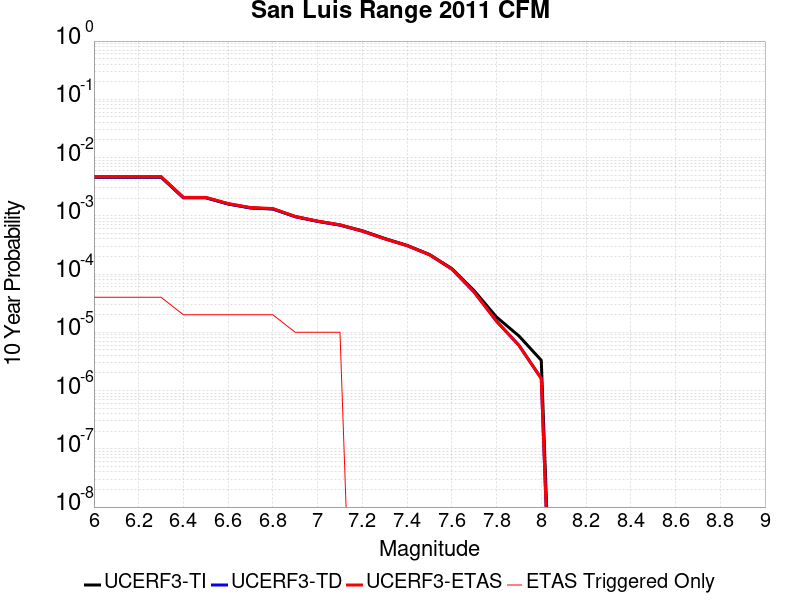 |

| Magnitude | 1 wk TI Prob | 1 wk TD Prob | 1 wk ETAS Prob | 1 wk ETAS/TD Gain | 1 wk ETAS Triggered Only | 1 mo TI Prob | 1 mo TD Prob | 1 mo ETAS Prob | 1 mo ETAS/TD Gain | 1 mo ETAS Triggered Only | 1 yr TI Prob | 1 yr TD Prob | 1 yr ETAS Prob | 1 yr ETAS/TD Gain | 1 yr ETAS Triggered Only | 10 yr TI Prob | 10 yr TD Prob | 10 yr ETAS Prob | 10 yr ETAS/TD Gain | 10 yr ETAS Triggered Only |
|-----|-----|-----|-----|-----|-----|-----|-----|-----|-----|-----|-----|-----|-----|-----|-----|-----|-----|-----|-----|-----|
| 6.0 | 8.8368415E-6 | 8.965454E-6 | 2.8965274E-5 | 3.230765 | 2.0E-5 | 3.787163E-5 | 3.842285E-5 | 5.8422083E-5 | 1.5205035 | 2.0E-5 | 4.609895E-4 | 4.677057E-4 | 4.976917E-4 | 1.0641129 | 3.0E-5 | 0.0046003438 | 0.0046679964 | 0.0047078095 | 1.008529 | 4.0E-5 |
| 6.1 | 8.8368415E-6 | 8.965454E-6 | 2.8965274E-5 | 3.230765 | 2.0E-5 | 3.787163E-5 | 3.842285E-5 | 5.8422083E-5 | 1.5205035 | 2.0E-5 | 4.609895E-4 | 4.677057E-4 | 4.976917E-4 | 1.0641129 | 3.0E-5 | 0.0046003438 | 0.0046679964 | 0.0047078095 | 1.008529 | 4.0E-5 |
| 6.2 | 8.8368415E-6 | 8.965454E-6 | 2.8965274E-5 | 3.230765 | 2.0E-5 | 3.787163E-5 | 3.842285E-5 | 5.8422083E-5 | 1.5205035 | 2.0E-5 | 4.609895E-4 | 4.677057E-4 | 4.976917E-4 | 1.0641129 | 3.0E-5 | 0.0046003438 | 0.0046679964 | 0.0047078095 | 1.008529 | 4.0E-5 |
| 6.3 | 8.8368415E-6 | 8.965454E-6 | 2.8965274E-5 | 3.230765 | 2.0E-5 | 3.787163E-5 | 3.842285E-5 | 5.8422083E-5 | 1.5205035 | 2.0E-5 | 4.609895E-4 | 4.677057E-4 | 4.976917E-4 | 1.0641129 | 3.0E-5 | 0.0046003438 | 0.0046679964 | 0.0047078095 | 1.008529 | 4.0E-5 |
| 6.4 | 3.9094193E-6 | 3.9412025E-6 | 1.3941163E-5 | 3.5372865 | 1.0E-5 | 1.6754546E-5 | 1.689076E-5 | 2.6890591E-5 | 1.5920297 | 1.0E-5 | 2.039675E-4 | 2.056259E-4 | 2.2562178E-4 | 1.097244 | 2.0E-5 | 0.0020378039 | 0.0020543851 | 0.002074344 | 1.0097153 | 2.0E-5 |
| 6.5 | 3.9094193E-6 | 3.9412025E-6 | 1.3941163E-5 | 3.5372865 | 1.0E-5 | 1.6754546E-5 | 1.689076E-5 | 2.6890591E-5 | 1.5920297 | 1.0E-5 | 2.039675E-4 | 2.056259E-4 | 2.2562178E-4 | 1.097244 | 2.0E-5 | 0.0020378039 | 0.0020543851 | 0.002074344 | 1.0097153 | 2.0E-5 |
| 6.6 | 3.0587726E-6 | 3.0753883E-6 | 1.3075358E-5 | 4.251612 | 1.0E-5 | 1.3108959E-5 | 1.318017E-5 | 2.3180037E-5 | 1.7587056 | 1.0E-5 | 1.595899E-4 | 1.6045687E-4 | 1.8045366E-4 | 1.1246241 | 2.0E-5 | 0.0015947534 | 0.0016034221 | 0.00162339 | 1.0124533 | 2.0E-5 |
| 6.7 | 2.6160574E-6 | 2.6251273E-6 | 1.2625101E-5 | 4.809329 | 1.0E-5 | 1.1211626E-5 | 1.1250498E-5 | 2.1250386E-5 | 1.8888396 | 1.0E-5 | 1.3649299E-4 | 1.3696625E-4 | 1.5696352E-4 | 1.1460013 | 2.0E-5 | 0.0013640919 | 0.0013688246 | 0.0013887972 | 1.0145911 | 2.0E-5 |
| 6.8 | 2.5110312E-6 | 2.51814E-6 | 1.2518115E-5 | 4.9711747 | 1.0E-5 | 1.0761518E-5 | 1.0791985E-5 | 2.0791877E-5 | 1.9266036 | 1.0E-5 | 1.310136E-4 | 1.3138456E-4 | 1.5138193E-4 | 1.1522049 | 2.0E-5 | 0.0013093639 | 0.0013130746 | 0.0013330483 | 1.0152115 | 2.0E-5 |
| 6.9 | 1.8564405E-6 | 1.852487E-6 | 1.1852469E-5 | 6.3981385 | 1.0E-5 | 7.95615E-6 | 7.939206E-6 | 1.7939126E-5 | 2.2595618 | 1.0E-5 | 9.686181E-5 | 9.665557E-5 | 1.06654596E-4 | 1.1034502 | 1.0E-5 | 9.68196E-4 | 9.661373E-4 | 9.7612763E-4 | 1.0103405 | 1.0E-5 |
| 7.0 | 1.546127E-6 | 1.5369537E-6 | 1.15369385E-5 | 7.5063667 | 1.0E-5 | 6.626242E-6 | 6.586928E-6 | 1.6586862E-5 | 2.5181484 | 1.0E-5 | 8.06715E-5 | 8.0192905E-5 | 9.01921E-5 | 1.1246893 | 1.0E-5 | 8.0642226E-4 | 8.016404E-4 | 8.116324E-4 | 1.0124644 | 1.0E-5 |
| 7.1 | 1.3368208E-6 | 1.3235326E-6 | 1.1323519E-5 | 8.555528 | 1.0E-5 | 5.7292195E-6 | 5.67227E-6 | 1.5672214E-5 | 2.7629526 | 1.0E-5 | 6.975101E-5 | 6.905771E-5 | 7.905702E-5 | 1.1447965 | 1.0E-5 | 6.972912E-4 | 6.9036294E-4 | 7.0035603E-4 | 1.0144751 | 1.0E-5 |
| 7.2 | 1.0623363E-6 | 1.0454368E-6 | 1.0454368E-6 | 1.0 | 0.0 | 4.5528623E-6 | 4.4804356E-6 | 4.4804356E-6 | 1.0 | 0.0 | 5.5429686E-5 | 5.4547938E-5 | 5.4547938E-5 | 1.0 | 0.0 | 5.5415864E-4 | 5.4534577E-4 | 5.4534577E-4 | 1.0 | 0.0 |
| 7.3 | 7.831679E-7 | 7.7273904E-7 | 7.7273904E-7 | 1.0 | 0.0 | 3.3564295E-6 | 3.3117344E-6 | 3.3117344E-6 | 1.0 | 0.0 | 4.086376E-5 | 4.0319625E-5 | 4.0319625E-5 | 1.0 | 0.0 | 4.0856248E-4 | 4.031232E-4 | 4.031232E-4 | 1.0 | 0.0 |
| 7.4 | 5.9558846E-7 | 5.910636E-7 | 5.910636E-7 | 1.0 | 0.0 | 2.5525194E-6 | 2.5331274E-6 | 2.5331274E-6 | 1.0 | 0.0 | 3.107648E-5 | 3.084039E-5 | 3.084039E-5 | 1.0 | 0.0 | 3.1072134E-4 | 3.083612E-4 | 3.083612E-4 | 1.0 | 0.0 |
| 7.5 | 4.1616502E-7 | 4.119631E-7 | 4.119631E-7 | 1.0 | 0.0 | 1.7835631E-6 | 1.7655549E-6 | 1.7655549E-6 | 1.0 | 0.0 | 2.1714664E-5 | 2.149542E-5 | 2.149542E-5 | 1.0 | 0.0 | 2.1712543E-4 | 2.1493346E-4 | 2.1493346E-4 | 1.0 | 0.0 |
| 7.6 | 2.3816014E-7 | 2.3376548E-7 | 2.3376548E-7 | 1.0 | 0.0 | 1.0206859E-6 | 1.0018516E-6 | 1.0018516E-6 | 1.0 | 0.0 | 1.242678E-5 | 1.2197475E-5 | 1.2197475E-5 | 1.0 | 0.0 | 1.2426086E-4 | 1.2196808E-4 | 1.2196808E-4 | 1.0 | 0.0 |
| 7.7 | 9.918777E-8 | 9.3867584E-8 | 9.3867584E-8 | 1.0 | 0.0 | 4.2509038E-7 | 4.0228957E-7 | 4.0228957E-7 | 1.0 | 0.0 | 5.1754632E-6 | 4.8978645E-6 | 4.8978645E-6 | 1.0 | 0.0 | 5.1753424E-5 | 4.897757E-5 | 4.897757E-5 | 1.0 | 0.0 |
| 7.8 | 3.4982556E-8 | 2.968655E-8 | 2.968655E-8 | 1.0 | 0.0 | 1.4992524E-7 | 1.2722806E-7 | 1.2722806E-7 | 1.0 | 0.0 | 1.8253382E-6 | 1.5490006E-6 | 1.5490006E-6 | 1.0 | 0.0 | 1.8253233E-5 | 1.5489897E-5 | 1.5489897E-5 | 1.0 | 0.0 |
| 7.9 | 1.6624908E-8 | 1.1477036E-8 | 1.1477036E-8 | 1.0 | 0.0 | 7.12496E-8 | 4.91873E-8 | 4.91873E-8 | 1.0 | 0.0 | 8.6746354E-7 | 5.988552E-7 | 5.988552E-7 | 1.0 | 0.0 | 8.674601E-6 | 5.988536E-6 | 5.988536E-6 | 1.0 | 0.0 |
| 8.0 | 6.3352315E-9 | 3.0888412E-9 | 3.0888412E-9 | 1.0 | 0.0 | 2.715099E-8 | 1.3237893E-8 | 1.3237893E-8 | 1.0 | 0.0 | 3.3056327E-7 | 1.6117131E-7 | 1.6117131E-7 | 1.0 | 0.0 | 3.3056278E-6 | 1.611712E-6 | 1.611712E-6 | 1.0 | 0.0 |

## Malibu Coast (Extension) alt 1
*[(top)](#table-of-contents)*

| 1 Week | 1 Month | 1 Year | 10 Year |
|-----|-----|-----|-----|
|  |  |  |  |

| Magnitude | 1 wk TI Prob | 1 wk TD Prob | 1 wk ETAS Prob | 1 wk ETAS/TD Gain | 1 wk ETAS Triggered Only | 1 mo TI Prob | 1 mo TD Prob | 1 mo ETAS Prob | 1 mo ETAS/TD Gain | 1 mo ETAS Triggered Only | 1 yr TI Prob | 1 yr TD Prob | 1 yr ETAS Prob | 1 yr ETAS/TD Gain | 1 yr ETAS Triggered Only | 10 yr TI Prob | 10 yr TD Prob | 10 yr ETAS Prob | 10 yr ETAS/TD Gain | 10 yr ETAS Triggered Only |
|-----|-----|-----|-----|-----|-----|-----|-----|-----|-----|-----|-----|-----|-----|-----|-----|-----|-----|-----|-----|-----|
| 6.0 | 8.930738E-6 | 9.329276E-6 | 2.9329089E-5 | 3.143769 | 2.0E-5 | 3.827403E-5 | 3.998201E-5 | 5.998121E-5 | 1.500205 | 2.0E-5 | 4.6588664E-4 | 4.8667393E-4 | 5.1665935E-4 | 1.061613 | 3.0E-5 | 0.0046491115 | 0.004856264 | 0.00489607 | 1.0081968 | 4.0E-5 |
| 6.1 | 7.199952E-6 | 7.5302964E-6 | 1.7530221E-5 | 2.327959 | 1.0E-5 | 3.0856572E-5 | 3.2272303E-5 | 4.2271982E-5 | 1.3098532 | 1.0E-5 | 3.75614E-4 | 3.9284505E-4 | 4.128372E-4 | 1.0508907 | 2.0E-5 | 0.0037497976 | 0.003921572 | 0.0039514545 | 1.00762 | 3.0E-5 |
| 6.2 | 6.3721413E-6 | 6.6667917E-6 | 1.6666725E-5 | 2.4999619 | 1.0E-5 | 2.7308892E-5 | 2.8571652E-5 | 3.857137E-5 | 1.3499873 | 1.0E-5 | 3.3243504E-4 | 3.4780471E-4 | 3.6779774E-4 | 1.0574836 | 2.0E-5 | 0.0033193815 | 0.0034726437 | 0.0035025396 | 1.0086089 | 3.0E-5 |
| 6.3 | 6.016345E-6 | 6.295158E-6 | 1.6295095E-5 | 2.5885124 | 1.0E-5 | 2.578408E-5 | 2.6978973E-5 | 3.69787E-5 | 1.3706491 | 1.0E-5 | 3.1387596E-4 | 3.2841982E-4 | 3.4841325E-4 | 1.0608777 | 2.0E-5 | 0.00313433 | 0.0032793807 | 0.0033092822 | 1.0091181 | 3.0E-5 |
| 6.4 | 5.8104883E-6 | 6.0795446E-6 | 1.6079484E-5 | 2.64485 | 1.0E-5 | 2.4901856E-5 | 2.6054933E-5 | 3.6054673E-5 | 1.3837944 | 1.0E-5 | 3.031379E-4 | 3.1717293E-4 | 3.371666E-4 | 1.063037 | 2.0E-5 | 0.0030272473 | 0.0031672374 | 0.0031971424 | 1.009442 | 3.0E-5 |
| 6.5 | 5.476925E-6 | 5.7275133E-6 | 1.5727455E-5 | 2.7459486 | 1.0E-5 | 2.3472323E-5 | 2.4546256E-5 | 3.454601E-5 | 1.4073842 | 1.0E-5 | 2.8573806E-4 | 2.9880996E-4 | 3.18804E-4 | 1.0669122 | 2.0E-5 | 0.0028537093 | 0.002984114 | 0.0030140243 | 1.0100232 | 3.0E-5 |
| 6.6 | 5.222387E-6 | 5.45858E-6 | 1.5458525E-5 | 2.8319683 | 1.0E-5 | 2.2381464E-5 | 2.3393704E-5 | 3.339347E-5 | 1.4274554 | 1.0E-5 | 2.7246025E-4 | 2.8478142E-4 | 3.0477572E-4 | 1.0702093 | 2.0E-5 | 0.0027212645 | 0.0028441956 | 0.0028741101 | 1.0105178 | 3.0E-5 |
| 6.7 | 5.0337076E-6 | 5.259103E-6 | 1.5259051E-5 | 2.901455 | 1.0E-5 | 2.1572854E-5 | 2.253882E-5 | 3.2538595E-5 | 1.443669 | 1.0E-5 | 2.6261783E-4 | 2.7437587E-4 | 2.9437037E-4 | 1.0728728 | 2.0E-5 | 0.002623077 | 0.002740401 | 0.0027703189 | 1.0109173 | 3.0E-5 |
| 6.8 | 4.5675624E-6 | 4.7587164E-6 | 1.4758669E-5 | 3.101397 | 1.0E-5 | 1.9575122E-5 | 2.039434E-5 | 3.0394136E-5 | 1.4903221 | 1.0E-5 | 2.3830103E-4 | 2.48273E-4 | 2.6826802E-4 | 1.0805365 | 2.0E-5 | 0.0023804565 | 0.002479976 | 0.0025099015 | 1.0120668 | 3.0E-5 |
| 6.9 | 4.2802412E-6 | 4.4520207E-6 | 1.4451976E-5 | 3.2461612 | 1.0E-5 | 1.8343762E-5 | 1.907995E-5 | 2.9079758E-5 | 1.5241004 | 1.0E-5 | 2.2331243E-4 | 2.3227377E-4 | 2.5226912E-4 | 1.0860853 | 2.0E-5 | 0.0022308815 | 0.0023203269 | 0.0023502572 | 1.0128992 | 3.0E-5 |
| 7.0 | 3.9794063E-6 | 4.130099E-6 | 1.4130058E-5 | 3.4212394 | 1.0E-5 | 1.7054486E-5 | 1.7700306E-5 | 2.7700129E-5 | 1.564952 | 1.0E-5 | 2.0761859E-4 | 2.1548003E-4 | 2.3547572E-4 | 1.092796 | 2.0E-5 | 0.0020742472 | 0.0021527244 | 0.00218266 | 1.0139059 | 3.0E-5 |
| 7.1 | 3.7730424E-6 | 3.911217E-6 | 1.3911178E-5 | 3.5567389 | 1.0E-5 | 1.6170083E-5 | 1.6762251E-5 | 2.6762084E-5 | 1.5965686 | 1.0E-5 | 1.9685295E-4 | 2.0406142E-4 | 2.2405734E-4 | 1.0979897 | 2.0E-5 | 0.0019667868 | 0.0020387534 | 0.0020686921 | 1.0146849 | 3.0E-5 |
| 7.2 | 3.424985E-6 | 3.541337E-6 | 1.3541302E-5 | 3.8237822 | 1.0E-5 | 1.4678424E-5 | 1.5177071E-5 | 2.517692E-5 | 1.6588787 | 1.0E-5 | 1.7869516E-4 | 1.8476529E-4 | 2.0476159E-4 | 1.1082255 | 2.0E-5 | 0.0017855153 | 0.0018461287 | 0.0018760734 | 1.0162202 | 3.0E-5 |
| 7.3 | 2.6966375E-6 | 2.7596534E-6 | 1.2759626E-5 | 4.6236334 | 1.0E-5 | 1.15569665E-5 | 1.1827032E-5 | 2.1826914E-5 | 1.8455107 | 1.0E-5 | 1.4069698E-4 | 1.4398464E-4 | 1.6398176E-4 | 1.1388837 | 2.0E-5 | 0.0014060794 | 0.0014389176 | 0.0014688745 | 1.020819 | 3.0E-5 |
| 7.4 | 2.215957E-6 | 2.249378E-6 | 1.2249356E-5 | 5.4456635 | 1.0E-5 | 9.496924E-6 | 9.640156E-6 | 1.964006E-5 | 2.0373175 | 1.0E-5 | 1.1561892E-4 | 1.17362615E-4 | 1.3736027E-4 | 1.170392 | 2.0E-5 | 0.0011555878 | 0.0011730101 | 0.0012029748 | 1.0255452 | 3.0E-5 |
| 7.5 | 1.2040218E-6 | 1.2219067E-6 | 1.2219067E-6 | 1.0 | 0.0 | 5.160083E-6 | 5.2367322E-6 | 5.2367322E-6 | 1.0 | 0.0 | 6.2822204E-5 | 6.375537E-5 | 6.375537E-5 | 1.0 | 0.0 | 6.280445E-4 | 6.3737266E-4 | 6.473663E-4 | 1.0156794 | 1.0E-5 |
| 7.6 | 6.6157446E-7 | 6.678975E-7 | 6.678975E-7 | 1.0 | 0.0 | 2.835316E-6 | 2.8624147E-6 | 2.8624147E-6 | 1.0 | 0.0 | 3.4519428E-5 | 3.484936E-5 | 3.484936E-5 | 1.0 | 0.0 | 3.4514067E-4 | 3.4844046E-4 | 3.4844046E-4 | 1.0 | 0.0 |
| 7.7 | 2.6012302E-7 | 2.4357593E-7 | 2.4357593E-7 | 1.0 | 0.0 | 1.1148124E-6 | 1.0438964E-6 | 1.0438964E-6 | 1.0 | 0.0 | 1.3572758E-5 | 1.2709375E-5 | 1.2709375E-5 | 1.0 | 0.0 | 1.3571928E-4 | 1.2708755E-4 | 1.2708755E-4 | 1.0 | 0.0 |
| 7.8 | 2.8323132E-8 | 2.0266649E-8 | 2.0266649E-8 | 1.0 | 0.0 | 1.2138484E-7 | 8.685707E-8 | 8.685707E-8 | 1.0 | 0.0 | 1.4778595E-6 | 1.0574844E-6 | 1.0574844E-6 | 1.0 | 0.0 | 1.4778497E-5 | 1.0574801E-5 | 1.0574801E-5 | 1.0 | 0.0 |

## Calaveras (Central) 2011 CFM
*[(top)](#table-of-contents)*

| 1 Week | 1 Month | 1 Year | 10 Year |
|-----|-----|-----|-----|
|  |  | 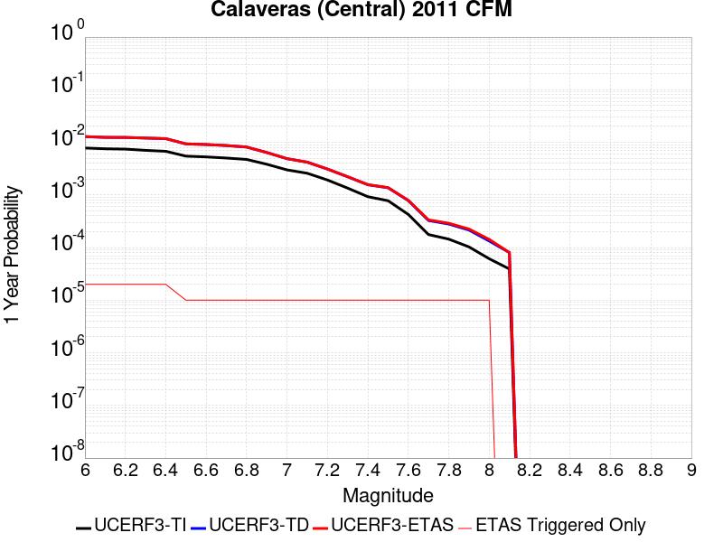 | 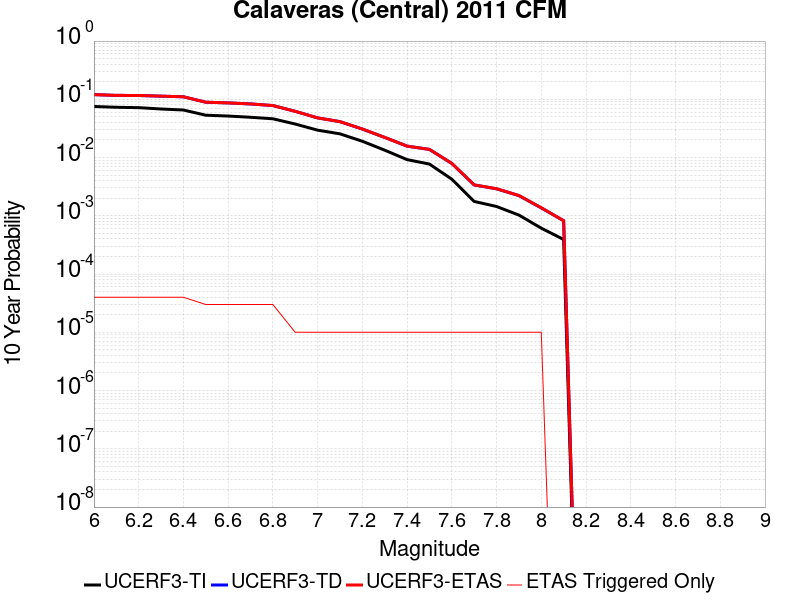 |

| Magnitude | 1 wk TI Prob | 1 wk TD Prob | 1 wk ETAS Prob | 1 wk ETAS/TD Gain | 1 wk ETAS Triggered Only | 1 mo TI Prob | 1 mo TD Prob | 1 mo ETAS Prob | 1 mo ETAS/TD Gain | 1 mo ETAS Triggered Only | 1 yr TI Prob | 1 yr TD Prob | 1 yr ETAS Prob | 1 yr ETAS/TD Gain | 1 yr ETAS Triggered Only | 10 yr TI Prob | 10 yr TD Prob | 10 yr ETAS Prob | 10 yr ETAS/TD Gain | 10 yr ETAS Triggered Only |
|-----|-----|-----|-----|-----|-----|-----|-----|-----|-----|-----|-----|-----|-----|-----|-----|-----|-----|-----|-----|-----|
| 6.0 | 1.5010907E-4 | 2.481574E-4 | 2.481574E-4 | 1.0 | 0.0 | 6.4316596E-4 | 0.0010621005 | 0.0010621005 | 1.0 | 0.0 | 0.0078024664 | 0.012850073 | 0.012869816 | 1.0015364 | 2.0E-5 | 0.07534136 | 0.120401435 | 0.120436616 | 1.0002922 | 4.0E-5 |
| 6.1 | 1.4521465E-4 | 2.397987E-4 | 2.397987E-4 | 1.0 | 0.0 | 6.222001E-4 | 0.0010263061 | 0.0010263061 | 1.0 | 0.0 | 0.0075490056 | 0.012419341 | 0.012439093 | 1.0015904 | 2.0E-5 | 0.07297657 | 0.11667323 | 0.11670856 | 1.0003028 | 4.0E-5 |
| 6.2 | 1.429998E-4 | 2.3911126E-4 | 2.3911126E-4 | 1.0 | 0.0 | 6.127123E-4 | 0.0010233623 | 0.0010233623 | 1.0 | 0.0 | 0.007434286 | 0.01238394 | 0.012403692 | 1.001595 | 2.0E-5 | 0.07190444 | 0.1163272 | 0.11636254 | 1.0003039 | 4.0E-5 |
| 6.3 | 1.3536277E-4 | 2.3242626E-4 | 2.3242626E-4 | 1.0 | 0.0 | 5.799972E-4 | 9.947343E-4 | 9.947343E-4 | 1.0 | 0.0 | 0.0070386264 | 0.012040132 | 0.012059892 | 1.0016412 | 2.0E-5 | 0.0681982 | 0.11323977 | 0.113275245 | 1.0003133 | 4.0E-5 |
| 6.4 | 1.2993296E-4 | 2.2666177E-4 | 2.2666177E-4 | 1.0 | 0.0 | 5.5673666E-4 | 9.700479E-4 | 9.700479E-4 | 1.0 | 0.0 | 0.006757223 | 0.011742937 | 0.011762703 | 1.0016831 | 2.0E-5 | 0.06555412 | 0.11051771 | 0.110553294 | 1.000322 | 4.0E-5 |
| 6.5 | 1.0498927E-4 | 1.7981697E-4 | 1.7981697E-4 | 1.0 | 0.0 | 4.498764E-4 | 7.704157E-4 | 7.704157E-4 | 1.0 | 0.0 | 0.005463498 | 0.00933924 | 0.009349148 | 1.0010607 | 1.0E-5 | 0.053311124 | 0.089199215 | 0.08922654 | 1.0003064 | 3.0E-5 |
| 6.6 | 1.0157505E-4 | 1.7469203E-4 | 1.7469203E-4 | 1.0 | 0.0 | 4.35249E-4 | 7.484645E-4 | 7.484645E-4 | 1.0 | 0.0 | 0.0052862884 | 0.009074297 | 0.009084206 | 1.001092 | 1.0E-5 | 0.05162293 | 0.08677671 | 0.08680411 | 1.0003157 | 3.0E-5 |
| 6.7 | 9.660386E-5 | 1.6728524E-4 | 1.6728524E-4 | 1.0 | 0.0 | 4.1395082E-4 | 7.1673887E-4 | 7.1673887E-4 | 1.0 | 0.0 | 0.0050282106 | 0.008691208 | 0.008701121 | 1.0011406 | 1.0E-5 | 0.049159497 | 0.083266065 | 0.083293565 | 1.0003303 | 3.0E-5 |
| 6.8 | 9.089927E-5 | 1.5643016E-4 | 1.5643016E-4 | 1.0 | 0.0 | 3.8951015E-4 | 6.702439E-4 | 6.702439E-4 | 1.0 | 0.0 | 0.0047319788 | 0.008129478 | 0.008139397 | 1.0012201 | 1.0E-5 | 0.046324775 | 0.078159414 | 0.07818707 | 1.0003538 | 3.0E-5 |
| 6.9 | 7.353187E-5 | 1.2295354E-4 | 1.2295354E-4 | 1.0 | 0.0 | 3.150985E-4 | 5.2683795E-4 | 5.2683795E-4 | 1.0 | 0.0 | 0.0038295772 | 0.006395508 | 0.006405444 | 1.0015537 | 1.0E-5 | 0.037642512 | 0.062187865 | 0.062197242 | 1.0001508 | 1.0E-5 |
| 7.0 | 5.746064E-5 | 9.3887444E-5 | 9.3887444E-5 | 1.0 | 0.0 | 2.4623662E-4 | 4.0231308E-4 | 4.0231308E-4 | 1.0 | 0.0 | 0.0029938098 | 0.004887232 | 0.0048971833 | 1.0020361 | 1.0E-5 | 0.02953797 | 0.04798685 | 0.047996372 | 1.0001984 | 1.0E-5 |
| 7.1 | 4.9557195E-5 | 8.052461E-5 | 8.052461E-5 | 1.0 | 0.0 | 2.123707E-4 | 3.4506017E-4 | 3.4506017E-4 | 1.0 | 0.0 | 0.0025825473 | 0.0041930773 | 0.0042030355 | 1.0023749 | 1.0E-5 | 0.0255274 | 0.041373078 | 0.041382667 | 1.0002317 | 1.0E-5 |
| 7.2 | 3.687595E-5 | 5.9524526E-5 | 5.9524526E-5 | 1.0 | 0.0 | 1.5803022E-4 | 2.5508032E-4 | 2.5508032E-4 | 1.0 | 0.0 | 0.0019223199 | 0.0031012094 | 0.0031111783 | 1.0032146 | 1.0E-5 | 0.01905776 | 0.030883716 | 0.030893408 | 1.0003138 | 1.0E-5 |
| 7.3 | 2.5846984E-5 | 4.247213E-5 | 4.247213E-5 | 1.0 | 0.0 | 1.1076809E-4 | 1.8201082E-4 | 1.8201082E-4 | 1.0 | 0.0 | 0.0013477671 | 0.002213747 | 0.002223725 | 1.0045072 | 1.0E-5 | 0.013396223 | 0.02217554 | 0.022185316 | 1.000441 | 1.0E-5 |
| 7.4 | 1.7747854E-5 | 2.9936204E-5 | 2.9936204E-5 | 1.0 | 0.0 | 7.6060016E-5 | 1.2829172E-4 | 1.2829172E-4 | 1.0 | 0.0 | 9.2563726E-4 | 0.0015608355 | 0.0015708199 | 1.0063968 | 1.0E-5 | 0.009217911 | 0.015709236 | 0.015719078 | 1.0006266 | 1.0E-5 |
| 7.5 | 1.4883479E-5 | 2.6243379E-5 | 2.6243379E-5 | 1.0 | 0.0 | 6.378478E-5 | 1.1246678E-4 | 1.1246678E-4 | 1.0 | 0.0 | 7.76303E-4 | 0.0013684258 | 0.0013784121 | 1.0072976 | 1.0E-5 | 0.0077359667 | 0.013802425 | 0.013812287 | 1.0007145 | 1.0E-5 |
| 7.6 | 8.166975E-6 | 1.4963478E-5 | 1.4963478E-5 | 1.0 | 0.0 | 3.5000852E-5 | 6.412763E-5 | 6.412763E-5 | 1.0 | 0.0 | 4.2605202E-4 | 7.804755E-4 | 7.9046766E-4 | 1.0128027 | 1.0E-5 | 0.004252361 | 0.00793984 | 0.00794976 | 1.0012494 | 1.0E-5 |
| 7.7 | 3.3858064E-6 | 6.253914E-6 | 6.253914E-6 | 1.0 | 0.0 | 1.4510518E-5 | 2.6802214E-5 | 2.6802214E-5 | 1.0 | 0.0 | 1.7665124E-4 | 3.2626814E-4 | 3.3626487E-4 | 1.0306396 | 1.0E-5 | 0.0017651088 | 0.0033882293 | 0.0033981954 | 1.0029414 | 1.0E-5 |
| 7.8 | 2.7721615E-6 | 5.3663807E-6 | 5.3663807E-6 | 1.0 | 0.0 | 1.1880637E-5 | 2.2998573E-5 | 2.2998573E-5 | 1.0 | 0.0 | 1.4463716E-4 | 2.799717E-4 | 2.8996888E-4 | 1.035708 | 1.0E-5 | 0.0014454306 | 0.0029074624 | 0.0029174334 | 1.0034294 | 1.0E-5 |
| 7.9 | 1.9736292E-6 | 4.1284193E-6 | 4.1284193E-6 | 1.0 | 0.0 | 8.4583835E-6 | 1.7693106E-5 | 1.7693106E-5 | 1.0 | 0.0 | 1.0297595E-4 | 2.1539231E-4 | 2.2539016E-4 | 1.0464169 | 1.0E-5 | 0.0010292825 | 0.0022236116 | 0.0022335893 | 1.0044872 | 1.0E-5 |
| 8.0 | 1.1767289E-6 | 2.5544743E-6 | 2.5544743E-6 | 1.0 | 0.0 | 5.0431145E-6 | 1.0947701E-5 | 1.0947701E-5 | 1.0 | 0.0 | 6.139818E-5 | 1.3328013E-4 | 1.4327881E-4 | 1.07502 | 1.0E-5 | 6.1381224E-4 | 0.0013660848 | 0.0013760711 | 1.0073102 | 1.0E-5 |
| 8.1 | 7.5112825E-7 | 1.5409794E-6 | 1.5409794E-6 | 1.0 | 0.0 | 3.2191172E-6 | 6.6041807E-6 | 6.6041807E-6 | 1.0 | 0.0 | 3.9192048E-5 | 8.0402955E-5 | 8.0402955E-5 | 1.0 | 0.0 | 3.9185135E-4 | 8.235564E-4 | 8.235564E-4 | 1.0 | 0.0 |

## Newport-Inglewood alt 1
*[(top)](#table-of-contents)*

| 1 Week | 1 Month | 1 Year | 10 Year |
|-----|-----|-----|-----|
|  | 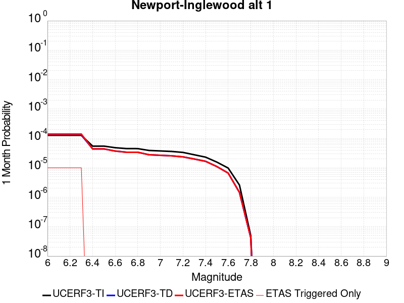 | 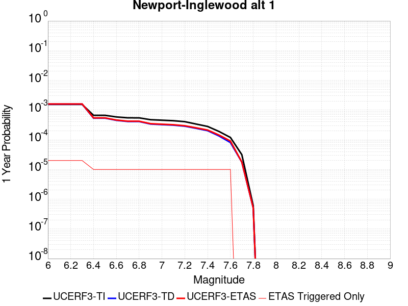 | 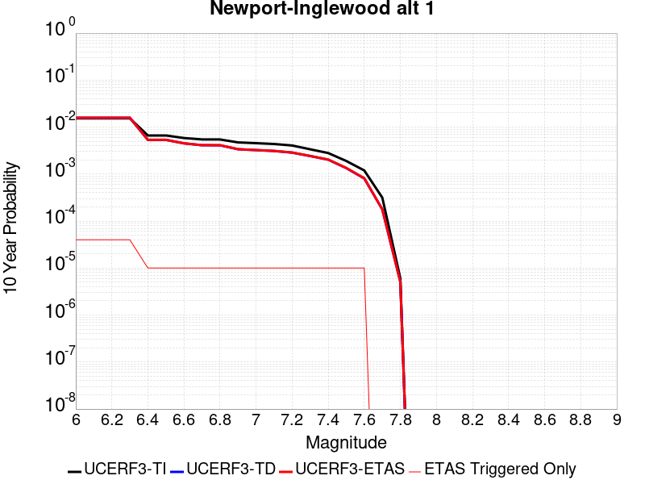 |

| Magnitude | 1 wk TI Prob | 1 wk TD Prob | 1 wk ETAS Prob | 1 wk ETAS/TD Gain | 1 wk ETAS Triggered Only | 1 mo TI Prob | 1 mo TD Prob | 1 mo ETAS Prob | 1 mo ETAS/TD Gain | 1 mo ETAS Triggered Only | 1 yr TI Prob | 1 yr TD Prob | 1 yr ETAS Prob | 1 yr ETAS/TD Gain | 1 yr ETAS Triggered Only | 10 yr TI Prob | 10 yr TD Prob | 10 yr ETAS Prob | 10 yr ETAS/TD Gain | 10 yr ETAS Triggered Only |
|-----|-----|-----|-----|-----|-----|-----|-----|-----|-----|-----|-----|-----|-----|-----|-----|-----|-----|-----|-----|-----|
| 6.0 | 2.9668912E-5 | 3.0404817E-5 | 4.0404513E-5 | 1.3288852 | 1.0E-5 | 1.2714628E-4 | 1.303026E-4 | 1.4030129E-4 | 1.0767344 | 1.0E-5 | 0.0015469068 | 0.0015857625 | 0.0016057307 | 1.0125922 | 2.0E-5 | 0.015361829 | 0.015792042 | 0.01583141 | 1.0024929 | 4.0E-5 |
| 6.1 | 2.9668912E-5 | 3.0404817E-5 | 4.0404513E-5 | 1.3288852 | 1.0E-5 | 1.2714628E-4 | 1.303026E-4 | 1.4030129E-4 | 1.0767344 | 1.0E-5 | 0.0015469068 | 0.0015857625 | 0.0016057307 | 1.0125922 | 2.0E-5 | 0.015361829 | 0.015792042 | 0.01583141 | 1.0024929 | 4.0E-5 |
| 6.2 | 2.9668912E-5 | 3.0404817E-5 | 4.0404513E-5 | 1.3288852 | 1.0E-5 | 1.2714628E-4 | 1.303026E-4 | 1.4030129E-4 | 1.0767344 | 1.0E-5 | 0.0015469068 | 0.0015857625 | 0.0016057307 | 1.0125922 | 2.0E-5 | 0.015361829 | 0.015792042 | 0.01583141 | 1.0024929 | 4.0E-5 |
| 6.3 | 2.9668912E-5 | 3.0404817E-5 | 4.0404513E-5 | 1.3288852 | 1.0E-5 | 1.2714628E-4 | 1.303026E-4 | 1.4030129E-4 | 1.0767344 | 1.0E-5 | 0.0015469068 | 0.0015857625 | 0.0016057307 | 1.0125922 | 2.0E-5 | 0.015361829 | 0.015792042 | 0.01583141 | 1.0024929 | 4.0E-5 |
| 6.4 | 1.275942E-5 | 1.0272503E-5 | 1.0272503E-5 | 1.0 | 0.0 | 5.4682085E-5 | 4.402429E-5 | 4.402429E-5 | 1.0 | 0.0 | 6.65551E-4 | 5.358681E-4 | 5.458627E-4 | 1.0186514 | 1.0E-5 | 0.0066356123 | 0.005346184 | 0.0053561307 | 1.0018605 | 1.0E-5 |
| 6.5 | 1.275942E-5 | 1.0272503E-5 | 1.0272503E-5 | 1.0 | 0.0 | 5.4682085E-5 | 4.402429E-5 | 4.402429E-5 | 1.0 | 0.0 | 6.65551E-4 | 5.358681E-4 | 5.458627E-4 | 1.0186514 | 1.0E-5 | 0.0066356123 | 0.005346184 | 0.0053561307 | 1.0018605 | 1.0E-5 |
| 6.6 | 1.1255358E-5 | 8.661884E-6 | 8.661884E-6 | 1.0 | 0.0 | 4.8236358E-5 | 3.712184E-5 | 3.712184E-5 | 1.0 | 0.0 | 5.871194E-4 | 4.518664E-4 | 4.6186187E-4 | 1.0221205 | 1.0E-5 | 0.005855706 | 0.004509653 | 0.004519608 | 1.0022075 | 1.0E-5 |
| 6.7 | 1.0504745E-5 | 7.8997955E-6 | 7.8997955E-6 | 1.0 | 0.0 | 4.5019555E-5 | 3.3855835E-5 | 3.3855835E-5 | 1.0 | 0.0 | 5.4797524E-4 | 4.1211807E-4 | 4.2211395E-4 | 1.0242549 | 1.0E-5 | 0.0054662596 | 0.004113668 | 0.0041236267 | 1.0024209 | 1.0E-5 |
| 6.8 | 1.0476007E-5 | 7.881176E-6 | 7.881176E-6 | 1.0 | 0.0 | 4.4896402E-5 | 3.3776043E-5 | 3.3776043E-5 | 1.0 | 0.0 | 5.464766E-4 | 4.1114696E-4 | 4.2114285E-4 | 1.0243123 | 1.0E-5 | 0.005451347 | 0.0041039926 | 0.0041139517 | 1.0024266 | 1.0E-5 |
| 6.9 | 9.076797E-6 | 6.4896312E-6 | 6.4896312E-6 | 1.0 | 0.0 | 3.889998E-5 | 2.781241E-5 | 2.781241E-5 | 1.0 | 0.0 | 4.7350433E-4 | 3.385638E-4 | 3.4856042E-4 | 1.0295265 | 1.0E-5 | 0.004724967 | 0.0033805177 | 0.0033904838 | 1.0029482 | 1.0E-5 |
| 7.0 | 8.73795E-6 | 6.2120125E-6 | 6.2120125E-6 | 1.0 | 0.0 | 3.7447822E-5 | 2.6622642E-5 | 2.6622642E-5 | 1.0 | 0.0 | 4.5583185E-4 | 3.2408274E-4 | 3.340795E-4 | 1.0308464 | 1.0E-5 | 0.0045489795 | 0.0032361327 | 0.0032461004 | 1.0030801 | 1.0E-5 |
| 7.1 | 8.391299E-6 | 5.95579E-6 | 5.95579E-6 | 1.0 | 0.0 | 3.5962214E-5 | 2.5524565E-5 | 2.5524565E-5 | 1.0 | 0.0 | 4.37752E-4 | 3.1071753E-4 | 3.2071443E-4 | 1.0321735 | 1.0E-5 | 0.004368907 | 0.0031028606 | 0.0031128295 | 1.0032128 | 1.0E-5 |
| 7.2 | 7.796882E-6 | 5.4965344E-6 | 5.4965344E-6 | 1.0 | 0.0 | 3.341478E-5 | 2.3556364E-5 | 2.3556364E-5 | 1.0 | 0.0 | 4.06749E-4 | 2.867612E-4 | 2.9675834E-4 | 1.0348623 | 1.0E-5 | 0.0040600533 | 0.0028639357 | 0.002873907 | 1.0034817 | 1.0E-5 |
| 7.3 | 6.4738833E-6 | 4.6478162E-6 | 4.6478162E-6 | 1.0 | 0.0 | 2.774492E-5 | 1.9919062E-5 | 1.9919062E-5 | 1.0 | 0.0 | 3.3774204E-4 | 2.4248775E-4 | 2.524853E-4 | 1.0412292 | 1.0E-5 | 0.0033722918 | 0.0024222482 | 0.0024322239 | 1.0041184 | 1.0E-5 |
| 7.4 | 5.382145E-6 | 3.8857597E-6 | 3.8857597E-6 | 1.0 | 0.0 | 2.3066134E-5 | 1.665315E-5 | 1.665315E-5 | 1.0 | 0.0 | 2.8079396E-4 | 2.0273338E-4 | 2.1273135E-4 | 1.0493158 | 1.0E-5 | 0.0028043943 | 0.0020254988 | 0.0020354786 | 1.004927 | 1.0E-5 |
| 7.5 | 3.648244E-6 | 2.5737843E-6 | 2.5737843E-6 | 1.0 | 0.0 | 1.5635238E-5 | 1.1030458E-5 | 1.1030458E-5 | 1.0 | 0.0 | 1.9034238E-4 | 1.3428765E-4 | 1.4428631E-4 | 1.074457 | 1.0E-5 | 0.0019017943 | 0.0013420755 | 0.0013520621 | 1.0074412 | 1.0E-5 |
| 7.6 | 2.2906888E-6 | 1.5479842E-6 | 1.5479842E-6 | 1.0 | 0.0 | 9.817201E-6 | 6.634202E-6 | 6.634202E-6 | 1.0 | 0.0 | 1.1951787E-4 | 8.076848E-5 | 9.076767E-5 | 1.1238006 | 1.0E-5 | 0.0011945361 | 8.07398E-4 | 8.173899E-4 | 1.0123755 | 1.0E-5 |
| 7.7 | 6.0479874E-7 | 3.397512E-7 | 3.397512E-7 | 1.0 | 0.0 | 2.5919921E-6 | 1.4560758E-6 | 1.4560758E-6 | 1.0 | 0.0 | 3.1557047E-5 | 1.7727592E-5 | 1.7727592E-5 | 1.0 | 0.0 | 3.1552566E-4 | 1.7726317E-4 | 1.7726317E-4 | 1.0 | 0.0 |
| 7.8 | 1.16056995E-8 | 9.782373E-9 | 9.782373E-9 | 1.0 | 0.0 | 4.9738713E-8 | 4.1924455E-8 | 4.1924455E-8 | 1.0 | 0.0 | 6.0556863E-7 | 5.1043025E-7 | 5.1043025E-7 | 1.0 | 0.0 | 6.05567E-6 | 5.1043025E-6 | 5.1043025E-6 | 1.0 | 0.0 |

## San Andreas (Santa Cruz Mts) 2011 CFM
*[(top)](#table-of-contents)*

| 1 Week | 1 Month | 1 Year | 10 Year |
|-----|-----|-----|-----|
|  |  |  |  |

| Magnitude | 1 wk TI Prob | 1 wk TD Prob | 1 wk ETAS Prob | 1 wk ETAS/TD Gain | 1 wk ETAS Triggered Only | 1 mo TI Prob | 1 mo TD Prob | 1 mo ETAS Prob | 1 mo ETAS/TD Gain | 1 mo ETAS Triggered Only | 1 yr TI Prob | 1 yr TD Prob | 1 yr ETAS Prob | 1 yr ETAS/TD Gain | 1 yr ETAS Triggered Only | 10 yr TI Prob | 10 yr TD Prob | 10 yr ETAS Prob | 10 yr ETAS/TD Gain | 10 yr ETAS Triggered Only |
|-----|-----|-----|-----|-----|-----|-----|-----|-----|-----|-----|-----|-----|-----|-----|-----|-----|-----|-----|-----|-----|
| 6.0 | 1.7221631E-4 | 1.3793171E-4 | 1.4793033E-4 | 1.0724896 | 1.0E-5 | 7.378611E-4 | 5.9100403E-4 | 6.209863E-4 | 1.0507311 | 3.0E-5 | 0.008946515 | 0.007172124 | 0.0072019086 | 1.0041529 | 3.0E-5 | 0.08594794 | 0.0705551 | 0.07059228 | 1.0005269 | 4.0E-5 |
| 6.1 | 1.7221631E-4 | 1.3793171E-4 | 1.4793033E-4 | 1.0724896 | 1.0E-5 | 7.378611E-4 | 5.9100403E-4 | 6.209863E-4 | 1.0507311 | 3.0E-5 | 0.008946515 | 0.007172124 | 0.0072019086 | 1.0041529 | 3.0E-5 | 0.08594794 | 0.0705551 | 0.07059228 | 1.0005269 | 4.0E-5 |
| 6.2 | 1.7221631E-4 | 1.3793171E-4 | 1.4793033E-4 | 1.0724896 | 1.0E-5 | 7.378611E-4 | 5.9100403E-4 | 6.209863E-4 | 1.0507311 | 3.0E-5 | 0.008946515 | 0.007172124 | 0.0072019086 | 1.0041529 | 3.0E-5 | 0.08594794 | 0.0705551 | 0.07059228 | 1.0005269 | 4.0E-5 |
| 6.3 | 1.716926E-4 | 1.3712609E-4 | 1.4712471E-4 | 1.0729156 | 1.0E-5 | 7.3561794E-4 | 5.875529E-4 | 6.1753526E-4 | 1.0510292 | 3.0E-5 | 0.008919428 | 0.0071303817 | 0.0071601677 | 1.0041773 | 3.0E-5 | 0.08569809 | 0.070167266 | 0.07020446 | 1.0005301 | 4.0E-5 |
| 6.4 | 1.6392978E-4 | 1.3588481E-4 | 1.4588344E-4 | 1.0735817 | 1.0E-5 | 7.02367E-4 | 5.822355E-4 | 6.1221805E-4 | 1.0514956 | 3.0E-5 | 0.008517839 | 0.007066063 | 0.007095851 | 1.0042156 | 3.0E-5 | 0.08198654 | 0.06940135 | 0.06943858 | 1.0005363 | 4.0E-5 |
| 6.5 | 1.5742714E-4 | 1.2648388E-4 | 1.364826E-4 | 1.0790515 | 1.0E-5 | 6.745133E-4 | 5.4196286E-4 | 5.719466E-4 | 1.0553243 | 3.0E-5 | 0.00818132 | 0.0065787593 | 0.0066085616 | 1.0045301 | 3.0E-5 | 0.078865945 | 0.06486309 | 0.0649005 | 1.0005767 | 4.0E-5 |
| 6.6 | 1.3038084E-4 | 1.1588213E-4 | 1.2588098E-4 | 1.0862846 | 1.0E-5 | 5.5865536E-4 | 4.9654447E-4 | 5.2652956E-4 | 1.0603875 | 3.0E-5 | 0.006780438 | 0.0060289134 | 0.0060587325 | 1.004946 | 3.0E-5 | 0.0657725 | 0.05932738 | 0.059365004 | 1.0006342 | 4.0E-5 |
| 6.7 | 1.2867592E-4 | 1.1314701E-4 | 1.2314587E-4 | 1.0883706 | 1.0E-5 | 5.5135164E-4 | 4.8482692E-4 | 5.1481236E-4 | 1.0618478 | 3.0E-5 | 0.0066920654 | 0.00588703 | 0.005916854 | 1.0050659 | 3.0E-5 | 0.06494093 | 0.058038417 | 0.058076095 | 1.0006492 | 4.0E-5 |
| 6.8 | 1.2801298E-4 | 1.1252261E-4 | 1.2252148E-4 | 1.088861 | 1.0E-5 | 5.485117E-4 | 4.8215193E-4 | 5.121374E-4 | 1.062191 | 3.0E-5 | 0.0066577005 | 0.0058546383 | 0.0058844625 | 1.0050942 | 3.0E-5 | 0.06461738 | 0.057752274 | 0.057789963 | 1.0006527 | 4.0E-5 |
| 6.9 | 1.269149E-4 | 1.1094465E-4 | 1.2094354E-4 | 1.0901251 | 1.0E-5 | 5.4380763E-4 | 4.7539172E-4 | 5.053775E-4 | 1.0630759 | 3.0E-5 | 0.006600777 | 0.005772772 | 0.005802599 | 1.0051668 | 3.0E-5 | 0.06408122 | 0.0570241 | 0.057061817 | 1.0006615 | 4.0E-5 |
| 7.0 | 1.2030331E-4 | 1.0824504E-4 | 1.1824395E-4 | 1.092373 | 1.0E-5 | 5.154837E-4 | 4.638261E-4 | 4.938122E-4 | 1.0646495 | 3.0E-5 | 0.006257969 | 0.0056326967 | 0.0056625274 | 1.005296 | 3.0E-5 | 0.06084648 | 0.055696685 | 0.05573446 | 1.0006782 | 4.0E-5 |
| 7.1 | 8.049617E-5 | 5.3926604E-5 | 6.392606E-5 | 1.1854272 | 1.0E-5 | 3.4493793E-4 | 2.3109373E-4 | 2.510891E-4 | 1.086525 | 2.0E-5 | 0.0041915346 | 0.0028099709 | 0.0028299147 | 1.0070975 | 2.0E-5 | 0.041133516 | 0.029618956 | 0.029648067 | 1.0009829 | 3.0E-5 |
| 7.2 | 7.093979E-5 | 4.2937932E-5 | 5.2937503E-5 | 1.2328843 | 1.0E-5 | 3.0399222E-4 | 1.8400686E-4 | 2.0400317E-4 | 1.1086715 | 2.0E-5 | 0.0036948253 | 0.0022380045 | 0.0022579597 | 1.0089165 | 2.0E-5 | 0.03633994 | 0.023941692 | 0.023970973 | 1.0012231 | 3.0E-5 |
| 7.3 | 6.193693E-5 | 2.8894141E-5 | 3.8893853E-5 | 1.3460809 | 1.0E-5 | 2.6541698E-4 | 1.2382616E-4 | 1.438237E-4 | 1.1614968 | 2.0E-5 | 0.0032266637 | 0.0015065427 | 0.0015265126 | 1.0132555 | 2.0E-5 | 0.031802133 | 0.016499156 | 0.01652866 | 1.0017883 | 3.0E-5 |
| 7.4 | 5.906492E-5 | 2.702346E-5 | 3.702319E-5 | 1.3700389 | 1.0E-5 | 2.5311083E-4 | 1.1580969E-4 | 1.3580738E-4 | 1.1726772 | 2.0E-5 | 0.0030772698 | 0.0014090725 | 0.0014290443 | 1.0141737 | 2.0E-5 | 0.030350044 | 0.015471023 | 0.015500559 | 1.0019091 | 3.0E-5 |
| 7.5 | 5.424296E-5 | 2.4678277E-5 | 3.467803E-5 | 1.4052047 | 1.0E-5 | 2.324491E-4 | 1.05759755E-4 | 1.2575764E-4 | 1.1890879 | 2.0E-5 | 0.002826395 | 0.0012868657 | 0.00130684 | 1.0155216 | 2.0E-5 | 0.027907165 | 0.014163188 | 0.014192763 | 1.0020882 | 3.0E-5 |
| 7.6 | 4.43084E-5 | 1.990431E-5 | 2.9904111E-5 | 1.5023937 | 1.0E-5 | 1.8987931E-4 | 8.53014E-5 | 1.0529969E-4 | 1.2344427 | 2.0E-5 | 0.0023093296 | 0.0010380499 | 0.0010580292 | 1.0192469 | 2.0E-5 | 0.022854783 | 0.011412679 | 0.011442337 | 1.0025986 | 3.0E-5 |
| 7.7 | 4.118098E-5 | 1.8936442E-5 | 2.8936252E-5 | 1.5280724 | 1.0E-5 | 1.7647797E-4 | 8.115366E-5 | 1.01152036E-4 | 1.2464261 | 2.0E-5 | 0.002146502 | 9.875982E-4 | 0.0010075785 | 1.0202311 | 2.0E-5 | 0.021258866 | 0.010870468 | 0.010900142 | 1.0027298 | 3.0E-5 |
| 7.8 | 3.5408906E-5 | 1.856446E-5 | 2.8564275E-5 | 1.5386536 | 1.0E-5 | 1.5174363E-4 | 7.955955E-5 | 9.9557954E-5 | 1.251364 | 2.0E-5 | 0.0018459131 | 9.682073E-4 | 9.88188E-4 | 1.0206367 | 2.0E-5 | 0.018306552 | 0.010652021 | 0.010681701 | 1.0027864 | 3.0E-5 |
| 7.9 | 2.5860836E-5 | 1.7315993E-5 | 2.731582E-5 | 1.5774908 | 1.0E-5 | 1.10827445E-4 | 7.420929E-5 | 9.4207804E-5 | 1.2694881 | 2.0E-5 | 0.001348489 | 9.031238E-4 | 9.2310575E-4 | 1.0221254 | 2.0E-5 | 0.013403354 | 0.009907599 | 0.009937301 | 1.002998 | 3.0E-5 |
| 8.0 | 1.9777332E-5 | 1.4839596E-5 | 2.4839448E-5 | 1.6738628 | 1.0E-5 | 8.4757245E-5 | 6.3596715E-5 | 8.359545E-5 | 1.3144616 | 2.0E-5 | 0.0010314309 | 7.740152E-4 | 7.939997E-4 | 1.0258193 | 2.0E-5 | 0.010266567 | 0.008508967 | 0.008528798 | 1.0023304 | 2.0E-5 |
| 8.1 | 1.468494E-5 | 1.2107374E-5 | 1.2107374E-5 | 1.0 | 0.0 | 6.293394E-5 | 5.1887713E-5 | 5.1887713E-5 | 1.0 | 0.0 | 7.6595135E-4 | 6.3155E-4 | 6.3155E-4 | 1.0 | 0.0 | 0.0076331664 | 0.006969149 | 0.006969149 | 1.0 | 0.0 |
| 8.2 | 8.63836E-6 | 5.469061E-6 | 5.469061E-6 | 1.0 | 0.0 | 3.7021015E-5 | 2.3438623E-5 | 2.3438623E-5 | 1.0 | 0.0 | 4.5063766E-4 | 2.8532793E-4 | 2.8532793E-4 | 1.0 | 0.0 | 0.004497249 | 0.00324569 | 0.00324569 | 1.0 | 0.0 |
| 8.3 | 1.983087E-6 | 7.6599065E-7 | 7.6599065E-7 | 1.0 | 0.0 | 8.498917E-6 | 3.282813E-6 | 3.282813E-6 | 1.0 | 0.0 | 1.034694E-4 | 3.9967534E-5 | 3.9967534E-5 | 1.0 | 0.0 | 0.0010342124 | 4.719687E-4 | 4.719687E-4 | 1.0 | 0.0 |

## White Wolf
*[(top)](#table-of-contents)*

| 1 Week | 1 Month | 1 Year | 10 Year |
|-----|-----|-----|-----|
|  |  |  |  |

| Magnitude | 1 wk TI Prob | 1 wk TD Prob | 1 wk ETAS Prob | 1 wk ETAS/TD Gain | 1 wk ETAS Triggered Only | 1 mo TI Prob | 1 mo TD Prob | 1 mo ETAS Prob | 1 mo ETAS/TD Gain | 1 mo ETAS Triggered Only | 1 yr TI Prob | 1 yr TD Prob | 1 yr ETAS Prob | 1 yr ETAS/TD Gain | 1 yr ETAS Triggered Only | 10 yr TI Prob | 10 yr TD Prob | 10 yr ETAS Prob | 10 yr ETAS/TD Gain | 10 yr ETAS Triggered Only |
|-----|-----|-----|-----|-----|-----|-----|-----|-----|-----|-----|-----|-----|-----|-----|-----|-----|-----|-----|-----|-----|
| 6.0 | 2.0037822E-5 | 1.0469162E-6 | 1.0469162E-6 | 1.0 | 0.0 | 8.587355E-5 | 4.486776E-6 | 1.4486731E-5 | 3.2287617 | 1.0E-5 | 0.001045009 | 5.4625183E-5 | 7.462409E-5 | 1.3661115 | 2.0E-5 | 0.010401085 | 5.461226E-4 | 5.8610074E-4 | 1.0732037 | 4.0E-5 |
| 6.1 | 2.0037822E-5 | 1.0469162E-6 | 1.0469162E-6 | 1.0 | 0.0 | 8.587355E-5 | 4.486776E-6 | 1.4486731E-5 | 3.2287617 | 1.0E-5 | 0.001045009 | 5.4625183E-5 | 7.462409E-5 | 1.3661115 | 2.0E-5 | 0.010401085 | 5.461226E-4 | 5.8610074E-4 | 1.0732037 | 4.0E-5 |
| 6.2 | 2.0037822E-5 | 1.0469162E-6 | 1.0469162E-6 | 1.0 | 0.0 | 8.587355E-5 | 4.486776E-6 | 1.4486731E-5 | 3.2287617 | 1.0E-5 | 0.001045009 | 5.4625183E-5 | 7.462409E-5 | 1.3661115 | 2.0E-5 | 0.010401085 | 5.461226E-4 | 5.8610074E-4 | 1.0732037 | 4.0E-5 |
| 6.3 | 2.0037822E-5 | 1.0469162E-6 | 1.0469162E-6 | 1.0 | 0.0 | 8.587355E-5 | 4.486776E-6 | 1.4486731E-5 | 3.2287617 | 1.0E-5 | 0.001045009 | 5.4625183E-5 | 7.462409E-5 | 1.3661115 | 2.0E-5 | 0.010401085 | 5.461226E-4 | 5.8610074E-4 | 1.0732037 | 4.0E-5 |
| 6.4 | 1.132487E-5 | 1.0469162E-6 | 1.0469162E-6 | 1.0 | 0.0 | 4.8534253E-5 | 4.486776E-6 | 1.4486731E-5 | 3.2287617 | 1.0E-5 | 5.907443E-4 | 5.4625183E-5 | 7.462409E-5 | 1.3661115 | 2.0E-5 | 0.005891764 | 5.461226E-4 | 5.8610074E-4 | 1.0732037 | 4.0E-5 |
| 6.5 | 1.132487E-5 | 1.0469162E-6 | 1.0469162E-6 | 1.0 | 0.0 | 4.8534253E-5 | 4.486776E-6 | 1.4486731E-5 | 3.2287617 | 1.0E-5 | 5.907443E-4 | 5.4625183E-5 | 7.462409E-5 | 1.3661115 | 2.0E-5 | 0.005891764 | 5.461226E-4 | 5.8610074E-4 | 1.0732037 | 4.0E-5 |
| 6.6 | 9.347473E-6 | 1.0469162E-6 | 1.0469162E-6 | 1.0 | 0.0 | 4.0059982E-5 | 4.486776E-6 | 1.4486731E-5 | 3.2287617 | 1.0E-5 | 4.8762115E-4 | 5.4625183E-5 | 7.462409E-5 | 1.3661115 | 2.0E-5 | 0.0048655253 | 5.461226E-4 | 5.8610074E-4 | 1.0732037 | 4.0E-5 |
| 6.7 | 7.842647E-6 | 1.0048342E-6 | 1.0048342E-6 | 1.0 | 0.0 | 3.361091E-5 | 4.3064256E-6 | 1.4306383E-5 | 3.3221016 | 1.0E-5 | 4.0913603E-4 | 5.2429517E-5 | 7.242847E-5 | 1.3814445 | 2.0E-5 | 0.004083836 | 5.2417646E-4 | 5.6415546E-4 | 1.0762702 | 4.0E-5 |
| 6.8 | 6.26597E-6 | 9.734822E-7 | 9.734822E-7 | 1.0 | 0.0 | 2.685388E-5 | 4.17206E-6 | 1.4172018E-5 | 3.3968873 | 1.0E-5 | 3.2689696E-4 | 5.0793697E-5 | 7.079268E-5 | 1.3937297 | 2.0E-5 | 0.003264165 | 5.078258E-4 | 5.4780545E-4 | 1.0787271 | 4.0E-5 |
| 6.9 | 5.258436E-6 | 9.183254E-7 | 9.183254E-7 | 1.0 | 0.0 | 2.2535958E-5 | 3.9356746E-6 | 1.3935635E-5 | 3.5408506 | 1.0E-5 | 2.7434074E-4 | 4.7915833E-5 | 6.791487E-5 | 1.4173785 | 2.0E-5 | 0.0027400232 | 4.790598E-4 | 5.190406E-4 | 1.0834569 | 4.0E-5 |
| 7.0 | 4.675028E-6 | 8.6611794E-7 | 8.6611794E-7 | 1.0 | 0.0 | 2.003568E-5 | 3.7119291E-6 | 1.3711892E-5 | 3.694007 | 1.0E-5 | 2.4390711E-4 | 4.5191846E-5 | 6.519094E-5 | 1.4425377 | 2.0E-5 | 0.0024363957 | 4.518313E-4 | 4.9181323E-4 | 1.0884886 | 4.0E-5 |
| 7.1 | 2.8270078E-6 | 6.8741696E-7 | 6.8741696E-7 | 1.0 | 0.0 | 1.2115692E-5 | 2.9460696E-6 | 1.294604E-5 | 4.394343 | 1.0E-5 | 1.4749856E-4 | 3.5867848E-5 | 5.586713E-5 | 1.5575825 | 2.0E-5 | 0.001474007 | 3.586247E-4 | 3.9861034E-4 | 1.1114972 | 4.0E-5 |
| 7.2 | 1.6881406E-6 | 2.2706382E-7 | 2.2706382E-7 | 1.0 | 0.0 | 7.2348685E-6 | 9.731303E-7 | 9.731303E-7 | 1.0 | 0.0 | 8.808096E-5 | 1.1847799E-5 | 1.1847799E-5 | 1.0 | 0.0 | 8.8046055E-4 | 1.1847183E-4 | 1.3846946E-4 | 1.1687965 | 2.0E-5 |
| 7.3 | 9.086107E-7 | 1.5266386E-7 | 1.5266386E-7 | 1.0 | 0.0 | 3.8940398E-6 | 6.5427355E-7 | 6.5427355E-7 | 1.0 | 0.0 | 4.7408903E-5 | 7.965752E-6 | 7.965752E-6 | 1.0 | 0.0 | 4.739879E-4 | 7.965475E-5 | 8.965395E-5 | 1.1255318 | 1.0E-5 |
| 7.4 | 1.9717383E-7 | 9.003913E-8 | 9.003913E-8 | 1.0 | 0.0 | 8.450304E-7 | 3.8588192E-7 | 3.8588192E-7 | 1.0 | 0.0 | 1.0288197E-5 | 4.6981027E-6 | 4.6981027E-6 | 1.0 | 0.0 | 1.028772E-4 | 4.6980065E-5 | 4.6980065E-5 | 1.0 | 0.0 |
| 7.5 | 1.086975E-7 | 6.6597195E-8 | 6.6597195E-8 | 1.0 | 0.0 | 4.6584634E-7 | 2.8541652E-7 | 2.8541652E-7 | 1.0 | 0.0 | 5.6716644E-6 | 3.474941E-6 | 3.474941E-6 | 1.0 | 0.0 | 5.6715195E-5 | 3.474889E-5 | 3.474889E-5 | 1.0 | 0.0 |
| 7.6 | 2.4217808E-8 | 1.5820765E-8 | 1.5820765E-8 | 1.0 | 0.0 | 1.03790605E-7 | 6.780328E-8 | 6.780328E-8 | 1.0 | 0.0 | 1.2636499E-6 | 8.255046E-7 | 8.255046E-7 | 1.0 | 0.0 | 1.2636427E-5 | 8.2550205E-6 | 8.2550205E-6 | 1.0 | 0.0 |

## Verdugo
*[(top)](#table-of-contents)*

| 1 Week | 1 Month | 1 Year | 10 Year |
|-----|-----|-----|-----|
|  |  |  |  |

| Magnitude | 1 wk TI Prob | 1 wk TD Prob | 1 wk ETAS Prob | 1 wk ETAS/TD Gain | 1 wk ETAS Triggered Only | 1 mo TI Prob | 1 mo TD Prob | 1 mo ETAS Prob | 1 mo ETAS/TD Gain | 1 mo ETAS Triggered Only | 1 yr TI Prob | 1 yr TD Prob | 1 yr ETAS Prob | 1 yr ETAS/TD Gain | 1 yr ETAS Triggered Only | 10 yr TI Prob | 10 yr TD Prob | 10 yr ETAS Prob | 10 yr ETAS/TD Gain | 10 yr ETAS Triggered Only |
|-----|-----|-----|-----|-----|-----|-----|-----|-----|-----|-----|-----|-----|-----|-----|-----|-----|-----|-----|-----|-----|
| 6.0 | 5.392987E-6 | 4.216517E-6 | 4.216517E-6 | 1.0 | 0.0 | 2.3112598E-5 | 1.8070665E-5 | 1.8070665E-5 | 1.0 | 0.0 | 2.8135953E-4 | 2.1998861E-4 | 2.2998641E-4 | 1.0454469 | 1.0E-5 | 0.0028100356 | 0.0021977562 | 0.0022376683 | 1.0181603 | 4.0E-5 |
| 6.1 | 5.392987E-6 | 4.216517E-6 | 4.216517E-6 | 1.0 | 0.0 | 2.3112598E-5 | 1.8070665E-5 | 1.8070665E-5 | 1.0 | 0.0 | 2.8135953E-4 | 2.1998861E-4 | 2.2998641E-4 | 1.0454469 | 1.0E-5 | 0.0028100356 | 0.0021977562 | 0.0022376683 | 1.0181603 | 4.0E-5 |
| 6.2 | 5.392987E-6 | 4.216517E-6 | 4.216517E-6 | 1.0 | 0.0 | 2.3112598E-5 | 1.8070665E-5 | 1.8070665E-5 | 1.0 | 0.0 | 2.8135953E-4 | 2.1998861E-4 | 2.2998641E-4 | 1.0454469 | 1.0E-5 | 0.0028100356 | 0.0021977562 | 0.0022376683 | 1.0181603 | 4.0E-5 |
| 6.3 | 5.392987E-6 | 4.216517E-6 | 4.216517E-6 | 1.0 | 0.0 | 2.3112598E-5 | 1.8070665E-5 | 1.8070665E-5 | 1.0 | 0.0 | 2.8135953E-4 | 2.1998861E-4 | 2.2998641E-4 | 1.0454469 | 1.0E-5 | 0.0028100356 | 0.0021977562 | 0.0022376683 | 1.0181603 | 4.0E-5 |
| 6.4 | 5.392987E-6 | 4.216517E-6 | 4.216517E-6 | 1.0 | 0.0 | 2.3112598E-5 | 1.8070665E-5 | 1.8070665E-5 | 1.0 | 0.0 | 2.8135953E-4 | 2.1998861E-4 | 2.2998641E-4 | 1.0454469 | 1.0E-5 | 0.0028100356 | 0.0021977562 | 0.0022376683 | 1.0181603 | 4.0E-5 |
| 6.5 | 4.9154837E-6 | 3.722465E-6 | 3.722465E-6 | 1.0 | 0.0 | 2.1066187E-5 | 1.5953325E-5 | 1.5953325E-5 | 1.0 | 0.0 | 2.5645064E-4 | 1.9421462E-4 | 2.0421269E-4 | 1.0514795 | 1.0E-5 | 0.002561549 | 0.0019404698 | 0.0019803923 | 1.0205736 | 4.0E-5 |
| 6.6 | 4.9154837E-6 | 3.722465E-6 | 3.722465E-6 | 1.0 | 0.0 | 2.1066187E-5 | 1.5953325E-5 | 1.5953325E-5 | 1.0 | 0.0 | 2.5645064E-4 | 1.9421462E-4 | 2.0421269E-4 | 1.0514795 | 1.0E-5 | 0.002561549 | 0.0019404698 | 0.0019803923 | 1.0205736 | 4.0E-5 |
| 6.7 | 4.817006E-6 | 3.6206518E-6 | 3.6206518E-6 | 1.0 | 0.0 | 2.0644147E-5 | 1.5516987E-5 | 1.5516987E-5 | 1.0 | 0.0 | 2.513135E-4 | 1.8890314E-4 | 1.9890125E-4 | 1.0529271 | 1.0E-5 | 0.0025102948 | 0.0018874453 | 0.0019273699 | 1.0211526 | 4.0E-5 |
| 6.8 | 4.507407E-6 | 3.3071042E-6 | 3.3071042E-6 | 1.0 | 0.0 | 1.9317316E-5 | 1.4173227E-5 | 1.4173227E-5 | 1.0 | 0.0 | 2.3516294E-4 | 1.7254551E-4 | 1.825438E-4 | 1.0579457 | 1.0E-5 | 0.0023491425 | 0.0017241298 | 0.0017640608 | 1.0231601 | 4.0E-5 |
| 6.9 | 4.3573054E-6 | 3.161011E-6 | 3.161011E-6 | 1.0 | 0.0 | 1.8674033E-5 | 1.354712E-5 | 1.354712E-5 | 1.0 | 0.0 | 2.2733262E-4 | 1.6492383E-4 | 1.7492217E-4 | 1.060624 | 1.0E-5 | 0.0022710022 | 0.0016480266 | 0.0016879607 | 1.0242314 | 4.0E-5 |
| 7.0 | 4.171527E-6 | 2.9836704E-6 | 2.9836704E-6 | 1.0 | 0.0 | 1.787785E-5 | 1.2787096E-5 | 1.2787096E-5 | 1.0 | 0.0 | 2.1764109E-4 | 1.5567189E-4 | 1.6567032E-4 | 1.0642277 | 1.0E-5 | 0.0021742806 | 0.0015556397 | 0.0015955775 | 1.0256729 | 4.0E-5 |
| 7.1 | 4.0405484E-6 | 2.882261E-6 | 2.882261E-6 | 1.0 | 0.0 | 1.731652E-5 | 1.235249E-5 | 1.235249E-5 | 1.0 | 0.0 | 2.1080824E-4 | 1.503813E-4 | 1.6037979E-4 | 1.0664877 | 1.0E-5 | 0.0021060838 | 0.0015028063 | 0.0015427462 | 1.0265769 | 4.0E-5 |
| 7.2 | 3.8306007E-6 | 2.7018452E-6 | 2.7018452E-6 | 1.0 | 0.0 | 1.6416758E-5 | 1.15792855E-5 | 1.15792855E-5 | 1.0 | 0.0 | 1.9985568E-4 | 1.4096878E-4 | 1.5096737E-4 | 1.0709277 | 1.0E-5 | 0.0019967605 | 0.0014088044 | 0.001448748 | 1.0283529 | 4.0E-5 |
| 7.3 | 3.5750938E-6 | 2.5121758E-6 | 2.5121758E-6 | 1.0 | 0.0 | 1.532174E-5 | 1.0766424E-5 | 1.0766424E-5 | 1.0 | 0.0 | 1.8652623E-4 | 1.3107344E-4 | 1.4107212E-4 | 1.0762831 | 1.0E-5 | 0.0018636974 | 0.0013099718 | 0.0013399324 | 1.0228713 | 3.0E-5 |
| 7.4 | 3.3510041E-6 | 2.3408586E-6 | 2.3408586E-6 | 1.0 | 0.0 | 1.4361368E-5 | 1.0032213E-5 | 1.0032213E-5 | 1.0 | 0.0 | 1.7483562E-4 | 1.2213545E-4 | 1.3213423E-4 | 1.0818663 | 1.0E-5 | 0.0017469813 | 0.0012206937 | 0.001250657 | 1.0245461 | 3.0E-5 |
| 7.5 | 2.948287E-6 | 2.0391124E-6 | 2.0391124E-6 | 1.0 | 0.0 | 1.2635454E-5 | 8.739024E-6 | 8.739024E-6 | 1.0 | 0.0 | 1.538258E-4 | 1.0639253E-4 | 1.1639147E-4 | 1.0939815 | 1.0E-5 | 0.0015371935 | 0.0010634261 | 0.0010933942 | 1.0281807 | 3.0E-5 |
| 7.6 | 2.0134323E-6 | 1.4471265E-6 | 1.4471265E-6 | 1.0 | 0.0 | 8.628967E-6 | 6.2019562E-6 | 6.2019562E-6 | 1.0 | 0.0 | 1.05052604E-4 | 7.550629E-5 | 7.550629E-5 | 1.0 | 0.0 | 0.0010500296 | 7.548152E-4 | 7.748001E-4 | 1.0264765 | 2.0E-5 |
| 7.7 | 5.726436E-7 | 4.045248E-7 | 4.045248E-7 | 1.0 | 0.0 | 2.4541846E-6 | 1.7336766E-6 | 1.7336766E-6 | 1.0 | 0.0 | 2.9879287E-5 | 2.1107335E-5 | 2.1107335E-5 | 1.0 | 0.0 | 2.987527E-4 | 2.1105584E-4 | 2.2105374E-4 | 1.0473708 | 1.0E-5 |
| 7.8 | 1.6248204E-7 | 1.0687696E-7 | 1.0687696E-7 | 1.0 | 0.0 | 6.963514E-7 | 4.5804404E-7 | 4.5804404E-7 | 1.0 | 0.0 | 8.478045E-6 | 5.5766723E-6 | 5.5766723E-6 | 1.0 | 0.0 | 8.477722E-5 | 5.5765355E-5 | 5.5765355E-5 | 1.0 | 0.0 |
| 7.9 | 4.4475744E-8 | 3.0375546E-8 | 3.0375546E-8 | 1.0 | 0.0 | 1.9061031E-7 | 1.301809E-7 | 1.301809E-7 | 1.0 | 0.0 | 2.320678E-6 | 1.5849514E-6 | 1.5849514E-6 | 1.0 | 0.0 | 2.3206538E-5 | 1.5849415E-5 | 1.5849415E-5 | 1.0 | 0.0 |

## Channel Islands Western Deep Ramp
*[(top)](#table-of-contents)*

| 1 Week | 1 Month | 1 Year | 10 Year |
|-----|-----|-----|-----|
| 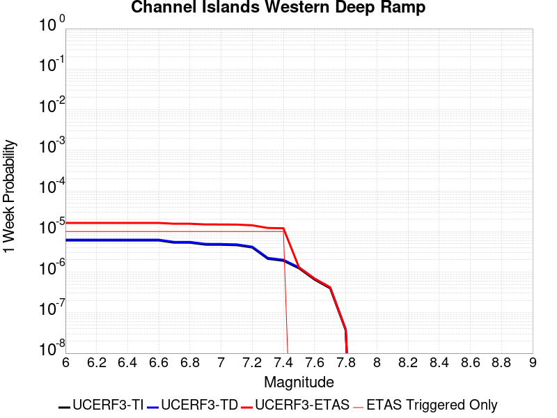 | 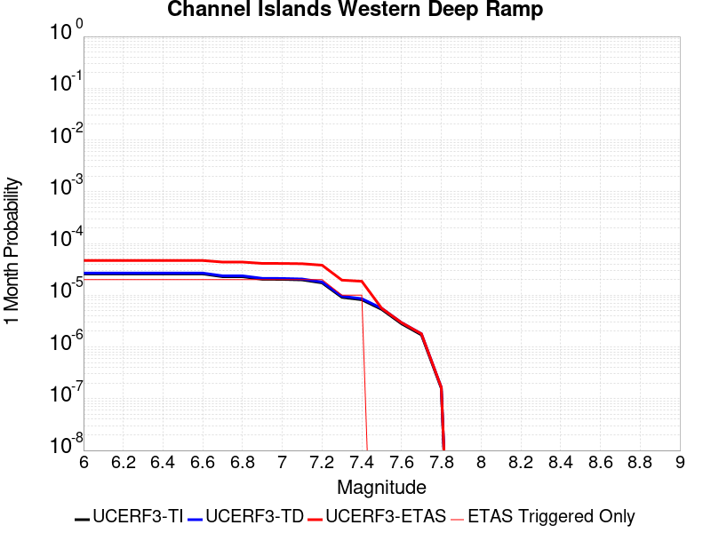 | 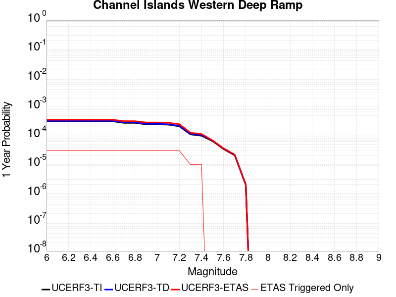 | 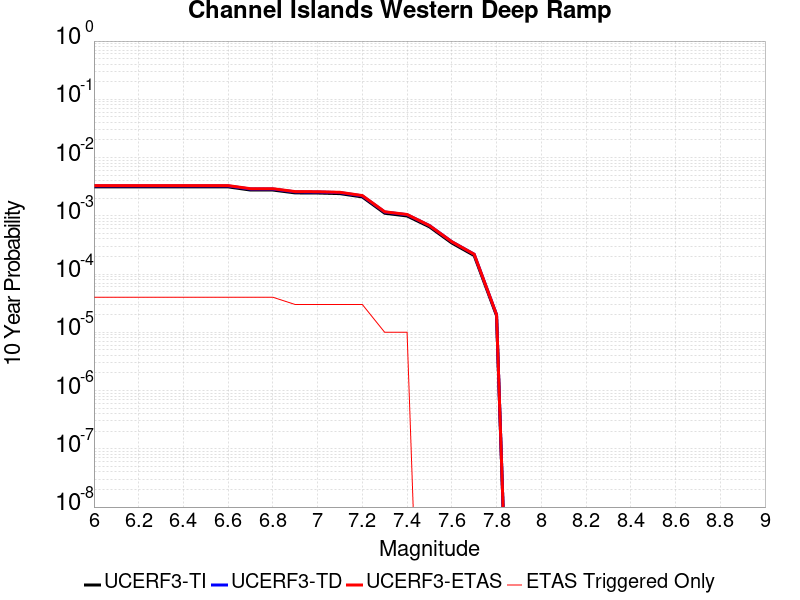 |

| Magnitude | 1 wk TI Prob | 1 wk TD Prob | 1 wk ETAS Prob | 1 wk ETAS/TD Gain | 1 wk ETAS Triggered Only | 1 mo TI Prob | 1 mo TD Prob | 1 mo ETAS Prob | 1 mo ETAS/TD Gain | 1 mo ETAS Triggered Only | 1 yr TI Prob | 1 yr TD Prob | 1 yr ETAS Prob | 1 yr ETAS/TD Gain | 1 yr ETAS Triggered Only | 10 yr TI Prob | 10 yr TD Prob | 10 yr ETAS Prob | 10 yr ETAS/TD Gain | 10 yr ETAS Triggered Only |
|-----|-----|-----|-----|-----|-----|-----|-----|-----|-----|-----|-----|-----|-----|-----|-----|-----|-----|-----|-----|-----|
| 6.0 | 6.0213506E-6 | 6.2548684E-6 | 1.6254806E-5 | 2.5987446 | 1.0E-5 | 2.5805533E-5 | 2.6806329E-5 | 4.680579E-5 | 1.7460725 | 2.0E-5 | 3.1413708E-4 | 3.2632265E-4 | 3.5631284E-4 | 1.0919036 | 3.0E-5 | 0.0031369338 | 0.0032588763 | 0.003298746 | 1.0122342 | 4.0E-5 |
| 6.1 | 6.0213506E-6 | 6.2548684E-6 | 1.6254806E-5 | 2.5987446 | 1.0E-5 | 2.5805533E-5 | 2.6806329E-5 | 4.680579E-5 | 1.7460725 | 2.0E-5 | 3.1413708E-4 | 3.2632265E-4 | 3.5631284E-4 | 1.0919036 | 3.0E-5 | 0.0031369338 | 0.0032588763 | 0.003298746 | 1.0122342 | 4.0E-5 |
| 6.2 | 6.0213506E-6 | 6.2548684E-6 | 1.6254806E-5 | 2.5987446 | 1.0E-5 | 2.5805533E-5 | 2.6806329E-5 | 4.680579E-5 | 1.7460725 | 2.0E-5 | 3.1413708E-4 | 3.2632265E-4 | 3.5631284E-4 | 1.0919036 | 3.0E-5 | 0.0031369338 | 0.0032588763 | 0.003298746 | 1.0122342 | 4.0E-5 |
| 6.3 | 6.0213506E-6 | 6.2548684E-6 | 1.6254806E-5 | 2.5987446 | 1.0E-5 | 2.5805533E-5 | 2.6806329E-5 | 4.680579E-5 | 1.7460725 | 2.0E-5 | 3.1413708E-4 | 3.2632265E-4 | 3.5631284E-4 | 1.0919036 | 3.0E-5 | 0.0031369338 | 0.0032588763 | 0.003298746 | 1.0122342 | 4.0E-5 |
| 6.4 | 6.0213506E-6 | 6.2548684E-6 | 1.6254806E-5 | 2.5987446 | 1.0E-5 | 2.5805533E-5 | 2.6806329E-5 | 4.680579E-5 | 1.7460725 | 2.0E-5 | 3.1413708E-4 | 3.2632265E-4 | 3.5631284E-4 | 1.0919036 | 3.0E-5 | 0.0031369338 | 0.0032588763 | 0.003298746 | 1.0122342 | 4.0E-5 |
| 6.5 | 6.0213506E-6 | 6.2548684E-6 | 1.6254806E-5 | 2.5987446 | 1.0E-5 | 2.5805533E-5 | 2.6806329E-5 | 4.680579E-5 | 1.7460725 | 2.0E-5 | 3.1413708E-4 | 3.2632265E-4 | 3.5631284E-4 | 1.0919036 | 3.0E-5 | 0.0031369338 | 0.0032588763 | 0.003298746 | 1.0122342 | 4.0E-5 |
| 6.6 | 6.0213506E-6 | 6.2548684E-6 | 1.6254806E-5 | 2.5987446 | 1.0E-5 | 2.5805533E-5 | 2.6806329E-5 | 4.680579E-5 | 1.7460725 | 2.0E-5 | 3.1413708E-4 | 3.2632265E-4 | 3.5631284E-4 | 1.0919036 | 3.0E-5 | 0.0031369338 | 0.0032588763 | 0.003298746 | 1.0122342 | 4.0E-5 |
| 6.7 | 5.313309E-6 | 5.5252403E-6 | 1.5525186E-5 | 2.809866 | 1.0E-5 | 2.2771126E-5 | 2.367941E-5 | 4.3678938E-5 | 1.8445957 | 2.0E-5 | 2.772032E-4 | 2.8826276E-4 | 3.182541E-4 | 1.1040417 | 3.0E-5 | 0.0027685766 | 0.0028792918 | 0.0029191766 | 1.0138524 | 4.0E-5 |
| 6.8 | 5.313309E-6 | 5.5252403E-6 | 1.5525186E-5 | 2.809866 | 1.0E-5 | 2.2771126E-5 | 2.367941E-5 | 4.3678938E-5 | 1.8445957 | 2.0E-5 | 2.772032E-4 | 2.8826276E-4 | 3.182541E-4 | 1.1040417 | 3.0E-5 | 0.0027685766 | 0.0028792918 | 0.0029191766 | 1.0138524 | 4.0E-5 |
| 6.9 | 4.744377E-6 | 4.9394303E-6 | 1.4939381E-5 | 3.024515 | 1.0E-5 | 2.0332885E-5 | 2.1168837E-5 | 4.1168412E-5 | 1.944765 | 2.0E-5 | 2.4752476E-4 | 2.5770385E-4 | 2.876961E-4 | 1.1163827 | 3.0E-5 | 0.0024724922 | 0.0025744175 | 0.0026043402 | 1.0116231 | 3.0E-5 |
| 7.0 | 4.722209E-6 | 4.9164732E-6 | 1.4916424E-5 | 3.0339684 | 1.0E-5 | 2.0237881E-5 | 2.107045E-5 | 4.1070027E-5 | 1.9491767 | 2.0E-5 | 2.4636835E-4 | 2.5650626E-4 | 2.8649857E-4 | 1.1169262 | 3.0E-5 | 0.002460954 | 0.0025624693 | 0.0025923925 | 1.0116775 | 3.0E-5 |
| 7.1 | 4.611174E-6 | 4.801409E-6 | 1.48013605E-5 | 3.082712 | 1.0E-5 | 1.9762025E-5 | 2.0577325E-5 | 4.0576913E-5 | 1.9719236 | 2.0E-5 | 2.4057609E-4 | 2.5050386E-4 | 2.8049634E-4 | 1.1197287 | 3.0E-5 | 0.002403158 | 0.002502582 | 0.0025325068 | 1.0119576 | 3.0E-5 |
| 7.2 | 4.043994E-6 | 4.2120264E-6 | 1.4211984E-5 | 3.374144 | 1.0E-5 | 1.7331287E-5 | 1.8051438E-5 | 3.8051076E-5 | 2.107925 | 2.0E-5 | 2.10988E-4 | 2.1975765E-4 | 2.4975106E-4 | 1.136484 | 3.0E-5 | 0.002107878 | 0.0021957543 | 0.0022256884 | 1.0136328 | 3.0E-5 |
| 7.3 | 2.1233036E-6 | 2.2297875E-6 | 1.2229765E-5 | 5.4847226 | 1.0E-5 | 9.099841E-6 | 9.556197E-6 | 1.9556102E-5 | 2.0464313 | 1.0E-5 | 1.1078493E-4 | 1.1634055E-4 | 1.2633938E-4 | 1.0859445 | 1.0E-5 | 0.0011072971 | 0.001162802 | 0.0011727903 | 1.0085899 | 1.0E-5 |
| 7.4 | 1.9051884E-6 | 2.0014973E-6 | 1.2001477E-5 | 5.9962497 | 1.0E-5 | 8.165067E-6 | 8.577817E-6 | 1.8577732E-5 | 2.1657877 | 1.0E-5 | 9.940516E-5 | 1.0442998E-4 | 1.14428934E-4 | 1.095748 | 1.0E-5 | 9.93607E-4 | 0.0010438144 | 0.0010538038 | 1.0095702 | 1.0E-5 |
| 7.5 | 1.2408497E-6 | 1.3038839E-6 | 1.3038839E-6 | 1.0 | 0.0 | 5.317916E-6 | 5.588062E-6 | 5.588062E-6 | 1.0 | 0.0 | 6.4743705E-5 | 6.8032554E-5 | 6.8032554E-5 | 1.0 | 0.0 | 6.4724847E-4 | 6.8011944E-4 | 6.8011944E-4 | 1.0 | 0.0 |
| 7.6 | 6.5440025E-7 | 6.886718E-7 | 6.886718E-7 | 1.0 | 0.0 | 2.8045695E-6 | 2.9514472E-6 | 2.9514472E-6 | 1.0 | 0.0 | 3.4145098E-5 | 3.593329E-5 | 3.593329E-5 | 1.0 | 0.0 | 3.4139853E-4 | 3.5927625E-4 | 3.5927625E-4 | 1.0 | 0.0 |
| 7.7 | 3.985963E-7 | 4.1930787E-7 | 4.1930787E-7 | 1.0 | 0.0 | 1.7082689E-6 | 1.7970326E-6 | 1.7970326E-6 | 1.0 | 0.0 | 2.0797976E-5 | 2.1878664E-5 | 2.1878664E-5 | 1.0 | 0.0 | 2.0796029E-4 | 2.1876628E-4 | 2.1876628E-4 | 1.0 | 0.0 |
| 7.8 | 3.706329E-8 | 3.8591796E-8 | 3.8591796E-8 | 1.0 | 0.0 | 1.5884267E-7 | 1.653934E-7 | 1.653934E-7 | 1.0 | 0.0 | 1.9339077E-6 | 2.0136629E-6 | 2.0136629E-6 | 1.0 | 0.0 | 1.933891E-5 | 2.0136458E-5 | 2.0136458E-5 | 1.0 | 0.0 |

## Great Valley 05 Pittsburg - Kirby Hills alt1
*[(top)](#table-of-contents)*

| 1 Week | 1 Month | 1 Year | 10 Year |
|-----|-----|-----|-----|
|  |  | 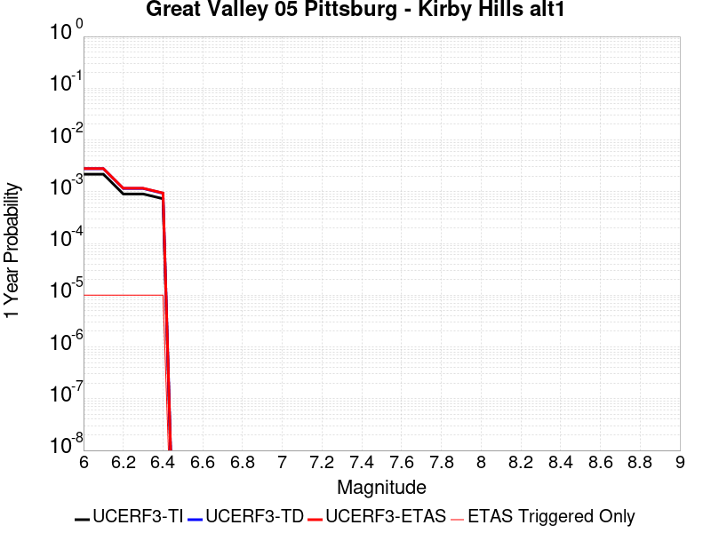 |  |

| Magnitude | 1 wk TI Prob | 1 wk TD Prob | 1 wk ETAS Prob | 1 wk ETAS/TD Gain | 1 wk ETAS Triggered Only | 1 mo TI Prob | 1 mo TD Prob | 1 mo ETAS Prob | 1 mo ETAS/TD Gain | 1 mo ETAS Triggered Only | 1 yr TI Prob | 1 yr TD Prob | 1 yr ETAS Prob | 1 yr ETAS/TD Gain | 1 yr ETAS Triggered Only | 10 yr TI Prob | 10 yr TD Prob | 10 yr ETAS Prob | 10 yr ETAS/TD Gain | 10 yr ETAS Triggered Only |
|-----|-----|-----|-----|-----|-----|-----|-----|-----|-----|-----|-----|-----|-----|-----|-----|-----|-----|-----|-----|-----|
| 6.0 | 4.187212E-5 | 5.3442072E-5 | 5.3442072E-5 | 1.0 | 0.0 | 1.794396E-4 | 2.290231E-4 | 2.290231E-4 | 1.0 | 0.0 | 0.002182488 | 0.0027857882 | 0.0027957603 | 1.0035796 | 1.0E-5 | 0.021611776 | 0.02760304 | 0.027622487 | 1.0007045 | 2.0E-5 |
| 6.1 | 4.187212E-5 | 5.3442072E-5 | 5.3442072E-5 | 1.0 | 0.0 | 1.794396E-4 | 2.290231E-4 | 2.290231E-4 | 1.0 | 0.0 | 0.002182488 | 0.0027857882 | 0.0027957603 | 1.0035796 | 1.0E-5 | 0.021611776 | 0.02760304 | 0.027622487 | 1.0007045 | 2.0E-5 |
| 6.2 | 1.7353306E-5 | 2.2154374E-5 | 2.2154374E-5 | 1.0 | 0.0 | 7.436919E-5 | 9.494618E-5 | 9.494618E-5 | 1.0 | 0.0 | 9.050688E-4 | 0.0011557543 | 0.0011657428 | 1.0086423 | 1.0E-5 | 0.009013915 | 0.011535114 | 0.011544998 | 1.0008569 | 1.0E-5 |
| 6.3 | 1.7353306E-5 | 2.2154374E-5 | 2.2154374E-5 | 1.0 | 0.0 | 7.436919E-5 | 9.494618E-5 | 9.494618E-5 | 1.0 | 0.0 | 9.050688E-4 | 0.0011557543 | 0.0011657428 | 1.0086423 | 1.0E-5 | 0.009013915 | 0.011535114 | 0.011544998 | 1.0008569 | 1.0E-5 |
| 6.4 | 1.4028824E-5 | 1.7900597E-5 | 1.7900597E-5 | 1.0 | 0.0 | 6.0122147E-5 | 7.671684E-5 | 7.671684E-5 | 1.0 | 0.0 | 7.3174125E-4 | 9.340275E-4 | 9.440182E-4 | 1.0106963 | 1.0E-5 | 0.0072933645 | 0.009338138 | 0.009348044 | 1.0010608 | 1.0E-5 |

## San Gabriel
*[(top)](#table-of-contents)*

| 1 Week | 1 Month | 1 Year | 10 Year |
|-----|-----|-----|-----|
|  |  |  |  |

| Magnitude | 1 wk TI Prob | 1 wk TD Prob | 1 wk ETAS Prob | 1 wk ETAS/TD Gain | 1 wk ETAS Triggered Only | 1 mo TI Prob | 1 mo TD Prob | 1 mo ETAS Prob | 1 mo ETAS/TD Gain | 1 mo ETAS Triggered Only | 1 yr TI Prob | 1 yr TD Prob | 1 yr ETAS Prob | 1 yr ETAS/TD Gain | 1 yr ETAS Triggered Only | 10 yr TI Prob | 10 yr TD Prob | 10 yr ETAS Prob | 10 yr ETAS/TD Gain | 10 yr ETAS Triggered Only |
|-----|-----|-----|-----|-----|-----|-----|-----|-----|-----|-----|-----|-----|-----|-----|-----|-----|-----|-----|-----|-----|
| 6.0 | 1.083775E-5 | 1.19851875E-5 | 3.198495E-5 | 2.6687064 | 2.0E-5 | 4.6446676E-5 | 5.1364143E-5 | 7.1363116E-5 | 1.3893567 | 2.0E-5 | 5.653415E-4 | 6.251903E-4 | 6.551716E-4 | 1.0479554 | 3.0E-5 | 0.0056390543 | 0.006246409 | 0.0062762215 | 1.0047728 | 3.0E-5 |
| 6.1 | 1.083775E-5 | 1.19851875E-5 | 3.198495E-5 | 2.6687064 | 2.0E-5 | 4.6446676E-5 | 5.1364143E-5 | 7.1363116E-5 | 1.3893567 | 2.0E-5 | 5.653415E-4 | 6.251903E-4 | 6.551716E-4 | 1.0479554 | 3.0E-5 | 0.0056390543 | 0.006246409 | 0.0062762215 | 1.0047728 | 3.0E-5 |
| 6.2 | 1.083775E-5 | 1.19851875E-5 | 3.198495E-5 | 2.6687064 | 2.0E-5 | 4.6446676E-5 | 5.1364143E-5 | 7.1363116E-5 | 1.3893567 | 2.0E-5 | 5.653415E-4 | 6.251903E-4 | 6.551716E-4 | 1.0479554 | 3.0E-5 | 0.0056390543 | 0.006246409 | 0.0062762215 | 1.0047728 | 3.0E-5 |
| 6.3 | 1.083775E-5 | 1.19851875E-5 | 3.198495E-5 | 2.6687064 | 2.0E-5 | 4.6446676E-5 | 5.1364143E-5 | 7.1363116E-5 | 1.3893567 | 2.0E-5 | 5.653415E-4 | 6.251903E-4 | 6.551716E-4 | 1.0479554 | 3.0E-5 | 0.0056390543 | 0.006246409 | 0.0062762215 | 1.0047728 | 3.0E-5 |
| 6.4 | 1.083775E-5 | 1.19851875E-5 | 3.198495E-5 | 2.6687064 | 2.0E-5 | 4.6446676E-5 | 5.1364143E-5 | 7.1363116E-5 | 1.3893567 | 2.0E-5 | 5.653415E-4 | 6.251903E-4 | 6.551716E-4 | 1.0479554 | 3.0E-5 | 0.0056390543 | 0.006246409 | 0.0062762215 | 1.0047728 | 3.0E-5 |
| 6.5 | 6.7317824E-6 | 7.716944E-6 | 1.7716868E-5 | 2.2958395 | 1.0E-5 | 2.8850178E-5 | 3.3072207E-5 | 4.3071876E-5 | 1.3023587 | 1.0E-5 | 3.511943E-4 | 4.0258077E-4 | 4.2257272E-4 | 1.0496595 | 2.0E-5 | 0.003506398 | 0.0040296097 | 0.004049529 | 1.0049433 | 2.0E-5 |
| 6.6 | 6.7317824E-6 | 7.716944E-6 | 1.7716868E-5 | 2.2958395 | 1.0E-5 | 2.8850178E-5 | 3.3072207E-5 | 4.3071876E-5 | 1.3023587 | 1.0E-5 | 3.511943E-4 | 4.0258077E-4 | 4.2257272E-4 | 1.0496595 | 2.0E-5 | 0.003506398 | 0.0040296097 | 0.004049529 | 1.0049433 | 2.0E-5 |
| 6.7 | 6.274881E-6 | 7.2458647E-6 | 1.7245793E-5 | 2.3800876 | 1.0E-5 | 2.6892068E-5 | 3.1053343E-5 | 4.105303E-5 | 1.3220165 | 1.0E-5 | 3.2736175E-4 | 3.780098E-4 | 3.9800224E-4 | 1.0528886 | 2.0E-5 | 0.0032687993 | 0.0037847564 | 0.0038046807 | 1.0052644 | 2.0E-5 |
| 6.8 | 5.996209E-6 | 6.958585E-6 | 1.6958515E-5 | 2.4370637 | 1.0E-5 | 2.5697784E-5 | 2.9822171E-5 | 3.9821873E-5 | 1.3353109 | 1.0E-5 | 3.128256E-4 | 3.6302538E-4 | 3.830181E-4 | 1.0550725 | 2.0E-5 | 0.003123856 | 0.0036354093 | 0.0036553366 | 1.0054815 | 2.0E-5 |
| 6.9 | 5.686331E-6 | 6.6236316E-6 | 1.6623566E-5 | 2.5097358 | 1.0E-5 | 2.4369761E-5 | 2.8386688E-5 | 3.8386406E-5 | 1.3522677 | 1.0E-5 | 2.9666146E-4 | 3.4555403E-4 | 3.5555058E-4 | 1.028929 | 1.0E-5 | 0.0029626573 | 0.0034612515 | 0.003471217 | 1.0028791 | 1.0E-5 |
| 7.0 | 5.2329838E-6 | 6.147514E-6 | 1.6147453E-5 | 2.6266637 | 1.0E-5 | 2.242688E-5 | 2.6346226E-5 | 3.6345962E-5 | 1.3795509 | 1.0E-5 | 2.7301308E-4 | 3.2071886E-4 | 3.3071564E-4 | 1.03117 | 1.0E-5 | 0.002726779 | 0.0032136322 | 0.0032235999 | 1.0031017 | 1.0E-5 |
| 7.1 | 5.135671E-6 | 6.03764E-6 | 6.03764E-6 | 1.0 | 0.0 | 2.2009834E-5 | 2.5875348E-5 | 2.5875348E-5 | 1.0 | 0.0 | 2.6793676E-4 | 3.1498758E-4 | 3.1498758E-4 | 1.0 | 0.0 | 0.0026761394 | 0.0031564834 | 0.0031564834 | 1.0 | 0.0 |
| 7.2 | 4.989062E-6 | 5.87102E-6 | 5.87102E-6 | 1.0 | 0.0 | 2.1381518E-5 | 2.5161276E-5 | 2.5161276E-5 | 1.0 | 0.0 | 2.6028889E-4 | 3.0629625E-4 | 3.0629625E-4 | 1.0 | 0.0 | 0.0025998424 | 0.003069813 | 0.003069813 | 1.0 | 0.0 |
| 7.3 | 4.8219395E-6 | 5.702574E-6 | 5.702574E-6 | 1.0 | 0.0 | 2.0665291E-5 | 2.443938E-5 | 2.443938E-5 | 1.0 | 0.0 | 2.5157086E-4 | 2.9750957E-4 | 2.9750957E-4 | 1.0 | 0.0 | 0.0025128627 | 0.0029821852 | 0.0029821852 | 1.0 | 0.0 |
| 7.4 | 4.7118383E-6 | 5.5911332E-6 | 5.5911332E-6 | 1.0 | 0.0 | 2.0193436E-5 | 2.3961782E-5 | 2.3961782E-5 | 1.0 | 0.0 | 2.4582737E-4 | 2.916964E-4 | 2.916964E-4 | 1.0 | 0.0 | 0.002455556 | 0.0029242067 | 0.0029242067 | 1.0 | 0.0 |
| 7.5 | 4.5506545E-6 | 5.4365014E-6 | 5.4365014E-6 | 1.0 | 0.0 | 1.9502659E-5 | 2.3299088E-5 | 2.3299088E-5 | 1.0 | 0.0 | 2.37419E-4 | 2.8363022E-4 | 2.8363022E-4 | 1.0 | 0.0 | 0.002371655 | 0.002843753 | 0.002843753 | 1.0 | 0.0 |
| 7.6 | 4.343636E-6 | 5.2293817E-6 | 5.2293817E-6 | 1.0 | 0.0 | 1.861545E-5 | 2.2411448E-5 | 2.2411448E-5 | 1.0 | 0.0 | 2.2661954E-4 | 2.7282597E-4 | 2.7282597E-4 | 1.0 | 0.0 | 0.0022638857 | 0.0027359722 | 0.0027359722 | 1.0 | 0.0 |
| 7.7 | 2.936235E-6 | 2.7440458E-6 | 2.7440458E-6 | 1.0 | 0.0 | 1.2583803E-5 | 1.1760143E-5 | 1.1760143E-5 | 1.0 | 0.0 | 1.5319703E-4 | 1.4317037E-4 | 1.4317037E-4 | 1.0 | 0.0 | 0.0015309147 | 0.0014380751 | 0.0014380751 | 1.0 | 0.0 |
| 7.8 | 1.4541639E-6 | 9.1237047E-7 | 9.1237047E-7 | 1.0 | 0.0 | 6.232116E-6 | 3.9101533E-6 | 3.9101533E-6 | 1.0 | 0.0 | 7.587337E-5 | 4.7605077E-5 | 4.7605077E-5 | 1.0 | 0.0 | 7.584747E-4 | 4.8085177E-4 | 4.8085177E-4 | 1.0 | 0.0 |
| 7.9 | 8.098958E-7 | 2.41753E-7 | 2.41753E-7 | 1.0 | 0.0 | 3.4709774E-6 | 1.0360839E-6 | 1.0360839E-6 | 1.0 | 0.0 | 4.225833E-5 | 1.2614248E-5 | 1.2614248E-5 | 1.0 | 0.0 | 4.2250296E-4 | 1.2921814E-4 | 1.2921814E-4 | 1.0 | 0.0 |
| 8.0 | 5.2473234E-7 | 7.6792055E-8 | 7.6792055E-8 | 1.0 | 0.0 | 2.248851E-6 | 3.2910876E-7 | 3.2910876E-7 | 1.0 | 0.0 | 2.7379416E-5 | 4.0068917E-6 | 4.0068917E-6 | 1.0 | 0.0 | 2.7376044E-4 | 4.21918E-5 | 4.21918E-5 | 1.0 | 0.0 |
| 8.1 | 3.3162388E-7 | 4.1496126E-8 | 4.1496126E-8 | 1.0 | 0.0 | 1.4212444E-6 | 1.7784053E-7 | 1.7784053E-7 | 1.0 | 0.0 | 1.7303513E-5 | 2.1652063E-6 | 2.1652063E-6 | 1.0 | 0.0 | 1.7302166E-4 | 2.2965523E-5 | 2.2965523E-5 | 1.0 | 0.0 |
| 8.2 | 1.0235345E-7 | 1.4043474E-8 | 1.4043474E-8 | 1.0 | 0.0 | 4.3865757E-7 | 6.0186316E-8 | 6.0186316E-8 | 1.0 | 0.0 | 5.340643E-6 | 7.327681E-7 | 7.327681E-7 | 1.0 | 0.0 | 5.3405143E-5 | 7.9273705E-6 | 7.9273705E-6 | 1.0 | 0.0 |

## Hollywood
*[(top)](#table-of-contents)*

| 1 Week | 1 Month | 1 Year | 10 Year |
|-----|-----|-----|-----|
|  | 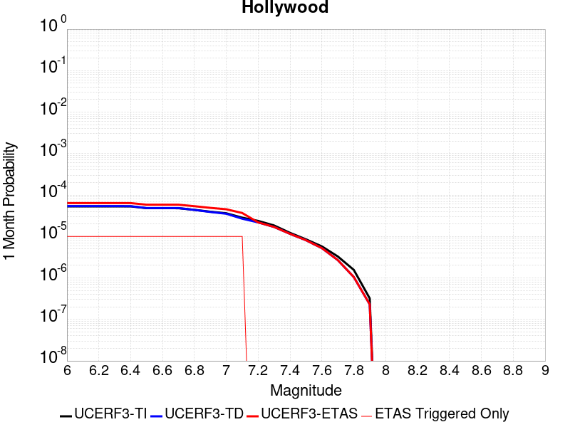 | 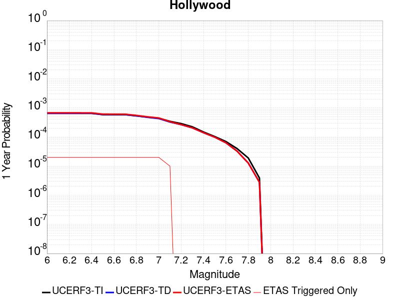 | 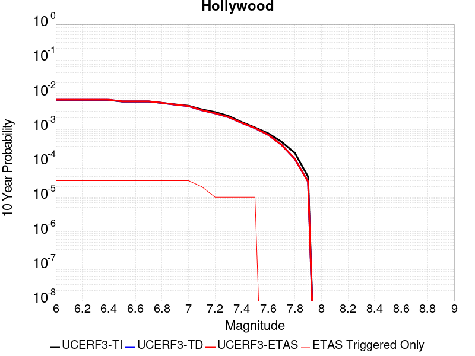 |

| Magnitude | 1 wk TI Prob | 1 wk TD Prob | 1 wk ETAS Prob | 1 wk ETAS/TD Gain | 1 wk ETAS Triggered Only | 1 mo TI Prob | 1 mo TD Prob | 1 mo ETAS Prob | 1 mo ETAS/TD Gain | 1 mo ETAS Triggered Only | 1 yr TI Prob | 1 yr TD Prob | 1 yr ETAS Prob | 1 yr ETAS/TD Gain | 1 yr ETAS Triggered Only | 10 yr TI Prob | 10 yr TD Prob | 10 yr ETAS Prob | 10 yr ETAS/TD Gain | 10 yr ETAS Triggered Only |
|-----|-----|-----|-----|-----|-----|-----|-----|-----|-----|-----|-----|-----|-----|-----|-----|-----|-----|-----|-----|-----|
| 6.0 | 1.24487615E-5 | 1.2593226E-5 | 2.25931E-5 | 1.7940677 | 1.0E-5 | 5.3350745E-5 | 5.3969878E-5 | 6.396934E-5 | 1.1852785 | 1.0E-5 | 6.4935174E-4 | 6.568898E-4 | 6.768767E-4 | 1.0304265 | 2.0E-5 | 0.0064745755 | 0.006549969 | 0.0065797726 | 1.0045502 | 3.0E-5 |
| 6.1 | 1.24487615E-5 | 1.2593226E-5 | 2.25931E-5 | 1.7940677 | 1.0E-5 | 5.3350745E-5 | 5.3969878E-5 | 6.396934E-5 | 1.1852785 | 1.0E-5 | 6.4935174E-4 | 6.568898E-4 | 6.768767E-4 | 1.0304265 | 2.0E-5 | 0.0064745755 | 0.006549969 | 0.0065797726 | 1.0045502 | 3.0E-5 |
| 6.2 | 1.24487615E-5 | 1.2593226E-5 | 2.25931E-5 | 1.7940677 | 1.0E-5 | 5.3350745E-5 | 5.3969878E-5 | 6.396934E-5 | 1.1852785 | 1.0E-5 | 6.4935174E-4 | 6.568898E-4 | 6.768767E-4 | 1.0304265 | 2.0E-5 | 0.0064745755 | 0.006549969 | 0.0065797726 | 1.0045502 | 3.0E-5 |
| 6.3 | 1.24487615E-5 | 1.2593226E-5 | 2.25931E-5 | 1.7940677 | 1.0E-5 | 5.3350745E-5 | 5.3969878E-5 | 6.396934E-5 | 1.1852785 | 1.0E-5 | 6.4935174E-4 | 6.568898E-4 | 6.768767E-4 | 1.0304265 | 2.0E-5 | 0.0064745755 | 0.006549969 | 0.0065797726 | 1.0045502 | 3.0E-5 |
| 6.4 | 1.2431024E-5 | 1.2573839E-5 | 2.2573713E-5 | 1.795292 | 1.0E-5 | 5.327473E-5 | 5.3886797E-5 | 6.3886255E-5 | 1.1855642 | 1.0E-5 | 6.4842677E-4 | 6.558789E-4 | 6.758658E-4 | 1.0304735 | 2.0E-5 | 0.0064653796 | 0.0065399194 | 0.006569723 | 1.0045573 | 3.0E-5 |
| 6.5 | 1.1242222E-5 | 1.13178E-5 | 2.1317686E-5 | 1.8835539 | 1.0E-5 | 4.8180063E-5 | 4.850397E-5 | 5.8503487E-5 | 1.2061586 | 1.0E-5 | 5.864344E-4 | 5.9037853E-4 | 6.103667E-4 | 1.0338565 | 2.0E-5 | 0.0058488925 | 0.005888388 | 0.0059182113 | 1.0050647 | 3.0E-5 |
| 6.6 | 1.1234066E-5 | 1.13089145E-5 | 2.13088E-5 | 1.8842481 | 1.0E-5 | 4.8145106E-5 | 4.846589E-5 | 5.8465404E-5 | 1.2063206 | 1.0E-5 | 5.86009E-4 | 5.8991514E-4 | 6.099033E-4 | 1.0338832 | 2.0E-5 | 0.005844661 | 0.0058837784 | 0.005913602 | 1.0050688 | 3.0E-5 |
| 6.7 | 1.12294E-5 | 1.1303658E-5 | 2.1303544E-5 | 1.8846594 | 1.0E-5 | 4.812511E-5 | 4.8443362E-5 | 5.8442878E-5 | 1.2064166 | 1.0E-5 | 5.857657E-4 | 5.89641E-4 | 6.096292E-4 | 1.033899 | 2.0E-5 | 0.0058422405 | 0.005881052 | 0.0059108753 | 1.0050712 | 3.0E-5 |
| 6.8 | 1.0252819E-5 | 1.0218445E-5 | 2.0218342E-5 | 1.9786125 | 1.0E-5 | 4.3939912E-5 | 4.379261E-5 | 5.3792173E-5 | 1.2283391 | 1.0E-5 | 5.3483713E-4 | 5.330467E-4 | 5.5303605E-4 | 1.0375001 | 2.0E-5 | 0.005335517 | 0.005317908 | 0.005347748 | 1.0056113 | 3.0E-5 |
| 6.9 | 9.252289E-6 | 9.110306E-6 | 1.9110215E-5 | 2.097648 | 1.0E-5 | 3.9652066E-5 | 3.9043593E-5 | 4.9043203E-5 | 1.256114 | 1.0E-5 | 4.8265693E-4 | 4.752537E-4 | 4.952442E-4 | 1.0420628 | 2.0E-5 | 0.0048161 | 0.004742547 | 0.0047724047 | 1.0062957 | 3.0E-5 |
| 7.0 | 8.474604E-6 | 8.258257E-6 | 1.8258175E-5 | 2.2108994 | 1.0E-5 | 3.6319227E-5 | 3.539206E-5 | 4.5391705E-5 | 1.2825392 | 1.0E-5 | 4.4209688E-4 | 4.3081454E-4 | 4.5080594E-4 | 1.0464036 | 2.0E-5 | 0.004412184 | 0.004299944 | 0.004329815 | 1.0069468 | 3.0E-5 |
| 7.1 | 6.643643E-6 | 6.2683675E-6 | 1.6268305E-5 | 2.5953016 | 1.0E-5 | 2.8472443E-5 | 2.6864158E-5 | 3.686389E-5 | 1.3722332 | 1.0E-5 | 3.4659685E-4 | 3.2702246E-4 | 3.3701918E-4 | 1.030569 | 1.0E-5 | 0.0034605677 | 0.0032654584 | 0.0032853931 | 1.0061047 | 2.0E-5 |
| 7.2 | 5.549002E-6 | 5.108709E-6 | 5.108709E-6 | 1.0 | 0.0 | 2.378122E-5 | 2.1894284E-5 | 2.1894284E-5 | 1.0 | 0.0 | 2.8949787E-4 | 2.6653046E-4 | 2.6653046E-4 | 1.0 | 0.0 | 0.0028912104 | 0.0026621243 | 0.0026720979 | 1.0037464 | 1.0E-5 |
| 7.3 | 4.3059727E-6 | 3.9598885E-6 | 3.9598885E-6 | 1.0 | 0.0 | 1.8454039E-5 | 1.6970842E-5 | 1.6970842E-5 | 1.0 | 0.0 | 2.2465475E-4 | 2.066005E-4 | 2.066005E-4 | 1.0 | 0.0 | 0.0022442779 | 0.0020640944 | 0.0020740738 | 1.0048348 | 1.0E-5 |
| 7.4 | 2.8550733E-6 | 2.7012966E-6 | 2.7012966E-6 | 1.0 | 0.0 | 1.2235971E-5 | 1.1576934E-5 | 1.1576934E-5 | 1.0 | 0.0 | 1.4896276E-4 | 1.409401E-4 | 1.409401E-4 | 1.0 | 0.0 | 0.0014886294 | 0.0014085122 | 0.0014184982 | 1.0070897 | 1.0E-5 |
| 7.5 | 1.9927045E-6 | 1.8976367E-6 | 1.8976367E-6 | 1.0 | 0.0 | 8.540134E-6 | 8.132703E-6 | 8.132703E-6 | 1.0 | 0.0 | 1.0397117E-4 | 9.90112E-5 | 9.90112E-5 | 1.0 | 0.0 | 0.0010392254 | 9.896745E-4 | 9.996645E-4 | 1.0100943 | 1.0E-5 |
| 7.6 | 1.345084E-6 | 1.2216007E-6 | 1.2216007E-6 | 1.0 | 0.0 | 5.764633E-6 | 5.235421E-6 | 5.235421E-6 | 1.0 | 0.0 | 7.018215E-5 | 6.3739404E-5 | 6.3739404E-5 | 1.0 | 0.0 | 7.0159987E-4 | 6.3721323E-4 | 6.3721323E-4 | 1.0 | 0.0 |
| 7.7 | 7.6835164E-7 | 6.277697E-7 | 6.277697E-7 | 1.0 | 0.0 | 3.2929315E-6 | 2.6904388E-6 | 2.6904388E-6 | 1.0 | 0.0 | 4.00907E-5 | 3.2755615E-5 | 3.2755615E-5 | 1.0 | 0.0 | 4.0083472E-4 | 3.2750933E-4 | 3.2750933E-4 | 1.0 | 0.0 |
| 7.8 | 3.6562128E-7 | 2.453479E-7 | 2.453479E-7 | 1.0 | 0.0 | 1.5669474E-6 | 1.0514907E-6 | 1.0514907E-6 | 1.0 | 0.0 | 1.9077417E-5 | 1.2801827E-5 | 1.2801827E-5 | 1.0 | 0.0 | 1.907578E-4 | 1.2801126E-4 | 1.2801126E-4 | 1.0 | 0.0 |
| 7.9 | 7.5024424E-8 | 5.3816795E-8 | 5.3816795E-8 | 1.0 | 0.0 | 3.215332E-7 | 2.306434E-7 | 2.306434E-7 | 1.0 | 0.0 | 3.91466E-6 | 2.808081E-6 | 2.808081E-6 | 1.0 | 0.0 | 3.9145907E-5 | 2.8080585E-5 | 2.8080585E-5 | 1.0 | 0.0 |

## Cucamonga
*[(top)](#table-of-contents)*

| 1 Week | 1 Month | 1 Year | 10 Year |
|-----|-----|-----|-----|
|  |  | 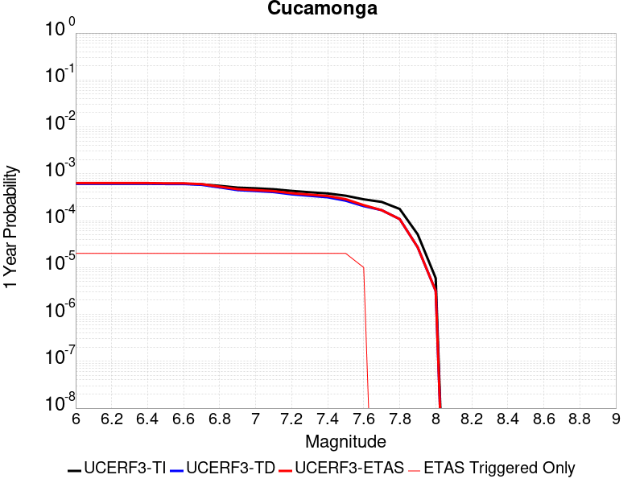 |  |

| Magnitude | 1 wk TI Prob | 1 wk TD Prob | 1 wk ETAS Prob | 1 wk ETAS/TD Gain | 1 wk ETAS Triggered Only | 1 mo TI Prob | 1 mo TD Prob | 1 mo ETAS Prob | 1 mo ETAS/TD Gain | 1 mo ETAS Triggered Only | 1 yr TI Prob | 1 yr TD Prob | 1 yr ETAS Prob | 1 yr ETAS/TD Gain | 1 yr ETAS Triggered Only | 10 yr TI Prob | 10 yr TD Prob | 10 yr ETAS Prob | 10 yr ETAS/TD Gain | 10 yr ETAS Triggered Only |
|-----|-----|-----|-----|-----|-----|-----|-----|-----|-----|-----|-----|-----|-----|-----|-----|-----|-----|-----|-----|-----|
| 6.0 | 1.1848348E-5 | 1.1737008E-5 | 2.173689E-5 | 1.8519958 | 1.0E-5 | 5.0777642E-5 | 5.030051E-5 | 7.02995E-5 | 1.3975903 | 2.0E-5 | 6.180424E-4 | 6.1223935E-4 | 6.322271E-4 | 1.032647 | 2.0E-5 | 0.0061632637 | 0.0061067017 | 0.0061365184 | 1.0048827 | 3.0E-5 |
| 6.1 | 1.1848348E-5 | 1.1737008E-5 | 2.173689E-5 | 1.8519958 | 1.0E-5 | 5.0777642E-5 | 5.030051E-5 | 7.02995E-5 | 1.3975903 | 2.0E-5 | 6.180424E-4 | 6.1223935E-4 | 6.322271E-4 | 1.032647 | 2.0E-5 | 0.0061632637 | 0.0061067017 | 0.0061365184 | 1.0048827 | 3.0E-5 |
| 6.2 | 1.1848348E-5 | 1.1737008E-5 | 2.173689E-5 | 1.8519958 | 1.0E-5 | 5.0777642E-5 | 5.030051E-5 | 7.02995E-5 | 1.3975903 | 2.0E-5 | 6.180424E-4 | 6.1223935E-4 | 6.322271E-4 | 1.032647 | 2.0E-5 | 0.0061632637 | 0.0061067017 | 0.0061365184 | 1.0048827 | 3.0E-5 |
| 6.3 | 1.1848348E-5 | 1.1737008E-5 | 2.173689E-5 | 1.8519958 | 1.0E-5 | 5.0777642E-5 | 5.030051E-5 | 7.02995E-5 | 1.3975903 | 2.0E-5 | 6.180424E-4 | 6.1223935E-4 | 6.322271E-4 | 1.032647 | 2.0E-5 | 0.0061632637 | 0.0061067017 | 0.0061365184 | 1.0048827 | 3.0E-5 |
| 6.4 | 1.1848348E-5 | 1.1737008E-5 | 2.173689E-5 | 1.8519958 | 1.0E-5 | 5.0777642E-5 | 5.030051E-5 | 7.02995E-5 | 1.3975903 | 2.0E-5 | 6.180424E-4 | 6.1223935E-4 | 6.322271E-4 | 1.032647 | 2.0E-5 | 0.0061632637 | 0.0061067017 | 0.0061365184 | 1.0048827 | 3.0E-5 |
| 6.5 | 1.16988695E-5 | 1.15760395E-5 | 2.1575923E-5 | 1.8638433 | 1.0E-5 | 5.013705E-5 | 4.9610666E-5 | 6.9609676E-5 | 1.4031191 | 2.0E-5 | 6.102476E-4 | 6.0384517E-4 | 6.238331E-4 | 1.0331011 | 2.0E-5 | 0.006085745 | 0.006023216 | 0.0060530356 | 1.0049508 | 3.0E-5 |
| 6.6 | 1.16988695E-5 | 1.15760395E-5 | 2.1575923E-5 | 1.8638433 | 1.0E-5 | 5.013705E-5 | 4.9610666E-5 | 6.9609676E-5 | 1.4031191 | 2.0E-5 | 6.102476E-4 | 6.0384517E-4 | 6.238331E-4 | 1.0331011 | 2.0E-5 | 0.006085745 | 0.006023216 | 0.0060530356 | 1.0049508 | 3.0E-5 |
| 6.7 | 1.1397107E-5 | 1.11149475E-5 | 2.1114836E-5 | 1.8996793 | 1.0E-5 | 4.884383E-5 | 4.7634636E-5 | 6.763368E-5 | 1.4198426 | 2.0E-5 | 5.9451134E-4 | 5.797998E-4 | 5.9978827E-4 | 1.0344746 | 2.0E-5 | 0.005929234 | 0.0057840226 | 0.005813849 | 1.0051568 | 3.0E-5 |
| 6.8 | 1.058387E-5 | 9.784992E-6 | 1.9784893E-5 | 2.0219634 | 1.0E-5 | 4.5358654E-5 | 4.193501E-5 | 6.193417E-5 | 1.4769084 | 2.0E-5 | 5.521017E-4 | 5.1044027E-4 | 5.3043006E-4 | 1.0391619 | 2.0E-5 | 0.00550732 | 0.0050936877 | 0.0051235347 | 1.0058596 | 3.0E-5 |
| 6.9 | 9.690046E-6 | 8.57948E-6 | 1.8579394E-5 | 2.1655617 | 1.0E-5 | 4.1528107E-5 | 3.6768684E-5 | 5.676795E-5 | 1.5439211 | 2.0E-5 | 5.054874E-4 | 4.475672E-4 | 4.6755825E-4 | 1.044666 | 2.0E-5 | 0.005043391 | 0.004467594 | 0.00449746 | 1.006685 | 3.0E-5 |
| 7.0 | 9.381461E-6 | 8.187101E-6 | 1.818702E-5 | 2.2214236 | 1.0E-5 | 4.020564E-5 | 3.5087105E-5 | 5.5086406E-5 | 1.5699899 | 2.0E-5 | 4.893937E-4 | 4.2710215E-4 | 4.470936E-4 | 1.0468072 | 2.0E-5 | 0.0048831734 | 0.0042637475 | 0.0042936197 | 1.007006 | 3.0E-5 |
| 7.1 | 8.946492E-6 | 7.781886E-6 | 1.7781807E-5 | 2.2850256 | 1.0E-5 | 3.8341543E-5 | 3.3350516E-5 | 5.334985E-5 | 1.5996709 | 2.0E-5 | 4.667083E-4 | 4.0596718E-4 | 4.2595906E-4 | 1.0492451 | 2.0E-5 | 0.0046572937 | 0.004053192 | 0.0040830704 | 1.0073715 | 3.0E-5 |
| 7.2 | 8.251016E-6 | 6.9752796E-6 | 1.697521E-5 | 2.4336243 | 1.0E-5 | 3.5361016E-5 | 2.9893714E-5 | 4.9893115E-5 | 1.669017 | 2.0E-5 | 4.3043532E-4 | 3.6389544E-4 | 3.8388814E-4 | 1.0549408 | 2.0E-5 | 0.0042960253 | 0.0036339292 | 0.00366382 | 1.0082256 | 3.0E-5 |
| 7.3 | 7.717881E-6 | 6.4863502E-6 | 1.6486285E-5 | 2.541689 | 1.0E-5 | 3.3076216E-5 | 2.7798349E-5 | 4.7797792E-5 | 1.7194471 | 2.0E-5 | 4.026285E-4 | 3.3839257E-4 | 3.583858E-4 | 1.059083 | 2.0E-5 | 0.004018998 | 0.00337971 | 0.0034096087 | 1.0088465 | 3.0E-5 |
| 7.4 | 7.275623E-6 | 6.031997E-6 | 1.6031938E-5 | 2.6578157 | 1.0E-5 | 3.118087E-5 | 2.585116E-5 | 4.5850644E-5 | 1.7736397 | 2.0E-5 | 3.7956095E-4 | 3.1469265E-4 | 3.3468637E-4 | 1.063534 | 2.0E-5 | 0.0037891332 | 0.0031434062 | 0.003173312 | 1.0095137 | 3.0E-5 |
| 7.5 | 6.5109502E-6 | 5.1006014E-6 | 1.5100551E-5 | 2.9605432 | 1.0E-5 | 2.7903774E-5 | 2.1859538E-5 | 4.18591E-5 | 1.9149125 | 2.0E-5 | 3.3967546E-4 | 2.661075E-4 | 2.8610218E-4 | 1.0751376 | 2.0E-5 | 0.0033915674 | 0.002658813 | 0.0026887334 | 1.0112532 | 3.0E-5 |
| 7.6 | 5.4495326E-6 | 3.90857E-6 | 1.3908531E-5 | 3.5584705 | 1.0E-5 | 2.335493E-5 | 1.6750908E-5 | 2.675074E-5 | 1.5969726 | 1.0E-5 | 2.8430918E-4 | 2.0392328E-4 | 2.1392123E-4 | 1.049028 | 1.0E-5 | 0.0028394572 | 0.002038282 | 0.002048262 | 1.004896 | 1.0E-5 |
| 7.7 | 4.7997164E-6 | 3.2002547E-6 | 3.2002547E-6 | 1.0 | 0.0 | 2.057005E-5 | 1.3715306E-5 | 1.3715306E-5 | 1.0 | 0.0 | 2.504116E-4 | 1.6697108E-4 | 1.6697108E-4 | 1.0 | 0.0 | 0.002501296 | 0.0016693877 | 0.0016693877 | 1.0 | 0.0 |
| 7.8 | 3.3941733E-6 | 2.0641899E-6 | 2.0641899E-6 | 1.0 | 0.0 | 1.4546376E-5 | 8.846498E-6 | 8.846498E-6 | 1.0 | 0.0 | 1.7708774E-4 | 1.07700806E-4 | 1.07700806E-4 | 1.0 | 0.0 | 0.0017694668 | 0.001076723 | 0.001076723 | 1.0 | 0.0 |
| 7.9 | 9.750552E-7 | 5.155946E-7 | 5.155946E-7 | 1.0 | 0.0 | 4.178801E-6 | 2.2096892E-6 | 2.2096892E-6 | 1.0 | 0.0 | 5.0875715E-5 | 2.690264E-5 | 2.690264E-5 | 1.0 | 0.0 | 5.086407E-4 | 2.6899425E-4 | 2.6899425E-4 | 1.0 | 0.0 |
| 8.0 | 1.133857E-7 | 6.053707E-8 | 6.053707E-8 | 1.0 | 0.0 | 4.8593864E-7 | 2.5944456E-7 | 2.5944456E-7 | 1.0 | 0.0 | 5.9162867E-6 | 3.158733E-6 | 3.158733E-6 | 1.0 | 0.0 | 5.916129E-5 | 3.1586897E-5 | 3.1586897E-5 | 1.0 | 0.0 |

## Green Valley 2011 CFM
*[(top)](#table-of-contents)*

| 1 Week | 1 Month | 1 Year | 10 Year |
|-----|-----|-----|-----|
| 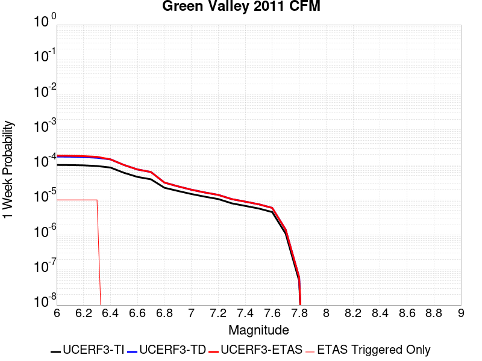 | 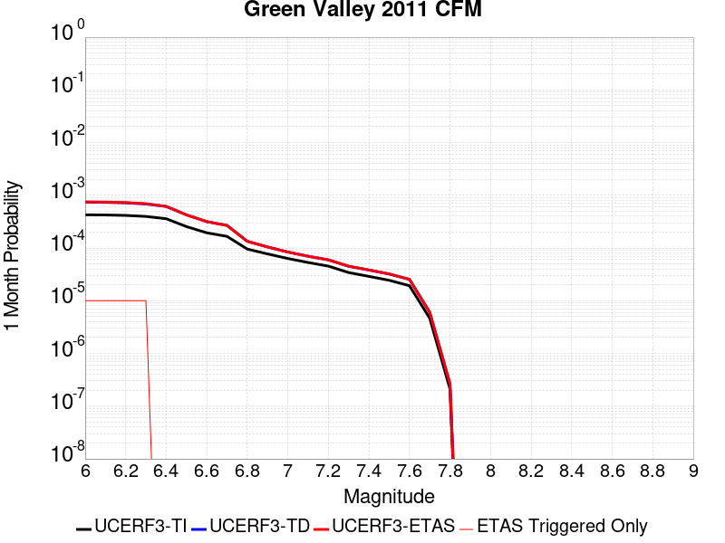 | 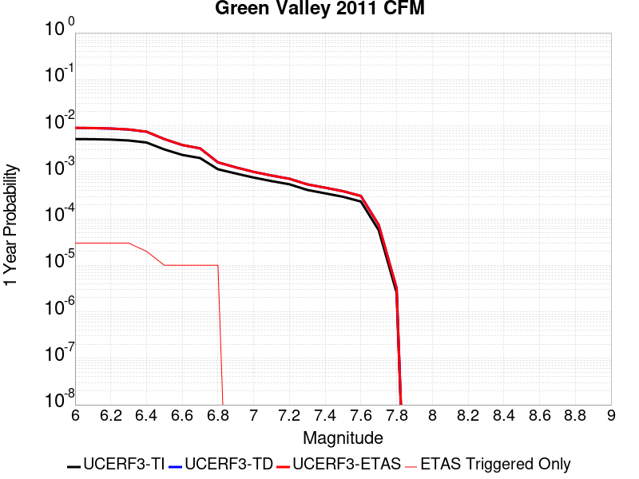 | 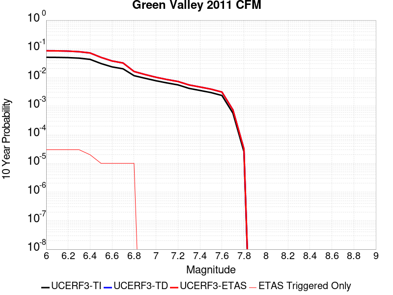 |

| Magnitude | 1 wk TI Prob | 1 wk TD Prob | 1 wk ETAS Prob | 1 wk ETAS/TD Gain | 1 wk ETAS Triggered Only | 1 mo TI Prob | 1 mo TD Prob | 1 mo ETAS Prob | 1 mo ETAS/TD Gain | 1 mo ETAS Triggered Only | 1 yr TI Prob | 1 yr TD Prob | 1 yr ETAS Prob | 1 yr ETAS/TD Gain | 1 yr ETAS Triggered Only | 10 yr TI Prob | 10 yr TD Prob | 10 yr ETAS Prob | 10 yr ETAS/TD Gain | 10 yr ETAS Triggered Only |
|-----|-----|-----|-----|-----|-----|-----|-----|-----|-----|-----|-----|-----|-----|-----|-----|-----|-----|-----|-----|-----|
| 6.0 | 9.9629346E-5 | 1.7305532E-4 | 1.8305359E-4 | 1.057775 | 1.0E-5 | 4.2691303E-4 | 7.4143766E-4 | 7.514302E-4 | 1.0134773 | 1.0E-5 | 0.0051852856 | 0.008986705 | 0.009016436 | 1.0033083 | 3.0E-5 | 0.050659515 | 0.085522056 | 0.085549496 | 1.0003208 | 3.0E-5 |
| 6.1 | 9.88615E-5 | 1.7152846E-4 | 1.8152675E-4 | 1.0582894 | 1.0E-5 | 4.2362334E-4 | 7.348976E-4 | 7.448903E-4 | 1.0135974 | 1.0E-5 | 0.0051454236 | 0.0089077335 | 0.008937466 | 1.0033379 | 3.0E-5 | 0.050279044 | 0.084809676 | 0.08483713 | 1.0003238 | 3.0E-5 |
| 6.2 | 9.696895E-5 | 1.6791887E-4 | 1.779172E-4 | 1.0595425 | 1.0E-5 | 4.15515E-4 | 7.194366E-4 | 7.294294E-4 | 1.0138898 | 1.0E-5 | 0.0050471667 | 0.008721114 | 0.008750852 | 1.00341 | 3.0E-5 | 0.04934063 | 0.0831186 | 0.08314611 | 1.0003309 | 3.0E-5 |
| 6.3 | 9.275224E-5 | 1.5971228E-4 | 1.6971068E-4 | 1.0626026 | 1.0E-5 | 3.9744904E-4 | 6.842841E-4 | 6.9427723E-4 | 1.0146039 | 1.0E-5 | 0.0048282105 | 0.008296439 | 0.0083261905 | 1.003586 | 3.0E-5 | 0.047246475 | 0.07925707 | 0.07928469 | 1.0003486 | 3.0E-5 |
| 6.4 | 8.391499E-5 | 1.4367796E-4 | 1.4367796E-4 | 1.0 | 0.0 | 3.595861E-4 | 6.156248E-4 | 6.156248E-4 | 1.0 | 0.0 | 0.004369175 | 0.0074670846 | 0.0074869352 | 1.0026584 | 2.0E-5 | 0.04284265 | 0.071630865 | 0.07164943 | 1.0002592 | 2.0E-5 |
| 6.5 | 5.9519385E-5 | 9.9340905E-5 | 9.9340905E-5 | 1.0 | 0.0 | 2.5505814E-4 | 4.2568138E-4 | 4.2568138E-4 | 1.0 | 0.0 | 0.0031009112 | 0.005168295 | 0.0051782434 | 1.0019249 | 1.0E-5 | 0.030579966 | 0.050145864 | 0.05015536 | 1.0001894 | 1.0E-5 |
| 6.6 | 4.5361558E-5 | 7.402609E-5 | 7.402609E-5 | 1.0 | 0.0 | 1.9439218E-4 | 3.1721895E-4 | 3.1721895E-4 | 1.0 | 0.0 | 0.0023641558 | 0.0038539418 | 0.0038639032 | 1.0025847 | 1.0E-5 | 0.023391623 | 0.037665963 | 0.037675586 | 1.0002555 | 1.0E-5 |
| 6.7 | 3.8808106E-5 | 6.2651976E-5 | 6.2651976E-5 | 1.0 | 0.0 | 1.6630985E-4 | 2.6848342E-4 | 2.6848342E-4 | 1.0 | 0.0 | 0.0020229418 | 0.0032626586 | 0.003272626 | 1.003055 | 1.0E-5 | 0.020046256 | 0.032005914 | 0.032015596 | 1.0003024 | 1.0E-5 |
| 6.8 | 2.2284667E-5 | 3.1285235E-5 | 3.1285235E-5 | 1.0 | 0.0 | 9.550222E-5 | 1.3407279E-4 | 1.3407279E-4 | 1.0 | 0.0 | 0.0011621192 | 0.0016311078 | 0.0016410915 | 1.0061208 | 1.0E-5 | 0.011560607 | 0.016165998 | 0.016175836 | 1.0006086 | 1.0E-5 |
| 6.9 | 1.8050168E-5 | 2.4448054E-5 | 2.4448054E-5 | 1.0 | 0.0 | 7.735557E-5 | 1.047732E-4 | 1.047732E-4 | 1.0 | 0.0 | 9.4139716E-4 | 0.0012748708 | 0.0012748708 | 1.0 | 0.0 | 0.009374191 | 0.012667833 | 0.012667833 | 1.0 | 0.0 |
| 7.0 | 1.4763166E-5 | 1.9582854E-5 | 1.9582854E-5 | 1.0 | 0.0 | 6.326917E-5 | 8.3923835E-5 | 8.3923835E-5 | 1.0 | 0.0 | 7.7002996E-4 | 0.0010212966 | 0.0010212966 | 1.0 | 0.0 | 0.007673672 | 0.010165343 | 0.010165343 | 1.0 | 0.0 |
| 7.1 | 1.2399713E-5 | 1.6303715E-5 | 1.6303715E-5 | 1.0 | 0.0 | 5.3140546E-5 | 6.98712E-5 | 6.98712E-5 | 1.0 | 0.0 | 6.467941E-4 | 8.503518E-4 | 8.503518E-4 | 1.0 | 0.0 | 0.006449148 | 0.008471259 | 0.008471259 | 1.0 | 0.0 |
| 7.2 | 1.0584195E-5 | 1.3921742E-5 | 1.3921742E-5 | 1.0 | 0.0 | 4.5360044E-5 | 5.9663253E-5 | 5.9663253E-5 | 1.0 | 0.0 | 5.521186E-4 | 7.261596E-4 | 7.261596E-4 | 1.0 | 0.0 | 0.0055074887 | 0.007238285 | 0.007238285 | 1.0 | 0.0 |
| 7.3 | 7.998173E-6 | 1.054402E-5 | 1.054402E-5 | 1.0 | 0.0 | 3.4277433E-5 | 4.518788E-5 | 4.518788E-5 | 1.0 | 0.0 | 4.1724785E-4 | 5.500247E-4 | 5.500247E-4 | 1.0 | 0.0 | 0.004164653 | 0.0054868995 | 0.0054868995 | 1.0 | 0.0 |
| 7.4 | 6.7571127E-6 | 8.932697E-6 | 8.932697E-6 | 1.0 | 0.0 | 2.8958733E-5 | 3.828243E-5 | 3.828243E-5 | 1.0 | 0.0 | 3.5251552E-4 | 4.6598984E-4 | 4.6598984E-4 | 1.0 | 0.0 | 0.0035195686 | 0.0046503306 | 0.0046503306 | 1.0 | 0.0 |
| 7.5 | 5.69878E-6 | 7.516314E-6 | 7.516314E-6 | 1.0 | 0.0 | 2.4423114E-5 | 3.221238E-5 | 3.221238E-5 | 1.0 | 0.0 | 2.9731085E-4 | 3.9211605E-4 | 3.9211605E-4 | 1.0 | 0.0 | 0.002969134 | 0.0039143935 | 0.0039143935 | 1.0 | 0.0 |
| 7.6 | 4.503664E-6 | 5.9356807E-6 | 5.9356807E-6 | 1.0 | 0.0 | 1.9301275E-5 | 2.5438389E-5 | 2.5438389E-5 | 1.0 | 0.0 | 2.3496768E-4 | 3.096692E-4 | 3.096692E-4 | 1.0 | 0.0 | 0.002347194 | 0.003092502 | 0.003092502 | 1.0 | 0.0 |
| 7.7 | 1.0873546E-6 | 1.4106979E-6 | 1.4106979E-6 | 1.0 | 0.0 | 4.6600826E-6 | 6.045834E-6 | 6.045834E-6 | 1.0 | 0.0 | 5.6735033E-5 | 7.360557E-5 | 7.360557E-5 | 1.0 | 0.0 | 5.672055E-4 | 7.35814E-4 | 7.35814E-4 | 1.0 | 0.0 |
| 7.8 | 4.9373917E-8 | 6.1777136E-8 | 6.1777136E-8 | 1.0 | 0.0 | 2.1160248E-7 | 2.6475914E-7 | 2.6475914E-7 | 1.0 | 0.0 | 2.5762572E-6 | 3.223439E-6 | 3.223439E-6 | 1.0 | 0.0 | 2.5762274E-5 | 3.2232296E-5 | 3.2232296E-5 | 1.0 | 0.0 |

## San Gabriel (Extension)
*[(top)](#table-of-contents)*

| 1 Week | 1 Month | 1 Year | 10 Year |
|-----|-----|-----|-----|
|  |  |  |  |

| Magnitude | 1 wk TI Prob | 1 wk TD Prob | 1 wk ETAS Prob | 1 wk ETAS/TD Gain | 1 wk ETAS Triggered Only | 1 mo TI Prob | 1 mo TD Prob | 1 mo ETAS Prob | 1 mo ETAS/TD Gain | 1 mo ETAS Triggered Only | 1 yr TI Prob | 1 yr TD Prob | 1 yr ETAS Prob | 1 yr ETAS/TD Gain | 1 yr ETAS Triggered Only | 10 yr TI Prob | 10 yr TD Prob | 10 yr ETAS Prob | 10 yr ETAS/TD Gain | 10 yr ETAS Triggered Only |
|-----|-----|-----|-----|-----|-----|-----|-----|-----|-----|-----|-----|-----|-----|-----|-----|-----|-----|-----|-----|-----|
| 6.0 | 5.6486106E-6 | 5.7168304E-6 | 5.7168304E-6 | 1.0 | 0.0 | 2.4208108E-5 | 2.450048E-5 | 2.450048E-5 | 1.0 | 0.0 | 2.9469383E-4 | 2.9825376E-4 | 3.0825078E-4 | 1.0335186 | 1.0E-5 | 0.0029430336 | 0.0029786653 | 0.0030085759 | 1.0100416 | 3.0E-5 |
| 6.1 | 5.6486106E-6 | 5.7168304E-6 | 5.7168304E-6 | 1.0 | 0.0 | 2.4208108E-5 | 2.450048E-5 | 2.450048E-5 | 1.0 | 0.0 | 2.9469383E-4 | 2.9825376E-4 | 3.0825078E-4 | 1.0335186 | 1.0E-5 | 0.0029430336 | 0.0029786653 | 0.0030085759 | 1.0100416 | 3.0E-5 |
| 6.2 | 5.6486106E-6 | 5.7168304E-6 | 5.7168304E-6 | 1.0 | 0.0 | 2.4208108E-5 | 2.450048E-5 | 2.450048E-5 | 1.0 | 0.0 | 2.9469383E-4 | 2.9825376E-4 | 3.0825078E-4 | 1.0335186 | 1.0E-5 | 0.0029430336 | 0.0029786653 | 0.0030085759 | 1.0100416 | 3.0E-5 |
| 6.3 | 5.6486106E-6 | 5.7168304E-6 | 5.7168304E-6 | 1.0 | 0.0 | 2.4208108E-5 | 2.450048E-5 | 2.450048E-5 | 1.0 | 0.0 | 2.9469383E-4 | 2.9825376E-4 | 3.0825078E-4 | 1.0335186 | 1.0E-5 | 0.0029430336 | 0.0029786653 | 0.0030085759 | 1.0100416 | 3.0E-5 |
| 6.4 | 5.6486106E-6 | 5.7168304E-6 | 5.7168304E-6 | 1.0 | 0.0 | 2.4208108E-5 | 2.450048E-5 | 2.450048E-5 | 1.0 | 0.0 | 2.9469383E-4 | 2.9825376E-4 | 3.0825078E-4 | 1.0335186 | 1.0E-5 | 0.0029430336 | 0.0029786653 | 0.0030085759 | 1.0100416 | 3.0E-5 |
| 6.5 | 4.7134554E-6 | 4.7542544E-6 | 4.7542544E-6 | 1.0 | 0.0 | 2.0200367E-5 | 2.0375222E-5 | 2.0375222E-5 | 1.0 | 0.0 | 2.459117E-4 | 2.4804095E-4 | 2.4804095E-4 | 1.0 | 0.0 | 0.0024563975 | 0.002477729 | 0.0024976796 | 1.0080519 | 2.0E-5 |
| 6.6 | 4.7134554E-6 | 4.7542544E-6 | 4.7542544E-6 | 1.0 | 0.0 | 2.0200367E-5 | 2.0375222E-5 | 2.0375222E-5 | 1.0 | 0.0 | 2.459117E-4 | 2.4804095E-4 | 2.4804095E-4 | 1.0 | 0.0 | 0.0024563975 | 0.002477729 | 0.0024976796 | 1.0080519 | 2.0E-5 |
| 6.7 | 4.2468837E-6 | 4.2740717E-6 | 4.2740717E-6 | 1.0 | 0.0 | 1.8200803E-5 | 1.8317325E-5 | 1.8317325E-5 | 1.0 | 0.0 | 2.2157225E-4 | 2.2299135E-4 | 2.2299135E-4 | 1.0 | 0.0 | 0.0022135144 | 0.0022277518 | 0.0022377295 | 1.0044788 | 1.0E-5 |
| 6.8 | 4.1180615E-6 | 4.1414614E-6 | 4.1414614E-6 | 1.0 | 0.0 | 1.7648716E-5 | 1.7749004E-5 | 1.7749004E-5 | 1.0 | 0.0 | 2.1485193E-4 | 2.160734E-4 | 2.160734E-4 | 1.0 | 0.0 | 0.0021464431 | 0.0021587082 | 0.0021686866 | 1.0046225 | 1.0E-5 |
| 6.9 | 3.863861E-6 | 3.8797766E-6 | 3.8797766E-6 | 1.0 | 0.0 | 1.65593E-5 | 1.6627511E-5 | 1.6627511E-5 | 1.0 | 0.0 | 2.0159081E-4 | 2.0242184E-4 | 2.0242184E-4 | 1.0 | 0.0 | 0.0020140803 | 0.002022446 | 0.0020324257 | 1.0049345 | 1.0E-5 |
| 7.0 | 3.6947372E-6 | 3.705676E-6 | 3.705676E-6 | 1.0 | 0.0 | 1.5834492E-5 | 1.5881375E-5 | 1.5881375E-5 | 1.0 | 0.0 | 1.9276788E-4 | 1.9333926E-4 | 1.9333926E-4 | 1.0 | 0.0 | 0.0019260074 | 0.0019317807 | 0.0019417615 | 1.0051665 | 1.0E-5 |
| 7.1 | 3.5686835E-6 | 3.5728963E-6 | 3.5728963E-6 | 1.0 | 0.0 | 1.5294268E-5 | 1.5312327E-5 | 1.5312327E-5 | 1.0 | 0.0 | 1.861918E-4 | 1.8641229E-4 | 1.8641229E-4 | 1.0 | 0.0 | 0.0018603588 | 0.0018626289 | 0.0018726103 | 1.0053588 | 1.0E-5 |
| 7.2 | 2.8023446E-6 | 2.7767885E-6 | 2.7767885E-6 | 1.0 | 0.0 | 1.2009994E-5 | 1.1900468E-5 | 1.1900468E-5 | 1.0 | 0.0 | 1.4621185E-4 | 1.4487868E-4 | 1.4487868E-4 | 1.0 | 0.0 | 0.001461157 | 0.0014478569 | 0.0014478569 | 1.0 | 0.0 |
| 7.3 | 2.5843012E-6 | 2.5459642E-6 | 2.5459642E-6 | 1.0 | 0.0 | 1.1075529E-5 | 1.0911231E-5 | 1.0911231E-5 | 1.0 | 0.0 | 1.3483623E-4 | 1.3283623E-4 | 1.3283623E-4 | 1.0 | 0.0 | 0.0013475444 | 0.0013275818 | 0.0013275818 | 1.0 | 0.0 |
| 7.4 | 2.4464468E-6 | 2.396665E-6 | 2.396665E-6 | 1.0 | 0.0 | 1.04847295E-5 | 1.0271382E-5 | 1.0271382E-5 | 1.0 | 0.0 | 1.276441E-4 | 1.25047E-4 | 1.25047E-4 | 1.0 | 0.0 | 0.0012757082 | 0.0012497796 | 0.0012497796 | 1.0 | 0.0 |
| 7.5 | 2.0420266E-6 | 1.8910426E-6 | 1.8910426E-6 | 1.0 | 0.0 | 8.751514E-6 | 8.104444E-6 | 8.104444E-6 | 1.0 | 0.0 | 1.0654447E-4 | 9.8667166E-5 | 9.8667166E-5 | 1.0 | 0.0 | 0.001064934 | 9.862408E-4 | 9.862408E-4 | 1.0 | 0.0 |
| 7.6 | 1.8326596E-6 | 1.6398341E-6 | 1.6398341E-6 | 1.0 | 0.0 | 7.854232E-6 | 7.0278415E-6 | 7.0278415E-6 | 1.0 | 0.0 | 9.562107E-5 | 8.5560634E-5 | 8.5560634E-5 | 1.0 | 0.0 | 9.5579936E-4 | 8.5528276E-4 | 8.5528276E-4 | 1.0 | 0.0 |
| 7.7 | 1.4786998E-6 | 1.2523838E-6 | 1.2523838E-6 | 1.0 | 0.0 | 6.3372695E-6 | 5.367348E-6 | 5.367348E-6 | 1.0 | 0.0 | 7.715353E-5 | 6.534551E-5 | 6.534551E-5 | 1.0 | 0.0 | 7.7126746E-4 | 6.532707E-4 | 6.532707E-4 | 1.0 | 0.0 |
| 7.8 | 7.6975533E-7 | 6.0693884E-7 | 6.0693884E-7 | 1.0 | 0.0 | 3.2989474E-6 | 2.601164E-6 | 2.601164E-6 | 1.0 | 0.0 | 4.0163945E-5 | 3.166871E-5 | 3.166871E-5 | 1.0 | 0.0 | 4.0156685E-4 | 3.1664805E-4 | 3.1664805E-4 | 1.0 | 0.0 |
| 7.9 | 1.7645915E-7 | 9.213256E-8 | 9.213256E-8 | 1.0 | 0.0 | 7.562533E-7 | 3.9485377E-7 | 3.9485377E-7 | 1.0 | 0.0 | 9.207345E-6 | 4.807334E-6 | 4.807334E-6 | 1.0 | 0.0 | 9.206964E-5 | 4.807699E-5 | 4.807699E-5 | 1.0 | 0.0 |
| 8.0 | 1.0463461E-7 | 2.4949307E-8 | 2.4949307E-8 | 1.0 | 0.0 | 4.4843398E-7 | 1.0692559E-7 | 1.0692559E-7 | 1.0 | 0.0 | 5.45967E-6 | 1.3018183E-6 | 1.3018183E-6 | 1.0 | 0.0 | 5.459536E-5 | 1.3022789E-5 | 1.3022789E-5 | 1.0 | 0.0 |
| 8.1 | 7.875717E-8 | 1.3866874E-8 | 1.3866874E-8 | 1.0 | 0.0 | 3.3753068E-7 | 5.942946E-8 | 5.942946E-8 | 1.0 | 0.0 | 4.109428E-6 | 7.235534E-7 | 7.235534E-7 | 1.0 | 0.0 | 4.109352E-5 | 7.2401926E-6 | 7.2401926E-6 | 1.0 | 0.0 |
| 8.2 | 1.33163E-8 | 1.7733891E-9 | 1.7733891E-9 | 1.0 | 0.0 | 5.7069855E-8 | 7.600239E-9 | 7.600239E-9 | 1.0 | 0.0 | 6.9482525E-7 | 9.25329E-8 | 9.25329E-8 | 1.0 | 0.0 | 6.9482307E-6 | 9.272953E-7 | 9.272953E-7 | 1.0 | 0.0 |

## Reliz 2011 CFM
*[(top)](#table-of-contents)*

| 1 Week | 1 Month | 1 Year | 10 Year |
|-----|-----|-----|-----|
| 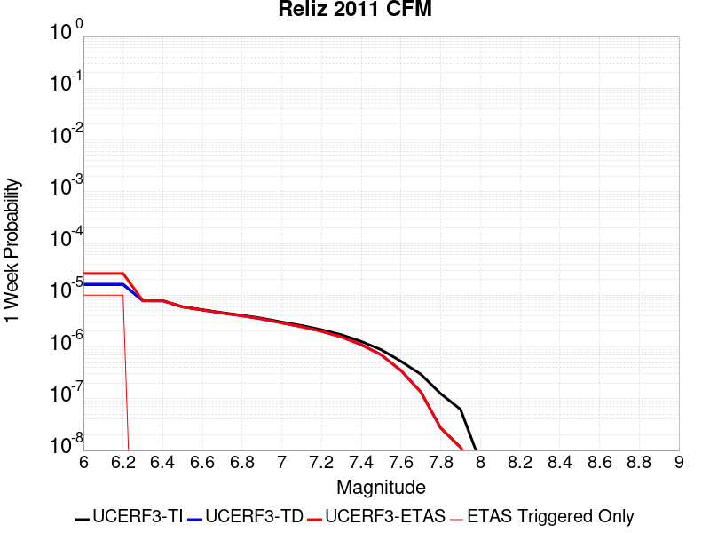 | 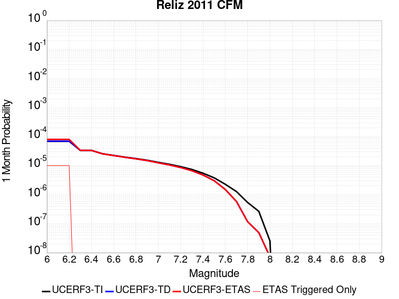 | 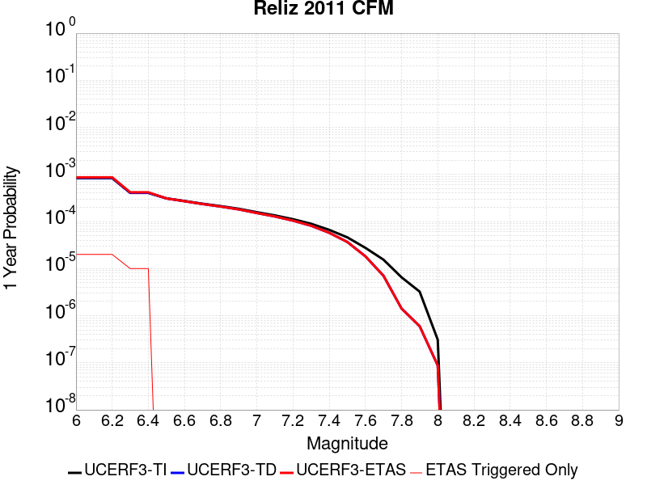 | 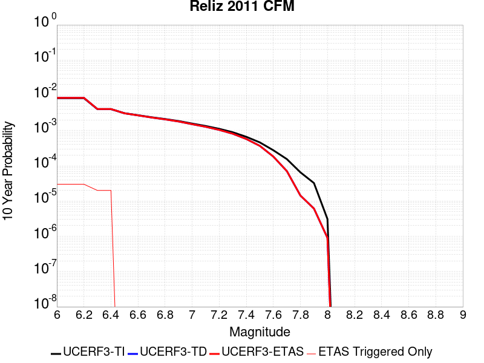 |

| Magnitude | 1 wk TI Prob | 1 wk TD Prob | 1 wk ETAS Prob | 1 wk ETAS/TD Gain | 1 wk ETAS Triggered Only | 1 mo TI Prob | 1 mo TD Prob | 1 mo ETAS Prob | 1 mo ETAS/TD Gain | 1 mo ETAS Triggered Only | 1 yr TI Prob | 1 yr TD Prob | 1 yr ETAS Prob | 1 yr ETAS/TD Gain | 1 yr ETAS Triggered Only | 10 yr TI Prob | 10 yr TD Prob | 10 yr ETAS Prob | 10 yr ETAS/TD Gain | 10 yr ETAS Triggered Only |
|-----|-----|-----|-----|-----|-----|-----|-----|-----|-----|-----|-----|-----|-----|-----|-----|-----|-----|-----|-----|-----|
| 6.0 | 1.6002472E-5 | 1.6282804E-5 | 2.6282642E-5 | 1.6141348 | 1.0E-5 | 6.8580215E-5 | 6.9781694E-5 | 7.978099E-5 | 1.1432941 | 1.0E-5 | 8.3464425E-4 | 8.4928074E-4 | 8.692638E-4 | 1.0235293 | 2.0E-5 | 0.008315164 | 0.008462547 | 0.008492294 | 1.003515 | 3.0E-5 |
| 6.1 | 1.6002472E-5 | 1.6282804E-5 | 2.6282642E-5 | 1.6141348 | 1.0E-5 | 6.8580215E-5 | 6.9781694E-5 | 7.978099E-5 | 1.1432941 | 1.0E-5 | 8.3464425E-4 | 8.4928074E-4 | 8.692638E-4 | 1.0235293 | 2.0E-5 | 0.008315164 | 0.008462547 | 0.008492294 | 1.003515 | 3.0E-5 |
| 6.2 | 1.6002472E-5 | 1.6282804E-5 | 2.6282642E-5 | 1.6141348 | 1.0E-5 | 6.8580215E-5 | 6.9781694E-5 | 7.978099E-5 | 1.1432941 | 1.0E-5 | 8.3464425E-4 | 8.4928074E-4 | 8.692638E-4 | 1.0235293 | 2.0E-5 | 0.008315164 | 0.008462547 | 0.008492294 | 1.003515 | 3.0E-5 |
| 6.3 | 7.792404E-6 | 7.803802E-6 | 7.803802E-6 | 1.0 | 0.0 | 3.339559E-5 | 3.344444E-5 | 3.344444E-5 | 1.0 | 0.0 | 4.0651546E-4 | 4.0711078E-4 | 4.171067E-4 | 1.0245533 | 1.0E-5 | 0.0040577264 | 0.004063926 | 0.0040838453 | 1.0049013 | 2.0E-5 |
| 6.4 | 7.792404E-6 | 7.803802E-6 | 7.803802E-6 | 1.0 | 0.0 | 3.339559E-5 | 3.344444E-5 | 3.344444E-5 | 1.0 | 0.0 | 4.0651546E-4 | 4.0711078E-4 | 4.171067E-4 | 1.0245533 | 1.0E-5 | 0.0040577264 | 0.004063926 | 0.0040838453 | 1.0049013 | 2.0E-5 |
| 6.5 | 5.9659374E-6 | 5.928738E-6 | 5.928738E-6 | 1.0 | 0.0 | 2.5568053E-5 | 2.5408632E-5 | 2.5408632E-5 | 1.0 | 0.0 | 3.1124658E-4 | 3.093064E-4 | 3.093064E-4 | 1.0 | 0.0 | 0.00310811 | 0.0030889767 | 0.0030889767 | 1.0 | 0.0 |
| 6.6 | 5.2350692E-6 | 5.178986E-6 | 5.178986E-6 | 1.0 | 0.0 | 2.2435817E-5 | 2.2195467E-5 | 2.2195467E-5 | 1.0 | 0.0 | 2.7312184E-4 | 2.7019644E-4 | 2.7019644E-4 | 1.0 | 0.0 | 0.002727864 | 0.0026988892 | 0.0026988892 | 1.0 | 0.0 |
| 6.7 | 4.580206E-6 | 4.5061206E-6 | 4.5061206E-6 | 1.0 | 0.0 | 1.9629308E-5 | 1.9311801E-5 | 1.9311801E-5 | 1.0 | 0.0 | 2.389606E-4 | 2.350959E-4 | 2.350959E-4 | 1.0 | 0.0 | 0.002387038 | 0.0023486738 | 0.0023486738 | 1.0 | 0.0 |
| 6.8 | 4.0765017E-6 | 3.9882384E-6 | 3.9882384E-6 | 1.0 | 0.0 | 1.7470604E-5 | 1.7092338E-5 | 1.7092338E-5 | 1.0 | 0.0 | 2.1268385E-4 | 2.0807938E-4 | 2.0807938E-4 | 1.0 | 0.0 | 0.002124804 | 0.0020790435 | 0.0020790435 | 1.0 | 0.0 |
| 6.9 | 3.5752896E-6 | 3.4725176E-6 | 3.4725176E-6 | 1.0 | 0.0 | 1.532258E-5 | 1.4882134E-5 | 1.4882134E-5 | 1.0 | 0.0 | 1.8653645E-4 | 1.8117494E-4 | 1.8117494E-4 | 1.0 | 0.0 | 0.0018637994 | 0.0018104686 | 0.0018104686 | 1.0 | 0.0 |
| 7.0 | 3.0259848E-6 | 2.9079417E-6 | 2.9079417E-6 | 1.0 | 0.0 | 1.2968442E-5 | 1.2462548E-5 | 1.2462548E-5 | 1.0 | 0.0 | 1.5787935E-4 | 1.5172097E-4 | 1.5172097E-4 | 1.0 | 0.0 | 0.0015776722 | 0.001516369 | 0.001516369 | 1.0 | 0.0 |
| 7.1 | 2.5861116E-6 | 2.455167E-6 | 2.455167E-6 | 1.0 | 0.0 | 1.1083288E-5 | 1.05221025E-5 | 1.05221025E-5 | 1.0 | 0.0 | 1.3493067E-4 | 1.2809907E-4 | 1.2809907E-4 | 1.0 | 0.0 | 0.0013484878 | 0.001280447 | 0.001280447 | 1.0 | 0.0 |
| 7.2 | 2.1482588E-6 | 2.003237E-6 | 2.003237E-6 | 1.0 | 0.0 | 9.20679E-6 | 8.585273E-6 | 8.585273E-6 | 1.0 | 0.0 | 1.12086906E-4 | 1.0452068E-4 | 1.0452068E-4 | 1.0 | 0.0 | 0.0011203039 | 0.0010449095 | 0.0010449095 | 1.0 | 0.0 |
| 7.3 | 1.7194744E-6 | 1.5611241E-6 | 1.5611241E-6 | 1.0 | 0.0 | 7.3691554E-6 | 6.690515E-6 | 6.690515E-6 | 1.0 | 0.0 | 8.971577E-5 | 8.1453974E-5 | 8.1453974E-5 | 1.0 | 0.0 | 8.967956E-4 | 8.1443513E-4 | 8.1443513E-4 | 1.0 | 0.0 |
| 7.4 | 1.2755178E-6 | 1.10563E-6 | 1.10563E-6 | 1.0 | 0.0 | 5.4664933E-6 | 4.7384056E-6 | 4.7384056E-6 | 1.0 | 0.0 | 6.655252E-5 | 5.768856E-5 | 5.768856E-5 | 1.0 | 0.0 | 6.6532596E-4 | 5.7692965E-4 | 5.7692965E-4 | 1.0 | 0.0 |
| 7.5 | 8.8463224E-7 | 7.0580273E-7 | 7.0580273E-7 | 1.0 | 0.0 | 3.7912755E-6 | 3.0248652E-6 | 3.0248652E-6 | 1.0 | 0.0 | 4.6157802E-5 | 3.6827114E-5 | 3.6827114E-5 | 1.0 | 0.0 | 4.6148215E-4 | 3.684038E-4 | 3.684038E-4 | 1.0 | 0.0 |
| 7.6 | 5.291355E-7 | 3.500777E-7 | 3.500777E-7 | 1.0 | 0.0 | 2.2677216E-6 | 1.5003321E-6 | 1.5003321E-6 | 1.0 | 0.0 | 2.760916E-5 | 1.8266392E-5 | 1.8266392E-5 | 1.0 | 0.0 | 2.760573E-4 | 1.8284164E-4 | 1.8284164E-4 | 1.0 | 0.0 |
| 7.7 | 2.9663357E-7 | 1.351113E-7 | 1.351113E-7 | 1.0 | 0.0 | 1.2712861E-6 | 5.7904833E-7 | 5.7904833E-7 | 1.0 | 0.0 | 1.5477797E-5 | 7.049891E-6 | 7.049891E-6 | 1.0 | 0.0 | 1.547672E-4 | 7.068132E-5 | 7.068132E-5 | 1.0 | 0.0 |
| 7.8 | 1.2509386E-7 | 2.7157126E-8 | 2.7157126E-8 | 1.0 | 0.0 | 5.3611643E-7 | 1.1638769E-7 | 1.1638769E-7 | 1.0 | 0.0 | 6.527198E-6 | 1.4170191E-6 | 1.4170191E-6 | 1.0 | 0.0 | 6.527006E-5 | 1.4326506E-5 | 1.4326506E-5 | 1.0 | 0.0 |
| 7.9 | 6.213493E-8 | 1.1482114E-8 | 1.1482114E-8 | 1.0 | 0.0 | 2.6629255E-7 | 4.920906E-8 | 4.920906E-8 | 1.0 | 0.0 | 3.242107E-6 | 5.9912014E-7 | 5.9912014E-7 | 1.0 | 0.0 | 3.2420594E-5 | 6.1224223E-6 | 6.1224223E-6 | 1.0 | 0.0 |
| 8.0 | 5.92383E-9 | 1.677887E-9 | 1.677887E-9 | 1.0 | 0.0 | 2.5387841E-8 | 7.190944E-9 | 7.190944E-9 | 1.0 | 0.0 | 3.0909692E-7 | 8.754974E-8 | 8.754974E-8 | 1.0 | 0.0 | 3.090965E-6 | 9.003061E-7 | 9.003061E-7 | 1.0 | 0.0 |

## Hunting Creek - Berryessa 2011 CFM
*[(top)](#table-of-contents)*

| 1 Week | 1 Month | 1 Year | 10 Year |
|-----|-----|-----|-----|
| 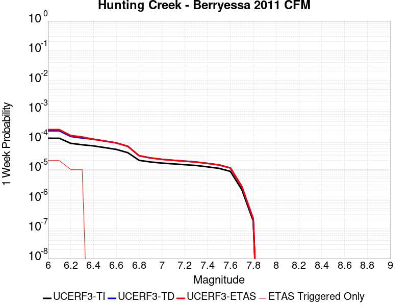 | 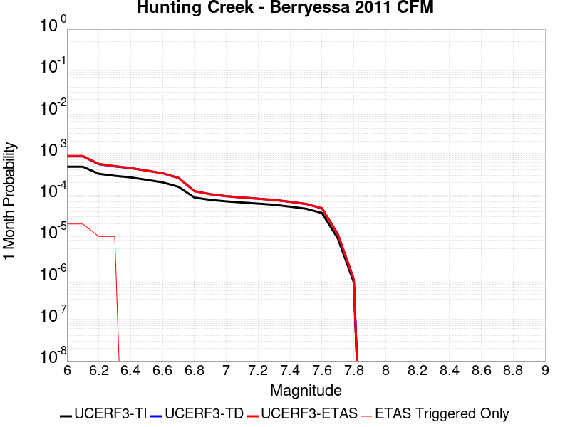 | 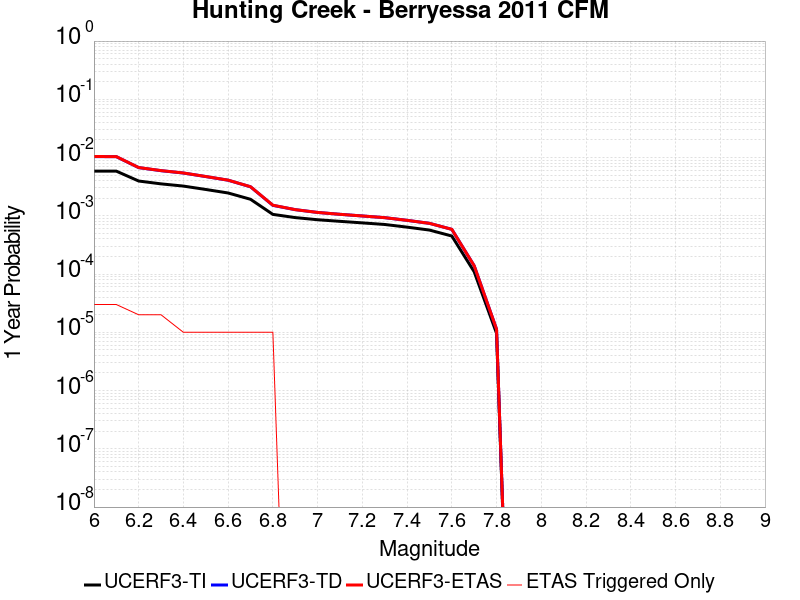 | 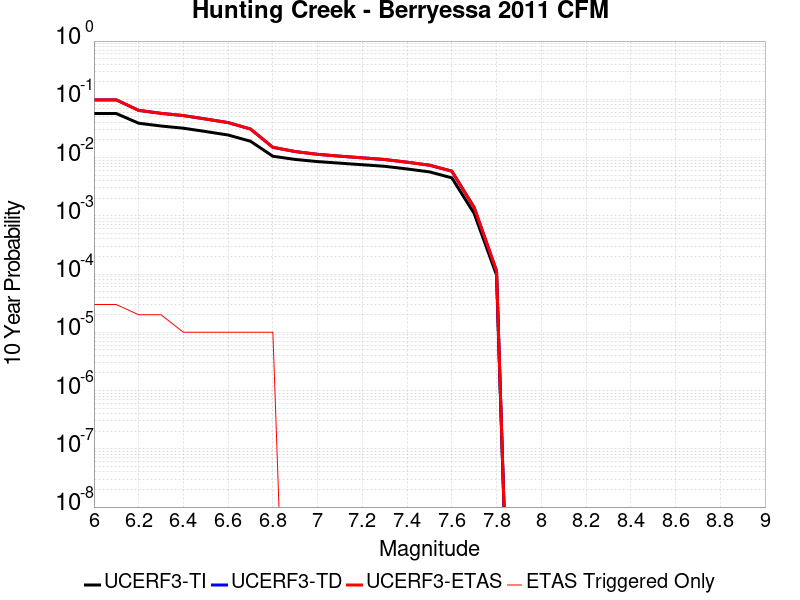 |

| Magnitude | 1 wk TI Prob | 1 wk TD Prob | 1 wk ETAS Prob | 1 wk ETAS/TD Gain | 1 wk ETAS Triggered Only | 1 mo TI Prob | 1 mo TD Prob | 1 mo ETAS Prob | 1 mo ETAS/TD Gain | 1 mo ETAS Triggered Only | 1 yr TI Prob | 1 yr TD Prob | 1 yr ETAS Prob | 1 yr ETAS/TD Gain | 1 yr ETAS Triggered Only | 10 yr TI Prob | 10 yr TD Prob | 10 yr ETAS Prob | 10 yr ETAS/TD Gain | 10 yr ETAS Triggered Only |
|-----|-----|-----|-----|-----|-----|-----|-----|-----|-----|-----|-----|-----|-----|-----|-----|-----|-----|-----|-----|-----|
| 6.0 | 1.1270982E-4 | 2.0012174E-4 | 2.2011774E-4 | 1.0999192 | 2.0E-5 | 4.8295266E-4 | 8.5739547E-4 | 8.7737833E-4 | 1.0233065 | 2.0E-5 | 0.0058641075 | 0.010386313 | 0.010416001 | 1.0028584 | 3.0E-5 | 0.057117578 | 0.09803703 | 0.09806408 | 1.000276 | 3.0E-5 |
| 6.1 | 1.1239393E-4 | 1.9960315E-4 | 2.1959915E-4 | 1.1001788 | 2.0E-5 | 4.8159933E-4 | 8.551744E-4 | 8.751573E-4 | 1.023367 | 2.0E-5 | 0.0058477195 | 0.010359551 | 0.01038924 | 1.0028659 | 3.0E-5 | 0.056962132 | 0.09779551 | 0.09782257 | 1.0002768 | 3.0E-5 |
| 6.2 | 7.596265E-5 | 1.2940196E-4 | 1.3940067E-4 | 1.0772686 | 1.0E-5 | 3.2551357E-4 | 5.5444165E-4 | 5.644361E-4 | 1.0180261 | 1.0E-5 | 0.0039559277 | 0.0067210156 | 0.0067408816 | 1.0029558 | 2.0E-5 | 0.038862433 | 0.0645915 | 0.064610206 | 1.0002897 | 2.0E-5 |
| 6.3 | 6.78794E-5 | 1.145119E-4 | 1.2451076E-4 | 1.0873171 | 1.0E-5 | 2.9087928E-4 | 4.906513E-4 | 5.0064636E-4 | 1.0203711 | 1.0E-5 | 0.003535705 | 0.005952679 | 0.00597256 | 1.0033399 | 2.0E-5 | 0.034799766 | 0.057465393 | 0.057484243 | 1.0003281 | 2.0E-5 |
| 6.4 | 6.2165134E-5 | 1.0436625E-4 | 1.0436625E-4 | 1.0 | 0.0 | 2.6639478E-4 | 4.4721062E-4 | 4.4721062E-4 | 1.0 | 0.0 | 0.0032385332 | 0.005427573 | 0.0054375185 | 1.0018325 | 1.0E-5 | 0.03191742 | 0.052550517 | 0.05255999 | 1.0001802 | 1.0E-5 |
| 6.5 | 5.4368087E-5 | 9.071415E-5 | 9.071415E-5 | 1.0 | 0.0 | 2.3298527E-4 | 3.8872007E-4 | 3.8872007E-4 | 1.0 | 0.0 | 0.0028329059 | 0.0047198683 | 0.0047298213 | 1.0021087 | 1.0E-5 | 0.027970633 | 0.045880128 | 0.04588967 | 1.0002079 | 1.0E-5 |
| 6.6 | 4.729947E-5 | 7.847572E-5 | 7.847572E-5 | 1.0 | 0.0 | 2.0269625E-4 | 3.362842E-4 | 3.362842E-4 | 1.0 | 0.0 | 0.002465034 | 0.0040849647 | 0.0040949243 | 1.002438 | 1.0E-5 | 0.02437869 | 0.03985155 | 0.03986115 | 1.0002409 | 1.0E-5 |
| 6.7 | 3.6875328E-5 | 6.0451803E-5 | 6.0451803E-5 | 1.0 | 0.0 | 1.5802756E-4 | 2.59056E-4 | 2.59056E-4 | 1.0 | 0.0 | 0.0019222875 | 0.0031482063 | 0.003158175 | 1.0031664 | 1.0E-5 | 0.019057442 | 0.03089237 | 0.030902062 | 1.0003138 | 1.0E-5 |
| 6.8 | 2.0292036E-5 | 2.8976308E-5 | 2.8976308E-5 | 1.0 | 0.0 | 8.6962966E-5 | 1.2417832E-4 | 1.2417832E-4 | 1.0 | 0.0 | 0.0010582599 | 0.0015108072 | 0.0015207921 | 1.006609 | 1.0E-5 | 0.010532344 | 0.014978523 | 0.014988373 | 1.0006577 | 1.0E-5 |
| 6.9 | 1.7871042E-5 | 2.4472254E-5 | 2.4472254E-5 | 1.0 | 0.0 | 7.658793E-5 | 1.048769E-4 | 1.048769E-4 | 1.0 | 0.0 | 9.320591E-4 | 0.0012761299 | 0.0012761299 | 1.0 | 0.0 | 0.009281595 | 0.012679775 | 0.012679775 | 1.0 | 0.0 |
| 7.0 | 1.6415532E-5 | 2.1906277E-5 | 2.1906277E-5 | 1.0 | 0.0 | 7.035038E-5 | 9.3880684E-5 | 9.3880684E-5 | 1.0 | 0.0 | 8.561793E-4 | 0.0011424015 | 0.0011424015 | 1.0 | 0.0 | 0.008528882 | 0.01136452 | 0.01136452 | 1.0 | 0.0 |
| 7.1 | 1.5409885E-5 | 2.0346342E-5 | 2.0346342E-5 | 1.0 | 0.0 | 6.6040695E-5 | 8.7195716E-5 | 8.7195716E-5 | 1.0 | 0.0 | 8.0374884E-4 | 0.0010610938 | 0.0010610938 | 1.0 | 0.0 | 0.00800848 | 0.010560595 | 0.010560595 | 1.0 | 0.0 |
| 7.2 | 1.4497423E-5 | 1.9054964E-5 | 1.9054964E-5 | 1.0 | 0.0 | 6.213033E-5 | 8.166159E-5 | 8.166159E-5 | 1.0 | 0.0 | 7.5617427E-4 | 9.937795E-4 | 9.937795E-4 | 1.0 | 0.0 | 0.0075360634 | 0.009893929 | 0.009893929 | 1.0 | 0.0 |
| 7.3 | 1.3615175E-5 | 1.7826127E-5 | 1.7826127E-5 | 1.0 | 0.0 | 5.8349444E-5 | 7.639547E-5 | 7.639547E-5 | 1.0 | 0.0 | 7.101729E-4 | 9.297209E-4 | 9.297209E-4 | 1.0 | 0.0 | 0.0070790765 | 0.009258823 | 0.009258823 | 1.0 | 0.0 |
| 7.4 | 1.2252825E-5 | 1.602625E-5 | 1.602625E-5 | 1.0 | 0.0 | 5.251105E-5 | 6.868213E-5 | 6.868213E-5 | 1.0 | 0.0 | 6.391345E-4 | 8.35887E-4 | 8.35887E-4 | 1.0 | 0.0 | 0.0063729943 | 0.008327872 | 0.008327872 | 1.0 | 0.0 |
| 7.5 | 1.0913301E-5 | 1.4241117E-5 | 1.4241117E-5 | 1.0 | 0.0 | 4.6770452E-5 | 6.1031948E-5 | 6.1031948E-5 | 1.0 | 0.0 | 5.6928146E-4 | 7.4281334E-4 | 7.4281334E-4 | 1.0 | 0.0 | 0.0056782532 | 0.0074036797 | 0.0074036797 | 1.0 | 0.0 |
| 7.6 | 8.623192E-6 | 1.12346415E-5 | 1.12346415E-5 | 1.0 | 0.0 | 3.6956015E-5 | 4.814759E-5 | 4.814759E-5 | 1.0 | 0.0 | 4.4984656E-4 | 5.8604183E-4 | 5.8604183E-4 | 1.0 | 0.0 | 0.00448937 | 0.0058452785 | 0.0058452785 | 1.0 | 0.0 |
| 7.7 | 2.0993634E-6 | 2.662584E-6 | 2.662584E-6 | 1.0 | 0.0 | 8.997241E-6 | 1.1411025E-5 | 1.1411025E-5 | 1.0 | 0.0 | 1.09535904E-4 | 1.3892044E-4 | 1.3892044E-4 | 1.0 | 0.0 | 0.0010948193 | 0.0013883426 | 0.0013883426 | 1.0 | 0.0 |
| 7.8 | 1.8428308E-7 | 2.167437E-7 | 2.167437E-7 | 1.0 | 0.0 | 7.897844E-7 | 9.289013E-7 | 9.289013E-7 | 1.0 | 0.0 | 9.615583E-6 | 1.1309318E-5 | 1.1309318E-5 | 1.0 | 0.0 | 9.615166E-5 | 1.13086026E-4 | 1.13086026E-4 | 1.0 | 0.0 |

## North Frontal  (East)
*[(top)](#table-of-contents)*

| 1 Week | 1 Month | 1 Year | 10 Year |
|-----|-----|-----|-----|
|  |  |  |  |

| Magnitude | 1 wk TI Prob | 1 wk TD Prob | 1 wk ETAS Prob | 1 wk ETAS/TD Gain | 1 wk ETAS Triggered Only | 1 mo TI Prob | 1 mo TD Prob | 1 mo ETAS Prob | 1 mo ETAS/TD Gain | 1 mo ETAS Triggered Only | 1 yr TI Prob | 1 yr TD Prob | 1 yr ETAS Prob | 1 yr ETAS/TD Gain | 1 yr ETAS Triggered Only | 10 yr TI Prob | 10 yr TD Prob | 10 yr ETAS Prob | 10 yr ETAS/TD Gain | 10 yr ETAS Triggered Only |
|-----|-----|-----|-----|-----|-----|-----|-----|-----|-----|-----|-----|-----|-----|-----|-----|-----|-----|-----|-----|-----|
| 6.0 | 7.135738E-6 | 7.4771765E-6 | 1.7477101E-5 | 2.3373933 | 1.0E-5 | 3.0581377E-5 | 3.204476E-5 | 5.204412E-5 | 1.624107 | 2.0E-5 | 3.7226462E-4 | 3.9009505E-4 | 4.2008335E-4 | 1.0768744 | 3.0E-5 | 0.0037164164 | 0.0038960609 | 0.0039259437 | 1.00767 | 3.0E-5 |
| 6.1 | 7.135738E-6 | 7.4771765E-6 | 1.7477101E-5 | 2.3373933 | 1.0E-5 | 3.0581377E-5 | 3.204476E-5 | 5.204412E-5 | 1.624107 | 2.0E-5 | 3.7226462E-4 | 3.9009505E-4 | 4.2008335E-4 | 1.0768744 | 3.0E-5 | 0.0037164164 | 0.0038960609 | 0.0039259437 | 1.00767 | 3.0E-5 |
| 6.2 | 7.135738E-6 | 7.4771765E-6 | 1.7477101E-5 | 2.3373933 | 1.0E-5 | 3.0581377E-5 | 3.204476E-5 | 5.204412E-5 | 1.624107 | 2.0E-5 | 3.7226462E-4 | 3.9009505E-4 | 4.2008335E-4 | 1.0768744 | 3.0E-5 | 0.0037164164 | 0.0038960609 | 0.0039259437 | 1.00767 | 3.0E-5 |
| 6.3 | 7.135738E-6 | 7.4771765E-6 | 1.7477101E-5 | 2.3373933 | 1.0E-5 | 3.0581377E-5 | 3.204476E-5 | 5.204412E-5 | 1.624107 | 2.0E-5 | 3.7226462E-4 | 3.9009505E-4 | 4.2008335E-4 | 1.0768744 | 3.0E-5 | 0.0037164164 | 0.0038960609 | 0.0039259437 | 1.00767 | 3.0E-5 |
| 6.4 | 7.135738E-6 | 7.4771765E-6 | 1.7477101E-5 | 2.3373933 | 1.0E-5 | 3.0581377E-5 | 3.204476E-5 | 5.204412E-5 | 1.624107 | 2.0E-5 | 3.7226462E-4 | 3.9009505E-4 | 4.2008335E-4 | 1.0768744 | 3.0E-5 | 0.0037164164 | 0.0038960609 | 0.0039259437 | 1.00767 | 3.0E-5 |
| 6.5 | 7.135738E-6 | 7.4771765E-6 | 1.7477101E-5 | 2.3373933 | 1.0E-5 | 3.0581377E-5 | 3.204476E-5 | 5.204412E-5 | 1.624107 | 2.0E-5 | 3.7226462E-4 | 3.9009505E-4 | 4.2008335E-4 | 1.0768744 | 3.0E-5 | 0.0037164164 | 0.0038960609 | 0.0039259437 | 1.00767 | 3.0E-5 |
| 6.6 | 7.135738E-6 | 7.4771765E-6 | 1.7477101E-5 | 2.3373933 | 1.0E-5 | 3.0581377E-5 | 3.204476E-5 | 5.204412E-5 | 1.624107 | 2.0E-5 | 3.7226462E-4 | 3.9009505E-4 | 4.2008335E-4 | 1.0768744 | 3.0E-5 | 0.0037164164 | 0.0038960609 | 0.0039259437 | 1.00767 | 3.0E-5 |
| 6.7 | 7.135738E-6 | 7.4771765E-6 | 1.7477101E-5 | 2.3373933 | 1.0E-5 | 3.0581377E-5 | 3.204476E-5 | 5.204412E-5 | 1.624107 | 2.0E-5 | 3.7226462E-4 | 3.9009505E-4 | 4.2008335E-4 | 1.0768744 | 3.0E-5 | 0.0037164164 | 0.0038960609 | 0.0039259437 | 1.00767 | 3.0E-5 |
| 6.8 | 5.959142E-6 | 6.236683E-6 | 1.623662E-5 | 2.6034064 | 1.0E-5 | 2.553893E-5 | 2.6728469E-5 | 4.6727935E-5 | 1.7482458 | 2.0E-5 | 3.108921E-4 | 3.253886E-4 | 3.553788E-4 | 1.0921675 | 3.0E-5 | 0.0031045752 | 0.0032508948 | 0.0032807973 | 1.0091982 | 3.0E-5 |
| 6.9 | 2.2946929E-6 | 2.3824605E-6 | 1.2382437E-5 | 5.1973314 | 1.0E-5 | 9.834361E-6 | 1.0210508E-5 | 3.0210304E-5 | 2.9587464 | 2.0E-5 | 1.1972676E-4 | 1.2430632E-4 | 1.4430382E-4 | 1.1608728 | 2.0E-5 | 0.0011966228 | 0.0012424142 | 0.0012623895 | 1.0160776 | 2.0E-5 |
| 7.0 | 2.2468673E-6 | 2.3321538E-6 | 1.2332131E-5 | 5.287872 | 1.0E-5 | 9.629396E-6 | 9.994909E-6 | 2.999471E-5 | 3.0009987 | 2.0E-5 | 1.1723159E-4 | 1.21681696E-4 | 1.4167927E-4 | 1.1643432 | 2.0E-5 | 0.0011716976 | 0.0012161969 | 0.0012361726 | 1.0164247 | 2.0E-5 |
| 7.1 | 1.9921076E-6 | 2.0646032E-6 | 1.2064583E-5 | 5.843536 | 1.0E-5 | 8.537577E-6 | 8.848272E-6 | 2.8848095E-5 | 3.2603083 | 2.0E-5 | 1.0394004E-4 | 1.0772282E-4 | 1.2772066E-4 | 1.1856416 | 2.0E-5 | 0.0010389143 | 0.0010767487 | 0.0010967272 | 1.0185544 | 2.0E-5 |
| 7.2 | 1.4524545E-6 | 1.5045148E-6 | 1.15044995E-5 | 7.6466513 | 1.0E-5 | 6.2247905E-6 | 6.447906E-6 | 2.6447777E-5 | 4.1017623 | 2.0E-5 | 7.5784184E-5 | 7.850068E-5 | 9.8499106E-5 | 1.2547549 | 2.0E-5 | 7.575835E-4 | 7.8475394E-4 | 8.047382E-4 | 1.0254657 | 2.0E-5 |
| 7.3 | 8.9802575E-7 | 9.3087283E-7 | 1.0930864E-5 | 11.742597 | 1.0E-5 | 3.848676E-6 | 3.9894494E-6 | 2.3989369E-5 | 6.013203 | 2.0E-5 | 4.685662E-5 | 4.857058E-5 | 6.856961E-5 | 1.4117519 | 2.0E-5 | 4.6846745E-4 | 4.8561094E-4 | 5.0560123E-4 | 1.0411652 | 2.0E-5 |
| 7.4 | 7.776139E-7 | 8.0604747E-7 | 1.0806039E-5 | 13.406207 | 1.0E-5 | 3.3326266E-6 | 3.4544853E-6 | 2.3454417E-5 | 6.7895546 | 2.0E-5 | 4.0573974E-5 | 4.2057654E-5 | 6.205682E-5 | 1.4755176 | 2.0E-5 | 4.0566566E-4 | 4.205077E-4 | 4.404993E-4 | 1.0475415 | 2.0E-5 |
| 7.5 | 5.244417E-7 | 5.441219E-7 | 1.0544117E-5 | 19.378223 | 1.0E-5 | 2.2476054E-6 | 2.3319494E-6 | 2.2331902E-5 | 9.576495 | 2.0E-5 | 2.7364253E-5 | 2.839118E-5 | 4.839061E-5 | 1.7044241 | 2.0E-5 | 2.7360884E-4 | 2.8388205E-4 | 3.0387638E-4 | 1.0704318 | 2.0E-5 |
| 7.6 | 1.5489647E-7 | 1.6089504E-7 | 1.0160893E-5 | 63.15231 | 1.0E-5 | 6.6384183E-7 | 6.895501E-7 | 1.0689543E-5 | 15.502199 | 1.0E-5 | 8.082245E-6 | 8.395261E-6 | 1.8395176E-5 | 2.1911383 | 1.0E-5 | 8.08195E-5 | 8.395143E-5 | 9.395059E-5 | 1.1191065 | 1.0E-5 |

## Great Valley 03a Dunnigan Hills
*[(top)](#table-of-contents)*

| 1 Week | 1 Month | 1 Year | 10 Year |
|-----|-----|-----|-----|
|  |  |  |  |

| Magnitude | 1 wk TI Prob | 1 wk TD Prob | 1 wk ETAS Prob | 1 wk ETAS/TD Gain | 1 wk ETAS Triggered Only | 1 mo TI Prob | 1 mo TD Prob | 1 mo ETAS Prob | 1 mo ETAS/TD Gain | 1 mo ETAS Triggered Only | 1 yr TI Prob | 1 yr TD Prob | 1 yr ETAS Prob | 1 yr ETAS/TD Gain | 1 yr ETAS Triggered Only | 10 yr TI Prob | 10 yr TD Prob | 10 yr ETAS Prob | 10 yr ETAS/TD Gain | 10 yr ETAS Triggered Only |
|-----|-----|-----|-----|-----|-----|-----|-----|-----|-----|-----|-----|-----|-----|-----|-----|-----|-----|-----|-----|-----|
| 6.0 | 1.6591328E-5 | 1.8107954E-5 | 1.8107954E-5 | 1.0 | 0.0 | 7.110376E-5 | 7.7603596E-5 | 7.7603596E-5 | 1.0 | 0.0 | 8.6534437E-4 | 9.444834E-4 | 9.644645E-4 | 1.0211556 | 2.0E-5 | 0.008619824 | 0.009411525 | 0.009441243 | 1.0031576 | 3.0E-5 |
| 6.1 | 8.041125E-6 | 8.769726E-6 | 8.769726E-6 | 1.0 | 0.0 | 3.4461507E-5 | 3.7584115E-5 | 3.7584115E-5 | 1.0 | 0.0 | 4.194881E-4 | 4.5751085E-4 | 4.5751085E-4 | 1.0 | 0.0 | 0.004186971 | 0.004567687 | 0.004567687 | 1.0 | 0.0 |
| 6.2 | 3.2807004E-6 | 3.5795688E-6 | 3.5795688E-6 | 1.0 | 0.0 | 1.4060069E-5 | 1.5340942E-5 | 1.5340942E-5 | 1.0 | 0.0 | 1.7116789E-4 | 1.8676413E-4 | 1.8676413E-4 | 1.0 | 0.0 | 0.0017103611 | 0.0018664796 | 0.0018664796 | 1.0 | 0.0 |
| 6.3 | 1.9339366E-6 | 2.1103806E-6 | 2.1103806E-6 | 1.0 | 0.0 | 8.288273E-6 | 9.044474E-6 | 9.044474E-6 | 1.0 | 0.0 | 1.00905054E-4 | 1.1011375E-4 | 1.1011375E-4 | 1.0 | 0.0 | 0.0010085925 | 0.0011008718 | 0.0011008718 | 1.0 | 0.0 |
| 6.4 | 1.3142635E-6 | 1.4339867E-6 | 1.4339867E-6 | 1.0 | 0.0 | 5.6325457E-6 | 6.145657E-6 | 6.145657E-6 | 1.0 | 0.0 | 6.857408E-5 | 7.482337E-5 | 7.482337E-5 | 1.0 | 0.0 | 6.8552926E-4 | 7.4823375E-4 | 7.4823375E-4 | 1.0 | 0.0 |

## Northridge
*[(top)](#table-of-contents)*

| 1 Week | 1 Month | 1 Year | 10 Year |
|-----|-----|-----|-----|
|  |  | 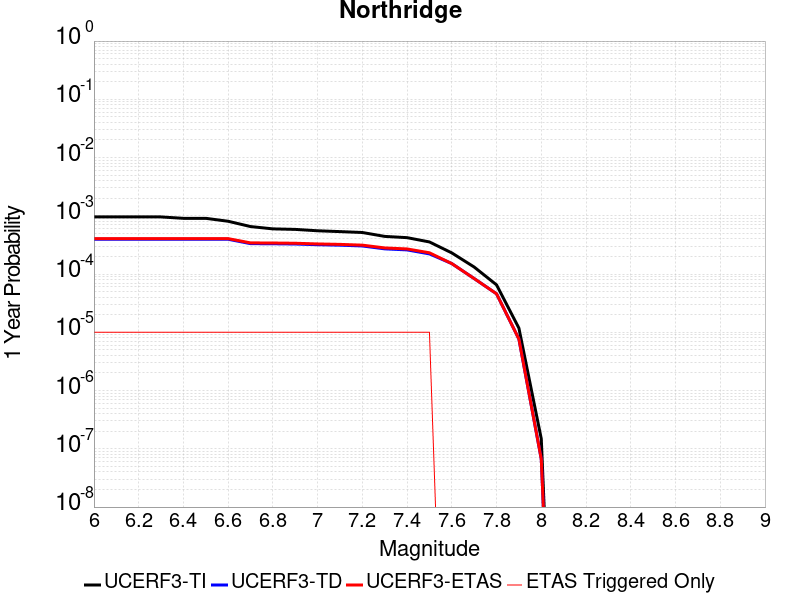 |  |

| Magnitude | 1 wk TI Prob | 1 wk TD Prob | 1 wk ETAS Prob | 1 wk ETAS/TD Gain | 1 wk ETAS Triggered Only | 1 mo TI Prob | 1 mo TD Prob | 1 mo ETAS Prob | 1 mo ETAS/TD Gain | 1 mo ETAS Triggered Only | 1 yr TI Prob | 1 yr TD Prob | 1 yr ETAS Prob | 1 yr ETAS/TD Gain | 1 yr ETAS Triggered Only | 10 yr TI Prob | 10 yr TD Prob | 10 yr ETAS Prob | 10 yr ETAS/TD Gain | 10 yr ETAS Triggered Only |
|-----|-----|-----|-----|-----|-----|-----|-----|-----|-----|-----|-----|-----|-----|-----|-----|-----|-----|-----|-----|-----|
| 6.0 | 1.8340852E-5 | 7.5880193E-6 | 7.5880193E-6 | 1.0 | 0.0 | 7.860128E-5 | 3.251969E-5 | 3.251969E-5 | 1.0 | 0.0 | 9.565505E-4 | 3.958575E-4 | 4.0585353E-4 | 1.0252516 | 1.0E-5 | 0.009524435 | 0.003951746 | 0.0039816275 | 1.0075616 | 3.0E-5 |
| 6.1 | 1.8340852E-5 | 7.5880193E-6 | 7.5880193E-6 | 1.0 | 0.0 | 7.860128E-5 | 3.251969E-5 | 3.251969E-5 | 1.0 | 0.0 | 9.565505E-4 | 3.958575E-4 | 4.0585353E-4 | 1.0252516 | 1.0E-5 | 0.009524435 | 0.003951746 | 0.0039816275 | 1.0075616 | 3.0E-5 |
| 6.2 | 1.8340852E-5 | 7.5880193E-6 | 7.5880193E-6 | 1.0 | 0.0 | 7.860128E-5 | 3.251969E-5 | 3.251969E-5 | 1.0 | 0.0 | 9.565505E-4 | 3.958575E-4 | 4.0585353E-4 | 1.0252516 | 1.0E-5 | 0.009524435 | 0.003951746 | 0.0039816275 | 1.0075616 | 3.0E-5 |
| 6.3 | 1.8340852E-5 | 7.5880193E-6 | 7.5880193E-6 | 1.0 | 0.0 | 7.860128E-5 | 3.251969E-5 | 3.251969E-5 | 1.0 | 0.0 | 9.565505E-4 | 3.958575E-4 | 4.0585353E-4 | 1.0252516 | 1.0E-5 | 0.009524435 | 0.003951746 | 0.0039816275 | 1.0075616 | 3.0E-5 |
| 6.4 | 1.7361892E-5 | 7.5880193E-6 | 7.5880193E-6 | 1.0 | 0.0 | 7.440598E-5 | 3.251969E-5 | 3.251969E-5 | 1.0 | 0.0 | 9.055163E-4 | 3.958575E-4 | 4.0585353E-4 | 1.0252516 | 1.0E-5 | 0.009018354 | 0.003951746 | 0.0039816275 | 1.0075616 | 3.0E-5 |
| 6.5 | 1.7361892E-5 | 7.5880193E-6 | 7.5880193E-6 | 1.0 | 0.0 | 7.440598E-5 | 3.251969E-5 | 3.251969E-5 | 1.0 | 0.0 | 9.055163E-4 | 3.958575E-4 | 4.0585353E-4 | 1.0252516 | 1.0E-5 | 0.009018354 | 0.003951746 | 0.0039816275 | 1.0075616 | 3.0E-5 |
| 6.6 | 1.5458201E-5 | 7.5880193E-6 | 7.5880193E-6 | 1.0 | 0.0 | 6.624775E-5 | 3.251969E-5 | 3.251969E-5 | 1.0 | 0.0 | 8.0626784E-4 | 3.958575E-4 | 4.0585353E-4 | 1.0252516 | 1.0E-5 | 0.008033488 | 0.003951746 | 0.0039816275 | 1.0075616 | 3.0E-5 |
| 6.7 | 1.2538368E-5 | 6.381603E-6 | 6.381603E-6 | 1.0 | 0.0 | 5.3734755E-5 | 2.7349442E-5 | 2.7349442E-5 | 1.0 | 0.0 | 6.5402425E-4 | 3.3292902E-4 | 3.429257E-4 | 1.0300264 | 1.0E-5 | 0.0065210275 | 0.0033243506 | 0.003354251 | 1.0089943 | 3.0E-5 |
| 6.8 | 1.1438097E-5 | 6.3502566E-6 | 6.3502566E-6 | 1.0 | 0.0 | 4.9019498E-5 | 2.7215105E-5 | 2.7215105E-5 | 1.0 | 0.0 | 5.9664896E-4 | 3.3129397E-4 | 3.4129064E-4 | 1.0301747 | 1.0E-5 | 0.005950495 | 0.0033080487 | 0.0033379495 | 1.0090388 | 3.0E-5 |
| 6.9 | 1.1204891E-5 | 6.2867084E-6 | 6.2867084E-6 | 1.0 | 0.0 | 4.8020076E-5 | 2.694276E-5 | 2.694276E-5 | 1.0 | 0.0 | 5.8448757E-4 | 3.2797916E-4 | 3.379759E-4 | 1.0304798 | 1.0E-5 | 0.0058295266 | 0.0032749989 | 0.0033049006 | 1.0091304 | 3.0E-5 |
| 7.0 | 1.061046E-5 | 6.115359E-6 | 6.115359E-6 | 1.0 | 0.0 | 4.5472607E-5 | 2.6208421E-5 | 2.6208421E-5 | 1.0 | 0.0 | 5.534883E-4 | 3.1904122E-4 | 3.2903804E-4 | 1.0313339 | 1.0E-5 | 0.0055211177 | 0.0031858785 | 0.003215783 | 1.0093865 | 3.0E-5 |
| 7.1 | 1.0266979E-5 | 6.004274E-6 | 6.004274E-6 | 1.0 | 0.0 | 4.40006E-5 | 2.5732352E-5 | 2.5732352E-5 | 1.0 | 0.0 | 5.355756E-4 | 3.1324677E-4 | 3.2324364E-4 | 1.0319138 | 1.0E-5 | 0.0053428668 | 0.003128098 | 0.0031580043 | 1.0095605 | 3.0E-5 |
| 7.2 | 9.91273E-6 | 5.819984E-6 | 5.819984E-6 | 1.0 | 0.0 | 4.248244E-5 | 2.4942554E-5 | 2.4942554E-5 | 1.0 | 0.0 | 5.171009E-4 | 3.036337E-4 | 3.1363065E-4 | 1.0329244 | 1.0E-5 | 0.0051589934 | 0.0030322333 | 0.0030621423 | 1.0098637 | 3.0E-5 |
| 7.3 | 8.4959265E-6 | 5.193062E-6 | 5.193062E-6 | 1.0 | 0.0 | 3.6410605E-5 | 2.225579E-5 | 2.225579E-5 | 1.0 | 0.0 | 4.4320893E-4 | 2.709308E-4 | 2.809281E-4 | 1.0368998 | 1.0E-5 | 0.00442326 | 0.0027060313 | 0.0027359503 | 1.0110563 | 3.0E-5 |
| 7.4 | 8.0847185E-6 | 4.9819355E-6 | 4.9819355E-6 | 1.0 | 0.0 | 3.4648332E-5 | 2.135098E-5 | 2.135098E-5 | 1.0 | 0.0 | 4.2176177E-4 | 2.599174E-4 | 2.699148E-4 | 1.0384637 | 1.0E-5 | 0.0042096223 | 0.00259616 | 0.0026260822 | 1.0115255 | 3.0E-5 |
| 7.5 | 6.8220684E-6 | 4.2533075E-6 | 4.2533075E-6 | 1.0 | 0.0 | 2.9237108E-5 | 1.8228335E-5 | 1.8228335E-5 | 1.0 | 0.0 | 3.5590364E-4 | 2.2190758E-4 | 2.3190536E-4 | 1.0450538 | 1.0E-5 | 0.0035533418 | 0.002216881 | 0.0022468143 | 1.0135025 | 3.0E-5 |
| 7.6 | 4.4224143E-6 | 2.8999582E-6 | 2.8999582E-6 | 1.0 | 0.0 | 1.8953066E-5 | 1.2428334E-5 | 1.2428334E-5 | 1.0 | 0.0 | 2.3072914E-4 | 1.5130457E-4 | 1.5130457E-4 | 1.0 | 0.0 | 0.0023048974 | 0.0015120271 | 0.0015319969 | 1.0132073 | 2.0E-5 |
| 7.7 | 2.5297056E-6 | 1.6045905E-6 | 1.6045905E-6 | 1.0 | 0.0 | 1.0841551E-5 | 6.8767986E-6 | 6.8767986E-6 | 1.0 | 0.0 | 1.319879E-4 | 8.3721854E-5 | 8.3721854E-5 | 1.0 | 0.0 | 0.0013190953 | 8.369078E-4 | 8.4689946E-4 | 1.0119387 | 1.0E-5 |
| 7.8 | 1.2508156E-6 | 8.780076E-7 | 8.780076E-7 | 1.0 | 0.0 | 5.3606273E-6 | 3.7628845E-6 | 3.7628845E-6 | 1.0 | 0.0 | 6.526368E-5 | 4.581217E-5 | 4.581217E-5 | 1.0 | 0.0 | 6.524452E-4 | 4.5802852E-4 | 4.5802852E-4 | 1.0 | 0.0 |
| 7.9 | 2.262199E-7 | 1.4664671E-7 | 1.4664671E-7 | 1.0 | 0.0 | 9.695135E-7 | 6.284858E-7 | 6.284858E-7 | 1.0 | 0.0 | 1.1803763E-5 | 7.651788E-6 | 7.651788E-6 | 1.0 | 0.0 | 1.1803136E-4 | 7.651533E-5 | 7.651533E-5 | 1.0 | 0.0 |
| 8.0 | 2.865362E-9 | 1.2753101E-9 | 1.2753101E-9 | 1.0 | 0.0 | 1.2280123E-8 | 5.4656146E-9 | 5.4656146E-9 | 1.0 | 0.0 | 1.4951048E-7 | 6.654386E-8 | 6.654386E-8 | 1.0 | 0.0 | 1.4951038E-6 | 6.654386E-7 | 6.654386E-7 | 1.0 | 0.0 |

## Laguna Salada
*[(top)](#table-of-contents)*

| 1 Week | 1 Month | 1 Year | 10 Year |
|-----|-----|-----|-----|
|  | 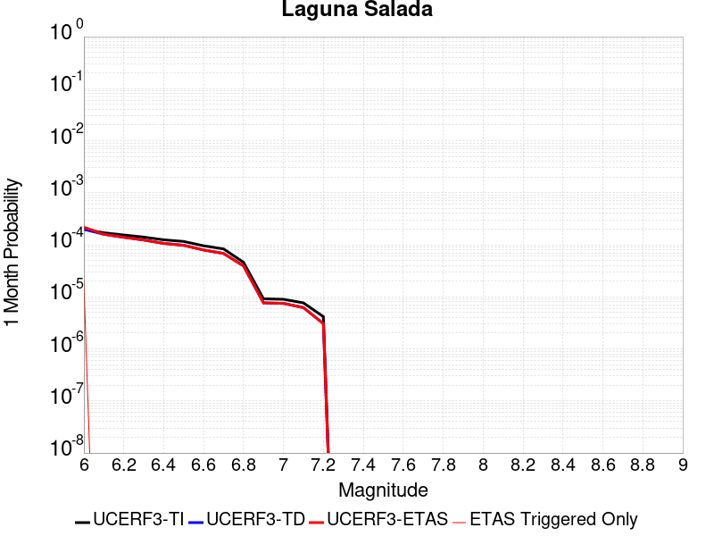 |  |  |

| Magnitude | 1 wk TI Prob | 1 wk TD Prob | 1 wk ETAS Prob | 1 wk ETAS/TD Gain | 1 wk ETAS Triggered Only | 1 mo TI Prob | 1 mo TD Prob | 1 mo ETAS Prob | 1 mo ETAS/TD Gain | 1 mo ETAS Triggered Only | 1 yr TI Prob | 1 yr TD Prob | 1 yr ETAS Prob | 1 yr ETAS/TD Gain | 1 yr ETAS Triggered Only | 10 yr TI Prob | 10 yr TD Prob | 10 yr ETAS Prob | 10 yr ETAS/TD Gain | 10 yr ETAS Triggered Only |
|-----|-----|-----|-----|-----|-----|-----|-----|-----|-----|-----|-----|-----|-----|-----|-----|-----|-----|-----|-----|-----|
| 6.0 | 4.6465593E-5 | 4.634639E-5 | 5.634593E-5 | 1.2157565 | 1.0E-5 | 1.9912305E-4 | 1.9861311E-4 | 2.1860913E-4 | 1.1006783 | 2.0E-5 | 0.0024216278 | 0.002415429 | 0.0024353808 | 1.0082601 | 2.0E-5 | 0.02395408 | 0.023975259 | 0.02400454 | 1.0012213 | 3.0E-5 |
| 6.1 | 3.982297E-5 | 3.7246125E-5 | 3.7246125E-5 | 1.0 | 0.0 | 1.706587E-4 | 1.5961716E-4 | 1.5961716E-4 | 1.0 | 0.0 | 0.0020757897 | 0.0019417295 | 0.0019417295 | 1.0 | 0.0 | 0.020565065 | 0.019331863 | 0.01934167 | 1.0005072 | 1.0E-5 |
| 6.2 | 3.6067784E-5 | 3.2602693E-5 | 3.2602693E-5 | 1.0 | 0.0 | 1.5456705E-4 | 1.3971896E-4 | 1.3971896E-4 | 1.0 | 0.0 | 0.0018802295 | 0.0016998611 | 0.0016998611 | 1.0 | 0.0 | 0.018644003 | 0.016949628 | 0.016959459 | 1.00058 | 1.0E-5 |
| 6.3 | 3.2859112E-5 | 2.8849448E-5 | 2.8849448E-5 | 1.0 | 0.0 | 1.4081717E-4 | 1.2363521E-4 | 1.2363521E-4 | 1.0 | 0.0 | 0.0017131006 | 0.0015043203 | 0.0015043203 | 1.0 | 0.0 | 0.016999546 | 0.015018767 | 0.015028617 | 1.0006559 | 1.0E-5 |
| 6.4 | 2.9132116E-5 | 2.4852965E-5 | 2.4852965E-5 | 1.0 | 0.0 | 1.2484594E-4 | 1.0650887E-4 | 1.0650887E-4 | 1.0 | 0.0 | 0.0015189396 | 0.001296065 | 0.001296065 | 1.0 | 0.0 | 0.015085992 | 0.012956262 | 0.012966133 | 1.0007619 | 1.0E-5 |
| 6.5 | 2.7075037E-5 | 2.2825836E-5 | 2.2825836E-5 | 1.0 | 0.0 | 1.1603071E-4 | 9.7821845E-5 | 9.7821845E-5 | 1.0 | 0.0 | 0.0014117584 | 0.0011904186 | 0.0011904186 | 1.0 | 0.0 | 0.014028233 | 0.011907749 | 0.01191763 | 1.0008298 | 1.0E-5 |
| 6.6 | 2.2367465E-5 | 1.8573526E-5 | 1.8573526E-5 | 1.0 | 0.0 | 9.5857045E-5 | 7.959886E-5 | 7.959886E-5 | 1.0 | 0.0 | 0.0011664346 | 9.6876756E-4 | 9.6876756E-4 | 1.0 | 0.0 | 0.011603311 | 0.009702191 | 0.0097120935 | 1.0010207 | 1.0E-5 |
| 6.7 | 1.9458053E-5 | 1.5914242E-5 | 1.5914242E-5 | 1.0 | 0.0 | 8.338899E-5 | 6.8202564E-5 | 6.8202564E-5 | 1.0 | 0.0 | 0.001014788 | 8.3013024E-4 | 8.3013024E-4 | 1.0 | 0.0 | 0.010101665 | 0.0083209425 | 0.008330859 | 1.0011917 | 1.0E-5 |
| 6.8 | 1.0767866E-5 | 9.18435E-6 | 9.18435E-6 | 1.0 | 0.0 | 4.614718E-5 | 3.9361294E-5 | 3.9361294E-5 | 1.0 | 0.0 | 5.6169706E-4 | 4.7918706E-4 | 4.7918706E-4 | 1.0 | 0.0 | 0.0056027942 | 0.0048096925 | 0.0048096925 | 1.0 | 0.0 |
| 6.9 | 2.1384765E-6 | 1.7913675E-6 | 1.7913675E-6 | 1.0 | 0.0 | 9.164866E-6 | 7.677269E-6 | 7.677269E-6 | 1.0 | 0.0 | 1.1157654E-4 | 9.346713E-5 | 9.346713E-5 | 1.0 | 0.0 | 0.0011152053 | 9.343165E-4 | 9.343165E-4 | 1.0 | 0.0 |
| 7.0 | 2.0952946E-6 | 1.7493046E-6 | 1.7493046E-6 | 1.0 | 0.0 | 8.979802E-6 | 7.4970003E-6 | 7.4970003E-6 | 1.0 | 0.0 | 1.0932361E-4 | 9.1272545E-5 | 9.1272545E-5 | 1.0 | 0.0 | 0.0010926984 | 9.123888E-4 | 9.123888E-4 | 1.0 | 0.0 |
| 7.1 | 1.7887576E-6 | 1.4500254E-6 | 1.4500254E-6 | 1.0 | 0.0 | 7.666081E-6 | 6.2143813E-6 | 6.2143813E-6 | 1.0 | 0.0 | 9.333054E-5 | 7.565777E-5 | 7.565777E-5 | 1.0 | 0.0 | 9.329135E-4 | 7.563506E-4 | 7.563506E-4 | 1.0 | 0.0 |
| 7.2 | 9.723109E-7 | 7.135619E-7 | 7.135619E-7 | 1.0 | 0.0 | 4.16704E-6 | 3.0581198E-6 | 3.0581198E-6 | 1.0 | 0.0 | 5.073253E-5 | 3.7232137E-5 | 3.7232137E-5 | 1.0 | 0.0 | 5.072095E-4 | 3.7227524E-4 | 3.7227524E-4 | 1.0 | 0.0 |

## San Andreas (Offshore) 2011 CFM
*[(top)](#table-of-contents)*

| 1 Week | 1 Month | 1 Year | 10 Year |
|-----|-----|-----|-----|
| 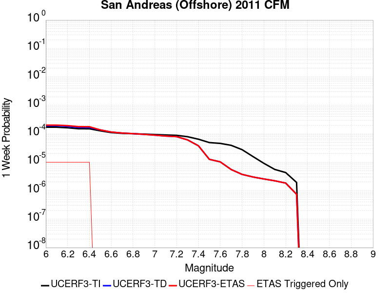 | 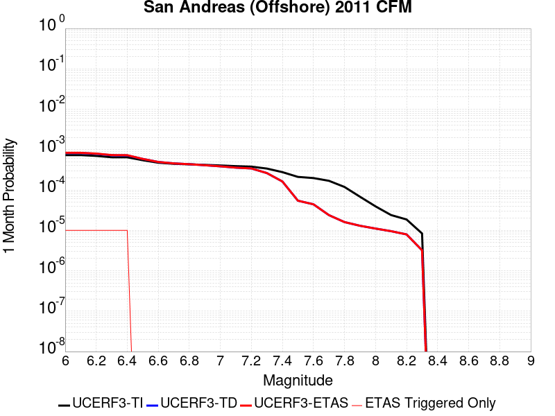 | 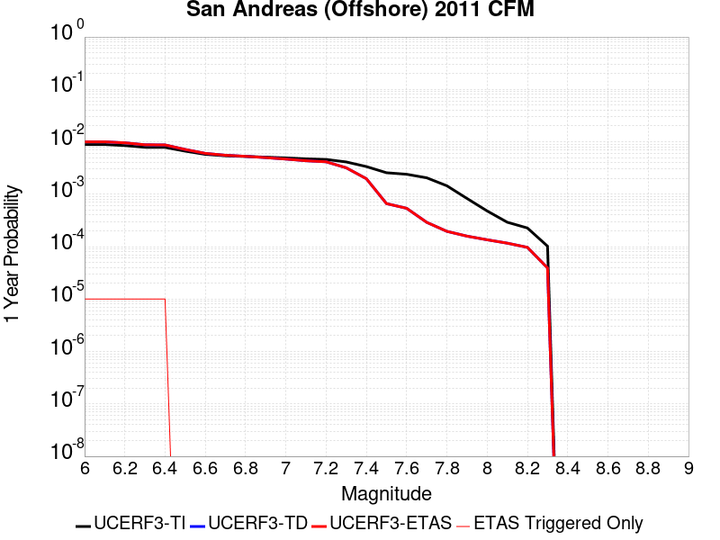 | 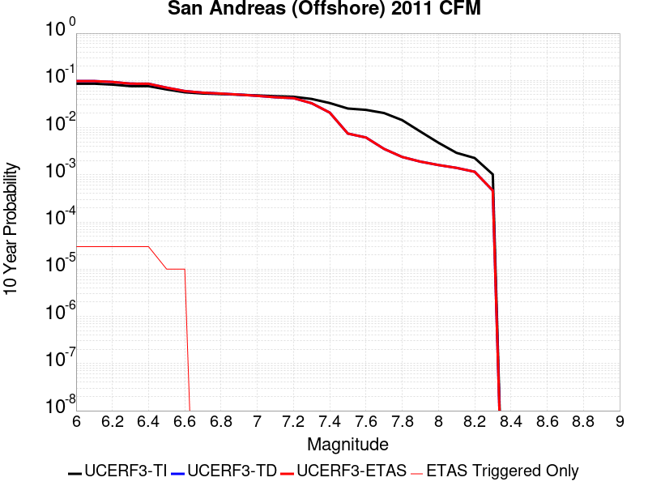 |

| Magnitude | 1 wk TI Prob | 1 wk TD Prob | 1 wk ETAS Prob | 1 wk ETAS/TD Gain | 1 wk ETAS Triggered Only | 1 mo TI Prob | 1 mo TD Prob | 1 mo ETAS Prob | 1 mo ETAS/TD Gain | 1 mo ETAS Triggered Only | 1 yr TI Prob | 1 yr TD Prob | 1 yr ETAS Prob | 1 yr ETAS/TD Gain | 1 yr ETAS Triggered Only | 10 yr TI Prob | 10 yr TD Prob | 10 yr ETAS Prob | 10 yr ETAS/TD Gain | 10 yr ETAS Triggered Only |
|-----|-----|-----|-----|-----|-----|-----|-----|-----|-----|-----|-----|-----|-----|-----|-----|-----|-----|-----|-----|-----|
| 6.0 | 1.7072787E-4 | 1.9226041E-4 | 2.022585E-4 | 1.0520028 | 1.0E-5 | 7.3148566E-4 | 8.237154E-4 | 8.337072E-4 | 1.0121301 | 1.0E-5 | 0.008869528 | 0.0099831335 | 0.009993034 | 1.0009917 | 1.0E-5 | 0.085237645 | 0.09682738 | 0.09685448 | 1.0002798 | 3.0E-5 |
| 6.1 | 1.7072787E-4 | 1.9226041E-4 | 2.022585E-4 | 1.0520028 | 1.0E-5 | 7.3148566E-4 | 8.237154E-4 | 8.337072E-4 | 1.0121301 | 1.0E-5 | 0.008869528 | 0.0099831335 | 0.009993034 | 1.0009917 | 1.0E-5 | 0.085237645 | 0.09682738 | 0.09685448 | 1.0002798 | 3.0E-5 |
| 6.2 | 1.6312556E-4 | 1.8407789E-4 | 1.9407604E-4 | 1.0543149 | 1.0E-5 | 6.989222E-4 | 7.8866904E-4 | 7.986612E-4 | 1.0126696 | 1.0E-5 | 0.008476226 | 0.009560268 | 0.009570173 | 1.001036 | 1.0E-5 | 0.08160117 | 0.09284818 | 0.0928754 | 1.0002931 | 3.0E-5 |
| 6.3 | 1.5103363E-4 | 1.6880741E-4 | 1.7880571E-4 | 1.0592291 | 1.0E-5 | 6.471264E-4 | 7.232619E-4 | 7.3325465E-4 | 1.0138162 | 1.0E-5 | 0.007850339 | 0.008770605 | 0.008780517 | 1.0011302 | 1.0E-5 | 0.075787395 | 0.085489064 | 0.085516505 | 1.0003209 | 3.0E-5 |
| 6.4 | 1.5047993E-4 | 1.676667E-4 | 1.7766502E-4 | 1.0596322 | 1.0E-5 | 6.4475456E-4 | 7.1837584E-4 | 7.2836864E-4 | 1.0139103 | 1.0E-5 | 0.007821669 | 0.008711592 | 0.008721505 | 1.0011379 | 1.0E-5 | 0.0755203 | 0.08496926 | 0.084996715 | 1.000323 | 3.0E-5 |
| 6.5 | 1.2760791E-4 | 1.3735025E-4 | 1.3735025E-4 | 1.0 | 0.0 | 5.467764E-4 | 5.885125E-4 | 5.885125E-4 | 1.0 | 0.0 | 0.0066367025 | 0.0071418737 | 0.0071418737 | 1.0 | 0.0 | 0.064419635 | 0.07025001 | 0.07025931 | 1.0001323 | 1.0E-5 |
| 6.6 | 1.1063525E-4 | 1.15566356E-4 | 1.15566356E-4 | 1.0 | 0.0 | 4.740649E-4 | 4.9519143E-4 | 4.9519143E-4 | 1.0 | 0.0 | 0.0057564764 | 0.006012491 | 0.006012491 | 1.0 | 0.0 | 0.05609626 | 0.05948894 | 0.059498347 | 1.0001581 | 1.0E-5 |
| 6.7 | 1.0391049E-4 | 1.0645922E-4 | 1.0645922E-4 | 1.0 | 0.0 | 4.4525467E-4 | 4.5617504E-4 | 4.5617504E-4 | 1.0 | 0.0 | 0.0054075094 | 0.005539975 | 0.005539975 | 1.0 | 0.0 | 0.052778035 | 0.05498876 | 0.05498876 | 1.0 | 0.0 |
| 6.8 | 1.0096706E-4 | 1.01582686E-4 | 1.01582686E-4 | 1.0 | 0.0 | 4.3264418E-4 | 4.3528268E-4 | 4.3528268E-4 | 1.0 | 0.0 | 0.0052547283 | 0.005286866 | 0.005286866 | 1.0 | 0.0 | 0.051321987 | 0.052687574 | 0.052687574 | 1.0 | 0.0 |
| 6.9 | 9.800265E-5 | 9.588748E-5 | 9.588748E-5 | 1.0 | 0.0 | 4.1994374E-4 | 4.1088252E-4 | 4.1088252E-4 | 1.0 | 0.0 | 0.0051008356 | 0.0049911886 | 0.0049911886 | 1.0 | 0.0 | 0.049853306 | 0.05001504 | 0.05001504 | 1.0 | 0.0 |
| 7.0 | 9.4642375E-5 | 9.002143E-5 | 9.002143E-5 | 1.0 | 0.0 | 4.0554712E-4 | 3.8574997E-4 | 3.8574997E-4 | 1.0 | 0.0 | 0.004926363 | 0.0046865544 | 0.0046865544 | 1.0 | 0.0 | 0.048185747 | 0.047196057 | 0.047196057 | 1.0 | 0.0 |
| 7.1 | 9.0996844E-5 | 8.354169E-5 | 8.354169E-5 | 1.0 | 0.0 | 3.8992817E-4 | 3.5798753E-4 | 3.5798753E-4 | 1.0 | 0.0 | 0.004737046 | 0.004349944 | 0.004349944 | 1.0 | 0.0 | 0.04637333 | 0.044047635 | 0.044047635 | 1.0 | 0.0 |
| 7.2 | 8.848287E-5 | 7.9818135E-5 | 7.9818135E-5 | 1.0 | 0.0 | 3.791572E-4 | 3.4203375E-4 | 3.4203375E-4 | 1.0 | 0.0 | 0.004606472 | 0.0041564633 | 0.0041564633 | 1.0 | 0.0 | 0.045121472 | 0.042191572 | 0.042191572 | 1.0 | 0.0 |
| 7.3 | 7.9280784E-5 | 6.1276216E-5 | 6.1276216E-5 | 1.0 | 0.0 | 3.3973053E-4 | 2.625865E-4 | 2.625865E-4 | 1.0 | 0.0 | 0.004128377 | 0.0031924061 | 0.0031924061 | 1.0 | 0.0 | 0.040525194 | 0.032904375 | 0.032904375 | 1.0 | 0.0 |
| 7.4 | 6.468038E-5 | 3.7933212E-5 | 3.7933212E-5 | 1.0 | 0.0 | 2.771722E-4 | 1.625611E-4 | 1.625611E-4 | 1.0 | 0.0 | 0.0033693502 | 0.0019774425 | 0.0019774425 | 1.0 | 0.0 | 0.0331872 | 0.02082181 | 0.02082181 | 1.0 | 0.0 |
| 7.5 | 4.930574E-5 | 1.2703362E-5 | 1.2703362E-5 | 1.0 | 0.0 | 2.1129321E-4 | 5.444185E-5 | 5.444185E-5 | 1.0 | 0.0 | 0.0025694598 | 6.6262955E-4 | 6.6262955E-4 | 1.0 | 0.0 | 0.02539953 | 0.007481418 | 0.007481418 | 1.0 | 0.0 |
| 7.6 | 4.612566E-5 | 1.0336213E-5 | 1.0336213E-5 | 1.0 | 0.0 | 1.9766642E-4 | 4.429731E-5 | 4.429731E-5 | 1.0 | 0.0 | 0.0024039324 | 5.391877E-4 | 5.391877E-4 | 1.0 | 0.0 | 0.023780935 | 0.006172099 | 0.006172099 | 1.0 | 0.0 |
| 7.7 | 3.9435414E-5 | 5.574925E-6 | 5.574925E-6 | 1.0 | 0.0 | 1.6899795E-4 | 2.3892318E-5 | 2.3892318E-5 | 1.0 | 0.0 | 0.0020556084 | 2.9085035E-4 | 2.9085035E-4 | 1.0 | 0.0 | 0.020366974 | 0.0035420412 | 0.0035420412 | 1.0 | 0.0 |
| 7.8 | 2.7787428E-5 | 3.7553348E-6 | 3.7553348E-6 | 1.0 | 0.0 | 1.1908354E-4 | 1.6094193E-5 | 1.6094193E-5 | 1.0 | 0.0 | 0.0014488777 | 1.9592921E-4 | 1.9592921E-4 | 1.0 | 0.0 | 0.014394675 | 0.0023877125 | 0.0023877125 | 1.0 | 0.0 |
| 7.9 | 1.590671E-5 | 3.04085E-6 | 3.04085E-6 | 1.0 | 0.0 | 6.816983E-5 | 1.303215E-5 | 1.303215E-5 | 1.0 | 0.0 | 8.2965166E-4 | 1.586549E-4 | 1.586549E-4 | 1.0 | 0.0 | 0.008265611 | 0.001904262 | 0.001904262 | 1.0 | 0.0 |
| 8.0 | 9.193638E-6 | 2.5920847E-6 | 2.5920847E-6 | 1.0 | 0.0 | 3.940071E-5 | 1.1108887E-5 | 1.1108887E-5 | 1.0 | 0.0 | 4.7959806E-4 | 1.3524233E-4 | 1.3524233E-4 | 1.0 | 0.0 | 0.0047856434 | 0.0016115032 | 0.0016115032 | 1.0 | 0.0 |
| 8.1 | 5.601576E-6 | 2.2343472E-6 | 2.2343472E-6 | 1.0 | 0.0 | 2.4006533E-5 | 9.575739E-6 | 9.575739E-6 | 1.0 | 0.0 | 2.9224035E-4 | 1.16578405E-4 | 1.16578405E-4 | 1.0 | 0.0 | 0.0029185633 | 0.0014020674 | 0.0014020674 | 1.0 | 0.0 |
| 8.2 | 4.3508785E-6 | 1.857566E-6 | 1.857566E-6 | 1.0 | 0.0 | 1.864649E-5 | 7.960973E-6 | 7.960973E-6 | 1.0 | 0.0 | 2.2699735E-4 | 9.692056E-5 | 9.692056E-5 | 1.0 | 0.0 | 0.0022676561 | 0.0011594221 | 0.0011594221 | 1.0 | 0.0 |
| 8.3 | 1.9573292E-6 | 7.514906E-7 | 7.514906E-7 | 1.0 | 0.0 | 8.388526E-6 | 3.22067E-6 | 3.22067E-6 | 1.0 | 0.0 | 1.0212552E-4 | 3.921097E-5 | 3.921097E-5 | 1.0 | 0.0 | 0.001020786 | 4.640846E-4 | 4.640846E-4 | 1.0 | 0.0 |

## North Frontal  (West)
*[(top)](#table-of-contents)*

| 1 Week | 1 Month | 1 Year | 10 Year |
|-----|-----|-----|-----|
|  |  |  | 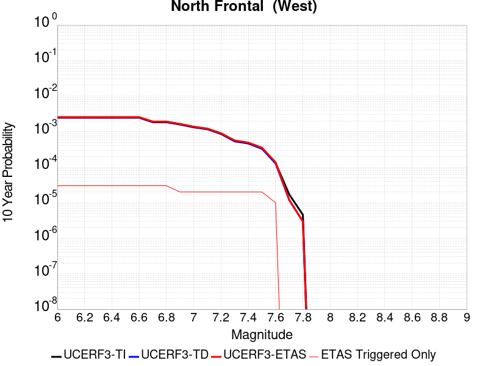 |

| Magnitude | 1 wk TI Prob | 1 wk TD Prob | 1 wk ETAS Prob | 1 wk ETAS/TD Gain | 1 wk ETAS Triggered Only | 1 mo TI Prob | 1 mo TD Prob | 1 mo ETAS Prob | 1 mo ETAS/TD Gain | 1 mo ETAS Triggered Only | 1 yr TI Prob | 1 yr TD Prob | 1 yr ETAS Prob | 1 yr ETAS/TD Gain | 1 yr ETAS Triggered Only | 10 yr TI Prob | 10 yr TD Prob | 10 yr ETAS Prob | 10 yr ETAS/TD Gain | 10 yr ETAS Triggered Only |
|-----|-----|-----|-----|-----|-----|-----|-----|-----|-----|-----|-----|-----|-----|-----|-----|-----|-----|-----|-----|-----|
| 6.0 | 4.7316266E-6 | 4.8526726E-6 | 1.4852624E-5 | 3.0607102 | 1.0E-5 | 2.0278241E-5 | 2.0797012E-5 | 4.0796596E-5 | 1.9616567 | 2.0E-5 | 2.4685962E-4 | 2.5317568E-4 | 2.8316808E-4 | 1.1184648 | 3.0E-5 | 0.0024658558 | 0.0025290183 | 0.0025589427 | 1.0118324 | 3.0E-5 |
| 6.1 | 4.7316266E-6 | 4.8526726E-6 | 1.4852624E-5 | 3.0607102 | 1.0E-5 | 2.0278241E-5 | 2.0797012E-5 | 4.0796596E-5 | 1.9616567 | 2.0E-5 | 2.4685962E-4 | 2.5317568E-4 | 2.8316808E-4 | 1.1184648 | 3.0E-5 | 0.0024658558 | 0.0025290183 | 0.0025589427 | 1.0118324 | 3.0E-5 |
| 6.2 | 4.7316266E-6 | 4.8526726E-6 | 1.4852624E-5 | 3.0607102 | 1.0E-5 | 2.0278241E-5 | 2.0797012E-5 | 4.0796596E-5 | 1.9616567 | 2.0E-5 | 2.4685962E-4 | 2.5317568E-4 | 2.8316808E-4 | 1.1184648 | 3.0E-5 | 0.0024658558 | 0.0025290183 | 0.0025589427 | 1.0118324 | 3.0E-5 |
| 6.3 | 4.7316266E-6 | 4.8526726E-6 | 1.4852624E-5 | 3.0607102 | 1.0E-5 | 2.0278241E-5 | 2.0797012E-5 | 4.0796596E-5 | 1.9616567 | 2.0E-5 | 2.4685962E-4 | 2.5317568E-4 | 2.8316808E-4 | 1.1184648 | 3.0E-5 | 0.0024658558 | 0.0025290183 | 0.0025589427 | 1.0118324 | 3.0E-5 |
| 6.4 | 4.7316266E-6 | 4.8526726E-6 | 1.4852624E-5 | 3.0607102 | 1.0E-5 | 2.0278241E-5 | 2.0797012E-5 | 4.0796596E-5 | 1.9616567 | 2.0E-5 | 2.4685962E-4 | 2.5317568E-4 | 2.8316808E-4 | 1.1184648 | 3.0E-5 | 0.0024658558 | 0.0025290183 | 0.0025589427 | 1.0118324 | 3.0E-5 |
| 6.5 | 4.7316266E-6 | 4.8526726E-6 | 1.4852624E-5 | 3.0607102 | 1.0E-5 | 2.0278241E-5 | 2.0797012E-5 | 4.0796596E-5 | 1.9616567 | 2.0E-5 | 2.4685962E-4 | 2.5317568E-4 | 2.8316808E-4 | 1.1184648 | 3.0E-5 | 0.0024658558 | 0.0025290183 | 0.0025589427 | 1.0118324 | 3.0E-5 |
| 6.6 | 4.7316266E-6 | 4.8526726E-6 | 1.4852624E-5 | 3.0607102 | 1.0E-5 | 2.0278241E-5 | 2.0797012E-5 | 4.0796596E-5 | 1.9616567 | 2.0E-5 | 2.4685962E-4 | 2.5317568E-4 | 2.8316808E-4 | 1.1184648 | 3.0E-5 | 0.0024658558 | 0.0025290183 | 0.0025589427 | 1.0118324 | 3.0E-5 |
| 6.7 | 3.5382777E-6 | 3.6308859E-6 | 1.363085E-5 | 3.7541387 | 1.0E-5 | 1.516396E-5 | 1.5560852E-5 | 3.556054E-5 | 2.2852566 | 2.0E-5 | 1.8460557E-4 | 1.8943768E-4 | 2.19432E-4 | 1.1583334 | 3.0E-5 | 0.0018445229 | 0.0018928389 | 0.001922782 | 1.0158192 | 3.0E-5 |
| 6.8 | 3.5382777E-6 | 3.6308859E-6 | 1.363085E-5 | 3.7541387 | 1.0E-5 | 1.516396E-5 | 1.5560852E-5 | 3.556054E-5 | 2.2852566 | 2.0E-5 | 1.8460557E-4 | 1.8943768E-4 | 2.19432E-4 | 1.1583334 | 3.0E-5 | 0.0018445229 | 0.0018928389 | 0.001922782 | 1.0158192 | 3.0E-5 |
| 6.9 | 3.0428037E-6 | 3.1227605E-6 | 1.312273E-5 | 4.202285 | 1.0E-5 | 1.30405215E-5 | 1.33831945E-5 | 3.3382927E-5 | 2.4943914 | 2.0E-5 | 1.5875678E-4 | 1.6292889E-4 | 1.8292564E-4 | 1.1227329 | 2.0E-5 | 0.0015864341 | 0.0016281615 | 0.001648129 | 1.0122638 | 2.0E-5 |
| 7.0 | 2.538778E-6 | 2.6060904E-6 | 1.2606064E-5 | 4.8371553 | 1.0E-5 | 1.0880432E-5 | 1.1168913E-5 | 3.116869E-5 | 2.7906644 | 2.0E-5 | 1.324612E-4 | 1.3597352E-4 | 1.5597079E-4 | 1.1470674 | 2.0E-5 | 0.0013238228 | 0.0013589499 | 0.0013789227 | 1.0146972 | 2.0E-5 |
| 7.1 | 2.2418935E-6 | 2.3012074E-6 | 1.2301184E-5 | 5.3455353 | 1.0E-5 | 9.60808E-6 | 9.862282E-6 | 2.9862085E-5 | 3.027908 | 2.0E-5 | 1.1697209E-4 | 1.2006712E-4 | 1.4006472E-4 | 1.1665535 | 2.0E-5 | 0.0011691054 | 0.0012000664 | 0.0012200424 | 1.0166458 | 2.0E-5 |
| 7.2 | 1.6526745E-6 | 1.6924851E-6 | 1.1692468E-5 | 6.9084616 | 1.0E-5 | 7.082872E-6 | 7.253489E-6 | 2.7253343E-5 | 3.757274 | 2.0E-5 | 8.623055E-5 | 8.8307905E-5 | 1.08306136E-4 | 1.2264603 | 2.0E-5 | 8.61971E-4 | 8.827532E-4 | 9.027355E-4 | 1.0226364 | 2.0E-5 |
| 7.3 | 1.0246019E-6 | 1.0442261E-6 | 1.1044215E-5 | 10.576461 | 1.0E-5 | 4.391144E-6 | 4.4752474E-6 | 2.4475157E-5 | 5.4690065 | 2.0E-5 | 5.3460866E-5 | 5.448489E-5 | 7.44838E-5 | 1.3670542 | 2.0E-5 | 5.344801E-4 | 5.4472685E-4 | 5.6471594E-4 | 1.0366956 | 2.0E-5 |
| 7.4 | 8.9045164E-7 | 9.0565584E-7 | 1.0905646E-5 | 12.041712 | 1.0E-5 | 3.8162157E-6 | 3.8813773E-6 | 2.3881299E-5 | 6.15279 | 2.0E-5 | 4.646144E-5 | 4.7254853E-5 | 6.725391E-5 | 1.4232169 | 2.0E-5 | 4.6451724E-4 | 4.7245892E-4 | 4.9244944E-4 | 1.0423117 | 2.0E-5 |
| 7.5 | 6.3357E-7 | 6.4027006E-7 | 1.0640264E-5 | 16.6184 | 1.0E-5 | 2.7152971E-6 | 2.744012E-6 | 2.2743958E-5 | 8.288578 | 2.0E-5 | 3.305824E-5 | 3.34079E-5 | 5.340723E-5 | 1.5986408 | 2.0E-5 | 3.3053322E-4 | 3.3403534E-4 | 3.5402869E-4 | 1.0598539 | 2.0E-5 |
| 7.6 | 2.5087024E-7 | 2.4361097E-7 | 1.0243609E-5 | 42.04904 | 1.0E-5 | 1.0751578E-6 | 1.0440467E-6 | 1.1044036E-5 | 10.578105 | 1.0E-5 | 1.3089967E-5 | 1.2711216E-5 | 2.2711089E-5 | 1.7866968 | 1.0E-5 | 1.3089196E-4 | 1.2710695E-4 | 1.3710569E-4 | 1.078664 | 1.0E-5 |
| 7.7 | 3.282987E-8 | 2.2874195E-8 | 2.2874195E-8 | 1.0 | 0.0 | 1.4069944E-7 | 9.803227E-8 | 9.803227E-8 | 1.0 | 0.0 | 1.7130144E-6 | 1.1935423E-6 | 1.1935423E-6 | 1.0 | 0.0 | 1.7130013E-5 | 1.1935367E-5 | 1.1935367E-5 | 1.0 | 0.0 |
| 7.8 | 8.77499E-9 | 5.6815956E-9 | 5.6815956E-9 | 1.0 | 0.0 | 3.7607098E-8 | 2.4349696E-8 | 2.4349696E-8 | 1.0 | 0.0 | 4.578663E-7 | 2.9645753E-7 | 2.9645753E-7 | 1.0 | 0.0 | 4.5786537E-6 | 2.9645726E-6 | 2.9645726E-6 | 1.0 | 0.0 |

## Calaveras (So) - Paicines extension 2011 CFM
*[(top)](#table-of-contents)*

| 1 Week | 1 Month | 1 Year | 10 Year |
|-----|-----|-----|-----|
|  |  |  |  |

| Magnitude | 1 wk TI Prob | 1 wk TD Prob | 1 wk ETAS Prob | 1 wk ETAS/TD Gain | 1 wk ETAS Triggered Only | 1 mo TI Prob | 1 mo TD Prob | 1 mo ETAS Prob | 1 mo ETAS/TD Gain | 1 mo ETAS Triggered Only | 1 yr TI Prob | 1 yr TD Prob | 1 yr ETAS Prob | 1 yr ETAS/TD Gain | 1 yr ETAS Triggered Only | 10 yr TI Prob | 10 yr TD Prob | 10 yr ETAS Prob | 10 yr ETAS/TD Gain | 10 yr ETAS Triggered Only |
|-----|-----|-----|-----|-----|-----|-----|-----|-----|-----|-----|-----|-----|-----|-----|-----|-----|-----|-----|-----|-----|
| 6.0 | 1.5183659E-4 | 3.0533716E-4 | 3.0533716E-4 | 1.0 | 0.0 | 6.5056595E-4 | 0.0013069661 | 0.001316953 | 1.0076413 | 1.0E-5 | 0.007891912 | 0.01569571 | 0.015715396 | 1.0012542 | 2.0E-5 | 0.076174594 | 0.13848671 | 0.13851257 | 1.0001867 | 3.0E-5 |
| 6.1 | 1.5024997E-4 | 3.0227835E-4 | 3.0227835E-4 | 1.0 | 0.0 | 6.437695E-4 | 0.00129387 | 0.0013038571 | 1.0077188 | 1.0E-5 | 0.0078097614 | 0.015539104 | 0.015558793 | 1.0012671 | 2.0E-5 | 0.075409345 | 0.13715632 | 0.1371822 | 1.0001887 | 3.0E-5 |
| 6.2 | 1.2743923E-4 | 2.5306802E-4 | 2.5306802E-4 | 1.0 | 0.0 | 5.460538E-4 | 0.0010841049 | 0.001094094 | 1.0092142 | 1.0E-5 | 0.0066279583 | 0.013046704 | 0.013066443 | 1.001513 | 2.0E-5 | 0.064337276 | 0.11725405 | 0.11728053 | 1.0002259 | 3.0E-5 |
| 6.3 | 1.1525114E-4 | 2.2595265E-4 | 2.2595265E-4 | 1.0 | 0.0 | 4.9383997E-4 | 9.6799526E-4 | 9.779856E-4 | 1.0103207 | 1.0E-5 | 0.0059959386 | 0.011667927 | 0.011687693 | 1.0016941 | 2.0E-5 | 0.058367174 | 0.10637007 | 0.106396884 | 1.000252 | 3.0E-5 |
| 6.4 | 1.07200925E-4 | 2.0836305E-4 | 2.0836305E-4 | 1.0 | 0.0 | 4.5935164E-4 | 8.926636E-4 | 9.0265466E-4 | 1.0111924 | 1.0E-5 | 0.0055782744 | 0.010772766 | 0.01079255 | 1.0018365 | 2.0E-5 | 0.0544031 | 0.09919256 | 0.09921958 | 1.0002724 | 3.0E-5 |
| 6.5 | 9.69631E-5 | 1.8729115E-4 | 1.8729115E-4 | 1.0 | 0.0 | 4.1548995E-4 | 8.024135E-4 | 8.124055E-4 | 1.0124524 | 1.0E-5 | 0.0050468626 | 0.009694662 | 0.009714468 | 1.002043 | 2.0E-5 | 0.04933773 | 0.090084255 | 0.09011155 | 1.000303 | 3.0E-5 |
| 6.6 | 8.0552316E-5 | 1.5070537E-4 | 1.5070537E-4 | 1.0 | 0.0 | 3.4517853E-4 | 6.456994E-4 | 6.556929E-4 | 1.0154771 | 1.0E-5 | 0.0041944524 | 0.007826256 | 0.007846099 | 1.0025355 | 2.0E-5 | 0.04116161 | 0.074854024 | 0.07488178 | 1.0003707 | 3.0E-5 |
| 6.7 | 7.815757E-5 | 1.4610609E-4 | 1.4610609E-4 | 1.0 | 0.0 | 3.34918E-4 | 6.260017E-4 | 6.359954E-4 | 1.0159644 | 1.0E-5 | 0.004070005 | 0.0075890915 | 0.00760894 | 1.0026153 | 2.0E-5 | 0.039962657 | 0.072703585 | 0.072731405 | 1.0003827 | 3.0E-5 |
| 6.8 | 6.965264E-5 | 1.2721405E-4 | 1.2721405E-4 | 1.0 | 0.0 | 2.9847719E-4 | 5.450839E-4 | 5.5507844E-4 | 1.0183358 | 1.0E-5 | 0.0036279052 | 0.00661342 | 0.0066332873 | 1.0030042 | 2.0E-5 | 0.03569247 | 0.06379891 | 0.06382699 | 1.0004402 | 3.0E-5 |
| 6.9 | 5.8000453E-5 | 1.01435086E-4 | 1.01435086E-4 | 1.0 | 0.0 | 2.4854968E-4 | 4.3464993E-4 | 4.446456E-4 | 1.022997 | 1.0E-5 | 0.0030218933 | 0.0052791284 | 0.005299023 | 1.0037686 | 2.0E-5 | 0.029811295 | 0.051501602 | 0.05152057 | 1.0003684 | 2.0E-5 |
| 7.0 | 4.9865852E-5 | 8.567692E-5 | 8.567692E-5 | 1.0 | 0.0 | 2.1369329E-4 | 3.671356E-4 | 3.7713192E-4 | 1.0272279 | 1.0E-5 | 0.0025986114 | 0.0044608037 | 0.0044807144 | 1.0044636 | 2.0E-5 | 0.025684336 | 0.043781694 | 0.043800816 | 1.0004368 | 2.0E-5 |
| 7.1 | 4.283875E-5 | 7.112159E-5 | 7.112159E-5 | 1.0 | 0.0 | 1.8358172E-4 | 3.047715E-4 | 3.047715E-4 | 1.0 | 0.0 | 0.0022328163 | 0.003704336 | 0.003714299 | 1.0026895 | 1.0E-5 | 0.022105146 | 0.03673583 | 0.036745463 | 1.0002623 | 1.0E-5 |
| 7.2 | 3.450115E-5 | 5.5776054E-5 | 5.5776054E-5 | 1.0 | 0.0 | 1.478537E-4 | 2.390185E-4 | 2.390185E-4 | 1.0 | 0.0 | 0.0017986323 | 0.0029061958 | 0.0029161668 | 1.003431 | 1.0E-5 | 0.017841442 | 0.029079199 | 0.029088907 | 1.0003339 | 1.0E-5 |
| 7.3 | 2.5709045E-5 | 4.0588155E-5 | 4.0588155E-5 | 1.0 | 0.0 | 1.1017697E-4 | 1.7393773E-4 | 1.7393773E-4 | 1.0 | 0.0 | 0.0013405791 | 0.002115652 | 0.0021256309 | 1.0047166 | 1.0E-5 | 0.013325208 | 0.021297242 | 0.021307029 | 1.0004596 | 1.0E-5 |
| 7.4 | 1.8003093E-5 | 2.8509934E-5 | 2.8509934E-5 | 1.0 | 0.0 | 7.715383E-5 | 1.2217973E-4 | 1.2217973E-4 | 1.0 | 0.0 | 9.3894306E-4 | 0.0014865254 | 0.0014965106 | 1.0067171 | 1.0E-5 | 0.009349857 | 0.015052196 | 0.015062045 | 1.0006543 | 1.0E-5 |
| 7.5 | 1.5595824E-5 | 2.5822499E-5 | 2.5822499E-5 | 1.0 | 0.0 | 6.683753E-5 | 1.1066317E-4 | 1.1066317E-4 | 1.0 | 0.0 | 8.134431E-4 | 0.0013464936 | 0.0013564802 | 1.0074167 | 1.0E-5 | 0.008104719 | 0.01365213 | 0.013661994 | 1.0007225 | 1.0E-5 |
| 7.6 | 1.1110309E-5 | 1.9222098E-5 | 1.9222098E-5 | 1.0 | 0.0 | 4.761474E-5 | 8.2377825E-5 | 8.2377825E-5 | 1.0 | 0.0 | 5.795553E-4 | 0.0010024898 | 0.0010124799 | 1.0099652 | 1.0E-5 | 0.0057804612 | 0.010203943 | 0.010213841 | 1.00097 | 1.0E-5 |
| 7.7 | 6.2140443E-6 | 1.0437076E-5 | 1.0437076E-5 | 1.0 | 0.0 | 2.6631347E-5 | 4.4729557E-5 | 4.4729557E-5 | 1.0 | 0.0 | 3.241884E-4 | 5.444464E-4 | 5.5444095E-4 | 1.0183573 | 1.0E-5 | 0.0032371588 | 0.005619835 | 0.005629779 | 1.0017694 | 1.0E-5 |
| 7.8 | 5.305533E-6 | 9.433038E-6 | 9.433038E-6 | 1.0 | 0.0 | 2.27378E-5 | 4.042668E-5 | 4.042668E-5 | 1.0 | 0.0 | 2.7679754E-4 | 4.920837E-4 | 5.020788E-4 | 1.0203117 | 1.0E-5 | 0.0027645302 | 0.005074324 | 0.0050842734 | 1.0019608 | 1.0E-5 |
| 7.9 | 3.363505E-6 | 7.3848937E-6 | 7.3848937E-6 | 1.0 | 0.0 | 1.4414942E-5 | 3.164916E-5 | 3.164916E-5 | 1.0 | 0.0 | 1.7548777E-4 | 3.8526047E-4 | 3.9525662E-4 | 1.0259465 | 1.0E-5 | 0.0017534926 | 0.003948527 | 0.0039584874 | 1.0025226 | 1.0E-5 |
| 8.0 | 2.0271132E-6 | 4.413104E-6 | 4.413104E-6 | 1.0 | 0.0 | 8.687599E-6 | 1.8913164E-5 | 1.8913164E-5 | 1.0 | 0.0 | 1.05766376E-4 | 2.302435E-4 | 2.4024119E-4 | 1.0434222 | 1.0E-5 | 0.0010571606 | 0.002351099 | 0.0023610755 | 1.0042434 | 1.0E-5 |
| 8.1 | 1.2206116E-6 | 2.3751331E-6 | 2.3751331E-6 | 1.0 | 0.0 | 5.2311816E-6 | 1.0179103E-5 | 1.0179103E-5 | 1.0 | 0.0 | 6.3687774E-5 | 1.2392356E-4 | 1.2392356E-4 | 1.0 | 0.0 | 6.366953E-4 | 0.0012705477 | 0.0012705477 | 1.0 | 0.0 |

## Bennett Valley 2011 CFM
*[(top)](#table-of-contents)*

| 1 Week | 1 Month | 1 Year | 10 Year |
|-----|-----|-----|-----|
|  |  | 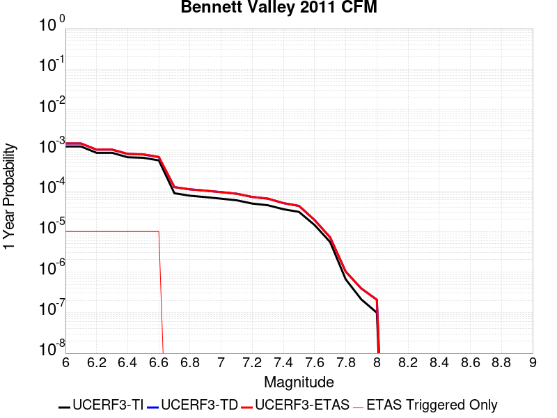 |  |

| Magnitude | 1 wk TI Prob | 1 wk TD Prob | 1 wk ETAS Prob | 1 wk ETAS/TD Gain | 1 wk ETAS Triggered Only | 1 mo TI Prob | 1 mo TD Prob | 1 mo ETAS Prob | 1 mo ETAS/TD Gain | 1 mo ETAS Triggered Only | 1 yr TI Prob | 1 yr TD Prob | 1 yr ETAS Prob | 1 yr ETAS/TD Gain | 1 yr ETAS Triggered Only | 10 yr TI Prob | 10 yr TD Prob | 10 yr ETAS Prob | 10 yr ETAS/TD Gain | 10 yr ETAS Triggered Only |
|-----|-----|-----|-----|-----|-----|-----|-----|-----|-----|-----|-----|-----|-----|-----|-----|-----|-----|-----|-----|-----|
| 6.0 | 2.3893934E-5 | 2.8238892E-5 | 3.823861E-5 | 1.3541116 | 1.0E-5 | 1.0239855E-4 | 1.2101925E-4 | 1.3101804E-4 | 1.0826215 | 1.0E-5 | 0.0012459893 | 0.0014725985 | 0.0014825837 | 1.0067807 | 1.0E-5 | 0.012390262 | 0.014651061 | 0.014670768 | 1.001345 | 2.0E-5 |
| 6.1 | 2.3893934E-5 | 2.8238892E-5 | 3.823861E-5 | 1.3541116 | 1.0E-5 | 1.0239855E-4 | 1.2101925E-4 | 1.3101804E-4 | 1.0826215 | 1.0E-5 | 0.0012459893 | 0.0014725985 | 0.0014825837 | 1.0067807 | 1.0E-5 | 0.012390262 | 0.014651061 | 0.014670768 | 1.001345 | 2.0E-5 |
| 6.2 | 1.6657146E-5 | 1.9853778E-5 | 2.985358E-5 | 1.5036725 | 1.0E-5 | 7.138582E-5 | 8.508564E-5 | 9.508479E-5 | 1.1175187 | 1.0E-5 | 8.6877577E-4 | 0.0010355669 | 0.0010455565 | 1.0096465 | 1.0E-5 | 0.008653872 | 0.010325688 | 0.010335585 | 1.0009584 | 1.0E-5 |
| 6.3 | 1.6657146E-5 | 1.9853778E-5 | 2.985358E-5 | 1.5036725 | 1.0E-5 | 7.138582E-5 | 8.508564E-5 | 9.508479E-5 | 1.1175187 | 1.0E-5 | 8.6877577E-4 | 0.0010355669 | 0.0010455565 | 1.0096465 | 1.0E-5 | 0.008653872 | 0.010325688 | 0.010335585 | 1.0009584 | 1.0E-5 |
| 6.4 | 1.29418495E-5 | 1.5567497E-5 | 2.5567342E-5 | 1.642354 | 1.0E-5 | 5.546389E-5 | 6.671687E-5 | 7.6716206E-5 | 1.1498771 | 1.0E-5 | 6.7506364E-4 | 8.121055E-4 | 8.220974E-4 | 1.0123037 | 1.0E-5 | 0.0067301663 | 0.008108527 | 0.008118446 | 1.0012233 | 1.0E-5 |
| 6.5 | 1.2582504E-5 | 1.5134528E-5 | 2.5134377E-5 | 1.6607307 | 1.0E-5 | 5.39239E-5 | 6.4861386E-5 | 7.486074E-5 | 1.1541649 | 1.0E-5 | 6.563257E-4 | 7.895315E-4 | 7.995236E-4 | 1.0126557 | 1.0E-5 | 0.006543907 | 0.007884431 | 0.007894352 | 1.0012584 | 1.0E-5 |
| 6.6 | 1.0846706E-5 | 1.3036779E-5 | 2.3036648E-5 | 1.7670506 | 1.0E-5 | 4.6485053E-5 | 5.5871435E-5 | 6.5870874E-5 | 1.1789724 | 1.0E-5 | 5.6580856E-4 | 6.801508E-4 | 6.9014396E-4 | 1.0146927 | 1.0E-5 | 0.005643701 | 0.0067976876 | 0.0068076197 | 1.001461 | 1.0E-5 |
| 6.7 | 1.6803231E-6 | 2.377857E-6 | 2.377857E-6 | 1.0 | 0.0 | 7.2013645E-6 | 1.0190777E-5 | 1.0190777E-5 | 1.0 | 0.0 | 8.7673085E-5 | 1.2406579E-4 | 1.2406579E-4 | 1.0 | 0.0 | 8.76385E-4 | 0.0012444059 | 0.0012444059 | 1.0 | 0.0 |
| 6.8 | 1.4609833E-6 | 2.0939308E-6 | 2.0939308E-6 | 1.0 | 0.0 | 6.261342E-6 | 8.973958E-6 | 8.973958E-6 | 1.0 | 0.0 | 7.6229175E-5 | 1.09252534E-4 | 1.09252534E-4 | 1.0 | 0.0 | 7.620303E-4 | 0.0010963855 | 0.0010963855 | 1.0 | 0.0 |
| 6.9 | 1.3492396E-6 | 1.945872E-6 | 1.945872E-6 | 1.0 | 0.0 | 5.7824427E-6 | 8.339425E-6 | 8.339425E-6 | 1.0 | 0.0 | 7.0398964E-5 | 1.0152783E-4 | 1.0152783E-4 | 1.0 | 0.0 | 7.037667E-4 | 0.001019182 | 0.001019182 | 1.0 | 0.0 |
| 7.0 | 1.2347921E-6 | 1.7888614E-6 | 1.7888614E-6 | 1.0 | 0.0 | 5.291955E-6 | 7.6665265E-6 | 7.6665265E-6 | 1.0 | 0.0 | 6.442765E-5 | 9.333601E-5 | 9.333601E-5 | 1.0 | 0.0 | 6.440897E-4 | 9.373206E-4 | 9.373206E-4 | 1.0 | 0.0 |
| 7.1 | 1.1262973E-6 | 1.6358822E-6 | 1.6358822E-6 | 1.0 | 0.0 | 4.8269794E-6 | 7.010905E-6 | 7.010905E-6 | 1.0 | 0.0 | 5.876689E-5 | 8.535448E-5 | 8.535448E-5 | 1.0 | 0.0 | 5.875135E-4 | 8.575462E-4 | 8.575462E-4 | 1.0 | 0.0 |
| 7.2 | 9.351744E-7 | 1.3611456E-6 | 1.3611456E-6 | 1.0 | 0.0 | 4.007884E-6 | 5.8334676E-6 | 5.8334676E-6 | 1.0 | 0.0 | 4.8794896E-5 | 7.102018E-5 | 7.102018E-5 | 1.0 | 0.0 | 4.878418E-4 | 7.1425125E-4 | 7.1425125E-4 | 1.0 | 0.0 |
| 7.3 | 8.5039534E-7 | 1.2386469E-6 | 1.2386469E-6 | 1.0 | 0.0 | 3.6445463E-6 | 5.308476E-6 | 5.308476E-6 | 1.0 | 0.0 | 4.437145E-5 | 6.4628795E-5 | 6.4628795E-5 | 1.0 | 0.0 | 4.436259E-4 | 6.50087E-4 | 6.50087E-4 | 1.0 | 0.0 |
| 7.4 | 6.7875015E-7 | 9.600462E-7 | 9.600462E-7 | 1.0 | 0.0 | 2.908926E-6 | 4.114477E-6 | 4.114477E-6 | 1.0 | 0.0 | 3.54156E-5 | 5.0092618E-5 | 5.0092618E-5 | 1.0 | 0.0 | 3.5409955E-4 | 5.0410116E-4 | 5.0410116E-4 | 1.0 | 0.0 |
| 7.5 | 5.826867E-7 | 8.188238E-7 | 8.188238E-7 | 1.0 | 0.0 | 2.4972264E-6 | 3.5092403E-6 | 3.5092403E-6 | 1.0 | 0.0 | 3.0403306E-5 | 4.2724172E-5 | 4.2724172E-5 | 1.0 | 0.0 | 3.0399146E-4 | 4.3002292E-4 | 4.3002292E-4 | 1.0 | 0.0 |
| 7.6 | 2.7734902E-7 | 3.682212E-7 | 3.682212E-7 | 1.0 | 0.0 | 1.1886381E-6 | 1.5780898E-6 | 1.5780898E-6 | 1.0 | 0.0 | 1.4471572E-5 | 1.9213076E-5 | 1.9213076E-5 | 1.0 | 0.0 | 1.447063E-4 | 1.9312318E-4 | 1.9312318E-4 | 1.0 | 0.0 |
| 7.7 | 1.0530888E-7 | 1.3748802E-7 | 1.3748802E-7 | 1.0 | 0.0 | 4.513237E-7 | 5.892342E-7 | 5.892342E-7 | 1.0 | 0.0 | 5.4948523E-6 | 7.1739028E-6 | 7.1739028E-6 | 1.0 | 0.0 | 5.4947162E-5 | 7.256238E-5 | 7.256238E-5 | 1.0 | 0.0 |
| 7.8 | 1.2714258E-8 | 1.9632653E-8 | 1.9632653E-8 | 1.0 | 0.0 | 5.448968E-8 | 8.413994E-8 | 8.413994E-8 | 1.0 | 0.0 | 6.6341164E-7 | 1.0244033E-6 | 1.0244033E-6 | 1.0 | 0.0 | 6.6340967E-6 | 1.0658104E-5 | 1.0658104E-5 | 1.0 | 0.0 |
| 7.9 | 4.075888E-9 | 7.559692E-9 | 7.559692E-9 | 1.0 | 0.0 | 1.7468091E-8 | 3.239868E-8 | 3.239868E-8 | 1.0 | 0.0 | 2.12674E-7 | 3.9445388E-7 | 3.9445388E-7 | 1.0 | 0.0 | 2.1267379E-6 | 4.194808E-6 | 4.194808E-6 | 1.0 | 0.0 |
| 8.0 | 1.9126138E-9 | 3.995532E-9 | 3.995532E-9 | 1.0 | 0.0 | 8.196917E-9 | 1.7123707E-8 | 1.7123707E-8 | 1.0 | 0.0 | 9.9797454E-8 | 2.0848113E-7 | 2.0848113E-7 | 1.0 | 0.0 | 9.979741E-7 | 2.197992E-6 | 2.197992E-6 | 1.0 | 0.0 |

## Elsinore (Temecula) rev
*[(top)](#table-of-contents)*

| 1 Week | 1 Month | 1 Year | 10 Year |
|-----|-----|-----|-----|
| 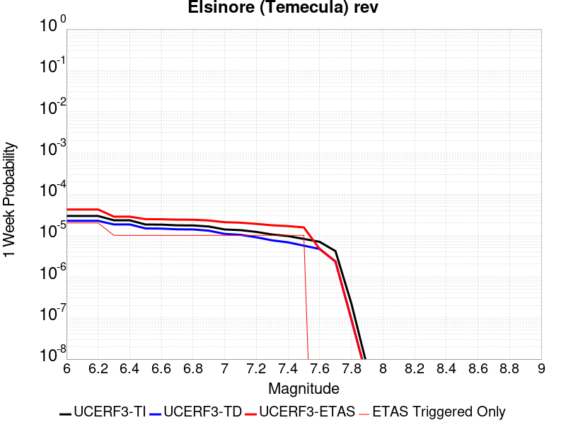 | 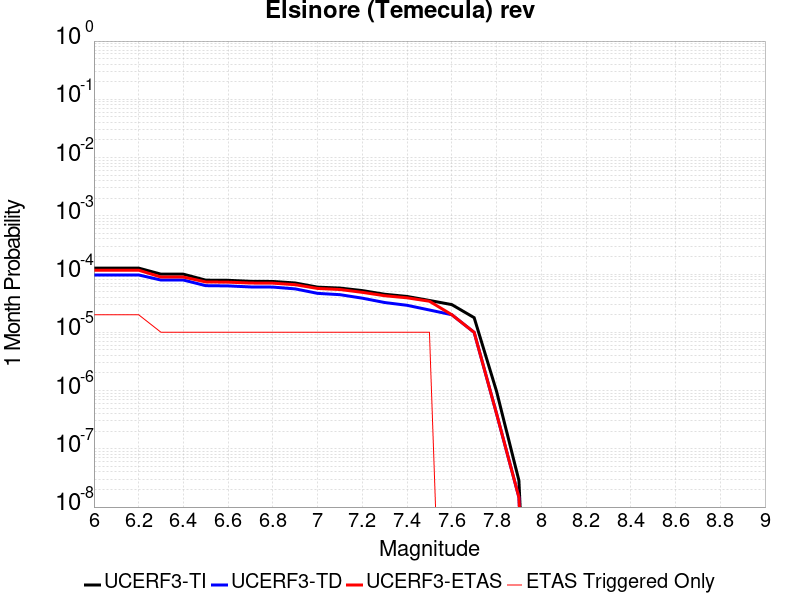 | 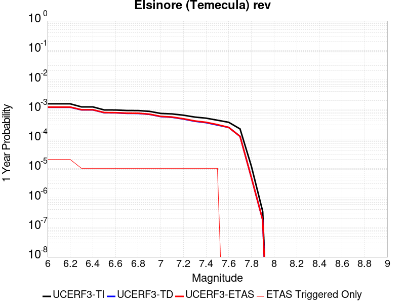 | 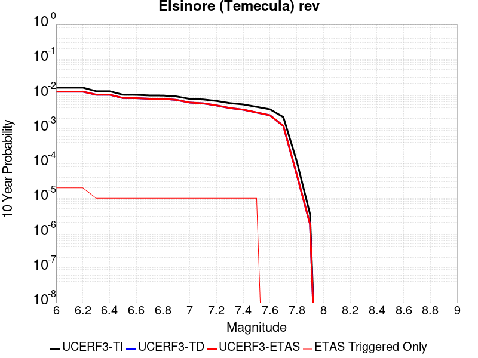 |

| Magnitude | 1 wk TI Prob | 1 wk TD Prob | 1 wk ETAS Prob | 1 wk ETAS/TD Gain | 1 wk ETAS Triggered Only | 1 mo TI Prob | 1 mo TD Prob | 1 mo ETAS Prob | 1 mo ETAS/TD Gain | 1 mo ETAS Triggered Only | 1 yr TI Prob | 1 yr TD Prob | 1 yr ETAS Prob | 1 yr ETAS/TD Gain | 1 yr ETAS Triggered Only | 10 yr TI Prob | 10 yr TD Prob | 10 yr ETAS Prob | 10 yr ETAS/TD Gain | 10 yr ETAS Triggered Only |
|-----|-----|-----|-----|-----|-----|-----|-----|-----|-----|-----|-----|-----|-----|-----|-----|-----|-----|-----|-----|-----|
| 6.0 | 2.9514995E-5 | 2.2517117E-5 | 4.2516665E-5 | 1.8881932 | 2.0E-5 | 1.264867E-4 | 9.649849E-5 | 1.1649655E-4 | 1.2072371 | 2.0E-5 | 0.0015388876 | 0.0011742581 | 0.0011942346 | 1.017012 | 2.0E-5 | 0.015282745 | 0.011696897 | 0.011716664 | 1.0016899 | 2.0E-5 |
| 6.1 | 2.9514995E-5 | 2.2517117E-5 | 4.2516665E-5 | 1.8881932 | 2.0E-5 | 1.264867E-4 | 9.649849E-5 | 1.1649655E-4 | 1.2072371 | 2.0E-5 | 0.0015388876 | 0.0011742581 | 0.0011942346 | 1.017012 | 2.0E-5 | 0.015282745 | 0.011696897 | 0.011716664 | 1.0016899 | 2.0E-5 |
| 6.2 | 2.9514995E-5 | 2.2517117E-5 | 4.2516665E-5 | 1.8881932 | 2.0E-5 | 1.264867E-4 | 9.649849E-5 | 1.1649655E-4 | 1.2072371 | 2.0E-5 | 0.0015388876 | 0.0011742581 | 0.0011942346 | 1.017012 | 2.0E-5 | 0.015282745 | 0.011696897 | 0.011716664 | 1.0016899 | 2.0E-5 |
| 6.3 | 2.3223649E-5 | 1.8406454E-5 | 2.840627E-5 | 1.5432777 | 1.0E-5 | 9.952613E-5 | 7.888251E-5 | 8.888173E-5 | 1.1267608 | 1.0E-5 | 0.001211057 | 9.599888E-4 | 9.6997916E-4 | 1.0104067 | 1.0E-5 | 0.012044783 | 0.009569948 | 0.009579852 | 1.001035 | 1.0E-5 |
| 6.4 | 2.3223649E-5 | 1.8406454E-5 | 2.840627E-5 | 1.5432777 | 1.0E-5 | 9.952613E-5 | 7.888251E-5 | 8.888173E-5 | 1.1267608 | 1.0E-5 | 0.001211057 | 9.599888E-4 | 9.6997916E-4 | 1.0104067 | 1.0E-5 | 0.012044783 | 0.009569948 | 0.009579852 | 1.001035 | 1.0E-5 |
| 6.5 | 1.8338875E-5 | 1.4750118E-5 | 2.474997E-5 | 1.6779507 | 1.0E-5 | 7.8592806E-5 | 6.321331E-5 | 7.321267E-5 | 1.1581845 | 1.0E-5 | 9.5644733E-4 | 7.69359E-4 | 7.7935134E-4 | 1.0129879 | 1.0E-5 | 0.009523412 | 0.0076739118 | 0.007683835 | 1.0012931 | 1.0E-5 |
| 6.6 | 1.8223333E-5 | 1.4612673E-5 | 2.4612527E-5 | 1.6843275 | 1.0E-5 | 7.809766E-5 | 6.262429E-5 | 7.262366E-5 | 1.1596725 | 1.0E-5 | 9.504242E-4 | 7.6219277E-4 | 7.7218516E-4 | 1.01311 | 1.0E-5 | 0.009463696 | 0.0076027405 | 0.0076126647 | 1.0013053 | 1.0E-5 |
| 6.7 | 1.7512752E-5 | 1.402721E-5 | 2.402707E-5 | 1.7128901 | 1.0E-5 | 7.505249E-5 | 6.011528E-5 | 7.011468E-5 | 1.166337 | 1.0E-5 | 9.13381E-4 | 7.3166634E-4 | 7.41659E-4 | 1.0136575 | 1.0E-5 | 0.00909636 | 0.00729892 | 0.007308847 | 1.00136 | 1.0E-5 |
| 6.8 | 1.7417142E-5 | 1.3951195E-5 | 2.3951055E-5 | 1.7167745 | 1.0E-5 | 7.4642754E-5 | 5.9789512E-5 | 6.978891E-5 | 1.1672434 | 1.0E-5 | 9.083966E-4 | 7.277028E-4 | 7.376955E-4 | 1.0137318 | 1.0E-5 | 0.009046922 | 0.0072594886 | 0.007269416 | 1.0013674 | 1.0E-5 |
| 6.9 | 1.6402591E-5 | 1.2988613E-5 | 2.2988483E-5 | 1.7698951 | 1.0E-5 | 7.0294926E-5 | 5.5664343E-5 | 6.5663786E-5 | 1.1796383 | 1.0E-5 | 8.5550465E-4 | 6.775103E-4 | 6.8750355E-4 | 1.0147499 | 1.0E-5 | 0.008522186 | 0.006760169 | 0.0067701014 | 1.0014693 | 1.0E-5 |
| 7.0 | 1.3912486E-5 | 1.0878233E-5 | 2.0878124E-5 | 1.9192569 | 1.0E-5 | 5.9623577E-5 | 4.6620182E-5 | 5.6619716E-5 | 1.2144893 | 1.0E-5 | 7.2567526E-4 | 5.674556E-4 | 5.7745E-4 | 1.0176126 | 1.0E-5 | 0.0072331014 | 0.005663986 | 0.005673929 | 1.0017556 | 1.0E-5 |
| 7.1 | 1.3405147E-5 | 1.03274215E-5 | 2.0327318E-5 | 1.9682859 | 1.0E-5 | 5.7449364E-5 | 4.425964E-5 | 5.4259195E-5 | 1.2259295 | 1.0E-5 | 6.9922156E-4 | 5.3873047E-4 | 5.487251E-4 | 1.0185522 | 1.0E-5 | 0.0069702556 | 0.005377577 | 0.005387523 | 1.0018495 | 1.0E-5 |
| 7.2 | 1.21402E-5 | 8.996737E-6 | 1.8996647E-5 | 2.111504 | 1.0E-5 | 5.202839E-5 | 3.8556886E-5 | 4.85565E-5 | 1.2593471 | 1.0E-5 | 6.332616E-4 | 4.6933076E-4 | 4.7932606E-4 | 1.021297 | 1.0E-5 | 0.0063146 | 0.004684821 | 0.004694774 | 1.0021245 | 1.0E-5 |
| 7.3 | 1.05047775E-5 | 7.571771E-6 | 1.7571696E-5 | 2.320685 | 1.0E-5 | 4.5019697E-5 | 3.245005E-5 | 4.2449727E-5 | 1.3081559 | 1.0E-5 | 5.4797693E-4 | 3.950092E-4 | 4.0500527E-4 | 1.0253059 | 1.0E-5 | 0.005466277 | 0.00394346 | 0.003953421 | 1.0025258 | 1.0E-5 |
| 7.4 | 9.624483E-6 | 6.7868696E-6 | 1.6786802E-5 | 2.4734235 | 1.0E-5 | 4.124713E-5 | 2.9086266E-5 | 3.9085975E-5 | 1.3437948 | 1.0E-5 | 5.0206814E-4 | 3.5406914E-4 | 3.640656E-4 | 1.028233 | 1.0E-5 | 0.005009353 | 0.003535204 | 0.0035451688 | 1.0028187 | 1.0E-5 |
| 7.5 | 8.215151E-6 | 5.635538E-6 | 1.5635482E-5 | 2.7744434 | 1.0E-5 | 3.5207315E-5 | 2.4152088E-5 | 3.4151846E-5 | 1.4140328 | 1.0E-5 | 4.2856473E-4 | 2.9401327E-4 | 3.0401035E-4 | 1.0340021 | 1.0E-5 | 0.004277392 | 0.002936371 | 0.0029463414 | 1.0033956 | 1.0E-5 |
| 7.6 | 6.975058E-6 | 4.676045E-6 | 4.676045E-6 | 1.0 | 0.0 | 2.9892764E-5 | 2.0040046E-5 | 2.0040046E-5 | 1.0 | 0.0 | 3.6388362E-4 | 2.439614E-4 | 2.439614E-4 | 1.0 | 0.0 | 0.0036328835 | 0.002437052 | 0.002437052 | 1.0 | 0.0 |
| 7.7 | 4.159604E-6 | 2.3269924E-6 | 2.3269924E-6 | 1.0 | 0.0 | 1.7826753E-5 | 9.97279E-6 | 9.97279E-6 | 1.0 | 0.0 | 2.1701909E-4 | 1.21412704E-4 | 1.21412704E-4 | 1.0 | 0.0 | 0.0021680726 | 0.0012135367 | 0.0012135367 | 1.0 | 0.0 |
| 7.8 | 2.2692414E-7 | 9.3854695E-8 | 9.3854695E-8 | 1.0 | 0.0 | 9.725317E-7 | 4.0223435E-7 | 4.0223435E-7 | 1.0 | 0.0 | 1.1840509E-5 | 4.8971956E-6 | 4.8971956E-6 | 1.0 | 0.0 | 1.1839878E-4 | 4.8971204E-5 | 4.8971204E-5 | 1.0 | 0.0 |
| 7.9 | 6.676829E-9 | 3.439853E-9 | 3.439853E-9 | 1.0 | 0.0 | 2.861498E-8 | 1.4742227E-8 | 1.4742227E-8 | 1.0 | 0.0 | 3.4838732E-7 | 1.7948659E-7 | 1.7948659E-7 | 1.0 | 0.0 | 3.4838679E-6 | 1.7948646E-6 | 1.7948646E-6 | 1.0 | 0.0 |

## Mission Hills 2011
*[(top)](#table-of-contents)*

| 1 Week | 1 Month | 1 Year | 10 Year |
|-----|-----|-----|-----|
|  | 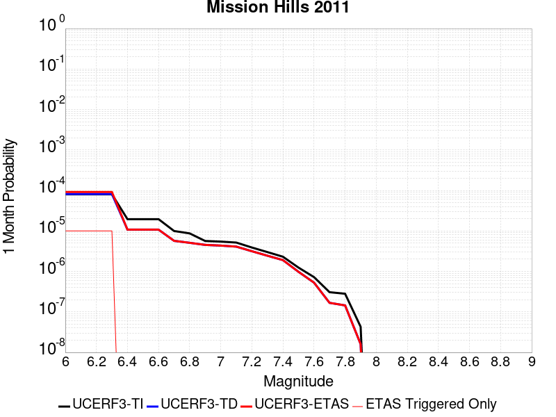 | 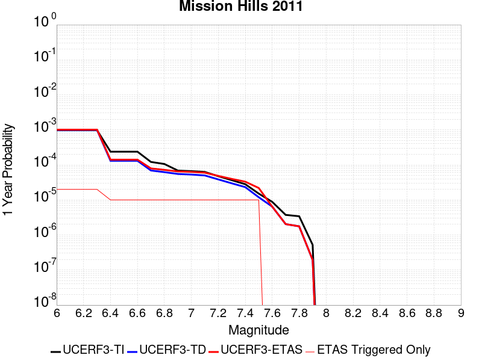 | 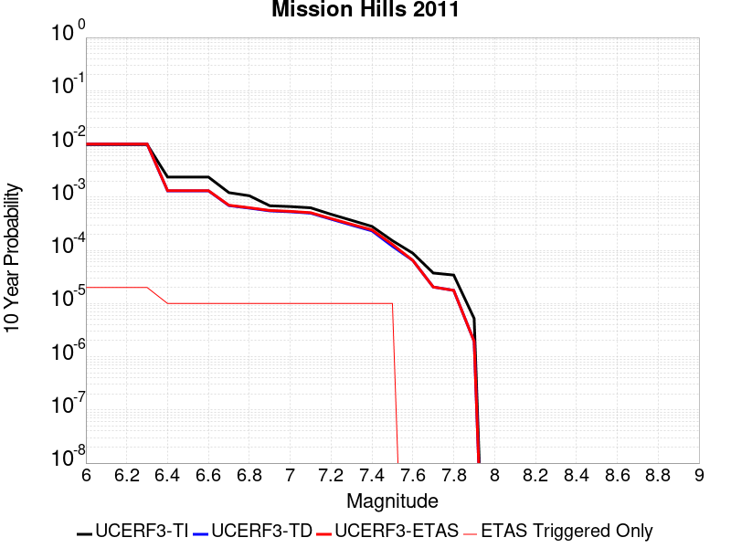 |

| Magnitude | 1 wk TI Prob | 1 wk TD Prob | 1 wk ETAS Prob | 1 wk ETAS/TD Gain | 1 wk ETAS Triggered Only | 1 mo TI Prob | 1 mo TD Prob | 1 mo ETAS Prob | 1 mo ETAS/TD Gain | 1 mo ETAS Triggered Only | 1 yr TI Prob | 1 yr TD Prob | 1 yr ETAS Prob | 1 yr ETAS/TD Gain | 1 yr ETAS Triggered Only | 10 yr TI Prob | 10 yr TD Prob | 10 yr ETAS Prob | 10 yr ETAS/TD Gain | 10 yr ETAS Triggered Only |
|-----|-----|-----|-----|-----|-----|-----|-----|-----|-----|-----|-----|-----|-----|-----|-----|-----|-----|-----|-----|-----|
| 6.0 | 1.8765717E-5 | 1.9054645E-5 | 1.9054645E-5 | 1.0 | 0.0 | 8.0422025E-5 | 8.166215E-5 | 9.166133E-5 | 1.1224457 | 1.0E-5 | 9.786983E-4 | 9.941267E-4 | 0.0010141068 | 1.0200982 | 2.0E-5 | 0.009743992 | 0.009930461 | 0.009950262 | 1.001994 | 2.0E-5 |
| 6.1 | 1.8765717E-5 | 1.9054645E-5 | 1.9054645E-5 | 1.0 | 0.0 | 8.0422025E-5 | 8.166215E-5 | 9.166133E-5 | 1.1224457 | 1.0E-5 | 9.786983E-4 | 9.941267E-4 | 0.0010141068 | 1.0200982 | 2.0E-5 | 0.009743992 | 0.009930461 | 0.009950262 | 1.001994 | 2.0E-5 |
| 6.2 | 1.8765717E-5 | 1.9054645E-5 | 1.9054645E-5 | 1.0 | 0.0 | 8.0422025E-5 | 8.166215E-5 | 9.166133E-5 | 1.1224457 | 1.0E-5 | 9.786983E-4 | 9.941267E-4 | 0.0010141068 | 1.0200982 | 2.0E-5 | 0.009743992 | 0.009930461 | 0.009950262 | 1.001994 | 2.0E-5 |
| 6.3 | 1.8765717E-5 | 1.9054645E-5 | 1.9054645E-5 | 1.0 | 0.0 | 8.0422025E-5 | 8.166215E-5 | 9.166133E-5 | 1.1224457 | 1.0E-5 | 9.786983E-4 | 9.941267E-4 | 0.0010141068 | 1.0200982 | 2.0E-5 | 0.009743992 | 0.009930461 | 0.009950262 | 1.001994 | 2.0E-5 |
| 6.4 | 4.566357E-6 | 2.5148488E-6 | 2.5148488E-6 | 1.0 | 0.0 | 1.9569954E-5 | 1.0777889E-5 | 1.0777889E-5 | 1.0 | 0.0 | 2.3823815E-4 | 1.3121472E-4 | 1.412134E-4 | 1.076201 | 1.0E-5 | 0.002379829 | 0.0013115506 | 0.0013215375 | 1.0076146 | 1.0E-5 |
| 6.5 | 4.566357E-6 | 2.5148488E-6 | 2.5148488E-6 | 1.0 | 0.0 | 1.9569954E-5 | 1.0777889E-5 | 1.0777889E-5 | 1.0 | 0.0 | 2.3823815E-4 | 1.3121472E-4 | 1.412134E-4 | 1.076201 | 1.0E-5 | 0.002379829 | 0.0013115506 | 0.0013215375 | 1.0076146 | 1.0E-5 |
| 6.6 | 4.566357E-6 | 2.5148488E-6 | 2.5148488E-6 | 1.0 | 0.0 | 1.9569954E-5 | 1.0777889E-5 | 1.0777889E-5 | 1.0 | 0.0 | 2.3823815E-4 | 1.3121472E-4 | 1.412134E-4 | 1.076201 | 1.0E-5 | 0.002379829 | 0.0013115506 | 0.0013215375 | 1.0076146 | 1.0E-5 |
| 6.7 | 2.3266773E-6 | 1.3296187E-6 | 1.3296187E-6 | 1.0 | 0.0 | 9.971435E-6 | 5.698354E-6 | 5.698354E-6 | 1.0 | 0.0 | 1.2139547E-4 | 6.937531E-5 | 7.937462E-5 | 1.1441334 | 1.0E-5 | 0.0012132917 | 6.9354265E-4 | 7.035357E-4 | 1.0144087 | 1.0E-5 |
| 6.8 | 2.032735E-6 | 1.1894115E-6 | 1.1894115E-6 | 1.0 | 0.0 | 8.711692E-6 | 5.097468E-6 | 5.097468E-6 | 1.0 | 0.0 | 1.06059684E-4 | 6.205996E-5 | 7.205934E-5 | 1.1611245 | 1.0E-5 | 0.0010600908 | 6.2043115E-4 | 6.3042494E-4 | 1.0161078 | 1.0E-5 |
| 6.9 | 1.3186259E-6 | 1.0561778E-6 | 1.0561778E-6 | 1.0 | 0.0 | 5.6512413E-6 | 4.5264687E-6 | 4.5264687E-6 | 1.0 | 0.0 | 6.8801695E-5 | 5.5108394E-5 | 6.5107844E-5 | 1.1814506 | 1.0E-5 | 6.8780396E-4 | 5.5095024E-4 | 5.609447E-4 | 1.0181404 | 1.0E-5 |
| 7.0 | 1.2726016E-6 | 1.0159088E-6 | 1.0159088E-6 | 1.0 | 0.0 | 5.4539955E-6 | 4.3538876E-6 | 4.3538876E-6 | 1.0 | 0.0 | 6.6400375E-5 | 5.300732E-5 | 6.300679E-5 | 1.1886432 | 1.0E-5 | 6.6380535E-4 | 5.299496E-4 | 5.3994433E-4 | 1.0188597 | 1.0E-5 |
| 7.1 | 1.2063913E-6 | 9.570072E-7 | 9.570072E-7 | 1.0 | 0.0 | 5.170238E-6 | 4.101453E-6 | 4.101453E-6 | 1.0 | 0.0 | 6.294583E-5 | 4.9934075E-5 | 5.9933576E-5 | 1.2002541 | 1.0E-5 | 6.2928005E-4 | 4.992311E-4 | 5.092261E-4 | 1.0200208 | 1.0E-5 |
| 7.2 | 9.105806E-7 | 7.3765557E-7 | 7.3765557E-7 | 1.0 | 0.0 | 3.9024826E-6 | 3.1613772E-6 | 3.1613772E-6 | 1.0 | 0.0 | 4.7511687E-5 | 3.8489103E-5 | 4.848872E-5 | 1.2598038 | 1.0E-5 | 4.7501532E-4 | 3.8482592E-4 | 3.9482207E-4 | 1.0259758 | 1.0E-5 |
| 7.3 | 7.020432E-7 | 5.710089E-7 | 5.710089E-7 | 1.0 | 0.0 | 3.0087533E-6 | 2.447179E-6 | 2.447179E-6 | 1.0 | 0.0 | 3.6630954E-5 | 2.979401E-5 | 3.979371E-5 | 1.3356279 | 1.0E-5 | 3.6624918E-4 | 2.9790145E-4 | 3.0789847E-4 | 1.0335581 | 1.0E-5 |
| 7.4 | 5.3900635E-7 | 4.4480825E-7 | 4.4480825E-7 | 1.0 | 0.0 | 2.3100251E-6 | 1.9063198E-6 | 1.9063198E-6 | 1.0 | 0.0 | 2.8124194E-5 | 2.3209208E-5 | 3.3208977E-5 | 1.4308535 | 1.0E-5 | 2.8120633E-4 | 2.3206905E-4 | 2.4206673E-4 | 1.0430806 | 1.0E-5 |
| 7.5 | 2.907075E-7 | 2.2875415E-7 | 2.2875415E-7 | 1.0 | 0.0 | 1.2458887E-6 | 9.803746E-7 | 9.803746E-7 | 1.0 | 0.0 | 1.5168589E-5 | 1.1935997E-5 | 2.1935877E-5 | 1.8377919 | 1.0E-5 | 1.5167553E-4 | 1.1935373E-4 | 1.2935254E-4 | 1.0837746 | 1.0E-5 |
| 7.6 | 1.6903675E-7 | 1.2353402E-7 | 1.2353402E-7 | 1.0 | 0.0 | 7.2444305E-7 | 5.294314E-7 | 5.294314E-7 | 1.0 | 0.0 | 8.820059E-6 | 6.4458095E-6 | 6.4458095E-6 | 1.0 | 0.0 | 8.8197085E-5 | 6.445635E-5 | 6.445635E-5 | 1.0 | 0.0 |
| 7.7 | 7.168073E-8 | 3.9135116E-8 | 3.9135116E-8 | 1.0 | 0.0 | 3.072031E-7 | 1.6772192E-7 | 1.6772192E-7 | 1.0 | 0.0 | 3.7401915E-6 | 2.0420127E-6 | 2.0420127E-6 | 1.0 | 0.0 | 3.7401285E-5 | 2.041995E-5 | 2.041995E-5 | 1.0 | 0.0 |
| 7.8 | 6.564101E-8 | 3.3835356E-8 | 3.3835356E-8 | 1.0 | 0.0 | 2.813186E-7 | 1.4500866E-7 | 1.4500866E-7 | 1.0 | 0.0 | 3.4250486E-6 | 1.7654792E-6 | 1.7654792E-6 | 1.0 | 0.0 | 3.424996E-5 | 1.7654662E-5 | 1.7654662E-5 | 1.0 | 0.0 |
| 7.9 | 1.0029074E-8 | 3.7292542E-9 | 3.7292542E-9 | 1.0 | 0.0 | 4.2981743E-8 | 1.5982518E-8 | 1.5982518E-8 | 1.0 | 0.0 | 5.2330256E-7 | 1.9458714E-7 | 1.9458714E-7 | 1.0 | 0.0 | 5.2330133E-6 | 1.945871E-6 | 1.945871E-6 | 1.0 | 0.0 |

## Calaveras (So) 2011 CFM
*[(top)](#table-of-contents)*

| 1 Week | 1 Month | 1 Year | 10 Year |
|-----|-----|-----|-----|
|  | 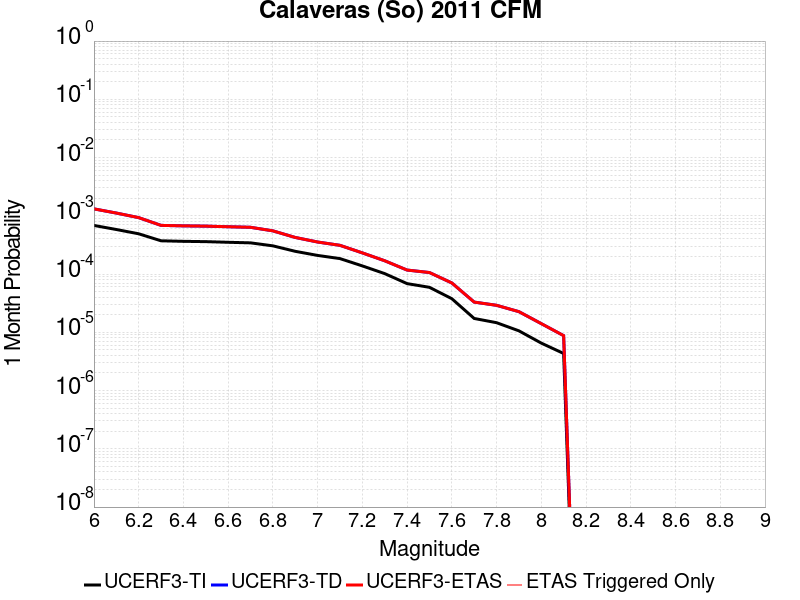 | 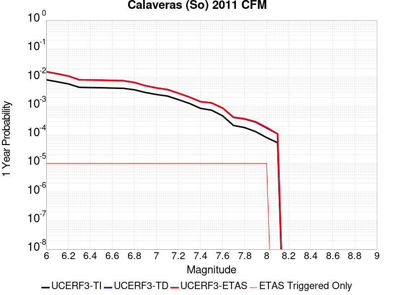 | 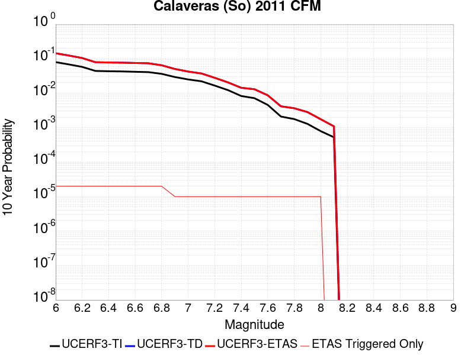 |

| Magnitude | 1 wk TI Prob | 1 wk TD Prob | 1 wk ETAS Prob | 1 wk ETAS/TD Gain | 1 wk ETAS Triggered Only | 1 mo TI Prob | 1 mo TD Prob | 1 mo ETAS Prob | 1 mo ETAS/TD Gain | 1 mo ETAS Triggered Only | 1 yr TI Prob | 1 yr TD Prob | 1 yr ETAS Prob | 1 yr ETAS/TD Gain | 1 yr ETAS Triggered Only | 10 yr TI Prob | 10 yr TD Prob | 10 yr ETAS Prob | 10 yr ETAS/TD Gain | 10 yr ETAS Triggered Only |
|-----|-----|-----|-----|-----|-----|-----|-----|-----|-----|-----|-----|-----|-----|-----|-----|-----|-----|-----|-----|-----|
| 6.0 | 1.5950744E-4 | 3.071188E-4 | 3.071188E-4 | 1.0 | 0.0 | 6.834242E-4 | 0.0013155643 | 0.0013155643 | 1.0 | 0.0 | 0.00828899 | 0.01585904 | 0.015868882 | 1.0006206 | 1.0E-5 | 0.079865426 | 0.14440064 | 0.14441776 | 1.0001185 | 2.0E-5 |
| 6.1 | 1.3584697E-4 | 2.6036944E-4 | 2.6036944E-4 | 1.0 | 0.0 | 5.8207137E-4 | 0.0011153965 | 0.0011153965 | 1.0 | 0.0 | 0.007063716 | 0.013462106 | 0.013471971 | 1.0007328 | 1.0E-5 | 0.06843361 | 0.12402854 | 0.124046065 | 1.0001413 | 2.0E-5 |
| 6.2 | 1.14676266E-4 | 2.1726108E-4 | 2.1726108E-4 | 1.0 | 0.0 | 4.9137714E-4 | 9.307893E-4 | 9.307893E-4 | 1.0 | 0.0 | 0.0059661185 | 0.011245592 | 0.011255479 | 1.0008793 | 1.0E-5 | 0.058084648 | 0.105019294 | 0.10503719 | 1.0001705 | 2.0E-5 |
| 6.3 | 8.691518E-5 | 1.5987165E-4 | 1.5987165E-4 | 1.0 | 0.0 | 3.7244044E-4 | 6.8496726E-4 | 6.8496726E-4 | 1.0 | 0.0 | 0.004525038 | 0.008300893 | 0.008310811 | 1.0011947 | 1.0E-5 | 0.044339992 | 0.0793347 | 0.07935312 | 1.0002321 | 2.0E-5 |
| 6.4 | 8.50982E-5 | 1.5693568E-4 | 1.5693568E-4 | 1.0 | 0.0 | 3.646556E-4 | 6.7239115E-4 | 6.7239115E-4 | 1.0 | 0.0 | 0.0044306475 | 0.008148931 | 0.008158849 | 1.0012171 | 1.0E-5 | 0.04343345 | 0.077940844 | 0.077959284 | 1.0002366 | 2.0E-5 |
| 6.5 | 8.4062965E-5 | 1.5518135E-4 | 1.5518135E-4 | 1.0 | 0.0 | 3.602201E-4 | 6.648764E-4 | 6.648764E-4 | 1.0 | 0.0 | 0.004376863 | 0.008058134 | 0.008068052 | 1.001231 | 1.0E-5 | 0.042916555 | 0.077112116 | 0.07713057 | 1.0002394 | 2.0E-5 |
| 6.6 | 8.194716E-5 | 1.5154095E-4 | 1.5154095E-4 | 1.0 | 0.0 | 3.5115483E-4 | 6.492825E-4 | 6.492825E-4 | 1.0 | 0.0 | 0.0042669317 | 0.007869979 | 0.007879901 | 1.0012606 | 1.0E-5 | 0.04185927 | 0.07539739 | 0.07541588 | 1.0002452 | 2.0E-5 |
| 6.7 | 8.012326E-5 | 1.4821833E-4 | 1.4821833E-4 | 1.0 | 0.0 | 3.433402E-4 | 6.350497E-4 | 6.350497E-4 | 1.0 | 0.0 | 0.004172157 | 0.007698474 | 0.007708397 | 1.001289 | 1.0E-5 | 0.040946912 | 0.073839515 | 0.07385804 | 1.0002508 | 2.0E-5 |
| 6.8 | 7.119773E-5 | 1.2880519E-4 | 1.2880519E-4 | 1.0 | 0.0 | 3.0509746E-4 | 5.519001E-4 | 5.519001E-4 | 1.0 | 0.0 | 0.0037082357 | 0.0066958875 | 0.0067058206 | 1.0014834 | 1.0E-5 | 0.036469642 | 0.06468402 | 0.06470272 | 1.0002892 | 2.0E-5 |
| 6.9 | 5.7343088E-5 | 9.9189E-5 | 9.9189E-5 | 1.0 | 0.0 | 2.4573295E-4 | 4.2502693E-4 | 4.2502693E-4 | 1.0 | 0.0 | 0.0029876942 | 0.0051625078 | 0.005172456 | 1.001927 | 1.0E-5 | 0.02947844 | 0.050509132 | 0.05051863 | 1.000188 | 1.0E-5 |
| 7.0 | 4.8746577E-5 | 8.284751E-5 | 8.284751E-5 | 1.0 | 0.0 | 2.0889717E-4 | 3.550128E-4 | 3.550128E-4 | 1.0 | 0.0 | 0.0025403565 | 0.004313781 | 0.0043237377 | 1.0023081 | 1.0E-5 | 0.025115121 | 0.04248505 | 0.042494625 | 1.0002254 | 1.0E-5 |
| 7.1 | 4.2998014E-5 | 7.264914E-5 | 7.264914E-5 | 1.0 | 0.0 | 1.8426418E-4 | 3.1131663E-4 | 3.1131663E-4 | 1.0 | 0.0 | 0.002241108 | 0.0037837527 | 0.003793715 | 1.0026329 | 1.0E-5 | 0.022186412 | 0.037423246 | 0.037432868 | 1.0002573 | 1.0E-5 |
| 7.2 | 3.221292E-5 | 5.390566E-5 | 5.390566E-5 | 1.0 | 0.0 | 1.3804805E-4 | 2.3100396E-4 | 2.3100396E-4 | 1.0 | 0.0 | 0.0016794393 | 0.0028088738 | 0.0028188457 | 1.0035502 | 1.0E-5 | 0.016668037 | 0.028035998 | 0.028045718 | 1.0003467 | 1.0E-5 |
| 7.3 | 2.3756531E-5 | 3.9471706E-5 | 3.9471706E-5 | 1.0 | 0.0 | 1.0180973E-4 | 1.6915359E-4 | 1.6915359E-4 | 1.0 | 0.0 | 0.0012388286 | 0.0020575167 | 0.002067496 | 1.0048503 | 1.0E-5 | 0.012319452 | 0.02064345 | 0.020653244 | 1.0004745 | 1.0E-5 |
| 7.4 | 1.5997684E-5 | 2.734085E-5 | 2.734085E-5 | 1.0 | 0.0 | 6.8559704E-5 | 1.1716982E-4 | 1.1716982E-4 | 1.0 | 0.0 | 8.343947E-4 | 0.0014256114 | 0.0014355972 | 1.0070045 | 1.0E-5 | 0.008312687 | 0.014376549 | 0.014386405 | 1.0006856 | 1.0E-5 |
| 7.5 | 1.3814293E-5 | 2.4782603E-5 | 2.4782603E-5 | 1.0 | 0.0 | 5.9202768E-5 | 1.0620684E-4 | 1.0620684E-4 | 1.0 | 0.0 | 7.205553E-4 | 0.0012923037 | 0.0013022907 | 1.0077281 | 1.0E-5 | 0.007182234 | 0.013055766 | 0.013065635 | 1.0007559 | 1.0E-5 |
| 7.6 | 8.817309E-6 | 1.6429829E-5 | 1.6429829E-5 | 1.0 | 0.0 | 3.7787922E-5 | 7.041166E-5 | 7.041166E-5 | 1.0 | 0.0 | 4.5997082E-4 | 8.5692614E-4 | 8.669176E-4 | 1.0116596 | 1.0E-5 | 0.004590199 | 0.008719863 | 0.008729776 | 1.0011368 | 1.0E-5 |
| 7.7 | 4.0352206E-6 | 7.706877E-6 | 7.706877E-6 | 1.0 | 0.0 | 1.7293689E-5 | 3.3029053E-5 | 3.3029053E-5 | 1.0 | 0.0 | 2.1053031E-4 | 4.020546E-4 | 4.1205058E-4 | 1.0248623 | 1.0E-5 | 0.0021033096 | 0.0041649863 | 0.0041749445 | 1.002391 | 1.0E-5 |
| 7.8 | 3.413169E-6 | 6.7868646E-6 | 6.7868646E-6 | 1.0 | 0.0 | 1.4627784E-5 | 2.9086239E-5 | 2.9086239E-5 | 1.0 | 0.0 | 1.7807873E-4 | 3.5406748E-4 | 3.6406395E-4 | 1.0282332 | 1.0E-5 | 0.0017793609 | 0.0036663096 | 0.003676273 | 1.0027175 | 1.0E-5 |
| 7.9 | 2.4740732E-6 | 5.278809E-6 | 5.278809E-6 | 1.0 | 0.0 | 1.06031275E-5 | 2.2623271E-5 | 2.2623271E-5 | 1.0 | 0.0 | 1.2908543E-4 | 2.7540355E-4 | 2.854008E-4 | 1.0363003 | 1.0E-5 | 0.0012901047 | 0.002834638 | 0.0028446098 | 1.0035177 | 1.0E-5 |
| 8.0 | 1.5231818E-6 | 3.2887135E-6 | 3.2887135E-6 | 1.0 | 0.0 | 6.527906E-6 | 1.409441E-5 | 1.409441E-5 | 1.0 | 0.0 | 7.9474354E-5 | 1.7158597E-4 | 1.8158426E-4 | 1.0582699 | 1.0E-5 | 7.944594E-4 | 0.001756374 | 0.0017663564 | 1.0056835 | 1.0E-5 |
| 8.1 | 1.0104524E-6 | 2.0456548E-6 | 2.0456548E-6 | 1.0 | 0.0 | 4.330503E-6 | 8.767062E-6 | 8.767062E-6 | 1.0 | 0.0 | 5.2722597E-5 | 1.06733794E-4 | 1.06733794E-4 | 1.0 | 0.0 | 5.271009E-4 | 0.0010929212 | 0.0010929212 | 1.0 | 0.0 |

## Franklin 2011 CFM
*[(top)](#table-of-contents)*

| 1 Week | 1 Month | 1 Year | 10 Year |
|-----|-----|-----|-----|
| 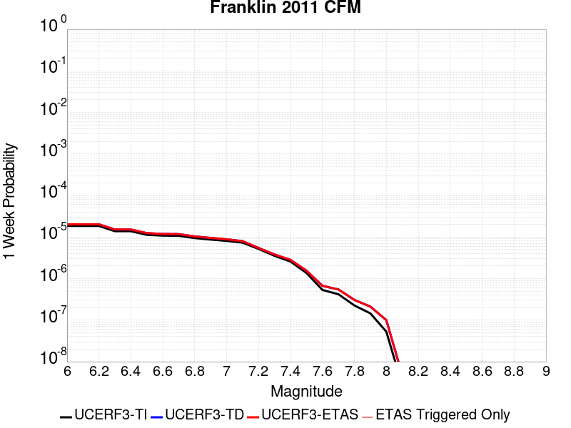 | 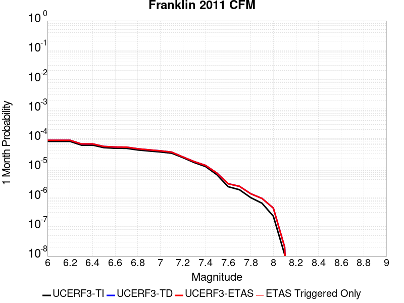 | 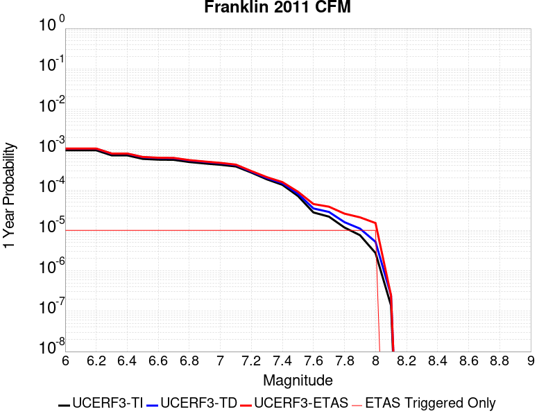 | 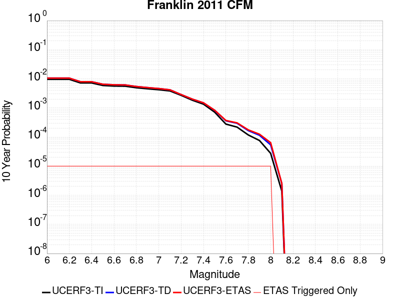 |

| Magnitude | 1 wk TI Prob | 1 wk TD Prob | 1 wk ETAS Prob | 1 wk ETAS/TD Gain | 1 wk ETAS Triggered Only | 1 mo TI Prob | 1 mo TD Prob | 1 mo ETAS Prob | 1 mo ETAS/TD Gain | 1 mo ETAS Triggered Only | 1 yr TI Prob | 1 yr TD Prob | 1 yr ETAS Prob | 1 yr ETAS/TD Gain | 1 yr ETAS Triggered Only | 10 yr TI Prob | 10 yr TD Prob | 10 yr ETAS Prob | 10 yr ETAS/TD Gain | 10 yr ETAS Triggered Only |
|-----|-----|-----|-----|-----|-----|-----|-----|-----|-----|-----|-----|-----|-----|-----|-----|-----|-----|-----|-----|-----|
| 6.0 | 1.845602E-5 | 2.021262E-5 | 2.021262E-5 | 1.0 | 0.0 | 7.9094825E-5 | 8.66228E-5 | 8.66228E-5 | 1.0 | 0.0 | 9.6255407E-4 | 0.0010541513 | 0.0010641408 | 1.0094763 | 1.0E-5 | 0.009583955 | 0.0105088325 | 0.010518727 | 1.0009416 | 1.0E-5 |
| 6.1 | 1.845602E-5 | 2.021262E-5 | 2.021262E-5 | 1.0 | 0.0 | 7.9094825E-5 | 8.66228E-5 | 8.66228E-5 | 1.0 | 0.0 | 9.6255407E-4 | 0.0010541513 | 0.0010641408 | 1.0094763 | 1.0E-5 | 0.009583955 | 0.0105088325 | 0.010518727 | 1.0009416 | 1.0E-5 |
| 6.2 | 1.845602E-5 | 2.021262E-5 | 2.021262E-5 | 1.0 | 0.0 | 7.9094825E-5 | 8.66228E-5 | 8.66228E-5 | 1.0 | 0.0 | 9.6255407E-4 | 0.0010541513 | 0.0010641408 | 1.0094763 | 1.0E-5 | 0.009583955 | 0.0105088325 | 0.010518727 | 1.0009416 | 1.0E-5 |
| 6.3 | 1.3813506E-5 | 1.5154827E-5 | 1.5154827E-5 | 1.0 | 0.0 | 5.9199396E-5 | 6.4947686E-5 | 6.4947686E-5 | 1.0 | 0.0 | 7.205143E-4 | 7.9045893E-4 | 8.0045103E-4 | 1.0126408 | 1.0E-5 | 0.007181826 | 0.007891679 | 0.007901601 | 1.0012572 | 1.0E-5 |
| 6.4 | 1.3813506E-5 | 1.5154827E-5 | 1.5154827E-5 | 1.0 | 0.0 | 5.9199396E-5 | 6.4947686E-5 | 6.4947686E-5 | 1.0 | 0.0 | 7.205143E-4 | 7.9045893E-4 | 8.0045103E-4 | 1.0126408 | 1.0E-5 | 0.007181826 | 0.007891679 | 0.007901601 | 1.0012572 | 1.0E-5 |
| 6.5 | 1.1308949E-5 | 1.24178005E-5 | 1.24178005E-5 | 1.0 | 0.0 | 4.8466023E-5 | 5.3218067E-5 | 5.3218067E-5 | 1.0 | 0.0 | 5.899141E-4 | 6.4773945E-4 | 6.5773295E-4 | 1.0154283 | 1.0E-5 | 0.0058835056 | 0.006473166 | 0.0064831013 | 1.0015348 | 1.0E-5 |
| 6.6 | 1.0813164E-5 | 1.1876023E-5 | 1.1876023E-5 | 1.0 | 0.0 | 4.6341313E-5 | 5.089626E-5 | 5.089626E-5 | 1.0 | 0.0 | 5.640594E-4 | 6.1948766E-4 | 6.2948145E-4 | 1.0161324 | 1.0E-5 | 0.005626298 | 0.006192243 | 0.0062021813 | 1.0016049 | 1.0E-5 |
| 6.7 | 1.0706348E-5 | 1.1757787E-5 | 1.1757787E-5 | 1.0 | 0.0 | 4.5883542E-5 | 5.0389554E-5 | 5.0389554E-5 | 1.0 | 0.0 | 5.5848894E-4 | 6.13322E-4 | 6.2331586E-4 | 1.0162946 | 1.0E-5 | 0.005570874 | 0.0061309286 | 0.0061408672 | 1.0016211 | 1.0E-5 |
| 6.8 | 9.443655E-6 | 1.0349109E-5 | 1.0349109E-5 | 1.0 | 0.0 | 4.0472176E-5 | 4.435258E-5 | 4.435258E-5 | 1.0 | 0.0 | 4.9263734E-4 | 5.398602E-4 | 5.498548E-4 | 1.0185133 | 1.0E-5 | 0.0049154665 | 0.005400073 | 0.005410019 | 1.0018418 | 1.0E-5 |
| 6.9 | 8.7001645E-6 | 9.522179E-6 | 9.522179E-6 | 1.0 | 0.0 | 3.728589E-5 | 4.0808707E-5 | 4.0808707E-5 | 1.0 | 0.0 | 4.538611E-4 | 4.96734E-4 | 5.06729E-4 | 1.0201215 | 1.0E-5 | 0.0045293528 | 0.0049708076 | 0.004980758 | 1.0020018 | 1.0E-5 |
| 7.0 | 8.074731E-6 | 8.815796E-6 | 8.815796E-6 | 1.0 | 0.0 | 3.460553E-5 | 3.7781443E-5 | 3.7781443E-5 | 1.0 | 0.0 | 4.212409E-4 | 4.5989305E-4 | 4.6988844E-4 | 1.0217342 | 1.0E-5 | 0.004204433 | 0.0046039694 | 0.0046139234 | 1.002162 | 1.0E-5 |
| 7.1 | 7.3370957E-6 | 7.96167E-6 | 7.96167E-6 | 1.0 | 0.0 | 3.1444317E-5 | 3.4121003E-5 | 3.4121003E-5 | 1.0 | 0.0 | 3.8276732E-4 | 4.1534504E-4 | 4.253409E-4 | 1.0240663 | 1.0E-5 | 0.0038210868 | 0.0041600848 | 0.004170043 | 1.0023938 | 1.0E-5 |
| 7.2 | 5.1750103E-6 | 5.45711E-6 | 5.45711E-6 | 1.0 | 0.0 | 2.2178427E-5 | 2.3387407E-5 | 2.3387407E-5 | 1.0 | 0.0 | 2.699889E-4 | 2.847048E-4 | 2.9470195E-4 | 1.035114 | 1.0E-5 | 0.002696611 | 0.0028573172 | 0.0028672887 | 1.0034897 | 1.0E-5 |
| 7.3 | 3.5221371E-6 | 3.7960522E-6 | 3.7960522E-6 | 1.0 | 0.0 | 1.5094786E-5 | 1.6268694E-5 | 1.6268694E-5 | 1.0 | 0.0 | 1.8376352E-4 | 1.9805344E-4 | 2.0805147E-4 | 1.0504814 | 1.0E-5 | 0.0018361164 | 0.001992203 | 0.002002183 | 1.0050095 | 1.0E-5 |
| 7.4 | 2.5749775E-6 | 2.818195E-6 | 2.818195E-6 | 1.0 | 0.0 | 1.1035571E-5 | 1.2077923E-5 | 1.2077923E-5 | 1.0 | 0.0 | 1.343498E-4 | 1.4703887E-4 | 1.5703739E-4 | 1.0679992 | 1.0E-5 | 0.001342686 | 0.0014816395 | 0.0014916246 | 1.0067393 | 1.0E-5 |
| 7.5 | 1.3642131E-6 | 1.5497415E-6 | 1.5497415E-6 | 1.0 | 0.0 | 5.8466144E-6 | 6.6417324E-6 | 6.6417324E-6 | 1.0 | 0.0 | 7.1180206E-5 | 8.086011E-5 | 9.08593E-5 | 1.1236603 | 1.0E-5 | 7.115741E-4 | 8.1911724E-4 | 8.2910905E-4 | 1.0121982 | 1.0E-5 |
| 7.6 | 5.329124E-7 | 6.70109E-7 | 6.70109E-7 | 1.0 | 0.0 | 2.2839083E-6 | 2.8718923E-6 | 2.8718923E-6 | 1.0 | 0.0 | 2.7806227E-5 | 3.4964734E-5 | 4.4964385E-5 | 1.2859925 | 1.0E-5 | 2.780275E-4 | 3.5998525E-4 | 3.6998166E-4 | 1.027769 | 1.0E-5 |
| 7.7 | 4.199127E-7 | 5.486773E-7 | 5.486773E-7 | 1.0 | 0.0 | 1.7996247E-6 | 2.351472E-6 | 2.351472E-6 | 1.0 | 0.0 | 2.191021E-5 | 2.8628798E-5 | 3.862851E-5 | 1.3492886 | 1.0E-5 | 2.190805E-4 | 2.9645552E-4 | 3.0645257E-4 | 1.0337219 | 1.0E-5 |
| 7.8 | 2.2586491E-7 | 3.066155E-7 | 3.066155E-7 | 1.0 | 0.0 | 9.67992E-7 | 1.3140657E-6 | 1.3140657E-6 | 1.0 | 0.0 | 1.178524E-5 | 1.5998634E-5 | 2.5998474E-5 | 1.6250434 | 1.0E-5 | 1.17846146E-4 | 1.6628981E-4 | 1.7628814E-4 | 1.060126 | 1.0E-5 |
| 7.9 | 1.4568845E-7 | 2.1202585E-7 | 2.1202585E-7 | 1.0 | 0.0 | 6.243789E-7 | 9.086819E-7 | 9.086819E-7 | 1.0 | 0.0 | 7.601787E-6 | 1.1063146E-5 | 2.1063035E-5 | 1.903892 | 1.0E-5 | 7.601527E-5 | 1.1508061E-4 | 1.2507946E-4 | 1.0868856 | 1.0E-5 |
| 8.0 | 5.2868224E-8 | 9.996793E-8 | 9.996793E-8 | 1.0 | 0.0 | 2.2657808E-7 | 4.2843388E-7 | 4.2843388E-7 | 1.0 | 0.0 | 2.7585847E-6 | 5.21617E-6 | 1.5216118E-5 | 2.9171054 | 1.0E-5 | 2.7585504E-5 | 5.4014814E-5 | 6.4014275E-5 | 1.1851244 | 1.0E-5 |
| 8.1 | 2.654434E-9 | 4.7226045E-9 | 4.7226045E-9 | 1.0 | 0.0 | 1.1376145E-8 | 2.0239735E-8 | 2.0239735E-8 | 1.0 | 0.0 | 1.3850456E-7 | 2.4641872E-7 | 2.4641872E-7 | 1.0 | 0.0 | 1.3850448E-6 | 2.5336271E-6 | 2.5336271E-6 | 1.0 | 0.0 |

## Malibu Coast alt 1
*[(top)](#table-of-contents)*

| 1 Week | 1 Month | 1 Year | 10 Year |
|-----|-----|-----|-----|
|  |  |  |  |

| Magnitude | 1 wk TI Prob | 1 wk TD Prob | 1 wk ETAS Prob | 1 wk ETAS/TD Gain | 1 wk ETAS Triggered Only | 1 mo TI Prob | 1 mo TD Prob | 1 mo ETAS Prob | 1 mo ETAS/TD Gain | 1 mo ETAS Triggered Only | 1 yr TI Prob | 1 yr TD Prob | 1 yr ETAS Prob | 1 yr ETAS/TD Gain | 1 yr ETAS Triggered Only | 10 yr TI Prob | 10 yr TD Prob | 10 yr ETAS Prob | 10 yr ETAS/TD Gain | 10 yr ETAS Triggered Only |
|-----|-----|-----|-----|-----|-----|-----|-----|-----|-----|-----|-----|-----|-----|-----|-----|-----|-----|-----|-----|-----|
| 6.0 | 1.6572556E-5 | 1.7598066E-5 | 1.7598066E-5 | 1.0 | 0.0 | 7.102331E-5 | 7.541821E-5 | 7.541821E-5 | 1.0 | 0.0 | 8.6436566E-4 | 9.178488E-4 | 9.278396E-4 | 1.010885 | 1.0E-5 | 0.0086101135 | 0.009142512 | 0.00916233 | 1.0021676 | 2.0E-5 |
| 6.1 | 1.6572556E-5 | 1.7598066E-5 | 1.7598066E-5 | 1.0 | 0.0 | 7.102331E-5 | 7.541821E-5 | 7.541821E-5 | 1.0 | 0.0 | 8.6436566E-4 | 9.178488E-4 | 9.278396E-4 | 1.010885 | 1.0E-5 | 0.0086101135 | 0.009142512 | 0.00916233 | 1.0021676 | 2.0E-5 |
| 6.2 | 1.1085717E-5 | 1.1557147E-5 | 1.1557147E-5 | 1.0 | 0.0 | 4.750935E-5 | 4.952971E-5 | 4.952971E-5 | 1.0 | 0.0 | 5.782728E-4 | 6.028609E-4 | 6.128549E-4 | 1.0165776 | 1.0E-5 | 0.0057677035 | 0.0060126255 | 0.0060325055 | 1.0033064 | 2.0E-5 |
| 6.3 | 1.0208568E-5 | 1.0592237E-5 | 1.0592237E-5 | 1.0 | 0.0 | 4.375027E-5 | 4.539453E-5 | 4.539453E-5 | 1.0 | 0.0 | 5.325294E-4 | 5.5254117E-4 | 5.6253566E-4 | 1.0180882 | 1.0E-5 | 0.0053125503 | 0.0055119814 | 0.005531871 | 1.0036085 | 2.0E-5 |
| 6.4 | 9.0682315E-6 | 9.342637E-6 | 9.342637E-6 | 1.0 | 0.0 | 3.8863272E-5 | 4.003927E-5 | 4.003927E-5 | 1.0 | 0.0 | 4.730576E-4 | 4.8737114E-4 | 4.9736624E-4 | 1.0205083 | 1.0E-5 | 0.0047205184 | 0.004863236 | 0.004883139 | 1.0040925 | 2.0E-5 |
| 6.5 | 7.605796E-6 | 7.748587E-6 | 7.748587E-6 | 1.0 | 0.0 | 3.259586E-5 | 3.3207816E-5 | 3.3207816E-5 | 1.0 | 0.0 | 3.9678233E-4 | 4.0423148E-4 | 4.1422746E-4 | 1.0247283 | 1.0E-5 | 0.0039607463 | 0.0040351 | 0.004055019 | 1.0049365 | 2.0E-5 |
| 6.6 | 5.889873E-6 | 5.8795385E-6 | 5.8795385E-6 | 1.0 | 0.0 | 2.5242069E-5 | 2.519778E-5 | 2.519778E-5 | 1.0 | 0.0 | 3.0727885E-4 | 3.0673988E-4 | 3.167368E-4 | 1.0325909 | 1.0E-5 | 0.003068543 | 0.0030631777 | 0.0030831164 | 1.0065092 | 2.0E-5 |
| 6.7 | 5.66586E-6 | 5.641641E-6 | 5.641641E-6 | 1.0 | 0.0 | 2.428203E-5 | 2.417824E-5 | 2.417824E-5 | 1.0 | 0.0 | 2.955936E-4 | 2.9433038E-4 | 3.0432743E-4 | 1.0339655 | 1.0E-5 | 0.0029520073 | 0.0029394177 | 0.002959359 | 1.0067841 | 2.0E-5 |
| 6.8 | 5.521556E-6 | 5.489427E-6 | 5.489427E-6 | 1.0 | 0.0 | 2.3663597E-5 | 2.3525903E-5 | 2.3525903E-5 | 1.0 | 0.0 | 2.880662E-4 | 2.8639034E-4 | 2.9638747E-4 | 1.0349073 | 1.0E-5 | 0.0028769306 | 0.002860224 | 0.002880167 | 1.0069724 | 2.0E-5 |
| 6.9 | 5.29752E-6 | 5.2499317E-6 | 5.2499317E-6 | 1.0 | 0.0 | 2.270346E-5 | 2.2499513E-5 | 2.2499513E-5 | 1.0 | 0.0 | 2.7637955E-4 | 2.7389723E-4 | 2.8389448E-4 | 1.0365001 | 1.0E-5 | 0.0027603607 | 0.0027356069 | 0.002755552 | 1.007291 | 2.0E-5 |
| 7.0 | 5.106743E-6 | 5.0476788E-6 | 5.0476788E-6 | 1.0 | 0.0 | 2.1885859E-5 | 2.163273E-5 | 2.163273E-5 | 1.0 | 0.0 | 2.6642776E-4 | 2.6334674E-4 | 2.7334408E-4 | 1.0379628 | 1.0E-5 | 0.0026610855 | 0.0026303562 | 0.0026503035 | 1.0075835 | 2.0E-5 |
| 7.1 | 4.8469647E-6 | 4.770373E-6 | 4.770373E-6 | 1.0 | 0.0 | 2.0772539E-5 | 2.0444295E-5 | 2.0444295E-5 | 1.0 | 0.0 | 2.528763E-4 | 2.4888094E-4 | 2.5887846E-4 | 1.0401698 | 1.0E-5 | 0.0025258875 | 0.00248603 | 0.0025059804 | 1.0080249 | 2.0E-5 |
| 7.2 | 4.545514E-6 | 4.4481935E-6 | 4.4481935E-6 | 1.0 | 0.0 | 1.9480629E-5 | 1.9063547E-5 | 1.9063547E-5 | 1.0 | 0.0 | 2.3715083E-4 | 2.3207403E-4 | 2.4207172E-4 | 1.0430797 | 1.0E-5 | 0.0023689792 | 0.0023183243 | 0.0023382779 | 1.0086069 | 2.0E-5 |
| 7.3 | 3.794097E-6 | 3.6519348E-6 | 3.6519348E-6 | 1.0 | 0.0 | 1.6260314E-5 | 1.5651056E-5 | 1.5651056E-5 | 1.0 | 0.0 | 1.9795135E-4 | 1.9053498E-4 | 2.0053308E-4 | 1.0524738 | 1.0E-5 | 0.001977751 | 0.0019037209 | 0.0019236828 | 1.0104858 | 2.0E-5 |
| 7.4 | 2.808217E-6 | 2.719077E-6 | 2.719077E-6 | 1.0 | 0.0 | 1.203516E-5 | 1.1653135E-5 | 1.1653135E-5 | 1.0 | 0.0 | 1.4651821E-4 | 1.418677E-4 | 1.5186628E-4 | 1.0704782 | 1.0E-5 | 0.0014642165 | 0.001417774 | 0.0014377456 | 1.0140866 | 2.0E-5 |
| 7.5 | 1.83809E-6 | 1.8190691E-6 | 1.8190691E-6 | 1.0 | 0.0 | 7.877505E-6 | 7.795988E-6 | 7.795988E-6 | 1.0 | 0.0 | 9.59044E-5 | 9.491203E-5 | 9.491203E-5 | 1.0 | 0.0 | 9.5863023E-4 | 9.48717E-4 | 9.587075E-4 | 1.0105306 | 1.0E-5 |
| 7.6 | 1.1292672E-6 | 1.1001447E-6 | 1.1001447E-6 | 1.0 | 0.0 | 4.839708E-6 | 4.714897E-6 | 4.714897E-6 | 1.0 | 0.0 | 5.8921847E-5 | 5.7402376E-5 | 5.7402376E-5 | 1.0 | 0.0 | 5.890623E-4 | 5.738771E-4 | 5.738771E-4 | 1.0 | 0.0 |
| 7.7 | 5.065272E-7 | 4.609151E-7 | 4.609151E-7 | 1.0 | 0.0 | 2.170829E-6 | 1.975349E-6 | 1.975349E-6 | 1.0 | 0.0 | 2.6429525E-5 | 2.404962E-5 | 2.404962E-5 | 1.0 | 0.0 | 2.642638E-4 | 2.4047129E-4 | 2.4047129E-4 | 1.0 | 0.0 |
| 7.8 | 8.952991E-8 | 6.707874E-8 | 6.707874E-8 | 1.0 | 0.0 | 3.8369956E-7 | 2.8748025E-7 | 2.8748025E-7 | 1.0 | 0.0 | 4.671532E-6 | 3.5000667E-6 | 3.5000667E-6 | 1.0 | 0.0 | 4.671434E-5 | 3.5000136E-5 | 3.5000136E-5 | 1.0 | 0.0 |
| 7.9 | 8.007447E-10 | 6.1608785E-10 | 6.1608785E-10 | 1.0 | 0.0 | 3.4317629E-9 | 2.6403764E-9 | 2.6403764E-9 | 1.0 | 0.0 | 4.1781714E-8 | 3.2146584E-8 | 3.2146584E-8 | 1.0 | 0.0 | 4.1781706E-7 | 3.214658E-7 | 3.214658E-7 | 1.0 | 0.0 |

## Santa Monica alt 1
*[(top)](#table-of-contents)*

| 1 Week | 1 Month | 1 Year | 10 Year |
|-----|-----|-----|-----|
|  | 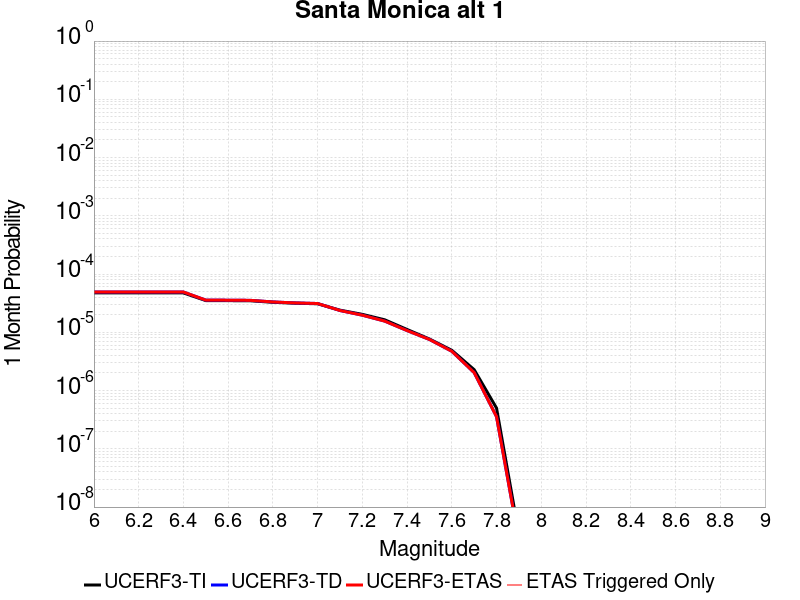 | 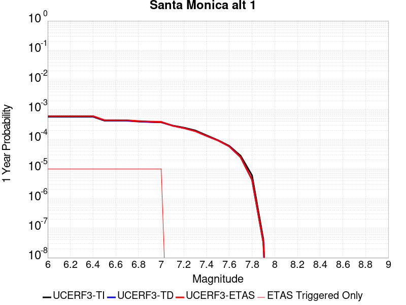 | 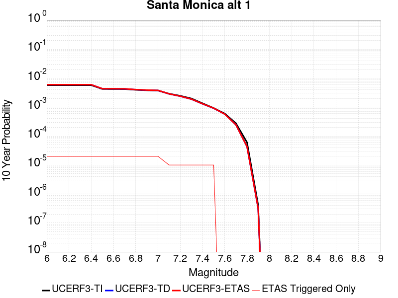 |

| Magnitude | 1 wk TI Prob | 1 wk TD Prob | 1 wk ETAS Prob | 1 wk ETAS/TD Gain | 1 wk ETAS Triggered Only | 1 mo TI Prob | 1 mo TD Prob | 1 mo ETAS Prob | 1 mo ETAS/TD Gain | 1 mo ETAS Triggered Only | 1 yr TI Prob | 1 yr TD Prob | 1 yr ETAS Prob | 1 yr ETAS/TD Gain | 1 yr ETAS Triggered Only | 10 yr TI Prob | 10 yr TD Prob | 10 yr ETAS Prob | 10 yr ETAS/TD Gain | 10 yr ETAS Triggered Only |
|-----|-----|-----|-----|-----|-----|-----|-----|-----|-----|-----|-----|-----|-----|-----|-----|-----|-----|-----|-----|-----|
| 6.0 | 1.1066008E-5 | 1.148031E-5 | 1.148031E-5 | 1.0 | 0.0 | 4.742488E-5 | 4.920048E-5 | 4.920048E-5 | 1.0 | 0.0 | 5.7724497E-4 | 5.9886515E-4 | 6.088591E-4 | 1.0166882 | 1.0E-5 | 0.005757478 | 0.0059739 | 0.0059937807 | 1.0033278 | 2.0E-5 |
| 6.1 | 1.1066008E-5 | 1.148031E-5 | 1.148031E-5 | 1.0 | 0.0 | 4.742488E-5 | 4.920048E-5 | 4.920048E-5 | 1.0 | 0.0 | 5.7724497E-4 | 5.9886515E-4 | 6.088591E-4 | 1.0166882 | 1.0E-5 | 0.005757478 | 0.0059739 | 0.0059937807 | 1.0033278 | 2.0E-5 |
| 6.2 | 1.1066008E-5 | 1.148031E-5 | 1.148031E-5 | 1.0 | 0.0 | 4.742488E-5 | 4.920048E-5 | 4.920048E-5 | 1.0 | 0.0 | 5.7724497E-4 | 5.9886515E-4 | 6.088591E-4 | 1.0166882 | 1.0E-5 | 0.005757478 | 0.0059739 | 0.0059937807 | 1.0033278 | 2.0E-5 |
| 6.3 | 1.1066008E-5 | 1.148031E-5 | 1.148031E-5 | 1.0 | 0.0 | 4.742488E-5 | 4.920048E-5 | 4.920048E-5 | 1.0 | 0.0 | 5.7724497E-4 | 5.9886515E-4 | 6.088591E-4 | 1.0166882 | 1.0E-5 | 0.005757478 | 0.0059739 | 0.0059937807 | 1.0033278 | 2.0E-5 |
| 6.4 | 1.1066008E-5 | 1.148031E-5 | 1.148031E-5 | 1.0 | 0.0 | 4.742488E-5 | 4.920048E-5 | 4.920048E-5 | 1.0 | 0.0 | 5.7724497E-4 | 5.9886515E-4 | 6.088591E-4 | 1.0166882 | 1.0E-5 | 0.005757478 | 0.0059739 | 0.0059937807 | 1.0033278 | 2.0E-5 |
| 6.5 | 8.183544E-6 | 8.335432E-6 | 8.335432E-6 | 1.0 | 0.0 | 3.5071862E-5 | 3.57228E-5 | 3.57228E-5 | 1.0 | 0.0 | 4.2691626E-4 | 4.3483984E-4 | 4.448355E-4 | 1.022987 | 1.0E-5 | 0.0042609703 | 0.0043400554 | 0.004359969 | 1.0045882 | 2.0E-5 |
| 6.6 | 8.1543285E-6 | 8.303646E-6 | 8.303646E-6 | 1.0 | 0.0 | 3.4946657E-5 | 3.5586578E-5 | 3.5586578E-5 | 1.0 | 0.0 | 4.2539247E-4 | 4.3318202E-4 | 4.431777E-4 | 1.023075 | 1.0E-5 | 0.0042457907 | 0.004323542 | 0.004343455 | 1.0046059 | 2.0E-5 |
| 6.7 | 8.110878E-6 | 8.257042E-6 | 8.257042E-6 | 1.0 | 0.0 | 3.4760444E-5 | 3.5386853E-5 | 3.5386853E-5 | 1.0 | 0.0 | 4.231262E-4 | 4.3075136E-4 | 4.4074704E-4 | 1.0232053 | 1.0E-5 | 0.0042232145 | 0.0042993296 | 0.0043192436 | 1.0046319 | 2.0E-5 |
| 6.8 | 7.644036E-6 | 7.75106E-6 | 7.75106E-6 | 1.0 | 0.0 | 3.275974E-5 | 3.3218414E-5 | 3.3218414E-5 | 1.0 | 0.0 | 3.9877684E-4 | 4.0436056E-4 | 4.1435653E-4 | 1.0247204 | 1.0E-5 | 0.00398062 | 0.0040363944 | 0.0040563135 | 1.0049349 | 2.0E-5 |
| 6.9 | 7.3698293E-6 | 7.455719E-6 | 7.455719E-6 | 1.0 | 0.0 | 3.15846E-5 | 3.19527E-5 | 3.19527E-5 | 1.0 | 0.0 | 3.8447464E-4 | 3.8895605E-4 | 3.9895216E-4 | 1.0256999 | 1.0E-5 | 0.0038381014 | 0.0038828964 | 0.0039028188 | 1.0051308 | 2.0E-5 |
| 7.0 | 7.209872E-6 | 7.2856255E-6 | 7.2856255E-6 | 1.0 | 0.0 | 3.0899086E-5 | 3.1223743E-5 | 3.1223743E-5 | 1.0 | 0.0 | 3.7613141E-4 | 3.8008415E-4 | 3.9008036E-4 | 1.0263 | 1.0E-5 | 0.0037549543 | 0.0037944836 | 0.0038144076 | 1.0052508 | 2.0E-5 |
| 7.1 | 5.603456E-6 | 5.5238925E-6 | 5.5238925E-6 | 1.0 | 0.0 | 2.4014591E-5 | 2.3673612E-5 | 2.3673612E-5 | 1.0 | 0.0 | 2.923384E-4 | 2.881885E-4 | 2.881885E-4 | 1.0 | 0.0 | 0.0029195412 | 0.0028781896 | 0.0028881608 | 1.0034645 | 1.0E-5 |
| 7.2 | 4.7483613E-6 | 4.5911324E-6 | 4.5911324E-6 | 1.0 | 0.0 | 2.0349962E-5 | 1.9676136E-5 | 1.9676136E-5 | 1.0 | 0.0 | 2.4773262E-4 | 2.3953074E-4 | 2.3953074E-4 | 1.0 | 0.0 | 0.0024745662 | 0.0023927398 | 0.0024027159 | 1.0041693 | 1.0E-5 |
| 7.3 | 3.829015E-6 | 3.6342253E-6 | 3.6342253E-6 | 1.0 | 0.0 | 1.6409962E-5 | 1.5575159E-5 | 1.5575159E-5 | 1.0 | 0.0 | 1.9977297E-4 | 1.8961114E-4 | 1.8961114E-4 | 1.0 | 0.0 | 0.0019959346 | 0.0018945024 | 0.0019044835 | 1.0052685 | 1.0E-5 |
| 7.4 | 2.610755E-6 | 2.4995716E-6 | 2.4995716E-6 | 1.0 | 0.0 | 1.1188902E-5 | 1.0712406E-5 | 1.0712406E-5 | 1.0 | 0.0 | 1.3621636E-4 | 1.3041578E-4 | 1.3041578E-4 | 1.0 | 0.0 | 0.001361329 | 0.0013033969 | 0.0013133838 | 1.0076623 | 1.0E-5 |
| 7.5 | 1.792146E-6 | 1.7584184E-6 | 1.7584184E-6 | 1.0 | 0.0 | 7.680603E-6 | 7.536057E-6 | 7.536057E-6 | 1.0 | 0.0 | 9.3507326E-5 | 9.1747665E-5 | 9.1747665E-5 | 1.0 | 0.0 | 9.3467993E-4 | 9.1710105E-4 | 9.2709187E-4 | 1.010894 | 1.0E-5 |
| 7.6 | 1.1473018E-6 | 1.1029152E-6 | 1.1029152E-6 | 1.0 | 0.0 | 4.9169985E-6 | 4.726771E-6 | 4.726771E-6 | 1.0 | 0.0 | 5.986281E-5 | 5.7546935E-5 | 5.7546935E-5 | 1.0 | 0.0 | 5.984669E-4 | 5.7532196E-4 | 5.7532196E-4 | 1.0 | 0.0 |
| 7.7 | 5.330919E-7 | 4.7452556E-7 | 4.7452556E-7 | 1.0 | 0.0 | 2.2846775E-6 | 2.0336795E-6 | 2.0336795E-6 | 1.0 | 0.0 | 2.7815593E-5 | 2.4759778E-5 | 2.4759778E-5 | 1.0 | 0.0 | 2.7812112E-4 | 2.4757133E-4 | 2.4757133E-4 | 1.0 | 0.0 |
| 7.8 | 1.1668574E-7 | 8.2966224E-8 | 8.2966224E-8 | 1.0 | 0.0 | 5.000816E-7 | 3.5556948E-7 | 3.5556948E-7 | 1.0 | 0.0 | 6.0884768E-6 | 4.32905E-6 | 4.32905E-6 | 1.0 | 0.0 | 6.08831E-5 | 4.3289692E-5 | 4.3289692E-5 | 1.0 | 0.0 |
| 7.9 | 8.007447E-10 | 6.1608785E-10 | 6.1608785E-10 | 1.0 | 0.0 | 3.4317629E-9 | 2.6403764E-9 | 2.6403764E-9 | 1.0 | 0.0 | 4.1781714E-8 | 3.2146584E-8 | 3.2146584E-8 | 1.0 | 0.0 | 4.1781706E-7 | 3.214658E-7 | 3.214658E-7 | 1.0 | 0.0 |

## Los Alamos 2011 CFM
*[(top)](#table-of-contents)*

| 1 Week | 1 Month | 1 Year | 10 Year |
|-----|-----|-----|-----|
| 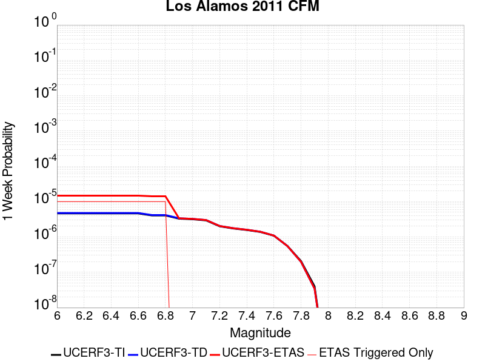 | 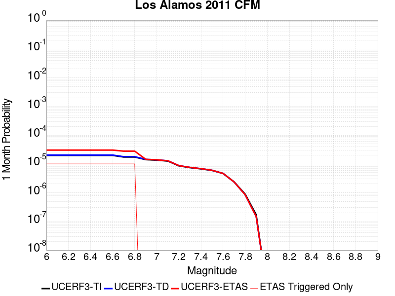 | 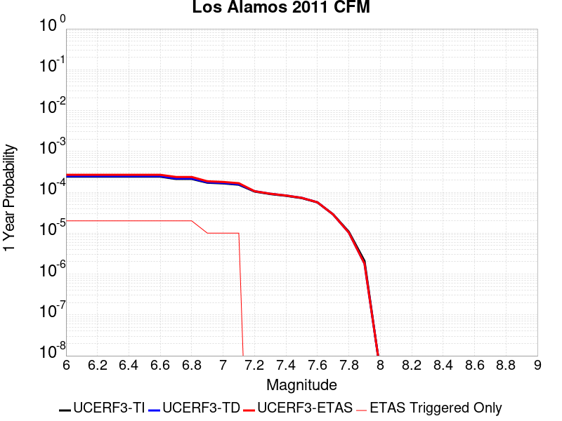 | 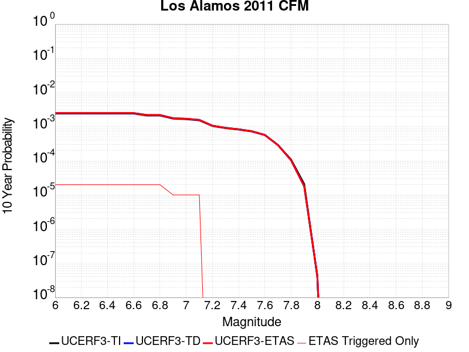 |

| Magnitude | 1 wk TI Prob | 1 wk TD Prob | 1 wk ETAS Prob | 1 wk ETAS/TD Gain | 1 wk ETAS Triggered Only | 1 mo TI Prob | 1 mo TD Prob | 1 mo ETAS Prob | 1 mo ETAS/TD Gain | 1 mo ETAS Triggered Only | 1 yr TI Prob | 1 yr TD Prob | 1 yr ETAS Prob | 1 yr ETAS/TD Gain | 1 yr ETAS Triggered Only | 10 yr TI Prob | 10 yr TD Prob | 10 yr ETAS Prob | 10 yr ETAS/TD Gain | 10 yr ETAS Triggered Only |
|-----|-----|-----|-----|-----|-----|-----|-----|-----|-----|-----|-----|-----|-----|-----|-----|-----|-----|-----|-----|-----|
| 6.0 | 4.6284417E-6 | 4.751731E-6 | 1.4751684E-5 | 3.1044862 | 1.0E-5 | 1.9836029E-5 | 2.0364414E-5 | 3.036421E-5 | 1.4910427 | 1.0E-5 | 2.4147688E-4 | 2.4791027E-4 | 2.6790533E-4 | 1.0806544 | 2.0E-5 | 0.0024121467 | 0.0024765113 | 0.0024964618 | 1.0080559 | 2.0E-5 |
| 6.1 | 4.6284417E-6 | 4.751731E-6 | 1.4751684E-5 | 3.1044862 | 1.0E-5 | 1.9836029E-5 | 2.0364414E-5 | 3.036421E-5 | 1.4910427 | 1.0E-5 | 2.4147688E-4 | 2.4791027E-4 | 2.6790533E-4 | 1.0806544 | 2.0E-5 | 0.0024121467 | 0.0024765113 | 0.0024964618 | 1.0080559 | 2.0E-5 |
| 6.2 | 4.6284417E-6 | 4.751731E-6 | 1.4751684E-5 | 3.1044862 | 1.0E-5 | 1.9836029E-5 | 2.0364414E-5 | 3.036421E-5 | 1.4910427 | 1.0E-5 | 2.4147688E-4 | 2.4791027E-4 | 2.6790533E-4 | 1.0806544 | 2.0E-5 | 0.0024121467 | 0.0024765113 | 0.0024964618 | 1.0080559 | 2.0E-5 |
| 6.3 | 4.6284417E-6 | 4.751731E-6 | 1.4751684E-5 | 3.1044862 | 1.0E-5 | 1.9836029E-5 | 2.0364414E-5 | 3.036421E-5 | 1.4910427 | 1.0E-5 | 2.4147688E-4 | 2.4791027E-4 | 2.6790533E-4 | 1.0806544 | 2.0E-5 | 0.0024121467 | 0.0024765113 | 0.0024964618 | 1.0080559 | 2.0E-5 |
| 6.4 | 4.6284417E-6 | 4.751731E-6 | 1.4751684E-5 | 3.1044862 | 1.0E-5 | 1.9836029E-5 | 2.0364414E-5 | 3.036421E-5 | 1.4910427 | 1.0E-5 | 2.4147688E-4 | 2.4791027E-4 | 2.6790533E-4 | 1.0806544 | 2.0E-5 | 0.0024121467 | 0.0024765113 | 0.0024964618 | 1.0080559 | 2.0E-5 |
| 6.5 | 4.6284417E-6 | 4.751731E-6 | 1.4751684E-5 | 3.1044862 | 1.0E-5 | 1.9836029E-5 | 2.0364414E-5 | 3.036421E-5 | 1.4910427 | 1.0E-5 | 2.4147688E-4 | 2.4791027E-4 | 2.6790533E-4 | 1.0806544 | 2.0E-5 | 0.0024121467 | 0.0024765113 | 0.0024964618 | 1.0080559 | 2.0E-5 |
| 6.6 | 4.6284417E-6 | 4.751731E-6 | 1.4751684E-5 | 3.1044862 | 1.0E-5 | 1.9836029E-5 | 2.0364414E-5 | 3.036421E-5 | 1.4910427 | 1.0E-5 | 2.4147688E-4 | 2.4791027E-4 | 2.6790533E-4 | 1.0806544 | 2.0E-5 | 0.0024121467 | 0.0024765113 | 0.0024964618 | 1.0080559 | 2.0E-5 |
| 6.7 | 4.062321E-6 | 4.166349E-6 | 1.4166307E-5 | 3.4001732 | 1.0E-5 | 1.7409831E-5 | 1.7855667E-5 | 2.7855489E-5 | 1.5600363 | 1.0E-5 | 2.1194408E-4 | 2.1737257E-4 | 2.3736822E-4 | 1.091988 | 2.0E-5 | 0.0021174205 | 0.0021717492 | 0.0021917056 | 1.0091891 | 2.0E-5 |
| 6.8 | 4.062321E-6 | 4.166349E-6 | 1.4166307E-5 | 3.4001732 | 1.0E-5 | 1.7409831E-5 | 1.7855667E-5 | 2.7855489E-5 | 1.5600363 | 1.0E-5 | 2.1194408E-4 | 2.1737257E-4 | 2.3736822E-4 | 1.091988 | 2.0E-5 | 0.0021174205 | 0.0021717492 | 0.0021917056 | 1.0091891 | 2.0E-5 |
| 6.9 | 3.2936077E-6 | 3.372958E-6 | 3.372958E-6 | 1.0 | 0.0 | 1.4115385E-5 | 1.4455459E-5 | 1.4455459E-5 | 1.0 | 0.0 | 1.7184127E-4 | 1.7598194E-4 | 1.8598019E-4 | 1.056814 | 1.0E-5 | 0.0017170844 | 0.0017585184 | 0.0017685008 | 1.0056766 | 1.0E-5 |
| 7.0 | 3.1687898E-6 | 3.2448156E-6 | 3.2448156E-6 | 1.0 | 0.0 | 1.3580457E-5 | 1.3906283E-5 | 1.3906283E-5 | 1.0 | 0.0 | 1.6532952E-4 | 1.6929678E-4 | 1.7929508E-4 | 1.0590578 | 1.0E-5 | 0.0016520657 | 0.0016917696 | 0.0017017527 | 1.005901 | 1.0E-5 |
| 7.1 | 2.9379228E-6 | 3.0073259E-6 | 3.0073259E-6 | 1.0 | 0.0 | 1.25910365E-5 | 1.288848E-5 | 1.288848E-5 | 1.0 | 0.0 | 1.5328509E-4 | 1.5690686E-4 | 1.6690529E-4 | 1.0637221 | 1.0E-5 | 0.001531794 | 0.0015680499 | 0.0015780343 | 1.0063673 | 1.0E-5 |
| 7.2 | 2.0020686E-6 | 2.0416298E-6 | 2.0416298E-6 | 1.0 | 0.0 | 8.580266E-6 | 8.749813E-6 | 8.749813E-6 | 1.0 | 0.0 | 1.0445973E-4 | 1.0652381E-4 | 1.0652381E-4 | 1.0 | 0.0 | 0.0010441064 | 0.001064732 | 0.001064732 | 1.0 | 0.0 |
| 7.3 | 1.7364243E-6 | 1.7678802E-6 | 1.7678802E-6 | 1.0 | 0.0 | 7.441797E-6 | 7.576608E-6 | 7.576608E-6 | 1.0 | 0.0 | 9.0600115E-5 | 9.2241324E-5 | 9.2241324E-5 | 1.0 | 0.0 | 9.0563187E-4 | 9.2203356E-4 | 9.2203356E-4 | 1.0 | 0.0 |
| 7.4 | 1.5718434E-6 | 1.5983177E-6 | 1.5983177E-6 | 1.0 | 0.0 | 6.7364545E-6 | 6.849915E-6 | 6.849915E-6 | 1.0 | 0.0 | 8.201325E-5 | 8.339455E-5 | 8.339455E-5 | 1.0 | 0.0 | 8.198299E-4 | 8.3363557E-4 | 8.3363557E-4 | 1.0 | 0.0 |
| 7.5 | 1.3841119E-6 | 1.4042793E-6 | 1.4042793E-6 | 1.0 | 0.0 | 5.9318945E-6 | 6.0183256E-6 | 6.0183256E-6 | 1.0 | 0.0 | 7.221842E-5 | 7.327068E-5 | 7.327068E-5 | 1.0 | 0.0 | 7.2194956E-4 | 7.324681E-4 | 7.324681E-4 | 1.0 | 0.0 |
| 7.6 | 1.0843726E-6 | 1.093442E-6 | 1.093442E-6 | 1.0 | 0.0 | 4.647303E-6 | 4.6861724E-6 | 4.6861724E-6 | 1.0 | 0.0 | 5.6579443E-5 | 5.705268E-5 | 5.705268E-5 | 1.0 | 0.0 | 5.656504E-4 | 5.703829E-4 | 5.703829E-4 | 1.0 | 0.0 |
| 7.7 | 5.544814E-7 | 5.5018705E-7 | 5.5018705E-7 | 1.0 | 0.0 | 2.3763469E-6 | 2.3579425E-6 | 2.3579425E-6 | 1.0 | 0.0 | 2.8931638E-5 | 2.8707573E-5 | 2.8707573E-5 | 1.0 | 0.0 | 2.8927872E-4 | 2.870388E-4 | 2.870388E-4 | 1.0 | 0.0 |
| 7.8 | 2.0707465E-7 | 1.977846E-7 | 1.977846E-7 | 1.0 | 0.0 | 8.874625E-7 | 8.4764804E-7 | 8.4764804E-7 | 1.0 | 0.0 | 1.08048025E-5 | 1.0320066E-5 | 1.0320066E-5 | 1.0 | 0.0 | 1.0804277E-4 | 1.0319592E-4 | 1.0319592E-4 | 1.0 | 0.0 |
| 7.9 | 3.9821284E-8 | 3.433109E-8 | 3.433109E-8 | 1.0 | 0.0 | 1.7066264E-7 | 1.4713324E-7 | 1.4713324E-7 | 1.0 | 0.0 | 2.0778157E-6 | 1.7913457E-6 | 1.7913457E-6 | 1.0 | 0.0 | 2.0777963E-5 | 1.7913319E-5 | 1.7913319E-5 | 1.0 | 0.0 |
| 8.0 | 7.880441E-11 | 8.2353124E-11 | 8.2353124E-11 | 1.0 | 0.0 | 3.3773329E-10 | 3.52942E-10 | 3.52942E-10 | 1.0 | 0.0 | 4.1119033E-9 | 4.2970694E-9 | 4.2970694E-9 | 1.0 | 0.0 | 4.1119034E-8 | 4.2970694E-8 | 4.2970694E-8 | 1.0 | 0.0 |

## Richfield
*[(top)](#table-of-contents)*

| 1 Week | 1 Month | 1 Year | 10 Year |
|-----|-----|-----|-----|
|  | 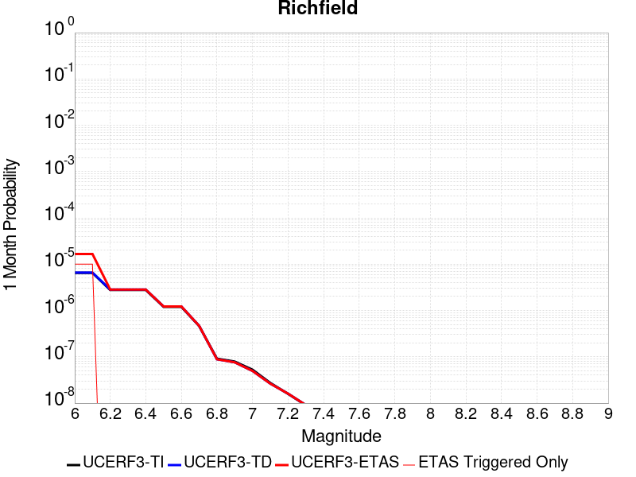 | 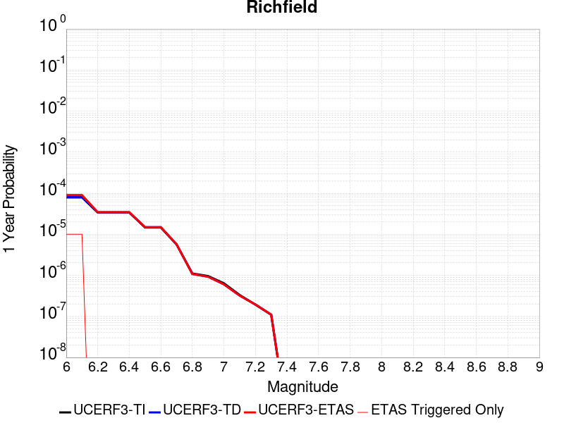 | 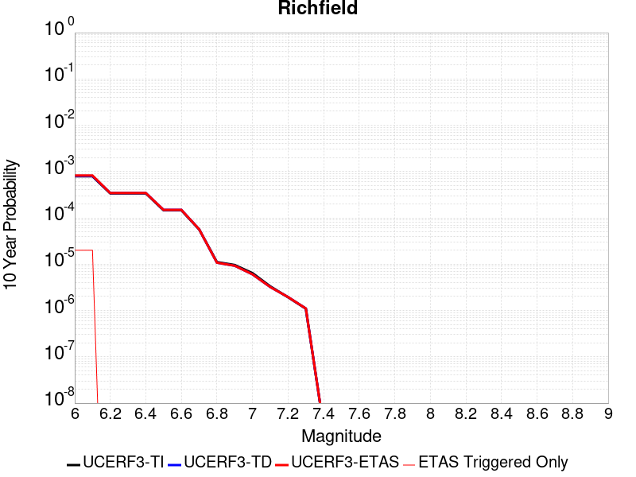 |

| Magnitude | 1 wk TI Prob | 1 wk TD Prob | 1 wk ETAS Prob | 1 wk ETAS/TD Gain | 1 wk ETAS Triggered Only | 1 mo TI Prob | 1 mo TD Prob | 1 mo ETAS Prob | 1 mo ETAS/TD Gain | 1 mo ETAS Triggered Only | 1 yr TI Prob | 1 yr TD Prob | 1 yr ETAS Prob | 1 yr ETAS/TD Gain | 1 yr ETAS Triggered Only | 10 yr TI Prob | 10 yr TD Prob | 10 yr ETAS Prob | 10 yr ETAS/TD Gain | 10 yr ETAS Triggered Only |
|-----|-----|-----|-----|-----|-----|-----|-----|-----|-----|-----|-----|-----|-----|-----|-----|-----|-----|-----|-----|-----|
| 6.0 | 1.5166896E-6 | 1.5392679E-6 | 1.5392679E-6 | 1.0 | 0.0 | 6.5000822E-6 | 6.596852E-6 | 1.6596787E-5 | 2.5158646 | 1.0E-5 | 7.913562E-5 | 8.0314814E-5 | 9.031401E-5 | 1.1245 | 1.0E-5 | 7.910745E-4 | 8.0296566E-4 | 8.229496E-4 | 1.0248877 | 2.0E-5 |
| 6.1 | 1.5166896E-6 | 1.5392679E-6 | 1.5392679E-6 | 1.0 | 0.0 | 6.5000822E-6 | 6.596852E-6 | 1.6596787E-5 | 2.5158646 | 1.0E-5 | 7.913562E-5 | 8.0314814E-5 | 9.031401E-5 | 1.1245 | 1.0E-5 | 7.910745E-4 | 8.0296566E-4 | 8.229496E-4 | 1.0248877 | 2.0E-5 |
| 6.2 | 6.473272E-7 | 6.598479E-7 | 6.598479E-7 | 1.0 | 0.0 | 2.7742565E-6 | 2.8279173E-6 | 2.8279173E-6 | 1.0 | 0.0 | 3.377605E-5 | 3.4429482E-5 | 3.4429482E-5 | 1.0 | 0.0 | 3.3770915E-4 | 3.442545E-4 | 3.442545E-4 | 1.0 | 0.0 |
| 6.3 | 6.473272E-7 | 6.598479E-7 | 6.598479E-7 | 1.0 | 0.0 | 2.7742565E-6 | 2.8279173E-6 | 2.8279173E-6 | 1.0 | 0.0 | 3.377605E-5 | 3.4429482E-5 | 3.4429482E-5 | 1.0 | 0.0 | 3.3770915E-4 | 3.442545E-4 | 3.442545E-4 | 1.0 | 0.0 |
| 6.4 | 6.473272E-7 | 6.598479E-7 | 6.598479E-7 | 1.0 | 0.0 | 2.7742565E-6 | 2.8279173E-6 | 2.8279173E-6 | 1.0 | 0.0 | 3.377605E-5 | 3.4429482E-5 | 3.4429482E-5 | 1.0 | 0.0 | 3.3770915E-4 | 3.442545E-4 | 3.442545E-4 | 1.0 | 0.0 |
| 6.5 | 2.7954403E-7 | 2.8531605E-7 | 2.8531605E-7 | 1.0 | 0.0 | 1.1980452E-6 | 1.2227827E-6 | 1.2227827E-6 | 1.0 | 0.0 | 1.4586103E-5 | 1.4887321E-5 | 1.4887321E-5 | 1.0 | 0.0 | 1.4585146E-4 | 1.4886749E-4 | 1.4886749E-4 | 1.0 | 0.0 |
| 6.6 | 2.7954403E-7 | 2.8531605E-7 | 2.8531605E-7 | 1.0 | 0.0 | 1.1980452E-6 | 1.2227827E-6 | 1.2227827E-6 | 1.0 | 0.0 | 1.4586103E-5 | 1.4887321E-5 | 1.4887321E-5 | 1.0 | 0.0 | 1.4585146E-4 | 1.4886749E-4 | 1.4886749E-4 | 1.0 | 0.0 |
| 6.7 | 1.0777299E-7 | 1.08788136E-7 | 1.08788136E-7 | 1.0 | 0.0 | 4.6188418E-7 | 4.6623484E-7 | 4.6623484E-7 | 1.0 | 0.0 | 5.6234253E-6 | 5.6763984E-6 | 5.6763984E-6 | 1.0 | 0.0 | 5.623283E-5 | 5.6762965E-5 | 5.6762965E-5 | 1.0 | 0.0 |
| 6.8 | 2.1301874E-8 | 2.0666182E-8 | 2.0666182E-8 | 1.0 | 0.0 | 9.129375E-8 | 8.8569344E-8 | 8.8569344E-8 | 1.0 | 0.0 | 1.1115008E-6 | 1.0783313E-6 | 1.0783313E-6 | 1.0 | 0.0 | 1.1114952E-5 | 1.0783265E-5 | 1.0783265E-5 | 1.0 | 0.0 |
| 6.9 | 1.8413502E-8 | 1.7751145E-8 | 1.7751145E-8 | 1.0 | 0.0 | 7.891501E-8 | 7.607633E-8 | 7.607633E-8 | 1.0 | 0.0 | 9.607899E-7 | 9.26229E-7 | 9.26229E-7 | 1.0 | 0.0 | 9.607857E-6 | 9.262254E-6 | 9.262254E-6 | 1.0 | 0.0 |
| 7.0 | 1.2290541E-8 | 1.1574364E-8 | 1.1574364E-8 | 1.0 | 0.0 | 5.2673748E-8 | 4.9604413E-8 | 4.9604413E-8 | 1.0 | 0.0 | 6.413027E-7 | 6.039336E-7 | 6.039336E-7 | 1.0 | 0.0 | 6.4130086E-6 | 6.039321E-6 | 6.039321E-6 | 1.0 | 0.0 |
| 7.1 | 6.373573E-9 | 6.155796E-9 | 6.155796E-9 | 1.0 | 0.0 | 2.7315311E-8 | 2.6381983E-8 | 2.6381983E-8 | 1.0 | 0.0 | 3.3256384E-7 | 3.212006E-7 | 3.212006E-7 | 1.0 | 0.0 | 3.3256335E-6 | 3.2120017E-6 | 3.2120017E-6 | 1.0 | 0.0 |
| 7.2 | 3.6989944E-9 | 3.7360146E-9 | 3.7360146E-9 | 1.0 | 0.0 | 1.5852834E-8 | 1.6011493E-8 | 1.6011493E-8 | 1.0 | 0.0 | 1.9300822E-7 | 1.9493989E-7 | 1.9493989E-7 | 1.0 | 0.0 | 1.9300805E-6 | 1.9493975E-6 | 1.9493975E-6 | 1.0 | 0.0 |
| 7.3 | 2.097397E-9 | 2.1200501E-9 | 2.1200501E-9 | 1.0 | 0.0 | 8.9888434E-9 | 9.085929E-9 | 9.085929E-9 | 1.0 | 0.0 | 1.0943917E-7 | 1.1062118E-7 | 1.1062118E-7 | 1.0 | 0.0 | 1.0943911E-6 | 1.1062115E-6 | 1.1062115E-6 | 1.0 | 0.0 |
| 7.4 | 5.8314464E-12 | 5.8918426E-12 | 5.8918426E-12 | 1.0 | 0.0 | 2.4991786E-11 | 2.5250912E-11 | 2.5250912E-11 | 1.0 | 0.0 | 3.0427527E-10 | 3.0742975E-10 | 3.0742975E-10 | 1.0 | 0.0 | 3.0427532E-9 | 3.0742973E-9 | 3.0742973E-9 | 1.0 | 0.0 |

## Concord 2011 CFM
*[(top)](#table-of-contents)*

| 1 Week | 1 Month | 1 Year | 10 Year |
|-----|-----|-----|-----|
|  | 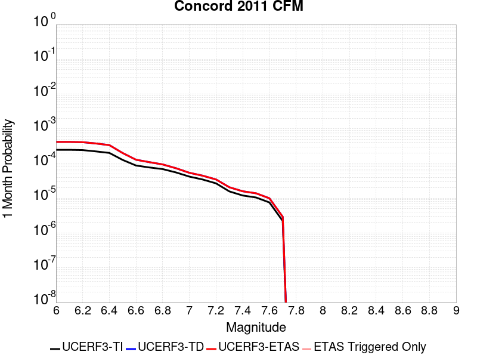 | 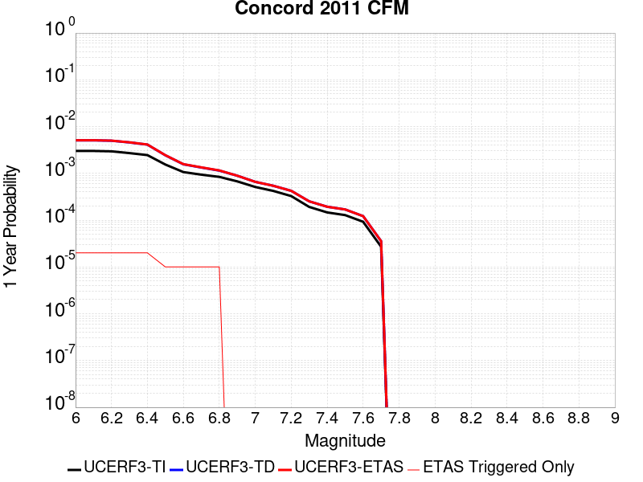 | 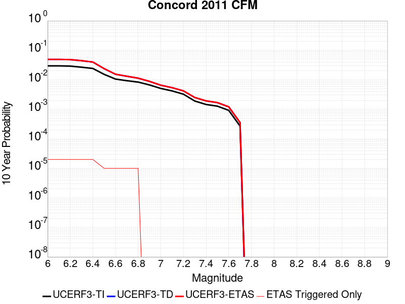 |

| Magnitude | 1 wk TI Prob | 1 wk TD Prob | 1 wk ETAS Prob | 1 wk ETAS/TD Gain | 1 wk ETAS Triggered Only | 1 mo TI Prob | 1 mo TD Prob | 1 mo ETAS Prob | 1 mo ETAS/TD Gain | 1 mo ETAS Triggered Only | 1 yr TI Prob | 1 yr TD Prob | 1 yr ETAS Prob | 1 yr ETAS/TD Gain | 1 yr ETAS Triggered Only | 10 yr TI Prob | 10 yr TD Prob | 10 yr ETAS Prob | 10 yr ETAS/TD Gain | 10 yr ETAS Triggered Only |
|-----|-----|-----|-----|-----|-----|-----|-----|-----|-----|-----|-----|-----|-----|-----|-----|-----|-----|-----|-----|-----|
| 6.0 | 5.7865112E-5 | 9.759152E-5 | 9.759152E-5 | 1.0 | 0.0 | 2.4796976E-4 | 4.1818706E-4 | 4.1818706E-4 | 1.0 | 0.0 | 0.0030148525 | 0.005079467 | 0.0050993655 | 1.0039175 | 2.0E-5 | 0.029742775 | 0.049248982 | 0.049267996 | 1.0003861 | 2.0E-5 |
| 6.1 | 5.7865112E-5 | 9.759152E-5 | 9.759152E-5 | 1.0 | 0.0 | 2.4796976E-4 | 4.1818706E-4 | 4.1818706E-4 | 1.0 | 0.0 | 0.0030148525 | 0.005079467 | 0.0050993655 | 1.0039175 | 2.0E-5 | 0.029742775 | 0.049248982 | 0.049267996 | 1.0003861 | 2.0E-5 |
| 6.2 | 5.6789337E-5 | 9.5795076E-5 | 9.5795076E-5 | 1.0 | 0.0 | 2.4336016E-4 | 4.104905E-4 | 4.104905E-4 | 1.0 | 0.0 | 0.0029588845 | 0.0049861916 | 0.0050060917 | 1.0039911 | 2.0E-5 | 0.029197963 | 0.04836556 | 0.048384592 | 1.0003935 | 2.0E-5 |
| 6.3 | 5.203322E-5 | 8.803056E-5 | 8.803056E-5 | 1.0 | 0.0 | 2.2298045E-4 | 3.7722368E-4 | 3.7722368E-4 | 1.0 | 0.0 | 0.0027114071 | 0.0045838105 | 0.0046037184 | 1.0043432 | 2.0E-5 | 0.026785625 | 0.04453672 | 0.044555828 | 1.000429 | 2.0E-5 |
| 6.4 | 4.7120942E-5 | 7.897404E-5 | 7.897404E-5 | 1.0 | 0.0 | 2.0193127E-4 | 3.3842045E-4 | 3.3842045E-4 | 1.0 | 0.0 | 0.0024557412 | 0.00411323 | 0.0041331477 | 1.0048424 | 2.0E-5 | 0.024287801 | 0.040065527 | 0.040084727 | 1.0004792 | 2.0E-5 |
| 6.5 | 2.9598437E-5 | 4.667486E-5 | 4.667486E-5 | 1.0 | 0.0 | 1.2684427E-4 | 2.0002096E-4 | 2.0002096E-4 | 1.0 | 0.0 | 0.001543235 | 0.0024327459 | 0.0024427215 | 1.0041006 | 1.0E-5 | 0.015325619 | 0.023909973 | 0.023919733 | 1.0004083 | 1.0E-5 |
| 6.6 | 2.0443718E-5 | 2.998433E-5 | 2.998433E-5 | 1.0 | 0.0 | 8.7613E-5 | 1.2849816E-4 | 1.2849816E-4 | 1.0 | 0.0 | 0.0010661662 | 0.0015633785 | 0.0015733629 | 1.0063864 | 1.0E-5 | 0.010610655 | 0.015466996 | 0.0154768415 | 1.0006366 | 1.0E-5 |
| 6.7 | 1.798539E-5 | 2.5557381E-5 | 2.5557381E-5 | 1.0 | 0.0 | 7.7077966E-5 | 1.0952716E-4 | 1.0952716E-4 | 1.0 | 0.0 | 9.380202E-4 | 0.001332699 | 0.0013426857 | 1.0074936 | 1.0E-5 | 0.009340706 | 0.013217433 | 0.013227301 | 1.0007466 | 1.0E-5 |
| 6.8 | 1.613555E-5 | 2.1959211E-5 | 2.1959211E-5 | 1.0 | 0.0 | 6.915052E-5 | 9.4107585E-5 | 9.4107585E-5 | 1.0 | 0.0 | 8.4158237E-4 | 0.0011451716 | 0.0011551601 | 1.0087223 | 1.0E-5 | 0.008384023 | 0.0113782035 | 0.01138809 | 1.0008689 | 1.0E-5 |
| 6.9 | 1.2916435E-5 | 1.7081054E-5 | 1.7081054E-5 | 1.0 | 0.0 | 5.5354973E-5 | 7.32025E-5 | 7.32025E-5 | 1.0 | 0.0 | 6.7373837E-4 | 8.908818E-4 | 8.908818E-4 | 1.0 | 0.0 | 0.006716994 | 0.008867139 | 0.008867139 | 1.0 | 0.0 |
| 7.0 | 9.81129E-6 | 1.2630829E-5 | 1.2630829E-5 | 1.0 | 0.0 | 4.2047708E-5 | 5.413101E-5 | 5.413101E-5 | 1.0 | 0.0 | 5.118106E-4 | 6.588474E-4 | 6.588474E-4 | 1.0 | 0.0 | 0.005106334 | 0.006569153 | 0.006569153 | 1.0 | 0.0 |
| 7.1 | 8.0889195E-6 | 1.0418261E-5 | 1.0418261E-5 | 1.0 | 0.0 | 3.4666336E-5 | 4.4648932E-5 | 4.4648932E-5 | 1.0 | 0.0 | 4.219809E-4 | 5.434662E-4 | 5.434662E-4 | 1.0 | 0.0 | 0.004211805 | 0.0054215975 | 0.0054215975 | 1.0 | 0.0 |
| 7.2 | 6.267438E-6 | 8.115699E-6 | 8.115699E-6 | 1.0 | 0.0 | 2.6860173E-5 | 3.4781104E-5 | 3.4781104E-5 | 1.0 | 0.0 | 3.2697353E-4 | 4.233784E-4 | 4.233784E-4 | 1.0 | 0.0 | 0.0032649285 | 0.004225969 | 0.004225969 | 1.0 | 0.0 |
| 7.3 | 3.6761196E-6 | 4.8401653E-6 | 4.8401653E-6 | 1.0 | 0.0 | 1.5754704E-5 | 2.0743402E-5 | 2.0743402E-5 | 1.0 | 0.0 | 1.9179663E-4 | 2.5252186E-4 | 2.5252186E-4 | 1.0 | 0.0 | 0.0019163118 | 0.002522487 | 0.002522487 | 1.0 | 0.0 |
| 7.4 | 2.8044356E-6 | 3.7096036E-6 | 3.7096036E-6 | 1.0 | 0.0 | 1.2018954E-5 | 1.5898204E-5 | 1.5898204E-5 | 1.0 | 0.0 | 1.4632095E-4 | 1.9354356E-4 | 1.9354356E-4 | 1.0 | 0.0 | 0.0014622464 | 0.0019338481 | 0.0019338481 | 1.0 | 0.0 |
| 7.5 | 2.4578699E-6 | 3.2447442E-6 | 3.2447442E-6 | 1.0 | 0.0 | 1.0533685E-5 | 1.3905973E-5 | 1.3905973E-5 | 1.0 | 0.0 | 1.2824008E-4 | 1.6929218E-4 | 1.6929218E-4 | 1.0 | 0.0 | 0.0012816609 | 0.001691713 | 0.001691713 | 1.0 | 0.0 |
| 7.6 | 1.7713267E-6 | 2.3351192E-6 | 2.3351192E-6 | 1.0 | 0.0 | 7.591378E-6 | 1.0007616E-5 | 1.0007616E-5 | 1.0 | 0.0 | 9.2421105E-5 | 1.21836E-4 | 1.21836E-4 | 1.0 | 0.0 | 9.2382677E-4 | 0.0012177454 | 0.0012177454 | 1.0 | 0.0 |
| 7.7 | 5.1912366E-7 | 6.8290143E-7 | 6.8290143E-7 | 1.0 | 0.0 | 2.2248137E-6 | 2.9267171E-6 | 2.9267171E-6 | 1.0 | 0.0 | 2.708677E-5 | 3.5632213E-5 | 3.5632213E-5 | 1.0 | 0.0 | 2.708347E-4 | 3.5627294E-4 | 3.5627294E-4 | 1.0 | 0.0 |

## Elmore Ranch
*[(top)](#table-of-contents)*

| 1 Week | 1 Month | 1 Year | 10 Year |
|-----|-----|-----|-----|
|  |  | 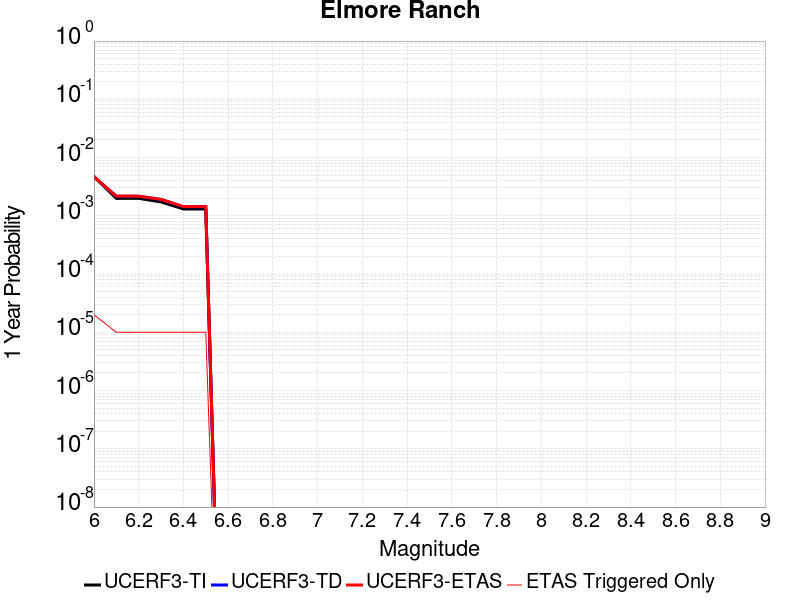 | 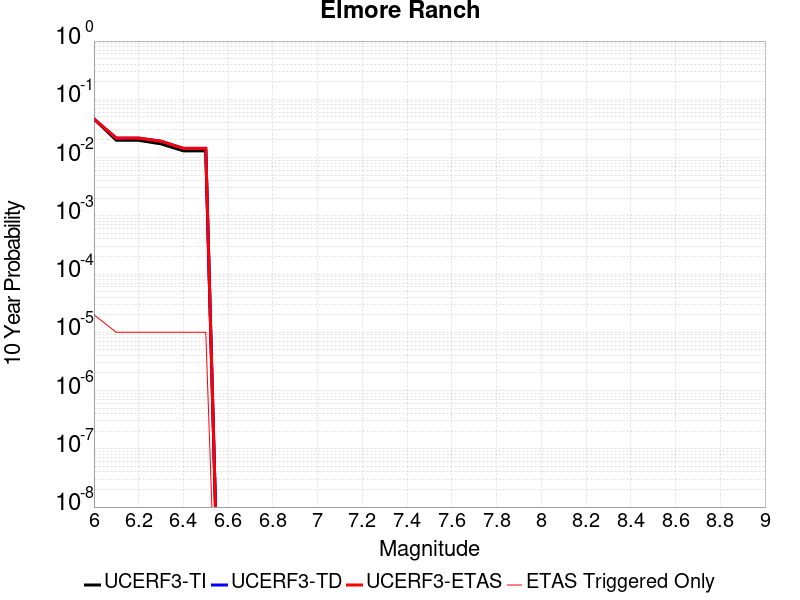 |

| Magnitude | 1 wk TI Prob | 1 wk TD Prob | 1 wk ETAS Prob | 1 wk ETAS/TD Gain | 1 wk ETAS Triggered Only | 1 mo TI Prob | 1 mo TD Prob | 1 mo ETAS Prob | 1 mo ETAS/TD Gain | 1 mo ETAS Triggered Only | 1 yr TI Prob | 1 yr TD Prob | 1 yr ETAS Prob | 1 yr ETAS/TD Gain | 1 yr ETAS Triggered Only | 10 yr TI Prob | 10 yr TD Prob | 10 yr ETAS Prob | 10 yr ETAS/TD Gain | 10 yr ETAS Triggered Only |
|-----|-----|-----|-----|-----|-----|-----|-----|-----|-----|-----|-----|-----|-----|-----|-----|-----|-----|-----|-----|-----|
| 6.0 | 9.102099E-5 | 8.952015E-5 | 8.952015E-5 | 1.0 | 0.0 | 3.9003167E-4 | 3.8361453E-4 | 3.8361453E-4 | 1.0 | 0.0 | 0.0047383 | 0.004662009 | 0.0046819155 | 1.00427 | 2.0E-5 | 0.046385348 | 0.045870975 | 0.045890056 | 1.000416 | 2.0E-5 |
| 6.1 | 3.8306698E-5 | 4.1498504E-5 | 4.1498504E-5 | 1.0 | 0.0 | 1.6416123E-4 | 1.7784268E-4 | 1.7784268E-4 | 1.0 | 0.0 | 0.0019968306 | 0.0021631396 | 0.002173118 | 1.0046129 | 1.0E-5 | 0.019789828 | 0.021628205 | 0.021637987 | 1.0004524 | 1.0E-5 |
| 6.2 | 3.8306698E-5 | 4.1498504E-5 | 4.1498504E-5 | 1.0 | 0.0 | 1.6416123E-4 | 1.7784268E-4 | 1.7784268E-4 | 1.0 | 0.0 | 0.0019968306 | 0.0021631396 | 0.002173118 | 1.0046129 | 1.0E-5 | 0.019789828 | 0.021628205 | 0.021637987 | 1.0004524 | 1.0E-5 |
| 6.3 | 3.3197924E-5 | 3.6554302E-5 | 3.6554302E-5 | 1.0 | 0.0 | 1.4226905E-4 | 1.5665586E-4 | 1.5665586E-4 | 1.0 | 0.0 | 0.0017307495 | 0.001905917 | 0.0019158979 | 1.0052369 | 1.0E-5 | 0.017173318 | 0.01908996 | 0.019099768 | 1.0005138 | 1.0E-5 |
| 6.4 | 2.5148964E-5 | 2.7420487E-5 | 2.7420487E-5 | 1.0 | 0.0 | 1.0777682E-4 | 1.17514726E-4 | 1.17514726E-4 | 1.0 | 0.0 | 0.0013113929 | 0.0014304507 | 0.0014404365 | 1.0069808 | 1.0E-5 | 0.01303681 | 0.014387194 | 0.01439705 | 1.0006851 | 1.0E-5 |
| 6.5 | 2.5148964E-5 | 2.7420487E-5 | 2.7420487E-5 | 1.0 | 0.0 | 1.0777682E-4 | 1.17514726E-4 | 1.17514726E-4 | 1.0 | 0.0 | 0.0013113929 | 0.0014304507 | 0.0014404365 | 1.0069808 | 1.0E-5 | 0.01303681 | 0.014387194 | 0.01439705 | 1.0006851 | 1.0E-5 |

## Hosgri
*[(top)](#table-of-contents)*

| 1 Week | 1 Month | 1 Year | 10 Year |
|-----|-----|-----|-----|
| 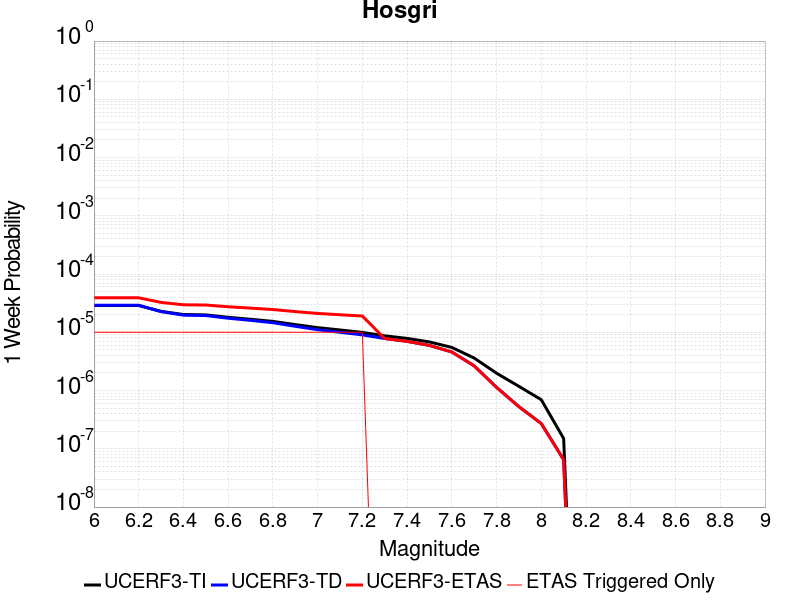 | 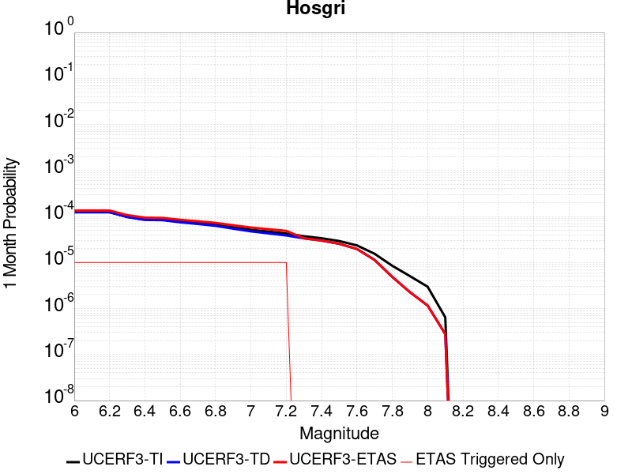 | 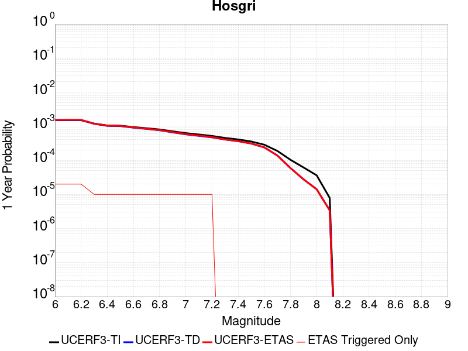 | 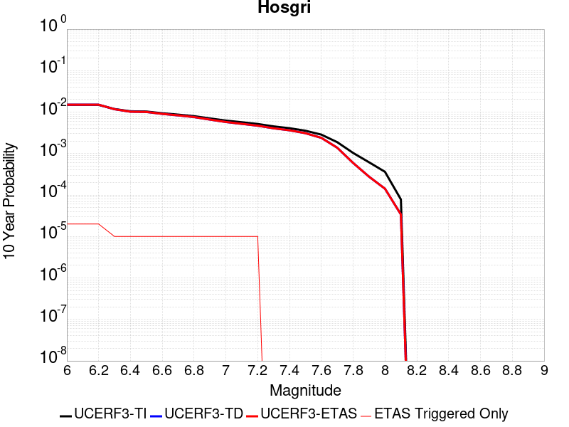 |

| Magnitude | 1 wk TI Prob | 1 wk TD Prob | 1 wk ETAS Prob | 1 wk ETAS/TD Gain | 1 wk ETAS Triggered Only | 1 mo TI Prob | 1 mo TD Prob | 1 mo ETAS Prob | 1 mo ETAS/TD Gain | 1 mo ETAS Triggered Only | 1 yr TI Prob | 1 yr TD Prob | 1 yr ETAS Prob | 1 yr ETAS/TD Gain | 1 yr ETAS Triggered Only | 10 yr TI Prob | 10 yr TD Prob | 10 yr ETAS Prob | 10 yr ETAS/TD Gain | 10 yr ETAS Triggered Only |
|-----|-----|-----|-----|-----|-----|-----|-----|-----|-----|-----|-----|-----|-----|-----|-----|-----|-----|-----|-----|-----|
| 6.0 | 2.883978E-5 | 2.9128416E-5 | 3.9128125E-5 | 1.3432974 | 1.0E-5 | 1.235932E-4 | 1.2483024E-4 | 1.34829E-4 | 1.0800987 | 1.0E-5 | 0.0015037085 | 0.001518776 | 0.0015387456 | 1.0131485 | 2.0E-5 | 0.01493574 | 0.01508774 | 0.015107438 | 1.0013056 | 2.0E-5 |
| 6.1 | 2.883978E-5 | 2.9128416E-5 | 3.9128125E-5 | 1.3432974 | 1.0E-5 | 1.235932E-4 | 1.2483024E-4 | 1.34829E-4 | 1.0800987 | 1.0E-5 | 0.0015037085 | 0.001518776 | 0.0015387456 | 1.0131485 | 2.0E-5 | 0.01493574 | 0.01508774 | 0.015107438 | 1.0013056 | 2.0E-5 |
| 6.2 | 2.883978E-5 | 2.9128416E-5 | 3.9128125E-5 | 1.3432974 | 1.0E-5 | 1.235932E-4 | 1.2483024E-4 | 1.34829E-4 | 1.0800987 | 1.0E-5 | 0.0015037085 | 0.001518776 | 0.0015387456 | 1.0131485 | 2.0E-5 | 0.01493574 | 0.01508774 | 0.015107438 | 1.0013056 | 2.0E-5 |
| 6.3 | 2.2914428E-5 | 2.2641969E-5 | 3.2641743E-5 | 1.4416476 | 1.0E-5 | 9.8200995E-5 | 9.703343E-5 | 1.0703246E-4 | 1.1030473 | 1.0E-5 | 0.0011949413 | 0.0011807467 | 0.0011907349 | 1.0084592 | 1.0E-5 | 0.011885363 | 0.011746133 | 0.011756015 | 1.0008414 | 1.0E-5 |
| 6.4 | 2.0195741E-5 | 1.969656E-5 | 2.9696363E-5 | 1.5076928 | 1.0E-5 | 8.65503E-5 | 8.4411105E-5 | 9.4410265E-5 | 1.1184578 | 1.0E-5 | 0.0010532405 | 0.0010272227 | 0.0010372124 | 1.009725 | 1.0E-5 | 0.010482626 | 0.010225792 | 0.0102356905 | 1.0009679 | 1.0E-5 |
| 6.5 | 1.9924333E-5 | 1.940898E-5 | 2.9408788E-5 | 1.5152154 | 1.0E-5 | 8.53872E-5 | 8.3178704E-5 | 9.317788E-5 | 1.120213 | 1.0E-5 | 0.0010390934 | 0.0010122322 | 0.0010222221 | 1.0098691 | 1.0E-5 | 0.010342481 | 0.010077253 | 0.010087152 | 1.0009823 | 1.0E-5 |
| 6.6 | 1.809694E-5 | 1.74583E-5 | 2.7458125E-5 | 1.5727835 | 1.0E-5 | 7.7556004E-5 | 7.4819145E-5 | 8.48184E-5 | 1.1336457 | 1.0E-5 | 9.438353E-4 | 9.105437E-4 | 9.2053466E-4 | 1.0109725 | 1.0E-5 | 0.009398366 | 0.009069073 | 0.009078982 | 1.0010927 | 1.0E-5 |
| 6.7 | 1.675989E-5 | 1.6042764E-5 | 2.6042604E-5 | 1.6233239 | 1.0E-5 | 7.182612E-5 | 6.87529E-5 | 7.8752215E-5 | 1.1454384 | 1.0E-5 | 8.7413215E-4 | 8.3674624E-4 | 8.467379E-4 | 1.0119411 | 1.0E-5 | 0.008707017 | 0.0083368635 | 0.00834678 | 1.0011895 | 1.0E-5 |
| 6.8 | 1.5401129E-5 | 1.4614083E-5 | 2.4613937E-5 | 1.6842614 | 1.0E-5 | 6.6003166E-5 | 6.2630286E-5 | 7.262966E-5 | 1.1596571 | 1.0E-5 | 8.032922E-4 | 7.622578E-4 | 7.722502E-4 | 1.013109 | 1.0E-5 | 0.008003947 | 0.007597296 | 0.00760722 | 1.0013063 | 1.0E-5 |
| 6.9 | 1.356559E-5 | 1.2689968E-5 | 2.2689841E-5 | 1.788014 | 1.0E-5 | 5.8136946E-5 | 5.4384444E-5 | 6.43839E-5 | 1.1838661 | 1.0E-5 | 7.0758746E-4 | 6.619299E-4 | 6.719233E-4 | 1.0150974 | 1.0E-5 | 0.007053386 | 0.006600388 | 0.006610322 | 1.001505 | 1.0E-5 |
| 7.0 | 1.2030819E-5 | 1.1095962E-5 | 2.109585E-5 | 1.9012188 | 1.0E-5 | 5.155963E-5 | 4.7553254E-5 | 5.7552777E-5 | 1.2102805 | 1.0E-5 | 6.275577E-4 | 5.7880714E-4 | 5.888014E-4 | 1.0172669 | 1.0E-5 | 0.006257884 | 0.005773757 | 0.0057836995 | 1.001722 | 1.0E-5 |
| 7.1 | 1.0972698E-5 | 1.0022179E-5 | 2.0022078E-5 | 1.997777 | 1.0E-5 | 4.7025E-5 | 4.2951488E-5 | 5.2951058E-5 | 1.2328109 | 1.0E-5 | 5.72379E-4 | 5.22809E-4 | 5.3280377E-4 | 1.0191175 | 1.0E-5 | 0.0057090693 | 0.005216542 | 0.00522649 | 1.001907 | 1.0E-5 |
| 7.2 | 9.961926E-6 | 9.034746E-6 | 1.9034655E-5 | 2.106828 | 1.0E-5 | 4.2693267E-5 | 3.8719765E-5 | 4.8719376E-5 | 1.2582561 | 1.0E-5 | 5.1966653E-4 | 4.713112E-4 | 4.813065E-4 | 1.0212075 | 1.0E-5 | 0.00518453 | 0.0047038626 | 0.0047138156 | 1.002116 | 1.0E-5 |
| 7.3 | 8.700929E-6 | 7.8281E-6 | 7.8281E-6 | 1.0 | 0.0 | 3.7289166E-5 | 3.354857E-5 | 3.354857E-5 | 1.0 | 0.0 | 4.53901E-4 | 4.0837732E-4 | 4.0837732E-4 | 1.0 | 0.0 | 0.00452975 | 0.004077008 | 0.004077008 | 1.0 | 0.0 |
| 7.4 | 7.866285E-6 | 6.998739E-6 | 6.998739E-6 | 1.0 | 0.0 | 3.3712215E-5 | 2.9994251E-5 | 2.9994251E-5 | 1.0 | 0.0 | 4.103689E-4 | 3.6511885E-4 | 3.6511885E-4 | 1.0 | 0.0 | 0.004096119 | 0.0036459267 | 0.0036459267 | 1.0 | 0.0 |
| 7.5 | 6.8381305E-6 | 5.9596955E-6 | 5.9596955E-6 | 1.0 | 0.0 | 2.9305946E-5 | 2.5541302E-5 | 2.5541302E-5 | 1.0 | 0.0 | 3.5674145E-4 | 3.10921E-4 | 3.10921E-4 | 1.0 | 0.0 | 0.0035616932 | 0.0031055948 | 0.0031055948 | 1.0 | 0.0 |
| 7.6 | 5.503376E-6 | 4.5952443E-6 | 4.5952443E-6 | 1.0 | 0.0 | 2.3585684E-5 | 1.9693754E-5 | 1.9693754E-5 | 1.0 | 0.0 | 2.8711787E-4 | 2.397451E-4 | 2.397451E-4 | 1.0 | 0.0 | 0.002867472 | 0.0023955975 | 0.0023955975 | 1.0 | 0.0 |
| 7.7 | 3.6144982E-6 | 2.6522112E-6 | 2.6522112E-6 | 1.0 | 0.0 | 1.5490614E-5 | 1.1366569E-5 | 1.1366569E-5 | 1.0 | 0.0 | 1.8858191E-4 | 1.383792E-4 | 1.383792E-4 | 1.0 | 0.0 | 0.0018842196 | 0.0013836613 | 0.0013836613 | 1.0 | 0.0 |
| 7.8 | 1.9853494E-6 | 1.1361129E-6 | 1.1361129E-6 | 1.0 | 0.0 | 8.508612E-6 | 4.8690463E-6 | 4.8690463E-6 | 1.0 | 0.0 | 1.0358743E-4 | 5.9279027E-5 | 5.9279027E-5 | 1.0 | 0.0 | 0.0010353916 | 5.9336185E-4 | 5.9336185E-4 | 1.0 | 0.0 |
| 7.9 | 1.1818757E-6 | 5.2951856E-7 | 5.2951856E-7 | 1.0 | 0.0 | 5.0651715E-6 | 2.2693632E-6 | 2.2693632E-6 | 1.0 | 0.0 | 6.1666724E-5 | 2.7629147E-5 | 2.7629147E-5 | 1.0 | 0.0 | 6.1649614E-4 | 2.7694515E-4 | 2.7694515E-4 | 1.0 | 0.0 |
| 8.0 | 6.962958E-7 | 2.7139782E-7 | 2.7139782E-7 | 1.0 | 0.0 | 2.9841215E-6 | 1.163133E-6 | 1.163133E-6 | 1.0 | 0.0 | 3.6331072E-5 | 1.4161053E-5 | 1.4161053E-5 | 1.0 | 0.0 | 3.6325134E-4 | 1.4217179E-4 | 1.4217179E-4 | 1.0 | 0.0 |
| 8.1 | 1.5033264E-7 | 6.527624E-8 | 6.527624E-8 | 1.0 | 0.0 | 6.442826E-7 | 2.7975528E-7 | 2.7975528E-7 | 1.0 | 0.0 | 7.844113E-6 | 3.4060151E-6 | 3.4060151E-6 | 1.0 | 0.0 | 7.843835E-5 | 3.407693E-5 | 3.407693E-5 | 1.0 | 0.0 |

## Round Valley
*[(top)](#table-of-contents)*

| 1 Week | 1 Month | 1 Year | 10 Year |
|-----|-----|-----|-----|
| 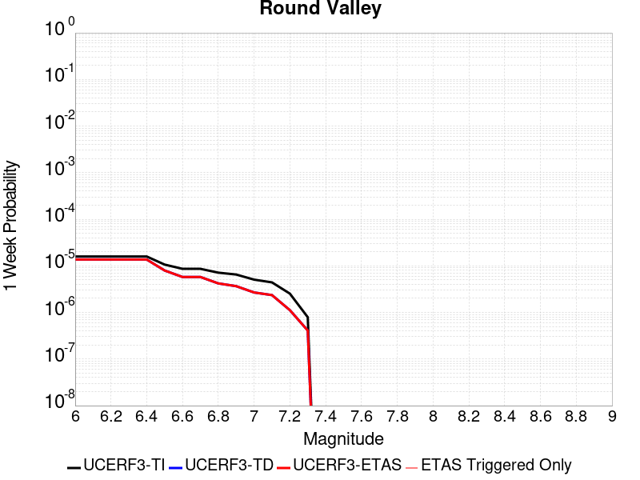 |  | 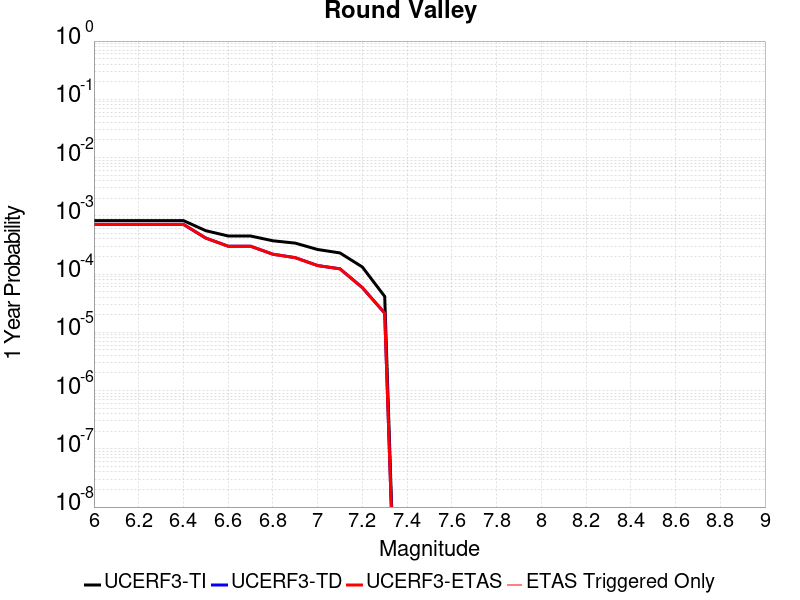 | 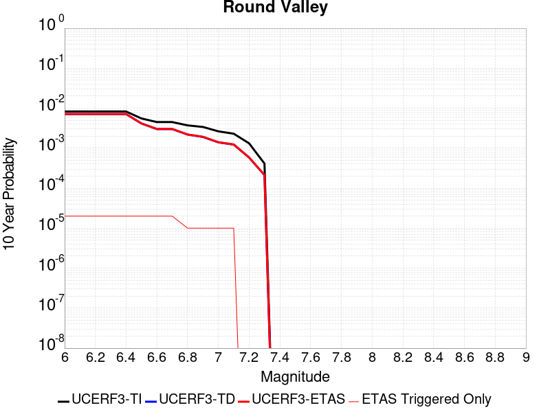 |

| Magnitude | 1 wk TI Prob | 1 wk TD Prob | 1 wk ETAS Prob | 1 wk ETAS/TD Gain | 1 wk ETAS Triggered Only | 1 mo TI Prob | 1 mo TD Prob | 1 mo ETAS Prob | 1 mo ETAS/TD Gain | 1 mo ETAS Triggered Only | 1 yr TI Prob | 1 yr TD Prob | 1 yr ETAS Prob | 1 yr ETAS/TD Gain | 1 yr ETAS Triggered Only | 10 yr TI Prob | 10 yr TD Prob | 10 yr ETAS Prob | 10 yr ETAS/TD Gain | 10 yr ETAS Triggered Only |
|-----|-----|-----|-----|-----|-----|-----|-----|-----|-----|-----|-----|-----|-----|-----|-----|-----|-----|-----|-----|-----|
| 6.0 | 1.588152E-5 | 1.3670716E-5 | 1.3670716E-5 | 1.0 | 0.0 | 6.806188E-5 | 5.8587688E-5 | 5.8587688E-5 | 1.0 | 0.0 | 8.283384E-4 | 7.13111E-4 | 7.13111E-4 | 1.0 | 0.0 | 0.008252576 | 0.0071121147 | 0.007131973 | 1.0027921 | 2.0E-5 |
| 6.1 | 1.588152E-5 | 1.3670716E-5 | 1.3670716E-5 | 1.0 | 0.0 | 6.806188E-5 | 5.8587688E-5 | 5.8587688E-5 | 1.0 | 0.0 | 8.283384E-4 | 7.13111E-4 | 7.13111E-4 | 1.0 | 0.0 | 0.008252576 | 0.0071121147 | 0.007131973 | 1.0027921 | 2.0E-5 |
| 6.2 | 1.588152E-5 | 1.3670716E-5 | 1.3670716E-5 | 1.0 | 0.0 | 6.806188E-5 | 5.8587688E-5 | 5.8587688E-5 | 1.0 | 0.0 | 8.283384E-4 | 7.13111E-4 | 7.13111E-4 | 1.0 | 0.0 | 0.008252576 | 0.0071121147 | 0.007131973 | 1.0027921 | 2.0E-5 |
| 6.3 | 1.588152E-5 | 1.3670716E-5 | 1.3670716E-5 | 1.0 | 0.0 | 6.806188E-5 | 5.8587688E-5 | 5.8587688E-5 | 1.0 | 0.0 | 8.283384E-4 | 7.13111E-4 | 7.13111E-4 | 1.0 | 0.0 | 0.008252576 | 0.0071121147 | 0.007131973 | 1.0027921 | 2.0E-5 |
| 6.4 | 1.588152E-5 | 1.3670716E-5 | 1.3670716E-5 | 1.0 | 0.0 | 6.806188E-5 | 5.8587688E-5 | 5.8587688E-5 | 1.0 | 0.0 | 8.283384E-4 | 7.13111E-4 | 7.13111E-4 | 1.0 | 0.0 | 0.008252576 | 0.0071121147 | 0.007131973 | 1.0027921 | 2.0E-5 |
| 6.5 | 1.0646776E-5 | 7.953037E-6 | 7.953037E-6 | 1.0 | 0.0 | 4.5628243E-5 | 3.408405E-5 | 3.408405E-5 | 1.0 | 0.0 | 5.553823E-4 | 4.1490266E-4 | 4.1490266E-4 | 1.0 | 0.0 | 0.005539963 | 0.0041421093 | 0.004162026 | 1.0048084 | 2.0E-5 |
| 6.6 | 8.632956E-6 | 5.768742E-6 | 5.768742E-6 | 1.0 | 0.0 | 3.6997862E-5 | 2.4722967E-5 | 2.4722967E-5 | 1.0 | 0.0 | 4.5035584E-4 | 3.009644E-4 | 3.009644E-4 | 1.0 | 0.0 | 0.0044944426 | 0.003005946 | 0.003025886 | 1.0066335 | 2.0E-5 |
| 6.7 | 8.632956E-6 | 5.768742E-6 | 5.768742E-6 | 1.0 | 0.0 | 3.6997862E-5 | 2.4722967E-5 | 2.4722967E-5 | 1.0 | 0.0 | 4.5035584E-4 | 3.009644E-4 | 3.009644E-4 | 1.0 | 0.0 | 0.0044944426 | 0.003005946 | 0.003025886 | 1.0066335 | 2.0E-5 |
| 6.8 | 7.143895E-6 | 4.2018346E-6 | 4.2018346E-6 | 1.0 | 0.0 | 3.0616335E-5 | 1.8007748E-5 | 1.8007748E-5 | 1.0 | 0.0 | 3.726901E-4 | 2.1922393E-4 | 2.1922393E-4 | 1.0 | 0.0 | 0.0037206567 | 0.0021902416 | 0.0022002198 | 1.0045557 | 1.0E-5 |
| 6.9 | 6.5120694E-6 | 3.6644687E-6 | 3.6644687E-6 | 1.0 | 0.0 | 2.790857E-5 | 1.570478E-5 | 1.570478E-5 | 1.0 | 0.0 | 3.3973387E-4 | 1.9119044E-4 | 1.9119044E-4 | 1.0 | 0.0 | 0.0033921495 | 0.0019104085 | 0.0019203894 | 1.0052245 | 1.0E-5 |
| 7.0 | 5.0614435E-6 | 2.6836676E-6 | 2.6836676E-6 | 1.0 | 0.0 | 2.169172E-5 | 1.1501388E-5 | 1.1501388E-5 | 1.0 | 0.0 | 2.6406467E-4 | 1.4002144E-4 | 1.4002144E-4 | 1.0 | 0.0 | 0.0026375111 | 0.0013994334 | 0.0014094195 | 1.0071357 | 1.0E-5 |
| 7.1 | 4.41728E-6 | 2.3575074E-6 | 2.3575074E-6 | 1.0 | 0.0 | 1.8931061E-5 | 1.0103569E-5 | 1.0103569E-5 | 1.0 | 0.0 | 2.304613E-4 | 1.23005E-4 | 1.23005E-4 | 1.0 | 0.0 | 0.0023022245 | 0.0012294657 | 0.0012394533 | 1.0081236 | 1.0E-5 |
| 7.2 | 2.535495E-6 | 1.1208391E-6 | 1.1208391E-6 | 1.0 | 0.0 | 1.0866362E-5 | 4.8035904E-6 | 4.8035904E-6 | 1.0 | 0.0 | 1.3228992E-4 | 5.8482667E-5 | 5.8482667E-5 | 1.0 | 0.0 | 0.0013221119 | 5.84724E-4 | 5.84724E-4 | 1.0 | 0.0 |
| 7.3 | 7.900015E-7 | 4.0889498E-7 | 4.0889498E-7 | 1.0 | 0.0 | 3.3857161E-6 | 1.752407E-6 | 1.752407E-6 | 1.0 | 0.0 | 4.1220315E-5 | 2.1335554E-5 | 2.1335554E-5 | 1.0 | 0.0 | 4.121267E-4 | 2.1335555E-4 | 2.1335555E-4 | 1.0 | 0.0 |

## Antelope Valley 2011
*[(top)](#table-of-contents)*

| 1 Week | 1 Month | 1 Year | 10 Year |
|-----|-----|-----|-----|
|  |  | 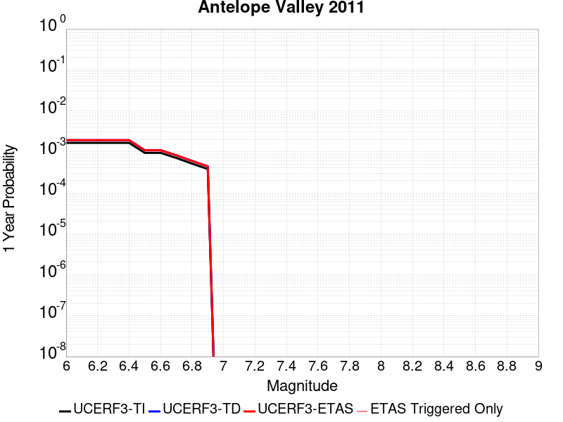 | 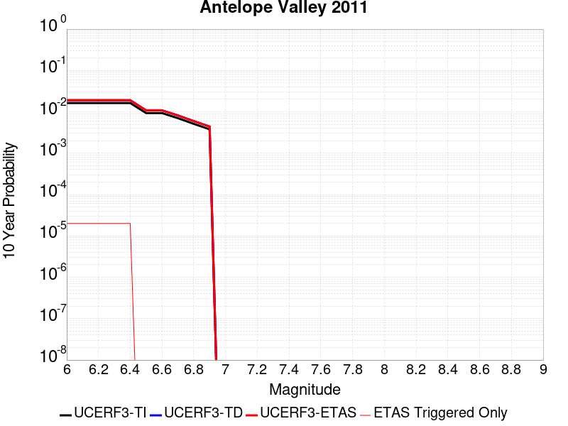 |

| Magnitude | 1 wk TI Prob | 1 wk TD Prob | 1 wk ETAS Prob | 1 wk ETAS/TD Gain | 1 wk ETAS Triggered Only | 1 mo TI Prob | 1 mo TD Prob | 1 mo ETAS Prob | 1 mo ETAS/TD Gain | 1 mo ETAS Triggered Only | 1 yr TI Prob | 1 yr TD Prob | 1 yr ETAS Prob | 1 yr ETAS/TD Gain | 1 yr ETAS Triggered Only | 10 yr TI Prob | 10 yr TD Prob | 10 yr ETAS Prob | 10 yr ETAS/TD Gain | 10 yr ETAS Triggered Only |
|-----|-----|-----|-----|-----|-----|-----|-----|-----|-----|-----|-----|-----|-----|-----|-----|-----|-----|-----|-----|-----|
| 6.0 | 3.1646934E-5 | 3.6904403E-5 | 3.6904403E-5 | 1.0 | 0.0 | 1.3562266E-4 | 1.5815363E-4 | 1.5815363E-4 | 1.0 | 0.0 | 0.0016499552 | 0.0019240845 | 0.0019240845 | 1.0 | 0.0 | 0.016377583 | 0.019100651 | 0.019120269 | 1.0010271 | 2.0E-5 |
| 6.1 | 3.1646934E-5 | 3.6904403E-5 | 3.6904403E-5 | 1.0 | 0.0 | 1.3562266E-4 | 1.5815363E-4 | 1.5815363E-4 | 1.0 | 0.0 | 0.0016499552 | 0.0019240845 | 0.0019240845 | 1.0 | 0.0 | 0.016377583 | 0.019100651 | 0.019120269 | 1.0010271 | 2.0E-5 |
| 6.2 | 3.1646934E-5 | 3.6904403E-5 | 3.6904403E-5 | 1.0 | 0.0 | 1.3562266E-4 | 1.5815363E-4 | 1.5815363E-4 | 1.0 | 0.0 | 0.0016499552 | 0.0019240845 | 0.0019240845 | 1.0 | 0.0 | 0.016377583 | 0.019100651 | 0.019120269 | 1.0010271 | 2.0E-5 |
| 6.3 | 3.1646934E-5 | 3.6904403E-5 | 3.6904403E-5 | 1.0 | 0.0 | 1.3562266E-4 | 1.5815363E-4 | 1.5815363E-4 | 1.0 | 0.0 | 0.0016499552 | 0.0019240845 | 0.0019240845 | 1.0 | 0.0 | 0.016377583 | 0.019100651 | 0.019120269 | 1.0010271 | 2.0E-5 |
| 6.4 | 3.1646934E-5 | 3.6904403E-5 | 3.6904403E-5 | 1.0 | 0.0 | 1.3562266E-4 | 1.5815363E-4 | 1.5815363E-4 | 1.0 | 0.0 | 0.0016499552 | 0.0019240845 | 0.0019240845 | 1.0 | 0.0 | 0.016377583 | 0.019100651 | 0.019120269 | 1.0010271 | 2.0E-5 |
| 6.5 | 1.8034107E-5 | 2.0940959E-5 | 2.0940959E-5 | 1.0 | 0.0 | 7.7286735E-5 | 8.974457E-5 | 8.974457E-5 | 1.0 | 0.0 | 9.405598E-4 | 0.0010922146 | 0.0010922146 | 1.0 | 0.0 | 0.009365888 | 0.010880542 | 0.010880542 | 1.0 | 0.0 |
| 6.6 | 1.8034107E-5 | 2.0940959E-5 | 2.0940959E-5 | 1.0 | 0.0 | 7.7286735E-5 | 8.974457E-5 | 8.974457E-5 | 1.0 | 0.0 | 9.405598E-4 | 0.0010922146 | 0.0010922146 | 1.0 | 0.0 | 0.009365888 | 0.010880542 | 0.010880542 | 1.0 | 0.0 |
| 6.7 | 1.3567667E-5 | 1.5749509E-5 | 1.5749509E-5 | 1.0 | 0.0 | 5.814585E-5 | 6.749675E-5 | 6.749675E-5 | 1.0 | 0.0 | 7.076958E-4 | 8.2156935E-4 | 8.2156935E-4 | 1.0 | 0.0 | 0.007054463 | 0.008195754 | 0.008195754 | 1.0 | 0.0 |
| 6.8 | 9.867387E-6 | 1.1467935E-5 | 1.1467935E-5 | 1.0 | 0.0 | 4.2288117E-5 | 4.91479E-5 | 4.91479E-5 | 1.0 | 0.0 | 5.1473617E-4 | 5.9830636E-4 | 5.9830636E-4 | 1.0 | 0.0 | 0.005135455 | 0.005976268 | 0.005976268 | 1.0 | 0.0 |
| 6.9 | 7.273233E-6 | 8.454864E-6 | 8.454864E-6 | 1.0 | 0.0 | 3.1170628E-5 | 3.623513E-5 | 3.623513E-5 | 1.0 | 0.0 | 3.794363E-4 | 4.411627E-4 | 4.411627E-4 | 1.0 | 0.0 | 0.0037878908 | 0.004411627 | 0.004411627 | 1.0 | 0.0 |

## Elsinore (Coyote Mountains)
*[(top)](#table-of-contents)*

| 1 Week | 1 Month | 1 Year | 10 Year |
|-----|-----|-----|-----|
|  |  |  |  |

| Magnitude | 1 wk TI Prob | 1 wk TD Prob | 1 wk ETAS Prob | 1 wk ETAS/TD Gain | 1 wk ETAS Triggered Only | 1 mo TI Prob | 1 mo TD Prob | 1 mo ETAS Prob | 1 mo ETAS/TD Gain | 1 mo ETAS Triggered Only | 1 yr TI Prob | 1 yr TD Prob | 1 yr ETAS Prob | 1 yr ETAS/TD Gain | 1 yr ETAS Triggered Only | 10 yr TI Prob | 10 yr TD Prob | 10 yr ETAS Prob | 10 yr ETAS/TD Gain | 10 yr ETAS Triggered Only |
|-----|-----|-----|-----|-----|-----|-----|-----|-----|-----|-----|-----|-----|-----|-----|-----|-----|-----|-----|-----|-----|
| 6.0 | 4.20513E-5 | 4.8631882E-5 | 4.8631882E-5 | 1.0 | 0.0 | 1.8020741E-4 | 2.0840895E-4 | 2.1840687E-4 | 1.0479726 | 1.0E-5 | 0.0021918174 | 0.002535 | 0.0025549494 | 1.0078696 | 2.0E-5 | 0.021703249 | 0.025111282 | 0.02513078 | 1.0007764 | 2.0E-5 |
| 6.1 | 4.20513E-5 | 4.8631882E-5 | 4.8631882E-5 | 1.0 | 0.0 | 1.8020741E-4 | 2.0840895E-4 | 2.1840687E-4 | 1.0479726 | 1.0E-5 | 0.0021918174 | 0.002535 | 0.0025549494 | 1.0078696 | 2.0E-5 | 0.021703249 | 0.025111282 | 0.02513078 | 1.0007764 | 2.0E-5 |
| 6.2 | 2.3413893E-5 | 2.469566E-5 | 2.469566E-5 | 1.0 | 0.0 | 1.0034139E-4 | 1.0583479E-4 | 1.0583479E-4 | 1.0 | 0.0 | 0.0012209718 | 0.0012878707 | 0.0012978577 | 1.0077548 | 1.0E-5 | 0.012142851 | 0.01281264 | 0.012822512 | 1.0007704 | 1.0E-5 |
| 6.3 | 2.3413893E-5 | 2.469566E-5 | 2.469566E-5 | 1.0 | 0.0 | 1.0034139E-4 | 1.0583479E-4 | 1.0583479E-4 | 1.0 | 0.0 | 0.0012209718 | 0.0012878707 | 0.0012978577 | 1.0077548 | 1.0E-5 | 0.012142851 | 0.01281264 | 0.012822512 | 1.0007704 | 1.0E-5 |
| 6.4 | 1.6894814E-5 | 1.6568361E-5 | 1.6568361E-5 | 1.0 | 0.0 | 7.240433E-5 | 7.1005554E-5 | 7.1005554E-5 | 1.0 | 0.0 | 8.811662E-4 | 8.6418656E-4 | 8.741779E-4 | 1.0115616 | 1.0E-5 | 0.0087768035 | 0.00861194 | 0.008621854 | 1.0011512 | 1.0E-5 |
| 6.5 | 1.6894814E-5 | 1.6568361E-5 | 1.6568361E-5 | 1.0 | 0.0 | 7.240433E-5 | 7.1005554E-5 | 7.1005554E-5 | 1.0 | 0.0 | 8.811662E-4 | 8.6418656E-4 | 8.741779E-4 | 1.0115616 | 1.0E-5 | 0.0087768035 | 0.00861194 | 0.008621854 | 1.0011512 | 1.0E-5 |
| 6.6 | 1.1910969E-5 | 1.0530774E-5 | 1.0530774E-5 | 1.0 | 0.0 | 5.1046012E-5 | 4.5131183E-5 | 4.5131183E-5 | 1.0 | 0.0 | 6.21308E-4 | 5.4934516E-4 | 5.4934516E-4 | 1.0 | 0.0 | 0.0061957375 | 0.005481174 | 0.005481174 | 1.0 | 0.0 |
| 6.7 | 9.1486E-6 | 7.2028593E-6 | 7.2028593E-6 | 1.0 | 0.0 | 3.9207694E-5 | 3.0869054E-5 | 3.0869054E-5 | 1.0 | 0.0 | 4.7724912E-4 | 3.757697E-4 | 3.757697E-4 | 1.0 | 0.0 | 0.0047622547 | 0.0037517229 | 0.0037517229 | 1.0 | 0.0 |
| 6.8 | 7.90441E-6 | 5.7290276E-6 | 5.7290276E-6 | 1.0 | 0.0 | 3.3875604E-5 | 2.4552752E-5 | 2.4552752E-5 | 1.0 | 0.0 | 4.1235742E-4 | 2.9889002E-4 | 2.9889002E-4 | 1.0 | 0.0 | 0.0041159308 | 0.002985009 | 0.002985009 | 1.0 | 0.0 |
| 6.9 | 7.77015E-6 | 5.582982E-6 | 5.582982E-6 | 1.0 | 0.0 | 3.3300217E-5 | 2.3926852E-5 | 2.3926852E-5 | 1.0 | 0.0 | 4.0535472E-4 | 2.9127175E-4 | 2.9127175E-4 | 1.0 | 0.0 | 0.004046161 | 0.002909027 | 0.002909027 | 1.0 | 0.0 |
| 7.0 | 7.675798E-6 | 5.47984E-6 | 5.47984E-6 | 1.0 | 0.0 | 3.289586E-5 | 2.3484827E-5 | 2.3484827E-5 | 1.0 | 0.0 | 4.004335E-4 | 2.858915E-4 | 2.858915E-4 | 1.0 | 0.0 | 0.003997127 | 0.0028553635 | 0.0028553635 | 1.0 | 0.0 |
| 7.1 | 7.447814E-6 | 5.238714E-6 | 5.238714E-6 | 1.0 | 0.0 | 3.191881E-5 | 2.2451446E-5 | 2.2451446E-5 | 1.0 | 0.0 | 3.8854225E-4 | 2.7331332E-4 | 2.7331332E-4 | 1.0 | 0.0 | 0.003878636 | 0.0027298962 | 0.0027298962 | 1.0 | 0.0 |
| 7.2 | 7.128185E-6 | 4.905372E-6 | 4.905372E-6 | 1.0 | 0.0 | 3.0549007E-5 | 2.102286E-5 | 2.102286E-5 | 1.0 | 0.0 | 3.7187067E-4 | 2.5592445E-4 | 2.5592445E-4 | 1.0 | 0.0 | 0.00371249 | 0.0025564157 | 0.0025564157 | 1.0 | 0.0 |
| 7.3 | 7.0913875E-6 | 4.874047E-6 | 4.874047E-6 | 1.0 | 0.0 | 3.0391306E-5 | 2.0888614E-5 | 2.0888614E-5 | 1.0 | 0.0 | 3.6995133E-4 | 2.5429038E-4 | 2.5429038E-4 | 1.0 | 0.0 | 0.0036933604 | 0.0025401122 | 0.0025401122 | 1.0 | 0.0 |
| 7.4 | 7.051521E-6 | 4.837899E-6 | 4.837899E-6 | 1.0 | 0.0 | 3.0220453E-5 | 2.0733693E-5 | 2.0733693E-5 | 1.0 | 0.0 | 3.6787192E-4 | 2.5240466E-4 | 2.5240466E-4 | 1.0 | 0.0 | 0.0036726352 | 0.0025212981 | 0.0025212981 | 1.0 | 0.0 |
| 7.5 | 6.910666E-6 | 4.733448E-6 | 4.733448E-6 | 1.0 | 0.0 | 2.9616802E-5 | 2.0286056E-5 | 2.0286056E-5 | 1.0 | 0.0 | 3.605249E-4 | 2.4695593E-4 | 2.4695593E-4 | 1.0 | 0.0 | 0.0035994058 | 0.0024669329 | 0.0024669329 | 1.0 | 0.0 |
| 7.6 | 6.341753E-6 | 4.3065565E-6 | 4.3065565E-6 | 1.0 | 0.0 | 2.7178658E-5 | 1.8456547E-5 | 1.8456547E-5 | 1.0 | 0.0 | 3.3084993E-4 | 2.2468645E-4 | 2.2468645E-4 | 1.0 | 0.0 | 0.0033035777 | 0.002244708 | 0.002244708 | 1.0 | 0.0 |
| 7.7 | 3.9205916E-6 | 2.2439415E-6 | 2.2439415E-6 | 1.0 | 0.0 | 1.6802427E-5 | 9.616861E-6 | 9.616861E-6 | 1.0 | 0.0 | 2.0455034E-4 | 1.1707973E-4 | 1.1707973E-4 | 1.0 | 0.0 | 0.0020436216 | 0.0011702535 | 0.0011702535 | 1.0 | 0.0 |
| 7.8 | 2.0846227E-7 | 8.486417E-8 | 8.486417E-8 | 1.0 | 0.0 | 8.9340944E-7 | 3.6370355E-7 | 3.6370355E-7 | 1.0 | 0.0 | 1.0877206E-5 | 4.428085E-6 | 4.428085E-6 | 1.0 | 0.0 | 1.0876673E-4 | 4.4280296E-5 | 4.4280296E-5 | 1.0 | 0.0 |
| 7.9 | 4.4969806E-9 | 2.2691855E-9 | 2.2691855E-9 | 1.0 | 0.0 | 1.9272775E-8 | 9.72508E-9 | 9.72508E-9 | 1.0 | 0.0 | 2.3464601E-7 | 1.18402845E-7 | 1.18402845E-7 | 1.0 | 0.0 | 2.3464577E-6 | 1.184028E-6 | 1.184028E-6 | 1.0 | 0.0 |

## Hosgri (Extension)
*[(top)](#table-of-contents)*

| 1 Week | 1 Month | 1 Year | 10 Year |
|-----|-----|-----|-----|
| 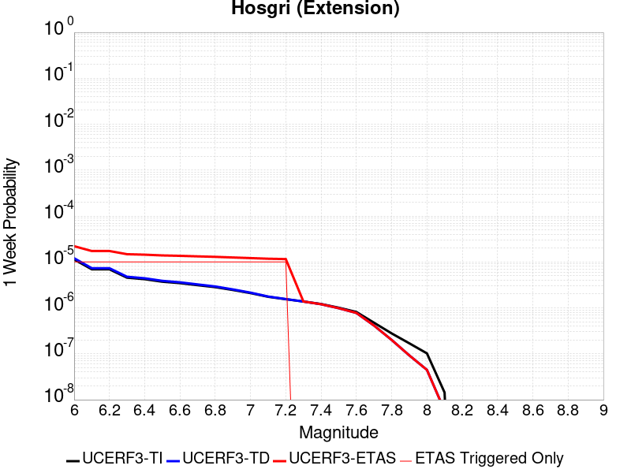 | 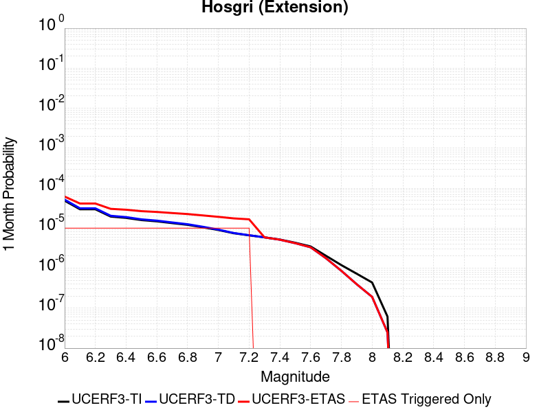 | 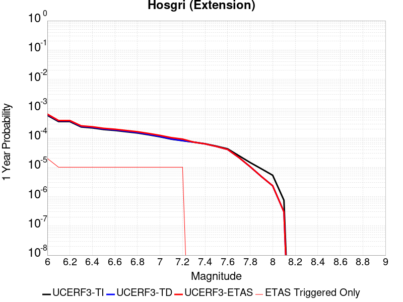 | 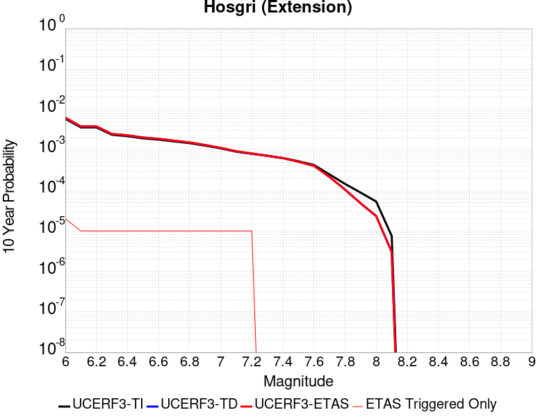 |

| Magnitude | 1 wk TI Prob | 1 wk TD Prob | 1 wk ETAS Prob | 1 wk ETAS/TD Gain | 1 wk ETAS Triggered Only | 1 mo TI Prob | 1 mo TD Prob | 1 mo ETAS Prob | 1 mo ETAS/TD Gain | 1 mo ETAS Triggered Only | 1 yr TI Prob | 1 yr TD Prob | 1 yr ETAS Prob | 1 yr ETAS/TD Gain | 1 yr ETAS Triggered Only | 10 yr TI Prob | 10 yr TD Prob | 10 yr ETAS Prob | 10 yr ETAS/TD Gain | 10 yr ETAS Triggered Only |
|-----|-----|-----|-----|-----|-----|-----|-----|-----|-----|-----|-----|-----|-----|-----|-----|-----|-----|-----|-----|-----|
| 6.0 | 1.1369135E-5 | 1.2083072E-5 | 2.2082952E-5 | 1.8275942 | 1.0E-5 | 4.8723956E-5 | 5.1783692E-5 | 6.1783176E-5 | 1.1931009 | 1.0E-5 | 5.9305265E-4 | 6.3030684E-4 | 6.5029424E-4 | 1.0317106 | 2.0E-5 | 0.005914725 | 0.0062874397 | 0.006307314 | 1.003161 | 2.0E-5 |
| 6.1 | 6.934979E-6 | 7.324555E-6 | 1.7324483E-5 | 2.3652606 | 1.0E-5 | 2.9721E-5 | 3.1390595E-5 | 4.139028E-5 | 1.3185568 | 1.0E-5 | 3.617931E-4 | 3.8211764E-4 | 3.921138E-4 | 1.02616 | 1.0E-5 | 0.0036120464 | 0.0038150186 | 0.0038249805 | 1.0026112 | 1.0E-5 |
| 6.2 | 6.934979E-6 | 7.324555E-6 | 1.7324483E-5 | 2.3652606 | 1.0E-5 | 2.9721E-5 | 3.1390595E-5 | 4.139028E-5 | 1.3185568 | 1.0E-5 | 3.617931E-4 | 3.8211764E-4 | 3.921138E-4 | 1.02616 | 1.0E-5 | 0.0036120464 | 0.0038150186 | 0.0038249805 | 1.0026112 | 1.0E-5 |
| 6.3 | 4.5484676E-6 | 4.76933E-6 | 1.4769283E-5 | 3.0967205 | 1.0E-5 | 1.9493287E-5 | 2.043983E-5 | 3.0439625E-5 | 1.4892309 | 1.0E-5 | 2.3730492E-4 | 2.4882692E-4 | 2.5882444E-4 | 1.0401785 | 1.0E-5 | 0.0023705168 | 0.0024855258 | 0.002495501 | 1.0040133 | 1.0E-5 |
| 6.4 | 4.218095E-6 | 4.4168614E-6 | 1.4416817E-5 | 3.264041 | 1.0E-5 | 1.8077424E-5 | 1.8929271E-5 | 2.8929082E-5 | 1.5282724 | 1.0E-5 | 2.2007042E-4 | 2.3043984E-4 | 2.4043753E-4 | 1.0433853 | 1.0E-5 | 0.002198526 | 0.0023020422 | 0.0023120192 | 1.004334 | 1.0E-5 |
| 6.5 | 3.717374E-6 | 3.8838775E-6 | 1.3883839E-5 | 3.5747364 | 1.0E-5 | 1.5931506E-5 | 1.6645085E-5 | 2.6644919E-5 | 1.600768 | 1.0E-5 | 1.9394881E-4 | 2.0263524E-4 | 2.1263321E-4 | 1.0493398 | 1.0E-5 | 0.0019377962 | 0.0020245234 | 0.0020345033 | 1.0049294 | 1.0E-5 |
| 6.6 | 3.4605036E-6 | 3.608306E-6 | 1.360827E-5 | 3.7713735 | 1.0E-5 | 1.4830645E-5 | 1.5464078E-5 | 2.5463924E-5 | 1.64665 | 1.0E-5 | 1.8054814E-4 | 1.8825903E-4 | 1.9825714E-4 | 1.0531083 | 1.0E-5 | 0.0018040152 | 0.0018810101 | 0.0018909913 | 1.0053062 | 1.0E-5 |
| 6.7 | 3.123439E-6 | 3.2465687E-6 | 1.3246537E-5 | 4.080165 | 1.0E-5 | 1.33860985E-5 | 1.3913792E-5 | 2.3913653E-5 | 1.7187014 | 1.0E-5 | 1.6296357E-4 | 1.6938736E-4 | 1.7938566E-4 | 1.0590262 | 1.0E-5 | 0.001628441 | 0.0016925934 | 0.0017025765 | 1.0058981 | 1.0E-5 |
| 6.8 | 2.8290783E-6 | 2.9305404E-6 | 1.2930511E-5 | 4.41233 | 1.0E-5 | 1.2124565E-5 | 1.2559399E-5 | 2.2559274E-5 | 1.7962065 | 1.0E-5 | 1.4760658E-4 | 1.5290003E-4 | 1.628985E-4 | 1.0653923 | 1.0E-5 | 0.0014750857 | 0.001527957 | 0.0015379417 | 1.0065347 | 1.0E-5 |
| 6.9 | 2.454112E-6 | 2.5283196E-6 | 1.2528294E-5 | 4.9551864 | 1.0E-5 | 1.0517581E-5 | 1.0835611E-5 | 2.0835501E-5 | 1.9228729 | 1.0E-5 | 1.2804402E-4 | 1.3191563E-4 | 1.4191431E-4 | 1.075796 | 1.0E-5 | 0.0012797028 | 0.0013183793 | 0.0013283662 | 1.007575 | 1.0E-5 |
| 7.0 | 2.1008145E-6 | 2.1498704E-6 | 1.2149849E-5 | 5.6514335 | 1.0E-5 | 9.003459E-6 | 9.213698E-6 | 1.9213605E-5 | 2.0853305 | 1.0E-5 | 1.096116E-4 | 1.1217103E-4 | 1.221699E-4 | 1.0891396 | 1.0E-5 | 0.0010955755 | 0.0011211479 | 0.0011311367 | 1.0089095 | 1.0E-5 |
| 7.1 | 1.744384E-6 | 1.7686352E-6 | 1.1768618E-5 | 6.654067 | 1.0E-5 | 7.47591E-6 | 7.5798434E-6 | 1.7579767E-5 | 2.3192785 | 1.0E-5 | 9.1015405E-5 | 9.22807E-5 | 1.0227978E-4 | 1.108355 | 1.0E-5 | 9.097813E-4 | 9.2242553E-4 | 9.3241635E-4 | 1.010831 | 1.0E-5 |
| 7.2 | 1.5456587E-6 | 1.5562882E-6 | 1.15562725E-5 | 7.4255347 | 1.0E-5 | 6.6242346E-6 | 6.66979E-6 | 1.6669723E-5 | 2.4992876 | 1.0E-5 | 8.064707E-5 | 8.120168E-5 | 9.120086E-5 | 1.1231402 | 1.0E-5 | 8.0617814E-4 | 8.117213E-4 | 8.217132E-4 | 1.0123096 | 1.0E-5 |
| 7.3 | 1.3775123E-6 | 1.3766082E-6 | 1.3766082E-6 | 1.0 | 0.0 | 5.9036106E-6 | 5.899736E-6 | 5.899736E-6 | 1.0 | 0.0 | 7.187409E-5 | 7.182693E-5 | 7.182693E-5 | 1.0 | 0.0 | 7.185085E-4 | 7.180382E-4 | 7.180382E-4 | 1.0 | 0.0 |
| 7.4 | 1.214491E-6 | 1.2023461E-6 | 1.2023461E-6 | 1.0 | 0.0 | 5.2049513E-6 | 5.1529014E-6 | 5.1529014E-6 | 1.0 | 0.0 | 6.336844E-5 | 6.2734776E-5 | 6.2734776E-5 | 1.0 | 0.0 | 6.335037E-4 | 6.271715E-4 | 6.271715E-4 | 1.0 | 0.0 |
| 7.5 | 1.0101123E-6 | 9.842246E-7 | 9.842246E-7 | 1.0 | 0.0 | 4.3290456E-6 | 4.2180986E-6 | 4.2180986E-6 | 1.0 | 0.0 | 5.2704854E-5 | 5.1354145E-5 | 5.1354145E-5 | 1.0 | 0.0 | 5.2692357E-4 | 5.1342335E-4 | 5.1342335E-4 | 1.0 | 0.0 |
| 7.6 | 8.1558215E-7 | 7.765966E-7 | 7.765966E-7 | 1.0 | 0.0 | 3.4953473E-6 | 3.328267E-6 | 3.328267E-6 | 1.0 | 0.0 | 4.255502E-5 | 4.0520903E-5 | 4.0520903E-5 | 1.0 | 0.0 | 4.2546875E-4 | 4.0513556E-4 | 4.0513556E-4 | 1.0 | 0.0 |
| 7.7 | 4.757816E-7 | 4.1308888E-7 | 4.1308888E-7 | 1.0 | 0.0 | 2.0390623E-6 | 1.7703798E-6 | 1.7703798E-6 | 1.0 | 0.0 | 2.4825302E-5 | 2.155416E-5 | 2.155416E-5 | 1.0 | 0.0 | 2.482253E-4 | 2.1552083E-4 | 2.1552083E-4 | 1.0 | 0.0 |
| 7.8 | 2.782787E-7 | 2.0047722E-7 | 2.0047722E-7 | 1.0 | 0.0 | 1.1926223E-6 | 8.5918776E-7 | 8.5918776E-7 | 1.0 | 0.0 | 1.452008E-5 | 1.04605615E-5 | 1.04605615E-5 | 1.0 | 0.0 | 1.4519131E-4 | 1.04600724E-4 | 1.04600724E-4 | 1.0 | 0.0 |
| 7.9 | 1.6948086E-7 | 9.244227E-8 | 9.244227E-8 | 1.0 | 0.0 | 7.2634634E-7 | 3.961811E-7 | 3.961811E-7 | 1.0 | 0.0 | 8.843231E-6 | 4.8234942E-6 | 4.8234942E-6 | 1.0 | 0.0 | 8.842879E-5 | 4.8233902E-5 | 4.8233902E-5 | 1.0 | 0.0 |
| 8.0 | 1.0225492E-7 | 4.4738776E-8 | 4.4738776E-8 | 1.0 | 0.0 | 4.382353E-7 | 1.917376E-7 | 1.917376E-7 | 1.0 | 0.0 | 5.335502E-6 | 2.3344028E-6 | 2.3344028E-6 | 1.0 | 0.0 | 5.335374E-5 | 2.3343786E-5 | 2.3343786E-5 | 1.0 | 0.0 |
| 8.1 | 1.43711345E-8 | 5.787707E-9 | 5.787707E-9 | 1.0 | 0.0 | 6.1590576E-8 | 2.480446E-8 | 2.480446E-8 | 1.0 | 0.0 | 7.4986497E-7 | 3.0199428E-7 | 3.0199428E-7 | 1.0 | 0.0 | 7.4986247E-6 | 3.0199392E-6 | 3.0199392E-6 | 1.0 | 0.0 |

## La Panza 2011
*[(top)](#table-of-contents)*

| 1 Week | 1 Month | 1 Year | 10 Year |
|-----|-----|-----|-----|
|  | 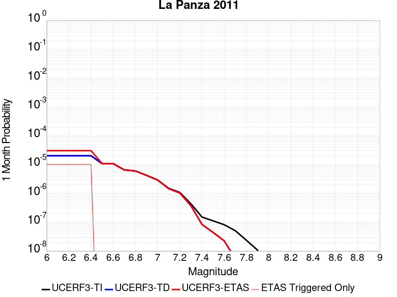 | 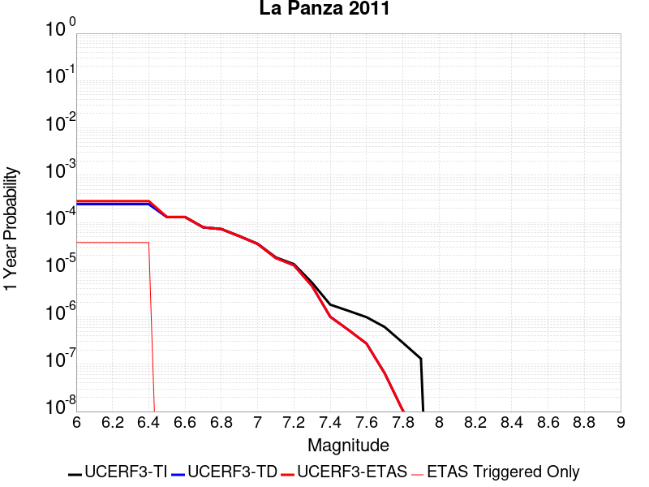 | 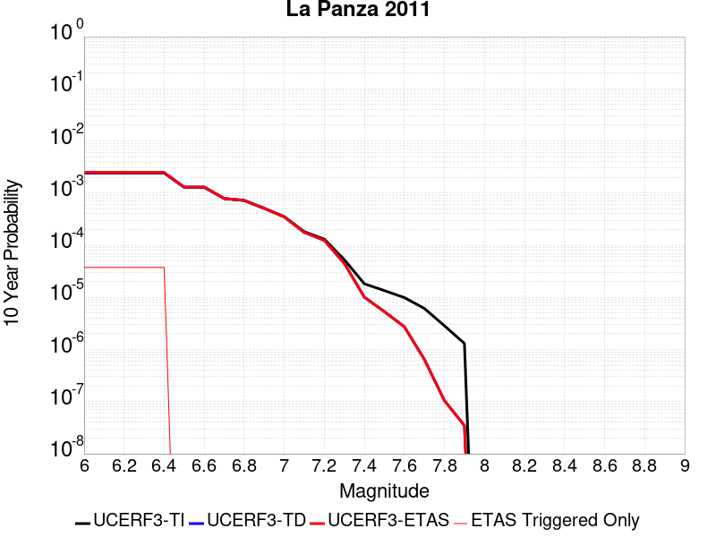 |

| Magnitude | 1 wk TI Prob | 1 wk TD Prob | 1 wk ETAS Prob | 1 wk ETAS/TD Gain | 1 wk ETAS Triggered Only | 1 mo TI Prob | 1 mo TD Prob | 1 mo ETAS Prob | 1 mo ETAS/TD Gain | 1 mo ETAS Triggered Only | 1 yr TI Prob | 1 yr TD Prob | 1 yr ETAS Prob | 1 yr ETAS/TD Gain | 1 yr ETAS Triggered Only | 10 yr TI Prob | 10 yr TD Prob | 10 yr ETAS Prob | 10 yr ETAS/TD Gain | 10 yr ETAS Triggered Only |
|-----|-----|-----|-----|-----|-----|-----|-----|-----|-----|-----|-----|-----|-----|-----|-----|-----|-----|-----|-----|-----|
| 6.0 | 4.6754544E-6 | 4.717587E-6 | 4.717587E-6 | 1.0 | 0.0 | 2.0037509E-5 | 2.0218084E-5 | 3.0217881E-5 | 1.4945967 | 1.0E-5 | 2.4392935E-4 | 2.4612935E-4 | 2.561269E-4 | 1.040619 | 1.0E-5 | 0.0024366176 | 0.002458762 | 0.0024787127 | 1.0081142 | 2.0E-5 |
| 6.1 | 4.6754544E-6 | 4.717587E-6 | 4.717587E-6 | 1.0 | 0.0 | 2.0037509E-5 | 2.0218084E-5 | 3.0217881E-5 | 1.4945967 | 1.0E-5 | 2.4392935E-4 | 2.4612935E-4 | 2.561269E-4 | 1.040619 | 1.0E-5 | 0.0024366176 | 0.002458762 | 0.0024787127 | 1.0081142 | 2.0E-5 |
| 6.2 | 4.6754544E-6 | 4.717587E-6 | 4.717587E-6 | 1.0 | 0.0 | 2.0037509E-5 | 2.0218084E-5 | 3.0217881E-5 | 1.4945967 | 1.0E-5 | 2.4392935E-4 | 2.4612935E-4 | 2.561269E-4 | 1.040619 | 1.0E-5 | 0.0024366176 | 0.002458762 | 0.0024787127 | 1.0081142 | 2.0E-5 |
| 6.3 | 4.6754544E-6 | 4.717587E-6 | 4.717587E-6 | 1.0 | 0.0 | 2.0037509E-5 | 2.0218084E-5 | 3.0217881E-5 | 1.4945967 | 1.0E-5 | 2.4392935E-4 | 2.4612935E-4 | 2.561269E-4 | 1.040619 | 1.0E-5 | 0.0024366176 | 0.002458762 | 0.0024787127 | 1.0081142 | 2.0E-5 |
| 6.4 | 4.6754544E-6 | 4.717587E-6 | 4.717587E-6 | 1.0 | 0.0 | 2.0037509E-5 | 2.0218084E-5 | 3.0217881E-5 | 1.4945967 | 1.0E-5 | 2.4392935E-4 | 2.4612935E-4 | 2.561269E-4 | 1.040619 | 1.0E-5 | 0.0024366176 | 0.002458762 | 0.0024787127 | 1.0081142 | 2.0E-5 |
| 6.5 | 2.485343E-6 | 2.5005988E-6 | 2.5005988E-6 | 1.0 | 0.0 | 1.0651426E-5 | 1.0716811E-5 | 1.0716811E-5 | 1.0 | 0.0 | 1.296734E-4 | 1.3046975E-4 | 1.3046975E-4 | 1.0 | 0.0 | 0.0012959775 | 0.0013039699 | 0.0013139568 | 1.0076588 | 1.0E-5 |
| 6.6 | 2.485343E-6 | 2.5005988E-6 | 2.5005988E-6 | 1.0 | 0.0 | 1.0651426E-5 | 1.0716811E-5 | 1.0716811E-5 | 1.0 | 0.0 | 1.296734E-4 | 1.3046975E-4 | 1.3046975E-4 | 1.0 | 0.0 | 0.0012959775 | 0.0013039699 | 0.0013139568 | 1.0076588 | 1.0E-5 |
| 6.7 | 1.5108508E-6 | 1.5146375E-6 | 1.5146375E-6 | 1.0 | 0.0 | 6.4750584E-6 | 6.491288E-6 | 6.491288E-6 | 1.0 | 0.0 | 7.8830984E-5 | 7.902867E-5 | 7.902867E-5 | 1.0 | 0.0 | 7.880303E-4 | 7.900165E-4 | 8.000086E-4 | 1.012648 | 1.0E-5 |
| 6.8 | 1.3865837E-6 | 1.3885102E-6 | 1.3885102E-6 | 1.0 | 0.0 | 5.942488E-6 | 5.9507447E-6 | 5.9507447E-6 | 1.0 | 0.0 | 7.234739E-5 | 7.244801E-5 | 7.244801E-5 | 1.0 | 0.0 | 7.232384E-4 | 7.242537E-4 | 7.3424645E-4 | 1.0137973 | 1.0E-5 |
| 6.9 | 9.826583E-7 | 9.796287E-7 | 9.796287E-7 | 1.0 | 0.0 | 4.2113857E-6 | 4.198402E-6 | 4.198402E-6 | 1.0 | 0.0 | 5.1272415E-5 | 5.11144E-5 | 5.11144E-5 | 1.0 | 0.0 | 5.126059E-4 | 5.110318E-4 | 5.110318E-4 | 1.0 | 0.0 |
| 7.0 | 6.7797646E-7 | 6.7102144E-7 | 6.7102144E-7 | 1.0 | 0.0 | 2.9056102E-6 | 2.8758034E-6 | 2.8758034E-6 | 1.0 | 0.0 | 3.537523E-5 | 3.5012374E-5 | 3.5012374E-5 | 1.0 | 0.0 | 3.5369597E-4 | 3.5007167E-4 | 3.5007167E-4 | 1.0 | 0.0 |
| 7.1 | 3.4979826E-7 | 3.387388E-7 | 3.387388E-7 | 1.0 | 0.0 | 1.4991346E-6 | 1.4517369E-6 | 1.4517369E-6 | 1.0 | 0.0 | 1.825181E-5 | 1.7674765E-5 | 1.7674765E-5 | 1.0 | 0.0 | 1.825031E-4 | 1.7673477E-4 | 1.7673477E-4 | 1.0 | 0.0 |
| 7.2 | 2.5088332E-7 | 2.3831899E-7 | 2.3831899E-7 | 1.0 | 0.0 | 1.0752137E-6 | 1.0213668E-6 | 1.0213668E-6 | 1.0 | 0.0 | 1.3090649E-5 | 1.2435077E-5 | 1.2435077E-5 | 1.0 | 0.0 | 1.3089878E-4 | 1.2434467E-4 | 1.2434467E-4 | 1.0 | 0.0 |
| 7.3 | 1.0159086E-7 | 8.64462E-8 | 8.64462E-8 | 1.0 | 0.0 | 4.3538932E-7 | 3.7048366E-7 | 3.7048366E-7 | 1.0 | 0.0 | 5.300852E-6 | 4.5106294E-6 | 4.5106294E-6 | 1.0 | 0.0 | 5.3007258E-5 | 4.5105422E-5 | 4.5105422E-5 | 1.0 | 0.0 |
| 7.4 | 3.5006252E-8 | 1.9404325E-8 | 1.9404325E-8 | 1.0 | 0.0 | 1.5002678E-7 | 8.3161396E-8 | 8.3161396E-8 | 1.0 | 0.0 | 1.8265745E-6 | 1.0124895E-6 | 1.0124895E-6 | 1.0 | 0.0 | 1.8265595E-5 | 1.01248515E-5 | 1.01248515E-5 | 1.0 | 0.0 |
| 7.5 | 2.592274E-8 | 1.0239094E-8 | 1.0239094E-8 | 1.0 | 0.0 | 1.1109746E-7 | 4.388183E-8 | 4.388183E-8 | 1.0 | 0.0 | 1.3526106E-6 | 5.342612E-7 | 5.342612E-7 | 1.0 | 0.0 | 1.3526024E-5 | 5.3425997E-6 | 5.3425997E-6 | 1.0 | 0.0 |
| 7.6 | 1.9016717E-8 | 5.244801E-9 | 5.244801E-9 | 1.0 | 0.0 | 8.150022E-8 | 2.247772E-8 | 2.247772E-8 | 1.0 | 0.0 | 9.922647E-7 | 2.736662E-7 | 2.736662E-7 | 1.0 | 0.0 | 9.922603E-6 | 2.7366589E-6 | 2.7366589E-6 | 1.0 | 0.0 |
| 7.7 | 1.17738495E-8 | 1.2398075E-9 | 1.2398075E-9 | 1.0 | 0.0 | 5.0459356E-8 | 5.3134603E-9 | 5.3134603E-9 | 1.0 | 0.0 | 6.1434247E-7 | 6.469138E-8 | 6.469138E-8 | 1.0 | 0.0 | 6.143408E-6 | 6.469136E-7 | 6.469136E-7 | 1.0 | 0.0 |
| 7.8 | 5.489079E-9 | 2.0111768E-10 | 2.0111768E-10 | 1.0 | 0.0 | 2.3524624E-8 | 8.6193275E-10 | 8.6193275E-10 | 1.0 | 0.0 | 2.8641225E-7 | 1.04940305E-8 | 1.04940305E-8 | 1.0 | 0.0 | 2.8641189E-6 | 1.04940305E-7 | 1.04940305E-7 | 1.0 | 0.0 |
| 7.9 | 2.5081048E-9 | 6.683887E-11 | 6.683887E-11 | 1.0 | 0.0 | 1.0749021E-8 | 2.8645197E-10 | 2.8645197E-10 | 1.0 | 0.0 | 1.3086932E-7 | 3.487552E-9 | 3.487552E-9 | 1.0 | 0.0 | 1.3086925E-6 | 3.487552E-8 | 3.487552E-8 | 1.0 | 0.0 |

## Los Osos 2011
*[(top)](#table-of-contents)*

| 1 Week | 1 Month | 1 Year | 10 Year |
|-----|-----|-----|-----|
| 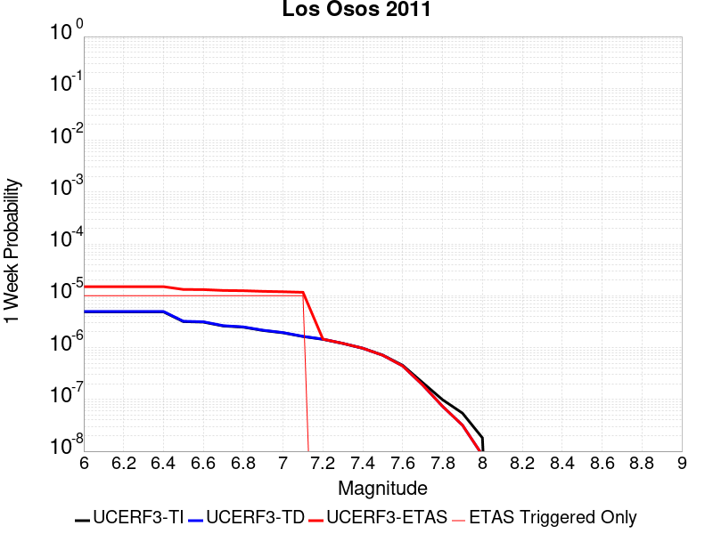 | 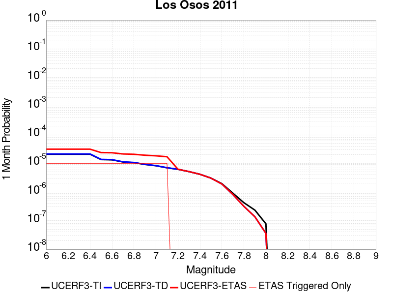 | 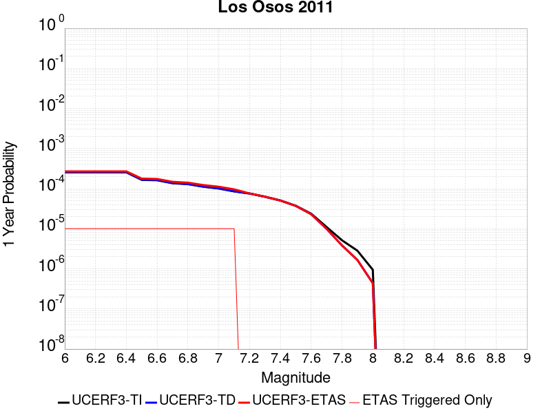 | 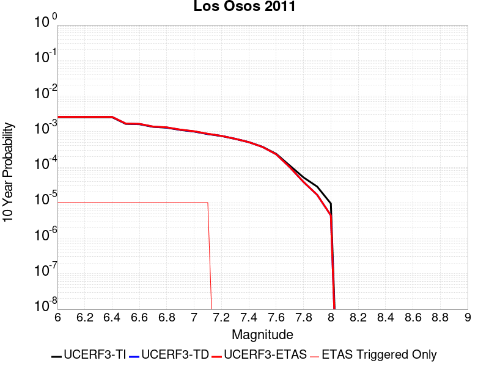 |

| Magnitude | 1 wk TI Prob | 1 wk TD Prob | 1 wk ETAS Prob | 1 wk ETAS/TD Gain | 1 wk ETAS Triggered Only | 1 mo TI Prob | 1 mo TD Prob | 1 mo ETAS Prob | 1 mo ETAS/TD Gain | 1 mo ETAS Triggered Only | 1 yr TI Prob | 1 yr TD Prob | 1 yr ETAS Prob | 1 yr ETAS/TD Gain | 1 yr ETAS Triggered Only | 10 yr TI Prob | 10 yr TD Prob | 10 yr ETAS Prob | 10 yr ETAS/TD Gain | 10 yr ETAS Triggered Only |
|-----|-----|-----|-----|-----|-----|-----|-----|-----|-----|-----|-----|-----|-----|-----|-----|-----|-----|-----|-----|-----|
| 6.0 | 4.8871775E-6 | 4.9814835E-6 | 1.4981433E-5 | 3.007424 | 1.0E-5 | 2.0944879E-5 | 2.1349055E-5 | 3.134884E-5 | 1.4683948 | 1.0E-5 | 2.5497406E-4 | 2.5989654E-4 | 2.6989394E-4 | 1.0384668 | 1.0E-5 | 0.002546817 | 0.0025962002 | 0.0026061744 | 1.0038418 | 1.0E-5 |
| 6.1 | 4.8871775E-6 | 4.9814835E-6 | 1.4981433E-5 | 3.007424 | 1.0E-5 | 2.0944879E-5 | 2.1349055E-5 | 3.134884E-5 | 1.4683948 | 1.0E-5 | 2.5497406E-4 | 2.5989654E-4 | 2.6989394E-4 | 1.0384668 | 1.0E-5 | 0.002546817 | 0.0025962002 | 0.0026061744 | 1.0038418 | 1.0E-5 |
| 6.2 | 4.8871775E-6 | 4.9814835E-6 | 1.4981433E-5 | 3.007424 | 1.0E-5 | 2.0944879E-5 | 2.1349055E-5 | 3.134884E-5 | 1.4683948 | 1.0E-5 | 2.5497406E-4 | 2.5989654E-4 | 2.6989394E-4 | 1.0384668 | 1.0E-5 | 0.002546817 | 0.0025962002 | 0.0026061744 | 1.0038418 | 1.0E-5 |
| 6.3 | 4.8871775E-6 | 4.9814835E-6 | 1.4981433E-5 | 3.007424 | 1.0E-5 | 2.0944879E-5 | 2.1349055E-5 | 3.134884E-5 | 1.4683948 | 1.0E-5 | 2.5497406E-4 | 2.5989654E-4 | 2.6989394E-4 | 1.0384668 | 1.0E-5 | 0.002546817 | 0.0025962002 | 0.0026061744 | 1.0038418 | 1.0E-5 |
| 6.4 | 4.8871775E-6 | 4.9814835E-6 | 1.4981433E-5 | 3.007424 | 1.0E-5 | 2.0944879E-5 | 2.1349055E-5 | 3.134884E-5 | 1.4683948 | 1.0E-5 | 2.5497406E-4 | 2.5989654E-4 | 2.6989394E-4 | 1.0384668 | 1.0E-5 | 0.002546817 | 0.0025962002 | 0.0026061744 | 1.0038418 | 1.0E-5 |
| 6.5 | 3.1724062E-6 | 3.223395E-6 | 1.3223363E-5 | 4.102309 | 1.0E-5 | 1.3595956E-5 | 1.3814477E-5 | 2.3814338E-5 | 1.7238683 | 1.0E-5 | 1.6551818E-4 | 1.681784E-4 | 1.7817674E-4 | 1.0594506 | 1.0E-5 | 0.0016539496 | 0.0016805249 | 0.0016905081 | 1.0059406 | 1.0E-5 |
| 6.6 | 3.1022591E-6 | 3.1511045E-6 | 1.3151073E-5 | 4.1734805 | 1.0E-5 | 1.3295328E-5 | 1.3504664E-5 | 2.3504528E-5 | 1.7404749 | 1.0E-5 | 1.618586E-4 | 1.64407E-4 | 1.7440536E-4 | 1.0608146 | 1.0E-5 | 0.0016174077 | 0.0016428665 | 0.0016528501 | 1.0060769 | 1.0E-5 |
| 6.7 | 2.611518E-6 | 2.6491832E-6 | 1.2649157E-5 | 4.7747383 | 1.0E-5 | 1.1192172E-5 | 1.1353593E-5 | 2.135348E-5 | 1.8807684 | 1.0E-5 | 1.3625617E-4 | 1.3822126E-4 | 1.4821989E-4 | 1.0723377 | 1.0E-5 | 0.0013617266 | 0.0013813575 | 0.0013913437 | 1.0072292 | 1.0E-5 |
| 6.8 | 2.4780884E-6 | 2.5121592E-6 | 1.2512134E-5 | 4.9806294 | 1.0E-5 | 1.0620336E-5 | 1.0766353E-5 | 2.0766245E-5 | 1.9288096 | 1.0E-5 | 1.2929492E-4 | 1.3107249E-4 | 1.4107118E-4 | 1.0762837 | 1.0E-5 | 0.0012921972 | 0.001309956 | 0.0013199429 | 1.0076238 | 1.0E-5 |
| 6.9 | 2.1376322E-6 | 2.1635055E-6 | 1.2163484E-5 | 5.622118 | 1.0E-5 | 9.161248E-6 | 9.272134E-6 | 1.9272042E-5 | 2.0784905 | 1.0E-5 | 1.1153249E-4 | 1.128824E-4 | 1.2288128E-4 | 1.0885777 | 1.0E-5 | 0.0011147653 | 0.0011282525 | 0.0011382413 | 1.0088533 | 1.0E-5 |
| 7.0 | 1.9282882E-6 | 1.9494585E-6 | 1.1949439E-5 | 6.1296196 | 1.0E-5 | 8.264066E-6 | 8.354796E-6 | 1.8354713E-5 | 2.1969073 | 1.0E-5 | 1.0061036E-4 | 1.017149E-4 | 1.1171388E-4 | 1.098304 | 1.0E-5 | 0.0010056482 | 0.0010166848 | 0.0010266746 | 1.009826 | 1.0E-5 |
| 7.1 | 1.6353226E-6 | 1.6501118E-6 | 1.1650095E-5 | 7.0601854 | 1.0E-5 | 7.0085066E-6 | 7.0718884E-6 | 1.7071818E-5 | 2.4140394 | 1.0E-5 | 8.532523E-5 | 8.609685E-5 | 9.609599E-5 | 1.1161382 | 1.0E-5 | 8.529247E-4 | 8.6063566E-4 | 8.7062706E-4 | 1.0116093 | 1.0E-5 |
| 7.2 | 1.4446276E-6 | 1.4553341E-6 | 1.4553341E-6 | 1.0 | 0.0 | 6.191247E-6 | 6.237131E-6 | 6.237131E-6 | 1.0 | 0.0 | 7.537582E-5 | 7.593443E-5 | 7.593443E-5 | 1.0 | 0.0 | 7.535026E-4 | 7.590854E-4 | 7.590854E-4 | 1.0 | 0.0 |
| 7.3 | 1.2014582E-6 | 1.2069073E-6 | 1.2069073E-6 | 1.0 | 0.0 | 5.149096E-6 | 5.1724496E-6 | 5.1724496E-6 | 1.0 | 0.0 | 6.268844E-5 | 6.297276E-5 | 6.297276E-5 | 1.0 | 0.0 | 6.267076E-4 | 6.295495E-4 | 6.295495E-4 | 1.0 | 0.0 |
| 7.4 | 9.707733E-7 | 9.709773E-7 | 9.709773E-7 | 1.0 | 0.0 | 4.16045E-6 | 4.161325E-6 | 4.161325E-6 | 1.0 | 0.0 | 5.0652303E-5 | 5.066295E-5 | 5.066295E-5 | 1.0 | 0.0 | 5.064076E-4 | 5.065143E-4 | 5.065143E-4 | 1.0 | 0.0 |
| 7.5 | 7.174908E-7 | 7.1149134E-7 | 7.1149134E-7 | 1.0 | 0.0 | 3.074957E-6 | 3.0492452E-6 | 3.0492452E-6 | 1.0 | 0.0 | 3.743696E-5 | 3.712393E-5 | 3.712393E-5 | 1.0 | 0.0 | 3.7430652E-4 | 3.7117745E-4 | 3.7117745E-4 | 1.0 | 0.0 |
| 7.6 | 4.5535776E-7 | 4.420792E-7 | 4.420792E-7 | 1.0 | 0.0 | 1.9515319E-6 | 1.8946238E-6 | 1.8946238E-6 | 1.0 | 0.0 | 2.3759641E-5 | 2.3066801E-5 | 2.3066801E-5 | 1.0 | 0.0 | 2.37571E-4 | 2.3064416E-4 | 2.3064416E-4 | 1.0 | 0.0 |
| 7.7 | 2.1173553E-7 | 1.9060796E-7 | 1.9060796E-7 | 1.0 | 0.0 | 9.0743765E-7 | 8.1689103E-7 | 8.1689103E-7 | 1.0 | 0.0 | 1.1047998E-5 | 9.945603E-6 | 9.945603E-6 | 1.0 | 0.0 | 1.1047449E-4 | 9.945161E-5 | 9.945161E-5 | 1.0 | 0.0 |
| 7.8 | 9.873608E-8 | 7.3675665E-8 | 7.3675665E-8 | 1.0 | 0.0 | 4.2315455E-7 | 3.157528E-7 | 3.157528E-7 | 1.0 | 0.0 | 5.1518946E-6 | 3.8442836E-6 | 3.8442836E-6 | 1.0 | 0.0 | 5.1517753E-5 | 3.8442176E-5 | 3.8442176E-5 | 1.0 | 0.0 |
| 7.9 | 5.4399106E-8 | 3.1880155E-8 | 3.1880155E-8 | 1.0 | 0.0 | 2.33139E-7 | 1.3662923E-7 | 1.3662923E-7 | 1.0 | 0.0 | 2.8384638E-6 | 1.6634596E-6 | 1.6634596E-6 | 1.0 | 0.0 | 2.8384275E-5 | 1.6634473E-5 | 1.6634473E-5 | 1.0 | 0.0 |
| 8.0 | 1.817203E-8 | 8.420727E-9 | 8.420727E-9 | 1.0 | 0.0 | 7.7880124E-8 | 3.608883E-8 | 3.608883E-8 | 1.0 | 0.0 | 9.481901E-7 | 4.393814E-7 | 4.393814E-7 | 1.0 | 0.0 | 9.481861E-6 | 4.3938057E-6 | 4.3938057E-6 | 1.0 | 0.0 |

## Sisar
*[(top)](#table-of-contents)*

| 1 Week | 1 Month | 1 Year | 10 Year |
|-----|-----|-----|-----|
|  |  |  |  |

| Magnitude | 1 wk TI Prob | 1 wk TD Prob | 1 wk ETAS Prob | 1 wk ETAS/TD Gain | 1 wk ETAS Triggered Only | 1 mo TI Prob | 1 mo TD Prob | 1 mo ETAS Prob | 1 mo ETAS/TD Gain | 1 mo ETAS Triggered Only | 1 yr TI Prob | 1 yr TD Prob | 1 yr ETAS Prob | 1 yr ETAS/TD Gain | 1 yr ETAS Triggered Only | 10 yr TI Prob | 10 yr TD Prob | 10 yr ETAS Prob | 10 yr ETAS/TD Gain | 10 yr ETAS Triggered Only |
|-----|-----|-----|-----|-----|-----|-----|-----|-----|-----|-----|-----|-----|-----|-----|-----|-----|-----|-----|-----|-----|
| 6.0 | 4.544193E-6 | 3.839576E-6 | 3.839576E-6 | 1.0 | 0.0 | 1.9474966E-5 | 1.6455224E-5 | 1.6455224E-5 | 1.0 | 0.0 | 2.3708193E-4 | 2.0032428E-4 | 2.0032428E-4 | 1.0 | 0.0 | 0.0023682916 | 0.002001471 | 0.0020214308 | 1.0099727 | 2.0E-5 |
| 6.1 | 4.544193E-6 | 3.839576E-6 | 3.839576E-6 | 1.0 | 0.0 | 1.9474966E-5 | 1.6455224E-5 | 1.6455224E-5 | 1.0 | 0.0 | 2.3708193E-4 | 2.0032428E-4 | 2.0032428E-4 | 1.0 | 0.0 | 0.0023682916 | 0.002001471 | 0.0020214308 | 1.0099727 | 2.0E-5 |
| 6.2 | 4.544193E-6 | 3.839576E-6 | 3.839576E-6 | 1.0 | 0.0 | 1.9474966E-5 | 1.6455224E-5 | 1.6455224E-5 | 1.0 | 0.0 | 2.3708193E-4 | 2.0032428E-4 | 2.0032428E-4 | 1.0 | 0.0 | 0.0023682916 | 0.002001471 | 0.0020214308 | 1.0099727 | 2.0E-5 |
| 6.3 | 4.544193E-6 | 3.839576E-6 | 3.839576E-6 | 1.0 | 0.0 | 1.9474966E-5 | 1.6455224E-5 | 1.6455224E-5 | 1.0 | 0.0 | 2.3708193E-4 | 2.0032428E-4 | 2.0032428E-4 | 1.0 | 0.0 | 0.0023682916 | 0.002001471 | 0.0020214308 | 1.0099727 | 2.0E-5 |
| 6.4 | 4.544193E-6 | 3.839576E-6 | 3.839576E-6 | 1.0 | 0.0 | 1.9474966E-5 | 1.6455224E-5 | 1.6455224E-5 | 1.0 | 0.0 | 2.3708193E-4 | 2.0032428E-4 | 2.0032428E-4 | 1.0 | 0.0 | 0.0023682916 | 0.002001471 | 0.0020214308 | 1.0099727 | 2.0E-5 |
| 6.5 | 4.544193E-6 | 3.839576E-6 | 3.839576E-6 | 1.0 | 0.0 | 1.9474966E-5 | 1.6455224E-5 | 1.6455224E-5 | 1.0 | 0.0 | 2.3708193E-4 | 2.0032428E-4 | 2.0032428E-4 | 1.0 | 0.0 | 0.0023682916 | 0.002001471 | 0.0020214308 | 1.0099727 | 2.0E-5 |
| 6.6 | 4.544193E-6 | 3.839576E-6 | 3.839576E-6 | 1.0 | 0.0 | 1.9474966E-5 | 1.6455224E-5 | 1.6455224E-5 | 1.0 | 0.0 | 2.3708193E-4 | 2.0032428E-4 | 2.0032428E-4 | 1.0 | 0.0 | 0.0023682916 | 0.002001471 | 0.0020214308 | 1.0099727 | 2.0E-5 |
| 6.7 | 4.544193E-6 | 3.839576E-6 | 3.839576E-6 | 1.0 | 0.0 | 1.9474966E-5 | 1.6455224E-5 | 1.6455224E-5 | 1.0 | 0.0 | 2.3708193E-4 | 2.0032428E-4 | 2.0032428E-4 | 1.0 | 0.0 | 0.0023682916 | 0.002001471 | 0.0020214308 | 1.0099727 | 2.0E-5 |
| 6.8 | 4.544193E-6 | 3.839576E-6 | 3.839576E-6 | 1.0 | 0.0 | 1.9474966E-5 | 1.6455224E-5 | 1.6455224E-5 | 1.0 | 0.0 | 2.3708193E-4 | 2.0032428E-4 | 2.0032428E-4 | 1.0 | 0.0 | 0.0023682916 | 0.002001471 | 0.0020214308 | 1.0099727 | 2.0E-5 |
| 6.9 | 4.542225E-6 | 3.8375383E-6 | 3.8375383E-6 | 1.0 | 0.0 | 1.9466532E-5 | 1.6446491E-5 | 1.6446491E-5 | 1.0 | 0.0 | 2.3697925E-4 | 2.0021795E-4 | 2.0021795E-4 | 1.0 | 0.0 | 0.002367267 | 0.0020004094 | 0.0020203695 | 1.0099779 | 2.0E-5 |
| 7.0 | 4.5278484E-6 | 3.822602E-6 | 3.822602E-6 | 1.0 | 0.0 | 1.940492E-5 | 1.638248E-5 | 1.638248E-5 | 1.0 | 0.0 | 2.3622929E-4 | 1.9943877E-4 | 1.9943877E-4 | 1.0 | 0.0 | 0.0023597833 | 0.0019926317 | 0.0020125918 | 1.010017 | 2.0E-5 |
| 7.1 | 4.5132488E-6 | 3.8073897E-6 | 3.8073897E-6 | 1.0 | 0.0 | 1.9342351E-5 | 1.6317284E-5 | 1.6317284E-5 | 1.0 | 0.0 | 2.3546767E-4 | 1.9864515E-4 | 1.9864515E-4 | 1.0 | 0.0 | 0.0023521832 | 0.0019847096 | 0.00200467 | 1.0100571 | 2.0E-5 |
| 7.2 | 4.448859E-6 | 3.7398502E-6 | 3.7398502E-6 | 1.0 | 0.0 | 1.9066398E-5 | 1.6027832E-5 | 1.6027832E-5 | 1.0 | 0.0 | 2.3210866E-4 | 1.9512173E-4 | 1.9512173E-4 | 1.0 | 0.0 | 0.0023186638 | 0.0019495375 | 0.0019694986 | 1.0102389 | 2.0E-5 |
| 7.3 | 4.3424366E-6 | 3.6336846E-6 | 3.6336846E-6 | 1.0 | 0.0 | 1.861031E-5 | 1.5572843E-5 | 1.5572843E-5 | 1.0 | 0.0 | 2.2655698E-4 | 1.895832E-4 | 1.895832E-4 | 1.0 | 0.0 | 0.0022632615 | 0.0018942481 | 0.0019142103 | 1.0105382 | 2.0E-5 |
| 7.4 | 4.218641E-6 | 3.5330384E-6 | 3.5330384E-6 | 1.0 | 0.0 | 1.8079765E-5 | 1.5141507E-5 | 1.5141507E-5 | 1.0 | 0.0 | 2.2009891E-4 | 1.8433259E-4 | 1.8433259E-4 | 1.0 | 0.0 | 0.0021988105 | 0.0018418302 | 0.0018617935 | 1.0108387 | 2.0E-5 |
| 7.5 | 3.983779E-6 | 3.3478068E-6 | 3.3478068E-6 | 1.0 | 0.0 | 1.7073227E-5 | 1.4347666E-5 | 1.4347666E-5 | 1.0 | 0.0 | 2.0784672E-4 | 1.7466917E-4 | 1.7466917E-4 | 1.0 | 0.0 | 0.0020765243 | 0.0017453518 | 0.0017653169 | 1.011439 | 2.0E-5 |
| 7.6 | 2.777393E-6 | 2.35225E-6 | 2.35225E-6 | 1.0 | 0.0 | 1.1903058E-5 | 1.0081033E-5 | 1.0081033E-5 | 1.0 | 0.0 | 1.449101E-4 | 1.2272975E-4 | 1.2272975E-4 | 1.0 | 0.0 | 0.0014481564 | 0.0012266274 | 0.0012466029 | 1.0162848 | 2.0E-5 |
| 7.7 | 1.9028433E-6 | 1.593867E-6 | 1.593867E-6 | 1.0 | 0.0 | 8.155017E-6 | 6.8308404E-6 | 6.8308404E-6 | 1.0 | 0.0 | 9.928281E-5 | 8.3162355E-5 | 8.3162355E-5 | 1.0 | 0.0 | 9.923846E-4 | 8.313171E-4 | 8.413088E-4 | 1.0120192 | 1.0E-5 |
| 7.8 | 4.9095956E-7 | 4.3583708E-7 | 4.3583708E-7 | 1.0 | 0.0 | 2.1041105E-6 | 1.8678718E-6 | 1.8678718E-6 | 1.0 | 0.0 | 2.5617246E-5 | 2.2741104E-5 | 2.2741104E-5 | 1.0 | 0.0 | 2.5614293E-4 | 2.2738794E-4 | 2.2738794E-4 | 1.0 | 0.0 |
| 7.9 | 1.16657894E-7 | 1.0335569E-7 | 1.0335569E-7 | 1.0 | 0.0 | 4.999623E-7 | 4.4295288E-7 | 4.4295288E-7 | 1.0 | 0.0 | 6.087024E-6 | 5.3929384E-6 | 5.3929384E-6 | 1.0 | 0.0 | 6.0868573E-5 | 5.3928103E-5 | 5.3928103E-5 | 1.0 | 0.0 |
| 8.0 | 2.5100346E-9 | 1.7067566E-9 | 1.7067566E-9 | 1.0 | 0.0 | 1.0757291E-8 | 7.3146724E-9 | 7.3146724E-9 | 1.0 | 0.0 | 1.3097001E-7 | 8.905613E-8 | 8.905613E-8 | 1.0 | 0.0 | 1.3096993E-6 | 8.9056095E-7 | 8.9056095E-7 | 1.0 | 0.0 |

## Calaveras (No) 2011 CFM
*[(top)](#table-of-contents)*

| 1 Week | 1 Month | 1 Year | 10 Year |
|-----|-----|-----|-----|
|  |  | 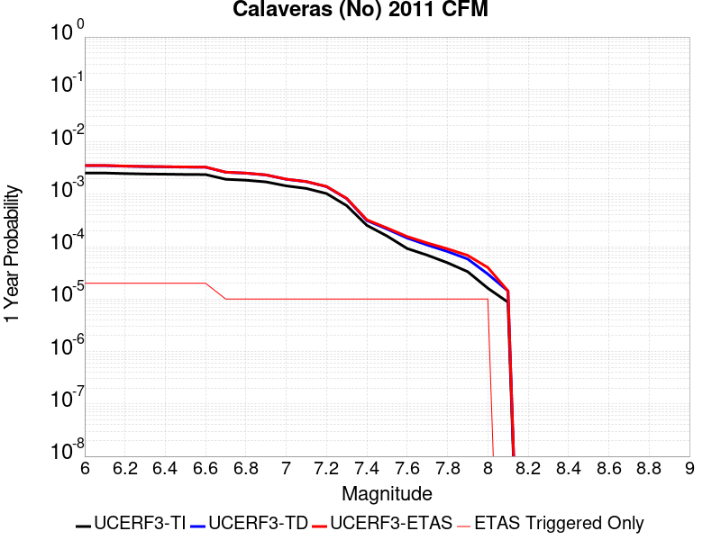 | 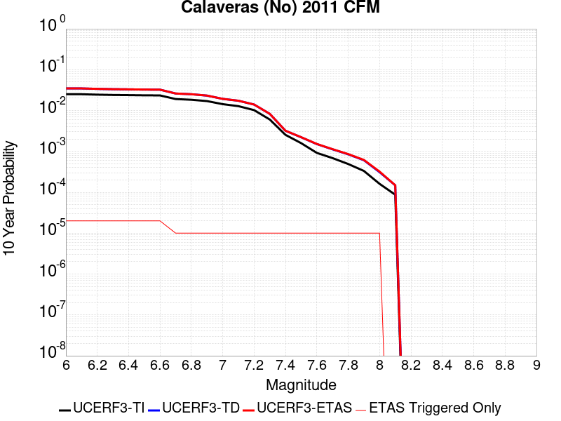 |

| Magnitude | 1 wk TI Prob | 1 wk TD Prob | 1 wk ETAS Prob | 1 wk ETAS/TD Gain | 1 wk ETAS Triggered Only | 1 mo TI Prob | 1 mo TD Prob | 1 mo ETAS Prob | 1 mo ETAS/TD Gain | 1 mo ETAS Triggered Only | 1 yr TI Prob | 1 yr TD Prob | 1 yr ETAS Prob | 1 yr ETAS/TD Gain | 1 yr ETAS Triggered Only | 10 yr TI Prob | 10 yr TD Prob | 10 yr ETAS Prob | 10 yr ETAS/TD Gain | 10 yr ETAS Triggered Only |
|-----|-----|-----|-----|-----|-----|-----|-----|-----|-----|-----|-----|-----|-----|-----|-----|-----|-----|-----|-----|-----|
| 6.0 | 4.8694856E-5 | 6.747121E-5 | 6.747121E-5 | 1.0 | 0.0 | 2.0867554E-4 | 2.8913133E-4 | 2.8913133E-4 | 1.0 | 0.0 | 0.0025376645 | 0.003514627 | 0.0035345566 | 1.0056705 | 2.0E-5 | 0.02508881 | 0.034771245 | 0.03479055 | 1.0005552 | 2.0E-5 |
| 6.1 | 4.8694856E-5 | 6.747121E-5 | 6.747121E-5 | 1.0 | 0.0 | 2.0867554E-4 | 2.8913133E-4 | 2.8913133E-4 | 1.0 | 0.0 | 0.0025376645 | 0.003514627 | 0.0035345566 | 1.0056705 | 2.0E-5 | 0.02508881 | 0.034771245 | 0.03479055 | 1.0005552 | 2.0E-5 |
| 6.2 | 4.7541962E-5 | 6.580218E-5 | 6.580218E-5 | 1.0 | 0.0 | 2.0373536E-4 | 2.8197994E-4 | 2.8197994E-4 | 1.0 | 0.0 | 0.0024776561 | 0.003427859 | 0.0034477904 | 1.0058146 | 2.0E-5 | 0.024502134 | 0.033932675 | 0.033951998 | 1.0005693 | 2.0E-5 |
| 6.3 | 4.6717287E-5 | 6.4635555E-5 | 6.4635555E-5 | 1.0 | 0.0 | 2.0020158E-4 | 2.7698115E-4 | 2.7698115E-4 | 1.0 | 0.0 | 0.0024347296 | 0.0033672103 | 0.003387143 | 1.0059196 | 2.0E-5 | 0.024082264 | 0.033345193 | 0.033364523 | 1.0005798 | 2.0E-5 |
| 6.4 | 4.6276386E-5 | 6.399742E-5 | 6.399742E-5 | 1.0 | 0.0 | 1.983123E-4 | 2.7424688E-4 | 2.7424688E-4 | 1.0 | 0.0 | 0.0024117786 | 0.0033340224 | 0.0033539557 | 1.0059787 | 2.0E-5 | 0.02385771 | 0.033024073 | 0.03304341 | 1.0005857 | 2.0E-5 |
| 6.5 | 4.5720994E-5 | 6.319881E-5 | 6.319881E-5 | 1.0 | 0.0 | 1.9593239E-4 | 2.70825E-4 | 2.70825E-4 | 1.0 | 0.0 | 0.002382867 | 0.0032924965 | 0.0033124306 | 1.0060544 | 2.0E-5 | 0.023574775 | 0.032622032 | 0.03264138 | 1.0005931 | 2.0E-5 |
| 6.6 | 4.549134E-5 | 6.28519E-5 | 6.28519E-5 | 1.0 | 0.0 | 1.949483E-4 | 2.6933852E-4 | 2.6933852E-4 | 1.0 | 0.0 | 0.0023709119 | 0.0032744533 | 0.0032943878 | 1.0060879 | 2.0E-5 | 0.023457756 | 0.032447387 | 0.03246674 | 1.0005964 | 2.0E-5 |
| 6.7 | 3.701047E-5 | 5.0359427E-5 | 5.0359427E-5 | 1.0 | 0.0 | 1.5860666E-4 | 2.1580851E-4 | 2.1580851E-4 | 1.0 | 0.0 | 0.0019293258 | 0.002624346 | 0.0026343197 | 1.0038005 | 1.0E-5 | 0.019126613 | 0.026125323 | 0.026135063 | 1.0003728 | 1.0E-5 |
| 6.8 | 3.5523568E-5 | 4.8341022E-5 | 4.8341022E-5 | 1.0 | 0.0 | 1.5223498E-4 | 2.071596E-4 | 2.071596E-4 | 1.0 | 0.0 | 0.0018518851 | 0.0025192937 | 0.0025292686 | 1.0039594 | 1.0E-5 | 0.018365284 | 0.025097553 | 0.025107302 | 1.0003885 | 1.0E-5 |
| 6.9 | 3.2946147E-5 | 4.466269E-5 | 4.466269E-5 | 1.0 | 0.0 | 1.4119013E-4 | 1.9139773E-4 | 1.9139773E-4 | 1.0 | 0.0 | 0.0017176344 | 0.0023278191 | 0.002337796 | 1.0042858 | 1.0E-5 | 0.017044188 | 0.023219598 | 0.023229366 | 1.0004207 | 1.0E-5 |
| 7.0 | 2.7682381E-5 | 3.702223E-5 | 3.702223E-5 | 1.0 | 0.0 | 1.1863338E-4 | 1.5865723E-4 | 1.5865723E-4 | 1.0 | 0.0 | 0.0014434044 | 0.0019299705 | 0.0019399511 | 1.0051714 | 1.0E-5 | 0.01434065 | 0.01931092 | 0.019320726 | 1.0005078 | 1.0E-5 |
| 7.1 | 2.471967E-5 | 3.328669E-5 | 3.328669E-5 | 1.0 | 0.0 | 1.05937135E-4 | 1.4264962E-4 | 1.4264962E-4 | 1.0 | 0.0 | 0.0012890215 | 0.0017354045 | 0.0017453871 | 1.0057523 | 1.0E-5 | 0.0128157 | 0.017385952 | 0.017395778 | 1.0005652 | 1.0E-5 |
| 7.2 | 1.9748062E-5 | 2.6774684E-5 | 2.6774684E-5 | 1.0 | 0.0 | 8.463181E-5 | 1.1474373E-4 | 1.1474373E-4 | 1.0 | 0.0 | 0.0010299052 | 0.0013961331 | 0.0014061191 | 1.0071527 | 1.0E-5 | 0.01025145 | 0.014030739 | 0.014040599 | 1.0007027 | 1.0E-5 |
| 7.3 | 1.1603734E-5 | 1.5783844E-5 | 1.5783844E-5 | 1.0 | 0.0 | 4.9729337E-5 | 6.764337E-5 | 6.764337E-5 | 1.0 | 0.0 | 6.052865E-4 | 8.232611E-4 | 8.3325285E-4 | 1.0121368 | 1.0E-5 | 0.0060364045 | 0.008308666 | 0.008318583 | 1.0011935 | 1.0E-5 |
| 7.4 | 4.885381E-6 | 6.0349853E-6 | 6.0349853E-6 | 1.0 | 0.0 | 2.0937177E-5 | 2.5863968E-5 | 2.5863968E-5 | 1.0 | 0.0 | 2.5488032E-4 | 3.148485E-4 | 3.2484534E-4 | 1.0317513 | 1.0E-5 | 0.0025458818 | 0.0032010598 | 0.0032110277 | 1.003114 | 1.0E-5 |
| 7.5 | 3.0571264E-6 | 4.155299E-6 | 4.155299E-6 | 1.0 | 0.0 | 1.3101904E-5 | 1.7808303E-5 | 1.7808303E-5 | 1.0 | 0.0 | 1.5950401E-4 | 2.1679462E-4 | 2.2679246E-4 | 1.0461166 | 1.0E-5 | 0.0015938957 | 0.002221121 | 0.0022310987 | 1.0044923 | 1.0E-5 |
| 7.6 | 1.764948E-6 | 2.7955498E-6 | 2.7955498E-6 | 1.0 | 0.0 | 7.564041E-6 | 1.1980874E-5 | 1.1980874E-5 | 1.0 | 0.0 | 9.208831E-5 | 1.4585744E-4 | 1.5585599E-4 | 1.0685501 | 1.0E-5 | 9.205016E-4 | 0.0015123509 | 0.0015223358 | 1.0066022 | 1.0E-5 |
| 7.7 | 1.3173734E-6 | 2.058471E-6 | 2.058471E-6 | 1.0 | 0.0 | 5.645874E-6 | 8.8219895E-6 | 8.8219895E-6 | 1.0 | 0.0 | 6.873634E-5 | 1.0740245E-4 | 1.17401374E-4 | 1.0930978 | 1.0E-5 | 6.8715087E-4 | 0.0011261401 | 0.0011361288 | 1.0088699 | 1.0E-5 |
| 7.8 | 9.4429885E-7 | 1.5489635E-6 | 1.5489635E-6 | 1.0 | 0.0 | 4.0469886E-6 | 6.638398E-6 | 6.638398E-6 | 1.0 | 0.0 | 4.9270973E-5 | 8.081952E-5 | 9.081871E-5 | 1.1237224 | 1.0E-5 | 4.926005E-4 | 8.5014524E-4 | 8.6013676E-4 | 1.0117527 | 1.0E-5 |
| 7.9 | 6.388233E-7 | 1.1148749E-6 | 1.1148749E-6 | 1.0 | 0.0 | 2.7378112E-6 | 4.7780263E-6 | 4.7780263E-6 | 1.0 | 0.0 | 3.3332344E-5 | 5.817093E-5 | 6.8170346E-5 | 1.1718972 | 1.0E-5 | 3.3327343E-4 | 6.0963054E-4 | 6.1962445E-4 | 1.0163934 | 1.0E-5 |
| 8.0 | 3.087986E-7 | 5.7543696E-7 | 5.7543696E-7 | 1.0 | 0.0 | 1.323422E-6 | 2.466156E-6 | 2.466156E-6 | 1.0 | 0.0 | 1.6112543E-5 | 3.002504E-5 | 4.002474E-5 | 1.3330454 | 1.0E-5 | 1.6111376E-4 | 3.110302E-4 | 3.210271E-4 | 1.0321412 | 1.0E-5 |
| 8.1 | 1.6725647E-7 | 2.7410047E-7 | 2.7410047E-7 | 1.0 | 0.0 | 7.168133E-7 | 1.1747159E-6 | 1.1747159E-6 | 1.0 | 0.0 | 8.7271665E-6 | 1.4302073E-5 | 1.4302073E-5 | 1.0 | 0.0 | 8.726824E-5 | 1.48486E-4 | 1.48486E-4 | 1.0 | 0.0 |

## Superstition Hills
*[(top)](#table-of-contents)*

| 1 Week | 1 Month | 1 Year | 10 Year |
|-----|-----|-----|-----|
| 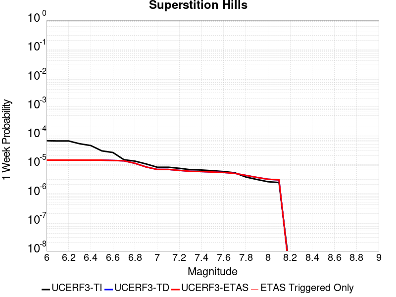 | 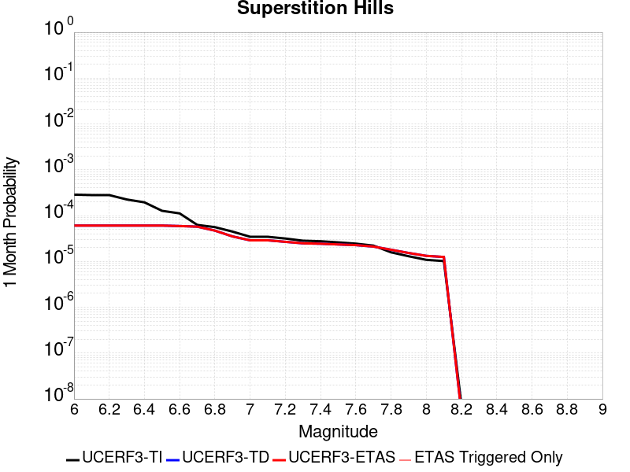 | 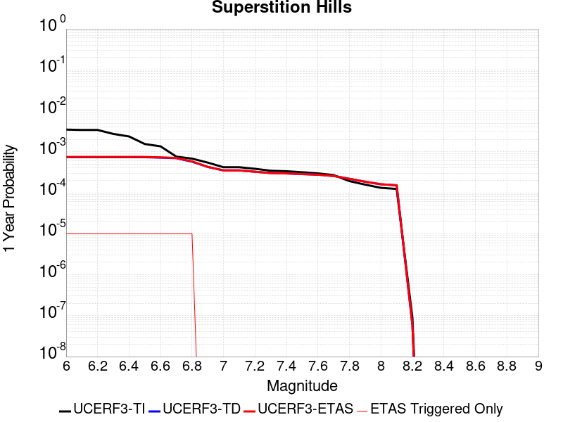 | 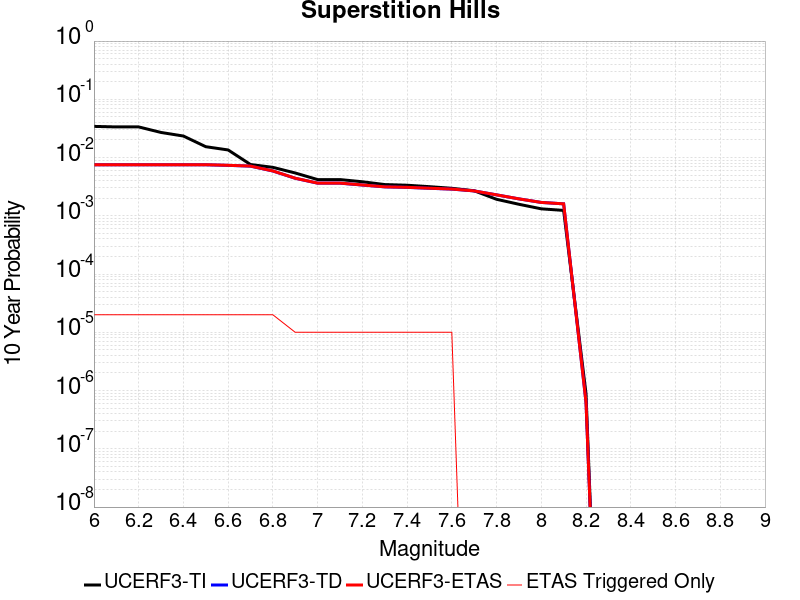 |

| Magnitude | 1 wk TI Prob | 1 wk TD Prob | 1 wk ETAS Prob | 1 wk ETAS/TD Gain | 1 wk ETAS Triggered Only | 1 mo TI Prob | 1 mo TD Prob | 1 mo ETAS Prob | 1 mo ETAS/TD Gain | 1 mo ETAS Triggered Only | 1 yr TI Prob | 1 yr TD Prob | 1 yr ETAS Prob | 1 yr ETAS/TD Gain | 1 yr ETAS Triggered Only | 10 yr TI Prob | 10 yr TD Prob | 10 yr ETAS Prob | 10 yr ETAS/TD Gain | 10 yr ETAS Triggered Only |
|-----|-----|-----|-----|-----|-----|-----|-----|-----|-----|-----|-----|-----|-----|-----|-----|-----|-----|-----|-----|-----|
| 6.0 | 6.6865185E-5 | 1.41376995E-5 | 1.41376995E-5 | 1.0 | 0.0 | 2.8653358E-4 | 6.0588824E-5 | 6.0588824E-5 | 1.0 | 0.0 | 0.0034829667 | 7.374355E-4 | 7.474281E-4 | 1.0135505 | 1.0E-5 | 0.03428881 | 0.0075204074 | 0.007540257 | 1.0026394 | 2.0E-5 |
| 6.1 | 6.544851E-5 | 1.41376995E-5 | 1.41376995E-5 | 1.0 | 0.0 | 2.8046346E-4 | 6.0588824E-5 | 6.0588824E-5 | 1.0 | 0.0 | 0.0034092965 | 7.374355E-4 | 7.474281E-4 | 1.0135505 | 1.0E-5 | 0.033574644 | 0.007520407 | 0.0075402563 | 1.0026394 | 2.0E-5 |
| 6.2 | 6.544851E-5 | 1.41376995E-5 | 1.41376995E-5 | 1.0 | 0.0 | 2.8046346E-4 | 6.0588824E-5 | 6.0588824E-5 | 1.0 | 0.0 | 0.0034092965 | 7.374355E-4 | 7.474281E-4 | 1.0135505 | 1.0E-5 | 0.033574644 | 0.007520407 | 0.0075402563 | 1.0026394 | 2.0E-5 |
| 6.3 | 5.2402065E-5 | 1.4137698E-5 | 1.4137698E-5 | 1.0 | 0.0 | 2.2456095E-4 | 6.058882E-5 | 6.058882E-5 | 1.0 | 0.0 | 0.0027306017 | 7.374354E-4 | 7.4742804E-4 | 1.0135505 | 1.0E-5 | 0.02697292 | 0.007520402 | 0.007540251 | 1.0026394 | 2.0E-5 |
| 6.4 | 4.542238E-5 | 1.4137698E-5 | 1.4137698E-5 | 1.0 | 0.0 | 1.9465282E-4 | 6.0588816E-5 | 6.0588816E-5 | 1.0 | 0.0 | 0.0023673223 | 7.3743536E-4 | 7.47428E-4 | 1.0135505 | 1.0E-5 | 0.023422617 | 0.0075203986 | 0.0075402483 | 1.0026394 | 2.0E-5 |
| 6.5 | 2.9672969E-5 | 1.4137696E-5 | 1.4137696E-5 | 1.0 | 0.0 | 1.2716366E-4 | 6.058881E-5 | 6.058881E-5 | 1.0 | 0.0 | 0.0015471181 | 7.374353E-4 | 7.474279E-4 | 1.0135505 | 1.0E-5 | 0.015363912 | 0.007520392 | 0.007540242 | 1.0026394 | 2.0E-5 |
| 6.6 | 2.6056105E-5 | 1.3803458E-5 | 1.3803458E-5 | 1.0 | 0.0 | 1.1166424E-4 | 5.9156428E-5 | 5.9156428E-5 | 1.0 | 0.0 | 0.0013586642 | 7.200076E-4 | 7.300004E-4 | 1.0138787 | 1.0E-5 | 0.013503874 | 0.0073448285 | 0.007364682 | 1.002703 | 2.0E-5 |
| 6.7 | 1.4611248E-5 | 1.3383359E-5 | 1.3383359E-5 | 1.0 | 0.0 | 6.261813E-5 | 5.7356083E-5 | 5.7356083E-5 | 1.0 | 0.0 | 7.6210906E-4 | 6.981025E-4 | 7.0809555E-4 | 1.0143145 | 1.0E-5 | 0.0075950073 | 0.00712602 | 0.007145877 | 1.0027866 | 2.0E-5 |
| 6.8 | 1.30607E-5 | 1.09787925E-5 | 1.09787925E-5 | 1.0 | 0.0 | 5.597323E-5 | 4.705117E-5 | 4.705117E-5 | 1.0 | 0.0 | 6.8126095E-4 | 5.7270617E-4 | 5.827004E-4 | 1.0174509 | 1.0E-5 | 0.006791762 | 0.00587438 | 0.0058942623 | 1.0033846 | 2.0E-5 |
| 6.9 | 1.0443096E-5 | 8.195349E-6 | 8.195349E-6 | 1.0 | 0.0 | 4.4755358E-5 | 3.5122466E-5 | 3.5122466E-5 | 1.0 | 0.0 | 5.447602E-4 | 4.2753448E-4 | 4.2753448E-4 | 1.0 | 0.0 | 0.005434267 | 0.0044094524 | 0.0044194083 | 1.0022578 | 1.0E-5 |
| 7.0 | 8.045912E-6 | 6.739692E-6 | 6.739692E-6 | 1.0 | 0.0 | 3.4482026E-5 | 2.888408E-5 | 2.888408E-5 | 1.0 | 0.0 | 4.197378E-4 | 3.5160795E-4 | 3.5160795E-4 | 1.0 | 0.0 | 0.0041894587 | 0.0036334093 | 0.003643373 | 1.0027423 | 1.0E-5 |
| 7.1 | 8.045912E-6 | 6.739692E-6 | 6.739692E-6 | 1.0 | 0.0 | 3.4482026E-5 | 2.888408E-5 | 2.888408E-5 | 1.0 | 0.0 | 4.197378E-4 | 3.5160795E-4 | 3.5160795E-4 | 1.0 | 0.0 | 0.0041894587 | 0.0036334093 | 0.003643373 | 1.0027423 | 1.0E-5 |
| 7.2 | 7.375506E-6 | 6.2466297E-6 | 6.2466297E-6 | 1.0 | 0.0 | 3.1608928E-5 | 2.6771E-5 | 2.6771E-5 | 1.0 | 0.0 | 3.8477074E-4 | 3.2588904E-4 | 3.2588904E-4 | 1.0 | 0.0 | 0.003841052 | 0.003373887 | 0.0033838532 | 1.0029539 | 1.0E-5 |
| 7.3 | 6.6063913E-6 | 5.7990574E-6 | 5.7990574E-6 | 1.0 | 0.0 | 2.8312797E-5 | 2.485287E-5 | 2.485287E-5 | 1.0 | 0.0 | 3.446538E-4 | 3.025424E-4 | 3.025424E-4 | 1.0 | 0.0 | 0.0034411973 | 0.003138153 | 0.0031481218 | 1.0031766 | 1.0E-5 |
| 7.4 | 6.4313126E-6 | 5.680481E-6 | 5.680481E-6 | 1.0 | 0.0 | 2.7562477E-5 | 2.4344696E-5 | 2.4344696E-5 | 1.0 | 0.0 | 3.355215E-4 | 2.9635706E-4 | 2.9635706E-4 | 1.0 | 0.0 | 0.0033501536 | 0.0030759154 | 0.0030858845 | 1.0032411 | 1.0E-5 |
| 7.5 | 6.0742927E-6 | 5.4763104E-6 | 5.4763104E-6 | 1.0 | 0.0 | 2.6032423E-5 | 2.3469694E-5 | 2.3469694E-5 | 1.0 | 0.0 | 3.1689866E-4 | 2.8570674E-4 | 2.8570674E-4 | 1.0 | 0.0 | 0.0031644711 | 0.002967756 | 0.0029777263 | 1.0033596 | 1.0E-5 |
| 7.6 | 5.6987187E-6 | 5.294521E-6 | 5.294521E-6 | 1.0 | 0.0 | 2.4422852E-5 | 2.269061E-5 | 2.269061E-5 | 1.0 | 0.0 | 2.9730765E-4 | 2.7622381E-4 | 2.7622381E-4 | 1.0 | 0.0 | 0.002969102 | 0.0028710118 | 0.002880983 | 1.003473 | 1.0E-5 |
| 7.7 | 5.1658035E-6 | 4.925535E-6 | 4.925535E-6 | 1.0 | 0.0 | 2.2138971E-5 | 2.1109268E-5 | 2.1109268E-5 | 1.0 | 0.0 | 2.6950863E-4 | 2.5697565E-4 | 2.5697565E-4 | 1.0 | 0.0 | 0.00269182 | 0.0026760625 | 0.0026760625 | 1.0 | 0.0 |
| 7.8 | 3.6864697E-6 | 4.1964995E-6 | 4.1964995E-6 | 1.0 | 0.0 | 1.579906E-5 | 1.7984876E-5 | 1.7984876E-5 | 1.0 | 0.0 | 1.9233658E-4 | 2.1894433E-4 | 2.1894433E-4 | 1.0 | 0.0 | 0.0019217018 | 0.0022892624 | 0.0022892624 | 1.0 | 0.0 |
| 7.9 | 3.0265903E-6 | 3.5637288E-6 | 3.5637288E-6 | 1.0 | 0.0 | 1.2971037E-5 | 1.5273037E-5 | 1.5273037E-5 | 1.0 | 0.0 | 1.5791094E-4 | 1.859338E-4 | 1.859338E-4 | 1.0 | 0.0 | 0.0015779877 | 0.0019534735 | 0.0019534735 | 1.0 | 0.0 |
| 8.0 | 2.5271493E-6 | 3.0867361E-6 | 3.0867361E-6 | 1.0 | 0.0 | 1.0830595E-5 | 1.3228804E-5 | 1.3228804E-5 | 1.0 | 0.0 | 1.3185451E-4 | 1.610492E-4 | 1.610492E-4 | 1.0 | 0.0 | 0.0013177631 | 0.0016973554 | 0.0016973554 | 1.0 | 0.0 |
| 8.1 | 2.3749135E-6 | 2.917377E-6 | 2.917377E-6 | 1.0 | 0.0 | 1.0178161E-5 | 1.25029865E-5 | 1.25029865E-5 | 1.0 | 0.0 | 1.2391206E-4 | 1.5221364E-4 | 1.5221364E-4 | 1.0 | 0.0 | 0.0012384299 | 0.001604949 | 0.001604949 | 1.0 | 0.0 |
| 8.2 | 1.7186406E-9 | 1.1440594E-9 | 1.1440594E-9 | 1.0 | 0.0 | 7.3656024E-9 | 4.9031117E-9 | 4.9031117E-9 | 1.0 | 0.0 | 8.9676206E-8 | 5.969538E-8 | 5.969538E-8 | 1.0 | 0.0 | 8.9676166E-7 | 6.389059E-7 | 6.389059E-7 | 1.0 | 0.0 |

## Casmalia 2011 CFM
*[(top)](#table-of-contents)*

| 1 Week | 1 Month | 1 Year | 10 Year |
|-----|-----|-----|-----|
| 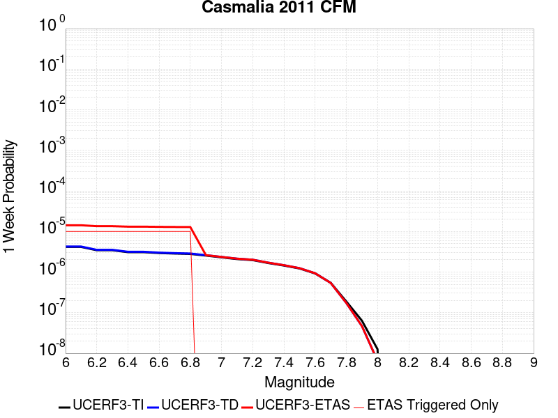 | 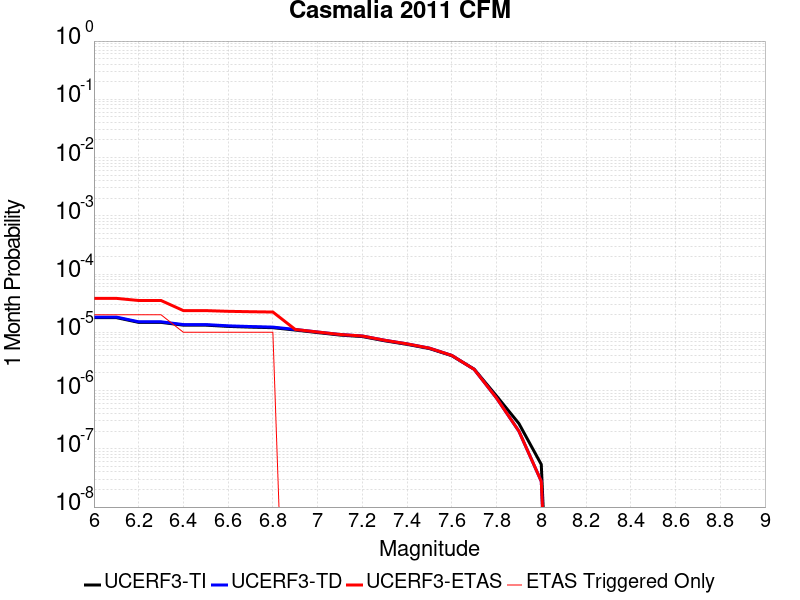 | 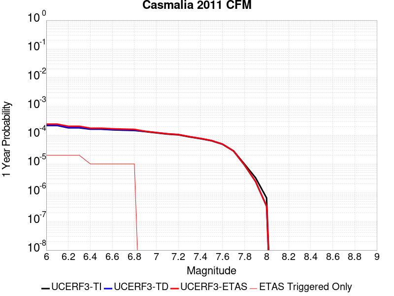 | 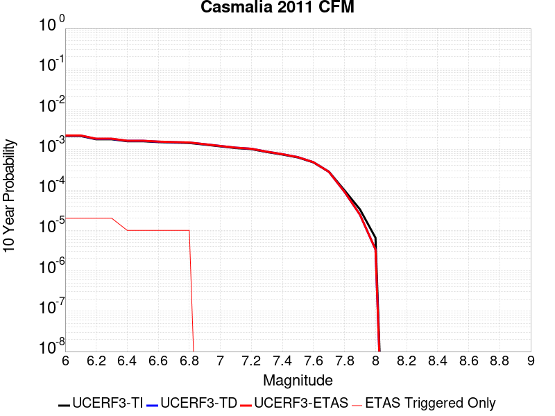 |

| Magnitude | 1 wk TI Prob | 1 wk TD Prob | 1 wk ETAS Prob | 1 wk ETAS/TD Gain | 1 wk ETAS Triggered Only | 1 mo TI Prob | 1 mo TD Prob | 1 mo ETAS Prob | 1 mo ETAS/TD Gain | 1 mo ETAS Triggered Only | 1 yr TI Prob | 1 yr TD Prob | 1 yr ETAS Prob | 1 yr ETAS/TD Gain | 1 yr ETAS Triggered Only | 10 yr TI Prob | 10 yr TD Prob | 10 yr ETAS Prob | 10 yr ETAS/TD Gain | 10 yr ETAS Triggered Only |
|-----|-----|-----|-----|-----|-----|-----|-----|-----|-----|-----|-----|-----|-----|-----|-----|-----|-----|-----|-----|-----|
| 6.0 | 4.1704893E-6 | 4.262483E-6 | 1.426244E-5 | 3.3460405 | 1.0E-5 | 1.7873403E-5 | 1.8267656E-5 | 3.826729E-5 | 2.0948112 | 2.0E-5 | 2.1758694E-4 | 2.2238622E-4 | 2.4238178E-4 | 1.0899136 | 2.0E-5 | 0.0021737402 | 0.0022216577 | 0.0022416133 | 1.0089823 | 2.0E-5 |
| 6.1 | 4.1704893E-6 | 4.262483E-6 | 1.426244E-5 | 3.3460405 | 1.0E-5 | 1.7873403E-5 | 1.8267656E-5 | 3.826729E-5 | 2.0948112 | 2.0E-5 | 2.1758694E-4 | 2.2238622E-4 | 2.4238178E-4 | 1.0899136 | 2.0E-5 | 0.0021737402 | 0.0022216577 | 0.0022416133 | 1.0089823 | 2.0E-5 |
| 6.2 | 3.457312E-6 | 3.5370217E-6 | 1.3536986E-5 | 3.8272274 | 1.0E-5 | 1.4816967E-5 | 1.5158577E-5 | 3.5158275E-5 | 2.319365 | 2.0E-5 | 1.8038164E-4 | 1.8454014E-4 | 2.0453644E-4 | 1.1083575 | 2.0E-5 | 0.001802353 | 0.0018438784 | 0.0018638414 | 1.0108267 | 2.0E-5 |
| 6.3 | 3.457312E-6 | 3.5370217E-6 | 1.3536986E-5 | 3.8272274 | 1.0E-5 | 1.4816967E-5 | 1.5158577E-5 | 3.5158275E-5 | 2.319365 | 2.0E-5 | 1.8038164E-4 | 1.8454014E-4 | 2.0453644E-4 | 1.1083575 | 2.0E-5 | 0.001802353 | 0.0018438784 | 0.0018638414 | 1.0108267 | 2.0E-5 |
| 6.4 | 3.0957337E-6 | 3.1692257E-6 | 1.3169194E-5 | 4.155335 | 1.0E-5 | 1.3267363E-5 | 1.3582326E-5 | 2.358219E-5 | 1.736241 | 1.0E-5 | 1.6151817E-4 | 1.6535232E-4 | 1.7535067E-4 | 1.0604669 | 1.0E-5 | 0.0016140083 | 0.0016522991 | 0.0016622825 | 1.0060421 | 1.0E-5 |
| 6.5 | 3.0957337E-6 | 3.1692257E-6 | 1.3169194E-5 | 4.155335 | 1.0E-5 | 1.3267363E-5 | 1.3582326E-5 | 2.358219E-5 | 1.736241 | 1.0E-5 | 1.6151817E-4 | 1.6535232E-4 | 1.7535067E-4 | 1.0604669 | 1.0E-5 | 0.0016140083 | 0.0016522991 | 0.0016622825 | 1.0060421 | 1.0E-5 |
| 6.6 | 2.9459152E-6 | 3.0165752E-6 | 1.3016545E-5 | 4.3150077 | 1.0E-5 | 1.262529E-5 | 1.2928115E-5 | 2.2927987E-5 | 1.7734979 | 1.0E-5 | 1.5370206E-4 | 1.5738848E-4 | 1.6738691E-4 | 1.0635271 | 1.0E-5 | 0.0015359579 | 0.0015727758 | 0.0015827601 | 1.0063481 | 1.0E-5 |
| 6.7 | 2.8634809E-6 | 2.9324726E-6 | 1.29324435E-5 | 4.4100814 | 1.0E-5 | 1.2272003E-5 | 1.256768E-5 | 2.2567554E-5 | 1.7956818 | 1.0E-5 | 1.4940138E-4 | 1.530008E-4 | 1.6299928E-4 | 1.0653491 | 1.0E-5 | 0.0014930099 | 0.0015289601 | 0.0015389448 | 1.0065304 | 1.0E-5 |
| 6.8 | 2.7999822E-6 | 2.8675968E-6 | 1.2867568E-5 | 4.487231 | 1.0E-5 | 1.1999869E-5 | 1.2289643E-5 | 2.228952E-5 | 1.8136833 | 1.0E-5 | 1.460886E-4 | 1.4961617E-4 | 1.5961468E-4 | 1.0668277 | 1.0E-5 | 0.001459926 | 0.0014951597 | 0.0015051448 | 1.0066782 | 1.0E-5 |
| 6.9 | 2.551052E-6 | 2.6119649E-6 | 2.6119649E-6 | 1.0 | 0.0 | 1.0933034E-5 | 1.1194087E-5 | 1.1194087E-5 | 1.0 | 0.0 | 1.3310155E-4 | 1.3627953E-4 | 1.3627953E-4 | 1.0 | 0.0 | 0.0013302186 | 0.0013619636 | 0.0013619636 | 1.0 | 0.0 |
| 7.0 | 2.3081875E-6 | 2.3624088E-6 | 2.3624088E-6 | 1.0 | 0.0 | 9.892195E-6 | 1.01245705E-5 | 1.01245705E-5 | 1.0 | 0.0 | 1.20430814E-4 | 1.232597E-4 | 1.232597E-4 | 1.0 | 0.0 | 0.0012036557 | 0.0012319161 | 0.0012319161 | 1.0 | 0.0 |
| 7.1 | 2.093245E-6 | 2.1417243E-6 | 2.1417243E-6 | 1.0 | 0.0 | 8.971019E-6 | 9.178786E-6 | 9.178786E-6 | 1.0 | 0.0 | 1.09216686E-4 | 1.1174601E-4 | 1.1174601E-4 | 1.0 | 0.0 | 0.0010916302 | 0.0011169002 | 0.0011169002 | 1.0 | 0.0 |
| 7.2 | 1.9714576E-6 | 2.0165091E-6 | 2.0165091E-6 | 1.0 | 0.0 | 8.449076E-6 | 8.642153E-6 | 8.642153E-6 | 1.0 | 0.0 | 1.0286264E-4 | 1.05213156E-4 | 1.05213156E-4 | 1.0 | 0.0 | 0.0010281504 | 0.0010516352 | 0.0010516352 | 1.0 | 0.0 |
| 7.3 | 1.6689512E-6 | 1.7047131E-6 | 1.7047131E-6 | 1.0 | 0.0 | 7.1526288E-6 | 7.3058927E-6 | 7.3058927E-6 | 1.0 | 0.0 | 8.7079774E-5 | 8.894562E-5 | 8.894562E-5 | 1.0 | 0.0 | 8.7045657E-4 | 8.89101E-4 | 8.89101E-4 | 1.0 | 0.0 |
| 7.4 | 1.4490954E-6 | 1.4778908E-6 | 1.4778908E-6 | 1.0 | 0.0 | 6.210394E-6 | 6.333802E-6 | 6.333802E-6 | 1.0 | 0.0 | 7.560892E-5 | 7.711132E-5 | 7.711132E-5 | 1.0 | 0.0 | 7.55832E-4 | 7.7084627E-4 | 7.7084627E-4 | 1.0 | 0.0 |
| 7.5 | 1.226873E-6 | 1.2481701E-6 | 1.2481701E-6 | 1.0 | 0.0 | 5.2580162E-6 | 5.3492895E-6 | 5.3492895E-6 | 1.0 | 0.0 | 6.401447E-5 | 6.5125656E-5 | 6.5125656E-5 | 1.0 | 0.0 | 6.399603E-4 | 6.5106625E-4 | 6.5106625E-4 | 1.0 | 0.0 |
| 7.6 | 9.2561345E-7 | 9.361923E-7 | 9.361923E-7 | 1.0 | 0.0 | 3.966909E-6 | 4.012247E-6 | 4.012247E-6 | 1.0 | 0.0 | 4.8296046E-5 | 4.884801E-5 | 4.884801E-5 | 1.0 | 0.0 | 4.828555E-4 | 4.8837316E-4 | 4.8837316E-4 | 1.0 | 0.0 |
| 7.7 | 5.4367933E-7 | 5.392888E-7 | 5.392888E-7 | 1.0 | 0.0 | 2.3300522E-6 | 2.3112357E-6 | 2.3112357E-6 | 1.0 | 0.0 | 2.8368017E-5 | 2.8138933E-5 | 2.8138933E-5 | 1.0 | 0.0 | 2.8364395E-4 | 2.8135383E-4 | 2.8135383E-4 | 1.0 | 0.0 |
| 7.8 | 1.8825742E-7 | 1.7342276E-7 | 1.7342276E-7 | 1.0 | 0.0 | 8.068173E-7 | 7.4324015E-7 | 7.4324015E-7 | 1.0 | 0.0 | 9.822956E-6 | 9.048912E-6 | 9.048912E-6 | 1.0 | 0.0 | 9.822522E-5 | 9.048546E-5 | 9.048546E-5 | 1.0 | 0.0 |
| 7.9 | 6.342771E-8 | 4.6790706E-8 | 4.6790706E-8 | 1.0 | 0.0 | 2.7183304E-7 | 2.0053157E-7 | 2.0053157E-7 | 1.0 | 0.0 | 3.3095623E-6 | 2.4414692E-6 | 2.4414692E-6 | 1.0 | 0.0 | 3.309513E-5 | 2.4414428E-5 | 2.4414428E-5 | 1.0 | 0.0 |
| 8.0 | 1.2574819E-8 | 6.4733463E-9 | 6.4733463E-9 | 1.0 | 0.0 | 5.3892084E-8 | 2.7742912E-8 | 2.7742912E-8 | 1.0 | 0.0 | 6.561359E-7 | 3.377699E-7 | 3.377699E-7 | 1.0 | 0.0 | 6.56134E-6 | 3.377694E-6 | 3.377694E-6 | 1.0 | 0.0 |

## Peralta Hills
*[(top)](#table-of-contents)*

| 1 Week | 1 Month | 1 Year | 10 Year |
|-----|-----|-----|-----|
|  |  |  |  |

| Magnitude | 1 wk TI Prob | 1 wk TD Prob | 1 wk ETAS Prob | 1 wk ETAS/TD Gain | 1 wk ETAS Triggered Only | 1 mo TI Prob | 1 mo TD Prob | 1 mo ETAS Prob | 1 mo ETAS/TD Gain | 1 mo ETAS Triggered Only | 1 yr TI Prob | 1 yr TD Prob | 1 yr ETAS Prob | 1 yr ETAS/TD Gain | 1 yr ETAS Triggered Only | 10 yr TI Prob | 10 yr TD Prob | 10 yr ETAS Prob | 10 yr ETAS/TD Gain | 10 yr ETAS Triggered Only |
|-----|-----|-----|-----|-----|-----|-----|-----|-----|-----|-----|-----|-----|-----|-----|-----|-----|-----|-----|-----|-----|
| 6.0 | 3.8850067E-6 | 3.839512E-6 | 3.839512E-6 | 1.0 | 0.0 | 1.6649923E-5 | 1.645499E-5 | 2.6454823E-5 | 1.6077085 | 1.0E-5 | 2.0269395E-4 | 2.0032849E-4 | 2.2032448E-4 | 1.0998161 | 2.0E-5 | 0.0020250916 | 0.0020022066 | 0.0020221665 | 1.009969 | 2.0E-5 |
| 6.1 | 3.8850067E-6 | 3.839512E-6 | 3.839512E-6 | 1.0 | 0.0 | 1.6649923E-5 | 1.645499E-5 | 2.6454823E-5 | 1.6077085 | 1.0E-5 | 2.0269395E-4 | 2.0032849E-4 | 2.2032448E-4 | 1.0998161 | 2.0E-5 | 0.0020250916 | 0.0020022066 | 0.0020221665 | 1.009969 | 2.0E-5 |
| 6.2 | 3.8850067E-6 | 3.839512E-6 | 3.839512E-6 | 1.0 | 0.0 | 1.6649923E-5 | 1.645499E-5 | 2.6454823E-5 | 1.6077085 | 1.0E-5 | 2.0269395E-4 | 2.0032849E-4 | 2.2032448E-4 | 1.0998161 | 2.0E-5 | 0.0020250916 | 0.0020022066 | 0.0020221665 | 1.009969 | 2.0E-5 |
| 6.3 | 3.8850067E-6 | 3.839512E-6 | 3.839512E-6 | 1.0 | 0.0 | 1.6649923E-5 | 1.645499E-5 | 2.6454823E-5 | 1.6077085 | 1.0E-5 | 2.0269395E-4 | 2.0032849E-4 | 2.2032448E-4 | 1.0998161 | 2.0E-5 | 0.0020250916 | 0.0020022066 | 0.0020221665 | 1.009969 | 2.0E-5 |
| 6.4 | 3.8850067E-6 | 3.839512E-6 | 3.839512E-6 | 1.0 | 0.0 | 1.6649923E-5 | 1.645499E-5 | 2.6454823E-5 | 1.6077085 | 1.0E-5 | 2.0269395E-4 | 2.0032849E-4 | 2.2032448E-4 | 1.0998161 | 2.0E-5 | 0.0020250916 | 0.0020022066 | 0.0020221665 | 1.009969 | 2.0E-5 |
| 6.5 | 1.5587785E-6 | 1.4430796E-6 | 1.4430796E-6 | 1.0 | 0.0 | 6.6804623E-6 | 6.184613E-6 | 6.184613E-6 | 1.0 | 0.0 | 8.133159E-5 | 7.529531E-5 | 7.529531E-5 | 1.0 | 0.0 | 8.1301836E-4 | 7.52722E-4 | 7.52722E-4 | 1.0 | 0.0 |
| 6.6 | 1.5587785E-6 | 1.4430796E-6 | 1.4430796E-6 | 1.0 | 0.0 | 6.6804623E-6 | 6.184613E-6 | 6.184613E-6 | 1.0 | 0.0 | 8.133159E-5 | 7.529531E-5 | 7.529531E-5 | 1.0 | 0.0 | 8.1301836E-4 | 7.52722E-4 | 7.52722E-4 | 1.0 | 0.0 |
| 6.7 | 1.5018579E-6 | 1.3837022E-6 | 1.3837022E-6 | 1.0 | 0.0 | 6.436518E-6 | 5.93014E-6 | 5.93014E-6 | 1.0 | 0.0 | 7.836179E-5 | 7.21973E-5 | 7.21973E-5 | 1.0 | 0.0 | 7.833416E-4 | 7.21762E-4 | 7.21762E-4 | 1.0 | 0.0 |
| 6.8 | 1.4584314E-6 | 1.3381342E-6 | 1.3381342E-6 | 1.0 | 0.0 | 6.250405E-6 | 5.7348498E-6 | 5.7348498E-6 | 1.0 | 0.0 | 7.6096025E-5 | 6.98198E-5 | 6.98198E-5 | 1.0 | 0.0 | 7.6069974E-4 | 6.98002E-4 | 6.98002E-4 | 1.0 | 0.0 |
| 6.9 | 1.1382393E-6 | 9.862285E-7 | 9.862285E-7 | 1.0 | 0.0 | 4.8781594E-6 | 4.226687E-6 | 4.226687E-6 | 1.0 | 0.0 | 5.9389975E-5 | 5.1458785E-5 | 5.1458785E-5 | 1.0 | 0.0 | 5.93741E-4 | 5.144769E-4 | 5.144769E-4 | 1.0 | 0.0 |
| 7.0 | 9.970413E-7 | 8.309642E-7 | 8.309642E-7 | 1.0 | 0.0 | 4.273027E-6 | 3.561271E-6 | 3.561271E-6 | 1.0 | 0.0 | 5.2022864E-5 | 4.335768E-5 | 4.335768E-5 | 1.0 | 0.0 | 5.2010687E-4 | 4.33499E-4 | 4.33499E-4 | 1.0 | 0.0 |
| 7.1 | 9.684443E-7 | 7.99408E-7 | 7.99408E-7 | 1.0 | 0.0 | 4.150469E-6 | 3.4260302E-6 | 3.4260302E-6 | 1.0 | 0.0 | 5.053079E-5 | 4.1711188E-5 | 4.1711188E-5 | 1.0 | 0.0 | 5.05193E-4 | 4.170403E-4 | 4.170403E-4 | 1.0 | 0.0 |
| 7.2 | 9.240811E-7 | 7.5031426E-7 | 7.5031426E-7 | 1.0 | 0.0 | 3.960342E-6 | 3.215629E-6 | 3.215629E-6 | 1.0 | 0.0 | 4.8216094E-5 | 3.9149647E-5 | 3.9149647E-5 | 1.0 | 0.0 | 4.8205635E-4 | 3.9143403E-4 | 3.9143403E-4 | 1.0 | 0.0 |
| 7.3 | 8.158643E-7 | 6.350017E-7 | 6.350017E-7 | 1.0 | 0.0 | 3.4965567E-6 | 2.7214332E-6 | 2.7214332E-6 | 1.0 | 0.0 | 4.2569747E-5 | 3.313301E-5 | 3.313301E-5 | 1.0 | 0.0 | 4.2561593E-4 | 3.3128684E-4 | 3.3128684E-4 | 1.0 | 0.0 |
| 7.4 | 6.3822824E-7 | 4.7957286E-7 | 4.7957286E-7 | 1.0 | 0.0 | 2.7352612E-6 | 2.0553111E-6 | 2.0553111E-6 | 1.0 | 0.0 | 3.3301294E-5 | 2.5023177E-5 | 2.5023177E-5 | 1.0 | 0.0 | 3.3296304E-4 | 2.5020874E-4 | 2.5020874E-4 | 1.0 | 0.0 |
| 7.5 | 4.0292628E-7 | 2.7846056E-7 | 2.7846056E-7 | 1.0 | 0.0 | 1.7268258E-6 | 1.193402E-6 | 1.193402E-6 | 1.0 | 0.0 | 2.1023901E-5 | 1.4529601E-5 | 1.4529601E-5 | 1.0 | 0.0 | 2.1021912E-4 | 1.452893E-4 | 1.452893E-4 | 1.0 | 0.0 |
| 7.6 | 3.672993E-7 | 2.485495E-7 | 2.485495E-7 | 1.0 | 0.0 | 1.5741389E-6 | 1.0652118E-6 | 1.0652118E-6 | 1.0 | 0.0 | 1.9164972E-5 | 1.2968904E-5 | 1.2968904E-5 | 1.0 | 0.0 | 1.916332E-4 | 1.296842E-4 | 1.296842E-4 | 1.0 | 0.0 |
| 7.7 | 2.8466823E-7 | 1.7859877E-7 | 1.7859877E-7 | 1.0 | 0.0 | 1.2200061E-6 | 7.6542324E-7 | 7.6542324E-7 | 1.0 | 0.0 | 1.4853474E-5 | 9.319015E-6 | 9.319015E-6 | 1.0 | 0.0 | 1.485248E-4 | 9.3188835E-5 | 9.3188835E-5 | 1.0 | 0.0 |

## Compton
*[(top)](#table-of-contents)*

| 1 Week | 1 Month | 1 Year | 10 Year |
|-----|-----|-----|-----|
| 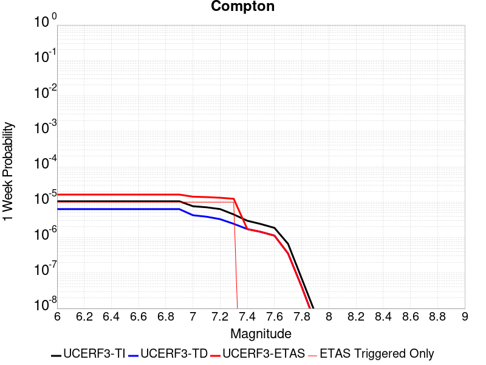 | 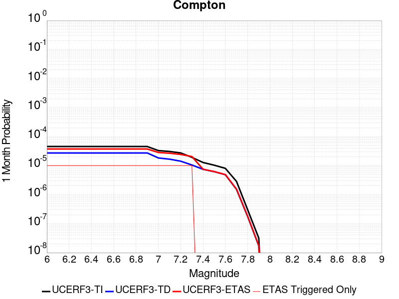 | 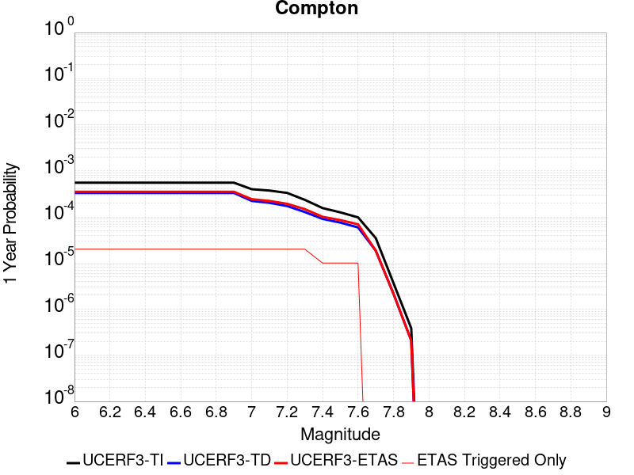 | 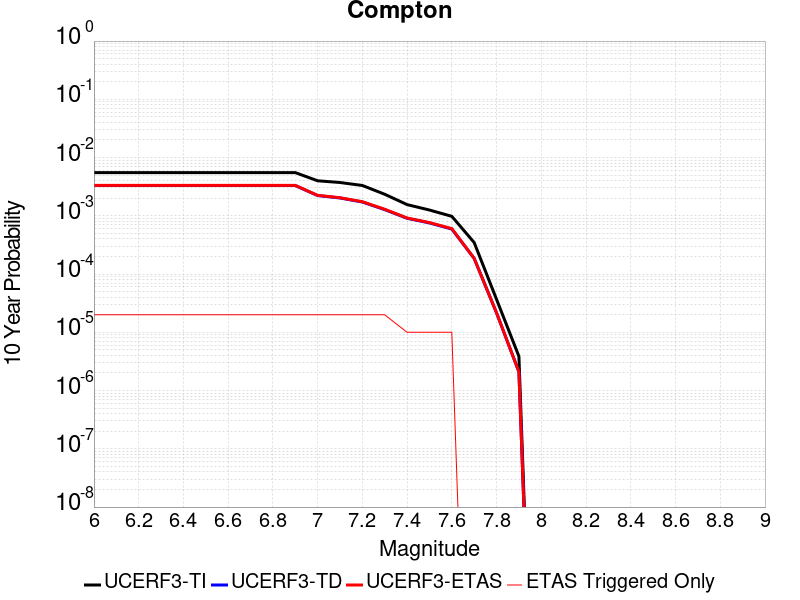 |

| Magnitude | 1 wk TI Prob | 1 wk TD Prob | 1 wk ETAS Prob | 1 wk ETAS/TD Gain | 1 wk ETAS Triggered Only | 1 mo TI Prob | 1 mo TD Prob | 1 mo ETAS Prob | 1 mo ETAS/TD Gain | 1 mo ETAS Triggered Only | 1 yr TI Prob | 1 yr TD Prob | 1 yr ETAS Prob | 1 yr ETAS/TD Gain | 1 yr ETAS Triggered Only | 10 yr TI Prob | 10 yr TD Prob | 10 yr ETAS Prob | 10 yr ETAS/TD Gain | 10 yr ETAS Triggered Only |
|-----|-----|-----|-----|-----|-----|-----|-----|-----|-----|-----|-----|-----|-----|-----|-----|-----|-----|-----|-----|-----|
| 6.0 | 1.06050875E-5 | 6.358671E-6 | 1.6358606E-5 | 2.5726457 | 1.0E-5 | 4.5449582E-5 | 2.7251177E-5 | 3.7250906E-5 | 1.3669466 | 1.0E-5 | 5.5320817E-4 | 3.317354E-4 | 3.5172878E-4 | 1.060269 | 2.0E-5 | 0.0055183303 | 0.0033126862 | 0.0033326198 | 1.0060174 | 2.0E-5 |
| 6.1 | 1.06050875E-5 | 6.358671E-6 | 1.6358606E-5 | 2.5726457 | 1.0E-5 | 4.5449582E-5 | 2.7251177E-5 | 3.7250906E-5 | 1.3669466 | 1.0E-5 | 5.5320817E-4 | 3.317354E-4 | 3.5172878E-4 | 1.060269 | 2.0E-5 | 0.0055183303 | 0.0033126862 | 0.0033326198 | 1.0060174 | 2.0E-5 |
| 6.2 | 1.06050875E-5 | 6.358671E-6 | 1.6358606E-5 | 2.5726457 | 1.0E-5 | 4.5449582E-5 | 2.7251177E-5 | 3.7250906E-5 | 1.3669466 | 1.0E-5 | 5.5320817E-4 | 3.317354E-4 | 3.5172878E-4 | 1.060269 | 2.0E-5 | 0.0055183303 | 0.0033126862 | 0.0033326198 | 1.0060174 | 2.0E-5 |
| 6.3 | 1.06050875E-5 | 6.358671E-6 | 1.6358606E-5 | 2.5726457 | 1.0E-5 | 4.5449582E-5 | 2.7251177E-5 | 3.7250906E-5 | 1.3669466 | 1.0E-5 | 5.5320817E-4 | 3.317354E-4 | 3.5172878E-4 | 1.060269 | 2.0E-5 | 0.0055183303 | 0.0033126862 | 0.0033326198 | 1.0060174 | 2.0E-5 |
| 6.4 | 1.06050875E-5 | 6.358671E-6 | 1.6358606E-5 | 2.5726457 | 1.0E-5 | 4.5449582E-5 | 2.7251177E-5 | 3.7250906E-5 | 1.3669466 | 1.0E-5 | 5.5320817E-4 | 3.317354E-4 | 3.5172878E-4 | 1.060269 | 2.0E-5 | 0.0055183303 | 0.0033126862 | 0.0033326198 | 1.0060174 | 2.0E-5 |
| 6.5 | 1.06050875E-5 | 6.358671E-6 | 1.6358606E-5 | 2.5726457 | 1.0E-5 | 4.5449582E-5 | 2.7251177E-5 | 3.7250906E-5 | 1.3669466 | 1.0E-5 | 5.5320817E-4 | 3.317354E-4 | 3.5172878E-4 | 1.060269 | 2.0E-5 | 0.0055183303 | 0.0033126862 | 0.0033326198 | 1.0060174 | 2.0E-5 |
| 6.6 | 1.06050875E-5 | 6.358671E-6 | 1.6358606E-5 | 2.5726457 | 1.0E-5 | 4.5449582E-5 | 2.7251177E-5 | 3.7250906E-5 | 1.3669466 | 1.0E-5 | 5.5320817E-4 | 3.317354E-4 | 3.5172878E-4 | 1.060269 | 2.0E-5 | 0.0055183303 | 0.0033126862 | 0.0033326198 | 1.0060174 | 2.0E-5 |
| 6.7 | 1.06050875E-5 | 6.358671E-6 | 1.6358606E-5 | 2.5726457 | 1.0E-5 | 4.5449582E-5 | 2.7251177E-5 | 3.7250906E-5 | 1.3669466 | 1.0E-5 | 5.5320817E-4 | 3.317354E-4 | 3.5172878E-4 | 1.060269 | 2.0E-5 | 0.0055183303 | 0.0033126862 | 0.0033326198 | 1.0060174 | 2.0E-5 |
| 6.8 | 1.06050875E-5 | 6.358671E-6 | 1.6358606E-5 | 2.5726457 | 1.0E-5 | 4.5449582E-5 | 2.7251177E-5 | 3.7250906E-5 | 1.3669466 | 1.0E-5 | 5.5320817E-4 | 3.317354E-4 | 3.5172878E-4 | 1.060269 | 2.0E-5 | 0.0055183303 | 0.0033126862 | 0.0033326198 | 1.0060174 | 2.0E-5 |
| 6.9 | 1.06050875E-5 | 6.358671E-6 | 1.6358606E-5 | 2.5726457 | 1.0E-5 | 4.5449582E-5 | 2.7251177E-5 | 3.7250906E-5 | 1.3669466 | 1.0E-5 | 5.5320817E-4 | 3.317354E-4 | 3.5172878E-4 | 1.060269 | 2.0E-5 | 0.0055183303 | 0.0033126862 | 0.0033326198 | 1.0060174 | 2.0E-5 |
| 7.0 | 7.672486E-6 | 4.2720512E-6 | 1.4272008E-5 | 3.340786 | 1.0E-5 | 3.288167E-5 | 1.8308665E-5 | 2.8308483E-5 | 1.5461794 | 1.0E-5 | 4.0026082E-4 | 2.2288582E-4 | 2.4288136E-4 | 1.089712 | 2.0E-5 | 0.0039954064 | 0.002226685 | 0.0022466404 | 1.0089619 | 2.0E-5 |
| 7.1 | 7.163992E-6 | 3.883762E-6 | 1.3883723E-5 | 3.5748131 | 1.0E-5 | 3.0702464E-5 | 1.6644592E-5 | 2.6644424E-5 | 1.6007857 | 1.0E-5 | 3.7373835E-4 | 2.0262963E-4 | 2.2262557E-4 | 1.0986823 | 2.0E-5 | 0.0037311043 | 0.0020245055 | 0.0020444652 | 1.009859 | 2.0E-5 |
| 7.2 | 6.3689185E-6 | 3.3102428E-6 | 1.3310209E-5 | 4.0209165 | 1.0E-5 | 2.729508E-5 | 1.418668E-5 | 2.4186538E-5 | 1.7048765 | 1.0E-5 | 3.322669E-4 | 1.7270957E-4 | 1.9270611E-4 | 1.1157813 | 2.0E-5 | 0.0033177056 | 0.0017257951 | 0.0017457607 | 1.0115689 | 2.0E-5 |
| 7.3 | 4.4987873E-6 | 2.4480942E-6 | 1.2448069E-5 | 5.0848002 | 1.0E-5 | 1.9280375E-5 | 1.0491792E-5 | 2.0491687E-5 | 1.953116 | 1.0E-5 | 2.3471327E-4 | 1.2773038E-4 | 1.4772783E-4 | 1.1565598 | 2.0E-5 | 0.002344655 | 0.0012765999 | 0.0012965744 | 1.0156466 | 2.0E-5 |
| 7.4 | 2.987296E-6 | 1.7394335E-6 | 1.7394335E-6 | 1.0 | 0.0 | 1.2802635E-5 | 7.454694E-6 | 7.454694E-6 | 1.0 | 0.0 | 1.5586092E-4 | 9.0757174E-5 | 1.0075627E-4 | 1.1101742 | 1.0E-5 | 0.0015575165 | 9.072069E-4 | 9.1719785E-4 | 1.0110128 | 1.0E-5 |
| 7.5 | 2.4111696E-6 | 1.4472155E-6 | 1.4472155E-6 | 1.0 | 0.0 | 1.0333543E-5 | 6.2023378E-6 | 6.2023378E-6 | 1.0 | 0.0 | 1.2580362E-4 | 7.551089E-5 | 8.551014E-5 | 1.1324213 | 1.0E-5 | 0.0012573242 | 7.54857E-4 | 7.648495E-4 | 1.0132376 | 1.0E-5 |
| 7.6 | 1.8783096E-6 | 1.1360459E-6 | 1.1360459E-6 | 1.0 | 0.0 | 8.049874E-6 | 4.8687593E-6 | 4.8687593E-6 | 1.0 | 0.0 | 9.8002805E-5 | 5.927557E-5 | 6.9274975E-5 | 1.1686935 | 1.0E-5 | 9.795959E-4 | 5.926016E-4 | 6.025956E-4 | 1.0168648 | 1.0E-5 |
| 7.7 | 6.6646817E-7 | 3.560237E-7 | 3.560237E-7 | 1.0 | 0.0 | 2.856289E-6 | 1.525815E-6 | 1.525815E-6 | 1.0 | 0.0 | 3.4774763E-5 | 1.8576653E-5 | 1.8576653E-5 | 1.0 | 0.0 | 3.4769322E-4 | 1.8575235E-4 | 1.8575235E-4 | 1.0 | 0.0 |
| 7.8 | 7.054689E-8 | 4.1342968E-8 | 4.1342968E-8 | 1.0 | 0.0 | 3.0234378E-7 | 1.7718413E-7 | 1.7718413E-7 | 1.0 | 0.0 | 3.6810293E-6 | 2.1572148E-6 | 2.1572148E-6 | 1.0 | 0.0 | 3.6809684E-5 | 2.1571948E-5 | 2.1571948E-5 | 1.0 | 0.0 |
| 7.9 | 7.420925E-9 | 4.0131285E-9 | 4.0131285E-9 | 1.0 | 0.0 | 3.1803964E-8 | 1.7199122E-8 | 1.7199122E-8 | 1.0 | 0.0 | 3.872132E-7 | 2.093993E-7 | 2.093993E-7 | 1.0 | 0.0 | 3.872125E-6 | 2.0939913E-6 | 2.0939913E-6 | 1.0 | 0.0 |

## Likely 2011 CFM
*[(top)](#table-of-contents)*

| 1 Week | 1 Month | 1 Year | 10 Year |
|-----|-----|-----|-----|
|  | 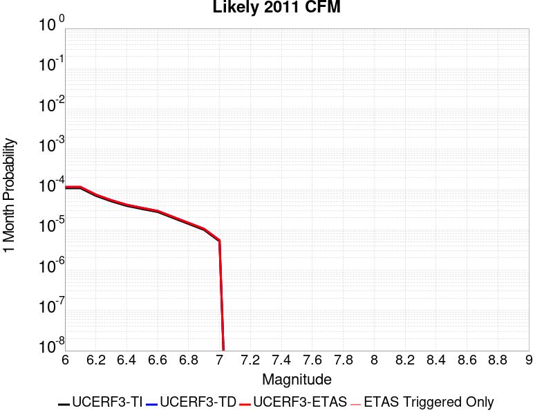 | 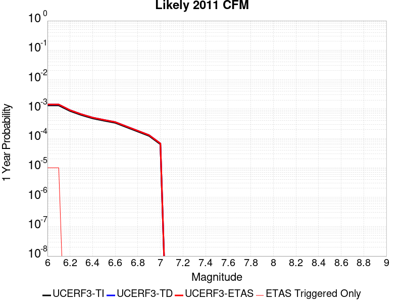 | 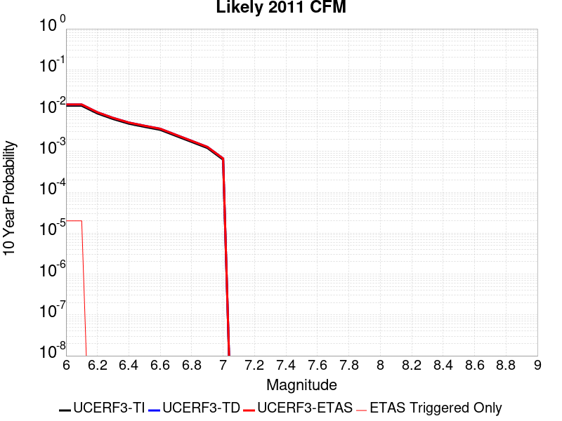 |

| Magnitude | 1 wk TI Prob | 1 wk TD Prob | 1 wk ETAS Prob | 1 wk ETAS/TD Gain | 1 wk ETAS Triggered Only | 1 mo TI Prob | 1 mo TD Prob | 1 mo ETAS Prob | 1 mo ETAS/TD Gain | 1 mo ETAS Triggered Only | 1 yr TI Prob | 1 yr TD Prob | 1 yr ETAS Prob | 1 yr ETAS/TD Gain | 1 yr ETAS Triggered Only | 10 yr TI Prob | 10 yr TD Prob | 10 yr ETAS Prob | 10 yr ETAS/TD Gain | 10 yr ETAS Triggered Only |
|-----|-----|-----|-----|-----|-----|-----|-----|-----|-----|-----|-----|-----|-----|-----|-----|-----|-----|-----|-----|-----|
| 6.0 | 2.5315949E-5 | 2.7104748E-5 | 2.7104748E-5 | 1.0 | 0.0 | 1.0849241E-4 | 1.16158284E-4 | 1.16158284E-4 | 1.0 | 0.0 | 0.0013200947 | 0.0014133542 | 0.00142334 | 1.0070654 | 1.0E-5 | 0.013122803 | 0.01404831 | 0.01406803 | 1.0014037 | 2.0E-5 |
| 6.1 | 2.5315949E-5 | 2.7104748E-5 | 2.7104748E-5 | 1.0 | 0.0 | 1.0849241E-4 | 1.16158284E-4 | 1.16158284E-4 | 1.0 | 0.0 | 0.0013200947 | 0.0014133542 | 0.00142334 | 1.0070654 | 1.0E-5 | 0.013122803 | 0.01404831 | 0.01406803 | 1.0014037 | 2.0E-5 |
| 6.2 | 1.6375941E-5 | 1.7465842E-5 | 1.7465842E-5 | 1.0 | 0.0 | 7.0180715E-5 | 7.485153E-5 | 7.485153E-5 | 1.0 | 0.0 | 8.5411523E-4 | 9.109487E-4 | 9.109487E-4 | 1.0 | 0.0 | 0.008508399 | 0.009073433 | 0.009073433 | 1.0 | 0.0 |
| 6.3 | 1.1945543E-5 | 1.2712587E-5 | 1.2712587E-5 | 1.0 | 0.0 | 5.119418E-5 | 5.4481407E-5 | 5.4481407E-5 | 1.0 | 0.0 | 6.2311086E-4 | 6.631146E-4 | 6.631146E-4 | 1.0 | 0.0 | 0.0062136655 | 0.0066119144 | 0.0066119144 | 1.0 | 0.0 |
| 6.4 | 9.192729E-6 | 9.768488E-6 | 9.768488E-6 | 1.0 | 0.0 | 3.939681E-5 | 4.1864292E-5 | 4.1864292E-5 | 1.0 | 0.0 | 4.7955062E-4 | 5.0958124E-4 | 5.0958124E-4 | 1.0 | 0.0 | 0.004785171 | 0.0050844094 | 0.0050844094 | 1.0 | 0.0 |
| 6.5 | 7.67906E-6 | 8.152622E-6 | 8.152622E-6 | 1.0 | 0.0 | 3.2909844E-5 | 3.4939352E-5 | 3.4939352E-5 | 1.0 | 0.0 | 4.006037E-4 | 4.2530545E-4 | 4.2530545E-4 | 1.0 | 0.0 | 0.0039988225 | 0.004245108 | 0.004245108 | 1.0 | 0.0 |
| 6.6 | 6.4884057E-6 | 6.8847507E-6 | 6.8847507E-6 | 1.0 | 0.0 | 2.7807157E-5 | 2.9505749E-5 | 2.9505749E-5 | 1.0 | 0.0 | 3.3849955E-4 | 3.591747E-4 | 3.591747E-4 | 1.0 | 0.0 | 0.003379844 | 0.0035860867 | 0.0035860867 | 1.0 | 0.0 |
| 6.7 | 4.6060636E-6 | 4.884041E-6 | 4.884041E-6 | 1.0 | 0.0 | 1.9740122E-5 | 2.0931442E-5 | 2.0931442E-5 | 1.0 | 0.0 | 2.403095E-4 | 2.5481134E-4 | 2.5481134E-4 | 1.0 | 0.0 | 0.002400498 | 0.0025452746 | 0.0025452746 | 1.0 | 0.0 |
| 6.8 | 3.2795615E-6 | 3.4773732E-6 | 3.4773732E-6 | 1.0 | 0.0 | 1.4055187E-5 | 1.4902946E-5 | 1.4902946E-5 | 1.0 | 0.0 | 1.7110848E-4 | 1.8142881E-4 | 1.8142881E-4 | 1.0 | 0.0 | 0.0017097679 | 0.0018128622 | 0.0018128622 | 1.0 | 0.0 |
| 6.9 | 2.3289967E-6 | 2.4705569E-6 | 2.4705569E-6 | 1.0 | 0.0 | 9.981376E-6 | 1.058806E-5 | 1.058806E-5 | 1.0 | 0.0 | 1.2151648E-4 | 1.2890245E-4 | 1.2890245E-4 | 1.0 | 0.0 | 0.0012145005 | 0.0012883197 | 0.0012883197 | 1.0 | 0.0 |
| 7.0 | 1.211292E-6 | 1.2863958E-6 | 1.2863958E-6 | 1.0 | 0.0 | 5.1912407E-6 | 5.5131145E-6 | 5.5131145E-6 | 1.0 | 0.0 | 6.320152E-5 | 6.712041E-5 | 6.712041E-5 | 1.0 | 0.0 | 6.3183554E-4 | 6.710312E-4 | 6.710312E-4 | 1.0 | 0.0 |

## Mission (connected) 2011 CFM
*[(top)](#table-of-contents)*

| 1 Week | 1 Month | 1 Year | 10 Year |
|-----|-----|-----|-----|
|  | 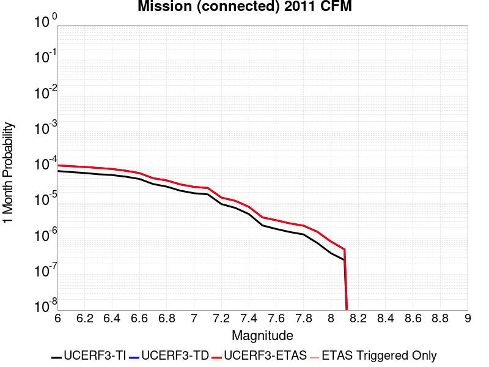 |  | 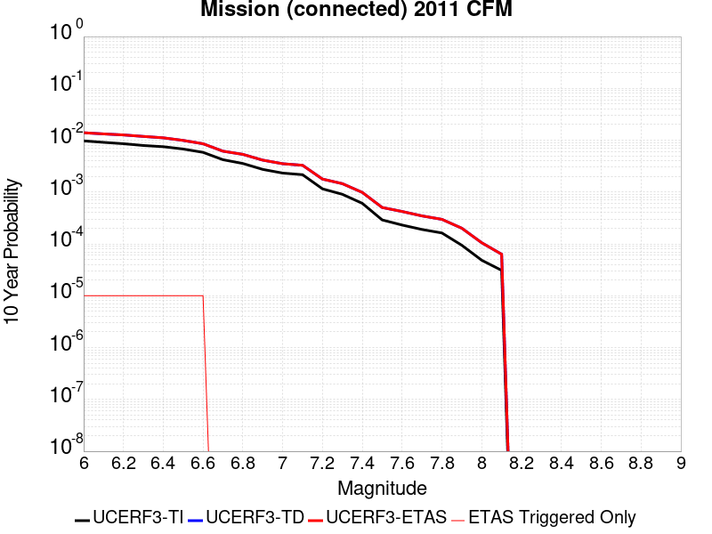 |

| Magnitude | 1 wk TI Prob | 1 wk TD Prob | 1 wk ETAS Prob | 1 wk ETAS/TD Gain | 1 wk ETAS Triggered Only | 1 mo TI Prob | 1 mo TD Prob | 1 mo ETAS Prob | 1 mo ETAS/TD Gain | 1 mo ETAS Triggered Only | 1 yr TI Prob | 1 yr TD Prob | 1 yr ETAS Prob | 1 yr ETAS/TD Gain | 1 yr ETAS Triggered Only | 10 yr TI Prob | 10 yr TD Prob | 10 yr ETAS Prob | 10 yr ETAS/TD Gain | 10 yr ETAS Triggered Only |
|-----|-----|-----|-----|-----|-----|-----|-----|-----|-----|-----|-----|-----|-----|-----|-----|-----|-----|-----|-----|-----|
| 6.0 | 1.8735573E-5 | 2.6882515E-5 | 2.6882515E-5 | 1.0 | 0.0 | 8.029284E-5 | 1.1520558E-4 | 1.1520558E-4 | 1.0 | 0.0 | 9.771269E-4 | 0.0014016571 | 0.0014016571 | 1.0 | 0.0 | 0.009728416 | 0.013937562 | 0.013947423 | 1.0007075 | 1.0E-5 |
| 6.1 | 1.7515964E-5 | 2.5523792E-5 | 2.5523792E-5 | 1.0 | 0.0 | 7.506625E-5 | 1.0938298E-4 | 1.0938298E-4 | 1.0 | 0.0 | 9.135484E-4 | 0.0013308554 | 0.0013308554 | 1.0 | 0.0 | 0.009098019 | 0.0132381655 | 0.013248034 | 1.0007454 | 1.0E-5 |
| 6.2 | 1.6486343E-5 | 2.4368448E-5 | 2.4368448E-5 | 1.0 | 0.0 | 7.065384E-5 | 1.0443191E-4 | 1.0443191E-4 | 1.0 | 0.0 | 8.5987104E-4 | 0.0012706495 | 0.0012706495 | 1.0 | 0.0 | 0.008565514 | 0.012643143 | 0.012653016 | 1.0007809 | 1.0E-5 |
| 6.3 | 1.5229385E-5 | 2.2797909E-5 | 2.2797909E-5 | 1.0 | 0.0 | 6.526716E-5 | 9.7701544E-5 | 9.7701544E-5 | 1.0 | 0.0 | 7.9433795E-4 | 0.0011887997 | 0.0011887997 | 1.0 | 0.0 | 0.007915046 | 0.011836352 | 0.011846233 | 1.0008348 | 1.0E-5 |
| 6.4 | 1.4435828E-5 | 2.1398E-5 | 2.1398E-5 | 1.0 | 0.0 | 6.186637E-5 | 9.1702364E-5 | 9.1702364E-5 | 1.0 | 0.0 | 7.529627E-4 | 0.0011158385 | 0.0011158385 | 1.0 | 0.0 | 0.007504165 | 0.011119362 | 0.011129251 | 1.0008893 | 1.0E-5 |
| 6.5 | 1.30127955E-5 | 1.9037068E-5 | 1.9037068E-5 | 1.0 | 0.0 | 5.576793E-5 | 8.1584905E-5 | 8.1584905E-5 | 1.0 | 0.0 | 6.78763E-4 | 9.927875E-4 | 9.927875E-4 | 1.0 | 0.0 | 0.0067669353 | 0.009911527 | 0.009921428 | 1.000999 | 1.0E-5 |
| 6.6 | 1.1220718E-5 | 1.639339E-5 | 1.639339E-5 | 1.0 | 0.0 | 4.8087906E-5 | 7.0255504E-5 | 7.0255504E-5 | 1.0 | 0.0 | 5.8531296E-4 | 8.5502357E-4 | 8.5502357E-4 | 1.0 | 0.0 | 0.005837737 | 0.00854963 | 0.008559545 | 1.0011597 | 1.0E-5 |
| 6.7 | 8.086152E-6 | 1.1750298E-5 | 1.1750298E-5 | 1.0 | 0.0 | 3.4654473E-5 | 5.035745E-5 | 5.035745E-5 | 1.0 | 0.0 | 4.2183654E-4 | 6.129302E-4 | 6.129302E-4 | 1.0 | 0.0 | 0.004210367 | 0.0061497535 | 0.0061497535 | 1.0 | 0.0 |
| 6.8 | 6.8361655E-6 | 1.0195406E-5 | 1.0195406E-5 | 1.0 | 0.0 | 2.9297524E-5 | 4.3693864E-5 | 4.3693864E-5 | 1.0 | 0.0 | 3.5663895E-4 | 5.3184363E-4 | 5.3184363E-4 | 1.0 | 0.0 | 0.0035606713 | 0.0053387266 | 0.0053387266 | 1.0 | 0.0 |
| 6.9 | 5.2517353E-6 | 7.8690955E-6 | 7.8690955E-6 | 1.0 | 0.0 | 2.2507242E-5 | 3.3724264E-5 | 3.3724264E-5 | 1.0 | 0.0 | 2.739912E-4 | 4.105158E-4 | 4.105158E-4 | 1.0 | 0.0 | 0.0027365363 | 0.004129868 | 0.004129868 | 1.0 | 0.0 |
| 7.0 | 4.4602784E-6 | 6.7016504E-6 | 6.7016504E-6 | 1.0 | 0.0 | 1.911534E-5 | 2.8721044E-5 | 2.8721044E-5 | 1.0 | 0.0 | 2.327044E-4 | 3.4962274E-4 | 3.4962274E-4 | 1.0 | 0.0 | 0.0023246086 | 0.0035221886 | 0.0035221886 | 1.0 | 0.0 |
| 7.1 | 4.1492594E-6 | 6.2504096E-6 | 6.2504096E-6 | 1.0 | 0.0 | 1.7782419E-5 | 2.6787196E-5 | 2.6787196E-5 | 1.0 | 0.0 | 2.1647944E-4 | 3.2608546E-4 | 3.2608546E-4 | 1.0 | 0.0 | 0.0021626868 | 0.0032870003 | 0.0032870003 | 1.0 | 0.0 |
| 7.2 | 2.213247E-6 | 3.3628444E-6 | 3.3628444E-6 | 1.0 | 0.0 | 9.485309E-6 | 1.441211E-5 | 1.441211E-5 | 1.0 | 0.0 | 1.15477524E-4 | 1.7545334E-4 | 1.7545334E-4 | 1.0 | 0.0 | 0.0011541754 | 0.0017818302 | 0.0017818302 | 1.0 | 0.0 |
| 7.3 | 1.7362703E-6 | 2.7384676E-6 | 2.7384676E-6 | 1.0 | 0.0 | 7.4411373E-6 | 1.1736238E-5 | 1.1736238E-5 | 1.0 | 0.0 | 9.0592075E-5 | 1.4287935E-4 | 1.4287935E-4 | 1.0 | 0.0 | 9.0555154E-4 | 0.0014532148 | 0.0014532148 | 1.0 | 0.0 |
| 7.4 | 1.1628409E-6 | 1.8493533E-6 | 1.8493533E-6 | 1.0 | 0.0 | 4.9835944E-6 | 7.925776E-6 | 7.925776E-6 | 1.0 | 0.0 | 6.0673574E-5 | 9.649206E-5 | 9.649206E-5 | 1.0 | 0.0 | 6.065701E-4 | 9.85306E-4 | 9.85306E-4 | 1.0 | 0.0 |
| 7.5 | 5.5610667E-7 | 9.343823E-7 | 9.343823E-7 | 1.0 | 0.0 | 2.3833122E-6 | 4.0044893E-6 | 4.0044893E-6 | 1.0 | 0.0 | 2.9016439E-5 | 4.8753573E-5 | 4.8753573E-5 | 1.0 | 0.0 | 2.901265E-4 | 5.0411286E-4 | 5.0411286E-4 | 1.0 | 0.0 |
| 7.6 | 4.4307663E-7 | 7.784628E-7 | 7.784628E-7 | 1.0 | 0.0 | 1.8988985E-6 | 3.3362649E-6 | 3.3362649E-6 | 1.0 | 0.0 | 2.3118844E-5 | 4.061827E-5 | 4.061827E-5 | 1.0 | 0.0 | 2.3116439E-4 | 4.2210697E-4 | 4.2210697E-4 | 1.0 | 0.0 |
| 7.7 | 3.639119E-7 | 6.3549425E-7 | 6.3549425E-7 | 1.0 | 0.0 | 1.5596215E-6 | 2.7235437E-6 | 2.7235437E-6 | 1.0 | 0.0 | 1.8988227E-5 | 3.315864E-5 | 3.315864E-5 | 1.0 | 0.0 | 1.8986604E-4 | 3.4690052E-4 | 3.4690052E-4 | 1.0 | 0.0 |
| 7.8 | 3.1152942E-7 | 5.474834E-7 | 5.474834E-7 | 1.0 | 0.0 | 1.3351254E-6 | 2.3463554E-6 | 2.3463554E-6 | 1.0 | 0.0 | 1.6255031E-5 | 2.8566503E-5 | 2.8566503E-5 | 1.0 | 0.0 | 1.6253842E-4 | 2.977112E-4 | 2.977112E-4 | 1.0 | 0.0 |
| 7.9 | 1.8035962E-7 | 3.7184682E-7 | 3.7184682E-7 | 1.0 | 0.0 | 7.729696E-7 | 1.5936282E-6 | 1.5936282E-6 | 1.0 | 0.0 | 9.410865E-6 | 1.9402252E-5 | 1.9402252E-5 | 1.0 | 0.0 | 9.410465E-5 | 2.0071324E-4 | 2.0071324E-4 | 1.0 | 0.0 |
| 8.0 | 9.279334E-8 | 1.9695527E-7 | 1.9695527E-7 | 1.0 | 0.0 | 3.976857E-7 | 8.4409373E-7 | 8.4409373E-7 | 1.0 | 0.0 | 4.841813E-6 | 1.0276794E-5 | 1.0276794E-5 | 1.0 | 0.0 | 4.841707E-5 | 1.05289524E-4 | 1.05289524E-4 | 1.0 | 0.0 |
| 8.1 | 5.9253985E-8 | 1.18509675E-7 | 1.18509675E-7 | 1.0 | 0.0 | 2.5394561E-7 | 5.078985E-7 | 5.078985E-7 | 1.0 | 0.0 | 3.0917836E-6 | 6.183647E-6 | 6.183647E-6 | 1.0 | 0.0 | 3.0917407E-5 | 6.322351E-5 | 6.322351E-5 | 1.0 | 0.0 |

## Northridge Hills
*[(top)](#table-of-contents)*

| 1 Week | 1 Month | 1 Year | 10 Year |
|-----|-----|-----|-----|
|  | 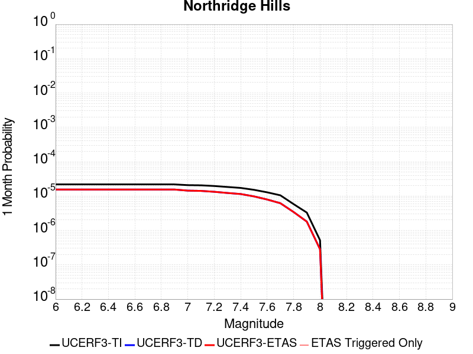 | 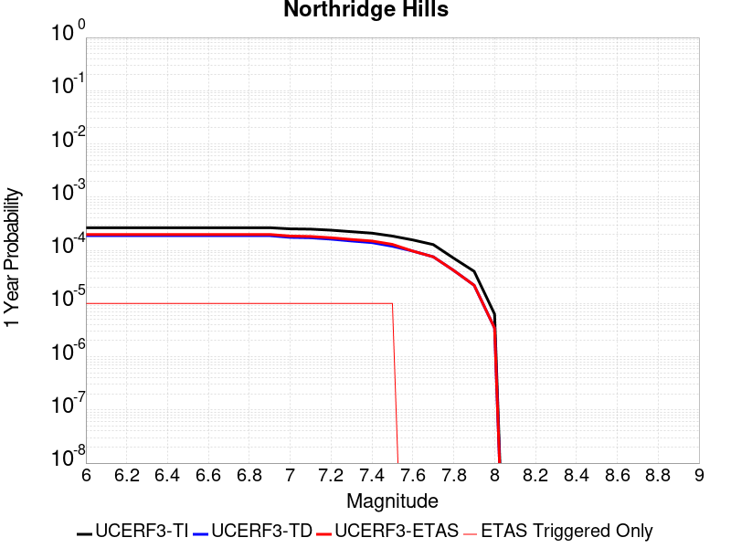 | 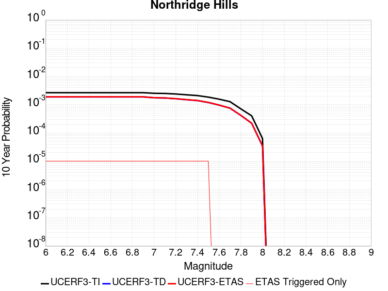 |

| Magnitude | 1 wk TI Prob | 1 wk TD Prob | 1 wk ETAS Prob | 1 wk ETAS/TD Gain | 1 wk ETAS Triggered Only | 1 mo TI Prob | 1 mo TD Prob | 1 mo ETAS Prob | 1 mo ETAS/TD Gain | 1 mo ETAS Triggered Only | 1 yr TI Prob | 1 yr TD Prob | 1 yr ETAS Prob | 1 yr ETAS/TD Gain | 1 yr ETAS Triggered Only | 10 yr TI Prob | 10 yr TD Prob | 10 yr ETAS Prob | 10 yr ETAS/TD Gain | 10 yr ETAS Triggered Only |
|-----|-----|-----|-----|-----|-----|-----|-----|-----|-----|-----|-----|-----|-----|-----|-----|-----|-----|-----|-----|-----|
| 6.0 | 5.095982E-6 | 3.6152098E-6 | 3.6152098E-6 | 1.0 | 0.0 | 2.183974E-5 | 1.5493664E-5 | 1.5493664E-5 | 1.0 | 0.0 | 2.658664E-4 | 1.8861916E-4 | 1.9861727E-4 | 1.0530069 | 1.0E-5 | 0.0026554854 | 0.001884603 | 0.0018945843 | 1.0052961 | 1.0E-5 |
| 6.1 | 5.095982E-6 | 3.6152098E-6 | 3.6152098E-6 | 1.0 | 0.0 | 2.183974E-5 | 1.5493664E-5 | 1.5493664E-5 | 1.0 | 0.0 | 2.658664E-4 | 1.8861916E-4 | 1.9861727E-4 | 1.0530069 | 1.0E-5 | 0.0026554854 | 0.001884603 | 0.0018945843 | 1.0052961 | 1.0E-5 |
| 6.2 | 5.095982E-6 | 3.6152098E-6 | 3.6152098E-6 | 1.0 | 0.0 | 2.183974E-5 | 1.5493664E-5 | 1.5493664E-5 | 1.0 | 0.0 | 2.658664E-4 | 1.8861916E-4 | 1.9861727E-4 | 1.0530069 | 1.0E-5 | 0.0026554854 | 0.001884603 | 0.0018945843 | 1.0052961 | 1.0E-5 |
| 6.3 | 5.095982E-6 | 3.6152098E-6 | 3.6152098E-6 | 1.0 | 0.0 | 2.183974E-5 | 1.5493664E-5 | 1.5493664E-5 | 1.0 | 0.0 | 2.658664E-4 | 1.8861916E-4 | 1.9861727E-4 | 1.0530069 | 1.0E-5 | 0.0026554854 | 0.001884603 | 0.0018945843 | 1.0052961 | 1.0E-5 |
| 6.4 | 5.095982E-6 | 3.6152098E-6 | 3.6152098E-6 | 1.0 | 0.0 | 2.183974E-5 | 1.5493664E-5 | 1.5493664E-5 | 1.0 | 0.0 | 2.658664E-4 | 1.8861916E-4 | 1.9861727E-4 | 1.0530069 | 1.0E-5 | 0.0026554854 | 0.001884603 | 0.0018945843 | 1.0052961 | 1.0E-5 |
| 6.5 | 5.095982E-6 | 3.6152098E-6 | 3.6152098E-6 | 1.0 | 0.0 | 2.183974E-5 | 1.5493664E-5 | 1.5493664E-5 | 1.0 | 0.0 | 2.658664E-4 | 1.8861916E-4 | 1.9861727E-4 | 1.0530069 | 1.0E-5 | 0.0026554854 | 0.001884603 | 0.0018945843 | 1.0052961 | 1.0E-5 |
| 6.6 | 5.095982E-6 | 3.6152098E-6 | 3.6152098E-6 | 1.0 | 0.0 | 2.183974E-5 | 1.5493664E-5 | 1.5493664E-5 | 1.0 | 0.0 | 2.658664E-4 | 1.8861916E-4 | 1.9861727E-4 | 1.0530069 | 1.0E-5 | 0.0026554854 | 0.001884603 | 0.0018945843 | 1.0052961 | 1.0E-5 |
| 6.7 | 5.095982E-6 | 3.6152098E-6 | 3.6152098E-6 | 1.0 | 0.0 | 2.183974E-5 | 1.5493664E-5 | 1.5493664E-5 | 1.0 | 0.0 | 2.658664E-4 | 1.8861916E-4 | 1.9861727E-4 | 1.0530069 | 1.0E-5 | 0.0026554854 | 0.001884603 | 0.0018945843 | 1.0052961 | 1.0E-5 |
| 6.8 | 5.095982E-6 | 3.6152098E-6 | 3.6152098E-6 | 1.0 | 0.0 | 2.183974E-5 | 1.5493664E-5 | 1.5493664E-5 | 1.0 | 0.0 | 2.658664E-4 | 1.8861916E-4 | 1.9861727E-4 | 1.0530069 | 1.0E-5 | 0.0026554854 | 0.001884603 | 0.0018945843 | 1.0052961 | 1.0E-5 |
| 6.9 | 5.0942654E-6 | 3.6134247E-6 | 3.6134247E-6 | 1.0 | 0.0 | 2.1832384E-5 | 1.5486015E-5 | 1.5486015E-5 | 1.0 | 0.0 | 2.6577685E-4 | 1.8852603E-4 | 1.9852415E-4 | 1.0530331 | 1.0E-5 | 0.002654592 | 0.0018836735 | 0.0018936546 | 1.0052987 | 1.0E-5 |
| 7.0 | 4.851143E-6 | 3.3587396E-6 | 3.3587396E-6 | 1.0 | 0.0 | 2.0790447E-5 | 1.4394519E-5 | 1.4394519E-5 | 1.0 | 0.0 | 2.5309427E-4 | 1.7523921E-4 | 1.8523747E-4 | 1.0570549 | 1.0E-5 | 0.0025280623 | 0.0017510147 | 0.0017609972 | 1.005701 | 1.0E-5 |
| 7.1 | 4.7910607E-6 | 3.2970208E-6 | 3.2970208E-6 | 1.0 | 0.0 | 2.0532956E-5 | 1.4130013E-5 | 1.4130013E-5 | 1.0 | 0.0 | 2.4996005E-4 | 1.7201937E-4 | 1.8201764E-4 | 1.058123 | 1.0E-5 | 0.0024967908 | 0.0017188663 | 0.001728849 | 1.0058078 | 1.0E-5 |
| 7.2 | 4.580079E-6 | 3.1067987E-6 | 3.1067987E-6 | 1.0 | 0.0 | 1.9628762E-5 | 1.3314784E-5 | 1.3314784E-5 | 1.0 | 0.0 | 2.3895396E-4 | 1.6209547E-4 | 1.7209385E-4 | 1.061682 | 1.0E-5 | 0.0023869718 | 0.0016197758 | 0.0016297597 | 1.0061637 | 1.0E-5 |
| 7.3 | 4.290062E-6 | 2.8682275E-6 | 2.8682275E-6 | 1.0 | 0.0 | 1.838585E-5 | 1.2292346E-5 | 1.2292346E-5 | 1.0 | 0.0 | 2.2382473E-4 | 1.4964906E-4 | 1.5964756E-4 | 1.066813 | 1.0E-5 | 0.0022359942 | 0.0014954859 | 0.0015054708 | 1.0066768 | 1.0E-5 |
| 7.4 | 4.0259683E-6 | 2.673904E-6 | 2.673904E-6 | 1.0 | 0.0 | 1.7254037E-5 | 1.1459538E-5 | 1.1459538E-5 | 1.0 | 0.0 | 2.1004764E-4 | 1.3951097E-4 | 1.4950958E-4 | 1.071669 | 1.0E-5 | 0.002098492 | 0.0013942367 | 0.0014042228 | 1.0071623 | 1.0E-5 |
| 7.5 | 3.5477108E-6 | 2.285216E-6 | 2.285216E-6 | 1.0 | 0.0 | 1.5204386E-5 | 9.793746E-6 | 9.793746E-6 | 1.0 | 0.0 | 1.8509767E-4 | 1.1923235E-4 | 1.2923115E-4 | 1.0838598 | 1.0E-5 | 0.0018494357 | 0.0011916853 | 0.0012016734 | 1.0083815 | 1.0E-5 |
| 7.6 | 2.9990608E-6 | 1.8528339E-6 | 1.8528339E-6 | 1.0 | 0.0 | 1.2853055E-5 | 7.940693E-6 | 7.940693E-6 | 1.0 | 0.0 | 1.564747E-4 | 9.667365E-5 | 9.667365E-5 | 1.0 | 0.0 | 0.0015636457 | 9.663168E-4 | 9.663168E-4 | 1.0 | 0.0 |
| 7.7 | 2.4542855E-6 | 1.4461344E-6 | 1.4461344E-6 | 1.0 | 0.0 | 1.05183235E-5 | 6.197704E-6 | 6.197704E-6 | 1.0 | 0.0 | 1.2805307E-4 | 7.545444E-5 | 7.545444E-5 | 1.0 | 0.0 | 0.001279793 | 7.5428875E-4 | 7.5428875E-4 | 1.0 | 0.0 |
| 7.8 | 1.3623128E-6 | 8.016168E-7 | 8.016168E-7 | 1.0 | 0.0 | 5.8384703E-6 | 3.4354962E-6 | 3.4354962E-6 | 1.0 | 0.0 | 7.108106E-5 | 4.1826366E-5 | 4.1826366E-5 | 1.0 | 0.0 | 7.1058323E-4 | 4.1818514E-4 | 4.1818514E-4 | 1.0 | 0.0 |
| 7.9 | 7.716622E-7 | 4.218757E-7 | 4.218757E-7 | 1.0 | 0.0 | 3.3071194E-6 | 1.8080375E-6 | 1.8080375E-6 | 1.0 | 0.0 | 4.0263436E-5 | 2.2012635E-5 | 2.2012635E-5 | 1.0 | 0.0 | 4.0256142E-4 | 2.2010466E-4 | 2.2010466E-4 | 1.0 | 0.0 |
| 8.0 | 1.2117711E-7 | 6.6220565E-8 | 6.6220565E-8 | 1.0 | 0.0 | 5.1933034E-7 | 2.838024E-7 | 2.838024E-7 | 1.0 | 0.0 | 6.3228285E-6 | 3.4552888E-6 | 3.4552888E-6 | 1.0 | 0.0 | 6.3226486E-5 | 3.455237E-5 | 3.455237E-5 | 1.0 | 0.0 |

## San Gregorio (South) 2011 CFM
*[(top)](#table-of-contents)*

| 1 Week | 1 Month | 1 Year | 10 Year |
|-----|-----|-----|-----|
|  | 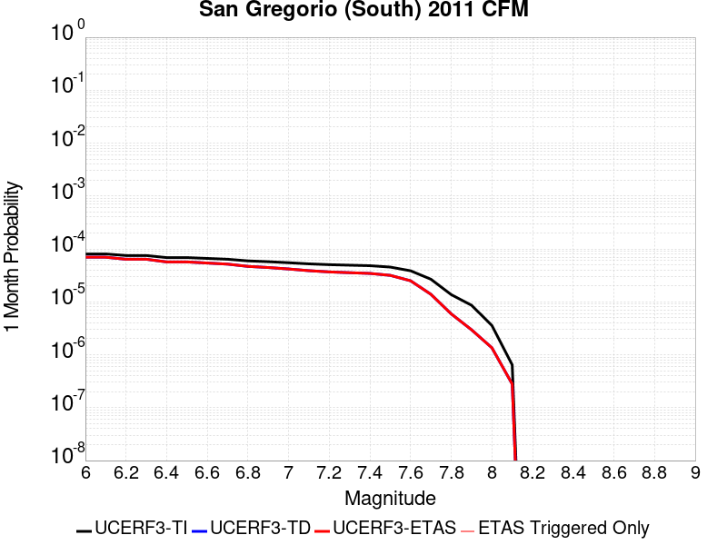 | 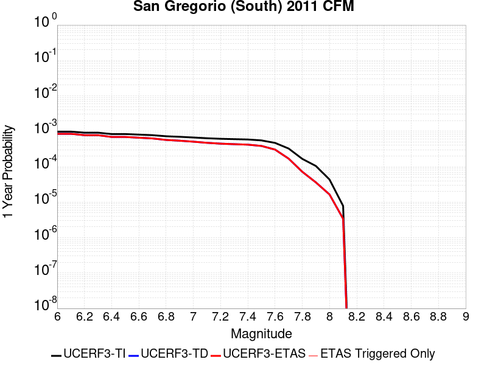 | 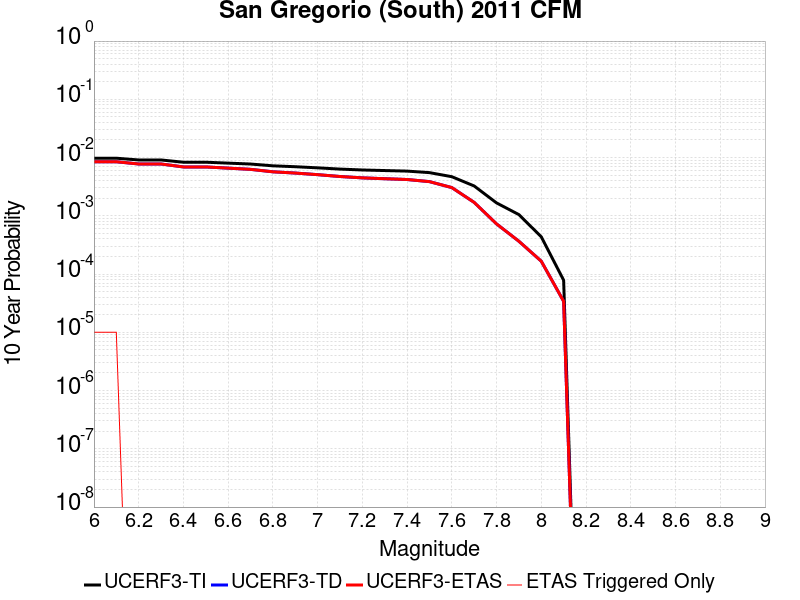 |

| Magnitude | 1 wk TI Prob | 1 wk TD Prob | 1 wk ETAS Prob | 1 wk ETAS/TD Gain | 1 wk ETAS Triggered Only | 1 mo TI Prob | 1 mo TD Prob | 1 mo ETAS Prob | 1 mo ETAS/TD Gain | 1 mo ETAS Triggered Only | 1 yr TI Prob | 1 yr TD Prob | 1 yr ETAS Prob | 1 yr ETAS/TD Gain | 1 yr ETAS Triggered Only | 10 yr TI Prob | 10 yr TD Prob | 10 yr ETAS Prob | 10 yr ETAS/TD Gain | 10 yr ETAS Triggered Only |
|-----|-----|-----|-----|-----|-----|-----|-----|-----|-----|-----|-----|-----|-----|-----|-----|-----|-----|-----|-----|-----|
| 6.0 | 1.8770423E-5 | 1.6279751E-5 | 1.6279751E-5 | 1.0 | 0.0 | 8.044219E-5 | 6.976852E-5 | 6.976852E-5 | 1.0 | 0.0 | 9.789435E-4 | 8.491044E-4 | 8.491044E-4 | 1.0 | 0.0 | 0.009746423 | 0.008471312 | 0.008481227 | 1.0011704 | 1.0E-5 |
| 6.1 | 1.8770423E-5 | 1.6279751E-5 | 1.6279751E-5 | 1.0 | 0.0 | 8.044219E-5 | 6.976852E-5 | 6.976852E-5 | 1.0 | 0.0 | 9.789435E-4 | 8.491044E-4 | 8.491044E-4 | 1.0 | 0.0 | 0.009746423 | 0.008471312 | 0.008481227 | 1.0011704 | 1.0E-5 |
| 6.2 | 1.7508692E-5 | 1.4899257E-5 | 1.4899257E-5 | 1.0 | 0.0 | 7.5035096E-5 | 6.3852414E-5 | 6.3852414E-5 | 1.0 | 0.0 | 9.1316935E-4 | 7.7712885E-4 | 7.7712885E-4 | 1.0 | 0.0 | 0.00909426 | 0.00775674 | 0.00775674 | 1.0 | 0.0 |
| 6.3 | 1.7508692E-5 | 1.4899257E-5 | 1.4899257E-5 | 1.0 | 0.0 | 7.5035096E-5 | 6.3852414E-5 | 6.3852414E-5 | 1.0 | 0.0 | 9.1316935E-4 | 7.7712885E-4 | 7.7712885E-4 | 1.0 | 0.0 | 0.00909426 | 0.00775674 | 0.00775674 | 1.0 | 0.0 |
| 6.4 | 1.6004591E-5 | 1.3249094E-5 | 1.3249094E-5 | 1.0 | 0.0 | 6.85893E-5 | 5.6780602E-5 | 5.6780602E-5 | 1.0 | 0.0 | 8.347548E-4 | 6.910856E-4 | 6.910856E-4 | 1.0 | 0.0 | 0.008316261 | 0.006901791 | 0.006901791 | 1.0 | 0.0 |
| 6.5 | 1.6004591E-5 | 1.3249094E-5 | 1.3249094E-5 | 1.0 | 0.0 | 6.85893E-5 | 5.6780602E-5 | 5.6780602E-5 | 1.0 | 0.0 | 8.347548E-4 | 6.910856E-4 | 6.910856E-4 | 1.0 | 0.0 | 0.008316261 | 0.006901791 | 0.006901791 | 1.0 | 0.0 |
| 6.6 | 1.5442201E-5 | 1.2633725E-5 | 1.2633725E-5 | 1.0 | 0.0 | 6.617918E-5 | 5.4143416E-5 | 5.4143416E-5 | 1.0 | 0.0 | 8.0543366E-4 | 6.5899757E-4 | 6.5899757E-4 | 1.0 | 0.0 | 0.008025207 | 0.006582842 | 0.006582842 | 1.0 | 0.0 |
| 6.7 | 1.489921E-5 | 1.2042234E-5 | 1.2042234E-5 | 1.0 | 0.0 | 6.3852196E-5 | 5.1608557E-5 | 5.1608557E-5 | 1.0 | 0.0 | 7.7712315E-4 | 6.2815374E-4 | 6.2815374E-4 | 1.0 | 0.0 | 0.0077441116 | 0.006276176 | 0.006276176 | 1.0 | 0.0 |
| 6.8 | 1.3876024E-5 | 1.0921184E-5 | 1.0921184E-5 | 1.0 | 0.0 | 5.9467322E-5 | 4.6804238E-5 | 4.6804238E-5 | 1.0 | 0.0 | 7.237741E-4 | 5.69693E-4 | 5.69693E-4 | 1.0 | 0.0 | 0.0072142133 | 0.0056946846 | 0.0056946846 | 1.0 | 0.0 |
| 6.9 | 1.33922495E-5 | 1.0392687E-5 | 1.0392687E-5 | 1.0 | 0.0 | 5.7394092E-5 | 4.4539327E-5 | 4.4539327E-5 | 1.0 | 0.0 | 6.9854903E-4 | 5.4213166E-4 | 5.4213166E-4 | 1.0 | 0.0 | 0.0069635725 | 0.005420442 | 0.005420442 | 1.0 | 0.0 |
| 7.0 | 1.2807324E-5 | 9.752649E-6 | 9.752649E-6 | 1.0 | 0.0 | 5.4887376E-5 | 4.1796397E-5 | 4.1796397E-5 | 1.0 | 0.0 | 6.680489E-4 | 5.087525E-4 | 5.087525E-4 | 1.0 | 0.0 | 0.006660442 | 0.0050882204 | 0.0050882204 | 1.0 | 0.0 |
| 7.1 | 1.2191438E-5 | 9.061537E-6 | 9.061537E-6 | 1.0 | 0.0 | 5.224797E-5 | 3.8834576E-5 | 3.8834576E-5 | 1.0 | 0.0 | 6.3593336E-4 | 4.727085E-4 | 4.727085E-4 | 1.0 | 0.0 | 0.0063411663 | 0.0047293645 | 0.0047293645 | 1.0 | 0.0 |
| 7.2 | 1.1769438E-5 | 8.581731E-6 | 8.581731E-6 | 1.0 | 0.0 | 5.0439474E-5 | 3.677833E-5 | 3.677833E-5 | 1.0 | 0.0 | 6.1392755E-4 | 4.4768423E-4 | 4.4768423E-4 | 1.0 | 0.0 | 0.0061223423 | 0.004480157 | 0.004480157 | 1.0 | 0.0 |
| 7.3 | 1.150374E-5 | 8.29716E-6 | 8.29716E-6 | 1.0 | 0.0 | 4.9300812E-5 | 3.5558773E-5 | 3.5558773E-5 | 1.0 | 0.0 | 6.0007203E-4 | 4.3284212E-4 | 4.3284212E-4 | 1.0 | 0.0 | 0.0059845424 | 0.0043323063 | 0.0043323063 | 1.0 | 0.0 |
| 7.4 | 1.12514E-5 | 8.042902E-6 | 8.042902E-6 | 1.0 | 0.0 | 4.8219394E-5 | 3.4469125E-5 | 3.4469125E-5 | 1.0 | 0.0 | 5.8691297E-4 | 4.1958084E-4 | 4.1958084E-4 | 1.0 | 0.0 | 0.005853653 | 0.0042001884 | 0.0042001884 | 1.0 | 0.0 |
| 7.5 | 1.059696E-5 | 7.3931915E-6 | 7.3931915E-6 | 1.0 | 0.0 | 4.5414752E-5 | 3.168472E-5 | 3.168472E-5 | 1.0 | 0.0 | 5.5278436E-4 | 3.8569325E-4 | 3.8569325E-4 | 1.0 | 0.0 | 0.0055141128 | 0.0038624762 | 0.0038624762 | 1.0 | 0.0 |
| 7.6 | 9.018592E-6 | 5.8369624E-6 | 5.8369624E-6 | 1.0 | 0.0 | 3.8650534E-5 | 2.5015313E-5 | 2.5015313E-5 | 1.0 | 0.0 | 4.7046866E-4 | 3.045189E-4 | 3.045189E-4 | 1.0 | 0.0 | 0.004694739 | 0.0030528754 | 0.0030528754 | 1.0 | 0.0 |
| 7.7 | 6.243489E-6 | 3.2395455E-6 | 3.2395455E-6 | 1.0 | 0.0 | 2.6757538E-5 | 1.3883692E-5 | 1.3883692E-5 | 1.0 | 0.0 | 3.257243E-4 | 1.6902086E-4 | 1.6902086E-4 | 1.0 | 0.0 | 0.003252473 | 0.001699108 | 0.001699108 | 1.0 | 0.0 |
| 7.8 | 3.1941963E-6 | 1.3809986E-6 | 1.3809986E-6 | 1.0 | 0.0 | 1.368934E-5 | 5.9185513E-6 | 5.9185513E-6 | 1.0 | 0.0 | 1.6665498E-4 | 7.2055984E-5 | 7.2055984E-5 | 1.0 | 0.0 | 0.0016653005 | 7.263174E-4 | 7.263174E-4 | 1.0 | 0.0 |
| 7.9 | 2.0098398E-6 | 6.9161155E-7 | 6.9161155E-7 | 1.0 | 0.0 | 8.6135715E-6 | 2.964046E-6 | 2.964046E-6 | 1.0 | 0.0 | 1.0486518E-4 | 3.608666E-5 | 3.608666E-5 | 1.0 | 0.0 | 0.0010481571 | 3.657225E-4 | 3.657225E-4 | 1.0 | 0.0 |
| 8.0 | 8.353119E-7 | 3.1623412E-7 | 3.1623412E-7 | 1.0 | 0.0 | 3.579903E-6 | 1.3552883E-6 | 1.3552883E-6 | 1.0 | 0.0 | 4.358445E-5 | 1.6500511E-5 | 1.6500511E-5 | 1.0 | 0.0 | 4.3575902E-4 | 1.6619264E-4 | 1.6619264E-4 | 1.0 | 0.0 |
| 8.1 | 1.5033264E-7 | 6.527624E-8 | 6.527624E-8 | 1.0 | 0.0 | 6.442826E-7 | 2.7975528E-7 | 2.7975528E-7 | 1.0 | 0.0 | 7.844113E-6 | 3.4060151E-6 | 3.4060151E-6 | 1.0 | 0.0 | 7.843835E-5 | 3.407693E-5 | 3.407693E-5 | 1.0 | 0.0 |

## Sierra Madre (San Fernando)
*[(top)](#table-of-contents)*

| 1 Week | 1 Month | 1 Year | 10 Year |
|-----|-----|-----|-----|
| 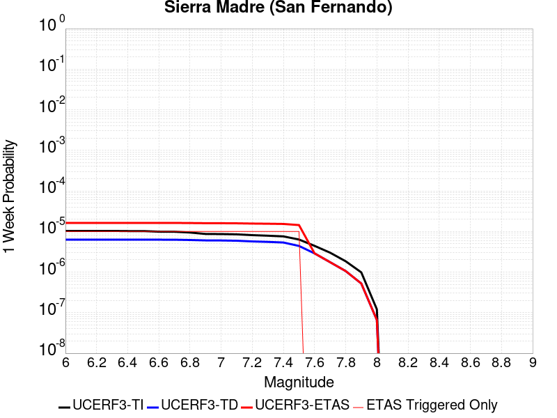 | 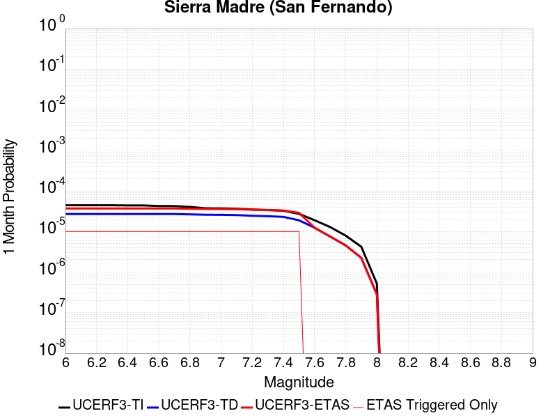 | 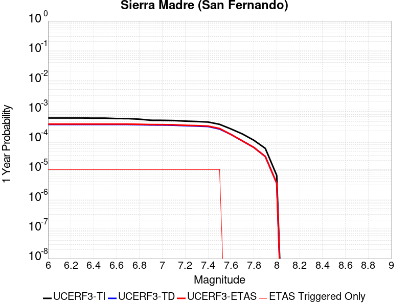 | 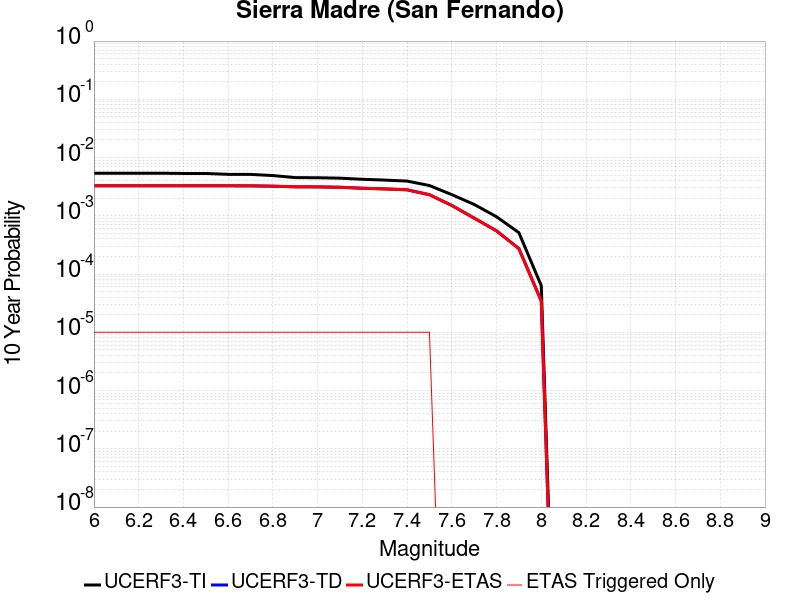 |

| Magnitude | 1 wk TI Prob | 1 wk TD Prob | 1 wk ETAS Prob | 1 wk ETAS/TD Gain | 1 wk ETAS Triggered Only | 1 mo TI Prob | 1 mo TD Prob | 1 mo ETAS Prob | 1 mo ETAS/TD Gain | 1 mo ETAS Triggered Only | 1 yr TI Prob | 1 yr TD Prob | 1 yr ETAS Prob | 1 yr ETAS/TD Gain | 1 yr ETAS Triggered Only | 10 yr TI Prob | 10 yr TD Prob | 10 yr ETAS Prob | 10 yr ETAS/TD Gain | 10 yr ETAS Triggered Only |
|-----|-----|-----|-----|-----|-----|-----|-----|-----|-----|-----|-----|-----|-----|-----|-----|-----|-----|-----|-----|-----|
| 6.0 | 1.0346413E-5 | 6.2872605E-6 | 1.6287198E-5 | 2.5905077 | 1.0E-5 | 4.4341014E-5 | 2.694513E-5 | 3.694486E-5 | 1.3711146 | 1.0E-5 | 5.3971814E-4 | 3.280087E-4 | 3.380054E-4 | 1.030477 | 1.0E-5 | 0.0053840918 | 0.0032753581 | 0.0032853254 | 1.003043 | 1.0E-5 |
| 6.1 | 1.0346413E-5 | 6.2872605E-6 | 1.6287198E-5 | 2.5905077 | 1.0E-5 | 4.4341014E-5 | 2.694513E-5 | 3.694486E-5 | 1.3711146 | 1.0E-5 | 5.3971814E-4 | 3.280087E-4 | 3.380054E-4 | 1.030477 | 1.0E-5 | 0.0053840918 | 0.0032753581 | 0.0032853254 | 1.003043 | 1.0E-5 |
| 6.2 | 1.0346413E-5 | 6.2872605E-6 | 1.6287198E-5 | 2.5905077 | 1.0E-5 | 4.4341014E-5 | 2.694513E-5 | 3.694486E-5 | 1.3711146 | 1.0E-5 | 5.3971814E-4 | 3.280087E-4 | 3.380054E-4 | 1.030477 | 1.0E-5 | 0.0053840918 | 0.0032753581 | 0.0032853254 | 1.003043 | 1.0E-5 |
| 6.3 | 1.0346413E-5 | 6.2872605E-6 | 1.6287198E-5 | 2.5905077 | 1.0E-5 | 4.4341014E-5 | 2.694513E-5 | 3.694486E-5 | 1.3711146 | 1.0E-5 | 5.3971814E-4 | 3.280087E-4 | 3.380054E-4 | 1.030477 | 1.0E-5 | 0.0053840918 | 0.0032753581 | 0.0032853254 | 1.003043 | 1.0E-5 |
| 6.4 | 1.0249558E-5 | 6.2872605E-6 | 1.6287198E-5 | 2.5905077 | 1.0E-5 | 4.392594E-5 | 2.694513E-5 | 3.694486E-5 | 1.3711146 | 1.0E-5 | 5.3466705E-4 | 3.280087E-4 | 3.380054E-4 | 1.030477 | 1.0E-5 | 0.0053338245 | 0.0032753581 | 0.0032853254 | 1.003043 | 1.0E-5 |
| 6.5 | 1.0249558E-5 | 6.2872605E-6 | 1.6287198E-5 | 2.5905077 | 1.0E-5 | 4.392594E-5 | 2.694513E-5 | 3.694486E-5 | 1.3711146 | 1.0E-5 | 5.3466705E-4 | 3.280087E-4 | 3.380054E-4 | 1.030477 | 1.0E-5 | 0.0053338245 | 0.0032753581 | 0.0032853254 | 1.003043 | 1.0E-5 |
| 6.6 | 9.9035515E-6 | 6.2872605E-6 | 1.6287198E-5 | 2.5905077 | 1.0E-5 | 4.2443102E-5 | 2.694513E-5 | 3.694486E-5 | 1.3711146 | 1.0E-5 | 5.166222E-4 | 3.280087E-4 | 3.380054E-4 | 1.030477 | 1.0E-5 | 0.0051542283 | 0.0032753581 | 0.0032853254 | 1.003043 | 1.0E-5 |
| 6.7 | 9.87217E-6 | 6.2746817E-6 | 1.6274618E-5 | 2.5936964 | 1.0E-5 | 4.2308613E-5 | 2.689122E-5 | 3.6890953E-5 | 1.3718586 | 1.0E-5 | 5.149856E-4 | 3.2735255E-4 | 3.3734928E-4 | 1.0305381 | 1.0E-5 | 0.005137938 | 0.0032688158 | 0.0032787833 | 1.0030493 | 1.0E-5 |
| 6.8 | 9.4359175E-6 | 6.1786586E-6 | 1.6178597E-5 | 2.6184642 | 1.0E-5 | 4.043902E-5 | 2.6479704E-5 | 3.647944E-5 | 1.3776377 | 1.0E-5 | 4.9223384E-4 | 3.2234378E-4 | 3.3234057E-4 | 1.0310128 | 1.0E-5 | 0.0049114493 | 0.0032188739 | 0.0032288418 | 1.0030967 | 1.0E-5 |
| 6.9 | 8.700447E-6 | 6.039922E-6 | 1.6039861E-5 | 2.6556406 | 1.0E-5 | 3.72871E-5 | 2.5885129E-5 | 3.588487E-5 | 1.3863122 | 1.0E-5 | 4.5387587E-4 | 3.1510694E-4 | 3.2510379E-4 | 1.0317253 | 1.0E-5 | 0.0045295 | 0.003146711 | 0.0031566794 | 1.0031679 | 1.0E-5 |
| 7.0 | 8.648878E-6 | 6.0148373E-6 | 1.6014777E-5 | 2.6625454 | 1.0E-5 | 3.7066096E-5 | 2.5777625E-5 | 3.5777368E-5 | 1.3879234 | 1.0E-5 | 4.5118626E-4 | 3.1379846E-4 | 3.2379534E-4 | 1.0318576 | 1.0E-5 | 0.004502713 | 0.003133663 | 0.0031436319 | 1.0031811 | 1.0E-5 |
| 7.1 | 8.505786E-6 | 5.9244676E-6 | 1.5924408E-5 | 2.6879053 | 1.0E-5 | 3.645286E-5 | 2.5390334E-5 | 3.539008E-5 | 1.3938407 | 1.0E-5 | 4.437232E-4 | 3.0908454E-4 | 3.1908145E-4 | 1.0323436 | 1.0E-5 | 0.0044283825 | 0.0030866556 | 0.0030966247 | 1.0032297 | 1.0E-5 |
| 7.2 | 8.139752E-6 | 5.6987624E-6 | 1.5698706E-5 | 2.754757 | 1.0E-5 | 3.4884186E-5 | 2.4423045E-5 | 3.4422803E-5 | 1.4094393 | 1.0E-5 | 4.246322E-4 | 2.9731105E-4 | 3.0730807E-4 | 1.0336248 | 1.0E-5 | 0.004238217 | 0.0029692391 | 0.0029792094 | 1.0033579 | 1.0E-5 |
| 7.3 | 7.8816E-6 | 5.552077E-6 | 1.5552021E-5 | 2.801118 | 1.0E-5 | 3.3777847E-5 | 2.3794404E-5 | 3.3794167E-5 | 1.4202569 | 1.0E-5 | 4.111677E-4 | 2.896594E-4 | 2.996565E-4 | 1.0345134 | 1.0E-5 | 0.004104078 | 0.0028929242 | 0.0029028952 | 1.0034467 | 1.0E-5 |
| 7.4 | 7.5810603E-6 | 5.3563126E-6 | 1.535626E-5 | 2.866946 | 1.0E-5 | 3.2489854E-5 | 2.2955428E-5 | 3.29552E-5 | 1.4356169 | 1.0E-5 | 3.9549218E-4 | 2.7944756E-4 | 2.8944475E-4 | 1.035775 | 1.0E-5 | 0.0039478904 | 0.0027910667 | 0.0028010388 | 1.0035728 | 1.0E-5 |
| 7.5 | 6.349153E-6 | 4.407576E-6 | 1.4407532E-5 | 3.2688107 | 1.0E-5 | 2.7210372E-5 | 1.888948E-5 | 2.888929E-5 | 1.5293852 | 1.0E-5 | 3.312359E-4 | 2.2995596E-4 | 2.3995366E-4 | 1.0434766 | 1.0E-5 | 0.0033074263 | 0.0022972622 | 0.0023072392 | 1.004343 | 1.0E-5 |
| 7.6 | 4.430576E-6 | 2.8905868E-6 | 2.8905868E-6 | 1.0 | 0.0 | 1.8988047E-5 | 1.2388171E-5 | 1.2388171E-5 | 1.0 | 0.0 | 2.3115493E-4 | 1.5081577E-4 | 1.5081577E-4 | 1.0 | 0.0 | 0.0023091463 | 0.0015071568 | 0.0015071568 | 1.0 | 0.0 |
| 7.7 | 3.005066E-6 | 1.7510115E-6 | 1.7510115E-6 | 1.0 | 0.0 | 1.2878791E-5 | 7.504313E-6 | 7.504313E-6 | 1.0 | 0.0 | 1.56788E-4 | 9.1361195E-5 | 9.1361195E-5 | 1.0 | 0.0 | 0.0015667742 | 9.132375E-4 | 9.132375E-4 | 1.0 | 0.0 |
| 7.8 | 1.8459098E-6 | 1.0582091E-6 | 1.0582091E-6 | 1.0 | 0.0 | 7.911018E-6 | 4.535174E-6 | 4.535174E-6 | 1.0 | 0.0 | 9.631238E-5 | 5.5214347E-5 | 5.5214347E-5 | 1.0 | 0.0 | 9.627065E-4 | 5.5200676E-4 | 5.5200676E-4 | 1.0 | 0.0 |
| 7.9 | 9.839262E-7 | 5.23421E-7 | 5.23421E-7 | 1.0 | 0.0 | 4.2168194E-6 | 2.2432312E-6 | 2.2432312E-6 | 1.0 | 0.0 | 5.1338568E-5 | 2.7310998E-5 | 2.7310998E-5 | 1.0 | 0.0 | 5.132671E-4 | 2.730767E-4 | 2.730767E-4 | 1.0 | 0.0 |
| 8.0 | 1.210983E-7 | 6.613821E-8 | 6.613821E-8 | 1.0 | 0.0 | 5.1899264E-7 | 2.8344945E-7 | 2.8344945E-7 | 1.0 | 0.0 | 6.3187167E-6 | 3.4509917E-6 | 3.4509917E-6 | 1.0 | 0.0 | 6.318537E-5 | 3.45094E-5 | 3.45094E-5 | 1.0 | 0.0 |

## Elsinore (Stepovers Combined)
*[(top)](#table-of-contents)*

| 1 Week | 1 Month | 1 Year | 10 Year |
|-----|-----|-----|-----|
| 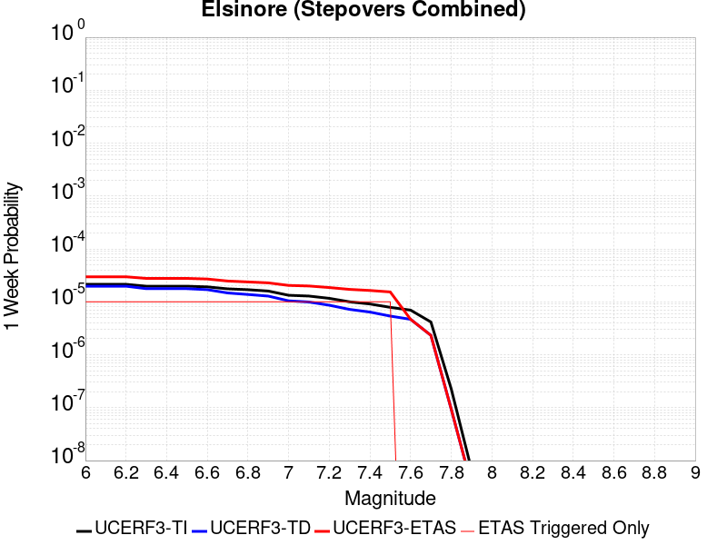 | 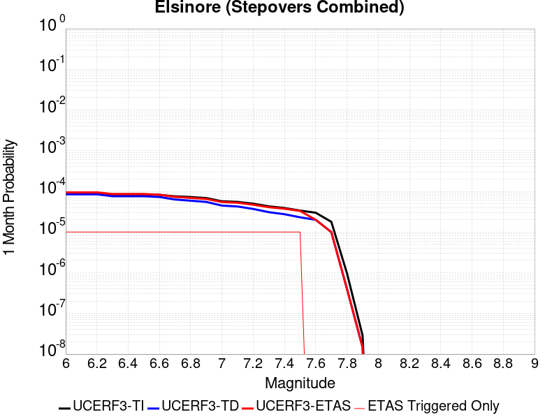 | 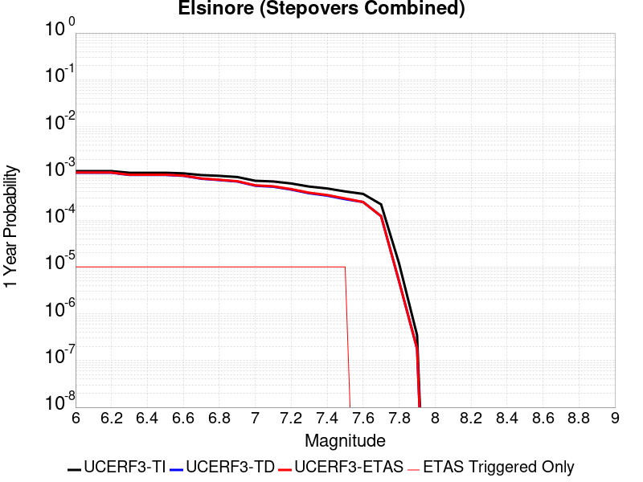 | 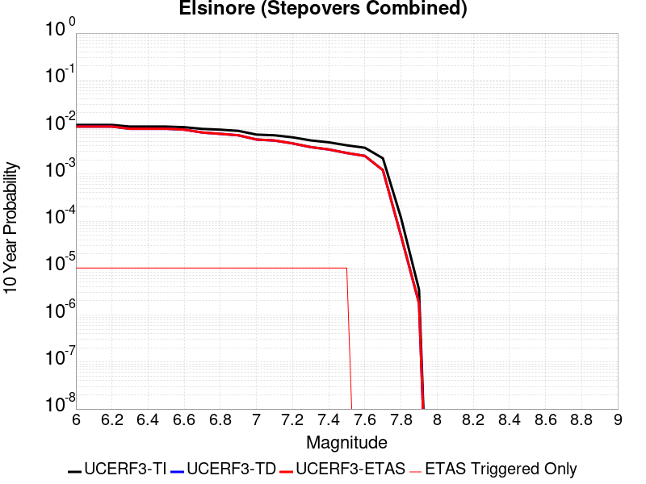 |

| Magnitude | 1 wk TI Prob | 1 wk TD Prob | 1 wk ETAS Prob | 1 wk ETAS/TD Gain | 1 wk ETAS Triggered Only | 1 mo TI Prob | 1 mo TD Prob | 1 mo ETAS Prob | 1 mo ETAS/TD Gain | 1 mo ETAS Triggered Only | 1 yr TI Prob | 1 yr TD Prob | 1 yr ETAS Prob | 1 yr ETAS/TD Gain | 1 yr ETAS Triggered Only | 10 yr TI Prob | 10 yr TD Prob | 10 yr ETAS Prob | 10 yr ETAS/TD Gain | 10 yr ETAS Triggered Only |
|-----|-----|-----|-----|-----|-----|-----|-----|-----|-----|-----|-----|-----|-----|-----|-----|-----|-----|-----|-----|-----|
| 6.0 | 2.144392E-5 | 1.9760193E-5 | 2.9759995E-5 | 1.506058 | 1.0E-5 | 9.189928E-5 | 8.468392E-5 | 9.468307E-5 | 1.1180762 | 1.0E-5 | 0.0011182994 | 0.0010305607 | 0.0010405504 | 1.0096935 | 1.0E-5 | 0.011126885 | 0.010264917 | 0.010274814 | 1.0009642 | 1.0E-5 |
| 6.1 | 2.144392E-5 | 1.9760193E-5 | 2.9759995E-5 | 1.506058 | 1.0E-5 | 9.189928E-5 | 8.468392E-5 | 9.468307E-5 | 1.1180762 | 1.0E-5 | 0.0011182994 | 0.0010305607 | 0.0010405504 | 1.0096935 | 1.0E-5 | 0.011126885 | 0.010264917 | 0.010274814 | 1.0009642 | 1.0E-5 |
| 6.2 | 2.144392E-5 | 1.9760193E-5 | 2.9759995E-5 | 1.506058 | 1.0E-5 | 9.189928E-5 | 8.468392E-5 | 9.468307E-5 | 1.1180762 | 1.0E-5 | 0.0011182994 | 0.0010305607 | 0.0010405504 | 1.0096935 | 1.0E-5 | 0.011126885 | 0.010264917 | 0.010274814 | 1.0009642 | 1.0E-5 |
| 6.3 | 1.9751555E-5 | 1.7741453E-5 | 2.7741275E-5 | 1.5636417 | 1.0E-5 | 8.4646774E-5 | 7.603267E-5 | 8.603191E-5 | 1.1315124 | 1.0E-5 | 0.0010300872 | 9.253213E-4 | 9.3531207E-4 | 1.010797 | 1.0E-5 | 0.010253254 | 0.009221276 | 0.009231185 | 1.0010744 | 1.0E-5 |
| 6.4 | 1.9751555E-5 | 1.7741453E-5 | 2.7741275E-5 | 1.5636417 | 1.0E-5 | 8.4646774E-5 | 7.603267E-5 | 8.603191E-5 | 1.1315124 | 1.0E-5 | 0.0010300872 | 9.253213E-4 | 9.3531207E-4 | 1.010797 | 1.0E-5 | 0.010253254 | 0.009221276 | 0.009231185 | 1.0010744 | 1.0E-5 |
| 6.5 | 1.9751555E-5 | 1.7741453E-5 | 2.7741275E-5 | 1.5636417 | 1.0E-5 | 8.4646774E-5 | 7.603267E-5 | 8.603191E-5 | 1.1315124 | 1.0E-5 | 0.0010300872 | 9.253213E-4 | 9.3531207E-4 | 1.010797 | 1.0E-5 | 0.010253254 | 0.009221276 | 0.009231185 | 1.0010744 | 1.0E-5 |
| 6.6 | 1.9188685E-5 | 1.7003393E-5 | 2.7003223E-5 | 1.588108 | 1.0E-5 | 8.2234634E-5 | 7.286974E-5 | 8.286901E-5 | 1.1372212 | 1.0E-5 | 0.0010007467 | 8.868442E-4 | 8.968353E-4 | 1.011266 | 1.0E-5 | 0.00996252 | 0.0088398475 | 0.008849759 | 1.0011213 | 1.0E-5 |
| 6.7 | 1.7608272E-5 | 1.4732616E-5 | 2.473247E-5 | 1.678756 | 1.0E-5 | 7.546184E-5 | 6.3138315E-5 | 7.313768E-5 | 1.1583724 | 1.0E-5 | 9.183606E-4 | 7.684476E-4 | 7.784399E-4 | 1.0130032 | 1.0E-5 | 0.009145746 | 0.00766491 | 0.0076748333 | 1.0012946 | 1.0E-5 |
| 6.8 | 1.697165E-5 | 1.3783365E-5 | 2.3783226E-5 | 1.7255023 | 1.0E-5 | 7.273361E-5 | 5.9070277E-5 | 6.906968E-5 | 1.1692799 | 1.0E-5 | 8.8517193E-4 | 7.18952E-4 | 7.289448E-4 | 1.0138991 | 1.0E-5 | 0.008816543 | 0.007172675 | 0.0071826032 | 1.0013841 | 1.0E-5 |
| 6.9 | 1.600365E-5 | 1.2846671E-5 | 2.2846543E-5 | 1.7784017 | 1.0E-5 | 6.858527E-5 | 5.5056043E-5 | 6.5055494E-5 | 1.1816231 | 1.0E-5 | 8.347058E-4 | 6.7010894E-4 | 6.8010227E-4 | 1.014913 | 1.0E-5 | 0.008315775 | 0.0066867657 | 0.006696699 | 1.0014855 | 1.0E-5 |
| 7.0 | 1.3314581E-5 | 1.0447548E-5 | 2.0447444E-5 | 1.9571524 | 1.0E-5 | 5.7061243E-5 | 4.4774453E-5 | 5.4774006E-5 | 1.2233317 | 1.0E-5 | 6.944992E-4 | 5.449953E-4 | 5.5498985E-4 | 1.0183388 | 1.0E-5 | 0.006923327 | 0.0054405155 | 0.005450461 | 1.0018281 | 1.0E-5 |
| 7.1 | 1.2865345E-5 | 9.937536E-6 | 1.9937437E-5 | 2.0062757 | 1.0E-5 | 5.5136024E-5 | 4.258876E-5 | 5.2588333E-5 | 1.2347938 | 1.0E-5 | 6.710743E-4 | 5.183973E-4 | 5.2839215E-4 | 1.0192802 | 1.0E-5 | 0.0066905143 | 0.0051752133 | 0.0051851617 | 1.0019222 | 1.0E-5 |
| 7.2 | 1.1650051E-5 | 8.633809E-6 | 1.8633722E-5 | 2.1582274 | 1.0E-5 | 4.9927836E-5 | 3.7001522E-5 | 4.7001155E-5 | 1.2702491 | 1.0E-5 | 6.0770183E-4 | 4.504022E-4 | 4.6039768E-4 | 1.0221924 | 1.0E-5 | 0.0060604266 | 0.0044963174 | 0.0045062723 | 1.0022141 | 1.0E-5 |
| 7.3 | 1.0008533E-5 | 7.2010425E-6 | 1.7200971E-5 | 2.3886778 | 1.0E-5 | 4.2893007E-5 | 3.0861254E-5 | 4.0860945E-5 | 1.3240209 | 1.0E-5 | 5.220972E-4 | 3.7567242E-4 | 3.8566868E-4 | 1.026609 | 1.0E-5 | 0.005208723 | 0.003750761 | 0.0037607234 | 1.0026561 | 1.0E-5 |
| 7.4 | 9.116759E-6 | 6.410068E-6 | 1.6410004E-5 | 2.5600357 | 1.0E-5 | 3.907124E-5 | 2.747144E-5 | 3.7471164E-5 | 1.3640044 | 1.0E-5 | 4.7558855E-4 | 3.3441483E-4 | 3.4441147E-4 | 1.0298929 | 1.0E-5 | 0.00474572 | 0.0033392678 | 0.0033492346 | 1.0029846 | 1.0E-5 |
| 7.5 | 7.870524E-6 | 5.3825365E-6 | 1.5382482E-5 | 2.85785 | 1.0E-5 | 3.3730383E-5 | 2.3067816E-5 | 3.3067587E-5 | 1.4334944 | 1.0E-5 | 4.1059E-4 | 2.8081573E-4 | 2.9081292E-4 | 1.0356005 | 1.0E-5 | 0.0040983222 | 0.0028047354 | 0.0028147076 | 1.0035554 | 1.0E-5 |
| 7.6 | 6.9774537E-6 | 4.6776067E-6 | 4.6776067E-6 | 1.0 | 0.0 | 2.990303E-5 | 2.0046738E-5 | 2.0046738E-5 | 1.0 | 0.0 | 3.640086E-4 | 2.4404288E-4 | 2.4404288E-4 | 1.0 | 0.0 | 0.003634129 | 0.0024378651 | 0.0024378651 | 1.0 | 0.0 |
| 7.7 | 4.1616954E-6 | 2.32834E-6 | 2.32834E-6 | 1.0 | 0.0 | 1.7835715E-5 | 9.978567E-6 | 9.978567E-6 | 1.0 | 0.0 | 2.171282E-4 | 1.2148302E-4 | 1.2148302E-4 | 1.0 | 0.0 | 0.0021691616 | 0.0012142392 | 0.0012142392 | 1.0 | 0.0 |
| 7.8 | 2.2692414E-7 | 9.3854695E-8 | 9.3854695E-8 | 1.0 | 0.0 | 9.725317E-7 | 4.0223435E-7 | 4.0223435E-7 | 1.0 | 0.0 | 1.1840509E-5 | 4.8971956E-6 | 4.8971956E-6 | 1.0 | 0.0 | 1.1839878E-4 | 4.8971204E-5 | 4.8971204E-5 | 1.0 | 0.0 |
| 7.9 | 6.676829E-9 | 3.439853E-9 | 3.439853E-9 | 1.0 | 0.0 | 2.861498E-8 | 1.4742227E-8 | 1.4742227E-8 | 1.0 | 0.0 | 3.4838732E-7 | 1.7948659E-7 | 1.7948659E-7 | 1.0 | 0.0 | 3.4838679E-6 | 1.7948646E-6 | 1.7948646E-6 | 1.0 | 0.0 |

## San Gregorio (North) 2011 CFM
*[(top)](#table-of-contents)*

| 1 Week | 1 Month | 1 Year | 10 Year |
|-----|-----|-----|-----|
| 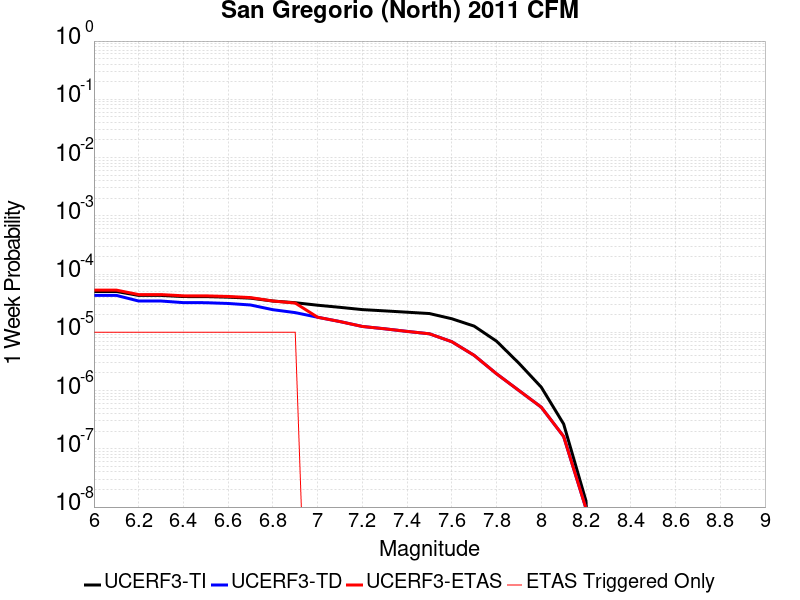 |  | 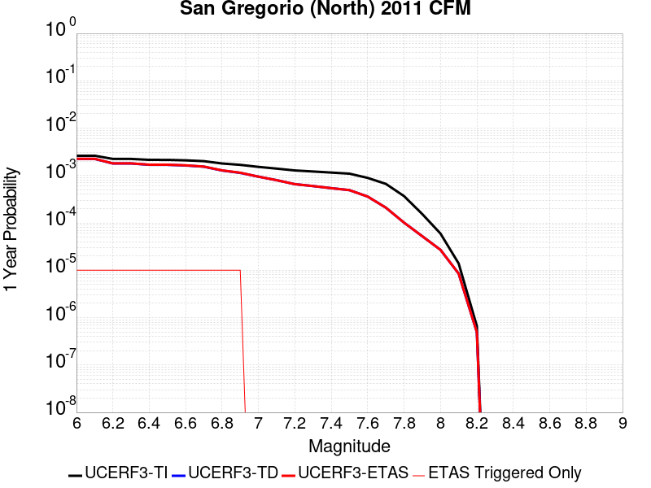 | 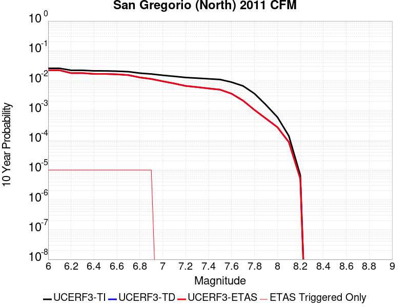 |

| Magnitude | 1 wk TI Prob | 1 wk TD Prob | 1 wk ETAS Prob | 1 wk ETAS/TD Gain | 1 wk ETAS Triggered Only | 1 mo TI Prob | 1 mo TD Prob | 1 mo ETAS Prob | 1 mo ETAS/TD Gain | 1 mo ETAS Triggered Only | 1 yr TI Prob | 1 yr TD Prob | 1 yr ETAS Prob | 1 yr ETAS/TD Gain | 1 yr ETAS Triggered Only | 10 yr TI Prob | 10 yr TD Prob | 10 yr ETAS Prob | 10 yr ETAS/TD Gain | 10 yr ETAS Triggered Only |
|-----|-----|-----|-----|-----|-----|-----|-----|-----|-----|-----|-----|-----|-----|-----|-----|-----|-----|-----|-----|-----|
| 6.0 | 5.0283932E-5 | 4.3057815E-5 | 5.305738E-5 | 1.2322359 | 1.0E-5 | 2.1548476E-4 | 1.8452053E-4 | 1.9451868E-4 | 1.0541846 | 1.0E-5 | 0.0026203706 | 0.002244237 | 0.0022542146 | 1.0044459 | 1.0E-5 | 0.02589687 | 0.022293162 | 0.022302939 | 1.0004386 | 1.0E-5 |
| 6.1 | 5.0283932E-5 | 4.3057815E-5 | 5.305738E-5 | 1.2322359 | 1.0E-5 | 2.1548476E-4 | 1.8452053E-4 | 1.9451868E-4 | 1.0541846 | 1.0E-5 | 0.0026203706 | 0.002244237 | 0.0022542146 | 1.0044459 | 1.0E-5 | 0.02589687 | 0.022293162 | 0.022302939 | 1.0004386 | 1.0E-5 |
| 6.2 | 4.2998647E-5 | 3.4441564E-5 | 4.4441218E-5 | 1.2903368 | 1.0E-5 | 1.842669E-4 | 1.475984E-4 | 1.5759692E-4 | 1.0677414 | 1.0E-5 | 0.0022411412 | 0.00179554 | 0.001805522 | 1.0055593 | 1.0E-5 | 0.022186736 | 0.017886506 | 0.017896328 | 1.0005491 | 1.0E-5 |
| 6.3 | 4.2998647E-5 | 3.4441564E-5 | 4.4441218E-5 | 1.2903368 | 1.0E-5 | 1.842669E-4 | 1.475984E-4 | 1.5759692E-4 | 1.0677414 | 1.0E-5 | 0.0022411412 | 0.00179554 | 0.001805522 | 1.0055593 | 1.0E-5 | 0.022186736 | 0.017886506 | 0.017896328 | 1.0005491 | 1.0E-5 |
| 6.4 | 4.1101295E-5 | 3.2326872E-5 | 4.232655E-5 | 1.3093302 | 1.0E-5 | 1.7613651E-4 | 1.3853642E-4 | 1.4853504E-4 | 1.0721732 | 1.0E-5 | 0.0021423528 | 0.0016853869 | 0.00169537 | 1.0059234 | 1.0E-5 | 0.02121817 | 0.016801886 | 0.016811717 | 1.0005852 | 1.0E-5 |
| 6.5 | 4.1032585E-5 | 3.2244905E-5 | 4.2244585E-5 | 1.3101165 | 1.0E-5 | 1.7584208E-4 | 1.3818518E-4 | 1.481838E-4 | 1.0723567 | 1.0E-5 | 0.0021387753 | 0.0016811171 | 0.0016911003 | 1.0059384 | 1.0E-5 | 0.021183075 | 0.016759839 | 0.016769672 | 1.0005866 | 1.0E-5 |
| 6.6 | 4.011629E-5 | 3.1266558E-5 | 4.1266245E-5 | 1.3198205 | 1.0E-5 | 1.7191563E-4 | 1.339927E-4 | 1.4399135E-4 | 1.074621 | 1.0E-5 | 0.0020910634 | 0.0016301516 | 0.0016401353 | 1.0061244 | 1.0E-5 | 0.020714961 | 0.01625741 | 0.016267247 | 1.0006051 | 1.0E-5 |
| 6.7 | 3.8583938E-5 | 2.9453593E-5 | 3.9453298E-5 | 1.3395071 | 1.0E-5 | 1.6534925E-4 | 1.2622366E-4 | 1.362224E-4 | 1.0792145 | 1.0E-5 | 0.0020112682 | 0.0015357039 | 0.0015456886 | 1.0065017 | 1.0E-5 | 0.019931622 | 0.015325955 | 0.015335802 | 1.0006425 | 1.0E-5 |
| 6.8 | 3.44341E-5 | 2.4450854E-5 | 3.445061E-5 | 1.4089737 | 1.0E-5 | 1.4756636E-4 | 1.0478523E-4 | 1.14784176E-4 | 1.0954233 | 1.0E-5 | 0.0017951399 | 0.0012750238 | 0.0012850111 | 1.007833 | 1.0E-5 | 0.017807078 | 0.012751131 | 0.012761004 | 1.0007743 | 1.0E-5 |
| 6.9 | 3.221199E-5 | 2.1778029E-5 | 3.177781E-5 | 1.4591683 | 1.0E-5 | 1.3804408E-4 | 9.333112E-5 | 1.0333019E-4 | 1.1071354 | 1.0E-5 | 0.0016793909 | 0.0011357224 | 0.0011457109 | 1.008795 | 1.0E-5 | 0.01666756 | 0.011372583 | 0.011382469 | 1.0008693 | 1.0E-5 |
| 7.0 | 2.9186718E-5 | 1.8146875E-5 | 1.8146875E-5 | 1.0 | 0.0 | 1.2507994E-4 | 7.7770026E-5 | 7.7770026E-5 | 1.0 | 0.0 | 0.0015217843 | 9.464431E-4 | 9.464431E-4 | 1.0 | 0.0 | 0.015114053 | 0.009496798 | 0.009496798 | 1.0 | 0.0 |
| 7.1 | 2.6840138E-5 | 1.5284508E-5 | 1.5284508E-5 | 1.0 | 0.0 | 1.1502409E-4 | 6.55034E-5 | 6.55034E-5 | 1.0 | 0.0 | 0.0013995186 | 7.9721404E-4 | 7.9721404E-4 | 1.0 | 0.0 | 0.013907375 | 0.008015723 | 0.008015723 | 1.0 | 0.0 |
| 7.2 | 2.453002E-5 | 1.2606672E-5 | 1.2606672E-5 | 1.0 | 0.0 | 1.05124425E-4 | 5.4027478E-5 | 5.4027478E-5 | 1.0 | 0.0 | 0.0012791384 | 6.575866E-4 | 6.575866E-4 | 1.0 | 0.0 | 0.012718005 | 0.00662763 | 0.00662763 | 1.0 | 0.0 |
| 7.3 | 2.3330727E-5 | 1.1488677E-5 | 1.1488677E-5 | 1.0 | 0.0 | 9.9985E-5 | 4.923626E-5 | 4.923626E-5 | 1.0 | 0.0 | 0.0012166376 | 5.9928704E-4 | 5.9928704E-4 | 1.0 | 0.0 | 0.012099981 | 0.006046564 | 0.006046564 | 1.0 | 0.0 |
| 7.4 | 2.2136466E-5 | 1.0368981E-5 | 1.0368981E-5 | 1.0 | 0.0 | 9.486712E-5 | 4.4437733E-5 | 4.4437733E-5 | 1.0 | 0.0 | 0.0011543952 | 5.4089533E-4 | 5.4089533E-4 | 1.0 | 0.0 | 0.011484168 | 0.005464249 | 0.005464249 | 1.0 | 0.0 |
| 7.5 | 2.0994974E-5 | 9.427217E-6 | 9.427217E-6 | 1.0 | 0.0 | 8.997535E-5 | 4.0401734E-5 | 4.0401734E-5 | 1.0 | 0.0 | 0.0010948994 | 4.9178035E-4 | 4.9178035E-4 | 1.0 | 0.0 | 0.010895205 | 0.004973358 | 0.004973358 | 1.0 | 0.0 |
| 7.6 | 1.7091823E-5 | 6.893766E-6 | 6.893766E-6 | 1.0 | 0.0 | 7.3248615E-5 | 2.9544377E-5 | 2.9544377E-5 | 1.0 | 0.0 | 8.9143694E-4 | 3.596435E-4 | 3.596435E-4 | 1.0 | 0.0 | 0.008878695 | 0.0036482841 | 0.0036482841 | 1.0 | 0.0 |
| 7.7 | 1.2772179E-5 | 4.0208706E-6 | 4.0208706E-6 | 1.0 | 0.0 | 5.473676E-5 | 1.7232189E-5 | 1.7232189E-5 | 1.0 | 0.0 | 6.6621625E-4 | 2.0978172E-4 | 2.0978172E-4 | 1.0 | 0.0 | 0.006642225 | 0.002136922 | 0.002136922 | 1.0 | 0.0 |
| 7.8 | 7.041923E-6 | 1.940626E-6 | 1.940626E-6 | 1.0 | 0.0 | 3.017932E-5 | 8.316942E-6 | 8.316942E-6 | 1.0 | 0.0 | 3.6737128E-4 | 1.0125406E-4 | 1.0125406E-4 | 1.0 | 0.0 | 0.0036676454 | 0.0010379003 | 0.0010379003 | 1.0 | 0.0 |
| 7.9 | 2.946768E-6 | 1.0033551E-6 | 1.0033551E-6 | 1.0 | 0.0 | 1.2628945E-5 | 4.300086E-6 | 4.300086E-6 | 1.0 | 0.0 | 1.5374656E-4 | 5.235229E-5 | 5.235229E-5 | 1.0 | 0.0 | 0.0015364023 | 5.3400313E-4 | 5.3400313E-4 | 1.0 | 0.0 |
| 8.0 | 1.1433375E-6 | 5.18146E-7 | 5.18146E-7 | 1.0 | 0.0 | 4.9000087E-6 | 2.2206239E-6 | 2.2206239E-6 | 1.0 | 0.0 | 5.965597E-5 | 2.703576E-5 | 2.703576E-5 | 1.0 | 0.0 | 5.963996E-4 | 2.7398416E-4 | 2.7398416E-4 | 1.0 | 0.0 |
| 8.1 | 2.6675295E-7 | 1.62899E-7 | 1.62899E-7 | 1.0 | 0.0 | 1.1432264E-6 | 6.9813836E-7 | 6.9813836E-7 | 1.0 | 0.0 | 1.3918692E-5 | 8.499802E-6 | 8.499802E-6 | 1.0 | 0.0 | 1.391782E-4 | 8.63795E-5 | 8.63795E-5 | 1.0 | 0.0 |
| 8.2 | 1.2704569E-8 | 9.431393E-9 | 9.431393E-9 | 1.0 | 0.0 | 5.444815E-8 | 4.042026E-8 | 4.042026E-8 | 1.0 | 0.0 | 6.629061E-7 | 4.9211656E-7 | 4.9211656E-7 | 1.0 | 0.0 | 6.629041E-6 | 5.1121438E-6 | 5.1121438E-6 | 1.0 | 0.0 |

## Honey Lake 2011 CFM
*[(top)](#table-of-contents)*

| 1 Week | 1 Month | 1 Year | 10 Year |
|-----|-----|-----|-----|
|  |  | 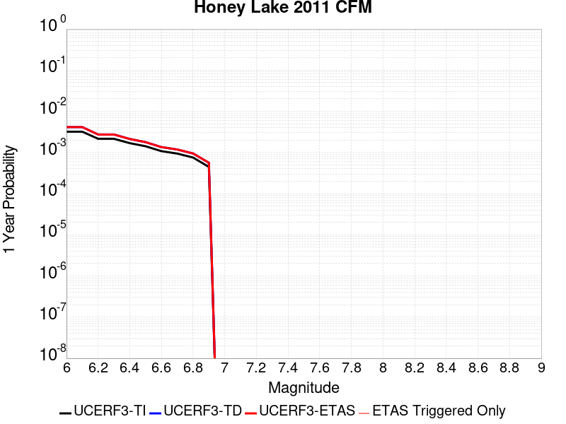 | 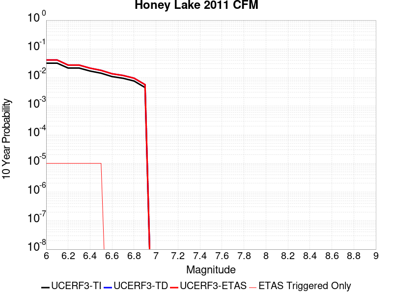 |

| Magnitude | 1 wk TI Prob | 1 wk TD Prob | 1 wk ETAS Prob | 1 wk ETAS/TD Gain | 1 wk ETAS Triggered Only | 1 mo TI Prob | 1 mo TD Prob | 1 mo ETAS Prob | 1 mo ETAS/TD Gain | 1 mo ETAS Triggered Only | 1 yr TI Prob | 1 yr TD Prob | 1 yr ETAS Prob | 1 yr ETAS/TD Gain | 1 yr ETAS Triggered Only | 10 yr TI Prob | 10 yr TD Prob | 10 yr ETAS Prob | 10 yr ETAS/TD Gain | 10 yr ETAS Triggered Only |
|-----|-----|-----|-----|-----|-----|-----|-----|-----|-----|-----|-----|-----|-----|-----|-----|-----|-----|-----|-----|-----|
| 6.0 | 6.155506E-5 | 7.954667E-5 | 7.954667E-5 | 1.0 | 0.0 | 2.6378073E-4 | 3.40873E-4 | 3.40873E-4 | 1.0 | 0.0 | 0.0032068014 | 0.0041427943 | 0.0041427943 | 1.0 | 0.0 | 0.03160919 | 0.040702924 | 0.040712517 | 1.0002357 | 1.0E-5 |
| 6.1 | 6.155506E-5 | 7.954667E-5 | 7.954667E-5 | 1.0 | 0.0 | 2.6378073E-4 | 3.40873E-4 | 3.40873E-4 | 1.0 | 0.0 | 0.0032068014 | 0.0041427943 | 0.0041427943 | 1.0 | 0.0 | 0.03160919 | 0.040702924 | 0.040712517 | 1.0002357 | 1.0E-5 |
| 6.2 | 4.1335024E-5 | 5.257629E-5 | 5.257629E-5 | 1.0 | 0.0 | 1.7713808E-4 | 2.253086E-4 | 2.253086E-4 | 1.0 | 0.0 | 0.0021545228 | 0.0027398595 | 0.0027398595 | 1.0 | 0.0 | 0.021337535 | 0.027076708 | 0.027086439 | 1.0003593 | 1.0E-5 |
| 6.3 | 4.1335024E-5 | 5.257629E-5 | 5.257629E-5 | 1.0 | 0.0 | 1.7713808E-4 | 2.253086E-4 | 2.253086E-4 | 1.0 | 0.0 | 0.0021545228 | 0.0027398595 | 0.0027398595 | 1.0 | 0.0 | 0.021337535 | 0.027076708 | 0.027086439 | 1.0003593 | 1.0E-5 |
| 6.4 | 3.2393702E-5 | 4.0887444E-5 | 4.0887444E-5 | 1.0 | 0.0 | 1.3882275E-4 | 1.7522085E-4 | 1.7522085E-4 | 1.0 | 0.0 | 0.0016888566 | 0.002131335 | 0.002131335 | 1.0 | 0.0 | 0.016760793 | 0.02111982 | 0.02112961 | 1.0004635 | 1.0E-5 |
| 6.5 | 2.7205504E-5 | 3.4211684E-5 | 3.4211684E-5 | 1.0 | 0.0 | 1.1658981E-4 | 1.4661385E-4 | 1.4661385E-4 | 1.0 | 0.0 | 0.0014185566 | 0.0017836588 | 0.0017836588 | 1.0 | 0.0 | 0.014095354 | 0.017702932 | 0.017712755 | 1.0005549 | 1.0E-5 |
| 6.6 | 2.069265E-5 | 2.5955307E-5 | 2.5955307E-5 | 1.0 | 0.0 | 8.867977E-5 | 1.1123277E-4 | 1.1123277E-4 | 1.0 | 0.0 | 0.0010791414 | 0.0013535038 | 0.0013535038 | 1.0 | 0.0 | 0.010739161 | 0.013461002 | 0.013461002 | 1.0 | 0.0 |
| 6.7 | 1.8060919E-5 | 2.2656828E-5 | 2.2656828E-5 | 1.0 | 0.0 | 7.7401644E-5 | 9.709754E-5 | 9.709754E-5 | 1.0 | 0.0 | 9.419576E-4 | 0.0011816026 | 0.0011816026 | 1.0 | 0.0 | 0.009379748 | 0.011761238 | 0.011761238 | 1.0 | 0.0 |
| 6.8 | 1.4474663E-5 | 1.818127E-5 | 1.818127E-5 | 1.0 | 0.0 | 6.203279E-5 | 7.791784E-5 | 7.791784E-5 | 1.0 | 0.0 | 7.5498753E-4 | 9.483136E-4 | 9.483136E-4 | 1.0 | 0.0 | 0.007524277 | 0.009450192 | 0.009450192 | 1.0 | 0.0 |
| 6.9 | 8.564552E-6 | 1.0802308E-5 | 1.0802308E-5 | 1.0 | 0.0 | 3.6704707E-5 | 4.6295158E-5 | 4.6295158E-5 | 1.0 | 0.0 | 4.4678818E-4 | 5.635644E-4 | 5.635644E-4 | 1.0 | 0.0 | 0.0044589094 | 0.0056278477 | 0.0056278477 | 1.0 | 0.0 |

## Johnson Valley (No) 2011 rev
*[(top)](#table-of-contents)*

| 1 Week | 1 Month | 1 Year | 10 Year |
|-----|-----|-----|-----|
|  |  |  |  |

| Magnitude | 1 wk TI Prob | 1 wk TD Prob | 1 wk ETAS Prob | 1 wk ETAS/TD Gain | 1 wk ETAS Triggered Only | 1 mo TI Prob | 1 mo TD Prob | 1 mo ETAS Prob | 1 mo ETAS/TD Gain | 1 mo ETAS Triggered Only | 1 yr TI Prob | 1 yr TD Prob | 1 yr ETAS Prob | 1 yr ETAS/TD Gain | 1 yr ETAS Triggered Only | 10 yr TI Prob | 10 yr TD Prob | 10 yr ETAS Prob | 10 yr ETAS/TD Gain | 10 yr ETAS Triggered Only |
|-----|-----|-----|-----|-----|-----|-----|-----|-----|-----|-----|-----|-----|-----|-----|-----|-----|-----|-----|-----|-----|
| 6.0 | 2.577707E-5 | 1.2900938E-5 | 1.2900938E-5 | 1.0 | 0.0 | 1.1046848E-4 | 5.5288787E-5 | 5.5288787E-5 | 1.0 | 0.0 | 0.0013441239 | 6.7297276E-4 | 6.7297276E-4 | 1.0 | 0.0 | 0.013360229 | 0.006713257 | 0.0067231897 | 1.0014796 | 1.0E-5 |
| 6.1 | 2.577707E-5 | 1.2900938E-5 | 1.2900938E-5 | 1.0 | 0.0 | 1.1046848E-4 | 5.5288787E-5 | 5.5288787E-5 | 1.0 | 0.0 | 0.0013441239 | 6.7297276E-4 | 6.7297276E-4 | 1.0 | 0.0 | 0.013360229 | 0.006713257 | 0.0067231897 | 1.0014796 | 1.0E-5 |
| 6.2 | 2.577707E-5 | 1.2900938E-5 | 1.2900938E-5 | 1.0 | 0.0 | 1.1046848E-4 | 5.5288787E-5 | 5.5288787E-5 | 1.0 | 0.0 | 0.0013441239 | 6.7297276E-4 | 6.7297276E-4 | 1.0 | 0.0 | 0.013360229 | 0.006713257 | 0.0067231897 | 1.0014796 | 1.0E-5 |
| 6.3 | 2.577707E-5 | 1.2900938E-5 | 1.2900938E-5 | 1.0 | 0.0 | 1.1046848E-4 | 5.5288787E-5 | 5.5288787E-5 | 1.0 | 0.0 | 0.0013441239 | 6.7297276E-4 | 6.7297276E-4 | 1.0 | 0.0 | 0.013360229 | 0.006713257 | 0.0067231897 | 1.0014796 | 1.0E-5 |
| 6.4 | 1.5296591E-5 | 7.536742E-6 | 7.536742E-6 | 1.0 | 0.0 | 6.555518E-5 | 3.2300028E-5 | 3.2300028E-5 | 1.0 | 0.0 | 7.97842E-4 | 3.9320064E-4 | 3.9320064E-4 | 1.0 | 0.0 | 0.007949836 | 0.0039268904 | 0.0039268904 | 1.0 | 0.0 |
| 6.5 | 1.5296591E-5 | 7.536742E-6 | 7.536742E-6 | 1.0 | 0.0 | 6.555518E-5 | 3.2300028E-5 | 3.2300028E-5 | 1.0 | 0.0 | 7.97842E-4 | 3.9320064E-4 | 3.9320064E-4 | 1.0 | 0.0 | 0.007949836 | 0.0039268904 | 0.0039268904 | 1.0 | 0.0 |
| 6.6 | 1.3289383E-5 | 5.9917306E-6 | 5.9917306E-6 | 1.0 | 0.0 | 5.6953253E-5 | 2.5678688E-5 | 2.5678688E-5 | 1.0 | 0.0 | 6.9318525E-4 | 3.1261015E-4 | 3.1261015E-4 | 1.0 | 0.0 | 0.0069102696 | 0.0031233684 | 0.0031233684 | 1.0 | 0.0 |
| 6.7 | 1.3289383E-5 | 5.9917306E-6 | 5.9917306E-6 | 1.0 | 0.0 | 5.6953253E-5 | 2.5678688E-5 | 2.5678688E-5 | 1.0 | 0.0 | 6.9318525E-4 | 3.1261015E-4 | 3.1261015E-4 | 1.0 | 0.0 | 0.0069102696 | 0.0031233684 | 0.0031233684 | 1.0 | 0.0 |
| 6.8 | 8.330789E-6 | 2.9211888E-6 | 2.9211888E-6 | 1.0 | 0.0 | 3.570289E-5 | 1.2519352E-5 | 1.2519352E-5 | 1.0 | 0.0 | 4.34596E-4 | 1.5241816E-4 | 1.5241816E-4 | 1.0 | 0.0 | 0.0043374705 | 0.0015236961 | 0.0015236961 | 1.0 | 0.0 |
| 6.9 | 7.2359003E-6 | 2.3013247E-6 | 2.3013247E-6 | 1.0 | 0.0 | 3.1010633E-5 | 9.8628125E-6 | 9.8628125E-6 | 1.0 | 0.0 | 3.7748902E-4 | 1.2007845E-4 | 1.2007845E-4 | 1.0 | 0.0 | 0.0037684843 | 0.0012006586 | 0.0012006586 | 1.0 | 0.0 |
| 7.0 | 6.5149957E-6 | 2.088482E-6 | 2.088482E-6 | 1.0 | 0.0 | 2.792111E-5 | 8.950637E-6 | 8.950637E-6 | 1.0 | 0.0 | 3.398865E-4 | 1.0897385E-4 | 1.0897385E-4 | 1.0 | 0.0 | 0.003393671 | 0.0010897239 | 0.0010897239 | 1.0 | 0.0 |
| 7.1 | 1.1662233E-6 | 2.8802024E-8 | 2.8802024E-8 | 1.0 | 0.0 | 4.9980904E-6 | 1.2343725E-7 | 1.2343725E-7 | 1.0 | 0.0 | 6.0850052E-5 | 1.5028476E-6 | 1.5028476E-6 | 1.0 | 0.0 | 6.083339E-4 | 1.50283895E-5 | 1.50283895E-5 | 1.0 | 0.0 |
| 7.2 | 5.413881E-7 | 2.8802024E-8 | 2.8802024E-8 | 1.0 | 0.0 | 2.3202326E-6 | 1.2343725E-7 | 1.2343725E-7 | 1.0 | 0.0 | 2.8248465E-5 | 1.5028476E-6 | 1.5028476E-6 | 1.0 | 0.0 | 2.8244875E-4 | 1.50283895E-5 | 1.50283895E-5 | 1.0 | 0.0 |
| 7.3 | 5.076821E-7 | 2.8802024E-8 | 2.8802024E-8 | 1.0 | 0.0 | 2.1757785E-6 | 1.2343723E-7 | 1.2343723E-7 | 1.0 | 0.0 | 2.648978E-5 | 1.5028475E-6 | 1.5028475E-6 | 1.0 | 0.0 | 2.6486625E-4 | 1.50283895E-5 | 1.50283895E-5 | 1.0 | 0.0 |
| 7.4 | 4.7568687E-7 | 2.8783948E-8 | 2.8783948E-8 | 1.0 | 0.0 | 2.0386565E-6 | 1.2335977E-7 | 1.2335977E-7 | 1.0 | 0.0 | 2.482036E-5 | 1.5019043E-6 | 1.5019043E-6 | 1.0 | 0.0 | 2.4817587E-4 | 1.5018958E-5 | 1.5018958E-5 | 1.0 | 0.0 |
| 7.5 | 3.435626E-7 | 2.5357679E-8 | 2.5357679E-8 | 1.0 | 0.0 | 1.4724103E-6 | 1.0867576E-7 | 1.0867576E-7 | 1.0 | 0.0 | 1.7926448E-5 | 1.3231268E-6 | 1.3231268E-6 | 1.0 | 0.0 | 1.7925001E-4 | 1.3231205E-5 | 1.3231205E-5 | 1.0 | 0.0 |

## Contra Costa (Lafayette) 2011 CFM
*[(top)](#table-of-contents)*

| 1 Week | 1 Month | 1 Year | 10 Year |
|-----|-----|-----|-----|
| 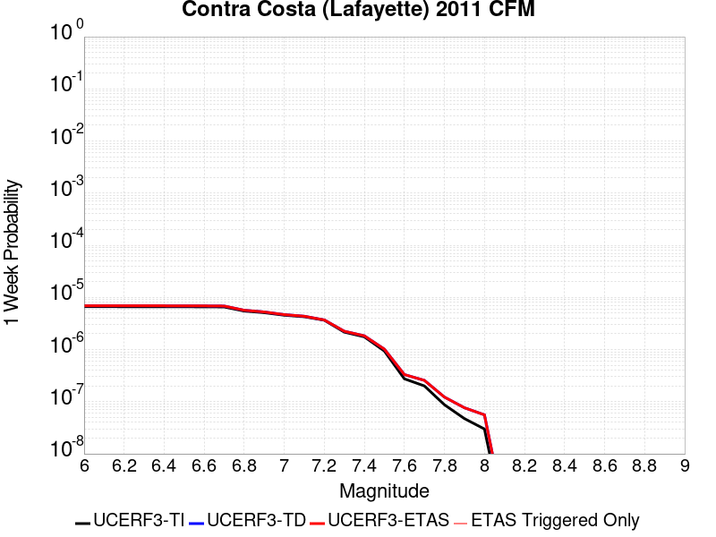 | 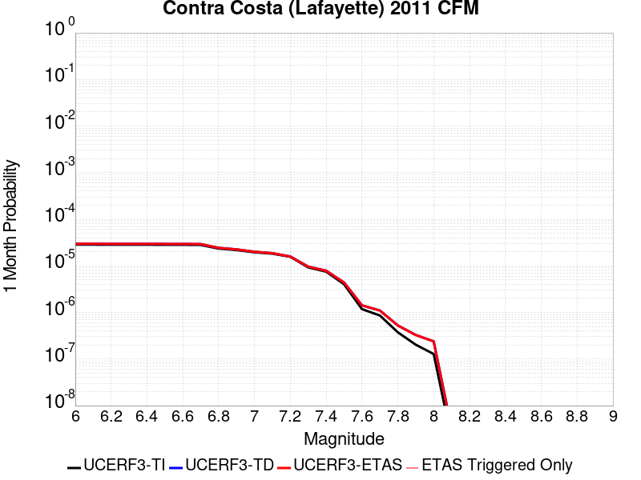 | 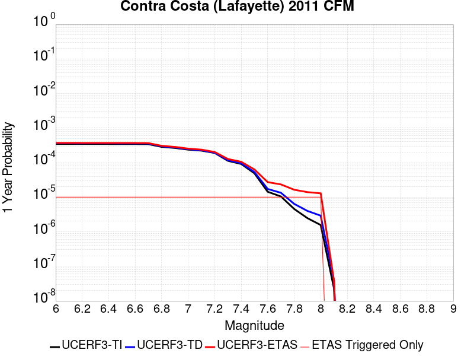 | 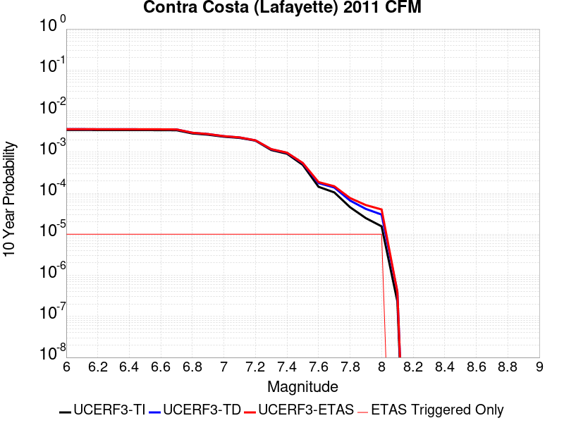 |

| Magnitude | 1 wk TI Prob | 1 wk TD Prob | 1 wk ETAS Prob | 1 wk ETAS/TD Gain | 1 wk ETAS Triggered Only | 1 mo TI Prob | 1 mo TD Prob | 1 mo ETAS Prob | 1 mo ETAS/TD Gain | 1 mo ETAS Triggered Only | 1 yr TI Prob | 1 yr TD Prob | 1 yr ETAS Prob | 1 yr ETAS/TD Gain | 1 yr ETAS Triggered Only | 10 yr TI Prob | 10 yr TD Prob | 10 yr ETAS Prob | 10 yr ETAS/TD Gain | 10 yr ETAS Triggered Only |
|-----|-----|-----|-----|-----|-----|-----|-----|-----|-----|-----|-----|-----|-----|-----|-----|-----|-----|-----|-----|-----|
| 6.0 | 6.655419E-6 | 6.9360494E-6 | 6.9360494E-6 | 1.0 | 0.0 | 2.8522913E-5 | 2.9725597E-5 | 2.9725597E-5 | 1.0 | 0.0 | 3.472111E-4 | 3.6185104E-4 | 3.7184742E-4 | 1.0276257 | 1.0E-5 | 0.0034666911 | 0.0036174743 | 0.003627438 | 1.0027543 | 1.0E-5 |
| 6.1 | 6.655419E-6 | 6.9360494E-6 | 6.9360494E-6 | 1.0 | 0.0 | 2.8522913E-5 | 2.9725597E-5 | 2.9725597E-5 | 1.0 | 0.0 | 3.472111E-4 | 3.6185104E-4 | 3.7184742E-4 | 1.0276257 | 1.0E-5 | 0.0034666911 | 0.0036174743 | 0.003627438 | 1.0027543 | 1.0E-5 |
| 6.2 | 6.6254133E-6 | 6.9044586E-6 | 6.9044586E-6 | 1.0 | 0.0 | 2.839432E-5 | 2.9590212E-5 | 2.9590212E-5 | 1.0 | 0.0 | 3.45646E-4 | 3.6020324E-4 | 3.7019965E-4 | 1.0277522 | 1.0E-5 | 0.003451089 | 0.00360105 | 0.003611014 | 1.002767 | 1.0E-5 |
| 6.3 | 6.6254133E-6 | 6.9044586E-6 | 6.9044586E-6 | 1.0 | 0.0 | 2.839432E-5 | 2.9590212E-5 | 2.9590212E-5 | 1.0 | 0.0 | 3.45646E-4 | 3.6020324E-4 | 3.7019965E-4 | 1.0277522 | 1.0E-5 | 0.003451089 | 0.00360105 | 0.003611014 | 1.002767 | 1.0E-5 |
| 6.4 | 6.6254133E-6 | 6.9044586E-6 | 6.9044586E-6 | 1.0 | 0.0 | 2.839432E-5 | 2.9590212E-5 | 2.9590212E-5 | 1.0 | 0.0 | 3.45646E-4 | 3.6020324E-4 | 3.7019965E-4 | 1.0277522 | 1.0E-5 | 0.003451089 | 0.00360105 | 0.003611014 | 1.002767 | 1.0E-5 |
| 6.5 | 6.606445E-6 | 6.884007E-6 | 6.884007E-6 | 1.0 | 0.0 | 2.8313027E-5 | 2.9502564E-5 | 2.9502564E-5 | 1.0 | 0.0 | 3.4465658E-4 | 3.591365E-4 | 3.691329E-4 | 1.0278345 | 1.0E-5 | 0.0034412253 | 0.0035904169 | 0.0036003808 | 1.0027752 | 1.0E-5 |
| 6.6 | 6.59966E-6 | 6.876545E-6 | 6.876545E-6 | 1.0 | 0.0 | 2.828395E-5 | 2.9470584E-5 | 2.9470584E-5 | 1.0 | 0.0 | 3.4430268E-4 | 3.5874726E-4 | 3.6874367E-4 | 1.0278648 | 1.0E-5 | 0.0034376972 | 0.0035865372 | 0.0035965014 | 1.0027782 | 1.0E-5 |
| 6.7 | 6.5570975E-6 | 6.8305358E-6 | 6.8305358E-6 | 1.0 | 0.0 | 2.8101544E-5 | 2.9273408E-5 | 2.9273408E-5 | 1.0 | 0.0 | 3.4208258E-4 | 3.5634742E-4 | 3.6634385E-4 | 1.0280524 | 1.0E-5 | 0.0034155648 | 0.003562616 | 0.0035725804 | 1.0027969 | 1.0E-5 |
| 6.8 | 5.472255E-6 | 5.6735357E-6 | 5.6735357E-6 | 1.0 | 0.0 | 2.345231E-5 | 2.4314928E-5 | 2.4314928E-5 | 1.0 | 0.0 | 2.8549446E-4 | 2.9599448E-4 | 3.0599153E-4 | 1.0337744 | 1.0E-5 | 0.0028512797 | 0.0029607106 | 0.0029706808 | 1.0033675 | 1.0E-5 |
| 6.9 | 5.092346E-6 | 5.263898E-6 | 5.263898E-6 | 1.0 | 0.0 | 2.1824157E-5 | 2.2559369E-5 | 2.2559369E-5 | 1.0 | 0.0 | 2.656767E-4 | 2.7462607E-4 | 2.8462333E-4 | 1.0364032 | 1.0E-5 | 0.002653593 | 0.0027475671 | 0.0027575395 | 1.0036296 | 1.0E-5 |
| 7.0 | 4.5525762E-6 | 4.6772248E-6 | 4.6772248E-6 | 1.0 | 0.0 | 1.9510895E-5 | 2.0045096E-5 | 2.0045096E-5 | 1.0 | 0.0 | 2.3751926E-4 | 2.4402201E-4 | 2.5401957E-4 | 1.04097 | 1.0E-5 | 0.0023726553 | 0.0024422305 | 0.002452206 | 1.0040846 | 1.0E-5 |
| 7.1 | 4.261504E-6 | 4.3563937E-6 | 4.3563937E-6 | 1.0 | 0.0 | 1.826346E-5 | 1.8670127E-5 | 1.8670127E-5 | 1.0 | 0.0 | 2.2233493E-4 | 2.2728536E-4 | 2.3728308E-4 | 1.0439875 | 1.0E-5 | 0.002221126 | 0.0022752068 | 0.002285184 | 1.0043852 | 1.0E-5 |
| 7.2 | 3.654114E-6 | 3.6971214E-6 | 3.6971214E-6 | 1.0 | 0.0 | 1.5660395E-5 | 1.5844711E-5 | 1.5844711E-5 | 1.0 | 0.0 | 1.9064861E-4 | 1.9289253E-4 | 2.028906E-4 | 1.0518323 | 1.0E-5 | 0.0019048514 | 0.0019318805 | 0.0019418612 | 1.0051663 | 1.0E-5 |
| 7.3 | 2.1595129E-6 | 2.2442339E-6 | 2.2442339E-6 | 1.0 | 0.0 | 9.255023E-6 | 9.61811E-6 | 9.61811E-6 | 1.0 | 0.0 | 1.1267407E-4 | 1.1709425E-4 | 1.2709308E-4 | 1.0853913 | 1.0E-5 | 0.0011261696 | 0.0011749244 | 0.0011849126 | 1.0085012 | 1.0E-5 |
| 7.4 | 1.7532738E-6 | 1.8335337E-6 | 1.8335337E-6 | 1.0 | 0.0 | 7.5140088E-6 | 7.857978E-6 | 7.857978E-6 | 1.0 | 0.0 | 9.147922E-5 | 9.566672E-5 | 1.05665764E-4 | 1.1045196 | 1.0E-5 | 9.144157E-4 | 9.607054E-4 | 9.706958E-4 | 1.010399 | 1.0E-5 |
| 7.5 | 9.387875E-7 | 1.019398E-6 | 1.019398E-6 | 1.0 | 0.0 | 4.0233685E-6 | 4.368841E-6 | 4.368841E-6 | 1.0 | 0.0 | 4.8983413E-5 | 5.3189357E-5 | 6.3188825E-5 | 1.1879976 | 1.0E-5 | 4.897262E-4 | 5.358577E-4 | 5.458523E-4 | 1.0186517 | 1.0E-5 |
| 7.6 | 2.7471893E-7 | 3.3110175E-7 | 3.3110175E-7 | 1.0 | 0.0 | 1.1773664E-6 | 1.4190067E-6 | 1.4190067E-6 | 1.0 | 0.0 | 1.433434E-5 | 1.7276272E-5 | 2.7276099E-5 | 1.5788186 | 1.0E-5 | 1.4333417E-4 | 1.7663716E-4 | 1.8663539E-4 | 1.0566032 | 1.0E-5 |
| 7.7 | 2.0057985E-7 | 2.5643763E-7 | 2.5643763E-7 | 1.0 | 0.0 | 8.596276E-7 | 1.0990179E-6 | 1.0990179E-6 | 1.0 | 0.0 | 1.0465916E-5 | 1.3380462E-5 | 2.3380328E-5 | 1.7473483 | 1.0E-5 | 1.0465423E-4 | 1.3764028E-4 | 1.476389E-4 | 1.0726432 | 1.0E-5 |
| 7.8 | 8.7403905E-8 | 1.2261646E-7 | 1.2261646E-7 | 1.0 | 0.0 | 3.745881E-7 | 5.25499E-7 | 5.25499E-7 | 1.0 | 0.0 | 4.5606007E-6 | 6.397931E-6 | 1.6397868E-5 | 2.5629952 | 1.0E-5 | 4.560507E-5 | 6.624567E-5 | 7.6245014E-5 | 1.1509433 | 1.0E-5 |
| 7.9 | 4.740233E-8 | 7.6491496E-8 | 7.6491496E-8 | 1.0 | 0.0 | 2.0315284E-7 | 3.2782066E-7 | 3.2782066E-7 | 1.0 | 0.0 | 2.473383E-6 | 3.9912093E-6 | 1.3991169E-5 | 3.5054963 | 1.0E-5 | 2.4733554E-5 | 4.1450454E-5 | 5.145004E-5 | 1.2412419 | 1.0E-5 |
| 8.0 | 2.99164E-8 | 5.5929824E-8 | 5.5929824E-8 | 1.0 | 0.0 | 1.2821314E-7 | 2.3969923E-7 | 2.3969923E-7 | 1.0 | 0.0 | 1.5609938E-6 | 2.9183343E-6 | 1.2918305E-5 | 4.4266024 | 1.0E-5 | 1.5609829E-5 | 3.0209454E-5 | 4.020915E-5 | 1.3310122 | 1.0E-5 |
| 8.1 | 4.431212E-10 | 7.424763E-10 | 7.424763E-10 | 1.0 | 0.0 | 1.899091E-9 | 3.1820404E-9 | 3.1820404E-9 | 1.0 | 0.0 | 2.3121432E-8 | 3.874134E-8 | 3.874134E-8 | 1.0 | 0.0 | 2.312143E-7 | 3.962407E-7 | 3.962407E-7 | 1.0 | 0.0 |

## Cedar Mtn-Mahogany Mtn
*[(top)](#table-of-contents)*

| 1 Week | 1 Month | 1 Year | 10 Year |
|-----|-----|-----|-----|
|  |  | 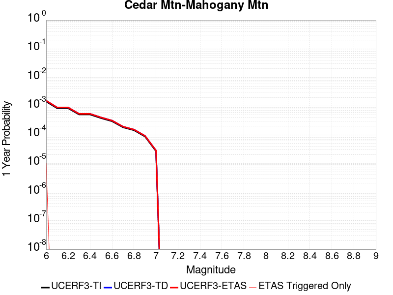 | 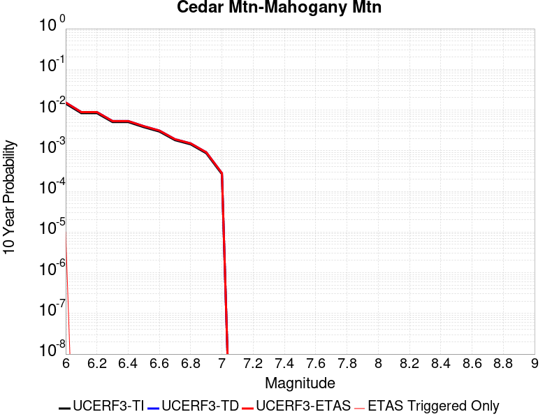 |

| Magnitude | 1 wk TI Prob | 1 wk TD Prob | 1 wk ETAS Prob | 1 wk ETAS/TD Gain | 1 wk ETAS Triggered Only | 1 mo TI Prob | 1 mo TD Prob | 1 mo ETAS Prob | 1 mo ETAS/TD Gain | 1 mo ETAS Triggered Only | 1 yr TI Prob | 1 yr TD Prob | 1 yr ETAS Prob | 1 yr ETAS/TD Gain | 1 yr ETAS Triggered Only | 10 yr TI Prob | 10 yr TD Prob | 10 yr ETAS Prob | 10 yr ETAS/TD Gain | 10 yr ETAS Triggered Only |
|-----|-----|-----|-----|-----|-----|-----|-----|-----|-----|-----|-----|-----|-----|-----|-----|-----|-----|-----|-----|-----|
| 6.0 | 2.7763876E-5 | 2.9588866E-5 | 2.9588866E-5 | 1.0 | 0.0 | 1.1898261E-4 | 1.2680366E-4 | 1.2680366E-4 | 1.0 | 0.0 | 0.0014476506 | 0.0015428112 | 0.0015527958 | 1.0064716 | 1.0E-5 | 0.0143825635 | 0.015328225 | 0.015338072 | 1.0006424 | 1.0E-5 |
| 6.1 | 1.6162443E-5 | 1.7142966E-5 | 1.7142966E-5 | 1.0 | 0.0 | 6.926578E-5 | 7.346788E-5 | 7.346788E-5 | 1.0 | 0.0 | 8.4298453E-4 | 8.941221E-4 | 8.941221E-4 | 1.0 | 0.0 | 0.008397939 | 0.008907059 | 0.008907059 | 1.0 | 0.0 |
| 6.2 | 1.6162443E-5 | 1.7142966E-5 | 1.7142966E-5 | 1.0 | 0.0 | 6.926578E-5 | 7.346788E-5 | 7.346788E-5 | 1.0 | 0.0 | 8.4298453E-4 | 8.941221E-4 | 8.941221E-4 | 1.0 | 0.0 | 0.008397939 | 0.008907059 | 0.008907059 | 1.0 | 0.0 |
| 6.3 | 9.746053E-6 | 1.0303152E-5 | 1.0303152E-5 | 1.0 | 0.0 | 4.1768133E-5 | 4.415564E-5 | 4.415564E-5 | 1.0 | 0.0 | 5.0840835E-4 | 5.3746643E-4 | 5.3746643E-4 | 1.0 | 0.0 | 0.0050724675 | 0.005362084 | 0.005362084 | 1.0 | 0.0 |
| 6.4 | 9.746053E-6 | 1.0303152E-5 | 1.0303152E-5 | 1.0 | 0.0 | 4.1768133E-5 | 4.415564E-5 | 4.415564E-5 | 1.0 | 0.0 | 5.0840835E-4 | 5.3746643E-4 | 5.3746643E-4 | 1.0 | 0.0 | 0.0050724675 | 0.005362084 | 0.005362084 | 1.0 | 0.0 |
| 6.5 | 7.290083E-6 | 7.695325E-6 | 7.695325E-6 | 1.0 | 0.0 | 3.124284E-5 | 3.297956E-5 | 3.297956E-5 | 1.0 | 0.0 | 3.8031515E-4 | 4.014543E-4 | 4.014543E-4 | 1.0 | 0.0 | 0.0037966494 | 0.004007511 | 0.004007511 | 1.0 | 0.0 |
| 6.6 | 5.67907E-6 | 5.9891527E-6 | 5.9891527E-6 | 1.0 | 0.0 | 2.4338644E-5 | 2.5667552E-5 | 2.5667552E-5 | 1.0 | 0.0 | 2.962827E-4 | 3.12459E-4 | 3.12459E-4 | 1.0 | 0.0 | 0.0029588798 | 0.003120333 | 0.003120333 | 1.0 | 0.0 |
| 6.7 | 3.4853963E-6 | 3.672631E-6 | 3.672631E-6 | 1.0 | 0.0 | 1.4937327E-5 | 1.5739755E-5 | 1.5739755E-5 | 1.0 | 0.0 | 1.8184677E-4 | 1.916153E-4 | 1.916153E-4 | 1.0 | 0.0 | 0.0018169804 | 0.0019145629 | 0.0019145629 | 1.0 | 0.0 |
| 6.8 | 2.7535168E-6 | 2.9015764E-6 | 2.9015764E-6 | 1.0 | 0.0 | 1.1800733E-5 | 1.2435271E-5 | 1.2435271E-5 | 1.0 | 0.0 | 1.4366445E-4 | 1.5138938E-4 | 1.5138938E-4 | 1.0 | 0.0 | 0.0014357162 | 0.0015129098 | 0.0015129098 | 1.0 | 0.0 |
| 6.9 | 1.6594106E-6 | 1.7496985E-6 | 1.7496985E-6 | 1.0 | 0.0 | 7.1117406E-6 | 7.4986883E-6 | 7.4986883E-6 | 1.0 | 0.0 | 8.6582E-5 | 9.129302E-5 | 9.129302E-5 | 1.0 | 0.0 | 8.654827E-4 | 9.125856E-4 | 9.125856E-4 | 1.0 | 0.0 |
| 7.0 | 5.10215E-7 | 5.389254E-7 | 5.389254E-7 | 1.0 | 0.0 | 2.186634E-6 | 2.3096788E-6 | 2.3096788E-6 | 1.0 | 0.0 | 2.6621943E-5 | 2.8120105E-5 | 2.8120105E-5 | 1.0 | 0.0 | 2.6618753E-4 | 2.81178E-4 | 2.81178E-4 | 1.0 | 0.0 |

## Morales (East)
*[(top)](#table-of-contents)*

| 1 Week | 1 Month | 1 Year | 10 Year |
|-----|-----|-----|-----|
|  |  |  |  |

| Magnitude | 1 wk TI Prob | 1 wk TD Prob | 1 wk ETAS Prob | 1 wk ETAS/TD Gain | 1 wk ETAS Triggered Only | 1 mo TI Prob | 1 mo TD Prob | 1 mo ETAS Prob | 1 mo ETAS/TD Gain | 1 mo ETAS Triggered Only | 1 yr TI Prob | 1 yr TD Prob | 1 yr ETAS Prob | 1 yr ETAS/TD Gain | 1 yr ETAS Triggered Only | 10 yr TI Prob | 10 yr TD Prob | 10 yr ETAS Prob | 10 yr ETAS/TD Gain | 10 yr ETAS Triggered Only |
|-----|-----|-----|-----|-----|-----|-----|-----|-----|-----|-----|-----|-----|-----|-----|-----|-----|-----|-----|-----|-----|
| 6.0 | 1.4942771E-6 | 2.123479E-6 | 1.2123458E-5 | 5.7092433 | 1.0E-5 | 6.404029E-6 | 9.100596E-6 | 1.9100504E-5 | 2.0988193 | 1.0E-5 | 7.7966266E-5 | 1.107947E-4 | 1.2079359E-4 | 1.090247 | 1.0E-5 | 7.793892E-4 | 0.0011074544 | 0.0011174433 | 1.0090197 | 1.0E-5 |
| 6.1 | 1.4942771E-6 | 2.123479E-6 | 1.2123458E-5 | 5.7092433 | 1.0E-5 | 6.404029E-6 | 9.100596E-6 | 1.9100504E-5 | 2.0988193 | 1.0E-5 | 7.7966266E-5 | 1.107947E-4 | 1.2079359E-4 | 1.090247 | 1.0E-5 | 7.793892E-4 | 0.0011074544 | 0.0011174433 | 1.0090197 | 1.0E-5 |
| 6.2 | 1.4942771E-6 | 2.123479E-6 | 1.2123458E-5 | 5.7092433 | 1.0E-5 | 6.404029E-6 | 9.100596E-6 | 1.9100504E-5 | 2.0988193 | 1.0E-5 | 7.7966266E-5 | 1.107947E-4 | 1.2079359E-4 | 1.090247 | 1.0E-5 | 7.793892E-4 | 0.0011074544 | 0.0011174433 | 1.0090197 | 1.0E-5 |
| 6.3 | 1.4942771E-6 | 2.123479E-6 | 1.2123458E-5 | 5.7092433 | 1.0E-5 | 6.404029E-6 | 9.100596E-6 | 1.9100504E-5 | 2.0988193 | 1.0E-5 | 7.7966266E-5 | 1.107947E-4 | 1.2079359E-4 | 1.090247 | 1.0E-5 | 7.793892E-4 | 0.0011074544 | 0.0011174433 | 1.0090197 | 1.0E-5 |
| 6.4 | 8.798845E-7 | 1.5022731E-6 | 1.5022731E-6 | 1.0 | 0.0 | 3.7709283E-6 | 6.438298E-6 | 6.438298E-6 | 1.0 | 0.0 | 4.5910085E-5 | 7.8383564E-5 | 7.8383564E-5 | 1.0 | 0.0 | 4.59006E-4 | 7.835727E-4 | 7.835727E-4 | 1.0 | 0.0 |
| 6.5 | 7.1751725E-7 | 1.3384229E-6 | 1.3384229E-6 | 1.0 | 0.0 | 3.0750705E-6 | 5.7360858E-6 | 5.7360858E-6 | 1.0 | 0.0 | 3.7438338E-5 | 6.9834685E-5 | 6.9834685E-5 | 1.0 | 0.0 | 3.743203E-4 | 6.9813756E-4 | 6.9813756E-4 | 1.0 | 0.0 |
| 6.6 | 7.1751725E-7 | 1.3384229E-6 | 1.3384229E-6 | 1.0 | 0.0 | 3.0750705E-6 | 5.7360858E-6 | 5.7360858E-6 | 1.0 | 0.0 | 3.7438338E-5 | 6.9834685E-5 | 6.9834685E-5 | 1.0 | 0.0 | 3.743203E-4 | 6.9813756E-4 | 6.9813756E-4 | 1.0 | 0.0 |
| 6.7 | 7.159057E-7 | 1.3358889E-6 | 1.3358889E-6 | 1.0 | 0.0 | 3.0681638E-6 | 5.725226E-6 | 5.725226E-6 | 1.0 | 0.0 | 3.7354253E-5 | 6.970247E-5 | 6.970247E-5 | 1.0 | 0.0 | 3.7347974E-4 | 6.968163E-4 | 6.968163E-4 | 1.0 | 0.0 |
| 6.8 | 7.032203E-7 | 1.3174443E-6 | 1.3174443E-6 | 1.0 | 0.0 | 3.0137978E-6 | 5.646178E-6 | 5.646178E-6 | 1.0 | 0.0 | 3.669237E-5 | 6.8740126E-5 | 6.8740126E-5 | 1.0 | 0.0 | 3.6686313E-4 | 6.871988E-4 | 6.871988E-4 | 1.0 | 0.0 |
| 6.9 | 6.941549E-7 | 1.3025061E-6 | 1.3025061E-6 | 1.0 | 0.0 | 2.974946E-6 | 5.582158E-6 | 5.582158E-6 | 1.0 | 0.0 | 3.6219368E-5 | 6.7960726E-5 | 6.7960726E-5 | 1.0 | 0.0 | 3.6213463E-4 | 6.7940954E-4 | 6.7940954E-4 | 1.0 | 0.0 |
| 7.0 | 6.2932247E-7 | 1.18774E-6 | 1.18774E-6 | 1.0 | 0.0 | 2.6970936E-6 | 5.090305E-6 | 5.090305E-6 | 1.0 | 0.0 | 3.283662E-5 | 6.1972765E-5 | 6.1972765E-5 | 1.0 | 0.0 | 3.283177E-4 | 6.1956374E-4 | 6.1956374E-4 | 1.0 | 0.0 |
| 7.1 | 5.6200963E-7 | 1.0640374E-6 | 1.0640374E-6 | 1.0 | 0.0 | 2.4086105E-6 | 4.5601523E-6 | 4.5601523E-6 | 1.0 | 0.0 | 2.9324437E-5 | 5.551849E-5 | 5.551849E-5 | 1.0 | 0.0 | 2.9320567E-4 | 5.550534E-4 | 5.550534E-4 | 1.0 | 0.0 |
| 7.2 | 4.91044E-7 | 9.285713E-7 | 9.285713E-7 | 1.0 | 0.0 | 2.1044725E-6 | 3.9795855E-6 | 3.9795855E-6 | 1.0 | 0.0 | 2.5621652E-5 | 4.8450413E-5 | 4.8450413E-5 | 1.0 | 0.0 | 2.56187E-4 | 4.8440482E-4 | 4.8440482E-4 | 1.0 | 0.0 |
| 7.3 | 4.2978448E-7 | 7.9739846E-7 | 7.9739846E-7 | 1.0 | 0.0 | 1.8419321E-6 | 3.4174175E-6 | 3.4174175E-6 | 1.0 | 0.0 | 2.2425293E-5 | 4.1606294E-5 | 4.1606294E-5 | 1.0 | 0.0 | 2.242303E-4 | 4.1599068E-4 | 4.1599068E-4 | 1.0 | 0.0 |
| 7.4 | 3.774317E-7 | 6.806746E-7 | 6.806746E-7 | 1.0 | 0.0 | 1.6175634E-6 | 2.9171736E-6 | 2.9171736E-6 | 1.0 | 0.0 | 1.9693656E-5 | 3.5516037E-5 | 3.5516037E-5 | 1.0 | 0.0 | 1.969191E-4 | 3.551089E-4 | 3.551089E-4 | 1.0 | 0.0 |
| 7.5 | 1.0603232E-7 | 9.840901E-8 | 9.840901E-8 | 1.0 | 0.0 | 4.5442414E-7 | 4.2175284E-7 | 4.2175284E-7 | 1.0 | 0.0 | 5.5326E-6 | 5.134829E-6 | 5.134829E-6 | 1.0 | 0.0 | 5.532462E-5 | 5.134967E-5 | 5.134967E-5 | 1.0 | 0.0 |
| 7.6 | 9.960384E-8 | 8.755334E-8 | 8.755334E-8 | 1.0 | 0.0 | 4.2687353E-7 | 3.7522852E-7 | 3.7522852E-7 | 1.0 | 0.0 | 5.197173E-6 | 4.568398E-6 | 4.568398E-6 | 1.0 | 0.0 | 5.1970514E-5 | 4.5685607E-5 | 4.5685607E-5 | 1.0 | 0.0 |
| 7.7 | 6.499468E-8 | 4.1038682E-8 | 4.1038682E-8 | 1.0 | 0.0 | 2.785486E-7 | 1.7588006E-7 | 1.7588006E-7 | 1.0 | 0.0 | 3.3913238E-6 | 2.1413375E-6 | 2.1413375E-6 | 1.0 | 0.0 | 3.3912722E-5 | 2.1415728E-5 | 2.1415728E-5 | 1.0 | 0.0 |
| 7.8 | 2.2517119E-8 | 7.1312614E-9 | 7.1312614E-9 | 1.0 | 0.0 | 9.6501935E-8 | 3.0562546E-8 | 3.0562546E-8 | 1.0 | 0.0 | 1.1749105E-6 | 3.7209892E-7 | 3.7209892E-7 | 1.0 | 0.0 | 1.1749043E-5 | 3.7235213E-6 | 3.7235213E-6 | 1.0 | 0.0 |
| 7.9 | 8.493023E-9 | 9.970124E-10 | 9.970124E-10 | 1.0 | 0.0 | 3.639867E-8 | 4.2729082E-9 | 4.2729082E-9 | 1.0 | 0.0 | 4.4315374E-7 | 5.202266E-8 | 5.202266E-8 | 1.0 | 0.0 | 4.4315284E-6 | 5.2233156E-7 | 5.2233156E-7 | 1.0 | 0.0 |
| 8.0 | 1.4971842E-9 | 5.5458416E-11 | 5.5458416E-11 | 1.0 | 0.0 | 6.4165038E-9 | 2.376762E-10 | 2.376762E-10 | 1.0 | 0.0 | 7.812093E-8 | 2.8937068E-9 | 2.8937068E-9 | 1.0 | 0.0 | 7.81209E-7 | 3.019288E-8 | 3.019288E-8 | 1.0 | 0.0 |

## Almanor 2011 CFM
*[(top)](#table-of-contents)*

| 1 Week | 1 Month | 1 Year | 10 Year |
|-----|-----|-----|-----|
| 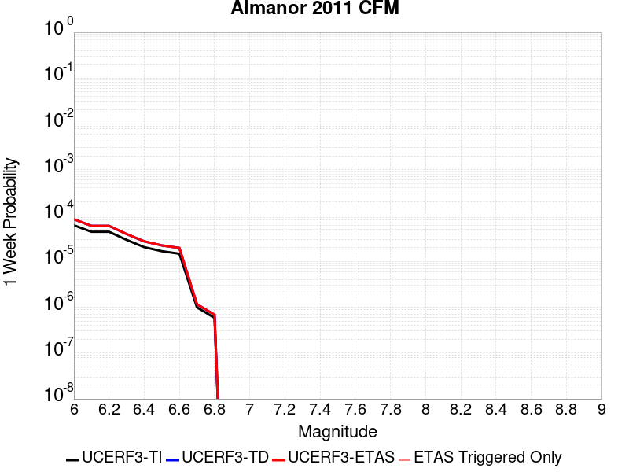 | 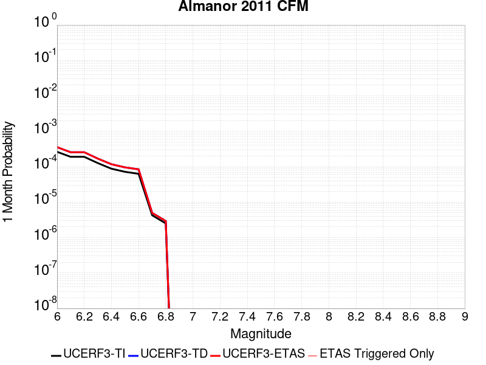 | 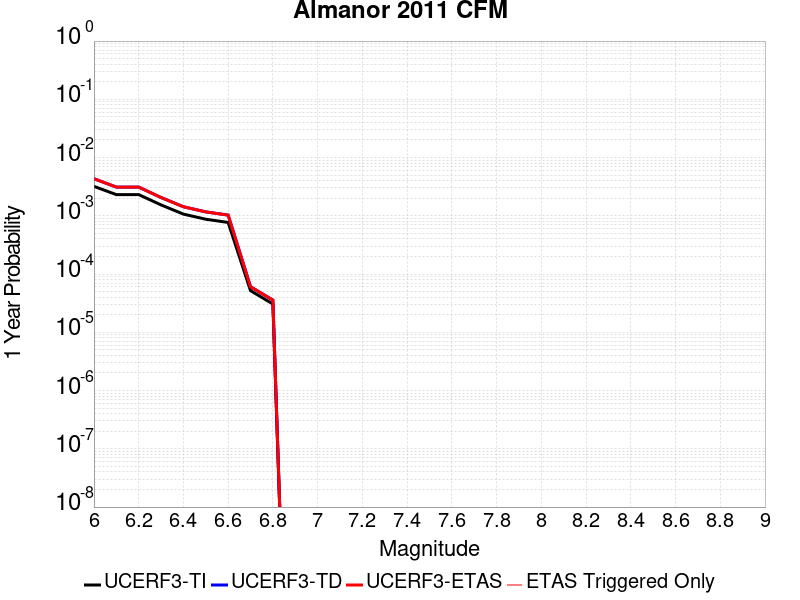 |  |

| Magnitude | 1 wk TI Prob | 1 wk TD Prob | 1 wk ETAS Prob | 1 wk ETAS/TD Gain | 1 wk ETAS Triggered Only | 1 mo TI Prob | 1 mo TD Prob | 1 mo ETAS Prob | 1 mo ETAS/TD Gain | 1 mo ETAS Triggered Only | 1 yr TI Prob | 1 yr TD Prob | 1 yr ETAS Prob | 1 yr ETAS/TD Gain | 1 yr ETAS Triggered Only | 10 yr TI Prob | 10 yr TD Prob | 10 yr ETAS Prob | 10 yr ETAS/TD Gain | 10 yr ETAS Triggered Only |
|-----|-----|-----|-----|-----|-----|-----|-----|-----|-----|-----|-----|-----|-----|-----|-----|-----|-----|-----|-----|-----|
| 6.0 | 6.1479834E-5 | 8.32787E-5 | 8.32787E-5 | 1.0 | 0.0 | 2.6345838E-4 | 3.5686578E-4 | 3.5686578E-4 | 1.0 | 0.0 | 0.0032028882 | 0.0043366123 | 0.0043366123 | 1.0 | 0.0 | 0.031571172 | 0.04258577 | 0.042595346 | 1.0002248 | 1.0E-5 |
| 6.1 | 4.4387216E-5 | 5.9770442E-5 | 5.9770442E-5 | 1.0 | 0.0 | 1.9021705E-4 | 2.561381E-4 | 2.561381E-4 | 1.0 | 0.0 | 0.0023134327 | 0.003114426 | 0.003114426 | 1.0 | 0.0 | 0.022894967 | 0.030755036 | 0.030764729 | 1.0003152 | 1.0E-5 |
| 6.2 | 4.4387216E-5 | 5.9770442E-5 | 5.9770442E-5 | 1.0 | 0.0 | 1.9021705E-4 | 2.561381E-4 | 2.561381E-4 | 1.0 | 0.0 | 0.0023134327 | 0.003114426 | 0.003114426 | 1.0 | 0.0 | 0.022894967 | 0.030755036 | 0.030764729 | 1.0003152 | 1.0E-5 |
| 6.3 | 2.9523822E-5 | 3.954719E-5 | 3.954719E-5 | 1.0 | 0.0 | 1.2652454E-4 | 1.6947983E-4 | 1.6947983E-4 | 1.0 | 0.0 | 0.0015393476 | 0.0020618725 | 0.0020618725 | 1.0 | 0.0 | 0.015287281 | 0.020460794 | 0.02047059 | 1.0004787 | 1.0E-5 |
| 6.4 | 2.0512744E-5 | 2.7431617E-5 | 2.7431617E-5 | 1.0 | 0.0 | 8.79088E-5 | 1.175612E-4 | 1.175612E-4 | 1.0 | 0.0 | 0.001069764 | 0.0014307408 | 0.0014307408 | 1.0 | 0.0 | 0.010646289 | 0.014244413 | 0.014254271 | 1.000692 | 1.0E-5 |
| 6.5 | 1.6750226E-5 | 2.23913E-5 | 2.23913E-5 | 1.0 | 0.0 | 7.178471E-5 | 9.596152E-5 | 9.596152E-5 | 1.0 | 0.0 | 8.7362836E-4 | 0.0011680633 | 0.0011680633 | 1.0 | 0.0 | 0.008702018 | 0.011649038 | 0.011658922 | 1.0008484 | 1.0E-5 |
| 6.6 | 1.4745303E-5 | 1.9707952E-5 | 1.9707952E-5 | 1.0 | 0.0 | 6.319262E-5 | 8.446223E-5 | 8.446223E-5 | 1.0 | 0.0 | 7.690986E-4 | 0.0010281964 | 0.0010281964 | 1.0 | 0.0 | 0.0076644225 | 0.010264971 | 0.010274868 | 1.0009642 | 1.0E-5 |
| 6.7 | 9.951145E-7 | 1.1616347E-6 | 1.1616347E-6 | 1.0 | 0.0 | 4.26477E-6 | 4.9784257E-6 | 4.9784257E-6 | 1.0 | 0.0 | 5.1922336E-5 | 6.0610826E-5 | 6.0610826E-5 | 1.0 | 0.0 | 5.1910203E-4 | 6.059602E-4 | 6.059602E-4 | 1.0 | 0.0 |
| 6.8 | 5.866312E-7 | 6.849384E-7 | 6.849384E-7 | 1.0 | 0.0 | 2.5141312E-6 | 2.9354478E-6 | 2.9354478E-6 | 1.0 | 0.0 | 3.0609117E-5 | 3.5738623E-5 | 3.5738623E-5 | 1.0 | 0.0 | 3.06049E-4 | 3.5734157E-4 | 3.5734157E-4 | 1.0 | 0.0 |

## Great Valley 07 (Orestimba)
*[(top)](#table-of-contents)*

| 1 Week | 1 Month | 1 Year | 10 Year |
|-----|-----|-----|-----|
|  |  |  |  |

| Magnitude | 1 wk TI Prob | 1 wk TD Prob | 1 wk ETAS Prob | 1 wk ETAS/TD Gain | 1 wk ETAS Triggered Only | 1 mo TI Prob | 1 mo TD Prob | 1 mo ETAS Prob | 1 mo ETAS/TD Gain | 1 mo ETAS Triggered Only | 1 yr TI Prob | 1 yr TD Prob | 1 yr ETAS Prob | 1 yr ETAS/TD Gain | 1 yr ETAS Triggered Only | 10 yr TI Prob | 10 yr TD Prob | 10 yr ETAS Prob | 10 yr ETAS/TD Gain | 10 yr ETAS Triggered Only |
|-----|-----|-----|-----|-----|-----|-----|-----|-----|-----|-----|-----|-----|-----|-----|-----|-----|-----|-----|-----|-----|
| 6.0 | 2.9687902E-5 | 3.27575E-5 | 3.27575E-5 | 1.0 | 0.0 | 1.2722766E-4 | 1.4038214E-4 | 1.4038214E-4 | 1.0 | 0.0 | 0.0015478961 | 0.0017078844 | 0.0017078844 | 1.0 | 0.0 | 0.015371585 | 0.016955135 | 0.016964966 | 1.0005798 | 1.0E-5 |
| 6.1 | 2.9687902E-5 | 3.27575E-5 | 3.27575E-5 | 1.0 | 0.0 | 1.2722766E-4 | 1.4038214E-4 | 1.4038214E-4 | 1.0 | 0.0 | 0.0015478961 | 0.0017078844 | 0.0017078844 | 1.0 | 0.0 | 0.015371585 | 0.016955135 | 0.016964966 | 1.0005798 | 1.0E-5 |
| 6.2 | 1.9231524E-5 | 2.1159167E-5 | 2.1159167E-5 | 1.0 | 0.0 | 8.2418206E-5 | 9.067912E-5 | 9.067912E-5 | 1.0 | 0.0 | 0.0010029797 | 0.0011034822 | 0.0011034822 | 1.0 | 0.0 | 0.00998465 | 0.01098244 | 0.0109923305 | 1.0009005 | 1.0E-5 |
| 6.3 | 1.324766E-5 | 1.4548534E-5 | 1.4548534E-5 | 1.0 | 0.0 | 5.6774446E-5 | 6.234942E-5 | 6.234942E-5 | 1.0 | 0.0 | 6.910097E-4 | 7.5884897E-4 | 7.5884897E-4 | 1.0 | 0.0 | 0.006888649 | 0.0075635235 | 0.007573448 | 1.0013121 | 1.0E-5 |
| 6.4 | 7.818645E-6 | 8.57284E-6 | 8.57284E-6 | 1.0 | 0.0 | 3.3508048E-5 | 3.6740246E-5 | 3.6740246E-5 | 1.0 | 0.0 | 4.078841E-4 | 4.4722404E-4 | 4.4722404E-4 | 1.0 | 0.0 | 0.004071363 | 0.0044635804 | 0.0044635804 | 1.0 | 0.0 |
| 6.5 | 5.3076565E-6 | 5.8178007E-6 | 5.8178007E-6 | 1.0 | 0.0 | 2.27469E-5 | 2.4933206E-5 | 2.4933206E-5 | 1.0 | 0.0 | 2.7690834E-4 | 3.035216E-4 | 3.035216E-4 | 1.0 | 0.0 | 0.0027656353 | 0.00303128 | 0.00303128 | 1.0 | 0.0 |
| 6.6 | 3.6003578E-6 | 3.9484953E-6 | 3.9484953E-6 | 1.0 | 0.0 | 1.5430012E-5 | 1.6922022E-5 | 1.6922022E-5 | 1.0 | 0.0 | 1.8784421E-4 | 2.0600771E-4 | 2.0600771E-4 | 1.0 | 0.0 | 0.0018768552 | 0.0020583214 | 0.0020583214 | 1.0 | 0.0 |
| 6.7 | 2.5361826E-6 | 2.7834678E-6 | 2.7834678E-6 | 1.0 | 0.0 | 1.0869308E-5 | 1.1929101E-5 | 1.1929101E-5 | 1.0 | 0.0 | 1.3232579E-4 | 1.4522845E-4 | 1.4522845E-4 | 1.0 | 0.0 | 0.0013224703 | 0.0014514653 | 0.0014514653 | 1.0 | 0.0 |
| 6.8 | 1.2115831E-6 | 1.3313797E-6 | 1.3313797E-6 | 1.0 | 0.0 | 5.1924885E-6 | 5.7059065E-6 | 5.7059065E-6 | 1.0 | 0.0 | 6.3216714E-5 | 6.9468166E-5 | 6.9468166E-5 | 1.0 | 0.0 | 6.3198735E-4 | 6.945596E-4 | 6.945596E-4 | 1.0 | 0.0 |

## Garberville - Briceland 2011 CFM
*[(top)](#table-of-contents)*

| 1 Week | 1 Month | 1 Year | 10 Year |
|-----|-----|-----|-----|
| 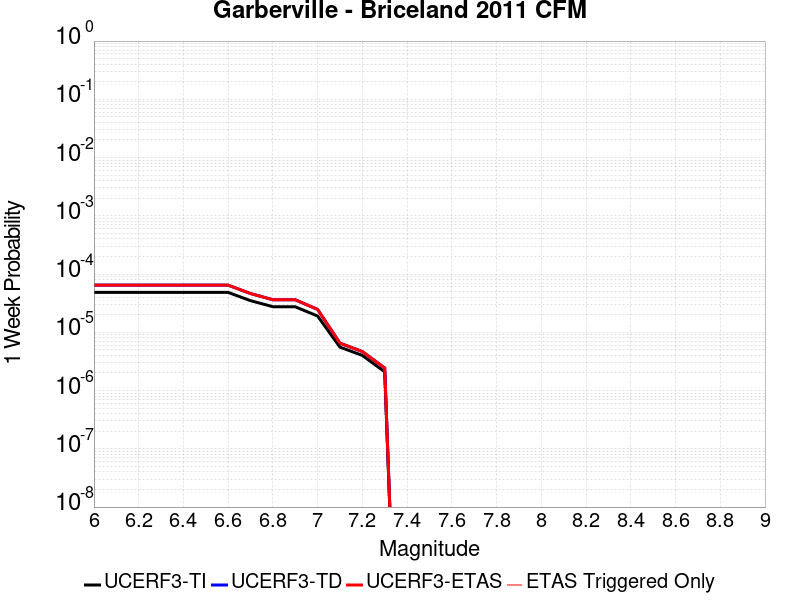 |  |  | 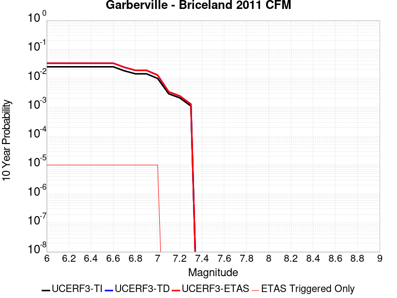 |

| Magnitude | 1 wk TI Prob | 1 wk TD Prob | 1 wk ETAS Prob | 1 wk ETAS/TD Gain | 1 wk ETAS Triggered Only | 1 mo TI Prob | 1 mo TD Prob | 1 mo ETAS Prob | 1 mo ETAS/TD Gain | 1 mo ETAS Triggered Only | 1 yr TI Prob | 1 yr TD Prob | 1 yr ETAS Prob | 1 yr ETAS/TD Gain | 1 yr ETAS Triggered Only | 10 yr TI Prob | 10 yr TD Prob | 10 yr ETAS Prob | 10 yr ETAS/TD Gain | 10 yr ETAS Triggered Only |
|-----|-----|-----|-----|-----|-----|-----|-----|-----|-----|-----|-----|-----|-----|-----|-----|-----|-----|-----|-----|-----|
| 6.0 | 4.8399295E-5 | 6.452381E-5 | 6.452381E-5 | 1.0 | 0.0 | 2.0740906E-4 | 2.7650563E-4 | 2.7650563E-4 | 1.0 | 0.0 | 0.002522281 | 0.003362017 | 0.003362017 | 1.0 | 0.0 | 0.024938442 | 0.03317861 | 0.03318828 | 1.0002913 | 1.0E-5 |
| 6.1 | 4.8399295E-5 | 6.452381E-5 | 6.452381E-5 | 1.0 | 0.0 | 2.0740906E-4 | 2.7650563E-4 | 2.7650563E-4 | 1.0 | 0.0 | 0.002522281 | 0.003362017 | 0.003362017 | 1.0 | 0.0 | 0.024938442 | 0.03317861 | 0.03318828 | 1.0002913 | 1.0E-5 |
| 6.2 | 4.8399295E-5 | 6.452381E-5 | 6.452381E-5 | 1.0 | 0.0 | 2.0740906E-4 | 2.7650563E-4 | 2.7650563E-4 | 1.0 | 0.0 | 0.002522281 | 0.003362017 | 0.003362017 | 1.0 | 0.0 | 0.024938442 | 0.03317861 | 0.03318828 | 1.0002913 | 1.0E-5 |
| 6.3 | 4.8399295E-5 | 6.452381E-5 | 6.452381E-5 | 1.0 | 0.0 | 2.0740906E-4 | 2.7650563E-4 | 2.7650563E-4 | 1.0 | 0.0 | 0.002522281 | 0.003362017 | 0.003362017 | 1.0 | 0.0 | 0.024938442 | 0.03317861 | 0.03318828 | 1.0002913 | 1.0E-5 |
| 6.4 | 4.8399295E-5 | 6.452381E-5 | 6.452381E-5 | 1.0 | 0.0 | 2.0740906E-4 | 2.7650563E-4 | 2.7650563E-4 | 1.0 | 0.0 | 0.002522281 | 0.003362017 | 0.003362017 | 1.0 | 0.0 | 0.024938442 | 0.03317861 | 0.03318828 | 1.0002913 | 1.0E-5 |
| 6.5 | 4.8399295E-5 | 6.452381E-5 | 6.452381E-5 | 1.0 | 0.0 | 2.0740906E-4 | 2.7650563E-4 | 2.7650563E-4 | 1.0 | 0.0 | 0.002522281 | 0.003362017 | 0.003362017 | 1.0 | 0.0 | 0.024938442 | 0.03317861 | 0.03318828 | 1.0002913 | 1.0E-5 |
| 6.6 | 4.8399295E-5 | 6.452381E-5 | 6.452381E-5 | 1.0 | 0.0 | 2.0740906E-4 | 2.7650563E-4 | 2.7650563E-4 | 1.0 | 0.0 | 0.002522281 | 0.003362017 | 0.003362017 | 1.0 | 0.0 | 0.024938442 | 0.03317861 | 0.03318828 | 1.0002913 | 1.0E-5 |
| 6.7 | 3.495179E-5 | 4.6308873E-5 | 4.6308873E-5 | 1.0 | 0.0 | 1.4978478E-4 | 1.9845461E-4 | 1.9845461E-4 | 1.0 | 0.0 | 0.0018221042 | 0.002414053 | 0.002414053 | 1.0 | 0.0 | 0.018072363 | 0.023930617 | 0.023940377 | 1.0004079 | 1.0E-5 |
| 6.8 | 2.7517597E-5 | 3.6241618E-5 | 3.6241618E-5 | 1.0 | 0.0 | 1.1792722E-4 | 1.5531474E-4 | 1.5531474E-4 | 1.0 | 0.0 | 0.0014348183 | 0.0018897996 | 0.0018897996 | 1.0 | 0.0 | 0.014255894 | 0.018783508 | 0.01879332 | 1.0005224 | 1.0E-5 |
| 6.9 | 2.74461E-5 | 3.6159345E-5 | 3.6159345E-5 | 1.0 | 0.0 | 1.1762084E-4 | 1.5496218E-4 | 1.5496218E-4 | 1.0 | 0.0 | 0.001431093 | 0.0018855145 | 0.0018855145 | 1.0 | 0.0 | 0.014219119 | 0.018741382 | 0.018751195 | 1.0005236 | 1.0E-5 |
| 7.0 | 1.9023773E-5 | 2.4707579E-5 | 2.4707579E-5 | 1.0 | 0.0 | 8.152791E-5 | 1.0588763E-4 | 1.0588763E-4 | 1.0 | 0.0 | 9.921503E-4 | 0.0012888284 | 0.0012888284 | 1.0 | 0.0 | 0.009877323 | 0.012852574 | 0.012862446 | 1.0007681 | 1.0E-5 |
| 7.1 | 5.566844E-6 | 6.512147E-6 | 6.512147E-6 | 1.0 | 0.0 | 2.3857683E-5 | 2.7908927E-5 | 2.7908927E-5 | 1.0 | 0.0 | 2.9042858E-4 | 3.3974246E-4 | 3.3974246E-4 | 1.0 | 0.0 | 0.002900493 | 0.0033926512 | 0.0033926512 | 1.0 | 0.0 |
| 7.2 | 4.011353E-6 | 4.6746213E-6 | 4.6746213E-6 | 1.0 | 0.0 | 1.7191402E-5 | 2.0033956E-5 | 2.0033956E-5 | 1.0 | 0.0 | 2.0928521E-4 | 2.4388955E-4 | 2.4388955E-4 | 1.0 | 0.0 | 0.0020908823 | 0.0024365564 | 0.0024365564 | 1.0 | 0.0 |
| 7.3 | 2.0974871E-6 | 2.4395908E-6 | 2.4395908E-6 | 1.0 | 0.0 | 8.989199E-6 | 1.0455362E-5 | 1.0455362E-5 | 1.0 | 0.0 | 1.09438006E-4 | 1.272891E-4 | 1.272891E-4 | 1.0 | 0.0 | 0.0010938413 | 0.0012724071 | 0.0012724071 | 1.0 | 0.0 |

## Newport-Inglewood (Offshore)
*[(top)](#table-of-contents)*

| 1 Week | 1 Month | 1 Year | 10 Year |
|-----|-----|-----|-----|
|  | 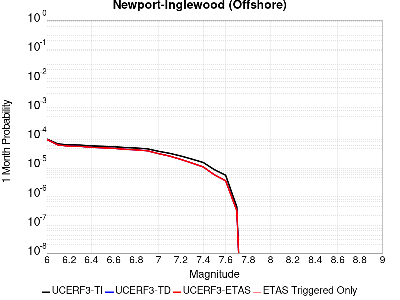 | 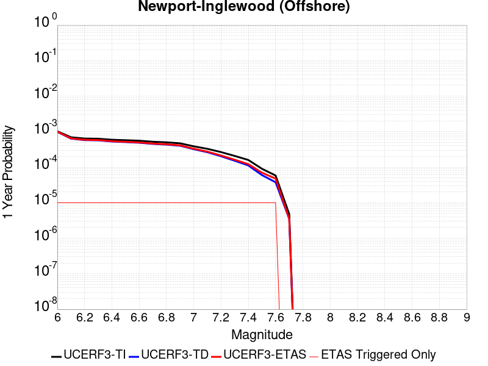 | 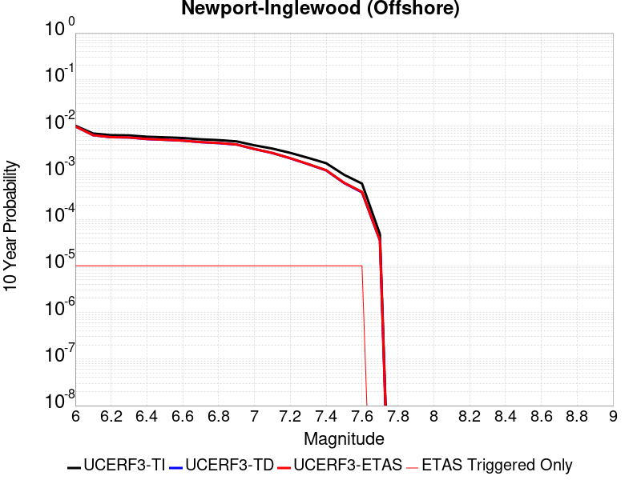 |

| Magnitude | 1 wk TI Prob | 1 wk TD Prob | 1 wk ETAS Prob | 1 wk ETAS/TD Gain | 1 wk ETAS Triggered Only | 1 mo TI Prob | 1 mo TD Prob | 1 mo ETAS Prob | 1 mo ETAS/TD Gain | 1 mo ETAS Triggered Only | 1 yr TI Prob | 1 yr TD Prob | 1 yr ETAS Prob | 1 yr ETAS/TD Gain | 1 yr ETAS Triggered Only | 10 yr TI Prob | 10 yr TD Prob | 10 yr ETAS Prob | 10 yr ETAS/TD Gain | 10 yr ETAS Triggered Only |
|-----|-----|-----|-----|-----|-----|-----|-----|-----|-----|-----|-----|-----|-----|-----|-----|-----|-----|-----|-----|-----|
| 6.0 | 1.9626508E-5 | 1.8965357E-5 | 1.8965357E-5 | 1.0 | 0.0 | 8.411089E-5 | 8.1277634E-5 | 8.1277634E-5 | 1.0 | 0.0 | 0.001023569 | 9.891186E-4 | 9.991087E-4 | 1.0101 | 1.0E-5 | 0.010188672 | 0.009848503 | 0.009858405 | 1.0010054 | 1.0E-5 |
| 6.1 | 1.331886E-5 | 1.2218092E-5 | 1.2218092E-5 | 1.0 | 0.0 | 5.707958E-5 | 5.2362207E-5 | 5.2362207E-5 | 1.0 | 0.0 | 6.947222E-4 | 6.3732493E-4 | 6.4731855E-4 | 1.0156806 | 1.0E-5 | 0.006925544 | 0.006355149 | 0.0063650855 | 1.0015635 | 1.0E-5 |
| 6.2 | 1.2250852E-5 | 1.1076029E-5 | 1.1076029E-5 | 1.0 | 0.0 | 5.2502597E-5 | 4.7467838E-5 | 4.7467838E-5 | 1.0 | 0.0 | 6.3903164E-4 | 5.777687E-4 | 5.877629E-4 | 1.017298 | 1.0E-5 | 0.006371971 | 0.0057627866 | 0.005772729 | 1.0017253 | 1.0E-5 |
| 6.3 | 1.2106258E-5 | 1.0918891E-5 | 1.0918891E-5 | 1.0 | 0.0 | 5.1882926E-5 | 4.6794412E-5 | 4.6794412E-5 | 1.0 | 0.0 | 6.3149154E-4 | 5.69574E-4 | 5.795683E-4 | 1.017547 | 1.0E-5 | 0.0062970007 | 0.005681259 | 0.0056912024 | 1.0017502 | 1.0E-5 |
| 6.4 | 1.1348758E-5 | 1.0109362E-5 | 1.0109362E-5 | 1.0 | 0.0 | 4.8636626E-5 | 4.3325123E-5 | 4.3325123E-5 | 1.0 | 0.0 | 5.919901E-4 | 5.273565E-4 | 5.3735124E-4 | 1.0189525 | 1.0E-5 | 0.005904155 | 0.0052611465 | 0.005271094 | 1.0018908 | 1.0E-5 |
| 6.5 | 1.100837E-5 | 9.7433895E-6 | 9.7433895E-6 | 1.0 | 0.0 | 4.7177873E-5 | 4.1756717E-5 | 4.1756717E-5 | 1.0 | 0.0 | 5.7423924E-4 | 5.082702E-4 | 5.182651E-4 | 1.0196645 | 1.0E-5 | 0.005727576 | 0.0050711688 | 0.005081118 | 1.001962 | 1.0E-5 |
| 6.6 | 1.0634696E-5 | 9.345544E-6 | 9.345544E-6 | 1.0 | 0.0 | 4.557647E-5 | 4.0051716E-5 | 4.0051716E-5 | 1.0 | 0.0 | 5.5475225E-4 | 4.8752132E-4 | 4.975164E-4 | 1.020502 | 1.0E-5 | 0.0055336943 | 0.0048646047 | 0.004874556 | 1.0020456 | 1.0E-5 |
| 6.7 | 9.9780855E-6 | 8.667911E-6 | 8.667911E-6 | 1.0 | 0.0 | 4.276252E-5 | 3.7147664E-5 | 3.7147664E-5 | 1.0 | 0.0 | 5.205093E-4 | 4.5217964E-4 | 4.621751E-4 | 1.0221051 | 1.0E-5 | 0.0051929182 | 0.004512675 | 0.0045226295 | 1.002206 | 1.0E-5 |
| 6.8 | 9.59546E-6 | 8.27295E-6 | 8.27295E-6 | 1.0 | 0.0 | 4.1122752E-5 | 3.5455025E-5 | 3.5455025E-5 | 1.0 | 0.0 | 5.0055445E-4 | 4.315801E-4 | 4.4157577E-4 | 1.0231607 | 1.0E-5 | 0.004994285 | 0.004307495 | 0.004317452 | 1.0023116 | 1.0E-5 |
| 6.9 | 9.000614E-6 | 7.70684E-6 | 7.70684E-6 | 1.0 | 0.0 | 3.857349E-5 | 3.30289E-5 | 3.30289E-5 | 1.0 | 0.0 | 4.6953102E-4 | 4.0205332E-4 | 4.120493E-4 | 1.0248623 | 1.0E-5 | 0.004685402 | 0.0040133307 | 0.0040232907 | 1.0024817 | 1.0E-5 |
| 7.0 | 7.4070194E-6 | 6.148904E-6 | 6.148904E-6 | 1.0 | 0.0 | 3.1743984E-5 | 2.635218E-5 | 2.635218E-5 | 1.0 | 0.0 | 3.8641447E-4 | 3.207907E-4 | 3.307875E-4 | 1.031163 | 1.0E-5 | 0.0038574322 | 0.0032032963 | 0.0032132643 | 1.0031118 | 1.0E-5 |
| 7.1 | 6.299615E-6 | 5.0565927E-6 | 5.0565927E-6 | 1.0 | 0.0 | 2.699807E-5 | 2.1670932E-5 | 2.1670932E-5 | 1.0 | 0.0 | 3.2865192E-4 | 2.638118E-4 | 2.7380916E-4 | 1.0378958 | 1.0E-5 | 0.003281663 | 0.002635001 | 0.0026449745 | 1.003785 | 1.0E-5 |
| 7.2 | 5.096653E-6 | 3.892769E-6 | 3.892769E-6 | 1.0 | 0.0 | 2.1842614E-5 | 1.668319E-5 | 1.668319E-5 | 1.0 | 0.0 | 2.6590136E-4 | 2.0309901E-4 | 2.1309698E-4 | 1.0492271 | 1.0E-5 | 0.0026558342 | 0.0020291451 | 0.0020391247 | 1.0049182 | 1.0E-5 |
| 7.3 | 3.9753018E-6 | 2.9099103E-6 | 2.9099103E-6 | 1.0 | 0.0 | 1.7036897E-5 | 1.2470985E-5 | 1.2470985E-5 | 1.0 | 0.0 | 2.0740448E-4 | 1.5182374E-4 | 1.6182222E-4 | 1.0658559 | 1.0E-5 | 0.00207211 | 0.0015172083 | 0.0015271931 | 1.0065811 | 1.0E-5 |
| 7.4 | 3.0568392E-6 | 2.1449955E-6 | 2.1449955E-6 | 1.0 | 0.0 | 1.3100675E-5 | 9.192806E-6 | 9.192806E-6 | 1.0 | 0.0 | 1.5948903E-4 | 1.1191672E-4 | 1.21915604E-4 | 1.0893421 | 1.0E-5 | 0.0015937461 | 0.0011186098 | 0.0011285987 | 1.0089296 | 1.0E-5 |
| 7.5 | 1.7279019E-6 | 1.1469883E-6 | 1.1469883E-6 | 1.0 | 0.0 | 7.405273E-6 | 4.915655E-6 | 4.915655E-6 | 1.0 | 0.0 | 9.015547E-5 | 5.9846494E-5 | 6.98459E-5 | 1.1670842 | 1.0E-5 | 9.01189E-4 | 5.9830764E-4 | 6.0830166E-4 | 1.0167038 | 1.0E-5 |
| 7.6 | 1.1156416E-6 | 7.223012E-7 | 7.223012E-7 | 1.0 | 0.0 | 4.7813123E-6 | 3.095573E-6 | 3.095573E-6 | 1.0 | 0.0 | 5.821092E-5 | 3.7687976E-5 | 4.7687598E-5 | 1.2653266 | 1.0E-5 | 5.8195676E-4 | 3.7681818E-4 | 3.8681438E-4 | 1.026528 | 1.0E-5 |
| 7.7 | 9.117973E-8 | 6.734145E-8 | 6.734145E-8 | 1.0 | 0.0 | 3.907702E-7 | 2.886062E-7 | 2.886062E-7 | 1.0 | 0.0 | 4.757617E-6 | 3.513775E-6 | 3.513775E-6 | 1.0 | 0.0 | 4.7575148E-5 | 3.5137225E-5 | 3.5137225E-5 | 1.0 | 0.0 |

## Homestead Valley 2011
*[(top)](#table-of-contents)*

| 1 Week | 1 Month | 1 Year | 10 Year |
|-----|-----|-----|-----|
|  | 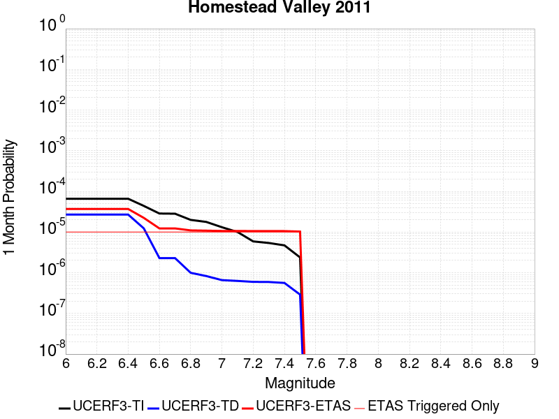 |  |  |

| Magnitude | 1 wk TI Prob | 1 wk TD Prob | 1 wk ETAS Prob | 1 wk ETAS/TD Gain | 1 wk ETAS Triggered Only | 1 mo TI Prob | 1 mo TD Prob | 1 mo ETAS Prob | 1 mo ETAS/TD Gain | 1 mo ETAS Triggered Only | 1 yr TI Prob | 1 yr TD Prob | 1 yr ETAS Prob | 1 yr ETAS/TD Gain | 1 yr ETAS Triggered Only | 10 yr TI Prob | 10 yr TD Prob | 10 yr ETAS Prob | 10 yr ETAS/TD Gain | 10 yr ETAS Triggered Only |
|-----|-----|-----|-----|-----|-----|-----|-----|-----|-----|-----|-----|-----|-----|-----|-----|-----|-----|-----|-----|-----|
| 6.0 | 1.539795E-5 | 6.286606E-6 | 1.6286544E-5 | 2.5906734 | 1.0E-5 | 6.5989545E-5 | 2.6942436E-5 | 3.6942165E-5 | 1.3711517 | 1.0E-5 | 8.0312655E-4 | 3.279954E-4 | 3.379921E-4 | 1.0304782 | 1.0E-5 | 0.008002302 | 0.0032771337 | 0.003287101 | 1.0030415 | 1.0E-5 |
| 6.1 | 1.539795E-5 | 6.286606E-6 | 1.6286544E-5 | 2.5906734 | 1.0E-5 | 6.5989545E-5 | 2.6942436E-5 | 3.6942165E-5 | 1.3711517 | 1.0E-5 | 8.0312655E-4 | 3.279954E-4 | 3.379921E-4 | 1.0304782 | 1.0E-5 | 0.008002302 | 0.0032771337 | 0.003287101 | 1.0030415 | 1.0E-5 |
| 6.2 | 1.539795E-5 | 6.286606E-6 | 1.6286544E-5 | 2.5906734 | 1.0E-5 | 6.5989545E-5 | 2.6942436E-5 | 3.6942165E-5 | 1.3711517 | 1.0E-5 | 8.0312655E-4 | 3.279954E-4 | 3.379921E-4 | 1.0304782 | 1.0E-5 | 0.008002302 | 0.0032771337 | 0.003287101 | 1.0030415 | 1.0E-5 |
| 6.3 | 1.539795E-5 | 6.286606E-6 | 1.6286544E-5 | 2.5906734 | 1.0E-5 | 6.5989545E-5 | 2.6942436E-5 | 3.6942165E-5 | 1.3711517 | 1.0E-5 | 8.0312655E-4 | 3.279954E-4 | 3.379921E-4 | 1.0304782 | 1.0E-5 | 0.008002302 | 0.0032771337 | 0.003287101 | 1.0030415 | 1.0E-5 |
| 6.4 | 1.539795E-5 | 6.286606E-6 | 1.6286544E-5 | 2.5906734 | 1.0E-5 | 6.5989545E-5 | 2.6942436E-5 | 3.6942165E-5 | 1.3711517 | 1.0E-5 | 8.0312655E-4 | 3.279954E-4 | 3.379921E-4 | 1.0304782 | 1.0E-5 | 0.008002302 | 0.0032771337 | 0.003287101 | 1.0030415 | 1.0E-5 |
| 6.5 | 1.0265258E-5 | 2.8788488E-6 | 1.287882E-5 | 4.4736004 | 1.0E-5 | 4.3993223E-5 | 1.2337905E-5 | 2.2337781E-5 | 1.8105004 | 1.0E-5 | 5.3548586E-4 | 1.5021059E-4 | 1.6020909E-4 | 1.0665632 | 1.0E-5 | 0.005341973 | 0.0015017724 | 0.0015117575 | 1.0066488 | 1.0E-5 |
| 6.6 | 6.664671E-6 | 5.348204E-7 | 1.0534815E-5 | 19.697855 | 1.0E-5 | 2.8562565E-5 | 2.2920863E-6 | 1.2292063E-5 | 5.362828 | 1.0E-5 | 3.476937E-4 | 2.7905911E-5 | 3.7905633E-5 | 1.358337 | 1.0E-5 | 0.003471502 | 2.790357E-4 | 2.890329E-4 | 1.0358278 | 1.0E-5 |
| 6.7 | 6.5954046E-6 | 5.348204E-7 | 1.0534815E-5 | 19.697855 | 1.0E-5 | 2.8265715E-5 | 2.2920863E-6 | 1.2292063E-5 | 5.362828 | 1.0E-5 | 3.4408073E-4 | 2.7905911E-5 | 3.7905633E-5 | 1.358337 | 1.0E-5 | 0.0034354846 | 2.790357E-4 | 2.890329E-4 | 1.0358278 | 1.0E-5 |
| 6.8 | 4.648189E-6 | 2.3265572E-7 | 1.0232653E-5 | 43.981953 | 1.0E-5 | 1.9920659E-5 | 9.970956E-7 | 1.0997086E-5 | 11.029119 | 1.0E-5 | 2.4250703E-4 | 1.2139576E-5 | 2.2139455E-5 | 1.823742 | 1.0E-5 | 0.0024224254 | 1.2138961E-4 | 1.313884E-4 | 1.0823693 | 1.0E-5 |
| 6.9 | 4.1428534E-6 | 1.9344557E-7 | 1.0193444E-5 | 52.69412 | 1.0E-5 | 1.7754966E-5 | 8.290522E-7 | 1.0829044E-5 | 13.061956 | 1.0E-5 | 2.1614527E-4 | 1.0093667E-5 | 2.0093566E-5 | 1.9907103 | 1.0E-5 | 0.0021593515 | 1.0093238E-4 | 1.10931374E-4 | 1.0990663 | 1.0E-5 |
| 7.0 | 3.0673707E-6 | 1.5367603E-7 | 1.0153674E-5 | 66.071945 | 1.0E-5 | 1.3145808E-5 | 6.586114E-7 | 1.0658605E-5 | 16.18345 | 1.0E-5 | 1.6003846E-4 | 8.0185655E-6 | 1.8018485E-5 | 2.2470958 | 1.0E-5 | 0.0015992324 | 8.0182865E-5 | 9.018206E-5 | 1.124705 | 1.0E-5 |
| 7.1 | 2.340854E-6 | 1.468766E-7 | 1.0146875E-5 | 69.08436 | 1.0E-5 | 1.0032193E-5 | 6.29471E-7 | 1.0629465E-5 | 16.886345 | 1.0E-5 | 1.221351E-4 | 7.663783E-6 | 1.7663706E-5 | 2.3048286 | 1.0E-5 | 0.00122068 | 7.663529E-5 | 8.663452E-5 | 1.1304781 | 1.0E-5 |
| 7.2 | 1.3754182E-6 | 1.3922634E-7 | 1.0139225E-5 | 72.82548 | 1.0E-5 | 5.8946357E-6 | 5.966842E-7 | 1.0596678E-5 | 17.759275 | 1.0E-5 | 7.176483E-5 | 7.2646067E-6 | 1.7264534E-5 | 2.376527 | 1.0E-5 | 7.174166E-4 | 7.264379E-5 | 8.2643055E-5 | 1.137648 | 1.0E-5 |
| 7.3 | 1.2573237E-6 | 1.3827146E-7 | 1.013827E-5 | 73.321495 | 1.0E-5 | 5.388519E-6 | 5.9259185E-7 | 1.0592586E-5 | 17.875011 | 1.0E-5 | 6.560324E-5 | 7.2147827E-6 | 1.721471E-5 | 2.386033 | 1.0E-5 | 6.558388E-4 | 7.214558E-5 | 8.2144856E-5 | 1.1385987 | 1.0E-5 |
| 7.4 | 1.0994207E-6 | 1.3106106E-7 | 1.013106E-5 | 77.30031 | 1.0E-5 | 4.7117946E-6 | 5.616901E-7 | 1.0561685E-5 | 18.8034 | 1.0E-5 | 5.736459E-5 | 6.8385566E-6 | 1.6838489E-5 | 2.462287 | 1.0E-5 | 5.734978E-4 | 6.838355E-5 | 7.838287E-5 | 1.146224 | 1.0E-5 |
| 7.5 | 5.5569126E-7 | 6.772991E-8 | 1.0067729E-5 | 148.64525 | 1.0E-5 | 2.3815317E-6 | 2.90271E-7 | 1.0290268E-5 | 35.450554 | 1.0E-5 | 2.8994764E-5 | 3.5340445E-6 | 1.3534009E-5 | 3.8296092 | 1.0E-5 | 2.899098E-4 | 3.5339945E-5 | 4.533959E-5 | 1.2829559 | 1.0E-5 |

## Trinidad (alt1)
*[(top)](#table-of-contents)*

| 1 Week | 1 Month | 1 Year | 10 Year |
|-----|-----|-----|-----|
| 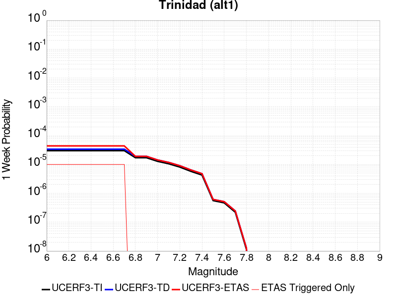 | 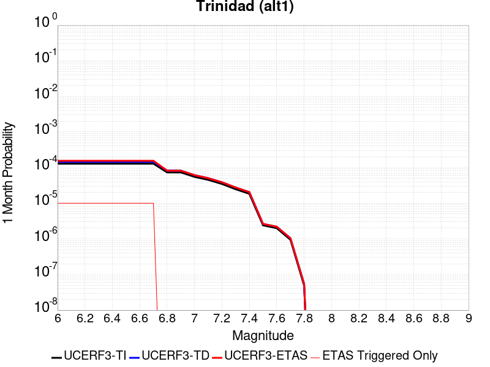 |  |  |

| Magnitude | 1 wk TI Prob | 1 wk TD Prob | 1 wk ETAS Prob | 1 wk ETAS/TD Gain | 1 wk ETAS Triggered Only | 1 mo TI Prob | 1 mo TD Prob | 1 mo ETAS Prob | 1 mo ETAS/TD Gain | 1 mo ETAS Triggered Only | 1 yr TI Prob | 1 yr TD Prob | 1 yr ETAS Prob | 1 yr ETAS/TD Gain | 1 yr ETAS Triggered Only | 10 yr TI Prob | 10 yr TD Prob | 10 yr ETAS Prob | 10 yr ETAS/TD Gain | 10 yr ETAS Triggered Only |
|-----|-----|-----|-----|-----|-----|-----|-----|-----|-----|-----|-----|-----|-----|-----|-----|-----|-----|-----|-----|-----|
| 6.0 | 3.0167168E-5 | 3.4033183E-5 | 4.4032844E-5 | 1.2938209 | 1.0E-5 | 1.2928146E-4 | 1.4584929E-4 | 1.5584784E-4 | 1.0685539 | 1.0E-5 | 0.0015728653 | 0.0017744373 | 0.0017844195 | 1.0056256 | 1.0E-5 | 0.0156177925 | 0.017619645 | 0.017629469 | 1.0005575 | 1.0E-5 |
| 6.1 | 3.0167168E-5 | 3.4033183E-5 | 4.4032844E-5 | 1.2938209 | 1.0E-5 | 1.2928146E-4 | 1.4584929E-4 | 1.5584784E-4 | 1.0685539 | 1.0E-5 | 0.0015728653 | 0.0017744373 | 0.0017844195 | 1.0056256 | 1.0E-5 | 0.0156177925 | 0.017619645 | 0.017629469 | 1.0005575 | 1.0E-5 |
| 6.2 | 3.0167168E-5 | 3.4033183E-5 | 4.4032844E-5 | 1.2938209 | 1.0E-5 | 1.2928146E-4 | 1.4584929E-4 | 1.5584784E-4 | 1.0685539 | 1.0E-5 | 0.0015728653 | 0.0017744373 | 0.0017844195 | 1.0056256 | 1.0E-5 | 0.0156177925 | 0.017619645 | 0.017629469 | 1.0005575 | 1.0E-5 |
| 6.3 | 3.0167168E-5 | 3.4033183E-5 | 4.4032844E-5 | 1.2938209 | 1.0E-5 | 1.2928146E-4 | 1.4584929E-4 | 1.5584784E-4 | 1.0685539 | 1.0E-5 | 0.0015728653 | 0.0017744373 | 0.0017844195 | 1.0056256 | 1.0E-5 | 0.0156177925 | 0.017619645 | 0.017629469 | 1.0005575 | 1.0E-5 |
| 6.4 | 3.0167168E-5 | 3.4033183E-5 | 4.4032844E-5 | 1.2938209 | 1.0E-5 | 1.2928146E-4 | 1.4584929E-4 | 1.5584784E-4 | 1.0685539 | 1.0E-5 | 0.0015728653 | 0.0017744373 | 0.0017844195 | 1.0056256 | 1.0E-5 | 0.0156177925 | 0.017619645 | 0.017629469 | 1.0005575 | 1.0E-5 |
| 6.5 | 3.0167168E-5 | 3.4033183E-5 | 4.4032844E-5 | 1.2938209 | 1.0E-5 | 1.2928146E-4 | 1.4584929E-4 | 1.5584784E-4 | 1.0685539 | 1.0E-5 | 0.0015728653 | 0.0017744373 | 0.0017844195 | 1.0056256 | 1.0E-5 | 0.0156177925 | 0.017619645 | 0.017629469 | 1.0005575 | 1.0E-5 |
| 6.6 | 3.0167168E-5 | 3.4033183E-5 | 4.4032844E-5 | 1.2938209 | 1.0E-5 | 1.2928146E-4 | 1.4584929E-4 | 1.5584784E-4 | 1.0685539 | 1.0E-5 | 0.0015728653 | 0.0017744373 | 0.0017844195 | 1.0056256 | 1.0E-5 | 0.0156177925 | 0.017619645 | 0.017629469 | 1.0005575 | 1.0E-5 |
| 6.7 | 3.0167168E-5 | 3.4033183E-5 | 4.4032844E-5 | 1.2938209 | 1.0E-5 | 1.2928146E-4 | 1.4584929E-4 | 1.5584784E-4 | 1.0685539 | 1.0E-5 | 0.0015728653 | 0.0017744373 | 0.0017844195 | 1.0056256 | 1.0E-5 | 0.0156177925 | 0.017619645 | 0.017629469 | 1.0005575 | 1.0E-5 |
| 6.8 | 1.717077E-5 | 1.9195684E-5 | 1.9195684E-5 | 1.0 | 0.0 | 7.358694E-5 | 8.226487E-5 | 8.226487E-5 | 1.0 | 0.0 | 8.9555274E-4 | 0.0010011591 | 0.0010011591 | 1.0 | 0.0 | 0.008919522 | 0.009970939 | 0.009970939 | 1.0 | 0.0 |
| 6.9 | 1.717077E-5 | 1.9195684E-5 | 1.9195684E-5 | 1.0 | 0.0 | 7.358694E-5 | 8.226487E-5 | 8.226487E-5 | 1.0 | 0.0 | 8.9555274E-4 | 0.0010011591 | 0.0010011591 | 1.0 | 0.0 | 0.008919522 | 0.009970939 | 0.009970939 | 1.0 | 0.0 |
| 7.0 | 1.2858572E-5 | 1.433737E-5 | 1.433737E-5 | 1.0 | 0.0 | 5.5107E-5 | 6.14446E-5 | 6.14446E-5 | 1.0 | 0.0 | 6.707212E-4 | 7.478634E-4 | 7.478634E-4 | 1.0 | 0.0 | 0.006687004 | 0.0074566454 | 0.0074566454 | 1.0 | 0.0 |
| 7.1 | 1.0588431E-5 | 1.1801269E-5 | 1.1801269E-5 | 1.0 | 0.0 | 4.53782E-5 | 5.057605E-5 | 5.057605E-5 | 1.0 | 0.0 | 5.5233954E-4 | 6.156183E-4 | 6.156183E-4 | 1.0 | 0.0 | 0.005509687 | 0.006141979 | 0.006141979 | 1.0 | 0.0 |
| 7.2 | 8.138061E-6 | 9.067213E-6 | 9.067213E-6 | 1.0 | 0.0 | 3.487694E-5 | 3.8859045E-5 | 3.8859045E-5 | 1.0 | 0.0 | 4.2454398E-4 | 4.7303102E-4 | 4.7303102E-4 | 1.0 | 0.0 | 0.0042373384 | 0.0047226823 | 0.0047226823 | 1.0 | 0.0 |
| 7.3 | 5.787542E-6 | 6.46032E-6 | 6.46032E-6 | 1.0 | 0.0 | 2.4803514E-5 | 2.7686914E-5 | 2.7686914E-5 | 1.0 | 0.0 | 3.0194095E-4 | 3.3705754E-4 | 3.3705754E-4 | 1.0 | 0.0 | 0.00301531 | 0.0033675742 | 0.0033675742 | 1.0 | 0.0 |
| 7.4 | 4.303563E-6 | 4.800851E-6 | 4.800851E-6 | 1.0 | 0.0 | 1.844371E-5 | 2.0575026E-5 | 2.0575026E-5 | 1.0 | 0.0 | 2.2452902E-4 | 2.504919E-4 | 2.504919E-4 | 1.0 | 0.0 | 0.0022430231 | 0.0025040337 | 0.0025040337 | 1.0 | 0.0 |
| 7.5 | 5.6063425E-7 | 6.142982E-7 | 6.142982E-7 | 1.0 | 0.0 | 2.402716E-6 | 2.632704E-6 | 2.632704E-6 | 1.0 | 0.0 | 2.9252675E-5 | 3.2052718E-5 | 3.2052718E-5 | 1.0 | 0.0 | 2.9248823E-4 | 3.2048248E-4 | 3.2048248E-4 | 1.0 | 0.0 |
| 7.6 | 4.6699128E-7 | 5.1257996E-7 | 5.1257996E-7 | 1.0 | 0.0 | 2.0013897E-6 | 2.1967694E-6 | 2.1967694E-6 | 1.0 | 0.0 | 2.4366647E-5 | 2.6745354E-5 | 2.6745354E-5 | 1.0 | 0.0 | 2.4363975E-4 | 2.6742276E-4 | 2.6742276E-4 | 1.0 | 0.0 |
| 7.7 | 2.2080937E-7 | 2.4346897E-7 | 2.4346897E-7 | 1.0 | 0.0 | 9.4632554E-7 | 1.043438E-6 | 1.043438E-6 | 1.0 | 0.0 | 1.15214525E-5 | 1.270379E-5 | 1.270379E-5 | 1.0 | 0.0 | 1.1520855E-4 | 1.2703124E-4 | 1.2703124E-4 | 1.0 | 0.0 |
| 7.8 | 1.1438307E-8 | 1.2682963E-8 | 1.2682963E-8 | 1.0 | 0.0 | 4.9021317E-8 | 5.4355557E-8 | 5.4355557E-8 | 1.0 | 0.0 | 5.9683435E-7 | 6.6177887E-7 | 6.6177887E-7 | 1.0 | 0.0 | 5.9683275E-6 | 6.617789E-6 | 6.617789E-6 | 1.0 | 0.0 |

## Gillem - Big Crack 2011 CFM
*[(top)](#table-of-contents)*

| 1 Week | 1 Month | 1 Year | 10 Year |
|-----|-----|-----|-----|
|  |  | 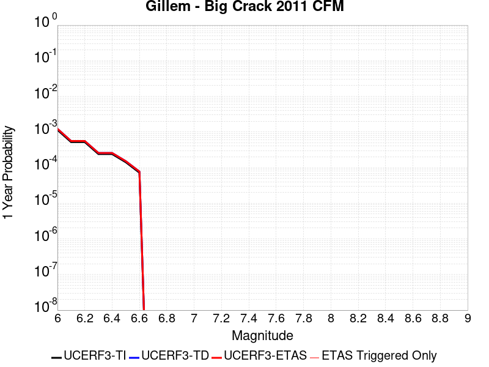 |  |

| Magnitude | 1 wk TI Prob | 1 wk TD Prob | 1 wk ETAS Prob | 1 wk ETAS/TD Gain | 1 wk ETAS Triggered Only | 1 mo TI Prob | 1 mo TD Prob | 1 mo ETAS Prob | 1 mo ETAS/TD Gain | 1 mo ETAS Triggered Only | 1 yr TI Prob | 1 yr TD Prob | 1 yr ETAS Prob | 1 yr ETAS/TD Gain | 1 yr ETAS Triggered Only | 10 yr TI Prob | 10 yr TD Prob | 10 yr ETAS Prob | 10 yr ETAS/TD Gain | 10 yr ETAS Triggered Only |
|-----|-----|-----|-----|-----|-----|-----|-----|-----|-----|-----|-----|-----|-----|-----|-----|-----|-----|-----|-----|-----|
| 6.0 | 2.196852E-5 | 2.3604485E-5 | 2.3604485E-5 | 1.0 | 0.0 | 9.4147406E-5 | 1.01158665E-4 | 1.01158665E-4 | 1.0 | 0.0 | 0.0011456419 | 0.0012309998 | 0.0012309998 | 1.0 | 0.0 | 0.011397537 | 0.012250669 | 0.012260547 | 1.0008063 | 1.0E-5 |
| 6.1 | 9.992795E-6 | 1.071189E-5 | 1.071189E-5 | 1.0 | 0.0 | 4.2825563E-5 | 4.5907396E-5 | 4.5907396E-5 | 1.0 | 0.0 | 5.2127644E-4 | 5.587975E-4 | 5.587975E-4 | 1.0 | 0.0 | 0.0052005537 | 0.0055757347 | 0.0055757347 | 1.0 | 0.0 |
| 6.2 | 9.992795E-6 | 1.071189E-5 | 1.071189E-5 | 1.0 | 0.0 | 4.2825563E-5 | 4.5907396E-5 | 4.5907396E-5 | 1.0 | 0.0 | 5.2127644E-4 | 5.587975E-4 | 5.587975E-4 | 1.0 | 0.0 | 0.0052005537 | 0.0055757347 | 0.0055757347 | 1.0 | 0.0 |
| 6.3 | 4.6127884E-6 | 4.942657E-6 | 4.942657E-6 | 1.0 | 0.0 | 1.9768944E-5 | 2.1182668E-5 | 2.1182668E-5 | 1.0 | 0.0 | 2.406603E-4 | 2.5787292E-4 | 2.5787292E-4 | 1.0 | 0.0 | 0.0024039985 | 0.0025761751 | 0.0025761751 | 1.0 | 0.0 |
| 6.4 | 4.6127884E-6 | 4.942657E-6 | 4.942657E-6 | 1.0 | 0.0 | 1.9768944E-5 | 2.1182668E-5 | 2.1182668E-5 | 1.0 | 0.0 | 2.406603E-4 | 2.5787292E-4 | 2.5787292E-4 | 1.0 | 0.0 | 0.0024039985 | 0.0025761751 | 0.0025761751 | 1.0 | 0.0 |
| 6.5 | 2.716712E-6 | 2.9111113E-6 | 2.9111113E-6 | 1.0 | 0.0 | 1.1643E-5 | 1.24761455E-5 | 1.24761455E-5 | 1.0 | 0.0 | 1.417443E-4 | 1.5188892E-4 | 1.5188892E-4 | 1.0 | 0.0 | 0.0014165393 | 0.001518089 | 0.001518089 | 1.0 | 0.0 |
| 6.6 | 1.3818255E-6 | 1.4820689E-6 | 1.4820689E-6 | 1.0 | 0.0 | 5.922096E-6 | 6.3517155E-6 | 6.3517155E-6 | 1.0 | 0.0 | 7.209913E-5 | 7.7330624E-5 | 7.7330624E-5 | 1.0 | 0.0 | 7.2075747E-4 | 7.7315804E-4 | 7.7315804E-4 | 1.0 | 0.0 |

## Cerro Prieto
*[(top)](#table-of-contents)*

| 1 Week | 1 Month | 1 Year | 10 Year |
|-----|-----|-----|-----|
|  | 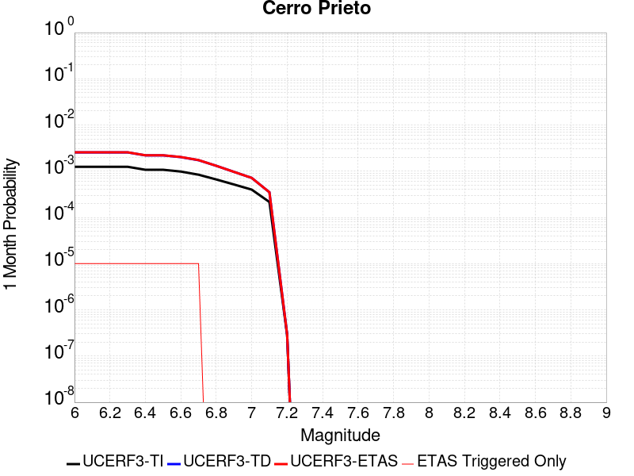 | 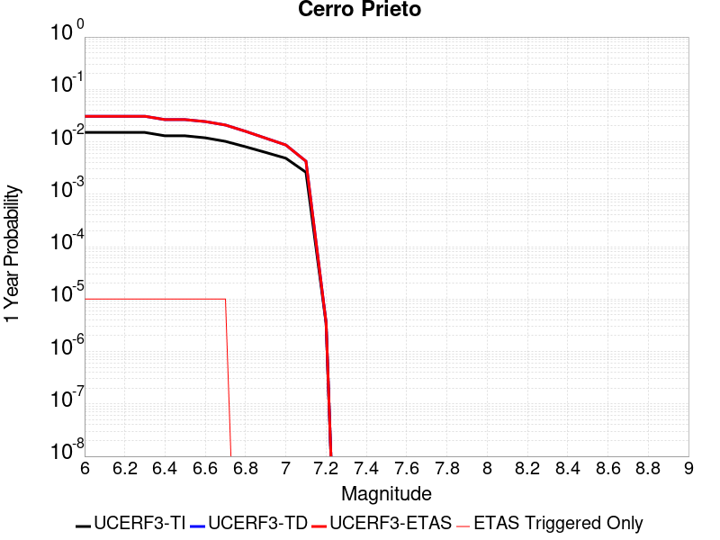 | 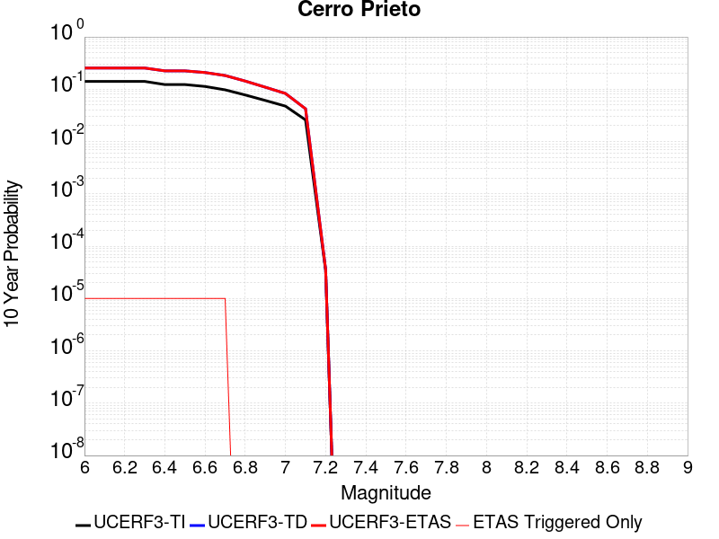 |

| Magnitude | 1 wk TI Prob | 1 wk TD Prob | 1 wk ETAS Prob | 1 wk ETAS/TD Gain | 1 wk ETAS Triggered Only | 1 mo TI Prob | 1 mo TD Prob | 1 mo ETAS Prob | 1 mo ETAS/TD Gain | 1 mo ETAS Triggered Only | 1 yr TI Prob | 1 yr TD Prob | 1 yr ETAS Prob | 1 yr ETAS/TD Gain | 1 yr ETAS Triggered Only | 10 yr TI Prob | 10 yr TD Prob | 10 yr ETAS Prob | 10 yr ETAS/TD Gain | 10 yr ETAS Triggered Only |
|-----|-----|-----|-----|-----|-----|-----|-----|-----|-----|-----|-----|-----|-----|-----|-----|-----|-----|-----|-----|-----|
| 6.0 | 2.9101528E-4 | 5.964804E-4 | 5.964804E-4 | 1.0 | 0.0 | 0.0012466122 | 0.002554082 | 0.0025640565 | 1.0039053 | 1.0E-5 | 0.015072231 | 0.03064807 | 0.030657765 | 1.0003163 | 1.0E-5 | 0.14089979 | 0.25397858 | 0.25398603 | 1.0000293 | 1.0E-5 |
| 6.1 | 2.9101528E-4 | 5.964804E-4 | 5.964804E-4 | 1.0 | 0.0 | 0.0012466122 | 0.002554082 | 0.0025640565 | 1.0039053 | 1.0E-5 | 0.015072231 | 0.03064807 | 0.030657765 | 1.0003163 | 1.0E-5 | 0.14089979 | 0.25397858 | 0.25398603 | 1.0000293 | 1.0E-5 |
| 6.2 | 2.9101528E-4 | 5.964804E-4 | 5.964804E-4 | 1.0 | 0.0 | 0.0012466122 | 0.002554082 | 0.0025640565 | 1.0039053 | 1.0E-5 | 0.015072231 | 0.03064807 | 0.030657765 | 1.0003163 | 1.0E-5 | 0.14089979 | 0.25397858 | 0.25398603 | 1.0000293 | 1.0E-5 |
| 6.3 | 2.9101528E-4 | 5.964804E-4 | 5.964804E-4 | 1.0 | 0.0 | 0.0012466122 | 0.002554082 | 0.0025640565 | 1.0039053 | 1.0E-5 | 0.015072231 | 0.03064807 | 0.030657765 | 1.0003163 | 1.0E-5 | 0.14089979 | 0.25397858 | 0.25398603 | 1.0000293 | 1.0E-5 |
| 6.4 | 2.508648E-4 | 5.1397446E-4 | 5.1397446E-4 | 1.0 | 0.0 | 0.0010746918 | 0.0022010866 | 0.0022110646 | 1.0045332 | 1.0E-5 | 0.013006088 | 0.026471792 | 0.026481528 | 1.0003678 | 1.0E-5 | 0.12270685 | 0.22440416 | 0.2244119 | 1.0000346 | 1.0E-5 |
| 6.5 | 2.508648E-4 | 5.1397446E-4 | 5.1397446E-4 | 1.0 | 0.0 | 0.0010746918 | 0.0022010866 | 0.0022110646 | 1.0045332 | 1.0E-5 | 0.013006088 | 0.026471792 | 0.026481528 | 1.0003678 | 1.0E-5 | 0.12270685 | 0.22440416 | 0.2244119 | 1.0000346 | 1.0E-5 |
| 6.6 | 2.294914E-4 | 4.7116808E-4 | 4.7116808E-4 | 1.0 | 0.0 | 9.831638E-4 | 0.0020179166 | 0.0020278965 | 1.0049456 | 1.0E-5 | 0.011904482 | 0.02429866 | 0.024308417 | 1.0004015 | 1.0E-5 | 0.11286586 | 0.20858558 | 0.20859349 | 1.0000379 | 1.0E-5 |
| 6.7 | 1.9621674E-4 | 4.0419117E-4 | 4.0419117E-4 | 1.0 | 0.0 | 8.4065786E-4 | 0.0017312564 | 0.001741239 | 1.0057662 | 1.0E-5 | 0.010187071 | 0.020884845 | 0.020894635 | 1.0004689 | 1.0E-5 | 0.09732539 | 0.18290249 | 0.18291067 | 1.0000447 | 1.0E-5 |
| 6.8 | 1.5476145E-4 | 3.056516E-4 | 3.056516E-4 | 1.0 | 0.0 | 6.6309475E-4 | 0.00130938 | 0.00130938 | 1.0 | 0.0 | 0.008043335 | 0.015836509 | 0.015836509 | 1.0 | 0.0 | 0.07758363 | 0.14336355 | 0.14336355 | 1.0 | 0.0 |
| 6.9 | 1.20509176E-4 | 2.2582515E-4 | 2.2582515E-4 | 1.0 | 0.0 | 5.1636563E-4 | 9.6752634E-4 | 9.6752634E-4 | 1.0 | 0.0 | 0.006268645 | 0.011726342 | 0.011726342 | 1.0 | 0.0 | 0.060947374 | 0.109451205 | 0.109451205 | 1.0 | 0.0 |
| 7.0 | 9.3269155E-5 | 1.6716642E-4 | 1.6716642E-4 | 1.0 | 0.0 | 3.9966372E-4 | 7.162739E-4 | 7.162739E-4 | 1.0 | 0.0 | 0.0048550544 | 0.008693418 | 0.008693418 | 1.0 | 0.0 | 0.04750344 | 0.08315912 | 0.08315912 | 1.0 | 0.0 |
| 7.1 | 5.029709E-5 | 8.1718936E-5 | 8.1718936E-5 | 1.0 | 0.0 | 2.1554115E-4 | 3.5019626E-4 | 3.5019626E-4 | 1.0 | 0.0 | 0.0026210553 | 0.0042587193 | 0.0042587193 | 1.0 | 0.0 | 0.025903556 | 0.042365108 | 0.042365108 | 1.0 | 0.0 |
| 7.2 | 6.5445185E-8 | 6.814903E-8 | 6.814903E-8 | 1.0 | 0.0 | 2.8047933E-7 | 2.9206726E-7 | 2.9206726E-7 | 1.0 | 0.0 | 3.4148304E-6 | 3.555919E-6 | 3.555919E-6 | 1.0 | 0.0 | 3.414778E-5 | 3.5559187E-5 | 3.5559187E-5 | 1.0 | 0.0 |

## Pitas Point (Lower)-Montalvo
*[(top)](#table-of-contents)*

| 1 Week | 1 Month | 1 Year | 10 Year |
|-----|-----|-----|-----|
|  |  |  |  |

| Magnitude | 1 wk TI Prob | 1 wk TD Prob | 1 wk ETAS Prob | 1 wk ETAS/TD Gain | 1 wk ETAS Triggered Only | 1 mo TI Prob | 1 mo TD Prob | 1 mo ETAS Prob | 1 mo ETAS/TD Gain | 1 mo ETAS Triggered Only | 1 yr TI Prob | 1 yr TD Prob | 1 yr ETAS Prob | 1 yr ETAS/TD Gain | 1 yr ETAS Triggered Only | 10 yr TI Prob | 10 yr TD Prob | 10 yr ETAS Prob | 10 yr ETAS/TD Gain | 10 yr ETAS Triggered Only |
|-----|-----|-----|-----|-----|-----|-----|-----|-----|-----|-----|-----|-----|-----|-----|-----|-----|-----|-----|-----|-----|
| 6.0 | 5.2543637E-6 | 4.8378706E-6 | 4.8378706E-6 | 1.0 | 0.0 | 2.2518509E-5 | 2.0733567E-5 | 2.0733567E-5 | 1.0 | 0.0 | 2.7412834E-4 | 2.5240227E-4 | 2.5240227E-4 | 1.0 | 0.0 | 0.0027379042 | 0.0025211885 | 0.0025311632 | 1.0039564 | 1.0E-5 |
| 6.1 | 5.2543637E-6 | 4.8378706E-6 | 4.8378706E-6 | 1.0 | 0.0 | 2.2518509E-5 | 2.0733567E-5 | 2.0733567E-5 | 1.0 | 0.0 | 2.7412834E-4 | 2.5240227E-4 | 2.5240227E-4 | 1.0 | 0.0 | 0.0027379042 | 0.0025211885 | 0.0025311632 | 1.0039564 | 1.0E-5 |
| 6.2 | 5.2543637E-6 | 4.8378706E-6 | 4.8378706E-6 | 1.0 | 0.0 | 2.2518509E-5 | 2.0733567E-5 | 2.0733567E-5 | 1.0 | 0.0 | 2.7412834E-4 | 2.5240227E-4 | 2.5240227E-4 | 1.0 | 0.0 | 0.0027379042 | 0.0025211885 | 0.0025311632 | 1.0039564 | 1.0E-5 |
| 6.3 | 5.2543637E-6 | 4.8378706E-6 | 4.8378706E-6 | 1.0 | 0.0 | 2.2518509E-5 | 2.0733567E-5 | 2.0733567E-5 | 1.0 | 0.0 | 2.7412834E-4 | 2.5240227E-4 | 2.5240227E-4 | 1.0 | 0.0 | 0.0027379042 | 0.0025211885 | 0.0025311632 | 1.0039564 | 1.0E-5 |
| 6.4 | 5.2543637E-6 | 4.8378706E-6 | 4.8378706E-6 | 1.0 | 0.0 | 2.2518509E-5 | 2.0733567E-5 | 2.0733567E-5 | 1.0 | 0.0 | 2.7412834E-4 | 2.5240227E-4 | 2.5240227E-4 | 1.0 | 0.0 | 0.0027379042 | 0.0025211885 | 0.0025311632 | 1.0039564 | 1.0E-5 |
| 6.5 | 5.2543637E-6 | 4.8378706E-6 | 4.8378706E-6 | 1.0 | 0.0 | 2.2518509E-5 | 2.0733567E-5 | 2.0733567E-5 | 1.0 | 0.0 | 2.7412834E-4 | 2.5240227E-4 | 2.5240227E-4 | 1.0 | 0.0 | 0.0027379042 | 0.0025211885 | 0.0025311632 | 1.0039564 | 1.0E-5 |
| 6.6 | 5.2543637E-6 | 4.8378706E-6 | 4.8378706E-6 | 1.0 | 0.0 | 2.2518509E-5 | 2.0733567E-5 | 2.0733567E-5 | 1.0 | 0.0 | 2.7412834E-4 | 2.5240227E-4 | 2.5240227E-4 | 1.0 | 0.0 | 0.0027379042 | 0.0025211885 | 0.0025311632 | 1.0039564 | 1.0E-5 |
| 6.7 | 5.2543637E-6 | 4.8378706E-6 | 4.8378706E-6 | 1.0 | 0.0 | 2.2518509E-5 | 2.0733567E-5 | 2.0733567E-5 | 1.0 | 0.0 | 2.7412834E-4 | 2.5240227E-4 | 2.5240227E-4 | 1.0 | 0.0 | 0.0027379042 | 0.0025211885 | 0.0025311632 | 1.0039564 | 1.0E-5 |
| 6.8 | 5.2543637E-6 | 4.8378706E-6 | 4.8378706E-6 | 1.0 | 0.0 | 2.2518509E-5 | 2.0733567E-5 | 2.0733567E-5 | 1.0 | 0.0 | 2.7412834E-4 | 2.5240227E-4 | 2.5240227E-4 | 1.0 | 0.0 | 0.0027379042 | 0.0025211885 | 0.0025311632 | 1.0039564 | 1.0E-5 |
| 6.9 | 5.2543637E-6 | 4.8378706E-6 | 4.8378706E-6 | 1.0 | 0.0 | 2.2518509E-5 | 2.0733567E-5 | 2.0733567E-5 | 1.0 | 0.0 | 2.7412834E-4 | 2.5240227E-4 | 2.5240227E-4 | 1.0 | 0.0 | 0.0027379042 | 0.0025211885 | 0.0025311632 | 1.0039564 | 1.0E-5 |
| 7.0 | 5.2543637E-6 | 4.8378706E-6 | 4.8378706E-6 | 1.0 | 0.0 | 2.2518509E-5 | 2.0733567E-5 | 2.0733567E-5 | 1.0 | 0.0 | 2.7412834E-4 | 2.5240227E-4 | 2.5240227E-4 | 1.0 | 0.0 | 0.0027379042 | 0.0025211885 | 0.0025311632 | 1.0039564 | 1.0E-5 |
| 7.1 | 5.2543637E-6 | 4.8378706E-6 | 4.8378706E-6 | 1.0 | 0.0 | 2.2518509E-5 | 2.0733567E-5 | 2.0733567E-5 | 1.0 | 0.0 | 2.7412834E-4 | 2.5240227E-4 | 2.5240227E-4 | 1.0 | 0.0 | 0.0027379042 | 0.0025211885 | 0.0025311632 | 1.0039564 | 1.0E-5 |
| 7.2 | 5.2458695E-6 | 4.8290244E-6 | 4.8290244E-6 | 1.0 | 0.0 | 2.2482105E-5 | 2.0695656E-5 | 2.0695656E-5 | 1.0 | 0.0 | 2.7368523E-4 | 2.519408E-4 | 2.519408E-4 | 1.0 | 0.0 | 0.0027334841 | 0.0025165842 | 0.002526559 | 1.0039636 | 1.0E-5 |
| 7.3 | 5.22665E-6 | 4.8089414E-6 | 4.8089414E-6 | 1.0 | 0.0 | 2.2399736E-5 | 2.0609588E-5 | 2.0609588E-5 | 1.0 | 0.0 | 2.7268266E-4 | 2.5089315E-4 | 2.5089315E-4 | 1.0 | 0.0 | 0.002723483 | 0.0025061315 | 0.0025161065 | 1.0039802 | 1.0E-5 |
| 7.4 | 5.210642E-6 | 4.792154E-6 | 4.792154E-6 | 1.0 | 0.0 | 2.233113E-5 | 2.0537642E-5 | 2.0537642E-5 | 1.0 | 0.0 | 2.718476E-4 | 2.5001742E-4 | 2.5001742E-4 | 1.0 | 0.0 | 0.002715153 | 0.0024973939 | 0.0025073688 | 1.0039942 | 1.0E-5 |
| 7.5 | 5.1226016E-6 | 4.7000403E-6 | 4.7000403E-6 | 1.0 | 0.0 | 2.1953823E-5 | 2.0142877E-5 | 2.0142877E-5 | 1.0 | 0.0 | 2.67255E-4 | 2.4521223E-4 | 2.4521223E-4 | 1.0 | 0.0 | 0.0026693381 | 0.0024494485 | 0.0024594238 | 1.0040725 | 1.0E-5 |
| 7.6 | 4.8796987E-6 | 4.4449403E-6 | 4.4449403E-6 | 1.0 | 0.0 | 2.0912828E-5 | 1.9049607E-5 | 1.9049607E-5 | 1.0 | 0.0 | 2.5458392E-4 | 2.3190459E-4 | 2.3190459E-4 | 1.0 | 0.0 | 0.0025429246 | 0.0023166565 | 0.0023266333 | 1.0043066 | 1.0E-5 |
| 7.7 | 4.0834398E-6 | 3.6091124E-6 | 3.6091124E-6 | 1.0 | 0.0 | 1.7500339E-5 | 1.5467534E-5 | 1.5467534E-5 | 1.0 | 0.0 | 2.1304579E-4 | 1.8830119E-4 | 1.8830119E-4 | 1.0 | 0.0 | 0.0021284167 | 0.00188144 | 0.0018914213 | 1.005305 | 1.0E-5 |
| 7.8 | 2.5445438E-6 | 2.121228E-6 | 2.121228E-6 | 1.0 | 0.0 | 1.0905142E-5 | 9.090945E-6 | 9.090945E-6 | 1.0 | 0.0 | 1.3276201E-4 | 1.1067669E-4 | 1.1067669E-4 | 1.0 | 0.0 | 0.0013268272 | 0.0011062203 | 0.0011162093 | 1.0090297 | 1.0E-5 |
| 7.9 | 4.1677114E-7 | 3.3293693E-7 | 3.3293693E-7 | 1.0 | 0.0 | 1.7861609E-6 | 1.4268718E-6 | 1.4268718E-6 | 1.0 | 0.0 | 2.1746291E-5 | 1.737203E-5 | 1.737203E-5 | 1.0 | 0.0 | 2.1744163E-4 | 1.7370703E-4 | 1.7370703E-4 | 1.0 | 0.0 |
| 8.0 | 7.791402E-9 | 5.683497E-9 | 5.683497E-9 | 1.0 | 0.0 | 3.3391725E-8 | 2.4357844E-8 | 2.4357844E-8 | 1.0 | 0.0 | 4.0654416E-7 | 2.9655675E-7 | 2.9655675E-7 | 1.0 | 0.0 | 4.065434E-6 | 2.9655655E-6 | 2.9655655E-6 | 1.0 | 0.0 |

## Del Valle
*[(top)](#table-of-contents)*

| 1 Week | 1 Month | 1 Year | 10 Year |
|-----|-----|-----|-----|
| 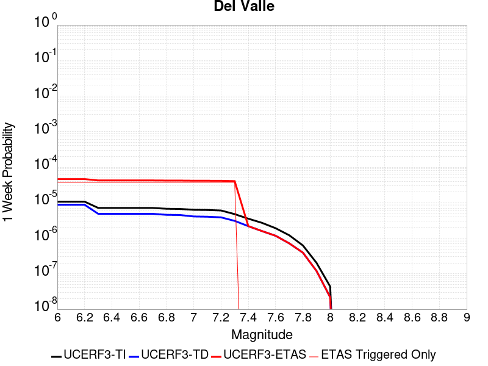 | 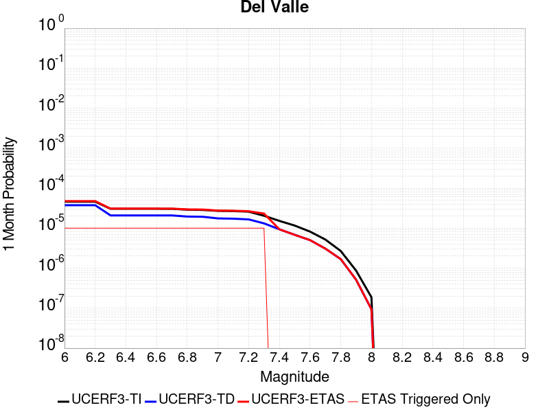 | 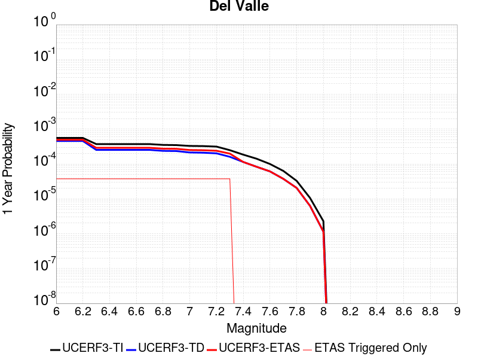 | 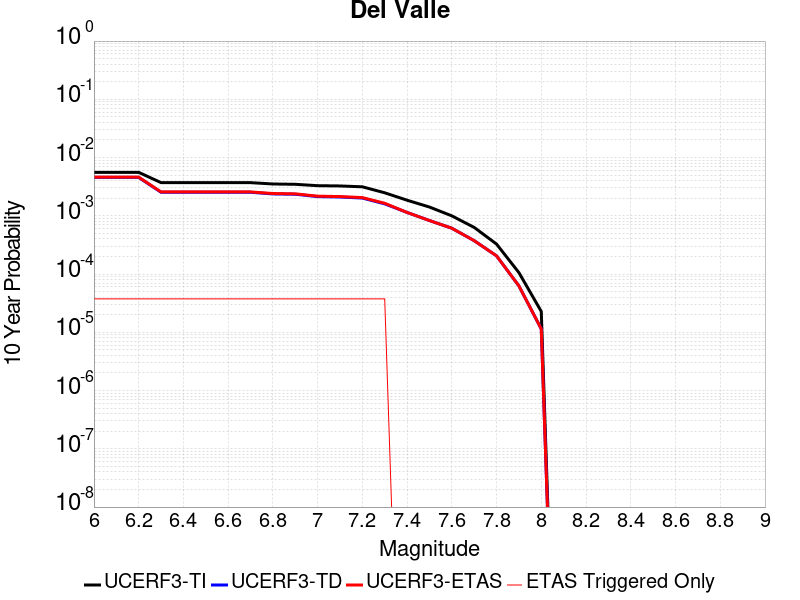 |

| Magnitude | 1 wk TI Prob | 1 wk TD Prob | 1 wk ETAS Prob | 1 wk ETAS/TD Gain | 1 wk ETAS Triggered Only | 1 mo TI Prob | 1 mo TD Prob | 1 mo ETAS Prob | 1 mo ETAS/TD Gain | 1 mo ETAS Triggered Only | 1 yr TI Prob | 1 yr TD Prob | 1 yr ETAS Prob | 1 yr ETAS/TD Gain | 1 yr ETAS Triggered Only | 10 yr TI Prob | 10 yr TD Prob | 10 yr ETAS Prob | 10 yr ETAS/TD Gain | 10 yr ETAS Triggered Only |
|-----|-----|-----|-----|-----|-----|-----|-----|-----|-----|-----|-----|-----|-----|-----|-----|-----|-----|-----|-----|-----|
| 6.0 | 1.0716125E-5 | 8.767882E-6 | 1.8767794E-5 | 2.1405163 | 1.0E-5 | 4.592544E-5 | 3.7576207E-5 | 4.757583E-5 | 1.2661159 | 1.0E-5 | 5.589988E-4 | 4.5741405E-4 | 4.6740947E-4 | 1.021852 | 1.0E-5 | 0.0055759475 | 0.00456668 | 0.0045766346 | 1.0021797 | 1.0E-5 |
| 6.1 | 1.0716125E-5 | 8.767882E-6 | 1.8767794E-5 | 2.1405163 | 1.0E-5 | 4.592544E-5 | 3.7576207E-5 | 4.757583E-5 | 1.2661159 | 1.0E-5 | 5.589988E-4 | 4.5741405E-4 | 4.6740947E-4 | 1.021852 | 1.0E-5 | 0.0055759475 | 0.00456668 | 0.0045766346 | 1.0021797 | 1.0E-5 |
| 6.2 | 1.0716125E-5 | 8.767882E-6 | 1.8767794E-5 | 2.1405163 | 1.0E-5 | 4.592544E-5 | 3.7576207E-5 | 4.757583E-5 | 1.2661159 | 1.0E-5 | 5.589988E-4 | 4.5741405E-4 | 4.6740947E-4 | 1.021852 | 1.0E-5 | 0.0055759475 | 0.00456668 | 0.0045766346 | 1.0021797 | 1.0E-5 |
| 6.3 | 7.1293784E-6 | 4.865823E-6 | 1.4865775E-5 | 3.0551407 | 1.0E-5 | 3.055412E-5 | 2.0853364E-5 | 3.0853156E-5 | 1.4795289 | 1.0E-5 | 3.7193293E-4 | 2.5386087E-4 | 2.6385832E-4 | 1.0393816 | 1.0E-5 | 0.0037131102 | 0.0025357946 | 0.0025457693 | 1.0039335 | 1.0E-5 |
| 6.4 | 7.1293784E-6 | 4.865823E-6 | 1.4865775E-5 | 3.0551407 | 1.0E-5 | 3.055412E-5 | 2.0853364E-5 | 3.0853156E-5 | 1.4795289 | 1.0E-5 | 3.7193293E-4 | 2.5386087E-4 | 2.6385832E-4 | 1.0393816 | 1.0E-5 | 0.0037131102 | 0.0025357946 | 0.0025457693 | 1.0039335 | 1.0E-5 |
| 6.5 | 7.1293784E-6 | 4.865823E-6 | 1.4865775E-5 | 3.0551407 | 1.0E-5 | 3.055412E-5 | 2.0853364E-5 | 3.0853156E-5 | 1.4795289 | 1.0E-5 | 3.7193293E-4 | 2.5386087E-4 | 2.6385832E-4 | 1.0393816 | 1.0E-5 | 0.0037131102 | 0.0025357946 | 0.0025457693 | 1.0039335 | 1.0E-5 |
| 6.6 | 7.1293784E-6 | 4.865823E-6 | 1.4865775E-5 | 3.0551407 | 1.0E-5 | 3.055412E-5 | 2.0853364E-5 | 3.0853156E-5 | 1.4795289 | 1.0E-5 | 3.7193293E-4 | 2.5386087E-4 | 2.6385832E-4 | 1.0393816 | 1.0E-5 | 0.0037131102 | 0.0025357946 | 0.0025457693 | 1.0039335 | 1.0E-5 |
| 6.7 | 7.12272E-6 | 4.8631987E-6 | 1.486315E-5 | 3.0562499 | 1.0E-5 | 3.0525585E-5 | 2.0842117E-5 | 3.0841908E-5 | 1.4797877 | 1.0E-5 | 3.7158563E-4 | 2.5372396E-4 | 2.6372142E-4 | 1.039403 | 1.0E-5 | 0.003709649 | 0.0025344288 | 0.0025444035 | 1.0039357 | 1.0E-5 |
| 6.8 | 6.7558703E-6 | 4.5594015E-6 | 1.4559356E-5 | 3.1932604 | 1.0E-5 | 2.895341E-5 | 1.9540148E-5 | 2.9539953E-5 | 1.5117568 | 1.0E-5 | 3.5245073E-4 | 2.3787597E-4 | 2.478736E-4 | 1.0420287 | 1.0E-5 | 0.0035189227 | 0.0023762889 | 0.002386265 | 1.0041982 | 1.0E-5 |
| 6.9 | 6.6700386E-6 | 4.502539E-6 | 1.4502494E-5 | 3.2209592 | 1.0E-5 | 2.8585566E-5 | 1.9296456E-5 | 2.9296263E-5 | 1.5182198 | 1.0E-5 | 3.479737E-4 | 2.3490966E-4 | 2.449073E-4 | 1.0425595 | 1.0E-5 | 0.003474293 | 0.0023466884 | 0.002356665 | 1.0042514 | 1.0E-5 |
| 7.0 | 6.3181424E-6 | 4.0987034E-6 | 1.4098662E-5 | 3.439786 | 1.0E-5 | 2.7077473E-5 | 1.7565755E-5 | 2.756558E-5 | 1.5692794 | 1.0E-5 | 3.2961834E-4 | 2.1384252E-4 | 2.2384037E-4 | 1.0467534 | 1.0E-5 | 0.0032912986 | 0.002136422 | 0.0021464007 | 1.0046707 | 1.0E-5 |
| 7.1 | 6.248759E-6 | 4.033895E-6 | 1.4033854E-5 | 3.4789836 | 1.0E-5 | 2.678012E-5 | 1.7288008E-5 | 2.7287835E-5 | 1.5784256 | 1.0E-5 | 3.2599916E-4 | 2.104616E-4 | 2.204595E-4 | 1.0475047 | 1.0E-5 | 0.0032552136 | 0.0021026772 | 0.0021126561 | 1.0047458 | 1.0E-5 |
| 7.2 | 6.0411944E-6 | 3.869888E-6 | 1.386985E-5 | 3.5840442 | 1.0E-5 | 2.5890577E-5 | 1.658513E-5 | 2.6584965E-5 | 1.6029397 | 1.0E-5 | 3.1517216E-4 | 2.0190567E-4 | 2.1190365E-4 | 1.0495181 | 1.0E-5 | 0.0031472554 | 0.0020172757 | 0.0020272555 | 1.0049472 | 1.0E-5 |
| 7.3 | 4.7691183E-6 | 3.0781202E-6 | 1.307809E-5 | 4.248726 | 1.0E-5 | 2.0438918E-5 | 1.3191879E-5 | 2.3191747E-5 | 1.7580321 | 1.0E-5 | 2.488154E-4 | 1.605995E-4 | 1.705979E-4 | 1.0622567 | 1.0E-5 | 0.00248537 | 0.0016048603 | 0.0016148442 | 1.006221 | 1.0E-5 |
| 7.4 | 3.5524722E-6 | 2.1893363E-6 | 2.1893363E-6 | 1.0 | 0.0 | 1.5224792E-5 | 9.382837E-6 | 9.382837E-6 | 1.0 | 0.0 | 1.8534607E-4 | 1.1423013E-4 | 1.1423013E-4 | 1.0 | 0.0 | 0.0018519156 | 0.0011417224 | 0.0011417224 | 1.0 | 0.0 |
| 7.5 | 2.7133442E-6 | 1.5916097E-6 | 1.5916097E-6 | 1.0 | 0.0 | 1.1628566E-5 | 6.821167E-6 | 6.821167E-6 | 1.0 | 0.0 | 1.415686E-4 | 8.304456E-5 | 8.304456E-5 | 1.0 | 0.0 | 0.0014147845 | 8.301372E-4 | 8.301372E-4 | 1.0 | 0.0 |
| 7.6 | 1.915338E-6 | 1.173914E-6 | 1.173914E-6 | 1.0 | 0.0 | 8.208566E-6 | 5.0310505E-6 | 5.0310505E-6 | 1.0 | 0.0 | 9.993471E-5 | 6.125133E-5 | 6.125133E-5 | 1.0 | 0.0 | 9.988978E-4 | 6.123454E-4 | 6.123454E-4 | 1.0 | 0.0 |
| 7.7 | 1.2120448E-6 | 7.180313E-7 | 7.180313E-7 | 1.0 | 0.0 | 5.194467E-6 | 3.0772733E-6 | 3.0772733E-6 | 1.0 | 0.0 | 6.3240805E-5 | 3.746516E-5 | 3.746516E-5 | 1.0 | 0.0 | 6.322281E-4 | 3.7458882E-4 | 3.7458882E-4 | 1.0 | 0.0 |
| 7.8 | 6.272381E-7 | 3.932549E-7 | 3.932549E-7 | 1.0 | 0.0 | 2.6881603E-6 | 1.6853771E-6 | 1.6853771E-6 | 1.0 | 0.0 | 3.272786E-5 | 2.0519275E-5 | 2.0519275E-5 | 1.0 | 0.0 | 3.272304E-4 | 2.0517396E-4 | 2.0517396E-4 | 1.0 | 0.0 |
| 7.9 | 2.0292627E-7 | 1.2004622E-7 | 1.2004622E-7 | 1.0 | 0.0 | 8.6968373E-7 | 5.1448376E-7 | 5.1448376E-7 | 1.0 | 0.0 | 1.0588348E-5 | 6.263822E-6 | 6.263822E-6 | 1.0 | 0.0 | 1.0587843E-4 | 6.263647E-5 | 6.263647E-5 | 1.0 | 0.0 |
| 8.0 | 4.374492E-8 | 2.189964E-8 | 2.189964E-8 | 1.0 | 0.0 | 1.8747821E-7 | 9.385559E-8 | 9.385559E-8 | 1.0 | 0.0 | 2.2825448E-6 | 1.1426913E-6 | 1.1426913E-6 | 1.0 | 0.0 | 2.2825214E-5 | 1.1426858E-5 | 1.1426858E-5 | 1.0 | 0.0 |

## Point Reyes 2011 CFM
*[(top)](#table-of-contents)*

| 1 Week | 1 Month | 1 Year | 10 Year |
|-----|-----|-----|-----|
| 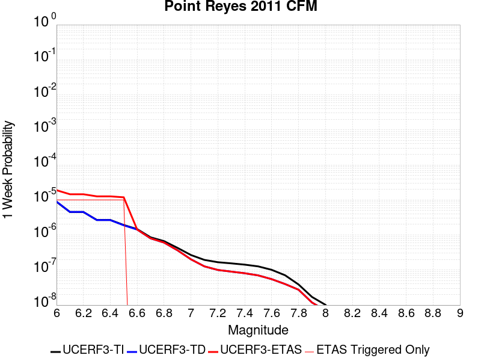 | 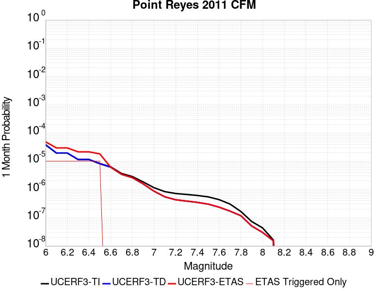 | 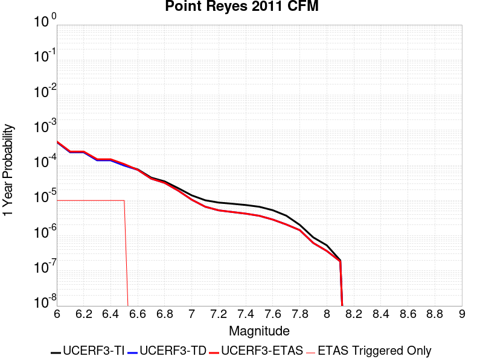 | 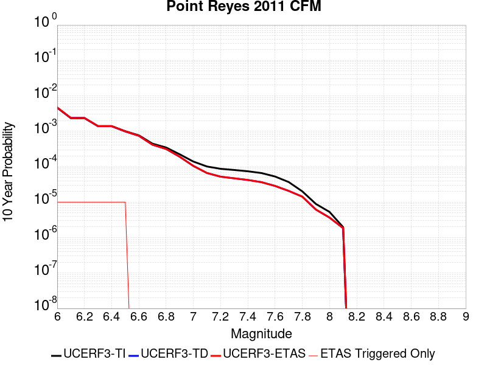 |

| Magnitude | 1 wk TI Prob | 1 wk TD Prob | 1 wk ETAS Prob | 1 wk ETAS/TD Gain | 1 wk ETAS Triggered Only | 1 mo TI Prob | 1 mo TD Prob | 1 mo ETAS Prob | 1 mo ETAS/TD Gain | 1 mo ETAS Triggered Only | 1 yr TI Prob | 1 yr TD Prob | 1 yr ETAS Prob | 1 yr ETAS/TD Gain | 1 yr ETAS Triggered Only | 10 yr TI Prob | 10 yr TD Prob | 10 yr ETAS Prob | 10 yr ETAS/TD Gain | 10 yr ETAS Triggered Only |
|-----|-----|-----|-----|-----|-----|-----|-----|-----|-----|-----|-----|-----|-----|-----|-----|-----|-----|-----|-----|-----|
| 6.0 | 8.8644965E-6 | 8.967163E-6 | 1.8967074E-5 | 2.1151698 | 1.0E-5 | 3.7990147E-5 | 3.843017E-5 | 4.8429785E-5 | 1.2602022 | 1.0E-5 | 4.624319E-4 | 4.6779314E-4 | 4.7778848E-4 | 1.021367 | 1.0E-5 | 0.0046147075 | 0.004668713 | 0.004678666 | 1.0021319 | 1.0E-5 |
| 6.1 | 4.526405E-6 | 4.5392185E-6 | 1.4539173E-5 | 3.2030125 | 1.0E-5 | 1.9398734E-5 | 1.9453653E-5 | 2.945346E-5 | 1.5140322 | 1.0E-5 | 2.36154E-4 | 2.3682354E-4 | 2.4682118E-4 | 1.0422156 | 1.0E-5 | 0.002359032 | 0.0023658178 | 0.002375794 | 1.0042169 | 1.0E-5 |
| 6.2 | 4.526405E-6 | 4.5392185E-6 | 1.4539173E-5 | 3.2030125 | 1.0E-5 | 1.9398734E-5 | 1.9453653E-5 | 2.945346E-5 | 1.5140322 | 1.0E-5 | 2.36154E-4 | 2.3682354E-4 | 2.4682118E-4 | 1.0422156 | 1.0E-5 | 0.002359032 | 0.0023658178 | 0.002375794 | 1.0042169 | 1.0E-5 |
| 6.3 | 2.6842322E-6 | 2.660676E-6 | 1.2660649E-5 | 4.7584333 | 1.0E-5 | 1.1503801E-5 | 1.1402849E-5 | 2.1402735E-5 | 1.8769639 | 1.0E-5 | 1.4004979E-4 | 1.3882104E-4 | 1.4881964E-4 | 1.0720252 | 1.0E-5 | 0.0013996155 | 0.0013873649 | 0.001397351 | 1.0071979 | 1.0E-5 |
| 6.4 | 2.6842322E-6 | 2.660676E-6 | 1.2660649E-5 | 4.7584333 | 1.0E-5 | 1.1503801E-5 | 1.1402849E-5 | 2.1402735E-5 | 1.8769639 | 1.0E-5 | 1.4004979E-4 | 1.3882104E-4 | 1.4881964E-4 | 1.0720252 | 1.0E-5 | 0.0013996155 | 0.0013873649 | 0.001397351 | 1.0071979 | 1.0E-5 |
| 6.5 | 1.9281833E-6 | 1.8906262E-6 | 1.1890607E-5 | 6.2892427 | 1.0E-5 | 8.263617E-6 | 8.102659E-6 | 1.8102579E-5 | 2.2341528 | 1.0E-5 | 1.0060489E-4 | 9.86455E-5 | 1.0864451E-4 | 1.1013631 | 1.0E-5 | 0.0010055936 | 9.860279E-4 | 9.960181E-4 | 1.0101317 | 1.0E-5 |
| 6.6 | 1.4726726E-6 | 1.4269577E-6 | 1.4269577E-6 | 1.0 | 0.0 | 6.3114385E-6 | 6.1155188E-6 | 6.1155188E-6 | 1.0 | 0.0 | 7.683905E-5 | 7.445395E-5 | 7.445395E-5 | 1.0 | 0.0 | 7.6812494E-4 | 7.4429717E-4 | 7.4429717E-4 | 1.0 | 0.0 |
| 6.7 | 8.572307E-7 | 8.007212E-7 | 8.007212E-7 | 1.0 | 0.0 | 3.6738406E-6 | 3.431658E-6 | 3.431658E-6 | 1.0 | 0.0 | 4.472809E-5 | 4.1779647E-5 | 4.1779647E-5 | 1.0 | 0.0 | 4.471909E-4 | 4.1772184E-4 | 4.1772184E-4 | 1.0 | 0.0 |
| 6.8 | 6.6745434E-7 | 6.0773E-7 | 6.0773E-7 | 1.0 | 0.0 | 2.8605155E-6 | 2.6045543E-6 | 2.6045543E-6 | 1.0 | 0.0 | 3.482622E-5 | 3.171E-5 | 3.171E-5 | 1.0 | 0.0 | 3.4820763E-4 | 3.1705803E-4 | 3.1705803E-4 | 1.0 | 0.0 |
| 6.9 | 4.291521E-7 | 3.6535937E-7 | 3.6535937E-7 | 1.0 | 0.0 | 1.839222E-6 | 1.565825E-6 | 1.565825E-6 | 1.0 | 0.0 | 2.2392298E-5 | 1.9063755E-5 | 1.9063755E-5 | 1.0 | 0.0 | 2.2390042E-4 | 1.9062385E-4 | 1.9062385E-4 | 1.0 | 0.0 |
| 7.0 | 2.6812808E-7 | 2.0187414E-7 | 2.0187414E-7 | 1.0 | 0.0 | 1.1491198E-6 | 8.651746E-7 | 8.651746E-7 | 1.0 | 0.0 | 1.3990444E-5 | 1.0533451E-5 | 1.0533451E-5 | 1.0 | 0.0 | 1.3989564E-4 | 1.0533186E-4 | 1.0533186E-4 | 1.0 | 0.0 |
| 7.1 | 1.9451231E-7 | 1.2725499E-7 | 1.2725499E-7 | 1.0 | 0.0 | 8.336239E-7 | 5.453784E-7 | 5.453784E-7 | 1.0 | 0.0 | 1.0149324E-5 | 6.6399616E-6 | 6.6399616E-6 | 1.0 | 0.0 | 1.014886E-4 | 6.639991E-5 | 6.639991E-5 | 1.0 | 0.0 |
| 7.2 | 1.6715143E-7 | 1.00428394E-7 | 1.00428394E-7 | 1.0 | 0.0 | 7.1636305E-7 | 4.3040734E-7 | 4.3040734E-7 | 1.0 | 0.0 | 8.721685E-6 | 5.2401965E-6 | 5.2401965E-6 | 1.0 | 0.0 | 8.721343E-5 | 5.2402997E-5 | 5.2402997E-5 | 1.0 | 0.0 |
| 7.3 | 1.5503173E-7 | 9.0131024E-8 | 9.0131024E-8 | 1.0 | 0.0 | 6.644215E-7 | 3.8627576E-7 | 3.8627576E-7 | 1.0 | 0.0 | 8.089301E-6 | 4.702897E-6 | 4.702897E-6 | 1.0 | 0.0 | 8.089007E-5 | 4.7030244E-5 | 4.7030244E-5 | 1.0 | 0.0 |
| 7.4 | 1.4251614E-7 | 8.097624E-8 | 8.097624E-8 | 1.0 | 0.0 | 6.1078333E-7 | 3.47041E-7 | 3.47041E-7 | 1.0 | 0.0 | 7.4362615E-6 | 4.225216E-6 | 4.225216E-6 | 1.0 | 0.0 | 7.436013E-5 | 4.2253625E-5 | 4.2253625E-5 | 1.0 | 0.0 |
| 7.5 | 1.2710186E-7 | 7.0296394E-8 | 7.0296394E-8 | 1.0 | 0.0 | 5.447221E-7 | 3.0127023E-7 | 3.0127023E-7 | 1.0 | 0.0 | 6.6319717E-6 | 3.667959E-6 | 3.667959E-6 | 1.0 | 0.0 | 6.6317734E-5 | 3.6681253E-5 | 3.6681253E-5 | 1.0 | 0.0 |
| 7.6 | 1.0144708E-7 | 5.4952274E-8 | 5.4952274E-8 | 1.0 | 0.0 | 4.347731E-7 | 2.3550973E-7 | 2.3550973E-7 | 1.0 | 0.0 | 5.2933497E-6 | 2.8673273E-6 | 2.8673273E-6 | 1.0 | 0.0 | 5.293224E-5 | 2.8675171E-5 | 2.8675171E-5 | 1.0 | 0.0 |
| 7.7 | 7.090527E-8 | 3.98231E-8 | 3.98231E-8 | 1.0 | 0.0 | 3.038797E-7 | 1.7067042E-7 | 1.7067042E-7 | 1.0 | 0.0 | 3.699729E-6 | 2.0779103E-6 | 2.0779103E-6 | 1.0 | 0.0 | 3.6996673E-5 | 2.0781177E-5 | 2.0781177E-5 | 1.0 | 0.0 |
| 7.8 | 3.8712045E-8 | 2.7440025E-8 | 2.7440025E-8 | 1.0 | 0.0 | 1.6590876E-7 | 1.176001E-7 | 1.176001E-7 | 1.0 | 0.0 | 2.0199373E-6 | 1.4317802E-6 | 1.4317802E-6 | 1.0 | 0.0 | 2.0199188E-5 | 1.4319979E-5 | 1.4319979E-5 | 1.0 | 0.0 |
| 7.9 | 1.7068782E-8 | 1.1833354E-8 | 1.1833354E-8 | 1.0 | 0.0 | 7.315192E-8 | 5.0714362E-8 | 5.0714362E-8 | 1.0 | 0.0 | 8.906242E-7 | 6.174472E-7 | 6.174472E-7 | 1.0 | 0.0 | 8.906207E-6 | 6.1767228E-6 | 6.1767228E-6 | 1.0 | 0.0 |
| 8.0 | 1.0172592E-8 | 7.0280843E-9 | 7.0280843E-9 | 1.0 | 0.0 | 4.359682E-8 | 3.0120354E-8 | 3.0120354E-8 | 1.0 | 0.0 | 5.3079117E-7 | 3.6671526E-7 | 3.6671526E-7 | 1.0 | 0.0 | 5.307899E-6 | 3.6694146E-6 | 3.6694146E-6 | 1.0 | 0.0 |
| 8.1 | 3.7861243E-9 | 3.5452439E-9 | 3.5452439E-9 | 1.0 | 0.0 | 1.6226247E-8 | 1.5193901E-8 | 1.5193901E-8 | 1.0 | 0.0 | 1.9755454E-7 | 1.8498575E-7 | 1.8498575E-7 | 1.0 | 0.0 | 1.9755437E-6 | 1.8518531E-6 | 1.8518531E-6 | 1.0 | 0.0 |

## Hilton Creek 2011 CFM
*[(top)](#table-of-contents)*

| 1 Week | 1 Month | 1 Year | 10 Year |
|-----|-----|-----|-----|
| 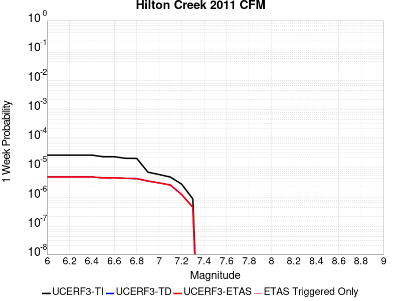 | 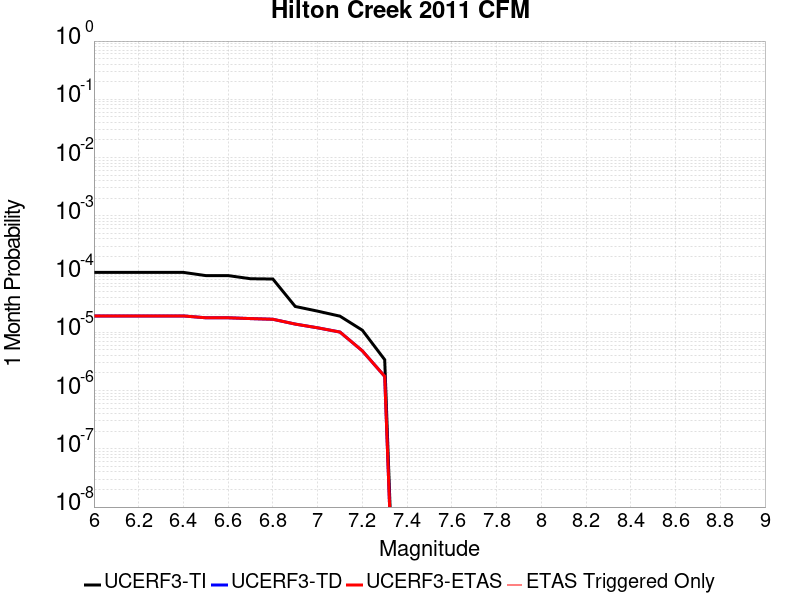 | 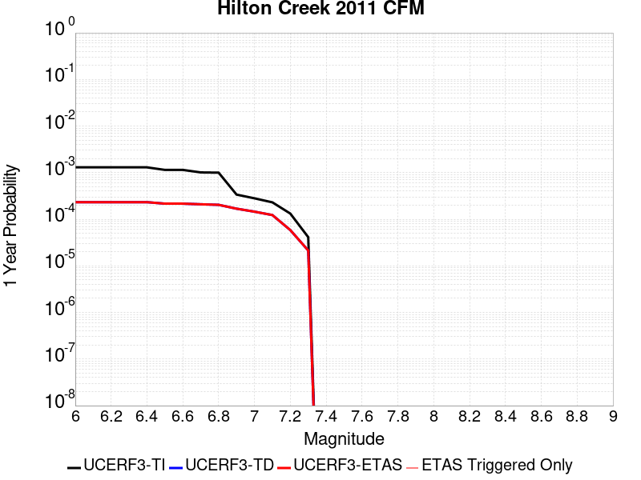 | 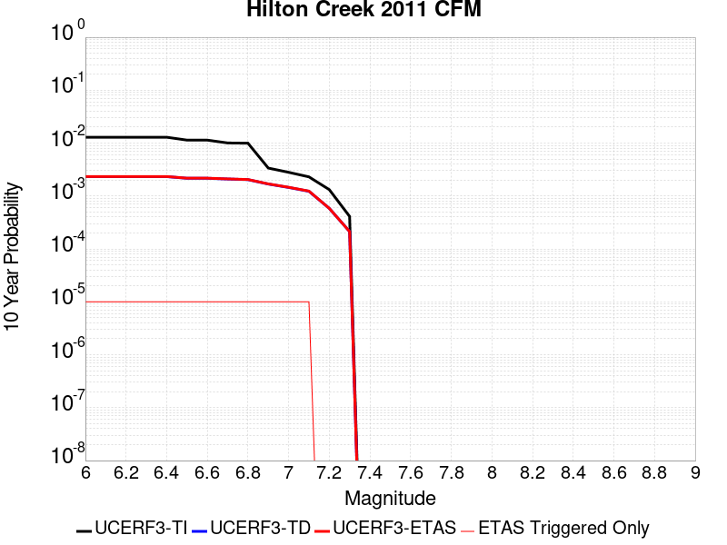 |

| Magnitude | 1 wk TI Prob | 1 wk TD Prob | 1 wk ETAS Prob | 1 wk ETAS/TD Gain | 1 wk ETAS Triggered Only | 1 mo TI Prob | 1 mo TD Prob | 1 mo ETAS Prob | 1 mo ETAS/TD Gain | 1 mo ETAS Triggered Only | 1 yr TI Prob | 1 yr TD Prob | 1 yr ETAS Prob | 1 yr ETAS/TD Gain | 1 yr ETAS Triggered Only | 10 yr TI Prob | 10 yr TD Prob | 10 yr ETAS Prob | 10 yr ETAS/TD Gain | 10 yr ETAS Triggered Only |
|-----|-----|-----|-----|-----|-----|-----|-----|-----|-----|-----|-----|-----|-----|-----|-----|-----|-----|-----|-----|-----|
| 6.0 | 2.4923684E-5 | 4.456762E-6 | 4.456762E-6 | 1.0 | 0.0 | 1.06811414E-4 | 1.9100278E-5 | 1.9100278E-5 | 1.0 | 0.0 | 0.0012996531 | 2.325227E-4 | 2.325227E-4 | 1.0 | 0.0 | 0.012920785 | 0.0023257772 | 0.002335754 | 1.0042896 | 1.0E-5 |
| 6.1 | 2.4923684E-5 | 4.456762E-6 | 4.456762E-6 | 1.0 | 0.0 | 1.06811414E-4 | 1.9100278E-5 | 1.9100278E-5 | 1.0 | 0.0 | 0.0012996531 | 2.325227E-4 | 2.325227E-4 | 1.0 | 0.0 | 0.012920785 | 0.0023257772 | 0.002335754 | 1.0042896 | 1.0E-5 |
| 6.2 | 2.4923684E-5 | 4.456762E-6 | 4.456762E-6 | 1.0 | 0.0 | 1.06811414E-4 | 1.9100278E-5 | 1.9100278E-5 | 1.0 | 0.0 | 0.0012996531 | 2.325227E-4 | 2.325227E-4 | 1.0 | 0.0 | 0.012920785 | 0.0023257772 | 0.002335754 | 1.0042896 | 1.0E-5 |
| 6.3 | 2.4923684E-5 | 4.456762E-6 | 4.456762E-6 | 1.0 | 0.0 | 1.06811414E-4 | 1.9100278E-5 | 1.9100278E-5 | 1.0 | 0.0 | 0.0012996531 | 2.325227E-4 | 2.325227E-4 | 1.0 | 0.0 | 0.012920785 | 0.0023257772 | 0.002335754 | 1.0042896 | 1.0E-5 |
| 6.4 | 2.4923684E-5 | 4.456762E-6 | 4.456762E-6 | 1.0 | 0.0 | 1.06811414E-4 | 1.9100278E-5 | 1.9100278E-5 | 1.0 | 0.0 | 0.0012996531 | 2.325227E-4 | 2.325227E-4 | 1.0 | 0.0 | 0.012920785 | 0.0023257772 | 0.002335754 | 1.0042896 | 1.0E-5 |
| 6.5 | 2.1963904E-5 | 4.1443413E-6 | 4.1443413E-6 | 1.0 | 0.0 | 9.412762E-5 | 1.7761351E-5 | 1.7761351E-5 | 1.0 | 0.0 | 0.0011454013 | 2.162245E-4 | 2.162245E-4 | 1.0 | 0.0 | 0.011395155 | 0.002162927 | 0.0021729055 | 1.0046134 | 1.0E-5 |
| 6.6 | 2.1963904E-5 | 4.1443413E-6 | 4.1443413E-6 | 1.0 | 0.0 | 9.412762E-5 | 1.7761351E-5 | 1.7761351E-5 | 1.0 | 0.0 | 0.0011454013 | 2.162245E-4 | 2.162245E-4 | 1.0 | 0.0 | 0.011395155 | 0.002162927 | 0.0021729055 | 1.0046134 | 1.0E-5 |
| 6.7 | 1.9397496E-5 | 4.0143746E-6 | 4.0143746E-6 | 1.0 | 0.0 | 8.3129475E-5 | 1.7204358E-5 | 1.7204358E-5 | 1.0 | 0.0 | 0.0010116313 | 2.094444E-4 | 2.094444E-4 | 1.0 | 0.0 | 0.0100703845 | 0.0020949803 | 0.0021049595 | 1.0047634 | 1.0E-5 |
| 6.8 | 1.917303E-5 | 3.907314E-6 | 3.907314E-6 | 1.0 | 0.0 | 8.216754E-5 | 1.6745531E-5 | 1.6745531E-5 | 1.0 | 0.0 | 9.999307E-4 | 2.0385924E-4 | 2.0385924E-4 | 1.0 | 0.0 | 0.009954433 | 0.0020392318 | 0.0020492114 | 1.0048938 | 1.0E-5 |
| 6.9 | 6.480681E-6 | 3.2317153E-6 | 3.2317153E-6 | 1.0 | 0.0 | 2.7774051E-5 | 1.3850141E-5 | 1.3850141E-5 | 1.0 | 0.0 | 3.380966E-4 | 1.6861355E-4 | 1.6861355E-4 | 1.0 | 0.0 | 0.0033758266 | 0.0016849673 | 0.0016949504 | 1.0059248 | 1.0E-5 |
| 7.0 | 5.388316E-6 | 2.788372E-6 | 2.788372E-6 | 1.0 | 0.0 | 2.3092578E-5 | 1.1950117E-5 | 1.1950117E-5 | 1.0 | 0.0 | 2.8111585E-4 | 1.4548401E-4 | 1.4548401E-4 | 1.0 | 0.0 | 0.002807605 | 0.0014539903 | 0.0014639758 | 1.0068676 | 1.0E-5 |
| 7.1 | 4.41728E-6 | 2.3575074E-6 | 2.3575074E-6 | 1.0 | 0.0 | 1.8931061E-5 | 1.0103569E-5 | 1.0103569E-5 | 1.0 | 0.0 | 2.304613E-4 | 1.23005E-4 | 1.23005E-4 | 1.0 | 0.0 | 0.0023022245 | 0.0012294657 | 0.0012394533 | 1.0081236 | 1.0E-5 |
| 7.2 | 2.535495E-6 | 1.1208391E-6 | 1.1208391E-6 | 1.0 | 0.0 | 1.0866362E-5 | 4.8035904E-6 | 4.8035904E-6 | 1.0 | 0.0 | 1.3228992E-4 | 5.8482667E-5 | 5.8482667E-5 | 1.0 | 0.0 | 0.0013221119 | 5.84724E-4 | 5.84724E-4 | 1.0 | 0.0 |
| 7.3 | 7.900015E-7 | 4.0889498E-7 | 4.0889498E-7 | 1.0 | 0.0 | 3.3857161E-6 | 1.752407E-6 | 1.752407E-6 | 1.0 | 0.0 | 4.1220315E-5 | 2.1335554E-5 | 2.1335554E-5 | 1.0 | 0.0 | 4.121267E-4 | 2.1335555E-4 | 2.1335555E-4 | 1.0 | 0.0 |

## San Luis Range - Pecho 2011 CFM
*[(top)](#table-of-contents)*

| 1 Week | 1 Month | 1 Year | 10 Year |
|-----|-----|-----|-----|
| 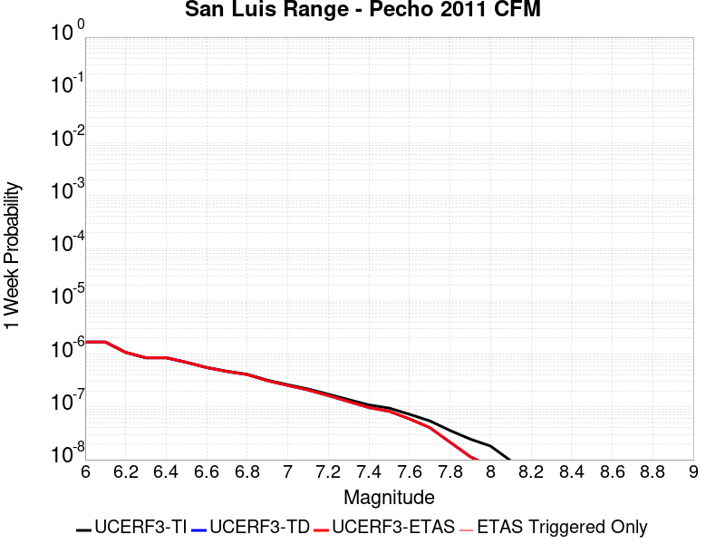 | 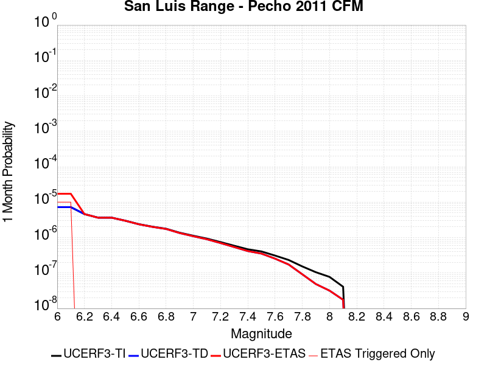 |  | 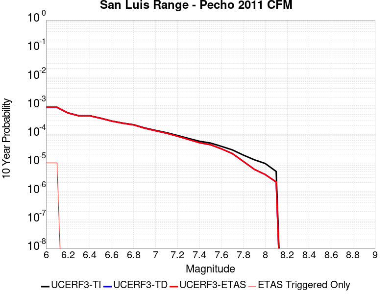 |

| Magnitude | 1 wk TI Prob | 1 wk TD Prob | 1 wk ETAS Prob | 1 wk ETAS/TD Gain | 1 wk ETAS Triggered Only | 1 mo TI Prob | 1 mo TD Prob | 1 mo ETAS Prob | 1 mo ETAS/TD Gain | 1 mo ETAS Triggered Only | 1 yr TI Prob | 1 yr TD Prob | 1 yr ETAS Prob | 1 yr ETAS/TD Gain | 1 yr ETAS Triggered Only | 10 yr TI Prob | 10 yr TD Prob | 10 yr ETAS Prob | 10 yr ETAS/TD Gain | 10 yr ETAS Triggered Only |
|-----|-----|-----|-----|-----|-----|-----|-----|-----|-----|-----|-----|-----|-----|-----|-----|-----|-----|-----|-----|-----|
| 6.0 | 1.687423E-6 | 1.6921945E-6 | 1.6921945E-6 | 1.0 | 0.0 | 7.231793E-6 | 7.252243E-6 | 1.725217E-5 | 2.3788738 | 1.0E-5 | 8.804352E-5 | 8.829273E-5 | 9.829184E-5 | 1.1132497 | 1.0E-5 | 8.8008645E-4 | 8.826004E-4 | 8.9259155E-4 | 1.0113201 | 1.0E-5 |
| 6.1 | 1.687423E-6 | 1.6921945E-6 | 1.6921945E-6 | 1.0 | 0.0 | 7.231793E-6 | 7.252243E-6 | 1.725217E-5 | 2.3788738 | 1.0E-5 | 8.804352E-5 | 8.829273E-5 | 9.829184E-5 | 1.1132497 | 1.0E-5 | 8.8008645E-4 | 8.826004E-4 | 8.9259155E-4 | 1.0113201 | 1.0E-5 |
| 6.2 | 1.0765672E-6 | 1.0770541E-6 | 1.0770541E-6 | 1.0 | 0.0 | 4.613851E-6 | 4.6159385E-6 | 4.6159385E-6 | 1.0 | 0.0 | 5.617219E-5 | 5.6197663E-5 | 5.6197663E-5 | 1.0 | 0.0 | 5.6157995E-4 | 5.618408E-4 | 5.618408E-4 | 1.0 | 0.0 |
| 6.3 | 8.523104E-7 | 8.513022E-7 | 8.513022E-7 | 1.0 | 0.0 | 3.6527538E-6 | 3.6484332E-6 | 3.6484332E-6 | 1.0 | 0.0 | 4.447137E-5 | 4.44188E-5 | 4.44188E-5 | 1.0 | 0.0 | 4.4462472E-4 | 4.4410242E-4 | 4.4410242E-4 | 1.0 | 0.0 |
| 6.4 | 8.523104E-7 | 8.513022E-7 | 8.513022E-7 | 1.0 | 0.0 | 3.6527538E-6 | 3.6484332E-6 | 3.6484332E-6 | 1.0 | 0.0 | 4.447137E-5 | 4.44188E-5 | 4.44188E-5 | 1.0 | 0.0 | 4.4462472E-4 | 4.4410242E-4 | 4.4410242E-4 | 1.0 | 0.0 |
| 6.5 | 7.0029404E-7 | 6.976439E-7 | 6.976439E-7 | 1.0 | 0.0 | 3.0012568E-6 | 2.989899E-6 | 2.989899E-6 | 1.0 | 0.0 | 3.6539688E-5 | 3.640143E-5 | 3.640143E-5 | 1.0 | 0.0 | 3.653368E-4 | 3.6395635E-4 | 3.6395635E-4 | 1.0 | 0.0 |
| 6.6 | 5.583906E-7 | 5.54283E-7 | 5.54283E-7 | 1.0 | 0.0 | 2.3931002E-6 | 2.3754965E-6 | 2.3754965E-6 | 1.0 | 0.0 | 2.9135606E-5 | 2.8921293E-5 | 2.8921293E-5 | 1.0 | 0.0 | 2.9131788E-4 | 2.8917604E-4 | 2.8917604E-4 | 1.0 | 0.0 |
| 6.7 | 4.73441E-7 | 4.6830664E-7 | 4.6830664E-7 | 1.0 | 0.0 | 2.0290313E-6 | 2.007027E-6 | 2.007027E-6 | 1.0 | 0.0 | 2.4703175E-5 | 2.4435283E-5 | 2.4435283E-5 | 1.0 | 0.0 | 2.470043E-4 | 2.4432642E-4 | 2.4432642E-4 | 1.0 | 0.0 |
| 6.8 | 4.1466086E-7 | 4.0877956E-7 | 4.0877956E-7 | 1.0 | 0.0 | 1.7771167E-6 | 1.7519112E-6 | 1.7519112E-6 | 1.0 | 0.0 | 2.1636182E-5 | 2.1329313E-5 | 2.1329313E-5 | 1.0 | 0.0 | 2.1634075E-4 | 2.13273E-4 | 2.13273E-4 | 1.0 | 0.0 |
| 6.9 | 3.2056641E-7 | 3.1329304E-7 | 3.1329304E-7 | 1.0 | 0.0 | 1.3738553E-6 | 1.3426838E-6 | 1.3426838E-6 | 1.0 | 0.0 | 1.6726559E-5 | 1.6347054E-5 | 1.6347054E-5 | 1.0 | 0.0 | 1.67253E-4 | 1.6345867E-4 | 1.6345867E-4 | 1.0 | 0.0 |
| 7.0 | 2.6315942E-7 | 2.548968E-7 | 2.548968E-7 | 1.0 | 0.0 | 1.1278256E-6 | 1.0924143E-6 | 1.0924143E-6 | 1.0 | 0.0 | 1.3731191E-5 | 1.3300064E-5 | 1.3300064E-5 | 1.0 | 0.0 | 1.3730342E-4 | 1.3299276E-4 | 1.3299276E-4 | 1.0 | 0.0 |
| 7.1 | 2.1832436E-7 | 2.0917318E-7 | 2.0917318E-7 | 1.0 | 0.0 | 9.356755E-7 | 8.964562E-7 | 8.964562E-7 | 1.0 | 0.0 | 1.13917895E-5 | 1.0914299E-5 | 1.0914299E-5 | 1.0 | 0.0 | 1.1391206E-4 | 1.0913769E-4 | 1.0913769E-4 | 1.0 | 0.0 |
| 7.2 | 1.7393015E-7 | 1.6376598E-7 | 1.6376598E-7 | 1.0 | 0.0 | 7.454147E-7 | 7.0185393E-7 | 7.0185393E-7 | 1.0 | 0.0 | 9.075386E-6 | 8.545038E-6 | 8.545038E-6 | 1.0 | 0.0 | 9.075015E-5 | 8.544713E-5 | 8.544713E-5 | 1.0 | 0.0 |
| 7.3 | 1.3744894E-7 | 1.2638625E-7 | 1.2638625E-7 | 1.0 | 0.0 | 5.890667E-7 | 5.4165525E-7 | 5.4165525E-7 | 1.0 | 0.0 | 7.1718637E-6 | 6.5946324E-6 | 6.5946324E-6 | 1.0 | 0.0 | 7.171632E-5 | 6.594438E-5 | 6.594438E-5 | 1.0 | 0.0 |
| 7.4 | 1.0915278E-7 | 9.72754E-8 | 9.72754E-8 | 1.0 | 0.0 | 4.6779755E-7 | 4.1689447E-7 | 4.1689447E-7 | 1.0 | 0.0 | 5.6954204E-6 | 5.0756785E-6 | 5.0756785E-6 | 1.0 | 0.0 | 5.6952744E-5 | 5.0755632E-5 | 5.0755632E-5 | 1.0 | 0.0 |
| 7.5 | 9.490291E-8 | 8.257137E-8 | 8.257137E-8 | 1.0 | 0.0 | 4.0672668E-7 | 3.5387725E-7 | 3.5387725E-7 | 1.0 | 0.0 | 4.9518862E-6 | 4.308447E-6 | 4.308447E-6 | 1.0 | 0.0 | 4.951776E-5 | 4.308364E-5 | 4.308364E-5 | 1.0 | 0.0 |
| 7.6 | 7.256678E-8 | 5.9425346E-8 | 5.9425346E-8 | 1.0 | 0.0 | 3.1100043E-7 | 2.5468003E-7 | 2.5468003E-7 | 1.0 | 0.0 | 3.7864236E-6 | 3.1007248E-6 | 3.1007248E-6 | 1.0 | 0.0 | 3.7863592E-5 | 3.100682E-5 | 3.100682E-5 | 1.0 | 0.0 |
| 7.7 | 5.446273E-8 | 4.0579426E-8 | 4.0579426E-8 | 1.0 | 0.0 | 2.3341168E-7 | 1.739118E-7 | 1.739118E-7 | 1.0 | 0.0 | 2.8417835E-6 | 2.1173742E-6 | 2.1173742E-6 | 1.0 | 0.0 | 2.8417471E-5 | 2.117354E-5 | 2.117354E-5 | 1.0 | 0.0 |
| 7.8 | 3.5850867E-8 | 2.1520547E-8 | 2.1520547E-8 | 1.0 | 0.0 | 1.5364655E-7 | 9.2230906E-8 | 9.2230906E-8 | 1.0 | 0.0 | 1.8706452E-6 | 1.1229107E-6 | 1.1229107E-6 | 1.0 | 0.0 | 1.8706294E-5 | 1.1229051E-5 | 1.1229051E-5 | 1.0 | 0.0 |
| 7.9 | 2.45879E-8 | 1.1394765E-8 | 1.1394765E-8 | 1.0 | 0.0 | 1.0537671E-7 | 4.88347E-8 | 4.88347E-8 | 1.0 | 0.0 | 1.2829606E-6 | 5.945623E-7 | 5.945623E-7 | 1.0 | 0.0 | 1.2829532E-5 | 5.9456074E-6 | 5.9456074E-6 | 1.0 | 0.0 |
| 8.0 | 1.8151761E-8 | 7.4411712E-9 | 7.4411712E-9 | 1.0 | 0.0 | 7.779326E-8 | 3.1890732E-8 | 3.1890732E-8 | 1.0 | 0.0 | 9.4713255E-7 | 3.882696E-7 | 3.882696E-7 | 1.0 | 0.0 | 9.471285E-6 | 3.8826893E-6 | 3.8826893E-6 | 1.0 | 0.0 |
| 8.1 | 9.559205E-9 | 4.1004897E-9 | 4.1004897E-9 | 1.0 | 0.0 | 4.096802E-8 | 1.7573525E-8 | 1.7573525E-8 | 1.0 | 0.0 | 4.9878554E-7 | 2.1395765E-7 | 2.1395765E-7 | 1.0 | 0.0 | 4.987844E-6 | 2.1395745E-6 | 2.1395745E-6 | 1.0 | 0.0 |

## Hat Creek-McArthur-Mayfield
*[(top)](#table-of-contents)*

| 1 Week | 1 Month | 1 Year | 10 Year |
|-----|-----|-----|-----|
| 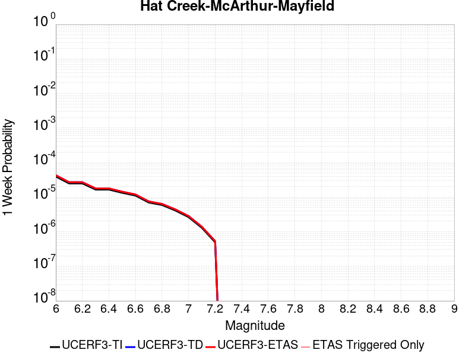 |  | 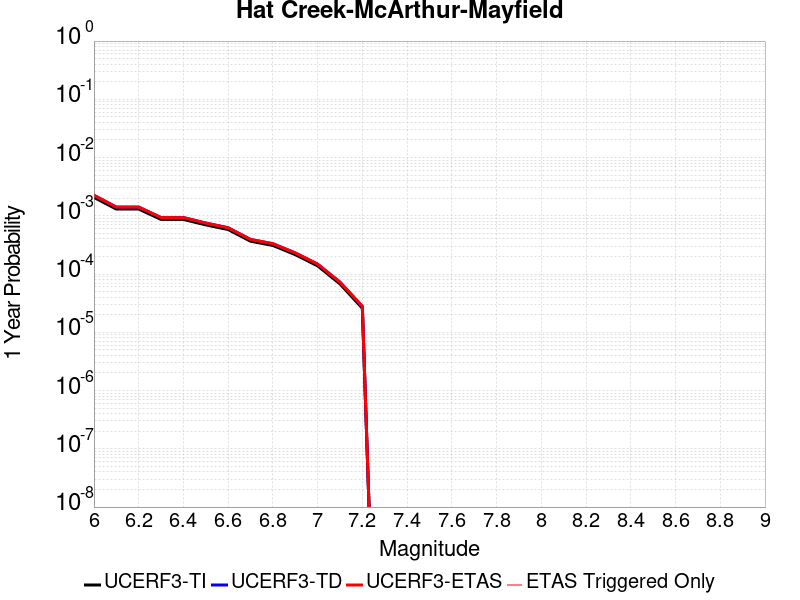 | 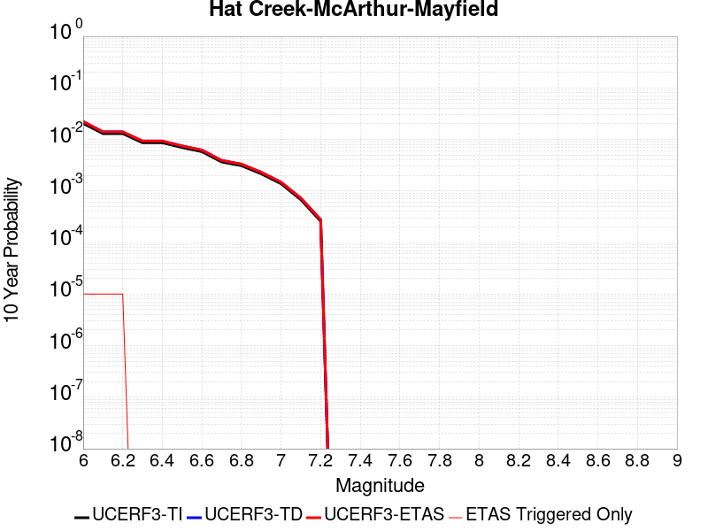 |

| Magnitude | 1 wk TI Prob | 1 wk TD Prob | 1 wk ETAS Prob | 1 wk ETAS/TD Gain | 1 wk ETAS Triggered Only | 1 mo TI Prob | 1 mo TD Prob | 1 mo ETAS Prob | 1 mo ETAS/TD Gain | 1 mo ETAS Triggered Only | 1 yr TI Prob | 1 yr TD Prob | 1 yr ETAS Prob | 1 yr ETAS/TD Gain | 1 yr ETAS Triggered Only | 10 yr TI Prob | 10 yr TD Prob | 10 yr ETAS Prob | 10 yr ETAS/TD Gain | 10 yr ETAS Triggered Only |
|-----|-----|-----|-----|-----|-----|-----|-----|-----|-----|-----|-----|-----|-----|-----|-----|-----|-----|-----|-----|-----|
| 6.0 | 3.967457E-5 | 4.315831E-5 | 4.315831E-5 | 1.0 | 0.0 | 1.7002279E-4 | 1.8495171E-4 | 1.8495171E-4 | 1.0 | 0.0 | 0.002068062 | 0.002249576 | 0.002249576 | 1.0 | 0.0 | 0.02048922 | 0.022280399 | 0.022290176 | 1.0004388 | 1.0E-5 |
| 6.1 | 2.5044013E-5 | 2.7071164E-5 | 2.7071164E-5 | 1.0 | 0.0 | 1.0732707E-4 | 1.1601429E-4 | 1.1601429E-4 | 1.0 | 0.0 | 0.0013059238 | 0.0014115906 | 0.0014115906 | 1.0 | 0.0 | 0.01298276 | 0.01402966 | 0.01403952 | 1.0007027 | 1.0E-5 |
| 6.2 | 2.5044013E-5 | 2.7071164E-5 | 2.7071164E-5 | 1.0 | 0.0 | 1.0732707E-4 | 1.1601429E-4 | 1.1601429E-4 | 1.0 | 0.0 | 0.0013059238 | 0.0014115906 | 0.0014115906 | 1.0 | 0.0 | 0.01298276 | 0.01402966 | 0.01403952 | 1.0007027 | 1.0E-5 |
| 6.3 | 1.6624012E-5 | 1.7891072E-5 | 1.7891072E-5 | 1.0 | 0.0 | 7.124382E-5 | 7.6673816E-5 | 7.6673816E-5 | 1.0 | 0.0 | 8.670483E-4 | 9.331125E-4 | 9.331125E-4 | 1.0 | 0.0 | 0.008636732 | 0.009292879 | 0.009292879 | 1.0 | 0.0 |
| 6.4 | 1.6624012E-5 | 1.7891072E-5 | 1.7891072E-5 | 1.0 | 0.0 | 7.124382E-5 | 7.6673816E-5 | 7.6673816E-5 | 1.0 | 0.0 | 8.670483E-4 | 9.331125E-4 | 9.331125E-4 | 1.0 | 0.0 | 0.008636732 | 0.009292879 | 0.009292879 | 1.0 | 0.0 |
| 6.5 | 1.3394842E-5 | 1.4392137E-5 | 1.4392137E-5 | 1.0 | 0.0 | 5.7405203E-5 | 6.167916E-5 | 6.167916E-5 | 1.0 | 0.0 | 6.986842E-4 | 7.506906E-4 | 7.506906E-4 | 1.0 | 0.0 | 0.006964916 | 0.0074821403 | 0.0074821403 | 1.0 | 0.0 |
| 6.6 | 1.1137514E-5 | 1.1954546E-5 | 1.1954546E-5 | 1.0 | 0.0 | 4.7731326E-5 | 5.1232782E-5 | 5.1232782E-5 | 1.0 | 0.0 | 5.809739E-4 | 6.2358467E-4 | 6.2358467E-4 | 1.0 | 0.0 | 0.005794574 | 0.00621877 | 0.00621877 | 1.0 | 0.0 |
| 6.7 | 7.0200663E-6 | 7.5242897E-6 | 7.5242897E-6 | 1.0 | 0.0 | 3.008565E-5 | 3.2246568E-5 | 3.2246568E-5 | 1.0 | 0.0 | 3.6623122E-4 | 3.925328E-4 | 3.925328E-4 | 1.0 | 0.0 | 0.0036562826 | 0.0039185574 | 0.0039185574 | 1.0 | 0.0 |
| 6.8 | 5.940172E-6 | 6.3654766E-6 | 6.3654766E-6 | 1.0 | 0.0 | 2.545763E-5 | 2.7280335E-5 | 2.7280335E-5 | 1.0 | 0.0 | 3.0990256E-4 | 3.3208873E-4 | 3.3208873E-4 | 1.0 | 0.0 | 0.0030947074 | 0.0033160534 | 0.0033160534 | 1.0 | 0.0 |
| 6.9 | 4.129831E-6 | 4.423547E-6 | 4.423547E-6 | 1.0 | 0.0 | 1.7699154E-5 | 1.8957926E-5 | 1.8957926E-5 | 1.0 | 0.0 | 2.154659E-4 | 2.3078908E-4 | 2.3078908E-4 | 1.0 | 0.0 | 0.002152571 | 0.0023055724 | 0.0023055724 | 1.0 | 0.0 |
| 7.0 | 2.6512955E-6 | 2.8374002E-6 | 2.8374002E-6 | 1.0 | 0.0 | 1.1362646E-5 | 1.2160232E-5 | 1.2160232E-5 | 1.0 | 0.0 | 1.3833142E-4 | 1.480412E-4 | 1.480412E-4 | 1.0 | 0.0 | 0.0013824535 | 0.0014794683 | 0.0014794683 | 1.0 | 0.0 |
| 7.1 | 1.2992575E-6 | 1.3909317E-6 | 1.3909317E-6 | 1.0 | 0.0 | 5.568235E-6 | 5.961124E-6 | 5.961124E-6 | 1.0 | 0.0 | 6.779115E-5 | 7.257448E-5 | 7.257448E-5 | 1.0 | 0.0 | 6.7770475E-4 | 7.2552945E-4 | 7.2552945E-4 | 1.0 | 0.0 |
| 7.2 | 4.968191E-7 | 5.3271475E-7 | 5.3271475E-7 | 1.0 | 0.0 | 2.1292228E-6 | 2.283062E-6 | 2.283062E-6 | 1.0 | 0.0 | 2.592298E-5 | 2.7796052E-5 | 2.7796052E-5 | 1.0 | 0.0 | 2.5919956E-4 | 2.7793812E-4 | 2.7793812E-4 | 1.0 | 0.0 |

## Hayward (No) 2011 CFM
*[(top)](#table-of-contents)*

| 1 Week | 1 Month | 1 Year | 10 Year |
|-----|-----|-----|-----|
|  | 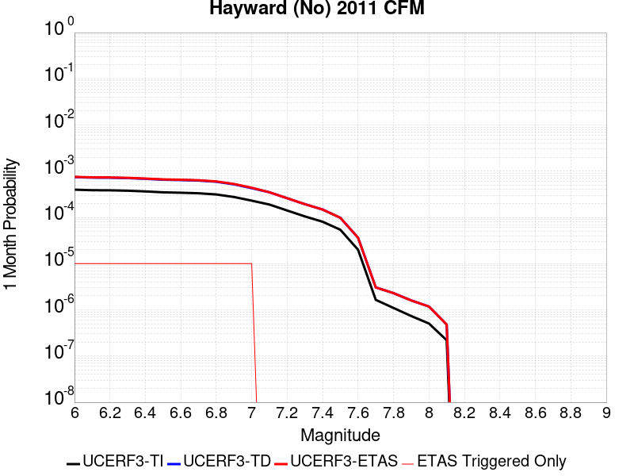 | 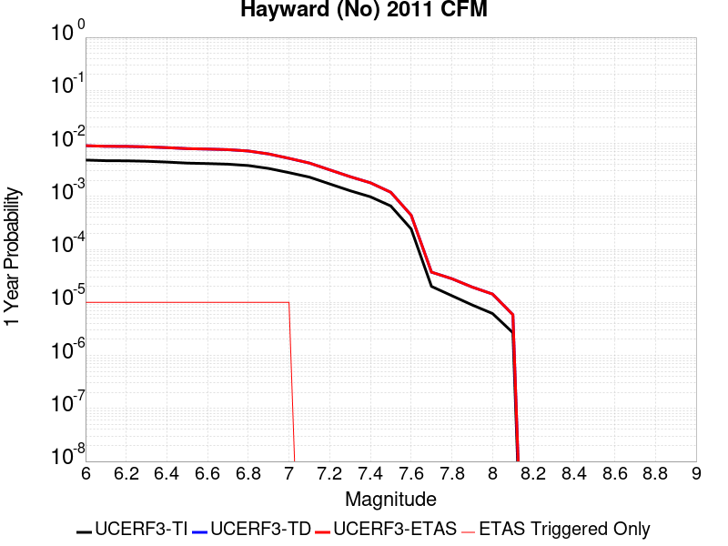 | 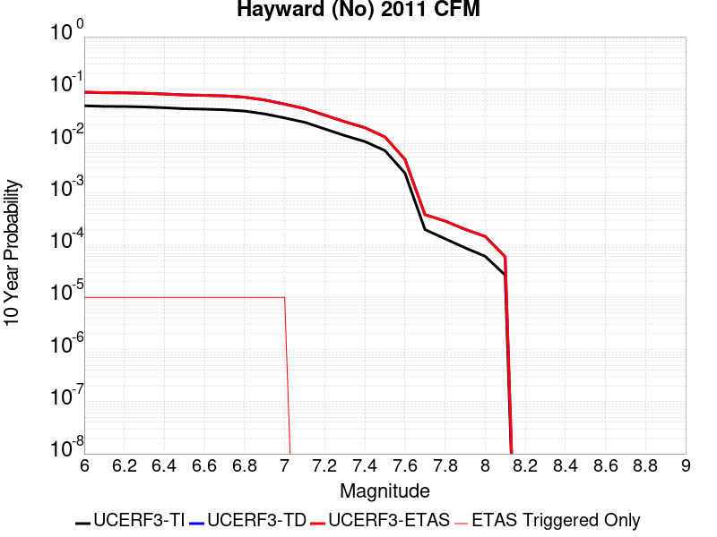 |

| Magnitude | 1 wk TI Prob | 1 wk TD Prob | 1 wk ETAS Prob | 1 wk ETAS/TD Gain | 1 wk ETAS Triggered Only | 1 mo TI Prob | 1 mo TD Prob | 1 mo ETAS Prob | 1 mo ETAS/TD Gain | 1 mo ETAS Triggered Only | 1 yr TI Prob | 1 yr TD Prob | 1 yr ETAS Prob | 1 yr ETAS/TD Gain | 1 yr ETAS Triggered Only | 10 yr TI Prob | 10 yr TD Prob | 10 yr ETAS Prob | 10 yr ETAS/TD Gain | 10 yr ETAS Triggered Only |
|-----|-----|-----|-----|-----|-----|-----|-----|-----|-----|-----|-----|-----|-----|-----|-----|-----|-----|-----|-----|-----|
| 6.0 | 9.3068506E-5 | 1.739599E-4 | 1.739599E-4 | 1.0 | 0.0 | 3.9880406E-4 | 7.453244E-4 | 7.553169E-4 | 1.013407 | 1.0E-5 | 0.0048446343 | 0.009036438 | 0.009046348 | 1.0010966 | 1.0E-5 | 0.047403704 | 0.08637534 | 0.086384475 | 1.0001057 | 1.0E-5 |
| 6.1 | 9.055486E-5 | 1.6947114E-4 | 1.6947114E-4 | 1.0 | 0.0 | 3.880345E-4 | 7.261021E-4 | 7.3609484E-4 | 1.0137621 | 1.0E-5 | 0.0047140904 | 0.008804537 | 0.008814449 | 1.0011258 | 1.0E-5 | 0.046153355 | 0.08426854 | 0.0842777 | 1.0001087 | 1.0E-5 |
| 6.2 | 9.006742E-5 | 1.6867711E-4 | 1.6867711E-4 | 1.0 | 0.0 | 3.859461E-4 | 7.22701E-4 | 7.326938E-4 | 1.013827 | 1.0E-5 | 0.0046887742 | 0.008763513 | 0.008773425 | 1.001131 | 1.0E-5 | 0.0459107 | 0.083892785 | 0.08390194 | 1.0001092 | 1.0E-5 |
| 6.3 | 8.8336754E-5 | 1.6547246E-4 | 1.6547246E-4 | 1.0 | 0.0 | 3.7853114E-4 | 7.089758E-4 | 7.189687E-4 | 1.0140948 | 1.0E-5 | 0.004598882 | 0.008597788 | 0.008607702 | 1.0011531 | 1.0E-5 | 0.04504866 | 0.08238599 | 0.082395166 | 1.0001113 | 1.0E-5 |
| 6.4 | 8.526157E-5 | 1.5974249E-4 | 1.5974249E-4 | 1.0 | 0.0 | 3.6535555E-4 | 6.8443175E-4 | 6.944249E-4 | 1.0146006 | 1.0E-5 | 0.0044391346 | 0.008301278 | 0.008311195 | 1.0011946 | 1.0E-5 | 0.043514993 | 0.079682834 | 0.07969204 | 1.0001155 | 1.0E-5 |
| 6.5 | 8.152396E-5 | 1.530663E-4 | 1.530663E-4 | 1.0 | 0.0 | 3.493416E-4 | 6.558342E-4 | 6.6582765E-4 | 1.0152378 | 1.0E-5 | 0.0042449418 | 0.007955698 | 0.007965619 | 1.0012469 | 1.0E-5 | 0.04164765 | 0.07651369 | 0.076522924 | 1.0001206 | 1.0E-5 |
| 6.6 | 7.987405E-5 | 1.5010842E-4 | 1.5010842E-4 | 1.0 | 0.0 | 3.4227243E-4 | 6.4316386E-4 | 6.531574E-4 | 1.0155381 | 1.0E-5 | 0.0041592065 | 0.0078025614 | 0.0078124837 | 1.0012716 | 1.0E-5 | 0.04082218 | 0.07510622 | 0.075115465 | 1.0001231 | 1.0E-5 |
| 6.7 | 7.777665E-5 | 1.4650106E-4 | 1.4650106E-4 | 1.0 | 0.0 | 3.332859E-4 | 6.277113E-4 | 6.3770503E-4 | 1.0159209 | 1.0E-5 | 0.004050208 | 0.00761576 | 0.0076256837 | 1.0013031 | 1.0E-5 | 0.039771806 | 0.073382616 | 0.073391885 | 1.0001262 | 1.0E-5 |
| 6.8 | 7.3284005E-5 | 1.3800753E-4 | 1.3800753E-4 | 1.0 | 0.0 | 3.140365E-4 | 5.913274E-4 | 6.013215E-4 | 1.0169011 | 1.0E-5 | 0.0038166929 | 0.0071757827 | 0.007185711 | 1.0013835 | 1.0E-5 | 0.037518036 | 0.06929621 | 0.06930552 | 1.0001343 | 1.0E-5 |
| 6.9 | 6.458263E-5 | 1.2131439E-4 | 1.2131439E-4 | 1.0 | 0.0 | 2.7675333E-4 | 5.198157E-4 | 5.298105E-4 | 1.0192276 | 1.0E-5 | 0.0033642664 | 0.0063104923 | 0.0063204295 | 1.0015746 | 1.0E-5 | 0.033137884 | 0.061225023 | 0.06123441 | 1.0001533 | 1.0E-5 |
| 7.0 | 5.3853604E-5 | 1.00250414E-4 | 1.00250414E-4 | 1.0 | 0.0 | 2.3078074E-4 | 4.295742E-4 | 4.395699E-4 | 1.0232688 | 1.0E-5 | 0.0028061352 | 0.0052175885 | 0.005227536 | 1.0019066 | 1.0E-5 | 0.027709642 | 0.0509578 | 0.05096729 | 1.0001862 | 1.0E-5 |
| 7.1 | 4.4308683E-5 | 8.170626E-5 | 8.170626E-5 | 1.0 | 0.0 | 1.8988053E-4 | 3.501229E-4 | 3.501229E-4 | 1.0 | 0.0 | 0.0023093442 | 0.0042544557 | 0.0042544557 | 1.0 | 0.0 | 0.022854926 | 0.04182473 | 0.04182473 | 1.0 | 0.0 |
| 7.2 | 3.295973E-5 | 6.0771144E-5 | 6.0771144E-5 | 1.0 | 0.0 | 1.4124835E-4 | 2.604219E-4 | 2.604219E-4 | 1.0 | 0.0 | 0.0017183421 | 0.0031660495 | 0.0031660495 | 1.0 | 0.0 | 0.017051157 | 0.031369876 | 0.031369876 | 1.0 | 0.0 |
| 7.3 | 2.452256E-5 | 4.5180346E-5 | 4.5180346E-5 | 1.0 | 0.0 | 1.05092455E-4 | 1.9361576E-4 | 1.9361576E-4 | 1.0 | 0.0 | 0.0012787496 | 0.0023547374 | 0.0023547374 | 1.0 | 0.0 | 0.0127141625 | 0.02344111 | 0.02344111 | 1.0 | 0.0 |
| 7.4 | 1.8829967E-5 | 3.4602548E-5 | 3.4602548E-5 | 1.0 | 0.0 | 8.069736E-5 | 1.4828827E-4 | 1.4828827E-4 | 1.0 | 0.0 | 9.820475E-4 | 0.0018039243 | 0.0018039243 | 1.0 | 0.0 | 0.009777189 | 0.0180195 | 0.0180195 | 1.0 | 0.0 |
| 7.5 | 1.26374125E-5 | 2.2921116E-5 | 2.2921116E-5 | 1.0 | 0.0 | 5.4159216E-5 | 9.822969E-5 | 9.822969E-5 | 1.0 | 0.0 | 6.5918895E-4 | 0.0011952962 | 0.0011952962 | 1.0 | 0.0 | 0.00657237 | 0.011988836 | 0.011988836 | 1.0 | 0.0 |
| 7.6 | 4.666429E-6 | 8.4791645E-6 | 8.4791645E-6 | 1.0 | 0.0 | 1.9998828E-5 | 3.6338777E-5 | 3.6338777E-5 | 1.0 | 0.0 | 2.4345852E-4 | 4.4233602E-4 | 4.4233602E-4 | 1.0 | 0.0 | 0.0024319198 | 0.0044591012 | 0.0044591012 | 1.0 | 0.0 |
| 7.7 | 3.8399318E-7 | 7.133867E-7 | 7.133867E-7 | 1.0 | 0.0 | 1.6456839E-6 | 3.057368E-6 | 3.057368E-6 | 1.0 | 0.0 | 2.003602E-5 | 3.722282E-5 | 3.722282E-5 | 1.0 | 0.0 | 2.0034213E-4 | 3.8614936E-4 | 3.8614936E-4 | 1.0 | 0.0 |
| 7.8 | 2.5637698E-7 | 5.3662194E-7 | 5.3662194E-7 | 1.0 | 0.0 | 1.098758E-6 | 2.299806E-6 | 2.299806E-6 | 1.0 | 0.0 | 1.3377297E-5 | 2.7999782E-5 | 2.7999782E-5 | 1.0 | 0.0 | 1.3376492E-4 | 2.9244382E-4 | 2.9244382E-4 | 1.0 | 0.0 |
| 7.9 | 1.7141245E-7 | 3.7290573E-7 | 3.7290573E-7 | 1.0 | 0.0 | 7.3462456E-7 | 1.5981665E-6 | 1.5981665E-6 | 1.0 | 0.0 | 8.944017E-6 | 1.9457504E-5 | 1.9457504E-5 | 1.0 | 0.0 | 8.943657E-5 | 2.0245428E-4 | 2.0245428E-4 | 1.0 | 0.0 |
| 8.0 | 1.1808895E-7 | 2.7509762E-7 | 2.7509762E-7 | 1.0 | 0.0 | 5.060954E-7 | 1.1789892E-6 | 1.1789892E-6 | 1.0 | 0.0 | 6.161694E-6 | 1.43541E-5 | 1.43541E-5 | 1.0 | 0.0 | 6.161523E-5 | 1.4816441E-4 | 1.4816441E-4 | 1.0 | 0.0 |
| 8.1 | 5.138535E-8 | 1.1229867E-7 | 1.1229867E-7 | 1.0 | 0.0 | 2.2022292E-7 | 4.812799E-7 | 4.812799E-7 | 1.0 | 0.0 | 2.6812106E-6 | 5.8595674E-6 | 5.8595674E-6 | 1.0 | 0.0 | 2.6811784E-5 | 6.0158476E-5 | 6.0158476E-5 | 1.0 | 0.0 |

## Fontana (Seismicity)
*[(top)](#table-of-contents)*

| 1 Week | 1 Month | 1 Year | 10 Year |
|-----|-----|-----|-----|
|  |  | 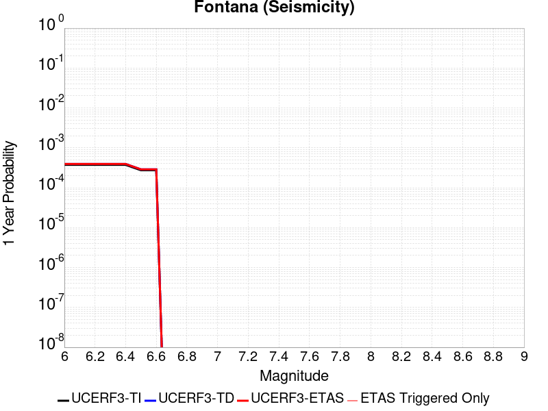 |  |

| Magnitude | 1 wk TI Prob | 1 wk TD Prob | 1 wk ETAS Prob | 1 wk ETAS/TD Gain | 1 wk ETAS Triggered Only | 1 mo TI Prob | 1 mo TD Prob | 1 mo ETAS Prob | 1 mo ETAS/TD Gain | 1 mo ETAS Triggered Only | 1 yr TI Prob | 1 yr TD Prob | 1 yr ETAS Prob | 1 yr ETAS/TD Gain | 1 yr ETAS Triggered Only | 10 yr TI Prob | 10 yr TD Prob | 10 yr ETAS Prob | 10 yr ETAS/TD Gain | 10 yr ETAS Triggered Only |
|-----|-----|-----|-----|-----|-----|-----|-----|-----|-----|-----|-----|-----|-----|-----|-----|-----|-----|-----|-----|-----|
| 6.0 | 7.1789214E-6 | 7.5520006E-6 | 7.5520006E-6 | 1.0 | 0.0 | 3.076644E-5 | 3.2365548E-5 | 3.2365548E-5 | 1.0 | 0.0 | 3.7451705E-4 | 3.9402005E-4 | 3.9402005E-4 | 1.0 | 0.0 | 0.003738865 | 0.003937214 | 0.0039471746 | 1.0025299 | 1.0E-5 |
| 6.1 | 7.1789214E-6 | 7.5520006E-6 | 7.5520006E-6 | 1.0 | 0.0 | 3.076644E-5 | 3.2365548E-5 | 3.2365548E-5 | 1.0 | 0.0 | 3.7451705E-4 | 3.9402005E-4 | 3.9402005E-4 | 1.0 | 0.0 | 0.003738865 | 0.003937214 | 0.0039471746 | 1.0025299 | 1.0E-5 |
| 6.2 | 7.1789214E-6 | 7.5520006E-6 | 7.5520006E-6 | 1.0 | 0.0 | 3.076644E-5 | 3.2365548E-5 | 3.2365548E-5 | 1.0 | 0.0 | 3.7451705E-4 | 3.9402005E-4 | 3.9402005E-4 | 1.0 | 0.0 | 0.003738865 | 0.003937214 | 0.0039471746 | 1.0025299 | 1.0E-5 |
| 6.3 | 7.1789214E-6 | 7.5520006E-6 | 7.5520006E-6 | 1.0 | 0.0 | 3.076644E-5 | 3.2365548E-5 | 3.2365548E-5 | 1.0 | 0.0 | 3.7451705E-4 | 3.9402005E-4 | 3.9402005E-4 | 1.0 | 0.0 | 0.003738865 | 0.003937214 | 0.0039471746 | 1.0025299 | 1.0E-5 |
| 6.4 | 7.1789214E-6 | 7.5520006E-6 | 7.5520006E-6 | 1.0 | 0.0 | 3.076644E-5 | 3.2365548E-5 | 3.2365548E-5 | 1.0 | 0.0 | 3.7451705E-4 | 3.9402005E-4 | 3.9402005E-4 | 1.0 | 0.0 | 0.003738865 | 0.003937214 | 0.0039471746 | 1.0025299 | 1.0E-5 |
| 6.5 | 5.2611317E-6 | 5.532726E-6 | 5.532726E-6 | 1.0 | 0.0 | 2.2547512E-5 | 2.3711682E-5 | 2.3711682E-5 | 1.0 | 0.0 | 2.744814E-4 | 2.8868974E-4 | 2.8868974E-4 | 1.0 | 0.0 | 0.002741426 | 0.0028868972 | 0.0028968684 | 1.003454 | 1.0E-5 |
| 6.6 | 5.2611317E-6 | 5.532726E-6 | 5.532726E-6 | 1.0 | 0.0 | 2.2547512E-5 | 2.3711682E-5 | 2.3711682E-5 | 1.0 | 0.0 | 2.744814E-4 | 2.8868974E-4 | 2.8868974E-4 | 1.0 | 0.0 | 0.002741426 | 0.0028868972 | 0.0028968684 | 1.003454 | 1.0E-5 |

## Fitzhugh Creek
*[(top)](#table-of-contents)*

| 1 Week | 1 Month | 1 Year | 10 Year |
|-----|-----|-----|-----|
|  | 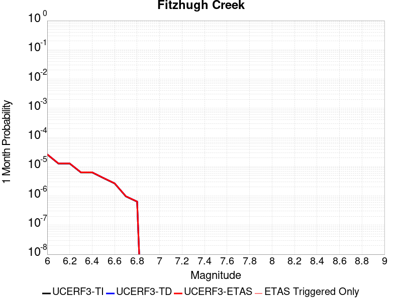 | 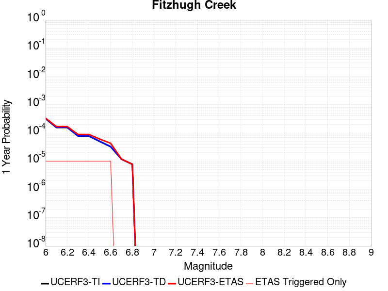 | 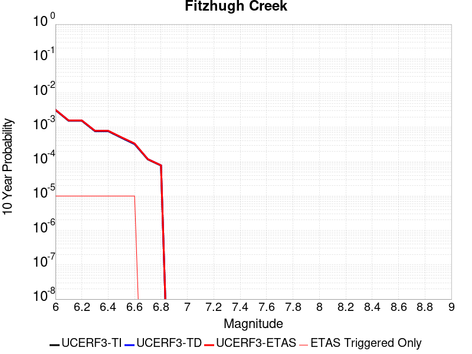 |

| Magnitude | 1 wk TI Prob | 1 wk TD Prob | 1 wk ETAS Prob | 1 wk ETAS/TD Gain | 1 wk ETAS Triggered Only | 1 mo TI Prob | 1 mo TD Prob | 1 mo ETAS Prob | 1 mo ETAS/TD Gain | 1 mo ETAS Triggered Only | 1 yr TI Prob | 1 yr TD Prob | 1 yr ETAS Prob | 1 yr ETAS/TD Gain | 1 yr ETAS Triggered Only | 10 yr TI Prob | 10 yr TD Prob | 10 yr ETAS Prob | 10 yr ETAS/TD Gain | 10 yr ETAS Triggered Only |
|-----|-----|-----|-----|-----|-----|-----|-----|-----|-----|-----|-----|-----|-----|-----|-----|-----|-----|-----|-----|-----|
| 6.0 | 6.1090436E-6 | 6.2101562E-6 | 6.2101562E-6 | 1.0 | 0.0 | 2.6181353E-5 | 2.6614709E-5 | 2.6614709E-5 | 1.0 | 0.0 | 3.1871133E-4 | 3.239904E-4 | 3.3398715E-4 | 1.0308551 | 1.0E-5 | 0.0031825465 | 0.0032356246 | 0.0032455921 | 1.0030806 | 1.0E-5 |
| 6.1 | 2.9741811E-6 | 3.021581E-6 | 3.021581E-6 | 1.0 | 0.0 | 1.2746428E-5 | 1.2949574E-5 | 1.2949574E-5 | 1.0 | 0.0 | 1.5517672E-4 | 1.576506E-4 | 1.6764902E-4 | 1.0634214 | 1.0E-5 | 0.001550684 | 0.0015754806 | 0.0015854648 | 1.0063373 | 1.0E-5 |
| 6.2 | 2.9741811E-6 | 3.021581E-6 | 3.021581E-6 | 1.0 | 0.0 | 1.2746428E-5 | 1.2949574E-5 | 1.2949574E-5 | 1.0 | 0.0 | 1.5517672E-4 | 1.576506E-4 | 1.6764902E-4 | 1.0634214 | 1.0E-5 | 0.001550684 | 0.0015754806 | 0.0015854648 | 1.0063373 | 1.0E-5 |
| 6.3 | 1.4781198E-6 | 1.5012708E-6 | 1.5012708E-6 | 1.0 | 0.0 | 6.3347834E-6 | 6.4340034E-6 | 6.4340034E-6 | 1.0 | 0.0 | 7.712326E-5 | 7.833137E-5 | 8.833059E-5 | 1.1276528 | 1.0E-5 | 7.70965E-4 | 7.830576E-4 | 7.9304975E-4 | 1.0127604 | 1.0E-5 |
| 6.4 | 1.4781198E-6 | 1.5012708E-6 | 1.5012708E-6 | 1.0 | 0.0 | 6.3347834E-6 | 6.4340034E-6 | 6.4340034E-6 | 1.0 | 0.0 | 7.712326E-5 | 7.833137E-5 | 8.833059E-5 | 1.1276528 | 1.0E-5 | 7.70965E-4 | 7.830576E-4 | 7.9304975E-4 | 1.0127604 | 1.0E-5 |
| 6.5 | 9.5176676E-7 | 9.66606E-7 | 9.66606E-7 | 1.0 | 0.0 | 4.078994E-6 | 4.142591E-6 | 4.142591E-6 | 1.0 | 0.0 | 4.9660623E-5 | 5.0434985E-5 | 6.043448E-5 | 1.1982651 | 1.0E-5 | 4.964952E-4 | 5.042458E-4 | 5.1424076E-4 | 1.0198216 | 1.0E-5 |
| 6.6 | 6.21145E-7 | 6.3085855E-7 | 6.3085855E-7 | 1.0 | 0.0 | 2.662047E-6 | 2.7036772E-6 | 2.7036772E-6 | 1.0 | 0.0 | 3.2409942E-5 | 3.291684E-5 | 4.2916512E-5 | 1.3037859 | 1.0E-5 | 3.2405215E-4 | 3.2912623E-4 | 3.3912293E-4 | 1.0303735 | 1.0E-5 |
| 6.7 | 2.2377962E-7 | 2.2734636E-7 | 2.2734636E-7 | 1.0 | 0.0 | 9.590551E-7 | 9.743413E-7 | 9.743413E-7 | 1.0 | 0.0 | 1.1676434E-5 | 1.1862574E-5 | 1.1862574E-5 | 1.0 | 0.0 | 1.1675821E-4 | 1.1862254E-4 | 1.1862254E-4 | 1.0 | 0.0 |
| 6.8 | 1.4785022E-7 | 1.5021492E-7 | 1.5021492E-7 | 1.0 | 0.0 | 6.3364365E-7 | 6.4377826E-7 | 6.4377826E-7 | 1.0 | 0.0 | 7.714584E-6 | 7.838E-6 | 7.838E-6 | 1.0 | 0.0 | 7.714316E-5 | 7.838E-5 | 7.838E-5 | 1.0 | 0.0 |

## Great Valley 10 (Panoche)
*[(top)](#table-of-contents)*

| 1 Week | 1 Month | 1 Year | 10 Year |
|-----|-----|-----|-----|
| 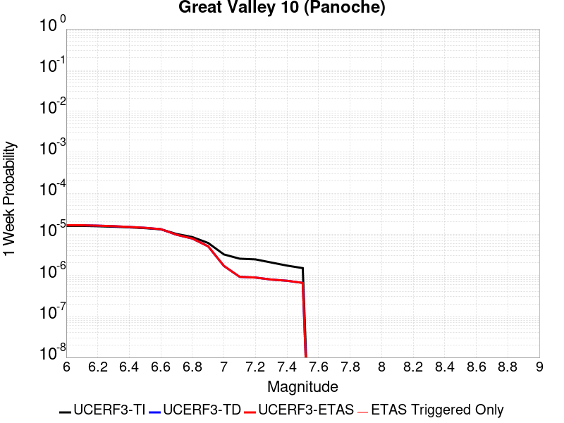 |  | 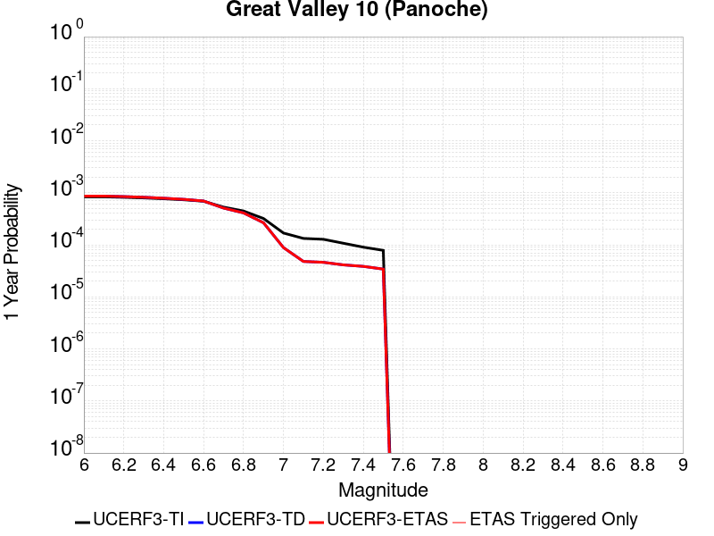 | 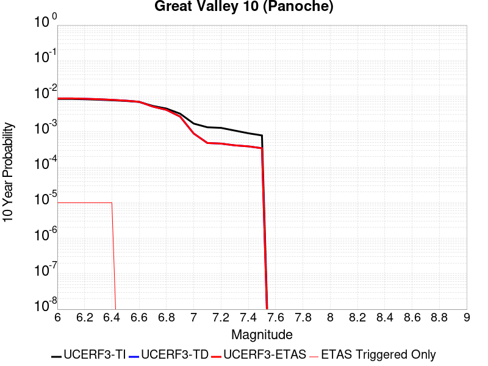 |

| Magnitude | 1 wk TI Prob | 1 wk TD Prob | 1 wk ETAS Prob | 1 wk ETAS/TD Gain | 1 wk ETAS Triggered Only | 1 mo TI Prob | 1 mo TD Prob | 1 mo ETAS Prob | 1 mo ETAS/TD Gain | 1 mo ETAS Triggered Only | 1 yr TI Prob | 1 yr TD Prob | 1 yr ETAS Prob | 1 yr ETAS/TD Gain | 1 yr ETAS Triggered Only | 10 yr TI Prob | 10 yr TD Prob | 10 yr ETAS Prob | 10 yr ETAS/TD Gain | 10 yr ETAS Triggered Only |
|-----|-----|-----|-----|-----|-----|-----|-----|-----|-----|-----|-----|-----|-----|-----|-----|-----|-----|-----|-----|-----|
| 6.0 | 1.6014626E-5 | 1.6575399E-5 | 1.6575399E-5 | 1.0 | 0.0 | 6.863231E-5 | 7.103552E-5 | 7.103552E-5 | 1.0 | 0.0 | 8.35278E-4 | 8.645185E-4 | 8.645185E-4 | 1.0 | 0.0 | 0.008321454 | 0.008612172 | 0.008622086 | 1.0011512 | 1.0E-5 |
| 6.1 | 1.6014626E-5 | 1.6575399E-5 | 1.6575399E-5 | 1.0 | 0.0 | 6.863231E-5 | 7.103552E-5 | 7.103552E-5 | 1.0 | 0.0 | 8.35278E-4 | 8.645185E-4 | 8.645185E-4 | 1.0 | 0.0 | 0.008321454 | 0.008612172 | 0.008622086 | 1.0011512 | 1.0E-5 |
| 6.2 | 1.56782E-5 | 1.6198446E-5 | 1.6198446E-5 | 1.0 | 0.0 | 6.719056E-5 | 6.94201E-5 | 6.94201E-5 | 1.0 | 0.0 | 8.17738E-4 | 8.4486604E-4 | 8.4486604E-4 | 1.0 | 0.0 | 0.008147354 | 0.008417147 | 0.008427063 | 1.001178 | 1.0E-5 |
| 6.3 | 1.5263338E-5 | 1.5723514E-5 | 1.5723514E-5 | 1.0 | 0.0 | 6.541267E-5 | 6.738478E-5 | 6.738478E-5 | 1.0 | 0.0 | 7.961082E-4 | 8.201049E-4 | 8.201049E-4 | 1.0 | 0.0 | 0.007932622 | 0.008171377 | 0.008181295 | 1.0012138 | 1.0E-5 |
| 6.4 | 1.4720723E-5 | 1.5099376E-5 | 1.5099376E-5 | 1.0 | 0.0 | 6.308728E-5 | 6.471004E-5 | 6.471004E-5 | 1.0 | 0.0 | 7.67817E-4 | 7.8756385E-4 | 7.8756385E-4 | 1.0 | 0.0 | 0.007651695 | 0.007848303 | 0.007858224 | 1.0012642 | 1.0E-5 |
| 6.5 | 1.408264E-5 | 1.4355969E-5 | 1.4355969E-5 | 1.0 | 0.0 | 6.0352773E-5 | 6.1524166E-5 | 6.1524166E-5 | 1.0 | 0.0 | 7.3454727E-4 | 7.488031E-4 | 7.488031E-4 | 1.0 | 0.0 | 0.0073212404 | 0.0074633555 | 0.0074633555 | 1.0 | 0.0 |
| 6.6 | 1.3197086E-5 | 1.3321889E-5 | 1.3321889E-5 | 1.0 | 0.0 | 5.6557717E-5 | 5.709259E-5 | 5.709259E-5 | 1.0 | 0.0 | 6.8837265E-4 | 6.9488434E-4 | 6.9488434E-4 | 1.0 | 0.0 | 0.006862442 | 0.0069276537 | 0.0069276537 | 1.0 | 0.0 |
| 6.7 | 1.017583E-5 | 9.745382E-6 | 9.745382E-6 | 1.0 | 0.0 | 4.360997E-5 | 4.176527E-5 | 4.176527E-5 | 1.0 | 0.0 | 5.30822E-4 | 5.0837593E-4 | 5.0837593E-4 | 1.0 | 0.0 | 0.0052955584 | 0.005072382 | 0.005072382 | 1.0 | 0.0 |
| 6.8 | 8.557912E-6 | 7.872707E-6 | 7.872707E-6 | 1.0 | 0.0 | 3.667625E-5 | 3.373975E-5 | 3.373975E-5 | 1.0 | 0.0 | 4.4644187E-4 | 4.1070607E-4 | 4.1070607E-4 | 1.0 | 0.0 | 0.0044554602 | 0.004099677 | 0.004099677 | 1.0 | 0.0 |
| 6.9 | 6.14664E-6 | 5.092071E-6 | 5.092071E-6 | 1.0 | 0.0 | 2.6342475E-5 | 2.1822989E-5 | 2.1822989E-5 | 1.0 | 0.0 | 3.2067244E-4 | 2.6566387E-4 | 2.6566387E-4 | 1.0 | 0.0 | 0.003202101 | 0.002653601 | 0.002653601 | 1.0 | 0.0 |
| 7.0 | 3.2310581E-6 | 1.6951219E-6 | 1.6951219E-6 | 1.0 | 0.0 | 1.3847319E-5 | 7.264788E-6 | 7.264788E-6 | 1.0 | 0.0 | 1.6857806E-4 | 8.8445304E-5 | 8.8445304E-5 | 1.0 | 0.0 | 0.0016845023 | 8.841104E-4 | 8.841104E-4 | 1.0 | 0.0 |
| 7.1 | 2.544492E-6 | 9.1889206E-7 | 9.1889206E-7 | 1.0 | 0.0 | 1.090492E-5 | 3.938103E-6 | 3.938103E-6 | 1.0 | 0.0 | 1.327593E-4 | 4.79454E-5 | 4.79454E-5 | 1.0 | 0.0 | 0.0013268003 | 4.793553E-4 | 4.793553E-4 | 1.0 | 0.0 |
| 7.2 | 2.4479045E-6 | 8.841304E-7 | 8.841304E-7 | 1.0 | 0.0 | 1.0490977E-5 | 3.789125E-6 | 3.789125E-6 | 1.0 | 0.0 | 1.2772017E-4 | 4.6131667E-5 | 4.6131667E-5 | 1.0 | 0.0 | 0.0012764678 | 4.6122566E-4 | 4.6122566E-4 | 1.0 | 0.0 |
| 7.3 | 2.0559578E-6 | 7.892787E-7 | 7.892787E-7 | 1.0 | 0.0 | 8.811218E-6 | 3.3826188E-6 | 3.3826188E-6 | 1.0 | 0.0 | 1.072713E-4 | 4.1182655E-5 | 4.1182655E-5 | 1.0 | 0.0 | 0.0010721954 | 4.1175485E-4 | 4.1175485E-4 | 1.0 | 0.0 |
| 7.4 | 1.727687E-6 | 7.387757E-7 | 7.387757E-7 | 1.0 | 0.0 | 7.404352E-6 | 3.1661782E-6 | 3.1661782E-6 | 1.0 | 0.0 | 9.0144255E-5 | 3.8547583E-5 | 3.8547583E-5 | 1.0 | 0.0 | 9.0107694E-4 | 3.854136E-4 | 3.854136E-4 | 1.0 | 0.0 |
| 7.5 | 1.5002679E-6 | 6.546144E-7 | 6.546144E-7 | 1.0 | 0.0 | 6.4297037E-6 | 2.8054874E-6 | 2.8054874E-6 | 1.0 | 0.0 | 7.827883E-5 | 3.4156317E-5 | 3.4156317E-5 | 1.0 | 0.0 | 7.825126E-4 | 3.4151482E-4 | 3.4151482E-4 | 1.0 | 0.0 |

## Elsinore (Julian)
*[(top)](#table-of-contents)*

| 1 Week | 1 Month | 1 Year | 10 Year |
|-----|-----|-----|-----|
| 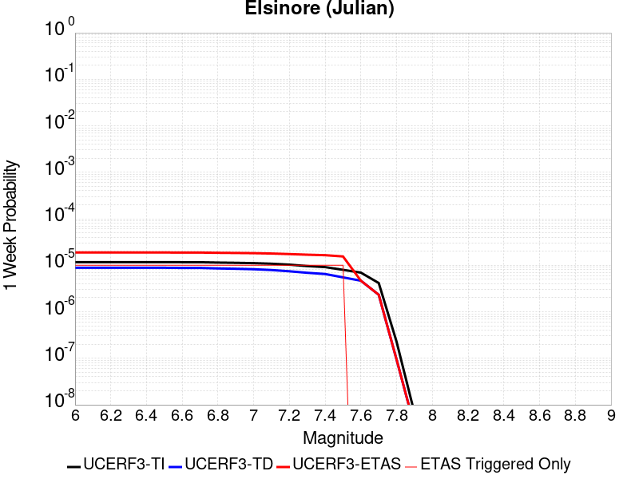 | 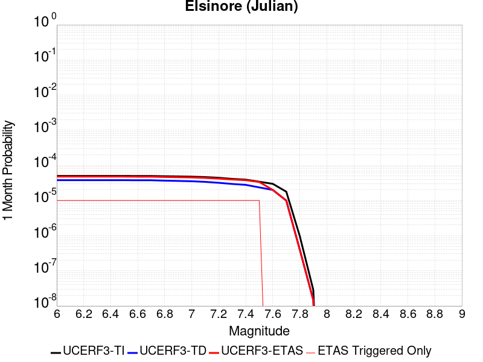 | 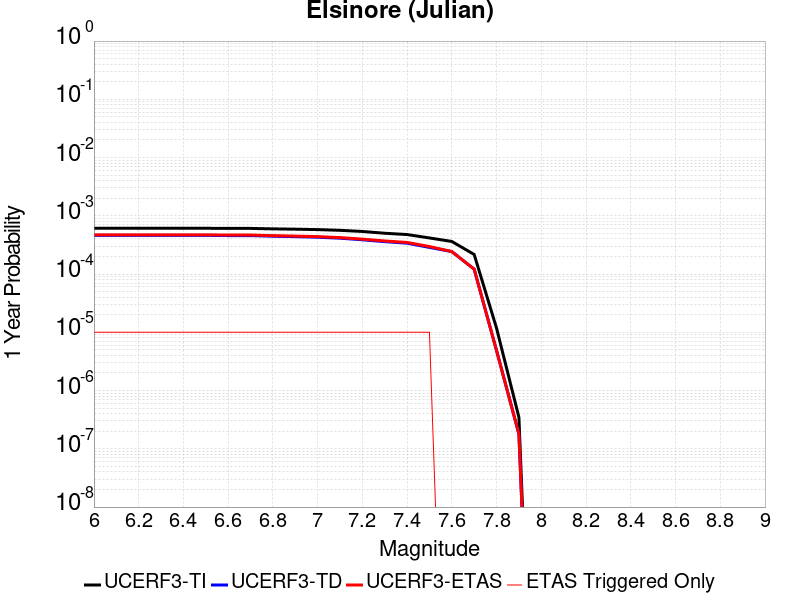 | 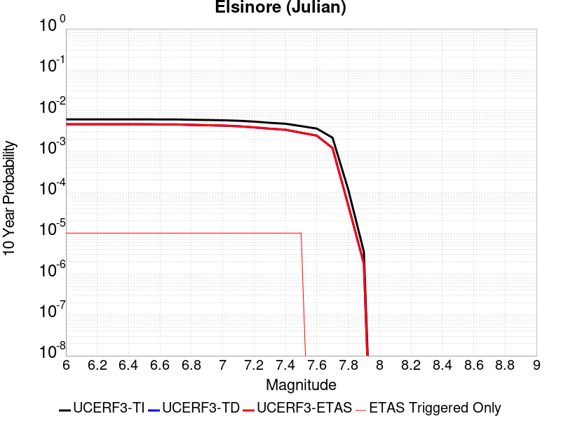 |

| Magnitude | 1 wk TI Prob | 1 wk TD Prob | 1 wk ETAS Prob | 1 wk ETAS/TD Gain | 1 wk ETAS Triggered Only | 1 mo TI Prob | 1 mo TD Prob | 1 mo ETAS Prob | 1 mo ETAS/TD Gain | 1 mo ETAS Triggered Only | 1 yr TI Prob | 1 yr TD Prob | 1 yr ETAS Prob | 1 yr ETAS/TD Gain | 1 yr ETAS Triggered Only | 10 yr TI Prob | 10 yr TD Prob | 10 yr ETAS Prob | 10 yr ETAS/TD Gain | 10 yr ETAS Triggered Only |
|-----|-----|-----|-----|-----|-----|-----|-----|-----|-----|-----|-----|-----|-----|-----|-----|-----|-----|-----|-----|-----|
| 6.0 | 1.1710231E-5 | 8.845509E-6 | 1.884542E-5 | 2.1305072 | 1.0E-5 | 5.0185736E-5 | 3.7908783E-5 | 4.7908405E-5 | 1.2637811 | 1.0E-5 | 6.1084004E-4 | 4.614434E-4 | 4.7143875E-4 | 1.0216612 | 1.0E-5 | 0.006091637 | 0.0046050567 | 0.0046150107 | 1.0021615 | 1.0E-5 |
| 6.1 | 1.1710231E-5 | 8.845509E-6 | 1.884542E-5 | 2.1305072 | 1.0E-5 | 5.0185736E-5 | 3.7908783E-5 | 4.7908405E-5 | 1.2637811 | 1.0E-5 | 6.1084004E-4 | 4.614434E-4 | 4.7143875E-4 | 1.0216612 | 1.0E-5 | 0.006091637 | 0.0046050567 | 0.0046150107 | 1.0021615 | 1.0E-5 |
| 6.2 | 1.1710231E-5 | 8.845509E-6 | 1.884542E-5 | 2.1305072 | 1.0E-5 | 5.0185736E-5 | 3.7908783E-5 | 4.7908405E-5 | 1.2637811 | 1.0E-5 | 6.1084004E-4 | 4.614434E-4 | 4.7143875E-4 | 1.0216612 | 1.0E-5 | 0.006091637 | 0.0046050567 | 0.0046150107 | 1.0021615 | 1.0E-5 |
| 6.3 | 1.1710231E-5 | 8.845509E-6 | 1.884542E-5 | 2.1305072 | 1.0E-5 | 5.0185736E-5 | 3.7908783E-5 | 4.7908405E-5 | 1.2637811 | 1.0E-5 | 6.1084004E-4 | 4.614434E-4 | 4.7143875E-4 | 1.0216612 | 1.0E-5 | 0.006091637 | 0.0046050567 | 0.0046150107 | 1.0021615 | 1.0E-5 |
| 6.4 | 1.1710231E-5 | 8.845509E-6 | 1.884542E-5 | 2.1305072 | 1.0E-5 | 5.0185736E-5 | 3.7908783E-5 | 4.7908405E-5 | 1.2637811 | 1.0E-5 | 6.1084004E-4 | 4.614434E-4 | 4.7143875E-4 | 1.0216612 | 1.0E-5 | 0.006091637 | 0.0046050567 | 0.0046150107 | 1.0021615 | 1.0E-5 |
| 6.5 | 1.1710231E-5 | 8.845509E-6 | 1.884542E-5 | 2.1305072 | 1.0E-5 | 5.0185736E-5 | 3.7908783E-5 | 4.7908405E-5 | 1.2637811 | 1.0E-5 | 6.1084004E-4 | 4.614434E-4 | 4.7143875E-4 | 1.0216612 | 1.0E-5 | 0.006091637 | 0.0046050567 | 0.0046150107 | 1.0021615 | 1.0E-5 |
| 6.6 | 1.1650619E-5 | 8.777881E-6 | 1.8777793E-5 | 2.1392171 | 1.0E-5 | 4.993027E-5 | 3.7618956E-5 | 4.761858E-5 | 1.2658135 | 1.0E-5 | 6.0773146E-4 | 4.5791623E-4 | 4.6791165E-4 | 1.021828 | 1.0E-5 | 0.0060607214 | 0.004569931 | 0.004579885 | 1.0021782 | 1.0E-5 |
| 6.7 | 1.1650619E-5 | 8.777881E-6 | 1.8777793E-5 | 2.1392171 | 1.0E-5 | 4.993027E-5 | 3.7618956E-5 | 4.761858E-5 | 1.2658135 | 1.0E-5 | 6.0773146E-4 | 4.5791623E-4 | 4.6791165E-4 | 1.021828 | 1.0E-5 | 0.0060607214 | 0.004569931 | 0.004579885 | 1.0021782 | 1.0E-5 |
| 6.8 | 1.1442698E-5 | 8.561041E-6 | 1.8560955E-5 | 2.1680722 | 1.0E-5 | 4.9039216E-5 | 3.6689667E-5 | 4.66893E-5 | 1.2725463 | 1.0E-5 | 5.968889E-4 | 4.4660683E-4 | 4.5660237E-4 | 1.0223811 | 1.0E-5 | 0.0059528816 | 0.004457295 | 0.0044672503 | 1.0022335 | 1.0E-5 |
| 6.9 | 1.1300589E-5 | 8.408907E-6 | 1.8408824E-5 | 2.1892052 | 1.0E-5 | 4.8430196E-5 | 3.6037683E-5 | 4.6037323E-5 | 1.2774773 | 1.0E-5 | 5.894781E-4 | 4.3867214E-4 | 4.4866776E-4 | 1.022786 | 1.0E-5 | 0.005879169 | 0.0043782624 | 0.0043882183 | 1.002274 | 1.0E-5 |
| 7.0 | 1.1117729E-5 | 8.226087E-6 | 1.8226005E-5 | 2.2156348 | 1.0E-5 | 4.764654E-5 | 3.525419E-5 | 4.525384E-5 | 1.2836442 | 1.0E-5 | 5.799422E-4 | 4.291369E-4 | 4.3913262E-4 | 1.0232925 | 1.0E-5 | 0.0057843104 | 0.004283281 | 0.004293238 | 1.0023247 | 1.0E-5 |
| 7.1 | 1.08053955E-5 | 7.9117535E-6 | 1.7911674E-5 | 2.2639322 | 1.0E-5 | 4.6308014E-5 | 3.3907087E-5 | 4.3906748E-5 | 1.2949136 | 1.0E-5 | 5.6365423E-4 | 4.127422E-4 | 4.2273809E-4 | 1.0242182 | 1.0E-5 | 0.005622267 | 0.0041199517 | 0.004129911 | 1.0024172 | 1.0E-5 |
| 7.2 | 1.032804E-5 | 7.433021E-6 | 1.7432947E-5 | 2.345338 | 1.0E-5 | 4.4262277E-5 | 3.1855423E-5 | 4.1855106E-5 | 1.3139083 | 1.0E-5 | 5.387599E-4 | 3.8777234E-4 | 3.9776845E-4 | 1.0257783 | 1.0E-5 | 0.0053745564 | 0.0038711445 | 0.0038811057 | 1.0025733 | 1.0E-5 |
| 7.3 | 9.622426E-6 | 6.8978457E-6 | 1.6897777E-5 | 2.449718 | 1.0E-5 | 4.1238312E-5 | 2.9561868E-5 | 3.9561575E-5 | 1.3382636 | 1.0E-5 | 5.019608E-4 | 3.5985775E-4 | 3.6985413E-4 | 1.0277787 | 1.0E-5 | 0.005008285 | 0.0035929221 | 0.003602886 | 1.0027733 | 1.0E-5 |
| 7.4 | 9.144434E-6 | 6.4963933E-6 | 1.6496328E-5 | 2.5393057 | 1.0E-5 | 3.9189843E-5 | 2.7841395E-5 | 3.7841117E-5 | 1.3591673 | 1.0E-5 | 4.7703186E-4 | 3.3891766E-4 | 3.4891427E-4 | 1.0294957 | 1.0E-5 | 0.0047600917 | 0.0033841513 | 0.0033941176 | 1.002945 | 1.0E-5 |
| 7.5 | 7.988981E-6 | 5.4983307E-6 | 1.5498275E-5 | 2.8187237 | 1.0E-5 | 3.4238044E-5 | 2.356407E-5 | 3.3563832E-5 | 1.4243649 | 1.0E-5 | 4.1676845E-4 | 2.8685606E-4 | 2.968532E-4 | 1.0348507 | 1.0E-5 | 0.0041598766 | 0.002864985 | 0.0028749565 | 1.0034804 | 1.0E-5 |
| 7.6 | 6.9554876E-6 | 4.6625346E-6 | 4.6625346E-6 | 1.0 | 0.0 | 2.9808893E-5 | 1.9982144E-5 | 1.9982144E-5 | 1.0 | 0.0 | 3.6286283E-4 | 2.4325661E-4 | 2.4325661E-4 | 1.0 | 0.0 | 0.0036227088 | 0.0024300197 | 0.0024300197 | 1.0 | 0.0 |
| 7.7 | 4.1557314E-6 | 2.3246462E-6 | 2.3246462E-6 | 1.0 | 0.0 | 1.7810156E-5 | 9.962735E-6 | 9.962735E-6 | 1.0 | 0.0 | 2.1681708E-4 | 1.2129029E-4 | 1.2129029E-4 | 1.0 | 0.0 | 0.0021660565 | 0.001212314 | 0.001212314 | 1.0 | 0.0 |
| 7.8 | 2.2597293E-7 | 9.332915E-8 | 9.332915E-8 | 1.0 | 0.0 | 9.684551E-7 | 3.99982E-7 | 3.99982E-7 | 1.0 | 0.0 | 1.1790877E-5 | 4.8697734E-6 | 4.8697734E-6 | 1.0 | 0.0 | 1.17902506E-4 | 4.8696995E-5 | 4.8696995E-5 | 1.0 | 0.0 |
| 7.9 | 6.676829E-9 | 3.439853E-9 | 3.439853E-9 | 1.0 | 0.0 | 2.861498E-8 | 1.4742227E-8 | 1.4742227E-8 | 1.0 | 0.0 | 3.4838732E-7 | 1.7948659E-7 | 1.7948659E-7 | 1.0 | 0.0 | 3.4838679E-6 | 1.7948646E-6 | 1.7948646E-6 | 1.0 | 0.0 |

## Eaton Roughs 2011 CFM
*[(top)](#table-of-contents)*

| 1 Week | 1 Month | 1 Year | 10 Year |
|-----|-----|-----|-----|
|  |  |  |  |

| Magnitude | 1 wk TI Prob | 1 wk TD Prob | 1 wk ETAS Prob | 1 wk ETAS/TD Gain | 1 wk ETAS Triggered Only | 1 mo TI Prob | 1 mo TD Prob | 1 mo ETAS Prob | 1 mo ETAS/TD Gain | 1 mo ETAS Triggered Only | 1 yr TI Prob | 1 yr TD Prob | 1 yr ETAS Prob | 1 yr ETAS/TD Gain | 1 yr ETAS Triggered Only | 10 yr TI Prob | 10 yr TD Prob | 10 yr ETAS Prob | 10 yr ETAS/TD Gain | 10 yr ETAS Triggered Only |
|-----|-----|-----|-----|-----|-----|-----|-----|-----|-----|-----|-----|-----|-----|-----|-----|-----|-----|-----|-----|-----|
| 6.0 | 6.8044945E-5 | 8.843646E-5 | 8.843646E-5 | 1.0 | 0.0 | 2.9158857E-4 | 3.7896493E-4 | 3.7896493E-4 | 1.0 | 0.0 | 0.0035443127 | 0.0046050907 | 0.0046050907 | 1.0 | 0.0 | 0.03488314 | 0.04516335 | 0.045172896 | 1.0002115 | 1.0E-5 |
| 6.1 | 6.8044945E-5 | 8.843646E-5 | 8.843646E-5 | 1.0 | 0.0 | 2.9158857E-4 | 3.7896493E-4 | 3.7896493E-4 | 1.0 | 0.0 | 0.0035443127 | 0.0046050907 | 0.0046050907 | 1.0 | 0.0 | 0.03488314 | 0.04516335 | 0.045172896 | 1.0002115 | 1.0E-5 |
| 6.2 | 6.8044945E-5 | 8.843646E-5 | 8.843646E-5 | 1.0 | 0.0 | 2.9158857E-4 | 3.7896493E-4 | 3.7896493E-4 | 1.0 | 0.0 | 0.0035443127 | 0.0046050907 | 0.0046050907 | 1.0 | 0.0 | 0.03488314 | 0.04516335 | 0.045172896 | 1.0002115 | 1.0E-5 |
| 6.3 | 6.8044945E-5 | 8.843646E-5 | 8.843646E-5 | 1.0 | 0.0 | 2.9158857E-4 | 3.7896493E-4 | 3.7896493E-4 | 1.0 | 0.0 | 0.0035443127 | 0.0046050907 | 0.0046050907 | 1.0 | 0.0 | 0.03488314 | 0.04516335 | 0.045172896 | 1.0002115 | 1.0E-5 |
| 6.4 | 4.5830013E-5 | 5.715427E-5 | 5.715427E-5 | 1.0 | 0.0 | 1.9639956E-4 | 2.4492692E-4 | 2.4492692E-4 | 1.0 | 0.0 | 0.0023885423 | 0.0029784471 | 0.0029784471 | 1.0 | 0.0 | 0.023630321 | 0.029421588 | 0.029431295 | 1.0003299 | 1.0E-5 |
| 6.5 | 4.5830013E-5 | 5.715427E-5 | 5.715427E-5 | 1.0 | 0.0 | 1.9639956E-4 | 2.4492692E-4 | 2.4492692E-4 | 1.0 | 0.0 | 0.0023885423 | 0.0029784471 | 0.0029784471 | 1.0 | 0.0 | 0.023630321 | 0.029421588 | 0.029431295 | 1.0003299 | 1.0E-5 |
| 6.6 | 3.222194E-5 | 3.8261504E-5 | 3.8261504E-5 | 1.0 | 0.0 | 1.3808672E-4 | 1.639682E-4 | 1.639682E-4 | 1.0 | 0.0 | 0.0016799092 | 0.001994599 | 0.001994599 | 1.0 | 0.0 | 0.016672665 | 0.019776601 | 0.019776601 | 1.0 | 0.0 |
| 6.7 | 2.4155654E-5 | 2.7786238E-5 | 2.7786238E-5 | 1.0 | 0.0 | 1.0352012E-4 | 1.1907848E-4 | 1.1907848E-4 | 1.0 | 0.0 | 0.0012596287 | 0.0014488247 | 0.0014488247 | 1.0 | 0.0 | 0.012525126 | 0.014394943 | 0.014394943 | 1.0 | 0.0 |
| 6.8 | 2.1814667E-5 | 2.4940868E-5 | 2.4940868E-5 | 1.0 | 0.0 | 9.348808E-5 | 1.06885076E-4 | 1.06885076E-4 | 1.0 | 0.0 | 0.001137623 | 0.0013005526 | 0.0013005526 | 1.0 | 0.0 | 0.011318169 | 0.012930038 | 0.012930038 | 1.0 | 0.0 |
| 6.9 | 2.0700467E-5 | 2.3628932E-5 | 2.3628932E-5 | 1.0 | 0.0 | 8.871327E-5 | 1.01262944E-4 | 1.01262944E-4 | 1.0 | 0.0 | 0.0010795488 | 0.0012321823 | 0.0012321823 | 1.0 | 0.0 | 0.010743194 | 0.012254035 | 0.012254035 | 1.0 | 0.0 |
| 7.0 | 2.0104066E-5 | 2.29365E-5 | 2.29365E-5 | 1.0 | 0.0 | 8.615744E-5 | 9.82956E-5 | 9.82956E-5 | 1.0 | 0.0 | 0.0010484619 | 0.0011960949 | 0.0011960949 | 1.0 | 0.0 | 0.010435291 | 0.011897073 | 0.011897073 | 1.0 | 0.0 |
| 7.1 | 1.8225232E-5 | 2.0773046E-5 | 2.0773046E-5 | 1.0 | 0.0 | 7.81058E-5 | 8.902431E-5 | 8.902431E-5 | 1.0 | 0.0 | 9.5052324E-4 | 0.0010833336 | 0.0010833336 | 1.0 | 0.0 | 0.009464677 | 0.010780825 | 0.010780825 | 1.0 | 0.0 |
| 7.2 | 1.7526572E-5 | 1.9993488E-5 | 1.9993488E-5 | 1.0 | 0.0 | 7.511172E-5 | 8.5683576E-5 | 8.5683576E-5 | 1.0 | 0.0 | 9.141015E-4 | 0.0010426997 | 0.0010426997 | 1.0 | 0.0 | 0.009103506 | 0.010378351 | 0.010378351 | 1.0 | 0.0 |
| 7.3 | 1.5727232E-5 | 1.8021507E-5 | 1.8021507E-5 | 1.0 | 0.0 | 6.740067E-5 | 7.723275E-5 | 7.723275E-5 | 1.0 | 0.0 | 8.2029426E-4 | 9.399043E-4 | 9.399043E-4 | 1.0 | 0.0 | 0.008172729 | 0.009359511 | 0.009359511 | 1.0 | 0.0 |
| 7.4 | 1.4457361E-5 | 1.6598358E-5 | 1.6598358E-5 | 1.0 | 0.0 | 6.195865E-5 | 7.113389E-5 | 7.113389E-5 | 1.0 | 0.0 | 7.540854E-4 | 8.657119E-4 | 8.657119E-4 | 1.0 | 0.0 | 0.007515317 | 0.008623555 | 0.008623555 | 1.0 | 0.0 |
| 7.5 | 1.33280955E-5 | 1.5345435E-5 | 1.5345435E-5 | 1.0 | 0.0 | 5.711916E-5 | 6.57645E-5 | 6.57645E-5 | 1.0 | 0.0 | 6.9520384E-4 | 8.0038945E-4 | 8.0038945E-4 | 1.0 | 0.0 | 0.00693033 | 0.007975209 | 0.007975209 | 1.0 | 0.0 |
| 7.6 | 1.0699478E-5 | 1.2387815E-5 | 1.2387815E-5 | 1.0 | 0.0 | 4.5854096E-5 | 5.308956E-5 | 5.308956E-5 | 1.0 | 0.0 | 5.581306E-4 | 6.4617425E-4 | 6.4617425E-4 | 1.0 | 0.0 | 0.005567309 | 0.0064430353 | 0.0064430353 | 1.0 | 0.0 |
| 7.7 | 5.9390236E-6 | 6.852951E-6 | 6.852951E-6 | 1.0 | 0.0 | 2.545271E-5 | 2.9369461E-5 | 2.9369461E-5 | 1.0 | 0.0 | 3.0984267E-4 | 3.5751477E-4 | 3.5751477E-4 | 1.0 | 0.0 | 0.0030941102 | 0.0035694204 | 0.0035694204 | 1.0 | 0.0 |
| 7.8 | 2.1622036E-6 | 2.3296996E-6 | 2.3296996E-6 | 1.0 | 0.0 | 9.266554E-6 | 9.984388E-6 | 9.984388E-6 | 1.0 | 0.0 | 1.1281446E-4 | 1.21553225E-4 | 1.21553225E-4 | 1.0 | 0.0 | 0.001127572 | 0.001214873 | 0.001214873 | 1.0 | 0.0 |
| 7.9 | 4.9586197E-7 | 5.2189216E-7 | 5.2189216E-7 | 1.0 | 0.0 | 2.125121E-6 | 2.2366787E-6 | 2.2366787E-6 | 1.0 | 0.0 | 2.5873042E-5 | 2.7231245E-5 | 2.7231245E-5 | 1.0 | 0.0 | 2.5870028E-4 | 2.7228118E-4 | 2.7228118E-4 | 1.0 | 0.0 |

## San Luis Range - Oceano 2011 CFM
*[(top)](#table-of-contents)*

| 1 Week | 1 Month | 1 Year | 10 Year |
|-----|-----|-----|-----|
| 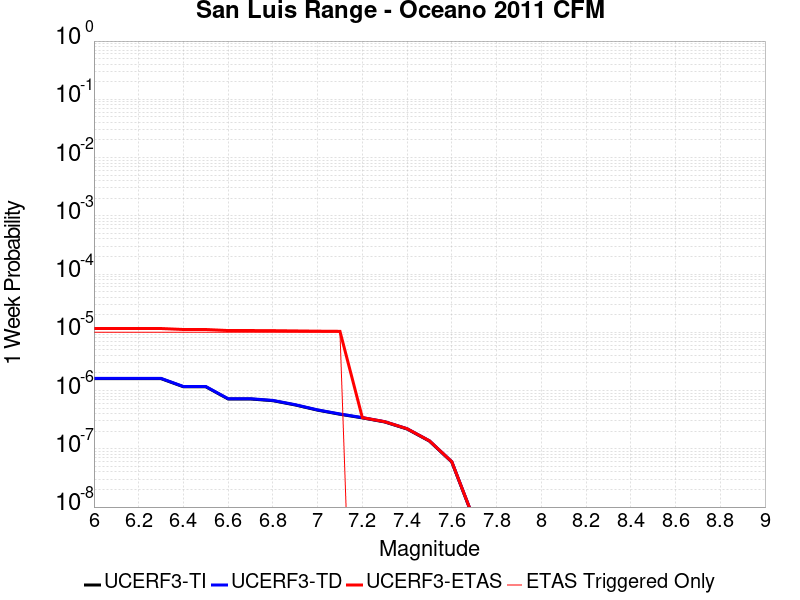 | 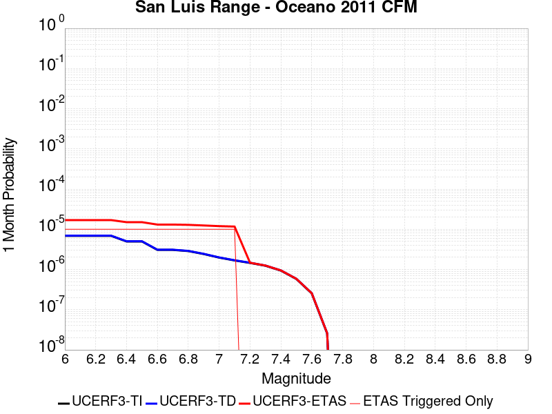 | 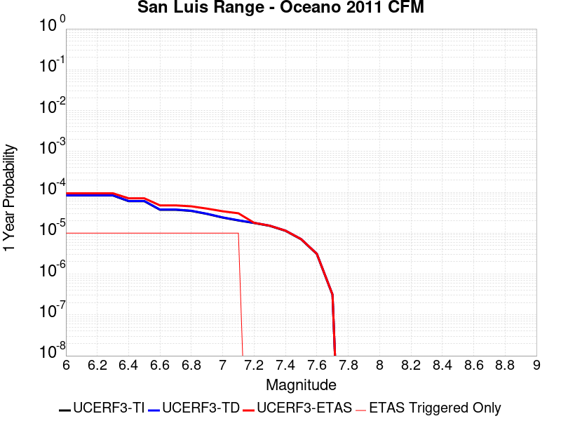 | 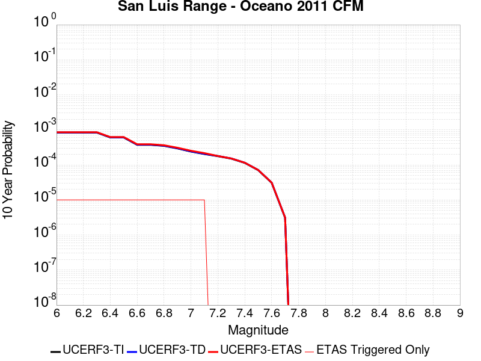 |

| Magnitude | 1 wk TI Prob | 1 wk TD Prob | 1 wk ETAS Prob | 1 wk ETAS/TD Gain | 1 wk ETAS Triggered Only | 1 mo TI Prob | 1 mo TD Prob | 1 mo ETAS Prob | 1 mo ETAS/TD Gain | 1 mo ETAS Triggered Only | 1 yr TI Prob | 1 yr TD Prob | 1 yr ETAS Prob | 1 yr ETAS/TD Gain | 1 yr ETAS Triggered Only | 10 yr TI Prob | 10 yr TD Prob | 10 yr ETAS Prob | 10 yr ETAS/TD Gain | 10 yr ETAS Triggered Only |
|-----|-----|-----|-----|-----|-----|-----|-----|-----|-----|-----|-----|-----|-----|-----|-----|-----|-----|-----|-----|-----|
| 6.0 | 1.6025788E-6 | 1.620119E-6 | 1.1620103E-5 | 7.172376 | 1.0E-5 | 6.8681766E-6 | 6.943351E-6 | 1.694328E-5 | 2.4402168 | 1.0E-5 | 8.361684E-5 | 8.453243E-5 | 9.4531584E-5 | 1.1182878 | 1.0E-5 | 8.3585386E-4 | 8.4504357E-4 | 8.5503515E-4 | 1.0118237 | 1.0E-5 |
| 6.1 | 1.6025788E-6 | 1.620119E-6 | 1.1620103E-5 | 7.172376 | 1.0E-5 | 6.8681766E-6 | 6.943351E-6 | 1.694328E-5 | 2.4402168 | 1.0E-5 | 8.361684E-5 | 8.453243E-5 | 9.4531584E-5 | 1.1182878 | 1.0E-5 | 8.3585386E-4 | 8.4504357E-4 | 8.5503515E-4 | 1.0118237 | 1.0E-5 |
| 6.2 | 1.6025788E-6 | 1.620119E-6 | 1.1620103E-5 | 7.172376 | 1.0E-5 | 6.8681766E-6 | 6.943351E-6 | 1.694328E-5 | 2.4402168 | 1.0E-5 | 8.361684E-5 | 8.453243E-5 | 9.4531584E-5 | 1.1182878 | 1.0E-5 | 8.3585386E-4 | 8.4504357E-4 | 8.5503515E-4 | 1.0118237 | 1.0E-5 |
| 6.3 | 1.6025788E-6 | 1.620119E-6 | 1.1620103E-5 | 7.172376 | 1.0E-5 | 6.8681766E-6 | 6.943351E-6 | 1.694328E-5 | 2.4402168 | 1.0E-5 | 8.361684E-5 | 8.453243E-5 | 9.4531584E-5 | 1.1182878 | 1.0E-5 | 8.3585386E-4 | 8.4504357E-4 | 8.5503515E-4 | 1.0118237 | 1.0E-5 |
| 6.4 | 1.1621186E-6 | 1.1749894E-6 | 1.1174978E-5 | 9.510705 | 1.0E-5 | 4.980499E-6 | 5.0356607E-6 | 1.503561E-5 | 2.9858267 | 1.0E-5 | 6.0635884E-5 | 6.130771E-5 | 7.1307106E-5 | 1.1631016 | 1.0E-5 | 6.0619344E-4 | 6.1293464E-4 | 6.229285E-4 | 1.016305 | 1.0E-5 |
| 6.5 | 1.1621186E-6 | 1.1749894E-6 | 1.1174978E-5 | 9.510705 | 1.0E-5 | 4.980499E-6 | 5.0356607E-6 | 1.503561E-5 | 2.9858267 | 1.0E-5 | 6.0635884E-5 | 6.130771E-5 | 7.1307106E-5 | 1.1631016 | 1.0E-5 | 6.0619344E-4 | 6.1293464E-4 | 6.229285E-4 | 1.016305 | 1.0E-5 |
| 6.6 | 7.164729E-7 | 7.2485784E-7 | 1.0724851E-5 | 14.795799 | 1.0E-5 | 3.0705946E-6 | 3.10653E-6 | 1.3106499E-5 | 4.2190156 | 1.0E-5 | 3.738385E-5 | 3.7821363E-5 | 4.7820984E-5 | 1.2643908 | 1.0E-5 | 3.737756E-4 | 3.7815105E-4 | 3.8814725E-4 | 1.0264344 | 1.0E-5 |
| 6.7 | 7.164729E-7 | 7.2485784E-7 | 1.0724851E-5 | 14.795799 | 1.0E-5 | 3.0705946E-6 | 3.10653E-6 | 1.3106499E-5 | 4.2190156 | 1.0E-5 | 3.738385E-5 | 3.7821363E-5 | 4.7820984E-5 | 1.2643908 | 1.0E-5 | 3.737756E-4 | 3.7815105E-4 | 3.8814725E-4 | 1.0264344 | 1.0E-5 |
| 6.8 | 6.700177E-7 | 6.7774397E-7 | 1.0677737E-5 | 15.754825 | 1.0E-5 | 2.8715012E-6 | 2.904614E-6 | 1.2904585E-5 | 4.4427886 | 1.0E-5 | 3.495997E-5 | 3.536312E-5 | 4.536276E-5 | 1.2827705 | 1.0E-5 | 3.495447E-4 | 3.5357653E-4 | 3.63573E-4 | 1.0282724 | 1.0E-5 |
| 6.9 | 5.657865E-7 | 5.7217864E-7 | 1.0572173E-5 | 18.477049 | 1.0E-5 | 2.424797E-6 | 2.452192E-6 | 1.24521675E-5 | 5.0779743 | 1.0E-5 | 2.9521503E-5 | 2.9855039E-5 | 3.9854738E-5 | 1.3349419 | 1.0E-5 | 2.9517582E-4 | 2.9851135E-4 | 3.0850834E-4 | 1.0334896 | 1.0E-5 |
| 7.0 | 4.608413E-7 | 4.660169E-7 | 1.0466012E-5 | 22.458439 | 1.0E-5 | 1.9750328E-6 | 1.9972138E-6 | 1.1997194E-5 | 6.006965 | 1.0E-5 | 2.4045758E-5 | 2.431581E-5 | 3.4315566E-5 | 1.4112451 | 1.0E-5 | 2.4043156E-4 | 2.4313178E-4 | 2.5312934E-4 | 1.0411199 | 1.0E-5 |
| 7.1 | 3.9177846E-7 | 3.9621602E-7 | 1.0396212E-5 | 26.238747 | 1.0E-5 | 1.6790494E-6 | 1.6980675E-6 | 1.1698051E-5 | 6.889037 | 1.0E-5 | 2.0442236E-5 | 2.0673779E-5 | 3.067357E-5 | 1.4836946 | 1.0E-5 | 2.0440355E-4 | 2.067187E-4 | 2.1671664E-4 | 1.0483649 | 1.0E-5 |
| 7.2 | 3.3974752E-7 | 3.436653E-7 | 3.436653E-7 | 1.0 | 0.0 | 1.45606E-6 | 1.4728505E-6 | 1.4728505E-6 | 1.0 | 0.0 | 1.7727387E-5 | 1.7931809E-5 | 1.7931809E-5 | 1.0 | 0.0 | 1.7725973E-4 | 1.7930372E-4 | 1.7930372E-4 | 1.0 | 0.0 |
| 7.3 | 2.8900928E-7 | 2.923402E-7 | 2.923402E-7 | 1.0 | 0.0 | 1.2386106E-6 | 1.2528859E-6 | 1.2528859E-6 | 1.0 | 0.0 | 1.5079979E-5 | 1.525378E-5 | 1.525378E-5 | 1.0 | 0.0 | 1.5078956E-4 | 1.5252741E-4 | 1.5252741E-4 | 1.0 | 0.0 |
| 7.4 | 2.1881527E-7 | 2.2139594E-7 | 2.2139594E-7 | 1.0 | 0.0 | 9.3777936E-7 | 9.488394E-7 | 9.488394E-7 | 1.0 | 0.0 | 1.14174045E-5 | 1.1552059E-5 | 1.1552059E-5 | 1.0 | 0.0 | 1.1416818E-4 | 1.1551464E-4 | 1.1551464E-4 | 1.0 | 0.0 |
| 7.5 | 1.356398E-7 | 1.3718639E-7 | 1.3718639E-7 | 1.0 | 0.0 | 5.813133E-7 | 5.8794154E-7 | 5.8794154E-7 | 1.0 | 0.0 | 7.0774663E-6 | 7.158165E-6 | 7.158165E-6 | 1.0 | 0.0 | 7.077241E-5 | 7.157937E-5 | 7.157937E-5 | 1.0 | 0.0 |
| 7.6 | 5.9269272E-8 | 6.001364E-8 | 6.001364E-8 | 1.0 | 0.0 | 2.5401116E-7 | 2.572013E-7 | 2.572013E-7 | 1.0 | 0.0 | 3.0925814E-6 | 3.1314214E-6 | 3.1314214E-6 | 1.0 | 0.0 | 3.0925385E-5 | 3.1313786E-5 | 3.1313786E-5 | 1.0 | 0.0 |
| 7.7 | 5.946232E-9 | 6.036928E-9 | 6.036928E-9 | 1.0 | 0.0 | 2.5483851E-8 | 2.5872547E-8 | 2.5872547E-8 | 1.0 | 0.0 | 3.1026585E-7 | 3.1499823E-7 | 3.1499823E-7 | 1.0 | 0.0 | 3.102654E-6 | 3.1499787E-6 | 3.1499787E-6 | 1.0 | 0.0 |

## Burnt Mtn
*[(top)](#table-of-contents)*

| 1 Week | 1 Month | 1 Year | 10 Year |
|-----|-----|-----|-----|
|  |  |  |  |

| Magnitude | 1 wk TI Prob | 1 wk TD Prob | 1 wk ETAS Prob | 1 wk ETAS/TD Gain | 1 wk ETAS Triggered Only | 1 mo TI Prob | 1 mo TD Prob | 1 mo ETAS Prob | 1 mo ETAS/TD Gain | 1 mo ETAS Triggered Only | 1 yr TI Prob | 1 yr TD Prob | 1 yr ETAS Prob | 1 yr ETAS/TD Gain | 1 yr ETAS Triggered Only | 10 yr TI Prob | 10 yr TD Prob | 10 yr ETAS Prob | 10 yr ETAS/TD Gain | 10 yr ETAS Triggered Only |
|-----|-----|-----|-----|-----|-----|-----|-----|-----|-----|-----|-----|-----|-----|-----|-----|-----|-----|-----|-----|-----|
| 6.0 | 1.5673151E-5 | 1.1749407E-5 | 1.1749407E-5 | 1.0 | 0.0 | 6.716892E-5 | 5.0354356E-5 | 5.0354356E-5 | 1.0 | 0.0 | 8.1747473E-4 | 6.1302073E-4 | 6.1302073E-4 | 1.0 | 0.0 | 0.008144741 | 0.006125938 | 0.0061358768 | 1.0016224 | 1.0E-5 |
| 6.1 | 1.5673151E-5 | 1.1749407E-5 | 1.1749407E-5 | 1.0 | 0.0 | 6.716892E-5 | 5.0354356E-5 | 5.0354356E-5 | 1.0 | 0.0 | 8.1747473E-4 | 6.1302073E-4 | 6.1302073E-4 | 1.0 | 0.0 | 0.008144741 | 0.006125938 | 0.0061358768 | 1.0016224 | 1.0E-5 |
| 6.2 | 1.5673151E-5 | 1.1749407E-5 | 1.1749407E-5 | 1.0 | 0.0 | 6.716892E-5 | 5.0354356E-5 | 5.0354356E-5 | 1.0 | 0.0 | 8.1747473E-4 | 6.1302073E-4 | 6.1302073E-4 | 1.0 | 0.0 | 0.008144741 | 0.006125938 | 0.0061358768 | 1.0016224 | 1.0E-5 |
| 6.3 | 1.5673151E-5 | 1.1749407E-5 | 1.1749407E-5 | 1.0 | 0.0 | 6.716892E-5 | 5.0354356E-5 | 5.0354356E-5 | 1.0 | 0.0 | 8.1747473E-4 | 6.1302073E-4 | 6.1302073E-4 | 1.0 | 0.0 | 0.008144741 | 0.006125938 | 0.0061358768 | 1.0016224 | 1.0E-5 |
| 6.4 | 1.5673151E-5 | 1.1749407E-5 | 1.1749407E-5 | 1.0 | 0.0 | 6.716892E-5 | 5.0354356E-5 | 5.0354356E-5 | 1.0 | 0.0 | 8.1747473E-4 | 6.1302073E-4 | 6.1302073E-4 | 1.0 | 0.0 | 0.008144741 | 0.006125938 | 0.0061358768 | 1.0016224 | 1.0E-5 |
| 6.5 | 1.36191375E-5 | 1.0078299E-5 | 1.0078299E-5 | 1.0 | 0.0 | 5.8366426E-5 | 4.3192707E-5 | 4.3192707E-5 | 1.0 | 0.0 | 7.103795E-4 | 5.2587123E-4 | 5.2587123E-4 | 1.0 | 0.0 | 0.0070811296 | 0.0052587125 | 0.0052686594 | 1.0018916 | 1.0E-5 |

## Owens Valley Keough Hot Springs
*[(top)](#table-of-contents)*

| 1 Week | 1 Month | 1 Year | 10 Year |
|-----|-----|-----|-----|
| 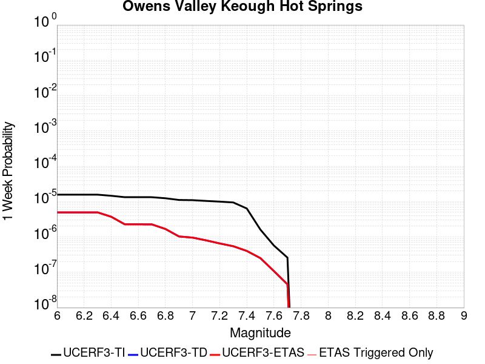 |  | 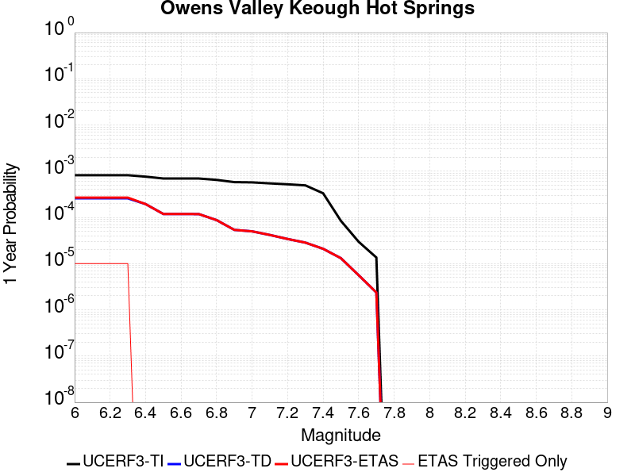 | 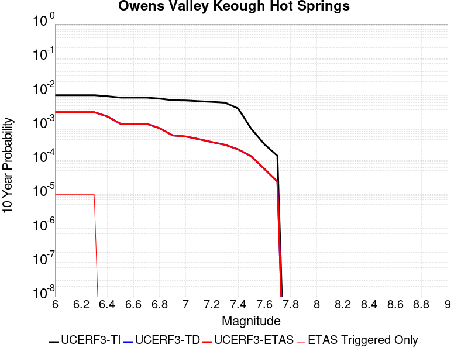 |

| Magnitude | 1 wk TI Prob | 1 wk TD Prob | 1 wk ETAS Prob | 1 wk ETAS/TD Gain | 1 wk ETAS Triggered Only | 1 mo TI Prob | 1 mo TD Prob | 1 mo ETAS Prob | 1 mo ETAS/TD Gain | 1 mo ETAS Triggered Only | 1 yr TI Prob | 1 yr TD Prob | 1 yr ETAS Prob | 1 yr ETAS/TD Gain | 1 yr ETAS Triggered Only | 10 yr TI Prob | 10 yr TD Prob | 10 yr ETAS Prob | 10 yr ETAS/TD Gain | 10 yr ETAS Triggered Only |
|-----|-----|-----|-----|-----|-----|-----|-----|-----|-----|-----|-----|-----|-----|-----|-----|-----|-----|-----|-----|-----|
| 6.0 | 1.5708529E-5 | 4.950656E-6 | 4.950656E-6 | 1.0 | 0.0 | 6.7320536E-5 | 2.1216953E-5 | 3.121674E-5 | 1.4713112 | 1.0E-5 | 8.193192E-4 | 2.582909E-4 | 2.6828834E-4 | 1.0387061 | 1.0E-5 | 0.008163051 | 0.0025805652 | 0.0025905394 | 1.0038651 | 1.0E-5 |
| 6.1 | 1.5708529E-5 | 4.950656E-6 | 4.950656E-6 | 1.0 | 0.0 | 6.7320536E-5 | 2.1216953E-5 | 3.121674E-5 | 1.4713112 | 1.0E-5 | 8.193192E-4 | 2.582909E-4 | 2.6828834E-4 | 1.0387061 | 1.0E-5 | 0.008163051 | 0.0025805652 | 0.0025905394 | 1.0038651 | 1.0E-5 |
| 6.2 | 1.5708529E-5 | 4.950656E-6 | 4.950656E-6 | 1.0 | 0.0 | 6.7320536E-5 | 2.1216953E-5 | 3.121674E-5 | 1.4713112 | 1.0E-5 | 8.193192E-4 | 2.582909E-4 | 2.6828834E-4 | 1.0387061 | 1.0E-5 | 0.008163051 | 0.0025805652 | 0.0025905394 | 1.0038651 | 1.0E-5 |
| 6.3 | 1.5708529E-5 | 4.950656E-6 | 4.950656E-6 | 1.0 | 0.0 | 6.7320536E-5 | 2.1216953E-5 | 3.121674E-5 | 1.4713112 | 1.0E-5 | 8.193192E-4 | 2.582909E-4 | 2.6828834E-4 | 1.0387061 | 1.0E-5 | 0.008163051 | 0.0025805652 | 0.0025905394 | 1.0038651 | 1.0E-5 |
| 6.4 | 1.4622509E-5 | 3.7265204E-6 | 3.7265204E-6 | 1.0 | 0.0 | 6.266639E-5 | 1.5970723E-5 | 1.5970723E-5 | 1.0 | 0.0 | 7.626962E-4 | 1.944295E-4 | 1.944295E-4 | 1.0 | 0.0 | 0.007600839 | 0.0019430731 | 0.0019430731 | 1.0 | 0.0 |
| 6.5 | 1.3335527E-5 | 2.2777172E-6 | 2.2777172E-6 | 1.0 | 0.0 | 5.7151006E-5 | 9.761612E-6 | 9.761612E-6 | 1.0 | 0.0 | 6.955913E-4 | 1.18841825E-4 | 1.18841825E-4 | 1.0 | 0.0 | 0.0069341804 | 0.0011880046 | 0.0011880046 | 1.0 | 0.0 |
| 6.6 | 1.3332855E-5 | 2.2748663E-6 | 2.2748663E-6 | 1.0 | 0.0 | 5.7139558E-5 | 9.749395E-6 | 9.749395E-6 | 1.0 | 0.0 | 6.9545204E-4 | 1.186931E-4 | 1.186931E-4 | 1.0 | 0.0 | 0.0069327964 | 0.0011865189 | 0.0011865189 | 1.0 | 0.0 |
| 6.7 | 1.3318214E-5 | 2.2640966E-6 | 2.2640966E-6 | 1.0 | 0.0 | 5.707681E-5 | 9.703239E-6 | 9.703239E-6 | 1.0 | 0.0 | 6.946886E-4 | 1.1813121E-4 | 1.1813121E-4 | 1.0 | 0.0 | 0.0069252094 | 0.001180906 | 0.001180906 | 1.0 | 0.0 |
| 6.8 | 1.2441338E-5 | 1.6777863E-6 | 1.6777863E-6 | 1.0 | 0.0 | 5.331893E-5 | 7.1904947E-6 | 7.1904947E-6 | 1.0 | 0.0 | 6.489646E-4 | 8.7541055E-5 | 8.7541055E-5 | 1.0 | 0.0 | 0.0064707273 | 8.752499E-4 | 8.752499E-4 | 1.0 | 0.0 |
| 6.9 | 1.1130476E-5 | 1.0303868E-6 | 1.0303868E-6 | 1.0 | 0.0 | 4.7701167E-5 | 4.415936E-6 | 4.415936E-6 | 1.0 | 0.0 | 5.806069E-4 | 5.3762706E-5 | 5.3762706E-5 | 1.0 | 0.0 | 0.0057909233 | 5.37651E-4 | 5.37651E-4 | 1.0 | 0.0 |
| 7.0 | 1.0986073E-5 | 9.579413E-7 | 9.579413E-7 | 1.0 | 0.0 | 4.7082318E-5 | 4.1054564E-6 | 4.1054564E-6 | 1.0 | 0.0 | 5.730765E-4 | 4.99828E-5 | 4.99828E-5 | 1.0 | 0.0 | 0.0057160086 | 4.9986853E-4 | 4.9986853E-4 | 1.0 | 0.0 |
| 7.1 | 1.0451338E-5 | 8.0002656E-7 | 8.0002656E-7 | 1.0 | 0.0 | 4.4790682E-5 | 3.4286807E-6 | 3.4286807E-6 | 1.0 | 0.0 | 5.451901E-4 | 4.1743395E-5 | 4.1743395E-5 | 1.0 | 0.0 | 0.005438545 | 4.1750458E-4 | 4.1750458E-4 | 1.0 | 0.0 |
| 7.2 | 9.989061E-6 | 6.544956E-7 | 6.544956E-7 | 1.0 | 0.0 | 4.280956E-5 | 2.804978E-6 | 2.804978E-6 | 1.0 | 0.0 | 5.2108173E-4 | 3.4150078E-5 | 3.4150078E-5 | 1.0 | 0.0 | 0.0051986156 | 3.415851E-4 | 3.415851E-4 | 1.0 | 0.0 |
| 7.3 | 9.465365E-6 | 5.4600474E-7 | 5.4600474E-7 | 1.0 | 0.0 | 4.056522E-5 | 2.3400182E-6 | 2.3400182E-6 | 1.0 | 0.0 | 4.937696E-4 | 2.8489352E-5 | 2.8489352E-5 | 1.0 | 0.0 | 0.0049267393 | 2.8498896E-4 | 2.8498896E-4 | 1.0 | 0.0 |
| 7.4 | 6.3824805E-6 | 4.016335E-7 | 4.016335E-7 | 1.0 | 0.0 | 2.73532E-5 | 1.7212853E-6 | 1.7212853E-6 | 1.0 | 0.0 | 3.3297433E-4 | 2.095645E-5 | 2.095645E-5 | 1.0 | 0.0 | 0.0033247585 | 2.0963654E-4 | 2.0963654E-4 | 1.0 | 0.0 |
| 7.5 | 1.6192645E-6 | 2.516124E-7 | 2.516124E-7 | 1.0 | 0.0 | 6.9396865E-6 | 1.0783383E-6 | 1.0783383E-6 | 1.0 | 0.0 | 8.448741E-5 | 1.31286915E-5 | 1.31286915E-5 | 1.0 | 0.0 | 8.4455294E-4 | 1.3127929E-4 | 1.3127929E-4 | 1.0 | 0.0 |
| 7.6 | 5.7062545E-7 | 1.07924045E-7 | 1.07924045E-7 | 1.0 | 0.0 | 2.4455355E-6 | 4.6253152E-7 | 4.6253152E-7 | 1.0 | 0.0 | 2.9773988E-5 | 5.6313074E-6 | 5.6313074E-6 | 1.0 | 0.0 | 2.977E-4 | 5.6311732E-5 | 5.6311732E-5 | 1.0 | 0.0 |
| 7.7 | 2.5988817E-7 | 4.5457977E-8 | 4.5457977E-8 | 1.0 | 0.0 | 1.113806E-6 | 1.9481989E-7 | 1.9481989E-7 | 1.0 | 0.0 | 1.3560503E-5 | 2.3719301E-6 | 2.3719301E-6 | 1.0 | 0.0 | 1.3559677E-4 | 2.371909E-5 | 2.371909E-5 | 1.0 | 0.0 |

## Contra Costa Shear Zone (connector) 2011 CFM
*[(top)](#table-of-contents)*

| 1 Week | 1 Month | 1 Year | 10 Year |
|-----|-----|-----|-----|
| 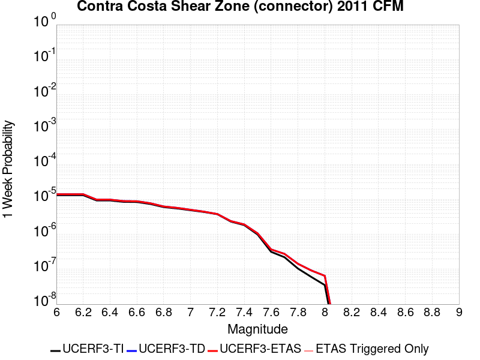 |  | 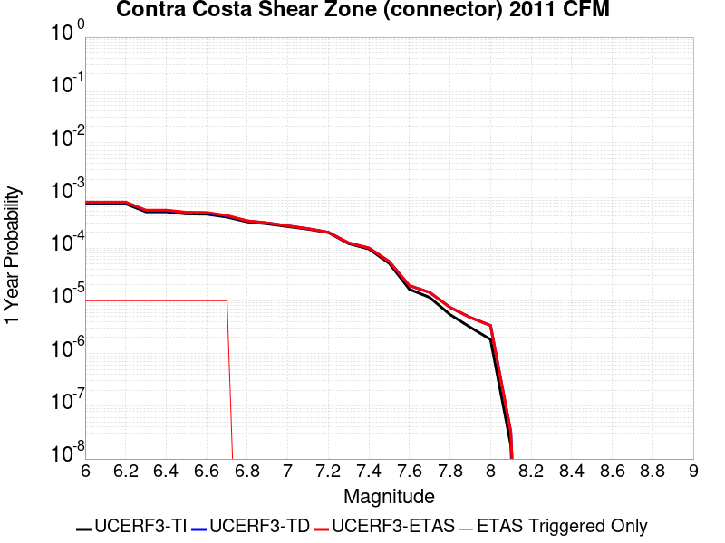 | 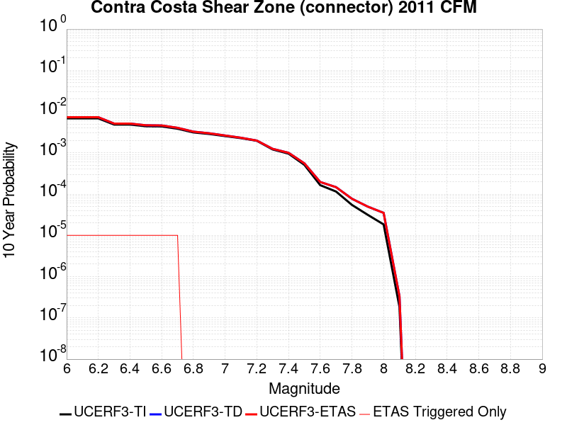 |

| Magnitude | 1 wk TI Prob | 1 wk TD Prob | 1 wk ETAS Prob | 1 wk ETAS/TD Gain | 1 wk ETAS Triggered Only | 1 mo TI Prob | 1 mo TD Prob | 1 mo ETAS Prob | 1 mo ETAS/TD Gain | 1 mo ETAS Triggered Only | 1 yr TI Prob | 1 yr TD Prob | 1 yr ETAS Prob | 1 yr ETAS/TD Gain | 1 yr ETAS Triggered Only | 10 yr TI Prob | 10 yr TD Prob | 10 yr ETAS Prob | 10 yr ETAS/TD Gain | 10 yr ETAS Triggered Only |
|-----|-----|-----|-----|-----|-----|-----|-----|-----|-----|-----|-----|-----|-----|-----|-----|-----|-----|-----|-----|-----|
| 6.0 | 1.3187427E-5 | 1.4041767E-5 | 1.4041767E-5 | 1.0 | 0.0 | 5.6516317E-5 | 6.0177743E-5 | 6.0177743E-5 | 1.0 | 0.0 | 6.878689E-4 | 7.3244056E-4 | 7.4243324E-4 | 1.013643 | 1.0E-5 | 0.006857436 | 0.007306717 | 0.0073166434 | 1.0013586 | 1.0E-5 |
| 6.1 | 1.3187427E-5 | 1.4041767E-5 | 1.4041767E-5 | 1.0 | 0.0 | 5.6516317E-5 | 6.0177743E-5 | 6.0177743E-5 | 1.0 | 0.0 | 6.878689E-4 | 7.3244056E-4 | 7.4243324E-4 | 1.013643 | 1.0E-5 | 0.006857436 | 0.007306717 | 0.0073166434 | 1.0013586 | 1.0E-5 |
| 6.2 | 1.3187427E-5 | 1.4041767E-5 | 1.4041767E-5 | 1.0 | 0.0 | 5.6516317E-5 | 6.0177743E-5 | 6.0177743E-5 | 1.0 | 0.0 | 6.878689E-4 | 7.3244056E-4 | 7.4243324E-4 | 1.013643 | 1.0E-5 | 0.006857436 | 0.007306717 | 0.0073166434 | 1.0013586 | 1.0E-5 |
| 6.3 | 9.315374E-6 | 9.8246965E-6 | 9.8246965E-6 | 1.0 | 0.0 | 3.992242E-5 | 4.210519E-5 | 4.210519E-5 | 1.0 | 0.0 | 4.8594706E-4 | 5.125142E-4 | 5.2250904E-4 | 1.0195017 | 1.0E-5 | 0.004848858 | 0.005117929 | 0.005127878 | 1.001944 | 1.0E-5 |
| 6.4 | 9.315374E-6 | 9.8246965E-6 | 9.8246965E-6 | 1.0 | 0.0 | 3.992242E-5 | 4.210519E-5 | 4.210519E-5 | 1.0 | 0.0 | 4.8594706E-4 | 5.125142E-4 | 5.2250904E-4 | 1.0195017 | 1.0E-5 | 0.004848858 | 0.005117929 | 0.005127878 | 1.001944 | 1.0E-5 |
| 6.5 | 8.492638E-6 | 8.938378E-6 | 8.938378E-6 | 1.0 | 0.0 | 3.639651E-5 | 3.8306793E-5 | 3.8306793E-5 | 1.0 | 0.0 | 4.430374E-4 | 4.6628877E-4 | 4.762841E-4 | 1.021436 | 1.0E-5 | 0.0044215517 | 0.004657635 | 0.0046675885 | 1.0021371 | 1.0E-5 |
| 6.6 | 8.402072E-6 | 8.839179E-6 | 8.839179E-6 | 1.0 | 0.0 | 3.6008387E-5 | 3.7881662E-5 | 3.7881662E-5 | 1.0 | 0.0 | 4.383139E-4 | 4.61115E-4 | 4.711104E-4 | 1.0216765 | 1.0E-5 | 0.0043745036 | 0.004606113 | 0.004616067 | 1.002161 | 1.0E-5 |
| 6.7 | 7.383587E-6 | 7.746775E-6 | 7.746775E-6 | 1.0 | 0.0 | 3.164356E-5 | 3.3200056E-5 | 3.3200056E-5 | 1.0 | 0.0 | 3.8519225E-4 | 4.041378E-4 | 4.1413374E-4 | 1.024734 | 1.0E-5 | 0.0038452526 | 0.004038434 | 0.0040483936 | 1.0024662 | 1.0E-5 |
| 6.8 | 6.004921E-6 | 6.2644544E-6 | 6.2644544E-6 | 1.0 | 0.0 | 2.5735122E-5 | 2.6847389E-5 | 2.6847389E-5 | 1.0 | 0.0 | 3.1328006E-4 | 3.2681847E-4 | 3.2681847E-4 | 1.0 | 0.0 | 0.0031283877 | 0.00326763 | 0.00326763 | 1.0 | 0.0 |
| 6.9 | 5.505255E-6 | 5.716864E-6 | 5.716864E-6 | 1.0 | 0.0 | 2.3593739E-5 | 2.4500618E-5 | 2.4500618E-5 | 1.0 | 0.0 | 2.872159E-4 | 2.9825463E-4 | 2.9825463E-4 | 1.0 | 0.0 | 0.0028684495 | 0.0029827862 | 0.0029827862 | 1.0 | 0.0 |
| 7.0 | 4.891922E-6 | 5.047539E-6 | 5.047539E-6 | 1.0 | 0.0 | 2.096521E-5 | 2.1632133E-5 | 2.1632133E-5 | 1.0 | 0.0 | 2.5522153E-4 | 2.6333975E-4 | 2.6333975E-4 | 1.0 | 0.0 | 0.0025492862 | 0.002634512 | 0.002634512 | 1.0 | 0.0 |
| 7.1 | 4.3599E-6 | 4.451558E-6 | 4.451558E-6 | 1.0 | 0.0 | 1.868515E-5 | 1.907797E-5 | 1.907797E-5 | 1.0 | 0.0 | 2.2746796E-4 | 2.3224979E-4 | 2.3224979E-4 | 1.0 | 0.0 | 0.0022723526 | 0.002324299 | 0.002324299 | 1.0 | 0.0 |
| 7.2 | 3.7647926E-6 | 3.802583E-6 | 3.802583E-6 | 1.0 | 0.0 | 1.6134725E-5 | 1.6296684E-5 | 1.6296684E-5 | 1.0 | 0.0 | 1.9642258E-4 | 1.9839432E-4 | 1.9839432E-4 | 1.0 | 0.0 | 0.0019624906 | 0.0019863888 | 0.0019863888 | 1.0 | 0.0 |
| 7.3 | 2.3179882E-6 | 2.3909352E-6 | 2.3909352E-6 | 1.0 | 0.0 | 9.934198E-6 | 1.0246825E-5 | 1.0246825E-5 | 1.0 | 0.0 | 1.20942146E-4 | 1.24748E-4 | 1.24748E-4 | 1.0 | 0.0 | 0.0012087635 | 0.0012509746 | 0.0012509746 | 1.0 | 0.0 |
| 7.4 | 1.8378355E-6 | 1.9182357E-6 | 1.9182357E-6 | 1.0 | 0.0 | 7.876414E-6 | 8.220985E-6 | 8.220985E-6 | 1.0 | 0.0 | 9.5891126E-5 | 1.00085934E-4 | 1.00085934E-4 | 1.0 | 0.0 | 9.584976E-4 | 0.0010045159 | 0.0010045159 | 1.0 | 0.0 |
| 7.5 | 9.840493E-7 | 1.0624193E-6 | 1.0624193E-6 | 1.0 | 0.0 | 4.2173474E-6 | 4.5532174E-6 | 4.5532174E-6 | 1.0 | 0.0 | 5.1344992E-5 | 5.543403E-5 | 5.543403E-5 | 1.0 | 0.0 | 5.133313E-4 | 5.5794773E-4 | 5.5794773E-4 | 1.0 | 0.0 |
| 7.6 | 3.1602997E-7 | 3.703975E-7 | 3.703975E-7 | 1.0 | 0.0 | 1.3544135E-6 | 1.5874168E-6 | 1.5874168E-6 | 1.0 | 0.0 | 1.648986E-5 | 1.932663E-5 | 1.932663E-5 | 1.0 | 0.0 | 1.6488635E-4 | 1.9679939E-4 | 1.9679939E-4 | 1.0 | 0.0 |
| 7.7 | 2.2125788E-7 | 2.7585256E-7 | 2.7585256E-7 | 1.0 | 0.0 | 9.482477E-7 | 1.1822247E-6 | 1.1822247E-6 | 1.0 | 0.0 | 1.1544855E-5 | 1.4393491E-5 | 1.4393491E-5 | 1.0 | 0.0 | 1.1544255E-4 | 1.4743804E-4 | 1.4743804E-4 | 1.0 | 0.0 |
| 7.8 | 1.0509553E-7 | 1.4376141E-7 | 1.4376141E-7 | 1.0 | 0.0 | 4.5040935E-7 | 6.161202E-7 | 6.161202E-7 | 1.0 | 0.0 | 5.48372E-6 | 7.5012376E-6 | 7.5012376E-6 | 1.0 | 0.0 | 5.4835844E-5 | 7.731305E-5 | 7.731305E-5 | 1.0 | 0.0 |
| 7.9 | 6.029319E-8 | 9.238947E-8 | 9.238947E-8 | 1.0 | 0.0 | 2.5839938E-7 | 3.959548E-7 | 3.959548E-7 | 1.0 | 0.0 | 3.1460077E-6 | 4.820739E-6 | 4.820739E-6 | 1.0 | 0.0 | 3.1459633E-5 | 4.978918E-5 | 4.978918E-5 | 1.0 | 0.0 |
| 8.0 | 3.531068E-8 | 6.508188E-8 | 6.508188E-8 | 1.0 | 0.0 | 1.5133148E-7 | 2.7892233E-7 | 2.7892233E-7 | 1.0 | 0.0 | 1.8424593E-6 | 3.395874E-6 | 3.395874E-6 | 1.0 | 0.0 | 1.842444E-5 | 3.5100315E-5 | 3.5100315E-5 | 1.0 | 0.0 |
| 8.1 | 3.5238246E-10 | 6.2559735E-10 | 6.2559735E-10 | 1.0 | 0.0 | 1.5102107E-9 | 2.681133E-9 | 2.681133E-9 | 1.0 | 0.0 | 1.8386816E-8 | 3.2642795E-8 | 3.2642795E-8 | 1.0 | 0.0 | 1.8386814E-7 | 3.3440446E-7 | 3.3440446E-7 | 1.0 | 0.0 |

## Rocky Ledge 2011 CFM
*[(top)](#table-of-contents)*

| 1 Week | 1 Month | 1 Year | 10 Year |
|-----|-----|-----|-----|
|  | 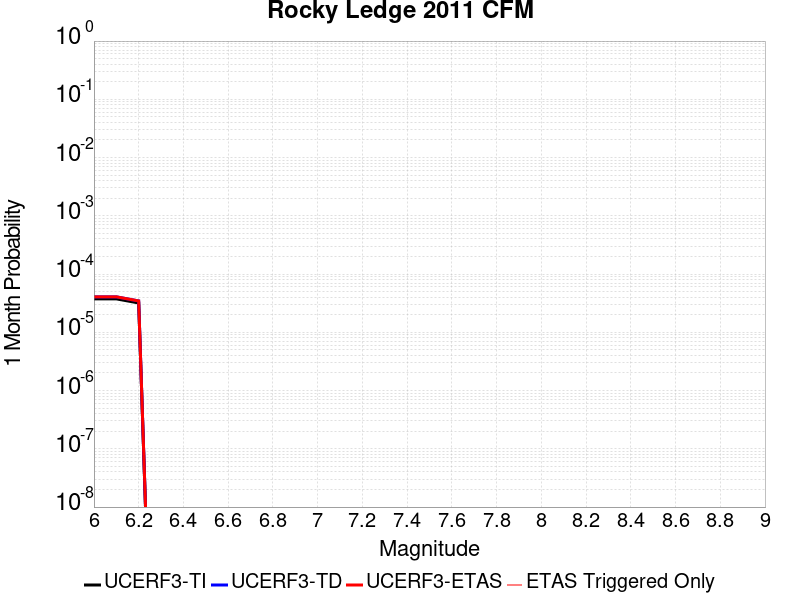 | 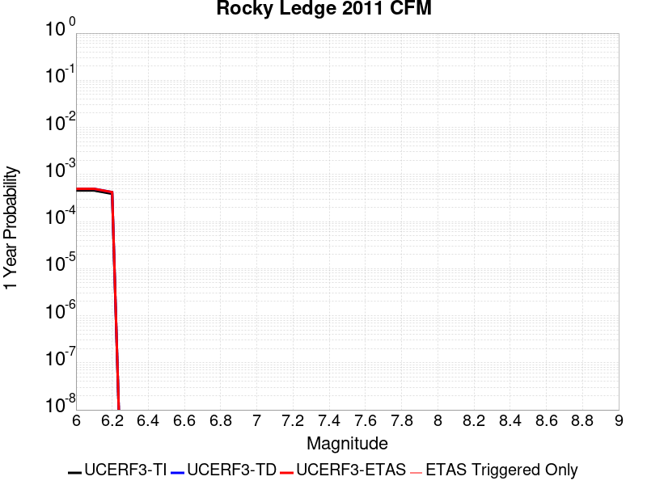 |  |

| Magnitude | 1 wk TI Prob | 1 wk TD Prob | 1 wk ETAS Prob | 1 wk ETAS/TD Gain | 1 wk ETAS Triggered Only | 1 mo TI Prob | 1 mo TD Prob | 1 mo ETAS Prob | 1 mo ETAS/TD Gain | 1 mo ETAS Triggered Only | 1 yr TI Prob | 1 yr TD Prob | 1 yr ETAS Prob | 1 yr ETAS/TD Gain | 1 yr ETAS Triggered Only | 10 yr TI Prob | 10 yr TD Prob | 10 yr ETAS Prob | 10 yr ETAS/TD Gain | 10 yr ETAS Triggered Only |
|-----|-----|-----|-----|-----|-----|-----|-----|-----|-----|-----|-----|-----|-----|-----|-----|-----|-----|-----|-----|-----|
| 6.0 | 8.7550525E-6 | 9.486605E-6 | 9.486605E-6 | 1.0 | 0.0 | 3.7521113E-5 | 4.0656712E-5 | 4.0656712E-5 | 1.0 | 0.0 | 4.567238E-4 | 4.949655E-4 | 4.949655E-4 | 1.0 | 0.0 | 0.0045578624 | 0.0049467194 | 0.0049566696 | 1.0020115 | 1.0E-5 |
| 6.1 | 8.7550525E-6 | 9.486605E-6 | 9.486605E-6 | 1.0 | 0.0 | 3.7521113E-5 | 4.0656712E-5 | 4.0656712E-5 | 1.0 | 0.0 | 4.567238E-4 | 4.949655E-4 | 4.949655E-4 | 1.0 | 0.0 | 0.0045578624 | 0.0049467194 | 0.0049467194 | 1.0 | 0.0 |
| 6.2 | 7.442295E-6 | 8.06304E-6 | 8.06304E-6 | 1.0 | 0.0 | 3.189516E-5 | 3.4555887E-5 | 3.4555887E-5 | 1.0 | 0.0 | 3.8825438E-4 | 4.2071793E-4 | 4.2071793E-4 | 1.0 | 0.0 | 0.0038757676 | 0.004207179 | 0.004207179 | 1.0 | 0.0 |

## Hector Mine
*[(top)](#table-of-contents)*

| 1 Week | 1 Month | 1 Year | 10 Year |
|-----|-----|-----|-----|
|  |  |  |  |

| Magnitude | 1 wk TI Prob | 1 wk TD Prob | 1 wk ETAS Prob | 1 wk ETAS/TD Gain | 1 wk ETAS Triggered Only | 1 mo TI Prob | 1 mo TD Prob | 1 mo ETAS Prob | 1 mo ETAS/TD Gain | 1 mo ETAS Triggered Only | 1 yr TI Prob | 1 yr TD Prob | 1 yr ETAS Prob | 1 yr ETAS/TD Gain | 1 yr ETAS Triggered Only | 10 yr TI Prob | 10 yr TD Prob | 10 yr ETAS Prob | 10 yr ETAS/TD Gain | 10 yr ETAS Triggered Only |
|-----|-----|-----|-----|-----|-----|-----|-----|-----|-----|-----|-----|-----|-----|-----|-----|-----|-----|-----|-----|-----|
| 6.0 | 1.8760093E-5 | 2.7963818E-6 | 1.2796354E-5 | 4.57604 | 1.0E-5 | 8.039792E-5 | 1.1984461E-5 | 2.198434E-5 | 1.8344039 | 1.0E-5 | 9.78405E-4 | 1.4590504E-4 | 1.5590357E-4 | 1.0685277 | 1.0E-5 | 0.009741086 | 0.0014584847 | 0.0014684701 | 1.0068464 | 1.0E-5 |
| 6.1 | 1.8760093E-5 | 2.7963818E-6 | 1.2796354E-5 | 4.57604 | 1.0E-5 | 8.039792E-5 | 1.1984461E-5 | 2.198434E-5 | 1.8344039 | 1.0E-5 | 9.78405E-4 | 1.4590504E-4 | 1.5590357E-4 | 1.0685277 | 1.0E-5 | 0.009741086 | 0.0014584847 | 0.0014684701 | 1.0068464 | 1.0E-5 |
| 6.2 | 1.8760093E-5 | 2.7963818E-6 | 1.2796354E-5 | 4.57604 | 1.0E-5 | 8.039792E-5 | 1.1984461E-5 | 2.198434E-5 | 1.8344039 | 1.0E-5 | 9.78405E-4 | 1.4590504E-4 | 1.5590357E-4 | 1.0685277 | 1.0E-5 | 0.009741086 | 0.0014584847 | 0.0014684701 | 1.0068464 | 1.0E-5 |
| 6.3 | 1.8760093E-5 | 2.7963818E-6 | 1.2796354E-5 | 4.57604 | 1.0E-5 | 8.039792E-5 | 1.1984461E-5 | 2.198434E-5 | 1.8344039 | 1.0E-5 | 9.78405E-4 | 1.4590504E-4 | 1.5590357E-4 | 1.0685277 | 1.0E-5 | 0.009741086 | 0.0014584847 | 0.0014684701 | 1.0068464 | 1.0E-5 |
| 6.4 | 1.0888055E-5 | 2.7963818E-6 | 1.2796354E-5 | 4.57604 | 1.0E-5 | 4.666226E-5 | 1.1984461E-5 | 2.198434E-5 | 1.8344039 | 1.0E-5 | 5.679649E-4 | 1.4590504E-4 | 1.5590357E-4 | 1.0685277 | 1.0E-5 | 0.0056651547 | 0.0014584847 | 0.0014684701 | 1.0068464 | 1.0E-5 |
| 6.5 | 1.0888055E-5 | 2.7963818E-6 | 1.2796354E-5 | 4.57604 | 1.0E-5 | 4.666226E-5 | 1.1984461E-5 | 2.198434E-5 | 1.8344039 | 1.0E-5 | 5.679649E-4 | 1.4590504E-4 | 1.5590357E-4 | 1.0685277 | 1.0E-5 | 0.0056651547 | 0.0014584847 | 0.0014684701 | 1.0068464 | 1.0E-5 |
| 6.6 | 1.0730738E-5 | 2.7963818E-6 | 1.2796354E-5 | 4.57604 | 1.0E-5 | 4.5988065E-5 | 1.1984461E-5 | 2.198434E-5 | 1.8344039 | 1.0E-5 | 5.5976084E-4 | 1.4590504E-4 | 1.5590357E-4 | 1.0685277 | 1.0E-5 | 0.0055835294 | 0.0014584847 | 0.0014684701 | 1.0068464 | 1.0E-5 |
| 6.7 | 7.881326E-6 | 2.7710626E-6 | 1.2771035E-5 | 4.608714 | 1.0E-5 | 3.3776672E-5 | 1.1875951E-5 | 2.1875832E-5 | 1.8420279 | 1.0E-5 | 4.111534E-4 | 1.445841E-4 | 1.5458265E-4 | 1.0691539 | 1.0E-5 | 0.0041039353 | 0.0014452925 | 0.001455278 | 1.006909 | 1.0E-5 |
| 6.8 | 7.5683483E-6 | 2.7328138E-6 | 1.2732787E-5 | 4.659222 | 1.0E-5 | 3.2435375E-5 | 1.1712029E-5 | 2.1711912E-5 | 1.853813 | 1.0E-5 | 3.9482914E-4 | 1.4258861E-4 | 1.5258719E-4 | 1.0701219 | 1.0E-5 | 0.0039412836 | 0.0014253634 | 0.001435349 | 1.0070058 | 1.0E-5 |
| 6.9 | 6.473048E-6 | 2.5138945E-6 | 1.25138695E-5 | 4.9778814 | 1.0E-5 | 2.7741338E-5 | 1.07738115E-5 | 2.0773705E-5 | 1.9281666 | 1.0E-5 | 3.3769844E-4 | 1.3116724E-4 | 1.4116592E-4 | 1.0762285 | 1.0E-5 | 0.0033718573 | 0.0013112876 | 0.0013212746 | 1.007616 | 1.0E-5 |
| 7.0 | 4.9959954E-6 | 1.8565124E-6 | 1.1856494E-5 | 6.386434 | 1.0E-5 | 2.1411232E-5 | 7.956478E-6 | 1.7956398E-5 | 2.2568276 | 1.0E-5 | 2.6065056E-4 | 9.686937E-5 | 1.0686841E-4 | 1.1032218 | 1.0E-5 | 0.0026034506 | 9.6862105E-4 | 9.786114E-4 | 1.010314 | 1.0E-5 |
| 7.1 | 1.2997541E-6 | 1.5602147E-7 | 1.5602147E-7 | 1.0 | 0.0 | 5.5703626E-6 | 6.686633E-7 | 6.686633E-7 | 1.0 | 0.0 | 6.7817055E-5 | 8.140949E-6 | 8.140949E-6 | 1.0 | 0.0 | 6.779636E-4 | 8.1406906E-5 | 8.1406906E-5 | 1.0 | 0.0 |
| 7.2 | 8.392699E-7 | 9.727592E-8 | 9.727592E-8 | 1.0 | 0.0 | 3.596866E-6 | 4.1689677E-7 | 4.1689677E-7 | 1.0 | 0.0 | 4.3790962E-5 | 5.0757085E-6 | 5.0757085E-6 | 1.0 | 0.0 | 4.3782333E-4 | 5.0756116E-5 | 5.0756116E-5 | 1.0 | 0.0 |
| 7.3 | 3.13015E-7 | 4.829262E-8 | 4.829262E-8 | 1.0 | 0.0 | 1.3414921E-6 | 2.0696835E-7 | 2.0696835E-7 | 1.0 | 0.0 | 1.6332544E-5 | 2.5198376E-6 | 2.5198376E-6 | 1.0 | 0.0 | 1.6331344E-4 | 2.5198176E-5 | 2.5198176E-5 | 1.0 | 0.0 |

## Robinson Creek
*[(top)](#table-of-contents)*

| 1 Week | 1 Month | 1 Year | 10 Year |
|-----|-----|-----|-----|
|  |  |  |  |

| Magnitude | 1 wk TI Prob | 1 wk TD Prob | 1 wk ETAS Prob | 1 wk ETAS/TD Gain | 1 wk ETAS Triggered Only | 1 mo TI Prob | 1 mo TD Prob | 1 mo ETAS Prob | 1 mo ETAS/TD Gain | 1 mo ETAS Triggered Only | 1 yr TI Prob | 1 yr TD Prob | 1 yr ETAS Prob | 1 yr ETAS/TD Gain | 1 yr ETAS Triggered Only | 10 yr TI Prob | 10 yr TD Prob | 10 yr ETAS Prob | 10 yr ETAS/TD Gain | 10 yr ETAS Triggered Only |
|-----|-----|-----|-----|-----|-----|-----|-----|-----|-----|-----|-----|-----|-----|-----|-----|-----|-----|-----|-----|-----|
| 6.0 | 1.3705327E-5 | 1.5285013E-5 | 1.5285013E-5 | 1.0 | 0.0 | 5.8735794E-5 | 6.55072E-5 | 6.55072E-5 | 1.0 | 0.0 | 7.1487366E-4 | 7.9755014E-4 | 7.9755014E-4 | 1.0 | 0.0 | 0.0071257832 | 0.007975501 | 0.007985421 | 1.0012438 | 1.0E-5 |
| 6.1 | 1.3705327E-5 | 1.5285013E-5 | 1.5285013E-5 | 1.0 | 0.0 | 5.8735794E-5 | 6.55072E-5 | 6.55072E-5 | 1.0 | 0.0 | 7.1487366E-4 | 7.9755014E-4 | 7.9755014E-4 | 1.0 | 0.0 | 0.0071257832 | 0.007975501 | 0.007985421 | 1.0012438 | 1.0E-5 |
| 6.2 | 1.3705327E-5 | 1.5285013E-5 | 1.5285013E-5 | 1.0 | 0.0 | 5.8735794E-5 | 6.55072E-5 | 6.55072E-5 | 1.0 | 0.0 | 7.1487366E-4 | 7.9755014E-4 | 7.9755014E-4 | 1.0 | 0.0 | 0.0071257832 | 0.007975501 | 0.007985421 | 1.0012438 | 1.0E-5 |
| 6.3 | 1.3705327E-5 | 1.5285013E-5 | 1.5285013E-5 | 1.0 | 0.0 | 5.8735794E-5 | 6.55072E-5 | 6.55072E-5 | 1.0 | 0.0 | 7.1487366E-4 | 7.9755014E-4 | 7.9755014E-4 | 1.0 | 0.0 | 0.0071257832 | 0.007975501 | 0.007985421 | 1.0012438 | 1.0E-5 |
| 6.4 | 1.3705327E-5 | 1.5285013E-5 | 1.5285013E-5 | 1.0 | 0.0 | 5.8735794E-5 | 6.55072E-5 | 6.55072E-5 | 1.0 | 0.0 | 7.1487366E-4 | 7.9755014E-4 | 7.9755014E-4 | 1.0 | 0.0 | 0.0071257832 | 0.007975501 | 0.007985421 | 1.0012438 | 1.0E-5 |

## Pitas Point (Lower West)
*[(top)](#table-of-contents)*

| 1 Week | 1 Month | 1 Year | 10 Year |
|-----|-----|-----|-----|
|  | 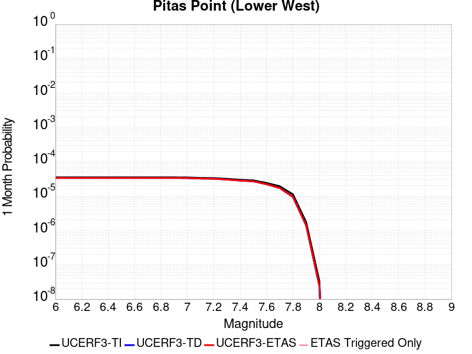 |  |  |

| Magnitude | 1 wk TI Prob | 1 wk TD Prob | 1 wk ETAS Prob | 1 wk ETAS/TD Gain | 1 wk ETAS Triggered Only | 1 mo TI Prob | 1 mo TD Prob | 1 mo ETAS Prob | 1 mo ETAS/TD Gain | 1 mo ETAS Triggered Only | 1 yr TI Prob | 1 yr TD Prob | 1 yr ETAS Prob | 1 yr ETAS/TD Gain | 1 yr ETAS Triggered Only | 10 yr TI Prob | 10 yr TD Prob | 10 yr ETAS Prob | 10 yr ETAS/TD Gain | 10 yr ETAS Triggered Only |
|-----|-----|-----|-----|-----|-----|-----|-----|-----|-----|-----|-----|-----|-----|-----|-----|-----|-----|-----|-----|-----|
| 6.0 | 8.151497E-6 | 7.855762E-6 | 7.855762E-6 | 1.0 | 0.0 | 3.493452E-5 | 3.3667122E-5 | 3.3667122E-5 | 1.0 | 0.0 | 4.252448E-4 | 4.0982084E-4 | 4.0982084E-4 | 1.0 | 0.0 | 0.0042443196 | 0.0040907315 | 0.0041006906 | 1.0024345 | 1.0E-5 |
| 6.1 | 8.151497E-6 | 7.855762E-6 | 7.855762E-6 | 1.0 | 0.0 | 3.493452E-5 | 3.3667122E-5 | 3.3667122E-5 | 1.0 | 0.0 | 4.252448E-4 | 4.0982084E-4 | 4.0982084E-4 | 1.0 | 0.0 | 0.0042443196 | 0.0040907315 | 0.0041006906 | 1.0024345 | 1.0E-5 |
| 6.2 | 8.151497E-6 | 7.855762E-6 | 7.855762E-6 | 1.0 | 0.0 | 3.493452E-5 | 3.3667122E-5 | 3.3667122E-5 | 1.0 | 0.0 | 4.252448E-4 | 4.0982084E-4 | 4.0982084E-4 | 1.0 | 0.0 | 0.0042443196 | 0.0040907315 | 0.0041006906 | 1.0024345 | 1.0E-5 |
| 6.3 | 8.151497E-6 | 7.855762E-6 | 7.855762E-6 | 1.0 | 0.0 | 3.493452E-5 | 3.3667122E-5 | 3.3667122E-5 | 1.0 | 0.0 | 4.252448E-4 | 4.0982084E-4 | 4.0982084E-4 | 1.0 | 0.0 | 0.0042443196 | 0.0040907315 | 0.0041006906 | 1.0024345 | 1.0E-5 |
| 6.4 | 8.151497E-6 | 7.855762E-6 | 7.855762E-6 | 1.0 | 0.0 | 3.493452E-5 | 3.3667122E-5 | 3.3667122E-5 | 1.0 | 0.0 | 4.252448E-4 | 4.0982084E-4 | 4.0982084E-4 | 1.0 | 0.0 | 0.0042443196 | 0.0040907315 | 0.0041006906 | 1.0024345 | 1.0E-5 |
| 6.5 | 8.151497E-6 | 7.855762E-6 | 7.855762E-6 | 1.0 | 0.0 | 3.493452E-5 | 3.3667122E-5 | 3.3667122E-5 | 1.0 | 0.0 | 4.252448E-4 | 4.0982084E-4 | 4.0982084E-4 | 1.0 | 0.0 | 0.0042443196 | 0.0040907315 | 0.0041006906 | 1.0024345 | 1.0E-5 |
| 6.6 | 8.151497E-6 | 7.855762E-6 | 7.855762E-6 | 1.0 | 0.0 | 3.493452E-5 | 3.3667122E-5 | 3.3667122E-5 | 1.0 | 0.0 | 4.252448E-4 | 4.0982084E-4 | 4.0982084E-4 | 1.0 | 0.0 | 0.0042443196 | 0.0040907315 | 0.0041006906 | 1.0024345 | 1.0E-5 |
| 6.7 | 8.151497E-6 | 7.855762E-6 | 7.855762E-6 | 1.0 | 0.0 | 3.493452E-5 | 3.3667122E-5 | 3.3667122E-5 | 1.0 | 0.0 | 4.252448E-4 | 4.0982084E-4 | 4.0982084E-4 | 1.0 | 0.0 | 0.0042443196 | 0.0040907315 | 0.0041006906 | 1.0024345 | 1.0E-5 |
| 6.8 | 8.151497E-6 | 7.855762E-6 | 7.855762E-6 | 1.0 | 0.0 | 3.493452E-5 | 3.3667122E-5 | 3.3667122E-5 | 1.0 | 0.0 | 4.252448E-4 | 4.0982084E-4 | 4.0982084E-4 | 1.0 | 0.0 | 0.0042443196 | 0.0040907315 | 0.0041006906 | 1.0024345 | 1.0E-5 |
| 6.9 | 8.151497E-6 | 7.855762E-6 | 7.855762E-6 | 1.0 | 0.0 | 3.493452E-5 | 3.3667122E-5 | 3.3667122E-5 | 1.0 | 0.0 | 4.252448E-4 | 4.0982084E-4 | 4.0982084E-4 | 1.0 | 0.0 | 0.0042443196 | 0.0040907315 | 0.0041006906 | 1.0024345 | 1.0E-5 |
| 7.0 | 8.103535E-6 | 7.805192E-6 | 7.805192E-6 | 1.0 | 0.0 | 3.4728975E-5 | 3.3450397E-5 | 3.3450397E-5 | 1.0 | 0.0 | 4.2274324E-4 | 4.0718322E-4 | 4.0718322E-4 | 1.0 | 0.0 | 0.0042193993 | 0.004064452 | 0.0040744115 | 1.0024503 | 1.0E-5 |
| 7.1 | 7.853298E-6 | 7.540883E-6 | 7.540883E-6 | 1.0 | 0.0 | 3.3656554E-5 | 3.2317676E-5 | 3.2317676E-5 | 1.0 | 0.0 | 4.096915E-4 | 3.9339735E-4 | 3.9339735E-4 | 1.0 | 0.0 | 0.00408937 | 0.0039270855 | 0.003937046 | 1.0025364 | 1.0E-5 |
| 7.2 | 7.771102E-6 | 7.453165E-6 | 7.453165E-6 | 1.0 | 0.0 | 3.33043E-5 | 3.194175E-5 | 3.194175E-5 | 1.0 | 0.0 | 4.0540437E-4 | 3.8882208E-4 | 3.8882208E-4 | 1.0 | 0.0 | 0.0040466557 | 0.0038814936 | 0.0038914548 | 1.0025663 | 1.0E-5 |
| 7.3 | 7.3945344E-6 | 7.0492697E-6 | 7.0492697E-6 | 1.0 | 0.0 | 3.1690477E-5 | 3.021081E-5 | 3.021081E-5 | 1.0 | 0.0 | 3.8576324E-4 | 3.6775516E-4 | 3.6775516E-4 | 1.0 | 0.0 | 0.0038509427 | 0.0036715334 | 0.0036814967 | 1.0027137 | 1.0E-5 |
| 7.4 | 6.964645E-6 | 6.5901186E-6 | 6.5901186E-6 | 1.0 | 0.0 | 2.9848137E-5 | 2.8243063E-5 | 2.8243063E-5 | 1.0 | 0.0 | 3.6334046E-4 | 3.4380553E-4 | 3.4380553E-4 | 1.0 | 0.0 | 0.0036274698 | 0.0034327896 | 0.0034427552 | 1.0029031 | 1.0E-5 |
| 7.5 | 6.6525035E-6 | 6.259157E-6 | 6.259157E-6 | 1.0 | 0.0 | 2.851042E-5 | 2.6824686E-5 | 2.6824686E-5 | 1.0 | 0.0 | 3.4705905E-4 | 3.265421E-4 | 3.265421E-4 | 1.0 | 0.0 | 0.0034651754 | 0.0032606742 | 0.0032706417 | 1.0030569 | 1.0E-5 |
| 7.6 | 5.613338E-6 | 5.151386E-6 | 5.151386E-6 | 1.0 | 0.0 | 2.405694E-5 | 2.2077185E-5 | 2.2077185E-5 | 1.0 | 0.0 | 2.928539E-4 | 2.6875688E-4 | 2.6875688E-4 | 1.0 | 0.0 | 0.0029246826 | 0.0026843501 | 0.0026943232 | 1.0037153 | 1.0E-5 |
| 7.7 | 4.494704E-6 | 3.996911E-6 | 3.996911E-6 | 1.0 | 0.0 | 1.9262876E-5 | 1.7129507E-5 | 1.7129507E-5 | 1.0 | 0.0 | 2.3450027E-4 | 2.0853203E-4 | 2.0853203E-4 | 1.0 | 0.0 | 0.0023425296 | 0.0020833875 | 0.0020933668 | 1.0047898 | 1.0E-5 |
| 7.8 | 2.6075882E-6 | 2.1836374E-6 | 2.1836374E-6 | 1.0 | 0.0 | 1.117533E-5 | 9.358413E-6 | 9.358413E-6 | 1.0 | 0.0 | 1.3605114E-4 | 1.1393277E-4 | 1.1393277E-4 | 1.0 | 0.0 | 0.0013596788 | 0.0011387484 | 0.0011487369 | 1.0087715 | 1.0E-5 |
| 7.9 | 4.045984E-7 | 3.242375E-7 | 3.242375E-7 | 1.0 | 0.0 | 1.733992E-6 | 1.3895885E-6 | 1.3895885E-6 | 1.0 | 0.0 | 2.1111147E-5 | 1.6918111E-5 | 1.6918111E-5 | 1.0 | 0.0 | 2.1109142E-4 | 1.6916855E-4 | 1.6916855E-4 | 1.0 | 0.0 |
| 8.0 | 7.791402E-9 | 5.683497E-9 | 5.683497E-9 | 1.0 | 0.0 | 3.3391725E-8 | 2.4357844E-8 | 2.4357844E-8 | 1.0 | 0.0 | 4.0654416E-7 | 2.9655675E-7 | 2.9655675E-7 | 1.0 | 0.0 | 4.065434E-6 | 2.9655655E-6 | 2.9655655E-6 | 1.0 | 0.0 |

## West Napa 2011 CFM
*[(top)](#table-of-contents)*

| 1 Week | 1 Month | 1 Year | 10 Year |
|-----|-----|-----|-----|
|  |  |  |  |

| Magnitude | 1 wk TI Prob | 1 wk TD Prob | 1 wk ETAS Prob | 1 wk ETAS/TD Gain | 1 wk ETAS Triggered Only | 1 mo TI Prob | 1 mo TD Prob | 1 mo ETAS Prob | 1 mo ETAS/TD Gain | 1 mo ETAS Triggered Only | 1 yr TI Prob | 1 yr TD Prob | 1 yr ETAS Prob | 1 yr ETAS/TD Gain | 1 yr ETAS Triggered Only | 10 yr TI Prob | 10 yr TD Prob | 10 yr ETAS Prob | 10 yr ETAS/TD Gain | 10 yr ETAS Triggered Only |
|-----|-----|-----|-----|-----|-----|-----|-----|-----|-----|-----|-----|-----|-----|-----|-----|-----|-----|-----|-----|-----|
| 6.0 | 3.773104E-5 | 4.452845E-5 | 4.452845E-5 | 1.0 | 0.0 | 1.6169442E-4 | 1.9082405E-4 | 1.9082405E-4 | 1.0 | 0.0 | 0.001966852 | 0.0023211248 | 0.0023211248 | 1.0 | 0.0 | 0.019495348 | 0.023002245 | 0.023012016 | 1.0004247 | 1.0E-5 |
| 6.1 | 3.773104E-5 | 4.452845E-5 | 4.452845E-5 | 1.0 | 0.0 | 1.6169442E-4 | 1.9082405E-4 | 1.9082405E-4 | 1.0 | 0.0 | 0.001966852 | 0.0023211248 | 0.0023211248 | 1.0 | 0.0 | 0.019495348 | 0.023002245 | 0.023012016 | 1.0004247 | 1.0E-5 |
| 6.2 | 3.773104E-5 | 4.452845E-5 | 4.452845E-5 | 1.0 | 0.0 | 1.6169442E-4 | 1.9082405E-4 | 1.9082405E-4 | 1.0 | 0.0 | 0.001966852 | 0.0023211248 | 0.0023211248 | 1.0 | 0.0 | 0.019495348 | 0.023002245 | 0.023012016 | 1.0004247 | 1.0E-5 |
| 6.3 | 2.147964E-5 | 2.4987039E-5 | 2.4987039E-5 | 1.0 | 0.0 | 9.2052345E-5 | 1.0708343E-4 | 1.0708343E-4 | 1.0 | 0.0 | 0.001120161 | 0.0013030528 | 0.0013030528 | 1.0 | 0.0 | 0.011145315 | 0.0129647385 | 0.0129647385 | 1.0 | 0.0 |
| 6.4 | 2.147964E-5 | 2.4987039E-5 | 2.4987039E-5 | 1.0 | 0.0 | 9.2052345E-5 | 1.0708343E-4 | 1.0708343E-4 | 1.0 | 0.0 | 0.001120161 | 0.0013030528 | 0.0013030528 | 1.0 | 0.0 | 0.011145315 | 0.0129647385 | 0.0129647385 | 1.0 | 0.0 |
| 6.5 | 1.688201E-5 | 1.9547346E-5 | 1.9547346E-5 | 1.0 | 0.0 | 7.234947E-5 | 8.377206E-5 | 8.377206E-5 | 1.0 | 0.0 | 8.804988E-4 | 0.0010195201 | 0.0010195201 | 1.0 | 0.0 | 0.008770182 | 0.010157098 | 0.010157098 | 1.0 | 0.0 |
| 6.6 | 1.6846381E-5 | 1.9507039E-5 | 1.9507039E-5 | 1.0 | 0.0 | 7.219678E-5 | 8.359933E-5 | 8.359933E-5 | 1.0 | 0.0 | 8.7864127E-4 | 0.001017419 | 0.001017419 | 1.0 | 0.0 | 0.008751754 | 0.010136279 | 0.010136279 | 1.0 | 0.0 |
| 6.7 | 1.3396501E-5 | 1.5467655E-5 | 1.5467655E-5 | 1.0 | 0.0 | 5.7412315E-5 | 6.628862E-5 | 6.628862E-5 | 1.0 | 0.0 | 6.9877075E-4 | 8.0682867E-4 | 8.0682867E-4 | 1.0 | 0.0 | 0.0069657755 | 0.008046719 | 0.008046719 | 1.0 | 0.0 |
| 6.8 | 1.0139058E-5 | 1.1672149E-5 | 1.1672149E-5 | 1.0 | 0.0 | 4.3452383E-5 | 5.0022853E-5 | 5.0022853E-5 | 1.0 | 0.0 | 5.289043E-4 | 6.0891354E-4 | 6.0891354E-4 | 1.0 | 0.0 | 0.005276473 | 0.006079373 | 0.006079373 | 1.0 | 0.0 |
| 6.9 | 7.761281E-6 | 8.890694E-6 | 8.890694E-6 | 1.0 | 0.0 | 3.326221E-5 | 3.8102706E-5 | 3.8102706E-5 | 1.0 | 0.0 | 4.0489217E-4 | 4.6385307E-4 | 4.6385307E-4 | 1.0 | 0.0 | 0.0040415525 | 0.004635363 | 0.004635363 | 1.0 | 0.0 |
| 7.0 | 2.2109202E-6 | 2.3666025E-6 | 2.3666025E-6 | 1.0 | 0.0 | 9.475338E-6 | 1.0142544E-5 | 1.0142544E-5 | 1.0 | 0.0 | 1.1535613E-4 | 1.2347854E-4 | 1.2347854E-4 | 1.0 | 0.0 | 0.0011529627 | 0.0012355851 | 0.0012355851 | 1.0 | 0.0 |
| 7.1 | 1.9008926E-6 | 2.0132914E-6 | 2.0132914E-6 | 1.0 | 0.0 | 8.146657E-6 | 8.6283635E-6 | 8.6283635E-6 | 1.0 | 0.0 | 9.918104E-5 | 1.05045285E-4 | 1.05045285E-4 | 1.0 | 0.0 | 9.913679E-4 | 0.001051437 | 0.001051437 | 1.0 | 0.0 |
| 7.2 | 1.8495944E-6 | 1.9560982E-6 | 1.9560982E-6 | 1.0 | 0.0 | 7.926808E-6 | 8.383251E-6 | 8.383251E-6 | 1.0 | 0.0 | 9.650462E-5 | 1.0206133E-4 | 1.0206133E-4 | 1.0 | 0.0 | 9.6462725E-4 | 0.0010216252 | 0.0010216252 | 1.0 | 0.0 |
| 7.3 | 1.7883189E-6 | 1.8880608E-6 | 1.8880608E-6 | 1.0 | 0.0 | 7.664201E-6 | 8.091664E-6 | 8.091664E-6 | 1.0 | 0.0 | 9.330765E-5 | 9.8511584E-5 | 9.8511584E-5 | 1.0 | 0.0 | 9.3268487E-4 | 9.861597E-4 | 9.861597E-4 | 1.0 | 0.0 |
| 7.4 | 1.6520572E-6 | 1.741484E-6 | 1.741484E-6 | 1.0 | 0.0 | 7.0802257E-6 | 7.463482E-6 | 7.463482E-6 | 1.0 | 0.0 | 8.6198335E-5 | 9.086413E-5 | 9.086413E-5 | 1.0 | 0.0 | 8.616491E-4 | 9.0974604E-4 | 9.0974604E-4 | 1.0 | 0.0 |
| 7.5 | 1.4040345E-6 | 1.4800074E-6 | 1.4800074E-6 | 1.0 | 0.0 | 6.0172765E-6 | 6.3428733E-6 | 6.3428733E-6 | 1.0 | 0.0 | 7.325788E-5 | 7.7221775E-5 | 7.7221775E-5 | 1.0 | 0.0 | 7.3233736E-4 | 7.7339396E-4 | 7.7339396E-4 | 1.0 | 0.0 |
| 7.6 | 1.3013842E-7 | 1.4415936E-7 | 1.4415936E-7 | 1.0 | 0.0 | 5.57736E-7 | 6.1782566E-7 | 6.1782566E-7 | 1.0 | 0.0 | 6.790414E-6 | 7.5220014E-6 | 7.5220014E-6 | 1.0 | 0.0 | 6.790207E-5 | 7.614869E-5 | 7.614869E-5 | 1.0 | 0.0 |
| 7.7 | 8.541512E-8 | 9.716316E-8 | 9.716316E-8 | 1.0 | 0.0 | 3.6606474E-7 | 4.1641349E-7 | 4.1641349E-7 | 1.0 | 0.0 | 4.456829E-6 | 5.0698222E-6 | 5.0698222E-6 | 1.0 | 0.0 | 4.4567398E-5 | 5.160297E-5 | 5.160297E-5 | 1.0 | 0.0 |
| 7.8 | 5.6074793E-8 | 6.89534E-8 | 6.89534E-8 | 1.0 | 0.0 | 2.403205E-7 | 2.9551452E-7 | 2.9551452E-7 | 1.0 | 0.0 | 2.9258983E-6 | 3.5978833E-6 | 3.5978833E-6 | 1.0 | 0.0 | 2.9258597E-5 | 3.681433E-5 | 3.681433E-5 | 1.0 | 0.0 |
| 7.9 | 2.9475839E-8 | 3.8566046E-8 | 3.8566046E-8 | 1.0 | 0.0 | 1.2632502E-7 | 1.6528305E-7 | 1.6528305E-7 | 1.0 | 0.0 | 1.538006E-6 | 2.0123193E-6 | 2.0123193E-6 | 1.0 | 0.0 | 1.5379954E-5 | 2.0665891E-5 | 2.0665891E-5 | 1.0 | 0.0 |
| 8.0 | 1.3337122E-8 | 2.163124E-8 | 2.163124E-8 | 1.0 | 0.0 | 5.7159088E-8 | 9.270532E-8 | 9.270532E-8 | 1.0 | 0.0 | 6.959117E-7 | 1.1286867E-6 | 1.1286867E-6 | 1.0 | 0.0 | 6.959095E-6 | 1.1645628E-5 | 1.1645628E-5 | 1.0 | 0.0 |
| 8.1 | 2.6589986E-10 | 4.8615456E-10 | 4.8615456E-10 | 1.0 | 0.0 | 1.1395708E-9 | 2.0835205E-9 | 2.0835205E-9 | 1.0 | 0.0 | 1.3874274E-8 | 2.536686E-8 | 2.536686E-8 | 1.0 | 0.0 | 1.3874273E-7 | 2.6035906E-7 | 2.6035906E-7 | 1.0 | 0.0 |

## Anaheim
*[(top)](#table-of-contents)*

| 1 Week | 1 Month | 1 Year | 10 Year |
|-----|-----|-----|-----|
|  |  |  |  |

| Magnitude | 1 wk TI Prob | 1 wk TD Prob | 1 wk ETAS Prob | 1 wk ETAS/TD Gain | 1 wk ETAS Triggered Only | 1 mo TI Prob | 1 mo TD Prob | 1 mo ETAS Prob | 1 mo ETAS/TD Gain | 1 mo ETAS Triggered Only | 1 yr TI Prob | 1 yr TD Prob | 1 yr ETAS Prob | 1 yr ETAS/TD Gain | 1 yr ETAS Triggered Only | 10 yr TI Prob | 10 yr TD Prob | 10 yr ETAS Prob | 10 yr ETAS/TD Gain | 10 yr ETAS Triggered Only |
|-----|-----|-----|-----|-----|-----|-----|-----|-----|-----|-----|-----|-----|-----|-----|-----|-----|-----|-----|-----|-----|
| 6.0 | 2.9254998E-6 | 2.5122863E-6 | 2.5122863E-6 | 1.0 | 0.0 | 1.25377965E-5 | 1.0766909E-5 | 2.0766802E-5 | 1.9287616 | 1.0E-5 | 1.5263697E-4 | 1.3108159E-4 | 1.4108028E-4 | 1.0762783 | 1.0E-5 | 0.0015253217 | 0.0013102728 | 0.0013202598 | 1.007622 | 1.0E-5 |
| 6.1 | 1.6729715E-6 | 1.2337348E-6 | 1.2337348E-6 | 1.0 | 0.0 | 7.1698582E-6 | 5.287426E-6 | 1.5287373E-5 | 2.8912692 | 1.0E-5 | 8.7289525E-5 | 6.437293E-5 | 7.4372285E-5 | 1.1553348 | 1.0E-5 | 8.7255245E-4 | 6.435838E-4 | 6.535773E-4 | 1.015528 | 1.0E-5 |
| 6.2 | 1.6729715E-6 | 1.2337348E-6 | 1.2337348E-6 | 1.0 | 0.0 | 7.1698582E-6 | 5.287426E-6 | 1.5287373E-5 | 2.8912692 | 1.0E-5 | 8.7289525E-5 | 6.437293E-5 | 7.4372285E-5 | 1.1553348 | 1.0E-5 | 8.7255245E-4 | 6.435838E-4 | 6.535773E-4 | 1.015528 | 1.0E-5 |
| 6.3 | 1.1444064E-6 | 6.9596666E-7 | 6.9596666E-7 | 1.0 | 0.0 | 4.9045893E-6 | 2.9827113E-6 | 2.9827113E-6 | 1.0 | 0.0 | 5.971174E-5 | 3.631396E-5 | 3.631396E-5 | 1.0 | 0.0 | 5.96957E-4 | 3.6308577E-4 | 3.6308577E-4 | 1.0 | 0.0 |
| 6.4 | 1.1444064E-6 | 6.9596666E-7 | 6.9596666E-7 | 1.0 | 0.0 | 4.9045893E-6 | 2.9827113E-6 | 2.9827113E-6 | 1.0 | 0.0 | 5.971174E-5 | 3.631396E-5 | 3.631396E-5 | 1.0 | 0.0 | 5.96957E-4 | 3.6308577E-4 | 3.6308577E-4 | 1.0 | 0.0 |
| 6.5 | 1.1385318E-6 | 6.9003505E-7 | 6.9003505E-7 | 1.0 | 0.0 | 4.879413E-6 | 2.95729E-6 | 2.95729E-6 | 1.0 | 0.0 | 5.9405233E-5 | 3.6004465E-5 | 3.6004465E-5 | 1.0 | 0.0 | 5.938936E-4 | 3.5999183E-4 | 3.5999183E-4 | 1.0 | 0.0 |
| 6.6 | 1.1165511E-6 | 6.678222E-7 | 6.678222E-7 | 1.0 | 0.0 | 4.78521E-6 | 2.862092E-6 | 2.862092E-6 | 1.0 | 0.0 | 5.8258374E-5 | 3.484547E-5 | 3.484547E-5 | 1.0 | 0.0 | 5.8243104E-4 | 3.484055E-4 | 3.484055E-4 | 1.0 | 0.0 |
| 6.7 | 1.1098243E-6 | 6.610416E-7 | 6.610416E-7 | 1.0 | 0.0 | 4.7563813E-6 | 2.8330326E-6 | 2.8330326E-6 | 1.0 | 0.0 | 5.7907404E-5 | 3.449168E-5 | 3.449168E-5 | 1.0 | 0.0 | 5.7892315E-4 | 3.4486872E-4 | 3.4486872E-4 | 1.0 | 0.0 |
| 6.8 | 1.1077587E-6 | 6.589619E-7 | 6.589619E-7 | 1.0 | 0.0 | 4.7475287E-6 | 2.8241195E-6 | 2.8241195E-6 | 1.0 | 0.0 | 5.779963E-5 | 3.438317E-5 | 3.438317E-5 | 1.0 | 0.0 | 5.77846E-4 | 3.4378393E-4 | 3.4378393E-4 | 1.0 | 0.0 |
| 6.9 | 1.1024468E-6 | 6.5361957E-7 | 6.5361957E-7 | 1.0 | 0.0 | 4.7247636E-6 | 2.8012241E-6 | 2.8012241E-6 | 1.0 | 0.0 | 5.752248E-5 | 3.4104425E-5 | 3.4104425E-5 | 1.0 | 0.0 | 5.750759E-4 | 3.4099736E-4 | 3.4099736E-4 | 1.0 | 0.0 |
| 7.0 | 1.0993066E-6 | 6.510303E-7 | 6.510303E-7 | 1.0 | 0.0 | 4.7113053E-6 | 2.7901272E-6 | 2.7901272E-6 | 1.0 | 0.0 | 5.7358633E-5 | 3.3969325E-5 | 3.3969325E-5 | 1.0 | 0.0 | 5.734383E-4 | 3.3964674E-4 | 3.3964674E-4 | 1.0 | 0.0 |
| 7.1 | 8.334877E-7 | 4.4049145E-7 | 4.4049145E-7 | 1.0 | 0.0 | 3.5720855E-6 | 1.8878193E-6 | 1.8878193E-6 | 1.0 | 0.0 | 4.348927E-5 | 2.298398E-5 | 2.298398E-5 | 1.0 | 0.0 | 4.3480762E-4 | 2.2981827E-4 | 2.2981827E-4 | 1.0 | 0.0 |
| 7.2 | 7.794411E-7 | 3.997645E-7 | 3.997645E-7 | 1.0 | 0.0 | 3.3404576E-6 | 1.7132754E-6 | 1.7132754E-6 | 1.0 | 0.0 | 4.0669314E-5 | 2.0858948E-5 | 2.0858948E-5 | 1.0 | 0.0 | 4.066187E-4 | 2.0857195E-4 | 2.0857195E-4 | 1.0 | 0.0 |
| 7.3 | 5.01704E-7 | 2.5573388E-7 | 2.5573388E-7 | 1.0 | 0.0 | 2.150158E-6 | 1.0960019E-6 | 1.0960019E-6 | 1.0 | 0.0 | 2.617786E-5 | 1.3343754E-5 | 1.3343754E-5 | 1.0 | 0.0 | 2.6174777E-4 | 1.3343077E-4 | 1.3343077E-4 | 1.0 | 0.0 |
| 7.4 | 2.4008182E-7 | 1.2367859E-7 | 1.2367859E-7 | 1.0 | 0.0 | 1.0289217E-6 | 5.30051E-7 | 5.30051E-7 | 1.0 | 0.0 | 1.252705E-5 | 6.4533597E-6 | 6.4533597E-6 | 1.0 | 0.0 | 1.2526344E-4 | 6.453248E-5 | 6.453248E-5 | 1.0 | 0.0 |
| 7.5 | 2.0263876E-8 | 1.6120866E-8 | 1.6120866E-8 | 1.0 | 0.0 | 8.684518E-8 | 6.908943E-8 | 6.908943E-8 | 1.0 | 0.0 | 1.0573395E-6 | 8.4116357E-7 | 8.4116357E-7 | 1.0 | 0.0 | 1.0573345E-5 | 8.411613E-6 | 8.411613E-6 | 1.0 | 0.0 |
| 7.6 | 1.4871431E-9 | 1.508418E-9 | 1.508418E-9 | 1.0 | 0.0 | 6.37347E-9 | 6.4646484E-9 | 6.4646484E-9 | 1.0 | 0.0 | 7.7596994E-8 | 7.870709E-8 | 7.870709E-8 | 1.0 | 0.0 | 7.759697E-7 | 7.8707063E-7 | 7.8707063E-7 | 1.0 | 0.0 |
| 7.7 | 1.5093293E-10 | 1.5333512E-10 | 1.5333512E-10 | 1.0 | 0.0 | 6.4685546E-10 | 6.571509E-10 | 6.571509E-10 | 1.0 | 0.0 | 7.875465E-9 | 8.0008125E-9 | 8.0008125E-9 | 1.0 | 0.0 | 7.8754645E-8 | 8.000812E-8 | 8.000812E-8 | 1.0 | 0.0 |

## Monte Vista - Shannon 2011 CFM
*[(top)](#table-of-contents)*

| 1 Week | 1 Month | 1 Year | 10 Year |
|-----|-----|-----|-----|
|  |  |  |  |

| Magnitude | 1 wk TI Prob | 1 wk TD Prob | 1 wk ETAS Prob | 1 wk ETAS/TD Gain | 1 wk ETAS Triggered Only | 1 mo TI Prob | 1 mo TD Prob | 1 mo ETAS Prob | 1 mo ETAS/TD Gain | 1 mo ETAS Triggered Only | 1 yr TI Prob | 1 yr TD Prob | 1 yr ETAS Prob | 1 yr ETAS/TD Gain | 1 yr ETAS Triggered Only | 10 yr TI Prob | 10 yr TD Prob | 10 yr ETAS Prob | 10 yr ETAS/TD Gain | 10 yr ETAS Triggered Only |
|-----|-----|-----|-----|-----|-----|-----|-----|-----|-----|-----|-----|-----|-----|-----|-----|-----|-----|-----|-----|-----|
| 6.0 | 2.7907707E-5 | 2.7584209E-5 | 3.7583934E-5 | 1.3625163 | 1.0E-5 | 1.19598975E-4 | 1.1821338E-4 | 1.282122E-4 | 1.0845828 | 1.0E-5 | 0.0014551448 | 0.0014384214 | 0.001448407 | 1.006942 | 1.0E-5 | 0.014456532 | 0.014320195 | 0.014330052 | 1.0006883 | 1.0E-5 |
| 6.1 | 2.7907707E-5 | 2.7584209E-5 | 3.7583934E-5 | 1.3625163 | 1.0E-5 | 1.19598975E-4 | 1.1821338E-4 | 1.282122E-4 | 1.0845828 | 1.0E-5 | 0.0014551448 | 0.0014384214 | 0.001448407 | 1.006942 | 1.0E-5 | 0.014456532 | 0.014320195 | 0.014330052 | 1.0006883 | 1.0E-5 |
| 6.2 | 2.7907707E-5 | 2.7584209E-5 | 3.7583934E-5 | 1.3625163 | 1.0E-5 | 1.19598975E-4 | 1.1821338E-4 | 1.282122E-4 | 1.0845828 | 1.0E-5 | 0.0014551448 | 0.0014384214 | 0.001448407 | 1.006942 | 1.0E-5 | 0.014456532 | 0.014320195 | 0.014330052 | 1.0006883 | 1.0E-5 |
| 6.3 | 2.7907707E-5 | 2.7584209E-5 | 3.7583934E-5 | 1.3625163 | 1.0E-5 | 1.19598975E-4 | 1.1821338E-4 | 1.282122E-4 | 1.0845828 | 1.0E-5 | 0.0014551448 | 0.0014384214 | 0.001448407 | 1.006942 | 1.0E-5 | 0.014456532 | 0.014320195 | 0.014330052 | 1.0006883 | 1.0E-5 |
| 6.4 | 2.7907707E-5 | 2.7584209E-5 | 3.7583934E-5 | 1.3625163 | 1.0E-5 | 1.19598975E-4 | 1.1821338E-4 | 1.282122E-4 | 1.0845828 | 1.0E-5 | 0.0014551448 | 0.0014384214 | 0.001448407 | 1.006942 | 1.0E-5 | 0.014456532 | 0.014320195 | 0.014330052 | 1.0006883 | 1.0E-5 |
| 6.5 | 1.7990213E-5 | 1.6639884E-5 | 2.6639718E-5 | 1.6009557 | 1.0E-5 | 7.709863E-5 | 7.131221E-5 | 8.1311504E-5 | 1.1402184 | 1.0E-5 | 9.382716E-4 | 8.679467E-4 | 8.77938E-4 | 1.0115114 | 1.0E-5 | 0.0093431985 | 0.008668941 | 0.008678854 | 1.0011436 | 1.0E-5 |
| 6.6 | 9.650407E-6 | 7.4571435E-6 | 1.7457069E-5 | 2.340986 | 1.0E-5 | 4.135823E-5 | 3.195884E-5 | 4.195852E-5 | 1.3128924 | 1.0E-5 | 5.0342013E-4 | 3.8903722E-4 | 3.9903334E-4 | 1.0256945 | 1.0E-5 | 0.005022812 | 0.0039012418 | 0.003911203 | 1.0025533 | 1.0E-5 |
| 6.7 | 9.62828E-6 | 7.4350583E-6 | 1.7434984E-5 | 2.3449693 | 1.0E-5 | 4.1263404E-5 | 3.186419E-5 | 4.186387E-5 | 1.3138219 | 1.0E-5 | 5.022661E-4 | 3.878853E-4 | 3.978814E-4 | 1.0257708 | 1.0E-5 | 0.0050113243 | 0.003889763 | 0.003899724 | 1.0025609 | 1.0E-5 |
| 6.8 | 6.887523E-6 | 4.4615676E-6 | 1.4461523E-5 | 3.2413547 | 1.0E-5 | 2.9517621E-5 | 1.9120876E-5 | 2.9120685E-5 | 1.5229785 | 1.0E-5 | 3.5931775E-4 | 2.3277402E-4 | 2.427717E-4 | 1.0429502 | 1.0E-5 | 0.0035873733 | 0.0023424553 | 0.0023524319 | 1.004259 | 1.0E-5 |
| 6.9 | 6.2722347E-6 | 3.8034377E-6 | 3.8034377E-6 | 1.0 | 0.0 | 2.6880729E-5 | 1.6300357E-5 | 1.6300357E-5 | 1.0 | 0.0 | 3.2722374E-4 | 1.984408E-4 | 1.984408E-4 | 1.0 | 0.0 | 0.003267423 | 0.0019997752 | 0.0019997752 | 1.0 | 0.0 |
| 7.0 | 5.5320347E-6 | 3.0305885E-6 | 3.0305885E-6 | 1.0 | 0.0 | 2.3708504E-5 | 1.2988182E-5 | 1.2988182E-5 | 1.0 | 0.0 | 2.8861282E-4 | 1.5812147E-4 | 1.5812147E-4 | 1.0 | 0.0 | 0.0028823826 | 0.001597215 | 0.001597215 | 1.0 | 0.0 |
| 7.1 | 3.8794055E-6 | 1.2837862E-6 | 1.2837862E-6 | 1.0 | 0.0 | 1.6625918E-5 | 5.5019295E-6 | 5.5019295E-6 | 1.0 | 0.0 | 2.0240174E-4 | 6.698394E-5 | 6.698394E-5 | 1.0 | 0.0 | 0.002022175 | 6.865884E-4 | 6.865884E-4 | 1.0 | 0.0 |
| 7.2 | 3.4813652E-6 | 9.671046E-7 | 9.671046E-7 | 1.0 | 0.0 | 1.49200505E-5 | 4.1447274E-6 | 4.1447274E-6 | 1.0 | 0.0 | 1.8163648E-4 | 5.0460894E-5 | 5.0460894E-5 | 1.0 | 0.0 | 0.0018148809 | 5.214329E-4 | 5.214329E-4 | 1.0 | 0.0 |
| 7.3 | 3.1682148E-6 | 7.719097E-7 | 7.719097E-7 | 1.0 | 0.0 | 1.3577992E-5 | 3.30818E-6 | 3.30818E-6 | 1.0 | 0.0 | 1.6529951E-4 | 4.027635E-5 | 4.027635E-5 | 1.0 | 0.0 | 0.0016517661 | 4.1960424E-4 | 4.1960424E-4 | 1.0 | 0.0 |
| 7.4 | 2.9707667E-6 | 7.3457204E-7 | 7.3457204E-7 | 1.0 | 0.0 | 1.2731795E-5 | 3.148162E-6 | 3.148162E-6 | 1.0 | 0.0 | 1.5499859E-4 | 3.8328202E-5 | 3.8328202E-5 | 1.0 | 0.0 | 0.0015489052 | 3.9992164E-4 | 3.9992164E-4 | 1.0 | 0.0 |
| 7.5 | 2.3462758E-6 | 6.007889E-7 | 6.007889E-7 | 1.0 | 0.0 | 1.0055429E-5 | 2.574807E-6 | 2.574807E-6 | 1.0 | 0.0 | 1.2241797E-4 | 3.1347827E-5 | 3.1347827E-5 | 1.0 | 0.0 | 0.0012235056 | 3.2839534E-4 | 3.2839534E-4 | 1.0 | 0.0 |
| 7.6 | 2.112783E-6 | 5.251582E-7 | 5.251582E-7 | 1.0 | 0.0 | 9.054753E-6 | 2.250676E-6 | 2.250676E-6 | 1.0 | 0.0 | 1.1023604E-4 | 2.7401638E-5 | 2.7401638E-5 | 1.0 | 0.0 | 0.0011018137 | 2.885138E-4 | 2.885138E-4 | 1.0 | 0.0 |
| 7.7 | 1.7022471E-6 | 4.231601E-7 | 4.231601E-7 | 1.0 | 0.0 | 7.2953244E-6 | 1.8135419E-6 | 1.8135419E-6 | 1.0 | 0.0 | 8.881695E-5 | 2.207965E-5 | 2.207965E-5 | 1.0 | 0.0 | 8.878146E-4 | 2.3398738E-4 | 2.3398738E-4 | 1.0 | 0.0 |
| 7.8 | 7.230914E-7 | 3.7285864E-7 | 3.7285864E-7 | 1.0 | 0.0 | 3.0989595E-6 | 1.5979647E-6 | 1.5979647E-6 | 1.0 | 0.0 | 3.772918E-5 | 1.9455047E-5 | 1.9455047E-5 | 1.0 | 0.0 | 3.7722773E-4 | 2.0726922E-4 | 2.0726922E-4 | 1.0 | 0.0 |
| 7.9 | 4.3588446E-7 | 3.4305793E-7 | 3.4305793E-7 | 1.0 | 0.0 | 1.868075E-6 | 1.4702474E-6 | 1.4702474E-6 | 1.0 | 0.0 | 2.2743576E-5 | 1.7900116E-5 | 1.7900116E-5 | 1.0 | 0.0 | 2.2741247E-4 | 1.8995286E-4 | 1.8995286E-4 | 1.0 | 0.0 |
| 8.0 | 2.3317523E-7 | 3.1513588E-7 | 3.1513588E-7 | 1.0 | 0.0 | 9.99322E-7 | 1.3505817E-6 | 1.3505817E-6 | 1.0 | 0.0 | 1.2166677E-5 | 1.644321E-5 | 1.644321E-5 | 1.0 | 0.0 | 1.21660116E-4 | 1.7399415E-4 | 1.7399415E-4 | 1.0 | 0.0 |
| 8.1 | 1.4662456E-7 | 2.030774E-7 | 2.030774E-7 | 1.0 | 0.0 | 6.283908E-7 | 8.703314E-7 | 8.703314E-7 | 1.0 | 0.0 | 7.650631E-6 | 1.05962345E-5 | 1.05962345E-5 | 1.0 | 0.0 | 7.650368E-5 | 1.113227E-4 | 1.113227E-4 | 1.0 | 0.0 |
| 8.2 | 5.4931775E-9 | 5.07573E-9 | 5.07573E-9 | 1.0 | 0.0 | 2.3542189E-8 | 2.1753127E-8 | 2.1753127E-8 | 1.0 | 0.0 | 2.8662612E-7 | 2.6484432E-7 | 2.6484432E-7 | 1.0 | 0.0 | 2.8662573E-6 | 2.7539324E-6 | 2.7539324E-6 | 1.0 | 0.0 |

## Los Alamos extension
*[(top)](#table-of-contents)*

| 1 Week | 1 Month | 1 Year | 10 Year |
|-----|-----|-----|-----|
| 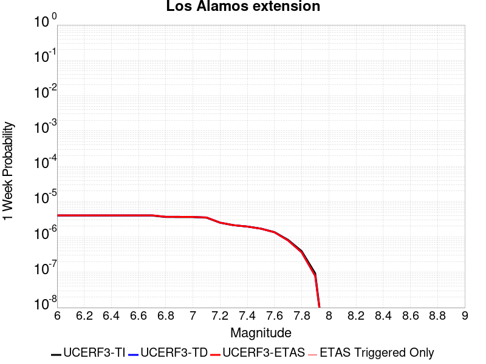 | 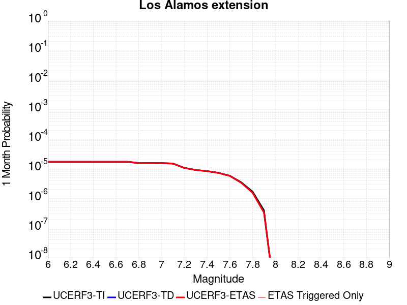 | 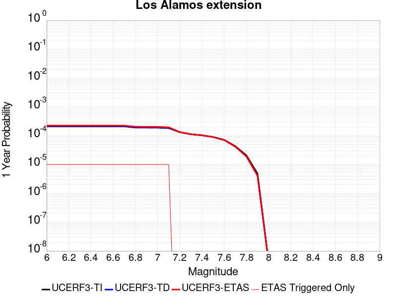 | 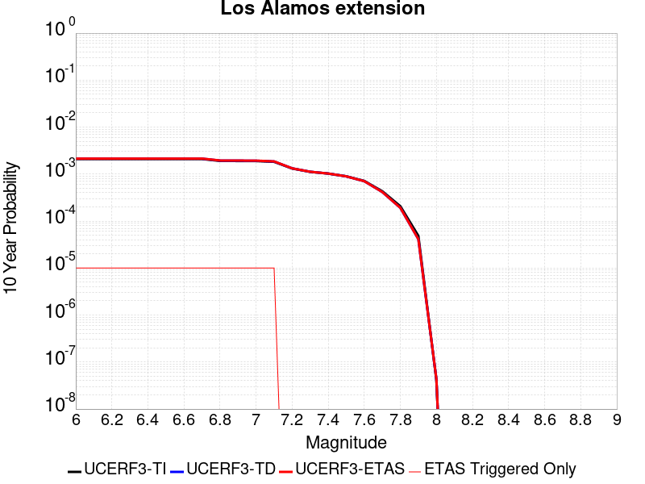 |

| Magnitude | 1 wk TI Prob | 1 wk TD Prob | 1 wk ETAS Prob | 1 wk ETAS/TD Gain | 1 wk ETAS Triggered Only | 1 mo TI Prob | 1 mo TD Prob | 1 mo ETAS Prob | 1 mo ETAS/TD Gain | 1 mo ETAS Triggered Only | 1 yr TI Prob | 1 yr TD Prob | 1 yr ETAS Prob | 1 yr ETAS/TD Gain | 1 yr ETAS Triggered Only | 10 yr TI Prob | 10 yr TD Prob | 10 yr ETAS Prob | 10 yr ETAS/TD Gain | 10 yr ETAS Triggered Only |
|-----|-----|-----|-----|-----|-----|-----|-----|-----|-----|-----|-----|-----|-----|-----|-----|-----|-----|-----|-----|-----|
| 6.0 | 4.0146506E-6 | 4.0861596E-6 | 4.0861596E-6 | 1.0 | 0.0 | 1.7205533E-5 | 1.7512002E-5 | 1.7512002E-5 | 1.0 | 0.0 | 2.0945723E-4 | 2.1318886E-4 | 2.2318673E-4 | 1.0468968 | 1.0E-5 | 0.0020925992 | 0.0021299527 | 0.0021399313 | 1.0046849 | 1.0E-5 |
| 6.1 | 4.0146506E-6 | 4.0861596E-6 | 4.0861596E-6 | 1.0 | 0.0 | 1.7205533E-5 | 1.7512002E-5 | 1.7512002E-5 | 1.0 | 0.0 | 2.0945723E-4 | 2.1318886E-4 | 2.2318673E-4 | 1.0468968 | 1.0E-5 | 0.0020925992 | 0.0021299527 | 0.0021399313 | 1.0046849 | 1.0E-5 |
| 6.2 | 4.0146506E-6 | 4.0861596E-6 | 4.0861596E-6 | 1.0 | 0.0 | 1.7205533E-5 | 1.7512002E-5 | 1.7512002E-5 | 1.0 | 0.0 | 2.0945723E-4 | 2.1318886E-4 | 2.2318673E-4 | 1.0468968 | 1.0E-5 | 0.0020925992 | 0.0021299527 | 0.0021399313 | 1.0046849 | 1.0E-5 |
| 6.3 | 4.0146506E-6 | 4.0861596E-6 | 4.0861596E-6 | 1.0 | 0.0 | 1.7205533E-5 | 1.7512002E-5 | 1.7512002E-5 | 1.0 | 0.0 | 2.0945723E-4 | 2.1318886E-4 | 2.2318673E-4 | 1.0468968 | 1.0E-5 | 0.0020925992 | 0.0021299527 | 0.0021399313 | 1.0046849 | 1.0E-5 |
| 6.4 | 4.0146506E-6 | 4.0861596E-6 | 4.0861596E-6 | 1.0 | 0.0 | 1.7205533E-5 | 1.7512002E-5 | 1.7512002E-5 | 1.0 | 0.0 | 2.0945723E-4 | 2.1318886E-4 | 2.2318673E-4 | 1.0468968 | 1.0E-5 | 0.0020925992 | 0.0021299527 | 0.0021399313 | 1.0046849 | 1.0E-5 |
| 6.5 | 4.0146506E-6 | 4.0861596E-6 | 4.0861596E-6 | 1.0 | 0.0 | 1.7205533E-5 | 1.7512002E-5 | 1.7512002E-5 | 1.0 | 0.0 | 2.0945723E-4 | 2.1318886E-4 | 2.2318673E-4 | 1.0468968 | 1.0E-5 | 0.0020925992 | 0.0021299527 | 0.0021399313 | 1.0046849 | 1.0E-5 |
| 6.6 | 4.0146506E-6 | 4.0861596E-6 | 4.0861596E-6 | 1.0 | 0.0 | 1.7205533E-5 | 1.7512002E-5 | 1.7512002E-5 | 1.0 | 0.0 | 2.0945723E-4 | 2.1318886E-4 | 2.2318673E-4 | 1.0468968 | 1.0E-5 | 0.0020925992 | 0.0021299527 | 0.0021399313 | 1.0046849 | 1.0E-5 |
| 6.7 | 4.0146506E-6 | 4.0861596E-6 | 4.0861596E-6 | 1.0 | 0.0 | 1.7205533E-5 | 1.7512002E-5 | 1.7512002E-5 | 1.0 | 0.0 | 2.0945723E-4 | 2.1318886E-4 | 2.2318673E-4 | 1.0468968 | 1.0E-5 | 0.0020925992 | 0.0021299527 | 0.0021399313 | 1.0046849 | 1.0E-5 |
| 6.8 | 3.6584688E-6 | 3.7188588E-6 | 3.7188588E-6 | 1.0 | 0.0 | 1.5679057E-5 | 1.5937874E-5 | 1.5937874E-5 | 1.0 | 0.0 | 1.9087581E-4 | 1.9402728E-4 | 2.0402535E-4 | 1.0515292 | 1.0E-5 | 0.0019071194 | 0.0019386712 | 0.0019486519 | 1.0051482 | 1.0E-5 |
| 6.9 | 3.644631E-6 | 3.7045688E-6 | 3.7045688E-6 | 1.0 | 0.0 | 1.5619753E-5 | 1.5876632E-5 | 1.5876632E-5 | 1.0 | 0.0 | 1.901539E-4 | 1.9328178E-4 | 2.0327985E-4 | 1.0517279 | 1.0E-5 | 0.0018999127 | 0.0019312293 | 0.0019412099 | 1.0051681 | 1.0E-5 |
| 7.0 | 3.6318522E-6 | 3.6913295E-6 | 3.6913295E-6 | 1.0 | 0.0 | 1.5564989E-5 | 1.5819893E-5 | 1.5819893E-5 | 1.0 | 0.0 | 1.8948725E-4 | 1.925911E-4 | 2.0258917E-4 | 1.0519135 | 1.0E-5 | 0.0018932576 | 0.0019243343 | 0.0019343151 | 1.0051866 | 1.0E-5 |
| 7.1 | 3.5001724E-6 | 3.5554E-6 | 3.5554E-6 | 1.0 | 0.0 | 1.5000653E-5 | 1.5237345E-5 | 1.5237345E-5 | 1.0 | 0.0 | 1.8261763E-4 | 1.854998E-4 | 1.9549794E-4 | 1.0538985 | 1.0E-5 | 0.0018246764 | 0.0018535402 | 0.0018635218 | 1.005385 | 1.0E-5 |
| 7.2 | 2.5204702E-6 | 2.5436943E-6 | 2.5436943E-6 | 1.0 | 0.0 | 1.080197E-5 | 1.0901502E-5 | 1.0901502E-5 | 1.0 | 0.0 | 1.3150605E-4 | 1.3271775E-4 | 1.3271775E-4 | 1.0 | 0.0 | 0.0013142825 | 0.0013263905 | 0.0013263905 | 1.0 | 0.0 |
| 7.3 | 2.1399692E-6 | 2.1501316E-6 | 2.1501316E-6 | 1.0 | 0.0 | 9.1712645E-6 | 9.2148175E-6 | 9.2148175E-6 | 1.0 | 0.0 | 1.1165442E-4 | 1.1218466E-4 | 1.1218466E-4 | 1.0 | 0.0 | 0.0011159834 | 0.0011212835 | 0.0011212835 | 1.0 | 0.0 |
| 7.4 | 1.9660122E-6 | 1.9702363E-6 | 1.9702363E-6 | 1.0 | 0.0 | 8.42574E-6 | 8.4438425E-6 | 8.4438425E-6 | 1.0 | 0.0 | 1.0257855E-4 | 1.0279897E-4 | 1.0279897E-4 | 1.0 | 0.0 | 0.0010253121 | 0.0010275173 | 0.0010275173 | 1.0 | 0.0 |
| 7.5 | 1.7204633E-6 | 1.7150983E-6 | 1.7150983E-6 | 1.0 | 0.0 | 7.373393E-6 | 7.3504007E-6 | 7.3504007E-6 | 1.0 | 0.0 | 8.976737E-5 | 8.948748E-5 | 8.948748E-5 | 1.0 | 0.0 | 8.9731114E-4 | 8.9451746E-4 | 8.9451746E-4 | 1.0 | 0.0 |
| 7.6 | 1.3717638E-6 | 1.3535827E-6 | 1.3535827E-6 | 1.0 | 0.0 | 5.878974E-6 | 5.8010555E-6 | 5.8010555E-6 | 1.0 | 0.0 | 7.157416E-5 | 7.062559E-5 | 7.062559E-5 | 1.0 | 0.0 | 7.1551115E-4 | 7.060341E-4 | 7.060341E-4 | 1.0 | 0.0 |
| 7.7 | 8.272564E-7 | 7.957636E-7 | 7.957636E-7 | 1.0 | 0.0 | 3.5453797E-6 | 3.410411E-6 | 3.410411E-6 | 1.0 | 0.0 | 4.3164142E-5 | 4.1520965E-5 | 4.1520965E-5 | 1.0 | 0.0 | 4.315576E-4 | 4.1513226E-4 | 4.1513226E-4 | 1.0 | 0.0 |
| 7.8 | 3.9708277E-7 | 3.6719027E-7 | 3.6719027E-7 | 1.0 | 0.0 | 1.7017821E-6 | 1.5736716E-6 | 1.5736716E-6 | 1.0 | 0.0 | 2.0719E-5 | 1.9159284E-5 | 1.9159284E-5 | 1.0 | 0.0 | 2.071707E-4 | 1.9157639E-4 | 1.9157639E-4 | 1.0 | 0.0 |
| 7.9 | 9.292528E-8 | 7.889087E-8 | 7.889087E-8 | 1.0 | 0.0 | 3.9825116E-7 | 3.381037E-7 | 3.381037E-7 | 1.0 | 0.0 | 4.848697E-6 | 4.116405E-6 | 4.116405E-6 | 1.0 | 0.0 | 4.8485912E-5 | 4.1163294E-5 | 4.1163294E-5 | 1.0 | 0.0 |
| 8.0 | 7.880441E-11 | 8.2353124E-11 | 8.2353124E-11 | 1.0 | 0.0 | 3.3773329E-10 | 3.52942E-10 | 3.52942E-10 | 1.0 | 0.0 | 4.1119033E-9 | 4.2970694E-9 | 4.2970694E-9 | 1.0 | 0.0 | 4.1119034E-8 | 4.2970694E-8 | 4.2970694E-8 | 1.0 | 0.0 |

