# Parent Section Magnitude-Probability Distributions

Only fault sections with at least one triggered aftershock are plotted. Sections are sorted by total supraseismogenic trigger rate (decreasing)

## Table Of Contents

* [Garlock (Central)](#garlock-central)
* [Tank Canyon](#tank-canyon)
* [Little Lake](#little-lake)
* [Owl Lake](#owl-lake)
* [Airport Lake](#airport-lake)
* [Panamint Valley](#panamint-valley)
* [Garlock (East)](#garlock-east)
* [Hunter Mountain-Saline Valley](#hunter-mountain-saline-valley)
* [Blackwater](#blackwater)
* [Ash Hill](#ash-hill)
* [Garlock (West)](#garlock-west)
* [McLean Lake](#mclean-lake)
* [Gravel Hills-Harper Lk](#gravel-hills-harper-lk)
* [Goldstone Lake](#goldstone-lake)
* [So Sierra Nevada](#so-sierra-nevada)
* [Coyote Canyon](#coyote-canyon)
* [San Andreas (Mojave N)](#san-andreas-mojave-n)
* [Nelson Lake](#nelson-lake)
* [San Andreas (Mojave S)](#san-andreas-mojave-s)
* [Towne Pass](#towne-pass)
* [Death Valley (So)](#death-valley-so)
* [Lenwood-Lockhart-Old Woman Springs](#lenwood-lockhart-old-woman-springs)
* [San Andreas (San Bernardino N)](#san-andreas-san-bernardino-n)
* [Paradise](#paradise)
* [Bicycle Lake](#bicycle-lake)
* [Garlic Springs](#garlic-springs)
* [San Andreas (San Bernardino S)](#san-andreas-san-bernardino-s)
* [Helendale-So Lockhart](#helendale-so-lockhart)
* [Death Valley (Black Mtns Frontal)](#death-valley-black-mtns-frontal)
* [San Andreas (Big Bend)](#san-andreas-big-bend)
* [Coyote Lake](#coyote-lake)
* [Death Valley (No)](#death-valley-no)
* [San Andreas (Cholame) rev](#san-andreas-cholame-rev)
* [San Andreas (Parkfield)](#san-andreas-parkfield)
* [San Andreas (San Gorgonio Pass-Garnet HIll)](#san-andreas-san-gorgonio-pass-garnet-hill)
* [Manix-Afton Hills](#manix-afton-hills)
* [Death Valley (Fish Lake Valley)](#death-valley-fish-lake-valley)
* [San Andreas (Carrizo) rev](#san-andreas-carrizo-rev)
* [Ludlow](#ludlow)
* [Cady](#cady)
* [Sierra Nevada  (No Extension)](#sierra-nevada--no-extension)
* [San Andreas (Creeping Section) 2011 CFM](#san-andreas-creeping-section-2011-cfm)
* [Red Pass](#red-pass)
* [San Andreas (Coachella) rev](#san-andreas-coachella-rev)
* [Calico-Hidalgo](#calico-hidalgo)
* [Elsinore (Glen Ivy) rev](#elsinore-glen-ivy-rev)
* [Independence rev 2011](#independence-rev-2011)
* [San Jacinto (San Bernardino)](#san-jacinto-san-bernardino)
* [Lake Isabella (Seismicity)](#lake-isabella-seismicity)
* [Baker](#baker)
* [Channel Islands Thrust](#channel-islands-thrust)
* [Scodie Lineament](#scodie-lineament)
* [Santa Cruz Island](#santa-cruz-island)
* [Santa Ynez (East)](#santa-ynez-east)
* [Pleito](#pleito)
* [Mission Creek](#mission-creek)
* [Rose Canyon](#rose-canyon)
* [Big Pine (Central)](#big-pine-central)
* [San Jacinto (Stepovers Combined)](#san-jacinto-stepovers-combined)
* [Cleghorn Pass](#cleghorn-pass)
* [San Jacinto (San Jacinto Valley) rev](#san-jacinto-san-jacinto-valley-rev)
* [Ortigalita (North)](#ortigalita-north)
* [San Jacinto (Anza) rev](#san-jacinto-anza-rev)
* [San Jacinto (Lytle Creek connector)](#san-jacinto-lytle-creek-connector)
* [Santa Rosa Island](#santa-rosa-island)
* [Rinconada 2011 CFM](#rinconada-2011-cfm)
* [Tin Mountain](#tin-mountain)
* [Cleghorn Lake](#cleghorn-lake)
* [White Wolf (Extension)](#white-wolf-extension)
* [Big Pine (East)](#big-pine-east)
* [San Clemente](#san-clemente)
* [Ventura-Pitas Point](#ventura-pitas-point)
* [Deep Springs](#deep-springs)
* [Santa Cruz Catalina Ridge alt1](#santa-cruz-catalina-ridge-alt1)
* [Red Mountain](#red-mountain)
* [Mission Ridge-Arroyo Parida-Santa Ana](#mission-ridge-arroyo-parida-santa-ana)
* [San Andreas (North Branch Mill Creek)](#san-andreas-north-branch-mill-creek)
* [Camp Rock 2011](#camp-rock-2011)
* [Brawley (Seismic Zone) alt 1](#brawley-seismic-zone-alt-1)
* [Bullion Mountains](#bullion-mountains)
* [Owens Valley](#owens-valley)
* [San Jacinto (Coyote Creek)](#san-jacinto-coyote-creek)
* [Pine Mtn](#pine-mtn)
* [Cleghorn](#cleghorn)
* [San Jacinto (Borrego)](#san-jacinto-borrego)
* [Imperial](#imperial)
* [Pinto Mtn](#pinto-mtn)
* [White Mountains](#white-mountains)
* [San Cayetano](#san-cayetano)
* [Lost Hills](#lost-hills)
* [Kern Canyon (Lake Isabella) 2011](#kern-canyon-lake-isabella-2011)
* [Great Valley 09 (Laguna Seca)](#great-valley-09-laguna-seca)
* [San Andreas (Santa Cruz Mts) 2011 CFM](#san-andreas-santa-cruz-mts-2011-cfm)
* [San Gabriel (Extension)](#san-gabriel-extension)
* [Oceanic - West Huasna](#oceanic---west-huasna)
* [Whittier alt 1](#whittier-alt-1)
* [North Frontal  (East)](#north-frontal--east)
* [Kern Canyon (North Kern) 2011](#kern-canyon-north-kern-2011)
* [Santa Ynez River](#santa-ynez-river)
* [San Jacinto (Superstition Mtn)](#san-jacinto-superstition-mtn)
* [San Juan](#san-juan)
* [Santa Ynez (West)](#santa-ynez-west)
* [Chino alt 1](#chino-alt-1)
* [Laguna Salada](#laguna-salada)
* [Emerson-Copper Mtn 2011](#emerson-copper-mtn-2011)
* [Great Valley 08 (Quinto)](#great-valley-08-quinto)
* [Oak Ridge (Onshore)](#oak-ridge-onshore)
* [Coronado Bank alt1](#coronado-bank-alt1)
* [Sheephole](#sheephole)
* [Blue Cut](#blue-cut)
* [San Gabriel](#san-gabriel)
* [Ortigalita (South)](#ortigalita-south)
* [Cucamonga](#cucamonga)
* [North Frontal  (West)](#north-frontal--west)
* [Pitas Point (Lower)-Montalvo](#pitas-point-lower-montalvo)
* [Homestead Valley 2011](#homestead-valley-2011)
* [Hector Mine](#hector-mine)
* [Sisar](#sisar)
* [Malibu Coast (Extension) alt 1](#malibu-coast-extension-alt-1)
* [Elmore Ranch](#elmore-ranch)
* [Mono Lake 2011 CFM](#mono-lake-2011-cfm)
* [Great Valley 07 (Orestimba)](#great-valley-07-orestimba)
* [White Wolf](#white-wolf)
* [Northridge](#northridge)
* [Peralta Hills](#peralta-hills)
* [West Napa 2011 CFM](#west-napa-2011-cfm)
* [Elsinore (Coyote Mountains)](#elsinore-coyote-mountains)
* [Morales (East)](#morales-east)
* [Elysian Park (Upper)](#elysian-park-upper)
* [San Jacinto (Clark) rev](#san-jacinto-clark-rev)
* [Monterey Bay-Tularcitos](#monterey-bay-tularcitos)
* [Santa Susana alt 1](#santa-susana-alt-1)
* [Calaveras (So) - Paicines extension 2011 CFM](#calaveras-so---paicines-extension-2011-cfm)
* [Del Valle](#del-valle)
* [Anaheim](#anaheim)
* [Kern Canyon (South Kern) 2011](#kern-canyon-south-kern-2011)
* [Santa Susana East (connector)](#santa-susana-east-connector)
* [Raymond](#raymond)
* [Monte Vista - Shannon 2011 CFM](#monte-vista---shannon-2011-cfm)
* [San Luis Range 2011 CFM](#san-luis-range-2011-cfm)
* [Simi-Santa Rosa](#simi-santa-rosa)
* [Great Valley 03a Dunnigan Hills](#great-valley-03a-dunnigan-hills)
* [Sierra Madre](#sierra-madre)
* [San Diego Trough south](#san-diego-trough-south)
* [Malibu Coast alt 1](#malibu-coast-alt-1)
* [Verdugo](#verdugo)
* [Pitas Point (Lower West)](#pitas-point-lower-west)
* [La Panza 2011](#la-panza-2011)
* [Eaton Roughs 2011 CFM](#eaton-roughs-2011-cfm)
* [Bennett Valley 2011 CFM](#bennett-valley-2011-cfm)
* [Dry Mountain](#dry-mountain)

## Garlock (Central)
*[(top)](#table-of-contents)*

| 1 Week | 1 Month | 1 Year | 10 Year |
|-----|-----|-----|-----|
|  |  |  |  |

| Magnitude | 1 wk TI Prob | 1 wk TD Prob | 1 wk ETAS Prob | 1 wk ETAS/TD Gain | 1 wk ETAS Triggered Only | 1 mo TI Prob | 1 mo TD Prob | 1 mo ETAS Prob | 1 mo ETAS/TD Gain | 1 mo ETAS Triggered Only | 1 yr TI Prob | 1 yr TD Prob | 1 yr ETAS Prob | 1 yr ETAS/TD Gain | 1 yr ETAS Triggered Only | 10 yr TI Prob | 10 yr TD Prob | 10 yr ETAS Prob | 10 yr ETAS/TD Gain | 10 yr ETAS Triggered Only |
|-----|-----|-----|-----|-----|-----|-----|-----|-----|-----|-----|-----|-----|-----|-----|-----|-----|-----|-----|-----|-----|
| 6.0 | 5.5131142E-5 | 7.024681E-5 | 0.07880487 | 1121.8285 | 0.07874016 | 2.3625491E-4 | 3.010234E-4 | 0.09888401 | 328.4928 | 0.09861267 | 0.0028726095 | 0.0036588663 | 0.13545832 | 37.02194 | 0.13228346 | 0.028357591 | 0.036079824 | 0.19279365 | 5.3435307 | 0.16257967 |
| 6.1 | 5.5131142E-5 | 7.024681E-5 | 0.07880487 | 1121.8285 | 0.07874016 | 2.3625491E-4 | 3.010234E-4 | 0.09888401 | 328.4928 | 0.09861267 | 0.0028726095 | 0.0036588663 | 0.13545832 | 37.02194 | 0.13228346 | 0.028357591 | 0.036079824 | 0.19279365 | 5.3435307 | 0.16257967 |
| 6.2 | 4.216245E-5 | 5.1661493E-5 | 0.04924297 | 953.1852 | 0.04919385 | 1.806837E-4 | 2.2138779E-4 | 0.06218742 | 280.89813 | 0.061979752 | 0.0021976046 | 0.0026920962 | 0.08518408 | 31.642286 | 0.08271466 | 0.021759989 | 0.026689773 | 0.12683088 | 4.75204 | 0.10288714 |
| 6.3 | 4.216245E-5 | 5.1661493E-5 | 0.04924297 | 953.1852 | 0.04919385 | 1.806837E-4 | 2.2138779E-4 | 0.06218742 | 280.89813 | 0.061979752 | 0.0021976046 | 0.0026920962 | 0.08518408 | 31.642286 | 0.08271466 | 0.021759989 | 0.026689773 | 0.12683088 | 4.75204 | 0.10288714 |
| 6.4 | 3.6858168E-5 | 4.411054E-5 | 0.037575264 | 851.84314 | 0.03753281 | 1.5795401E-4 | 1.8903162E-4 | 0.0477241 | 252.46623 | 0.04754406 | 0.0019213937 | 0.002299056 | 0.065857135 | 28.645294 | 0.063704535 | 0.019048655 | 0.02284894 | 0.09971669 | 4.3641715 | 0.07866517 |
| 6.5 | 3.39199E-5 | 4.0018083E-5 | 0.033709463 | 842.3557 | 0.03367079 | 1.453629E-4 | 1.7149492E-4 | 0.043096267 | 251.29762 | 0.042932134 | 0.0017683565 | 0.002085973 | 0.0592593 | 28.40847 | 0.057292838 | 0.017543508 | 0.020759864 | 0.090044685 | 4.337441 | 0.07075366 |
| 6.6 | 3.3571985E-5 | 3.9472274E-5 | 0.03367144 | 853.04034 | 0.033633295 | 1.4387199E-4 | 1.6915603E-4 | 0.04301905 | 254.31578 | 0.042857144 | 0.0017502342 | 0.0020575512 | 0.059120253 | 28.733309 | 0.057180353 | 0.017365133 | 0.020481179 | 0.08963881 | 4.376643 | 0.070603676 |
| 6.7 | 3.2580007E-5 | 3.8088703E-5 | 0.032057866 | 841.6634 | 0.032020997 | 1.3962112E-4 | 1.632272E-4 | 0.04098896 | 251.11598 | 0.040832397 | 0.0016985617 | 0.0019855013 | 0.05639544 | 28.40363 | 0.054518186 | 0.016856372 | 0.019773813 | 0.08571029 | 4.334535 | 0.06726659 |
| 6.8 | 3.2185937E-5 | 3.7515918E-5 | 0.031232446 | 832.51184 | 0.0311961 | 1.3793244E-4 | 1.6077272E-4 | 0.04008686 | 249.3387 | 0.039932508 | 0.0016780337 | 0.001955672 | 0.05505747 | 28.15271 | 0.053205848 | 0.016654192 | 0.019480614 | 0.08389269 | 4.3064704 | 0.06569179 |
| 6.9 | 3.165394E-5 | 3.6720503E-5 | 0.030481797 | 830.1029 | 0.030446194 | 1.3565269E-4 | 1.5736422E-4 | 0.039071374 | 248.28627 | 0.038920134 | 0.0016503202 | 0.001914247 | 0.053521305 | 27.959455 | 0.05170604 | 0.01638118 | 0.019073246 | 0.08185697 | 4.2917166 | 0.064004496 |
| 7.0 | 3.0903822E-5 | 3.5625766E-5 | 0.029805845 | 836.63727 | 0.029771278 | 1.3243823E-4 | 1.5267303E-4 | 0.03805465 | 249.25584 | 0.03790776 | 0.0016112428 | 0.0018572307 | 0.052082486 | 28.04309 | 0.05031871 | 0.015996104 | 0.018512413 | 0.079712786 | 4.3059096 | 0.062354706 |
| 7.1 | 3.0069863E-5 | 3.4392073E-5 | 0.028604837 | 831.7277 | 0.028571429 | 1.2886449E-4 | 1.4738638E-4 | 0.03636252 | 246.7156 | 0.036220472 | 0.0015677959 | 0.0017929734 | 0.04958864 | 27.65721 | 0.047881514 | 0.01556781 | 0.017880075 | 0.076247536 | 4.264385 | 0.05943007 |
| 7.2 | 2.7957109E-5 | 3.128145E-5 | 0.023952544 | 765.7107 | 0.02392201 | 1.1981068E-4 | 1.340566E-4 | 0.03057617 | 228.08405 | 0.030446194 | 0.0014577188 | 0.0016309366 | 0.04142345 | 25.398565 | 0.039857518 | 0.014481937 | 0.016283695 | 0.06515599 | 4.0013027 | 0.04968129 |
| 7.3 | 2.4519275E-5 | 2.6714795E-5 | 0.017049132 | 638.1907 | 0.017022872 | 1.0507837E-4 | 1.1448703E-4 | 0.021596842 | 188.64006 | 0.021484815 | 0.0012785783 | 0.001393003 | 0.029362986 | 21.078909 | 0.028009 | 0.012712469 | 0.013928054 | 0.04846091 | 3.479374 | 0.035020623 |
| 7.4 | 2.3225532E-5 | 2.51994E-5 | 0.015285407 | 606.57825 | 0.015260592 | 9.95342E-5 | 1.0799304E-4 | 0.01934101 | 179.09499 | 0.019235095 | 0.0012111551 | 0.0013140367 | 0.026365438 | 20.064463 | 0.025084365 | 0.012045753 | 0.013145725 | 0.044042736 | 3.3503468 | 0.031308588 |
| 7.5 | 2.097765E-5 | 2.2483688E-5 | 0.012245681 | 544.64734 | 0.012223472 | 8.9901114E-5 | 9.635517E-5 | 0.015467952 | 160.5306 | 0.015373078 | 0.0010939965 | 0.0011725046 | 0.020984268 | 17.89696 | 0.019835021 | 0.010886264 | 0.011740365 | 0.036567286 | 3.1146634 | 0.02512186 |
| 7.6 | 1.511254E-5 | 1.5991332E-5 | 0.0071774814 | 448.83572 | 0.0071616047 | 6.476642E-5 | 6.853253E-5 | 0.008954313 | 130.65785 | 0.008886389 | 7.882459E-4 | 8.3407195E-4 | 0.01222314 | 14.654779 | 0.011398575 | 0.007854558 | 0.008383559 | 0.02303286 | 2.7473845 | 0.014773154 |
| 7.7 | 9.934069E-6 | 1.0678794E-5 | 0.0022228786 | 208.15822 | 0.0022122234 | 4.2573887E-5 | 4.5765457E-5 | 0.0025953301 | 56.709366 | 0.0025496813 | 5.182138E-4 | 5.570524E-4 | 0.0037423787 | 6.718181 | 0.0031871016 | 0.00517007 | 0.005627684 | 0.009691672 | 1.7221423 | 0.004086989 |
| 7.8 | 6.7562896E-6 | 8.428449E-6 | 0.0015082284 | 178.94495 | 0.0014998125 | 2.8955206E-5 | 3.6121426E-5 | 0.0018358314 | 50.823895 | 0.001799775 | 3.5247262E-4 | 4.3968976E-4 | 0.0028383348 | 6.4553123 | 0.0023997 | 0.0035191406 | 0.004446654 | 0.007432941 | 1.6715806 | 0.002999625 |
| 7.9 | 3.975453E-6 | 5.37103E-6 | 7.927684E-4 | 147.6008 | 7.874016E-4 | 1.7037546E-5 | 2.3018498E-5 | 9.603797E-4 | 41.722084 | 9.373828E-4 | 2.0741238E-4 | 2.8021427E-4 | 0.0014422432 | 5.14693 | 0.0011623547 | 0.002072189 | 0.0028336283 | 0.0042170235 | 1.4882064 | 0.0013873266 |
| 8.0 | 1.6729537E-6 | 2.0775144E-6 | 3.020394E-4 | 145.38498 | 2.999625E-4 | 7.169782E-6 | 8.903603E-6 | 4.2134838E-4 | 47.323357 | 4.1244845E-4 | 8.7288594E-5 | 1.0839601E-4 | 5.207997E-4 | 4.8046026 | 4.1244845E-4 | 8.7254314E-4 | 0.0010969337 | 0.001546384 | 1.4097332 | 4.4994376E-4 |
| 8.1 | 3.6733252E-7 | 3.1489964E-7 | 7.53055E-5 | 239.14127 | 7.4990625E-5 | 1.5742813E-6 | 1.3495693E-6 | 7.63401E-5 | 56.566265 | 7.4990625E-5 | 1.9166706E-5 | 1.6430899E-5 | 9.142029E-5 | 5.5639253 | 7.4990625E-5 | 1.9165053E-4 | 1.6638759E-4 | 2.4136573E-4 | 1.4506234 | 7.4990625E-5 |

## Tank Canyon
*[(top)](#table-of-contents)*

| 1 Week | 1 Month | 1 Year | 10 Year |
|-----|-----|-----|-----|
|  |  |  |  |

| Magnitude | 1 wk TI Prob | 1 wk TD Prob | 1 wk ETAS Prob | 1 wk ETAS/TD Gain | 1 wk ETAS Triggered Only | 1 mo TI Prob | 1 mo TD Prob | 1 mo ETAS Prob | 1 mo ETAS/TD Gain | 1 mo ETAS Triggered Only | 1 yr TI Prob | 1 yr TD Prob | 1 yr ETAS Prob | 1 yr ETAS/TD Gain | 1 yr ETAS Triggered Only | 10 yr TI Prob | 10 yr TD Prob | 10 yr ETAS Prob | 10 yr ETAS/TD Gain | 10 yr ETAS Triggered Only |
|-----|-----|-----|-----|-----|-----|-----|-----|-----|-----|-----|-----|-----|-----|-----|-----|-----|-----|-----|-----|-----|
| 6.0 | 4.8284557E-5 | 5.7964822E-5 | 0.04156287 | 717.0361 | 0.04150731 | 2.0691741E-4 | 2.4840087E-4 | 0.055765167 | 224.49667 | 0.05553056 | 0.0025163088 | 0.0030207601 | 0.08608367 | 28.497355 | 0.08331458 | 0.02488006 | 0.029863637 | 0.13989973 | 4.684618 | 0.113423325 |
| 6.1 | 1.7796336E-5 | 2.0873314E-5 | 0.014756224 | 706.942 | 0.014735658 | 7.626778E-5 | 8.945422E-5 | 0.019847717 | 221.87569 | 0.01976003 | 9.281647E-4 | 0.0010885983 | 0.031239467 | 28.696966 | 0.030183727 | 0.009242975 | 0.010836744 | 0.052784387 | 4.8708715 | 0.0424072 |
| 6.2 | 1.7796336E-5 | 2.0873314E-5 | 0.014756224 | 706.942 | 0.014735658 | 7.626778E-5 | 8.945422E-5 | 0.019847717 | 221.87569 | 0.01976003 | 9.281647E-4 | 0.0010885983 | 0.031239467 | 28.696966 | 0.030183727 | 0.009242975 | 0.010836744 | 0.052784387 | 4.8708715 | 0.0424072 |
| 6.3 | 1.3515912E-5 | 1.5759564E-5 | 0.010251819 | 650.5141 | 0.01023622 | 5.792405E-5 | 6.753938E-5 | 0.014052346 | 208.06152 | 0.013985752 | 7.049971E-4 | 8.2200574E-4 | 0.022326624 | 27.161154 | 0.02152231 | 0.007027647 | 0.0081922645 | 0.03890967 | 4.7495623 | 0.030971128 |
| 6.4 | 1.0870146E-5 | 1.2618021E-5 | 0.0076990603 | 610.1639 | 0.007686539 | 4.658551E-5 | 5.4076212E-5 | 0.0107021695 | 197.909 | 0.010648669 | 5.67031E-4 | 6.581969E-4 | 0.016920451 | 25.70728 | 0.016272966 | 0.005655863 | 0.0065644905 | 0.029807976 | 4.5407906 | 0.023397075 |
| 6.5 | 7.964826E-6 | 9.196094E-6 | 0.0051835016 | 563.6634 | 0.0051743533 | 3.4134522E-5 | 3.9411298E-5 | 0.00716324 | 181.75601 | 0.0071241097 | 4.1550855E-4 | 4.7973756E-4 | 0.011273207 | 23.498695 | 0.01079865 | 0.0041473247 | 0.004788321 | 0.019901209 | 4.1561975 | 0.015185602 |
| 6.6 | 6.6317E-6 | 7.6122988E-6 | 0.003757115 | 493.55853 | 0.0037495312 | 2.8421264E-5 | 3.2623782E-5 | 0.005056832 | 155.00447 | 0.005024372 | 3.4597394E-4 | 3.9713128E-4 | 0.008155579 | 20.536228 | 0.0077615296 | 0.0034543579 | 0.003965368 | 0.014907931 | 3.7595327 | 0.010986127 |
| 6.7 | 4.793663E-6 | 5.4307857E-6 | 0.0019176814 | 353.11307 | 0.001912261 | 2.0544108E-5 | 2.3274613E-5 | 0.0026478854 | 113.76711 | 0.002624672 | 2.500958E-4 | 2.8333595E-4 | 0.004256713 | 15.023555 | 0.0039745034 | 0.0024981452 | 0.0028304397 | 0.008476207 | 2.9946606 | 0.005661792 |
| 6.8 | 4.382823E-6 | 4.9692567E-6 | 0.0016922499 | 340.54388 | 0.0016872891 | 1.8783392E-5 | 2.1296666E-5 | 0.002308462 | 108.39547 | 0.0022872142 | 2.286638E-4 | 2.5926033E-4 | 0.0038203916 | 14.735736 | 0.0035620548 | 0.0022842865 | 0.002590253 | 0.007713805 | 2.9780123 | 0.0051368577 |
| 6.9 | 2.729601E-6 | 3.0735416E-6 | 8.279679E-4 | 269.38562 | 8.248969E-4 | 1.1698237E-5 | 1.3172262E-5 | 0.0011380168 | 86.39494 | 0.0011248594 | 1.4241673E-4 | 1.6036171E-4 | 0.0017724016 | 11.052524 | 0.0016122984 | 0.001423255 | 0.0016026258 | 0.0040733507 | 2.5416727 | 0.0024746906 |
| 7.0 | 1.8987357E-6 | 2.126939E-6 | 2.2709834E-4 | 106.77238 | 2.2497188E-4 | 8.137413E-6 | 9.115425E-6 | 3.4657016E-4 | 38.020187 | 3.374578E-4 | 9.90685E-5 | 1.1097535E-4 | 6.3585147E-4 | 5.7296643 | 5.249344E-4 | 9.902435E-4 | 0.0011092679 | 0.0019332499 | 1.7428159 | 8.248969E-4 |
| 7.1 | 1.4928986E-6 | 1.6641272E-6 | 1.5164513E-4 | 91.12592 | 1.4998125E-4 | 6.398121E-6 | 7.1319573E-6 | 2.6959728E-4 | 37.8013 | 2.624672E-4 | 7.789434E-5 | 8.682871E-5 | 4.617493E-4 | 5.317933 | 3.7495312E-4 | 7.786704E-4 | 8.6800574E-4 | 0.0014299472 | 1.6473937 | 5.624297E-4 |
| 7.2 | 1.069082E-6 | 1.1828573E-6 | 3.8678125E-5 | 32.698895 | 3.7495312E-5 | 4.581772E-6 | 5.0693816E-6 | 8.0059624E-5 | 15.79278 | 7.4990625E-5 | 5.5781646E-5 | 6.171851E-5 | 2.116905E-4 | 3.4299357 | 1.4998125E-4 | 5.576765E-4 | 6.170659E-4 | 8.044268E-4 | 1.3036319 | 1.8747656E-4 |
| 7.3 | 8.776551E-7 | 9.770005E-7 | 9.770005E-7 | 1.0 | 0.0 | 3.7613736E-6 | 4.1871413E-6 | 4.16823E-5 | 9.954835 | 3.7495312E-5 | 4.579376E-5 | 5.097777E-5 | 1.2596458E-4 | 2.4709706 | 7.4990625E-5 | 4.5784327E-4 | 5.097118E-4 | 5.846642E-4 | 1.1470486 | 7.4990625E-5 |
| 7.4 | 7.55721E-7 | 8.510244E-7 | 8.510244E-7 | 1.0 | 0.0 | 3.2388E-6 | 3.6472454E-6 | 4.1142423E-5 | 11.28041 | 3.7495312E-5 | 3.9431678E-5 | 4.4404827E-5 | 1.1939212E-4 | 2.6887195 | 7.4990625E-5 | 3.942468E-4 | 4.440104E-4 | 5.1896775E-4 | 1.1688188 | 7.4990625E-5 |
| 7.5 | 5.587665E-7 | 6.305619E-7 | 6.305619E-7 | 1.0 | 0.0 | 2.3947114E-6 | 2.702408E-6 | 2.702408E-6 | 1.0 | 0.0 | 2.915522E-5 | 3.290182E-5 | 7.03959E-5 | 2.1395748 | 3.7495312E-5 | 2.9151395E-4 | 3.290182E-4 | 3.6650116E-4 | 1.1139237 | 3.7495312E-5 |

## Little Lake
*[(top)](#table-of-contents)*

| 1 Week | 1 Month | 1 Year | 10 Year |
|-----|-----|-----|-----|
|  |  |  |  |

| Magnitude | 1 wk TI Prob | 1 wk TD Prob | 1 wk ETAS Prob | 1 wk ETAS/TD Gain | 1 wk ETAS Triggered Only | 1 mo TI Prob | 1 mo TD Prob | 1 mo ETAS Prob | 1 mo ETAS/TD Gain | 1 mo ETAS Triggered Only | 1 yr TI Prob | 1 yr TD Prob | 1 yr ETAS Prob | 1 yr ETAS/TD Gain | 1 yr ETAS Triggered Only | 10 yr TI Prob | 10 yr TD Prob | 10 yr ETAS Prob | 10 yr ETAS/TD Gain | 10 yr ETAS Triggered Only |
|-----|-----|-----|-----|-----|-----|-----|-----|-----|-----|-----|-----|-----|-----|-----|-----|-----|-----|-----|-----|-----|
| 6.0 | 2.8424427E-5 | 3.120572E-5 | 0.029651579 | 950.1969 | 0.029621297 | 1.2181328E-4 | 1.337327E-4 | 0.036649283 | 274.0488 | 0.036520436 | 0.0014820677 | 0.0016271127 | 0.050890658 | 31.276663 | 0.04934383 | 0.014722223 | 0.016165402 | 0.07651611 | 4.733326 | 0.061342333 |
| 6.1 | 2.8424427E-5 | 3.120572E-5 | 0.029651579 | 950.1969 | 0.029621297 | 1.2181328E-4 | 1.337327E-4 | 0.036649283 | 274.0488 | 0.036520436 | 0.0014820677 | 0.0016271127 | 0.050890658 | 31.276663 | 0.04934383 | 0.014722223 | 0.016165402 | 0.07651611 | 4.733326 | 0.061342333 |
| 6.2 | 2.8424427E-5 | 3.120572E-5 | 0.029651579 | 950.1969 | 0.029621297 | 1.2181328E-4 | 1.337327E-4 | 0.036649283 | 274.0488 | 0.036520436 | 0.0014820677 | 0.0016271127 | 0.050890658 | 31.276663 | 0.04934383 | 0.014722223 | 0.016165402 | 0.07651611 | 4.733326 | 0.061342333 |
| 6.3 | 1.48860645E-5 | 1.6081389E-5 | 0.02093813 | 1302.01 | 0.020922385 | 6.379586E-5 | 6.8918576E-5 | 0.02552648 | 370.38608 | 0.025459317 | 7.7643775E-4 | 8.3878887E-4 | 0.034331482 | 40.929825 | 0.03352081 | 0.007737305 | 0.008359048 | 0.048627034 | 5.817293 | 0.040607423 |
| 6.4 | 1.48860645E-5 | 1.6081389E-5 | 0.02093813 | 1302.01 | 0.020922385 | 6.379586E-5 | 6.8918576E-5 | 0.02552648 | 370.38608 | 0.025459317 | 7.7643775E-4 | 8.3878887E-4 | 0.034331482 | 40.929825 | 0.03352081 | 0.007737305 | 0.008359048 | 0.048627034 | 5.817293 | 0.040607423 |
| 6.5 | 1.2797581E-5 | 1.3765565E-5 | 0.019586049 | 1422.8293 | 0.019572554 | 5.4845623E-5 | 5.899409E-5 | 0.023867114 | 404.56787 | 0.023809524 | 6.675408E-4 | 7.18042E-4 | 0.032041617 | 44.623592 | 0.031346083 | 0.006655392 | 0.00715977 | 0.044609986 | 6.230645 | 0.037720285 |
| 6.6 | 9.661896E-6 | 1.0289038E-5 | 0.016808016 | 1633.5848 | 0.0167979 | 4.1407468E-5 | 4.409522E-5 | 0.02047814 | 464.40723 | 0.020434946 | 5.040193E-4 | 5.367433E-4 | 0.027406452 | 51.06063 | 0.026884139 | 0.005028777 | 0.0053560743 | 0.03757851 | 7.0160546 | 0.03239595 |
| 6.7 | 7.767871E-6 | 8.199687E-6 | 0.014556262 | 1775.2217 | 0.014548182 | 3.329045E-5 | 3.5141118E-5 | 0.017807296 | 506.73672 | 0.017772779 | 4.0523586E-4 | 4.2777284E-4 | 0.024002235 | 56.109768 | 0.023584552 | 0.004044977 | 0.004270846 | 0.03257091 | 7.6263366 | 0.028421447 |
| 6.8 | 6.4235196E-6 | 6.7357446E-6 | 0.012155135 | 1804.5719 | 0.012148482 | 2.752908E-5 | 2.8867229E-5 | 0.014539135 | 503.65533 | 0.0145106865 | 3.35115E-4 | 3.5141467E-4 | 0.019654715 | 55.930264 | 0.019310087 | 0.003346101 | 0.00350985 | 0.026525896 | 7.557558 | 0.023097113 |
| 6.9 | 3.1283696E-6 | 3.1121804E-6 | 0.0073521705 | 2362.3857 | 0.0073490813 | 1.3407229E-5 | 1.3337856E-5 | 0.008787124 | 658.8108 | 0.008773903 | 1.6322079E-4 | 1.6237781E-4 | 0.012083951 | 74.41873 | 0.01192351 | 0.0016310095 | 0.00162274 | 0.015735535 | 9.696892 | 0.014135733 |
| 7.0 | 2.290603E-6 | 2.2286815E-6 | 0.004464161 | 2003.0502 | 0.0044619422 | 9.816834E-6 | 9.551463E-6 | 0.005483815 | 574.1335 | 0.0054743155 | 1.19513395E-4 | 1.162839E-4 | 0.0074270195 | 63.869717 | 0.007311586 | 0.0011944914 | 0.0011623327 | 0.009776231 | 8.4108715 | 0.008623922 |
| 7.1 | 1.293693E-6 | 1.1776827E-6 | 0.0022133985 | 1879.4523 | 0.0022122234 | 5.5443866E-6 | 5.0472063E-6 | 0.0027421913 | 543.3088 | 0.0027371577 | 6.750081E-5 | 6.14487E-5 | 0.0036982705 | 60.184685 | 0.0036370454 | 6.7480316E-4 | 6.143856E-4 | 0.0046613915 | 7.5870786 | 0.004049494 |
| 7.2 | 4.715842E-7 | 3.0917857E-7 | 1.1279508E-4 | 364.8218 | 1.1248594E-4 | 2.0210737E-6 | 1.3250503E-6 | 1.8880136E-4 | 142.48618 | 1.8747656E-4 | 2.4606294E-5 | 1.6132375E-5 | 2.4110063E-4 | 14.945142 | 2.2497188E-4 | 2.460357E-4 | 1.6131258E-4 | 4.2373742E-4 | 2.6268096 | 2.624672E-4 |
| 7.3 | 3.9430947E-7 | 2.3097488E-7 | 7.5221586E-5 | 325.66998 | 7.4990625E-5 | 1.6898966E-6 | 9.89892E-7 | 1.50971E-4 | 152.5126 | 1.4998125E-4 | 2.0574296E-5 | 1.2051869E-5 | 1.9952617E-4 | 16.555622 | 1.8747656E-4 | 2.0572392E-4 | 1.20512224E-4 | 3.45457E-4 | 2.8665721 | 2.2497188E-4 |
| 7.4 | 3.547123E-7 | 1.9679135E-7 | 7.51874E-5 | 382.0666 | 7.4990625E-5 | 1.5201948E-6 | 8.4339126E-7 | 1.5082452E-4 | 178.83102 | 1.4998125E-4 | 1.8508214E-5 | 1.0268241E-5 | 1.9774288E-4 | 19.257717 | 1.8747656E-4 | 1.8506673E-4 | 1.02677724E-4 | 3.276265E-4 | 3.1908236 | 2.2497188E-4 |
| 7.5 | 2.6354266E-7 | 1.4423138E-7 | 3.763954E-5 | 260.96637 | 3.7495312E-5 | 1.129468E-6 | 6.181344E-7 | 7.560872E-5 | 122.317604 | 7.4990625E-5 | 1.3751187E-5 | 7.5257603E-6 | 1.2001085E-4 | 15.946675 | 1.1248594E-4 | 1.3750336E-4 | 7.5255106E-5 | 2.2522507E-4 | 2.992821 | 1.4998125E-4 |
| 7.6 | 1.269913E-7 | 7.572556E-8 | 7.572556E-8 | 1.0 | 0.0 | 5.4424834E-7 | 3.245381E-7 | 3.781984E-5 | 116.53436 | 3.7495312E-5 | 6.6262032E-6 | 3.9512443E-6 | 7.894157E-5 | 19.978914 | 7.4990625E-5 | 6.626006E-5 | 3.9511775E-5 | 1.1449944E-4 | 2.897856 | 7.4990625E-5 |

## Owl Lake
*[(top)](#table-of-contents)*

| 1 Week | 1 Month | 1 Year | 10 Year |
|-----|-----|-----|-----|
|  |  |  |  |

| Magnitude | 1 wk TI Prob | 1 wk TD Prob | 1 wk ETAS Prob | 1 wk ETAS/TD Gain | 1 wk ETAS Triggered Only | 1 mo TI Prob | 1 mo TD Prob | 1 mo ETAS Prob | 1 mo ETAS/TD Gain | 1 mo ETAS Triggered Only | 1 yr TI Prob | 1 yr TD Prob | 1 yr ETAS Prob | 1 yr ETAS/TD Gain | 1 yr ETAS Triggered Only | 10 yr TI Prob | 10 yr TD Prob | 10 yr ETAS Prob | 10 yr ETAS/TD Gain | 10 yr ETAS Triggered Only |
|-----|-----|-----|-----|-----|-----|-----|-----|-----|-----|-----|-----|-----|-----|-----|-----|-----|-----|-----|-----|-----|
| 6.0 | 5.0320643E-5 | 6.635816E-5 | 0.018700292 | 281.8085 | 0.01863517 | 2.1564208E-4 | 2.843674E-4 | 0.024874298 | 87.472404 | 0.024596926 | 0.0026222812 | 0.0034577388 | 0.03910458 | 11.309294 | 0.035770528 | 0.02591553 | 0.034140717 | 0.078612976 | 2.3026166 | 0.046044245 |
| 6.1 | 5.0320643E-5 | 6.635816E-5 | 0.018700292 | 281.8085 | 0.01863517 | 2.1564208E-4 | 2.843674E-4 | 0.024874298 | 87.472404 | 0.024596926 | 0.0026222812 | 0.0034577388 | 0.03910458 | 11.309294 | 0.035770528 | 0.02591553 | 0.034140717 | 0.078612976 | 2.3026166 | 0.046044245 |
| 6.2 | 2.4125871E-5 | 3.0981035E-5 | 0.014091288 | 454.8359 | 0.014060742 | 1.0339249E-4 | 1.3277028E-4 | 0.018802958 | 141.62022 | 0.018672666 | 0.0012580766 | 0.001615439 | 0.028418714 | 17.591946 | 0.026846644 | 0.012509781 | 0.016070465 | 0.050712753 | 3.1556494 | 0.0352081 |
| 6.3 | 1.7433485E-5 | 2.2355514E-5 | 0.012583004 | 562.85913 | 0.01256093 | 7.471279E-5 | 9.580672E-5 | 0.016592164 | 173.18372 | 0.016497938 | 9.0924866E-4 | 0.0011659743 | 0.024423415 | 20.946787 | 0.02328459 | 0.009055373 | 0.011628896 | 0.041609857 | 3.5781434 | 0.030333709 |
| 6.4 | 1.7433485E-5 | 2.2355514E-5 | 0.012583004 | 562.85913 | 0.01256093 | 7.471279E-5 | 9.580672E-5 | 0.016592164 | 173.18372 | 0.016497938 | 9.0924866E-4 | 0.0011659743 | 0.024423415 | 20.946787 | 0.02328459 | 0.009055373 | 0.011628896 | 0.041609857 | 3.5781434 | 0.030333709 |
| 6.5 | 1.5182742E-5 | 1.9429144E-5 | 0.012355148 | 635.90796 | 0.012335958 | 6.506727E-5 | 8.326596E-5 | 0.01609243 | 193.26543 | 0.016010499 | 7.919061E-4 | 0.0010134429 | 0.02322563 | 22.917553 | 0.022234721 | 0.0078909 | 0.010118429 | 0.03866057 | 3.8208077 | 0.028833896 |
| 6.6 | 6.7271576E-6 | 8.547361E-6 | 0.010282176 | 1202.965 | 0.0102737155 | 2.8830356E-5 | 3.6631063E-5 | 0.01315951 | 359.24454 | 0.0131233595 | 3.5095305E-4 | 4.458976E-4 | 0.017873444 | 40.08419 | 0.01743532 | 0.0035039932 | 0.004467813 | 0.026229914 | 5.870863 | 0.021859767 |
| 6.7 | 6.682835E-6 | 8.479807E-6 | 0.010282109 | 1212.5404 | 0.0102737155 | 2.8640408E-5 | 3.6341557E-5 | 0.013121731 | 361.06683 | 0.0130858645 | 3.4864116E-4 | 4.4237426E-4 | 0.017757546 | 40.141453 | 0.017322835 | 0.003480947 | 0.0044327388 | 0.02608362 | 5.884312 | 0.021747282 |
| 6.8 | 6.5774975E-6 | 8.32628E-6 | 0.010244462 | 1230.3767 | 0.01023622 | 2.8188972E-5 | 3.5683603E-5 | 0.013008599 | 364.55396 | 0.012973378 | 3.4314668E-4 | 4.343669E-4 | 0.01763724 | 40.604473 | 0.01721035 | 0.0034261728 | 0.004352885 | 0.025893508 | 5.9485855 | 0.021634795 |
| 6.9 | 6.363419E-6 | 7.999454E-6 | 0.010244138 | 1280.6046 | 0.01023622 | 2.727151E-5 | 3.428296E-5 | 0.012969722 | 378.314 | 0.012935883 | 3.3198006E-4 | 4.1732067E-4 | 0.017583007 | 42.133087 | 0.017172853 | 0.0033148455 | 0.0041828766 | 0.0256525 | 6.132741 | 0.021559805 |
| 7.0 | 6.1342453E-6 | 7.6316555E-6 | 0.010168784 | 1332.448 | 0.010161229 | 2.6289357E-5 | 3.2706717E-5 | 0.012855684 | 393.05948 | 0.012823397 | 3.2002592E-4 | 3.9813702E-4 | 0.01741423 | 43.739292 | 0.017022872 | 0.0031956544 | 0.003991571 | 0.02527859 | 6.332993 | 0.021372328 |
| 7.1 | 5.842926E-6 | 7.142211E-6 | 0.009568378 | 1339.6942 | 0.009561305 | 2.504087E-5 | 3.0609146E-5 | 0.012141225 | 396.65347 | 0.012110986 | 3.0482994E-4 | 3.7260808E-4 | 0.016489586 | 44.254505 | 0.016122984 | 0.0030441214 | 0.0037370329 | 0.024020903 | 6.4278007 | 0.020359956 |
| 7.2 | 4.77173E-6 | 5.358483E-6 | 0.0061545568 | 1148.5632 | 0.0061492315 | 2.045011E-5 | 2.2964748E-5 | 0.0078593055 | 342.23346 | 0.007836521 | 2.4895166E-4 | 2.79564E-4 | 0.010737832 | 38.409206 | 0.010461193 | 0.0024867293 | 0.002808645 | 0.016007315 | 5.6993017 | 0.013235846 |
| 7.3 | 3.0494948E-6 | 2.710463E-6 | 0.0019524614 | 720.3424 | 0.0019497563 | 1.3069198E-5 | 1.1616219E-5 | 0.0023362986 | 201.12384 | 0.0023247094 | 1.5910587E-4 | 1.4141845E-4 | 0.0033280693 | 23.533487 | 0.0031871016 | 0.0015899199 | 0.0014232415 | 0.00542953 | 3.8149045 | 0.0040119984 |
| 7.4 | 2.7263884E-6 | 2.3056762E-6 | 0.0013896291 | 602.69916 | 0.0013873266 | 1.1684469E-5 | 9.881433E-6 | 0.0016596589 | 167.95732 | 0.0016497938 | 1.4224913E-4 | 1.20299905E-4 | 0.0023322573 | 19.387024 | 0.0022122234 | 0.0014215811 | 0.0012112238 | 0.004057416 | 3.3498483 | 0.0028496438 |
| 7.5 | 2.6090431E-6 | 2.1656133E-6 | 0.0011645178 | 537.7312 | 0.0011623547 | 1.1181565E-5 | 9.281167E-6 | 0.0013590999 | 146.43631 | 0.0013498312 | 1.3612706E-4 | 1.1299244E-4 | 0.0019500552 | 17.25828 | 0.0018372703 | 0.001360437 | 0.0011379806 | 0.0035724025 | 3.1392472 | 0.0024371953 |
| 7.6 | 2.3008756E-6 | 1.8727933E-6 | 8.267681E-4 | 441.46255 | 8.248969E-4 | 9.860858E-6 | 8.0262325E-6 | 9.079065E-4 | 113.11739 | 8.998875E-4 | 1.20049335E-4 | 9.7715085E-5 | 0.0013724312 | 14.045233 | 0.0012748407 | 0.001199845 | 9.849932E-4 | 0.0027080786 | 2.7493374 | 0.0017247844 |
| 7.7 | 1.7184348E-6 | 1.3419171E-6 | 3.7629454E-4 | 280.41565 | 3.7495312E-4 | 7.3646997E-6 | 5.7510606E-6 | 3.8070203E-4 | 66.19684 | 3.7495312E-4 | 8.966153E-5 | 7.0016955E-5 | 5.574219E-4 | 7.9612412 | 4.8743907E-4 | 8.962536E-4 | 7.078345E-4 | 0.0014572099 | 2.0586874 | 7.4990623E-4 |
| 7.8 | 8.4612907E-7 | 8.4058576E-7 | 2.2581227E-4 | 268.6368 | 2.2497188E-4 | 3.6262625E-6 | 3.6025056E-6 | 2.2857357E-4 | 63.4485 | 2.2497188E-4 | 4.4148852E-5 | 4.3859643E-5 | 3.8130267E-4 | 8.693702 | 3.374578E-4 | 4.414008E-4 | 4.4398365E-4 | 8.9372764E-4 | 2.0129743 | 4.4994376E-4 |
| 7.9 | 2.716738E-7 | 3.768106E-7 | 7.536741E-5 | 200.01405 | 7.4990625E-5 | 1.1643157E-6 | 1.6149015E-6 | 7.660541E-5 | 47.43658 | 7.4990625E-5 | 1.4175452E-5 | 1.966126E-5 | 1.3214498E-4 | 6.7210846 | 1.1248594E-4 | 1.4174548E-4 | 1.9836679E-4 | 3.1083042E-4 | 1.5669478 | 1.1248594E-4 |
| 8.0 | 2.1995428E-8 | 3.384878E-8 | 3.384878E-8 | 1.0 | 0.0 | 9.426611E-8 | 1.4506621E-7 | 1.4506621E-7 | 1.0 | 0.0 | 1.1476893E-6 | 1.7661803E-6 | 1.7661803E-6 | 1.0 | 0.0 | 1.14768345E-5 | 1.7963059E-5 | 1.7963059E-5 | 1.0 | 0.0 |

## Airport Lake
*[(top)](#table-of-contents)*

| 1 Week | 1 Month | 1 Year | 10 Year |
|-----|-----|-----|-----|
|  |  |  |  |

| Magnitude | 1 wk TI Prob | 1 wk TD Prob | 1 wk ETAS Prob | 1 wk ETAS/TD Gain | 1 wk ETAS Triggered Only | 1 mo TI Prob | 1 mo TD Prob | 1 mo ETAS Prob | 1 mo ETAS/TD Gain | 1 mo ETAS Triggered Only | 1 yr TI Prob | 1 yr TD Prob | 1 yr ETAS Prob | 1 yr ETAS/TD Gain | 1 yr ETAS Triggered Only | 10 yr TI Prob | 10 yr TD Prob | 10 yr ETAS Prob | 10 yr ETAS/TD Gain | 10 yr ETAS Triggered Only |
|-----|-----|-----|-----|-----|-----|-----|-----|-----|-----|-----|-----|-----|-----|-----|-----|-----|-----|-----|-----|-----|
| 6.0 | 1.2387061E-5 | 1.3103157E-5 | 0.026184488 | 1998.3344 | 0.026171729 | 5.3086325E-5 | 5.615534E-5 | 0.031512957 | 561.17474 | 0.031458568 | 6.461343E-4 | 6.8350515E-4 | 0.042574614 | 62.288647 | 0.04191976 | 0.0064425888 | 0.0068168393 | 0.056718055 | 8.320287 | 0.05024372 |
| 6.1 | 1.2387061E-5 | 1.3103157E-5 | 0.026184488 | 1998.3344 | 0.026171729 | 5.3086325E-5 | 5.615534E-5 | 0.031512957 | 561.17474 | 0.031458568 | 6.461343E-4 | 6.8350515E-4 | 0.042574614 | 62.288647 | 0.04191976 | 0.0064425888 | 0.0068168393 | 0.056718055 | 8.320287 | 0.05024372 |
| 6.2 | 1.2387061E-5 | 1.3103157E-5 | 0.026184488 | 1998.3344 | 0.026171729 | 5.3086325E-5 | 5.615534E-5 | 0.031512957 | 561.17474 | 0.031458568 | 6.461343E-4 | 6.8350515E-4 | 0.042574614 | 62.288647 | 0.04191976 | 0.0064425888 | 0.0068168393 | 0.056718055 | 8.320287 | 0.05024372 |
| 6.3 | 1.2387061E-5 | 1.3103157E-5 | 0.026184488 | 1998.3344 | 0.026171729 | 5.3086325E-5 | 5.615534E-5 | 0.031512957 | 561.17474 | 0.031458568 | 6.461343E-4 | 6.8350515E-4 | 0.042574614 | 62.288647 | 0.04191976 | 0.0064425888 | 0.0068168393 | 0.056718055 | 8.320287 | 0.05024372 |
| 6.4 | 1.2387061E-5 | 1.3103157E-5 | 0.026184488 | 1998.3344 | 0.026171729 | 5.3086325E-5 | 5.615534E-5 | 0.031512957 | 561.17474 | 0.031458568 | 6.461343E-4 | 6.8350515E-4 | 0.042574614 | 62.288647 | 0.04191976 | 0.0064425888 | 0.0068168393 | 0.056718055 | 8.320287 | 0.05024372 |
| 6.5 | 6.9922594E-6 | 7.384925E-6 | 0.019392319 | 2625.933 | 0.019385077 | 2.996648E-5 | 3.1649324E-5 | 0.023240514 | 734.31305 | 0.023209598 | 3.6478083E-4 | 3.8526783E-4 | 0.031232022 | 81.065735 | 0.030858643 | 0.003641826 | 0.0038465366 | 0.04082411 | 10.613213 | 0.03712036 |
| 6.6 | 6.9922594E-6 | 7.384925E-6 | 0.019392319 | 2625.933 | 0.019385077 | 2.996648E-5 | 3.1649324E-5 | 0.023240514 | 734.31305 | 0.023209598 | 3.6478083E-4 | 3.8526783E-4 | 0.031232022 | 81.065735 | 0.030858643 | 0.003641826 | 0.0038465366 | 0.04082411 | 10.613213 | 0.03712036 |
| 6.7 | 5.477277E-6 | 5.7860684E-6 | 0.016578618 | 2865.265 | 0.016572928 | 2.3473833E-5 | 2.4797222E-5 | 0.020009303 | 806.9171 | 0.019985002 | 2.8575645E-4 | 3.0186825E-4 | 0.026915504 | 89.163086 | 0.026621671 | 0.0028538927 | 0.003014966 | 0.034789894 | 11.539066 | 0.031871017 |
| 6.8 | 3.9950432E-6 | 4.2190873E-6 | 0.012602591 | 2987.0422 | 0.012598425 | 1.7121502E-5 | 1.8081691E-5 | 0.0150159355 | 830.4497 | 0.014998125 | 2.0843433E-4 | 2.2012512E-4 | 0.020238215 | 91.9396 | 0.020022497 | 0.0020823893 | 0.0021993418 | 0.026143564 | 11.886995 | 0.023997 |
| 6.9 | 2.95695E-6 | 3.1230243E-6 | 0.008889484 | 2846.4346 | 0.008886389 | 1.2672582E-5 | 1.3384334E-5 | 0.010699405 | 799.3977 | 0.010686164 | 1.5427776E-4 | 1.6294434E-4 | 0.014671266 | 90.038506 | 0.0145106865 | 0.001541707 | 0.0016284712 | 0.019035399 | 11.689122 | 0.01743532 |
| 7.0 | 1.456072E-6 | 1.540812E-6 | 0.0041635144 | 2702.1558 | 0.0041619795 | 6.2402937E-6 | 6.603469E-6 | 0.005030942 | 761.8635 | 0.005024372 | 7.597293E-5 | 8.039528E-5 | 0.006829009 | 84.94292 | 0.0067491564 | 7.594696E-4 | 8.0376083E-4 | 0.008708913 | 10.835205 | 0.007911511 |
| 7.1 | 6.995192E-7 | 7.4089746E-7 | 0.0021004768 | 2835.044 | 0.0020997375 | 2.997936E-6 | 3.1752747E-6 | 0.0025528485 | 803.9772 | 0.0025496813 | 3.649926E-5 | 3.865897E-5 | 0.0034131068 | 88.287575 | 0.0033745782 | 3.6493264E-4 | 3.865897E-4 | 0.0040971907 | 10.598292 | 0.003712036 |

## Panamint Valley
*[(top)](#table-of-contents)*

| 1 Week | 1 Month | 1 Year | 10 Year |
|-----|-----|-----|-----|
|  |  |  |  |

| Magnitude | 1 wk TI Prob | 1 wk TD Prob | 1 wk ETAS Prob | 1 wk ETAS/TD Gain | 1 wk ETAS Triggered Only | 1 mo TI Prob | 1 mo TD Prob | 1 mo ETAS Prob | 1 mo ETAS/TD Gain | 1 mo ETAS Triggered Only | 1 yr TI Prob | 1 yr TD Prob | 1 yr ETAS Prob | 1 yr ETAS/TD Gain | 1 yr ETAS Triggered Only | 10 yr TI Prob | 10 yr TD Prob | 10 yr ETAS Prob | 10 yr ETAS/TD Gain | 10 yr ETAS Triggered Only |
|-----|-----|-----|-----|-----|-----|-----|-----|-----|-----|-----|-----|-----|-----|-----|-----|-----|-----|-----|-----|-----|
| 6.0 | 3.0211835E-5 | 3.3984514E-5 | 0.016006446 | 470.99234 | 0.015973004 | 1.2947287E-4 | 1.4563995E-4 | 0.021139957 | 145.15219 | 0.020997375 | 0.0015751923 | 0.0017717537 | 0.031265713 | 17.646759 | 0.029546307 | 0.015640736 | 0.017583137 | 0.055634756 | 3.164097 | 0.03873266 |
| 6.1 | 3.0211835E-5 | 3.3984514E-5 | 0.016006446 | 470.99234 | 0.015973004 | 1.2947287E-4 | 1.4563995E-4 | 0.021139957 | 145.15219 | 0.020997375 | 0.0015751923 | 0.0017717537 | 0.031265713 | 17.646759 | 0.029546307 | 0.015640736 | 0.017583137 | 0.055634756 | 3.164097 | 0.03873266 |
| 6.2 | 3.0211835E-5 | 3.3984514E-5 | 0.016006446 | 470.99234 | 0.015973004 | 1.2947287E-4 | 1.4563995E-4 | 0.021139957 | 145.15219 | 0.020997375 | 0.0015751923 | 0.0017717537 | 0.031265713 | 17.646759 | 0.029546307 | 0.015640736 | 0.017583137 | 0.055634756 | 3.164097 | 0.03873266 |
| 6.3 | 2.8573924E-5 | 3.210268E-5 | 0.015329699 | 477.52087 | 0.015298088 | 1.2245393E-4 | 1.3757581E-4 | 0.0202323 | 147.0629 | 0.020097489 | 0.001489857 | 0.0016737265 | 0.02986044 | 17.840694 | 0.028233971 | 0.01479908 | 0.016617801 | 0.052826323 | 3.1788998 | 0.036820397 |
| 6.4 | 2.8573924E-5 | 3.210268E-5 | 0.015329699 | 477.52087 | 0.015298088 | 1.2245393E-4 | 1.3757581E-4 | 0.0202323 | 147.0629 | 0.020097489 | 0.001489857 | 0.0016737265 | 0.02986044 | 17.840694 | 0.028233971 | 0.01479908 | 0.016617801 | 0.052826323 | 3.1788998 | 0.036820397 |
| 6.5 | 2.7468774E-5 | 3.0828433E-5 | 0.015065986 | 488.70422 | 0.015035621 | 1.1771801E-4 | 1.3211532E-4 | 0.019702082 | 149.12791 | 0.019572554 | 0.0014322745 | 0.0016073446 | 0.029009799 | 18.048275 | 0.02744657 | 0.014230782 | 0.015963677 | 0.051052485 | 3.1980407 | 0.035658043 |
| 6.6 | 2.6135967E-5 | 2.925248E-5 | 0.014651997 | 500.8805 | 0.014623172 | 1.1200648E-4 | 1.253619E-4 | 0.019133102 | 152.62296 | 0.019010123 | 0.0013628257 | 0.0015252391 | 0.027993992 | 18.35384 | 0.026509186 | 0.013544982 | 0.015154043 | 0.048979275 | 3.2320929 | 0.034345705 |
| 6.7 | 2.4498746E-5 | 2.7341335E-5 | 0.014312665 | 523.48083 | 0.014285714 | 1.04990395E-4 | 1.1717203E-4 | 0.018600196 | 158.74263 | 0.018485188 | 0.0012775084 | 0.0014256609 | 0.02699845 | 18.937496 | 0.0256093 | 0.012701893 | 0.014171274 | 0.04651474 | 3.2823255 | 0.0328084 |
| 6.8 | 2.2244329E-5 | 2.4935423E-5 | 0.013522912 | 542.31726 | 0.013498313 | 9.532935E-5 | 1.0686185E-4 | 0.017540319 | 164.14014 | 0.01743532 | 0.0011600169 | 0.0013002884 | 0.025378425 | 19.517538 | 0.024109486 | 0.011539802 | 0.0129325185 | 0.04339208 | 3.3552692 | 0.030858643 |
| 6.9 | 1.9902658E-5 | 2.2290267E-5 | 0.012470457 | 559.4575 | 0.012448444 | 8.529431E-5 | 9.552632E-5 | 0.016104495 | 168.587 | 0.016010499 | 0.0010379635 | 0.0011624309 | 0.022772077 | 19.590048 | 0.021634795 | 0.010331288 | 0.011568608 | 0.038882967 | 3.3610756 | 0.027634045 |
| 7.0 | 1.8353881E-5 | 2.0566185E-5 | 0.011681369 | 567.9891 | 0.011661042 | 7.865712E-5 | 8.813792E-5 | 0.015009957 | 170.30078 | 0.014923135 | 9.5722964E-4 | 0.0010725686 | 0.021223411 | 19.787462 | 0.020172479 | 0.009531168 | 0.010678849 | 0.03594048 | 3.3655763 | 0.025534308 |
| 7.1 | 1.7667631E-5 | 1.9772613E-5 | 0.011380628 | 575.5753 | 0.01136108 | 7.571623E-5 | 8.473711E-5 | 0.014594194 | 172.22906 | 0.0145106865 | 9.2145515E-4 | 0.0010312037 | 0.020583574 | 19.960726 | 0.019572554 | 0.009176437 | 0.010269073 | 0.034613412 | 3.3706462 | 0.024596926 |
| 7.2 | 1.6381597E-5 | 1.8158249E-5 | 0.010291687 | 566.7775 | 0.0102737155 | 7.020495E-5 | 7.781885E-5 | 0.013162665 | 169.14494 | 0.0130858645 | 8.544101E-4 | 9.4704994E-4 | 0.0181411 | 19.155378 | 0.01721035 | 0.008511325 | 0.009434792 | 0.031014035 | 3.2871985 | 0.021784777 |
| 7.3 | 1.4520491E-5 | 1.5966476E-5 | 0.008002341 | 501.19644 | 0.007986502 | 6.222919E-5 | 6.842605E-5 | 0.010228961 | 149.48927 | 0.010161229 | 7.57377E-4 | 8.327849E-4 | 0.01398268 | 16.790264 | 0.013160855 | 0.0075480095 | 0.00829975 | 0.025069784 | 3.0205467 | 0.016910385 |
| 7.4 | 1.2852287E-5 | 1.4145411E-5 | 0.0077755656 | 549.6882 | 0.0077615296 | 5.5080065E-5 | 6.062187E-5 | 0.0098463055 | 162.42168 | 0.009786277 | 6.7039346E-4 | 7.378371E-4 | 0.013401902 | 18.163767 | 0.012673416 | 0.0066837464 | 0.0073567946 | 0.023398384 | 3.1805136 | 0.01616048 |
| 7.5 | 1.1637851E-5 | 1.2836797E-5 | 0.007549298 | 588.0982 | 0.007536558 | 4.987555E-5 | 5.5013777E-5 | 0.0095783 | 174.10728 | 0.00952381 | 6.070656E-4 | 6.6960254E-4 | 0.01303477 | 19.466429 | 0.012373453 | 0.006054099 | 0.0066787465 | 0.022358846 | 3.347761 | 0.015785526 |
| 7.6 | 3.0068115E-6 | 3.3330316E-6 | 0.0036028712 | 1080.9592 | 0.00359955 | 1.2886271E-5 | 1.4284384E-5 | 0.0045136577 | 315.98547 | 0.0044994378 | 1.5687906E-4 | 1.7390578E-4 | 0.0059471796 | 34.197712 | 0.005774278 | 0.0015676835 | 0.0017391363 | 0.009337448 | 5.3690143 | 0.0076115485 |

## Garlock (East)
*[(top)](#table-of-contents)*

| 1 Week | 1 Month | 1 Year | 10 Year |
|-----|-----|-----|-----|
|  |  |  | 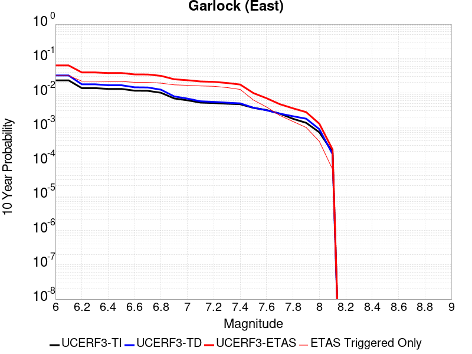 |

| Magnitude | 1 wk TI Prob | 1 wk TD Prob | 1 wk ETAS Prob | 1 wk ETAS/TD Gain | 1 wk ETAS Triggered Only | 1 mo TI Prob | 1 mo TD Prob | 1 mo ETAS Prob | 1 mo ETAS/TD Gain | 1 mo ETAS Triggered Only | 1 yr TI Prob | 1 yr TD Prob | 1 yr ETAS Prob | 1 yr ETAS/TD Gain | 1 yr ETAS Triggered Only | 10 yr TI Prob | 10 yr TD Prob | 10 yr ETAS Prob | 10 yr ETAS/TD Gain | 10 yr ETAS Triggered Only |
|-----|-----|-----|-----|-----|-----|-----|-----|-----|-----|-----|-----|-----|-----|-----|-----|-----|-----|-----|-----|-----|
| 6.0 | 4.5092507E-5 | 6.290325E-5 | 0.012060649 | 191.73332 | 0.0119985 | 1.9323928E-4 | 2.6956003E-4 | 0.016425684 | 60.935165 | 0.01616048 | 0.0023501497 | 0.0032774 | 0.026448304 | 8.069904 | 0.023247095 | 0.023254504 | 0.032351844 | 0.062574975 | 1.9342011 | 0.031233596 |
| 6.1 | 4.5092507E-5 | 6.290325E-5 | 0.012060649 | 191.73332 | 0.0119985 | 1.9323928E-4 | 2.6956003E-4 | 0.016425684 | 60.935165 | 0.01616048 | 0.0023501497 | 0.0032774 | 0.026448304 | 8.069904 | 0.023247095 | 0.023254504 | 0.032351844 | 0.062574975 | 1.9342011 | 0.031233596 |
| 6.2 | 2.6674514E-5 | 3.4509674E-5 | 0.009408015 | 272.61963 | 0.009373828 | 1.1431433E-4 | 1.4789042E-4 | 0.012407045 | 83.8935 | 0.012260967 | 0.0013908884 | 0.0017991117 | 0.018304795 | 10.174352 | 0.016535433 | 0.01382215 | 0.017890299 | 0.038917094 | 2.1753182 | 0.021409824 |
| 6.3 | 2.6674514E-5 | 3.4509674E-5 | 0.009408015 | 272.61963 | 0.009373828 | 1.1431433E-4 | 1.4789042E-4 | 0.012407045 | 83.8935 | 0.012260967 | 0.0013908884 | 0.0017991117 | 0.018304795 | 10.174352 | 0.016535433 | 0.01382215 | 0.017890299 | 0.038917094 | 2.1753182 | 0.021409824 |
| 6.4 | 2.5312667E-5 | 3.233893E-5 | 0.0091809 | 283.8962 | 0.009148857 | 1.0847834E-4 | 1.3858822E-4 | 0.012172916 | 87.835144 | 0.012035996 | 0.0013199237 | 0.0016860351 | 0.0178567 | 10.590942 | 0.016197976 | 0.013121112 | 0.016778335 | 0.037275944 | 2.221671 | 0.020847393 |
| 6.5 | 2.5312667E-5 | 3.233893E-5 | 0.0091809 | 283.8962 | 0.009148857 | 1.0847834E-4 | 1.3858822E-4 | 0.012172916 | 87.835144 | 0.012035996 | 0.0013199237 | 0.0016860351 | 0.0178567 | 10.590942 | 0.016197976 | 0.013121112 | 0.016778335 | 0.037275944 | 2.221671 | 0.020847393 |
| 6.6 | 2.246556E-5 | 2.8133776E-5 | 0.008726802 | 310.18948 | 0.008698912 | 9.627742E-5 | 1.20567885E-4 | 0.011480278 | 95.21837 | 0.01136108 | 0.0011715472 | 0.0014669491 | 0.016780036 | 11.43873 | 0.015335583 | 0.011653901 | 0.01461866 | 0.03401593 | 2.3268843 | 0.01968504 |
| 6.7 | 2.2241198E-5 | 2.7803519E-5 | 0.008726474 | 313.8622 | 0.008698912 | 9.531594E-5 | 1.1915263E-4 | 0.011478879 | 96.3376 | 0.01136108 | 0.0011598538 | 0.0014497414 | 0.01672565 | 11.536989 | 0.015298088 | 0.011538187 | 0.014448853 | 0.03381251 | 2.340152 | 0.019647544 |
| 6.8 | 1.9528685E-5 | 2.389819E-5 | 0.008497637 | 355.57657 | 0.008473941 | 8.369167E-5 | 1.0241691E-4 | 0.010974944 | 107.15949 | 0.010873641 | 0.0010184698 | 0.0012462323 | 0.015776284 | 12.6591835 | 0.014548182 | 0.010138147 | 0.012436427 | 0.030839844 | 2.4797993 | 0.01863517 |
| 6.9 | 1.3318621E-5 | 1.5198884E-5 | 0.008114063 | 533.85913 | 0.008098988 | 5.7078556E-5 | 6.513648E-5 | 0.01030069 | 158.1401 | 0.01023622 | 6.9470983E-4 | 7.927538E-4 | 0.014205434 | 17.919098 | 0.013423322 | 0.0069254204 | 0.007939888 | 0.024716007 | 3.1128912 | 0.016910385 |
| 7.0 | 1.1760853E-5 | 1.31077895E-5 | 0.007924515 | 604.56537 | 0.007911511 | 5.0402683E-5 | 5.6175057E-5 | 0.010029368 | 178.53773 | 0.009973753 | 6.134799E-4 | 6.8372174E-4 | 0.013760639 | 20.126081 | 0.0130858645 | 0.0061178906 | 0.00685652 | 0.023166863 | 3.3788075 | 0.016422948 |
| 7.1 | 1.0064758E-5 | 1.0902931E-5 | 0.0077348533 | 709.42883 | 0.0077240346 | 4.3133965E-5 | 4.672603E-5 | 0.0096825715 | 207.22008 | 0.009636295 | 5.2502943E-4 | 5.687444E-4 | 0.012897686 | 22.677475 | 0.012335958 | 0.005237907 | 0.0057129986 | 0.02099825 | 3.6755219 | 0.015373078 |
| 7.2 | 9.768808E-6 | 1.0498807E-5 | 0.0075094826 | 715.2701 | 0.0074990625 | 4.186565E-5 | 4.499413E-5 | 0.009418401 | 209.32509 | 0.009373828 | 5.095951E-4 | 5.4766936E-4 | 0.012614548 | 23.033146 | 0.012073491 | 0.0050842804 | 0.0055032647 | 0.020530717 | 3.7306435 | 0.015110611 |
| 7.3 | 9.344516E-6 | 9.944468E-6 | 0.0069465083 | 698.52997 | 0.006936633 | 4.004731E-5 | 4.261847E-5 | 0.008703667 | 204.22289 | 0.008661417 | 4.8746695E-4 | 5.1875977E-4 | 0.011611615 | 22.383413 | 0.011098613 | 0.0048639905 | 0.0052149445 | 0.018941263 | 3.632112 | 0.013798275 |
| 7.4 | 9.023491E-6 | 9.490661E-6 | 0.006121169 | 644.9676 | 0.006111736 | 3.867153E-5 | 4.0673647E-5 | 0.0077269003 | 189.97314 | 0.007686539 | 4.7072413E-4 | 4.950925E-4 | 0.010314001 | 20.832474 | 0.009823772 | 0.004697283 | 0.0049783974 | 0.016991781 | 3.4131026 | 0.012073491 |
| 7.5 | 7.081253E-6 | 7.087672E-6 | 0.0033066517 | 466.53568 | 0.0032995876 | 3.0347876E-5 | 3.0375388E-5 | 0.004192229 | 138.01399 | 0.0041619795 | 3.6942272E-4 | 3.6975832E-4 | 0.0053922725 | 14.583235 | 0.005024372 | 0.003688092 | 0.0037243143 | 0.010037422 | 2.6951063 | 0.006336708 |
| 7.6 | 6.116396E-6 | 5.959245E-6 | 0.0022181696 | 372.22327 | 0.0022122234 | 2.6212863E-5 | 2.5539372E-5 | 0.0028001217 | 109.63941 | 0.0027746533 | 3.1909486E-4 | 3.1089774E-4 | 0.003646943 | 11.730362 | 0.003337083 | 0.0031863707 | 0.0031357552 | 0.007322062 | 2.3350234 | 0.004199475 |
| 7.7 | 4.797145E-6 | 4.757281E-6 | 0.0013545821 | 284.73874 | 0.0013498312 | 2.055903E-5 | 2.0388188E-5 | 0.0015576647 | 76.400345 | 0.0015373079 | 2.5027743E-4 | 2.4819805E-4 | 0.0020100405 | 8.098535 | 0.0017622797 | 0.0024999576 | 0.0025093474 | 0.0047160196 | 1.879381 | 0.0022122234 |
| 7.8 | 3.4028885E-6 | 3.978462E-6 | 9.413576E-4 | 236.61345 | 9.373828E-4 | 1.4583726E-5 | 1.7050439E-5 | 0.001104396 | 64.77229 | 0.001087364 | 1.775424E-4 | 2.0756939E-4 | 0.0014821454 | 7.1404815 | 0.0012748407 | 0.0017740062 | 0.0021012232 | 0.0037101337 | 1.765702 | 0.0016122984 |
| 7.9 | 2.5928412E-6 | 3.3724489E-6 | 6.0329546E-4 | 178.88942 | 5.99925E-4 | 1.1112129E-5 | 1.4453272E-5 | 6.8935915E-4 | 47.695713 | 6.749156E-4 | 1.3528178E-4 | 1.7595445E-4 | 9.6321746E-4 | 5.474243 | 7.874016E-4 | 0.0013519945 | 0.0017812408 | 0.002791811 | 1.5673406 | 0.0010123735 |
| 8.0 | 1.3743648E-6 | 1.6734747E-6 | 2.6414022E-4 | 157.8394 | 2.624672E-4 | 5.8901214E-6 | 7.1720146E-6 | 3.4462742E-4 | 48.05169 | 3.374578E-4 | 7.1709874E-5 | 8.731581E-5 | 4.2474415E-4 | 4.864459 | 3.374578E-4 | 7.1686733E-4 | 8.837234E-4 | 0.0012583451 | 1.423913 | 3.7495312E-4 |
| 8.1 | 3.6733252E-7 | 3.1489964E-7 | 7.53055E-5 | 239.14127 | 7.4990625E-5 | 1.5742813E-6 | 1.3495693E-6 | 7.63401E-5 | 56.566265 | 7.4990625E-5 | 1.9166706E-5 | 1.6430899E-5 | 9.142029E-5 | 5.5639253 | 7.4990625E-5 | 1.9165053E-4 | 1.6638759E-4 | 2.4136573E-4 | 1.4506234 | 7.4990625E-5 |

## Hunter Mountain-Saline Valley
*[(top)](#table-of-contents)*

| 1 Week | 1 Month | 1 Year | 10 Year |
|-----|-----|-----|-----|
|  |  |  |  |

| Magnitude | 1 wk TI Prob | 1 wk TD Prob | 1 wk ETAS Prob | 1 wk ETAS/TD Gain | 1 wk ETAS Triggered Only | 1 mo TI Prob | 1 mo TD Prob | 1 mo ETAS Prob | 1 mo ETAS/TD Gain | 1 mo ETAS Triggered Only | 1 yr TI Prob | 1 yr TD Prob | 1 yr ETAS Prob | 1 yr ETAS/TD Gain | 1 yr ETAS Triggered Only | 10 yr TI Prob | 10 yr TD Prob | 10 yr ETAS Prob | 10 yr ETAS/TD Gain | 10 yr ETAS Triggered Only |
|-----|-----|-----|-----|-----|-----|-----|-----|-----|-----|-----|-----|-----|-----|-----|-----|-----|-----|-----|-----|-----|
| 6.0 | 4.5103672E-5 | 5.4570177E-5 | 0.0079656495 | 145.97075 | 0.007911511 | 1.9328714E-4 | 2.3385242E-4 | 0.0102052735 | 43.6398 | 0.009973753 | 0.002350731 | 0.0028435152 | 0.015854781 | 5.575768 | 0.0130483685 | 0.023260195 | 0.028091887 | 0.044454344 | 1.5824621 | 0.016835395 |
| 6.1 | 4.5103672E-5 | 5.4570177E-5 | 0.0079656495 | 145.97075 | 0.007911511 | 1.9328714E-4 | 2.3385242E-4 | 0.0102052735 | 43.6398 | 0.009973753 | 0.002350731 | 0.0028435152 | 0.015854781 | 5.575768 | 0.0130483685 | 0.023260195 | 0.028091887 | 0.044454344 | 1.5824621 | 0.016835395 |
| 6.2 | 3.9363465E-5 | 4.706337E-5 | 0.007883215 | 167.50214 | 0.007836521 | 1.6868966E-4 | 2.0168544E-4 | 0.010098452 | 50.070305 | 0.009898762 | 0.002051862 | 0.0024528175 | 0.015394375 | 6.276201 | 0.012973378 | 0.020330196 | 0.024273481 | 0.040553883 | 1.6707073 | 0.016685415 |
| 6.3 | 3.9363465E-5 | 4.706337E-5 | 0.007883215 | 167.50214 | 0.007836521 | 1.6868966E-4 | 2.0168544E-4 | 0.010098452 | 50.070305 | 0.009898762 | 0.002051862 | 0.0024528175 | 0.015394375 | 6.276201 | 0.012973378 | 0.020330196 | 0.024273481 | 0.040553883 | 1.6707073 | 0.016685415 |
| 6.4 | 3.2311684E-5 | 3.795099E-5 | 0.007874174 | 207.48271 | 0.007836521 | 1.384713E-4 | 1.6263737E-4 | 0.01005979 | 61.85411 | 0.009898762 | 0.0016845843 | 0.0019783843 | 0.014888675 | 7.525674 | 0.012935883 | 0.016718714 | 0.019616475 | 0.03590106 | 1.8301485 | 0.016610423 |
| 6.5 | 3.2311684E-5 | 3.795099E-5 | 0.007874174 | 207.48271 | 0.007836521 | 1.384713E-4 | 1.6263737E-4 | 0.01005979 | 61.85411 | 0.009898762 | 0.0016845843 | 0.0019783843 | 0.014888675 | 7.525674 | 0.012935883 | 0.016718714 | 0.019616475 | 0.03590106 | 1.8301485 | 0.016610423 |
| 6.6 | 2.9305844E-5 | 3.418183E-5 | 0.007832941 | 229.15508 | 0.007799025 | 1.2559042E-4 | 1.4648569E-4 | 0.010006309 | 68.30912 | 0.009861267 | 0.0015279909 | 0.001782067 | 0.014657469 | 8.224982 | 0.012898387 | 0.015175272 | 0.01768569 | 0.033928685 | 1.9184257 | 0.016535433 |
| 6.7 | 2.7826512E-5 | 3.2344276E-5 | 0.007831117 | 242.11757 | 0.007799025 | 1.19251024E-4 | 1.386113E-4 | 0.0099985115 | 72.13345 | 0.009861267 | 0.0014509142 | 0.0016863465 | 0.014562983 | 8.635819 | 0.012898387 | 0.014414776 | 0.016743187 | 0.033001762 | 1.9710563 | 0.016535433 |
| 6.8 | 2.3389874E-5 | 2.6866714E-5 | 0.007788188 | 289.88242 | 0.0077615296 | 1.0023846E-4 | 1.15138246E-4 | 0.009937779 | 86.311714 | 0.009823772 | 0.00121972 | 0.001400954 | 0.014243829 | 10.167235 | 0.012860892 | 0.01213047 | 0.013927434 | 0.030158624 | 2.1654115 | 0.016460443 |
| 6.9 | 2.069209E-5 | 2.3570032E-5 | 0.0077474224 | 328.698 | 0.0077240346 | 8.867737E-5 | 1.01010715E-4 | 0.009848807 | 97.5026 | 0.009748781 | 0.0010791123 | 0.0012291478 | 0.013961884 | 11.358996 | 0.012748406 | 0.010738871 | 0.012228523 | 0.028339531 | 2.3174942 | 0.01631046 |
| 7.0 | 1.7462342E-5 | 1.9633546E-5 | 0.0077435165 | 394.40234 | 0.0077240346 | 7.483646E-5 | 8.414118E-5 | 0.009832102 | 116.85244 | 0.009748781 | 9.1075303E-4 | 0.0010239601 | 0.013759312 | 13.437352 | 0.012748406 | 0.009070295 | 0.0101960525 | 0.02634021 | 2.5833735 | 0.01631046 |
| 7.1 | 1.4807709E-5 | 1.6441749E-5 | 0.007740349 | 470.77408 | 0.0077240346 | 6.3460066E-5 | 7.046283E-5 | 0.009818558 | 139.34378 | 0.009748781 | 7.723524E-4 | 8.575638E-4 | 0.013557575 | 15.809406 | 0.012710911 | 0.007696735 | 0.008545532 | 0.02464226 | 2.883643 | 0.01623547 |
| 7.2 | 1.4180048E-5 | 1.5698337E-5 | 0.0077396114 | 493.02115 | 0.0077240346 | 6.077022E-5 | 6.727694E-5 | 0.009815402 | 145.8955 | 0.009748781 | 7.396263E-4 | 8.188051E-4 | 0.0135193085 | 16.51102 | 0.012710911 | 0.0073716943 | 0.008160833 | 0.024263809 | 2.9732025 | 0.01623547 |
| 7.3 | 1.3730402E-5 | 1.5172075E-5 | 0.0077390894 | 510.0877 | 0.0077240346 | 5.8843252E-5 | 6.502165E-5 | 0.009813169 | 150.92157 | 0.009748781 | 7.161811E-4 | 7.9136714E-4 | 0.013454754 | 17.001911 | 0.012673416 | 0.007138774 | 0.007888422 | 0.023958622 | 3.0371878 | 0.016197976 |
| 7.4 | 1.2810095E-5 | 1.4109277E-5 | 0.00770054 | 545.7785 | 0.007686539 | 5.489925E-5 | 6.0467017E-5 | 0.009771165 | 161.59497 | 0.009711286 | 6.681934E-4 | 7.359531E-4 | 0.013325106 | 18.105919 | 0.012598425 | 0.006661878 | 0.007338053 | 0.023305506 | 3.1759794 | 0.016085489 |
| 7.5 | 1.1595659E-5 | 1.2800664E-5 | 0.0074742725 | 583.8973 | 0.0074615674 | 4.9694736E-5 | 5.4858923E-5 | 0.00950316 | 173.22905 | 0.009448819 | 6.0486543E-4 | 6.6771836E-4 | 0.012957969 | 19.40634 | 0.012298463 | 0.006032217 | 0.0066599925 | 0.022265896 | 3.3432314 | 0.015710536 |
| 7.6 | 2.997694E-6 | 3.3251579E-6 | 0.0036028633 | 1083.5165 | 0.00359955 | 1.28471975E-5 | 1.425064E-5 | 0.004513624 | 316.73132 | 0.0044994378 | 1.564034E-4 | 1.73495E-4 | 0.0059467712 | 34.276325 | 0.005774278 | 0.0015629337 | 0.001735031 | 0.009333373 | 5.3793697 | 0.0076115485 |

## Blackwater
*[(top)](#table-of-contents)*

| 1 Week | 1 Month | 1 Year | 10 Year |
|-----|-----|-----|-----|
|  |  |  |  |

| Magnitude | 1 wk TI Prob | 1 wk TD Prob | 1 wk ETAS Prob | 1 wk ETAS/TD Gain | 1 wk ETAS Triggered Only | 1 mo TI Prob | 1 mo TD Prob | 1 mo ETAS Prob | 1 mo ETAS/TD Gain | 1 mo ETAS Triggered Only | 1 yr TI Prob | 1 yr TD Prob | 1 yr ETAS Prob | 1 yr ETAS/TD Gain | 1 yr ETAS Triggered Only | 10 yr TI Prob | 10 yr TD Prob | 10 yr ETAS Prob | 10 yr ETAS/TD Gain | 10 yr ETAS Triggered Only |
|-----|-----|-----|-----|-----|-----|-----|-----|-----|-----|-----|-----|-----|-----|-----|-----|-----|-----|-----|-----|-----|
| 6.0 | 3.0708583E-5 | 3.3095846E-5 | 0.0044199023 | 133.54854 | 0.0043869517 | 1.3160157E-4 | 1.4183241E-4 | 0.0062152115 | 43.820816 | 0.006074241 | 0.0016010714 | 0.0017255784 | 0.011682121 | 6.7699738 | 0.009973753 | 0.015895851 | 0.017135633 | 0.030476348 | 1.7785366 | 0.013573303 |
| 6.1 | 3.0708583E-5 | 3.3095846E-5 | 0.0044199023 | 133.54854 | 0.0043869517 | 1.3160157E-4 | 1.4183241E-4 | 0.0062152115 | 43.820816 | 0.006074241 | 0.0016010714 | 0.0017255784 | 0.011682121 | 6.7699738 | 0.009973753 | 0.015895851 | 0.017135633 | 0.030476348 | 1.7785366 | 0.013573303 |
| 6.2 | 1.1707779E-5 | 1.2545122E-5 | 9.499162E-4 | 75.71996 | 9.373828E-4 | 5.017523E-5 | 5.3763757E-5 | 0.0014035224 | 26.105364 | 0.0013498312 | 6.107122E-4 | 6.5438676E-4 | 0.0033897534 | 5.180046 | 0.0027371577 | 0.006090366 | 0.0065255696 | 0.010399636 | 1.5936748 | 0.0038995126 |
| 6.3 | 1.1707779E-5 | 1.2545122E-5 | 9.499162E-4 | 75.71996 | 9.373828E-4 | 5.017523E-5 | 5.3763757E-5 | 0.0014035224 | 26.105364 | 0.0013498312 | 6.107122E-4 | 6.5438676E-4 | 0.0033897534 | 5.180046 | 0.0027371577 | 0.006090366 | 0.0065255696 | 0.010399636 | 1.5936748 | 0.0038995126 |
| 6.4 | 7.929244E-6 | 8.480098E-6 | 7.20885E-4 | 85.00904 | 7.1241095E-4 | 3.3982033E-5 | 3.6342793E-5 | 0.0010486795 | 28.855225 | 0.0010123735 | 4.136527E-4 | 4.423877E-4 | 0.0024287603 | 5.4901166 | 0.0019872517 | 0.0041288356 | 0.0044154758 | 0.007103218 | 1.6087096 | 0.0026996625 |
| 6.5 | 5.8832115E-6 | 6.285991E-6 | 4.5622693E-4 | 72.57836 | 4.4994376E-4 | 2.521352E-5 | 2.6939697E-5 | 6.2684854E-4 | 23.268581 | 5.99925E-4 | 3.0693135E-4 | 3.27944E-4 | 0.0015648835 | 4.771801 | 0.0012373453 | 0.0030650778 | 0.0032748538 | 0.004919245 | 1.5021266 | 0.0016497938 |
| 6.6 | 5.8832115E-6 | 6.285991E-6 | 4.5622693E-4 | 72.57836 | 4.4994376E-4 | 2.521352E-5 | 2.6939697E-5 | 6.2684854E-4 | 23.268581 | 5.99925E-4 | 3.0693135E-4 | 3.27944E-4 | 0.0015648835 | 4.771801 | 0.0012373453 | 0.0030650778 | 0.0032748538 | 0.004919245 | 1.5021266 | 0.0016497938 |
| 6.7 | 3.0715053E-6 | 3.2814662E-6 | 1.9075742E-4 | 58.131763 | 1.8747656E-4 | 1.3163528E-5 | 1.4063357E-5 | 2.3903207E-4 | 16.9968 | 2.2497188E-4 | 1.6025416E-4 | 1.7120909E-4 | 7.7103137E-4 | 4.503449 | 5.99925E-4 | 0.0016013865 | 0.0017108864 | 0.002571803 | 1.5031992 | 8.623922E-4 |
| 6.8 | 2.2722281E-6 | 2.4287538E-6 | 3.9923976E-5 | 16.438051 | 3.7495312E-5 | 9.738084E-6 | 1.0408908E-5 | 8.539875E-5 | 8.2043915 | 7.4990625E-5 | 1.1855473E-4 | 1.26722E-4 | 4.6413706E-4 | 3.6626399 | 3.374578E-4 | 0.001184915 | 0.0012665876 | 0.0017908571 | 1.4139228 | 5.249344E-4 |
| 6.9 | 9.952399E-7 | 1.0653489E-6 | 1.0653489E-6 | 1.0 | 0.0 | 4.265307E-6 | 4.5657757E-6 | 4.5657757E-6 | 1.0 | 0.0 | 5.1928873E-5 | 5.5587418E-5 | 2.4305357E-4 | 4.3724566 | 1.8747656E-4 | 5.191674E-4 | 5.557858E-4 | 8.1810704E-4 | 1.4719828 | 2.624672E-4 |
| 7.0 | 4.7385504E-7 | 5.0755597E-7 | 5.0755597E-7 | 1.0 | 0.0 | 2.0308057E-6 | 2.1752398E-6 | 2.1752398E-6 | 1.0 | 0.0 | 2.4724779E-5 | 2.6483543E-5 | 1.389665E-4 | 5.2472773 | 1.1248594E-4 | 2.4722028E-4 | 2.6483546E-4 | 4.5226235E-4 | 1.7077109 | 1.8747656E-4 |

## Ash Hill
*[(top)](#table-of-contents)*

| 1 Week | 1 Month | 1 Year | 10 Year |
|-----|-----|-----|-----|
|  |  |  |  |

| Magnitude | 1 wk TI Prob | 1 wk TD Prob | 1 wk ETAS Prob | 1 wk ETAS/TD Gain | 1 wk ETAS Triggered Only | 1 mo TI Prob | 1 mo TD Prob | 1 mo ETAS Prob | 1 mo ETAS/TD Gain | 1 mo ETAS Triggered Only | 1 yr TI Prob | 1 yr TD Prob | 1 yr ETAS Prob | 1 yr ETAS/TD Gain | 1 yr ETAS Triggered Only | 10 yr TI Prob | 10 yr TD Prob | 10 yr ETAS Prob | 10 yr ETAS/TD Gain | 10 yr ETAS Triggered Only |
|-----|-----|-----|-----|-----|-----|-----|-----|-----|-----|-----|-----|-----|-----|-----|-----|-----|-----|-----|-----|-----|
| 6.0 | 2.1545662E-5 | 2.3194447E-5 | 0.0038101333 | 164.2692 | 0.0037870265 | 9.2335285E-5 | 9.940143E-5 | 0.005385715 | 54.18146 | 0.0052868393 | 0.0011236023 | 0.0012096206 | 0.010047811 | 8.306581 | 0.008848893 | 0.011179381 | 0.012038348 | 0.024262846 | 2.0154629 | 0.012373453 |
| 6.1 | 2.1545662E-5 | 2.3194447E-5 | 0.0038101333 | 164.2692 | 0.0037870265 | 9.2335285E-5 | 9.940143E-5 | 0.005385715 | 54.18146 | 0.0052868393 | 0.0011236023 | 0.0012096206 | 0.010047811 | 8.306581 | 0.008848893 | 0.011179381 | 0.012038348 | 0.024262846 | 2.0154629 | 0.012373453 |
| 6.2 | 2.1545662E-5 | 2.3194447E-5 | 0.0038101333 | 164.2692 | 0.0037870265 | 9.2335285E-5 | 9.940143E-5 | 0.005385715 | 54.18146 | 0.0052868393 | 0.0011236023 | 0.0012096206 | 0.010047811 | 8.306581 | 0.008848893 | 0.011179381 | 0.012038348 | 0.024262846 | 2.0154629 | 0.012373453 |
| 6.3 | 1.0025529E-5 | 1.0746934E-5 | 0.0015480382 | 144.04463 | 0.0015373079 | 4.2965847E-5 | 4.605755E-5 | 0.0021456983 | 46.58733 | 0.0020997375 | 5.229836E-4 | 5.6061964E-4 | 0.0035960374 | 6.4143977 | 0.0030371204 | 0.005217545 | 0.0055933665 | 0.0104032075 | 1.8599188 | 0.0048368955 |
| 6.4 | 1.0025529E-5 | 1.0746934E-5 | 0.0015480382 | 144.04463 | 0.0015373079 | 4.2965847E-5 | 4.605755E-5 | 0.0021456983 | 46.58733 | 0.0020997375 | 5.229836E-4 | 5.6061964E-4 | 0.0035960374 | 6.4143977 | 0.0030371204 | 0.005217545 | 0.0055933665 | 0.0104032075 | 1.8599188 | 0.0048368955 |
| 6.5 | 6.9617327E-6 | 7.456634E-6 | 9.4483246E-4 | 126.71032 | 9.373828E-4 | 2.9835655E-5 | 3.195666E-5 | 0.0013817447 | 43.238083 | 0.0013498312 | 3.6318856E-4 | 3.8901155E-4 | 0.0024129709 | 6.2028255 | 0.002024747 | 0.0036259557 | 0.0038841602 | 0.007133582 | 1.8365828 | 0.0032620921 |
| 6.6 | 4.9919777E-6 | 5.3466883E-6 | 6.427636E-4 | 120.21715 | 6.3742034E-4 | 2.1394015E-5 | 2.2914215E-5 | 9.227811E-4 | 40.271122 | 8.998875E-4 | 2.60441E-4 | 2.7895154E-4 | 0.001703376 | 6.1063504 | 0.0014248219 | 0.0026013597 | 0.0027866727 | 0.005142295 | 1.8453171 | 0.0023622047 |
| 6.7 | 3.6630722E-6 | 3.924624E-6 | 3.0388596E-4 | 77.430595 | 2.999625E-4 | 1.5698786E-5 | 1.681974E-5 | 5.0425064E-4 | 29.979692 | 4.8743907E-4 | 1.9111596E-4 | 2.0476682E-4 | 0.0010669824 | 5.210719 | 8.623922E-4 | 0.0019095168 | 0.0020463446 | 0.0036553438 | 1.7862797 | 0.0016122984 |
| 6.8 | 2.5599613E-6 | 2.744925E-6 | 2.2771618E-4 | 82.95898 | 2.2497188E-4 | 1.0971216E-5 | 1.1763939E-5 | 3.492178E-4 | 29.685446 | 3.374578E-4 | 1.3356637E-4 | 1.4322149E-4 | 7.8055053E-4 | 5.4499536 | 6.3742034E-4 | 0.0013348613 | 0.0014317769 | 0.0025550257 | 1.7845138 | 0.0011248594 |
| 6.9 | 1.7684905E-6 | 1.8968707E-6 | 7.688736E-5 | 40.533787 | 7.4990625E-5 | 7.579223E-6 | 8.129446E-6 | 1.5810948E-4 | 19.448986 | 1.4998125E-4 | 9.2273134E-5 | 9.8976E-5 | 4.7389203E-4 | 4.7879486 | 3.7495312E-4 | 9.223483E-4 | 9.8976E-4 | 0.0016640077 | 1.6812233 | 6.749156E-4 |

## Garlock (West)
*[(top)](#table-of-contents)*

| 1 Week | 1 Month | 1 Year | 10 Year |
|-----|-----|-----|-----|
|  |  |  |  |

| Magnitude | 1 wk TI Prob | 1 wk TD Prob | 1 wk ETAS Prob | 1 wk ETAS/TD Gain | 1 wk ETAS Triggered Only | 1 mo TI Prob | 1 mo TD Prob | 1 mo ETAS Prob | 1 mo ETAS/TD Gain | 1 mo ETAS Triggered Only | 1 yr TI Prob | 1 yr TD Prob | 1 yr ETAS Prob | 1 yr ETAS/TD Gain | 1 yr ETAS Triggered Only | 10 yr TI Prob | 10 yr TD Prob | 10 yr ETAS Prob | 10 yr ETAS/TD Gain | 10 yr ETAS Triggered Only |
|-----|-----|-----|-----|-----|-----|-----|-----|-----|-----|-----|-----|-----|-----|-----|-----|-----|-----|-----|-----|-----|
| 6.0 | 2.5181727E-5 | 2.51973E-5 | 0.0057618357 | 228.66878 | 0.0057367827 | 1.0791722E-4 | 1.0798398E-4 | 0.0074187806 | 68.70261 | 0.007311586 | 0.0013131002 | 0.0013139155 | 0.010862658 | 8.267394 | 0.009561305 | 0.013053683 | 0.013141977 | 0.02494579 | 1.8981764 | 0.011961005 |
| 6.1 | 2.5077732E-5 | 2.5098372E-5 | 0.0057617375 | 229.56618 | 0.0057367827 | 1.0747157E-4 | 1.0756004E-4 | 0.0074183596 | 68.96948 | 0.007311586 | 0.001307681 | 0.0013087603 | 0.010857551 | 8.296059 | 0.009561305 | 0.013000126 | 0.013091032 | 0.024895456 | 1.9017183 | 0.011961005 |
| 6.2 | 2.494612E-5 | 2.498005E-5 | 0.0057616197 | 230.64883 | 0.0057367827 | 1.0690756E-4 | 1.0705298E-4 | 0.0074178562 | 69.29145 | 0.007311586 | 0.0013008224 | 0.0013025942 | 0.010851445 | 8.330641 | 0.009561305 | 0.012932341 | 0.013030097 | 0.02483525 | 1.9059911 | 0.011961005 |
| 6.3 | 2.4733758E-5 | 2.479942E-5 | 0.00576144 | 232.32158 | 0.0057367827 | 1.0599751E-4 | 1.06278916E-4 | 0.007417088 | 69.788895 | 0.007311586 | 0.0012897556 | 0.0012931811 | 0.010842121 | 8.38407 | 0.009561305 | 0.012822957 | 0.012937066 | 0.024743332 | 1.912592 | 0.011961005 |
| 6.4 | 2.3237335E-5 | 2.317873E-5 | 0.0057598287 | 248.49629 | 0.0057367827 | 9.958477E-5 | 9.933365E-5 | 0.0074101933 | 74.59902 | 0.007311586 | 0.0012117702 | 0.001208719 | 0.010721017 | 8.869735 | 0.00952381 | 0.012051838 | 0.012101916 | 0.023881128 | 1.9733346 | 0.01192351 |
| 6.5 | 2.2732203E-5 | 2.2993298E-5 | 0.0057596443 | 250.49231 | 0.0057367827 | 9.742009E-5 | 9.8539E-5 | 0.0074094045 | 75.19261 | 0.007311586 | 0.0011854442 | 0.0011990548 | 0.010711445 | 8.93324 | 0.00952381 | 0.011791403 | 0.012006322 | 0.023786675 | 1.9811791 | 0.01192351 |
| 6.6 | 2.1319436E-5 | 2.17735E-5 | 0.0057584313 | 264.46973 | 0.0057367827 | 9.136581E-5 | 9.331167E-5 | 0.0074042156 | 79.3493 | 0.007311586 | 0.001111811 | 0.0011354799 | 0.010648475 | 9.377952 | 0.00952381 | 0.011062649 | 0.011377227 | 0.023165079 | 2.036092 | 0.01192351 |
| 6.7 | 1.970802E-5 | 2.0393396E-5 | 0.0057570594 | 282.30017 | 0.0057367827 | 8.446021E-5 | 8.739735E-5 | 0.0073983446 | 84.65182 | 0.007311586 | 0.001027818 | 0.001063545 | 0.010577225 | 9.945254 | 0.00952381 | 0.010230771 | 0.010664964 | 0.022387119 | 2.0991275 | 0.011848519 |
| 6.8 | 1.8744462E-5 | 1.9901045E-5 | 0.0057565696 | 289.25967 | 0.0057367827 | 8.033094E-5 | 8.5287415E-5 | 0.00739625 | 86.72147 | 0.007311586 | 9.775903E-4 | 0.0010378812 | 0.010551807 | 10.166679 | 0.00952381 | 0.009733009 | 0.01041075 | 0.022135917 | 2.1262558 | 0.011848519 |
| 6.9 | 1.7559682E-5 | 1.8953415E-5 | 0.0057556275 | 303.67233 | 0.0057367827 | 7.5253614E-5 | 8.12264E-5 | 0.0073922183 | 91.00758 | 0.007311586 | 9.158276E-4 | 9.884841E-4 | 0.0105028795 | 10.625237 | 0.00952381 | 0.0091206245 | 0.009921231 | 0.021652197 | 2.1824105 | 0.011848519 |
| 7.0 | 1.6794445E-5 | 1.8216237E-5 | 0.0057548946 | 315.92114 | 0.0057367827 | 7.197421E-5 | 7.8067256E-5 | 0.0073515903 | 94.16995 | 0.007274091 | 8.759337E-4 | 9.5005584E-4 | 0.010389898 | 10.936092 | 0.009448819 | 0.008724891 | 0.009540141 | 0.021201348 | 2.2223308 | 0.0117735285 |
| 7.1 | 1.6337795E-5 | 1.7717046E-5 | 0.0057169036 | 322.67816 | 0.0056992876 | 7.0017246E-5 | 7.5927994E-5 | 0.0072744815 | 95.80764 | 0.0071991 | 8.521265E-4 | 9.240326E-4 | 0.010289199 | 11.135104 | 0.009373828 | 0.008488664 | 0.009281996 | 0.020871948 | 2.2486486 | 0.0116985375 |
| 7.2 | 1.5780008E-5 | 1.7165687E-5 | 0.0057163555 | 333.0106 | 0.0056992876 | 6.762685E-5 | 7.356516E-5 | 0.0072721355 | 98.85298 | 0.0071991 | 8.2304585E-4 | 8.9528906E-4 | 0.010223263 | 11.418952 | 0.009336333 | 0.008200042 | 0.008996838 | 0.020552969 | 2.2844658 | 0.011661042 |
| 7.3 | 1.5058865E-5 | 1.6618762E-5 | 0.0057158116 | 343.9373 | 0.0056992876 | 6.45364E-5 | 7.122133E-5 | 0.0072698086 | 102.07348 | 0.0071991 | 7.854473E-4 | 8.667759E-4 | 0.010195016 | 11.761998 | 0.009336333 | 0.00782677 | 0.008713539 | 0.020235803 | 2.3223405 | 0.011623547 |
| 7.4 | 1.4887923E-5 | 1.6454731E-5 | 0.0055281753 | 335.96265 | 0.005511811 | 6.380382E-5 | 7.051838E-5 | 0.007006662 | 99.359375 | 0.006936633 | 7.7653467E-4 | 8.582243E-4 | 0.009886839 | 11.520112 | 0.009036371 | 0.0077382675 | 0.008628399 | 0.019779935 | 2.2924225 | 0.011248594 |
| 7.5 | 1.4509299E-5 | 1.6046748E-5 | 0.005190317 | 323.44977 | 0.0051743533 | 6.218123E-5 | 6.876997E-5 | 0.006555013 | 95.317955 | 0.006486689 | 7.567935E-4 | 8.36954E-4 | 0.009228875 | 11.026741 | 0.00839895 | 0.0075422134 | 0.008416704 | 0.018864207 | 2.241282 | 0.010536183 |
| 7.6 | 1.2756717E-5 | 1.4050848E-5 | 0.0035760556 | 254.50816 | 0.0035620548 | 5.4670498E-5 | 6.0216535E-5 | 0.004484397 | 74.47119 | 0.0044244467 | 6.6541E-4 | 7.328904E-4 | 0.006428001 | 8.770754 | 0.0056992876 | 0.006634211 | 0.0073816874 | 0.014564864 | 1.9731077 | 0.0072365953 |
| 7.7 | 1.0328985E-5 | 1.1460557E-5 | 0.0022236586 | 194.0271 | 0.0022122234 | 4.4266326E-5 | 4.911575E-5 | 0.0025986717 | 52.909134 | 0.0025496813 | 5.388092E-4 | 5.978206E-4 | 0.003783017 | 6.328014 | 0.0031871016 | 0.0053750467 | 0.006038511 | 0.010100821 | 1.6727337 | 0.004086989 |
| 7.8 | 7.0306583E-6 | 8.899601E-6 | 0.0015086988 | 169.52432 | 0.0014998125 | 3.0131043E-5 | 3.814059E-5 | 0.0018378469 | 48.18612 | 0.001799775 | 3.667837E-4 | 4.642629E-4 | 0.0028628488 | 6.166439 | 0.0023997 | 0.003661789 | 0.0046952725 | 0.0076808133 | 1.635861 | 0.002999625 |
| 7.9 | 4.060633E-6 | 5.4653938E-6 | 7.928627E-4 | 145.06963 | 7.874016E-4 | 1.7402595E-5 | 2.3422906E-5 | 9.607838E-4 | 41.018982 | 9.373828E-4 | 2.11856E-4 | 2.851367E-4 | 0.0014471599 | 5.0753202 | 0.0011623547 | 0.0021165414 | 0.002884201 | 0.0042675263 | 1.4796216 | 0.0013873266 |
| 8.0 | 1.6729537E-6 | 2.0775144E-6 | 3.020394E-4 | 145.38498 | 2.999625E-4 | 7.169782E-6 | 8.903603E-6 | 4.2134838E-4 | 47.323357 | 4.1244845E-4 | 8.7288594E-5 | 1.0839601E-4 | 5.207997E-4 | 4.8046026 | 4.1244845E-4 | 8.7254314E-4 | 0.0010969337 | 0.001546384 | 1.4097332 | 4.4994376E-4 |
| 8.1 | 3.6733252E-7 | 3.1489964E-7 | 7.53055E-5 | 239.14127 | 7.4990625E-5 | 1.5742813E-6 | 1.3495693E-6 | 7.63401E-5 | 56.566265 | 7.4990625E-5 | 1.9166706E-5 | 1.6430899E-5 | 9.142029E-5 | 5.5639253 | 7.4990625E-5 | 1.9165053E-4 | 1.6638759E-4 | 2.4136573E-4 | 1.4506234 | 7.4990625E-5 |

## McLean Lake
*[(top)](#table-of-contents)*

| 1 Week | 1 Month | 1 Year | 10 Year |
|-----|-----|-----|-----|
|  | 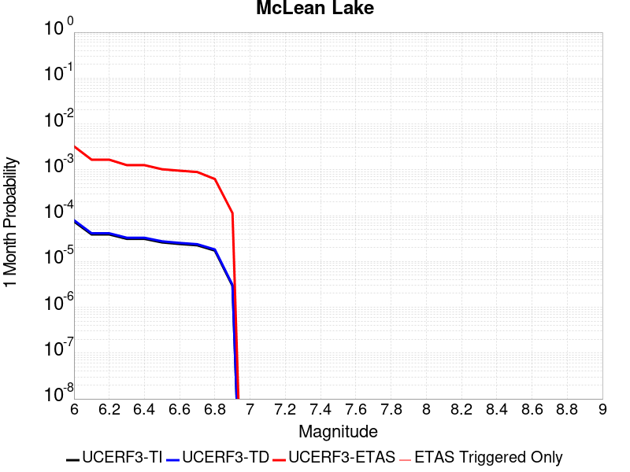 |  |  |

| Magnitude | 1 wk TI Prob | 1 wk TD Prob | 1 wk ETAS Prob | 1 wk ETAS/TD Gain | 1 wk ETAS Triggered Only | 1 mo TI Prob | 1 mo TD Prob | 1 mo ETAS Prob | 1 mo ETAS/TD Gain | 1 mo ETAS Triggered Only | 1 yr TI Prob | 1 yr TD Prob | 1 yr ETAS Prob | 1 yr ETAS/TD Gain | 1 yr ETAS Triggered Only | 10 yr TI Prob | 10 yr TD Prob | 10 yr ETAS Prob | 10 yr ETAS/TD Gain | 10 yr ETAS Triggered Only |
|-----|-----|-----|-----|-----|-----|-----|-----|-----|-----|-----|-----|-----|-----|-----|-----|-----|-----|-----|-----|-----|
| 6.0 | 1.7360222E-5 | 1.8501627E-5 | 0.0019307272 | 104.354454 | 0.001912261 | 7.439883E-5 | 7.9290556E-5 | 0.0036410629 | 45.920513 | 0.0035620548 | 9.0542925E-4 | 9.6498354E-4 | 0.0069209854 | 7.1721277 | 0.005961755 | 0.009017491 | 0.0096127745 | 0.01863655 | 1.9387275 | 0.009111361 |
| 6.1 | 9.062689E-6 | 9.592193E-6 | 0.0010969458 | 114.358185 | 0.001087364 | 3.8839516E-5 | 4.1108804E-5 | 0.001990785 | 48.427216 | 0.0019497563 | 4.727685E-4 | 5.003936E-4 | 0.003723377 | 7.440896 | 0.0032245968 | 0.0047176396 | 0.004993552 | 0.010104759 | 2.0235615 | 0.0051368577 |
| 6.2 | 9.062689E-6 | 9.592193E-6 | 0.0010969458 | 114.358185 | 0.001087364 | 3.8839516E-5 | 4.1108804E-5 | 0.001990785 | 48.427216 | 0.0019497563 | 4.727685E-4 | 5.003936E-4 | 0.003723377 | 7.440896 | 0.0032245968 | 0.0047176396 | 0.004993552 | 0.010104759 | 2.0235615 | 0.0051368577 |
| 6.3 | 7.2575485E-6 | 7.66771E-6 | 9.075483E-4 | 118.35977 | 8.998875E-4 | 3.110341E-5 | 3.2861237E-5 | 0.0016076126 | 48.921246 | 0.0015748031 | 3.786182E-4 | 4.0001926E-4 | 0.0030611216 | 7.652436 | 0.0026621672 | 0.0037797375 | 0.0039936965 | 0.008101709 | 2.028624 | 0.0041244845 |
| 6.4 | 7.2575485E-6 | 7.66771E-6 | 9.075483E-4 | 118.35977 | 8.998875E-4 | 3.110341E-5 | 3.2861237E-5 | 0.0016076126 | 48.921246 | 0.0015748031 | 3.786182E-4 | 4.0001926E-4 | 0.0030611216 | 7.652436 | 0.0026621672 | 0.0037797375 | 0.0039936965 | 0.008101709 | 2.028624 | 0.0041244845 |
| 6.5 | 6.06582E-6 | 6.4038773E-6 | 7.1881025E-4 | 112.24611 | 7.1241095E-4 | 2.5996113E-5 | 2.7444936E-5 | 0.0013397449 | 48.815742 | 0.001312336 | 3.164567E-4 | 3.3409733E-4 | 0.0025830646 | 7.731473 | 0.0022497189 | 0.0031600643 | 0.0033365893 | 0.0068120183 | 2.0416114 | 0.003487064 |
| 6.6 | 5.598744E-6 | 5.910262E-6 | 6.808219E-4 | 115.193184 | 6.749156E-4 | 2.3994397E-5 | 2.5329486E-5 | 0.0012626435 | 49.848763 | 0.0012373453 | 2.9209262E-4 | 3.0834923E-4 | 0.0023699556 | 7.685946 | 0.0020622422 | 0.0029170897 | 0.003079843 | 0.0063692685 | 2.0680497 | 0.0032995876 |
| 6.7 | 5.246996E-6 | 5.539162E-6 | 6.8045105E-4 | 122.84368 | 6.749156E-4 | 2.2486933E-5 | 2.3739085E-5 | 0.001261055 | 53.121468 | 0.0012373453 | 2.73744E-4 | 2.8899137E-4 | 0.0023506377 | 8.133937 | 0.0020622422 | 0.0027340704 | 0.0028867796 | 0.006027294 | 2.0878954 | 0.0031496063 |
| 6.8 | 4.02324E-6 | 4.2469046E-6 | 5.2917906E-4 | 124.60348 | 5.249344E-4 | 1.7242342E-5 | 1.8200926E-5 | 9.930613E-4 | 54.561035 | 9.7487814E-4 | 2.099053E-4 | 2.2157968E-4 | 0.0019084949 | 8.613131 | 0.0016872891 | 0.0020970714 | 0.002214172 | 0.0048330324 | 2.182772 | 0.002624672 |
| 6.9 | 6.835972E-7 | 7.1399285E-7 | 1.1319985E-4 | 158.5448 | 1.1248594E-4 | 2.9296991E-6 | 3.0599674E-6 | 1.9053595E-4 | 62.267315 | 1.8747656E-4 | 3.56685E-5 | 3.7254784E-5 | 2.997122E-4 | 8.044931 | 2.624672E-4 | 3.5662777E-4 | 3.7251666E-4 | 7.0984877E-4 | 1.905549 | 3.374578E-4 |

## Gravel Hills-Harper Lk
*[(top)](#table-of-contents)*

| 1 Week | 1 Month | 1 Year | 10 Year |
|-----|-----|-----|-----|
|  |  |  |  |

| Magnitude | 1 wk TI Prob | 1 wk TD Prob | 1 wk ETAS Prob | 1 wk ETAS/TD Gain | 1 wk ETAS Triggered Only | 1 mo TI Prob | 1 mo TD Prob | 1 mo ETAS Prob | 1 mo ETAS/TD Gain | 1 mo ETAS Triggered Only | 1 yr TI Prob | 1 yr TD Prob | 1 yr ETAS Prob | 1 yr ETAS/TD Gain | 1 yr ETAS Triggered Only | 10 yr TI Prob | 10 yr TD Prob | 10 yr ETAS Prob | 10 yr ETAS/TD Gain | 10 yr ETAS Triggered Only |
|-----|-----|-----|-----|-----|-----|-----|-----|-----|-----|-----|-----|-----|-----|-----|-----|-----|-----|-----|-----|-----|
| 6.0 | 3.0679566E-5 | 3.1464646E-5 | 0.0022811126 | 72.49764 | 0.0022497189 | 1.3147724E-4 | 1.3484273E-4 | 0.0031715536 | 23.520388 | 0.0030371204 | 0.0015995599 | 0.0016406906 | 0.006918856 | 4.2170386 | 0.0052868393 | 0.015880952 | 0.01630734 | 0.024089834 | 1.4772389 | 0.007911511 |
| 6.1 | 3.0679566E-5 | 3.1464646E-5 | 0.0022811126 | 72.49764 | 0.0022497189 | 1.3147724E-4 | 1.3484273E-4 | 0.0031715536 | 23.520388 | 0.0030371204 | 0.0015995599 | 0.0016406906 | 0.006918856 | 4.2170386 | 0.0052868393 | 0.015880952 | 0.01630734 | 0.024089834 | 1.4772389 | 0.007911511 |
| 6.2 | 1.514536E-5 | 1.3635206E-5 | 5.385624E-4 | 39.49793 | 5.249344E-4 | 6.490707E-5 | 5.843536E-5 | 7.708047E-4 | 13.190723 | 7.1241095E-4 | 7.8995706E-4 | 7.1123015E-4 | 0.0021350386 | 3.0018957 | 0.0014248219 | 0.007871548 | 0.0070907404 | 0.009063901 | 1.2782729 | 0.0019872517 |
| 6.3 | 1.514536E-5 | 1.3635206E-5 | 5.385624E-4 | 39.49793 | 5.249344E-4 | 6.490707E-5 | 5.843536E-5 | 7.708047E-4 | 13.190723 | 7.1241095E-4 | 7.8995706E-4 | 7.1123015E-4 | 0.0021350386 | 3.0018957 | 0.0014248219 | 0.007871548 | 0.0070907404 | 0.009063901 | 1.2782729 | 0.0019872517 |
| 6.4 | 1.2532521E-5 | 1.06896905E-5 | 2.731541E-4 | 25.553038 | 2.624672E-4 | 5.37097E-5 | 4.581219E-5 | 4.957353E-4 | 10.821035 | 4.4994376E-4 | 6.537194E-4 | 5.576265E-4 | 0.0014195378 | 2.5456786 | 8.623922E-4 | 0.0065179965 | 0.005562863 | 0.006793325 | 1.2211922 | 0.0012373453 |
| 6.5 | 1.1094058E-5 | 9.083664E-6 | 1.5906355E-4 | 17.510948 | 1.4998125E-4 | 4.7545094E-5 | 3.892943E-5 | 3.3888026E-4 | 8.704989 | 2.999625E-4 | 5.787078E-4 | 4.7386673E-4 | 0.0011109851 | 2.3445094 | 6.3742034E-4 | 0.0057720304 | 0.0047289706 | 0.0055126483 | 1.1657186 | 7.874016E-4 |
| 6.6 | 9.688328E-6 | 7.5316952E-6 | 1.2001679E-4 | 15.934897 | 1.1248594E-4 | 4.1520743E-5 | 3.227831E-5 | 1.4476062E-4 | 4.4847646 | 1.1248594E-4 | 5.053978E-4 | 3.9292008E-4 | 6.927647E-4 | 1.7631186 | 2.999625E-4 | 0.0050424994 | 0.0039225104 | 0.004333341 | 1.1047367 | 4.1244845E-4 |
| 6.7 | 8.974824E-6 | 6.749413E-6 | 1.19234595E-4 | 17.66592 | 1.1248594E-4 | 3.8462964E-5 | 2.8925748E-5 | 1.4140844E-4 | 4.88867 | 1.1248594E-4 | 4.6818596E-4 | 3.5211627E-4 | 6.519731E-4 | 1.8515849 | 2.999625E-4 | 0.004672008 | 0.0035158044 | 0.0038894394 | 1.1062729 | 3.7495312E-4 |
| 6.8 | 7.4780046E-6 | 5.1161933E-6 | 8.010644E-5 | 15.65743 | 7.4990625E-5 | 3.20482E-5 | 2.1926366E-5 | 9.691535E-5 | 4.420037 | 7.4990625E-5 | 3.9011694E-4 | 2.669222E-4 | 4.5434872E-4 | 1.7021766 | 1.8747656E-4 | 0.0038943281 | 0.0026661542 | 0.0028905263 | 1.0841557 | 2.2497188E-4 |
| 6.9 | 6.3409307E-6 | 3.9074966E-6 | 7.889783E-5 | 20.1914 | 7.4990625E-5 | 2.7175134E-5 | 1.6746313E-5 | 9.173568E-5 | 5.477963 | 7.4990625E-5 | 3.3080703E-4 | 2.0386827E-4 | 3.5381896E-4 | 1.7355273 | 1.4998125E-4 | 0.0033031502 | 0.0020369107 | 0.0022240053 | 1.0918522 | 1.8747656E-4 |
| 7.0 | 5.1239335E-6 | 2.6058565E-6 | 7.759629E-5 | 29.777653 | 7.4990625E-5 | 2.195953E-5 | 1.116791E-5 | 8.61577E-5 | 7.714756 | 7.4990625E-5 | 2.6732447E-4 | 1.3596108E-4 | 2.4843172E-4 | 1.8272268 | 1.1248594E-4 | 0.0026700313 | 0.0013588042 | 0.0014711373 | 1.0826706 | 1.1248594E-4 |
| 7.1 | 4.438899E-6 | 2.0984728E-6 | 7.708894E-5 | 36.735737 | 7.4990625E-5 | 1.9023713E-5 | 8.993425E-6 | 8.3983374E-5 | 9.338308 | 7.4990625E-5 | 2.315891E-4 | 1.0948967E-4 | 2.2196329E-4 | 2.0272534 | 1.1248594E-4 | 0.002313479 | 0.0010943791 | 0.001206742 | 1.1026727 | 1.1248594E-4 |
| 7.2 | 3.50367E-6 | 1.2615716E-6 | 3.8756836E-5 | 30.721077 | 3.7495312E-5 | 1.5015643E-5 | 5.4067245E-6 | 4.2901836E-5 | 7.9349027 | 3.7495312E-5 | 1.8280011E-4 | 6.582497E-5 | 1.0331781E-4 | 1.5695839 | 3.7495312E-5 | 0.0018264982 | 6.580629E-4 | 6.955336E-4 | 1.0569408 | 3.7495312E-5 |
| 7.3 | 2.561638E-6 | 7.1191585E-7 | 3.8207203E-5 | 53.668144 | 3.7495312E-5 | 1.0978401E-5 | 3.0510646E-6 | 4.0546263E-5 | 13.289219 | 3.7495312E-5 | 1.3365384E-4 | 3.71461E-5 | 7.464002E-5 | 2.0093637 | 3.7495312E-5 | 0.0013357349 | 3.7140088E-4 | 4.0888228E-4 | 1.100919 | 3.7495312E-5 |
| 7.4 | 2.0368864E-6 | 5.304837E-7 | 3.8025777E-5 | 71.68133 | 3.7495312E-5 | 8.729483E-6 | 2.2734996E-6 | 3.976873E-5 | 17.492294 | 3.7495312E-5 | 1.06276275E-4 | 2.7679513E-5 | 6.517379E-5 | 2.354586 | 3.7495312E-5 | 0.0010622547 | 2.767612E-4 | 3.1424614E-4 | 1.1354414 | 3.7495312E-5 |
| 7.5 | 1.1681728E-6 | 3.6030585E-7 | 3.7855607E-5 | 105.0652 | 3.7495312E-5 | 5.0064455E-6 | 1.544167E-6 | 3.9039423E-5 | 25.281864 | 3.7495312E-5 | 6.0951766E-5 | 1.8800076E-5 | 5.6294684E-5 | 2.994386 | 3.7495312E-5 | 6.093505E-4 | 1.8798532E-4 | 2.2547359E-4 | 1.1994213 | 3.7495312E-5 |
| 7.6 | 1.3154387E-7 | 7.1197384E-8 | 7.1197384E-8 | 1.0 | 0.0 | 5.6375933E-7 | 3.051316E-7 | 3.051316E-7 | 1.0 | 0.0 | 6.863748E-6 | 3.7149728E-6 | 3.7149728E-6 | 1.0 | 0.0 | 6.863536E-5 | 3.7149264E-5 | 3.7149264E-5 | 1.0 | 0.0 |

## Goldstone Lake
*[(top)](#table-of-contents)*

| 1 Week | 1 Month | 1 Year | 10 Year |
|-----|-----|-----|-----|
|  | 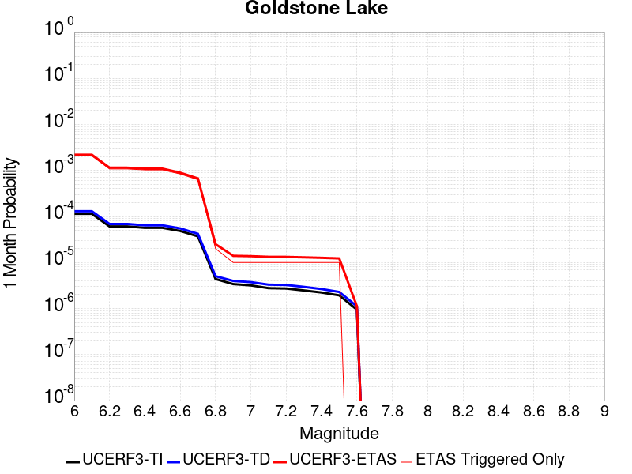 |  |  |

| Magnitude | 1 wk TI Prob | 1 wk TD Prob | 1 wk ETAS Prob | 1 wk ETAS/TD Gain | 1 wk ETAS Triggered Only | 1 mo TI Prob | 1 mo TD Prob | 1 mo ETAS Prob | 1 mo ETAS/TD Gain | 1 mo ETAS Triggered Only | 1 yr TI Prob | 1 yr TD Prob | 1 yr ETAS Prob | 1 yr ETAS/TD Gain | 1 yr ETAS Triggered Only | 10 yr TI Prob | 10 yr TD Prob | 10 yr ETAS Prob | 10 yr ETAS/TD Gain | 10 yr ETAS Triggered Only |
|-----|-----|-----|-----|-----|-----|-----|-----|-----|-----|-----|-----|-----|-----|-----|-----|-----|-----|-----|-----|-----|
| 6.0 | 2.671352E-5 | 3.037609E-5 | 0.0016051314 | 52.841938 | 0.0015748031 | 1.1448149E-4 | 1.3017785E-4 | 0.0029044698 | 22.311552 | 0.0027746533 | 0.001392921 | 0.0015839594 | 0.0060388343 | 3.8124928 | 0.0044619422 | 0.013842222 | 0.015746197 | 0.022758128 | 1.4453095 | 0.0071241097 |
| 6.1 | 2.671352E-5 | 3.037609E-5 | 0.0016051314 | 52.841938 | 0.0015748031 | 1.1448149E-4 | 1.3017785E-4 | 0.0029044698 | 22.311552 | 0.0027746533 | 0.001392921 | 0.0015839594 | 0.0060388343 | 3.8124928 | 0.0044619422 | 0.013842222 | 0.015746197 | 0.022758128 | 1.4453095 | 0.0071241097 |
| 6.2 | 1.4197047E-5 | 1.6096245E-5 | 7.284957E-4 | 45.25874 | 7.1241095E-4 | 6.0843064E-5 | 6.8982634E-5 | 0.0014187208 | 20.566347 | 0.0013498312 | 7.4051257E-4 | 8.3963864E-4 | 0.002975077 | 3.5432827 | 0.0021372328 | 0.007380498 | 0.0083743585 | 0.0116463145 | 1.3907112 | 0.0032995876 |
| 6.3 | 1.4197047E-5 | 1.6096245E-5 | 7.284957E-4 | 45.25874 | 7.1241095E-4 | 6.0843064E-5 | 6.8982634E-5 | 0.0014187208 | 20.566347 | 0.0013498312 | 7.4051257E-4 | 8.3963864E-4 | 0.002975077 | 3.5432827 | 0.0021372328 | 0.007380498 | 0.0083743585 | 0.0116463145 | 1.3907112 | 0.0032995876 |
| 6.4 | 1.3238931E-5 | 1.500846E-5 | 6.149245E-4 | 40.97186 | 5.99925E-4 | 5.6737044E-5 | 6.4320935E-5 | 0.0012266008 | 19.07001 | 0.0011623547 | 6.9055456E-4 | 7.82924E-4 | 0.0026936878 | 3.4405482 | 0.001912261 | 0.006884126 | 0.0078112837 | 0.010787478 | 1.3810122 | 0.002999625 |
| 6.5 | 1.3238931E-5 | 1.500846E-5 | 6.149245E-4 | 40.97186 | 5.99925E-4 | 5.6737044E-5 | 6.4320935E-5 | 0.0012266008 | 19.07001 | 0.0011623547 | 6.9055456E-4 | 7.82924E-4 | 0.0026936878 | 3.4405482 | 0.001912261 | 0.006884126 | 0.0078112837 | 0.010787478 | 1.3810122 | 0.002999625 |
| 6.6 | 1.1328278E-5 | 1.2855166E-5 | 4.6279313E-4 | 36.000557 | 4.4994376E-4 | 4.8548856E-5 | 5.5092944E-5 | 9.174376E-4 | 16.652544 | 8.623922E-4 | 5.90922E-4 | 6.7064585E-4 | 0.0022443929 | 3.3466141 | 0.0015748031 | 0.0058935313 | 0.0066956086 | 0.009116486 | 1.3615619 | 0.0024371953 |
| 6.7 | 8.651175E-6 | 9.824565E-6 | 4.2226896E-4 | 42.980934 | 4.1244845E-4 | 3.707594E-5 | 4.2105108E-5 | 7.169923E-4 | 17.028631 | 6.749156E-4 | 4.5130608E-4 | 5.1259965E-4 | 0.0016368824 | 3.1932962 | 0.0011248594 | 0.0045039062 | 0.005123051 | 0.006838999 | 1.3349465 | 0.0017247844 |
| 6.8 | 1.0215377E-6 | 1.1754702E-6 | 1.1754702E-6 | 1.0 | 0.0 | 4.378012E-6 | 5.0377203E-6 | 5.0377203E-6 | 1.0 | 0.0 | 5.3300988E-5 | 6.1332634E-5 | 6.1332634E-5 | 1.0 | 0.0 | 5.3288206E-4 | 6.1316835E-4 | 6.5064064E-4 | 1.0611126 | 3.7495312E-5 |
| 6.9 | 7.9360774E-7 | 9.2833966E-7 | 9.2833966E-7 | 1.0 | 0.0 | 3.4011714E-6 | 3.9785928E-6 | 3.9785928E-6 | 1.0 | 0.0 | 4.1408475E-5 | 4.843836E-5 | 4.843836E-5 | 1.0 | 0.0 | 4.140076E-4 | 4.8428503E-4 | 4.8428503E-4 | 1.0 | 0.0 |
| 7.0 | 7.4382757E-7 | 8.7473285E-7 | 8.7473285E-7 | 1.0 | 0.0 | 3.1878285E-6 | 3.74885E-6 | 3.74885E-6 | 1.0 | 0.0 | 3.8811122E-5 | 4.564136E-5 | 4.564136E-5 | 1.0 | 0.0 | 3.8804344E-4 | 4.5632652E-4 | 4.5632652E-4 | 1.0 | 0.0 |
| 7.1 | 6.4709513E-7 | 7.7113E-7 | 7.7113E-7 | 1.0 | 0.0 | 2.773262E-6 | 3.3048389E-6 | 3.3048389E-6 | 1.0 | 0.0 | 3.376394E-5 | 4.0235733E-5 | 4.0235733E-5 | 1.0 | 0.0 | 3.375881E-4 | 4.0229043E-4 | 4.0229043E-4 | 1.0 | 0.0 |
| 7.2 | 6.356704E-7 | 7.5883594E-7 | 7.5883594E-7 | 1.0 | 0.0 | 2.7242988E-6 | 3.2521505E-6 | 3.2521505E-6 | 1.0 | 0.0 | 3.3167835E-5 | 3.959427E-5 | 3.959427E-5 | 1.0 | 0.0 | 3.3162883E-4 | 3.958781E-4 | 3.958781E-4 | 1.0 | 0.0 |
| 7.3 | 5.7695723E-7 | 6.8965653E-7 | 6.8965653E-7 | 1.0 | 0.0 | 2.4726714E-6 | 2.9556677E-6 | 2.9556677E-6 | 1.0 | 0.0 | 3.0104358E-5 | 3.5984718E-5 | 3.5984718E-5 | 1.0 | 0.0 | 3.0100282E-4 | 3.5979465E-4 | 3.5979465E-4 | 1.0 | 0.0 |
| 7.4 | 5.209647E-7 | 6.193514E-7 | 6.193514E-7 | 1.0 | 0.0 | 2.232704E-6 | 2.6543607E-6 | 2.6543607E-6 | 1.0 | 0.0 | 2.718283E-5 | 3.2316417E-5 | 3.2316417E-5 | 1.0 | 0.0 | 2.7179506E-4 | 3.2312275E-4 | 3.2312275E-4 | 1.0 | 0.0 |
| 7.5 | 4.512955E-7 | 5.348885E-7 | 5.348885E-7 | 1.0 | 0.0 | 1.934122E-6 | 2.2923775E-6 | 2.2923775E-6 | 1.0 | 0.0 | 2.3547682E-5 | 2.7909393E-5 | 2.7909393E-5 | 1.0 | 0.0 | 2.3545188E-4 | 2.7906417E-4 | 2.7906417E-4 | 1.0 | 0.0 |
| 7.6 | 2.21172E-7 | 2.603961E-7 | 2.603961E-7 | 1.0 | 0.0 | 9.478797E-7 | 1.1159829E-6 | 1.1159829E-6 | 1.0 | 0.0 | 1.1540374E-5 | 1.3587036E-5 | 1.3587036E-5 | 1.0 | 0.0 | 1.1539775E-4 | 1.3586486E-4 | 1.3586486E-4 | 1.0 | 0.0 |

## So Sierra Nevada
*[(top)](#table-of-contents)*

| 1 Week | 1 Month | 1 Year | 10 Year |
|-----|-----|-----|-----|
|  |  |  |  |

| Magnitude | 1 wk TI Prob | 1 wk TD Prob | 1 wk ETAS Prob | 1 wk ETAS/TD Gain | 1 wk ETAS Triggered Only | 1 mo TI Prob | 1 mo TD Prob | 1 mo ETAS Prob | 1 mo ETAS/TD Gain | 1 mo ETAS Triggered Only | 1 yr TI Prob | 1 yr TD Prob | 1 yr ETAS Prob | 1 yr ETAS/TD Gain | 1 yr ETAS Triggered Only | 10 yr TI Prob | 10 yr TD Prob | 10 yr ETAS Prob | 10 yr ETAS/TD Gain | 10 yr ETAS Triggered Only |
|-----|-----|-----|-----|-----|-----|-----|-----|-----|-----|-----|-----|-----|-----|-----|-----|-----|-----|-----|-----|-----|
| 6.0 | 1.15488665E-5 | 1.1079643E-5 | 0.0016983501 | 153.28564 | 0.0016872891 | 4.9494203E-5 | 4.748339E-5 | 0.0023720823 | 49.956047 | 0.0023247094 | 6.024253E-4 | 5.7796965E-4 | 0.0042878604 | 7.418833 | 0.003712036 | 0.006007948 | 0.005765934 | 0.011134127 | 1.9310188 | 0.005399325 |
| 6.1 | 1.15488665E-5 | 1.1079643E-5 | 0.0016983501 | 153.28564 | 0.0016872891 | 4.9494203E-5 | 4.748339E-5 | 0.0023720823 | 49.956047 | 0.0023247094 | 6.024253E-4 | 5.7796965E-4 | 0.0042878604 | 7.418833 | 0.003712036 | 0.006007948 | 0.005765934 | 0.011134127 | 1.9310188 | 0.005399325 |
| 6.2 | 1.15488665E-5 | 1.1079643E-5 | 0.0016983501 | 153.28564 | 0.0016872891 | 4.9494203E-5 | 4.748339E-5 | 0.0023720823 | 49.956047 | 0.0023247094 | 6.024253E-4 | 5.7796965E-4 | 0.0042878604 | 7.418833 | 0.003712036 | 0.006007948 | 0.005765934 | 0.011134127 | 1.9310188 | 0.005399325 |
| 6.3 | 1.15488665E-5 | 1.1079643E-5 | 0.0016983501 | 153.28564 | 0.0016872891 | 4.9494203E-5 | 4.748339E-5 | 0.0023720823 | 49.956047 | 0.0023247094 | 6.024253E-4 | 5.7796965E-4 | 0.0042878604 | 7.418833 | 0.003712036 | 0.006007948 | 0.005765934 | 0.011134127 | 1.9310188 | 0.005399325 |
| 6.4 | 1.15488665E-5 | 1.1079643E-5 | 0.0016983501 | 153.28564 | 0.0016872891 | 4.9494203E-5 | 4.748339E-5 | 0.0023720823 | 49.956047 | 0.0023247094 | 6.024253E-4 | 5.7796965E-4 | 0.0042878604 | 7.418833 | 0.003712036 | 0.006007948 | 0.005765934 | 0.011134127 | 1.9310188 | 0.005399325 |
| 6.5 | 1.15488665E-5 | 1.1079643E-5 | 0.0016983501 | 153.28564 | 0.0016872891 | 4.9494203E-5 | 4.748339E-5 | 0.0023720823 | 49.956047 | 0.0023247094 | 6.024253E-4 | 5.7796965E-4 | 0.0042878604 | 7.418833 | 0.003712036 | 0.006007948 | 0.005765934 | 0.011134127 | 1.9310188 | 0.005399325 |
| 6.6 | 7.587044E-6 | 6.935635E-6 | 0.0011692822 | 168.59052 | 0.0011623547 | 3.2515498E-5 | 2.9723828E-5 | 0.0015294917 | 51.456757 | 0.0014998125 | 3.9580427E-4 | 3.6183043E-4 | 0.0025357718 | 7.008177 | 0.002174728 | 0.003951 | 0.0036127048 | 0.006676213 | 1.8479818 | 0.0030746157 |
| 6.7 | 7.587044E-6 | 6.935635E-6 | 0.0011692822 | 168.59052 | 0.0011623547 | 3.2515498E-5 | 2.9723828E-5 | 0.0015294917 | 51.456757 | 0.0014998125 | 3.9580427E-4 | 3.6183043E-4 | 0.0025357718 | 7.008177 | 0.002174728 | 0.003951 | 0.0036127048 | 0.006676213 | 1.8479818 | 0.0030746157 |
| 6.8 | 5.9026956E-6 | 5.1793927E-6 | 7.5508177E-4 | 145.78577 | 7.4990623E-4 | 2.5297022E-5 | 2.2197215E-5 | 9.595592E-4 | 43.228813 | 9.373828E-4 | 3.0794772E-4 | 2.7021873E-4 | 0.0017696259 | 6.548865 | 0.0014998125 | 0.0030752132 | 0.002699018 | 0.004755694 | 1.762009 | 0.0020622422 |
| 6.9 | 5.0118915E-6 | 4.2524252E-6 | 7.1666035E-4 | 168.52979 | 7.1241095E-4 | 2.1479358E-5 | 1.8224557E-5 | 8.8060106E-4 | 48.319477 | 8.623922E-4 | 2.614798E-4 | 2.2186211E-4 | 0.0014964199 | 6.7448196 | 0.0012748407 | 0.0026117235 | 0.0022164788 | 0.004049677 | 1.8270768 | 0.0018372703 |
| 7.0 | 4.4924795E-6 | 3.7139177E-6 | 6.7862705E-4 | 182.72539 | 6.749156E-4 | 1.925334E-5 | 1.5916696E-5 | 8.4080047E-4 | 52.82506 | 8.248969E-4 | 2.3438422E-4 | 1.9376918E-4 | 0.0013184106 | 6.804026 | 0.0011248594 | 0.0023413717 | 0.0019360651 | 0.0035826648 | 1.8504877 | 0.0016497938 |
| 7.1 | 3.9118436E-6 | 3.1119775E-6 | 4.5305432E-4 | 145.58406 | 4.4994376E-4 | 1.6764936E-5 | 1.3336982E-5 | 5.3826434E-4 | 40.358784 | 5.249344E-4 | 2.0409399E-4 | 1.6236622E-4 | 9.121507E-4 | 5.6178603 | 7.4990623E-4 | 0.0020390663 | 0.001622532 | 0.0027830007 | 1.7152208 | 0.0011623547 |
| 7.2 | 3.4200818E-6 | 2.6054543E-6 | 4.5254803E-4 | 173.69257 | 4.4994376E-4 | 1.4657411E-5 | 1.11661875E-5 | 5.360947E-4 | 48.01054 | 5.249344E-4 | 1.7843937E-4 | 1.3594035E-4 | 8.482545E-4 | 6.2399015 | 7.1241095E-4 | 0.0017829615 | 0.0013586218 | 0.0023696197 | 1.744135 | 0.0010123735 |
| 7.3 | 2.6593618E-6 | 1.8284203E-6 | 3.7678087E-4 | 206.06908 | 3.7495312E-4 | 1.13972155E-5 | 7.836065E-6 | 4.577763E-4 | 58.419155 | 4.4994376E-4 | 1.3875226E-4 | 9.540021E-5 | 6.5777625E-4 | 6.894914 | 5.624297E-4 | 0.0013866565 | 9.5362146E-4 | 0.0016653531 | 1.746346 | 7.1241095E-4 |
| 7.4 | 2.2577992E-6 | 1.436438E-6 | 3.7638904E-4 | 262.02942 | 3.7495312E-4 | 9.676246E-6 | 6.15615E-6 | 4.5609713E-4 | 74.08805 | 4.4994376E-4 | 1.1780193E-4 | 7.49488E-5 | 5.9984386E-4 | 8.003382 | 5.249344E-4 | 0.001177395 | 7.492603E-4 | 0.0014236702 | 1.9001011 | 6.749156E-4 |
| 7.5 | 1.489319E-6 | 7.353936E-7 | 1.5071653E-4 | 204.94676 | 1.4998125E-4 | 6.3827797E-6 | 3.1516831E-6 | 1.9062766E-4 | 60.484398 | 1.8747656E-4 | 7.770758E-5 | 3.8371072E-5 | 3.008282E-4 | 7.839974 | 2.624672E-4 | 7.7680405E-4 | 3.836449E-4 | 7.2097324E-4 | 1.8792723 | 3.374578E-4 |
| 7.6 | 1.0680322E-6 | 4.6596554E-7 | 7.5456555E-5 | 161.93591 | 7.4990625E-5 | 4.577273E-6 | 1.9969937E-6 | 1.1448271E-4 | 57.327526 | 1.1248594E-4 | 5.5726876E-5 | 2.4313129E-5 | 2.1178514E-4 | 8.7107315 | 1.8747656E-4 | 5.5712904E-4 | 2.4310495E-4 | 4.6802213E-4 | 1.9251856 | 2.2497188E-4 |
| 7.7 | 5.509146E-7 | 1.5580486E-7 | 3.7651113E-5 | 241.65556 | 3.7495312E-5 | 2.3610605E-6 | 6.677349E-7 | 3.8163023E-5 | 57.15295 | 3.7495312E-5 | 2.8745531E-5 | 8.129644E-6 | 4.5624653E-5 | 5.612134 | 3.7495312E-5 | 2.8741814E-4 | 8.1293576E-5 | 1.1878584E-4 | 1.461196 | 3.7495312E-5 |

## Coyote Canyon
*[(top)](#table-of-contents)*

| 1 Week | 1 Month | 1 Year | 10 Year |
|-----|-----|-----|-----|
|  |  |  |  |

| Magnitude | 1 wk TI Prob | 1 wk TD Prob | 1 wk ETAS Prob | 1 wk ETAS/TD Gain | 1 wk ETAS Triggered Only | 1 mo TI Prob | 1 mo TD Prob | 1 mo ETAS Prob | 1 mo ETAS/TD Gain | 1 mo ETAS Triggered Only | 1 yr TI Prob | 1 yr TD Prob | 1 yr ETAS Prob | 1 yr ETAS/TD Gain | 1 yr ETAS Triggered Only | 10 yr TI Prob | 10 yr TD Prob | 10 yr ETAS Prob | 10 yr ETAS/TD Gain | 10 yr ETAS Triggered Only |
|-----|-----|-----|-----|-----|-----|-----|-----|-----|-----|-----|-----|-----|-----|-----|-----|-----|-----|-----|-----|-----|
| 6.0 | 3.5090034E-5 | 4.0364324E-5 | 0.0012401659 | 30.724308 | 0.00119985 | 1.503772E-4 | 1.7297994E-4 | 0.0019724437 | 11.402731 | 0.001799775 | 0.0018293047 | 0.0021042528 | 0.005172399 | 2.458069 | 0.0030746157 | 0.018143194 | 0.020869201 | 0.025384879 | 1.2163799 | 0.0046119234 |
| 6.1 | 3.5090034E-5 | 4.0364324E-5 | 0.0012401659 | 30.724308 | 0.00119985 | 1.503772E-4 | 1.7297994E-4 | 0.0019724437 | 11.402731 | 0.001799775 | 0.0018293047 | 0.0021042528 | 0.005172399 | 2.458069 | 0.0030746157 | 0.018143194 | 0.020869201 | 0.025384879 | 1.2163799 | 0.0046119234 |
| 6.2 | 1.841879E-5 | 2.1059794E-5 | 6.209722E-4 | 29.486147 | 5.99925E-4 | 7.8935285E-5 | 9.0253714E-5 | 9.525681E-4 | 10.554337 | 8.623922E-4 | 9.606133E-4 | 0.001098387 | 0.0026714604 | 2.4321668 | 0.0015748031 | 0.0095647145 | 0.010939667 | 0.0131647745 | 1.2033981 | 0.0022497189 |
| 6.3 | 1.841879E-5 | 2.1059794E-5 | 6.209722E-4 | 29.486147 | 5.99925E-4 | 7.8935285E-5 | 9.0253714E-5 | 9.525681E-4 | 10.554337 | 8.623922E-4 | 9.606133E-4 | 0.001098387 | 0.0026714604 | 2.4321668 | 0.0015748031 | 0.0095647145 | 0.010939667 | 0.0131647745 | 1.2033981 | 0.0022497189 |
| 6.4 | 1.712201E-5 | 1.9565212E-5 | 6.1947847E-4 | 31.662243 | 5.99925E-4 | 7.337798E-5 | 8.3848776E-5 | 9.086765E-4 | 10.837087 | 8.248969E-4 | 8.930107E-4 | 0.0010204813 | 0.0024813062 | 2.431506 | 0.0014623172 | 0.008894307 | 0.010167871 | 0.012209144 | 1.2007573 | 0.0020622422 |
| 6.5 | 1.4744935E-5 | 1.6836972E-5 | 5.042678E-4 | 29.950031 | 4.8743907E-4 | 6.3191044E-5 | 7.215698E-5 | 7.470239E-4 | 10.35276 | 6.749156E-4 | 7.6907943E-4 | 8.7825063E-4 | 0.002002122 | 2.2796705 | 0.0011248594 | 0.007664232 | 0.008756994 | 0.010466675 | 1.195236 | 0.0017247844 |
| 6.6 | 1.2017839E-5 | 1.37240895E-5 | 3.1368248E-4 | 22.856342 | 2.999625E-4 | 5.150401E-5 | 5.88167E-5 | 5.462271E-4 | 9.286939 | 4.8743907E-4 | 6.268809E-4 | 7.159466E-4 | 0.0015777213 | 2.2036858 | 8.623922E-4 | 0.0062511545 | 0.0071450938 | 0.0085597355 | 1.1979878 | 0.0014248219 |
| 6.7 | 1.00956095E-5 | 1.1533517E-5 | 3.1149256E-4 | 27.007597 | 2.999625E-4 | 4.326618E-5 | 4.942891E-5 | 5.368439E-4 | 10.8609295 | 4.8743907E-4 | 5.266384E-4 | 6.017178E-4 | 0.0013886456 | 2.3078022 | 7.874016E-4 | 0.005253921 | 0.0060094125 | 0.007202052 | 1.1984619 | 0.00119985 |

## San Andreas (Mojave N)
*[(top)](#table-of-contents)*

| 1 Week | 1 Month | 1 Year | 10 Year |
|-----|-----|-----|-----|
|  |  |  |  |

| Magnitude | 1 wk TI Prob | 1 wk TD Prob | 1 wk ETAS Prob | 1 wk ETAS/TD Gain | 1 wk ETAS Triggered Only | 1 mo TI Prob | 1 mo TD Prob | 1 mo ETAS Prob | 1 mo ETAS/TD Gain | 1 mo ETAS Triggered Only | 1 yr TI Prob | 1 yr TD Prob | 1 yr ETAS Prob | 1 yr ETAS/TD Gain | 1 yr ETAS Triggered Only | 10 yr TI Prob | 10 yr TD Prob | 10 yr ETAS Prob | 10 yr ETAS/TD Gain | 10 yr ETAS Triggered Only |
|-----|-----|-----|-----|-----|-----|-----|-----|-----|-----|-----|-----|-----|-----|-----|-----|-----|-----|-----|-----|-----|
| 6.0 | 9.877682E-5 | 1.9400702E-4 | 0.0026307295 | 13.559971 | 0.0024371953 | 4.2326056E-4 | 8.311939E-4 | 0.0037533974 | 4.51567 | 0.0029246344 | 0.0051410277 | 0.010072956 | 0.0138589535 | 1.3758577 | 0.003824522 | 0.05023708 | 0.09831428 | 0.1029123 | 1.0467687 | 0.0050993627 |
| 6.1 | 9.877682E-5 | 1.9400702E-4 | 0.0026307295 | 13.559971 | 0.0024371953 | 4.2326056E-4 | 8.311939E-4 | 0.0037533974 | 4.51567 | 0.0029246344 | 0.0051410277 | 0.010072956 | 0.0138589535 | 1.3758577 | 0.003824522 | 0.05023708 | 0.09831428 | 0.1029123 | 1.0467687 | 0.0050993627 |
| 6.2 | 9.877682E-5 | 1.9400702E-4 | 0.0026307295 | 13.559971 | 0.0024371953 | 4.2326056E-4 | 8.311939E-4 | 0.0037533974 | 4.51567 | 0.0029246344 | 0.0051410277 | 0.010072956 | 0.0138589535 | 1.3758577 | 0.003824522 | 0.05023708 | 0.09831428 | 0.1029123 | 1.0467687 | 0.0050993627 |
| 6.3 | 9.877682E-5 | 1.9400702E-4 | 0.0026307295 | 13.559971 | 0.0024371953 | 4.2326056E-4 | 8.311939E-4 | 0.0037533974 | 4.51567 | 0.0029246344 | 0.0051410277 | 0.010072956 | 0.0138589535 | 1.3758577 | 0.003824522 | 0.05023708 | 0.09831428 | 0.1029123 | 1.0467687 | 0.0050993627 |
| 6.4 | 9.877682E-5 | 1.9400702E-4 | 0.0026307295 | 13.559971 | 0.0024371953 | 4.2326056E-4 | 8.311939E-4 | 0.0037533974 | 4.51567 | 0.0029246344 | 0.0051410277 | 0.010072956 | 0.0138589535 | 1.3758577 | 0.003824522 | 0.05023708 | 0.09831428 | 0.1029123 | 1.0467687 | 0.0050993627 |
| 6.5 | 9.861474E-5 | 1.9374468E-4 | 0.0026304678 | 13.576981 | 0.0024371953 | 4.2256617E-4 | 8.300703E-4 | 0.003752277 | 4.520433 | 0.0029246344 | 0.0051326132 | 0.010059402 | 0.013845452 | 1.3763692 | 0.003824522 | 0.050156746 | 0.098192066 | 0.10279071 | 1.0468332 | 0.0050993627 |
| 6.6 | 9.861474E-5 | 1.9374468E-4 | 0.0026304678 | 13.576981 | 0.0024371953 | 4.2256617E-4 | 8.300703E-4 | 0.003752277 | 4.520433 | 0.0029246344 | 0.0051326132 | 0.010059402 | 0.013845452 | 1.3763692 | 0.003824522 | 0.050156746 | 0.098192066 | 0.10279071 | 1.0468332 | 0.0050993627 |
| 6.7 | 9.8552715E-5 | 1.9364421E-4 | 0.0026303676 | 13.583508 | 0.0024371953 | 4.223004E-4 | 8.2964E-4 | 0.0037518481 | 4.52226 | 0.0029246344 | 0.0051293927 | 0.010054212 | 0.013840281 | 1.3765655 | 0.003824522 | 0.050125998 | 0.098145254 | 0.10271032 | 1.0465134 | 0.005061867 |
| 6.8 | 9.8464974E-5 | 1.9349584E-4 | 0.0026302196 | 13.593158 | 0.0024371953 | 4.219245E-4 | 8.290045E-4 | 0.0037512144 | 4.5249624 | 0.0029246344 | 0.0051248376 | 0.010046546 | 0.0138326455 | 1.3768557 | 0.003824522 | 0.05008251 | 0.09807528 | 0.1026407 | 1.0465502 | 0.005061867 |
| 6.9 | 9.825824E-5 | 1.9317595E-4 | 0.0026299006 | 13.614017 | 0.0024371953 | 4.2103877E-4 | 8.276344E-4 | 0.0037498483 | 4.5308027 | 0.0029246344 | 0.0051141046 | 0.010030019 | 0.013816181 | 1.377483 | 0.003824522 | 0.049980022 | 0.09792438 | 0.10249057 | 1.0466297 | 0.005061867 |
| 7.0 | 9.781462E-5 | 1.924896E-4 | 0.0026292158 | 13.659002 | 0.0024371953 | 4.1913814E-4 | 8.246948E-4 | 0.0037469172 | 4.543399 | 0.0029246344 | 0.005091073 | 0.009994558 | 0.013780856 | 1.3788359 | 0.003824522 | 0.04976007 | 0.09760077 | 0.102134764 | 1.0464544 | 0.005024372 |
| 7.1 | 9.7121134E-5 | 1.9150671E-4 | 0.0026282354 | 13.723985 | 0.0024371953 | 4.1616702E-4 | 8.204851E-4 | 0.00374272 | 4.561594 | 0.0029246344 | 0.005055068 | 0.009943774 | 0.013730266 | 1.3807902 | 0.003824522 | 0.04941613 | 0.09713728 | 0.1016736 | 1.0467001 | 0.005024372 |
| 7.2 | 9.663819E-5 | 1.9081456E-4 | 0.0026275448 | 13.770148 | 0.0024371953 | 4.1409794E-4 | 8.175206E-4 | 0.003739764 | 4.5745196 | 0.0029246344 | 0.0050299936 | 0.00990801 | 0.013694639 | 1.3821785 | 0.003824522 | 0.049176537 | 0.09681055 | 0.101348504 | 1.0468746 | 0.005024372 |
| 7.3 | 9.6277574E-5 | 1.9033969E-4 | 0.0026270712 | 13.802014 | 0.0024371953 | 4.125529E-4 | 8.154867E-4 | 0.003737736 | 4.583442 | 0.0029246344 | 0.0050112694 | 0.009883473 | 0.013670195 | 1.3831369 | 0.003824522 | 0.04899759 | 0.09658401 | 0.1011231 | 1.0469964 | 0.005024372 |
| 7.4 | 9.593308E-5 | 1.897375E-4 | 0.0026264705 | 13.842653 | 0.0024371953 | 4.1107697E-4 | 8.129075E-4 | 0.0037351644 | 4.594821 | 0.0029246344 | 0.0049933824 | 0.009852355 | 0.013639197 | 1.384359 | 0.003824522 | 0.04882661 | 0.09630218 | 0.1008427 | 1.0471486 | 0.005024372 |
| 7.5 | 9.561707E-5 | 1.8919831E-4 | 0.0026259325 | 13.87926 | 0.0024371953 | 4.0972308E-4 | 8.1059814E-4 | 0.003732862 | 4.605071 | 0.0029246344 | 0.0049769743 | 0.009824493 | 0.013611441 | 1.3854599 | 0.003824522 | 0.048669744 | 0.09604836 | 0.100590155 | 1.0472865 | 0.005024372 |
| 7.6 | 9.418194E-5 | 1.8572104E-4 | 0.0026224637 | 14.120444 | 0.0024371953 | 4.0357444E-4 | 7.957047E-4 | 0.003718012 | 4.6726027 | 0.0029246344 | 0.004902454 | 0.009644784 | 0.01343242 | 1.3927133 | 0.003824522 | 0.047957025 | 0.094430685 | 0.098980606 | 1.0481826 | 0.005024372 |
| 7.7 | 8.202141E-5 | 1.6021315E-4 | 0.0024095715 | 15.039785 | 0.0022497189 | 3.51473E-4 | 6.8644714E-4 | 0.0032718477 | 4.7663507 | 0.0025871766 | 0.00427079 | 0.008325525 | 0.011634825 | 1.3974885 | 0.003337083 | 0.04189639 | 0.08223219 | 0.0862584 | 1.0489614 | 0.0043869517 |
| 7.8 | 7.2859846E-5 | 1.4516473E-4 | 0.0017197393 | 11.846813 | 0.0015748031 | 3.1221908E-4 | 6.219862E-4 | 0.0024955857 | 4.0122848 | 0.0018747656 | 0.003794643 | 0.0075464295 | 0.010114082 | 1.3402474 | 0.0025871766 | 0.037304975 | 0.07472468 | 0.07784709 | 1.0417856 | 0.0033745782 |
| 7.9 | 5.3874453E-5 | 1.0045676E-4 | 9.6276234E-4 | 9.583848 | 8.623922E-4 | 2.3087008E-4 | 4.3045796E-4 | 0.0014423956 | 3.3508399 | 0.0010123735 | 0.0028072202 | 0.0052282433 | 0.006571017 | 1.2568308 | 0.0013498312 | 0.02772022 | 0.05242443 | 0.054058794 | 1.0311756 | 0.0017247844 |
| 8.0 | 3.468538E-5 | 5.4260272E-5 | 3.9169978E-4 | 7.2189054 | 3.374578E-4 | 1.4864317E-4 | 2.325233E-4 | 6.823624E-4 | 2.9345982 | 4.4994376E-4 | 0.0018082283 | 0.002827298 | 0.0033133589 | 1.1719171 | 4.8743907E-4 | 0.017935853 | 0.028947512 | 0.02956648 | 1.0213825 | 6.3742034E-4 |
| 8.1 | 1.9152367E-5 | 1.940263E-5 | 9.43918E-5 | 4.8648973 | 7.4990625E-5 | 8.207899E-5 | 8.3151484E-5 | 1.5813587E-4 | 1.9017806 | 7.4990625E-5 | 9.988535E-4 | 0.0010118998 | 0.0010868146 | 1.0740337 | 7.4990625E-5 | 0.009943757 | 0.01085625 | 0.010967515 | 1.0102489 | 1.1248594E-4 |
| 8.2 | 8.643924E-6 | 5.4748625E-6 | 5.4748625E-6 | 1.0 | 0.0 | 3.704486E-5 | 2.3463486E-5 | 2.3463486E-5 | 1.0 | 0.0 | 4.5092785E-4 | 2.8563058E-4 | 2.8563058E-4 | 1.0 | 0.0 | 0.0045001395 | 0.0032487072 | 0.0032487072 | 1.0 | 0.0 |
| 8.3 | 1.983087E-6 | 7.6599065E-7 | 7.6599065E-7 | 1.0 | 0.0 | 8.498917E-6 | 3.282813E-6 | 3.282813E-6 | 1.0 | 0.0 | 1.034694E-4 | 3.9967534E-5 | 3.9967534E-5 | 1.0 | 0.0 | 0.0010342124 | 4.719687E-4 | 4.719687E-4 | 1.0 | 0.0 |

## Nelson Lake
*[(top)](#table-of-contents)*

| 1 Week | 1 Month | 1 Year | 10 Year |
|-----|-----|-----|-----|
|  |  | 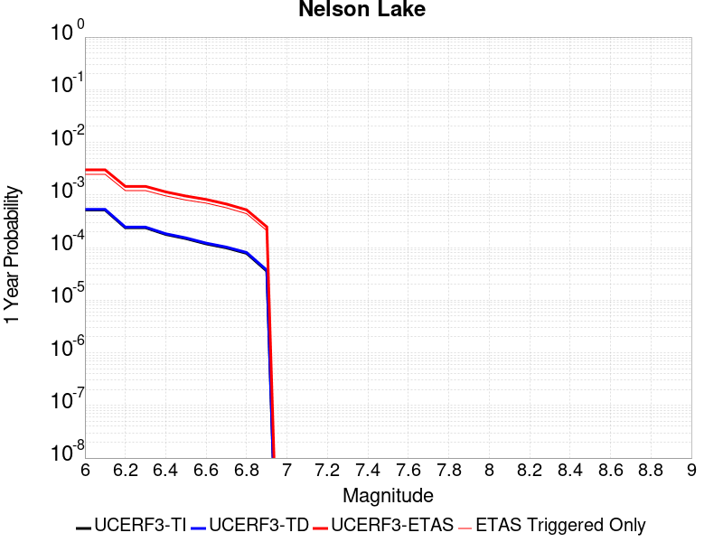 |  |

| Magnitude | 1 wk TI Prob | 1 wk TD Prob | 1 wk ETAS Prob | 1 wk ETAS/TD Gain | 1 wk ETAS Triggered Only | 1 mo TI Prob | 1 mo TD Prob | 1 mo ETAS Prob | 1 mo ETAS/TD Gain | 1 mo ETAS Triggered Only | 1 yr TI Prob | 1 yr TD Prob | 1 yr ETAS Prob | 1 yr ETAS/TD Gain | 1 yr ETAS Triggered Only | 10 yr TI Prob | 10 yr TD Prob | 10 yr ETAS Prob | 10 yr ETAS/TD Gain | 10 yr ETAS Triggered Only |
|-----|-----|-----|-----|-----|-----|-----|-----|-----|-----|-----|-----|-----|-----|-----|-----|-----|-----|-----|-----|-----|
| 6.0 | 9.913453E-6 | 1.0192255E-5 | 0.0010225554 | 100.326706 | 0.0010123735 | 4.2485535E-5 | 4.3680422E-5 | 0.0016934022 | 38.76799 | 0.0016497938 | 5.1713863E-4 | 5.316897E-4 | 0.0033048675 | 6.2157826 | 0.0027746533 | 0.0051593683 | 0.005305204 | 0.009780771 | 1.8436183 | 0.0044994378 |
| 6.1 | 9.913453E-6 | 1.0192255E-5 | 0.0010225554 | 100.326706 | 0.0010123735 | 4.2485535E-5 | 4.3680422E-5 | 0.0016934022 | 38.76799 | 0.0016497938 | 5.1713863E-4 | 5.316897E-4 | 0.0033048675 | 6.2157826 | 0.0027746533 | 0.0051593683 | 0.005305204 | 0.009780771 | 1.8436183 | 0.0044994378 |
| 6.2 | 4.5596407E-6 | 4.696313E-6 | 4.921331E-4 | 104.791374 | 4.8743907E-4 | 1.954117E-5 | 2.0126909E-5 | 8.450072E-4 | 41.983955 | 8.248969E-4 | 2.3788778E-4 | 2.4501883E-4 | 0.001482061 | 6.0487638 | 0.0012373453 | 0.0023763329 | 0.0024476128 | 0.004392597 | 1.7946453 | 0.0019497563 |
| 6.3 | 4.5596407E-6 | 4.696313E-6 | 4.921331E-4 | 104.791374 | 4.8743907E-4 | 1.954117E-5 | 2.0126909E-5 | 8.450072E-4 | 41.983955 | 8.248969E-4 | 2.3788778E-4 | 2.4501883E-4 | 0.001482061 | 6.0487638 | 0.0012373453 | 0.0023763329 | 0.0024476128 | 0.004392597 | 1.7946453 | 0.0019497563 |
| 6.4 | 3.4025713E-6 | 3.5098972E-6 | 3.784617E-4 | 107.827 | 3.7495312E-4 | 1.4582367E-5 | 1.5042335E-5 | 6.5245305E-4 | 43.374454 | 6.3742034E-4 | 1.7752586E-4 | 1.8312587E-4 | 0.001120337 | 6.117852 | 9.373828E-4 | 0.001773841 | 0.0018298327 | 0.0032520473 | 1.7772375 | 0.0014248219 |
| 6.5 | 2.8352947E-6 | 2.927856E-6 | 3.0288947E-4 | 103.45094 | 2.999625E-4 | 1.2151207E-5 | 1.2547898E-5 | 5.374757E-4 | 42.83392 | 5.249344E-4 | 1.479309E-4 | 1.5276071E-4 | 9.775315E-4 | 6.3991036 | 8.248969E-4 | 0.0014783246 | 0.0015266308 | 0.0027620872 | 1.8092699 | 0.0012373453 |
| 6.6 | 2.251518E-6 | 2.3290677E-6 | 2.6479564E-4 | 113.691696 | 2.624672E-4 | 9.649328E-6 | 9.981683E-6 | 4.22426E-4 | 42.320118 | 4.1244845E-4 | 1.1747423E-4 | 1.2152085E-4 | 7.963545E-4 | 6.553233 | 6.749156E-4 | 0.0011741214 | 0.0012146058 | 0.00215085 | 1.7708216 | 9.373828E-4 |
| 6.7 | 1.8911853E-6 | 1.9591396E-6 | 2.6442582E-4 | 134.97038 | 2.624672E-4 | 8.105055E-6 | 8.39629E-6 | 4.2084127E-4 | 50.122295 | 4.1244845E-4 | 9.867457E-5 | 1.0222061E-4 | 7.020843E-4 | 6.8683243 | 5.99925E-4 | 9.863076E-4 | 0.0010217935 | 0.0018833044 | 1.8431362 | 8.623922E-4 |
| 6.8 | 1.4874814E-6 | 1.5438305E-6 | 1.8902011E-4 | 122.43579 | 1.8747656E-4 | 6.374905E-6 | 6.6164025E-6 | 3.0657693E-4 | 46.33589 | 2.999625E-4 | 7.76117E-5 | 8.055224E-5 | 4.929675E-4 | 6.119848 | 4.1244845E-4 | 7.75846E-4 | 8.0528157E-4 | 0.0014047235 | 1.744388 | 5.99925E-4 |
| 6.9 | 6.835972E-7 | 7.1399285E-7 | 1.1319985E-4 | 158.5448 | 1.1248594E-4 | 2.9296991E-6 | 3.0599674E-6 | 1.9053595E-4 | 62.267315 | 1.8747656E-4 | 3.56685E-5 | 3.7254784E-5 | 2.997122E-4 | 8.044931 | 2.624672E-4 | 3.5662777E-4 | 3.7251666E-4 | 7.0984877E-4 | 1.905549 | 3.374578E-4 |

## San Andreas (Mojave S)
*[(top)](#table-of-contents)*

| 1 Week | 1 Month | 1 Year | 10 Year |
|-----|-----|-----|-----|
|  |  |  |  |

| Magnitude | 1 wk TI Prob | 1 wk TD Prob | 1 wk ETAS Prob | 1 wk ETAS/TD Gain | 1 wk ETAS Triggered Only | 1 mo TI Prob | 1 mo TD Prob | 1 mo ETAS Prob | 1 mo ETAS/TD Gain | 1 mo ETAS Triggered Only | 1 yr TI Prob | 1 yr TD Prob | 1 yr ETAS Prob | 1 yr ETAS/TD Gain | 1 yr ETAS Triggered Only | 10 yr TI Prob | 10 yr TD Prob | 10 yr ETAS Prob | 10 yr ETAS/TD Gain | 10 yr ETAS Triggered Only |
|-----|-----|-----|-----|-----|-----|-----|-----|-----|-----|-----|-----|-----|-----|-----|-----|-----|-----|-----|-----|-----|
| 6.0 | 3.1064058E-4 | 6.7460834E-4 | 0.0026605192 | 3.9437985 | 0.0019872517 | 0.0013306376 | 0.0028881032 | 0.005280873 | 1.8284917 | 0.0023997 | 0.016080605 | 0.03462235 | 0.037843894 | 1.0930481 | 0.003337083 | 0.1496549 | 0.28660452 | 0.2898679 | 1.0113864 | 0.0045744283 |
| 6.1 | 3.1064058E-4 | 6.7460834E-4 | 0.0026605192 | 3.9437985 | 0.0019872517 | 0.0013306376 | 0.0028881032 | 0.005280873 | 1.8284917 | 0.0023997 | 0.016080605 | 0.03462235 | 0.037843894 | 1.0930481 | 0.003337083 | 0.1496549 | 0.28660452 | 0.2898679 | 1.0113864 | 0.0045744283 |
| 6.2 | 3.1064058E-4 | 6.7460834E-4 | 0.0026605192 | 3.9437985 | 0.0019872517 | 0.0013306376 | 0.0028881032 | 0.005280873 | 1.8284917 | 0.0023997 | 0.016080605 | 0.03462235 | 0.037843894 | 1.0930481 | 0.003337083 | 0.1496549 | 0.28660452 | 0.2898679 | 1.0113864 | 0.0045744283 |
| 6.3 | 3.1064058E-4 | 6.7460834E-4 | 0.0026605192 | 3.9437985 | 0.0019872517 | 0.0013306376 | 0.0028881032 | 0.005280873 | 1.8284917 | 0.0023997 | 0.016080605 | 0.03462235 | 0.037843894 | 1.0930481 | 0.003337083 | 0.1496549 | 0.28660452 | 0.2898679 | 1.0113864 | 0.0045744283 |
| 6.4 | 1.9872203E-4 | 4.3179357E-4 | 0.002380708 | 5.5135326 | 0.0019497563 | 8.5138786E-4 | 0.0018492596 | 0.00416967 | 2.2547781 | 0.0023247094 | 0.010316478 | 0.02228844 | 0.025404505 | 1.1398064 | 0.0031871016 | 0.098504856 | 0.19699748 | 0.20042989 | 1.0174236 | 0.0042744656 |
| 6.5 | 1.291105E-4 | 2.875267E-4 | 0.002199238 | 7.648813 | 0.001912261 | 5.5321335E-4 | 0.0012316781 | 0.003478626 | 2.824298 | 0.0022497189 | 0.006714592 | 0.0148934 | 0.017885286 | 1.2008868 | 0.0030371204 | 0.065152965 | 0.13803436 | 0.14149256 | 1.0250533 | 0.0040119984 |
| 6.6 | 1.291105E-4 | 2.875267E-4 | 0.002199238 | 7.648813 | 0.001912261 | 5.5321335E-4 | 0.0012316781 | 0.003478626 | 2.824298 | 0.0022497189 | 0.006714592 | 0.0148934 | 0.017885286 | 1.2008868 | 0.0030371204 | 0.065152965 | 0.13803436 | 0.14149256 | 1.0250533 | 0.0040119984 |
| 6.7 | 1.08001186E-4 | 2.4333889E-4 | 0.0021551345 | 8.856515 | 0.001912261 | 4.6278012E-4 | 0.0010424647 | 0.0032898383 | 3.155827 | 0.0022497189 | 0.0056198016 | 0.012618446 | 0.015617242 | 1.2376518 | 0.0030371204 | 0.054797906 | 0.119176775 | 0.12271064 | 1.0296522 | 0.0040119984 |
| 6.8 | 1.0624356E-4 | 2.3851555E-4 | 0.0021503204 | 9.01543 | 0.001912261 | 4.5525006E-4 | 0.0010218095 | 0.0032692295 | 3.199451 | 0.0022497189 | 0.0055285925 | 0.012369843 | 0.015369395 | 1.2424891 | 0.0030371204 | 0.053930566 | 0.11712591 | 0.120668 | 1.0302417 | 0.0040119984 |
| 6.9 | 1.0393785E-4 | 2.3221898E-4 | 0.0021065492 | 9.071391 | 0.0018747656 | 4.4537184E-4 | 9.948451E-4 | 0.0032048677 | 3.2214742 | 0.0022122234 | 0.0054089287 | 0.012045221 | 0.015008715 | 1.2460307 | 0.002999625 | 0.05279156 | 0.11442335 | 0.11794308 | 1.0307605 | 0.0039745034 |
| 7.0 | 1.0155622E-4 | 2.2591476E-4 | 0.002100257 | 9.296679 | 0.0018747656 | 4.3516833E-4 | 9.6784724E-4 | 0.0031779297 | 3.2835033 | 0.0022122234 | 0.005285311 | 0.0117200995 | 0.014647513 | 1.2497772 | 0.0029621297 | 0.05161361 | 0.111683756 | 0.11518106 | 1.0313144 | 0.003937008 |
| 7.1 | 9.885595E-5 | 2.1879886E-4 | 0.0020931542 | 9.566568 | 0.0018747656 | 4.2359953E-4 | 9.3737274E-4 | 0.0031475225 | 3.3578131 | 0.0022122234 | 0.0051451353 | 0.011352993 | 0.014281494 | 1.2579497 | 0.0029621297 | 0.05027629 | 0.1085682 | 0.11207777 | 1.032326 | 0.003937008 |
| 7.2 | 9.6411415E-5 | 2.124288E-4 | 0.002086796 | 9.823508 | 0.0018747656 | 4.1312634E-4 | 9.1009185E-4 | 0.003120302 | 3.4285574 | 0.0022122234 | 0.005018219 | 0.011024255 | 0.01395373 | 1.2657299 | 0.0029621297 | 0.049064007 | 0.105758004 | 0.10927864 | 1.0332896 | 0.003937008 |
| 7.3 | 9.1180635E-5 | 1.9471257E-4 | 0.0020316252 | 10.4339695 | 0.0018372703 | 3.907156E-4 | 8.342157E-4 | 0.0030071298 | 3.6047387 | 0.002174728 | 0.004746591 | 0.01010939 | 0.013004458 | 1.2863742 | 0.0029246344 | 0.046464786 | 0.09795115 | 0.101468705 | 1.0359113 | 0.0038995126 |
| 7.4 | 8.887388E-5 | 1.8719878E-4 | 0.002024125 | 10.812705 | 0.0018372703 | 3.8083247E-4 | 8.020339E-4 | 0.0029750178 | 3.7093418 | 0.002174728 | 0.0046267817 | 0.00972114 | 0.012617344 | 1.2979283 | 0.0029246344 | 0.045316286 | 0.09458615 | 0.09808287 | 1.0369687 | 0.0038620173 |
| 7.5 | 8.6750515E-5 | 1.8051457E-4 | 0.0020174533 | 11.176125 | 0.0018372703 | 3.7173493E-4 | 7.7340455E-4 | 0.0029464508 | 3.8097148 | 0.002174728 | 0.004516484 | 0.009375632 | 0.012272846 | 1.3090154 | 0.0029246344 | 0.04425787 | 0.091549896 | 0.095058344 | 1.0383228 | 0.0038620173 |
| 7.6 | 8.453092E-5 | 1.7439072E-4 | 0.0020113406 | 11.53353 | 0.0018372703 | 3.6222505E-4 | 7.471748E-4 | 0.002920278 | 3.908427 | 0.002174728 | 0.0044011753 | 0.009058985 | 0.011957125 | 1.3199189 | 0.0029246344 | 0.04315024 | 0.08870898 | 0.092228405 | 1.0396738 | 0.0038620173 |
| 7.7 | 8.259102E-5 | 1.6961215E-4 | 0.0020065708 | 11.830349 | 0.0018372703 | 3.539135E-4 | 7.2670676E-4 | 0.0028998544 | 3.9904053 | 0.002174728 | 0.004300386 | 0.008811831 | 0.011673529 | 1.3247564 | 0.002887139 | 0.042181134 | 0.08645982 | 0.089953676 | 1.0404102 | 0.003824522 |
| 7.8 | 7.444844E-5 | 1.5283503E-4 | 0.0017273974 | 11.302366 | 0.0015748031 | 3.1902574E-4 | 6.548429E-4 | 0.0025283808 | 3.8610497 | 0.0018747656 | 0.0038772223 | 0.007943616 | 0.010510242 | 1.3231053 | 0.0025871766 | 0.03810269 | 0.078290746 | 0.08143569 | 1.04017 | 0.0034120735 |
| 7.9 | 5.2586525E-5 | 1.00064186E-4 | 9.623701E-4 | 9.617528 | 8.623922E-4 | 2.2535135E-4 | 4.2877605E-4 | 0.0014407154 | 3.360065 | 0.0010123735 | 0.0027402006 | 0.005207864 | 0.0065506655 | 1.2578411 | 0.0013498312 | 0.027066574 | 0.052200034 | 0.053834785 | 1.031317 | 0.0017247844 |
| 8.0 | 3.379877E-5 | 5.4074168E-5 | 3.9151375E-4 | 7.24031 | 3.374578E-4 | 1.4484383E-4 | 2.3172585E-4 | 6.815653E-4 | 2.9412572 | 4.4994376E-4 | 0.0017620471 | 0.002817614 | 0.0033036796 | 1.1725097 | 4.8743907E-4 | 0.017481409 | 0.028834904 | 0.029453943 | 1.0214684 | 6.3742034E-4 |
| 8.1 | 1.8668277E-5 | 1.9309397E-5 | 9.429857E-5 | 4.8835588 | 7.4990625E-5 | 8.000444E-5 | 8.275194E-5 | 1.5773636E-4 | 1.906135 | 7.4990625E-5 | 9.736188E-4 | 0.0010070398 | 0.0010819549 | 1.0743914 | 7.4990625E-5 | 0.009693642 | 0.010798888 | 0.010910159 | 1.010304 | 1.1248594E-4 |
| 8.2 | 8.541571E-6 | 5.460819E-6 | 5.460819E-6 | 1.0 | 0.0 | 3.660622E-5 | 2.3403301E-5 | 2.3403301E-5 | 1.0 | 0.0 | 4.455896E-4 | 2.84898E-4 | 2.84898E-4 | 1.0 | 0.0 | 0.0044469717 | 0.0032408056 | 0.0032408056 | 1.0 | 0.0 |
| 8.3 | 1.983087E-6 | 7.6599065E-7 | 7.6599065E-7 | 1.0 | 0.0 | 8.498917E-6 | 3.282813E-6 | 3.282813E-6 | 1.0 | 0.0 | 1.034694E-4 | 3.9967534E-5 | 3.9967534E-5 | 1.0 | 0.0 | 0.0010342124 | 4.719687E-4 | 4.719687E-4 | 1.0 | 0.0 |

## Towne Pass
*[(top)](#table-of-contents)*

| 1 Week | 1 Month | 1 Year | 10 Year |
|-----|-----|-----|-----|
|  |  |  |  |

| Magnitude | 1 wk TI Prob | 1 wk TD Prob | 1 wk ETAS Prob | 1 wk ETAS/TD Gain | 1 wk ETAS Triggered Only | 1 mo TI Prob | 1 mo TD Prob | 1 mo ETAS Prob | 1 mo ETAS/TD Gain | 1 mo ETAS Triggered Only | 1 yr TI Prob | 1 yr TD Prob | 1 yr ETAS Prob | 1 yr ETAS/TD Gain | 1 yr ETAS Triggered Only | 10 yr TI Prob | 10 yr TD Prob | 10 yr ETAS Prob | 10 yr ETAS/TD Gain | 10 yr ETAS Triggered Only |
|-----|-----|-----|-----|-----|-----|-----|-----|-----|-----|-----|-----|-----|-----|-----|-----|-----|-----|-----|-----|-----|
| 6.0 | 3.849728E-6 | 3.8945414E-6 | 0.0012787302 | 328.3391 | 0.0012748407 | 1.649873E-5 | 1.669081E-5 | 0.0018539305 | 111.07493 | 0.0018372703 | 2.0085352E-4 | 2.0319603E-4 | 0.00290231 | 14.283301 | 0.0026996625 | 0.0020067208 | 0.0020305314 | 0.006371156 | 3.137679 | 0.004349456 |
| 6.1 | 3.849728E-6 | 3.8945414E-6 | 0.0012787302 | 328.3391 | 0.0012748407 | 1.649873E-5 | 1.669081E-5 | 0.0018539305 | 111.07493 | 0.0018372703 | 2.0085352E-4 | 2.0319603E-4 | 0.00290231 | 14.283301 | 0.0026996625 | 0.0020067208 | 0.0020305314 | 0.006371156 | 3.137679 | 0.004349456 |
| 6.2 | 3.849728E-6 | 3.8945414E-6 | 0.0012787302 | 328.3391 | 0.0012748407 | 1.649873E-5 | 1.669081E-5 | 0.0018539305 | 111.07493 | 0.0018372703 | 2.0085352E-4 | 2.0319603E-4 | 0.00290231 | 14.283301 | 0.0026996625 | 0.0020067208 | 0.0020305314 | 0.006371156 | 3.137679 | 0.004349456 |
| 6.3 | 3.849728E-6 | 3.8945414E-6 | 0.0012787302 | 328.3391 | 0.0012748407 | 1.649873E-5 | 1.669081E-5 | 0.0018539305 | 111.07493 | 0.0018372703 | 2.0085352E-4 | 2.0319603E-4 | 0.00290231 | 14.283301 | 0.0026996625 | 0.0020067208 | 0.0020305314 | 0.006371156 | 3.137679 | 0.004349456 |
| 6.4 | 3.849728E-6 | 3.8945414E-6 | 0.0012787302 | 328.3391 | 0.0012748407 | 1.649873E-5 | 1.669081E-5 | 0.0018539305 | 111.07493 | 0.0018372703 | 2.0085352E-4 | 2.0319603E-4 | 0.00290231 | 14.283301 | 0.0026996625 | 0.0020067208 | 0.0020305314 | 0.006371156 | 3.137679 | 0.004349456 |
| 6.5 | 1.1953545E-6 | 1.203052E-6 | 1.8867939E-4 | 156.83394 | 1.8747656E-4 | 5.1229376E-6 | 5.1559277E-6 | 3.0511688E-4 | 59.177883 | 2.999625E-4 | 6.236998E-5 | 6.277173E-5 | 5.8767316E-4 | 9.362067 | 5.249344E-4 | 6.235248E-4 | 6.275517E-4 | 0.0013020438 | 2.0747993 | 6.749156E-4 |
| 6.6 | 1.1953545E-6 | 1.203052E-6 | 1.8867939E-4 | 156.83394 | 1.8747656E-4 | 5.1229376E-6 | 5.1559277E-6 | 3.0511688E-4 | 59.177883 | 2.999625E-4 | 6.236998E-5 | 6.277173E-5 | 5.8767316E-4 | 9.362067 | 5.249344E-4 | 6.235248E-4 | 6.275517E-4 | 0.0013020438 | 2.0747993 | 6.749156E-4 |
| 6.7 | 8.375951E-7 | 8.4106705E-7 | 7.583163E-5 | 90.16122 | 7.4990625E-5 | 3.5896885E-6 | 3.6045683E-6 | 1.5358528E-4 | 42.60851 | 1.4998125E-4 | 4.370358E-5 | 4.3884793E-5 | 3.8132782E-4 | 8.689292 | 3.374578E-4 | 4.3694986E-4 | 4.38767E-4 | 7.7607675E-4 | 1.7687674 | 3.374578E-4 |
| 6.8 | 6.38041E-7 | 6.392156E-7 | 3.8134505E-5 | 59.65828 | 3.7495312E-5 | 2.7344586E-6 | 2.7394929E-6 | 4.0234703E-5 | 14.686916 | 3.7495312E-5 | 3.3291526E-5 | 3.3352855E-5 | 1.833291E-4 | 5.496654 | 1.4998125E-4 | 3.3286537E-4 | 3.334823E-4 | 4.8341355E-4 | 1.4495928 | 1.4998125E-4 |
| 6.9 | 5.3460053E-7 | 5.345333E-7 | 3.8029826E-5 | 71.14585 | 3.7495312E-5 | 2.2911431E-6 | 2.2908553E-6 | 3.9786082E-5 | 17.36735 | 3.7495312E-5 | 2.789431E-5 | 2.789084E-5 | 1.7786791E-4 | 6.377288 | 1.4998125E-4 | 2.789081E-4 | 2.7887672E-4 | 4.2881613E-4 | 1.5376549 | 1.4998125E-4 |
| 7.0 | 3.557783E-7 | 3.5324226E-7 | 3.7848542E-5 | 107.14613 | 3.7495312E-5 | 1.5247632E-6 | 1.5138945E-6 | 3.900915E-5 | 25.767416 | 3.7495312E-5 | 1.8563835E-5 | 1.843152E-5 | 5.5926143E-5 | 3.0342665 | 3.7495312E-5 | 1.8562283E-4 | 1.8430075E-4 | 2.2178915E-4 | 1.2034088 | 3.7495312E-5 |
| 7.1 | 3.037942E-7 | 3.0002218E-7 | 3.7795326E-5 | 125.9751 | 3.7495312E-5 | 1.3019744E-6 | 1.2858087E-6 | 3.8781072E-5 | 30.160841 | 3.7495312E-5 | 1.5851423E-5 | 1.5654618E-5 | 5.3149342E-5 | 3.3951225 | 3.7495312E-5 | 1.5850292E-4 | 1.5653588E-4 | 1.9402533E-4 | 1.2394942 | 3.7495312E-5 |
| 7.2 | 2.0808248E-7 | 2.0217689E-7 | 3.7697482E-5 | 186.45792 | 3.7495312E-5 | 8.917818E-7 | 8.6647213E-7 | 3.836175E-5 | 44.2735 | 3.7495312E-5 | 1.0857389E-5 | 1.0549252E-5 | 4.804417E-5 | 4.5542727 | 3.7495312E-5 | 1.0856859E-4 | 1.0548797E-4 | 1.4297933E-4 | 1.3554088 | 3.7495312E-5 |
| 7.3 | 1.1162073E-7 | 1.0636894E-7 | 1.0636894E-7 | 1.0 | 0.0 | 4.7837443E-7 | 4.558668E-7 | 4.558668E-7 | 1.0 | 0.0 | 5.8241935E-6 | 5.550166E-6 | 5.550166E-6 | 1.0 | 0.0 | 5.8240406E-5 | 5.5500474E-5 | 5.5500474E-5 | 1.0 | 0.0 |

## Death Valley (So)
*[(top)](#table-of-contents)*

| 1 Week | 1 Month | 1 Year | 10 Year |
|-----|-----|-----|-----|
|  |  |  |  |

| Magnitude | 1 wk TI Prob | 1 wk TD Prob | 1 wk ETAS Prob | 1 wk ETAS/TD Gain | 1 wk ETAS Triggered Only | 1 mo TI Prob | 1 mo TD Prob | 1 mo ETAS Prob | 1 mo ETAS/TD Gain | 1 mo ETAS Triggered Only | 1 yr TI Prob | 1 yr TD Prob | 1 yr ETAS Prob | 1 yr ETAS/TD Gain | 1 yr ETAS Triggered Only | 10 yr TI Prob | 10 yr TD Prob | 10 yr ETAS Prob | 10 yr ETAS/TD Gain | 10 yr ETAS Triggered Only |
|-----|-----|-----|-----|-----|-----|-----|-----|-----|-----|-----|-----|-----|-----|-----|-----|-----|-----|-----|-----|-----|
| 6.0 | 2.0684236E-5 | 2.5617775E-5 | 0.001000471 | 39.05378 | 9.7487814E-4 | 8.864371E-5 | 1.0978594E-4 | 0.001459469 | 13.29377 | 0.0013498312 | 0.0010787029 | 0.0013358411 | 0.004256569 | 3.1864333 | 0.0029246344 | 0.010734817 | 0.013281397 | 0.017499091 | 1.3175641 | 0.0042744656 |
| 6.1 | 2.0684236E-5 | 2.5617775E-5 | 0.001000471 | 39.05378 | 9.7487814E-4 | 8.864371E-5 | 1.0978594E-4 | 0.001459469 | 13.29377 | 0.0013498312 | 0.0010787029 | 0.0013358411 | 0.004256569 | 3.1864333 | 0.0029246344 | 0.010734817 | 0.013281397 | 0.017499091 | 1.3175641 | 0.0042744656 |
| 6.2 | 2.0684236E-5 | 2.5617775E-5 | 0.001000471 | 39.05378 | 9.7487814E-4 | 8.864371E-5 | 1.0978594E-4 | 0.001459469 | 13.29377 | 0.0013498312 | 0.0010787029 | 0.0013358411 | 0.004256569 | 3.1864333 | 0.0029246344 | 0.010734817 | 0.013281397 | 0.017499091 | 1.3175641 | 0.0042744656 |
| 6.3 | 2.0240292E-5 | 2.511786E-5 | 9.999715E-4 | 39.811172 | 9.7487814E-4 | 8.6741224E-5 | 1.07643624E-4 | 0.0014573296 | 13.538466 | 0.0013498312 | 0.0010555626 | 0.00130979 | 0.0041557015 | 3.1727998 | 0.0028496438 | 0.010505628 | 0.013023956 | 0.017094724 | 1.31256 | 0.0041244845 |
| 6.4 | 2.0240292E-5 | 2.511786E-5 | 9.999715E-4 | 39.811172 | 9.7487814E-4 | 8.6741224E-5 | 1.07643624E-4 | 0.0014573296 | 13.538466 | 0.0013498312 | 0.0010555626 | 0.00130979 | 0.0041557015 | 3.1727998 | 0.0028496438 | 0.010505628 | 0.013023956 | 0.017094724 | 1.31256 | 0.0041244845 |
| 6.5 | 1.9962767E-5 | 2.4807114E-5 | 9.99661E-4 | 40.297356 | 9.7487814E-4 | 8.55519E-5 | 1.0631196E-4 | 0.0014559997 | 13.695539 | 0.0013498312 | 0.0010410968 | 0.0012935963 | 0.004102107 | 3.1710875 | 0.0028121485 | 0.010362327 | 0.012863902 | 0.016898317 | 1.313623 | 0.004086989 |
| 6.6 | 1.8937297E-5 | 2.3310964E-5 | 8.4818865E-4 | 36.385822 | 8.248969E-4 | 8.115732E-5 | 9.990039E-5 | 0.001262139 | 12.633974 | 0.0011623547 | 9.876423E-4 | 0.0012156231 | 0.003762205 | 3.0948777 | 0.0025496813 | 0.009832645 | 0.012092789 | 0.015796978 | 1.3063139 | 0.0037495312 |
| 6.7 | 1.8621096E-5 | 2.2911607E-5 | 7.728007E-4 | 33.72966 | 7.4990623E-4 | 7.980225E-5 | 9.818898E-5 | 0.0011854463 | 12.073109 | 0.001087364 | 9.711593E-4 | 0.0011948098 | 0.003629093 | 3.0373814 | 0.0024371953 | 0.009669261 | 0.011886904 | 0.015406617 | 1.2961 | 0.0035620548 |
| 6.8 | 1.7830353E-5 | 2.1805688E-5 | 7.716956E-4 | 35.38965 | 7.4990623E-4 | 7.641356E-5 | 9.344968E-5 | 0.0011807121 | 12.634737 | 0.001087364 | 9.29938E-4 | 0.00113717 | 0.0034217832 | 3.009034 | 0.0022872142 | 0.009260561 | 0.011316354 | 0.014689816 | 1.298105 | 0.0034120735 |
| 6.9 | 1.3135183E-5 | 1.5303925E-5 | 6.527145E-4 | 42.65014 | 6.3742034E-4 | 5.6292425E-5 | 6.558664E-5 | 9.2792226E-4 | 14.148039 | 8.623922E-4 | 6.8514474E-4 | 7.982312E-4 | 0.0023717773 | 2.971291 | 0.0015748031 | 0.006830362 | 0.007954649 | 0.010186472 | 1.2805684 | 0.0022497189 |
| 7.0 | 1.1507512E-5 | 1.3154199E-5 | 4.2559722E-4 | 32.354473 | 4.1244845E-4 | 4.9316975E-5 | 5.6373956E-5 | 6.1877194E-4 | 10.976203 | 5.624297E-4 | 6.002687E-4 | 6.8614254E-4 | 0.0018851693 | 2.7474892 | 0.00119985 | 0.0059864987 | 0.0068409415 | 0.008516688 | 1.2449584 | 0.0016872891 |
| 7.1 | 9.715903E-6 | 1.0865278E-5 | 3.1082451E-4 | 28.60714 | 2.999625E-4 | 4.1638916E-5 | 4.656467E-5 | 4.2150033E-4 | 9.051934 | 3.7495312E-4 | 5.068359E-4 | 5.667817E-4 | 0.0011663666 | 2.0578766 | 5.99925E-4 | 0.0050568148 | 0.0056538144 | 0.006399481 | 1.1318873 | 7.4990623E-4 |
| 7.2 | 9.233269E-6 | 1.02863105E-5 | 2.727508E-4 | 26.515902 | 2.624672E-4 | 3.9570554E-5 | 4.4083466E-5 | 3.8152642E-4 | 8.654637 | 3.374578E-4 | 4.81665E-4 | 5.3658825E-4 | 0.0010987162 | 2.0475965 | 5.624297E-4 | 0.0048062233 | 0.0053533576 | 0.00602466 | 1.1253984 | 6.749156E-4 |
| 7.3 | 8.8041315E-6 | 9.808164E-6 | 2.722728E-4 | 27.759811 | 2.624672E-4 | 3.7731446E-5 | 4.2034335E-5 | 3.7947798E-4 | 9.027809 | 3.374578E-4 | 4.592835E-4 | 5.1165203E-4 | 0.001073794 | 2.09868 | 5.624297E-4 | 0.0045833546 | 0.005105167 | 0.0057766372 | 1.1315275 | 6.749156E-4 |
| 7.4 | 8.708749E-6 | 9.707175E-6 | 2.721718E-4 | 28.03821 | 2.624672E-4 | 3.7322676E-5 | 4.160154E-5 | 3.7904532E-4 | 9.111329 | 3.374578E-4 | 4.5430884E-4 | 5.0638523E-4 | 0.0010685301 | 2.1101131 | 5.624297E-4 | 0.004533812 | 0.0050527398 | 0.005724245 | 1.1328993 | 6.749156E-4 |
| 7.5 | 8.612678E-6 | 9.604817E-6 | 2.7206948E-4 | 28.326357 | 2.624672E-4 | 3.6910955E-5 | 4.1162875E-5 | 3.0361925E-4 | 7.3760457 | 2.624672E-4 | 4.492982E-4 | 5.01047E-4 | 9.882419E-4 | 1.9723536 | 4.8743907E-4 | 0.004483909 | 0.0049995985 | 0.005596524 | 1.1193947 | 5.99925E-4 |
| 7.6 | 8.319024E-6 | 9.283916E-6 | 2.342537E-4 | 25.232208 | 2.2497188E-4 | 3.5652476E-5 | 3.978763E-5 | 2.6475056E-4 | 6.6540923 | 2.2497188E-4 | 4.3398244E-4 | 4.8431093E-4 | 8.965596E-4 | 1.8512067 | 4.1244845E-4 | 0.0043313587 | 0.0048329784 | 0.005355376 | 1.1080902 | 5.249344E-4 |
| 7.7 | 7.4718328E-6 | 8.34517E-6 | 2.3331516E-4 | 27.958109 | 2.2497188E-4 | 3.2021748E-5 | 3.5764548E-5 | 2.6072838E-4 | 7.2901354 | 2.2497188E-4 | 3.8979502E-4 | 4.353504E-4 | 8.101403E-4 | 1.8608925 | 3.7495312E-4 | 0.00389112 | 0.0043453807 | 0.0048307017 | 1.1116866 | 4.8743907E-4 |
| 7.8 | 3.4586725E-7 | 3.6482615E-7 | 3.6482615E-7 | 1.0 | 0.0 | 1.4822873E-6 | 1.5635396E-6 | 1.5635396E-6 | 1.0 | 0.0 | 1.80467E-5 | 1.9035933E-5 | 5.6530534E-5 | 2.9696748 | 3.7495312E-5 | 1.8045233E-4 | 1.9034347E-4 | 2.2783165E-4 | 1.1969502 | 3.7495312E-5 |
| 7.9 | 2.5591178E-9 | 2.6696718E-9 | 2.6696718E-9 | 1.0 | 0.0 | 1.0967647E-8 | 1.14414505E-8 | 1.14414505E-8 | 1.0 | 0.0 | 1.335311E-7 | 1.3929966E-7 | 1.3929966E-7 | 1.0 | 0.0 | 1.3353102E-6 | 1.3929966E-6 | 1.3929966E-6 | 1.0 | 0.0 |

## Lenwood-Lockhart-Old Woman Springs
*[(top)](#table-of-contents)*

| 1 Week | 1 Month | 1 Year | 10 Year |
|-----|-----|-----|-----|
|  |  |  |  |

| Magnitude | 1 wk TI Prob | 1 wk TD Prob | 1 wk ETAS Prob | 1 wk ETAS/TD Gain | 1 wk ETAS Triggered Only | 1 mo TI Prob | 1 mo TD Prob | 1 mo ETAS Prob | 1 mo ETAS/TD Gain | 1 mo ETAS Triggered Only | 1 yr TI Prob | 1 yr TD Prob | 1 yr ETAS Prob | 1 yr ETAS/TD Gain | 1 yr ETAS Triggered Only | 10 yr TI Prob | 10 yr TD Prob | 10 yr ETAS Prob | 10 yr ETAS/TD Gain | 10 yr ETAS Triggered Only |
|-----|-----|-----|-----|-----|-----|-----|-----|-----|-----|-----|-----|-----|-----|-----|-----|-----|-----|-----|-----|-----|
| 6.0 | 3.744542E-5 | 4.396252E-5 | 0.0010937852 | 24.879946 | 0.0010498688 | 1.604705E-4 | 1.8839816E-4 | 0.0016504399 | 8.760382 | 0.0014623172 | 0.0019519776 | 0.0022915069 | 0.0047605266 | 2.0774658 | 0.0024746906 | 0.019349206 | 0.022696787 | 0.025994774 | 1.1453063 | 0.0033745782 |
| 6.1 | 3.744542E-5 | 4.396252E-5 | 0.0010937852 | 24.879946 | 0.0010498688 | 1.604705E-4 | 1.8839816E-4 | 0.0016504399 | 8.760382 | 0.0014623172 | 0.0019519776 | 0.0022915069 | 0.0047605266 | 2.0774658 | 0.0024746906 | 0.019349206 | 0.022696787 | 0.025994774 | 1.1453063 | 0.0033745782 |
| 6.2 | 3.744542E-5 | 4.396252E-5 | 0.0010937852 | 24.879946 | 0.0010498688 | 1.604705E-4 | 1.8839816E-4 | 0.0016504399 | 8.760382 | 0.0014623172 | 0.0019519776 | 0.0022915069 | 0.0047605266 | 2.0774658 | 0.0024746906 | 0.019349206 | 0.022696787 | 0.025994774 | 1.1453063 | 0.0033745782 |
| 6.3 | 2.1079984E-5 | 2.5353434E-5 | 5.502745E-4 | 21.704142 | 5.249344E-4 | 9.0339665E-5 | 1.0865316E-4 | 8.9596916E-4 | 8.2461405 | 7.874016E-4 | 0.0010993304 | 0.0013220694 | 0.0025952247 | 1.9630017 | 0.0012748407 | 0.010939079 | 0.0131442575 | 0.014809368 | 1.1266798 | 0.0016872891 |
| 6.4 | 2.1079984E-5 | 2.5353434E-5 | 5.502745E-4 | 21.704142 | 5.249344E-4 | 9.0339665E-5 | 1.0865316E-4 | 8.9596916E-4 | 8.2461405 | 7.874016E-4 | 0.0010993304 | 0.0013220694 | 0.0025952247 | 1.9630017 | 0.0012748407 | 0.010939079 | 0.0131442575 | 0.014809368 | 1.1266798 | 0.0016872891 |
| 6.5 | 1.7397282E-5 | 2.066241E-5 | 4.3310234E-4 | 20.960882 | 4.1244845E-4 | 7.455765E-5 | 8.8550245E-5 | 6.5093016E-4 | 7.3509693 | 5.624297E-4 | 9.073613E-4 | 0.0010775778 | 0.0019764956 | 1.8342023 | 8.998875E-4 | 0.009036654 | 0.010724821 | 0.011800523 | 1.1003003 | 0.001087364 |
| 6.6 | 1.52050325E-5 | 1.7679693E-5 | 3.9262619E-4 | 22.207748 | 3.7495312E-4 | 6.51628E-5 | 7.576796E-5 | 5.631701E-4 | 7.4328265 | 4.8743907E-4 | 7.9306826E-4 | 9.220924E-4 | 0.001708768 | 1.8531418 | 7.874016E-4 | 0.007902439 | 0.009183526 | 0.010149452 | 1.1051803 | 9.7487814E-4 |
| 6.7 | 1.332523E-5 | 1.5264002E-5 | 3.1522193E-4 | 20.651329 | 2.999625E-4 | 5.7106878E-5 | 6.5415545E-5 | 4.7783702E-4 | 7.30464 | 4.1244845E-4 | 6.950544E-4 | 7.961491E-4 | 0.0014705274 | 1.8470503 | 6.749156E-4 | 0.006928845 | 0.007933599 | 0.008789149 | 1.1078389 | 8.623922E-4 |
| 6.8 | 1.1525329E-5 | 1.3030979E-5 | 2.005051E-4 | 15.386803 | 1.8747656E-4 | 4.9393333E-5 | 5.584588E-5 | 3.182984E-4 | 5.6995864 | 2.624672E-4 | 6.011979E-4 | 6.797157E-4 | 0.0011293537 | 1.6615088 | 4.4994376E-4 | 0.00599574 | 0.006776819 | 0.0074099195 | 1.0934215 | 6.3742034E-4 |
| 6.9 | 1.0253909E-5 | 1.15144385E-5 | 1.9898884E-4 | 17.28168 | 1.8747656E-4 | 4.3944583E-5 | 4.9346683E-5 | 3.1180092E-4 | 6.318579 | 2.624672E-4 | 5.3489394E-4 | 6.0063385E-4 | 0.0010128346 | 1.6862762 | 4.1244845E-4 | 0.0053360825 | 0.0059904843 | 0.0065868157 | 1.0995464 | 5.99925E-4 |
| 7.0 | 8.104563E-6 | 8.991279E-6 | 1.5897118E-4 | 17.680597 | 1.4998125E-4 | 3.4733377E-5 | 3.8533497E-5 | 2.634967E-4 | 6.838121 | 2.2497188E-4 | 4.2279682E-4 | 4.6904673E-4 | 8.063463E-4 | 1.719117 | 3.374578E-4 | 0.0042199334 | 0.0046808156 | 0.0052032927 | 1.111621 | 5.249344E-4 |
| 7.1 | 6.7986157E-6 | 7.515816E-6 | 1.2000091E-4 | 15.966452 | 1.1248594E-4 | 2.91366E-5 | 3.2210253E-5 | 2.1968078E-4 | 6.820213 | 1.8747656E-4 | 3.5468035E-4 | 3.920914E-4 | 6.544557E-4 | 1.6691406 | 2.624672E-4 | 0.003541148 | 0.003914213 | 0.0043250467 | 1.1049596 | 4.1244845E-4 |
| 7.2 | 5.6893327E-6 | 6.2800136E-6 | 8.127017E-5 | 12.941081 | 7.4990625E-5 | 2.4382627E-5 | 2.6914078E-5 | 1.7689129E-4 | 6.572445 | 1.4998125E-4 | 2.9681803E-4 | 3.2763163E-4 | 5.5252976E-4 | 1.686436 | 2.2497188E-4 | 0.002964219 | 0.0032716845 | 0.003645411 | 1.1142305 | 3.7495312E-4 |
| 7.3 | 4.253348E-6 | 4.7069107E-6 | 4.2202046E-5 | 8.965976 | 3.7495312E-5 | 1.8228506E-5 | 2.0172329E-5 | 1.32656E-4 | 6.576137 | 1.1248594E-4 | 2.2190946E-4 | 2.4557224E-4 | 4.3300277E-4 | 1.7632399 | 1.8747656E-4 | 0.00221688 | 0.0024531898 | 0.0027524163 | 1.1219745 | 2.999625E-4 |
| 7.4 | 2.5448119E-6 | 2.852045E-6 | 4.034725E-5 | 14.146779 | 3.7495312E-5 | 1.0906291E-5 | 1.2223002E-5 | 8.721271E-5 | 7.1351304 | 7.4990625E-5 | 1.3277601E-4 | 1.4880655E-4 | 2.6127574E-4 | 1.7558082 | 1.1248594E-4 | 0.001326967 | 0.0014872311 | 0.0016744289 | 1.12587 | 1.8747656E-4 |
| 7.5 | 4.3706837E-8 | 4.562909E-8 | 4.562909E-8 | 1.0 | 0.0 | 1.8731501E-7 | 1.9555324E-7 | 1.9555324E-7 | 1.0 | 0.0 | 2.2805577E-6 | 2.3808586E-6 | 2.3808586E-6 | 1.0 | 0.0 | 2.2805343E-5 | 2.3808387E-5 | 2.3808387E-5 | 1.0 | 0.0 |

## San Andreas (San Bernardino N)
*[(top)](#table-of-contents)*

| 1 Week | 1 Month | 1 Year | 10 Year |
|-----|-----|-----|-----|
|  |  |  |  |

| Magnitude | 1 wk TI Prob | 1 wk TD Prob | 1 wk ETAS Prob | 1 wk ETAS/TD Gain | 1 wk ETAS Triggered Only | 1 mo TI Prob | 1 mo TD Prob | 1 mo ETAS Prob | 1 mo ETAS/TD Gain | 1 mo ETAS Triggered Only | 1 yr TI Prob | 1 yr TD Prob | 1 yr ETAS Prob | 1 yr ETAS/TD Gain | 1 yr ETAS Triggered Only | 10 yr TI Prob | 10 yr TD Prob | 10 yr ETAS Prob | 10 yr ETAS/TD Gain | 10 yr ETAS Triggered Only |
|-----|-----|-----|-----|-----|-----|-----|-----|-----|-----|-----|-----|-----|-----|-----|-----|-----|-----|-----|-----|-----|
| 6.0 | 1.4273766E-4 | 3.1606483E-4 | 0.0014405687 | 4.5578265 | 0.0011248594 | 6.115894E-4 | 0.0013538664 | 0.0027018702 | 1.9956697 | 0.0013498312 | 0.0074207084 | 0.016360244 | 0.018167455 | 1.1104636 | 0.0018372703 | 0.07177748 | 0.15026689 | 0.15236971 | 1.013994 | 0.0024746906 |
| 6.1 | 1.4273766E-4 | 3.1606483E-4 | 0.0014405687 | 4.5578265 | 0.0011248594 | 6.115894E-4 | 0.0013538664 | 0.0027018702 | 1.9956697 | 0.0013498312 | 0.0074207084 | 0.016360244 | 0.018167455 | 1.1104636 | 0.0018372703 | 0.07177748 | 0.15026689 | 0.15236971 | 1.013994 | 0.0024746906 |
| 6.2 | 1.4273766E-4 | 3.1606483E-4 | 0.0014405687 | 4.5578265 | 0.0011248594 | 6.115894E-4 | 0.0013538664 | 0.0027018702 | 1.9956697 | 0.0013498312 | 0.0074207084 | 0.016360244 | 0.018167455 | 1.1104636 | 0.0018372703 | 0.07177748 | 0.15026689 | 0.15236971 | 1.013994 | 0.0024746906 |
| 6.3 | 1.3730655E-4 | 3.0511338E-4 | 0.0014296295 | 4.6855683 | 0.0011248594 | 5.883239E-4 | 0.0013069791 | 0.0026550463 | 2.0314374 | 0.0013498312 | 0.0071393442 | 0.015797773 | 0.017606018 | 1.114462 | 0.0018372703 | 0.06914291 | 0.14556676 | 0.14764918 | 1.0143056 | 0.0024371953 |
| 6.4 | 1.3730655E-4 | 3.0511338E-4 | 0.0014296295 | 4.6855683 | 0.0011248594 | 5.883239E-4 | 0.0013069791 | 0.0026550463 | 2.0314374 | 0.0013498312 | 0.0071393442 | 0.015797773 | 0.017606018 | 1.114462 | 0.0018372703 | 0.06914291 | 0.14556676 | 0.14764918 | 1.0143056 | 0.0024371953 |
| 6.5 | 1.2942807E-4 | 2.8925808E-4 | 0.0014137921 | 4.8876495 | 0.0011248594 | 5.545738E-4 | 0.0012390936 | 0.0025872523 | 2.08802 | 0.0013498312 | 0.0067310524 | 0.01498286 | 0.016792603 | 1.1207875 | 0.0018372703 | 0.06530788 | 0.13870941 | 0.14080855 | 1.0151333 | 0.0024371953 |
| 6.6 | 1.1125901E-4 | 2.536472E-4 | 0.0013782213 | 5.433615 | 0.0011248594 | 4.767372E-4 | 0.0010866089 | 0.0024349734 | 2.2408922 | 0.0013498312 | 0.005788839 | 0.013149847 | 0.014962957 | 1.1378807 | 0.0018372703 | 0.056403454 | 0.122999296 | 0.12513672 | 1.0173775 | 0.0024371953 |
| 6.7 | 1.02209575E-4 | 2.3499702E-4 | 0.0013595921 | 5.7855716 | 0.0011248594 | 4.3796748E-4 | 0.0010067427 | 0.0023552151 | 2.3394408 | 0.0013498312 | 0.0053192247 | 0.012188629 | 0.014003506 | 1.1488992 | 0.0018372703 | 0.051936906 | 0.114790924 | 0.11694835 | 1.0187944 | 0.0024371953 |
| 6.8 | 9.610582E-5 | 2.2025521E-4 | 0.0013448668 | 6.105948 | 0.0011248594 | 4.1181705E-4 | 9.436101E-4 | 0.0022921676 | 2.429147 | 0.0013498312 | 0.0050023515 | 0.011428202 | 0.013244475 | 1.1589291 | 0.0018372703 | 0.048912346 | 0.1081929 | 0.11036641 | 1.0200891 | 0.0024371953 |
| 6.9 | 9.3877505E-5 | 2.1481077E-4 | 0.0013019412 | 6.060875 | 0.001087364 | 4.0227012E-4 | 9.2029345E-4 | 0.0022314216 | 2.424685 | 0.001312336 | 0.0048866454 | 0.011147255 | 0.012926968 | 1.1596547 | 0.001799775 | 0.04780577 | 0.10578323 | 0.10792908 | 1.0202854 | 0.0023997 |
| 7.0 | 9.1019785E-5 | 2.0808022E-4 | 0.001295218 | 6.224609 | 0.001087364 | 3.900265E-4 | 8.914682E-4 | 0.0022026342 | 2.470794 | 0.001312336 | 0.0047382377 | 0.010799837 | 0.012580175 | 1.1648486 | 0.001799775 | 0.046384744 | 0.102753714 | 0.104906835 | 1.0209543 | 0.0023997 |
| 7.1 | 8.771155E-5 | 1.9982594E-4 | 0.0012869728 | 6.440469 | 0.001087364 | 3.758525E-4 | 8.5611636E-4 | 0.0021673287 | 2.531582 | 0.001312336 | 0.0045664064 | 0.0103736 | 0.012154704 | 1.171696 | 0.001799775 | 0.044737056 | 0.09906527 | 0.10122724 | 1.0218238 | 0.0023997 |
| 7.2 | 8.0830236E-5 | 1.8388197E-4 | 0.0012710461 | 6.912293 | 0.001087364 | 3.4636928E-4 | 7.8782777E-4 | 0.0020991298 | 2.6644528 | 0.001312336 | 0.0042088944 | 0.009549725 | 0.011332313 | 1.1866637 | 0.001799775 | 0.041300658 | 0.09179615 | 0.09397557 | 1.023742 | 0.0023997 |
| 7.3 | 7.7668235E-5 | 1.7331762E-4 | 0.0012604932 | 7.2727356 | 0.001087364 | 3.328214E-4 | 7.425784E-4 | 0.00205394 | 2.7659569 | 0.001312336 | 0.0040445733 | 0.009003494 | 0.010787065 | 1.1980976 | 0.001799775 | 0.03971748 | 0.08706327 | 0.08925404 | 1.025163 | 0.0023997 |
| 7.4 | 7.520177E-5 | 1.6551897E-4 | 0.001252703 | 7.568335 | 0.001087364 | 3.2225347E-4 | 7.0917426E-4 | 0.0020205795 | 2.8492002 | 0.001312336 | 0.0039163795 | 0.008600081 | 0.010384378 | 1.2074744 | 0.001799775 | 0.038480744 | 0.08351955 | 0.08568446 | 1.0259211 | 0.0023622047 |
| 7.5 | 7.274697E-5 | 1.5839566E-4 | 0.0012455875 | 7.863773 | 0.001087364 | 3.1173544E-4 | 6.78662E-4 | 0.0019901074 | 2.9323983 | 0.001312336 | 0.003788775 | 0.008231463 | 0.010016423 | 1.2168461 | 0.001799775 | 0.03724827 | 0.08023631 | 0.08240898 | 1.0270784 | 0.0023622047 |
| 7.6 | 7.1185845E-5 | 1.540943E-4 | 0.0012412908 | 8.055397 | 0.001087364 | 3.0504653E-4 | 6.6023704E-4 | 0.0019717065 | 2.9863615 | 0.001312336 | 0.0037076178 | 0.008008812 | 0.009794172 | 1.2229246 | 0.001799775 | 0.036463667 | 0.07822598 | 0.080403395 | 1.027835 | 0.0023622047 |
| 7.7 | 6.709961E-5 | 1.4318313E-4 | 0.0012303916 | 8.593132 | 0.001087364 | 2.8753807E-4 | 6.1349774E-4 | 0.0019250285 | 3.1377926 | 0.001312336 | 0.003495157 | 0.0074437927 | 0.009192954 | 1.2349826 | 0.0017622797 | 0.034406938 | 0.07305469 | 0.07520957 | 1.0294968 | 0.0023247094 |
| 7.8 | 6.300812E-5 | 1.3202413E-4 | 0.0012192447 | 9.235014 | 0.001087364 | 2.7000686E-4 | 5.65695E-4 | 0.0018772886 | 3.3185525 | 0.001312336 | 0.0032823787 | 0.006865616 | 0.008615796 | 1.2549196 | 0.0017622797 | 0.032343175 | 0.06771354 | 0.069880836 | 1.0320069 | 0.0023247094 |
| 7.9 | 4.983037E-5 | 9.723488E-5 | 9.595432E-4 | 9.868302 | 8.623922E-4 | 2.1354125E-4 | 4.1665437E-4 | 0.001428606 | 3.4287555 | 0.0010123735 | 0.0025967648 | 0.0050609782 | 0.006403978 | 1.2653637 | 0.0013498312 | 0.025666296 | 0.05064886 | 0.052286286 | 1.032329 | 0.0017247844 |
| 8.0 | 3.2211527E-5 | 5.3304586E-5 | 3.9074442E-4 | 7.330409 | 3.374578E-4 | 1.380421E-4 | 2.2842824E-4 | 6.782692E-4 | 2.969288 | 4.4994376E-4 | 0.0016793669 | 0.0027775685 | 0.0032636537 | 1.1750039 | 4.8743907E-4 | 0.016667323 | 0.028361378 | 0.02898072 | 1.0218375 | 6.3742034E-4 |
| 8.1 | 1.743376E-5 | 1.8824427E-5 | 9.381364E-5 | 4.983612 | 7.4990625E-5 | 7.471398E-5 | 8.067362E-5 | 1.556582E-4 | 1.9294808 | 7.4990625E-5 | 9.0926304E-4 | 9.817594E-4 | 0.0010566764 | 1.076309 | 7.4990625E-5 | 0.009055517 | 0.010484105 | 0.010595412 | 1.0106167 | 1.1248594E-4 |
| 8.2 | 7.831616E-6 | 5.1551065E-6 | 5.1551065E-6 | 1.0 | 0.0 | 3.3563636E-5 | 2.2093127E-5 | 2.2093127E-5 | 1.0 | 0.0 | 4.0856065E-4 | 2.6895068E-4 | 2.6895068E-4 | 1.0 | 0.0 | 0.004078103 | 0.0030418145 | 0.0030418145 | 1.0 | 0.0 |
| 8.3 | 1.983087E-6 | 7.6599065E-7 | 7.6599065E-7 | 1.0 | 0.0 | 8.498917E-6 | 3.282813E-6 | 3.282813E-6 | 1.0 | 0.0 | 1.034694E-4 | 3.9967534E-5 | 3.9967534E-5 | 1.0 | 0.0 | 0.0010342124 | 4.719687E-4 | 4.719687E-4 | 1.0 | 0.0 |

## Paradise
*[(top)](#table-of-contents)*

| 1 Week | 1 Month | 1 Year | 10 Year |
|-----|-----|-----|-----|
|  |  |  |  |

| Magnitude | 1 wk TI Prob | 1 wk TD Prob | 1 wk ETAS Prob | 1 wk ETAS/TD Gain | 1 wk ETAS Triggered Only | 1 mo TI Prob | 1 mo TD Prob | 1 mo ETAS Prob | 1 mo ETAS/TD Gain | 1 mo ETAS Triggered Only | 1 yr TI Prob | 1 yr TD Prob | 1 yr ETAS Prob | 1 yr ETAS/TD Gain | 1 yr ETAS Triggered Only | 10 yr TI Prob | 10 yr TD Prob | 10 yr ETAS Prob | 10 yr ETAS/TD Gain | 10 yr ETAS Triggered Only |
|-----|-----|-----|-----|-----|-----|-----|-----|-----|-----|-----|-----|-----|-----|-----|-----|-----|-----|-----|-----|-----|
| 6.0 | 1.4851273E-5 | 1.6694692E-5 | 3.1665218E-4 | 18.967237 | 2.999625E-4 | 6.364676E-5 | 7.154685E-5 | 7.089216E-4 | 9.908495 | 6.3742034E-4 | 7.7462377E-4 | 8.707584E-4 | 0.0019571756 | 2.2476678 | 0.001087364 | 0.0077192914 | 0.008675844 | 0.010943215 | 1.2613429 | 0.0022872142 |
| 6.1 | 1.4851273E-5 | 1.6694692E-5 | 3.1665218E-4 | 18.967237 | 2.999625E-4 | 6.364676E-5 | 7.154685E-5 | 7.089216E-4 | 9.908495 | 6.3742034E-4 | 7.7462377E-4 | 8.707584E-4 | 0.0019571756 | 2.2476678 | 0.001087364 | 0.0077192914 | 0.008675844 | 0.010943215 | 1.2613429 | 0.0022872142 |
| 6.2 | 1.4851273E-5 | 1.6694692E-5 | 3.1665218E-4 | 18.967237 | 2.999625E-4 | 6.364676E-5 | 7.154685E-5 | 7.089216E-4 | 9.908495 | 6.3742034E-4 | 7.7462377E-4 | 8.707584E-4 | 0.0019571756 | 2.2476678 | 0.001087364 | 0.0077192914 | 0.008675844 | 0.010943215 | 1.2613429 | 0.0022872142 |
| 6.3 | 1.0426831E-5 | 1.188862E-5 | 8.687835E-5 | 7.30769 | 7.4990625E-5 | 4.4685654E-5 | 5.0950268E-5 | 2.3841728E-4 | 4.679412 | 1.8747656E-4 | 5.43912E-4 | 6.201489E-4 | 0.0010323416 | 1.6646672 | 4.1244845E-4 | 0.0054258266 | 0.0061847917 | 0.0072281673 | 1.1687002 | 0.0010498688 |
| 6.4 | 1.0426831E-5 | 1.188862E-5 | 8.687835E-5 | 7.30769 | 7.4990625E-5 | 4.4685654E-5 | 5.0950268E-5 | 2.3841728E-4 | 4.679412 | 1.8747656E-4 | 5.43912E-4 | 6.201489E-4 | 0.0010323416 | 1.6646672 | 4.1244845E-4 | 0.0054258266 | 0.0061847917 | 0.0072281673 | 1.1687002 | 0.0010498688 |
| 6.5 | 9.25027E-6 | 1.06199595E-5 | 8.560979E-5 | 8.061216 | 7.4990625E-5 | 3.964341E-5 | 4.551335E-5 | 1.5799416E-4 | 3.471381 | 1.1248594E-4 | 4.8255164E-4 | 5.53989E-4 | 8.537854E-4 | 1.5411594 | 2.999625E-4 | 0.0048150513 | 0.0055265795 | 0.006197765 | 1.1214468 | 6.749156E-4 |
| 6.6 | 7.904275E-6 | 9.159525E-6 | 4.6654495E-5 | 5.0935497 | 3.7495312E-5 | 3.3875025E-5 | 3.9254537E-5 | 7.674838E-5 | 1.9551467 | 3.7495312E-5 | 4.1235037E-4 | 4.7782314E-4 | 5.527779E-4 | 1.1568673 | 7.4990625E-5 | 0.0041158604 | 0.0047683544 | 0.0051415195 | 1.0782588 | 3.7495312E-4 |
| 6.7 | 7.2061953E-6 | 8.407248E-6 | 4.5902245E-5 | 5.4598417 | 3.7495312E-5 | 3.088333E-5 | 3.6030586E-5 | 7.352455E-5 | 2.0406148 | 3.7495312E-5 | 3.7593965E-4 | 4.3858777E-4 | 5.135455E-4 | 1.170907 | 7.4990625E-5 | 0.003753043 | 0.004377591 | 0.0046389094 | 1.0596945 | 2.624672E-4 |
| 6.8 | 6.6948724E-6 | 7.842166E-6 | 4.5337183E-5 | 5.781207 | 3.7495312E-5 | 2.8691995E-5 | 3.360887E-5 | 7.110292E-5 | 2.1155999 | 3.7495312E-5 | 3.4926904E-4 | 4.0911473E-4 | 4.8407467E-4 | 1.1832248 | 7.4990625E-5 | 0.003487206 | 0.0040839734 | 0.004270684 | 1.045718 | 1.8747656E-4 |
| 6.9 | 6.0421025E-6 | 7.130621E-6 | 4.4625667E-5 | 6.258314 | 3.7495312E-5 | 2.5894467E-5 | 3.0559466E-5 | 6.805363E-5 | 2.226925 | 3.7495312E-5 | 3.1521954E-4 | 3.7200135E-4 | 4.4696408E-4 | 1.201512 | 7.4990625E-5 | 0.0031477278 | 0.0037141247 | 0.0038635489 | 1.0402313 | 1.4998125E-4 |
| 7.0 | 4.134091E-6 | 5.0803087E-6 | 4.2575433E-5 | 8.380481 | 3.7495312E-5 | 1.7717413E-5 | 2.177258E-5 | 5.9267077E-5 | 2.7220972 | 3.7495312E-5 | 2.1568815E-4 | 2.6505045E-4 | 3.4002122E-4 | 1.2828547 | 7.4990625E-5 | 0.0021547892 | 0.0026474963 | 0.0027970807 | 1.0565002 | 1.4998125E-4 |
| 7.1 | 3.7674888E-6 | 4.6318696E-6 | 4.212701E-5 | 9.095034 | 3.7495312E-5 | 1.6146281E-5 | 1.9850726E-5 | 5.7345296E-5 | 2.8888261 | 3.7495312E-5 | 1.9656324E-4 | 2.4165731E-4 | 3.1662983E-4 | 1.310243 | 7.4990625E-5 | 0.0019638946 | 0.002414096 | 0.0025263103 | 1.046483 | 1.1248594E-4 |
| 7.2 | 3.4065345E-6 | 4.156723E-6 | 4.165188E-5 | 10.020365 | 3.7495312E-5 | 1.4599351E-5 | 1.7814415E-5 | 5.530906E-5 | 3.1047363 | 3.7495312E-5 | 1.777326E-4 | 2.1687041E-4 | 2.9184477E-4 | 1.3457104 | 7.4990625E-5 | 0.0017759053 | 0.002166736 | 0.002241564 | 1.0345349 | 7.4990625E-5 |
| 7.3 | 2.9934936E-6 | 3.6293168E-6 | 4.1124495E-5 | 11.331195 | 3.7495312E-5 | 1.2829195E-5 | 1.555413E-5 | 5.304886E-5 | 3.4105964 | 3.7495312E-5 | 1.5618425E-4 | 1.8935655E-4 | 2.6433298E-4 | 1.3959537 | 7.4990625E-5 | 0.0015607453 | 0.0018920974 | 0.001966946 | 1.0395586 | 7.4990625E-5 |
| 7.4 | 2.4049796E-6 | 2.8889842E-6 | 4.0384188E-5 | 13.978682 | 3.7495312E-5 | 1.0307015E-5 | 1.238131E-5 | 4.987616E-5 | 4.0283427 | 3.7495312E-5 | 1.2548068E-4 | 1.5073347E-4 | 2.2571278E-4 | 1.4974298 | 7.4990625E-5 | 0.0012540985 | 0.0015064536 | 0.0015813314 | 1.0497046 | 7.4990625E-5 |
| 7.5 | 1.2710091E-6 | 1.5134682E-6 | 1.5134682E-6 | 1.0 | 0.0 | 5.44717E-6 | 6.4862834E-6 | 6.4862834E-6 | 1.0 | 0.0 | 6.631728E-5 | 7.8968886E-5 | 1.1646124E-4 | 1.4747738 | 3.7495312E-5 | 6.6297496E-4 | 7.8953087E-4 | 8.269966E-4 | 1.0474532 | 3.7495312E-5 |
| 7.6 | 2.21172E-7 | 2.603961E-7 | 2.603961E-7 | 1.0 | 0.0 | 9.478797E-7 | 1.1159829E-6 | 1.1159829E-6 | 1.0 | 0.0 | 1.1540374E-5 | 1.3587036E-5 | 1.3587036E-5 | 1.0 | 0.0 | 1.1539775E-4 | 1.3586486E-4 | 1.3586486E-4 | 1.0 | 0.0 |

## Bicycle Lake
*[(top)](#table-of-contents)*

| 1 Week | 1 Month | 1 Year | 10 Year |
|-----|-----|-----|-----|
|  |  | 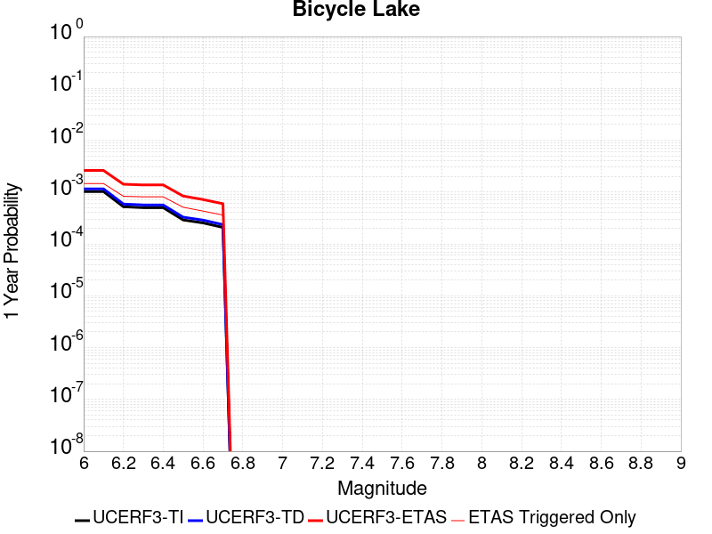 |  |

| Magnitude | 1 wk TI Prob | 1 wk TD Prob | 1 wk ETAS Prob | 1 wk ETAS/TD Gain | 1 wk ETAS Triggered Only | 1 mo TI Prob | 1 mo TD Prob | 1 mo ETAS Prob | 1 mo ETAS/TD Gain | 1 mo ETAS Triggered Only | 1 yr TI Prob | 1 yr TD Prob | 1 yr ETAS Prob | 1 yr ETAS/TD Gain | 1 yr ETAS Triggered Only | 10 yr TI Prob | 10 yr TD Prob | 10 yr ETAS Prob | 10 yr ETAS/TD Gain | 10 yr ETAS Triggered Only |
|-----|-----|-----|-----|-----|-----|-----|-----|-----|-----|-----|-----|-----|-----|-----|-----|-----|-----|-----|-----|-----|
| 6.0 | 1.9621975E-5 | 2.2097078E-5 | 5.0952536E-4 | 23.058496 | 4.8743907E-4 | 8.4091465E-5 | 9.4699084E-5 | 8.445343E-4 | 8.918083 | 7.4990623E-4 | 0.0010233327 | 0.0011524865 | 0.0023884058 | 2.0723937 | 0.0012373453 | 0.01018633 | 0.011478408 | 0.013479914 | 1.1743714 | 0.002024747 |
| 6.1 | 1.9621975E-5 | 2.2097078E-5 | 5.0952536E-4 | 23.058496 | 4.8743907E-4 | 8.4091465E-5 | 9.4699084E-5 | 8.445343E-4 | 8.918083 | 7.4990623E-4 | 0.0010233327 | 0.0011524865 | 0.0023884058 | 2.0723937 | 0.0012373453 | 0.01018633 | 0.011478408 | 0.013479914 | 1.1743714 | 0.002024747 |
| 6.2 | 9.9971285E-6 | 1.1255639E-5 | 1.612352E-4 | 14.324838 | 1.4998125E-4 | 4.2844134E-5 | 4.8237856E-5 | 3.1069238E-4 | 6.4408417 | 2.624672E-4 | 5.2150246E-4 | 5.871896E-4 | 0.0011118158 | 1.8934526 | 5.249344E-4 | 0.0052028033 | 0.005861487 | 0.0067560994 | 1.1526256 | 8.998875E-4 |
| 6.3 | 9.589428E-6 | 1.0798346E-5 | 1.6077799E-4 | 14.88913 | 1.4998125E-4 | 4.10969E-5 | 4.62781E-5 | 3.0873314E-4 | 6.6712584 | 2.624672E-4 | 5.002399E-4 | 5.6334207E-4 | 0.0010879807 | 1.9312968 | 5.249344E-4 | 0.0049911533 | 0.0056242296 | 0.0064817714 | 1.1524727 | 8.623922E-4 |
| 6.4 | 9.589428E-6 | 1.0798346E-5 | 1.6077799E-4 | 14.88913 | 1.4998125E-4 | 4.10969E-5 | 4.62781E-5 | 3.0873314E-4 | 6.6712584 | 2.624672E-4 | 5.002399E-4 | 5.6334207E-4 | 0.0010879807 | 1.9312968 | 5.249344E-4 | 0.0049911533 | 0.0056242296 | 0.0064817714 | 1.1524727 | 8.623922E-4 |
| 6.5 | 5.557707E-6 | 6.2856016E-6 | 8.127576E-5 | 12.930466 | 7.4990625E-5 | 2.3818526E-5 | 2.6938165E-5 | 1.7691538E-4 | 6.567462 | 1.4998125E-4 | 2.8995197E-4 | 3.2794967E-4 | 6.278138E-4 | 1.9143602 | 2.999625E-4 | 0.0028957394 | 0.0032772934 | 0.003763135 | 1.1482447 | 4.8743907E-4 |
| 6.6 | 4.8742945E-6 | 5.5132896E-6 | 8.05035E-5 | 14.601718 | 7.4990625E-5 | 2.0889667E-5 | 2.3628318E-5 | 1.7360602E-4 | 7.347371 | 1.4998125E-4 | 2.54302E-4 | 2.87663E-4 | 5.875392E-4 | 2.0424566 | 2.999625E-4 | 0.002540112 | 0.0028754752 | 0.0033615127 | 1.1690285 | 4.8743907E-4 |
| 6.7 | 3.991108E-6 | 4.5159104E-6 | 4.2011055E-5 | 9.302898 | 3.7495312E-5 | 1.7104636E-5 | 1.9353902E-5 | 1.3183766E-4 | 6.8119426 | 1.1248594E-4 | 2.0822904E-4 | 2.3563375E-4 | 4.605526E-4 | 1.9545274 | 2.2497188E-4 | 0.0020803404 | 0.0023563374 | 0.002730407 | 1.1587504 | 3.7495312E-4 |

## Garlic Springs
*[(top)](#table-of-contents)*

| 1 Week | 1 Month | 1 Year | 10 Year |
|-----|-----|-----|-----|
|  |  | 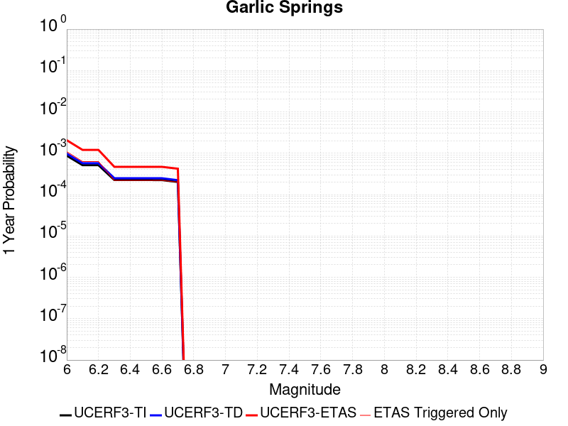 |  |

| Magnitude | 1 wk TI Prob | 1 wk TD Prob | 1 wk ETAS Prob | 1 wk ETAS/TD Gain | 1 wk ETAS Triggered Only | 1 mo TI Prob | 1 mo TD Prob | 1 mo ETAS Prob | 1 mo ETAS/TD Gain | 1 mo ETAS Triggered Only | 1 yr TI Prob | 1 yr TD Prob | 1 yr ETAS Prob | 1 yr ETAS/TD Gain | 1 yr ETAS Triggered Only | 10 yr TI Prob | 10 yr TD Prob | 10 yr ETAS Prob | 10 yr ETAS/TD Gain | 10 yr ETAS Triggered Only |
|-----|-----|-----|-----|-----|-----|-----|-----|-----|-----|-----|-----|-----|-----|-----|-----|-----|-----|-----|-----|-----|
| 6.0 | 1.6760017E-5 | 1.8776833E-5 | 1.6875527E-4 | 8.987419 | 1.4998125E-4 | 7.182667E-5 | 8.0470316E-5 | 3.4291638E-4 | 4.261402 | 2.624672E-4 | 8.7413884E-4 | 9.794032E-4 | 0.0018409507 | 1.8796659 | 8.623922E-4 | 0.008707083 | 0.009762413 | 0.011321842 | 1.1597381 | 0.0015748031 |
| 6.1 | 9.852767E-6 | 1.09735865E-5 | 8.596339E-5 | 7.833664 | 7.4990625E-5 | 4.222546E-5 | 4.702921E-5 | 2.3449695E-4 | 4.986198 | 1.8747656E-4 | 5.139737E-4 | 5.7250116E-4 | 0.001097135 | 1.9163891 | 5.249344E-4 | 0.005127866 | 0.005717221 | 0.006649245 | 1.1630204 | 9.373828E-4 |
| 6.2 | 9.852767E-6 | 1.09735865E-5 | 8.596339E-5 | 7.833664 | 7.4990625E-5 | 4.222546E-5 | 4.702921E-5 | 2.3449695E-4 | 4.986198 | 1.8747656E-4 | 5.139737E-4 | 5.7250116E-4 | 0.001097135 | 1.9163891 | 5.249344E-4 | 0.005127866 | 0.005717221 | 0.006649245 | 1.1630204 | 9.373828E-4 |
| 6.3 | 4.3167724E-6 | 4.7780286E-6 | 4.227316E-5 | 8.847406 | 3.7495312E-5 | 1.8500323E-5 | 2.0477235E-5 | 1.3296086E-4 | 6.493107 | 1.1248594E-4 | 2.2521814E-4 | 2.4930484E-4 | 3.992487E-4 | 1.6014478 | 1.4998125E-4 | 0.0022499003 | 0.00249251 | 0.0028665285 | 1.150057 | 3.7495312E-4 |
| 6.4 | 4.3167724E-6 | 4.7780286E-6 | 4.227316E-5 | 8.847406 | 3.7495312E-5 | 1.8500323E-5 | 2.0477235E-5 | 1.3296086E-4 | 6.493107 | 1.1248594E-4 | 2.2521814E-4 | 2.4930484E-4 | 3.992487E-4 | 1.6014478 | 1.4998125E-4 | 0.0022499003 | 0.00249251 | 0.0028665285 | 1.150057 | 3.7495312E-4 |
| 6.5 | 4.3167724E-6 | 4.7780286E-6 | 4.227316E-5 | 8.847406 | 3.7495312E-5 | 1.8500323E-5 | 2.0477235E-5 | 1.3296086E-4 | 6.493107 | 1.1248594E-4 | 2.2521814E-4 | 2.4930484E-4 | 3.992487E-4 | 1.6014478 | 1.4998125E-4 | 0.0022499003 | 0.00249251 | 0.0028665285 | 1.150057 | 3.7495312E-4 |
| 6.6 | 4.301311E-6 | 4.760897E-6 | 4.2256033E-5 | 8.875645 | 3.7495312E-5 | 1.8434059E-5 | 2.0403815E-5 | 1.3288746E-4 | 6.512873 | 1.1248594E-4 | 2.2441156E-4 | 2.4841115E-4 | 3.9835516E-4 | 1.6036122 | 1.4998125E-4 | 0.0022418506 | 0.002483593 | 0.002857615 | 1.1505971 | 3.7495312E-4 |
| 6.7 | 3.8599724E-6 | 4.27106E-6 | 4.1766212E-5 | 9.778888 | 3.7495312E-5 | 1.6542634E-5 | 1.8304541E-5 | 1.3078842E-4 | 7.145135 | 1.1248594E-4 | 2.0138794E-4 | 2.228578E-4 | 3.7280563E-4 | 1.6728408 | 1.4998125E-4 | 0.0020120554 | 0.002228578 | 0.0025652838 | 1.1510855 | 3.374578E-4 |

## San Andreas (San Bernardino S)
*[(top)](#table-of-contents)*

| 1 Week | 1 Month | 1 Year | 10 Year |
|-----|-----|-----|-----|
|  |  |  |  |

| Magnitude | 1 wk TI Prob | 1 wk TD Prob | 1 wk ETAS Prob | 1 wk ETAS/TD Gain | 1 wk ETAS Triggered Only | 1 mo TI Prob | 1 mo TD Prob | 1 mo ETAS Prob | 1 mo ETAS/TD Gain | 1 mo ETAS Triggered Only | 1 yr TI Prob | 1 yr TD Prob | 1 yr ETAS Prob | 1 yr ETAS/TD Gain | 1 yr ETAS Triggered Only | 10 yr TI Prob | 10 yr TD Prob | 10 yr ETAS Prob | 10 yr ETAS/TD Gain | 10 yr ETAS Triggered Only |
|-----|-----|-----|-----|-----|-----|-----|-----|-----|-----|-----|-----|-----|-----|-----|-----|-----|-----|-----|-----|-----|
| 6.0 | 1.2336002E-4 | 3.0004102E-4 | 7.873338E-4 | 2.6240873 | 4.8743907E-4 | 5.2857865E-4 | 0.0012852824 | 0.0019593306 | 1.5244359 | 6.749156E-4 | 0.006416472 | 0.015540994 | 0.016537635 | 1.0641297 | 0.0010123735 | 0.06234337 | 0.14283717 | 0.14396206 | 1.0078753 | 0.001312336 |
| 6.1 | 1.2336002E-4 | 3.0004102E-4 | 7.873338E-4 | 2.6240873 | 4.8743907E-4 | 5.2857865E-4 | 0.0012852824 | 0.0019593306 | 1.5244359 | 6.749156E-4 | 0.006416472 | 0.015540994 | 0.016537635 | 1.0641297 | 0.0010123735 | 0.06234337 | 0.14283717 | 0.14396206 | 1.0078753 | 0.001312336 |
| 6.2 | 1.2336002E-4 | 3.0004102E-4 | 7.873338E-4 | 2.6240873 | 4.8743907E-4 | 5.2857865E-4 | 0.0012852824 | 0.0019593306 | 1.5244359 | 6.749156E-4 | 0.006416472 | 0.015540994 | 0.016537635 | 1.0641297 | 0.0010123735 | 0.06234337 | 0.14283717 | 0.14396206 | 1.0078753 | 0.001312336 |
| 6.3 | 1.1712257E-4 | 2.8792414E-4 | 7.7522284E-4 | 2.6924553 | 4.8743907E-4 | 5.018573E-4 | 0.0012334028 | 0.0019074859 | 1.5465232 | 6.749156E-4 | 0.006093008 | 0.014918125 | 0.015915396 | 1.0668496 | 0.0010123735 | 0.059286322 | 0.13754563 | 0.13864513 | 1.0079937 | 0.0012748407 |
| 6.4 | 1.1712257E-4 | 2.8792414E-4 | 7.7522284E-4 | 2.6924553 | 4.8743907E-4 | 5.018573E-4 | 0.0012334028 | 0.0019074859 | 1.5465232 | 6.749156E-4 | 0.006093008 | 0.014918125 | 0.015915396 | 1.0668496 | 0.0010123735 | 0.059286322 | 0.13754563 | 0.13864513 | 1.0079937 | 0.0012748407 |
| 6.5 | 1.0689076E-4 | 2.680528E-4 | 7.1787596E-4 | 2.678114 | 4.4994376E-4 | 4.5802278E-4 | 0.0011483167 | 0.0017850051 | 1.5544536 | 6.3742034E-4 | 0.0055621783 | 0.01389575 | 0.014857082 | 1.0691817 | 9.7487814E-4 | 0.05425003 | 0.12879294 | 0.12987094 | 1.0083699 | 0.0012373453 |
| 6.6 | 9.7648895E-5 | 2.50501E-4 | 7.0033205E-4 | 2.7957256 | 4.4994376E-4 | 4.1842813E-4 | 0.0010731576 | 0.0017098939 | 1.5933297 | 6.3742034E-4 | 0.005082469 | 0.012991785 | 0.013953998 | 1.0740632 | 9.7487814E-4 | 0.049677886 | 0.12095292 | 0.1220406 | 1.0089927 | 0.0012373453 |
| 6.7 | 8.757013E-5 | 2.3120902E-4 | 6.810487E-4 | 2.9455976 | 4.4994376E-4 | 3.7524657E-4 | 9.905418E-4 | 0.0016273308 | 1.6428694 | 6.3742034E-4 | 0.00455906 | 0.011997245 | 0.012960427 | 1.0802836 | 9.7487814E-4 | 0.04466656 | 0.11226123 | 0.11335967 | 1.0097847 | 0.0012373453 |
| 6.8 | 8.562978E-5 | 2.2680782E-4 | 6.766495E-4 | 2.9833605 | 4.4994376E-4 | 3.6693315E-4 | 9.7169366E-4 | 0.0016084946 | 1.6553515 | 6.3742034E-4 | 0.004458263 | 0.011770263 | 0.012733667 | 1.0818506 | 9.7487814E-4 | 0.043698758 | 0.11027153 | 0.11137243 | 1.0099835 | 0.0012373453 |
| 6.9 | 6.124075E-5 | 1.7065753E-4 | 6.205245E-4 | 3.6360805 | 4.4994376E-4 | 2.6243398E-4 | 7.311852E-4 | 0.0012932037 | 1.7686404 | 5.624297E-4 | 0.0031904527 | 0.008866051 | 0.00975796 | 1.1005982 | 8.998875E-4 | 0.031450346 | 0.08418263 | 0.0852128 | 1.0122373 | 0.0011248594 |
| 7.0 | 5.8598747E-5 | 1.649477E-4 | 6.1481725E-4 | 3.7273464 | 4.4994376E-4 | 2.5111332E-4 | 7.06728E-4 | 0.0012687603 | 1.7952595 | 5.624297E-4 | 0.0030530186 | 0.008570663 | 0.009462838 | 1.1040964 | 8.998875E-4 | 0.03011414 | 0.081500374 | 0.08253355 | 1.0126771 | 0.0011248594 |
| 7.1 | 5.613814E-5 | 1.5913323E-4 | 6.090054E-4 | 3.8270159 | 4.4994376E-4 | 2.4056983E-4 | 6.818221E-4 | 0.0012438683 | 1.8243297 | 5.624297E-4 | 0.0029250039 | 0.008269769 | 0.009162215 | 1.1079166 | 8.998875E-4 | 0.028868021 | 0.07879931 | 0.079835534 | 1.0131501 | 0.0011248594 |
| 7.2 | 4.991222E-5 | 1.4519796E-4 | 5.9507636E-4 | 4.09838 | 4.4994376E-4 | 2.1389198E-4 | 6.2212895E-4 | 0.0011842088 | 1.903478 | 5.624297E-4 | 0.002601025 | 0.007548217 | 0.008441312 | 1.1183187 | 8.998875E-4 | 0.025707912 | 0.07225321 | 0.073262006 | 1.013962 | 0.001087364 |
| 7.3 | 4.7410045E-5 | 1.3714004E-4 | 5.495319E-4 | 4.007086 | 4.1244845E-4 | 2.0317009E-4 | 5.8761094E-4 | 0.0011122369 | 1.8928117 | 5.249344E-4 | 0.0024707897 | 0.0071307817 | 0.007987024 | 1.120077 | 8.623922E-4 | 0.024434982 | 0.06853558 | 0.06951349 | 1.0142688 | 0.0010498688 |
| 7.4 | 4.5556746E-5 | 1.3121912E-4 | 5.4361345E-4 | 4.1427913 | 4.1244845E-4 | 1.952286E-4 | 5.622468E-4 | 0.001086886 | 1.933112 | 5.249344E-4 | 0.002374317 | 0.0068239477 | 0.0076804548 | 1.125515 | 8.623922E-4 | 0.023491086 | 0.065788016 | 0.066733785 | 1.014376 | 0.0010123735 |
| 7.5 | 4.3084514E-5 | 1.2357246E-4 | 5.3597E-4 | 4.3372927 | 4.1244845E-4 | 1.8463485E-4 | 5.2948913E-4 | 0.0010541455 | 1.990873 | 5.249344E-4 | 0.0022456115 | 0.0064275465 | 0.007284396 | 1.1333089 | 8.623922E-4 | 0.022230545 | 0.062188786 | 0.0631382 | 1.0152667 | 0.0010123735 |
| 7.6 | 3.408608E-5 | 9.83552E-5 | 5.107631E-4 | 5.193046 | 4.1244845E-4 | 1.4607502E-4 | 4.214543E-4 | 9.4616745E-4 | 2.245006 | 5.249344E-4 | 0.0017770125 | 0.0051191594 | 0.0059771365 | 1.1676012 | 8.623922E-4 | 0.017628696 | 0.050020292 | 0.05098203 | 1.0192269 | 0.0010123735 |
| 7.7 | 2.8315713E-5 | 8.248679E-5 | 4.949012E-4 | 5.999763 | 4.1244845E-4 | 1.2134742E-4 | 3.5346695E-4 | 8.7821577E-4 | 2.4845767 | 5.249344E-4 | 0.0014764034 | 0.0042949775 | 0.005153666 | 1.1999285 | 8.623922E-4 | 0.01466633 | 0.0422714 | 0.043240983 | 1.0229369 | 0.0010123735 |
| 7.8 | 2.6222975E-5 | 7.463088E-5 | 4.8704853E-4 | 6.5260997 | 4.1244845E-4 | 1.1237934E-4 | 3.1980744E-4 | 8.4457395E-4 | 2.6408827 | 5.249344E-4 | 0.0013673597 | 0.0038867102 | 0.0047457507 | 1.2210199 | 8.623922E-4 | 0.013589768 | 0.03843674 | 0.039410204 | 1.0253264 | 0.0010123735 |
| 7.9 | 2.1469694E-5 | 5.787864E-5 | 4.703032E-4 | 8.125678 | 4.1244845E-4 | 9.200973E-5 | 2.4802773E-4 | 7.728319E-4 | 3.115909 | 5.249344E-4 | 0.0011196428 | 0.0030155594 | 0.0038379687 | 1.272722 | 8.248969E-4 | 0.011140184 | 0.030152109 | 0.031024862 | 1.0289451 | 8.998875E-4 |
| 8.0 | 1.2420249E-5 | 3.131896E-5 | 2.9377794E-4 | 9.380195 | 2.624672E-4 | 5.322855E-5 | 1.342172E-4 | 4.7162973E-4 | 3.513929 | 3.374578E-4 | 6.478649E-4 | 0.0016328706 | 0.0020072116 | 1.2292532 | 3.7495312E-4 | 0.0064597935 | 0.016522504 | 0.016928138 | 1.0245504 | 4.1244845E-4 |
| 8.1 | 4.9197724E-6 | 7.822348E-6 | 7.822348E-6 | 1.0 | 0.0 | 2.1084568E-5 | 3.352392E-5 | 3.352392E-5 | 1.0 | 0.0 | 2.566744E-4 | 4.0807744E-4 | 4.0807744E-4 | 1.0 | 0.0 | 0.002563781 | 0.0043843705 | 0.0043843705 | 1.0 | 0.0 |
| 8.2 | 2.5634774E-6 | 2.9067196E-6 | 2.9067196E-6 | 1.0 | 0.0 | 1.0986286E-5 | 1.2457311E-5 | 1.2457311E-5 | 1.0 | 0.0 | 1.3374983E-4 | 1.5165724E-4 | 1.5165724E-4 | 1.0 | 0.0 | 0.0013366934 | 0.0017049741 | 0.0017049741 | 1.0 | 0.0 |
| 8.3 | 5.2850464E-7 | 3.2088764E-7 | 3.2088764E-7 | 1.0 | 0.0 | 2.2650179E-6 | 1.375232E-6 | 1.375232E-6 | 1.0 | 0.0 | 2.7576245E-5 | 1.6743334E-5 | 1.6743334E-5 | 1.0 | 0.0 | 2.7572823E-4 | 1.9870348E-4 | 1.9870348E-4 | 1.0 | 0.0 |

## Helendale-So Lockhart
*[(top)](#table-of-contents)*

| 1 Week | 1 Month | 1 Year | 10 Year |
|-----|-----|-----|-----|
|  |  |  | 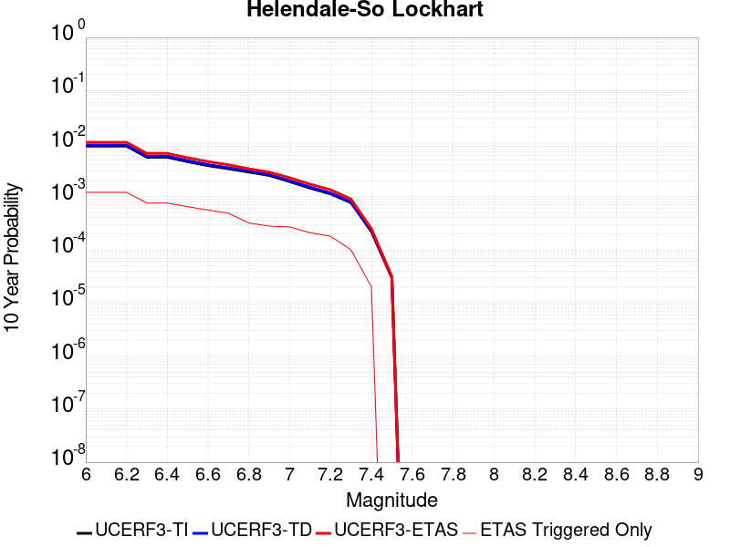 |

| Magnitude | 1 wk TI Prob | 1 wk TD Prob | 1 wk ETAS Prob | 1 wk ETAS/TD Gain | 1 wk ETAS Triggered Only | 1 mo TI Prob | 1 mo TD Prob | 1 mo ETAS Prob | 1 mo ETAS/TD Gain | 1 mo ETAS Triggered Only | 1 yr TI Prob | 1 yr TD Prob | 1 yr ETAS Prob | 1 yr ETAS/TD Gain | 1 yr ETAS Triggered Only | 10 yr TI Prob | 10 yr TD Prob | 10 yr ETAS Prob | 10 yr ETAS/TD Gain | 10 yr ETAS Triggered Only |
|-----|-----|-----|-----|-----|-----|-----|-----|-----|-----|-----|-----|-----|-----|-----|-----|-----|-----|-----|-----|-----|
| 6.0 | 1.7296055E-5 | 1.8103729E-5 | 3.9305008E-4 | 21.711 | 3.7495312E-4 | 7.412385E-5 | 7.7585224E-5 | 6.399713E-4 | 8.248624 | 5.624297E-4 | 9.0208417E-4 | 9.4421144E-4 | 0.0017308695 | 1.8331376 | 7.874016E-4 | 0.008984311 | 0.009404116 | 0.010592683 | 1.126388 | 0.00119985 |
| 6.1 | 1.7296055E-5 | 1.8103729E-5 | 3.9305008E-4 | 21.711 | 3.7495312E-4 | 7.412385E-5 | 7.7585224E-5 | 6.399713E-4 | 8.248624 | 5.624297E-4 | 9.0208417E-4 | 9.4421144E-4 | 0.0017308695 | 1.8331376 | 7.874016E-4 | 0.008984311 | 0.009404116 | 0.010592683 | 1.126388 | 0.00119985 |
| 6.2 | 1.7296055E-5 | 1.8103729E-5 | 3.9305008E-4 | 21.711 | 3.7495312E-4 | 7.412385E-5 | 7.7585224E-5 | 6.399713E-4 | 8.248624 | 5.624297E-4 | 9.0208417E-4 | 9.4421144E-4 | 0.0017308695 | 1.8331376 | 7.874016E-4 | 0.008984311 | 0.009404116 | 0.010592683 | 1.126388 | 0.00119985 |
| 6.3 | 1.0669118E-5 | 1.1135425E-5 | 2.361048E-4 | 21.203035 | 2.2497188E-4 | 4.5723988E-5 | 4.772239E-5 | 3.851641E-4 | 8.0709305 | 3.374578E-4 | 5.5654737E-4 | 5.80868E-4 | 0.001142971 | 1.9676949 | 5.624297E-4 | 0.0055515557 | 0.0057937936 | 0.006651189 | 1.1479852 | 8.623922E-4 |
| 6.4 | 1.0669118E-5 | 1.1135425E-5 | 2.361048E-4 | 21.203035 | 2.2497188E-4 | 4.5723988E-5 | 4.772239E-5 | 3.851641E-4 | 8.0709305 | 3.374578E-4 | 5.5654737E-4 | 5.80868E-4 | 0.001142971 | 1.9676949 | 5.624297E-4 | 0.0055515557 | 0.0057937936 | 0.006651189 | 1.1479852 | 8.623922E-4 |
| 6.5 | 8.790038E-6 | 9.170197E-6 | 1.9664504E-4 | 21.443928 | 1.8747656E-4 | 3.767105E-5 | 3.930026E-5 | 3.3925098E-4 | 8.632283 | 2.999625E-4 | 4.585485E-4 | 4.7837716E-4 | 9.655831E-4 | 2.0184555 | 4.8743907E-4 | 0.0045760344 | 0.004773638 | 0.0055199647 | 1.1563433 | 7.4990623E-4 |
| 6.6 | 7.396949E-6 | 7.715537E-6 | 1.5769563E-4 | 20.438711 | 1.4998125E-4 | 3.1700827E-5 | 3.3066175E-5 | 2.955247E-4 | 8.937372 | 2.624672E-4 | 3.858892E-4 | 4.025073E-4 | 8.5226994E-4 | 2.1174026 | 4.4994376E-4 | 0.003852198 | 0.00401789 | 0.0046900935 | 1.1673027 | 6.749156E-4 |
| 6.7 | 6.4600285E-6 | 6.738031E-6 | 1.5671828E-4 | 23.258764 | 1.4998125E-4 | 2.7685543E-5 | 2.887696E-5 | 2.9133656E-4 | 10.088893 | 2.624672E-4 | 3.3701936E-4 | 3.5152107E-4 | 8.013066E-4 | 2.279541 | 4.4994376E-4 | 0.0033650869 | 0.003509732 | 0.0041822786 | 1.1916234 | 6.749156E-4 |
| 6.8 | 5.600104E-6 | 5.836009E-6 | 8.08262E-5 | 13.849566 | 7.4990625E-5 | 2.4000226E-5 | 2.5011232E-5 | 2.1248311E-4 | 8.495507 | 1.8747656E-4 | 2.9216358E-4 | 3.044698E-4 | 5.6685705E-4 | 1.8617842 | 2.624672E-4 | 0.0029177975 | 0.003040588 | 0.0034891637 | 1.1475292 | 4.4994376E-4 |
| 6.9 | 4.839122E-6 | 5.0395092E-6 | 8.002976E-5 | 15.880466 | 7.4990625E-5 | 2.0738931E-5 | 2.159772E-5 | 1.7157574E-4 | 7.9441595 | 1.4998125E-4 | 2.5246723E-4 | 2.6292098E-4 | 4.8783372E-4 | 1.8554385 | 2.2497188E-4 | 0.002521806 | 0.002626147 | 0.003037512 | 1.1566422 | 4.1244845E-4 |
| 7.0 | 3.6937633E-6 | 3.845208E-6 | 7.883555E-5 | 20.502283 | 7.4990625E-5 | 1.5830317E-5 | 1.647936E-5 | 1.2896345E-4 | 7.8257556 | 1.1248594E-4 | 1.9271708E-4 | 2.0061806E-4 | 3.88057E-4 | 1.9343075 | 1.8747656E-4 | 0.0019255003 | 0.002004401 | 0.0023786025 | 1.18669 | 3.7495312E-4 |
| 7.1 | 2.7858857E-6 | 2.8978538E-6 | 7.788826E-5 | 26.877913 | 7.4990625E-5 | 1.1939455E-5 | 1.2419316E-5 | 1.2490386E-4 | 10.057225 | 1.1248594E-4 | 1.4535317E-4 | 1.511949E-4 | 3.0115346E-4 | 1.9918231 | 1.4998125E-4 | 0.0014525814 | 0.0015109418 | 0.001810451 | 1.1982269 | 2.999625E-4 |
| 7.2 | 2.1672065E-6 | 2.2540128E-6 | 7.724447E-5 | 34.269756 | 7.4990625E-5 | 9.2879945E-6 | 9.66002E-6 | 1.2214488E-4 | 12.64437 | 1.1248594E-4 | 1.1307546E-4 | 1.1760458E-4 | 2.675682E-4 | 2.275151 | 1.4998125E-4 | 0.0011301794 | 0.0011754417 | 0.0014750515 | 1.2548914 | 2.999625E-4 |
| 7.3 | 1.4823496E-6 | 1.5422102E-6 | 3.9037466E-5 | 25.312675 | 3.7495312E-5 | 6.3529114E-6 | 6.6094562E-6 | 8.159959E-5 | 12.345884 | 7.4990625E-5 | 7.734395E-5 | 8.046731E-5 | 1.9294421E-4 | 2.397796 | 1.1248594E-4 | 7.731704E-4 | 8.0439687E-4 | 0.0010291878 | 1.2794527 | 2.2497188E-4 |
| 7.4 | 4.2321457E-7 | 4.4108765E-7 | 3.7936385E-5 | 86.006454 | 3.7495312E-5 | 1.8137755E-6 | 1.8903745E-6 | 3.9385617E-5 | 20.834822 | 3.7495312E-5 | 2.2082493E-5 | 2.3015113E-5 | 6.0509563E-5 | 2.629123 | 3.7495312E-5 | 2.2080299E-4 | 2.3013182E-4 | 3.051052E-4 | 1.3257844 | 7.4990625E-5 |
| 7.5 | 5.6942316E-8 | 5.9415648E-8 | 5.9415648E-8 | 1.0 | 0.0 | 2.440385E-7 | 2.5463845E-7 | 2.5463845E-7 | 1.0 | 0.0 | 2.9711643E-6 | 3.1002196E-6 | 3.1002196E-6 | 1.0 | 0.0 | 2.9711247E-5 | 3.1001844E-5 | 3.1001844E-5 | 1.0 | 0.0 |

## Death Valley (Black Mtns Frontal)
*[(top)](#table-of-contents)*

| 1 Week | 1 Month | 1 Year | 10 Year |
|-----|-----|-----|-----|
|  | 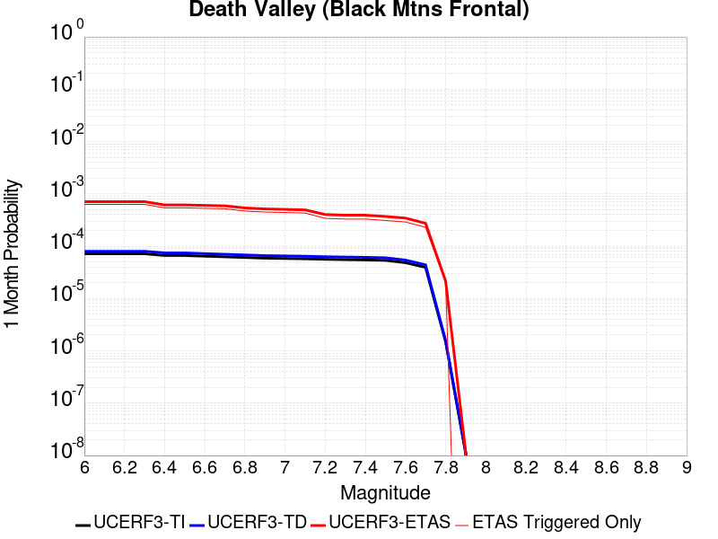 |  |  |

| Magnitude | 1 wk TI Prob | 1 wk TD Prob | 1 wk ETAS Prob | 1 wk ETAS/TD Gain | 1 wk ETAS Triggered Only | 1 mo TI Prob | 1 mo TD Prob | 1 mo ETAS Prob | 1 mo ETAS/TD Gain | 1 mo ETAS Triggered Only | 1 yr TI Prob | 1 yr TD Prob | 1 yr ETAS Prob | 1 yr ETAS/TD Gain | 1 yr ETAS Triggered Only | 10 yr TI Prob | 10 yr TD Prob | 10 yr ETAS Prob | 10 yr ETAS/TD Gain | 10 yr ETAS Triggered Only |
|-----|-----|-----|-----|-----|-----|-----|-----|-----|-----|-----|-----|-----|-----|-----|-----|-----|-----|-----|-----|-----|
| 6.0 | 1.6707214E-5 | 1.867027E-5 | 3.9361638E-4 | 21.082525 | 3.7495312E-4 | 7.160038E-5 | 8.001302E-5 | 6.049054E-4 | 7.5600867 | 5.249344E-4 | 8.71386E-4 | 9.737309E-4 | 0.0018352834 | 1.8847953 | 8.623922E-4 | 0.00867977 | 0.009695496 | 0.010846582 | 1.1187236 | 0.0011623547 |
| 6.1 | 1.6707214E-5 | 1.867027E-5 | 3.9361638E-4 | 21.082525 | 3.7495312E-4 | 7.160038E-5 | 8.001302E-5 | 6.049054E-4 | 7.5600867 | 5.249344E-4 | 8.71386E-4 | 9.737309E-4 | 0.0018352834 | 1.8847953 | 8.623922E-4 | 0.00867977 | 0.009695496 | 0.010846582 | 1.1187236 | 0.0011623547 |
| 6.2 | 1.6707214E-5 | 1.867027E-5 | 3.9361638E-4 | 21.082525 | 3.7495312E-4 | 7.160038E-5 | 8.001302E-5 | 6.049054E-4 | 7.5600867 | 5.249344E-4 | 8.71386E-4 | 9.737309E-4 | 0.0018352834 | 1.8847953 | 8.623922E-4 | 0.00867977 | 0.009695496 | 0.010846582 | 1.1187236 | 0.0011623547 |
| 6.3 | 1.6707214E-5 | 1.867027E-5 | 3.9361638E-4 | 21.082525 | 3.7495312E-4 | 7.160038E-5 | 8.001302E-5 | 6.049054E-4 | 7.5600867 | 5.249344E-4 | 8.71386E-4 | 9.737309E-4 | 0.0018352834 | 1.8847953 | 8.623922E-4 | 0.00867977 | 0.009695496 | 0.010846582 | 1.1187236 | 0.0011623547 |
| 6.4 | 1.5515609E-5 | 1.7338214E-5 | 3.9228486E-4 | 22.625448 | 3.7495312E-4 | 6.649377E-5 | 7.4304546E-5 | 5.617074E-4 | 7.5595293 | 4.8743907E-4 | 8.0926094E-4 | 9.042885E-4 | 0.0016909781 | 1.8699541 | 7.874016E-4 | 0.008063202 | 0.009006773 | 0.00997287 | 1.1072634 | 9.7487814E-4 |
| 6.5 | 1.5515609E-5 | 1.7338214E-5 | 3.9228486E-4 | 22.625448 | 3.7495312E-4 | 6.649377E-5 | 7.4304546E-5 | 5.617074E-4 | 7.5595293 | 4.8743907E-4 | 8.0926094E-4 | 9.042885E-4 | 0.0016909781 | 1.8699541 | 7.874016E-4 | 0.008063202 | 0.009006773 | 0.00997287 | 1.1072634 | 9.7487814E-4 |
| 6.6 | 1.5041828E-5 | 1.6809145E-5 | 3.9175598E-4 | 23.306122 | 3.7495312E-4 | 6.4463384E-5 | 7.203723E-5 | 5.5944116E-4 | 7.7660003 | 4.8743907E-4 | 7.8455906E-4 | 8.767063E-4 | 0.0016259551 | 1.8546178 | 7.4990623E-4 | 0.00781795 | 0.008733132 | 0.009625161 | 1.102143 | 8.998875E-4 |
| 6.7 | 1.4634985E-5 | 1.6356016E-5 | 3.91303E-4 | 23.924103 | 3.7495312E-4 | 6.271985E-5 | 7.009536E-5 | 5.575003E-4 | 7.9534545 | 4.8743907E-4 | 7.6334673E-4 | 8.5308263E-4 | 0.0015648858 | 1.8343894 | 7.1241095E-4 | 0.007607299 | 0.008498715 | 0.009353778 | 1.1006109 | 8.623922E-4 |
| 6.8 | 1.4209158E-5 | 1.5882048E-5 | 3.9082923E-4 | 24.608238 | 3.7495312E-4 | 6.089497E-5 | 6.8064175E-5 | 5.5547006E-4 | 8.160975 | 4.8743907E-4 | 7.4114406E-4 | 8.2837185E-4 | 0.0015401926 | 1.8593011 | 7.1241095E-4 | 0.007386771 | 0.008253456 | 0.009071545 | 1.0991207 | 8.248969E-4 |
| 6.9 | 1.3780098E-5 | 1.5404594E-5 | 3.528572E-4 | 22.905975 | 3.374578E-4 | 5.9056227E-5 | 6.6018045E-5 | 5.159321E-4 | 7.8150163 | 4.4994376E-4 | 7.1877235E-4 | 8.0347876E-4 | 0.0014778521 | 1.839317 | 6.749156E-4 | 0.0071645193 | 0.008006332 | 0.00878743 | 1.0975599 | 7.874016E-4 |
| 7.0 | 1.3585064E-5 | 1.5188155E-5 | 3.5264084E-4 | 23.21815 | 3.374578E-4 | 5.8220405E-5 | 6.50905E-5 | 4.775121E-4 | 7.336126 | 4.1244845E-4 | 7.086029E-4 | 7.9219416E-4 | 0.0014291095 | 1.8039889 | 6.3742034E-4 | 0.007063476 | 0.007894293 | 0.00863828 | 1.0942435 | 7.4990623E-4 |
| 7.1 | 1.3398601E-5 | 1.49813395E-5 | 3.5243412E-4 | 23.524872 | 3.374578E-4 | 5.742131E-5 | 6.420419E-5 | 4.7662616E-4 | 7.423599 | 4.1244845E-4 | 6.9888023E-4 | 7.8141113E-4 | 0.0014183334 | 1.8150923 | 6.3742034E-4 | 0.0069668638 | 0.007787224 | 0.008531291 | 1.0955497 | 7.4990623E-4 |
| 7.2 | 1.3126312E-5 | 1.4679561E-5 | 3.1463767E-4 | 21.433725 | 2.999625E-4 | 5.6254412E-5 | 6.291092E-5 | 4.3784047E-4 | 6.9596896 | 3.7495312E-4 | 6.846822E-4 | 7.6567667E-4 | 0.0013651423 | 1.7829227 | 5.99925E-4 | 0.006825765 | 0.00763097 | 0.008337945 | 1.0926454 | 7.1241095E-4 |
| 7.3 | 1.2922429E-5 | 1.4453788E-5 | 3.1441197E-4 | 21.75291 | 2.999625E-4 | 5.5380664E-5 | 6.194336E-5 | 4.3687326E-4 | 7.0527854 | 3.7495312E-4 | 6.74051E-4 | 7.53905E-4 | 0.0013533777 | 1.7951568 | 5.99925E-4 | 0.006720101 | 0.007514055 | 0.008221112 | 1.0940981 | 7.1241095E-4 |
| 7.4 | 1.2768878E-5 | 1.4283772E-5 | 3.14242E-4 | 21.999931 | 2.999625E-4 | 5.4722615E-5 | 6.1214756E-5 | 4.3614494E-4 | 7.124833 | 3.7495312E-4 | 6.660441E-4 | 7.4504025E-4 | 0.0013445183 | 1.804625 | 5.99925E-4 | 0.0066405144 | 0.0074260035 | 0.008133124 | 1.0952222 | 7.1241095E-4 |
| 7.5 | 1.2521929E-5 | 1.40120155E-5 | 3.1397032E-4 | 22.40722 | 2.999625E-4 | 5.366431E-5 | 6.005014E-5 | 3.5999462E-4 | 5.9949007 | 2.999625E-4 | 6.531671E-4 | 7.3087064E-4 | 0.0012554214 | 1.7177067 | 5.249344E-4 | 0.006512506 | 0.0072852457 | 0.007918023 | 1.0868573 | 6.3742034E-4 |
| 7.6 | 1.1301089E-5 | 1.2648149E-5 | 2.7511202E-4 | 21.75117 | 2.624672E-4 | 4.8432343E-5 | 5.4205255E-5 | 3.1665823E-4 | 5.841836 | 2.624672E-4 | 5.895042E-4 | 6.5975444E-4 | 0.0011094013 | 1.6815368 | 4.4994376E-4 | 0.0058794282 | 0.00657851 | 0.00713724 | 1.0849326 | 5.624297E-4 |
| 7.7 | 9.189108E-6 | 1.0283358E-5 | 2.7274786E-4 | 26.523228 | 2.624672E-4 | 3.93813E-5 | 4.407082E-5 | 3.0652643E-4 | 6.955315 | 2.624672E-4 | 4.7936183E-4 | 5.3643517E-4 | 9.4866235E-4 | 1.7684567 | 4.1244845E-4 | 0.004783291 | 0.005351914 | 0.0058740387 | 1.0975585 | 5.249344E-4 |
| 7.8 | 3.4586725E-7 | 3.6482615E-7 | 3.6482615E-7 | 1.0 | 0.0 | 1.4822873E-6 | 1.5635396E-6 | 1.5635396E-6 | 1.0 | 0.0 | 1.80467E-5 | 1.9035933E-5 | 5.6530534E-5 | 2.9696748 | 3.7495312E-5 | 1.8045233E-4 | 1.9034347E-4 | 2.2783165E-4 | 1.1969502 | 3.7495312E-5 |
| 7.9 | 2.5591178E-9 | 2.6696718E-9 | 2.6696718E-9 | 1.0 | 0.0 | 1.0967647E-8 | 1.14414505E-8 | 1.14414505E-8 | 1.0 | 0.0 | 1.335311E-7 | 1.3929966E-7 | 1.3929966E-7 | 1.0 | 0.0 | 1.3353102E-6 | 1.3929966E-6 | 1.3929966E-6 | 1.0 | 0.0 |

## San Andreas (Big Bend)
*[(top)](#table-of-contents)*

| 1 Week | 1 Month | 1 Year | 10 Year |
|-----|-----|-----|-----|
|  |  |  |  |

| Magnitude | 1 wk TI Prob | 1 wk TD Prob | 1 wk ETAS Prob | 1 wk ETAS/TD Gain | 1 wk ETAS Triggered Only | 1 mo TI Prob | 1 mo TD Prob | 1 mo ETAS Prob | 1 mo ETAS/TD Gain | 1 mo ETAS Triggered Only | 1 yr TI Prob | 1 yr TD Prob | 1 yr ETAS Prob | 1 yr ETAS/TD Gain | 1 yr ETAS Triggered Only | 10 yr TI Prob | 10 yr TD Prob | 10 yr ETAS Prob | 10 yr ETAS/TD Gain | 10 yr ETAS Triggered Only |
|-----|-----|-----|-----|-----|-----|-----|-----|-----|-----|-----|-----|-----|-----|-----|-----|-----|-----|-----|-----|-----|
| 6.0 | 1.0179969E-4 | 2.0072258E-4 | 3.5067374E-4 | 1.7470566 | 1.4998125E-4 | 4.362114E-4 | 8.599571E-4 | 0.0011221985 | 1.3049471 | 2.624672E-4 | 0.0052979486 | 0.010419999 | 0.010902359 | 1.0462917 | 4.8743907E-4 | 0.051734097 | 0.10144902 | 0.10225762 | 1.0079705 | 8.998875E-4 |
| 6.1 | 1.0179969E-4 | 2.0072258E-4 | 3.5067374E-4 | 1.7470566 | 1.4998125E-4 | 4.362114E-4 | 8.599571E-4 | 0.0011221985 | 1.3049471 | 2.624672E-4 | 0.0052979486 | 0.010419999 | 0.010902359 | 1.0462917 | 4.8743907E-4 | 0.051734097 | 0.10144902 | 0.10225762 | 1.0079705 | 8.998875E-4 |
| 6.2 | 1.0179969E-4 | 2.0072258E-4 | 3.5067374E-4 | 1.7470566 | 1.4998125E-4 | 4.362114E-4 | 8.599571E-4 | 0.0011221985 | 1.3049471 | 2.624672E-4 | 0.0052979486 | 0.010419999 | 0.010902359 | 1.0462917 | 4.8743907E-4 | 0.051734097 | 0.10144902 | 0.10225762 | 1.0079705 | 8.998875E-4 |
| 6.3 | 1.0179969E-4 | 2.0072258E-4 | 3.5067374E-4 | 1.7470566 | 1.4998125E-4 | 4.362114E-4 | 8.599571E-4 | 0.0011221985 | 1.3049471 | 2.624672E-4 | 0.0052979486 | 0.010419999 | 0.010902359 | 1.0462917 | 4.8743907E-4 | 0.051734097 | 0.10144902 | 0.10225762 | 1.0079705 | 8.998875E-4 |
| 6.4 | 9.1639464E-5 | 1.8429532E-4 | 2.9676053E-4 | 1.6102445 | 1.1248594E-4 | 3.9268145E-4 | 7.895982E-4 | 9.0199534E-4 | 1.1423472 | 1.1248594E-4 | 0.0047704205 | 0.009571102 | 0.00990533 | 1.0349206 | 3.374578E-4 | 0.046693064 | 0.09377527 | 0.0943869 | 1.0065223 | 6.749156E-4 |
| 6.5 | 9.1639464E-5 | 1.8429532E-4 | 2.9676053E-4 | 1.6102445 | 1.1248594E-4 | 3.9268145E-4 | 7.895982E-4 | 9.0199534E-4 | 1.1423472 | 1.1248594E-4 | 0.0047704205 | 0.009571102 | 0.00990533 | 1.0349206 | 3.374578E-4 | 0.046693064 | 0.09377527 | 0.0943869 | 1.0065223 | 6.749156E-4 |
| 6.6 | 9.042622E-5 | 1.823659E-4 | 2.9483132E-4 | 1.6167021 | 1.1248594E-4 | 3.8748336E-4 | 7.8133424E-4 | 8.937323E-4 | 1.143854 | 1.1248594E-4 | 0.0047074095 | 0.009471365 | 0.009805627 | 1.0352918 | 3.374578E-4 | 0.046089325 | 0.092869274 | 0.0934475 | 1.0062262 | 6.3742034E-4 |
| 6.7 | 8.9836685E-5 | 1.8150927E-4 | 2.939748E-4 | 1.6196132 | 1.1248594E-4 | 3.8495753E-4 | 7.776651E-4 | 8.900636E-4 | 1.1445333 | 1.1248594E-4 | 0.00467679 | 0.00942708 | 0.009761357 | 1.0354592 | 3.374578E-4 | 0.045795817 | 0.09246355 | 0.09304203 | 1.0062563 | 6.3742034E-4 |
| 6.8 | 8.9471854E-5 | 1.8097709E-4 | 2.9344266E-4 | 1.6214354 | 1.1248594E-4 | 3.8339442E-4 | 7.7538576E-4 | 8.8778447E-4 | 1.1449585 | 1.1248594E-4 | 0.004657841 | 0.009399569 | 0.009733855 | 1.035564 | 3.374578E-4 | 0.04561414 | 0.092210755 | 0.092789404 | 1.0062752 | 6.3742034E-4 |
| 6.9 | 8.858234E-5 | 1.7979681E-4 | 2.9226253E-4 | 1.6255156 | 1.1248594E-4 | 3.7958333E-4 | 7.703304E-4 | 8.827297E-4 | 1.1459105 | 1.1248594E-4 | 0.004611638 | 0.009338548 | 0.009672855 | 1.0357985 | 3.374578E-4 | 0.04517103 | 0.09165087 | 0.09222987 | 1.0063175 | 6.3742034E-4 |
| 7.0 | 8.7433385E-5 | 1.7818481E-4 | 2.906507E-4 | 1.6311755 | 1.1248594E-4 | 3.746607E-4 | 7.634259E-4 | 8.75826E-4 | 1.1472311 | 1.1248594E-4 | 0.004551957 | 0.009255203 | 0.009552389 | 1.0321102 | 2.999625E-4 | 0.044598386 | 0.09088532 | 0.09136254 | 1.0052508 | 5.249344E-4 |
| 7.1 | 8.684964E-5 | 1.7730435E-4 | 2.8977034E-4 | 1.6343104 | 1.1248594E-4 | 3.7215967E-4 | 7.596547E-4 | 8.720552E-4 | 1.1479626 | 1.1248594E-4 | 0.0045216335 | 0.009209678 | 0.0095068775 | 1.0322704 | 2.999625E-4 | 0.04430731 | 0.09046686 | 0.090944305 | 1.0052775 | 5.249344E-4 |
| 7.2 | 8.606521E-5 | 1.762105E-4 | 2.8867662E-4 | 1.6382487 | 1.1248594E-4 | 3.6879873E-4 | 7.549695E-4 | 8.673705E-4 | 1.1488816 | 1.1248594E-4 | 0.0044808835 | 0.0091531165 | 0.009450333 | 1.0324717 | 2.999625E-4 | 0.043916024 | 0.089947365 | 0.09042509 | 1.0053111 | 5.249344E-4 |
| 7.3 | 8.568266E-5 | 1.7563057E-4 | 2.8809675E-4 | 1.6403565 | 1.1248594E-4 | 3.6715972E-4 | 7.524855E-4 | 8.648868E-4 | 1.1493734 | 1.1248594E-4 | 0.0044610105 | 0.009123127 | 0.009420353 | 1.0325794 | 2.999625E-4 | 0.043725148 | 0.08966853 | 0.09014639 | 1.0053293 | 5.249344E-4 |
| 7.4 | 8.5432206E-5 | 1.7525644E-4 | 2.8772268E-4 | 1.6417238 | 1.1248594E-4 | 3.6608664E-4 | 7.50883E-4 | 8.632845E-4 | 1.1496924 | 1.1248594E-4 | 0.004447999 | 0.009103781 | 0.009401012 | 1.0326493 | 2.999625E-4 | 0.043600157 | 0.08948871 | 0.08996667 | 1.005341 | 5.249344E-4 |
| 7.5 | 8.4791965E-5 | 1.7394972E-4 | 2.864161E-4 | 1.6465453 | 1.1248594E-4 | 3.633435E-4 | 7.4528606E-4 | 8.5768814E-4 | 1.1508174 | 1.1248594E-4 | 0.0044147377 | 0.009036204 | 0.009333456 | 1.0328957 | 2.999625E-4 | 0.043280575 | 0.088866346 | 0.08934463 | 1.0053821 | 5.249344E-4 |
| 7.6 | 8.241105E-5 | 1.6840403E-4 | 2.8087103E-4 | 1.6678402 | 1.1248594E-4 | 3.531424E-4 | 7.215321E-4 | 8.339369E-4 | 1.1557863 | 1.1248594E-4 | 0.0042910352 | 0.008749358 | 0.009046696 | 1.033984 | 2.999625E-4 | 0.042091176 | 0.086243294 | 0.086722955 | 1.0055617 | 5.249344E-4 |
| 7.7 | 7.00432E-5 | 1.42045E-4 | 2.1702498E-4 | 1.5278606 | 7.4990625E-5 | 3.001506E-4 | 6.0862233E-4 | 6.835673E-4 | 1.1231388 | 7.4990625E-5 | 0.0036482112 | 0.0073848404 | 0.007608151 | 1.030239 | 2.2497188E-4 | 0.035888977 | 0.07351733 | 0.073899455 | 1.0051978 | 4.1244845E-4 |
| 7.8 | 6.415362E-5 | 1.2968935E-4 | 2.0467024E-4 | 1.5781578 | 7.4990625E-5 | 2.749151E-4 | 5.556931E-4 | 6.3064205E-4 | 1.1348747 | 7.4990625E-5 | 0.0033419547 | 0.0067446055 | 0.006930818 | 1.027609 | 1.8747656E-4 | 0.03292141 | 0.06725231 | 0.06760204 | 1.0052004 | 3.7495312E-4 |
| 7.9 | 4.939911E-5 | 9.3411545E-5 | 1.6839517E-4 | 1.8027233 | 7.4990625E-5 | 2.116933E-4 | 4.0027377E-4 | 4.7523438E-4 | 1.1872734 | 7.4990625E-5 | 0.0025743195 | 0.004862453 | 0.0050490177 | 1.0383685 | 1.8747656E-4 | 0.025447013 | 0.048914436 | 0.04923539 | 1.0065615 | 3.374578E-4 |
| 8.0 | 3.344983E-5 | 5.222685E-5 | 8.9720204E-5 | 1.7178942 | 3.7495312E-5 | 1.4334853E-4 | 2.2381016E-4 | 2.612971E-4 | 1.1674943 | 3.7495312E-5 | 0.0017438711 | 0.0027214854 | 0.002796272 | 1.02748 | 7.4990625E-5 | 0.017302496 | 0.027922187 | 0.02810443 | 1.0065268 | 1.8747656E-4 |
| 8.1 | 1.9104898E-5 | 1.9173063E-5 | 1.9173063E-5 | 1.0 | 0.0 | 8.1875565E-5 | 8.216769E-5 | 8.216769E-5 | 1.0 | 0.0 | 9.963791E-4 | 9.999331E-4 | 9.999331E-4 | 1.0 | 0.0 | 0.009919235 | 0.010749801 | 0.010786893 | 1.0034505 | 3.7495312E-5 |
| 8.2 | 8.643924E-6 | 5.4748625E-6 | 5.4748625E-6 | 1.0 | 0.0 | 3.704486E-5 | 2.3463486E-5 | 2.3463486E-5 | 1.0 | 0.0 | 4.5092785E-4 | 2.8563058E-4 | 2.8563058E-4 | 1.0 | 0.0 | 0.0045001395 | 0.0032487072 | 0.0032487072 | 1.0 | 0.0 |
| 8.3 | 1.983087E-6 | 7.6599065E-7 | 7.6599065E-7 | 1.0 | 0.0 | 8.498917E-6 | 3.282813E-6 | 3.282813E-6 | 1.0 | 0.0 | 1.034694E-4 | 3.9967534E-5 | 3.9967534E-5 | 1.0 | 0.0 | 0.0010342124 | 4.719687E-4 | 4.719687E-4 | 1.0 | 0.0 |

## Coyote Lake
*[(top)](#table-of-contents)*

| 1 Week | 1 Month | 1 Year | 10 Year |
|-----|-----|-----|-----|
|  |  |  |  |

| Magnitude | 1 wk TI Prob | 1 wk TD Prob | 1 wk ETAS Prob | 1 wk ETAS/TD Gain | 1 wk ETAS Triggered Only | 1 mo TI Prob | 1 mo TD Prob | 1 mo ETAS Prob | 1 mo ETAS/TD Gain | 1 mo ETAS Triggered Only | 1 yr TI Prob | 1 yr TD Prob | 1 yr ETAS Prob | 1 yr ETAS/TD Gain | 1 yr ETAS Triggered Only | 10 yr TI Prob | 10 yr TD Prob | 10 yr ETAS Prob | 10 yr ETAS/TD Gain | 10 yr ETAS Triggered Only |
|-----|-----|-----|-----|-----|-----|-----|-----|-----|-----|-----|-----|-----|-----|-----|-----|-----|-----|-----|-----|-----|
| 6.0 | 1.980352E-5 | 2.1706745E-5 | 9.6695745E-5 | 4.4546404 | 7.4990625E-5 | 8.486947E-5 | 9.302599E-5 | 2.804851E-4 | 3.0151262 | 1.8747656E-4 | 0.0010327959 | 0.0011320751 | 0.0014691509 | 1.2977504 | 3.374578E-4 | 0.010280091 | 0.011270258 | 0.012048786 | 1.0690781 | 7.874016E-4 |
| 6.1 | 1.980352E-5 | 2.1706745E-5 | 9.6695745E-5 | 4.4546404 | 7.4990625E-5 | 8.486947E-5 | 9.302599E-5 | 2.804851E-4 | 3.0151262 | 1.8747656E-4 | 0.0010327959 | 0.0011320751 | 0.0014691509 | 1.2977504 | 3.374578E-4 | 0.010280091 | 0.011270258 | 0.012048786 | 1.0690781 | 7.874016E-4 |
| 6.2 | 1.980352E-5 | 2.1706745E-5 | 9.6695745E-5 | 4.4546404 | 7.4990625E-5 | 8.486947E-5 | 9.302599E-5 | 2.804851E-4 | 3.0151262 | 1.8747656E-4 | 0.0010327959 | 0.0011320751 | 0.0014691509 | 1.2977504 | 3.374578E-4 | 0.010280091 | 0.011270258 | 0.012048786 | 1.0690781 | 7.874016E-4 |
| 6.3 | 1.5344787E-5 | 1.682067E-5 | 5.431535E-5 | 3.2290838 | 3.7495312E-5 | 6.576172E-5 | 7.2086936E-5 | 2.2205738E-4 | 3.0804107 | 1.4998125E-4 | 8.003548E-4 | 8.773662E-4 | 0.0010646783 | 1.2134936 | 1.8747656E-4 | 0.007974784 | 0.00874507 | 0.009228245 | 1.0552512 | 4.8743907E-4 |
| 6.4 | 1.5344787E-5 | 1.682067E-5 | 5.431535E-5 | 3.2290838 | 3.7495312E-5 | 6.576172E-5 | 7.2086936E-5 | 2.2205738E-4 | 3.0804107 | 1.4998125E-4 | 8.003548E-4 | 8.773662E-4 | 0.0010646783 | 1.2134936 | 1.8747656E-4 | 0.007974784 | 0.00874507 | 0.009228245 | 1.0552512 | 4.8743907E-4 |
| 6.5 | 1.4189697E-5 | 1.5557987E-5 | 5.3052718E-5 | 3.409999 | 3.7495312E-5 | 6.081157E-5 | 6.6675726E-5 | 2.1664698E-4 | 3.2492633 | 1.4998125E-4 | 7.401293E-4 | 8.115349E-4 | 9.988593E-4 | 1.2308273 | 1.8747656E-4 | 0.0073766913 | 0.008091656 | 0.008575151 | 1.0597522 | 4.8743907E-4 |
| 6.6 | 1.3469301E-5 | 1.4771577E-5 | 5.2266336E-5 | 3.5383043 | 3.7495312E-5 | 5.7724297E-5 | 6.330556E-5 | 2.1327732E-4 | 3.369014 | 1.4998125E-4 | 7.025667E-4 | 7.7053264E-4 | 9.5786474E-4 | 1.2431203 | 1.8747656E-4 | 0.0070034964 | 0.0076845144 | 0.0081682075 | 1.0629439 | 4.8743907E-4 |
| 6.7 | 1.3027966E-5 | 1.4281745E-5 | 5.1776522E-5 | 3.6253638 | 3.7495312E-5 | 5.5832945E-5 | 6.120638E-5 | 2.1117846E-4 | 3.4502687 | 1.4998125E-4 | 6.7955407E-4 | 7.4499263E-4 | 9.323295E-4 | 1.2514614 | 1.8747656E-4 | 0.006774798 | 0.0074308286 | 0.007877429 | 1.060101 | 4.4994376E-4 |
| 6.8 | 5.695434E-6 | 6.2244176E-6 | 6.2244176E-6 | 1.0 | 0.0 | 2.4408775E-5 | 2.6675973E-5 | 6.4170286E-5 | 2.4055462 | 3.7495312E-5 | 2.971363E-4 | 3.2476155E-4 | 3.622447E-4 | 1.1154174 | 3.7495312E-5 | 0.0029673933 | 0.0032458105 | 0.003283184 | 1.0115144 | 3.7495312E-5 |
| 6.9 | 4.385688E-6 | 4.7930553E-6 | 4.7930553E-6 | 1.0 | 0.0 | 1.879567E-5 | 2.0541665E-5 | 5.803621E-5 | 2.825292 | 3.7495312E-5 | 2.2881327E-4 | 2.5009477E-4 | 2.875807E-4 | 1.149887 | 3.7495312E-5 | 0.002285778 | 0.0025009478 | 0.0025383495 | 1.0149549 | 3.7495312E-5 |

## Death Valley (No)
*[(top)](#table-of-contents)*

| 1 Week | 1 Month | 1 Year | 10 Year |
|-----|-----|-----|-----|
|  |  |  |  |

| Magnitude | 1 wk TI Prob | 1 wk TD Prob | 1 wk ETAS Prob | 1 wk ETAS/TD Gain | 1 wk ETAS Triggered Only | 1 mo TI Prob | 1 mo TD Prob | 1 mo ETAS Prob | 1 mo ETAS/TD Gain | 1 mo ETAS Triggered Only | 1 yr TI Prob | 1 yr TD Prob | 1 yr ETAS Prob | 1 yr ETAS/TD Gain | 1 yr ETAS Triggered Only | 10 yr TI Prob | 10 yr TD Prob | 10 yr ETAS Prob | 10 yr ETAS/TD Gain | 10 yr ETAS Triggered Only |
|-----|-----|-----|-----|-----|-----|-----|-----|-----|-----|-----|-----|-----|-----|-----|-----|-----|-----|-----|-----|-----|
| 6.0 | 2.0074807E-5 | 2.2500084E-5 | 3.599503E-4 | 15.997732 | 3.374578E-4 | 8.603206E-5 | 9.642541E-5 | 4.3385068E-4 | 4.49934 | 3.374578E-4 | 0.001046937 | 0.0011733545 | 0.0017725755 | 1.5106906 | 5.99925E-4 | 0.010420183 | 0.011672506 | 0.012413659 | 1.0634956 | 7.4990623E-4 |
| 6.1 | 2.0074807E-5 | 2.2500084E-5 | 3.599503E-4 | 15.997732 | 3.374578E-4 | 8.603206E-5 | 9.642541E-5 | 4.3385068E-4 | 4.49934 | 3.374578E-4 | 0.001046937 | 0.0011733545 | 0.0017725755 | 1.5106906 | 5.99925E-4 | 0.010420183 | 0.011672506 | 0.012413659 | 1.0634956 | 7.4990623E-4 |
| 6.2 | 2.0074807E-5 | 2.2500084E-5 | 3.599503E-4 | 15.997732 | 3.374578E-4 | 8.603206E-5 | 9.642541E-5 | 4.3385068E-4 | 4.49934 | 3.374578E-4 | 0.001046937 | 0.0011733545 | 0.0017725755 | 1.5106906 | 5.99925E-4 | 0.010420183 | 0.011672506 | 0.012413659 | 1.0634956 | 7.4990623E-4 |
| 6.3 | 1.9050609E-5 | 2.1336948E-5 | 3.5878757E-4 | 16.81532 | 3.374578E-4 | 8.164292E-5 | 9.1440896E-5 | 4.2886785E-4 | 4.69011 | 3.374578E-4 | 9.935491E-4 | 0.001112731 | 0.0017119885 | 1.5385466 | 5.99925E-4 | 0.009891188 | 0.011072419 | 0.0118140215 | 1.0669775 | 7.4990623E-4 |
| 6.4 | 1.9050609E-5 | 2.1336948E-5 | 3.5878757E-4 | 16.81532 | 3.374578E-4 | 8.164292E-5 | 9.1440896E-5 | 4.2886785E-4 | 4.69011 | 3.374578E-4 | 9.935491E-4 | 0.001112731 | 0.0017119885 | 1.5385466 | 5.99925E-4 | 0.009891188 | 0.011072419 | 0.0118140215 | 1.0669775 | 7.4990623E-4 |
| 6.5 | 1.8367004E-5 | 2.0561009E-5 | 3.2051734E-4 | 15.5886 | 2.999625E-4 | 7.8713354E-5 | 8.811567E-5 | 3.8805173E-4 | 4.40389 | 2.999625E-4 | 9.5791375E-4 | 0.0010722869 | 0.0015966584 | 1.4890217 | 5.249344E-4 | 0.009537951 | 0.0106719155 | 0.011339628 | 1.0625674 | 6.749156E-4 |
| 6.6 | 1.779439E-5 | 1.9910927E-5 | 3.1986745E-4 | 16.06492 | 2.999625E-4 | 7.625944E-5 | 8.53298E-5 | 3.852667E-4 | 4.5150313 | 2.999625E-4 | 9.280632E-4 | 0.0010384015 | 0.0015627908 | 1.5049967 | 5.249344E-4 | 0.009241969 | 0.010336253 | 0.011004192 | 1.0646211 | 6.749156E-4 |
| 6.7 | 1.7025437E-5 | 1.9043426E-5 | 3.1900022E-4 | 16.7512 | 2.999625E-4 | 7.296412E-5 | 8.161216E-5 | 3.815502E-4 | 4.6751633 | 2.999625E-4 | 8.87976E-4 | 9.931813E-4 | 0.0015175943 | 1.5280133 | 5.249344E-4 | 0.008844362 | 0.009888145 | 0.010556387 | 1.0675801 | 6.749156E-4 |
| 6.8 | 1.6545107E-5 | 1.8512545E-5 | 3.184695E-4 | 17.202902 | 2.999625E-4 | 7.090568E-5 | 7.93371E-5 | 3.7927582E-4 | 4.7805605 | 2.999625E-4 | 8.629347E-4 | 9.655073E-4 | 0.0014899349 | 1.5431627 | 5.249344E-4 | 0.008595915 | 0.009613829 | 0.010245121 | 1.065665 | 6.3742034E-4 |
| 6.9 | 1.615478E-5 | 1.8087594E-5 | 3.1804468E-4 | 17.583582 | 2.999625E-4 | 6.9232934E-5 | 7.751599E-5 | 3.7745523E-4 | 4.8693857 | 2.999625E-4 | 8.4258494E-4 | 9.433546E-4 | 0.0014677938 | 1.55593 | 5.249344E-4 | 0.008393973 | 0.009394196 | 0.010025628 | 1.0672152 | 6.3742034E-4 |
| 7.0 | 1.5894311E-5 | 1.780555E-5 | 3.1776272E-4 | 17.846273 | 2.999625E-4 | 6.81167E-5 | 7.6307304E-5 | 3.7624693E-4 | 4.9306803 | 2.999625E-4 | 8.2900526E-4 | 9.286515E-4 | 0.0014530984 | 1.5647403 | 5.249344E-4 | 0.008259195 | 0.009248397 | 0.0098799225 | 1.0682849 | 6.3742034E-4 |
| 7.1 | 1.5602263E-5 | 1.7483504E-5 | 3.1744078E-4 | 18.156588 | 2.999625E-4 | 6.6865134E-5 | 7.492718E-5 | 3.748672E-4 | 5.003087 | 2.999625E-4 | 8.137789E-4 | 9.118627E-4 | 0.0014363184 | 1.5751476 | 5.249344E-4 | 0.008108052 | 0.009081894 | 0.009713525 | 1.0695484 | 6.3742034E-4 |
| 7.2 | 1.5323829E-5 | 1.717063E-5 | 3.17128E-4 | 18.46921 | 2.999625E-4 | 6.56719E-5 | 7.358637E-5 | 3.735268E-4 | 5.076032 | 2.999625E-4 | 7.99262E-4 | 8.9555193E-4 | 0.0014200162 | 1.5856324 | 5.249344E-4 | 0.007963934 | 0.008920107 | 0.009551841 | 1.0708214 | 6.3742034E-4 |
| 7.3 | 1.4556212E-5 | 1.6302456E-5 | 3.1626006E-4 | 19.399536 | 2.999625E-4 | 6.238227E-5 | 6.9865826E-5 | 3.6980739E-4 | 5.293108 | 2.999625E-4 | 7.592395E-4 | 8.5029035E-4 | 0.0013747783 | 1.616834 | 5.249344E-4 | 0.0075665074 | 0.008471014 | 0.009103035 | 1.0746098 | 6.3742034E-4 |
| 7.4 | 1.411725E-5 | 1.580796E-5 | 3.1576573E-4 | 19.97511 | 2.999625E-4 | 6.0501097E-5 | 6.7746674E-5 | 3.6768886E-4 | 5.427408 | 2.999625E-4 | 7.363519E-4 | 8.245094E-4 | 0.001349011 | 1.6361377 | 5.249344E-4 | 0.0073391674 | 0.008215138 | 0.008847322 | 1.0769535 | 6.3742034E-4 |
| 7.5 | 1.3503312E-5 | 1.5126289E-5 | 3.1508427E-4 | 20.830242 | 2.999625E-4 | 5.7870053E-5 | 6.482538E-5 | 3.6476844E-4 | 5.626939 | 2.999625E-4 | 7.043401E-4 | 7.8896893E-4 | 0.0013134892 | 1.6648173 | 5.249344E-4 | 0.007021119 | 0.007862304 | 0.008494713 | 1.0804355 | 6.3742034E-4 |
| 7.6 | 1.1279839E-5 | 1.2626327E-5 | 2.750902E-4 | 21.787033 | 2.624672E-4 | 4.834127E-5 | 5.4111737E-5 | 3.1656472E-4 | 5.8502045 | 2.624672E-4 | 5.88396E-4 | 6.5861654E-4 | 0.001108264 | 1.682715 | 4.4994376E-4 | 0.005868405 | 0.006567199 | 0.0071259346 | 1.0850798 | 5.624297E-4 |
| 7.7 | 9.189108E-6 | 1.0283358E-5 | 2.7274786E-4 | 26.523228 | 2.624672E-4 | 3.93813E-5 | 4.407082E-5 | 3.0652643E-4 | 6.955315 | 2.624672E-4 | 4.7936183E-4 | 5.3643517E-4 | 9.4866235E-4 | 1.7684567 | 4.1244845E-4 | 0.004783291 | 0.005351914 | 0.0058740387 | 1.0975585 | 5.249344E-4 |
| 7.8 | 3.4586725E-7 | 3.6482615E-7 | 3.6482615E-7 | 1.0 | 0.0 | 1.4822873E-6 | 1.5635396E-6 | 1.5635396E-6 | 1.0 | 0.0 | 1.80467E-5 | 1.9035933E-5 | 5.6530534E-5 | 2.9696748 | 3.7495312E-5 | 1.8045233E-4 | 1.9034347E-4 | 2.2783165E-4 | 1.1969502 | 3.7495312E-5 |
| 7.9 | 2.5591178E-9 | 2.6696718E-9 | 2.6696718E-9 | 1.0 | 0.0 | 1.0967647E-8 | 1.14414505E-8 | 1.14414505E-8 | 1.0 | 0.0 | 1.335311E-7 | 1.3929966E-7 | 1.3929966E-7 | 1.0 | 0.0 | 1.3353102E-6 | 1.3929966E-6 | 1.3929966E-6 | 1.0 | 0.0 |

## San Andreas (Cholame) rev
*[(top)](#table-of-contents)*

| 1 Week | 1 Month | 1 Year | 10 Year |
|-----|-----|-----|-----|
|  |  |  |  |

| Magnitude | 1 wk TI Prob | 1 wk TD Prob | 1 wk ETAS Prob | 1 wk ETAS/TD Gain | 1 wk ETAS Triggered Only | 1 mo TI Prob | 1 mo TD Prob | 1 mo ETAS Prob | 1 mo ETAS/TD Gain | 1 mo ETAS Triggered Only | 1 yr TI Prob | 1 yr TD Prob | 1 yr ETAS Prob | 1 yr ETAS/TD Gain | 1 yr ETAS Triggered Only | 10 yr TI Prob | 10 yr TD Prob | 10 yr ETAS Prob | 10 yr ETAS/TD Gain | 10 yr ETAS Triggered Only |
|-----|-----|-----|-----|-----|-----|-----|-----|-----|-----|-----|-----|-----|-----|-----|-----|-----|-----|-----|-----|-----|
| 6.0 | 1.2302514E-4 | 2.5204287E-4 | 3.6450045E-4 | 1.4461844 | 1.1248594E-4 | 5.27144E-4 | 0.0010797381 | 0.0011921027 | 1.1040664 | 1.1248594E-4 | 0.0063991086 | 0.0130670825 | 0.013400131 | 1.0254875 | 3.374578E-4 | 0.06217949 | 0.12439073 | 0.12494886 | 1.0044869 | 6.3742034E-4 |
| 6.1 | 1.2302514E-4 | 2.5204287E-4 | 3.6450045E-4 | 1.4461844 | 1.1248594E-4 | 5.27144E-4 | 0.0010797381 | 0.0011921027 | 1.1040664 | 1.1248594E-4 | 0.0063991086 | 0.0130670825 | 0.013400131 | 1.0254875 | 3.374578E-4 | 0.06217949 | 0.12439073 | 0.12494886 | 1.0044869 | 6.3742034E-4 |
| 6.2 | 1.2203569E-4 | 2.5021084E-4 | 3.6266862E-4 | 1.4494522 | 1.1248594E-4 | 5.2290526E-4 | 0.0010718931 | 0.0011842585 | 1.1048288 | 1.1248594E-4 | 0.006347804 | 0.01297271 | 0.013268781 | 1.0228226 | 2.999625E-4 | 0.061695136 | 0.12357691 | 0.1241027 | 1.0042547 | 5.99925E-4 |
| 6.3 | 1.2142645E-4 | 2.4907055E-4 | 3.6152848E-4 | 1.4515103 | 1.1248594E-4 | 5.202953E-4 | 0.0010670102 | 0.0011793762 | 1.1053091 | 1.1248594E-4 | 0.006316212 | 0.012913967 | 0.013210055 | 1.0229278 | 2.999625E-4 | 0.06139677 | 0.12307103 | 0.12359712 | 1.0042747 | 5.99925E-4 |
| 6.4 | 1.1865206E-4 | 2.44126E-4 | 3.565845E-4 | 1.4606575 | 1.1248594E-4 | 5.0840975E-4 | 0.0010458364 | 0.0011582046 | 1.1074435 | 1.1248594E-4 | 0.006172335 | 0.012659196 | 0.012955361 | 1.0233953 | 2.999625E-4 | 0.060036868 | 0.1208638 | 0.12139122 | 1.0043638 | 5.99925E-4 |
| 6.5 | 1.17443946E-4 | 2.4205919E-4 | 3.545179E-4 | 1.4645917 | 1.1248594E-4 | 5.032341E-4 | 0.0010369857 | 0.001149355 | 1.1083615 | 1.1248594E-4 | 0.006109677 | 0.012552682 | 0.012848879 | 1.0235963 | 2.999625E-4 | 0.059444077 | 0.11993805 | 0.12046602 | 1.004402 | 5.99925E-4 |
| 6.6 | 1.13579066E-4 | 2.3514954E-4 | 3.4760902E-4 | 1.4782467 | 1.1248594E-4 | 4.866766E-4 | 0.001007396 | 0.0011197686 | 1.1115476 | 1.1248594E-4 | 0.0059092017 | 0.012196515 | 0.012492819 | 1.0242941 | 2.999625E-4 | 0.057545185 | 0.11685214 | 0.11738197 | 1.0045341 | 5.99925E-4 |
| 6.7 | 1.1271412E-4 | 2.3359268E-4 | 3.4605234E-4 | 1.4814348 | 1.1248594E-4 | 4.829711E-4 | 0.0010007289 | 0.0011131023 | 1.1122916 | 1.1248594E-4 | 0.005864331 | 0.012116249 | 0.012412577 | 1.0244571 | 2.999625E-4 | 0.057119697 | 0.116155714 | 0.11668595 | 1.0045649 | 5.99925E-4 |
| 6.8 | 1.1217975E-4 | 2.3247694E-4 | 3.4493674E-4 | 1.4837459 | 1.1248594E-4 | 4.8068175E-4 | 9.959509E-4 | 0.0011083247 | 1.1128308 | 1.1248594E-4 | 0.005836608 | 0.012058721 | 0.012355067 | 1.0245752 | 2.999625E-4 | 0.056856725 | 0.11565396 | 0.11618451 | 1.0045873 | 5.99925E-4 |
| 6.9 | 1.1146753E-4 | 2.3096445E-4 | 3.434244E-4 | 1.4869146 | 1.1248594E-4 | 4.7763053E-4 | 9.894737E-4 | 0.0011018483 | 1.1135701 | 1.1248594E-4 | 0.0057996577 | 0.011980731 | 0.0122771 | 1.0247371 | 2.999625E-4 | 0.056506127 | 0.11497439 | 0.11550534 | 1.0046179 | 5.99925E-4 |
| 7.0 | 1.0965793E-4 | 2.2719789E-4 | 3.3965826E-4 | 1.4949887 | 1.1248594E-4 | 4.698779E-4 | 9.733434E-4 | 0.0010857198 | 1.1154541 | 1.1248594E-4 | 0.005705768 | 0.011786487 | 0.012082914 | 1.0251497 | 2.999625E-4 | 0.055614736 | 0.11327597 | 0.11380793 | 1.0046962 | 5.99925E-4 |
| 7.1 | 9.927982E-5 | 2.0538924E-4 | 3.1785207E-4 | 1.5475595 | 1.1248594E-4 | 4.2541555E-4 | 8.7994366E-4 | 9.923306E-4 | 1.1277206 | 1.1248594E-4 | 0.0051671406 | 0.010660981 | 0.010957746 | 1.0278366 | 2.999625E-4 | 0.05048634 | 0.1033706 | 0.10384127 | 1.0045532 | 5.249344E-4 |
| 7.2 | 9.696786E-5 | 2.0043184E-4 | 3.1289522E-4 | 1.5611054 | 1.1248594E-4 | 4.1551032E-4 | 8.5871184E-4 | 9.7110117E-4 | 1.1308813 | 1.1248594E-4 | 0.00504711 | 0.010404981 | 0.010701822 | 1.0285288 | 2.999625E-4 | 0.04934009 | 0.1011086 | 0.101580456 | 1.0046668 | 5.249344E-4 |
| 7.3 | 9.4727984E-5 | 1.9472468E-4 | 3.0718872E-4 | 1.5775541 | 1.1248594E-4 | 4.0591392E-4 | 8.3426846E-4 | 9.466605E-4 | 1.1347194 | 1.1248594E-4 | 0.0049308087 | 0.010110183 | 0.010407113 | 1.0293694 | 2.999625E-4 | 0.048228268 | 0.09847952 | 0.098952755 | 1.0048054 | 5.249344E-4 |
| 7.4 | 9.220358E-5 | 1.8843076E-4 | 3.008955E-4 | 1.5968492 | 1.1248594E-4 | 3.9509835E-4 | 8.073114E-4 | 9.197065E-4 | 1.1392215 | 1.1248594E-4 | 0.004799717 | 0.009784967 | 0.010081993 | 1.0303555 | 2.999625E-4 | 0.046973653 | 0.095557496 | 0.09603227 | 1.0049684 | 5.249344E-4 |
| 7.5 | 7.71631E-5 | 1.5177966E-4 | 2.6424852E-4 | 1.7410009 | 1.1248594E-4 | 3.306571E-4 | 6.503223E-4 | 7.627351E-4 | 1.172857 | 1.1248594E-4 | 0.0040183207 | 0.007889002 | 0.008186597 | 1.037723 | 2.999625E-4 | 0.03946433 | 0.07828531 | 0.07876915 | 1.0061805 | 5.249344E-4 |
| 7.6 | 7.5634416E-5 | 1.483744E-4 | 2.6084363E-4 | 1.7580098 | 1.1248594E-4 | 3.241072E-4 | 6.3573546E-4 | 7.481499E-4 | 1.1768258 | 1.1248594E-4 | 0.0039388672 | 0.0077126776 | 0.008010327 | 1.0385922 | 2.999625E-4 | 0.038697794 | 0.07664872 | 0.07713342 | 1.0063237 | 5.249344E-4 |
| 7.7 | 6.3783E-5 | 1.235872E-4 | 1.9856857E-4 | 1.606708 | 7.4990625E-5 | 2.7332708E-4 | 5.29552E-4 | 6.045029E-4 | 1.1415365 | 7.4990625E-5 | 0.0033226798 | 0.0064282627 | 0.0066517885 | 1.0347723 | 2.2497188E-4 | 0.032734364 | 0.06454029 | 0.064926125 | 1.0059781 | 4.1244845E-4 |
| 7.8 | 5.863422E-5 | 1.1416107E-4 | 1.8914315E-4 | 1.6568094 | 7.4990625E-5 | 2.512653E-4 | 4.8917E-4 | 5.6412397E-4 | 1.1532267 | 7.4990625E-5 | 0.003054864 | 0.0059394026 | 0.006125766 | 1.0313774 | 1.8747656E-4 | 0.030132094 | 0.059659187 | 0.06001177 | 1.0059099 | 3.7495312E-4 |
| 7.9 | 4.595283E-5 | 8.426331E-5 | 1.5924762E-4 | 1.8898809 | 7.4990625E-5 | 1.9692584E-4 | 3.610785E-4 | 4.3604206E-4 | 1.2076101 | 7.4990625E-5 | 0.0023949358 | 0.0043872762 | 0.00457393 | 1.0425444 | 1.8747656E-4 | 0.023692891 | 0.044362005 | 0.044684492 | 1.0072695 | 3.374578E-4 |
| 8.0 | 3.2950178E-5 | 5.0772942E-5 | 8.826635E-5 | 1.7384526 | 3.7495312E-5 | 1.412074E-4 | 2.1758018E-4 | 2.5506734E-4 | 1.1722912 | 3.7495312E-5 | 0.0017178444 | 0.0026458222 | 0.0027206147 | 1.0282681 | 7.4990625E-5 | 0.017046256 | 0.027180137 | 0.027362518 | 1.00671 | 1.8747656E-4 |
| 8.1 | 1.9177472E-5 | 1.9185145E-5 | 1.9185145E-5 | 1.0 | 0.0 | 8.218658E-5 | 8.221946E-5 | 8.221946E-5 | 1.0 | 0.0 | 0.0010001622 | 0.0010005629 | 0.0010005629 | 1.0 | 0.0 | 0.009956728 | 0.010758142 | 0.010795235 | 1.0034478 | 3.7495312E-5 |
| 8.2 | 8.643924E-6 | 5.4748625E-6 | 5.4748625E-6 | 1.0 | 0.0 | 3.704486E-5 | 2.3463486E-5 | 2.3463486E-5 | 1.0 | 0.0 | 4.5092785E-4 | 2.8563058E-4 | 2.8563058E-4 | 1.0 | 0.0 | 0.0045001395 | 0.0032487072 | 0.0032487072 | 1.0 | 0.0 |
| 8.3 | 1.983087E-6 | 7.6599065E-7 | 7.6599065E-7 | 1.0 | 0.0 | 8.498917E-6 | 3.282813E-6 | 3.282813E-6 | 1.0 | 0.0 | 1.034694E-4 | 3.9967534E-5 | 3.9967534E-5 | 1.0 | 0.0 | 0.0010342124 | 4.719687E-4 | 4.719687E-4 | 1.0 | 0.0 |

## San Andreas (Parkfield)
*[(top)](#table-of-contents)*

| 1 Week | 1 Month | 1 Year | 10 Year |
|-----|-----|-----|-----|
|  |  |  |  |

| Magnitude | 1 wk TI Prob | 1 wk TD Prob | 1 wk ETAS Prob | 1 wk ETAS/TD Gain | 1 wk ETAS Triggered Only | 1 mo TI Prob | 1 mo TD Prob | 1 mo ETAS Prob | 1 mo ETAS/TD Gain | 1 mo ETAS Triggered Only | 1 yr TI Prob | 1 yr TD Prob | 1 yr ETAS Prob | 1 yr ETAS/TD Gain | 1 yr ETAS Triggered Only | 10 yr TI Prob | 10 yr TD Prob | 10 yr ETAS Prob | 10 yr ETAS/TD Gain | 10 yr ETAS Triggered Only |
|-----|-----|-----|-----|-----|-----|-----|-----|-----|-----|-----|-----|-----|-----|-----|-----|-----|-----|-----|-----|-----|
| 6.0 | 5.556969E-4 | 7.7782426E-4 | 8.9022267E-4 | 1.1445037 | 1.1248594E-4 | 0.0023793848 | 0.0033298214 | 0.0035166738 | 1.0561148 | 1.8747656E-4 | 0.028586963 | 0.040191233 | 0.040587105 | 1.0098497 | 4.1244845E-4 | 0.25176284 | 0.33716413 | 0.3375618 | 1.0011795 | 5.99925E-4 |
| 6.1 | 1.925858E-4 | 3.0276453E-4 | 3.7773245E-4 | 1.2476113 | 7.4990625E-5 | 8.2510663E-4 | 0.0012970108 | 0.0013719042 | 1.0577431 | 7.4990625E-5 | 0.0099994885 | 0.015778083 | 0.015962603 | 1.0116947 | 1.8747656E-4 | 0.095613256 | 0.1497237 | 0.15001062 | 1.0019164 | 3.374578E-4 |
| 6.2 | 9.4306815E-5 | 1.8242796E-4 | 2.574049E-4 | 1.4109948 | 7.4990625E-5 | 4.0410945E-4 | 7.816011E-4 | 8.565331E-4 | 1.0958699 | 7.4990625E-5 | 0.0049089384 | 0.009474681 | 0.009660381 | 1.0195997 | 1.8747656E-4 | 0.048019063 | 0.09185409 | 0.092160545 | 1.0033364 | 3.374578E-4 |
| 6.3 | 9.283051E-5 | 1.7939322E-4 | 2.543704E-4 | 1.4179487 | 7.4990625E-5 | 3.9778434E-4 | 7.686027E-4 | 8.435357E-4 | 1.0974925 | 7.4990625E-5 | 0.0048322747 | 0.009317789 | 0.009503519 | 1.0199329 | 1.8747656E-4 | 0.047285385 | 0.09050704 | 0.09081395 | 1.003391 | 3.374578E-4 |
| 6.4 | 9.138826E-5 | 1.770153E-4 | 2.5199266E-4 | 1.4235642 | 7.4990625E-5 | 3.916052E-4 | 7.5841765E-4 | 8.333514E-4 | 1.0988028 | 7.4990625E-5 | 0.0047573745 | 0.00919484 | 0.009380593 | 1.0202018 | 1.8747656E-4 | 0.046568092 | 0.08940927 | 0.08971656 | 1.0034368 | 3.374578E-4 |
| 6.5 | 9.000255E-5 | 1.7459576E-4 | 2.495733E-4 | 1.429435 | 7.4990625E-5 | 3.8566816E-4 | 7.480541E-4 | 8.229887E-4 | 1.1001726 | 7.4990625E-5 | 0.0046854047 | 0.009069731 | 0.009255508 | 1.0204831 | 1.8747656E-4 | 0.045878403 | 0.088295065 | 0.08860273 | 1.0034845 | 3.374578E-4 |
| 6.6 | 8.8109264E-5 | 1.7140752E-4 | 2.463853E-4 | 1.4374241 | 7.4990625E-5 | 3.7755648E-4 | 7.3439797E-4 | 8.093335E-4 | 1.1020367 | 7.4990625E-5 | 0.0045870654 | 0.008904854 | 0.009090661 | 1.0208658 | 1.8747656E-4 | 0.04493529 | 0.0868267 | 0.08713485 | 1.0035491 | 3.374578E-4 |
| 6.7 | 8.738073E-5 | 1.7007832E-4 | 2.450562E-4 | 1.4408432 | 7.4990625E-5 | 3.7443507E-4 | 7.287046E-4 | 8.036406E-4 | 1.1028345 | 7.4990625E-5 | 0.0045492216 | 0.008836143 | 0.009021963 | 1.0210296 | 1.8747656E-4 | 0.04457213 | 0.08622707 | 0.086535424 | 1.0035762 | 3.374578E-4 |
| 6.8 | 8.710195E-5 | 1.6953335E-4 | 2.4451126E-4 | 1.4422606 | 7.4990625E-5 | 3.7324068E-4 | 7.263703E-4 | 8.0130645E-4 | 1.1031653 | 7.4990625E-5 | 0.0045347405 | 0.008807961 | 0.008993786 | 1.0210974 | 1.8747656E-4 | 0.04443313 | 0.08597467 | 0.08628312 | 1.0035876 | 3.374578E-4 |
| 6.9 | 8.6801556E-5 | 1.689429E-4 | 2.4392086E-4 | 1.4438065 | 7.4990625E-5 | 3.7195362E-4 | 7.2384125E-4 | 7.9877756E-4 | 1.103526 | 7.4990625E-5 | 0.0045191357 | 0.008777418 | 0.008963249 | 1.0211715 | 1.8747656E-4 | 0.044283327 | 0.085700735 | 0.08600927 | 1.0036001 | 3.374578E-4 |
| 7.0 | 8.5571606E-5 | 1.6647128E-4 | 2.4144942E-4 | 1.4503969 | 7.4990625E-5 | 3.6668387E-4 | 7.132544E-4 | 7.8819157E-4 | 1.1050637 | 7.4990625E-5 | 0.004455241 | 0.008649553 | 0.008835409 | 1.0214872 | 1.8747656E-4 | 0.043669727 | 0.08454914 | 0.08485807 | 1.0036538 | 3.374578E-4 |
| 7.1 | 7.82589E-5 | 1.5128135E-4 | 2.2626063E-4 | 1.495628 | 7.4990625E-5 | 3.3535215E-4 | 6.481883E-4 | 7.231303E-4 | 1.1156176 | 7.4990625E-5 | 0.0040752706 | 0.007863307 | 0.008049309 | 1.0236545 | 1.8747656E-4 | 0.040013418 | 0.07746111 | 0.07773784 | 1.0035725 | 2.999625E-4 |
| 7.2 | 7.690929E-5 | 1.4865391E-4 | 2.2363338E-4 | 1.5043895 | 7.4990625E-5 | 3.2956956E-4 | 6.369334E-4 | 7.1187626E-4 | 1.1176621 | 7.4990625E-5 | 0.004005129 | 0.007727258 | 0.007913286 | 1.0240742 | 1.8747656E-4 | 0.0393371 | 0.07623427 | 0.07651137 | 1.0036348 | 2.999625E-4 |
| 7.3 | 7.5543794E-5 | 1.4561978E-4 | 2.2059948E-4 | 1.5149006 | 7.4990625E-5 | 3.2371894E-4 | 6.2393624E-4 | 6.9888006E-4 | 1.1201146 | 7.4990625E-5 | 0.003934157 | 0.007570127 | 0.007756185 | 1.0245779 | 1.8747656E-4 | 0.038652334 | 0.074797355 | 0.075074874 | 1.0037104 | 2.999625E-4 |
| 7.4 | 7.4214564E-5 | 1.4262961E-4 | 2.1760954E-4 | 1.5256968 | 7.4990625E-5 | 3.1802364E-4 | 6.111273E-4 | 6.860721E-4 | 1.1226337 | 7.4990625E-5 | 0.003865065 | 0.00741525 | 0.007601336 | 1.0250951 | 1.8747656E-4 | 0.03798529 | 0.07337123 | 0.07364919 | 1.0037884 | 2.999625E-4 |
| 7.5 | 6.149578E-5 | 1.11907226E-4 | 1.8688946E-4 | 1.6700393 | 7.4990625E-5 | 2.6352672E-4 | 4.7951436E-4 | 5.54469E-4 | 1.1563137 | 7.4990625E-5 | 0.0032037178 | 0.0058224914 | 0.0060088765 | 1.0320112 | 1.8747656E-4 | 0.03157923 | 0.058557566 | 0.058839962 | 1.0048226 | 2.999625E-4 |
| 7.6 | 6.0643448E-5 | 1.10193796E-4 | 1.8517616E-4 | 1.680459 | 7.4990625E-5 | 2.598746E-4 | 4.7217376E-4 | 5.4712896E-4 | 1.1587449 | 7.4990625E-5 | 0.0031593828 | 0.0057335934 | 0.0059199953 | 1.0325104 | 1.8747656E-4 | 0.031148417 | 0.057718582 | 0.05800123 | 1.004897 | 2.999625E-4 |
| 7.7 | 5.1652263E-5 | 9.174698E-5 | 1.2923885E-4 | 1.4086442 | 3.7495312E-5 | 2.2134806E-4 | 3.931421E-4 | 4.306227E-4 | 1.095336 | 3.7495312E-5 | 0.002691582 | 0.0047760103 | 0.004887959 | 1.0234398 | 1.1248594E-4 | 0.026592141 | 0.04853623 | 0.04875028 | 1.0044101 | 2.2497188E-4 |
| 7.8 | 4.8090482E-5 | 8.559635E-5 | 1.2308845E-4 | 1.4380106 | 3.7495312E-5 | 2.060858E-4 | 3.6678996E-4 | 4.0427153E-4 | 1.1021881 | 3.7495312E-5 | 0.0025062072 | 0.0044565317 | 0.0045311884 | 1.0167521 | 7.4990625E-5 | 0.024781305 | 0.04530245 | 0.045481432 | 1.0039508 | 1.8747656E-4 |
| 7.9 | 3.970278E-5 | 6.750426E-5 | 1.0499704E-4 | 1.5554136 | 3.7495312E-5 | 1.7014367E-4 | 2.892719E-4 | 3.2675636E-4 | 1.1295822 | 3.7495312E-5 | 0.002069531 | 0.0035162016 | 0.0035909286 | 1.0212522 | 7.4990625E-5 | 0.020503636 | 0.035881363 | 0.03606211 | 1.0050374 | 1.8747656E-4 |
| 8.0 | 2.8982335E-5 | 4.069796E-5 | 7.819175E-5 | 1.9212694 | 3.7495312E-5 | 1.2420409E-4 | 1.7440817E-4 | 2.1189694E-4 | 1.2149485 | 3.7495312E-5 | 0.0015111357 | 0.0021213528 | 0.0021587685 | 1.0176377 | 3.7495312E-5 | 0.015009012 | 0.022010697 | 0.022120707 | 1.004998 | 1.1248594E-4 |
| 8.1 | 1.8836186E-5 | 1.8681134E-5 | 1.8681134E-5 | 1.0 | 0.0 | 8.0724014E-5 | 8.005955E-5 | 8.005955E-5 | 1.0 | 0.0 | 9.823717E-4 | 9.742898E-4 | 9.742898E-4 | 1.0 | 0.0 | 0.009780403 | 0.010488115 | 0.010525217 | 1.0035375 | 3.7495312E-5 |
| 8.2 | 8.643924E-6 | 5.4748625E-6 | 5.4748625E-6 | 1.0 | 0.0 | 3.704486E-5 | 2.3463486E-5 | 2.3463486E-5 | 1.0 | 0.0 | 4.5092785E-4 | 2.8563058E-4 | 2.8563058E-4 | 1.0 | 0.0 | 0.0045001395 | 0.0032487072 | 0.0032487072 | 1.0 | 0.0 |
| 8.3 | 1.983087E-6 | 7.6599065E-7 | 7.6599065E-7 | 1.0 | 0.0 | 8.498917E-6 | 3.282813E-6 | 3.282813E-6 | 1.0 | 0.0 | 1.034694E-4 | 3.9967534E-5 | 3.9967534E-5 | 1.0 | 0.0 | 0.0010342124 | 4.719687E-4 | 4.719687E-4 | 1.0 | 0.0 |

## San Andreas (San Gorgonio Pass-Garnet HIll)
*[(top)](#table-of-contents)*

| 1 Week | 1 Month | 1 Year | 10 Year |
|-----|-----|-----|-----|
|  |  |  |  |

| Magnitude | 1 wk TI Prob | 1 wk TD Prob | 1 wk ETAS Prob | 1 wk ETAS/TD Gain | 1 wk ETAS Triggered Only | 1 mo TI Prob | 1 mo TD Prob | 1 mo ETAS Prob | 1 mo ETAS/TD Gain | 1 mo ETAS Triggered Only | 1 yr TI Prob | 1 yr TD Prob | 1 yr ETAS Prob | 1 yr ETAS/TD Gain | 1 yr ETAS Triggered Only | 10 yr TI Prob | 10 yr TD Prob | 10 yr ETAS Prob | 10 yr ETAS/TD Gain | 10 yr ETAS Triggered Only |
|-----|-----|-----|-----|-----|-----|-----|-----|-----|-----|-----|-----|-----|-----|-----|-----|-----|-----|-----|-----|-----|
| 6.0 | 8.31567E-5 | 2.3382473E-4 | 4.58744E-4 | 1.961914 | 2.2497188E-4 | 3.5633717E-4 | 0.0010017233 | 0.0013763009 | 1.3739331 | 3.7495312E-4 | 0.004329778 | 0.012127888 | 0.012609416 | 1.0397042 | 4.8743907E-4 | 0.042463828 | 0.11257892 | 0.1131113 | 1.004729 | 5.99925E-4 |
| 6.1 | 8.31567E-5 | 2.3382473E-4 | 4.58744E-4 | 1.961914 | 2.2497188E-4 | 3.5633717E-4 | 0.0010017233 | 0.0013763009 | 1.3739331 | 3.7495312E-4 | 0.004329778 | 0.012127888 | 0.012609416 | 1.0397042 | 4.8743907E-4 | 0.042463828 | 0.11257892 | 0.1131113 | 1.004729 | 5.99925E-4 |
| 6.2 | 8.31567E-5 | 2.3382473E-4 | 4.58744E-4 | 1.961914 | 2.2497188E-4 | 3.5633717E-4 | 0.0010017233 | 0.0013763009 | 1.3739331 | 3.7495312E-4 | 0.004329778 | 0.012127888 | 0.012609416 | 1.0397042 | 4.8743907E-4 | 0.042463828 | 0.11257892 | 0.1131113 | 1.004729 | 5.99925E-4 |
| 6.3 | 8.31567E-5 | 2.3382473E-4 | 4.58744E-4 | 1.961914 | 2.2497188E-4 | 3.5633717E-4 | 0.0010017233 | 0.0013763009 | 1.3739331 | 3.7495312E-4 | 0.004329778 | 0.012127888 | 0.012609416 | 1.0397042 | 4.8743907E-4 | 0.042463828 | 0.11257892 | 0.1131113 | 1.004729 | 5.99925E-4 |
| 6.4 | 8.059055E-5 | 2.2940808E-4 | 4.5432834E-4 | 1.9804374 | 2.2497188E-4 | 3.4534236E-4 | 9.828096E-4 | 0.0013573942 | 1.3811365 | 3.7495312E-4 | 0.0041964394 | 0.011900152 | 0.01238179 | 1.0404733 | 4.8743907E-4 | 0.041180745 | 0.11056015 | 0.111093745 | 1.0048263 | 5.99925E-4 |
| 6.5 | 8.059055E-5 | 2.2940808E-4 | 4.5432834E-4 | 1.9804374 | 2.2497188E-4 | 3.4534236E-4 | 9.828096E-4 | 0.0013573942 | 1.3811365 | 3.7495312E-4 | 0.0041964394 | 0.011900152 | 0.01238179 | 1.0404733 | 4.8743907E-4 | 0.041180745 | 0.11056015 | 0.111093745 | 1.0048263 | 5.99925E-4 |
| 6.6 | 7.619237E-5 | 2.218517E-4 | 4.4677366E-4 | 2.0138392 | 2.2497188E-4 | 3.2649786E-4 | 9.5044886E-4 | 0.0013250456 | 1.3941262 | 3.7495312E-4 | 0.0039678677 | 0.01151087 | 0.011992699 | 1.0418586 | 4.8743907E-4 | 0.03897764 | 0.10709683 | 0.1076325 | 1.0050018 | 5.99925E-4 |
| 6.7 | 7.440636E-5 | 2.1860997E-4 | 4.4353266E-4 | 2.0288768 | 2.2497188E-4 | 3.188454E-4 | 9.3656575E-4 | 0.0013111677 | 1.399974 | 3.7495312E-4 | 0.0038750346 | 0.011343609 | 0.011825518 | 1.042483 | 4.8743907E-4 | 0.038081564 | 0.105605274 | 0.10614184 | 1.0050809 | 5.99925E-4 |
| 6.8 | 7.3735864E-5 | 2.1708169E-4 | 4.4200473E-4 | 2.0361216 | 2.2497188E-4 | 3.1597257E-4 | 9.3002064E-4 | 0.0013046251 | 1.4027915 | 3.7495312E-4 | 0.0038401815 | 0.011264749 | 0.011746697 | 1.0427837 | 4.8743907E-4 | 0.03774495 | 0.10490683 | 0.10544381 | 1.0051187 | 5.99925E-4 |
| 6.9 | 7.27575E-5 | 2.1477141E-4 | 4.3969497E-4 | 2.0472696 | 2.2497188E-4 | 3.117806E-4 | 9.201265E-4 | 0.0012947347 | 1.4071268 | 3.7495312E-4 | 0.003789323 | 0.011145527 | 0.011627533 | 1.0432466 | 4.8743907E-4 | 0.037253562 | 0.103854746 | 0.104392365 | 1.0051767 | 5.99925E-4 |
| 7.0 | 7.102591E-5 | 2.1061185E-4 | 4.3553635E-4 | 2.0679574 | 2.2497188E-4 | 3.0436125E-4 | 9.023122E-4 | 0.001276927 | 1.4151721 | 3.7495312E-4 | 0.003699303 | 0.010930831 | 0.011412942 | 1.0441056 | 4.8743907E-4 | 0.03638325 | 0.10195695 | 0.10249571 | 1.0052842 | 5.99925E-4 |
| 7.1 | 7.028513E-5 | 2.0896831E-4 | 4.3389318E-4 | 2.0763588 | 2.2497188E-4 | 3.0118722E-4 | 8.9527335E-4 | 0.0012698908 | 1.4184391 | 3.7495312E-4 | 0.0036607897 | 0.010845989 | 0.011328141 | 1.0444545 | 4.8743907E-4 | 0.036010686 | 0.101199985 | 0.1017392 | 1.0053282 | 5.99925E-4 |
| 7.2 | 6.8498244E-5 | 2.0504706E-4 | 4.299728E-4 | 2.096947 | 2.2497188E-4 | 2.9353087E-4 | 8.784794E-4 | 0.0012531031 | 1.4264457 | 3.7495312E-4 | 0.003567883 | 0.010643536 | 0.011125787 | 1.0453093 | 4.8743907E-4 | 0.035111405 | 0.09939202 | 0.09989855 | 1.0050963 | 5.624297E-4 |
| 7.3 | 6.622592E-5 | 1.9732013E-4 | 3.847597E-4 | 1.9499263 | 1.8747656E-4 | 2.8379448E-4 | 8.453858E-4 | 0.0011825584 | 1.3988386 | 3.374578E-4 | 0.0034497243 | 0.0102444785 | 0.010689814 | 1.0434706 | 4.4994376E-4 | 0.033966612 | 0.095888525 | 0.09636313 | 1.0049495 | 5.249344E-4 |
| 7.4 | 5.1050705E-5 | 1.4689034E-4 | 3.3433936E-4 | 2.2761154 | 1.8747656E-4 | 2.1877038E-4 | 6.29379E-4 | 9.291527E-4 | 1.4763008 | 2.999625E-4 | 0.002660276 | 0.0076359594 | 0.008045259 | 1.0536015 | 4.1244845E-4 | 0.02628654 | 0.07286301 | 0.073314935 | 1.0062023 | 4.8743907E-4 |
| 7.5 | 3.9302922E-5 | 1.1129847E-4 | 2.9875417E-4 | 2.6842613 | 1.8747656E-4 | 1.6843023E-4 | 4.7690657E-4 | 7.76726E-4 | 1.6286755 | 2.999625E-4 | 0.0020487092 | 0.005790949 | 0.006201009 | 1.0708106 | 4.1244845E-4 | 0.020299247 | 0.05600951 | 0.05646965 | 1.0082153 | 4.8743907E-4 |
| 7.6 | 2.9851626E-5 | 8.4949745E-5 | 2.7241037E-4 | 3.206724 | 1.8747656E-4 | 1.2792926E-4 | 3.6401965E-4 | 6.63873E-4 | 1.8237283 | 2.999625E-4 | 0.0015564259 | 0.0044229585 | 0.004833583 | 1.0928392 | 4.1244845E-4 | 0.0154556995 | 0.04319374 | 0.043660123 | 1.0107975 | 4.8743907E-4 |
| 7.7 | 2.1135214E-5 | 6.3529005E-5 | 2.5099365E-4 | 3.9508517 | 1.8747656E-4 | 9.0576345E-5 | 2.7223877E-4 | 5.721196E-4 | 2.1015363 | 2.999625E-4 | 0.0011022091 | 0.0033094748 | 0.0037205582 | 1.124214 | 4.1244845E-4 | 0.010967582 | 0.032582592 | 0.03305415 | 1.0144727 | 4.8743907E-4 |
| 7.8 | 1.883379E-5 | 5.564028E-5 | 2.4310642E-4 | 4.369252 | 1.8747656E-4 | 8.0713755E-5 | 2.3843657E-4 | 5.3832756E-4 | 2.257739 | 2.999625E-4 | 9.822468E-4 | 0.0028991038 | 0.0033103565 | 1.1418551 | 4.1244845E-4 | 0.0097791655 | 0.028695205 | 0.029168658 | 1.0164993 | 4.8743907E-4 |
| 7.9 | 1.5156185E-5 | 4.1658426E-5 | 2.2912718E-4 | 5.50014 | 1.8747656E-4 | 6.495346E-5 | 1.785239E-4 | 4.7843286E-4 | 2.6799374 | 2.999625E-4 | 7.9052144E-4 | 0.0021713632 | 0.002582916 | 1.1895367 | 4.1244845E-4 | 0.007877152 | 0.021759422 | 0.022199577 | 1.0202281 | 4.4994376E-4 |
| 8.0 | 1.1405907E-5 | 2.9974231E-5 | 2.1744518E-4 | 7.254404 | 1.8747656E-4 | 4.8881542E-5 | 1.2845467E-4 | 3.9088813E-4 | 3.0430045 | 2.624672E-4 | 5.9497025E-4 | 0.0015628147 | 0.0018623084 | 1.1916374 | 2.999625E-4 | 0.005933798 | 0.015772851 | 0.016104985 | 1.0210574 | 3.374578E-4 |
| 8.1 | 4.3511436E-6 | 7.369219E-6 | 7.369219E-6 | 1.0 | 0.0 | 1.8647626E-5 | 3.1581985E-5 | 3.1581985E-5 | 1.0 | 0.0 | 2.2701119E-4 | 3.8444297E-4 | 3.8444297E-4 | 1.0 | 0.0 | 0.0022677942 | 0.0041163345 | 0.0041163345 | 1.0 | 0.0 |
| 8.2 | 2.3042528E-6 | 2.7329415E-6 | 2.7329415E-6 | 1.0 | 0.0 | 9.875332E-6 | 1.1712554E-5 | 1.1712554E-5 | 1.0 | 0.0 | 1.2022553E-4 | 1.4259106E-4 | 1.4259106E-4 | 1.0 | 0.0 | 0.0012016051 | 0.0015979785 | 0.0015979785 | 1.0 | 0.0 |
| 8.3 | 5.202968E-7 | 3.1598344E-7 | 3.1598344E-7 | 1.0 | 0.0 | 2.2298414E-6 | 1.3542141E-6 | 1.3542141E-6 | 1.0 | 0.0 | 2.714798E-5 | 1.6487444E-5 | 1.6487444E-5 | 1.0 | 0.0 | 2.7144665E-4 | 1.9563142E-4 | 1.9563142E-4 | 1.0 | 0.0 |

## Manix-Afton Hills
*[(top)](#table-of-contents)*

| 1 Week | 1 Month | 1 Year | 10 Year |
|-----|-----|-----|-----|
|  | 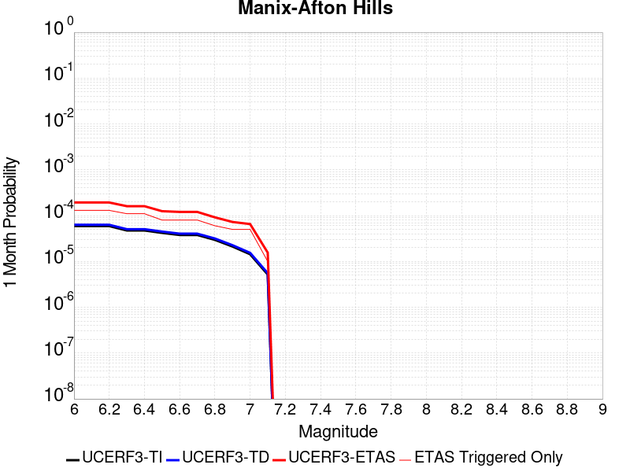 |  | 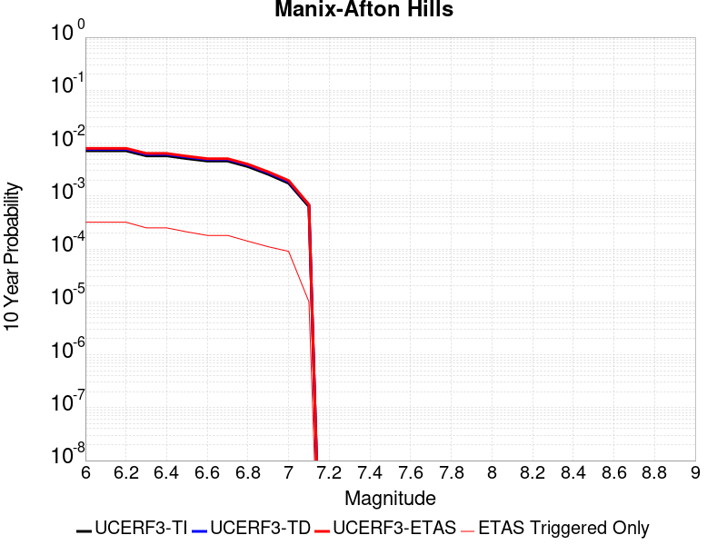 |

| Magnitude | 1 wk TI Prob | 1 wk TD Prob | 1 wk ETAS Prob | 1 wk ETAS/TD Gain | 1 wk ETAS Triggered Only | 1 mo TI Prob | 1 mo TD Prob | 1 mo ETAS Prob | 1 mo ETAS/TD Gain | 1 mo ETAS Triggered Only | 1 yr TI Prob | 1 yr TD Prob | 1 yr ETAS Prob | 1 yr ETAS/TD Gain | 1 yr ETAS Triggered Only | 10 yr TI Prob | 10 yr TD Prob | 10 yr ETAS Prob | 10 yr ETAS/TD Gain | 10 yr ETAS Triggered Only |
|-----|-----|-----|-----|-----|-----|-----|-----|-----|-----|-----|-----|-----|-----|-----|-----|-----|-----|-----|-----|-----|
| 6.0 | 1.3783202E-5 | 1.47110895E-5 | 2.0218489E-4 | 13.743706 | 1.8747656E-4 | 5.906953E-5 | 6.30461E-5 | 2.880038E-4 | 4.5681458 | 2.2497188E-4 | 7.189342E-4 | 7.6733343E-4 | 0.001216932 | 1.5859232 | 4.4994376E-4 | 0.0071661277 | 0.007648596 | 0.008243932 | 1.077836 | 5.99925E-4 |
| 6.1 | 1.3783202E-5 | 1.47110895E-5 | 2.0218489E-4 | 13.743706 | 1.8747656E-4 | 5.906953E-5 | 6.30461E-5 | 2.880038E-4 | 4.5681458 | 2.2497188E-4 | 7.189342E-4 | 7.6733343E-4 | 0.001216932 | 1.5859232 | 4.4994376E-4 | 0.0071661277 | 0.007648596 | 0.008243932 | 1.077836 | 5.99925E-4 |
| 6.2 | 1.3783202E-5 | 1.47110895E-5 | 2.0218489E-4 | 13.743706 | 1.8747656E-4 | 5.906953E-5 | 6.30461E-5 | 2.880038E-4 | 4.5681458 | 2.2497188E-4 | 7.189342E-4 | 7.6733343E-4 | 0.001216932 | 1.5859232 | 4.4994376E-4 | 0.0071661277 | 0.007648596 | 0.008243932 | 1.077836 | 5.99925E-4 |
| 6.3 | 1.10494875E-5 | 1.1793136E-5 | 1.6177262E-4 | 13.717524 | 1.4998125E-4 | 4.7354086E-5 | 5.054109E-5 | 2.0051475E-4 | 3.9673612 | 1.4998125E-4 | 5.763835E-4 | 6.151744E-4 | 8.7748014E-4 | 1.4263924 | 2.624672E-4 | 0.005748908 | 0.0061357557 | 0.006545673 | 1.066808 | 4.1244845E-4 |
| 6.4 | 1.10494875E-5 | 1.1793136E-5 | 1.6177262E-4 | 13.717524 | 1.4998125E-4 | 4.7354086E-5 | 5.054109E-5 | 2.0051475E-4 | 3.9673612 | 1.4998125E-4 | 5.763835E-4 | 6.151744E-4 | 8.7748014E-4 | 1.4263924 | 2.624672E-4 | 0.005748908 | 0.0061357557 | 0.006545673 | 1.066808 | 4.1244845E-4 |
| 6.5 | 9.788949E-6 | 1.045432E-5 | 1.2293908E-4 | 11.7596445 | 1.1248594E-4 | 4.1951964E-5 | 4.480351E-5 | 1.572844E-4 | 3.5105376 | 1.1248594E-4 | 5.1064545E-4 | 5.453555E-4 | 7.327298E-4 | 1.343582 | 1.8747656E-4 | 0.0050947363 | 0.0054410985 | 0.00577672 | 1.0616827 | 3.374578E-4 |
| 6.6 | 8.810006E-6 | 9.4136285E-6 | 1.21898505E-4 | 12.949153 | 1.1248594E-4 | 3.775662E-5 | 4.0343548E-5 | 1.5282494E-4 | 3.788089 | 1.1248594E-4 | 4.5958988E-4 | 4.9108086E-4 | 6.7846535E-4 | 1.3815757 | 1.8747656E-4 | 0.0045864056 | 0.004900839 | 0.00516202 | 1.0532931 | 2.624672E-4 |
| 6.7 | 8.80128E-6 | 9.404108E-6 | 1.2188899E-4 | 12.961249 | 1.1248594E-4 | 3.7719226E-5 | 4.0302748E-5 | 1.5278415E-4 | 3.7909117 | 1.1248594E-4 | 4.591348E-4 | 4.9058435E-4 | 6.7796896E-4 | 1.3819621 | 1.8747656E-4 | 0.004581874 | 0.0048958957 | 0.005157078 | 1.0533471 | 2.624672E-4 |
| 6.8 | 6.8994877E-6 | 7.380076E-6 | 8.237015E-5 | 11.161152 | 7.4990625E-5 | 2.9568899E-5 | 3.162856E-5 | 1.0661681E-4 | 3.3709033 | 7.4990625E-5 | 3.5994186E-4 | 3.8501783E-4 | 5.349413E-4 | 1.3893937 | 1.4998125E-4 | 0.003593594 | 0.0038443129 | 0.00406842 | 1.0582957 | 2.2497188E-4 |
| 6.9 | 4.9328037E-6 | 5.2709615E-6 | 8.026119E-5 | 15.22705 | 7.4990625E-5 | 2.1140417E-5 | 2.2589675E-5 | 9.75786E-5 | 4.319611 | 7.4990625E-5 | 2.5735417E-4 | 2.7500073E-4 | 3.8745574E-4 | 1.4089262 | 1.1248594E-4 | 0.0025705635 | 0.0027472095 | 0.0028967788 | 1.0544441 | 1.4998125E-4 |
| 7.0 | 3.347973E-6 | 3.59003E-6 | 7.8580386E-5 | 21.888504 | 7.4990625E-5 | 1.4348378E-5 | 1.5385775E-5 | 9.0375244E-5 | 5.873948 | 7.4990625E-5 | 1.746775E-4 | 1.8730981E-4 | 2.622864E-4 | 1.4002811 | 7.4990625E-5 | 0.0017454025 | 0.0018719219 | 0.0019841974 | 1.0599786 | 1.1248594E-4 |
| 7.1 | 1.2073567E-6 | 1.293482E-6 | 1.293482E-6 | 1.0 | 0.0 | 5.1743755E-6 | 5.543492E-6 | 5.543492E-6 | 1.0 | 0.0 | 6.29962E-5 | 6.749156E-5 | 6.749156E-5 | 1.0 | 0.0 | 6.297835E-4 | 6.7487074E-4 | 6.7487074E-4 | 1.0 | 0.0 |

## Death Valley (Fish Lake Valley)
*[(top)](#table-of-contents)*

| 1 Week | 1 Month | 1 Year | 10 Year |
|-----|-----|-----|-----|
|  |  |  |  |

| Magnitude | 1 wk TI Prob | 1 wk TD Prob | 1 wk ETAS Prob | 1 wk ETAS/TD Gain | 1 wk ETAS Triggered Only | 1 mo TI Prob | 1 mo TD Prob | 1 mo ETAS Prob | 1 mo ETAS/TD Gain | 1 mo ETAS Triggered Only | 1 yr TI Prob | 1 yr TD Prob | 1 yr ETAS Prob | 1 yr ETAS/TD Gain | 1 yr ETAS Triggered Only | 10 yr TI Prob | 10 yr TD Prob | 10 yr ETAS Prob | 10 yr ETAS/TD Gain | 10 yr ETAS Triggered Only |
|-----|-----|-----|-----|-----|-----|-----|-----|-----|-----|-----|-----|-----|-----|-----|-----|-----|-----|-----|-----|-----|
| 6.0 | 3.872328E-5 | 4.7267473E-5 | 3.0972227E-4 | 6.5525455 | 2.624672E-4 | 1.6594635E-4 | 2.0256084E-4 | 4.6497487E-4 | 2.2954824 | 2.624672E-4 | 0.0020185246 | 0.002463534 | 0.0028749665 | 1.167009 | 4.1244845E-4 | 0.02000288 | 0.024388181 | 0.024900313 | 1.0209992 | 5.249344E-4 |
| 6.1 | 3.872328E-5 | 4.7267473E-5 | 3.0972227E-4 | 6.5525455 | 2.624672E-4 | 1.6594635E-4 | 2.0256084E-4 | 4.6497487E-4 | 2.2954824 | 2.624672E-4 | 0.0020185246 | 0.002463534 | 0.0028749665 | 1.167009 | 4.1244845E-4 | 0.02000288 | 0.024388181 | 0.024900313 | 1.0209992 | 5.249344E-4 |
| 6.2 | 3.872328E-5 | 4.7267473E-5 | 3.0972227E-4 | 6.5525455 | 2.624672E-4 | 1.6594635E-4 | 2.0256084E-4 | 4.6497487E-4 | 2.2954824 | 2.624672E-4 | 0.0020185246 | 0.002463534 | 0.0028749665 | 1.167009 | 4.1244845E-4 | 0.02000288 | 0.024388181 | 0.024900313 | 1.0209992 | 5.249344E-4 |
| 6.3 | 2.8356371E-5 | 3.3609853E-5 | 2.9606823E-4 | 8.808971 | 2.624672E-4 | 1.2152165E-4 | 1.4403471E-4 | 4.064641E-4 | 2.8219872 | 2.624672E-4 | 0.0014785219 | 0.0017522911 | 0.0021640167 | 1.2349643 | 4.1244845E-4 | 0.014687235 | 0.017391782 | 0.017907588 | 1.029658 | 5.249344E-4 |
| 6.4 | 2.8356371E-5 | 3.3609853E-5 | 2.9606823E-4 | 8.808971 | 2.624672E-4 | 1.2152165E-4 | 1.4403471E-4 | 4.064641E-4 | 2.8219872 | 2.624672E-4 | 0.0014785219 | 0.0017522911 | 0.0021640167 | 1.2349643 | 4.1244845E-4 | 0.014687235 | 0.017391782 | 0.017907588 | 1.029658 | 5.249344E-4 |
| 6.5 | 2.4448687E-5 | 2.8607552E-5 | 2.9106723E-4 | 10.174489 | 2.624672E-4 | 1.0477588E-4 | 1.2259831E-4 | 3.8503335E-4 | 3.1406085 | 2.624672E-4 | 0.0012748998 | 0.0014916632 | 0.0019034963 | 1.2760899 | 4.1244845E-4 | 0.012676105 | 0.014821377 | 0.015338531 | 1.0348924 | 5.249344E-4 |
| 6.6 | 2.1298161E-5 | 2.4660083E-5 | 2.871208E-4 | 11.64314 | 2.624672E-4 | 9.127464E-5 | 1.0568198E-4 | 3.6812143E-4 | 3.4832942 | 2.624672E-4 | 0.0011107022 | 0.0012859525 | 0.0016978706 | 1.3203213 | 4.1244845E-4 | 0.011051672 | 0.012788526 | 0.013306746 | 1.0405223 | 5.249344E-4 |
| 6.7 | 1.8959729E-5 | 2.1781025E-5 | 2.842425E-4 | 13.050005 | 2.624672E-4 | 8.125345E-5 | 9.334405E-5 | 3.5578676E-4 | 3.811563 | 2.624672E-4 | 9.888117E-4 | 0.001135897 | 0.0015478769 | 1.3626913 | 4.1244845E-4 | 0.009844234 | 0.01130357 | 0.011822571 | 1.0459148 | 5.249344E-4 |
| 6.8 | 1.6691629E-5 | 1.9018353E-5 | 2.8148055E-4 | 14.80047 | 2.624672E-4 | 7.153359E-5 | 8.150477E-5 | 3.4395058E-4 | 4.2200055 | 2.624672E-4 | 8.7057345E-4 | 9.918857E-4 | 0.001403925 | 1.4154102 | 4.1244845E-4 | 0.008671708 | 0.009876343 | 0.010396093 | 1.0526258 | 5.249344E-4 |
| 6.9 | 1.450505E-5 | 1.638954E-5 | 2.7885244E-4 | 17.01405 | 2.624672E-4 | 6.216302E-5 | 7.0239046E-5 | 3.326878E-4 | 4.7365084 | 2.624672E-4 | 7.5657194E-4 | 8.5483363E-4 | 0.0012669296 | 1.4820772 | 4.1244845E-4 | 0.007540013 | 0.008516385 | 0.009036849 | 1.0611132 | 5.249344E-4 |
| 7.0 | 1.2940855E-5 | 1.4537972E-5 | 2.7700135E-4 | 19.053644 | 2.624672E-4 | 5.545963E-5 | 6.230414E-5 | 3.2475498E-4 | 5.2124143 | 2.624672E-4 | 6.750118E-4 | 7.5829466E-4 | 0.0011704303 | 1.5435033 | 4.1244845E-4 | 0.006729651 | 0.0075576897 | 0.008078657 | 1.068932 | 5.249344E-4 |
| 7.1 | 1.2544658E-5 | 1.4078208E-5 | 2.7654172E-4 | 19.643246 | 2.624672E-4 | 5.3761712E-5 | 6.0333812E-5 | 3.2278517E-4 | 5.349988 | 2.624672E-4 | 6.5435225E-4 | 7.343222E-4 | 0.0011464678 | 1.5612599 | 4.1244845E-4 | 0.006524288 | 0.007319551 | 0.007840643 | 1.0711918 | 5.249344E-4 |
| 7.2 | 1.2489416E-5 | 1.4015674E-5 | 2.764792E-4 | 19.726427 | 2.624672E-4 | 5.3524967E-5 | 6.0065824E-5 | 3.2251724E-4 | 5.3693967 | 2.624672E-4 | 6.514716E-4 | 7.310616E-4 | 0.0011432086 | 1.5637649 | 4.1244845E-4 | 0.006495651 | 0.0072871596 | 0.0078082685 | 1.0715106 | 5.249344E-4 |
| 7.3 | 1.2368307E-5 | 1.3879812E-5 | 2.7634337E-4 | 19.909733 | 2.624672E-4 | 5.3005948E-5 | 5.9483587E-5 | 3.2193516E-4 | 5.412168 | 2.624672E-4 | 6.451563E-4 | 7.2397763E-4 | 0.0011361275 | 1.5692854 | 4.1244845E-4 | 0.0064328653 | 0.007216782 | 0.007737928 | 1.072213 | 5.249344E-4 |
| 7.4 | 1.2161707E-5 | 1.36478675E-5 | 2.7611147E-4 | 20.231108 | 2.624672E-4 | 5.212056E-5 | 5.8489582E-5 | 3.209414E-4 | 5.4871554 | 2.624672E-4 | 6.3438306E-4 | 7.118836E-4 | 0.0011240385 | 1.5789638 | 4.1244845E-4 | 0.006325751 | 0.0070966207 | 0.00761783 | 1.0734447 | 5.249344E-4 |
| 7.5 | 1.1707948E-5 | 1.3145515E-5 | 2.7560926E-4 | 20.96603 | 2.624672E-4 | 5.0175953E-5 | 5.6336736E-5 | 3.1878916E-4 | 5.658637 | 2.624672E-4 | 6.10721E-4 | 6.856895E-4 | 0.0010978552 | 1.6010966 | 4.1244845E-4 | 0.0060904534 | 0.006836321 | 0.0073576667 | 1.0762612 | 5.249344E-4 |
| 7.6 | 1.0319538E-5 | 1.1579622E-5 | 2.7404376E-4 | 23.666037 | 2.624672E-4 | 4.4225842E-5 | 4.9626036E-5 | 3.120802E-4 | 6.288638 | 2.624672E-4 | 5.383166E-4 | 6.040347E-4 | 0.001016234 | 1.68241 | 4.1244845E-4 | 0.0053701443 | 0.0060244603 | 0.0065462324 | 1.0866089 | 5.249344E-4 |
| 7.7 | 8.937764E-6 | 1.0022779E-5 | 2.7248735E-4 | 27.186806 | 2.624672E-4 | 3.830414E-5 | 4.295409E-5 | 3.0541E-4 | 7.11015 | 2.624672E-4 | 4.6625308E-4 | 5.228456E-4 | 9.3507837E-4 | 1.7884408 | 4.1244845E-4 | 0.0046527605 | 0.005216664 | 0.0057388605 | 1.1001015 | 5.249344E-4 |
| 7.8 | 3.108007E-7 | 3.284654E-7 | 3.284654E-7 | 1.0 | 0.0 | 1.3320023E-6 | 1.407708E-6 | 1.407708E-6 | 1.0 | 0.0 | 1.6217007E-5 | 1.7138715E-5 | 5.4633387E-5 | 3.1877177 | 3.7495312E-5 | 1.6215823E-4 | 1.7137431E-4 | 2.088632E-4 | 1.2187544 | 3.7495312E-5 |
| 7.9 | 2.5591178E-9 | 2.6696718E-9 | 2.6696718E-9 | 1.0 | 0.0 | 1.0967647E-8 | 1.14414505E-8 | 1.14414505E-8 | 1.0 | 0.0 | 1.335311E-7 | 1.3929966E-7 | 1.3929966E-7 | 1.0 | 0.0 | 1.3353102E-6 | 1.3929966E-6 | 1.3929966E-6 | 1.0 | 0.0 |

## San Andreas (Carrizo) rev
*[(top)](#table-of-contents)*

| 1 Week | 1 Month | 1 Year | 10 Year |
|-----|-----|-----|-----|
|  |  |  |  |

| Magnitude | 1 wk TI Prob | 1 wk TD Prob | 1 wk ETAS Prob | 1 wk ETAS/TD Gain | 1 wk ETAS Triggered Only | 1 mo TI Prob | 1 mo TD Prob | 1 mo ETAS Prob | 1 mo ETAS/TD Gain | 1 mo ETAS Triggered Only | 1 yr TI Prob | 1 yr TD Prob | 1 yr ETAS Prob | 1 yr ETAS/TD Gain | 1 yr ETAS Triggered Only | 10 yr TI Prob | 10 yr TD Prob | 10 yr ETAS Prob | 10 yr ETAS/TD Gain | 10 yr ETAS Triggered Only |
|-----|-----|-----|-----|-----|-----|-----|-----|-----|-----|-----|-----|-----|-----|-----|-----|-----|-----|-----|-----|-----|
| 6.0 | 1.1674632E-4 | 2.432302E-4 | 3.556888E-4 | 1.4623545 | 1.1248594E-4 | 5.002454E-4 | 0.0010420004 | 0.0011543691 | 1.1078395 | 1.1248594E-4 | 0.006073493 | 0.012613042 | 0.012909221 | 1.023482 | 2.999625E-4 | 0.0591016 | 0.12061418 | 0.1210758 | 1.0038272 | 5.249344E-4 |
| 6.1 | 1.1674632E-4 | 2.432302E-4 | 3.556888E-4 | 1.4623545 | 1.1248594E-4 | 5.002454E-4 | 0.0010420004 | 0.0011543691 | 1.1078395 | 1.1248594E-4 | 0.006073493 | 0.012613042 | 0.012909221 | 1.023482 | 2.999625E-4 | 0.0591016 | 0.12061418 | 0.1210758 | 1.0038272 | 5.249344E-4 |
| 6.2 | 1.1674632E-4 | 2.432302E-4 | 3.556888E-4 | 1.4623545 | 1.1248594E-4 | 5.002454E-4 | 0.0010420004 | 0.0011543691 | 1.1078395 | 1.1248594E-4 | 0.006073493 | 0.012613042 | 0.012909221 | 1.023482 | 2.999625E-4 | 0.0591016 | 0.12061418 | 0.1210758 | 1.0038272 | 5.249344E-4 |
| 6.3 | 1.1674632E-4 | 2.432302E-4 | 3.556888E-4 | 1.4623545 | 1.1248594E-4 | 5.002454E-4 | 0.0010420004 | 0.0011543691 | 1.1078395 | 1.1248594E-4 | 0.006073493 | 0.012613042 | 0.012909221 | 1.023482 | 2.999625E-4 | 0.0591016 | 0.12061418 | 0.1210758 | 1.0038272 | 5.249344E-4 |
| 6.4 | 1.1674632E-4 | 2.432302E-4 | 3.556888E-4 | 1.4623545 | 1.1248594E-4 | 5.002454E-4 | 0.0010420004 | 0.0011543691 | 1.1078395 | 1.1248594E-4 | 0.006073493 | 0.012613042 | 0.012909221 | 1.023482 | 2.999625E-4 | 0.0591016 | 0.12061418 | 0.1210758 | 1.0038272 | 5.249344E-4 |
| 6.5 | 1.13136164E-4 | 2.3643032E-4 | 3.4888968E-4 | 1.4756553 | 1.1248594E-4 | 4.847792E-4 | 0.0010128808 | 0.0011252528 | 1.110943 | 1.1248594E-4 | 0.0058862255 | 0.012262545 | 0.012558828 | 1.0241617 | 2.999625E-4 | 0.057327334 | 0.117585555 | 0.11804876 | 1.0039394 | 5.249344E-4 |
| 6.6 | 1.13136164E-4 | 2.3643032E-4 | 3.4888968E-4 | 1.4756553 | 1.1248594E-4 | 4.847792E-4 | 0.0010128808 | 0.0011252528 | 1.110943 | 1.1248594E-4 | 0.0058862255 | 0.012262545 | 0.012558828 | 1.0241617 | 2.999625E-4 | 0.057327334 | 0.117585555 | 0.11804876 | 1.0039394 | 5.249344E-4 |
| 6.7 | 1.1149675E-4 | 2.3334254E-4 | 3.4580223E-4 | 1.4819511 | 1.1248594E-4 | 4.777557E-4 | 9.996577E-4 | 0.0011120312 | 1.112412 | 1.1248594E-4 | 0.0058011734 | 0.012103349 | 0.012399681 | 1.0244834 | 2.999625E-4 | 0.05652051 | 0.1162071 | 0.11667103 | 1.0039923 | 5.249344E-4 |
| 6.8 | 1.1103589E-4 | 2.3236412E-4 | 3.4482393E-4 | 1.4839809 | 1.1248594E-4 | 4.7578133E-4 | 9.954676E-4 | 0.0011078416 | 1.1128856 | 1.1248594E-4 | 0.005777263 | 0.012052901 | 0.012349249 | 1.0245872 | 2.999625E-4 | 0.056293584 | 0.1157674 | 0.11623156 | 1.0040095 | 5.249344E-4 |
| 6.9 | 1.1053259E-4 | 2.3128795E-4 | 3.4374787E-4 | 1.4862334 | 1.1248594E-4 | 4.7362508E-4 | 9.90859E-4 | 0.0011032335 | 1.1134112 | 1.1248594E-4 | 0.0057511497 | 0.01199741 | 0.012293774 | 1.0247023 | 2.999625E-4 | 0.05604569 | 0.11528359 | 0.11574801 | 1.0040284 | 5.249344E-4 |
| 7.0 | 1.1005377E-4 | 2.3029637E-4 | 3.4275642E-4 | 1.4883274 | 1.1248594E-4 | 4.7157376E-4 | 9.866126E-4 | 0.0010989876 | 1.1138998 | 1.1248594E-4 | 0.0057263062 | 0.011946279 | 0.012242658 | 1.0248094 | 2.999625E-4 | 0.055809796 | 0.11483591 | 0.115300566 | 1.0040462 | 5.249344E-4 |
| 7.1 | 1.0308142E-4 | 2.1539345E-4 | 3.2785514E-4 | 1.5221223 | 1.1248594E-4 | 4.417027E-4 | 9.227892E-4 | 0.0010351713 | 1.1217853 | 1.1248594E-4 | 0.0053644776 | 0.011177397 | 0.011474008 | 1.0265366 | 2.999625E-4 | 0.052368138 | 0.108092256 | 0.10856045 | 1.0043315 | 5.249344E-4 |
| 7.2 | 1.0027479E-4 | 2.094724E-4 | 3.219348E-4 | 1.536884 | 1.1248594E-4 | 4.296783E-4 | 8.9743105E-4 | 0.0010098161 | 1.1252297 | 1.1248594E-4 | 0.0052187922 | 0.010871782 | 0.011168484 | 1.0272909 | 2.999625E-4 | 0.050979212 | 0.10539625 | 0.10586586 | 1.0044557 | 5.249344E-4 |
| 7.3 | 9.816942E-5 | 2.0422463E-4 | 3.166876E-4 | 1.5506827 | 1.1248594E-4 | 4.2065824E-4 | 8.7495585E-4 | 9.873434E-4 | 1.1284493 | 1.1248594E-4 | 0.005109493 | 0.010600842 | 0.010897624 | 1.0279962 | 2.999625E-4 | 0.049935985 | 0.102979995 | 0.10345087 | 1.0045725 | 5.249344E-4 |
| 7.4 | 9.5634205E-5 | 1.9791997E-4 | 3.1038365E-4 | 1.568228 | 1.1248594E-4 | 4.0979648E-4 | 8.479536E-4 | 9.6034416E-4 | 1.1325433 | 1.1248594E-4 | 0.0049778637 | 0.010275229 | 0.010572109 | 1.0288929 | 2.999625E-4 | 0.048678253 | 0.10006632 | 0.10053872 | 1.0047209 | 5.249344E-4 |
| 7.5 | 8.052417E-5 | 1.611261E-4 | 2.735939E-4 | 1.6980112 | 1.1248594E-4 | 3.4505792E-4 | 6.903579E-4 | 8.027661E-4 | 1.1628261 | 1.1248594E-4 | 0.0041929903 | 0.008372796 | 0.008670247 | 1.0355259 | 2.999625E-4 | 0.04114753 | 0.08281049 | 0.083291955 | 1.0058141 | 5.249344E-4 |
| 7.6 | 7.897024E-5 | 1.5765853E-4 | 2.7012674E-4 | 1.7133658 | 1.1248594E-4 | 3.384E-4 | 6.755046E-4 | 7.879146E-4 | 1.1664089 | 1.1248594E-4 | 0.0041122385 | 0.008193332 | 0.008490837 | 1.0363106 | 2.999625E-4 | 0.040369697 | 0.08115171 | 0.08163404 | 1.0059437 | 5.249344E-4 |
| 7.7 | 6.707427E-5 | 1.3276102E-4 | 2.077417E-4 | 1.5647793 | 7.4990625E-5 | 2.8742946E-4 | 5.688518E-4 | 6.437998E-4 | 1.1317531 | 7.4990625E-5 | 0.003493839 | 0.00690381 | 0.0071272287 | 1.0323616 | 2.2497188E-4 | 0.034394164 | 0.069048055 | 0.06943203 | 1.0055609 | 4.1244845E-4 |
| 7.8 | 6.147705E-5 | 1.2197486E-4 | 1.9695635E-4 | 1.6147289 | 7.4990625E-5 | 2.6344648E-4 | 5.226447E-4 | 5.9759617E-4 | 1.143408 | 7.4990625E-5 | 0.0032027436 | 0.006344659 | 0.006530946 | 1.0293612 | 1.8747656E-4 | 0.031569764 | 0.06351457 | 0.0638657 | 1.0055285 | 3.7495312E-4 |
| 7.9 | 4.7636717E-5 | 8.87977E-5 | 1.6378166E-4 | 1.8444359 | 7.4990625E-5 | 2.0414138E-4 | 3.8050607E-4 | 4.5546817E-4 | 1.1970063 | 7.4990625E-5 | 0.0024825884 | 0.0046228287 | 0.0048094387 | 1.040367 | 1.8747656E-4 | 0.024550365 | 0.046628095 | 0.046949815 | 1.0068997 | 3.374578E-4 |
| 8.0 | 3.3554235E-5 | 5.2136907E-5 | 8.9630266E-5 | 1.7191328 | 3.7495312E-5 | 1.4379594E-4 | 2.2342477E-4 | 2.609117E-4 | 1.1677833 | 3.7495312E-5 | 0.0017493097 | 0.002716805 | 0.002791592 | 1.0275276 | 7.4990625E-5 | 0.017356034 | 0.027880952 | 0.028063202 | 1.0065367 | 1.8747656E-4 |
| 8.1 | 1.9175432E-5 | 1.9184976E-5 | 1.9184976E-5 | 1.0 | 0.0 | 8.217783E-5 | 8.2218736E-5 | 8.2218736E-5 | 1.0 | 0.0 | 0.0010000558 | 0.0010005541 | 0.0010005541 | 1.0 | 0.0 | 0.009955673 | 0.0107580265 | 0.010795118 | 1.0034479 | 3.7495312E-5 |
| 8.2 | 8.643924E-6 | 5.4748625E-6 | 5.4748625E-6 | 1.0 | 0.0 | 3.704486E-5 | 2.3463486E-5 | 2.3463486E-5 | 1.0 | 0.0 | 4.5092785E-4 | 2.8563058E-4 | 2.8563058E-4 | 1.0 | 0.0 | 0.0045001395 | 0.0032487072 | 0.0032487072 | 1.0 | 0.0 |
| 8.3 | 1.983087E-6 | 7.6599065E-7 | 7.6599065E-7 | 1.0 | 0.0 | 8.498917E-6 | 3.282813E-6 | 3.282813E-6 | 1.0 | 0.0 | 1.034694E-4 | 3.9967534E-5 | 3.9967534E-5 | 1.0 | 0.0 | 0.0010342124 | 4.719687E-4 | 4.719687E-4 | 1.0 | 0.0 |

## Ludlow
*[(top)](#table-of-contents)*

| 1 Week | 1 Month | 1 Year | 10 Year |
|-----|-----|-----|-----|
|  |  |  |  |

| Magnitude | 1 wk TI Prob | 1 wk TD Prob | 1 wk ETAS Prob | 1 wk ETAS/TD Gain | 1 wk ETAS Triggered Only | 1 mo TI Prob | 1 mo TD Prob | 1 mo ETAS Prob | 1 mo ETAS/TD Gain | 1 mo ETAS Triggered Only | 1 yr TI Prob | 1 yr TD Prob | 1 yr ETAS Prob | 1 yr ETAS/TD Gain | 1 yr ETAS Triggered Only | 10 yr TI Prob | 10 yr TD Prob | 10 yr ETAS Prob | 10 yr ETAS/TD Gain | 10 yr ETAS Triggered Only |
|-----|-----|-----|-----|-----|-----|-----|-----|-----|-----|-----|-----|-----|-----|-----|-----|-----|-----|-----|-----|-----|
| 6.0 | 2.2407607E-5 | 2.3657254E-5 | 1.3614053E-4 | 5.754706 | 1.1248594E-4 | 9.602906E-5 | 1.0138454E-4 | 2.888421E-4 | 2.848976 | 1.8747656E-4 | 0.0011685267 | 0.001233702 | 0.0014583962 | 1.1821302 | 2.2497188E-4 | 0.011624013 | 0.012273042 | 0.012754499 | 1.0392288 | 4.8743907E-4 |
| 6.1 | 2.2407607E-5 | 2.3657254E-5 | 1.3614053E-4 | 5.754706 | 1.1248594E-4 | 9.602906E-5 | 1.0138454E-4 | 2.888421E-4 | 2.848976 | 1.8747656E-4 | 0.0011685267 | 0.001233702 | 0.0014583962 | 1.1821302 | 2.2497188E-4 | 0.011624013 | 0.012273042 | 0.012754499 | 1.0392288 | 4.8743907E-4 |
| 6.2 | 1.0781252E-5 | 1.1365663E-5 | 4.886055E-5 | 4.2989616 | 3.7495312E-5 | 4.620455E-5 | 4.8709102E-5 | 1.2369607E-4 | 2.539486 | 7.4990625E-5 | 5.623952E-4 | 5.9287593E-4 | 6.6782214E-4 | 1.1264112 | 7.4990625E-5 | 0.00560974 | 0.0059133614 | 0.0060624555 | 1.0252131 | 1.4998125E-4 |
| 6.3 | 1.0781252E-5 | 1.1365663E-5 | 4.886055E-5 | 4.2989616 | 3.7495312E-5 | 4.620455E-5 | 4.8709102E-5 | 1.2369607E-4 | 2.539486 | 7.4990625E-5 | 5.623952E-4 | 5.9287593E-4 | 6.6782214E-4 | 1.1264112 | 7.4990625E-5 | 0.00560974 | 0.0059133614 | 0.0060624555 | 1.0252131 | 1.4998125E-4 |
| 6.4 | 7.814439E-6 | 8.237729E-6 | 4.5732733E-5 | 5.551619 | 3.7495312E-5 | 3.3490025E-5 | 3.530408E-5 | 1.1029206E-4 | 3.1240597 | 7.4990625E-5 | 4.0766477E-4 | 4.2974384E-4 | 5.047022E-4 | 1.1744257 | 7.4990625E-5 | 0.0040691774 | 0.0042892746 | 0.0044386126 | 1.0348166 | 1.4998125E-4 |
| 6.5 | 6.4986366E-6 | 6.85092E-6 | 6.85092E-6 | 1.0 | 0.0 | 2.7851002E-5 | 2.9360759E-5 | 6.685497E-5 | 2.2770178 | 3.7495312E-5 | 3.390332E-4 | 3.5740953E-4 | 3.9489145E-4 | 1.104871 | 3.7495312E-5 | 0.003385164 | 0.0035684432 | 0.0036431663 | 1.02094 | 7.4990625E-5 |
| 6.6 | 5.582177E-6 | 5.8860055E-6 | 5.8860055E-6 | 1.0 | 0.0 | 2.3923398E-5 | 2.5225498E-5 | 6.271987E-5 | 2.4863677 | 3.7495312E-5 | 2.9122844E-4 | 3.0707786E-4 | 3.4456167E-4 | 1.1220661 | 3.7495312E-5 | 0.0029084706 | 0.003066609 | 0.0031413694 | 1.0243789 | 7.4990625E-5 |
| 6.7 | 4.6858763E-6 | 4.940427E-6 | 4.940427E-6 | 1.0 | 0.0 | 2.0082172E-5 | 2.1173091E-5 | 5.866761E-5 | 2.770857 | 3.7495312E-5 | 2.4447302E-4 | 2.5775246E-4 | 2.952381E-4 | 1.1454327 | 3.7495312E-5 | 0.0024420423 | 0.0025745912 | 0.00261199 | 1.0145261 | 3.7495312E-5 |
| 6.8 | 3.5584908E-6 | 3.7520183E-6 | 3.7520183E-6 | 1.0 | 0.0 | 1.5250586E-5 | 1.6079981E-5 | 5.357469E-5 | 3.3317633 | 3.7495312E-5 | 1.8566006E-4 | 1.957566E-4 | 2.3324457E-4 | 1.1915029 | 3.7495312E-5 | 0.0018550502 | 0.0019558826 | 0.0019933046 | 1.0191331 | 3.7495312E-5 |
| 6.9 | 2.532834E-6 | 2.6710034E-6 | 2.6710034E-6 | 1.0 | 0.0 | 1.0854958E-5 | 1.1447109E-5 | 4.8941994E-5 | 4.2754893 | 3.7495312E-5 | 1.3215111E-4 | 1.3935992E-4 | 1.7685001E-4 | 1.2690163 | 3.7495312E-5 | 0.0013207254 | 0.0013927529 | 0.001430196 | 1.0268842 | 3.7495312E-5 |
| 7.0 | 1.7083285E-6 | 1.8019439E-6 | 1.8019439E-6 | 1.0 | 0.0 | 7.3213873E-6 | 7.722595E-6 | 4.5217617E-5 | 5.8552365 | 3.7495312E-5 | 8.913424E-5 | 9.40187E-5 | 1.3151049E-4 | 1.3987695 | 3.7495312E-5 | 8.9098496E-4 | 9.3980576E-4 | 9.772658E-4 | 1.0398594 | 3.7495312E-5 |
| 7.1 | 1.0905424E-6 | 1.1497619E-6 | 1.1497619E-6 | 1.0 | 0.0 | 4.6737446E-6 | 4.9275427E-6 | 4.242267E-5 | 8.609296 | 3.7495312E-5 | 5.6901354E-5 | 5.999128E-5 | 9.748434E-5 | 1.6249752 | 3.7495312E-5 | 5.6886784E-4 | 5.997606E-4 | 6.3723343E-4 | 1.0624796 | 3.7495312E-5 |
| 7.2 | 6.06668E-7 | 6.387277E-7 | 6.387277E-7 | 1.0 | 0.0 | 2.600003E-6 | 2.7374022E-6 | 4.023261E-5 | 14.69737 | 3.7495312E-5 | 3.1654577E-5 | 3.3327433E-5 | 7.0821494E-5 | 2.125021 | 3.7495312E-5 | 3.1650066E-4 | 3.3323118E-4 | 3.70714E-4 | 1.1124829 | 3.7495312E-5 |

## Cady
*[(top)](#table-of-contents)*

| 1 Week | 1 Month | 1 Year | 10 Year |
|-----|-----|-----|-----|
|  |  |  |  |

| Magnitude | 1 wk TI Prob | 1 wk TD Prob | 1 wk ETAS Prob | 1 wk ETAS/TD Gain | 1 wk ETAS Triggered Only | 1 mo TI Prob | 1 mo TD Prob | 1 mo ETAS Prob | 1 mo ETAS/TD Gain | 1 mo ETAS Triggered Only | 1 yr TI Prob | 1 yr TD Prob | 1 yr ETAS Prob | 1 yr ETAS/TD Gain | 1 yr ETAS Triggered Only | 10 yr TI Prob | 10 yr TD Prob | 10 yr ETAS Prob | 10 yr ETAS/TD Gain | 10 yr ETAS Triggered Only |
|-----|-----|-----|-----|-----|-----|-----|-----|-----|-----|-----|-----|-----|-----|-----|-----|-----|-----|-----|-----|-----|
| 6.0 | 1.9892565E-5 | 2.1858728E-5 | 2.0933119E-4 | 9.57655 | 1.8747656E-4 | 8.525106E-5 | 9.3677416E-5 | 2.8113642E-4 | 3.001112 | 1.8747656E-4 | 0.0010374374 | 0.0011400167 | 0.0014770898 | 1.2956738 | 3.374578E-4 | 0.010326075 | 0.011350701 | 0.011832607 | 1.042456 | 4.8743907E-4 |
| 6.1 | 1.9892565E-5 | 2.1858728E-5 | 2.0933119E-4 | 9.57655 | 1.8747656E-4 | 8.525106E-5 | 9.3677416E-5 | 2.8113642E-4 | 3.001112 | 1.8747656E-4 | 0.0010374374 | 0.0011400167 | 0.0014770898 | 1.2956738 | 3.374578E-4 | 0.010326075 | 0.011350701 | 0.011832607 | 1.042456 | 4.8743907E-4 |
| 6.2 | 1.9892565E-5 | 2.1858728E-5 | 2.0933119E-4 | 9.57655 | 1.8747656E-4 | 8.525106E-5 | 9.3677416E-5 | 2.8113642E-4 | 3.001112 | 1.8747656E-4 | 0.0010374374 | 0.0011400167 | 0.0014770898 | 1.2956738 | 3.374578E-4 | 0.010326075 | 0.011350701 | 0.011832607 | 1.042456 | 4.8743907E-4 |
| 6.3 | 1.1117327E-5 | 1.2176583E-5 | 8.71663E-5 | 7.1585183 | 7.4990625E-5 | 4.764482E-5 | 5.2184492E-5 | 1.2717121E-4 | 2.436954 | 7.4990625E-5 | 5.7992124E-4 | 6.351925E-4 | 8.2255E-4 | 1.2949617 | 1.8747656E-4 | 0.0057841022 | 0.0063368753 | 0.006634937 | 1.047036 | 2.999625E-4 |
| 6.4 | 1.1117327E-5 | 1.2176583E-5 | 8.71663E-5 | 7.1585183 | 7.4990625E-5 | 4.764482E-5 | 5.2184492E-5 | 1.2717121E-4 | 2.436954 | 7.4990625E-5 | 5.7992124E-4 | 6.351925E-4 | 8.2255E-4 | 1.2949617 | 1.8747656E-4 | 0.0057841022 | 0.0063368753 | 0.006634937 | 1.047036 | 2.999625E-4 |
| 6.5 | 6.103093E-6 | 6.672021E-6 | 4.416708E-5 | 6.619746 | 3.7495312E-5 | 2.615585E-5 | 2.8594131E-5 | 6.6088374E-5 | 2.3112564 | 3.7495312E-5 | 3.1840094E-4 | 3.480905E-4 | 4.2305503E-4 | 1.2153593 | 7.4990625E-5 | 0.0031794512 | 0.0034766865 | 0.0035887815 | 1.0322418 | 1.1248594E-4 |
| 6.6 | 5.817237E-6 | 6.3656585E-6 | 4.386073E-5 | 6.8902116 | 3.7495312E-5 | 2.4930776E-5 | 2.728118E-5 | 6.477547E-5 | 2.3743649 | 3.7495312E-5 | 3.034899E-4 | 3.3211018E-4 | 4.070759E-4 | 1.2257254 | 7.4990625E-5 | 0.0030307577 | 0.0033173605 | 0.0034294734 | 1.0337958 | 1.1248594E-4 |
| 6.7 | 4.8846314E-6 | 5.3405684E-6 | 4.283568E-5 | 8.02081 | 3.7495312E-5 | 2.0933967E-5 | 2.2888014E-5 | 6.038247E-5 | 2.6381698 | 3.7495312E-5 | 2.5484123E-4 | 2.7863772E-4 | 3.161226E-4 | 1.134529 | 3.7495312E-5 | 0.0025454918 | 0.0027840391 | 0.002858821 | 1.026861 | 7.4990625E-5 |
| 6.8 | 1.7788773E-6 | 1.9399079E-6 | 3.943515E-5 | 20.32836 | 3.7495312E-5 | 7.6237375E-6 | 8.313874E-6 | 4.5808876E-5 | 5.5099316 | 3.7495312E-5 | 9.281505E-5 | 1.01218284E-4 | 1.387098E-4 | 1.3704026 | 3.7495312E-5 | 9.2776294E-4 | 0.0010118765 | 0.0010867912 | 1.0740354 | 7.4990625E-5 |
| 6.9 | 7.5455404E-7 | 8.297092E-7 | 3.832499E-5 | 46.190872 | 3.7495312E-5 | 3.233799E-6 | 3.5558937E-6 | 4.1051073E-5 | 11.544517 | 3.7495312E-5 | 3.937079E-5 | 4.3292483E-5 | 8.078617E-5 | 1.8660555 | 3.7495312E-5 | 3.9363815E-4 | 4.3287344E-4 | 4.703525E-4 | 1.0865821 | 3.7495312E-5 |
| 7.0 | 6.8578805E-7 | 7.541816E-7 | 3.8249465E-5 | 50.71652 | 3.7495312E-5 | 2.9390883E-6 | 3.2322048E-6 | 4.07274E-5 | 12.6005 | 3.7495312E-5 | 3.578281E-5 | 3.9351715E-5 | 7.684555E-5 | 1.9527879 | 3.7495312E-5 | 3.577705E-4 | 3.9347992E-4 | 4.3096047E-4 | 1.0952541 | 3.7495312E-5 |

## Sierra Nevada  (No Extension)
*[(top)](#table-of-contents)*

| 1 Week | 1 Month | 1 Year | 10 Year |
|-----|-----|-----|-----|
|  |  |  |  |

| Magnitude | 1 wk TI Prob | 1 wk TD Prob | 1 wk ETAS Prob | 1 wk ETAS/TD Gain | 1 wk ETAS Triggered Only | 1 mo TI Prob | 1 mo TD Prob | 1 mo ETAS Prob | 1 mo ETAS/TD Gain | 1 mo ETAS Triggered Only | 1 yr TI Prob | 1 yr TD Prob | 1 yr ETAS Prob | 1 yr ETAS/TD Gain | 1 yr ETAS Triggered Only | 10 yr TI Prob | 10 yr TD Prob | 10 yr ETAS Prob | 10 yr ETAS/TD Gain | 10 yr ETAS Triggered Only |
|-----|-----|-----|-----|-----|-----|-----|-----|-----|-----|-----|-----|-----|-----|-----|-----|-----|-----|-----|-----|-----|
| 6.0 | 7.7690465E-6 | 6.976322E-6 | 2.3194663E-4 | 33.247696 | 2.2497188E-4 | 3.329549E-5 | 2.9898381E-5 | 3.2985193E-4 | 11.032434 | 2.999625E-4 | 4.0529718E-4 | 3.6398784E-4 | 7.762862E-4 | 2.1327255 | 4.1244845E-4 | 0.004045588 | 0.0036374326 | 0.0041230987 | 1.1335189 | 4.8743907E-4 |
| 6.1 | 7.7690465E-6 | 6.976322E-6 | 2.3194663E-4 | 33.247696 | 2.2497188E-4 | 3.329549E-5 | 2.9898381E-5 | 3.2985193E-4 | 11.032434 | 2.999625E-4 | 4.0529718E-4 | 3.6398784E-4 | 7.762862E-4 | 2.1327255 | 4.1244845E-4 | 0.004045588 | 0.0036374326 | 0.0041230987 | 1.1335189 | 4.8743907E-4 |
| 6.2 | 7.7690465E-6 | 6.976322E-6 | 2.3194663E-4 | 33.247696 | 2.2497188E-4 | 3.329549E-5 | 2.9898381E-5 | 3.2985193E-4 | 11.032434 | 2.999625E-4 | 4.0529718E-4 | 3.6398784E-4 | 7.762862E-4 | 2.1327255 | 4.1244845E-4 | 0.004045588 | 0.0036374326 | 0.0041230987 | 1.1335189 | 4.8743907E-4 |
| 6.3 | 7.7690465E-6 | 6.976322E-6 | 2.3194663E-4 | 33.247696 | 2.2497188E-4 | 3.329549E-5 | 2.9898381E-5 | 3.2985193E-4 | 11.032434 | 2.999625E-4 | 4.0529718E-4 | 3.6398784E-4 | 7.762862E-4 | 2.1327255 | 4.1244845E-4 | 0.004045588 | 0.0036374326 | 0.0041230987 | 1.1335189 | 4.8743907E-4 |
| 6.4 | 7.7690465E-6 | 6.976322E-6 | 2.3194663E-4 | 33.247696 | 2.2497188E-4 | 3.329549E-5 | 2.9898381E-5 | 3.2985193E-4 | 11.032434 | 2.999625E-4 | 4.0529718E-4 | 3.6398784E-4 | 7.762862E-4 | 2.1327255 | 4.1244845E-4 | 0.004045588 | 0.0036374326 | 0.0041230987 | 1.1335189 | 4.8743907E-4 |
| 6.5 | 7.7690465E-6 | 6.976322E-6 | 2.3194663E-4 | 33.247696 | 2.2497188E-4 | 3.329549E-5 | 2.9898381E-5 | 3.2985193E-4 | 11.032434 | 2.999625E-4 | 4.0529718E-4 | 3.6398784E-4 | 7.762862E-4 | 2.1327255 | 4.1244845E-4 | 0.004045588 | 0.0036374326 | 0.0041230987 | 1.1335189 | 4.8743907E-4 |
| 6.6 | 2.653E-6 | 1.614854E-6 | 1.8909112E-4 | 117.09487 | 1.8747656E-4 | 1.136995E-5 | 6.9207845E-6 | 2.6938616E-4 | 38.92422 | 2.624672E-4 | 1.3842035E-4 | 8.425733E-5 | 4.216867E-4 | 5.0047483 | 3.374578E-4 | 0.0013833415 | 8.422573E-4 | 0.0012543583 | 1.4892817 | 4.1244845E-4 |
| 6.7 | 2.5902466E-6 | 1.5501876E-6 | 1.8902647E-4 | 121.937805 | 1.8747656E-4 | 1.11010095E-5 | 6.643644E-6 | 2.691091E-4 | 40.50625 | 2.624672E-4 | 1.351464E-4 | 8.0883394E-5 | 4.1831392E-4 | 5.1718144 | 3.374578E-4 | 0.0013506424 | 8.0854254E-4 | 0.0012206575 | 1.509701 | 4.1244845E-4 |
| 6.8 | 2.5853892E-6 | 1.5469877E-6 | 1.8902327E-4 | 122.18795 | 1.8747656E-4 | 1.1080193E-5 | 6.629931E-6 | 2.6909538E-4 | 40.587963 | 2.624672E-4 | 1.34893E-4 | 8.071645E-5 | 4.18147E-4 | 5.180444 | 3.374578E-4 | 0.0013481114 | 8.068743E-4 | 0.00121899 | 1.5107557 | 4.1244845E-4 |
| 6.9 | 2.458257E-6 | 1.4220619E-6 | 1.8889837E-4 | 132.83412 | 1.8747656E-4 | 1.0535345E-5 | 6.094537E-6 | 2.6856014E-4 | 44.065712 | 2.624672E-4 | 1.2826028E-4 | 7.4198484E-5 | 4.1163125E-4 | 5.5477047 | 3.374578E-4 | 0.0012818627 | 7.4173906E-4 | 0.0011538815 | 1.5556436 | 4.1244845E-4 |
| 7.0 | 2.4341468E-6 | 1.3990258E-6 | 1.8887533E-4 | 135.0049 | 1.8747656E-4 | 1.0432016E-5 | 5.9958115E-6 | 2.6846142E-4 | 44.77483 | 2.624672E-4 | 1.270024E-4 | 7.2996576E-5 | 4.1042975E-4 | 5.622589 | 3.374578E-4 | 0.0012692984 | 7.297279E-4 | 0.0011418754 | 1.5647961 | 4.1244845E-4 |
| 7.1 | 2.3652476E-6 | 1.3339754E-6 | 1.8881029E-4 | 141.53955 | 1.8747656E-4 | 1.0136736E-5 | 5.717025E-6 | 2.6818272E-4 | 46.90949 | 2.624672E-4 | 1.2340778E-4 | 6.9602575E-5 | 4.0703692E-4 | 5.848015 | 3.374578E-4 | 0.0012333926 | 6.9580943E-4 | 0.001107971 | 1.5923482 | 4.1244845E-4 |
| 7.2 | 2.272158E-6 | 1.2502821E-6 | 1.8872661E-4 | 150.94722 | 1.8747656E-4 | 9.737784E-6 | 5.3583412E-6 | 2.6782413E-4 | 49.98266 | 2.624672E-4 | 1.1855107E-4 | 6.5235865E-5 | 4.0267166E-4 | 6.1725507 | 3.374578E-4 | 0.0011848784 | 6.5216864E-4 | 0.0010643482 | 1.6320136 | 4.1244845E-4 |
| 7.3 | 2.1382127E-6 | 1.1419703E-6 | 1.8861832E-4 | 165.1692 | 1.8747656E-4 | 9.163737E-6 | 4.8941492E-6 | 2.6736007E-4 | 54.628506 | 2.624672E-4 | 1.1156279E-4 | 5.958465E-5 | 3.9702235E-4 | 6.663165 | 3.374578E-4 | 0.001115068 | 5.956879E-4 | 0.0010078907 | 1.6919777 | 4.1244845E-4 |
| 7.4 | 1.9048055E-6 | 9.575242E-7 | 1.8843391E-4 | 196.79283 | 1.8747656E-4 | 8.163426E-6 | 4.1036687E-6 | 2.6656978E-4 | 64.95889 | 2.624672E-4 | 9.9385186E-5 | 4.996103E-5 | 3.87402E-4 | 7.754083 | 3.374578E-4 | 9.934074E-4 | 4.994987E-4 | 9.117411E-4 | 1.8253124 | 4.1244845E-4 |
| 7.5 | 1.5373403E-6 | 7.560042E-7 | 1.5073715E-4 | 199.38664 | 1.4998125E-4 | 6.5885843E-6 | 3.2400142E-6 | 1.9071597E-4 | 58.862698 | 1.8747656E-4 | 8.021306E-5 | 3.9446462E-5 | 3.019033E-4 | 7.653495 | 2.624672E-4 | 8.0184115E-4 | 3.943951E-4 | 7.3171983E-4 | 1.8552965 | 3.374578E-4 |
| 7.6 | 1.0680322E-6 | 4.6596554E-7 | 7.5456555E-5 | 161.93591 | 7.4990625E-5 | 4.577273E-6 | 1.9969937E-6 | 1.1448271E-4 | 57.327526 | 1.1248594E-4 | 5.5726876E-5 | 2.4313129E-5 | 2.1178514E-4 | 8.7107315 | 1.8747656E-4 | 5.5712904E-4 | 2.4310495E-4 | 4.6802213E-4 | 1.9251856 | 2.2497188E-4 |
| 7.7 | 5.509146E-7 | 1.5580486E-7 | 3.7651113E-5 | 241.65556 | 3.7495312E-5 | 2.3610605E-6 | 6.677349E-7 | 3.8163023E-5 | 57.15295 | 3.7495312E-5 | 2.8745531E-5 | 8.129644E-6 | 4.5624653E-5 | 5.612134 | 3.7495312E-5 | 2.8741814E-4 | 8.1293576E-5 | 1.1878584E-4 | 1.461196 | 3.7495312E-5 |

## San Andreas (Creeping Section) 2011 CFM
*[(top)](#table-of-contents)*

| 1 Week | 1 Month | 1 Year | 10 Year |
|-----|-----|-----|-----|
|  |  |  |  |

| Magnitude | 1 wk TI Prob | 1 wk TD Prob | 1 wk ETAS Prob | 1 wk ETAS/TD Gain | 1 wk ETAS Triggered Only | 1 mo TI Prob | 1 mo TD Prob | 1 mo ETAS Prob | 1 mo ETAS/TD Gain | 1 mo ETAS Triggered Only | 1 yr TI Prob | 1 yr TD Prob | 1 yr ETAS Prob | 1 yr ETAS/TD Gain | 1 yr ETAS Triggered Only | 10 yr TI Prob | 10 yr TD Prob | 10 yr ETAS Prob | 10 yr ETAS/TD Gain | 10 yr ETAS Triggered Only |
|-----|-----|-----|-----|-----|-----|-----|-----|-----|-----|-----|-----|-----|-----|-----|-----|-----|-----|-----|-----|-----|
| 6.0 | 5.986481E-4 | 0.001228691 | 0.0012661403 | 1.030479 | 3.7495312E-5 | 0.0025631124 | 0.005246795 | 0.005358691 | 1.0213265 | 1.1248594E-4 | 0.030762846 | 0.061203245 | 0.06144965 | 1.0040259 | 2.624672E-4 | 0.26835477 | 0.425928 | 0.42616478 | 1.0005559 | 4.1244845E-4 |
| 6.1 | 5.015945E-4 | 0.0010230356 | 0.0010604926 | 1.0366136 | 3.7495312E-5 | 0.00214792 | 0.004369436 | 0.00448143 | 1.0256313 | 1.1248594E-4 | 0.025839351 | 0.051246606 | 0.051495623 | 1.0048592 | 2.624672E-4 | 0.23032776 | 0.37284943 | 0.37310812 | 1.0006938 | 4.1244845E-4 |
| 6.2 | 4.073338E-4 | 8.1157376E-4 | 8.490386E-4 | 1.0461632 | 3.7495312E-5 | 0.0017445484 | 0.0034683137 | 0.0035804093 | 1.03232 | 1.1248594E-4 | 0.021034058 | 0.04093177 | 0.041147534 | 1.0052713 | 2.2497188E-4 | 0.19150782 | 0.31302592 | 0.3132835 | 1.0008229 | 3.7495312E-4 |
| 6.3 | 3.464099E-4 | 6.7455834E-4 | 7.1202836E-4 | 1.0555475 | 3.7495312E-5 | 0.0014837692 | 0.0028832308 | 0.0029953925 | 1.0389013 | 1.1248594E-4 | 0.017915873 | 0.034187846 | 0.034405127 | 1.0063555 | 2.2497188E-4 | 0.16538359 | 0.27130842 | 0.27158165 | 1.0010071 | 3.7495312E-4 |
| 6.4 | 2.935057E-4 | 5.5516965E-4 | 5.9264415E-4 | 1.067501 | 3.7495312E-5 | 0.0012572751 | 0.0023727308 | 0.00248495 | 1.0472953 | 1.1248594E-4 | 0.015200248 | 0.02826279 | 0.028481403 | 1.007735 | 2.2497188E-4 | 0.14201577 | 0.23297668 | 0.23326427 | 1.0012344 | 3.7495312E-4 |
| 6.5 | 2.3409708E-4 | 4.2132285E-4 | 4.5880236E-4 | 1.0889567 | 3.7495312E-5 | 0.0010028875 | 0.0018017791 | 0.0019140624 | 1.062318 | 1.1248594E-4 | 0.012141965 | 0.021586355 | 0.02180647 | 1.0101969 | 2.2497188E-4 | 0.11499573 | 0.1868149 | 0.18711981 | 1.0016321 | 3.7495312E-4 |
| 6.6 | 1.5842178E-4 | 2.5068692E-4 | 2.8817283E-4 | 1.1495328 | 3.7495312E-5 | 6.7877385E-4 | 0.0010739256 | 0.0011488358 | 1.0697535 | 7.4990625E-5 | 0.0082328 | 0.012995283 | 0.013180323 | 1.0142391 | 1.8747656E-4 | 0.07934396 | 0.12313759 | 0.12340062 | 1.002136 | 2.999625E-4 |
| 6.7 | 1.5616413E-4 | 2.4605254E-4 | 2.8353863E-4 | 1.15235 | 3.7495312E-5 | 6.691031E-4 | 0.0010540807 | 0.0011289922 | 1.0710682 | 7.4990625E-5 | 0.0081159435 | 0.012757154 | 0.012942239 | 1.0145084 | 1.8747656E-4 | 0.0782586 | 0.12116472 | 0.12142833 | 1.0021757 | 2.999625E-4 |
| 6.8 | 1.5538467E-4 | 2.442914E-4 | 2.8177758E-4 | 1.1534485 | 3.7495312E-5 | 6.6576427E-4 | 0.001046539 | 0.0011214513 | 1.0715809 | 7.4990625E-5 | 0.008075596 | 0.012666538 | 0.01285164 | 1.0146135 | 1.8747656E-4 | 0.07788358 | 0.12039561 | 0.120659456 | 1.0021915 | 2.999625E-4 |
| 6.9 | 1.5153569E-4 | 2.3538464E-4 | 2.728711E-4 | 1.1592563 | 3.7495312E-5 | 6.49277E-4 | 0.0010084033 | 0.0010833183 | 1.0742908 | 7.4990625E-5 | 0.007876333 | 0.012208726 | 0.012393914 | 1.0151684 | 1.8747656E-4 | 0.07602952 | 0.11646574 | 0.11673077 | 1.0022756 | 2.999625E-4 |
| 7.0 | 1.4588932E-4 | 2.2395732E-4 | 2.6144425E-4 | 1.1673841 | 3.7495312E-5 | 6.250901E-4 | 9.59466E-4 | 0.0010343847 | 1.0780838 | 7.4990625E-5 | 0.0075839474 | 0.011619428 | 0.011804726 | 1.0159472 | 1.8747656E-4 | 0.073302895 | 0.11131206 | 0.111578636 | 1.0023948 | 2.999625E-4 |
| 7.1 | 1.1565079E-4 | 1.6281323E-4 | 2.0030243E-4 | 1.230259 | 3.7495312E-5 | 4.955521E-4 | 6.9758523E-4 | 7.350544E-4 | 1.0537126 | 3.7495312E-5 | 0.006016669 | 0.008460228 | 0.00860894 | 1.0175778 | 1.4998125E-4 | 0.058563538 | 0.08366478 | 0.08387093 | 1.0024639 | 2.2497188E-4 |
| 7.2 | 1.0393792E-4 | 1.4615392E-4 | 1.8364376E-4 | 1.2565093 | 3.7495312E-5 | 4.4537216E-4 | 6.262243E-4 | 6.6369615E-4 | 1.0598377 | 3.7495312E-5 | 0.005408933 | 0.0075977976 | 0.007746639 | 1.0195901 | 1.4998125E-4 | 0.052791595 | 0.07561503 | 0.075822994 | 1.0027503 | 2.2497188E-4 |
| 7.3 | 9.332884E-5 | 1.2780601E-4 | 1.6529651E-4 | 1.2933393 | 3.7495312E-5 | 3.999194E-4 | 5.4762565E-4 | 5.8510044E-4 | 1.0684314 | 3.7495312E-5 | 0.0048581534 | 0.0066470946 | 0.0067960788 | 1.0224135 | 1.4998125E-4 | 0.047533102 | 0.06647954 | 0.06668956 | 1.003159 | 2.2497188E-4 |
| 7.4 | 8.670252E-5 | 1.1702972E-4 | 1.5452065E-4 | 1.3203539 | 3.7495312E-5 | 3.715293E-4 | 5.014601E-4 | 5.3893664E-4 | 1.0747348 | 3.7495312E-5 | 0.004513991 | 0.0060883067 | 0.0062373746 | 1.0244843 | 1.4998125E-4 | 0.044233937 | 0.061148684 | 0.061359897 | 1.0034541 | 2.2497188E-4 |
| 7.5 | 7.3036405E-5 | 9.005699E-5 | 1.2754892E-4 | 1.4163135 | 3.7495312E-5 | 3.129756E-4 | 3.859015E-4 | 4.2338236E-4 | 1.0971254 | 3.7495312E-5 | 0.0038038217 | 0.0046882504 | 0.0048375283 | 1.0318409 | 1.4998125E-4 | 0.03739367 | 0.047875606 | 0.04808981 | 1.0044742 | 2.2497188E-4 |
| 7.6 | 6.3935775E-5 | 8.280209E-5 | 1.20294295E-4 | 1.452793 | 3.7495312E-5 | 2.7398168E-4 | 3.5481792E-4 | 3.9229993E-4 | 1.1056373 | 3.7495312E-5 | 0.0033306254 | 0.00431137 | 0.0044607045 | 1.0346375 | 1.4998125E-4 | 0.032811474 | 0.043990135 | 0.04420521 | 1.0048891 | 2.2497188E-4 |
| 7.7 | 5.5050095E-5 | 6.661729E-5 | 1.04110106E-4 | 1.562809 | 3.7495312E-5 | 2.3590765E-4 | 2.8547147E-4 | 3.2295607E-4 | 1.1313077 | 3.7495312E-5 | 0.0028683927 | 0.0034700802 | 0.0035821758 | 1.0323035 | 1.1248594E-4 | 0.0283165 | 0.03579509 | 0.035975855 | 1.0050501 | 1.8747656E-4 |
| 7.8 | 5.027131E-5 | 6.1627725E-5 | 9.912073E-5 | 1.6083789 | 3.7495312E-5 | 2.1543067E-4 | 2.640921E-4 | 3.015775E-4 | 1.1419407 | 3.7495312E-5 | 0.0026197135 | 0.003210584 | 0.0032853337 | 1.0232823 | 7.4990625E-5 | 0.025890453 | 0.03312572 | 0.03327073 | 1.0043776 | 1.4998125E-4 |
| 7.9 | 3.7271806E-5 | 5.0224386E-5 | 8.771782E-5 | 1.7465185 | 3.7495312E-5 | 1.5972654E-4 | 2.1522962E-4 | 2.5271685E-4 | 1.1741732 | 3.7495312E-5 | 0.0019429359 | 0.0026172737 | 0.002692068 | 1.0285772 | 7.4990625E-5 | 0.019260362 | 0.027066687 | 0.027212609 | 1.0053912 | 1.4998125E-4 |
| 8.0 | 2.7310243E-5 | 3.1428404E-5 | 6.892254E-5 | 2.1930015 | 3.7495312E-5 | 1.17038646E-4 | 1.3468621E-4 | 1.7217647E-4 | 1.2783526 | 3.7495312E-5 | 0.0014240141 | 0.0016385721 | 0.0016760059 | 1.0228454 | 3.7495312E-5 | 0.014149235 | 0.01721387 | 0.01728757 | 1.0042814 | 7.4990625E-5 |
| 8.1 | 1.7940547E-5 | 1.7400796E-5 | 1.7400796E-5 | 1.0 | 0.0 | 7.688579E-5 | 7.457271E-5 | 7.457271E-5 | 1.0 | 0.0 | 9.3568244E-4 | 9.075451E-4 | 9.075451E-4 | 1.0 | 0.0 | 0.009317525 | 0.009799073 | 0.009836202 | 1.003789 | 3.7495312E-5 |
| 8.2 | 8.643924E-6 | 5.4748625E-6 | 5.4748625E-6 | 1.0 | 0.0 | 3.704486E-5 | 2.3463486E-5 | 2.3463486E-5 | 1.0 | 0.0 | 4.5092785E-4 | 2.8563058E-4 | 2.8563058E-4 | 1.0 | 0.0 | 0.0045001395 | 0.0032487072 | 0.0032487072 | 1.0 | 0.0 |
| 8.3 | 1.983087E-6 | 7.6599065E-7 | 7.6599065E-7 | 1.0 | 0.0 | 8.498917E-6 | 3.282813E-6 | 3.282813E-6 | 1.0 | 0.0 | 1.034694E-4 | 3.9967534E-5 | 3.9967534E-5 | 1.0 | 0.0 | 0.0010342124 | 4.719687E-4 | 4.719687E-4 | 1.0 | 0.0 |

## Red Pass
*[(top)](#table-of-contents)*

| 1 Week | 1 Month | 1 Year | 10 Year |
|-----|-----|-----|-----|
|  |  |  |  |

| Magnitude | 1 wk TI Prob | 1 wk TD Prob | 1 wk ETAS Prob | 1 wk ETAS/TD Gain | 1 wk ETAS Triggered Only | 1 mo TI Prob | 1 mo TD Prob | 1 mo ETAS Prob | 1 mo ETAS/TD Gain | 1 mo ETAS Triggered Only | 1 yr TI Prob | 1 yr TD Prob | 1 yr ETAS Prob | 1 yr ETAS/TD Gain | 1 yr ETAS Triggered Only | 10 yr TI Prob | 10 yr TD Prob | 10 yr ETAS Prob | 10 yr ETAS/TD Gain | 10 yr ETAS Triggered Only |
|-----|-----|-----|-----|-----|-----|-----|-----|-----|-----|-----|-----|-----|-----|-----|-----|-----|-----|-----|-----|-----|
| 6.0 | 8.258278E-6 | 8.551265E-6 | 8.354125E-5 | 9.769461 | 7.4990625E-5 | 3.539214E-5 | 3.6647863E-5 | 1.11635745E-4 | 3.046173 | 7.4990625E-5 | 4.308141E-4 | 4.4611428E-4 | 6.709858E-4 | 1.5040671 | 2.2497188E-4 | 0.0042997985 | 0.004453945 | 0.0049018846 | 1.1005715 | 4.4994376E-4 |
| 6.1 | 3.649988E-6 | 3.7753161E-6 | 4.1270487E-5 | 10.931664 | 3.7495312E-5 | 1.5642712E-5 | 1.6179853E-5 | 5.3674557E-5 | 3.3173702 | 3.7495312E-5 | 1.9043336E-4 | 1.9697666E-4 | 2.3446459E-4 | 1.1903166 | 3.7495312E-5 | 0.0019027026 | 0.001968488 | 0.0020807525 | 1.0570308 | 1.1248594E-4 |
| 6.2 | 3.649988E-6 | 3.7753161E-6 | 4.1270487E-5 | 10.931664 | 3.7495312E-5 | 1.5642712E-5 | 1.6179853E-5 | 5.3674557E-5 | 3.3173702 | 3.7495312E-5 | 1.9043336E-4 | 1.9697666E-4 | 2.3446459E-4 | 1.1903166 | 3.7495312E-5 | 0.0019027026 | 0.001968488 | 0.0020807525 | 1.0570308 | 1.1248594E-4 |
| 6.3 | 1.3924937E-6 | 1.4411166E-6 | 1.4411166E-6 | 1.0 | 0.0 | 5.9678164E-6 | 6.1762075E-6 | 6.1762075E-6 | 1.0 | 0.0 | 7.265574E-5 | 7.519415E-5 | 7.519415E-5 | 1.0 | 0.0 | 7.263199E-4 | 7.518258E-4 | 7.892929E-4 | 1.0498348 | 3.7495312E-5 |
| 6.4 | 1.3924937E-6 | 1.4411166E-6 | 1.4411166E-6 | 1.0 | 0.0 | 5.9678164E-6 | 6.1762075E-6 | 6.1762075E-6 | 1.0 | 0.0 | 7.265574E-5 | 7.519415E-5 | 7.519415E-5 | 1.0 | 0.0 | 7.263199E-4 | 7.518258E-4 | 7.892929E-4 | 1.0498348 | 3.7495312E-5 |
| 6.5 | 9.876812E-7 | 1.0221912E-6 | 1.0221912E-6 | 1.0 | 0.0 | 4.2329125E-6 | 4.3808195E-6 | 4.3808195E-6 | 1.0 | 0.0 | 5.153449E-5 | 5.3336476E-5 | 5.3336476E-5 | 1.0 | 0.0 | 5.1522546E-4 | 5.333648E-4 | 5.708401E-4 | 1.0702621 | 3.7495312E-5 |

## San Andreas (Coachella) rev
*[(top)](#table-of-contents)*

| 1 Week | 1 Month | 1 Year | 10 Year |
|-----|-----|-----|-----|
|  |  |  |  |

| Magnitude | 1 wk TI Prob | 1 wk TD Prob | 1 wk ETAS Prob | 1 wk ETAS/TD Gain | 1 wk ETAS Triggered Only | 1 mo TI Prob | 1 mo TD Prob | 1 mo ETAS Prob | 1 mo ETAS/TD Gain | 1 mo ETAS Triggered Only | 1 yr TI Prob | 1 yr TD Prob | 1 yr ETAS Prob | 1 yr ETAS/TD Gain | 1 yr ETAS Triggered Only | 10 yr TI Prob | 10 yr TD Prob | 10 yr ETAS Prob | 10 yr ETAS/TD Gain | 10 yr ETAS Triggered Only |
|-----|-----|-----|-----|-----|-----|-----|-----|-----|-----|-----|-----|-----|-----|-----|-----|-----|-----|-----|-----|-----|
| 6.0 | 1.1925945E-4 | 3.2729402E-4 | 5.147092E-4 | 1.5726204 | 1.8747656E-4 | 5.110118E-4 | 0.0014019393 | 0.0017014813 | 1.2136626 | 2.999625E-4 | 0.0062038354 | 0.016936364 | 0.017268106 | 1.0195876 | 3.374578E-4 | 0.060334753 | 0.15265316 | 0.15300263 | 1.0022894 | 4.1244845E-4 |
| 6.1 | 1.1925945E-4 | 3.2729402E-4 | 5.147092E-4 | 1.5726204 | 1.8747656E-4 | 5.110118E-4 | 0.0014019393 | 0.0017014813 | 1.2136626 | 2.999625E-4 | 0.0062038354 | 0.016936364 | 0.017268106 | 1.0195876 | 3.374578E-4 | 0.060334753 | 0.15265316 | 0.15300263 | 1.0022894 | 4.1244845E-4 |
| 6.2 | 1.07432395E-4 | 3.0230157E-4 | 4.897214E-4 | 1.6199766 | 1.8747656E-4 | 4.603433E-4 | 0.0012949388 | 0.001594513 | 1.2313422 | 2.999625E-4 | 0.005590286 | 0.015653009 | 0.015985183 | 1.0212212 | 3.374578E-4 | 0.05451731 | 0.14182423 | 0.1421782 | 1.0024958 | 4.1244845E-4 |
| 6.3 | 1.0718766E-4 | 3.0175463E-4 | 4.891746E-4 | 1.6211007 | 1.8747656E-4 | 4.592948E-4 | 0.0012925972 | 0.0015921718 | 1.2317619 | 2.999625E-4 | 0.005577586 | 0.015624908 | 0.015957093 | 1.02126 | 3.374578E-4 | 0.054396555 | 0.14159249 | 0.14194654 | 1.0025005 | 4.1244845E-4 |
| 6.4 | 1.0355944E-4 | 2.9383553E-4 | 4.81257E-4 | 1.6378448 | 1.8747656E-4 | 4.4375064E-4 | 0.0012586913 | 0.0015582762 | 1.238013 | 2.999625E-4 | 0.0053892885 | 0.015217941 | 0.015550264 | 1.0218376 | 3.374578E-4 | 0.052604496 | 0.13815255 | 0.13850802 | 1.002573 | 4.1244845E-4 |
| 6.5 | 1.0227914E-4 | 2.9102986E-4 | 4.7845187E-4 | 1.6439958 | 1.8747656E-4 | 4.382655E-4 | 0.0012466786 | 0.0015462672 | 1.2403094 | 2.999625E-4 | 0.0053228354 | 0.01507372 | 0.015406092 | 1.0220497 | 3.374578E-4 | 0.051971316 | 0.13693172 | 0.13728769 | 1.0025996 | 4.1244845E-4 |
| 6.6 | 1.0116757E-4 | 2.8868738E-4 | 4.7610982E-4 | 1.6492229 | 1.8747656E-4 | 4.3350324E-4 | 0.0012366489 | 0.0015362405 | 1.2422608 | 2.999625E-4 | 0.0052651367 | 0.01495329 | 0.015285702 | 1.02223 | 3.374578E-4 | 0.051421247 | 0.1359099 | 0.13626629 | 1.0026222 | 4.1244845E-4 |
| 6.7 | 1.0050676E-4 | 2.8727303E-4 | 4.7469573E-4 | 1.6524202 | 1.8747656E-4 | 4.3067214E-4 | 0.0012305931 | 0.0015301865 | 1.2434545 | 2.999625E-4 | 0.005230834 | 0.014880571 | 0.015213006 | 1.0223403 | 3.374578E-4 | 0.051094085 | 0.13529462 | 0.13565126 | 1.0026361 | 4.1244845E-4 |
| 6.8 | 9.976819E-5 | 2.853096E-4 | 4.7273267E-4 | 1.6569113 | 1.8747656E-4 | 4.2750788E-4 | 0.0012221863 | 0.0015217823 | 1.2451311 | 2.999625E-4 | 0.0051924936 | 0.0147796115 | 0.015112082 | 1.0224952 | 3.374578E-4 | 0.050728295 | 0.13444631 | 0.13480331 | 1.0026553 | 4.1244845E-4 |
| 6.9 | 9.77719E-5 | 2.8027873E-4 | 4.6770275E-4 | 1.6687058 | 1.8747656E-4 | 4.1895514E-4 | 0.0012006456 | 0.0015002479 | 1.2495344 | 2.999625E-4 | 0.0050888555 | 0.014520878 | 0.014853436 | 1.022902 | 3.374578E-4 | 0.049738888 | 0.1322748 | 0.1326327 | 1.0027057 | 4.1244845E-4 |
| 7.0 | 8.500761E-5 | 2.4762485E-4 | 3.9756898E-4 | 1.6055293 | 1.4998125E-4 | 3.6426744E-4 | 0.001060821 | 0.0013230097 | 1.2471565 | 2.624672E-4 | 0.0044259406 | 0.012839786 | 0.013135897 | 1.023062 | 2.999625E-4 | 0.04338823 | 0.11813272 | 0.11846338 | 1.002799 | 3.7495312E-4 |
| 7.1 | 8.319876E-5 | 2.4365232E-4 | 3.9359703E-4 | 1.6154044 | 1.4998125E-4 | 3.5651738E-4 | 0.0010438096 | 0.0013060028 | 1.2511888 | 2.624672E-4 | 0.004331963 | 0.012635092 | 0.012931265 | 1.0234405 | 2.999625E-4 | 0.042484846 | 0.116353 | 0.116684325 | 1.0028476 | 3.7495312E-4 |
| 7.2 | 7.563917E-5 | 2.2413683E-4 | 3.7408448E-4 | 1.6690004 | 1.4998125E-4 | 3.2412758E-4 | 9.602359E-4 | 0.0012224511 | 1.2730737 | 2.624672E-4 | 0.0039391145 | 0.011628893 | 0.011925368 | 1.0254946 | 2.999625E-4 | 0.03870018 | 0.10775925 | 0.1080938 | 1.0031046 | 3.7495312E-4 |
| 7.3 | 7.082985E-5 | 2.0729867E-4 | 3.5724882E-4 | 1.7233533 | 1.4998125E-4 | 3.0352117E-4 | 8.881233E-4 | 0.0011503573 | 1.2952677 | 2.624672E-4 | 0.0036891096 | 0.010759917 | 0.011056652 | 1.0275778 | 2.999625E-4 | 0.03628465 | 0.100282 | 0.10061935 | 1.0033641 | 3.7495312E-4 |
| 7.4 | 5.146215E-5 | 1.4273795E-4 | 2.9269778E-4 | 2.0505955 | 1.4998125E-4 | 2.2053342E-4 | 6.115915E-4 | 8.364258E-4 | 1.3676217 | 2.2497188E-4 | 0.0026816884 | 0.0074208933 | 0.0076814126 | 1.0351062 | 2.624672E-4 | 0.02649557 | 0.070849575 | 0.071163125 | 1.0044255 | 3.374578E-4 |
| 7.5 | 4.0285166E-5 | 1.09416E-4 | 2.5938085E-4 | 2.3705933 | 1.4998125E-4 | 1.7263928E-4 | 4.6884175E-4 | 6.937082E-4 | 1.479621 | 2.2497188E-4 | 0.002099857 | 0.0056932783 | 0.005954251 | 1.0458388 | 2.624672E-4 | 0.020801254 | 0.055011146 | 0.05533004 | 1.0057969 | 3.374578E-4 |
| 7.6 | 3.1168736E-5 | 8.4389096E-5 | 2.3435769E-4 | 2.7771087 | 1.4998125E-4 | 1.3357346E-4 | 3.6161754E-4 | 5.865081E-4 | 1.6219016 | 2.2497188E-4 | 0.0016250437 | 0.0043938323 | 0.0046551465 | 1.0594729 | 2.624672E-4 | 0.016132116 | 0.04281005 | 0.04313306 | 1.0075452 | 3.374578E-4 |
| 7.7 | 2.2100989E-5 | 6.238755E-5 | 2.1235945E-4 | 3.4038754 | 1.4998125E-4 | 9.4715084E-5 | 2.6734784E-4 | 4.9225957E-4 | 1.84127 | 2.2497188E-4 | 0.001152546 | 0.0032501083 | 0.0035117224 | 1.0804939 | 2.624672E-4 | 0.011465867 | 0.0319002 | 0.03222689 | 1.010241 | 3.374578E-4 |
| 7.8 | 1.7484861E-5 | 5.179572E-5 | 2.017692E-4 | 3.8954804 | 1.4998125E-4 | 7.493296E-5 | 2.2196278E-4 | 4.4688472E-4 | 2.013332 | 2.2497188E-4 | 9.1192697E-4 | 0.0026990508 | 0.0029608095 | 1.0969818 | 2.624672E-4 | 0.009081938 | 0.026640115 | 0.026968583 | 1.0123298 | 3.374578E-4 |
| 7.9 | 1.3967285E-5 | 3.822255E-5 | 1.8819807E-4 | 4.923744 | 1.4998125E-4 | 5.985842E-5 | 1.6380067E-4 | 3.8873567E-4 | 2.3732243 | 2.2497188E-4 | 7.2853256E-4 | 0.00199245 | 0.0022543943 | 1.1314684 | 2.624672E-4 | 0.0072614877 | 0.019909438 | 0.020203426 | 1.0147663 | 2.999625E-4 |
| 8.0 | 1.1887396E-5 | 3.106521E-5 | 1.810418E-4 | 5.827799 | 1.4998125E-4 | 5.094499E-5 | 1.3312983E-4 | 3.5807176E-4 | 2.6896434 | 2.2497188E-4 | 6.200787E-4 | 0.0016196516 | 0.0018816936 | 1.1617892 | 2.624672E-4 | 0.006183513 | 0.016279267 | 0.016574347 | 1.0181261 | 2.999625E-4 |
| 8.1 | 5.100864E-6 | 8.973418E-6 | 8.973418E-6 | 1.0 | 0.0 | 2.1860664E-5 | 3.8456936E-5 | 3.8456936E-5 | 1.0 | 0.0 | 2.6612106E-4 | 4.6811273E-4 | 4.6811273E-4 | 1.0 | 0.0 | 0.002658026 | 0.004917731 | 0.004917731 | 1.0 | 0.0 |
| 8.2 | 2.3004484E-6 | 2.7864487E-6 | 2.7864487E-6 | 1.0 | 0.0 | 9.859027E-6 | 1.1941868E-5 | 1.1941868E-5 | 1.0 | 0.0 | 1.2002704E-4 | 1.4538258E-4 | 1.4538258E-4 | 1.0 | 0.0 | 0.0011996223 | 0.0015973912 | 0.0015973912 | 1.0 | 0.0 |
| 8.3 | 1.0424446E-7 | 5.8161504E-8 | 5.8161504E-8 | 1.0 | 0.0 | 4.4676187E-7 | 2.4926356E-7 | 2.4926356E-7 | 1.0 | 0.0 | 5.439312E-6 | 3.03478E-6 | 3.03478E-6 | 1.0 | 0.0 | 5.4391792E-5 | 3.190716E-5 | 3.190716E-5 | 1.0 | 0.0 |

## Calico-Hidalgo
*[(top)](#table-of-contents)*

| 1 Week | 1 Month | 1 Year | 10 Year |
|-----|-----|-----|-----|
|  |  |  |  |

| Magnitude | 1 wk TI Prob | 1 wk TD Prob | 1 wk ETAS Prob | 1 wk ETAS/TD Gain | 1 wk ETAS Triggered Only | 1 mo TI Prob | 1 mo TD Prob | 1 mo ETAS Prob | 1 mo ETAS/TD Gain | 1 mo ETAS Triggered Only | 1 yr TI Prob | 1 yr TD Prob | 1 yr ETAS Prob | 1 yr ETAS/TD Gain | 1 yr ETAS Triggered Only | 10 yr TI Prob | 10 yr TD Prob | 10 yr ETAS Prob | 10 yr ETAS/TD Gain | 10 yr ETAS Triggered Only |
|-----|-----|-----|-----|-----|-----|-----|-----|-----|-----|-----|-----|-----|-----|-----|-----|-----|-----|-----|-----|-----|
| 6.0 | 4.0906612E-5 | 5.0703686E-5 | 1.6318393E-4 | 3.2183838 | 1.1248594E-4 | 1.7530227E-4 | 2.172857E-4 | 3.6723437E-4 | 1.6900991 | 1.4998125E-4 | 0.0021322158 | 0.002642648 | 0.0028296292 | 1.0707552 | 1.8747656E-4 | 0.02111873 | 0.026152607 | 0.026517754 | 1.0139621 | 3.7495312E-4 |
| 6.1 | 4.0906612E-5 | 5.0703686E-5 | 1.6318393E-4 | 3.2183838 | 1.1248594E-4 | 1.7530227E-4 | 2.172857E-4 | 3.6723437E-4 | 1.6900991 | 1.4998125E-4 | 0.0021322158 | 0.002642648 | 0.0028296292 | 1.0707552 | 1.8747656E-4 | 0.02111873 | 0.026152607 | 0.026517754 | 1.0139621 | 3.7495312E-4 |
| 6.2 | 4.0906612E-5 | 5.0703686E-5 | 1.6318393E-4 | 3.2183838 | 1.1248594E-4 | 1.7530227E-4 | 2.172857E-4 | 3.6723437E-4 | 1.6900991 | 1.4998125E-4 | 0.0021322158 | 0.002642648 | 0.0028296292 | 1.0707552 | 1.8747656E-4 | 0.02111873 | 0.026152607 | 0.026517754 | 1.0139621 | 3.7495312E-4 |
| 6.3 | 2.4242801E-5 | 3.0090669E-5 | 1.0507904E-4 | 3.4920807 | 7.4990625E-5 | 1.0389358E-4 | 1.2895382E-4 | 2.0393477E-4 | 1.5814558 | 7.4990625E-5 | 0.0012641704 | 0.0015689151 | 0.0016812246 | 1.0715841 | 1.1248594E-4 | 0.01257003 | 0.01558206 | 0.015803527 | 1.0142128 | 2.2497188E-4 |
| 6.4 | 2.4242801E-5 | 3.0090669E-5 | 1.0507904E-4 | 3.4920807 | 7.4990625E-5 | 1.0389358E-4 | 1.2895382E-4 | 2.0393477E-4 | 1.5814558 | 7.4990625E-5 | 0.0012641704 | 0.0015689151 | 0.0016812246 | 1.0715841 | 1.1248594E-4 | 0.01257003 | 0.01558206 | 0.015803527 | 1.0142128 | 2.2497188E-4 |
| 6.5 | 2.0286952E-5 | 2.5315738E-5 | 1.0030447E-4 | 3.9621387 | 7.4990625E-5 | 8.694118E-5 | 1.0849161E-4 | 1.834741E-4 | 1.6911364 | 7.4990625E-5 | 0.0010579949 | 0.001320102 | 0.0014324395 | 1.0850976 | 1.1248594E-4 | 0.010529719 | 0.013124538 | 0.013346557 | 1.0169164 | 2.2497188E-4 |
| 6.6 | 2.0269223E-5 | 2.5296687E-5 | 1.0028542E-4 | 3.9643695 | 7.4990625E-5 | 8.6865206E-5 | 1.08409964E-4 | 1.8339246E-4 | 1.6916568 | 7.4990625E-5 | 0.0010570707 | 0.0013191093 | 0.0014314469 | 1.0851617 | 1.1248594E-4 | 0.010520565 | 0.013114728 | 0.013336749 | 1.0169291 | 2.2497188E-4 |
| 6.7 | 1.799852E-5 | 2.25406E-5 | 9.752953E-5 | 4.3268385 | 7.4990625E-5 | 7.713423E-5 | 9.659908E-5 | 1.7158246E-4 | 1.776233 | 7.4990625E-5 | 9.3870464E-4 | 0.0011754738 | 0.0012878275 | 1.0955817 | 1.1248594E-4 | 0.009347493 | 0.011694173 | 0.011879458 | 1.0158441 | 1.8747656E-4 |
| 6.8 | 1.7458793E-5 | 2.184212E-5 | 9.683111E-5 | 4.4332285 | 7.4990625E-5 | 7.4821255E-5 | 9.3605806E-5 | 1.6858941E-4 | 1.8010572 | 7.4990625E-5 | 9.10568E-4 | 0.0011390693 | 0.0012514272 | 1.09864 | 1.1248594E-4 | 0.009068459 | 0.011333893 | 0.011519245 | 1.0163537 | 1.8747656E-4 |
| 6.9 | 1.542884E-5 | 1.9025927E-5 | 9.401513E-5 | 4.9414215 | 7.4990625E-5 | 6.612192E-5 | 8.153721E-5 | 1.5652172E-4 | 1.9196354 | 7.4990625E-5 | 8.04737E-4 | 9.922766E-4 | 0.0011046509 | 1.113249 | 1.1248594E-4 | 0.008018291 | 0.009879857 | 0.010065482 | 1.0187881 | 1.8747656E-4 |
| 7.0 | 1.468253E-5 | 1.8030598E-5 | 9.301987E-5 | 5.159001 | 7.4990625E-5 | 6.292361E-5 | 7.7271776E-5 | 1.5225662E-4 | 1.9704038 | 7.4990625E-5 | 7.658257E-4 | 9.4039086E-4 | 0.001052771 | 1.1195036 | 1.1248594E-4 | 0.0076319184 | 0.009365481 | 0.009551202 | 1.0198303 | 1.8747656E-4 |
| 7.1 | 1.3139281E-5 | 1.6200942E-5 | 5.3695647E-5 | 3.3143532 | 3.7495312E-5 | 5.6309986E-5 | 6.943083E-5 | 1.06923544E-4 | 1.5400008 | 3.7495312E-5 | 6.853584E-4 | 8.4500515E-4 | 9.199324E-4 | 1.0886707 | 7.4990625E-5 | 0.0068324856 | 0.0084192185 | 0.008530757 | 1.0132481 | 1.1248594E-4 |
| 7.2 | 1.1127404E-5 | 1.3866597E-5 | 5.1361392E-5 | 3.703965 | 3.7495312E-5 | 4.7688E-5 | 5.942698E-5 | 9.692007E-5 | 1.6309102 | 3.7495312E-5 | 5.8044674E-4 | 7.232942E-4 | 7.982306E-4 | 1.1036043 | 7.4990625E-5 | 0.0057893298 | 0.0072105085 | 0.0072849584 | 1.0103252 | 7.4990625E-5 |
| 7.3 | 9.808154E-6 | 1.2176215E-5 | 4.967107E-5 | 4.0793524 | 3.7495312E-5 | 4.2034266E-5 | 5.2182797E-5 | 8.967615E-5 | 1.7185004 | 3.7495312E-5 | 5.11647E-4 | 6.3515105E-4 | 7.1009406E-4 | 1.1179924 | 7.4990625E-5 | 0.0051047057 | 0.006334433 | 0.0064089485 | 1.0117636 | 7.4990625E-5 |
| 7.4 | 7.942452E-6 | 9.792144E-6 | 4.728709E-5 | 4.829085 | 3.7495312E-5 | 3.4038632E-5 | 4.1965708E-5 | 7.9459445E-5 | 1.8934376 | 3.7495312E-5 | 4.1434157E-4 | 5.1082217E-4 | 5.857745E-4 | 1.1467288 | 7.4990625E-5 | 0.0041356985 | 0.005097421 | 0.0051720296 | 1.0146365 | 7.4990625E-5 |
| 7.5 | 4.7121216E-6 | 5.772836E-6 | 5.772836E-6 | 1.0 | 0.0 | 2.019465E-5 | 2.4740535E-5 | 2.4740535E-5 | 1.0 | 0.0 | 2.4584212E-4 | 3.0118204E-4 | 3.3866605E-4 | 1.1244564 | 3.7495312E-5 | 0.0024557032 | 0.0030084911 | 0.0030458735 | 1.0124257 | 3.7495312E-5 |
| 7.6 | 2.21172E-7 | 2.603961E-7 | 2.603961E-7 | 1.0 | 0.0 | 9.478797E-7 | 1.1159829E-6 | 1.1159829E-6 | 1.0 | 0.0 | 1.1540374E-5 | 1.3587036E-5 | 1.3587036E-5 | 1.0 | 0.0 | 1.1539775E-4 | 1.3586486E-4 | 1.3586486E-4 | 1.0 | 0.0 |

## Elsinore (Glen Ivy) rev
*[(top)](#table-of-contents)*

| 1 Week | 1 Month | 1 Year | 10 Year |
|-----|-----|-----|-----|
|  |  |  |  |

| Magnitude | 1 wk TI Prob | 1 wk TD Prob | 1 wk ETAS Prob | 1 wk ETAS/TD Gain | 1 wk ETAS Triggered Only | 1 mo TI Prob | 1 mo TD Prob | 1 mo ETAS Prob | 1 mo ETAS/TD Gain | 1 mo ETAS Triggered Only | 1 yr TI Prob | 1 yr TD Prob | 1 yr ETAS Prob | 1 yr ETAS/TD Gain | 1 yr ETAS Triggered Only | 10 yr TI Prob | 10 yr TD Prob | 10 yr ETAS Prob | 10 yr ETAS/TD Gain | 10 yr ETAS Triggered Only |
|-----|-----|-----|-----|-----|-----|-----|-----|-----|-----|-----|-----|-----|-----|-----|-----|-----|-----|-----|-----|-----|
| 6.0 | 1.6204086E-4 | 2.9360707E-4 | 4.0605996E-4 | 1.3830048 | 1.1248594E-4 | 6.94276E-4 | 0.0012578638 | 0.0013702083 | 1.0893136 | 1.1248594E-4 | 0.008420097 | 0.015234485 | 0.0155298775 | 1.0193897 | 2.999625E-4 | 0.081081145 | 0.13969168 | 0.14001425 | 1.0023092 | 3.7495312E-4 |
| 6.1 | 1.6204086E-4 | 2.9360707E-4 | 4.0605996E-4 | 1.3830048 | 1.1248594E-4 | 6.94276E-4 | 0.0012578638 | 0.0013702083 | 1.0893136 | 1.1248594E-4 | 0.008420097 | 0.015234485 | 0.0155298775 | 1.0193897 | 2.999625E-4 | 0.081081145 | 0.13969168 | 0.14001425 | 1.0023092 | 3.7495312E-4 |
| 6.2 | 1.6204086E-4 | 2.9360707E-4 | 4.0605996E-4 | 1.3830048 | 1.1248594E-4 | 6.94276E-4 | 0.0012578638 | 0.0013702083 | 1.0893136 | 1.1248594E-4 | 0.008420097 | 0.015234485 | 0.0155298775 | 1.0193897 | 2.999625E-4 | 0.081081145 | 0.13969168 | 0.14001425 | 1.0023092 | 3.7495312E-4 |
| 6.3 | 1.0111737E-4 | 1.7703383E-4 | 2.145225E-4 | 1.2117599 | 3.7495312E-5 | 4.332882E-4 | 7.5861247E-4 | 7.9607934E-4 | 1.0493886 | 3.7495312E-5 | 0.005262531 | 0.009217682 | 0.009366281 | 1.016121 | 1.4998125E-4 | 0.0513964 | 0.0870191 | 0.08719026 | 1.001967 | 1.8747656E-4 |
| 6.4 | 1.0111737E-4 | 1.7703383E-4 | 2.145225E-4 | 1.2117599 | 3.7495312E-5 | 4.332882E-4 | 7.5861247E-4 | 7.9607934E-4 | 1.0493886 | 3.7495312E-5 | 0.005262531 | 0.009217682 | 0.009366281 | 1.016121 | 1.4998125E-4 | 0.0513964 | 0.0870191 | 0.08719026 | 1.001967 | 1.8747656E-4 |
| 6.5 | 3.6624708E-5 | 4.6391084E-5 | 4.6391084E-5 | 1.0 | 0.0 | 1.569536E-4 | 1.9880582E-4 | 1.9880582E-4 | 1.0 | 0.0 | 0.001909235 | 0.0024181372 | 0.0024181372 | 1.0 | 0.0 | 0.01892915 | 0.023739954 | 0.023739954 | 1.0 | 0.0 |
| 6.6 | 2.5051324E-5 | 2.614772E-5 | 2.614772E-5 | 1.0 | 0.0 | 1.073584E-4 | 1.12057096E-4 | 1.12057096E-4 | 1.0 | 0.0 | 0.0013063047 | 0.0013634858 | 0.0013634858 | 1.0 | 0.0 | 0.012986525 | 0.013564618 | 0.013564618 | 1.0 | 0.0 |
| 6.7 | 2.2189772E-5 | 2.2072849E-5 | 2.2072849E-5 | 1.0 | 0.0 | 9.509556E-5 | 9.4594696E-5 | 9.4594696E-5 | 1.0 | 0.0 | 0.0011571734 | 0.0011511183 | 0.0011511183 | 1.0 | 0.0 | 0.011511663 | 0.011465415 | 0.011465415 | 1.0 | 0.0 |
| 6.8 | 1.6654378E-5 | 1.4437705E-5 | 1.4437705E-5 | 1.0 | 0.0 | 7.137396E-5 | 6.187444E-5 | 6.187444E-5 | 1.0 | 0.0 | 8.686314E-4 | 7.530661E-4 | 7.530661E-4 | 1.0 | 0.0 | 0.008652439 | 0.00751048 | 0.00751048 | 1.0 | 0.0 |
| 6.9 | 1.5042909E-5 | 1.2332022E-5 | 1.2332022E-5 | 1.0 | 0.0 | 6.446802E-5 | 5.285047E-5 | 5.285047E-5 | 1.0 | 0.0 | 7.8461546E-4 | 6.4326765E-4 | 6.4326765E-4 | 1.0 | 0.0 | 0.007818509 | 0.00641828 | 0.00641828 | 1.0 | 0.0 |
| 7.0 | 1.4361385E-5 | 1.1451324E-5 | 1.1451324E-5 | 1.0 | 0.0 | 6.154734E-5 | 4.9076196E-5 | 4.9076196E-5 | 1.0 | 0.0 | 7.490812E-4 | 5.973418E-4 | 5.973418E-4 | 1.0 | 0.0 | 0.007465612 | 0.0059613534 | 0.0059613534 | 1.0 | 0.0 |
| 7.1 | 1.3265571E-5 | 1.0244926E-5 | 1.0244926E-5 | 1.0 | 0.0 | 5.6851208E-5 | 4.39061E-5 | 4.39061E-5 | 1.0 | 0.0 | 6.919436E-4 | 5.344282E-4 | 5.344282E-4 | 1.0 | 0.0 | 0.006897931 | 0.0053347866 | 0.0053347866 | 1.0 | 0.0 |
| 7.2 | 1.1596403E-5 | 8.505067E-6 | 8.505067E-6 | 1.0 | 0.0 | 4.9697923E-5 | 3.6449786E-5 | 3.6449786E-5 | 1.0 | 0.0 | 6.049042E-4 | 4.436875E-4 | 4.436875E-4 | 1.0 | 0.0 | 0.006032603 | 0.0044294316 | 0.0044294316 | 1.0 | 0.0 |
| 7.3 | 1.0150827E-5 | 7.2387597E-6 | 7.2387597E-6 | 1.0 | 0.0 | 4.3502816E-5 | 3.1022897E-5 | 3.1022897E-5 | 1.0 | 0.0 | 5.2951806E-4 | 3.7763975E-4 | 3.7763975E-4 | 1.0 | 0.0 | 0.005282581 | 0.0037703665 | 0.0037703665 | 1.0 | 0.0 |
| 7.4 | 9.080705E-6 | 6.352519E-6 | 6.352519E-6 | 1.0 | 0.0 | 3.8916725E-5 | 2.7224805E-5 | 2.7224805E-5 | 1.0 | 0.0 | 4.7370812E-4 | 3.3141294E-4 | 3.3141294E-4 | 1.0 | 0.0 | 0.004726996 | 0.0033093381 | 0.0033093381 | 1.0 | 0.0 |
| 7.5 | 7.671649E-6 | 5.2256332E-6 | 5.2256332E-6 | 1.0 | 0.0 | 3.287808E-5 | 2.2395385E-5 | 2.2395385E-5 | 1.0 | 0.0 | 4.0021708E-4 | 2.7263095E-4 | 2.7263095E-4 | 1.0 | 0.0 | 0.0039949706 | 0.00272309 | 0.00272309 | 1.0 | 0.0 |
| 7.6 | 6.990086E-6 | 4.687545E-6 | 4.687545E-6 | 1.0 | 0.0 | 2.9957167E-5 | 2.008933E-5 | 2.008933E-5 | 1.0 | 0.0 | 3.6466747E-4 | 2.445613E-4 | 2.445613E-4 | 1.0 | 0.0 | 0.0036406964 | 0.002443038 | 0.002443038 | 1.0 | 0.0 |
| 7.7 | 4.163505E-6 | 2.3295343E-6 | 2.3295343E-6 | 1.0 | 0.0 | 1.7843471E-5 | 9.983683E-6 | 9.983683E-6 | 1.0 | 0.0 | 2.172226E-4 | 1.21545316E-4 | 1.21545316E-4 | 1.0 | 0.0 | 0.0021701038 | 0.0012148614 | 0.0012148614 | 1.0 | 0.0 |
| 7.8 | 2.2692414E-7 | 9.3854695E-8 | 9.3854695E-8 | 1.0 | 0.0 | 9.725317E-7 | 4.0223435E-7 | 4.0223435E-7 | 1.0 | 0.0 | 1.1840509E-5 | 4.8971956E-6 | 4.8971956E-6 | 1.0 | 0.0 | 1.1839878E-4 | 4.8971204E-5 | 4.8971204E-5 | 1.0 | 0.0 |
| 7.9 | 6.676829E-9 | 3.439853E-9 | 3.439853E-9 | 1.0 | 0.0 | 2.861498E-8 | 1.4742227E-8 | 1.4742227E-8 | 1.0 | 0.0 | 3.4838732E-7 | 1.7948659E-7 | 1.7948659E-7 | 1.0 | 0.0 | 3.4838679E-6 | 1.7948646E-6 | 1.7948646E-6 | 1.0 | 0.0 |

## Independence rev 2011
*[(top)](#table-of-contents)*

| 1 Week | 1 Month | 1 Year | 10 Year |
|-----|-----|-----|-----|
|  |  |  |  |

| Magnitude | 1 wk TI Prob | 1 wk TD Prob | 1 wk ETAS Prob | 1 wk ETAS/TD Gain | 1 wk ETAS Triggered Only | 1 mo TI Prob | 1 mo TD Prob | 1 mo ETAS Prob | 1 mo ETAS/TD Gain | 1 mo ETAS Triggered Only | 1 yr TI Prob | 1 yr TD Prob | 1 yr ETAS Prob | 1 yr ETAS/TD Gain | 1 yr ETAS Triggered Only | 10 yr TI Prob | 10 yr TD Prob | 10 yr ETAS Prob | 10 yr ETAS/TD Gain | 10 yr ETAS Triggered Only |
|-----|-----|-----|-----|-----|-----|-----|-----|-----|-----|-----|-----|-----|-----|-----|-----|-----|-----|-----|-----|-----|
| 6.0 | 4.422171E-6 | 4.326227E-6 | 1.5430684E-4 | 35.667763 | 1.4998125E-4 | 1.8952025E-5 | 1.8540857E-5 | 2.0601395E-4 | 11.111349 | 1.8747656E-4 | 2.3071647E-4 | 2.2571455E-4 | 5.2560936E-4 | 2.3286464 | 2.999625E-4 | 0.0023047708 | 0.0022551466 | 0.0026666648 | 1.1824796 | 4.1244845E-4 |
| 6.1 | 4.422171E-6 | 4.326227E-6 | 1.5430684E-4 | 35.667763 | 1.4998125E-4 | 1.8952025E-5 | 1.8540857E-5 | 2.0601395E-4 | 11.111349 | 1.8747656E-4 | 2.3071647E-4 | 2.2571455E-4 | 5.2560936E-4 | 2.3286464 | 2.999625E-4 | 0.0023047708 | 0.0022551466 | 0.0026666648 | 1.1824796 | 4.1244845E-4 |
| 6.2 | 4.422171E-6 | 4.326227E-6 | 1.5430684E-4 | 35.667763 | 1.4998125E-4 | 1.8952025E-5 | 1.8540857E-5 | 2.0601395E-4 | 11.111349 | 1.8747656E-4 | 2.3071647E-4 | 2.2571455E-4 | 5.2560936E-4 | 2.3286464 | 2.999625E-4 | 0.0023047708 | 0.0022551466 | 0.0026666648 | 1.1824796 | 4.1244845E-4 |
| 6.3 | 4.422171E-6 | 4.326227E-6 | 1.5430684E-4 | 35.667763 | 1.4998125E-4 | 1.8952025E-5 | 1.8540857E-5 | 2.0601395E-4 | 11.111349 | 1.8747656E-4 | 2.3071647E-4 | 2.2571455E-4 | 5.2560936E-4 | 2.3286464 | 2.999625E-4 | 0.0023047708 | 0.0022551466 | 0.0026666648 | 1.1824796 | 4.1244845E-4 |
| 6.4 | 4.422171E-6 | 4.326227E-6 | 1.5430684E-4 | 35.667763 | 1.4998125E-4 | 1.8952025E-5 | 1.8540857E-5 | 2.0601395E-4 | 11.111349 | 1.8747656E-4 | 2.3071647E-4 | 2.2571455E-4 | 5.2560936E-4 | 2.3286464 | 2.999625E-4 | 0.0023047708 | 0.0022551466 | 0.0026666648 | 1.1824796 | 4.1244845E-4 |
| 6.5 | 4.422171E-6 | 4.326227E-6 | 1.5430684E-4 | 35.667763 | 1.4998125E-4 | 1.8952025E-5 | 1.8540857E-5 | 2.0601395E-4 | 11.111349 | 1.8747656E-4 | 2.3071647E-4 | 2.2571455E-4 | 5.2560936E-4 | 2.3286464 | 2.999625E-4 | 0.0023047708 | 0.0022551466 | 0.0026666648 | 1.1824796 | 4.1244845E-4 |
| 6.6 | 2.663744E-6 | 2.5319862E-6 | 1.5251286E-4 | 60.234474 | 1.4998125E-4 | 1.1415996E-5 | 1.0851327E-5 | 1.9832586E-4 | 18.276646 | 1.8747656E-4 | 1.3898089E-4 | 1.3210738E-4 | 3.945399E-4 | 2.986509 | 2.624672E-4 | 0.0013889399 | 0.0013203367 | 0.001657349 | 1.2552472 | 3.374578E-4 |
| 6.7 | 2.663744E-6 | 2.5319862E-6 | 1.5251286E-4 | 60.234474 | 1.4998125E-4 | 1.1415996E-5 | 1.0851327E-5 | 1.9832586E-4 | 18.276646 | 1.8747656E-4 | 1.3898089E-4 | 1.3210738E-4 | 3.945399E-4 | 2.986509 | 2.624672E-4 | 0.0013889399 | 0.0013203367 | 0.001657349 | 1.2552472 | 3.374578E-4 |
| 6.8 | 1.9716529E-6 | 1.8322585E-6 | 1.5181323E-4 | 82.8558 | 1.4998125E-4 | 8.449913E-6 | 7.852514E-6 | 1.9532761E-4 | 24.874535 | 1.8747656E-4 | 1.0287284E-4 | 9.5600284E-5 | 3.2055067E-4 | 3.3530304 | 2.2497188E-4 | 0.0010282523 | 9.556045E-4 | 0.0012552803 | 1.3135982 | 2.999625E-4 |
| 6.9 | 1.8788617E-6 | 1.7429993E-6 | 1.5172399E-4 | 87.047646 | 1.4998125E-4 | 8.0522395E-6 | 7.4699765E-6 | 1.9494514E-4 | 26.097157 | 1.8747656E-4 | 9.80316E-5 | 9.0943286E-5 | 3.158947E-4 | 3.473535 | 2.2497188E-4 | 9.798837E-4 | 9.0907275E-4 | 0.0012087625 | 1.3296654 | 2.999625E-4 |
| 7.0 | 1.5045488E-6 | 1.3849503E-6 | 1.51366E-4 | 109.29344 | 1.4998125E-4 | 6.44805E-6 | 5.9354884E-6 | 1.9341095E-4 | 32.585514 | 1.8747656E-4 | 7.8502184E-5 | 7.226223E-5 | 2.9721786E-4 | 4.1130457 | 2.2497188E-4 | 7.8474457E-4 | 7.2239246E-4 | 0.0010221383 | 1.4149349 | 2.999625E-4 |
| 7.1 | 1.272341E-6 | 1.1625096E-6 | 1.5114358E-4 | 130.01491 | 1.4998125E-4 | 5.4528787E-6 | 4.982175E-6 | 1.9245781E-4 | 38.629272 | 1.8747656E-4 | 6.6386776E-5 | 6.0656326E-5 | 2.8561454E-4 | 4.708735 | 2.2497188E-4 | 6.636695E-4 | 6.064009E-4 | 9.061815E-4 | 1.4943604 | 2.999625E-4 |
| 7.2 | 1.0416892E-6 | 9.4098806E-7 | 1.509221E-4 | 160.38684 | 1.4998125E-4 | 4.464375E-6 | 4.0328E-6 | 1.915086E-4 | 47.487755 | 1.8747656E-4 | 5.4352407E-5 | 4.909825E-5 | 2.7405907E-4 | 5.5818505 | 2.2497188E-4 | 5.4339116E-4 | 4.9087586E-4 | 7.906911E-4 | 1.6107761 | 2.999625E-4 |
| 7.3 | 7.9450155E-7 | 7.235002E-7 | 1.5070464E-4 | 208.2994 | 1.4998125E-4 | 3.4050022E-6 | 3.1007114E-6 | 1.905767E-4 | 61.46225 | 1.8747656E-4 | 4.1455114E-5 | 3.775052E-5 | 2.627139E-4 | 6.9592133 | 2.2497188E-4 | 4.144738E-4 | 3.7744216E-4 | 6.772915E-4 | 1.7944244 | 2.999625E-4 |
| 7.4 | 5.3893444E-7 | 5.019512E-7 | 1.5048313E-4 | 299.79633 | 1.4998125E-4 | 2.309717E-6 | 2.1512178E-6 | 1.8962738E-4 | 88.14886 | 1.8747656E-4 | 2.8120441E-5 | 2.6190766E-5 | 2.5115674E-4 | 9.589516 | 2.2497188E-4 | 2.8116882E-4 | 2.6187726E-4 | 5.617612E-4 | 2.1451318 | 2.999625E-4 |
| 7.5 | 3.8852085E-7 | 3.682554E-7 | 1.12854155E-4 | 306.4562 | 1.1248594E-4 | 1.6650882E-6 | 1.5782365E-6 | 1.5155924E-4 | 96.03076 | 1.4998125E-4 | 2.027226E-5 | 1.9214862E-5 | 2.0668782E-4 | 10.756665 | 1.8747656E-4 | 2.0270412E-4 | 1.9213221E-4 | 4.5454898E-4 | 2.3658135 | 2.624672E-4 |
| 7.6 | 2.414929E-7 | 2.345755E-7 | 3.772988E-5 | 160.84323 | 3.7495312E-5 | 1.0349692E-6 | 1.0053232E-6 | 7.599587E-5 | 75.593475 | 7.4990625E-5 | 1.2600677E-5 | 1.2239742E-5 | 1.247243E-4 | 10.190108 | 1.1248594E-4 | 1.2599962E-4 | 1.223908E-4 | 2.723537E-4 | 2.225279 | 1.4998125E-4 |
| 7.7 | 6.8298014E-8 | 6.85897E-8 | 3.75639E-5 | 547.661 | 3.7495312E-5 | 2.9270575E-7 | 2.9395582E-7 | 3.7789257E-5 | 128.55421 | 3.7495312E-5 | 3.5636867E-6 | 3.5789067E-6 | 4.1074087E-5 | 11.476713 | 3.7495312E-5 | 3.5636294E-5 | 3.5788536E-5 | 7.328251E-5 | 2.047653 | 3.7495312E-5 |

## San Jacinto (San Bernardino)
*[(top)](#table-of-contents)*

| 1 Week | 1 Month | 1 Year | 10 Year |
|-----|-----|-----|-----|
|  |  |  | 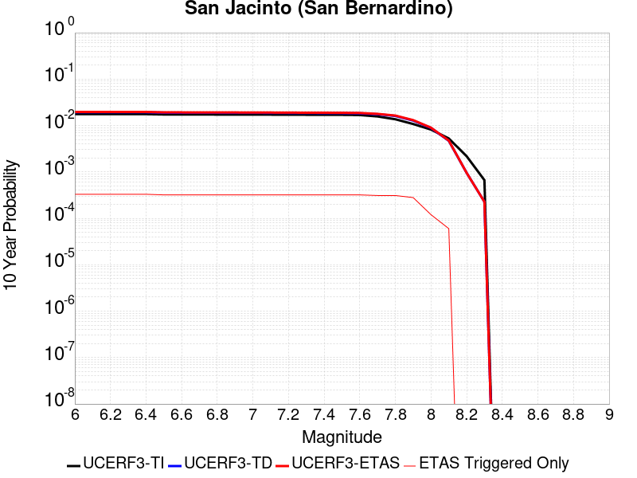 |

| Magnitude | 1 wk TI Prob | 1 wk TD Prob | 1 wk ETAS Prob | 1 wk ETAS/TD Gain | 1 wk ETAS Triggered Only | 1 mo TI Prob | 1 mo TD Prob | 1 mo ETAS Prob | 1 mo ETAS/TD Gain | 1 mo ETAS Triggered Only | 1 yr TI Prob | 1 yr TD Prob | 1 yr ETAS Prob | 1 yr ETAS/TD Gain | 1 yr ETAS Triggered Only | 10 yr TI Prob | 10 yr TD Prob | 10 yr ETAS Prob | 10 yr ETAS/TD Gain | 10 yr ETAS Triggered Only |
|-----|-----|-----|-----|-----|-----|-----|-----|-----|-----|-----|-----|-----|-----|-----|-----|-----|-----|-----|-----|-----|
| 6.0 | 3.409352E-5 | 3.5986508E-5 | 2.609503E-4 | 7.2513366 | 2.2497188E-4 | 1.461069E-4 | 1.542188E-4 | 3.7915597E-4 | 2.4585588 | 2.2497188E-4 | 0.0017774 | 0.0018759987 | 0.0021005485 | 1.1196961 | 2.2497188E-4 | 0.01763251 | 0.019349935 | 0.019717634 | 1.0190026 | 3.7495312E-4 |
| 6.1 | 3.409352E-5 | 3.5986508E-5 | 2.609503E-4 | 7.2513366 | 2.2497188E-4 | 1.461069E-4 | 1.542188E-4 | 3.7915597E-4 | 2.4585588 | 2.2497188E-4 | 0.0017774 | 0.0018759987 | 0.0021005485 | 1.1196961 | 2.2497188E-4 | 0.01763251 | 0.019349935 | 0.019717634 | 1.0190026 | 3.7495312E-4 |
| 6.2 | 3.409352E-5 | 3.5986508E-5 | 2.609503E-4 | 7.2513366 | 2.2497188E-4 | 1.461069E-4 | 1.542188E-4 | 3.7915597E-4 | 2.4585588 | 2.2497188E-4 | 0.0017774 | 0.0018759987 | 0.0021005485 | 1.1196961 | 2.2497188E-4 | 0.01763251 | 0.019349935 | 0.019717634 | 1.0190026 | 3.7495312E-4 |
| 6.3 | 3.409352E-5 | 3.5986508E-5 | 2.609503E-4 | 7.2513366 | 2.2497188E-4 | 1.461069E-4 | 1.542188E-4 | 3.7915597E-4 | 2.4585588 | 2.2497188E-4 | 0.0017774 | 0.0018759987 | 0.0021005485 | 1.1196961 | 2.2497188E-4 | 0.01763251 | 0.019349935 | 0.019717634 | 1.0190026 | 3.7495312E-4 |
| 6.4 | 3.400795E-5 | 3.5879173E-5 | 2.60843E-4 | 7.270039 | 2.2497188E-4 | 1.4574021E-4 | 1.5375883E-4 | 3.7869613E-4 | 2.4629228 | 2.2497188E-4 | 0.0017729428 | 0.0018704084 | 0.0020949596 | 1.1200546 | 2.2497188E-4 | 0.017588645 | 0.019295016 | 0.019662736 | 1.0190576 | 3.7495312E-4 |
| 6.5 | 3.341482E-5 | 3.5139812E-5 | 2.6010378E-4 | 7.401969 | 2.2497188E-4 | 1.4319851E-4 | 1.5059051E-4 | 3.755285E-4 | 2.4937065 | 2.2497188E-4 | 0.0017420477 | 0.0018318989 | 0.0020564587 | 1.122583 | 2.2497188E-4 | 0.017284546 | 0.018916558 | 0.019247632 | 1.0175018 | 3.374578E-4 |
| 6.6 | 3.3364955E-5 | 3.5077028E-5 | 2.60041E-4 | 7.4134274 | 2.2497188E-4 | 1.4298483E-4 | 1.5032147E-4 | 3.7525952E-4 | 2.49638 | 2.2497188E-4 | 0.0017394501 | 0.001828629 | 0.0020531896 | 1.1228026 | 2.2497188E-4 | 0.017258976 | 0.018884424 | 0.01921551 | 1.0175322 | 3.374578E-4 |
| 6.7 | 3.335922E-5 | 3.5066805E-5 | 2.600308E-4 | 7.415298 | 2.2497188E-4 | 1.4296026E-4 | 1.5027766E-4 | 3.7521572E-4 | 2.4968164 | 2.2497188E-4 | 0.0017391514 | 0.0018280965 | 0.002052657 | 1.1228385 | 2.2497188E-4 | 0.017256035 | 0.018879214 | 0.019210301 | 1.0175371 | 3.374578E-4 |
| 6.8 | 3.327683E-5 | 3.496087E-5 | 2.5992488E-4 | 7.434737 | 2.2497188E-4 | 1.4260718E-4 | 1.498237E-4 | 3.7476188E-4 | 2.5013523 | 2.2497188E-4 | 0.0017348597 | 0.0018225788 | 0.0020471406 | 1.123211 | 2.2497188E-4 | 0.017213784 | 0.018824987 | 0.01915609 | 1.0175886 | 3.374578E-4 |
| 6.9 | 3.3235785E-5 | 3.4901823E-5 | 2.5986586E-4 | 7.445624 | 2.2497188E-4 | 1.4243131E-4 | 1.4957068E-4 | 3.745089E-4 | 2.5038927 | 2.2497188E-4 | 0.0017327217 | 0.0018195034 | 0.0020440659 | 1.1234196 | 2.2497188E-4 | 0.017192734 | 0.018794855 | 0.01912597 | 1.0176173 | 3.374578E-4 |
| 7.0 | 3.3197095E-5 | 3.4841752E-5 | 2.598058E-4 | 7.456737 | 2.2497188E-4 | 1.422655E-4 | 1.4931326E-4 | 3.7425154E-4 | 2.5064857 | 2.2497188E-4 | 0.0017307063 | 0.0018163746 | 0.0020409378 | 1.1236327 | 2.2497188E-4 | 0.017172894 | 0.018764233 | 0.01909536 | 1.0176467 | 3.374578E-4 |
| 7.1 | 3.3129716E-5 | 3.4721965E-5 | 2.5968603E-4 | 7.479013 | 2.2497188E-4 | 1.4197677E-4 | 1.4879994E-4 | 3.7373835E-4 | 2.5116835 | 2.2497188E-4 | 0.0017271966 | 0.0018101353 | 0.0020347 | 1.1240596 | 2.2497188E-4 | 0.017138338 | 0.018703312 | 0.019034458 | 1.0177052 | 3.374578E-4 |
| 7.2 | 3.3034008E-5 | 3.458941E-5 | 2.5955352E-4 | 7.503843 | 2.2497188E-4 | 1.4156665E-4 | 1.4823192E-4 | 3.7317045E-4 | 2.517477 | 2.2497188E-4 | 0.0017222111 | 0.0018032312 | 0.0020277973 | 1.1245354 | 2.2497188E-4 | 0.017089253 | 0.018635705 | 0.018966874 | 1.0177706 | 3.374578E-4 |
| 7.3 | 3.2956614E-5 | 3.445717E-5 | 2.594213E-4 | 7.528805 | 2.2497188E-4 | 1.4123498E-4 | 1.4766524E-4 | 3.7260388E-4 | 2.5233014 | 2.2497188E-4 | 0.0017181796 | 0.0017963431 | 0.0020209108 | 1.1250138 | 2.2497188E-4 | 0.017049557 | 0.018568452 | 0.018899644 | 1.0178362 | 3.374578E-4 |
| 7.4 | 3.2915937E-5 | 3.4378863E-5 | 2.59343E-4 | 7.543676 | 2.2497188E-4 | 1.4106068E-4 | 1.4732967E-4 | 3.722684E-4 | 2.5267713 | 2.2497188E-4 | 0.0017160608 | 0.0017922645 | 0.0020168333 | 1.1252989 | 2.2497188E-4 | 0.017028693 | 0.018528719 | 0.018859923 | 1.0178752 | 3.374578E-4 |
| 7.5 | 3.281791E-5 | 3.4243778E-5 | 2.5920794E-4 | 7.5694904 | 2.2497188E-4 | 1.406406E-4 | 1.4675081E-4 | 3.7168968E-4 | 2.5327947 | 2.2497188E-4 | 0.0017109542 | 0.0017852283 | 0.0020097985 | 1.1257936 | 2.2497188E-4 | 0.016978411 | 0.018459605 | 0.018790834 | 1.0179434 | 3.374578E-4 |
| 7.6 | 3.2521442E-5 | 3.396873E-5 | 2.5893297E-4 | 7.622686 | 2.2497188E-4 | 1.3937015E-4 | 1.4557215E-4 | 3.705113E-4 | 2.545207 | 2.2497188E-4 | 0.0016955109 | 0.0017709016 | 0.001995475 | 1.126813 | 2.2497188E-4 | 0.016826328 | 0.018317232 | 0.018648509 | 1.0180855 | 3.374578E-4 |
| 7.7 | 3.0287873E-5 | 3.245276E-5 | 2.5741733E-4 | 7.9320626 | 2.2497188E-4 | 1.297987E-4 | 1.3907586E-4 | 3.6401645E-4 | 2.617395 | 2.2497188E-4 | 0.0015791537 | 0.0016919347 | 0.0019165259 | 1.1327423 | 2.2497188E-4 | 0.01567979 | 0.01752809 | 0.017859634 | 1.0189149 | 3.374578E-4 |
| 7.8 | 2.6316151E-5 | 2.9663592E-5 | 2.546288E-4 | 8.583883 | 2.2497188E-4 | 1.1277862E-4 | 1.2712348E-4 | 3.5206677E-4 | 2.7694864 | 2.2497188E-4 | 0.0013722149 | 0.0015466306 | 0.0017712546 | 1.1452343 | 2.2497188E-4 | 0.013637724 | 0.016069634 | 0.016401669 | 1.0206623 | 3.374578E-4 |
| 7.9 | 2.0761147E-5 | 2.34181E-5 | 2.1089027E-4 | 9.005439 | 1.8747656E-4 | 8.897331E-5 | 1.0035944E-4 | 2.8781718E-4 | 2.8678637 | 1.8747656E-4 | 0.0010827117 | 0.0012211921 | 0.0014084397 | 1.1533319 | 1.8747656E-4 | 0.010774517 | 0.012793174 | 0.013089299 | 1.0231471 | 2.999625E-4 |
| 8.0 | 1.5738568E-5 | 1.6033575E-5 | 9.1023E-5 | 5.6770244 | 7.4990625E-5 | 6.744926E-5 | 6.871352E-5 | 1.4369898E-4 | 2.091277 | 7.4990625E-5 | 8.2088535E-4 | 8.3626667E-4 | 9.1119454E-4 | 1.0895981 | 7.4990625E-5 | 0.008178596 | 0.008865921 | 0.009051735 | 1.0209583 | 1.8747656E-4 |
| 8.1 | 1.0105832E-5 | 8.3304985E-6 | 8.33205E-5 | 10.001863 | 7.4990625E-5 | 4.3309992E-5 | 3.570165E-5 | 1.106896E-4 | 3.1004057 | 7.4990625E-5 | 5.2717153E-4 | 4.345814E-4 | 5.0953944E-4 | 1.1724833 | 7.4990625E-5 | 0.005259227 | 0.004677232 | 0.0047891918 | 1.0239372 | 1.1248594E-4 |
| 8.2 | 4.189207E-6 | 1.5784357E-6 | 1.5784357E-6 | 1.0 | 0.0 | 1.7953622E-5 | 6.7647065E-6 | 6.7647065E-6 | 1.0 | 0.0 | 2.1856341E-4 | 8.235722E-5 | 8.235722E-5 | 1.0 | 0.0 | 0.0021834858 | 9.565867E-4 | 9.565867E-4 | 1.0 | 0.0 |
| 8.3 | 1.2758221E-6 | 3.6149942E-7 | 3.6149942E-7 | 1.0 | 0.0 | 5.4677976E-6 | 1.5492824E-6 | 1.5492824E-6 | 1.0 | 0.0 | 6.65684E-5 | 1.8862354E-5 | 1.8862354E-5 | 1.0 | 0.0 | 6.6548464E-4 | 2.2751294E-4 | 2.2751294E-4 | 1.0 | 0.0 |

## Lake Isabella (Seismicity)
*[(top)](#table-of-contents)*

| 1 Week | 1 Month | 1 Year | 10 Year |
|-----|-----|-----|-----|
| 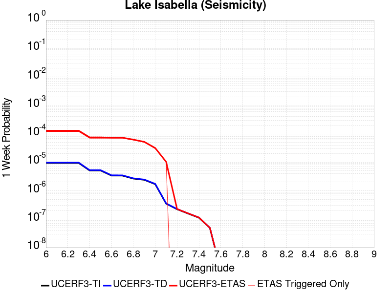 |  |  |  |

| Magnitude | 1 wk TI Prob | 1 wk TD Prob | 1 wk ETAS Prob | 1 wk ETAS/TD Gain | 1 wk ETAS Triggered Only | 1 mo TI Prob | 1 mo TD Prob | 1 mo ETAS Prob | 1 mo ETAS/TD Gain | 1 mo ETAS Triggered Only | 1 yr TI Prob | 1 yr TD Prob | 1 yr ETAS Prob | 1 yr ETAS/TD Gain | 1 yr ETAS Triggered Only | 10 yr TI Prob | 10 yr TD Prob | 10 yr ETAS Prob | 10 yr ETAS/TD Gain | 10 yr ETAS Triggered Only |
|-----|-----|-----|-----|-----|-----|-----|-----|-----|-----|-----|-----|-----|-----|-----|-----|-----|-----|-----|-----|-----|
| 6.0 | 9.431637E-6 | 9.741651E-6 | 8.4731546E-5 | 8.697863 | 7.4990625E-5 | 4.0420677E-5 | 4.1749343E-5 | 1.1673684E-4 | 2.796136 | 7.4990625E-5 | 4.920106E-4 | 5.0819275E-4 | 7.705266E-4 | 1.5162092 | 2.624672E-4 | 0.004909227 | 0.005071599 | 0.0054446505 | 1.073557 | 3.7495312E-4 |
| 6.1 | 9.431637E-6 | 9.741651E-6 | 8.4731546E-5 | 8.697863 | 7.4990625E-5 | 4.0420677E-5 | 4.1749343E-5 | 1.1673684E-4 | 2.796136 | 7.4990625E-5 | 4.920106E-4 | 5.0819275E-4 | 7.705266E-4 | 1.5162092 | 2.624672E-4 | 0.004909227 | 0.005071599 | 0.0054446505 | 1.073557 | 3.7495312E-4 |
| 6.2 | 9.431637E-6 | 9.741651E-6 | 8.4731546E-5 | 8.697863 | 7.4990625E-5 | 4.0420677E-5 | 4.1749343E-5 | 1.1673684E-4 | 2.796136 | 7.4990625E-5 | 4.920106E-4 | 5.0819275E-4 | 7.705266E-4 | 1.5162092 | 2.624672E-4 | 0.004909227 | 0.005071599 | 0.0054446505 | 1.073557 | 3.7495312E-4 |
| 6.3 | 9.431637E-6 | 9.741651E-6 | 8.4731546E-5 | 8.697863 | 7.4990625E-5 | 4.0420677E-5 | 4.1749343E-5 | 1.1673684E-4 | 2.796136 | 7.4990625E-5 | 4.920106E-4 | 5.0819275E-4 | 7.705266E-4 | 1.5162092 | 2.624672E-4 | 0.004909227 | 0.005071599 | 0.0054446505 | 1.073557 | 3.7495312E-4 |
| 6.4 | 5.144063E-6 | 5.3000763E-6 | 4.279519E-5 | 8.074449 | 3.7495312E-5 | 2.2045799E-5 | 2.2714434E-5 | 6.0208895E-5 | 2.650689 | 3.7495312E-5 | 2.6837454E-4 | 2.765166E-4 | 3.889714E-4 | 1.4066839 | 1.1248594E-4 | 0.0026805066 | 0.0027620657 | 0.0029490246 | 1.067688 | 1.8747656E-4 |
| 6.5 | 5.144063E-6 | 5.3000763E-6 | 4.279519E-5 | 8.074449 | 3.7495312E-5 | 2.2045799E-5 | 2.2714434E-5 | 6.0208895E-5 | 2.650689 | 3.7495312E-5 | 2.6837454E-4 | 2.765166E-4 | 3.889714E-4 | 1.4066839 | 1.1248594E-4 | 0.0026805066 | 0.0027620657 | 0.0029490246 | 1.067688 | 1.8747656E-4 |
| 6.6 | 3.4009804E-6 | 3.498786E-6 | 4.0993968E-5 | 11.716626 | 3.7495312E-5 | 1.4575549E-5 | 1.4994721E-5 | 5.248947E-5 | 3.5005302 | 3.7495312E-5 | 1.7744285E-4 | 1.8254704E-4 | 2.5752396E-4 | 1.4107267 | 7.4990625E-5 | 0.0017730123 | 0.0018241286 | 0.0019364093 | 1.0615531 | 1.1248594E-4 |
| 6.7 | 3.3880428E-6 | 3.4856528E-6 | 4.0980834E-5 | 11.757005 | 3.7495312E-5 | 1.4520103E-5 | 1.4938435E-5 | 5.2433188E-5 | 3.5099518 | 3.7495312E-5 | 1.767679E-4 | 1.8186188E-4 | 2.5683886E-4 | 1.4122744 | 7.4990625E-5 | 0.0017662736 | 0.0018172882 | 0.0019295698 | 1.0617852 | 1.1248594E-4 |
| 6.8 | 2.6582E-6 | 2.7337003E-6 | 4.022891E-5 | 14.7159195 | 3.7495312E-5 | 1.1392236E-5 | 1.1715813E-5 | 4.921069E-5 | 4.2003646 | 3.7495312E-5 | 1.3869164E-4 | 1.4263204E-4 | 2.1761196E-4 | 1.5256879 | 7.4990625E-5 | 0.0013860512 | 0.0014255369 | 0.0015378625 | 1.0787953 | 1.1248594E-4 |
| 6.9 | 2.406011E-6 | 2.4743288E-6 | 3.996955E-5 | 16.153694 | 3.7495312E-5 | 1.0311434E-5 | 1.0604231E-5 | 4.8099148E-5 | 4.535845 | 3.7495312E-5 | 1.2553448E-4 | 1.2910018E-4 | 2.0408112E-4 | 1.5807966 | 7.4990625E-5 | 0.0012546359 | 0.0012903814 | 0.0014027222 | 1.0870601 | 1.1248594E-4 |
| 7.0 | 1.6953097E-6 | 1.7429371E-6 | 1.7429371E-6 | 1.0 | 0.0 | 7.265593E-6 | 7.469715E-6 | 7.469715E-6 | 1.0 | 0.0 | 8.8455E-5 | 9.094104E-5 | 9.094104E-5 | 1.0 | 0.0 | 8.84198E-4 | 9.09141E-4 | 9.09141E-4 | 1.0 | 0.0 |
| 7.1 | 3.5013824E-7 | 3.5714822E-7 | 3.5714822E-7 | 1.0 | 0.0 | 1.5005916E-6 | 1.5306344E-6 | 1.5306344E-6 | 1.0 | 0.0 | 1.826955E-5 | 1.8635317E-5 | 1.8635317E-5 | 1.0 | 0.0 | 1.8268047E-4 | 1.863378E-4 | 1.863378E-4 | 1.0 | 0.0 |
| 7.2 | 2.2321095E-7 | 2.2750574E-7 | 2.2750574E-7 | 1.0 | 0.0 | 9.56618E-7 | 9.750242E-7 | 9.750242E-7 | 1.0 | 0.0 | 1.1646762E-5 | 1.1870856E-5 | 1.1870856E-5 | 1.0 | 0.0 | 1.1646151E-4 | 1.1870232E-4 | 1.1870232E-4 | 1.0 | 0.0 |
| 7.3 | 1.5760406E-7 | 1.6060922E-7 | 1.6060922E-7 | 1.0 | 0.0 | 6.7544585E-7 | 6.8832503E-7 | 6.8832503E-7 | 1.0 | 0.0 | 8.223522E-6 | 8.380326E-6 | 8.380326E-6 | 1.0 | 0.0 | 8.2232174E-5 | 8.3800165E-5 | 8.3800165E-5 | 1.0 | 0.0 |
| 7.4 | 1.1216497E-7 | 1.1431706E-7 | 1.1431706E-7 | 1.0 | 0.0 | 4.8070694E-7 | 4.899302E-7 | 4.899302E-7 | 1.0 | 0.0 | 5.852591E-6 | 5.964884E-6 | 5.964884E-6 | 1.0 | 0.0 | 5.8524372E-5 | 5.9647282E-5 | 5.9647282E-5 | 1.0 | 0.0 |
| 7.5 | 4.885185E-8 | 4.9787737E-8 | 4.9787737E-8 | 1.0 | 0.0 | 2.0936506E-7 | 2.13376E-7 | 2.13376E-7 | 1.0 | 0.0 | 2.5490165E-6 | 2.59785E-6 | 2.59785E-6 | 1.0 | 0.0 | 2.5489873E-5 | 2.5978214E-5 | 2.5978214E-5 | 1.0 | 0.0 |
| 7.6 | 1.504641E-9 | 1.5317903E-9 | 1.5317903E-9 | 1.0 | 0.0 | 6.4484613E-9 | 6.5648154E-9 | 6.5648154E-9 | 1.0 | 0.0 | 7.851001E-8 | 7.992663E-8 | 7.992663E-8 | 1.0 | 0.0 | 7.8509987E-7 | 7.992663E-7 | 7.992663E-7 | 1.0 | 0.0 |

## Baker
*[(top)](#table-of-contents)*

| 1 Week | 1 Month | 1 Year | 10 Year |
|-----|-----|-----|-----|
|  |  |  |  |

| Magnitude | 1 wk TI Prob | 1 wk TD Prob | 1 wk ETAS Prob | 1 wk ETAS/TD Gain | 1 wk ETAS Triggered Only | 1 mo TI Prob | 1 mo TD Prob | 1 mo ETAS Prob | 1 mo ETAS/TD Gain | 1 mo ETAS Triggered Only | 1 yr TI Prob | 1 yr TD Prob | 1 yr ETAS Prob | 1 yr ETAS/TD Gain | 1 yr ETAS Triggered Only | 10 yr TI Prob | 10 yr TD Prob | 10 yr ETAS Prob | 10 yr ETAS/TD Gain | 10 yr ETAS Triggered Only |
|-----|-----|-----|-----|-----|-----|-----|-----|-----|-----|-----|-----|-----|-----|-----|-----|-----|-----|-----|-----|-----|
| 6.0 | 5.695525E-6 | 5.8348373E-6 | 1.1832012E-4 | 20.278221 | 1.1248594E-4 | 2.4409164E-5 | 2.5006228E-5 | 1.7498372E-4 | 6.997606 | 1.4998125E-4 | 2.9714106E-4 | 3.044123E-4 | 5.293157E-4 | 1.7388117 | 2.2497188E-4 | 0.0029674405 | 0.0030403486 | 0.0033767805 | 1.1106557 | 3.374578E-4 |
| 6.1 | 5.695525E-6 | 5.8348373E-6 | 1.1832012E-4 | 20.278221 | 1.1248594E-4 | 2.4409164E-5 | 2.5006228E-5 | 1.7498372E-4 | 6.997606 | 1.4998125E-4 | 2.9714106E-4 | 3.044123E-4 | 5.293157E-4 | 1.7388117 | 2.2497188E-4 | 0.0029674405 | 0.0030403486 | 0.0033767805 | 1.1106557 | 3.374578E-4 |
| 6.2 | 5.695525E-6 | 5.8348373E-6 | 1.1832012E-4 | 20.278221 | 1.1248594E-4 | 2.4409164E-5 | 2.5006228E-5 | 1.7498372E-4 | 6.997606 | 1.4998125E-4 | 2.9714106E-4 | 3.044123E-4 | 5.293157E-4 | 1.7388117 | 2.2497188E-4 | 0.0029674405 | 0.0030403486 | 0.0033767805 | 1.1106557 | 3.374578E-4 |
| 6.3 | 3.2995713E-6 | 3.383667E-6 | 4.0878855E-5 | 12.081228 | 3.7495312E-5 | 1.4140943E-5 | 1.4501353E-5 | 8.949089E-5 | 6.17121 | 7.4990625E-5 | 1.7215237E-4 | 1.7654014E-4 | 3.2649492E-4 | 1.849409 | 1.4998125E-4 | 0.0017201907 | 0.001764046 | 0.0020260501 | 1.1485245 | 2.624672E-4 |
| 6.4 | 3.2995713E-6 | 3.383667E-6 | 4.0878855E-5 | 12.081228 | 3.7495312E-5 | 1.4140943E-5 | 1.4501353E-5 | 8.949089E-5 | 6.17121 | 7.4990625E-5 | 1.7215237E-4 | 1.7654014E-4 | 3.2649492E-4 | 1.849409 | 1.4998125E-4 | 0.0017201907 | 0.001764046 | 0.0020260501 | 1.1485245 | 2.624672E-4 |
| 6.5 | 2.782202E-6 | 2.8558404E-6 | 4.0351046E-5 | 14.129307 | 3.7495312E-5 | 1.1923668E-5 | 1.223926E-5 | 4.9734113E-5 | 4.0634904 | 3.7495312E-5 | 1.4516099E-4 | 1.4900314E-4 | 2.614723E-4 | 1.7548108 | 1.1248594E-4 | 0.001450662 | 0.0014890651 | 0.001713702 | 1.1508577 | 2.2497188E-4 |
| 6.6 | 2.3163404E-6 | 2.38092E-6 | 3.9876144E-5 | 16.748209 | 3.7495312E-5 | 9.927136E-6 | 1.0203904E-5 | 4.7698835E-5 | 4.674567 | 3.7495312E-5 | 1.20856166E-4 | 1.2422565E-4 | 2.3669761E-4 | 1.9053844 | 1.1248594E-4 | 0.0012079047 | 0.0012415823 | 0.0014662748 | 1.1809727 | 2.2497188E-4 |
| 6.7 | 2.037056E-6 | 2.0965003E-6 | 3.9591734E-5 | 18.884678 | 3.7495312E-5 | 8.7302105E-6 | 8.984972E-6 | 4.647995E-5 | 5.1730766 | 3.7495312E-5 | 1.0628513E-4 | 1.093867E-4 | 2.2186033E-4 | 2.0282204 | 1.1248594E-4 | 0.0010623431 | 0.0010933448 | 0.001243162 | 1.1370265 | 1.4998125E-4 |
| 6.8 | 1.8356744E-6 | 1.8915287E-6 | 3.938677E-5 | 20.82272 | 3.7495312E-5 | 7.867153E-6 | 8.106527E-6 | 4.5601537E-5 | 5.6252866 | 3.7495312E-5 | 9.577837E-5 | 9.869264E-5 | 2.1116747E-4 | 2.1396477 | 1.1248594E-4 | 9.57371E-4 | 9.86502E-4 | 0.0011363353 | 1.1518834 | 1.4998125E-4 |
| 6.9 | 1.6310546E-6 | 1.6832072E-6 | 1.6832072E-6 | 1.0 | 0.0 | 6.9902153E-6 | 7.213726E-6 | 7.213726E-6 | 1.0 | 0.0 | 8.510255E-5 | 8.782368E-5 | 1.2531571E-4 | 1.426901 | 3.7495312E-5 | 8.5069967E-4 | 8.7790104E-4 | 9.528258E-4 | 1.0853454 | 7.4990625E-5 |
| 7.0 | 1.2058036E-6 | 1.2508665E-6 | 1.2508665E-6 | 1.0 | 0.0 | 5.1677193E-6 | 5.3608455E-6 | 5.3608455E-6 | 1.0 | 0.0 | 6.291517E-5 | 6.5266366E-5 | 1.0275923E-4 | 1.5744592 | 3.7495312E-5 | 6.289736E-4 | 6.524743E-4 | 7.27416E-4 | 1.1148577 | 7.4990625E-5 |
| 7.1 | 1.052382E-6 | 1.0951609E-6 | 1.0951609E-6 | 1.0 | 0.0 | 4.5102006E-6 | 4.693538E-6 | 4.693538E-6 | 1.0 | 0.0 | 5.491031E-5 | 5.7142337E-5 | 9.463551E-5 | 1.6561365 | 3.7495312E-5 | 5.4896745E-4 | 5.7127734E-4 | 6.462251E-4 | 1.1311934 | 7.4990625E-5 |
| 7.2 | 1.0067454E-6 | 1.0487711E-6 | 1.0487711E-6 | 1.0 | 0.0 | 4.3146156E-6 | 4.4947255E-6 | 4.4947255E-6 | 1.0 | 0.0 | 5.252918E-5 | 5.4721917E-5 | 9.2215174E-5 | 1.6851599 | 3.7495312E-5 | 5.251676E-4 | 5.470853E-4 | 5.845601E-4 | 1.068499 | 3.7495312E-5 |
| 7.3 | 9.3596316E-7 | 9.767723E-7 | 9.767723E-7 | 1.0 | 0.0 | 4.0112645E-6 | 4.1861604E-6 | 4.1861604E-6 | 1.0 | 0.0 | 4.8836053E-5 | 5.096532E-5 | 8.845872E-5 | 1.735665 | 3.7495312E-5 | 4.8825322E-4 | 5.095371E-4 | 5.470133E-4 | 1.0735495 | 3.7495312E-5 |
| 7.4 | 8.8117395E-7 | 9.2076635E-7 | 9.2076635E-7 | 1.0 | 0.0 | 3.7764542E-6 | 3.9461356E-6 | 3.9461356E-6 | 1.0 | 0.0 | 4.5977362E-5 | 4.8043148E-5 | 8.553666E-5 | 1.7804133 | 3.7495312E-5 | 4.596785E-4 | 4.8032837E-4 | 5.178057E-4 | 1.0780244 | 3.7495312E-5 |
| 7.5 | 8.292386E-7 | 8.6745956E-7 | 8.6745956E-7 | 1.0 | 0.0 | 3.5538749E-6 | 3.7176785E-6 | 3.7176785E-6 | 1.0 | 0.0 | 4.326757E-5 | 4.5261804E-5 | 8.275542E-5 | 1.8283721 | 3.7495312E-5 | 4.3259145E-4 | 4.5252658E-4 | 4.9000495E-4 | 1.0828202 | 3.7495312E-5 |
| 7.6 | 7.553842E-7 | 7.9144706E-7 | 7.9144706E-7 | 1.0 | 0.0 | 3.2373566E-6 | 3.3919116E-6 | 3.3919116E-6 | 1.0 | 0.0 | 3.9414106E-5 | 4.129575E-5 | 7.878951E-5 | 1.9079328 | 3.7495312E-5 | 3.9407116E-4 | 4.1288146E-4 | 4.503613E-4 | 1.0907762 | 3.7495312E-5 |
| 7.7 | 6.5285366E-7 | 6.852797E-7 | 6.852797E-7 | 1.0 | 0.0 | 2.797941E-6 | 2.9369096E-6 | 2.9369096E-6 | 1.0 | 0.0 | 3.40644E-5 | 3.5756293E-5 | 7.325027E-5 | 2.0485978 | 3.7495312E-5 | 3.405918E-4 | 3.5750607E-4 | 3.94988E-4 | 1.1048427 | 3.7495312E-5 |
| 7.8 | 3.4586725E-7 | 3.6482615E-7 | 3.6482615E-7 | 1.0 | 0.0 | 1.4822873E-6 | 1.5635396E-6 | 1.5635396E-6 | 1.0 | 0.0 | 1.80467E-5 | 1.9035933E-5 | 5.6530534E-5 | 2.9696748 | 3.7495312E-5 | 1.8045233E-4 | 1.9034347E-4 | 2.2783165E-4 | 1.1969502 | 3.7495312E-5 |
| 7.9 | 2.5591178E-9 | 2.6696718E-9 | 2.6696718E-9 | 1.0 | 0.0 | 1.0967647E-8 | 1.14414505E-8 | 1.14414505E-8 | 1.0 | 0.0 | 1.335311E-7 | 1.3929966E-7 | 1.3929966E-7 | 1.0 | 0.0 | 1.3353102E-6 | 1.3929966E-6 | 1.3929966E-6 | 1.0 | 0.0 |

## Channel Islands Thrust
*[(top)](#table-of-contents)*

| 1 Week | 1 Month | 1 Year | 10 Year |
|-----|-----|-----|-----|
|  |  |  |  |

| Magnitude | 1 wk TI Prob | 1 wk TD Prob | 1 wk ETAS Prob | 1 wk ETAS/TD Gain | 1 wk ETAS Triggered Only | 1 mo TI Prob | 1 mo TD Prob | 1 mo ETAS Prob | 1 mo ETAS/TD Gain | 1 mo ETAS Triggered Only | 1 yr TI Prob | 1 yr TD Prob | 1 yr ETAS Prob | 1 yr ETAS/TD Gain | 1 yr ETAS Triggered Only | 10 yr TI Prob | 10 yr TD Prob | 10 yr ETAS Prob | 10 yr ETAS/TD Gain | 10 yr ETAS Triggered Only |
|-----|-----|-----|-----|-----|-----|-----|-----|-----|-----|-----|-----|-----|-----|-----|-----|-----|-----|-----|-----|-----|
| 6.0 | 2.2156251E-5 | 2.4092022E-5 | 6.1586434E-5 | 2.5563 | 3.7495312E-5 | 9.495191E-5 | 1.03248036E-4 | 2.1572236E-4 | 2.0893605 | 1.1248594E-4 | 0.0011554264 | 0.0012564264 | 0.0014436676 | 1.1490266 | 1.8747656E-4 | 0.011494373 | 0.0125038205 | 0.012725979 | 1.0177673 | 2.2497188E-4 |
| 6.1 | 2.2156251E-5 | 2.4092022E-5 | 6.1586434E-5 | 2.5563 | 3.7495312E-5 | 9.495191E-5 | 1.03248036E-4 | 2.1572236E-4 | 2.0893605 | 1.1248594E-4 | 0.0011554264 | 0.0012564264 | 0.0014436676 | 1.1490266 | 1.8747656E-4 | 0.011494373 | 0.0125038205 | 0.012725979 | 1.0177673 | 2.2497188E-4 |
| 6.2 | 2.2156251E-5 | 2.4092022E-5 | 6.1586434E-5 | 2.5563 | 3.7495312E-5 | 9.495191E-5 | 1.03248036E-4 | 2.1572236E-4 | 2.0893605 | 1.1248594E-4 | 0.0011554264 | 0.0012564264 | 0.0014436676 | 1.1490266 | 1.8747656E-4 | 0.011494373 | 0.0125038205 | 0.012725979 | 1.0177673 | 2.2497188E-4 |
| 6.3 | 2.2156251E-5 | 2.4092022E-5 | 6.1586434E-5 | 2.5563 | 3.7495312E-5 | 9.495191E-5 | 1.03248036E-4 | 2.1572236E-4 | 2.0893605 | 1.1248594E-4 | 0.0011554264 | 0.0012564264 | 0.0014436676 | 1.1490266 | 1.8747656E-4 | 0.011494373 | 0.0125038205 | 0.012725979 | 1.0177673 | 2.2497188E-4 |
| 6.4 | 2.2156251E-5 | 2.4092022E-5 | 6.1586434E-5 | 2.5563 | 3.7495312E-5 | 9.495191E-5 | 1.03248036E-4 | 2.1572236E-4 | 2.0893605 | 1.1248594E-4 | 0.0011554264 | 0.0012564264 | 0.0014436676 | 1.1490266 | 1.8747656E-4 | 0.011494373 | 0.0125038205 | 0.012725979 | 1.0177673 | 2.2497188E-4 |
| 6.5 | 2.2156251E-5 | 2.4092022E-5 | 6.1586434E-5 | 2.5563 | 3.7495312E-5 | 9.495191E-5 | 1.03248036E-4 | 2.1572236E-4 | 2.0893605 | 1.1248594E-4 | 0.0011554264 | 0.0012564264 | 0.0014436676 | 1.1490266 | 1.8747656E-4 | 0.011494373 | 0.0125038205 | 0.012725979 | 1.0177673 | 2.2497188E-4 |
| 6.6 | 2.2156251E-5 | 2.4092022E-5 | 6.1586434E-5 | 2.5563 | 3.7495312E-5 | 9.495191E-5 | 1.03248036E-4 | 2.1572236E-4 | 2.0893605 | 1.1248594E-4 | 0.0011554264 | 0.0012564264 | 0.0014436676 | 1.1490266 | 1.8747656E-4 | 0.011494373 | 0.0125038205 | 0.012725979 | 1.0177673 | 2.2497188E-4 |
| 6.7 | 1.0601296E-5 | 1.1379544E-5 | 1.1379544E-5 | 1.0 | 0.0 | 4.5433335E-5 | 4.876859E-5 | 1.2375556E-4 | 2.537608 | 7.4990625E-5 | 5.5301044E-4 | 5.936007E-4 | 7.434929E-4 | 1.2525135 | 1.4998125E-4 | 0.005516363 | 0.005920653 | 0.006069747 | 1.0251819 | 1.4998125E-4 |
| 6.8 | 1.0246747E-5 | 1.0996669E-5 | 1.0996669E-5 | 1.0 | 0.0 | 4.391389E-5 | 4.7127756E-5 | 1.2211484E-4 | 2.591145 | 7.4990625E-5 | 5.345204E-4 | 5.7363417E-4 | 7.235294E-4 | 1.2613081 | 1.4998125E-4 | 0.0053323656 | 0.005722025 | 0.005871148 | 1.0260613 | 1.4998125E-4 |
| 6.9 | 9.049551E-6 | 9.699645E-6 | 9.699645E-6 | 1.0 | 0.0 | 3.878322E-5 | 4.1569267E-5 | 1.16556774E-4 | 2.8039172 | 7.4990625E-5 | 4.7208337E-4 | 5.059924E-4 | 6.184214E-4 | 1.2221951 | 1.1248594E-4 | 0.0047108172 | 0.0050488203 | 0.0051607382 | 1.0221672 | 1.1248594E-4 |
| 7.0 | 8.6542195E-6 | 9.274603E-6 | 9.274603E-6 | 1.0 | 0.0 | 3.7088983E-5 | 3.9747716E-5 | 1.1473536E-4 | 2.88659 | 7.4990625E-5 | 4.5146482E-4 | 4.8382508E-4 | 5.962566E-4 | 1.2323805 | 1.1248594E-4 | 0.004505487 | 0.004828129 | 0.004940072 | 1.0231856 | 1.1248594E-4 |
| 7.1 | 8.391028E-6 | 8.992924E-6 | 8.992924E-6 | 1.0 | 0.0 | 3.5961057E-5 | 3.854056E-5 | 7.603443E-5 | 1.9728419 | 3.7495312E-5 | 4.3773788E-4 | 4.6913436E-4 | 5.440898E-4 | 1.159774 | 7.4990625E-5 | 0.004368766 | 0.0046818503 | 0.00475649 | 1.0159423 | 7.4990625E-5 |
| 7.2 | 5.965188E-6 | 6.3716952E-6 | 6.3716952E-6 | 1.0 | 0.0 | 2.556484E-5 | 2.7306982E-5 | 2.7306982E-5 | 1.0 | 0.0 | 3.1120746E-4 | 3.3241234E-4 | 3.698952E-4 | 1.1127601 | 3.7495312E-5 | 0.00310772 | 0.0033192092 | 0.0033565802 | 1.011259 | 3.7495312E-5 |
| 7.3 | 4.877518E-6 | 5.2060063E-6 | 5.2060063E-6 | 1.0 | 0.0 | 2.0903482E-5 | 2.2311267E-5 | 2.2311267E-5 | 1.0 | 0.0 | 2.5447016E-4 | 2.716063E-4 | 3.090914E-4 | 1.1380128 | 3.7495312E-5 | 0.0025417898 | 0.0027127895 | 0.0027501832 | 1.0137842 | 3.7495312E-5 |
| 7.4 | 3.8829853E-6 | 4.141863E-6 | 4.141863E-6 | 1.0 | 0.0 | 1.664126E-5 | 1.7750723E-5 | 1.7750723E-5 | 1.0 | 0.0 | 2.0258849E-4 | 2.1609402E-4 | 2.5358124E-4 | 1.1734763 | 3.7495312E-5 | 0.002024039 | 0.0021588807 | 0.0021962952 | 1.0173304 | 3.7495312E-5 |
| 7.5 | 1.3489616E-6 | 1.4277903E-6 | 1.4277903E-6 | 1.0 | 0.0 | 5.7812517E-6 | 6.119087E-6 | 6.119087E-6 | 1.0 | 0.0 | 7.038446E-5 | 7.449738E-5 | 7.449738E-5 | 1.0 | 0.0 | 7.036218E-4 | 7.44728E-4 | 7.44728E-4 | 1.0 | 0.0 |
| 7.6 | 6.058192E-7 | 6.353778E-7 | 6.353778E-7 | 1.0 | 0.0 | 2.5963652E-6 | 2.7230449E-6 | 2.7230449E-6 | 1.0 | 0.0 | 3.161029E-5 | 3.3152584E-5 | 3.3152584E-5 | 1.0 | 0.0 | 3.1605794E-4 | 3.31478E-4 | 3.31478E-4 | 1.0 | 0.0 |
| 7.7 | 2.2170494E-7 | 2.2607902E-7 | 2.2607902E-7 | 1.0 | 0.0 | 9.5016367E-7 | 9.689098E-7 | 9.689098E-7 | 1.0 | 0.0 | 1.1568181E-5 | 1.1796425E-5 | 1.1796425E-5 | 1.0 | 0.0 | 1.1567579E-4 | 1.1795909E-4 | 1.1795909E-4 | 1.0 | 0.0 |
| 7.8 | 2.1613102E-8 | 1.5466682E-8 | 1.5466682E-8 | 1.0 | 0.0 | 9.262757E-8 | 6.628578E-8 | 6.628578E-8 | 1.0 | 0.0 | 1.1277401E-6 | 8.070291E-7 | 8.070291E-7 | 1.0 | 0.0 | 1.1277344E-5 | 8.070269E-6 | 8.070269E-6 | 1.0 | 0.0 |

## Scodie Lineament
*[(top)](#table-of-contents)*

| 1 Week | 1 Month | 1 Year | 10 Year |
|-----|-----|-----|-----|
|  |  |  |  |

| Magnitude | 1 wk TI Prob | 1 wk TD Prob | 1 wk ETAS Prob | 1 wk ETAS/TD Gain | 1 wk ETAS Triggered Only | 1 mo TI Prob | 1 mo TD Prob | 1 mo ETAS Prob | 1 mo ETAS/TD Gain | 1 mo ETAS Triggered Only | 1 yr TI Prob | 1 yr TD Prob | 1 yr ETAS Prob | 1 yr ETAS/TD Gain | 1 yr ETAS Triggered Only | 10 yr TI Prob | 10 yr TD Prob | 10 yr ETAS Prob | 10 yr ETAS/TD Gain | 10 yr ETAS Triggered Only |
|-----|-----|-----|-----|-----|-----|-----|-----|-----|-----|-----|-----|-----|-----|-----|-----|-----|-----|-----|-----|-----|
| 6.0 | 3.2919327E-6 | 3.0133422E-6 | 4.050854E-5 | 13.443061 | 3.7495312E-5 | 1.4108206E-5 | 1.2914278E-5 | 1.6289359E-4 | 12.61345 | 1.4998125E-4 | 1.7175387E-4 | 1.5722317E-4 | 3.8215966E-4 | 2.430683 | 2.2497188E-4 | 0.0017162118 | 0.0015714309 | 0.001870922 | 1.190585 | 2.999625E-4 |
| 6.1 | 1.8663811E-6 | 1.5490499E-6 | 1.5490499E-6 | 1.0 | 0.0 | 7.998751E-6 | 6.6387715E-6 | 8.16289E-5 | 12.295784 | 7.4990625E-5 | 9.738045E-5 | 8.082454E-5 | 1.558091E-4 | 1.927745 | 7.4990625E-5 | 9.7337784E-4 | 8.080003E-4 | 9.203953E-4 | 1.1391027 | 1.1248594E-4 |
| 6.2 | 1.8663811E-6 | 1.5490499E-6 | 1.5490499E-6 | 1.0 | 0.0 | 7.998751E-6 | 6.6387715E-6 | 8.16289E-5 | 12.295784 | 7.4990625E-5 | 9.738045E-5 | 8.082454E-5 | 1.558091E-4 | 1.927745 | 7.4990625E-5 | 9.7337784E-4 | 8.080003E-4 | 9.203953E-4 | 1.1391027 | 1.1248594E-4 |
| 6.3 | 1.8663811E-6 | 1.5490499E-6 | 1.5490499E-6 | 1.0 | 0.0 | 7.998751E-6 | 6.6387715E-6 | 8.16289E-5 | 12.295784 | 7.4990625E-5 | 9.738045E-5 | 8.082454E-5 | 1.558091E-4 | 1.927745 | 7.4990625E-5 | 9.7337784E-4 | 8.080003E-4 | 9.203953E-4 | 1.1391027 | 1.1248594E-4 |
| 6.4 | 1.8663811E-6 | 1.5490499E-6 | 1.5490499E-6 | 1.0 | 0.0 | 7.998751E-6 | 6.6387715E-6 | 8.16289E-5 | 12.295784 | 7.4990625E-5 | 9.738045E-5 | 8.082454E-5 | 1.558091E-4 | 1.927745 | 7.4990625E-5 | 9.7337784E-4 | 8.080003E-4 | 9.203953E-4 | 1.1391027 | 1.1248594E-4 |
| 6.5 | 1.8106311E-6 | 1.4909839E-6 | 1.4909839E-6 | 1.0 | 0.0 | 7.759824E-6 | 6.3899183E-6 | 8.1380065E-5 | 12.735697 | 7.4990625E-5 | 9.447177E-5 | 7.7794975E-5 | 1.5277977E-4 | 1.9638771 | 7.4990625E-5 | 9.4431615E-4 | 7.7772606E-4 | 8.9012453E-4 | 1.144522 | 1.1248594E-4 |
| 6.6 | 1.2414679E-6 | 8.997558E-7 | 8.997558E-7 | 1.0 | 0.0 | 5.320566E-6 | 3.856091E-6 | 7.884643E-5 | 20.447243 | 7.4990625E-5 | 6.477596E-5 | 4.6946985E-5 | 1.2193409E-4 | 2.5972722 | 7.4990625E-5 | 6.475708E-4 | 4.693793E-4 | 5.8181246E-4 | 1.2395358 | 1.1248594E-4 |
| 6.7 | 1.1062215E-6 | 7.594311E-7 | 7.594311E-7 | 1.0 | 0.0 | 4.7409408E-6 | 3.2547011E-6 | 7.824508E-5 | 24.040636 | 7.4990625E-5 | 5.7719422E-5 | 3.9625334E-5 | 1.14612994E-4 | 2.892417 | 7.4990625E-5 | 5.770443E-4 | 3.961897E-4 | 4.7115062E-4 | 1.1892046 | 7.4990625E-5 |
| 6.8 | 1.0006736E-6 | 6.500397E-7 | 6.500397E-7 | 1.0 | 0.0 | 4.288594E-6 | 2.7858816E-6 | 7.77763E-5 | 27.91802 | 7.4990625E-5 | 5.221238E-5 | 3.3917644E-5 | 1.08905726E-4 | 3.2108872 | 7.4990625E-5 | 5.220012E-4 | 3.3913075E-4 | 4.1409594E-4 | 1.221051 | 7.4990625E-5 |
| 6.9 | 9.167364E-7 | 5.631625E-7 | 5.631625E-7 | 1.0 | 0.0 | 3.9288643E-6 | 2.4135516E-6 | 7.7403995E-5 | 32.07058 | 7.4990625E-5 | 4.7832873E-5 | 2.9384651E-5 | 1.0437307E-4 | 3.5519588 | 7.4990625E-5 | 4.782258E-4 | 2.9381333E-4 | 3.6878194E-4 | 1.2551572 | 7.4990625E-5 |
| 7.0 | 7.6987664E-7 | 4.113383E-7 | 4.113383E-7 | 1.0 | 0.0 | 3.2994672E-6 | 1.7628774E-6 | 3.9258124E-5 | 22.269344 | 3.7495312E-5 | 4.0170275E-5 | 2.1462862E-5 | 5.895737E-5 | 2.7469482 | 3.7495312E-5 | 4.0163012E-4 | 2.1461173E-4 | 2.52099E-4 | 1.1746749 | 3.7495312E-5 |
| 7.1 | 7.1038727E-7 | 3.5211494E-7 | 3.5211494E-7 | 1.0 | 0.0 | 3.0445133E-6 | 1.5090633E-6 | 3.900432E-5 | 25.846708 | 3.7495312E-5 | 3.706632E-5 | 1.8372726E-5 | 5.586735E-5 | 3.0407763 | 3.7495312E-5 | 3.7060137E-4 | 1.8371557E-4 | 2.21204E-4 | 1.2040569 | 3.7495312E-5 |
| 7.2 | 2.0799602E-7 | 3.1186854E-8 | 3.1186854E-8 | 1.0 | 0.0 | 8.914113E-7 | 1.3365793E-7 | 1.3365793E-7 | 1.0 | 0.0 | 1.0852878E-5 | 1.6272843E-6 | 1.6272843E-6 | 1.0 | 0.0 | 1.08523476E-4 | 1.627273E-5 | 1.627273E-5 | 1.0 | 0.0 |
| 7.3 | 1.5048182E-7 | 1.5945696E-8 | 1.5945696E-8 | 1.0 | 0.0 | 6.449219E-7 | 6.83387E-8 | 6.83387E-8 | 1.0 | 0.0 | 7.851896E-6 | 8.320234E-7 | 8.320234E-7 | 1.0 | 0.0 | 7.851618E-5 | 8.320206E-6 | 8.320206E-6 | 1.0 | 0.0 |
| 7.4 | 5.9334678E-8 | 4.8683537E-9 | 4.8683537E-9 | 1.0 | 0.0 | 2.5429145E-7 | 2.0864372E-8 | 2.0864372E-8 | 1.0 | 0.0 | 3.095994E-6 | 2.5402372E-7 | 2.5402372E-7 | 1.0 | 0.0 | 3.095951E-5 | 2.5402353E-6 | 2.5402353E-6 | 1.0 | 0.0 |

## Santa Cruz Island
*[(top)](#table-of-contents)*

| 1 Week | 1 Month | 1 Year | 10 Year |
|-----|-----|-----|-----|
|  | 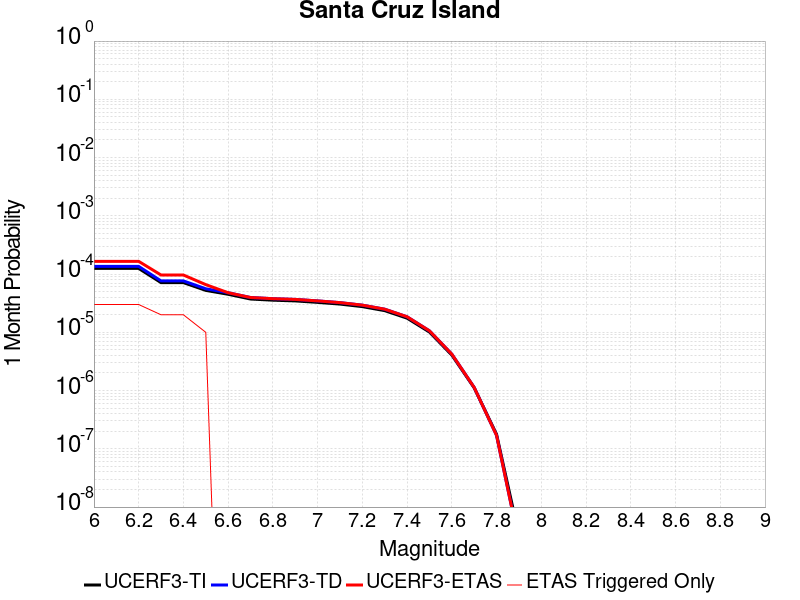 |  |  |

| Magnitude | 1 wk TI Prob | 1 wk TD Prob | 1 wk ETAS Prob | 1 wk ETAS/TD Gain | 1 wk ETAS Triggered Only | 1 mo TI Prob | 1 mo TD Prob | 1 mo ETAS Prob | 1 mo ETAS/TD Gain | 1 mo ETAS Triggered Only | 1 yr TI Prob | 1 yr TD Prob | 1 yr ETAS Prob | 1 yr ETAS/TD Gain | 1 yr ETAS Triggered Only | 10 yr TI Prob | 10 yr TD Prob | 10 yr ETAS Prob | 10 yr ETAS/TD Gain | 10 yr ETAS Triggered Only |
|-----|-----|-----|-----|-----|-----|-----|-----|-----|-----|-----|-----|-----|-----|-----|-----|-----|-----|-----|-----|-----|
| 6.0 | 2.9164563E-5 | 3.1599742E-5 | 6.909387E-5 | 2.1865327 | 3.7495312E-5 | 1.2498499E-4 | 1.3542121E-4 | 2.478919E-4 | 1.830525 | 1.1248594E-4 | 0.0015206301 | 0.0016476426 | 0.0019096773 | 1.1590362 | 2.624672E-4 | 0.015102667 | 0.016368 | 0.016663052 | 1.0180262 | 2.999625E-4 |
| 6.1 | 2.9164563E-5 | 3.1599742E-5 | 6.909387E-5 | 2.1865327 | 3.7495312E-5 | 1.2498499E-4 | 1.3542121E-4 | 2.478919E-4 | 1.830525 | 1.1248594E-4 | 0.0015206301 | 0.0016476426 | 0.0019096773 | 1.1590362 | 2.624672E-4 | 0.015102667 | 0.016368 | 0.016663052 | 1.0180262 | 2.999625E-4 |
| 6.2 | 2.9164563E-5 | 3.1599742E-5 | 6.909387E-5 | 2.1865327 | 3.7495312E-5 | 1.2498499E-4 | 1.3542121E-4 | 2.478919E-4 | 1.830525 | 1.1248594E-4 | 0.0015206301 | 0.0016476426 | 0.0019096773 | 1.1590362 | 2.624672E-4 | 0.015102667 | 0.016368 | 0.016663052 | 1.0180262 | 2.999625E-4 |
| 6.3 | 1.6635553E-5 | 1.780436E-5 | 1.780436E-5 | 1.0 | 0.0 | 7.1293274E-5 | 7.630226E-5 | 1.5128717E-4 | 1.9827349 | 7.4990625E-5 | 8.6765E-4 | 9.2860236E-4 | 0.0011159049 | 1.2017037 | 1.8747656E-4 | 0.008642701 | 0.009249094 | 0.009434836 | 1.0200822 | 1.8747656E-4 |
| 6.4 | 1.6635553E-5 | 1.780436E-5 | 1.780436E-5 | 1.0 | 0.0 | 7.1293274E-5 | 7.630226E-5 | 1.5128717E-4 | 1.9827349 | 7.4990625E-5 | 8.6765E-4 | 9.2860236E-4 | 0.0011159049 | 1.2017037 | 1.8747656E-4 | 0.008642701 | 0.009249094 | 0.009434836 | 1.0200822 | 1.8747656E-4 |
| 6.5 | 1.2238748E-5 | 1.3042995E-5 | 1.3042995E-5 | 1.0 | 0.0 | 5.2450723E-5 | 5.5897377E-5 | 9.339059E-5 | 1.670751 | 3.7495312E-5 | 6.3840044E-4 | 6.8034173E-4 | 8.3022093E-4 | 1.2202998 | 1.4998125E-4 | 0.0063656955 | 0.0067829876 | 0.0069319517 | 1.0219615 | 1.4998125E-4 |
| 6.6 | 1.0489767E-5 | 1.1156636E-5 | 1.1156636E-5 | 1.0 | 0.0 | 4.495537E-5 | 4.781329E-5 | 4.781329E-5 | 1.0 | 0.0 | 5.4719415E-4 | 5.819735E-4 | 6.5692054E-4 | 1.1287807 | 7.4990625E-5 | 0.005458487 | 0.0058047357 | 0.005879291 | 1.0128438 | 7.4990625E-5 |
| 6.7 | 8.699222E-6 | 9.236782E-6 | 9.236782E-6 | 1.0 | 0.0 | 3.7281847E-5 | 3.958561E-5 | 3.958561E-5 | 1.0 | 0.0 | 4.5381195E-4 | 4.8184878E-4 | 5.5680325E-4 | 1.1555561 | 7.4990625E-5 | 0.0045288634 | 0.004808108 | 0.004882738 | 1.0155218 | 7.4990625E-5 |
| 6.8 | 8.307732E-6 | 8.8169045E-6 | 8.8169045E-6 | 1.0 | 0.0 | 3.560408E-5 | 3.7786187E-5 | 3.7786187E-5 | 1.0 | 0.0 | 4.3339343E-4 | 4.5995016E-4 | 5.349063E-4 | 1.1629658 | 7.4990625E-5 | 0.004325492 | 0.0045900354 | 0.004664682 | 1.0162628 | 7.4990625E-5 |
| 6.9 | 8.073121E-6 | 8.564939E-6 | 8.564939E-6 | 1.0 | 0.0 | 3.459863E-5 | 3.6706366E-5 | 3.6706366E-5 | 1.0 | 0.0 | 4.2115687E-4 | 4.468088E-4 | 5.217659E-4 | 1.1677611 | 7.4990625E-5 | 0.004203596 | 0.004459156 | 0.0045338124 | 1.0167422 | 7.4990625E-5 |
| 7.0 | 7.617019E-6 | 8.074664E-6 | 8.074664E-6 | 1.0 | 0.0 | 3.264396E-5 | 3.4605247E-5 | 3.4605247E-5 | 1.0 | 0.0 | 3.9736772E-4 | 4.212378E-4 | 4.9619685E-4 | 1.1779494 | 7.4990625E-5 | 0.003966579 | 0.0042044413 | 0.0042791166 | 1.0177611 | 7.4990625E-5 |
| 7.1 | 7.1224836E-6 | 7.545788E-6 | 7.545788E-6 | 1.0 | 0.0 | 3.052457E-5 | 3.2338692E-5 | 3.2338692E-5 | 1.0 | 0.0 | 3.715733E-4 | 3.936528E-4 | 4.686139E-4 | 1.1904244 | 7.4990625E-5 | 0.003709526 | 0.003929598 | 0.0040042936 | 1.0190085 | 7.4990625E-5 |
| 7.2 | 6.441115E-6 | 6.8273835E-6 | 6.8273835E-6 | 1.0 | 0.0 | 2.7604487E-5 | 2.9259887E-5 | 2.9259887E-5 | 1.0 | 0.0 | 3.360328E-4 | 3.5618112E-4 | 4.3114505E-4 | 1.2104657 | 7.4990625E-5 | 0.0033552512 | 0.003556131 | 0.003630855 | 1.0210127 | 7.4990625E-5 |
| 7.3 | 5.494274E-6 | 5.8199944E-6 | 5.8199944E-6 | 1.0 | 0.0 | 2.3546674E-5 | 2.4942596E-5 | 2.4942596E-5 | 1.0 | 0.0 | 2.8664304E-4 | 3.0363398E-4 | 3.7860184E-4 | 1.2469021 | 7.4990625E-5 | 0.002862736 | 0.0030322142 | 0.0031069776 | 1.0246563 | 7.4990625E-5 |
| 7.4 | 4.0802624E-6 | 4.312256E-6 | 4.312256E-6 | 1.0 | 0.0 | 1.7486722E-5 | 1.8480967E-5 | 1.8480967E-5 | 1.0 | 0.0 | 2.1288003E-4 | 2.2498262E-4 | 2.624695E-4 | 1.1666212 | 3.7495312E-5 | 0.0021267622 | 0.0022475575 | 0.0022849685 | 1.0166452 | 3.7495312E-5 |
| 7.5 | 2.3584746E-6 | 2.4753094E-6 | 2.4753094E-6 | 1.0 | 0.0 | 1.0107709E-5 | 1.0608426E-5 | 1.0608426E-5 | 1.0 | 0.0 | 1.2305441E-4 | 1.2915E-4 | 1.2915E-4 | 1.0 | 0.0 | 0.0012298629 | 0.0012907543 | 0.0012907543 | 1.0 | 0.0 |
| 7.6 | 9.4981914E-7 | 9.86093E-7 | 9.86093E-7 | 1.0 | 0.0 | 4.0706473E-6 | 4.2261063E-6 | 4.2261063E-6 | 1.0 | 0.0 | 4.9559E-5 | 5.145164E-5 | 5.145164E-5 | 1.0 | 0.0 | 4.954795E-4 | 5.1439856E-4 | 5.1439856E-4 | 1.0 | 0.0 |
| 7.7 | 2.6013532E-7 | 2.6416603E-7 | 2.6416603E-7 | 1.0 | 0.0 | 1.1148652E-6 | 1.1321397E-6 | 1.1321397E-6 | 1.0 | 0.0 | 1.3573399E-5 | 1.3783714E-5 | 1.3783714E-5 | 1.0 | 0.0 | 1.357257E-4 | 1.3782867E-4 | 1.3782867E-4 | 1.0 | 0.0 |
| 7.8 | 4.1522263E-8 | 3.965679E-8 | 3.965679E-8 | 1.0 | 0.0 | 1.7795254E-7 | 1.6995766E-7 | 1.6995766E-7 | 1.0 | 0.0 | 2.16657E-6 | 2.0692328E-6 | 2.0692328E-6 | 1.0 | 0.0 | 2.1665488E-5 | 2.0692156E-5 | 2.0692156E-5 | 1.0 | 0.0 |
| 7.9 | 7.7242046E-10 | 5.9468175E-10 | 5.9468175E-10 | 1.0 | 0.0 | 3.3103735E-9 | 2.5486364E-9 | 2.5486364E-9 | 1.0 | 0.0 | 4.0303796E-8 | 3.1029646E-8 | 3.1029646E-8 | 1.0 | 0.0 | 4.030379E-7 | 3.1029643E-7 | 3.1029643E-7 | 1.0 | 0.0 |

## Santa Ynez (East)
*[(top)](#table-of-contents)*

| 1 Week | 1 Month | 1 Year | 10 Year |
|-----|-----|-----|-----|
|  |  |  |  |

| Magnitude | 1 wk TI Prob | 1 wk TD Prob | 1 wk ETAS Prob | 1 wk ETAS/TD Gain | 1 wk ETAS Triggered Only | 1 mo TI Prob | 1 mo TD Prob | 1 mo ETAS Prob | 1 mo ETAS/TD Gain | 1 mo ETAS Triggered Only | 1 yr TI Prob | 1 yr TD Prob | 1 yr ETAS Prob | 1 yr ETAS/TD Gain | 1 yr ETAS Triggered Only | 10 yr TI Prob | 10 yr TD Prob | 10 yr ETAS Prob | 10 yr ETAS/TD Gain | 10 yr ETAS Triggered Only |
|-----|-----|-----|-----|-----|-----|-----|-----|-----|-----|-----|-----|-----|-----|-----|-----|-----|-----|-----|-----|-----|
| 6.0 | 3.2269712E-5 | 3.67505E-5 | 1.1173837E-4 | 3.0404584 | 7.4990625E-5 | 1.3829143E-4 | 1.5749598E-4 | 2.699642E-4 | 1.7141023 | 1.1248594E-4 | 0.0016823979 | 0.0019164166 | 0.0021035338 | 1.0976392 | 1.8747656E-4 | 0.016697178 | 0.019056441 | 0.019313907 | 1.0135107 | 2.624672E-4 |
| 6.1 | 3.2269712E-5 | 3.67505E-5 | 1.1173837E-4 | 3.0404584 | 7.4990625E-5 | 1.3829143E-4 | 1.5749598E-4 | 2.699642E-4 | 1.7141023 | 1.1248594E-4 | 0.0016823979 | 0.0019164166 | 0.0021035338 | 1.0976392 | 1.8747656E-4 | 0.016697178 | 0.019056441 | 0.019313907 | 1.0135107 | 2.624672E-4 |
| 6.2 | 3.2269712E-5 | 3.67505E-5 | 1.1173837E-4 | 3.0404584 | 7.4990625E-5 | 1.3829143E-4 | 1.5749598E-4 | 2.699642E-4 | 1.7141023 | 1.1248594E-4 | 0.0016823979 | 0.0019164166 | 0.0021035338 | 1.0976392 | 1.8747656E-4 | 0.016697178 | 0.019056441 | 0.019313907 | 1.0135107 | 2.624672E-4 |
| 6.3 | 3.2269712E-5 | 3.67505E-5 | 1.1173837E-4 | 3.0404584 | 7.4990625E-5 | 1.3829143E-4 | 1.5749598E-4 | 2.699642E-4 | 1.7141023 | 1.1248594E-4 | 0.0016823979 | 0.0019164166 | 0.0021035338 | 1.0976392 | 1.8747656E-4 | 0.016697178 | 0.019056441 | 0.019313907 | 1.0135107 | 2.624672E-4 |
| 6.4 | 1.4404779E-5 | 1.4849382E-5 | 1.4849382E-5 | 1.0 | 0.0 | 6.1733306E-5 | 6.363868E-5 | 6.363868E-5 | 1.0 | 0.0 | 7.513438E-4 | 7.745306E-4 | 8.1199687E-4 | 1.0483729 | 3.7495312E-5 | 0.0074880854 | 0.007718862 | 0.007793274 | 1.0096402 | 7.4990625E-5 |
| 6.5 | 1.4404779E-5 | 1.4849382E-5 | 1.4849382E-5 | 1.0 | 0.0 | 6.1733306E-5 | 6.363868E-5 | 6.363868E-5 | 1.0 | 0.0 | 7.513438E-4 | 7.745306E-4 | 8.1199687E-4 | 1.0483729 | 3.7495312E-5 | 0.0074880854 | 0.007718862 | 0.007793274 | 1.0096402 | 7.4990625E-5 |
| 6.6 | 1.280208E-5 | 1.3011947E-5 | 1.3011947E-5 | 1.0 | 0.0 | 5.4864904E-5 | 5.5764307E-5 | 5.5764307E-5 | 1.0 | 0.0 | 6.6777546E-4 | 6.787207E-4 | 7.1619055E-4 | 1.0552067 | 3.7495312E-5 | 0.006657724 | 0.0067666885 | 0.0068411715 | 1.0110073 | 7.4990625E-5 |
| 6.7 | 1.2457027E-5 | 1.2628468E-5 | 1.2628468E-5 | 1.0 | 0.0 | 5.3386164E-5 | 5.412089E-5 | 5.412089E-5 | 1.0 | 0.0 | 6.497827E-4 | 6.587243E-4 | 6.9619494E-4 | 1.0568836 | 3.7495312E-5 | 0.00647886 | 0.006567915 | 0.006642413 | 1.0113428 | 7.4990625E-5 |
| 6.8 | 1.2095134E-5 | 1.2230915E-5 | 1.2230915E-5 | 1.0 | 0.0 | 5.1835254E-5 | 5.241716E-5 | 5.241716E-5 | 1.0 | 0.0 | 6.309115E-4 | 6.379937E-4 | 6.7546504E-4 | 1.0587332 | 3.7495312E-5 | 0.0062912325 | 0.006361809 | 0.0064363224 | 1.0117127 | 7.4990625E-5 |
| 6.9 | 1.1104036E-5 | 1.1157347E-5 | 1.1157347E-5 | 1.0 | 0.0 | 4.758786E-5 | 4.781633E-5 | 4.781633E-5 | 1.0 | 0.0 | 5.7922816E-4 | 5.820096E-4 | 6.1948306E-4 | 1.0643864 | 3.7495312E-5 | 0.005777207 | 0.0058049993 | 0.0058795544 | 1.0128433 | 7.4990625E-5 |
| 7.0 | 1.0577444E-5 | 1.058168E-5 | 1.058168E-5 | 1.0 | 0.0 | 4.5331115E-5 | 4.5349276E-5 | 4.5349276E-5 | 1.0 | 0.0 | 5.5176654E-4 | 5.519888E-4 | 5.894634E-4 | 1.0678902 | 3.7495312E-5 | 0.0055039856 | 0.0055063153 | 0.0055808933 | 1.0135441 | 7.4990625E-5 |
| 7.1 | 1.0021775E-5 | 9.980988E-6 | 9.980988E-6 | 1.0 | 0.0 | 4.294976E-5 | 4.2774966E-5 | 4.2774966E-5 | 1.0 | 0.0 | 5.2278786E-4 | 5.2066194E-4 | 5.581377E-4 | 1.0719773 | 3.7495312E-5 | 0.0052155964 | 0.0051945536 | 0.0052691544 | 1.0143614 | 7.4990625E-5 |
| 7.2 | 8.874109E-6 | 8.748793E-6 | 8.748793E-6 | 1.0 | 0.0 | 3.8031343E-5 | 3.7494297E-5 | 3.7494297E-5 | 1.0 | 0.0 | 4.629332E-4 | 4.5639853E-4 | 4.5639853E-4 | 1.0 | 0.0 | 0.0046197 | 0.0045547304 | 0.0045547304 | 1.0 | 0.0 |
| 7.3 | 7.5504267E-6 | 7.5051175E-6 | 7.5051175E-6 | 1.0 | 0.0 | 3.235857E-5 | 3.21644E-5 | 3.21644E-5 | 1.0 | 0.0 | 3.9389438E-4 | 3.915322E-4 | 3.915322E-4 | 1.0 | 0.0 | 0.0039319694 | 0.003908531 | 0.003908531 | 1.0 | 0.0 |
| 7.4 | 6.309394E-6 | 6.1831556E-6 | 6.1831556E-6 | 1.0 | 0.0 | 2.703998E-5 | 2.6498974E-5 | 2.6498974E-5 | 1.0 | 0.0 | 3.2916202E-4 | 3.225782E-4 | 3.225782E-4 | 1.0 | 0.0 | 0.003286749 | 0.003221197 | 0.003221197 | 1.0 | 0.0 |
| 7.5 | 4.6103073E-6 | 4.4408903E-6 | 4.4408903E-6 | 1.0 | 0.0 | 1.975831E-5 | 1.9032252E-5 | 1.9032252E-5 | 1.0 | 0.0 | 2.4053088E-4 | 2.3169373E-4 | 2.3169373E-4 | 1.0 | 0.0 | 0.002402707 | 0.002314591 | 0.002314591 | 1.0 | 0.0 |
| 7.6 | 1.2858658E-6 | 1.3008173E-6 | 1.3008173E-6 | 1.0 | 0.0 | 5.5108417E-6 | 5.5749197E-6 | 5.5749197E-6 | 1.0 | 0.0 | 6.7092435E-5 | 6.78726E-5 | 6.78726E-5 | 1.0 | 0.0 | 6.707218E-4 | 6.785256E-4 | 6.785256E-4 | 1.0 | 0.0 |
| 7.7 | 5.3302307E-7 | 5.612138E-7 | 5.612138E-7 | 1.0 | 0.0 | 2.2843826E-6 | 2.4052001E-6 | 2.4052001E-6 | 1.0 | 0.0 | 2.7812002E-5 | 2.9282954E-5 | 2.9282954E-5 | 1.0 | 0.0 | 2.7808524E-4 | 2.9279452E-4 | 2.9279452E-4 | 1.0 | 0.0 |
| 7.8 | 4.613933E-8 | 4.80301E-8 | 4.80301E-8 | 1.0 | 0.0 | 1.9773998E-7 | 2.0584326E-7 | 2.0584326E-7 | 1.0 | 0.0 | 2.4074816E-6 | 2.5061388E-6 | 2.5061388E-6 | 1.0 | 0.0 | 2.4074554E-5 | 2.5061116E-5 | 2.5061116E-5 | 1.0 | 0.0 |

## Pleito
*[(top)](#table-of-contents)*

| 1 Week | 1 Month | 1 Year | 10 Year |
|-----|-----|-----|-----|
|  |  |  |  |

| Magnitude | 1 wk TI Prob | 1 wk TD Prob | 1 wk ETAS Prob | 1 wk ETAS/TD Gain | 1 wk ETAS Triggered Only | 1 mo TI Prob | 1 mo TD Prob | 1 mo ETAS Prob | 1 mo ETAS/TD Gain | 1 mo ETAS Triggered Only | 1 yr TI Prob | 1 yr TD Prob | 1 yr ETAS Prob | 1 yr ETAS/TD Gain | 1 yr ETAS Triggered Only | 10 yr TI Prob | 10 yr TD Prob | 10 yr ETAS Prob | 10 yr ETAS/TD Gain | 10 yr ETAS Triggered Only |
|-----|-----|-----|-----|-----|-----|-----|-----|-----|-----|-----|-----|-----|-----|-----|-----|-----|-----|-----|-----|-----|
| 6.0 | 1.6763008E-5 | 2.4763838E-5 | 6.225822E-5 | 2.5140781 | 3.7495312E-5 | 7.183948E-5 | 1.0612683E-4 | 1.4361816E-4 | 1.3532691 | 3.7495312E-5 | 8.742947E-4 | 0.0012914003 | 0.0015160816 | 1.1739827 | 2.2497188E-4 | 0.00870863 | 0.0129538905 | 0.013212957 | 1.0199991 | 2.624672E-4 |
| 6.1 | 1.6763008E-5 | 2.4763838E-5 | 6.225822E-5 | 2.5140781 | 3.7495312E-5 | 7.183948E-5 | 1.0612683E-4 | 1.4361816E-4 | 1.3532691 | 3.7495312E-5 | 8.742947E-4 | 0.0012914003 | 0.0015160816 | 1.1739827 | 2.2497188E-4 | 0.00870863 | 0.0129538905 | 0.013212957 | 1.0199991 | 2.624672E-4 |
| 6.2 | 1.6763008E-5 | 2.4763838E-5 | 6.225822E-5 | 2.5140781 | 3.7495312E-5 | 7.183948E-5 | 1.0612683E-4 | 1.4361816E-4 | 1.3532691 | 3.7495312E-5 | 8.742947E-4 | 0.0012914003 | 0.0015160816 | 1.1739827 | 2.2497188E-4 | 0.00870863 | 0.0129538905 | 0.013212957 | 1.0199991 | 2.624672E-4 |
| 6.3 | 1.6763008E-5 | 2.4763838E-5 | 6.225822E-5 | 2.5140781 | 3.7495312E-5 | 7.183948E-5 | 1.0612683E-4 | 1.4361816E-4 | 1.3532691 | 3.7495312E-5 | 8.742947E-4 | 0.0012914003 | 0.0015160816 | 1.1739827 | 2.2497188E-4 | 0.00870863 | 0.0129538905 | 0.013212957 | 1.0199991 | 2.624672E-4 |
| 6.4 | 1.6763008E-5 | 2.4763838E-5 | 6.225822E-5 | 2.5140781 | 3.7495312E-5 | 7.183948E-5 | 1.0612683E-4 | 1.4361816E-4 | 1.3532691 | 3.7495312E-5 | 8.742947E-4 | 0.0012914003 | 0.0015160816 | 1.1739827 | 2.2497188E-4 | 0.00870863 | 0.0129538905 | 0.013212957 | 1.0199991 | 2.624672E-4 |
| 6.5 | 1.6763008E-5 | 2.4763838E-5 | 6.225822E-5 | 2.5140781 | 3.7495312E-5 | 7.183948E-5 | 1.0612683E-4 | 1.4361816E-4 | 1.3532691 | 3.7495312E-5 | 8.742947E-4 | 0.0012914003 | 0.0015160816 | 1.1739827 | 2.2497188E-4 | 0.00870863 | 0.0129538905 | 0.013212957 | 1.0199991 | 2.624672E-4 |
| 6.6 | 9.910213E-6 | 1.7214623E-5 | 5.470929E-5 | 3.1780708 | 3.7495312E-5 | 4.247165E-5 | 7.377489E-5 | 1.11267436E-4 | 1.508202 | 3.7495312E-5 | 5.169696E-4 | 8.978429E-4 | 0.0010102278 | 1.1251721 | 1.1248594E-4 | 0.0051576863 | 0.009050702 | 0.00916217 | 1.012316 | 1.1248594E-4 |
| 6.7 | 9.910213E-6 | 1.7214623E-5 | 5.470929E-5 | 3.1780708 | 3.7495312E-5 | 4.247165E-5 | 7.377489E-5 | 1.11267436E-4 | 1.508202 | 3.7495312E-5 | 5.169696E-4 | 8.978429E-4 | 0.0010102278 | 1.1251721 | 1.1248594E-4 | 0.0051576863 | 0.009050702 | 0.00916217 | 1.012316 | 1.1248594E-4 |
| 6.8 | 8.300162E-6 | 1.5474232E-5 | 5.2968964E-5 | 3.4230433 | 3.7495312E-5 | 3.557164E-5 | 6.631646E-5 | 1.0380929E-4 | 1.5653623 | 3.7495312E-5 | 4.3299864E-4 | 8.071053E-4 | 8.8203535E-4 | 1.092838 | 7.4990625E-5 | 0.004321559 | 0.008150139 | 0.008224518 | 1.0091262 | 7.4990625E-5 |
| 6.9 | 8.183114E-6 | 1.5345448E-5 | 5.2840187E-5 | 3.4433787 | 3.7495312E-5 | 3.5070017E-5 | 6.576455E-5 | 1.032574E-4 | 1.5701072 | 3.7495312E-5 | 4.2689382E-4 | 8.003907E-4 | 8.7532133E-4 | 1.0936176 | 7.4990625E-5 | 0.0042607468 | 0.008083483 | 0.008157868 | 1.009202 | 7.4990625E-5 |
| 7.0 | 7.1748823E-6 | 1.413244E-5 | 5.1627223E-5 | 3.6531005 | 3.7495312E-5 | 3.0749135E-5 | 6.0566195E-5 | 9.805924E-5 | 1.6190424 | 3.7495312E-5 | 3.743064E-4 | 7.371445E-4 | 8.120798E-4 | 1.1016562 | 7.4990625E-5 | 0.0037367654 | 0.007454939 | 0.007529371 | 1.0099843 | 7.4990625E-5 |
| 7.1 | 7.1671807E-6 | 1.412281E-5 | 5.1617593E-5 | 3.6549096 | 3.7495312E-5 | 3.0716128E-5 | 6.052493E-5 | 9.8017976E-5 | 1.6194645 | 3.7495312E-5 | 3.7390468E-4 | 7.366424E-4 | 8.115778E-4 | 1.1017256 | 7.4990625E-5 | 0.0037327618 | 0.0074499524 | 0.007524384 | 1.0099909 | 7.4990625E-5 |
| 7.2 | 7.0649667E-6 | 1.39701015E-5 | 5.1464893E-5 | 3.683931 | 3.7495312E-5 | 3.0278077E-5 | 5.9870494E-5 | 9.736356E-5 | 1.6262362 | 3.7495312E-5 | 3.6857324E-4 | 7.2868E-4 | 8.0361596E-4 | 1.102838 | 7.4990625E-5 | 0.0036796255 | 0.0073707094 | 0.0074451473 | 1.0100992 | 7.4990625E-5 |
| 7.3 | 7.02082E-6 | 1.3913556E-5 | 5.1408348E-5 | 3.6948388 | 3.7495312E-5 | 3.008888E-5 | 5.9628168E-5 | 9.712124E-5 | 1.6287813 | 3.7495312E-5 | 3.6627054E-4 | 7.2573166E-4 | 8.0066785E-4 | 1.1032561 | 7.4990625E-5 | 0.0036566744 | 0.007341209 | 0.007415649 | 1.0101401 | 7.4990625E-5 |
| 7.4 | 6.987146E-6 | 1.3873118E-5 | 5.136791E-5 | 3.702694 | 3.7495312E-5 | 2.9944567E-5 | 5.945487E-5 | 9.694795E-5 | 1.6306142 | 3.7495312E-5 | 3.6451413E-4 | 7.2362315E-4 | 7.985595E-4 | 1.1035571 | 7.4990625E-5 | 0.0036391679 | 0.007320144 | 0.0073945858 | 1.0101694 | 7.4990625E-5 |
| 7.5 | 6.9494554E-6 | 1.3830024E-5 | 5.132482E-5 | 3.7111156 | 3.7495312E-5 | 2.9783041E-5 | 5.9270187E-5 | 9.676328E-5 | 1.6325792 | 3.7495312E-5 | 3.625482E-4 | 7.2137616E-4 | 7.9631264E-4 | 1.1038799 | 7.4990625E-5 | 0.0036195726 | 0.0072977724 | 0.007372216 | 1.0102009 | 7.4990625E-5 |
| 7.6 | 6.92694E-6 | 1.3789138E-5 | 5.1283932E-5 | 3.7191544 | 3.7495312E-5 | 2.9686547E-5 | 5.909497E-5 | 9.658807E-5 | 1.634455 | 3.7495312E-5 | 3.6137376E-4 | 7.1924424E-4 | 7.9418096E-4 | 1.1041881 | 7.4990625E-5 | 0.0036078666 | 0.0072765257 | 0.007350971 | 1.0102308 | 7.4990625E-5 |
| 7.7 | 6.395867E-6 | 1.2668219E-5 | 5.0163057E-5 | 3.9597561 | 3.7495312E-5 | 2.741057E-5 | 5.429124E-5 | 9.178452E-5 | 1.6905954 | 3.7495312E-5 | 3.336726E-4 | 6.6079566E-4 | 7.3573674E-4 | 1.1134104 | 7.4990625E-5 | 0.0033317201 | 0.0066951844 | 0.006769673 | 1.0111257 | 7.4990625E-5 |
| 7.8 | 5.8664327E-6 | 1.153586E-5 | 4.903074E-5 | 4.250289 | 3.7495312E-5 | 2.5141611E-5 | 4.9438466E-5 | 8.693193E-5 | 1.7583864 | 3.7495312E-5 | 3.060561E-4 | 6.017473E-4 | 6.766928E-4 | 1.1245465 | 7.4990625E-5 | 0.0030563495 | 0.0061006667 | 0.0061751995 | 1.0122172 | 7.4990625E-5 |
| 7.9 | 3.7167474E-6 | 7.1140853E-6 | 4.4609133E-5 | 6.2705364 | 3.7495312E-5 | 1.592882E-5 | 3.0488582E-5 | 6.798275E-5 | 2.2297773 | 3.7495312E-5 | 1.9391612E-4 | 3.7113542E-4 | 4.4609822E-4 | 1.2019824 | 7.4990625E-5 | 0.0019374699 | 0.0037674906 | 0.0038421988 | 1.0198296 | 7.4990625E-5 |
| 8.0 | 1.0903841E-6 | 1.2879392E-6 | 3.8783204E-5 | 30.112606 | 3.7495312E-5 | 4.6730665E-6 | 5.5197274E-6 | 4.3014832E-5 | 7.792927 | 3.7495312E-5 | 5.68931E-5 | 6.720063E-5 | 1.0469342E-4 | 1.5579233 | 3.7495312E-5 | 5.6878536E-4 | 6.941948E-4 | 7.316641E-4 | 1.0539752 | 3.7495312E-5 |
| 8.1 | 2.6894583E-7 | 1.1060341E-7 | 1.1060341E-7 | 1.0 | 0.0 | 1.1526245E-6 | 4.740145E-7 | 4.740145E-7 | 1.0 | 0.0 | 1.4033113E-5 | 5.7711113E-6 | 5.7711113E-6 | 1.0 | 0.0 | 1.4032227E-4 | 6.456908E-5 | 6.456908E-5 | 1.0 | 0.0 |
| 8.2 | 5.2967013E-9 | 2.4578228E-9 | 2.4578228E-9 | 1.0 | 0.0 | 2.2700148E-8 | 1.0533527E-8 | 1.0533527E-8 | 1.0 | 0.0 | 2.7637427E-7 | 1.2824569E-7 | 1.2824569E-7 | 1.0 | 0.0 | 2.7637393E-6 | 1.4592787E-6 | 1.4592787E-6 | 1.0 | 0.0 |

## Mission Creek
*[(top)](#table-of-contents)*

| 1 Week | 1 Month | 1 Year | 10 Year |
|-----|-----|-----|-----|
|  | 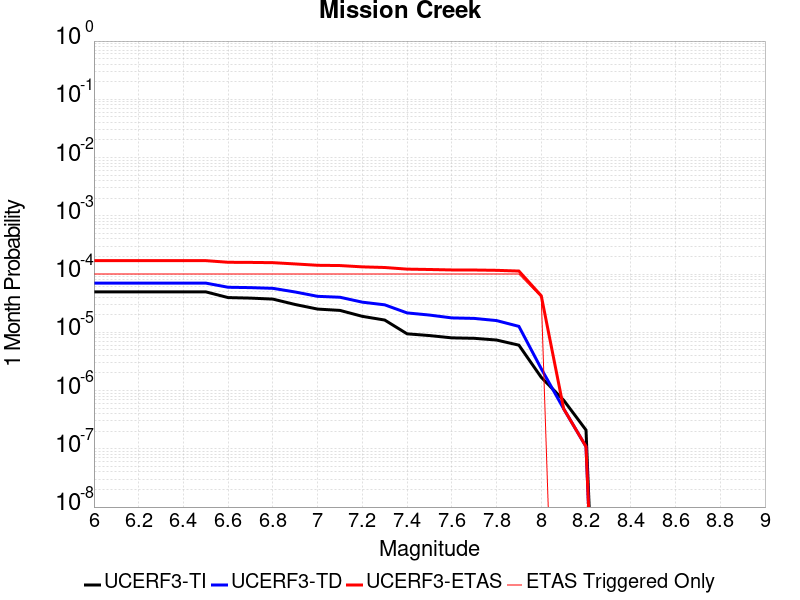 |  |  |

| Magnitude | 1 wk TI Prob | 1 wk TD Prob | 1 wk ETAS Prob | 1 wk ETAS/TD Gain | 1 wk ETAS Triggered Only | 1 mo TI Prob | 1 mo TD Prob | 1 mo ETAS Prob | 1 mo ETAS/TD Gain | 1 mo ETAS Triggered Only | 1 yr TI Prob | 1 yr TD Prob | 1 yr ETAS Prob | 1 yr ETAS/TD Gain | 1 yr ETAS Triggered Only | 10 yr TI Prob | 10 yr TD Prob | 10 yr ETAS Prob | 10 yr ETAS/TD Gain | 10 yr ETAS Triggered Only |
|-----|-----|-----|-----|-----|-----|-----|-----|-----|-----|-----|-----|-----|-----|-----|-----|-----|-----|-----|-----|-----|
| 6.0 | 1.1549387E-5 | 1.632237E-5 | 1.2880647E-4 | 7.8914075 | 1.1248594E-4 | 4.9496433E-5 | 6.9951224E-5 | 1.824293E-4 | 2.60795 | 1.1248594E-4 | 6.0245243E-4 | 8.513384E-4 | 0.0010761188 | 1.2640318 | 2.2497188E-4 | 0.006008218 | 0.008509998 | 0.008770231 | 1.0305798 | 2.624672E-4 |
| 6.1 | 1.1549387E-5 | 1.632237E-5 | 1.2880647E-4 | 7.8914075 | 1.1248594E-4 | 4.9496433E-5 | 6.9951224E-5 | 1.824293E-4 | 2.60795 | 1.1248594E-4 | 6.0245243E-4 | 8.513384E-4 | 0.0010761188 | 1.2640318 | 2.2497188E-4 | 0.006008218 | 0.008509998 | 0.008770231 | 1.0305798 | 2.624672E-4 |
| 6.2 | 1.1549387E-5 | 1.632237E-5 | 1.2880647E-4 | 7.8914075 | 1.1248594E-4 | 4.9496433E-5 | 6.9951224E-5 | 1.824293E-4 | 2.60795 | 1.1248594E-4 | 6.0245243E-4 | 8.513384E-4 | 0.0010761188 | 1.2640318 | 2.2497188E-4 | 0.006008218 | 0.008509998 | 0.008770231 | 1.0305798 | 2.624672E-4 |
| 6.3 | 1.1549387E-5 | 1.632237E-5 | 1.2880647E-4 | 7.8914075 | 1.1248594E-4 | 4.9496433E-5 | 6.9951224E-5 | 1.824293E-4 | 2.60795 | 1.1248594E-4 | 6.0245243E-4 | 8.513384E-4 | 0.0010761188 | 1.2640318 | 2.2497188E-4 | 0.006008218 | 0.008509998 | 0.008770231 | 1.0305798 | 2.624672E-4 |
| 6.4 | 1.1549387E-5 | 1.632237E-5 | 1.2880647E-4 | 7.8914075 | 1.1248594E-4 | 4.9496433E-5 | 6.9951224E-5 | 1.824293E-4 | 2.60795 | 1.1248594E-4 | 6.0245243E-4 | 8.513384E-4 | 0.0010761188 | 1.2640318 | 2.2497188E-4 | 0.006008218 | 0.008509998 | 0.008770231 | 1.0305798 | 2.624672E-4 |
| 6.5 | 1.1549387E-5 | 1.632237E-5 | 1.2880647E-4 | 7.8914075 | 1.1248594E-4 | 4.9496433E-5 | 6.9951224E-5 | 1.824293E-4 | 2.60795 | 1.1248594E-4 | 6.0245243E-4 | 8.513384E-4 | 0.0010761188 | 1.2640318 | 2.2497188E-4 | 0.006008218 | 0.008509998 | 0.008770231 | 1.0305798 | 2.624672E-4 |
| 6.6 | 9.202681E-6 | 1.3845646E-5 | 1.2633002E-4 | 9.124169 | 1.1248594E-4 | 3.9439463E-5 | 5.9337188E-5 | 1.7181646E-4 | 2.8955948 | 1.1248594E-4 | 4.800697E-4 | 7.221998E-4 | 9.4700925E-4 | 1.3112842 | 2.2497188E-4 | 0.004790339 | 0.0072271815 | 0.007487752 | 1.0360543 | 2.624672E-4 |
| 6.7 | 9.019164E-6 | 1.3651316E-5 | 1.2613572E-4 | 9.239821 | 1.1248594E-4 | 3.8652986E-5 | 5.8504378E-5 | 1.7098374E-4 | 2.9225802 | 1.1248594E-4 | 4.7049852E-4 | 7.12067E-4 | 9.368787E-4 | 1.315717 | 2.2497188E-4 | 0.004695036 | 0.007126506 | 0.0073871026 | 1.0365672 | 2.624672E-4 |
| 6.8 | 8.673558E-6 | 1.3273427E-5 | 1.2575787E-4 | 9.474409 | 1.1248594E-4 | 3.717186E-5 | 5.6884925E-5 | 1.6936446E-4 | 2.977317 | 1.1248594E-4 | 4.524734E-4 | 6.923627E-4 | 9.1717887E-4 | 1.3247086 | 2.2497188E-4 | 0.0045155324 | 0.006930694 | 0.0071913423 | 1.0376078 | 2.624672E-4 |
| 6.9 | 7.002255E-6 | 1.1477657E-5 | 1.2396231E-4 | 10.800315 | 1.1248594E-4 | 3.000932E-5 | 4.9189068E-5 | 1.6166948E-4 | 3.2866952 | 1.1248594E-4 | 3.653022E-4 | 5.9871917E-4 | 8.235564E-4 | 1.3755302 | 2.2497188E-4 | 0.0036470229 | 0.005999517 | 0.0062231394 | 1.0372734 | 2.2497188E-4 |
| 7.0 | 5.84644E-6 | 9.67498E-6 | 1.2215984E-4 | 12.626366 | 1.1248594E-4 | 2.5055931E-5 | 4.1463565E-5 | 1.5394484E-4 | 3.7127738 | 1.1248594E-4 | 3.0501327E-4 | 5.047066E-4 | 7.2956487E-4 | 1.4455229 | 2.2497188E-4 | 0.0030459496 | 0.0050638523 | 0.005287685 | 1.0442021 | 2.2497188E-4 |
| 7.1 | 5.54703E-6 | 9.329456E-6 | 1.21814344E-4 | 13.056961 | 1.1248594E-4 | 2.377277E-5 | 3.9982795E-5 | 1.5246424E-4 | 3.813246 | 1.1248594E-4 | 2.8939504E-4 | 4.8668624E-4 | 7.1154867E-4 | 1.4620274 | 2.2497188E-4 | 0.0028901845 | 0.004884446 | 0.005108319 | 1.0458338 | 2.2497188E-4 |
| 7.2 | 4.384709E-6 | 7.68157E-6 | 1.20166646E-4 | 15.643499 | 1.1248594E-4 | 1.8791474E-5 | 3.2920623E-5 | 1.4540285E-4 | 4.4167714 | 1.1248594E-4 | 2.2876218E-4 | 4.0073853E-4 | 6.2562025E-4 | 1.5611682 | 2.2497188E-4 | 0.0022852682 | 0.004028366 | 0.0042524314 | 1.055622 | 2.2497188E-4 |
| 7.3 | 3.7888456E-6 | 6.915452E-6 | 1.1940061E-4 | 17.265772 | 1.1248594E-4 | 1.623781E-5 | 2.9637333E-5 | 1.4211994E-4 | 4.795301 | 1.1248594E-4 | 1.9767738E-4 | 3.6077813E-4 | 5.8566884E-4 | 1.6233491 | 2.2497188E-4 | 0.0019750162 | 0.0036301152 | 0.0038542703 | 1.0617487 | 2.2497188E-4 |
| 7.4 | 2.1982462E-6 | 5.0237763E-6 | 1.1750915E-4 | 23.3906 | 1.1248594E-4 | 9.421021E-6 | 2.1530293E-5 | 1.3401381E-4 | 6.22443 | 1.1248594E-4 | 1.1469489E-4 | 2.621E-4 | 4.870129E-4 | 1.8581188 | 2.2497188E-4 | 0.0011463572 | 0.0026458844 | 0.0028702612 | 1.0848022 | 2.2497188E-4 |
| 7.5 | 2.051923E-6 | 4.615016E-6 | 1.1710043E-4 | 25.373787 | 1.1248594E-4 | 8.793926E-6 | 1.9778492E-5 | 1.3226221E-4 | 6.687174 | 1.1248594E-4 | 1.0706078E-4 | 2.4077666E-4 | 4.6569438E-4 | 1.9341341 | 2.2497188E-4 | 0.0010700922 | 0.0024335422 | 0.0026579665 | 1.0922213 | 2.2497188E-4 |
| 7.6 | 1.8733427E-6 | 4.1233748E-6 | 1.1660885E-4 | 28.279953 | 1.1248594E-4 | 8.028587E-6 | 1.7671488E-5 | 1.3015544E-4 | 7.365279 | 1.1248594E-4 | 9.774366E-5 | 2.151292E-4 | 4.4005268E-4 | 2.0455275 | 2.2497188E-4 | 9.770069E-4 | 0.0021780801 | 0.0024025622 | 1.1030641 | 2.2497188E-4 |
| 7.7 | 1.8411953E-6 | 4.0430496E-6 | 1.16528536E-4 | 28.82194 | 1.1248594E-4 | 7.890813E-6 | 1.732724E-5 | 1.2981123E-4 | 7.4917426 | 1.1248594E-4 | 9.606641E-5 | 2.1093882E-4 | 4.3586324E-4 | 2.0663018 | 2.2497188E-4 | 9.6024893E-4 | 0.0021363653 | 0.0023608566 | 1.105081 | 2.2497188E-4 |
| 7.8 | 1.7194251E-6 | 3.7104276E-6 | 1.1619595E-4 | 31.316053 | 1.1248594E-4 | 7.368944E-6 | 1.5901736E-5 | 1.2838589E-4 | 8.073703 | 1.1248594E-4 | 8.97132E-5 | 1.9358651E-4 | 4.1851483E-4 | 2.1619008 | 2.2497188E-4 | 8.967699E-4 | 0.0019623525 | 0.0021868828 | 1.114419 | 2.2497188E-4 |
| 7.9 | 1.4035052E-6 | 2.9500632E-6 | 1.1543567E-4 | 39.129898 | 1.1248594E-4 | 6.0150082E-6 | 1.2643067E-5 | 1.2512758E-4 | 9.896933 | 1.1248594E-4 | 7.3230265E-5 | 1.5391852E-4 | 3.7885577E-4 | 2.4614046 | 2.2497188E-4 | 7.3206134E-4 | 0.0015631086 | 0.0017877289 | 1.143701 | 2.2497188E-4 |
| 8.0 | 3.9318823E-7 | 5.528522E-7 | 7.554344E-5 | 136.6431 | 7.4990625E-5 | 1.6850913E-6 | 2.3693647E-6 | 7.7359815E-5 | 32.650024 | 7.4990625E-5 | 2.0515794E-5 | 2.8846638E-5 | 1.03835104E-4 | 3.5995564 | 7.4990625E-5 | 2.0513899E-4 | 2.9899E-4 | 3.739582E-4 | 1.2507381 | 7.4990625E-5 |
| 8.1 | 1.596793E-7 | 1.1380002E-7 | 1.1380002E-7 | 1.0 | 0.0 | 6.8433974E-7 | 4.877143E-7 | 4.877143E-7 | 1.0 | 0.0 | 8.331805E-6 | 5.937906E-6 | 5.937906E-6 | 1.0 | 0.0 | 8.331492E-5 | 6.549966E-5 | 6.549966E-5 | 1.0 | 0.0 |
| 8.2 | 4.9003038E-8 | 2.5444924E-8 | 2.5444924E-8 | 1.0 | 0.0 | 2.10013E-7 | 1.0904967E-7 | 1.0904967E-7 | 1.0 | 0.0 | 2.5569052E-6 | 1.327679E-6 | 1.327679E-6 | 1.0 | 0.0 | 2.556876E-5 | 1.495635E-5 | 1.495635E-5 | 1.0 | 0.0 |

## Rose Canyon
*[(top)](#table-of-contents)*

| 1 Week | 1 Month | 1 Year | 10 Year |
|-----|-----|-----|-----|
|  |  |  |  |

| Magnitude | 1 wk TI Prob | 1 wk TD Prob | 1 wk ETAS Prob | 1 wk ETAS/TD Gain | 1 wk ETAS Triggered Only | 1 mo TI Prob | 1 mo TD Prob | 1 mo ETAS Prob | 1 mo ETAS/TD Gain | 1 mo ETAS Triggered Only | 1 yr TI Prob | 1 yr TD Prob | 1 yr ETAS Prob | 1 yr ETAS/TD Gain | 1 yr ETAS Triggered Only | 10 yr TI Prob | 10 yr TD Prob | 10 yr ETAS Prob | 10 yr ETAS/TD Gain | 10 yr ETAS Triggered Only |
|-----|-----|-----|-----|-----|-----|-----|-----|-----|-----|-----|-----|-----|-----|-----|-----|-----|-----|-----|-----|-----|
| 6.0 | 4.5923203E-5 | 4.9714225E-5 | 1.2470112E-4 | 2.508359 | 7.4990625E-5 | 1.9679888E-4 | 2.1304491E-4 | 2.8801957E-4 | 1.3519194 | 7.4990625E-5 | 0.0023933933 | 0.0025909345 | 0.002740527 | 1.057737 | 1.4998125E-4 | 0.023677798 | 0.02563999 | 0.02582266 | 1.0071244 | 1.8747656E-4 |
| 6.1 | 4.5923203E-5 | 4.9714225E-5 | 1.2470112E-4 | 2.508359 | 7.4990625E-5 | 1.9679888E-4 | 2.1304491E-4 | 2.8801957E-4 | 1.3519194 | 7.4990625E-5 | 0.0023933933 | 0.0025909345 | 0.002740527 | 1.057737 | 1.4998125E-4 | 0.023677798 | 0.02563999 | 0.025786126 | 1.0056995 | 1.4998125E-4 |
| 6.2 | 2.8844734E-5 | 2.9668723E-5 | 6.7162924E-5 | 2.263762 | 3.7495312E-5 | 1.2361443E-4 | 1.2714567E-4 | 1.646362E-4 | 1.294863 | 3.7495312E-5 | 0.0015039665 | 0.0015468939 | 0.0016217685 | 1.0484033 | 7.4990625E-5 | 0.0149382865 | 0.015374276 | 0.015448114 | 1.0048027 | 7.4990625E-5 |
| 6.3 | 2.3171577E-5 | 2.3161238E-5 | 6.0655682E-5 | 2.6188445 | 3.7495312E-5 | 9.9302975E-5 | 9.9258745E-5 | 1.3675034E-4 | 1.3777157 | 3.7495312E-5 | 0.0012083431 | 0.0012078186 | 0.0012827187 | 1.0620127 | 7.4990625E-5 | 0.012017938 | 0.012022437 | 0.012096525 | 1.0061625 | 7.4990625E-5 |
| 6.4 | 2.0066604E-5 | 1.9667024E-5 | 5.71616E-5 | 2.906469 | 3.7495312E-5 | 8.599689E-5 | 8.4284584E-5 | 1.21776735E-4 | 1.4448282 | 3.7495312E-5 | 0.0010465092 | 0.0010256917 | 0.0011006055 | 1.0730373 | 7.4990625E-5 | 0.010415946 | 0.010217559 | 0.010291783 | 1.0072644 | 7.4990625E-5 |
| 6.5 | 1.776989E-5 | 1.7113807E-5 | 5.4608478E-5 | 3.1909018 | 3.7495312E-5 | 7.615444E-5 | 7.334287E-5 | 1.10835426E-4 | 1.5111958 | 3.7495312E-5 | 9.267859E-4 | 8.925905E-4 | 9.6751424E-4 | 1.0839396 | 7.4990625E-5 | 0.009229303 | 0.008896211 | 0.008970534 | 1.0083545 | 7.4990625E-5 |
| 6.6 | 1.5227364E-5 | 1.433926E-5 | 5.1834035E-5 | 3.6148334 | 3.7495312E-5 | 6.52585E-5 | 6.1452556E-5 | 9.8945566E-5 | 1.6101131 | 3.7495312E-5 | 7.942326E-4 | 7.479332E-4 | 8.2286773E-4 | 1.1001889 | 7.4990625E-5 | 0.007914 | 0.007458359 | 0.0075327903 | 1.0099796 | 7.4990625E-5 |
| 6.7 | 1.2703898E-5 | 1.1673274E-5 | 4.916815E-5 | 4.2120275 | 3.7495312E-5 | 5.4444143E-5 | 5.0027378E-5 | 8.752082E-5 | 1.7494583 | 3.7495312E-5 | 6.626558E-4 | 6.089174E-4 | 6.4638985E-4 | 1.0615395 | 3.7495312E-5 | 0.006606833 | 0.0060750856 | 0.0061123534 | 1.0061345 | 3.7495312E-5 |
| 6.8 | 1.1554917E-5 | 1.0609337E-5 | 4.810425E-5 | 4.534143 | 3.7495312E-5 | 4.9520135E-5 | 4.546782E-5 | 8.296143E-5 | 1.8246186 | 3.7495312E-5 | 6.0274085E-4 | 5.5343413E-4 | 5.909087E-4 | 1.0677128 | 3.7495312E-5 | 0.0060110865 | 0.0055225673 | 0.0055598556 | 1.006752 | 3.7495312E-5 |
| 6.9 | 8.732078E-6 | 7.881357E-6 | 7.881357E-6 | 1.0 | 0.0 | 3.7422655E-5 | 3.3776825E-5 | 3.3776825E-5 | 1.0 | 0.0 | 4.5552556E-4 | 4.111582E-4 | 4.111582E-4 | 1.0 | 0.0 | 0.0045459294 | 0.0041048084 | 0.0041048084 | 1.0 | 0.0 |
| 7.0 | 5.9337494E-6 | 5.1074853E-6 | 5.1074853E-6 | 1.0 | 0.0 | 2.5430107E-5 | 2.188904E-5 | 2.188904E-5 | 1.0 | 0.0 | 3.0956755E-4 | 2.664666E-4 | 2.664666E-4 | 1.0 | 0.0 | 0.0030913667 | 0.0026614866 | 0.0026614866 | 1.0 | 0.0 |
| 7.1 | 5.013409E-6 | 4.1773833E-6 | 4.1773833E-6 | 1.0 | 0.0 | 2.1485863E-5 | 1.7902948E-5 | 1.7902948E-5 | 1.0 | 0.0 | 2.6155898E-4 | 2.179467E-4 | 2.179467E-4 | 1.0 | 0.0 | 0.0026125133 | 0.0021773411 | 0.0021773411 | 1.0 | 0.0 |
| 7.2 | 4.120763E-6 | 3.2821383E-6 | 3.2821383E-6 | 1.0 | 0.0 | 1.7660293E-5 | 1.4066231E-5 | 1.4066231E-5 | 1.0 | 0.0 | 2.1499286E-4 | 1.7124301E-4 | 1.7124301E-4 | 1.0 | 0.0 | 0.0021478499 | 0.00171112 | 0.00171112 | 1.0 | 0.0 |
| 7.3 | 3.2081239E-6 | 2.4405372E-6 | 2.4405372E-6 | 1.0 | 0.0 | 1.374903E-5 | 1.0459404E-5 | 1.0459404E-5 | 1.0 | 0.0 | 1.6738157E-4 | 1.2733586E-4 | 1.2733586E-4 | 1.0 | 0.0 | 0.0016725556 | 0.001272636 | 0.001272636 | 1.0 | 0.0 |
| 7.4 | 2.4194755E-6 | 1.7680634E-6 | 1.7680634E-6 | 1.0 | 0.0 | 1.0369139E-5 | 7.577393E-6 | 7.577393E-6 | 1.0 | 0.0 | 1.2623696E-4 | 9.2250906E-5 | 9.2250906E-5 | 1.0 | 0.0 | 0.0012616527 | 9.2213147E-4 | 9.2213147E-4 | 1.0 | 0.0 |
| 7.5 | 1.3842889E-6 | 9.3786275E-7 | 9.3786275E-7 | 1.0 | 0.0 | 5.9326535E-6 | 4.019406E-6 | 4.019406E-6 | 1.0 | 0.0 | 7.222766E-5 | 4.8935202E-5 | 4.8935202E-5 | 1.0 | 0.0 | 7.220419E-4 | 4.892478E-4 | 4.892478E-4 | 1.0 | 0.0 |
| 7.6 | 1.0021575E-6 | 6.411463E-7 | 6.411463E-7 | 1.0 | 0.0 | 4.2949537E-6 | 2.7477672E-6 | 2.7477672E-6 | 1.0 | 0.0 | 5.2289808E-5 | 3.3453573E-5 | 3.3453573E-5 | 1.0 | 0.0 | 5.2277505E-4 | 3.344875E-4 | 3.344875E-4 | 1.0 | 0.0 |
| 7.7 | 8.7620116E-8 | 6.4492404E-8 | 6.4492404E-8 | 1.0 | 0.0 | 3.7551473E-7 | 2.76396E-7 | 2.76396E-7 | 1.0 | 0.0 | 4.5718825E-6 | 3.3651165E-6 | 3.3651165E-6 | 1.0 | 0.0 | 4.5717883E-5 | 3.3650686E-5 | 3.3650686E-5 | 1.0 | 0.0 |

## Big Pine (Central)
*[(top)](#table-of-contents)*

| 1 Week | 1 Month | 1 Year | 10 Year |
|-----|-----|-----|-----|
|  | 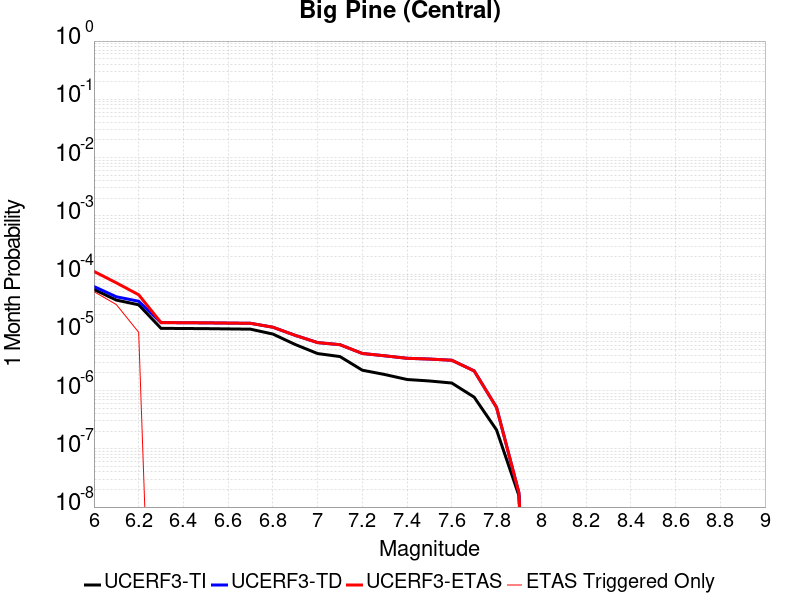 |  |  |

| Magnitude | 1 wk TI Prob | 1 wk TD Prob | 1 wk ETAS Prob | 1 wk ETAS/TD Gain | 1 wk ETAS Triggered Only | 1 mo TI Prob | 1 mo TD Prob | 1 mo ETAS Prob | 1 mo ETAS/TD Gain | 1 mo ETAS Triggered Only | 1 yr TI Prob | 1 yr TD Prob | 1 yr ETAS Prob | 1 yr ETAS/TD Gain | 1 yr ETAS Triggered Only | 10 yr TI Prob | 10 yr TD Prob | 10 yr ETAS Prob | 10 yr ETAS/TD Gain | 10 yr ETAS Triggered Only |
|-----|-----|-----|-----|-----|-----|-----|-----|-----|-----|-----|-----|-----|-----|-----|-----|-----|-----|-----|-----|-----|
| 6.0 | 1.2706755E-5 | 1.4250529E-5 | 1.2673487E-4 | 8.893345 | 1.1248594E-4 | 5.4456385E-5 | 6.107247E-5 | 1.7355154E-4 | 2.841731 | 1.1248594E-4 | 6.628048E-4 | 7.433402E-4 | 9.306774E-4 | 1.2520208 | 1.8747656E-4 | 0.006608314 | 0.0074135666 | 0.0076368707 | 1.030121 | 2.2497188E-4 |
| 6.1 | 8.342579E-6 | 9.510762E-6 | 8.450067E-5 | 8.884743 | 7.4990625E-5 | 3.5753423E-5 | 4.0759893E-5 | 1.1574746E-4 | 2.839739 | 7.4990625E-5 | 4.3521097E-4 | 4.961604E-4 | 6.0859055E-4 | 1.2266004 | 1.1248594E-4 | 0.0043435963 | 0.0049540824 | 0.005103321 | 1.0301243 | 1.4998125E-4 |
| 6.2 | 6.923899E-6 | 7.967147E-6 | 7.967147E-6 | 1.0 | 0.0 | 2.9673516E-5 | 3.4144578E-5 | 3.4144578E-5 | 1.0 | 0.0 | 3.6121515E-4 | 4.156502E-4 | 4.531299E-4 | 1.0901713 | 3.7495312E-5 | 0.003606286 | 0.0041520367 | 0.004226716 | 1.0179862 | 7.4990625E-5 |
| 6.3 | 2.728396E-6 | 3.4242908E-6 | 3.4242908E-6 | 1.0 | 0.0 | 1.1693074E-5 | 1.4675454E-5 | 1.4675454E-5 | 1.0 | 0.0 | 1.4235388E-4 | 1.7865987E-4 | 2.1614849E-4 | 1.2098323 | 3.7495312E-5 | 0.0014226272 | 0.0017866704 | 0.0018615271 | 1.0418973 | 7.4990625E-5 |
| 6.4 | 2.7136944E-6 | 3.408584E-6 | 3.408584E-6 | 1.0 | 0.0 | 1.1630066E-5 | 1.4608141E-5 | 1.4608141E-5 | 1.0 | 0.0 | 1.4158686E-4 | 1.7784047E-4 | 2.1532911E-4 | 1.2107993 | 3.7495312E-5 | 0.0014149669 | 0.0017784894 | 0.0018533467 | 1.0420904 | 7.4990625E-5 |
| 6.5 | 2.6971882E-6 | 3.3909291E-6 | 3.3909291E-6 | 1.0 | 0.0 | 1.1559327E-5 | 1.45324775E-5 | 1.45324775E-5 | 1.0 | 0.0 | 1.4072572E-4 | 1.7691942E-4 | 2.144081E-4 | 1.2118969 | 3.7495312E-5 | 0.0014063664 | 0.0017692937 | 0.0018441516 | 1.0423095 | 7.4990625E-5 |
| 6.6 | 2.669092E-6 | 3.3609497E-6 | 3.3609497E-6 | 1.0 | 0.0 | 1.1438916E-5 | 1.4403995E-5 | 1.4403995E-5 | 1.0 | 0.0 | 1.3925991E-4 | 1.753554E-4 | 2.1284414E-4 | 1.2137872 | 3.7495312E-5 | 0.0013917267 | 0.0017536782 | 0.0018285373 | 1.0426869 | 7.4990625E-5 |
| 6.7 | 2.6408059E-6 | 3.3309752E-6 | 3.3309752E-6 | 1.0 | 0.0 | 1.1317691E-5 | 1.4275535E-5 | 1.4275535E-5 | 1.0 | 0.0 | 1.3778417E-4 | 1.7379165E-4 | 2.1128045E-4 | 1.2157111 | 3.7495312E-5 | 0.0013769877 | 0.0017380653 | 0.0018129256 | 1.043071 | 7.4990625E-5 |
| 6.8 | 2.1786943E-6 | 2.8544325E-6 | 2.8544325E-6 | 1.0 | 0.0 | 9.337228E-6 | 1.2233229E-5 | 1.2233229E-5 | 1.0 | 0.0 | 1.1367482E-4 | 1.4893012E-4 | 1.8641984E-4 | 1.251727 | 3.7495312E-5 | 0.0011361669 | 0.0014897975 | 0.0015646764 | 1.0502611 | 7.4990625E-5 |
| 6.9 | 1.4411696E-6 | 2.068499E-6 | 2.068499E-6 | 1.0 | 0.0 | 6.1764263E-6 | 8.864968E-6 | 8.864968E-6 | 1.0 | 0.0 | 7.51954E-5 | 1.079259E-4 | 1.4541717E-4 | 1.3473797 | 3.7495312E-5 | 7.5169955E-4 | 0.0010801847 | 0.0011550942 | 1.0693489 | 7.4990625E-5 |
| 7.0 | 1.0073411E-6 | 1.554261E-6 | 1.554261E-6 | 1.0 | 0.0 | 4.317169E-6 | 6.6611024E-6 | 6.6611024E-6 | 1.0 | 0.0 | 5.2560266E-5 | 8.1096056E-5 | 8.1096056E-5 | 1.0 | 0.0 | 5.2547833E-4 | 8.1210316E-4 | 8.1210316E-4 | 1.0 | 0.0 |
| 7.1 | 8.947104E-7 | 1.4302494E-6 | 1.4302494E-6 | 1.0 | 0.0 | 3.834468E-6 | 6.129627E-6 | 6.129627E-6 | 1.0 | 0.0 | 4.6683643E-5 | 7.46258E-5 | 7.46258E-5 | 1.0 | 0.0 | 4.6673836E-4 | 7.474457E-4 | 7.474457E-4 | 1.0 | 0.0 |
| 7.2 | 5.215166E-7 | 1.0111678E-6 | 1.0111678E-6 | 1.0 | 0.0 | 2.2350691E-6 | 4.3335694E-6 | 4.3335694E-6 | 1.0 | 0.0 | 2.7211627E-5 | 5.2759973E-5 | 5.2759973E-5 | 1.0 | 0.0 | 2.7208295E-4 | 5.2890263E-4 | 5.2890263E-4 | 1.0 | 0.0 |
| 7.3 | 4.4024807E-7 | 9.219589E-7 | 9.219589E-7 | 1.0 | 0.0 | 1.8867761E-6 | 3.9512465E-6 | 3.9512465E-6 | 1.0 | 0.0 | 2.2971257E-5 | 4.810541E-5 | 4.810541E-5 | 1.0 | 0.0 | 2.2968883E-4 | 4.8237795E-4 | 4.8237795E-4 | 1.0 | 0.0 |
| 7.4 | 3.6130905E-7 | 8.358523E-7 | 8.358523E-7 | 1.0 | 0.0 | 1.5484665E-6 | 3.5822195E-6 | 3.5822195E-6 | 1.0 | 0.0 | 1.8852415E-5 | 4.3612687E-5 | 4.3612687E-5 | 1.0 | 0.0 | 1.8850817E-4 | 4.374597E-4 | 4.374597E-4 | 1.0 | 0.0 |
| 7.5 | 3.408184E-7 | 8.108147E-7 | 8.108147E-7 | 1.0 | 0.0 | 1.4606494E-6 | 3.4749157E-6 | 3.4749157E-6 | 1.0 | 0.0 | 1.7783263E-5 | 4.2306317E-5 | 4.2306317E-5 | 1.0 | 0.0 | 1.778184E-4 | 4.2437963E-4 | 4.2437963E-4 | 1.0 | 0.0 |
| 7.6 | 3.1428627E-7 | 7.7316E-7 | 7.7316E-7 | 1.0 | 0.0 | 1.3469405E-6 | 3.3135389E-6 | 3.3135389E-6 | 1.0 | 0.0 | 1.6398877E-5 | 4.0341627E-5 | 4.0341627E-5 | 1.0 | 0.0 | 1.6397667E-4 | 4.0471106E-4 | 4.0471106E-4 | 1.0 | 0.0 |
| 7.7 | 1.7972785E-7 | 5.077752E-7 | 5.077752E-7 | 1.0 | 0.0 | 7.70262E-7 | 2.1761778E-6 | 2.1761778E-6 | 1.0 | 0.0 | 9.377899E-6 | 2.6494654E-5 | 2.6494654E-5 | 1.0 | 0.0 | 9.377503E-5 | 2.662899E-4 | 2.662899E-4 | 1.0 | 0.0 |
| 7.8 | 4.9230927E-8 | 1.198079E-7 | 1.198079E-7 | 1.0 | 0.0 | 2.1098968E-7 | 5.134623E-7 | 5.134623E-7 | 1.0 | 0.0 | 2.5687964E-6 | 6.2513873E-6 | 6.2513873E-6 | 1.0 | 0.0 | 2.5687666E-5 | 6.295415E-5 | 6.295415E-5 | 1.0 | 0.0 |
| 7.9 | 3.6805972E-9 | 4.105293E-9 | 4.105293E-9 | 1.0 | 0.0 | 1.5773987E-8 | 1.7594115E-8 | 1.7594115E-8 | 1.0 | 0.0 | 1.9204828E-7 | 2.1420831E-7 | 2.1420831E-7 | 1.0 | 0.0 | 1.920481E-6 | 2.1900614E-6 | 2.1900614E-6 | 1.0 | 0.0 |

## San Jacinto (Stepovers Combined)
*[(top)](#table-of-contents)*

| 1 Week | 1 Month | 1 Year | 10 Year |
|-----|-----|-----|-----|
|  |  |  |  |

| Magnitude | 1 wk TI Prob | 1 wk TD Prob | 1 wk ETAS Prob | 1 wk ETAS/TD Gain | 1 wk ETAS Triggered Only | 1 mo TI Prob | 1 mo TD Prob | 1 mo ETAS Prob | 1 mo ETAS/TD Gain | 1 mo ETAS Triggered Only | 1 yr TI Prob | 1 yr TD Prob | 1 yr ETAS Prob | 1 yr ETAS/TD Gain | 1 yr ETAS Triggered Only | 10 yr TI Prob | 10 yr TD Prob | 10 yr ETAS Prob | 10 yr ETAS/TD Gain | 10 yr ETAS Triggered Only |
|-----|-----|-----|-----|-----|-----|-----|-----|-----|-----|-----|-----|-----|-----|-----|-----|-----|-----|-----|-----|-----|
| 6.0 | 4.0667746E-5 | 3.5272755E-5 | 1.4775473E-4 | 4.188919 | 1.1248594E-4 | 1.742787E-4 | 1.5116022E-4 | 2.6362916E-4 | 1.744038 | 1.1248594E-4 | 0.0021197782 | 0.0018388226 | 0.0019511017 | 1.0610603 | 1.1248594E-4 | 0.020996714 | 0.018986892 | 0.019207591 | 1.0116239 | 2.2497188E-4 |
| 6.1 | 4.0667746E-5 | 3.5272755E-5 | 1.4775473E-4 | 4.188919 | 1.1248594E-4 | 1.742787E-4 | 1.5116022E-4 | 2.6362916E-4 | 1.744038 | 1.1248594E-4 | 0.0021197782 | 0.0018388226 | 0.0019511017 | 1.0610603 | 1.1248594E-4 | 0.020996714 | 0.018986892 | 0.019207591 | 1.0116239 | 2.2497188E-4 |
| 6.2 | 4.0667746E-5 | 3.5272755E-5 | 1.4775473E-4 | 4.188919 | 1.1248594E-4 | 1.742787E-4 | 1.5116022E-4 | 2.6362916E-4 | 1.744038 | 1.1248594E-4 | 0.0021197782 | 0.0018388226 | 0.0019511017 | 1.0610603 | 1.1248594E-4 | 0.020996714 | 0.018986892 | 0.019207591 | 1.0116239 | 2.2497188E-4 |
| 6.3 | 4.0667746E-5 | 3.5272755E-5 | 1.4775473E-4 | 4.188919 | 1.1248594E-4 | 1.742787E-4 | 1.5116022E-4 | 2.6362916E-4 | 1.744038 | 1.1248594E-4 | 0.0021197782 | 0.0018388226 | 0.0019511017 | 1.0610603 | 1.1248594E-4 | 0.020996714 | 0.018986892 | 0.019207591 | 1.0116239 | 2.2497188E-4 |
| 6.4 | 4.0577226E-5 | 3.5144654E-5 | 1.4762665E-4 | 4.200543 | 1.1248594E-4 | 1.738908E-4 | 1.5061127E-4 | 2.6308026E-4 | 1.7467502 | 1.1248594E-4 | 0.0021150648 | 0.0018321523 | 0.0019444322 | 1.061283 | 1.1248594E-4 | 0.020950472 | 0.018921461 | 0.019142175 | 1.0116647 | 2.2497188E-4 |
| 6.5 | 4.0577226E-5 | 3.5144654E-5 | 1.4762665E-4 | 4.200543 | 1.1248594E-4 | 1.738908E-4 | 1.5061127E-4 | 2.6308026E-4 | 1.7467502 | 1.1248594E-4 | 0.0021150648 | 0.0018321523 | 0.0019444322 | 1.061283 | 1.1248594E-4 | 0.020950472 | 0.018921461 | 0.019142175 | 1.0116647 | 2.2497188E-4 |
| 6.6 | 4.053861E-5 | 3.509E-5 | 1.4757199E-4 | 4.2055283 | 1.1248594E-4 | 1.7372532E-4 | 1.5037706E-4 | 2.628461E-4 | 1.7479134 | 1.1248594E-4 | 0.0021130538 | 0.0018293057 | 0.0019415858 | 1.0613786 | 1.1248594E-4 | 0.020930743 | 0.018893538 | 0.01911426 | 1.0116824 | 2.2497188E-4 |
| 6.7 | 4.0516545E-5 | 3.5059067E-5 | 1.4754107E-4 | 4.208357 | 1.1248594E-4 | 1.7363077E-4 | 1.5024451E-4 | 2.6271355E-4 | 1.7485733 | 1.1248594E-4 | 0.002111905 | 0.001827695 | 0.0019399753 | 1.0614327 | 1.1248594E-4 | 0.020919468 | 0.018877735 | 0.01909846 | 1.0116923 | 2.2497188E-4 |
| 6.8 | 4.049434E-5 | 3.5030633E-5 | 1.4751263E-4 | 4.2109613 | 1.1248594E-4 | 1.7353562E-4 | 1.5012265E-4 | 2.625917E-4 | 1.749181 | 1.1248594E-4 | 0.0021107488 | 0.0018262138 | 0.0019384944 | 1.0614827 | 1.1248594E-4 | 0.020908125 | 0.018863149 | 0.019083876 | 1.0117016 | 2.2497188E-4 |
| 6.9 | 4.046386E-5 | 3.499319E-5 | 1.4747519E-4 | 4.214397 | 1.1248594E-4 | 1.73405E-4 | 1.4996222E-4 | 2.6243128E-4 | 1.7499827 | 1.1248594E-4 | 0.0021091616 | 0.0018242638 | 0.0019365445 | 1.0615485 | 1.1248594E-4 | 0.020892553 | 0.01884392 | 0.019064654 | 1.0117137 | 2.2497188E-4 |
| 7.0 | 4.036382E-5 | 3.487376E-5 | 1.4735578E-4 | 4.2254057 | 1.1248594E-4 | 1.7297632E-4 | 1.4945042E-4 | 2.6191954E-4 | 1.7525514 | 1.1248594E-4 | 0.0021039525 | 0.0018180435 | 0.001930325 | 1.0617595 | 1.1248594E-4 | 0.02084144 | 0.018782536 | 0.019003281 | 1.0117527 | 2.2497188E-4 |
| 7.1 | 4.0343282E-5 | 3.4852223E-5 | 1.4733424E-4 | 4.227399 | 1.1248594E-4 | 1.7288832E-4 | 1.4935812E-4 | 2.6182726E-4 | 1.7530165 | 1.1248594E-4 | 0.002102883 | 0.0018169218 | 0.0019292034 | 1.0617977 | 1.1248594E-4 | 0.020830948 | 0.018771412 | 0.018992161 | 1.0117599 | 2.2497188E-4 |
| 7.2 | 4.0257353E-5 | 3.4756722E-5 | 1.4723875E-4 | 4.236267 | 1.1248594E-4 | 1.725201E-4 | 1.489489E-4 | 2.6141808E-4 | 1.7550857 | 1.1248594E-4 | 0.0020984085 | 0.0018119477 | 0.0019242298 | 1.0619676 | 1.1248594E-4 | 0.020787042 | 0.018722152 | 0.018942911 | 1.0117913 | 2.2497188E-4 |
| 7.3 | 3.9940667E-5 | 3.4584376E-5 | 1.4706643E-4 | 4.2523947 | 1.1248594E-4 | 1.7116306E-4 | 1.4821035E-4 | 2.6067963E-4 | 1.7588489 | 1.1248594E-4 | 0.0020819185 | 0.0018029709 | 0.001915254 | 1.0622767 | 1.1248594E-4 | 0.020625217 | 0.018630784 | 0.018851565 | 1.0118504 | 2.2497188E-4 |
| 7.4 | 3.9721202E-5 | 3.4469766E-5 | 1.4695183E-4 | 4.2632093 | 1.1248594E-4 | 1.7022261E-4 | 1.4771923E-4 | 2.6018854E-4 | 1.7613723 | 1.1248594E-4 | 0.0020704903 | 0.0017970012 | 0.0019092851 | 1.062484 | 1.1248594E-4 | 0.020513052 | 0.018569905 | 0.0187907 | 1.0118899 | 2.2497188E-4 |
| 7.5 | 3.7036873E-5 | 3.3537188E-5 | 1.4601936E-4 | 4.353954 | 1.1248594E-4 | 1.5871979E-4 | 1.437229E-4 | 2.5619267E-4 | 1.7825459 | 1.1248594E-4 | 0.0019307006 | 0.0017484248 | 0.001860714 | 1.064223 | 1.1248594E-4 | 0.019140124 | 0.018071463 | 0.01829237 | 1.0122241 | 2.2497188E-4 |
| 7.6 | 3.2940967E-5 | 3.1317984E-5 | 1.438004E-4 | 4.591624 | 1.1248594E-4 | 1.4116794E-4 | 1.3421304E-4 | 2.466839E-4 | 1.8380023 | 1.1248594E-4 | 0.0017173645 | 0.0016328214 | 0.0017451236 | 1.068778 | 1.1248594E-4 | 0.01704153 | 0.016904354 | 0.017125523 | 1.0130836 | 2.2497188E-4 |
| 7.7 | 2.8236149E-5 | 2.7883889E-5 | 1.403667E-4 | 5.033971 | 1.1248594E-4 | 1.2100645E-4 | 1.19496915E-4 | 2.3196942E-4 | 1.9412167 | 1.1248594E-4 | 0.0014722579 | 0.001453905 | 0.0015662274 | 1.0772556 | 1.1248594E-4 | 0.014625421 | 0.015115095 | 0.015336666 | 1.0146589 | 2.2497188E-4 |
| 7.8 | 2.4329287E-5 | 2.5207537E-5 | 1.3769064E-4 | 5.4622808 | 1.1248594E-4 | 1.042642E-4 | 1.0802783E-4 | 2.2050162E-4 | 2.0411556 | 1.1248594E-4 | 0.0012686774 | 0.0013144462 | 0.0014267842 | 1.0854642 | 1.1248594E-4 | 0.012614589 | 0.013712396 | 0.013934283 | 1.0161815 | 2.2497188E-4 |
| 7.9 | 1.9370926E-5 | 2.0421452E-5 | 1.329051E-4 | 6.508112 | 1.1248594E-4 | 8.301561E-5 | 8.7517576E-5 | 1.9999366E-4 | 2.285183 | 1.1248594E-4 | 0.0010102465 | 0.0010650064 | 0.0011773725 | 1.1055075 | 1.1248594E-4 | 0.0100566605 | 0.011199483 | 0.011421935 | 1.0198628 | 2.2497188E-4 |
| 8.0 | 1.5583017E-5 | 1.588647E-5 | 9.08759E-5 | 5.7203336 | 7.4990625E-5 | 6.6782646E-5 | 6.808309E-5 | 1.4306861E-4 | 2.1013825 | 7.4990625E-5 | 8.127754E-4 | 8.285971E-4 | 9.0352556E-4 | 1.0904281 | 7.4990625E-5 | 0.008098091 | 0.008781809 | 0.00896764 | 1.0211608 | 1.8747656E-4 |
| 8.1 | 1.0024873E-5 | 8.292404E-6 | 8.328241E-5 | 10.043217 | 7.4990625E-5 | 4.2963035E-5 | 3.5538393E-5 | 1.1052636E-4 | 3.110055 | 7.4990625E-5 | 5.229494E-4 | 4.3259456E-4 | 5.0755276E-4 | 1.1732758 | 7.4990625E-5 | 0.0052172043 | 0.0046534105 | 0.004765373 | 1.0240604 | 1.1248594E-4 |
| 8.2 | 4.142796E-6 | 1.5610041E-6 | 1.5610041E-6 | 1.0 | 0.0 | 1.775472E-5 | 6.69E-6 | 6.69E-6 | 1.0 | 0.0 | 2.1614227E-4 | 8.144774E-5 | 8.144774E-5 | 1.0 | 0.0 | 0.0021593217 | 9.454649E-4 | 9.454649E-4 | 1.0 | 0.0 |
| 8.3 | 1.2750878E-6 | 3.612133E-7 | 3.612133E-7 | 1.0 | 0.0 | 5.4646503E-6 | 1.548056E-6 | 1.548056E-6 | 1.0 | 0.0 | 6.653009E-5 | 1.8847424E-5 | 1.8847424E-5 | 1.0 | 0.0 | 6.6510175E-4 | 2.2734253E-4 | 2.2734253E-4 | 1.0 | 0.0 |

## Cleghorn Pass
*[(top)](#table-of-contents)*

| 1 Week | 1 Month | 1 Year | 10 Year |
|-----|-----|-----|-----|
|  |  |  |  |

| Magnitude | 1 wk TI Prob | 1 wk TD Prob | 1 wk ETAS Prob | 1 wk ETAS/TD Gain | 1 wk ETAS Triggered Only | 1 mo TI Prob | 1 mo TD Prob | 1 mo ETAS Prob | 1 mo ETAS/TD Gain | 1 mo ETAS Triggered Only | 1 yr TI Prob | 1 yr TD Prob | 1 yr ETAS Prob | 1 yr ETAS/TD Gain | 1 yr ETAS Triggered Only | 10 yr TI Prob | 10 yr TD Prob | 10 yr ETAS Prob | 10 yr ETAS/TD Gain | 10 yr ETAS Triggered Only |
|-----|-----|-----|-----|-----|-----|-----|-----|-----|-----|-----|-----|-----|-----|-----|-----|-----|-----|-----|-----|-----|
| 6.0 | 1.0522846E-5 | 1.1040642E-5 | 8.603044E-5 | 7.7921596 | 7.4990625E-5 | 4.509713E-5 | 4.7316473E-5 | 1.5979708E-4 | 3.3771977 | 1.1248594E-4 | 5.4891926E-4 | 5.759784E-4 | 7.63347E-4 | 1.3253049 | 1.8747656E-4 | 0.0054756533 | 0.005750022 | 0.0059737 | 1.0389004 | 2.2497188E-4 |
| 6.1 | 1.0522846E-5 | 1.1040642E-5 | 8.603044E-5 | 7.7921596 | 7.4990625E-5 | 4.509713E-5 | 4.7316473E-5 | 1.5979708E-4 | 3.3771977 | 1.1248594E-4 | 5.4891926E-4 | 5.759784E-4 | 7.63347E-4 | 1.3253049 | 1.8747656E-4 | 0.0054756533 | 0.005750022 | 0.0059737 | 1.0389004 | 2.2497188E-4 |
| 6.2 | 2.1045846E-6 | 2.2082024E-6 | 3.970343E-5 | 17.979979 | 3.7495312E-5 | 9.019617E-6 | 9.463714E-6 | 4.6958674E-5 | 4.961971 | 3.7495312E-5 | 1.098083E-4 | 1.1521882E-4 | 1.5270982E-4 | 1.3253895 | 3.7495312E-5 | 0.0010975406 | 0.0011520023 | 0.0011894543 | 1.0325104 | 3.7495312E-5 |
| 6.3 | 2.1045846E-6 | 2.2082024E-6 | 3.970343E-5 | 17.979979 | 3.7495312E-5 | 9.019617E-6 | 9.463714E-6 | 4.6958674E-5 | 4.961971 | 3.7495312E-5 | 1.098083E-4 | 1.1521882E-4 | 1.5270982E-4 | 1.3253895 | 3.7495312E-5 | 0.0010975406 | 0.0011520023 | 0.0011894543 | 1.0325104 | 3.7495312E-5 |
| 6.4 | 1.7259927E-6 | 1.810877E-6 | 3.9306124E-5 | 21.705572 | 3.7495312E-5 | 7.3970905E-6 | 7.760902E-6 | 4.5255925E-5 | 5.831271 | 3.7495312E-5 | 9.005586E-5 | 9.4488976E-5 | 1.3198075E-4 | 1.3967845 | 3.7495312E-5 | 9.001937E-4 | 9.448898E-4 | 9.823496E-4 | 1.0396447 | 3.7495312E-5 |

## San Jacinto (San Jacinto Valley) rev
*[(top)](#table-of-contents)*

| 1 Week | 1 Month | 1 Year | 10 Year |
|-----|-----|-----|-----|
|  |  |  |  |

| Magnitude | 1 wk TI Prob | 1 wk TD Prob | 1 wk ETAS Prob | 1 wk ETAS/TD Gain | 1 wk ETAS Triggered Only | 1 mo TI Prob | 1 mo TD Prob | 1 mo ETAS Prob | 1 mo ETAS/TD Gain | 1 mo ETAS Triggered Only | 1 yr TI Prob | 1 yr TD Prob | 1 yr ETAS Prob | 1 yr ETAS/TD Gain | 1 yr ETAS Triggered Only | 10 yr TI Prob | 10 yr TD Prob | 10 yr ETAS Prob | 10 yr ETAS/TD Gain | 10 yr ETAS Triggered Only |
|-----|-----|-----|-----|-----|-----|-----|-----|-----|-----|-----|-----|-----|-----|-----|-----|-----|-----|-----|-----|-----|
| 6.0 | 3.652694E-5 | 3.4402394E-5 | 1.4688446E-4 | 4.2696004 | 1.1248594E-4 | 1.5653463E-4 | 1.474305E-4 | 2.5989985E-4 | 1.7628635 | 1.1248594E-4 | 0.0019041431 | 0.00179349 | 0.0019057742 | 1.0626066 | 1.1248594E-4 | 0.018879099 | 0.018526595 | 0.018747399 | 1.0119182 | 2.2497188E-4 |
| 6.1 | 3.652694E-5 | 3.4402394E-5 | 1.4688446E-4 | 4.2696004 | 1.1248594E-4 | 1.5653463E-4 | 1.474305E-4 | 2.5989985E-4 | 1.7628635 | 1.1248594E-4 | 0.0019041431 | 0.00179349 | 0.0019057742 | 1.0626066 | 1.1248594E-4 | 0.018879099 | 0.018526595 | 0.018747399 | 1.0119182 | 2.2497188E-4 |
| 6.2 | 3.652694E-5 | 3.4402394E-5 | 1.4688446E-4 | 4.2696004 | 1.1248594E-4 | 1.5653463E-4 | 1.474305E-4 | 2.5989985E-4 | 1.7628635 | 1.1248594E-4 | 0.0019041431 | 0.00179349 | 0.0019057742 | 1.0626066 | 1.1248594E-4 | 0.018879099 | 0.018526595 | 0.018747399 | 1.0119182 | 2.2497188E-4 |
| 6.3 | 3.652694E-5 | 3.4402394E-5 | 1.4688446E-4 | 4.2696004 | 1.1248594E-4 | 1.5653463E-4 | 1.474305E-4 | 2.5989985E-4 | 1.7628635 | 1.1248594E-4 | 0.0019041431 | 0.00179349 | 0.0019057742 | 1.0626066 | 1.1248594E-4 | 0.018879099 | 0.018526595 | 0.018747399 | 1.0119182 | 2.2497188E-4 |
| 6.4 | 3.646941E-5 | 3.432397E-5 | 1.4680605E-4 | 4.277071 | 1.1248594E-4 | 1.5628811E-4 | 1.4709444E-4 | 2.5956382E-4 | 1.7646067 | 1.1248594E-4 | 0.0019011468 | 0.0017894056 | 0.0019016903 | 1.0627497 | 1.1248594E-4 | 0.018849645 | 0.018486476 | 0.018707288 | 1.0119445 | 2.2497188E-4 |
| 6.5 | 3.646941E-5 | 3.432397E-5 | 1.4680605E-4 | 4.277071 | 1.1248594E-4 | 1.5628811E-4 | 1.4709444E-4 | 2.5956382E-4 | 1.7646067 | 1.1248594E-4 | 0.0019011468 | 0.0017894056 | 0.0019016903 | 1.0627497 | 1.1248594E-4 | 0.018849645 | 0.018486476 | 0.018707288 | 1.0119445 | 2.2497188E-4 |
| 6.6 | 3.6442503E-5 | 3.4287354E-5 | 1.4676944E-4 | 4.2805705 | 1.1248594E-4 | 1.561728E-4 | 1.4693754E-4 | 2.5940695E-4 | 1.7654233 | 1.1248594E-4 | 0.0018997455 | 0.0017874985 | 0.0018997834 | 1.0628167 | 1.1248594E-4 | 0.018835869 | 0.018467745 | 0.018688561 | 1.0119569 | 2.2497188E-4 |
| 6.7 | 3.6432113E-5 | 3.4272925E-5 | 1.4675502E-4 | 4.2819514 | 1.1248594E-4 | 1.5612828E-4 | 1.4687571E-4 | 2.5934514E-4 | 1.7657455 | 1.1248594E-4 | 0.0018992044 | 0.0017867472 | 0.0018990322 | 1.0628432 | 1.1248594E-4 | 0.018830549 | 0.018460369 | 0.018681187 | 1.0119618 | 2.2497188E-4 |
| 6.8 | 3.6409598E-5 | 3.424198E-5 | 1.4672407E-4 | 4.2849174 | 1.1248594E-4 | 1.560318E-4 | 1.4674311E-4 | 2.5921254E-4 | 1.7664375 | 1.1248594E-4 | 0.0018980318 | 0.0017851355 | 0.0018974206 | 1.0629001 | 1.1248594E-4 | 0.018819023 | 0.018444523 | 0.018665345 | 1.0119722 | 2.2497188E-4 |
| 6.9 | 3.638078E-5 | 3.4202407E-5 | 1.466845E-4 | 4.2887187 | 1.1248594E-4 | 1.5590832E-4 | 1.4657351E-4 | 2.5904298E-4 | 1.7673244 | 1.1248594E-4 | 0.0018965311 | 0.001783074 | 0.0018953594 | 1.0629729 | 1.1248594E-4 | 0.018804269 | 0.018424258 | 0.018645084 | 1.0119857 | 2.2497188E-4 |
| 7.0 | 3.6294874E-5 | 3.408442E-5 | 1.4656653E-4 | 4.300103 | 1.1248594E-4 | 1.5554018E-4 | 1.4606792E-4 | 2.5853742E-4 | 1.7699809 | 1.1248594E-4 | 0.0018920569 | 0.001776929 | 0.001889215 | 1.063191 | 1.1248594E-4 | 0.018760284 | 0.018363839 | 0.01858468 | 1.0120258 | 2.2497188E-4 |
| 7.1 | 3.6260717E-5 | 3.4040702E-5 | 1.4652281E-4 | 4.304342 | 1.1248594E-4 | 1.5539382E-4 | 1.4588058E-4 | 2.583501E-4 | 1.7709699 | 1.1248594E-4 | 0.001890278 | 0.0017746518 | 0.0018869381 | 1.0632724 | 1.1248594E-4 | 0.018742796 | 0.018341439 | 0.018562285 | 1.0120409 | 2.2497188E-4 |
| 7.2 | 3.6210204E-5 | 3.397492E-5 | 1.4645704E-4 | 4.3107395 | 1.1248594E-4 | 1.5517735E-4 | 1.455987E-4 | 2.5806826E-4 | 1.7724627 | 1.1248594E-4 | 0.001887647 | 0.0017712255 | 0.0018835121 | 1.0633949 | 1.1248594E-4 | 0.01871693 | 0.01830772 | 0.018528573 | 1.0120634 | 2.2497188E-4 |
| 7.3 | 3.6119454E-5 | 3.386321E-5 | 1.4634534E-4 | 4.321662 | 1.1248594E-4 | 1.5478847E-4 | 1.4511998E-4 | 2.575896E-4 | 1.7750113 | 1.1248594E-4 | 0.0018829206 | 0.0017654065 | 0.0018776938 | 1.0636042 | 1.1248594E-4 | 0.018670462 | 0.018250274 | 0.018471139 | 1.0121021 | 2.2497188E-4 |
| 7.4 | 3.607848E-5 | 3.381071E-5 | 1.4629285E-4 | 4.32682 | 1.1248594E-4 | 1.5461289E-4 | 1.44895E-4 | 2.5736465E-4 | 1.7762147 | 1.1248594E-4 | 0.0018807866 | 0.0017626719 | 0.0018749596 | 1.0637031 | 1.1248594E-4 | 0.018649481 | 0.018223269 | 0.01844414 | 1.0121204 | 2.2497188E-4 |
| 7.5 | 3.5856774E-5 | 3.3620483E-5 | 1.4610264E-4 | 4.345644 | 1.1248594E-4 | 1.5366284E-4 | 1.4407984E-4 | 2.5654957E-4 | 1.780607 | 1.1248594E-4 | 0.0018692396 | 0.0017527633 | 0.001865052 | 1.0640639 | 1.1248594E-4 | 0.018535944 | 0.018124366 | 0.018345261 | 1.0121877 | 2.2497188E-4 |
| 7.6 | 3.286655E-5 | 3.2143445E-5 | 1.4462577E-4 | 4.499386 | 1.1248594E-4 | 1.4084904E-4 | 1.3775036E-4 | 2.5022082E-4 | 1.8164802 | 1.1248594E-4 | 0.001713488 | 0.0016758227 | 0.00178812 | 1.0670103 | 1.1248594E-4 | 0.017003361 | 0.017344031 | 0.017565101 | 1.0127462 | 2.2497188E-4 |
| 7.7 | 2.8882527E-5 | 2.9236293E-5 | 1.4171895E-4 | 4.8473635 | 1.1248594E-4 | 1.237764E-4 | 1.2529238E-4 | 2.3776424E-4 | 1.897675 | 1.1248594E-4 | 0.0015059357 | 0.0015243685 | 0.001636683 | 1.0736793 | 1.1248594E-4 | 0.014957713 | 0.015830461 | 0.016051872 | 1.0139863 | 2.2497188E-4 |
| 7.8 | 2.4950225E-5 | 2.6527203E-5 | 1.3901015E-4 | 5.240287 | 1.1248594E-4 | 1.0692515E-4 | 1.1368306E-4 | 2.2615622E-4 | 1.9893571 | 1.1248594E-4 | 0.0013010362 | 0.0013832134 | 0.0014955438 | 1.0812097 | 1.1248594E-4 | 0.012934455 | 0.014411755 | 0.014633484 | 1.0153854 | 2.2497188E-4 |
| 7.9 | 1.9881603E-5 | 2.1507445E-5 | 1.3399096E-4 | 6.2299805 | 1.1248594E-4 | 8.520408E-5 | 9.217151E-5 | 2.0464709E-4 | 2.2202857 | 1.1248594E-4 | 0.001036866 | 0.0011216112 | 0.001233971 | 1.1001772 | 1.1248594E-4 | 0.010320415 | 0.011777027 | 0.011999349 | 1.0188776 | 2.2497188E-4 |
| 8.0 | 1.563292E-5 | 1.5937347E-5 | 9.092678E-5 | 5.7052646 | 7.4990625E-5 | 6.6996516E-5 | 6.8301124E-5 | 1.4328663E-4 | 2.0978663 | 7.4990625E-5 | 8.153773E-4 | 8.3124964E-4 | 9.061779E-4 | 1.0901394 | 7.4990625E-5 | 0.00812392 | 0.008810506 | 0.008996331 | 1.0210912 | 1.8747656E-4 |
| 8.1 | 1.0045313E-5 | 8.301802E-6 | 8.329181E-5 | 10.032978 | 7.4990625E-5 | 4.305063E-5 | 3.5578672E-5 | 1.1056663E-4 | 3.107666 | 7.4990625E-5 | 5.2401534E-4 | 4.3308473E-4 | 5.0804287E-4 | 1.1730796 | 7.4990625E-5 | 0.0052278144 | 0.0046591135 | 0.0047710757 | 1.0240307 | 1.1248594E-4 |
| 8.2 | 4.1554413E-6 | 1.5655598E-6 | 1.5655598E-6 | 1.0 | 0.0 | 1.7808914E-5 | 6.709525E-6 | 6.709525E-6 | 1.0 | 0.0 | 2.1680194E-4 | 8.168544E-5 | 8.168544E-5 | 1.0 | 0.0 | 0.0021659054 | 9.482903E-4 | 9.482903E-4 | 1.0 | 0.0 |
| 8.3 | 1.2758221E-6 | 3.6149942E-7 | 3.6149942E-7 | 1.0 | 0.0 | 5.4677976E-6 | 1.5492824E-6 | 1.5492824E-6 | 1.0 | 0.0 | 6.65684E-5 | 1.8862354E-5 | 1.8862354E-5 | 1.0 | 0.0 | 6.6548464E-4 | 2.2751294E-4 | 2.2751294E-4 | 1.0 | 0.0 |

## Ortigalita (North)
*[(top)](#table-of-contents)*

| 1 Week | 1 Month | 1 Year | 10 Year |
|-----|-----|-----|-----|
| 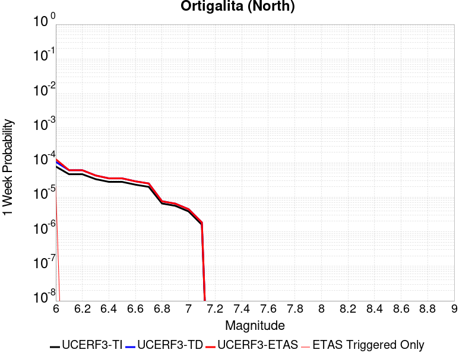 |  |  |  |

| Magnitude | 1 wk TI Prob | 1 wk TD Prob | 1 wk ETAS Prob | 1 wk ETAS/TD Gain | 1 wk ETAS Triggered Only | 1 mo TI Prob | 1 mo TD Prob | 1 mo ETAS Prob | 1 mo ETAS/TD Gain | 1 mo ETAS Triggered Only | 1 yr TI Prob | 1 yr TD Prob | 1 yr ETAS Prob | 1 yr ETAS/TD Gain | 1 yr ETAS Triggered Only | 10 yr TI Prob | 10 yr TD Prob | 10 yr ETAS Prob | 10 yr ETAS/TD Gain | 10 yr ETAS Triggered Only |
|-----|-----|-----|-----|-----|-----|-----|-----|-----|-----|-----|-----|-----|-----|-----|-----|-----|-----|-----|-----|-----|
| 6.0 | 7.711876E-5 | 1.05064966E-4 | 1.05064966E-4 | 1.0 | 0.0 | 3.3046713E-4 | 4.502116E-4 | 4.8769003E-4 | 1.0832462 | 3.7495312E-5 | 0.004016016 | 0.0054681194 | 0.0055799903 | 1.0204587 | 1.1248594E-4 | 0.039442103 | 0.053454787 | 0.053632244 | 1.0033197 | 1.8747656E-4 |
| 6.1 | 4.607858E-5 | 6.0239203E-5 | 6.0239203E-5 | 1.0 | 0.0 | 1.9746469E-4 | 2.5814527E-4 | 2.5814527E-4 | 1.0 | 0.0 | 0.0024014818 | 0.0031387596 | 0.003176137 | 1.0119084 | 3.7495312E-5 | 0.023756953 | 0.030975068 | 0.031047737 | 1.002346 | 7.4990625E-5 |
| 6.2 | 4.607858E-5 | 6.0239203E-5 | 6.0239203E-5 | 1.0 | 0.0 | 1.9746469E-4 | 2.5814527E-4 | 2.5814527E-4 | 1.0 | 0.0 | 0.0024014818 | 0.0031387596 | 0.003176137 | 1.0119084 | 3.7495312E-5 | 0.023756953 | 0.030975068 | 0.031047737 | 1.002346 | 7.4990625E-5 |
| 6.3 | 3.327423E-5 | 4.2475127E-5 | 4.2475127E-5 | 1.0 | 0.0 | 1.4259605E-4 | 1.8202531E-4 | 1.8202531E-4 | 1.0 | 0.0 | 0.0017347244 | 0.002214197 | 0.0022516095 | 1.0168966 | 3.7495312E-5 | 0.017212452 | 0.021945644 | 0.02201899 | 1.0033422 | 7.4990625E-5 |
| 6.4 | 2.7732503E-5 | 3.4998593E-5 | 3.4998593E-5 | 1.0 | 0.0 | 1.1884817E-4 | 1.4998685E-4 | 1.4998685E-4 | 1.0 | 0.0 | 0.001446016 | 0.0018248095 | 0.0018622364 | 1.0205101 | 3.7495312E-5 | 0.014366428 | 0.018121224 | 0.018194854 | 1.0040632 | 7.4990625E-5 |
| 6.5 | 2.7689714E-5 | 3.4948407E-5 | 3.4948407E-5 | 1.0 | 0.0 | 1.186648E-4 | 1.497718E-4 | 1.497718E-4 | 1.0 | 0.0 | 0.0014437864 | 0.0018221956 | 0.0018596225 | 1.0205395 | 3.7495312E-5 | 0.014344421 | 0.01809551 | 0.018169144 | 1.0040692 | 7.4990625E-5 |
| 6.6 | 2.2976905E-5 | 2.8718265E-5 | 2.8718265E-5 | 1.0 | 0.0 | 9.846873E-5 | 1.230739E-4 | 1.230739E-4 | 1.0 | 0.0 | 0.0011981975 | 0.0014976363 | 0.0015350755 | 1.0249988 | 3.7495312E-5 | 0.011917574 | 0.014898697 | 0.01497257 | 1.0049584 | 7.4990625E-5 |
| 6.7 | 1.9871539E-5 | 2.4904411E-5 | 2.4904411E-5 | 1.0 | 0.0 | 8.516096E-5 | 1.0673023E-4 | 1.0673023E-4 | 1.0 | 0.0 | 0.0010363415 | 0.0012989145 | 0.0013363612 | 1.0288291 | 3.7495312E-5 | 0.010315218 | 0.012936919 | 0.01301094 | 1.0057217 | 7.4990625E-5 |
| 6.8 | 6.5640475E-6 | 7.6054926E-6 | 7.6054926E-6 | 1.0 | 0.0 | 2.813133E-5 | 3.2594577E-5 | 3.2594577E-5 | 1.0 | 0.0 | 3.424451E-4 | 3.9676955E-4 | 3.9676955E-4 | 1.0 | 0.0 | 0.0034191788 | 0.003960899 | 0.003960899 | 1.0 | 0.0 |
| 6.9 | 5.6219683E-6 | 6.5018376E-6 | 6.5018376E-6 | 1.0 | 0.0 | 2.4093928E-5 | 2.7864735E-5 | 2.7864735E-5 | 1.0 | 0.0 | 2.933041E-4 | 3.3920293E-4 | 3.3920293E-4 | 1.0 | 0.0 | 0.0029291727 | 0.003387109 | 0.003387109 | 1.0 | 0.0 |
| 7.0 | 3.875591E-6 | 4.4847548E-6 | 4.4847548E-6 | 1.0 | 0.0 | 1.6609569E-5 | 1.9220248E-5 | 1.9220248E-5 | 1.0 | 0.0 | 2.0220275E-4 | 2.339835E-4 | 2.339835E-4 | 1.0 | 0.0 | 0.0020201886 | 0.0023375798 | 0.0023375798 | 1.0 | 0.0 |
| 7.1 | 1.6017933E-6 | 1.8570418E-6 | 1.8570418E-6 | 1.0 | 0.0 | 6.8648105E-6 | 7.958732E-6 | 7.958732E-6 | 1.0 | 0.0 | 8.357586E-5 | 9.689432E-5 | 9.689432E-5 | 1.0 | 0.0 | 8.3544437E-4 | 9.686254E-4 | 9.686254E-4 | 1.0 | 0.0 |

## San Jacinto (Anza) rev
*[(top)](#table-of-contents)*

| 1 Week | 1 Month | 1 Year | 10 Year |
|-----|-----|-----|-----|
|  |  |  |  |

| Magnitude | 1 wk TI Prob | 1 wk TD Prob | 1 wk ETAS Prob | 1 wk ETAS/TD Gain | 1 wk ETAS Triggered Only | 1 mo TI Prob | 1 mo TD Prob | 1 mo ETAS Prob | 1 mo ETAS/TD Gain | 1 mo ETAS Triggered Only | 1 yr TI Prob | 1 yr TD Prob | 1 yr ETAS Prob | 1 yr ETAS/TD Gain | 1 yr ETAS Triggered Only | 10 yr TI Prob | 10 yr TD Prob | 10 yr ETAS Prob | 10 yr ETAS/TD Gain | 10 yr ETAS Triggered Only |
|-----|-----|-----|-----|-----|-----|-----|-----|-----|-----|-----|-----|-----|-----|-----|-----|-----|-----|-----|-----|-----|
| 6.0 | 6.3015636E-5 | 4.3302647E-5 | 1.1829002E-4 | 2.7317042 | 7.4990625E-5 | 2.7003905E-4 | 1.8556965E-4 | 2.6054634E-4 | 1.4040354 | 7.4990625E-5 | 0.0032827691 | 0.0022569813 | 0.0023318026 | 1.033151 | 7.4990625E-5 | 0.032346968 | 0.023296192 | 0.023479301 | 1.0078601 | 1.8747656E-4 |
| 6.1 | 6.3015636E-5 | 4.3302647E-5 | 1.1829002E-4 | 2.7317042 | 7.4990625E-5 | 2.7003905E-4 | 1.8556965E-4 | 2.6054634E-4 | 1.4040354 | 7.4990625E-5 | 0.0032827691 | 0.0022569813 | 0.0023318026 | 1.033151 | 7.4990625E-5 | 0.032346968 | 0.023296192 | 0.023479301 | 1.0078601 | 1.8747656E-4 |
| 6.2 | 6.3015636E-5 | 4.3302647E-5 | 1.1829002E-4 | 2.7317042 | 7.4990625E-5 | 2.7003905E-4 | 1.8556965E-4 | 2.6054634E-4 | 1.4040354 | 7.4990625E-5 | 0.0032827691 | 0.0022569813 | 0.0023318026 | 1.033151 | 7.4990625E-5 | 0.032346968 | 0.023296192 | 0.023479301 | 1.0078601 | 1.8747656E-4 |
| 6.3 | 6.3015636E-5 | 4.3302647E-5 | 1.1829002E-4 | 2.7317042 | 7.4990625E-5 | 2.7003905E-4 | 1.8556965E-4 | 2.6054634E-4 | 1.4040354 | 7.4990625E-5 | 0.0032827691 | 0.0022569813 | 0.0023318026 | 1.033151 | 7.4990625E-5 | 0.032346968 | 0.023296192 | 0.023479301 | 1.0078601 | 1.8747656E-4 |
| 6.4 | 6.3015636E-5 | 4.3302647E-5 | 1.1829002E-4 | 2.7317042 | 7.4990625E-5 | 2.7003905E-4 | 1.8556965E-4 | 2.6054634E-4 | 1.4040354 | 7.4990625E-5 | 0.0032827691 | 0.0022569813 | 0.0023318026 | 1.033151 | 7.4990625E-5 | 0.032346968 | 0.023296192 | 0.023479301 | 1.0078601 | 1.8747656E-4 |
| 6.5 | 5.811017E-5 | 4.0082516E-5 | 1.15070136E-4 | 2.8708313 | 7.4990625E-5 | 2.4901982E-4 | 1.7177092E-4 | 2.4674868E-4 | 1.4364985 | 7.4990625E-5 | 0.0030276014 | 0.002089311 | 0.0021641448 | 1.0358175 | 7.4990625E-5 | 0.02986684 | 0.021593736 | 0.021777166 | 1.0084945 | 1.8747656E-4 |
| 6.6 | 5.811017E-5 | 4.0082516E-5 | 1.15070136E-4 | 2.8708313 | 7.4990625E-5 | 2.4901982E-4 | 1.7177092E-4 | 2.4674868E-4 | 1.4364985 | 7.4990625E-5 | 0.0030276014 | 0.002089311 | 0.0021641448 | 1.0358175 | 7.4990625E-5 | 0.02986684 | 0.021593736 | 0.021777166 | 1.0084945 | 1.8747656E-4 |
| 6.7 | 5.712442E-5 | 3.9505223E-5 | 1.1449289E-4 | 2.898171 | 7.4990625E-5 | 2.4479596E-4 | 1.6929714E-4 | 2.4427508E-4 | 1.4428777 | 7.4990625E-5 | 0.0029763177 | 0.0020592497 | 0.0021340859 | 1.0363415 | 7.4990625E-5 | 0.029367693 | 0.021285562 | 0.021469047 | 1.0086203 | 1.8747656E-4 |
| 6.8 | 5.6967532E-5 | 3.9361643E-5 | 1.1434932E-4 | 2.905095 | 7.4990625E-5 | 2.4412372E-4 | 1.6868189E-4 | 2.4365986E-4 | 1.4444934 | 7.4990625E-5 | 0.0029681553 | 0.002051773 | 0.0021266097 | 1.0364742 | 7.4990625E-5 | 0.029288229 | 0.021210281 | 0.021393782 | 1.0086515 | 1.8747656E-4 |
| 6.9 | 5.6211324E-5 | 3.9066435E-5 | 1.14054135E-4 | 2.9194915 | 7.4990625E-5 | 2.4088343E-4 | 1.6741687E-4 | 2.4239495E-4 | 1.4478525 | 7.4990625E-5 | 0.0029288116 | 0.0020364004 | 0.0021112382 | 1.0367501 | 7.4990625E-5 | 0.028905109 | 0.021049714 | 0.021233244 | 1.0087188 | 1.8747656E-4 |
| 7.0 | 5.4383527E-5 | 3.792697E-5 | 1.1291475E-4 | 2.9771626 | 7.4990625E-5 | 2.3305144E-4 | 1.6253405E-4 | 2.3751249E-4 | 1.4613091 | 7.4990625E-5 | 0.0028337094 | 0.001977061 | 0.0020519034 | 1.0378554 | 7.4990625E-5 | 0.027978465 | 0.020440677 | 0.020624321 | 1.0089842 | 1.8747656E-4 |
| 7.1 | 5.1393665E-5 | 3.6389913E-5 | 1.1137781E-4 | 3.0606782 | 7.4990625E-5 | 2.2023996E-4 | 1.5594746E-4 | 2.309264E-4 | 1.4807961 | 7.4990625E-5 | 0.0026781242 | 0.0018970112 | 0.0019718595 | 1.0394559 | 7.4990625E-5 | 0.026460782 | 0.019614287 | 0.019798085 | 1.0093707 | 1.8747656E-4 |
| 7.2 | 4.785222E-5 | 3.4741795E-5 | 1.09729815E-4 | 3.1584382 | 7.4990625E-5 | 2.0506482E-4 | 1.4888494E-4 | 2.238644E-4 | 1.5036068 | 7.4990625E-5 | 0.0024938055 | 0.0018111705 | 0.0018860253 | 1.0413295 | 7.4990625E-5 | 0.024660049 | 0.018728992 | 0.018912956 | 1.0098225 | 1.8747656E-4 |
| 7.3 | 4.2143256E-5 | 3.383628E-5 | 1.08824366E-4 | 3.2162037 | 7.4990625E-5 | 1.8060145E-4 | 1.4500458E-4 | 2.1998433E-4 | 1.5170854 | 7.4990625E-5 | 0.002196605 | 0.0017640047 | 0.001838863 | 1.0424366 | 7.4990625E-5 | 0.02175019 | 0.01823724 | 0.018421298 | 1.0100924 | 1.8747656E-4 |
| 7.4 | 4.0264713E-5 | 3.347446E-5 | 1.0846258E-4 | 3.2401588 | 7.4990625E-5 | 1.7255165E-4 | 1.4345412E-4 | 2.1843398E-4 | 1.5226749 | 7.4990625E-5 | 0.002098792 | 0.0017451581 | 0.0018200178 | 1.0428957 | 7.4990625E-5 | 0.020790804 | 0.018041821 | 0.018225914 | 1.0102037 | 1.8747656E-4 |
| 7.5 | 3.694492E-5 | 3.218847E-5 | 1.0717668E-4 | 3.329661 | 7.4990625E-5 | 1.5832575E-4 | 1.379433E-4 | 2.1292358E-4 | 1.5435587 | 7.4990625E-5 | 0.0019259118 | 0.001678169 | 0.0017530337 | 1.044611 | 7.4990625E-5 | 0.01909306 | 0.01735827 | 0.017542493 | 1.010613 | 1.8747656E-4 |
| 7.6 | 3.200565E-5 | 2.9504106E-5 | 1.0449252E-4 | 3.5416262 | 7.4990625E-5 | 1.3715986E-4 | 1.2644005E-4 | 2.014212E-4 | 1.5930173 | 7.4990625E-5 | 0.001668642 | 0.0015383229 | 0.0016131981 | 1.0486733 | 7.4990625E-5 | 0.01656168 | 0.0159463 | 0.016130786 | 1.0115693 | 1.8747656E-4 |
| 7.7 | 2.731642E-5 | 2.6092788E-5 | 1.0108146E-4 | 3.8739233 | 7.4990625E-5 | 1.1706512E-4 | 1.1182144E-4 | 1.8680369E-4 | 1.6705533 | 7.4990625E-5 | 0.001424336 | 0.0013605768 | 0.0014354654 | 1.0550418 | 7.4990625E-5 | 0.014152412 | 0.014167004 | 0.014351825 | 1.0130459 | 1.8747656E-4 |
| 7.8 | 2.3466424E-5 | 2.3504817E-5 | 9.8493685E-5 | 4.1903615 | 7.4990625E-5 | 1.0056651E-4 | 1.0073105E-4 | 1.7571411E-4 | 1.7443888 | 7.4990625E-5 | 0.0012237094 | 0.0012257113 | 0.00130061 | 1.0611063 | 7.4990625E-5 | 0.012169928 | 0.012808893 | 0.012993968 | 1.014449 | 1.8747656E-4 |
| 7.9 | 1.8611925E-5 | 1.8908117E-5 | 9.3897324E-5 | 4.9659796 | 7.4990625E-5 | 7.9762955E-5 | 8.1032274E-5 | 1.5601682E-4 | 1.9253665 | 7.4990625E-5 | 9.7068126E-4 | 9.861222E-4 | 0.0010610388 | 1.075971 | 7.4990625E-5 | 0.0096645225 | 0.010393824 | 0.010579352 | 1.0178498 | 1.8747656E-4 |
| 8.0 | 1.5460775E-5 | 1.5740965E-5 | 9.073041E-5 | 5.7639675 | 7.4990625E-5 | 6.6258784E-5 | 6.7459536E-5 | 1.424451E-4 | 2.1115637 | 7.4990625E-5 | 8.0640207E-4 | 8.21011E-4 | 8.959401E-4 | 1.0912644 | 7.4990625E-5 | 0.008034821 | 0.0087028835 | 0.008888729 | 1.0213544 | 1.8747656E-4 |
| 8.1 | 9.983884E-6 | 8.269952E-6 | 8.3259954E-5 | 10.067768 | 7.4990625E-5 | 4.2787375E-5 | 3.544217E-5 | 1.1043014E-4 | 3.1157837 | 7.4990625E-5 | 5.2081177E-4 | 4.314235E-4 | 5.063818E-4 | 1.1737463 | 7.4990625E-5 | 0.0051959283 | 0.004640022 | 0.004751986 | 1.0241301 | 1.1248594E-4 |
| 8.2 | 4.1226E-6 | 1.5529788E-6 | 1.5529788E-6 | 1.0 | 0.0 | 1.7668166E-5 | 6.6556063E-6 | 6.6556063E-6 | 1.0 | 0.0 | 2.1508869E-4 | 8.102902E-5 | 8.102902E-5 | 1.0 | 0.0 | 0.0021488064 | 9.4050163E-4 | 9.4050163E-4 | 1.0 | 0.0 |
| 8.3 | 1.2750878E-6 | 3.612133E-7 | 3.612133E-7 | 1.0 | 0.0 | 5.4646503E-6 | 1.548056E-6 | 1.548056E-6 | 1.0 | 0.0 | 6.653009E-5 | 1.8847424E-5 | 1.8847424E-5 | 1.0 | 0.0 | 6.6510175E-4 | 2.2734253E-4 | 2.2734253E-4 | 1.0 | 0.0 |

## San Jacinto (Lytle Creek connector)
*[(top)](#table-of-contents)*

| 1 Week | 1 Month | 1 Year | 10 Year |
|-----|-----|-----|-----|
|  |  |  |  |

| Magnitude | 1 wk TI Prob | 1 wk TD Prob | 1 wk ETAS Prob | 1 wk ETAS/TD Gain | 1 wk ETAS Triggered Only | 1 mo TI Prob | 1 mo TD Prob | 1 mo ETAS Prob | 1 mo ETAS/TD Gain | 1 mo ETAS Triggered Only | 1 yr TI Prob | 1 yr TD Prob | 1 yr ETAS Prob | 1 yr ETAS/TD Gain | 1 yr ETAS Triggered Only | 10 yr TI Prob | 10 yr TD Prob | 10 yr ETAS Prob | 10 yr ETAS/TD Gain | 10 yr ETAS Triggered Only |
|-----|-----|-----|-----|-----|-----|-----|-----|-----|-----|-----|-----|-----|-----|-----|-----|-----|-----|-----|-----|-----|
| 6.0 | 6.693995E-6 | 6.660216E-6 | 1.1914541E-4 | 17.88912 | 1.1248594E-4 | 2.8688235E-5 | 2.854347E-5 | 1.410262E-4 | 4.9407516 | 1.1248594E-4 | 3.492233E-4 | 3.4746144E-4 | 4.5990827E-4 | 1.323624 | 1.1248594E-4 | 0.00348675 | 0.0035493854 | 0.0037361966 | 1.052632 | 1.8747656E-4 |
| 6.1 | 6.693995E-6 | 6.660216E-6 | 1.1914541E-4 | 17.88912 | 1.1248594E-4 | 2.8688235E-5 | 2.854347E-5 | 1.410262E-4 | 4.9407516 | 1.1248594E-4 | 3.492233E-4 | 3.4746144E-4 | 4.5990827E-4 | 1.323624 | 1.1248594E-4 | 0.00348675 | 0.0035493854 | 0.0037361966 | 1.052632 | 1.8747656E-4 |
| 6.2 | 6.693995E-6 | 6.660216E-6 | 1.1914541E-4 | 17.88912 | 1.1248594E-4 | 2.8688235E-5 | 2.854347E-5 | 1.410262E-4 | 4.9407516 | 1.1248594E-4 | 3.492233E-4 | 3.4746144E-4 | 4.5990827E-4 | 1.323624 | 1.1248594E-4 | 0.00348675 | 0.0035493854 | 0.0037361966 | 1.052632 | 1.8747656E-4 |
| 6.3 | 6.693995E-6 | 6.660216E-6 | 1.1914541E-4 | 17.88912 | 1.1248594E-4 | 2.8688235E-5 | 2.854347E-5 | 1.410262E-4 | 4.9407516 | 1.1248594E-4 | 3.492233E-4 | 3.4746144E-4 | 4.5990827E-4 | 1.323624 | 1.1248594E-4 | 0.00348675 | 0.0035493854 | 0.0037361966 | 1.052632 | 1.8747656E-4 |
| 6.4 | 6.693995E-6 | 6.660216E-6 | 1.1914541E-4 | 17.88912 | 1.1248594E-4 | 2.8688235E-5 | 2.854347E-5 | 1.410262E-4 | 4.9407516 | 1.1248594E-4 | 3.492233E-4 | 3.4746144E-4 | 4.5990827E-4 | 1.323624 | 1.1248594E-4 | 0.00348675 | 0.0035493854 | 0.0037361966 | 1.052632 | 1.8747656E-4 |
| 6.5 | 6.6561875E-6 | 6.6204343E-6 | 1.1910563E-4 | 17.990606 | 1.1248594E-4 | 2.8526205E-5 | 2.837298E-5 | 1.4085573E-4 | 4.964432 | 1.1248594E-4 | 3.472512E-4 | 3.4538636E-4 | 4.5783346E-4 | 1.325569 | 1.1248594E-4 | 0.0034670907 | 0.003528701 | 0.0037155158 | 1.0529416 | 1.8747656E-4 |
| 6.6 | 6.6561875E-6 | 6.6204343E-6 | 1.1910563E-4 | 17.990606 | 1.1248594E-4 | 2.8526205E-5 | 2.837298E-5 | 1.4085573E-4 | 4.964432 | 1.1248594E-4 | 3.472512E-4 | 3.4538636E-4 | 4.5783346E-4 | 1.325569 | 1.1248594E-4 | 0.0034670907 | 0.003528701 | 0.0037155158 | 1.0529416 | 1.8747656E-4 |
| 6.7 | 6.5802237E-6 | 6.539611E-6 | 1.19024815E-4 | 18.200596 | 1.1248594E-4 | 2.8200653E-5 | 2.8026603E-5 | 1.405094E-4 | 5.013429 | 1.1248594E-4 | 3.4328885E-4 | 3.4117055E-4 | 4.536181E-4 | 1.3295934 | 1.1248594E-4 | 0.0034275902 | 0.0034866752 | 0.003673498 | 1.053582 | 1.8747656E-4 |
| 6.8 | 6.575632E-6 | 6.5341005E-6 | 1.1901931E-4 | 18.215101 | 1.1248594E-4 | 2.8180975E-5 | 2.8002989E-5 | 1.4048578E-4 | 5.0168138 | 1.1248594E-4 | 3.4304935E-4 | 3.4088313E-4 | 4.5333072E-4 | 1.3298714 | 1.1248594E-4 | 0.0034252026 | 0.00348381 | 0.0036706335 | 1.0536262 | 1.8747656E-4 |
| 6.9 | 6.570433E-6 | 6.525495E-6 | 1.190107E-4 | 18.237804 | 1.1248594E-4 | 2.8158694E-5 | 2.7966107E-5 | 1.404489E-4 | 5.0221114 | 1.1248594E-4 | 3.4277816E-4 | 3.4043423E-4 | 4.5288188E-4 | 1.3303065 | 1.1248594E-4 | 0.0034224992 | 0.0034793352 | 0.0036661595 | 1.0536954 | 1.8747656E-4 |
| 7.0 | 6.5643826E-6 | 6.515616E-6 | 1.1900082E-4 | 18.26394 | 1.1248594E-4 | 2.8132765E-5 | 2.792377E-5 | 1.4040657E-4 | 5.0282097 | 1.1248594E-4 | 3.424626E-4 | 3.3991894E-4 | 4.5236663E-4 | 1.3308074 | 1.1248594E-4 | 0.0034193532 | 0.0034741985 | 0.0036610237 | 1.0537751 | 1.8747656E-4 |
| 7.1 | 6.557402E-6 | 6.5043278E-6 | 1.18989534E-4 | 18.293901 | 1.1248594E-4 | 2.8102848E-5 | 2.7875392E-5 | 1.403582E-4 | 5.0352006 | 1.1248594E-4 | 3.4209844E-4 | 3.3933012E-4 | 4.517779E-4 | 1.3313817 | 1.1248594E-4 | 0.0034157229 | 0.0034683298 | 0.0036551561 | 1.0538664 | 1.8747656E-4 |
| 7.2 | 6.546394E-6 | 6.4862943E-6 | 1.18971504E-4 | 18.341984 | 1.1248594E-4 | 2.8055672E-5 | 2.7798109E-5 | 1.4028093E-4 | 5.0464196 | 1.1248594E-4 | 3.4152428E-4 | 3.3838948E-4 | 4.5083737E-4 | 1.332303 | 1.1248594E-4 | 0.0034099987 | 0.0034589572 | 0.0036457852 | 1.0540129 | 1.8747656E-4 |
| 7.3 | 6.5364216E-6 | 6.4670803E-6 | 1.18952295E-4 | 18.393507 | 1.1248594E-4 | 2.8012933E-5 | 2.7715765E-5 | 1.4019858E-4 | 5.058442 | 1.1248594E-4 | 3.4100408E-4 | 3.3738726E-4 | 4.4983524E-4 | 1.3332906 | 1.1248594E-4 | 0.003404813 | 0.0034489788 | 0.0036358088 | 1.0541697 | 1.8747656E-4 |
| 7.4 | 6.5269523E-6 | 6.4481674E-6 | 1.1893338E-4 | 18.444525 | 1.1248594E-4 | 2.7972354E-5 | 2.7634711E-5 | 1.4011754E-4 | 5.070346 | 1.1248594E-4 | 3.4051016E-4 | 3.3640073E-4 | 4.4884885E-4 | 1.3342683 | 1.1248594E-4 | 0.0033998888 | 0.003439161 | 0.0036259927 | 1.0543249 | 1.8747656E-4 |
| 7.5 | 6.5111835E-6 | 6.424442E-6 | 1.1890966E-4 | 18.508947 | 1.1248594E-4 | 2.7904773E-5 | 2.7533031E-5 | 1.4001588E-4 | 5.085378 | 1.1248594E-4 | 3.3968766E-4 | 3.3516317E-4 | 4.476114E-4 | 1.335503 | 1.1248594E-4 | 0.0033916887 | 0.003426834 | 0.0036136683 | 1.054521 | 1.8747656E-4 |
| 7.6 | 6.4768806E-6 | 6.383551E-6 | 1.18868775E-4 | 18.621105 | 1.1248594E-4 | 2.7757764E-5 | 2.735779E-5 | 1.3984065E-4 | 5.111548 | 1.1248594E-4 | 3.3789838E-4 | 3.3303024E-4 | 4.4547874E-4 | 1.3376524 | 1.1248594E-4 | 0.0033738504 | 0.0034055663 | 0.0035924043 | 1.0548626 | 1.8747656E-4 |
| 7.7 | 6.1655364E-6 | 6.1760365E-6 | 1.1866128E-4 | 19.213177 | 1.1248594E-4 | 2.642346E-5 | 2.646846E-5 | 1.3895142E-4 | 5.249698 | 1.1248594E-4 | 3.2165812E-4 | 3.2220592E-4 | 4.346556E-4 | 1.3489995 | 1.1248594E-4 | 0.0032119295 | 0.0032971818 | 0.00348404 | 1.0566722 | 1.8747656E-4 |
| 7.8 | 5.5043524E-6 | 5.737097E-6 | 1.1822239E-4 | 20.606657 | 1.1248594E-4 | 2.3589868E-5 | 2.4587327E-5 | 1.370705E-4 | 5.5748434 | 1.1248594E-4 | 2.871688E-4 | 2.9930964E-4 | 4.117619E-4 | 1.3757055 | 1.1248594E-4 | 0.0028679797 | 0.0030672832 | 0.0032541847 | 1.060934 | 1.8747656E-4 |
| 7.9 | 3.889249E-6 | 4.076761E-6 | 7.906708E-5 | 19.394583 | 7.4990625E-5 | 1.6668104E-5 | 1.7471715E-5 | 9.246103E-5 | 5.292041 | 7.4990625E-5 | 2.0291525E-4 | 2.1269741E-4 | 2.876721E-4 | 1.3524945 | 7.4990625E-5 | 0.0020273007 | 0.0021943315 | 0.0023439836 | 1.0681994 | 1.4998125E-4 |
| 8.0 | 2.668535E-6 | 2.5315155E-6 | 4.0026734E-5 | 15.811373 | 3.7495312E-5 | 1.1436528E-5 | 1.0849307E-5 | 4.8344213E-5 | 4.4559727 | 3.7495312E-5 | 1.3923083E-4 | 1.3208234E-4 | 1.695727E-4 | 1.2838409 | 3.7495312E-5 | 0.0013914363 | 0.0013757964 | 0.0014881275 | 1.0816481 | 1.1248594E-4 |
| 8.1 | 1.5911459E-6 | 1.218661E-6 | 3.871393E-5 | 31.767593 | 3.7495312E-5 | 6.8191785E-6 | 5.2228224E-6 | 4.271794E-5 | 8.1790905 | 3.7495312E-5 | 8.3020335E-5 | 6.3586034E-5 | 1.0107896E-4 | 1.589641 | 3.7495312E-5 | 8.298933E-4 | 6.6932244E-4 | 7.442629E-4 | 1.1119646 | 7.4990625E-5 |
| 8.2 | 6.1294963E-7 | 2.1812275E-7 | 2.1812275E-7 | 1.0 | 0.0 | 2.6269242E-6 | 9.3481145E-7 | 9.3481145E-7 | 1.0 | 0.0 | 3.1982334E-5 | 1.138127E-5 | 1.138127E-5 | 1.0 | 0.0 | 3.1977732E-4 | 1.2784546E-4 | 1.2784546E-4 | 1.0 | 0.0 |
| 8.3 | 1.762871E-7 | 4.7546838E-8 | 4.7546838E-8 | 1.0 | 0.0 | 7.5551594E-7 | 2.0377215E-7 | 2.0377215E-7 | 1.0 | 0.0 | 9.1983675E-6 | 2.480923E-6 | 2.480923E-6 | 1.0 | 0.0 | 9.197987E-5 | 2.868753E-5 | 2.868753E-5 | 1.0 | 0.0 |

## Santa Rosa Island
*[(top)](#table-of-contents)*

| 1 Week | 1 Month | 1 Year | 10 Year |
|-----|-----|-----|-----|
|  |  |  |  |

| Magnitude | 1 wk TI Prob | 1 wk TD Prob | 1 wk ETAS Prob | 1 wk ETAS/TD Gain | 1 wk ETAS Triggered Only | 1 mo TI Prob | 1 mo TD Prob | 1 mo ETAS Prob | 1 mo ETAS/TD Gain | 1 mo ETAS Triggered Only | 1 yr TI Prob | 1 yr TD Prob | 1 yr ETAS Prob | 1 yr ETAS/TD Gain | 1 yr ETAS Triggered Only | 10 yr TI Prob | 10 yr TD Prob | 10 yr ETAS Prob | 10 yr ETAS/TD Gain | 10 yr ETAS Triggered Only |
|-----|-----|-----|-----|-----|-----|-----|-----|-----|-----|-----|-----|-----|-----|-----|-----|-----|-----|-----|-----|-----|
| 6.0 | 4.1143165E-5 | 4.7091133E-5 | 4.7091133E-5 | 1.0 | 0.0 | 1.7631594E-4 | 2.0180465E-4 | 2.0180465E-4 | 1.0 | 0.0 | 0.002144533 | 0.0024544 | 0.0025666098 | 1.0457178 | 1.1248594E-4 | 0.021239553 | 0.024293551 | 0.024476472 | 1.0075296 | 1.8747656E-4 |
| 6.1 | 2.1061249E-5 | 2.3864959E-5 | 2.3864959E-5 | 1.0 | 0.0 | 9.0259375E-5 | 1.0227455E-4 | 1.0227455E-4 | 1.0 | 0.0 | 0.0010983539 | 0.0012445104 | 0.001281959 | 1.030091 | 3.7495312E-5 | 0.01092941 | 0.012378449 | 0.01245251 | 1.0059831 | 7.4990625E-5 |
| 6.2 | 2.1061249E-5 | 2.3864959E-5 | 2.3864959E-5 | 1.0 | 0.0 | 9.0259375E-5 | 1.0227455E-4 | 1.0227455E-4 | 1.0 | 0.0 | 0.0010983539 | 0.0012445104 | 0.001281959 | 1.030091 | 3.7495312E-5 | 0.01092941 | 0.012378449 | 0.01245251 | 1.0059831 | 7.4990625E-5 |
| 6.3 | 1.5158236E-5 | 1.7074419E-5 | 1.7074419E-5 | 1.0 | 0.0 | 6.496225E-5 | 7.3174095E-5 | 7.3174095E-5 | 1.0 | 0.0 | 7.906284E-4 | 8.905424E-4 | 9.2800433E-4 | 1.0420665 | 3.7495312E-5 | 0.007878214 | 0.008870989 | 0.008945315 | 1.0083785 | 7.4990625E-5 |
| 6.4 | 1.2341918E-5 | 1.3852917E-5 | 1.3852917E-5 | 1.0 | 0.0 | 5.2892858E-5 | 5.9368336E-5 | 5.9368336E-5 | 1.0 | 0.0 | 6.437803E-4 | 7.225779E-4 | 7.600461E-4 | 1.0518535 | 3.7495312E-5 | 0.006419184 | 0.007203121 | 0.0072775716 | 1.0103358 | 7.4990625E-5 |
| 6.5 | 9.061158E-6 | 1.0117031E-5 | 1.0117031E-5 | 1.0 | 0.0 | 3.883296E-5 | 4.3358013E-5 | 4.3358013E-5 | 1.0 | 0.0 | 4.726887E-4 | 5.277613E-4 | 5.652368E-4 | 1.0710084 | 3.7495312E-5 | 0.004716845 | 0.0052656173 | 0.005340213 | 1.0141666 | 7.4990625E-5 |
| 6.6 | 7.5461685E-6 | 8.400733E-6 | 8.400733E-6 | 1.0 | 0.0 | 3.2340322E-5 | 3.600267E-5 | 3.600267E-5 | 1.0 | 0.0 | 3.936723E-4 | 4.3824865E-4 | 4.7572755E-4 | 1.0855197 | 3.7495312E-5 | 0.003929756 | 0.0043742736 | 0.0044489363 | 1.0170686 | 7.4990625E-5 |
| 6.7 | 5.5023775E-6 | 6.087381E-6 | 6.087381E-6 | 1.0 | 0.0 | 2.3581404E-5 | 2.6088532E-5 | 2.6088532E-5 | 1.0 | 0.0 | 2.8706578E-4 | 3.1758484E-4 | 3.5506824E-4 | 1.1180264 | 3.7495312E-5 | 0.0028669522 | 0.0031716314 | 0.003209008 | 1.0117846 | 3.7495312E-5 |
| 6.8 | 3.7351679E-6 | 4.0831405E-6 | 4.0831405E-6 | 1.0 | 0.0 | 1.6007763E-5 | 1.749907E-5 | 1.749907E-5 | 1.0 | 0.0 | 1.948771E-4 | 2.1303284E-4 | 2.5052016E-4 | 1.1759697 | 3.7495312E-5 | 0.0019470629 | 0.0021285315 | 0.0021659469 | 1.0175781 | 3.7495312E-5 |
| 6.9 | 2.456366E-6 | 2.6292705E-6 | 2.6292705E-6 | 1.0 | 0.0 | 1.0527241E-5 | 1.1268254E-5 | 1.1268254E-5 | 1.0 | 0.0 | 1.2816161E-4 | 1.3718237E-4 | 1.7467255E-4 | 1.273287 | 3.7495312E-5 | 0.0012808773 | 0.0013709799 | 0.0014084238 | 1.0273118 | 3.7495312E-5 |
| 7.0 | 2.3245157E-6 | 2.4827782E-6 | 2.4827782E-6 | 1.0 | 0.0 | 9.962172E-6 | 1.0640435E-5 | 1.0640435E-5 | 1.0 | 0.0 | 1.2128269E-4 | 1.2953962E-4 | 1.6703007E-4 | 1.2894131 | 3.7495312E-5 | 0.0012121652 | 0.0012946434 | 0.0013320901 | 1.0289243 | 3.7495312E-5 |
| 7.1 | 2.2248344E-6 | 2.37325E-6 | 2.37325E-6 | 1.0 | 0.0 | 9.53497E-6 | 1.0171032E-5 | 1.0171032E-5 | 1.0 | 0.0 | 1.1608207E-4 | 1.2382529E-4 | 1.6131597E-4 | 1.3027707 | 3.7495312E-5 | 0.0011602144 | 0.001237565 | 0.0012750139 | 1.0302602 | 3.7495312E-5 |
| 7.2 | 2.1350402E-6 | 2.276154E-6 | 2.276154E-6 | 1.0 | 0.0 | 9.150141E-6 | 9.754909E-6 | 9.754909E-6 | 1.0 | 0.0 | 1.1139726E-4 | 1.1875956E-4 | 1.5625042E-4 | 1.3156871 | 3.7495312E-5 | 0.0011134144 | 0.0011869629 | 0.0012244137 | 1.0315518 | 3.7495312E-5 |
| 7.3 | 1.9793572E-6 | 2.108719E-6 | 2.108719E-6 | 1.0 | 0.0 | 8.482932E-6 | 9.037336E-6 | 9.037336E-6 | 1.0 | 0.0 | 1.032748E-4 | 1.10024026E-4 | 1.4751521E-4 | 1.3407545 | 3.7495312E-5 | 0.0010322682 | 0.0010996973 | 0.0011371515 | 1.0340586 | 3.7495312E-5 |
| 7.4 | 1.6951194E-6 | 1.8045733E-6 | 1.8045733E-6 | 1.0 | 0.0 | 7.264777E-6 | 7.733863E-6 | 7.733863E-6 | 1.0 | 0.0 | 8.844508E-5 | 9.415573E-5 | 1.3164751E-4 | 1.3981891 | 3.7495312E-5 | 8.840988E-4 | 9.4116E-4 | 9.7862E-4 | 1.039802 | 3.7495312E-5 |
| 7.5 | 8.987207E-7 | 9.5122147E-7 | 9.5122147E-7 | 1.0 | 0.0 | 3.8516546E-6 | 4.076657E-6 | 4.076657E-6 | 1.0 | 0.0 | 4.6892885E-5 | 4.963218E-5 | 4.963218E-5 | 1.0 | 0.0 | 4.688299E-4 | 4.9621216E-4 | 4.9621216E-4 | 1.0 | 0.0 |
| 7.6 | 3.8783037E-7 | 4.052932E-7 | 4.052932E-7 | 1.0 | 0.0 | 1.6621291E-6 | 1.7369698E-6 | 1.7369698E-6 | 1.0 | 0.0 | 2.0236233E-5 | 2.1147409E-5 | 2.1147409E-5 | 1.0 | 0.0 | 2.023439E-4 | 2.1145462E-4 | 2.1145462E-4 | 1.0 | 0.0 |
| 7.7 | 6.181804E-8 | 6.339035E-8 | 6.339035E-8 | 1.0 | 0.0 | 2.6493444E-7 | 2.7167292E-7 | 2.7167292E-7 | 1.0 | 0.0 | 3.225572E-6 | 3.3076128E-6 | 3.3076128E-6 | 1.0 | 0.0 | 3.225525E-5 | 3.307564E-5 | 3.307564E-5 | 1.0 | 0.0 |
| 7.8 | 1.3704449E-9 | 1.3964153E-9 | 1.3964153E-9 | 1.0 | 0.0 | 5.873335E-9 | 5.984637E-9 | 5.984637E-9 | 1.0 | 0.0 | 7.1507856E-8 | 7.286295E-8 | 7.286295E-8 | 1.0 | 0.0 | 7.1507833E-7 | 7.286294E-7 | 7.286294E-7 | 1.0 | 0.0 |

## Rinconada 2011 CFM
*[(top)](#table-of-contents)*

| 1 Week | 1 Month | 1 Year | 10 Year |
|-----|-----|-----|-----|
|  |  |  |  |

| Magnitude | 1 wk TI Prob | 1 wk TD Prob | 1 wk ETAS Prob | 1 wk ETAS/TD Gain | 1 wk ETAS Triggered Only | 1 mo TI Prob | 1 mo TD Prob | 1 mo ETAS Prob | 1 mo ETAS/TD Gain | 1 mo ETAS Triggered Only | 1 yr TI Prob | 1 yr TD Prob | 1 yr ETAS Prob | 1 yr ETAS/TD Gain | 1 yr ETAS Triggered Only | 10 yr TI Prob | 10 yr TD Prob | 10 yr ETAS Prob | 10 yr ETAS/TD Gain | 10 yr ETAS Triggered Only |
|-----|-----|-----|-----|-----|-----|-----|-----|-----|-----|-----|-----|-----|-----|-----|-----|-----|-----|-----|-----|-----|
| 6.0 | 1.5752368E-5 | 1.6274716E-5 | 9.126412E-5 | 5.6077247 | 7.4990625E-5 | 6.75084E-5 | 6.974694E-5 | 2.1971772E-4 | 3.1502135 | 1.4998125E-4 | 8.2160486E-4 | 8.488412E-4 | 9.986951E-4 | 1.1765394 | 1.4998125E-4 | 0.008185739 | 0.00845637 | 0.008642261 | 1.0219824 | 1.8747656E-4 |
| 6.1 | 1.0966133E-5 | 1.1323029E-5 | 4.8817918E-5 | 4.3113832 | 3.7495312E-5 | 4.6996865E-5 | 4.852637E-5 | 1.2351335E-4 | 2.5452833 | 7.4990625E-5 | 5.720366E-4 | 5.906491E-4 | 6.6559546E-4 | 1.126888 | 7.4990625E-5 | 0.0057056635 | 0.0058908886 | 0.006002712 | 1.0189824 | 1.1248594E-4 |
| 6.2 | 1.0966133E-5 | 1.1323029E-5 | 4.8817918E-5 | 4.3113832 | 3.7495312E-5 | 4.6996865E-5 | 4.852637E-5 | 1.2351335E-4 | 2.5452833 | 7.4990625E-5 | 5.720366E-4 | 5.906491E-4 | 6.6559546E-4 | 1.126888 | 7.4990625E-5 | 0.0057056635 | 0.0058908886 | 0.006002712 | 1.0189824 | 1.1248594E-4 |
| 6.3 | 8.926149E-6 | 9.212771E-6 | 4.670774E-5 | 5.06989 | 3.7495312E-5 | 3.8254362E-5 | 3.948271E-5 | 7.697655E-5 | 1.9496266 | 3.7495312E-5 | 4.6564735E-4 | 4.805963E-4 | 5.180736E-4 | 1.0779809 | 3.7495312E-5 | 0.0046467283 | 0.0047956146 | 0.0048702452 | 1.0155623 | 7.4990625E-5 |
| 6.4 | 7.676955E-6 | 7.920191E-6 | 4.5415207E-5 | 5.734105 | 3.7495312E-5 | 3.290082E-5 | 3.3943234E-5 | 7.143727E-5 | 2.1046102 | 3.7495312E-5 | 4.0049385E-4 | 4.1318068E-4 | 4.506605E-4 | 1.0907105 | 3.7495312E-5 | 0.0039977287 | 0.004124151 | 0.0041988324 | 1.0181082 | 7.4990625E-5 |
| 6.5 | 6.1671026E-6 | 6.3589546E-6 | 6.3589546E-6 | 1.0 | 0.0 | 2.6430173E-5 | 2.725238E-5 | 2.725238E-5 | 1.0 | 0.0 | 3.2173982E-4 | 3.317473E-4 | 3.317473E-4 | 1.0 | 0.0 | 0.003212744 | 0.0033125326 | 0.0033499035 | 1.0112817 | 3.7495312E-5 |
| 6.6 | 5.553456E-6 | 5.7248126E-6 | 5.7248126E-6 | 1.0 | 0.0 | 2.3800309E-5 | 2.453468E-5 | 2.453468E-5 | 1.0 | 0.0 | 2.897302E-4 | 2.9866883E-4 | 2.9866883E-4 | 1.0 | 0.0 | 0.0028935277 | 0.002982683 | 0.0030200665 | 1.0125335 | 3.7495312E-5 |
| 6.7 | 4.787857E-6 | 4.9333094E-6 | 4.9333094E-6 | 1.0 | 0.0 | 2.0519226E-5 | 2.1142583E-5 | 2.1142583E-5 | 1.0 | 0.0 | 2.4979294E-4 | 2.573806E-4 | 2.573806E-4 | 1.0 | 0.0 | 0.0024951235 | 0.0025708308 | 0.0026082296 | 1.0145473 | 3.7495312E-5 |
| 6.8 | 3.9955166E-6 | 4.1134763E-6 | 4.1134763E-6 | 1.0 | 0.0 | 1.7123532E-5 | 1.7629065E-5 | 1.7629065E-5 | 1.0 | 0.0 | 2.0845905E-4 | 2.1461274E-4 | 2.1461274E-4 | 1.0 | 0.0 | 0.002082636 | 0.0021440585 | 0.0021440585 | 1.0 | 0.0 |
| 6.9 | 3.4250072E-6 | 3.5224464E-6 | 3.5224464E-6 | 1.0 | 0.0 | 1.46785205E-5 | 1.5096111E-5 | 1.5096111E-5 | 1.0 | 0.0 | 1.7869633E-4 | 1.8377967E-4 | 1.8377967E-4 | 1.0 | 0.0 | 0.001785527 | 0.0018362794 | 0.0018362794 | 1.0 | 0.0 |
| 7.0 | 2.7712713E-6 | 2.8467E-6 | 2.8467E-6 | 1.0 | 0.0 | 1.1876823E-5 | 1.2200086E-5 | 1.2200086E-5 | 1.0 | 0.0 | 1.4459073E-4 | 1.4852593E-4 | 1.4852593E-4 | 1.0 | 0.0 | 0.0014449668 | 0.0014842682 | 0.0014842682 | 1.0 | 0.0 |
| 7.1 | 2.227358E-6 | 2.2856984E-6 | 2.2856984E-6 | 1.0 | 0.0 | 9.545785E-6 | 9.795814E-6 | 9.795814E-6 | 1.0 | 0.0 | 1.16213734E-4 | 1.19257515E-4 | 1.19257515E-4 | 1.0 | 0.0 | 0.0011615298 | 0.0011919362 | 0.0011919362 | 1.0 | 0.0 |
| 7.2 | 1.581796E-6 | 1.6209011E-6 | 1.6209011E-6 | 1.0 | 0.0 | 6.779108E-6 | 6.9467005E-6 | 6.9467005E-6 | 1.0 | 0.0 | 8.253252E-5 | 8.457281E-5 | 8.457281E-5 | 1.0 | 0.0 | 8.250187E-4 | 8.454067E-4 | 8.454067E-4 | 1.0 | 0.0 |
| 7.3 | 1.0306567E-6 | 1.0546477E-6 | 1.0546477E-6 | 1.0 | 0.0 | 4.4170924E-6 | 4.519911E-6 | 4.519911E-6 | 1.0 | 0.0 | 5.3776774E-5 | 5.5028526E-5 | 5.5028526E-5 | 1.0 | 0.0 | 5.376376E-4 | 5.5014924E-4 | 5.5014924E-4 | 1.0 | 0.0 |
| 7.4 | 6.535541E-7 | 6.682742E-7 | 6.682742E-7 | 1.0 | 0.0 | 2.800943E-6 | 2.864029E-6 | 2.864029E-6 | 1.0 | 0.0 | 3.4100947E-5 | 3.4868997E-5 | 3.4868997E-5 | 1.0 | 0.0 | 3.4095717E-4 | 3.4863537E-4 | 3.4863537E-4 | 1.0 | 0.0 |
| 7.5 | 3.2656962E-7 | 3.3316687E-7 | 3.3316687E-7 | 1.0 | 0.0 | 1.3995833E-6 | 1.4278572E-6 | 1.4278572E-6 | 1.0 | 0.0 | 1.7039794E-5 | 1.7384024E-5 | 1.7384024E-5 | 1.0 | 0.0 | 1.7038487E-4 | 1.7382667E-4 | 1.7382667E-4 | 1.0 | 0.0 |
| 7.6 | 9.754343E-8 | 9.82099E-8 | 9.82099E-8 | 1.0 | 0.0 | 4.180432E-7 | 4.208995E-7 | 4.208995E-7 | 1.0 | 0.0 | 5.089664E-6 | 5.1244397E-6 | 5.1244397E-6 | 1.0 | 0.0 | 5.0895473E-5 | 5.1243223E-5 | 5.1243223E-5 | 1.0 | 0.0 |
| 7.7 | 6.0001453E-9 | 5.8490435E-9 | 5.8490435E-9 | 1.0 | 0.0 | 2.5714908E-8 | 2.506733E-8 | 2.506733E-8 | 1.0 | 0.0 | 3.1307894E-7 | 3.051947E-7 | 3.051947E-7 | 1.0 | 0.0 | 3.1307852E-6 | 3.051943E-6 | 3.051943E-6 | 1.0 | 0.0 |
| 7.8 | 7.400003E-11 | 7.4654505E-11 | 7.4654505E-11 | 1.0 | 0.0 | 3.171432E-10 | 3.1994773E-10 | 3.1994773E-10 | 1.0 | 0.0 | 3.861218E-9 | 3.895363E-9 | 3.895363E-9 | 1.0 | 0.0 | 3.861218E-8 | 3.895363E-8 | 3.895363E-8 | 1.0 | 0.0 |

## Tin Mountain
*[(top)](#table-of-contents)*

| 1 Week | 1 Month | 1 Year | 10 Year |
|-----|-----|-----|-----|
|  | 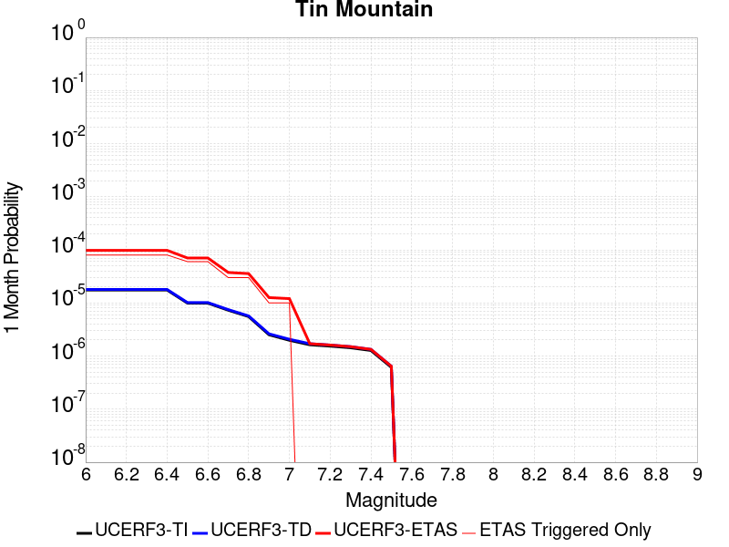 |  |  |

| Magnitude | 1 wk TI Prob | 1 wk TD Prob | 1 wk ETAS Prob | 1 wk ETAS/TD Gain | 1 wk ETAS Triggered Only | 1 mo TI Prob | 1 mo TD Prob | 1 mo ETAS Prob | 1 mo ETAS/TD Gain | 1 mo ETAS Triggered Only | 1 yr TI Prob | 1 yr TD Prob | 1 yr ETAS Prob | 1 yr ETAS/TD Gain | 1 yr ETAS Triggered Only | 10 yr TI Prob | 10 yr TD Prob | 10 yr ETAS Prob | 10 yr ETAS/TD Gain | 10 yr ETAS Triggered Only |
|-----|-----|-----|-----|-----|-----|-----|-----|-----|-----|-----|-----|-----|-----|-----|-----|-----|-----|-----|-----|-----|
| 6.0 | 4.083776E-6 | 4.1815365E-6 | 4.1676692E-5 | 9.966837 | 3.7495312E-5 | 1.750178E-5 | 1.792077E-5 | 9.291005E-5 | 5.18449 | 7.4990625E-5 | 2.1306332E-4 | 2.1816725E-4 | 3.3062865E-4 | 1.5154825 | 1.1248594E-4 | 0.0021285915 | 0.0021798965 | 0.0023295507 | 1.068652 | 1.4998125E-4 |
| 6.1 | 4.083776E-6 | 4.1815365E-6 | 4.1676692E-5 | 9.966837 | 3.7495312E-5 | 1.750178E-5 | 1.792077E-5 | 9.291005E-5 | 5.18449 | 7.4990625E-5 | 2.1306332E-4 | 2.1816725E-4 | 3.3062865E-4 | 1.5154825 | 1.1248594E-4 | 0.0021285915 | 0.0021798965 | 0.0023295507 | 1.068652 | 1.4998125E-4 |
| 6.2 | 4.083776E-6 | 4.1815365E-6 | 4.1676692E-5 | 9.966837 | 3.7495312E-5 | 1.750178E-5 | 1.792077E-5 | 9.291005E-5 | 5.18449 | 7.4990625E-5 | 2.1306332E-4 | 2.1816725E-4 | 3.3062865E-4 | 1.5154825 | 1.1248594E-4 | 0.0021285915 | 0.0021798965 | 0.0023295507 | 1.068652 | 1.4998125E-4 |
| 6.3 | 4.083776E-6 | 4.1815365E-6 | 4.1676692E-5 | 9.966837 | 3.7495312E-5 | 1.750178E-5 | 1.792077E-5 | 9.291005E-5 | 5.18449 | 7.4990625E-5 | 2.1306332E-4 | 2.1816725E-4 | 3.3062865E-4 | 1.5154825 | 1.1248594E-4 | 0.0021285915 | 0.0021798965 | 0.0023295507 | 1.068652 | 1.4998125E-4 |
| 6.4 | 4.083776E-6 | 4.1815365E-6 | 4.1676692E-5 | 9.966837 | 3.7495312E-5 | 1.750178E-5 | 1.792077E-5 | 9.291005E-5 | 5.18449 | 7.4990625E-5 | 2.1306332E-4 | 2.1816725E-4 | 3.3062865E-4 | 1.5154825 | 1.1248594E-4 | 0.0021285915 | 0.0021798965 | 0.0023295507 | 1.068652 | 1.4998125E-4 |
| 6.5 | 2.3143427E-6 | 2.3731573E-6 | 3.986838E-5 | 16.799723 | 3.7495312E-5 | 9.9185745E-6 | 1.0170638E-5 | 4.766557E-5 | 4.686586 | 3.7495312E-5 | 1.2075195E-4 | 1.2382126E-4 | 1.988026E-4 | 1.6055611 | 7.4990625E-5 | 0.0012068636 | 0.0012375986 | 0.0013124965 | 1.0605186 | 7.4990625E-5 |
| 6.6 | 2.3143427E-6 | 2.3731573E-6 | 3.986838E-5 | 16.799723 | 3.7495312E-5 | 9.9185745E-6 | 1.0170638E-5 | 4.766557E-5 | 4.686586 | 3.7495312E-5 | 1.2075195E-4 | 1.2382126E-4 | 1.988026E-4 | 1.6055611 | 7.4990625E-5 | 0.0012068636 | 0.0012375986 | 0.0013124965 | 1.0605186 | 7.4990625E-5 |
| 6.7 | 1.7029532E-6 | 1.7497915E-6 | 3.924504E-5 | 22.42841 | 3.7495312E-5 | 7.2983503E-6 | 7.499088E-6 | 4.4994118E-5 | 5.9999456 | 3.7495312E-5 | 8.885379E-5 | 9.1298105E-5 | 1.2879E-4 | 1.4106536 | 3.7495312E-5 | 8.881827E-4 | 9.1265864E-4 | 9.501197E-4 | 1.0410461 | 3.7495312E-5 |
| 6.8 | 1.2914646E-6 | 1.3299378E-6 | 3.88252E-5 | 29.193245 | 3.7495312E-5 | 5.534837E-6 | 5.6997237E-6 | 4.3194825E-5 | 7.5784063 | 3.7495312E-5 | 6.738455E-5 | 6.939237E-5 | 1.0688508E-4 | 1.5403003 | 3.7495312E-5 | 6.736412E-4 | 6.9375033E-4 | 7.3121965E-4 | 1.0540098 | 3.7495312E-5 |
| 6.9 | 5.8708974E-7 | 6.1169936E-7 | 6.1169936E-7 | 1.0 | 0.0 | 2.5160964E-6 | 2.6215664E-6 | 2.6215664E-6 | 1.0 | 0.0 | 3.0633044E-5 | 3.1917145E-5 | 3.1917145E-5 | 1.0 | 0.0 | 3.0628822E-4 | 3.191297E-4 | 3.191297E-4 | 1.0 | 0.0 |
| 7.0 | 4.6248786E-7 | 4.832015E-7 | 4.832015E-7 | 1.0 | 0.0 | 1.9820893E-6 | 2.0708624E-6 | 2.0708624E-6 | 1.0 | 0.0 | 2.413167E-5 | 2.5212494E-5 | 2.5212494E-5 | 1.0 | 0.0 | 2.412905E-4 | 2.5210003E-4 | 2.5210003E-4 | 1.0 | 0.0 |
| 7.1 | 3.804606E-7 | 3.987147E-7 | 3.987147E-7 | 1.0 | 0.0 | 1.6305444E-6 | 1.7087764E-6 | 1.7087764E-6 | 1.0 | 0.0 | 1.9851697E-5 | 2.0804187E-5 | 2.0804187E-5 | 1.0 | 0.0 | 1.9849923E-4 | 2.0802575E-4 | 2.0802575E-4 | 1.0 | 0.0 |
| 7.2 | 3.5864858E-7 | 3.7616863E-7 | 3.7616863E-7 | 1.0 | 0.0 | 1.5370645E-6 | 1.6121504E-6 | 1.6121504E-6 | 1.0 | 0.0 | 1.87136E-5 | 1.9627789E-5 | 1.9627789E-5 | 1.0 | 0.0 | 1.8712023E-4 | 1.9626386E-4 | 1.9626386E-4 | 1.0 | 0.0 |
| 7.3 | 3.342063E-7 | 3.506347E-7 | 3.506347E-7 | 1.0 | 0.0 | 1.4323119E-6 | 1.5027196E-6 | 1.5027196E-6 | 1.0 | 0.0 | 1.7438259E-5 | 1.829549E-5 | 1.829549E-5 | 1.0 | 0.0 | 1.743689E-4 | 1.8294314E-4 | 1.8294314E-4 | 1.0 | 0.0 |
| 7.4 | 2.971242E-7 | 3.1165817E-7 | 3.1165817E-7 | 1.0 | 0.0 | 1.2733886E-6 | 1.3356774E-6 | 1.3356774E-6 | 1.0 | 0.0 | 1.5503398E-5 | 1.6261785E-5 | 1.6261785E-5 | 1.0 | 0.0 | 1.5502315E-4 | 1.6260923E-4 | 1.6260923E-4 | 1.0 | 0.0 |
| 7.5 | 1.4326713E-7 | 1.5012525E-7 | 1.5012525E-7 | 1.0 | 0.0 | 6.140018E-7 | 6.433939E-7 | 6.433939E-7 | 1.0 | 0.0 | 7.4754466E-6 | 7.8333205E-6 | 7.8333205E-6 | 1.0 | 0.0 | 7.475195E-5 | 7.833321E-5 | 7.833321E-5 | 1.0 | 0.0 |

## Cleghorn Lake
*[(top)](#table-of-contents)*

| 1 Week | 1 Month | 1 Year | 10 Year |
|-----|-----|-----|-----|
|  |  | 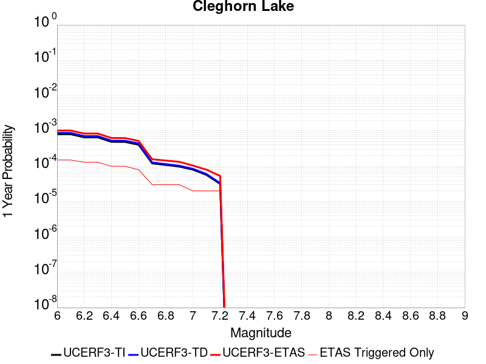 |  |

| Magnitude | 1 wk TI Prob | 1 wk TD Prob | 1 wk ETAS Prob | 1 wk ETAS/TD Gain | 1 wk ETAS Triggered Only | 1 mo TI Prob | 1 mo TD Prob | 1 mo ETAS Prob | 1 mo ETAS/TD Gain | 1 mo ETAS Triggered Only | 1 yr TI Prob | 1 yr TD Prob | 1 yr ETAS Prob | 1 yr ETAS/TD Gain | 1 yr ETAS Triggered Only | 10 yr TI Prob | 10 yr TD Prob | 10 yr ETAS Prob | 10 yr ETAS/TD Gain | 10 yr ETAS Triggered Only |
|-----|-----|-----|-----|-----|-----|-----|-----|-----|-----|-----|-----|-----|-----|-----|-----|-----|-----|-----|-----|-----|
| 6.0 | 1.5467183E-5 | 1.6794203E-5 | 5.428889E-5 | 3.2325966 | 3.7495312E-5 | 6.6286244E-5 | 7.197348E-5 | 1.8445133E-4 | 2.5627677 | 1.1248594E-4 | 8.067362E-4 | 8.759797E-4 | 9.883671E-4 | 1.1282991 | 1.1248594E-4 | 0.008038137 | 0.008730696 | 0.008879367 | 1.0170287 | 1.4998125E-4 |
| 6.1 | 1.5467183E-5 | 1.6794203E-5 | 5.428889E-5 | 3.2325966 | 3.7495312E-5 | 6.6286244E-5 | 7.197348E-5 | 1.8445133E-4 | 2.5627677 | 1.1248594E-4 | 8.067362E-4 | 8.759797E-4 | 9.883671E-4 | 1.1282991 | 1.1248594E-4 | 0.008038137 | 0.008730696 | 0.008879367 | 1.0170287 | 1.4998125E-4 |
| 6.2 | 1.2624631E-5 | 1.3681544E-5 | 5.1176346E-5 | 3.7405386 | 3.7495312E-5 | 5.410444E-5 | 5.863415E-5 | 1.711135E-4 | 2.918325 | 1.1248594E-4 | 6.585225E-4 | 7.1368564E-4 | 8.260913E-4 | 1.1575003 | 1.1248594E-4 | 0.0065657445 | 0.0071187317 | 0.007230417 | 1.0156889 | 1.1248594E-4 |
| 6.3 | 1.2624631E-5 | 1.3681544E-5 | 5.1176346E-5 | 3.7405386 | 3.7495312E-5 | 5.410444E-5 | 5.863415E-5 | 1.711135E-4 | 2.918325 | 1.1248594E-4 | 6.585225E-4 | 7.1368564E-4 | 8.260913E-4 | 1.1575003 | 1.1248594E-4 | 0.0065657445 | 0.0071187317 | 0.007230417 | 1.0156889 | 1.1248594E-4 |
| 6.4 | 9.417684E-6 | 1.0170118E-5 | 4.766505E-5 | 4.6867747 | 3.7495312E-5 | 4.036088E-5 | 4.3585722E-5 | 1.1857308E-4 | 2.7204568 | 7.4990625E-5 | 4.912829E-4 | 5.3056807E-4 | 6.055189E-4 | 1.1412653 | 7.4990625E-5 | 0.004901982 | 0.005297049 | 0.0053716423 | 1.0140821 | 7.4990625E-5 |
| 6.5 | 9.368219E-6 | 1.0117545E-5 | 4.7612477E-5 | 4.705932 | 3.7495312E-5 | 4.014889E-5 | 4.3360415E-5 | 1.1834779E-4 | 2.729397 | 7.4990625E-5 | 4.8870314E-4 | 5.2782625E-4 | 6.027773E-4 | 1.1419995 | 7.4990625E-5 | 0.004876298 | 0.0052697617 | 0.005344357 | 1.0141554 | 7.4990625E-5 |
| 6.6 | 7.803798E-6 | 8.441831E-6 | 4.5936828E-5 | 5.4415717 | 3.7495312E-5 | 3.3444423E-5 | 3.6179E-5 | 1.1116691E-4 | 3.0726917 | 7.4990625E-5 | 4.0710976E-4 | 4.4043022E-4 | 5.153878E-4 | 1.1701918 | 7.4990625E-5 | 0.0040636472 | 0.0043994905 | 0.004474151 | 1.0169703 | 7.4990625E-5 |
| 6.7 | 2.3108669E-6 | 2.4438336E-6 | 2.4438336E-6 | 1.0 | 0.0 | 9.903678E-6 | 1.0473532E-5 | 4.7968453E-5 | 4.579969 | 3.7495312E-5 | 1.205706E-4 | 1.2750797E-4 | 1.649985E-4 | 1.294025 | 3.7495312E-5 | 0.001205052 | 0.0012743667 | 0.0013118143 | 1.0293852 | 3.7495312E-5 |
| 6.8 | 2.0882828E-6 | 2.2062823E-6 | 2.2062823E-6 | 1.0 | 0.0 | 8.949753E-6 | 9.455462E-6 | 4.695042E-5 | 4.965429 | 3.7495312E-5 | 1.08957785E-4 | 1.1511434E-4 | 1.5260534E-4 | 1.3256849 | 3.7495312E-5 | 0.0010890438 | 0.0011505639 | 0.0011880161 | 1.0325512 | 3.7495312E-5 |
| 6.9 | 1.876935E-6 | 1.981051E-6 | 1.981051E-6 | 1.0 | 0.0 | 8.043982E-6 | 8.490192E-6 | 4.5985187E-5 | 5.4162717 | 3.7495312E-5 | 9.7931086E-5 | 1.03363345E-4 | 1.4085478E-4 | 1.362715 | 3.7495312E-5 | 9.788794E-4 | 0.0010331686 | 0.0010706253 | 1.036254 | 3.7495312E-5 |
| 7.0 | 1.5357559E-6 | 1.6202807E-6 | 1.6202807E-6 | 1.0 | 0.0 | 6.5817944E-6 | 6.9440425E-6 | 4.4439093E-5 | 6.3996 | 3.7495312E-5 | 8.01304E-5 | 8.454057E-5 | 1.220327E-4 | 1.4434811 | 3.7495312E-5 | 8.010151E-4 | 8.450965E-4 | 8.825601E-4 | 1.0443306 | 3.7495312E-5 |
| 7.1 | 1.0905424E-6 | 1.1497619E-6 | 1.1497619E-6 | 1.0 | 0.0 | 4.6737446E-6 | 4.9275427E-6 | 4.242267E-5 | 8.609296 | 3.7495312E-5 | 5.6901354E-5 | 5.999128E-5 | 9.748434E-5 | 1.6249752 | 3.7495312E-5 | 5.6886784E-4 | 5.997606E-4 | 6.3723343E-4 | 1.0624796 | 3.7495312E-5 |
| 7.2 | 6.06668E-7 | 6.387277E-7 | 6.387277E-7 | 1.0 | 0.0 | 2.600003E-6 | 2.7374022E-6 | 4.023261E-5 | 14.69737 | 3.7495312E-5 | 3.1654577E-5 | 3.3327433E-5 | 7.0821494E-5 | 2.125021 | 3.7495312E-5 | 3.1650066E-4 | 3.3323118E-4 | 3.70714E-4 | 1.1124829 | 3.7495312E-5 |

## White Wolf (Extension)
*[(top)](#table-of-contents)*

| 1 Week | 1 Month | 1 Year | 10 Year |
|-----|-----|-----|-----|
|  |  |  |  |

| Magnitude | 1 wk TI Prob | 1 wk TD Prob | 1 wk ETAS Prob | 1 wk ETAS/TD Gain | 1 wk ETAS Triggered Only | 1 mo TI Prob | 1 mo TD Prob | 1 mo ETAS Prob | 1 mo ETAS/TD Gain | 1 mo ETAS Triggered Only | 1 yr TI Prob | 1 yr TD Prob | 1 yr ETAS Prob | 1 yr ETAS/TD Gain | 1 yr ETAS Triggered Only | 10 yr TI Prob | 10 yr TD Prob | 10 yr ETAS Prob | 10 yr ETAS/TD Gain | 10 yr ETAS Triggered Only |
|-----|-----|-----|-----|-----|-----|-----|-----|-----|-----|-----|-----|-----|-----|-----|-----|-----|-----|-----|-----|-----|
| 6.0 | 8.222555E-6 | 6.0666657E-6 | 4.356175E-5 | 7.1805096 | 3.7495312E-5 | 3.5239045E-5 | 2.5999774E-5 | 1.3848279E-4 | 5.3263073 | 1.1248594E-4 | 4.289509E-4 | 3.1650788E-4 | 4.2895824E-4 | 1.3552845 | 1.1248594E-4 | 0.0042812387 | 0.003161223 | 0.0033107302 | 1.047294 | 1.4998125E-4 |
| 6.1 | 8.222555E-6 | 6.0666657E-6 | 4.356175E-5 | 7.1805096 | 3.7495312E-5 | 3.5239045E-5 | 2.5999774E-5 | 1.3848279E-4 | 5.3263073 | 1.1248594E-4 | 4.289509E-4 | 3.1650788E-4 | 4.2895824E-4 | 1.3552845 | 1.1248594E-4 | 0.0042812387 | 0.003161223 | 0.0033107302 | 1.047294 | 1.4998125E-4 |
| 6.2 | 8.222555E-6 | 6.0666657E-6 | 4.356175E-5 | 7.1805096 | 3.7495312E-5 | 3.5239045E-5 | 2.5999774E-5 | 1.3848279E-4 | 5.3263073 | 1.1248594E-4 | 4.289509E-4 | 3.1650788E-4 | 4.2895824E-4 | 1.3552845 | 1.1248594E-4 | 0.0042812387 | 0.003161223 | 0.0033107302 | 1.047294 | 1.4998125E-4 |
| 6.3 | 8.222555E-6 | 6.0666657E-6 | 4.356175E-5 | 7.1805096 | 3.7495312E-5 | 3.5239045E-5 | 2.5999774E-5 | 1.3848279E-4 | 5.3263073 | 1.1248594E-4 | 4.289509E-4 | 3.1650788E-4 | 4.2895824E-4 | 1.3552845 | 1.1248594E-4 | 0.0042812387 | 0.003161223 | 0.0033107302 | 1.047294 | 1.4998125E-4 |
| 6.4 | 5.821773E-6 | 3.5571766E-6 | 4.1052357E-5 | 11.540714 | 3.7495312E-5 | 2.4950215E-5 | 1.5244959E-5 | 1.2772919E-4 | 8.378453 | 1.1248594E-4 | 3.0372653E-4 | 1.8559267E-4 | 2.9805774E-4 | 1.6059779 | 1.1248594E-4 | 0.0030331176 | 0.001854485 | 0.0020041883 | 1.080725 | 1.4998125E-4 |
| 6.5 | 5.766023E-6 | 3.4991106E-6 | 4.099429E-5 | 11.715632 | 3.7495312E-5 | 2.4711293E-5 | 1.4996108E-5 | 1.2748037E-4 | 8.500896 | 1.1248594E-4 | 3.0081844E-4 | 1.8256342E-4 | 2.9502882E-4 | 1.6160347 | 1.1248594E-4 | 0.0030041158 | 0.0018242426 | 0.0019739503 | 1.0820657 | 1.4998125E-4 |
| 6.6 | 4.643576E-6 | 2.332624E-6 | 3.982785E-5 | 17.074268 | 3.7495312E-5 | 1.9900888E-5 | 9.996925E-6 | 1.2248174E-4 | 12.251942 | 1.1248594E-4 | 2.4226638E-4 | 1.2170619E-4 | 2.3417844E-4 | 1.9241292 | 1.1248594E-4 | 0.0024200242 | 0.0012164378 | 0.0013662366 | 1.1231455 | 1.4998125E-4 |
| 6.7 | 3.9529173E-6 | 1.6483477E-6 | 1.6483477E-6 | 1.0 | 0.0 | 1.6940963E-5 | 7.0643296E-6 | 8.205442E-5 | 11.615316 | 7.4990625E-5 | 2.0623671E-4 | 8.6005006E-5 | 1.6098918E-4 | 1.8718582 | 7.4990625E-5 | 0.002060454 | 8.597357E-4 | 9.346619E-4 | 1.0871502 | 7.4990625E-5 |
| 6.8 | 3.4377522E-6 | 1.2245237E-6 | 1.2245237E-6 | 1.0 | 0.0 | 1.473314E-5 | 5.2479486E-6 | 8.0238184E-5 | 15.289437 | 7.4990625E-5 | 1.7936122E-4 | 6.3891996E-5 | 1.3887783E-4 | 2.1736343 | 7.4990625E-5 | 0.0017921652 | 6.387454E-4 | 7.136881E-4 | 1.117328 | 7.4990625E-5 |
| 6.9 | 3.1367306E-6 | 1.0033783E-6 | 1.0033783E-6 | 1.0 | 0.0 | 1.3443062E-5 | 4.3001864E-6 | 7.929049E-5 | 18.43885 | 7.4990625E-5 | 1.63657E-4 | 5.235359E-5 | 1.2734029E-4 | 2.4323125 | 7.4990625E-5 | 0.0016353652 | 5.2342017E-4 | 5.9837155E-4 | 1.1431954 | 7.4990625E-5 |
| 7.0 | 2.8298145E-6 | 7.4286646E-7 | 7.4286646E-7 | 1.0 | 0.0 | 1.2127721E-5 | 3.1837099E-6 | 4.0678904E-5 | 12.777202 | 3.7495312E-5 | 1.47645E-4 | 3.8761027E-5 | 7.625489E-5 | 1.9673082 | 3.7495312E-5 | 0.0014754693 | 3.8754768E-4 | 4.2502847E-4 | 1.0967127 | 3.7495312E-5 |
| 7.1 | 2.4091064E-6 | 5.4227525E-7 | 5.4227525E-7 | 1.0 | 0.0 | 1.03247E-5 | 2.3240348E-6 | 3.981926E-5 | 17.133677 | 3.7495312E-5 | 1.2569598E-4 | 2.8294799E-5 | 6.578905E-5 | 2.3251288 | 3.7495312E-5 | 0.001256249 | 2.8291598E-4 | 3.204007E-4 | 1.1324941 | 3.7495312E-5 |
| 7.2 | 1.3875518E-6 | 1.0743063E-7 | 1.0743063E-7 | 1.0 | 0.0 | 5.9466374E-6 | 4.6041689E-7 | 4.6041689E-7 | 1.0 | 0.0 | 7.23979E-5 | 5.6055624E-6 | 5.6055624E-6 | 1.0 | 0.0 | 7.2374323E-4 | 5.6054323E-5 | 5.6054323E-5 | 1.0 | 0.0 |
| 7.3 | 7.056077E-7 | 5.002034E-8 | 5.002034E-8 | 1.0 | 0.0 | 3.0240296E-6 | 2.1437286E-7 | 2.1437286E-7 | 1.0 | 0.0 | 3.681694E-5 | 2.609987E-6 | 2.609987E-6 | 1.0 | 0.0 | 3.681084E-4 | 2.609961E-5 | 2.609961E-5 | 1.0 | 0.0 |
| 7.4 | 5.9334678E-8 | 4.8683537E-9 | 4.8683537E-9 | 1.0 | 0.0 | 2.5429145E-7 | 2.0864372E-8 | 2.0864372E-8 | 1.0 | 0.0 | 3.095994E-6 | 2.5402372E-7 | 2.5402372E-7 | 1.0 | 0.0 | 3.095951E-5 | 2.5402353E-6 | 2.5402353E-6 | 1.0 | 0.0 |

## Big Pine (East)
*[(top)](#table-of-contents)*

| 1 Week | 1 Month | 1 Year | 10 Year |
|-----|-----|-----|-----|
|  |  |  |  |

| Magnitude | 1 wk TI Prob | 1 wk TD Prob | 1 wk ETAS Prob | 1 wk ETAS/TD Gain | 1 wk ETAS Triggered Only | 1 mo TI Prob | 1 mo TD Prob | 1 mo ETAS Prob | 1 mo ETAS/TD Gain | 1 mo ETAS Triggered Only | 1 yr TI Prob | 1 yr TD Prob | 1 yr ETAS Prob | 1 yr ETAS/TD Gain | 1 yr ETAS Triggered Only | 10 yr TI Prob | 10 yr TD Prob | 10 yr ETAS Prob | 10 yr ETAS/TD Gain | 10 yr ETAS Triggered Only |
|-----|-----|-----|-----|-----|-----|-----|-----|-----|-----|-----|-----|-----|-----|-----|-----|-----|-----|-----|-----|-----|
| 6.0 | 9.916913E-6 | 1.2816984E-5 | 5.0311817E-5 | 3.925402 | 3.7495312E-5 | 4.250036E-5 | 5.49289E-5 | 9.242215E-5 | 1.6825778 | 3.7495312E-5 | 5.173191E-4 | 6.685763E-4 | 7.435168E-4 | 1.1120896 | 7.4990625E-5 | 0.0051611643 | 0.006670441 | 0.006819422 | 1.0223345 | 1.4998125E-4 |
| 6.1 | 9.916913E-6 | 1.2816984E-5 | 5.0311817E-5 | 3.925402 | 3.7495312E-5 | 4.250036E-5 | 5.49289E-5 | 9.242215E-5 | 1.6825778 | 3.7495312E-5 | 5.173191E-4 | 6.685763E-4 | 7.435168E-4 | 1.1120896 | 7.4990625E-5 | 0.0051611643 | 0.006670441 | 0.006819422 | 1.0223345 | 1.4998125E-4 |
| 6.2 | 9.916913E-6 | 1.2816984E-5 | 5.0311817E-5 | 3.925402 | 3.7495312E-5 | 4.250036E-5 | 5.49289E-5 | 9.242215E-5 | 1.6825778 | 3.7495312E-5 | 5.173191E-4 | 6.685763E-4 | 7.435168E-4 | 1.1120896 | 7.4990625E-5 | 0.0051611643 | 0.006670441 | 0.006819422 | 1.0223345 | 1.4998125E-4 |
| 6.3 | 5.479711E-6 | 8.112951E-6 | 8.112951E-6 | 1.0 | 0.0 | 2.3484265E-5 | 3.4769346E-5 | 3.4769346E-5 | 1.0 | 0.0 | 2.858834E-4 | 4.2323777E-4 | 4.6071722E-4 | 1.0885541 | 3.7495312E-5 | 0.0028551589 | 0.004227244 | 0.004339254 | 1.0264972 | 1.1248594E-4 |
| 6.4 | 5.465009E-6 | 8.097245E-6 | 8.097245E-6 | 1.0 | 0.0 | 2.3421257E-5 | 3.4702036E-5 | 3.4702036E-5 | 1.0 | 0.0 | 2.851165E-4 | 4.2241855E-4 | 4.5989803E-4 | 1.0887259 | 3.7495312E-5 | 0.0028475097 | 0.0042190826 | 0.004331094 | 1.0265487 | 1.1248594E-4 |
| 6.5 | 4.826767E-6 | 7.422301E-6 | 7.422301E-6 | 1.0 | 0.0 | 2.068598E-5 | 3.180949E-5 | 3.180949E-5 | 1.0 | 0.0 | 2.518227E-4 | 3.872145E-4 | 4.246953E-4 | 1.0967959 | 3.7495312E-5 | 0.0025153751 | 0.003868283 | 0.003980334 | 1.0289665 | 1.1248594E-4 |
| 6.6 | 4.3146847E-6 | 6.8822374E-6 | 6.8822374E-6 | 1.0 | 0.0 | 1.8491375E-5 | 2.9494982E-5 | 2.9494982E-5 | 1.0 | 0.0 | 2.2510924E-4 | 3.590447E-4 | 3.9652654E-4 | 1.1043932 | 3.7495312E-5 | 0.0022488134 | 0.0035874986 | 0.003699581 | 1.0312425 | 1.1248594E-4 |
| 6.7 | 3.6968106E-6 | 5.9954727E-6 | 5.9954727E-6 | 1.0 | 0.0 | 1.5843378E-5 | 2.5694639E-5 | 2.5694639E-5 | 1.0 | 0.0 | 1.9287605E-4 | 3.1278885E-4 | 3.5027243E-4 | 1.1198367 | 3.7495312E-5 | 0.0019270873 | 0.0031262483 | 0.0032383825 | 1.0358686 | 1.1248594E-4 |
| 6.8 | 3.4671132E-6 | 5.702177E-6 | 5.702177E-6 | 1.0 | 0.0 | 1.4858972E-5 | 2.4437682E-5 | 2.4437682E-5 | 1.0 | 0.0 | 1.8089297E-4 | 2.974896E-4 | 3.3497377E-4 | 1.1260016 | 3.7495312E-5 | 0.0018074579 | 0.002973667 | 0.0030858186 | 1.0377148 | 1.1248594E-4 |
| 6.9 | 2.7686972E-6 | 4.825223E-6 | 4.825223E-6 | 1.0 | 0.0 | 1.1865792E-5 | 2.0679368E-5 | 2.0679368E-5 | 1.0 | 0.0 | 1.4445644E-4 | 2.5174298E-4 | 2.8922883E-4 | 1.1489054 | 3.7495312E-5 | 0.0014436257 | 0.0025172636 | 0.0026294666 | 1.0445733 | 1.1248594E-4 |
| 7.0 | 2.1472624E-6 | 3.9850406E-6 | 3.9850406E-6 | 1.0 | 0.0 | 9.20252E-6 | 1.7078637E-5 | 1.7078637E-5 | 1.0 | 0.0 | 1.12034926E-4 | 2.079131E-4 | 2.079131E-4 | 1.0 | 0.0 | 0.0011197845 | 0.0020798394 | 0.0020798394 | 1.0 | 0.0 |
| 7.1 | 1.7018335E-6 | 3.344876E-6 | 3.344876E-6 | 1.0 | 0.0 | 7.293552E-6 | 1.4335106E-5 | 1.4335106E-5 | 1.0 | 0.0 | 8.879537E-5 | 1.7451629E-4 | 1.7451629E-4 | 1.0 | 0.0 | 8.87599E-4 | 0.0017464145 | 0.0017464145 | 1.0 | 0.0 |
| 7.2 | 1.25603E-6 | 2.794484E-6 | 2.794484E-6 | 1.0 | 0.0 | 5.3829745E-6 | 1.1976307E-5 | 1.1976307E-5 | 1.0 | 0.0 | 6.553574E-5 | 1.4580201E-4 | 1.4580201E-4 | 1.0 | 0.0 | 6.551642E-4 | 0.001459661 | 0.001459661 | 1.0 | 0.0 |
| 7.3 | 1.112297E-6 | 2.610332E-6 | 2.610332E-6 | 1.0 | 0.0 | 4.7669787E-6 | 1.118709E-5 | 1.118709E-5 | 1.0 | 0.0 | 5.803642E-5 | 1.3619453E-4 | 1.3619453E-4 | 1.0 | 0.0 | 5.802127E-4 | 0.0013635408 | 0.0013635408 | 1.0 | 0.0 |
| 7.4 | 1.0137181E-6 | 2.4834917E-6 | 2.4834917E-6 | 1.0 | 0.0 | 4.3444993E-6 | 1.0643494E-5 | 1.0643494E-5 | 1.0 | 0.0 | 5.2892992E-5 | 1.2957705E-4 | 1.2957705E-4 | 1.0 | 0.0 | 5.288041E-4 | 0.0012972289 | 0.0012972289 | 1.0 | 0.0 |
| 7.5 | 9.598608E-7 | 2.4071483E-6 | 2.4071483E-6 | 1.0 | 0.0 | 4.1136827E-6 | 1.031631E-5 | 1.031631E-5 | 1.0 | 0.0 | 5.0082934E-5 | 1.2559404E-4 | 1.2559404E-4 | 1.0 | 0.0 | 5.007165E-4 | 0.0012572526 | 0.0012572526 | 1.0 | 0.0 |
| 7.6 | 7.929459E-7 | 2.0448588E-6 | 2.0448588E-6 | 1.0 | 0.0 | 3.3983351E-6 | 8.763653E-6 | 8.763653E-6 | 1.0 | 0.0 | 4.1373947E-5 | 1.06692416E-4 | 1.06692416E-4 | 1.0 | 0.0 | 4.1366243E-4 | 0.0010685222 | 0.0010685222 | 1.0 | 0.0 |
| 7.7 | 4.155788E-7 | 1.1605589E-6 | 1.1605589E-6 | 1.0 | 0.0 | 1.7810507E-6 | 4.9738146E-6 | 4.9738146E-6 | 1.0 | 0.0 | 2.1684076E-5 | 6.0554554E-5 | 6.0554554E-5 | 1.0 | 0.0 | 2.1681961E-4 | 6.0857297E-4 | 6.0857297E-4 | 1.0 | 0.0 |
| 7.8 | 1.14666925E-7 | 2.592015E-7 | 2.592015E-7 | 1.0 | 0.0 | 4.914296E-7 | 1.1108631E-6 | 1.1108631E-6 | 1.0 | 0.0 | 5.9831386E-6 | 1.3524678E-5 | 1.3524678E-5 | 1.0 | 0.0 | 5.9829777E-5 | 1.3634123E-4 | 1.3634123E-4 | 1.0 | 0.0 |
| 7.9 | 2.9231824E-8 | 4.1463963E-8 | 4.1463963E-8 | 1.0 | 0.0 | 1.2527924E-7 | 1.7770269E-7 | 1.7770269E-7 | 1.0 | 0.0 | 1.5252737E-6 | 2.1635283E-6 | 2.1635283E-6 | 1.0 | 0.0 | 1.5252632E-5 | 2.1967755E-5 | 2.1967755E-5 | 1.0 | 0.0 |

## San Clemente
*[(top)](#table-of-contents)*

| 1 Week | 1 Month | 1 Year | 10 Year |
|-----|-----|-----|-----|
|  |  |  |  |

| Magnitude | 1 wk TI Prob | 1 wk TD Prob | 1 wk ETAS Prob | 1 wk ETAS/TD Gain | 1 wk ETAS Triggered Only | 1 mo TI Prob | 1 mo TD Prob | 1 mo ETAS Prob | 1 mo ETAS/TD Gain | 1 mo ETAS Triggered Only | 1 yr TI Prob | 1 yr TD Prob | 1 yr ETAS Prob | 1 yr ETAS/TD Gain | 1 yr ETAS Triggered Only | 10 yr TI Prob | 10 yr TD Prob | 10 yr ETAS Prob | 10 yr ETAS/TD Gain | 10 yr ETAS Triggered Only |
|-----|-----|-----|-----|-----|-----|-----|-----|-----|-----|-----|-----|-----|-----|-----|-----|-----|-----|-----|-----|-----|
| 6.0 | 6.681379E-5 | 8.163422E-5 | 1.19126475E-4 | 1.4592713 | 3.7495312E-5 | 2.8631336E-4 | 3.498173E-4 | 3.8729951E-4 | 1.1071479 | 3.7495312E-5 | 0.003480294 | 0.0042512873 | 0.004363295 | 1.0263468 | 1.1248594E-4 | 0.03426291 | 0.041755714 | 0.04189943 | 1.0034419 | 1.4998125E-4 |
| 6.1 | 6.681379E-5 | 8.163422E-5 | 1.19126475E-4 | 1.4592713 | 3.7495312E-5 | 2.8631336E-4 | 3.498173E-4 | 3.8729951E-4 | 1.1071479 | 3.7495312E-5 | 0.003480294 | 0.0042512873 | 0.004363295 | 1.0263468 | 1.1248594E-4 | 0.03426291 | 0.041755714 | 0.0418635 | 1.0025815 | 1.1248594E-4 |
| 6.2 | 3.9400576E-5 | 4.6451984E-5 | 4.6451984E-5 | 1.0 | 0.0 | 1.6884868E-4 | 1.9906509E-4 | 1.9906509E-4 | 1.0 | 0.0 | 0.0020537945 | 0.002420985 | 0.0024957939 | 1.0309002 | 7.4990625E-5 | 0.020349167 | 0.02395286 | 0.024026055 | 1.0030558 | 7.4990625E-5 |
| 6.3 | 3.2590255E-5 | 3.7929087E-5 | 3.7929087E-5 | 1.0 | 0.0 | 1.3966505E-4 | 1.6254328E-4 | 1.6254328E-4 | 1.0 | 0.0 | 0.0016990956 | 0.0019771985 | 0.0020520408 | 1.0378528 | 7.4990625E-5 | 0.01686163 | 0.019599866 | 0.019673387 | 1.003751 | 7.4990625E-5 |
| 6.4 | 2.9454652E-5 | 3.4097775E-5 | 3.4097775E-5 | 1.0 | 0.0 | 1.2622811E-4 | 1.4612528E-4 | 1.4612528E-4 | 1.0 | 0.0 | 0.0015357438 | 0.0017776482 | 0.0018525055 | 1.0421103 | 7.4990625E-5 | 0.015251739 | 0.017637458 | 0.017711125 | 1.0041767 | 7.4990625E-5 |
| 6.5 | 2.790836E-5 | 3.2247463E-5 | 3.2247463E-5 | 1.0 | 0.0 | 1.1960178E-4 | 1.3819622E-4 | 1.3819622E-4 | 1.0 | 0.0 | 0.001455179 | 0.0016812651 | 0.0017561297 | 1.0445287 | 7.4990625E-5 | 0.014456868 | 0.016688475 | 0.016762214 | 1.0044186 | 7.4990625E-5 |
| 6.6 | 2.2492153E-5 | 2.5762707E-5 | 2.5762707E-5 | 1.0 | 0.0 | 9.639138E-5 | 1.1040701E-4 | 1.1040701E-4 | 1.0 | 0.0 | 0.0011729331 | 0.0013433908 | 0.0014182808 | 1.0557469 | 7.4990625E-5 | 0.011667615 | 0.013354415 | 0.013428405 | 1.0055404 | 7.4990625E-5 |
| 6.7 | 1.9862755E-5 | 2.2666423E-5 | 2.2666423E-5 | 1.0 | 0.0 | 8.512331E-5 | 9.713826E-5 | 9.713826E-5 | 1.0 | 0.0 | 0.0010358836 | 0.0011820279 | 0.00125693 | 1.0633674 | 7.4990625E-5 | 0.010310682 | 0.011758701 | 0.011832809 | 1.0063025 | 7.4990625E-5 |
| 6.8 | 1.6697575E-5 | 1.897771E-5 | 1.897771E-5 | 1.0 | 0.0 | 7.155907E-5 | 8.133056E-5 | 8.133056E-5 | 1.0 | 0.0 | 8.7088346E-4 | 9.897591E-4 | 0.0010272173 | 1.0378457 | 3.7495312E-5 | 0.008674784 | 0.0098545365 | 0.009891663 | 1.0037674 | 3.7495312E-5 |
| 6.9 | 1.5218415E-5 | 1.72694E-5 | 1.72694E-5 | 1.0 | 0.0 | 6.522015E-5 | 7.4009666E-5 | 7.4009666E-5 | 1.0 | 0.0 | 7.93766E-4 | 9.00704E-4 | 9.381655E-4 | 1.0415914 | 3.7495312E-5 | 0.007909367 | 0.008971481 | 0.0090086395 | 1.0041419 | 3.7495312E-5 |
| 7.0 | 1.2392958E-5 | 1.4033016E-5 | 1.4033016E-5 | 1.0 | 0.0 | 5.3111595E-5 | 6.014015E-5 | 6.014015E-5 | 1.0 | 0.0 | 6.4644177E-4 | 7.319679E-4 | 7.6943584E-4 | 1.0511879 | 3.7495312E-5 | 0.0064456454 | 0.0072963564 | 0.0073335785 | 1.0051014 | 3.7495312E-5 |
| 7.1 | 1.0934128E-5 | 1.2375138E-5 | 1.2375138E-5 | 1.0 | 0.0 | 4.6859706E-5 | 5.303527E-5 | 5.303527E-5 | 1.0 | 0.0 | 5.7036756E-4 | 6.455204E-4 | 6.455204E-4 | 1.0 | 0.0 | 0.0056890585 | 0.0064371997 | 0.0064371997 | 1.0 | 0.0 |
| 7.2 | 9.5798805E-6 | 1.0844935E-5 | 1.0844935E-5 | 1.0 | 0.0 | 4.1055984E-5 | 4.6477508E-5 | 4.6477508E-5 | 1.0 | 0.0 | 4.9974193E-4 | 5.657239E-4 | 5.657239E-4 | 1.0 | 0.0 | 0.0049861963 | 0.0056435615 | 0.0056435615 | 1.0 | 0.0 |
| 7.3 | 8.0167365E-6 | 9.083918E-6 | 9.083918E-6 | 1.0 | 0.0 | 3.4356988E-5 | 3.8930535E-5 | 3.8930535E-5 | 1.0 | 0.0 | 4.1821605E-4 | 4.7388324E-4 | 4.7388324E-4 | 1.0 | 0.0 | 0.0041742986 | 0.0047294297 | 0.0047294297 | 1.0 | 0.0 |
| 7.4 | 2.9581017E-6 | 3.3623792E-6 | 3.3623792E-6 | 1.0 | 0.0 | 1.2677518E-5 | 1.4410146E-5 | 1.4410146E-5 | 1.0 | 0.0 | 1.5433785E-4 | 1.7543444E-4 | 1.7543444E-4 | 1.0 | 0.0 | 0.001542307 | 0.0017534546 | 0.0017534546 | 1.0 | 0.0 |

## Ventura-Pitas Point
*[(top)](#table-of-contents)*

| 1 Week | 1 Month | 1 Year | 10 Year |
|-----|-----|-----|-----|
|  |  |  |  |

| Magnitude | 1 wk TI Prob | 1 wk TD Prob | 1 wk ETAS Prob | 1 wk ETAS/TD Gain | 1 wk ETAS Triggered Only | 1 mo TI Prob | 1 mo TD Prob | 1 mo ETAS Prob | 1 mo ETAS/TD Gain | 1 mo ETAS Triggered Only | 1 yr TI Prob | 1 yr TD Prob | 1 yr ETAS Prob | 1 yr ETAS/TD Gain | 1 yr ETAS Triggered Only | 10 yr TI Prob | 10 yr TD Prob | 10 yr ETAS Prob | 10 yr ETAS/TD Gain | 10 yr ETAS Triggered Only |
|-----|-----|-----|-----|-----|-----|-----|-----|-----|-----|-----|-----|-----|-----|-----|-----|-----|-----|-----|-----|-----|
| 6.0 | 3.3179622E-5 | 3.3735185E-5 | 7.122923E-5 | 2.1114228 | 3.7495312E-5 | 1.4219063E-4 | 1.445728E-4 | 1.820627E-4 | 1.259315 | 3.7495312E-5 | 0.0017297962 | 0.0017590096 | 0.0017964389 | 1.0212786 | 3.7495312E-5 | 0.017163932 | 0.0174764 | 0.01758692 | 1.0063239 | 1.1248594E-4 |
| 6.1 | 3.3179622E-5 | 3.3735185E-5 | 7.122923E-5 | 2.1114228 | 3.7495312E-5 | 1.4219063E-4 | 1.445728E-4 | 1.820627E-4 | 1.259315 | 3.7495312E-5 | 0.0017297962 | 0.0017590096 | 0.0017964389 | 1.0212786 | 3.7495312E-5 | 0.017163932 | 0.0174764 | 0.01758692 | 1.0063239 | 1.1248594E-4 |
| 6.2 | 3.3179622E-5 | 3.3735185E-5 | 7.122923E-5 | 2.1114228 | 3.7495312E-5 | 1.4219063E-4 | 1.445728E-4 | 1.820627E-4 | 1.259315 | 3.7495312E-5 | 0.0017297962 | 0.0017590096 | 0.0017964389 | 1.0212786 | 3.7495312E-5 | 0.017163932 | 0.0174764 | 0.01758692 | 1.0063239 | 1.1248594E-4 |
| 6.3 | 3.3179622E-5 | 3.3735185E-5 | 7.122923E-5 | 2.1114228 | 3.7495312E-5 | 1.4219063E-4 | 1.445728E-4 | 1.820627E-4 | 1.259315 | 3.7495312E-5 | 0.0017297962 | 0.0017590096 | 0.0017964389 | 1.0212786 | 3.7495312E-5 | 0.017163932 | 0.0174764 | 0.01758692 | 1.0063239 | 1.1248594E-4 |
| 6.4 | 1.8754668E-5 | 1.701961E-5 | 5.4514287E-5 | 3.2030277 | 3.7495312E-5 | 8.037467E-5 | 7.293928E-5 | 1.1043186E-4 | 1.5140245 | 3.7495312E-5 | 9.781223E-4 | 8.8769704E-4 | 9.25159E-4 | 1.0422014 | 3.7495312E-5 | 0.009738282 | 0.008843848 | 0.008955339 | 1.0126066 | 1.1248594E-4 |
| 6.5 | 1.8754668E-5 | 1.701961E-5 | 5.4514287E-5 | 3.2030277 | 3.7495312E-5 | 8.037467E-5 | 7.293928E-5 | 1.1043186E-4 | 1.5140245 | 3.7495312E-5 | 9.781223E-4 | 8.8769704E-4 | 9.25159E-4 | 1.0422014 | 3.7495312E-5 | 0.009738282 | 0.008843848 | 0.008955339 | 1.0126066 | 1.1248594E-4 |
| 6.6 | 1.4361558E-5 | 1.2122275E-5 | 4.9617134E-5 | 4.093055 | 3.7495312E-5 | 6.154808E-5 | 5.1951585E-5 | 8.944495E-5 | 1.7216982 | 3.7495312E-5 | 7.490902E-4 | 6.3232926E-4 | 6.698009E-4 | 1.0592597 | 3.7495312E-5 | 0.0074657016 | 0.0063055577 | 0.006417334 | 1.0177267 | 1.1248594E-4 |
| 6.7 | 1.4361558E-5 | 1.2122275E-5 | 4.9617134E-5 | 4.093055 | 3.7495312E-5 | 6.154808E-5 | 5.1951585E-5 | 8.944495E-5 | 1.7216982 | 3.7495312E-5 | 7.490902E-4 | 6.3232926E-4 | 6.698009E-4 | 1.0592597 | 3.7495312E-5 | 0.0074657016 | 0.0063055577 | 0.006417334 | 1.0177267 | 1.1248594E-4 |
| 6.8 | 1.3663846E-5 | 1.13444175E-5 | 4.8839305E-5 | 4.30514 | 3.7495312E-5 | 5.8558027E-5 | 4.861804E-5 | 8.6111526E-5 | 1.7711848 | 3.7495312E-5 | 7.127108E-4 | 5.917658E-4 | 6.292389E-4 | 1.0633242 | 3.7495312E-5 | 0.007104293 | 0.005902116 | 0.006013938 | 1.018946 | 1.1248594E-4 |
| 6.9 | 1.3644157E-5 | 1.1322519E-5 | 4.881741E-5 | 4.3115325 | 3.7495312E-5 | 5.8473648E-5 | 4.8524187E-5 | 8.601768E-5 | 1.7726763 | 3.7495312E-5 | 7.116841E-4 | 5.9062376E-4 | 6.280969E-4 | 1.0634468 | 3.7495312E-5 | 0.007094092 | 0.0058907564 | 0.00600258 | 1.0189829 | 1.1248594E-4 |
| 7.0 | 1.3568845E-5 | 1.1242086E-5 | 4.8736976E-5 | 4.3352256 | 3.7495312E-5 | 5.8150898E-5 | 4.817949E-5 | 8.5673E-5 | 1.7782048 | 3.7495312E-5 | 7.077572E-4 | 5.864293E-4 | 6.2390266E-4 | 1.0639008 | 3.7495312E-5 | 0.007055073 | 0.0058490336 | 0.005960861 | 1.019119 | 1.1248594E-4 |
| 7.1 | 1.306572E-5 | 1.072054E-5 | 4.821545E-5 | 4.4974837 | 3.7495312E-5 | 5.599474E-5 | 4.5944373E-5 | 8.343796E-5 | 1.816065 | 3.7495312E-5 | 6.815227E-4 | 5.5923103E-4 | 5.9670536E-4 | 1.0670105 | 3.7495312E-5 | 0.0067943637 | 0.0055784425 | 0.005690301 | 1.020052 | 1.1248594E-4 |
| 7.2 | 1.232604E-5 | 9.995143E-6 | 4.749008E-5 | 4.7513156 | 3.7495312E-5 | 5.2824813E-5 | 4.2835632E-5 | 8.0329344E-5 | 1.8752924 | 3.7495312E-5 | 6.429523E-4 | 5.214008E-4 | 5.588766E-4 | 1.0718751 | 3.7495312E-5 | 0.0064109527 | 0.005201967 | 0.0053138677 | 1.0215112 | 1.1248594E-4 |
| 7.3 | 1.0917261E-5 | 8.84384E-6 | 4.633882E-5 | 5.2396717 | 3.7495312E-5 | 4.678742E-5 | 3.790163E-5 | 7.5395525E-5 | 1.9892422 | 3.7495312E-5 | 5.69488E-4 | 4.6135622E-4 | 4.9883424E-4 | 1.0812345 | 3.7495312E-5 | 0.0056803077 | 0.00460415 | 0.0047161183 | 1.0243189 | 1.1248594E-4 |
| 7.4 | 1.039959E-5 | 8.423562E-6 | 8.423562E-6 | 1.0 | 0.0 | 4.456891E-5 | 3.610049E-5 | 3.610049E-5 | 1.0 | 0.0 | 5.424914E-4 | 4.3943635E-4 | 4.3943635E-4 | 1.0 | 0.0 | 0.0054116896 | 0.004385836 | 0.0044604978 | 1.0170233 | 7.4990625E-5 |
| 7.5 | 9.015877E-6 | 7.2975445E-6 | 7.2975445E-6 | 1.0 | 0.0 | 3.86389E-5 | 3.1274823E-5 | 3.1274823E-5 | 1.0 | 0.0 | 4.7032707E-4 | 3.8070587E-4 | 3.8070587E-4 | 1.0 | 0.0 | 0.004693329 | 0.0038006818 | 0.0038753874 | 1.0196558 | 7.4990625E-5 |
| 7.6 | 4.900162E-6 | 3.8741155E-6 | 3.8741155E-6 | 1.0 | 0.0 | 2.1000526E-5 | 1.6603248E-5 | 1.6603248E-5 | 1.0 | 0.0 | 2.556514E-4 | 2.0212591E-4 | 2.0212591E-4 | 1.0 | 0.0 | 0.0025535747 | 0.0020194345 | 0.0020942737 | 1.0370594 | 7.4990625E-5 |
| 7.7 | 3.8850626E-6 | 3.1267302E-6 | 3.1267302E-6 | 1.0 | 0.0 | 1.6650163E-5 | 1.3400205E-5 | 1.3400205E-5 | 1.0 | 0.0 | 2.0269687E-4 | 1.6313537E-4 | 1.6313537E-4 | 1.0 | 0.0 | 0.002025121 | 0.0016301654 | 0.0017050338 | 1.0459268 | 7.4990625E-5 |
| 7.8 | 2.4654719E-6 | 2.029875E-6 | 2.029875E-6 | 1.0 | 0.0 | 1.0566265E-5 | 8.699436E-6 | 8.699436E-6 | 1.0 | 0.0 | 1.2863669E-4 | 1.0591053E-4 | 1.0591053E-4 | 1.0 | 0.0 | 0.0012856225 | 0.0010586053 | 0.0010960608 | 1.035382 | 3.7495312E-5 |
| 7.9 | 4.095894E-7 | 3.2764765E-7 | 3.2764765E-7 | 1.0 | 0.0 | 1.7553821E-6 | 1.4042034E-6 | 1.4042034E-6 | 1.0 | 0.0 | 2.1371567E-5 | 1.7096047E-5 | 1.7096047E-5 | 1.0 | 0.0 | 2.1369511E-4 | 1.7094762E-4 | 1.7094762E-4 | 1.0 | 0.0 |
| 8.0 | 7.791402E-9 | 5.683497E-9 | 5.683497E-9 | 1.0 | 0.0 | 3.3391725E-8 | 2.4357844E-8 | 2.4357844E-8 | 1.0 | 0.0 | 4.0654416E-7 | 2.9655675E-7 | 2.9655675E-7 | 1.0 | 0.0 | 4.065434E-6 | 2.9655655E-6 | 2.9655655E-6 | 1.0 | 0.0 |

## Deep Springs
*[(top)](#table-of-contents)*

| 1 Week | 1 Month | 1 Year | 10 Year |
|-----|-----|-----|-----|
|  |  |  |  |

| Magnitude | 1 wk TI Prob | 1 wk TD Prob | 1 wk ETAS Prob | 1 wk ETAS/TD Gain | 1 wk ETAS Triggered Only | 1 mo TI Prob | 1 mo TD Prob | 1 mo ETAS Prob | 1 mo ETAS/TD Gain | 1 mo ETAS Triggered Only | 1 yr TI Prob | 1 yr TD Prob | 1 yr ETAS Prob | 1 yr ETAS/TD Gain | 1 yr ETAS Triggered Only | 10 yr TI Prob | 10 yr TD Prob | 10 yr ETAS Prob | 10 yr ETAS/TD Gain | 10 yr ETAS Triggered Only |
|-----|-----|-----|-----|-----|-----|-----|-----|-----|-----|-----|-----|-----|-----|-----|-----|-----|-----|-----|-----|-----|
| 6.0 | 1.9810619E-5 | 2.311252E-5 | 6.0606966E-5 | 2.622257 | 3.7495312E-5 | 8.489989E-5 | 9.905276E-5 | 1.3654436E-4 | 1.3785013 | 3.7495312E-5 | 0.001033166 | 0.0012058079 | 0.0013181582 | 1.0931743 | 1.1248594E-4 | 0.010283757 | 0.012042425 | 0.0121906 | 1.0123044 | 1.4998125E-4 |
| 6.1 | 1.9810619E-5 | 2.311252E-5 | 6.0606966E-5 | 2.622257 | 3.7495312E-5 | 8.489989E-5 | 9.905276E-5 | 1.3654436E-4 | 1.3785013 | 3.7495312E-5 | 0.001033166 | 0.0012058079 | 0.0013181582 | 1.0931743 | 1.1248594E-4 | 0.010283757 | 0.012042425 | 0.0121906 | 1.0123044 | 1.4998125E-4 |
| 6.2 | 1.9810619E-5 | 2.311252E-5 | 6.0606966E-5 | 2.622257 | 3.7495312E-5 | 8.489989E-5 | 9.905276E-5 | 1.3654436E-4 | 1.3785013 | 3.7495312E-5 | 0.001033166 | 0.0012058079 | 0.0013181582 | 1.0931743 | 1.1248594E-4 | 0.010283757 | 0.012042425 | 0.0121906 | 1.0123044 | 1.4998125E-4 |
| 6.3 | 1.9810619E-5 | 2.311252E-5 | 6.0606966E-5 | 2.622257 | 3.7495312E-5 | 8.489989E-5 | 9.905276E-5 | 1.3654436E-4 | 1.3785013 | 3.7495312E-5 | 0.001033166 | 0.0012058079 | 0.0013181582 | 1.0931743 | 1.1248594E-4 | 0.010283757 | 0.012042425 | 0.0121906 | 1.0123044 | 1.4998125E-4 |
| 6.4 | 1.9810619E-5 | 2.311252E-5 | 6.0606966E-5 | 2.622257 | 3.7495312E-5 | 8.489989E-5 | 9.905276E-5 | 1.3654436E-4 | 1.3785013 | 3.7495312E-5 | 0.001033166 | 0.0012058079 | 0.0013181582 | 1.0931743 | 1.1248594E-4 | 0.010283757 | 0.012042425 | 0.0121906 | 1.0123044 | 1.4998125E-4 |
| 6.5 | 1.7190405E-5 | 2.0050555E-5 | 5.7545116E-5 | 2.870001 | 3.7495312E-5 | 7.367108E-5 | 8.593095E-5 | 1.2342304E-4 | 1.4363048 | 3.7495312E-5 | 8.9657627E-4 | 0.0010462094 | 0.0011585776 | 1.1074052 | 1.1248594E-4 | 0.008929676 | 0.010462056 | 0.010610469 | 1.0141858 | 1.4998125E-4 |
| 6.6 | 1.7190405E-5 | 2.0050555E-5 | 5.7545116E-5 | 2.870001 | 3.7495312E-5 | 7.367108E-5 | 8.593095E-5 | 1.2342304E-4 | 1.4363048 | 3.7495312E-5 | 8.9657627E-4 | 0.0010462094 | 0.0011585776 | 1.1074052 | 1.1248594E-4 | 0.008929676 | 0.010462056 | 0.010610469 | 1.0141858 | 1.4998125E-4 |

## Santa Cruz Catalina Ridge alt1
*[(top)](#table-of-contents)*

| 1 Week | 1 Month | 1 Year | 10 Year |
|-----|-----|-----|-----|
|  |  | 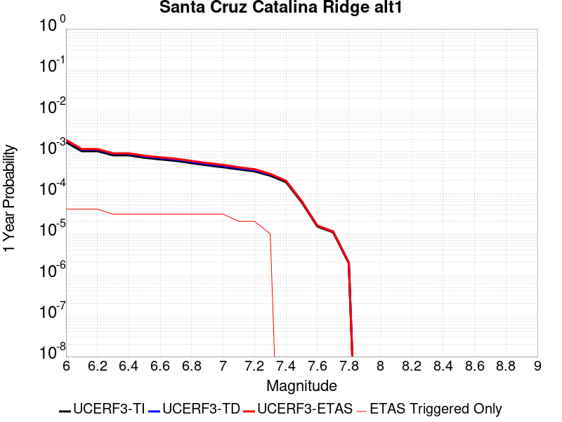 |  |

| Magnitude | 1 wk TI Prob | 1 wk TD Prob | 1 wk ETAS Prob | 1 wk ETAS/TD Gain | 1 wk ETAS Triggered Only | 1 mo TI Prob | 1 mo TD Prob | 1 mo ETAS Prob | 1 mo ETAS/TD Gain | 1 mo ETAS Triggered Only | 1 yr TI Prob | 1 yr TD Prob | 1 yr ETAS Prob | 1 yr ETAS/TD Gain | 1 yr ETAS Triggered Only | 10 yr TI Prob | 10 yr TD Prob | 10 yr ETAS Prob | 10 yr ETAS/TD Gain | 10 yr ETAS Triggered Only |
|-----|-----|-----|-----|-----|-----|-----|-----|-----|-----|-----|-----|-----|-----|-----|-----|-----|-----|-----|-----|-----|
| 6.0 | 3.2833184E-5 | 3.65584E-5 | 7.405234E-5 | 2.0255904 | 3.7495312E-5 | 1.4070606E-4 | 1.5667039E-4 | 2.3164926E-4 | 1.4785773 | 7.4990625E-5 | 0.00171175 | 0.0019059596 | 0.0020182312 | 1.0589055 | 1.1248594E-4 | 0.016986247 | 0.018913029 | 0.019060174 | 1.0077801 | 1.4998125E-4 |
| 6.1 | 1.9835548E-5 | 2.1659505E-5 | 5.9154005E-5 | 2.7310877 | 3.7495312E-5 | 8.500672E-5 | 9.282326E-5 | 1.6780692E-4 | 1.8078111 | 7.4990625E-5 | 0.0010344655 | 0.0011295575 | 0.0012419163 | 1.0994716 | 1.1248594E-4 | 0.010296632 | 0.011240295 | 0.011351517 | 1.0098948 | 1.1248594E-4 |
| 6.2 | 1.9835548E-5 | 2.1659505E-5 | 5.9154005E-5 | 2.7310877 | 3.7495312E-5 | 8.500672E-5 | 9.282326E-5 | 1.6780692E-4 | 1.8078111 | 7.4990625E-5 | 0.0010344655 | 0.0011295575 | 0.0012419163 | 1.0994716 | 1.1248594E-4 | 0.010296632 | 0.011240295 | 0.011351517 | 1.0098948 | 1.1248594E-4 |
| 6.3 | 1.5728183E-5 | 1.703395E-5 | 1.703395E-5 | 1.0 | 0.0 | 6.7404755E-5 | 7.300063E-5 | 1.1049321E-4 | 1.5135925 | 3.7495312E-5 | 8.2034385E-4 | 8.884264E-4 | 9.633504E-4 | 1.0843334 | 7.4990625E-5 | 0.008173222 | 0.008849427 | 0.008923754 | 1.0083991 | 7.4990625E-5 |
| 6.4 | 1.5728183E-5 | 1.703395E-5 | 1.703395E-5 | 1.0 | 0.0 | 6.7404755E-5 | 7.300063E-5 | 1.1049321E-4 | 1.5135925 | 3.7495312E-5 | 8.2034385E-4 | 8.884264E-4 | 9.633504E-4 | 1.0843334 | 7.4990625E-5 | 0.008173222 | 0.008849427 | 0.008923754 | 1.0083991 | 7.4990625E-5 |
| 6.5 | 1.3707734E-5 | 1.4794522E-5 | 1.4794522E-5 | 1.0 | 0.0 | 5.8746107E-5 | 6.3403575E-5 | 1.0089651E-4 | 1.5913379 | 3.7495312E-5 | 7.1499916E-4 | 7.716686E-4 | 8.466014E-4 | 1.0971048 | 7.4990625E-5 | 0.0071270303 | 0.0076902895 | 0.0077647036 | 1.0096763 | 7.4990625E-5 |
| 6.6 | 1.2539813E-5 | 1.3510219E-5 | 1.3510219E-5 | 1.0 | 0.0 | 5.3740947E-5 | 5.789967E-5 | 9.539281E-5 | 1.6475537 | 3.7495312E-5 | 6.540996E-4 | 7.0470315E-4 | 7.796409E-4 | 1.1063395 | 7.4990625E-5 | 0.0065217763 | 0.0070249885 | 0.0070994524 | 1.0105999 | 7.4990625E-5 |
| 6.7 | 1.1504083E-5 | 1.2377375E-5 | 1.2377375E-5 | 1.0 | 0.0 | 4.930228E-5 | 5.3044827E-5 | 9.0538146E-5 | 1.7068235 | 3.7495312E-5 | 6.0008996E-4 | 6.456314E-4 | 7.205736E-4 | 1.1160759 | 7.4990625E-5 | 0.005984721 | 0.006437786 | 0.0065122936 | 1.0115736 | 7.4990625E-5 |
| 6.8 | 1.012739E-5 | 1.0877071E-5 | 1.0877071E-5 | 1.0 | 0.0 | 4.340238E-5 | 4.6615194E-5 | 8.410876E-5 | 1.8043207 | 3.7495312E-5 | 5.282958E-4 | 5.673937E-4 | 6.423418E-4 | 1.1320919 | 7.4990625E-5 | 0.0052704164 | 0.0056596193 | 0.0057341857 | 1.0131751 | 7.4990625E-5 |
| 6.9 | 8.9607865E-6 | 9.609117E-6 | 9.609117E-6 | 1.0 | 0.0 | 3.8402806E-5 | 4.1181287E-5 | 7.867505E-5 | 1.9104564 | 3.7495312E-5 | 4.6745385E-4 | 5.012679E-4 | 5.762209E-4 | 1.149527 | 7.4990625E-5 | 0.0046647177 | 0.005001492 | 0.005076107 | 1.0149187 | 7.4990625E-5 |
| 7.0 | 8.046829E-6 | 8.619746E-6 | 8.619746E-6 | 1.0 | 0.0 | 3.4485955E-5 | 3.694125E-5 | 7.443518E-5 | 2.014961 | 3.7495312E-5 | 4.1978562E-4 | 4.496677E-4 | 5.246246E-4 | 1.166694 | 7.4990625E-5 | 0.004189935 | 0.0044876686 | 0.004562323 | 1.0166354 | 7.4990625E-5 |
| 7.1 | 7.136131E-6 | 7.637656E-6 | 7.637656E-6 | 1.0 | 0.0 | 3.0583058E-5 | 3.2732405E-5 | 3.2732405E-5 | 1.0 | 0.0 | 3.7228514E-4 | 3.9844486E-4 | 4.3592523E-4 | 1.0940666 | 3.7495312E-5 | 0.0037166206 | 0.003977381 | 0.004014727 | 1.0093896 | 3.7495312E-5 |
| 7.2 | 6.362014E-6 | 6.8049585E-6 | 6.8049585E-6 | 1.0 | 0.0 | 2.726549E-5 | 2.9163786E-5 | 2.9163786E-5 | 1.0 | 0.0 | 3.3190678E-4 | 3.550119E-4 | 3.9249388E-4 | 1.1055796 | 3.7495312E-5 | 0.0033141149 | 0.003544516 | 0.0035818785 | 1.010541 | 3.7495312E-5 |
| 7.3 | 5.004101E-6 | 5.351715E-6 | 5.351715E-6 | 1.0 | 0.0 | 2.1445969E-5 | 2.2935723E-5 | 2.2935723E-5 | 1.0 | 0.0 | 2.6107338E-4 | 2.792072E-4 | 3.1669202E-4 | 1.1342546 | 3.7495312E-5 | 0.002607669 | 0.0027886187 | 0.0028260094 | 1.0134083 | 3.7495312E-5 |
| 7.4 | 3.4901443E-6 | 3.7320526E-6 | 3.7320526E-6 | 1.0 | 0.0 | 1.4957676E-5 | 1.5994416E-5 | 1.5994416E-5 | 1.0 | 0.0 | 1.8209449E-4 | 1.9471499E-4 | 1.9471499E-4 | 1.0 | 0.0 | 0.0018194534 | 0.0019454823 | 0.0019454823 | 1.0 | 0.0 |
| 7.5 | 1.1215045E-6 | 1.189387E-6 | 1.189387E-6 | 1.0 | 0.0 | 4.806439E-6 | 5.097363E-6 | 5.097363E-6 | 1.0 | 0.0 | 5.851682E-5 | 6.205866E-5 | 6.205866E-5 | 1.0 | 0.0 | 5.850142E-4 | 6.2041637E-4 | 6.2041637E-4 | 1.0 | 0.0 |
| 7.6 | 2.8599047E-7 | 2.9951994E-7 | 2.9951994E-7 | 1.0 | 0.0 | 1.2256729E-6 | 1.2836562E-6 | 1.2836562E-6 | 1.0 | 0.0 | 1.4922465E-5 | 1.5628404E-5 | 1.5628404E-5 | 1.0 | 0.0 | 1.4921463E-4 | 1.5627318E-4 | 1.5627318E-4 | 1.0 | 0.0 |
| 7.7 | 2.0781519E-7 | 2.1744323E-7 | 2.1744323E-7 | 1.0 | 0.0 | 8.906362E-7 | 9.3189925E-7 | 9.3189925E-7 | 1.0 | 0.0 | 1.08434415E-5 | 1.13458145E-5 | 1.13458145E-5 | 1.0 | 0.0 | 1.0842913E-4 | 1.1345245E-4 | 1.1345245E-4 | 1.0 | 0.0 |
| 7.8 | 3.614776E-8 | 3.764102E-8 | 3.764102E-8 | 1.0 | 0.0 | 1.5491896E-7 | 1.6131864E-7 | 1.6131864E-7 | 1.0 | 0.0 | 1.8861368E-6 | 1.9640527E-6 | 1.9640527E-6 | 1.0 | 0.0 | 1.8861208E-5 | 1.9640367E-5 | 1.9640367E-5 | 1.0 | 0.0 |

## Red Mountain
*[(top)](#table-of-contents)*

| 1 Week | 1 Month | 1 Year | 10 Year |
|-----|-----|-----|-----|
|  |  |  |  |

| Magnitude | 1 wk TI Prob | 1 wk TD Prob | 1 wk ETAS Prob | 1 wk ETAS/TD Gain | 1 wk ETAS Triggered Only | 1 mo TI Prob | 1 mo TD Prob | 1 mo ETAS Prob | 1 mo ETAS/TD Gain | 1 mo ETAS Triggered Only | 1 yr TI Prob | 1 yr TD Prob | 1 yr ETAS Prob | 1 yr ETAS/TD Gain | 1 yr ETAS Triggered Only | 10 yr TI Prob | 10 yr TD Prob | 10 yr ETAS Prob | 10 yr ETAS/TD Gain | 10 yr ETAS Triggered Only |
|-----|-----|-----|-----|-----|-----|-----|-----|-----|-----|-----|-----|-----|-----|-----|-----|-----|-----|-----|-----|-----|
| 6.0 | 4.1810763E-5 | 4.7589947E-5 | 4.7589947E-5 | 1.0 | 0.0 | 1.7917668E-4 | 2.039419E-4 | 2.039419E-4 | 1.0 | 0.0 | 0.0021792934 | 0.0024803306 | 0.0024803306 | 1.0 | 0.0 | 0.021580452 | 0.024544092 | 0.024653817 | 1.0044706 | 1.1248594E-4 |
| 6.1 | 4.1810763E-5 | 4.7589947E-5 | 4.7589947E-5 | 1.0 | 0.0 | 1.7917668E-4 | 2.039419E-4 | 2.039419E-4 | 1.0 | 0.0 | 0.0021792934 | 0.0024803306 | 0.0024803306 | 1.0 | 0.0 | 0.021580452 | 0.024544092 | 0.024653817 | 1.0044706 | 1.1248594E-4 |
| 6.2 | 4.1810763E-5 | 4.7589947E-5 | 4.7589947E-5 | 1.0 | 0.0 | 1.7917668E-4 | 2.039419E-4 | 2.039419E-4 | 1.0 | 0.0 | 0.0021792934 | 0.0024803306 | 0.0024803306 | 1.0 | 0.0 | 0.021580452 | 0.024544092 | 0.024653817 | 1.0044706 | 1.1248594E-4 |
| 6.3 | 4.1810763E-5 | 4.7589947E-5 | 4.7589947E-5 | 1.0 | 0.0 | 1.7917668E-4 | 2.039419E-4 | 2.039419E-4 | 1.0 | 0.0 | 0.0021792934 | 0.0024803306 | 0.0024803306 | 1.0 | 0.0 | 0.021580452 | 0.024544092 | 0.024653817 | 1.0044706 | 1.1248594E-4 |
| 6.4 | 4.1810763E-5 | 4.7589947E-5 | 4.7589947E-5 | 1.0 | 0.0 | 1.7917668E-4 | 2.039419E-4 | 2.039419E-4 | 1.0 | 0.0 | 0.0021792934 | 0.0024803306 | 0.0024803306 | 1.0 | 0.0 | 0.021580452 | 0.024544092 | 0.024653817 | 1.0044706 | 1.1248594E-4 |
| 6.5 | 3.154503E-5 | 3.5359728E-5 | 3.5359728E-5 | 1.0 | 0.0 | 1.3518598E-4 | 1.5153342E-4 | 1.5153342E-4 | 1.0 | 0.0 | 0.0016446467 | 0.0018434501 | 0.0018434501 | 1.0 | 0.0 | 0.01632528 | 0.018291233 | 0.018401662 | 1.0060372 | 1.1248594E-4 |
| 6.6 | 3.1535834E-5 | 3.534911E-5 | 3.534911E-5 | 1.0 | 0.0 | 1.3514658E-4 | 1.5148791E-4 | 1.5148791E-4 | 1.0 | 0.0 | 0.0016441676 | 0.001842897 | 0.001842897 | 1.0 | 0.0 | 0.01632056 | 0.018285794 | 0.018396223 | 1.006039 | 1.1248594E-4 |
| 6.7 | 2.8267326E-5 | 3.146934E-5 | 3.146934E-5 | 1.0 | 0.0 | 1.2114006E-4 | 1.348621E-4 | 1.348621E-4 | 1.0 | 0.0 | 0.0014738824 | 0.0016407946 | 0.0016407946 | 1.0 | 0.0 | 0.014641452 | 0.016295563 | 0.016406216 | 1.0067904 | 1.1248594E-4 |
| 6.8 | 2.8212884E-5 | 3.1407224E-5 | 3.1407224E-5 | 1.0 | 0.0 | 1.20906756E-4 | 1.3459593E-4 | 1.3459593E-4 | 1.0 | 0.0 | 0.0014710457 | 0.0016375587 | 0.0016375587 | 1.0 | 0.0 | 0.014613459 | 0.01626368 | 0.016374337 | 1.0068039 | 1.1248594E-4 |
| 6.9 | 2.4227871E-5 | 2.6706979E-5 | 2.6706979E-5 | 1.0 | 0.0 | 1.03829596E-4 | 1.14453884E-4 | 1.14453884E-4 | 1.0 | 0.0 | 0.0012633923 | 0.0013926612 | 0.0013926612 | 1.0 | 0.0 | 0.012562336 | 0.013847026 | 0.013957954 | 1.008011 | 1.1248594E-4 |
| 7.0 | 2.348524E-5 | 2.5835763E-5 | 2.5835763E-5 | 1.0 | 0.0 | 1.0064714E-4 | 1.1072042E-4 | 1.1072042E-4 | 1.0 | 0.0 | 0.0012246901 | 0.0013472632 | 0.0013472632 | 1.0 | 0.0 | 0.012179627 | 0.01339859 | 0.013509569 | 1.0082829 | 1.1248594E-4 |
| 7.1 | 2.2311642E-5 | 2.4462828E-5 | 2.4462828E-5 | 1.0 | 0.0 | 9.561782E-5 | 1.048369E-4 | 1.048369E-4 | 1.0 | 0.0 | 0.0011635252 | 0.0012757168 | 0.0012757168 | 1.0 | 0.0 | 0.01157452 | 0.012691451 | 0.01280251 | 1.0087507 | 1.1248594E-4 |
| 7.2 | 1.6533986E-5 | 1.7670347E-5 | 1.7670347E-5 | 1.0 | 0.0 | 7.085802E-5 | 7.572822E-5 | 7.572822E-5 | 1.0 | 0.0 | 8.623549E-4 | 9.216645E-4 | 9.216645E-4 | 1.0 | 0.0 | 0.008590161 | 0.009184699 | 0.009259 | 1.0080898 | 7.4990625E-5 |
| 7.3 | 1.4703092E-5 | 1.555952E-5 | 1.555952E-5 | 1.0 | 0.0 | 6.301173E-5 | 6.66823E-5 | 6.66823E-5 | 1.0 | 0.0 | 7.668978E-4 | 8.1161625E-4 | 8.1161625E-4 | 1.0 | 0.0 | 0.0076425658 | 0.008092596 | 0.00816698 | 1.0091916 | 7.4990625E-5 |
| 7.4 | 6.1331984E-6 | 5.528872E-6 | 5.528872E-6 | 1.0 | 0.0 | 2.6284872E-5 | 2.3694953E-5 | 2.3694953E-5 | 1.0 | 0.0 | 3.199713E-4 | 2.8844838E-4 | 2.8844838E-4 | 1.0 | 0.0 | 0.0031951098 | 0.0028807942 | 0.0029181815 | 1.0129781 | 3.7495312E-5 |
| 7.5 | 5.954766E-6 | 5.3385015E-6 | 5.3385015E-6 | 1.0 | 0.0 | 2.5520176E-5 | 2.2879094E-5 | 2.2879094E-5 | 1.0 | 0.0 | 3.1066386E-4 | 2.785179E-4 | 2.785179E-4 | 1.0 | 0.0 | 0.003102299 | 0.0027817423 | 0.0028191332 | 1.0134416 | 3.7495312E-5 |
| 7.6 | 4.9726646E-6 | 4.315295E-6 | 4.315295E-6 | 1.0 | 0.0 | 2.1311245E-5 | 1.8493993E-5 | 1.8493993E-5 | 1.0 | 0.0 | 2.5943352E-4 | 2.2514143E-4 | 2.2514143E-4 | 1.0 | 0.0 | 0.0025913084 | 0.002249168 | 0.002286579 | 1.0166333 | 3.7495312E-5 |
| 7.7 | 3.3613894E-6 | 2.8526642E-6 | 2.8526642E-6 | 1.0 | 0.0 | 1.4405875E-5 | 1.2225649E-5 | 1.2225649E-5 | 1.0 | 0.0 | 1.7537741E-4 | 1.4883737E-4 | 1.4883737E-4 | 1.0 | 0.0 | 0.0017523908 | 0.0014874031 | 0.0015248427 | 1.025171 | 3.7495312E-5 |
| 7.8 | 1.1828961E-6 | 1.0122756E-6 | 1.0122756E-6 | 1.0 | 0.0 | 5.069545E-6 | 4.338317E-6 | 4.338317E-6 | 1.0 | 0.0 | 6.171996E-5 | 5.281776E-5 | 5.281776E-5 | 1.0 | 0.0 | 6.170282E-4 | 5.2805495E-4 | 5.655305E-4 | 1.070969 | 3.7495312E-5 |
| 7.9 | 2.2967266E-7 | 1.8618952E-7 | 1.8618952E-7 | 1.0 | 0.0 | 9.843111E-7 | 7.9795484E-7 | 7.9795484E-7 | 1.0 | 0.0 | 1.19839215E-5 | 9.7150605E-6 | 9.7150605E-6 | 1.0 | 0.0 | 1.1983275E-4 | 9.714664E-5 | 9.714664E-5 | 1.0 | 0.0 |

## Mission Ridge-Arroyo Parida-Santa Ana
*[(top)](#table-of-contents)*

| 1 Week | 1 Month | 1 Year | 10 Year |
|-----|-----|-----|-----|
|  |  |  |  |

| Magnitude | 1 wk TI Prob | 1 wk TD Prob | 1 wk ETAS Prob | 1 wk ETAS/TD Gain | 1 wk ETAS Triggered Only | 1 mo TI Prob | 1 mo TD Prob | 1 mo ETAS Prob | 1 mo ETAS/TD Gain | 1 mo ETAS Triggered Only | 1 yr TI Prob | 1 yr TD Prob | 1 yr ETAS Prob | 1 yr ETAS/TD Gain | 1 yr ETAS Triggered Only | 10 yr TI Prob | 10 yr TD Prob | 10 yr ETAS Prob | 10 yr ETAS/TD Gain | 10 yr ETAS Triggered Only |
|-----|-----|-----|-----|-----|-----|-----|-----|-----|-----|-----|-----|-----|-----|-----|-----|-----|-----|-----|-----|-----|
| 6.0 | 4.169034E-5 | 4.7138263E-5 | 4.7138263E-5 | 1.0 | 0.0 | 1.7866064E-4 | 2.0201034E-4 | 2.0201034E-4 | 1.0 | 0.0 | 0.0021730233 | 0.00245745 | 0.0024948532 | 1.0152203 | 3.7495312E-5 | 0.021518968 | 0.024384614 | 0.024494357 | 1.0045005 | 1.1248594E-4 |
| 6.1 | 1.73813E-5 | 1.6854226E-5 | 1.6854226E-5 | 1.0 | 0.0 | 7.4489166E-5 | 7.223046E-5 | 7.223046E-5 | 1.0 | 0.0 | 9.065282E-4 | 8.790618E-4 | 9.1652415E-4 | 1.0426162 | 3.7495312E-5 | 0.009028391 | 0.008756988 | 0.008831322 | 1.0084885 | 7.4990625E-5 |
| 6.2 | 1.4622182E-5 | 1.367329E-5 | 1.367329E-5 | 1.0 | 0.0 | 6.2664985E-5 | 5.8598518E-5 | 5.8598518E-5 | 1.0 | 0.0 | 7.6267915E-4 | 7.132073E-4 | 7.5067586E-4 | 1.0525353 | 3.7495312E-5 | 0.007600669 | 0.007109627 | 0.007184085 | 1.0104728 | 7.4990625E-5 |
| 6.3 | 1.3552434E-5 | 1.2482201E-5 | 1.2482201E-5 | 1.0 | 0.0 | 5.8080568E-5 | 5.3494066E-5 | 5.3494066E-5 | 1.0 | 0.0 | 7.069015E-4 | 6.510988E-4 | 6.885697E-4 | 1.0575503 | 3.7495312E-5 | 0.00704657 | 0.006492275 | 0.0065667788 | 1.0114758 | 7.4990625E-5 |
| 6.4 | 1.30977305E-5 | 1.1979156E-5 | 1.1979156E-5 | 1.0 | 0.0 | 5.613192E-5 | 5.1338247E-5 | 5.1338247E-5 | 1.0 | 0.0 | 6.831918E-4 | 6.248669E-4 | 6.623388E-4 | 1.0599678 | 3.7495312E-5 | 0.006810953 | 0.0062314444 | 0.0063059675 | 1.0119592 | 7.4990625E-5 |
| 6.5 | 1.225205E-5 | 1.1048803E-5 | 1.1048803E-5 | 1.0 | 0.0 | 5.2507727E-5 | 4.7351168E-5 | 4.7351168E-5 | 1.0 | 0.0 | 6.3909404E-4 | 5.7635066E-4 | 6.138244E-4 | 1.0650189 | 3.7495312E-5 | 0.006372592 | 0.005748869 | 0.0058234287 | 1.0129694 | 7.4990625E-5 |
| 6.6 | 1.1352241E-5 | 1.0063535E-5 | 1.0063535E-5 | 1.0 | 0.0 | 4.8651553E-5 | 4.3128734E-5 | 4.3128734E-5 | 1.0 | 0.0 | 5.921717E-4 | 5.2496797E-4 | 5.624436E-4 | 1.0713865 | 3.7495312E-5 | 0.0059059616 | 0.0052375244 | 0.0053121224 | 1.014243 | 7.4990625E-5 |
| 6.7 | 1.0864116E-5 | 9.517027E-6 | 9.517027E-6 | 1.0 | 0.0 | 4.6559664E-5 | 4.0786632E-5 | 4.0786632E-5 | 1.0 | 0.0 | 5.667165E-4 | 4.964661E-4 | 5.3394283E-4 | 1.0754869 | 3.7495312E-5 | 0.005652734 | 0.004953804 | 0.004991113 | 1.0075315 | 3.7495312E-5 |
| 6.8 | 1.0666365E-5 | 9.299779E-6 | 9.299779E-6 | 1.0 | 0.0 | 4.571219E-5 | 3.9855597E-5 | 3.9855597E-5 | 1.0 | 0.0 | 5.564038E-4 | 4.8513585E-4 | 5.2261294E-4 | 1.0772508 | 3.7495312E-5 | 0.005550127 | 0.0048410003 | 0.0048783137 | 1.0077078 | 3.7495312E-5 |
| 6.9 | 1.0038665E-5 | 8.592046E-6 | 8.592046E-6 | 1.0 | 0.0 | 4.302214E-5 | 3.682254E-5 | 3.682254E-5 | 1.0 | 0.0 | 5.236687E-4 | 4.4822405E-4 | 4.8570253E-4 | 1.0836155 | 3.7495312E-5 | 0.005224364 | 0.004473411 | 0.0045107384 | 1.0083443 | 3.7495312E-5 |
| 7.0 | 9.5379955E-6 | 8.025073E-6 | 8.025073E-6 | 1.0 | 0.0 | 4.0876483E-5 | 3.4392728E-5 | 3.4392728E-5 | 1.0 | 0.0 | 4.975576E-4 | 4.1865272E-4 | 4.5613231E-4 | 1.0895244 | 3.7495312E-5 | 0.00496445 | 0.0041788397 | 0.0042161783 | 1.0089352 | 3.7495312E-5 |
| 7.1 | 9.207389E-6 | 7.652375E-6 | 7.652375E-6 | 1.0 | 0.0 | 3.945964E-5 | 3.279549E-5 | 3.279549E-5 | 1.0 | 0.0 | 4.803152E-4 | 3.9921363E-4 | 4.3669398E-4 | 1.0938854 | 3.7495312E-5 | 0.004792784 | 0.003985161 | 0.004022507 | 1.0093713 | 3.7495312E-5 |
| 7.2 | 7.638091E-6 | 5.9311183E-6 | 5.9311183E-6 | 1.0 | 0.0 | 3.2734264E-5 | 2.541883E-5 | 2.541883E-5 | 1.0 | 0.0 | 3.984668E-4 | 3.0943064E-4 | 3.0943064E-4 | 1.0 | 0.0 | 0.0039775306 | 0.0030900547 | 0.0030900547 | 1.0 | 0.0 |
| 7.3 | 7.2500147E-6 | 5.5961527E-6 | 5.5961527E-6 | 1.0 | 0.0 | 3.1071122E-5 | 2.3983293E-5 | 2.3983293E-5 | 1.0 | 0.0 | 3.7822526E-4 | 2.9195778E-4 | 2.9195778E-4 | 1.0 | 0.0 | 0.0037758215 | 0.0029157975 | 0.0029157975 | 1.0 | 0.0 |
| 7.4 | 6.3899715E-6 | 4.9184964E-6 | 4.9184964E-6 | 1.0 | 0.0 | 2.7385306E-5 | 2.10791E-5 | 2.10791E-5 | 1.0 | 0.0 | 3.3336508E-4 | 2.5660804E-4 | 2.5660804E-4 | 1.0 | 0.0 | 0.0033286542 | 0.0025631618 | 0.0025631618 | 1.0 | 0.0 |
| 7.5 | 5.379025E-6 | 4.0838527E-6 | 4.0838527E-6 | 1.0 | 0.0 | 2.305276E-5 | 1.7502109E-5 | 1.7502109E-5 | 1.0 | 0.0 | 2.806312E-4 | 2.1306744E-4 | 2.1306744E-4 | 1.0 | 0.0 | 0.0028027708 | 0.002128643 | 0.002128643 | 1.0 | 0.0 |
| 7.6 | 4.1270696E-6 | 3.0883439E-6 | 3.0883439E-6 | 1.0 | 0.0 | 1.768732E-5 | 1.3235693E-5 | 1.3235693E-5 | 1.0 | 0.0 | 2.1532185E-4 | 1.6113273E-4 | 1.6113273E-4 | 1.0 | 0.0 | 0.0021511333 | 0.001610167 | 0.001610167 | 1.0 | 0.0 |
| 7.7 | 2.5406805E-6 | 1.8282013E-6 | 1.8282013E-6 | 1.0 | 0.0 | 1.0888585E-5 | 7.835125E-6 | 7.835125E-6 | 1.0 | 0.0 | 1.3256045E-4 | 9.538854E-5 | 9.538854E-5 | 1.0 | 0.0 | 0.0013248142 | 9.534821E-4 | 9.534821E-4 | 1.0 | 0.0 |
| 7.8 | 4.8608285E-7 | 3.5098864E-7 | 3.5098864E-7 | 1.0 | 0.0 | 2.0832106E-6 | 1.5042363E-6 | 1.5042363E-6 | 1.0 | 0.0 | 2.5362791E-5 | 1.8313924E-5 | 1.8313924E-5 | 1.0 | 0.0 | 2.5359896E-4 | 1.8312426E-4 | 1.8312426E-4 | 1.0 | 0.0 |
| 7.9 | 2.0472514E-8 | 1.2688783E-8 | 1.2688783E-8 | 1.0 | 0.0 | 8.7739345E-8 | 5.43805E-8 | 5.43805E-8 | 1.0 | 0.0 | 1.068226E-6 | 6.6208236E-7 | 6.6208236E-7 | 1.0 | 0.0 | 1.0682209E-5 | 6.620805E-6 | 6.620805E-6 | 1.0 | 0.0 |
| 8.0 | 4.443582E-9 | 2.0321211E-9 | 2.0321211E-9 | 1.0 | 0.0 | 1.9043922E-8 | 8.70909E-9 | 8.70909E-9 | 1.0 | 0.0 | 2.3185973E-7 | 1.0603316E-7 | 1.0603316E-7 | 1.0 | 0.0 | 2.3185949E-6 | 1.0603312E-6 | 1.0603312E-6 | 1.0 | 0.0 |

## San Andreas (North Branch Mill Creek)
*[(top)](#table-of-contents)*

| 1 Week | 1 Month | 1 Year | 10 Year |
|-----|-----|-----|-----|
|  |  |  |  |

| Magnitude | 1 wk TI Prob | 1 wk TD Prob | 1 wk ETAS Prob | 1 wk ETAS/TD Gain | 1 wk ETAS Triggered Only | 1 mo TI Prob | 1 mo TD Prob | 1 mo ETAS Prob | 1 mo ETAS/TD Gain | 1 mo ETAS Triggered Only | 1 yr TI Prob | 1 yr TD Prob | 1 yr ETAS Prob | 1 yr ETAS/TD Gain | 1 yr ETAS Triggered Only | 10 yr TI Prob | 10 yr TD Prob | 10 yr ETAS Prob | 10 yr ETAS/TD Gain | 10 yr ETAS Triggered Only |
|-----|-----|-----|-----|-----|-----|-----|-----|-----|-----|-----|-----|-----|-----|-----|-----|-----|-----|-----|-----|-----|
| 6.0 | 1.3461156E-5 | 2.3499893E-5 | 9.848876E-5 | 4.19103 | 7.4990625E-5 | 5.7689394E-5 | 1.00709956E-4 | 2.1318457E-4 | 2.1168172 | 1.1248594E-4 | 7.02142E-4 | 0.0012254574 | 0.0013378054 | 1.0916785 | 1.1248594E-4 | 0.0069992766 | 0.01222957 | 0.012377717 | 1.0121138 | 1.4998125E-4 |
| 6.1 | 1.3461156E-5 | 2.3499893E-5 | 9.848876E-5 | 4.19103 | 7.4990625E-5 | 5.7689394E-5 | 1.00709956E-4 | 2.1318457E-4 | 2.1168172 | 1.1248594E-4 | 7.02142E-4 | 0.0012254574 | 0.0013378054 | 1.0916785 | 1.1248594E-4 | 0.0069992766 | 0.01222957 | 0.012377717 | 1.0121138 | 1.4998125E-4 |
| 6.2 | 1.3461156E-5 | 2.3499893E-5 | 9.848876E-5 | 4.19103 | 7.4990625E-5 | 5.7689394E-5 | 1.00709956E-4 | 2.1318457E-4 | 2.1168172 | 1.1248594E-4 | 7.02142E-4 | 0.0012254574 | 0.0013378054 | 1.0916785 | 1.1248594E-4 | 0.0069992766 | 0.01222957 | 0.012377717 | 1.0121138 | 1.4998125E-4 |
| 6.3 | 1.3461156E-5 | 2.3499893E-5 | 9.848876E-5 | 4.19103 | 7.4990625E-5 | 5.7689394E-5 | 1.00709956E-4 | 2.1318457E-4 | 2.1168172 | 1.1248594E-4 | 7.02142E-4 | 0.0012254574 | 0.0013378054 | 1.0916785 | 1.1248594E-4 | 0.0069992766 | 0.01222957 | 0.012377717 | 1.0121138 | 1.4998125E-4 |
| 6.4 | 1.3461156E-5 | 2.3499893E-5 | 9.848876E-5 | 4.19103 | 7.4990625E-5 | 5.7689394E-5 | 1.00709956E-4 | 2.1318457E-4 | 2.1168172 | 1.1248594E-4 | 7.02142E-4 | 0.0012254574 | 0.0013378054 | 1.0916785 | 1.1248594E-4 | 0.0069992766 | 0.01222957 | 0.012377717 | 1.0121138 | 1.4998125E-4 |
| 6.5 | 1.3450706E-5 | 2.3488852E-5 | 9.8477714E-5 | 4.1925297 | 7.4990625E-5 | 5.764461E-5 | 1.0066265E-4 | 2.1313726E-4 | 2.1173422 | 1.1248594E-4 | 7.0159714E-4 | 0.001224882 | 0.0013372302 | 1.0917217 | 1.1248594E-4 | 0.006993862 | 0.01222388 | 0.012372027 | 1.0121195 | 1.4998125E-4 |
| 6.6 | 1.3074523E-5 | 2.3103135E-5 | 9.809203E-5 | 4.245832 | 7.4990625E-5 | 5.6032466E-5 | 9.9009696E-5 | 2.114845E-4 | 2.1359978 | 1.1248594E-4 | 6.8198174E-4 | 0.0012047797 | 0.0013171302 | 1.0932539 | 1.1248594E-4 | 0.006798926 | 0.012025044 | 0.012173222 | 1.0123224 | 1.4998125E-4 |
| 6.7 | 1.3050216E-5 | 2.3078432E-5 | 9.806733E-5 | 4.249306 | 7.4990625E-5 | 5.59283E-5 | 9.890384E-5 | 2.1137865E-4 | 2.137214 | 1.1248594E-4 | 6.8071426E-4 | 0.0012034923 | 0.0013158428 | 1.0933537 | 1.1248594E-4 | 0.0067863287 | 0.012012309 | 0.012160488 | 1.0123357 | 1.4998125E-4 |
| 6.8 | 1.29049395E-5 | 2.292684E-5 | 9.791575E-5 | 4.270791 | 7.4990625E-5 | 5.530571E-5 | 9.825421E-5 | 2.107291E-4 | 2.1447334 | 1.1248594E-4 | 6.73139E-4 | 0.0011955918 | 0.0013079431 | 1.0939714 | 1.1248594E-4 | 0.0067110364 | 0.011934154 | 0.012082346 | 1.0124174 | 1.4998125E-4 |
| 6.9 | 1.2867369E-5 | 2.2886245E-5 | 9.7875156E-5 | 4.276593 | 7.4990625E-5 | 5.51447E-5 | 9.8080236E-5 | 2.1055514E-4 | 2.1467643 | 1.1248594E-4 | 6.711799E-4 | 0.0011934759 | 0.0013058276 | 1.0941383 | 1.1248594E-4 | 0.006691564 | 0.011913223 | 0.012061418 | 1.0124395 | 1.4998125E-4 |
| 7.0 | 1.2495996E-5 | 2.2286325E-5 | 9.727528E-5 | 4.3647966 | 7.4990625E-5 | 5.3553173E-5 | 9.550934E-5 | 2.0798454E-4 | 2.1776354 | 1.1248594E-4 | 6.518148E-4 | 0.0011622087 | 0.001274564 | 1.0966738 | 1.1248594E-4 | 0.0064990623 | 0.0116038285 | 0.011752069 | 1.0127752 | 1.4998125E-4 |
| 7.1 | 1.2452067E-5 | 2.2231397E-5 | 9.7220356E-5 | 4.3731103 | 7.4990625E-5 | 5.3364907E-5 | 9.527396E-5 | 2.0774918E-4 | 2.1805453 | 1.1248594E-4 | 6.4952404E-4 | 0.0011593461 | 0.0012717015 | 1.0969129 | 1.1248594E-4 | 0.0064762887 | 0.0115755 | 0.011723745 | 1.0128068 | 1.4998125E-4 |
| 7.2 | 1.2002777E-5 | 2.1609963E-5 | 9.659897E-5 | 4.4701123 | 7.4990625E-5 | 5.143946E-5 | 9.2610855E-5 | 2.0508638E-4 | 2.2144961 | 1.1248594E-4 | 6.2609545E-4 | 0.0011269567 | 0.0012393157 | 1.0997014 | 1.1248594E-4 | 0.006243344 | 0.011254923 | 0.011403216 | 1.0131758 | 1.4998125E-4 |
| 7.3 | 1.1923425E-5 | 2.1479793E-5 | 9.646881E-5 | 4.4911423 | 7.4990625E-5 | 5.109939E-5 | 9.205302E-5 | 2.0452861E-4 | 2.2218566 | 1.1248594E-4 | 6.219575E-4 | 0.001120172 | 0.0012325319 | 1.1003059 | 1.1248594E-4 | 0.0062021962 | 0.011187789 | 0.011336092 | 1.0132558 | 1.4998125E-4 |
| 7.4 | 1.16105175E-5 | 2.0853771E-5 | 9.5842835E-5 | 4.5959473 | 7.4990625E-5 | 4.975841E-5 | 8.937026E-5 | 2.0184615E-4 | 2.2585382 | 1.1248594E-4 | 6.0564023E-4 | 0.0010875424 | 0.001199906 | 1.1033188 | 1.1248594E-4 | 0.006039923 | 0.010865397 | 0.011013748 | 1.0136536 | 1.4998125E-4 |
| 7.5 | 1.1037265E-5 | 1.9553907E-5 | 9.4543066E-5 | 4.834996 | 7.4990625E-5 | 4.7301706E-5 | 8.379978E-5 | 1.9627629E-4 | 2.3422053 | 1.1248594E-4 | 5.757461E-4 | 0.0010197869 | 0.0011321582 | 1.1101909 | 1.1248594E-4 | 0.005742567 | 0.010194898 | 0.01034335 | 1.0145614 | 1.4998125E-4 |
| 7.6 | 1.0720915E-5 | 1.899582E-5 | 9.398502E-5 | 4.947669 | 7.4990625E-5 | 4.5945973E-5 | 8.140812E-5 | 1.938849E-4 | 2.3816407 | 1.1248594E-4 | 5.592486E-4 | 9.906954E-4 | 0.0011030699 | 1.1134299 | 1.1248594E-4 | 0.005578433 | 0.009906623 | 0.010055117 | 1.0149895 | 1.4998125E-4 |
| 7.7 | 9.276279E-6 | 1.6441649E-5 | 9.1431044E-5 | 5.560941 | 7.4990625E-5 | 3.9754876E-5 | 7.0462316E-5 | 1.8294033E-4 | 2.596286 | 1.1248594E-4 | 4.839081E-4 | 8.575427E-4 | 9.699322E-4 | 1.1310599 | 1.1248594E-4 | 0.0048285574 | 0.008586041 | 0.008734735 | 1.017318 | 1.4998125E-4 |
| 7.8 | 5.8346777E-6 | 1.1155013E-5 | 8.6144806E-5 | 7.722519 | 7.4990625E-5 | 2.5005522E-5 | 4.7806327E-5 | 1.6028689E-4 | 3.3528385 | 1.1248594E-4 | 3.043997E-4 | 5.818867E-4 | 6.9430715E-4 | 1.1932 | 1.1248594E-4 | 0.0030398308 | 0.0058469265 | 0.0059960308 | 1.0255014 | 1.4998125E-4 |
| 7.9 | 4.690204E-6 | 8.509093E-6 | 8.349908E-5 | 9.812923 | 7.4990625E-5 | 2.0100719E-5 | 3.6467034E-5 | 1.4894886E-4 | 4.08448 | 1.1248594E-4 | 2.4469878E-4 | 4.4389578E-4 | 5.5633177E-4 | 1.2532938 | 1.1248594E-4 | 0.002444295 | 0.0044707474 | 0.004620058 | 1.0333973 | 1.4998125E-4 |
| 8.0 | 2.9570454E-6 | 4.846947E-6 | 4.846947E-6 | 1.0 | 0.0 | 1.267299E-5 | 2.0772464E-5 | 5.8266996E-5 | 2.8050115 | 3.7495312E-5 | 1.5428272E-4 | 2.5287544E-4 | 2.9036126E-4 | 1.1482383 | 3.7495312E-5 | 0.0015417566 | 0.002549644 | 0.002587044 | 1.0146686 | 3.7495312E-5 |
| 8.1 | 1.6376824E-6 | 2.1968929E-6 | 2.1968929E-6 | 1.0 | 0.0 | 7.01862E-6 | 9.41522E-6 | 9.41522E-6 | 1.0 | 0.0 | 8.544835E-5 | 1.14624294E-4 | 1.14624294E-4 | 1.0 | 0.0 | 8.54155E-4 | 0.0011606582 | 0.0011606582 | 1.0 | 0.0 |
| 8.2 | 6.9631557E-7 | 4.5360213E-7 | 4.5360213E-7 | 1.0 | 0.0 | 2.984206E-6 | 1.9440076E-6 | 1.9440076E-6 | 1.0 | 0.0 | 3.63321E-5 | 2.3668037E-5 | 2.3668037E-5 | 1.0 | 0.0 | 3.6326164E-4 | 2.451564E-4 | 2.451564E-4 | 1.0 | 0.0 |
| 8.3 | 1.7876137E-7 | 8.360375E-8 | 8.360375E-8 | 1.0 | 0.0 | 7.661199E-7 | 3.5830175E-7 | 3.5830175E-7 | 1.0 | 0.0 | 9.32747E-6 | 4.3623154E-6 | 4.3623154E-6 | 1.0 | 0.0 | 9.3270784E-5 | 4.5817014E-5 | 4.5817014E-5 | 1.0 | 0.0 |

## Camp Rock 2011
*[(top)](#table-of-contents)*

| 1 Week | 1 Month | 1 Year | 10 Year |
|-----|-----|-----|-----|
|  |  |  |  |

| Magnitude | 1 wk TI Prob | 1 wk TD Prob | 1 wk ETAS Prob | 1 wk ETAS/TD Gain | 1 wk ETAS Triggered Only | 1 mo TI Prob | 1 mo TD Prob | 1 mo ETAS Prob | 1 mo ETAS/TD Gain | 1 mo ETAS Triggered Only | 1 yr TI Prob | 1 yr TD Prob | 1 yr ETAS Prob | 1 yr ETAS/TD Gain | 1 yr ETAS Triggered Only | 10 yr TI Prob | 10 yr TD Prob | 10 yr ETAS Prob | 10 yr ETAS/TD Gain | 10 yr ETAS Triggered Only |
|-----|-----|-----|-----|-----|-----|-----|-----|-----|-----|-----|-----|-----|-----|-----|-----|-----|-----|-----|-----|-----|
| 6.0 | 1.6710783E-5 | 4.25026E-6 | 7.924057E-5 | 18.643698 | 7.4990625E-5 | 7.161568E-5 | 1.8215276E-5 | 9.320454E-5 | 5.116833 | 7.4990625E-5 | 8.7157206E-4 | 2.2174895E-4 | 3.3420994E-4 | 1.5071546 | 1.1248594E-4 | 0.008681616 | 0.0022153298 | 0.0023275665 | 1.0506637 | 1.1248594E-4 |
| 6.1 | 1.6710783E-5 | 4.25026E-6 | 7.924057E-5 | 18.643698 | 7.4990625E-5 | 7.161568E-5 | 1.8215276E-5 | 9.320454E-5 | 5.116833 | 7.4990625E-5 | 8.7157206E-4 | 2.2174895E-4 | 3.3420994E-4 | 1.5071546 | 1.1248594E-4 | 0.008681616 | 0.0022153298 | 0.0023275665 | 1.0506637 | 1.1248594E-4 |
| 6.2 | 1.6710783E-5 | 4.25026E-6 | 7.924057E-5 | 18.643698 | 7.4990625E-5 | 7.161568E-5 | 1.8215276E-5 | 9.320454E-5 | 5.116833 | 7.4990625E-5 | 8.7157206E-4 | 2.2174895E-4 | 3.3420994E-4 | 1.5071546 | 1.1248594E-4 | 0.008681616 | 0.0022153298 | 0.0023275665 | 1.0506637 | 1.1248594E-4 |
| 6.3 | 1.6710783E-5 | 4.25026E-6 | 7.924057E-5 | 18.643698 | 7.4990625E-5 | 7.161568E-5 | 1.8215276E-5 | 9.320454E-5 | 5.116833 | 7.4990625E-5 | 8.7157206E-4 | 2.2174895E-4 | 3.3420994E-4 | 1.5071546 | 1.1248594E-4 | 0.008681616 | 0.0022153298 | 0.0023275665 | 1.0506637 | 1.1248594E-4 |
| 6.4 | 7.982846E-6 | 3.6820884E-6 | 7.867244E-5 | 21.366255 | 7.4990625E-5 | 3.421175E-5 | 1.5780286E-5 | 9.076973E-5 | 5.7520967 | 7.4990625E-5 | 4.1644843E-4 | 1.9210839E-4 | 3.0457272E-4 | 1.5854212 | 1.1248594E-4 | 0.0041566887 | 0.001919458 | 0.0020317282 | 1.0584905 | 1.1248594E-4 |
| 6.5 | 7.982846E-6 | 3.6820884E-6 | 7.867244E-5 | 21.366255 | 7.4990625E-5 | 3.421175E-5 | 1.5780286E-5 | 9.076973E-5 | 5.7520967 | 7.4990625E-5 | 4.1644843E-4 | 1.9210839E-4 | 3.0457272E-4 | 1.5854212 | 1.1248594E-4 | 0.0041566887 | 0.001919458 | 0.0020317282 | 1.0584905 | 1.1248594E-4 |
| 6.6 | 7.048869E-6 | 3.4243571E-6 | 7.841473E-5 | 22.899109 | 7.4990625E-5 | 3.0209088E-5 | 1.4675736E-5 | 8.9665264E-5 | 6.1097627 | 7.4990625E-5 | 3.677336E-4 | 1.7866275E-4 | 2.9112858E-4 | 1.6294868 | 1.1248594E-4 | 0.0036712566 | 0.0017852228 | 0.0018975079 | 1.062897 | 1.1248594E-4 |
| 6.7 | 6.987307E-6 | 3.3623348E-6 | 7.835271E-5 | 23.303066 | 7.4990625E-5 | 2.9945259E-5 | 1.4409929E-5 | 8.939947E-5 | 6.2040195 | 7.4990625E-5 | 3.6452254E-4 | 1.7542706E-4 | 2.8789326E-4 | 1.6410996 | 1.1248594E-4 | 0.0036392517 | 0.001752917 | 0.0018652057 | 1.0640582 | 1.1248594E-4 |
| 6.8 | 6.3737602E-6 | 3.1179077E-6 | 7.81083E-5 | 25.051512 | 7.4990625E-5 | 2.731583E-5 | 1.3362394E-5 | 8.835202E-5 | 6.61199 | 7.4990625E-5 | 3.3251947E-4 | 1.626753E-4 | 2.7514293E-4 | 1.6913627 | 1.1248594E-4 | 0.0033202237 | 0.0016255907 | 0.0017378938 | 1.0690845 | 1.1248594E-4 |
| 6.9 | 6.112211E-6 | 2.9331156E-6 | 7.792352E-5 | 26.566809 | 7.4990625E-5 | 2.6194928E-5 | 1.2570436E-5 | 8.756012E-5 | 6.9655595 | 7.4990625E-5 | 3.1887658E-4 | 1.5303459E-4 | 2.6550333E-4 | 1.7349236 | 1.1248594E-4 | 0.003184194 | 0.0015293199 | 0.0016416338 | 1.0734404 | 1.1248594E-4 |
| 7.0 | 5.5140117E-6 | 2.641923E-6 | 7.763235E-5 | 29.38479 | 7.4990625E-5 | 2.3631264E-5 | 1.132248E-5 | 8.6312255E-5 | 7.623088 | 7.4990625E-5 | 2.8767265E-4 | 1.3784273E-4 | 2.5031314E-4 | 1.8159331 | 1.1248594E-4 | 0.0028730053 | 0.0013775975 | 0.0014899285 | 1.0815412 | 1.1248594E-4 |
| 7.1 | 4.8151105E-6 | 2.1342705E-6 | 7.7124736E-5 | 36.13635 | 7.4990625E-5 | 2.0636026E-5 | 9.146843E-6 | 8.413678E-5 | 9.198451 | 7.4990625E-5 | 2.5121463E-4 | 1.1135734E-4 | 2.2383075E-4 | 2.0100224 | 1.1248594E-4 | 0.0025093083 | 0.0011130372 | 0.001225398 | 1.1009496 | 1.1248594E-4 |
| 7.2 | 3.818335E-6 | 1.2937425E-6 | 3.8789007E-5 | 29.982016 | 3.7495312E-5 | 1.6364189E-5 | 5.5445994E-6 | 4.3039705E-5 | 7.7624555 | 3.7495312E-5 | 1.9921579E-4 | 6.750349E-5 | 1.0499627E-4 | 1.5554199 | 3.7495312E-5 | 0.0019903728 | 6.748381E-4 | 7.123081E-4 | 1.0555245 | 3.7495312E-5 |
| 7.3 | 2.7166698E-6 | 7.3835776E-7 | 3.8233644E-5 | 51.782 | 3.7495312E-5 | 1.1642818E-5 | 3.1643867E-6 | 4.0659583E-5 | 12.849119 | 3.7495312E-5 | 1.4174209E-4 | 3.8525748E-5 | 7.601961E-5 | 1.9732158 | 3.7495312E-5 | 0.0014165172 | 3.851927E-4 | 4.2267356E-4 | 1.0973042 | 3.7495312E-5 |
| 7.4 | 2.0893426E-6 | 5.4618386E-7 | 3.8041475E-5 | 69.64958 | 3.7495312E-5 | 8.954295E-6 | 2.3407858E-6 | 3.983601E-5 | 17.01822 | 3.7495312E-5 | 1.0901308E-4 | 2.84987E-5 | 6.599294E-5 | 2.3156476 | 3.7495312E-5 | 0.0010895962 | 2.84951E-4 | 3.2243563E-4 | 1.1315476 | 3.7495312E-5 |
| 7.5 | 1.1681728E-6 | 3.6030585E-7 | 3.7855607E-5 | 105.0652 | 3.7495312E-5 | 5.0064455E-6 | 1.544167E-6 | 3.9039423E-5 | 25.281864 | 3.7495312E-5 | 6.0951766E-5 | 1.8800076E-5 | 5.6294684E-5 | 2.994386 | 3.7495312E-5 | 6.093505E-4 | 1.8798532E-4 | 2.2547359E-4 | 1.1994213 | 3.7495312E-5 |
| 7.6 | 1.3154387E-7 | 7.1197384E-8 | 7.1197384E-8 | 1.0 | 0.0 | 5.6375933E-7 | 3.051316E-7 | 3.051316E-7 | 1.0 | 0.0 | 6.863748E-6 | 3.7149728E-6 | 3.7149728E-6 | 1.0 | 0.0 | 6.863536E-5 | 3.7149264E-5 | 3.7149264E-5 | 1.0 | 0.0 |

## Brawley (Seismic Zone) alt 1
*[(top)](#table-of-contents)*

| 1 Week | 1 Month | 1 Year | 10 Year |
|-----|-----|-----|-----|
|  |  |  |  |

| Magnitude | 1 wk TI Prob | 1 wk TD Prob | 1 wk ETAS Prob | 1 wk ETAS/TD Gain | 1 wk ETAS Triggered Only | 1 mo TI Prob | 1 mo TD Prob | 1 mo ETAS Prob | 1 mo ETAS/TD Gain | 1 mo ETAS Triggered Only | 1 yr TI Prob | 1 yr TD Prob | 1 yr ETAS Prob | 1 yr ETAS/TD Gain | 1 yr ETAS Triggered Only | 10 yr TI Prob | 10 yr TD Prob | 10 yr ETAS Prob | 10 yr ETAS/TD Gain | 10 yr ETAS Triggered Only |
|-----|-----|-----|-----|-----|-----|-----|-----|-----|-----|-----|-----|-----|-----|-----|-----|-----|-----|-----|-----|-----|
| 6.0 | 2.2521618E-4 | 4.7632487E-4 | 4.7632487E-4 | 1.0 | 0.0 | 9.6485513E-4 | 0.0020398323 | 0.0020772512 | 1.018344 | 3.7495312E-5 | 0.011683988 | 0.024546238 | 0.024582813 | 1.00149 | 3.7495312E-5 | 0.11088423 | 0.21350002 | 0.21358849 | 1.0004144 | 1.1248594E-4 |
| 6.1 | 2.2521618E-4 | 4.7632487E-4 | 4.7632487E-4 | 1.0 | 0.0 | 9.6485513E-4 | 0.0020398323 | 0.0020772512 | 1.018344 | 3.7495312E-5 | 0.011683988 | 0.024546238 | 0.024582813 | 1.00149 | 3.7495312E-5 | 0.11088423 | 0.21350002 | 0.21358849 | 1.0004144 | 1.1248594E-4 |
| 6.2 | 2.198148E-4 | 4.6717093E-4 | 4.6717093E-4 | 1.0 | 0.0 | 9.417233E-4 | 0.0020006616 | 0.0020380819 | 1.0187039 | 3.7495312E-5 | 0.011405343 | 0.024080504 | 0.024117095 | 1.0015196 | 3.7495312E-5 | 0.10837428 | 0.20993657 | 0.21002544 | 1.0004233 | 1.1248594E-4 |
| 6.3 | 2.1704129E-4 | 4.615278E-4 | 4.615278E-4 | 1.0 | 0.0 | 9.298453E-4 | 0.0019765133 | 0.0020139345 | 1.0189329 | 3.7495312E-5 | 0.011262234 | 0.02379366 | 0.023830265 | 1.0015384 | 3.7495312E-5 | 0.107082725 | 0.20782755 | 0.20791666 | 1.0004288 | 1.1248594E-4 |
| 6.4 | 1.876142E-4 | 4.00449E-4 | 4.00449E-4 | 1.0 | 0.0 | 8.038131E-4 | 0.0017150956 | 0.0017525266 | 1.0218245 | 3.7495312E-5 | 0.00974259 | 0.020680401 | 0.020717122 | 1.0017756 | 3.7495312E-5 | 0.093263686 | 0.18457815 | 0.18466988 | 1.000497 | 1.1248594E-4 |
| 6.5 | 1.7390939E-4 | 3.7477075E-4 | 3.7477075E-4 | 1.0 | 0.0 | 7.45113E-4 | 0.0016051838 | 0.001642619 | 1.0233214 | 3.7495312E-5 | 0.009034078 | 0.019368723 | 0.019405492 | 1.0018984 | 3.7495312E-5 | 0.086755216 | 0.17440031 | 0.17449318 | 1.0005325 | 1.1248594E-4 |
| 6.6 | 1.591791E-4 | 3.4891962E-4 | 3.4891962E-4 | 1.0 | 0.0 | 6.8201777E-4 | 0.0014945229 | 0.0015319622 | 1.025051 | 3.7495312E-5 | 0.008271996 | 0.018045569 | 0.018082388 | 1.0020403 | 3.7495312E-5 | 0.07970774 | 0.16380852 | 0.16390258 | 1.0005742 | 1.1248594E-4 |
| 6.7 | 1.4268003E-4 | 3.20582E-4 | 3.20582E-4 | 1.0 | 0.0 | 6.1134255E-4 | 0.0013732077 | 0.0014106515 | 1.0272675 | 3.7495312E-5 | 0.007417723 | 0.016592601 | 0.016629476 | 1.0022223 | 3.7495312E-5 | 0.07174956 | 0.15193306 | 0.15202846 | 1.0006279 | 1.1248594E-4 |
| 6.8 | 1.239713E-4 | 2.9053655E-4 | 2.9053655E-4 | 1.0 | 0.0 | 5.3119735E-4 | 0.0012445687 | 0.0012820173 | 1.0300896 | 3.7495312E-5 | 0.0064481674 | 0.015048777 | 0.015085708 | 1.002454 | 3.7495312E-5 | 0.06264243 | 0.13837762 | 0.13847454 | 1.0007004 | 1.1248594E-4 |
| 6.9 | 1.0180238E-4 | 2.625439E-4 | 2.625439E-4 | 1.0 | 0.0 | 4.3622297E-4 | 0.0011247073 | 0.0011621604 | 1.0333004 | 3.7495312E-5 | 0.005298089 | 0.013608336 | 0.013645321 | 1.0027179 | 3.7495312E-5 | 0.05173543 | 0.124961674 | 0.1250601 | 1.0007877 | 1.1248594E-4 |
| 7.0 | 7.6619996E-5 | 2.23993E-4 | 2.23993E-4 | 1.0 | 0.0 | 3.283301E-4 | 9.5962E-4 | 9.970793E-4 | 1.0390356 | 3.7495312E-5 | 0.0039900932 | 0.011621496 | 0.011658555 | 1.0031888 | 3.7495312E-5 | 0.039192066 | 0.107266866 | 0.107367285 | 1.0009362 | 1.1248594E-4 |
| 7.1 | 7.5127435E-5 | 2.2082464E-4 | 2.2082464E-4 | 1.0 | 0.0 | 3.2193496E-4 | 9.4605127E-4 | 9.835111E-4 | 1.039596 | 3.7495312E-5 | 0.0039125155 | 0.011458045 | 0.011495111 | 1.0032349 | 3.7495312E-5 | 0.038443442 | 0.10583085 | 0.10593143 | 1.0009505 | 1.1248594E-4 |
| 7.2 | 6.788582E-5 | 2.0210193E-4 | 2.0210193E-4 | 1.0 | 0.0 | 2.9090676E-4 | 8.6586666E-4 | 9.033295E-4 | 1.0432663 | 3.7495312E-5 | 0.0035360386 | 0.0104916105 | 0.0105287125 | 1.0035363 | 3.7495312E-5 | 0.034803 | 0.09750131 | 0.09760283 | 1.0010412 | 1.1248594E-4 |
| 7.3 | 6.399602E-5 | 1.8841137E-4 | 1.8841137E-4 | 1.0 | 0.0 | 2.7423984E-4 | 8.072303E-4 | 8.446954E-4 | 1.0464119 | 3.7495312E-5 | 0.0033337586 | 0.009784332 | 0.00982146 | 1.0037947 | 3.7495312E-5 | 0.03284188 | 0.09139617 | 0.09149837 | 1.0011183 | 1.1248594E-4 |
| 7.4 | 4.506759E-5 | 1.2529209E-4 | 1.2529209E-4 | 1.0 | 0.0 | 1.9313251E-4 | 5.368565E-4 | 5.368565E-4 | 1.0 | 0.0 | 0.0023488526 | 0.0065168133 | 0.0065168133 | 1.0 | 0.0 | 0.023241805 | 0.062363707 | 0.062434018 | 1.0011275 | 7.4990625E-5 |
| 7.5 | 3.43289E-5 | 9.33541E-5 | 9.33541E-5 | 1.0 | 0.0 | 1.4711556E-4 | 4.00028E-4 | 4.00028E-4 | 1.0 | 0.0 | 0.0017896603 | 0.0048595266 | 0.0048595266 | 1.0 | 0.0 | 0.01775316 | 0.04705519 | 0.04712665 | 1.0015187 | 7.4990625E-5 |
| 7.6 | 2.5980507E-5 | 7.053101E-5 | 7.053101E-5 | 1.0 | 0.0 | 1.1134028E-4 | 3.0224086E-4 | 3.0224086E-4 | 1.0 | 0.0 | 0.001354725 | 0.003673598 | 0.003673598 | 1.0 | 0.0 | 0.013464959 | 0.035840835 | 0.035913136 | 1.0020174 | 7.4990625E-5 |
| 7.7 | 1.7292105E-5 | 4.9407296E-5 | 4.9407296E-5 | 1.0 | 0.0 | 7.4106916E-5 | 2.117284E-4 | 2.117284E-4 | 1.0 | 0.0 | 9.018782E-4 | 0.0025747516 | 0.0025747516 | 1.0 | 0.0 | 0.008982267 | 0.025290398 | 0.025363492 | 1.0028902 | 7.4990625E-5 |
| 7.8 | 1.2927471E-5 | 3.9693266E-5 | 3.9693266E-5 | 1.0 | 0.0 | 5.5402274E-5 | 1.7010293E-4 | 1.7010293E-4 | 1.0 | 0.0 | 6.743139E-4 | 0.0020690386 | 0.0020690386 | 1.0 | 0.0 | 0.0067227143 | 0.020431727 | 0.020505186 | 1.0035954 | 7.4990625E-5 |
| 7.9 | 1.0200774E-5 | 2.874569E-5 | 2.874569E-5 | 1.0 | 0.0 | 4.371687E-5 | 1.2319001E-4 | 1.2319001E-4 | 1.0 | 0.0 | 5.321229E-4 | 0.0014988075 | 0.0014988075 | 1.0 | 0.0 | 0.005308505 | 0.014991644 | 0.015028577 | 1.0024636 | 3.7495312E-5 |
| 8.0 | 8.650396E-6 | 2.3277367E-5 | 2.3277367E-5 | 1.0 | 0.0 | 3.70726E-5 | 9.975634E-5 | 9.975634E-5 | 1.0 | 0.0 | 4.5126543E-4 | 0.0012138576 | 0.0012138576 | 1.0 | 0.0 | 0.0045035016 | 0.012211097 | 0.012248134 | 1.003033 | 3.7495312E-5 |
| 8.1 | 3.9368224E-6 | 7.3279825E-6 | 7.3279825E-6 | 1.0 | 0.0 | 1.6871985E-5 | 3.140526E-5 | 3.140526E-5 | 1.0 | 0.0 | 2.0539707E-4 | 3.8229208E-4 | 3.8229208E-4 | 1.0 | 0.0 | 0.0020520731 | 0.004001185 | 0.004001185 | 1.0 | 0.0 |
| 8.2 | 1.7101195E-6 | 2.217876E-6 | 2.217876E-6 | 1.0 | 0.0 | 7.329063E-6 | 9.505149E-6 | 9.505149E-6 | 1.0 | 0.0 | 8.922769E-5 | 1.1571907E-4 | 1.1571907E-4 | 1.0 | 0.0 | 8.9191867E-4 | 0.0012666774 | 0.0012666774 | 1.0 | 0.0 |
| 8.3 | 3.0346666E-8 | 1.721586E-8 | 1.721586E-8 | 1.0 | 0.0 | 1.3005713E-7 | 7.378226E-8 | 7.378226E-8 | 1.0 | 0.0 | 1.5834444E-6 | 8.9829894E-7 | 8.9829894E-7 | 1.0 | 0.0 | 1.5834332E-5 | 9.367729E-6 | 9.367729E-6 | 1.0 | 0.0 |

## Bullion Mountains
*[(top)](#table-of-contents)*

| 1 Week | 1 Month | 1 Year | 10 Year |
|-----|-----|-----|-----|
|  | 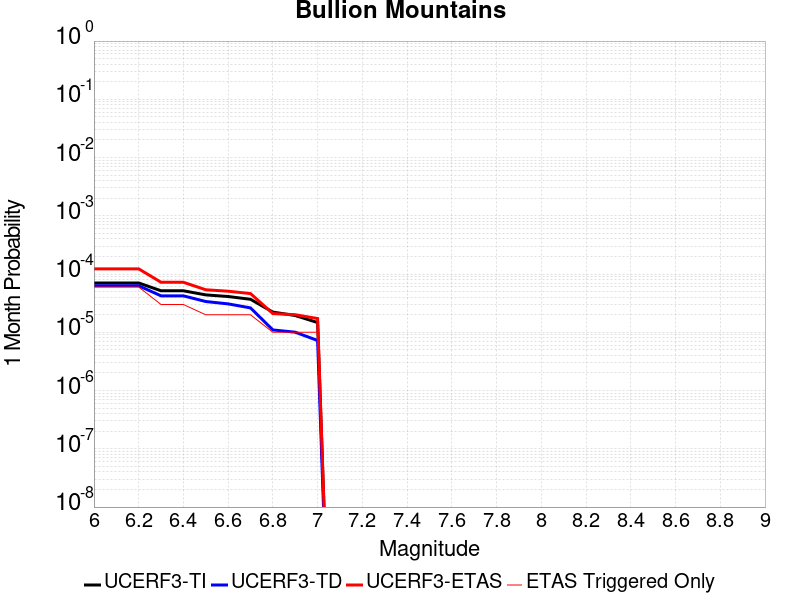 |  |  |

| Magnitude | 1 wk TI Prob | 1 wk TD Prob | 1 wk ETAS Prob | 1 wk ETAS/TD Gain | 1 wk ETAS Triggered Only | 1 mo TI Prob | 1 mo TD Prob | 1 mo ETAS Prob | 1 mo ETAS/TD Gain | 1 mo ETAS Triggered Only | 1 yr TI Prob | 1 yr TD Prob | 1 yr ETAS Prob | 1 yr ETAS/TD Gain | 1 yr ETAS Triggered Only | 10 yr TI Prob | 10 yr TD Prob | 10 yr ETAS Prob | 10 yr ETAS/TD Gain | 10 yr ETAS Triggered Only |
|-----|-----|-----|-----|-----|-----|-----|-----|-----|-----|-----|-----|-----|-----|-----|-----|-----|-----|-----|-----|-----|
| 6.0 | 1.6420427E-5 | 1.4692089E-5 | 5.2186853E-5 | 3.5520375 | 3.7495312E-5 | 7.037136E-5 | 6.296479E-5 | 1.0045775E-4 | 1.595459 | 3.7495312E-5 | 8.5643446E-4 | 7.663651E-4 | 8.4129826E-4 | 1.0977774 | 7.4990625E-5 | 0.008531413 | 0.007641016 | 0.0077526425 | 1.0146089 | 1.1248594E-4 |
| 6.1 | 1.6420427E-5 | 1.4692089E-5 | 5.2186853E-5 | 3.5520375 | 3.7495312E-5 | 7.037136E-5 | 6.296479E-5 | 1.0045775E-4 | 1.595459 | 3.7495312E-5 | 8.5643446E-4 | 7.663651E-4 | 8.4129826E-4 | 1.0977774 | 7.4990625E-5 | 0.008531413 | 0.007641016 | 0.0077526425 | 1.0146089 | 1.1248594E-4 |
| 6.2 | 1.6420427E-5 | 1.4692089E-5 | 5.2186853E-5 | 3.5520375 | 3.7495312E-5 | 7.037136E-5 | 6.296479E-5 | 1.0045775E-4 | 1.595459 | 3.7495312E-5 | 8.5643446E-4 | 7.663651E-4 | 8.4129826E-4 | 1.0977774 | 7.4990625E-5 | 0.008531413 | 0.007641016 | 0.0077526425 | 1.0146089 | 1.1248594E-4 |
| 6.3 | 1.2046778E-5 | 9.862335E-6 | 4.735728E-5 | 4.801832 | 3.7495312E-5 | 5.1628023E-5 | 4.2266598E-5 | 7.976033E-5 | 1.8870771 | 3.7495312E-5 | 6.283899E-4 | 5.144975E-4 | 5.8944954E-4 | 1.1456801 | 7.4990625E-5 | 0.0062661595 | 0.005135345 | 0.0052099503 | 1.0145278 | 7.4990625E-5 |
| 6.4 | 1.2046778E-5 | 9.862335E-6 | 4.735728E-5 | 4.801832 | 3.7495312E-5 | 5.1628023E-5 | 4.2266598E-5 | 7.976033E-5 | 1.8870771 | 3.7495312E-5 | 6.283899E-4 | 5.144975E-4 | 5.8944954E-4 | 1.1456801 | 7.4990625E-5 | 0.0062661595 | 0.005135345 | 0.0052099503 | 1.0145278 | 7.4990625E-5 |
| 6.5 | 1.0244343E-5 | 7.879458E-6 | 4.5374476E-5 | 5.7585783 | 3.7495312E-5 | 4.390359E-5 | 3.3768785E-5 | 7.126283E-5 | 2.1103168 | 3.7495312E-5 | 5.343951E-4 | 4.110781E-4 | 4.860379E-4 | 1.1823493 | 7.4990625E-5 | 0.005331118 | 0.004105208 | 0.0041798907 | 1.0181922 | 7.4990625E-5 |
| 6.6 | 9.605408E-6 | 7.1774966E-6 | 4.467254E-5 | 6.2239723 | 3.7495312E-5 | 4.1165385E-5 | 3.076045E-5 | 6.825461E-5 | 2.218908 | 3.7495312E-5 | 5.010733E-4 | 3.744645E-4 | 4.4942703E-4 | 1.200186 | 7.4990625E-5 | 0.00499945 | 0.003740332 | 0.0038150423 | 1.0199742 | 7.4990625E-5 |
| 6.7 | 8.60418E-6 | 6.1240044E-6 | 4.361909E-5 | 7.1226416 | 3.7495312E-5 | 3.687454E-5 | 2.624558E-5 | 6.3739906E-5 | 2.428596 | 3.7495312E-5 | 4.48855E-4 | 3.1951256E-4 | 3.9447923E-4 | 1.2346282 | 7.4990625E-5 | 0.004479495 | 0.0031924439 | 0.003267195 | 1.0234151 | 7.4990625E-5 |
| 6.8 | 5.187994E-6 | 2.5631666E-6 | 4.0058385E-5 | 15.628474 | 3.7495312E-5 | 2.223407E-5 | 1.0984976E-5 | 4.8479877E-5 | 4.413289 | 3.7495312E-5 | 2.7066618E-4 | 1.3373788E-4 | 1.7122817E-4 | 1.2803267 | 3.7495312E-5 | 0.0027033675 | 0.0013369655 | 0.0013744107 | 1.0280076 | 3.7495312E-5 |
| 6.9 | 4.5302368E-6 | 2.3443165E-6 | 3.9839542E-5 | 16.994097 | 3.7495312E-5 | 1.9415156E-5 | 1.0047055E-5 | 4.754199E-5 | 4.731933 | 3.7495312E-5 | 2.3635388E-4 | 1.2232E-4 | 1.5981072E-4 | 1.3064971 | 3.7495312E-5 | 0.0023610266 | 0.0012229157 | 0.0012603652 | 1.0306231 | 3.7495312E-5 |
| 7.0 | 3.431668E-6 | 1.6882402E-6 | 3.918349E-5 | 23.209665 | 3.7495312E-5 | 1.4707065E-5 | 7.235315E-6 | 4.4730357E-5 | 6.1822267 | 3.7495312E-5 | 1.7904381E-4 | 8.808996E-5 | 1.2558197E-4 | 1.4256104 | 3.7495312E-5 | 0.0017889962 | 8.808996E-4 | 9.1836194E-4 | 1.0425273 | 3.7495312E-5 |

## Owens Valley
*[(top)](#table-of-contents)*

| 1 Week | 1 Month | 1 Year | 10 Year |
|-----|-----|-----|-----|
|  | 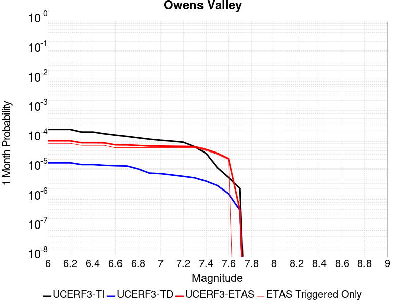 |  |  |

| Magnitude | 1 wk TI Prob | 1 wk TD Prob | 1 wk ETAS Prob | 1 wk ETAS/TD Gain | 1 wk ETAS Triggered Only | 1 mo TI Prob | 1 mo TD Prob | 1 mo ETAS Prob | 1 mo ETAS/TD Gain | 1 mo ETAS Triggered Only | 1 yr TI Prob | 1 yr TD Prob | 1 yr ETAS Prob | 1 yr ETAS/TD Gain | 1 yr ETAS Triggered Only | 10 yr TI Prob | 10 yr TD Prob | 10 yr ETAS Prob | 10 yr ETAS/TD Gain | 10 yr ETAS Triggered Only |
|-----|-----|-----|-----|-----|-----|-----|-----|-----|-----|-----|-----|-----|-----|-----|-----|-----|-----|-----|-----|-----|
| 6.0 | 4.83821E-5 | 3.626567E-6 | 4.1121744E-5 | 11.339028 | 3.7495312E-5 | 2.0733538E-4 | 1.5542342E-5 | 9.05318E-5 | 5.824849 | 7.4990625E-5 | 0.002521386 | 1.8921259E-4 | 3.0167724E-4 | 1.5943825 | 1.1248594E-4 | 0.024929691 | 0.001925011 | 0.0020372805 | 1.0583215 | 1.1248594E-4 |
| 6.1 | 4.83821E-5 | 3.626567E-6 | 4.1121744E-5 | 11.339028 | 3.7495312E-5 | 2.0733538E-4 | 1.5542342E-5 | 9.05318E-5 | 5.824849 | 7.4990625E-5 | 0.002521386 | 1.8921259E-4 | 3.0167724E-4 | 1.5943825 | 1.1248594E-4 | 0.024929691 | 0.001925011 | 0.0020372805 | 1.0583215 | 1.1248594E-4 |
| 6.2 | 4.83821E-5 | 3.626567E-6 | 4.1121744E-5 | 11.339028 | 3.7495312E-5 | 2.0733538E-4 | 1.5542342E-5 | 9.05318E-5 | 5.824849 | 7.4990625E-5 | 0.002521386 | 1.8921259E-4 | 3.0167724E-4 | 1.5943825 | 1.1248594E-4 | 0.024929691 | 0.001925011 | 0.0020372805 | 1.0583215 | 1.1248594E-4 |
| 6.3 | 3.953008E-5 | 3.1553948E-6 | 4.065059E-5 | 12.882885 | 3.7495312E-5 | 1.6940363E-4 | 1.3523055E-5 | 8.8512665E-5 | 6.545316 | 7.4990625E-5 | 0.002060538 | 1.6463149E-4 | 2.770989E-4 | 1.6831465 | 1.1248594E-4 | 0.020415364 | 0.0016592 | 0.0017714992 | 1.0676829 | 1.1248594E-4 |
| 6.4 | 3.953008E-5 | 3.1553948E-6 | 4.065059E-5 | 12.882885 | 3.7495312E-5 | 1.6940363E-4 | 1.3523055E-5 | 8.8512665E-5 | 6.545316 | 7.4990625E-5 | 0.002060538 | 1.6463149E-4 | 2.770989E-4 | 1.6831465 | 1.1248594E-4 | 0.020415364 | 0.0016592 | 0.0017714992 | 1.0676829 | 1.1248594E-4 |
| 6.5 | 3.457342E-5 | 2.9715961E-6 | 4.04668E-5 | 13.617866 | 3.7495312E-5 | 1.4816338E-4 | 1.2735354E-5 | 8.772503E-5 | 6.8883066 | 7.4990625E-5 | 0.0018023965 | 1.550426E-4 | 2.675111E-4 | 1.7254038 | 1.1248594E-4 | 0.017878477 | 0.001555719 | 0.0016680299 | 1.0721923 | 1.1248594E-4 |
| 6.6 | 3.1127765E-5 | 2.8744932E-6 | 4.0369698E-5 | 14.044109 | 3.7495312E-5 | 1.3339789E-4 | 1.2319203E-5 | 8.730891E-5 | 7.08722 | 7.4990625E-5 | 0.0016229092 | 1.4997667E-4 | 2.6244574E-4 | 1.7499105 | 1.1248594E-4 | 0.016111081 | 0.0015012559 | 0.0016135729 | 1.0748154 | 1.1248594E-4 |
| 6.7 | 2.806885E-5 | 2.8104134E-6 | 4.0305622E-5 | 14.341528 | 3.7495312E-5 | 1.2028952E-4 | 1.20445775E-5 | 8.70343E-5 | 7.2260156 | 7.4990625E-5 | 0.001463541 | 1.4663354E-4 | 2.59103E-4 | 1.7670103 | 1.1248594E-4 | 0.014539397 | 0.0014657511 | 0.0015780721 | 1.0766304 | 1.1248594E-4 |
| 6.8 | 2.524524E-5 | 2.2353688E-6 | 3.97306E-5 | 17.773623 | 3.7495312E-5 | 1.0818939E-4 | 9.580118E-6 | 8.457003E-5 | 8.82766 | 7.4990625E-5 | 0.0013164099 | 1.16632E-4 | 2.2910481E-4 | 1.9643393 | 1.1248594E-4 | 0.01308639 | 0.0011659812 | 0.0012783359 | 1.0963607 | 1.1248594E-4 |
| 6.9 | 2.2704568E-5 | 1.6081682E-6 | 3.9103423E-5 | 24.315504 | 3.7495312E-5 | 9.730166E-5 | 6.8921313E-6 | 8.188224E-5 | 11.88054 | 7.4990625E-5 | 0.0011840039 | 8.390849E-5 | 1.96385E-4 | 2.3404663 | 1.1248594E-4 | 0.011777153 | 8.3897985E-4 | 9.513714E-4 | 1.1339622 | 1.1248594E-4 |
| 7.0 | 2.0871712E-5 | 1.5395453E-6 | 3.90348E-5 | 25.35476 | 3.7495312E-5 | 8.944713E-5 | 6.598035E-6 | 8.1588165E-5 | 12.365525 | 7.4990625E-5 | 0.0010884746 | 8.032813E-5 | 1.9280503E-4 | 2.4002182 | 1.1248594E-4 | 0.010831586 | 8.0316263E-4 | 9.155582E-4 | 1.1399412 | 1.1248594E-4 |
| 7.1 | 1.944928E-5 | 1.3864178E-6 | 3.888168E-5 | 28.044706 | 3.7495312E-5 | 8.335139E-5 | 5.941777E-6 | 8.093196E-5 | 13.620834 | 7.4990625E-5 | 0.0010143308 | 7.233874E-5 | 1.8481654E-4 | 2.5548763 | 1.1248594E-4 | 0.010097133 | 7.2330976E-4 | 8.3571434E-4 | 1.1554031 | 1.1248594E-4 |
| 7.2 | 1.7876306E-5 | 1.2489141E-6 | 3.874418E-5 | 31.022293 | 3.7495312E-5 | 7.6610486E-5 | 5.352478E-6 | 8.03427E-5 | 15.010375 | 7.4990625E-5 | 9.3233347E-4 | 6.516448E-5 | 1.7764309E-4 | 2.7260723 | 1.1248594E-4 | 0.009284316 | 6.5159105E-4 | 7.6400366E-4 | 1.1725203 | 1.1248594E-4 |
| 7.3 | 1.2618672E-5 | 1.1115209E-6 | 3.860679E-5 | 34.733303 | 3.7495312E-5 | 5.40789E-5 | 4.763652E-6 | 7.975392E-5 | 16.74218 | 7.4990625E-5 | 6.582117E-4 | 5.799593E-5 | 1.7047535E-4 | 2.9394364 | 1.1248594E-4 | 0.0065626553 | 5.7994033E-4 | 6.9236103E-4 | 1.1938487 | 1.1248594E-4 |
| 7.4 | 7.4874442E-6 | 8.5486437E-7 | 3.8350146E-5 | 44.861088 | 3.7495312E-5 | 3.208865E-5 | 3.6636993E-6 | 7.865405E-5 | 21.46848 | 7.4990625E-5 | 3.906093E-4 | 4.4604632E-5 | 1.5708555E-4 | 3.5217319 | 1.1248594E-4 | 0.003899234 | 4.4604883E-4 | 5.584846E-4 | 1.2520705 | 1.1248594E-4 |
| 7.5 | 2.4734156E-6 | 6.068616E-7 | 3.8102153E-5 | 62.785572 | 3.7495312E-5 | 1.060031E-5 | 2.6008327E-6 | 4.009605E-5 | 15.416619 | 3.7495312E-5 | 1.2905113E-4 | 3.166468E-5 | 1.0665294E-4 | 3.3681984 | 7.4990625E-5 | 0.0012897621 | 3.1660203E-4 | 3.915689E-4 | 1.2367859 | 7.4990625E-5 |
| 7.6 | 1.1328841E-6 | 3.196531E-7 | 3.7814953E-5 | 118.29997 | 3.7495312E-5 | 4.8552088E-6 | 1.3699412E-6 | 3.8865204E-5 | 28.36998 | 3.7495312E-5 | 5.9110564E-5 | 1.6678909E-5 | 9.1668284E-5 | 5.4960604 | 7.4990625E-5 | 5.9094845E-4 | 1.6677675E-4 | 2.4175487E-4 | 1.4495717 | 7.4990625E-5 |
| 7.7 | 4.8613185E-7 | 8.964689E-8 | 8.964689E-8 | 1.0 | 0.0 | 2.0834207E-6 | 3.8420092E-7 | 3.8420092E-7 | 1.0 | 0.0 | 2.536535E-5 | 4.6776368E-6 | 4.6776368E-6 | 1.0 | 0.0 | 2.5362454E-4 | 4.677545E-5 | 4.677545E-5 | 1.0 | 0.0 |

## San Jacinto (Coyote Creek)
*[(top)](#table-of-contents)*

| 1 Week | 1 Month | 1 Year | 10 Year |
|-----|-----|-----|-----|
|  |  |  |  |

| Magnitude | 1 wk TI Prob | 1 wk TD Prob | 1 wk ETAS Prob | 1 wk ETAS/TD Gain | 1 wk ETAS Triggered Only | 1 mo TI Prob | 1 mo TD Prob | 1 mo ETAS Prob | 1 mo ETAS/TD Gain | 1 mo ETAS Triggered Only | 1 yr TI Prob | 1 yr TD Prob | 1 yr ETAS Prob | 1 yr ETAS/TD Gain | 1 yr ETAS Triggered Only | 10 yr TI Prob | 10 yr TD Prob | 10 yr ETAS Prob | 10 yr ETAS/TD Gain | 10 yr ETAS Triggered Only |
|-----|-----|-----|-----|-----|-----|-----|-----|-----|-----|-----|-----|-----|-----|-----|-----|-----|-----|-----|-----|-----|
| 6.0 | 2.7374346E-5 | 2.4145214E-5 | 9.913403E-5 | 4.1057425 | 7.4990625E-5 | 1.1731335E-4 | 1.034754E-4 | 1.7845827E-4 | 1.7246444 | 7.4990625E-5 | 0.0014273542 | 0.0012590875 | 0.0013339837 | 1.0594845 | 7.4990625E-5 | 0.01418221 | 0.012928318 | 0.01303935 | 1.0085883 | 1.1248594E-4 |
| 6.1 | 2.7374346E-5 | 2.4145214E-5 | 9.913403E-5 | 4.1057425 | 7.4990625E-5 | 1.1731335E-4 | 1.034754E-4 | 1.7845827E-4 | 1.7246444 | 7.4990625E-5 | 0.0014273542 | 0.0012590875 | 0.0013339837 | 1.0594845 | 7.4990625E-5 | 0.01418221 | 0.012928318 | 0.01303935 | 1.0085883 | 1.1248594E-4 |
| 6.2 | 2.7374346E-5 | 2.4145214E-5 | 9.913403E-5 | 4.1057425 | 7.4990625E-5 | 1.1731335E-4 | 1.034754E-4 | 1.7845827E-4 | 1.7246444 | 7.4990625E-5 | 0.0014273542 | 0.0012590875 | 0.0013339837 | 1.0594845 | 7.4990625E-5 | 0.01418221 | 0.012928318 | 0.01303935 | 1.0085883 | 1.1248594E-4 |
| 6.3 | 2.7374346E-5 | 2.4145214E-5 | 9.913403E-5 | 4.1057425 | 7.4990625E-5 | 1.1731335E-4 | 1.034754E-4 | 1.7845827E-4 | 1.7246444 | 7.4990625E-5 | 0.0014273542 | 0.0012590875 | 0.0013339837 | 1.0594845 | 7.4990625E-5 | 0.01418221 | 0.012928318 | 0.01303935 | 1.0085883 | 1.1248594E-4 |
| 6.4 | 2.7374346E-5 | 2.4145214E-5 | 9.913403E-5 | 4.1057425 | 7.4990625E-5 | 1.1731335E-4 | 1.034754E-4 | 1.7845827E-4 | 1.7246444 | 7.4990625E-5 | 0.0014273542 | 0.0012590875 | 0.0013339837 | 1.0594845 | 7.4990625E-5 | 0.01418221 | 0.012928318 | 0.01303935 | 1.0085883 | 1.1248594E-4 |
| 6.5 | 2.7282445E-5 | 2.4031293E-5 | 9.9020115E-5 | 4.1204658 | 7.4990625E-5 | 1.16919524E-4 | 1.029872E-4 | 1.779701E-4 | 1.7280798 | 7.4990625E-5 | 0.0014225657 | 0.0012531505 | 0.0013280472 | 1.0597667 | 7.4990625E-5 | 0.014134934 | 0.012869646 | 0.012980684 | 1.0086279 | 1.1248594E-4 |
| 6.6 | 2.7282445E-5 | 2.4031293E-5 | 9.9020115E-5 | 4.1204658 | 7.4990625E-5 | 1.16919524E-4 | 1.029872E-4 | 1.779701E-4 | 1.7280798 | 7.4990625E-5 | 0.0014225657 | 0.0012531505 | 0.0013280472 | 1.0597667 | 7.4990625E-5 | 0.014134934 | 0.012869646 | 0.012980684 | 1.0086279 | 1.1248594E-4 |
| 6.7 | 2.7216198E-5 | 2.3956412E-5 | 9.8945246E-5 | 4.1302195 | 7.4990625E-5 | 1.1663563E-4 | 1.02666316E-4 | 1.7764924E-4 | 1.7303557 | 7.4990625E-5 | 0.0014191137 | 0.0012492483 | 0.0013241452 | 1.0599536 | 7.4990625E-5 | 0.014100855 | 0.0128310565 | 0.012942099 | 1.0086542 | 1.1248594E-4 |
| 6.8 | 2.7078617E-5 | 2.387363E-5 | 9.886247E-5 | 4.1410737 | 7.4990625E-5 | 1.1604605E-4 | 1.0231156E-4 | 1.7729451E-4 | 1.7328883 | 7.4990625E-5 | 0.001411945 | 0.0012449342 | 0.0013198314 | 1.0601616 | 7.4990625E-5 | 0.014030075 | 0.012788199 | 0.012899246 | 1.0086836 | 1.1248594E-4 |
| 6.9 | 2.6982952E-5 | 2.3793142E-5 | 9.878198E-5 | 4.1517 | 7.4990625E-5 | 1.15636096E-4 | 1.0196664E-4 | 1.7694962E-4 | 1.7353678 | 7.4990625E-5 | 0.0014069602 | 0.0012407395 | 0.001315637 | 1.0603653 | 7.4990625E-5 | 0.013980856 | 0.012746515 | 0.012857567 | 1.0087124 | 1.1248594E-4 |
| 7.0 | 2.6449972E-5 | 2.3370165E-5 | 9.8359036E-5 | 4.208744 | 7.4990625E-5 | 1.1335209E-4 | 1.00154015E-4 | 1.7513713E-4 | 1.7486781 | 7.4990625E-5 | 0.001379188 | 0.0012186957 | 0.0012935948 | 1.0614585 | 7.4990625E-5 | 0.0137065975 | 0.0125278765 | 0.0126389535 | 1.0088663 | 1.1248594E-4 |
| 7.1 | 2.6257849E-5 | 2.3196202E-5 | 9.818509E-5 | 4.232809 | 7.4990625E-5 | 1.1252879E-4 | 9.940852E-5 | 1.743917E-4 | 1.7542932 | 7.4990625E-5 | 0.0013691769 | 0.0012096294 | 0.0012845292 | 1.0619197 | 7.4990625E-5 | 0.013607717 | 0.012437741 | 0.0125488285 | 1.0089314 | 1.1248594E-4 |
| 7.2 | 2.5270041E-5 | 2.2390966E-5 | 9.737991E-5 | 4.3490715 | 7.4990625E-5 | 1.0829568E-4 | 9.595777E-5 | 1.709412E-4 | 1.7814212 | 7.4990625E-5 | 0.0013177024 | 0.0011676621 | 0.0012425651 | 1.064148 | 7.4990625E-5 | 0.013099162 | 0.012018777 | 0.012129911 | 1.0092467 | 1.1248594E-4 |
| 7.3 | 2.339701E-5 | 2.1122814E-5 | 9.611186E-5 | 4.5501447 | 7.4990625E-5 | 1.0026905E-4 | 9.0523215E-5 | 1.6550705E-4 | 1.8283381 | 7.4990625E-5 | 0.001220092 | 0.0011015651 | 0.0011764731 | 1.0680015 | 7.4990625E-5 | 0.012134149 | 0.011357696 | 0.011468904 | 1.0097915 | 1.1248594E-4 |
| 7.4 | 2.296333E-5 | 2.0853171E-5 | 9.584223E-5 | 4.5960507 | 7.4990625E-5 | 9.841056E-5 | 8.936768E-5 | 1.643516E-4 | 1.8390497 | 7.4990625E-5 | 0.0011974899 | 0.0010875105 | 0.0011624196 | 1.0688813 | 7.4990625E-5 | 0.011910575 | 0.01121681 | 0.011328034 | 1.0099158 | 1.1248594E-4 |
| 7.5 | 2.2188895E-5 | 2.0376096E-5 | 9.536519E-5 | 4.6802487 | 7.4990625E-5 | 9.50918E-5 | 8.732321E-5 | 1.6230729E-4 | 1.8586959 | 7.4990625E-5 | 0.0011571277 | 0.0010626436 | 0.0011375545 | 1.0704949 | 7.4990625E-5 | 0.011511209 | 0.010966429 | 0.011077681 | 1.0101448 | 1.1248594E-4 |
| 7.6 | 2.0013189E-5 | 1.8962366E-5 | 9.395157E-5 | 4.954633 | 7.4990625E-5 | 8.5767984E-5 | 8.1264756E-5 | 1.562493E-4 | 1.9227189 | 7.4990625E-5 | 0.001043725 | 9.889511E-4 | 0.0010638676 | 1.0757535 | 7.4990625E-5 | 0.010388365 | 0.010224434 | 0.0103357695 | 1.0108892 | 1.1248594E-4 |
| 7.7 | 1.7230794E-5 | 1.674371E-5 | 9.173308E-5 | 5.478659 | 7.4990625E-5 | 7.384417E-5 | 7.175679E-5 | 1.4674204E-4 | 2.0449917 | 7.4990625E-5 | 8.986819E-4 | 8.7328954E-4 | 9.4821467E-4 | 1.0857965 | 7.4990625E-5 | 0.008950562 | 0.009062956 | 0.009174422 | 1.0122992 | 1.1248594E-4 |
| 7.8 | 1.4478809E-5 | 1.4990978E-5 | 8.998048E-5 | 6.002309 | 7.4990625E-5 | 6.205057E-5 | 6.424547E-5 | 1.3923128E-4 | 2.1671765 | 7.4990625E-5 | 7.552038E-4 | 7.819085E-4 | 8.568405E-4 | 1.0958321 | 7.4990625E-5 | 0.0075264242 | 0.008141387 | 0.008252958 | 1.0137041 | 1.1248594E-4 |
| 7.9 | 1.1114467E-5 | 1.1645102E-5 | 8.663486E-5 | 7.439596 | 7.4990625E-5 | 4.7632562E-5 | 4.990663E-5 | 1.2489352E-4 | 2.5025434 | 7.4990625E-5 | 5.797721E-4 | 6.074444E-4 | 6.823895E-4 | 1.1233777 | 7.4990625E-5 | 0.0057826187 | 0.0063803247 | 0.006492093 | 1.0175177 | 1.1248594E-4 |
| 8.0 | 9.327402E-6 | 9.899186E-6 | 8.488907E-5 | 8.575358 | 7.4990625E-5 | 3.9973966E-5 | 4.2424395E-5 | 1.17411844E-4 | 2.7675548 | 7.4990625E-5 | 4.8657437E-4 | 5.1639514E-4 | 5.9134705E-4 | 1.1451445 | 7.4990625E-5 | 0.0048551033 | 0.0054499684 | 0.0055618417 | 1.0205272 | 1.1248594E-4 |
| 8.1 | 7.0235833E-6 | 6.827495E-6 | 8.181761E-5 | 11.983547 | 7.4990625E-5 | 3.0100724E-5 | 2.9260367E-5 | 1.042488E-4 | 3.5627987 | 7.4990625E-5 | 3.664147E-4 | 3.5618723E-4 | 4.3115116E-4 | 1.2104621 | 7.4990625E-5 | 0.003658111 | 0.0037876023 | 0.0038996623 | 1.029586 | 1.1248594E-4 |
| 8.2 | 2.0358202E-6 | 8.994527E-7 | 8.994527E-7 | 1.0 | 0.0 | 8.724915E-6 | 3.854792E-6 | 3.854792E-6 | 1.0 | 0.0 | 1.06220665E-4 | 4.69311E-5 | 4.69311E-5 | 1.0 | 0.0 | 0.001061699 | 5.3254166E-4 | 5.3254166E-4 | 1.0 | 0.0 |
| 8.3 | 2.0051264E-7 | 6.617272E-8 | 6.617272E-8 | 1.0 | 0.0 | 8.5933965E-7 | 2.8359733E-7 | 2.8359733E-7 | 1.0 | 0.0 | 1.046241E-5 | 3.4527925E-6 | 3.4527925E-6 | 1.0 | 0.0 | 1.0461917E-4 | 4.01389E-5 | 4.01389E-5 | 1.0 | 0.0 |

## Pine Mtn
*[(top)](#table-of-contents)*

| 1 Week | 1 Month | 1 Year | 10 Year |
|-----|-----|-----|-----|
|  |  |  |  |

| Magnitude | 1 wk TI Prob | 1 wk TD Prob | 1 wk ETAS Prob | 1 wk ETAS/TD Gain | 1 wk ETAS Triggered Only | 1 mo TI Prob | 1 mo TD Prob | 1 mo ETAS Prob | 1 mo ETAS/TD Gain | 1 mo ETAS Triggered Only | 1 yr TI Prob | 1 yr TD Prob | 1 yr ETAS Prob | 1 yr ETAS/TD Gain | 1 yr ETAS Triggered Only | 10 yr TI Prob | 10 yr TD Prob | 10 yr ETAS Prob | 10 yr ETAS/TD Gain | 10 yr ETAS Triggered Only |
|-----|-----|-----|-----|-----|-----|-----|-----|-----|-----|-----|-----|-----|-----|-----|-----|-----|-----|-----|-----|-----|
| 6.0 | 6.894797E-6 | 7.225461E-6 | 7.225461E-6 | 1.0 | 0.0 | 2.9548795E-5 | 3.096591E-5 | 3.096591E-5 | 1.0 | 0.0 | 3.596972E-4 | 3.7694772E-4 | 4.519101E-4 | 1.1988667 | 7.4990625E-5 | 0.0035911554 | 0.003763381 | 0.0038754437 | 1.0297772 | 1.1248594E-4 |
| 6.1 | 6.894797E-6 | 7.225461E-6 | 7.225461E-6 | 1.0 | 0.0 | 2.9548795E-5 | 3.096591E-5 | 3.096591E-5 | 1.0 | 0.0 | 3.596972E-4 | 3.7694772E-4 | 4.519101E-4 | 1.1988667 | 7.4990625E-5 | 0.0035911554 | 0.003763381 | 0.0038754437 | 1.0297772 | 1.1248594E-4 |
| 6.2 | 6.894797E-6 | 7.225461E-6 | 7.225461E-6 | 1.0 | 0.0 | 2.9548795E-5 | 3.096591E-5 | 3.096591E-5 | 1.0 | 0.0 | 3.596972E-4 | 3.7694772E-4 | 4.519101E-4 | 1.1988667 | 7.4990625E-5 | 0.0035911554 | 0.003763381 | 0.0038754437 | 1.0297772 | 1.1248594E-4 |
| 6.3 | 6.894797E-6 | 7.225461E-6 | 7.225461E-6 | 1.0 | 0.0 | 2.9548795E-5 | 3.096591E-5 | 3.096591E-5 | 1.0 | 0.0 | 3.596972E-4 | 3.7694772E-4 | 4.519101E-4 | 1.1988667 | 7.4990625E-5 | 0.0035911554 | 0.003763381 | 0.0038754437 | 1.0297772 | 1.1248594E-4 |
| 6.4 | 6.894797E-6 | 7.225461E-6 | 7.225461E-6 | 1.0 | 0.0 | 2.9548795E-5 | 3.096591E-5 | 3.096591E-5 | 1.0 | 0.0 | 3.596972E-4 | 3.7694772E-4 | 4.519101E-4 | 1.1988667 | 7.4990625E-5 | 0.0035911554 | 0.003763381 | 0.0038754437 | 1.0297772 | 1.1248594E-4 |
| 6.5 | 6.894797E-6 | 7.225461E-6 | 7.225461E-6 | 1.0 | 0.0 | 2.9548795E-5 | 3.096591E-5 | 3.096591E-5 | 1.0 | 0.0 | 3.596972E-4 | 3.7694772E-4 | 4.519101E-4 | 1.1988667 | 7.4990625E-5 | 0.0035911554 | 0.003763381 | 0.0038754437 | 1.0297772 | 1.1248594E-4 |
| 6.6 | 6.894797E-6 | 7.225461E-6 | 7.225461E-6 | 1.0 | 0.0 | 2.9548795E-5 | 3.096591E-5 | 3.096591E-5 | 1.0 | 0.0 | 3.596972E-4 | 3.7694772E-4 | 4.519101E-4 | 1.1988667 | 7.4990625E-5 | 0.0035911554 | 0.003763381 | 0.0038754437 | 1.0297772 | 1.1248594E-4 |
| 6.7 | 6.0867933E-6 | 6.3971133E-6 | 6.3971133E-6 | 1.0 | 0.0 | 2.6085996E-5 | 2.7415923E-5 | 2.7415923E-5 | 1.0 | 0.0 | 3.1755073E-4 | 3.3373994E-4 | 4.0870553E-4 | 1.2246228 | 7.4990625E-5 | 0.0031709734 | 0.0033326065 | 0.0034447175 | 1.0336406 | 1.1248594E-4 |
| 6.8 | 5.6530425E-6 | 5.9505956E-6 | 5.9505956E-6 | 1.0 | 0.0 | 2.42271E-5 | 2.5502315E-5 | 2.5502315E-5 | 1.0 | 0.0 | 2.94925E-4 | 3.104485E-4 | 3.8541586E-4 | 1.2414808 | 7.4990625E-5 | 0.002945339 | 0.0031003528 | 0.0032124901 | 1.0361692 | 1.1248594E-4 |
| 6.9 | 4.6015225E-6 | 4.863834E-6 | 4.863834E-6 | 1.0 | 0.0 | 1.9720663E-5 | 2.0844845E-5 | 2.0844845E-5 | 1.0 | 0.0 | 2.4007261E-4 | 2.5375787E-4 | 3.2872948E-4 | 1.2954454 | 7.4990625E-5 | 0.0023981342 | 0.0025348254 | 0.0026470262 | 1.0442637 | 1.1248594E-4 |
| 7.0 | 4.4875965E-6 | 4.747473E-6 | 4.747473E-6 | 1.0 | 0.0 | 1.9232413E-5 | 2.0346162E-5 | 2.0346162E-5 | 1.0 | 0.0 | 2.3412947E-4 | 2.4768783E-4 | 3.2265988E-4 | 1.3026876 | 7.4990625E-5 | 0.0023388295 | 0.0024742614 | 0.002586469 | 1.04535 | 1.1248594E-4 |
| 7.1 | 3.203907E-6 | 3.4294096E-6 | 3.4294096E-6 | 1.0 | 0.0 | 1.3730958E-5 | 1.4697391E-5 | 1.4697391E-5 | 1.0 | 0.0 | 1.6716159E-4 | 1.789267E-4 | 2.1641531E-4 | 1.2095194 | 3.7495312E-5 | 0.0016703589 | 0.0017878925 | 0.0018627491 | 1.0418686 | 7.4990625E-5 |
| 7.2 | 2.2060601E-6 | 2.3784817E-6 | 2.3784817E-6 | 1.0 | 0.0 | 9.4545085E-6 | 1.0193455E-5 | 1.0193455E-5 | 1.0 | 0.0 | 1.15102564E-4 | 1.240987E-4 | 1.240987E-4 | 1.0 | 0.0 | 0.0011504296 | 0.0012403389 | 0.0012777877 | 1.0301924 | 3.7495312E-5 |
| 7.3 | 1.3765207E-6 | 1.5216481E-6 | 1.5216481E-6 | 1.0 | 0.0 | 5.899361E-6 | 6.521333E-6 | 6.521333E-6 | 1.0 | 0.0 | 7.182235E-5 | 7.939443E-5 | 7.939443E-5 | 1.0 | 0.0 | 7.1799144E-4 | 7.936697E-4 | 7.936697E-4 | 1.0 | 0.0 |
| 7.4 | 1.1245983E-6 | 1.2587075E-6 | 1.2587075E-6 | 1.0 | 0.0 | 4.819698E-6 | 5.39445E-6 | 5.39445E-6 | 1.0 | 0.0 | 5.8678244E-5 | 6.567554E-5 | 6.567554E-5 | 1.0 | 0.0 | 5.866275E-4 | 6.5656955E-4 | 6.5656955E-4 | 1.0 | 0.0 |
| 7.5 | 8.031682E-7 | 9.276951E-7 | 9.276951E-7 | 1.0 | 0.0 | 3.4421448E-6 | 3.9758306E-6 | 3.9758306E-6 | 1.0 | 0.0 | 4.1907308E-5 | 4.840473E-5 | 4.840473E-5 | 1.0 | 0.0 | 4.1899405E-4 | 4.8394862E-4 | 4.8394862E-4 | 1.0 | 0.0 |
| 7.6 | 4.8953444E-7 | 6.003009E-7 | 6.003009E-7 | 1.0 | 0.0 | 2.098003E-6 | 2.5727159E-6 | 2.5727159E-6 | 1.0 | 0.0 | 2.5542888E-5 | 3.1322415E-5 | 3.1322415E-5 | 1.0 | 0.0 | 2.5539953E-4 | 3.1318486E-4 | 3.1318486E-4 | 1.0 | 0.0 |
| 7.7 | 6.634529E-8 | 6.788826E-8 | 6.788826E-8 | 1.0 | 0.0 | 2.843369E-7 | 2.9094966E-7 | 2.9094966E-7 | 1.0 | 0.0 | 3.4617963E-6 | 3.5423066E-6 | 3.5423066E-6 | 1.0 | 0.0 | 3.4617424E-5 | 3.542255E-5 | 3.542255E-5 | 1.0 | 0.0 |
| 7.8 | 9.235578E-9 | 9.488566E-9 | 9.488566E-9 | 1.0 | 0.0 | 3.9581046E-8 | 4.0665284E-8 | 4.0665284E-8 | 1.0 | 0.0 | 4.818991E-7 | 4.950997E-7 | 4.950997E-7 | 1.0 | 0.0 | 4.8189804E-6 | 4.950988E-6 | 4.950988E-6 | 1.0 | 0.0 |

## Cleghorn
*[(top)](#table-of-contents)*

| 1 Week | 1 Month | 1 Year | 10 Year |
|-----|-----|-----|-----|
|  |  |  |  |

| Magnitude | 1 wk TI Prob | 1 wk TD Prob | 1 wk ETAS Prob | 1 wk ETAS/TD Gain | 1 wk ETAS Triggered Only | 1 mo TI Prob | 1 mo TD Prob | 1 mo ETAS Prob | 1 mo ETAS/TD Gain | 1 mo ETAS Triggered Only | 1 yr TI Prob | 1 yr TD Prob | 1 yr ETAS Prob | 1 yr ETAS/TD Gain | 1 yr ETAS Triggered Only | 10 yr TI Prob | 10 yr TD Prob | 10 yr ETAS Prob | 10 yr ETAS/TD Gain | 10 yr ETAS Triggered Only |
|-----|-----|-----|-----|-----|-----|-----|-----|-----|-----|-----|-----|-----|-----|-----|-----|-----|-----|-----|-----|-----|
| 6.0 | 7.9267165E-6 | 9.831582E-6 | 4.7326528E-5 | 4.813724 | 3.7495312E-5 | 3.39712E-5 | 4.2134732E-5 | 1.171222E-4 | 2.7797067 | 7.4990625E-5 | 4.1352084E-4 | 5.128803E-4 | 5.878324E-4 | 1.1461397 | 7.4990625E-5 | 0.004127522 | 0.0051320773 | 0.005243986 | 1.0218058 | 1.1248594E-4 |
| 6.1 | 7.9267165E-6 | 9.831582E-6 | 4.7326528E-5 | 4.813724 | 3.7495312E-5 | 3.39712E-5 | 4.2134732E-5 | 1.171222E-4 | 2.7797067 | 7.4990625E-5 | 4.1352084E-4 | 5.128803E-4 | 5.878324E-4 | 1.1461397 | 7.4990625E-5 | 0.004127522 | 0.0051320773 | 0.005243986 | 1.0218058 | 1.1248594E-4 |
| 6.2 | 7.9267165E-6 | 9.831582E-6 | 4.7326528E-5 | 4.813724 | 3.7495312E-5 | 3.39712E-5 | 4.2134732E-5 | 1.171222E-4 | 2.7797067 | 7.4990625E-5 | 4.1352084E-4 | 5.128803E-4 | 5.878324E-4 | 1.1461397 | 7.4990625E-5 | 0.004127522 | 0.0051320773 | 0.005243986 | 1.0218058 | 1.1248594E-4 |
| 6.3 | 7.9267165E-6 | 9.831582E-6 | 4.7326528E-5 | 4.813724 | 3.7495312E-5 | 3.39712E-5 | 4.2134732E-5 | 1.171222E-4 | 2.7797067 | 7.4990625E-5 | 4.1352084E-4 | 5.128803E-4 | 5.878324E-4 | 1.1461397 | 7.4990625E-5 | 0.004127522 | 0.0051320773 | 0.005243986 | 1.0218058 | 1.1248594E-4 |
| 6.4 | 4.3445207E-6 | 6.0914435E-6 | 4.358653E-5 | 7.1553693 | 3.7495312E-5 | 1.8619241E-5 | 2.610593E-5 | 1.010946E-4 | 3.8724763 | 7.4990625E-5 | 2.2666567E-4 | 3.1779436E-4 | 3.9276117E-4 | 1.2358972 | 7.4990625E-5 | 0.0022643462 | 0.0031875873 | 0.0032997148 | 1.0351763 | 1.1248594E-4 |
| 6.5 | 4.3445207E-6 | 6.0914435E-6 | 4.358653E-5 | 7.1553693 | 3.7495312E-5 | 1.8619241E-5 | 2.610593E-5 | 1.010946E-4 | 3.8724763 | 7.4990625E-5 | 2.2666567E-4 | 3.1779436E-4 | 3.9276117E-4 | 1.2358972 | 7.4990625E-5 | 0.0022643462 | 0.0031875873 | 0.0032997148 | 1.0351763 | 1.1248594E-4 |
| 6.6 | 4.040109E-6 | 5.773851E-6 | 4.326895E-5 | 7.4939494 | 3.7495312E-5 | 1.7314638E-5 | 2.4744846E-5 | 9.973362E-5 | 4.0304804 | 7.4990625E-5 | 2.1078532E-4 | 3.012278E-4 | 3.7619582E-4 | 1.2488749 | 7.4990625E-5 | 0.002105855 | 0.003022377 | 0.003134523 | 1.0371052 | 1.1248594E-4 |
| 6.7 | 3.3632055E-6 | 5.067348E-6 | 4.256247E-5 | 8.399358 | 3.7495312E-5 | 1.4413658E-5 | 2.1717027E-5 | 9.6706026E-5 | 4.453005 | 7.4990625E-5 | 1.7547216E-4 | 2.6437303E-4 | 3.3934385E-4 | 1.2835796 | 7.4990625E-5 | 0.0017533366 | 0.0026547113 | 0.0027668986 | 1.0422597 | 1.1248594E-4 |
| 6.8 | 3.2902772E-6 | 4.9892556E-6 | 4.2484382E-5 | 8.515174 | 3.7495312E-5 | 1.4101111E-5 | 2.1382351E-5 | 9.6371376E-5 | 4.5070524 | 7.4990625E-5 | 1.716675E-4 | 2.6029933E-4 | 3.3527045E-4 | 1.2880188 | 7.4990625E-5 | 0.0017153495 | 0.0026140702 | 0.002726262 | 1.0429184 | 1.1248594E-4 |
| 6.9 | 3.031547E-6 | 4.6910186E-6 | 4.2186155E-5 | 8.992963 | 3.7495312E-5 | 1.299228E-5 | 2.0104211E-5 | 9.509333E-5 | 4.7300205 | 7.4990625E-5 | 1.5816953E-4 | 2.4474156E-4 | 3.197138E-4 | 1.3063325 | 7.4990625E-5 | 0.00158057 | 0.0024588439 | 0.002571053 | 1.045635 | 1.1248594E-4 |
| 7.0 | 2.8259715E-6 | 4.3705895E-6 | 4.186574E-5 | 9.578969 | 3.7495312E-5 | 1.211125E-5 | 1.8730963E-5 | 9.3720184E-5 | 5.0034895 | 7.4990625E-5 | 1.4744449E-4 | 2.2802586E-4 | 3.029994E-4 | 1.328794 | 7.4990625E-5 | 0.001473467 | 0.0022920412 | 0.0024042693 | 1.0489643 | 1.1248594E-4 |
| 7.1 | 2.5962665E-6 | 4.0658106E-6 | 4.1560972E-5 | 10.222062 | 3.7495312E-5 | 1.1126809E-5 | 1.7424789E-5 | 9.2414106E-5 | 5.3036003 | 7.4990625E-5 | 1.3546048E-4 | 2.1212637E-4 | 2.8710108E-4 | 1.3534436 | 7.4990625E-5 | 0.0013537793 | 0.002133366 | 0.002245612 | 1.0526145 | 1.1248594E-4 |
| 7.2 | 2.3247253E-6 | 3.6763672E-6 | 4.117154E-5 | 11.198975 | 3.7495312E-5 | 9.96307E-6 | 1.5755764E-5 | 9.074521E-5 | 5.7594924 | 7.4990625E-5 | 1.21293626E-4 | 1.9180974E-4 | 2.66786E-4 | 1.3908886 | 7.4990625E-5 | 0.0012122744 | 0.0019305905 | 0.0020428593 | 1.0581526 | 1.1248594E-4 |
| 7.3 | 2.056928E-6 | 3.2350938E-6 | 4.0730287E-5 | 12.590141 | 3.7495312E-5 | 8.815376E-6 | 1.3864615E-5 | 8.88542E-5 | 6.4087033 | 7.4990625E-5 | 1.0732192E-4 | 1.6878877E-4 | 2.4376673E-4 | 1.4442118 | 7.4990625E-5 | 0.001072701 | 0.0017008206 | 0.0018131152 | 1.0660238 | 1.1248594E-4 |
| 7.4 | 1.8055999E-6 | 2.8255042E-6 | 4.0320712E-5 | 14.270271 | 3.7495312E-5 | 7.738263E-6 | 1.2109249E-5 | 8.709897E-5 | 7.192764 | 7.4990625E-5 | 9.4209274E-5 | 1.4742027E-4 | 2.2239983E-4 | 1.508611 | 7.4990625E-5 | 9.4169343E-4 | 0.0014875771 | 0.0015998958 | 1.0755044 | 1.1248594E-4 |
| 7.5 | 1.4683443E-6 | 2.4247483E-6 | 3.991997E-5 | 16.463552 | 3.7495312E-5 | 6.292889E-6 | 1.0391738E-5 | 8.538159E-5 | 8.216295 | 7.4990625E-5 | 7.661323E-5 | 1.2651215E-4 | 2.014933E-4 | 1.5926793 | 7.4990625E-5 | 7.658682E-4 | 0.0012787961 | 0.0013911383 | 1.0878499 | 1.1248594E-4 |
| 7.6 | 9.804088E-7 | 1.900266E-6 | 3.939551E-5 | 20.731575 | 3.7495312E-5 | 4.201745E-6 | 8.143972E-6 | 4.563898E-5 | 5.6040196 | 3.7495312E-5 | 5.1155046E-5 | 9.91484E-5 | 1.3664E-4 | 1.3781362 | 3.7495312E-5 | 5.114327E-4 | 0.001005471 | 0.0010803862 | 1.0745076 | 7.4990625E-5 |
| 7.7 | 7.3434086E-7 | 1.6284146E-6 | 1.6284146E-6 | 1.0 | 0.0 | 3.1471714E-6 | 6.978901E-6 | 6.978901E-6 | 1.0 | 0.0 | 3.831614E-5 | 8.4964835E-5 | 8.4964835E-5 | 1.0 | 0.0 | 3.8309532E-4 | 8.6378685E-4 | 9.0124976E-4 | 1.0433706 | 3.7495312E-5 |
| 7.8 | 6.434184E-7 | 1.5220047E-6 | 1.5220047E-6 | 1.0 | 0.0 | 2.7575045E-6 | 6.5228614E-6 | 6.5228614E-6 | 1.0 | 0.0 | 3.35721E-5 | 7.941297E-5 | 7.941297E-5 | 1.0 | 0.0 | 3.3567028E-4 | 8.079678E-4 | 8.4543286E-4 | 1.0463694 | 3.7495312E-5 |
| 7.9 | 3.4943926E-7 | 7.574459E-7 | 7.574459E-7 | 1.0 | 0.0 | 1.497596E-6 | 3.2461926E-6 | 3.2461926E-6 | 1.0 | 0.0 | 1.8233079E-5 | 3.952169E-5 | 3.952169E-5 | 1.0 | 0.0 | 1.8231584E-4 | 4.040099E-4 | 4.4149006E-4 | 1.0927705 | 3.7495312E-5 |
| 8.0 | 6.717524E-8 | 5.838828E-8 | 5.838828E-8 | 1.0 | 0.0 | 2.8789387E-7 | 2.5023547E-7 | 2.5023547E-7 | 1.0 | 0.0 | 3.505102E-6 | 3.0466126E-6 | 3.0466126E-6 | 1.0 | 0.0 | 3.5050467E-5 | 3.273506E-5 | 3.273506E-5 | 1.0 | 0.0 |
| 8.1 | 3.1984914E-8 | 1.2956093E-8 | 1.2956093E-8 | 1.0 | 0.0 | 1.370782E-7 | 5.552611E-8 | 5.552611E-8 | 1.0 | 0.0 | 1.6689258E-6 | 6.760302E-7 | 6.760302E-7 | 1.0 | 0.0 | 1.6689133E-5 | 7.74454E-6 | 7.74454E-6 | 1.0 | 0.0 |
| 8.2 | 1.21887656E-8 | 3.6495305E-9 | 3.6495305E-9 | 1.0 | 0.0 | 5.2237567E-8 | 1.5640845E-8 | 1.5640845E-8 | 1.0 | 0.0 | 6.359922E-7 | 1.9042727E-7 | 1.9042727E-7 | 1.0 | 0.0 | 6.3599036E-6 | 2.2470974E-6 | 2.2470974E-6 | 1.0 | 0.0 |

## San Jacinto (Borrego)
*[(top)](#table-of-contents)*

| 1 Week | 1 Month | 1 Year | 10 Year |
|-----|-----|-----|-----|
|  |  |  |  |

| Magnitude | 1 wk TI Prob | 1 wk TD Prob | 1 wk ETAS Prob | 1 wk ETAS/TD Gain | 1 wk ETAS Triggered Only | 1 mo TI Prob | 1 mo TD Prob | 1 mo ETAS Prob | 1 mo ETAS/TD Gain | 1 mo ETAS Triggered Only | 1 yr TI Prob | 1 yr TD Prob | 1 yr ETAS Prob | 1 yr ETAS/TD Gain | 1 yr ETAS Triggered Only | 10 yr TI Prob | 10 yr TD Prob | 10 yr ETAS Prob | 10 yr ETAS/TD Gain | 10 yr ETAS Triggered Only |
|-----|-----|-----|-----|-----|-----|-----|-----|-----|-----|-----|-----|-----|-----|-----|-----|-----|-----|-----|-----|-----|
| 6.0 | 3.543992E-5 | 2.7926513E-5 | 1.02915044E-4 | 3.6852093 | 7.4990625E-5 | 1.5187653E-4 | 1.1967963E-4 | 1.9466128E-4 | 1.6265197 | 7.4990625E-5 | 0.0018475284 | 0.0014561379 | 0.0015310192 | 1.0514247 | 7.4990625E-5 | 0.018322436 | 0.014869647 | 0.0149804605 | 1.0074524 | 1.1248594E-4 |
| 6.1 | 3.542281E-5 | 2.7926513E-5 | 1.02915044E-4 | 3.6852093 | 7.4990625E-5 | 1.5180321E-4 | 1.1967963E-4 | 1.9466128E-4 | 1.6265197 | 7.4990625E-5 | 0.0018466372 | 0.0014561379 | 0.0015310192 | 1.0514247 | 7.4990625E-5 | 0.018313672 | 0.014869647 | 0.0149804605 | 1.0074524 | 1.1248594E-4 |
| 6.2 | 3.4688688E-5 | 2.7926511E-5 | 1.02915044E-4 | 3.6852093 | 7.4990625E-5 | 1.4865733E-4 | 1.1967963E-4 | 1.9466128E-4 | 1.6265198 | 7.4990625E-5 | 0.0018084005 | 0.0014561379 | 0.0015310192 | 1.0514247 | 7.4990625E-5 | 0.017937548 | 0.014869647 | 0.0149804605 | 1.0074524 | 1.1248594E-4 |
| 6.3 | 3.2087122E-5 | 2.7771865E-5 | 1.0276041E-4 | 3.7001624 | 7.4990625E-5 | 1.3750899E-4 | 1.1901691E-4 | 1.9399861E-4 | 1.6300088 | 7.4990625E-5 | 0.0016728862 | 0.00144808 | 0.001522962 | 1.0517112 | 7.4990625E-5 | 0.016603488 | 0.014790683 | 0.014901505 | 1.0074927 | 1.1248594E-4 |
| 6.4 | 3.1828724E-5 | 2.7738852E-5 | 1.027274E-4 | 3.703376 | 7.4990625E-5 | 1.364017E-4 | 1.1887544E-4 | 1.9385715E-4 | 1.6307586 | 7.4990625E-5 | 0.0016594254 | 0.0014463598 | 0.001521242 | 1.0517728 | 7.4990625E-5 | 0.016470885 | 0.014773762 | 0.0148845855 | 1.0075014 | 1.1248594E-4 |
| 6.5 | 3.1563577E-5 | 2.747857E-5 | 1.0246714E-4 | 3.7289836 | 7.4990625E-5 | 1.3526545E-4 | 1.1776006E-4 | 1.9274185E-4 | 1.6367337 | 7.4990625E-5 | 0.0016456128 | 0.0014327979 | 0.0015076811 | 1.0522636 | 7.4990625E-5 | 0.0163348 | 0.014640348 | 0.014751187 | 1.0075707 | 1.1248594E-4 |
| 6.6 | 3.1467625E-5 | 2.7322796E-5 | 1.0231137E-4 | 3.7445426 | 7.4990625E-5 | 1.3485427E-4 | 1.1709251E-4 | 1.9207435E-4 | 1.6403642 | 7.4990625E-5 | 0.0016406142 | 0.0014246812 | 0.001499565 | 1.0525618 | 7.4990625E-5 | 0.016285548 | 0.014560594 | 0.014671442 | 1.0076128 | 1.1248594E-4 |
| 6.7 | 3.1223695E-5 | 2.6940816E-5 | 1.0192942E-4 | 3.7834573 | 7.4990625E-5 | 1.3380898E-4 | 1.15455594E-4 | 1.9043757E-4 | 1.6494442 | 7.4990625E-5 | 0.0016279068 | 0.0014047775 | 0.0014796628 | 1.0533075 | 7.4990625E-5 | 0.01616033 | 0.014364966 | 0.014475836 | 1.0077181 | 1.1248594E-4 |
| 6.8 | 3.1015585E-5 | 2.6761822E-5 | 1.0175044E-4 | 3.8020744 | 7.4990625E-5 | 1.3291716E-4 | 1.1468855E-4 | 1.8967058E-4 | 1.6537882 | 7.4990625E-5 | 0.001617065 | 0.0013954508 | 0.0014703368 | 1.0536643 | 7.4990625E-5 | 0.016053487 | 0.014272246 | 0.014383126 | 1.007769 | 1.1248594E-4 |
| 6.9 | 2.6641965E-5 | 2.2184247E-5 | 9.717321E-5 | 4.38028 | 7.4990625E-5 | 1.1417485E-4 | 9.50719E-5 | 1.700554E-4 | 1.7887031 | 7.4990625E-5 | 0.0013891924 | 0.0011568897 | 0.0012317935 | 1.0647459 | 7.4990625E-5 | 0.0138054015 | 0.011882438 | 0.011993588 | 1.0093541 | 1.1248594E-4 |
| 7.0 | 2.3854353E-5 | 2.0479023E-5 | 9.5468116E-5 | 4.6617513 | 7.4990625E-5 | 1.02228936E-4 | 8.77643E-5 | 1.6274834E-4 | 1.8543798 | 7.4990625E-5 | 0.0012439266 | 0.0010680092 | 0.0011429198 | 1.0701404 | 7.4990625E-5 | 0.012369866 | 0.0109828 | 0.011094051 | 1.0101296 | 1.1248594E-4 |
| 7.1 | 2.3672901E-5 | 2.031551E-5 | 9.530461E-5 | 4.691224 | 7.4990625E-5 | 1.0145135E-4 | 8.7063585E-5 | 1.6204768E-4 | 1.8612567 | 7.4990625E-5 | 0.0012344702 | 0.0010594862 | 0.0011343973 | 1.0707052 | 7.4990625E-5 | 0.0122763505 | 0.010897976 | 0.011009236 | 1.0102092 | 1.1248594E-4 |
| 7.2 | 2.2717244E-5 | 1.9542893E-5 | 9.453205E-5 | 4.8371577 | 7.4990625E-5 | 9.735599E-5 | 8.375258E-5 | 1.5873692E-4 | 1.8953079 | 7.4990625E-5 | 0.0011846646 | 0.001019213 | 0.0010941272 | 1.073502 | 7.4990625E-5 | 0.01178369 | 0.010495341 | 0.010606647 | 1.0106052 | 1.1248594E-4 |
| 7.3 | 2.1016205E-5 | 1.8384526E-5 | 9.3373776E-5 | 5.0789332 | 7.4990625E-5 | 9.006634E-5 | 7.878846E-5 | 1.5377317E-4 | 1.9517221 | 7.4990625E-5 | 0.001096006 | 9.5882936E-4 | 0.001033748 | 1.0781356 | 7.4990625E-5 | 0.010906163 | 0.009890967 | 0.01000234 | 1.0112602 | 1.1248594E-4 |
| 7.4 | 2.0683625E-5 | 1.8187047E-5 | 9.3176306E-5 | 5.123224 | 7.4990625E-5 | 8.86411E-5 | 7.794217E-5 | 1.5292695E-4 | 1.9620566 | 7.4990625E-5 | 0.001078671 | 9.485349E-4 | 0.0010234544 | 1.0789845 | 7.4990625E-5 | 0.010734501 | 0.009787692 | 0.009899077 | 1.0113801 | 1.1248594E-4 |
| 7.5 | 1.9993966E-5 | 1.7782075E-5 | 9.277137E-5 | 5.2171288 | 7.4990625E-5 | 8.568561E-5 | 7.620667E-5 | 1.5119159E-4 | 1.9839678 | 7.4990625E-5 | 0.001042723 | 9.2742336E-4 | 0.0010023444 | 1.0807841 | 7.4990625E-5 | 0.010378438 | 0.009574614 | 0.009686023 | 1.0116359 | 1.1248594E-4 |
| 7.6 | 1.788966E-5 | 1.6435291E-5 | 9.1424685E-5 | 5.5627055 | 7.4990625E-5 | 7.666772E-5 | 7.043507E-5 | 1.4542042E-4 | 2.0646024 | 7.4990625E-5 | 9.3302975E-4 | 8.572113E-4 | 9.3213766E-4 | 1.0874071 | 7.4990625E-5 | 0.00929122 | 0.008866487 | 0.008977976 | 1.0125742 | 1.1248594E-4 |
| 7.7 | 1.5125781E-5 | 1.4237377E-5 | 8.922694E-5 | 6.267091 | 7.4990625E-5 | 6.4823165E-5 | 6.1015908E-5 | 1.3600197E-4 | 2.228959 | 7.4990625E-5 | 7.889362E-4 | 7.426163E-4 | 8.175512E-4 | 1.1009066 | 7.4990625E-5 | 0.007861412 | 0.0077142045 | 0.007825823 | 1.0144691 | 1.1248594E-4 |
| 7.8 | 1.250089E-5 | 1.26304985E-5 | 8.7620174E-5 | 6.937191 | 7.4990625E-5 | 5.3574146E-5 | 5.412959E-5 | 1.2911616E-4 | 2.3853157 | 7.4990625E-5 | 6.5207E-4 | 6.588291E-4 | 7.337703E-4 | 1.1137491 | 7.4990625E-5 | 0.006501599 | 0.0068677636 | 0.006979477 | 1.0162663 | 1.1248594E-4 |
| 7.9 | 9.561E-6 | 9.754616E-6 | 8.474451E-5 | 8.687632 | 7.4990625E-5 | 4.0975072E-5 | 4.1804833E-5 | 1.16792326E-4 | 2.7937517 | 7.4990625E-5 | 4.987573E-4 | 5.088555E-4 | 5.83808E-4 | 1.1472962 | 7.4990625E-5 | 0.0049763937 | 0.0053523467 | 0.0054642307 | 1.0209037 | 1.1248594E-4 |
| 8.0 | 8.01699E-6 | 8.293488E-6 | 8.328349E-5 | 10.042035 | 7.4990625E-5 | 3.4358076E-5 | 3.554304E-5 | 1.10531E-4 | 3.1097791 | 7.4990625E-5 | 4.1822926E-4 | 4.3265108E-4 | 5.076093E-4 | 1.1732532 | 7.4990625E-5 | 0.0041744304 | 0.004573375 | 0.0046853465 | 1.0244833 | 1.1248594E-4 |
| 8.1 | 6.541947E-6 | 6.4622354E-6 | 8.1452374E-5 | 12.604365 | 7.4990625E-5 | 2.8036617E-5 | 2.7695003E-5 | 1.0268355E-4 | 3.7076564 | 7.4990625E-5 | 3.4129233E-4 | 3.37135E-4 | 4.1210034E-4 | 1.22236 | 7.4990625E-5 | 0.0034076865 | 0.0035806994 | 0.0036927827 | 1.031302 | 1.1248594E-4 |
| 8.2 | 1.7968189E-6 | 7.9713476E-7 | 7.9713476E-7 | 1.0 | 0.0 | 7.70063E-6 | 3.4162877E-6 | 3.4162877E-6 | 1.0 | 0.0 | 9.3751136E-5 | 4.159253E-5 | 4.159253E-5 | 1.0 | 0.0 | 9.371159E-4 | 4.712058E-4 | 4.712058E-4 | 1.0 | 0.0 |
| 8.3 | 1.5167889E-7 | 4.897714E-8 | 4.897714E-8 | 1.0 | 0.0 | 6.500522E-7 | 2.09902E-7 | 2.09902E-7 | 1.0 | 0.0 | 7.9143565E-6 | 2.5555544E-6 | 2.5555544E-6 | 1.0 | 0.0 | 7.914075E-5 | 2.969505E-5 | 2.969505E-5 | 1.0 | 0.0 |

## Imperial
*[(top)](#table-of-contents)*

| 1 Week | 1 Month | 1 Year | 10 Year |
|-----|-----|-----|-----|
|  |  |  |  |

| Magnitude | 1 wk TI Prob | 1 wk TD Prob | 1 wk ETAS Prob | 1 wk ETAS/TD Gain | 1 wk ETAS Triggered Only | 1 mo TI Prob | 1 mo TD Prob | 1 mo ETAS Prob | 1 mo ETAS/TD Gain | 1 mo ETAS Triggered Only | 1 yr TI Prob | 1 yr TD Prob | 1 yr ETAS Prob | 1 yr ETAS/TD Gain | 1 yr ETAS Triggered Only | 10 yr TI Prob | 10 yr TD Prob | 10 yr ETAS Prob | 10 yr ETAS/TD Gain | 10 yr ETAS Triggered Only |
|-----|-----|-----|-----|-----|-----|-----|-----|-----|-----|-----|-----|-----|-----|-----|-----|-----|-----|-----|-----|-----|
| 6.0 | 2.7496446E-4 | 5.0552754E-4 | 5.0552754E-4 | 1.0 | 0.0 | 0.0011778869 | 0.002164787 | 0.0022022012 | 1.0172831 | 3.7495312E-5 | 0.0142467655 | 0.026038699 | 0.026075218 | 1.0014025 | 3.7495312E-5 | 0.13367249 | 0.2280438 | 0.22813062 | 1.0003808 | 1.1248594E-4 |
| 6.1 | 2.5356023E-4 | 4.8656776E-4 | 4.8656776E-4 | 1.0 | 0.0 | 0.001086234 | 0.0020836622 | 0.0021210795 | 1.0179574 | 3.7495312E-5 | 0.013144928 | 0.025071215 | 0.02510777 | 1.001458 | 3.7495312E-5 | 0.123940155 | 0.21947981 | 0.21956761 | 1.0004001 | 1.1248594E-4 |
| 6.2 | 2.4820742E-4 | 4.7752203E-4 | 4.7752203E-4 | 1.0 | 0.0 | 0.0010633124 | 0.0020449557 | 0.0020823744 | 1.018298 | 3.7495312E-5 | 0.01286919 | 0.024611235 | 0.024647808 | 1.0014861 | 3.7495312E-5 | 0.12148927 | 0.21598552 | 0.21607372 | 1.0004083 | 1.1248594E-4 |
| 6.3 | 2.3205351E-4 | 4.5890483E-4 | 4.5890483E-4 | 1.0 | 0.0 | 9.94136E-4 | 0.0019652895 | 0.002002711 | 1.0190413 | 3.7495312E-5 | 0.012036599 | 0.02366133 | 0.023697939 | 1.0015472 | 3.7495312E-5 | 0.11405133 | 0.20793462 | 0.20802371 | 1.0004284 | 1.1248594E-4 |
| 6.4 | 2.0304754E-4 | 3.987652E-4 | 3.987652E-4 | 1.0 | 0.0 | 8.6991355E-4 | 0.0017078889 | 0.0017453203 | 1.0219167 | 3.7495312E-5 | 0.010539869 | 0.020595672 | 0.020632394 | 1.001783 | 3.7495312E-5 | 0.100537635 | 0.1850669 | 0.18515857 | 1.0004953 | 1.1248594E-4 |
| 6.5 | 1.854992E-4 | 3.6988858E-4 | 3.6988858E-4 | 1.0 | 0.0 | 7.9475436E-4 | 0.0015842861 | 0.001621722 | 1.0236295 | 3.7495312E-5 | 0.009633281 | 0.01911948 | 0.01915626 | 1.0019236 | 3.7495312E-5 | 0.0922623 | 0.173298 | 0.173391 | 1.0005366 | 1.1248594E-4 |
| 6.6 | 1.6586106E-4 | 3.403506E-4 | 3.403506E-4 | 1.0 | 0.0 | 7.106394E-4 | 0.0014578402 | 0.0014952809 | 1.0256823 | 3.7495312E-5 | 0.008617763 | 0.01760642 | 0.017643254 | 1.0020921 | 3.7495312E-5 | 0.08291132 | 0.16077545 | 0.16086985 | 1.0005871 | 1.1248594E-4 |
| 6.7 | 1.4224656E-4 | 3.076692E-4 | 3.076692E-4 | 1.0 | 0.0 | 6.094856E-4 | 0.001317924 | 0.0013553699 | 1.0284128 | 3.7495312E-5 | 0.0073952693 | 0.015929576 | 0.015966475 | 1.0023164 | 3.7495312E-5 | 0.07153955 | 0.14648417 | 0.14658017 | 1.0006554 | 1.1248594E-4 |
| 6.8 | 1.2317259E-4 | 2.779122E-4 | 2.779122E-4 | 1.0 | 0.0 | 5.2777573E-4 | 0.0011905148 | 0.0012279653 | 1.0314575 | 3.7495312E-5 | 0.0064067547 | 0.0143995695 | 0.014436525 | 1.0025665 | 3.7495312E-5 | 0.06225166 | 0.13293684 | 0.13303436 | 1.0007337 | 1.1248594E-4 |
| 6.9 | 9.859898E-5 | 2.5014306E-4 | 2.5014306E-4 | 1.0 | 0.0 | 4.2249862E-4 | 0.0010716055 | 0.0011090606 | 1.0349524 | 3.7495312E-5 | 0.0051317946 | 0.012969712 | 0.013006721 | 1.0028535 | 3.7495312E-5 | 0.05014893 | 0.11940631 | 0.11950537 | 1.0008296 | 1.1248594E-4 |
| 7.0 | 7.3191884E-5 | 2.1266776E-4 | 2.1266776E-4 | 1.0 | 0.0 | 3.136418E-4 | 9.1111806E-4 | 9.485792E-4 | 1.0411156 | 3.7495312E-5 | 0.003811904 | 0.011037128 | 0.01107421 | 1.0033597 | 3.7495312E-5 | 0.037471764 | 0.10206493 | 0.10216593 | 1.0009896 | 1.1248594E-4 |
| 7.1 | 7.1760296E-5 | 2.0968143E-4 | 2.0968143E-4 | 1.0 | 0.0 | 3.0750787E-4 | 8.983284E-4 | 9.3578995E-4 | 1.0417014 | 3.7495312E-5 | 0.003737482 | 0.010882978 | 0.010920065 | 1.0034078 | 3.7495312E-5 | 0.03675245 | 0.10070146 | 0.100802615 | 1.0010046 | 1.1248594E-4 |
| 7.2 | 6.46614E-5 | 1.9136685E-4 | 1.9136685E-4 | 1.0 | 0.0 | 2.7709085E-4 | 8.1988896E-4 | 8.573535E-4 | 1.0456947 | 3.7495312E-5 | 0.0033683628 | 0.0099370815 | 0.009974204 | 1.0037358 | 3.7495312E-5 | 0.033177625 | 0.09250898 | 0.09261106 | 1.0011034 | 1.1248594E-4 |
| 7.3 | 6.088115E-5 | 1.78084E-4 | 1.78084E-4 | 1.0 | 0.0 | 2.6089314E-4 | 7.6299673E-4 | 8.0046343E-4 | 1.0491047 | 3.7495312E-5 | 0.0031717476 | 0.009250494 | 0.009287642 | 1.0040158 | 3.7495312E-5 | 0.031268585 | 0.08655989 | 0.08666264 | 1.0011871 | 1.1248594E-4 |
| 7.4 | 4.199346E-5 | 1.1510366E-4 | 1.1510366E-4 | 1.0 | 0.0 | 1.7995955E-4 | 4.9320905E-4 | 4.9320905E-4 | 1.0 | 0.0 | 0.0021888057 | 0.0059884563 | 0.0059884563 | 1.0 | 0.0 | 0.02167372 | 0.057439793 | 0.057510477 | 1.0012306 | 7.4990625E-5 |
| 7.5 | 3.130448E-5 | 8.33328E-5 | 8.33328E-5 | 1.0 | 0.0 | 1.3415517E-4 | 3.57092E-4 | 3.57092E-4 | 1.0 | 0.0 | 0.0016321153 | 0.004338988 | 0.004338988 | 1.0 | 0.0 | 0.016201803 | 0.04213201 | 0.04220384 | 1.0017049 | 7.4990625E-5 |
| 7.6 | 2.3074248E-5 | 6.0844646E-5 | 6.0844646E-5 | 1.0 | 0.0 | 9.888588E-5 | 2.6073685E-4 | 2.6073685E-4 | 1.0 | 0.0 | 0.0012032706 | 0.0031698733 | 0.0031698733 | 1.0 | 0.0 | 0.011967761 | 0.031026395 | 0.031099059 | 1.002342 | 7.4990625E-5 |
| 7.7 | 1.45864815E-5 | 4.0124698E-5 | 4.0124698E-5 | 1.0 | 0.0 | 6.2511994E-5 | 1.7195169E-4 | 1.7195169E-4 | 1.0 | 0.0 | 7.608177E-4 | 0.0020915072 | 0.0020915072 | 1.0 | 0.0 | 0.007582182 | 0.020627763 | 0.020701207 | 1.0035604 | 7.4990625E-5 |
| 7.8 | 1.0352979E-5 | 3.0960902E-5 | 3.0960902E-5 | 1.0 | 0.0 | 4.4369157E-5 | 1.3268284E-4 | 1.3268284E-4 | 1.0 | 0.0 | 5.400606E-4 | 0.0016142189 | 0.0016142189 | 1.0 | 0.0 | 0.0053875 | 0.016016833 | 0.016090622 | 1.004607 | 7.4990625E-5 |
| 7.9 | 8.137906E-6 | 2.2149103E-5 | 2.2149103E-5 | 1.0 | 0.0 | 3.4876273E-5 | 9.492128E-5 | 9.492128E-5 | 1.0 | 0.0 | 4.2453592E-4 | 0.0011550548 | 0.0011550548 | 1.0 | 0.0 | 0.004237258 | 0.011617903 | 0.011654962 | 1.0031899 | 3.7495312E-5 |
| 8.0 | 6.93792E-6 | 1.8008766E-5 | 1.8008766E-5 | 1.0 | 0.0 | 2.9733603E-5 | 7.717814E-5 | 7.717814E-5 | 1.0 | 0.0 | 3.6194647E-4 | 9.3923963E-4 | 9.3923963E-4 | 1.0 | 0.0 | 0.0036135751 | 0.00950155 | 0.00953869 | 1.0039088 | 3.7495312E-5 |
| 8.1 | 3.4286315E-6 | 6.379872E-6 | 6.379872E-6 | 1.0 | 0.0 | 1.4694053E-5 | 2.7342023E-5 | 2.7342023E-5 | 1.0 | 0.0 | 1.7888541E-4 | 3.328384E-4 | 3.328384E-4 | 1.0 | 0.0 | 0.0017874148 | 0.003486031 | 0.003486031 | 1.0 | 0.0 |
| 8.2 | 1.4906886E-6 | 1.9366646E-6 | 1.9366646E-6 | 1.0 | 0.0 | 6.3886496E-6 | 8.299965E-6 | 8.299965E-6 | 1.0 | 0.0 | 7.7779034E-5 | 1.0104742E-4 | 1.0104742E-4 | 1.0 | 0.0 | 7.775182E-4 | 0.0011075331 | 0.0011075331 | 1.0 | 0.0 |
| 8.3 | 2.5758007E-8 | 1.4500102E-8 | 1.4500102E-8 | 1.0 | 0.0 | 1.10391454E-7 | 6.214329E-8 | 6.214329E-8 | 1.0 | 0.0 | 1.3440151E-6 | 7.565946E-7 | 7.565946E-7 | 1.0 | 0.0 | 1.344007E-5 | 7.887763E-6 | 7.887763E-6 | 1.0 | 0.0 |

## Pinto Mtn
*[(top)](#table-of-contents)*

| 1 Week | 1 Month | 1 Year | 10 Year |
|-----|-----|-----|-----|
| 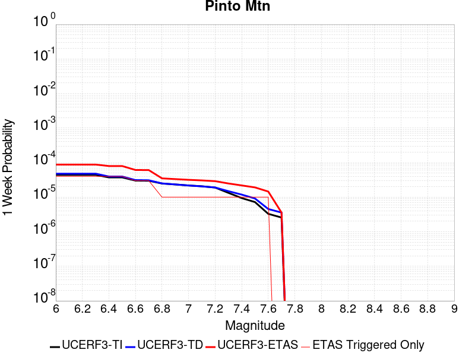 |  |  |  |

| Magnitude | 1 wk TI Prob | 1 wk TD Prob | 1 wk ETAS Prob | 1 wk ETAS/TD Gain | 1 wk ETAS Triggered Only | 1 mo TI Prob | 1 mo TD Prob | 1 mo ETAS Prob | 1 mo ETAS/TD Gain | 1 mo ETAS Triggered Only | 1 yr TI Prob | 1 yr TD Prob | 1 yr ETAS Prob | 1 yr ETAS/TD Gain | 1 yr ETAS Triggered Only | 10 yr TI Prob | 10 yr TD Prob | 10 yr ETAS Prob | 10 yr ETAS/TD Gain | 10 yr ETAS Triggered Only |
|-----|-----|-----|-----|-----|-----|-----|-----|-----|-----|-----|-----|-----|-----|-----|-----|-----|-----|-----|-----|-----|
| 6.0 | 4.4194956E-5 | 4.785362E-5 | 8.5347136E-5 | 1.7835044 | 3.7495312E-5 | 1.893932E-4 | 2.0507174E-4 | 2.8004698E-4 | 1.365605 | 7.4990625E-5 | 0.0023034236 | 0.0024940541 | 0.0025688577 | 1.0299928 | 7.4990625E-5 | 0.022796938 | 0.024678145 | 0.024787854 | 1.0044457 | 1.1248594E-4 |
| 6.1 | 4.4194956E-5 | 4.785362E-5 | 8.5347136E-5 | 1.7835044 | 3.7495312E-5 | 1.893932E-4 | 2.0507174E-4 | 2.8004698E-4 | 1.365605 | 7.4990625E-5 | 0.0023034236 | 0.0024940541 | 0.0025688577 | 1.0299928 | 7.4990625E-5 | 0.022796938 | 0.024678145 | 0.024787854 | 1.0044457 | 1.1248594E-4 |
| 6.2 | 4.4194956E-5 | 4.785362E-5 | 8.5347136E-5 | 1.7835044 | 3.7495312E-5 | 1.893932E-4 | 2.0507174E-4 | 2.8004698E-4 | 1.365605 | 7.4990625E-5 | 0.0023034236 | 0.0024940541 | 0.0025688577 | 1.0299928 | 7.4990625E-5 | 0.022796938 | 0.024678145 | 0.024787854 | 1.0044457 | 1.1248594E-4 |
| 6.3 | 4.4194956E-5 | 4.785362E-5 | 8.5347136E-5 | 1.7835044 | 3.7495312E-5 | 1.893932E-4 | 2.0507174E-4 | 2.8004698E-4 | 1.365605 | 7.4990625E-5 | 0.0023034236 | 0.0024940541 | 0.0025688577 | 1.0299928 | 7.4990625E-5 | 0.022796938 | 0.024678145 | 0.024787854 | 1.0044457 | 1.1248594E-4 |
| 6.4 | 3.729929E-5 | 3.9603186E-5 | 7.7097015E-5 | 1.9467376 | 3.7495312E-5 | 1.5984432E-4 | 1.6971743E-4 | 2.0720638E-4 | 1.2208904 | 3.7495312E-5 | 0.0019443673 | 0.002064445 | 0.0021018628 | 1.0181249 | 3.7495312E-5 | 0.019274427 | 0.02046269 | 0.020536147 | 1.0035897 | 7.4990625E-5 |
| 6.5 | 3.729929E-5 | 3.9603186E-5 | 7.7097015E-5 | 1.9467376 | 3.7495312E-5 | 1.5984432E-4 | 1.6971743E-4 | 2.0720638E-4 | 1.2208904 | 3.7495312E-5 | 0.0019443673 | 0.002064445 | 0.0021018628 | 1.0181249 | 3.7495312E-5 | 0.019274427 | 0.02046269 | 0.020536147 | 1.0035897 | 7.4990625E-5 |
| 6.6 | 3.0204548E-5 | 3.1205298E-5 | 3.1205298E-5 | 1.0 | 0.0 | 1.2944164E-4 | 1.3373033E-4 | 1.3373033E-4 | 1.0 | 0.0 | 0.0015748127 | 0.0016269855 | 0.0016269855 | 1.0 | 0.0 | 0.015636992 | 0.01615461 | 0.0161915 | 1.0022836 | 3.7495312E-5 |
| 6.7 | 2.9857754E-5 | 3.081468E-5 | 3.081468E-5 | 1.0 | 0.0 | 1.2795553E-4 | 1.3205643E-4 | 1.3205643E-4 | 1.0 | 0.0 | 0.0015567453 | 0.001606636 | 0.001606636 | 1.0 | 0.0 | 0.015458848 | 0.01595405 | 0.015990946 | 1.0023127 | 3.7495312E-5 |
| 6.8 | 2.4819734E-5 | 2.5009364E-5 | 2.5009364E-5 | 1.0 | 0.0 | 1.0636595E-4 | 1.07178705E-4 | 1.07178705E-4 | 1.0 | 0.0 | 0.0012942362 | 0.0013041412 | 0.0013041412 | 1.0 | 0.0 | 0.012867244 | 0.0129672475 | 0.013004256 | 1.002854 | 3.7495312E-5 |
| 6.9 | 2.331124E-5 | 2.3337643E-5 | 2.3337643E-5 | 1.0 | 0.0 | 9.990149E-5 | 1.00014746E-4 | 1.00014746E-4 | 1.0 | 0.0 | 0.001215622 | 0.0012170197 | 0.0012170197 | 1.0 | 0.0 | 0.012089936 | 0.012105742 | 0.012105742 | 1.0 | 0.0 |
| 7.0 | 2.1818534E-5 | 2.1760772E-5 | 2.1760772E-5 | 1.0 | 0.0 | 9.3504656E-5 | 9.325723E-5 | 9.325723E-5 | 1.0 | 0.0 | 0.0011378246 | 0.0011348352 | 0.0011348352 | 1.0 | 0.0 | 0.011320163 | 0.011292503 | 0.011292503 | 1.0 | 0.0 |
| 7.1 | 2.066081E-5 | 2.0540418E-5 | 2.0540418E-5 | 1.0 | 0.0 | 8.854332E-5 | 8.8027504E-5 | 8.8027504E-5 | 1.0 | 0.0 | 0.0010774818 | 0.0010712275 | 0.0010712275 | 1.0 | 0.0 | 0.010722724 | 0.010662688 | 0.010662688 | 1.0 | 0.0 |
| 7.2 | 1.8990233E-5 | 1.9053701E-5 | 1.9053701E-5 | 1.0 | 0.0 | 8.138417E-5 | 8.1656275E-5 | 8.1656275E-5 | 1.0 | 0.0 | 9.904018E-4 | 9.937311E-4 | 9.937311E-4 | 1.0 | 0.0 | 0.009859995 | 0.009894874 | 0.009894874 | 1.0 | 0.0 |
| 7.3 | 1.3335872E-5 | 1.4906372E-5 | 1.4906372E-5 | 1.0 | 0.0 | 5.7152483E-5 | 6.388296E-5 | 6.388296E-5 | 1.0 | 0.0 | 6.956093E-4 | 7.775102E-4 | 7.775102E-4 | 1.0 | 0.0 | 0.006934359 | 0.0077491994 | 0.0077491994 | 1.0 | 0.0 |
| 7.4 | 9.414066E-6 | 1.186061E-5 | 1.186061E-5 | 1.0 | 0.0 | 4.0345374E-5 | 5.0830247E-5 | 5.0830247E-5 | 1.0 | 0.0 | 4.910942E-4 | 6.1869196E-4 | 6.1869196E-4 | 1.0 | 0.0 | 0.0049001034 | 0.006170644 | 0.006170644 | 1.0 | 0.0 |
| 7.5 | 7.2101157E-6 | 9.157893E-6 | 9.157893E-6 | 1.0 | 0.0 | 3.090013E-5 | 3.924757E-5 | 3.924757E-5 | 1.0 | 0.0 | 3.7614413E-4 | 4.7774217E-4 | 4.7774217E-4 | 1.0 | 0.0 | 0.0037550807 | 0.004767927 | 0.004767927 | 1.0 | 0.0 |
| 7.6 | 3.296375E-6 | 4.5453176E-6 | 4.5453176E-6 | 1.0 | 0.0 | 1.4127245E-5 | 1.9479796E-5 | 1.9479796E-5 | 1.0 | 0.0 | 1.7198564E-4 | 2.3714209E-4 | 2.3714209E-4 | 1.0 | 0.0 | 0.0017185259 | 0.0023690276 | 0.0023690276 | 1.0 | 0.0 |
| 7.7 | 2.5741092E-6 | 3.584251E-6 | 3.584251E-6 | 1.0 | 0.0 | 1.103185E-5 | 1.5360993E-5 | 1.5360993E-5 | 1.0 | 0.0 | 1.3430449E-4 | 1.8700535E-4 | 1.8700535E-4 | 1.0 | 0.0 | 0.0013422335 | 0.0018686098 | 0.0018686098 | 1.0 | 0.0 |

## White Mountains
*[(top)](#table-of-contents)*

| 1 Week | 1 Month | 1 Year | 10 Year |
|-----|-----|-----|-----|
|  |  |  |  |

| Magnitude | 1 wk TI Prob | 1 wk TD Prob | 1 wk ETAS Prob | 1 wk ETAS/TD Gain | 1 wk ETAS Triggered Only | 1 mo TI Prob | 1 mo TD Prob | 1 mo ETAS Prob | 1 mo ETAS/TD Gain | 1 mo ETAS Triggered Only | 1 yr TI Prob | 1 yr TD Prob | 1 yr ETAS Prob | 1 yr ETAS/TD Gain | 1 yr ETAS Triggered Only | 10 yr TI Prob | 10 yr TD Prob | 10 yr ETAS Prob | 10 yr ETAS/TD Gain | 10 yr ETAS Triggered Only |
|-----|-----|-----|-----|-----|-----|-----|-----|-----|-----|-----|-----|-----|-----|-----|-----|-----|-----|-----|-----|-----|
| 6.0 | 3.503579E-5 | 3.378405E-5 | 3.378405E-5 | 1.0 | 0.0 | 1.5014476E-4 | 1.4478143E-4 | 1.8227132E-4 | 1.2589413 | 3.7495312E-5 | 0.0018264796 | 0.0017614096 | 0.0018736974 | 1.0637488 | 1.1248594E-4 | 0.018115403 | 0.017486818 | 0.017597338 | 1.0063201 | 1.1248594E-4 |
| 6.1 | 3.503579E-5 | 3.378405E-5 | 3.378405E-5 | 1.0 | 0.0 | 1.5014476E-4 | 1.4478143E-4 | 1.8227132E-4 | 1.2589413 | 3.7495312E-5 | 0.0018264796 | 0.0017614096 | 0.0018736974 | 1.0637488 | 1.1248594E-4 | 0.018115403 | 0.017486818 | 0.017597338 | 1.0063201 | 1.1248594E-4 |
| 6.2 | 3.503579E-5 | 3.378405E-5 | 3.378405E-5 | 1.0 | 0.0 | 1.5014476E-4 | 1.4478143E-4 | 1.8227132E-4 | 1.2589413 | 3.7495312E-5 | 0.0018264796 | 0.0017614096 | 0.0018736974 | 1.0637488 | 1.1248594E-4 | 0.018115403 | 0.017486818 | 0.017597338 | 1.0063201 | 1.1248594E-4 |
| 6.3 | 1.7818425E-5 | 1.5916074E-5 | 1.5916074E-5 | 1.0 | 0.0 | 7.636245E-5 | 6.821004E-5 | 6.821004E-5 | 1.0 | 0.0 | 9.293162E-4 | 8.301551E-4 | 8.676193E-4 | 1.0451292 | 3.7495312E-5 | 0.009254395 | 0.008271999 | 0.008309184 | 1.0044953 | 3.7495312E-5 |
| 6.4 | 1.7818425E-5 | 1.5916074E-5 | 1.5916074E-5 | 1.0 | 0.0 | 7.636245E-5 | 6.821004E-5 | 6.821004E-5 | 1.0 | 0.0 | 9.293162E-4 | 8.301551E-4 | 8.676193E-4 | 1.0451292 | 3.7495312E-5 | 0.009254395 | 0.008271999 | 0.008309184 | 1.0044953 | 3.7495312E-5 |
| 6.5 | 1.3397557E-5 | 1.13362685E-5 | 1.13362685E-5 | 1.0 | 0.0 | 5.741684E-5 | 4.858314E-5 | 4.858314E-5 | 1.0 | 0.0 | 6.988258E-4 | 5.913462E-4 | 5.913462E-4 | 1.0 | 0.0 | 0.006966323 | 0.005898432 | 0.005898432 | 1.0 | 0.0 |
| 6.6 | 1.0818695E-5 | 8.625366E-6 | 8.625366E-6 | 1.0 | 0.0 | 4.6365014E-5 | 3.6965357E-5 | 3.6965357E-5 | 1.0 | 0.0 | 5.6434784E-4 | 4.4996463E-4 | 4.4996463E-4 | 1.0 | 0.0 | 0.005629168 | 0.004490972 | 0.004490972 | 1.0 | 0.0 |
| 6.7 | 9.067908E-6 | 6.802442E-6 | 6.802442E-6 | 1.0 | 0.0 | 3.8861883E-5 | 2.9153016E-5 | 2.9153016E-5 | 1.0 | 0.0 | 4.7304068E-4 | 3.5488335E-4 | 3.5488335E-4 | 1.0 | 0.0 | 0.00472035 | 0.0035434833 | 0.0035434833 | 1.0 | 0.0 |
| 6.8 | 7.295947E-6 | 4.936391E-6 | 4.936391E-6 | 1.0 | 0.0 | 3.126797E-5 | 2.1155796E-5 | 2.1155796E-5 | 1.0 | 0.0 | 3.8062103E-4 | 2.575425E-4 | 2.575425E-4 | 1.0 | 0.0 | 0.0037996976 | 0.0025725532 | 0.0025725532 | 1.0 | 0.0 |
| 6.9 | 6.2243444E-6 | 3.832213E-6 | 3.832213E-6 | 1.0 | 0.0 | 2.6675489E-5 | 1.642367E-5 | 1.642367E-5 | 1.0 | 0.0 | 3.2472567E-4 | 1.9994036E-4 | 1.9994036E-4 | 1.0 | 0.0 | 0.0032425157 | 0.0019976576 | 0.0019976576 | 1.0 | 0.0 |
| 7.0 | 4.9878413E-6 | 2.6795342E-6 | 2.6795342E-6 | 1.0 | 0.0 | 2.1376287E-5 | 1.14836685E-5 | 1.14836685E-5 | 1.0 | 0.0 | 2.602252E-4 | 1.3980496E-4 | 1.3980496E-4 | 1.0 | 0.0 | 0.002599207 | 0.0013971963 | 0.0013971963 | 1.0 | 0.0 |
| 7.1 | 4.0252844E-6 | 1.8857575E-6 | 1.8857575E-6 | 1.0 | 0.0 | 1.7251105E-5 | 8.081794E-6 | 8.081794E-6 | 1.0 | 0.0 | 2.1001195E-4 | 9.8391516E-5 | 9.8391516E-5 | 1.0 | 0.0 | 0.0020981359 | 9.834924E-4 | 9.834924E-4 | 1.0 | 0.0 |
| 7.2 | 3.3284066E-6 | 1.281964E-6 | 1.281964E-6 | 1.0 | 0.0 | 1.4264522E-5 | 5.494121E-6 | 5.494121E-6 | 1.0 | 0.0 | 1.736567E-4 | 6.688897E-5 | 6.688897E-5 | 1.0 | 0.0 | 0.0017352107 | 6.6869846E-4 | 6.6869846E-4 | 1.0 | 0.0 |
| 7.3 | 2.458226E-6 | 6.05722E-7 | 6.05722E-7 | 1.0 | 0.0 | 1.0535211E-5 | 2.5959491E-6 | 2.5959491E-6 | 1.0 | 0.0 | 1.2825865E-4 | 3.1605257E-5 | 3.1605257E-5 | 1.0 | 0.0 | 0.0012818464 | 3.160114E-4 | 3.160114E-4 | 1.0 | 0.0 |
| 7.4 | 1.965953E-6 | 3.1089303E-7 | 3.1089303E-7 | 1.0 | 0.0 | 8.425486E-6 | 1.332398E-6 | 1.332398E-6 | 1.0 | 0.0 | 1.0257547E-4 | 1.6221828E-5 | 1.6221828E-5 | 1.0 | 0.0 | 0.0010252813 | 1.6220656E-4 | 1.6220656E-4 | 1.0 | 0.0 |
| 7.5 | 1.2014192E-6 | 1.8244253E-7 | 1.8244253E-7 | 1.0 | 0.0 | 5.148929E-6 | 7.8189635E-7 | 7.8189635E-7 | 1.0 | 0.0 | 6.2686406E-5 | 9.519547E-6 | 9.519547E-6 | 1.0 | 0.0 | 6.266873E-4 | 9.519148E-5 | 9.519148E-5 | 1.0 | 0.0 |
| 7.6 | 2.5612175E-7 | 4.8946475E-8 | 4.8946475E-8 | 1.0 | 0.0 | 1.0976642E-6 | 2.0977059E-7 | 2.0977059E-7 | 1.0 | 0.0 | 1.3363979E-5 | 2.5539543E-6 | 2.5539543E-6 | 1.0 | 0.0 | 1.3363175E-4 | 2.5539286E-5 | 2.5539286E-5 | 1.0 | 0.0 |

## San Cayetano
*[(top)](#table-of-contents)*

| 1 Week | 1 Month | 1 Year | 10 Year |
|-----|-----|-----|-----|
|  |  |  |  |

| Magnitude | 1 wk TI Prob | 1 wk TD Prob | 1 wk ETAS Prob | 1 wk ETAS/TD Gain | 1 wk ETAS Triggered Only | 1 mo TI Prob | 1 mo TD Prob | 1 mo ETAS Prob | 1 mo ETAS/TD Gain | 1 mo ETAS Triggered Only | 1 yr TI Prob | 1 yr TD Prob | 1 yr ETAS Prob | 1 yr ETAS/TD Gain | 1 yr ETAS Triggered Only | 10 yr TI Prob | 10 yr TD Prob | 10 yr ETAS Prob | 10 yr ETAS/TD Gain | 10 yr ETAS Triggered Only |
|-----|-----|-----|-----|-----|-----|-----|-----|-----|-----|-----|-----|-----|-----|-----|-----|-----|-----|-----|-----|-----|
| 6.0 | 2.3476267E-5 | 1.816928E-5 | 5.566391E-5 | 3.063628 | 3.7495312E-5 | 1.0060869E-4 | 7.786603E-5 | 1.1535843E-4 | 1.4814987 | 3.7495312E-5 | 0.0012242225 | 9.476103E-4 | 0.0010225299 | 1.0790616 | 7.4990625E-5 | 0.012175002 | 0.009436584 | 0.009548008 | 1.0118077 | 1.1248594E-4 |
| 6.1 | 2.3476267E-5 | 1.816928E-5 | 5.566391E-5 | 3.063628 | 3.7495312E-5 | 1.0060869E-4 | 7.786603E-5 | 1.1535843E-4 | 1.4814987 | 3.7495312E-5 | 0.0012242225 | 9.476103E-4 | 0.0010225299 | 1.0790616 | 7.4990625E-5 | 0.012175002 | 0.009436584 | 0.009548008 | 1.0118077 | 1.1248594E-4 |
| 6.2 | 2.3476267E-5 | 1.816928E-5 | 5.566391E-5 | 3.063628 | 3.7495312E-5 | 1.0060869E-4 | 7.786603E-5 | 1.1535843E-4 | 1.4814987 | 3.7495312E-5 | 0.0012242225 | 9.476103E-4 | 0.0010225299 | 1.0790616 | 7.4990625E-5 | 0.012175002 | 0.009436584 | 0.009548008 | 1.0118077 | 1.1248594E-4 |
| 6.3 | 2.3476267E-5 | 1.816928E-5 | 5.566391E-5 | 3.063628 | 3.7495312E-5 | 1.0060869E-4 | 7.786603E-5 | 1.1535843E-4 | 1.4814987 | 3.7495312E-5 | 0.0012242225 | 9.476103E-4 | 0.0010225299 | 1.0790616 | 7.4990625E-5 | 0.012175002 | 0.009436584 | 0.009548008 | 1.0118077 | 1.1248594E-4 |
| 6.4 | 2.3476267E-5 | 1.816928E-5 | 5.566391E-5 | 3.063628 | 3.7495312E-5 | 1.0060869E-4 | 7.786603E-5 | 1.1535843E-4 | 1.4814987 | 3.7495312E-5 | 0.0012242225 | 9.476103E-4 | 0.0010225299 | 1.0790616 | 7.4990625E-5 | 0.012175002 | 0.009436584 | 0.009548008 | 1.0118077 | 1.1248594E-4 |
| 6.5 | 2.3476267E-5 | 1.816928E-5 | 5.566391E-5 | 3.063628 | 3.7495312E-5 | 1.0060869E-4 | 7.786603E-5 | 1.1535843E-4 | 1.4814987 | 3.7495312E-5 | 0.0012242225 | 9.476103E-4 | 0.0010225299 | 1.0790616 | 7.4990625E-5 | 0.012175002 | 0.009436584 | 0.009548008 | 1.0118077 | 1.1248594E-4 |
| 6.6 | 2.3476267E-5 | 1.816928E-5 | 5.566391E-5 | 3.063628 | 3.7495312E-5 | 1.0060869E-4 | 7.786603E-5 | 1.1535843E-4 | 1.4814987 | 3.7495312E-5 | 0.0012242225 | 9.476103E-4 | 0.0010225299 | 1.0790616 | 7.4990625E-5 | 0.012175002 | 0.009436584 | 0.009548008 | 1.0118077 | 1.1248594E-4 |
| 6.7 | 2.3476267E-5 | 1.816928E-5 | 5.566391E-5 | 3.063628 | 3.7495312E-5 | 1.0060869E-4 | 7.786603E-5 | 1.1535843E-4 | 1.4814987 | 3.7495312E-5 | 0.0012242225 | 9.476103E-4 | 0.0010225299 | 1.0790616 | 7.4990625E-5 | 0.012175002 | 0.009436584 | 0.009548008 | 1.0118077 | 1.1248594E-4 |
| 6.8 | 2.3241924E-5 | 1.7936987E-5 | 5.543163E-5 | 3.0903533 | 3.7495312E-5 | 9.960445E-5 | 7.687056E-5 | 1.1436299E-4 | 1.4877346 | 3.7495312E-5 | 0.0012120095 | 9.3550084E-4 | 0.0010104213 | 1.080086 | 7.4990625E-5 | 0.012054204 | 0.009316482 | 0.00942792 | 1.0119613 | 1.1248594E-4 |
| 6.9 | 2.2761007E-5 | 1.7432423E-5 | 5.4927084E-5 | 3.1508574 | 3.7495312E-5 | 9.7543525E-5 | 7.470827E-5 | 1.12200774E-4 | 1.5018523 | 3.7495312E-5 | 0.0011869454 | 9.09197E-4 | 9.841195E-4 | 1.0824051 | 7.4990625E-5 | 0.011806256 | 0.009055603 | 0.0091670705 | 1.0123092 | 1.1248594E-4 |
| 7.0 | 2.240283E-5 | 1.7066168E-5 | 5.456084E-5 | 3.1970177 | 3.7495312E-5 | 9.600859E-5 | 7.313869E-5 | 1.1063126E-4 | 1.512623 | 3.7495312E-5 | 0.0011682777 | 8.9010317E-4 | 9.650271E-4 | 1.0841744 | 7.4990625E-5 | 0.011621549 | 0.008866196 | 0.008977684 | 1.0125746 | 1.1248594E-4 |
| 7.1 | 2.1871154E-5 | 1.6586018E-5 | 5.408071E-5 | 3.2606204 | 3.7495312E-5 | 9.373015E-5 | 7.108101E-5 | 1.08573666E-4 | 1.5274636 | 3.7495312E-5 | 0.0011405671 | 8.6507114E-4 | 9.3999685E-4 | 1.0866122 | 7.4990625E-5 | 0.011347309 | 0.008617838 | 0.0087293545 | 1.0129402 | 1.1248594E-4 |
| 7.2 | 2.0714133E-5 | 1.5564561E-5 | 5.305929E-5 | 3.4089808 | 3.7495312E-5 | 8.8771834E-5 | 6.670357E-5 | 1.04196384E-4 | 1.562081 | 3.7495312E-5 | 0.0010802611 | 8.1181666E-4 | 8.4928155E-4 | 1.0461494 | 3.7495312E-5 | 0.010750249 | 0.008089285 | 0.008163669 | 1.0091953 | 7.4990625E-5 |
| 7.3 | 1.8408395E-5 | 1.3996864E-5 | 5.1491654E-5 | 3.6787992 | 3.7495312E-5 | 7.8890735E-5 | 5.99852E-5 | 9.747827E-5 | 1.6250386 | 3.7495312E-5 | 9.600714E-4 | 7.300781E-4 | 7.67546E-4 | 1.0513204 | 3.7495312E-5 | 0.009559342 | 0.0072775153 | 0.0073519605 | 1.0102295 | 7.4990625E-5 |
| 7.4 | 1.6856795E-5 | 1.28500815E-5 | 1.28500815E-5 | 1.0 | 0.0 | 7.2241404E-5 | 5.5070628E-5 | 5.5070628E-5 | 1.0 | 0.0 | 8.7918417E-4 | 6.7028153E-4 | 6.7028153E-4 | 1.0 | 0.0 | 0.00875714 | 0.0066832784 | 0.0067205233 | 1.0055728 | 3.7495312E-5 |
| 7.5 | 1.2822778E-5 | 9.577542E-6 | 9.577542E-6 | 1.0 | 0.0 | 5.495361E-5 | 4.1045972E-5 | 4.1045972E-5 | 1.0 | 0.0 | 6.688548E-4 | 4.996217E-4 | 4.996217E-4 | 1.0 | 0.0 | 0.006668452 | 0.0049851555 | 0.005022464 | 1.0074838 | 3.7495312E-5 |
| 7.6 | 5.6272684E-6 | 3.854903E-6 | 3.854903E-6 | 1.0 | 0.0 | 2.4116642E-5 | 1.652091E-5 | 1.652091E-5 | 1.0 | 0.0 | 2.9358055E-4 | 2.0112359E-4 | 2.0112359E-4 | 1.0 | 0.0 | 0.0029319301 | 0.0020094267 | 0.0020468466 | 1.0186222 | 3.7495312E-5 |
| 7.7 | 3.5261346E-6 | 2.3407013E-6 | 2.3407013E-6 | 1.0 | 0.0 | 1.5111918E-5 | 1.0031539E-5 | 1.0031539E-5 | 1.0 | 0.0 | 1.8397206E-4 | 1.2212721E-4 | 1.2212721E-4 | 1.0 | 0.0 | 0.0018381984 | 0.0012206084 | 0.0012580579 | 1.030681 | 3.7495312E-5 |
| 7.8 | 1.4826929E-6 | 1.056428E-6 | 1.056428E-6 | 1.0 | 0.0 | 6.354383E-6 | 4.5275406E-6 | 4.5275406E-6 | 1.0 | 0.0 | 7.736187E-5 | 5.5121433E-5 | 5.5121433E-5 | 1.0 | 0.0 | 7.733494E-4 | 5.5107963E-4 | 5.885543E-4 | 1.0680022 | 3.7495312E-5 |
| 7.9 | 2.7568166E-7 | 1.6978244E-7 | 1.6978244E-7 | 1.0 | 0.0 | 1.1814923E-6 | 7.2763885E-7 | 7.2763885E-7 | 1.0 | 0.0 | 1.4384574E-5 | 8.858967E-6 | 8.858967E-6 | 1.0 | 0.0 | 1.4383643E-4 | 8.8586174E-5 | 8.8586174E-5 | 1.0 | 0.0 |
| 8.0 | 5.407832E-8 | 2.6887697E-8 | 2.6887697E-8 | 1.0 | 0.0 | 2.3176422E-7 | 1.15232986E-7 | 1.15232986E-7 | 1.0 | 0.0 | 2.8217257E-6 | 1.4029607E-6 | 1.4029607E-6 | 1.0 | 0.0 | 2.8216898E-5 | 1.4029522E-5 | 1.4029522E-5 | 1.0 | 0.0 |

## Lost Hills
*[(top)](#table-of-contents)*

| 1 Week | 1 Month | 1 Year | 10 Year |
|-----|-----|-----|-----|
|  |  |  |  |

| Magnitude | 1 wk TI Prob | 1 wk TD Prob | 1 wk ETAS Prob | 1 wk ETAS/TD Gain | 1 wk ETAS Triggered Only | 1 mo TI Prob | 1 mo TD Prob | 1 mo ETAS Prob | 1 mo ETAS/TD Gain | 1 mo ETAS Triggered Only | 1 yr TI Prob | 1 yr TD Prob | 1 yr ETAS Prob | 1 yr ETAS/TD Gain | 1 yr ETAS Triggered Only | 10 yr TI Prob | 10 yr TD Prob | 10 yr ETAS Prob | 10 yr ETAS/TD Gain | 10 yr ETAS Triggered Only |
|-----|-----|-----|-----|-----|-----|-----|-----|-----|-----|-----|-----|-----|-----|-----|-----|-----|-----|-----|-----|-----|
| 6.0 | 2.233523E-5 | 2.5106583E-5 | 6.260096E-5 | 2.493408 | 3.7495312E-5 | 9.571891E-5 | 1.0759615E-4 | 1.4508743E-4 | 1.3484445 | 3.7495312E-5 | 0.0011647546 | 0.001309364 | 0.0013842564 | 1.0571976 | 7.4990625E-5 | 0.011586686 | 0.013033091 | 0.013107104 | 1.0056789 | 7.4990625E-5 |
| 6.1 | 2.233523E-5 | 2.5106583E-5 | 6.260096E-5 | 2.493408 | 3.7495312E-5 | 9.571891E-5 | 1.0759615E-4 | 1.4508743E-4 | 1.3484445 | 3.7495312E-5 | 0.0011647546 | 0.001309364 | 0.0013842564 | 1.0571976 | 7.4990625E-5 | 0.011586686 | 0.013033091 | 0.013107104 | 1.0056789 | 7.4990625E-5 |
| 6.2 | 2.233523E-5 | 2.5106583E-5 | 6.260096E-5 | 2.493408 | 3.7495312E-5 | 9.571891E-5 | 1.0759615E-4 | 1.4508743E-4 | 1.3484445 | 3.7495312E-5 | 0.0011647546 | 0.001309364 | 0.0013842564 | 1.0571976 | 7.4990625E-5 | 0.011586686 | 0.013033091 | 0.013107104 | 1.0056789 | 7.4990625E-5 |
| 6.3 | 2.233523E-5 | 2.5106583E-5 | 6.260096E-5 | 2.493408 | 3.7495312E-5 | 9.571891E-5 | 1.0759615E-4 | 1.4508743E-4 | 1.3484445 | 3.7495312E-5 | 0.0011647546 | 0.001309364 | 0.0013842564 | 1.0571976 | 7.4990625E-5 | 0.011586686 | 0.013033091 | 0.013107104 | 1.0056789 | 7.4990625E-5 |
| 6.4 | 1.2288092E-5 | 1.3781108E-5 | 1.3781108E-5 | 1.0 | 0.0 | 5.2662188E-5 | 5.906108E-5 | 5.906108E-5 | 1.0 | 0.0 | 6.409735E-4 | 7.189252E-4 | 7.563936E-4 | 1.0521172 | 3.7495312E-5 | 0.006391279 | 0.0071752006 | 0.007212427 | 1.0051882 | 3.7495312E-5 |
| 6.5 | 1.2288092E-5 | 1.3781108E-5 | 1.3781108E-5 | 1.0 | 0.0 | 5.2662188E-5 | 5.906108E-5 | 5.906108E-5 | 1.0 | 0.0 | 6.409735E-4 | 7.189252E-4 | 7.563936E-4 | 1.0521172 | 3.7495312E-5 | 0.006391279 | 0.0071752006 | 0.007212427 | 1.0051882 | 3.7495312E-5 |
| 6.6 | 8.58281E-6 | 9.63377E-6 | 9.63377E-6 | 1.0 | 0.0 | 3.6782953E-5 | 4.12874E-5 | 4.12874E-5 | 1.0 | 0.0 | 4.4774043E-4 | 5.026414E-4 | 5.026414E-4 | 1.0 | 0.0 | 0.0044683935 | 0.005023205 | 0.005023205 | 1.0 | 0.0 |
| 6.7 | 7.205685E-6 | 8.088302E-6 | 8.088302E-6 | 1.0 | 0.0 | 3.088114E-5 | 3.466415E-5 | 3.466415E-5 | 1.0 | 0.0 | 3.7591302E-4 | 4.2203604E-4 | 4.2203604E-4 | 1.0 | 0.0 | 0.0037527776 | 0.0042203604 | 0.0042203604 | 1.0 | 0.0 |

## Kern Canyon (Lake Isabella) 2011
*[(top)](#table-of-contents)*

| 1 Week | 1 Month | 1 Year | 10 Year |
|-----|-----|-----|-----|
|  |  |  |  |

| Magnitude | 1 wk TI Prob | 1 wk TD Prob | 1 wk ETAS Prob | 1 wk ETAS/TD Gain | 1 wk ETAS Triggered Only | 1 mo TI Prob | 1 mo TD Prob | 1 mo ETAS Prob | 1 mo ETAS/TD Gain | 1 mo ETAS Triggered Only | 1 yr TI Prob | 1 yr TD Prob | 1 yr ETAS Prob | 1 yr ETAS/TD Gain | 1 yr ETAS Triggered Only | 10 yr TI Prob | 10 yr TD Prob | 10 yr ETAS Prob | 10 yr ETAS/TD Gain | 10 yr ETAS Triggered Only |
|-----|-----|-----|-----|-----|-----|-----|-----|-----|-----|-----|-----|-----|-----|-----|-----|-----|-----|-----|-----|-----|
| 6.0 | 4.2387383E-6 | 4.001639E-6 | 4.001639E-6 | 1.0 | 0.0 | 1.8165894E-5 | 1.7149778E-5 | 5.4644446E-5 | 3.1863065 | 3.7495312E-5 | 2.2114732E-4 | 2.087804E-4 | 2.4626788E-4 | 1.1795546 | 3.7495312E-5 | 0.0022092736 | 0.0020860266 | 0.0021608607 | 1.035874 | 7.4990625E-5 |
| 6.1 | 4.2387383E-6 | 4.001639E-6 | 4.001639E-6 | 1.0 | 0.0 | 1.8165894E-5 | 1.7149778E-5 | 5.4644446E-5 | 3.1863065 | 3.7495312E-5 | 2.2114732E-4 | 2.087804E-4 | 2.4626788E-4 | 1.1795546 | 3.7495312E-5 | 0.0022092736 | 0.0020860266 | 0.0021608607 | 1.035874 | 7.4990625E-5 |
| 6.2 | 4.2387383E-6 | 4.001639E-6 | 4.001639E-6 | 1.0 | 0.0 | 1.8165894E-5 | 1.7149778E-5 | 5.4644446E-5 | 3.1863065 | 3.7495312E-5 | 2.2114732E-4 | 2.087804E-4 | 2.4626788E-4 | 1.1795546 | 3.7495312E-5 | 0.0022092736 | 0.0020860266 | 0.0021608607 | 1.035874 | 7.4990625E-5 |
| 6.3 | 4.2387383E-6 | 4.001639E-6 | 4.001639E-6 | 1.0 | 0.0 | 1.8165894E-5 | 1.7149778E-5 | 5.4644446E-5 | 3.1863065 | 3.7495312E-5 | 2.2114732E-4 | 2.087804E-4 | 2.4626788E-4 | 1.1795546 | 3.7495312E-5 | 0.0022092736 | 0.0020860266 | 0.0021608607 | 1.035874 | 7.4990625E-5 |
| 6.4 | 4.2387383E-6 | 4.001639E-6 | 4.001639E-6 | 1.0 | 0.0 | 1.8165894E-5 | 1.7149778E-5 | 5.4644446E-5 | 3.1863065 | 3.7495312E-5 | 2.2114732E-4 | 2.087804E-4 | 2.4626788E-4 | 1.1795546 | 3.7495312E-5 | 0.0022092736 | 0.0020860266 | 0.0021608607 | 1.035874 | 7.4990625E-5 |
| 6.5 | 2.7857532E-6 | 2.517867E-6 | 2.517867E-6 | 1.0 | 0.0 | 1.1938888E-5 | 1.0790815E-5 | 1.0790815E-5 | 1.0 | 0.0 | 1.4534626E-4 | 1.3137059E-4 | 1.3137059E-4 | 1.0 | 0.0 | 0.0014525123 | 0.001312962 | 0.001312962 | 1.0 | 0.0 |
| 6.6 | 2.2233348E-6 | 1.9441236E-6 | 1.9441236E-6 | 1.0 | 0.0 | 9.528543E-6 | 8.331932E-6 | 8.331932E-6 | 1.0 | 0.0 | 1.1600384E-4 | 1.01436635E-4 | 1.01436635E-4 | 1.0 | 0.0 | 0.001159433 | 0.001013912 | 0.001013912 | 1.0 | 0.0 |
| 6.7 | 2.1635126E-6 | 1.8835036E-6 | 1.8835036E-6 | 1.0 | 0.0 | 9.272164E-6 | 8.072134E-6 | 8.072134E-6 | 1.0 | 0.0 | 1.1288274E-4 | 9.827388E-5 | 9.827388E-5 | 1.0 | 0.0 | 0.0011282542 | 9.823124E-4 | 9.823124E-4 | 1.0 | 0.0 |
| 6.8 | 1.8685711E-6 | 1.5831425E-6 | 1.5831425E-6 | 1.0 | 0.0 | 8.008137E-6 | 6.784879E-6 | 6.784879E-6 | 1.0 | 0.0 | 9.74947E-5 | 8.260282E-5 | 8.260282E-5 | 1.0 | 0.0 | 9.745194E-4 | 8.2572614E-4 | 8.2572614E-4 | 1.0 | 0.0 |
| 6.9 | 1.5815071E-6 | 1.3064928E-6 | 1.3064928E-6 | 1.0 | 0.0 | 6.77787E-6 | 5.599243E-6 | 5.599243E-6 | 1.0 | 0.0 | 8.251744E-5 | 6.816868E-5 | 6.816868E-5 | 1.0 | 0.0 | 8.248681E-4 | 6.8148033E-4 | 6.8148033E-4 | 1.0 | 0.0 |
| 7.0 | 1.3772564E-6 | 1.1210718E-6 | 1.1210718E-6 | 1.0 | 0.0 | 5.9025137E-6 | 4.8045845E-6 | 4.8045845E-6 | 1.0 | 0.0 | 7.186073E-5 | 5.8494268E-5 | 5.8494268E-5 | 1.0 | 0.0 | 7.18375E-4 | 5.847908E-4 | 5.847908E-4 | 1.0 | 0.0 |
| 7.1 | 1.0916998E-6 | 8.763777E-7 | 8.763777E-7 | 1.0 | 0.0 | 4.678705E-6 | 3.7558991E-6 | 3.7558991E-6 | 1.0 | 0.0 | 5.6961744E-5 | 4.5727127E-5 | 4.5727127E-5 | 1.0 | 0.0 | 5.6947145E-4 | 4.571785E-4 | 4.571785E-4 | 1.0 | 0.0 |
| 7.2 | 7.6277024E-7 | 5.901454E-7 | 5.901454E-7 | 1.0 | 0.0 | 3.2690114E-6 | 2.5291922E-6 | 2.5291922E-6 | 1.0 | 0.0 | 3.9799485E-5 | 3.0792486E-5 | 3.0792486E-5 | 1.0 | 0.0 | 3.9792358E-4 | 3.0788282E-4 | 3.0788282E-4 | 1.0 | 0.0 |
| 7.3 | 5.3265916E-7 | 4.3824414E-7 | 4.3824414E-7 | 1.0 | 0.0 | 2.282823E-6 | 1.878188E-6 | 1.878188E-6 | 1.0 | 0.0 | 2.7793016E-5 | 2.2866701E-5 | 2.2866701E-5 | 1.0 | 0.0 | 2.778954E-4 | 2.2864387E-4 | 2.2864387E-4 | 1.0 | 0.0 |
| 7.4 | 3.4946007E-7 | 3.006571E-7 | 3.006571E-7 | 1.0 | 0.0 | 1.497685E-6 | 1.2885298E-6 | 1.2885298E-6 | 1.0 | 0.0 | 1.8234163E-5 | 1.568774E-5 | 1.568774E-5 | 1.0 | 0.0 | 1.8232666E-4 | 1.5686655E-4 | 1.5686655E-4 | 1.0 | 0.0 |
| 7.5 | 1.8317026E-7 | 1.4244812E-7 | 1.4244812E-7 | 1.0 | 0.0 | 7.850152E-7 | 6.104918E-7 | 6.104918E-7 | 1.0 | 0.0 | 9.557518E-6 | 7.432713E-6 | 7.432713E-6 | 1.0 | 0.0 | 9.5571064E-5 | 7.432472E-5 | 7.432472E-5 | 1.0 | 0.0 |
| 7.6 | 2.572245E-8 | 1.7352555E-8 | 1.7352555E-8 | 1.0 | 0.0 | 1.10239064E-7 | 7.436809E-8 | 7.436809E-8 | 1.0 | 0.0 | 1.3421597E-6 | 9.054312E-7 | 9.054312E-7 | 1.0 | 0.0 | 1.3421517E-5 | 9.05428E-6 | 9.05428E-6 | 1.0 | 0.0 |

## Great Valley 09 (Laguna Seca)
*[(top)](#table-of-contents)*

| 1 Week | 1 Month | 1 Year | 10 Year |
|-----|-----|-----|-----|
|  |  |  |  |

| Magnitude | 1 wk TI Prob | 1 wk TD Prob | 1 wk ETAS Prob | 1 wk ETAS/TD Gain | 1 wk ETAS Triggered Only | 1 mo TI Prob | 1 mo TD Prob | 1 mo ETAS Prob | 1 mo ETAS/TD Gain | 1 mo ETAS Triggered Only | 1 yr TI Prob | 1 yr TD Prob | 1 yr ETAS Prob | 1 yr ETAS/TD Gain | 1 yr ETAS Triggered Only | 10 yr TI Prob | 10 yr TD Prob | 10 yr ETAS Prob | 10 yr ETAS/TD Gain | 10 yr ETAS Triggered Only |
|-----|-----|-----|-----|-----|-----|-----|-----|-----|-----|-----|-----|-----|-----|-----|-----|-----|-----|-----|-----|-----|
| 6.0 | 5.4353277E-5 | 7.05022E-5 | 7.05022E-5 | 1.0 | 0.0 | 2.3292181E-4 | 3.0211566E-4 | 3.0211566E-4 | 1.0 | 0.0 | 0.0028321352 | 0.0036721937 | 0.0037095514 | 1.0101731 | 3.7495312E-5 | 0.02796312 | 0.03611547 | 0.036187753 | 1.0020014 | 7.4990625E-5 |
| 6.1 | 4.5578287E-5 | 5.822118E-5 | 5.822118E-5 | 1.0 | 0.0 | 1.953209E-4 | 2.4949326E-4 | 2.4949326E-4 | 1.0 | 0.0 | 0.0023754383 | 0.003033432 | 0.003033432 | 1.0 | 0.0 | 0.023502063 | 0.029919548 | 0.029919548 | 1.0 | 0.0 |
| 6.2 | 2.8536782E-5 | 3.4737273E-5 | 3.4737273E-5 | 1.0 | 0.0 | 1.2229476E-4 | 1.4886224E-4 | 1.4886224E-4 | 1.0 | 0.0 | 0.0014879217 | 0.001810813 | 0.001810813 | 1.0 | 0.0 | 0.014779986 | 0.017958116 | 0.017958116 | 1.0 | 0.0 |
| 6.3 | 2.3698774E-5 | 2.8213295E-5 | 2.8213295E-5 | 1.0 | 0.0 | 1.01562226E-4 | 1.20905075E-4 | 1.20905075E-4 | 1.0 | 0.0 | 0.0012358186 | 0.0014710218 | 0.0014710218 | 1.0 | 0.0 | 0.012289686 | 0.014611342 | 0.014611342 | 1.0 | 0.0 |
| 6.4 | 1.9191197E-5 | 2.2123184E-5 | 2.2123184E-5 | 1.0 | 0.0 | 8.2245395E-5 | 9.4806666E-5 | 9.4806666E-5 | 1.0 | 0.0 | 0.0010008777 | 0.0011536429 | 0.0011536429 | 1.0 | 0.0 | 0.009963818 | 0.011476948 | 0.011476948 | 1.0 | 0.0 |
| 6.5 | 1.5203241E-5 | 1.6802203E-5 | 1.6802203E-5 | 1.0 | 0.0 | 6.5155116E-5 | 7.200386E-5 | 7.200386E-5 | 1.0 | 0.0 | 7.9297484E-4 | 8.7626575E-4 | 8.7626575E-4 | 1.0 | 0.0 | 0.007901512 | 0.0087295165 | 0.0087295165 | 1.0 | 0.0 |
| 6.6 | 1.0984925E-5 | 1.1242595E-5 | 1.1242595E-5 | 1.0 | 0.0 | 4.70774E-5 | 4.8181686E-5 | 4.8181686E-5 | 1.0 | 0.0 | 5.730166E-4 | 5.8645656E-4 | 5.8645656E-4 | 1.0 | 0.0 | 0.005715413 | 0.0058494853 | 0.0058494853 | 1.0 | 0.0 |
| 6.7 | 9.134616E-6 | 9.019894E-6 | 9.019894E-6 | 1.0 | 0.0 | 3.9147766E-5 | 3.865613E-5 | 3.865613E-5 | 1.0 | 0.0 | 4.7651984E-4 | 4.7053912E-4 | 4.7053912E-4 | 1.0 | 0.0 | 0.004754993 | 0.0046956735 | 0.0046956735 | 1.0 | 0.0 |
| 6.8 | 7.785589E-6 | 7.4519444E-6 | 7.4519444E-6 | 1.0 | 0.0 | 3.3366385E-5 | 3.1936524E-5 | 3.1936524E-5 | 1.0 | 0.0 | 4.0616E-4 | 3.8875983E-4 | 3.8875983E-4 | 1.0 | 0.0 | 0.0040541845 | 0.0038810016 | 0.0038810016 | 1.0 | 0.0 |
| 6.9 | 5.579095E-6 | 4.898492E-6 | 4.898492E-6 | 1.0 | 0.0 | 2.3910188E-5 | 2.0993377E-5 | 2.0993377E-5 | 1.0 | 0.0 | 2.9106764E-4 | 2.5556577E-4 | 2.5556577E-4 | 1.0 | 0.0 | 0.002906867 | 0.002552856 | 0.002552856 | 1.0 | 0.0 |
| 7.0 | 2.6816688E-6 | 1.5216126E-6 | 1.5216126E-6 | 1.0 | 0.0 | 1.1492816E-5 | 6.521181E-6 | 6.521181E-6 | 1.0 | 0.0 | 1.3991605E-4 | 7.939258E-5 | 7.939258E-5 | 1.0 | 0.0 | 0.0013982799 | 7.9365086E-4 | 7.9365086E-4 | 1.0 | 0.0 |
| 7.1 | 1.9951021E-6 | 7.453827E-7 | 7.453827E-7 | 1.0 | 0.0 | 8.55041E-6 | 3.1944935E-6 | 3.1944935E-6 | 1.0 | 0.0 | 1.0409627E-4 | 3.8892307E-5 | 3.8892307E-5 | 1.0 | 0.0 | 0.0010404752 | 3.8885913E-4 | 3.8885913E-4 | 1.0 | 0.0 |
| 7.2 | 1.9951021E-6 | 7.453827E-7 | 7.453827E-7 | 1.0 | 0.0 | 8.55041E-6 | 3.1944935E-6 | 3.1944935E-6 | 1.0 | 0.0 | 1.0409627E-4 | 3.8892307E-5 | 3.8892307E-5 | 1.0 | 0.0 | 0.0010404752 | 3.8885913E-4 | 3.8885913E-4 | 1.0 | 0.0 |
| 7.3 | 1.7087556E-6 | 6.578881E-7 | 6.578881E-7 | 1.0 | 0.0 | 7.3232177E-6 | 2.8195177E-6 | 2.8195177E-6 | 1.0 | 0.0 | 8.915652E-5 | 3.4327128E-5 | 3.4327128E-5 | 1.0 | 0.0 | 8.9120766E-4 | 3.432223E-4 | 3.432223E-4 | 1.0 | 0.0 |
| 7.4 | 1.3804846E-6 | 6.073852E-7 | 6.073852E-7 | 1.0 | 0.0 | 5.916349E-6 | 2.6030768E-6 | 2.6030768E-6 | 1.0 | 0.0 | 7.2029165E-5 | 3.169204E-5 | 3.169204E-5 | 1.0 | 0.0 | 7.200583E-4 | 3.1687922E-4 | 3.1687922E-4 | 1.0 | 0.0 |
| 7.5 | 1.3804846E-6 | 6.073852E-7 | 6.073852E-7 | 1.0 | 0.0 | 5.916349E-6 | 2.6030768E-6 | 2.6030768E-6 | 1.0 | 0.0 | 7.2029165E-5 | 3.169204E-5 | 3.169204E-5 | 1.0 | 0.0 | 7.200583E-4 | 3.1687922E-4 | 3.1687922E-4 | 1.0 | 0.0 |

## San Andreas (Santa Cruz Mts) 2011 CFM
*[(top)](#table-of-contents)*

| 1 Week | 1 Month | 1 Year | 10 Year |
|-----|-----|-----|-----|
|  |  |  |  |

| Magnitude | 1 wk TI Prob | 1 wk TD Prob | 1 wk ETAS Prob | 1 wk ETAS/TD Gain | 1 wk ETAS Triggered Only | 1 mo TI Prob | 1 mo TD Prob | 1 mo ETAS Prob | 1 mo ETAS/TD Gain | 1 mo ETAS Triggered Only | 1 yr TI Prob | 1 yr TD Prob | 1 yr ETAS Prob | 1 yr ETAS/TD Gain | 1 yr ETAS Triggered Only | 10 yr TI Prob | 10 yr TD Prob | 10 yr ETAS Prob | 10 yr ETAS/TD Gain | 10 yr ETAS Triggered Only |
|-----|-----|-----|-----|-----|-----|-----|-----|-----|-----|-----|-----|-----|-----|-----|-----|-----|-----|-----|-----|-----|
| 6.0 | 1.7221631E-4 | 1.3793171E-4 | 1.7542185E-4 | 1.2718022 | 3.7495312E-5 | 7.378611E-4 | 5.9100403E-4 | 6.659503E-4 | 1.1268119 | 7.4990625E-5 | 0.008946515 | 0.007172124 | 0.0072465767 | 1.0103809 | 7.4990625E-5 | 0.08594794 | 0.0705551 | 0.0706248 | 1.0009879 | 7.4990625E-5 |
| 6.1 | 1.7221631E-4 | 1.3793171E-4 | 1.7542185E-4 | 1.2718022 | 3.7495312E-5 | 7.378611E-4 | 5.9100403E-4 | 6.659503E-4 | 1.1268119 | 7.4990625E-5 | 0.008946515 | 0.007172124 | 0.0072465767 | 1.0103809 | 7.4990625E-5 | 0.08594794 | 0.0705551 | 0.0706248 | 1.0009879 | 7.4990625E-5 |
| 6.2 | 1.7221631E-4 | 1.3793171E-4 | 1.7542185E-4 | 1.2718022 | 3.7495312E-5 | 7.378611E-4 | 5.9100403E-4 | 6.659503E-4 | 1.1268119 | 7.4990625E-5 | 0.008946515 | 0.007172124 | 0.0072465767 | 1.0103809 | 7.4990625E-5 | 0.08594794 | 0.0705551 | 0.0706248 | 1.0009879 | 7.4990625E-5 |
| 6.3 | 1.716926E-4 | 1.3712609E-4 | 1.7461626E-4 | 1.2733992 | 3.7495312E-5 | 7.3561794E-4 | 5.875529E-4 | 6.6249946E-4 | 1.1275572 | 7.4990625E-5 | 0.008919428 | 0.0071303817 | 0.0072048376 | 1.010442 | 7.4990625E-5 | 0.08569809 | 0.070167266 | 0.070236996 | 1.0009937 | 7.4990625E-5 |
| 6.4 | 1.6392978E-4 | 1.3588481E-4 | 1.7337503E-4 | 1.275897 | 3.7495312E-5 | 7.02367E-4 | 5.822355E-4 | 6.571825E-4 | 1.1287228 | 7.4990625E-5 | 0.008517839 | 0.007066063 | 0.0071405238 | 1.0105377 | 7.4990625E-5 | 0.08198654 | 0.06940135 | 0.069471136 | 1.0010055 | 7.4990625E-5 |
| 6.5 | 1.5742714E-4 | 1.2648388E-4 | 1.6397444E-4 | 1.2964059 | 3.7495312E-5 | 6.745133E-4 | 5.4196286E-4 | 6.1691285E-4 | 1.1382936 | 7.4990625E-5 | 0.00818132 | 0.0065787593 | 0.0066532562 | 1.0113239 | 7.4990625E-5 | 0.078865945 | 0.06486309 | 0.064933226 | 1.0010811 | 7.4990625E-5 |
| 6.6 | 1.3038084E-4 | 1.1588213E-4 | 1.533731E-4 | 1.3235267 | 3.7495312E-5 | 5.5865536E-4 | 4.9654447E-4 | 5.714979E-4 | 1.15095 | 7.4990625E-5 | 0.006780438 | 0.0060289134 | 0.006103452 | 1.0123636 | 7.4990625E-5 | 0.0657725 | 0.05932738 | 0.05939792 | 1.001189 | 7.4990625E-5 |
| 6.7 | 1.2867592E-4 | 1.1314701E-4 | 1.5063808E-4 | 1.3313483 | 3.7495312E-5 | 5.5135164E-4 | 4.8482692E-4 | 5.5978115E-4 | 1.1546 | 7.4990625E-5 | 0.0066920654 | 0.00588703 | 0.0059615797 | 1.0126632 | 7.4990625E-5 | 0.06494093 | 0.058038417 | 0.058109056 | 1.0012171 | 7.4990625E-5 |
| 6.8 | 1.2801298E-4 | 1.1252261E-4 | 1.500137E-4 | 1.3331872 | 3.7495312E-5 | 5.485117E-4 | 4.8215193E-4 | 5.571064E-4 | 1.1554582 | 7.4990625E-5 | 0.0066577005 | 0.0058546383 | 0.0059291897 | 1.0127338 | 7.4990625E-5 | 0.06461738 | 0.057752274 | 0.05782293 | 1.0012234 | 7.4990625E-5 |
| 6.9 | 1.269149E-4 | 1.1094465E-4 | 1.484358E-4 | 1.3379266 | 3.7495312E-5 | 5.4380763E-4 | 4.7539172E-4 | 5.503467E-4 | 1.1576699 | 7.4990625E-5 | 0.006600777 | 0.005772772 | 0.0058473293 | 1.0129154 | 7.4990625E-5 | 0.06408122 | 0.0570241 | 0.057094812 | 1.0012401 | 7.4990625E-5 |
| 7.0 | 1.2030331E-4 | 1.0824504E-4 | 1.457363E-4 | 1.3463554 | 3.7495312E-5 | 5.154837E-4 | 4.638261E-4 | 5.387819E-4 | 1.1616033 | 7.4990625E-5 | 0.006257969 | 0.0056326967 | 0.005707265 | 1.0132384 | 7.4990625E-5 | 0.06084648 | 0.055696685 | 0.0557675 | 1.0012714 | 7.4990625E-5 |
| 7.1 | 8.049617E-5 | 5.3926604E-5 | 9.141989E-5 | 1.6952652 | 3.7495312E-5 | 3.4493793E-4 | 2.3109373E-4 | 2.685804E-4 | 1.162214 | 3.7495312E-5 | 0.0041915346 | 0.0028099709 | 0.002847361 | 1.0133061 | 3.7495312E-5 | 0.041133516 | 0.029618956 | 0.029655341 | 1.0012285 | 3.7495312E-5 |
| 7.2 | 7.093979E-5 | 4.2937932E-5 | 8.043164E-5 | 1.873207 | 3.7495312E-5 | 3.0399222E-4 | 1.8400686E-4 | 2.2149527E-4 | 1.2037338 | 3.7495312E-5 | 0.0036948253 | 0.0022380045 | 0.002275416 | 1.0167164 | 3.7495312E-5 | 0.03633994 | 0.023941692 | 0.02397829 | 1.0015286 | 3.7495312E-5 |
| 7.3 | 6.193693E-5 | 2.8894141E-5 | 6.638837E-5 | 2.2976413 | 3.7495312E-5 | 2.6541698E-4 | 1.2382616E-4 | 1.6131684E-4 | 1.3027686 | 3.7495312E-5 | 0.0032266637 | 0.0015065427 | 0.0015439816 | 1.0248508 | 3.7495312E-5 | 0.031802133 | 0.016499156 | 0.016536033 | 1.002235 | 3.7495312E-5 |
| 7.4 | 5.906492E-5 | 2.702346E-5 | 6.451776E-5 | 2.3874722 | 3.7495312E-5 | 2.5311083E-4 | 1.1580969E-4 | 1.5330067E-4 | 1.3237292 | 3.7495312E-5 | 0.0030772698 | 0.0014090725 | 0.001446515 | 1.0265725 | 3.7495312E-5 | 0.030350044 | 0.015471023 | 0.015507937 | 1.0023861 | 3.7495312E-5 |
| 7.5 | 5.424296E-5 | 2.4678277E-5 | 6.2172665E-5 | 2.5193276 | 3.7495312E-5 | 2.324491E-4 | 1.05759755E-4 | 1.432511E-4 | 1.3544954 | 3.7495312E-5 | 0.002826395 | 0.0012868657 | 0.0013243128 | 1.0290995 | 3.7495312E-5 | 0.027907165 | 0.014163188 | 0.014200152 | 1.0026098 | 3.7495312E-5 |
| 7.6 | 4.43084E-5 | 1.990431E-5 | 5.7398876E-5 | 2.8837411 | 3.7495312E-5 | 1.8987931E-4 | 8.53014E-5 | 1.2279351E-4 | 1.4395252 | 3.7495312E-5 | 0.0023093296 | 0.0010380499 | 0.0010755063 | 1.0360835 | 3.7495312E-5 | 0.022854783 | 0.011412679 | 0.011449747 | 1.0032479 | 3.7495312E-5 |
| 7.7 | 4.118098E-5 | 1.8936442E-5 | 5.6431047E-5 | 2.9800236 | 3.7495312E-5 | 1.7647797E-4 | 8.115366E-5 | 1.1864593E-4 | 1.4619912 | 3.7495312E-5 | 0.002146502 | 9.875982E-4 | 0.0010250565 | 1.0379287 | 3.7495312E-5 | 0.021258866 | 0.010870468 | 0.010907556 | 1.0034118 | 3.7495312E-5 |
| 7.8 | 3.5408906E-5 | 1.856446E-5 | 5.6059078E-5 | 3.0196986 | 3.7495312E-5 | 1.5174363E-4 | 7.955955E-5 | 1.1705188E-4 | 1.4712486 | 3.7495312E-5 | 0.0018459131 | 9.682073E-4 | 0.0010056663 | 1.038689 | 3.7495312E-5 | 0.018306552 | 0.010652021 | 0.010689116 | 1.0034826 | 3.7495312E-5 |
| 7.9 | 2.5860836E-5 | 1.7315993E-5 | 5.481066E-5 | 3.16532 | 3.7495312E-5 | 1.10827445E-4 | 7.420929E-5 | 1.1170182E-4 | 1.505227 | 3.7495312E-5 | 0.001348489 | 9.031238E-4 | 9.405853E-4 | 1.0414798 | 3.7495312E-5 | 0.013403354 | 0.009907599 | 0.009944723 | 1.003747 | 3.7495312E-5 |
| 8.0 | 1.9777332E-5 | 1.4839596E-5 | 5.233435E-5 | 3.5266697 | 3.7495312E-5 | 8.4757245E-5 | 6.3596715E-5 | 1.01089645E-4 | 1.5895419 | 3.7495312E-5 | 0.0010314309 | 7.740152E-4 | 8.114815E-4 | 1.0484052 | 3.7495312E-5 | 0.010266567 | 0.008508967 | 0.008546144 | 1.004369 | 3.7495312E-5 |
| 8.1 | 1.468494E-5 | 1.2107374E-5 | 1.2107374E-5 | 1.0 | 0.0 | 6.293394E-5 | 5.1887713E-5 | 5.1887713E-5 | 1.0 | 0.0 | 7.6595135E-4 | 6.3155E-4 | 6.3155E-4 | 1.0 | 0.0 | 0.0076331664 | 0.006969149 | 0.006969149 | 1.0 | 0.0 |
| 8.2 | 8.63836E-6 | 5.469061E-6 | 5.469061E-6 | 1.0 | 0.0 | 3.7021015E-5 | 2.3438623E-5 | 2.3438623E-5 | 1.0 | 0.0 | 4.5063766E-4 | 2.8532793E-4 | 2.8532793E-4 | 1.0 | 0.0 | 0.004497249 | 0.00324569 | 0.00324569 | 1.0 | 0.0 |
| 8.3 | 1.983087E-6 | 7.6599065E-7 | 7.6599065E-7 | 1.0 | 0.0 | 8.498917E-6 | 3.282813E-6 | 3.282813E-6 | 1.0 | 0.0 | 1.034694E-4 | 3.9967534E-5 | 3.9967534E-5 | 1.0 | 0.0 | 0.0010342124 | 4.719687E-4 | 4.719687E-4 | 1.0 | 0.0 |

## San Gabriel (Extension)
*[(top)](#table-of-contents)*

| 1 Week | 1 Month | 1 Year | 10 Year |
|-----|-----|-----|-----|
|  |  |  | 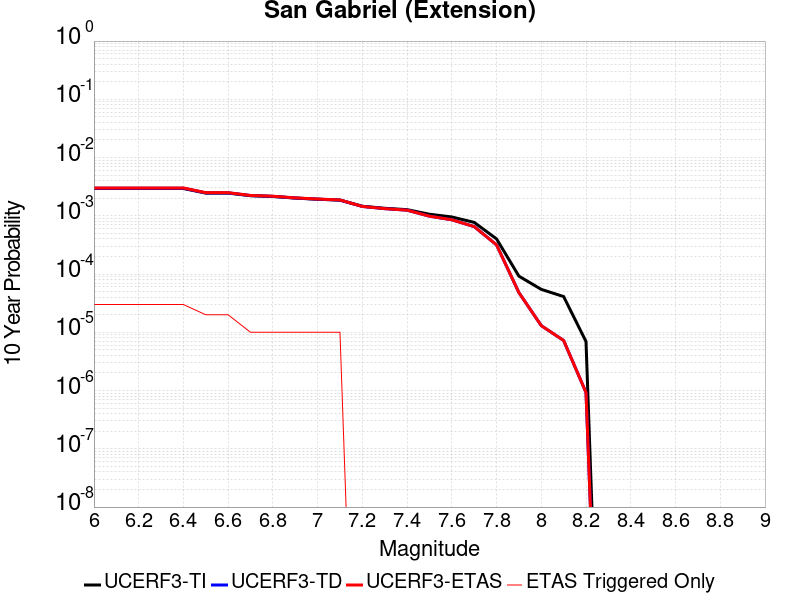 |

| Magnitude | 1 wk TI Prob | 1 wk TD Prob | 1 wk ETAS Prob | 1 wk ETAS/TD Gain | 1 wk ETAS Triggered Only | 1 mo TI Prob | 1 mo TD Prob | 1 mo ETAS Prob | 1 mo ETAS/TD Gain | 1 mo ETAS Triggered Only | 1 yr TI Prob | 1 yr TD Prob | 1 yr ETAS Prob | 1 yr ETAS/TD Gain | 1 yr ETAS Triggered Only | 10 yr TI Prob | 10 yr TD Prob | 10 yr ETAS Prob | 10 yr ETAS/TD Gain | 10 yr ETAS Triggered Only |
|-----|-----|-----|-----|-----|-----|-----|-----|-----|-----|-----|-----|-----|-----|-----|-----|-----|-----|-----|-----|-----|
| 6.0 | 5.6486106E-6 | 5.7168304E-6 | 5.7168304E-6 | 1.0 | 0.0 | 2.4208108E-5 | 2.450048E-5 | 2.450048E-5 | 1.0 | 0.0 | 2.9469383E-4 | 2.9825376E-4 | 3.357379E-4 | 1.1256787 | 3.7495312E-5 | 0.0029430336 | 0.0029786653 | 0.0030534323 | 1.025101 | 7.4990625E-5 |
| 6.1 | 5.6486106E-6 | 5.7168304E-6 | 5.7168304E-6 | 1.0 | 0.0 | 2.4208108E-5 | 2.450048E-5 | 2.450048E-5 | 1.0 | 0.0 | 2.9469383E-4 | 2.9825376E-4 | 3.357379E-4 | 1.1256787 | 3.7495312E-5 | 0.0029430336 | 0.0029786653 | 0.0030534323 | 1.025101 | 7.4990625E-5 |
| 6.2 | 5.6486106E-6 | 5.7168304E-6 | 5.7168304E-6 | 1.0 | 0.0 | 2.4208108E-5 | 2.450048E-5 | 2.450048E-5 | 1.0 | 0.0 | 2.9469383E-4 | 2.9825376E-4 | 3.357379E-4 | 1.1256787 | 3.7495312E-5 | 0.0029430336 | 0.0029786653 | 0.0030534323 | 1.025101 | 7.4990625E-5 |
| 6.3 | 5.6486106E-6 | 5.7168304E-6 | 5.7168304E-6 | 1.0 | 0.0 | 2.4208108E-5 | 2.450048E-5 | 2.450048E-5 | 1.0 | 0.0 | 2.9469383E-4 | 2.9825376E-4 | 3.357379E-4 | 1.1256787 | 3.7495312E-5 | 0.0029430336 | 0.0029786653 | 0.0030534323 | 1.025101 | 7.4990625E-5 |
| 6.4 | 5.6486106E-6 | 5.7168304E-6 | 5.7168304E-6 | 1.0 | 0.0 | 2.4208108E-5 | 2.450048E-5 | 2.450048E-5 | 1.0 | 0.0 | 2.9469383E-4 | 2.9825376E-4 | 3.357379E-4 | 1.1256787 | 3.7495312E-5 | 0.0029430336 | 0.0029786653 | 0.0030534323 | 1.025101 | 7.4990625E-5 |
| 6.5 | 4.7134554E-6 | 4.7542544E-6 | 4.7542544E-6 | 1.0 | 0.0 | 2.0200367E-5 | 2.0375222E-5 | 2.0375222E-5 | 1.0 | 0.0 | 2.459117E-4 | 2.4804095E-4 | 2.4804095E-4 | 1.0 | 0.0 | 0.0024563975 | 0.002477729 | 0.0025151314 | 1.0150955 | 3.7495312E-5 |
| 6.6 | 4.7134554E-6 | 4.7542544E-6 | 4.7542544E-6 | 1.0 | 0.0 | 2.0200367E-5 | 2.0375222E-5 | 2.0375222E-5 | 1.0 | 0.0 | 2.459117E-4 | 2.4804095E-4 | 2.4804095E-4 | 1.0 | 0.0 | 0.0024563975 | 0.002477729 | 0.0025151314 | 1.0150955 | 3.7495312E-5 |
| 6.7 | 4.2468837E-6 | 4.2740717E-6 | 4.2740717E-6 | 1.0 | 0.0 | 1.8200803E-5 | 1.8317325E-5 | 1.8317325E-5 | 1.0 | 0.0 | 2.2157225E-4 | 2.2299135E-4 | 2.2299135E-4 | 1.0 | 0.0 | 0.0022135144 | 0.0022277518 | 0.0022277518 | 1.0 | 0.0 |
| 6.8 | 4.1180615E-6 | 4.1414614E-6 | 4.1414614E-6 | 1.0 | 0.0 | 1.7648716E-5 | 1.7749004E-5 | 1.7749004E-5 | 1.0 | 0.0 | 2.1485193E-4 | 2.160734E-4 | 2.160734E-4 | 1.0 | 0.0 | 0.0021464431 | 0.0021587082 | 0.0021587082 | 1.0 | 0.0 |
| 6.9 | 3.863861E-6 | 3.8797766E-6 | 3.8797766E-6 | 1.0 | 0.0 | 1.65593E-5 | 1.6627511E-5 | 1.6627511E-5 | 1.0 | 0.0 | 2.0159081E-4 | 2.0242184E-4 | 2.0242184E-4 | 1.0 | 0.0 | 0.0020140803 | 0.002022446 | 0.002022446 | 1.0 | 0.0 |
| 7.0 | 3.6947372E-6 | 3.705676E-6 | 3.705676E-6 | 1.0 | 0.0 | 1.5834492E-5 | 1.5881375E-5 | 1.5881375E-5 | 1.0 | 0.0 | 1.9276788E-4 | 1.9333926E-4 | 1.9333926E-4 | 1.0 | 0.0 | 0.0019260074 | 0.0019317807 | 0.0019317807 | 1.0 | 0.0 |
| 7.1 | 3.5686835E-6 | 3.5728963E-6 | 3.5728963E-6 | 1.0 | 0.0 | 1.5294268E-5 | 1.5312327E-5 | 1.5312327E-5 | 1.0 | 0.0 | 1.861918E-4 | 1.8641229E-4 | 1.8641229E-4 | 1.0 | 0.0 | 0.0018603588 | 0.0018626289 | 0.0018626289 | 1.0 | 0.0 |
| 7.2 | 2.8023446E-6 | 2.7767885E-6 | 2.7767885E-6 | 1.0 | 0.0 | 1.2009994E-5 | 1.1900468E-5 | 1.1900468E-5 | 1.0 | 0.0 | 1.4621185E-4 | 1.4487868E-4 | 1.4487868E-4 | 1.0 | 0.0 | 0.001461157 | 0.0014478569 | 0.0014478569 | 1.0 | 0.0 |
| 7.3 | 2.5843012E-6 | 2.5459642E-6 | 2.5459642E-6 | 1.0 | 0.0 | 1.1075529E-5 | 1.0911231E-5 | 1.0911231E-5 | 1.0 | 0.0 | 1.3483623E-4 | 1.3283623E-4 | 1.3283623E-4 | 1.0 | 0.0 | 0.0013475444 | 0.0013275818 | 0.0013275818 | 1.0 | 0.0 |
| 7.4 | 2.4464468E-6 | 2.396665E-6 | 2.396665E-6 | 1.0 | 0.0 | 1.04847295E-5 | 1.0271382E-5 | 1.0271382E-5 | 1.0 | 0.0 | 1.276441E-4 | 1.25047E-4 | 1.25047E-4 | 1.0 | 0.0 | 0.0012757082 | 0.0012497796 | 0.0012497796 | 1.0 | 0.0 |
| 7.5 | 2.0420266E-6 | 1.8910426E-6 | 1.8910426E-6 | 1.0 | 0.0 | 8.751514E-6 | 8.104444E-6 | 8.104444E-6 | 1.0 | 0.0 | 1.0654447E-4 | 9.8667166E-5 | 9.8667166E-5 | 1.0 | 0.0 | 0.001064934 | 9.862408E-4 | 9.862408E-4 | 1.0 | 0.0 |
| 7.6 | 1.8326596E-6 | 1.6398341E-6 | 1.6398341E-6 | 1.0 | 0.0 | 7.854232E-6 | 7.0278415E-6 | 7.0278415E-6 | 1.0 | 0.0 | 9.562107E-5 | 8.5560634E-5 | 8.5560634E-5 | 1.0 | 0.0 | 9.5579936E-4 | 8.5528276E-4 | 8.5528276E-4 | 1.0 | 0.0 |
| 7.7 | 1.4786998E-6 | 1.2523838E-6 | 1.2523838E-6 | 1.0 | 0.0 | 6.3372695E-6 | 5.367348E-6 | 5.367348E-6 | 1.0 | 0.0 | 7.715353E-5 | 6.534551E-5 | 6.534551E-5 | 1.0 | 0.0 | 7.7126746E-4 | 6.532707E-4 | 6.532707E-4 | 1.0 | 0.0 |
| 7.8 | 7.6975533E-7 | 6.0693884E-7 | 6.0693884E-7 | 1.0 | 0.0 | 3.2989474E-6 | 2.601164E-6 | 2.601164E-6 | 1.0 | 0.0 | 4.0163945E-5 | 3.166871E-5 | 3.166871E-5 | 1.0 | 0.0 | 4.0156685E-4 | 3.1664805E-4 | 3.1664805E-4 | 1.0 | 0.0 |
| 7.9 | 1.7645915E-7 | 9.213256E-8 | 9.213256E-8 | 1.0 | 0.0 | 7.562533E-7 | 3.9485377E-7 | 3.9485377E-7 | 1.0 | 0.0 | 9.207345E-6 | 4.807334E-6 | 4.807334E-6 | 1.0 | 0.0 | 9.206964E-5 | 4.807699E-5 | 4.807699E-5 | 1.0 | 0.0 |
| 8.0 | 1.0463461E-7 | 2.4949307E-8 | 2.4949307E-8 | 1.0 | 0.0 | 4.4843398E-7 | 1.0692559E-7 | 1.0692559E-7 | 1.0 | 0.0 | 5.45967E-6 | 1.3018183E-6 | 1.3018183E-6 | 1.0 | 0.0 | 5.459536E-5 | 1.3022789E-5 | 1.3022789E-5 | 1.0 | 0.0 |
| 8.1 | 7.875717E-8 | 1.3866874E-8 | 1.3866874E-8 | 1.0 | 0.0 | 3.3753068E-7 | 5.942946E-8 | 5.942946E-8 | 1.0 | 0.0 | 4.109428E-6 | 7.235534E-7 | 7.235534E-7 | 1.0 | 0.0 | 4.109352E-5 | 7.2401926E-6 | 7.2401926E-6 | 1.0 | 0.0 |
| 8.2 | 1.33163E-8 | 1.7733891E-9 | 1.7733891E-9 | 1.0 | 0.0 | 5.7069855E-8 | 7.600239E-9 | 7.600239E-9 | 1.0 | 0.0 | 6.9482525E-7 | 9.25329E-8 | 9.25329E-8 | 1.0 | 0.0 | 6.9482307E-6 | 9.272953E-7 | 9.272953E-7 | 1.0 | 0.0 |

## Oceanic - West Huasna
*[(top)](#table-of-contents)*

| 1 Week | 1 Month | 1 Year | 10 Year |
|-----|-----|-----|-----|
|  | 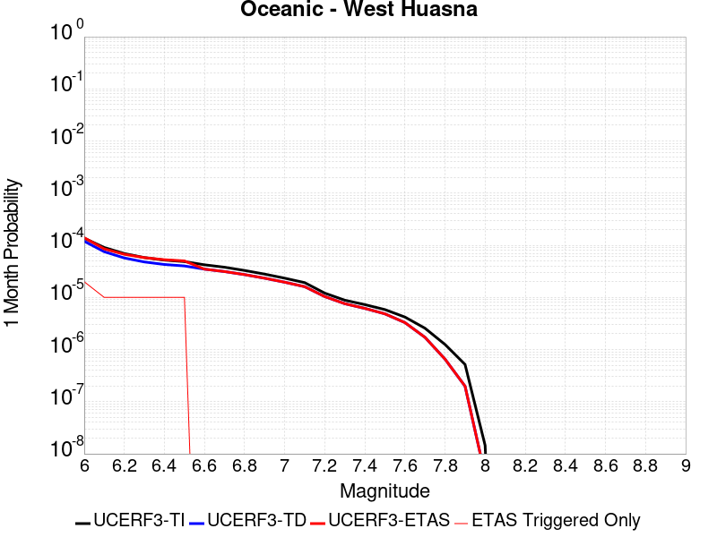 |  |  |

| Magnitude | 1 wk TI Prob | 1 wk TD Prob | 1 wk ETAS Prob | 1 wk ETAS/TD Gain | 1 wk ETAS Triggered Only | 1 mo TI Prob | 1 mo TD Prob | 1 mo ETAS Prob | 1 mo ETAS/TD Gain | 1 mo ETAS Triggered Only | 1 yr TI Prob | 1 yr TD Prob | 1 yr ETAS Prob | 1 yr ETAS/TD Gain | 1 yr ETAS Triggered Only | 10 yr TI Prob | 10 yr TD Prob | 10 yr ETAS Prob | 10 yr ETAS/TD Gain | 10 yr ETAS Triggered Only |
|-----|-----|-----|-----|-----|-----|-----|-----|-----|-----|-----|-----|-----|-----|-----|-----|-----|-----|-----|-----|-----|
| 6.0 | 3.195567E-5 | 2.7926868E-5 | 6.542113E-5 | 2.3425875 | 3.7495312E-5 | 1.3694567E-4 | 1.1968133E-4 | 1.5717215E-4 | 1.3132554 | 3.7495312E-5 | 0.0016660384 | 0.0014561893 | 0.0014936301 | 1.0257114 | 3.7495312E-5 | 0.016536033 | 0.014471028 | 0.014544933 | 1.0051072 | 7.4990625E-5 |
| 6.1 | 2.1156782E-5 | 1.7573486E-5 | 1.7573486E-5 | 1.0 | 0.0 | 9.066878E-5 | 7.531282E-5 | 7.531282E-5 | 1.0 | 0.0 | 0.0011033333 | 9.165572E-4 | 9.165572E-4 | 1.0 | 0.0 | 0.010978713 | 0.009128777 | 0.009165931 | 1.0040699 | 3.7495312E-5 |
| 6.2 | 1.6195117E-5 | 1.3327152E-5 | 1.3327152E-5 | 1.0 | 0.0 | 6.9405796E-5 | 5.7115132E-5 | 5.7115132E-5 | 1.0 | 0.0 | 8.44688E-4 | 6.9515745E-4 | 6.9515745E-4 | 1.0 | 0.0 | 0.008414844 | 0.006930123 | 0.0069673588 | 1.005373 | 3.7495312E-5 |
| 6.3 | 1.3559345E-5 | 1.1179142E-5 | 1.1179142E-5 | 1.0 | 0.0 | 5.811018E-5 | 4.7909736E-5 | 4.7909736E-5 | 1.0 | 0.0 | 7.072618E-4 | 5.831459E-4 | 5.831459E-4 | 1.0 | 0.0 | 0.0070501505 | 0.0058162753 | 0.0058535524 | 1.0064092 | 3.7495312E-5 |
| 6.4 | 1.2120619E-5 | 1.0000977E-5 | 1.0000977E-5 | 1.0 | 0.0 | 5.1944477E-5 | 4.2860633E-5 | 4.2860633E-5 | 1.0 | 0.0 | 6.322405E-4 | 5.2170374E-4 | 5.2170374E-4 | 1.0 | 0.0 | 0.006304447 | 0.0052048573 | 0.0052421577 | 1.0071664 | 3.7495312E-5 |
| 6.5 | 1.13511915E-5 | 9.3674735E-6 | 9.3674735E-6 | 1.0 | 0.0 | 4.8647056E-5 | 4.01457E-5 | 4.01457E-5 | 1.0 | 0.0 | 5.9211696E-4 | 4.886647E-4 | 4.886647E-4 | 1.0 | 0.0 | 0.0059054173 | 0.0048759608 | 0.0049132733 | 1.0076523 | 3.7495312E-5 |
| 6.6 | 9.850605E-6 | 8.135418E-6 | 8.135418E-6 | 1.0 | 0.0 | 4.2216197E-5 | 3.4865614E-5 | 3.4865614E-5 | 1.0 | 0.0 | 5.1386096E-4 | 4.2440637E-4 | 4.2440637E-4 | 1.0 | 0.0 | 0.0051267436 | 0.004235991 | 0.0042733275 | 1.0088141 | 3.7495312E-5 |
| 6.7 | 8.8558645E-6 | 7.318433E-6 | 7.318433E-6 | 1.0 | 0.0 | 3.7953152E-5 | 3.1364336E-5 | 3.1364336E-5 | 1.0 | 0.0 | 4.6198163E-4 | 3.8179406E-4 | 3.8179406E-4 | 1.0 | 0.0 | 0.004610224 | 0.0038114067 | 0.0038487592 | 1.0098002 | 3.7495312E-5 |
| 6.8 | 7.67136E-6 | 6.391756E-6 | 6.391756E-6 | 1.0 | 0.0 | 3.2876844E-5 | 2.7392953E-5 | 2.7392953E-5 | 1.0 | 0.0 | 4.0020206E-4 | 3.3345833E-4 | 3.3345833E-4 | 1.0 | 0.0 | 0.003994821 | 0.0033296007 | 0.0033296007 | 1.0 | 0.0 |
| 6.9 | 6.534529E-6 | 5.4583297E-6 | 5.4583297E-6 | 1.0 | 0.0 | 2.8004823E-5 | 2.3392633E-5 | 2.3392633E-5 | 1.0 | 0.0 | 3.4090536E-4 | 2.847682E-4 | 2.847682E-4 | 1.0 | 0.0 | 0.0034038287 | 0.0028440498 | 0.0028440498 | 1.0 | 0.0 |
| 7.0 | 5.460525E-6 | 4.5699517E-6 | 4.5699517E-6 | 1.0 | 0.0 | 2.3402039E-5 | 1.958536E-5 | 1.958536E-5 | 1.0 | 0.0 | 2.8488258E-4 | 2.3842578E-4 | 2.3842578E-4 | 1.0 | 0.0 | 0.0028451765 | 0.0023817138 | 0.0023817138 | 1.0 | 0.0 |
| 7.1 | 4.4825083E-6 | 3.7524428E-6 | 3.7524428E-6 | 1.0 | 0.0 | 1.9210609E-5 | 1.60818E-5 | 1.60818E-5 | 1.0 | 0.0 | 2.3386406E-4 | 1.9577841E-4 | 1.9577841E-4 | 1.0 | 0.0 | 0.002336181 | 0.0019560715 | 0.0019560715 | 1.0 | 0.0 |
| 7.2 | 2.821708E-6 | 2.4249334E-6 | 2.4249334E-6 | 1.0 | 0.0 | 1.2092979E-5 | 1.039253E-5 | 1.039253E-5 | 1.0 | 0.0 | 1.4722206E-4 | 1.2652173E-4 | 1.2652173E-4 | 1.0 | 0.0 | 0.0014712457 | 0.0012644994 | 0.0012644994 | 1.0 | 0.0 |
| 7.3 | 2.0644757E-6 | 1.7687412E-6 | 1.7687412E-6 | 1.0 | 0.0 | 8.847723E-6 | 7.5802973E-6 | 7.5802973E-6 | 1.0 | 0.0 | 1.0771569E-4 | 9.228622E-5 | 9.228622E-5 | 1.0 | 0.0 | 0.001076635 | 9.2248066E-4 | 9.2248066E-4 | 1.0 | 0.0 |
| 7.4 | 1.6980367E-6 | 1.4379892E-6 | 1.4379892E-6 | 1.0 | 0.0 | 7.27728E-6 | 6.162796E-6 | 6.162796E-6 | 1.0 | 0.0 | 8.8597284E-5 | 7.5029464E-5 | 7.5029464E-5 | 1.0 | 0.0 | 8.8561967E-4 | 7.500429E-4 | 7.500429E-4 | 1.0 | 0.0 |
| 7.5 | 1.3637683E-6 | 1.1302635E-6 | 1.1302635E-6 | 1.0 | 0.0 | 5.844708E-6 | 4.8439774E-6 | 4.8439774E-6 | 1.0 | 0.0 | 7.1156996E-5 | 5.897383E-5 | 5.897383E-5 | 1.0 | 0.0 | 7.1134215E-4 | 5.895833E-4 | 5.895833E-4 | 1.0 | 0.0 |
| 7.6 | 9.802994E-7 | 7.677247E-7 | 7.677247E-7 | 1.0 | 0.0 | 4.2012766E-6 | 3.2902446E-6 | 3.2902446E-6 | 1.0 | 0.0 | 5.1149345E-5 | 4.0057992E-5 | 4.0057992E-5 | 1.0 | 0.0 | 5.113757E-4 | 4.0050913E-4 | 4.0050913E-4 | 1.0 | 0.0 |
| 7.7 | 5.986191E-7 | 4.0050548E-7 | 4.0050548E-7 | 1.0 | 0.0 | 2.5655079E-6 | 1.7164509E-6 | 1.7164509E-6 | 1.0 | 0.0 | 3.1234613E-5 | 2.089759E-5 | 2.089759E-5 | 1.0 | 0.0 | 3.123022E-4 | 2.089576E-4 | 2.089576E-4 | 1.0 | 0.0 |
| 7.8 | 2.9189815E-7 | 1.5285792E-7 | 1.5285792E-7 | 1.0 | 0.0 | 1.2509914E-6 | 6.5510517E-7 | 6.5510517E-7 | 1.0 | 0.0 | 1.5230714E-5 | 7.9758765E-6 | 7.9758765E-6 | 1.0 | 0.0 | 1.522967E-4 | 7.9757214E-5 | 7.9757214E-5 | 1.0 | 0.0 |
| 7.9 | 1.2057845E-7 | 4.621248E-8 | 4.621248E-8 | 1.0 | 0.0 | 5.1676466E-7 | 1.9805347E-7 | 1.9805347E-7 | 1.0 | 0.0 | 6.2915915E-6 | 2.4112983E-6 | 2.4112983E-6 | 1.0 | 0.0 | 6.2914136E-5 | 2.4114026E-5 | 2.4114026E-5 | 1.0 | 0.0 |
| 8.0 | 3.3806387E-9 | 9.011393E-10 | 9.011393E-10 | 1.0 | 0.0 | 1.4488451E-8 | 3.8620254E-9 | 3.8620254E-9 | 1.0 | 0.0 | 1.7639688E-7 | 4.702016E-8 | 4.702016E-8 | 1.0 | 0.0 | 1.7639674E-6 | 4.7129527E-7 | 4.7129527E-7 | 1.0 | 0.0 |

## Whittier alt 1
*[(top)](#table-of-contents)*

| 1 Week | 1 Month | 1 Year | 10 Year |
|-----|-----|-----|-----|
|  |  |  |  |

| Magnitude | 1 wk TI Prob | 1 wk TD Prob | 1 wk ETAS Prob | 1 wk ETAS/TD Gain | 1 wk ETAS Triggered Only | 1 mo TI Prob | 1 mo TD Prob | 1 mo ETAS Prob | 1 mo ETAS/TD Gain | 1 mo ETAS Triggered Only | 1 yr TI Prob | 1 yr TD Prob | 1 yr ETAS Prob | 1 yr ETAS/TD Gain | 1 yr ETAS Triggered Only | 10 yr TI Prob | 10 yr TD Prob | 10 yr ETAS Prob | 10 yr ETAS/TD Gain | 10 yr ETAS Triggered Only |
|-----|-----|-----|-----|-----|-----|-----|-----|-----|-----|-----|-----|-----|-----|-----|-----|-----|-----|-----|-----|-----|
| 6.0 | 4.2554693E-5 | 4.725218E-5 | 4.725218E-5 | 1.0 | 0.0 | 1.8236451E-4 | 2.0249544E-4 | 2.3998316E-4 | 1.1851287 | 3.7495312E-5 | 0.002218027 | 0.0024629154 | 0.0025003182 | 1.0151864 | 3.7495312E-5 | 0.02196019 | 0.024390234 | 0.024463397 | 1.0029997 | 7.4990625E-5 |
| 6.1 | 4.2554693E-5 | 4.725218E-5 | 4.725218E-5 | 1.0 | 0.0 | 1.8236451E-4 | 2.0249544E-4 | 2.3998316E-4 | 1.1851287 | 3.7495312E-5 | 0.002218027 | 0.0024629154 | 0.0025003182 | 1.0151864 | 3.7495312E-5 | 0.02196019 | 0.024390234 | 0.024463397 | 1.0029997 | 7.4990625E-5 |
| 6.2 | 4.2554693E-5 | 4.725218E-5 | 4.725218E-5 | 1.0 | 0.0 | 1.8236451E-4 | 2.0249544E-4 | 2.3998316E-4 | 1.1851287 | 3.7495312E-5 | 0.002218027 | 0.0024629154 | 0.0025003182 | 1.0151864 | 3.7495312E-5 | 0.02196019 | 0.024390234 | 0.024463397 | 1.0029997 | 7.4990625E-5 |
| 6.3 | 1.9617712E-5 | 1.8268593E-5 | 1.8268593E-5 | 1.0 | 0.0 | 8.40732E-5 | 7.829172E-5 | 7.829172E-5 | 1.0 | 0.0 | 0.0010231105 | 9.52804E-4 | 9.52804E-4 | 1.0 | 0.0 | 0.01018413 | 0.009490474 | 0.009527614 | 1.0039133 | 3.7495312E-5 |
| 6.4 | 1.5611336E-5 | 1.3604271E-5 | 1.3604271E-5 | 1.0 | 0.0 | 6.690401E-5 | 5.8302747E-5 | 5.8302747E-5 | 1.0 | 0.0 | 8.142519E-4 | 7.0961076E-4 | 7.0961076E-4 | 1.0 | 0.0 | 0.008112748 | 0.0070754145 | 0.0070754145 | 1.0 | 0.0 |
| 6.5 | 1.5150166E-5 | 1.3100925E-5 | 1.3100925E-5 | 1.0 | 0.0 | 6.492767E-5 | 5.6145647E-5 | 5.6145647E-5 | 1.0 | 0.0 | 7.9020765E-4 | 6.8336475E-4 | 6.8336475E-4 | 1.0 | 0.0 | 0.007874036 | 0.0068145846 | 0.0068145846 | 1.0 | 0.0 |
| 6.6 | 1.295588E-5 | 1.0380725E-5 | 1.0380725E-5 | 1.0 | 0.0 | 5.552402E-5 | 4.4488075E-5 | 4.4488075E-5 | 1.0 | 0.0 | 6.7579525E-4 | 5.4150965E-4 | 5.4150965E-4 | 1.0 | 0.0 | 0.006737438 | 0.0054033357 | 0.0054033357 | 1.0 | 0.0 |
| 6.7 | 1.2542085E-5 | 9.899369E-6 | 9.899369E-6 | 1.0 | 0.0 | 5.3750682E-5 | 4.242519E-5 | 4.242519E-5 | 1.0 | 0.0 | 6.542181E-4 | 5.164061E-4 | 5.164061E-4 | 1.0 | 0.0 | 0.006522954 | 0.0051534795 | 0.0051534795 | 1.0 | 0.0 |
| 6.8 | 1.2195878E-5 | 9.495415E-6 | 9.495415E-6 | 1.0 | 0.0 | 5.2267E-5 | 4.069401E-5 | 4.069401E-5 | 1.0 | 0.0 | 6.36165E-4 | 4.9533875E-4 | 4.9533875E-4 | 1.0 | 0.0 | 0.0063434686 | 0.004943688 | 0.004943688 | 1.0 | 0.0 |
| 6.9 | 1.1580298E-5 | 8.772933E-6 | 8.772933E-6 | 1.0 | 0.0 | 4.9628903E-5 | 3.7597754E-5 | 3.7597754E-5 | 1.0 | 0.0 | 6.040644E-4 | 4.5765814E-4 | 4.5765814E-4 | 1.0 | 0.0 | 0.00602425 | 0.0045684157 | 0.0045684157 | 1.0 | 0.0 |
| 7.0 | 1.0964795E-5 | 8.083994E-6 | 8.083994E-6 | 1.0 | 0.0 | 4.6991136E-5 | 3.4645236E-5 | 3.4645236E-5 | 1.0 | 0.0 | 5.7196687E-4 | 4.2172565E-4 | 4.2172565E-4 | 1.0 | 0.0 | 0.0057049696 | 0.004210462 | 0.004210462 | 1.0 | 0.0 |
| 7.1 | 1.0230601E-5 | 7.3266697E-6 | 7.3266697E-6 | 1.0 | 0.0 | 4.3844695E-5 | 3.1399642E-5 | 3.1399642E-5 | 1.0 | 0.0 | 5.336784E-4 | 3.8222488E-4 | 3.8222488E-4 | 1.0 | 0.0 | 0.005323986 | 0.0038168381 | 0.0038168381 | 1.0 | 0.0 |
| 7.2 | 9.40865E-6 | 6.543289E-6 | 6.543289E-6 | 1.0 | 0.0 | 4.032216E-5 | 2.8042374E-5 | 2.8042374E-5 | 1.0 | 0.0 | 4.908117E-4 | 3.4136363E-4 | 3.4136363E-4 | 1.0 | 0.0 | 0.0048972913 | 0.003409485 | 0.003409485 | 1.0 | 0.0 |
| 7.3 | 8.237384E-6 | 5.5977525E-6 | 5.5977525E-6 | 1.0 | 0.0 | 3.5302593E-5 | 2.3990153E-5 | 2.3990153E-5 | 1.0 | 0.0 | 4.2972428E-4 | 2.92042E-4 | 2.92042E-4 | 1.0 | 0.0 | 0.0042889426 | 0.002916903 | 0.002916903 | 1.0 | 0.0 |
| 7.4 | 7.5316966E-6 | 5.027819E-6 | 5.027819E-6 | 1.0 | 0.0 | 3.2278298E-5 | 2.1547625E-5 | 2.1547625E-5 | 1.0 | 0.0 | 3.9291743E-4 | 2.6231175E-4 | 2.6231175E-4 | 1.0 | 0.0 | 0.0039222343 | 0.0026201333 | 0.0026201333 | 1.0 | 0.0 |
| 7.5 | 6.149649E-6 | 3.933841E-6 | 3.933841E-6 | 1.0 | 0.0 | 2.6355372E-5 | 1.6859214E-5 | 1.6859214E-5 | 1.0 | 0.0 | 3.208294E-4 | 2.052425E-4 | 2.052425E-4 | 1.0 | 0.0 | 0.003203666 | 0.0020506186 | 0.0020506186 | 1.0 | 0.0 |
| 7.6 | 5.457711E-6 | 3.3953788E-6 | 3.3953788E-6 | 1.0 | 0.0 | 2.338998E-5 | 1.4551547E-5 | 1.4551547E-5 | 1.0 | 0.0 | 2.8473578E-4 | 1.771515E-4 | 1.771515E-4 | 1.0 | 0.0 | 0.0028437122 | 0.0017701836 | 0.0017701836 | 1.0 | 0.0 |
| 7.7 | 4.1676276E-6 | 2.3331952E-6 | 2.3331952E-6 | 1.0 | 0.0 | 1.7861139E-5 | 9.999374E-6 | 9.999374E-6 | 1.0 | 0.0 | 2.1743766E-4 | 1.2173632E-4 | 1.2173632E-4 | 1.0 | 0.0 | 0.0021722503 | 0.0012167693 | 0.0012167693 | 1.0 | 0.0 |
| 7.8 | 2.2692414E-7 | 9.3854695E-8 | 9.3854695E-8 | 1.0 | 0.0 | 9.725317E-7 | 4.0223435E-7 | 4.0223435E-7 | 1.0 | 0.0 | 1.1840509E-5 | 4.8971956E-6 | 4.8971956E-6 | 1.0 | 0.0 | 1.1839878E-4 | 4.8971204E-5 | 4.8971204E-5 | 1.0 | 0.0 |
| 7.9 | 6.676829E-9 | 3.439853E-9 | 3.439853E-9 | 1.0 | 0.0 | 2.861498E-8 | 1.4742227E-8 | 1.4742227E-8 | 1.0 | 0.0 | 3.4838732E-7 | 1.7948659E-7 | 1.7948659E-7 | 1.0 | 0.0 | 3.4838679E-6 | 1.7948646E-6 | 1.7948646E-6 | 1.0 | 0.0 |

## North Frontal  (East)
*[(top)](#table-of-contents)*

| 1 Week | 1 Month | 1 Year | 10 Year |
|-----|-----|-----|-----|
|  |  |  |  |

| Magnitude | 1 wk TI Prob | 1 wk TD Prob | 1 wk ETAS Prob | 1 wk ETAS/TD Gain | 1 wk ETAS Triggered Only | 1 mo TI Prob | 1 mo TD Prob | 1 mo ETAS Prob | 1 mo ETAS/TD Gain | 1 mo ETAS Triggered Only | 1 yr TI Prob | 1 yr TD Prob | 1 yr ETAS Prob | 1 yr ETAS/TD Gain | 1 yr ETAS Triggered Only | 10 yr TI Prob | 10 yr TD Prob | 10 yr ETAS Prob | 10 yr ETAS/TD Gain | 10 yr ETAS Triggered Only |
|-----|-----|-----|-----|-----|-----|-----|-----|-----|-----|-----|-----|-----|-----|-----|-----|-----|-----|-----|-----|-----|
| 6.0 | 7.135738E-6 | 7.4771765E-6 | 4.497221E-5 | 6.014598 | 3.7495312E-5 | 3.0581377E-5 | 3.204476E-5 | 1.0703298E-4 | 3.3401086 | 7.4990625E-5 | 3.7226462E-4 | 3.9009505E-4 | 4.6505642E-4 | 1.1921618 | 7.4990625E-5 | 0.0037164164 | 0.0038960609 | 0.0039707595 | 1.0191728 | 7.4990625E-5 |
| 6.1 | 7.135738E-6 | 7.4771765E-6 | 4.497221E-5 | 6.014598 | 3.7495312E-5 | 3.0581377E-5 | 3.204476E-5 | 1.0703298E-4 | 3.3401086 | 7.4990625E-5 | 3.7226462E-4 | 3.9009505E-4 | 4.6505642E-4 | 1.1921618 | 7.4990625E-5 | 0.0037164164 | 0.0038960609 | 0.0039707595 | 1.0191728 | 7.4990625E-5 |
| 6.2 | 7.135738E-6 | 7.4771765E-6 | 4.497221E-5 | 6.014598 | 3.7495312E-5 | 3.0581377E-5 | 3.204476E-5 | 1.0703298E-4 | 3.3401086 | 7.4990625E-5 | 3.7226462E-4 | 3.9009505E-4 | 4.6505642E-4 | 1.1921618 | 7.4990625E-5 | 0.0037164164 | 0.0038960609 | 0.0039707595 | 1.0191728 | 7.4990625E-5 |
| 6.3 | 7.135738E-6 | 7.4771765E-6 | 4.497221E-5 | 6.014598 | 3.7495312E-5 | 3.0581377E-5 | 3.204476E-5 | 1.0703298E-4 | 3.3401086 | 7.4990625E-5 | 3.7226462E-4 | 3.9009505E-4 | 4.6505642E-4 | 1.1921618 | 7.4990625E-5 | 0.0037164164 | 0.0038960609 | 0.0039707595 | 1.0191728 | 7.4990625E-5 |
| 6.4 | 7.135738E-6 | 7.4771765E-6 | 4.497221E-5 | 6.014598 | 3.7495312E-5 | 3.0581377E-5 | 3.204476E-5 | 1.0703298E-4 | 3.3401086 | 7.4990625E-5 | 3.7226462E-4 | 3.9009505E-4 | 4.6505642E-4 | 1.1921618 | 7.4990625E-5 | 0.0037164164 | 0.0038960609 | 0.0039707595 | 1.0191728 | 7.4990625E-5 |
| 6.5 | 7.135738E-6 | 7.4771765E-6 | 4.497221E-5 | 6.014598 | 3.7495312E-5 | 3.0581377E-5 | 3.204476E-5 | 1.0703298E-4 | 3.3401086 | 7.4990625E-5 | 3.7226462E-4 | 3.9009505E-4 | 4.6505642E-4 | 1.1921618 | 7.4990625E-5 | 0.0037164164 | 0.0038960609 | 0.0039707595 | 1.0191728 | 7.4990625E-5 |
| 6.6 | 7.135738E-6 | 7.4771765E-6 | 4.497221E-5 | 6.014598 | 3.7495312E-5 | 3.0581377E-5 | 3.204476E-5 | 1.0703298E-4 | 3.3401086 | 7.4990625E-5 | 3.7226462E-4 | 3.9009505E-4 | 4.6505642E-4 | 1.1921618 | 7.4990625E-5 | 0.0037164164 | 0.0038960609 | 0.0039707595 | 1.0191728 | 7.4990625E-5 |
| 6.7 | 7.135738E-6 | 7.4771765E-6 | 4.497221E-5 | 6.014598 | 3.7495312E-5 | 3.0581377E-5 | 3.204476E-5 | 1.0703298E-4 | 3.3401086 | 7.4990625E-5 | 3.7226462E-4 | 3.9009505E-4 | 4.6505642E-4 | 1.1921618 | 7.4990625E-5 | 0.0037164164 | 0.0038960609 | 0.0039707595 | 1.0191728 | 7.4990625E-5 |
| 6.8 | 5.959142E-6 | 6.236683E-6 | 4.373176E-5 | 7.012023 | 3.7495312E-5 | 2.553893E-5 | 2.6728469E-5 | 1.0171709E-4 | 3.805571 | 7.4990625E-5 | 3.108921E-4 | 3.253886E-4 | 4.0035482E-4 | 1.2303898 | 7.4990625E-5 | 0.0031045752 | 0.0032508948 | 0.0033256416 | 1.0229927 | 7.4990625E-5 |
| 6.9 | 2.2946929E-6 | 2.3824605E-6 | 3.9877683E-5 | 16.738026 | 3.7495312E-5 | 9.834361E-6 | 1.0210508E-5 | 8.5200365E-5 | 8.344381 | 7.4990625E-5 | 1.1972676E-4 | 1.2430632E-4 | 1.9928762E-4 | 1.6031979 | 7.4990625E-5 | 0.0011966228 | 0.0012424142 | 0.0013173118 | 1.0602838 | 7.4990625E-5 |
| 7.0 | 2.2468673E-6 | 2.3321538E-6 | 3.982738E-5 | 17.07751 | 3.7495312E-5 | 9.629396E-6 | 9.994909E-6 | 8.4984786E-5 | 8.502808 | 7.4990625E-5 | 1.1723159E-4 | 1.21681696E-4 | 1.966632E-4 | 1.6162102 | 7.4990625E-5 | 0.0011716976 | 0.0012161969 | 0.0012910964 | 1.061585 | 7.4990625E-5 |
| 7.1 | 1.9921076E-6 | 2.0646032E-6 | 3.955984E-5 | 19.160988 | 3.7495312E-5 | 8.537577E-6 | 8.848272E-6 | 8.383823E-5 | 9.475097 | 7.4990625E-5 | 1.0394004E-4 | 1.0772282E-4 | 1.8270536E-4 | 1.6960694 | 7.4990625E-5 | 0.0010389143 | 0.0010767487 | 0.0011516586 | 1.0695704 | 7.4990625E-5 |
| 7.2 | 1.4524545E-6 | 1.5045148E-6 | 3.8999773E-5 | 25.921827 | 3.7495312E-5 | 6.2247905E-6 | 6.447906E-6 | 8.143805E-5 | 12.630155 | 7.4990625E-5 | 7.5784184E-5 | 7.850068E-5 | 1.5348541E-4 | 1.9552114 | 7.4990625E-5 | 7.575835E-4 | 7.8475394E-4 | 8.596857E-4 | 1.0954844 | 7.4990625E-5 |
| 7.3 | 8.9802575E-7 | 9.3087283E-7 | 3.842615E-5 | 41.2797 | 3.7495312E-5 | 3.848676E-6 | 3.9894494E-6 | 7.897978E-5 | 19.797161 | 7.4990625E-5 | 4.685662E-5 | 4.857058E-5 | 1.2355756E-4 | 2.5438766 | 7.4990625E-5 | 4.6846745E-4 | 4.8561094E-4 | 5.6056515E-4 | 1.1543503 | 7.4990625E-5 |
| 7.4 | 7.776139E-7 | 8.0604747E-7 | 3.8301332E-5 | 47.517464 | 3.7495312E-5 | 3.3326266E-6 | 3.4544853E-6 | 7.844485E-5 | 22.708117 | 7.4990625E-5 | 4.0573974E-5 | 4.2057654E-5 | 1.1704513E-4 | 2.7829685 | 7.4990625E-5 | 4.0566566E-4 | 4.205077E-4 | 4.954668E-4 | 1.1782585 | 7.4990625E-5 |
| 7.5 | 5.244417E-7 | 5.441219E-7 | 3.8039416E-5 | 69.90973 | 3.7495312E-5 | 2.2476054E-6 | 2.3319494E-6 | 7.73224E-5 | 33.157837 | 7.4990625E-5 | 2.7364253E-5 | 2.839118E-5 | 1.0337968E-4 | 3.6412604 | 7.4990625E-5 | 2.7360884E-4 | 2.8388205E-4 | 3.588514E-4 | 1.2640862 | 7.4990625E-5 |
| 7.6 | 1.5489647E-7 | 1.6089504E-7 | 3.7656202E-5 | 234.04202 | 3.7495312E-5 | 6.6384183E-7 | 6.895501E-7 | 3.8184837E-5 | 55.37645 | 3.7495312E-5 | 8.082245E-6 | 8.395261E-6 | 4.5890258E-5 | 5.4662104 | 3.7495312E-5 | 8.08195E-5 | 8.395143E-5 | 1.214436E-4 | 1.4465935 | 3.7495312E-5 |

## Kern Canyon (North Kern) 2011
*[(top)](#table-of-contents)*

| 1 Week | 1 Month | 1 Year | 10 Year |
|-----|-----|-----|-----|
|  |  |  | 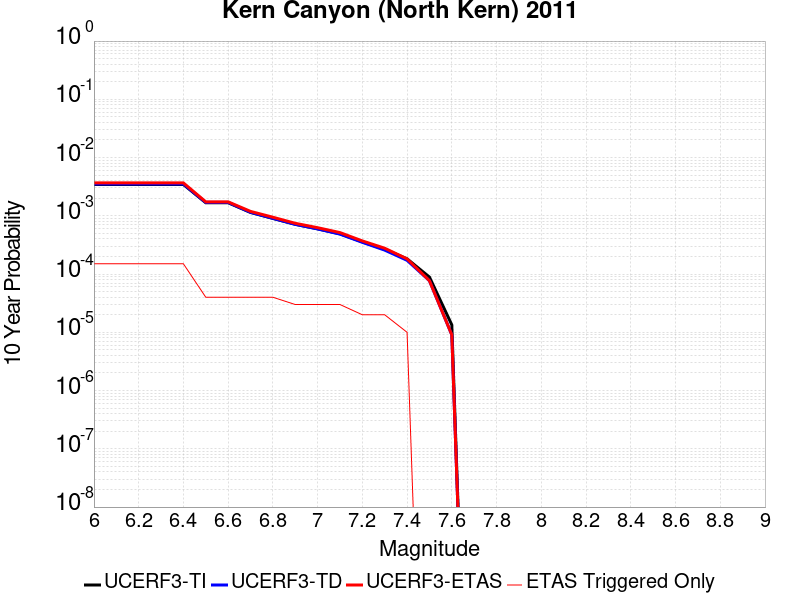 |

| Magnitude | 1 wk TI Prob | 1 wk TD Prob | 1 wk ETAS Prob | 1 wk ETAS/TD Gain | 1 wk ETAS Triggered Only | 1 mo TI Prob | 1 mo TD Prob | 1 mo ETAS Prob | 1 mo ETAS/TD Gain | 1 mo ETAS Triggered Only | 1 yr TI Prob | 1 yr TD Prob | 1 yr ETAS Prob | 1 yr ETAS/TD Gain | 1 yr ETAS Triggered Only | 10 yr TI Prob | 10 yr TD Prob | 10 yr ETAS Prob | 10 yr ETAS/TD Gain | 10 yr ETAS Triggered Only |
|-----|-----|-----|-----|-----|-----|-----|-----|-----|-----|-----|-----|-----|-----|-----|-----|-----|-----|-----|-----|-----|
| 6.0 | 6.6264497E-6 | 6.75733E-6 | 6.75733E-6 | 1.0 | 0.0 | 2.8398761E-5 | 2.895971E-5 | 2.895971E-5 | 1.0 | 0.0 | 3.4570007E-4 | 3.5253543E-4 | 3.9001752E-4 | 1.1063215 | 3.7495312E-5 | 0.0034516277 | 0.0035205502 | 0.0035952767 | 1.0212258 | 7.4990625E-5 |
| 6.1 | 6.6264497E-6 | 6.75733E-6 | 6.75733E-6 | 1.0 | 0.0 | 2.8398761E-5 | 2.895971E-5 | 2.895971E-5 | 1.0 | 0.0 | 3.4570007E-4 | 3.5253543E-4 | 3.9001752E-4 | 1.1063215 | 3.7495312E-5 | 0.0034516277 | 0.0035205502 | 0.0035952767 | 1.0212258 | 7.4990625E-5 |
| 6.2 | 6.6264497E-6 | 6.75733E-6 | 6.75733E-6 | 1.0 | 0.0 | 2.8398761E-5 | 2.895971E-5 | 2.895971E-5 | 1.0 | 0.0 | 3.4570007E-4 | 3.5253543E-4 | 3.9001752E-4 | 1.1063215 | 3.7495312E-5 | 0.0034516277 | 0.0035205502 | 0.0035952767 | 1.0212258 | 7.4990625E-5 |
| 6.3 | 6.6264497E-6 | 6.75733E-6 | 6.75733E-6 | 1.0 | 0.0 | 2.8398761E-5 | 2.895971E-5 | 2.895971E-5 | 1.0 | 0.0 | 3.4570007E-4 | 3.5253543E-4 | 3.9001752E-4 | 1.1063215 | 3.7495312E-5 | 0.0034516277 | 0.0035205502 | 0.0035952767 | 1.0212258 | 7.4990625E-5 |
| 6.4 | 6.6264497E-6 | 6.75733E-6 | 6.75733E-6 | 1.0 | 0.0 | 2.8398761E-5 | 2.895971E-5 | 2.895971E-5 | 1.0 | 0.0 | 3.4570007E-4 | 3.5253543E-4 | 3.9001752E-4 | 1.1063215 | 3.7495312E-5 | 0.0034516277 | 0.0035205502 | 0.0035952767 | 1.0212258 | 7.4990625E-5 |
| 6.5 | 3.2162225E-6 | 3.2570915E-6 | 3.2570915E-6 | 1.0 | 0.0 | 1.3783738E-5 | 1.3958893E-5 | 1.3958893E-5 | 1.0 | 0.0 | 1.6780409E-4 | 1.6993708E-4 | 2.0742601E-4 | 1.2206048 | 3.7495312E-5 | 0.0016767744 | 0.001698151 | 0.0017355826 | 1.0220426 | 3.7495312E-5 |
| 6.6 | 3.2162225E-6 | 3.2570915E-6 | 3.2570915E-6 | 1.0 | 0.0 | 1.3783738E-5 | 1.3958893E-5 | 1.3958893E-5 | 1.0 | 0.0 | 1.6780409E-4 | 1.6993708E-4 | 2.0742601E-4 | 1.2206048 | 3.7495312E-5 | 0.0016767744 | 0.001698151 | 0.0017355826 | 1.0220426 | 3.7495312E-5 |
| 6.7 | 2.1908265E-6 | 2.2071222E-6 | 2.2071222E-6 | 1.0 | 0.0 | 9.389223E-6 | 9.459061E-6 | 9.459061E-6 | 1.0 | 0.0 | 1.1430779E-4 | 1.1515819E-4 | 1.5264918E-4 | 1.3255608 | 3.7495312E-5 | 0.0011424901 | 0.0011510046 | 0.0011884567 | 1.0325387 | 3.7495312E-5 |
| 6.8 | 1.7303895E-6 | 1.7365529E-6 | 1.7365529E-6 | 1.0 | 0.0 | 7.415934E-6 | 7.4423488E-6 | 7.4423488E-6 | 1.0 | 0.0 | 9.028525E-5 | 9.0606925E-5 | 1.2809884E-4 | 1.4137864 | 3.7495312E-5 | 9.024858E-4 | 9.057096E-4 | 9.431709E-4 | 1.0413613 | 3.7495312E-5 |
| 6.9 | 1.3700314E-6 | 1.3688622E-6 | 1.3688622E-6 | 1.0 | 0.0 | 5.87155E-6 | 5.8665396E-6 | 5.8665396E-6 | 1.0 | 0.0 | 7.148377E-5 | 7.142282E-5 | 1.0891546E-4 | 1.5249392 | 3.7495312E-5 | 7.146078E-4 | 7.140032E-4 | 7.514718E-4 | 1.0524768 | 3.7495312E-5 |
| 7.0 | 1.1467797E-6 | 1.1413804E-6 | 1.1413804E-6 | 1.0 | 0.0 | 4.9147607E-6 | 4.8916213E-6 | 4.8916213E-6 | 1.0 | 0.0 | 5.983557E-5 | 5.9553895E-5 | 9.704698E-5 | 1.6295656 | 3.7495312E-5 | 5.981946E-4 | 5.953825E-4 | 6.328555E-4 | 1.0629394 | 3.7495312E-5 |
| 7.1 | 9.3952065E-7 | 9.3026904E-7 | 9.3026904E-7 | 1.0 | 0.0 | 4.026511E-6 | 3.9868614E-6 | 3.9868614E-6 | 1.0 | 0.0 | 4.9021666E-5 | 4.8538972E-5 | 8.6032465E-5 | 1.772441 | 3.7495312E-5 | 4.901085E-4 | 4.8528548E-4 | 5.227626E-4 | 1.077227 | 3.7495312E-5 |
| 7.2 | 6.858055E-7 | 6.7193E-7 | 6.7193E-7 | 1.0 | 0.0 | 2.939163E-6 | 2.879697E-6 | 2.879697E-6 | 1.0 | 0.0 | 3.5783723E-5 | 3.5059755E-5 | 3.5059755E-5 | 1.0 | 0.0 | 3.5777962E-4 | 3.5054312E-4 | 3.5054312E-4 | 1.0 | 0.0 |
| 7.3 | 5.1101983E-7 | 4.9393E-7 | 4.9393E-7 | 1.0 | 0.0 | 2.1900833E-6 | 2.116841E-6 | 2.116841E-6 | 1.0 | 0.0 | 2.6663936E-5 | 2.5772239E-5 | 2.5772239E-5 | 1.0 | 0.0 | 2.6660739E-4 | 2.57693E-4 | 2.57693E-4 | 1.0 | 0.0 |
| 7.4 | 3.4999414E-7 | 3.2995905E-7 | 3.2995905E-7 | 1.0 | 0.0 | 1.499974E-6 | 1.4141094E-6 | 1.4141094E-6 | 1.0 | 0.0 | 1.8262032E-5 | 1.721665E-5 | 1.721665E-5 | 1.0 | 0.0 | 1.826053E-4 | 1.7215339E-4 | 1.7215339E-4 | 1.0 | 0.0 |
| 7.5 | 1.7021522E-7 | 1.4750044E-7 | 1.4750044E-7 | 1.0 | 0.0 | 7.2949354E-7 | 6.321446E-7 | 6.321446E-7 | 1.0 | 0.0 | 8.881548E-6 | 7.696334E-6 | 7.696334E-6 | 1.0 | 0.0 | 8.8811925E-5 | 7.696076E-5 | 7.696076E-5 | 1.0 | 0.0 |
| 7.6 | 2.572245E-8 | 1.7352555E-8 | 1.7352555E-8 | 1.0 | 0.0 | 1.10239064E-7 | 7.436809E-8 | 7.436809E-8 | 1.0 | 0.0 | 1.3421597E-6 | 9.054312E-7 | 9.054312E-7 | 1.0 | 0.0 | 1.3421517E-5 | 9.05428E-6 | 9.05428E-6 | 1.0 | 0.0 |

## Santa Ynez River
*[(top)](#table-of-contents)*

| 1 Week | 1 Month | 1 Year | 10 Year |
|-----|-----|-----|-----|
|  |  |  | 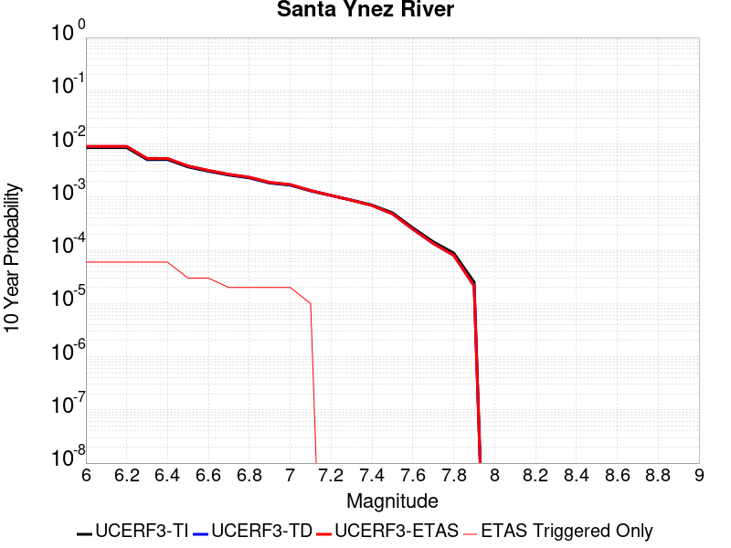 |

| Magnitude | 1 wk TI Prob | 1 wk TD Prob | 1 wk ETAS Prob | 1 wk ETAS/TD Gain | 1 wk ETAS Triggered Only | 1 mo TI Prob | 1 mo TD Prob | 1 mo ETAS Prob | 1 mo ETAS/TD Gain | 1 mo ETAS Triggered Only | 1 yr TI Prob | 1 yr TD Prob | 1 yr ETAS Prob | 1 yr ETAS/TD Gain | 1 yr ETAS Triggered Only | 10 yr TI Prob | 10 yr TD Prob | 10 yr ETAS Prob | 10 yr ETAS/TD Gain | 10 yr ETAS Triggered Only |
|-----|-----|-----|-----|-----|-----|-----|-----|-----|-----|-----|-----|-----|-----|-----|-----|-----|-----|-----|-----|-----|
| 6.0 | 1.6396456E-5 | 1.7209435E-5 | 1.7209435E-5 | 1.0 | 0.0 | 7.026863E-5 | 7.375284E-5 | 7.375284E-5 | 1.0 | 0.0 | 8.551848E-4 | 8.976064E-4 | 9.3506806E-4 | 1.041735 | 3.7495312E-5 | 0.0085190125 | 0.008943358 | 0.009017678 | 1.0083101 | 7.4990625E-5 |
| 6.1 | 1.6396456E-5 | 1.7209435E-5 | 1.7209435E-5 | 1.0 | 0.0 | 7.026863E-5 | 7.375284E-5 | 7.375284E-5 | 1.0 | 0.0 | 8.551848E-4 | 8.976064E-4 | 9.3506806E-4 | 1.041735 | 3.7495312E-5 | 0.0085190125 | 0.008943358 | 0.009017678 | 1.0083101 | 7.4990625E-5 |
| 6.2 | 1.6396456E-5 | 1.7209435E-5 | 1.7209435E-5 | 1.0 | 0.0 | 7.026863E-5 | 7.375284E-5 | 7.375284E-5 | 1.0 | 0.0 | 8.551848E-4 | 8.976064E-4 | 9.3506806E-4 | 1.041735 | 3.7495312E-5 | 0.0085190125 | 0.008943358 | 0.009017678 | 1.0083101 | 7.4990625E-5 |
| 6.3 | 9.736976E-6 | 1.012233E-5 | 1.012233E-5 | 1.0 | 0.0 | 4.172923E-5 | 4.338072E-5 | 4.338072E-5 | 1.0 | 0.0 | 5.0793495E-4 | 5.280373E-4 | 5.655128E-4 | 1.0709714 | 3.7495312E-5 | 0.005067755 | 0.005268332 | 0.0053429278 | 1.0141592 | 7.4990625E-5 |
| 6.4 | 9.736976E-6 | 1.012233E-5 | 1.012233E-5 | 1.0 | 0.0 | 4.172923E-5 | 4.338072E-5 | 4.338072E-5 | 1.0 | 0.0 | 5.0793495E-4 | 5.280373E-4 | 5.655128E-4 | 1.0709714 | 3.7495312E-5 | 0.005067755 | 0.005268332 | 0.0053429278 | 1.0141592 | 7.4990625E-5 |
| 6.5 | 7.081964E-6 | 7.3298966E-6 | 7.3298966E-6 | 1.0 | 0.0 | 3.035092E-5 | 3.1413474E-5 | 3.1413474E-5 | 1.0 | 0.0 | 3.694598E-4 | 3.8239348E-4 | 3.8239348E-4 | 1.0 | 0.0 | 0.0036884616 | 0.0038175168 | 0.003854869 | 1.0097845 | 3.7495312E-5 |
| 6.6 | 5.873247E-6 | 6.059743E-6 | 6.059743E-6 | 1.0 | 0.0 | 2.5170815E-5 | 2.5970074E-5 | 2.5970074E-5 | 1.0 | 0.0 | 3.064116E-4 | 3.1614062E-4 | 3.1614062E-4 | 1.0 | 0.0 | 0.0030598943 | 0.0031569963 | 0.0031943733 | 1.0118394 | 3.7495312E-5 |
| 6.7 | 4.973277E-6 | 5.115901E-6 | 5.115901E-6 | 1.0 | 0.0 | 2.1313872E-5 | 2.1925109E-5 | 2.1925109E-5 | 1.0 | 0.0 | 2.5946548E-4 | 2.66906E-4 | 2.66906E-4 | 1.0 | 0.0 | 0.0025916274 | 0.0026659032 | 0.0027032986 | 1.0140272 | 3.7495312E-5 |
| 6.8 | 4.396492E-6 | 4.5109778E-6 | 4.5109778E-6 | 1.0 | 0.0 | 1.884197E-5 | 1.9332621E-5 | 1.9332621E-5 | 1.0 | 0.0 | 2.2937685E-4 | 2.3534958E-4 | 2.3534958E-4 | 1.0 | 0.0 | 0.0022914023 | 0.0023510386 | 0.002388446 | 1.0159109 | 3.7495312E-5 |
| 6.9 | 3.5255632E-6 | 3.6013332E-6 | 3.6013332E-6 | 1.0 | 0.0 | 1.5109469E-5 | 1.5434196E-5 | 1.5434196E-5 | 1.0 | 0.0 | 1.8394225E-4 | 1.8789528E-4 | 1.8789528E-4 | 1.0 | 0.0 | 0.0018379007 | 0.0018773803 | 0.0019148053 | 1.0199347 | 3.7495312E-5 |
| 7.0 | 3.211603E-6 | 3.273654E-6 | 3.273654E-6 | 1.0 | 0.0 | 1.376394E-5 | 1.4029872E-5 | 1.4029872E-5 | 1.0 | 0.0 | 1.6756308E-4 | 1.7080043E-4 | 1.7080043E-4 | 1.0 | 0.0 | 0.0016743679 | 0.0017067058 | 0.0017441371 | 1.0219319 | 3.7495312E-5 |
| 7.1 | 2.5094619E-6 | 2.5409204E-6 | 2.5409204E-6 | 1.0 | 0.0 | 1.0754793E-5 | 1.0889614E-5 | 1.0889614E-5 | 1.0 | 0.0 | 1.3093173E-4 | 1.3257304E-4 | 1.3257304E-4 | 1.0 | 0.0 | 0.0013085462 | 0.0013249456 | 0.0013623912 | 1.028262 | 3.7495312E-5 |
| 7.2 | 2.0515774E-6 | 2.0619375E-6 | 2.0619375E-6 | 1.0 | 0.0 | 8.792445E-6 | 8.836846E-6 | 8.836846E-6 | 1.0 | 0.0 | 1.0704277E-4 | 1.0758333E-4 | 1.0758333E-4 | 1.0 | 0.0 | 0.0010699122 | 0.0010753168 | 0.0010753168 | 1.0 | 0.0 |
| 7.3 | 1.6845745E-6 | 1.6773907E-6 | 1.6773907E-6 | 1.0 | 0.0 | 7.219585E-6 | 7.1887976E-6 | 7.1887976E-6 | 1.0 | 0.0 | 8.78949E-5 | 8.752012E-5 | 8.752012E-5 | 1.0 | 0.0 | 8.7860145E-4 | 8.7485946E-4 | 8.7485946E-4 | 1.0 | 0.0 |
| 7.4 | 1.3600285E-6 | 1.3333357E-6 | 1.3333357E-6 | 1.0 | 0.0 | 5.82868E-6 | 5.714284E-6 | 5.714284E-6 | 1.0 | 0.0 | 7.096187E-5 | 6.956921E-5 | 6.956921E-5 | 1.0 | 0.0 | 7.0939213E-4 | 6.954765E-4 | 6.954765E-4 | 1.0 | 0.0 |
| 7.5 | 9.735342E-7 | 9.290103E-7 | 9.290103E-7 | 1.0 | 0.0 | 4.172283E-6 | 3.9814668E-6 | 3.9814668E-6 | 1.0 | 0.0 | 5.079636E-5 | 4.8473295E-5 | 4.8473295E-5 | 1.0 | 0.0 | 5.0784746E-4 | 4.8462892E-4 | 4.8462892E-4 | 1.0 | 0.0 |
| 7.6 | 5.067187E-7 | 4.77857E-7 | 4.77857E-7 | 1.0 | 0.0 | 2.1716498E-6 | 2.047957E-6 | 2.047957E-6 | 1.0 | 0.0 | 2.6439517E-5 | 2.4933597E-5 | 2.4933597E-5 | 1.0 | 0.0 | 2.643637E-4 | 2.4930874E-4 | 2.4930874E-4 | 1.0 | 0.0 |
| 7.7 | 2.769089E-7 | 2.5759124E-7 | 2.5759124E-7 | 1.0 | 0.0 | 1.1867519E-6 | 1.1039621E-6 | 1.1039621E-6 | 1.0 | 0.0 | 1.4448608E-5 | 1.34406555E-5 | 1.34406555E-5 | 1.0 | 0.0 | 1.444767E-4 | 1.3439846E-4 | 1.3439846E-4 | 1.0 | 0.0 |
| 7.8 | 1.7044663E-7 | 1.5449015E-7 | 1.5449015E-7 | 1.0 | 0.0 | 7.3048534E-7 | 6.621005E-7 | 6.621005E-7 | 1.0 | 0.0 | 8.893623E-6 | 8.061043E-6 | 8.061043E-6 | 1.0 | 0.0 | 8.893267E-5 | 8.060753E-5 | 8.060753E-5 | 1.0 | 0.0 |
| 7.9 | 4.8344287E-8 | 4.0910923E-8 | 4.0910923E-8 | 1.0 | 0.0 | 2.0718979E-7 | 1.7533252E-7 | 1.7533252E-7 | 1.0 | 0.0 | 2.5225327E-6 | 2.1346711E-6 | 2.1346711E-6 | 1.0 | 0.0 | 2.5225041E-5 | 2.1346512E-5 | 2.1346512E-5 | 1.0 | 0.0 |

## San Jacinto (Superstition Mtn)
*[(top)](#table-of-contents)*

| 1 Week | 1 Month | 1 Year | 10 Year |
|-----|-----|-----|-----|
|  | 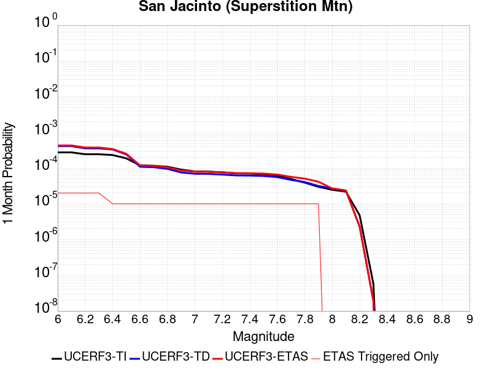 |  |  |

| Magnitude | 1 wk TI Prob | 1 wk TD Prob | 1 wk ETAS Prob | 1 wk ETAS/TD Gain | 1 wk ETAS Triggered Only | 1 mo TI Prob | 1 mo TD Prob | 1 mo ETAS Prob | 1 mo ETAS/TD Gain | 1 mo ETAS Triggered Only | 1 yr TI Prob | 1 yr TD Prob | 1 yr ETAS Prob | 1 yr ETAS/TD Gain | 1 yr ETAS Triggered Only | 10 yr TI Prob | 10 yr TD Prob | 10 yr ETAS Prob | 10 yr ETAS/TD Gain | 10 yr ETAS Triggered Only |
|-----|-----|-----|-----|-----|-----|-----|-----|-----|-----|-----|-----|-----|-----|-----|-----|-----|-----|-----|-----|-----|
| 6.0 | 6.4193904E-5 | 9.599367E-5 | 1.3348539E-4 | 1.3905644 | 3.7495312E-5 | 2.7508775E-4 | 4.1134638E-4 | 4.4882626E-4 | 1.0911151 | 3.7495312E-5 | 0.0033440501 | 0.0049980893 | 0.005035397 | 1.0074644 | 3.7495312E-5 | 0.03294174 | 0.048823986 | 0.048895314 | 1.0014609 | 7.4990625E-5 |
| 6.1 | 6.4193904E-5 | 9.599367E-5 | 1.3348539E-4 | 1.3905644 | 3.7495312E-5 | 2.7508775E-4 | 4.1134638E-4 | 4.4882626E-4 | 1.0911151 | 3.7495312E-5 | 0.0033440501 | 0.0049980893 | 0.005035397 | 1.0074644 | 3.7495312E-5 | 0.03294174 | 0.048823986 | 0.048895314 | 1.0014609 | 7.4990625E-5 |
| 6.2 | 5.7023593E-5 | 8.3144434E-5 | 1.2063663E-4 | 1.4509286 | 3.7495312E-5 | 2.4436394E-4 | 3.5629404E-4 | 3.93776E-4 | 1.1051995 | 3.7495312E-5 | 0.002971072 | 0.0043308944 | 0.0043682274 | 1.0086201 | 3.7495312E-5 | 0.029316625 | 0.04250403 | 0.042575832 | 1.0016893 | 7.4990625E-5 |
| 6.3 | 5.6940098E-5 | 8.298979E-5 | 1.2048199E-4 | 1.4517689 | 3.7495312E-5 | 2.4400617E-4 | 3.5563146E-4 | 3.9311344E-4 | 1.1053956 | 3.7495312E-5 | 0.002966728 | 0.00432286 | 0.004360193 | 1.0086362 | 3.7495312E-5 | 0.029274331 | 0.042427283 | 0.04249909 | 1.0016925 | 7.4990625E-5 |
| 6.4 | 5.4171585E-5 | 7.7483564E-5 | 7.7483564E-5 | 1.0 | 0.0 | 2.3214328E-4 | 3.3203943E-4 | 3.3203943E-4 | 1.0 | 0.0 | 0.0028226813 | 0.0040367353 | 0.0040367353 | 1.0 | 0.0 | 0.02787096 | 0.03971653 | 0.039752536 | 1.0009066 | 3.7495312E-5 |
| 6.5 | 4.375144E-5 | 5.642133E-5 | 5.642133E-5 | 1.0 | 0.0 | 1.874927E-4 | 2.4178992E-4 | 2.4178992E-4 | 1.0 | 0.0 | 0.0022803338 | 0.002940994 | 0.002940994 | 1.0 | 0.0 | 0.022570757 | 0.029236801 | 0.0292732 | 1.001245 | 3.7495312E-5 |
| 6.6 | 2.772192E-5 | 2.5488358E-5 | 2.5488358E-5 | 1.0 | 0.0 | 1.1880282E-4 | 1.09231354E-4 | 1.09231354E-4 | 1.0 | 0.0 | 0.0014454646 | 0.0013290998 | 0.0013290998 | 1.0 | 0.0 | 0.014360986 | 0.01354049 | 0.013577478 | 1.0027317 | 3.7495312E-5 |
| 6.7 | 2.7124124E-5 | 2.4699386E-5 | 2.4699386E-5 | 1.0 | 0.0 | 1.1624106E-4 | 1.05850326E-4 | 1.05850326E-4 | 1.0 | 0.0 | 0.0014143161 | 0.001287985 | 0.001287985 | 1.0 | 0.0 | 0.014053487 | 0.013133943 | 0.013170946 | 1.0028174 | 3.7495312E-5 |
| 6.8 | 2.5475807E-5 | 2.216446E-5 | 2.216446E-5 | 1.0 | 0.0 | 1.0917746E-4 | 9.4987154E-5 | 9.4987154E-5 | 1.0 | 0.0 | 0.001328425 | 0.001155867 | 0.001155867 | 1.0 | 0.0 | 0.0132051185 | 0.011822182 | 0.0118592335 | 1.0031341 | 3.7495312E-5 |
| 6.9 | 2.1162023E-5 | 1.7626244E-5 | 1.7626244E-5 | 1.0 | 0.0 | 9.069123E-5 | 7.5538876E-5 | 7.5538876E-5 | 1.0 | 0.0 | 0.0011036064 | 9.193016E-4 | 9.193016E-4 | 1.0 | 0.0 | 0.010981417 | 0.00944688 | 0.009484021 | 1.0039315 | 3.7495312E-5 |
| 7.0 | 1.8754288E-5 | 1.6161559E-5 | 1.6161559E-5 | 1.0 | 0.0 | 8.037304E-5 | 6.9261994E-5 | 6.9261994E-5 | 1.0 | 0.0 | 9.781026E-4 | 8.4294105E-4 | 8.4294105E-4 | 1.0 | 0.0 | 0.009738087 | 0.008670042 | 0.008707212 | 1.0042872 | 3.7495312E-5 |
| 7.1 | 1.8678527E-5 | 1.6086702E-5 | 1.6086702E-5 | 1.0 | 0.0 | 8.0048376E-5 | 6.89412E-5 | 6.89412E-5 | 1.0 | 0.0 | 9.7415317E-4 | 8.3903834E-4 | 8.3903834E-4 | 1.0 | 0.0 | 0.009698939 | 0.008630998 | 0.008668169 | 1.0043068 | 3.7495312E-5 |
| 7.2 | 1.7804578E-5 | 1.5381282E-5 | 1.5381282E-5 | 1.0 | 0.0 | 7.6303106E-5 | 6.5918124E-5 | 6.5918124E-5 | 1.0 | 0.0 | 9.285943E-4 | 8.022599E-4 | 8.022599E-4 | 1.0 | 0.0 | 0.009247236 | 0.008262311 | 0.008299497 | 1.0045006 | 3.7495312E-5 |
| 7.3 | 1.6583685E-5 | 1.4530388E-5 | 1.4530388E-5 | 1.0 | 0.0 | 7.1070994E-5 | 6.227162E-5 | 6.227162E-5 | 1.0 | 0.0 | 8.649459E-4 | 7.5789524E-4 | 7.5789524E-4 | 1.0 | 0.0 | 0.00861587 | 0.007817623 | 0.007854826 | 1.0047587 | 3.7495312E-5 |
| 7.4 | 1.6387552E-5 | 1.4395274E-5 | 1.4395274E-5 | 1.0 | 0.0 | 7.023047E-5 | 6.169258E-5 | 6.169258E-5 | 1.0 | 0.0 | 8.5472054E-4 | 7.5085036E-4 | 7.5085036E-4 | 1.0 | 0.0 | 0.008514405 | 0.0077470057 | 0.0077842106 | 1.0048025 | 3.7495312E-5 |
| 7.5 | 1.5790754E-5 | 1.4035962E-5 | 1.4035962E-5 | 1.0 | 0.0 | 6.767291E-5 | 6.0152746E-5 | 6.0152746E-5 | 1.0 | 0.0 | 8.236062E-4 | 7.321156E-4 | 7.321156E-4 | 1.0 | 0.0 | 0.008205604 | 0.007557569 | 0.007594781 | 1.0049238 | 3.7495312E-5 |
| 7.6 | 1.4248672E-5 | 1.3054932E-5 | 1.3054932E-5 | 1.0 | 0.0 | 6.106431E-5 | 5.594852E-5 | 5.594852E-5 | 1.0 | 0.0 | 7.432043E-4 | 6.8096205E-4 | 6.8096205E-4 | 1.0 | 0.0 | 0.007407237 | 0.0070401574 | 0.0070773885 | 1.0052885 | 3.7495312E-5 |
| 7.7 | 1.15449975E-5 | 1.090368E-5 | 1.090368E-5 | 1.0 | 0.0 | 4.947762E-5 | 4.6729223E-5 | 4.6729223E-5 | 1.0 | 0.0 | 6.022235E-4 | 5.687805E-4 | 5.687805E-4 | 1.0 | 0.0 | 0.006005941 | 0.0059101824 | 0.0059474558 | 1.0063066 | 3.7495312E-5 |
| 7.8 | 9.1391985E-6 | 9.514299E-6 | 9.514299E-6 | 1.0 | 0.0 | 3.9167408E-5 | 4.0774932E-5 | 4.0774932E-5 | 1.0 | 0.0 | 4.767588E-4 | 4.963223E-4 | 4.963223E-4 | 1.0 | 0.0 | 0.0047573727 | 0.0051766867 | 0.005213988 | 1.0072056 | 3.7495312E-5 |
| 7.9 | 6.973017E-6 | 7.3821784E-6 | 7.3821784E-6 | 1.0 | 0.0 | 2.9884017E-5 | 3.1637526E-5 | 3.1637526E-5 | 1.0 | 0.0 | 3.6377716E-4 | 3.8511935E-4 | 3.8511935E-4 | 1.0 | 0.0 | 0.0036318225 | 0.0040517948 | 0.004089138 | 1.0092165 | 3.7495312E-5 |
| 8.0 | 5.7638235E-6 | 6.259972E-6 | 6.259972E-6 | 1.0 | 0.0 | 2.4701867E-5 | 2.6828178E-5 | 2.6828178E-5 | 1.0 | 0.0 | 3.0070372E-4 | 3.2658462E-4 | 3.2658462E-4 | 1.0 | 0.0 | 0.0030029714 | 0.0034534496 | 0.0034908154 | 1.0108199 | 3.7495312E-5 |
| 8.1 | 5.1124434E-6 | 5.4956718E-6 | 5.4956718E-6 | 1.0 | 0.0 | 2.1910288E-5 | 2.355267E-5 | 2.355267E-5 | 1.0 | 0.0 | 2.6672508E-4 | 2.867165E-4 | 2.867165E-4 | 1.0 | 0.0 | 0.0026640517 | 0.003040336 | 0.0030777175 | 1.0122951 | 3.7495312E-5 |
| 8.2 | 1.1075938E-6 | 5.336568E-7 | 5.336568E-7 | 1.0 | 0.0 | 4.7468216E-6 | 2.2870988E-6 | 2.2870988E-6 | 1.0 | 0.0 | 5.779102E-5 | 2.7845093E-5 | 2.7845093E-5 | 1.0 | 0.0 | 5.777599E-4 | 3.1346595E-4 | 3.1346595E-4 | 1.0 | 0.0 |
| 8.3 | 1.3584393E-8 | 4.473836E-9 | 4.473836E-9 | 1.0 | 0.0 | 5.8218827E-8 | 1.9173582E-8 | 1.9173582E-8 | 1.0 | 0.0 | 7.0881396E-7 | 2.3343837E-7 | 2.3343837E-7 | 1.0 | 0.0 | 7.0881174E-6 | 2.6163038E-6 | 2.6163038E-6 | 1.0 | 0.0 |

## San Juan
*[(top)](#table-of-contents)*

| 1 Week | 1 Month | 1 Year | 10 Year |
|-----|-----|-----|-----|
|  |  |  | 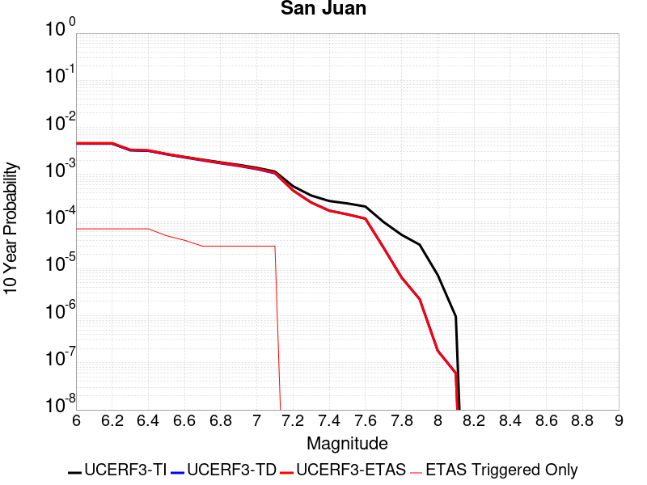 |

| Magnitude | 1 wk TI Prob | 1 wk TD Prob | 1 wk ETAS Prob | 1 wk ETAS/TD Gain | 1 wk ETAS Triggered Only | 1 mo TI Prob | 1 mo TD Prob | 1 mo ETAS Prob | 1 mo ETAS/TD Gain | 1 mo ETAS Triggered Only | 1 yr TI Prob | 1 yr TD Prob | 1 yr ETAS Prob | 1 yr ETAS/TD Gain | 1 yr ETAS Triggered Only | 10 yr TI Prob | 10 yr TD Prob | 10 yr ETAS Prob | 10 yr ETAS/TD Gain | 10 yr ETAS Triggered Only |
|-----|-----|-----|-----|-----|-----|-----|-----|-----|-----|-----|-----|-----|-----|-----|-----|-----|-----|-----|-----|-----|
| 6.0 | 8.682808E-6 | 8.7491635E-6 | 8.7491635E-6 | 1.0 | 0.0 | 3.72115E-5 | 3.74959E-5 | 3.74959E-5 | 1.0 | 0.0 | 4.5295584E-4 | 4.564218E-4 | 4.564218E-4 | 1.0 | 0.0 | 0.004520337 | 0.004555385 | 0.004630034 | 1.016387 | 7.4990625E-5 |
| 6.1 | 8.682808E-6 | 8.7491635E-6 | 8.7491635E-6 | 1.0 | 0.0 | 3.72115E-5 | 3.74959E-5 | 3.74959E-5 | 1.0 | 0.0 | 4.5295584E-4 | 4.564218E-4 | 4.564218E-4 | 1.0 | 0.0 | 0.004520337 | 0.004555385 | 0.004630034 | 1.016387 | 7.4990625E-5 |
| 6.2 | 8.682808E-6 | 8.7491635E-6 | 8.7491635E-6 | 1.0 | 0.0 | 3.72115E-5 | 3.74959E-5 | 3.74959E-5 | 1.0 | 0.0 | 4.5295584E-4 | 4.564218E-4 | 4.564218E-4 | 1.0 | 0.0 | 0.004520337 | 0.004555385 | 0.004630034 | 1.016387 | 7.4990625E-5 |
| 6.3 | 6.3054235E-6 | 6.2825848E-6 | 6.2825848E-6 | 1.0 | 0.0 | 2.7022963E-5 | 2.6925094E-5 | 2.6925094E-5 | 1.0 | 0.0 | 3.2895492E-4 | 3.2776513E-4 | 3.2776513E-4 | 1.0 | 0.0 | 0.003284684 | 0.003273017 | 0.0033477622 | 1.0228368 | 7.4990625E-5 |
| 6.4 | 6.1490473E-6 | 6.1144656E-6 | 6.1144656E-6 | 1.0 | 0.0 | 2.6352795E-5 | 2.6204598E-5 | 2.6204598E-5 | 1.0 | 0.0 | 3.2079802E-4 | 3.1899565E-4 | 3.1899565E-4 | 1.0 | 0.0 | 0.0032033534 | 0.0031855737 | 0.0032603256 | 1.0234658 | 7.4990625E-5 |
| 6.5 | 5.204848E-6 | 5.137233E-6 | 5.137233E-6 | 1.0 | 0.0 | 2.23063E-5 | 2.2016533E-5 | 2.2016533E-5 | 1.0 | 0.0 | 2.7154534E-4 | 2.6801927E-4 | 2.6801927E-4 | 1.0 | 0.0 | 0.0027121378 | 0.0026771144 | 0.0027519043 | 1.0279367 | 7.4990625E-5 |
| 6.6 | 4.5179986E-6 | 4.4150297E-6 | 4.4150297E-6 | 1.0 | 0.0 | 1.9362706E-5 | 1.8921424E-5 | 1.8921424E-5 | 1.0 | 0.0 | 2.3571544E-4 | 2.3034477E-4 | 2.3034477E-4 | 1.0 | 0.0 | 0.0023546559 | 0.0023011973 | 0.0023386062 | 1.0162563 | 3.7495312E-5 |
| 6.7 | 3.9442616E-6 | 3.819828E-6 | 3.819828E-6 | 1.0 | 0.0 | 1.6903869E-5 | 1.6370592E-5 | 1.6370592E-5 | 1.0 | 0.0 | 2.0578515E-4 | 1.992944E-4 | 1.992944E-4 | 1.0 | 0.0 | 0.002055947 | 0.0019912818 | 0.0020287023 | 1.0187923 | 3.7495312E-5 |
| 6.8 | 3.4536245E-6 | 3.3163353E-6 | 3.3163353E-6 | 1.0 | 0.0 | 1.4801163E-5 | 1.4212792E-5 | 1.4212792E-5 | 1.0 | 0.0 | 1.8018926E-4 | 1.7302761E-4 | 1.7302761E-4 | 1.0 | 0.0 | 0.0018004322 | 0.0017290477 | 0.0017664783 | 1.021648 | 3.7495312E-5 |
| 6.9 | 3.059865E-6 | 2.9120315E-6 | 2.9120315E-6 | 1.0 | 0.0 | 1.3113641E-5 | 1.2480078E-5 | 1.2480078E-5 | 1.0 | 0.0 | 1.596469E-4 | 1.5193493E-4 | 1.5193493E-4 | 1.0 | 0.0 | 0.0015953224 | 0.0015184252 | 0.0015558635 | 1.024656 | 3.7495312E-5 |
| 7.0 | 2.6504351E-6 | 2.4920002E-6 | 2.4920002E-6 | 1.0 | 0.0 | 1.1358958E-5 | 1.0679961E-5 | 1.0679961E-5 | 1.0 | 0.0 | 1.3828653E-4 | 1.300213E-4 | 1.300213E-4 | 1.0 | 0.0 | 0.0013820052 | 0.0012995641 | 0.0013370108 | 1.0288147 | 3.7495312E-5 |
| 7.1 | 2.2039317E-6 | 2.0338296E-6 | 2.0338296E-6 | 1.0 | 0.0 | 9.445387E-6 | 8.716386E-6 | 8.716386E-6 | 1.0 | 0.0 | 1.1499152E-4 | 1.0611736E-4 | 1.0611736E-4 | 1.0 | 0.0 | 0.0011493203 | 0.0010607769 | 0.0010982325 | 1.0353096 | 3.7495312E-5 |
| 7.2 | 1.0786707E-6 | 8.7701903E-7 | 8.7701903E-7 | 1.0 | 0.0 | 4.622866E-6 | 3.7586476E-6 | 3.7586476E-6 | 1.0 | 0.0 | 5.628194E-5 | 4.5760586E-5 | 4.5760586E-5 | 1.0 | 0.0 | 5.6267687E-4 | 4.5757066E-4 | 4.5757066E-4 | 1.0 | 0.0 |
| 7.3 | 6.846433E-7 | 4.868805E-7 | 4.868805E-7 | 1.0 | 0.0 | 2.9341822E-6 | 2.086629E-6 | 2.086629E-6 | 1.0 | 0.0 | 3.5723086E-5 | 2.5404412E-5 | 2.5404412E-5 | 1.0 | 0.0 | 3.571734E-4 | 2.540486E-4 | 2.540486E-4 | 1.0 | 0.0 |
| 7.4 | 5.23043E-7 | 3.2628162E-7 | 3.2628162E-7 | 1.0 | 0.0 | 2.2416111E-6 | 1.398349E-6 | 1.398349E-6 | 1.0 | 0.0 | 2.7291273E-5 | 1.7024766E-5 | 1.7024766E-5 | 1.0 | 0.0 | 2.7287923E-4 | 1.7026656E-4 | 1.7026656E-4 | 1.0 | 0.0 |
| 7.5 | 4.648444E-7 | 2.7234944E-7 | 2.7234944E-7 | 1.0 | 0.0 | 1.9921886E-6 | 1.1672114E-6 | 1.1672114E-6 | 1.0 | 0.0 | 2.4254627E-5 | 1.42107065E-5 | 1.42107065E-5 | 1.0 | 0.0 | 2.425198E-4 | 1.421276E-4 | 1.421276E-4 | 1.0 | 0.0 |
| 7.6 | 3.9906567E-7 | 2.2083314E-7 | 2.2083314E-7 | 1.0 | 0.0 | 1.7102802E-6 | 9.464274E-7 | 9.464274E-7 | 1.0 | 0.0 | 2.0822463E-5 | 1.1522693E-5 | 1.1522693E-5 | 1.0 | 0.0 | 2.0820512E-4 | 1.15245566E-4 | 1.15245566E-4 | 1.0 | 0.0 |
| 7.7 | 1.8784601E-7 | 5.3666906E-8 | 5.3666906E-8 | 1.0 | 0.0 | 8.0505407E-7 | 2.30001E-7 | 2.30001E-7 | 1.0 | 0.0 | 9.80149E-6 | 2.8002585E-6 | 2.8002585E-6 | 1.0 | 0.0 | 9.801057E-5 | 2.8011282E-5 | 2.8011282E-5 | 1.0 | 0.0 |
| 7.8 | 1.00154914E-7 | 1.2415832E-8 | 1.2415832E-8 | 1.0 | 0.0 | 4.2923529E-7 | 5.3210716E-8 | 5.3210716E-8 | 1.0 | 0.0 | 5.225927E-6 | 6.4784024E-7 | 6.4784024E-7 | 1.0 | 0.0 | 5.225804E-5 | 6.484273E-6 | 6.484273E-6 | 1.0 | 0.0 |
| 7.9 | 6.171429E-8 | 4.2966155E-9 | 4.2966155E-9 | 1.0 | 0.0 | 2.6448978E-7 | 1.8414067E-8 | 1.8414067E-8 | 1.0 | 0.0 | 3.2201583E-6 | 2.2419121E-7 | 2.2419121E-7 | 1.0 | 0.0 | 3.2201115E-5 | 2.2472002E-6 | 2.2472002E-6 | 1.0 | 0.0 |
| 8.0 | 1.3974572E-8 | 3.3788217E-10 | 3.3788217E-10 | 1.0 | 0.0 | 5.989102E-8 | 1.448067E-9 | 1.448067E-9 | 1.0 | 0.0 | 7.2917294E-7 | 1.763022E-8 | 1.763022E-8 | 1.0 | 0.0 | 7.2917055E-6 | 1.8060365E-7 | 1.8060365E-7 | 1.0 | 0.0 |
| 8.1 | 1.8403477E-9 | 1.1302803E-10 | 1.1302803E-10 | 1.0 | 0.0 | 7.887204E-9 | 4.844063E-10 | 4.844063E-10 | 1.0 | 0.0 | 9.602671E-8 | 5.8976446E-9 | 5.8976446E-9 | 1.0 | 0.0 | 9.602667E-7 | 6.021993E-8 | 6.021993E-8 | 1.0 | 0.0 |

## Santa Ynez (West)
*[(top)](#table-of-contents)*

| 1 Week | 1 Month | 1 Year | 10 Year |
|-----|-----|-----|-----|
|  |  | 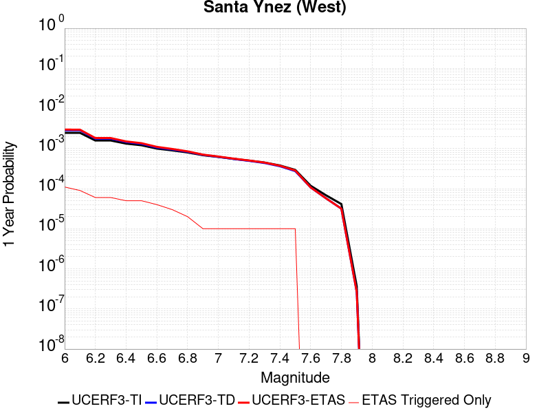 |  |

| Magnitude | 1 wk TI Prob | 1 wk TD Prob | 1 wk ETAS Prob | 1 wk ETAS/TD Gain | 1 wk ETAS Triggered Only | 1 mo TI Prob | 1 mo TD Prob | 1 mo ETAS Prob | 1 mo ETAS/TD Gain | 1 mo ETAS Triggered Only | 1 yr TI Prob | 1 yr TD Prob | 1 yr ETAS Prob | 1 yr ETAS/TD Gain | 1 yr ETAS Triggered Only | 10 yr TI Prob | 10 yr TD Prob | 10 yr ETAS Prob | 10 yr ETAS/TD Gain | 10 yr ETAS Triggered Only |
|-----|-----|-----|-----|-----|-----|-----|-----|-----|-----|-----|-----|-----|-----|-----|-----|-----|-----|-----|-----|-----|
| 6.0 | 4.7352758E-5 | 5.4972126E-5 | 5.4972126E-5 | 1.0 | 0.0 | 2.0292461E-4 | 2.3557522E-4 | 2.3557522E-4 | 1.0 | 0.0 | 0.0024678076 | 0.0028645284 | 0.0028645284 | 1.0 | 0.0 | 0.024405818 | 0.028304417 | 0.028340852 | 1.0012872 | 3.7495312E-5 |
| 6.1 | 4.7352758E-5 | 5.4972126E-5 | 5.4972126E-5 | 1.0 | 0.0 | 2.0292461E-4 | 2.3557522E-4 | 2.3557522E-4 | 1.0 | 0.0 | 0.0024678076 | 0.0028645284 | 0.0028645284 | 1.0 | 0.0 | 0.024405818 | 0.028304417 | 0.028340852 | 1.0012872 | 3.7495312E-5 |
| 6.2 | 3.0415853E-5 | 3.392511E-5 | 3.392511E-5 | 1.0 | 0.0 | 1.3034715E-4 | 1.4538545E-4 | 1.4538545E-4 | 1.0 | 0.0 | 0.0015858212 | 0.0017686661 | 0.0017686661 | 1.0 | 0.0 | 0.015745522 | 0.017549807 | 0.017586645 | 1.002099 | 3.7495312E-5 |
| 6.3 | 3.0415853E-5 | 3.392511E-5 | 3.392511E-5 | 1.0 | 0.0 | 1.3034715E-4 | 1.4538545E-4 | 1.4538545E-4 | 1.0 | 0.0 | 0.0015858212 | 0.0017686661 | 0.0017686661 | 1.0 | 0.0 | 0.015745522 | 0.017549807 | 0.017586645 | 1.002099 | 3.7495312E-5 |
| 6.4 | 2.5452082E-5 | 2.7912422E-5 | 2.7912422E-5 | 1.0 | 0.0 | 1.09075794E-4 | 1.196193E-4 | 1.196193E-4 | 1.0 | 0.0 | 0.0013271887 | 0.0014554089 | 0.0014554089 | 1.0 | 0.0 | 0.013192902 | 0.014460951 | 0.014497904 | 1.0025554 | 3.7495312E-5 |
| 6.5 | 2.3143784E-5 | 2.5128256E-5 | 2.5128256E-5 | 1.0 | 0.0 | 9.9183875E-5 | 1.0768817E-4 | 1.0768817E-4 | 1.0 | 0.0 | 0.0012068948 | 0.0013103267 | 0.0013103267 | 1.0 | 0.0 | 0.012003611 | 0.01302768 | 0.013064687 | 1.0028406 | 3.7495312E-5 |
| 6.6 | 1.9118515E-5 | 2.035434E-5 | 2.035434E-5 | 1.0 | 0.0 | 8.193392E-5 | 8.7230015E-5 | 8.7230015E-5 | 1.0 | 0.0 | 9.97089E-4 | 0.001061516 | 0.001061516 | 1.0 | 0.0 | 0.00992627 | 0.010565365 | 0.010602464 | 1.0035114 | 3.7495312E-5 |
| 6.7 | 1.722807E-5 | 1.8146347E-5 | 1.8146347E-5 | 1.0 | 0.0 | 7.3832496E-5 | 7.776777E-5 | 7.776777E-5 | 1.0 | 0.0 | 8.985399E-4 | 9.464169E-4 | 9.464169E-4 | 1.0 | 0.0 | 0.008949154 | 0.0094245095 | 0.009461652 | 1.0039409 | 3.7495312E-5 |
| 6.8 | 1.5317364E-5 | 1.5926486E-5 | 1.5926486E-5 | 1.0 | 0.0 | 6.56442E-5 | 6.82546E-5 | 6.82546E-5 | 1.0 | 0.0 | 7.98925E-4 | 8.306873E-4 | 8.306873E-4 | 1.0 | 0.0 | 0.007960589 | 0.00827631 | 0.008313495 | 1.004493 | 3.7495312E-5 |
| 6.9 | 1.3071226E-5 | 1.3329624E-5 | 1.3329624E-5 | 1.0 | 0.0 | 5.6018336E-5 | 5.7125722E-5 | 5.7125722E-5 | 1.0 | 0.0 | 6.8180985E-4 | 6.9528597E-4 | 6.9528597E-4 | 1.0 | 0.0 | 0.0067972173 | 0.006931367 | 0.0069686025 | 1.005372 | 3.7495312E-5 |
| 7.0 | 1.1836986E-5 | 1.19327815E-5 | 1.19327815E-5 | 1.0 | 0.0 | 5.0728955E-5 | 5.11395E-5 | 5.11395E-5 | 1.0 | 0.0 | 6.1745E-4 | 6.2244723E-4 | 6.2244723E-4 | 1.0 | 0.0 | 0.006157372 | 0.006207231 | 0.0062444936 | 1.0060031 | 3.7495312E-5 |
| 7.1 | 1.0597169E-5 | 1.0542201E-5 | 1.0542201E-5 | 1.0 | 0.0 | 4.541565E-5 | 4.5180084E-5 | 4.5180084E-5 | 1.0 | 0.0 | 5.5279525E-4 | 5.4992986E-4 | 5.4992986E-4 | 1.0 | 0.0 | 0.0055142213 | 0.005485821 | 0.0055231107 | 1.0067974 | 3.7495312E-5 |
| 7.2 | 9.59113E-6 | 9.459144E-6 | 9.459144E-6 | 1.0 | 0.0 | 4.11042E-5 | 4.0538565E-5 | 4.0538565E-5 | 1.0 | 0.0 | 5.0032866E-4 | 4.934463E-4 | 4.934463E-4 | 1.0 | 0.0 | 0.004992037 | 0.0049236254 | 0.0049236254 | 1.0 | 0.0 |
| 7.3 | 8.586084E-6 | 8.379583E-6 | 8.379583E-6 | 1.0 | 0.0 | 3.679698E-5 | 3.5912013E-5 | 3.5912013E-5 | 1.0 | 0.0 | 4.4791115E-4 | 4.3714207E-4 | 4.3714207E-4 | 1.0 | 0.0 | 0.004470094 | 0.004362933 | 0.004362933 | 1.0 | 0.0 |
| 7.4 | 7.2622997E-6 | 6.9515427E-6 | 6.9515427E-6 | 1.0 | 0.0 | 3.112377E-5 | 2.979199E-5 | 2.979199E-5 | 1.0 | 0.0 | 3.78866E-4 | 3.626581E-4 | 3.626581E-4 | 1.0 | 0.0 | 0.0037822074 | 0.0036207628 | 0.0036207628 | 1.0 | 0.0 |
| 7.5 | 5.627296E-6 | 5.251588E-6 | 5.251588E-6 | 1.0 | 0.0 | 2.411676E-5 | 2.2506614E-5 | 2.2506614E-5 | 1.0 | 0.0 | 2.9358198E-4 | 2.739843E-4 | 2.739843E-4 | 1.0 | 0.0 | 0.0029319443 | 0.002736537 | 0.002736537 | 1.0 | 0.0 |
| 7.6 | 2.265244E-6 | 2.0608625E-6 | 2.0608625E-6 | 1.0 | 0.0 | 9.708152E-6 | 8.832238E-6 | 8.832238E-6 | 1.0 | 0.0 | 1.18190335E-4 | 1.0752728E-4 | 1.0752728E-4 | 1.0 | 0.0 | 0.001181275 | 0.0010747612 | 0.0010747612 | 1.0 | 0.0 |
| 7.7 | 1.3099874E-6 | 1.1016252E-6 | 1.1016252E-6 | 1.0 | 0.0 | 5.61422E-6 | 4.7212425E-6 | 4.7212425E-6 | 1.0 | 0.0 | 6.8350986E-5 | 5.7479636E-5 | 5.7479636E-5 | 1.0 | 0.0 | 6.832996E-4 | 5.7465007E-4 | 5.7465007E-4 | 1.0 | 0.0 |
| 7.8 | 7.903951E-7 | 6.0711415E-7 | 6.0711415E-7 | 1.0 | 0.0 | 3.3874032E-6 | 2.6019152E-6 | 2.6019152E-6 | 1.0 | 0.0 | 4.1240855E-5 | 3.167787E-5 | 3.167787E-5 | 1.0 | 0.0 | 4.12332E-4 | 3.167349E-4 | 3.167349E-4 | 1.0 | 0.0 |
| 7.9 | 7.0753297E-9 | 5.0899476E-9 | 5.0899476E-9 | 1.0 | 0.0 | 3.032284E-8 | 2.181406E-8 | 2.181406E-8 | 1.0 | 0.0 | 3.6918053E-7 | 2.6558615E-7 | 2.6558615E-7 | 1.0 | 0.0 | 3.691799E-6 | 2.6558594E-6 | 2.6558594E-6 | 1.0 | 0.0 |

## Chino alt 1
*[(top)](#table-of-contents)*

| 1 Week | 1 Month | 1 Year | 10 Year |
|-----|-----|-----|-----|
|  |  |  |  |

| Magnitude | 1 wk TI Prob | 1 wk TD Prob | 1 wk ETAS Prob | 1 wk ETAS/TD Gain | 1 wk ETAS Triggered Only | 1 mo TI Prob | 1 mo TD Prob | 1 mo ETAS Prob | 1 mo ETAS/TD Gain | 1 mo ETAS Triggered Only | 1 yr TI Prob | 1 yr TD Prob | 1 yr ETAS Prob | 1 yr ETAS/TD Gain | 1 yr ETAS Triggered Only | 10 yr TI Prob | 10 yr TD Prob | 10 yr ETAS Prob | 10 yr ETAS/TD Gain | 10 yr ETAS Triggered Only |
|-----|-----|-----|-----|-----|-----|-----|-----|-----|-----|-----|-----|-----|-----|-----|-----|-----|-----|-----|-----|-----|
| 6.0 | 3.939946E-5 | 4.8948554E-5 | 8.644203E-5 | 1.7659773 | 3.7495312E-5 | 1.6884391E-4 | 2.097656E-4 | 2.4725305E-4 | 1.1787112 | 3.7495312E-5 | 0.0020537362 | 0.0025513945 | 0.002626194 | 1.029317 | 7.4990625E-5 | 0.020348595 | 0.025277847 | 0.025350941 | 1.0028917 | 7.4990625E-5 |
| 6.1 | 2.1505624E-5 | 2.6879026E-5 | 6.437333E-5 | 2.394928 | 3.7495312E-5 | 9.2163704E-5 | 1.1519137E-4 | 1.5268236E-4 | 1.3254671 | 3.7495312E-5 | 0.0011215154 | 0.001401664 | 0.0014391068 | 1.0267131 | 3.7495312E-5 | 0.011158722 | 0.013945141 | 0.013982113 | 1.0026513 | 3.7495312E-5 |
| 6.2 | 2.1505624E-5 | 2.6879026E-5 | 6.437333E-5 | 2.394928 | 3.7495312E-5 | 9.2163704E-5 | 1.1519137E-4 | 1.5268236E-4 | 1.3254671 | 3.7495312E-5 | 0.0011215154 | 0.001401664 | 0.0014391068 | 1.0267131 | 3.7495312E-5 | 0.011158722 | 0.013945141 | 0.013982113 | 1.0026513 | 3.7495312E-5 |
| 6.3 | 1.4290785E-5 | 1.8165128E-5 | 1.8165128E-5 | 1.0 | 0.0 | 6.1244784E-5 | 7.784848E-5 | 7.784848E-5 | 1.0 | 0.0 | 7.454001E-4 | 9.4743853E-4 | 9.4743853E-4 | 1.0 | 0.0 | 0.007429048 | 0.0094444575 | 0.0094444575 | 1.0 | 0.0 |
| 6.4 | 1.4290785E-5 | 1.8165128E-5 | 1.8165128E-5 | 1.0 | 0.0 | 6.1244784E-5 | 7.784848E-5 | 7.784848E-5 | 1.0 | 0.0 | 7.454001E-4 | 9.4743853E-4 | 9.4743853E-4 | 1.0 | 0.0 | 0.007429048 | 0.0094444575 | 0.0094444575 | 1.0 | 0.0 |
| 6.5 | 1.3017944E-5 | 1.6652088E-5 | 1.6652088E-5 | 1.0 | 0.0 | 5.5789995E-5 | 7.136439E-5 | 7.136439E-5 | 1.0 | 0.0 | 6.790315E-4 | 8.685589E-4 | 8.685589E-4 | 1.0 | 0.0 | 0.0067696036 | 0.008661949 | 0.008661949 | 1.0 | 0.0 |
| 6.6 | 9.470016E-6 | 1.2039424E-5 | 1.2039424E-5 | 1.0 | 0.0 | 4.058515E-5 | 5.1596704E-5 | 5.1596704E-5 | 1.0 | 0.0 | 4.940122E-4 | 6.280428E-4 | 6.280428E-4 | 1.0 | 0.0 | 0.004929154 | 0.0062718987 | 0.0062718987 | 1.0 | 0.0 |
| 6.7 | 8.314155E-6 | 1.0407736E-5 | 1.0407736E-5 | 1.0 | 0.0 | 3.5631605E-5 | 4.4604003E-5 | 4.4604003E-5 | 1.0 | 0.0 | 4.3372845E-4 | 5.429507E-4 | 5.429507E-4 | 1.0 | 0.0 | 0.004328829 | 0.005425775 | 0.005425775 | 1.0 | 0.0 |
| 6.8 | 3.4856364E-6 | 3.8133708E-6 | 3.8133708E-6 | 1.0 | 0.0 | 1.4938357E-5 | 1.6342927E-5 | 1.6342927E-5 | 1.0 | 0.0 | 1.8185932E-4 | 1.9895904E-4 | 1.9895904E-4 | 1.0 | 0.0 | 0.0018171056 | 0.0019894864 | 0.0019894864 | 1.0 | 0.0 |
| 6.9 | 2.2645952E-6 | 2.1529022E-6 | 2.1529022E-6 | 1.0 | 0.0 | 9.705372E-6 | 9.226692E-6 | 9.226692E-6 | 1.0 | 0.0 | 1.18156495E-4 | 1.123294E-4 | 1.123294E-4 | 1.0 | 0.0 | 0.0011809369 | 0.0011233423 | 0.0011233423 | 1.0 | 0.0 |
| 7.0 | 1.7864003E-6 | 1.5430785E-6 | 1.5430785E-6 | 1.0 | 0.0 | 7.655979E-6 | 6.613177E-6 | 6.613177E-6 | 1.0 | 0.0 | 9.3207556E-5 | 8.051251E-5 | 8.051251E-5 | 1.0 | 0.0 | 9.316847E-4 | 8.0528046E-4 | 8.0528046E-4 | 1.0 | 0.0 |
| 7.1 | 1.7315456E-6 | 1.4733511E-6 | 1.4733511E-6 | 1.0 | 0.0 | 7.420889E-6 | 6.3143466E-6 | 6.3143466E-6 | 1.0 | 0.0 | 9.034557E-5 | 7.6874516E-5 | 7.6874516E-5 | 1.0 | 0.0 | 9.0308854E-4 | 7.6891703E-4 | 7.6891703E-4 | 1.0 | 0.0 |
| 7.2 | 1.6008337E-6 | 1.3574215E-6 | 1.3574215E-6 | 1.0 | 0.0 | 6.860698E-6 | 5.817508E-6 | 5.817508E-6 | 1.0 | 0.0 | 8.352579E-5 | 7.082591E-5 | 7.082591E-5 | 1.0 | 0.0 | 8.34944E-4 | 7.0845755E-4 | 7.0845755E-4 | 1.0 | 0.0 |
| 7.3 | 1.3320939E-6 | 1.121782E-6 | 1.121782E-6 | 1.0 | 0.0 | 5.7089615E-6 | 4.807629E-6 | 4.807629E-6 | 1.0 | 0.0 | 6.9504385E-5 | 5.8531357E-5 | 5.8531357E-5 | 1.0 | 0.0 | 6.9482654E-4 | 5.8530393E-4 | 5.8530393E-4 | 1.0 | 0.0 |
| 7.4 | 1.114294E-6 | 9.237111E-7 | 9.237111E-7 | 1.0 | 0.0 | 4.775537E-6 | 3.958756E-6 | 3.958756E-6 | 1.0 | 0.0 | 5.8140613E-5 | 4.8196827E-5 | 4.8196827E-5 | 1.0 | 0.0 | 5.81254E-4 | 4.8188053E-4 | 4.8188053E-4 | 1.0 | 0.0 |
| 7.5 | 9.354081E-7 | 7.6234323E-7 | 7.6234323E-7 | 1.0 | 0.0 | 4.0088858E-6 | 3.2671815E-6 | 3.2671815E-6 | 1.0 | 0.0 | 4.8807087E-5 | 3.9777242E-5 | 3.9777242E-5 | 1.0 | 0.0 | 4.879637E-4 | 3.977046E-4 | 3.977046E-4 | 1.0 | 0.0 |
| 7.6 | 8.521771E-7 | 6.88071E-7 | 6.88071E-7 | 1.0 | 0.0 | 3.6521824E-6 | 2.9488726E-6 | 2.9488726E-6 | 1.0 | 0.0 | 4.4464414E-5 | 3.5901965E-5 | 3.5901965E-5 | 1.0 | 0.0 | 4.4455516E-4 | 3.589648E-4 | 3.589648E-4 | 1.0 | 0.0 |
| 7.7 | 2.1803626E-7 | 1.418649E-7 | 1.418649E-7 | 1.0 | 0.0 | 9.344408E-7 | 6.079923E-7 | 6.079923E-7 | 1.0 | 0.0 | 1.1376757E-5 | 7.4022914E-6 | 7.4022914E-6 | 1.0 | 0.0 | 1.13761744E-4 | 7.402141E-5 | 7.402141E-5 | 1.0 | 0.0 |

## Laguna Salada
*[(top)](#table-of-contents)*

| 1 Week | 1 Month | 1 Year | 10 Year |
|-----|-----|-----|-----|
|  |  |  | 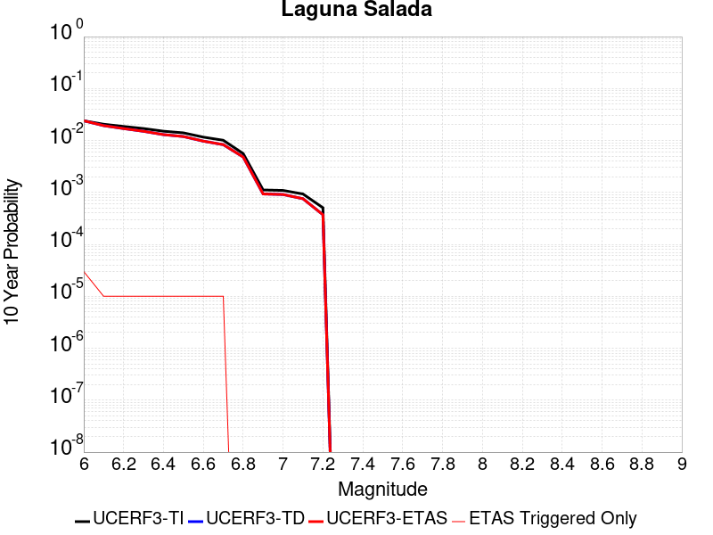 |

| Magnitude | 1 wk TI Prob | 1 wk TD Prob | 1 wk ETAS Prob | 1 wk ETAS/TD Gain | 1 wk ETAS Triggered Only | 1 mo TI Prob | 1 mo TD Prob | 1 mo ETAS Prob | 1 mo ETAS/TD Gain | 1 mo ETAS Triggered Only | 1 yr TI Prob | 1 yr TD Prob | 1 yr ETAS Prob | 1 yr ETAS/TD Gain | 1 yr ETAS Triggered Only | 10 yr TI Prob | 10 yr TD Prob | 10 yr ETAS Prob | 10 yr ETAS/TD Gain | 10 yr ETAS Triggered Only |
|-----|-----|-----|-----|-----|-----|-----|-----|-----|-----|-----|-----|-----|-----|-----|-----|-----|-----|-----|-----|-----|
| 6.0 | 4.6465593E-5 | 4.634639E-5 | 4.634639E-5 | 1.0 | 0.0 | 1.9912305E-4 | 1.9861311E-4 | 2.3610097E-4 | 1.1887482 | 3.7495312E-5 | 0.0024216278 | 0.002415429 | 0.0024528338 | 1.0154858 | 3.7495312E-5 | 0.02395408 | 0.023975259 | 0.024048451 | 1.0030528 | 7.4990625E-5 |
| 6.1 | 3.982297E-5 | 3.7246125E-5 | 3.7246125E-5 | 1.0 | 0.0 | 1.706587E-4 | 1.5961716E-4 | 1.5961716E-4 | 1.0 | 0.0 | 0.0020757897 | 0.0019417295 | 0.0019417295 | 1.0 | 0.0 | 0.020565065 | 0.019331863 | 0.019368634 | 1.0019021 | 3.7495312E-5 |
| 6.2 | 3.6067784E-5 | 3.2602693E-5 | 3.2602693E-5 | 1.0 | 0.0 | 1.5456705E-4 | 1.3971896E-4 | 1.3971896E-4 | 1.0 | 0.0 | 0.0018802295 | 0.0016998611 | 0.0016998611 | 1.0 | 0.0 | 0.018644003 | 0.016949628 | 0.016986487 | 1.0021746 | 3.7495312E-5 |
| 6.3 | 3.2859112E-5 | 2.8849448E-5 | 2.8849448E-5 | 1.0 | 0.0 | 1.4081717E-4 | 1.2363521E-4 | 1.2363521E-4 | 1.0 | 0.0 | 0.0017131006 | 0.0015043203 | 0.0015043203 | 1.0 | 0.0 | 0.016999546 | 0.015018767 | 0.015055699 | 1.002459 | 3.7495312E-5 |
| 6.4 | 2.9132116E-5 | 2.4852965E-5 | 2.4852965E-5 | 1.0 | 0.0 | 1.2484594E-4 | 1.0650887E-4 | 1.0650887E-4 | 1.0 | 0.0 | 0.0015189396 | 0.001296065 | 0.001296065 | 1.0 | 0.0 | 0.015085992 | 0.012956262 | 0.012993271 | 1.0028565 | 3.7495312E-5 |
| 6.5 | 2.7075037E-5 | 2.2825836E-5 | 2.2825836E-5 | 1.0 | 0.0 | 1.1603071E-4 | 9.7821845E-5 | 9.7821845E-5 | 1.0 | 0.0 | 0.0014117584 | 0.0011904186 | 0.0011904186 | 1.0 | 0.0 | 0.014028233 | 0.011907749 | 0.011944798 | 1.0031114 | 3.7495312E-5 |
| 6.6 | 2.2367465E-5 | 1.8573526E-5 | 1.8573526E-5 | 1.0 | 0.0 | 9.5857045E-5 | 7.959886E-5 | 7.959886E-5 | 1.0 | 0.0 | 0.0011664346 | 9.6876756E-4 | 9.6876756E-4 | 1.0 | 0.0 | 0.011603311 | 0.009702191 | 0.009739322 | 1.0038271 | 3.7495312E-5 |
| 6.7 | 1.9458053E-5 | 1.5914242E-5 | 1.5914242E-5 | 1.0 | 0.0 | 8.338899E-5 | 6.8202564E-5 | 6.8202564E-5 | 1.0 | 0.0 | 0.001014788 | 8.3013024E-4 | 8.3013024E-4 | 1.0 | 0.0 | 0.010101665 | 0.0083209425 | 0.008358126 | 1.0044687 | 3.7495312E-5 |
| 6.8 | 1.0767866E-5 | 9.18435E-6 | 9.18435E-6 | 1.0 | 0.0 | 4.614718E-5 | 3.9361294E-5 | 3.9361294E-5 | 1.0 | 0.0 | 5.6169706E-4 | 4.7918706E-4 | 4.7918706E-4 | 1.0 | 0.0 | 0.0056027942 | 0.0048096925 | 0.0048096925 | 1.0 | 0.0 |
| 6.9 | 2.1384765E-6 | 1.7913675E-6 | 1.7913675E-6 | 1.0 | 0.0 | 9.164866E-6 | 7.677269E-6 | 7.677269E-6 | 1.0 | 0.0 | 1.1157654E-4 | 9.346713E-5 | 9.346713E-5 | 1.0 | 0.0 | 0.0011152053 | 9.343165E-4 | 9.343165E-4 | 1.0 | 0.0 |
| 7.0 | 2.0952946E-6 | 1.7493046E-6 | 1.7493046E-6 | 1.0 | 0.0 | 8.979802E-6 | 7.4970003E-6 | 7.4970003E-6 | 1.0 | 0.0 | 1.0932361E-4 | 9.1272545E-5 | 9.1272545E-5 | 1.0 | 0.0 | 0.0010926984 | 9.123888E-4 | 9.123888E-4 | 1.0 | 0.0 |
| 7.1 | 1.7887576E-6 | 1.4500254E-6 | 1.4500254E-6 | 1.0 | 0.0 | 7.666081E-6 | 6.2143813E-6 | 6.2143813E-6 | 1.0 | 0.0 | 9.333054E-5 | 7.565777E-5 | 7.565777E-5 | 1.0 | 0.0 | 9.329135E-4 | 7.563506E-4 | 7.563506E-4 | 1.0 | 0.0 |
| 7.2 | 9.723109E-7 | 7.135619E-7 | 7.135619E-7 | 1.0 | 0.0 | 4.16704E-6 | 3.0581198E-6 | 3.0581198E-6 | 1.0 | 0.0 | 5.073253E-5 | 3.7232137E-5 | 3.7232137E-5 | 1.0 | 0.0 | 5.072095E-4 | 3.7227524E-4 | 3.7227524E-4 | 1.0 | 0.0 |

## Emerson-Copper Mtn 2011
*[(top)](#table-of-contents)*

| 1 Week | 1 Month | 1 Year | 10 Year |
|-----|-----|-----|-----|
|  |  |  |  |

| Magnitude | 1 wk TI Prob | 1 wk TD Prob | 1 wk ETAS Prob | 1 wk ETAS/TD Gain | 1 wk ETAS Triggered Only | 1 mo TI Prob | 1 mo TD Prob | 1 mo ETAS Prob | 1 mo ETAS/TD Gain | 1 mo ETAS Triggered Only | 1 yr TI Prob | 1 yr TD Prob | 1 yr ETAS Prob | 1 yr ETAS/TD Gain | 1 yr ETAS Triggered Only | 10 yr TI Prob | 10 yr TD Prob | 10 yr ETAS Prob | 10 yr ETAS/TD Gain | 10 yr ETAS Triggered Only |
|-----|-----|-----|-----|-----|-----|-----|-----|-----|-----|-----|-----|-----|-----|-----|-----|-----|-----|-----|-----|-----|
| 6.0 | 2.1364202E-5 | 9.968114E-6 | 4.7463054E-5 | 4.761488 | 3.7495312E-5 | 9.1557646E-5 | 4.2719836E-5 | 8.021355E-5 | 1.8776652 | 3.7495312E-5 | 0.0011141442 | 5.199986E-4 | 5.5747444E-4 | 1.072069 | 3.7495312E-5 | 0.011085749 | 0.005188688 | 0.0052632894 | 1.0143777 | 7.4990625E-5 |
| 6.1 | 2.1364202E-5 | 9.968114E-6 | 4.7463054E-5 | 4.761488 | 3.7495312E-5 | 9.1557646E-5 | 4.2719836E-5 | 8.021355E-5 | 1.8776652 | 3.7495312E-5 | 0.0011141442 | 5.199986E-4 | 5.5747444E-4 | 1.072069 | 3.7495312E-5 | 0.011085749 | 0.005188688 | 0.0052632894 | 1.0143777 | 7.4990625E-5 |
| 6.2 | 2.1364202E-5 | 9.968114E-6 | 4.7463054E-5 | 4.761488 | 3.7495312E-5 | 9.1557646E-5 | 4.2719836E-5 | 8.021355E-5 | 1.8776652 | 3.7495312E-5 | 0.0011141442 | 5.199986E-4 | 5.5747444E-4 | 1.072069 | 3.7495312E-5 | 0.011085749 | 0.005188688 | 0.0052632894 | 1.0143777 | 7.4990625E-5 |
| 6.3 | 1.7751237E-5 | 8.089227E-6 | 4.558424E-5 | 5.6351786 | 3.7495312E-5 | 7.607452E-5 | 3.466769E-5 | 7.21617E-5 | 2.0815263 | 3.7495312E-5 | 9.258136E-4 | 4.2200365E-4 | 4.5948313E-4 | 1.0888132 | 3.7495312E-5 | 0.00921966 | 0.0042126453 | 0.00428732 | 1.0177263 | 7.4990625E-5 |
| 6.4 | 1.7751237E-5 | 8.089227E-6 | 4.558424E-5 | 5.6351786 | 3.7495312E-5 | 7.607452E-5 | 3.466769E-5 | 7.21617E-5 | 2.0815263 | 3.7495312E-5 | 9.258136E-4 | 4.2200365E-4 | 4.5948313E-4 | 1.0888132 | 3.7495312E-5 | 0.00921966 | 0.0042126453 | 0.00428732 | 1.0177263 | 7.4990625E-5 |
| 6.5 | 1.5886664E-5 | 6.603819E-6 | 4.4098884E-5 | 6.677785 | 3.7495312E-5 | 6.808392E-5 | 2.8301802E-5 | 6.5796055E-5 | 2.324801 | 3.7495312E-5 | 8.286065E-4 | 3.4452465E-4 | 3.8200704E-4 | 1.1087946 | 3.7495312E-5 | 0.008255237 | 0.0034403696 | 0.0035151022 | 1.0217223 | 7.4990625E-5 |
| 6.6 | 1.5886664E-5 | 6.603819E-6 | 4.4098884E-5 | 6.677785 | 3.7495312E-5 | 6.808392E-5 | 2.8301802E-5 | 6.5796055E-5 | 2.324801 | 3.7495312E-5 | 8.286065E-4 | 3.4452465E-4 | 3.8200704E-4 | 1.1087946 | 3.7495312E-5 | 0.008255237 | 0.0034403696 | 0.0035151022 | 1.0217223 | 7.4990625E-5 |
| 6.7 | 1.428471E-5 | 5.470403E-6 | 4.2965512E-5 | 7.854177 | 3.7495312E-5 | 6.121875E-5 | 2.3444394E-5 | 6.093883E-5 | 2.599292 | 3.7495312E-5 | 7.450834E-4 | 2.8540206E-4 | 3.2288666E-4 | 1.1313397 | 3.7495312E-5 | 0.007425902 | 0.0028507432 | 0.0028881317 | 1.0131153 | 3.7495312E-5 |
| 6.8 | 1.3490684E-5 | 5.073699E-6 | 4.2568823E-5 | 8.390097 | 3.7495312E-5 | 5.7815934E-5 | 2.1744265E-5 | 5.9238762E-5 | 2.7243397 | 3.7495312E-5 | 7.0368167E-4 | 2.6470813E-4 | 3.021935E-4 | 1.1416103 | 3.7495312E-5 | 0.007014576 | 0.002644309 | 0.0026817052 | 1.0141422 | 3.7495312E-5 |
| 6.9 | 1.2235421E-5 | 4.289677E-6 | 4.1784828E-5 | 9.740787 | 3.7495312E-5 | 5.2436466E-5 | 1.838422E-5 | 5.5878845E-5 | 3.0395002 | 3.7495312E-5 | 6.38227E-4 | 2.238085E-4 | 2.612954E-4 | 1.1674955 | 3.7495312E-5 | 0.0063639707 | 0.0022361854 | 0.0022735968 | 1.0167301 | 3.7495312E-5 |
| 7.0 | 1.1009851E-5 | 3.7189886E-6 | 4.1214164E-5 | 11.082089 | 3.7495312E-5 | 4.7184225E-5 | 1.5938444E-5 | 5.343316E-5 | 3.3524702 | 3.7495312E-5 | 5.743165E-4 | 1.9403672E-4 | 2.3152475E-4 | 1.1932007 | 3.7495312E-5 | 0.005728345 | 0.0019390108 | 0.0019764334 | 1.0192999 | 3.7495312E-5 |
| 7.1 | 9.726373E-6 | 3.2117953E-6 | 4.070699E-5 | 12.674216 | 3.7495312E-5 | 4.168379E-5 | 1.3764783E-5 | 5.125958E-5 | 3.7239656 | 3.7495312E-5 | 5.07382E-4 | 1.6757673E-4 | 2.0506575E-4 | 1.2237127 | 3.7495312E-5 | 0.0050622504 | 0.0016748349 | 0.0017122674 | 1.02235 | 3.7495312E-5 |
| 7.2 | 3.9335127E-6 | 1.1524792E-6 | 3.8647748E-5 | 33.534447 | 3.7495312E-5 | 1.6857803E-5 | 4.9391874E-6 | 4.2434316E-5 | 8.591355 | 3.7495312E-5 | 2.0522442E-4 | 6.0133007E-5 | 9.762606E-5 | 1.6235021 | 3.7495312E-5 | 0.00205035 | 6.011733E-4 | 6.386461E-4 | 1.0623327 | 3.7495312E-5 |
| 7.3 | 2.661632E-6 | 6.911505E-7 | 3.8186437E-5 | 55.250538 | 3.7495312E-5 | 1.14069435E-5 | 2.9620703E-6 | 4.045727E-5 | 13.658444 | 3.7495312E-5 | 1.3887069E-4 | 3.6062618E-5 | 7.355658E-5 | 2.0396905 | 3.7495312E-5 | 0.0013878393 | 3.605687E-4 | 3.980505E-4 | 1.1039519 | 3.7495312E-5 |
| 7.4 | 2.0893426E-6 | 5.4618386E-7 | 3.8041475E-5 | 69.64958 | 3.7495312E-5 | 8.954295E-6 | 2.3407858E-6 | 3.983601E-5 | 17.01822 | 3.7495312E-5 | 1.0901308E-4 | 2.84987E-5 | 6.599294E-5 | 2.3156476 | 3.7495312E-5 | 0.0010895962 | 2.84951E-4 | 3.2243563E-4 | 1.1315476 | 3.7495312E-5 |
| 7.5 | 1.1681728E-6 | 3.6030585E-7 | 3.7855607E-5 | 105.0652 | 3.7495312E-5 | 5.0064455E-6 | 1.544167E-6 | 3.9039423E-5 | 25.281864 | 3.7495312E-5 | 6.0951766E-5 | 1.8800076E-5 | 5.6294684E-5 | 2.994386 | 3.7495312E-5 | 6.093505E-4 | 1.8798532E-4 | 2.2547359E-4 | 1.1994213 | 3.7495312E-5 |
| 7.6 | 1.3154387E-7 | 7.1197384E-8 | 7.1197384E-8 | 1.0 | 0.0 | 5.6375933E-7 | 3.051316E-7 | 3.051316E-7 | 1.0 | 0.0 | 6.863748E-6 | 3.7149728E-6 | 3.7149728E-6 | 1.0 | 0.0 | 6.863536E-5 | 3.7149264E-5 | 3.7149264E-5 | 1.0 | 0.0 |

## Great Valley 08 (Quinto)
*[(top)](#table-of-contents)*

| 1 Week | 1 Month | 1 Year | 10 Year |
|-----|-----|-----|-----|
|  |  |  |  |

| Magnitude | 1 wk TI Prob | 1 wk TD Prob | 1 wk ETAS Prob | 1 wk ETAS/TD Gain | 1 wk ETAS Triggered Only | 1 mo TI Prob | 1 mo TD Prob | 1 mo ETAS Prob | 1 mo ETAS/TD Gain | 1 mo ETAS Triggered Only | 1 yr TI Prob | 1 yr TD Prob | 1 yr ETAS Prob | 1 yr ETAS/TD Gain | 1 yr ETAS Triggered Only | 10 yr TI Prob | 10 yr TD Prob | 10 yr ETAS Prob | 10 yr ETAS/TD Gain | 10 yr ETAS Triggered Only |
|-----|-----|-----|-----|-----|-----|-----|-----|-----|-----|-----|-----|-----|-----|-----|-----|-----|-----|-----|-----|-----|
| 6.0 | 7.737697E-6 | 8.253038E-6 | 8.253038E-6 | 1.0 | 0.0 | 3.3161137E-5 | 3.536979E-5 | 3.536979E-5 | 1.0 | 0.0 | 4.0366207E-4 | 4.3056096E-4 | 4.6804012E-4 | 1.0870473 | 3.7495312E-5 | 0.004029296 | 0.0042991205 | 0.004373789 | 1.0173683 | 7.4990625E-5 |
| 6.1 | 7.737697E-6 | 8.253038E-6 | 8.253038E-6 | 1.0 | 0.0 | 3.3161137E-5 | 3.536979E-5 | 3.536979E-5 | 1.0 | 0.0 | 4.0366207E-4 | 4.3056096E-4 | 4.6804012E-4 | 1.0870473 | 3.7495312E-5 | 0.004029296 | 0.0042991205 | 0.004373789 | 1.0173683 | 7.4990625E-5 |
| 6.2 | 7.737697E-6 | 8.253038E-6 | 8.253038E-6 | 1.0 | 0.0 | 3.3161137E-5 | 3.536979E-5 | 3.536979E-5 | 1.0 | 0.0 | 4.0366207E-4 | 4.3056096E-4 | 4.6804012E-4 | 1.0870473 | 3.7495312E-5 | 0.004029296 | 0.0042991205 | 0.004373789 | 1.0173683 | 7.4990625E-5 |
| 6.3 | 5.374012E-6 | 5.7505736E-6 | 5.7505736E-6 | 1.0 | 0.0 | 2.3031276E-5 | 2.4645145E-5 | 2.4645145E-5 | 1.0 | 0.0 | 2.803697E-4 | 3.0002446E-4 | 3.3750854E-4 | 1.1249367 | 3.7495312E-5 | 0.0028001624 | 0.0029972875 | 0.0030720534 | 1.0249445 | 7.4990625E-5 |
| 6.4 | 5.374012E-6 | 5.7505736E-6 | 5.7505736E-6 | 1.0 | 0.0 | 2.3031276E-5 | 2.4645145E-5 | 2.4645145E-5 | 1.0 | 0.0 | 2.803697E-4 | 3.0002446E-4 | 3.3750854E-4 | 1.1249367 | 3.7495312E-5 | 0.0028001624 | 0.0029972875 | 0.0030720534 | 1.0249445 | 7.4990625E-5 |
| 6.5 | 3.65427E-6 | 3.941324E-6 | 3.941324E-6 | 1.0 | 0.0 | 1.5661062E-5 | 1.689132E-5 | 1.689132E-5 | 1.0 | 0.0 | 1.9065675E-4 | 2.0563944E-4 | 2.0563944E-4 | 1.0 | 0.0 | 0.0019049325 | 0.0020551833 | 0.0020551833 | 1.0 | 0.0 |
| 6.6 | 3.6143538E-6 | 3.8985104E-6 | 3.8985104E-6 | 1.0 | 0.0 | 1.5489995E-5 | 1.6707834E-5 | 1.6707834E-5 | 1.0 | 0.0 | 1.8857437E-4 | 2.0340596E-4 | 2.0340596E-4 | 1.0 | 0.0 | 0.0018841444 | 0.0020328893 | 0.0020328893 | 1.0 | 0.0 |
| 6.7 | 2.4821015E-6 | 2.6857067E-6 | 2.6857067E-6 | 1.0 | 0.0 | 1.0637535E-5 | 1.1510153E-5 | 1.1510153E-5 | 1.0 | 0.0 | 1.2950429E-4 | 1.4013276E-4 | 1.4013276E-4 | 1.0 | 0.0 | 0.0012942884 | 0.0014009989 | 0.0014009989 | 1.0 | 0.0 |
| 6.8 | 4.7110538E-7 | 5.193021E-7 | 5.193021E-7 | 1.0 | 0.0 | 2.0190216E-6 | 2.2255786E-6 | 2.2255786E-6 | 1.0 | 0.0 | 2.458131E-5 | 2.70961E-5 | 2.70961E-5 | 1.0 | 0.0 | 2.457859E-4 | 2.7092977E-4 | 2.7092977E-4 | 1.0 | 0.0 |
| 6.9 | 3.958685E-7 | 4.3703452E-7 | 4.3703452E-7 | 1.0 | 0.0 | 1.6965782E-6 | 1.8730038E-6 | 1.8730038E-6 | 1.0 | 0.0 | 2.0655643E-5 | 2.28036E-5 | 2.28036E-5 | 1.0 | 0.0 | 2.0653724E-4 | 2.2801422E-4 | 2.2801422E-4 | 1.0 | 0.0 |
| 7.0 | 2.70294E-7 | 2.9920008E-7 | 2.9920008E-7 | 1.0 | 0.0 | 1.1584025E-6 | 1.2822856E-6 | 1.2822856E-6 | 1.0 | 0.0 | 1.4103458E-5 | 1.5611728E-5 | 1.5611728E-5 | 1.0 | 0.0 | 1.4102564E-4 | 1.5610759E-4 | 1.5610759E-4 | 1.0 | 0.0 |
| 7.1 | 1.4828602E-7 | 1.6469107E-7 | 1.6469107E-7 | 1.0 | 0.0 | 6.3551136E-7 | 7.058187E-7 | 7.058187E-7 | 1.0 | 0.0 | 7.737323E-6 | 8.593317E-6 | 8.593317E-6 | 1.0 | 0.0 | 7.737054E-5 | 8.593065E-5 | 8.593065E-5 | 1.0 | 0.0 |

## Oak Ridge (Onshore)
*[(top)](#table-of-contents)*

| 1 Week | 1 Month | 1 Year | 10 Year |
|-----|-----|-----|-----|
|  |  |  |  |

| Magnitude | 1 wk TI Prob | 1 wk TD Prob | 1 wk ETAS Prob | 1 wk ETAS/TD Gain | 1 wk ETAS Triggered Only | 1 mo TI Prob | 1 mo TD Prob | 1 mo ETAS Prob | 1 mo ETAS/TD Gain | 1 mo ETAS Triggered Only | 1 yr TI Prob | 1 yr TD Prob | 1 yr ETAS Prob | 1 yr ETAS/TD Gain | 1 yr ETAS Triggered Only | 10 yr TI Prob | 10 yr TD Prob | 10 yr ETAS Prob | 10 yr ETAS/TD Gain | 10 yr ETAS Triggered Only |
|-----|-----|-----|-----|-----|-----|-----|-----|-----|-----|-----|-----|-----|-----|-----|-----|-----|-----|-----|-----|-----|
| 6.0 | 3.155064E-5 | 2.9525974E-5 | 2.9525974E-5 | 1.0 | 0.0 | 1.3521002E-4 | 1.2653397E-4 | 1.2653397E-4 | 1.0 | 0.0 | 0.001644939 | 0.0015395004 | 0.0015395004 | 1.0 | 0.0 | 0.01632816 | 0.015292859 | 0.015366702 | 1.0048287 | 7.4990625E-5 |
| 6.1 | 3.155064E-5 | 2.9525974E-5 | 2.9525974E-5 | 1.0 | 0.0 | 1.3521002E-4 | 1.2653397E-4 | 1.2653397E-4 | 1.0 | 0.0 | 0.001644939 | 0.0015395004 | 0.0015395004 | 1.0 | 0.0 | 0.01632816 | 0.015292859 | 0.015366702 | 1.0048287 | 7.4990625E-5 |
| 6.2 | 3.155064E-5 | 2.9525974E-5 | 2.9525974E-5 | 1.0 | 0.0 | 1.3521002E-4 | 1.2653397E-4 | 1.2653397E-4 | 1.0 | 0.0 | 0.001644939 | 0.0015395004 | 0.0015395004 | 1.0 | 0.0 | 0.01632816 | 0.015292859 | 0.015366702 | 1.0048287 | 7.4990625E-5 |
| 6.3 | 3.155064E-5 | 2.9525974E-5 | 2.9525974E-5 | 1.0 | 0.0 | 1.3521002E-4 | 1.2653397E-4 | 1.2653397E-4 | 1.0 | 0.0 | 0.001644939 | 0.0015395004 | 0.0015395004 | 1.0 | 0.0 | 0.01632816 | 0.015292859 | 0.015366702 | 1.0048287 | 7.4990625E-5 |
| 6.4 | 3.155064E-5 | 2.9525974E-5 | 2.9525974E-5 | 1.0 | 0.0 | 1.3521002E-4 | 1.2653397E-4 | 1.2653397E-4 | 1.0 | 0.0 | 0.001644939 | 0.0015395004 | 0.0015395004 | 1.0 | 0.0 | 0.01632816 | 0.015292859 | 0.015366702 | 1.0048287 | 7.4990625E-5 |
| 6.5 | 3.155064E-5 | 2.9525974E-5 | 2.9525974E-5 | 1.0 | 0.0 | 1.3521002E-4 | 1.2653397E-4 | 1.2653397E-4 | 1.0 | 0.0 | 0.001644939 | 0.0015395004 | 0.0015395004 | 1.0 | 0.0 | 0.01632816 | 0.015292859 | 0.015366702 | 1.0048287 | 7.4990625E-5 |
| 6.6 | 3.155064E-5 | 2.9525974E-5 | 2.9525974E-5 | 1.0 | 0.0 | 1.3521002E-4 | 1.2653397E-4 | 1.2653397E-4 | 1.0 | 0.0 | 0.001644939 | 0.0015395004 | 0.0015395004 | 1.0 | 0.0 | 0.01632816 | 0.015292859 | 0.015366702 | 1.0048287 | 7.4990625E-5 |
| 6.7 | 3.098897E-5 | 2.8864175E-5 | 2.8864175E-5 | 1.0 | 0.0 | 1.328031E-4 | 1.2369796E-4 | 1.2369796E-4 | 1.0 | 0.0 | 0.0016156785 | 0.0015050198 | 0.0015050198 | 1.0 | 0.0 | 0.016039822 | 0.014952714 | 0.015026583 | 1.0049402 | 7.4990625E-5 |
| 6.8 | 3.0449872E-5 | 2.8239372E-5 | 2.8239372E-5 | 1.0 | 0.0 | 1.3049292E-4 | 1.2102048E-4 | 1.2102048E-4 | 1.0 | 0.0 | 0.0015875935 | 0.0014724657 | 0.0014724657 | 1.0 | 0.0 | 0.015762992 | 0.014631462 | 0.014705355 | 1.0050503 | 7.4990625E-5 |
| 6.9 | 2.697928E-5 | 2.4219773E-5 | 2.4219773E-5 | 1.0 | 0.0 | 1.15620365E-4 | 1.0379502E-4 | 1.0379502E-4 | 1.0 | 0.0 | 0.0014067689 | 0.0012629933 | 0.0012629933 | 1.0 | 0.0 | 0.0139789665 | 0.01256087 | 0.012634918 | 1.0058951 | 7.4990625E-5 |
| 7.0 | 2.4893961E-5 | 2.1862043E-5 | 2.1862043E-5 | 1.0 | 0.0 | 1.0668404E-4 | 9.3691204E-5 | 9.3691204E-5 | 1.0 | 0.0 | 0.0012981043 | 0.0011401111 | 0.0011401111 | 1.0 | 0.0 | 0.012905477 | 0.011344905 | 0.011381975 | 1.0032675 | 3.7495312E-5 |
| 7.1 | 2.0945363E-5 | 1.7354487E-5 | 1.7354487E-5 | 1.0 | 0.0 | 8.976275E-5 | 7.437428E-5 | 7.437428E-5 | 1.0 | 0.0 | 0.0010923136 | 9.051354E-4 | 9.051354E-4 | 1.0 | 0.0 | 0.0108696 | 0.009015423 | 0.00905258 | 1.0041215 | 3.7495312E-5 |
| 7.2 | 2.0439404E-5 | 1.6809423E-5 | 1.6809423E-5 | 1.0 | 0.0 | 8.7594504E-5 | 7.203843E-5 | 7.203843E-5 | 1.0 | 0.0 | 0.0010659413 | 8.767196E-4 | 8.767196E-4 | 1.0 | 0.0 | 0.010608427 | 0.008733526 | 0.008770694 | 1.0042558 | 3.7495312E-5 |
| 7.3 | 1.8463334E-5 | 1.5381811E-5 | 1.5381811E-5 | 1.0 | 0.0 | 7.912617E-5 | 6.59204E-5 | 6.59204E-5 | 1.0 | 0.0 | 9.6293533E-4 | 8.0228975E-4 | 8.0228975E-4 | 1.0 | 0.0 | 0.009587734 | 0.007994797 | 0.008031992 | 1.0046525 | 3.7495312E-5 |
| 7.4 | 1.763139E-5 | 1.451684E-5 | 1.451684E-5 | 1.0 | 0.0 | 7.556091E-5 | 6.221356E-5 | 6.221356E-5 | 1.0 | 0.0 | 9.1956573E-4 | 7.571909E-4 | 7.571909E-4 | 1.0 | 0.0 | 0.009157699 | 0.007546914 | 0.007584126 | 1.0049309 | 3.7495312E-5 |
| 7.5 | 1.3594944E-5 | 1.1163356E-5 | 1.1163356E-5 | 1.0 | 0.0 | 5.8262744E-5 | 4.784209E-5 | 4.784209E-5 | 1.0 | 0.0 | 7.0911803E-4 | 5.8232434E-4 | 5.8232434E-4 | 1.0 | 0.0 | 0.007068595 | 0.0058082556 | 0.005845533 | 1.006418 | 3.7495312E-5 |
| 7.6 | 6.9889534E-6 | 5.6367144E-6 | 5.6367144E-6 | 1.0 | 0.0 | 2.9952313E-5 | 2.4157125E-5 | 2.4157125E-5 | 1.0 | 0.0 | 3.646084E-4 | 2.9407372E-4 | 2.9407372E-4 | 1.0 | 0.0 | 0.0036401073 | 0.0029368899 | 0.002974275 | 1.0127295 | 3.7495312E-5 |
| 7.7 | 4.0824193E-6 | 3.2832586E-6 | 3.2832586E-6 | 1.0 | 0.0 | 1.7495966E-5 | 1.4071033E-5 | 1.4071033E-5 | 1.0 | 0.0 | 2.1299256E-4 | 1.713015E-4 | 1.713015E-4 | 1.0 | 0.0 | 0.0021278851 | 0.0017117079 | 0.001749139 | 1.0218678 | 3.7495312E-5 |
| 7.8 | 1.7023609E-6 | 1.4370495E-6 | 1.4370495E-6 | 1.0 | 0.0 | 7.295812E-6 | 6.1587693E-6 | 6.1587693E-6 | 1.0 | 0.0 | 8.882289E-5 | 7.498047E-5 | 7.498047E-5 | 1.0 | 0.0 | 8.8787393E-4 | 7.495545E-4 | 7.495545E-4 | 1.0 | 0.0 |
| 7.9 | 2.721225E-7 | 2.2616497E-7 | 2.2616497E-7 | 1.0 | 0.0 | 1.1662388E-6 | 9.692781E-7 | 9.692781E-7 | 1.0 | 0.0 | 1.4198865E-5 | 1.1800899E-5 | 1.1800899E-5 | 1.0 | 0.0 | 1.4197957E-4 | 1.1800301E-4 | 1.1800301E-4 | 1.0 | 0.0 |
| 8.0 | 9.364255E-9 | 5.1206666E-9 | 5.1206666E-9 | 1.0 | 0.0 | 4.0132523E-8 | 2.1945715E-8 | 2.1945715E-8 | 1.0 | 0.0 | 4.8861335E-7 | 2.6718905E-7 | 2.6718905E-7 | 1.0 | 0.0 | 4.8861225E-6 | 2.6718876E-6 | 2.6718876E-6 | 1.0 | 0.0 |

## Coronado Bank alt1
*[(top)](#table-of-contents)*

| 1 Week | 1 Month | 1 Year | 10 Year |
|-----|-----|-----|-----|
|  |  |  |  |

| Magnitude | 1 wk TI Prob | 1 wk TD Prob | 1 wk ETAS Prob | 1 wk ETAS/TD Gain | 1 wk ETAS Triggered Only | 1 mo TI Prob | 1 mo TD Prob | 1 mo ETAS Prob | 1 mo ETAS/TD Gain | 1 mo ETAS Triggered Only | 1 yr TI Prob | 1 yr TD Prob | 1 yr ETAS Prob | 1 yr ETAS/TD Gain | 1 yr ETAS Triggered Only | 10 yr TI Prob | 10 yr TD Prob | 10 yr ETAS Prob | 10 yr ETAS/TD Gain | 10 yr ETAS Triggered Only |
|-----|-----|-----|-----|-----|-----|-----|-----|-----|-----|-----|-----|-----|-----|-----|-----|-----|-----|-----|-----|-----|
| 6.0 | 7.533492E-5 | 9.394913E-5 | 1.3144092E-4 | 1.3990648 | 3.7495312E-5 | 3.22824E-4 | 4.0258127E-4 | 4.4006147E-4 | 1.0930997 | 3.7495312E-5 | 0.0039233007 | 0.0048909658 | 0.0049282773 | 1.0076288 | 3.7495312E-5 | 0.03854755 | 0.04790356 | 0.04797496 | 1.0014905 | 7.4990625E-5 |
| 6.1 | 4.1807285E-5 | 5.049283E-5 | 5.049283E-5 | 1.0 | 0.0 | 1.7916178E-4 | 2.1638049E-4 | 2.1638049E-4 | 1.0 | 0.0 | 0.0021791123 | 0.0026313474 | 0.0026313474 | 1.0 | 0.0 | 0.021578677 | 0.026011046 | 0.026047567 | 1.001404 | 3.7495312E-5 |
| 6.2 | 4.1807285E-5 | 5.049283E-5 | 5.049283E-5 | 1.0 | 0.0 | 1.7916178E-4 | 2.1638049E-4 | 2.1638049E-4 | 1.0 | 0.0 | 0.0021791123 | 0.0026313474 | 0.0026313474 | 1.0 | 0.0 | 0.021578677 | 0.026011046 | 0.026047567 | 1.001404 | 3.7495312E-5 |
| 6.3 | 3.1793104E-5 | 3.7711117E-5 | 3.7711117E-5 | 1.0 | 0.0 | 1.3624904E-4 | 1.6160926E-4 | 1.6160926E-4 | 1.0 | 0.0 | 0.0016575698 | 0.001965848 | 0.001965848 | 1.0 | 0.0 | 0.016452603 | 0.019488465 | 0.01952523 | 1.0018865 | 3.7495312E-5 |
| 6.4 | 2.9878007E-5 | 3.5335794E-5 | 3.5335794E-5 | 1.0 | 0.0 | 1.2804232E-4 | 1.5143053E-4 | 1.5143053E-4 | 1.0 | 0.0 | 0.0015578003 | 0.0018421387 | 0.0018421387 | 1.0 | 0.0 | 0.015469253 | 0.01827244 | 0.018309252 | 1.0020145 | 3.7495312E-5 |
| 6.5 | 2.4512565E-5 | 2.8764043E-5 | 2.8764043E-5 | 1.0 | 0.0 | 1.0504962E-4 | 1.2326881E-4 | 1.2326881E-4 | 1.0 | 0.0 | 0.0012782287 | 0.0014997921 | 0.0014997921 | 1.0 | 0.0 | 0.012709012 | 0.014899683 | 0.014936619 | 1.0024791 | 3.7495312E-5 |
| 6.6 | 2.1317413E-5 | 2.490667E-5 | 2.490667E-5 | 1.0 | 0.0 | 9.135714E-5 | 1.0673863E-4 | 1.0673863E-4 | 1.0 | 0.0 | 0.0011117056 | 0.0012987906 | 0.0012987906 | 1.0 | 0.0 | 0.011061605 | 0.012914404 | 0.012951416 | 1.0028659 | 3.7495312E-5 |
| 6.7 | 1.8585655E-5 | 2.163488E-5 | 2.163488E-5 | 1.0 | 0.0 | 7.9650374E-5 | 9.271773E-5 | 9.271773E-5 | 1.0 | 0.0 | 9.6931186E-4 | 0.0011282742 | 0.0011282742 | 1.0 | 0.0 | 0.0096509475 | 0.011227623 | 0.011227623 | 1.0 | 0.0 |
| 6.8 | 1.5862879E-5 | 1.8419474E-5 | 1.8419474E-5 | 1.0 | 0.0 | 6.798199E-5 | 7.893833E-5 | 7.893833E-5 | 1.0 | 0.0 | 8.273665E-4 | 9.6066965E-4 | 9.6066965E-4 | 1.0 | 0.0 | 0.008242928 | 0.00956715 | 0.00956715 | 1.0 | 0.0 |
| 6.9 | 1.3021509E-5 | 1.5095265E-5 | 1.5095265E-5 | 1.0 | 0.0 | 5.5805274E-5 | 6.469249E-5 | 6.469249E-5 | 1.0 | 0.0 | 6.792174E-4 | 7.8736455E-4 | 7.8736455E-4 | 1.0 | 0.0 | 0.006771452 | 0.007847573 | 0.007847573 | 1.0 | 0.0 |
| 7.0 | 1.0974371E-5 | 1.2720104E-5 | 1.2720104E-5 | 1.0 | 0.0 | 4.7032172E-5 | 5.451369E-5 | 5.451369E-5 | 1.0 | 0.0 | 5.7246623E-4 | 6.6351966E-4 | 6.6351966E-4 | 1.0 | 0.0 | 0.0057099373 | 0.006617135 | 0.006617135 | 1.0 | 0.0 |
| 7.1 | 8.766221E-6 | 1.01638325E-5 | 1.01638325E-5 | 1.0 | 0.0 | 3.7568978E-5 | 4.355865E-5 | 4.355865E-5 | 1.0 | 0.0 | 4.573063E-4 | 5.3021475E-4 | 5.3021475E-4 | 1.0 | 0.0 | 0.0045636636 | 0.0052911965 | 0.0052911965 | 1.0 | 0.0 |
| 7.2 | 8.026024E-7 | 8.331765E-7 | 8.331765E-7 | 1.0 | 0.0 | 3.43972E-6 | 3.5707515E-6 | 3.5707515E-6 | 1.0 | 0.0 | 4.1877785E-5 | 4.3473043E-5 | 4.3473043E-5 | 1.0 | 0.0 | 4.1869894E-4 | 4.3464647E-4 | 4.3464647E-4 | 1.0 | 0.0 |
| 7.3 | 3.7293114E-7 | 3.7000953E-7 | 3.7000953E-7 | 1.0 | 0.0 | 1.5982754E-6 | 1.5857541E-6 | 1.5857541E-6 | 1.0 | 0.0 | 1.9458828E-5 | 1.9306386E-5 | 1.9306386E-5 | 1.0 | 0.0 | 1.9457124E-4 | 1.9304715E-4 | 1.9304715E-4 | 1.0 | 0.0 |
| 7.4 | 2.0557036E-7 | 1.9674363E-7 | 1.9674363E-7 | 1.0 | 0.0 | 8.810155E-7 | 8.431867E-7 | 8.431867E-7 | 1.0 | 0.0 | 1.0726311E-5 | 1.026575E-5 | 1.026575E-5 | 1.0 | 0.0 | 1.0725793E-4 | 1.0265279E-4 | 1.0265279E-4 | 1.0 | 0.0 |
| 7.5 | 6.845446E-8 | 6.279369E-8 | 6.279369E-8 | 1.0 | 0.0 | 2.9337625E-7 | 2.691158E-7 | 2.691158E-7 | 1.0 | 0.0 | 3.5718497E-6 | 3.2764797E-6 | 3.2764797E-6 | 1.0 | 0.0 | 3.5717923E-5 | 3.2764325E-5 | 3.2764325E-5 | 1.0 | 0.0 |
| 7.6 | 6.0975145E-9 | 5.53185E-9 | 5.53185E-9 | 1.0 | 0.0 | 2.6132206E-8 | 2.370793E-8 | 2.370793E-8 | 1.0 | 0.0 | 3.1815955E-7 | 2.88644E-7 | 2.88644E-7 | 1.0 | 0.0 | 3.181591E-6 | 2.8864374E-6 | 2.8864374E-6 | 1.0 | 0.0 |

## Sheephole
*[(top)](#table-of-contents)*

| 1 Week | 1 Month | 1 Year | 10 Year |
|-----|-----|-----|-----|
|  |  |  |  |

| Magnitude | 1 wk TI Prob | 1 wk TD Prob | 1 wk ETAS Prob | 1 wk ETAS/TD Gain | 1 wk ETAS Triggered Only | 1 mo TI Prob | 1 mo TD Prob | 1 mo ETAS Prob | 1 mo ETAS/TD Gain | 1 mo ETAS Triggered Only | 1 yr TI Prob | 1 yr TD Prob | 1 yr ETAS Prob | 1 yr ETAS/TD Gain | 1 yr ETAS Triggered Only | 10 yr TI Prob | 10 yr TD Prob | 10 yr ETAS Prob | 10 yr ETAS/TD Gain | 10 yr ETAS Triggered Only |
|-----|-----|-----|-----|-----|-----|-----|-----|-----|-----|-----|-----|-----|-----|-----|-----|-----|-----|-----|-----|-----|
| 6.0 | 4.5579695E-6 | 4.7412627E-6 | 4.7412627E-6 | 1.0 | 0.0 | 1.9534009E-5 | 2.031957E-5 | 5.7814123E-5 | 2.8452435 | 3.7495312E-5 | 2.3780059E-4 | 2.473682E-4 | 3.223403E-4 | 1.3030789 | 7.4990625E-5 | 0.0023754628 | 0.002471473 | 0.0025462785 | 1.0302675 | 7.4990625E-5 |
| 6.1 | 4.5579695E-6 | 4.7412627E-6 | 4.7412627E-6 | 1.0 | 0.0 | 1.9534009E-5 | 2.031957E-5 | 5.7814123E-5 | 2.8452435 | 3.7495312E-5 | 2.3780059E-4 | 2.473682E-4 | 3.223403E-4 | 1.3030789 | 7.4990625E-5 | 0.0023754628 | 0.002471473 | 0.0025462785 | 1.0302675 | 7.4990625E-5 |
| 6.2 | 2.6677674E-6 | 2.7873941E-6 | 2.7873941E-6 | 1.0 | 0.0 | 1.1433239E-5 | 1.1945926E-5 | 4.944079E-5 | 4.1387157 | 3.7495312E-5 | 1.3919079E-4 | 1.4543302E-4 | 1.8292289E-4 | 1.2577809 | 3.7495312E-5 | 0.0013910364 | 0.0014534844 | 0.0014909252 | 1.0257593 | 3.7495312E-5 |
| 6.3 | 2.6677674E-6 | 2.7873941E-6 | 2.7873941E-6 | 1.0 | 0.0 | 1.1433239E-5 | 1.1945926E-5 | 4.944079E-5 | 4.1387157 | 3.7495312E-5 | 1.3919079E-4 | 1.4543302E-4 | 1.8292289E-4 | 1.2577809 | 3.7495312E-5 | 0.0013910364 | 0.0014534844 | 0.0014909252 | 1.0257593 | 3.7495312E-5 |
| 6.4 | 2.2159759E-6 | 2.3228788E-6 | 2.3228788E-6 | 1.0 | 0.0 | 9.497005E-6 | 9.955161E-6 | 4.74501E-5 | 4.766382 | 3.7495312E-5 | 1.156199E-4 | 1.2119815E-4 | 1.5868893E-4 | 1.3093345 | 3.7495312E-5 | 0.0011555976 | 0.0012113999 | 0.0012488498 | 1.0309145 | 3.7495312E-5 |
| 6.5 | 2.1986082E-6 | 2.304759E-6 | 2.304759E-6 | 1.0 | 0.0 | 9.4225725E-6 | 9.877506E-6 | 4.737245E-5 | 4.795993 | 3.7495312E-5 | 1.1471378E-4 | 1.2025281E-4 | 1.577436E-4 | 1.3117666 | 3.7495312E-5 | 0.0011465458 | 0.0012019566 | 0.0012394069 | 1.0311577 | 3.7495312E-5 |
| 6.6 | 1.5232331E-6 | 1.6018919E-6 | 1.6018919E-6 | 1.0 | 0.0 | 6.5281256E-6 | 6.865234E-6 | 4.4360288E-5 | 6.4615846 | 3.7495312E-5 | 7.947703E-5 | 8.35812E-5 | 1.2107338E-4 | 1.4485719 | 3.7495312E-5 | 7.9448614E-4 | 8.3551643E-4 | 8.729804E-4 | 1.0448393 | 3.7495312E-5 |
| 6.7 | 1.3137362E-6 | 1.382819E-6 | 1.382819E-6 | 1.0 | 0.0 | 5.6302856E-6 | 5.926355E-6 | 4.3421445E-5 | 7.326839 | 3.7495312E-5 | 6.854657E-5 | 7.215112E-5 | 1.09643726E-4 | 1.51964 | 3.7495312E-5 | 6.8525434E-4 | 7.212908E-4 | 7.587591E-4 | 1.0519462 | 3.7495312E-5 |
| 6.8 | 1.2275751E-6 | 1.2922847E-6 | 1.2922847E-6 | 1.0 | 0.0 | 5.2610258E-6 | 5.5383516E-6 | 4.303346E-5 | 7.770084 | 3.7495312E-5 | 6.4051106E-5 | 6.7427485E-5 | 1.0492027E-4 | 1.556046 | 3.7495312E-5 | 6.4032647E-4 | 6.740836E-4 | 7.115536E-4 | 1.0555866 | 3.7495312E-5 |
| 6.9 | 1.1837088E-6 | 1.246102E-6 | 1.246102E-6 | 1.0 | 0.0 | 5.0730278E-6 | 5.340427E-6 | 4.283554E-5 | 8.020995 | 3.7495312E-5 | 6.176237E-5 | 6.501789E-5 | 1.0251077E-4 | 1.5766547 | 3.7495312E-5 | 6.17452E-4 | 6.5000186E-4 | 6.874728E-4 | 1.0576475 | 3.7495312E-5 |
| 7.0 | 9.849371E-7 | 1.0366288E-6 | 1.0366288E-6 | 1.0 | 0.0 | 4.2211523E-6 | 4.442688E-6 | 4.1937834E-5 | 9.439744 | 3.7495312E-5 | 5.1391315E-5 | 5.4088487E-5 | 9.158177E-5 | 1.6931843 | 3.7495312E-5 | 5.137943E-4 | 5.407633E-4 | 5.7823834E-4 | 1.0693003 | 3.7495312E-5 |
| 7.1 | 8.1643645E-7 | 8.591669E-7 | 8.591669E-7 | 1.0 | 0.0 | 3.4990085E-6 | 3.682139E-6 | 4.1177314E-5 | 11.182987 | 3.7495312E-5 | 4.2599597E-5 | 4.482921E-5 | 8.232284E-5 | 1.8363662 | 3.7495312E-5 | 4.259143E-4 | 4.4821028E-4 | 4.856888E-4 | 1.0836182 | 3.7495312E-5 |
| 7.2 | 5.7295756E-7 | 6.029502E-7 | 6.029502E-7 | 1.0 | 0.0 | 2.45553E-6 | 2.58407E-6 | 4.0079285E-5 | 15.510139 | 3.7495312E-5 | 2.9895667E-5 | 3.1460666E-5 | 6.89548E-5 | 2.1917782 | 3.7495312E-5 | 2.9891645E-4 | 3.145688E-4 | 3.5205233E-4 | 1.1191584 | 3.7495312E-5 |

## Blue Cut
*[(top)](#table-of-contents)*

| 1 Week | 1 Month | 1 Year | 10 Year |
|-----|-----|-----|-----|
|  |  |  |  |

| Magnitude | 1 wk TI Prob | 1 wk TD Prob | 1 wk ETAS Prob | 1 wk ETAS/TD Gain | 1 wk ETAS Triggered Only | 1 mo TI Prob | 1 mo TD Prob | 1 mo ETAS Prob | 1 mo ETAS/TD Gain | 1 mo ETAS Triggered Only | 1 yr TI Prob | 1 yr TD Prob | 1 yr ETAS Prob | 1 yr ETAS/TD Gain | 1 yr ETAS Triggered Only | 10 yr TI Prob | 10 yr TD Prob | 10 yr ETAS Prob | 10 yr ETAS/TD Gain | 10 yr ETAS Triggered Only |
|-----|-----|-----|-----|-----|-----|-----|-----|-----|-----|-----|-----|-----|-----|-----|-----|-----|-----|-----|-----|-----|
| 6.0 | 2.1227985E-5 | 2.2719574E-5 | 6.0214035E-5 | 2.6503153 | 3.7495312E-5 | 9.097391E-5 | 9.73663E-5 | 1.3485797E-4 | 1.3850579 | 3.7495312E-5 | 0.0011070445 | 0.0011848481 | 0.001222299 | 1.0316082 | 3.7495312E-5 | 0.011015458 | 0.011791152 | 0.011865258 | 1.006285 | 7.4990625E-5 |
| 6.1 | 2.1227985E-5 | 2.2719574E-5 | 6.0214035E-5 | 2.6503153 | 3.7495312E-5 | 9.097391E-5 | 9.73663E-5 | 1.3485797E-4 | 1.3850579 | 3.7495312E-5 | 0.0011070445 | 0.0011848481 | 0.001222299 | 1.0316082 | 3.7495312E-5 | 0.011015458 | 0.011791152 | 0.011865258 | 1.006285 | 7.4990625E-5 |
| 6.2 | 2.1227985E-5 | 2.2719574E-5 | 6.0214035E-5 | 2.6503153 | 3.7495312E-5 | 9.097391E-5 | 9.73663E-5 | 1.3485797E-4 | 1.3850579 | 3.7495312E-5 | 0.0011070445 | 0.0011848481 | 0.001222299 | 1.0316082 | 3.7495312E-5 | 0.011015458 | 0.011791152 | 0.011865258 | 1.006285 | 7.4990625E-5 |
| 6.3 | 1.1613981E-5 | 1.2353542E-5 | 4.9848393E-5 | 4.0351496 | 3.7495312E-5 | 4.9773254E-5 | 5.2942745E-5 | 9.043607E-5 | 1.7081863 | 3.7495312E-5 | 6.0582085E-4 | 6.443998E-4 | 6.818709E-4 | 1.058149 | 3.7495312E-5 | 0.0060417196 | 0.0064265593 | 0.006501068 | 1.0115938 | 7.4990625E-5 |
| 6.4 | 1.1613981E-5 | 1.2353542E-5 | 4.9848393E-5 | 4.0351496 | 3.7495312E-5 | 4.9773254E-5 | 5.2942745E-5 | 9.043607E-5 | 1.7081863 | 3.7495312E-5 | 6.0582085E-4 | 6.443998E-4 | 6.818709E-4 | 1.058149 | 3.7495312E-5 | 0.0060417196 | 0.0064265593 | 0.006501068 | 1.0115938 | 7.4990625E-5 |
| 6.5 | 8.931326E-6 | 9.4816E-6 | 4.697656E-5 | 4.954497 | 3.7495312E-5 | 3.8276554E-5 | 4.0634844E-5 | 7.8128636E-5 | 1.9227004 | 3.7495312E-5 | 4.6591737E-4 | 4.946261E-4 | 5.321029E-4 | 1.0757679 | 3.7495312E-5 | 0.0046494175 | 0.004936161 | 0.0050107813 | 1.015117 | 7.4990625E-5 |
| 6.6 | 7.345353E-6 | 7.79028E-6 | 4.5285302E-5 | 5.813052 | 3.7495312E-5 | 3.1479703E-5 | 3.338653E-5 | 7.088059E-5 | 2.1230297 | 3.7495312E-5 | 3.83198E-4 | 4.064132E-4 | 4.4389325E-4 | 1.0922216 | 3.7495312E-5 | 0.0038253788 | 0.0040574907 | 0.004132177 | 1.018407 | 7.4990625E-5 |
| 6.7 | 6.2775666E-6 | 6.655149E-6 | 4.4150212E-5 | 6.633993 | 3.7495312E-5 | 2.690358E-5 | 2.8521798E-5 | 6.6016044E-5 | 2.314582 | 3.7495312E-5 | 3.2750185E-4 | 3.472051E-4 | 3.8468736E-4 | 1.1079544 | 3.7495312E-5 | 0.0032701963 | 0.003467367 | 0.0035420978 | 1.0215526 | 7.4990625E-5 |
| 6.8 | 5.5234095E-6 | 5.8551113E-6 | 4.3350206E-5 | 7.4038224 | 3.7495312E-5 | 2.367154E-5 | 2.5093133E-5 | 6.25875E-5 | 2.4942086 | 3.7495312E-5 | 2.8816288E-4 | 3.0547334E-4 | 3.429572E-4 | 1.1227075 | 3.7495312E-5 | 0.002877895 | 0.0030512505 | 0.0031260124 | 1.024502 | 7.4990625E-5 |
| 6.9 | 4.7780054E-6 | 5.0654203E-6 | 4.2560543E-5 | 8.402174 | 3.7495312E-5 | 2.0477004E-5 | 2.1708804E-5 | 5.9203303E-5 | 2.7271564 | 3.7495312E-5 | 2.4927902E-4 | 2.642797E-4 | 3.0176507E-4 | 1.1418399 | 3.7495312E-5 | 0.0024899957 | 0.002640346 | 0.0027151387 | 1.0283269 | 7.4990625E-5 |
| 7.0 | 3.883171E-6 | 4.118487E-6 | 4.1613646E-5 | 10.10411 | 3.7495312E-5 | 1.6642054E-5 | 1.7650578E-5 | 5.514523E-5 | 3.1242733 | 3.7495312E-5 | 2.0259817E-4 | 2.1488148E-4 | 2.5236874E-4 | 1.1744555 | 3.7495312E-5 | 0.0020241356 | 0.0021474129 | 0.0022222423 | 1.0348464 | 7.4990625E-5 |
| 7.1 | 2.8358215E-6 | 3.0097158E-6 | 3.0097158E-6 | 1.0 | 0.0 | 1.2153464E-5 | 1.2898756E-5 | 1.2898756E-5 | 1.0 | 0.0 | 1.4795837E-4 | 1.5703762E-4 | 1.5703762E-4 | 1.0 | 0.0 | 0.001478599 | 0.0015699116 | 0.0016073481 | 1.0238463 | 3.7495312E-5 |

## San Gabriel
*[(top)](#table-of-contents)*

| 1 Week | 1 Month | 1 Year | 10 Year |
|-----|-----|-----|-----|
|  |  |  |  |

| Magnitude | 1 wk TI Prob | 1 wk TD Prob | 1 wk ETAS Prob | 1 wk ETAS/TD Gain | 1 wk ETAS Triggered Only | 1 mo TI Prob | 1 mo TD Prob | 1 mo ETAS Prob | 1 mo ETAS/TD Gain | 1 mo ETAS Triggered Only | 1 yr TI Prob | 1 yr TD Prob | 1 yr ETAS Prob | 1 yr ETAS/TD Gain | 1 yr ETAS Triggered Only | 10 yr TI Prob | 10 yr TD Prob | 10 yr ETAS Prob | 10 yr ETAS/TD Gain | 10 yr ETAS Triggered Only |
|-----|-----|-----|-----|-----|-----|-----|-----|-----|-----|-----|-----|-----|-----|-----|-----|-----|-----|-----|-----|-----|
| 6.0 | 1.083775E-5 | 1.19851875E-5 | 4.948005E-5 | 4.1284337 | 3.7495312E-5 | 4.6446676E-5 | 5.1364143E-5 | 8.885753E-5 | 1.7299526 | 3.7495312E-5 | 5.653415E-4 | 6.251903E-4 | 7.00134E-4 | 1.1198735 | 7.4990625E-5 | 0.0056390543 | 0.006246409 | 0.0063209315 | 1.0119305 | 7.4990625E-5 |
| 6.1 | 1.083775E-5 | 1.19851875E-5 | 4.948005E-5 | 4.1284337 | 3.7495312E-5 | 4.6446676E-5 | 5.1364143E-5 | 8.885753E-5 | 1.7299526 | 3.7495312E-5 | 5.653415E-4 | 6.251903E-4 | 7.00134E-4 | 1.1198735 | 7.4990625E-5 | 0.0056390543 | 0.006246409 | 0.0063209315 | 1.0119305 | 7.4990625E-5 |
| 6.2 | 1.083775E-5 | 1.19851875E-5 | 4.948005E-5 | 4.1284337 | 3.7495312E-5 | 4.6446676E-5 | 5.1364143E-5 | 8.885753E-5 | 1.7299526 | 3.7495312E-5 | 5.653415E-4 | 6.251903E-4 | 7.00134E-4 | 1.1198735 | 7.4990625E-5 | 0.0056390543 | 0.006246409 | 0.0063209315 | 1.0119305 | 7.4990625E-5 |
| 6.3 | 1.083775E-5 | 1.19851875E-5 | 4.948005E-5 | 4.1284337 | 3.7495312E-5 | 4.6446676E-5 | 5.1364143E-5 | 8.885753E-5 | 1.7299526 | 3.7495312E-5 | 5.653415E-4 | 6.251903E-4 | 7.00134E-4 | 1.1198735 | 7.4990625E-5 | 0.0056390543 | 0.006246409 | 0.0063209315 | 1.0119305 | 7.4990625E-5 |
| 6.4 | 1.083775E-5 | 1.19851875E-5 | 4.948005E-5 | 4.1284337 | 3.7495312E-5 | 4.6446676E-5 | 5.1364143E-5 | 8.885753E-5 | 1.7299526 | 3.7495312E-5 | 5.653415E-4 | 6.251903E-4 | 7.00134E-4 | 1.1198735 | 7.4990625E-5 | 0.0056390543 | 0.006246409 | 0.0063209315 | 1.0119305 | 7.4990625E-5 |
| 6.5 | 6.7317824E-6 | 7.716944E-6 | 7.716944E-6 | 1.0 | 0.0 | 2.8850178E-5 | 3.3072207E-5 | 3.3072207E-5 | 1.0 | 0.0 | 3.511943E-4 | 4.0258077E-4 | 4.4006098E-4 | 1.0930998 | 3.7495312E-5 | 0.003506398 | 0.0040296097 | 0.004066954 | 1.0092674 | 3.7495312E-5 |
| 6.6 | 6.7317824E-6 | 7.716944E-6 | 7.716944E-6 | 1.0 | 0.0 | 2.8850178E-5 | 3.3072207E-5 | 3.3072207E-5 | 1.0 | 0.0 | 3.511943E-4 | 4.0258077E-4 | 4.4006098E-4 | 1.0930998 | 3.7495312E-5 | 0.003506398 | 0.0040296097 | 0.004066954 | 1.0092674 | 3.7495312E-5 |
| 6.7 | 6.274881E-6 | 7.2458647E-6 | 7.2458647E-6 | 1.0 | 0.0 | 2.6892068E-5 | 3.1053343E-5 | 3.1053343E-5 | 1.0 | 0.0 | 3.2736175E-4 | 3.780098E-4 | 4.1549097E-4 | 1.0991539 | 3.7495312E-5 | 0.0032687993 | 0.0037847564 | 0.00382211 | 1.0098695 | 3.7495312E-5 |
| 6.8 | 5.996209E-6 | 6.958585E-6 | 6.958585E-6 | 1.0 | 0.0 | 2.5697784E-5 | 2.9822171E-5 | 2.9822171E-5 | 1.0 | 0.0 | 3.128256E-4 | 3.6302538E-4 | 4.0050707E-4 | 1.1032481 | 3.7495312E-5 | 0.003123856 | 0.0036354093 | 0.0036727684 | 1.0102764 | 3.7495312E-5 |
| 6.9 | 5.686331E-6 | 6.6236316E-6 | 6.6236316E-6 | 1.0 | 0.0 | 2.4369761E-5 | 2.8386688E-5 | 2.8386688E-5 | 1.0 | 0.0 | 2.9666146E-4 | 3.4555403E-4 | 3.4555403E-4 | 1.0 | 0.0 | 0.0029626573 | 0.0034612515 | 0.0034612515 | 1.0 | 0.0 |
| 7.0 | 5.2329838E-6 | 6.147514E-6 | 6.147514E-6 | 1.0 | 0.0 | 2.242688E-5 | 2.6346226E-5 | 2.6346226E-5 | 1.0 | 0.0 | 2.7301308E-4 | 3.2071886E-4 | 3.2071886E-4 | 1.0 | 0.0 | 0.002726779 | 0.0032136322 | 0.0032136322 | 1.0 | 0.0 |
| 7.1 | 5.135671E-6 | 6.03764E-6 | 6.03764E-6 | 1.0 | 0.0 | 2.2009834E-5 | 2.5875348E-5 | 2.5875348E-5 | 1.0 | 0.0 | 2.6793676E-4 | 3.1498758E-4 | 3.1498758E-4 | 1.0 | 0.0 | 0.0026761394 | 0.0031564834 | 0.0031564834 | 1.0 | 0.0 |
| 7.2 | 4.989062E-6 | 5.87102E-6 | 5.87102E-6 | 1.0 | 0.0 | 2.1381518E-5 | 2.5161276E-5 | 2.5161276E-5 | 1.0 | 0.0 | 2.6028889E-4 | 3.0629625E-4 | 3.0629625E-4 | 1.0 | 0.0 | 0.0025998424 | 0.003069813 | 0.003069813 | 1.0 | 0.0 |
| 7.3 | 4.8219395E-6 | 5.702574E-6 | 5.702574E-6 | 1.0 | 0.0 | 2.0665291E-5 | 2.443938E-5 | 2.443938E-5 | 1.0 | 0.0 | 2.5157086E-4 | 2.9750957E-4 | 2.9750957E-4 | 1.0 | 0.0 | 0.0025128627 | 0.0029821852 | 0.0029821852 | 1.0 | 0.0 |
| 7.4 | 4.7118383E-6 | 5.5911332E-6 | 5.5911332E-6 | 1.0 | 0.0 | 2.0193436E-5 | 2.3961782E-5 | 2.3961782E-5 | 1.0 | 0.0 | 2.4582737E-4 | 2.916964E-4 | 2.916964E-4 | 1.0 | 0.0 | 0.002455556 | 0.0029242067 | 0.0029242067 | 1.0 | 0.0 |
| 7.5 | 4.5506545E-6 | 5.4365014E-6 | 5.4365014E-6 | 1.0 | 0.0 | 1.9502659E-5 | 2.3299088E-5 | 2.3299088E-5 | 1.0 | 0.0 | 2.37419E-4 | 2.8363022E-4 | 2.8363022E-4 | 1.0 | 0.0 | 0.002371655 | 0.002843753 | 0.002843753 | 1.0 | 0.0 |
| 7.6 | 4.343636E-6 | 5.2293817E-6 | 5.2293817E-6 | 1.0 | 0.0 | 1.861545E-5 | 2.2411448E-5 | 2.2411448E-5 | 1.0 | 0.0 | 2.2661954E-4 | 2.7282597E-4 | 2.7282597E-4 | 1.0 | 0.0 | 0.0022638857 | 0.0027359722 | 0.0027359722 | 1.0 | 0.0 |
| 7.7 | 2.936235E-6 | 2.7440458E-6 | 2.7440458E-6 | 1.0 | 0.0 | 1.2583803E-5 | 1.1760143E-5 | 1.1760143E-5 | 1.0 | 0.0 | 1.5319703E-4 | 1.4317037E-4 | 1.4317037E-4 | 1.0 | 0.0 | 0.0015309147 | 0.0014380751 | 0.0014380751 | 1.0 | 0.0 |
| 7.8 | 1.4541639E-6 | 9.1237047E-7 | 9.1237047E-7 | 1.0 | 0.0 | 6.232116E-6 | 3.9101533E-6 | 3.9101533E-6 | 1.0 | 0.0 | 7.587337E-5 | 4.7605077E-5 | 4.7605077E-5 | 1.0 | 0.0 | 7.584747E-4 | 4.8085177E-4 | 4.8085177E-4 | 1.0 | 0.0 |
| 7.9 | 8.098958E-7 | 2.41753E-7 | 2.41753E-7 | 1.0 | 0.0 | 3.4709774E-6 | 1.0360839E-6 | 1.0360839E-6 | 1.0 | 0.0 | 4.225833E-5 | 1.2614248E-5 | 1.2614248E-5 | 1.0 | 0.0 | 4.2250296E-4 | 1.2921814E-4 | 1.2921814E-4 | 1.0 | 0.0 |
| 8.0 | 5.2473234E-7 | 7.6792055E-8 | 7.6792055E-8 | 1.0 | 0.0 | 2.248851E-6 | 3.2910876E-7 | 3.2910876E-7 | 1.0 | 0.0 | 2.7379416E-5 | 4.0068917E-6 | 4.0068917E-6 | 1.0 | 0.0 | 2.7376044E-4 | 4.21918E-5 | 4.21918E-5 | 1.0 | 0.0 |
| 8.1 | 3.3162388E-7 | 4.1496126E-8 | 4.1496126E-8 | 1.0 | 0.0 | 1.4212444E-6 | 1.7784053E-7 | 1.7784053E-7 | 1.0 | 0.0 | 1.7303513E-5 | 2.1652063E-6 | 2.1652063E-6 | 1.0 | 0.0 | 1.7302166E-4 | 2.2965523E-5 | 2.2965523E-5 | 1.0 | 0.0 |
| 8.2 | 1.0235345E-7 | 1.4043474E-8 | 1.4043474E-8 | 1.0 | 0.0 | 4.3865757E-7 | 6.0186316E-8 | 6.0186316E-8 | 1.0 | 0.0 | 5.340643E-6 | 7.327681E-7 | 7.327681E-7 | 1.0 | 0.0 | 5.3405143E-5 | 7.9273705E-6 | 7.9273705E-6 | 1.0 | 0.0 |

## Ortigalita (South)
*[(top)](#table-of-contents)*

| 1 Week | 1 Month | 1 Year | 10 Year |
|-----|-----|-----|-----|
|  |  |  |  |

| Magnitude | 1 wk TI Prob | 1 wk TD Prob | 1 wk ETAS Prob | 1 wk ETAS/TD Gain | 1 wk ETAS Triggered Only | 1 mo TI Prob | 1 mo TD Prob | 1 mo ETAS Prob | 1 mo ETAS/TD Gain | 1 mo ETAS Triggered Only | 1 yr TI Prob | 1 yr TD Prob | 1 yr ETAS Prob | 1 yr ETAS/TD Gain | 1 yr ETAS Triggered Only | 10 yr TI Prob | 10 yr TD Prob | 10 yr ETAS Prob | 10 yr ETAS/TD Gain | 10 yr ETAS Triggered Only |
|-----|-----|-----|-----|-----|-----|-----|-----|-----|-----|-----|-----|-----|-----|-----|-----|-----|-----|-----|-----|-----|
| 6.0 | 3.72394E-5 | 4.325562E-5 | 4.325562E-5 | 1.0 | 0.0 | 1.5958765E-4 | 1.8536893E-4 | 2.228573E-4 | 1.2022365 | 3.7495312E-5 | 0.0019412481 | 0.0022546875 | 0.002329509 | 1.0331849 | 7.4990625E-5 | 0.019243775 | 0.022334497 | 0.022407813 | 1.0032827 | 7.4990625E-5 |
| 6.1 | 2.7299884E-5 | 3.149204E-5 | 3.149204E-5 | 1.0 | 0.0 | 1.16994255E-4 | 1.3495922E-4 | 1.7244948E-4 | 1.2777895 | 3.7495312E-5 | 0.0014234743 | 0.0016419457 | 0.0017168132 | 1.0455968 | 7.4990625E-5 | 0.014143906 | 0.01630407 | 0.016377838 | 1.0045245 | 7.4990625E-5 |
| 6.2 | 2.7299884E-5 | 3.149204E-5 | 3.149204E-5 | 1.0 | 0.0 | 1.16994255E-4 | 1.3495922E-4 | 1.7244948E-4 | 1.2777895 | 3.7495312E-5 | 0.0014234743 | 0.0016419457 | 0.0017168132 | 1.0455968 | 7.4990625E-5 | 0.014143906 | 0.01630407 | 0.016377838 | 1.0045245 | 7.4990625E-5 |
| 6.3 | 2.0546433E-5 | 2.363145E-5 | 2.363145E-5 | 1.0 | 0.0 | 8.805317E-5 | 1.0127382E-4 | 1.3876533E-4 | 1.3701994 | 3.7495312E-5 | 0.00107152 | 0.0012323303 | 0.0013072285 | 1.0607777 | 7.4990625E-5 | 0.010663681 | 0.01225703 | 0.012331102 | 1.0060432 | 7.4990625E-5 |
| 6.4 | 2.0546433E-5 | 2.363145E-5 | 2.363145E-5 | 1.0 | 0.0 | 8.805317E-5 | 1.0127382E-4 | 1.3876533E-4 | 1.3701994 | 3.7495312E-5 | 0.00107152 | 0.0012323303 | 0.0013072285 | 1.0607777 | 7.4990625E-5 | 0.010663681 | 0.01225703 | 0.012331102 | 1.0060432 | 7.4990625E-5 |
| 6.5 | 1.7779594E-5 | 2.0446974E-5 | 2.0446974E-5 | 1.0 | 0.0 | 7.619603E-5 | 8.762702E-5 | 1.2511906E-4 | 1.4278592 | 3.7495312E-5 | 9.272918E-4 | 0.0010663504 | 0.0011412611 | 1.0702496 | 7.4990625E-5 | 0.009234319 | 0.010613803 | 0.010687998 | 1.0069904 | 7.4990625E-5 |
| 6.6 | 1.6272212E-5 | 1.8714967E-5 | 1.8714967E-5 | 1.0 | 0.0 | 6.973618E-5 | 8.0204605E-5 | 1.1769691E-4 | 1.4674582 | 3.7495312E-5 | 8.487073E-4 | 9.760658E-4 | 0.0010509832 | 1.0767545 | 7.4990625E-5 | 0.008454733 | 0.009719091 | 0.009793352 | 1.0076408 | 7.4990625E-5 |
| 6.7 | 1.3051484E-5 | 1.5038758E-5 | 1.5038758E-5 | 1.0 | 0.0 | 5.593373E-5 | 6.445028E-5 | 6.445028E-5 | 1.0 | 0.0 | 6.807804E-4 | 7.844092E-4 | 8.2187506E-4 | 1.0477632 | 3.7495312E-5 | 0.006786986 | 0.007817388 | 0.00785459 | 1.004759 | 3.7495312E-5 |
| 6.8 | 1.04277415E-5 | 1.1987235E-5 | 1.1987235E-5 | 1.0 | 0.0 | 4.4689557E-5 | 5.1372896E-5 | 5.1372896E-5 | 1.0 | 0.0 | 5.439595E-4 | 6.2529295E-4 | 6.627648E-4 | 1.0599269 | 3.7495312E-5 | 0.0054262993 | 0.00623609 | 0.006273351 | 1.0059751 | 3.7495312E-5 |
| 6.9 | 7.639968E-6 | 8.791503E-6 | 8.791503E-6 | 1.0 | 0.0 | 3.274231E-5 | 3.767736E-5 | 3.767736E-5 | 1.0 | 0.0 | 3.9856473E-4 | 4.586312E-4 | 4.961093E-4 | 1.0817174 | 3.7495312E-5 | 0.003978506 | 0.004577433 | 0.004614757 | 1.0081538 | 3.7495312E-5 |
| 7.0 | 3.919831E-6 | 4.5334014E-6 | 4.5334014E-6 | 1.0 | 0.0 | 1.679917E-5 | 1.942873E-5 | 1.942873E-5 | 1.0 | 0.0 | 2.045107E-4 | 2.3652123E-4 | 2.3652123E-4 | 1.0 | 0.0 | 0.0020432258 | 0.0023629034 | 0.0023629034 | 1.0 | 0.0 |
| 7.1 | 1.6017933E-6 | 1.8570418E-6 | 1.8570418E-6 | 1.0 | 0.0 | 6.8648105E-6 | 7.958732E-6 | 7.958732E-6 | 1.0 | 0.0 | 8.357586E-5 | 9.689432E-5 | 9.689432E-5 | 1.0 | 0.0 | 8.3544437E-4 | 9.686254E-4 | 9.686254E-4 | 1.0 | 0.0 |

## Cucamonga
*[(top)](#table-of-contents)*

| 1 Week | 1 Month | 1 Year | 10 Year |
|-----|-----|-----|-----|
|  |  |  |  |

| Magnitude | 1 wk TI Prob | 1 wk TD Prob | 1 wk ETAS Prob | 1 wk ETAS/TD Gain | 1 wk ETAS Triggered Only | 1 mo TI Prob | 1 mo TD Prob | 1 mo ETAS Prob | 1 mo ETAS/TD Gain | 1 mo ETAS Triggered Only | 1 yr TI Prob | 1 yr TD Prob | 1 yr ETAS Prob | 1 yr ETAS/TD Gain | 1 yr ETAS Triggered Only | 10 yr TI Prob | 10 yr TD Prob | 10 yr ETAS Prob | 10 yr ETAS/TD Gain | 10 yr ETAS Triggered Only |
|-----|-----|-----|-----|-----|-----|-----|-----|-----|-----|-----|-----|-----|-----|-----|-----|-----|-----|-----|-----|-----|
| 6.0 | 1.1848348E-5 | 1.1737008E-5 | 4.923188E-5 | 4.1945853 | 3.7495312E-5 | 5.0777642E-5 | 5.030051E-5 | 1.2528736E-4 | 2.4907773 | 7.4990625E-5 | 6.180424E-4 | 6.1223935E-4 | 6.8718405E-4 | 1.1224108 | 7.4990625E-5 | 0.0061632637 | 0.0061067017 | 0.0061812345 | 1.012205 | 7.4990625E-5 |
| 6.1 | 1.1848348E-5 | 1.1737008E-5 | 4.923188E-5 | 4.1945853 | 3.7495312E-5 | 5.0777642E-5 | 5.030051E-5 | 1.2528736E-4 | 2.4907773 | 7.4990625E-5 | 6.180424E-4 | 6.1223935E-4 | 6.8718405E-4 | 1.1224108 | 7.4990625E-5 | 0.0061632637 | 0.0061067017 | 0.0061812345 | 1.012205 | 7.4990625E-5 |
| 6.2 | 1.1848348E-5 | 1.1737008E-5 | 4.923188E-5 | 4.1945853 | 3.7495312E-5 | 5.0777642E-5 | 5.030051E-5 | 1.2528736E-4 | 2.4907773 | 7.4990625E-5 | 6.180424E-4 | 6.1223935E-4 | 6.8718405E-4 | 1.1224108 | 7.4990625E-5 | 0.0061632637 | 0.0061067017 | 0.0061812345 | 1.012205 | 7.4990625E-5 |
| 6.3 | 1.1848348E-5 | 1.1737008E-5 | 4.923188E-5 | 4.1945853 | 3.7495312E-5 | 5.0777642E-5 | 5.030051E-5 | 1.2528736E-4 | 2.4907773 | 7.4990625E-5 | 6.180424E-4 | 6.1223935E-4 | 6.8718405E-4 | 1.1224108 | 7.4990625E-5 | 0.0061632637 | 0.0061067017 | 0.0061812345 | 1.012205 | 7.4990625E-5 |
| 6.4 | 1.1848348E-5 | 1.1737008E-5 | 4.923188E-5 | 4.1945853 | 3.7495312E-5 | 5.0777642E-5 | 5.030051E-5 | 1.2528736E-4 | 2.4907773 | 7.4990625E-5 | 6.180424E-4 | 6.1223935E-4 | 6.8718405E-4 | 1.1224108 | 7.4990625E-5 | 0.0061632637 | 0.0061067017 | 0.0061812345 | 1.012205 | 7.4990625E-5 |
| 6.5 | 1.16988695E-5 | 1.15760395E-5 | 4.9070917E-5 | 4.2390075 | 3.7495312E-5 | 5.013705E-5 | 4.9610666E-5 | 1.2459757E-4 | 2.5115077 | 7.4990625E-5 | 6.102476E-4 | 6.0384517E-4 | 6.787905E-4 | 1.1241136 | 7.4990625E-5 | 0.006085745 | 0.006023216 | 0.006097755 | 1.0123752 | 7.4990625E-5 |
| 6.6 | 1.16988695E-5 | 1.15760395E-5 | 4.9070917E-5 | 4.2390075 | 3.7495312E-5 | 5.013705E-5 | 4.9610666E-5 | 1.2459757E-4 | 2.5115077 | 7.4990625E-5 | 6.102476E-4 | 6.0384517E-4 | 6.787905E-4 | 1.1241136 | 7.4990625E-5 | 0.006085745 | 0.006023216 | 0.006097755 | 1.0123752 | 7.4990625E-5 |
| 6.7 | 1.1397107E-5 | 1.11149475E-5 | 4.8609843E-5 | 4.373376 | 3.7495312E-5 | 4.884383E-5 | 4.7634636E-5 | 1.2262168E-4 | 2.5742128 | 7.4990625E-5 | 5.9451134E-4 | 5.797998E-4 | 6.54747E-4 | 1.1292639 | 7.4990625E-5 | 0.005929234 | 0.0057840226 | 0.0058585797 | 1.0128901 | 7.4990625E-5 |
| 6.8 | 1.058387E-5 | 9.784992E-6 | 4.7279937E-5 | 4.8318834 | 3.7495312E-5 | 4.5358654E-5 | 4.193501E-5 | 1.1692249E-4 | 2.7881832 | 7.4990625E-5 | 5.521017E-4 | 5.1044027E-4 | 5.853926E-4 | 1.1468387 | 7.4990625E-5 | 0.00550732 | 0.0050936877 | 0.0051682964 | 1.0146472 | 7.4990625E-5 |
| 6.9 | 9.690046E-6 | 8.57948E-6 | 4.607447E-5 | 5.3703103 | 3.7495312E-5 | 4.1528107E-5 | 3.6768684E-5 | 1.11756555E-4 | 3.0394492 | 7.4990625E-5 | 5.054874E-4 | 4.475672E-4 | 5.2252423E-4 | 1.1674767 | 7.4990625E-5 | 0.005043391 | 0.004467594 | 0.0045422497 | 1.0167105 | 7.4990625E-5 |
| 7.0 | 9.381461E-6 | 8.187101E-6 | 4.5682107E-5 | 5.579766 | 3.7495312E-5 | 4.020564E-5 | 3.5087105E-5 | 1.100751E-4 | 3.137195 | 7.4990625E-5 | 4.893937E-4 | 4.2710215E-4 | 5.0206075E-4 | 1.175505 | 7.4990625E-5 | 0.0048831734 | 0.0042637475 | 0.004338418 | 1.0175129 | 7.4990625E-5 |
| 7.1 | 8.946492E-6 | 7.781886E-6 | 4.5276905E-5 | 5.8182435 | 3.7495312E-5 | 3.8341543E-5 | 3.3350516E-5 | 1.0833864E-4 | 3.2484848 | 7.4990625E-5 | 4.667083E-4 | 4.0596718E-4 | 4.8092738E-4 | 1.1846459 | 7.4990625E-5 | 0.0046572937 | 0.004053192 | 0.0041278787 | 1.0184267 | 7.4990625E-5 |
| 7.2 | 8.251016E-6 | 6.9752796E-6 | 4.4470333E-5 | 6.375419 | 3.7495312E-5 | 3.5361016E-5 | 2.9893714E-5 | 1.048821E-4 | 3.5085 | 7.4990625E-5 | 4.3043532E-4 | 3.6389544E-4 | 4.3885875E-4 | 1.2060025 | 7.4990625E-5 | 0.0042960253 | 0.0036339292 | 0.0037086473 | 1.0205612 | 7.4990625E-5 |
| 7.3 | 7.717881E-6 | 6.4863502E-6 | 4.398142E-5 | 6.780611 | 3.7495312E-5 | 3.3076216E-5 | 2.7798349E-5 | 1.0278689E-4 | 3.6975896 | 7.4990625E-5 | 4.026285E-4 | 3.3839257E-4 | 4.133578E-4 | 1.2215334 | 7.4990625E-5 | 0.004018998 | 0.00337971 | 0.0034544473 | 1.0221134 | 7.4990625E-5 |
| 7.4 | 7.275623E-6 | 6.031997E-6 | 4.3527085E-5 | 7.216032 | 3.7495312E-5 | 3.118087E-5 | 2.585116E-5 | 1.0083985E-4 | 3.900786 | 7.4990625E-5 | 3.7956095E-4 | 3.1469265E-4 | 3.896597E-4 | 1.238223 | 7.4990625E-5 | 0.0037891332 | 0.0031434062 | 0.0032181612 | 1.0237815 | 7.4990625E-5 |
| 7.5 | 6.5109502E-6 | 5.1006014E-6 | 4.2595722E-5 | 8.351118 | 3.7495312E-5 | 2.7903774E-5 | 2.1859538E-5 | 9.6848526E-5 | 4.430493 | 7.4990625E-5 | 3.3967546E-4 | 2.661075E-4 | 3.4107818E-4 | 1.2817308 | 7.4990625E-5 | 0.0033915674 | 0.002658813 | 0.0027336043 | 1.0281296 | 7.4990625E-5 |
| 7.6 | 5.4495326E-6 | 3.90857E-6 | 4.1403735E-5 | 10.593065 | 3.7495312E-5 | 2.335493E-5 | 1.6750908E-5 | 5.4245593E-5 | 3.2383673 | 3.7495312E-5 | 2.8430918E-4 | 2.0392328E-4 | 2.4141095E-4 | 1.1838322 | 3.7495312E-5 | 0.0028394572 | 0.002038282 | 0.002075701 | 1.018358 | 3.7495312E-5 |
| 7.7 | 4.7997164E-6 | 3.2002547E-6 | 3.2002547E-6 | 1.0 | 0.0 | 2.057005E-5 | 1.3715306E-5 | 1.3715306E-5 | 1.0 | 0.0 | 2.504116E-4 | 1.6697108E-4 | 1.6697108E-4 | 1.0 | 0.0 | 0.002501296 | 0.0016693877 | 0.0016693877 | 1.0 | 0.0 |
| 7.8 | 3.3941733E-6 | 2.0641899E-6 | 2.0641899E-6 | 1.0 | 0.0 | 1.4546376E-5 | 8.846498E-6 | 8.846498E-6 | 1.0 | 0.0 | 1.7708774E-4 | 1.07700806E-4 | 1.07700806E-4 | 1.0 | 0.0 | 0.0017694668 | 0.001076723 | 0.001076723 | 1.0 | 0.0 |
| 7.9 | 9.750552E-7 | 5.155946E-7 | 5.155946E-7 | 1.0 | 0.0 | 4.178801E-6 | 2.2096892E-6 | 2.2096892E-6 | 1.0 | 0.0 | 5.0875715E-5 | 2.690264E-5 | 2.690264E-5 | 1.0 | 0.0 | 5.086407E-4 | 2.6899425E-4 | 2.6899425E-4 | 1.0 | 0.0 |
| 8.0 | 1.133857E-7 | 6.053707E-8 | 6.053707E-8 | 1.0 | 0.0 | 4.8593864E-7 | 2.5944456E-7 | 2.5944456E-7 | 1.0 | 0.0 | 5.9162867E-6 | 3.158733E-6 | 3.158733E-6 | 1.0 | 0.0 | 5.916129E-5 | 3.1586897E-5 | 3.1586897E-5 | 1.0 | 0.0 |

## North Frontal  (West)
*[(top)](#table-of-contents)*

| 1 Week | 1 Month | 1 Year | 10 Year |
|-----|-----|-----|-----|
|  |  |  |  |

| Magnitude | 1 wk TI Prob | 1 wk TD Prob | 1 wk ETAS Prob | 1 wk ETAS/TD Gain | 1 wk ETAS Triggered Only | 1 mo TI Prob | 1 mo TD Prob | 1 mo ETAS Prob | 1 mo ETAS/TD Gain | 1 mo ETAS Triggered Only | 1 yr TI Prob | 1 yr TD Prob | 1 yr ETAS Prob | 1 yr ETAS/TD Gain | 1 yr ETAS Triggered Only | 10 yr TI Prob | 10 yr TD Prob | 10 yr ETAS Prob | 10 yr ETAS/TD Gain | 10 yr ETAS Triggered Only |
|-----|-----|-----|-----|-----|-----|-----|-----|-----|-----|-----|-----|-----|-----|-----|-----|-----|-----|-----|-----|-----|
| 6.0 | 4.7316266E-6 | 4.8526726E-6 | 4.2347805E-5 | 8.726697 | 3.7495312E-5 | 2.0278241E-5 | 2.0797012E-5 | 9.5786076E-5 | 4.6057615 | 7.4990625E-5 | 2.4685962E-4 | 2.5317568E-4 | 3.281473E-4 | 1.2961249 | 7.4990625E-5 | 0.0024658558 | 0.0025290183 | 0.0026038194 | 1.0295771 | 7.4990625E-5 |
| 6.1 | 4.7316266E-6 | 4.8526726E-6 | 4.2347805E-5 | 8.726697 | 3.7495312E-5 | 2.0278241E-5 | 2.0797012E-5 | 9.5786076E-5 | 4.6057615 | 7.4990625E-5 | 2.4685962E-4 | 2.5317568E-4 | 3.281473E-4 | 1.2961249 | 7.4990625E-5 | 0.0024658558 | 0.0025290183 | 0.0026038194 | 1.0295771 | 7.4990625E-5 |
| 6.2 | 4.7316266E-6 | 4.8526726E-6 | 4.2347805E-5 | 8.726697 | 3.7495312E-5 | 2.0278241E-5 | 2.0797012E-5 | 9.5786076E-5 | 4.6057615 | 7.4990625E-5 | 2.4685962E-4 | 2.5317568E-4 | 3.281473E-4 | 1.2961249 | 7.4990625E-5 | 0.0024658558 | 0.0025290183 | 0.0026038194 | 1.0295771 | 7.4990625E-5 |
| 6.3 | 4.7316266E-6 | 4.8526726E-6 | 4.2347805E-5 | 8.726697 | 3.7495312E-5 | 2.0278241E-5 | 2.0797012E-5 | 9.5786076E-5 | 4.6057615 | 7.4990625E-5 | 2.4685962E-4 | 2.5317568E-4 | 3.281473E-4 | 1.2961249 | 7.4990625E-5 | 0.0024658558 | 0.0025290183 | 0.0026038194 | 1.0295771 | 7.4990625E-5 |
| 6.4 | 4.7316266E-6 | 4.8526726E-6 | 4.2347805E-5 | 8.726697 | 3.7495312E-5 | 2.0278241E-5 | 2.0797012E-5 | 9.5786076E-5 | 4.6057615 | 7.4990625E-5 | 2.4685962E-4 | 2.5317568E-4 | 3.281473E-4 | 1.2961249 | 7.4990625E-5 | 0.0024658558 | 0.0025290183 | 0.0026038194 | 1.0295771 | 7.4990625E-5 |
| 6.5 | 4.7316266E-6 | 4.8526726E-6 | 4.2347805E-5 | 8.726697 | 3.7495312E-5 | 2.0278241E-5 | 2.0797012E-5 | 9.5786076E-5 | 4.6057615 | 7.4990625E-5 | 2.4685962E-4 | 2.5317568E-4 | 3.281473E-4 | 1.2961249 | 7.4990625E-5 | 0.0024658558 | 0.0025290183 | 0.0026038194 | 1.0295771 | 7.4990625E-5 |
| 6.6 | 4.7316266E-6 | 4.8526726E-6 | 4.2347805E-5 | 8.726697 | 3.7495312E-5 | 2.0278241E-5 | 2.0797012E-5 | 9.5786076E-5 | 4.6057615 | 7.4990625E-5 | 2.4685962E-4 | 2.5317568E-4 | 3.281473E-4 | 1.2961249 | 7.4990625E-5 | 0.0024658558 | 0.0025290183 | 0.0026038194 | 1.0295771 | 7.4990625E-5 |
| 6.7 | 3.5382777E-6 | 3.6308859E-6 | 4.1126063E-5 | 11.32673 | 3.7495312E-5 | 1.516396E-5 | 1.5560852E-5 | 9.055031E-5 | 5.8191104 | 7.4990625E-5 | 1.8460557E-4 | 1.8943768E-4 | 2.644141E-4 | 1.3957841 | 7.4990625E-5 | 0.0018445229 | 0.0018928389 | 0.0019676876 | 1.039543 | 7.4990625E-5 |
| 6.8 | 3.5382777E-6 | 3.6308859E-6 | 4.1126063E-5 | 11.32673 | 3.7495312E-5 | 1.516396E-5 | 1.5560852E-5 | 9.055031E-5 | 5.8191104 | 7.4990625E-5 | 1.8460557E-4 | 1.8943768E-4 | 2.644141E-4 | 1.3957841 | 7.4990625E-5 | 0.0018445229 | 0.0018928389 | 0.0019676876 | 1.039543 | 7.4990625E-5 |
| 6.9 | 3.0428037E-6 | 3.1227605E-6 | 4.0617957E-5 | 13.007067 | 3.7495312E-5 | 1.30405215E-5 | 1.33831945E-5 | 8.837282E-5 | 6.6032677 | 7.4990625E-5 | 1.5875678E-4 | 1.6292889E-4 | 2.379073E-4 | 1.460191 | 7.4990625E-5 | 0.0015864341 | 0.0016281615 | 0.0017030301 | 1.0459834 | 7.4990625E-5 |
| 7.0 | 2.538778E-6 | 2.6060904E-6 | 4.0101306E-5 | 15.387535 | 3.7495312E-5 | 1.0880432E-5 | 1.1168913E-5 | 8.61587E-5 | 7.7141523 | 7.4990625E-5 | 1.324612E-4 | 1.3597352E-4 | 2.1095393E-4 | 1.551434 | 7.4990625E-5 | 0.0013238228 | 0.0013589499 | 0.0014338386 | 1.0551078 | 7.4990625E-5 |
| 7.1 | 2.2418935E-6 | 2.3012074E-6 | 3.9796436E-5 | 17.29372 | 3.7495312E-5 | 9.60808E-6 | 9.862282E-6 | 8.485217E-5 | 8.603705 | 7.4990625E-5 | 1.1697209E-4 | 1.2006712E-4 | 1.9504873E-4 | 1.6244975 | 7.4990625E-5 | 0.0011691054 | 0.0012000664 | 0.001274967 | 1.0624137 | 7.4990625E-5 |
| 7.2 | 1.6526745E-6 | 1.6924851E-6 | 3.9187737E-5 | 23.153961 | 3.7495312E-5 | 7.082872E-6 | 7.253489E-6 | 8.224357E-5 | 11.338485 | 7.4990625E-5 | 8.623055E-5 | 8.8307905E-5 | 1.632919E-4 | 1.84912 | 7.4990625E-5 | 8.61971E-4 | 8.827532E-4 | 9.576776E-4 | 1.0848758 | 7.4990625E-5 |
| 7.3 | 1.0246019E-6 | 1.0442261E-6 | 3.85395E-5 | 36.907238 | 3.7495312E-5 | 4.391144E-6 | 4.4752474E-6 | 7.9465535E-5 | 17.75668 | 7.4990625E-5 | 5.3460866E-5 | 5.448489E-5 | 1.2947143E-4 | 2.3762813 | 7.4990625E-5 | 5.344801E-4 | 5.4472685E-4 | 6.196766E-4 | 1.1375915 | 7.4990625E-5 |
| 7.4 | 8.9045164E-7 | 9.0565584E-7 | 3.8400936E-5 | 42.401245 | 3.7495312E-5 | 3.8162157E-6 | 3.8813773E-6 | 7.8871715E-5 | 20.320549 | 7.4990625E-5 | 4.646144E-5 | 4.7254853E-5 | 1.2224194E-4 | 2.5868652 | 7.4990625E-5 | 4.6451724E-4 | 4.7245892E-4 | 5.474141E-4 | 1.1586491 | 7.4990625E-5 |
| 7.5 | 6.3357E-7 | 6.4027006E-7 | 3.813556E-5 | 59.56168 | 3.7495312E-5 | 2.7152971E-6 | 2.744012E-6 | 7.773443E-5 | 28.32875 | 7.4990625E-5 | 3.305824E-5 | 3.34079E-5 | 1.0839602E-4 | 3.2446225 | 7.4990625E-5 | 3.3053322E-4 | 3.3403534E-4 | 4.0900093E-4 | 1.2244241 | 7.4990625E-5 |
| 7.6 | 2.5087024E-7 | 2.4361097E-7 | 3.7738915E-5 | 154.91467 | 3.7495312E-5 | 1.0751578E-6 | 1.0440467E-6 | 3.853932E-5 | 36.913406 | 3.7495312E-5 | 1.3089967E-5 | 1.2711216E-5 | 5.0206054E-5 | 3.9497442 | 3.7495312E-5 | 1.3089196E-4 | 1.2710695E-4 | 1.645975E-4 | 1.2949528 | 3.7495312E-5 |
| 7.7 | 3.282987E-8 | 2.2874195E-8 | 2.2874195E-8 | 1.0 | 0.0 | 1.4069944E-7 | 9.803227E-8 | 9.803227E-8 | 1.0 | 0.0 | 1.7130144E-6 | 1.1935423E-6 | 1.1935423E-6 | 1.0 | 0.0 | 1.7130013E-5 | 1.1935367E-5 | 1.1935367E-5 | 1.0 | 0.0 |
| 7.8 | 8.77499E-9 | 5.6815956E-9 | 5.6815956E-9 | 1.0 | 0.0 | 3.7607098E-8 | 2.4349696E-8 | 2.4349696E-8 | 1.0 | 0.0 | 4.578663E-7 | 2.9645753E-7 | 2.9645753E-7 | 1.0 | 0.0 | 4.5786537E-6 | 2.9645726E-6 | 2.9645726E-6 | 1.0 | 0.0 |

## Pitas Point (Lower)-Montalvo
*[(top)](#table-of-contents)*

| 1 Week | 1 Month | 1 Year | 10 Year |
|-----|-----|-----|-----|
|  |  |  |  |

| Magnitude | 1 wk TI Prob | 1 wk TD Prob | 1 wk ETAS Prob | 1 wk ETAS/TD Gain | 1 wk ETAS Triggered Only | 1 mo TI Prob | 1 mo TD Prob | 1 mo ETAS Prob | 1 mo ETAS/TD Gain | 1 mo ETAS Triggered Only | 1 yr TI Prob | 1 yr TD Prob | 1 yr ETAS Prob | 1 yr ETAS/TD Gain | 1 yr ETAS Triggered Only | 10 yr TI Prob | 10 yr TD Prob | 10 yr ETAS Prob | 10 yr ETAS/TD Gain | 10 yr ETAS Triggered Only |
|-----|-----|-----|-----|-----|-----|-----|-----|-----|-----|-----|-----|-----|-----|-----|-----|-----|-----|-----|-----|-----|
| 6.0 | 5.2543637E-6 | 4.8378706E-6 | 4.8378706E-6 | 1.0 | 0.0 | 2.2518509E-5 | 2.0733567E-5 | 2.0733567E-5 | 1.0 | 0.0 | 2.7412834E-4 | 2.5240227E-4 | 2.5240227E-4 | 1.0 | 0.0 | 0.0027379042 | 0.0025211885 | 0.0025585892 | 1.0148346 | 3.7495312E-5 |
| 6.1 | 5.2543637E-6 | 4.8378706E-6 | 4.8378706E-6 | 1.0 | 0.0 | 2.2518509E-5 | 2.0733567E-5 | 2.0733567E-5 | 1.0 | 0.0 | 2.7412834E-4 | 2.5240227E-4 | 2.5240227E-4 | 1.0 | 0.0 | 0.0027379042 | 0.0025211885 | 0.0025585892 | 1.0148346 | 3.7495312E-5 |
| 6.2 | 5.2543637E-6 | 4.8378706E-6 | 4.8378706E-6 | 1.0 | 0.0 | 2.2518509E-5 | 2.0733567E-5 | 2.0733567E-5 | 1.0 | 0.0 | 2.7412834E-4 | 2.5240227E-4 | 2.5240227E-4 | 1.0 | 0.0 | 0.0027379042 | 0.0025211885 | 0.0025585892 | 1.0148346 | 3.7495312E-5 |
| 6.3 | 5.2543637E-6 | 4.8378706E-6 | 4.8378706E-6 | 1.0 | 0.0 | 2.2518509E-5 | 2.0733567E-5 | 2.0733567E-5 | 1.0 | 0.0 | 2.7412834E-4 | 2.5240227E-4 | 2.5240227E-4 | 1.0 | 0.0 | 0.0027379042 | 0.0025211885 | 0.0025585892 | 1.0148346 | 3.7495312E-5 |
| 6.4 | 5.2543637E-6 | 4.8378706E-6 | 4.8378706E-6 | 1.0 | 0.0 | 2.2518509E-5 | 2.0733567E-5 | 2.0733567E-5 | 1.0 | 0.0 | 2.7412834E-4 | 2.5240227E-4 | 2.5240227E-4 | 1.0 | 0.0 | 0.0027379042 | 0.0025211885 | 0.0025585892 | 1.0148346 | 3.7495312E-5 |
| 6.5 | 5.2543637E-6 | 4.8378706E-6 | 4.8378706E-6 | 1.0 | 0.0 | 2.2518509E-5 | 2.0733567E-5 | 2.0733567E-5 | 1.0 | 0.0 | 2.7412834E-4 | 2.5240227E-4 | 2.5240227E-4 | 1.0 | 0.0 | 0.0027379042 | 0.0025211885 | 0.0025585892 | 1.0148346 | 3.7495312E-5 |
| 6.6 | 5.2543637E-6 | 4.8378706E-6 | 4.8378706E-6 | 1.0 | 0.0 | 2.2518509E-5 | 2.0733567E-5 | 2.0733567E-5 | 1.0 | 0.0 | 2.7412834E-4 | 2.5240227E-4 | 2.5240227E-4 | 1.0 | 0.0 | 0.0027379042 | 0.0025211885 | 0.0025585892 | 1.0148346 | 3.7495312E-5 |
| 6.7 | 5.2543637E-6 | 4.8378706E-6 | 4.8378706E-6 | 1.0 | 0.0 | 2.2518509E-5 | 2.0733567E-5 | 2.0733567E-5 | 1.0 | 0.0 | 2.7412834E-4 | 2.5240227E-4 | 2.5240227E-4 | 1.0 | 0.0 | 0.0027379042 | 0.0025211885 | 0.0025585892 | 1.0148346 | 3.7495312E-5 |
| 6.8 | 5.2543637E-6 | 4.8378706E-6 | 4.8378706E-6 | 1.0 | 0.0 | 2.2518509E-5 | 2.0733567E-5 | 2.0733567E-5 | 1.0 | 0.0 | 2.7412834E-4 | 2.5240227E-4 | 2.5240227E-4 | 1.0 | 0.0 | 0.0027379042 | 0.0025211885 | 0.0025585892 | 1.0148346 | 3.7495312E-5 |
| 6.9 | 5.2543637E-6 | 4.8378706E-6 | 4.8378706E-6 | 1.0 | 0.0 | 2.2518509E-5 | 2.0733567E-5 | 2.0733567E-5 | 1.0 | 0.0 | 2.7412834E-4 | 2.5240227E-4 | 2.5240227E-4 | 1.0 | 0.0 | 0.0027379042 | 0.0025211885 | 0.0025585892 | 1.0148346 | 3.7495312E-5 |
| 7.0 | 5.2543637E-6 | 4.8378706E-6 | 4.8378706E-6 | 1.0 | 0.0 | 2.2518509E-5 | 2.0733567E-5 | 2.0733567E-5 | 1.0 | 0.0 | 2.7412834E-4 | 2.5240227E-4 | 2.5240227E-4 | 1.0 | 0.0 | 0.0027379042 | 0.0025211885 | 0.0025585892 | 1.0148346 | 3.7495312E-5 |
| 7.1 | 5.2543637E-6 | 4.8378706E-6 | 4.8378706E-6 | 1.0 | 0.0 | 2.2518509E-5 | 2.0733567E-5 | 2.0733567E-5 | 1.0 | 0.0 | 2.7412834E-4 | 2.5240227E-4 | 2.5240227E-4 | 1.0 | 0.0 | 0.0027379042 | 0.0025211885 | 0.0025585892 | 1.0148346 | 3.7495312E-5 |
| 7.2 | 5.2458695E-6 | 4.8290244E-6 | 4.8290244E-6 | 1.0 | 0.0 | 2.2482105E-5 | 2.0695656E-5 | 2.0695656E-5 | 1.0 | 0.0 | 2.7368523E-4 | 2.519408E-4 | 2.519408E-4 | 1.0 | 0.0 | 0.0027334841 | 0.0025165842 | 0.002553985 | 1.0148618 | 3.7495312E-5 |
| 7.3 | 5.22665E-6 | 4.8089414E-6 | 4.8089414E-6 | 1.0 | 0.0 | 2.2399736E-5 | 2.0609588E-5 | 2.0609588E-5 | 1.0 | 0.0 | 2.7268266E-4 | 2.5089315E-4 | 2.5089315E-4 | 1.0 | 0.0 | 0.002723483 | 0.0025061315 | 0.002543533 | 1.0149239 | 3.7495312E-5 |
| 7.4 | 5.210642E-6 | 4.792154E-6 | 4.792154E-6 | 1.0 | 0.0 | 2.233113E-5 | 2.0537642E-5 | 2.0537642E-5 | 1.0 | 0.0 | 2.718476E-4 | 2.5001742E-4 | 2.5001742E-4 | 1.0 | 0.0 | 0.002715153 | 0.0024973939 | 0.0025347956 | 1.0149763 | 3.7495312E-5 |
| 7.5 | 5.1226016E-6 | 4.7000403E-6 | 4.7000403E-6 | 1.0 | 0.0 | 2.1953823E-5 | 2.0142877E-5 | 2.0142877E-5 | 1.0 | 0.0 | 2.67255E-4 | 2.4521223E-4 | 2.4521223E-4 | 1.0 | 0.0 | 0.0026693381 | 0.0024494485 | 0.0024868518 | 1.0152701 | 3.7495312E-5 |
| 7.6 | 4.8796987E-6 | 4.4449403E-6 | 4.4449403E-6 | 1.0 | 0.0 | 2.0912828E-5 | 1.9049607E-5 | 1.9049607E-5 | 1.0 | 0.0 | 2.5458392E-4 | 2.3190459E-4 | 2.3190459E-4 | 1.0 | 0.0 | 0.0025429246 | 0.0023166565 | 0.002354065 | 1.0161476 | 3.7495312E-5 |
| 7.7 | 4.0834398E-6 | 3.6091124E-6 | 3.6091124E-6 | 1.0 | 0.0 | 1.7500339E-5 | 1.5467534E-5 | 1.5467534E-5 | 1.0 | 0.0 | 2.1304579E-4 | 1.8830119E-4 | 1.8830119E-4 | 1.0 | 0.0 | 0.0021284167 | 0.00188144 | 0.0019188649 | 1.0198915 | 3.7495312E-5 |
| 7.8 | 2.5445438E-6 | 2.121228E-6 | 2.121228E-6 | 1.0 | 0.0 | 1.0905142E-5 | 9.090945E-6 | 9.090945E-6 | 1.0 | 0.0 | 1.3276201E-4 | 1.1067669E-4 | 1.1067669E-4 | 1.0 | 0.0 | 0.0013268272 | 0.0011062203 | 0.0011436741 | 1.0338575 | 3.7495312E-5 |
| 7.9 | 4.1677114E-7 | 3.3293693E-7 | 3.3293693E-7 | 1.0 | 0.0 | 1.7861609E-6 | 1.4268718E-6 | 1.4268718E-6 | 1.0 | 0.0 | 2.1746291E-5 | 1.737203E-5 | 1.737203E-5 | 1.0 | 0.0 | 2.1744163E-4 | 1.7370703E-4 | 1.7370703E-4 | 1.0 | 0.0 |
| 8.0 | 7.791402E-9 | 5.683497E-9 | 5.683497E-9 | 1.0 | 0.0 | 3.3391725E-8 | 2.4357844E-8 | 2.4357844E-8 | 1.0 | 0.0 | 4.0654416E-7 | 2.9655675E-7 | 2.9655675E-7 | 1.0 | 0.0 | 4.065434E-6 | 2.9655655E-6 | 2.9655655E-6 | 1.0 | 0.0 |

## Homestead Valley 2011
*[(top)](#table-of-contents)*

| 1 Week | 1 Month | 1 Year | 10 Year |
|-----|-----|-----|-----|
|  |  |  |  |

| Magnitude | 1 wk TI Prob | 1 wk TD Prob | 1 wk ETAS Prob | 1 wk ETAS/TD Gain | 1 wk ETAS Triggered Only | 1 mo TI Prob | 1 mo TD Prob | 1 mo ETAS Prob | 1 mo ETAS/TD Gain | 1 mo ETAS Triggered Only | 1 yr TI Prob | 1 yr TD Prob | 1 yr ETAS Prob | 1 yr ETAS/TD Gain | 1 yr ETAS Triggered Only | 10 yr TI Prob | 10 yr TD Prob | 10 yr ETAS Prob | 10 yr ETAS/TD Gain | 10 yr ETAS Triggered Only |
|-----|-----|-----|-----|-----|-----|-----|-----|-----|-----|-----|-----|-----|-----|-----|-----|-----|-----|-----|-----|-----|
| 6.0 | 1.539795E-5 | 6.286606E-6 | 4.3781685E-5 | 6.9642797 | 3.7495312E-5 | 6.5989545E-5 | 2.6942436E-5 | 6.443674E-5 | 2.391645 | 3.7495312E-5 | 8.0312655E-4 | 3.279954E-4 | 3.654784E-4 | 1.1142792 | 3.7495312E-5 | 0.008002302 | 0.0032771337 | 0.0033145063 | 1.011404 | 3.7495312E-5 |
| 6.1 | 1.539795E-5 | 6.286606E-6 | 4.3781685E-5 | 6.9642797 | 3.7495312E-5 | 6.5989545E-5 | 2.6942436E-5 | 6.443674E-5 | 2.391645 | 3.7495312E-5 | 8.0312655E-4 | 3.279954E-4 | 3.654784E-4 | 1.1142792 | 3.7495312E-5 | 0.008002302 | 0.0032771337 | 0.0033145063 | 1.011404 | 3.7495312E-5 |
| 6.2 | 1.539795E-5 | 6.286606E-6 | 4.3781685E-5 | 6.9642797 | 3.7495312E-5 | 6.5989545E-5 | 2.6942436E-5 | 6.443674E-5 | 2.391645 | 3.7495312E-5 | 8.0312655E-4 | 3.279954E-4 | 3.654784E-4 | 1.1142792 | 3.7495312E-5 | 0.008002302 | 0.0032771337 | 0.0033145063 | 1.011404 | 3.7495312E-5 |
| 6.3 | 1.539795E-5 | 6.286606E-6 | 4.3781685E-5 | 6.9642797 | 3.7495312E-5 | 6.5989545E-5 | 2.6942436E-5 | 6.443674E-5 | 2.391645 | 3.7495312E-5 | 8.0312655E-4 | 3.279954E-4 | 3.654784E-4 | 1.1142792 | 3.7495312E-5 | 0.008002302 | 0.0032771337 | 0.0033145063 | 1.011404 | 3.7495312E-5 |
| 6.4 | 1.539795E-5 | 6.286606E-6 | 4.3781685E-5 | 6.9642797 | 3.7495312E-5 | 6.5989545E-5 | 2.6942436E-5 | 6.443674E-5 | 2.391645 | 3.7495312E-5 | 8.0312655E-4 | 3.279954E-4 | 3.654784E-4 | 1.1142792 | 3.7495312E-5 | 0.008002302 | 0.0032771337 | 0.0033145063 | 1.011404 | 3.7495312E-5 |
| 6.5 | 1.0265258E-5 | 2.8788488E-6 | 4.0374052E-5 | 14.024374 | 3.7495312E-5 | 4.3993223E-5 | 1.2337905E-5 | 4.9832754E-5 | 4.0389967 | 3.7495312E-5 | 5.3548586E-4 | 1.5021059E-4 | 1.8770027E-4 | 1.2495809 | 3.7495312E-5 | 0.005341973 | 0.0015017724 | 0.0015392115 | 1.0249299 | 3.7495312E-5 |
| 6.6 | 6.664671E-6 | 5.348204E-7 | 3.8030114E-5 | 71.10819 | 3.7495312E-5 | 2.8562565E-5 | 2.2920863E-6 | 3.9787312E-5 | 17.358559 | 3.7495312E-5 | 3.476937E-4 | 2.7905911E-5 | 6.540018E-5 | 2.343596 | 3.7495312E-5 | 0.003471502 | 2.790357E-4 | 3.1652057E-4 | 1.1343371 | 3.7495312E-5 |
| 6.7 | 6.5954046E-6 | 5.348204E-7 | 3.8030114E-5 | 71.10819 | 3.7495312E-5 | 2.8265715E-5 | 2.2920863E-6 | 3.9787312E-5 | 17.358559 | 3.7495312E-5 | 3.4408073E-4 | 2.7905911E-5 | 6.540018E-5 | 2.343596 | 3.7495312E-5 | 0.0034354846 | 2.790357E-4 | 3.1652057E-4 | 1.1343371 | 3.7495312E-5 |
| 6.8 | 4.648189E-6 | 2.3265572E-7 | 3.772796E-5 | 162.16219 | 3.7495312E-5 | 1.9920659E-5 | 9.970956E-7 | 3.849237E-5 | 38.604496 | 3.7495312E-5 | 2.4250703E-4 | 1.2139576E-5 | 4.9634433E-5 | 4.0886464 | 3.7495312E-5 | 0.0024224254 | 1.2138961E-4 | 1.5888037E-4 | 1.3088466 | 3.7495312E-5 |
| 6.9 | 4.1428534E-6 | 1.9344557E-7 | 3.768875E-5 | 194.8287 | 3.7495312E-5 | 1.7754966E-5 | 8.290522E-7 | 3.8324335E-5 | 46.226685 | 3.7495312E-5 | 2.1614527E-4 | 1.0093667E-5 | 4.75886E-5 | 4.7146993 | 3.7495312E-5 | 0.0021593515 | 1.0093238E-4 | 1.3842391E-4 | 1.371452 | 3.7495312E-5 |
| 7.0 | 3.0673707E-6 | 1.5367603E-7 | 3.7648984E-5 | 244.9893 | 3.7495312E-5 | 1.3145808E-5 | 6.586114E-7 | 3.81539E-5 | 57.930824 | 3.7495312E-5 | 1.6003846E-4 | 8.0185655E-6 | 4.5513578E-5 | 5.676025 | 3.7495312E-5 | 0.0015992324 | 8.0182865E-5 | 1.1767517E-4 | 1.4675851 | 3.7495312E-5 |
| 7.1 | 2.340854E-6 | 1.468766E-7 | 3.7642185E-5 | 256.28442 | 3.7495312E-5 | 1.0032193E-5 | 6.29471E-7 | 3.812476E-5 | 60.56635 | 3.7495312E-5 | 1.221351E-4 | 7.663783E-6 | 4.515881E-5 | 5.8924956 | 3.7495312E-5 | 0.00122068 | 7.663529E-5 | 1.1412773E-4 | 1.4892321 | 3.7495312E-5 |
| 7.2 | 1.3754182E-6 | 1.3922634E-7 | 3.7634534E-5 | 270.3119 | 3.7495312E-5 | 5.8946357E-6 | 5.966842E-7 | 3.8091974E-5 | 63.839424 | 3.7495312E-5 | 7.176483E-5 | 7.2646067E-6 | 4.4759647E-5 | 6.161331 | 3.7495312E-5 | 7.174166E-4 | 7.264379E-5 | 1.10136374E-4 | 1.5161155 | 3.7495312E-5 |
| 7.3 | 1.2573237E-6 | 1.3827146E-7 | 3.763358E-5 | 272.17172 | 3.7495312E-5 | 5.388519E-6 | 5.9259185E-7 | 3.808788E-5 | 64.273384 | 3.7495312E-5 | 6.560324E-5 | 7.2147827E-6 | 4.4709825E-5 | 6.1969748 | 3.7495312E-5 | 6.558388E-4 | 7.214558E-5 | 1.0963818E-4 | 1.5196799 | 3.7495312E-5 |
| 7.4 | 1.0994207E-6 | 1.3106106E-7 | 3.762637E-5 | 287.0904 | 3.7495312E-5 | 4.7117946E-6 | 5.616901E-7 | 3.8056984E-5 | 67.75441 | 3.7495312E-5 | 5.736459E-5 | 6.8385566E-6 | 4.4333614E-5 | 6.4828906 | 3.7495312E-5 | 5.734978E-4 | 6.838355E-5 | 1.058763E-4 | 1.5482714 | 3.7495312E-5 |
| 7.5 | 5.5569126E-7 | 6.772991E-8 | 3.756304E-5 | 554.6005 | 3.7495312E-5 | 2.3815317E-6 | 2.90271E-7 | 3.7785572E-5 | 130.17343 | 3.7495312E-5 | 2.8994764E-5 | 3.5340445E-6 | 4.1029223E-5 | 11.609709 | 3.7495312E-5 | 2.899098E-4 | 3.5339945E-5 | 7.283394E-5 | 2.0609522 | 3.7495312E-5 |

## Hector Mine
*[(top)](#table-of-contents)*

| 1 Week | 1 Month | 1 Year | 10 Year |
|-----|-----|-----|-----|
|  |  |  |  |

| Magnitude | 1 wk TI Prob | 1 wk TD Prob | 1 wk ETAS Prob | 1 wk ETAS/TD Gain | 1 wk ETAS Triggered Only | 1 mo TI Prob | 1 mo TD Prob | 1 mo ETAS Prob | 1 mo ETAS/TD Gain | 1 mo ETAS Triggered Only | 1 yr TI Prob | 1 yr TD Prob | 1 yr ETAS Prob | 1 yr ETAS/TD Gain | 1 yr ETAS Triggered Only | 10 yr TI Prob | 10 yr TD Prob | 10 yr ETAS Prob | 10 yr ETAS/TD Gain | 10 yr ETAS Triggered Only |
|-----|-----|-----|-----|-----|-----|-----|-----|-----|-----|-----|-----|-----|-----|-----|-----|-----|-----|-----|-----|-----|
| 6.0 | 1.8760093E-5 | 2.7963818E-6 | 4.029159E-5 | 14.408473 | 3.7495312E-5 | 8.039792E-5 | 1.1984461E-5 | 4.9479324E-5 | 4.1286235 | 3.7495312E-5 | 9.78405E-4 | 1.4590504E-4 | 1.8339488E-4 | 1.2569469 | 3.7495312E-5 | 0.009741086 | 0.0014584847 | 0.0014959252 | 1.0256709 | 3.7495312E-5 |
| 6.1 | 1.8760093E-5 | 2.7963818E-6 | 4.029159E-5 | 14.408473 | 3.7495312E-5 | 8.039792E-5 | 1.1984461E-5 | 4.9479324E-5 | 4.1286235 | 3.7495312E-5 | 9.78405E-4 | 1.4590504E-4 | 1.8339488E-4 | 1.2569469 | 3.7495312E-5 | 0.009741086 | 0.0014584847 | 0.0014959252 | 1.0256709 | 3.7495312E-5 |
| 6.2 | 1.8760093E-5 | 2.7963818E-6 | 4.029159E-5 | 14.408473 | 3.7495312E-5 | 8.039792E-5 | 1.1984461E-5 | 4.9479324E-5 | 4.1286235 | 3.7495312E-5 | 9.78405E-4 | 1.4590504E-4 | 1.8339488E-4 | 1.2569469 | 3.7495312E-5 | 0.009741086 | 0.0014584847 | 0.0014959252 | 1.0256709 | 3.7495312E-5 |
| 6.3 | 1.8760093E-5 | 2.7963818E-6 | 4.029159E-5 | 14.408473 | 3.7495312E-5 | 8.039792E-5 | 1.1984461E-5 | 4.9479324E-5 | 4.1286235 | 3.7495312E-5 | 9.78405E-4 | 1.4590504E-4 | 1.8339488E-4 | 1.2569469 | 3.7495312E-5 | 0.009741086 | 0.0014584847 | 0.0014959252 | 1.0256709 | 3.7495312E-5 |
| 6.4 | 1.0888055E-5 | 2.7963818E-6 | 4.029159E-5 | 14.408473 | 3.7495312E-5 | 4.666226E-5 | 1.1984461E-5 | 4.9479324E-5 | 4.1286235 | 3.7495312E-5 | 5.679649E-4 | 1.4590504E-4 | 1.8339488E-4 | 1.2569469 | 3.7495312E-5 | 0.0056651547 | 0.0014584847 | 0.0014959252 | 1.0256709 | 3.7495312E-5 |
| 6.5 | 1.0888055E-5 | 2.7963818E-6 | 4.029159E-5 | 14.408473 | 3.7495312E-5 | 4.666226E-5 | 1.1984461E-5 | 4.9479324E-5 | 4.1286235 | 3.7495312E-5 | 5.679649E-4 | 1.4590504E-4 | 1.8339488E-4 | 1.2569469 | 3.7495312E-5 | 0.0056651547 | 0.0014584847 | 0.0014959252 | 1.0256709 | 3.7495312E-5 |
| 6.6 | 1.0730738E-5 | 2.7963818E-6 | 4.029159E-5 | 14.408473 | 3.7495312E-5 | 4.5988065E-5 | 1.1984461E-5 | 4.9479324E-5 | 4.1286235 | 3.7495312E-5 | 5.5976084E-4 | 1.4590504E-4 | 1.8339488E-4 | 1.2569469 | 3.7495312E-5 | 0.0055835294 | 0.0014584847 | 0.0014959252 | 1.0256709 | 3.7495312E-5 |
| 6.7 | 7.881326E-6 | 2.7710626E-6 | 4.026627E-5 | 14.530987 | 3.7495312E-5 | 3.3776672E-5 | 1.1875951E-5 | 4.9370818E-5 | 4.15721 | 3.7495312E-5 | 4.111534E-4 | 1.445841E-4 | 1.8207399E-4 | 1.2592947 | 3.7495312E-5 | 0.0041039353 | 0.0014452925 | 0.0014827335 | 1.0259056 | 3.7495312E-5 |
| 6.8 | 7.5683483E-6 | 2.7328138E-6 | 4.0228024E-5 | 14.720368 | 3.7495312E-5 | 3.2435375E-5 | 1.1712029E-5 | 4.92069E-5 | 4.201399 | 3.7495312E-5 | 3.9482914E-4 | 1.4258861E-4 | 1.8007858E-4 | 1.262924 | 3.7495312E-5 | 0.0039412836 | 0.0014253634 | 0.0014628052 | 1.0262682 | 3.7495312E-5 |
| 6.9 | 6.473048E-6 | 2.5138945E-6 | 4.0009112E-5 | 15.915192 | 3.7495312E-5 | 2.7741338E-5 | 1.07738115E-5 | 4.826872E-5 | 4.48019 | 3.7495312E-5 | 3.3769844E-4 | 1.3116724E-4 | 1.6865763E-4 | 1.2858213 | 3.7495312E-5 | 0.0033718573 | 0.0013112876 | 0.0013487338 | 1.0285568 | 3.7495312E-5 |
| 7.0 | 4.9959954E-6 | 1.8565124E-6 | 3.9351755E-5 | 21.196602 | 3.7495312E-5 | 2.1411232E-5 | 7.956478E-6 | 4.5451492E-5 | 5.7125144 | 3.7495312E-5 | 2.6065056E-4 | 9.686937E-5 | 1.3436105E-4 | 1.3870333 | 3.7495312E-5 | 0.0026034506 | 9.6862105E-4 | 0.0010060801 | 1.0386724 | 3.7495312E-5 |
| 7.1 | 1.2997541E-6 | 1.5602147E-7 | 1.5602147E-7 | 1.0 | 0.0 | 5.5703626E-6 | 6.686633E-7 | 6.686633E-7 | 1.0 | 0.0 | 6.7817055E-5 | 8.140949E-6 | 8.140949E-6 | 1.0 | 0.0 | 6.779636E-4 | 8.1406906E-5 | 8.1406906E-5 | 1.0 | 0.0 |
| 7.2 | 8.392699E-7 | 9.727592E-8 | 9.727592E-8 | 1.0 | 0.0 | 3.596866E-6 | 4.1689677E-7 | 4.1689677E-7 | 1.0 | 0.0 | 4.3790962E-5 | 5.0757085E-6 | 5.0757085E-6 | 1.0 | 0.0 | 4.3782333E-4 | 5.0756116E-5 | 5.0756116E-5 | 1.0 | 0.0 |
| 7.3 | 3.13015E-7 | 4.829262E-8 | 4.829262E-8 | 1.0 | 0.0 | 1.3414921E-6 | 2.0696835E-7 | 2.0696835E-7 | 1.0 | 0.0 | 1.6332544E-5 | 2.5198376E-6 | 2.5198376E-6 | 1.0 | 0.0 | 1.6331344E-4 | 2.5198176E-5 | 2.5198176E-5 | 1.0 | 0.0 |

## Sisar
*[(top)](#table-of-contents)*

| 1 Week | 1 Month | 1 Year | 10 Year |
|-----|-----|-----|-----|
|  | 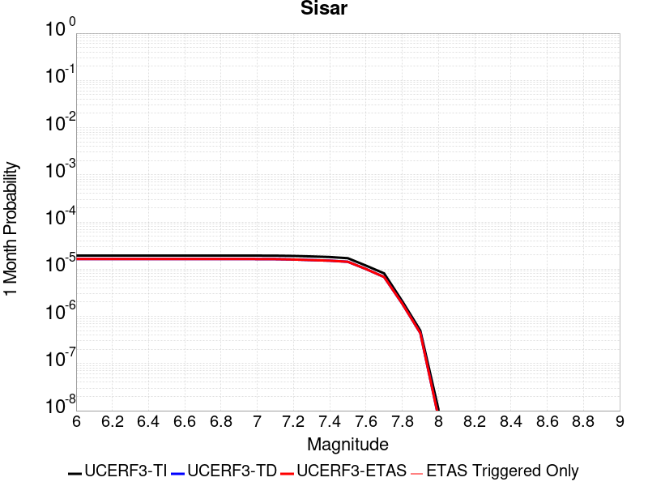 |  |  |

| Magnitude | 1 wk TI Prob | 1 wk TD Prob | 1 wk ETAS Prob | 1 wk ETAS/TD Gain | 1 wk ETAS Triggered Only | 1 mo TI Prob | 1 mo TD Prob | 1 mo ETAS Prob | 1 mo ETAS/TD Gain | 1 mo ETAS Triggered Only | 1 yr TI Prob | 1 yr TD Prob | 1 yr ETAS Prob | 1 yr ETAS/TD Gain | 1 yr ETAS Triggered Only | 10 yr TI Prob | 10 yr TD Prob | 10 yr ETAS Prob | 10 yr ETAS/TD Gain | 10 yr ETAS Triggered Only |
|-----|-----|-----|-----|-----|-----|-----|-----|-----|-----|-----|-----|-----|-----|-----|-----|-----|-----|-----|-----|-----|
| 6.0 | 4.544193E-6 | 3.839576E-6 | 3.839576E-6 | 1.0 | 0.0 | 1.9474966E-5 | 1.6455224E-5 | 1.6455224E-5 | 1.0 | 0.0 | 2.3708193E-4 | 2.0032428E-4 | 2.0032428E-4 | 1.0 | 0.0 | 0.0023682916 | 0.002001471 | 0.002038891 | 1.0186964 | 3.7495312E-5 |
| 6.1 | 4.544193E-6 | 3.839576E-6 | 3.839576E-6 | 1.0 | 0.0 | 1.9474966E-5 | 1.6455224E-5 | 1.6455224E-5 | 1.0 | 0.0 | 2.3708193E-4 | 2.0032428E-4 | 2.0032428E-4 | 1.0 | 0.0 | 0.0023682916 | 0.002001471 | 0.002038891 | 1.0186964 | 3.7495312E-5 |
| 6.2 | 4.544193E-6 | 3.839576E-6 | 3.839576E-6 | 1.0 | 0.0 | 1.9474966E-5 | 1.6455224E-5 | 1.6455224E-5 | 1.0 | 0.0 | 2.3708193E-4 | 2.0032428E-4 | 2.0032428E-4 | 1.0 | 0.0 | 0.0023682916 | 0.002001471 | 0.002038891 | 1.0186964 | 3.7495312E-5 |
| 6.3 | 4.544193E-6 | 3.839576E-6 | 3.839576E-6 | 1.0 | 0.0 | 1.9474966E-5 | 1.6455224E-5 | 1.6455224E-5 | 1.0 | 0.0 | 2.3708193E-4 | 2.0032428E-4 | 2.0032428E-4 | 1.0 | 0.0 | 0.0023682916 | 0.002001471 | 0.002038891 | 1.0186964 | 3.7495312E-5 |
| 6.4 | 4.544193E-6 | 3.839576E-6 | 3.839576E-6 | 1.0 | 0.0 | 1.9474966E-5 | 1.6455224E-5 | 1.6455224E-5 | 1.0 | 0.0 | 2.3708193E-4 | 2.0032428E-4 | 2.0032428E-4 | 1.0 | 0.0 | 0.0023682916 | 0.002001471 | 0.002038891 | 1.0186964 | 3.7495312E-5 |
| 6.5 | 4.544193E-6 | 3.839576E-6 | 3.839576E-6 | 1.0 | 0.0 | 1.9474966E-5 | 1.6455224E-5 | 1.6455224E-5 | 1.0 | 0.0 | 2.3708193E-4 | 2.0032428E-4 | 2.0032428E-4 | 1.0 | 0.0 | 0.0023682916 | 0.002001471 | 0.002038891 | 1.0186964 | 3.7495312E-5 |
| 6.6 | 4.544193E-6 | 3.839576E-6 | 3.839576E-6 | 1.0 | 0.0 | 1.9474966E-5 | 1.6455224E-5 | 1.6455224E-5 | 1.0 | 0.0 | 2.3708193E-4 | 2.0032428E-4 | 2.0032428E-4 | 1.0 | 0.0 | 0.0023682916 | 0.002001471 | 0.002038891 | 1.0186964 | 3.7495312E-5 |
| 6.7 | 4.544193E-6 | 3.839576E-6 | 3.839576E-6 | 1.0 | 0.0 | 1.9474966E-5 | 1.6455224E-5 | 1.6455224E-5 | 1.0 | 0.0 | 2.3708193E-4 | 2.0032428E-4 | 2.0032428E-4 | 1.0 | 0.0 | 0.0023682916 | 0.002001471 | 0.002038891 | 1.0186964 | 3.7495312E-5 |
| 6.8 | 4.544193E-6 | 3.839576E-6 | 3.839576E-6 | 1.0 | 0.0 | 1.9474966E-5 | 1.6455224E-5 | 1.6455224E-5 | 1.0 | 0.0 | 2.3708193E-4 | 2.0032428E-4 | 2.0032428E-4 | 1.0 | 0.0 | 0.0023682916 | 0.002001471 | 0.002038891 | 1.0186964 | 3.7495312E-5 |
| 6.9 | 4.542225E-6 | 3.8375383E-6 | 3.8375383E-6 | 1.0 | 0.0 | 1.9466532E-5 | 1.6446491E-5 | 1.6446491E-5 | 1.0 | 0.0 | 2.3697925E-4 | 2.0021795E-4 | 2.0021795E-4 | 1.0 | 0.0 | 0.002367267 | 0.0020004094 | 0.0020378297 | 1.0187063 | 3.7495312E-5 |
| 7.0 | 4.5278484E-6 | 3.822602E-6 | 3.822602E-6 | 1.0 | 0.0 | 1.940492E-5 | 1.638248E-5 | 1.638248E-5 | 1.0 | 0.0 | 2.3622929E-4 | 1.9943877E-4 | 1.9943877E-4 | 1.0 | 0.0 | 0.0023597833 | 0.0019926317 | 0.0020300522 | 1.0187795 | 3.7495312E-5 |
| 7.1 | 4.5132488E-6 | 3.8073897E-6 | 3.8073897E-6 | 1.0 | 0.0 | 1.9342351E-5 | 1.6317284E-5 | 1.6317284E-5 | 1.0 | 0.0 | 2.3546767E-4 | 1.9864515E-4 | 1.9864515E-4 | 1.0 | 0.0 | 0.0023521832 | 0.0019847096 | 0.0020221306 | 1.0188546 | 3.7495312E-5 |
| 7.2 | 4.448859E-6 | 3.7398502E-6 | 3.7398502E-6 | 1.0 | 0.0 | 1.9066398E-5 | 1.6027832E-5 | 1.6027832E-5 | 1.0 | 0.0 | 2.3210866E-4 | 1.9512173E-4 | 1.9512173E-4 | 1.0 | 0.0 | 0.0023186638 | 0.0019495375 | 0.0019869597 | 1.0191954 | 3.7495312E-5 |
| 7.3 | 4.3424366E-6 | 3.6336846E-6 | 3.6336846E-6 | 1.0 | 0.0 | 1.861031E-5 | 1.5572843E-5 | 1.5572843E-5 | 1.0 | 0.0 | 2.2655698E-4 | 1.895832E-4 | 1.895832E-4 | 1.0 | 0.0 | 0.0022632615 | 0.0018942481 | 0.0019316725 | 1.0197568 | 3.7495312E-5 |
| 7.4 | 4.218641E-6 | 3.5330384E-6 | 3.5330384E-6 | 1.0 | 0.0 | 1.8079765E-5 | 1.5141507E-5 | 1.5141507E-5 | 1.0 | 0.0 | 2.2009891E-4 | 1.8433259E-4 | 1.8433259E-4 | 1.0 | 0.0 | 0.0021988105 | 0.0018418302 | 0.0018792565 | 1.0203202 | 3.7495312E-5 |
| 7.5 | 3.983779E-6 | 3.3478068E-6 | 3.3478068E-6 | 1.0 | 0.0 | 1.7073227E-5 | 1.4347666E-5 | 1.4347666E-5 | 1.0 | 0.0 | 2.0784672E-4 | 1.7466917E-4 | 1.7466917E-4 | 1.0 | 0.0 | 0.0020765243 | 0.0017453518 | 0.0017827817 | 1.0214455 | 3.7495312E-5 |
| 7.6 | 2.777393E-6 | 2.35225E-6 | 2.35225E-6 | 1.0 | 0.0 | 1.1903058E-5 | 1.0081033E-5 | 1.0081033E-5 | 1.0 | 0.0 | 1.449101E-4 | 1.2272975E-4 | 1.2272975E-4 | 1.0 | 0.0 | 0.0014481564 | 0.0012266274 | 0.0012640767 | 1.0305303 | 3.7495312E-5 |
| 7.7 | 1.9028433E-6 | 1.593867E-6 | 1.593867E-6 | 1.0 | 0.0 | 8.155017E-6 | 6.8308404E-6 | 6.8308404E-6 | 1.0 | 0.0 | 9.928281E-5 | 8.3162355E-5 | 8.3162355E-5 | 1.0 | 0.0 | 9.923846E-4 | 8.313171E-4 | 8.6878124E-4 | 1.045066 | 3.7495312E-5 |
| 7.8 | 4.9095956E-7 | 4.3583708E-7 | 4.3583708E-7 | 1.0 | 0.0 | 2.1041105E-6 | 1.8678718E-6 | 1.8678718E-6 | 1.0 | 0.0 | 2.5617246E-5 | 2.2741104E-5 | 2.2741104E-5 | 1.0 | 0.0 | 2.5614293E-4 | 2.2738794E-4 | 2.2738794E-4 | 1.0 | 0.0 |
| 7.9 | 1.16657894E-7 | 1.0335569E-7 | 1.0335569E-7 | 1.0 | 0.0 | 4.999623E-7 | 4.4295288E-7 | 4.4295288E-7 | 1.0 | 0.0 | 6.087024E-6 | 5.3929384E-6 | 5.3929384E-6 | 1.0 | 0.0 | 6.0868573E-5 | 5.3928103E-5 | 5.3928103E-5 | 1.0 | 0.0 |
| 8.0 | 2.5100346E-9 | 1.7067566E-9 | 1.7067566E-9 | 1.0 | 0.0 | 1.0757291E-8 | 7.3146724E-9 | 7.3146724E-9 | 1.0 | 0.0 | 1.3097001E-7 | 8.905613E-8 | 8.905613E-8 | 1.0 | 0.0 | 1.3096993E-6 | 8.9056095E-7 | 8.9056095E-7 | 1.0 | 0.0 |

## Malibu Coast (Extension) alt 1
*[(top)](#table-of-contents)*

| 1 Week | 1 Month | 1 Year | 10 Year |
|-----|-----|-----|-----|
|  |  |  |  |

| Magnitude | 1 wk TI Prob | 1 wk TD Prob | 1 wk ETAS Prob | 1 wk ETAS/TD Gain | 1 wk ETAS Triggered Only | 1 mo TI Prob | 1 mo TD Prob | 1 mo ETAS Prob | 1 mo ETAS/TD Gain | 1 mo ETAS Triggered Only | 1 yr TI Prob | 1 yr TD Prob | 1 yr ETAS Prob | 1 yr ETAS/TD Gain | 1 yr ETAS Triggered Only | 10 yr TI Prob | 10 yr TD Prob | 10 yr ETAS Prob | 10 yr ETAS/TD Gain | 10 yr ETAS Triggered Only |
|-----|-----|-----|-----|-----|-----|-----|-----|-----|-----|-----|-----|-----|-----|-----|-----|-----|-----|-----|-----|-----|
| 6.0 | 8.930738E-6 | 9.329276E-6 | 9.329276E-6 | 1.0 | 0.0 | 3.827403E-5 | 3.998201E-5 | 3.998201E-5 | 1.0 | 0.0 | 4.6588664E-4 | 4.8667393E-4 | 5.24151E-4 | 1.0770065 | 3.7495312E-5 | 0.0046491115 | 0.004856264 | 0.004893577 | 1.0076835 | 3.7495312E-5 |
| 6.1 | 7.199952E-6 | 7.5302964E-6 | 7.5302964E-6 | 1.0 | 0.0 | 3.0856572E-5 | 3.2272303E-5 | 3.2272303E-5 | 1.0 | 0.0 | 3.75614E-4 | 3.9284505E-4 | 4.3032563E-4 | 1.0954081 | 3.7495312E-5 | 0.0037497976 | 0.003921572 | 0.0039589205 | 1.0095237 | 3.7495312E-5 |
| 6.2 | 6.3721413E-6 | 6.6667917E-6 | 6.6667917E-6 | 1.0 | 0.0 | 2.7308892E-5 | 2.8571652E-5 | 2.8571652E-5 | 1.0 | 0.0 | 3.3243504E-4 | 3.4780471E-4 | 3.8528698E-4 | 1.1077682 | 3.7495312E-5 | 0.0033193815 | 0.0034726437 | 0.0035100088 | 1.0107598 | 3.7495312E-5 |
| 6.3 | 6.016345E-6 | 6.295158E-6 | 6.295158E-6 | 1.0 | 0.0 | 2.578408E-5 | 2.6978973E-5 | 2.6978973E-5 | 1.0 | 0.0 | 3.1387596E-4 | 3.2841982E-4 | 3.6590282E-4 | 1.1141313 | 3.7495312E-5 | 0.00313433 | 0.0032793807 | 0.003316753 | 1.0113962 | 3.7495312E-5 |
| 6.4 | 5.8104883E-6 | 6.0795446E-6 | 6.0795446E-6 | 1.0 | 0.0 | 2.4901856E-5 | 2.6054933E-5 | 2.6054933E-5 | 1.0 | 0.0 | 3.031379E-4 | 3.1717293E-4 | 3.5465637E-4 | 1.1181798 | 3.7495312E-5 | 0.0030272473 | 0.0031672374 | 0.003204614 | 1.011801 | 3.7495312E-5 |
| 6.5 | 5.476925E-6 | 5.7275133E-6 | 5.7275133E-6 | 1.0 | 0.0 | 2.3472323E-5 | 2.4546256E-5 | 2.4546256E-5 | 1.0 | 0.0 | 2.8573806E-4 | 2.9880996E-4 | 3.362941E-4 | 1.1254447 | 3.7495312E-5 | 0.0028537093 | 0.002984114 | 0.0030214973 | 1.0125275 | 3.7495312E-5 |
| 6.6 | 5.222387E-6 | 5.45858E-6 | 5.45858E-6 | 1.0 | 0.0 | 2.2381464E-5 | 2.3393704E-5 | 2.3393704E-5 | 1.0 | 0.0 | 2.7246025E-4 | 2.8478142E-4 | 3.2226605E-4 | 1.131626 | 3.7495312E-5 | 0.0027212645 | 0.0028441956 | 0.0028815842 | 1.0131456 | 3.7495312E-5 |
| 6.7 | 5.0337076E-6 | 5.259103E-6 | 5.259103E-6 | 1.0 | 0.0 | 2.1572854E-5 | 2.253882E-5 | 2.253882E-5 | 1.0 | 0.0 | 2.6261783E-4 | 2.7437587E-4 | 3.118609E-4 | 1.1366192 | 3.7495312E-5 | 0.002623077 | 0.002740401 | 0.0027777937 | 1.0136449 | 3.7495312E-5 |
| 6.8 | 4.5675624E-6 | 4.7587164E-6 | 4.7587164E-6 | 1.0 | 0.0 | 1.9575122E-5 | 2.039434E-5 | 2.039434E-5 | 1.0 | 0.0 | 2.3830103E-4 | 2.48273E-4 | 2.85759E-4 | 1.150987 | 3.7495312E-5 | 0.0023804565 | 0.002479976 | 0.0025173782 | 1.0150818 | 3.7495312E-5 |
| 6.9 | 4.2802412E-6 | 4.4520207E-6 | 4.4520207E-6 | 1.0 | 0.0 | 1.8343762E-5 | 1.907995E-5 | 1.907995E-5 | 1.0 | 0.0 | 2.2331243E-4 | 2.3227377E-4 | 2.6976038E-4 | 1.1613897 | 3.7495312E-5 | 0.0022308815 | 0.0023203269 | 0.002357735 | 1.016122 | 3.7495312E-5 |
| 7.0 | 3.9794063E-6 | 4.130099E-6 | 4.130099E-6 | 1.0 | 0.0 | 1.7054486E-5 | 1.7700306E-5 | 1.7700306E-5 | 1.0 | 0.0 | 2.0761859E-4 | 2.1548003E-4 | 2.5296726E-4 | 1.1739708 | 3.7495312E-5 | 0.0020742472 | 0.0021527244 | 0.0021901391 | 1.0173801 | 3.7495312E-5 |
| 7.1 | 3.7730424E-6 | 3.911217E-6 | 3.911217E-6 | 1.0 | 0.0 | 1.6170083E-5 | 1.6762251E-5 | 1.6762251E-5 | 1.0 | 0.0 | 1.9685295E-4 | 2.0406142E-4 | 2.4154909E-4 | 1.1837077 | 3.7495312E-5 | 0.0019667868 | 0.0020387534 | 0.0020761723 | 1.0183538 | 3.7495312E-5 |
| 7.2 | 3.424985E-6 | 3.541337E-6 | 3.541337E-6 | 1.0 | 0.0 | 1.4678424E-5 | 1.5177071E-5 | 1.5177071E-5 | 1.0 | 0.0 | 1.7869516E-4 | 1.8476529E-4 | 2.2225367E-4 | 1.2028973 | 3.7495312E-5 | 0.0017855153 | 0.0018461287 | 0.0018835549 | 1.0202727 | 3.7495312E-5 |
| 7.3 | 2.6966375E-6 | 2.7596534E-6 | 2.7596534E-6 | 1.0 | 0.0 | 1.15569665E-5 | 1.1827032E-5 | 1.1827032E-5 | 1.0 | 0.0 | 1.4069698E-4 | 1.4398464E-4 | 1.8147455E-4 | 1.2603744 | 3.7495312E-5 | 0.0014060794 | 0.0014389176 | 0.001476359 | 1.0260205 | 3.7495312E-5 |
| 7.4 | 2.215957E-6 | 2.249378E-6 | 2.249378E-6 | 1.0 | 0.0 | 9.496924E-6 | 9.640156E-6 | 9.640156E-6 | 1.0 | 0.0 | 1.1561892E-4 | 1.17362615E-4 | 1.5485352E-4 | 1.3194451 | 3.7495312E-5 | 0.0011555878 | 0.0011730101 | 0.0012104614 | 1.0319276 | 3.7495312E-5 |
| 7.5 | 1.2040218E-6 | 1.2219067E-6 | 1.2219067E-6 | 1.0 | 0.0 | 5.160083E-6 | 5.2367322E-6 | 5.2367322E-6 | 1.0 | 0.0 | 6.2822204E-5 | 6.375537E-5 | 6.375537E-5 | 1.0 | 0.0 | 6.280445E-4 | 6.3737266E-4 | 6.3737266E-4 | 1.0 | 0.0 |
| 7.6 | 6.6157446E-7 | 6.678975E-7 | 6.678975E-7 | 1.0 | 0.0 | 2.835316E-6 | 2.8624147E-6 | 2.8624147E-6 | 1.0 | 0.0 | 3.4519428E-5 | 3.484936E-5 | 3.484936E-5 | 1.0 | 0.0 | 3.4514067E-4 | 3.4844046E-4 | 3.4844046E-4 | 1.0 | 0.0 |
| 7.7 | 2.6012302E-7 | 2.4357593E-7 | 2.4357593E-7 | 1.0 | 0.0 | 1.1148124E-6 | 1.0438964E-6 | 1.0438964E-6 | 1.0 | 0.0 | 1.3572758E-5 | 1.2709375E-5 | 1.2709375E-5 | 1.0 | 0.0 | 1.3571928E-4 | 1.2708755E-4 | 1.2708755E-4 | 1.0 | 0.0 |
| 7.8 | 2.8323132E-8 | 2.0266649E-8 | 2.0266649E-8 | 1.0 | 0.0 | 1.2138484E-7 | 8.685707E-8 | 8.685707E-8 | 1.0 | 0.0 | 1.4778595E-6 | 1.0574844E-6 | 1.0574844E-6 | 1.0 | 0.0 | 1.4778497E-5 | 1.0574801E-5 | 1.0574801E-5 | 1.0 | 0.0 |

## Elmore Ranch
*[(top)](#table-of-contents)*

| 1 Week | 1 Month | 1 Year | 10 Year |
|-----|-----|-----|-----|
|  |  |  |  |

| Magnitude | 1 wk TI Prob | 1 wk TD Prob | 1 wk ETAS Prob | 1 wk ETAS/TD Gain | 1 wk ETAS Triggered Only | 1 mo TI Prob | 1 mo TD Prob | 1 mo ETAS Prob | 1 mo ETAS/TD Gain | 1 mo ETAS Triggered Only | 1 yr TI Prob | 1 yr TD Prob | 1 yr ETAS Prob | 1 yr ETAS/TD Gain | 1 yr ETAS Triggered Only | 10 yr TI Prob | 10 yr TD Prob | 10 yr ETAS Prob | 10 yr ETAS/TD Gain | 10 yr ETAS Triggered Only |
|-----|-----|-----|-----|-----|-----|-----|-----|-----|-----|-----|-----|-----|-----|-----|-----|-----|-----|-----|-----|-----|
| 6.0 | 9.102099E-5 | 8.952015E-5 | 8.952015E-5 | 1.0 | 0.0 | 3.9003167E-4 | 3.8361453E-4 | 3.8361453E-4 | 1.0 | 0.0 | 0.0047383 | 0.004662009 | 0.0046993294 | 1.0080053 | 3.7495312E-5 | 0.046385348 | 0.045870975 | 0.04590675 | 1.0007799 | 3.7495312E-5 |
| 6.1 | 3.8306698E-5 | 4.1498504E-5 | 4.1498504E-5 | 1.0 | 0.0 | 1.6416123E-4 | 1.7784268E-4 | 1.7784268E-4 | 1.0 | 0.0 | 0.0019968306 | 0.0021631396 | 0.002200554 | 1.0172962 | 3.7495312E-5 | 0.019789828 | 0.021628205 | 0.02166489 | 1.0016961 | 3.7495312E-5 |
| 6.2 | 3.8306698E-5 | 4.1498504E-5 | 4.1498504E-5 | 1.0 | 0.0 | 1.6416123E-4 | 1.7784268E-4 | 1.7784268E-4 | 1.0 | 0.0 | 0.0019968306 | 0.0021631396 | 0.002200554 | 1.0172962 | 3.7495312E-5 | 0.019789828 | 0.021628205 | 0.02166489 | 1.0016961 | 3.7495312E-5 |
| 6.3 | 3.3197924E-5 | 3.6554302E-5 | 3.6554302E-5 | 1.0 | 0.0 | 1.4226905E-4 | 1.5665586E-4 | 1.5665586E-4 | 1.0 | 0.0 | 0.0017307495 | 0.001905917 | 0.0019433409 | 1.0196356 | 3.7495312E-5 | 0.017173318 | 0.01908996 | 0.01912674 | 1.0019267 | 3.7495312E-5 |
| 6.4 | 2.5148964E-5 | 2.7420487E-5 | 2.7420487E-5 | 1.0 | 0.0 | 1.0777682E-4 | 1.17514726E-4 | 1.17514726E-4 | 1.0 | 0.0 | 0.0013113929 | 0.0014304507 | 0.0014678924 | 1.0261748 | 3.7495312E-5 | 0.01303681 | 0.014387194 | 0.01442415 | 1.0025687 | 3.7495312E-5 |
| 6.5 | 2.5148964E-5 | 2.7420487E-5 | 2.7420487E-5 | 1.0 | 0.0 | 1.0777682E-4 | 1.17514726E-4 | 1.17514726E-4 | 1.0 | 0.0 | 0.0013113929 | 0.0014304507 | 0.0014678924 | 1.0261748 | 3.7495312E-5 | 0.01303681 | 0.014387194 | 0.01442415 | 1.0025687 | 3.7495312E-5 |

## Mono Lake 2011 CFM
*[(top)](#table-of-contents)*

| 1 Week | 1 Month | 1 Year | 10 Year |
|-----|-----|-----|-----|
| 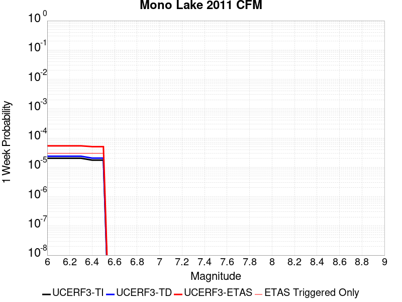 |  | 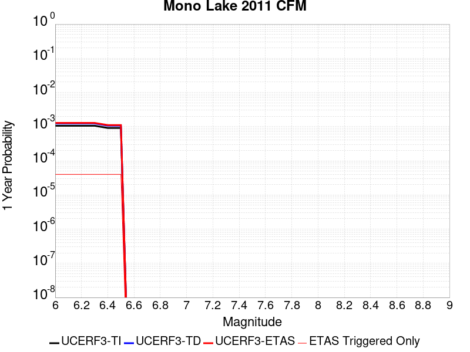 |  |

| Magnitude | 1 wk TI Prob | 1 wk TD Prob | 1 wk ETAS Prob | 1 wk ETAS/TD Gain | 1 wk ETAS Triggered Only | 1 mo TI Prob | 1 mo TD Prob | 1 mo ETAS Prob | 1 mo ETAS/TD Gain | 1 mo ETAS Triggered Only | 1 yr TI Prob | 1 yr TD Prob | 1 yr ETAS Prob | 1 yr ETAS/TD Gain | 1 yr ETAS Triggered Only | 10 yr TI Prob | 10 yr TD Prob | 10 yr ETAS Prob | 10 yr ETAS/TD Gain | 10 yr ETAS Triggered Only |
|-----|-----|-----|-----|-----|-----|-----|-----|-----|-----|-----|-----|-----|-----|-----|-----|-----|-----|-----|-----|-----|
| 6.0 | 2.0341662E-5 | 2.3828166E-5 | 6.1322586E-5 | 2.5735335 | 3.7495312E-5 | 8.717564E-5 | 1.0211971E-4 | 1.3961119E-4 | 1.3671327 | 3.7495312E-5 | 0.0010608466 | 0.0012431298 | 0.0012805786 | 1.0301245 | 3.7495312E-5 | 0.010557966 | 0.012413835 | 0.012450865 | 1.002983 | 3.7495312E-5 |
| 6.1 | 2.0341662E-5 | 2.3828166E-5 | 6.1322586E-5 | 2.5735335 | 3.7495312E-5 | 8.717564E-5 | 1.0211971E-4 | 1.3961119E-4 | 1.3671327 | 3.7495312E-5 | 0.0010608466 | 0.0012431298 | 0.0012805786 | 1.0301245 | 3.7495312E-5 | 0.010557966 | 0.012413835 | 0.012450865 | 1.002983 | 3.7495312E-5 |
| 6.2 | 2.0341662E-5 | 2.3828166E-5 | 6.1322586E-5 | 2.5735335 | 3.7495312E-5 | 8.717564E-5 | 1.0211971E-4 | 1.3961119E-4 | 1.3671327 | 3.7495312E-5 | 0.0010608466 | 0.0012431298 | 0.0012805786 | 1.0301245 | 3.7495312E-5 | 0.010557966 | 0.012413835 | 0.012450865 | 1.002983 | 3.7495312E-5 |
| 6.3 | 2.0341662E-5 | 2.3828166E-5 | 6.1322586E-5 | 2.5735335 | 3.7495312E-5 | 8.717564E-5 | 1.0211971E-4 | 1.3961119E-4 | 1.3671327 | 3.7495312E-5 | 0.0010608466 | 0.0012431298 | 0.0012805786 | 1.0301245 | 3.7495312E-5 | 0.010557966 | 0.012413835 | 0.012450865 | 1.002983 | 3.7495312E-5 |
| 6.4 | 1.749821E-5 | 2.0490985E-5 | 5.798553E-5 | 2.8298068 | 3.7495312E-5 | 7.499018E-5 | 8.781851E-5 | 1.2531053E-4 | 1.4269261 | 3.7495312E-5 | 9.1262296E-4 | 0.0010691903 | 0.0011066456 | 1.0350314 | 3.7495312E-5 | 0.009088841 | 0.010691865 | 0.010728959 | 1.0034693 | 3.7495312E-5 |
| 6.5 | 1.749821E-5 | 2.0490985E-5 | 5.798553E-5 | 2.8298068 | 3.7495312E-5 | 7.499018E-5 | 8.781851E-5 | 1.2531053E-4 | 1.4269261 | 3.7495312E-5 | 9.1262296E-4 | 0.0010691903 | 0.0011066456 | 1.0350314 | 3.7495312E-5 | 0.009088841 | 0.010691865 | 0.010728959 | 1.0034693 | 3.7495312E-5 |

## Great Valley 07 (Orestimba)
*[(top)](#table-of-contents)*

| 1 Week | 1 Month | 1 Year | 10 Year |
|-----|-----|-----|-----|
|  |  |  |  |

| Magnitude | 1 wk TI Prob | 1 wk TD Prob | 1 wk ETAS Prob | 1 wk ETAS/TD Gain | 1 wk ETAS Triggered Only | 1 mo TI Prob | 1 mo TD Prob | 1 mo ETAS Prob | 1 mo ETAS/TD Gain | 1 mo ETAS Triggered Only | 1 yr TI Prob | 1 yr TD Prob | 1 yr ETAS Prob | 1 yr ETAS/TD Gain | 1 yr ETAS Triggered Only | 10 yr TI Prob | 10 yr TD Prob | 10 yr ETAS Prob | 10 yr ETAS/TD Gain | 10 yr ETAS Triggered Only |
|-----|-----|-----|-----|-----|-----|-----|-----|-----|-----|-----|-----|-----|-----|-----|-----|-----|-----|-----|-----|-----|
| 6.0 | 2.9687902E-5 | 3.27575E-5 | 3.27575E-5 | 1.0 | 0.0 | 1.2722766E-4 | 1.4038214E-4 | 1.4038214E-4 | 1.0 | 0.0 | 0.0015478961 | 0.0017078844 | 0.0017078844 | 1.0 | 0.0 | 0.015371585 | 0.016955135 | 0.016991995 | 1.0021739 | 3.7495312E-5 |
| 6.1 | 2.9687902E-5 | 3.27575E-5 | 3.27575E-5 | 1.0 | 0.0 | 1.2722766E-4 | 1.4038214E-4 | 1.4038214E-4 | 1.0 | 0.0 | 0.0015478961 | 0.0017078844 | 0.0017078844 | 1.0 | 0.0 | 0.015371585 | 0.016955135 | 0.016991995 | 1.0021739 | 3.7495312E-5 |
| 6.2 | 1.9231524E-5 | 2.1159167E-5 | 2.1159167E-5 | 1.0 | 0.0 | 8.2418206E-5 | 9.067912E-5 | 9.067912E-5 | 1.0 | 0.0 | 0.0010029797 | 0.0011034822 | 0.0011034822 | 1.0 | 0.0 | 0.00998465 | 0.01098244 | 0.011019524 | 1.0033766 | 3.7495312E-5 |
| 6.3 | 1.324766E-5 | 1.4548534E-5 | 1.4548534E-5 | 1.0 | 0.0 | 5.6774446E-5 | 6.234942E-5 | 6.234942E-5 | 1.0 | 0.0 | 6.910097E-4 | 7.5884897E-4 | 7.5884897E-4 | 1.0 | 0.0 | 0.006888649 | 0.0075635235 | 0.0076007354 | 1.0049199 | 3.7495312E-5 |
| 6.4 | 7.818645E-6 | 8.57284E-6 | 8.57284E-6 | 1.0 | 0.0 | 3.3508048E-5 | 3.6740246E-5 | 3.6740246E-5 | 1.0 | 0.0 | 4.078841E-4 | 4.4722404E-4 | 4.4722404E-4 | 1.0 | 0.0 | 0.004071363 | 0.0044635804 | 0.0044635804 | 1.0 | 0.0 |
| 6.5 | 5.3076565E-6 | 5.8178007E-6 | 5.8178007E-6 | 1.0 | 0.0 | 2.27469E-5 | 2.4933206E-5 | 2.4933206E-5 | 1.0 | 0.0 | 2.7690834E-4 | 3.035216E-4 | 3.035216E-4 | 1.0 | 0.0 | 0.0027656353 | 0.00303128 | 0.00303128 | 1.0 | 0.0 |
| 6.6 | 3.6003578E-6 | 3.9484953E-6 | 3.9484953E-6 | 1.0 | 0.0 | 1.5430012E-5 | 1.6922022E-5 | 1.6922022E-5 | 1.0 | 0.0 | 1.8784421E-4 | 2.0600771E-4 | 2.0600771E-4 | 1.0 | 0.0 | 0.0018768552 | 0.0020583214 | 0.0020583214 | 1.0 | 0.0 |
| 6.7 | 2.5361826E-6 | 2.7834678E-6 | 2.7834678E-6 | 1.0 | 0.0 | 1.0869308E-5 | 1.1929101E-5 | 1.1929101E-5 | 1.0 | 0.0 | 1.3232579E-4 | 1.4522845E-4 | 1.4522845E-4 | 1.0 | 0.0 | 0.0013224703 | 0.0014514653 | 0.0014514653 | 1.0 | 0.0 |
| 6.8 | 1.2115831E-6 | 1.3313797E-6 | 1.3313797E-6 | 1.0 | 0.0 | 5.1924885E-6 | 5.7059065E-6 | 5.7059065E-6 | 1.0 | 0.0 | 6.3216714E-5 | 6.9468166E-5 | 6.9468166E-5 | 1.0 | 0.0 | 6.3198735E-4 | 6.945596E-4 | 6.945596E-4 | 1.0 | 0.0 |

## White Wolf
*[(top)](#table-of-contents)*

| 1 Week | 1 Month | 1 Year | 10 Year |
|-----|-----|-----|-----|
|  |  |  |  |

| Magnitude | 1 wk TI Prob | 1 wk TD Prob | 1 wk ETAS Prob | 1 wk ETAS/TD Gain | 1 wk ETAS Triggered Only | 1 mo TI Prob | 1 mo TD Prob | 1 mo ETAS Prob | 1 mo ETAS/TD Gain | 1 mo ETAS Triggered Only | 1 yr TI Prob | 1 yr TD Prob | 1 yr ETAS Prob | 1 yr ETAS/TD Gain | 1 yr ETAS Triggered Only | 10 yr TI Prob | 10 yr TD Prob | 10 yr ETAS Prob | 10 yr ETAS/TD Gain | 10 yr ETAS Triggered Only |
|-----|-----|-----|-----|-----|-----|-----|-----|-----|-----|-----|-----|-----|-----|-----|-----|-----|-----|-----|-----|-----|
| 6.0 | 2.0037822E-5 | 1.0469162E-6 | 1.0469162E-6 | 1.0 | 0.0 | 8.587355E-5 | 4.486776E-6 | 4.1981923E-5 | 9.3568125 | 3.7495312E-5 | 0.001045009 | 5.4625183E-5 | 9.211845E-5 | 1.6863732 | 3.7495312E-5 | 0.010401085 | 5.461226E-4 | 5.8359746E-4 | 1.0686198 | 3.7495312E-5 |
| 6.1 | 2.0037822E-5 | 1.0469162E-6 | 1.0469162E-6 | 1.0 | 0.0 | 8.587355E-5 | 4.486776E-6 | 4.1981923E-5 | 9.3568125 | 3.7495312E-5 | 0.001045009 | 5.4625183E-5 | 9.211845E-5 | 1.6863732 | 3.7495312E-5 | 0.010401085 | 5.461226E-4 | 5.8359746E-4 | 1.0686198 | 3.7495312E-5 |
| 6.2 | 2.0037822E-5 | 1.0469162E-6 | 1.0469162E-6 | 1.0 | 0.0 | 8.587355E-5 | 4.486776E-6 | 4.1981923E-5 | 9.3568125 | 3.7495312E-5 | 0.001045009 | 5.4625183E-5 | 9.211845E-5 | 1.6863732 | 3.7495312E-5 | 0.010401085 | 5.461226E-4 | 5.8359746E-4 | 1.0686198 | 3.7495312E-5 |
| 6.3 | 2.0037822E-5 | 1.0469162E-6 | 1.0469162E-6 | 1.0 | 0.0 | 8.587355E-5 | 4.486776E-6 | 4.1981923E-5 | 9.3568125 | 3.7495312E-5 | 0.001045009 | 5.4625183E-5 | 9.211845E-5 | 1.6863732 | 3.7495312E-5 | 0.010401085 | 5.461226E-4 | 5.8359746E-4 | 1.0686198 | 3.7495312E-5 |
| 6.4 | 1.132487E-5 | 1.0469162E-6 | 1.0469162E-6 | 1.0 | 0.0 | 4.8534253E-5 | 4.486776E-6 | 4.1981923E-5 | 9.3568125 | 3.7495312E-5 | 5.907443E-4 | 5.4625183E-5 | 9.211845E-5 | 1.6863732 | 3.7495312E-5 | 0.005891764 | 5.461226E-4 | 5.8359746E-4 | 1.0686198 | 3.7495312E-5 |
| 6.5 | 1.132487E-5 | 1.0469162E-6 | 1.0469162E-6 | 1.0 | 0.0 | 4.8534253E-5 | 4.486776E-6 | 4.1981923E-5 | 9.3568125 | 3.7495312E-5 | 5.907443E-4 | 5.4625183E-5 | 9.211845E-5 | 1.6863732 | 3.7495312E-5 | 0.005891764 | 5.461226E-4 | 5.8359746E-4 | 1.0686198 | 3.7495312E-5 |
| 6.6 | 9.347473E-6 | 1.0469162E-6 | 1.0469162E-6 | 1.0 | 0.0 | 4.0059982E-5 | 4.486776E-6 | 4.1981923E-5 | 9.3568125 | 3.7495312E-5 | 4.8762115E-4 | 5.4625183E-5 | 9.211845E-5 | 1.6863732 | 3.7495312E-5 | 0.0048655253 | 5.461226E-4 | 5.8359746E-4 | 1.0686198 | 3.7495312E-5 |
| 6.7 | 7.842647E-6 | 1.0048342E-6 | 1.0048342E-6 | 1.0 | 0.0 | 3.361091E-5 | 4.3064256E-6 | 4.1801577E-5 | 9.706792 | 3.7495312E-5 | 4.0913603E-4 | 5.2429517E-5 | 8.992287E-5 | 1.715119 | 3.7495312E-5 | 0.004083836 | 5.2417646E-4 | 5.616521E-4 | 1.0714943 | 3.7495312E-5 |
| 6.8 | 6.26597E-6 | 9.734822E-7 | 9.734822E-7 | 1.0 | 0.0 | 2.685388E-5 | 4.17206E-6 | 4.1667216E-5 | 9.987205 | 3.7495312E-5 | 3.2689696E-4 | 5.0793697E-5 | 8.828711E-5 | 1.7381508 | 3.7495312E-5 | 0.003264165 | 5.078258E-4 | 5.4530206E-4 | 1.0737975 | 3.7495312E-5 |
| 6.9 | 5.258436E-6 | 9.183254E-7 | 9.183254E-7 | 1.0 | 0.0 | 2.2535958E-5 | 3.9356746E-6 | 4.143084E-5 | 10.5269985 | 3.7495312E-5 | 2.7434074E-4 | 4.7915833E-5 | 8.5409345E-5 | 1.782487 | 3.7495312E-5 | 0.0027400232 | 4.790598E-4 | 5.1653717E-4 | 1.0782311 | 3.7495312E-5 |
| 7.0 | 4.675028E-6 | 8.6611794E-7 | 8.6611794E-7 | 1.0 | 0.0 | 2.003568E-5 | 3.7119291E-6 | 4.1207102E-5 | 11.101264 | 3.7495312E-5 | 2.4390711E-4 | 4.5191846E-5 | 8.268547E-5 | 1.8296545 | 3.7495312E-5 | 0.0024363957 | 4.518313E-4 | 4.8930966E-4 | 1.0829477 | 3.7495312E-5 |
| 7.1 | 2.8270078E-6 | 6.8741696E-7 | 6.8741696E-7 | 1.0 | 0.0 | 1.2115692E-5 | 2.9460696E-6 | 4.044127E-5 | 13.727195 | 3.7495312E-5 | 1.4749856E-4 | 3.5867848E-5 | 7.3361814E-5 | 2.0453365 | 3.7495312E-5 | 0.001474007 | 3.586247E-4 | 3.9610657E-4 | 1.1045156 | 3.7495312E-5 |
| 7.2 | 1.6881406E-6 | 2.2706382E-7 | 2.2706382E-7 | 1.0 | 0.0 | 7.2348685E-6 | 9.731303E-7 | 9.731303E-7 | 1.0 | 0.0 | 8.808096E-5 | 1.1847799E-5 | 1.1847799E-5 | 1.0 | 0.0 | 8.8046055E-4 | 1.1847183E-4 | 1.1847183E-4 | 1.0 | 0.0 |
| 7.3 | 9.086107E-7 | 1.5266386E-7 | 1.5266386E-7 | 1.0 | 0.0 | 3.8940398E-6 | 6.5427355E-7 | 6.5427355E-7 | 1.0 | 0.0 | 4.7408903E-5 | 7.965752E-6 | 7.965752E-6 | 1.0 | 0.0 | 4.739879E-4 | 7.965475E-5 | 7.965475E-5 | 1.0 | 0.0 |
| 7.4 | 1.9717383E-7 | 9.003913E-8 | 9.003913E-8 | 1.0 | 0.0 | 8.450304E-7 | 3.8588192E-7 | 3.8588192E-7 | 1.0 | 0.0 | 1.0288197E-5 | 4.6981027E-6 | 4.6981027E-6 | 1.0 | 0.0 | 1.028772E-4 | 4.6980065E-5 | 4.6980065E-5 | 1.0 | 0.0 |
| 7.5 | 1.086975E-7 | 6.6597195E-8 | 6.6597195E-8 | 1.0 | 0.0 | 4.6584634E-7 | 2.8541652E-7 | 2.8541652E-7 | 1.0 | 0.0 | 5.6716644E-6 | 3.474941E-6 | 3.474941E-6 | 1.0 | 0.0 | 5.6715195E-5 | 3.474889E-5 | 3.474889E-5 | 1.0 | 0.0 |
| 7.6 | 2.4217808E-8 | 1.5820765E-8 | 1.5820765E-8 | 1.0 | 0.0 | 1.03790605E-7 | 6.780328E-8 | 6.780328E-8 | 1.0 | 0.0 | 1.2636499E-6 | 8.255046E-7 | 8.255046E-7 | 1.0 | 0.0 | 1.2636427E-5 | 8.2550205E-6 | 8.2550205E-6 | 1.0 | 0.0 |

## Northridge
*[(top)](#table-of-contents)*

| 1 Week | 1 Month | 1 Year | 10 Year |
|-----|-----|-----|-----|
|  |  |  |  |

| Magnitude | 1 wk TI Prob | 1 wk TD Prob | 1 wk ETAS Prob | 1 wk ETAS/TD Gain | 1 wk ETAS Triggered Only | 1 mo TI Prob | 1 mo TD Prob | 1 mo ETAS Prob | 1 mo ETAS/TD Gain | 1 mo ETAS Triggered Only | 1 yr TI Prob | 1 yr TD Prob | 1 yr ETAS Prob | 1 yr ETAS/TD Gain | 1 yr ETAS Triggered Only | 10 yr TI Prob | 10 yr TD Prob | 10 yr ETAS Prob | 10 yr ETAS/TD Gain | 10 yr ETAS Triggered Only |
|-----|-----|-----|-----|-----|-----|-----|-----|-----|-----|-----|-----|-----|-----|-----|-----|-----|-----|-----|-----|-----|
| 6.0 | 1.8340852E-5 | 7.5880193E-6 | 7.5880193E-6 | 1.0 | 0.0 | 7.860128E-5 | 3.251969E-5 | 3.251969E-5 | 1.0 | 0.0 | 9.565505E-4 | 3.958575E-4 | 3.958575E-4 | 1.0 | 0.0 | 0.009524435 | 0.003951746 | 0.003989093 | 1.0094508 | 3.7495312E-5 |
| 6.1 | 1.8340852E-5 | 7.5880193E-6 | 7.5880193E-6 | 1.0 | 0.0 | 7.860128E-5 | 3.251969E-5 | 3.251969E-5 | 1.0 | 0.0 | 9.565505E-4 | 3.958575E-4 | 3.958575E-4 | 1.0 | 0.0 | 0.009524435 | 0.003951746 | 0.003989093 | 1.0094508 | 3.7495312E-5 |
| 6.2 | 1.8340852E-5 | 7.5880193E-6 | 7.5880193E-6 | 1.0 | 0.0 | 7.860128E-5 | 3.251969E-5 | 3.251969E-5 | 1.0 | 0.0 | 9.565505E-4 | 3.958575E-4 | 3.958575E-4 | 1.0 | 0.0 | 0.009524435 | 0.003951746 | 0.003989093 | 1.0094508 | 3.7495312E-5 |
| 6.3 | 1.8340852E-5 | 7.5880193E-6 | 7.5880193E-6 | 1.0 | 0.0 | 7.860128E-5 | 3.251969E-5 | 3.251969E-5 | 1.0 | 0.0 | 9.565505E-4 | 3.958575E-4 | 3.958575E-4 | 1.0 | 0.0 | 0.009524435 | 0.003951746 | 0.003989093 | 1.0094508 | 3.7495312E-5 |
| 6.4 | 1.7361892E-5 | 7.5880193E-6 | 7.5880193E-6 | 1.0 | 0.0 | 7.440598E-5 | 3.251969E-5 | 3.251969E-5 | 1.0 | 0.0 | 9.055163E-4 | 3.958575E-4 | 3.958575E-4 | 1.0 | 0.0 | 0.009018354 | 0.003951746 | 0.003989093 | 1.0094508 | 3.7495312E-5 |
| 6.5 | 1.7361892E-5 | 7.5880193E-6 | 7.5880193E-6 | 1.0 | 0.0 | 7.440598E-5 | 3.251969E-5 | 3.251969E-5 | 1.0 | 0.0 | 9.055163E-4 | 3.958575E-4 | 3.958575E-4 | 1.0 | 0.0 | 0.009018354 | 0.003951746 | 0.003989093 | 1.0094508 | 3.7495312E-5 |
| 6.6 | 1.5458201E-5 | 7.5880193E-6 | 7.5880193E-6 | 1.0 | 0.0 | 6.624775E-5 | 3.251969E-5 | 3.251969E-5 | 1.0 | 0.0 | 8.0626784E-4 | 3.958575E-4 | 3.958575E-4 | 1.0 | 0.0 | 0.008033488 | 0.003951746 | 0.003989093 | 1.0094508 | 3.7495312E-5 |
| 6.7 | 1.2538368E-5 | 6.381603E-6 | 6.381603E-6 | 1.0 | 0.0 | 5.3734755E-5 | 2.7349442E-5 | 2.7349442E-5 | 1.0 | 0.0 | 6.5402425E-4 | 3.3292902E-4 | 3.3292902E-4 | 1.0 | 0.0 | 0.0065210275 | 0.0033243506 | 0.0033617213 | 1.0112414 | 3.7495312E-5 |
| 6.8 | 1.1438097E-5 | 6.3502566E-6 | 6.3502566E-6 | 1.0 | 0.0 | 4.9019498E-5 | 2.7215105E-5 | 2.7215105E-5 | 1.0 | 0.0 | 5.9664896E-4 | 3.3129397E-4 | 3.3129397E-4 | 1.0 | 0.0 | 0.005950495 | 0.0033080487 | 0.00334542 | 1.0112971 | 3.7495312E-5 |
| 6.9 | 1.1204891E-5 | 6.2867084E-6 | 6.2867084E-6 | 1.0 | 0.0 | 4.8020076E-5 | 2.694276E-5 | 2.694276E-5 | 1.0 | 0.0 | 5.8448757E-4 | 3.2797916E-4 | 3.2797916E-4 | 1.0 | 0.0 | 0.0058295266 | 0.0032749989 | 0.0033123714 | 1.0114114 | 3.7495312E-5 |
| 7.0 | 1.061046E-5 | 6.115359E-6 | 6.115359E-6 | 1.0 | 0.0 | 4.5472607E-5 | 2.6208421E-5 | 2.6208421E-5 | 1.0 | 0.0 | 5.534883E-4 | 3.1904122E-4 | 3.1904122E-4 | 1.0 | 0.0 | 0.0055211177 | 0.0031858785 | 0.0032232543 | 1.0117317 | 3.7495312E-5 |
| 7.1 | 1.0266979E-5 | 6.004274E-6 | 6.004274E-6 | 1.0 | 0.0 | 4.40006E-5 | 2.5732352E-5 | 2.5732352E-5 | 1.0 | 0.0 | 5.355756E-4 | 3.1324677E-4 | 3.1324677E-4 | 1.0 | 0.0 | 0.0053428668 | 0.003128098 | 0.0031654763 | 1.0119491 | 3.7495312E-5 |
| 7.2 | 9.91273E-6 | 5.819984E-6 | 5.819984E-6 | 1.0 | 0.0 | 4.248244E-5 | 2.4942554E-5 | 2.4942554E-5 | 1.0 | 0.0 | 5.171009E-4 | 3.036337E-4 | 3.036337E-4 | 1.0 | 0.0 | 0.0051589934 | 0.0030322333 | 0.003069615 | 1.012328 | 3.7495312E-5 |
| 7.3 | 8.4959265E-6 | 5.193062E-6 | 5.193062E-6 | 1.0 | 0.0 | 3.6410605E-5 | 2.225579E-5 | 2.225579E-5 | 1.0 | 0.0 | 4.4320893E-4 | 2.709308E-4 | 2.709308E-4 | 1.0 | 0.0 | 0.00442326 | 0.0027060313 | 0.0027434253 | 1.0138187 | 3.7495312E-5 |
| 7.4 | 8.0847185E-6 | 4.9819355E-6 | 4.9819355E-6 | 1.0 | 0.0 | 3.4648332E-5 | 2.135098E-5 | 2.135098E-5 | 1.0 | 0.0 | 4.2176177E-4 | 2.599174E-4 | 2.599174E-4 | 1.0 | 0.0 | 0.0042096223 | 0.00259616 | 0.002633558 | 1.0144051 | 3.7495312E-5 |
| 7.5 | 6.8220684E-6 | 4.2533075E-6 | 4.2533075E-6 | 1.0 | 0.0 | 2.9237108E-5 | 1.8228335E-5 | 1.8228335E-5 | 1.0 | 0.0 | 3.5590364E-4 | 2.2190758E-4 | 2.2190758E-4 | 1.0 | 0.0 | 0.0035533418 | 0.002216881 | 0.002254293 | 1.0168761 | 3.7495312E-5 |
| 7.6 | 4.4224143E-6 | 2.8999582E-6 | 2.8999582E-6 | 1.0 | 0.0 | 1.8953066E-5 | 1.2428334E-5 | 1.2428334E-5 | 1.0 | 0.0 | 2.3072914E-4 | 1.5130457E-4 | 1.5130457E-4 | 1.0 | 0.0 | 0.0023048974 | 0.0015120271 | 0.0015494658 | 1.0247606 | 3.7495312E-5 |
| 7.7 | 2.5297056E-6 | 1.6045905E-6 | 1.6045905E-6 | 1.0 | 0.0 | 1.0841551E-5 | 6.8767986E-6 | 6.8767986E-6 | 1.0 | 0.0 | 1.319879E-4 | 8.3721854E-5 | 8.3721854E-5 | 1.0 | 0.0 | 0.0013190953 | 8.369078E-4 | 8.743718E-4 | 1.0447648 | 3.7495312E-5 |
| 7.8 | 1.2508156E-6 | 8.780076E-7 | 8.780076E-7 | 1.0 | 0.0 | 5.3606273E-6 | 3.7628845E-6 | 3.7628845E-6 | 1.0 | 0.0 | 6.526368E-5 | 4.581217E-5 | 4.581217E-5 | 1.0 | 0.0 | 6.524452E-4 | 4.5802852E-4 | 4.5802852E-4 | 1.0 | 0.0 |
| 7.9 | 2.262199E-7 | 1.4664671E-7 | 1.4664671E-7 | 1.0 | 0.0 | 9.695135E-7 | 6.284858E-7 | 6.284858E-7 | 1.0 | 0.0 | 1.1803763E-5 | 7.651788E-6 | 7.651788E-6 | 1.0 | 0.0 | 1.1803136E-4 | 7.651533E-5 | 7.651533E-5 | 1.0 | 0.0 |
| 8.0 | 2.865362E-9 | 1.2753101E-9 | 1.2753101E-9 | 1.0 | 0.0 | 1.2280123E-8 | 5.4656146E-9 | 5.4656146E-9 | 1.0 | 0.0 | 1.4951048E-7 | 6.654386E-8 | 6.654386E-8 | 1.0 | 0.0 | 1.4951038E-6 | 6.654386E-7 | 6.654386E-7 | 1.0 | 0.0 |

## Peralta Hills
*[(top)](#table-of-contents)*

| 1 Week | 1 Month | 1 Year | 10 Year |
|-----|-----|-----|-----|
|  |  |  |  |

| Magnitude | 1 wk TI Prob | 1 wk TD Prob | 1 wk ETAS Prob | 1 wk ETAS/TD Gain | 1 wk ETAS Triggered Only | 1 mo TI Prob | 1 mo TD Prob | 1 mo ETAS Prob | 1 mo ETAS/TD Gain | 1 mo ETAS Triggered Only | 1 yr TI Prob | 1 yr TD Prob | 1 yr ETAS Prob | 1 yr ETAS/TD Gain | 1 yr ETAS Triggered Only | 10 yr TI Prob | 10 yr TD Prob | 10 yr ETAS Prob | 10 yr ETAS/TD Gain | 10 yr ETAS Triggered Only |
|-----|-----|-----|-----|-----|-----|-----|-----|-----|-----|-----|-----|-----|-----|-----|-----|-----|-----|-----|-----|-----|
| 6.0 | 3.8850067E-6 | 3.839512E-6 | 3.839512E-6 | 1.0 | 0.0 | 1.6649923E-5 | 1.645499E-5 | 5.3949683E-5 | 3.278622 | 3.7495312E-5 | 2.0269395E-4 | 2.0032849E-4 | 2.3781629E-4 | 1.1871316 | 3.7495312E-5 | 0.0020250916 | 0.0020022066 | 0.002039627 | 1.0186895 | 3.7495312E-5 |
| 6.1 | 3.8850067E-6 | 3.839512E-6 | 3.839512E-6 | 1.0 | 0.0 | 1.6649923E-5 | 1.645499E-5 | 5.3949683E-5 | 3.278622 | 3.7495312E-5 | 2.0269395E-4 | 2.0032849E-4 | 2.3781629E-4 | 1.1871316 | 3.7495312E-5 | 0.0020250916 | 0.0020022066 | 0.002039627 | 1.0186895 | 3.7495312E-5 |
| 6.2 | 3.8850067E-6 | 3.839512E-6 | 3.839512E-6 | 1.0 | 0.0 | 1.6649923E-5 | 1.645499E-5 | 5.3949683E-5 | 3.278622 | 3.7495312E-5 | 2.0269395E-4 | 2.0032849E-4 | 2.3781629E-4 | 1.1871316 | 3.7495312E-5 | 0.0020250916 | 0.0020022066 | 0.002039627 | 1.0186895 | 3.7495312E-5 |
| 6.3 | 3.8850067E-6 | 3.839512E-6 | 3.839512E-6 | 1.0 | 0.0 | 1.6649923E-5 | 1.645499E-5 | 5.3949683E-5 | 3.278622 | 3.7495312E-5 | 2.0269395E-4 | 2.0032849E-4 | 2.3781629E-4 | 1.1871316 | 3.7495312E-5 | 0.0020250916 | 0.0020022066 | 0.002039627 | 1.0186895 | 3.7495312E-5 |
| 6.4 | 3.8850067E-6 | 3.839512E-6 | 3.839512E-6 | 1.0 | 0.0 | 1.6649923E-5 | 1.645499E-5 | 5.3949683E-5 | 3.278622 | 3.7495312E-5 | 2.0269395E-4 | 2.0032849E-4 | 2.3781629E-4 | 1.1871316 | 3.7495312E-5 | 0.0020250916 | 0.0020022066 | 0.002039627 | 1.0186895 | 3.7495312E-5 |
| 6.5 | 1.5587785E-6 | 1.4430796E-6 | 1.4430796E-6 | 1.0 | 0.0 | 6.6804623E-6 | 6.184613E-6 | 6.184613E-6 | 1.0 | 0.0 | 8.133159E-5 | 7.529531E-5 | 7.529531E-5 | 1.0 | 0.0 | 8.1301836E-4 | 7.52722E-4 | 7.52722E-4 | 1.0 | 0.0 |
| 6.6 | 1.5587785E-6 | 1.4430796E-6 | 1.4430796E-6 | 1.0 | 0.0 | 6.6804623E-6 | 6.184613E-6 | 6.184613E-6 | 1.0 | 0.0 | 8.133159E-5 | 7.529531E-5 | 7.529531E-5 | 1.0 | 0.0 | 8.1301836E-4 | 7.52722E-4 | 7.52722E-4 | 1.0 | 0.0 |
| 6.7 | 1.5018579E-6 | 1.3837022E-6 | 1.3837022E-6 | 1.0 | 0.0 | 6.436518E-6 | 5.93014E-6 | 5.93014E-6 | 1.0 | 0.0 | 7.836179E-5 | 7.21973E-5 | 7.21973E-5 | 1.0 | 0.0 | 7.833416E-4 | 7.21762E-4 | 7.21762E-4 | 1.0 | 0.0 |
| 6.8 | 1.4584314E-6 | 1.3381342E-6 | 1.3381342E-6 | 1.0 | 0.0 | 6.250405E-6 | 5.7348498E-6 | 5.7348498E-6 | 1.0 | 0.0 | 7.6096025E-5 | 6.98198E-5 | 6.98198E-5 | 1.0 | 0.0 | 7.6069974E-4 | 6.98002E-4 | 6.98002E-4 | 1.0 | 0.0 |
| 6.9 | 1.1382393E-6 | 9.862285E-7 | 9.862285E-7 | 1.0 | 0.0 | 4.8781594E-6 | 4.226687E-6 | 4.226687E-6 | 1.0 | 0.0 | 5.9389975E-5 | 5.1458785E-5 | 5.1458785E-5 | 1.0 | 0.0 | 5.93741E-4 | 5.144769E-4 | 5.144769E-4 | 1.0 | 0.0 |
| 7.0 | 9.970413E-7 | 8.309642E-7 | 8.309642E-7 | 1.0 | 0.0 | 4.273027E-6 | 3.561271E-6 | 3.561271E-6 | 1.0 | 0.0 | 5.2022864E-5 | 4.335768E-5 | 4.335768E-5 | 1.0 | 0.0 | 5.2010687E-4 | 4.33499E-4 | 4.33499E-4 | 1.0 | 0.0 |
| 7.1 | 9.684443E-7 | 7.99408E-7 | 7.99408E-7 | 1.0 | 0.0 | 4.150469E-6 | 3.4260302E-6 | 3.4260302E-6 | 1.0 | 0.0 | 5.053079E-5 | 4.1711188E-5 | 4.1711188E-5 | 1.0 | 0.0 | 5.05193E-4 | 4.170403E-4 | 4.170403E-4 | 1.0 | 0.0 |
| 7.2 | 9.240811E-7 | 7.5031426E-7 | 7.5031426E-7 | 1.0 | 0.0 | 3.960342E-6 | 3.215629E-6 | 3.215629E-6 | 1.0 | 0.0 | 4.8216094E-5 | 3.9149647E-5 | 3.9149647E-5 | 1.0 | 0.0 | 4.8205635E-4 | 3.9143403E-4 | 3.9143403E-4 | 1.0 | 0.0 |
| 7.3 | 8.158643E-7 | 6.350017E-7 | 6.350017E-7 | 1.0 | 0.0 | 3.4965567E-6 | 2.7214332E-6 | 2.7214332E-6 | 1.0 | 0.0 | 4.2569747E-5 | 3.313301E-5 | 3.313301E-5 | 1.0 | 0.0 | 4.2561593E-4 | 3.3128684E-4 | 3.3128684E-4 | 1.0 | 0.0 |
| 7.4 | 6.3822824E-7 | 4.7957286E-7 | 4.7957286E-7 | 1.0 | 0.0 | 2.7352612E-6 | 2.0553111E-6 | 2.0553111E-6 | 1.0 | 0.0 | 3.3301294E-5 | 2.5023177E-5 | 2.5023177E-5 | 1.0 | 0.0 | 3.3296304E-4 | 2.5020874E-4 | 2.5020874E-4 | 1.0 | 0.0 |
| 7.5 | 4.0292628E-7 | 2.7846056E-7 | 2.7846056E-7 | 1.0 | 0.0 | 1.7268258E-6 | 1.193402E-6 | 1.193402E-6 | 1.0 | 0.0 | 2.1023901E-5 | 1.4529601E-5 | 1.4529601E-5 | 1.0 | 0.0 | 2.1021912E-4 | 1.452893E-4 | 1.452893E-4 | 1.0 | 0.0 |
| 7.6 | 3.672993E-7 | 2.485495E-7 | 2.485495E-7 | 1.0 | 0.0 | 1.5741389E-6 | 1.0652118E-6 | 1.0652118E-6 | 1.0 | 0.0 | 1.9164972E-5 | 1.2968904E-5 | 1.2968904E-5 | 1.0 | 0.0 | 1.916332E-4 | 1.296842E-4 | 1.296842E-4 | 1.0 | 0.0 |
| 7.7 | 2.8466823E-7 | 1.7859877E-7 | 1.7859877E-7 | 1.0 | 0.0 | 1.2200061E-6 | 7.6542324E-7 | 7.6542324E-7 | 1.0 | 0.0 | 1.4853474E-5 | 9.319015E-6 | 9.319015E-6 | 1.0 | 0.0 | 1.485248E-4 | 9.3188835E-5 | 9.3188835E-5 | 1.0 | 0.0 |

## West Napa 2011 CFM
*[(top)](#table-of-contents)*

| 1 Week | 1 Month | 1 Year | 10 Year |
|-----|-----|-----|-----|
|  | 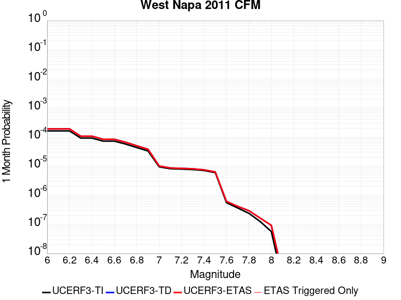 |  |  |

| Magnitude | 1 wk TI Prob | 1 wk TD Prob | 1 wk ETAS Prob | 1 wk ETAS/TD Gain | 1 wk ETAS Triggered Only | 1 mo TI Prob | 1 mo TD Prob | 1 mo ETAS Prob | 1 mo ETAS/TD Gain | 1 mo ETAS Triggered Only | 1 yr TI Prob | 1 yr TD Prob | 1 yr ETAS Prob | 1 yr ETAS/TD Gain | 1 yr ETAS Triggered Only | 10 yr TI Prob | 10 yr TD Prob | 10 yr ETAS Prob | 10 yr ETAS/TD Gain | 10 yr ETAS Triggered Only |
|-----|-----|-----|-----|-----|-----|-----|-----|-----|-----|-----|-----|-----|-----|-----|-----|-----|-----|-----|-----|-----|
| 6.0 | 3.773104E-5 | 4.452845E-5 | 4.452845E-5 | 1.0 | 0.0 | 1.6169442E-4 | 1.9082405E-4 | 1.9082405E-4 | 1.0 | 0.0 | 0.001966852 | 0.0023211248 | 0.0023211248 | 1.0 | 0.0 | 0.019495348 | 0.023002245 | 0.023038877 | 1.0015926 | 3.7495312E-5 |
| 6.1 | 3.773104E-5 | 4.452845E-5 | 4.452845E-5 | 1.0 | 0.0 | 1.6169442E-4 | 1.9082405E-4 | 1.9082405E-4 | 1.0 | 0.0 | 0.001966852 | 0.0023211248 | 0.0023211248 | 1.0 | 0.0 | 0.019495348 | 0.023002245 | 0.023038877 | 1.0015926 | 3.7495312E-5 |
| 6.2 | 3.773104E-5 | 4.452845E-5 | 4.452845E-5 | 1.0 | 0.0 | 1.6169442E-4 | 1.9082405E-4 | 1.9082405E-4 | 1.0 | 0.0 | 0.001966852 | 0.0023211248 | 0.0023211248 | 1.0 | 0.0 | 0.019495348 | 0.023002245 | 0.023038877 | 1.0015926 | 3.7495312E-5 |
| 6.3 | 2.147964E-5 | 2.4987039E-5 | 2.4987039E-5 | 1.0 | 0.0 | 9.2052345E-5 | 1.0708343E-4 | 1.0708343E-4 | 1.0 | 0.0 | 0.001120161 | 0.0013030528 | 0.0013030528 | 1.0 | 0.0 | 0.011145315 | 0.0129647385 | 0.0129647385 | 1.0 | 0.0 |
| 6.4 | 2.147964E-5 | 2.4987039E-5 | 2.4987039E-5 | 1.0 | 0.0 | 9.2052345E-5 | 1.0708343E-4 | 1.0708343E-4 | 1.0 | 0.0 | 0.001120161 | 0.0013030528 | 0.0013030528 | 1.0 | 0.0 | 0.011145315 | 0.0129647385 | 0.0129647385 | 1.0 | 0.0 |
| 6.5 | 1.688201E-5 | 1.9547346E-5 | 1.9547346E-5 | 1.0 | 0.0 | 7.234947E-5 | 8.377206E-5 | 8.377206E-5 | 1.0 | 0.0 | 8.804988E-4 | 0.0010195201 | 0.0010195201 | 1.0 | 0.0 | 0.008770182 | 0.010157098 | 0.010157098 | 1.0 | 0.0 |
| 6.6 | 1.6846381E-5 | 1.9507039E-5 | 1.9507039E-5 | 1.0 | 0.0 | 7.219678E-5 | 8.359933E-5 | 8.359933E-5 | 1.0 | 0.0 | 8.7864127E-4 | 0.001017419 | 0.001017419 | 1.0 | 0.0 | 0.008751754 | 0.010136279 | 0.010136279 | 1.0 | 0.0 |
| 6.7 | 1.3396501E-5 | 1.5467655E-5 | 1.5467655E-5 | 1.0 | 0.0 | 5.7412315E-5 | 6.628862E-5 | 6.628862E-5 | 1.0 | 0.0 | 6.9877075E-4 | 8.0682867E-4 | 8.0682867E-4 | 1.0 | 0.0 | 0.0069657755 | 0.008046719 | 0.008046719 | 1.0 | 0.0 |
| 6.8 | 1.0139058E-5 | 1.1672149E-5 | 1.1672149E-5 | 1.0 | 0.0 | 4.3452383E-5 | 5.0022853E-5 | 5.0022853E-5 | 1.0 | 0.0 | 5.289043E-4 | 6.0891354E-4 | 6.0891354E-4 | 1.0 | 0.0 | 0.005276473 | 0.006079373 | 0.006079373 | 1.0 | 0.0 |
| 6.9 | 7.761281E-6 | 8.890694E-6 | 8.890694E-6 | 1.0 | 0.0 | 3.326221E-5 | 3.8102706E-5 | 3.8102706E-5 | 1.0 | 0.0 | 4.0489217E-4 | 4.6385307E-4 | 4.6385307E-4 | 1.0 | 0.0 | 0.0040415525 | 0.004635363 | 0.004635363 | 1.0 | 0.0 |
| 7.0 | 2.2109202E-6 | 2.3666025E-6 | 2.3666025E-6 | 1.0 | 0.0 | 9.475338E-6 | 1.0142544E-5 | 1.0142544E-5 | 1.0 | 0.0 | 1.1535613E-4 | 1.2347854E-4 | 1.2347854E-4 | 1.0 | 0.0 | 0.0011529627 | 0.0012355851 | 0.0012355851 | 1.0 | 0.0 |
| 7.1 | 1.9008926E-6 | 2.0132914E-6 | 2.0132914E-6 | 1.0 | 0.0 | 8.146657E-6 | 8.6283635E-6 | 8.6283635E-6 | 1.0 | 0.0 | 9.918104E-5 | 1.05045285E-4 | 1.05045285E-4 | 1.0 | 0.0 | 9.913679E-4 | 0.001051437 | 0.001051437 | 1.0 | 0.0 |
| 7.2 | 1.8495944E-6 | 1.9560982E-6 | 1.9560982E-6 | 1.0 | 0.0 | 7.926808E-6 | 8.383251E-6 | 8.383251E-6 | 1.0 | 0.0 | 9.650462E-5 | 1.0206133E-4 | 1.0206133E-4 | 1.0 | 0.0 | 9.6462725E-4 | 0.0010216252 | 0.0010216252 | 1.0 | 0.0 |
| 7.3 | 1.7883189E-6 | 1.8880608E-6 | 1.8880608E-6 | 1.0 | 0.0 | 7.664201E-6 | 8.091664E-6 | 8.091664E-6 | 1.0 | 0.0 | 9.330765E-5 | 9.8511584E-5 | 9.8511584E-5 | 1.0 | 0.0 | 9.3268487E-4 | 9.861597E-4 | 9.861597E-4 | 1.0 | 0.0 |
| 7.4 | 1.6520572E-6 | 1.741484E-6 | 1.741484E-6 | 1.0 | 0.0 | 7.0802257E-6 | 7.463482E-6 | 7.463482E-6 | 1.0 | 0.0 | 8.6198335E-5 | 9.086413E-5 | 9.086413E-5 | 1.0 | 0.0 | 8.616491E-4 | 9.0974604E-4 | 9.0974604E-4 | 1.0 | 0.0 |
| 7.5 | 1.4040345E-6 | 1.4800074E-6 | 1.4800074E-6 | 1.0 | 0.0 | 6.0172765E-6 | 6.3428733E-6 | 6.3428733E-6 | 1.0 | 0.0 | 7.325788E-5 | 7.7221775E-5 | 7.7221775E-5 | 1.0 | 0.0 | 7.3233736E-4 | 7.7339396E-4 | 7.7339396E-4 | 1.0 | 0.0 |
| 7.6 | 1.3013842E-7 | 1.4415936E-7 | 1.4415936E-7 | 1.0 | 0.0 | 5.57736E-7 | 6.1782566E-7 | 6.1782566E-7 | 1.0 | 0.0 | 6.790414E-6 | 7.5220014E-6 | 7.5220014E-6 | 1.0 | 0.0 | 6.790207E-5 | 7.614869E-5 | 7.614869E-5 | 1.0 | 0.0 |
| 7.7 | 8.541512E-8 | 9.716316E-8 | 9.716316E-8 | 1.0 | 0.0 | 3.6606474E-7 | 4.1641349E-7 | 4.1641349E-7 | 1.0 | 0.0 | 4.456829E-6 | 5.0698222E-6 | 5.0698222E-6 | 1.0 | 0.0 | 4.4567398E-5 | 5.160297E-5 | 5.160297E-5 | 1.0 | 0.0 |
| 7.8 | 5.6074793E-8 | 6.89534E-8 | 6.89534E-8 | 1.0 | 0.0 | 2.403205E-7 | 2.9551452E-7 | 2.9551452E-7 | 1.0 | 0.0 | 2.9258983E-6 | 3.5978833E-6 | 3.5978833E-6 | 1.0 | 0.0 | 2.9258597E-5 | 3.681433E-5 | 3.681433E-5 | 1.0 | 0.0 |
| 7.9 | 2.9475839E-8 | 3.8566046E-8 | 3.8566046E-8 | 1.0 | 0.0 | 1.2632502E-7 | 1.6528305E-7 | 1.6528305E-7 | 1.0 | 0.0 | 1.538006E-6 | 2.0123193E-6 | 2.0123193E-6 | 1.0 | 0.0 | 1.5379954E-5 | 2.0665891E-5 | 2.0665891E-5 | 1.0 | 0.0 |
| 8.0 | 1.3337122E-8 | 2.163124E-8 | 2.163124E-8 | 1.0 | 0.0 | 5.7159088E-8 | 9.270532E-8 | 9.270532E-8 | 1.0 | 0.0 | 6.959117E-7 | 1.1286867E-6 | 1.1286867E-6 | 1.0 | 0.0 | 6.959095E-6 | 1.1645628E-5 | 1.1645628E-5 | 1.0 | 0.0 |
| 8.1 | 2.6589986E-10 | 4.8615456E-10 | 4.8615456E-10 | 1.0 | 0.0 | 1.1395708E-9 | 2.0835205E-9 | 2.0835205E-9 | 1.0 | 0.0 | 1.3874274E-8 | 2.536686E-8 | 2.536686E-8 | 1.0 | 0.0 | 1.3874273E-7 | 2.6035906E-7 | 2.6035906E-7 | 1.0 | 0.0 |

## Elsinore (Coyote Mountains)
*[(top)](#table-of-contents)*

| 1 Week | 1 Month | 1 Year | 10 Year |
|-----|-----|-----|-----|
|  |  |  |  |

| Magnitude | 1 wk TI Prob | 1 wk TD Prob | 1 wk ETAS Prob | 1 wk ETAS/TD Gain | 1 wk ETAS Triggered Only | 1 mo TI Prob | 1 mo TD Prob | 1 mo ETAS Prob | 1 mo ETAS/TD Gain | 1 mo ETAS Triggered Only | 1 yr TI Prob | 1 yr TD Prob | 1 yr ETAS Prob | 1 yr ETAS/TD Gain | 1 yr ETAS Triggered Only | 10 yr TI Prob | 10 yr TD Prob | 10 yr ETAS Prob | 10 yr ETAS/TD Gain | 10 yr ETAS Triggered Only |
|-----|-----|-----|-----|-----|-----|-----|-----|-----|-----|-----|-----|-----|-----|-----|-----|-----|-----|-----|-----|-----|
| 6.0 | 4.20513E-5 | 4.8631882E-5 | 4.8631882E-5 | 1.0 | 0.0 | 1.8020741E-4 | 2.0840895E-4 | 2.4589646E-4 | 1.1798747 | 3.7495312E-5 | 0.0021918174 | 0.002535 | 0.0025724003 | 1.0147536 | 3.7495312E-5 | 0.021703249 | 0.025111282 | 0.025147837 | 1.0014557 | 3.7495312E-5 |
| 6.1 | 4.20513E-5 | 4.8631882E-5 | 4.8631882E-5 | 1.0 | 0.0 | 1.8020741E-4 | 2.0840895E-4 | 2.4589646E-4 | 1.1798747 | 3.7495312E-5 | 0.0021918174 | 0.002535 | 0.0025724003 | 1.0147536 | 3.7495312E-5 | 0.021703249 | 0.025111282 | 0.025147837 | 1.0014557 | 3.7495312E-5 |
| 6.2 | 2.3413893E-5 | 2.469566E-5 | 2.469566E-5 | 1.0 | 0.0 | 1.0034139E-4 | 1.0583479E-4 | 1.0583479E-4 | 1.0 | 0.0 | 0.0012209718 | 0.0012878707 | 0.0012878707 | 1.0 | 0.0 | 0.012142851 | 0.01281264 | 0.01281264 | 1.0 | 0.0 |
| 6.3 | 2.3413893E-5 | 2.469566E-5 | 2.469566E-5 | 1.0 | 0.0 | 1.0034139E-4 | 1.0583479E-4 | 1.0583479E-4 | 1.0 | 0.0 | 0.0012209718 | 0.0012878707 | 0.0012878707 | 1.0 | 0.0 | 0.012142851 | 0.01281264 | 0.01281264 | 1.0 | 0.0 |
| 6.4 | 1.6894814E-5 | 1.6568361E-5 | 1.6568361E-5 | 1.0 | 0.0 | 7.240433E-5 | 7.1005554E-5 | 7.1005554E-5 | 1.0 | 0.0 | 8.811662E-4 | 8.6418656E-4 | 8.6418656E-4 | 1.0 | 0.0 | 0.0087768035 | 0.00861194 | 0.00861194 | 1.0 | 0.0 |
| 6.5 | 1.6894814E-5 | 1.6568361E-5 | 1.6568361E-5 | 1.0 | 0.0 | 7.240433E-5 | 7.1005554E-5 | 7.1005554E-5 | 1.0 | 0.0 | 8.811662E-4 | 8.6418656E-4 | 8.6418656E-4 | 1.0 | 0.0 | 0.0087768035 | 0.00861194 | 0.00861194 | 1.0 | 0.0 |
| 6.6 | 1.1910969E-5 | 1.0530774E-5 | 1.0530774E-5 | 1.0 | 0.0 | 5.1046012E-5 | 4.5131183E-5 | 4.5131183E-5 | 1.0 | 0.0 | 6.21308E-4 | 5.4934516E-4 | 5.4934516E-4 | 1.0 | 0.0 | 0.0061957375 | 0.005481174 | 0.005481174 | 1.0 | 0.0 |
| 6.7 | 9.1486E-6 | 7.2028593E-6 | 7.2028593E-6 | 1.0 | 0.0 | 3.9207694E-5 | 3.0869054E-5 | 3.0869054E-5 | 1.0 | 0.0 | 4.7724912E-4 | 3.757697E-4 | 3.757697E-4 | 1.0 | 0.0 | 0.0047622547 | 0.0037517229 | 0.0037517229 | 1.0 | 0.0 |
| 6.8 | 7.90441E-6 | 5.7290276E-6 | 5.7290276E-6 | 1.0 | 0.0 | 3.3875604E-5 | 2.4552752E-5 | 2.4552752E-5 | 1.0 | 0.0 | 4.1235742E-4 | 2.9889002E-4 | 2.9889002E-4 | 1.0 | 0.0 | 0.0041159308 | 0.002985009 | 0.002985009 | 1.0 | 0.0 |
| 6.9 | 7.77015E-6 | 5.582982E-6 | 5.582982E-6 | 1.0 | 0.0 | 3.3300217E-5 | 2.3926852E-5 | 2.3926852E-5 | 1.0 | 0.0 | 4.0535472E-4 | 2.9127175E-4 | 2.9127175E-4 | 1.0 | 0.0 | 0.004046161 | 0.002909027 | 0.002909027 | 1.0 | 0.0 |
| 7.0 | 7.675798E-6 | 5.47984E-6 | 5.47984E-6 | 1.0 | 0.0 | 3.289586E-5 | 2.3484827E-5 | 2.3484827E-5 | 1.0 | 0.0 | 4.004335E-4 | 2.858915E-4 | 2.858915E-4 | 1.0 | 0.0 | 0.003997127 | 0.0028553635 | 0.0028553635 | 1.0 | 0.0 |
| 7.1 | 7.447814E-6 | 5.238714E-6 | 5.238714E-6 | 1.0 | 0.0 | 3.191881E-5 | 2.2451446E-5 | 2.2451446E-5 | 1.0 | 0.0 | 3.8854225E-4 | 2.7331332E-4 | 2.7331332E-4 | 1.0 | 0.0 | 0.003878636 | 0.0027298962 | 0.0027298962 | 1.0 | 0.0 |
| 7.2 | 7.128185E-6 | 4.905372E-6 | 4.905372E-6 | 1.0 | 0.0 | 3.0549007E-5 | 2.102286E-5 | 2.102286E-5 | 1.0 | 0.0 | 3.7187067E-4 | 2.5592445E-4 | 2.5592445E-4 | 1.0 | 0.0 | 0.00371249 | 0.0025564157 | 0.0025564157 | 1.0 | 0.0 |
| 7.3 | 7.0913875E-6 | 4.874047E-6 | 4.874047E-6 | 1.0 | 0.0 | 3.0391306E-5 | 2.0888614E-5 | 2.0888614E-5 | 1.0 | 0.0 | 3.6995133E-4 | 2.5429038E-4 | 2.5429038E-4 | 1.0 | 0.0 | 0.0036933604 | 0.0025401122 | 0.0025401122 | 1.0 | 0.0 |
| 7.4 | 7.051521E-6 | 4.837899E-6 | 4.837899E-6 | 1.0 | 0.0 | 3.0220453E-5 | 2.0733693E-5 | 2.0733693E-5 | 1.0 | 0.0 | 3.6787192E-4 | 2.5240466E-4 | 2.5240466E-4 | 1.0 | 0.0 | 0.0036726352 | 0.0025212981 | 0.0025212981 | 1.0 | 0.0 |
| 7.5 | 6.910666E-6 | 4.733448E-6 | 4.733448E-6 | 1.0 | 0.0 | 2.9616802E-5 | 2.0286056E-5 | 2.0286056E-5 | 1.0 | 0.0 | 3.605249E-4 | 2.4695593E-4 | 2.4695593E-4 | 1.0 | 0.0 | 0.0035994058 | 0.0024669329 | 0.0024669329 | 1.0 | 0.0 |
| 7.6 | 6.341753E-6 | 4.3065565E-6 | 4.3065565E-6 | 1.0 | 0.0 | 2.7178658E-5 | 1.8456547E-5 | 1.8456547E-5 | 1.0 | 0.0 | 3.3084993E-4 | 2.2468645E-4 | 2.2468645E-4 | 1.0 | 0.0 | 0.0033035777 | 0.002244708 | 0.002244708 | 1.0 | 0.0 |
| 7.7 | 3.9205916E-6 | 2.2439415E-6 | 2.2439415E-6 | 1.0 | 0.0 | 1.6802427E-5 | 9.616861E-6 | 9.616861E-6 | 1.0 | 0.0 | 2.0455034E-4 | 1.1707973E-4 | 1.1707973E-4 | 1.0 | 0.0 | 0.0020436216 | 0.0011702535 | 0.0011702535 | 1.0 | 0.0 |
| 7.8 | 2.0846227E-7 | 8.486417E-8 | 8.486417E-8 | 1.0 | 0.0 | 8.9340944E-7 | 3.6370355E-7 | 3.6370355E-7 | 1.0 | 0.0 | 1.0877206E-5 | 4.428085E-6 | 4.428085E-6 | 1.0 | 0.0 | 1.0876673E-4 | 4.4280296E-5 | 4.4280296E-5 | 1.0 | 0.0 |
| 7.9 | 4.4969806E-9 | 2.2691855E-9 | 2.2691855E-9 | 1.0 | 0.0 | 1.9272775E-8 | 9.72508E-9 | 9.72508E-9 | 1.0 | 0.0 | 2.3464601E-7 | 1.18402845E-7 | 1.18402845E-7 | 1.0 | 0.0 | 2.3464577E-6 | 1.184028E-6 | 1.184028E-6 | 1.0 | 0.0 |

## Morales (East)
*[(top)](#table-of-contents)*

| 1 Week | 1 Month | 1 Year | 10 Year |
|-----|-----|-----|-----|
|  |  |  |  |

| Magnitude | 1 wk TI Prob | 1 wk TD Prob | 1 wk ETAS Prob | 1 wk ETAS/TD Gain | 1 wk ETAS Triggered Only | 1 mo TI Prob | 1 mo TD Prob | 1 mo ETAS Prob | 1 mo ETAS/TD Gain | 1 mo ETAS Triggered Only | 1 yr TI Prob | 1 yr TD Prob | 1 yr ETAS Prob | 1 yr ETAS/TD Gain | 1 yr ETAS Triggered Only | 10 yr TI Prob | 10 yr TD Prob | 10 yr ETAS Prob | 10 yr ETAS/TD Gain | 10 yr ETAS Triggered Only |
|-----|-----|-----|-----|-----|-----|-----|-----|-----|-----|-----|-----|-----|-----|-----|-----|-----|-----|-----|-----|-----|
| 6.0 | 1.4942771E-6 | 2.123479E-6 | 3.9618713E-5 | 18.657455 | 3.7495312E-5 | 6.404029E-6 | 9.100596E-6 | 4.6595567E-5 | 5.120057 | 3.7495312E-5 | 7.7966266E-5 | 1.107947E-4 | 1.4828586E-4 | 1.338384 | 3.7495312E-5 | 7.793892E-4 | 0.0011074544 | 0.0011449081 | 1.0338197 | 3.7495312E-5 |
| 6.1 | 1.4942771E-6 | 2.123479E-6 | 3.9618713E-5 | 18.657455 | 3.7495312E-5 | 6.404029E-6 | 9.100596E-6 | 4.6595567E-5 | 5.120057 | 3.7495312E-5 | 7.7966266E-5 | 1.107947E-4 | 1.4828586E-4 | 1.338384 | 3.7495312E-5 | 7.793892E-4 | 0.0011074544 | 0.0011449081 | 1.0338197 | 3.7495312E-5 |
| 6.2 | 1.4942771E-6 | 2.123479E-6 | 3.9618713E-5 | 18.657455 | 3.7495312E-5 | 6.404029E-6 | 9.100596E-6 | 4.6595567E-5 | 5.120057 | 3.7495312E-5 | 7.7966266E-5 | 1.107947E-4 | 1.4828586E-4 | 1.338384 | 3.7495312E-5 | 7.793892E-4 | 0.0011074544 | 0.0011449081 | 1.0338197 | 3.7495312E-5 |
| 6.3 | 1.4942771E-6 | 2.123479E-6 | 3.9618713E-5 | 18.657455 | 3.7495312E-5 | 6.404029E-6 | 9.100596E-6 | 4.6595567E-5 | 5.120057 | 3.7495312E-5 | 7.7966266E-5 | 1.107947E-4 | 1.4828586E-4 | 1.338384 | 3.7495312E-5 | 7.793892E-4 | 0.0011074544 | 0.0011449081 | 1.0338197 | 3.7495312E-5 |
| 6.4 | 8.798845E-7 | 1.5022731E-6 | 1.5022731E-6 | 1.0 | 0.0 | 3.7709283E-6 | 6.438298E-6 | 6.438298E-6 | 1.0 | 0.0 | 4.5910085E-5 | 7.8383564E-5 | 7.8383564E-5 | 1.0 | 0.0 | 4.59006E-4 | 7.835727E-4 | 7.835727E-4 | 1.0 | 0.0 |
| 6.5 | 7.1751725E-7 | 1.3384229E-6 | 1.3384229E-6 | 1.0 | 0.0 | 3.0750705E-6 | 5.7360858E-6 | 5.7360858E-6 | 1.0 | 0.0 | 3.7438338E-5 | 6.9834685E-5 | 6.9834685E-5 | 1.0 | 0.0 | 3.743203E-4 | 6.9813756E-4 | 6.9813756E-4 | 1.0 | 0.0 |
| 6.6 | 7.1751725E-7 | 1.3384229E-6 | 1.3384229E-6 | 1.0 | 0.0 | 3.0750705E-6 | 5.7360858E-6 | 5.7360858E-6 | 1.0 | 0.0 | 3.7438338E-5 | 6.9834685E-5 | 6.9834685E-5 | 1.0 | 0.0 | 3.743203E-4 | 6.9813756E-4 | 6.9813756E-4 | 1.0 | 0.0 |
| 6.7 | 7.159057E-7 | 1.3358889E-6 | 1.3358889E-6 | 1.0 | 0.0 | 3.0681638E-6 | 5.725226E-6 | 5.725226E-6 | 1.0 | 0.0 | 3.7354253E-5 | 6.970247E-5 | 6.970247E-5 | 1.0 | 0.0 | 3.7347974E-4 | 6.968163E-4 | 6.968163E-4 | 1.0 | 0.0 |
| 6.8 | 7.032203E-7 | 1.3174443E-6 | 1.3174443E-6 | 1.0 | 0.0 | 3.0137978E-6 | 5.646178E-6 | 5.646178E-6 | 1.0 | 0.0 | 3.669237E-5 | 6.8740126E-5 | 6.8740126E-5 | 1.0 | 0.0 | 3.6686313E-4 | 6.871988E-4 | 6.871988E-4 | 1.0 | 0.0 |
| 6.9 | 6.941549E-7 | 1.3025061E-6 | 1.3025061E-6 | 1.0 | 0.0 | 2.974946E-6 | 5.582158E-6 | 5.582158E-6 | 1.0 | 0.0 | 3.6219368E-5 | 6.7960726E-5 | 6.7960726E-5 | 1.0 | 0.0 | 3.6213463E-4 | 6.7940954E-4 | 6.7940954E-4 | 1.0 | 0.0 |
| 7.0 | 6.2932247E-7 | 1.18774E-6 | 1.18774E-6 | 1.0 | 0.0 | 2.6970936E-6 | 5.090305E-6 | 5.090305E-6 | 1.0 | 0.0 | 3.283662E-5 | 6.1972765E-5 | 6.1972765E-5 | 1.0 | 0.0 | 3.283177E-4 | 6.1956374E-4 | 6.1956374E-4 | 1.0 | 0.0 |
| 7.1 | 5.6200963E-7 | 1.0640374E-6 | 1.0640374E-6 | 1.0 | 0.0 | 2.4086105E-6 | 4.5601523E-6 | 4.5601523E-6 | 1.0 | 0.0 | 2.9324437E-5 | 5.551849E-5 | 5.551849E-5 | 1.0 | 0.0 | 2.9320567E-4 | 5.550534E-4 | 5.550534E-4 | 1.0 | 0.0 |
| 7.2 | 4.91044E-7 | 9.285713E-7 | 9.285713E-7 | 1.0 | 0.0 | 2.1044725E-6 | 3.9795855E-6 | 3.9795855E-6 | 1.0 | 0.0 | 2.5621652E-5 | 4.8450413E-5 | 4.8450413E-5 | 1.0 | 0.0 | 2.56187E-4 | 4.8440482E-4 | 4.8440482E-4 | 1.0 | 0.0 |
| 7.3 | 4.2978448E-7 | 7.9739846E-7 | 7.9739846E-7 | 1.0 | 0.0 | 1.8419321E-6 | 3.4174175E-6 | 3.4174175E-6 | 1.0 | 0.0 | 2.2425293E-5 | 4.1606294E-5 | 4.1606294E-5 | 1.0 | 0.0 | 2.242303E-4 | 4.1599068E-4 | 4.1599068E-4 | 1.0 | 0.0 |
| 7.4 | 3.774317E-7 | 6.806746E-7 | 6.806746E-7 | 1.0 | 0.0 | 1.6175634E-6 | 2.9171736E-6 | 2.9171736E-6 | 1.0 | 0.0 | 1.9693656E-5 | 3.5516037E-5 | 3.5516037E-5 | 1.0 | 0.0 | 1.969191E-4 | 3.551089E-4 | 3.551089E-4 | 1.0 | 0.0 |
| 7.5 | 1.0603232E-7 | 9.840901E-8 | 9.840901E-8 | 1.0 | 0.0 | 4.5442414E-7 | 4.2175284E-7 | 4.2175284E-7 | 1.0 | 0.0 | 5.5326E-6 | 5.134829E-6 | 5.134829E-6 | 1.0 | 0.0 | 5.532462E-5 | 5.134967E-5 | 5.134967E-5 | 1.0 | 0.0 |
| 7.6 | 9.960384E-8 | 8.755334E-8 | 8.755334E-8 | 1.0 | 0.0 | 4.2687353E-7 | 3.7522852E-7 | 3.7522852E-7 | 1.0 | 0.0 | 5.197173E-6 | 4.568398E-6 | 4.568398E-6 | 1.0 | 0.0 | 5.1970514E-5 | 4.5685607E-5 | 4.5685607E-5 | 1.0 | 0.0 |
| 7.7 | 6.499468E-8 | 4.1038682E-8 | 4.1038682E-8 | 1.0 | 0.0 | 2.785486E-7 | 1.7588006E-7 | 1.7588006E-7 | 1.0 | 0.0 | 3.3913238E-6 | 2.1413375E-6 | 2.1413375E-6 | 1.0 | 0.0 | 3.3912722E-5 | 2.1415728E-5 | 2.1415728E-5 | 1.0 | 0.0 |
| 7.8 | 2.2517119E-8 | 7.1312614E-9 | 7.1312614E-9 | 1.0 | 0.0 | 9.6501935E-8 | 3.0562546E-8 | 3.0562546E-8 | 1.0 | 0.0 | 1.1749105E-6 | 3.7209892E-7 | 3.7209892E-7 | 1.0 | 0.0 | 1.1749043E-5 | 3.7235213E-6 | 3.7235213E-6 | 1.0 | 0.0 |
| 7.9 | 8.493023E-9 | 9.970124E-10 | 9.970124E-10 | 1.0 | 0.0 | 3.639867E-8 | 4.2729082E-9 | 4.2729082E-9 | 1.0 | 0.0 | 4.4315374E-7 | 5.202266E-8 | 5.202266E-8 | 1.0 | 0.0 | 4.4315284E-6 | 5.2233156E-7 | 5.2233156E-7 | 1.0 | 0.0 |
| 8.0 | 1.4971842E-9 | 5.5458416E-11 | 5.5458416E-11 | 1.0 | 0.0 | 6.4165038E-9 | 2.376762E-10 | 2.376762E-10 | 1.0 | 0.0 | 7.812093E-8 | 2.8937068E-9 | 2.8937068E-9 | 1.0 | 0.0 | 7.81209E-7 | 3.019288E-8 | 3.019288E-8 | 1.0 | 0.0 |

## Elysian Park (Upper)
*[(top)](#table-of-contents)*

| 1 Week | 1 Month | 1 Year | 10 Year |
|-----|-----|-----|-----|
|  |  |  |  |

| Magnitude | 1 wk TI Prob | 1 wk TD Prob | 1 wk ETAS Prob | 1 wk ETAS/TD Gain | 1 wk ETAS Triggered Only | 1 mo TI Prob | 1 mo TD Prob | 1 mo ETAS Prob | 1 mo ETAS/TD Gain | 1 mo ETAS Triggered Only | 1 yr TI Prob | 1 yr TD Prob | 1 yr ETAS Prob | 1 yr ETAS/TD Gain | 1 yr ETAS Triggered Only | 10 yr TI Prob | 10 yr TD Prob | 10 yr ETAS Prob | 10 yr ETAS/TD Gain | 10 yr ETAS Triggered Only |
|-----|-----|-----|-----|-----|-----|-----|-----|-----|-----|-----|-----|-----|-----|-----|-----|-----|-----|-----|-----|-----|
| 6.0 | 3.1876025E-5 | 3.7035516E-5 | 3.7035516E-5 | 1.0 | 0.0 | 1.3660437E-4 | 1.587167E-4 | 1.587167E-4 | 1.0 | 0.0 | 0.0016618895 | 0.0019311075 | 0.0019311075 | 1.0 | 0.0 | 0.016495159 | 0.019189782 | 0.019226559 | 1.0019164 | 3.7495312E-5 |
| 6.1 | 3.1876025E-5 | 3.7035516E-5 | 3.7035516E-5 | 1.0 | 0.0 | 1.3660437E-4 | 1.587167E-4 | 1.587167E-4 | 1.0 | 0.0 | 0.0016618895 | 0.0019311075 | 0.0019311075 | 1.0 | 0.0 | 0.016495159 | 0.019189782 | 0.019226559 | 1.0019164 | 3.7495312E-5 |
| 6.2 | 3.1876025E-5 | 3.7035516E-5 | 3.7035516E-5 | 1.0 | 0.0 | 1.3660437E-4 | 1.587167E-4 | 1.587167E-4 | 1.0 | 0.0 | 0.0016618895 | 0.0019311075 | 0.0019311075 | 1.0 | 0.0 | 0.016495159 | 0.019189782 | 0.019226559 | 1.0019164 | 3.7495312E-5 |
| 6.3 | 3.1876025E-5 | 3.7035516E-5 | 3.7035516E-5 | 1.0 | 0.0 | 1.3660437E-4 | 1.587167E-4 | 1.587167E-4 | 1.0 | 0.0 | 0.0016618895 | 0.0019311075 | 0.0019311075 | 1.0 | 0.0 | 0.016495159 | 0.019189782 | 0.019226559 | 1.0019164 | 3.7495312E-5 |
| 6.4 | 1.9273462E-5 | 2.1202266E-5 | 2.1202266E-5 | 1.0 | 0.0 | 8.259794E-5 | 9.086466E-5 | 9.086466E-5 | 1.0 | 0.0 | 0.001005166 | 0.0011058892 | 0.0011058892 | 1.0 | 0.0 | 0.010006315 | 0.011020724 | 0.011057806 | 1.0033648 | 3.7495312E-5 |
| 6.5 | 1.9273462E-5 | 2.1202266E-5 | 2.1202266E-5 | 1.0 | 0.0 | 8.259794E-5 | 9.086466E-5 | 9.086466E-5 | 1.0 | 0.0 | 0.001005166 | 0.0011058892 | 0.0011058892 | 1.0 | 0.0 | 0.010006315 | 0.011020724 | 0.011057806 | 1.0033648 | 3.7495312E-5 |
| 6.6 | 9.813258E-6 | 9.665599E-6 | 9.665599E-6 | 1.0 | 0.0 | 4.205614E-5 | 4.1423376E-5 | 4.1423376E-5 | 1.0 | 0.0 | 5.119132E-4 | 5.0422014E-4 | 5.0422014E-4 | 1.0 | 0.0 | 0.005107356 | 0.0050314846 | 0.0050314846 | 1.0 | 0.0 |
| 6.7 | 9.801478E-6 | 9.653168E-6 | 9.653168E-6 | 1.0 | 0.0 | 4.2005657E-5 | 4.1370105E-5 | 4.1370105E-5 | 1.0 | 0.0 | 5.112989E-4 | 5.035719E-4 | 5.035719E-4 | 1.0 | 0.0 | 0.0051012407 | 0.0050250315 | 0.0050250315 | 1.0 | 0.0 |
| 6.8 | 8.102489E-6 | 7.773004E-6 | 7.773004E-6 | 1.0 | 0.0 | 3.4724493E-5 | 3.3312477E-5 | 3.3312477E-5 | 1.0 | 0.0 | 4.2268867E-4 | 4.055089E-4 | 4.055089E-4 | 1.0 | 0.0 | 0.004218856 | 0.0040481836 | 0.0040481836 | 1.0 | 0.0 |
| 6.9 | 6.08275E-6 | 5.4814514E-6 | 5.4814514E-6 | 1.0 | 0.0 | 2.6068668E-5 | 2.3491726E-5 | 2.3491726E-5 | 1.0 | 0.0 | 3.173398E-4 | 2.85975E-4 | 2.85975E-4 | 1.0 | 0.0 | 0.0031688702 | 0.0028561477 | 0.0028561477 | 1.0 | 0.0 |
| 7.0 | 5.5995934E-6 | 4.98278E-6 | 4.98278E-6 | 1.0 | 0.0 | 2.3998036E-5 | 2.13546E-5 | 2.13546E-5 | 1.0 | 0.0 | 2.9213692E-4 | 2.599619E-4 | 2.599619E-4 | 1.0 | 0.0 | 0.0029175316 | 0.0025966454 | 0.0025966454 | 1.0 | 0.0 |
| 7.1 | 4.709881E-6 | 4.0874015E-6 | 4.0874015E-6 | 1.0 | 0.0 | 2.0185047E-5 | 1.7517319E-5 | 1.7517319E-5 | 1.0 | 0.0 | 2.4572524E-4 | 2.132529E-4 | 2.132529E-4 | 1.0 | 0.0 | 0.002454537 | 0.002130524 | 0.002130524 | 1.0 | 0.0 |
| 7.2 | 3.6063436E-6 | 2.9779544E-6 | 2.9779544E-6 | 1.0 | 0.0 | 1.5455667E-5 | 1.27626E-5 | 1.27626E-5 | 1.0 | 0.0 | 1.881565E-4 | 1.5537368E-4 | 1.5537368E-4 | 1.0 | 0.0 | 0.0018799726 | 0.0015526618 | 0.0015526618 | 1.0 | 0.0 |
| 7.3 | 2.471135E-6 | 2.0954615E-6 | 2.0954615E-6 | 1.0 | 0.0 | 1.0590536E-5 | 8.980519E-6 | 8.980519E-6 | 1.0 | 0.0 | 1.2893214E-4 | 1.093324E-4 | 1.093324E-4 | 1.0 | 0.0 | 0.0012885736 | 0.0010927934 | 0.0010927934 | 1.0 | 0.0 |
| 7.4 | 1.163943E-6 | 1.0275091E-6 | 1.0275091E-6 | 1.0 | 0.0 | 4.988318E-6 | 4.4036033E-6 | 4.4036033E-6 | 1.0 | 0.0 | 6.0731076E-5 | 5.3612584E-5 | 5.3612584E-5 | 1.0 | 0.0 | 6.071448E-4 | 5.359995E-4 | 5.359995E-4 | 1.0 | 0.0 |
| 7.5 | 4.99459E-7 | 4.917604E-7 | 4.917604E-7 | 1.0 | 0.0 | 2.140537E-6 | 2.1075427E-6 | 2.1075427E-6 | 1.0 | 0.0 | 2.6060725E-5 | 2.5659048E-5 | 2.5659048E-5 | 1.0 | 0.0 | 2.605767E-4 | 2.5656243E-4 | 2.5656243E-4 | 1.0 | 0.0 |
| 7.6 | 2.4667852E-7 | 2.4778336E-7 | 2.4778336E-7 | 1.0 | 0.0 | 1.0571932E-6 | 1.0619283E-6 | 1.0619283E-6 | 1.0 | 0.0 | 1.2871251E-5 | 1.2928905E-5 | 1.2928905E-5 | 1.0 | 0.0 | 1.2870505E-4 | 1.2928189E-4 | 1.2928189E-4 | 1.0 | 0.0 |
| 7.7 | 8.2312795E-8 | 7.3864456E-8 | 7.3864456E-8 | 1.0 | 0.0 | 3.527691E-7 | 3.165619E-7 | 3.165619E-7 | 1.0 | 0.0 | 4.294955E-6 | 3.8541357E-6 | 3.8541357E-6 | 1.0 | 0.0 | 4.2948723E-5 | 3.8540802E-5 | 3.8540802E-5 | 1.0 | 0.0 |
| 7.8 | 2.7819295E-8 | 1.7566023E-8 | 1.7566023E-8 | 1.0 | 0.0 | 1.1922555E-7 | 7.5282955E-8 | 7.5282955E-8 | 1.0 | 0.0 | 1.45157E-6 | 9.165697E-7 | 9.165697E-7 | 1.0 | 0.0 | 1.45156055E-5 | 9.165675E-6 | 9.165675E-6 | 1.0 | 0.0 |

## San Jacinto (Clark) rev
*[(top)](#table-of-contents)*

| 1 Week | 1 Month | 1 Year | 10 Year |
|-----|-----|-----|-----|
|  |  |  |  |

| Magnitude | 1 wk TI Prob | 1 wk TD Prob | 1 wk ETAS Prob | 1 wk ETAS/TD Gain | 1 wk ETAS Triggered Only | 1 mo TI Prob | 1 mo TD Prob | 1 mo ETAS Prob | 1 mo ETAS/TD Gain | 1 mo ETAS Triggered Only | 1 yr TI Prob | 1 yr TD Prob | 1 yr ETAS Prob | 1 yr ETAS/TD Gain | 1 yr ETAS Triggered Only | 10 yr TI Prob | 10 yr TD Prob | 10 yr ETAS Prob | 10 yr ETAS/TD Gain | 10 yr ETAS Triggered Only |
|-----|-----|-----|-----|-----|-----|-----|-----|-----|-----|-----|-----|-----|-----|-----|-----|-----|-----|-----|-----|-----|
| 6.0 | 4.482615E-5 | 2.1154196E-5 | 2.1154196E-5 | 1.0 | 0.0 | 1.9209793E-4 | 9.065773E-5 | 9.065773E-5 | 1.0 | 0.0 | 0.0023362834 | 0.0011032083 | 0.0011032083 | 1.0 | 0.0 | 0.02311874 | 0.011503847 | 0.011540911 | 1.0032219 | 3.7495312E-5 |
| 6.1 | 4.482615E-5 | 2.1154196E-5 | 2.1154196E-5 | 1.0 | 0.0 | 1.9209793E-4 | 9.065773E-5 | 9.065773E-5 | 1.0 | 0.0 | 0.0023362834 | 0.0011032083 | 0.0011032083 | 1.0 | 0.0 | 0.02311874 | 0.011503847 | 0.011540911 | 1.0032219 | 3.7495312E-5 |
| 6.2 | 4.482615E-5 | 2.1154196E-5 | 2.1154196E-5 | 1.0 | 0.0 | 1.9209793E-4 | 9.065773E-5 | 9.065773E-5 | 1.0 | 0.0 | 0.0023362834 | 0.0011032083 | 0.0011032083 | 1.0 | 0.0 | 0.02311874 | 0.011503847 | 0.011540911 | 1.0032219 | 3.7495312E-5 |
| 6.3 | 4.482615E-5 | 2.1154196E-5 | 2.1154196E-5 | 1.0 | 0.0 | 1.9209793E-4 | 9.065773E-5 | 9.065773E-5 | 1.0 | 0.0 | 0.0023362834 | 0.0011032083 | 0.0011032083 | 1.0 | 0.0 | 0.02311874 | 0.011503847 | 0.011540911 | 1.0032219 | 3.7495312E-5 |
| 6.4 | 4.482615E-5 | 2.1154196E-5 | 2.1154196E-5 | 1.0 | 0.0 | 1.9209793E-4 | 9.065773E-5 | 9.065773E-5 | 1.0 | 0.0 | 0.0023362834 | 0.0011032083 | 0.0011032083 | 1.0 | 0.0 | 0.02311874 | 0.011503847 | 0.011540911 | 1.0032219 | 3.7495312E-5 |
| 6.5 | 3.7294863E-5 | 1.7356087E-5 | 1.7356087E-5 | 1.0 | 0.0 | 1.5982533E-4 | 7.438113E-5 | 7.438113E-5 | 1.0 | 0.0 | 0.0019441366 | 9.052186E-4 | 9.052186E-4 | 1.0 | 0.0 | 0.01927216 | 0.0094941035 | 0.009531243 | 1.0039119 | 3.7495312E-5 |
| 6.6 | 3.7294863E-5 | 1.7356087E-5 | 1.7356087E-5 | 1.0 | 0.0 | 1.5982533E-4 | 7.438113E-5 | 7.438113E-5 | 1.0 | 0.0 | 0.0019441366 | 9.052186E-4 | 9.052186E-4 | 1.0 | 0.0 | 0.01927216 | 0.0094941035 | 0.009531243 | 1.0039119 | 3.7495312E-5 |
| 6.7 | 3.6039248E-5 | 1.6604314E-5 | 1.6604314E-5 | 1.0 | 0.0 | 1.5444479E-4 | 7.1159426E-5 | 7.1159426E-5 | 1.0 | 0.0 | 0.0018787434 | 8.6602574E-4 | 8.6602574E-4 | 1.0 | 0.0 | 0.01862939 | 0.009096047 | 0.009133201 | 1.0040847 | 3.7495312E-5 |
| 6.8 | 3.5031844E-5 | 1.6232942E-5 | 1.6232942E-5 | 1.0 | 0.0 | 1.5012783E-4 | 6.956792E-5 | 6.956792E-5 | 1.0 | 0.0 | 0.0018262739 | 8.4666436E-4 | 8.4666436E-4 | 1.0 | 0.0 | 0.01811338 | 0.008895969 | 0.008933131 | 1.0041773 | 3.7495312E-5 |
| 6.9 | 3.435112E-5 | 1.6063195E-5 | 1.6063195E-5 | 1.0 | 0.0 | 1.4721078E-4 | 6.884047E-5 | 6.884047E-5 | 1.0 | 0.0 | 0.0017908178 | 8.3781447E-4 | 8.3781447E-4 | 1.0 | 0.0 | 0.017764548 | 0.008804181 | 0.008841345 | 1.0042213 | 3.7495312E-5 |
| 7.0 | 2.8959772E-5 | 1.4336745E-5 | 1.4336745E-5 | 1.0 | 0.0 | 1.241074E-4 | 6.144176E-5 | 6.144176E-5 | 1.0 | 0.0 | 0.0015099603 | 7.477995E-4 | 7.477995E-4 | 1.0 | 0.0 | 0.014997416 | 0.007868037 | 0.007905236 | 1.0047281 | 3.7495312E-5 |
| 7.1 | 2.6002877E-5 | 1.2829002E-5 | 1.2829002E-5 | 1.0 | 0.0 | 1.11436144E-4 | 5.498029E-5 | 5.498029E-5 | 1.0 | 0.0 | 0.0013558907 | 6.691816E-4 | 6.691816E-4 | 1.0 | 0.0 | 0.013476475 | 0.0070465137 | 0.007083745 | 1.0052836 | 3.7495312E-5 |
| 7.2 | 2.2544838E-5 | 1.1262543E-5 | 1.1262543E-5 | 1.0 | 0.0 | 9.661716E-5 | 4.8267157E-5 | 4.8267157E-5 | 1.0 | 0.0 | 0.001175679 | 5.874956E-4 | 5.874956E-4 | 1.0 | 0.0 | 0.011694785 | 0.0061927503 | 0.006230013 | 1.0060172 | 3.7495312E-5 |
| 7.3 | 1.75334E-5 | 1.0811715E-5 | 1.0811715E-5 | 1.0 | 0.0 | 7.514098E-5 | 4.6335106E-5 | 4.6335106E-5 | 1.0 | 0.0 | 9.144575E-4 | 5.6398526E-4 | 5.6398526E-4 | 1.0 | 0.0 | 0.009107036 | 0.0059337732 | 0.005971046 | 1.0062815 | 3.7495312E-5 |
| 7.4 | 1.5924552E-5 | 1.0611516E-5 | 1.0611516E-5 | 1.0 | 0.0 | 6.82463E-5 | 4.547714E-5 | 4.547714E-5 | 1.0 | 0.0 | 8.305819E-4 | 5.535449E-4 | 5.535449E-4 | 1.0 | 0.0 | 0.008274844 | 0.0058210334 | 0.0058583105 | 1.0064038 | 3.7495312E-5 |
| 7.5 | 1.3428931E-5 | 9.8519E-6 | 9.8519E-6 | 1.0 | 0.0 | 5.7551293E-5 | 4.2221753E-5 | 4.2221753E-5 | 1.0 | 0.0 | 7.004617E-4 | 5.1392964E-4 | 5.1392964E-4 | 1.0 | 0.0 | 0.006982579 | 0.0054066023 | 0.0054438952 | 1.0068976 | 3.7495312E-5 |
| 7.6 | 1.0688787E-5 | 8.614839E-6 | 8.614839E-6 | 1.0 | 0.0 | 4.5808283E-5 | 3.692022E-5 | 3.692022E-5 | 1.0 | 0.0 | 5.5757316E-4 | 4.4941145E-4 | 4.4941145E-4 | 1.0 | 0.0 | 0.005561762 | 0.0047416524 | 0.0047789696 | 1.0078702 | 3.7495312E-5 |
| 7.7 | 8.81236E-6 | 7.4680274E-6 | 7.4680274E-6 | 1.0 | 0.0 | 3.776671E-5 | 3.2005442E-5 | 3.2005442E-5 | 1.0 | 0.0 | 4.597127E-4 | 3.8959677E-4 | 3.8959677E-4 | 1.0 | 0.0 | 0.0045876284 | 0.0041346536 | 0.004171994 | 1.009031 | 3.7495312E-5 |
| 7.8 | 7.780431E-6 | 6.696579E-6 | 6.696579E-6 | 1.0 | 0.0 | 3.3344273E-5 | 2.8699309E-5 | 2.8699309E-5 | 1.0 | 0.0 | 4.0589093E-4 | 3.4935825E-4 | 3.4935825E-4 | 1.0 | 0.0 | 0.0040515037 | 0.0037227906 | 0.0037601464 | 1.0100343 | 3.7495312E-5 |
| 7.9 | 6.5437994E-6 | 5.780382E-6 | 5.780382E-6 | 1.0 | 0.0 | 2.8044553E-5 | 2.477283E-5 | 2.477283E-5 | 1.0 | 0.0 | 3.4138895E-4 | 3.0156763E-4 | 3.0156763E-4 | 1.0 | 0.0 | 0.0034086495 | 0.0032344845 | 0.0032718584 | 1.0115548 | 3.7495312E-5 |
| 8.0 | 5.4488164E-6 | 4.8133406E-6 | 4.8133406E-6 | 1.0 | 0.0 | 2.3351862E-5 | 2.062844E-5 | 2.062844E-5 | 1.0 | 0.0 | 2.8427184E-4 | 2.5112246E-4 | 2.5112246E-4 | 1.0 | 0.0 | 0.0028390845 | 0.002710839 | 0.0027482328 | 1.0137942 | 3.7495312E-5 |
| 8.1 | 2.8397242E-6 | 1.3670389E-6 | 1.3670389E-6 | 1.0 | 0.0 | 1.217019E-5 | 5.858725E-6 | 5.858725E-6 | 1.0 | 0.0 | 1.4816198E-4 | 7.132765E-5 | 7.132765E-5 | 1.0 | 0.0 | 0.0014806325 | 8.115382E-4 | 8.115382E-4 | 1.0 | 0.0 |
| 8.2 | 2.030244E-6 | 6.318974E-7 | 6.318974E-7 | 1.0 | 0.0 | 8.701017E-6 | 2.708129E-6 | 2.708129E-6 | 1.0 | 0.0 | 1.05929736E-4 | 3.2970976E-5 | 3.2970976E-5 | 1.0 | 0.0 | 0.0010587925 | 3.9486602E-4 | 3.9486602E-4 | 1.0 | 0.0 |
| 8.3 | 1.0659804E-6 | 2.9250086E-7 | 2.9250086E-7 | 1.0 | 0.0 | 4.568479E-6 | 1.2535745E-6 | 1.2535745E-6 | 1.0 | 0.0 | 5.5619817E-5 | 1.5262167E-5 | 1.5262167E-5 | 1.0 | 0.0 | 5.5605895E-4 | 1.8566217E-4 | 1.8566217E-4 | 1.0 | 0.0 |

## Monterey Bay-Tularcitos
*[(top)](#table-of-contents)*

| 1 Week | 1 Month | 1 Year | 10 Year |
|-----|-----|-----|-----|
|  |  |  |  |

| Magnitude | 1 wk TI Prob | 1 wk TD Prob | 1 wk ETAS Prob | 1 wk ETAS/TD Gain | 1 wk ETAS Triggered Only | 1 mo TI Prob | 1 mo TD Prob | 1 mo ETAS Prob | 1 mo ETAS/TD Gain | 1 mo ETAS Triggered Only | 1 yr TI Prob | 1 yr TD Prob | 1 yr ETAS Prob | 1 yr ETAS/TD Gain | 1 yr ETAS Triggered Only | 10 yr TI Prob | 10 yr TD Prob | 10 yr ETAS Prob | 10 yr ETAS/TD Gain | 10 yr ETAS Triggered Only |
|-----|-----|-----|-----|-----|-----|-----|-----|-----|-----|-----|-----|-----|-----|-----|-----|-----|-----|-----|-----|-----|
| 6.0 | 3.0131365E-5 | 3.279877E-5 | 7.029285E-5 | 2.143155 | 3.7495312E-5 | 1.2912804E-4 | 1.4055918E-4 | 1.7804923E-4 | 1.2667207 | 3.7495312E-5 | 0.001571 | 0.0017100703 | 0.0017475014 | 1.0218887 | 3.7495312E-5 | 0.015599402 | 0.016979916 | 0.017016776 | 1.0021707 | 3.7495312E-5 |
| 6.1 | 3.0131365E-5 | 3.279877E-5 | 7.029285E-5 | 2.143155 | 3.7495312E-5 | 1.2912804E-4 | 1.4055918E-4 | 1.7804923E-4 | 1.2667207 | 3.7495312E-5 | 0.001571 | 0.0017100703 | 0.0017475014 | 1.0218887 | 3.7495312E-5 | 0.015599402 | 0.016979916 | 0.017016776 | 1.0021707 | 3.7495312E-5 |
| 6.2 | 3.0131365E-5 | 3.279877E-5 | 7.029285E-5 | 2.143155 | 3.7495312E-5 | 1.2912804E-4 | 1.4055918E-4 | 1.7804923E-4 | 1.2667207 | 3.7495312E-5 | 0.001571 | 0.0017100703 | 0.0017475014 | 1.0218887 | 3.7495312E-5 | 0.015599402 | 0.016979916 | 0.017016776 | 1.0021707 | 3.7495312E-5 |
| 6.3 | 1.6998249E-5 | 1.8330798E-5 | 5.5825425E-5 | 3.0454443 | 3.7495312E-5 | 7.28476E-5 | 7.85583E-5 | 1.1605067E-4 | 1.4772553 | 3.7495312E-5 | 8.865586E-4 | 9.5604634E-4 | 9.935058E-4 | 1.0391816 | 3.7495312E-5 | 0.0088303005 | 0.009521258 | 0.009558396 | 1.0039005 | 3.7495312E-5 |
| 6.4 | 1.6998249E-5 | 1.8330798E-5 | 5.5825425E-5 | 3.0454443 | 3.7495312E-5 | 7.28476E-5 | 7.85583E-5 | 1.1605067E-4 | 1.4772553 | 3.7495312E-5 | 8.865586E-4 | 9.5604634E-4 | 9.935058E-4 | 1.0391816 | 3.7495312E-5 | 0.0088303005 | 0.009521258 | 0.009558396 | 1.0039005 | 3.7495312E-5 |
| 6.5 | 1.27470785E-5 | 1.3693312E-5 | 1.3693312E-5 | 1.0 | 0.0 | 5.4629192E-5 | 5.8684363E-5 | 5.8684363E-5 | 1.0 | 0.0 | 6.649074E-4 | 7.1425823E-4 | 7.1425823E-4 | 1.0 | 0.0 | 0.0066292146 | 0.007120678 | 0.007120678 | 1.0 | 0.0 |
| 6.6 | 1.2739422E-5 | 1.36854E-5 | 1.36854E-5 | 1.0 | 0.0 | 5.4596385E-5 | 5.8650454E-5 | 5.8650454E-5 | 1.0 | 0.0 | 6.645082E-4 | 7.1384566E-4 | 7.1384566E-4 | 1.0 | 0.0 | 0.0066252467 | 0.007116579 | 0.007116579 | 1.0 | 0.0 |
| 6.7 | 1.0160109E-5 | 1.0885755E-5 | 1.0885755E-5 | 1.0 | 0.0 | 4.35426E-5 | 4.665244E-5 | 4.665244E-5 | 1.0 | 0.0 | 5.300022E-4 | 5.6785246E-4 | 5.6785246E-4 | 1.0 | 0.0 | 0.005287399 | 0.0056647263 | 0.0056647263 | 1.0 | 0.0 |
| 6.8 | 8.349859E-6 | 8.932587E-6 | 8.932587E-6 | 1.0 | 0.0 | 3.578462E-5 | 3.8281985E-5 | 3.8281985E-5 | 1.0 | 0.0 | 4.3559066E-4 | 4.6598914E-4 | 4.6598914E-4 | 1.0 | 0.0 | 0.004347378 | 0.004650685 | 0.004650685 | 1.0 | 0.0 |
| 6.9 | 5.193639E-6 | 5.53643E-6 | 5.53643E-6 | 1.0 | 0.0 | 2.2258262E-5 | 2.372736E-5 | 2.372736E-5 | 1.0 | 0.0 | 2.7096065E-4 | 2.8884556E-4 | 2.8884556E-4 | 1.0 | 0.0 | 0.0027063051 | 0.0028850222 | 0.0028850222 | 1.0 | 0.0 |
| 7.0 | 4.359381E-6 | 4.643366E-6 | 4.643366E-6 | 1.0 | 0.0 | 1.8682927E-5 | 1.9900004E-5 | 1.9900004E-5 | 1.0 | 0.0 | 2.274409E-4 | 2.422586E-4 | 2.422586E-4 | 1.0 | 0.0 | 0.0022720827 | 0.002420238 | 0.002420238 | 1.0 | 0.0 |
| 7.1 | 3.0398533E-6 | 3.2310427E-6 | 3.2310427E-6 | 1.0 | 0.0 | 1.3027877E-5 | 1.3847267E-5 | 1.3847267E-5 | 1.0 | 0.0 | 1.5860285E-4 | 1.6858005E-4 | 1.6858005E-4 | 1.0 | 0.0 | 0.001584897 | 0.0016847793 | 0.0016847793 | 1.0 | 0.0 |
| 7.2 | 1.642335E-6 | 1.7333153E-6 | 1.7333153E-6 | 1.0 | 0.0 | 7.0385595E-6 | 7.428485E-6 | 7.428485E-6 | 1.0 | 0.0 | 8.569109E-5 | 9.044012E-5 | 9.044012E-5 | 1.0 | 0.0 | 8.5658056E-4 | 9.042358E-4 | 9.042358E-4 | 1.0 | 0.0 |
| 7.3 | 3.356842E-7 | 3.2952389E-7 | 3.2952389E-7 | 1.0 | 0.0 | 1.4386458E-6 | 1.4122444E-6 | 1.4122444E-6 | 1.0 | 0.0 | 1.7515373E-5 | 1.7193941E-5 | 1.7193941E-5 | 1.0 | 0.0 | 1.7513991E-4 | 1.719262E-4 | 1.719262E-4 | 1.0 | 0.0 |
| 7.4 | 2.1973483E-7 | 2.1006413E-7 | 2.1006413E-7 | 1.0 | 0.0 | 9.417204E-7 | 9.0027453E-7 | 9.0027453E-7 | 1.0 | 0.0 | 1.1465385E-5 | 1.0960787E-5 | 1.0960787E-5 | 1.0 | 0.0 | 1.1464794E-4 | 1.096025E-4 | 1.096025E-4 | 1.0 | 0.0 |
| 7.5 | 1.1944135E-7 | 1.0696043E-7 | 1.0696043E-7 | 1.0 | 0.0 | 5.118914E-7 | 4.5840173E-7 | 4.5840173E-7 | 1.0 | 0.0 | 6.23226E-6 | 5.581027E-6 | 5.581027E-6 | 1.0 | 0.0 | 6.2320854E-5 | 5.5808883E-5 | 5.5808883E-5 | 1.0 | 0.0 |
| 7.6 | 4.636058E-8 | 3.336489E-8 | 3.336489E-8 | 1.0 | 0.0 | 1.9868818E-7 | 1.4299238E-7 | 1.4299238E-7 | 1.0 | 0.0 | 2.419026E-6 | 1.7409308E-6 | 1.7409308E-6 | 1.0 | 0.0 | 2.4189996E-5 | 1.7409173E-5 | 1.7409173E-5 | 1.0 | 0.0 |
| 7.7 | 1.8588572E-8 | 8.003744E-9 | 8.003744E-9 | 1.0 | 0.0 | 7.9665305E-8 | 3.430176E-8 | 3.430176E-8 | 1.0 | 0.0 | 9.699246E-7 | 4.1762385E-7 | 4.1762385E-7 | 1.0 | 0.0 | 9.699204E-6 | 4.176231E-6 | 4.176231E-6 | 1.0 | 0.0 |
| 7.8 | 2.7960154E-9 | 7.6099427E-10 | 7.6099427E-10 | 1.0 | 0.0 | 1.1982923E-8 | 3.2614043E-9 | 3.2614043E-9 | 1.0 | 0.0 | 1.4589209E-7 | 3.9707597E-8 | 3.9707597E-8 | 1.0 | 0.0 | 1.4589199E-6 | 3.9707595E-7 | 3.9707595E-7 | 1.0 | 0.0 |

## Santa Susana alt 1
*[(top)](#table-of-contents)*

| 1 Week | 1 Month | 1 Year | 10 Year |
|-----|-----|-----|-----|
|  |  |  |  |

| Magnitude | 1 wk TI Prob | 1 wk TD Prob | 1 wk ETAS Prob | 1 wk ETAS/TD Gain | 1 wk ETAS Triggered Only | 1 mo TI Prob | 1 mo TD Prob | 1 mo ETAS Prob | 1 mo ETAS/TD Gain | 1 mo ETAS Triggered Only | 1 yr TI Prob | 1 yr TD Prob | 1 yr ETAS Prob | 1 yr ETAS/TD Gain | 1 yr ETAS Triggered Only | 10 yr TI Prob | 10 yr TD Prob | 10 yr ETAS Prob | 10 yr ETAS/TD Gain | 10 yr ETAS Triggered Only |
|-----|-----|-----|-----|-----|-----|-----|-----|-----|-----|-----|-----|-----|-----|-----|-----|-----|-----|-----|-----|-----|
| 6.0 | 2.674877E-5 | 2.7198023E-5 | 2.7198023E-5 | 1.0 | 0.0 | 1.1463255E-4 | 1.1655839E-4 | 1.1655839E-4 | 1.0 | 0.0 | 0.0013947578 | 0.0014182882 | 0.0014182882 | 1.0 | 0.0 | 0.013860362 | 0.014104128 | 0.014141094 | 1.0026209 | 3.7495312E-5 |
| 6.1 | 2.674877E-5 | 2.7198023E-5 | 2.7198023E-5 | 1.0 | 0.0 | 1.1463255E-4 | 1.1655839E-4 | 1.1655839E-4 | 1.0 | 0.0 | 0.0013947578 | 0.0014182882 | 0.0014182882 | 1.0 | 0.0 | 0.013860362 | 0.014104128 | 0.014141094 | 1.0026209 | 3.7495312E-5 |
| 6.2 | 2.674877E-5 | 2.7198023E-5 | 2.7198023E-5 | 1.0 | 0.0 | 1.1463255E-4 | 1.1655839E-4 | 1.1655839E-4 | 1.0 | 0.0 | 0.0013947578 | 0.0014182882 | 0.0014182882 | 1.0 | 0.0 | 0.013860362 | 0.014104128 | 0.014141094 | 1.0026209 | 3.7495312E-5 |
| 6.3 | 2.674877E-5 | 2.7198023E-5 | 2.7198023E-5 | 1.0 | 0.0 | 1.1463255E-4 | 1.1655839E-4 | 1.1655839E-4 | 1.0 | 0.0 | 0.0013947578 | 0.0014182882 | 0.0014182882 | 1.0 | 0.0 | 0.013860362 | 0.014104128 | 0.014141094 | 1.0026209 | 3.7495312E-5 |
| 6.4 | 2.674877E-5 | 2.7198023E-5 | 2.7198023E-5 | 1.0 | 0.0 | 1.1463255E-4 | 1.1655839E-4 | 1.1655839E-4 | 1.0 | 0.0 | 0.0013947578 | 0.0014182882 | 0.0014182882 | 1.0 | 0.0 | 0.013860362 | 0.014104128 | 0.014141094 | 1.0026209 | 3.7495312E-5 |
| 6.5 | 2.674877E-5 | 2.7198023E-5 | 2.7198023E-5 | 1.0 | 0.0 | 1.1463255E-4 | 1.1655839E-4 | 1.1655839E-4 | 1.0 | 0.0 | 0.0013947578 | 0.0014182882 | 0.0014182882 | 1.0 | 0.0 | 0.013860362 | 0.014104128 | 0.014141094 | 1.0026209 | 3.7495312E-5 |
| 6.6 | 2.6647976E-5 | 2.7074359E-5 | 2.7074359E-5 | 1.0 | 0.0 | 1.14200615E-4 | 1.1602845E-4 | 1.1602845E-4 | 1.0 | 0.0 | 0.0013895056 | 0.0014118447 | 0.0014118447 | 1.0 | 0.0 | 0.013808494 | 0.014040513 | 0.014077482 | 1.002633 | 3.7495312E-5 |
| 6.7 | 2.6647976E-5 | 2.7074359E-5 | 2.7074359E-5 | 1.0 | 0.0 | 1.14200615E-4 | 1.1602845E-4 | 1.1602845E-4 | 1.0 | 0.0 | 0.0013895056 | 0.0014118447 | 0.0014118447 | 1.0 | 0.0 | 0.013808494 | 0.014040513 | 0.014077482 | 1.002633 | 3.7495312E-5 |
| 6.8 | 1.9073179E-5 | 1.7637283E-5 | 1.7637283E-5 | 1.0 | 0.0 | 8.1739636E-5 | 7.558627E-5 | 7.558627E-5 | 1.0 | 0.0 | 9.947256E-4 | 9.198925E-4 | 9.198925E-4 | 1.0 | 0.0 | 0.009902848 | 0.009163101 | 0.009200253 | 1.0040545 | 3.7495312E-5 |
| 6.9 | 1.9041876E-5 | 1.7619415E-5 | 1.7619415E-5 | 1.0 | 0.0 | 8.160549E-5 | 7.55097E-5 | 7.55097E-5 | 1.0 | 0.0 | 9.930939E-4 | 9.1896096E-4 | 9.1896096E-4 | 1.0 | 0.0 | 0.0098866755 | 0.0091538625 | 0.009191015 | 1.0040586 | 3.7495312E-5 |
| 7.0 | 1.5917482E-5 | 1.3863864E-5 | 1.3863864E-5 | 1.0 | 0.0 | 6.8215995E-5 | 5.9415237E-5 | 5.9415237E-5 | 1.0 | 0.0 | 8.302132E-4 | 7.231451E-4 | 7.231451E-4 | 1.0 | 0.0 | 0.008271185 | 0.0072088144 | 0.0072460393 | 1.0051638 | 3.7495312E-5 |
| 7.1 | 1.577788E-5 | 1.3743872E-5 | 1.3743872E-5 | 1.0 | 0.0 | 6.761774E-5 | 5.8901005E-5 | 5.8901005E-5 | 1.0 | 0.0 | 8.2293496E-4 | 7.1688846E-4 | 7.1688846E-4 | 1.0 | 0.0 | 0.008198941 | 0.007146652 | 0.007183879 | 1.0052091 | 3.7495312E-5 |
| 7.2 | 1.5416446E-5 | 1.3469944E-5 | 1.3469944E-5 | 1.0 | 0.0 | 6.606882E-5 | 5.772708E-5 | 5.772708E-5 | 1.0 | 0.0 | 8.0409093E-4 | 7.026052E-4 | 7.026052E-4 | 1.0 | 0.0 | 0.008011877 | 0.0070047234 | 0.0070419563 | 1.0053154 | 3.7495312E-5 |
| 7.3 | 1.4534083E-5 | 1.2717879E-5 | 1.2717879E-5 | 1.0 | 0.0 | 6.228744E-5 | 5.4504082E-5 | 5.4504082E-5 | 1.0 | 0.0 | 7.580857E-4 | 6.633896E-4 | 6.633896E-4 | 1.0 | 0.0 | 0.007555048 | 0.0066149444 | 0.0066521917 | 1.0056307 | 3.7495312E-5 |
| 7.4 | 1.2858995E-5 | 1.1229652E-5 | 1.1229652E-5 | 1.0 | 0.0 | 5.5108816E-5 | 4.8126214E-5 | 4.8126214E-5 | 1.0 | 0.0 | 6.7074323E-4 | 5.857831E-4 | 5.857831E-4 | 1.0 | 0.0 | 0.0066872234 | 0.005843165 | 0.005880441 | 1.0063795 | 3.7495312E-5 |
| 7.5 | 8.827668E-6 | 7.805457E-6 | 7.805457E-6 | 1.0 | 0.0 | 3.7832317E-5 | 3.3451546E-5 | 3.3451546E-5 | 1.0 | 0.0 | 4.605111E-4 | 4.071989E-4 | 4.071989E-4 | 1.0 | 0.0 | 0.0045955796 | 0.0040647765 | 0.0041021192 | 1.009187 | 3.7495312E-5 |
| 7.6 | 3.2533426E-6 | 2.871988E-6 | 2.871988E-6 | 1.0 | 0.0 | 1.3942822E-5 | 1.2308465E-5 | 1.2308465E-5 | 1.0 | 0.0 | 1.6974064E-4 | 1.4984563E-4 | 1.4984563E-4 | 1.0 | 0.0 | 0.0016961104 | 0.0014974826 | 0.0015349218 | 1.0250014 | 3.7495312E-5 |
| 7.7 | 1.2751709E-6 | 1.1491089E-6 | 1.1491089E-6 | 1.0 | 0.0 | 5.4650063E-6 | 4.9247437E-6 | 4.9247437E-6 | 1.0 | 0.0 | 6.653442E-5 | 5.9957198E-5 | 5.9957198E-5 | 1.0 | 0.0 | 6.6514505E-4 | 5.994191E-4 | 6.36892E-4 | 1.0625153 | 3.7495312E-5 |
| 7.8 | 3.067544E-7 | 3.2400436E-7 | 3.2400436E-7 | 1.0 | 0.0 | 1.3146611E-6 | 1.3885895E-6 | 1.3885895E-6 | 1.0 | 0.0 | 1.600588E-5 | 1.6905957E-5 | 1.6905957E-5 | 1.0 | 0.0 | 1.6004729E-4 | 1.6904772E-4 | 1.6904772E-4 | 1.0 | 0.0 |
| 7.9 | 7.622999E-8 | 8.087964E-8 | 8.087964E-8 | 1.0 | 0.0 | 3.2669993E-7 | 3.4662696E-7 | 3.4662696E-7 | 1.0 | 0.0 | 3.977564E-6 | 4.2201773E-6 | 4.2201773E-6 | 1.0 | 0.0 | 3.977493E-5 | 4.220118E-5 | 4.220118E-5 | 1.0 | 0.0 |

## Calaveras (So) - Paicines extension 2011 CFM
*[(top)](#table-of-contents)*

| 1 Week | 1 Month | 1 Year | 10 Year |
|-----|-----|-----|-----|
|  |  |  |  |

| Magnitude | 1 wk TI Prob | 1 wk TD Prob | 1 wk ETAS Prob | 1 wk ETAS/TD Gain | 1 wk ETAS Triggered Only | 1 mo TI Prob | 1 mo TD Prob | 1 mo ETAS Prob | 1 mo ETAS/TD Gain | 1 mo ETAS Triggered Only | 1 yr TI Prob | 1 yr TD Prob | 1 yr ETAS Prob | 1 yr ETAS/TD Gain | 1 yr ETAS Triggered Only | 10 yr TI Prob | 10 yr TD Prob | 10 yr ETAS Prob | 10 yr ETAS/TD Gain | 10 yr ETAS Triggered Only |
|-----|-----|-----|-----|-----|-----|-----|-----|-----|-----|-----|-----|-----|-----|-----|-----|-----|-----|-----|-----|-----|
| 6.0 | 1.5183659E-4 | 3.0533716E-4 | 3.0533716E-4 | 1.0 | 0.0 | 6.5056595E-4 | 0.0013069661 | 0.0013444124 | 1.0286514 | 3.7495312E-5 | 0.007891912 | 0.01569571 | 0.015732618 | 1.0023514 | 3.7495312E-5 | 0.076174594 | 0.13848671 | 0.13851902 | 1.0002333 | 3.7495312E-5 |
| 6.1 | 1.5024997E-4 | 3.0227835E-4 | 3.0227835E-4 | 1.0 | 0.0 | 6.437695E-4 | 0.00129387 | 0.0013313169 | 1.0289418 | 3.7495312E-5 | 0.0078097614 | 0.015539104 | 0.015576017 | 1.0023755 | 3.7495312E-5 | 0.075409345 | 0.13715632 | 0.13718867 | 1.0002359 | 3.7495312E-5 |
| 6.2 | 1.2743923E-4 | 2.5306802E-4 | 2.5306802E-4 | 1.0 | 0.0 | 5.460538E-4 | 0.0010841049 | 0.0011215595 | 1.0345489 | 3.7495312E-5 | 0.0066279583 | 0.013046704 | 0.01308371 | 1.0028365 | 3.7495312E-5 | 0.064337276 | 0.11725405 | 0.117287144 | 1.0002823 | 3.7495312E-5 |
| 6.3 | 1.1525114E-4 | 2.2595265E-4 | 2.2595265E-4 | 1.0 | 0.0 | 4.9383997E-4 | 9.6799526E-4 | 0.0010054543 | 1.0386975 | 3.7495312E-5 | 0.0059959386 | 0.011667927 | 0.011704985 | 1.0031761 | 3.7495312E-5 | 0.058367174 | 0.10637007 | 0.10640358 | 1.000315 | 3.7495312E-5 |
| 6.4 | 1.07200925E-4 | 2.0836305E-4 | 2.0836305E-4 | 1.0 | 0.0 | 4.5935164E-4 | 8.926636E-4 | 9.301254E-4 | 1.0419663 | 3.7495312E-5 | 0.0055782744 | 0.010772766 | 0.0108098565 | 1.0034431 | 3.7495312E-5 | 0.0544031 | 0.09919256 | 0.09922634 | 1.0003405 | 3.7495312E-5 |
| 6.5 | 9.69631E-5 | 1.8729115E-4 | 1.8729115E-4 | 1.0 | 0.0 | 4.1548995E-4 | 8.024135E-4 | 8.3987875E-4 | 1.0466907 | 3.7495312E-5 | 0.0050468626 | 0.009694662 | 0.009731794 | 1.0038301 | 3.7495312E-5 | 0.04933773 | 0.090084255 | 0.09011837 | 1.0003787 | 3.7495312E-5 |
| 6.6 | 8.0552316E-5 | 1.5070537E-4 | 1.5070537E-4 | 1.0 | 0.0 | 3.4517853E-4 | 6.456994E-4 | 6.8317045E-4 | 1.0580318 | 3.7495312E-5 | 0.0041944524 | 0.007826256 | 0.007863458 | 1.0047535 | 3.7495312E-5 | 0.04116161 | 0.074854024 | 0.07488871 | 1.0004634 | 3.7495312E-5 |
| 6.7 | 7.815757E-5 | 1.4610609E-4 | 1.4610609E-4 | 1.0 | 0.0 | 3.34918E-4 | 6.260017E-4 | 6.6347356E-4 | 1.059859 | 3.7495312E-5 | 0.004070005 | 0.0075890915 | 0.0076263025 | 1.0049032 | 3.7495312E-5 | 0.039962657 | 0.072703585 | 0.07273836 | 1.0004783 | 3.7495312E-5 |
| 6.8 | 6.965264E-5 | 1.2721405E-4 | 1.2721405E-4 | 1.0 | 0.0 | 2.9847719E-4 | 5.450839E-4 | 5.8255874E-4 | 1.0687506 | 3.7495312E-5 | 0.0036279052 | 0.00661342 | 0.006650667 | 1.005632 | 3.7495312E-5 | 0.03569247 | 0.06379891 | 0.06383401 | 1.0005503 | 3.7495312E-5 |
| 6.9 | 5.8000453E-5 | 1.01435086E-4 | 1.01435086E-4 | 1.0 | 0.0 | 2.4854968E-4 | 4.3464993E-4 | 4.7212894E-4 | 1.086228 | 3.7495312E-5 | 0.0030218933 | 0.0052791284 | 0.005316426 | 1.007065 | 3.7495312E-5 | 0.029811295 | 0.051501602 | 0.051537167 | 1.0006906 | 3.7495312E-5 |
| 7.0 | 4.9865852E-5 | 8.567692E-5 | 8.567692E-5 | 1.0 | 0.0 | 2.1369329E-4 | 3.671356E-4 | 4.0461714E-4 | 1.1020918 | 3.7495312E-5 | 0.0025986114 | 0.0044608037 | 0.0044981316 | 1.008368 | 3.7495312E-5 | 0.025684336 | 0.043781694 | 0.043817546 | 1.000819 | 3.7495312E-5 |
| 7.1 | 4.283875E-5 | 7.112159E-5 | 7.112159E-5 | 1.0 | 0.0 | 1.8358172E-4 | 3.047715E-4 | 3.047715E-4 | 1.0 | 0.0 | 0.0022328163 | 0.003704336 | 0.003704336 | 1.0 | 0.0 | 0.022105146 | 0.03673583 | 0.03673583 | 1.0 | 0.0 |
| 7.2 | 3.450115E-5 | 5.5776054E-5 | 5.5776054E-5 | 1.0 | 0.0 | 1.478537E-4 | 2.390185E-4 | 2.390185E-4 | 1.0 | 0.0 | 0.0017986323 | 0.0029061958 | 0.0029061958 | 1.0 | 0.0 | 0.017841442 | 0.029079199 | 0.029079199 | 1.0 | 0.0 |
| 7.3 | 2.5709045E-5 | 4.0588155E-5 | 4.0588155E-5 | 1.0 | 0.0 | 1.1017697E-4 | 1.7393773E-4 | 1.7393773E-4 | 1.0 | 0.0 | 0.0013405791 | 0.002115652 | 0.002115652 | 1.0 | 0.0 | 0.013325208 | 0.021297242 | 0.021297242 | 1.0 | 0.0 |
| 7.4 | 1.8003093E-5 | 2.8509934E-5 | 2.8509934E-5 | 1.0 | 0.0 | 7.715383E-5 | 1.2217973E-4 | 1.2217973E-4 | 1.0 | 0.0 | 9.3894306E-4 | 0.0014865254 | 0.0014865254 | 1.0 | 0.0 | 0.009349857 | 0.015052196 | 0.015052196 | 1.0 | 0.0 |
| 7.5 | 1.5595824E-5 | 2.5822499E-5 | 2.5822499E-5 | 1.0 | 0.0 | 6.683753E-5 | 1.1066317E-4 | 1.1066317E-4 | 1.0 | 0.0 | 8.134431E-4 | 0.0013464936 | 0.0013464936 | 1.0 | 0.0 | 0.008104719 | 0.01365213 | 0.01365213 | 1.0 | 0.0 |
| 7.6 | 1.1110309E-5 | 1.9222098E-5 | 1.9222098E-5 | 1.0 | 0.0 | 4.761474E-5 | 8.2377825E-5 | 8.2377825E-5 | 1.0 | 0.0 | 5.795553E-4 | 0.0010024898 | 0.0010024898 | 1.0 | 0.0 | 0.0057804612 | 0.010203943 | 0.010203943 | 1.0 | 0.0 |
| 7.7 | 6.2140443E-6 | 1.0437076E-5 | 1.0437076E-5 | 1.0 | 0.0 | 2.6631347E-5 | 4.4729557E-5 | 4.4729557E-5 | 1.0 | 0.0 | 3.241884E-4 | 5.444464E-4 | 5.444464E-4 | 1.0 | 0.0 | 0.0032371588 | 0.005619835 | 0.005619835 | 1.0 | 0.0 |
| 7.8 | 5.305533E-6 | 9.433038E-6 | 9.433038E-6 | 1.0 | 0.0 | 2.27378E-5 | 4.042668E-5 | 4.042668E-5 | 1.0 | 0.0 | 2.7679754E-4 | 4.920837E-4 | 4.920837E-4 | 1.0 | 0.0 | 0.0027645302 | 0.005074324 | 0.005074324 | 1.0 | 0.0 |
| 7.9 | 3.363505E-6 | 7.3848937E-6 | 7.3848937E-6 | 1.0 | 0.0 | 1.4414942E-5 | 3.164916E-5 | 3.164916E-5 | 1.0 | 0.0 | 1.7548777E-4 | 3.8526047E-4 | 3.8526047E-4 | 1.0 | 0.0 | 0.0017534926 | 0.003948527 | 0.003948527 | 1.0 | 0.0 |
| 8.0 | 2.0271132E-6 | 4.413104E-6 | 4.413104E-6 | 1.0 | 0.0 | 8.687599E-6 | 1.8913164E-5 | 1.8913164E-5 | 1.0 | 0.0 | 1.05766376E-4 | 2.302435E-4 | 2.302435E-4 | 1.0 | 0.0 | 0.0010571606 | 0.002351099 | 0.002351099 | 1.0 | 0.0 |
| 8.1 | 1.2206116E-6 | 2.3751331E-6 | 2.3751331E-6 | 1.0 | 0.0 | 5.2311816E-6 | 1.0179103E-5 | 1.0179103E-5 | 1.0 | 0.0 | 6.3687774E-5 | 1.2392356E-4 | 1.2392356E-4 | 1.0 | 0.0 | 6.366953E-4 | 0.0012705477 | 0.0012705477 | 1.0 | 0.0 |

## Del Valle
*[(top)](#table-of-contents)*

| 1 Week | 1 Month | 1 Year | 10 Year |
|-----|-----|-----|-----|
|  |  |  |  |

| Magnitude | 1 wk TI Prob | 1 wk TD Prob | 1 wk ETAS Prob | 1 wk ETAS/TD Gain | 1 wk ETAS Triggered Only | 1 mo TI Prob | 1 mo TD Prob | 1 mo ETAS Prob | 1 mo ETAS/TD Gain | 1 mo ETAS Triggered Only | 1 yr TI Prob | 1 yr TD Prob | 1 yr ETAS Prob | 1 yr ETAS/TD Gain | 1 yr ETAS Triggered Only | 10 yr TI Prob | 10 yr TD Prob | 10 yr ETAS Prob | 10 yr ETAS/TD Gain | 10 yr ETAS Triggered Only |
|-----|-----|-----|-----|-----|-----|-----|-----|-----|-----|-----|-----|-----|-----|-----|-----|-----|-----|-----|-----|-----|
| 6.0 | 1.0716125E-5 | 8.767882E-6 | 4.6262867E-5 | 5.2764015 | 3.7495312E-5 | 4.592544E-5 | 3.7576207E-5 | 7.5070115E-5 | 1.9978096 | 3.7495312E-5 | 5.589988E-4 | 4.5741405E-4 | 4.948922E-4 | 1.0819349 | 3.7495312E-5 | 0.0055759475 | 0.00456668 | 0.0046040043 | 1.0081731 | 3.7495312E-5 |
| 6.1 | 1.0716125E-5 | 8.767882E-6 | 4.6262867E-5 | 5.2764015 | 3.7495312E-5 | 4.592544E-5 | 3.7576207E-5 | 7.5070115E-5 | 1.9978096 | 3.7495312E-5 | 5.589988E-4 | 4.5741405E-4 | 4.948922E-4 | 1.0819349 | 3.7495312E-5 | 0.0055759475 | 0.00456668 | 0.0046040043 | 1.0081731 | 3.7495312E-5 |
| 6.2 | 1.0716125E-5 | 8.767882E-6 | 4.6262867E-5 | 5.2764015 | 3.7495312E-5 | 4.592544E-5 | 3.7576207E-5 | 7.5070115E-5 | 1.9978096 | 3.7495312E-5 | 5.589988E-4 | 4.5741405E-4 | 4.948922E-4 | 1.0819349 | 3.7495312E-5 | 0.0055759475 | 0.00456668 | 0.0046040043 | 1.0081731 | 3.7495312E-5 |
| 6.3 | 7.1293784E-6 | 4.865823E-6 | 4.2360953E-5 | 8.705814 | 3.7495312E-5 | 3.055412E-5 | 2.0853364E-5 | 5.8347894E-5 | 2.7980087 | 3.7495312E-5 | 3.7193293E-4 | 2.5386087E-4 | 2.9134666E-4 | 1.1476628 | 3.7495312E-5 | 0.0037131102 | 0.0025357946 | 0.002573195 | 1.0147489 | 3.7495312E-5 |
| 6.4 | 7.1293784E-6 | 4.865823E-6 | 4.2360953E-5 | 8.705814 | 3.7495312E-5 | 3.055412E-5 | 2.0853364E-5 | 5.8347894E-5 | 2.7980087 | 3.7495312E-5 | 3.7193293E-4 | 2.5386087E-4 | 2.9134666E-4 | 1.1476628 | 3.7495312E-5 | 0.0037131102 | 0.0025357946 | 0.002573195 | 1.0147489 | 3.7495312E-5 |
| 6.5 | 7.1293784E-6 | 4.865823E-6 | 4.2360953E-5 | 8.705814 | 3.7495312E-5 | 3.055412E-5 | 2.0853364E-5 | 5.8347894E-5 | 2.7980087 | 3.7495312E-5 | 3.7193293E-4 | 2.5386087E-4 | 2.9134666E-4 | 1.1476628 | 3.7495312E-5 | 0.0037131102 | 0.0025357946 | 0.002573195 | 1.0147489 | 3.7495312E-5 |
| 6.6 | 7.1293784E-6 | 4.865823E-6 | 4.2360953E-5 | 8.705814 | 3.7495312E-5 | 3.055412E-5 | 2.0853364E-5 | 5.8347894E-5 | 2.7980087 | 3.7495312E-5 | 3.7193293E-4 | 2.5386087E-4 | 2.9134666E-4 | 1.1476628 | 3.7495312E-5 | 0.0037131102 | 0.0025357946 | 0.002573195 | 1.0147489 | 3.7495312E-5 |
| 6.7 | 7.12272E-6 | 4.8631987E-6 | 4.235833E-5 | 8.709973 | 3.7495312E-5 | 3.0525585E-5 | 2.0842117E-5 | 5.833665E-5 | 2.798979 | 3.7495312E-5 | 3.7158563E-4 | 2.5372396E-4 | 2.9120976E-4 | 1.1477424 | 3.7495312E-5 | 0.003709649 | 0.0025344288 | 0.0025718291 | 1.0147569 | 3.7495312E-5 |
| 6.8 | 6.7558703E-6 | 4.5594015E-6 | 4.2054544E-5 | 9.223699 | 3.7495312E-5 | 2.895341E-5 | 1.9540148E-5 | 5.703473E-5 | 2.9188483 | 3.7495312E-5 | 3.5245073E-4 | 2.3787597E-4 | 2.7536237E-4 | 1.157588 | 3.7495312E-5 | 0.0035189227 | 0.0023762889 | 0.002413695 | 1.0157415 | 3.7495312E-5 |
| 6.9 | 6.6700386E-6 | 4.502539E-6 | 4.1997682E-5 | 9.327556 | 3.7495312E-5 | 2.8585566E-5 | 1.9296456E-5 | 5.6791047E-5 | 2.9430816 | 3.7495312E-5 | 3.479737E-4 | 2.3490966E-4 | 2.7239617E-4 | 1.1595784 | 3.7495312E-5 | 0.003474293 | 0.0023466884 | 0.0023840957 | 1.0159404 | 3.7495312E-5 |
| 7.0 | 6.3181424E-6 | 4.0987034E-6 | 4.1593863E-5 | 10.148054 | 3.7495312E-5 | 2.7077473E-5 | 1.7565755E-5 | 5.506041E-5 | 3.1345313 | 3.7495312E-5 | 3.2961834E-4 | 2.1384252E-4 | 2.513298E-4 | 1.1753033 | 3.7495312E-5 | 0.0032912986 | 0.002136422 | 0.0021738373 | 1.017513 | 3.7495312E-5 |
| 7.1 | 6.248759E-6 | 4.033895E-6 | 4.1529056E-5 | 10.295027 | 3.7495312E-5 | 2.678012E-5 | 1.7288008E-5 | 5.4782675E-5 | 3.168825 | 3.7495312E-5 | 3.2599916E-4 | 2.104616E-4 | 2.47949E-4 | 1.17812 | 3.7495312E-5 | 0.0032552136 | 0.0021026772 | 0.0021400938 | 1.0177947 | 3.7495312E-5 |
| 7.2 | 6.0411944E-6 | 3.869888E-6 | 4.1365056E-5 | 10.688954 | 3.7495312E-5 | 2.5890577E-5 | 1.658513E-5 | 5.407982E-5 | 3.2607412 | 3.7495312E-5 | 3.1517216E-4 | 2.0190567E-4 | 2.3939341E-4 | 1.1856695 | 3.7495312E-5 | 0.0031472554 | 0.0020172757 | 0.0020546953 | 1.0185496 | 3.7495312E-5 |
| 7.3 | 4.7691183E-6 | 3.0781202E-6 | 4.057332E-5 | 13.181199 | 3.7495312E-5 | 2.0438918E-5 | 1.3191879E-5 | 5.0686696E-5 | 3.8422651 | 3.7495312E-5 | 2.488154E-4 | 1.605995E-4 | 1.9808879E-4 | 1.2334334 | 3.7495312E-5 | 0.00248537 | 0.0016048603 | 0.0016422954 | 1.0233262 | 3.7495312E-5 |
| 7.4 | 3.5524722E-6 | 2.1893363E-6 | 2.1893363E-6 | 1.0 | 0.0 | 1.5224792E-5 | 9.382837E-6 | 9.382837E-6 | 1.0 | 0.0 | 1.8534607E-4 | 1.1423013E-4 | 1.1423013E-4 | 1.0 | 0.0 | 0.0018519156 | 0.0011417224 | 0.0011417224 | 1.0 | 0.0 |
| 7.5 | 2.7133442E-6 | 1.5916097E-6 | 1.5916097E-6 | 1.0 | 0.0 | 1.1628566E-5 | 6.821167E-6 | 6.821167E-6 | 1.0 | 0.0 | 1.415686E-4 | 8.304456E-5 | 8.304456E-5 | 1.0 | 0.0 | 0.0014147845 | 8.301372E-4 | 8.301372E-4 | 1.0 | 0.0 |
| 7.6 | 1.915338E-6 | 1.173914E-6 | 1.173914E-6 | 1.0 | 0.0 | 8.208566E-6 | 5.0310505E-6 | 5.0310505E-6 | 1.0 | 0.0 | 9.993471E-5 | 6.125133E-5 | 6.125133E-5 | 1.0 | 0.0 | 9.988978E-4 | 6.123454E-4 | 6.123454E-4 | 1.0 | 0.0 |
| 7.7 | 1.2120448E-6 | 7.180313E-7 | 7.180313E-7 | 1.0 | 0.0 | 5.194467E-6 | 3.0772733E-6 | 3.0772733E-6 | 1.0 | 0.0 | 6.3240805E-5 | 3.746516E-5 | 3.746516E-5 | 1.0 | 0.0 | 6.322281E-4 | 3.7458882E-4 | 3.7458882E-4 | 1.0 | 0.0 |
| 7.8 | 6.272381E-7 | 3.932549E-7 | 3.932549E-7 | 1.0 | 0.0 | 2.6881603E-6 | 1.6853771E-6 | 1.6853771E-6 | 1.0 | 0.0 | 3.272786E-5 | 2.0519275E-5 | 2.0519275E-5 | 1.0 | 0.0 | 3.272304E-4 | 2.0517396E-4 | 2.0517396E-4 | 1.0 | 0.0 |
| 7.9 | 2.0292627E-7 | 1.2004622E-7 | 1.2004622E-7 | 1.0 | 0.0 | 8.6968373E-7 | 5.1448376E-7 | 5.1448376E-7 | 1.0 | 0.0 | 1.0588348E-5 | 6.263822E-6 | 6.263822E-6 | 1.0 | 0.0 | 1.0587843E-4 | 6.263647E-5 | 6.263647E-5 | 1.0 | 0.0 |
| 8.0 | 4.374492E-8 | 2.189964E-8 | 2.189964E-8 | 1.0 | 0.0 | 1.8747821E-7 | 9.385559E-8 | 9.385559E-8 | 1.0 | 0.0 | 2.2825448E-6 | 1.1426913E-6 | 1.1426913E-6 | 1.0 | 0.0 | 2.2825214E-5 | 1.1426858E-5 | 1.1426858E-5 | 1.0 | 0.0 |

## Anaheim
*[(top)](#table-of-contents)*

| 1 Week | 1 Month | 1 Year | 10 Year |
|-----|-----|-----|-----|
|  |  |  |  |

| Magnitude | 1 wk TI Prob | 1 wk TD Prob | 1 wk ETAS Prob | 1 wk ETAS/TD Gain | 1 wk ETAS Triggered Only | 1 mo TI Prob | 1 mo TD Prob | 1 mo ETAS Prob | 1 mo ETAS/TD Gain | 1 mo ETAS Triggered Only | 1 yr TI Prob | 1 yr TD Prob | 1 yr ETAS Prob | 1 yr ETAS/TD Gain | 1 yr ETAS Triggered Only | 10 yr TI Prob | 10 yr TD Prob | 10 yr ETAS Prob | 10 yr ETAS/TD Gain | 10 yr ETAS Triggered Only |
|-----|-----|-----|-----|-----|-----|-----|-----|-----|-----|-----|-----|-----|-----|-----|-----|-----|-----|-----|-----|-----|
| 6.0 | 2.9254998E-6 | 2.5122863E-6 | 2.5122863E-6 | 1.0 | 0.0 | 1.25377965E-5 | 1.0766909E-5 | 4.826182E-5 | 4.482421 | 3.7495312E-5 | 1.5263697E-4 | 1.3108159E-4 | 1.6857199E-4 | 1.2860081 | 3.7495312E-5 | 0.0015253217 | 0.0013102728 | 0.0013477191 | 1.0285789 | 3.7495312E-5 |
| 6.1 | 1.6729715E-6 | 1.2337348E-6 | 1.2337348E-6 | 1.0 | 0.0 | 7.1698582E-6 | 5.287426E-6 | 4.278254E-5 | 8.091373 | 3.7495312E-5 | 8.7289525E-5 | 6.437293E-5 | 1.0186583E-4 | 1.5824327 | 3.7495312E-5 | 8.7255245E-4 | 6.435838E-4 | 6.8105495E-4 | 1.0582227 | 3.7495312E-5 |
| 6.2 | 1.6729715E-6 | 1.2337348E-6 | 1.2337348E-6 | 1.0 | 0.0 | 7.1698582E-6 | 5.287426E-6 | 4.278254E-5 | 8.091373 | 3.7495312E-5 | 8.7289525E-5 | 6.437293E-5 | 1.0186583E-4 | 1.5824327 | 3.7495312E-5 | 8.7255245E-4 | 6.435838E-4 | 6.8105495E-4 | 1.0582227 | 3.7495312E-5 |
| 6.3 | 1.1444064E-6 | 6.9596666E-7 | 6.9596666E-7 | 1.0 | 0.0 | 4.9045893E-6 | 2.9827113E-6 | 2.9827113E-6 | 1.0 | 0.0 | 5.971174E-5 | 3.631396E-5 | 3.631396E-5 | 1.0 | 0.0 | 5.96957E-4 | 3.6308577E-4 | 3.6308577E-4 | 1.0 | 0.0 |
| 6.4 | 1.1444064E-6 | 6.9596666E-7 | 6.9596666E-7 | 1.0 | 0.0 | 4.9045893E-6 | 2.9827113E-6 | 2.9827113E-6 | 1.0 | 0.0 | 5.971174E-5 | 3.631396E-5 | 3.631396E-5 | 1.0 | 0.0 | 5.96957E-4 | 3.6308577E-4 | 3.6308577E-4 | 1.0 | 0.0 |
| 6.5 | 1.1385318E-6 | 6.9003505E-7 | 6.9003505E-7 | 1.0 | 0.0 | 4.879413E-6 | 2.95729E-6 | 2.95729E-6 | 1.0 | 0.0 | 5.9405233E-5 | 3.6004465E-5 | 3.6004465E-5 | 1.0 | 0.0 | 5.938936E-4 | 3.5999183E-4 | 3.5999183E-4 | 1.0 | 0.0 |
| 6.6 | 1.1165511E-6 | 6.678222E-7 | 6.678222E-7 | 1.0 | 0.0 | 4.78521E-6 | 2.862092E-6 | 2.862092E-6 | 1.0 | 0.0 | 5.8258374E-5 | 3.484547E-5 | 3.484547E-5 | 1.0 | 0.0 | 5.8243104E-4 | 3.484055E-4 | 3.484055E-4 | 1.0 | 0.0 |
| 6.7 | 1.1098243E-6 | 6.610416E-7 | 6.610416E-7 | 1.0 | 0.0 | 4.7563813E-6 | 2.8330326E-6 | 2.8330326E-6 | 1.0 | 0.0 | 5.7907404E-5 | 3.449168E-5 | 3.449168E-5 | 1.0 | 0.0 | 5.7892315E-4 | 3.4486872E-4 | 3.4486872E-4 | 1.0 | 0.0 |
| 6.8 | 1.1077587E-6 | 6.589619E-7 | 6.589619E-7 | 1.0 | 0.0 | 4.7475287E-6 | 2.8241195E-6 | 2.8241195E-6 | 1.0 | 0.0 | 5.779963E-5 | 3.438317E-5 | 3.438317E-5 | 1.0 | 0.0 | 5.77846E-4 | 3.4378393E-4 | 3.4378393E-4 | 1.0 | 0.0 |
| 6.9 | 1.1024468E-6 | 6.5361957E-7 | 6.5361957E-7 | 1.0 | 0.0 | 4.7247636E-6 | 2.8012241E-6 | 2.8012241E-6 | 1.0 | 0.0 | 5.752248E-5 | 3.4104425E-5 | 3.4104425E-5 | 1.0 | 0.0 | 5.750759E-4 | 3.4099736E-4 | 3.4099736E-4 | 1.0 | 0.0 |
| 7.0 | 1.0993066E-6 | 6.510303E-7 | 6.510303E-7 | 1.0 | 0.0 | 4.7113053E-6 | 2.7901272E-6 | 2.7901272E-6 | 1.0 | 0.0 | 5.7358633E-5 | 3.3969325E-5 | 3.3969325E-5 | 1.0 | 0.0 | 5.734383E-4 | 3.3964674E-4 | 3.3964674E-4 | 1.0 | 0.0 |
| 7.1 | 8.334877E-7 | 4.4049145E-7 | 4.4049145E-7 | 1.0 | 0.0 | 3.5720855E-6 | 1.8878193E-6 | 1.8878193E-6 | 1.0 | 0.0 | 4.348927E-5 | 2.298398E-5 | 2.298398E-5 | 1.0 | 0.0 | 4.3480762E-4 | 2.2981827E-4 | 2.2981827E-4 | 1.0 | 0.0 |
| 7.2 | 7.794411E-7 | 3.997645E-7 | 3.997645E-7 | 1.0 | 0.0 | 3.3404576E-6 | 1.7132754E-6 | 1.7132754E-6 | 1.0 | 0.0 | 4.0669314E-5 | 2.0858948E-5 | 2.0858948E-5 | 1.0 | 0.0 | 4.066187E-4 | 2.0857195E-4 | 2.0857195E-4 | 1.0 | 0.0 |
| 7.3 | 5.01704E-7 | 2.5573388E-7 | 2.5573388E-7 | 1.0 | 0.0 | 2.150158E-6 | 1.0960019E-6 | 1.0960019E-6 | 1.0 | 0.0 | 2.617786E-5 | 1.3343754E-5 | 1.3343754E-5 | 1.0 | 0.0 | 2.6174777E-4 | 1.3343077E-4 | 1.3343077E-4 | 1.0 | 0.0 |
| 7.4 | 2.4008182E-7 | 1.2367859E-7 | 1.2367859E-7 | 1.0 | 0.0 | 1.0289217E-6 | 5.30051E-7 | 5.30051E-7 | 1.0 | 0.0 | 1.252705E-5 | 6.4533597E-6 | 6.4533597E-6 | 1.0 | 0.0 | 1.2526344E-4 | 6.453248E-5 | 6.453248E-5 | 1.0 | 0.0 |
| 7.5 | 2.0263876E-8 | 1.6120866E-8 | 1.6120866E-8 | 1.0 | 0.0 | 8.684518E-8 | 6.908943E-8 | 6.908943E-8 | 1.0 | 0.0 | 1.0573395E-6 | 8.4116357E-7 | 8.4116357E-7 | 1.0 | 0.0 | 1.0573345E-5 | 8.411613E-6 | 8.411613E-6 | 1.0 | 0.0 |
| 7.6 | 1.4871431E-9 | 1.508418E-9 | 1.508418E-9 | 1.0 | 0.0 | 6.37347E-9 | 6.4646484E-9 | 6.4646484E-9 | 1.0 | 0.0 | 7.7596994E-8 | 7.870709E-8 | 7.870709E-8 | 1.0 | 0.0 | 7.759697E-7 | 7.8707063E-7 | 7.8707063E-7 | 1.0 | 0.0 |
| 7.7 | 1.5093293E-10 | 1.5333512E-10 | 1.5333512E-10 | 1.0 | 0.0 | 6.4685546E-10 | 6.571509E-10 | 6.571509E-10 | 1.0 | 0.0 | 7.875465E-9 | 8.0008125E-9 | 8.0008125E-9 | 1.0 | 0.0 | 7.8754645E-8 | 8.000812E-8 | 8.000812E-8 | 1.0 | 0.0 |

## Kern Canyon (South Kern) 2011
*[(top)](#table-of-contents)*

| 1 Week | 1 Month | 1 Year | 10 Year |
|-----|-----|-----|-----|
| 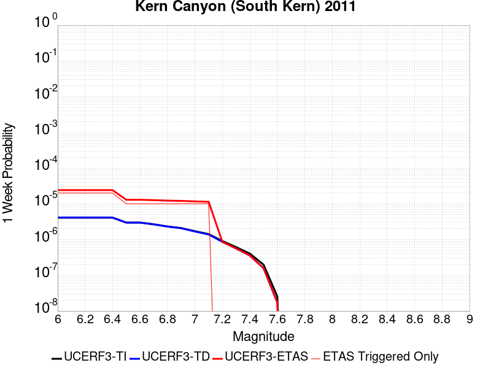 |  |  |  |

| Magnitude | 1 wk TI Prob | 1 wk TD Prob | 1 wk ETAS Prob | 1 wk ETAS/TD Gain | 1 wk ETAS Triggered Only | 1 mo TI Prob | 1 mo TD Prob | 1 mo ETAS Prob | 1 mo ETAS/TD Gain | 1 mo ETAS Triggered Only | 1 yr TI Prob | 1 yr TD Prob | 1 yr ETAS Prob | 1 yr ETAS/TD Gain | 1 yr ETAS Triggered Only | 10 yr TI Prob | 10 yr TD Prob | 10 yr ETAS Prob | 10 yr ETAS/TD Gain | 10 yr ETAS Triggered Only |
|-----|-----|-----|-----|-----|-----|-----|-----|-----|-----|-----|-----|-----|-----|-----|-----|-----|-----|-----|-----|-----|
| 6.0 | 4.105075E-6 | 4.1137264E-6 | 4.1137264E-6 | 1.0 | 0.0 | 1.7593058E-5 | 1.763014E-5 | 1.763014E-5 | 1.0 | 0.0 | 2.1417443E-4 | 2.1462646E-4 | 2.5211374E-4 | 1.1746628 | 3.7495312E-5 | 0.0021396813 | 0.0021442557 | 0.0021816706 | 1.0174489 | 3.7495312E-5 |
| 6.1 | 4.105075E-6 | 4.1137264E-6 | 4.1137264E-6 | 1.0 | 0.0 | 1.7593058E-5 | 1.763014E-5 | 1.763014E-5 | 1.0 | 0.0 | 2.1417443E-4 | 2.1462646E-4 | 2.5211374E-4 | 1.1746628 | 3.7495312E-5 | 0.0021396813 | 0.0021442557 | 0.0021816706 | 1.0174489 | 3.7495312E-5 |
| 6.2 | 4.105075E-6 | 4.1137264E-6 | 4.1137264E-6 | 1.0 | 0.0 | 1.7593058E-5 | 1.763014E-5 | 1.763014E-5 | 1.0 | 0.0 | 2.1417443E-4 | 2.1462646E-4 | 2.5211374E-4 | 1.1746628 | 3.7495312E-5 | 0.0021396813 | 0.0021442557 | 0.0021816706 | 1.0174489 | 3.7495312E-5 |
| 6.3 | 4.105075E-6 | 4.1137264E-6 | 4.1137264E-6 | 1.0 | 0.0 | 1.7593058E-5 | 1.763014E-5 | 1.763014E-5 | 1.0 | 0.0 | 2.1417443E-4 | 2.1462646E-4 | 2.5211374E-4 | 1.1746628 | 3.7495312E-5 | 0.0021396813 | 0.0021442557 | 0.0021816706 | 1.0174489 | 3.7495312E-5 |
| 6.4 | 4.105075E-6 | 4.1137264E-6 | 4.1137264E-6 | 1.0 | 0.0 | 1.7593058E-5 | 1.763014E-5 | 1.763014E-5 | 1.0 | 0.0 | 2.1417443E-4 | 2.1462646E-4 | 2.5211374E-4 | 1.1746628 | 3.7495312E-5 | 0.0021396813 | 0.0021442557 | 0.0021816706 | 1.0174489 | 3.7495312E-5 |
| 6.5 | 2.9849807E-6 | 2.9731548E-6 | 2.9731548E-6 | 1.0 | 0.0 | 1.2792712E-5 | 1.274203E-5 | 1.274203E-5 | 1.0 | 0.0 | 1.5574014E-4 | 1.5512333E-4 | 1.9261282E-4 | 1.2416754 | 3.7495312E-5 | 0.0015563103 | 0.0015501656 | 0.0015876028 | 1.0241505 | 3.7495312E-5 |
| 6.6 | 2.9849807E-6 | 2.9731548E-6 | 2.9731548E-6 | 1.0 | 0.0 | 1.2792712E-5 | 1.274203E-5 | 1.274203E-5 | 1.0 | 0.0 | 1.5574014E-4 | 1.5512333E-4 | 1.9261282E-4 | 1.2416754 | 3.7495312E-5 | 0.0015563103 | 0.0015501656 | 0.0015876028 | 1.0241505 | 3.7495312E-5 |
| 6.7 | 2.6756725E-6 | 2.6582206E-6 | 2.6582206E-6 | 1.0 | 0.0 | 1.1467117E-5 | 1.1392325E-5 | 1.1392325E-5 | 1.0 | 0.0 | 1.396032E-4 | 1.3869285E-4 | 1.7618296E-4 | 1.2703104 | 3.7495312E-5 | 0.0013951553 | 0.0013860738 | 0.0014235171 | 1.027014 | 3.7495312E-5 |
| 6.8 | 2.3283721E-6 | 2.3047787E-6 | 2.3047787E-6 | 1.0 | 0.0 | 9.9787E-6 | 9.877586E-6 | 9.877586E-6 | 1.0 | 0.0 | 1.214839E-4 | 1.20253055E-4 | 1.5774385E-4 | 1.3117659 | 3.7495312E-5 | 0.001214175 | 0.0012018873 | 0.0012393375 | 1.0311595 | 3.7495312E-5 |
| 6.9 | 2.0972677E-6 | 2.0696411E-6 | 2.0696411E-6 | 1.0 | 0.0 | 8.988259E-6 | 8.869861E-6 | 8.869861E-6 | 1.0 | 0.0 | 1.0942656E-4 | 1.0798526E-4 | 1.4547653E-4 | 1.3471887 | 3.7495312E-5 | 0.0010937268 | 0.0010793337 | 0.0011167886 | 1.0347018 | 3.7495312E-5 |
| 7.0 | 1.7132242E-6 | 1.6787036E-6 | 1.6787036E-6 | 1.0 | 0.0 | 7.3423685E-6 | 7.194424E-6 | 7.194424E-6 | 1.0 | 0.0 | 8.938967E-5 | 8.758863E-5 | 1.2508067E-4 | 1.4280467 | 3.7495312E-5 | 8.935372E-4 | 8.7554497E-4 | 9.130074E-4 | 1.0427877 | 3.7495312E-5 |
| 7.1 | 1.4215541E-6 | 1.3815752E-6 | 1.3815752E-6 | 1.0 | 0.0 | 6.0923603E-6 | 5.9210233E-6 | 5.9210233E-6 | 1.0 | 0.0 | 7.417196E-5 | 7.20861E-5 | 1.0957871E-4 | 1.5201087 | 3.7495312E-5 | 7.414721E-4 | 7.206299E-4 | 7.5809815E-4 | 1.0519938 | 3.7495312E-5 |
| 7.2 | 9.097853E-7 | 8.6037755E-7 | 8.6037755E-7 | 1.0 | 0.0 | 3.899074E-6 | 3.6873273E-6 | 3.6873273E-6 | 1.0 | 0.0 | 4.7470192E-5 | 4.4892295E-5 | 4.4892295E-5 | 1.0 | 0.0 | 4.7460053E-4 | 4.4883334E-4 | 4.4883334E-4 | 1.0 | 0.0 |
| 7.3 | 6.144169E-7 | 5.628206E-7 | 5.628206E-7 | 1.0 | 0.0 | 2.6332125E-6 | 2.4120861E-6 | 2.4120861E-6 | 1.0 | 0.0 | 3.205889E-5 | 2.9366758E-5 | 2.9366758E-5 | 1.0 | 0.0 | 3.2054266E-4 | 2.936293E-4 | 2.936293E-4 | 1.0 | 0.0 |
| 7.4 | 4.049844E-7 | 3.5728314E-7 | 3.5728314E-7 | 1.0 | 0.0 | 1.7356463E-6 | 1.5312125E-6 | 1.5312125E-6 | 1.0 | 0.0 | 2.1131287E-5 | 1.8642357E-5 | 1.8642357E-5 | 1.0 | 0.0 | 2.1129279E-4 | 1.8640817E-4 | 1.8640817E-4 | 1.0 | 0.0 |
| 7.5 | 1.9871162E-7 | 1.583044E-7 | 1.583044E-7 | 1.0 | 0.0 | 8.5162094E-7 | 6.7844724E-7 | 6.7844724E-7 | 1.0 | 0.0 | 1.0368436E-5 | 8.260065E-6 | 8.260065E-6 | 1.0 | 0.0 | 1.0367952E-4 | 8.259767E-5 | 8.259767E-5 | 1.0 | 0.0 |
| 7.6 | 2.572245E-8 | 1.7352555E-8 | 1.7352555E-8 | 1.0 | 0.0 | 1.10239064E-7 | 7.436809E-8 | 7.436809E-8 | 1.0 | 0.0 | 1.3421597E-6 | 9.054312E-7 | 9.054312E-7 | 1.0 | 0.0 | 1.3421517E-5 | 9.05428E-6 | 9.05428E-6 | 1.0 | 0.0 |

## Santa Susana East (connector)
*[(top)](#table-of-contents)*

| 1 Week | 1 Month | 1 Year | 10 Year |
|-----|-----|-----|-----|
|  |  |  |  |

| Magnitude | 1 wk TI Prob | 1 wk TD Prob | 1 wk ETAS Prob | 1 wk ETAS/TD Gain | 1 wk ETAS Triggered Only | 1 mo TI Prob | 1 mo TD Prob | 1 mo ETAS Prob | 1 mo ETAS/TD Gain | 1 mo ETAS Triggered Only | 1 yr TI Prob | 1 yr TD Prob | 1 yr ETAS Prob | 1 yr ETAS/TD Gain | 1 yr ETAS Triggered Only | 10 yr TI Prob | 10 yr TD Prob | 10 yr ETAS Prob | 10 yr ETAS/TD Gain | 10 yr ETAS Triggered Only |
|-----|-----|-----|-----|-----|-----|-----|-----|-----|-----|-----|-----|-----|-----|-----|-----|-----|-----|-----|-----|-----|
| 6.0 | 2.858397E-5 | 3.202091E-5 | 3.202091E-5 | 1.0 | 0.0 | 1.2249697E-4 | 1.3722685E-4 | 1.3722685E-4 | 1.0 | 0.0 | 0.0014903803 | 0.0016697381 | 0.0016697381 | 1.0 | 0.0 | 0.014804244 | 0.016599052 | 0.016635925 | 1.0022213 | 3.7495312E-5 |
| 6.1 | 2.858397E-5 | 3.202091E-5 | 3.202091E-5 | 1.0 | 0.0 | 1.2249697E-4 | 1.3722685E-4 | 1.3722685E-4 | 1.0 | 0.0 | 0.0014903803 | 0.0016697381 | 0.0016697381 | 1.0 | 0.0 | 0.014804244 | 0.016599052 | 0.016635925 | 1.0022213 | 3.7495312E-5 |
| 6.2 | 2.858397E-5 | 3.202091E-5 | 3.202091E-5 | 1.0 | 0.0 | 1.2249697E-4 | 1.3722685E-4 | 1.3722685E-4 | 1.0 | 0.0 | 0.0014903803 | 0.0016697381 | 0.0016697381 | 1.0 | 0.0 | 0.014804244 | 0.016599052 | 0.016635925 | 1.0022213 | 3.7495312E-5 |
| 6.3 | 1.943582E-5 | 2.036718E-5 | 2.036718E-5 | 1.0 | 0.0 | 8.329371E-5 | 8.7285625E-5 | 8.7285625E-5 | 1.0 | 0.0 | 0.001013629 | 0.0010622967 | 0.0010622967 | 1.0 | 0.0 | 0.010090181 | 0.010583619 | 0.010583619 | 1.0 | 0.0 |
| 6.4 | 1.943582E-5 | 2.036718E-5 | 2.036718E-5 | 1.0 | 0.0 | 8.329371E-5 | 8.7285625E-5 | 8.7285625E-5 | 1.0 | 0.0 | 0.001013629 | 0.0010622967 | 0.0010622967 | 1.0 | 0.0 | 0.010090181 | 0.010583619 | 0.010583619 | 1.0 | 0.0 |
| 6.5 | 1.943582E-5 | 2.036718E-5 | 2.036718E-5 | 1.0 | 0.0 | 8.329371E-5 | 8.7285625E-5 | 8.7285625E-5 | 1.0 | 0.0 | 0.001013629 | 0.0010622967 | 0.0010622967 | 1.0 | 0.0 | 0.010090181 | 0.010583619 | 0.010583619 | 1.0 | 0.0 |
| 6.6 | 1.943582E-5 | 2.036718E-5 | 2.036718E-5 | 1.0 | 0.0 | 8.329371E-5 | 8.7285625E-5 | 8.7285625E-5 | 1.0 | 0.0 | 0.001013629 | 0.0010622967 | 0.0010622967 | 1.0 | 0.0 | 0.010090181 | 0.010583619 | 0.010583619 | 1.0 | 0.0 |
| 6.7 | 1.9404439E-5 | 2.03546E-5 | 2.03546E-5 | 1.0 | 0.0 | 8.3159226E-5 | 8.723172E-5 | 8.723172E-5 | 1.0 | 0.0 | 0.0010119933 | 0.0010616409 | 0.0010616409 | 1.0 | 0.0 | 0.010073971 | 0.010577125 | 0.010577125 | 1.0 | 0.0 |
| 6.8 | 1.2217526E-5 | 1.1592998E-5 | 1.1592998E-5 | 1.0 | 0.0 | 5.2359774E-5 | 4.9683425E-5 | 4.9683425E-5 | 1.0 | 0.0 | 6.372938E-4 | 6.0474465E-4 | 6.0474465E-4 | 1.0 | 0.0 | 0.0063546924 | 0.006033037 | 0.006033037 | 1.0 | 0.0 |
| 6.9 | 1.2217526E-5 | 1.1592998E-5 | 1.1592998E-5 | 1.0 | 0.0 | 5.2359774E-5 | 4.9683425E-5 | 4.9683425E-5 | 1.0 | 0.0 | 6.372938E-4 | 6.0474465E-4 | 6.0474465E-4 | 1.0 | 0.0 | 0.0063546924 | 0.006033037 | 0.006033037 | 1.0 | 0.0 |
| 7.0 | 9.276017E-6 | 8.059113E-6 | 8.059113E-6 | 1.0 | 0.0 | 3.9753755E-5 | 3.4538618E-5 | 3.4538618E-5 | 1.0 | 0.0 | 4.8389446E-4 | 4.2042998E-4 | 4.2042998E-4 | 1.0 | 0.0 | 0.0048284214 | 0.0041970722 | 0.0041970722 | 1.0 | 0.0 |
| 7.1 | 9.130355E-6 | 7.942286E-6 | 7.942286E-6 | 1.0 | 0.0 | 3.9129503E-5 | 3.4037945E-5 | 3.4037945E-5 | 1.0 | 0.0 | 4.7629757E-4 | 4.1433662E-4 | 4.1433662E-4 | 1.0 | 0.0 | 0.00475278 | 0.004136367 | 0.004136367 | 1.0 | 0.0 |
| 7.2 | 8.851015E-6 | 7.741445E-6 | 7.741445E-6 | 1.0 | 0.0 | 3.7932372E-5 | 3.317722E-5 | 3.317722E-5 | 1.0 | 0.0 | 4.6172875E-4 | 4.038612E-4 | 4.038612E-4 | 1.0 | 0.0 | 0.0046077054 | 0.0040319953 | 0.0040319953 | 1.0 | 0.0 |
| 7.3 | 8.573006E-6 | 7.550166E-6 | 7.550166E-6 | 1.0 | 0.0 | 3.6740938E-5 | 3.2357475E-5 | 3.2357475E-5 | 1.0 | 0.0 | 4.472291E-4 | 3.9388443E-4 | 3.9388443E-4 | 1.0 | 0.0 | 0.004463301 | 0.0039325804 | 0.0039325804 | 1.0 | 0.0 |
| 7.4 | 7.852282E-6 | 6.817687E-6 | 6.817687E-6 | 1.0 | 0.0 | 3.36522E-5 | 2.9218349E-5 | 2.9218349E-5 | 1.0 | 0.0 | 4.096385E-4 | 3.5567835E-4 | 3.5567835E-4 | 1.0 | 0.0 | 0.0040888423 | 0.0035517553 | 0.0035517553 | 1.0 | 0.0 |
| 7.5 | 4.8869324E-6 | 4.279055E-6 | 4.279055E-6 | 1.0 | 0.0 | 2.0943828E-5 | 1.8338687E-5 | 1.8338687E-5 | 1.0 | 0.0 | 2.5496128E-4 | 2.232523E-4 | 2.232523E-4 | 1.0 | 0.0 | 0.0025466895 | 0.0022304445 | 0.0022304445 | 1.0 | 0.0 |
| 7.6 | 1.3894544E-6 | 1.1568179E-6 | 1.1568179E-6 | 1.0 | 0.0 | 5.954791E-6 | 4.957783E-6 | 4.957783E-6 | 1.0 | 0.0 | 7.249717E-5 | 6.0359558E-5 | 6.0359558E-5 | 1.0 | 0.0 | 7.247352E-4 | 6.0345343E-4 | 6.0345343E-4 | 1.0 | 0.0 |
| 7.7 | 2.9924632E-7 | 2.371928E-7 | 2.371928E-7 | 1.0 | 0.0 | 1.2824837E-6 | 1.0165402E-6 | 1.0165402E-6 | 1.0 | 0.0 | 1.5614127E-5 | 1.2376314E-5 | 1.2376314E-5 | 1.0 | 0.0 | 1.5613029E-4 | 1.2375697E-4 | 1.2375697E-4 | 1.0 | 0.0 |
| 7.8 | 4.8188564E-8 | 2.6323061E-8 | 2.6323061E-8 | 1.0 | 0.0 | 2.065224E-7 | 1.1281311E-7 | 1.1281311E-7 | 1.0 | 0.0 | 2.5144072E-6 | 1.3734989E-6 | 1.3734989E-6 | 1.0 | 0.0 | 2.5143789E-5 | 1.3734912E-5 | 1.3734912E-5 | 1.0 | 0.0 |
| 7.9 | 2.6127251E-9 | 2.7681102E-9 | 2.7681102E-9 | 1.0 | 0.0 | 1.1197393E-8 | 1.186333E-8 | 1.186333E-8 | 1.0 | 0.0 | 1.3632825E-7 | 1.4443603E-7 | 1.4443603E-7 | 1.0 | 0.0 | 1.3632817E-6 | 1.4443604E-6 | 1.4443604E-6 | 1.0 | 0.0 |

## Raymond
*[(top)](#table-of-contents)*

| 1 Week | 1 Month | 1 Year | 10 Year |
|-----|-----|-----|-----|
|  |  |  |  |

| Magnitude | 1 wk TI Prob | 1 wk TD Prob | 1 wk ETAS Prob | 1 wk ETAS/TD Gain | 1 wk ETAS Triggered Only | 1 mo TI Prob | 1 mo TD Prob | 1 mo ETAS Prob | 1 mo ETAS/TD Gain | 1 mo ETAS Triggered Only | 1 yr TI Prob | 1 yr TD Prob | 1 yr ETAS Prob | 1 yr ETAS/TD Gain | 1 yr ETAS Triggered Only | 10 yr TI Prob | 10 yr TD Prob | 10 yr ETAS Prob | 10 yr ETAS/TD Gain | 10 yr ETAS Triggered Only |
|-----|-----|-----|-----|-----|-----|-----|-----|-----|-----|-----|-----|-----|-----|-----|-----|-----|-----|-----|-----|-----|
| 6.0 | 1.5157413E-5 | 1.5810128E-5 | 1.5810128E-5 | 1.0 | 0.0 | 6.4958724E-5 | 6.7756075E-5 | 6.7756075E-5 | 1.0 | 0.0 | 7.905855E-4 | 8.2464307E-4 | 8.2464307E-4 | 1.0 | 0.0 | 0.007877788 | 0.008218348 | 0.008255536 | 1.004525 | 3.7495312E-5 |
| 6.1 | 1.5157413E-5 | 1.5810128E-5 | 1.5810128E-5 | 1.0 | 0.0 | 6.4958724E-5 | 6.7756075E-5 | 6.7756075E-5 | 1.0 | 0.0 | 7.905855E-4 | 8.2464307E-4 | 8.2464307E-4 | 1.0 | 0.0 | 0.007877788 | 0.008218348 | 0.008255536 | 1.004525 | 3.7495312E-5 |
| 6.2 | 1.5157413E-5 | 1.5810128E-5 | 1.5810128E-5 | 1.0 | 0.0 | 6.4958724E-5 | 6.7756075E-5 | 6.7756075E-5 | 1.0 | 0.0 | 7.905855E-4 | 8.2464307E-4 | 8.2464307E-4 | 1.0 | 0.0 | 0.007877788 | 0.008218348 | 0.008255536 | 1.004525 | 3.7495312E-5 |
| 6.3 | 1.5157413E-5 | 1.5810128E-5 | 1.5810128E-5 | 1.0 | 0.0 | 6.4958724E-5 | 6.7756075E-5 | 6.7756075E-5 | 1.0 | 0.0 | 7.905855E-4 | 8.2464307E-4 | 8.2464307E-4 | 1.0 | 0.0 | 0.007877788 | 0.008218348 | 0.008255536 | 1.004525 | 3.7495312E-5 |
| 6.4 | 1.3941944E-5 | 1.445469E-5 | 1.445469E-5 | 1.0 | 0.0 | 5.9749822E-5 | 6.1947336E-5 | 6.1947336E-5 | 1.0 | 0.0 | 7.2721124E-4 | 7.5397117E-4 | 7.5397117E-4 | 1.0 | 0.0 | 0.007248361 | 0.0075164647 | 0.0075536785 | 1.0049509 | 3.7495312E-5 |
| 6.5 | 1.3941944E-5 | 1.445469E-5 | 1.445469E-5 | 1.0 | 0.0 | 5.9749822E-5 | 6.1947336E-5 | 6.1947336E-5 | 1.0 | 0.0 | 7.2721124E-4 | 7.5397117E-4 | 7.5397117E-4 | 1.0 | 0.0 | 0.007248361 | 0.0075164647 | 0.0075536785 | 1.0049509 | 3.7495312E-5 |
| 6.6 | 1.0542609E-5 | 1.0671113E-5 | 1.0671113E-5 | 1.0 | 0.0 | 4.5181827E-5 | 4.573257E-5 | 4.573257E-5 | 1.0 | 0.0 | 5.499499E-4 | 5.5665727E-4 | 5.5665727E-4 | 1.0 | 0.0 | 0.005485909 | 0.00555319 | 0.00555319 | 1.0 | 0.0 |
| 6.7 | 1.0542609E-5 | 1.0671113E-5 | 1.0671113E-5 | 1.0 | 0.0 | 4.5181827E-5 | 4.573257E-5 | 4.573257E-5 | 1.0 | 0.0 | 5.499499E-4 | 5.5665727E-4 | 5.5665727E-4 | 1.0 | 0.0 | 0.005485909 | 0.00555319 | 0.00555319 | 1.0 | 0.0 |
| 6.8 | 1.0079132E-5 | 1.0176646E-5 | 1.0176646E-5 | 1.0 | 0.0 | 4.3195567E-5 | 4.3613498E-5 | 4.3613498E-5 | 1.0 | 0.0 | 5.257791E-4 | 5.3087034E-4 | 5.3087034E-4 | 1.0 | 0.0 | 0.0052453685 | 0.005296571 | 0.005296571 | 1.0 | 0.0 |
| 6.9 | 7.721598E-6 | 7.5489047E-6 | 7.5489047E-6 | 1.0 | 0.0 | 3.3092143E-5 | 3.2352054E-5 | 3.2352054E-5 | 1.0 | 0.0 | 4.0282236E-4 | 3.9381627E-4 | 3.9381627E-4 | 1.0 | 0.0 | 0.0040209293 | 0.0039313175 | 0.0039313175 | 1.0 | 0.0 |
| 7.0 | 7.137566E-6 | 6.9113057E-6 | 6.9113057E-6 | 1.0 | 0.0 | 3.058921E-5 | 2.961955E-5 | 2.961955E-5 | 1.0 | 0.0 | 3.7236E-4 | 3.6055944E-4 | 3.6055944E-4 | 1.0 | 0.0 | 0.0037173668 | 0.0035998628 | 0.0035998628 | 1.0 | 0.0 |
| 7.1 | 5.654976E-6 | 5.29954E-6 | 5.29954E-6 | 1.0 | 0.0 | 2.4235387E-5 | 2.2712118E-5 | 2.2712118E-5 | 1.0 | 0.0 | 2.9502588E-4 | 2.7648517E-4 | 2.7648517E-4 | 1.0 | 0.0 | 0.0029463451 | 0.002761443 | 0.002761443 | 1.0 | 0.0 |
| 7.2 | 4.9358455E-6 | 4.5266574E-6 | 4.5266574E-6 | 1.0 | 0.0 | 2.1153453E-5 | 1.9399817E-5 | 1.9399817E-5 | 1.0 | 0.0 | 2.5751285E-4 | 2.3616731E-4 | 2.3616731E-4 | 1.0 | 0.0 | 0.0025721465 | 0.0023591854 | 0.0023591854 | 1.0 | 0.0 |
| 7.3 | 4.2368597E-6 | 3.8056164E-6 | 3.8056164E-6 | 1.0 | 0.0 | 1.8157843E-5 | 1.6309683E-5 | 1.6309683E-5 | 1.0 | 0.0 | 2.2104931E-4 | 1.9855241E-4 | 1.9855241E-4 | 1.0 | 0.0 | 0.0022082955 | 0.0019837688 | 0.0019837688 | 1.0 | 0.0 |
| 7.4 | 3.4999923E-6 | 3.043744E-6 | 3.043744E-6 | 1.0 | 0.0 | 1.49998805E-5 | 1.3044552E-5 | 1.3044552E-5 | 1.0 | 0.0 | 1.8260824E-4 | 1.5880594E-4 | 1.5880594E-4 | 1.0 | 0.0 | 0.0018245826 | 0.0015869403 | 0.0015869403 | 1.0 | 0.0 |
| 7.5 | 2.738017E-6 | 2.3020468E-6 | 2.3020468E-6 | 1.0 | 0.0 | 1.1734306E-5 | 9.865878E-6 | 9.865878E-6 | 1.0 | 0.0 | 1.428558E-4 | 1.2011051E-4 | 1.2011051E-4 | 1.0 | 0.0 | 0.0014276401 | 0.0012004703 | 0.0012004703 | 1.0 | 0.0 |
| 7.6 | 1.8186392E-6 | 1.442312E-6 | 1.442312E-6 | 1.0 | 0.0 | 7.794145E-6 | 6.181323E-6 | 6.181323E-6 | 1.0 | 0.0 | 9.488958E-5 | 7.5255055E-5 | 7.5255055E-5 | 1.0 | 0.0 | 9.4849075E-4 | 7.523072E-4 | 7.523072E-4 | 1.0 | 0.0 |
| 7.7 | 1.0660348E-6 | 7.6438056E-7 | 7.6438056E-7 | 1.0 | 0.0 | 4.5687125E-6 | 3.2759126E-6 | 3.2759126E-6 | 1.0 | 0.0 | 5.5622655E-5 | 3.9883522E-5 | 3.9883522E-5 | 1.0 | 0.0 | 5.5608735E-4 | 3.9877277E-4 | 3.9877277E-4 | 1.0 | 0.0 |
| 7.8 | 6.913602E-7 | 4.3204133E-7 | 4.3204133E-7 | 1.0 | 0.0 | 2.962969E-6 | 1.8516045E-6 | 1.8516045E-6 | 1.0 | 0.0 | 3.607355E-5 | 2.2543056E-5 | 2.2543056E-5 | 1.0 | 0.0 | 3.6067693E-4 | 2.2541556E-4 | 2.2541556E-4 | 1.0 | 0.0 |
| 7.9 | 7.425201E-8 | 5.3222113E-8 | 5.3222113E-8 | 1.0 | 0.0 | 3.1822285E-7 | 2.2809476E-7 | 2.2809476E-7 | 1.0 | 0.0 | 3.874356E-6 | 2.7770516E-6 | 2.7770516E-6 | 1.0 | 0.0 | 3.8742884E-5 | 2.7770298E-5 | 2.7770298E-5 | 1.0 | 0.0 |

## Monte Vista - Shannon 2011 CFM
*[(top)](#table-of-contents)*

| 1 Week | 1 Month | 1 Year | 10 Year |
|-----|-----|-----|-----|
|  |  |  |  |

| Magnitude | 1 wk TI Prob | 1 wk TD Prob | 1 wk ETAS Prob | 1 wk ETAS/TD Gain | 1 wk ETAS Triggered Only | 1 mo TI Prob | 1 mo TD Prob | 1 mo ETAS Prob | 1 mo ETAS/TD Gain | 1 mo ETAS Triggered Only | 1 yr TI Prob | 1 yr TD Prob | 1 yr ETAS Prob | 1 yr ETAS/TD Gain | 1 yr ETAS Triggered Only | 10 yr TI Prob | 10 yr TD Prob | 10 yr ETAS Prob | 10 yr ETAS/TD Gain | 10 yr ETAS Triggered Only |
|-----|-----|-----|-----|-----|-----|-----|-----|-----|-----|-----|-----|-----|-----|-----|-----|-----|-----|-----|-----|-----|
| 6.0 | 2.7907707E-5 | 2.7584209E-5 | 6.5078486E-5 | 2.359266 | 3.7495312E-5 | 1.19598975E-4 | 1.1821338E-4 | 1.5570426E-4 | 1.3171458 | 3.7495312E-5 | 0.0014551448 | 0.0014384214 | 0.0014758628 | 1.0260295 | 3.7495312E-5 | 0.014456532 | 0.014320195 | 0.014357153 | 1.0025809 | 3.7495312E-5 |
| 6.1 | 2.7907707E-5 | 2.7584209E-5 | 6.5078486E-5 | 2.359266 | 3.7495312E-5 | 1.19598975E-4 | 1.1821338E-4 | 1.5570426E-4 | 1.3171458 | 3.7495312E-5 | 0.0014551448 | 0.0014384214 | 0.0014758628 | 1.0260295 | 3.7495312E-5 | 0.014456532 | 0.014320195 | 0.014357153 | 1.0025809 | 3.7495312E-5 |
| 6.2 | 2.7907707E-5 | 2.7584209E-5 | 6.5078486E-5 | 2.359266 | 3.7495312E-5 | 1.19598975E-4 | 1.1821338E-4 | 1.5570426E-4 | 1.3171458 | 3.7495312E-5 | 0.0014551448 | 0.0014384214 | 0.0014758628 | 1.0260295 | 3.7495312E-5 | 0.014456532 | 0.014320195 | 0.014357153 | 1.0025809 | 3.7495312E-5 |
| 6.3 | 2.7907707E-5 | 2.7584209E-5 | 6.5078486E-5 | 2.359266 | 3.7495312E-5 | 1.19598975E-4 | 1.1821338E-4 | 1.5570426E-4 | 1.3171458 | 3.7495312E-5 | 0.0014551448 | 0.0014384214 | 0.0014758628 | 1.0260295 | 3.7495312E-5 | 0.014456532 | 0.014320195 | 0.014357153 | 1.0025809 | 3.7495312E-5 |
| 6.4 | 2.7907707E-5 | 2.7584209E-5 | 6.5078486E-5 | 2.359266 | 3.7495312E-5 | 1.19598975E-4 | 1.1821338E-4 | 1.5570426E-4 | 1.3171458 | 3.7495312E-5 | 0.0014551448 | 0.0014384214 | 0.0014758628 | 1.0260295 | 3.7495312E-5 | 0.014456532 | 0.014320195 | 0.014357153 | 1.0025809 | 3.7495312E-5 |
| 6.5 | 1.7990213E-5 | 1.6639884E-5 | 5.4134573E-5 | 3.2533023 | 3.7495312E-5 | 7.709863E-5 | 7.131221E-5 | 1.0880485E-4 | 1.5257534 | 3.7495312E-5 | 9.382716E-4 | 8.679467E-4 | 9.0540946E-4 | 1.0431625 | 3.7495312E-5 | 0.0093431985 | 0.008668941 | 0.008706111 | 1.0042877 | 3.7495312E-5 |
| 6.6 | 9.650407E-6 | 7.4571435E-6 | 4.4952176E-5 | 6.028069 | 3.7495312E-5 | 4.135823E-5 | 3.195884E-5 | 6.945295E-5 | 2.1732001 | 3.7495312E-5 | 5.0342013E-4 | 3.8903722E-4 | 4.2651795E-4 | 1.0963422 | 3.7495312E-5 | 0.005022812 | 0.0039012418 | 0.003938591 | 1.0095736 | 3.7495312E-5 |
| 6.7 | 9.62828E-6 | 7.4350583E-6 | 4.4930093E-5 | 6.0430045 | 3.7495312E-5 | 4.1263404E-5 | 3.186419E-5 | 6.9358306E-5 | 2.176685 | 3.7495312E-5 | 5.022661E-4 | 3.878853E-4 | 4.2536607E-4 | 1.0966285 | 3.7495312E-5 | 0.0050113243 | 0.003889763 | 0.0039271126 | 1.009602 | 3.7495312E-5 |
| 6.8 | 6.887523E-6 | 4.4615676E-6 | 4.1956715E-5 | 9.40403 | 3.7495312E-5 | 2.9517621E-5 | 1.9120876E-5 | 5.661547E-5 | 2.9609246 | 3.7495312E-5 | 3.5931775E-4 | 2.3277402E-4 | 2.702606E-4 | 1.1610428 | 3.7495312E-5 | 0.0035873733 | 0.0023424553 | 0.0023798628 | 1.0159694 | 3.7495312E-5 |
| 6.9 | 6.2722347E-6 | 3.8034377E-6 | 3.8034377E-6 | 1.0 | 0.0 | 2.6880729E-5 | 1.6300357E-5 | 1.6300357E-5 | 1.0 | 0.0 | 3.2722374E-4 | 1.984408E-4 | 1.984408E-4 | 1.0 | 0.0 | 0.003267423 | 0.0019997752 | 0.0019997752 | 1.0 | 0.0 |
| 7.0 | 5.5320347E-6 | 3.0305885E-6 | 3.0305885E-6 | 1.0 | 0.0 | 2.3708504E-5 | 1.2988182E-5 | 1.2988182E-5 | 1.0 | 0.0 | 2.8861282E-4 | 1.5812147E-4 | 1.5812147E-4 | 1.0 | 0.0 | 0.0028823826 | 0.001597215 | 0.001597215 | 1.0 | 0.0 |
| 7.1 | 3.8794055E-6 | 1.2837862E-6 | 1.2837862E-6 | 1.0 | 0.0 | 1.6625918E-5 | 5.5019295E-6 | 5.5019295E-6 | 1.0 | 0.0 | 2.0240174E-4 | 6.698394E-5 | 6.698394E-5 | 1.0 | 0.0 | 0.002022175 | 6.865884E-4 | 6.865884E-4 | 1.0 | 0.0 |
| 7.2 | 3.4813652E-6 | 9.671046E-7 | 9.671046E-7 | 1.0 | 0.0 | 1.49200505E-5 | 4.1447274E-6 | 4.1447274E-6 | 1.0 | 0.0 | 1.8163648E-4 | 5.0460894E-5 | 5.0460894E-5 | 1.0 | 0.0 | 0.0018148809 | 5.214329E-4 | 5.214329E-4 | 1.0 | 0.0 |
| 7.3 | 3.1682148E-6 | 7.719097E-7 | 7.719097E-7 | 1.0 | 0.0 | 1.3577992E-5 | 3.30818E-6 | 3.30818E-6 | 1.0 | 0.0 | 1.6529951E-4 | 4.027635E-5 | 4.027635E-5 | 1.0 | 0.0 | 0.0016517661 | 4.1960424E-4 | 4.1960424E-4 | 1.0 | 0.0 |
| 7.4 | 2.9707667E-6 | 7.3457204E-7 | 7.3457204E-7 | 1.0 | 0.0 | 1.2731795E-5 | 3.148162E-6 | 3.148162E-6 | 1.0 | 0.0 | 1.5499859E-4 | 3.8328202E-5 | 3.8328202E-5 | 1.0 | 0.0 | 0.0015489052 | 3.9992164E-4 | 3.9992164E-4 | 1.0 | 0.0 |
| 7.5 | 2.3462758E-6 | 6.007889E-7 | 6.007889E-7 | 1.0 | 0.0 | 1.0055429E-5 | 2.574807E-6 | 2.574807E-6 | 1.0 | 0.0 | 1.2241797E-4 | 3.1347827E-5 | 3.1347827E-5 | 1.0 | 0.0 | 0.0012235056 | 3.2839534E-4 | 3.2839534E-4 | 1.0 | 0.0 |
| 7.6 | 2.112783E-6 | 5.251582E-7 | 5.251582E-7 | 1.0 | 0.0 | 9.054753E-6 | 2.250676E-6 | 2.250676E-6 | 1.0 | 0.0 | 1.1023604E-4 | 2.7401638E-5 | 2.7401638E-5 | 1.0 | 0.0 | 0.0011018137 | 2.885138E-4 | 2.885138E-4 | 1.0 | 0.0 |
| 7.7 | 1.7022471E-6 | 4.231601E-7 | 4.231601E-7 | 1.0 | 0.0 | 7.2953244E-6 | 1.8135419E-6 | 1.8135419E-6 | 1.0 | 0.0 | 8.881695E-5 | 2.207965E-5 | 2.207965E-5 | 1.0 | 0.0 | 8.878146E-4 | 2.3398738E-4 | 2.3398738E-4 | 1.0 | 0.0 |
| 7.8 | 7.230914E-7 | 3.7285864E-7 | 3.7285864E-7 | 1.0 | 0.0 | 3.0989595E-6 | 1.5979647E-6 | 1.5979647E-6 | 1.0 | 0.0 | 3.772918E-5 | 1.9455047E-5 | 1.9455047E-5 | 1.0 | 0.0 | 3.7722773E-4 | 2.0726922E-4 | 2.0726922E-4 | 1.0 | 0.0 |
| 7.9 | 4.3588446E-7 | 3.4305793E-7 | 3.4305793E-7 | 1.0 | 0.0 | 1.868075E-6 | 1.4702474E-6 | 1.4702474E-6 | 1.0 | 0.0 | 2.2743576E-5 | 1.7900116E-5 | 1.7900116E-5 | 1.0 | 0.0 | 2.2741247E-4 | 1.8995286E-4 | 1.8995286E-4 | 1.0 | 0.0 |
| 8.0 | 2.3317523E-7 | 3.1513588E-7 | 3.1513588E-7 | 1.0 | 0.0 | 9.99322E-7 | 1.3505817E-6 | 1.3505817E-6 | 1.0 | 0.0 | 1.2166677E-5 | 1.644321E-5 | 1.644321E-5 | 1.0 | 0.0 | 1.21660116E-4 | 1.7399415E-4 | 1.7399415E-4 | 1.0 | 0.0 |
| 8.1 | 1.4662456E-7 | 2.030774E-7 | 2.030774E-7 | 1.0 | 0.0 | 6.283908E-7 | 8.703314E-7 | 8.703314E-7 | 1.0 | 0.0 | 7.650631E-6 | 1.05962345E-5 | 1.05962345E-5 | 1.0 | 0.0 | 7.650368E-5 | 1.113227E-4 | 1.113227E-4 | 1.0 | 0.0 |
| 8.2 | 5.4931775E-9 | 5.07573E-9 | 5.07573E-9 | 1.0 | 0.0 | 2.3542189E-8 | 2.1753127E-8 | 2.1753127E-8 | 1.0 | 0.0 | 2.8662612E-7 | 2.6484432E-7 | 2.6484432E-7 | 1.0 | 0.0 | 2.8662573E-6 | 2.7539324E-6 | 2.7539324E-6 | 1.0 | 0.0 |

## San Luis Range 2011 CFM
*[(top)](#table-of-contents)*

| 1 Week | 1 Month | 1 Year | 10 Year |
|-----|-----|-----|-----|
|  |  |  |  |

| Magnitude | 1 wk TI Prob | 1 wk TD Prob | 1 wk ETAS Prob | 1 wk ETAS/TD Gain | 1 wk ETAS Triggered Only | 1 mo TI Prob | 1 mo TD Prob | 1 mo ETAS Prob | 1 mo ETAS/TD Gain | 1 mo ETAS Triggered Only | 1 yr TI Prob | 1 yr TD Prob | 1 yr ETAS Prob | 1 yr ETAS/TD Gain | 1 yr ETAS Triggered Only | 10 yr TI Prob | 10 yr TD Prob | 10 yr ETAS Prob | 10 yr ETAS/TD Gain | 10 yr ETAS Triggered Only |
|-----|-----|-----|-----|-----|-----|-----|-----|-----|-----|-----|-----|-----|-----|-----|-----|-----|-----|-----|-----|-----|
| 6.0 | 8.8368415E-6 | 8.965454E-6 | 4.646043E-5 | 5.182162 | 3.7495312E-5 | 3.787163E-5 | 3.842285E-5 | 7.591672E-5 | 1.9758222 | 3.7495312E-5 | 4.609895E-4 | 4.677057E-4 | 5.051835E-4 | 1.080131 | 3.7495312E-5 | 0.0046003438 | 0.0046679964 | 0.0047053164 | 1.0079949 | 3.7495312E-5 |
| 6.1 | 8.8368415E-6 | 8.965454E-6 | 4.646043E-5 | 5.182162 | 3.7495312E-5 | 3.787163E-5 | 3.842285E-5 | 7.591672E-5 | 1.9758222 | 3.7495312E-5 | 4.609895E-4 | 4.677057E-4 | 5.051835E-4 | 1.080131 | 3.7495312E-5 | 0.0046003438 | 0.0046679964 | 0.0047053164 | 1.0079949 | 3.7495312E-5 |
| 6.2 | 8.8368415E-6 | 8.965454E-6 | 4.646043E-5 | 5.182162 | 3.7495312E-5 | 3.787163E-5 | 3.842285E-5 | 7.591672E-5 | 1.9758222 | 3.7495312E-5 | 4.609895E-4 | 4.677057E-4 | 5.051835E-4 | 1.080131 | 3.7495312E-5 | 0.0046003438 | 0.0046679964 | 0.0047053164 | 1.0079949 | 3.7495312E-5 |
| 6.3 | 8.8368415E-6 | 8.965454E-6 | 4.646043E-5 | 5.182162 | 3.7495312E-5 | 3.787163E-5 | 3.842285E-5 | 7.591672E-5 | 1.9758222 | 3.7495312E-5 | 4.609895E-4 | 4.677057E-4 | 5.051835E-4 | 1.080131 | 3.7495312E-5 | 0.0046003438 | 0.0046679964 | 0.0047053164 | 1.0079949 | 3.7495312E-5 |
| 6.4 | 3.9094193E-6 | 3.9412025E-6 | 3.9412025E-6 | 1.0 | 0.0 | 1.6754546E-5 | 1.689076E-5 | 1.689076E-5 | 1.0 | 0.0 | 2.039675E-4 | 2.056259E-4 | 2.056259E-4 | 1.0 | 0.0 | 0.0020378039 | 0.0020543851 | 0.0020543851 | 1.0 | 0.0 |
| 6.5 | 3.9094193E-6 | 3.9412025E-6 | 3.9412025E-6 | 1.0 | 0.0 | 1.6754546E-5 | 1.689076E-5 | 1.689076E-5 | 1.0 | 0.0 | 2.039675E-4 | 2.056259E-4 | 2.056259E-4 | 1.0 | 0.0 | 0.0020378039 | 0.0020543851 | 0.0020543851 | 1.0 | 0.0 |
| 6.6 | 3.0587726E-6 | 3.0753883E-6 | 3.0753883E-6 | 1.0 | 0.0 | 1.3108959E-5 | 1.318017E-5 | 1.318017E-5 | 1.0 | 0.0 | 1.595899E-4 | 1.6045687E-4 | 1.6045687E-4 | 1.0 | 0.0 | 0.0015947534 | 0.0016034221 | 0.0016034221 | 1.0 | 0.0 |
| 6.7 | 2.6160574E-6 | 2.6251273E-6 | 2.6251273E-6 | 1.0 | 0.0 | 1.1211626E-5 | 1.1250498E-5 | 1.1250498E-5 | 1.0 | 0.0 | 1.3649299E-4 | 1.3696625E-4 | 1.3696625E-4 | 1.0 | 0.0 | 0.0013640919 | 0.0013688246 | 0.0013688246 | 1.0 | 0.0 |
| 6.8 | 2.5110312E-6 | 2.51814E-6 | 2.51814E-6 | 1.0 | 0.0 | 1.0761518E-5 | 1.0791985E-5 | 1.0791985E-5 | 1.0 | 0.0 | 1.310136E-4 | 1.3138456E-4 | 1.3138456E-4 | 1.0 | 0.0 | 0.0013093639 | 0.0013130746 | 0.0013130746 | 1.0 | 0.0 |
| 6.9 | 1.8564405E-6 | 1.852487E-6 | 1.852487E-6 | 1.0 | 0.0 | 7.95615E-6 | 7.939206E-6 | 7.939206E-6 | 1.0 | 0.0 | 9.686181E-5 | 9.665557E-5 | 9.665557E-5 | 1.0 | 0.0 | 9.68196E-4 | 9.661373E-4 | 9.661373E-4 | 1.0 | 0.0 |
| 7.0 | 1.546127E-6 | 1.5369537E-6 | 1.5369537E-6 | 1.0 | 0.0 | 6.626242E-6 | 6.586928E-6 | 6.586928E-6 | 1.0 | 0.0 | 8.06715E-5 | 8.0192905E-5 | 8.0192905E-5 | 1.0 | 0.0 | 8.0642226E-4 | 8.016404E-4 | 8.016404E-4 | 1.0 | 0.0 |
| 7.1 | 1.3368208E-6 | 1.3235326E-6 | 1.3235326E-6 | 1.0 | 0.0 | 5.7292195E-6 | 5.67227E-6 | 5.67227E-6 | 1.0 | 0.0 | 6.975101E-5 | 6.905771E-5 | 6.905771E-5 | 1.0 | 0.0 | 6.972912E-4 | 6.9036294E-4 | 6.9036294E-4 | 1.0 | 0.0 |
| 7.2 | 1.0623363E-6 | 1.0454368E-6 | 1.0454368E-6 | 1.0 | 0.0 | 4.5528623E-6 | 4.4804356E-6 | 4.4804356E-6 | 1.0 | 0.0 | 5.5429686E-5 | 5.4547938E-5 | 5.4547938E-5 | 1.0 | 0.0 | 5.5415864E-4 | 5.4534577E-4 | 5.4534577E-4 | 1.0 | 0.0 |
| 7.3 | 7.831679E-7 | 7.7273904E-7 | 7.7273904E-7 | 1.0 | 0.0 | 3.3564295E-6 | 3.3117344E-6 | 3.3117344E-6 | 1.0 | 0.0 | 4.086376E-5 | 4.0319625E-5 | 4.0319625E-5 | 1.0 | 0.0 | 4.0856248E-4 | 4.031232E-4 | 4.031232E-4 | 1.0 | 0.0 |
| 7.4 | 5.9558846E-7 | 5.910636E-7 | 5.910636E-7 | 1.0 | 0.0 | 2.5525194E-6 | 2.5331274E-6 | 2.5331274E-6 | 1.0 | 0.0 | 3.107648E-5 | 3.084039E-5 | 3.084039E-5 | 1.0 | 0.0 | 3.1072134E-4 | 3.083612E-4 | 3.083612E-4 | 1.0 | 0.0 |
| 7.5 | 4.1616502E-7 | 4.119631E-7 | 4.119631E-7 | 1.0 | 0.0 | 1.7835631E-6 | 1.7655549E-6 | 1.7655549E-6 | 1.0 | 0.0 | 2.1714664E-5 | 2.149542E-5 | 2.149542E-5 | 1.0 | 0.0 | 2.1712543E-4 | 2.1493346E-4 | 2.1493346E-4 | 1.0 | 0.0 |
| 7.6 | 2.3816014E-7 | 2.3376548E-7 | 2.3376548E-7 | 1.0 | 0.0 | 1.0206859E-6 | 1.0018516E-6 | 1.0018516E-6 | 1.0 | 0.0 | 1.242678E-5 | 1.2197475E-5 | 1.2197475E-5 | 1.0 | 0.0 | 1.2426086E-4 | 1.2196808E-4 | 1.2196808E-4 | 1.0 | 0.0 |
| 7.7 | 9.918777E-8 | 9.3867584E-8 | 9.3867584E-8 | 1.0 | 0.0 | 4.2509038E-7 | 4.0228957E-7 | 4.0228957E-7 | 1.0 | 0.0 | 5.1754632E-6 | 4.8978645E-6 | 4.8978645E-6 | 1.0 | 0.0 | 5.1753424E-5 | 4.897757E-5 | 4.897757E-5 | 1.0 | 0.0 |
| 7.8 | 3.4982556E-8 | 2.968655E-8 | 2.968655E-8 | 1.0 | 0.0 | 1.4992524E-7 | 1.2722806E-7 | 1.2722806E-7 | 1.0 | 0.0 | 1.8253382E-6 | 1.5490006E-6 | 1.5490006E-6 | 1.0 | 0.0 | 1.8253233E-5 | 1.5489897E-5 | 1.5489897E-5 | 1.0 | 0.0 |
| 7.9 | 1.6624908E-8 | 1.1477036E-8 | 1.1477036E-8 | 1.0 | 0.0 | 7.12496E-8 | 4.91873E-8 | 4.91873E-8 | 1.0 | 0.0 | 8.6746354E-7 | 5.988552E-7 | 5.988552E-7 | 1.0 | 0.0 | 8.674601E-6 | 5.988536E-6 | 5.988536E-6 | 1.0 | 0.0 |
| 8.0 | 6.3352315E-9 | 3.0888412E-9 | 3.0888412E-9 | 1.0 | 0.0 | 2.715099E-8 | 1.3237893E-8 | 1.3237893E-8 | 1.0 | 0.0 | 3.3056327E-7 | 1.6117131E-7 | 1.6117131E-7 | 1.0 | 0.0 | 3.3056278E-6 | 1.611712E-6 | 1.611712E-6 | 1.0 | 0.0 |

## Simi-Santa Rosa
*[(top)](#table-of-contents)*

| 1 Week | 1 Month | 1 Year | 10 Year |
|-----|-----|-----|-----|
|  |  |  |  |

| Magnitude | 1 wk TI Prob | 1 wk TD Prob | 1 wk ETAS Prob | 1 wk ETAS/TD Gain | 1 wk ETAS Triggered Only | 1 mo TI Prob | 1 mo TD Prob | 1 mo ETAS Prob | 1 mo ETAS/TD Gain | 1 mo ETAS Triggered Only | 1 yr TI Prob | 1 yr TD Prob | 1 yr ETAS Prob | 1 yr ETAS/TD Gain | 1 yr ETAS Triggered Only | 10 yr TI Prob | 10 yr TD Prob | 10 yr ETAS Prob | 10 yr ETAS/TD Gain | 10 yr ETAS Triggered Only |
|-----|-----|-----|-----|-----|-----|-----|-----|-----|-----|-----|-----|-----|-----|-----|-----|-----|-----|-----|-----|-----|
| 6.0 | 2.198912E-5 | 2.2275442E-5 | 2.2275442E-5 | 1.0 | 0.0 | 9.4235686E-5 | 9.5462936E-5 | 9.5462936E-5 | 1.0 | 0.0 | 0.0011467156 | 0.0011616853 | 0.0011616853 | 1.0 | 0.0 | 0.011408163 | 0.011560575 | 0.011597637 | 1.0032059 | 3.7495312E-5 |
| 6.1 | 2.198912E-5 | 2.2275442E-5 | 2.2275442E-5 | 1.0 | 0.0 | 9.4235686E-5 | 9.5462936E-5 | 9.5462936E-5 | 1.0 | 0.0 | 0.0011467156 | 0.0011616853 | 0.0011616853 | 1.0 | 0.0 | 0.011408163 | 0.011560575 | 0.011597637 | 1.0032059 | 3.7495312E-5 |
| 6.2 | 1.69983E-5 | 1.6668559E-5 | 1.6668559E-5 | 1.0 | 0.0 | 7.284782E-5 | 7.143489E-5 | 7.143489E-5 | 1.0 | 0.0 | 8.865613E-4 | 8.6940196E-4 | 8.6940196E-4 | 1.0 | 0.0 | 0.008830327 | 0.008662928 | 0.008700098 | 1.0042907 | 3.7495312E-5 |
| 6.3 | 1.69983E-5 | 1.6668559E-5 | 1.6668559E-5 | 1.0 | 0.0 | 7.284782E-5 | 7.143489E-5 | 7.143489E-5 | 1.0 | 0.0 | 8.865613E-4 | 8.6940196E-4 | 8.6940196E-4 | 1.0 | 0.0 | 0.008830327 | 0.008662928 | 0.008700098 | 1.0042907 | 3.7495312E-5 |
| 6.4 | 1.4666188E-5 | 1.4052543E-5 | 1.4052543E-5 | 1.0 | 0.0 | 6.285358E-5 | 6.0223934E-5 | 6.0223934E-5 | 1.0 | 0.0 | 7.6497364E-4 | 7.3300465E-4 | 7.3300465E-4 | 1.0 | 0.0 | 0.0076234564 | 0.007308344 | 0.0073455656 | 1.005093 | 3.7495312E-5 |
| 6.5 | 1.4666188E-5 | 1.4052543E-5 | 1.4052543E-5 | 1.0 | 0.0 | 6.285358E-5 | 6.0223934E-5 | 6.0223934E-5 | 1.0 | 0.0 | 7.6497364E-4 | 7.3300465E-4 | 7.3300465E-4 | 1.0 | 0.0 | 0.0076234564 | 0.007308344 | 0.0073455656 | 1.005093 | 3.7495312E-5 |
| 6.6 | 1.4377586E-5 | 1.3729583E-5 | 1.3729583E-5 | 1.0 | 0.0 | 6.1616774E-5 | 5.883988E-5 | 5.883988E-5 | 1.0 | 0.0 | 7.4992597E-4 | 7.1616494E-4 | 7.1616494E-4 | 1.0 | 0.0 | 0.007474003 | 0.0071410383 | 0.007178266 | 1.0052131 | 3.7495312E-5 |
| 6.7 | 1.3881404E-5 | 1.320755E-5 | 1.320755E-5 | 1.0 | 0.0 | 5.9490372E-5 | 5.66027E-5 | 5.66027E-5 | 1.0 | 0.0 | 7.240546E-4 | 6.8894465E-4 | 6.8894465E-4 | 1.0 | 0.0 | 0.007217 | 0.006870538 | 0.006907776 | 1.00542 | 3.7495312E-5 |
| 6.8 | 1.0176516E-5 | 9.154151E-6 | 9.154151E-6 | 1.0 | 0.0 | 4.3612912E-5 | 3.9231574E-5 | 3.9231574E-5 | 1.0 | 0.0 | 5.308578E-4 | 4.7755634E-4 | 4.7755634E-4 | 1.0 | 0.0 | 0.0052959146 | 0.004766934 | 0.004804251 | 1.0078282 | 3.7495312E-5 |
| 6.9 | 9.699797E-6 | 8.774719E-6 | 8.774719E-6 | 1.0 | 0.0 | 4.15699E-5 | 3.7605492E-5 | 3.7605492E-5 | 1.0 | 0.0 | 5.05996E-4 | 4.577671E-4 | 4.577671E-4 | 1.0 | 0.0 | 0.005048454 | 0.0045698597 | 0.0046071834 | 1.0081674 | 3.7495312E-5 |
| 7.0 | 7.4049476E-6 | 6.559333E-6 | 6.559333E-6 | 1.0 | 0.0 | 3.1735104E-5 | 2.8111197E-5 | 2.8111197E-5 | 1.0 | 0.0 | 3.8630638E-4 | 3.422127E-4 | 3.422127E-4 | 1.0 | 0.0 | 0.0038563553 | 0.0034180996 | 0.0034180996 | 1.0 | 0.0 |
| 7.1 | 3.873439E-6 | 2.7595095E-6 | 2.7595095E-6 | 1.0 | 0.0 | 1.6600346E-5 | 1.1826417E-5 | 1.1826417E-5 | 1.0 | 0.0 | 2.0209046E-4 | 1.4397735E-4 | 1.4397735E-4 | 1.0 | 0.0 | 0.0020190678 | 0.0014388643 | 0.0014388643 | 1.0 | 0.0 |
| 7.2 | 3.417706E-6 | 2.3676484E-6 | 2.3676484E-6 | 1.0 | 0.0 | 1.4647229E-5 | 1.0147027E-5 | 1.0147027E-5 | 1.0 | 0.0 | 1.7831543E-4 | 1.2353327E-4 | 1.2353327E-4 | 1.0 | 0.0 | 0.0017817242 | 0.0012346683 | 0.0012346683 | 1.0 | 0.0 |
| 7.3 | 1.90225E-6 | 1.4073753E-6 | 1.4073753E-6 | 1.0 | 0.0 | 8.152474E-6 | 6.0315947E-6 | 6.0315947E-6 | 1.0 | 0.0 | 9.9251854E-5 | 7.343221E-5 | 7.343221E-5 | 1.0 | 0.0 | 9.920754E-4 | 7.340817E-4 | 7.340817E-4 | 1.0 | 0.0 |
| 7.4 | 1.5170556E-6 | 1.1024773E-6 | 1.1024773E-6 | 1.0 | 0.0 | 6.5016507E-6 | 4.724894E-6 | 4.724894E-6 | 1.0 | 0.0 | 7.915472E-5 | 5.7524077E-5 | 5.7524077E-5 | 1.0 | 0.0 | 7.9126534E-4 | 5.7509297E-4 | 5.7509297E-4 | 1.0 | 0.0 |
| 7.5 | 1.178732E-6 | 8.535102E-7 | 8.535102E-7 | 1.0 | 0.0 | 5.0516987E-6 | 3.6578958E-6 | 3.6578958E-6 | 1.0 | 0.0 | 6.1502695E-5 | 4.453398E-5 | 4.453398E-5 | 1.0 | 0.0 | 6.148568E-4 | 4.452515E-4 | 4.452515E-4 | 1.0 | 0.0 |
| 7.6 | 6.8722386E-7 | 4.793198E-7 | 4.793198E-7 | 1.0 | 0.0 | 2.9452417E-6 | 2.054226E-6 | 2.054226E-6 | 1.0 | 0.0 | 3.5857727E-5 | 2.5009915E-5 | 2.5009915E-5 | 1.0 | 0.0 | 3.5851944E-4 | 2.5007114E-4 | 2.5007114E-4 | 1.0 | 0.0 |
| 7.7 | 5.5126515E-7 | 3.6731157E-7 | 3.6731157E-7 | 1.0 | 0.0 | 2.3625628E-6 | 1.5741915E-6 | 1.5741915E-6 | 1.0 | 0.0 | 2.8763823E-5 | 1.9165615E-5 | 1.9165615E-5 | 1.0 | 0.0 | 2.87601E-4 | 1.9163972E-4 | 1.9163972E-4 | 1.0 | 0.0 |
| 7.8 | 3.3860243E-7 | 2.0075942E-7 | 2.0075942E-7 | 1.0 | 0.0 | 1.4511525E-6 | 8.6039717E-7 | 8.6039717E-7 | 1.0 | 0.0 | 1.7667637E-5 | 1.0475286E-5 | 1.0475286E-5 | 1.0 | 0.0 | 1.7666233E-4 | 1.04747975E-4 | 1.04747975E-4 | 1.0 | 0.0 |
| 7.9 | 2.7955386E-7 | 1.4649108E-7 | 1.4649108E-7 | 1.0 | 0.0 | 1.1980875E-6 | 6.278188E-7 | 6.278188E-7 | 1.0 | 0.0 | 1.4586617E-5 | 7.643667E-6 | 7.643667E-6 | 1.0 | 0.0 | 1.458566E-4 | 7.643409E-5 | 7.643409E-5 | 1.0 | 0.0 |
| 8.0 | 5.6259015E-8 | 3.3355324E-8 | 3.3355324E-8 | 1.0 | 0.0 | 2.4111003E-7 | 1.4295138E-7 | 1.4295138E-7 | 1.0 | 0.0 | 2.9355108E-6 | 1.7404317E-6 | 1.7404317E-6 | 1.0 | 0.0 | 2.935472E-5 | 1.7404194E-5 | 1.7404194E-5 | 1.0 | 0.0 |

## Great Valley 03a Dunnigan Hills
*[(top)](#table-of-contents)*

| 1 Week | 1 Month | 1 Year | 10 Year |
|-----|-----|-----|-----|
|  |  |  |  |

| Magnitude | 1 wk TI Prob | 1 wk TD Prob | 1 wk ETAS Prob | 1 wk ETAS/TD Gain | 1 wk ETAS Triggered Only | 1 mo TI Prob | 1 mo TD Prob | 1 mo ETAS Prob | 1 mo ETAS/TD Gain | 1 mo ETAS Triggered Only | 1 yr TI Prob | 1 yr TD Prob | 1 yr ETAS Prob | 1 yr ETAS/TD Gain | 1 yr ETAS Triggered Only | 10 yr TI Prob | 10 yr TD Prob | 10 yr ETAS Prob | 10 yr ETAS/TD Gain | 10 yr ETAS Triggered Only |
|-----|-----|-----|-----|-----|-----|-----|-----|-----|-----|-----|-----|-----|-----|-----|-----|-----|-----|-----|-----|-----|
| 6.0 | 1.6591328E-5 | 1.8107954E-5 | 1.8107954E-5 | 1.0 | 0.0 | 7.110376E-5 | 7.7603596E-5 | 7.7603596E-5 | 1.0 | 0.0 | 8.6534437E-4 | 9.444834E-4 | 9.819433E-4 | 1.0396618 | 3.7495312E-5 | 0.008619824 | 0.009411525 | 0.009448667 | 1.0039465 | 3.7495312E-5 |
| 6.1 | 8.041125E-6 | 8.769726E-6 | 8.769726E-6 | 1.0 | 0.0 | 3.4461507E-5 | 3.7584115E-5 | 3.7584115E-5 | 1.0 | 0.0 | 4.194881E-4 | 4.5751085E-4 | 4.5751085E-4 | 1.0 | 0.0 | 0.004186971 | 0.004567687 | 0.004567687 | 1.0 | 0.0 |
| 6.2 | 3.2807004E-6 | 3.5795688E-6 | 3.5795688E-6 | 1.0 | 0.0 | 1.4060069E-5 | 1.5340942E-5 | 1.5340942E-5 | 1.0 | 0.0 | 1.7116789E-4 | 1.8676413E-4 | 1.8676413E-4 | 1.0 | 0.0 | 0.0017103611 | 0.0018664796 | 0.0018664796 | 1.0 | 0.0 |
| 6.3 | 1.9339366E-6 | 2.1103806E-6 | 2.1103806E-6 | 1.0 | 0.0 | 8.288273E-6 | 9.044474E-6 | 9.044474E-6 | 1.0 | 0.0 | 1.00905054E-4 | 1.1011375E-4 | 1.1011375E-4 | 1.0 | 0.0 | 0.0010085925 | 0.0011008718 | 0.0011008718 | 1.0 | 0.0 |
| 6.4 | 1.3142635E-6 | 1.4339867E-6 | 1.4339867E-6 | 1.0 | 0.0 | 5.6325457E-6 | 6.145657E-6 | 6.145657E-6 | 1.0 | 0.0 | 6.857408E-5 | 7.482337E-5 | 7.482337E-5 | 1.0 | 0.0 | 6.8552926E-4 | 7.4823375E-4 | 7.4823375E-4 | 1.0 | 0.0 |

## Sierra Madre
*[(top)](#table-of-contents)*

| 1 Week | 1 Month | 1 Year | 10 Year |
|-----|-----|-----|-----|
|  |  |  |  |

| Magnitude | 1 wk TI Prob | 1 wk TD Prob | 1 wk ETAS Prob | 1 wk ETAS/TD Gain | 1 wk ETAS Triggered Only | 1 mo TI Prob | 1 mo TD Prob | 1 mo ETAS Prob | 1 mo ETAS/TD Gain | 1 mo ETAS Triggered Only | 1 yr TI Prob | 1 yr TD Prob | 1 yr ETAS Prob | 1 yr ETAS/TD Gain | 1 yr ETAS Triggered Only | 10 yr TI Prob | 10 yr TD Prob | 10 yr ETAS Prob | 10 yr ETAS/TD Gain | 10 yr ETAS Triggered Only |
|-----|-----|-----|-----|-----|-----|-----|-----|-----|-----|-----|-----|-----|-----|-----|-----|-----|-----|-----|-----|-----|
| 6.0 | 1.3379373E-5 | 1.10007395E-5 | 4.849564E-5 | 4.408398 | 3.7495312E-5 | 5.7338908E-5 | 4.7145186E-5 | 8.463873E-5 | 1.7952783 | 3.7495312E-5 | 6.978776E-4 | 5.738429E-4 | 6.113167E-4 | 1.0653032 | 3.7495312E-5 | 0.0069569005 | 0.0057239756 | 0.0057612564 | 1.0065131 | 3.7495312E-5 |
| 6.1 | 1.3379373E-5 | 1.10007395E-5 | 4.849564E-5 | 4.408398 | 3.7495312E-5 | 5.7338908E-5 | 4.7145186E-5 | 8.463873E-5 | 1.7952783 | 3.7495312E-5 | 6.978776E-4 | 5.738429E-4 | 6.113167E-4 | 1.0653032 | 3.7495312E-5 | 0.0069569005 | 0.0057239756 | 0.0057612564 | 1.0065131 | 3.7495312E-5 |
| 6.2 | 1.3379373E-5 | 1.10007395E-5 | 4.849564E-5 | 4.408398 | 3.7495312E-5 | 5.7338908E-5 | 4.7145186E-5 | 8.463873E-5 | 1.7952783 | 3.7495312E-5 | 6.978776E-4 | 5.738429E-4 | 6.113167E-4 | 1.0653032 | 3.7495312E-5 | 0.0069569005 | 0.0057239756 | 0.0057612564 | 1.0065131 | 3.7495312E-5 |
| 6.3 | 1.3379373E-5 | 1.10007395E-5 | 4.849564E-5 | 4.408398 | 3.7495312E-5 | 5.7338908E-5 | 4.7145186E-5 | 8.463873E-5 | 1.7952783 | 3.7495312E-5 | 6.978776E-4 | 5.738429E-4 | 6.113167E-4 | 1.0653032 | 3.7495312E-5 | 0.0069569005 | 0.0057239756 | 0.0057612564 | 1.0065131 | 3.7495312E-5 |
| 6.4 | 1.3379373E-5 | 1.10007395E-5 | 4.849564E-5 | 4.408398 | 3.7495312E-5 | 5.7338908E-5 | 4.7145186E-5 | 8.463873E-5 | 1.7952783 | 3.7495312E-5 | 6.978776E-4 | 5.738429E-4 | 6.113167E-4 | 1.0653032 | 3.7495312E-5 | 0.0069569005 | 0.0057239756 | 0.0057612564 | 1.0065131 | 3.7495312E-5 |
| 6.5 | 1.26563245E-5 | 1.0230196E-5 | 4.7725127E-5 | 4.6651235 | 3.7495312E-5 | 5.4240263E-5 | 4.3842967E-5 | 8.1336635E-5 | 1.855181 | 3.7495312E-5 | 6.601751E-4 | 5.336584E-4 | 5.7113374E-4 | 1.0702233 | 3.7495312E-5 | 0.006582173 | 0.0053240913 | 0.0053613866 | 1.0070051 | 3.7495312E-5 |
| 6.6 | 1.26563245E-5 | 1.0230196E-5 | 4.7725127E-5 | 4.6651235 | 3.7495312E-5 | 5.4240263E-5 | 4.3842967E-5 | 8.1336635E-5 | 1.855181 | 3.7495312E-5 | 6.601751E-4 | 5.336584E-4 | 5.7113374E-4 | 1.0702233 | 3.7495312E-5 | 0.006582173 | 0.0053240913 | 0.0053613866 | 1.0070051 | 3.7495312E-5 |
| 6.7 | 1.2502474E-5 | 1.006634E-5 | 4.7561276E-5 | 4.7247834 | 3.7495312E-5 | 5.3580934E-5 | 4.314075E-5 | 8.063445E-5 | 1.8691016 | 3.7495312E-5 | 6.521526E-4 | 5.251131E-4 | 5.6258874E-4 | 1.0713668 | 3.7495312E-5 | 0.0065024206 | 0.0052390425 | 0.005276341 | 1.0071194 | 3.7495312E-5 |
| 6.8 | 1.2454966E-5 | 1.0018625E-5 | 4.7513564E-5 | 4.742523 | 3.7495312E-5 | 5.3377335E-5 | 4.2936266E-5 | 8.042997E-5 | 1.873241 | 3.7495312E-5 | 6.4967526E-4 | 5.226247E-4 | 5.601004E-4 | 1.0717068 | 3.7495312E-5 | 0.006477792 | 0.0052142753 | 0.0052515753 | 1.0071534 | 3.7495312E-5 |
| 6.9 | 1.2225574E-5 | 9.792602E-6 | 4.7287547E-5 | 4.828905 | 3.7495312E-5 | 5.2394265E-5 | 4.1967625E-5 | 7.9461366E-5 | 1.8933967 | 3.7495312E-5 | 6.3771347E-4 | 5.108371E-4 | 5.4831326E-4 | 1.0733622 | 3.7495312E-5 | 0.006358865 | 0.0050969445 | 0.0051342486 | 1.007319 | 3.7495312E-5 |
| 7.0 | 1.182946E-5 | 9.399144E-6 | 4.6894103E-5 | 4.989189 | 3.7495312E-5 | 5.06967E-5 | 4.0281426E-5 | 7.777523E-5 | 1.9307963 | 3.7495312E-5 | 6.1705755E-4 | 4.9031706E-4 | 5.2779395E-4 | 1.076434 | 3.7495312E-5 | 0.006153469 | 0.004892664 | 0.004929976 | 1.007626 | 3.7495312E-5 |
| 7.1 | 1.14369095E-5 | 8.986159E-6 | 4.6481135E-5 | 5.1725254 | 3.7495312E-5 | 4.9014405E-5 | 3.8511545E-5 | 7.600542E-5 | 1.9735748 | 3.7495312E-5 | 5.9658696E-4 | 4.687782E-4 | 5.062559E-4 | 1.0799477 | 3.7495312E-5 | 0.005949879 | 0.004678199 | 0.004715519 | 1.0079774 | 3.7495312E-5 |
| 7.2 | 1.0836419E-5 | 8.3995565E-6 | 4.5894554E-5 | 5.463926 | 3.7495312E-5 | 4.644097E-5 | 3.5997607E-5 | 7.3491574E-5 | 2.041568 | 3.7495312E-5 | 5.652721E-4 | 4.3818366E-4 | 4.7566256E-4 | 1.0855323 | 3.7495312E-5 | 0.0056383642 | 0.004373494 | 0.0044108257 | 1.0085359 | 3.7495312E-5 |
| 7.3 | 1.0403439E-5 | 8.02082E-6 | 4.5515833E-5 | 5.6747108 | 3.7495312E-5 | 4.4585406E-5 | 3.4374494E-5 | 7.186852E-5 | 2.0907514 | 3.7495312E-5 | 5.426921E-4 | 4.1843E-4 | 4.559096E-4 | 1.0895721 | 3.7495312E-5 | 0.005413687 | 0.004176717 | 0.004214056 | 1.0089397 | 3.7495312E-5 |
| 7.4 | 9.768864E-6 | 7.414448E-6 | 4.4909484E-5 | 6.057023 | 3.7495312E-5 | 4.186589E-5 | 3.1775824E-5 | 6.926995E-5 | 2.1799574 | 3.7495312E-5 | 5.09598E-4 | 3.868029E-4 | 4.242837E-4 | 1.096899 | 3.7495312E-5 | 0.0050843097 | 0.0038615882 | 0.003898939 | 1.0096723 | 3.7495312E-5 |
| 7.5 | 8.687089E-6 | 6.4501564E-6 | 4.3945227E-5 | 6.8130484 | 3.7495312E-5 | 3.722985E-5 | 2.764324E-5 | 6.5137516E-5 | 2.3563633 | 3.7495312E-5 | 4.5317915E-4 | 3.3650533E-4 | 3.7398803E-4 | 1.1113881 | 3.7495312E-5 | 0.004522561 | 0.0033602451 | 0.0033976145 | 1.011121 | 3.7495312E-5 |
| 7.6 | 6.3506063E-6 | 4.4303215E-6 | 4.192547E-5 | 9.463302 | 3.7495312E-5 | 2.72166E-5 | 1.8986955E-5 | 5.6481556E-5 | 2.9747558 | 3.7495312E-5 | 3.3131172E-4 | 2.3114192E-4 | 2.686286E-4 | 1.1621802 | 3.7495312E-5 | 0.003308182 | 0.0023092402 | 0.0023466488 | 1.0161996 | 3.7495312E-5 |
| 7.7 | 4.62223E-6 | 2.932967E-6 | 2.932967E-6 | 1.0 | 0.0 | 1.9809406E-5 | 1.2569798E-5 | 1.2569798E-5 | 1.0 | 0.0 | 2.4115283E-4 | 1.5302657E-4 | 1.5302657E-4 | 1.0 | 0.0 | 0.0024089129 | 0.001529413 | 0.001529413 | 1.0 | 0.0 |
| 7.8 | 3.2145008E-6 | 1.9494332E-6 | 1.9494332E-6 | 1.0 | 0.0 | 1.3776359E-5 | 8.3546865E-6 | 8.3546865E-6 | 1.0 | 0.0 | 1.6771426E-4 | 1.0171358E-4 | 1.0171358E-4 | 1.0 | 0.0 | 0.0016758774 | 0.0010168145 | 0.0010168145 | 1.0 | 0.0 |
| 7.9 | 1.0391769E-6 | 5.6026335E-7 | 5.6026335E-7 | 1.0 | 0.0 | 4.4536077E-6 | 2.4011265E-6 | 2.4011265E-6 | 1.0 | 0.0 | 5.4221324E-5 | 2.9233326E-5 | 2.9233326E-5 | 1.0 | 0.0 | 5.4208096E-4 | 2.9229524E-4 | 2.9229524E-4 | 1.0 | 0.0 |
| 8.0 | 1.210983E-7 | 6.613821E-8 | 6.613821E-8 | 1.0 | 0.0 | 5.1899264E-7 | 2.8344945E-7 | 2.8344945E-7 | 1.0 | 0.0 | 6.3187167E-6 | 3.4509917E-6 | 3.4509917E-6 | 1.0 | 0.0 | 6.318537E-5 | 3.45094E-5 | 3.45094E-5 | 1.0 | 0.0 |

## San Diego Trough south
*[(top)](#table-of-contents)*

| 1 Week | 1 Month | 1 Year | 10 Year |
|-----|-----|-----|-----|
|  | 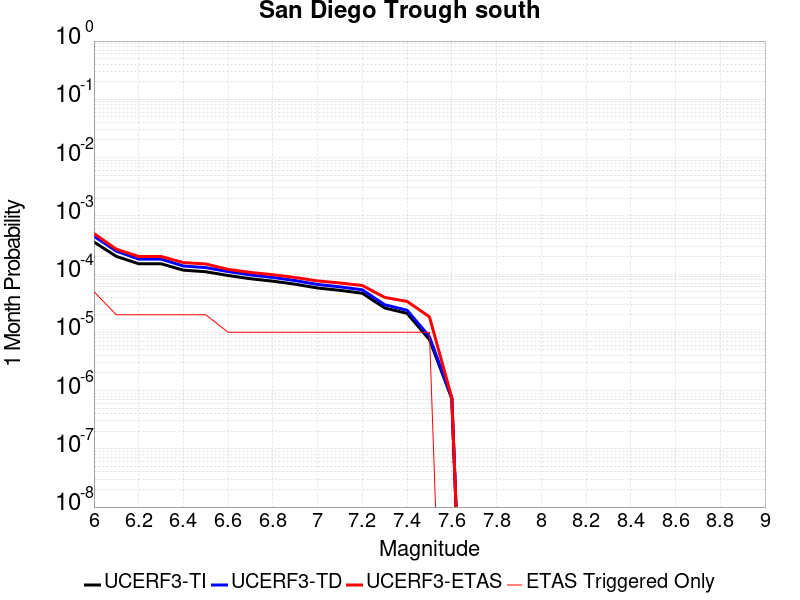 |  | 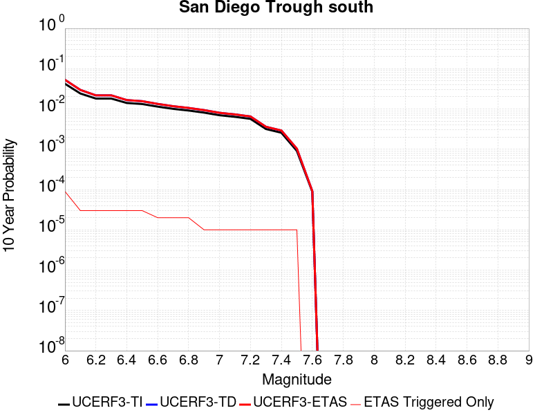 |

| Magnitude | 1 wk TI Prob | 1 wk TD Prob | 1 wk ETAS Prob | 1 wk ETAS/TD Gain | 1 wk ETAS Triggered Only | 1 mo TI Prob | 1 mo TD Prob | 1 mo ETAS Prob | 1 mo ETAS/TD Gain | 1 mo ETAS Triggered Only | 1 yr TI Prob | 1 yr TD Prob | 1 yr ETAS Prob | 1 yr ETAS/TD Gain | 1 yr ETAS Triggered Only | 10 yr TI Prob | 10 yr TD Prob | 10 yr ETAS Prob | 10 yr ETAS/TD Gain | 10 yr ETAS Triggered Only |
|-----|-----|-----|-----|-----|-----|-----|-----|-----|-----|-----|-----|-----|-----|-----|-----|-----|-----|-----|-----|-----|
| 6.0 | 8.279495E-5 | 1.04241306E-4 | 1.4173271E-4 | 1.3596598 | 3.7495312E-5 | 3.5478722E-4 | 4.4667677E-4 | 4.8415535E-4 | 1.0839053 | 3.7495312E-5 | 0.004310982 | 0.0054256152 | 0.0054629073 | 1.0068733 | 3.7495312E-5 | 0.042283054 | 0.05299221 | 0.053027716 | 1.0006701 | 3.7495312E-5 |
| 6.1 | 4.6961468E-5 | 5.772944E-5 | 9.522259E-5 | 1.6494632 | 3.7495312E-5 | 2.0124791E-4 | 2.473894E-4 | 2.8487545E-4 | 1.1515265 | 3.7495312E-5 | 0.00244744 | 0.0030079768 | 0.0030453594 | 1.0124278 | 3.7495312E-5 | 0.024206603 | 0.029679462 | 0.029715843 | 1.0012258 | 3.7495312E-5 |
| 6.2 | 3.5079658E-5 | 4.214154E-5 | 7.963527E-5 | 1.8897097 | 3.7495312E-5 | 1.5033272E-4 | 1.8059435E-4 | 2.1808289E-4 | 1.2075843 | 3.7495312E-5 | 0.0018287642 | 0.0021965632 | 0.002233976 | 1.0170325 | 3.7495312E-5 | 0.018137876 | 0.021751117 | 0.021787798 | 1.0016863 | 3.7495312E-5 |
| 6.3 | 3.5079658E-5 | 4.214154E-5 | 7.963527E-5 | 1.8897097 | 3.7495312E-5 | 1.5033272E-4 | 1.8059435E-4 | 2.1808289E-4 | 1.2075843 | 3.7495312E-5 | 0.0018287642 | 0.0021965632 | 0.002233976 | 1.0170325 | 3.7495312E-5 | 0.018137876 | 0.021751117 | 0.021787798 | 1.0016863 | 3.7495312E-5 |
| 6.4 | 2.7196904E-5 | 3.2087162E-5 | 6.958127E-5 | 2.168508 | 3.7495312E-5 | 1.16552954E-4 | 1.3750927E-4 | 1.7499943E-4 | 1.2726374 | 3.7495312E-5 | 0.0014181085 | 0.0016729041 | 0.0017103368 | 1.0223758 | 3.7495312E-5 | 0.014090929 | 0.016604643 | 0.016641516 | 1.0022206 | 3.7495312E-5 |
| 6.5 | 2.5584688E-5 | 3.010164E-5 | 6.759582E-5 | 2.2455862 | 3.7495312E-5 | 1.0964406E-4 | 1.2900073E-4 | 1.6649121E-4 | 1.2906222 | 3.7495312E-5 | 0.0013340989 | 0.0015694655 | 0.001606902 | 1.023853 | 3.7495312E-5 | 0.013261181 | 0.015585314 | 0.015622225 | 1.0023683 | 3.7495312E-5 |
| 6.6 | 2.2034688E-5 | 2.5742738E-5 | 2.5742738E-5 | 1.0 | 0.0 | 9.443096E-5 | 1.1032141E-4 | 1.1032141E-4 | 1.0 | 0.0 | 0.0011490905 | 0.0013423424 | 0.0013423424 | 1.0 | 0.0 | 0.011431668 | 0.013343317 | 0.013343317 | 1.0 | 0.0 |
| 6.7 | 1.9394853E-5 | 2.254176E-5 | 2.254176E-5 | 1.0 | 0.0 | 8.311815E-5 | 9.6603995E-5 | 9.6603995E-5 | 1.0 | 0.0 | 0.0010114936 | 0.0011755243 | 0.0011755243 | 1.0 | 0.0 | 0.01006902 | 0.011693766 | 0.011693766 | 1.0 | 0.0 |
| 6.8 | 1.7615313E-5 | 2.0403182E-5 | 2.0403182E-5 | 1.0 | 0.0 | 7.549201E-5 | 8.74393E-5 | 8.74393E-5 | 1.0 | 0.0 | 9.1872766E-4 | 0.0010640579 | 0.0010640579 | 1.0 | 0.0 | 0.009149387 | 0.010590198 | 0.010590198 | 1.0 | 0.0 |
| 6.9 | 1.5621423E-5 | 1.8026114E-5 | 1.8026114E-5 | 1.0 | 0.0 | 6.6947236E-5 | 7.725251E-5 | 7.725251E-5 | 1.0 | 0.0 | 8.147778E-4 | 9.40147E-4 | 9.40147E-4 | 1.0 | 0.0 | 0.008117969 | 0.009362142 | 0.009362142 | 1.0 | 0.0 |
| 7.0 | 1.3444376E-5 | 1.544809E-5 | 1.544809E-5 | 1.0 | 0.0 | 5.7617483E-5 | 6.620443E-5 | 6.620443E-5 | 1.0 | 0.0 | 7.0126704E-4 | 8.057436E-4 | 8.057436E-4 | 1.0 | 0.0 | 0.006990582 | 0.008028555 | 0.008028555 | 1.0 | 0.0 |
| 7.1 | 1.2268361E-5 | 1.407303E-5 | 1.407303E-5 | 1.0 | 0.0 | 5.2577634E-5 | 6.0311606E-5 | 6.0311606E-5 | 1.0 | 0.0 | 6.399447E-4 | 7.3404907E-4 | 7.3404907E-4 | 1.0 | 0.0 | 0.0063810493 | 0.0073165493 | 0.0073165493 | 1.0 | 0.0 |
| 7.2 | 1.0922655E-5 | 1.2513563E-5 | 1.2513563E-5 | 1.0 | 0.0 | 4.681054E-5 | 5.3628468E-5 | 5.3628468E-5 | 1.0 | 0.0 | 5.697693E-4 | 6.5273355E-4 | 6.5273355E-4 | 1.0 | 0.0 | 0.0056831064 | 0.0065084435 | 0.0065084435 | 1.0 | 0.0 |
| 7.3 | 6.1106753E-6 | 6.928925E-6 | 6.928925E-6 | 1.0 | 0.0 | 2.6188345E-5 | 2.9695057E-5 | 2.9695057E-5 | 1.0 | 0.0 | 3.1879646E-4 | 3.6147775E-4 | 3.6147775E-4 | 1.0 | 0.0 | 0.0031833951 | 0.003608943 | 0.003608943 | 1.0 | 0.0 |
| 7.4 | 4.933187E-6 | 5.5895525E-6 | 5.5895525E-6 | 1.0 | 0.0 | 2.114206E-5 | 2.3955008E-5 | 2.3955008E-5 | 1.0 | 0.0 | 2.5737417E-4 | 2.9161357E-4 | 2.9161357E-4 | 1.0 | 0.0 | 0.002570763 | 0.0029123505 | 0.0029123505 | 1.0 | 0.0 |
| 7.5 | 1.7489613E-6 | 1.969678E-6 | 1.969678E-6 | 1.0 | 0.0 | 7.495527E-6 | 8.4414505E-6 | 8.4414505E-6 | 1.0 | 0.0 | 9.125422E-5 | 1.02770035E-4 | 1.02770035E-4 | 1.0 | 0.0 | 9.1216754E-4 | 0.0010272472 | 0.0010272472 | 1.0 | 0.0 |
| 7.6 | 1.6988751E-7 | 1.7533823E-7 | 1.7533823E-7 | 1.0 | 0.0 | 7.2808916E-7 | 7.5144936E-7 | 7.5144936E-7 | 1.0 | 0.0 | 8.864449E-6 | 9.14886E-6 | 9.14886E-6 | 1.0 | 0.0 | 8.8640954E-5 | 9.1485024E-5 | 9.1485024E-5 | 1.0 | 0.0 |

## Malibu Coast alt 1
*[(top)](#table-of-contents)*

| 1 Week | 1 Month | 1 Year | 10 Year |
|-----|-----|-----|-----|
|  |  | 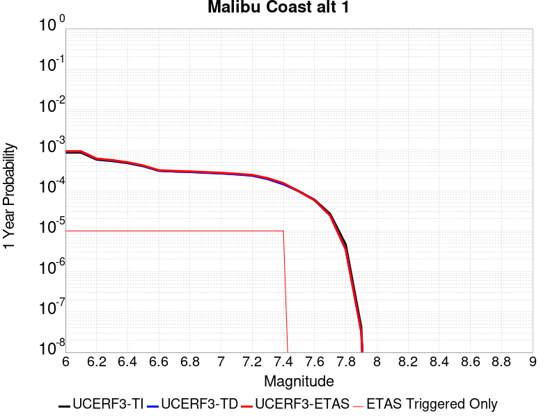 |  |

| Magnitude | 1 wk TI Prob | 1 wk TD Prob | 1 wk ETAS Prob | 1 wk ETAS/TD Gain | 1 wk ETAS Triggered Only | 1 mo TI Prob | 1 mo TD Prob | 1 mo ETAS Prob | 1 mo ETAS/TD Gain | 1 mo ETAS Triggered Only | 1 yr TI Prob | 1 yr TD Prob | 1 yr ETAS Prob | 1 yr ETAS/TD Gain | 1 yr ETAS Triggered Only | 10 yr TI Prob | 10 yr TD Prob | 10 yr ETAS Prob | 10 yr ETAS/TD Gain | 10 yr ETAS Triggered Only |
|-----|-----|-----|-----|-----|-----|-----|-----|-----|-----|-----|-----|-----|-----|-----|-----|-----|-----|-----|-----|-----|
| 6.0 | 1.6572556E-5 | 1.7598066E-5 | 1.7598066E-5 | 1.0 | 0.0 | 7.102331E-5 | 7.541821E-5 | 7.541821E-5 | 1.0 | 0.0 | 8.6436566E-4 | 9.178488E-4 | 9.553097E-4 | 1.0408138 | 3.7495312E-5 | 0.0086101135 | 0.009142512 | 0.009179665 | 1.0040637 | 3.7495312E-5 |
| 6.1 | 1.6572556E-5 | 1.7598066E-5 | 1.7598066E-5 | 1.0 | 0.0 | 7.102331E-5 | 7.541821E-5 | 7.541821E-5 | 1.0 | 0.0 | 8.6436566E-4 | 9.178488E-4 | 9.553097E-4 | 1.0408138 | 3.7495312E-5 | 0.0086101135 | 0.009142512 | 0.009179665 | 1.0040637 | 3.7495312E-5 |
| 6.2 | 1.1085717E-5 | 1.1557147E-5 | 1.1557147E-5 | 1.0 | 0.0 | 4.750935E-5 | 4.952971E-5 | 4.952971E-5 | 1.0 | 0.0 | 5.782728E-4 | 6.028609E-4 | 6.4033363E-4 | 1.0621581 | 3.7495312E-5 | 0.0057677035 | 0.0060126255 | 0.0060498957 | 1.0061986 | 3.7495312E-5 |
| 6.3 | 1.0208568E-5 | 1.0592237E-5 | 1.0592237E-5 | 1.0 | 0.0 | 4.375027E-5 | 4.539453E-5 | 4.539453E-5 | 1.0 | 0.0 | 5.325294E-4 | 5.5254117E-4 | 5.900158E-4 | 1.0678222 | 3.7495312E-5 | 0.0053125503 | 0.0055119814 | 0.00554927 | 1.006765 | 3.7495312E-5 |
| 6.4 | 9.0682315E-6 | 9.342637E-6 | 9.342637E-6 | 1.0 | 0.0 | 3.8863272E-5 | 4.003927E-5 | 4.003927E-5 | 1.0 | 0.0 | 4.730576E-4 | 4.8737114E-4 | 5.248482E-4 | 1.0768963 | 3.7495312E-5 | 0.0047205184 | 0.004863236 | 0.004900549 | 1.0076724 | 3.7495312E-5 |
| 6.5 | 7.605796E-6 | 7.748587E-6 | 7.748587E-6 | 1.0 | 0.0 | 3.259586E-5 | 3.3207816E-5 | 3.3207816E-5 | 1.0 | 0.0 | 3.9678233E-4 | 4.0423148E-4 | 4.4171166E-4 | 1.0927196 | 3.7495312E-5 | 0.0039607463 | 0.0040351 | 0.0040724436 | 1.0092548 | 3.7495312E-5 |
| 6.6 | 5.889873E-6 | 5.8795385E-6 | 5.8795385E-6 | 1.0 | 0.0 | 2.5242069E-5 | 2.519778E-5 | 2.519778E-5 | 1.0 | 0.0 | 3.0727885E-4 | 3.0673988E-4 | 3.442237E-4 | 1.1222006 | 3.7495312E-5 | 0.003068543 | 0.0030631777 | 0.0031005582 | 1.0122032 | 3.7495312E-5 |
| 6.7 | 5.66586E-6 | 5.641641E-6 | 5.641641E-6 | 1.0 | 0.0 | 2.428203E-5 | 2.417824E-5 | 2.417824E-5 | 1.0 | 0.0 | 2.955936E-4 | 2.9433038E-4 | 3.3181466E-4 | 1.1273544 | 3.7495312E-5 | 0.0029520073 | 0.0029394177 | 0.0029768029 | 1.0127186 | 3.7495312E-5 |
| 6.8 | 5.521556E-6 | 5.489427E-6 | 5.489427E-6 | 1.0 | 0.0 | 2.3663597E-5 | 2.3525903E-5 | 2.3525903E-5 | 1.0 | 0.0 | 2.880662E-4 | 2.8639034E-4 | 3.238749E-4 | 1.1308863 | 3.7495312E-5 | 0.0028769306 | 0.002860224 | 0.0028976123 | 1.0130718 | 3.7495312E-5 |
| 6.9 | 5.29752E-6 | 5.2499317E-6 | 5.2499317E-6 | 1.0 | 0.0 | 2.270346E-5 | 2.2499513E-5 | 2.2499513E-5 | 1.0 | 0.0 | 2.7637955E-4 | 2.7389723E-4 | 3.1138226E-4 | 1.1368581 | 3.7495312E-5 | 0.0027603607 | 0.0027356069 | 0.0027729995 | 1.0136689 | 3.7495312E-5 |
| 7.0 | 5.106743E-6 | 5.0476788E-6 | 5.0476788E-6 | 1.0 | 0.0 | 2.1885859E-5 | 2.163273E-5 | 2.163273E-5 | 1.0 | 0.0 | 2.6642776E-4 | 2.6334674E-4 | 3.0083215E-4 | 1.1423426 | 3.7495312E-5 | 0.0026610855 | 0.0026303562 | 0.0026677528 | 1.0142174 | 3.7495312E-5 |
| 7.1 | 4.8469647E-6 | 4.770373E-6 | 4.770373E-6 | 1.0 | 0.0 | 2.0772539E-5 | 2.0444295E-5 | 2.0444295E-5 | 1.0 | 0.0 | 2.528763E-4 | 2.4888094E-4 | 2.863669E-4 | 1.1506181 | 3.7495312E-5 | 0.0025258875 | 0.00248603 | 0.0025234323 | 1.0150449 | 3.7495312E-5 |
| 7.2 | 4.545514E-6 | 4.4481935E-6 | 4.4481935E-6 | 1.0 | 0.0 | 1.9480629E-5 | 1.9063547E-5 | 1.9063547E-5 | 1.0 | 0.0 | 2.3715083E-4 | 2.3207403E-4 | 2.6956064E-4 | 1.1615287 | 3.7495312E-5 | 0.0023689792 | 0.0023183243 | 0.0023557327 | 1.0161359 | 3.7495312E-5 |
| 7.3 | 3.794097E-6 | 3.6519348E-6 | 3.6519348E-6 | 1.0 | 0.0 | 1.6260314E-5 | 1.5651056E-5 | 1.5651056E-5 | 1.0 | 0.0 | 1.9795135E-4 | 1.9053498E-4 | 2.2802316E-4 | 1.1967522 | 3.7495312E-5 | 0.001977751 | 0.0019037209 | 0.0019411448 | 1.0196583 | 3.7495312E-5 |
| 7.4 | 2.808217E-6 | 2.719077E-6 | 2.719077E-6 | 1.0 | 0.0 | 1.203516E-5 | 1.1653135E-5 | 1.1653135E-5 | 1.0 | 0.0 | 1.4651821E-4 | 1.418677E-4 | 1.793577E-4 | 1.2642603 | 3.7495312E-5 | 0.0014642165 | 0.001417774 | 0.0014552162 | 1.0264091 | 3.7495312E-5 |
| 7.5 | 1.83809E-6 | 1.8190691E-6 | 1.8190691E-6 | 1.0 | 0.0 | 7.877505E-6 | 7.795988E-6 | 7.795988E-6 | 1.0 | 0.0 | 9.59044E-5 | 9.491203E-5 | 9.491203E-5 | 1.0 | 0.0 | 9.5863023E-4 | 9.48717E-4 | 9.48717E-4 | 1.0 | 0.0 |
| 7.6 | 1.1292672E-6 | 1.1001447E-6 | 1.1001447E-6 | 1.0 | 0.0 | 4.839708E-6 | 4.714897E-6 | 4.714897E-6 | 1.0 | 0.0 | 5.8921847E-5 | 5.7402376E-5 | 5.7402376E-5 | 1.0 | 0.0 | 5.890623E-4 | 5.738771E-4 | 5.738771E-4 | 1.0 | 0.0 |
| 7.7 | 5.065272E-7 | 4.609151E-7 | 4.609151E-7 | 1.0 | 0.0 | 2.170829E-6 | 1.975349E-6 | 1.975349E-6 | 1.0 | 0.0 | 2.6429525E-5 | 2.404962E-5 | 2.404962E-5 | 1.0 | 0.0 | 2.642638E-4 | 2.4047129E-4 | 2.4047129E-4 | 1.0 | 0.0 |
| 7.8 | 8.952991E-8 | 6.707874E-8 | 6.707874E-8 | 1.0 | 0.0 | 3.8369956E-7 | 2.8748025E-7 | 2.8748025E-7 | 1.0 | 0.0 | 4.671532E-6 | 3.5000667E-6 | 3.5000667E-6 | 1.0 | 0.0 | 4.671434E-5 | 3.5000136E-5 | 3.5000136E-5 | 1.0 | 0.0 |
| 7.9 | 8.007447E-10 | 6.1608785E-10 | 6.1608785E-10 | 1.0 | 0.0 | 3.4317629E-9 | 2.6403764E-9 | 2.6403764E-9 | 1.0 | 0.0 | 4.1781714E-8 | 3.2146584E-8 | 3.2146584E-8 | 1.0 | 0.0 | 4.1781706E-7 | 3.214658E-7 | 3.214658E-7 | 1.0 | 0.0 |

## Verdugo
*[(top)](#table-of-contents)*

| 1 Week | 1 Month | 1 Year | 10 Year |
|-----|-----|-----|-----|
|  |  |  |  |

| Magnitude | 1 wk TI Prob | 1 wk TD Prob | 1 wk ETAS Prob | 1 wk ETAS/TD Gain | 1 wk ETAS Triggered Only | 1 mo TI Prob | 1 mo TD Prob | 1 mo ETAS Prob | 1 mo ETAS/TD Gain | 1 mo ETAS Triggered Only | 1 yr TI Prob | 1 yr TD Prob | 1 yr ETAS Prob | 1 yr ETAS/TD Gain | 1 yr ETAS Triggered Only | 10 yr TI Prob | 10 yr TD Prob | 10 yr ETAS Prob | 10 yr ETAS/TD Gain | 10 yr ETAS Triggered Only |
|-----|-----|-----|-----|-----|-----|-----|-----|-----|-----|-----|-----|-----|-----|-----|-----|-----|-----|-----|-----|-----|
| 6.0 | 5.392987E-6 | 4.216517E-6 | 4.216517E-6 | 1.0 | 0.0 | 2.3112598E-5 | 1.8070665E-5 | 1.8070665E-5 | 1.0 | 0.0 | 2.8135953E-4 | 2.1998861E-4 | 2.1998861E-4 | 1.0 | 0.0 | 0.0028100356 | 0.0021977562 | 0.002235169 | 1.0170232 | 3.7495312E-5 |
| 6.1 | 5.392987E-6 | 4.216517E-6 | 4.216517E-6 | 1.0 | 0.0 | 2.3112598E-5 | 1.8070665E-5 | 1.8070665E-5 | 1.0 | 0.0 | 2.8135953E-4 | 2.1998861E-4 | 2.1998861E-4 | 1.0 | 0.0 | 0.0028100356 | 0.0021977562 | 0.002235169 | 1.0170232 | 3.7495312E-5 |
| 6.2 | 5.392987E-6 | 4.216517E-6 | 4.216517E-6 | 1.0 | 0.0 | 2.3112598E-5 | 1.8070665E-5 | 1.8070665E-5 | 1.0 | 0.0 | 2.8135953E-4 | 2.1998861E-4 | 2.1998861E-4 | 1.0 | 0.0 | 0.0028100356 | 0.0021977562 | 0.002235169 | 1.0170232 | 3.7495312E-5 |
| 6.3 | 5.392987E-6 | 4.216517E-6 | 4.216517E-6 | 1.0 | 0.0 | 2.3112598E-5 | 1.8070665E-5 | 1.8070665E-5 | 1.0 | 0.0 | 2.8135953E-4 | 2.1998861E-4 | 2.1998861E-4 | 1.0 | 0.0 | 0.0028100356 | 0.0021977562 | 0.002235169 | 1.0170232 | 3.7495312E-5 |
| 6.4 | 5.392987E-6 | 4.216517E-6 | 4.216517E-6 | 1.0 | 0.0 | 2.3112598E-5 | 1.8070665E-5 | 1.8070665E-5 | 1.0 | 0.0 | 2.8135953E-4 | 2.1998861E-4 | 2.1998861E-4 | 1.0 | 0.0 | 0.0028100356 | 0.0021977562 | 0.002235169 | 1.0170232 | 3.7495312E-5 |
| 6.5 | 4.9154837E-6 | 3.722465E-6 | 3.722465E-6 | 1.0 | 0.0 | 2.1066187E-5 | 1.5953325E-5 | 1.5953325E-5 | 1.0 | 0.0 | 2.5645064E-4 | 1.9421462E-4 | 1.9421462E-4 | 1.0 | 0.0 | 0.002561549 | 0.0019404698 | 0.0019778924 | 1.0192853 | 3.7495312E-5 |
| 6.6 | 4.9154837E-6 | 3.722465E-6 | 3.722465E-6 | 1.0 | 0.0 | 2.1066187E-5 | 1.5953325E-5 | 1.5953325E-5 | 1.0 | 0.0 | 2.5645064E-4 | 1.9421462E-4 | 1.9421462E-4 | 1.0 | 0.0 | 0.002561549 | 0.0019404698 | 0.0019778924 | 1.0192853 | 3.7495312E-5 |
| 6.7 | 4.817006E-6 | 3.6206518E-6 | 3.6206518E-6 | 1.0 | 0.0 | 2.0644147E-5 | 1.5516987E-5 | 1.5516987E-5 | 1.0 | 0.0 | 2.513135E-4 | 1.8890314E-4 | 1.8890314E-4 | 1.0 | 0.0 | 0.0025102948 | 0.0018874453 | 0.0019248698 | 1.0198282 | 3.7495312E-5 |
| 6.8 | 4.507407E-6 | 3.3071042E-6 | 3.3071042E-6 | 1.0 | 0.0 | 1.9317316E-5 | 1.4173227E-5 | 1.4173227E-5 | 1.0 | 0.0 | 2.3516294E-4 | 1.7254551E-4 | 1.7254551E-4 | 1.0 | 0.0 | 0.0023491425 | 0.0017241298 | 0.0017615604 | 1.0217099 | 3.7495312E-5 |
| 6.9 | 4.3573054E-6 | 3.161011E-6 | 3.161011E-6 | 1.0 | 0.0 | 1.8674033E-5 | 1.354712E-5 | 1.354712E-5 | 1.0 | 0.0 | 2.2733262E-4 | 1.6492383E-4 | 1.6492383E-4 | 1.0 | 0.0 | 0.0022710022 | 0.0016480266 | 0.0016854602 | 1.0227141 | 3.7495312E-5 |
| 7.0 | 4.171527E-6 | 2.9836704E-6 | 2.9836704E-6 | 1.0 | 0.0 | 1.787785E-5 | 1.2787096E-5 | 1.2787096E-5 | 1.0 | 0.0 | 2.1764109E-4 | 1.5567189E-4 | 1.5567189E-4 | 1.0 | 0.0 | 0.0021742806 | 0.0015556397 | 0.0015930766 | 1.0240654 | 3.7495312E-5 |
| 7.1 | 4.0405484E-6 | 2.882261E-6 | 2.882261E-6 | 1.0 | 0.0 | 1.731652E-5 | 1.235249E-5 | 1.235249E-5 | 1.0 | 0.0 | 2.1080824E-4 | 1.503813E-4 | 1.503813E-4 | 1.0 | 0.0 | 0.0021060838 | 0.0015028063 | 0.0015402453 | 1.0249127 | 3.7495312E-5 |
| 7.2 | 3.8306007E-6 | 2.7018452E-6 | 2.7018452E-6 | 1.0 | 0.0 | 1.6416758E-5 | 1.15792855E-5 | 1.15792855E-5 | 1.0 | 0.0 | 1.9985568E-4 | 1.4096878E-4 | 1.4096878E-4 | 1.0 | 0.0 | 0.0019967605 | 0.0014088044 | 0.0014462469 | 1.0265775 | 3.7495312E-5 |
| 7.3 | 3.5750938E-6 | 2.5121758E-6 | 2.5121758E-6 | 1.0 | 0.0 | 1.532174E-5 | 1.0766424E-5 | 1.0766424E-5 | 1.0 | 0.0 | 1.8652623E-4 | 1.3107344E-4 | 1.3107344E-4 | 1.0 | 0.0 | 0.0018636974 | 0.0013099718 | 0.001347418 | 1.0285856 | 3.7495312E-5 |
| 7.4 | 3.3510041E-6 | 2.3408586E-6 | 2.3408586E-6 | 1.0 | 0.0 | 1.4361368E-5 | 1.0032213E-5 | 1.0032213E-5 | 1.0 | 0.0 | 1.7483562E-4 | 1.2213545E-4 | 1.2213545E-4 | 1.0 | 0.0 | 0.0017469813 | 0.0012206937 | 0.0012581432 | 1.0306789 | 3.7495312E-5 |
| 7.5 | 2.948287E-6 | 2.0391124E-6 | 2.0391124E-6 | 1.0 | 0.0 | 1.2635454E-5 | 8.739024E-6 | 8.739024E-6 | 1.0 | 0.0 | 1.538258E-4 | 1.0639253E-4 | 1.0639253E-4 | 1.0 | 0.0 | 0.0015371935 | 0.0010634261 | 0.0011008816 | 1.0352215 | 3.7495312E-5 |
| 7.6 | 2.0134323E-6 | 1.4471265E-6 | 1.4471265E-6 | 1.0 | 0.0 | 8.628967E-6 | 6.2019562E-6 | 6.2019562E-6 | 1.0 | 0.0 | 1.05052604E-4 | 7.550629E-5 | 7.550629E-5 | 1.0 | 0.0 | 0.0010500296 | 7.548152E-4 | 7.9228217E-4 | 1.0496373 | 3.7495312E-5 |
| 7.7 | 5.726436E-7 | 4.045248E-7 | 4.045248E-7 | 1.0 | 0.0 | 2.4541846E-6 | 1.7336766E-6 | 1.7336766E-6 | 1.0 | 0.0 | 2.9879287E-5 | 2.1107335E-5 | 2.1107335E-5 | 1.0 | 0.0 | 2.987527E-4 | 2.1105584E-4 | 2.4854325E-4 | 1.1776184 | 3.7495312E-5 |
| 7.8 | 1.6248204E-7 | 1.0687696E-7 | 1.0687696E-7 | 1.0 | 0.0 | 6.963514E-7 | 4.5804404E-7 | 4.5804404E-7 | 1.0 | 0.0 | 8.478045E-6 | 5.5766723E-6 | 5.5766723E-6 | 1.0 | 0.0 | 8.477722E-5 | 5.5765355E-5 | 5.5765355E-5 | 1.0 | 0.0 |
| 7.9 | 4.4475744E-8 | 3.0375546E-8 | 3.0375546E-8 | 1.0 | 0.0 | 1.9061031E-7 | 1.301809E-7 | 1.301809E-7 | 1.0 | 0.0 | 2.320678E-6 | 1.5849514E-6 | 1.5849514E-6 | 1.0 | 0.0 | 2.3206538E-5 | 1.5849415E-5 | 1.5849415E-5 | 1.0 | 0.0 |

## Pitas Point (Lower West)
*[(top)](#table-of-contents)*

| 1 Week | 1 Month | 1 Year | 10 Year |
|-----|-----|-----|-----|
|  |  |  | 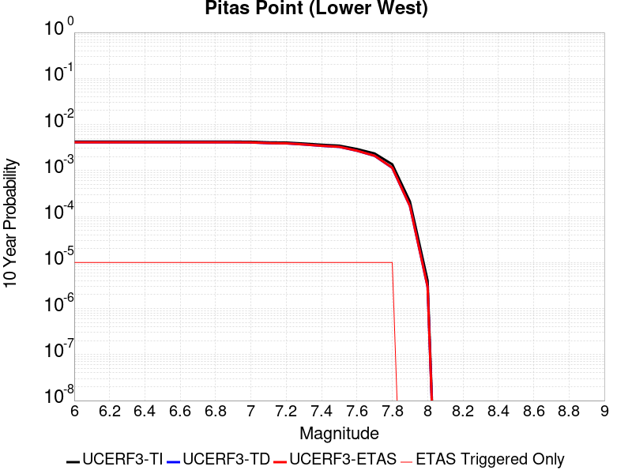 |

| Magnitude | 1 wk TI Prob | 1 wk TD Prob | 1 wk ETAS Prob | 1 wk ETAS/TD Gain | 1 wk ETAS Triggered Only | 1 mo TI Prob | 1 mo TD Prob | 1 mo ETAS Prob | 1 mo ETAS/TD Gain | 1 mo ETAS Triggered Only | 1 yr TI Prob | 1 yr TD Prob | 1 yr ETAS Prob | 1 yr ETAS/TD Gain | 1 yr ETAS Triggered Only | 10 yr TI Prob | 10 yr TD Prob | 10 yr ETAS Prob | 10 yr ETAS/TD Gain | 10 yr ETAS Triggered Only |
|-----|-----|-----|-----|-----|-----|-----|-----|-----|-----|-----|-----|-----|-----|-----|-----|-----|-----|-----|-----|-----|
| 6.0 | 8.151497E-6 | 7.855762E-6 | 7.855762E-6 | 1.0 | 0.0 | 3.493452E-5 | 3.3667122E-5 | 3.3667122E-5 | 1.0 | 0.0 | 4.252448E-4 | 4.0982084E-4 | 4.0982084E-4 | 1.0 | 0.0 | 0.0042443196 | 0.0040907315 | 0.0041280733 | 1.0091285 | 3.7495312E-5 |
| 6.1 | 8.151497E-6 | 7.855762E-6 | 7.855762E-6 | 1.0 | 0.0 | 3.493452E-5 | 3.3667122E-5 | 3.3667122E-5 | 1.0 | 0.0 | 4.252448E-4 | 4.0982084E-4 | 4.0982084E-4 | 1.0 | 0.0 | 0.0042443196 | 0.0040907315 | 0.0041280733 | 1.0091285 | 3.7495312E-5 |
| 6.2 | 8.151497E-6 | 7.855762E-6 | 7.855762E-6 | 1.0 | 0.0 | 3.493452E-5 | 3.3667122E-5 | 3.3667122E-5 | 1.0 | 0.0 | 4.252448E-4 | 4.0982084E-4 | 4.0982084E-4 | 1.0 | 0.0 | 0.0042443196 | 0.0040907315 | 0.0041280733 | 1.0091285 | 3.7495312E-5 |
| 6.3 | 8.151497E-6 | 7.855762E-6 | 7.855762E-6 | 1.0 | 0.0 | 3.493452E-5 | 3.3667122E-5 | 3.3667122E-5 | 1.0 | 0.0 | 4.252448E-4 | 4.0982084E-4 | 4.0982084E-4 | 1.0 | 0.0 | 0.0042443196 | 0.0040907315 | 0.0041280733 | 1.0091285 | 3.7495312E-5 |
| 6.4 | 8.151497E-6 | 7.855762E-6 | 7.855762E-6 | 1.0 | 0.0 | 3.493452E-5 | 3.3667122E-5 | 3.3667122E-5 | 1.0 | 0.0 | 4.252448E-4 | 4.0982084E-4 | 4.0982084E-4 | 1.0 | 0.0 | 0.0042443196 | 0.0040907315 | 0.0041280733 | 1.0091285 | 3.7495312E-5 |
| 6.5 | 8.151497E-6 | 7.855762E-6 | 7.855762E-6 | 1.0 | 0.0 | 3.493452E-5 | 3.3667122E-5 | 3.3667122E-5 | 1.0 | 0.0 | 4.252448E-4 | 4.0982084E-4 | 4.0982084E-4 | 1.0 | 0.0 | 0.0042443196 | 0.0040907315 | 0.0041280733 | 1.0091285 | 3.7495312E-5 |
| 6.6 | 8.151497E-6 | 7.855762E-6 | 7.855762E-6 | 1.0 | 0.0 | 3.493452E-5 | 3.3667122E-5 | 3.3667122E-5 | 1.0 | 0.0 | 4.252448E-4 | 4.0982084E-4 | 4.0982084E-4 | 1.0 | 0.0 | 0.0042443196 | 0.0040907315 | 0.0041280733 | 1.0091285 | 3.7495312E-5 |
| 6.7 | 8.151497E-6 | 7.855762E-6 | 7.855762E-6 | 1.0 | 0.0 | 3.493452E-5 | 3.3667122E-5 | 3.3667122E-5 | 1.0 | 0.0 | 4.252448E-4 | 4.0982084E-4 | 4.0982084E-4 | 1.0 | 0.0 | 0.0042443196 | 0.0040907315 | 0.0041280733 | 1.0091285 | 3.7495312E-5 |
| 6.8 | 8.151497E-6 | 7.855762E-6 | 7.855762E-6 | 1.0 | 0.0 | 3.493452E-5 | 3.3667122E-5 | 3.3667122E-5 | 1.0 | 0.0 | 4.252448E-4 | 4.0982084E-4 | 4.0982084E-4 | 1.0 | 0.0 | 0.0042443196 | 0.0040907315 | 0.0041280733 | 1.0091285 | 3.7495312E-5 |
| 6.9 | 8.151497E-6 | 7.855762E-6 | 7.855762E-6 | 1.0 | 0.0 | 3.493452E-5 | 3.3667122E-5 | 3.3667122E-5 | 1.0 | 0.0 | 4.252448E-4 | 4.0982084E-4 | 4.0982084E-4 | 1.0 | 0.0 | 0.0042443196 | 0.0040907315 | 0.0041280733 | 1.0091285 | 3.7495312E-5 |
| 7.0 | 8.103535E-6 | 7.805192E-6 | 7.805192E-6 | 1.0 | 0.0 | 3.4728975E-5 | 3.3450397E-5 | 3.3450397E-5 | 1.0 | 0.0 | 4.2274324E-4 | 4.0718322E-4 | 4.0718322E-4 | 1.0 | 0.0 | 0.0042193993 | 0.004064452 | 0.0041017947 | 1.0091877 | 3.7495312E-5 |
| 7.1 | 7.853298E-6 | 7.540883E-6 | 7.540883E-6 | 1.0 | 0.0 | 3.3656554E-5 | 3.2317676E-5 | 3.2317676E-5 | 1.0 | 0.0 | 4.096915E-4 | 3.9339735E-4 | 3.9339735E-4 | 1.0 | 0.0 | 0.00408937 | 0.0039270855 | 0.0039644334 | 1.0095104 | 3.7495312E-5 |
| 7.2 | 7.771102E-6 | 7.453165E-6 | 7.453165E-6 | 1.0 | 0.0 | 3.33043E-5 | 3.194175E-5 | 3.194175E-5 | 1.0 | 0.0 | 4.0540437E-4 | 3.8882208E-4 | 3.8882208E-4 | 1.0 | 0.0 | 0.0040466557 | 0.0038814936 | 0.0039188433 | 1.0096226 | 3.7495312E-5 |
| 7.3 | 7.3945344E-6 | 7.0492697E-6 | 7.0492697E-6 | 1.0 | 0.0 | 3.1690477E-5 | 3.021081E-5 | 3.021081E-5 | 1.0 | 0.0 | 3.8576324E-4 | 3.6775516E-4 | 3.6775516E-4 | 1.0 | 0.0 | 0.0038509427 | 0.0036715334 | 0.0037088909 | 1.010175 | 3.7495312E-5 |
| 7.4 | 6.964645E-6 | 6.5901186E-6 | 6.5901186E-6 | 1.0 | 0.0 | 2.9848137E-5 | 2.8243063E-5 | 2.8243063E-5 | 1.0 | 0.0 | 3.6334046E-4 | 3.4380553E-4 | 3.4380553E-4 | 1.0 | 0.0 | 0.0036274698 | 0.0034327896 | 0.003470156 | 1.0108852 | 3.7495312E-5 |
| 7.5 | 6.6525035E-6 | 6.259157E-6 | 6.259157E-6 | 1.0 | 0.0 | 2.851042E-5 | 2.6824686E-5 | 2.6824686E-5 | 1.0 | 0.0 | 3.4705905E-4 | 3.265421E-4 | 3.265421E-4 | 1.0 | 0.0 | 0.0034651754 | 0.0032606742 | 0.0032980472 | 1.0114617 | 3.7495312E-5 |
| 7.6 | 5.613338E-6 | 5.151386E-6 | 5.151386E-6 | 1.0 | 0.0 | 2.405694E-5 | 2.2077185E-5 | 2.2077185E-5 | 1.0 | 0.0 | 2.928539E-4 | 2.6875688E-4 | 2.6875688E-4 | 1.0 | 0.0 | 0.0029246826 | 0.0026843501 | 0.0027217446 | 1.0139307 | 3.7495312E-5 |
| 7.7 | 4.494704E-6 | 3.996911E-6 | 3.996911E-6 | 1.0 | 0.0 | 1.9262876E-5 | 1.7129507E-5 | 1.7129507E-5 | 1.0 | 0.0 | 2.3450027E-4 | 2.0853203E-4 | 2.0853203E-4 | 1.0 | 0.0 | 0.0023425296 | 0.0020833875 | 0.0021208047 | 1.0179598 | 3.7495312E-5 |
| 7.8 | 2.6075882E-6 | 2.1836374E-6 | 2.1836374E-6 | 1.0 | 0.0 | 1.117533E-5 | 9.358413E-6 | 9.358413E-6 | 1.0 | 0.0 | 1.3605114E-4 | 1.1393277E-4 | 1.1393277E-4 | 1.0 | 0.0 | 0.0013596788 | 0.0011387484 | 0.0011762009 | 1.0328892 | 3.7495312E-5 |
| 7.9 | 4.045984E-7 | 3.242375E-7 | 3.242375E-7 | 1.0 | 0.0 | 1.733992E-6 | 1.3895885E-6 | 1.3895885E-6 | 1.0 | 0.0 | 2.1111147E-5 | 1.6918111E-5 | 1.6918111E-5 | 1.0 | 0.0 | 2.1109142E-4 | 1.6916855E-4 | 1.6916855E-4 | 1.0 | 0.0 |
| 8.0 | 7.791402E-9 | 5.683497E-9 | 5.683497E-9 | 1.0 | 0.0 | 3.3391725E-8 | 2.4357844E-8 | 2.4357844E-8 | 1.0 | 0.0 | 4.0654416E-7 | 2.9655675E-7 | 2.9655675E-7 | 1.0 | 0.0 | 4.065434E-6 | 2.9655655E-6 | 2.9655655E-6 | 1.0 | 0.0 |

## La Panza 2011
*[(top)](#table-of-contents)*

| 1 Week | 1 Month | 1 Year | 10 Year |
|-----|-----|-----|-----|
|  |  |  |  |

| Magnitude | 1 wk TI Prob | 1 wk TD Prob | 1 wk ETAS Prob | 1 wk ETAS/TD Gain | 1 wk ETAS Triggered Only | 1 mo TI Prob | 1 mo TD Prob | 1 mo ETAS Prob | 1 mo ETAS/TD Gain | 1 mo ETAS Triggered Only | 1 yr TI Prob | 1 yr TD Prob | 1 yr ETAS Prob | 1 yr ETAS/TD Gain | 1 yr ETAS Triggered Only | 10 yr TI Prob | 10 yr TD Prob | 10 yr ETAS Prob | 10 yr ETAS/TD Gain | 10 yr ETAS Triggered Only |
|-----|-----|-----|-----|-----|-----|-----|-----|-----|-----|-----|-----|-----|-----|-----|-----|-----|-----|-----|-----|-----|
| 6.0 | 4.6754544E-6 | 4.717587E-6 | 4.717587E-6 | 1.0 | 0.0 | 2.0037509E-5 | 2.0218084E-5 | 5.771264E-5 | 2.8545058 | 3.7495312E-5 | 2.4392935E-4 | 2.4612935E-4 | 2.8361543E-4 | 1.1523024 | 3.7495312E-5 | 0.0024366176 | 0.002458762 | 0.002496165 | 1.0152122 | 3.7495312E-5 |
| 6.1 | 4.6754544E-6 | 4.717587E-6 | 4.717587E-6 | 1.0 | 0.0 | 2.0037509E-5 | 2.0218084E-5 | 5.771264E-5 | 2.8545058 | 3.7495312E-5 | 2.4392935E-4 | 2.4612935E-4 | 2.8361543E-4 | 1.1523024 | 3.7495312E-5 | 0.0024366176 | 0.002458762 | 0.002496165 | 1.0152122 | 3.7495312E-5 |
| 6.2 | 4.6754544E-6 | 4.717587E-6 | 4.717587E-6 | 1.0 | 0.0 | 2.0037509E-5 | 2.0218084E-5 | 5.771264E-5 | 2.8545058 | 3.7495312E-5 | 2.4392935E-4 | 2.4612935E-4 | 2.8361543E-4 | 1.1523024 | 3.7495312E-5 | 0.0024366176 | 0.002458762 | 0.002496165 | 1.0152122 | 3.7495312E-5 |
| 6.3 | 4.6754544E-6 | 4.717587E-6 | 4.717587E-6 | 1.0 | 0.0 | 2.0037509E-5 | 2.0218084E-5 | 5.771264E-5 | 2.8545058 | 3.7495312E-5 | 2.4392935E-4 | 2.4612935E-4 | 2.8361543E-4 | 1.1523024 | 3.7495312E-5 | 0.0024366176 | 0.002458762 | 0.002496165 | 1.0152122 | 3.7495312E-5 |
| 6.4 | 4.6754544E-6 | 4.717587E-6 | 4.717587E-6 | 1.0 | 0.0 | 2.0037509E-5 | 2.0218084E-5 | 5.771264E-5 | 2.8545058 | 3.7495312E-5 | 2.4392935E-4 | 2.4612935E-4 | 2.8361543E-4 | 1.1523024 | 3.7495312E-5 | 0.0024366176 | 0.002458762 | 0.002496165 | 1.0152122 | 3.7495312E-5 |
| 6.5 | 2.485343E-6 | 2.5005988E-6 | 2.5005988E-6 | 1.0 | 0.0 | 1.0651426E-5 | 1.0716811E-5 | 1.0716811E-5 | 1.0 | 0.0 | 1.296734E-4 | 1.3046975E-4 | 1.3046975E-4 | 1.0 | 0.0 | 0.0012959775 | 0.0013039699 | 0.0013039699 | 1.0 | 0.0 |
| 6.6 | 2.485343E-6 | 2.5005988E-6 | 2.5005988E-6 | 1.0 | 0.0 | 1.0651426E-5 | 1.0716811E-5 | 1.0716811E-5 | 1.0 | 0.0 | 1.296734E-4 | 1.3046975E-4 | 1.3046975E-4 | 1.0 | 0.0 | 0.0012959775 | 0.0013039699 | 0.0013039699 | 1.0 | 0.0 |
| 6.7 | 1.5108508E-6 | 1.5146375E-6 | 1.5146375E-6 | 1.0 | 0.0 | 6.4750584E-6 | 6.491288E-6 | 6.491288E-6 | 1.0 | 0.0 | 7.8830984E-5 | 7.902867E-5 | 7.902867E-5 | 1.0 | 0.0 | 7.880303E-4 | 7.900165E-4 | 7.900165E-4 | 1.0 | 0.0 |
| 6.8 | 1.3865837E-6 | 1.3885102E-6 | 1.3885102E-6 | 1.0 | 0.0 | 5.942488E-6 | 5.9507447E-6 | 5.9507447E-6 | 1.0 | 0.0 | 7.234739E-5 | 7.244801E-5 | 7.244801E-5 | 1.0 | 0.0 | 7.232384E-4 | 7.242537E-4 | 7.242537E-4 | 1.0 | 0.0 |
| 6.9 | 9.826583E-7 | 9.796287E-7 | 9.796287E-7 | 1.0 | 0.0 | 4.2113857E-6 | 4.198402E-6 | 4.198402E-6 | 1.0 | 0.0 | 5.1272415E-5 | 5.11144E-5 | 5.11144E-5 | 1.0 | 0.0 | 5.126059E-4 | 5.110318E-4 | 5.110318E-4 | 1.0 | 0.0 |
| 7.0 | 6.7797646E-7 | 6.7102144E-7 | 6.7102144E-7 | 1.0 | 0.0 | 2.9056102E-6 | 2.8758034E-6 | 2.8758034E-6 | 1.0 | 0.0 | 3.537523E-5 | 3.5012374E-5 | 3.5012374E-5 | 1.0 | 0.0 | 3.5369597E-4 | 3.5007167E-4 | 3.5007167E-4 | 1.0 | 0.0 |
| 7.1 | 3.4979826E-7 | 3.387388E-7 | 3.387388E-7 | 1.0 | 0.0 | 1.4991346E-6 | 1.4517369E-6 | 1.4517369E-6 | 1.0 | 0.0 | 1.825181E-5 | 1.7674765E-5 | 1.7674765E-5 | 1.0 | 0.0 | 1.825031E-4 | 1.7673477E-4 | 1.7673477E-4 | 1.0 | 0.0 |
| 7.2 | 2.5088332E-7 | 2.3831899E-7 | 2.3831899E-7 | 1.0 | 0.0 | 1.0752137E-6 | 1.0213668E-6 | 1.0213668E-6 | 1.0 | 0.0 | 1.3090649E-5 | 1.2435077E-5 | 1.2435077E-5 | 1.0 | 0.0 | 1.3089878E-4 | 1.2434467E-4 | 1.2434467E-4 | 1.0 | 0.0 |
| 7.3 | 1.0159086E-7 | 8.64462E-8 | 8.64462E-8 | 1.0 | 0.0 | 4.3538932E-7 | 3.7048366E-7 | 3.7048366E-7 | 1.0 | 0.0 | 5.300852E-6 | 4.5106294E-6 | 4.5106294E-6 | 1.0 | 0.0 | 5.3007258E-5 | 4.5105422E-5 | 4.5105422E-5 | 1.0 | 0.0 |
| 7.4 | 3.5006252E-8 | 1.9404325E-8 | 1.9404325E-8 | 1.0 | 0.0 | 1.5002678E-7 | 8.3161396E-8 | 8.3161396E-8 | 1.0 | 0.0 | 1.8265745E-6 | 1.0124895E-6 | 1.0124895E-6 | 1.0 | 0.0 | 1.8265595E-5 | 1.01248515E-5 | 1.01248515E-5 | 1.0 | 0.0 |
| 7.5 | 2.592274E-8 | 1.0239094E-8 | 1.0239094E-8 | 1.0 | 0.0 | 1.1109746E-7 | 4.388183E-8 | 4.388183E-8 | 1.0 | 0.0 | 1.3526106E-6 | 5.342612E-7 | 5.342612E-7 | 1.0 | 0.0 | 1.3526024E-5 | 5.3425997E-6 | 5.3425997E-6 | 1.0 | 0.0 |
| 7.6 | 1.9016717E-8 | 5.244801E-9 | 5.244801E-9 | 1.0 | 0.0 | 8.150022E-8 | 2.247772E-8 | 2.247772E-8 | 1.0 | 0.0 | 9.922647E-7 | 2.736662E-7 | 2.736662E-7 | 1.0 | 0.0 | 9.922603E-6 | 2.7366589E-6 | 2.7366589E-6 | 1.0 | 0.0 |
| 7.7 | 1.17738495E-8 | 1.2398075E-9 | 1.2398075E-9 | 1.0 | 0.0 | 5.0459356E-8 | 5.3134603E-9 | 5.3134603E-9 | 1.0 | 0.0 | 6.1434247E-7 | 6.469138E-8 | 6.469138E-8 | 1.0 | 0.0 | 6.143408E-6 | 6.469136E-7 | 6.469136E-7 | 1.0 | 0.0 |
| 7.8 | 5.489079E-9 | 2.0111768E-10 | 2.0111768E-10 | 1.0 | 0.0 | 2.3524624E-8 | 8.6193275E-10 | 8.6193275E-10 | 1.0 | 0.0 | 2.8641225E-7 | 1.04940305E-8 | 1.04940305E-8 | 1.0 | 0.0 | 2.8641189E-6 | 1.04940305E-7 | 1.04940305E-7 | 1.0 | 0.0 |
| 7.9 | 2.5081048E-9 | 6.683887E-11 | 6.683887E-11 | 1.0 | 0.0 | 1.0749021E-8 | 2.8645197E-10 | 2.8645197E-10 | 1.0 | 0.0 | 1.3086932E-7 | 3.487552E-9 | 3.487552E-9 | 1.0 | 0.0 | 1.3086925E-6 | 3.487552E-8 | 3.487552E-8 | 1.0 | 0.0 |

## Eaton Roughs 2011 CFM
*[(top)](#table-of-contents)*

| 1 Week | 1 Month | 1 Year | 10 Year |
|-----|-----|-----|-----|
|  |  |  |  |

| Magnitude | 1 wk TI Prob | 1 wk TD Prob | 1 wk ETAS Prob | 1 wk ETAS/TD Gain | 1 wk ETAS Triggered Only | 1 mo TI Prob | 1 mo TD Prob | 1 mo ETAS Prob | 1 mo ETAS/TD Gain | 1 mo ETAS Triggered Only | 1 yr TI Prob | 1 yr TD Prob | 1 yr ETAS Prob | 1 yr ETAS/TD Gain | 1 yr ETAS Triggered Only | 10 yr TI Prob | 10 yr TD Prob | 10 yr ETAS Prob | 10 yr ETAS/TD Gain | 10 yr ETAS Triggered Only |
|-----|-----|-----|-----|-----|-----|-----|-----|-----|-----|-----|-----|-----|-----|-----|-----|-----|-----|-----|-----|-----|
| 6.0 | 6.8044945E-5 | 8.843646E-5 | 8.843646E-5 | 1.0 | 0.0 | 2.9158857E-4 | 3.7896493E-4 | 3.7896493E-4 | 1.0 | 0.0 | 0.0035443127 | 0.0046050907 | 0.0046050907 | 1.0 | 0.0 | 0.03488314 | 0.04516335 | 0.04519915 | 1.0007927 | 3.7495312E-5 |
| 6.1 | 6.8044945E-5 | 8.843646E-5 | 8.843646E-5 | 1.0 | 0.0 | 2.9158857E-4 | 3.7896493E-4 | 3.7896493E-4 | 1.0 | 0.0 | 0.0035443127 | 0.0046050907 | 0.0046050907 | 1.0 | 0.0 | 0.03488314 | 0.04516335 | 0.04519915 | 1.0007927 | 3.7495312E-5 |
| 6.2 | 6.8044945E-5 | 8.843646E-5 | 8.843646E-5 | 1.0 | 0.0 | 2.9158857E-4 | 3.7896493E-4 | 3.7896493E-4 | 1.0 | 0.0 | 0.0035443127 | 0.0046050907 | 0.0046050907 | 1.0 | 0.0 | 0.03488314 | 0.04516335 | 0.04519915 | 1.0007927 | 3.7495312E-5 |
| 6.3 | 6.8044945E-5 | 8.843646E-5 | 8.843646E-5 | 1.0 | 0.0 | 2.9158857E-4 | 3.7896493E-4 | 3.7896493E-4 | 1.0 | 0.0 | 0.0035443127 | 0.0046050907 | 0.0046050907 | 1.0 | 0.0 | 0.03488314 | 0.04516335 | 0.04519915 | 1.0007927 | 3.7495312E-5 |
| 6.4 | 4.5830013E-5 | 5.715427E-5 | 5.715427E-5 | 1.0 | 0.0 | 1.9639956E-4 | 2.4492692E-4 | 2.4492692E-4 | 1.0 | 0.0 | 0.0023885423 | 0.0029784471 | 0.0029784471 | 1.0 | 0.0 | 0.023630321 | 0.029421588 | 0.02945798 | 1.0012369 | 3.7495312E-5 |
| 6.5 | 4.5830013E-5 | 5.715427E-5 | 5.715427E-5 | 1.0 | 0.0 | 1.9639956E-4 | 2.4492692E-4 | 2.4492692E-4 | 1.0 | 0.0 | 0.0023885423 | 0.0029784471 | 0.0029784471 | 1.0 | 0.0 | 0.023630321 | 0.029421588 | 0.02945798 | 1.0012369 | 3.7495312E-5 |
| 6.6 | 3.222194E-5 | 3.8261504E-5 | 3.8261504E-5 | 1.0 | 0.0 | 1.3808672E-4 | 1.639682E-4 | 1.639682E-4 | 1.0 | 0.0 | 0.0016799092 | 0.001994599 | 0.001994599 | 1.0 | 0.0 | 0.016672665 | 0.019776601 | 0.019776601 | 1.0 | 0.0 |
| 6.7 | 2.4155654E-5 | 2.7786238E-5 | 2.7786238E-5 | 1.0 | 0.0 | 1.0352012E-4 | 1.1907848E-4 | 1.1907848E-4 | 1.0 | 0.0 | 0.0012596287 | 0.0014488247 | 0.0014488247 | 1.0 | 0.0 | 0.012525126 | 0.014394943 | 0.014394943 | 1.0 | 0.0 |
| 6.8 | 2.1814667E-5 | 2.4940868E-5 | 2.4940868E-5 | 1.0 | 0.0 | 9.348808E-5 | 1.06885076E-4 | 1.06885076E-4 | 1.0 | 0.0 | 0.001137623 | 0.0013005526 | 0.0013005526 | 1.0 | 0.0 | 0.011318169 | 0.012930038 | 0.012930038 | 1.0 | 0.0 |
| 6.9 | 2.0700467E-5 | 2.3628932E-5 | 2.3628932E-5 | 1.0 | 0.0 | 8.871327E-5 | 1.01262944E-4 | 1.01262944E-4 | 1.0 | 0.0 | 0.0010795488 | 0.0012321823 | 0.0012321823 | 1.0 | 0.0 | 0.010743194 | 0.012254035 | 0.012254035 | 1.0 | 0.0 |
| 7.0 | 2.0104066E-5 | 2.29365E-5 | 2.29365E-5 | 1.0 | 0.0 | 8.615744E-5 | 9.82956E-5 | 9.82956E-5 | 1.0 | 0.0 | 0.0010484619 | 0.0011960949 | 0.0011960949 | 1.0 | 0.0 | 0.010435291 | 0.011897073 | 0.011897073 | 1.0 | 0.0 |
| 7.1 | 1.8225232E-5 | 2.0773046E-5 | 2.0773046E-5 | 1.0 | 0.0 | 7.81058E-5 | 8.902431E-5 | 8.902431E-5 | 1.0 | 0.0 | 9.5052324E-4 | 0.0010833336 | 0.0010833336 | 1.0 | 0.0 | 0.009464677 | 0.010780825 | 0.010780825 | 1.0 | 0.0 |
| 7.2 | 1.7526572E-5 | 1.9993488E-5 | 1.9993488E-5 | 1.0 | 0.0 | 7.511172E-5 | 8.5683576E-5 | 8.5683576E-5 | 1.0 | 0.0 | 9.141015E-4 | 0.0010426997 | 0.0010426997 | 1.0 | 0.0 | 0.009103506 | 0.010378351 | 0.010378351 | 1.0 | 0.0 |
| 7.3 | 1.5727232E-5 | 1.8021507E-5 | 1.8021507E-5 | 1.0 | 0.0 | 6.740067E-5 | 7.723275E-5 | 7.723275E-5 | 1.0 | 0.0 | 8.2029426E-4 | 9.399043E-4 | 9.399043E-4 | 1.0 | 0.0 | 0.008172729 | 0.009359511 | 0.009359511 | 1.0 | 0.0 |
| 7.4 | 1.4457361E-5 | 1.6598358E-5 | 1.6598358E-5 | 1.0 | 0.0 | 6.195865E-5 | 7.113389E-5 | 7.113389E-5 | 1.0 | 0.0 | 7.540854E-4 | 8.657119E-4 | 8.657119E-4 | 1.0 | 0.0 | 0.007515317 | 0.008623555 | 0.008623555 | 1.0 | 0.0 |
| 7.5 | 1.33280955E-5 | 1.5345435E-5 | 1.5345435E-5 | 1.0 | 0.0 | 5.711916E-5 | 6.57645E-5 | 6.57645E-5 | 1.0 | 0.0 | 6.9520384E-4 | 8.0038945E-4 | 8.0038945E-4 | 1.0 | 0.0 | 0.00693033 | 0.007975209 | 0.007975209 | 1.0 | 0.0 |
| 7.6 | 1.0699478E-5 | 1.2387815E-5 | 1.2387815E-5 | 1.0 | 0.0 | 4.5854096E-5 | 5.308956E-5 | 5.308956E-5 | 1.0 | 0.0 | 5.581306E-4 | 6.4617425E-4 | 6.4617425E-4 | 1.0 | 0.0 | 0.005567309 | 0.0064430353 | 0.0064430353 | 1.0 | 0.0 |
| 7.7 | 5.9390236E-6 | 6.852951E-6 | 6.852951E-6 | 1.0 | 0.0 | 2.545271E-5 | 2.9369461E-5 | 2.9369461E-5 | 1.0 | 0.0 | 3.0984267E-4 | 3.5751477E-4 | 3.5751477E-4 | 1.0 | 0.0 | 0.0030941102 | 0.0035694204 | 0.0035694204 | 1.0 | 0.0 |
| 7.8 | 2.1622036E-6 | 2.3296996E-6 | 2.3296996E-6 | 1.0 | 0.0 | 9.266554E-6 | 9.984388E-6 | 9.984388E-6 | 1.0 | 0.0 | 1.1281446E-4 | 1.21553225E-4 | 1.21553225E-4 | 1.0 | 0.0 | 0.001127572 | 0.001214873 | 0.001214873 | 1.0 | 0.0 |
| 7.9 | 4.9586197E-7 | 5.2189216E-7 | 5.2189216E-7 | 1.0 | 0.0 | 2.125121E-6 | 2.2366787E-6 | 2.2366787E-6 | 1.0 | 0.0 | 2.5873042E-5 | 2.7231245E-5 | 2.7231245E-5 | 1.0 | 0.0 | 2.5870028E-4 | 2.7228118E-4 | 2.7228118E-4 | 1.0 | 0.0 |

## Bennett Valley 2011 CFM
*[(top)](#table-of-contents)*

| 1 Week | 1 Month | 1 Year | 10 Year |
|-----|-----|-----|-----|
|  |  |  |  |

| Magnitude | 1 wk TI Prob | 1 wk TD Prob | 1 wk ETAS Prob | 1 wk ETAS/TD Gain | 1 wk ETAS Triggered Only | 1 mo TI Prob | 1 mo TD Prob | 1 mo ETAS Prob | 1 mo ETAS/TD Gain | 1 mo ETAS Triggered Only | 1 yr TI Prob | 1 yr TD Prob | 1 yr ETAS Prob | 1 yr ETAS/TD Gain | 1 yr ETAS Triggered Only | 10 yr TI Prob | 10 yr TD Prob | 10 yr ETAS Prob | 10 yr ETAS/TD Gain | 10 yr ETAS Triggered Only |
|-----|-----|-----|-----|-----|-----|-----|-----|-----|-----|-----|-----|-----|-----|-----|-----|-----|-----|-----|-----|-----|
| 6.0 | 2.3893934E-5 | 2.8238892E-5 | 6.573315E-5 | 2.3277524 | 3.7495312E-5 | 1.0239855E-4 | 1.2101925E-4 | 1.5851003E-4 | 1.3097918 | 3.7495312E-5 | 0.0012459893 | 0.0014725985 | 0.0015100386 | 1.0254245 | 3.7495312E-5 | 0.012390262 | 0.014651061 | 0.014688007 | 1.0025218 | 3.7495312E-5 |
| 6.1 | 2.3893934E-5 | 2.8238892E-5 | 6.573315E-5 | 2.3277524 | 3.7495312E-5 | 1.0239855E-4 | 1.2101925E-4 | 1.5851003E-4 | 1.3097918 | 3.7495312E-5 | 0.0012459893 | 0.0014725985 | 0.0015100386 | 1.0254245 | 3.7495312E-5 | 0.012390262 | 0.014651061 | 0.014688007 | 1.0025218 | 3.7495312E-5 |
| 6.2 | 1.6657146E-5 | 1.9853778E-5 | 5.7348345E-5 | 2.8885357 | 3.7495312E-5 | 7.138582E-5 | 8.508564E-5 | 1.2257777E-4 | 1.4406399 | 3.7495312E-5 | 8.6877577E-4 | 0.0010355669 | 0.0010730234 | 1.03617 | 3.7495312E-5 | 0.008653872 | 0.010325688 | 0.0103627965 | 1.0035938 | 3.7495312E-5 |
| 6.3 | 1.6657146E-5 | 1.9853778E-5 | 5.7348345E-5 | 2.8885357 | 3.7495312E-5 | 7.138582E-5 | 8.508564E-5 | 1.2257777E-4 | 1.4406399 | 3.7495312E-5 | 8.6877577E-4 | 0.0010355669 | 0.0010730234 | 1.03617 | 3.7495312E-5 | 0.008653872 | 0.010325688 | 0.0103627965 | 1.0035938 | 3.7495312E-5 |
| 6.4 | 1.29418495E-5 | 1.5567497E-5 | 5.3062227E-5 | 3.4085264 | 3.7495312E-5 | 5.546389E-5 | 6.671687E-5 | 1.04209685E-4 | 1.5619689 | 3.7495312E-5 | 6.7506364E-4 | 8.121055E-4 | 8.495704E-4 | 1.046133 | 3.7495312E-5 | 0.0067301663 | 0.008108527 | 0.008145719 | 1.0045867 | 3.7495312E-5 |
| 6.5 | 1.2582504E-5 | 1.5134528E-5 | 5.2629275E-5 | 3.4774306 | 3.7495312E-5 | 5.39239E-5 | 6.4861386E-5 | 1.0235427E-4 | 1.5780462 | 3.7495312E-5 | 6.563257E-4 | 7.895315E-4 | 8.269972E-4 | 1.047453 | 3.7495312E-5 | 0.006543907 | 0.007884431 | 0.0079216305 | 1.0047181 | 3.7495312E-5 |
| 6.6 | 1.0846706E-5 | 1.3036779E-5 | 5.0531602E-5 | 3.8760805 | 3.7495312E-5 | 4.6485053E-5 | 5.5871435E-5 | 9.336465E-5 | 1.6710624 | 3.7495312E-5 | 5.6580856E-4 | 6.801508E-4 | 7.176206E-4 | 1.0550904 | 3.7495312E-5 | 0.005643701 | 0.0067976876 | 0.006834928 | 1.0054784 | 3.7495312E-5 |
| 6.7 | 1.6803231E-6 | 2.377857E-6 | 2.377857E-6 | 1.0 | 0.0 | 7.2013645E-6 | 1.0190777E-5 | 1.0190777E-5 | 1.0 | 0.0 | 8.7673085E-5 | 1.2406579E-4 | 1.2406579E-4 | 1.0 | 0.0 | 8.76385E-4 | 0.0012444059 | 0.0012444059 | 1.0 | 0.0 |
| 6.8 | 1.4609833E-6 | 2.0939308E-6 | 2.0939308E-6 | 1.0 | 0.0 | 6.261342E-6 | 8.973958E-6 | 8.973958E-6 | 1.0 | 0.0 | 7.6229175E-5 | 1.09252534E-4 | 1.09252534E-4 | 1.0 | 0.0 | 7.620303E-4 | 0.0010963855 | 0.0010963855 | 1.0 | 0.0 |
| 6.9 | 1.3492396E-6 | 1.945872E-6 | 1.945872E-6 | 1.0 | 0.0 | 5.7824427E-6 | 8.339425E-6 | 8.339425E-6 | 1.0 | 0.0 | 7.0398964E-5 | 1.0152783E-4 | 1.0152783E-4 | 1.0 | 0.0 | 7.037667E-4 | 0.001019182 | 0.001019182 | 1.0 | 0.0 |
| 7.0 | 1.2347921E-6 | 1.7888614E-6 | 1.7888614E-6 | 1.0 | 0.0 | 5.291955E-6 | 7.6665265E-6 | 7.6665265E-6 | 1.0 | 0.0 | 6.442765E-5 | 9.333601E-5 | 9.333601E-5 | 1.0 | 0.0 | 6.440897E-4 | 9.373206E-4 | 9.373206E-4 | 1.0 | 0.0 |
| 7.1 | 1.1262973E-6 | 1.6358822E-6 | 1.6358822E-6 | 1.0 | 0.0 | 4.8269794E-6 | 7.010905E-6 | 7.010905E-6 | 1.0 | 0.0 | 5.876689E-5 | 8.535448E-5 | 8.535448E-5 | 1.0 | 0.0 | 5.875135E-4 | 8.575462E-4 | 8.575462E-4 | 1.0 | 0.0 |
| 7.2 | 9.351744E-7 | 1.3611456E-6 | 1.3611456E-6 | 1.0 | 0.0 | 4.007884E-6 | 5.8334676E-6 | 5.8334676E-6 | 1.0 | 0.0 | 4.8794896E-5 | 7.102018E-5 | 7.102018E-5 | 1.0 | 0.0 | 4.878418E-4 | 7.1425125E-4 | 7.1425125E-4 | 1.0 | 0.0 |
| 7.3 | 8.5039534E-7 | 1.2386469E-6 | 1.2386469E-6 | 1.0 | 0.0 | 3.6445463E-6 | 5.308476E-6 | 5.308476E-6 | 1.0 | 0.0 | 4.437145E-5 | 6.4628795E-5 | 6.4628795E-5 | 1.0 | 0.0 | 4.436259E-4 | 6.50087E-4 | 6.50087E-4 | 1.0 | 0.0 |
| 7.4 | 6.7875015E-7 | 9.600462E-7 | 9.600462E-7 | 1.0 | 0.0 | 2.908926E-6 | 4.114477E-6 | 4.114477E-6 | 1.0 | 0.0 | 3.54156E-5 | 5.0092618E-5 | 5.0092618E-5 | 1.0 | 0.0 | 3.5409955E-4 | 5.0410116E-4 | 5.0410116E-4 | 1.0 | 0.0 |
| 7.5 | 5.826867E-7 | 8.188238E-7 | 8.188238E-7 | 1.0 | 0.0 | 2.4972264E-6 | 3.5092403E-6 | 3.5092403E-6 | 1.0 | 0.0 | 3.0403306E-5 | 4.2724172E-5 | 4.2724172E-5 | 1.0 | 0.0 | 3.0399146E-4 | 4.3002292E-4 | 4.3002292E-4 | 1.0 | 0.0 |
| 7.6 | 2.7734902E-7 | 3.682212E-7 | 3.682212E-7 | 1.0 | 0.0 | 1.1886381E-6 | 1.5780898E-6 | 1.5780898E-6 | 1.0 | 0.0 | 1.4471572E-5 | 1.9213076E-5 | 1.9213076E-5 | 1.0 | 0.0 | 1.447063E-4 | 1.9312318E-4 | 1.9312318E-4 | 1.0 | 0.0 |
| 7.7 | 1.0530888E-7 | 1.3748802E-7 | 1.3748802E-7 | 1.0 | 0.0 | 4.513237E-7 | 5.892342E-7 | 5.892342E-7 | 1.0 | 0.0 | 5.4948523E-6 | 7.1739028E-6 | 7.1739028E-6 | 1.0 | 0.0 | 5.4947162E-5 | 7.256238E-5 | 7.256238E-5 | 1.0 | 0.0 |
| 7.8 | 1.2714258E-8 | 1.9632653E-8 | 1.9632653E-8 | 1.0 | 0.0 | 5.448968E-8 | 8.413994E-8 | 8.413994E-8 | 1.0 | 0.0 | 6.6341164E-7 | 1.0244033E-6 | 1.0244033E-6 | 1.0 | 0.0 | 6.6340967E-6 | 1.0658104E-5 | 1.0658104E-5 | 1.0 | 0.0 |
| 7.9 | 4.075888E-9 | 7.559692E-9 | 7.559692E-9 | 1.0 | 0.0 | 1.7468091E-8 | 3.239868E-8 | 3.239868E-8 | 1.0 | 0.0 | 2.12674E-7 | 3.9445388E-7 | 3.9445388E-7 | 1.0 | 0.0 | 2.1267379E-6 | 4.194808E-6 | 4.194808E-6 | 1.0 | 0.0 |
| 8.0 | 1.9126138E-9 | 3.995532E-9 | 3.995532E-9 | 1.0 | 0.0 | 8.196917E-9 | 1.7123707E-8 | 1.7123707E-8 | 1.0 | 0.0 | 9.9797454E-8 | 2.0848113E-7 | 2.0848113E-7 | 1.0 | 0.0 | 9.979741E-7 | 2.197992E-6 | 2.197992E-6 | 1.0 | 0.0 |

## Dry Mountain
*[(top)](#table-of-contents)*

| 1 Week | 1 Month | 1 Year | 10 Year |
|-----|-----|-----|-----|
|  |  |  |  |

| Magnitude | 1 wk TI Prob | 1 wk TD Prob | 1 wk ETAS Prob | 1 wk ETAS/TD Gain | 1 wk ETAS Triggered Only | 1 mo TI Prob | 1 mo TD Prob | 1 mo ETAS Prob | 1 mo ETAS/TD Gain | 1 mo ETAS Triggered Only | 1 yr TI Prob | 1 yr TD Prob | 1 yr ETAS Prob | 1 yr ETAS/TD Gain | 1 yr ETAS Triggered Only | 10 yr TI Prob | 10 yr TD Prob | 10 yr ETAS Prob | 10 yr ETAS/TD Gain | 10 yr ETAS Triggered Only |
|-----|-----|-----|-----|-----|-----|-----|-----|-----|-----|-----|-----|-----|-----|-----|-----|-----|-----|-----|-----|-----|
| 6.0 | 6.222801E-6 | 6.439381E-6 | 4.393445E-5 | 6.8227754 | 3.7495312E-5 | 2.6668875E-5 | 2.7597147E-5 | 6.509142E-5 | 2.3586287 | 3.7495312E-5 | 3.2464517E-4 | 3.3595937E-4 | 3.7344208E-4 | 1.1115692 | 3.7495312E-5 | 0.0032417132 | 0.0033560768 | 0.0033934463 | 1.0111349 | 3.7495312E-5 |
| 6.1 | 6.222801E-6 | 6.439381E-6 | 4.393445E-5 | 6.8227754 | 3.7495312E-5 | 2.6668875E-5 | 2.7597147E-5 | 6.509142E-5 | 2.3586287 | 3.7495312E-5 | 3.2464517E-4 | 3.3595937E-4 | 3.7344208E-4 | 1.1115692 | 3.7495312E-5 | 0.0032417132 | 0.0033560768 | 0.0033934463 | 1.0111349 | 3.7495312E-5 |
| 6.2 | 6.222801E-6 | 6.439381E-6 | 4.393445E-5 | 6.8227754 | 3.7495312E-5 | 2.6668875E-5 | 2.7597147E-5 | 6.509142E-5 | 2.3586287 | 3.7495312E-5 | 3.2464517E-4 | 3.3595937E-4 | 3.7344208E-4 | 1.1115692 | 3.7495312E-5 | 0.0032417132 | 0.0033560768 | 0.0033934463 | 1.0111349 | 3.7495312E-5 |
| 6.3 | 6.222801E-6 | 6.439381E-6 | 4.393445E-5 | 6.8227754 | 3.7495312E-5 | 2.6668875E-5 | 2.7597147E-5 | 6.509142E-5 | 2.3586287 | 3.7495312E-5 | 3.2464517E-4 | 3.3595937E-4 | 3.7344208E-4 | 1.1115692 | 3.7495312E-5 | 0.0032417132 | 0.0033560768 | 0.0033934463 | 1.0111349 | 3.7495312E-5 |
| 6.4 | 6.222801E-6 | 6.439381E-6 | 4.393445E-5 | 6.8227754 | 3.7495312E-5 | 2.6668875E-5 | 2.7597147E-5 | 6.509142E-5 | 2.3586287 | 3.7495312E-5 | 3.2464517E-4 | 3.3595937E-4 | 3.7344208E-4 | 1.1115692 | 3.7495312E-5 | 0.0032417132 | 0.0033560768 | 0.0033934463 | 1.0111349 | 3.7495312E-5 |
| 6.5 | 2.8528623E-6 | 2.9521684E-6 | 2.9521684E-6 | 1.0 | 0.0 | 1.22264955E-5 | 1.2652138E-5 | 1.2652138E-5 | 1.0 | 0.0 | 1.4884741E-4 | 1.540376E-4 | 1.540376E-4 | 1.0 | 0.0 | 0.0014874774 | 0.0015401616 | 0.0015401616 | 1.0 | 0.0 |
| 6.6 | 2.8528623E-6 | 2.9521684E-6 | 2.9521684E-6 | 1.0 | 0.0 | 1.22264955E-5 | 1.2652138E-5 | 1.2652138E-5 | 1.0 | 0.0 | 1.4884741E-4 | 1.540376E-4 | 1.540376E-4 | 1.0 | 0.0 | 0.0014874774 | 0.0015401616 | 0.0015401616 | 1.0 | 0.0 |
| 6.7 | 2.541E-6 | 2.6293578E-6 | 2.6293578E-6 | 1.0 | 0.0 | 1.0889954E-5 | 1.1268677E-5 | 1.1268677E-5 | 1.0 | 0.0 | 1.3257713E-4 | 1.3719614E-4 | 1.3719614E-4 | 1.0 | 0.0 | 0.0013249806 | 0.0013719613 | 0.0013719613 | 1.0 | 0.0 |

