# Parent Section Magnitude-Probability Distributions

Only fault sections with at least one triggered aftershock are plotted. Sections are sorted by total supraseismogenic trigger rate (decreasing)

## Table Of Contents

* [Garlock (Central)](#garlock-central)
* [Tank Canyon](#tank-canyon)
* [Little Lake](#little-lake)
* [Owl Lake](#owl-lake)
* [Airport Lake](#airport-lake)
* [Panamint Valley](#panamint-valley)
* [Garlock (East)](#garlock-east)
* [Hunter Mountain-Saline Valley](#hunter-mountain-saline-valley)
* [Blackwater](#blackwater)
* [Ash Hill](#ash-hill)
* [Garlock (West)](#garlock-west)
* [McLean Lake](#mclean-lake)
* [Gravel Hills-Harper Lk](#gravel-hills-harper-lk)
* [Goldstone Lake](#goldstone-lake)
* [So Sierra Nevada](#so-sierra-nevada)
* [Coyote Canyon](#coyote-canyon)
* [Nelson Lake](#nelson-lake)
* [San Andreas (Mojave N)](#san-andreas-mojave-n)
* [San Andreas (Mojave S)](#san-andreas-mojave-s)
* [Towne Pass](#towne-pass)
* [Death Valley (So)](#death-valley-so)
* [Lenwood-Lockhart-Old Woman Springs](#lenwood-lockhart-old-woman-springs)
* [San Andreas (San Bernardino N)](#san-andreas-san-bernardino-n)
* [Paradise](#paradise)
* [Bicycle Lake](#bicycle-lake)
* [Garlic Springs](#garlic-springs)
* [San Andreas (San Bernardino S)](#san-andreas-san-bernardino-s)
* [Helendale-So Lockhart](#helendale-so-lockhart)
* [Death Valley (Black Mtns Frontal)](#death-valley-black-mtns-frontal)
* [San Andreas (Big Bend)](#san-andreas-big-bend)
* [Coyote Lake](#coyote-lake)
* [Death Valley (No)](#death-valley-no)
* [San Andreas (Cholame) rev](#san-andreas-cholame-rev)
* [San Andreas (Parkfield)](#san-andreas-parkfield)
* [San Andreas (San Gorgonio Pass-Garnet HIll)](#san-andreas-san-gorgonio-pass-garnet-hill)
* [Manix-Afton Hills](#manix-afton-hills)
* [Ludlow](#ludlow)
* [San Andreas (Carrizo) rev](#san-andreas-carrizo-rev)
* [San Andreas (Creeping Section) 2011 CFM](#san-andreas-creeping-section-2011-cfm)
* [Cady](#cady)
* [Sierra Nevada  (No Extension)](#sierra-nevada--no-extension)
* [Death Valley (Fish Lake Valley)](#death-valley-fish-lake-valley)
* [Calico-Hidalgo](#calico-hidalgo)
* [Independence rev 2011](#independence-rev-2011)
* [Red Pass](#red-pass)
* [San Jacinto (San Bernardino)](#san-jacinto-san-bernardino)
* [Lake Isabella (Seismicity)](#lake-isabella-seismicity)
* [San Andreas (Coachella) rev](#san-andreas-coachella-rev)
* [Elsinore (Glen Ivy) rev](#elsinore-glen-ivy-rev)
* [Scodie Lineament](#scodie-lineament)
* [Baker](#baker)
* [Santa Ynez (East)](#santa-ynez-east)
* [Channel Islands Thrust](#channel-islands-thrust)
* [Big Pine (Central)](#big-pine-central)
* [Pleito](#pleito)
* [Santa Cruz Island](#santa-cruz-island)
* [Ortigalita (North)](#ortigalita-north)
* [Rose Canyon](#rose-canyon)
* [San Jacinto (Stepovers Combined)](#san-jacinto-stepovers-combined)
* [San Jacinto (Lytle Creek connector)](#san-jacinto-lytle-creek-connector)
* [Mission Creek](#mission-creek)
* [San Jacinto (San Jacinto Valley) rev](#san-jacinto-san-jacinto-valley-rev)
* [Santa Rosa Island](#santa-rosa-island)
* [San Jacinto (Anza) rev](#san-jacinto-anza-rev)
* [Cleghorn Pass](#cleghorn-pass)
* [White Wolf (Extension)](#white-wolf-extension)
* [San Clemente](#san-clemente)
* [Red Mountain](#red-mountain)
* [San Andreas (North Branch Mill Creek)](#san-andreas-north-branch-mill-creek)
* [Rinconada 2011 CFM](#rinconada-2011-cfm)
* [Tin Mountain](#tin-mountain)
* [Cleghorn Lake](#cleghorn-lake)
* [Brawley (Seismic Zone) alt 1](#brawley-seismic-zone-alt-1)
* [Bullion Mountains](#bullion-mountains)
* [San Jacinto (Coyote Creek)](#san-jacinto-coyote-creek)
* [Cleghorn](#cleghorn)
* [San Jacinto (Borrego)](#san-jacinto-borrego)
* [Big Pine (East)](#big-pine-east)
* [Imperial](#imperial)
* [Ventura-Pitas Point](#ventura-pitas-point)
* [Deep Springs](#deep-springs)
* [Santa Cruz Catalina Ridge alt1](#santa-cruz-catalina-ridge-alt1)
* [Mission Ridge-Arroyo Parida-Santa Ana](#mission-ridge-arroyo-parida-santa-ana)
* [Pinto Mtn](#pinto-mtn)
* [Lost Hills](#lost-hills)
* [Kern Canyon (Lake Isabella) 2011](#kern-canyon-lake-isabella-2011)
* [Great Valley 09 (Laguna Seca)](#great-valley-09-laguna-seca)
* [San Andreas (Santa Cruz Mts) 2011 CFM](#san-andreas-santa-cruz-mts-2011-cfm)
* [Camp Rock 2011](#camp-rock-2011)
* [San Gabriel (Extension)](#san-gabriel-extension)
* [Oceanic - West Huasna](#oceanic---west-huasna)
* [Whittier alt 1](#whittier-alt-1)
* [Owens Valley](#owens-valley)
* [North Frontal  (East)](#north-frontal--east)
* [Santa Ynez River](#santa-ynez-river)
* [San Jacinto (Superstition Mtn)](#san-jacinto-superstition-mtn)
* [San Juan](#san-juan)
* [Pine Mtn](#pine-mtn)
* [Santa Ynez (West)](#santa-ynez-west)
* [Chino alt 1](#chino-alt-1)
* [Emerson-Copper Mtn 2011](#emerson-copper-mtn-2011)
* [Great Valley 08 (Quinto)](#great-valley-08-quinto)
* [Oak Ridge (Onshore)](#oak-ridge-onshore)
* [Coronado Bank alt1](#coronado-bank-alt1)
* [Sheephole](#sheephole)
* [Blue Cut](#blue-cut)
* [San Gabriel](#san-gabriel)
* [White Mountains](#white-mountains)
* [Ortigalita (South)](#ortigalita-south)
* [Cucamonga](#cucamonga)
* [North Frontal  (West)](#north-frontal--west)
* [Pitas Point (Lower)-Montalvo](#pitas-point-lower-montalvo)
* [Homestead Valley 2011](#homestead-valley-2011)
* [Hector Mine](#hector-mine)
* [Sisar](#sisar)
* [Malibu Coast (Extension) alt 1](#malibu-coast-extension-alt-1)
* [Elmore Ranch](#elmore-ranch)
* [Mono Lake 2011 CFM](#mono-lake-2011-cfm)
* [Great Valley 07 (Orestimba)](#great-valley-07-orestimba)
* [White Wolf](#white-wolf)
* [Northridge](#northridge)
* [Peralta Hills](#peralta-hills)
* [West Napa 2011 CFM](#west-napa-2011-cfm)
* [Elsinore (Coyote Mountains)](#elsinore-coyote-mountains)
* [Morales (East)](#morales-east)
* [Elysian Park (Upper)](#elysian-park-upper)
* [Monterey Bay-Tularcitos](#monterey-bay-tularcitos)
* [Santa Susana alt 1](#santa-susana-alt-1)
* [Calaveras (So) - Paicines extension 2011 CFM](#calaveras-so---paicines-extension-2011-cfm)
* [Anaheim](#anaheim)
* [Santa Susana East (connector)](#santa-susana-east-connector)
* [Laguna Salada](#laguna-salada)
* [Raymond](#raymond)
* [Monte Vista - Shannon 2011 CFM](#monte-vista---shannon-2011-cfm)
* [San Luis Range 2011 CFM](#san-luis-range-2011-cfm)
* [Simi-Santa Rosa](#simi-santa-rosa)
* [Great Valley 03a Dunnigan Hills](#great-valley-03a-dunnigan-hills)
* [Sierra Madre](#sierra-madre)
* [San Diego Trough south](#san-diego-trough-south)
* [Malibu Coast alt 1](#malibu-coast-alt-1)
* [Verdugo](#verdugo)
* [Pitas Point (Lower West)](#pitas-point-lower-west)
* [San Cayetano](#san-cayetano)
* [Eaton Roughs 2011 CFM](#eaton-roughs-2011-cfm)
* [Bennett Valley 2011 CFM](#bennett-valley-2011-cfm)
* [Dry Mountain](#dry-mountain)

## Garlock (Central)
*[(top)](#table-of-contents)*

| 1 Week | 1 Month | 1 Year | 10 Year |
|-----|-----|-----|-----|
|  |  |  |  |

| Magnitude | 1 wk TI Prob | 1 wk TD Prob | 1 wk ETAS Prob | 1 wk ETAS/TD Gain | 1 wk ETAS Triggered Only | 1 mo TI Prob | 1 mo TD Prob | 1 mo ETAS Prob | 1 mo ETAS/TD Gain | 1 mo ETAS Triggered Only | 1 yr TI Prob | 1 yr TD Prob | 1 yr ETAS Prob | 1 yr ETAS/TD Gain | 1 yr ETAS Triggered Only | 10 yr TI Prob | 10 yr TD Prob | 10 yr ETAS Prob | 10 yr ETAS/TD Gain | 10 yr ETAS Triggered Only |
|-----|-----|-----|-----|-----|-----|-----|-----|-----|-----|-----|-----|-----|-----|-----|-----|-----|-----|-----|-----|-----|
| 6.0 | 5.5131142E-5 | 7.024681E-5 | 0.078316 | 1114.8691 | 0.07825126 | 2.3625491E-4 | 3.010234E-4 | 0.09842577 | 326.9705 | 0.09815429 | 0.0028726095 | 0.0036588663 | 0.13480099 | 36.84228 | 0.13162372 | 0.028357591 | 0.036079824 | 0.19197795 | 5.3209224 | 0.16173343 |
| 6.1 | 5.5131142E-5 | 7.024681E-5 | 0.078316 | 1114.8691 | 0.07825126 | 2.3625491E-4 | 3.010234E-4 | 0.09842577 | 326.9705 | 0.09815429 | 0.0028726095 | 0.0036588663 | 0.13480099 | 36.84228 | 0.13162372 | 0.028357591 | 0.036079824 | 0.19197795 | 5.3209224 | 0.16173343 |
| 6.2 | 4.216245E-5 | 5.1661493E-5 | 0.049253847 | 953.39575 | 0.04920473 | 1.806837E-4 | 2.2138779E-4 | 0.062170755 | 280.82288 | 0.061963085 | 0.0021976046 | 0.0026920962 | 0.08497403 | 31.56426 | 0.08250404 | 0.021759989 | 0.026689773 | 0.12673616 | 4.7484913 | 0.10278983 |
| 6.3 | 4.216245E-5 | 5.1661493E-5 | 0.049253847 | 953.39575 | 0.04920473 | 1.806837E-4 | 2.2138779E-4 | 0.062170755 | 280.82288 | 0.061963085 | 0.0021976046 | 0.0026920962 | 0.08497403 | 31.56426 | 0.08250404 | 0.021759989 | 0.026689773 | 0.12673616 | 4.7484913 | 0.10278983 |
| 6.4 | 3.6858168E-5 | 4.411054E-5 | 0.03780718 | 857.1008 | 0.037764736 | 1.5795401E-4 | 1.8903162E-4 | 0.047896266 | 253.377 | 0.047716253 | 0.0019213937 | 0.002299056 | 0.06585932 | 28.646244 | 0.063706726 | 0.019048655 | 0.02284894 | 0.09993558 | 4.373751 | 0.07888917 |
| 6.5 | 3.39199E-5 | 4.0018083E-5 | 0.034018416 | 850.07605 | 0.033979755 | 1.453629E-4 | 1.7149492E-4 | 0.043414906 | 253.15564 | 0.04325083 | 0.0017683565 | 0.002085973 | 0.059421256 | 28.48611 | 0.057455134 | 0.017543508 | 0.020759864 | 0.09043192 | 4.3560944 | 0.0711491 |
| 6.6 | 3.3571985E-5 | 3.9472274E-5 | 0.033975363 | 860.7399 | 0.03393723 | 1.4387199E-4 | 1.6915603E-4 | 0.04332763 | 256.14 | 0.043165773 | 0.0017502342 | 0.0020575512 | 0.059309587 | 28.825329 | 0.057370078 | 0.017365133 | 0.020481179 | 0.0900481 | 4.3966265 | 0.07102152 |
| 6.7 | 3.2580007E-5 | 3.8088703E-5 | 0.0323155 | 848.4275 | 0.032278642 | 1.3962112E-4 | 1.632272E-4 | 0.04128095 | 252.90485 | 0.041124437 | 0.0016985617 | 0.0019855013 | 0.05652529 | 28.469028 | 0.054648295 | 0.016856372 | 0.019773813 | 0.08605602 | 4.352019 | 0.067619294 |
| 6.8 | 3.2185937E-5 | 3.7515918E-5 | 0.03150695 | 839.8288 | 0.03147061 | 1.3793244E-4 | 1.6077272E-4 | 0.040385656 | 251.19719 | 0.04023135 | 0.0016780337 | 0.001955672 | 0.055181306 | 28.216034 | 0.05332993 | 0.016654192 | 0.019480614 | 0.08423976 | 4.324287 | 0.06604576 |
| 6.9 | 3.165394E-5 | 3.6720503E-5 | 0.030698178 | 835.99554 | 0.030662583 | 1.3565269E-4 | 1.5736422E-4 | 0.039319355 | 249.8621 | 0.039168157 | 0.0016503202 | 0.001914247 | 0.05361402 | 28.007889 | 0.05179893 | 0.01638118 | 0.019073246 | 0.08219063 | 4.3092103 | 0.064344645 |
| 7.0 | 3.0903822E-5 | 3.5625766E-5 | 0.030059222 | 843.7495 | 0.030024666 | 1.3243823E-4 | 1.5267303E-4 | 0.038294334 | 250.82579 | 0.038147487 | 0.0016112428 | 0.0018572307 | 0.052116696 | 28.061508 | 0.05035298 | 0.015996104 | 0.018512413 | 0.07995452 | 4.318968 | 0.062601 |
| 7.1 | 3.0069863E-5 | 3.4392073E-5 | 0.028909814 | 840.5953 | 0.028876415 | 1.2886449E-4 | 1.4738638E-4 | 0.03663091 | 248.53659 | 0.0364889 | 0.0015677959 | 0.0017929734 | 0.04959348 | 27.659908 | 0.047886364 | 0.01556781 | 0.017880075 | 0.07643805 | 4.2750406 | 0.059624054 |
| 7.2 | 2.7957109E-5 | 3.128145E-5 | 0.02439898 | 779.9823 | 0.024368461 | 1.1981068E-4 | 1.340566E-4 | 0.030962618 | 230.96678 | 0.030832695 | 0.0014577188 | 0.0016309366 | 0.04158438 | 25.49724 | 0.04001871 | 0.014481937 | 0.016283695 | 0.06552389 | 4.023896 | 0.050055288 |
| 7.3 | 2.4519275E-5 | 2.6714795E-5 | 0.017250037 | 645.711 | 0.017223781 | 1.0507837E-4 | 1.1448703E-4 | 0.021716164 | 189.6823 | 0.02160415 | 0.0012785783 | 0.001393003 | 0.02937982 | 21.090994 | 0.028025856 | 0.012712469 | 0.013928054 | 0.04860873 | 3.4899876 | 0.035170536 |
| 7.4 | 2.3225532E-5 | 2.51994E-5 | 0.015590003 | 618.6656 | 0.015565195 | 9.95342E-5 | 1.0799304E-4 | 0.019583648 | 181.34175 | 0.019477759 | 0.0012111551 | 0.0013140367 | 0.026499916 | 20.166801 | 0.025219018 | 0.012045753 | 0.013145725 | 0.04432854 | 3.372088 | 0.031598195 |
| 7.5 | 2.097765E-5 | 2.2483688E-5 | 0.012397812 | 551.41364 | 0.012375606 | 8.9901114E-5 | 9.635517E-5 | 0.015660051 | 162.52423 | 0.015565195 | 0.0010939965 | 0.0011725046 | 0.021179639 | 18.063585 | 0.02003062 | 0.010886264 | 0.011740365 | 0.036831416 | 3.1371613 | 0.02538913 |
| 7.6 | 1.511254E-5 | 1.5991332E-5 | 0.006947921 | 434.4804 | 0.0069320407 | 6.476642E-5 | 6.853253E-5 | 0.008701095 | 126.963005 | 0.008633154 | 7.882459E-4 | 8.3407195E-4 | 0.012052061 | 14.449667 | 0.0112273535 | 0.007854558 | 0.008383559 | 0.022974836 | 2.7404635 | 0.014714638 |
| 7.7 | 9.934069E-6 | 1.0678794E-5 | 0.0021795763 | 204.10324 | 0.0021689206 | 4.2573887E-5 | 4.5765457E-5 | 0.0025973201 | 56.75285 | 0.0025516714 | 5.182138E-4 | 5.570524E-4 | 0.0037023607 | 6.6463423 | 0.0031470612 | 0.00517007 | 0.005627684 | 0.009645093 | 1.7138655 | 0.0040401462 |
| 7.8 | 6.7562896E-6 | 8.428449E-6 | 0.0014543633 | 172.5541 | 0.0014459471 | 2.8955206E-5 | 3.6121426E-5 | 0.0018222268 | 50.447258 | 0.00178617 | 3.5247262E-4 | 4.3968976E-4 | 0.0027776933 | 6.317394 | 0.002339032 | 0.0035191406 | 0.004446654 | 0.007368028 | 1.6569824 | 0.002934422 |
| 7.9 | 3.975453E-6 | 5.37103E-6 | 7.283407E-4 | 135.6054 | 7.2297355E-4 | 1.7037546E-5 | 2.3018498E-5 | 9.1608294E-4 | 39.797684 | 8.93085E-4 | 2.0741238E-4 | 2.8021427E-4 | 0.0014281446 | 5.0966163 | 0.001148252 | 0.002072189 | 0.0028336283 | 0.0042330706 | 1.4938694 | 0.0014034192 |
| 8.0 | 1.6729537E-6 | 2.0775144E-6 | 1.7218858E-4 | 82.88202 | 1.7011142E-4 | 7.169782E-6 | 8.903603E-6 | 3.0659593E-4 | 34.435043 | 2.97695E-4 | 8.7288594E-5 | 1.0839601E-4 | 4.0605874E-4 | 3.7460673 | 2.97695E-4 | 8.7254314E-4 | 0.0010969337 | 0.0014367835 | 1.3098178 | 3.4022285E-4 |
| 8.1 | 3.6733252E-7 | 3.1489964E-7 | 8.5370586E-5 | 271.1041 | 8.505571E-5 | 1.5742813E-6 | 1.3495693E-6 | 8.640517E-5 | 64.024254 | 8.505571E-5 | 1.9166706E-5 | 1.6430899E-5 | 1.0148521E-4 | 6.176486 | 8.505571E-5 | 1.9165053E-4 | 1.6638759E-4 | 2.5142916E-4 | 1.5111052 | 8.505571E-5 |

## Tank Canyon
*[(top)](#table-of-contents)*

| 1 Week | 1 Month | 1 Year | 10 Year |
|-----|-----|-----|-----|
|  |  |  |  |

| Magnitude | 1 wk TI Prob | 1 wk TD Prob | 1 wk ETAS Prob | 1 wk ETAS/TD Gain | 1 wk ETAS Triggered Only | 1 mo TI Prob | 1 mo TD Prob | 1 mo ETAS Prob | 1 mo ETAS/TD Gain | 1 mo ETAS Triggered Only | 1 yr TI Prob | 1 yr TD Prob | 1 yr ETAS Prob | 1 yr ETAS/TD Gain | 1 yr ETAS Triggered Only | 10 yr TI Prob | 10 yr TD Prob | 10 yr ETAS Prob | 10 yr ETAS/TD Gain | 10 yr ETAS Triggered Only |
|-----|-----|-----|-----|-----|-----|-----|-----|-----|-----|-----|-----|-----|-----|-----|-----|-----|-----|-----|-----|-----|
| 6.0 | 4.8284557E-5 | 5.7964822E-5 | 0.040754765 | 703.0948 | 0.040699158 | 2.0691741E-4 | 2.4840087E-4 | 0.055010673 | 221.45926 | 0.05477588 | 0.0025163088 | 0.0030207601 | 0.08497878 | 28.131588 | 0.082206346 | 0.02488006 | 0.029863637 | 0.1386605 | 4.643122 | 0.11214595 |
| 6.1 | 1.7796336E-5 | 2.0873314E-5 | 0.014097299 | 675.37427 | 0.01407672 | 7.626778E-5 | 8.945422E-5 | 0.019182753 | 214.44214 | 0.019095007 | 9.281647E-4 | 0.0010885983 | 0.030655764 | 28.16077 | 0.029599387 | 0.009242975 | 0.010836744 | 0.051767927 | 4.777074 | 0.041379604 |
| 6.2 | 1.7796336E-5 | 2.0873314E-5 | 0.014097299 | 675.37427 | 0.01407672 | 7.626778E-5 | 8.945422E-5 | 0.019182753 | 214.44214 | 0.019095007 | 9.281647E-4 | 0.0010885983 | 0.030655764 | 28.16077 | 0.029599387 | 0.009242975 | 0.010836744 | 0.051767927 | 4.777074 | 0.041379604 |
| 6.3 | 1.3515912E-5 | 1.5759564E-5 | 0.009754485 | 618.9565 | 0.009738879 | 5.792405E-5 | 6.753938E-5 | 0.013633009 | 201.85275 | 0.013566386 | 7.049971E-4 | 8.2200574E-4 | 0.021983469 | 26.743692 | 0.021178871 | 0.007027647 | 0.0081922645 | 0.038224038 | 4.6658697 | 0.030279834 |
| 6.4 | 1.0870146E-5 | 1.2618021E-5 | 0.0072422624 | 573.96185 | 0.0072297356 | 4.658551E-5 | 5.4076212E-5 | 0.010217684 | 188.9497 | 0.0101641575 | 5.67031E-4 | 6.581969E-4 | 0.016468147 | 25.02009 | 0.015820362 | 0.005655863 | 0.0065644905 | 0.029125286 | 4.4367933 | 0.022709874 |
| 6.5 | 7.964826E-6 | 9.196094E-6 | 0.0048998543 | 532.8191 | 0.0048907036 | 3.4134522E-5 | 3.9411298E-5 | 0.0068436 | 173.64565 | 0.006804457 | 4.1550855E-4 | 4.7973756E-4 | 0.010936571 | 22.796988 | 0.010461853 | 0.0041473247 | 0.004788321 | 0.019347852 | 4.0406337 | 0.014629582 |
| 6.6 | 6.6317E-6 | 7.6122988E-6 | 0.003579925 | 470.2817 | 0.00357234 | 2.8421264E-5 | 3.2623782E-5 | 0.004795588 | 146.9967 | 0.00476312 | 3.4597394E-4 | 3.9713128E-4 | 0.007921573 | 19.946987 | 0.0075274305 | 0.0034543579 | 0.003965368 | 0.014597531 | 3.681255 | 0.0106744915 |
| 6.7 | 4.793663E-6 | 5.4307857E-6 | 0.001791591 | 329.89536 | 0.00178617 | 2.0544108E-5 | 2.3274613E-5 | 0.0025323597 | 108.80352 | 0.0025091434 | 2.500958E-4 | 2.8333595E-4 | 0.004152274 | 14.654951 | 0.0038700348 | 0.0024981452 | 0.0028304397 | 0.008258598 | 2.917779 | 0.0054435655 |
| 6.8 | 4.382823E-6 | 4.9692567E-6 | 0.0016635474 | 334.76785 | 0.0016585863 | 1.8783392E-5 | 2.1296666E-5 | 0.002275225 | 106.8348 | 0.0022539764 | 2.286638E-4 | 2.5926033E-4 | 0.0037881571 | 14.611403 | 0.003529812 | 0.0022842865 | 0.002590253 | 0.0075531234 | 2.9159791 | 0.004975759 |
| 6.9 | 2.729601E-6 | 3.0735416E-6 | 8.111003E-4 | 263.8976 | 8.0802926E-4 | 1.1698237E-5 | 1.3172262E-5 | 0.001118882 | 84.942276 | 0.0011057243 | 1.4241673E-4 | 1.6036171E-4 | 0.001776161 | 11.075967 | 0.0016160585 | 0.001423255 | 0.0016026258 | 0.004022829 | 2.5101483 | 0.0024240878 |
| 7.0 | 1.8987357E-6 | 2.126939E-6 | 2.5729352E-4 | 120.968925 | 2.5516714E-4 | 8.137413E-6 | 9.115425E-6 | 3.9186265E-4 | 42.98896 | 3.827507E-4 | 9.90685E-5 | 1.1097535E-4 | 7.0629927E-4 | 6.36447 | 5.9539E-4 | 9.902435E-4 | 0.0011092679 | 0.0020013622 | 1.8042189 | 8.93085E-4 |
| 7.1 | 1.4928986E-6 | 1.6641272E-6 | 1.7177526E-4 | 103.222435 | 1.7011142E-4 | 6.398121E-6 | 7.1319573E-6 | 3.0482482E-4 | 42.740696 | 2.97695E-4 | 7.789434E-5 | 8.682871E-5 | 5.120704E-4 | 5.897477 | 4.2527856E-4 | 7.786704E-4 | 8.6800574E-4 | 0.0015053699 | 1.7342856 | 6.3791784E-4 |
| 7.2 | 1.069082E-6 | 1.1828573E-6 | 4.371066E-5 | 36.953453 | 4.2527856E-5 | 4.581772E-6 | 5.0693816E-6 | 9.012466E-5 | 17.778236 | 8.505571E-5 | 5.5781646E-5 | 6.171851E-5 | 2.3181943E-4 | 3.7560766 | 1.7011142E-4 | 5.576765E-4 | 6.170659E-4 | 8.2957395E-4 | 1.3443847 | 2.1263928E-4 |
| 7.3 | 8.776551E-7 | 9.770005E-7 | 9.770005E-7 | 1.0 | 0.0 | 3.7613736E-6 | 4.1871413E-6 | 4.671482E-5 | 11.1567335 | 4.2527856E-5 | 4.579376E-5 | 5.097777E-5 | 1.3602915E-4 | 2.6684012 | 8.505571E-5 | 4.5784327E-4 | 5.097118E-4 | 5.9472414E-4 | 1.1667851 | 8.505571E-5 |
| 7.4 | 7.55721E-7 | 8.510244E-7 | 8.510244E-7 | 1.0 | 0.0 | 3.2388E-6 | 3.6472454E-6 | 4.6174948E-5 | 12.660225 | 4.2527856E-5 | 3.9431678E-5 | 4.4404827E-5 | 1.2945676E-4 | 2.915376 | 8.505571E-5 | 3.942468E-4 | 4.440104E-4 | 5.2902836E-4 | 1.1914774 | 8.505571E-5 |
| 7.5 | 5.587665E-7 | 6.305619E-7 | 6.305619E-7 | 1.0 | 0.0 | 2.3947114E-6 | 2.702408E-6 | 2.702408E-6 | 1.0 | 0.0 | 2.915522E-5 | 3.290182E-5 | 7.5428274E-5 | 2.292526 | 4.2527856E-5 | 2.9151395E-4 | 3.290182E-4 | 3.7153205E-4 | 1.1292143 | 4.2527856E-5 |

## Little Lake
*[(top)](#table-of-contents)*

| 1 Week | 1 Month | 1 Year | 10 Year |
|-----|-----|-----|-----|
|  |  |  |  |

| Magnitude | 1 wk TI Prob | 1 wk TD Prob | 1 wk ETAS Prob | 1 wk ETAS/TD Gain | 1 wk ETAS Triggered Only | 1 mo TI Prob | 1 mo TD Prob | 1 mo ETAS Prob | 1 mo ETAS/TD Gain | 1 mo ETAS Triggered Only | 1 yr TI Prob | 1 yr TD Prob | 1 yr ETAS Prob | 1 yr ETAS/TD Gain | 1 yr ETAS Triggered Only | 10 yr TI Prob | 10 yr TD Prob | 10 yr ETAS Prob | 10 yr ETAS/TD Gain | 10 yr ETAS Triggered Only |
|-----|-----|-----|-----|-----|-----|-----|-----|-----|-----|-----|-----|-----|-----|-----|-----|-----|-----|-----|-----|-----|
| 6.0 | 2.8424427E-5 | 3.120572E-5 | 0.028949246 | 927.6903 | 0.028918942 | 1.2181328E-4 | 1.337327E-4 | 0.036107488 | 269.99744 | 0.035978567 | 0.0014820677 | 0.0016271127 | 0.050539486 | 31.060839 | 0.04899209 | 0.014722223 | 0.016165402 | 0.0759553 | 4.6986337 | 0.060772307 |
| 6.1 | 2.8424427E-5 | 3.120572E-5 | 0.028949246 | 927.6903 | 0.028918942 | 1.2181328E-4 | 1.337327E-4 | 0.036107488 | 269.99744 | 0.035978567 | 0.0014820677 | 0.0016271127 | 0.050539486 | 31.060839 | 0.04899209 | 0.014722223 | 0.016165402 | 0.0759553 | 4.6986337 | 0.060772307 |
| 6.2 | 2.8424427E-5 | 3.120572E-5 | 0.028949246 | 927.6903 | 0.028918942 | 1.2181328E-4 | 1.337327E-4 | 0.036107488 | 269.99744 | 0.035978567 | 0.0014820677 | 0.0016271127 | 0.050539486 | 31.060839 | 0.04899209 | 0.014722223 | 0.016165402 | 0.0759553 | 4.6986337 | 0.060772307 |
| 6.3 | 1.48860645E-5 | 1.6081389E-5 | 0.020429123 | 1270.3582 | 0.02041337 | 6.379586E-5 | 6.8918576E-5 | 0.025073575 | 363.81445 | 0.02500638 | 7.7643775E-4 | 8.3878887E-4 | 0.034025185 | 40.56466 | 0.033214256 | 0.007737305 | 0.008359048 | 0.048254102 | 5.7726793 | 0.04023135 |
| 6.4 | 1.48860645E-5 | 1.6081389E-5 | 0.020429123 | 1270.3582 | 0.02041337 | 6.379586E-5 | 6.8918576E-5 | 0.025073575 | 363.81445 | 0.02500638 | 7.7643775E-4 | 8.3878887E-4 | 0.034025185 | 40.56466 | 0.033214256 | 0.007737305 | 0.008359048 | 0.048254102 | 5.7726793 | 0.04023135 |
| 6.5 | 1.2797581E-5 | 1.3765565E-5 | 0.019193564 | 1394.3173 | 0.019180063 | 5.4845623E-5 | 5.899409E-5 | 0.02357551 | 399.62497 | 0.023517905 | 6.675408E-4 | 7.18042E-4 | 0.031911075 | 44.44179 | 0.031215446 | 0.006655392 | 0.00715977 | 0.044400778 | 6.201425 | 0.037509568 |
| 6.6 | 9.661896E-6 | 1.0289038E-5 | 0.016595982 | 1612.977 | 0.016585864 | 4.1407468E-5 | 4.409522E-5 | 0.020328987 | 461.02472 | 0.020285787 | 5.040193E-4 | 5.367433E-4 | 0.027442427 | 51.127655 | 0.026920132 | 0.005028777 | 0.0053560743 | 0.03746183 | 6.99427 | 0.032278642 |
| 6.7 | 7.767871E-6 | 8.199687E-6 | 0.014425024 | 1759.2166 | 0.014416943 | 3.329045E-5 | 3.5141118E-5 | 0.017768634 | 505.63657 | 0.017734116 | 4.0523586E-4 | 4.2777284E-4 | 0.024148164 | 56.450905 | 0.023730544 | 0.004044977 | 0.004270846 | 0.03260047 | 7.6332583 | 0.028451135 |
| 6.8 | 6.4235196E-6 | 6.7357446E-6 | 0.012042038 | 1787.7812 | 0.012035383 | 2.752908E-5 | 2.8867229E-5 | 0.014530447 | 503.3544 | 0.014501999 | 3.35115E-4 | 3.5141467E-4 | 0.019779814 | 56.286255 | 0.01943523 | 0.003346101 | 0.00350985 | 0.026606182 | 7.5804324 | 0.023177681 |
| 6.9 | 3.1283696E-6 | 3.1121804E-6 | 0.0074879914 | 2406.0273 | 0.0074849026 | 1.3407229E-5 | 1.3337856E-5 | 0.008986596 | 673.7661 | 0.008973378 | 1.6322079E-4 | 1.6237781E-4 | 0.0124509325 | 76.67878 | 0.01229055 | 0.0016310095 | 0.00162274 | 0.016228583 | 10.000729 | 0.014629582 |
| 7.0 | 2.290603E-6 | 2.2286815E-6 | 0.0045101712 | 2023.6948 | 0.004507953 | 9.816834E-6 | 9.551463E-6 | 0.0055806474 | 584.2715 | 0.0055711493 | 1.19513395E-4 | 1.162839E-4 | 0.007685362 | 66.09137 | 0.0075699585 | 0.0011944914 | 0.0011623327 | 0.010082802 | 8.674626 | 0.00893085 |
| 7.1 | 1.293693E-6 | 1.1776827E-6 | 0.002340207 | 1987.1285 | 0.002339032 | 5.5443866E-6 | 5.0472063E-6 | 0.0028543992 | 565.54047 | 0.0028493663 | 6.750081E-5 | 6.14487E-5 | 0.0038461953 | 62.591972 | 0.0037849792 | 6.7480316E-4 | 6.143856E-4 | 0.004779555 | 7.779406 | 0.00416773 |
| 7.2 | 4.715842E-7 | 3.0917857E-7 | 1.2789271E-4 | 413.6532 | 1.2758357E-4 | 2.0210737E-6 | 1.3250503E-6 | 2.1396404E-4 | 161.47617 | 2.1263928E-4 | 2.4606294E-5 | 1.6132375E-5 | 2.712954E-4 | 16.81683 | 2.5516714E-4 | 2.460357E-4 | 1.6131258E-4 | 4.5895955E-4 | 2.8451567 | 2.97695E-4 |
| 7.3 | 3.9430947E-7 | 2.3097488E-7 | 8.5286665E-5 | 369.24652 | 8.505571E-5 | 1.6898966E-6 | 9.89892E-7 | 1.7110114E-4 | 172.84831 | 1.7011142E-4 | 2.0574296E-5 | 1.2051869E-5 | 2.2468859E-4 | 18.643465 | 2.1263928E-4 | 2.0572392E-4 | 1.20512224E-4 | 3.756486E-4 | 3.1170995 | 2.5516714E-4 |
| 7.4 | 3.547123E-7 | 1.9679135E-7 | 8.525248E-5 | 433.21255 | 8.505571E-5 | 1.5201948E-6 | 8.4339126E-7 | 1.7095468E-4 | 202.69913 | 1.7011142E-4 | 1.8508214E-5 | 1.0268241E-5 | 2.2290534E-4 | 21.708231 | 2.1263928E-4 | 1.8506673E-4 | 1.02677724E-4 | 3.5781867E-4 | 3.4848714 | 2.5516714E-4 |
| 7.5 | 2.6354266E-7 | 1.4423138E-7 | 4.267208E-5 | 295.8585 | 4.2527856E-5 | 1.129468E-6 | 6.181344E-7 | 8.567379E-5 | 138.6006 | 8.505571E-5 | 1.3751187E-5 | 7.5257603E-6 | 1.3510836E-4 | 17.952785 | 1.2758357E-4 | 1.3750336E-4 | 7.5255106E-5 | 2.4535373E-4 | 3.2602935 | 1.7011142E-4 |
| 7.6 | 1.269913E-7 | 7.572556E-8 | 7.572556E-8 | 1.0 | 0.0 | 5.4424834E-7 | 3.245381E-7 | 4.285238E-5 | 132.04115 | 4.2527856E-5 | 6.6262032E-6 | 3.9512443E-6 | 8.900662E-5 | 22.526226 | 8.505571E-5 | 6.626006E-5 | 3.9511775E-5 | 1.2456413E-4 | 3.1525824 | 8.505571E-5 |

## Owl Lake
*[(top)](#table-of-contents)*

| 1 Week | 1 Month | 1 Year | 10 Year |
|-----|-----|-----|-----|
|  |  |  |  |

| Magnitude | 1 wk TI Prob | 1 wk TD Prob | 1 wk ETAS Prob | 1 wk ETAS/TD Gain | 1 wk ETAS Triggered Only | 1 mo TI Prob | 1 mo TD Prob | 1 mo ETAS Prob | 1 mo ETAS/TD Gain | 1 mo ETAS Triggered Only | 1 yr TI Prob | 1 yr TD Prob | 1 yr ETAS Prob | 1 yr ETAS/TD Gain | 1 yr ETAS Triggered Only | 10 yr TI Prob | 10 yr TD Prob | 10 yr ETAS Prob | 10 yr ETAS/TD Gain | 10 yr ETAS Triggered Only |
|-----|-----|-----|-----|-----|-----|-----|-----|-----|-----|-----|-----|-----|-----|-----|-----|-----|-----|-----|-----|-----|
| 6.0 | 5.0320643E-5 | 6.635816E-5 | 0.018904949 | 284.8926 | 0.01883984 | 2.1564208E-4 | 2.843674E-4 | 0.025368666 | 89.21089 | 0.025091436 | 0.0026222812 | 0.0034577388 | 0.039566185 | 11.442792 | 0.036233734 | 0.02591553 | 0.034140717 | 0.07907778 | 2.3162308 | 0.046525475 |
| 6.1 | 5.0320643E-5 | 6.635816E-5 | 0.018904949 | 284.8926 | 0.01883984 | 2.1564208E-4 | 2.843674E-4 | 0.025368666 | 89.21089 | 0.025091436 | 0.0026222812 | 0.0034577388 | 0.039566185 | 11.442792 | 0.036233734 | 0.02591553 | 0.034140717 | 0.07907778 | 2.3162308 | 0.046525475 |
| 6.2 | 2.4125871E-5 | 3.0981035E-5 | 0.0141072655 | 455.35162 | 0.01407672 | 1.0339249E-4 | 1.3277028E-4 | 0.01897011 | 142.87918 | 0.01883984 | 0.0012580766 | 0.001615439 | 0.028704379 | 17.76878 | 0.027132772 | 0.012509781 | 0.016070465 | 0.051052395 | 3.176784 | 0.035553288 |
| 6.3 | 1.7433485E-5 | 2.2355514E-5 | 0.012525266 | 560.27637 | 0.01250319 | 7.471279E-5 | 9.580672E-5 | 0.016637558 | 173.65753 | 0.016543336 | 9.0924866E-4 | 0.0011659743 | 0.024656458 | 21.146656 | 0.023517905 | 0.009055373 | 0.011628896 | 0.041934907 | 3.6060953 | 0.030662583 |
| 6.4 | 1.7433485E-5 | 2.2355514E-5 | 0.012525266 | 560.27637 | 0.01250319 | 7.471279E-5 | 9.580672E-5 | 0.016637558 | 173.65753 | 0.016543336 | 9.0924866E-4 | 0.0011659743 | 0.024656458 | 21.146656 | 0.023517905 | 0.009055373 | 0.011628896 | 0.041934907 | 3.6060953 | 0.030662583 |
| 6.5 | 1.5182742E-5 | 1.9429144E-5 | 0.012394794 | 637.94855 | 0.012375606 | 6.506727E-5 | 8.326596E-5 | 0.016242506 | 195.06778 | 0.016160585 | 7.919061E-4 | 0.0010134429 | 0.02357285 | 23.260164 | 0.02258229 | 0.0078909 | 0.010118429 | 0.039081536 | 3.8624117 | 0.029259164 |
| 6.6 | 6.7271576E-6 | 8.547361E-6 | 0.010257673 | 1200.0983 | 0.010249213 | 2.8830356E-5 | 3.6631063E-5 | 0.013177257 | 359.72903 | 0.013141108 | 3.5095305E-4 | 4.458976E-4 | 0.01800207 | 40.372654 | 0.017564004 | 0.0035039932 | 0.004467813 | 0.026314143 | 5.8897147 | 0.021944374 |
| 6.7 | 6.682835E-6 | 8.479807E-6 | 0.010257606 | 1209.6509 | 0.010249213 | 2.8640408E-5 | 3.6341557E-5 | 0.013134445 | 361.4167 | 0.01309858 | 3.4864116E-4 | 4.4237426E-4 | 0.017871082 | 40.3981 | 0.01743642 | 0.003480947 | 0.0044327388 | 0.026152821 | 5.8999233 | 0.02181679 |
| 6.8 | 6.5774975E-6 | 8.32628E-6 | 0.010214927 | 1226.8295 | 0.010206685 | 2.8188972E-5 | 3.5683603E-5 | 0.013006217 | 364.4872 | 0.012970996 | 3.4314668E-4 | 4.343669E-4 | 0.017735686 | 40.831116 | 0.017308837 | 0.0034261728 | 0.004352885 | 0.02594768 | 5.961031 | 0.021689206 |
| 6.9 | 6.363419E-6 | 7.999454E-6 | 0.0102146035 | 1276.9125 | 0.010206685 | 2.727151E-5 | 3.428296E-5 | 0.012962308 | 378.09772 | 0.012928468 | 3.3198006E-4 | 4.1732067E-4 | 0.017676424 | 42.356937 | 0.017266309 | 0.0033148455 | 0.0041828766 | 0.02569666 | 6.1432986 | 0.02160415 |
| 7.0 | 6.1342453E-6 | 7.6316555E-6 | 0.010129184 | 1327.259 | 0.01012163 | 2.6289357E-5 | 3.2706717E-5 | 0.012833172 | 392.3712 | 0.012800884 | 3.2002592E-4 | 3.9813702E-4 | 0.017487528 | 43.923393 | 0.017096197 | 0.0031956544 | 0.003991571 | 0.025297696 | 6.33778 | 0.021391511 |
| 7.1 | 5.842926E-6 | 7.142211E-6 | 0.009490786 | 1328.8302 | 0.009483712 | 2.504087E-5 | 3.0609146E-5 | 0.012108151 | 395.57294 | 0.012077911 | 3.0482994E-4 | 3.7260808E-4 | 0.016527172 | 44.355377 | 0.016160585 | 0.0030441214 | 0.0037370329 | 0.023989381 | 6.4193654 | 0.020328315 |
| 7.2 | 4.77173E-6 | 5.358483E-6 | 0.0062143924 | 1159.7297 | 0.006209067 | 2.045011E-5 | 2.2964748E-5 | 0.007975491 | 347.29276 | 0.007952709 | 2.4895166E-4 | 2.79564E-4 | 0.010866039 | 38.867805 | 0.010589436 | 0.0024867293 | 0.002808645 | 0.016124886 | 5.741162 | 0.013353746 |
| 7.3 | 3.0494948E-6 | 2.710463E-6 | 0.0018314034 | 675.67914 | 0.0018286977 | 1.3069198E-5 | 1.1616219E-5 | 0.002223039 | 191.37372 | 0.0022114485 | 1.5910587E-4 | 1.4141845E-4 | 0.0032880348 | 23.250395 | 0.0031470612 | 0.0015899199 | 0.0014232415 | 0.0052877683 | 3.7152996 | 0.0038700348 |
| 7.4 | 2.7263884E-6 | 2.3056762E-6 | 0.0014057216 | 609.6787 | 0.0014034192 | 1.1684469E-5 | 9.881433E-6 | 0.0017109788 | 173.1509 | 0.0017011142 | 1.4224913E-4 | 1.20299905E-4 | 0.0024165278 | 20.087528 | 0.002296504 | 0.0014215811 | 0.0012112238 | 0.0040996154 | 3.3846886 | 0.0028918942 |
| 7.5 | 2.6090431E-6 | 2.1656133E-6 | 0.0012354708 | 570.4946 | 0.0012333078 | 1.1181565E-5 | 9.281167E-6 | 0.0014552148 | 156.79222 | 0.0014459471 | 1.3612706E-4 | 1.1299244E-4 | 0.0020690528 | 18.311426 | 0.0019562813 | 0.001360437 | 0.0011379806 | 0.0036442687 | 3.2023997 | 0.0025091434 |
| 7.6 | 2.3008756E-6 | 1.8727933E-6 | 8.949561E-4 | 477.8723 | 8.93085E-4 | 9.860858E-6 | 8.0262325E-6 | 9.861591E-4 | 122.86699 | 9.781406E-4 | 1.20049335E-4 | 9.7715085E-5 | 0.0014584735 | 14.925776 | 0.0013608914 | 0.001199845 | 9.849932E-4 | 0.0027694039 | 2.8115969 | 0.00178617 |
| 7.7 | 1.7184348E-6 | 1.3419171E-6 | 3.840921E-4 | 286.2264 | 3.827507E-4 | 7.3646997E-6 | 5.7510606E-6 | 3.8849955E-4 | 67.55268 | 3.827507E-4 | 8.966153E-5 | 7.0016955E-5 | 5.803155E-4 | 8.288214 | 5.1033427E-4 | 8.962536E-4 | 7.078345E-4 | 0.0014727941 | 2.080704 | 7.655014E-4 |
| 7.8 | 8.4612907E-7 | 8.4058576E-7 | 2.560075E-4 | 304.55847 | 2.5516714E-4 | 3.6262625E-6 | 3.6025056E-6 | 2.5876873E-4 | 71.83021 | 2.5516714E-4 | 4.4148852E-5 | 4.3859643E-5 | 4.2659356E-4 | 9.726335 | 3.827507E-4 | 4.414008E-4 | 4.4398365E-4 | 9.540913E-4 | 2.1489336 | 5.1033427E-4 |
| 7.9 | 2.716738E-7 | 3.768106E-7 | 8.543249E-5 | 226.7253 | 8.505571E-5 | 1.1643157E-6 | 1.6149015E-6 | 8.667047E-5 | 53.6692 | 8.505571E-5 | 1.4175452E-5 | 1.966126E-5 | 1.4724232E-4 | 7.4889565 | 1.2758357E-4 | 1.4174548E-4 | 1.9836679E-4 | 3.2592504E-4 | 1.6430424 | 1.2758357E-4 |
| 8.0 | 2.1995428E-8 | 3.384878E-8 | 3.384878E-8 | 1.0 | 0.0 | 9.426611E-8 | 1.4506621E-7 | 1.4506621E-7 | 1.0 | 0.0 | 1.1476893E-6 | 1.7661803E-6 | 1.7661803E-6 | 1.0 | 0.0 | 1.14768345E-5 | 1.7963059E-5 | 1.7963059E-5 | 1.0 | 0.0 |

## Airport Lake
*[(top)](#table-of-contents)*

| 1 Week | 1 Month | 1 Year | 10 Year |
|-----|-----|-----|-----|
|  |  |  |  |

| Magnitude | 1 wk TI Prob | 1 wk TD Prob | 1 wk ETAS Prob | 1 wk ETAS/TD Gain | 1 wk ETAS Triggered Only | 1 mo TI Prob | 1 mo TD Prob | 1 mo ETAS Prob | 1 mo ETAS/TD Gain | 1 mo ETAS Triggered Only | 1 yr TI Prob | 1 yr TD Prob | 1 yr ETAS Prob | 1 yr ETAS/TD Gain | 1 yr ETAS Triggered Only | 10 yr TI Prob | 10 yr TD Prob | 10 yr ETAS Prob | 10 yr ETAS/TD Gain | 10 yr ETAS Triggered Only |
|-----|-----|-----|-----|-----|-----|-----|-----|-----|-----|-----|-----|-----|-----|-----|-----|-----|-----|-----|-----|-----|
| 6.0 | 1.2387061E-5 | 1.3103157E-5 | 0.026124865 | 1993.784 | 0.026112104 | 5.3086325E-5 | 5.615534E-5 | 0.031567525 | 562.1465 | 0.03151314 | 6.461343E-4 | 6.8350515E-4 | 0.042757306 | 62.555935 | 0.04210258 | 0.0064425888 | 0.0068168393 | 0.05665762 | 8.31142 | 0.05018287 |
| 6.1 | 1.2387061E-5 | 1.3103157E-5 | 0.026124865 | 1993.784 | 0.026112104 | 5.3086325E-5 | 5.615534E-5 | 0.031567525 | 562.1465 | 0.03151314 | 6.461343E-4 | 6.8350515E-4 | 0.042757306 | 62.555935 | 0.04210258 | 0.0064425888 | 0.0068168393 | 0.05665762 | 8.31142 | 0.05018287 |
| 6.2 | 1.2387061E-5 | 1.3103157E-5 | 0.026124865 | 1993.784 | 0.026112104 | 5.3086325E-5 | 5.615534E-5 | 0.031567525 | 562.1465 | 0.03151314 | 6.461343E-4 | 6.8350515E-4 | 0.042757306 | 62.555935 | 0.04210258 | 0.0064425888 | 0.0068168393 | 0.05665762 | 8.31142 | 0.05018287 |
| 6.3 | 1.2387061E-5 | 1.3103157E-5 | 0.026124865 | 1993.784 | 0.026112104 | 5.3086325E-5 | 5.615534E-5 | 0.031567525 | 562.1465 | 0.03151314 | 6.461343E-4 | 6.8350515E-4 | 0.042757306 | 62.555935 | 0.04210258 | 0.0064425888 | 0.0068168393 | 0.05665762 | 8.31142 | 0.05018287 |
| 6.4 | 1.2387061E-5 | 1.3103157E-5 | 0.026124865 | 1993.784 | 0.026112104 | 5.3086325E-5 | 5.615534E-5 | 0.031567525 | 562.1465 | 0.03151314 | 6.461343E-4 | 6.8350515E-4 | 0.042757306 | 62.555935 | 0.04210258 | 0.0064425888 | 0.0068168393 | 0.05665762 | 8.31142 | 0.05018287 |
| 6.5 | 6.9922594E-6 | 7.384925E-6 | 0.019314889 | 2615.4482 | 0.019307647 | 2.996648E-5 | 3.1649324E-5 | 0.02316607 | 731.96094 | 0.023135154 | 3.6478083E-4 | 3.8526783E-4 | 0.03137613 | 81.43979 | 0.031002806 | 0.003641826 | 0.0038465366 | 0.04087291 | 10.625899 | 0.037169345 |
| 6.6 | 6.9922594E-6 | 7.384925E-6 | 0.019314889 | 2615.4482 | 0.019307647 | 2.996648E-5 | 3.1649324E-5 | 0.02316607 | 731.96094 | 0.023135154 | 3.6478083E-4 | 3.8526783E-4 | 0.03137613 | 81.43979 | 0.031002806 | 0.003641826 | 0.0038465366 | 0.04087291 | 10.625899 | 0.037169345 |
| 6.7 | 5.477277E-6 | 5.7860684E-6 | 0.016676608 | 2882.2004 | 0.01667092 | 2.3473833E-5 | 2.4797222E-5 | 0.020139974 | 812.1867 | 0.020115675 | 2.8575645E-4 | 3.0186825E-4 | 0.027213875 | 90.1515 | 0.026920132 | 0.0028538927 | 0.003014966 | 0.03502669 | 11.617608 | 0.03210853 |
| 6.8 | 3.9950432E-6 | 4.2190873E-6 | 0.012634939 | 2994.7092 | 0.012630773 | 1.7121502E-5 | 1.8081691E-5 | 0.015157725 | 838.29126 | 0.015139917 | 2.0843433E-4 | 2.2012512E-4 | 0.020501446 | 93.13543 | 0.020285787 | 0.0020823893 | 0.0021993418 | 0.026471775 | 12.036226 | 0.024325933 |
| 6.9 | 2.95695E-6 | 3.1230243E-6 | 0.009061528 | 2901.5234 | 0.009058434 | 1.2672582E-5 | 1.3384334E-5 | 0.01090037 | 814.41254 | 0.010887131 | 1.5427776E-4 | 1.6294434E-4 | 0.01508779 | 92.59474 | 0.014927277 | 0.001541707 | 0.0016284712 | 0.019630918 | 12.054814 | 0.018031811 |
| 7.0 | 1.456072E-6 | 1.540812E-6 | 0.0042117923 | 2733.4885 | 0.004210258 | 6.2402937E-6 | 6.603469E-6 | 0.0051099123 | 773.82245 | 0.0051033427 | 7.597293E-5 | 8.039528E-5 | 0.007054403 | 87.74648 | 0.006974568 | 7.594696E-4 | 8.0376083E-4 | 0.0089625465 | 11.150763 | 0.008165348 |
| 7.1 | 6.995192E-7 | 7.4089746E-7 | 0.0022121877 | 2985.8218 | 0.0022114485 | 2.997936E-6 | 3.1752747E-6 | 0.002639894 | 831.39075 | 0.002636727 | 3.649926E-5 | 3.865897E-5 | 0.0035258082 | 91.20285 | 0.003487284 | 3.6493264E-4 | 3.865897E-4 | 0.004170106 | 10.786903 | 0.0037849792 |

## Panamint Valley
*[(top)](#table-of-contents)*

| 1 Week | 1 Month | 1 Year | 10 Year |
|-----|-----|-----|-----|
| 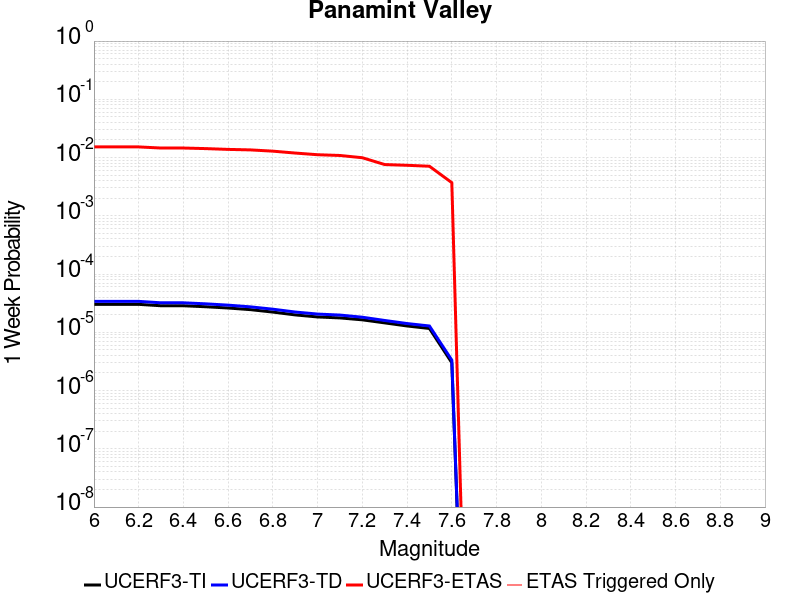 | 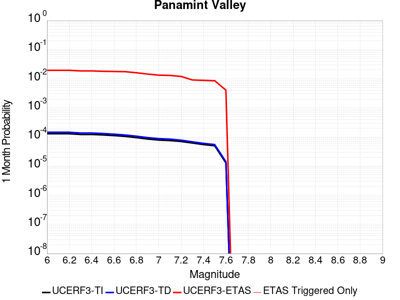 | 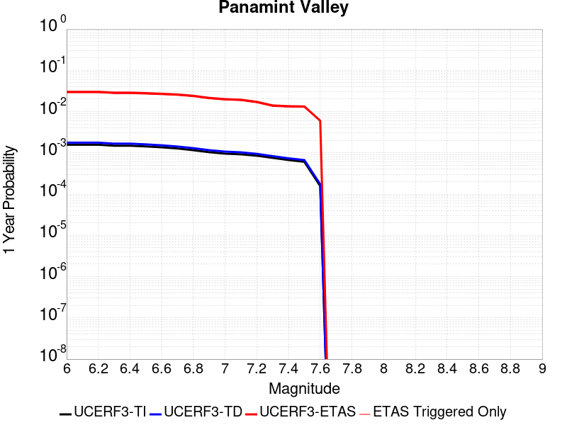 | 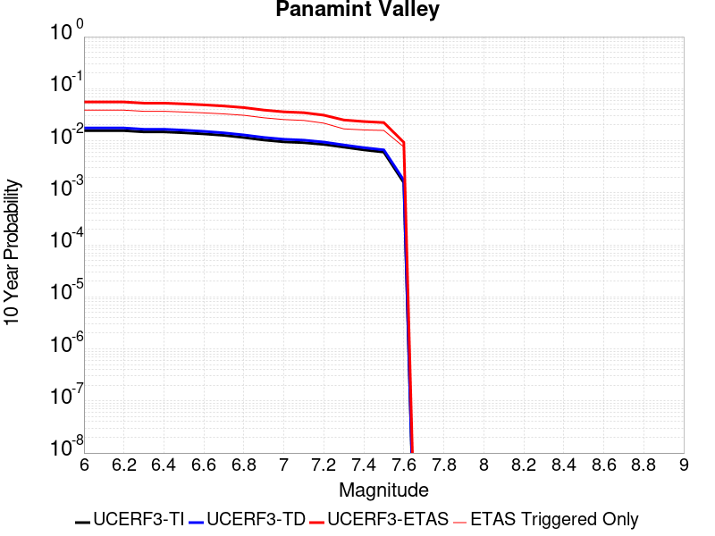 |

| Magnitude | 1 wk TI Prob | 1 wk TD Prob | 1 wk ETAS Prob | 1 wk ETAS/TD Gain | 1 wk ETAS Triggered Only | 1 mo TI Prob | 1 mo TD Prob | 1 mo ETAS Prob | 1 mo ETAS/TD Gain | 1 mo ETAS Triggered Only | 1 yr TI Prob | 1 yr TD Prob | 1 yr ETAS Prob | 1 yr ETAS/TD Gain | 1 yr ETAS Triggered Only | 10 yr TI Prob | 10 yr TD Prob | 10 yr ETAS Prob | 10 yr ETAS/TD Gain | 10 yr ETAS Triggered Only |
|-----|-----|-----|-----|-----|-----|-----|-----|-----|-----|-----|-----|-----|-----|-----|-----|-----|-----|-----|-----|-----|
| 6.0 | 3.0211835E-5 | 3.3984514E-5 | 0.01598139 | 470.25504 | 0.015947945 | 1.2947287E-4 | 1.4563995E-4 | 0.021066297 | 144.64642 | 0.020923706 | 0.0015751923 | 0.0017717537 | 0.031063983 | 17.532902 | 0.02934422 | 0.015640736 | 0.017583137 | 0.05551945 | 3.1575396 | 0.038615294 |
| 6.1 | 3.0211835E-5 | 3.3984514E-5 | 0.01598139 | 470.25504 | 0.015947945 | 1.2947287E-4 | 1.4563995E-4 | 0.021066297 | 144.64642 | 0.020923706 | 0.0015751923 | 0.0017717537 | 0.031063983 | 17.532902 | 0.02934422 | 0.015640736 | 0.017583137 | 0.05551945 | 3.1575396 | 0.038615294 |
| 6.2 | 3.0211835E-5 | 3.3984514E-5 | 0.01598139 | 470.25504 | 0.015947945 | 1.2947287E-4 | 1.4563995E-4 | 0.021066297 | 144.64642 | 0.020923706 | 0.0015751923 | 0.0017717537 | 0.031063983 | 17.532902 | 0.02934422 | 0.015640736 | 0.017583137 | 0.05551945 | 3.1575396 | 0.038615294 |
| 6.3 | 2.8573924E-5 | 3.210268E-5 | 0.0153416395 | 477.8928 | 0.015310028 | 1.2245393E-4 | 1.3757581E-4 | 0.02016544 | 146.57693 | 0.02003062 | 0.001489857 | 0.0016737265 | 0.029652676 | 17.71656 | 0.028025856 | 0.01479908 | 0.016617801 | 0.05275126 | 3.174383 | 0.036744066 |
| 6.4 | 2.8573924E-5 | 3.210268E-5 | 0.0153416395 | 477.8928 | 0.015310028 | 1.2245393E-4 | 1.3757581E-4 | 0.02016544 | 146.57693 | 0.02003062 | 0.001489857 | 0.0016737265 | 0.029652676 | 17.71656 | 0.028025856 | 0.01479908 | 0.016617801 | 0.05275126 | 3.174383 | 0.036744066 |
| 6.5 | 2.7468774E-5 | 3.0828433E-5 | 0.015042699 | 487.94885 | 0.015012333 | 1.1771801E-4 | 1.3211532E-4 | 0.019564778 | 148.08864 | 0.01943523 | 0.0014322745 | 0.0016073446 | 0.028781423 | 17.906193 | 0.027217828 | 0.014230782 | 0.015963677 | 0.050991252 | 3.1942048 | 0.035595816 |
| 6.6 | 2.6135967E-5 | 2.925248E-5 | 0.01461588 | 499.64584 | 0.014587055 | 1.1200648E-4 | 1.253619E-4 | 0.01896284 | 151.26479 | 0.01883984 | 0.0013628257 | 0.0015252391 | 0.027724905 | 18.177416 | 0.026239688 | 0.013544982 | 0.015154043 | 0.04887017 | 3.224893 | 0.034234922 |
| 6.7 | 2.4498746E-5 | 2.7341335E-5 | 0.014273783 | 522.0588 | 0.014246832 | 1.04990395E-4 | 1.1717203E-4 | 0.01844453 | 157.41411 | 0.018329507 | 0.0012775084 | 0.0014256609 | 0.026736127 | 18.753496 | 0.025346601 | 0.012701893 | 0.014171274 | 0.046411738 | 3.2750576 | 0.03270392 |
| 6.8 | 2.2244329E-5 | 2.4935423E-5 | 0.013590983 | 545.0472 | 0.013566386 | 9.532935E-5 | 1.0686185E-4 | 0.017456373 | 163.35458 | 0.017351365 | 0.0011600169 | 0.0013002884 | 0.025169866 | 19.357141 | 0.023900654 | 0.011539802 | 0.0129325185 | 0.043324493 | 3.3500428 | 0.030790167 |
| 6.9 | 1.9902658E-5 | 2.2290267E-5 | 0.012525201 | 561.91345 | 0.01250319 | 8.529431E-5 | 9.552632E-5 | 0.01604195 | 167.93224 | 0.015947945 | 0.0010379635 | 0.0011624309 | 0.022614034 | 19.454088 | 0.021476567 | 0.010331288 | 0.011568608 | 0.03893396 | 3.3654835 | 0.027685635 |
| 7.0 | 1.8353881E-5 | 2.0566185E-5 | 0.011758013 | 571.71576 | 0.011737688 | 7.865712E-5 | 8.813792E-5 | 0.014971576 | 169.86531 | 0.014884749 | 9.5722964E-4 | 0.0010725686 | 0.021124186 | 19.694952 | 0.020073147 | 0.009531168 | 0.010678849 | 0.03609137 | 3.379706 | 0.025686825 |
| 7.1 | 1.7667631E-5 | 1.9772613E-5 | 0.011502067 | 581.7171 | 0.011482521 | 7.571623E-5 | 8.473711E-5 | 0.014585507 | 172.12656 | 0.014501999 | 9.2145515E-4 | 0.0010312037 | 0.020488877 | 19.868895 | 0.019477759 | 0.009176437 | 0.010269073 | 0.03476611 | 3.3855164 | 0.024751212 |
| 7.2 | 1.6381597E-5 | 1.8158249E-5 | 0.010394767 | 572.4542 | 0.010376797 | 7.020495E-5 | 7.781885E-5 | 0.01309033 | 168.21542 | 0.013013524 | 8.544101E-4 | 9.4704994E-4 | 0.018069545 | 19.079823 | 0.017138725 | 0.008511325 | 0.009434792 | 0.03113 | 3.2994895 | 0.021901846 |
| 7.3 | 1.4520491E-5 | 1.5966476E-5 | 0.008053603 | 504.40704 | 0.008037765 | 6.222919E-5 | 6.842605E-5 | 0.010146839 | 148.28911 | 0.010079102 | 7.57377E-4 | 8.327849E-4 | 0.013962949 | 16.766571 | 0.013141108 | 0.0075480095 | 0.00829975 | 0.02521188 | 3.037667 | 0.01705367 |
| 7.4 | 1.2852287E-5 | 1.4145411E-5 | 0.007796633 | 551.17755 | 0.0077825976 | 5.5080065E-5 | 6.062187E-5 | 0.00971386 | 160.2369 | 0.009653823 | 6.7039346E-4 | 7.378371E-4 | 0.013316794 | 18.04842 | 0.012588245 | 0.0066837464 | 0.0073567946 | 0.023440704 | 3.1862662 | 0.016203113 |
| 7.5 | 1.1637851E-5 | 1.2836797E-5 | 0.0075401706 | 587.3872 | 0.0075274305 | 4.987555E-5 | 5.5013777E-5 | 0.009410627 | 171.05946 | 0.009356128 | 6.070656E-4 | 6.6960254E-4 | 0.012909424 | 19.279234 | 0.0122480225 | 0.006054099 | 0.0066787465 | 0.022351205 | 3.3466167 | 0.015777834 |
| 7.6 | 3.0068115E-6 | 3.3330316E-6 | 0.0034055503 | 1021.75757 | 0.0034022285 | 1.2886271E-5 | 1.4284384E-5 | 0.0041819545 | 292.7641 | 0.00416773 | 1.5687906E-4 | 1.7390578E-4 | 0.0057015656 | 32.785374 | 0.0055286214 | 0.0015676835 | 0.0017391363 | 0.009168568 | 5.2719088 | 0.0074423747 |

## Garlock (East)
*[(top)](#table-of-contents)*

| 1 Week | 1 Month | 1 Year | 10 Year |
|-----|-----|-----|-----|
| 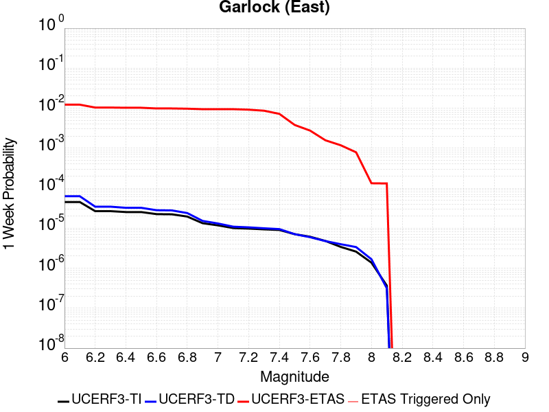 | 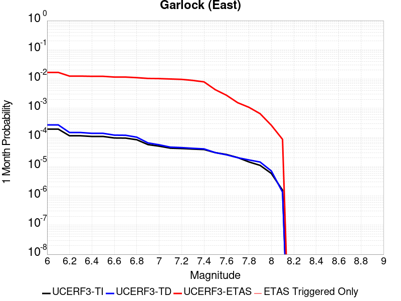 | 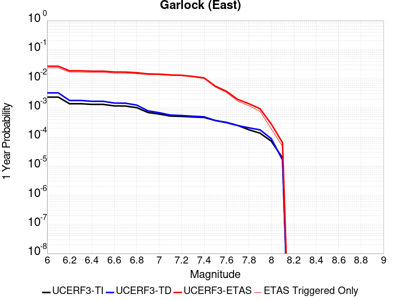 | 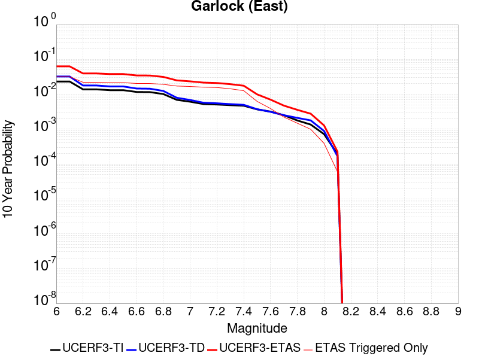 |

| Magnitude | 1 wk TI Prob | 1 wk TD Prob | 1 wk ETAS Prob | 1 wk ETAS/TD Gain | 1 wk ETAS Triggered Only | 1 mo TI Prob | 1 mo TD Prob | 1 mo ETAS Prob | 1 mo ETAS/TD Gain | 1 mo ETAS Triggered Only | 1 yr TI Prob | 1 yr TD Prob | 1 yr ETAS Prob | 1 yr ETAS/TD Gain | 1 yr ETAS Triggered Only | 10 yr TI Prob | 10 yr TD Prob | 10 yr ETAS Prob | 10 yr ETAS/TD Gain | 10 yr ETAS Triggered Only |
|-----|-----|-----|-----|-----|-----|-----|-----|-----|-----|-----|-----|-----|-----|-----|-----|-----|-----|-----|-----|-----|
| 6.0 | 4.5092507E-5 | 6.290325E-5 | 0.012310156 | 195.69983 | 0.0122480225 | 1.9323928E-4 | 2.6956003E-4 | 0.016850952 | 62.512806 | 0.016585864 | 0.0023501497 | 0.0032774 | 0.026548672 | 8.100529 | 0.023347793 | 0.023254504 | 0.032351844 | 0.06272202 | 1.9387463 | 0.031385556 |
| 6.1 | 4.5092507E-5 | 6.290325E-5 | 0.012310156 | 195.69983 | 0.0122480225 | 1.9323928E-4 | 2.6956003E-4 | 0.016850952 | 62.512806 | 0.016585864 | 0.0023501497 | 0.0032774 | 0.026548672 | 8.100529 | 0.023347793 | 0.023254504 | 0.032351844 | 0.06272202 | 1.9387463 | 0.031385556 |
| 6.2 | 2.6674514E-5 | 3.4509674E-5 | 0.009475368 | 274.57135 | 0.009441184 | 1.1431433E-4 | 1.4789042E-4 | 0.012606709 | 85.24359 | 0.012460662 | 0.0013908884 | 0.0017991117 | 0.018227782 | 10.131545 | 0.01645828 | 0.01382215 | 0.017890299 | 0.03889911 | 2.174313 | 0.021391511 |
| 6.3 | 2.6674514E-5 | 3.4509674E-5 | 0.009475368 | 274.57135 | 0.009441184 | 1.1431433E-4 | 1.4789042E-4 | 0.012606709 | 85.24359 | 0.012460662 | 0.0013908884 | 0.0017991117 | 0.018227782 | 10.131545 | 0.01645828 | 0.01382215 | 0.017890299 | 0.03889911 | 2.174313 | 0.021391511 |
| 6.4 | 2.5312667E-5 | 3.233893E-5 | 0.0092605855 | 286.3603 | 0.009228544 | 1.0847834E-4 | 1.3858822E-4 | 0.012384913 | 89.36484 | 0.0122480225 | 0.0013199237 | 0.0016860351 | 0.017776918 | 10.543622 | 0.016118057 | 0.013121112 | 0.016778335 | 0.037225533 | 2.2186666 | 0.020796122 |
| 6.5 | 2.5312667E-5 | 3.233893E-5 | 0.0092605855 | 286.3603 | 0.009228544 | 1.0847834E-4 | 1.3858822E-4 | 0.012384913 | 89.36484 | 0.0122480225 | 0.0013199237 | 0.0016860351 | 0.017776918 | 10.543622 | 0.016118057 | 0.013121112 | 0.016778335 | 0.037225533 | 2.2186666 | 0.020796122 |
| 6.6 | 2.246556E-5 | 2.8133776E-5 | 0.008873679 | 315.41016 | 0.008845794 | 9.627742E-5 | 1.20567885E-4 | 0.01168675 | 96.93087 | 0.011567577 | 0.0011715472 | 0.0014669491 | 0.016712053 | 11.392387 | 0.015267501 | 0.011653901 | 0.01461866 | 0.03402121 | 2.3272455 | 0.019690398 |
| 6.7 | 2.2241198E-5 | 2.7803519E-5 | 0.008873352 | 319.1449 | 0.008845794 | 9.531594E-5 | 1.1915263E-4 | 0.011685351 | 98.07044 | 0.011567577 | 0.0011598538 | 0.0014497414 | 0.016652642 | 11.486629 | 0.015224973 | 0.011538187 | 0.014448853 | 0.033812832 | 2.3401742 | 0.01964787 |
| 6.8 | 1.9528685E-5 | 2.389819E-5 | 0.008614319 | 360.45908 | 0.0085906265 | 8.369167E-5 | 1.0241691E-4 | 0.011158527 | 108.951996 | 0.011057243 | 0.0010184698 | 0.0012462323 | 0.015730157 | 12.622172 | 0.014501999 | 0.010138147 | 0.012436427 | 0.030873971 | 2.4825435 | 0.018669728 |
| 6.9 | 1.3318621E-5 | 1.5198884E-5 | 0.008265478 | 543.82135 | 0.008250404 | 5.7078556E-5 | 6.513648E-5 | 0.010483783 | 160.951 | 0.010419325 | 6.9470983E-4 | 7.927538E-4 | 0.014135914 | 17.831404 | 0.013353746 | 0.0069254204 | 0.007939888 | 0.024689393 | 3.1095393 | 0.01688356 |
| 7.0 | 1.1760853E-5 | 1.31077895E-5 | 0.008178349 | 623.9305 | 0.008165348 | 5.0402683E-5 | 5.6175057E-5 | 0.010347338 | 184.19809 | 0.010291741 | 6.134799E-4 | 6.8372174E-4 | 0.013900842 | 20.331139 | 0.013226164 | 0.0061178906 | 0.00685652 | 0.023413135 | 3.4147255 | 0.01667092 |
| 7.1 | 1.0064758E-5 | 1.0902931E-5 | 0.00804858 | 738.20337 | 0.008037765 | 4.3133965E-5 | 4.672603E-5 | 0.010040306 | 214.87607 | 0.009994046 | 5.2502943E-4 | 5.687444E-4 | 0.013064823 | 22.971344 | 0.01250319 | 0.005237907 | 0.0057129986 | 0.021231554 | 3.7163591 | 0.015607723 |
| 7.2 | 9.768808E-6 | 1.0498807E-5 | 0.007793015 | 742.27625 | 0.0077825976 | 4.186565E-5 | 4.499413E-5 | 0.009740909 | 216.49289 | 0.009696351 | 5.095951E-4 | 5.4766936E-4 | 0.012746479 | 23.274042 | 0.012205495 | 0.0050842804 | 0.0055032647 | 0.020729037 | 3.7666802 | 0.015310028 |
| 7.3 | 9.344516E-6 | 9.944468E-6 | 0.0071970806 | 723.7271 | 0.0071872077 | 4.004731E-5 | 4.261847E-5 | 0.008973087 | 210.54457 | 0.00893085 | 4.8746695E-4 | 5.1875977E-4 | 0.011655278 | 22.46758 | 0.011142299 | 0.0048639905 | 0.0052149445 | 0.019133644 | 3.6690023 | 0.013991664 |
| 7.4 | 9.023491E-6 | 9.490661E-6 | 0.0063886084 | 673.14685 | 0.0063791783 | 3.867153E-5 | 4.0673647E-5 | 0.007993059 | 196.5169 | 0.007952709 | 4.7072413E-4 | 4.950925E-4 | 0.010399177 | 21.004515 | 0.00990899 | 0.004697283 | 0.0049783974 | 0.01720776 | 3.456486 | 0.01229055 |
| 7.5 | 7.081253E-6 | 7.087672E-6 | 0.0033667644 | 475.01697 | 0.0033597006 | 3.0347876E-5 | 3.0375388E-5 | 0.0043255584 | 142.4034 | 0.0042953133 | 3.6942272E-4 | 3.6975832E-4 | 0.005471214 | 14.79673 | 0.0051033427 | 0.003688092 | 0.0037243143 | 0.010164473 | 2.7292202 | 0.006464234 |
| 7.6 | 6.116396E-6 | 5.959245E-6 | 0.0021323394 | 357.8204 | 0.0021263927 | 2.6212863E-5 | 2.5539372E-5 | 0.0027897793 | 109.23446 | 0.0027643107 | 3.1909486E-4 | 3.1089774E-4 | 0.0036270393 | 11.666342 | 0.0033171726 | 0.0031863707 | 0.0031357552 | 0.007375205 | 2.351971 | 0.0042527854 |
| 7.7 | 4.797145E-6 | 4.757281E-6 | 0.0013231145 | 278.1241 | 0.0013183635 | 2.055903E-5 | 2.0388188E-5 | 0.0015513598 | 76.0911 | 0.0015310028 | 2.5027743E-4 | 2.4819805E-4 | 0.00194889 | 7.852157 | 0.0017011142 | 0.0024999576 | 0.0025093474 | 0.0046728253 | 1.8621676 | 0.0021689206 |
| 7.8 | 3.4028885E-6 | 3.978462E-6 | 8.9705986E-4 | 225.47908 | 8.93085E-4 | 1.4583726E-5 | 1.7050439E-5 | 0.0010802287 | 63.35489 | 0.0010631963 | 1.775424E-4 | 2.0756939E-4 | 0.0013981021 | 6.735589 | 0.00119078 | 0.0017740062 | 0.0021012232 | 0.003629009 | 1.7270936 | 0.0015310028 |
| 7.9 | 2.5928412E-6 | 3.3724489E-6 | 5.562327E-4 | 164.93436 | 5.528621E-4 | 1.1112129E-5 | 1.4453272E-5 | 6.523619E-4 | 45.13593 | 6.3791784E-4 | 1.3528178E-4 | 1.7595445E-4 | 9.4132114E-4 | 5.3498 | 7.655014E-4 | 0.0013519945 | 0.0017812408 | 0.0028000914 | 1.5719892 | 0.0010206685 |
| 8.0 | 1.3743648E-6 | 1.6734747E-6 | 1.7178462E-4 | 102.65146 | 1.7011142E-4 | 5.8901214E-6 | 7.1720146E-6 | 2.6233733E-4 | 36.57791 | 2.5516714E-4 | 7.1709874E-5 | 8.731581E-5 | 3.4246067E-4 | 3.9220922 | 2.5516714E-4 | 7.1686733E-4 | 8.837234E-4 | 0.0011811553 | 1.3365668 | 2.97695E-4 |
| 8.1 | 3.6733252E-7 | 3.1489964E-7 | 8.5370586E-5 | 271.1041 | 8.505571E-5 | 1.5742813E-6 | 1.3495693E-6 | 8.640517E-5 | 64.024254 | 8.505571E-5 | 1.9166706E-5 | 1.6430899E-5 | 1.0148521E-4 | 6.176486 | 8.505571E-5 | 1.9165053E-4 | 1.6638759E-4 | 2.5142916E-4 | 1.5111052 | 8.505571E-5 |

## Hunter Mountain-Saline Valley
*[(top)](#table-of-contents)*

| 1 Week | 1 Month | 1 Year | 10 Year |
|-----|-----|-----|-----|
| 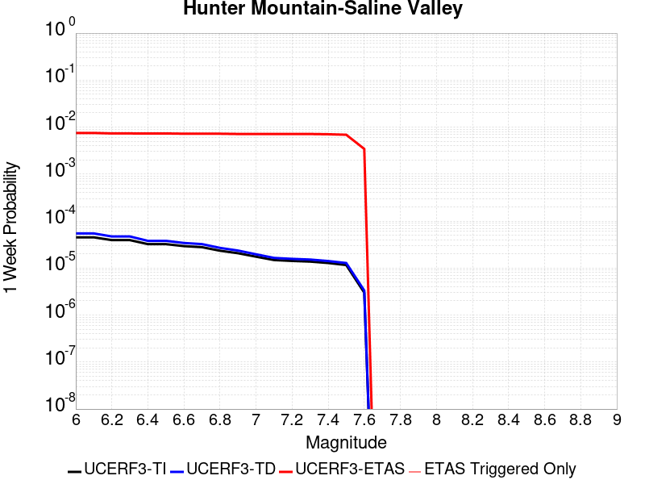 | 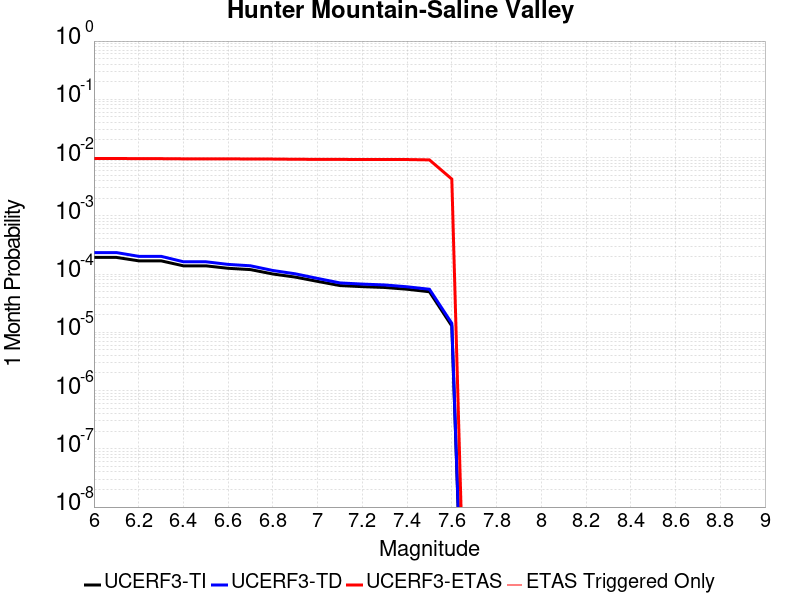 | 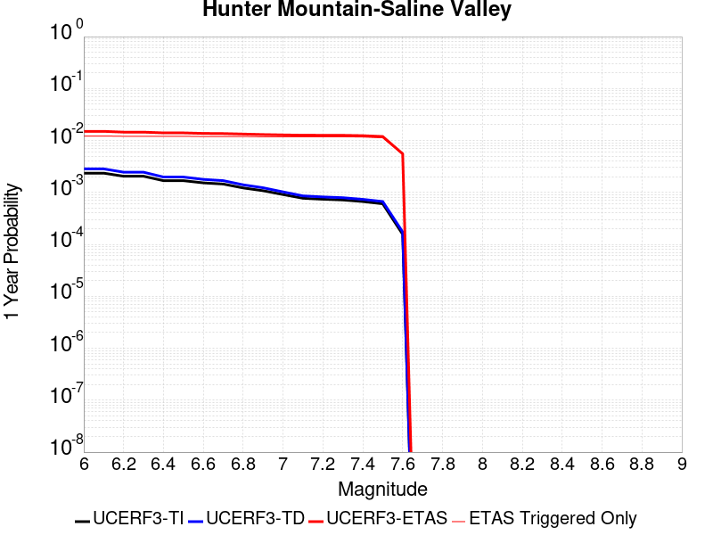 | 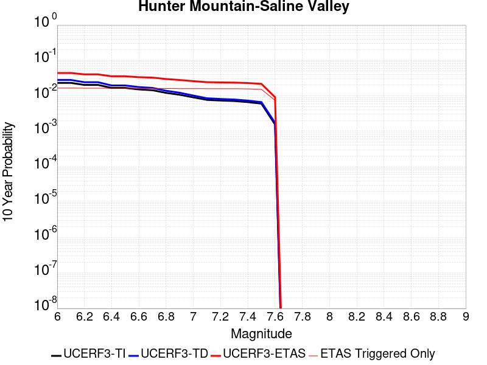 |

| Magnitude | 1 wk TI Prob | 1 wk TD Prob | 1 wk ETAS Prob | 1 wk ETAS/TD Gain | 1 wk ETAS Triggered Only | 1 mo TI Prob | 1 mo TD Prob | 1 mo ETAS Prob | 1 mo ETAS/TD Gain | 1 mo ETAS Triggered Only | 1 yr TI Prob | 1 yr TD Prob | 1 yr ETAS Prob | 1 yr ETAS/TD Gain | 1 yr ETAS Triggered Only | 10 yr TI Prob | 10 yr TD Prob | 10 yr ETAS Prob | 10 yr ETAS/TD Gain | 10 yr ETAS Triggered Only |
|-----|-----|-----|-----|-----|-----|-----|-----|-----|-----|-----|-----|-----|-----|-----|-----|-----|-----|-----|-----|-----|
| 6.0 | 4.5103672E-5 | 5.4570177E-5 | 0.008049371 | 147.50494 | 0.007995237 | 1.9328714E-4 | 2.3385242E-4 | 0.010140525 | 43.362926 | 0.00990899 | 0.002350731 | 0.0028435152 | 0.015862443 | 5.578462 | 0.013056052 | 0.023260195 | 0.028091887 | 0.044542488 | 1.5855997 | 0.016926087 |
| 6.1 | 4.5103672E-5 | 5.4570177E-5 | 0.008049371 | 147.50494 | 0.007995237 | 1.9328714E-4 | 2.3385242E-4 | 0.010140525 | 43.362926 | 0.00990899 | 0.002350731 | 0.0028435152 | 0.015862443 | 5.578462 | 0.013056052 | 0.023260195 | 0.028091887 | 0.044542488 | 1.5855997 | 0.016926087 |
| 6.2 | 3.9363465E-5 | 4.706337E-5 | 0.007956873 | 169.0672 | 0.007910181 | 1.6868966E-4 | 2.0168544E-4 | 0.010023639 | 49.699368 | 0.009823935 | 0.002051862 | 0.0024528175 | 0.015391998 | 6.275232 | 0.012970996 | 0.020330196 | 0.024273481 | 0.040664226 | 1.6752532 | 0.016798504 |
| 6.3 | 3.9363465E-5 | 4.706337E-5 | 0.007956873 | 169.0672 | 0.007910181 | 1.6868966E-4 | 2.0168544E-4 | 0.010023639 | 49.699368 | 0.009823935 | 0.002051862 | 0.0024528175 | 0.015391998 | 6.275232 | 0.012970996 | 0.020330196 | 0.024273481 | 0.040664226 | 1.6752532 | 0.016798504 |
| 6.4 | 3.2311684E-5 | 3.795099E-5 | 0.007947832 | 209.42358 | 0.007910181 | 1.384713E-4 | 1.6263737E-4 | 0.009984975 | 61.394096 | 0.009823935 | 0.0016845843 | 0.0019783843 | 0.014881275 | 7.521933 | 0.012928468 | 0.016718714 | 0.019616475 | 0.036002062 | 1.8352973 | 0.016713448 |
| 6.5 | 3.2311684E-5 | 3.795099E-5 | 0.007947832 | 209.42358 | 0.007910181 | 1.384713E-4 | 1.6263737E-4 | 0.009984975 | 61.394096 | 0.009823935 | 0.0016845843 | 0.0019783843 | 0.014881275 | 7.521933 | 0.012928468 | 0.016718714 | 0.019616475 | 0.036002062 | 1.8352973 | 0.016713448 |
| 6.6 | 2.9305844E-5 | 3.418183E-5 | 0.007901566 | 231.16275 | 0.007867653 | 1.2559042E-4 | 1.4648569E-4 | 0.00992646 | 67.76402 | 0.009781407 | 0.0015279909 | 0.001782067 | 0.014645044 | 8.218009 | 0.01288594 | 0.015175272 | 0.01768569 | 0.03402 | 1.9235889 | 0.016628392 |
| 6.7 | 2.7826512E-5 | 3.2344276E-5 | 0.0078997435 | 244.2393 | 0.007867653 | 1.19251024E-4 | 1.386113E-4 | 0.009918663 | 71.55739 | 0.009781407 | 0.0014509142 | 0.0016863465 | 0.014550556 | 8.62845 | 0.01288594 | 0.014414776 | 0.016743187 | 0.033093166 | 1.9765154 | 0.016628392 |
| 6.8 | 2.3389874E-5 | 2.6866714E-5 | 0.007851782 | 292.24942 | 0.007825125 | 1.0023846E-4 | 1.15138246E-4 | 0.0098528955 | 85.574486 | 0.009738879 | 0.00121972 | 0.001400954 | 0.014226373 | 10.154776 | 0.012843412 | 0.01213047 | 0.013927434 | 0.030240364 | 2.1712804 | 0.016543336 |
| 6.9 | 2.069209E-5 | 2.3570032E-5 | 0.007805984 | 331.1826 | 0.0077825976 | 8.867737E-5 | 1.01010715E-4 | 0.009753859 | 96.562614 | 0.009653823 | 0.0010791123 | 0.0012291478 | 0.013929347 | 11.332524 | 0.012715829 | 0.010738871 | 0.012228523 | 0.028401528 | 2.322564 | 0.016373225 |
| 7.0 | 1.7462342E-5 | 1.9633546E-5 | 0.0078020785 | 397.3851 | 0.0077825976 | 7.483646E-5 | 8.414118E-5 | 0.009737153 | 115.723976 | 0.009653823 | 9.1075303E-4 | 0.0010239601 | 0.013726768 | 13.40557 | 0.012715829 | 0.009070295 | 0.0101960525 | 0.026402336 | 2.5894663 | 0.016373225 |
| 7.1 | 1.4807709E-5 | 1.6441749E-5 | 0.0077989115 | 474.33588 | 0.0077825976 | 6.3460066E-5 | 7.046283E-5 | 0.009723606 | 137.99625 | 0.009653823 | 7.723524E-4 | 8.575638E-4 | 0.013519997 | 15.765587 | 0.012673301 | 0.007696735 | 0.008545532 | 0.024736675 | 2.894691 | 0.016330697 |
| 7.2 | 1.4180048E-5 | 1.5698337E-5 | 0.007798174 | 496.75162 | 0.0077825976 | 6.077022E-5 | 6.727694E-5 | 0.00972045 | 144.48413 | 0.009653823 | 7.396263E-4 | 8.188051E-4 | 0.01348173 | 16.465124 | 0.012673301 | 0.0073716943 | 0.008160833 | 0.024358258 | 2.9847758 | 0.016330697 |
| 7.3 | 1.3730402E-5 | 1.5172075E-5 | 0.0077976515 | 513.9476 | 0.0077825976 | 5.8843252E-5 | 6.502165E-5 | 0.009718217 | 149.46126 | 0.009653823 | 7.161811E-4 | 7.9136714E-4 | 0.013412145 | 16.948069 | 0.012630773 | 0.007138774 | 0.007888422 | 0.024048103 | 3.0485313 | 0.016288169 |
| 7.4 | 1.2810095E-5 | 1.4109277E-5 | 0.0077540698 | 549.57245 | 0.0077400696 | 5.489925E-5 | 6.0467017E-5 | 0.009671181 | 159.94142 | 0.009611296 | 6.681934E-4 | 7.359531E-4 | 0.013272437 | 18.034353 | 0.012545718 | 0.006661878 | 0.007338053 | 0.02338005 | 3.1861382 | 0.016160585 |
| 7.5 | 1.1595659E-5 | 1.2800664E-5 | 0.0074976073 | 585.7202 | 0.0074849026 | 4.9694736E-5 | 5.4858923E-5 | 0.009367948 | 170.76436 | 0.0093136 | 6.0486543E-4 | 6.6771836E-4 | 0.012865063 | 19.267199 | 0.012205495 | 0.006032217 | 0.0066599925 | 0.022290502 | 3.346926 | 0.015735306 |
| 7.6 | 2.997694E-6 | 3.3251579E-6 | 0.0034055423 | 1024.1746 | 0.0034022285 | 1.28471975E-5 | 1.425064E-5 | 0.004181921 | 293.45496 | 0.00416773 | 1.564034E-4 | 1.73495E-4 | 0.0057011573 | 32.86064 | 0.0055286214 | 0.0015629337 | 0.001735031 | 0.009164493 | 5.282034 | 0.0074423747 |

## Blackwater
*[(top)](#table-of-contents)*

| 1 Week | 1 Month | 1 Year | 10 Year |
|-----|-----|-----|-----|
| 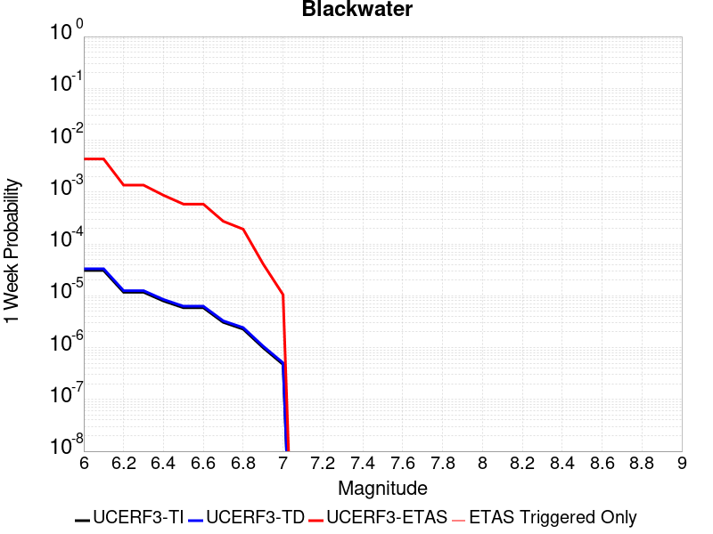 | 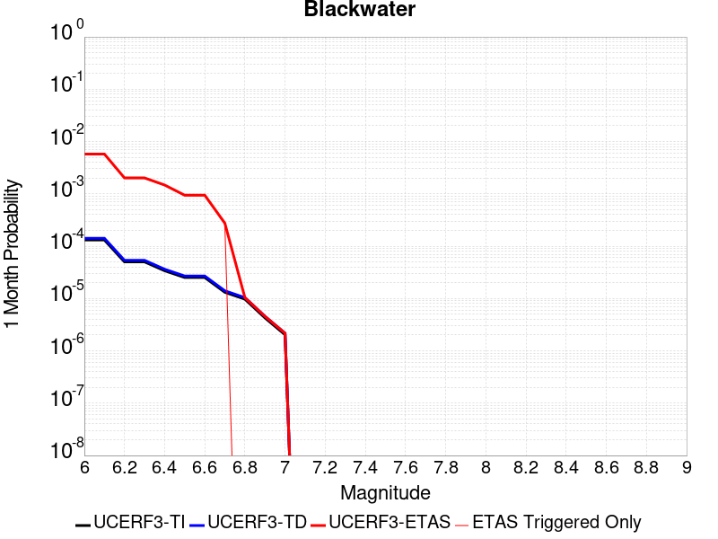 | 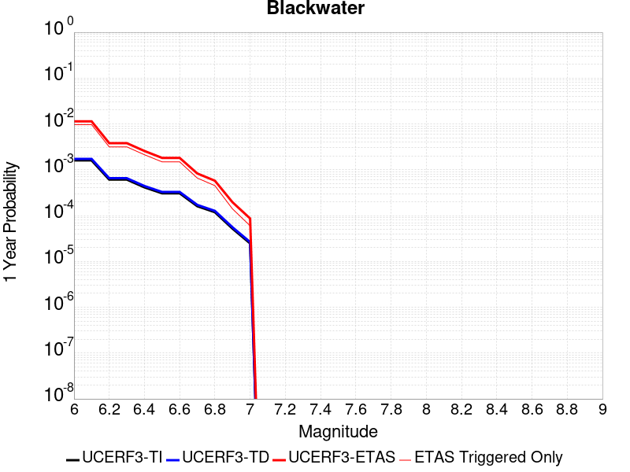 | 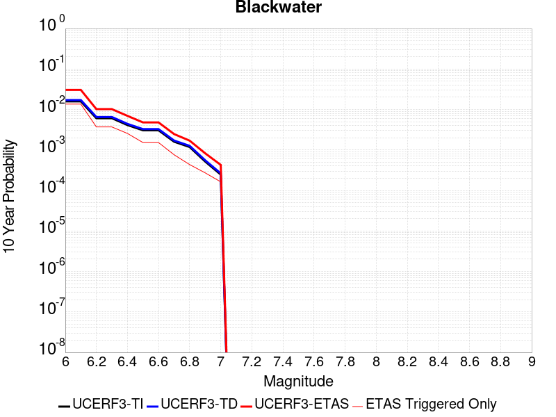 |

| Magnitude | 1 wk TI Prob | 1 wk TD Prob | 1 wk ETAS Prob | 1 wk ETAS/TD Gain | 1 wk ETAS Triggered Only | 1 mo TI Prob | 1 mo TD Prob | 1 mo ETAS Prob | 1 mo ETAS/TD Gain | 1 mo ETAS Triggered Only | 1 yr TI Prob | 1 yr TD Prob | 1 yr ETAS Prob | 1 yr ETAS/TD Gain | 1 yr ETAS Triggered Only | 10 yr TI Prob | 10 yr TD Prob | 10 yr ETAS Prob | 10 yr ETAS/TD Gain | 10 yr ETAS Triggered Only |
|-----|-----|-----|-----|-----|-----|-----|-----|-----|-----|-----|-----|-----|-----|-----|-----|-----|-----|-----|-----|-----|
| 6.0 | 3.0708583E-5 | 3.3095846E-5 | 0.0042857407 | 129.49481 | 0.0042527854 | 1.3160157E-4 | 1.4183241E-4 | 0.0061799316 | 43.572067 | 0.0060389554 | 0.0016010714 | 0.0017255784 | 0.011659925 | 6.7571106 | 0.009951518 | 0.015895851 | 0.017135633 | 0.030260555 | 1.7659432 | 0.013353746 |
| 6.1 | 3.0708583E-5 | 3.3095846E-5 | 0.0042857407 | 129.49481 | 0.0042527854 | 1.3160157E-4 | 1.4183241E-4 | 0.0061799316 | 43.572067 | 0.0060389554 | 0.0016010714 | 0.0017255784 | 0.011659925 | 6.7571106 | 0.009951518 | 0.015895851 | 0.017135633 | 0.030260555 | 1.7659432 | 0.013353746 |
| 6.2 | 1.1707779E-5 | 1.2545122E-5 | 9.481462E-4 | 75.57887 | 9.356128E-4 | 5.017523E-5 | 5.3763757E-5 | 0.0014571075 | 27.102041 | 0.0014034192 | 6.107122E-4 | 6.5438676E-4 | 0.0034593884 | 5.2864585 | 0.0028068384 | 0.006090366 | 0.0065255696 | 0.0103281 | 1.5827124 | 0.003827507 |
| 6.3 | 1.1707779E-5 | 1.2545122E-5 | 9.481462E-4 | 75.57887 | 9.356128E-4 | 5.017523E-5 | 5.3763757E-5 | 0.0014571075 | 27.102041 | 0.0014034192 | 6.107122E-4 | 6.5438676E-4 | 0.0034593884 | 5.2864585 | 0.0028068384 | 0.006090366 | 0.0065255696 | 0.0103281 | 1.5827124 | 0.003827507 |
| 6.4 | 7.929244E-6 | 8.480098E-6 | 6.8892003E-4 | 81.23963 | 6.804457E-4 | 3.3982033E-5 | 3.6342793E-5 | 0.0010569743 | 29.083462 | 0.0010206685 | 4.136527E-4 | 4.423877E-4 | 0.0023978036 | 5.4201407 | 0.0019562813 | 0.0041288356 | 0.0044154758 | 0.0070405607 | 1.594519 | 0.002636727 |
| 6.5 | 5.8832115E-6 | 6.285991E-6 | 4.3156187E-4 | 68.65455 | 4.2527856E-4 | 2.521352E-5 | 2.6939697E-5 | 6.2231364E-4 | 23.100246 | 5.9539E-4 | 3.0693135E-4 | 3.27944E-4 | 0.0015183334 | 4.629856 | 0.00119078 | 0.0030650778 | 0.0032748538 | 0.0048432313 | 1.4789153 | 0.0015735306 |
| 6.6 | 5.8832115E-6 | 6.285991E-6 | 4.3156187E-4 | 68.65455 | 4.2527856E-4 | 2.521352E-5 | 2.6939697E-5 | 6.2231364E-4 | 23.100246 | 5.9539E-4 | 3.0693135E-4 | 3.27944E-4 | 0.0015183334 | 4.629856 | 0.00119078 | 0.0030650778 | 0.0032748538 | 0.0048432313 | 1.4789153 | 0.0015735306 |
| 6.7 | 3.0715053E-6 | 3.2814662E-6 | 2.1592005E-4 | 65.79987 | 2.1263928E-4 | 1.3163528E-5 | 1.4063357E-5 | 2.692269E-4 | 19.143858 | 2.5516714E-4 | 1.6025416E-4 | 1.7120909E-4 | 8.090177E-4 | 4.72532 | 6.3791784E-4 | 0.0016013865 | 0.0017108864 | 0.0026024433 | 1.5211083 | 8.93085E-4 |
| 6.8 | 2.2722281E-6 | 2.4287538E-6 | 4.4956505E-5 | 18.510113 | 4.2527856E-5 | 9.738084E-6 | 1.0408908E-5 | 9.5463736E-5 | 9.17135 | 8.505571E-5 | 1.1855473E-4 | 1.26722E-4 | 4.6690172E-4 | 3.6844568 | 3.4022285E-4 | 0.001184915 | 0.0012665876 | 0.0018187495 | 1.4359444 | 5.528621E-4 |
| 6.9 | 9.952399E-7 | 1.0653489E-6 | 1.0653489E-6 | 1.0 | 0.0 | 4.265307E-6 | 4.5657757E-6 | 4.5657757E-6 | 1.0 | 0.0 | 5.1928873E-5 | 5.5587418E-5 | 2.2568938E-4 | 4.0600805 | 1.7011142E-4 | 5.191674E-4 | 5.557858E-4 | 8.1081106E-4 | 1.4588554 | 2.5516714E-4 |
| 7.0 | 4.7385504E-7 | 5.0755597E-7 | 5.0755597E-7 | 1.0 | 0.0 | 2.0308057E-6 | 2.1752398E-6 | 2.1752398E-6 | 1.0 | 0.0 | 2.4724779E-5 | 2.6483543E-5 | 1.11537E-4 | 4.211559 | 8.505571E-5 | 2.4722028E-4 | 2.6483546E-4 | 4.3490183E-4 | 1.6421586 | 1.7011142E-4 |

## Ash Hill
*[(top)](#table-of-contents)*

| 1 Week | 1 Month | 1 Year | 10 Year |
|-----|-----|-----|-----|
| 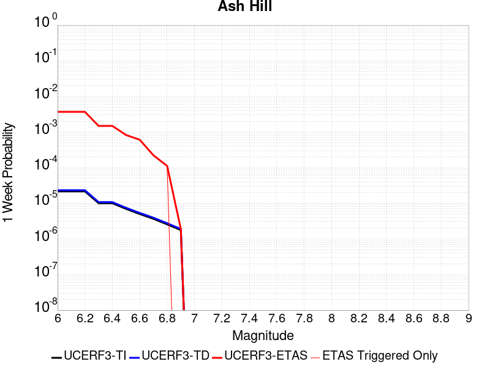 | 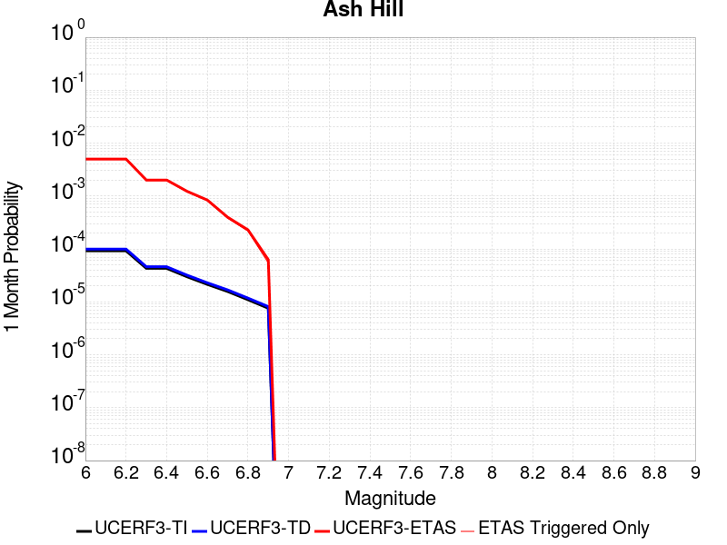 | 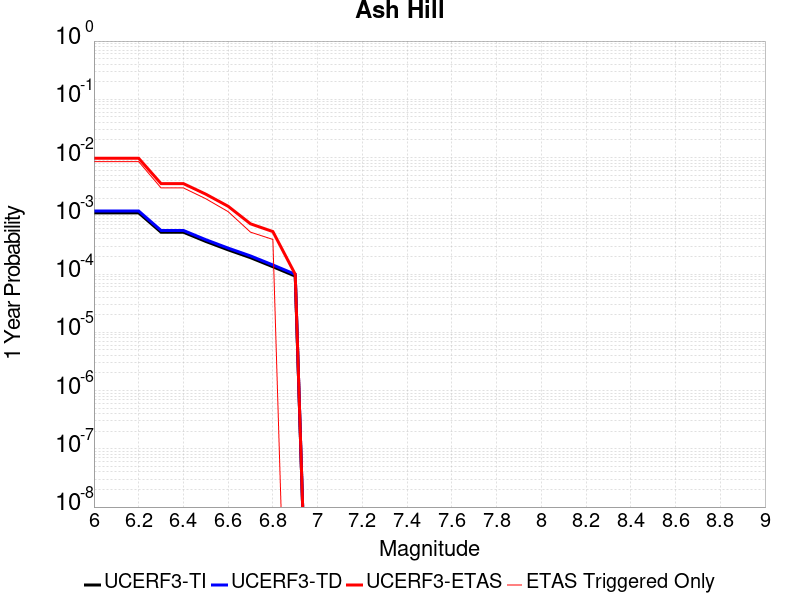 | 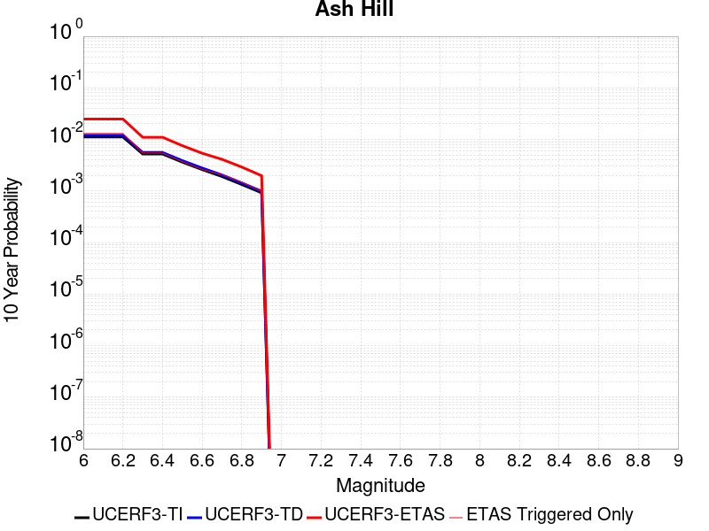 |

| Magnitude | 1 wk TI Prob | 1 wk TD Prob | 1 wk ETAS Prob | 1 wk ETAS/TD Gain | 1 wk ETAS Triggered Only | 1 mo TI Prob | 1 mo TD Prob | 1 mo ETAS Prob | 1 mo ETAS/TD Gain | 1 mo ETAS Triggered Only | 1 yr TI Prob | 1 yr TD Prob | 1 yr ETAS Prob | 1 yr ETAS/TD Gain | 1 yr ETAS Triggered Only | 10 yr TI Prob | 10 yr TD Prob | 10 yr ETAS Prob | 10 yr ETAS/TD Gain | 10 yr ETAS Triggered Only |
|-----|-----|-----|-----|-----|-----|-----|-----|-----|-----|-----|-----|-----|-----|-----|-----|-----|-----|-----|-----|-----|
| 6.0 | 2.1545662E-5 | 2.3194447E-5 | 0.0041057738 | 177.01538 | 0.004082674 | 9.2335285E-5 | 9.940143E-5 | 0.005542426 | 55.758007 | 0.0054435655 | 0.0011236023 | 0.0012096206 | 0.010299573 | 8.514714 | 0.0091009615 | 0.011179381 | 0.012038348 | 0.024685131 | 2.0505414 | 0.012800884 |
| 6.1 | 2.1545662E-5 | 2.3194447E-5 | 0.0041057738 | 177.01538 | 0.004082674 | 9.2335285E-5 | 9.940143E-5 | 0.005542426 | 55.758007 | 0.0054435655 | 0.0011236023 | 0.0012096206 | 0.010299573 | 8.514714 | 0.0091009615 | 0.011179381 | 0.012038348 | 0.024685131 | 2.0505414 | 0.012800884 |
| 6.2 | 2.1545662E-5 | 2.3194447E-5 | 0.0041057738 | 177.01538 | 0.004082674 | 9.2335285E-5 | 9.940143E-5 | 0.005542426 | 55.758007 | 0.0054435655 | 0.0011236023 | 0.0012096206 | 0.010299573 | 8.514714 | 0.0091009615 | 0.011179381 | 0.012038348 | 0.024685131 | 2.0505414 | 0.012800884 |
| 6.3 | 1.0025529E-5 | 1.0746934E-5 | 0.0016693155 | 155.32945 | 0.0016585863 | 4.2965847E-5 | 4.605755E-5 | 0.0021723525 | 47.166042 | 0.0021263927 | 5.229836E-4 | 5.6061964E-4 | 0.0036209086 | 6.4587617 | 0.0030620056 | 0.005217545 | 0.0055933665 | 0.010541294 | 1.8846065 | 0.004975759 |
| 6.4 | 1.0025529E-5 | 1.0746934E-5 | 0.0016693155 | 155.32945 | 0.0016585863 | 4.2965847E-5 | 4.605755E-5 | 0.0021723525 | 47.166042 | 0.0021263927 | 5.229836E-4 | 5.6061964E-4 | 0.0036209086 | 6.4587617 | 0.0030620056 | 0.005217545 | 0.0055933665 | 0.010541294 | 1.8846065 | 0.004975759 |
| 6.5 | 6.9617327E-6 | 7.456634E-6 | 9.8559E-4 | 132.17627 | 9.781406E-4 | 2.9835655E-5 | 3.195666E-5 | 0.001350278 | 42.253414 | 0.0013183635 | 3.6318856E-4 | 3.8901155E-4 | 0.0024295545 | 6.245456 | 0.002041337 | 0.0036259557 | 0.0038841602 | 0.0071884487 | 1.8507085 | 0.0033171726 |
| 6.6 | 4.9919777E-6 | 5.3466883E-6 | 6.8578875E-4 | 128.2642 | 6.804457E-4 | 2.1394015E-5 | 2.2914215E-5 | 8.734518E-4 | 38.11834 | 8.505571E-4 | 2.60441E-4 | 2.7895154E-4 | 0.0016819793 | 6.029647 | 0.0014034192 | 0.0026013597 | 0.0027866727 | 0.005161596 | 1.8522434 | 0.00238156 |
| 6.7 | 3.6630722E-6 | 3.924624E-6 | 3.0161845E-4 | 76.85283 | 2.97695E-4 | 1.5698786E-5 | 1.681974E-5 | 4.4209114E-4 | 26.284065 | 4.2527856E-4 | 1.9111596E-4 | 2.0476682E-4 | 0.0010126306 | 4.9452868 | 8.0802926E-4 | 0.0019095168 | 0.0020463446 | 0.0036166552 | 1.7673736 | 0.0015735306 |
| 6.8 | 2.5599613E-6 | 2.744925E-6 | 2.1538362E-4 | 78.46612 | 2.1263928E-4 | 1.0971216E-5 | 1.1763939E-5 | 3.0945544E-4 | 26.305426 | 2.97695E-4 | 1.3356637E-4 | 1.4322149E-4 | 7.385262E-4 | 5.156532 | 5.9539E-4 | 0.0013348613 | 0.0014317769 | 0.002578385 | 1.8008287 | 0.001148252 |
| 6.9 | 1.7684905E-6 | 1.8968707E-6 | 4.4424647E-5 | 23.419966 | 4.2527856E-5 | 7.579223E-6 | 8.129446E-6 | 9.318446E-5 | 11.462585 | 8.505571E-5 | 9.2273134E-5 | 9.8976E-5 | 3.9664152E-4 | 4.0074515 | 2.97695E-4 | 9.223483E-4 | 9.8976E-4 | 0.0016270465 | 1.6438798 | 6.3791784E-4 |

## Garlock (West)
*[(top)](#table-of-contents)*

| 1 Week | 1 Month | 1 Year | 10 Year |
|-----|-----|-----|-----|
| 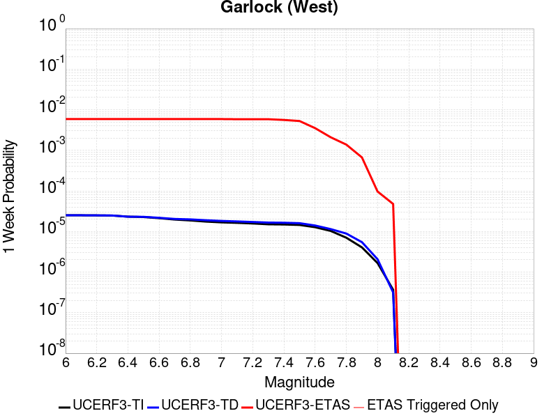 | 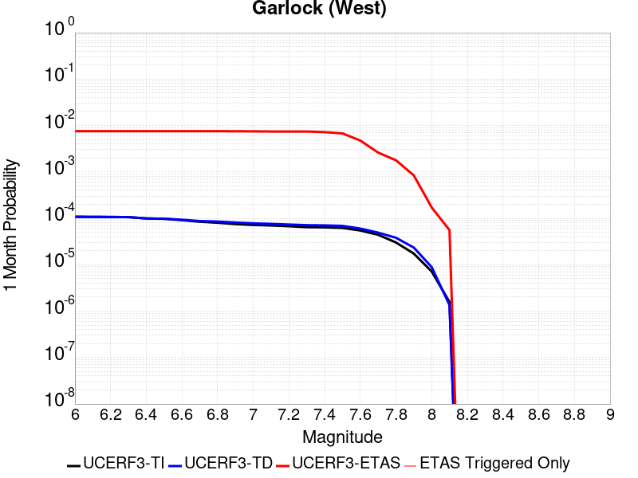 | 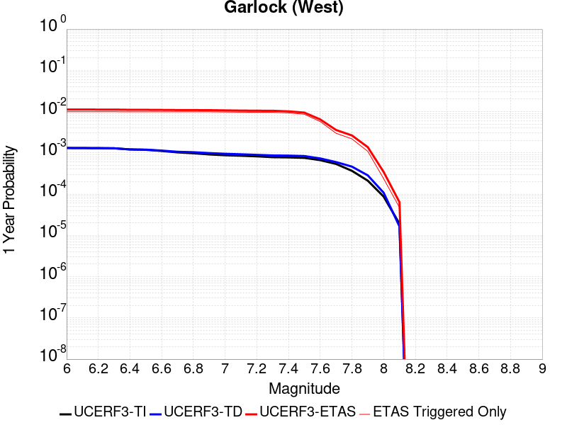 | 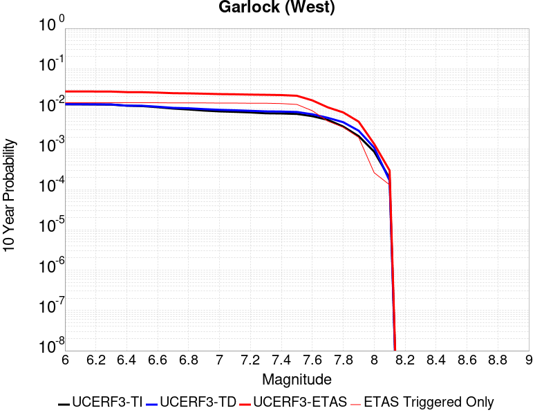 |

| Magnitude | 1 wk TI Prob | 1 wk TD Prob | 1 wk ETAS Prob | 1 wk ETAS/TD Gain | 1 wk ETAS Triggered Only | 1 mo TI Prob | 1 mo TD Prob | 1 mo ETAS Prob | 1 mo ETAS/TD Gain | 1 mo ETAS Triggered Only | 1 yr TI Prob | 1 yr TD Prob | 1 yr ETAS Prob | 1 yr ETAS/TD Gain | 1 yr ETAS Triggered Only | 10 yr TI Prob | 10 yr TD Prob | 10 yr ETAS Prob | 10 yr ETAS/TD Gain | 10 yr ETAS Triggered Only |
|-----|-----|-----|-----|-----|-----|-----|-----|-----|-----|-----|-----|-----|-----|-----|-----|-----|-----|-----|-----|-----|
| 6.0 | 2.5181727E-5 | 2.51973E-5 | 0.0058513666 | 232.22197 | 0.0058263163 | 1.0791722E-4 | 1.0798398E-4 | 0.0075920783 | 70.30745 | 0.0074849026 | 0.0013131002 | 0.0013139155 | 0.01108247 | 8.43469 | 0.009781407 | 0.013053683 | 0.013141977 | 0.025187066 | 1.9165357 | 0.012205495 |
| 6.1 | 2.5077732E-5 | 2.5098372E-5 | 0.0058512683 | 233.13338 | 0.0058263163 | 1.0747157E-4 | 1.0756004E-4 | 0.0075916573 | 70.58065 | 0.0074849026 | 0.001307681 | 0.0013087603 | 0.011077366 | 8.464015 | 0.009781407 | 0.013000126 | 0.013091032 | 0.025136745 | 1.9201499 | 0.012205495 |
| 6.2 | 2.494612E-5 | 2.498005E-5 | 0.005851151 | 234.23294 | 0.0058263163 | 1.0690756E-4 | 1.0705298E-4 | 0.0075911544 | 70.910255 | 0.0074849026 | 0.0013008224 | 0.0013025942 | 0.01107126 | 8.4993925 | 0.009781407 | 0.012932341 | 0.013030097 | 0.025076553 | 1.9245101 | 0.012205495 |
| 6.3 | 2.4733758E-5 | 2.479942E-5 | 0.005850971 | 235.93178 | 0.0058263163 | 1.0599751E-4 | 1.06278916E-4 | 0.007590386 | 71.419495 | 0.0074849026 | 0.0012897556 | 0.0012931811 | 0.0110619385 | 8.554052 | 0.009781407 | 0.012822957 | 0.012937066 | 0.024984658 | 1.931246 | 0.012205495 |
| 6.4 | 2.3237335E-5 | 2.317873E-5 | 0.00584936 | 252.35895 | 0.0058263163 | 9.958477E-5 | 9.933365E-5 | 0.007583493 | 76.34364 | 0.0074849026 | 0.0012117702 | 0.001208719 | 0.010935826 | 9.047451 | 0.009738879 | 0.012051838 | 0.012101916 | 0.024117688 | 1.9928818 | 0.012162967 |
| 6.5 | 2.2732203E-5 | 2.2993298E-5 | 0.0058491756 | 254.38611 | 0.0058263163 | 9.742009E-5 | 9.8539E-5 | 0.007582704 | 76.9513 | 0.0074849026 | 0.0011854442 | 0.0011990548 | 0.010926256 | 9.1123905 | 0.009738879 | 0.011791403 | 0.012006322 | 0.024023257 | 2.0008838 | 0.012162967 |
| 6.6 | 2.1319436E-5 | 2.17735E-5 | 0.005847963 | 268.58167 | 0.0058263163 | 9.136581E-5 | 9.331167E-5 | 0.0075775157 | 81.20652 | 0.0074849026 | 0.001111811 | 0.0011354799 | 0.0108633 | 9.567145 | 0.009738879 | 0.011062649 | 0.011377227 | 0.023401812 | 2.0568995 | 0.012162967 |
| 6.7 | 1.970802E-5 | 2.0393396E-5 | 0.0058465907 | 286.6904 | 0.0058263163 | 8.446021E-5 | 8.739735E-5 | 0.007571646 | 86.63473 | 0.0074849026 | 0.001027818 | 0.001063545 | 0.010792066 | 10.147259 | 0.009738879 | 0.010230771 | 0.010664964 | 0.022614066 | 2.1204069 | 0.012077911 |
| 6.8 | 1.8744462E-5 | 1.9901045E-5 | 0.0058461013 | 293.7585 | 0.0058263163 | 8.033094E-5 | 8.5287415E-5 | 0.0075695515 | 88.75344 | 0.0074849026 | 9.775903E-4 | 0.0010378812 | 0.010766652 | 10.373684 | 0.009738879 | 0.009733009 | 0.01041075 | 0.022362921 | 2.1480603 | 0.012077911 |
| 6.9 | 1.7559682E-5 | 1.8953415E-5 | 0.0058451593 | 308.39612 | 0.0058263163 | 7.5253614E-5 | 8.12264E-5 | 0.007565521 | 93.14116 | 0.0074849026 | 9.158276E-4 | 9.884841E-4 | 0.010717737 | 10.842598 | 0.009738879 | 0.0091206245 | 0.009921231 | 0.021879315 | 2.2053022 | 0.012077911 |
| 7.0 | 1.6794445E-5 | 1.8216237E-5 | 0.0058444263 | 320.8361 | 0.0058263163 | 7.197421E-5 | 7.8067256E-5 | 0.007519861 | 96.32542 | 0.0074423747 | 8.759337E-4 | 9.5005584E-4 | 0.010594707 | 11.151669 | 0.009653823 | 0.008724891 | 0.009540141 | 0.021418583 | 2.2451015 | 0.011992855 |
| 7.1 | 1.6337795E-5 | 1.7717046E-5 | 0.005801403 | 327.44754 | 0.0057837884 | 7.0017246E-5 | 7.5927994E-5 | 0.0074326885 | 97.89128 | 0.007357319 | 8.521265E-4 | 9.240326E-4 | 0.010483958 | 11.345875 | 0.009568768 | 0.008488664 | 0.009281996 | 0.021079268 | 2.2709844 | 0.011907799 |
| 7.2 | 1.5780008E-5 | 1.7165687E-5 | 0.005800855 | 337.93317 | 0.0057837884 | 6.762685E-5 | 7.356516E-5 | 0.007430343 | 101.003555 | 0.007357319 | 8.2304585E-4 | 8.9528906E-4 | 0.010413 | 11.63088 | 0.00952624 | 0.008200042 | 0.008996838 | 0.02075536 | 2.3069615 | 0.011865272 |
| 7.3 | 1.5058865E-5 | 1.6618762E-5 | 0.005800311 | 349.02185 | 0.0057837884 | 6.45364E-5 | 7.122133E-5 | 0.0074280165 | 104.29483 | 0.007357319 | 7.854473E-4 | 8.667759E-4 | 0.010384759 | 11.980904 | 0.00952624 | 0.00782677 | 0.008713539 | 0.020433264 | 2.345002 | 0.011822744 |
| 7.4 | 1.4887923E-5 | 1.6454731E-5 | 0.005587512 | 339.56873 | 0.0055711493 | 6.380382E-5 | 7.051838E-5 | 0.0071721696 | 101.70638 | 0.007102152 | 7.7653467E-4 | 8.582243E-4 | 0.010078849 | 11.74384 | 0.009228544 | 0.0077382675 | 0.008628399 | 0.019969683 | 2.3144135 | 0.011439993 |
| 7.5 | 1.4509299E-5 | 1.6046748E-5 | 0.0052894163 | 329.62543 | 0.005273454 | 6.218123E-5 | 6.876997E-5 | 0.006787709 | 98.70164 | 0.006719401 | 7.567935E-4 | 8.36954E-4 | 0.009462883 | 11.306336 | 0.008633154 | 0.0075422134 | 0.008416704 | 0.019085692 | 2.2675967 | 0.010759547 |
| 7.6 | 1.2756717E-5 | 1.4050848E-5 | 0.0035438132 | 252.21347 | 0.003529812 | 5.4670498E-5 | 6.0216535E-5 | 0.004567898 | 75.857864 | 0.004507953 | 6.6541E-4 | 7.328904E-4 | 0.00651244 | 8.885967 | 0.0057837884 | 0.006634211 | 0.0073816874 | 0.014684698 | 1.9893415 | 0.007357319 |
| 7.7 | 1.0328985E-5 | 1.1460557E-5 | 0.0021803563 | 190.24872 | 0.0021689206 | 4.4266326E-5 | 4.911575E-5 | 0.0026006617 | 52.94965 | 0.0025516714 | 5.388092E-4 | 5.978206E-4 | 0.0037430006 | 6.2610765 | 0.0031470612 | 0.0053750467 | 0.006038511 | 0.010054261 | 1.6650232 | 0.0040401462 |
| 7.8 | 7.0306583E-6 | 8.899601E-6 | 0.0014548338 | 163.4718 | 0.0014459471 | 3.0131043E-5 | 3.814059E-5 | 0.0018242424 | 47.829422 | 0.00178617 | 3.667837E-4 | 4.642629E-4 | 0.002802209 | 6.035824 | 0.002339032 | 0.003661789 | 0.0046952725 | 0.0076159164 | 1.6220393 | 0.002934422 |
| 7.9 | 4.060633E-6 | 5.4653938E-6 | 7.28435E-4 | 133.28133 | 7.2297355E-4 | 1.7402595E-5 | 2.3422906E-5 | 9.1648696E-4 | 39.127808 | 8.93085E-4 | 2.11856E-4 | 2.851367E-4 | 0.0014330613 | 5.025875 | 0.001148252 | 0.0021165414 | 0.002884201 | 0.0042835725 | 1.4851851 | 0.0014034192 |
| 8.0 | 1.6729537E-6 | 2.0775144E-6 | 1.7218858E-4 | 82.88202 | 1.7011142E-4 | 7.169782E-6 | 8.903603E-6 | 3.0659593E-4 | 34.435043 | 2.97695E-4 | 8.7288594E-5 | 1.0839601E-4 | 4.0605874E-4 | 3.7460673 | 2.97695E-4 | 8.7254314E-4 | 0.0010969337 | 0.0014367835 | 1.3098178 | 3.4022285E-4 |
| 8.1 | 3.6733252E-7 | 3.1489964E-7 | 8.5370586E-5 | 271.1041 | 8.505571E-5 | 1.5742813E-6 | 1.3495693E-6 | 8.640517E-5 | 64.024254 | 8.505571E-5 | 1.9166706E-5 | 1.6430899E-5 | 1.0148521E-4 | 6.176486 | 8.505571E-5 | 1.9165053E-4 | 1.6638759E-4 | 2.5142916E-4 | 1.5111052 | 8.505571E-5 |

## McLean Lake
*[(top)](#table-of-contents)*

| 1 Week | 1 Month | 1 Year | 10 Year |
|-----|-----|-----|-----|
| 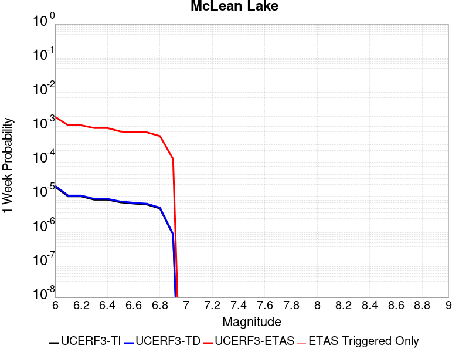 | 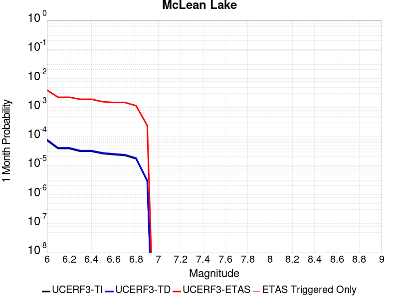 | 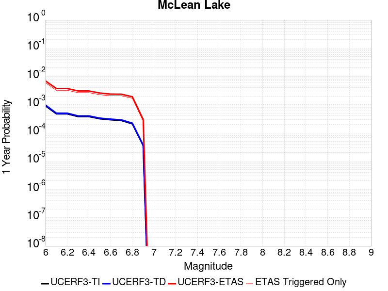 | 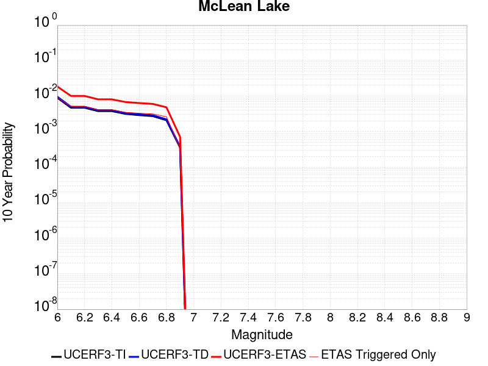 |

| Magnitude | 1 wk TI Prob | 1 wk TD Prob | 1 wk ETAS Prob | 1 wk ETAS/TD Gain | 1 wk ETAS Triggered Only | 1 mo TI Prob | 1 mo TD Prob | 1 mo ETAS Prob | 1 mo ETAS/TD Gain | 1 mo ETAS Triggered Only | 1 yr TI Prob | 1 yr TD Prob | 1 yr ETAS Prob | 1 yr ETAS/TD Gain | 1 yr ETAS Triggered Only | 10 yr TI Prob | 10 yr TD Prob | 10 yr ETAS Prob | 10 yr ETAS/TD Gain | 10 yr ETAS Triggered Only |
|-----|-----|-----|-----|-----|-----|-----|-----|-----|-----|-----|-----|-----|-----|-----|-----|-----|-----|-----|-----|-----|
| 6.0 | 1.7360222E-5 | 1.8501627E-5 | 0.002059801 | 111.330795 | 0.002041337 | 7.439883E-5 | 7.9290556E-5 | 0.0039490187 | 49.8044 | 0.0038700348 | 9.0542925E-4 | 9.6498354E-4 | 0.0069981115 | 7.252053 | 0.0060389554 | 0.009017491 | 0.0096127745 | 0.018710488 | 1.9464191 | 0.009186016 |
| 6.1 | 9.062689E-6 | 9.592193E-6 | 0.0012003607 | 125.139336 | 0.00119078 | 3.8839516E-5 | 4.1108804E-5 | 0.0021674142 | 52.723846 | 0.0021263927 | 4.727685E-4 | 5.003936E-4 | 0.0036883866 | 7.3709707 | 0.0031895891 | 0.0047176396 | 0.004993552 | 0.010156042 | 2.0338314 | 0.0051883985 |
| 6.2 | 9.062689E-6 | 9.592193E-6 | 0.0012003607 | 125.139336 | 0.00119078 | 3.8839516E-5 | 4.1108804E-5 | 0.0021674142 | 52.723846 | 0.0021263927 | 4.727685E-4 | 5.003936E-4 | 0.0036883866 | 7.3709707 | 0.0031895891 | 0.0047176396 | 0.004993552 | 0.010156042 | 2.0338314 | 0.0051883985 |
| 6.3 | 7.2575485E-6 | 7.66771E-6 | 9.858009E-4 | 128.56525 | 9.781406E-4 | 3.110341E-5 | 3.2861237E-5 | 0.001776446 | 54.059013 | 0.001743642 | 3.786182E-4 | 4.0001926E-4 | 0.0029931806 | 7.4825916 | 0.0025941993 | 0.0037797375 | 0.0039936965 | 0.008144782 | 2.0394092 | 0.00416773 |
| 6.4 | 7.2575485E-6 | 7.66771E-6 | 9.858009E-4 | 128.56525 | 9.781406E-4 | 3.110341E-5 | 3.2861237E-5 | 0.001776446 | 54.059013 | 0.001743642 | 3.786182E-4 | 4.0001926E-4 | 0.0029931806 | 7.4825916 | 0.0025941993 | 0.0037797375 | 0.0039936965 | 0.008144782 | 2.0394092 | 0.00416773 |
| 6.5 | 6.06582E-6 | 6.4038773E-6 | 7.719004E-4 | 120.536415 | 7.655014E-4 | 2.5996113E-5 | 2.7444936E-5 | 0.0014733523 | 53.683945 | 0.0014459471 | 3.164567E-4 | 3.3409733E-4 | 0.002544807 | 7.616963 | 0.0022114485 | 0.0031600643 | 0.0033365893 | 0.0068970094 | 2.0670838 | 0.00357234 |
| 6.6 | 5.598744E-6 | 5.910262E-6 | 7.2887953E-4 | 123.3244 | 7.2297355E-4 | 2.3994397E-5 | 2.5329486E-5 | 0.0013861863 | 54.726196 | 0.0013608914 | 2.9209262E-4 | 3.0834923E-4 | 0.0023490568 | 7.61817 | 0.002041337 | 0.0029170897 | 0.003079843 | 0.0064715934 | 2.1012738 | 0.0034022285 |
| 6.7 | 5.246996E-6 | 5.539162E-6 | 7.285087E-4 | 131.51965 | 7.2297355E-4 | 2.2486933E-5 | 2.3739085E-5 | 0.0013845982 | 58.325672 | 0.0013608914 | 2.73744E-4 | 2.8899137E-4 | 0.0023297386 | 8.06162 | 0.002041337 | 0.0027340704 | 0.0028867796 | 0.0061095664 | 2.116395 | 0.003232117 |
| 6.8 | 4.02324E-6 | 4.2469046E-6 | 5.571067E-4 | 131.17947 | 5.528621E-4 | 1.7242342E-5 | 1.8200926E-5 | 0.001081378 | 59.41335 | 0.0010631963 | 2.099053E-4 | 2.2157968E-4 | 0.0018797986 | 8.483623 | 0.0016585863 | 0.0020970714 | 0.002214172 | 0.0048874947 | 2.207369 | 0.0026792549 |
| 6.9 | 6.835972E-7 | 7.1399285E-7 | 1.2829747E-4 | 179.69014 | 1.2758357E-4 | 2.9296991E-6 | 3.0599674E-6 | 2.156986E-4 | 70.490486 | 2.1263928E-4 | 3.56685E-5 | 3.7254784E-5 | 2.924124E-4 | 7.8489895 | 2.5516714E-4 | 3.5662777E-4 | 3.7251666E-4 | 7.1261276E-4 | 1.9129689 | 3.4022285E-4 |

## Gravel Hills-Harper Lk
*[(top)](#table-of-contents)*

| 1 Week | 1 Month | 1 Year | 10 Year |
|-----|-----|-----|-----|
| 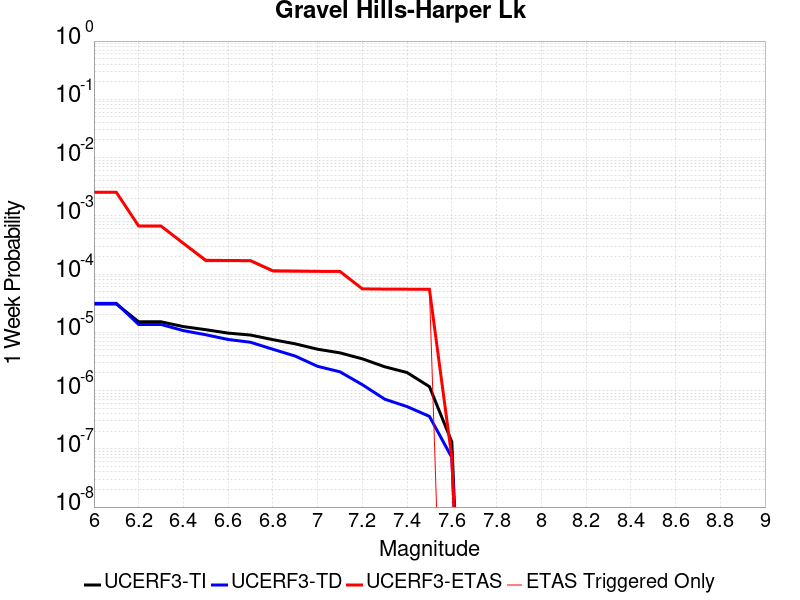 | 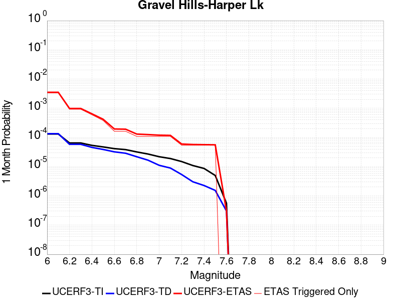 | 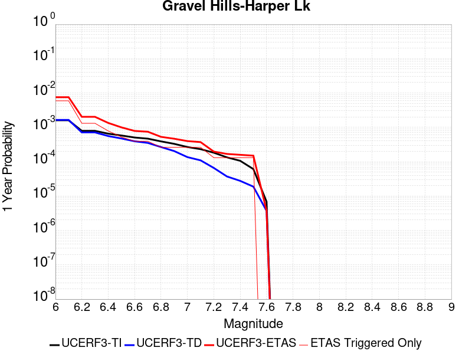 | 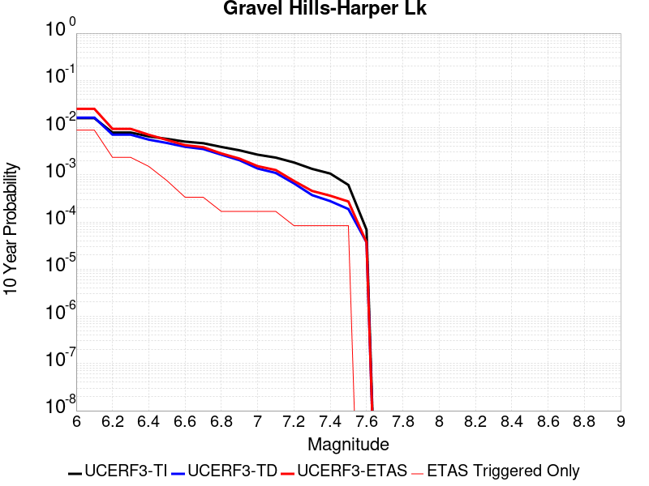 |

| Magnitude | 1 wk TI Prob | 1 wk TD Prob | 1 wk ETAS Prob | 1 wk ETAS/TD Gain | 1 wk ETAS Triggered Only | 1 mo TI Prob | 1 mo TD Prob | 1 mo ETAS Prob | 1 mo ETAS/TD Gain | 1 mo ETAS Triggered Only | 1 yr TI Prob | 1 yr TD Prob | 1 yr ETAS Prob | 1 yr ETAS/TD Gain | 1 yr ETAS Triggered Only | 10 yr TI Prob | 10 yr TD Prob | 10 yr ETAS Prob | 10 yr ETAS/TD Gain | 10 yr ETAS Triggered Only |
|-----|-----|-----|-----|-----|-----|-----|-----|-----|-----|-----|-----|-----|-----|-----|-----|-----|-----|-----|-----|-----|
| 6.0 | 3.0679566E-5 | 3.1464646E-5 | 0.0022428436 | 71.28139 | 0.0022114485 | 1.3147724E-4 | 1.3484273E-4 | 0.0031539134 | 23.389568 | 0.0030194777 | 0.0015995599 | 0.0016406906 | 0.006863035 | 4.183016 | 0.0052309264 | 0.015880952 | 0.01630734 | 0.02413036 | 1.479724 | 0.007952709 |
| 6.1 | 3.0679566E-5 | 3.1464646E-5 | 0.0022428436 | 71.28139 | 0.0022114485 | 1.3147724E-4 | 1.3484273E-4 | 0.0031539134 | 23.389568 | 0.0030194777 | 0.0015995599 | 0.0016406906 | 0.006863035 | 4.183016 | 0.0052309264 | 0.015880952 | 0.01630734 | 0.02413036 | 1.479724 | 0.007952709 |
| 6.2 | 1.514536E-5 | 1.3635206E-5 | 5.664898E-4 | 41.54611 | 5.528621E-4 | 6.490707E-5 | 5.843536E-5 | 8.23892E-4 | 14.099204 | 7.655014E-4 | 7.8995706E-4 | 7.1123015E-4 | 0.002156149 | 3.0315769 | 0.0014459471 | 0.007871548 | 0.0070907404 | 0.0091598295 | 1.2918015 | 0.002083865 |
| 6.3 | 1.514536E-5 | 1.3635206E-5 | 5.664898E-4 | 41.54611 | 5.528621E-4 | 6.490707E-5 | 5.843536E-5 | 8.23892E-4 | 14.099204 | 7.655014E-4 | 7.8995706E-4 | 7.1123015E-4 | 0.002156149 | 3.0315769 | 0.0014459471 | 0.007871548 | 0.0070907404 | 0.0091598295 | 1.2918015 | 0.002083865 |
| 6.4 | 1.2532521E-5 | 1.06896905E-5 | 3.083815E-4 | 28.848495 | 2.97695E-4 | 5.37097E-5 | 4.581219E-5 | 5.561231E-4 | 12.1391945 | 5.1033427E-4 | 6.537194E-4 | 5.576265E-4 | 0.0014502135 | 2.6006896 | 8.93085E-4 | 0.0065179965 | 0.005562863 | 0.0068738926 | 1.2356753 | 0.0013183635 |
| 6.5 | 1.1094058E-5 | 9.083664E-6 | 1.7919354E-4 | 19.727013 | 1.7011142E-4 | 4.7545094E-5 | 3.892943E-5 | 3.7913903E-4 | 9.739137 | 3.4022285E-4 | 5.787078E-4 | 4.7386673E-4 | 0.0011114823 | 2.3455586 | 6.3791784E-4 | 0.0057720304 | 0.0047289706 | 0.005533179 | 1.1700599 | 8.0802926E-4 |
| 6.6 | 9.688328E-6 | 7.5316952E-6 | 1.351143E-4 | 17.939428 | 1.2758357E-4 | 4.1520743E-5 | 3.227831E-5 | 1.5985775E-4 | 4.9524827 | 1.2758357E-4 | 5.053978E-4 | 3.9292008E-4 | 6.4798695E-4 | 1.6491572 | 2.5516714E-4 | 0.0050424994 | 0.0039225104 | 0.00430376 | 1.0971953 | 3.827507E-4 |
| 6.7 | 8.974824E-6 | 6.749413E-6 | 1.3433212E-4 | 19.902786 | 1.2758357E-4 | 3.8462964E-5 | 2.8925748E-5 | 1.5650563E-4 | 5.410599 | 1.2758357E-4 | 4.6818596E-4 | 3.5211627E-4 | 6.0719356E-4 | 1.7244121 | 2.5516714E-4 | 0.004672008 | 0.0035158044 | 0.0038548312 | 1.0964293 | 3.4022285E-4 |
| 6.8 | 7.4780046E-6 | 5.1161933E-6 | 9.017147E-5 | 17.62472 | 8.505571E-5 | 3.20482E-5 | 2.1926366E-5 | 1.0698021E-4 | 4.879067 | 8.505571E-5 | 3.9011694E-4 | 2.669222E-4 | 3.9447172E-4 | 1.4778528 | 1.2758357E-4 | 0.0038943281 | 0.0026661542 | 0.002835812 | 1.0636339 | 1.7011142E-4 |
| 6.9 | 6.3409307E-6 | 3.9074966E-6 | 8.896288E-5 | 22.76723 | 8.505571E-5 | 2.7175134E-5 | 1.6746313E-5 | 1.018006E-4 | 6.0789857 | 8.505571E-5 | 3.3080703E-4 | 2.0386827E-4 | 2.8890665E-4 | 1.4171242 | 8.505571E-5 | 0.0033031502 | 0.0020369107 | 0.0021642344 | 1.0625082 | 1.2758357E-4 |
| 7.0 | 5.1239335E-6 | 2.6058565E-6 | 8.766135E-5 | 33.64013 | 8.505571E-5 | 2.195953E-5 | 1.116791E-5 | 9.622267E-5 | 8.615996 | 8.505571E-5 | 2.6732447E-4 | 1.3596108E-4 | 2.2100522E-4 | 1.6255037 | 8.505571E-5 | 0.0026700313 | 0.0013588042 | 0.0014437443 | 1.062511 | 8.505571E-5 |
| 7.1 | 4.438899E-6 | 2.0984728E-6 | 8.7154E-5 | 41.532112 | 8.505571E-5 | 1.9023713E-5 | 8.993425E-6 | 9.404837E-5 | 10.4574585 | 8.505571E-5 | 2.315891E-4 | 1.0948967E-4 | 1.9453607E-4 | 1.7767527 | 8.505571E-5 | 0.002313479 | 0.0010943791 | 0.0011793418 | 1.0776354 | 8.505571E-5 |
| 7.2 | 3.50367E-6 | 1.2615716E-6 | 4.3789372E-5 | 34.71018 | 4.2527856E-5 | 1.5015643E-5 | 5.4067245E-6 | 4.793435E-5 | 8.865691 | 4.2527856E-5 | 1.8280011E-4 | 6.582497E-5 | 1.08350025E-4 | 1.6460323 | 4.2527856E-5 | 0.0018264982 | 6.580629E-4 | 7.005628E-4 | 1.0645833 | 4.2527856E-5 |
| 7.3 | 2.561638E-6 | 7.1191585E-7 | 4.3239743E-5 | 60.737152 | 4.2527856E-5 | 1.0978401E-5 | 3.0510646E-6 | 4.5578792E-5 | 14.938652 | 4.2527856E-5 | 1.3365384E-4 | 3.71461E-5 | 7.9672376E-5 | 2.1448383 | 4.2527856E-5 | 0.0013357349 | 3.7140088E-4 | 4.1391293E-4 | 1.114464 | 4.2527856E-5 |
| 7.4 | 2.0368864E-6 | 5.304837E-7 | 4.3058317E-5 | 81.16803 | 4.2527856E-5 | 8.729483E-6 | 2.2734996E-6 | 4.4801258E-5 | 19.705856 | 4.2527856E-5 | 1.06276275E-4 | 2.7679513E-5 | 7.020619E-5 | 2.5363955 | 4.2527856E-5 | 0.0010622547 | 2.767612E-4 | 3.192773E-4 | 1.1536201 | 4.2527856E-5 |
| 7.5 | 1.1681728E-6 | 3.6030585E-7 | 4.2888147E-5 | 119.03261 | 4.2527856E-5 | 5.0064455E-6 | 1.544167E-6 | 4.4071956E-5 | 28.540926 | 4.2527856E-5 | 6.0951766E-5 | 1.8800076E-5 | 6.132713E-5 | 3.2620683 | 4.2527856E-5 | 6.093505E-4 | 1.8798532E-4 | 2.3050519E-4 | 1.2261871 | 4.2527856E-5 |
| 7.6 | 1.3154387E-7 | 7.1197384E-8 | 7.1197384E-8 | 1.0 | 0.0 | 5.6375933E-7 | 3.051316E-7 | 3.051316E-7 | 1.0 | 0.0 | 6.863748E-6 | 3.7149728E-6 | 3.7149728E-6 | 1.0 | 0.0 | 6.863536E-5 | 3.7149264E-5 | 3.7149264E-5 | 1.0 | 0.0 |

## Goldstone Lake
*[(top)](#table-of-contents)*

| 1 Week | 1 Month | 1 Year | 10 Year |
|-----|-----|-----|-----|
| 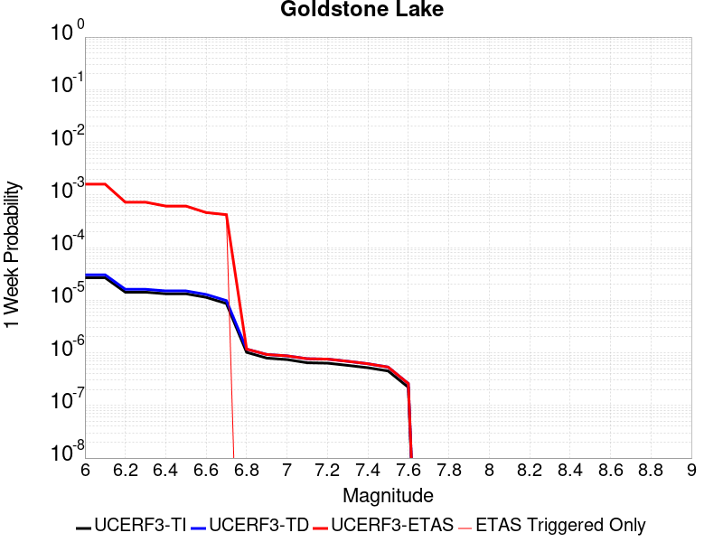 | 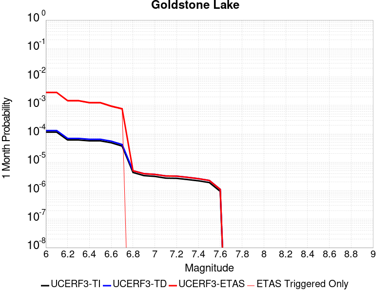 | 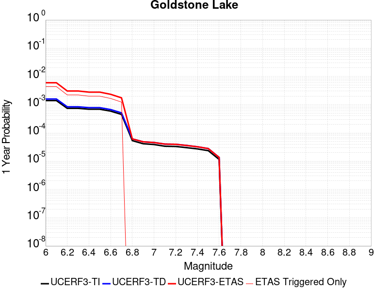 | 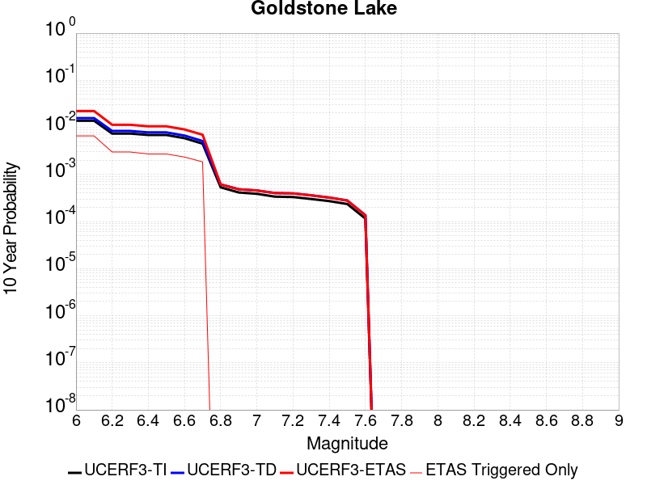 |

| Magnitude | 1 wk TI Prob | 1 wk TD Prob | 1 wk ETAS Prob | 1 wk ETAS/TD Gain | 1 wk ETAS Triggered Only | 1 mo TI Prob | 1 mo TD Prob | 1 mo ETAS Prob | 1 mo ETAS/TD Gain | 1 mo ETAS Triggered Only | 1 yr TI Prob | 1 yr TD Prob | 1 yr ETAS Prob | 1 yr ETAS/TD Gain | 1 yr ETAS Triggered Only | 10 yr TI Prob | 10 yr TD Prob | 10 yr ETAS Prob | 10 yr ETAS/TD Gain | 10 yr ETAS Triggered Only |
|-----|-----|-----|-----|-----|-----|-----|-----|-----|-----|-----|-----|-----|-----|-----|-----|-----|-----|-----|-----|-----|
| 6.0 | 2.671352E-5 | 3.037609E-5 | 0.001688912 | 55.600048 | 0.0016585863 | 1.1448149E-4 | 1.3017785E-4 | 0.0028516063 | 21.905464 | 0.0027217828 | 0.001392921 | 0.0015839594 | 0.00595739 | 3.761075 | 0.004380369 | 0.013842222 | 0.015746197 | 0.0226528 | 1.4386204 | 0.007017096 |
| 6.1 | 2.671352E-5 | 3.037609E-5 | 0.001688912 | 55.600048 | 0.0016585863 | 1.1448149E-4 | 1.3017785E-4 | 0.0028516063 | 21.905464 | 0.0027217828 | 0.001392921 | 0.0015839594 | 0.00595739 | 3.761075 | 0.004380369 | 0.013842222 | 0.015746197 | 0.0226528 | 1.4386204 | 0.007017096 |
| 6.2 | 1.4197047E-5 | 1.6096245E-5 | 8.241125E-4 | 51.199055 | 8.0802926E-4 | 6.0843064E-5 | 6.8982634E-5 | 0.001472305 | 21.343124 | 0.0014034192 | 7.4051257E-4 | 8.3963864E-4 | 0.0030492302 | 3.6315985 | 0.0022114485 | 0.007380498 | 0.0083743585 | 0.011705924 | 1.3978293 | 0.0033597006 |
| 6.3 | 1.4197047E-5 | 1.6096245E-5 | 8.241125E-4 | 51.199055 | 8.0802926E-4 | 6.0843064E-5 | 6.8982634E-5 | 0.001472305 | 21.343124 | 0.0014034192 | 7.4051257E-4 | 8.3963864E-4 | 0.0030492302 | 3.6315985 | 0.0022114485 | 0.007380498 | 0.0083743585 | 0.011705924 | 1.3978293 | 0.0033597006 |
| 6.4 | 1.3238931E-5 | 1.500846E-5 | 6.9544395E-4 | 46.336796 | 6.804457E-4 | 5.6737044E-5 | 6.4320935E-5 | 0.0012550243 | 19.51191 | 0.00119078 | 6.9055456E-4 | 7.82924E-4 | 0.0027801683 | 3.5510066 | 0.0019988092 | 0.006884126 | 0.0078112837 | 0.010849371 | 1.3889358 | 0.0030620056 |
| 6.5 | 1.3238931E-5 | 1.500846E-5 | 6.9544395E-4 | 46.336796 | 6.804457E-4 | 5.6737044E-5 | 6.4320935E-5 | 0.0012550243 | 19.51191 | 0.00119078 | 6.9055456E-4 | 7.82924E-4 | 0.0027801683 | 3.5510066 | 0.0019988092 | 0.006884126 | 0.0078112837 | 0.010849371 | 1.3889358 | 0.0030620056 |
| 6.6 | 1.1328278E-5 | 1.2855166E-5 | 5.2318285E-4 | 40.69826 | 5.1033427E-4 | 4.8548856E-5 | 5.5092944E-5 | 9.481287E-4 | 17.209621 | 8.93085E-4 | 5.90922E-4 | 6.7064585E-4 | 0.00232812 | 3.4714596 | 0.0016585863 | 0.0058935313 | 0.0066956086 | 0.009230195 | 1.3785446 | 0.0025516714 |
| 6.7 | 8.651175E-6 | 9.824565E-6 | 4.776264E-4 | 48.61553 | 4.678064E-4 | 3.707594E-5 | 4.2105108E-5 | 7.650482E-4 | 18.169962 | 7.2297355E-4 | 4.5130608E-4 | 5.1259965E-4 | 0.0017452752 | 3.4047532 | 0.0012333078 | 0.0045039062 | 0.005123051 | 0.00698469 | 1.3633848 | 0.0018712257 |
| 6.8 | 1.0215377E-6 | 1.1754702E-6 | 1.1754702E-6 | 1.0 | 0.0 | 4.378012E-6 | 5.0377203E-6 | 5.0377203E-6 | 1.0 | 0.0 | 5.3300988E-5 | 6.1332634E-5 | 6.1332634E-5 | 1.0 | 0.0 | 5.3288206E-4 | 6.1316835E-4 | 6.556701E-4 | 1.0693151 | 4.2527856E-5 |
| 6.9 | 7.9360774E-7 | 9.2833966E-7 | 9.2833966E-7 | 1.0 | 0.0 | 3.4011714E-6 | 3.9785928E-6 | 3.9785928E-6 | 1.0 | 0.0 | 4.1408475E-5 | 4.843836E-5 | 4.843836E-5 | 1.0 | 0.0 | 4.140076E-4 | 4.8428503E-4 | 4.8428503E-4 | 1.0 | 0.0 |
| 7.0 | 7.4382757E-7 | 8.7473285E-7 | 8.7473285E-7 | 1.0 | 0.0 | 3.1878285E-6 | 3.74885E-6 | 3.74885E-6 | 1.0 | 0.0 | 3.8811122E-5 | 4.564136E-5 | 4.564136E-5 | 1.0 | 0.0 | 3.8804344E-4 | 4.5632652E-4 | 4.5632652E-4 | 1.0 | 0.0 |
| 7.1 | 6.4709513E-7 | 7.7113E-7 | 7.7113E-7 | 1.0 | 0.0 | 2.773262E-6 | 3.3048389E-6 | 3.3048389E-6 | 1.0 | 0.0 | 3.376394E-5 | 4.0235733E-5 | 4.0235733E-5 | 1.0 | 0.0 | 3.375881E-4 | 4.0229043E-4 | 4.0229043E-4 | 1.0 | 0.0 |
| 7.2 | 6.356704E-7 | 7.5883594E-7 | 7.5883594E-7 | 1.0 | 0.0 | 2.7242988E-6 | 3.2521505E-6 | 3.2521505E-6 | 1.0 | 0.0 | 3.3167835E-5 | 3.959427E-5 | 3.959427E-5 | 1.0 | 0.0 | 3.3162883E-4 | 3.958781E-4 | 3.958781E-4 | 1.0 | 0.0 |
| 7.3 | 5.7695723E-7 | 6.8965653E-7 | 6.8965653E-7 | 1.0 | 0.0 | 2.4726714E-6 | 2.9556677E-6 | 2.9556677E-6 | 1.0 | 0.0 | 3.0104358E-5 | 3.5984718E-5 | 3.5984718E-5 | 1.0 | 0.0 | 3.0100282E-4 | 3.5979465E-4 | 3.5979465E-4 | 1.0 | 0.0 |
| 7.4 | 5.209647E-7 | 6.193514E-7 | 6.193514E-7 | 1.0 | 0.0 | 2.232704E-6 | 2.6543607E-6 | 2.6543607E-6 | 1.0 | 0.0 | 2.718283E-5 | 3.2316417E-5 | 3.2316417E-5 | 1.0 | 0.0 | 2.7179506E-4 | 3.2312275E-4 | 3.2312275E-4 | 1.0 | 0.0 |
| 7.5 | 4.512955E-7 | 5.348885E-7 | 5.348885E-7 | 1.0 | 0.0 | 1.934122E-6 | 2.2923775E-6 | 2.2923775E-6 | 1.0 | 0.0 | 2.3547682E-5 | 2.7909393E-5 | 2.7909393E-5 | 1.0 | 0.0 | 2.3545188E-4 | 2.7906417E-4 | 2.7906417E-4 | 1.0 | 0.0 |
| 7.6 | 2.21172E-7 | 2.603961E-7 | 2.603961E-7 | 1.0 | 0.0 | 9.478797E-7 | 1.1159829E-6 | 1.1159829E-6 | 1.0 | 0.0 | 1.1540374E-5 | 1.3587036E-5 | 1.3587036E-5 | 1.0 | 0.0 | 1.1539775E-4 | 1.3586486E-4 | 1.3586486E-4 | 1.0 | 0.0 |

## So Sierra Nevada
*[(top)](#table-of-contents)*

| 1 Week | 1 Month | 1 Year | 10 Year |
|-----|-----|-----|-----|
| 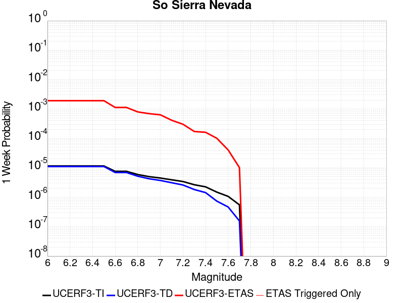 | 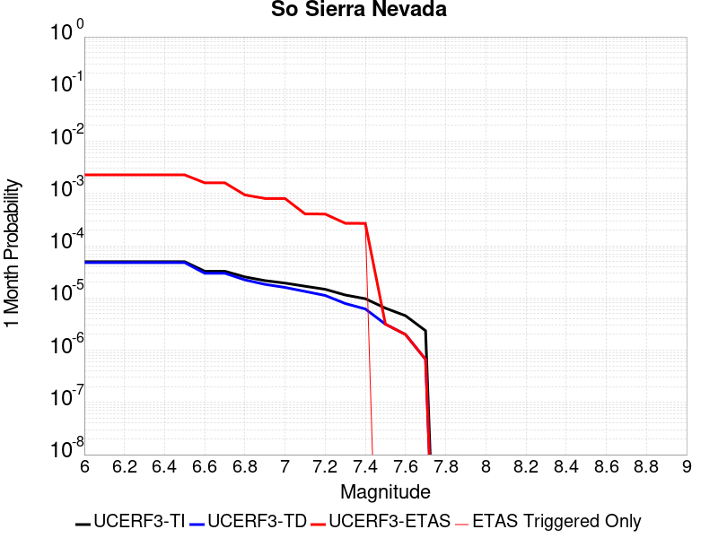 | 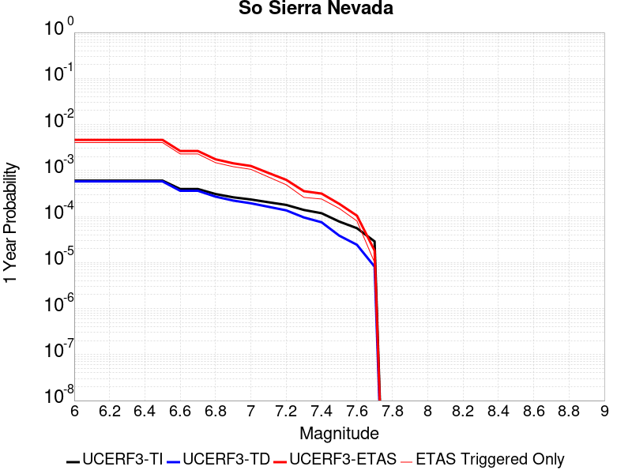 | 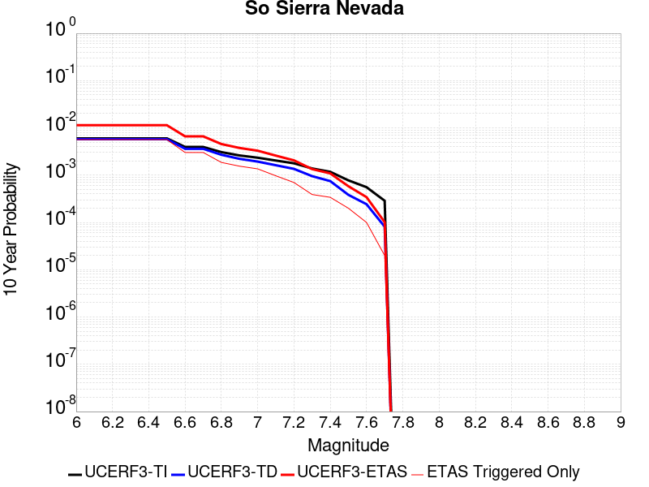 |

| Magnitude | 1 wk TI Prob | 1 wk TD Prob | 1 wk ETAS Prob | 1 wk ETAS/TD Gain | 1 wk ETAS Triggered Only | 1 mo TI Prob | 1 mo TD Prob | 1 mo ETAS Prob | 1 mo ETAS/TD Gain | 1 mo ETAS Triggered Only | 1 yr TI Prob | 1 yr TD Prob | 1 yr ETAS Prob | 1 yr ETAS/TD Gain | 1 yr ETAS Triggered Only | 10 yr TI Prob | 10 yr TD Prob | 10 yr ETAS Prob | 10 yr ETAS/TD Gain | 10 yr ETAS Triggered Only |
|-----|-----|-----|-----|-----|-----|-----|-----|-----|-----|-----|-----|-----|-----|-----|-----|-----|-----|-----|-----|-----|
| 6.0 | 1.15488665E-5 | 1.1079643E-5 | 0.0016271203 | 146.85675 | 0.0016160585 | 4.9494203E-5 | 4.748339E-5 | 0.0023438786 | 49.362072 | 0.002296504 | 6.024253E-4 | 5.7796965E-4 | 0.0044032647 | 7.6185045 | 0.003827507 | 0.006007948 | 0.005765934 | 0.011347243 | 1.96798 | 0.0056136767 |
| 6.1 | 1.15488665E-5 | 1.1079643E-5 | 0.0016271203 | 146.85675 | 0.0016160585 | 4.9494203E-5 | 4.748339E-5 | 0.0023438786 | 49.362072 | 0.002296504 | 6.024253E-4 | 5.7796965E-4 | 0.0044032647 | 7.6185045 | 0.003827507 | 0.006007948 | 0.005765934 | 0.011347243 | 1.96798 | 0.0056136767 |
| 6.2 | 1.15488665E-5 | 1.1079643E-5 | 0.0016271203 | 146.85675 | 0.0016160585 | 4.9494203E-5 | 4.748339E-5 | 0.0023438786 | 49.362072 | 0.002296504 | 6.024253E-4 | 5.7796965E-4 | 0.0044032647 | 7.6185045 | 0.003827507 | 0.006007948 | 0.005765934 | 0.011347243 | 1.96798 | 0.0056136767 |
| 6.3 | 1.15488665E-5 | 1.1079643E-5 | 0.0016271203 | 146.85675 | 0.0016160585 | 4.9494203E-5 | 4.748339E-5 | 0.0023438786 | 49.362072 | 0.002296504 | 6.024253E-4 | 5.7796965E-4 | 0.0044032647 | 7.6185045 | 0.003827507 | 0.006007948 | 0.005765934 | 0.011347243 | 1.96798 | 0.0056136767 |
| 6.4 | 1.15488665E-5 | 1.1079643E-5 | 0.0016271203 | 146.85675 | 0.0016160585 | 4.9494203E-5 | 4.748339E-5 | 0.0023438786 | 49.362072 | 0.002296504 | 6.024253E-4 | 5.7796965E-4 | 0.0044032647 | 7.6185045 | 0.003827507 | 0.006007948 | 0.005765934 | 0.011347243 | 1.96798 | 0.0056136767 |
| 6.5 | 1.15488665E-5 | 1.1079643E-5 | 0.0016271203 | 146.85675 | 0.0016160585 | 4.9494203E-5 | 4.748339E-5 | 0.0023438786 | 49.362072 | 0.002296504 | 6.024253E-4 | 5.7796965E-4 | 0.0044032647 | 7.6185045 | 0.003827507 | 0.006007948 | 0.005765934 | 0.011347243 | 1.96798 | 0.0056136767 |
| 6.6 | 7.587044E-6 | 6.935635E-6 | 0.0010275971 | 148.16193 | 0.0010206685 | 3.2515498E-5 | 2.9723828E-5 | 0.0013905747 | 46.783165 | 0.0013608914 | 3.9580427E-4 | 3.6183043E-4 | 0.0024874539 | 6.8746395 | 0.0021263927 | 0.003951 | 0.0036127048 | 0.0066636484 | 1.844504 | 0.0030620056 |
| 6.7 | 7.587044E-6 | 6.935635E-6 | 0.0010275971 | 148.16193 | 0.0010206685 | 3.2515498E-5 | 2.9723828E-5 | 0.0013905747 | 46.783165 | 0.0013608914 | 3.9580427E-4 | 3.6183043E-4 | 0.0024874539 | 6.8746395 | 0.0021263927 | 0.003951 | 0.0036127048 | 0.0066636484 | 1.844504 | 0.0030620056 |
| 6.8 | 5.9026956E-6 | 5.1793927E-6 | 6.856216E-4 | 132.3749 | 6.804457E-4 | 2.5297022E-5 | 2.2197215E-5 | 9.152624E-4 | 41.233208 | 8.93085E-4 | 3.0794772E-4 | 2.7021873E-4 | 0.0018008079 | 6.6642594 | 0.0015310028 | 0.0030752132 | 0.002699018 | 0.0048196716 | 1.7857131 | 0.0021263927 |
| 6.9 | 5.0118915E-6 | 4.2524252E-6 | 6.421675E-4 | 151.01207 | 6.3791784E-4 | 2.1479358E-5 | 1.8224557E-5 | 8.2623906E-4 | 45.336582 | 8.0802926E-4 | 2.614798E-4 | 2.2186211E-4 | 0.0014974148 | 6.7493033 | 0.0012758357 | 0.0026117235 | 0.0022164788 | 0.004083557 | 1.8423623 | 0.0018712257 |
| 7.0 | 4.4924795E-6 | 3.7139177E-6 | 6.416294E-4 | 172.76349 | 6.3791784E-4 | 1.925334E-5 | 1.5916696E-5 | 8.239331E-4 | 51.765335 | 8.0802926E-4 | 2.3438422E-4 | 1.9376918E-4 | 0.0013417988 | 6.9247274 | 0.001148252 | 0.0023413717 | 0.0019360651 | 0.0036338859 | 1.876944 | 0.0017011142 |
| 7.1 | 3.9118436E-6 | 3.1119775E-6 | 4.283892E-4 | 137.65819 | 4.2527856E-4 | 1.6764936E-5 | 1.3336982E-5 | 5.2366446E-4 | 39.264088 | 5.1033427E-4 | 2.0409399E-4 | 1.6236622E-4 | 9.277433E-4 | 5.713894 | 7.655014E-4 | 0.0020390663 | 0.001622532 | 0.00281138 | 1.7327116 | 0.00119078 |
| 7.2 | 3.4200818E-6 | 2.6054543E-6 | 4.2788291E-4 | 164.22583 | 4.2527856E-4 | 1.4657411E-5 | 1.11661875E-5 | 5.214948E-4 | 46.703026 | 5.1033427E-4 | 1.7843937E-4 | 1.3594035E-4 | 8.588156E-4 | 6.317591 | 7.2297355E-4 | 0.0017829615 | 0.0013586218 | 0.0023779036 | 1.7502322 | 0.0010206685 |
| 7.3 | 2.6593618E-6 | 1.8284203E-6 | 3.4205065E-4 | 187.07442 | 3.4022285E-4 | 1.13972155E-5 | 7.836065E-6 | 4.331113E-4 | 55.27153 | 4.2527856E-4 | 1.3875226E-4 | 9.540021E-5 | 6.482096E-4 | 6.794635 | 5.528621E-4 | 0.0013866565 | 9.5362146E-4 | 0.0016759055 | 1.7574117 | 7.2297355E-4 |
| 7.4 | 2.2577992E-6 | 1.436438E-6 | 3.416588E-4 | 237.8514 | 3.4022285E-4 | 9.676246E-6 | 6.15615E-6 | 4.314321E-4 | 70.08148 | 4.2527856E-4 | 1.1780193E-4 | 7.49488E-5 | 5.852448E-4 | 7.8085947 | 5.1033427E-4 | 0.001177395 | 7.492603E-4 | 0.0014291961 | 1.9074762 | 6.804457E-4 |
| 7.5 | 1.489319E-6 | 7.353936E-7 | 1.2831886E-4 | 174.49005 | 1.2758357E-4 | 6.3827797E-6 | 3.1516831E-6 | 1.7326257E-4 | 54.974617 | 1.7011142E-4 | 7.770758E-5 | 3.8371072E-5 | 2.9352843E-4 | 7.649732 | 2.5516714E-4 | 7.7680405E-4 | 3.836449E-4 | 7.2373723E-4 | 1.8864769 | 3.4022285E-4 |
| 7.6 | 1.0680322E-6 | 4.6596554E-7 | 4.29938E-5 | 92.268196 | 4.2527856E-5 | 4.577273E-6 | 1.9969937E-6 | 8.705253E-5 | 43.591793 | 8.505571E-5 | 5.5726876E-5 | 2.4313129E-5 | 1.9442041E-4 | 7.9965196 | 1.7011142E-4 | 5.5712904E-4 | 2.4310495E-4 | 4.5569253E-4 | 1.8744683 | 2.1263928E-4 |
| 7.7 | 5.509146E-7 | 1.5580486E-7 | 4.2683652E-5 | 273.95587 | 4.2527856E-5 | 2.3610605E-6 | 6.677349E-7 | 4.3195563E-5 | 64.68968 | 4.2527856E-5 | 2.8745531E-5 | 8.129644E-6 | 5.0657152E-5 | 6.2311654 | 4.2527856E-5 | 2.8741814E-4 | 8.1293576E-5 | 1.2381798E-4 | 1.5230967 | 4.2527856E-5 |

## Coyote Canyon
*[(top)](#table-of-contents)*

| 1 Week | 1 Month | 1 Year | 10 Year |
|-----|-----|-----|-----|
| 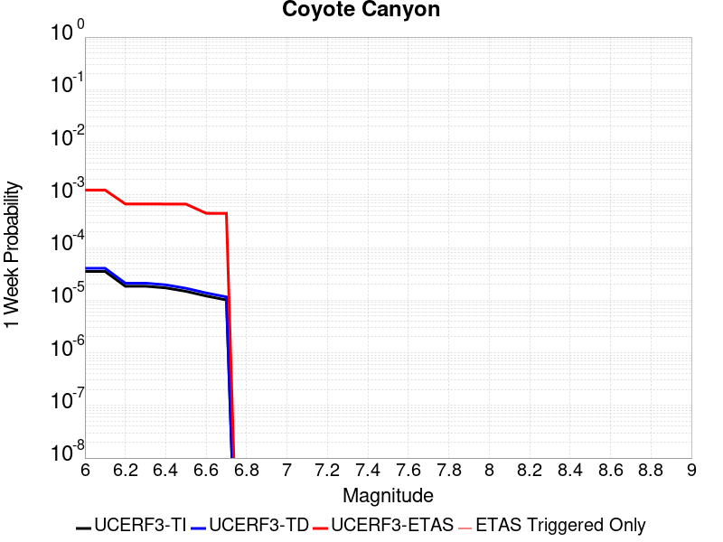 | 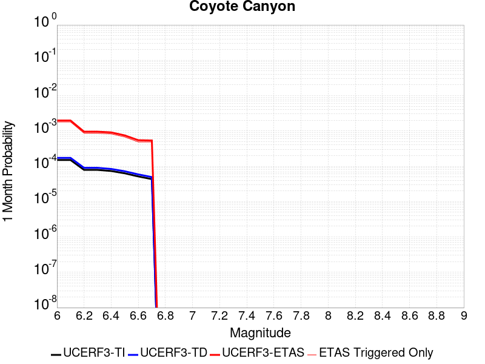 | 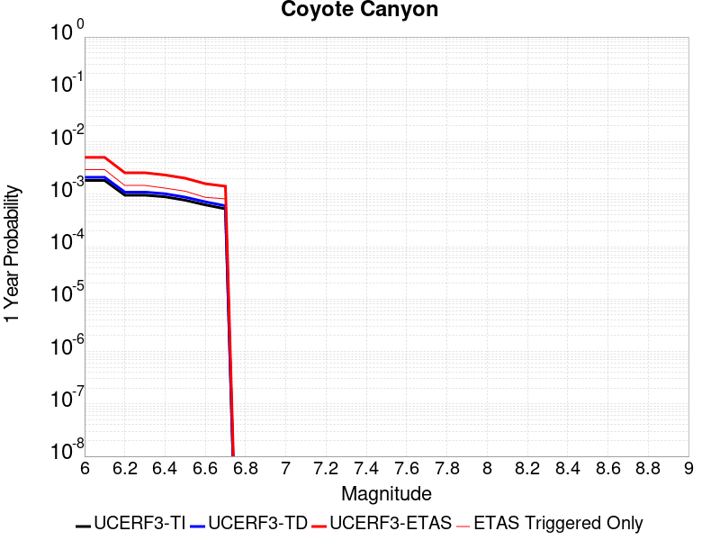 | 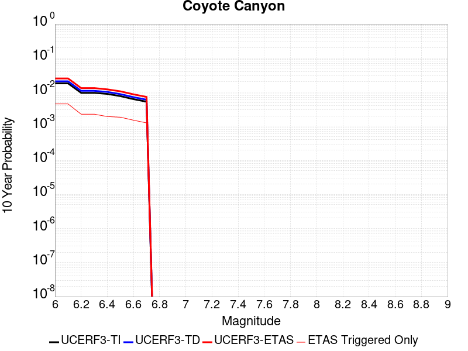 |

| Magnitude | 1 wk TI Prob | 1 wk TD Prob | 1 wk ETAS Prob | 1 wk ETAS/TD Gain | 1 wk ETAS Triggered Only | 1 mo TI Prob | 1 mo TD Prob | 1 mo ETAS Prob | 1 mo ETAS/TD Gain | 1 mo ETAS Triggered Only | 1 yr TI Prob | 1 yr TD Prob | 1 yr ETAS Prob | 1 yr ETAS/TD Gain | 1 yr ETAS Triggered Only | 10 yr TI Prob | 10 yr TD Prob | 10 yr ETAS Prob | 10 yr ETAS/TD Gain | 10 yr ETAS Triggered Only |
|-----|-----|-----|-----|-----|-----|-----|-----|-----|-----|-----|-----|-----|-----|-----|-----|-----|-----|-----|-----|-----|
| 6.0 | 3.5090034E-5 | 4.0364324E-5 | 0.0012736224 | 31.55317 | 0.0012333078 | 1.503772E-4 | 1.7297994E-4 | 0.001958841 | 11.324093 | 0.00178617 | 0.0018293047 | 0.0021042528 | 0.0051598153 | 2.452089 | 0.0030620056 | 0.018143194 | 0.020869201 | 0.025491279 | 1.2214783 | 0.004720592 |
| 6.1 | 3.5090034E-5 | 4.0364324E-5 | 0.0012736224 | 31.55317 | 0.0012333078 | 1.503772E-4 | 1.7297994E-4 | 0.001958841 | 11.324093 | 0.00178617 | 0.0018293047 | 0.0021042528 | 0.0051598153 | 2.452089 | 0.0030620056 | 0.018143194 | 0.020869201 | 0.025491279 | 1.2214783 | 0.004720592 |
| 6.2 | 1.841879E-5 | 2.1059794E-5 | 6.1643723E-4 | 29.270811 | 5.9539E-4 | 7.8935285E-5 | 9.0253714E-5 | 9.4073405E-4 | 10.423218 | 8.505571E-4 | 9.606133E-4 | 0.001098387 | 0.0027551516 | 2.5083616 | 0.0016585863 | 0.0095647145 | 0.010939667 | 0.013295174 | 1.215318 | 0.00238156 |
| 6.3 | 1.841879E-5 | 2.1059794E-5 | 6.1643723E-4 | 29.270811 | 5.9539E-4 | 7.8935285E-5 | 9.0253714E-5 | 9.4073405E-4 | 10.423218 | 8.505571E-4 | 9.606133E-4 | 0.001098387 | 0.0027551516 | 2.5083616 | 0.0016585863 | 0.0095647145 | 0.010939667 | 0.013295174 | 1.215318 | 0.00238156 |
| 6.4 | 1.712201E-5 | 1.9565212E-5 | 6.1494356E-4 | 31.430456 | 5.9539E-4 | 7.337798E-5 | 8.3848776E-5 | 8.918103E-4 | 10.635937 | 8.0802926E-4 | 8.930107E-4 | 0.0010204813 | 0.0025499219 | 2.4987442 | 0.0015310028 | 0.008894307 | 0.010167871 | 0.012314738 | 1.2111423 | 0.0021689206 |
| 6.5 | 1.4744935E-5 | 1.6836972E-5 | 5.696898E-4 | 33.835644 | 5.528621E-4 | 6.3191044E-5 | 7.215698E-5 | 7.9507835E-4 | 11.018731 | 7.2297355E-4 | 7.6907943E-4 | 8.7825063E-4 | 0.0021104752 | 2.4030445 | 0.0012333078 | 0.007664232 | 0.008756994 | 0.010611834 | 1.2118124 | 0.0018712257 |
| 6.6 | 1.2017839E-5 | 1.37240895E-5 | 3.5394228E-4 | 25.789854 | 3.4022285E-4 | 5.150401E-5 | 5.88167E-5 | 5.691209E-4 | 9.67618 | 5.1033427E-4 | 6.268809E-4 | 7.159466E-4 | 0.0016508895 | 2.3058836 | 9.356128E-4 | 0.0062511545 | 0.0071450938 | 0.0086651575 | 1.2127423 | 0.0015310028 |
| 6.7 | 1.00956095E-5 | 1.1533517E-5 | 3.5175245E-4 | 30.498281 | 3.4022285E-4 | 4.326618E-5 | 4.942891E-5 | 5.5973796E-4 | 11.3241005 | 5.1033427E-4 | 5.266384E-4 | 6.017178E-4 | 0.0014517631 | 2.4126978 | 8.505571E-4 | 0.005253921 | 0.0060094125 | 0.007277581 | 1.2110304 | 0.0012758357 |

## Nelson Lake
*[(top)](#table-of-contents)*

| 1 Week | 1 Month | 1 Year | 10 Year |
|-----|-----|-----|-----|
| 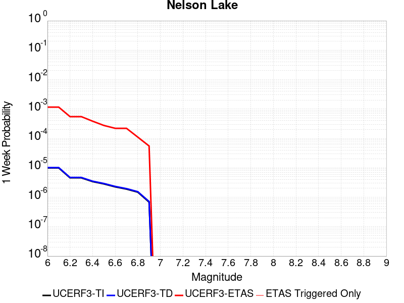 | 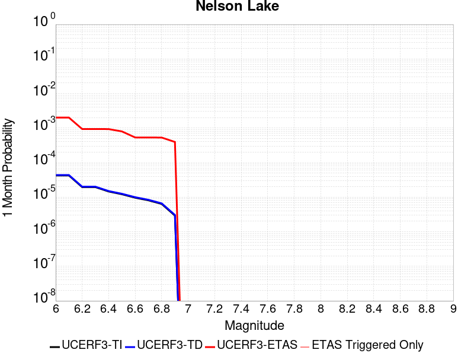 | 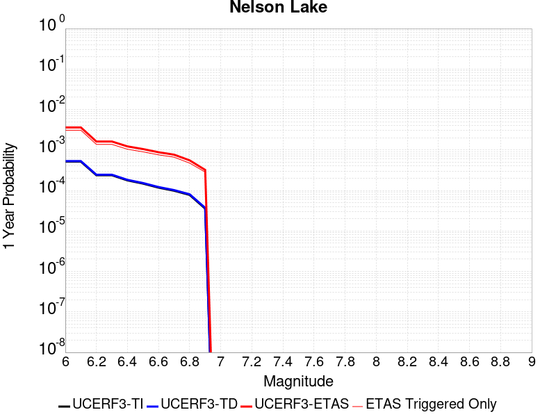 | 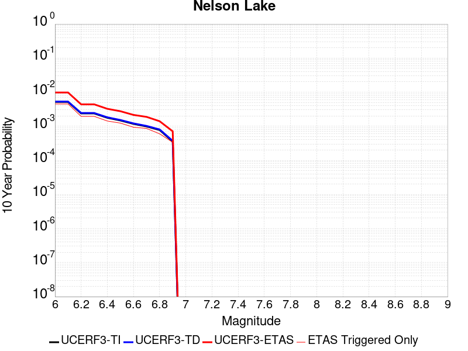 |

| Magnitude | 1 wk TI Prob | 1 wk TD Prob | 1 wk ETAS Prob | 1 wk ETAS/TD Gain | 1 wk ETAS Triggered Only | 1 mo TI Prob | 1 mo TD Prob | 1 mo ETAS Prob | 1 mo ETAS/TD Gain | 1 mo ETAS Triggered Only | 1 yr TI Prob | 1 yr TD Prob | 1 yr ETAS Prob | 1 yr ETAS/TD Gain | 1 yr ETAS Triggered Only | 10 yr TI Prob | 10 yr TD Prob | 10 yr ETAS Prob | 10 yr ETAS/TD Gain | 10 yr ETAS Triggered Only |
|-----|-----|-----|-----|-----|-----|-----|-----|-----|-----|-----|-----|-----|-----|-----|-----|-----|-----|-----|-----|-----|
| 6.0 | 9.913453E-6 | 1.0192255E-5 | 0.0011584327 | 113.65813 | 0.001148252 | 4.2485535E-5 | 4.3680422E-5 | 0.0018722983 | 42.86356 | 0.0018286977 | 5.1713863E-4 | 5.316897E-4 | 0.0034220463 | 6.436172 | 0.0028918942 | 0.0051593683 | 0.005305204 | 0.009916148 | 1.869136 | 0.004635536 |
| 6.1 | 9.913453E-6 | 1.0192255E-5 | 0.0011584327 | 113.65813 | 0.001148252 | 4.2485535E-5 | 4.3680422E-5 | 0.0018722983 | 42.86356 | 0.0018286977 | 5.1713863E-4 | 5.316897E-4 | 0.0034220463 | 6.436172 | 0.0028918942 | 0.0051593683 | 0.005305204 | 0.009916148 | 1.869136 | 0.004635536 |
| 6.2 | 4.5596407E-6 | 4.696313E-6 | 5.575558E-4 | 118.72203 | 5.528621E-4 | 1.954117E-5 | 2.0126909E-5 | 9.557209E-4 | 47.484737 | 9.356128E-4 | 2.3788778E-4 | 2.4501883E-4 | 0.0015630593 | 6.379344 | 0.0013183635 | 0.0023763329 | 0.0024476128 | 0.0044839536 | 1.8319701 | 0.002041337 |
| 6.3 | 4.5596407E-6 | 4.696313E-6 | 5.575558E-4 | 118.72203 | 5.528621E-4 | 1.954117E-5 | 2.0126909E-5 | 9.557209E-4 | 47.484737 | 9.356128E-4 | 2.3788778E-4 | 2.4501883E-4 | 0.0015630593 | 6.379344 | 0.0013183635 | 0.0023763329 | 0.0024476128 | 0.0044839536 | 1.8319701 | 0.002041337 |
| 6.4 | 3.4025713E-6 | 3.5098972E-6 | 4.2878697E-4 | 122.1651 | 4.2527856E-4 | 1.4582367E-5 | 1.5042335E-5 | 7.38005E-4 | 49.061867 | 7.2297355E-4 | 1.7752586E-4 | 1.8312587E-4 | 0.0011610874 | 6.3403788 | 9.781406E-4 | 0.001773841 | 0.0018298327 | 0.003273134 | 1.7887614 | 0.0014459471 |
| 6.5 | 2.8352947E-6 | 2.927856E-6 | 3.431497E-4 | 117.2017 | 3.4022285E-4 | 1.2151207E-5 | 1.2547898E-5 | 6.079304E-4 | 48.448784 | 5.9539E-4 | 1.479309E-4 | 1.5276071E-4 | 0.0010031878 | 6.5670547 | 8.505571E-4 | 0.0014783246 | 0.0015266308 | 0.002758056 | 1.8066292 | 0.0012333078 |
| 6.6 | 2.251518E-6 | 2.3290677E-6 | 3.0002336E-4 | 128.81694 | 2.97695E-4 | 9.649328E-6 | 9.981683E-6 | 4.7778344E-4 | 47.866016 | 4.678064E-4 | 1.1747423E-4 | 1.2152085E-4 | 8.4440655E-4 | 6.9486556 | 7.2297355E-4 | 0.0011741214 | 0.0012146058 | 0.0022340345 | 1.8393085 | 0.0010206685 |
| 6.7 | 1.8911853E-6 | 1.9591396E-6 | 2.9965353E-4 | 152.9516 | 2.97695E-4 | 8.105055E-6 | 8.39629E-6 | 4.7619877E-4 | 56.715385 | 4.678064E-4 | 9.867457E-5 | 1.0222061E-4 | 7.400732E-4 | 7.239961 | 6.3791784E-4 | 9.863076E-4 | 0.0010217935 | 0.0019564503 | 1.9147218 | 9.356128E-4 |
| 6.8 | 1.4874814E-6 | 1.5438305E-6 | 2.1418279E-4 | 138.73465 | 2.1263928E-4 | 6.374905E-6 | 6.6164025E-6 | 3.4683698E-4 | 52.420784 | 3.4022285E-4 | 7.76117E-5 | 8.055224E-5 | 5.057965E-4 | 6.279112 | 4.2527856E-4 | 7.75846E-4 | 8.0528157E-4 | 0.0014426857 | 1.7915295 | 6.3791784E-4 |
| 6.9 | 6.835972E-7 | 7.1399285E-7 | 1.2829747E-4 | 179.69014 | 1.2758357E-4 | 2.9296991E-6 | 3.0599674E-6 | 2.156986E-4 | 70.490486 | 2.1263928E-4 | 3.56685E-5 | 3.7254784E-5 | 2.924124E-4 | 7.8489895 | 2.5516714E-4 | 3.5662777E-4 | 3.7251666E-4 | 7.1261276E-4 | 1.9129689 | 3.4022285E-4 |

## San Andreas (Mojave N)
*[(top)](#table-of-contents)*

| 1 Week | 1 Month | 1 Year | 10 Year |
|-----|-----|-----|-----|
| 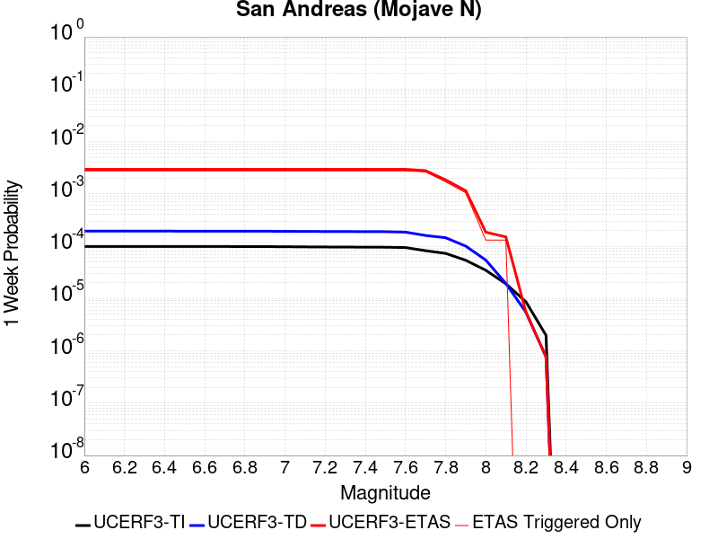 | 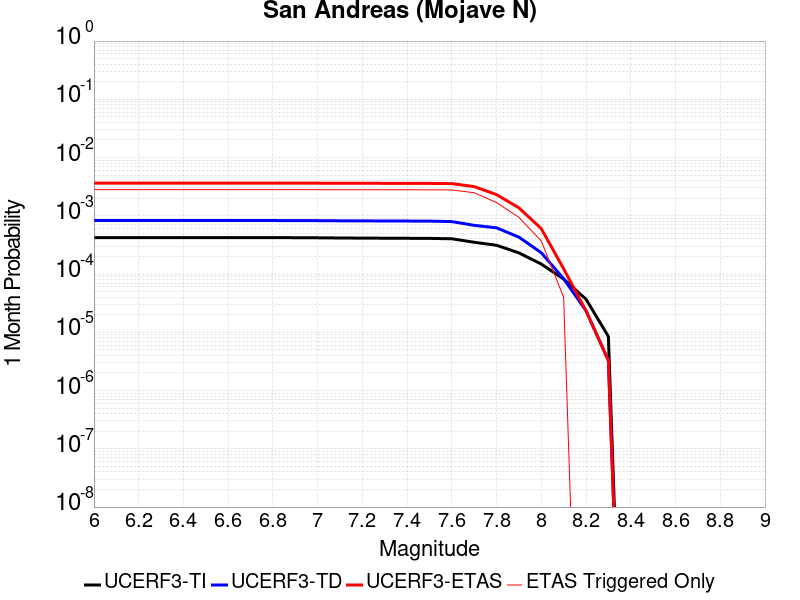 | 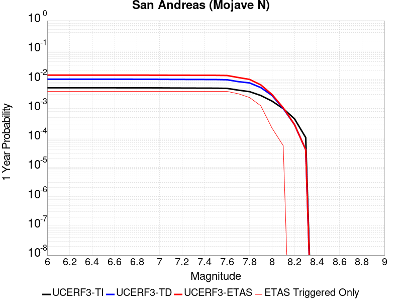 | 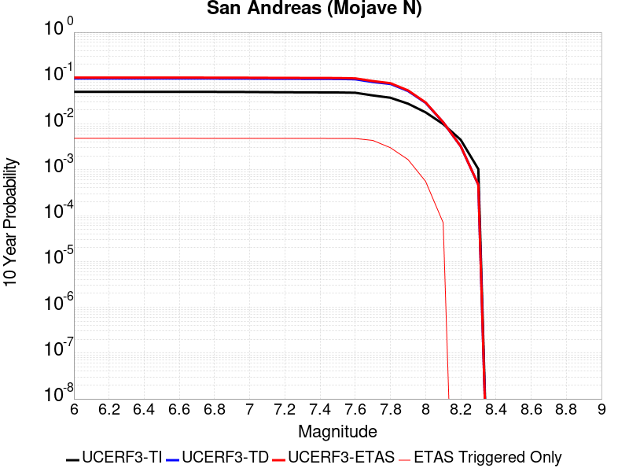 |

| Magnitude | 1 wk TI Prob | 1 wk TD Prob | 1 wk ETAS Prob | 1 wk ETAS/TD Gain | 1 wk ETAS Triggered Only | 1 mo TI Prob | 1 mo TD Prob | 1 mo ETAS Prob | 1 mo ETAS/TD Gain | 1 mo ETAS Triggered Only | 1 yr TI Prob | 1 yr TD Prob | 1 yr ETAS Prob | 1 yr ETAS/TD Gain | 1 yr ETAS Triggered Only | 10 yr TI Prob | 10 yr TD Prob | 10 yr ETAS Prob | 10 yr ETAS/TD Gain | 10 yr ETAS Triggered Only |
|-----|-----|-----|-----|-----|-----|-----|-----|-----|-----|-----|-----|-----|-----|-----|-----|-----|-----|-----|-----|-----|
| 6.0 | 9.877682E-5 | 1.9400702E-4 | 0.0026176246 | 13.492422 | 0.0024240878 | 4.2326056E-4 | 8.311939E-4 | 0.0038056695 | 4.578558 | 0.0029769498 | 0.0051410277 | 0.010072956 | 0.013861909 | 1.376151 | 0.003827507 | 0.05023708 | 0.09831428 | 0.10287754 | 1.0464151 | 0.005060815 |
| 6.1 | 9.877682E-5 | 1.9400702E-4 | 0.0026176246 | 13.492422 | 0.0024240878 | 4.2326056E-4 | 8.311939E-4 | 0.0038056695 | 4.578558 | 0.0029769498 | 0.0051410277 | 0.010072956 | 0.013861909 | 1.376151 | 0.003827507 | 0.05023708 | 0.09831428 | 0.10287754 | 1.0464151 | 0.005060815 |
| 6.2 | 9.877682E-5 | 1.9400702E-4 | 0.0026176246 | 13.492422 | 0.0024240878 | 4.2326056E-4 | 8.311939E-4 | 0.0038056695 | 4.578558 | 0.0029769498 | 0.0051410277 | 0.010072956 | 0.013861909 | 1.376151 | 0.003827507 | 0.05023708 | 0.09831428 | 0.10287754 | 1.0464151 | 0.005060815 |
| 6.3 | 9.877682E-5 | 1.9400702E-4 | 0.0026176246 | 13.492422 | 0.0024240878 | 4.2326056E-4 | 8.311939E-4 | 0.0038056695 | 4.578558 | 0.0029769498 | 0.0051410277 | 0.010072956 | 0.013861909 | 1.376151 | 0.003827507 | 0.05023708 | 0.09831428 | 0.10287754 | 1.0464151 | 0.005060815 |
| 6.4 | 9.877682E-5 | 1.9400702E-4 | 0.0026176246 | 13.492422 | 0.0024240878 | 4.2326056E-4 | 8.311939E-4 | 0.0038056695 | 4.578558 | 0.0029769498 | 0.0051410277 | 0.010072956 | 0.013861909 | 1.376151 | 0.003827507 | 0.05023708 | 0.09831428 | 0.10287754 | 1.0464151 | 0.005060815 |
| 6.5 | 9.861474E-5 | 1.9374468E-4 | 0.002617363 | 13.50934 | 0.0024240878 | 4.2256617E-4 | 8.300703E-4 | 0.003804549 | 4.583406 | 0.0029769498 | 0.0051326132 | 0.010059402 | 0.013848407 | 1.376663 | 0.003827507 | 0.050156746 | 0.098192066 | 0.10275595 | 1.0464791 | 0.005060815 |
| 6.6 | 9.861474E-5 | 1.9374468E-4 | 0.002617363 | 13.50934 | 0.0024240878 | 4.2256617E-4 | 8.300703E-4 | 0.003804549 | 4.583406 | 0.0029769498 | 0.0051326132 | 0.010059402 | 0.013848407 | 1.376663 | 0.003827507 | 0.050156746 | 0.098192066 | 0.10275595 | 1.0464791 | 0.005060815 |
| 6.7 | 9.8552715E-5 | 1.9364421E-4 | 0.0026172625 | 13.515832 | 0.0024240878 | 4.223004E-4 | 8.2964E-4 | 0.00380412 | 4.585266 | 0.0029769498 | 0.0051293927 | 0.010054212 | 0.0138432365 | 1.3768594 | 0.003827507 | 0.050125998 | 0.098145254 | 0.10267102 | 1.0461129 | 0.005018287 |
| 6.8 | 9.8464974E-5 | 1.9349584E-4 | 0.0026171145 | 13.525431 | 0.0024240878 | 4.219245E-4 | 8.290045E-4 | 0.0038034865 | 4.5880165 | 0.0029769498 | 0.0051248376 | 0.010046546 | 0.013835601 | 1.3771498 | 0.003827507 | 0.05008251 | 0.09807528 | 0.102601394 | 1.0461494 | 0.005018287 |
| 6.9 | 9.825824E-5 | 1.9317595E-4 | 0.0026167955 | 13.546177 | 0.0024240878 | 4.2103877E-4 | 8.276344E-4 | 0.0038021205 | 4.5939612 | 0.0029769498 | 0.0051141046 | 0.010030019 | 0.013819136 | 1.3777777 | 0.003827507 | 0.049980022 | 0.09792438 | 0.10245126 | 1.0462283 | 0.005018287 |
| 7.0 | 9.781462E-5 | 1.924896E-4 | 0.0026161107 | 13.59092 | 0.0024240878 | 4.1913814E-4 | 8.246948E-4 | 0.0037991896 | 4.6067824 | 0.0029769498 | 0.005091073 | 0.009994558 | 0.013783812 | 1.3791316 | 0.003827507 | 0.04976007 | 0.09760077 | 0.102090895 | 1.046005 | 0.004975759 |
| 7.1 | 9.7121134E-5 | 1.9150671E-4 | 0.0026151303 | 13.655554 | 0.0024240878 | 4.1616702E-4 | 8.204851E-4 | 0.0037949926 | 4.6253033 | 0.0029769498 | 0.005055068 | 0.009943774 | 0.013733221 | 1.3810874 | 0.003827507 | 0.04941613 | 0.09713728 | 0.10162971 | 1.0462482 | 0.004975759 |
| 7.2 | 9.663819E-5 | 1.9081456E-4 | 0.0026144397 | 13.701468 | 0.0024240878 | 4.1409794E-4 | 8.175206E-4 | 0.0037920368 | 4.63846 | 0.0029769498 | 0.0050299936 | 0.00990801 | 0.013697594 | 1.3824768 | 0.003827507 | 0.049176537 | 0.09681055 | 0.1013046 | 1.0464212 | 0.004975759 |
| 7.3 | 9.6277574E-5 | 1.9033969E-4 | 0.0026139661 | 13.733163 | 0.0024240878 | 4.125529E-4 | 8.154867E-4 | 0.003790009 | 4.647542 | 0.0029769498 | 0.0050112694 | 0.009883473 | 0.013673151 | 1.3834358 | 0.003827507 | 0.04899759 | 0.09658401 | 0.10107919 | 1.0465417 | 0.004975759 |
| 7.4 | 9.593308E-5 | 1.897375E-4 | 0.0026133654 | 13.773583 | 0.0024240878 | 4.1107697E-4 | 8.129075E-4 | 0.0037874375 | 4.659125 | 0.0029769498 | 0.0049933824 | 0.009852355 | 0.013642153 | 1.3846589 | 0.003827507 | 0.04882661 | 0.09630218 | 0.10079877 | 1.0466924 | 0.004975759 |
| 7.5 | 9.561707E-5 | 1.8919831E-4 | 0.0026128273 | 13.809994 | 0.0024240878 | 4.0972308E-4 | 8.1059814E-4 | 0.003785135 | 4.669558 | 0.0029769498 | 0.0049769743 | 0.009824493 | 0.013614397 | 1.3857608 | 0.003827507 | 0.048669744 | 0.09604836 | 0.10054621 | 1.046829 | 0.004975759 |
| 7.6 | 9.418194E-5 | 1.8572104E-4 | 0.0026093586 | 14.049881 | 0.0024240878 | 4.0357444E-4 | 7.957047E-4 | 0.0037702858 | 4.738298 | 0.0029769498 | 0.004902454 | 0.009644784 | 0.013435376 | 1.3930198 | 0.003827507 | 0.047957025 | 0.094430685 | 0.09893658 | 1.0477164 | 0.004975759 |
| 7.7 | 8.202141E-5 | 1.6021315E-4 | 0.0023713075 | 14.800953 | 0.0022114485 | 3.51473E-4 | 6.8644714E-4 | 0.0032788655 | 4.776574 | 0.0025941993 | 0.00427079 | 0.008325525 | 0.01161508 | 1.3951169 | 0.0033171726 | 0.04189639 | 0.08223219 | 0.08621333 | 1.0484133 | 0.004337841 |
| 7.8 | 7.2859846E-5 | 1.4516473E-4 | 0.0016759452 | 11.545128 | 0.0015310028 | 3.1221908E-4 | 6.219862E-4 | 0.002492048 | 4.006597 | 0.0018712257 | 0.003794643 | 0.0075464295 | 0.010078845 | 1.335578 | 0.0025516714 | 0.037304975 | 0.07472468 | 0.07779398 | 1.0410748 | 0.0033171726 |
| 7.9 | 5.3874453E-5 | 1.0045676E-4 | 9.084048E-4 | 9.042745 | 8.0802926E-4 | 2.3087008E-4 | 4.3045796E-4 | 0.0014081775 | 3.2713475 | 9.781406E-4 | 0.0028072202 | 0.0052282433 | 0.0065820194 | 1.2589352 | 0.0013608914 | 0.02772022 | 0.05242443 | 0.05407666 | 1.0315164 | 0.001743642 |
| 8.0 | 3.468538E-5 | 5.4260272E-5 | 2.66888E-4 | 4.9186635 | 2.1263928E-4 | 1.4864317E-4 | 2.325233E-4 | 5.7266705E-4 | 2.4628372 | 3.4022285E-4 | 0.0018082283 | 0.002827298 | 0.0032089665 | 1.1349941 | 3.827507E-4 | 0.017935853 | 0.028947512 | 0.029443072 | 1.0171193 | 5.1033427E-4 |
| 8.1 | 1.9152367E-5 | 1.940263E-5 | 1.0445669E-4 | 5.3836355 | 8.505571E-5 | 8.207899E-5 | 8.3151484E-5 | 1.6820012E-4 | 2.0228157 | 8.505571E-5 | 9.988535E-4 | 0.0010118998 | 0.0010968694 | 1.0839704 | 8.505571E-5 | 0.009943757 | 0.01085625 | 0.010982448 | 1.0116245 | 1.2758357E-4 |
| 8.2 | 8.643924E-6 | 5.4748625E-6 | 5.4748625E-6 | 1.0 | 0.0 | 3.704486E-5 | 2.3463486E-5 | 2.3463486E-5 | 1.0 | 0.0 | 4.5092785E-4 | 2.8563058E-4 | 2.8563058E-4 | 1.0 | 0.0 | 0.0045001395 | 0.0032487072 | 0.0032487072 | 1.0 | 0.0 |
| 8.3 | 1.983087E-6 | 7.6599065E-7 | 7.6599065E-7 | 1.0 | 0.0 | 8.498917E-6 | 3.282813E-6 | 3.282813E-6 | 1.0 | 0.0 | 1.034694E-4 | 3.9967534E-5 | 3.9967534E-5 | 1.0 | 0.0 | 0.0010342124 | 4.719687E-4 | 4.719687E-4 | 1.0 | 0.0 |

## San Andreas (Mojave S)
*[(top)](#table-of-contents)*

| 1 Week | 1 Month | 1 Year | 10 Year |
|-----|-----|-----|-----|
|  | 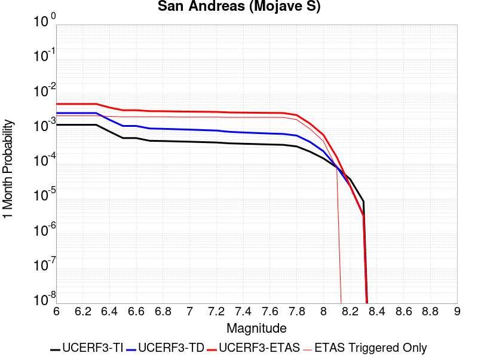 | 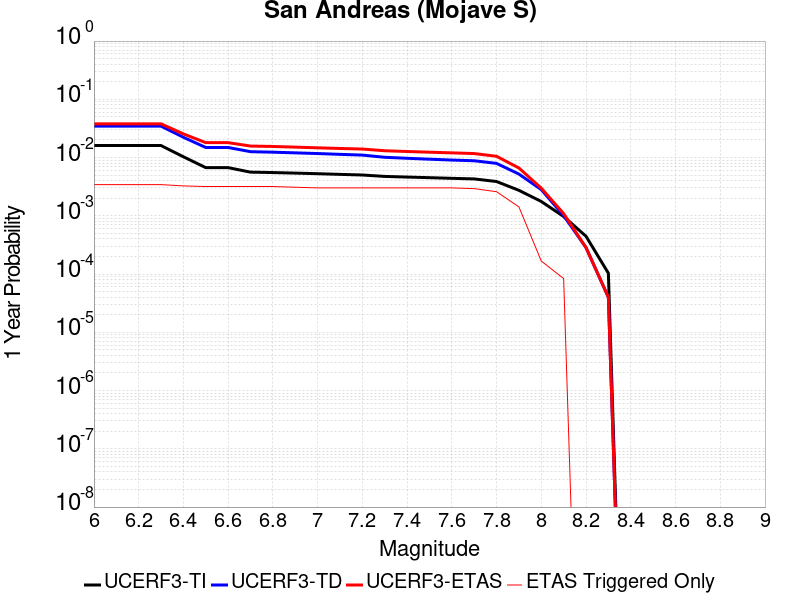 | 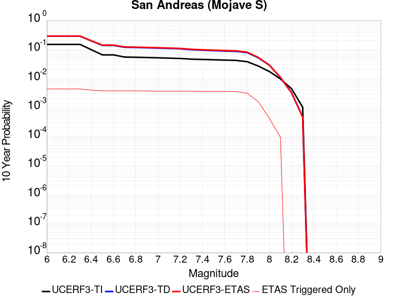 |

| Magnitude | 1 wk TI Prob | 1 wk TD Prob | 1 wk ETAS Prob | 1 wk ETAS/TD Gain | 1 wk ETAS Triggered Only | 1 mo TI Prob | 1 mo TD Prob | 1 mo ETAS Prob | 1 mo ETAS/TD Gain | 1 mo ETAS Triggered Only | 1 yr TI Prob | 1 yr TD Prob | 1 yr ETAS Prob | 1 yr ETAS/TD Gain | 1 yr ETAS Triggered Only | 10 yr TI Prob | 10 yr TD Prob | 10 yr ETAS Prob | 10 yr ETAS/TD Gain | 10 yr ETAS Triggered Only |
|-----|-----|-----|-----|-----|-----|-----|-----|-----|-----|-----|-----|-----|-----|-----|-----|-----|-----|-----|-----|-----|
| 6.0 | 3.1064058E-4 | 6.7460834E-4 | 0.00262957 | 3.897921 | 0.0019562813 | 0.0013306376 | 0.0028881032 | 0.00530519 | 1.8369114 | 0.0024240878 | 0.016080605 | 0.03462235 | 0.03786573 | 1.0936788 | 0.0033597006 | 0.1496549 | 0.28660452 | 0.28988117 | 1.0114325 | 0.004593008 |
| 6.1 | 3.1064058E-4 | 6.7460834E-4 | 0.00262957 | 3.897921 | 0.0019562813 | 0.0013306376 | 0.0028881032 | 0.00530519 | 1.8369114 | 0.0024240878 | 0.016080605 | 0.03462235 | 0.03786573 | 1.0936788 | 0.0033597006 | 0.1496549 | 0.28660452 | 0.28988117 | 1.0114325 | 0.004593008 |
| 6.2 | 3.1064058E-4 | 6.7460834E-4 | 0.00262957 | 3.897921 | 0.0019562813 | 0.0013306376 | 0.0028881032 | 0.00530519 | 1.8369114 | 0.0024240878 | 0.016080605 | 0.03462235 | 0.03786573 | 1.0936788 | 0.0033597006 | 0.1496549 | 0.28660452 | 0.28988117 | 1.0114325 | 0.004593008 |
| 6.3 | 3.1064058E-4 | 6.7460834E-4 | 0.00262957 | 3.897921 | 0.0019562813 | 0.0013306376 | 0.0028881032 | 0.00530519 | 1.8369114 | 0.0024240878 | 0.016080605 | 0.03462235 | 0.03786573 | 1.0936788 | 0.0033597006 | 0.1496549 | 0.28660452 | 0.28988117 | 1.0114325 | 0.004593008 |
| 6.4 | 1.9872203E-4 | 4.3179357E-4 | 0.0023447208 | 5.430189 | 0.0019137535 | 8.5138786E-4 | 0.0018492596 | 0.004183966 | 2.2625089 | 0.002339032 | 0.010316478 | 0.02228844 | 0.025406938 | 1.1399155 | 0.0031895891 | 0.098504856 | 0.19699748 | 0.20041247 | 1.0173352 | 0.0042527854 |
| 6.5 | 1.291105E-4 | 2.875267E-4 | 0.0021582143 | 7.5061355 | 0.0018712257 | 5.5321335E-4 | 0.0012316781 | 0.0034828782 | 2.8277504 | 0.0022539764 | 0.006714592 | 0.0148934 | 0.017867908 | 1.1997198 | 0.0030194777 | 0.065152965 | 0.13803436 | 0.14148016 | 1.0249634 | 0.0039976183 |
| 6.6 | 1.291105E-4 | 2.875267E-4 | 0.0021582143 | 7.5061355 | 0.0018712257 | 5.5321335E-4 | 0.0012316781 | 0.0034828782 | 2.8277504 | 0.0022539764 | 0.006714592 | 0.0148934 | 0.017867908 | 1.1997198 | 0.0030194777 | 0.065152965 | 0.13803436 | 0.14148016 | 1.0249634 | 0.0039976183 |
| 6.7 | 1.08001186E-4 | 2.4333889E-4 | 0.0021141092 | 8.687922 | 0.0018712257 | 4.6278012E-4 | 0.0010424647 | 0.0032940914 | 3.1599069 | 0.0022539764 | 0.0056198016 | 0.012618446 | 0.015599823 | 1.2362713 | 0.0030194777 | 0.054797906 | 0.119176775 | 0.12269797 | 1.029546 | 0.0039976183 |
| 6.8 | 1.0624356E-4 | 2.3851555E-4 | 0.002109295 | 8.843427 | 0.0018712257 | 4.5525006E-4 | 0.0010218095 | 0.003273483 | 3.2036133 | 0.0022539764 | 0.0055285925 | 0.012369843 | 0.015351971 | 1.2410804 | 0.0030194777 | 0.053930566 | 0.11712591 | 0.120655306 | 1.0301334 | 0.0039976183 |
| 6.9 | 1.0393785E-4 | 2.3221898E-4 | 0.002060492 | 8.873056 | 0.0018286977 | 4.4537184E-4 | 9.948451E-4 | 0.0032040935 | 3.220696 | 0.0022114485 | 0.0054089287 | 0.012045221 | 0.014986313 | 1.2441709 | 0.0029769498 | 0.05279156 | 0.11442335 | 0.11792589 | 1.0306103 | 0.0039550904 |
| 7.0 | 1.0155622E-4 | 2.2591476E-4 | 0.0020541993 | 9.092808 | 0.0018286977 | 4.3516833E-4 | 9.6784724E-4 | 0.0031771553 | 3.2827034 | 0.0022114485 | 0.005285311 | 0.0117200995 | 0.01462013 | 1.2474407 | 0.002934422 | 0.05161361 | 0.111683756 | 0.11515935 | 1.03112 | 0.0039125625 |
| 7.1 | 9.885595E-5 | 2.1879886E-4 | 0.0020470966 | 9.356066 | 0.0018286977 | 4.2359953E-4 | 9.3737274E-4 | 0.0031467483 | 3.3569872 | 0.0022114485 | 0.0051451353 | 0.011352993 | 0.014254101 | 1.2555368 | 0.002934422 | 0.05027629 | 0.1085682 | 0.11205599 | 1.0321252 | 0.0039125625 |
| 7.2 | 9.6411415E-5 | 2.124288E-4 | 0.0020407382 | 9.606692 | 0.0018286977 | 4.1312634E-4 | 9.1009185E-4 | 0.0031195276 | 3.4277065 | 0.0022114485 | 0.005018219 | 0.011024255 | 0.013926328 | 1.2632443 | 0.002934422 | 0.049064007 | 0.105758004 | 0.10925678 | 1.0330828 | 0.0039125625 |
| 7.3 | 9.1180635E-5 | 1.9471257E-4 | 0.0019805348 | 10.171581 | 0.00178617 | 3.907156E-4 | 8.342157E-4 | 0.003001327 | 3.5977829 | 0.0021689206 | 0.004746591 | 0.01010939 | 0.0129720485 | 1.2831683 | 0.0028918942 | 0.046464786 | 0.09795115 | 0.10144211 | 1.0356398 | 0.0038700348 |
| 7.4 | 8.887388E-5 | 1.8719878E-4 | 0.0019730343 | 10.539782 | 0.00178617 | 3.8083247E-4 | 8.020339E-4 | 0.002969215 | 3.7021067 | 0.0021689206 | 0.0046267817 | 0.00972114 | 0.012584922 | 1.2945932 | 0.0028918942 | 0.045316286 | 0.09458615 | 0.09805162 | 1.0366384 | 0.003827507 |
| 7.5 | 8.6750515E-5 | 1.8051457E-4 | 0.0019663621 | 10.893093 | 0.00178617 | 3.7173493E-4 | 7.7340455E-4 | 0.0029406478 | 3.8022115 | 0.0021689206 | 0.004516484 | 0.009375632 | 0.012240413 | 1.305556 | 0.0028918942 | 0.04425787 | 0.091549896 | 0.09502699 | 1.0379803 | 0.003827507 |
| 7.6 | 8.453092E-5 | 1.7439072E-4 | 0.0019602492 | 11.240559 | 0.00178617 | 3.6222505E-4 | 7.471748E-4 | 0.0029144748 | 3.90066 | 0.0021689206 | 0.0044011753 | 0.009058985 | 0.011924681 | 1.3163375 | 0.0028918942 | 0.04315024 | 0.08870898 | 0.09219696 | 1.0393193 | 0.003827507 |
| 7.7 | 8.259102E-5 | 1.6961215E-4 | 0.0019554792 | 11.529121 | 0.00178617 | 3.539135E-4 | 7.2670676E-4 | 0.0028940511 | 3.9824195 | 0.0021689206 | 0.004300386 | 0.008811831 | 0.011636089 | 1.3205075 | 0.0028493663 | 0.042181134 | 0.08645982 | 0.089917555 | 1.0399923 | 0.0037849792 |
| 7.8 | 7.444844E-5 | 1.5283503E-4 | 0.0016836039 | 11.015824 | 0.0015310028 | 3.1902574E-4 | 6.548429E-4 | 0.0025248432 | 3.8556473 | 0.0018712257 | 0.0038772223 | 0.007943616 | 0.010475018 | 1.3186712 | 0.0025516714 | 0.03810269 | 0.078290746 | 0.081387416 | 1.0395534 | 0.0033597006 |
| 7.9 | 5.2586525E-5 | 1.00064186E-4 | 9.080126E-4 | 9.074302 | 8.0802926E-4 | 2.2535135E-4 | 4.2877605E-4 | 0.0014064973 | 3.280261 | 9.781406E-4 | 0.0027402006 | 0.005207864 | 0.006561668 | 1.2599539 | 0.0013608914 | 0.027066574 | 0.052200034 | 0.05385266 | 1.0316595 | 0.001743642 |
| 8.0 | 3.379877E-5 | 5.4074168E-5 | 2.6670194E-4 | 4.932151 | 2.1263928E-4 | 1.4484383E-4 | 2.3172585E-4 | 5.7186984E-4 | 2.4678726 | 3.4022285E-4 | 0.0017620471 | 0.002817614 | 0.0031992863 | 1.1354594 | 3.827507E-4 | 0.017481409 | 0.028834904 | 0.029330522 | 1.0171882 | 5.1033427E-4 |
| 8.1 | 1.8668277E-5 | 1.9309397E-5 | 1.0436347E-4 | 5.404802 | 8.505571E-5 | 8.000444E-5 | 8.275194E-5 | 1.6780061E-4 | 2.0277545 | 8.505571E-5 | 9.736188E-4 | 0.0010070398 | 0.0010920098 | 1.0843761 | 8.505571E-5 | 0.009693642 | 0.010798888 | 0.010925094 | 1.0116869 | 1.2758357E-4 |
| 8.2 | 8.541571E-6 | 5.460819E-6 | 5.460819E-6 | 1.0 | 0.0 | 3.660622E-5 | 2.3403301E-5 | 2.3403301E-5 | 1.0 | 0.0 | 4.455896E-4 | 2.84898E-4 | 2.84898E-4 | 1.0 | 0.0 | 0.0044469717 | 0.0032408056 | 0.0032408056 | 1.0 | 0.0 |
| 8.3 | 1.983087E-6 | 7.6599065E-7 | 7.6599065E-7 | 1.0 | 0.0 | 8.498917E-6 | 3.282813E-6 | 3.282813E-6 | 1.0 | 0.0 | 1.034694E-4 | 3.9967534E-5 | 3.9967534E-5 | 1.0 | 0.0 | 0.0010342124 | 4.719687E-4 | 4.719687E-4 | 1.0 | 0.0 |

## Towne Pass
*[(top)](#table-of-contents)*

| 1 Week | 1 Month | 1 Year | 10 Year |
|-----|-----|-----|-----|
| 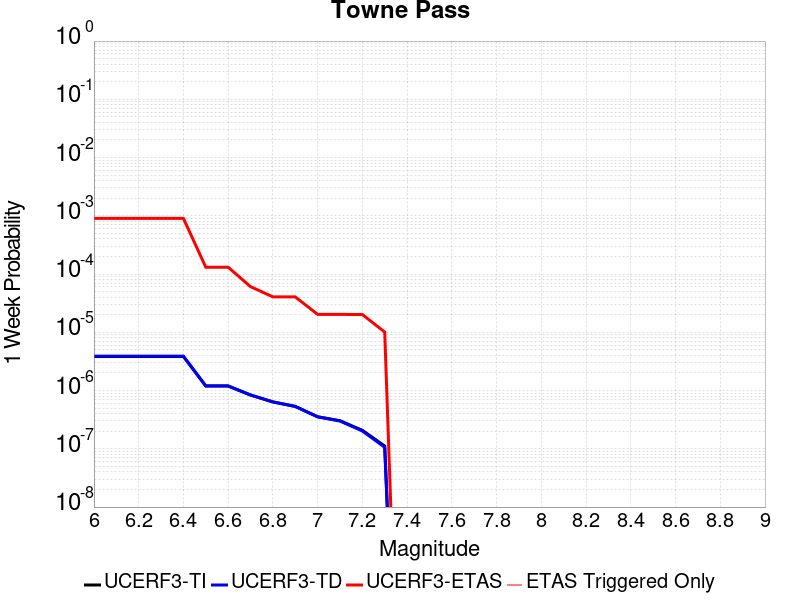 | 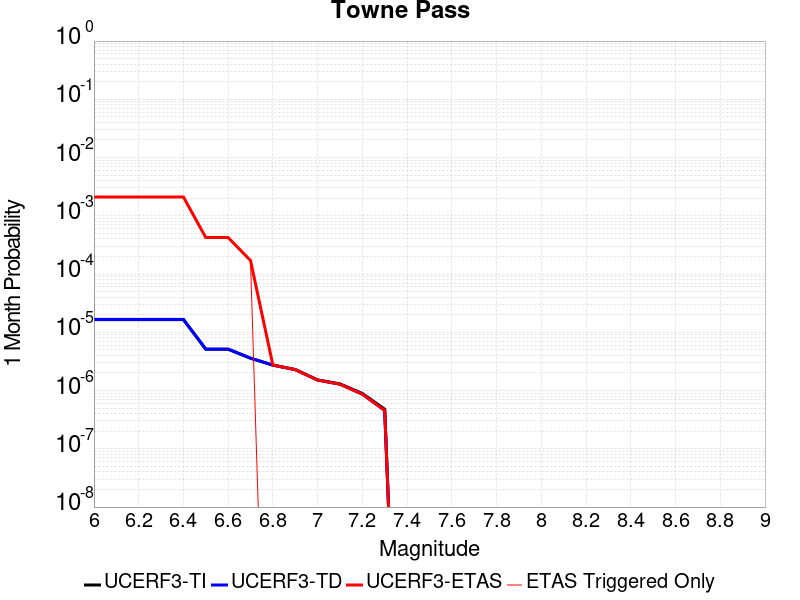 | 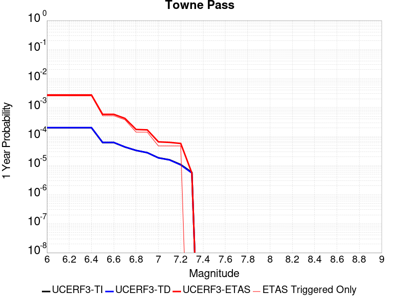 | 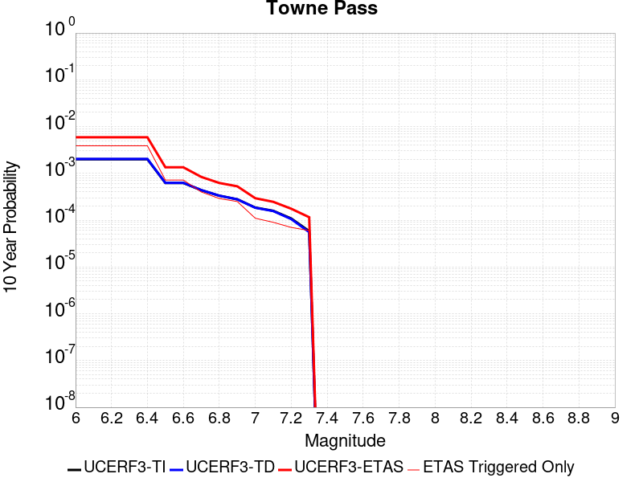 |

| Magnitude | 1 wk TI Prob | 1 wk TD Prob | 1 wk ETAS Prob | 1 wk ETAS/TD Gain | 1 wk ETAS Triggered Only | 1 mo TI Prob | 1 mo TD Prob | 1 mo ETAS Prob | 1 mo ETAS/TD Gain | 1 mo ETAS Triggered Only | 1 yr TI Prob | 1 yr TD Prob | 1 yr ETAS Prob | 1 yr ETAS/TD Gain | 1 yr ETAS Triggered Only | 10 yr TI Prob | 10 yr TD Prob | 10 yr ETAS Prob | 10 yr ETAS/TD Gain | 10 yr ETAS Triggered Only |
|-----|-----|-----|-----|-----|-----|-----|-----|-----|-----|-----|-----|-----|-----|-----|-----|-----|-----|-----|-----|-----|
| 6.0 | 3.849728E-6 | 3.8945414E-6 | 0.0013222529 | 339.5144 | 0.0013183635 | 1.649873E-5 | 1.669081E-5 | 0.0018878853 | 113.10927 | 0.0018712257 | 2.0085352E-4 | 2.0319603E-4 | 0.0028393874 | 13.973636 | 0.002636727 | 0.0020067208 | 0.0020305314 | 0.0062746815 | 3.090167 | 0.0042527854 |
| 6.1 | 3.849728E-6 | 3.8945414E-6 | 0.0013222529 | 339.5144 | 0.0013183635 | 1.649873E-5 | 1.669081E-5 | 0.0018878853 | 113.10927 | 0.0018712257 | 2.0085352E-4 | 2.0319603E-4 | 0.0028393874 | 13.973636 | 0.002636727 | 0.0020067208 | 0.0020305314 | 0.0062746815 | 3.090167 | 0.0042527854 |
| 6.2 | 3.849728E-6 | 3.8945414E-6 | 0.0013222529 | 339.5144 | 0.0013183635 | 1.649873E-5 | 1.669081E-5 | 0.0018878853 | 113.10927 | 0.0018712257 | 2.0085352E-4 | 2.0319603E-4 | 0.0028393874 | 13.973636 | 0.002636727 | 0.0020067208 | 0.0020305314 | 0.0062746815 | 3.090167 | 0.0042527854 |
| 6.3 | 3.849728E-6 | 3.8945414E-6 | 0.0013222529 | 339.5144 | 0.0013183635 | 1.649873E-5 | 1.669081E-5 | 0.0018878853 | 113.10927 | 0.0018712257 | 2.0085352E-4 | 2.0319603E-4 | 0.0028393874 | 13.973636 | 0.002636727 | 0.0020067208 | 0.0020305314 | 0.0062746815 | 3.090167 | 0.0042527854 |
| 6.4 | 3.849728E-6 | 3.8945414E-6 | 0.0013222529 | 339.5144 | 0.0013183635 | 1.649873E-5 | 1.669081E-5 | 0.0018878853 | 113.10927 | 0.0018712257 | 2.0085352E-4 | 2.0319603E-4 | 0.0028393874 | 13.973636 | 0.002636727 | 0.0020067208 | 0.0020305314 | 0.0062746815 | 3.090167 | 0.0042527854 |
| 6.5 | 1.1953545E-6 | 1.203052E-6 | 2.1384207E-4 | 177.74965 | 2.1263928E-4 | 5.1229376E-6 | 5.1559277E-6 | 3.4537702E-4 | 66.9864 | 3.4022285E-4 | 6.236998E-5 | 6.277173E-5 | 6.1559916E-4 | 9.806949 | 5.528621E-4 | 6.235248E-4 | 6.275517E-4 | 0.0013075704 | 2.0836058 | 6.804457E-4 |
| 6.6 | 1.1953545E-6 | 1.203052E-6 | 2.1384207E-4 | 177.74965 | 2.1263928E-4 | 5.1229376E-6 | 5.1559277E-6 | 3.4537702E-4 | 66.9864 | 3.4022285E-4 | 6.236998E-5 | 6.277173E-5 | 6.1559916E-4 | 9.806949 | 5.528621E-4 | 6.235248E-4 | 6.275517E-4 | 0.0013075704 | 2.0836058 | 6.804457E-4 |
| 6.7 | 8.375951E-7 | 8.4106705E-7 | 8.589671E-5 | 102.12825 | 8.505571E-5 | 3.5896885E-6 | 3.6045683E-6 | 1.7371538E-4 | 48.193115 | 1.7011142E-4 | 4.370358E-5 | 4.3884793E-5 | 3.840927E-4 | 8.752296 | 3.4022285E-4 | 4.3694986E-4 | 4.38767E-4 | 7.7884056E-4 | 1.7750664 | 3.4022285E-4 |
| 6.8 | 6.38041E-7 | 6.392156E-7 | 4.3167045E-5 | 67.53127 | 4.2527856E-5 | 2.7344586E-6 | 2.7394929E-6 | 4.5267232E-5 | 16.523945 | 4.2527856E-5 | 3.3291526E-5 | 3.3352855E-5 | 1.6093216E-4 | 4.825139 | 1.2758357E-4 | 3.3286537E-4 | 3.334823E-4 | 4.6102333E-4 | 1.3824521 | 1.2758357E-4 |
| 6.9 | 5.3460053E-7 | 5.345333E-7 | 4.3062366E-5 | 80.56068 | 4.2527856E-5 | 2.2911431E-6 | 2.2908553E-6 | 4.4818615E-5 | 19.56414 | 4.2527856E-5 | 2.789431E-5 | 2.789084E-5 | 1.5547084E-4 | 5.574262 | 1.2758357E-4 | 2.789081E-4 | 2.7887672E-4 | 4.064247E-4 | 1.4573634 | 1.2758357E-4 |
| 7.0 | 3.557783E-7 | 3.5324226E-7 | 4.288108E-5 | 121.392845 | 4.2527856E-5 | 1.5247632E-6 | 1.5138945E-6 | 4.4041684E-5 | 29.091646 | 4.2527856E-5 | 1.8563835E-5 | 1.843152E-5 | 6.095859E-5 | 3.3073015 | 4.2527856E-5 | 1.8562283E-4 | 1.8430075E-4 | 2.2682076E-4 | 1.2307099 | 4.2527856E-5 |
| 7.1 | 3.037942E-7 | 3.0002218E-7 | 4.2827865E-5 | 142.749 | 4.2527856E-5 | 1.3019744E-6 | 1.2858087E-6 | 4.381361E-5 | 34.07475 | 4.2527856E-5 | 1.5851423E-5 | 1.5654618E-5 | 5.8181806E-5 | 3.716591 | 4.2527856E-5 | 1.5850292E-4 | 1.5653588E-4 | 1.9905709E-4 | 1.2716386 | 4.2527856E-5 |
| 7.2 | 2.0808248E-7 | 2.0217689E-7 | 4.2730026E-5 | 211.3497 | 4.2527856E-5 | 8.917818E-7 | 8.6647213E-7 | 4.339429E-5 | 50.081577 | 4.2527856E-5 | 1.0857389E-5 | 1.0549252E-5 | 5.307666E-5 | 5.0313196 | 4.2527856E-5 | 1.0856859E-4 | 1.0548797E-4 | 1.4801134E-4 | 1.4031111 | 4.2527856E-5 |
| 7.3 | 1.1162073E-7 | 1.0636894E-7 | 1.0636894E-7 | 1.0 | 0.0 | 4.7837443E-7 | 4.558668E-7 | 4.558668E-7 | 1.0 | 0.0 | 5.8241935E-6 | 5.550166E-6 | 5.550166E-6 | 1.0 | 0.0 | 5.8240406E-5 | 5.5500474E-5 | 5.5500474E-5 | 1.0 | 0.0 |

## Death Valley (So)
*[(top)](#table-of-contents)*

| 1 Week | 1 Month | 1 Year | 10 Year |
|-----|-----|-----|-----|
| 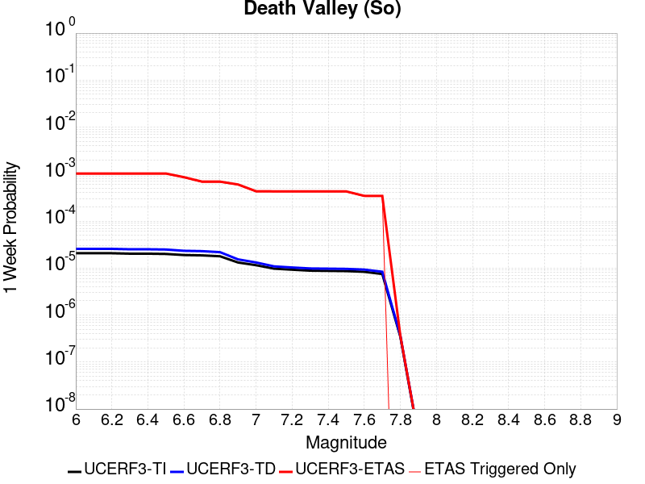 | 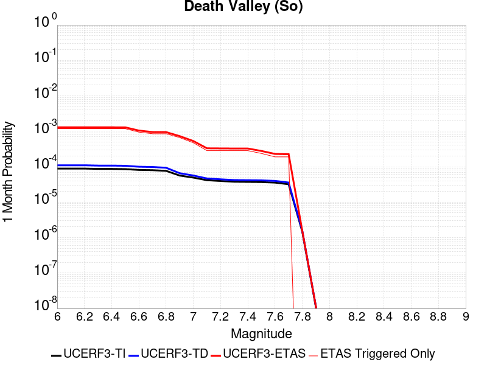 | 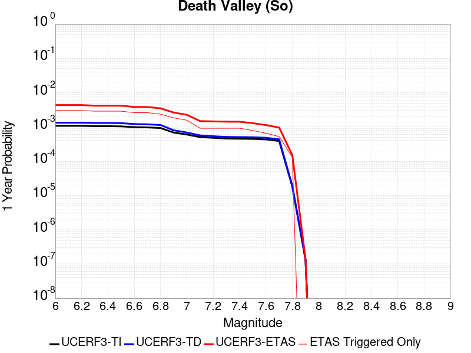 | 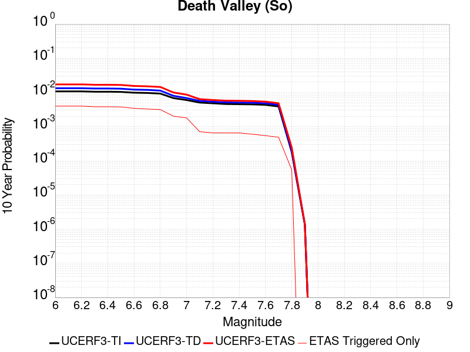 |

| Magnitude | 1 wk TI Prob | 1 wk TD Prob | 1 wk ETAS Prob | 1 wk ETAS/TD Gain | 1 wk ETAS Triggered Only | 1 mo TI Prob | 1 mo TD Prob | 1 mo ETAS Prob | 1 mo ETAS/TD Gain | 1 mo ETAS Triggered Only | 1 yr TI Prob | 1 yr TD Prob | 1 yr ETAS Prob | 1 yr ETAS/TD Gain | 1 yr ETAS Triggered Only | 10 yr TI Prob | 10 yr TD Prob | 10 yr ETAS Prob | 10 yr ETAS/TD Gain | 10 yr ETAS Triggered Only |
|-----|-----|-----|-----|-----|-----|-----|-----|-----|-----|-----|-----|-----|-----|-----|-----|-----|-----|-----|-----|-----|
| 6.0 | 2.0684236E-5 | 2.5617775E-5 | 9.1867987E-4 | 35.86103 | 8.93085E-4 | 8.864371E-5 | 1.0978594E-4 | 0.0013854816 | 12.619844 | 0.0012758357 | 0.0010787029 | 0.0013358411 | 0.004053988 | 3.034783 | 0.0027217828 | 0.010734817 | 0.013281397 | 0.017225921 | 1.2969962 | 0.0039976183 |
| 6.1 | 2.0684236E-5 | 2.5617775E-5 | 9.1867987E-4 | 35.86103 | 8.93085E-4 | 8.864371E-5 | 1.0978594E-4 | 0.0013854816 | 12.619844 | 0.0012758357 | 0.0010787029 | 0.0013358411 | 0.004053988 | 3.034783 | 0.0027217828 | 0.010734817 | 0.013281397 | 0.017225921 | 1.2969962 | 0.0039976183 |
| 6.2 | 2.0684236E-5 | 2.5617775E-5 | 9.1867987E-4 | 35.86103 | 8.93085E-4 | 8.864371E-5 | 1.0978594E-4 | 0.0013854816 | 12.619844 | 0.0012758357 | 0.0010787029 | 0.0013358411 | 0.004053988 | 3.034783 | 0.0027217828 | 0.010734817 | 0.013281397 | 0.017225921 | 1.2969962 | 0.0039976183 |
| 6.3 | 2.0240292E-5 | 2.511786E-5 | 9.181804E-4 | 36.554882 | 8.93085E-4 | 8.6741224E-5 | 1.07643624E-4 | 0.001383342 | 12.851128 | 0.0012758357 | 0.0010555626 | 0.00130979 | 0.0039430633 | 3.0104547 | 0.002636727 | 0.010505628 | 0.013023956 | 0.016801614 | 1.2900546 | 0.003827507 |
| 6.4 | 2.0240292E-5 | 2.511786E-5 | 9.181804E-4 | 36.554882 | 8.93085E-4 | 8.6741224E-5 | 1.07643624E-4 | 0.001383342 | 12.851128 | 0.0012758357 | 0.0010555626 | 0.00130979 | 0.0039430633 | 3.0104547 | 0.002636727 | 0.010505628 | 0.013023956 | 0.016801614 | 1.2900546 | 0.003827507 |
| 6.5 | 1.9962767E-5 | 2.4807114E-5 | 9.178699E-4 | 37.00027 | 8.93085E-4 | 8.55519E-5 | 1.0631196E-4 | 0.001382012 | 12.999591 | 0.0012758357 | 0.0010410968 | 0.0012935963 | 0.0038844396 | 3.0028222 | 0.0025941993 | 0.010362327 | 0.012863902 | 0.016600192 | 1.2904476 | 0.0037849792 |
| 6.6 | 1.8937297E-5 | 2.3310964E-5 | 7.462677E-4 | 32.013588 | 7.2297355E-4 | 8.115732E-5 | 9.990039E-5 | 0.0011629906 | 11.641501 | 0.0010631963 | 9.876423E-4 | 0.0012156231 | 0.0035093357 | 2.8868616 | 0.002296504 | 0.009832645 | 0.012092789 | 0.015495888 | 1.2814156 | 0.0034447564 |
| 6.7 | 1.8621096E-5 | 2.2911607E-5 | 6.608148E-4 | 28.841925 | 6.3791784E-4 | 7.980225E-5 | 9.818898E-5 | 0.0010762336 | 10.960838 | 9.781406E-4 | 9.711593E-4 | 0.0011948098 | 0.003361139 | 2.8131163 | 0.0021689206 | 0.009669261 | 0.011886904 | 0.015122623 | 1.2722088 | 0.003274645 |
| 6.8 | 1.7830353E-5 | 2.1805688E-5 | 6.597096E-4 | 30.254015 | 6.3791784E-4 | 7.641356E-5 | 9.344968E-5 | 0.001071499 | 11.466053 | 9.781406E-4 | 9.29938E-4 | 0.00113717 | 0.0032186653 | 2.830417 | 0.002083865 | 0.009260561 | 0.011316354 | 0.014469849 | 1.278667 | 0.0031895891 |
| 6.9 | 1.3135183E-5 | 1.5303925E-5 | 5.2563037E-4 | 34.346115 | 5.1033427E-4 | 5.6292425E-5 | 6.558664E-5 | 7.8851276E-4 | 12.022461 | 7.2297355E-4 | 6.8514474E-4 | 7.982312E-4 | 0.0022005301 | 2.756758 | 0.0014034192 | 0.006830362 | 0.007954649 | 0.009979747 | 1.2545806 | 0.002041337 |
| 7.0 | 1.1507512E-5 | 1.3154199E-5 | 3.9589987E-4 | 30.096842 | 3.827507E-4 | 4.9316975E-5 | 5.6373956E-5 | 6.0920493E-4 | 10.806496 | 5.528621E-4 | 6.002687E-4 | 6.8614254E-4 | 0.0019186041 | 2.796218 | 0.0012333078 | 0.0059864987 | 0.0068409415 | 0.008572656 | 1.2531397 | 0.001743642 |
| 7.1 | 9.715903E-6 | 1.0865278E-5 | 3.0855704E-4 | 28.398447 | 2.97695E-4 | 4.1638916E-5 | 4.656467E-5 | 4.2929754E-4 | 9.219383 | 3.827507E-4 | 5.068359E-4 | 5.667817E-4 | 0.0012043379 | 2.124871 | 6.3791784E-4 | 0.0050568148 | 0.0056538144 | 0.006414988 | 1.1346301 | 7.655014E-4 |
| 7.2 | 9.233269E-6 | 1.02863105E-5 | 2.6545083E-4 | 25.806223 | 2.5516714E-4 | 3.9570554E-5 | 4.4083466E-5 | 3.842913E-4 | 8.717357 | 3.4022285E-4 | 4.81665E-4 | 5.3658825E-4 | 0.0011316588 | 2.108989 | 5.9539E-4 | 0.0048062233 | 0.0053533576 | 0.006030161 | 1.1264259 | 6.804457E-4 |
| 7.3 | 8.8041315E-6 | 9.808164E-6 | 2.649728E-4 | 27.015535 | 2.5516714E-4 | 3.7731446E-5 | 4.2034335E-5 | 3.8224287E-4 | 9.093587 | 3.4022285E-4 | 4.592835E-4 | 5.1165203E-4 | 0.0011067374 | 2.1630664 | 5.9539E-4 | 0.0045833546 | 0.005105167 | 0.005782139 | 1.1326052 | 6.804457E-4 |
| 7.4 | 8.708749E-6 | 9.707175E-6 | 2.6487184E-4 | 27.286192 | 2.5516714E-4 | 3.7322676E-5 | 4.160154E-5 | 3.8181024E-4 | 9.177791 | 3.4022285E-4 | 4.5430884E-4 | 5.0638523E-4 | 0.0011014737 | 2.1751695 | 5.9539E-4 | 0.004533812 | 0.0050527398 | 0.005729747 | 1.1339883 | 6.804457E-4 |
| 7.5 | 8.612678E-6 | 9.604817E-6 | 2.647695E-4 | 27.566324 | 2.5516714E-4 | 3.6910955E-5 | 4.1162875E-5 | 2.9631951E-4 | 7.1987076 | 2.5516714E-4 | 4.492982E-4 | 5.01047E-4 | 0.0010111255 | 2.0180254 | 5.1033427E-4 | 0.004483909 | 0.0049995985 | 0.005592012 | 1.1184921 | 5.9539E-4 |
| 7.6 | 8.319024E-6 | 9.283916E-6 | 2.2192122E-4 | 23.903837 | 2.1263928E-4 | 3.5652476E-5 | 3.978763E-5 | 2.5241845E-4 | 6.344144 | 2.1263928E-4 | 4.3398244E-4 | 4.8431093E-4 | 9.093835E-4 | 1.8776853 | 4.2527856E-4 | 0.0043313587 | 0.0048329784 | 0.0053408463 | 1.1050838 | 5.1033427E-4 |
| 7.7 | 7.4718328E-6 | 8.34517E-6 | 2.2098268E-4 | 26.480309 | 2.1263928E-4 | 3.2021748E-5 | 3.5764548E-5 | 2.4839622E-4 | 6.94532 | 2.1263928E-4 | 3.8979502E-4 | 4.353504E-4 | 8.1793446E-4 | 1.8787957 | 3.827507E-4 | 0.00389112 | 0.0043453807 | 0.004811154 | 1.1071882 | 4.678064E-4 |
| 7.8 | 3.4586725E-7 | 3.6482615E-7 | 3.6482615E-7 | 1.0 | 0.0 | 1.4822873E-6 | 1.5635396E-6 | 1.5635396E-6 | 1.0 | 0.0 | 1.80467E-5 | 1.9035933E-5 | 6.156298E-5 | 3.2340405 | 4.2527856E-5 | 1.8045233E-4 | 1.9034347E-4 | 2.3286323E-4 | 1.2233844 | 4.2527856E-5 |
| 7.9 | 2.5591178E-9 | 2.6696718E-9 | 2.6696718E-9 | 1.0 | 0.0 | 1.0967647E-8 | 1.14414505E-8 | 1.14414505E-8 | 1.0 | 0.0 | 1.335311E-7 | 1.3929966E-7 | 1.3929966E-7 | 1.0 | 0.0 | 1.3353102E-6 | 1.3929966E-6 | 1.3929966E-6 | 1.0 | 0.0 |

## Lenwood-Lockhart-Old Woman Springs
*[(top)](#table-of-contents)*

| 1 Week | 1 Month | 1 Year | 10 Year |
|-----|-----|-----|-----|
| 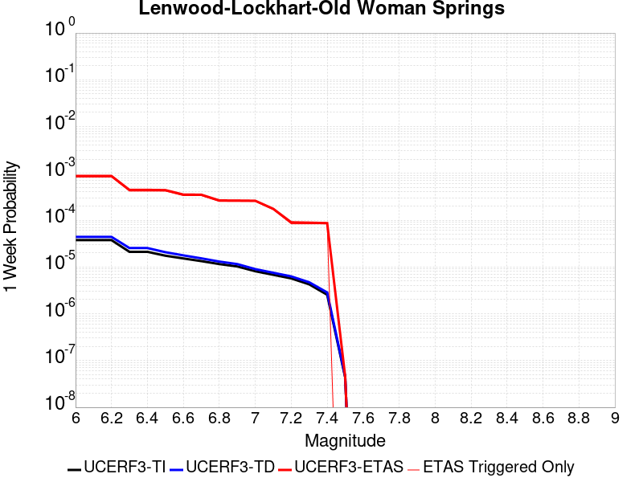 | 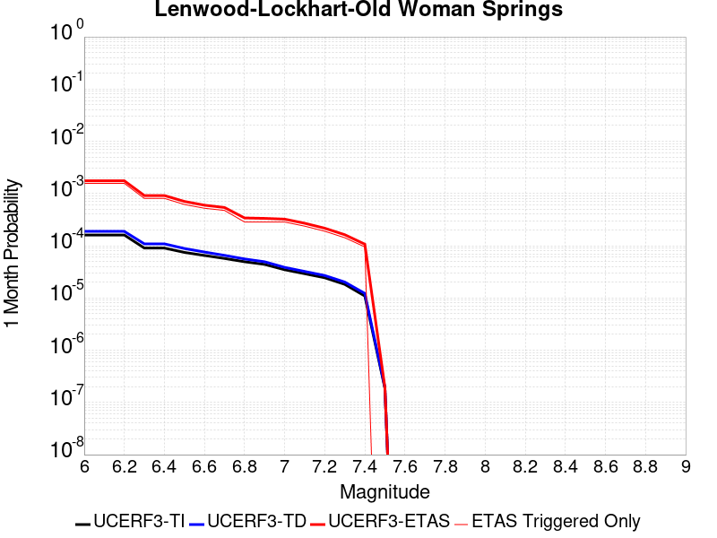 | 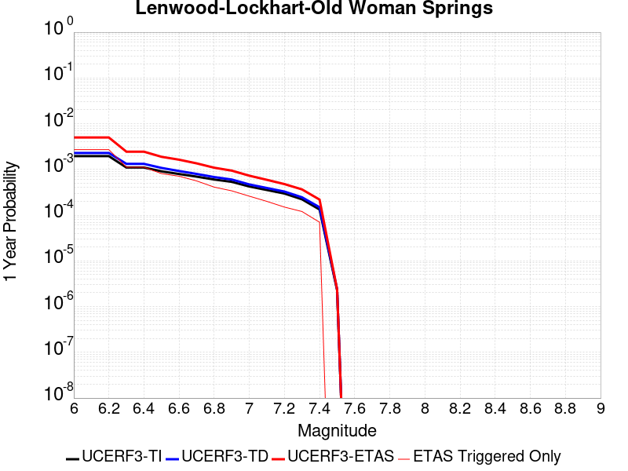 | 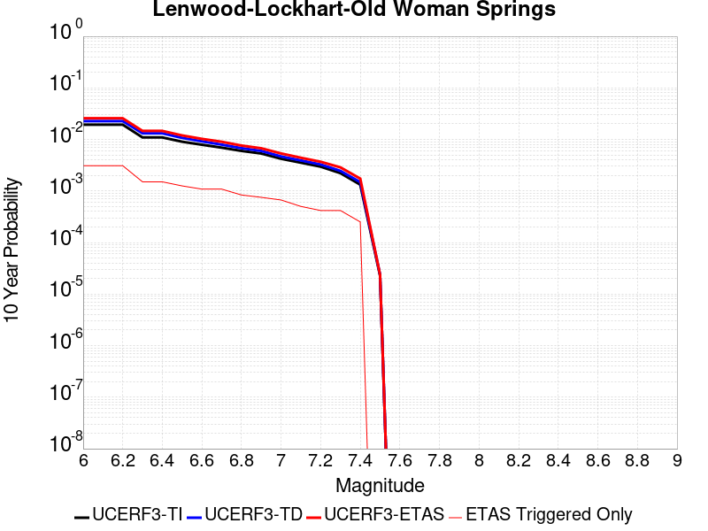 |

| Magnitude | 1 wk TI Prob | 1 wk TD Prob | 1 wk ETAS Prob | 1 wk ETAS/TD Gain | 1 wk ETAS Triggered Only | 1 mo TI Prob | 1 mo TD Prob | 1 mo ETAS Prob | 1 mo ETAS/TD Gain | 1 mo ETAS Triggered Only | 1 yr TI Prob | 1 yr TD Prob | 1 yr ETAS Prob | 1 yr ETAS/TD Gain | 1 yr ETAS Triggered Only | 10 yr TI Prob | 10 yr TD Prob | 10 yr ETAS Prob | 10 yr ETAS/TD Gain | 10 yr ETAS Triggered Only |
|-----|-----|-----|-----|-----|-----|-----|-----|-----|-----|-----|-----|-----|-----|-----|-----|-----|-----|-----|-----|-----|
| 6.0 | 3.744542E-5 | 4.396252E-5 | 0.0011496382 | 26.150415 | 0.0011057243 | 1.604705E-4 | 1.8839816E-4 | 0.0017616324 | 9.350581 | 0.0015735306 | 0.0019519776 | 0.0022915069 | 0.004794901 | 2.092466 | 0.0025091434 | 0.019349206 | 0.022696787 | 0.026104921 | 1.1501594 | 0.003487284 |
| 6.1 | 3.744542E-5 | 4.396252E-5 | 0.0011496382 | 26.150415 | 0.0011057243 | 1.604705E-4 | 1.8839816E-4 | 0.0017616324 | 9.350581 | 0.0015735306 | 0.0019519776 | 0.0022915069 | 0.004794901 | 2.092466 | 0.0025091434 | 0.019349206 | 0.022696787 | 0.026104921 | 1.1501594 | 0.003487284 |
| 6.2 | 3.744542E-5 | 4.396252E-5 | 0.0011496382 | 26.150415 | 0.0011057243 | 1.604705E-4 | 1.8839816E-4 | 0.0017616324 | 9.350581 | 0.0015735306 | 0.0019519776 | 0.0022915069 | 0.004794901 | 2.092466 | 0.0025091434 | 0.019349206 | 0.022696787 | 0.026104921 | 1.1501594 | 0.003487284 |
| 6.3 | 2.1079984E-5 | 2.5353434E-5 | 5.7820155E-4 | 22.80565 | 5.528621E-4 | 9.0339665E-5 | 1.0865316E-4 | 9.5911784E-4 | 8.827335 | 8.505571E-4 | 0.0010993304 | 0.0013220694 | 0.00263869 | 1.9958785 | 0.0013183635 | 0.010939079 | 0.0131442575 | 0.014906949 | 1.1341035 | 0.00178617 |
| 6.4 | 2.1079984E-5 | 2.5353434E-5 | 5.7820155E-4 | 22.80565 | 5.528621E-4 | 9.0339665E-5 | 1.0865316E-4 | 9.5911784E-4 | 8.827335 | 8.505571E-4 | 0.0010993304 | 0.0013220694 | 0.00263869 | 1.9958785 | 0.0013183635 | 0.010939079 | 0.0131442575 | 0.014906949 | 1.1341035 | 0.00178617 |
| 6.5 | 1.7397282E-5 | 2.066241E-5 | 4.8845913E-4 | 23.63999 | 4.678064E-4 | 7.455765E-5 | 8.8550245E-5 | 7.264116E-4 | 8.203383 | 6.3791784E-4 | 9.073613E-4 | 0.0010775778 | 0.0020971466 | 1.9461671 | 0.0010206685 | 0.009036654 | 0.010724821 | 0.011944902 | 1.1137624 | 0.0012333078 |
| 6.6 | 1.52050325E-5 | 1.7679693E-5 | 4.4295072E-4 | 25.054209 | 4.2527856E-4 | 6.51628E-5 | 7.576796E-5 | 6.285882E-4 | 8.2962265 | 5.528621E-4 | 7.9306826E-4 | 9.220924E-4 | 0.0018143539 | 1.9676486 | 8.93085E-4 | 0.007902439 | 0.009183526 | 0.010279096 | 1.1192973 | 0.0011057243 |
| 6.7 | 1.332523E-5 | 1.5264002E-5 | 3.5548166E-4 | 23.288889 | 3.4022285E-4 | 5.7106878E-5 | 6.5415545E-5 | 5.3319137E-4 | 8.150835 | 4.678064E-4 | 6.950544E-4 | 7.961491E-4 | 0.0015610411 | 1.9607396 | 7.655014E-4 | 0.006928845 | 0.007933599 | 0.008903979 | 1.1223128 | 9.781406E-4 |
| 6.8 | 1.1525329E-5 | 1.3030979E-5 | 2.2566749E-4 | 17.31777 | 2.1263928E-4 | 4.9393333E-5 | 5.584588E-5 | 3.5352426E-4 | 6.3303547 | 2.97695E-4 | 6.011979E-4 | 6.797157E-4 | 0.0011897031 | 1.750295 | 5.1033427E-4 | 0.00599574 | 0.006776819 | 0.0074948934 | 1.1059604 | 7.2297355E-4 |
| 6.9 | 1.0253909E-5 | 1.15144385E-5 | 2.2415127E-4 | 19.466972 | 2.1263928E-4 | 4.3944583E-5 | 4.9346683E-5 | 3.4702697E-4 | 7.032428 | 2.97695E-4 | 5.3489394E-4 | 6.0063385E-4 | 0.0010681592 | 1.7783867 | 4.678064E-4 | 0.0053360825 | 0.0059904843 | 0.0066668536 | 1.1129073 | 6.804457E-4 |
| 7.0 | 8.104563E-6 | 8.991279E-6 | 1.7910117E-4 | 19.919432 | 1.7011142E-4 | 3.4733377E-5 | 3.8533497E-5 | 2.936908E-4 | 7.6217012 | 2.5516714E-4 | 4.2279682E-4 | 4.6904673E-4 | 8.516179E-4 | 1.8156354 | 3.827507E-4 | 0.0042199334 | 0.0046808156 | 0.0052734185 | 1.1266025 | 5.9539E-4 |
| 7.1 | 6.7986157E-6 | 7.515816E-6 | 1.3509842E-4 | 17.975218 | 1.2758357E-4 | 2.91366E-5 | 3.2210253E-5 | 2.448427E-4 | 7.6013894 | 2.1263928E-4 | 3.5468035E-4 | 3.920914E-4 | 6.896697E-4 | 1.7589513 | 2.97695E-4 | 0.003541148 | 0.003914213 | 0.004380188 | 1.119047 | 4.678064E-4 |
| 7.2 | 5.6893327E-6 | 6.2800136E-6 | 9.133519E-5 | 14.543789 | 8.505571E-5 | 2.4382627E-5 | 2.6914078E-5 | 1.9702093E-4 | 7.320367 | 1.7011142E-4 | 2.9681803E-4 | 3.2763163E-4 | 5.8271515E-4 | 1.7785681 | 2.5516714E-4 | 0.002964219 | 0.0032716845 | 0.0036955718 | 1.1295624 | 4.2527856E-4 |
| 7.3 | 4.253348E-6 | 4.7069107E-6 | 4.7234567E-5 | 10.035152 | 4.2527856E-5 | 1.8228506E-5 | 2.0172329E-5 | 1.4775332E-4 | 7.324555 | 1.2758357E-4 | 2.2190946E-4 | 2.4557224E-4 | 4.581593E-4 | 1.8656803 | 2.1263928E-4 | 0.00221688 | 0.0024531898 | 0.002792578 | 1.1383457 | 3.4022285E-4 |
| 7.4 | 2.5448119E-6 | 2.852045E-6 | 4.537978E-5 | 15.911312 | 4.2527856E-5 | 1.0906291E-5 | 1.2223002E-5 | 9.7277676E-5 | 7.958575 | 8.505571E-5 | 1.3277601E-4 | 1.4880655E-4 | 2.763711E-4 | 1.8572512 | 1.2758357E-4 | 0.001326967 | 0.0014872311 | 0.0016995542 | 1.142764 | 2.1263928E-4 |
| 7.5 | 4.3706837E-8 | 4.562909E-8 | 4.562909E-8 | 1.0 | 0.0 | 1.8731501E-7 | 1.9555324E-7 | 1.9555324E-7 | 1.0 | 0.0 | 2.2805577E-6 | 2.3808586E-6 | 2.3808586E-6 | 1.0 | 0.0 | 2.2805343E-5 | 2.3808387E-5 | 2.3808387E-5 | 1.0 | 0.0 |

## San Andreas (San Bernardino N)
*[(top)](#table-of-contents)*

| 1 Week | 1 Month | 1 Year | 10 Year |
|-----|-----|-----|-----|
| 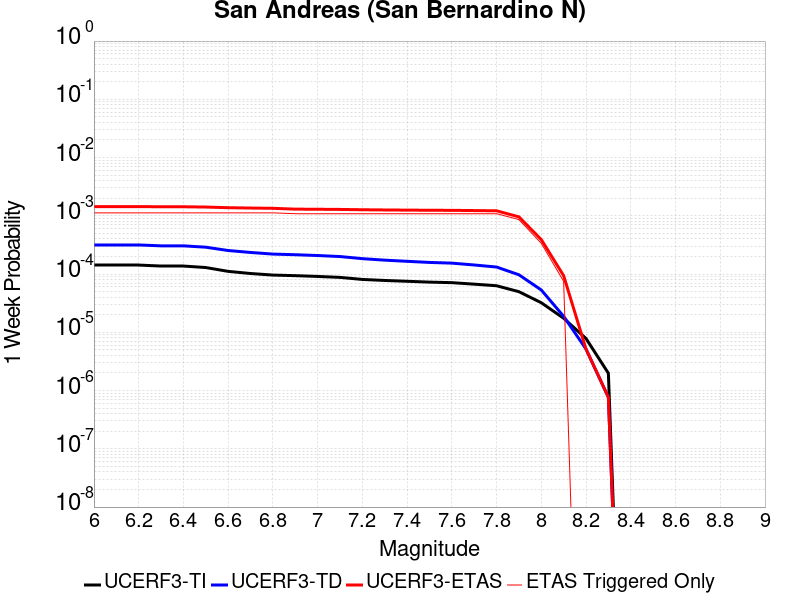 | 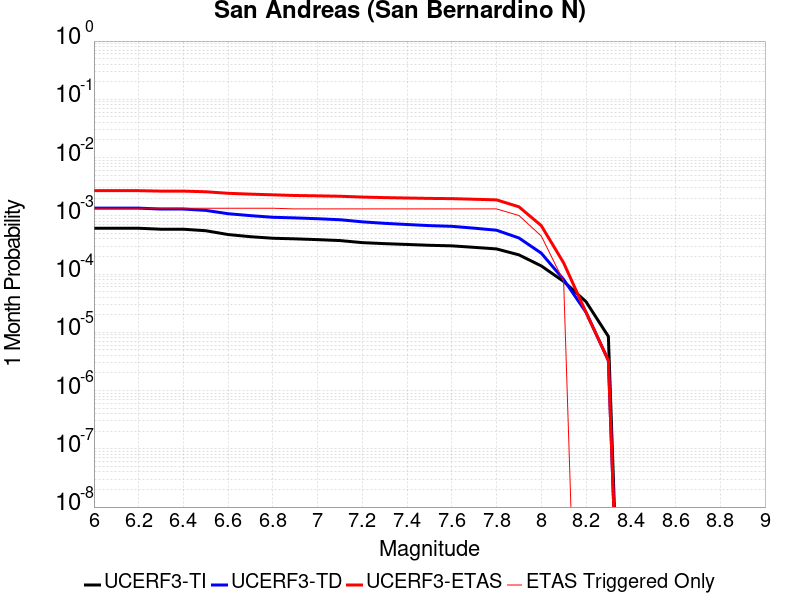 | 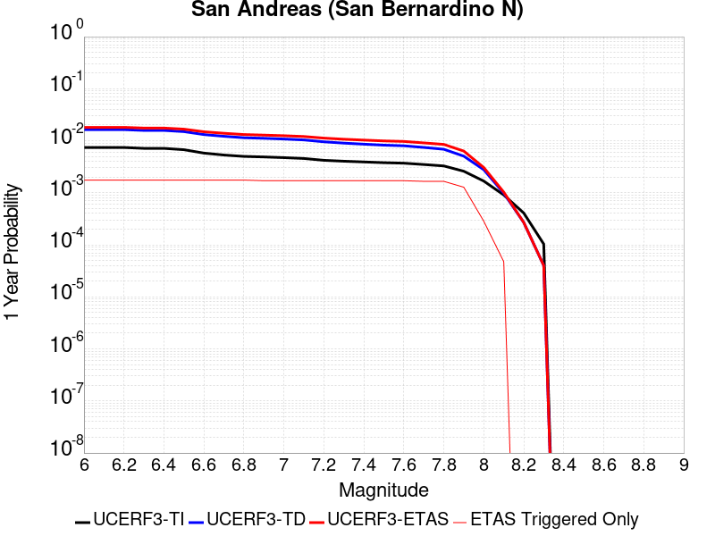 | 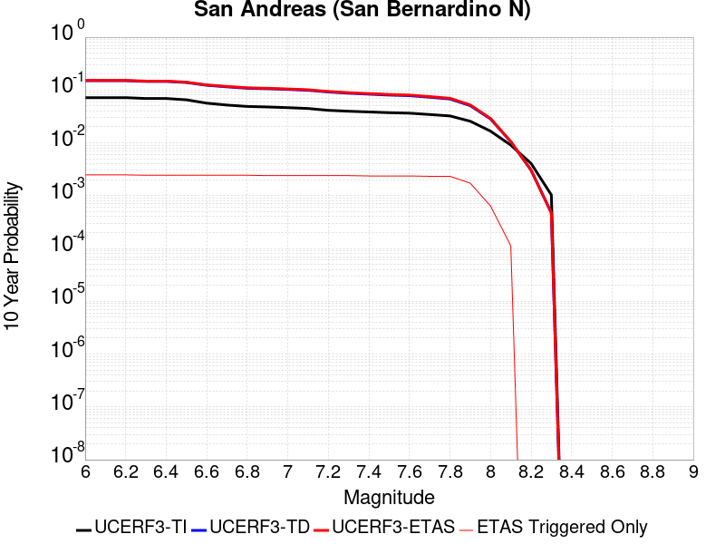 |

| Magnitude | 1 wk TI Prob | 1 wk TD Prob | 1 wk ETAS Prob | 1 wk ETAS/TD Gain | 1 wk ETAS Triggered Only | 1 mo TI Prob | 1 mo TD Prob | 1 mo ETAS Prob | 1 mo ETAS/TD Gain | 1 mo ETAS Triggered Only | 1 yr TI Prob | 1 yr TD Prob | 1 yr ETAS Prob | 1 yr ETAS/TD Gain | 1 yr ETAS Triggered Only | 10 yr TI Prob | 10 yr TD Prob | 10 yr ETAS Prob | 10 yr ETAS/TD Gain | 10 yr ETAS Triggered Only |
|-----|-----|-----|-----|-----|-----|-----|-----|-----|-----|-----|-----|-----|-----|-----|-----|-----|-----|-----|-----|-----|
| 6.0 | 1.4273766E-4 | 3.1606483E-4 | 0.0013789252 | 4.362792 | 0.0010631963 | 6.115894E-4 | 0.0013538664 | 0.002670445 | 1.9724584 | 0.0013183635 | 0.0074207084 | 0.016360244 | 0.018200856 | 1.1125052 | 0.0018712257 | 0.07177748 | 0.15026689 | 0.15239899 | 1.0141888 | 0.0025091434 |
| 6.1 | 1.4273766E-4 | 3.1606483E-4 | 0.0013789252 | 4.362792 | 0.0010631963 | 6.115894E-4 | 0.0013538664 | 0.002670445 | 1.9724584 | 0.0013183635 | 0.0074207084 | 0.016360244 | 0.018200856 | 1.1125052 | 0.0018712257 | 0.07177748 | 0.15026689 | 0.15239899 | 1.0141888 | 0.0025091434 |
| 6.2 | 1.4273766E-4 | 3.1606483E-4 | 0.0013789252 | 4.362792 | 0.0010631963 | 6.115894E-4 | 0.0013538664 | 0.002670445 | 1.9724584 | 0.0013183635 | 0.0074207084 | 0.016360244 | 0.018200856 | 1.1125052 | 0.0018712257 | 0.07177748 | 0.15026689 | 0.15239899 | 1.0141888 | 0.0025091434 |
| 6.3 | 1.3730655E-4 | 3.0511338E-4 | 0.0013679854 | 4.483531 | 0.0010631963 | 5.883239E-4 | 0.0013069791 | 0.0026236195 | 2.0073922 | 0.0013183635 | 0.0071393442 | 0.015797773 | 0.017639438 | 1.1165775 | 0.0018712257 | 0.06914291 | 0.14556676 | 0.14767432 | 1.0144783 | 0.0024666155 |
| 6.4 | 1.3730655E-4 | 3.0511338E-4 | 0.0013679854 | 4.483531 | 0.0010631963 | 5.883239E-4 | 0.0013069791 | 0.0026236195 | 2.0073922 | 0.0013183635 | 0.0071393442 | 0.015797773 | 0.017639438 | 1.1165775 | 0.0018712257 | 0.06914291 | 0.14556676 | 0.14767432 | 1.0144783 | 0.0024666155 |
| 6.5 | 1.2942807E-4 | 2.8925808E-4 | 0.001352147 | 4.674535 | 0.0010631963 | 5.545738E-4 | 0.0012390936 | 0.0025558237 | 2.0626557 | 0.0013183635 | 0.0067310524 | 0.01498286 | 0.016826048 | 1.1230198 | 0.0018712257 | 0.06530788 | 0.13870941 | 0.14083388 | 1.015316 | 0.0024666155 |
| 6.6 | 1.1125901E-4 | 2.536472E-4 | 0.0013165739 | 5.1905713 | 0.0010631963 | 4.767372E-4 | 0.0010866089 | 0.0024035398 | 2.2119641 | 0.0013183635 | 0.005788839 | 0.013149847 | 0.014996466 | 1.1404289 | 0.0018712257 | 0.056403454 | 0.122999296 | 0.12516251 | 1.0175873 | 0.0024666155 |
| 6.7 | 1.02209575E-4 | 2.3499702E-4 | 0.0012979435 | 5.5232344 | 0.0010631963 | 4.3796748E-4 | 0.0010067427 | 0.002323779 | 2.3082154 | 0.0013183635 | 0.0053192247 | 0.012188629 | 0.0140370475 | 1.151651 | 0.0018712257 | 0.051936906 | 0.114790924 | 0.11697439 | 1.0190213 | 0.0024666155 |
| 6.8 | 9.610582E-5 | 2.2025521E-4 | 0.0012832175 | 5.826048 | 0.0010631963 | 4.1181705E-4 | 9.436101E-4 | 0.0022607297 | 2.3958302 | 0.0013183635 | 0.0050023515 | 0.011428202 | 0.013278042 | 1.1618663 | 0.0018712257 | 0.048912346 | 0.1081929 | 0.110392645 | 1.0203317 | 0.0024666155 |
| 6.9 | 9.3877505E-5 | 2.1481077E-4 | 0.00123526 | 5.750457 | 0.0010206685 | 4.0227012E-4 | 9.2029345E-4 | 0.002194955 | 2.3850598 | 0.0012758357 | 0.0048866454 | 0.011147255 | 0.012955569 | 1.1622205 | 0.0018286977 | 0.04780577 | 0.10578323 | 0.10795089 | 1.0204915 | 0.0024240878 |
| 7.0 | 9.1019785E-5 | 2.0808022E-4 | 0.0012285364 | 5.9041476 | 0.0010206685 | 3.900265E-4 | 8.914682E-4 | 0.0021661664 | 2.4298863 | 0.0012758357 | 0.0047382377 | 0.010799837 | 0.012608785 | 1.1674978 | 0.0018286977 | 0.046384744 | 0.102753714 | 0.10492872 | 1.0211672 | 0.0024240878 |
| 7.1 | 8.771155E-5 | 1.9982594E-4 | 0.0012202905 | 6.106767 | 0.0010206685 | 3.758525E-4 | 8.5611636E-4 | 0.0021308598 | 2.4889839 | 0.0012758357 | 0.0045664064 | 0.0103736 | 0.012183327 | 1.1744552 | 0.0018286977 | 0.044737056 | 0.09906527 | 0.10124921 | 1.0220455 | 0.0024240878 |
| 7.2 | 8.0830236E-5 | 1.8388197E-4 | 0.0012043628 | 6.549651 | 0.0010206685 | 3.4636928E-4 | 7.8782777E-4 | 0.0020626583 | 2.6181588 | 0.0012758357 | 0.0042088944 | 0.009549725 | 0.011360959 | 1.1896635 | 0.0018286977 | 0.041300658 | 0.09179615 | 0.09399772 | 1.0239832 | 0.0024240878 |
| 7.3 | 7.7668235E-5 | 1.7331762E-4 | 0.0011938092 | 6.8879857 | 0.0010206685 | 3.328214E-4 | 7.425784E-4 | 0.0020174668 | 2.7168398 | 0.0012758357 | 0.0040445733 | 0.009003494 | 0.0108157275 | 1.2012811 | 0.0018286977 | 0.03971748 | 0.08706327 | 0.08927631 | 1.0254188 | 0.0024240878 |
| 7.4 | 7.520177E-5 | 1.6551897E-4 | 0.0011860186 | 7.165454 | 0.0010206685 | 3.2225347E-4 | 7.0917426E-4 | 0.0019841052 | 2.797768 | 0.0012758357 | 0.0039163795 | 0.008600081 | 0.0104130525 | 1.2108085 | 0.0018286977 | 0.038480744 | 0.08351955 | 0.0857022 | 1.0261334 | 0.00238156 |
| 7.5 | 7.274697E-5 | 1.5839566E-4 | 0.0011789026 | 7.4427705 | 0.0010206685 | 3.1173544E-4 | 6.78662E-4 | 0.0019536319 | 2.878652 | 0.0012758357 | 0.003788775 | 0.008231463 | 0.010045107 | 1.2203308 | 0.0018286977 | 0.03724827 | 0.08023631 | 0.08242678 | 1.0273002 | 0.00238156 |
| 7.6 | 7.1185845E-5 | 1.540943E-4 | 0.0011746056 | 7.622641 | 0.0010206685 | 3.0504653E-4 | 6.6023704E-4 | 0.0019352303 | 2.9311144 | 0.0012758357 | 0.0037076178 | 0.008008812 | 0.009822863 | 1.2265071 | 0.0018286977 | 0.036463667 | 0.07822598 | 0.08042124 | 1.028063 | 0.00238156 |
| 7.7 | 6.709961E-5 | 1.4318313E-4 | 0.0011637055 | 8.127393 | 0.0010206685 | 2.8753807E-4 | 6.1349774E-4 | 0.0018885507 | 3.0783336 | 0.0012758357 | 0.003495157 | 0.0074437927 | 0.009216666 | 1.2381681 | 0.00178617 | 0.034406938 | 0.07305469 | 0.07522285 | 1.0296785 | 0.002339032 |
| 7.8 | 6.300812E-5 | 1.3202413E-4 | 0.0011525579 | 8.729903 | 0.0010206685 | 2.7000686E-4 | 5.65695E-4 | 0.001840809 | 3.254066 | 0.0012758357 | 0.0032823787 | 0.006865616 | 0.008639523 | 1.2583755 | 0.00178617 | 0.032343175 | 0.06771354 | 0.06989419 | 1.032204 | 0.002339032 |
| 7.9 | 4.983037E-5 | 9.723488E-5 | 9.051856E-4 | 9.309268 | 8.0802926E-4 | 2.1354125E-4 | 4.1665437E-4 | 0.0013943875 | 3.3466287 | 9.781406E-4 | 0.0025967648 | 0.0050609782 | 0.006414982 | 1.267538 | 0.0013608914 | 0.025666296 | 0.05064886 | 0.05230419 | 1.0326824 | 0.001743642 |
| 8.0 | 3.2211527E-5 | 5.3304586E-5 | 2.6593253E-4 | 4.988924 | 2.1263928E-4 | 1.380421E-4 | 2.2842824E-4 | 5.6857336E-4 | 2.4890678 | 3.4022285E-4 | 0.0016793669 | 0.0027775685 | 0.0031592562 | 1.1374179 | 3.827507E-4 | 0.016667323 | 0.028361378 | 0.028857239 | 1.0174837 | 5.1033427E-4 |
| 8.1 | 1.743376E-5 | 1.8824427E-5 | 1.03878534E-4 | 5.5182843 | 8.505571E-5 | 7.471398E-5 | 8.067362E-5 | 1.6572246E-4 | 2.0542338 | 8.505571E-5 | 9.0926304E-4 | 9.817594E-4 | 0.0010667316 | 1.086551 | 8.505571E-5 | 0.009055517 | 0.010484105 | 0.010610351 | 1.0120417 | 1.2758357E-4 |
| 8.2 | 7.831616E-6 | 5.1551065E-6 | 5.1551065E-6 | 1.0 | 0.0 | 3.3563636E-5 | 2.2093127E-5 | 2.2093127E-5 | 1.0 | 0.0 | 4.0856065E-4 | 2.6895068E-4 | 2.6895068E-4 | 1.0 | 0.0 | 0.004078103 | 0.0030418145 | 0.0030418145 | 1.0 | 0.0 |
| 8.3 | 1.983087E-6 | 7.6599065E-7 | 7.6599065E-7 | 1.0 | 0.0 | 8.498917E-6 | 3.282813E-6 | 3.282813E-6 | 1.0 | 0.0 | 1.034694E-4 | 3.9967534E-5 | 3.9967534E-5 | 1.0 | 0.0 | 0.0010342124 | 4.719687E-4 | 4.719687E-4 | 1.0 | 0.0 |

## Paradise
*[(top)](#table-of-contents)*

| 1 Week | 1 Month | 1 Year | 10 Year |
|-----|-----|-----|-----|
| 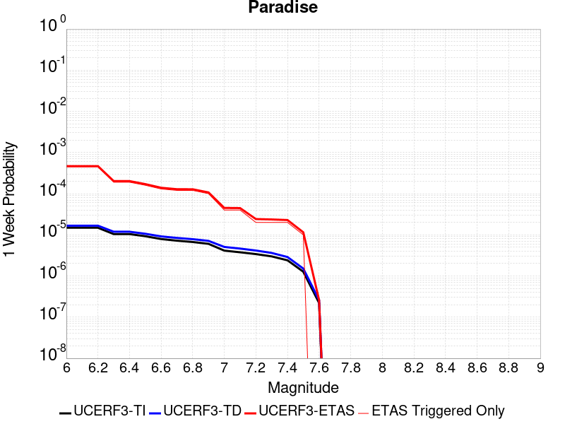 | 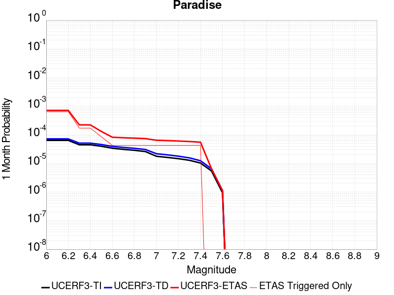 | 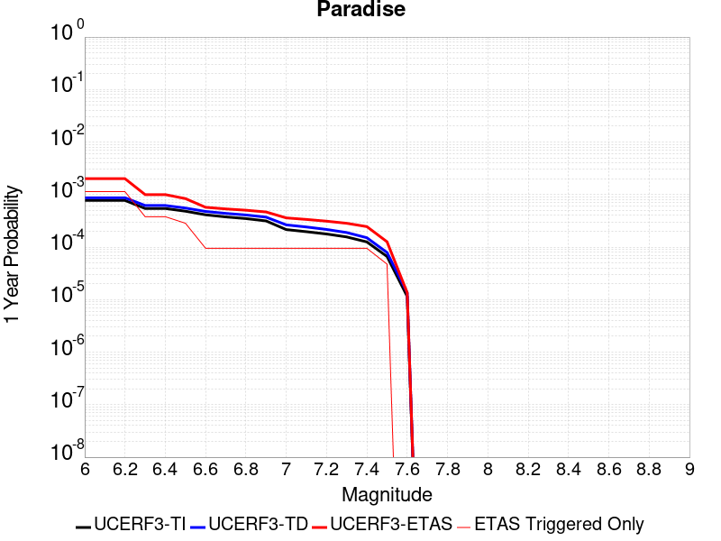 | 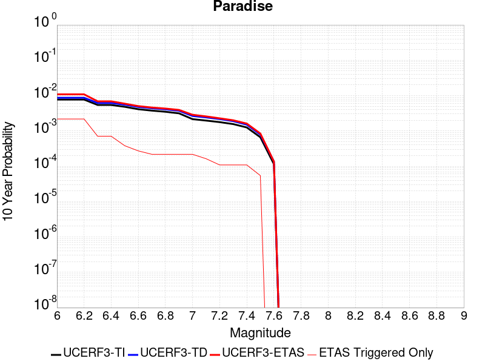 |

| Magnitude | 1 wk TI Prob | 1 wk TD Prob | 1 wk ETAS Prob | 1 wk ETAS/TD Gain | 1 wk ETAS Triggered Only | 1 mo TI Prob | 1 mo TD Prob | 1 mo ETAS Prob | 1 mo ETAS/TD Gain | 1 mo ETAS Triggered Only | 1 yr TI Prob | 1 yr TD Prob | 1 yr ETAS Prob | 1 yr ETAS/TD Gain | 1 yr ETAS Triggered Only | 10 yr TI Prob | 10 yr TD Prob | 10 yr ETAS Prob | 10 yr ETAS/TD Gain | 10 yr ETAS Triggered Only |
|-----|-----|-----|-----|-----|-----|-----|-----|-----|-----|-----|-----|-----|-----|-----|-----|-----|-----|-----|-----|-----|
| 6.0 | 1.4851273E-5 | 1.6694692E-5 | 3.143847E-4 | 18.831417 | 2.97695E-4 | 6.364676E-5 | 7.154685E-5 | 7.09419E-4 | 9.915448 | 6.3791784E-4 | 7.7462377E-4 | 8.707584E-4 | 0.0020180107 | 2.3175323 | 0.001148252 | 0.0077192914 | 0.008675844 | 0.0110367425 | 1.2721231 | 0.00238156 |
| 6.1 | 1.4851273E-5 | 1.6694692E-5 | 3.143847E-4 | 18.831417 | 2.97695E-4 | 6.364676E-5 | 7.154685E-5 | 7.09419E-4 | 9.915448 | 6.3791784E-4 | 7.7462377E-4 | 8.707584E-4 | 0.0020180107 | 2.3175323 | 0.001148252 | 0.0077192914 | 0.008675844 | 0.0110367425 | 1.2721231 | 0.00238156 |
| 6.2 | 1.4851273E-5 | 1.6694692E-5 | 3.143847E-4 | 18.831417 | 2.97695E-4 | 6.364676E-5 | 7.154685E-5 | 7.09419E-4 | 9.915448 | 6.3791784E-4 | 7.7462377E-4 | 8.707584E-4 | 0.0020180107 | 2.3175323 | 0.001148252 | 0.0077192914 | 0.008675844 | 0.0110367425 | 1.2721231 | 0.00238156 |
| 6.3 | 1.0426831E-5 | 1.188862E-5 | 9.6943324E-5 | 8.154295 | 8.505571E-5 | 4.4685654E-5 | 5.0950268E-5 | 2.2105302E-4 | 4.338604 | 1.7011142E-4 | 5.43912E-4 | 6.201489E-4 | 0.0010451637 | 1.6853431 | 4.2527856E-4 | 0.0054258266 | 0.0061847917 | 0.0072836773 | 1.1776755 | 0.0011057243 |
| 6.4 | 1.0426831E-5 | 1.188862E-5 | 9.6943324E-5 | 8.154295 | 8.505571E-5 | 4.4685654E-5 | 5.0950268E-5 | 2.2105302E-4 | 4.338604 | 1.7011142E-4 | 5.43912E-4 | 6.201489E-4 | 0.0010451637 | 1.6853431 | 4.2527856E-4 | 0.0054258266 | 0.0061847917 | 0.0072836773 | 1.1776755 | 0.0011057243 |
| 6.5 | 9.25027E-6 | 1.06199595E-5 | 9.567477E-5 | 9.008958 | 8.505571E-5 | 3.964341E-5 | 4.551335E-5 | 1.3056518E-4 | 2.8687232 | 8.505571E-5 | 4.8255164E-4 | 5.53989E-4 | 8.515191E-4 | 1.5370685 | 2.97695E-4 | 0.0048150513 | 0.0055265795 | 0.0062032645 | 1.122442 | 6.804457E-4 |
| 6.6 | 7.904275E-6 | 9.159525E-6 | 5.168699E-5 | 5.642977 | 4.2527856E-5 | 3.3875025E-5 | 3.9254537E-5 | 8.178072E-5 | 2.0833445 | 4.2527856E-5 | 4.1235037E-4 | 4.7782314E-4 | 5.628382E-4 | 1.1779217 | 8.505571E-5 | 0.0041158604 | 0.0047683544 | 0.00514928 | 1.0798862 | 3.827507E-4 |
| 6.7 | 7.2061953E-6 | 8.407248E-6 | 5.093475E-5 | 6.0584326 | 4.2527856E-5 | 3.088333E-5 | 3.6030586E-5 | 7.8556914E-5 | 2.180284 | 4.2527856E-5 | 3.7593965E-4 | 4.3858777E-4 | 5.236062E-4 | 1.1938459 | 8.505571E-5 | 0.003753043 | 0.004377591 | 0.004673983 | 1.0677066 | 2.97695E-4 |
| 6.8 | 6.6948724E-6 | 7.842166E-6 | 5.0369687E-5 | 6.4229307 | 4.2527856E-5 | 2.8691995E-5 | 3.360887E-5 | 7.613529E-5 | 2.2653334 | 4.2527856E-5 | 3.4926904E-4 | 4.0911473E-4 | 4.9413566E-4 | 1.2078168 | 8.505571E-5 | 0.003487206 | 0.0040839734 | 0.004295744 | 1.0518541 | 2.1263928E-4 |
| 6.9 | 6.0421025E-6 | 7.130621E-6 | 4.9658174E-5 | 6.964074 | 4.2527856E-5 | 2.5894467E-5 | 3.0559466E-5 | 7.308602E-5 | 2.3916001 | 4.2527856E-5 | 3.1521954E-4 | 3.7200135E-4 | 4.5702542E-4 | 1.2285585 | 8.505571E-5 | 0.0031477278 | 0.0037141247 | 0.0038836044 | 1.045631 | 1.7011142E-4 |
| 7.0 | 4.134091E-6 | 5.0803087E-6 | 4.7607948E-5 | 9.371074 | 4.2527856E-5 | 1.7717413E-5 | 2.177258E-5 | 6.429951E-5 | 2.9532335 | 4.2527856E-5 | 2.1568815E-4 | 2.6505045E-4 | 3.5008363E-4 | 1.3208188 | 8.505571E-5 | 0.0021547892 | 0.0026474963 | 0.0028171574 | 1.0640836 | 1.7011142E-4 |
| 7.1 | 3.7674888E-6 | 4.6318696E-6 | 4.7159527E-5 | 10.181532 | 4.2527856E-5 | 1.6146281E-5 | 1.9850726E-5 | 6.237774E-5 | 3.1423404 | 4.2527856E-5 | 1.9656324E-4 | 2.4165731E-4 | 3.2669248E-4 | 1.3518833 | 8.505571E-5 | 0.0019638946 | 0.002414096 | 0.0025413714 | 1.0527219 | 1.2758357E-4 |
| 7.2 | 3.4065345E-6 | 4.156723E-6 | 4.6684403E-5 | 11.231059 | 4.2527856E-5 | 1.4599351E-5 | 1.7814415E-5 | 6.0341514E-5 | 3.3872297 | 4.2527856E-5 | 1.777326E-4 | 2.1687041E-4 | 3.0190768E-4 | 1.392111 | 8.505571E-5 | 0.0017759053 | 0.002166736 | 0.0022516074 | 1.0391701 | 8.505571E-5 |
| 7.3 | 2.9934936E-6 | 3.6293168E-6 | 4.615702E-5 | 12.717826 | 4.2527856E-5 | 1.2829195E-5 | 1.555413E-5 | 5.8081325E-5 | 3.7341416 | 4.2527856E-5 | 1.5618425E-4 | 1.8935655E-4 | 2.7439615E-4 | 1.4490978 | 8.505571E-5 | 0.0015607453 | 0.0018920974 | 0.0019769922 | 1.0448681 | 8.505571E-5 |
| 7.4 | 2.4049796E-6 | 2.8889842E-6 | 4.5416717E-5 | 15.720653 | 4.2527856E-5 | 1.0307015E-5 | 1.238131E-5 | 5.490864E-5 | 4.4348006 | 4.2527856E-5 | 1.2548068E-4 | 1.5073347E-4 | 2.3577634E-4 | 1.5641938 | 8.505571E-5 | 0.0012540985 | 0.0015064536 | 0.0015913813 | 1.0563759 | 8.505571E-5 |
| 7.5 | 1.2710091E-6 | 1.5134682E-6 | 1.5134682E-6 | 1.0 | 0.0 | 5.44717E-6 | 6.4862834E-6 | 6.4862834E-6 | 1.0 | 0.0 | 6.631728E-5 | 7.8968886E-5 | 1.2149339E-4 | 1.5384969 | 4.2527856E-5 | 6.6297496E-4 | 7.8953087E-4 | 8.3202514E-4 | 1.0538222 | 4.2527856E-5 |
| 7.6 | 2.21172E-7 | 2.603961E-7 | 2.603961E-7 | 1.0 | 0.0 | 9.478797E-7 | 1.1159829E-6 | 1.1159829E-6 | 1.0 | 0.0 | 1.1540374E-5 | 1.3587036E-5 | 1.3587036E-5 | 1.0 | 0.0 | 1.1539775E-4 | 1.3586486E-4 | 1.3586486E-4 | 1.0 | 0.0 |

## Bicycle Lake
*[(top)](#table-of-contents)*

| 1 Week | 1 Month | 1 Year | 10 Year |
|-----|-----|-----|-----|
| 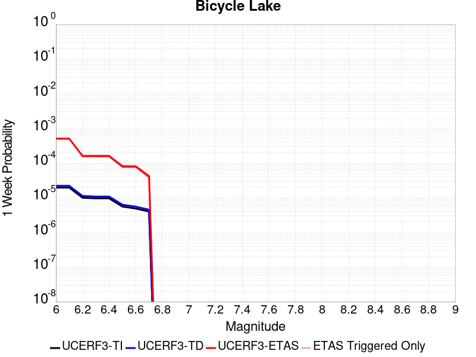 | 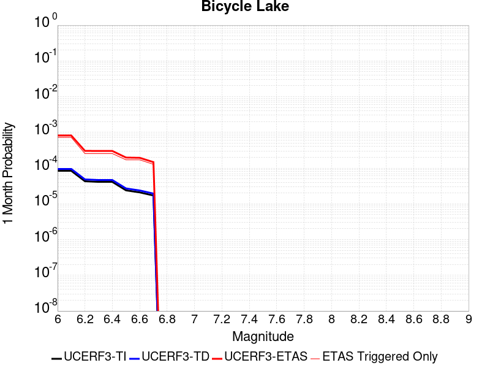 | 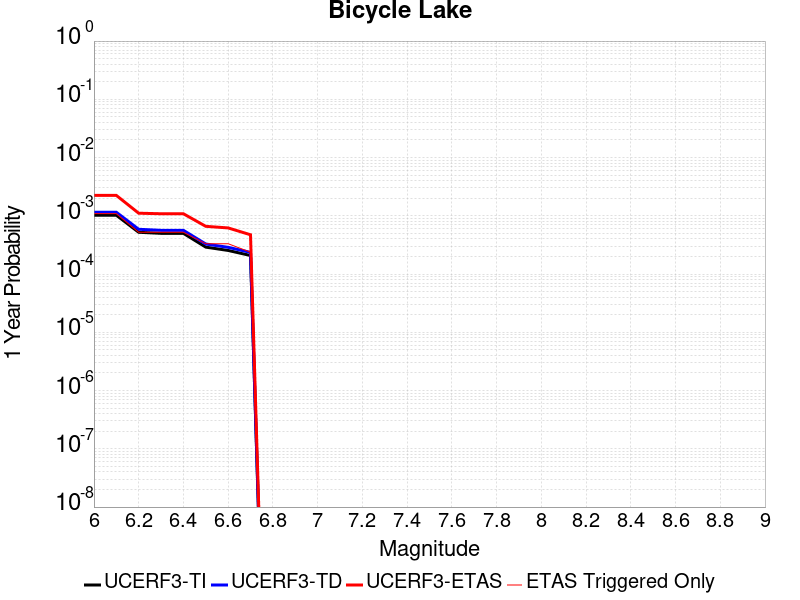 | 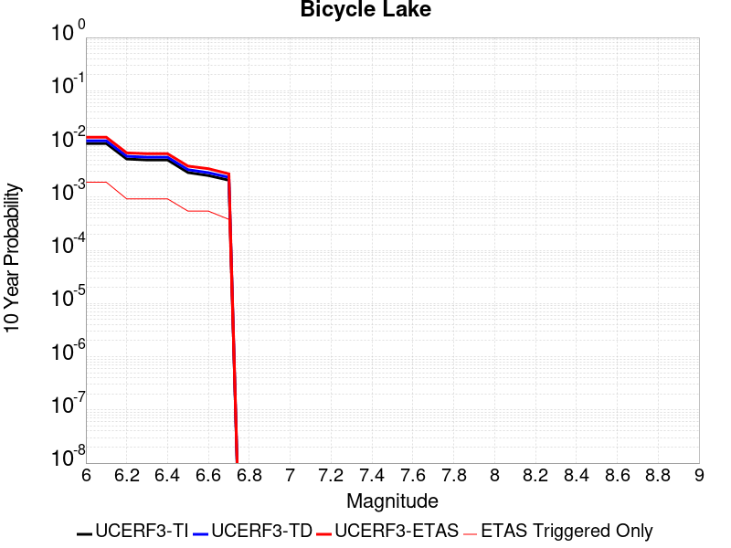 |

| Magnitude | 1 wk TI Prob | 1 wk TD Prob | 1 wk ETAS Prob | 1 wk ETAS/TD Gain | 1 wk ETAS Triggered Only | 1 mo TI Prob | 1 mo TD Prob | 1 mo ETAS Prob | 1 mo ETAS/TD Gain | 1 mo ETAS Triggered Only | 1 yr TI Prob | 1 yr TD Prob | 1 yr ETAS Prob | 1 yr ETAS/TD Gain | 1 yr ETAS Triggered Only | 10 yr TI Prob | 10 yr TD Prob | 10 yr ETAS Prob | 10 yr ETAS/TD Gain | 10 yr ETAS Triggered Only |
|-----|-----|-----|-----|-----|-----|-----|-----|-----|-----|-----|-----|-----|-----|-----|-----|-----|-----|-----|-----|-----|
| 6.0 | 1.9621975E-5 | 2.2097078E-5 | 4.4736624E-4 | 20.245493 | 4.2527856E-4 | 8.4091465E-5 | 9.4699084E-5 | 8.176042E-4 | 8.633707 | 7.2297355E-4 | 0.0010233327 | 0.0011524865 | 0.002384373 | 2.0688944 | 0.0012333078 | 0.01018633 | 0.011478408 | 0.013538353 | 1.1794627 | 0.002083865 |
| 6.1 | 1.9621975E-5 | 2.2097078E-5 | 4.4736624E-4 | 20.245493 | 4.2527856E-4 | 8.4091465E-5 | 9.4699084E-5 | 8.176042E-4 | 8.633707 | 7.2297355E-4 | 0.0010233327 | 0.0011524865 | 0.002384373 | 2.0688944 | 0.0012333078 | 0.01018633 | 0.011478408 | 0.013538353 | 1.1794627 | 0.002083865 |
| 6.2 | 9.9971285E-6 | 1.1255639E-5 | 1.3883777E-4 | 12.334951 | 1.2758357E-4 | 4.2844134E-5 | 4.8237856E-5 | 3.0339268E-4 | 6.289514 | 2.5516714E-4 | 5.2150246E-4 | 5.871896E-4 | 0.0011397272 | 1.9409864 | 5.528621E-4 | 0.0052028033 | 0.005861487 | 0.0068338937 | 1.1658977 | 9.781406E-4 |
| 6.3 | 9.589428E-6 | 1.0798346E-5 | 1.3838054E-4 | 12.814975 | 1.2758357E-4 | 4.10969E-5 | 4.62781E-5 | 3.0143344E-4 | 6.5135226 | 2.5516714E-4 | 5.002399E-4 | 5.6334207E-4 | 0.0011158927 | 1.980844 | 5.528621E-4 | 0.0049911533 | 0.0056242296 | 0.0065545803 | 1.1654184 | 9.356128E-4 |
| 6.4 | 9.589428E-6 | 1.0798346E-5 | 1.3838054E-4 | 12.814975 | 1.2758357E-4 | 4.10969E-5 | 4.62781E-5 | 3.0143344E-4 | 6.5135226 | 2.5516714E-4 | 5.002399E-4 | 5.6334207E-4 | 0.0011158927 | 1.980844 | 5.528621E-4 | 0.0049911533 | 0.0056242296 | 0.0065545803 | 1.1654184 | 9.356128E-4 |
| 6.5 | 5.557707E-6 | 6.2856016E-6 | 9.134078E-5 | 14.531748 | 8.505571E-5 | 2.3818526E-5 | 2.6938165E-5 | 1.9704501E-4 | 7.314715 | 1.7011142E-4 | 2.8995197E-4 | 3.2794967E-4 | 6.6806097E-4 | 2.0370836 | 3.4022285E-4 | 0.0028957394 | 0.0032772934 | 0.0038283437 | 1.1681418 | 5.528621E-4 |
| 6.6 | 4.8742945E-6 | 5.5132896E-6 | 9.056853E-5 | 16.427313 | 8.505571E-5 | 2.0889667E-5 | 2.3628318E-5 | 1.9373572E-4 | 8.199302 | 1.7011142E-4 | 2.54302E-4 | 2.87663E-4 | 6.2778796E-4 | 2.182373 | 3.4022285E-4 | 0.002540112 | 0.0028754752 | 0.0034267476 | 1.1917152 | 5.528621E-4 |
| 6.7 | 3.991108E-6 | 4.5159104E-6 | 4.7043573E-5 | 10.417295 | 4.2527856E-5 | 1.7104636E-5 | 1.9353902E-5 | 1.46935E-4 | 7.5920095 | 1.2758357E-4 | 2.0822904E-4 | 2.3563375E-4 | 4.9074076E-4 | 2.082642 | 2.5516714E-4 | 0.0020803404 | 0.0023563374 | 0.002780614 | 1.1800576 | 4.2527856E-4 |

## Garlic Springs
*[(top)](#table-of-contents)*

| 1 Week | 1 Month | 1 Year | 10 Year |
|-----|-----|-----|-----|
| 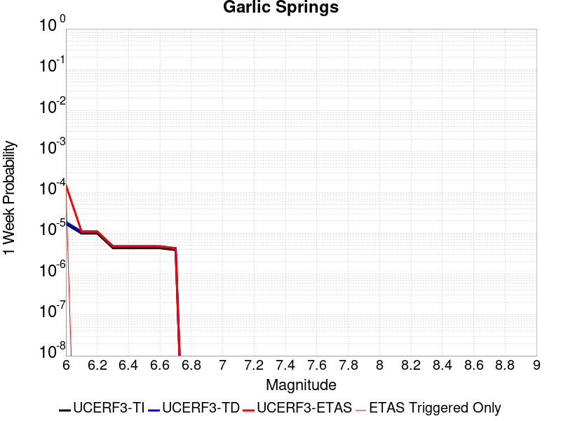 | 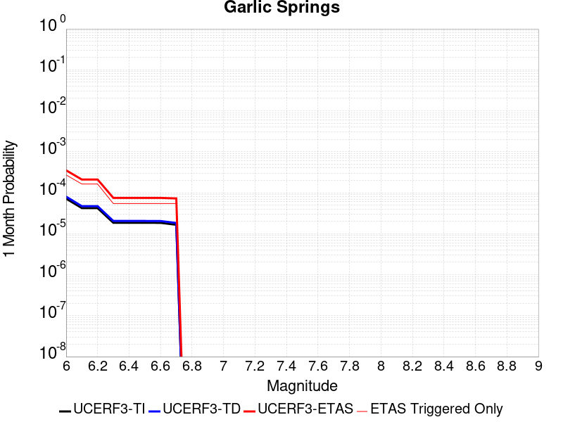 | 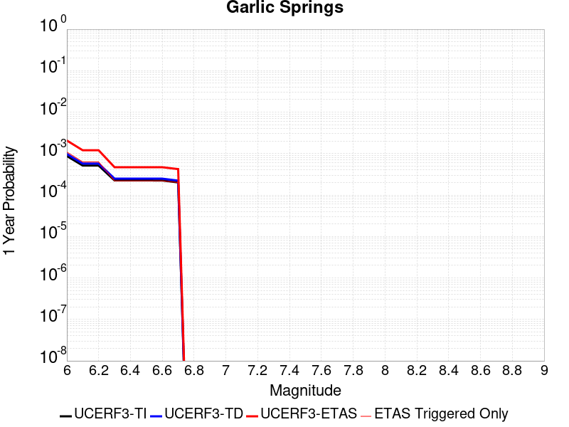 | 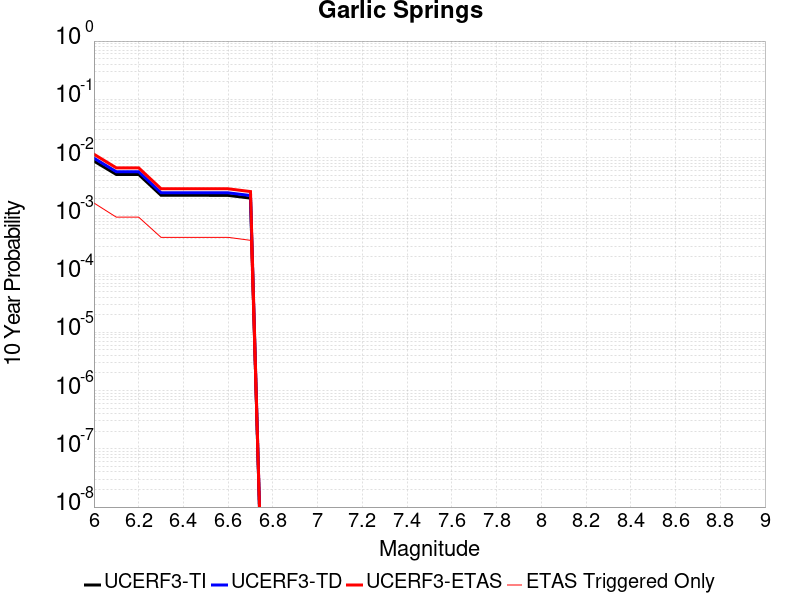 |

| Magnitude | 1 wk TI Prob | 1 wk TD Prob | 1 wk ETAS Prob | 1 wk ETAS/TD Gain | 1 wk ETAS Triggered Only | 1 mo TI Prob | 1 mo TD Prob | 1 mo ETAS Prob | 1 mo ETAS/TD Gain | 1 mo ETAS Triggered Only | 1 yr TI Prob | 1 yr TD Prob | 1 yr ETAS Prob | 1 yr ETAS/TD Gain | 1 yr ETAS Triggered Only | 10 yr TI Prob | 10 yr TD Prob | 10 yr ETAS Prob | 10 yr ETAS/TD Gain | 10 yr ETAS Triggered Only |
|-----|-----|-----|-----|-----|-----|-----|-----|-----|-----|-----|-----|-----|-----|-----|-----|-----|-----|-----|-----|-----|
| 6.0 | 1.6760017E-5 | 1.8776833E-5 | 1.8888507E-4 | 10.059474 | 1.7011142E-4 | 7.182667E-5 | 8.0470316E-5 | 3.7814135E-4 | 4.6991405 | 2.97695E-4 | 8.7413884E-4 | 9.794032E-4 | 0.0019565858 | 1.9977329 | 9.781406E-4 | 0.008707083 | 0.009762413 | 0.011531145 | 1.1811779 | 0.00178617 |
| 6.1 | 9.852767E-6 | 1.09735865E-5 | 9.6028365E-5 | 8.750864 | 8.505571E-5 | 4.222546E-5 | 4.702921E-5 | 2.596585E-4 | 5.5212173 | 2.1263928E-4 | 5.139737E-4 | 5.7250116E-4 | 0.0011675503 | 2.039385 | 5.9539E-4 | 0.005127866 | 0.005717221 | 0.0067743394 | 1.1849006 | 0.0010631963 |
| 6.2 | 9.852767E-6 | 1.09735865E-5 | 9.6028365E-5 | 8.750864 | 8.505571E-5 | 4.222546E-5 | 4.702921E-5 | 2.596585E-4 | 5.5212173 | 2.1263928E-4 | 5.139737E-4 | 5.7250116E-4 | 0.0011675503 | 2.039385 | 5.9539E-4 | 0.005127866 | 0.005717221 | 0.0067743394 | 1.1849006 | 0.0010631963 |
| 6.3 | 4.3167724E-6 | 4.7780286E-6 | 4.7305683E-5 | 9.900669 | 4.2527856E-5 | 1.8500323E-5 | 2.0477235E-5 | 1.4805819E-4 | 7.23038 | 1.2758357E-4 | 2.2521814E-4 | 2.4930484E-4 | 4.1937386E-4 | 1.6821729 | 1.7011142E-4 | 0.0022499003 | 0.00249251 | 0.0029167284 | 1.1701974 | 4.2527856E-4 |
| 6.4 | 4.3167724E-6 | 4.7780286E-6 | 4.7305683E-5 | 9.900669 | 4.2527856E-5 | 1.8500323E-5 | 2.0477235E-5 | 1.4805819E-4 | 7.23038 | 1.2758357E-4 | 2.2521814E-4 | 2.4930484E-4 | 4.1937386E-4 | 1.6821729 | 1.7011142E-4 | 0.0022499003 | 0.00249251 | 0.0029167284 | 1.1701974 | 4.2527856E-4 |
| 6.5 | 4.3167724E-6 | 4.7780286E-6 | 4.7305683E-5 | 9.900669 | 4.2527856E-5 | 1.8500323E-5 | 2.0477235E-5 | 1.4805819E-4 | 7.23038 | 1.2758357E-4 | 2.2521814E-4 | 2.4930484E-4 | 4.1937386E-4 | 1.6821729 | 1.7011142E-4 | 0.0022499003 | 0.00249251 | 0.0029167284 | 1.1701974 | 4.2527856E-4 |
| 6.6 | 4.301311E-6 | 4.760897E-6 | 4.728855E-5 | 9.932697 | 4.2527856E-5 | 1.8434059E-5 | 2.0403815E-5 | 1.4798479E-4 | 7.2527995 | 1.2758357E-4 | 2.2441156E-4 | 2.4841115E-4 | 4.184803E-4 | 1.6846278 | 1.7011142E-4 | 0.0022418506 | 0.002483593 | 0.0029078154 | 1.1708099 | 4.2527856E-4 |
| 6.7 | 3.8599724E-6 | 4.27106E-6 | 4.6798734E-5 | 10.957171 | 4.2527856E-5 | 1.6542634E-5 | 1.8304541E-5 | 1.4588577E-4 | 7.969922 | 1.2758357E-4 | 2.0138794E-4 | 2.228578E-4 | 3.929313E-4 | 1.7631481 | 1.7011142E-4 | 0.0020120554 | 0.002228578 | 0.0026104758 | 1.1713638 | 3.827507E-4 |

## San Andreas (San Bernardino S)
*[(top)](#table-of-contents)*

| 1 Week | 1 Month | 1 Year | 10 Year |
|-----|-----|-----|-----|
| 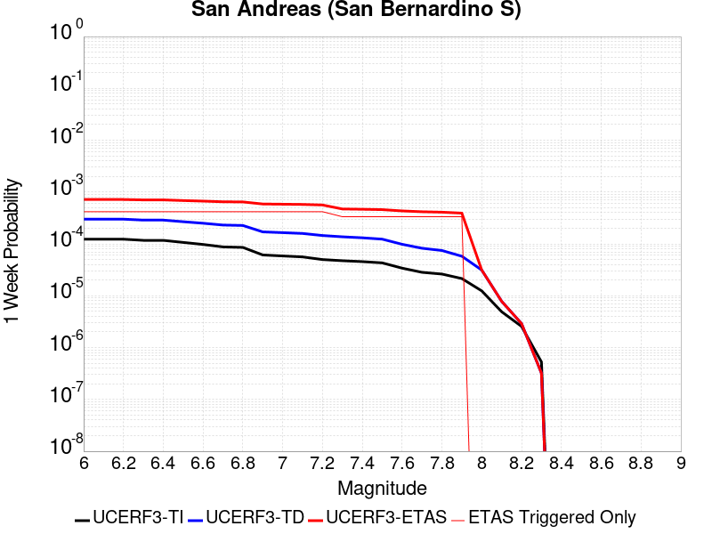 | 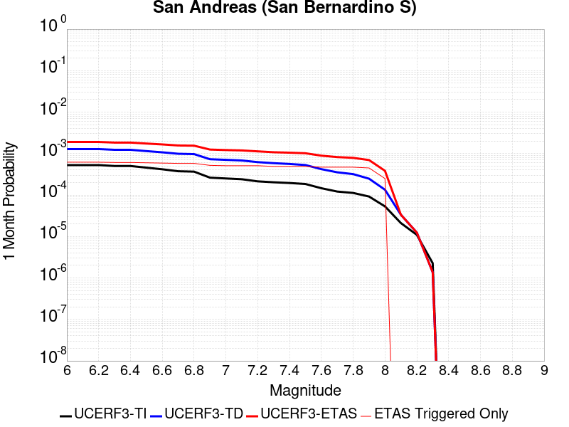 | 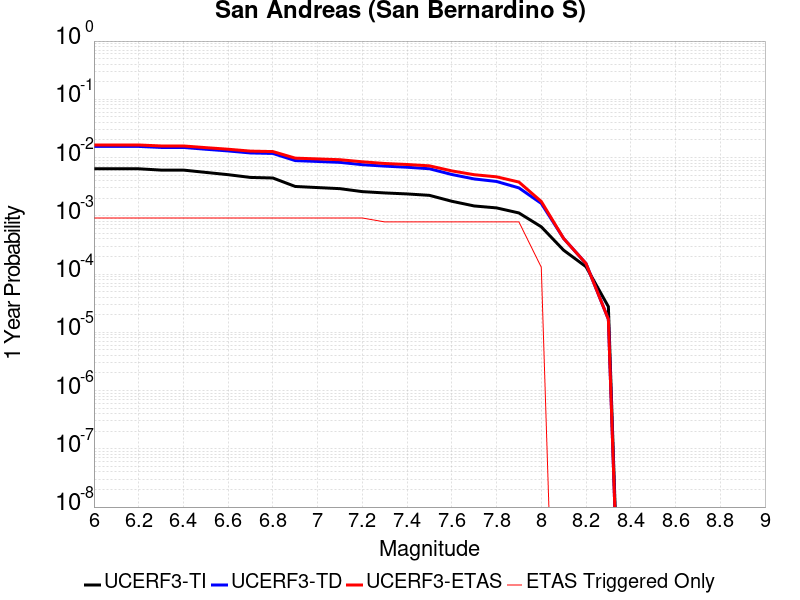 | 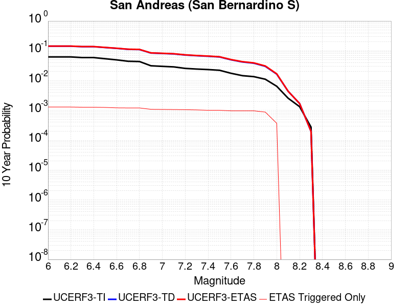 |

| Magnitude | 1 wk TI Prob | 1 wk TD Prob | 1 wk ETAS Prob | 1 wk ETAS/TD Gain | 1 wk ETAS Triggered Only | 1 mo TI Prob | 1 mo TD Prob | 1 mo ETAS Prob | 1 mo ETAS/TD Gain | 1 mo ETAS Triggered Only | 1 yr TI Prob | 1 yr TD Prob | 1 yr ETAS Prob | 1 yr ETAS/TD Gain | 1 yr ETAS Triggered Only | 10 yr TI Prob | 10 yr TD Prob | 10 yr ETAS Prob | 10 yr ETAS/TD Gain | 10 yr ETAS Triggered Only |
|-----|-----|-----|-----|-----|-----|-----|-----|-----|-----|-----|-----|-----|-----|-----|-----|-----|-----|-----|-----|-----|
| 6.0 | 1.2336002E-4 | 3.0004102E-4 | 6.826769E-4 | 2.2752786 | 3.827507E-4 | 5.2857865E-4 | 0.0012852824 | 0.0018799072 | 1.4626412 | 5.9539E-4 | 0.006416472 | 0.015540994 | 0.016503934 | 1.0619613 | 9.781406E-4 | 0.06234337 | 0.14283717 | 0.14396723 | 1.0079114 | 0.0013183635 |
| 6.1 | 1.2336002E-4 | 3.0004102E-4 | 6.826769E-4 | 2.2752786 | 3.827507E-4 | 5.2857865E-4 | 0.0012852824 | 0.0018799072 | 1.4626412 | 5.9539E-4 | 0.006416472 | 0.015540994 | 0.016503934 | 1.0619613 | 9.781406E-4 | 0.06234337 | 0.14283717 | 0.14396723 | 1.0079114 | 0.0013183635 |
| 6.2 | 1.2336002E-4 | 3.0004102E-4 | 6.826769E-4 | 2.2752786 | 3.827507E-4 | 5.2857865E-4 | 0.0012852824 | 0.0018799072 | 1.4626412 | 5.9539E-4 | 0.006416472 | 0.015540994 | 0.016503934 | 1.0619613 | 9.781406E-4 | 0.06234337 | 0.14283717 | 0.14396723 | 1.0079114 | 0.0013183635 |
| 6.3 | 1.1712257E-4 | 2.8792414E-4 | 6.7056465E-4 | 2.3289628 | 3.827507E-4 | 5.018573E-4 | 0.0012334028 | 0.0018280584 | 1.4821261 | 5.9539E-4 | 0.006093008 | 0.014918125 | 0.015881674 | 1.0645891 | 9.781406E-4 | 0.059286322 | 0.13754563 | 0.13864598 | 1.0079999 | 0.0012758357 |
| 6.4 | 1.1712257E-4 | 2.8792414E-4 | 6.7056465E-4 | 2.3289628 | 3.827507E-4 | 5.018573E-4 | 0.0012334028 | 0.0018280584 | 1.4821261 | 5.9539E-4 | 0.006093008 | 0.014918125 | 0.015881674 | 1.0645891 | 9.781406E-4 | 0.059286322 | 0.13754563 | 0.13864598 | 1.0079999 | 0.0012758357 |
| 6.5 | 1.0689076E-4 | 2.680528E-4 | 6.0818443E-4 | 2.268898 | 3.4022285E-4 | 4.5802278E-4 | 0.0011483167 | 0.0017005439 | 1.4809016 | 5.528621E-4 | 0.0055621783 | 0.01389575 | 0.014818362 | 1.0663953 | 9.356128E-4 | 0.05425003 | 0.12879294 | 0.12986742 | 1.0083426 | 0.0012333078 |
| 6.6 | 9.7648895E-5 | 2.50501E-4 | 5.906386E-4 | 2.3578293 | 3.4022285E-4 | 4.1842813E-4 | 0.0010731576 | 0.0016254265 | 1.5146204 | 5.528621E-4 | 0.005082469 | 0.012991785 | 0.013915243 | 1.0710801 | 9.356128E-4 | 0.049677886 | 0.12095292 | 0.12203705 | 1.0089632 | 0.0012333078 |
| 6.7 | 8.757013E-5 | 2.3120902E-4 | 5.713532E-4 | 2.4711545 | 3.4022285E-4 | 3.7524657E-4 | 9.905418E-4 | 0.0015428563 | 1.5575882 | 5.528621E-4 | 0.00455906 | 0.011997245 | 0.012921633 | 1.07705 | 9.356128E-4 | 0.04466656 | 0.11226123 | 0.11335608 | 1.0097528 | 0.0012333078 |
| 6.8 | 8.562978E-5 | 2.2680782E-4 | 5.669535E-4 | 2.4997087 | 3.4022285E-4 | 3.6693315E-4 | 9.7169366E-4 | 0.0015240186 | 1.5684147 | 5.528621E-4 | 0.004458263 | 0.011770263 | 0.012694864 | 1.0785539 | 9.356128E-4 | 0.043698758 | 0.11027153 | 0.11136884 | 1.009951 | 0.0012333078 |
| 6.9 | 6.124075E-5 | 1.7065753E-4 | 5.108223E-4 | 2.99326 | 3.4022285E-4 | 2.6243398E-4 | 7.311852E-4 | 0.0011986495 | 1.6393242 | 4.678064E-4 | 0.0031904527 | 0.008866051 | 0.009709067 | 1.0950836 | 8.505571E-4 | 0.031450346 | 0.08418263 | 0.08519527 | 1.012029 | 0.0011057243 |
| 7.0 | 5.8598747E-5 | 1.649477E-4 | 5.0511444E-4 | 3.0622702 | 3.4022285E-4 | 2.5111332E-4 | 7.06728E-4 | 0.0011742038 | 1.6614649 | 4.678064E-4 | 0.0030530186 | 0.008570663 | 0.009413931 | 1.09839 | 8.505571E-4 | 0.03011414 | 0.081500374 | 0.08251598 | 1.0124614 | 0.0011057243 |
| 7.1 | 5.613814E-5 | 1.5913323E-4 | 4.9930194E-4 | 3.1376348 | 3.4022285E-4 | 2.4056983E-4 | 6.818221E-4 | 0.0011493094 | 1.6856444 | 4.678064E-4 | 0.0029250039 | 0.008269769 | 0.009113292 | 1.1020008 | 8.505571E-4 | 0.028868021 | 0.07879931 | 0.079817906 | 1.0129265 | 0.0011057243 |
| 7.2 | 4.991222E-5 | 1.4519796E-4 | 4.853714E-4 | 3.3428254 | 3.4022285E-4 | 2.1389198E-4 | 6.2212895E-4 | 0.0010896443 | 1.7514766 | 4.678064E-4 | 0.002601025 | 0.007548217 | 0.0083923545 | 1.1118326 | 8.505571E-4 | 0.025707912 | 0.07225321 | 0.07323959 | 1.0136517 | 0.0010631963 |
| 7.3 | 4.7410045E-5 | 1.3714004E-4 | 4.347942E-4 | 3.1704395 | 2.97695E-4 | 2.0317009E-4 | 5.8761094E-4 | 0.0010126396 | 1.7233164 | 4.2527856E-4 | 0.0024707897 | 0.0071307817 | 0.0079330485 | 1.1125076 | 8.0802926E-4 | 0.024434982 | 0.06853558 | 0.0694863 | 1.0138719 | 0.0010206685 |
| 7.4 | 4.5556746E-5 | 1.3121912E-4 | 4.2887504E-4 | 3.2683885 | 2.97695E-4 | 1.952286E-4 | 5.622468E-4 | 9.872862E-4 | 1.7559661 | 4.2527856E-4 | 0.002374317 | 0.0068239477 | 0.0076264627 | 1.1176028 | 8.0802926E-4 | 0.023491086 | 0.065788016 | 0.06670181 | 1.0138899 | 9.781406E-4 |
| 7.5 | 4.3084514E-5 | 1.2357246E-4 | 4.2123068E-4 | 3.4087744 | 2.97695E-4 | 1.8463485E-4 | 5.2948913E-4 | 9.545425E-4 | 1.8027613 | 4.2527856E-4 | 0.0022456115 | 0.0064275465 | 0.0072303824 | 1.1249055 | 8.0802926E-4 | 0.022230545 | 0.062188786 | 0.0631061 | 1.0147505 | 9.781406E-4 |
| 7.6 | 3.408608E-5 | 9.83552E-5 | 3.960209E-4 | 4.026436 | 2.97695E-4 | 1.4607502E-4 | 4.214543E-4 | 8.465536E-4 | 2.0086486 | 4.2527856E-4 | 0.0017770125 | 0.0051191594 | 0.005923052 | 1.1570361 | 8.0802926E-4 | 0.017628696 | 0.050020292 | 0.050949506 | 1.0185767 | 9.781406E-4 |
| 7.7 | 2.8315713E-5 | 8.248679E-5 | 3.8015723E-4 | 4.608704 | 2.97695E-4 | 1.2134742E-4 | 3.5346695E-4 | 7.785952E-4 | 2.2027383 | 4.2527856E-4 | 0.0014764034 | 0.0042949775 | 0.0050995364 | 1.1873255 | 8.0802926E-4 | 0.01466633 | 0.0422714 | 0.043208197 | 1.0221614 | 9.781406E-4 |
| 7.8 | 2.6222975E-5 | 7.463088E-5 | 3.7230365E-4 | 4.9886007 | 2.97695E-4 | 1.1237934E-4 | 3.1980744E-4 | 7.4494997E-4 | 2.3293705 | 4.2527856E-4 | 0.0013673597 | 0.0038867102 | 0.004691599 | 1.2070874 | 8.0802926E-4 | 0.013589768 | 0.03843674 | 0.039377287 | 1.02447 | 9.781406E-4 |
| 7.9 | 2.1469694E-5 | 5.787864E-5 | 3.555564E-4 | 6.143137 | 2.97695E-4 | 9.200973E-5 | 2.4802773E-4 | 6.732008E-4 | 2.7142158 | 4.2527856E-4 | 0.0011196428 | 0.0030155594 | 0.0037787524 | 1.253085 | 7.655014E-4 | 0.011140184 | 0.030152109 | 0.03097702 | 1.0273583 | 8.505571E-4 |
| 8.0 | 1.2420249E-5 | 3.131896E-5 | 1.5889853E-4 | 5.0735574 | 1.2758357E-4 | 5.322855E-5 | 1.342172E-4 | 3.4682796E-4 | 2.5840795 | 2.1263928E-4 | 6.478649E-4 | 0.0016328706 | 0.0018876211 | 1.1560138 | 2.5516714E-4 | 0.0064597935 | 0.016522504 | 0.01681528 | 1.0177199 | 2.97695E-4 |
| 8.1 | 4.9197724E-6 | 7.822348E-6 | 7.822348E-6 | 1.0 | 0.0 | 2.1084568E-5 | 3.352392E-5 | 3.352392E-5 | 1.0 | 0.0 | 2.566744E-4 | 4.0807744E-4 | 4.0807744E-4 | 1.0 | 0.0 | 0.002563781 | 0.0043843705 | 0.0043843705 | 1.0 | 0.0 |
| 8.2 | 2.5634774E-6 | 2.9067196E-6 | 2.9067196E-6 | 1.0 | 0.0 | 1.0986286E-5 | 1.2457311E-5 | 1.2457311E-5 | 1.0 | 0.0 | 1.3374983E-4 | 1.5165724E-4 | 1.5165724E-4 | 1.0 | 0.0 | 0.0013366934 | 0.0017049741 | 0.0017049741 | 1.0 | 0.0 |
| 8.3 | 5.2850464E-7 | 3.2088764E-7 | 3.2088764E-7 | 1.0 | 0.0 | 2.2650179E-6 | 1.375232E-6 | 1.375232E-6 | 1.0 | 0.0 | 2.7576245E-5 | 1.6743334E-5 | 1.6743334E-5 | 1.0 | 0.0 | 2.7572823E-4 | 1.9870348E-4 | 1.9870348E-4 | 1.0 | 0.0 |

## Helendale-So Lockhart
*[(top)](#table-of-contents)*

| 1 Week | 1 Month | 1 Year | 10 Year |
|-----|-----|-----|-----|
| 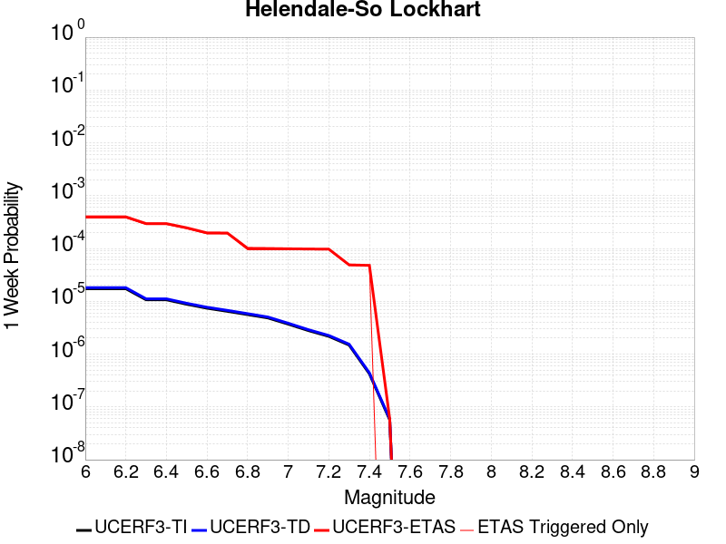 | 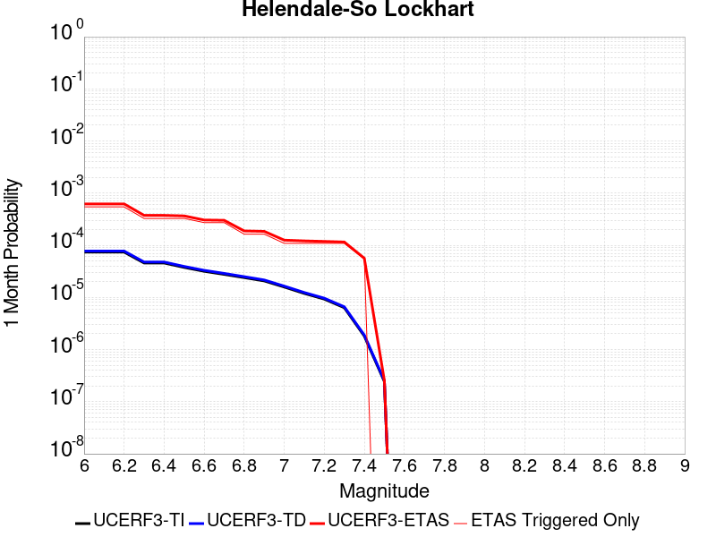 | 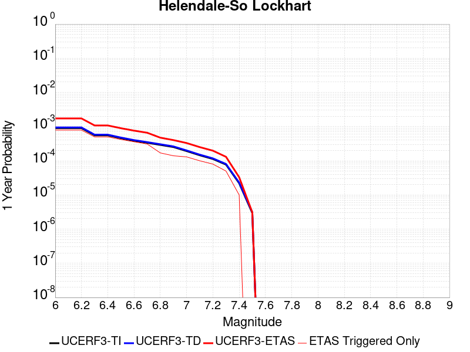 | 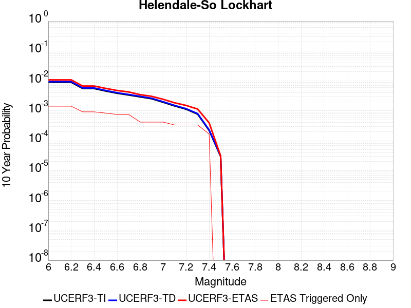 |

| Magnitude | 1 wk TI Prob | 1 wk TD Prob | 1 wk ETAS Prob | 1 wk ETAS/TD Gain | 1 wk ETAS Triggered Only | 1 mo TI Prob | 1 mo TD Prob | 1 mo ETAS Prob | 1 mo ETAS/TD Gain | 1 mo ETAS Triggered Only | 1 yr TI Prob | 1 yr TD Prob | 1 yr ETAS Prob | 1 yr ETAS/TD Gain | 1 yr ETAS Triggered Only | 10 yr TI Prob | 10 yr TD Prob | 10 yr ETAS Prob | 10 yr ETAS/TD Gain | 10 yr ETAS Triggered Only |
|-----|-----|-----|-----|-----|-----|-----|-----|-----|-----|-----|-----|-----|-----|-----|-----|-----|-----|-----|-----|-----|
| 6.0 | 1.7296055E-5 | 1.8103729E-5 | 4.008475E-4 | 22.141708 | 3.827507E-4 | 7.412385E-5 | 7.7585224E-5 | 6.72929E-4 | 8.673417 | 5.9539E-4 | 9.0208417E-4 | 9.4421144E-4 | 0.0017939655 | 1.8999616 | 8.505571E-4 | 0.008984311 | 0.009404116 | 0.010710082 | 1.1388717 | 0.0013183635 |
| 6.1 | 1.7296055E-5 | 1.8103729E-5 | 4.008475E-4 | 22.141708 | 3.827507E-4 | 7.412385E-5 | 7.7585224E-5 | 6.72929E-4 | 8.673417 | 5.9539E-4 | 9.0208417E-4 | 9.4421144E-4 | 0.0017939655 | 1.8999616 | 8.505571E-4 | 0.008984311 | 0.009404116 | 0.010710082 | 1.1388717 | 0.0013183635 |
| 6.2 | 1.7296055E-5 | 1.8103729E-5 | 4.008475E-4 | 22.141708 | 3.827507E-4 | 7.412385E-5 | 7.7585224E-5 | 6.72929E-4 | 8.673417 | 5.9539E-4 | 9.0208417E-4 | 9.4421144E-4 | 0.0017939655 | 1.8999616 | 8.505571E-4 | 0.008984311 | 0.009404116 | 0.010710082 | 1.1388717 | 0.0013183635 |
| 6.3 | 1.0669118E-5 | 1.1135425E-5 | 2.6629973E-4 | 23.914644 | 2.5516714E-4 | 4.5723988E-5 | 4.772239E-5 | 4.3045482E-4 | 9.019977 | 3.827507E-4 | 5.5654737E-4 | 5.80868E-4 | 0.0012184153 | 2.0975769 | 6.3791784E-4 | 0.0055515557 | 0.0057937936 | 0.006766267 | 1.1678475 | 9.781406E-4 |
| 6.4 | 1.0669118E-5 | 1.1135425E-5 | 2.6629973E-4 | 23.914644 | 2.5516714E-4 | 4.5723988E-5 | 4.772239E-5 | 4.3045482E-4 | 9.019977 | 3.827507E-4 | 5.5654737E-4 | 5.80868E-4 | 0.0012184153 | 2.0975769 | 6.3791784E-4 | 0.0055515557 | 0.0057937936 | 0.006766267 | 1.1678475 | 9.781406E-4 |
| 6.5 | 8.790038E-6 | 9.170197E-6 | 2.2180752E-4 | 24.18787 | 2.1263928E-4 | 3.767105E-5 | 3.930026E-5 | 3.7950973E-4 | 9.6566725 | 3.4022285E-4 | 4.585485E-4 | 4.7837716E-4 | 0.0010309748 | 2.1551507 | 5.528621E-4 | 0.0045760344 | 0.004773638 | 0.0056201355 | 1.1773274 | 8.505571E-4 |
| 6.6 | 7.396949E-6 | 7.715537E-6 | 1.7782564E-4 | 23.047735 | 1.7011142E-4 | 3.1700827E-5 | 3.3066175E-5 | 3.3075133E-4 | 10.002709 | 2.97695E-4 | 3.858892E-4 | 4.025073E-4 | 9.1263617E-4 | 2.2673779 | 5.1033427E-4 | 0.003852198 | 0.00401789 | 0.0047803153 | 1.1897577 | 7.655014E-4 |
| 6.7 | 6.4600285E-6 | 6.738031E-6 | 1.768483E-4 | 26.246288 | 1.7011142E-4 | 2.7685543E-5 | 2.887696E-5 | 3.2656334E-4 | 11.308785 | 2.97695E-4 | 3.3701936E-4 | 3.5152107E-4 | 8.6167594E-4 | 2.4512782 | 5.1033427E-4 | 0.0033650869 | 0.003509732 | 0.0042725466 | 1.2173427 | 7.655014E-4 |
| 6.8 | 5.600104E-6 | 5.836009E-6 | 9.0891226E-5 | 15.574208 | 8.505571E-5 | 2.4000226E-5 | 2.5011232E-5 | 2.3764519E-4 | 9.501538 | 2.1263928E-4 | 2.9216358E-4 | 3.044698E-4 | 6.0207414E-4 | 1.9774511 | 2.97695E-4 | 0.0029177975 | 0.003040588 | 0.0035493707 | 1.1673303 | 5.1033427E-4 |
| 6.9 | 4.839122E-6 | 5.0395092E-6 | 9.009479E-5 | 17.877691 | 8.505571E-5 | 2.0738931E-5 | 2.159772E-5 | 1.9170548E-4 | 8.87619 | 1.7011142E-4 | 2.5246723E-4 | 2.6292098E-4 | 5.1802106E-4 | 1.9702537 | 2.5516714E-4 | 0.002521806 | 0.002626147 | 0.0030927246 | 1.1776663 | 4.678064E-4 |
| 7.0 | 3.6937633E-6 | 3.845208E-6 | 8.890059E-5 | 23.119839 | 8.505571E-5 | 1.5830317E-5 | 1.647936E-5 | 1.4406083E-4 | 8.741894 | 1.2758357E-4 | 1.9271708E-4 | 2.0061806E-4 | 4.1321467E-4 | 2.0597084 | 2.1263928E-4 | 0.0019255003 | 0.002004401 | 0.002428827 | 1.2117472 | 4.2527856E-4 |
| 7.1 | 2.7858857E-6 | 2.8978538E-6 | 8.795332E-5 | 30.351192 | 8.505571E-5 | 1.1939455E-5 | 1.2419316E-5 | 1.400013E-4 | 11.272867 | 1.2758357E-4 | 1.4535317E-4 | 1.511949E-4 | 3.212806E-4 | 2.1249435 | 1.7011142E-4 | 0.0014525814 | 0.0015109418 | 0.0018506505 | 1.2248325 | 3.4022285E-4 |
| 7.2 | 2.1672065E-6 | 2.2540128E-6 | 8.7309534E-5 | 38.735153 | 8.505571E-5 | 9.2879945E-6 | 9.66002E-6 | 1.3724236E-4 | 14.207253 | 1.2758357E-4 | 1.1307546E-4 | 1.1760458E-4 | 2.87696E-4 | 2.4462993 | 1.7011142E-4 | 0.0011301794 | 0.0011754417 | 0.0015152646 | 1.2891023 | 3.4022285E-4 |
| 7.3 | 1.4823496E-6 | 1.5422102E-6 | 4.407E-5 | 28.57587 | 4.2527856E-5 | 6.3529114E-6 | 6.6094562E-6 | 9.16646E-5 | 13.868706 | 8.505571E-5 | 7.734395E-5 | 8.046731E-5 | 2.0804061E-4 | 2.5854053 | 1.2758357E-4 | 7.731704E-4 | 8.0439687E-4 | 0.0010593587 | 1.3169603 | 2.5516714E-4 |
| 7.4 | 4.2321457E-7 | 4.4108765E-7 | 4.2968924E-5 | 97.41584 | 4.2527856E-5 | 1.8137755E-6 | 1.8903745E-6 | 4.441815E-5 | 23.49701 | 4.2527856E-5 | 2.2082493E-5 | 2.3015113E-5 | 6.554199E-5 | 2.8477805 | 4.2527856E-5 | 2.2080299E-4 | 2.3013182E-4 | 3.1516797E-4 | 1.3695105 | 8.505571E-5 |
| 7.5 | 5.6942316E-8 | 5.9415648E-8 | 5.9415648E-8 | 1.0 | 0.0 | 2.440385E-7 | 2.5463845E-7 | 2.5463845E-7 | 1.0 | 0.0 | 2.9711643E-6 | 3.1002196E-6 | 3.1002196E-6 | 1.0 | 0.0 | 2.9711247E-5 | 3.1001844E-5 | 3.1001844E-5 | 1.0 | 0.0 |

## Death Valley (Black Mtns Frontal)
*[(top)](#table-of-contents)*

| 1 Week | 1 Month | 1 Year | 10 Year |
|-----|-----|-----|-----|
| 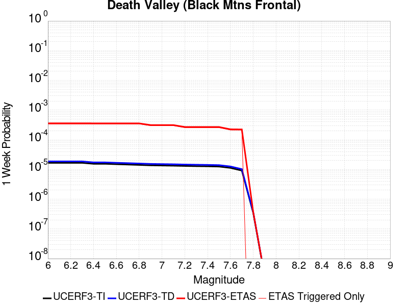 |  | 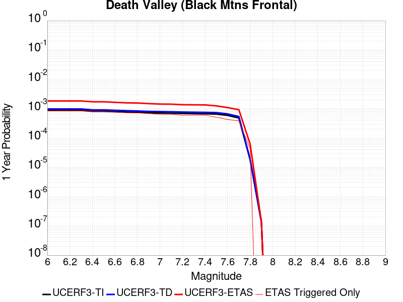 | 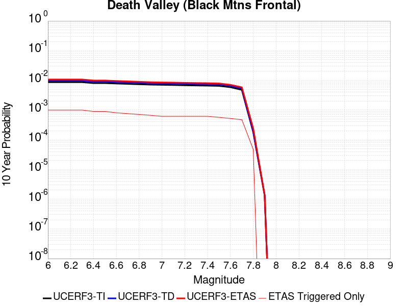 |

| Magnitude | 1 wk TI Prob | 1 wk TD Prob | 1 wk ETAS Prob | 1 wk ETAS/TD Gain | 1 wk ETAS Triggered Only | 1 mo TI Prob | 1 mo TD Prob | 1 mo ETAS Prob | 1 mo ETAS/TD Gain | 1 mo ETAS Triggered Only | 1 yr TI Prob | 1 yr TD Prob | 1 yr ETAS Prob | 1 yr ETAS/TD Gain | 1 yr ETAS Triggered Only | 10 yr TI Prob | 10 yr TD Prob | 10 yr ETAS Prob | 10 yr ETAS/TD Gain | 10 yr ETAS Triggered Only |
|-----|-----|-----|-----|-----|-----|-----|-----|-----|-----|-----|-----|-----|-----|-----|-----|-----|-----|-----|-----|-----|
| 6.0 | 1.6707214E-5 | 1.867027E-5 | 3.5888675E-4 | 19.222368 | 3.4022285E-4 | 7.160038E-5 | 8.001302E-5 | 5.47782E-4 | 6.8461604 | 4.678064E-4 | 8.71386E-4 | 9.737309E-4 | 0.0018234598 | 1.8726528 | 8.505571E-4 | 0.00867977 | 0.009695496 | 0.010790501 | 1.1129394 | 0.0011057243 |
| 6.1 | 1.6707214E-5 | 1.867027E-5 | 3.5888675E-4 | 19.222368 | 3.4022285E-4 | 7.160038E-5 | 8.001302E-5 | 5.47782E-4 | 6.8461604 | 4.678064E-4 | 8.71386E-4 | 9.737309E-4 | 0.0018234598 | 1.8726528 | 8.505571E-4 | 0.00867977 | 0.009695496 | 0.010790501 | 1.1129394 | 0.0011057243 |
| 6.2 | 1.6707214E-5 | 1.867027E-5 | 3.5888675E-4 | 19.222368 | 3.4022285E-4 | 7.160038E-5 | 8.001302E-5 | 5.47782E-4 | 6.8461604 | 4.678064E-4 | 8.71386E-4 | 9.737309E-4 | 0.0018234598 | 1.8726528 | 8.505571E-4 | 0.00867977 | 0.009695496 | 0.010790501 | 1.1129394 | 0.0011057243 |
| 6.3 | 1.6707214E-5 | 1.867027E-5 | 3.5888675E-4 | 19.222368 | 3.4022285E-4 | 7.160038E-5 | 8.001302E-5 | 5.47782E-4 | 6.8461604 | 4.678064E-4 | 8.71386E-4 | 9.737309E-4 | 0.0018234598 | 1.8726528 | 8.505571E-4 | 0.00867977 | 0.009695496 | 0.010790501 | 1.1129394 | 0.0011057243 |
| 6.4 | 1.5515609E-5 | 1.7338214E-5 | 3.5755517E-4 | 20.622377 | 3.4022285E-4 | 6.649377E-5 | 7.4304546E-5 | 5.420762E-4 | 7.29533 | 4.678064E-4 | 8.0926094E-4 | 9.042885E-4 | 0.0017115871 | 1.8927445 | 8.0802926E-4 | 0.008063202 | 0.009006773 | 0.009976104 | 1.1076224 | 9.781406E-4 |
| 6.5 | 1.5515609E-5 | 1.7338214E-5 | 3.5755517E-4 | 20.622377 | 3.4022285E-4 | 6.649377E-5 | 7.4304546E-5 | 5.420762E-4 | 7.29533 | 4.678064E-4 | 8.0926094E-4 | 9.042885E-4 | 0.0017115871 | 1.8927445 | 8.0802926E-4 | 0.008063202 | 0.009006773 | 0.009976104 | 1.1076224 | 9.781406E-4 |
| 6.6 | 1.5041828E-5 | 1.6809145E-5 | 3.5702626E-4 | 21.240002 | 3.4022285E-4 | 6.4463384E-5 | 7.203723E-5 | 5.3980993E-4 | 7.493485 | 4.678064E-4 | 7.8455906E-4 | 8.767063E-4 | 0.0016415366 | 1.8723905 | 7.655014E-4 | 0.00781795 | 0.008733132 | 0.009618418 | 1.1013709 | 8.93085E-4 |
| 6.7 | 1.4634985E-5 | 1.6356016E-5 | 3.565733E-4 | 21.800743 | 3.4022285E-4 | 6.271985E-5 | 7.009536E-5 | 5.37869E-4 | 7.673389 | 4.678064E-4 | 7.6334673E-4 | 8.5308263E-4 | 0.0015754395 | 1.8467606 | 7.2297355E-4 | 0.007607299 | 0.008498715 | 0.009342044 | 1.09923 | 8.505571E-4 |
| 6.8 | 1.4209158E-5 | 1.5882048E-5 | 3.5609948E-4 | 22.42151 | 3.4022285E-4 | 6.089497E-5 | 6.8064175E-5 | 5.358388E-4 | 7.872552 | 4.678064E-4 | 7.4114406E-4 | 8.2837185E-4 | 0.0015507465 | 1.8720415 | 7.2297355E-4 | 0.007386771 | 0.008253456 | 0.009054816 | 1.0970939 | 8.0802926E-4 |
| 6.9 | 1.3780098E-5 | 1.5404594E-5 | 3.13095E-4 | 20.324781 | 2.97695E-4 | 5.9056227E-5 | 6.6018045E-5 | 4.912685E-4 | 7.441428 | 4.2527856E-4 | 7.1877235E-4 | 8.0347876E-4 | 0.0014833778 | 1.8461941 | 6.804457E-4 | 0.0071645193 | 0.008006332 | 0.008765705 | 1.0948465 | 7.655014E-4 |
| 7.0 | 1.3585064E-5 | 1.5188155E-5 | 3.1287863E-4 | 20.600172 | 2.97695E-4 | 5.8220405E-5 | 6.50905E-5 | 4.478163E-4 | 6.8799024 | 3.827507E-4 | 7.086029E-4 | 7.9219416E-4 | 0.0014296067 | 1.8046165 | 6.3791784E-4 | 0.007063476 | 0.007894293 | 0.00861156 | 1.0908588 | 7.2297355E-4 |
| 7.1 | 1.3398601E-5 | 1.49813395E-5 | 3.1267188E-4 | 20.870756 | 2.97695E-4 | 5.742131E-5 | 6.420419E-5 | 4.4693032E-4 | 6.961077 | 3.827507E-4 | 6.9888023E-4 | 7.8141113E-4 | 0.0014188305 | 1.8157285 | 6.3791784E-4 | 0.0069668638 | 0.007787224 | 0.008504568 | 1.092118 | 7.2297355E-4 |
| 7.2 | 1.3126312E-5 | 1.4679561E-5 | 2.6984295E-4 | 18.382223 | 2.5516714E-4 | 5.6254412E-5 | 6.291092E-5 | 4.0311235E-4 | 6.4076695 | 3.4022285E-4 | 6.846822E-4 | 7.6567667E-4 | 0.0013606108 | 1.7770044 | 5.9539E-4 | 0.006825765 | 0.00763097 | 0.008306223 | 1.0884885 | 6.804457E-4 |
| 7.3 | 1.2922429E-5 | 1.4453788E-5 | 2.6961725E-4 | 18.653742 | 2.5516714E-4 | 5.5380664E-5 | 6.194336E-5 | 4.0214515E-4 | 6.492142 | 3.4022285E-4 | 6.74051E-4 | 7.53905E-4 | 0.0013488461 | 1.7891461 | 5.9539E-4 | 0.006720101 | 0.007514055 | 0.008189388 | 1.0898759 | 6.804457E-4 |
| 7.4 | 1.2768878E-5 | 1.4283772E-5 | 2.6944725E-4 | 18.863874 | 2.5516714E-4 | 5.4722615E-5 | 6.1214756E-5 | 4.0141676E-4 | 6.5575166 | 3.4022285E-4 | 6.660441E-4 | 7.4504025E-4 | 0.0013399867 | 1.7985426 | 5.9539E-4 | 0.0066405144 | 0.0074260035 | 0.008101396 | 1.0909497 | 6.804457E-4 |
| 7.5 | 1.2521929E-5 | 1.40120155E-5 | 2.6917557E-4 | 19.21034 | 2.5516714E-4 | 5.366431E-5 | 6.005014E-5 | 3.1520196E-4 | 5.2489796 | 2.5516714E-4 | 6.531671E-4 | 7.3087064E-4 | 0.0012408319 | 1.697745 | 5.1033427E-4 | 0.006512506 | 0.0072852457 | 0.007876298 | 1.08113 | 5.9539E-4 |
| 7.6 | 1.1301089E-5 | 1.2648149E-5 | 2.2528473E-4 | 17.811676 | 2.1263928E-4 | 4.8432343E-5 | 5.4205255E-5 | 2.66833E-4 | 4.922641 | 2.1263928E-4 | 5.895042E-4 | 6.5975444E-4 | 0.0010847525 | 1.644176 | 4.2527856E-4 | 0.0058794282 | 0.00657851 | 0.0070854872 | 1.0770656 | 5.1033427E-4 |
| 7.7 | 9.189108E-6 | 1.0283358E-5 | 2.2292045E-4 | 21.677788 | 2.1263928E-4 | 3.93813E-5 | 4.407082E-5 | 2.5670073E-4 | 5.8247323 | 2.1263928E-4 | 4.7936183E-4 | 5.3643517E-4 | 9.189806E-4 | 1.7131251 | 3.827507E-4 | 0.004783291 | 0.005351914 | 0.005817217 | 1.0869414 | 4.678064E-4 |
| 7.8 | 3.4586725E-7 | 3.6482615E-7 | 3.6482615E-7 | 1.0 | 0.0 | 1.4822873E-6 | 1.5635396E-6 | 1.5635396E-6 | 1.0 | 0.0 | 1.80467E-5 | 1.9035933E-5 | 6.156298E-5 | 3.2340405 | 4.2527856E-5 | 1.8045233E-4 | 1.9034347E-4 | 2.3286323E-4 | 1.2233844 | 4.2527856E-5 |
| 7.9 | 2.5591178E-9 | 2.6696718E-9 | 2.6696718E-9 | 1.0 | 0.0 | 1.0967647E-8 | 1.14414505E-8 | 1.14414505E-8 | 1.0 | 0.0 | 1.335311E-7 | 1.3929966E-7 | 1.3929966E-7 | 1.0 | 0.0 | 1.3353102E-6 | 1.3929966E-6 | 1.3929966E-6 | 1.0 | 0.0 |

## San Andreas (Big Bend)
*[(top)](#table-of-contents)*

| 1 Week | 1 Month | 1 Year | 10 Year |
|-----|-----|-----|-----|
| 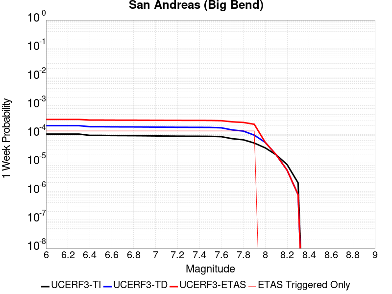 | 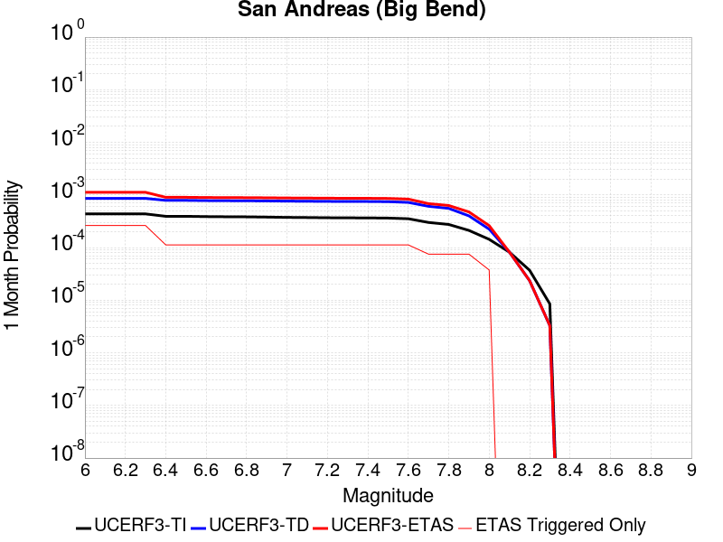 | 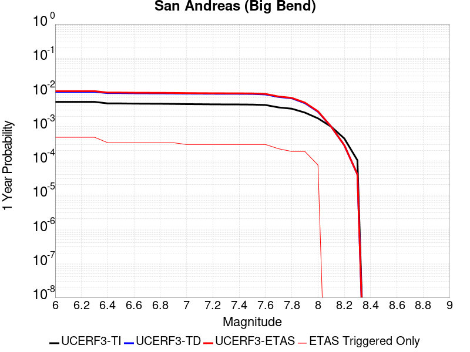 | 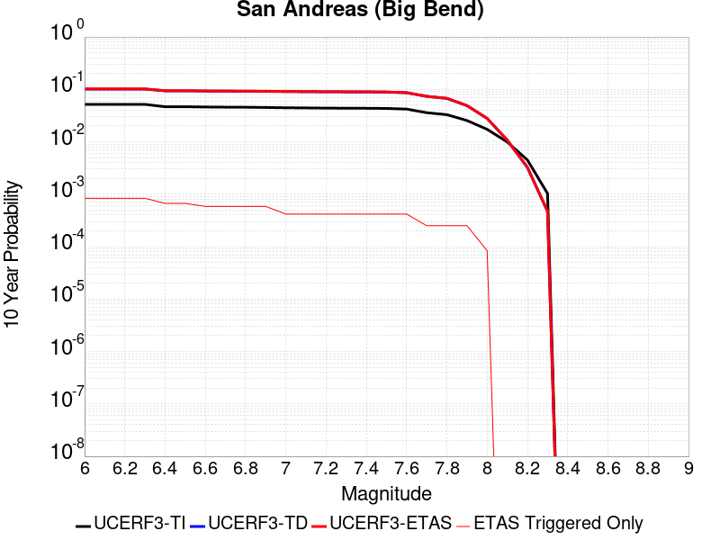 |

| Magnitude | 1 wk TI Prob | 1 wk TD Prob | 1 wk ETAS Prob | 1 wk ETAS/TD Gain | 1 wk ETAS Triggered Only | 1 mo TI Prob | 1 mo TD Prob | 1 mo ETAS Prob | 1 mo ETAS/TD Gain | 1 mo ETAS Triggered Only | 1 yr TI Prob | 1 yr TD Prob | 1 yr ETAS Prob | 1 yr ETAS/TD Gain | 1 yr ETAS Triggered Only | 10 yr TI Prob | 10 yr TD Prob | 10 yr ETAS Prob | 10 yr ETAS/TD Gain | 10 yr ETAS Triggered Only |
|-----|-----|-----|-----|-----|-----|-----|-----|-----|-----|-----|-----|-----|-----|-----|-----|-----|-----|-----|-----|-----|
| 6.0 | 1.0179969E-4 | 2.0072258E-4 | 3.7079988E-4 | 1.8473251 | 1.7011142E-4 | 4.362114E-4 | 8.599571E-4 | 0.0011149048 | 1.2964656 | 2.5516714E-4 | 0.0052979486 | 0.010419999 | 0.010925015 | 1.0484661 | 5.1033427E-4 | 0.051734097 | 0.10144902 | 0.10228972 | 1.0082868 | 9.356128E-4 |
| 6.1 | 1.0179969E-4 | 2.0072258E-4 | 3.7079988E-4 | 1.8473251 | 1.7011142E-4 | 4.362114E-4 | 8.599571E-4 | 0.0011149048 | 1.2964656 | 2.5516714E-4 | 0.0052979486 | 0.010419999 | 0.010925015 | 1.0484661 | 5.1033427E-4 | 0.051734097 | 0.10144902 | 0.10228972 | 1.0082868 | 9.356128E-4 |
| 6.2 | 1.0179969E-4 | 2.0072258E-4 | 3.7079988E-4 | 1.8473251 | 1.7011142E-4 | 4.362114E-4 | 8.599571E-4 | 0.0011149048 | 1.2964656 | 2.5516714E-4 | 0.0052979486 | 0.010419999 | 0.010925015 | 1.0484661 | 5.1033427E-4 | 0.051734097 | 0.10144902 | 0.10228972 | 1.0082868 | 9.356128E-4 |
| 6.3 | 1.0179969E-4 | 2.0072258E-4 | 3.7079988E-4 | 1.8473251 | 1.7011142E-4 | 4.362114E-4 | 8.599571E-4 | 0.0011149048 | 1.2964656 | 2.5516714E-4 | 0.0052979486 | 0.010419999 | 0.010925015 | 1.0484661 | 5.1033427E-4 | 0.051734097 | 0.10144902 | 0.10228972 | 1.0082868 | 9.356128E-4 |
| 6.4 | 9.1639464E-5 | 1.8429532E-4 | 3.1185537E-4 | 1.6921502 | 1.2758357E-4 | 3.9268145E-4 | 7.895982E-4 | 9.170811E-4 | 1.1614528 | 1.2758357E-4 | 0.0047704205 | 0.009571102 | 0.00995019 | 1.0396075 | 3.827507E-4 | 0.046693064 | 0.09377527 | 0.09443045 | 1.0069866 | 7.2297355E-4 |
| 6.5 | 9.1639464E-5 | 1.8429532E-4 | 3.1185537E-4 | 1.6921502 | 1.2758357E-4 | 3.9268145E-4 | 7.895982E-4 | 9.170811E-4 | 1.1614528 | 1.2758357E-4 | 0.0047704205 | 0.009571102 | 0.00995019 | 1.0396075 | 3.827507E-4 | 0.046693064 | 0.09377527 | 0.09443045 | 1.0069866 | 7.2297355E-4 |
| 6.6 | 9.042622E-5 | 1.823659E-4 | 3.099262E-4 | 1.6994745 | 1.2758357E-4 | 3.8748336E-4 | 7.8133424E-4 | 9.0881815E-4 | 1.1631618 | 1.2758357E-4 | 0.0047074095 | 0.009471365 | 0.009850491 | 1.0400286 | 3.827507E-4 | 0.046089325 | 0.092869274 | 0.09348653 | 1.0066465 | 6.804457E-4 |
| 6.7 | 8.9836685E-5 | 1.8150927E-4 | 3.0906967E-4 | 1.7027763 | 1.2758357E-4 | 3.8495753E-4 | 7.776651E-4 | 9.051495E-4 | 1.1639322 | 1.2758357E-4 | 0.00467679 | 0.00942708 | 0.009806222 | 1.0402185 | 3.827507E-4 | 0.045795817 | 0.09246355 | 0.09308108 | 1.0066786 | 6.804457E-4 |
| 6.8 | 8.9471854E-5 | 1.8097709E-4 | 3.0853756E-4 | 1.7048433 | 1.2758357E-4 | 3.8339442E-4 | 7.7538576E-4 | 9.028704E-4 | 1.1644145 | 1.2758357E-4 | 0.004657841 | 0.009399569 | 0.009778721 | 1.0403373 | 3.827507E-4 | 0.04561414 | 0.092210755 | 0.09282846 | 1.0066988 | 6.804457E-4 |
| 6.9 | 8.858234E-5 | 1.7979681E-4 | 3.0735743E-4 | 1.709471 | 1.2758357E-4 | 3.7958333E-4 | 7.703304E-4 | 8.9781574E-4 | 1.1654943 | 1.2758357E-4 | 0.004611638 | 0.009338548 | 0.009717725 | 1.0406034 | 3.827507E-4 | 0.04517103 | 0.09165087 | 0.09226896 | 1.0067439 | 6.804457E-4 |
| 7.0 | 8.7433385E-5 | 1.7818481E-4 | 3.0574563E-4 | 1.7158906 | 1.2758357E-4 | 3.746607E-4 | 7.634259E-4 | 8.909121E-4 | 1.1669922 | 1.2758357E-4 | 0.004551957 | 0.009255203 | 0.009592277 | 1.03642 | 3.4022285E-4 | 0.044598386 | 0.09088532 | 0.091387935 | 1.0055302 | 5.528621E-4 |
| 7.1 | 8.684964E-5 | 1.7730435E-4 | 3.048653E-4 | 1.7194462 | 1.2758357E-4 | 3.7215967E-4 | 7.596547E-4 | 8.8714133E-4 | 1.1678219 | 1.2758357E-4 | 0.0045216335 | 0.009209678 | 0.009546767 | 1.0366017 | 3.4022285E-4 | 0.04430731 | 0.09046686 | 0.090969704 | 1.0055584 | 5.528621E-4 |
| 7.2 | 8.606521E-5 | 1.762105E-4 | 3.0377158E-4 | 1.7239131 | 1.2758357E-4 | 3.6879873E-4 | 7.549695E-4 | 8.824567E-4 | 1.1688641 | 1.2758357E-4 | 0.0044808835 | 0.0091531165 | 0.0094902245 | 1.03683 | 3.4022285E-4 | 0.043916024 | 0.089947365 | 0.0904505 | 1.0055937 | 5.528621E-4 |
| 7.3 | 8.568266E-5 | 1.7563057E-4 | 3.0319171E-4 | 1.7263038 | 1.2758357E-4 | 3.6715972E-4 | 7.524855E-4 | 8.7997306E-4 | 1.1694219 | 1.2758357E-4 | 0.0044610105 | 0.009123127 | 0.009460246 | 1.0369521 | 3.4022285E-4 | 0.043725148 | 0.08966853 | 0.090171814 | 1.0056127 | 5.528621E-4 |
| 7.4 | 8.5432206E-5 | 1.7525644E-4 | 3.0281764E-4 | 1.7278546 | 1.2758357E-4 | 3.6608664E-4 | 7.50883E-4 | 8.783708E-4 | 1.1697838 | 1.2758357E-4 | 0.004447999 | 0.009103781 | 0.009440906 | 1.0370314 | 3.4022285E-4 | 0.043600157 | 0.08948871 | 0.0899921 | 1.0056251 | 5.528621E-4 |
| 7.5 | 8.4791965E-5 | 1.7394972E-4 | 3.015111E-4 | 1.7333232 | 1.2758357E-4 | 3.633435E-4 | 7.4528606E-4 | 8.727745E-4 | 1.1710598 | 1.2758357E-4 | 0.0044147377 | 0.009036204 | 0.009373353 | 1.0373108 | 3.4022285E-4 | 0.043280575 | 0.088866346 | 0.08937008 | 1.0056684 | 5.528621E-4 |
| 7.6 | 8.241105E-5 | 1.6840403E-4 | 2.959661E-4 | 1.7574764 | 1.2758357E-4 | 3.531424E-4 | 7.215321E-4 | 8.4902364E-4 | 1.1766956 | 1.2758357E-4 | 0.0042910352 | 0.008749358 | 0.009086604 | 1.0385453 | 3.4022285E-4 | 0.042091176 | 0.086243294 | 0.08674847 | 1.0058576 | 5.528621E-4 |
| 7.7 | 7.00432E-5 | 1.42045E-4 | 2.2708863E-4 | 1.5987091 | 8.505571E-5 | 3.001506E-4 | 6.0862233E-4 | 6.936263E-4 | 1.1396662 | 8.505571E-5 | 0.0036482112 | 0.0073848404 | 0.007638123 | 1.0342977 | 2.5516714E-4 | 0.035888977 | 0.07351733 | 0.07391134 | 1.0053594 | 4.2527856E-4 |
| 7.8 | 6.415362E-5 | 1.2968935E-4 | 2.1473403E-4 | 1.655757 | 8.505571E-5 | 2.749151E-4 | 5.556931E-4 | 6.4070156E-4 | 1.1529773 | 8.505571E-5 | 0.0033419547 | 0.0067446055 | 0.006955811 | 1.0313147 | 2.1263928E-4 | 0.03292141 | 0.06725231 | 0.06760932 | 1.0053085 | 3.827507E-4 |
| 7.9 | 4.939911E-5 | 9.3411545E-5 | 1.784593E-4 | 1.9104631 | 8.505571E-5 | 2.116933E-4 | 4.0027377E-4 | 4.8529543E-4 | 1.2124088 | 8.505571E-5 | 0.0025743195 | 0.004862453 | 0.005074058 | 1.0435182 | 2.1263928E-4 | 0.025447013 | 0.048914436 | 0.04923802 | 1.0066153 | 3.4022285E-4 |
| 8.0 | 3.344983E-5 | 5.222685E-5 | 9.475248E-5 | 1.8142484 | 4.2527856E-5 | 1.4334853E-4 | 2.2381016E-4 | 2.663285E-4 | 1.189975 | 4.2527856E-5 | 0.0017438711 | 0.0027214854 | 0.0028063098 | 1.0311683 | 8.505571E-5 | 0.017302496 | 0.027922187 | 0.028087549 | 1.0059222 | 1.7011142E-4 |
| 8.1 | 1.9104898E-5 | 1.9173063E-5 | 1.9173063E-5 | 1.0 | 0.0 | 8.1875565E-5 | 8.216769E-5 | 8.216769E-5 | 1.0 | 0.0 | 9.963791E-4 | 9.999331E-4 | 9.999331E-4 | 1.0 | 0.0 | 0.009919235 | 0.010749801 | 0.010791872 | 1.0039136 | 4.2527856E-5 |
| 8.2 | 8.643924E-6 | 5.4748625E-6 | 5.4748625E-6 | 1.0 | 0.0 | 3.704486E-5 | 2.3463486E-5 | 2.3463486E-5 | 1.0 | 0.0 | 4.5092785E-4 | 2.8563058E-4 | 2.8563058E-4 | 1.0 | 0.0 | 0.0045001395 | 0.0032487072 | 0.0032487072 | 1.0 | 0.0 |
| 8.3 | 1.983087E-6 | 7.6599065E-7 | 7.6599065E-7 | 1.0 | 0.0 | 8.498917E-6 | 3.282813E-6 | 3.282813E-6 | 1.0 | 0.0 | 1.034694E-4 | 3.9967534E-5 | 3.9967534E-5 | 1.0 | 0.0 | 0.0010342124 | 4.719687E-4 | 4.719687E-4 | 1.0 | 0.0 |

## Coyote Lake
*[(top)](#table-of-contents)*

| 1 Week | 1 Month | 1 Year | 10 Year |
|-----|-----|-----|-----|
| 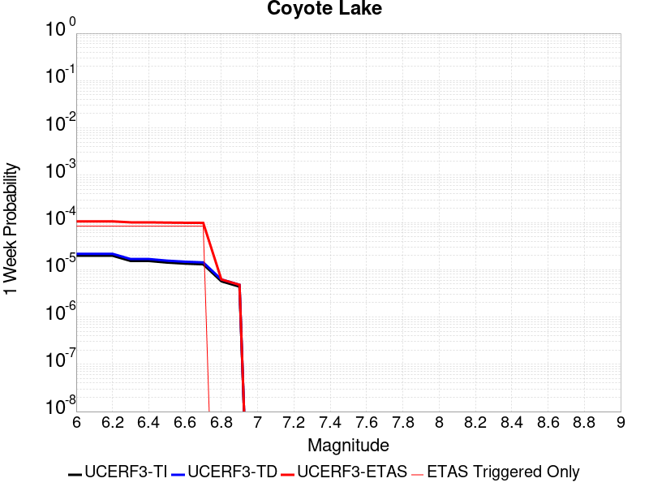 | 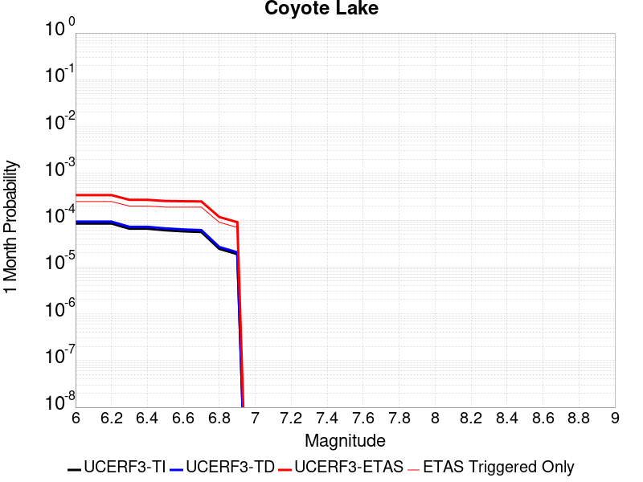 | 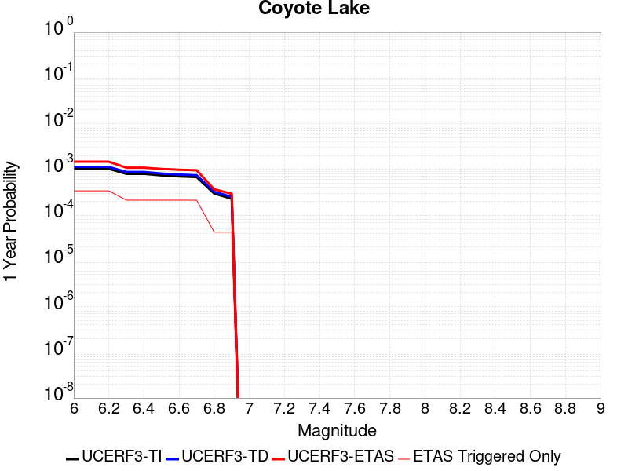 | 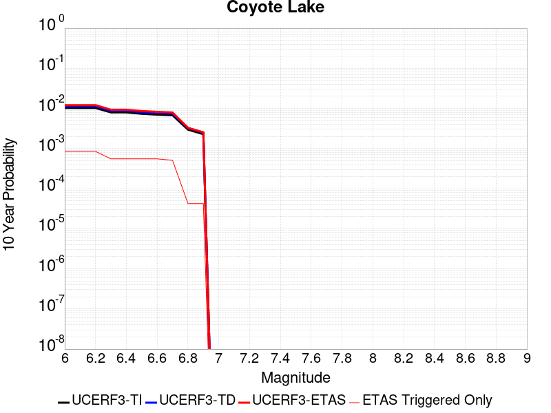 |

| Magnitude | 1 wk TI Prob | 1 wk TD Prob | 1 wk ETAS Prob | 1 wk ETAS/TD Gain | 1 wk ETAS Triggered Only | 1 mo TI Prob | 1 mo TD Prob | 1 mo ETAS Prob | 1 mo ETAS/TD Gain | 1 mo ETAS Triggered Only | 1 yr TI Prob | 1 yr TD Prob | 1 yr ETAS Prob | 1 yr ETAS/TD Gain | 1 yr ETAS Triggered Only | 10 yr TI Prob | 10 yr TD Prob | 10 yr ETAS Prob | 10 yr ETAS/TD Gain | 10 yr ETAS Triggered Only |
|-----|-----|-----|-----|-----|-----|-----|-----|-----|-----|-----|-----|-----|-----|-----|-----|-----|-----|-----|-----|-----|
| 6.0 | 1.980352E-5 | 2.1706745E-5 | 6.4233674E-5 | 2.9591575 | 4.2527856E-5 | 8.486947E-5 | 9.302599E-5 | 2.631216E-4 | 2.8284738 | 1.7011142E-4 | 0.0010327959 | 0.0011320751 | 0.0014719127 | 1.3001901 | 3.4022285E-4 | 0.010280091 | 0.011270258 | 0.012111229 | 1.0746186 | 8.505571E-4 |
| 6.1 | 1.980352E-5 | 2.1706745E-5 | 6.4233674E-5 | 2.9591575 | 4.2527856E-5 | 8.486947E-5 | 9.302599E-5 | 2.631216E-4 | 2.8284738 | 1.7011142E-4 | 0.0010327959 | 0.0011320751 | 0.0014719127 | 1.3001901 | 3.4022285E-4 | 0.010280091 | 0.011270258 | 0.012111229 | 1.0746186 | 8.505571E-4 |
| 6.2 | 1.980352E-5 | 2.1706745E-5 | 6.4233674E-5 | 2.9591575 | 4.2527856E-5 | 8.486947E-5 | 9.302599E-5 | 2.631216E-4 | 2.8284738 | 1.7011142E-4 | 0.0010327959 | 0.0011320751 | 0.0014719127 | 1.3001901 | 3.4022285E-4 | 0.010280091 | 0.011270258 | 0.012111229 | 1.0746186 | 8.505571E-4 |
| 6.3 | 1.5344787E-5 | 1.682067E-5 | 5.934781E-5 | 3.528267 | 4.2527856E-5 | 6.576172E-5 | 7.2086936E-5 | 2.421861E-4 | 3.3596392 | 1.7011142E-4 | 8.003548E-4 | 8.773662E-4 | 0.001089819 | 1.2421483 | 2.1263928E-4 | 0.007974784 | 0.00874507 | 0.009293096 | 1.062667 | 5.528621E-4 |
| 6.4 | 1.5344787E-5 | 1.682067E-5 | 5.934781E-5 | 3.528267 | 4.2527856E-5 | 6.576172E-5 | 7.2086936E-5 | 2.421861E-4 | 3.3596392 | 1.7011142E-4 | 8.003548E-4 | 8.773662E-4 | 0.001089819 | 1.2421483 | 2.1263928E-4 | 0.007974784 | 0.00874507 | 0.009293096 | 1.062667 | 5.528621E-4 |
| 6.5 | 1.4189697E-5 | 1.5557987E-5 | 5.808518E-5 | 3.7334638 | 4.2527856E-5 | 6.081157E-5 | 6.6675726E-5 | 2.367758E-4 | 3.5511546 | 1.7011142E-4 | 7.401293E-4 | 8.115349E-4 | 0.0010240016 | 1.2618085 | 2.1263928E-4 | 0.0073766913 | 0.008091656 | 0.008640044 | 1.0677722 | 5.528621E-4 |
| 6.6 | 1.3469301E-5 | 1.4771577E-5 | 5.7298806E-5 | 3.8789902 | 4.2527856E-5 | 5.7724297E-5 | 6.330556E-5 | 2.3340622E-4 | 3.686978 | 1.7011142E-4 | 7.025667E-4 | 7.7053264E-4 | 9.830081E-4 | 1.2757514 | 2.1263928E-4 | 0.0070034964 | 0.0076845144 | 0.008233128 | 1.071392 | 5.528621E-4 |
| 6.7 | 1.3027966E-5 | 1.4281745E-5 | 5.6808993E-5 | 3.9777348 | 4.2527856E-5 | 5.5832945E-5 | 6.120638E-5 | 2.313074E-4 | 3.7791386 | 1.7011142E-4 | 6.7955407E-4 | 7.4499263E-4 | 9.574735E-4 | 1.285212 | 2.1263928E-4 | 0.006774798 | 0.0074308286 | 0.007937371 | 1.0681677 | 5.1033427E-4 |
| 6.8 | 5.695434E-6 | 6.2244176E-6 | 6.2244176E-6 | 1.0 | 0.0 | 2.4408775E-5 | 2.6675973E-5 | 6.9202695E-5 | 2.5941958 | 4.2527856E-5 | 2.971363E-4 | 3.2476155E-4 | 3.6727558E-4 | 1.1309085 | 4.2527856E-5 | 0.0029673933 | 0.0032458105 | 0.0032882001 | 1.0130599 | 4.2527856E-5 |
| 6.9 | 4.385688E-6 | 4.7930553E-6 | 4.7930553E-6 | 1.0 | 0.0 | 1.879567E-5 | 2.0541665E-5 | 6.306865E-5 | 3.0702791 | 4.2527856E-5 | 2.2881327E-4 | 2.5009477E-4 | 2.92612E-4 | 1.1700044 | 4.2527856E-5 | 0.002285778 | 0.0025009478 | 0.0025433693 | 1.0169622 | 4.2527856E-5 |

## Death Valley (No)
*[(top)](#table-of-contents)*

| 1 Week | 1 Month | 1 Year | 10 Year |
|-----|-----|-----|-----|
| 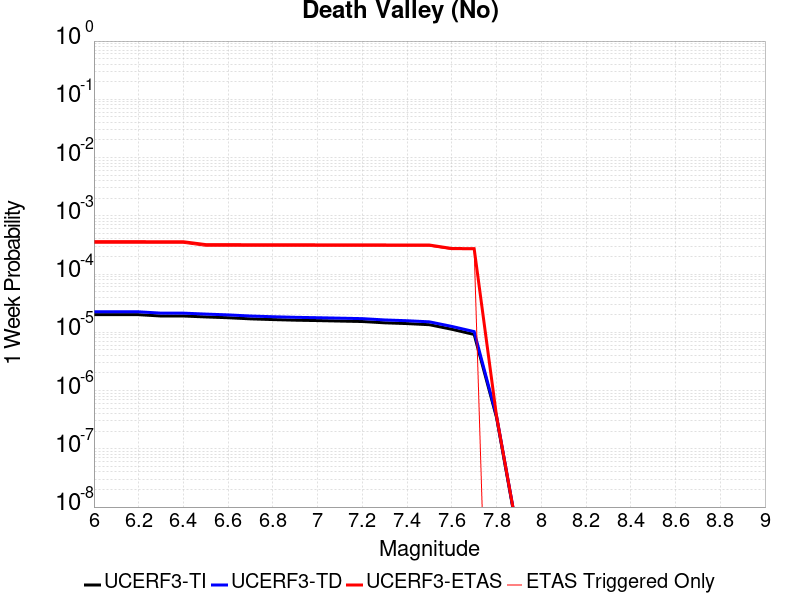 | 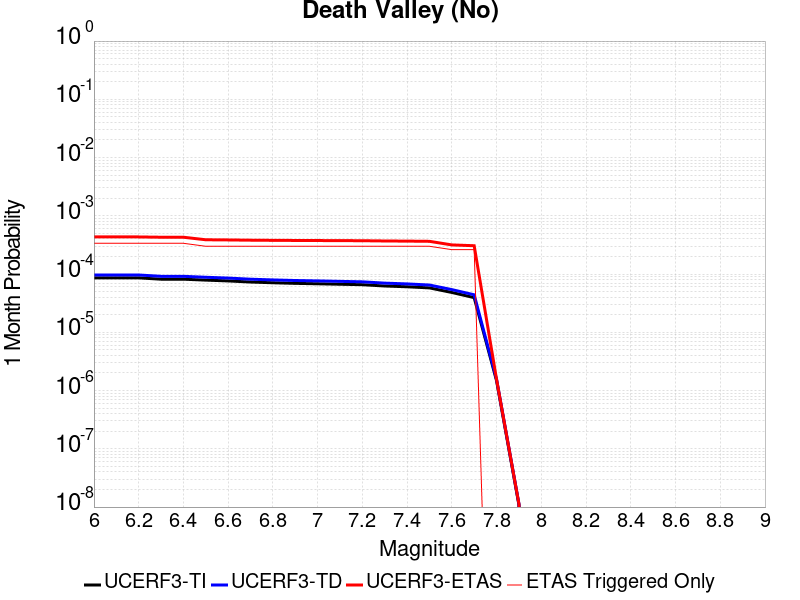 | 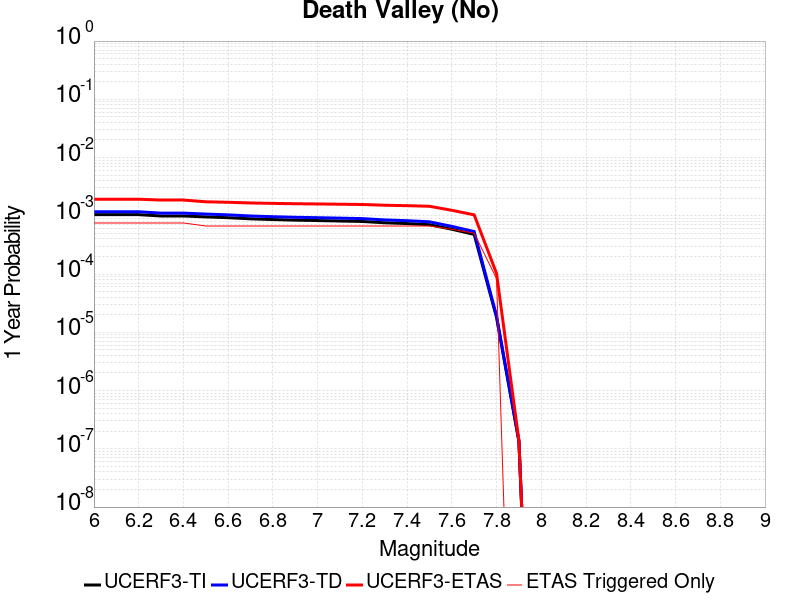 |  |

| Magnitude | 1 wk TI Prob | 1 wk TD Prob | 1 wk ETAS Prob | 1 wk ETAS/TD Gain | 1 wk ETAS Triggered Only | 1 mo TI Prob | 1 mo TD Prob | 1 mo ETAS Prob | 1 mo ETAS/TD Gain | 1 mo ETAS Triggered Only | 1 yr TI Prob | 1 yr TD Prob | 1 yr ETAS Prob | 1 yr ETAS/TD Gain | 1 yr ETAS Triggered Only | 10 yr TI Prob | 10 yr TD Prob | 10 yr ETAS Prob | 10 yr ETAS/TD Gain | 10 yr ETAS Triggered Only |
|-----|-----|-----|-----|-----|-----|-----|-----|-----|-----|-----|-----|-----|-----|-----|-----|-----|-----|-----|-----|-----|
| 6.0 | 2.0074807E-5 | 2.2500084E-5 | 3.2018838E-4 | 14.230541 | 2.97695E-4 | 8.603206E-5 | 9.642541E-5 | 3.9409168E-4 | 4.087011 | 2.97695E-4 | 0.001046937 | 0.0011733545 | 0.0017680458 | 1.5068301 | 5.9539E-4 | 0.010420183 | 0.011672506 | 0.012387041 | 1.0612152 | 7.2297355E-4 |
| 6.1 | 2.0074807E-5 | 2.2500084E-5 | 3.2018838E-4 | 14.230541 | 2.97695E-4 | 8.603206E-5 | 9.642541E-5 | 3.9409168E-4 | 4.087011 | 2.97695E-4 | 0.001046937 | 0.0011733545 | 0.0017680458 | 1.5068301 | 5.9539E-4 | 0.010420183 | 0.011672506 | 0.012387041 | 1.0612152 | 7.2297355E-4 |
| 6.2 | 2.0074807E-5 | 2.2500084E-5 | 3.2018838E-4 | 14.230541 | 2.97695E-4 | 8.603206E-5 | 9.642541E-5 | 3.9409168E-4 | 4.087011 | 2.97695E-4 | 0.001046937 | 0.0011733545 | 0.0017680458 | 1.5068301 | 5.9539E-4 | 0.010420183 | 0.011672506 | 0.012387041 | 1.0612152 | 7.2297355E-4 |
| 6.3 | 1.9050609E-5 | 2.1336948E-5 | 3.190256E-4 | 14.951792 | 2.97695E-4 | 8.164292E-5 | 9.1440896E-5 | 3.8910867E-4 | 4.2553024 | 2.97695E-4 | 9.935491E-4 | 0.001112731 | 0.0017074585 | 1.5344754 | 5.9539E-4 | 0.009891188 | 0.011072419 | 0.011787388 | 1.064572 | 7.2297355E-4 |
| 6.4 | 1.9050609E-5 | 2.1336948E-5 | 3.190256E-4 | 14.951792 | 2.97695E-4 | 8.164292E-5 | 9.1440896E-5 | 3.8910867E-4 | 4.2553024 | 2.97695E-4 | 9.935491E-4 | 0.001112731 | 0.0017074585 | 1.5344754 | 5.9539E-4 | 0.009891188 | 0.011072419 | 0.011787388 | 1.064572 | 7.2297355E-4 |
| 6.5 | 1.8367004E-5 | 2.0561009E-5 | 2.757229E-4 | 13.409989 | 2.5516714E-4 | 7.8713354E-5 | 8.811567E-5 | 3.4326033E-4 | 3.895565 | 2.5516714E-4 | 9.5791375E-4 | 0.0010722869 | 0.0015820739 | 1.4754204 | 5.1033427E-4 | 0.009537951 | 0.0106719155 | 0.011303025 | 1.0591375 | 6.3791784E-4 |
| 6.6 | 1.779439E-5 | 1.9910927E-5 | 2.75073E-4 | 13.815176 | 2.5516714E-4 | 7.625944E-5 | 8.53298E-5 | 3.4047515E-4 | 3.9901087 | 2.5516714E-4 | 9.280632E-4 | 0.0010384015 | 0.0015482059 | 1.4909511 | 5.1033427E-4 | 0.009241969 | 0.010336253 | 0.010967577 | 1.0610787 | 6.3791784E-4 |
| 6.7 | 1.7025437E-5 | 1.9043426E-5 | 2.742057E-4 | 14.39897 | 2.5516714E-4 | 7.296412E-5 | 8.161216E-5 | 3.3675847E-4 | 4.126327 | 2.5516714E-4 | 8.87976E-4 | 9.931813E-4 | 0.0015030088 | 1.5133276 | 5.1033427E-4 | 0.008844362 | 0.009888145 | 0.010519755 | 1.0638754 | 6.3791784E-4 |
| 6.8 | 1.6545107E-5 | 1.8512545E-5 | 2.7367496E-4 | 14.7832155 | 2.5516714E-4 | 7.090568E-5 | 7.93371E-5 | 3.3448398E-4 | 4.2159843 | 2.5516714E-4 | 8.629347E-4 | 9.655073E-4 | 0.0014753488 | 1.5280557 | 5.1033427E-4 | 0.008595915 | 0.009613829 | 0.010203495 | 1.0613352 | 5.9539E-4 |
| 6.9 | 1.615478E-5 | 1.8087594E-5 | 2.732501E-4 | 15.107046 | 2.5516714E-4 | 6.9232934E-5 | 7.751599E-5 | 3.3266336E-4 | 4.291545 | 2.5516714E-4 | 8.4258494E-4 | 9.433546E-4 | 0.0014532075 | 1.5404679 | 5.1033427E-4 | 0.008393973 | 0.009394196 | 0.009983992 | 1.0627831 | 5.9539E-4 |
| 7.0 | 1.5894311E-5 | 1.780555E-5 | 2.7296814E-4 | 15.330509 | 2.5516714E-4 | 6.81167E-5 | 7.6307304E-5 | 3.3145497E-4 | 4.343686 | 2.5516714E-4 | 8.2900526E-4 | 9.286515E-4 | 0.0014385119 | 1.549033 | 5.1033427E-4 | 0.008259195 | 0.009248397 | 0.009838281 | 1.0637822 | 5.9539E-4 |
| 7.1 | 1.5602263E-5 | 1.7483504E-5 | 2.7264617E-4 | 15.594482 | 2.5516714E-4 | 6.6865134E-5 | 7.492718E-5 | 3.3007519E-4 | 4.4052796 | 2.5516714E-4 | 8.137789E-4 | 9.118627E-4 | 0.0014217317 | 1.5591509 | 5.1033427E-4 | 0.008108052 | 0.009081894 | 0.009671876 | 1.0649625 | 5.9539E-4 |
| 7.2 | 1.5323829E-5 | 1.717063E-5 | 2.723334E-4 | 15.860418 | 2.5516714E-4 | 6.56719E-5 | 7.358637E-5 | 3.2873472E-4 | 4.4673314 | 2.5516714E-4 | 7.99262E-4 | 8.9555193E-4 | 0.0014054291 | 1.5693442 | 5.1033427E-4 | 0.007963934 | 0.008920107 | 0.009510186 | 1.0661516 | 5.9539E-4 |
| 7.3 | 1.4556212E-5 | 1.6302456E-5 | 2.7146543E-4 | 16.651814 | 2.5516714E-4 | 6.238227E-5 | 6.9865826E-5 | 3.2501513E-4 | 4.65199 | 2.5516714E-4 | 7.592395E-4 | 8.5029035E-4 | 0.0013601907 | 1.5996779 | 5.1033427E-4 | 0.0075665074 | 0.008471014 | 0.009061361 | 1.0696902 | 5.9539E-4 |
| 7.4 | 1.411725E-5 | 1.580796E-5 | 2.7097107E-4 | 17.141432 | 2.5516714E-4 | 6.0501097E-5 | 6.7746674E-5 | 3.2289652E-4 | 4.7662344 | 2.5516714E-4 | 7.363519E-4 | 8.245094E-4 | 0.001334423 | 1.6184447 | 5.1033427E-4 | 0.0073391674 | 0.008215138 | 0.008805637 | 1.0718794 | 5.9539E-4 |
| 7.5 | 1.3503312E-5 | 1.5126289E-5 | 2.7028957E-4 | 17.868862 | 2.5516714E-4 | 5.7870053E-5 | 6.482538E-5 | 3.1997598E-4 | 4.935968 | 2.5516714E-4 | 7.043401E-4 | 7.8896893E-4 | 0.0012989006 | 1.6463267 | 5.1033427E-4 | 0.007021119 | 0.007862304 | 0.008453013 | 1.0751318 | 5.9539E-4 |
| 7.6 | 1.1279839E-5 | 1.2626327E-5 | 2.2526292E-4 | 17.840733 | 2.1263928E-4 | 4.834127E-5 | 5.4111737E-5 | 2.6673952E-4 | 4.9294205 | 2.1263928E-4 | 5.88396E-4 | 6.5861654E-4 | 0.001083615 | 1.6452897 | 4.2527856E-4 | 0.005868405 | 0.006567199 | 0.0070741815 | 1.0771992 | 5.1033427E-4 |
| 7.7 | 9.189108E-6 | 1.0283358E-5 | 2.2292045E-4 | 21.677788 | 2.1263928E-4 | 3.93813E-5 | 4.407082E-5 | 2.5670073E-4 | 5.8247323 | 2.1263928E-4 | 4.7936183E-4 | 5.3643517E-4 | 9.189806E-4 | 1.7131251 | 3.827507E-4 | 0.004783291 | 0.005351914 | 0.005817217 | 1.0869414 | 4.678064E-4 |
| 7.8 | 3.4586725E-7 | 3.6482615E-7 | 3.6482615E-7 | 1.0 | 0.0 | 1.4822873E-6 | 1.5635396E-6 | 1.5635396E-6 | 1.0 | 0.0 | 1.80467E-5 | 1.9035933E-5 | 6.156298E-5 | 3.2340405 | 4.2527856E-5 | 1.8045233E-4 | 1.9034347E-4 | 2.3286323E-4 | 1.2233844 | 4.2527856E-5 |
| 7.9 | 2.5591178E-9 | 2.6696718E-9 | 2.6696718E-9 | 1.0 | 0.0 | 1.0967647E-8 | 1.14414505E-8 | 1.14414505E-8 | 1.0 | 0.0 | 1.335311E-7 | 1.3929966E-7 | 1.3929966E-7 | 1.0 | 0.0 | 1.3353102E-6 | 1.3929966E-6 | 1.3929966E-6 | 1.0 | 0.0 |

## San Andreas (Cholame) rev
*[(top)](#table-of-contents)*

| 1 Week | 1 Month | 1 Year | 10 Year |
|-----|-----|-----|-----|
| 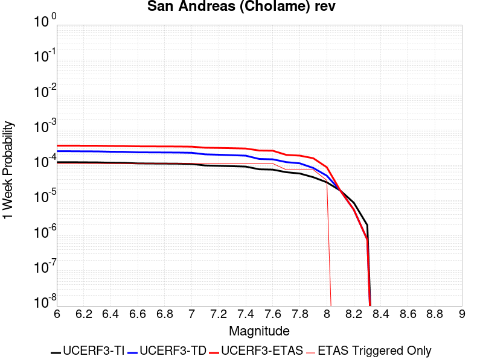 | 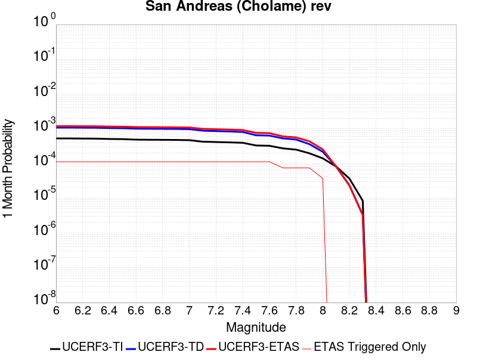 | 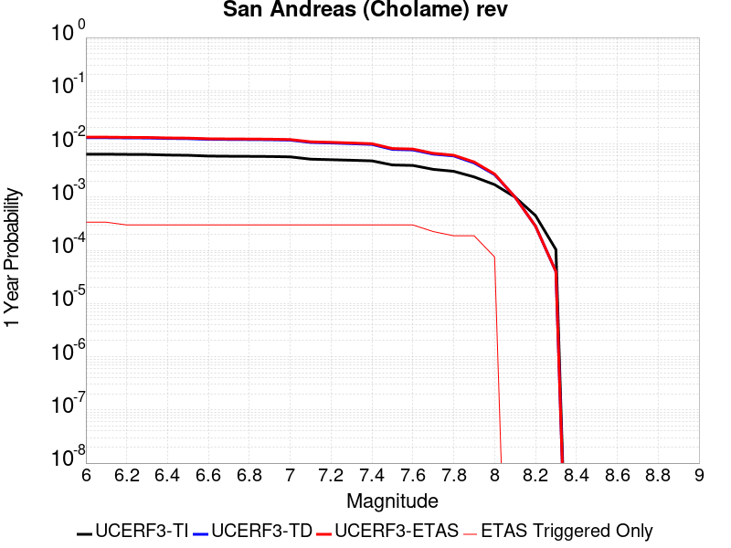 | 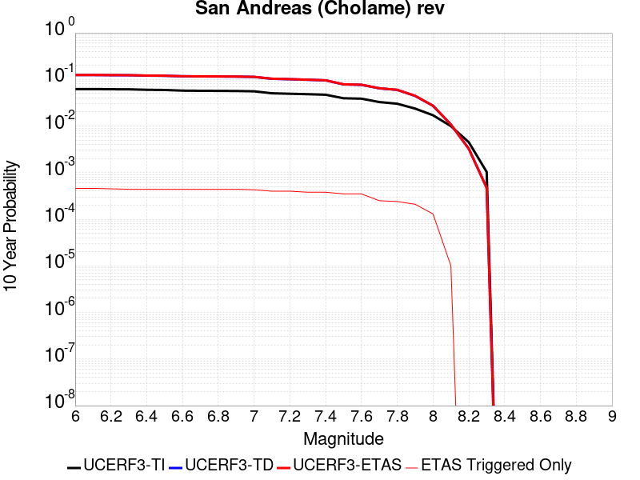 |

| Magnitude | 1 wk TI Prob | 1 wk TD Prob | 1 wk ETAS Prob | 1 wk ETAS/TD Gain | 1 wk ETAS Triggered Only | 1 mo TI Prob | 1 mo TD Prob | 1 mo ETAS Prob | 1 mo ETAS/TD Gain | 1 mo ETAS Triggered Only | 1 yr TI Prob | 1 yr TD Prob | 1 yr ETAS Prob | 1 yr ETAS/TD Gain | 1 yr ETAS Triggered Only | 10 yr TI Prob | 10 yr TD Prob | 10 yr ETAS Prob | 10 yr ETAS/TD Gain | 10 yr ETAS Triggered Only |
|-----|-----|-----|-----|-----|-----|-----|-----|-----|-----|-----|-----|-----|-----|-----|-----|-----|-----|-----|-----|-----|
| 6.0 | 1.2302514E-4 | 2.5204287E-4 | 3.7959428E-4 | 1.5060703 | 1.2758357E-4 | 5.27144E-4 | 0.0010797381 | 0.001207184 | 1.118034 | 1.2758357E-4 | 0.0063991086 | 0.0130670825 | 0.01340286 | 1.0256964 | 3.4022285E-4 | 0.06217949 | 0.12439073 | 0.12494929 | 1.0044904 | 6.3791784E-4 |
| 6.1 | 1.2302514E-4 | 2.5204287E-4 | 3.7959428E-4 | 1.5060703 | 1.2758357E-4 | 5.27144E-4 | 0.0010797381 | 0.001207184 | 1.118034 | 1.2758357E-4 | 0.0063991086 | 0.0130670825 | 0.01340286 | 1.0256964 | 3.4022285E-4 | 0.06217949 | 0.12439073 | 0.12494929 | 1.0044904 | 6.3791784E-4 |
| 6.2 | 1.2203569E-4 | 2.5021084E-4 | 3.7776248E-4 | 1.5097767 | 1.2758357E-4 | 5.2290526E-4 | 0.0010718931 | 0.0011993399 | 1.1188987 | 1.2758357E-4 | 0.006347804 | 0.01297271 | 0.013308519 | 1.0258858 | 3.4022285E-4 | 0.061695136 | 0.12357691 | 0.12413599 | 1.0045242 | 6.3791784E-4 |
| 6.3 | 1.2142645E-4 | 2.4907055E-4 | 3.7662234E-4 | 1.5121111 | 1.2758357E-4 | 5.202953E-4 | 0.0010670102 | 0.0011944576 | 1.1194435 | 1.2758357E-4 | 0.006316212 | 0.012913967 | 0.013249796 | 1.0260051 | 3.4022285E-4 | 0.06139677 | 0.12307103 | 0.12363044 | 1.0045455 | 6.3791784E-4 |
| 6.4 | 1.1865206E-4 | 2.44126E-4 | 3.716784E-4 | 1.522486 | 1.2758357E-4 | 5.0840975E-4 | 0.0010458364 | 0.0011732865 | 1.1218643 | 1.2758357E-4 | 0.006172335 | 0.012659196 | 0.012995112 | 1.0265353 | 3.4022285E-4 | 0.060036868 | 0.1208638 | 0.12142462 | 1.0046401 | 6.3791784E-4 |
| 6.5 | 1.17443946E-4 | 2.4205919E-4 | 3.6961187E-4 | 1.5269483 | 1.2758357E-4 | 5.032341E-4 | 0.0010369857 | 0.0011644369 | 1.1229055 | 1.2758357E-4 | 0.006109677 | 0.012552682 | 0.012888635 | 1.0267633 | 3.4022285E-4 | 0.059444077 | 0.11993805 | 0.12049946 | 1.0046808 | 6.3791784E-4 |
| 6.6 | 1.13579066E-4 | 2.3514954E-4 | 3.627031E-4 | 1.542436 | 1.2758357E-4 | 4.866766E-4 | 0.001007396 | 0.001134851 | 1.1265193 | 1.2758357E-4 | 0.0059092017 | 0.012196515 | 0.012532588 | 1.0275549 | 3.4022285E-4 | 0.057545185 | 0.11685214 | 0.11741552 | 1.0048213 | 6.3791784E-4 |
| 6.7 | 1.1271412E-4 | 2.3359268E-4 | 3.6114646E-4 | 1.5460521 | 1.2758357E-4 | 4.829711E-4 | 0.0010007289 | 0.0011281848 | 1.1273631 | 1.2758357E-4 | 0.005864331 | 0.012116249 | 0.012452349 | 1.0277396 | 3.4022285E-4 | 0.057119697 | 0.116155714 | 0.11671953 | 1.004854 | 6.3791784E-4 |
| 6.8 | 1.1217975E-4 | 2.3247694E-4 | 3.6003086E-4 | 1.5486734 | 1.2758357E-4 | 4.8068175E-4 | 9.959509E-4 | 0.0011234074 | 1.1279746 | 1.2758357E-4 | 0.005836608 | 0.012058721 | 0.012394842 | 1.0278736 | 3.4022285E-4 | 0.056856725 | 0.11565396 | 0.116218105 | 1.0048778 | 6.3791784E-4 |
| 6.9 | 1.1146753E-4 | 2.3096445E-4 | 3.5851856E-4 | 1.5522672 | 1.2758357E-4 | 4.7763053E-4 | 9.894737E-4 | 0.001116931 | 1.1288133 | 1.2758357E-4 | 0.0057996577 | 0.011980731 | 0.012316878 | 1.0280573 | 3.4022285E-4 | 0.056506127 | 0.11497439 | 0.11553896 | 1.0049105 | 6.3791784E-4 |
| 7.0 | 1.0965793E-4 | 2.2719789E-4 | 3.5475247E-4 | 1.561425 | 1.2758357E-4 | 4.698779E-4 | 9.733434E-4 | 0.0011008028 | 1.1309501 | 1.2758357E-4 | 0.005705768 | 0.011786487 | 0.0121227 | 1.0285252 | 3.4022285E-4 | 0.055614736 | 0.11327597 | 0.11384162 | 1.0049937 | 6.3791784E-4 |
| 7.1 | 9.927982E-5 | 2.0538924E-4 | 3.329466E-4 | 1.6210519 | 1.2758357E-4 | 4.2541555E-4 | 8.7994366E-4 | 0.0010074149 | 1.144863 | 1.2758357E-4 | 0.0051671406 | 0.010660981 | 0.010997577 | 1.0315727 | 3.4022285E-4 | 0.05048634 | 0.1033706 | 0.10386631 | 1.0047954 | 5.528621E-4 |
| 7.2 | 9.696786E-5 | 2.0043184E-4 | 3.2798984E-4 | 1.6364158 | 1.2758357E-4 | 4.1551032E-4 | 8.5871184E-4 | 9.861859E-4 | 1.148448 | 1.2758357E-4 | 0.00504711 | 0.010404981 | 0.010741663 | 1.0323578 | 3.4022285E-4 | 0.04934009 | 0.1011086 | 0.101605564 | 1.0049151 | 5.528621E-4 |
| 7.3 | 9.4727984E-5 | 1.9472468E-4 | 3.2228342E-4 | 1.6550722 | 1.2758357E-4 | 4.0591392E-4 | 8.3426846E-4 | 9.6174557E-4 | 1.152801 | 1.2758357E-4 | 0.0049308087 | 0.010110183 | 0.010446966 | 1.0333112 | 3.4022285E-4 | 0.048228268 | 0.09847952 | 0.09897793 | 1.0050611 | 5.528621E-4 |
| 7.4 | 9.220358E-5 | 1.8843076E-4 | 3.1599027E-4 | 1.676957 | 1.2758357E-4 | 3.9509835E-4 | 8.073114E-4 | 9.347919E-4 | 1.1579076 | 1.2758357E-4 | 0.004799717 | 0.009784967 | 0.010121861 | 1.0344298 | 3.4022285E-4 | 0.046973653 | 0.095557496 | 0.09605753 | 1.0052328 | 5.528621E-4 |
| 7.5 | 7.71631E-5 | 1.5177966E-4 | 2.7934386E-4 | 1.8404565 | 1.2758357E-4 | 3.306571E-4 | 6.503223E-4 | 7.7782286E-4 | 1.1960576 | 1.2758357E-4 | 0.0040183207 | 0.007889002 | 0.00822654 | 1.042786 | 3.4022285E-4 | 0.03946433 | 0.07828531 | 0.07879489 | 1.0065093 | 5.528621E-4 |
| 7.6 | 7.5634416E-5 | 1.483744E-4 | 2.7593903E-4 | 1.8597484 | 1.2758357E-4 | 3.241072E-4 | 6.3573546E-4 | 7.6323794E-4 | 1.200559 | 1.2758357E-4 | 0.0039388672 | 0.0077126776 | 0.008050276 | 1.043772 | 3.4022285E-4 | 0.038697794 | 0.07664872 | 0.0771592 | 1.0066601 | 5.528621E-4 |
| 7.7 | 6.3783E-5 | 1.235872E-4 | 2.0863241E-4 | 1.6881392 | 8.505571E-5 | 2.7332708E-4 | 5.29552E-4 | 6.1456265E-4 | 1.1605332 | 8.505571E-5 | 0.0033226798 | 0.0064282627 | 0.0066817896 | 1.0394394 | 2.5516714E-4 | 0.032734364 | 0.06454029 | 0.06493812 | 1.0061641 | 4.2527856E-4 |
| 7.8 | 5.863422E-5 | 1.1416107E-4 | 1.9920708E-4 | 1.744965 | 8.505571E-5 | 2.512653E-4 | 4.8917E-4 | 5.741841E-4 | 1.1737926 | 8.505571E-5 | 0.003054864 | 0.0059394026 | 0.006150779 | 1.0355889 | 2.1263928E-4 | 0.030132094 | 0.059659187 | 0.060019102 | 1.0060328 | 3.827507E-4 |
| 7.9 | 4.595283E-5 | 8.426331E-5 | 1.6931185E-4 | 2.0093188 | 8.505571E-5 | 1.9692584E-4 | 3.610785E-4 | 4.461035E-4 | 1.2354751 | 8.505571E-5 | 0.0023949358 | 0.0043872762 | 0.0045989826 | 1.0482546 | 2.1263928E-4 | 0.023692891 | 0.044362005 | 0.044687137 | 1.007329 | 3.4022285E-4 |
| 8.0 | 3.2950178E-5 | 5.0772942E-5 | 9.329864E-5 | 1.8375661 | 4.2527856E-5 | 1.412074E-4 | 2.1758018E-4 | 2.6009878E-4 | 1.1954157 | 4.2527856E-5 | 0.0017178444 | 0.0026458222 | 0.002730653 | 1.0320622 | 8.505571E-5 | 0.017046256 | 0.027180137 | 0.027345626 | 1.0060886 | 1.7011142E-4 |
| 8.1 | 1.9177472E-5 | 1.9185145E-5 | 1.9185145E-5 | 1.0 | 0.0 | 8.218658E-5 | 8.221946E-5 | 8.221946E-5 | 1.0 | 0.0 | 0.0010001622 | 0.0010005629 | 0.0010005629 | 1.0 | 0.0 | 0.009956728 | 0.010758142 | 0.010800213 | 1.0039105 | 4.2527856E-5 |
| 8.2 | 8.643924E-6 | 5.4748625E-6 | 5.4748625E-6 | 1.0 | 0.0 | 3.704486E-5 | 2.3463486E-5 | 2.3463486E-5 | 1.0 | 0.0 | 4.5092785E-4 | 2.8563058E-4 | 2.8563058E-4 | 1.0 | 0.0 | 0.0045001395 | 0.0032487072 | 0.0032487072 | 1.0 | 0.0 |
| 8.3 | 1.983087E-6 | 7.6599065E-7 | 7.6599065E-7 | 1.0 | 0.0 | 8.498917E-6 | 3.282813E-6 | 3.282813E-6 | 1.0 | 0.0 | 1.034694E-4 | 3.9967534E-5 | 3.9967534E-5 | 1.0 | 0.0 | 0.0010342124 | 4.719687E-4 | 4.719687E-4 | 1.0 | 0.0 |

## San Andreas (Parkfield)
*[(top)](#table-of-contents)*

| 1 Week | 1 Month | 1 Year | 10 Year |
|-----|-----|-----|-----|
| 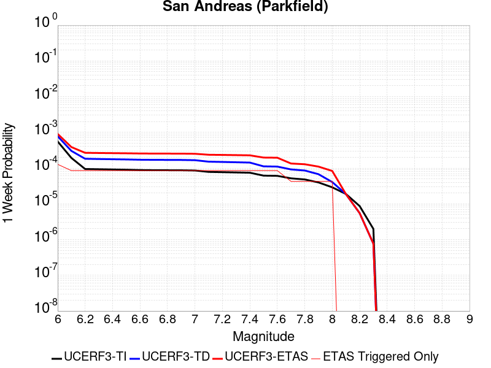 | 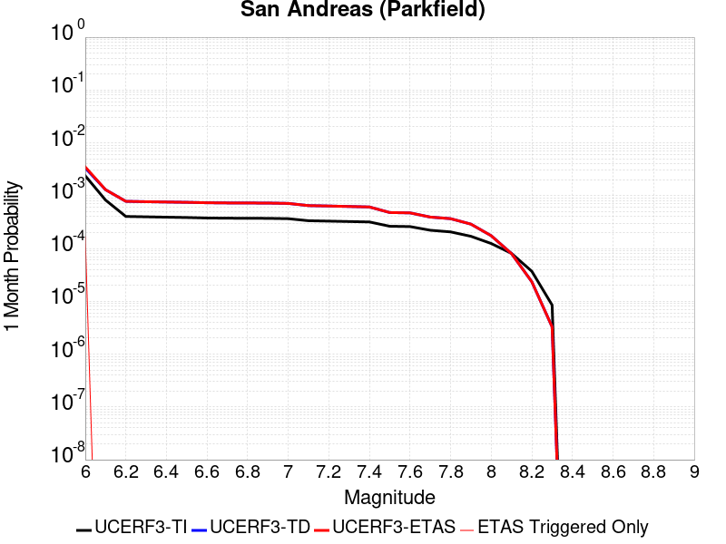 | 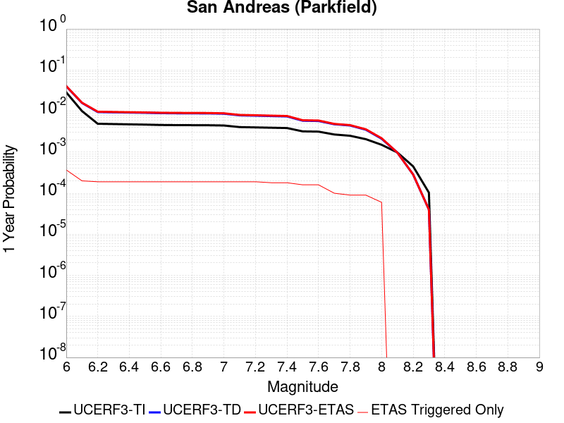 | 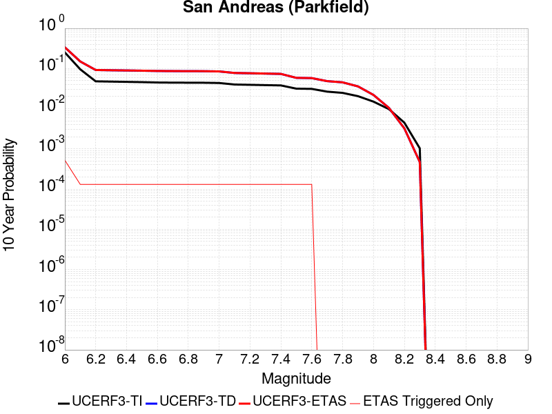 |

| Magnitude | 1 wk TI Prob | 1 wk TD Prob | 1 wk ETAS Prob | 1 wk ETAS/TD Gain | 1 wk ETAS Triggered Only | 1 mo TI Prob | 1 mo TD Prob | 1 mo ETAS Prob | 1 mo ETAS/TD Gain | 1 mo ETAS Triggered Only | 1 yr TI Prob | 1 yr TD Prob | 1 yr ETAS Prob | 1 yr ETAS/TD Gain | 1 yr ETAS Triggered Only | 10 yr TI Prob | 10 yr TD Prob | 10 yr ETAS Prob | 10 yr ETAS/TD Gain | 10 yr ETAS Triggered Only |
|-----|-----|-----|-----|-----|-----|-----|-----|-----|-----|-----|-----|-----|-----|-----|-----|-----|-----|-----|-----|-----|
| 6.0 | 5.556969E-4 | 7.7782426E-4 | 9.053086E-4 | 1.1638986 | 1.2758357E-4 | 0.0023793848 | 0.0033298214 | 0.0035417527 | 1.0636464 | 2.1263928E-4 | 0.028586963 | 0.040191233 | 0.04064024 | 1.0111717 | 4.678064E-4 | 0.25176284 | 0.33716413 | 0.33758697 | 1.0012541 | 6.3791784E-4 |
| 6.1 | 1.925858E-4 | 3.0276453E-4 | 3.8779448E-4 | 1.2808452 | 8.505571E-5 | 8.2510663E-4 | 0.0012970108 | 0.0013819562 | 1.0654932 | 8.505571E-5 | 0.0099994885 | 0.015778083 | 0.015987368 | 1.0132642 | 2.1263928E-4 | 0.095613256 | 0.1497237 | 0.15001297 | 1.0019321 | 3.4022285E-4 |
| 6.2 | 9.4306815E-5 | 1.8242796E-4 | 2.6746816E-4 | 1.4661577 | 8.505571E-5 | 4.0410945E-4 | 7.816011E-4 | 8.665903E-4 | 1.1087373 | 8.505571E-5 | 0.0049089384 | 0.009474681 | 0.009685305 | 1.0222303 | 2.1263928E-4 | 0.048019063 | 0.09185409 | 0.09216306 | 1.0033637 | 3.4022285E-4 |
| 6.3 | 9.283051E-5 | 1.7939322E-4 | 2.6443368E-4 | 1.474045 | 8.505571E-5 | 3.9778434E-4 | 7.686027E-4 | 8.5359305E-4 | 1.1105777 | 8.505571E-5 | 0.0048322747 | 0.009317789 | 0.009528447 | 1.0226082 | 2.1263928E-4 | 0.047285385 | 0.09050704 | 0.09081647 | 1.0034188 | 3.4022285E-4 |
| 6.4 | 9.138826E-5 | 1.770153E-4 | 2.6205595E-4 | 1.4804142 | 8.505571E-5 | 3.916052E-4 | 7.5841765E-4 | 8.4340887E-4 | 1.1120639 | 8.505571E-5 | 0.0047573745 | 0.00919484 | 0.009405524 | 1.0229133 | 2.1263928E-4 | 0.046568092 | 0.08940927 | 0.08971908 | 1.003465 | 3.4022285E-4 |
| 6.5 | 9.000255E-5 | 1.7459576E-4 | 2.596366E-4 | 1.487073 | 8.505571E-5 | 3.8566816E-4 | 7.480541E-4 | 8.330462E-4 | 1.1136175 | 8.505571E-5 | 0.0046854047 | 0.009069731 | 0.009280442 | 1.0232323 | 2.1263928E-4 | 0.045878403 | 0.088295065 | 0.08860525 | 1.003513 | 3.4022285E-4 |
| 6.6 | 8.8109264E-5 | 1.7140752E-4 | 2.5644866E-4 | 1.4961342 | 8.505571E-5 | 3.7755648E-4 | 7.3439797E-4 | 8.193912E-4 | 1.1157318 | 8.505571E-5 | 0.0045870654 | 0.008904854 | 0.0091156 | 1.0236664 | 2.1263928E-4 | 0.04493529 | 0.0868267 | 0.08713738 | 1.0035782 | 3.4022285E-4 |
| 6.7 | 8.738073E-5 | 1.7007832E-4 | 2.5511958E-4 | 1.5000123 | 8.505571E-5 | 3.7443507E-4 | 7.287046E-4 | 8.1369834E-4 | 1.1166368 | 8.505571E-5 | 0.0045492216 | 0.008836143 | 0.009046904 | 1.0238521 | 2.1263928E-4 | 0.04457213 | 0.08622707 | 0.08653795 | 1.0036055 | 3.4022285E-4 |
| 6.8 | 8.710195E-5 | 1.6953335E-4 | 2.5457464E-4 | 1.5016198 | 8.505571E-5 | 3.7324068E-4 | 7.263703E-4 | 8.113642E-4 | 1.1170119 | 8.505571E-5 | 0.0045347405 | 0.008807961 | 0.009018728 | 1.0239291 | 2.1263928E-4 | 0.04443313 | 0.08597467 | 0.08628564 | 1.003617 | 3.4022285E-4 |
| 6.9 | 8.6801556E-5 | 1.689429E-4 | 2.5398424E-4 | 1.5033733 | 8.505571E-5 | 3.7195362E-4 | 7.2384125E-4 | 8.088354E-4 | 1.117421 | 8.505571E-5 | 0.0045191357 | 0.008777418 | 0.008988191 | 1.024013 | 2.1263928E-4 | 0.044283327 | 0.085700735 | 0.0860118 | 1.0036297 | 3.4022285E-4 |
| 7.0 | 8.5571606E-5 | 1.6647128E-4 | 2.5151283E-4 | 1.5108482 | 8.505571E-5 | 3.6668387E-4 | 7.132544E-4 | 7.9824944E-4 | 1.1191651 | 8.505571E-5 | 0.004455241 | 0.008649553 | 0.008860353 | 1.0243711 | 2.1263928E-4 | 0.043669727 | 0.08454914 | 0.08486059 | 1.0036837 | 3.4022285E-4 |
| 7.1 | 7.82589E-5 | 1.5128135E-4 | 2.363242E-4 | 1.5621502 | 8.505571E-5 | 3.3535215E-4 | 6.481883E-4 | 7.331889E-4 | 1.1311356 | 8.505571E-5 | 0.0040752706 | 0.007863307 | 0.008074274 | 1.0268294 | 2.1263928E-4 | 0.040013418 | 0.07746111 | 0.077735744 | 1.0035454 | 2.97695E-4 |
| 7.2 | 7.690929E-5 | 1.4865391E-4 | 2.3369698E-4 | 1.5720876 | 8.505571E-5 | 3.2956956E-4 | 6.369334E-4 | 7.219349E-4 | 1.1334543 | 8.505571E-5 | 0.004005129 | 0.007727258 | 0.007938254 | 1.0273055 | 2.1263928E-4 | 0.0393371 | 0.07623427 | 0.076509275 | 1.0036073 | 2.97695E-4 |
| 7.3 | 7.5543794E-5 | 1.4561978E-4 | 2.306631E-4 | 1.5840094 | 8.505571E-5 | 3.2371894E-4 | 6.2393624E-4 | 7.0893887E-4 | 1.1362361 | 8.505571E-5 | 0.003934157 | 0.007570127 | 0.007781157 | 1.0278766 | 2.1263928E-4 | 0.038652334 | 0.074797355 | 0.07507278 | 1.0036824 | 2.97695E-4 |
| 7.4 | 7.4214564E-5 | 1.4262961E-4 | 2.276732E-4 | 1.5962547 | 8.505571E-5 | 3.1802364E-4 | 6.111273E-4 | 6.96131E-4 | 1.1390933 | 8.505571E-5 | 0.003865065 | 0.00741525 | 0.0076263123 | 1.0284632 | 2.1263928E-4 | 0.03798529 | 0.07337123 | 0.07364709 | 1.0037597 | 2.97695E-4 |
| 7.5 | 6.149578E-5 | 1.11907226E-4 | 1.9695342E-4 | 1.7599705 | 8.505571E-5 | 2.6352672E-4 | 4.7951436E-4 | 5.6452927E-4 | 1.1772938 | 8.505571E-5 | 0.0032037178 | 0.0058224914 | 0.0060338923 | 1.0363077 | 2.1263928E-4 | 0.03157923 | 0.058557566 | 0.058837827 | 1.0047861 | 2.97695E-4 |
| 7.6 | 6.0643448E-5 | 1.10193796E-4 | 1.9524014E-4 | 1.7717888 | 8.505571E-5 | 2.598746E-4 | 4.7217376E-4 | 5.5718934E-4 | 1.1800514 | 8.505571E-5 | 0.0031593828 | 0.0057335934 | 0.005945014 | 1.0368739 | 2.1263928E-4 | 0.031148417 | 0.057718582 | 0.057999093 | 1.00486 | 2.97695E-4 |
| 7.7 | 5.1652263E-5 | 9.174698E-5 | 1.3427093E-4 | 1.4634916 | 4.2527856E-5 | 2.2134806E-4 | 3.931421E-4 | 4.3565326E-4 | 1.1081318 | 4.2527856E-5 | 0.002691582 | 0.0047760103 | 0.0049029845 | 1.0265858 | 1.2758357E-4 | 0.026592141 | 0.04853623 | 0.048738547 | 1.0041684 | 2.1263928E-4 |
| 7.8 | 4.8090482E-5 | 8.559635E-5 | 1.2812058E-4 | 1.4967993 | 4.2527856E-5 | 2.060858E-4 | 3.6678996E-4 | 4.093022E-4 | 1.1159035 | 4.2527856E-5 | 0.0025062072 | 0.0044565317 | 0.0045412085 | 1.0190005 | 8.505571E-5 | 0.024781305 | 0.04530245 | 0.045464855 | 1.0035849 | 1.7011142E-4 |
| 7.9 | 3.970278E-5 | 6.750426E-5 | 1.1002924E-4 | 1.6299601 | 4.2527856E-5 | 1.7014367E-4 | 2.892719E-4 | 3.3178745E-4 | 1.1469743 | 4.2527856E-5 | 0.002069531 | 0.0035162016 | 0.0036009583 | 1.0241046 | 8.505571E-5 | 0.020503636 | 0.035881363 | 0.03604537 | 1.0045708 | 1.7011142E-4 |
| 8.0 | 2.8982335E-5 | 4.069796E-5 | 8.3224084E-5 | 2.0449204 | 4.2527856E-5 | 1.2420409E-4 | 1.7440817E-4 | 2.1692862E-4 | 1.2437984 | 4.2527856E-5 | 0.0015111357 | 0.0021213528 | 0.0021637904 | 1.020005 | 4.2527856E-5 | 0.015009012 | 0.022010697 | 0.022093879 | 1.0037793 | 8.505571E-5 |
| 8.1 | 1.8836186E-5 | 1.8681134E-5 | 1.8681134E-5 | 1.0 | 0.0 | 8.0724014E-5 | 8.005955E-5 | 8.005955E-5 | 1.0 | 0.0 | 9.823717E-4 | 9.742898E-4 | 9.742898E-4 | 1.0 | 0.0 | 0.009780403 | 0.010488115 | 0.010530197 | 1.0040123 | 4.2527856E-5 |
| 8.2 | 8.643924E-6 | 5.4748625E-6 | 5.4748625E-6 | 1.0 | 0.0 | 3.704486E-5 | 2.3463486E-5 | 2.3463486E-5 | 1.0 | 0.0 | 4.5092785E-4 | 2.8563058E-4 | 2.8563058E-4 | 1.0 | 0.0 | 0.0045001395 | 0.0032487072 | 0.0032487072 | 1.0 | 0.0 |
| 8.3 | 1.983087E-6 | 7.6599065E-7 | 7.6599065E-7 | 1.0 | 0.0 | 8.498917E-6 | 3.282813E-6 | 3.282813E-6 | 1.0 | 0.0 | 1.034694E-4 | 3.9967534E-5 | 3.9967534E-5 | 1.0 | 0.0 | 0.0010342124 | 4.719687E-4 | 4.719687E-4 | 1.0 | 0.0 |

## San Andreas (San Gorgonio Pass-Garnet HIll)
*[(top)](#table-of-contents)*

| 1 Week | 1 Month | 1 Year | 10 Year |
|-----|-----|-----|-----|
| 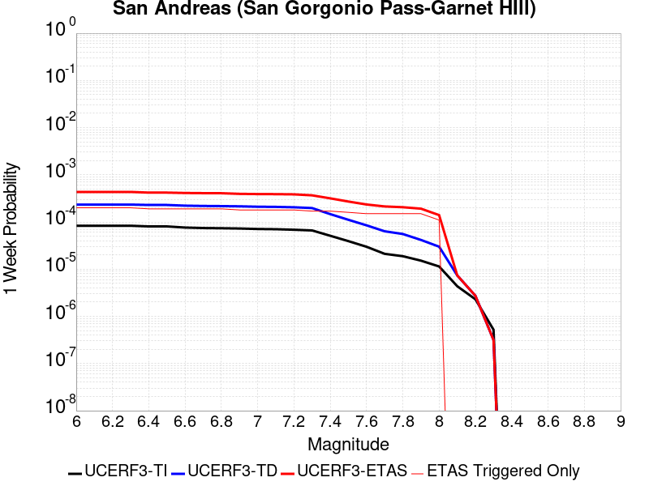 | 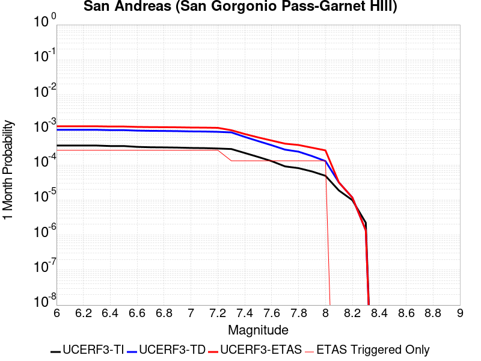 | 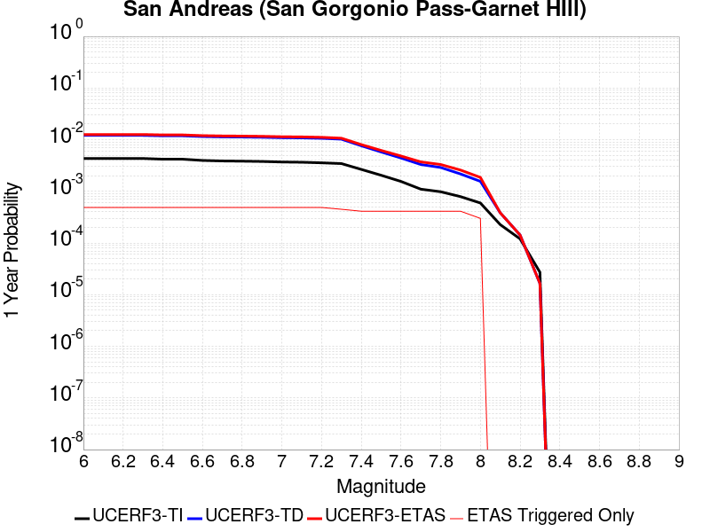 | 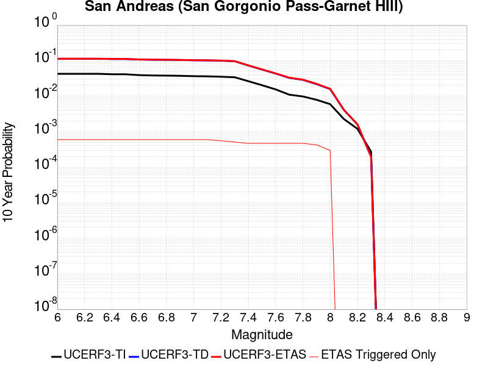 |

| Magnitude | 1 wk TI Prob | 1 wk TD Prob | 1 wk ETAS Prob | 1 wk ETAS/TD Gain | 1 wk ETAS Triggered Only | 1 mo TI Prob | 1 mo TD Prob | 1 mo ETAS Prob | 1 mo ETAS/TD Gain | 1 mo ETAS Triggered Only | 1 yr TI Prob | 1 yr TD Prob | 1 yr ETAS Prob | 1 yr ETAS/TD Gain | 1 yr ETAS Triggered Only | 10 yr TI Prob | 10 yr TD Prob | 10 yr ETAS Prob | 10 yr ETAS/TD Gain | 10 yr ETAS Triggered Only |
|-----|-----|-----|-----|-----|-----|-----|-----|-----|-----|-----|-----|-----|-----|-----|-----|-----|-----|-----|-----|-----|
| 6.0 | 8.31567E-5 | 2.3382473E-4 | 4.0389638E-4 | 1.7273467 | 1.7011142E-4 | 3.5633717E-4 | 0.0010017233 | 0.0013416054 | 1.3392973 | 3.4022285E-4 | 0.004329778 | 0.012127888 | 0.012590022 | 1.038105 | 4.678064E-4 | 0.042463828 | 0.11257892 | 0.11310728 | 1.0046933 | 5.9539E-4 |
| 6.1 | 8.31567E-5 | 2.3382473E-4 | 4.0389638E-4 | 1.7273467 | 1.7011142E-4 | 3.5633717E-4 | 0.0010017233 | 0.0013416054 | 1.3392973 | 3.4022285E-4 | 0.004329778 | 0.012127888 | 0.012590022 | 1.038105 | 4.678064E-4 | 0.042463828 | 0.11257892 | 0.11310728 | 1.0046933 | 5.9539E-4 |
| 6.2 | 8.31567E-5 | 2.3382473E-4 | 4.0389638E-4 | 1.7273467 | 1.7011142E-4 | 3.5633717E-4 | 0.0010017233 | 0.0013416054 | 1.3392973 | 3.4022285E-4 | 0.004329778 | 0.012127888 | 0.012590022 | 1.038105 | 4.678064E-4 | 0.042463828 | 0.11257892 | 0.11310728 | 1.0046933 | 5.9539E-4 |
| 6.3 | 8.31567E-5 | 2.3382473E-4 | 4.0389638E-4 | 1.7273467 | 1.7011142E-4 | 3.5633717E-4 | 0.0010017233 | 0.0013416054 | 1.3392973 | 3.4022285E-4 | 0.004329778 | 0.012127888 | 0.012590022 | 1.038105 | 4.678064E-4 | 0.042463828 | 0.11257892 | 0.11310728 | 1.0046933 | 5.9539E-4 |
| 6.4 | 8.059055E-5 | 2.2940808E-4 | 3.994805E-4 | 1.7413532 | 1.7011142E-4 | 3.4534236E-4 | 9.828096E-4 | 0.001322698 | 1.3458335 | 3.4022285E-4 | 0.0041964394 | 0.011900152 | 0.012362391 | 1.0388432 | 4.678064E-4 | 0.041180745 | 0.11056015 | 0.11108971 | 1.0047898 | 5.9539E-4 |
| 6.5 | 8.059055E-5 | 2.2940808E-4 | 3.994805E-4 | 1.7413532 | 1.7011142E-4 | 3.4534236E-4 | 9.828096E-4 | 0.001322698 | 1.3458335 | 3.4022285E-4 | 0.0041964394 | 0.011900152 | 0.012362391 | 1.0388432 | 4.678064E-4 | 0.041180745 | 0.11056015 | 0.11108971 | 1.0047898 | 5.9539E-4 |
| 6.6 | 7.619237E-5 | 2.218517E-4 | 3.919254E-4 | 1.7666098 | 1.7011142E-4 | 3.2649786E-4 | 9.5044886E-4 | 0.0012903484 | 1.35762 | 3.4022285E-4 | 0.0039678677 | 0.01151087 | 0.011973292 | 1.0401726 | 4.678064E-4 | 0.03897764 | 0.10709683 | 0.10762846 | 1.004964 | 5.9539E-4 |
| 6.7 | 7.440636E-5 | 2.1860997E-4 | 3.886842E-4 | 1.7779802 | 1.7011142E-4 | 3.188454E-4 | 9.3656575E-4 | 0.0012764699 | 1.3629261 | 3.4022285E-4 | 0.0038750346 | 0.011343609 | 0.011806108 | 1.0407718 | 4.678064E-4 | 0.038081564 | 0.105605274 | 0.10613779 | 1.0050424 | 5.9539E-4 |
| 6.8 | 7.3735864E-5 | 2.1708169E-4 | 3.8715618E-4 | 1.7834585 | 1.7011142E-4 | 3.1597257E-4 | 9.3002064E-4 | 0.001269927 | 1.3654827 | 3.4022285E-4 | 0.0038401815 | 0.011264749 | 0.011727286 | 1.0410606 | 4.678064E-4 | 0.03774495 | 0.10490683 | 0.10543976 | 1.00508 | 5.9539E-4 |
| 6.9 | 7.27575E-5 | 2.1477141E-4 | 3.848463E-4 | 1.7918879 | 1.7011142E-4 | 3.117806E-4 | 9.201265E-4 | 0.0012600363 | 1.3694164 | 3.4022285E-4 | 0.003789323 | 0.011145527 | 0.011608118 | 1.0415047 | 4.678064E-4 | 0.037253562 | 0.103854746 | 0.1043883 | 1.0051376 | 5.9539E-4 |
| 7.0 | 7.102591E-5 | 2.1061185E-4 | 3.8068744E-4 | 1.807531 | 1.7011142E-4 | 3.0436125E-4 | 9.023122E-4 | 0.0012422281 | 1.3767165 | 3.4022285E-4 | 0.003699303 | 0.010930831 | 0.011393524 | 1.0423292 | 4.678064E-4 | 0.03638325 | 0.10195695 | 0.10249163 | 1.0052443 | 5.9539E-4 |
| 7.1 | 7.028513E-5 | 2.0896831E-4 | 3.7904418E-4 | 1.8138835 | 1.7011142E-4 | 3.0118722E-4 | 8.9527335E-4 | 0.0012351916 | 1.379681 | 3.4022285E-4 | 0.0036607897 | 0.010845989 | 0.011308722 | 1.0426639 | 4.678064E-4 | 0.036010686 | 0.101199985 | 0.10173512 | 1.0052879 | 5.9539E-4 |
| 7.2 | 6.8498244E-5 | 2.0504706E-4 | 3.751236E-4 | 1.8294512 | 1.7011142E-4 | 2.9353087E-4 | 8.784794E-4 | 0.0012184033 | 1.3869458 | 3.4022285E-4 | 0.003567883 | 0.010643536 | 0.0111063635 | 1.0434843 | 4.678064E-4 | 0.035111405 | 0.09939202 | 0.099889934 | 1.0050095 | 5.528621E-4 |
| 7.3 | 6.622592E-5 | 1.9732013E-4 | 3.2487852E-4 | 1.6464541 | 1.2758357E-4 | 2.8379448E-4 | 8.453858E-4 | 0.0011428291 | 1.3518434 | 2.97695E-4 | 0.0034497243 | 0.0102444785 | 0.010665401 | 1.0410876 | 4.2527856E-4 | 0.033966612 | 0.095888525 | 0.096349925 | 1.0048119 | 5.1033427E-4 |
| 7.4 | 5.1050705E-5 | 1.4689034E-4 | 2.7445515E-4 | 1.8684359 | 1.2758357E-4 | 2.1877038E-4 | 6.29379E-4 | 8.8438555E-4 | 1.4051716 | 2.5516714E-4 | 0.002660276 | 0.0076359594 | 0.008015787 | 1.049742 | 3.827507E-4 | 0.02628654 | 0.07286301 | 0.07329673 | 1.0059526 | 4.678064E-4 |
| 7.5 | 3.9302922E-5 | 1.1129847E-4 | 2.3886784E-4 | 2.1461916 | 1.2758357E-4 | 1.6843023E-4 | 4.7690657E-4 | 7.31952E-4 | 1.5347912 | 2.5516714E-4 | 0.0020487092 | 0.005790949 | 0.006171483 | 1.0657119 | 3.827507E-4 | 0.020299247 | 0.05600951 | 0.056451116 | 1.0078845 | 4.678064E-4 |
| 7.6 | 2.9851626E-5 | 8.4949745E-5 | 2.1252247E-4 | 2.5017436 | 1.2758357E-4 | 1.2792926E-4 | 3.6401965E-4 | 6.190939E-4 | 1.7007157 | 2.5516714E-4 | 0.0015564259 | 0.0044229585 | 0.004804016 | 1.0861545 | 3.827507E-4 | 0.0154556995 | 0.04319374 | 0.043641336 | 1.0103626 | 4.678064E-4 |
| 7.7 | 2.1135214E-5 | 6.3529005E-5 | 1.9110447E-4 | 3.0081453 | 1.2758357E-4 | 9.0576345E-5 | 2.7223877E-4 | 5.2733644E-4 | 1.9370365 | 2.5516714E-4 | 0.0011022091 | 0.0033094748 | 0.0036909587 | 1.1152703 | 3.827507E-4 | 0.010967582 | 0.032582592 | 0.03303516 | 1.0138898 | 4.678064E-4 |
| 7.8 | 1.883379E-5 | 5.564028E-5 | 1.8321675E-4 | 3.2928798 | 1.2758357E-4 | 8.0713755E-5 | 2.3843657E-4 | 4.935429E-4 | 2.0699127 | 2.5516714E-4 | 9.822468E-4 | 0.0028991038 | 0.003280745 | 1.131641 | 3.827507E-4 | 0.0097791655 | 0.028695205 | 0.029149588 | 1.0158348 | 4.678064E-4 |
| 7.9 | 1.5156185E-5 | 4.1658426E-5 | 1.6923668E-4 | 4.062484 | 1.2758357E-4 | 6.495346E-5 | 1.785239E-4 | 4.3364547E-4 | 2.4290612 | 2.5516714E-4 | 7.9052144E-4 | 0.0021713632 | 0.0025532828 | 1.1758894 | 3.827507E-4 | 0.007877152 | 0.021759422 | 0.022175448 | 1.0191193 | 4.2527856E-4 |
| 8.0 | 1.1405907E-5 | 2.9974231E-5 | 1.5755398E-4 | 5.2563143 | 1.2758357E-4 | 4.8881542E-5 | 1.2845467E-4 | 3.4106662E-4 | 2.6551516 | 2.1263928E-4 | 5.9497025E-4 | 0.0015628147 | 0.001817583 | 1.163019 | 2.5516714E-4 | 0.005933798 | 0.015772851 | 0.016065849 | 1.0185761 | 2.97695E-4 |
| 8.1 | 4.3511436E-6 | 7.369219E-6 | 7.369219E-6 | 1.0 | 0.0 | 1.8647626E-5 | 3.1581985E-5 | 3.1581985E-5 | 1.0 | 0.0 | 2.2701119E-4 | 3.8444297E-4 | 3.8444297E-4 | 1.0 | 0.0 | 0.0022677942 | 0.0041163345 | 0.0041163345 | 1.0 | 0.0 |
| 8.2 | 2.3042528E-6 | 2.7329415E-6 | 2.7329415E-6 | 1.0 | 0.0 | 9.875332E-6 | 1.1712554E-5 | 1.1712554E-5 | 1.0 | 0.0 | 1.2022553E-4 | 1.4259106E-4 | 1.4259106E-4 | 1.0 | 0.0 | 0.0012016051 | 0.0015979785 | 0.0015979785 | 1.0 | 0.0 |
| 8.3 | 5.202968E-7 | 3.1598344E-7 | 3.1598344E-7 | 1.0 | 0.0 | 2.2298414E-6 | 1.3542141E-6 | 1.3542141E-6 | 1.0 | 0.0 | 2.714798E-5 | 1.6487444E-5 | 1.6487444E-5 | 1.0 | 0.0 | 2.7144665E-4 | 1.9563142E-4 | 1.9563142E-4 | 1.0 | 0.0 |

## Manix-Afton Hills
*[(top)](#table-of-contents)*

| 1 Week | 1 Month | 1 Year | 10 Year |
|-----|-----|-----|-----|
| 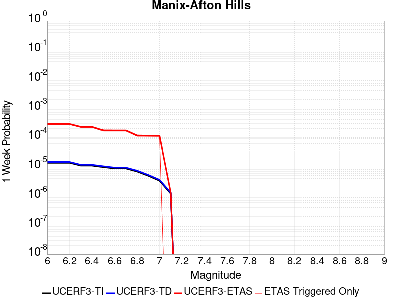 | 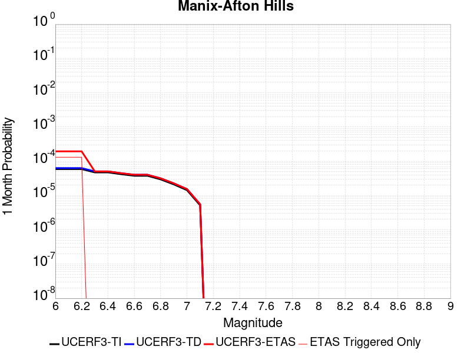 | 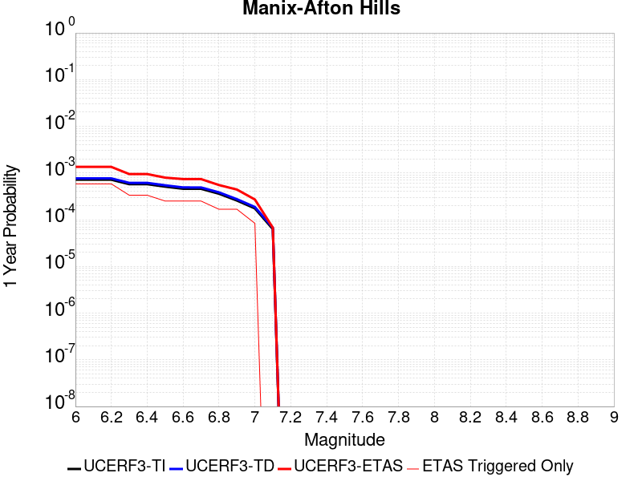 | 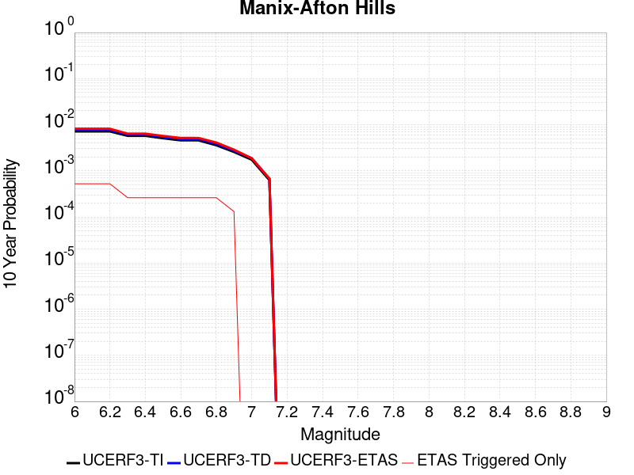 |

| Magnitude | 1 wk TI Prob | 1 wk TD Prob | 1 wk ETAS Prob | 1 wk ETAS/TD Gain | 1 wk ETAS Triggered Only | 1 mo TI Prob | 1 mo TD Prob | 1 mo ETAS Prob | 1 mo ETAS/TD Gain | 1 mo ETAS Triggered Only | 1 yr TI Prob | 1 yr TD Prob | 1 yr ETAS Prob | 1 yr ETAS/TD Gain | 1 yr ETAS Triggered Only | 10 yr TI Prob | 10 yr TD Prob | 10 yr ETAS Prob | 10 yr ETAS/TD Gain | 10 yr ETAS Triggered Only |
|-----|-----|-----|-----|-----|-----|-----|-----|-----|-----|-----|-----|-----|-----|-----|-----|-----|-----|-----|-----|-----|
| 6.0 | 1.3783202E-5 | 1.47110895E-5 | 2.2734723E-4 | 15.45414 | 2.1263928E-4 | 5.906953E-5 | 6.30461E-5 | 3.1819716E-4 | 5.047055 | 2.5516714E-4 | 7.189342E-4 | 7.6733343E-4 | 0.0012347809 | 1.6091843 | 4.678064E-4 | 0.0071661277 | 0.007648596 | 0.008239432 | 1.0772476 | 5.9539E-4 |
| 6.1 | 1.3783202E-5 | 1.47110895E-5 | 2.2734723E-4 | 15.45414 | 2.1263928E-4 | 5.906953E-5 | 6.30461E-5 | 3.1819716E-4 | 5.047055 | 2.5516714E-4 | 7.189342E-4 | 7.6733343E-4 | 0.0012347809 | 1.6091843 | 4.678064E-4 | 0.0071661277 | 0.007648596 | 0.008239432 | 1.0772476 | 5.9539E-4 |
| 6.2 | 1.3783202E-5 | 1.47110895E-5 | 2.2734723E-4 | 15.45414 | 2.1263928E-4 | 5.906953E-5 | 6.30461E-5 | 3.1819716E-4 | 5.047055 | 2.5516714E-4 | 7.189342E-4 | 7.6733343E-4 | 0.0012347809 | 1.6091843 | 4.678064E-4 | 0.0071661277 | 0.007648596 | 0.008239432 | 1.0772476 | 5.9539E-4 |
| 6.3 | 1.10494875E-5 | 1.1793136E-5 | 1.8190255E-4 | 15.424443 | 1.7011142E-4 | 4.7354086E-5 | 5.054109E-5 | 2.2064391E-4 | 4.3656344 | 1.7011142E-4 | 5.763835E-4 | 6.151744E-4 | 8.7018457E-4 | 1.4145331 | 2.5516714E-4 | 0.005748908 | 0.0061357557 | 0.0065161576 | 1.0619977 | 3.827507E-4 |
| 6.4 | 1.10494875E-5 | 1.1793136E-5 | 1.8190255E-4 | 15.424443 | 1.7011142E-4 | 4.7354086E-5 | 5.054109E-5 | 2.2064391E-4 | 4.3656344 | 1.7011142E-4 | 5.763835E-4 | 6.151744E-4 | 8.7018457E-4 | 1.4145331 | 2.5516714E-4 | 0.005748908 | 0.0061357557 | 0.0065161576 | 1.0619977 | 3.827507E-4 |
| 6.5 | 9.788949E-6 | 1.045432E-5 | 1.3803656E-4 | 13.203782 | 1.2758357E-4 | 4.1951964E-5 | 4.480351E-5 | 1.7238136E-4 | 3.8474967 | 1.2758357E-4 | 5.1064545E-4 | 5.453555E-4 | 7.1537413E-4 | 1.3117574 | 1.7011142E-4 | 0.0050947363 | 0.0054410985 | 0.005737174 | 1.0544146 | 2.97695E-4 |
| 6.6 | 8.810006E-6 | 9.4136285E-6 | 1.36996E-4 | 14.552943 | 1.2758357E-4 | 3.775662E-5 | 4.0343548E-5 | 1.6792197E-4 | 4.1623006 | 1.2758357E-4 | 4.5958988E-4 | 4.9108086E-4 | 6.6110876E-4 | 1.3462319 | 1.7011142E-4 | 0.0045864056 | 0.004900839 | 0.005112436 | 1.0431757 | 2.1263928E-4 |
| 6.7 | 8.80128E-6 | 9.404108E-6 | 1.3698648E-4 | 14.566664 | 1.2758357E-4 | 3.7719226E-5 | 4.0302748E-5 | 1.6788117E-4 | 4.165502 | 1.2758357E-4 | 4.591348E-4 | 4.9058435E-4 | 6.606123E-4 | 1.3465825 | 1.7011142E-4 | 0.004581874 | 0.0048958957 | 0.005107494 | 1.0432196 | 2.1263928E-4 |
| 6.8 | 6.8994877E-6 | 7.380076E-6 | 9.243516E-5 | 12.5249605 | 8.505571E-5 | 2.9568899E-5 | 3.162856E-5 | 1.1668158E-4 | 3.689121 | 8.505571E-5 | 3.5994186E-4 | 3.8501783E-4 | 5.125523E-4 | 1.3312429 | 1.2758357E-4 | 0.003593594 | 0.0038443129 | 0.0040137703 | 1.04408 | 1.7011142E-4 |
| 6.9 | 4.9328037E-6 | 5.2709615E-6 | 9.0326226E-5 | 17.136574 | 8.505571E-5 | 2.1140417E-5 | 2.2589675E-5 | 1.07643464E-4 | 4.7651625 | 8.505571E-5 | 2.5735417E-4 | 2.7500073E-4 | 4.0254922E-4 | 1.4638114 | 1.2758357E-4 | 0.0025705635 | 0.0027472095 | 0.0028744426 | 1.0463135 | 1.2758357E-4 |
| 7.0 | 3.347973E-6 | 3.59003E-6 | 8.8645436E-5 | 24.692116 | 8.505571E-5 | 1.4348378E-5 | 1.5385775E-5 | 1.0044018E-4 | 6.5281196 | 8.505571E-5 | 1.746775E-4 | 1.8730981E-4 | 2.723496E-4 | 1.454006 | 8.505571E-5 | 0.0017454025 | 0.0018719219 | 0.0019568184 | 1.0453526 | 8.505571E-5 |
| 7.1 | 1.2073567E-6 | 1.293482E-6 | 1.293482E-6 | 1.0 | 0.0 | 5.1743755E-6 | 5.543492E-6 | 5.543492E-6 | 1.0 | 0.0 | 6.29962E-5 | 6.749156E-5 | 6.749156E-5 | 1.0 | 0.0 | 6.297835E-4 | 6.7487074E-4 | 6.7487074E-4 | 1.0 | 0.0 |

## Ludlow
*[(top)](#table-of-contents)*

| 1 Week | 1 Month | 1 Year | 10 Year |
|-----|-----|-----|-----|
| 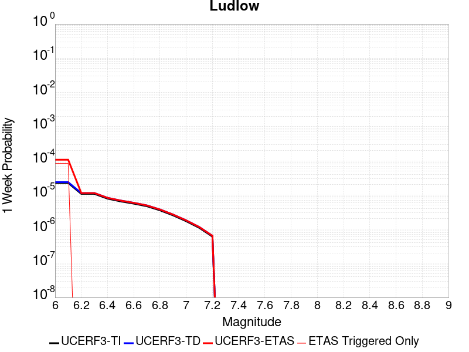 | 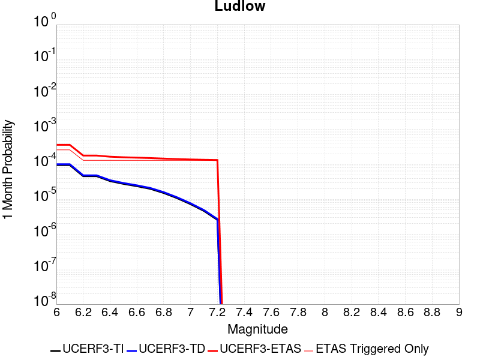 | 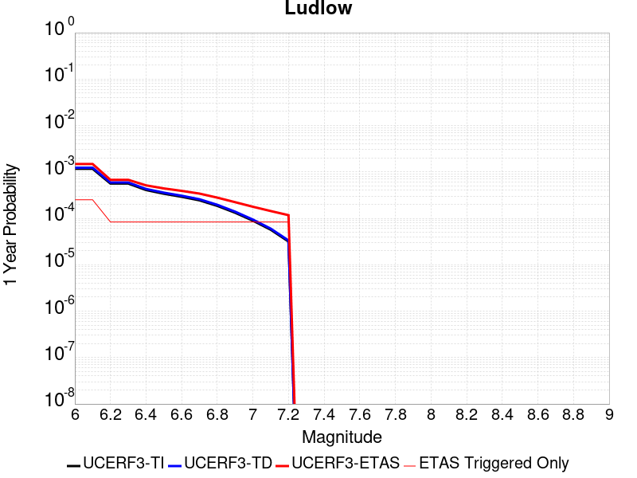 | 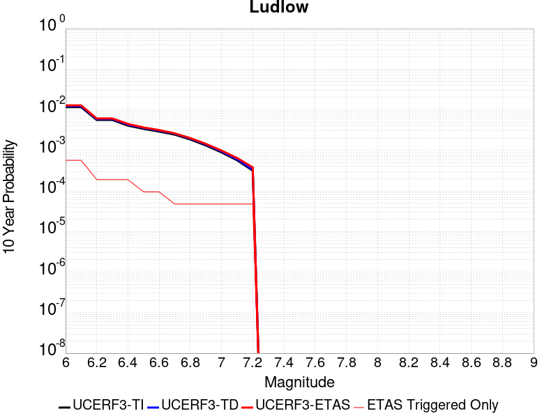 |

| Magnitude | 1 wk TI Prob | 1 wk TD Prob | 1 wk ETAS Prob | 1 wk ETAS/TD Gain | 1 wk ETAS Triggered Only | 1 mo TI Prob | 1 mo TD Prob | 1 mo ETAS Prob | 1 mo ETAS/TD Gain | 1 mo ETAS Triggered Only | 1 yr TI Prob | 1 yr TD Prob | 1 yr ETAS Prob | 1 yr ETAS/TD Gain | 1 yr ETAS Triggered Only | 10 yr TI Prob | 10 yr TD Prob | 10 yr ETAS Prob | 10 yr ETAS/TD Gain | 10 yr ETAS Triggered Only |
|-----|-----|-----|-----|-----|-----|-----|-----|-----|-----|-----|-----|-----|-----|-----|-----|-----|-----|-----|-----|-----|
| 6.0 | 2.2407607E-5 | 2.3657254E-5 | 1.5123781E-4 | 6.3928723 | 1.2758357E-4 | 9.602906E-5 | 1.0138454E-4 | 3.1400225E-4 | 3.0971415 | 2.1263928E-4 | 0.0011685267 | 0.001233702 | 0.0014885543 | 1.2065753 | 2.5516714E-4 | 0.011624013 | 0.012273042 | 0.012819119 | 1.044494 | 5.528621E-4 |
| 6.1 | 2.2407607E-5 | 2.3657254E-5 | 1.5123781E-4 | 6.3928723 | 1.2758357E-4 | 9.602906E-5 | 1.0138454E-4 | 3.1400225E-4 | 3.0971415 | 2.1263928E-4 | 0.0011685267 | 0.001233702 | 0.0014885543 | 1.2065753 | 2.5516714E-4 | 0.011624013 | 0.012273042 | 0.012819119 | 1.044494 | 5.528621E-4 |
| 6.2 | 1.0781252E-5 | 1.1365663E-5 | 5.3893036E-5 | 4.741741 | 4.2527856E-5 | 4.620455E-5 | 4.8709102E-5 | 1.3376067E-4 | 2.7461126 | 8.505571E-5 | 5.623952E-4 | 5.9287593E-4 | 6.7788124E-4 | 1.1433779 | 8.505571E-5 | 0.00560974 | 0.0059133614 | 0.006082467 | 1.0285972 | 1.7011142E-4 |
| 6.3 | 1.0781252E-5 | 1.1365663E-5 | 5.3893036E-5 | 4.741741 | 4.2527856E-5 | 4.620455E-5 | 4.8709102E-5 | 1.3376067E-4 | 2.7461126 | 8.505571E-5 | 5.623952E-4 | 5.9287593E-4 | 6.7788124E-4 | 1.1433779 | 8.505571E-5 | 0.00560974 | 0.0059133614 | 0.006082467 | 1.0285972 | 1.7011142E-4 |
| 6.4 | 7.814439E-6 | 8.237729E-6 | 5.0765233E-5 | 6.162528 | 4.2527856E-5 | 3.3490025E-5 | 3.530408E-5 | 1.2035679E-4 | 3.4091465 | 8.505571E-5 | 4.0766477E-4 | 4.2974384E-4 | 5.14763E-4 | 1.1978369 | 8.505571E-5 | 0.0040691774 | 0.0042892746 | 0.004458656 | 1.0394896 | 1.7011142E-4 |
| 6.5 | 6.4986366E-6 | 6.85092E-6 | 6.85092E-6 | 1.0 | 0.0 | 2.7851002E-5 | 2.9360759E-5 | 7.188736E-5 | 2.4484165 | 4.2527856E-5 | 3.390332E-4 | 3.5740953E-4 | 3.999222E-4 | 1.1189467 | 4.2527856E-5 | 0.003385164 | 0.0035684432 | 0.0036531955 | 1.0237504 | 8.505571E-5 |
| 6.6 | 5.582177E-6 | 5.8860055E-6 | 5.8860055E-6 | 1.0 | 0.0 | 2.3923398E-5 | 2.5225498E-5 | 6.7752284E-5 | 2.685865 | 4.2527856E-5 | 2.9122844E-4 | 3.0707786E-4 | 3.4959268E-4 | 1.1384495 | 4.2527856E-5 | 0.0029084706 | 0.003066609 | 0.0031514037 | 1.0276511 | 8.505571E-5 |
| 6.7 | 4.6858763E-6 | 4.940427E-6 | 4.940427E-6 | 1.0 | 0.0 | 2.0082172E-5 | 2.1173091E-5 | 6.370005E-5 | 3.0085378 | 4.2527856E-5 | 2.4447302E-4 | 2.5775246E-4 | 3.0026934E-4 | 1.1649524 | 4.2527856E-5 | 0.0024420423 | 0.0025745912 | 0.0026170097 | 1.0164758 | 4.2527856E-5 |
| 6.8 | 3.5584908E-6 | 3.7520183E-6 | 3.7520183E-6 | 1.0 | 0.0 | 1.5250586E-5 | 1.6079981E-5 | 5.8607155E-5 | 3.6447277 | 4.2527856E-5 | 1.8566006E-4 | 1.957566E-4 | 2.3827613E-4 | 1.2172061 | 4.2527856E-5 | 0.0018550502 | 0.0019558826 | 0.0019983274 | 1.021701 | 4.2527856E-5 |
| 6.9 | 2.532834E-6 | 2.6710034E-6 | 2.6710034E-6 | 1.0 | 0.0 | 1.0854958E-5 | 1.1447109E-5 | 5.397448E-5 | 4.715119 | 4.2527856E-5 | 1.3215111E-4 | 1.3935992E-4 | 1.8188184E-4 | 1.3051231 | 4.2527856E-5 | 0.0013207254 | 0.0013927529 | 0.0014352215 | 1.0304925 | 4.2527856E-5 |
| 7.0 | 1.7083285E-6 | 1.8019439E-6 | 1.8019439E-6 | 1.0 | 0.0 | 7.3213873E-6 | 7.722595E-6 | 5.025012E-5 | 6.5068965 | 4.2527856E-5 | 8.913424E-5 | 9.40187E-5 | 1.3654256E-4 | 1.4522915 | 4.2527856E-5 | 8.9098496E-4 | 9.3980576E-4 | 9.822936E-4 | 1.0452092 | 4.2527856E-5 |
| 7.1 | 1.0905424E-6 | 1.1497619E-6 | 1.1497619E-6 | 1.0 | 0.0 | 4.6737446E-6 | 4.9275427E-6 | 4.745519E-5 | 9.630599 | 4.2527856E-5 | 5.6901354E-5 | 5.999128E-5 | 1.02516584E-4 | 1.7088581 | 4.2527856E-5 | 5.6886784E-4 | 5.997606E-4 | 6.42263E-4 | 1.0708655 | 4.2527856E-5 |
| 7.2 | 6.06668E-7 | 6.387277E-7 | 6.387277E-7 | 1.0 | 0.0 | 2.600003E-6 | 2.7374022E-6 | 4.526514E-5 | 16.535803 | 4.2527856E-5 | 3.1654577E-5 | 3.3327433E-5 | 7.585387E-5 | 2.276019 | 4.2527856E-5 | 3.1650066E-4 | 3.3323118E-4 | 3.7574486E-4 | 1.1275802 | 4.2527856E-5 |

## San Andreas (Carrizo) rev
*[(top)](#table-of-contents)*

| 1 Week | 1 Month | 1 Year | 10 Year |
|-----|-----|-----|-----|
| 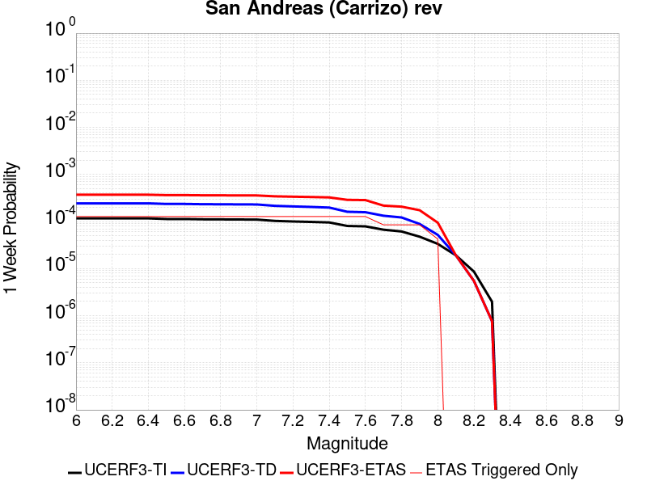 | 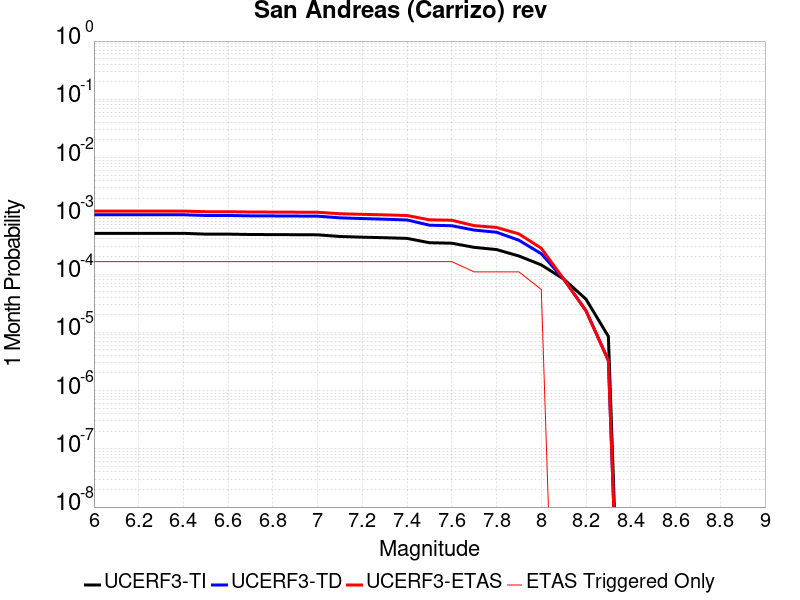 |  | 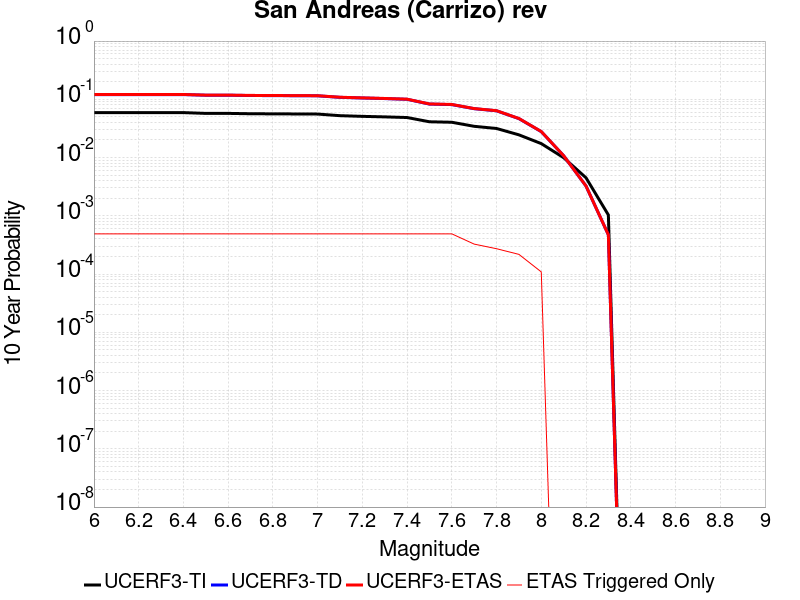 |

| Magnitude | 1 wk TI Prob | 1 wk TD Prob | 1 wk ETAS Prob | 1 wk ETAS/TD Gain | 1 wk ETAS Triggered Only | 1 mo TI Prob | 1 mo TD Prob | 1 mo ETAS Prob | 1 mo ETAS/TD Gain | 1 mo ETAS Triggered Only | 1 yr TI Prob | 1 yr TD Prob | 1 yr ETAS Prob | 1 yr ETAS/TD Gain | 1 yr ETAS Triggered Only | 10 yr TI Prob | 10 yr TD Prob | 10 yr ETAS Prob | 10 yr ETAS/TD Gain | 10 yr ETAS Triggered Only |
|-----|-----|-----|-----|-----|-----|-----|-----|-----|-----|-----|-----|-----|-----|-----|-----|-----|-----|-----|-----|-----|
| 6.0 | 1.1674632E-4 | 2.432302E-4 | 3.7078274E-4 | 1.5244107 | 1.2758357E-4 | 5.002454E-4 | 0.0010420004 | 0.0011694509 | 1.1223134 | 1.2758357E-4 | 0.006073493 | 0.012613042 | 0.012948974 | 1.0266336 | 3.4022285E-4 | 0.0591016 | 0.12061418 | 0.12110036 | 1.0040308 | 5.528621E-4 |
| 6.1 | 1.1674632E-4 | 2.432302E-4 | 3.7078274E-4 | 1.5244107 | 1.2758357E-4 | 5.002454E-4 | 0.0010420004 | 0.0011694509 | 1.1223134 | 1.2758357E-4 | 0.006073493 | 0.012613042 | 0.012948974 | 1.0266336 | 3.4022285E-4 | 0.0591016 | 0.12061418 | 0.12110036 | 1.0040308 | 5.528621E-4 |
| 6.2 | 1.1674632E-4 | 2.432302E-4 | 3.7078274E-4 | 1.5244107 | 1.2758357E-4 | 5.002454E-4 | 0.0010420004 | 0.0011694509 | 1.1223134 | 1.2758357E-4 | 0.006073493 | 0.012613042 | 0.012948974 | 1.0266336 | 3.4022285E-4 | 0.0591016 | 0.12061418 | 0.12110036 | 1.0040308 | 5.528621E-4 |
| 6.3 | 1.1674632E-4 | 2.432302E-4 | 3.7078274E-4 | 1.5244107 | 1.2758357E-4 | 5.002454E-4 | 0.0010420004 | 0.0011694509 | 1.1223134 | 1.2758357E-4 | 0.006073493 | 0.012613042 | 0.012948974 | 1.0266336 | 3.4022285E-4 | 0.0591016 | 0.12061418 | 0.12110036 | 1.0040308 | 5.528621E-4 |
| 6.4 | 1.1674632E-4 | 2.432302E-4 | 3.7078274E-4 | 1.5244107 | 1.2758357E-4 | 5.002454E-4 | 0.0010420004 | 0.0011694509 | 1.1223134 | 1.2758357E-4 | 0.006073493 | 0.012613042 | 0.012948974 | 1.0266336 | 3.4022285E-4 | 0.0591016 | 0.12061418 | 0.12110036 | 1.0040308 | 5.528621E-4 |
| 6.5 | 1.13136164E-4 | 2.3643032E-4 | 3.639837E-4 | 1.5394968 | 1.2758357E-4 | 4.847792E-4 | 0.0010128808 | 0.0011403352 | 1.1258335 | 1.2758357E-4 | 0.0058862255 | 0.012262545 | 0.012598595 | 1.0274047 | 3.4022285E-4 | 0.057327334 | 0.117585555 | 0.118073404 | 1.004149 | 5.528621E-4 |
| 6.6 | 1.13136164E-4 | 2.3643032E-4 | 3.639837E-4 | 1.5394968 | 1.2758357E-4 | 4.847792E-4 | 0.0010128808 | 0.0011403352 | 1.1258335 | 1.2758357E-4 | 0.0058862255 | 0.012262545 | 0.012598595 | 1.0274047 | 3.4022285E-4 | 0.057327334 | 0.117585555 | 0.118073404 | 1.004149 | 5.528621E-4 |
| 6.7 | 1.1149675E-4 | 2.3334254E-4 | 3.6089635E-4 | 1.5466375 | 1.2758357E-4 | 4.777557E-4 | 9.996577E-4 | 0.0011271137 | 1.1274997 | 1.2758357E-4 | 0.0058011734 | 0.012103349 | 0.012439454 | 1.0277696 | 3.4022285E-4 | 0.05652051 | 0.1162071 | 0.11669572 | 1.0042048 | 5.528621E-4 |
| 6.8 | 1.1103589E-4 | 2.3236412E-4 | 3.5991805E-4 | 1.5489398 | 1.2758357E-4 | 4.7578133E-4 | 9.954676E-4 | 0.0011229243 | 1.1280369 | 1.2758357E-4 | 0.005777263 | 0.012052901 | 0.012389024 | 1.0278872 | 3.4022285E-4 | 0.056293584 | 0.1157674 | 0.11625626 | 1.0042228 | 5.528621E-4 |
| 6.9 | 1.1053259E-4 | 2.3128795E-4 | 3.5884202E-4 | 1.5514946 | 1.2758357E-4 | 4.7362508E-4 | 9.90859E-4 | 0.0011183162 | 1.128633 | 1.2758357E-4 | 0.0057511497 | 0.01199741 | 0.012333551 | 1.0280178 | 3.4022285E-4 | 0.05604569 | 0.11528359 | 0.115772724 | 1.0042428 | 5.528621E-4 |
| 7.0 | 1.1005377E-4 | 2.3029637E-4 | 3.5785057E-4 | 1.5538697 | 1.2758357E-4 | 4.7157376E-4 | 9.866126E-4 | 0.0011140703 | 1.1291872 | 1.2758357E-4 | 0.0057263062 | 0.011946279 | 0.012282437 | 1.0281392 | 3.4022285E-4 | 0.055809796 | 0.11483591 | 0.11532529 | 1.0042615 | 5.528621E-4 |
| 7.1 | 1.0308142E-4 | 2.1539345E-4 | 3.4294953E-4 | 1.5922004 | 1.2758357E-4 | 4.417027E-4 | 9.227892E-4 | 0.001050255 | 1.138131 | 1.2758357E-4 | 0.0053644776 | 0.011177397 | 0.011513818 | 1.0300982 | 3.4022285E-4 | 0.052368138 | 0.108092256 | 0.10858536 | 1.0045619 | 5.528621E-4 |
| 7.2 | 1.0027479E-4 | 2.094724E-4 | 3.3702925E-4 | 1.6089433 | 1.2758357E-4 | 4.296783E-4 | 8.9743105E-4 | 0.0010249001 | 1.1420377 | 1.2758357E-4 | 0.0052187922 | 0.010871782 | 0.011208306 | 1.0309539 | 3.4022285E-4 | 0.050979212 | 0.10539625 | 0.10589084 | 1.0046927 | 5.528621E-4 |
| 7.3 | 9.816942E-5 | 2.0422463E-4 | 3.3178215E-4 | 1.6245941 | 1.2758357E-4 | 4.2065824E-4 | 8.7495585E-4 | 0.0010024278 | 1.1456896 | 1.2758357E-4 | 0.005109493 | 0.010600842 | 0.010937458 | 1.0317538 | 3.4022285E-4 | 0.049935985 | 0.102979995 | 0.10347593 | 1.0048158 | 5.528621E-4 |
| 7.4 | 9.5634205E-5 | 1.9791997E-4 | 3.254783E-4 | 1.6444944 | 1.2758357E-4 | 4.0979648E-4 | 8.479536E-4 | 9.75429E-4 | 1.1503329 | 1.2758357E-4 | 0.0049778637 | 0.010275229 | 0.010611956 | 1.0327708 | 3.4022285E-4 | 0.048678253 | 0.10006632 | 0.10056386 | 1.0049721 | 5.528621E-4 |
| 7.5 | 8.052417E-5 | 1.611261E-4 | 2.886891E-4 | 1.7916968 | 1.2758357E-4 | 3.4505792E-4 | 6.903579E-4 | 8.178533E-4 | 1.1846803 | 1.2758357E-4 | 0.0041929903 | 0.008372796 | 0.00871017 | 1.040294 | 3.4022285E-4 | 0.04114753 | 0.08281049 | 0.08331757 | 1.0061234 | 5.528621E-4 |
| 7.6 | 7.897024E-5 | 1.5765853E-4 | 2.85222E-4 | 1.8091123 | 1.2758357E-4 | 3.384E-4 | 6.755046E-4 | 8.0300204E-4 | 1.188744 | 1.2758357E-4 | 0.0041122385 | 0.008193332 | 0.008530768 | 1.0411842 | 3.4022285E-4 | 0.040369697 | 0.08115171 | 0.081659704 | 1.0062598 | 5.528621E-4 |
| 7.7 | 6.707427E-5 | 1.3276102E-4 | 2.1780544E-4 | 1.6405827 | 8.505571E-5 | 2.8742946E-4 | 5.688518E-4 | 6.538591E-4 | 1.1494367 | 8.505571E-5 | 0.003493839 | 0.00690381 | 0.0071572154 | 1.0367051 | 2.5516714E-4 | 0.034394164 | 0.069048055 | 0.06944397 | 1.0057338 | 4.2527856E-4 |
| 7.8 | 6.147705E-5 | 1.2197486E-4 | 2.070202E-4 | 1.6972365 | 8.505571E-5 | 2.6344648E-4 | 5.226447E-4 | 6.0765597E-4 | 1.162656 | 8.505571E-5 | 0.0032027436 | 0.006344659 | 0.0065559493 | 1.0333021 | 2.1263928E-4 | 0.031569764 | 0.06351457 | 0.06387301 | 1.0056435 | 3.827507E-4 |
| 7.9 | 4.7636717E-5 | 8.87977E-5 | 1.7384585E-4 | 1.9577743 | 8.505571E-5 | 2.0414138E-4 | 3.8050607E-4 | 4.6552942E-4 | 1.223448 | 8.505571E-5 | 0.0024825884 | 0.0046228287 | 0.004834485 | 1.0457851 | 2.1263928E-4 | 0.024550365 | 0.046628095 | 0.046952453 | 1.0069563 | 3.4022285E-4 |
| 8.0 | 3.3554235E-5 | 5.2136907E-5 | 9.4662544E-5 | 1.8156532 | 4.2527856E-5 | 1.4379594E-4 | 2.2342477E-4 | 2.6594312E-4 | 1.1903027 | 4.2527856E-5 | 0.0017493097 | 0.002716805 | 0.0028016297 | 1.0312222 | 8.505571E-5 | 0.017356034 | 0.027880952 | 0.028046321 | 1.0059313 | 1.7011142E-4 |
| 8.1 | 1.9175432E-5 | 1.9184976E-5 | 1.9184976E-5 | 1.0 | 0.0 | 8.217783E-5 | 8.2218736E-5 | 8.2218736E-5 | 1.0 | 0.0 | 0.0010000558 | 0.0010005541 | 0.0010005541 | 1.0 | 0.0 | 0.009955673 | 0.0107580265 | 0.010800097 | 1.0039105 | 4.2527856E-5 |
| 8.2 | 8.643924E-6 | 5.4748625E-6 | 5.4748625E-6 | 1.0 | 0.0 | 3.704486E-5 | 2.3463486E-5 | 2.3463486E-5 | 1.0 | 0.0 | 4.5092785E-4 | 2.8563058E-4 | 2.8563058E-4 | 1.0 | 0.0 | 0.0045001395 | 0.0032487072 | 0.0032487072 | 1.0 | 0.0 |
| 8.3 | 1.983087E-6 | 7.6599065E-7 | 7.6599065E-7 | 1.0 | 0.0 | 8.498917E-6 | 3.282813E-6 | 3.282813E-6 | 1.0 | 0.0 | 1.034694E-4 | 3.9967534E-5 | 3.9967534E-5 | 1.0 | 0.0 | 0.0010342124 | 4.719687E-4 | 4.719687E-4 | 1.0 | 0.0 |

## San Andreas (Creeping Section) 2011 CFM
*[(top)](#table-of-contents)*

| 1 Week | 1 Month | 1 Year | 10 Year |
|-----|-----|-----|-----|
| 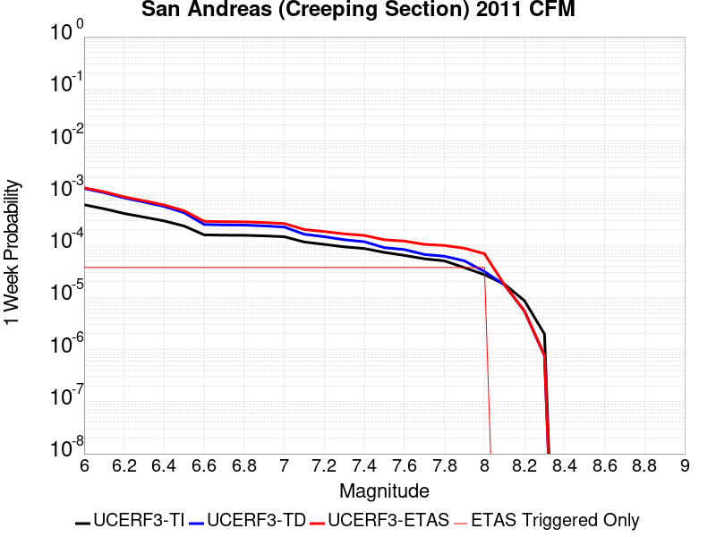 | 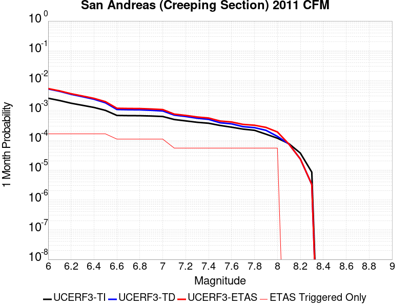 | 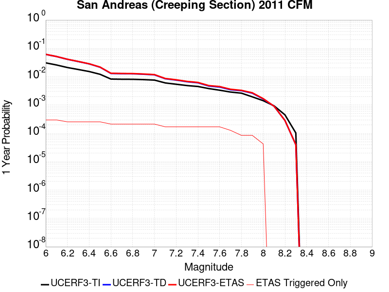 | 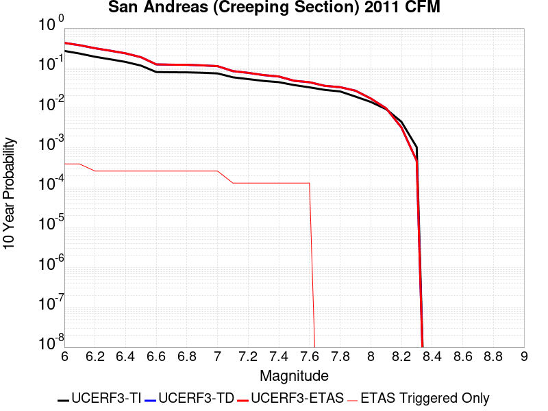 |

| Magnitude | 1 wk TI Prob | 1 wk TD Prob | 1 wk ETAS Prob | 1 wk ETAS/TD Gain | 1 wk ETAS Triggered Only | 1 mo TI Prob | 1 mo TD Prob | 1 mo ETAS Prob | 1 mo ETAS/TD Gain | 1 mo ETAS Triggered Only | 1 yr TI Prob | 1 yr TD Prob | 1 yr ETAS Prob | 1 yr ETAS/TD Gain | 1 yr ETAS Triggered Only | 10 yr TI Prob | 10 yr TD Prob | 10 yr ETAS Prob | 10 yr ETAS/TD Gain | 10 yr ETAS Triggered Only |
|-----|-----|-----|-----|-----|-----|-----|-----|-----|-----|-----|-----|-----|-----|-----|-----|-----|-----|-----|-----|-----|
| 6.0 | 5.986481E-4 | 0.001228691 | 0.0012711666 | 1.0345699 | 4.2527856E-5 | 0.0025631124 | 0.005246795 | 0.005373709 | 1.0241889 | 1.2758357E-4 | 0.030762846 | 0.061203245 | 0.06148272 | 1.0045663 | 2.97695E-4 | 0.26835477 | 0.425928 | 0.42619655 | 1.0006305 | 4.678064E-4 |
| 6.1 | 5.015945E-4 | 0.0010230356 | 0.00106552 | 1.0415277 | 4.2527856E-5 | 0.00214792 | 0.004369436 | 0.0044964617 | 1.0290716 | 1.2758357E-4 | 0.025839351 | 0.051246606 | 0.051529046 | 1.0055114 | 2.97695E-4 | 0.23032776 | 0.37284943 | 0.37314284 | 1.0007869 | 4.678064E-4 |
| 6.2 | 4.073338E-4 | 8.1157376E-4 | 8.540671E-4 | 1.0523592 | 4.2527856E-5 | 0.0017445484 | 0.0034683137 | 0.0035954546 | 1.0366579 | 1.2758357E-4 | 0.021034058 | 0.04093177 | 0.04117649 | 1.0059788 | 2.5516714E-4 | 0.19150782 | 0.31302592 | 0.31331807 | 1.0009333 | 4.2527856E-4 |
| 6.3 | 3.464099E-4 | 6.7455834E-4 | 7.170575E-4 | 1.063003 | 4.2527856E-5 | 0.0014837692 | 0.0028832308 | 0.0030104467 | 1.0441226 | 1.2758357E-4 | 0.017915873 | 0.034187846 | 0.03443429 | 1.0072085 | 2.5516714E-4 | 0.16538359 | 0.27130842 | 0.2716183 | 1.0011423 | 4.2527856E-4 |
| 6.4 | 2.935057E-4 | 5.5516965E-4 | 5.976739E-4 | 1.0765609 | 4.2527856E-5 | 0.0012572751 | 0.0023727308 | 0.0025000116 | 1.0536432 | 1.2758357E-4 | 0.015200248 | 0.02826279 | 0.028510746 | 1.0087732 | 2.5516714E-4 | 0.14201577 | 0.23297668 | 0.23330288 | 1.0014001 | 4.2527856E-4 |
| 6.5 | 2.3409708E-4 | 4.2132285E-4 | 4.6383278E-4 | 1.1008964 | 4.2527856E-5 | 0.0010028875 | 0.0018017791 | 0.0019291328 | 1.0706822 | 1.2758357E-4 | 0.012141965 | 0.021586355 | 0.021836013 | 1.0115656 | 2.5516714E-4 | 0.11499573 | 0.1868149 | 0.18716075 | 1.0018512 | 4.2527856E-4 |
| 6.6 | 1.5842178E-4 | 2.5068692E-4 | 2.9320412E-4 | 1.1696028 | 4.2527856E-5 | 6.7877385E-4 | 0.0010739256 | 0.00115889 | 1.0791157 | 8.505571E-5 | 0.0082328 | 0.012995283 | 0.013205159 | 1.0161501 | 2.1263928E-4 | 0.07934396 | 0.12313759 | 0.12343592 | 1.0024227 | 3.4022285E-4 |
| 6.7 | 1.5616413E-4 | 2.4605254E-4 | 2.8856992E-4 | 1.172798 | 4.2527856E-5 | 6.691031E-4 | 0.0010540807 | 0.0011390467 | 1.0806068 | 8.505571E-5 | 0.0081159435 | 0.012757154 | 0.012967081 | 1.0164557 | 2.1263928E-4 | 0.0782586 | 0.12116472 | 0.121463716 | 1.0024678 | 3.4022285E-4 |
| 6.8 | 1.5538467E-4 | 2.442914E-4 | 2.8680888E-4 | 1.174044 | 4.2527856E-5 | 6.6576427E-4 | 0.001046539 | 0.0011315057 | 1.0811883 | 8.505571E-5 | 0.008075596 | 0.012666538 | 0.012876484 | 1.0165749 | 2.1263928E-4 | 0.07788358 | 0.12039561 | 0.12069487 | 1.0024856 | 3.4022285E-4 |
| 6.9 | 1.5153569E-4 | 2.3538464E-4 | 2.7790247E-4 | 1.1806314 | 4.2527856E-5 | 6.49277E-4 | 0.0010084033 | 0.0010933733 | 1.0842619 | 8.505571E-5 | 0.007876333 | 0.012208726 | 0.012418769 | 1.0172044 | 2.1263928E-4 | 0.07602952 | 0.11646574 | 0.11676634 | 1.002581 | 3.4022285E-4 |
| 7.0 | 1.4588932E-4 | 2.2395732E-4 | 2.6647566E-4 | 1.1898501 | 4.2527856E-5 | 6.250901E-4 | 9.59466E-4 | 0.0010444401 | 1.0885639 | 8.505571E-5 | 0.0075839474 | 0.011619428 | 0.011829596 | 1.0180876 | 2.1263928E-4 | 0.073302895 | 0.11131206 | 0.11161441 | 1.0027163 | 3.4022285E-4 |
| 7.1 | 1.1565079E-4 | 1.6281323E-4 | 2.0533416E-4 | 1.2611638 | 4.2527856E-5 | 4.955521E-4 | 6.9758523E-4 | 7.400834E-4 | 1.0609219 | 4.2527856E-5 | 0.006016669 | 0.008460228 | 0.0086289 | 1.019937 | 1.7011142E-4 | 0.058563538 | 0.08366478 | 0.083898604 | 1.0027947 | 2.5516714E-4 |
| 7.2 | 1.0393792E-4 | 1.4615392E-4 | 1.8867556E-4 | 1.2909374 | 4.2527856E-5 | 4.4537216E-4 | 6.262243E-4 | 6.687256E-4 | 1.067869 | 4.2527856E-5 | 0.005408933 | 0.0075977976 | 0.0077666165 | 1.0222194 | 1.7011142E-4 | 0.052791595 | 0.07561503 | 0.07585091 | 1.0031193 | 2.5516714E-4 |
| 7.3 | 9.332884E-5 | 1.2780601E-4 | 1.7032842E-4 | 1.3327106 | 4.2527856E-5 | 3.999194E-4 | 5.4762565E-4 | 5.901302E-4 | 1.0776161 | 4.2527856E-5 | 0.0048581534 | 0.0066470946 | 0.006816075 | 1.0254217 | 1.7011142E-4 | 0.047533102 | 0.06647954 | 0.066717744 | 1.0035831 | 2.5516714E-4 |
| 7.4 | 8.670252E-5 | 1.1702972E-4 | 1.595526E-4 | 1.3633511 | 4.2527856E-5 | 3.715293E-4 | 5.014601E-4 | 5.4396666E-4 | 1.0847656 | 4.2527856E-5 | 0.004513991 | 0.0060883067 | 0.006257382 | 1.0277705 | 1.7011142E-4 | 0.044233937 | 0.061148684 | 0.061388247 | 1.0039177 | 2.5516714E-4 |
| 7.5 | 7.3036405E-5 | 9.005699E-5 | 1.3258102E-4 | 1.4721903 | 4.2527856E-5 | 3.129756E-4 | 3.859015E-4 | 4.2841295E-4 | 1.1101614 | 4.2527856E-5 | 0.0038038217 | 0.0046882504 | 0.0048575643 | 1.0361146 | 1.7011142E-4 | 0.03739367 | 0.047875606 | 0.048118558 | 1.0050746 | 2.5516714E-4 |
| 7.6 | 6.3935775E-5 | 8.280209E-5 | 1.2532642E-4 | 1.5135659 | 4.2527856E-5 | 2.7398168E-4 | 3.5481792E-4 | 3.9733067E-4 | 1.1198157 | 4.2527856E-5 | 0.0033306254 | 0.00431137 | 0.004480748 | 1.0392864 | 1.7011142E-4 | 0.032811474 | 0.043990135 | 0.04423408 | 1.0055454 | 2.5516714E-4 |
| 7.7 | 5.5050095E-5 | 6.661729E-5 | 1.0914232E-4 | 1.6383481 | 4.2527856E-5 | 2.3590765E-4 | 2.8547147E-4 | 3.279872E-4 | 1.1489316 | 4.2527856E-5 | 0.0028683927 | 0.0034700802 | 0.0035972209 | 1.0366392 | 1.2758357E-4 | 0.0283165 | 0.03579509 | 0.036000114 | 1.0057278 | 2.1263928E-4 |
| 7.8 | 5.027131E-5 | 6.1627725E-5 | 1.0415296E-4 | 1.6900342 | 4.2527856E-5 | 2.1543067E-4 | 2.640921E-4 | 3.066087E-4 | 1.1609917 | 4.2527856E-5 | 0.0026197135 | 0.003210584 | 0.0032953664 | 1.0264072 | 8.505571E-5 | 0.025890453 | 0.03312572 | 0.033290196 | 1.0049652 | 1.7011142E-4 |
| 7.9 | 3.7271806E-5 | 5.0224386E-5 | 9.27501E-5 | 1.8467146 | 4.2527856E-5 | 1.5972654E-4 | 2.1522962E-4 | 2.5774832E-4 | 1.1975504 | 4.2527856E-5 | 0.0019429359 | 0.0026172737 | 0.0027021067 | 1.0324128 | 8.505571E-5 | 0.019260362 | 0.027066687 | 0.027232194 | 1.0061148 | 1.7011142E-4 |
| 8.0 | 2.7310243E-5 | 3.1428404E-5 | 7.395492E-5 | 2.3531237 | 4.2527856E-5 | 1.17038646E-4 | 1.3468621E-4 | 1.7720833E-4 | 1.3157126 | 4.2527856E-5 | 0.0014240141 | 0.0016385721 | 0.0016810303 | 1.0259117 | 4.2527856E-5 | 0.014149235 | 0.01721387 | 0.01729746 | 1.0048561 | 8.505571E-5 |
| 8.1 | 1.7940547E-5 | 1.7400796E-5 | 1.7400796E-5 | 1.0 | 0.0 | 7.688579E-5 | 7.457271E-5 | 7.457271E-5 | 1.0 | 0.0 | 9.3568244E-4 | 9.075451E-4 | 9.075451E-4 | 1.0 | 0.0 | 0.009317525 | 0.009799073 | 0.009841185 | 1.0042975 | 4.2527856E-5 |
| 8.2 | 8.643924E-6 | 5.4748625E-6 | 5.4748625E-6 | 1.0 | 0.0 | 3.704486E-5 | 2.3463486E-5 | 2.3463486E-5 | 1.0 | 0.0 | 4.5092785E-4 | 2.8563058E-4 | 2.8563058E-4 | 1.0 | 0.0 | 0.0045001395 | 0.0032487072 | 0.0032487072 | 1.0 | 0.0 |
| 8.3 | 1.983087E-6 | 7.6599065E-7 | 7.6599065E-7 | 1.0 | 0.0 | 8.498917E-6 | 3.282813E-6 | 3.282813E-6 | 1.0 | 0.0 | 1.034694E-4 | 3.9967534E-5 | 3.9967534E-5 | 1.0 | 0.0 | 0.0010342124 | 4.719687E-4 | 4.719687E-4 | 1.0 | 0.0 |

## Cady
*[(top)](#table-of-contents)*

| 1 Week | 1 Month | 1 Year | 10 Year |
|-----|-----|-----|-----|
| 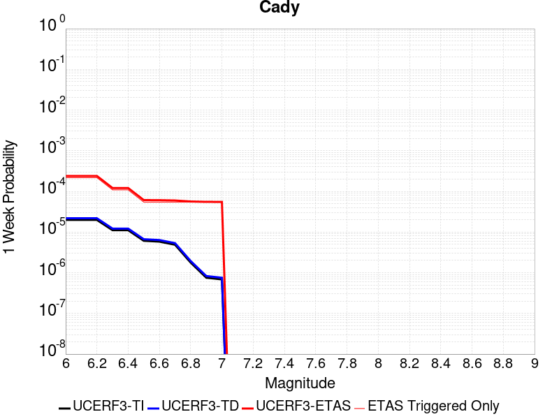 | 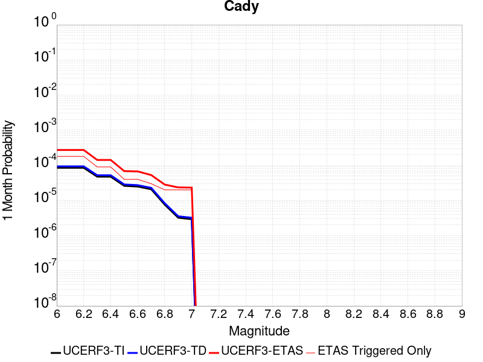 | 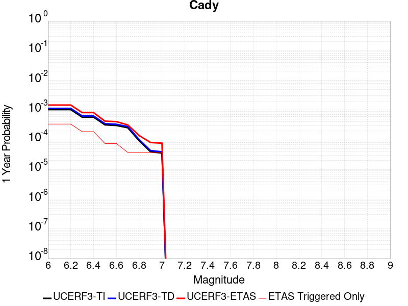 | 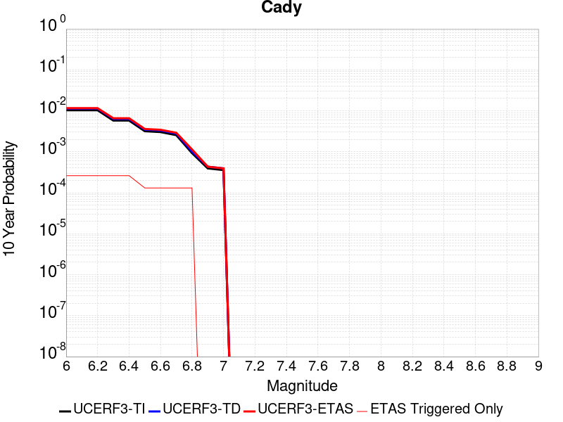 |

| Magnitude | 1 wk TI Prob | 1 wk TD Prob | 1 wk ETAS Prob | 1 wk ETAS/TD Gain | 1 wk ETAS Triggered Only | 1 mo TI Prob | 1 mo TD Prob | 1 mo ETAS Prob | 1 mo ETAS/TD Gain | 1 mo ETAS Triggered Only | 1 yr TI Prob | 1 yr TD Prob | 1 yr ETAS Prob | 1 yr ETAS/TD Gain | 1 yr ETAS Triggered Only | 10 yr TI Prob | 10 yr TD Prob | 10 yr ETAS Prob | 10 yr ETAS/TD Gain | 10 yr ETAS Triggered Only |
|-----|-----|-----|-----|-----|-----|-----|-----|-----|-----|-----|-----|-----|-----|-----|-----|-----|-----|-----|-----|-----|
| 6.0 | 1.9892565E-5 | 2.1858728E-5 | 2.3449336E-4 | 10.727675 | 2.1263928E-4 | 8.525106E-5 | 9.3677416E-5 | 3.0629677E-4 | 3.2696972 | 2.1263928E-4 | 0.0010374374 | 0.0011400167 | 0.0014373723 | 1.2608345 | 2.97695E-4 | 0.010326075 | 0.011350701 | 0.011813197 | 1.0407461 | 4.678064E-4 |
| 6.1 | 1.9892565E-5 | 2.1858728E-5 | 2.3449336E-4 | 10.727675 | 2.1263928E-4 | 8.525106E-5 | 9.3677416E-5 | 3.0629677E-4 | 3.2696972 | 2.1263928E-4 | 0.0010374374 | 0.0011400167 | 0.0014373723 | 1.2608345 | 2.97695E-4 | 0.010326075 | 0.011350701 | 0.011813197 | 1.0407461 | 4.678064E-4 |
| 6.2 | 1.9892565E-5 | 2.1858728E-5 | 2.3449336E-4 | 10.727675 | 2.1263928E-4 | 8.525106E-5 | 9.3677416E-5 | 3.0629677E-4 | 3.2696972 | 2.1263928E-4 | 0.0010374374 | 0.0011400167 | 0.0014373723 | 1.2608345 | 2.97695E-4 | 0.010326075 | 0.011350701 | 0.011813197 | 1.0407461 | 4.678064E-4 |
| 6.3 | 1.1117327E-5 | 1.2176583E-5 | 9.723126E-5 | 7.9851017 | 8.505571E-5 | 4.764482E-5 | 5.2184492E-5 | 1.3723577E-4 | 2.629819 | 8.505571E-5 | 5.7992124E-4 | 6.351925E-4 | 7.6269504E-4 | 1.2007306 | 1.2758357E-4 | 0.0057841022 | 0.0063368753 | 0.0065904255 | 1.0400119 | 2.5516714E-4 |
| 6.4 | 1.1117327E-5 | 1.2176583E-5 | 9.723126E-5 | 7.9851017 | 8.505571E-5 | 4.764482E-5 | 5.2184492E-5 | 1.3723577E-4 | 2.629819 | 8.505571E-5 | 5.7992124E-4 | 6.351925E-4 | 7.6269504E-4 | 1.2007306 | 1.2758357E-4 | 0.0057841022 | 0.0063368753 | 0.0065904255 | 1.0400119 | 2.5516714E-4 |
| 6.5 | 6.103093E-6 | 6.672021E-6 | 4.9199592E-5 | 7.374017 | 4.2527856E-5 | 2.615585E-5 | 2.8594131E-5 | 7.112077E-5 | 2.4872506 | 4.2527856E-5 | 3.1840094E-4 | 3.480905E-4 | 3.9060356E-4 | 1.1221322 | 4.2527856E-5 | 0.0031794512 | 0.0034766865 | 0.0035614467 | 1.0243795 | 8.505571E-5 |
| 6.6 | 5.817237E-6 | 6.3656585E-6 | 4.8893242E-5 | 7.6807833 | 4.2527856E-5 | 2.4930776E-5 | 2.728118E-5 | 6.980787E-5 | 2.558829 | 4.2527856E-5 | 3.034899E-4 | 3.3211018E-4 | 3.746239E-4 | 1.128011 | 4.2527856E-5 | 0.0030307577 | 0.0033173605 | 0.0034021342 | 1.0255545 | 8.505571E-5 |
| 6.7 | 4.8846314E-6 | 5.3405684E-6 | 4.7868198E-5 | 8.963128 | 4.2527856E-5 | 2.0933967E-5 | 2.2888014E-5 | 6.54149E-5 | 2.8580415 | 4.2527856E-5 | 2.5484123E-4 | 2.7863772E-4 | 3.2115373E-4 | 1.1525853 | 4.2527856E-5 | 0.0025454918 | 0.0027840391 | 0.002868858 | 1.0304661 | 8.505571E-5 |
| 6.8 | 1.7788773E-6 | 1.9399079E-6 | 4.446768E-5 | 22.922573 | 4.2527856E-5 | 7.6237375E-6 | 8.313874E-6 | 5.0841376E-5 | 6.1152453 | 4.2527856E-5 | 9.281505E-5 | 1.01218284E-4 | 1.4374184E-4 | 1.4201173 | 4.2527856E-5 | 9.2776294E-4 | 0.0010118765 | 0.0010968461 | 1.0839723 | 8.505571E-5 |
| 6.9 | 7.5455404E-7 | 8.297092E-7 | 4.335753E-5 | 52.256294 | 4.2527856E-5 | 3.233799E-6 | 3.5558937E-6 | 4.6083598E-5 | 12.95978 | 4.2527856E-5 | 3.937079E-5 | 4.3292483E-5 | 8.5818494E-5 | 1.9822956 | 4.2527856E-5 | 3.9363815E-4 | 4.3287344E-4 | 4.7538287E-4 | 1.098203 | 4.2527856E-5 |
| 7.0 | 6.8578805E-7 | 7.541816E-7 | 4.3282005E-5 | 57.389366 | 4.2527856E-5 | 2.9390883E-6 | 3.2322048E-6 | 4.5759924E-5 | 14.1574955 | 4.2527856E-5 | 3.578281E-5 | 3.9351715E-5 | 8.187789E-5 | 2.0806692 | 4.2527856E-5 | 3.577705E-4 | 3.9347992E-4 | 4.3599104E-4 | 1.1080389 | 4.2527856E-5 |

## Sierra Nevada  (No Extension)
*[(top)](#table-of-contents)*

| 1 Week | 1 Month | 1 Year | 10 Year |
|-----|-----|-----|-----|
| 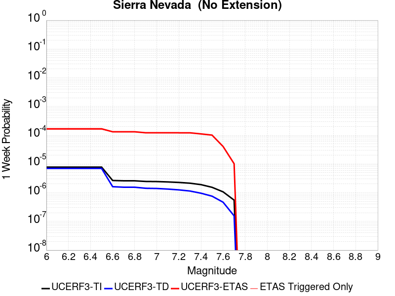 | 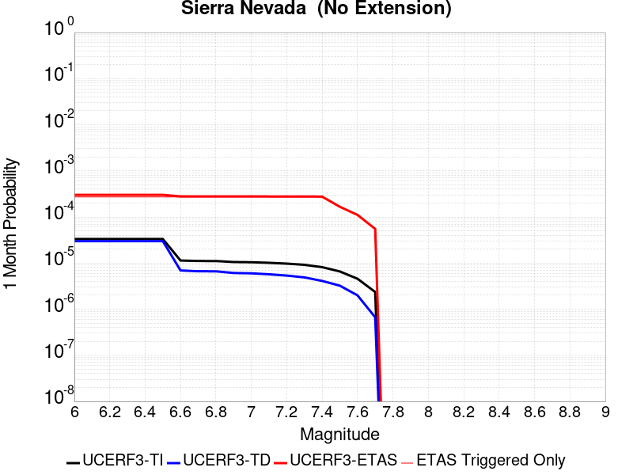 | 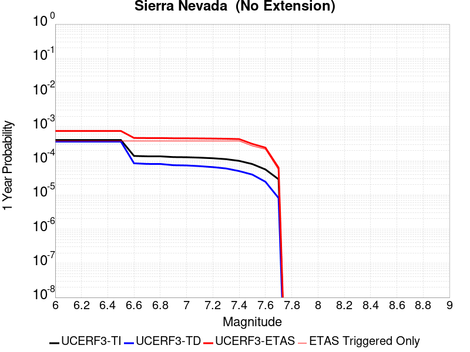 | 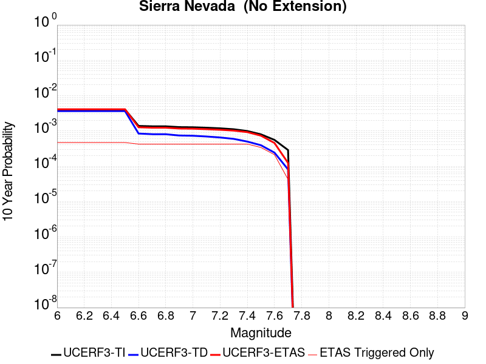 |

| Magnitude | 1 wk TI Prob | 1 wk TD Prob | 1 wk ETAS Prob | 1 wk ETAS/TD Gain | 1 wk ETAS Triggered Only | 1 mo TI Prob | 1 mo TD Prob | 1 mo ETAS Prob | 1 mo ETAS/TD Gain | 1 mo ETAS Triggered Only | 1 yr TI Prob | 1 yr TD Prob | 1 yr ETAS Prob | 1 yr ETAS/TD Gain | 1 yr ETAS Triggered Only | 10 yr TI Prob | 10 yr TD Prob | 10 yr ETAS Prob | 10 yr ETAS/TD Gain | 10 yr ETAS Triggered Only |
|-----|-----|-----|-----|-----|-----|-----|-----|-----|-----|-----|-----|-----|-----|-----|-----|-----|-----|-----|-----|-----|
| 6.0 | 7.7690465E-6 | 6.976322E-6 | 2.1961411E-4 | 31.479929 | 2.1263928E-4 | 3.329549E-5 | 2.9898381E-5 | 3.2758448E-4 | 10.956595 | 2.97695E-4 | 4.0529718E-4 | 3.6398784E-4 | 7.465992E-4 | 2.0511653 | 3.827507E-4 | 0.004045588 | 0.0036374326 | 0.0041035376 | 1.1281412 | 4.678064E-4 |
| 6.1 | 7.7690465E-6 | 6.976322E-6 | 2.1961411E-4 | 31.479929 | 2.1263928E-4 | 3.329549E-5 | 2.9898381E-5 | 3.2758448E-4 | 10.956595 | 2.97695E-4 | 4.0529718E-4 | 3.6398784E-4 | 7.465992E-4 | 2.0511653 | 3.827507E-4 | 0.004045588 | 0.0036374326 | 0.0041035376 | 1.1281412 | 4.678064E-4 |
| 6.2 | 7.7690465E-6 | 6.976322E-6 | 2.1961411E-4 | 31.479929 | 2.1263928E-4 | 3.329549E-5 | 2.9898381E-5 | 3.2758448E-4 | 10.956595 | 2.97695E-4 | 4.0529718E-4 | 3.6398784E-4 | 7.465992E-4 | 2.0511653 | 3.827507E-4 | 0.004045588 | 0.0036374326 | 0.0041035376 | 1.1281412 | 4.678064E-4 |
| 6.3 | 7.7690465E-6 | 6.976322E-6 | 2.1961411E-4 | 31.479929 | 2.1263928E-4 | 3.329549E-5 | 2.9898381E-5 | 3.2758448E-4 | 10.956595 | 2.97695E-4 | 4.0529718E-4 | 3.6398784E-4 | 7.465992E-4 | 2.0511653 | 3.827507E-4 | 0.004045588 | 0.0036374326 | 0.0041035376 | 1.1281412 | 4.678064E-4 |
| 6.4 | 7.7690465E-6 | 6.976322E-6 | 2.1961411E-4 | 31.479929 | 2.1263928E-4 | 3.329549E-5 | 2.9898381E-5 | 3.2758448E-4 | 10.956595 | 2.97695E-4 | 4.0529718E-4 | 3.6398784E-4 | 7.465992E-4 | 2.0511653 | 3.827507E-4 | 0.004045588 | 0.0036374326 | 0.0041035376 | 1.1281412 | 4.678064E-4 |
| 6.5 | 7.7690465E-6 | 6.976322E-6 | 2.1961411E-4 | 31.479929 | 2.1263928E-4 | 3.329549E-5 | 2.9898381E-5 | 3.2758448E-4 | 10.956595 | 2.97695E-4 | 4.0529718E-4 | 3.6398784E-4 | 7.465992E-4 | 2.0511653 | 3.827507E-4 | 0.004045588 | 0.0036374326 | 0.0041035376 | 1.1281412 | 4.678064E-4 |
| 6.6 | 2.653E-6 | 1.614854E-6 | 1.71726E-4 | 106.34151 | 1.7011142E-4 | 1.136995E-5 | 6.9207845E-6 | 2.6208616E-4 | 37.869427 | 2.5516714E-4 | 1.3842035E-4 | 8.425733E-5 | 4.2445151E-4 | 5.037562 | 3.4022285E-4 | 0.0013833415 | 8.422573E-4 | 0.0012671776 | 1.5045018 | 4.2527856E-4 |
| 6.7 | 2.5902466E-6 | 1.5501876E-6 | 1.7166135E-4 | 110.73586 | 1.7011142E-4 | 1.11010095E-5 | 6.643644E-6 | 2.618091E-4 | 39.40745 | 2.5516714E-4 | 1.351464E-4 | 8.0883394E-5 | 4.2107873E-4 | 5.205997 | 3.4022285E-4 | 0.0013506424 | 8.0854254E-4 | 0.0012334773 | 1.5255564 | 4.2527856E-4 |
| 6.8 | 2.5853892E-6 | 1.5469877E-6 | 1.7165815E-4 | 110.96284 | 1.7011142E-4 | 1.1080193E-5 | 6.629931E-6 | 2.617954E-4 | 39.486893 | 2.5516714E-4 | 1.34893E-4 | 8.071645E-5 | 4.2091182E-4 | 5.2146974 | 3.4022285E-4 | 0.0013481114 | 8.068743E-4 | 0.0012318097 | 1.5266439 | 4.2527856E-4 |
| 6.9 | 2.458257E-6 | 1.4220619E-6 | 1.7153325E-4 | 120.6229 | 1.7011142E-4 | 1.0535345E-5 | 6.094537E-6 | 2.612601E-4 | 42.867916 | 2.5516714E-4 | 1.2826028E-4 | 7.4198484E-5 | 4.1439608E-4 | 5.584967 | 3.4022285E-4 | 0.0012818627 | 7.4173906E-4 | 0.0011667021 | 1.5729281 | 4.2527856E-4 |
| 7.0 | 2.4341468E-6 | 1.3990258E-6 | 1.7151021E-4 | 122.5926 | 1.7011142E-4 | 1.0432016E-5 | 5.9958115E-6 | 2.6116142E-4 | 43.557312 | 2.5516714E-4 | 1.270024E-4 | 7.2996576E-5 | 4.131946E-4 | 5.6604652 | 3.4022285E-4 | 0.0012692984 | 7.297279E-4 | 0.0011546961 | 1.5823653 | 4.2527856E-4 |
| 7.1 | 2.3652476E-6 | 1.3339754E-6 | 1.7144516E-4 | 128.52199 | 1.7011142E-4 | 1.0136736E-5 | 5.717025E-6 | 2.608827E-4 | 45.632595 | 2.5516714E-4 | 1.2340778E-4 | 6.9602575E-5 | 4.0980175E-4 | 5.887738 | 3.4022285E-4 | 0.0012333926 | 6.9580943E-4 | 0.0011207921 | 1.6107745 | 4.2527856E-4 |
| 7.2 | 2.272158E-6 | 1.2502821E-6 | 1.7136149E-4 | 137.05826 | 1.7011142E-4 | 9.737784E-6 | 5.3583412E-6 | 2.605241E-4 | 48.620293 | 2.5516714E-4 | 1.1855107E-4 | 6.5235865E-5 | 4.0543653E-4 | 6.214933 | 3.4022285E-4 | 0.0011848784 | 6.5216864E-4 | 0.0010771699 | 1.6516738 | 4.2527856E-4 |
| 7.3 | 2.1382127E-6 | 1.1419703E-6 | 1.712532E-4 | 149.96292 | 1.7011142E-4 | 9.163737E-6 | 4.8941492E-6 | 2.6006004E-4 | 53.136925 | 2.5516714E-4 | 1.1156279E-4 | 5.958465E-5 | 3.997872E-4 | 6.7095675 | 3.4022285E-4 | 0.001115068 | 5.956879E-4 | 0.0010207131 | 1.7135032 | 4.2527856E-4 |
| 7.4 | 1.9048055E-6 | 9.575242E-7 | 1.7106878E-4 | 178.6574 | 1.7011142E-4 | 8.163426E-6 | 4.1036687E-6 | 2.5926976E-4 | 63.17999 | 2.5516714E-4 | 9.9385186E-5 | 4.996103E-5 | 3.9016688E-4 | 7.8094244 | 3.4022285E-4 | 9.934074E-4 | 4.994987E-4 | 9.245648E-4 | 1.8509855 | 4.2527856E-4 |
| 7.5 | 1.5373403E-6 | 7.560042E-7 | 1.2833948E-4 | 169.76025 | 1.2758357E-4 | 6.5885843E-6 | 3.2400142E-6 | 1.7335088E-4 | 53.503124 | 1.7011142E-4 | 8.021306E-5 | 3.9446462E-5 | 2.9460352E-4 | 7.4684396 | 2.5516714E-4 | 8.0184115E-4 | 3.943951E-4 | 7.3448376E-4 | 1.8623046 | 3.4022285E-4 |
| 7.6 | 1.0680322E-6 | 4.6596554E-7 | 4.29938E-5 | 92.268196 | 4.2527856E-5 | 4.577273E-6 | 1.9969937E-6 | 8.705253E-5 | 43.591793 | 8.505571E-5 | 5.5726876E-5 | 2.4313129E-5 | 1.9442041E-4 | 7.9965196 | 1.7011142E-4 | 5.5712904E-4 | 2.4310495E-4 | 4.5569253E-4 | 1.8744683 | 2.1263928E-4 |
| 7.7 | 5.509146E-7 | 1.5580486E-7 | 4.2683652E-5 | 273.95587 | 4.2527856E-5 | 2.3610605E-6 | 6.677349E-7 | 4.3195563E-5 | 64.68968 | 4.2527856E-5 | 2.8745531E-5 | 8.129644E-6 | 5.0657152E-5 | 6.2311654 | 4.2527856E-5 | 2.8741814E-4 | 8.1293576E-5 | 1.2381798E-4 | 1.5230967 | 4.2527856E-5 |

## Death Valley (Fish Lake Valley)
*[(top)](#table-of-contents)*

| 1 Week | 1 Month | 1 Year | 10 Year |
|-----|-----|-----|-----|
| 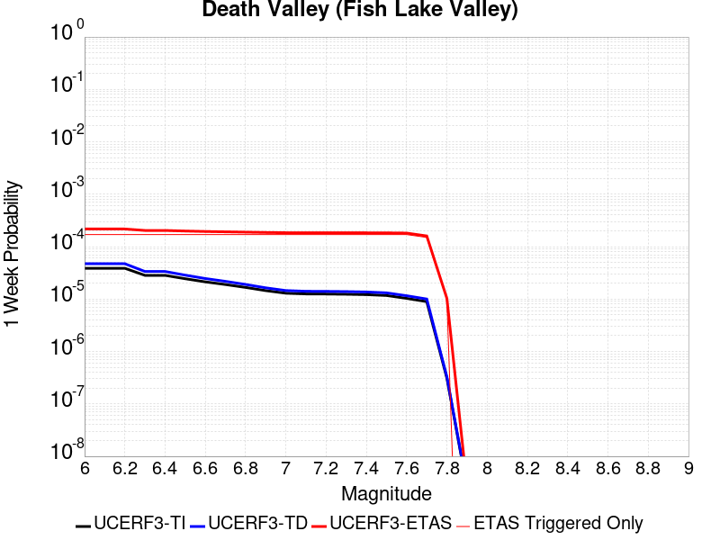 | 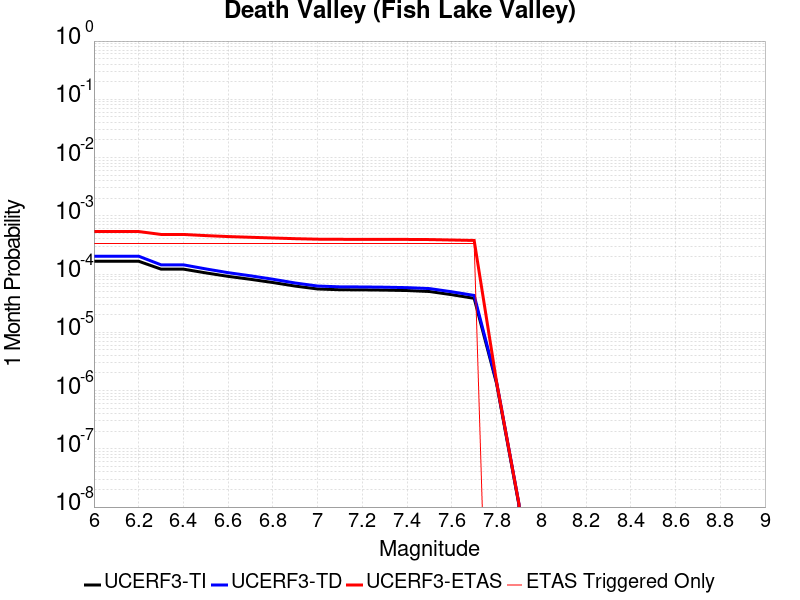 | 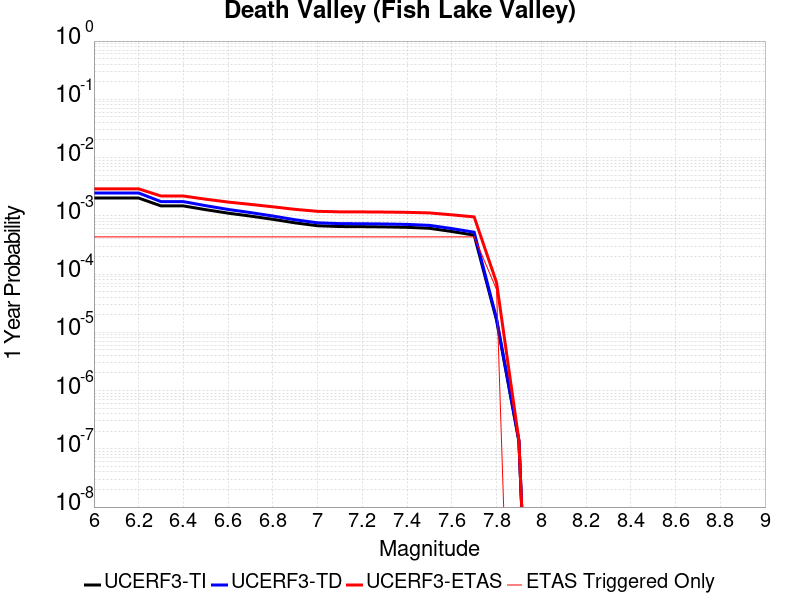 | 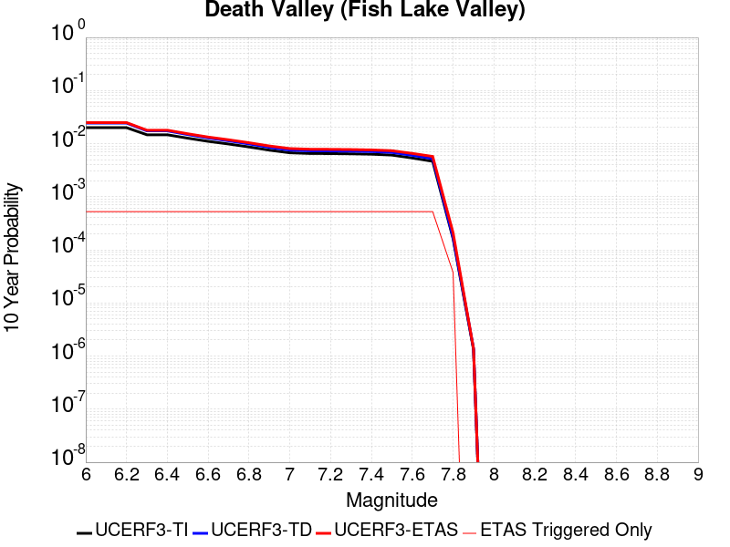 |

| Magnitude | 1 wk TI Prob | 1 wk TD Prob | 1 wk ETAS Prob | 1 wk ETAS/TD Gain | 1 wk ETAS Triggered Only | 1 mo TI Prob | 1 mo TD Prob | 1 mo ETAS Prob | 1 mo ETAS/TD Gain | 1 mo ETAS Triggered Only | 1 yr TI Prob | 1 yr TD Prob | 1 yr ETAS Prob | 1 yr ETAS/TD Gain | 1 yr ETAS Triggered Only | 10 yr TI Prob | 10 yr TD Prob | 10 yr ETAS Prob | 10 yr ETAS/TD Gain | 10 yr ETAS Triggered Only |
|-----|-----|-----|-----|-----|-----|-----|-----|-----|-----|-----|-----|-----|-----|-----|-----|-----|-----|-----|-----|-----|
| 6.0 | 3.872328E-5 | 4.7267473E-5 | 2.598967E-4 | 5.498426 | 2.1263928E-4 | 1.6594635E-4 | 2.0256084E-4 | 4.1515706E-4 | 2.0495424 | 2.1263928E-4 | 0.0020185246 | 0.002463534 | 0.0028453418 | 1.1549838 | 3.827507E-4 | 0.02000288 | 0.024388181 | 0.024844578 | 1.0187138 | 4.678064E-4 |
| 6.1 | 3.872328E-5 | 4.7267473E-5 | 2.598967E-4 | 5.498426 | 2.1263928E-4 | 1.6594635E-4 | 2.0256084E-4 | 4.1515706E-4 | 2.0495424 | 2.1263928E-4 | 0.0020185246 | 0.002463534 | 0.0028453418 | 1.1549838 | 3.827507E-4 | 0.02000288 | 0.024388181 | 0.024844578 | 1.0187138 | 4.678064E-4 |
| 6.2 | 3.872328E-5 | 4.7267473E-5 | 2.598967E-4 | 5.498426 | 2.1263928E-4 | 1.6594635E-4 | 2.0256084E-4 | 4.1515706E-4 | 2.0495424 | 2.1263928E-4 | 0.0020185246 | 0.002463534 | 0.0028453418 | 1.1549838 | 3.827507E-4 | 0.02000288 | 0.024388181 | 0.024844578 | 1.0187138 | 4.678064E-4 |
| 6.3 | 2.8356371E-5 | 3.3609853E-5 | 2.4624198E-4 | 7.3264823 | 2.1263928E-4 | 1.2152165E-4 | 1.4403471E-4 | 3.5664337E-4 | 2.476093 | 2.1263928E-4 | 0.0014785219 | 0.0017522911 | 0.002134371 | 1.218046 | 3.827507E-4 | 0.014687235 | 0.017391782 | 0.017851453 | 1.0264304 | 4.678064E-4 |
| 6.4 | 2.8356371E-5 | 3.3609853E-5 | 2.4624198E-4 | 7.3264823 | 2.1263928E-4 | 1.2152165E-4 | 1.4403471E-4 | 3.5664337E-4 | 2.476093 | 2.1263928E-4 | 0.0014785219 | 0.0017522911 | 0.002134371 | 1.218046 | 3.827507E-4 | 0.014687235 | 0.017391782 | 0.017851453 | 1.0264304 | 4.678064E-4 |
| 6.5 | 2.4448687E-5 | 2.8607552E-5 | 2.4124075E-4 | 8.432764 | 2.1263928E-4 | 1.0477588E-4 | 1.2259831E-4 | 3.3521152E-4 | 2.7342262 | 2.1263928E-4 | 0.0012748998 | 0.0014916632 | 0.0018738429 | 1.2562106 | 3.827507E-4 | 0.012676105 | 0.014821377 | 0.015282249 | 1.0310951 | 4.678064E-4 |
| 6.6 | 2.1298161E-5 | 2.4660083E-5 | 2.3729412E-4 | 9.6226 | 2.1263928E-4 | 9.127464E-5 | 1.0568198E-4 | 3.182988E-4 | 3.011855 | 2.1263928E-4 | 0.0011107022 | 0.0012859525 | 0.0016682111 | 1.2972571 | 3.827507E-4 | 0.011051672 | 0.012788526 | 0.013250349 | 1.0361123 | 4.678064E-4 |
| 6.7 | 1.8959729E-5 | 2.1781025E-5 | 2.3441567E-4 | 10.76238 | 2.1263928E-4 | 8.125345E-5 | 9.334405E-5 | 3.0596348E-4 | 3.2778037 | 2.1263928E-4 | 9.888117E-4 | 0.001135897 | 0.0015182128 | 1.3365762 | 3.827507E-4 | 0.009844234 | 0.01130357 | 0.011766088 | 1.0409179 | 4.678064E-4 |
| 6.8 | 1.6691629E-5 | 1.9018353E-5 | 2.3165358E-4 | 12.180529 | 2.1263928E-4 | 7.153359E-5 | 8.150477E-5 | 2.9412672E-4 | 3.6087055 | 2.1263928E-4 | 8.7057345E-4 | 9.918857E-4 | 0.0013742568 | 1.3854991 | 3.827507E-4 | 0.008671708 | 0.009876343 | 0.01033953 | 1.0468986 | 4.678064E-4 |
| 6.9 | 1.450505E-5 | 1.638954E-5 | 2.2902533E-4 | 13.973872 | 2.1263928E-4 | 6.216302E-5 | 7.0239046E-5 | 2.828634E-4 | 4.027153 | 2.1263928E-4 | 7.5657194E-4 | 8.5483363E-4 | 0.0012372572 | 1.447366 | 3.827507E-4 | 0.007540013 | 0.008516385 | 0.008980208 | 1.0544623 | 4.678064E-4 |
| 7.0 | 1.2940855E-5 | 1.4537972E-5 | 2.2717415E-4 | 15.626263 | 2.1263928E-4 | 5.545963E-5 | 6.230414E-5 | 2.7493018E-4 | 4.412711 | 2.1263928E-4 | 6.750118E-4 | 7.5829466E-4 | 0.0011407551 | 1.5043691 | 3.827507E-4 | 0.006729651 | 0.0075576897 | 0.008021961 | 1.0614302 | 4.678064E-4 |
| 7.1 | 1.2544658E-5 | 1.4078208E-5 | 2.2671449E-4 | 16.103931 | 2.1263928E-4 | 5.3761712E-5 | 6.0333812E-5 | 2.7296026E-4 | 4.5241675 | 2.1263928E-4 | 6.5435225E-4 | 7.343222E-4 | 0.0011167919 | 1.5208472 | 3.827507E-4 | 0.006524288 | 0.007319551 | 0.007783933 | 1.0634441 | 4.678064E-4 |
| 7.2 | 1.2489416E-5 | 1.4015674E-5 | 2.2665197E-4 | 16.171322 | 2.1263928E-4 | 5.3524967E-5 | 6.0065824E-5 | 2.7269233E-4 | 4.5398917 | 2.1263928E-4 | 6.514716E-4 | 7.310616E-4 | 0.0011135326 | 1.5231719 | 3.827507E-4 | 0.006495651 | 0.0072871596 | 0.007751557 | 1.0637282 | 4.678064E-4 |
| 7.3 | 1.2368307E-5 | 1.3879812E-5 | 2.2651615E-4 | 16.319826 | 2.1263928E-4 | 5.3005948E-5 | 5.9483587E-5 | 2.7211022E-4 | 4.574543 | 2.1263928E-4 | 6.451563E-4 | 7.2397763E-4 | 0.0011064513 | 1.5282948 | 3.827507E-4 | 0.0064328653 | 0.007216782 | 0.0076812124 | 1.0643542 | 4.678064E-4 |
| 7.4 | 1.2161707E-5 | 1.36478675E-5 | 2.2628425E-4 | 16.58019 | 2.1263928E-4 | 5.212056E-5 | 5.8489582E-5 | 2.711164E-4 | 4.6352944 | 2.1263928E-4 | 6.3438306E-4 | 7.118836E-4 | 0.0010943618 | 1.5372764 | 3.827507E-4 | 0.006325751 | 0.0070966207 | 0.007561107 | 1.0654517 | 4.678064E-4 |
| 7.5 | 1.1707948E-5 | 1.3145515E-5 | 2.25782E-4 | 17.175592 | 2.1263928E-4 | 5.0175953E-5 | 5.6336736E-5 | 2.6896404E-4 | 4.774221 | 2.1263928E-4 | 6.10721E-4 | 6.856895E-4 | 0.0010681777 | 1.5578156 | 3.827507E-4 | 0.0060904534 | 0.006836321 | 0.0073009296 | 1.0679617 | 4.678064E-4 |
| 7.6 | 1.0319538E-5 | 1.1579622E-5 | 2.2421643E-4 | 19.363018 | 2.1263928E-4 | 4.4225842E-5 | 4.9626036E-5 | 2.6225476E-4 | 5.2846203 | 2.1263928E-4 | 5.383166E-4 | 6.040347E-4 | 9.865542E-4 | 1.6332741 | 3.827507E-4 | 0.0053701443 | 0.0060244603 | 0.0064894487 | 1.0771834 | 4.678064E-4 |
| 7.7 | 8.937764E-6 | 1.0022779E-5 | 2.2265993E-4 | 22.215387 | 2.1263928E-4 | 3.830414E-5 | 4.295409E-5 | 2.5558422E-4 | 5.9501724 | 2.1263928E-4 | 4.6625308E-4 | 5.228456E-4 | 9.053962E-4 | 1.7316703 | 3.827507E-4 | 0.0046527605 | 0.005216664 | 0.00568203 | 1.0892075 | 4.678064E-4 |
| 7.8 | 3.108007E-7 | 3.284654E-7 | 3.284654E-7 | 1.0 | 0.0 | 1.3320023E-6 | 1.407708E-6 | 1.407708E-6 | 1.0 | 0.0 | 1.6217007E-5 | 1.7138715E-5 | 5.9665843E-5 | 3.4813485 | 4.2527856E-5 | 1.6215823E-4 | 1.7137431E-4 | 2.1389488E-4 | 1.2481152 | 4.2527856E-5 |
| 7.9 | 2.5591178E-9 | 2.6696718E-9 | 2.6696718E-9 | 1.0 | 0.0 | 1.0967647E-8 | 1.14414505E-8 | 1.14414505E-8 | 1.0 | 0.0 | 1.335311E-7 | 1.3929966E-7 | 1.3929966E-7 | 1.0 | 0.0 | 1.3353102E-6 | 1.3929966E-6 | 1.3929966E-6 | 1.0 | 0.0 |

## Calico-Hidalgo
*[(top)](#table-of-contents)*

| 1 Week | 1 Month | 1 Year | 10 Year |
|-----|-----|-----|-----|
| 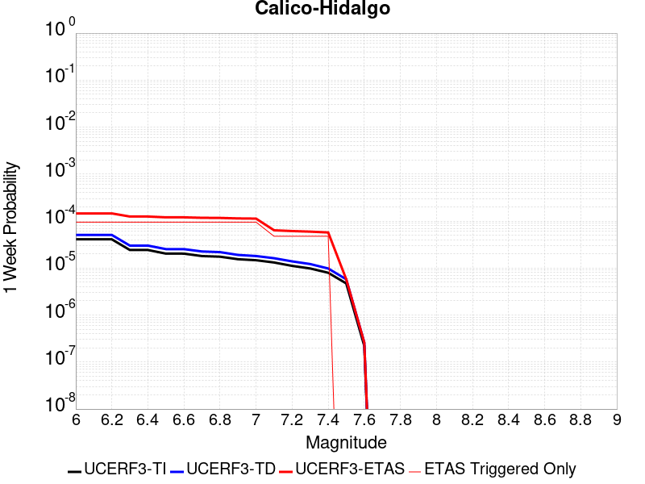 | 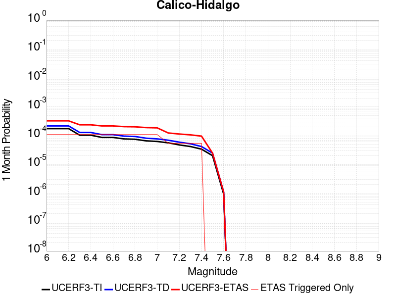 | 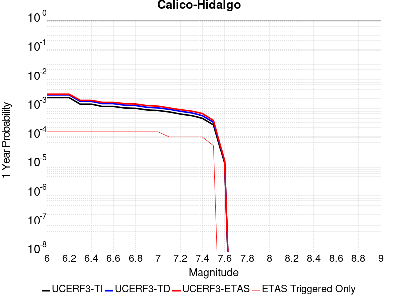 | 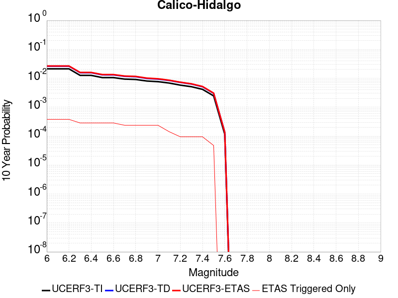 |

| Magnitude | 1 wk TI Prob | 1 wk TD Prob | 1 wk ETAS Prob | 1 wk ETAS/TD Gain | 1 wk ETAS Triggered Only | 1 mo TI Prob | 1 mo TD Prob | 1 mo ETAS Prob | 1 mo ETAS/TD Gain | 1 mo ETAS Triggered Only | 1 yr TI Prob | 1 yr TD Prob | 1 yr ETAS Prob | 1 yr ETAS/TD Gain | 1 yr ETAS Triggered Only | 10 yr TI Prob | 10 yr TD Prob | 10 yr ETAS Prob | 10 yr ETAS/TD Gain | 10 yr ETAS Triggered Only |
|-----|-----|-----|-----|-----|-----|-----|-----|-----|-----|-----|-----|-----|-----|-----|-----|-----|-----|-----|-----|-----|
| 6.0 | 4.0906612E-5 | 5.0703686E-5 | 1.7828078E-4 | 3.5161307 | 1.2758357E-4 | 1.7530227E-4 | 2.172857E-4 | 3.8736017E-4 | 1.7827227 | 1.7011142E-4 | 0.0021322158 | 0.002642648 | 0.0028547253 | 1.0802518 | 2.1263928E-4 | 0.02111873 | 0.026152607 | 0.026566764 | 1.0158361 | 4.2527856E-4 |
| 6.1 | 4.0906612E-5 | 5.0703686E-5 | 1.7828078E-4 | 3.5161307 | 1.2758357E-4 | 1.7530227E-4 | 2.172857E-4 | 3.8736017E-4 | 1.7827227 | 1.7011142E-4 | 0.0021322158 | 0.002642648 | 0.0028547253 | 1.0802518 | 2.1263928E-4 | 0.02111873 | 0.026152607 | 0.026566764 | 1.0158361 | 4.2527856E-4 |
| 6.2 | 4.0906612E-5 | 5.0703686E-5 | 1.7828078E-4 | 3.5161307 | 1.2758357E-4 | 1.7530227E-4 | 2.172857E-4 | 3.8736017E-4 | 1.7827227 | 1.7011142E-4 | 0.0021322158 | 0.002642648 | 0.0028547253 | 1.0802518 | 2.1263928E-4 | 0.02111873 | 0.026152607 | 0.026566764 | 1.0158361 | 4.2527856E-4 |
| 6.3 | 2.4242801E-5 | 3.0090669E-5 | 1.1514382E-4 | 3.8265624 | 8.505571E-5 | 1.0389358E-4 | 1.2895382E-4 | 2.1399856E-4 | 1.6594976 | 8.505571E-5 | 0.0012641704 | 0.0015689151 | 0.0016962985 | 1.081192 | 1.2758357E-4 | 0.01257003 | 0.01558206 | 0.015833251 | 1.0161206 | 2.5516714E-4 |
| 6.4 | 2.4242801E-5 | 3.0090669E-5 | 1.1514382E-4 | 3.8265624 | 8.505571E-5 | 1.0389358E-4 | 1.2895382E-4 | 2.1399856E-4 | 1.6594976 | 8.505571E-5 | 0.0012641704 | 0.0015689151 | 0.0016962985 | 1.081192 | 1.2758357E-4 | 0.01257003 | 0.01558206 | 0.015833251 | 1.0161206 | 2.5516714E-4 |
| 6.5 | 2.0286952E-5 | 2.5315738E-5 | 1.103693E-4 | 4.3597107 | 8.505571E-5 | 8.694118E-5 | 1.0849161E-4 | 1.9353809E-4 | 1.7838992 | 8.505571E-5 | 0.0010579949 | 0.001320102 | 0.0014475172 | 1.0965191 | 1.2758357E-4 | 0.010529719 | 0.013124538 | 0.013376356 | 1.0191869 | 2.5516714E-4 |
| 6.6 | 2.0269223E-5 | 2.5296687E-5 | 1.1035025E-4 | 4.362241 | 8.505571E-5 | 8.6865206E-5 | 1.08409964E-4 | 1.9345645E-4 | 1.7844896 | 8.505571E-5 | 0.0010570707 | 0.0013191093 | 0.0014465246 | 1.096592 | 1.2758357E-4 | 0.010520565 | 0.013114728 | 0.013366548 | 1.0192014 | 2.5516714E-4 |
| 6.7 | 1.799852E-5 | 2.25406E-5 | 1.07594395E-4 | 4.77336 | 8.505571E-5 | 7.713423E-5 | 9.659908E-5 | 1.8164657E-4 | 1.8804172 | 8.505571E-5 | 9.3870464E-4 | 0.0011754738 | 0.0013029074 | 1.1084104 | 1.2758357E-4 | 0.009347493 | 0.011694173 | 0.011904326 | 1.0179707 | 2.1263928E-4 |
| 6.8 | 1.7458793E-5 | 2.184212E-5 | 1.06895975E-4 | 4.894029 | 8.505571E-5 | 7.4821255E-5 | 9.3605806E-5 | 1.7865356E-4 | 1.9085734 | 8.505571E-5 | 9.10568E-4 | 0.0011390693 | 0.0012665075 | 1.1118792 | 1.2758357E-4 | 0.009068459 | 0.011333893 | 0.011544122 | 1.0185487 | 2.1263928E-4 |
| 6.9 | 1.542884E-5 | 1.9025927E-5 | 1.0408002E-4 | 5.470431 | 8.505571E-5 | 6.612192E-5 | 8.153721E-5 | 1.6658599E-4 | 2.043067 | 8.505571E-5 | 8.04737E-4 | 9.922766E-4 | 0.0011197336 | 1.1284491 | 1.2758357E-4 | 0.008018291 | 0.009879857 | 0.010090396 | 1.0213099 | 2.1263928E-4 |
| 7.0 | 1.468253E-5 | 1.8030598E-5 | 1.0308478E-4 | 5.717213 | 8.505571E-5 | 6.292361E-5 | 7.7271776E-5 | 1.6232092E-4 | 2.1006494 | 8.505571E-5 | 7.658257E-4 | 9.4039086E-4 | 0.0010678545 | 1.1355432 | 1.2758357E-4 | 0.0076319184 | 0.009365481 | 0.009576129 | 1.0224919 | 2.1263928E-4 |
| 7.1 | 1.3139281E-5 | 1.6200942E-5 | 5.872811E-5 | 3.624981 | 4.2527856E-5 | 5.6309986E-5 | 6.943083E-5 | 1.11955735E-4 | 1.6124786 | 4.2527856E-5 | 6.853584E-4 | 8.4500515E-4 | 9.29989E-4 | 1.100572 | 8.505571E-5 | 0.0068324856 | 0.0084192185 | 0.0085457275 | 1.0150262 | 1.2758357E-4 |
| 7.2 | 1.1127404E-5 | 1.3866597E-5 | 5.6393863E-5 | 4.0668855 | 4.2527856E-5 | 4.7688E-5 | 5.942698E-5 | 1.0195231E-4 | 1.7155895 | 4.2527856E-5 | 5.8044674E-4 | 7.232942E-4 | 8.082884E-4 | 1.1175098 | 8.505571E-5 | 0.0057893298 | 0.0072105085 | 0.007294951 | 1.011711 | 8.505571E-5 |
| 7.3 | 9.808154E-6 | 1.2176215E-5 | 5.4703552E-5 | 4.4926567 | 4.2527856E-5 | 4.2034266E-5 | 5.2182797E-5 | 9.470843E-5 | 1.8149359 | 4.2527856E-5 | 5.11647E-4 | 6.3515105E-4 | 7.2015275E-4 | 1.1338291 | 8.505571E-5 | 0.0051047057 | 0.006334433 | 0.00641895 | 1.0133425 | 8.505571E-5 |
| 7.4 | 7.942452E-6 | 9.792144E-6 | 5.231958E-5 | 5.343016 | 4.2527856E-5 | 3.4038632E-5 | 4.1965708E-5 | 8.449178E-5 | 2.0133529 | 4.2527856E-5 | 4.1434157E-4 | 5.1082217E-4 | 5.9583446E-4 | 1.1664224 | 8.505571E-5 | 0.0041356985 | 0.005097421 | 0.005182043 | 1.016601 | 8.505571E-5 |
| 7.5 | 4.7121216E-6 | 5.772836E-6 | 5.772836E-6 | 1.0 | 0.0 | 2.019465E-5 | 2.4740535E-5 | 2.4740535E-5 | 1.0 | 0.0 | 2.4584212E-4 | 3.0118204E-4 | 3.436971E-4 | 1.1411606 | 4.2527856E-5 | 0.0024557032 | 0.0030084911 | 0.003050891 | 1.0140934 | 4.2527856E-5 |
| 7.6 | 2.21172E-7 | 2.603961E-7 | 2.603961E-7 | 1.0 | 0.0 | 9.478797E-7 | 1.1159829E-6 | 1.1159829E-6 | 1.0 | 0.0 | 1.1540374E-5 | 1.3587036E-5 | 1.3587036E-5 | 1.0 | 0.0 | 1.1539775E-4 | 1.3586486E-4 | 1.3586486E-4 | 1.0 | 0.0 |

## Independence rev 2011
*[(top)](#table-of-contents)*

| 1 Week | 1 Month | 1 Year | 10 Year |
|-----|-----|-----|-----|
| 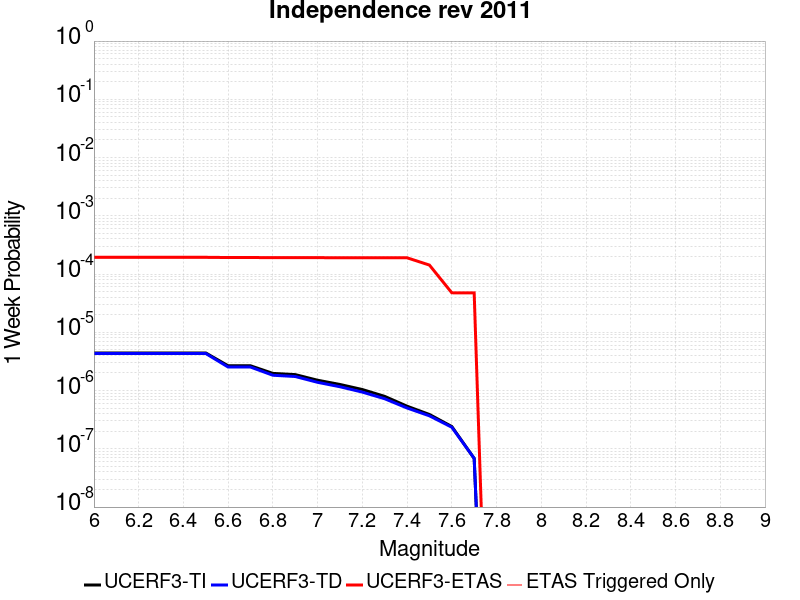 | 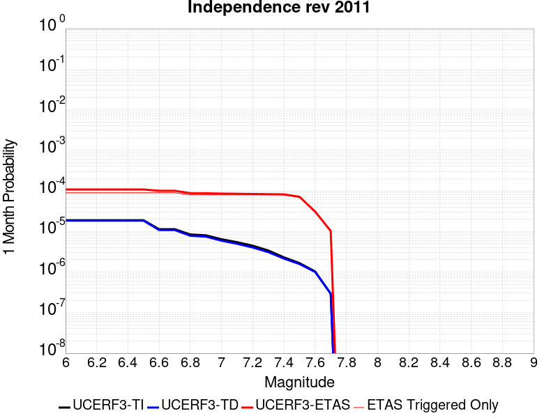 | 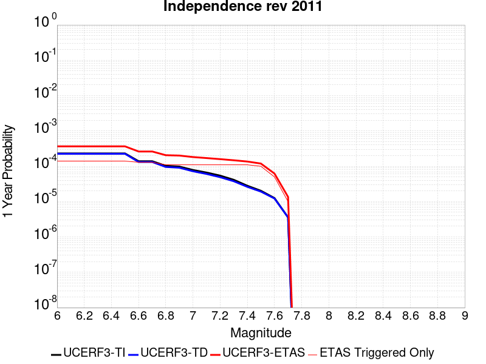 | 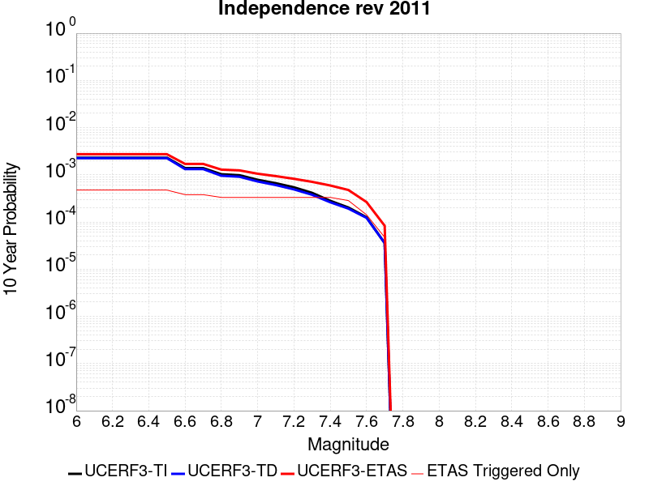 |

| Magnitude | 1 wk TI Prob | 1 wk TD Prob | 1 wk ETAS Prob | 1 wk ETAS/TD Gain | 1 wk ETAS Triggered Only | 1 mo TI Prob | 1 mo TD Prob | 1 mo ETAS Prob | 1 mo ETAS/TD Gain | 1 mo ETAS Triggered Only | 1 yr TI Prob | 1 yr TD Prob | 1 yr ETAS Prob | 1 yr ETAS/TD Gain | 1 yr ETAS Triggered Only | 10 yr TI Prob | 10 yr TD Prob | 10 yr ETAS Prob | 10 yr ETAS/TD Gain | 10 yr ETAS Triggered Only |
|-----|-----|-----|-----|-----|-----|-----|-----|-----|-----|-----|-----|-----|-----|-----|-----|-----|-----|-----|-----|-----|
| 6.0 | 4.422171E-6 | 4.326227E-6 | 1.7443691E-4 | 40.320797 | 1.7011142E-4 | 1.8952025E-5 | 1.8540857E-5 | 2.311762E-4 | 12.468473 | 2.1263928E-4 | 2.3071647E-4 | 2.2571455E-4 | 5.658606E-4 | 2.5069745 | 3.4022285E-4 | 0.0023047708 | 0.0022551466 | 0.002721898 | 1.2069716 | 4.678064E-4 |
| 6.1 | 4.422171E-6 | 4.326227E-6 | 1.7443691E-4 | 40.320797 | 1.7011142E-4 | 1.8952025E-5 | 1.8540857E-5 | 2.311762E-4 | 12.468473 | 2.1263928E-4 | 2.3071647E-4 | 2.2571455E-4 | 5.658606E-4 | 2.5069745 | 3.4022285E-4 | 0.0023047708 | 0.0022551466 | 0.002721898 | 1.2069716 | 4.678064E-4 |
| 6.2 | 4.422171E-6 | 4.326227E-6 | 1.7443691E-4 | 40.320797 | 1.7011142E-4 | 1.8952025E-5 | 1.8540857E-5 | 2.311762E-4 | 12.468473 | 2.1263928E-4 | 2.3071647E-4 | 2.2571455E-4 | 5.658606E-4 | 2.5069745 | 3.4022285E-4 | 0.0023047708 | 0.0022551466 | 0.002721898 | 1.2069716 | 4.678064E-4 |
| 6.3 | 4.422171E-6 | 4.326227E-6 | 1.7443691E-4 | 40.320797 | 1.7011142E-4 | 1.8952025E-5 | 1.8540857E-5 | 2.311762E-4 | 12.468473 | 2.1263928E-4 | 2.3071647E-4 | 2.2571455E-4 | 5.658606E-4 | 2.5069745 | 3.4022285E-4 | 0.0023047708 | 0.0022551466 | 0.002721898 | 1.2069716 | 4.678064E-4 |
| 6.4 | 4.422171E-6 | 4.326227E-6 | 1.7443691E-4 | 40.320797 | 1.7011142E-4 | 1.8952025E-5 | 1.8540857E-5 | 2.311762E-4 | 12.468473 | 2.1263928E-4 | 2.3071647E-4 | 2.2571455E-4 | 5.658606E-4 | 2.5069745 | 3.4022285E-4 | 0.0023047708 | 0.0022551466 | 0.002721898 | 1.2069716 | 4.678064E-4 |
| 6.5 | 4.422171E-6 | 4.326227E-6 | 1.7443691E-4 | 40.320797 | 1.7011142E-4 | 1.8952025E-5 | 1.8540857E-5 | 2.311762E-4 | 12.468473 | 2.1263928E-4 | 2.3071647E-4 | 2.2571455E-4 | 5.658606E-4 | 2.5069745 | 3.4022285E-4 | 0.0023047708 | 0.0022551466 | 0.002721898 | 1.2069716 | 4.678064E-4 |
| 6.6 | 2.663744E-6 | 2.5319862E-6 | 1.7264298E-4 | 68.1848 | 1.7011142E-4 | 1.1415996E-5 | 1.0851327E-5 | 2.234883E-4 | 20.595482 | 2.1263928E-4 | 1.3898089E-4 | 1.3210738E-4 | 4.2976305E-4 | 3.2531343 | 2.97695E-4 | 0.0013889399 | 0.0013203367 | 0.0017025821 | 1.289506 | 3.827507E-4 |
| 6.7 | 2.663744E-6 | 2.5319862E-6 | 1.7264298E-4 | 68.1848 | 1.7011142E-4 | 1.1415996E-5 | 1.0851327E-5 | 2.234883E-4 | 20.595482 | 2.1263928E-4 | 1.3898089E-4 | 1.3210738E-4 | 4.2976305E-4 | 3.2531343 | 2.97695E-4 | 0.0013889399 | 0.0013203367 | 0.0017025821 | 1.289506 | 3.827507E-4 |
| 6.8 | 1.9716529E-6 | 1.8322585E-6 | 1.7194336E-4 | 93.842316 | 1.7011142E-4 | 8.449913E-6 | 7.852514E-6 | 2.2049012E-4 | 28.078924 | 2.1263928E-4 | 1.0287284E-4 | 9.5600284E-5 | 3.5074304E-4 | 3.6688492 | 2.5516714E-4 | 0.0010282523 | 9.556045E-4 | 0.0012955022 | 1.3556887 | 3.4022285E-4 |
| 6.9 | 1.8788617E-6 | 1.7429993E-6 | 1.7185413E-4 | 98.59679 | 1.7011142E-4 | 8.0522395E-6 | 7.4699765E-6 | 2.2010767E-4 | 29.465645 | 2.1263928E-4 | 9.80316E-5 | 9.0943286E-5 | 3.460872E-4 | 3.805528 | 2.5516714E-4 | 9.798837E-4 | 9.0907275E-4 | 0.0012489863 | 1.3739123 | 3.4022285E-4 |
| 7.0 | 1.5045488E-6 | 1.3849503E-6 | 1.7149614E-4 | 123.82836 | 1.7011142E-4 | 6.44805E-6 | 5.9354884E-6 | 2.185735E-4 | 36.824856 | 2.1263928E-4 | 7.8502184E-5 | 7.226223E-5 | 3.2741093E-4 | 4.5308723 | 2.5516714E-4 | 7.8474457E-4 | 7.2239246E-4 | 0.0010623696 | 1.4706266 | 3.4022285E-4 |
| 7.1 | 1.272341E-6 | 1.1625096E-6 | 1.7127373E-4 | 147.33102 | 1.7011142E-4 | 5.4528787E-6 | 4.982175E-6 | 2.176204E-4 | 43.6798 | 2.1263928E-4 | 6.6386776E-5 | 6.0656326E-5 | 3.15808E-4 | 5.2065134 | 2.5516714E-4 | 6.636695E-4 | 6.064009E-4 | 9.4641745E-4 | 1.5607125 | 3.4022285E-4 |
| 7.2 | 1.0416892E-6 | 9.4098806E-7 | 1.7105225E-4 | 181.7794 | 1.7011142E-4 | 4.464375E-6 | 4.0328E-6 | 2.1667122E-4 | 53.727245 | 2.1263928E-4 | 5.4352407E-5 | 4.909825E-5 | 3.0425287E-4 | 6.196817 | 2.5516714E-4 | 5.4339116E-4 | 4.9087586E-4 | 8.309317E-4 | 1.6927532 | 3.4022285E-4 |
| 7.3 | 7.9450155E-7 | 7.235002E-7 | 1.708348E-4 | 236.12268 | 1.7011142E-4 | 3.4050022E-6 | 3.1007114E-6 | 2.1573933E-4 | 69.57736 | 2.1263928E-4 | 4.1455114E-5 | 3.775052E-5 | 2.9290802E-4 | 7.759046 | 2.5516714E-4 | 4.144738E-4 | 3.7744216E-4 | 7.175366E-4 | 1.9010504 | 3.4022285E-4 |
| 7.4 | 5.3893444E-7 | 5.019512E-7 | 1.7061329E-4 | 339.90015 | 1.7011142E-4 | 2.309717E-6 | 2.1512178E-6 | 2.1479004E-4 | 99.84579 | 2.1263928E-4 | 2.8120441E-5 | 2.6190766E-5 | 2.813512E-4 | 10.742382 | 2.5516714E-4 | 2.8116882E-4 | 2.6187726E-4 | 6.02011E-4 | 2.2988288 | 3.4022285E-4 |
| 7.5 | 3.8852085E-7 | 3.682554E-7 | 1.2795177E-4 | 347.45392 | 1.2758357E-4 | 1.6650882E-6 | 1.5782365E-6 | 1.7168939E-4 | 108.78559 | 1.7011142E-4 | 2.027226E-5 | 1.9214862E-5 | 2.3185005E-4 | 12.066184 | 2.1263928E-4 | 2.0270412E-4 | 1.9213221E-4 | 4.8977E-4 | 2.54913 | 2.97695E-4 |
| 7.6 | 2.414929E-7 | 2.345755E-7 | 4.276242E-5 | 182.29704 | 4.2527856E-5 | 1.0349692E-6 | 1.0053232E-6 | 8.606095E-5 | 85.605255 | 8.505571E-5 | 1.2600677E-5 | 1.2239742E-5 | 1.3982174E-4 | 11.423586 | 1.2758357E-4 | 1.2599962E-4 | 1.223908E-4 | 2.9248142E-4 | 2.3897336 | 1.7011142E-4 |
| 7.7 | 6.8298014E-8 | 6.85897E-8 | 4.2596443E-5 | 621.03265 | 4.2527856E-5 | 2.9270575E-7 | 2.9395582E-7 | 4.2821797E-5 | 145.67427 | 4.2527856E-5 | 3.5636867E-6 | 3.5789067E-6 | 4.610661E-5 | 12.882876 | 4.2527856E-5 | 3.5636294E-5 | 3.5788536E-5 | 7.831487E-5 | 2.188267 | 4.2527856E-5 |

## Red Pass
*[(top)](#table-of-contents)*

| 1 Week | 1 Month | 1 Year | 10 Year |
|-----|-----|-----|-----|
|  | 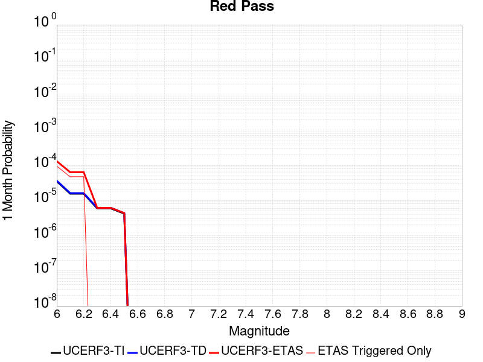 | 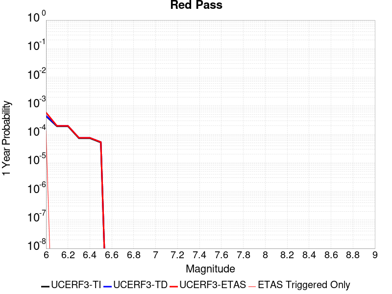 | 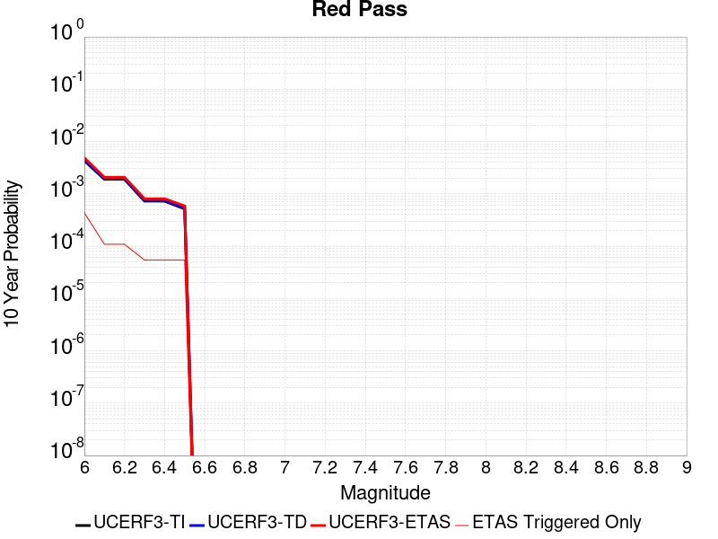 |

| Magnitude | 1 wk TI Prob | 1 wk TD Prob | 1 wk ETAS Prob | 1 wk ETAS/TD Gain | 1 wk ETAS Triggered Only | 1 mo TI Prob | 1 mo TD Prob | 1 mo ETAS Prob | 1 mo ETAS/TD Gain | 1 mo ETAS Triggered Only | 1 yr TI Prob | 1 yr TD Prob | 1 yr ETAS Prob | 1 yr ETAS/TD Gain | 1 yr ETAS Triggered Only | 10 yr TI Prob | 10 yr TD Prob | 10 yr ETAS Prob | 10 yr ETAS/TD Gain | 10 yr ETAS Triggered Only |
|-----|-----|-----|-----|-----|-----|-----|-----|-----|-----|-----|-----|-----|-----|-----|-----|-----|-----|-----|-----|-----|
| 6.0 | 8.258278E-6 | 8.551265E-6 | 9.360625E-5 | 10.94648 | 8.505571E-5 | 3.539214E-5 | 3.6647863E-5 | 1.2170046E-4 | 3.3208063 | 8.505571E-5 | 4.308141E-4 | 4.4611428E-4 | 6.586587E-4 | 1.476435 | 2.1263928E-4 | 0.0042997985 | 0.004453945 | 0.0048773293 | 1.0950583 | 4.2527856E-4 |
| 6.1 | 3.649988E-6 | 3.7753161E-6 | 4.6303012E-5 | 12.264671 | 4.2527856E-5 | 1.5642712E-5 | 1.6179853E-5 | 5.870702E-5 | 3.6284027 | 4.2527856E-5 | 1.9043336E-4 | 1.9697666E-4 | 2.3949613E-4 | 1.2158605 | 4.2527856E-5 | 0.0019027026 | 0.001968488 | 0.0020533763 | 1.0431236 | 8.505571E-5 |
| 6.2 | 3.649988E-6 | 3.7753161E-6 | 4.6303012E-5 | 12.264671 | 4.2527856E-5 | 1.5642712E-5 | 1.6179853E-5 | 5.870702E-5 | 3.6284027 | 4.2527856E-5 | 1.9043336E-4 | 1.9697666E-4 | 2.3949613E-4 | 1.2158605 | 4.2527856E-5 | 0.0019027026 | 0.001968488 | 0.0020533763 | 1.0431236 | 8.505571E-5 |
| 6.3 | 1.3924937E-6 | 1.4411166E-6 | 1.4411166E-6 | 1.0 | 0.0 | 5.9678164E-6 | 6.1762075E-6 | 6.1762075E-6 | 1.0 | 0.0 | 7.265574E-5 | 7.519415E-5 | 7.519415E-5 | 1.0 | 0.0 | 7.263199E-4 | 7.518258E-4 | 7.943217E-4 | 1.0565236 | 4.2527856E-5 |
| 6.4 | 1.3924937E-6 | 1.4411166E-6 | 1.4411166E-6 | 1.0 | 0.0 | 5.9678164E-6 | 6.1762075E-6 | 6.1762075E-6 | 1.0 | 0.0 | 7.265574E-5 | 7.519415E-5 | 7.519415E-5 | 1.0 | 0.0 | 7.263199E-4 | 7.518258E-4 | 7.943217E-4 | 1.0565236 | 4.2527856E-5 |
| 6.5 | 9.876812E-7 | 1.0221912E-6 | 1.0221912E-6 | 1.0 | 0.0 | 4.2329125E-6 | 4.3808195E-6 | 4.3808195E-6 | 1.0 | 0.0 | 5.153449E-5 | 5.3336476E-5 | 5.3336476E-5 | 1.0 | 0.0 | 5.1522546E-4 | 5.333648E-4 | 5.758699E-4 | 1.0796925 | 4.2527856E-5 |

## San Jacinto (San Bernardino)
*[(top)](#table-of-contents)*

| 1 Week | 1 Month | 1 Year | 10 Year |
|-----|-----|-----|-----|
| 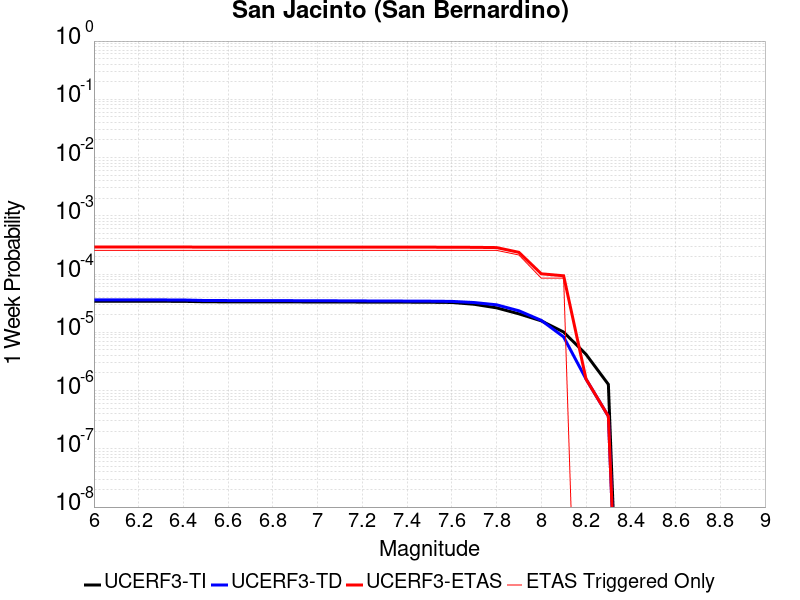 | 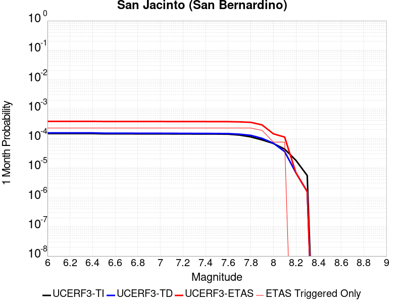 | 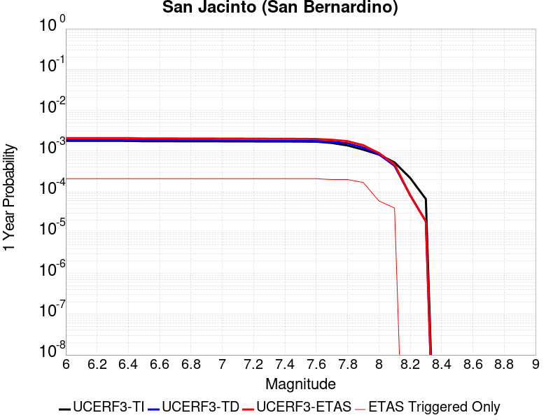 | 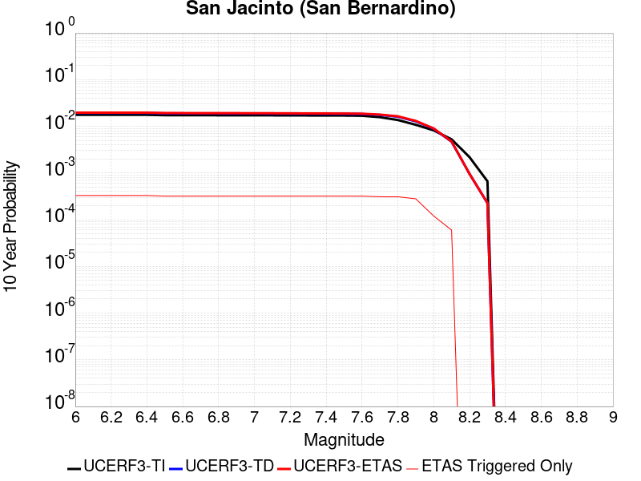 |

| Magnitude | 1 wk TI Prob | 1 wk TD Prob | 1 wk ETAS Prob | 1 wk ETAS/TD Gain | 1 wk ETAS Triggered Only | 1 mo TI Prob | 1 mo TD Prob | 1 mo ETAS Prob | 1 mo ETAS/TD Gain | 1 mo ETAS Triggered Only | 1 yr TI Prob | 1 yr TD Prob | 1 yr ETAS Prob | 1 yr ETAS/TD Gain | 1 yr ETAS Triggered Only | 10 yr TI Prob | 10 yr TD Prob | 10 yr ETAS Prob | 10 yr ETAS/TD Gain | 10 yr ETAS Triggered Only |
|-----|-----|-----|-----|-----|-----|-----|-----|-----|-----|-----|-----|-----|-----|-----|-----|-----|-----|-----|-----|-----|
| 6.0 | 3.409352E-5 | 3.5986508E-5 | 2.9114448E-4 | 8.090378 | 2.5516714E-4 | 1.461069E-4 | 1.542188E-4 | 4.0934657E-4 | 2.6543236 | 2.5516714E-4 | 0.0017774 | 0.0018759987 | 0.0021306872 | 1.1357615 | 2.5516714E-4 | 0.01763251 | 0.019349935 | 0.01972528 | 1.0193977 | 3.827507E-4 |
| 6.1 | 3.409352E-5 | 3.5986508E-5 | 2.9114448E-4 | 8.090378 | 2.5516714E-4 | 1.461069E-4 | 1.542188E-4 | 4.0934657E-4 | 2.6543236 | 2.5516714E-4 | 0.0017774 | 0.0018759987 | 0.0021306872 | 1.1357615 | 2.5516714E-4 | 0.01763251 | 0.019349935 | 0.01972528 | 1.0193977 | 3.827507E-4 |
| 6.2 | 3.409352E-5 | 3.5986508E-5 | 2.9114448E-4 | 8.090378 | 2.5516714E-4 | 1.461069E-4 | 1.542188E-4 | 4.0934657E-4 | 2.6543236 | 2.5516714E-4 | 0.0017774 | 0.0018759987 | 0.0021306872 | 1.1357615 | 2.5516714E-4 | 0.01763251 | 0.019349935 | 0.01972528 | 1.0193977 | 3.827507E-4 |
| 6.3 | 3.409352E-5 | 3.5986508E-5 | 2.9114448E-4 | 8.090378 | 2.5516714E-4 | 1.461069E-4 | 1.542188E-4 | 4.0934657E-4 | 2.6543236 | 2.5516714E-4 | 0.0017774 | 0.0018759987 | 0.0021306872 | 1.1357615 | 2.5516714E-4 | 0.01763251 | 0.019349935 | 0.01972528 | 1.0193977 | 3.827507E-4 |
| 6.4 | 3.400795E-5 | 3.5879173E-5 | 2.9103714E-4 | 8.11159 | 2.5516714E-4 | 1.4574021E-4 | 1.5375883E-4 | 4.0888673E-4 | 2.6592731 | 2.5516714E-4 | 0.0017729428 | 0.0018704084 | 0.0021250984 | 1.136168 | 2.5516714E-4 | 0.017588645 | 0.019295016 | 0.019670382 | 1.019454 | 3.827507E-4 |
| 6.5 | 3.341482E-5 | 3.5139812E-5 | 2.90298E-4 | 8.261228 | 2.5516714E-4 | 1.4319851E-4 | 1.5059051E-4 | 4.057192E-4 | 2.6941886 | 2.5516714E-4 | 0.0017420477 | 0.0018318989 | 0.0020865987 | 1.1390359 | 2.5516714E-4 | 0.017284546 | 0.018916558 | 0.019250346 | 1.0176452 | 3.4022285E-4 |
| 6.6 | 3.3364955E-5 | 3.5077028E-5 | 2.902352E-4 | 8.274224 | 2.5516714E-4 | 1.4298483E-4 | 1.5032147E-4 | 4.0545026E-4 | 2.697221 | 2.5516714E-4 | 0.0017394501 | 0.001828629 | 0.0020833295 | 1.139285 | 2.5516714E-4 | 0.017258976 | 0.018884424 | 0.019218221 | 1.0176759 | 3.4022285E-4 |
| 6.7 | 3.335922E-5 | 3.5066805E-5 | 2.90225E-4 | 8.276345 | 2.5516714E-4 | 1.4296026E-4 | 1.5027766E-4 | 4.0540643E-4 | 2.697716 | 2.5516714E-4 | 0.0017391514 | 0.0018280965 | 0.002082797 | 1.1393256 | 2.5516714E-4 | 0.017256035 | 0.018879214 | 0.019213015 | 1.0176808 | 3.4022285E-4 |
| 6.8 | 3.327683E-5 | 3.496087E-5 | 2.901191E-4 | 8.298394 | 2.5516714E-4 | 1.4260718E-4 | 1.498237E-4 | 4.0495262E-4 | 2.7028608 | 2.5516714E-4 | 0.0017348597 | 0.0018225788 | 0.0020772808 | 1.1397482 | 2.5516714E-4 | 0.017213784 | 0.018824987 | 0.019158805 | 1.0177327 | 3.4022285E-4 |
| 6.9 | 3.3235785E-5 | 3.4901823E-5 | 2.9006007E-4 | 8.310742 | 2.5516714E-4 | 1.4243131E-4 | 1.4957068E-4 | 4.0469965E-4 | 2.705742 | 2.5516714E-4 | 0.0017327217 | 0.0018195034 | 0.0020742062 | 1.1399848 | 2.5516714E-4 | 0.017192734 | 0.018794855 | 0.019128684 | 1.0177617 | 3.4022285E-4 |
| 7.0 | 3.3197095E-5 | 3.4841752E-5 | 2.9E-4 | 8.323347 | 2.5516714E-4 | 1.422655E-4 | 1.4931326E-4 | 4.044423E-4 | 2.708683 | 2.5516714E-4 | 0.0017307063 | 0.0018163746 | 0.0020710784 | 1.1402264 | 2.5516714E-4 | 0.017172894 | 0.018764233 | 0.019098071 | 1.0177913 | 3.4022285E-4 |
| 7.1 | 3.3129716E-5 | 3.4721965E-5 | 2.8988023E-4 | 8.348613 | 2.5516714E-4 | 1.4197677E-4 | 1.4879994E-4 | 4.039291E-4 | 2.7145784 | 2.5516714E-4 | 0.0017271966 | 0.0018101353 | 0.0020648406 | 1.1407106 | 2.5516714E-4 | 0.017138338 | 0.018703312 | 0.019037172 | 1.0178503 | 3.4022285E-4 |
| 7.2 | 3.3034008E-5 | 3.458941E-5 | 2.8974772E-4 | 8.376775 | 2.5516714E-4 | 1.4156665E-4 | 1.4823192E-4 | 4.0336122E-4 | 2.7211497 | 2.5516714E-4 | 0.0017222111 | 0.0018032312 | 0.0020579381 | 1.1412504 | 2.5516714E-4 | 0.017089253 | 0.018635705 | 0.018969588 | 1.0179163 | 3.4022285E-4 |
| 7.3 | 3.2956614E-5 | 3.445717E-5 | 2.896155E-4 | 8.405087 | 2.5516714E-4 | 1.4123498E-4 | 1.4766524E-4 | 4.0279469E-4 | 2.7277558 | 2.5516714E-4 | 0.0017181796 | 0.0017963431 | 0.002051052 | 1.1417929 | 2.5516714E-4 | 0.017049557 | 0.018568452 | 0.018902358 | 1.0179824 | 3.4022285E-4 |
| 7.4 | 3.2915937E-5 | 3.4378863E-5 | 2.8953722E-4 | 8.421954 | 2.5516714E-4 | 1.4106068E-4 | 1.4732967E-4 | 4.0245923E-4 | 2.7316914 | 2.5516714E-4 | 0.0017160608 | 0.0017922645 | 0.0020469744 | 1.1421162 | 2.5516714E-4 | 0.017028693 | 0.018528719 | 0.018862637 | 1.0180217 | 3.4022285E-4 |
| 7.5 | 3.281791E-5 | 3.4243778E-5 | 2.8940217E-4 | 8.451234 | 2.5516714E-4 | 1.406406E-4 | 1.4675081E-4 | 4.018805E-4 | 2.7385232 | 2.5516714E-4 | 0.0017109542 | 0.0017852283 | 0.0020399399 | 1.1426773 | 2.5516714E-4 | 0.016978411 | 0.018459605 | 0.018793548 | 1.0180905 | 3.4022285E-4 |
| 7.6 | 3.2521442E-5 | 3.396873E-5 | 2.891272E-4 | 8.511569 | 2.5516714E-4 | 1.3937015E-4 | 1.4557215E-4 | 4.0070215E-4 | 2.7526016 | 2.5516714E-4 | 0.0016955109 | 0.0017709016 | 0.0020256168 | 1.1438336 | 2.5516714E-4 | 0.016826328 | 0.018317232 | 0.018651223 | 1.0182337 | 3.4022285E-4 |
| 7.7 | 3.0287873E-5 | 3.245276E-5 | 2.8761162E-4 | 8.86247 | 2.5516714E-4 | 1.297987E-4 | 1.3907586E-4 | 3.942075E-4 | 2.8344784 | 2.5516714E-4 | 0.0015791537 | 0.0016919347 | 0.00194667 | 1.1505587 | 2.5516714E-4 | 0.01567979 | 0.01752809 | 0.01786235 | 1.0190699 | 3.4022285E-4 |
| 7.8 | 2.6316151E-5 | 2.9663592E-5 | 2.8482315E-4 | 9.601776 | 2.5516714E-4 | 1.1277862E-4 | 1.2712348E-4 | 3.8225818E-4 | 3.006983 | 2.5516714E-4 | 0.0013722149 | 0.0015466306 | 0.0018014031 | 1.1647274 | 2.5516714E-4 | 0.013637724 | 0.016069634 | 0.01640439 | 1.0208316 | 3.4022285E-4 |
| 7.9 | 2.0761147E-5 | 2.34181E-5 | 2.360524E-4 | 10.079912 | 2.1263928E-4 | 8.897331E-5 | 1.0035944E-4 | 3.1297738E-4 | 3.1185646 | 2.1263928E-4 | 0.0010827117 | 0.0012211921 | 0.0014335717 | 1.1739117 | 2.1263928E-4 | 0.010774517 | 0.012793174 | 0.01308706 | 1.0229721 | 2.97695E-4 |
| 8.0 | 1.5738568E-5 | 1.6033575E-5 | 1.0108792E-4 | 6.3047647 | 8.505571E-5 | 6.744926E-5 | 6.871352E-5 | 1.5376338E-4 | 2.2377458 | 8.505571E-5 | 8.2088535E-4 | 8.3626667E-4 | 9.2125125E-4 | 1.1016238 | 8.505571E-5 | 0.008178596 | 0.008865921 | 0.009034524 | 1.019017 | 1.7011142E-4 |
| 8.1 | 1.0105832E-5 | 8.3304985E-6 | 9.3385504E-5 | 11.210073 | 8.505571E-5 | 4.3309992E-5 | 3.570165E-5 | 1.20754325E-4 | 3.3823178 | 8.505571E-5 | 5.2717153E-4 | 4.345814E-4 | 5.196002E-4 | 1.1956336 | 8.505571E-5 | 0.005259227 | 0.004677232 | 0.0048042187 | 1.02715 | 1.2758357E-4 |
| 8.2 | 4.189207E-6 | 1.5784357E-6 | 1.5784357E-6 | 1.0 | 0.0 | 1.7953622E-5 | 6.7647065E-6 | 6.7647065E-6 | 1.0 | 0.0 | 2.1856341E-4 | 8.235722E-5 | 8.235722E-5 | 1.0 | 0.0 | 0.0021834858 | 9.565867E-4 | 9.565867E-4 | 1.0 | 0.0 |
| 8.3 | 1.2758221E-6 | 3.6149942E-7 | 3.6149942E-7 | 1.0 | 0.0 | 5.4677976E-6 | 1.5492824E-6 | 1.5492824E-6 | 1.0 | 0.0 | 6.65684E-5 | 1.8862354E-5 | 1.8862354E-5 | 1.0 | 0.0 | 6.6548464E-4 | 2.2751294E-4 | 2.2751294E-4 | 1.0 | 0.0 |

## Lake Isabella (Seismicity)
*[(top)](#table-of-contents)*

| 1 Week | 1 Month | 1 Year | 10 Year |
|-----|-----|-----|-----|
| 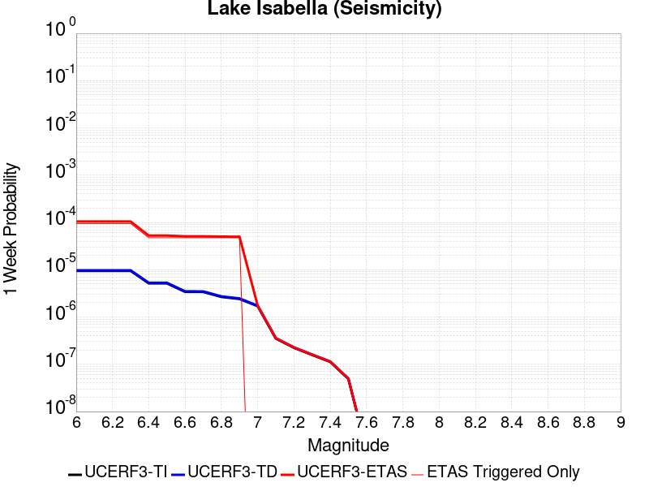 | 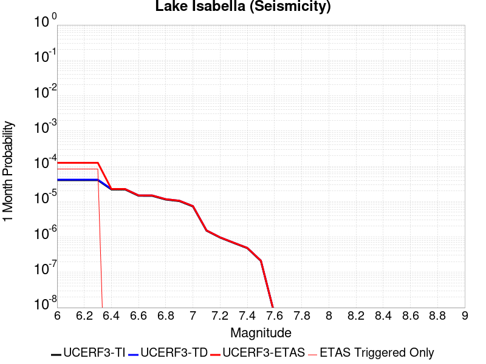 | 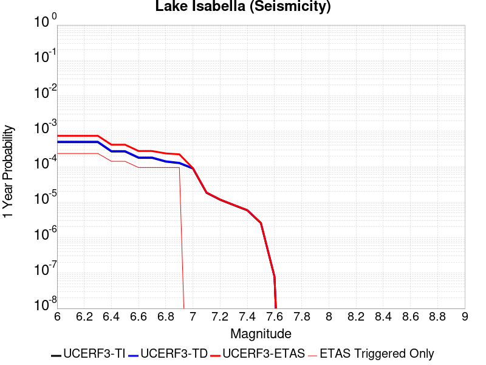 | 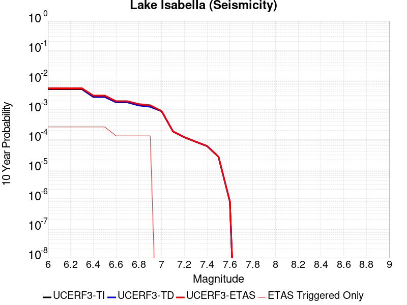 |

| Magnitude | 1 wk TI Prob | 1 wk TD Prob | 1 wk ETAS Prob | 1 wk ETAS/TD Gain | 1 wk ETAS Triggered Only | 1 mo TI Prob | 1 mo TD Prob | 1 mo ETAS Prob | 1 mo ETAS/TD Gain | 1 mo ETAS Triggered Only | 1 yr TI Prob | 1 yr TD Prob | 1 yr ETAS Prob | 1 yr ETAS/TD Gain | 1 yr ETAS Triggered Only | 10 yr TI Prob | 10 yr TD Prob | 10 yr ETAS Prob | 10 yr ETAS/TD Gain | 10 yr ETAS Triggered Only |
|-----|-----|-----|-----|-----|-----|-----|-----|-----|-----|-----|-----|-----|-----|-----|-----|-----|-----|-----|-----|-----|
| 6.0 | 9.431637E-6 | 9.741651E-6 | 9.479654E-5 | 9.731053 | 8.505571E-5 | 4.0420677E-5 | 4.1749343E-5 | 1.268015E-4 | 3.0372097 | 8.505571E-5 | 4.920106E-4 | 5.0819275E-4 | 7.632302E-4 | 1.5018518 | 2.5516714E-4 | 0.004909227 | 0.005071599 | 0.0054524085 | 1.0750867 | 3.827507E-4 |
| 6.1 | 9.431637E-6 | 9.741651E-6 | 9.479654E-5 | 9.731053 | 8.505571E-5 | 4.0420677E-5 | 4.1749343E-5 | 1.268015E-4 | 3.0372097 | 8.505571E-5 | 4.920106E-4 | 5.0819275E-4 | 7.632302E-4 | 1.5018518 | 2.5516714E-4 | 0.004909227 | 0.005071599 | 0.0054524085 | 1.0750867 | 3.827507E-4 |
| 6.2 | 9.431637E-6 | 9.741651E-6 | 9.479654E-5 | 9.731053 | 8.505571E-5 | 4.0420677E-5 | 4.1749343E-5 | 1.268015E-4 | 3.0372097 | 8.505571E-5 | 4.920106E-4 | 5.0819275E-4 | 7.632302E-4 | 1.5018518 | 2.5516714E-4 | 0.004909227 | 0.005071599 | 0.0054524085 | 1.0750867 | 3.827507E-4 |
| 6.3 | 9.431637E-6 | 9.741651E-6 | 9.479654E-5 | 9.731053 | 8.505571E-5 | 4.0420677E-5 | 4.1749343E-5 | 1.268015E-4 | 3.0372097 | 8.505571E-5 | 4.920106E-4 | 5.0819275E-4 | 7.632302E-4 | 1.5018518 | 2.5516714E-4 | 0.004909227 | 0.005071599 | 0.0054524085 | 1.0750867 | 3.827507E-4 |
| 6.4 | 5.144063E-6 | 5.3000763E-6 | 4.7827707E-5 | 9.023966 | 4.2527856E-5 | 2.2045799E-5 | 2.2714434E-5 | 6.524132E-5 | 2.8722408 | 4.2527856E-5 | 2.6837454E-4 | 2.765166E-4 | 4.0406486E-4 | 1.4612681 | 1.2758357E-4 | 0.0026805066 | 0.0027620657 | 0.0029741176 | 1.0767729 | 2.1263928E-4 |
| 6.5 | 5.144063E-6 | 5.3000763E-6 | 4.7827707E-5 | 9.023966 | 4.2527856E-5 | 2.2045799E-5 | 2.2714434E-5 | 6.524132E-5 | 2.8722408 | 4.2527856E-5 | 2.6837454E-4 | 2.765166E-4 | 4.0406486E-4 | 1.4612681 | 1.2758357E-4 | 0.0026805066 | 0.0027620657 | 0.0029741176 | 1.0767729 | 2.1263928E-4 |
| 6.6 | 3.4009804E-6 | 3.498786E-6 | 4.6026493E-5 | 13.154989 | 4.2527856E-5 | 1.4575549E-5 | 1.4994721E-5 | 5.752194E-5 | 3.836146 | 4.2527856E-5 | 1.7744285E-4 | 1.8254704E-4 | 2.6758722E-4 | 1.4658536 | 8.505571E-5 | 0.0017730123 | 0.0018241286 | 0.0019514795 | 1.0698146 | 1.2758357E-4 |
| 6.7 | 3.3880428E-6 | 3.4856528E-6 | 4.601336E-5 | 13.200788 | 4.2527856E-5 | 1.4520103E-5 | 1.4938435E-5 | 5.7465655E-5 | 3.8468323 | 4.2527856E-5 | 1.767679E-4 | 1.8186188E-4 | 2.6690212E-4 | 1.4676089 | 8.505571E-5 | 0.0017662736 | 0.0018172882 | 0.00194464 | 1.0700779 | 1.2758357E-4 |
| 6.8 | 2.6582E-6 | 2.7337003E-6 | 4.526144E-5 | 16.55684 | 4.2527856E-5 | 1.1392236E-5 | 1.1715813E-5 | 5.424317E-5 | 4.629911 | 4.2527856E-5 | 1.3869164E-4 | 1.4263204E-4 | 2.2767561E-4 | 1.5962446 | 8.505571E-5 | 0.0013860512 | 0.0014255369 | 0.0015529386 | 1.089371 | 1.2758357E-4 |
| 6.9 | 2.406011E-6 | 2.4743288E-6 | 4.5002078E-5 | 18.18759 | 4.2527856E-5 | 1.0311434E-5 | 1.0604231E-5 | 5.3131636E-5 | 5.0104184 | 4.2527856E-5 | 1.2553448E-4 | 1.2910018E-4 | 2.1414491E-4 | 1.6587499 | 8.505571E-5 | 0.0012546359 | 0.0012903814 | 0.0014178003 | 1.0987452 | 1.2758357E-4 |
| 7.0 | 1.6953097E-6 | 1.7429371E-6 | 1.7429371E-6 | 1.0 | 0.0 | 7.265593E-6 | 7.469715E-6 | 7.469715E-6 | 1.0 | 0.0 | 8.8455E-5 | 9.094104E-5 | 9.094104E-5 | 1.0 | 0.0 | 8.84198E-4 | 9.09141E-4 | 9.09141E-4 | 1.0 | 0.0 |
| 7.1 | 3.5013824E-7 | 3.5714822E-7 | 3.5714822E-7 | 1.0 | 0.0 | 1.5005916E-6 | 1.5306344E-6 | 1.5306344E-6 | 1.0 | 0.0 | 1.826955E-5 | 1.8635317E-5 | 1.8635317E-5 | 1.0 | 0.0 | 1.8268047E-4 | 1.863378E-4 | 1.863378E-4 | 1.0 | 0.0 |
| 7.2 | 2.2321095E-7 | 2.2750574E-7 | 2.2750574E-7 | 1.0 | 0.0 | 9.56618E-7 | 9.750242E-7 | 9.750242E-7 | 1.0 | 0.0 | 1.1646762E-5 | 1.1870856E-5 | 1.1870856E-5 | 1.0 | 0.0 | 1.1646151E-4 | 1.1870232E-4 | 1.1870232E-4 | 1.0 | 0.0 |
| 7.3 | 1.5760406E-7 | 1.6060922E-7 | 1.6060922E-7 | 1.0 | 0.0 | 6.7544585E-7 | 6.8832503E-7 | 6.8832503E-7 | 1.0 | 0.0 | 8.223522E-6 | 8.380326E-6 | 8.380326E-6 | 1.0 | 0.0 | 8.2232174E-5 | 8.3800165E-5 | 8.3800165E-5 | 1.0 | 0.0 |
| 7.4 | 1.1216497E-7 | 1.1431706E-7 | 1.1431706E-7 | 1.0 | 0.0 | 4.8070694E-7 | 4.899302E-7 | 4.899302E-7 | 1.0 | 0.0 | 5.852591E-6 | 5.964884E-6 | 5.964884E-6 | 1.0 | 0.0 | 5.8524372E-5 | 5.9647282E-5 | 5.9647282E-5 | 1.0 | 0.0 |
| 7.5 | 4.885185E-8 | 4.9787737E-8 | 4.9787737E-8 | 1.0 | 0.0 | 2.0936506E-7 | 2.13376E-7 | 2.13376E-7 | 1.0 | 0.0 | 2.5490165E-6 | 2.59785E-6 | 2.59785E-6 | 1.0 | 0.0 | 2.5489873E-5 | 2.5978214E-5 | 2.5978214E-5 | 1.0 | 0.0 |
| 7.6 | 1.504641E-9 | 1.5317903E-9 | 1.5317903E-9 | 1.0 | 0.0 | 6.4484613E-9 | 6.5648154E-9 | 6.5648154E-9 | 1.0 | 0.0 | 7.851001E-8 | 7.992663E-8 | 7.992663E-8 | 1.0 | 0.0 | 7.8509987E-7 | 7.992663E-7 | 7.992663E-7 | 1.0 | 0.0 |

## San Andreas (Coachella) rev
*[(top)](#table-of-contents)*

| 1 Week | 1 Month | 1 Year | 10 Year |
|-----|-----|-----|-----|
| 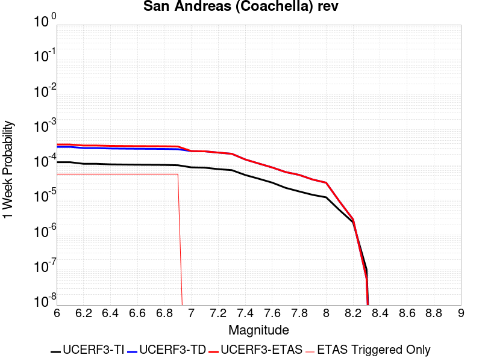 | 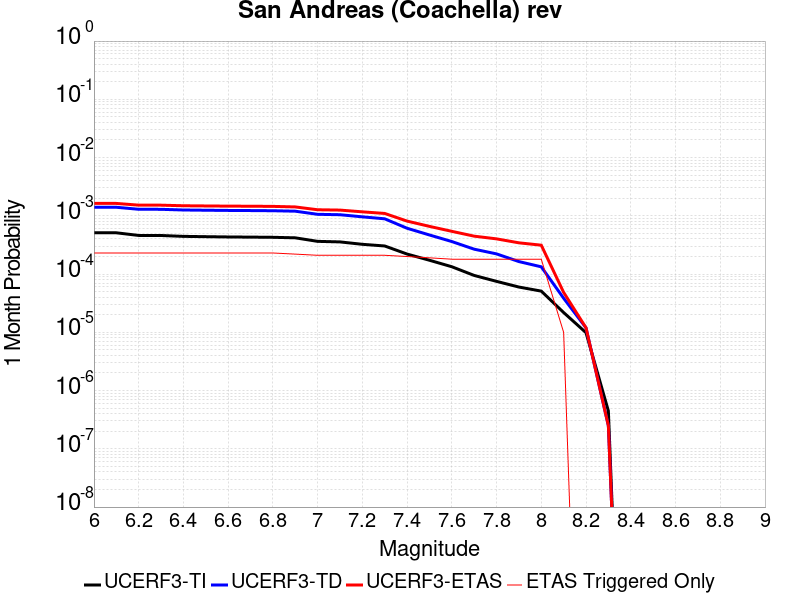 | 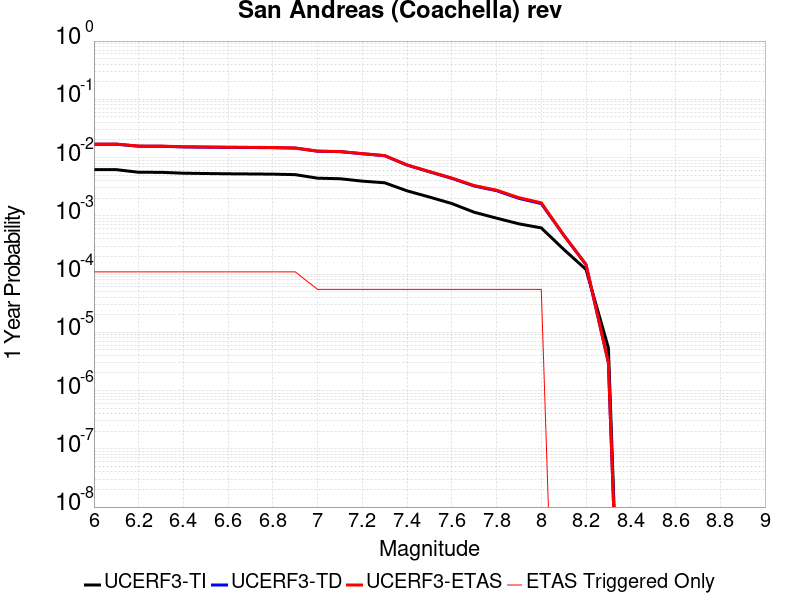 | 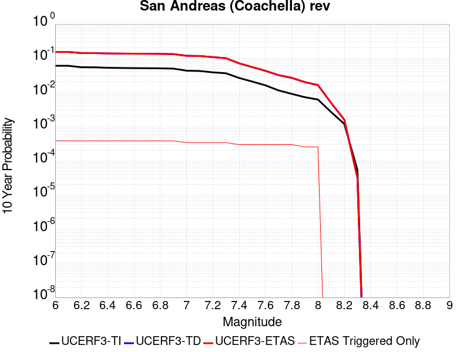 |

| Magnitude | 1 wk TI Prob | 1 wk TD Prob | 1 wk ETAS Prob | 1 wk ETAS/TD Gain | 1 wk ETAS Triggered Only | 1 mo TI Prob | 1 mo TD Prob | 1 mo ETAS Prob | 1 mo ETAS/TD Gain | 1 mo ETAS Triggered Only | 1 yr TI Prob | 1 yr TD Prob | 1 yr ETAS Prob | 1 yr ETAS/TD Gain | 1 yr ETAS Triggered Only | 10 yr TI Prob | 10 yr TD Prob | 10 yr ETAS Prob | 10 yr ETAS/TD Gain | 10 yr ETAS Triggered Only |
|-----|-----|-----|-----|-----|-----|-----|-----|-----|-----|-----|-----|-----|-----|-----|-----|-----|-----|-----|-----|-----|
| 6.0 | 1.1925945E-4 | 3.2729402E-4 | 4.5483583E-4 | 1.3896858 | 1.2758357E-4 | 5.110118E-4 | 0.0014019393 | 0.0016567487 | 1.181755 | 2.5516714E-4 | 0.0062038354 | 0.016936364 | 0.017229017 | 1.0172796 | 2.97695E-4 | 0.060334753 | 0.15265316 | 0.15297748 | 1.0021245 | 3.827507E-4 |
| 6.1 | 1.1925945E-4 | 3.2729402E-4 | 4.5483583E-4 | 1.3896858 | 1.2758357E-4 | 5.110118E-4 | 0.0014019393 | 0.0016567487 | 1.181755 | 2.5516714E-4 | 0.0062038354 | 0.016936364 | 0.017229017 | 1.0172796 | 2.97695E-4 | 0.060334753 | 0.15265316 | 0.15297748 | 1.0021245 | 3.827507E-4 |
| 6.2 | 1.07432395E-4 | 3.0230157E-4 | 4.2984655E-4 | 1.4219131 | 1.2758357E-4 | 4.603433E-4 | 0.0012949388 | 0.0015497756 | 1.1967944 | 2.5516714E-4 | 0.005590286 | 0.015653009 | 0.015946044 | 1.0187207 | 2.97695E-4 | 0.05451731 | 0.14182423 | 0.1421527 | 1.002316 | 3.827507E-4 |
| 6.3 | 1.0718766E-4 | 3.0175463E-4 | 4.292997E-4 | 1.4226781 | 1.2758357E-4 | 4.592948E-4 | 0.0012925972 | 0.0015474345 | 1.1971514 | 2.5516714E-4 | 0.005577586 | 0.015624908 | 0.015917951 | 1.0187548 | 2.97695E-4 | 0.054396555 | 0.14159249 | 0.14192104 | 1.0023204 | 3.827507E-4 |
| 6.4 | 1.0355944E-4 | 2.9383553E-4 | 4.213816E-4 | 1.4340731 | 1.2758357E-4 | 4.4375064E-4 | 0.0012586913 | 0.0015135373 | 1.202469 | 2.5516714E-4 | 0.0053892885 | 0.015217941 | 0.015511107 | 1.0192645 | 2.97695E-4 | 0.052604496 | 0.13815255 | 0.13848242 | 1.0023878 | 3.827507E-4 |
| 6.5 | 1.0227914E-4 | 2.9102986E-4 | 4.185763E-4 | 1.4382589 | 1.2758357E-4 | 4.382655E-4 | 0.0012466786 | 0.0015015276 | 1.2044224 | 2.5516714E-4 | 0.0053228354 | 0.01507372 | 0.015366928 | 1.0194516 | 2.97695E-4 | 0.051971316 | 0.13693172 | 0.13726206 | 1.0024124 | 3.827507E-4 |
| 6.6 | 1.0116757E-4 | 2.8868738E-4 | 4.162341E-4 | 1.4418161 | 1.2758357E-4 | 4.3350324E-4 | 0.0012366489 | 0.0014915005 | 1.2060823 | 2.5516714E-4 | 0.0052651367 | 0.01495329 | 0.015246534 | 1.0196106 | 2.97695E-4 | 0.051421247 | 0.1359099 | 0.13624063 | 1.0024334 | 3.827507E-4 |
| 6.7 | 1.0050676E-4 | 2.8727303E-4 | 4.1481992E-4 | 1.443992 | 1.2758357E-4 | 4.3067214E-4 | 0.0012305931 | 0.0014854462 | 1.2070978 | 2.5516714E-4 | 0.005230834 | 0.014880571 | 0.015173836 | 1.0197079 | 2.97695E-4 | 0.051094085 | 0.13529462 | 0.13562559 | 1.0024463 | 3.827507E-4 |
| 6.8 | 9.976819E-5 | 2.853096E-4 | 4.1285675E-4 | 1.4470483 | 1.2758357E-4 | 4.2750788E-4 | 0.0012221863 | 0.0014770416 | 1.2085241 | 2.5516714E-4 | 0.0051924936 | 0.0147796115 | 0.015072906 | 1.0198445 | 2.97695E-4 | 0.050728295 | 0.13444631 | 0.1347776 | 1.0024642 | 3.827507E-4 |
| 6.9 | 9.77719E-5 | 2.8027873E-4 | 4.0782656E-4 | 1.4550749 | 1.2758357E-4 | 4.1895514E-4 | 0.0012006456 | 0.0014555063 | 1.2122698 | 2.5516714E-4 | 0.0050888555 | 0.014520878 | 0.01481425 | 1.0202035 | 2.97695E-4 | 0.049738888 | 0.1322748 | 0.13260694 | 1.0025109 | 3.827507E-4 |
| 7.0 | 8.500761E-5 | 2.4762485E-4 | 3.3265952E-4 | 1.3434011 | 8.505571E-5 | 3.6426744E-4 | 0.001060821 | 0.0012732347 | 1.2002352 | 2.1263928E-4 | 0.0044259406 | 0.012839786 | 0.013091677 | 1.019618 | 2.5516714E-4 | 0.04338823 | 0.11813272 | 0.11843275 | 1.0025398 | 3.4022285E-4 |
| 7.1 | 8.319876E-5 | 2.4365232E-4 | 3.286873E-4 | 1.3490013 | 8.505571E-5 | 3.5651738E-4 | 0.0010438096 | 0.0012562269 | 1.2035019 | 2.1263928E-4 | 0.004331963 | 0.012635092 | 0.0128870355 | 1.0199399 | 2.5516714E-4 | 0.042484846 | 0.116353 | 0.116653636 | 1.0025839 | 3.4022285E-4 |
| 7.2 | 7.563917E-5 | 2.2413683E-4 | 3.0917348E-4 | 1.3793961 | 8.505571E-5 | 3.2412758E-4 | 9.602359E-4 | 0.001172671 | 1.2212322 | 2.1263928E-4 | 0.0039391145 | 0.011628893 | 0.0118810935 | 1.0216874 | 2.5516714E-4 | 0.03870018 | 0.10775925 | 0.10806281 | 1.002817 | 3.4022285E-4 |
| 7.3 | 7.082985E-5 | 2.0729867E-4 | 2.9233674E-4 | 1.4102201 | 8.505571E-5 | 3.0352117E-4 | 8.881233E-4 | 0.0011005737 | 1.2392128 | 2.1263928E-4 | 0.0036891096 | 0.010759917 | 0.011012339 | 1.0234594 | 2.5516714E-4 | 0.03628465 | 0.100282 | 0.100588106 | 1.0030525 | 3.4022285E-4 |
| 7.4 | 5.146215E-5 | 1.4273795E-4 | 2.2778151E-4 | 1.5958022 | 8.505571E-5 | 2.2053342E-4 | 6.115915E-4 | 7.815989E-4 | 1.2779754 | 1.7011142E-4 | 0.0026816884 | 0.0074208933 | 0.0076319547 | 1.0284415 | 2.1263928E-4 | 0.02649557 | 0.070849575 | 0.07112618 | 1.0039041 | 2.97695E-4 |
| 7.5 | 4.0285166E-5 | 1.09416E-4 | 1.9446241E-4 | 1.7772758 | 8.505571E-5 | 1.7263928E-4 | 4.6884175E-4 | 6.3887343E-4 | 1.3626633 | 1.7011142E-4 | 0.002099857 | 0.0056932783 | 0.0059047067 | 1.0371366 | 2.1263928E-4 | 0.020801254 | 0.055011146 | 0.055292465 | 1.0051138 | 2.97695E-4 |
| 7.6 | 3.1168736E-5 | 8.4389096E-5 | 1.6943763E-4 | 2.0078142 | 8.505571E-5 | 1.3357346E-4 | 3.6161754E-4 | 5.3166744E-4 | 1.470248 | 1.7011142E-4 | 0.0016250437 | 0.0043938323 | 0.0046055373 | 1.0481822 | 2.1263928E-4 | 0.016132116 | 0.04281005 | 0.043095 | 1.0066562 | 2.97695E-4 |
| 7.7 | 2.2100989E-5 | 6.238755E-5 | 1.4743795E-4 | 2.3632593 | 8.505571E-5 | 9.4715084E-5 | 2.6734784E-4 | 4.374138E-4 | 1.6361223 | 1.7011142E-4 | 0.001152546 | 0.0032501083 | 0.0034620566 | 1.0652126 | 2.1263928E-4 | 0.011465867 | 0.0319002 | 0.032188397 | 1.0090344 | 2.97695E-4 |
| 7.8 | 1.7484861E-5 | 5.179572E-5 | 1.3684703E-4 | 2.642053 | 8.505571E-5 | 7.493296E-5 | 2.2196278E-4 | 3.9203645E-4 | 1.766226 | 1.7011142E-4 | 9.1192697E-4 | 0.0026990508 | 0.002911116 | 1.0785704 | 2.1263928E-4 | 0.009081938 | 0.026640115 | 0.02692988 | 1.010877 | 2.97695E-4 |
| 7.9 | 1.3967285E-5 | 3.822255E-5 | 1.2327501E-4 | 3.2251904 | 8.505571E-5 | 5.985842E-5 | 1.6380067E-4 | 3.338842E-4 | 2.038357 | 1.7011142E-4 | 7.2853256E-4 | 0.00199245 | 0.0022046657 | 1.1065099 | 2.1263928E-4 | 0.0072614877 | 0.019909438 | 0.020159524 | 1.0125612 | 2.5516714E-4 |
| 8.0 | 1.1887396E-5 | 3.106521E-5 | 1.1611828E-4 | 3.737888 | 8.505571E-5 | 5.094499E-5 | 1.3312983E-4 | 3.032186E-4 | 2.2776158 | 1.7011142E-4 | 6.200787E-4 | 0.0016196516 | 0.0018319464 | 1.1310744 | 2.1263928E-4 | 0.006183513 | 0.016279267 | 0.016530281 | 1.0154192 | 2.5516714E-4 |
| 8.1 | 5.100864E-6 | 8.973418E-6 | 8.973418E-6 | 1.0 | 0.0 | 2.1860664E-5 | 3.8456936E-5 | 3.8456936E-5 | 1.0 | 0.0 | 2.6612106E-4 | 4.6811273E-4 | 4.6811273E-4 | 1.0 | 0.0 | 0.002658026 | 0.004917731 | 0.004917731 | 1.0 | 0.0 |
| 8.2 | 2.3004484E-6 | 2.7864487E-6 | 2.7864487E-6 | 1.0 | 0.0 | 9.859027E-6 | 1.1941868E-5 | 1.1941868E-5 | 1.0 | 0.0 | 1.2002704E-4 | 1.4538258E-4 | 1.4538258E-4 | 1.0 | 0.0 | 0.0011996223 | 0.0015973912 | 0.0015973912 | 1.0 | 0.0 |
| 8.3 | 1.0424446E-7 | 5.8161504E-8 | 5.8161504E-8 | 1.0 | 0.0 | 4.4676187E-7 | 2.4926356E-7 | 2.4926356E-7 | 1.0 | 0.0 | 5.439312E-6 | 3.03478E-6 | 3.03478E-6 | 1.0 | 0.0 | 5.4391792E-5 | 3.190716E-5 | 3.190716E-5 | 1.0 | 0.0 |

## Elsinore (Glen Ivy) rev
*[(top)](#table-of-contents)*

| 1 Week | 1 Month | 1 Year | 10 Year |
|-----|-----|-----|-----|
| 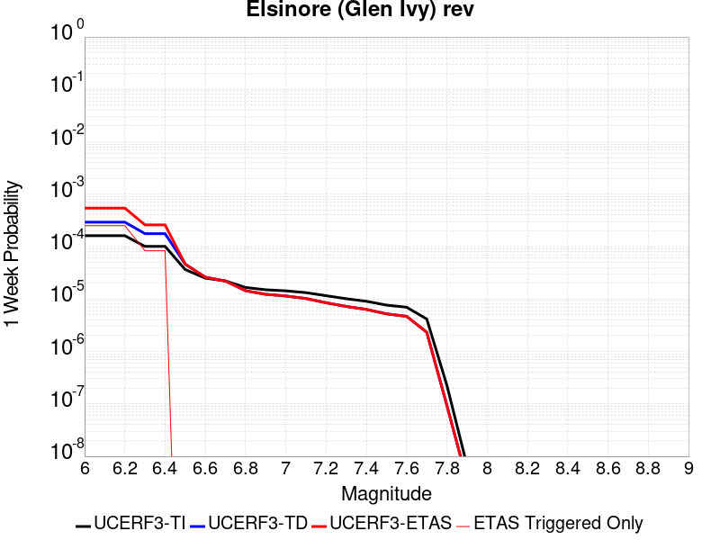 | 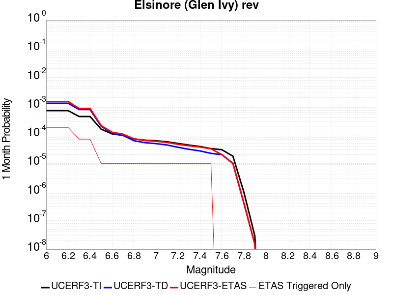 | 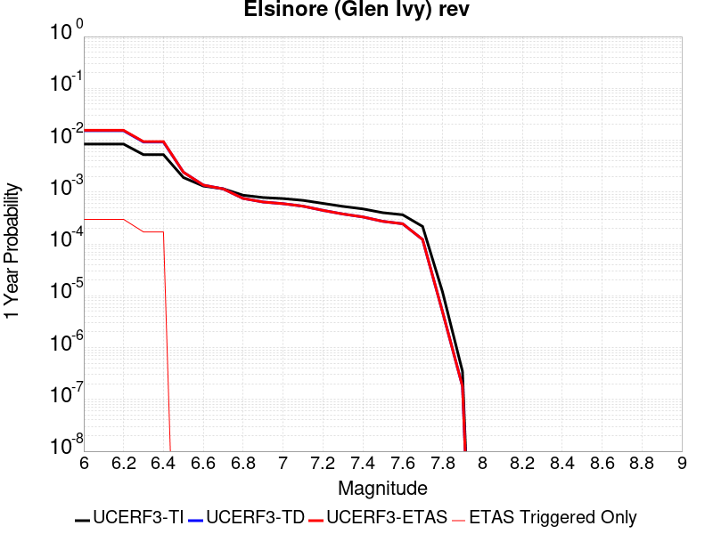 | 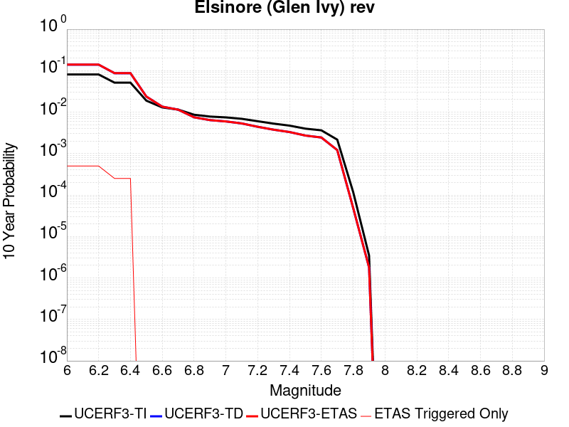 |

| Magnitude | 1 wk TI Prob | 1 wk TD Prob | 1 wk ETAS Prob | 1 wk ETAS/TD Gain | 1 wk ETAS Triggered Only | 1 mo TI Prob | 1 mo TD Prob | 1 mo ETAS Prob | 1 mo ETAS/TD Gain | 1 mo ETAS Triggered Only | 1 yr TI Prob | 1 yr TD Prob | 1 yr ETAS Prob | 1 yr ETAS/TD Gain | 1 yr ETAS Triggered Only | 10 yr TI Prob | 10 yr TD Prob | 10 yr ETAS Prob | 10 yr ETAS/TD Gain | 10 yr ETAS Triggered Only |
|-----|-----|-----|-----|-----|-----|-----|-----|-----|-----|-----|-----|-----|-----|-----|-----|-----|-----|-----|-----|-----|
| 6.0 | 1.6204086E-4 | 2.9360707E-4 | 4.2115318E-4 | 1.4344109 | 1.2758357E-4 | 6.94276E-4 | 0.0012578638 | 0.0013852869 | 1.1013012 | 1.2758357E-4 | 0.008420097 | 0.015234485 | 0.015527644 | 1.0192431 | 2.97695E-4 | 0.081081145 | 0.13969168 | 0.14002095 | 1.0023572 | 3.827507E-4 |
| 6.1 | 1.6204086E-4 | 2.9360707E-4 | 4.2115318E-4 | 1.4344109 | 1.2758357E-4 | 6.94276E-4 | 0.0012578638 | 0.0013852869 | 1.1013012 | 1.2758357E-4 | 0.008420097 | 0.015234485 | 0.015527644 | 1.0192431 | 2.97695E-4 | 0.081081145 | 0.13969168 | 0.14002095 | 1.0023572 | 3.827507E-4 |
| 6.2 | 1.6204086E-4 | 2.9360707E-4 | 4.2115318E-4 | 1.4344109 | 1.2758357E-4 | 6.94276E-4 | 0.0012578638 | 0.0013852869 | 1.1013012 | 1.2758357E-4 | 0.008420097 | 0.015234485 | 0.015527644 | 1.0192431 | 2.97695E-4 | 0.081081145 | 0.13969168 | 0.14002095 | 1.0023572 | 3.827507E-4 |
| 6.3 | 1.0111737E-4 | 1.7703383E-4 | 2.1955415E-4 | 1.2401819 | 4.2527856E-5 | 4.332882E-4 | 7.5861247E-4 | 8.01108E-4 | 1.0560175 | 4.2527856E-5 | 0.005262531 | 0.009217682 | 0.009386226 | 1.0182848 | 1.7011142E-4 | 0.0513964 | 0.0870191 | 0.08721323 | 1.002231 | 2.1263928E-4 |
| 6.4 | 1.0111737E-4 | 1.7703383E-4 | 2.1955415E-4 | 1.2401819 | 4.2527856E-5 | 4.332882E-4 | 7.5861247E-4 | 8.01108E-4 | 1.0560175 | 4.2527856E-5 | 0.005262531 | 0.009217682 | 0.009386226 | 1.0182848 | 1.7011142E-4 | 0.0513964 | 0.0870191 | 0.08721323 | 1.002231 | 2.1263928E-4 |
| 6.5 | 3.6624708E-5 | 4.6391084E-5 | 4.6391084E-5 | 1.0 | 0.0 | 1.569536E-4 | 1.9880582E-4 | 1.9880582E-4 | 1.0 | 0.0 | 0.001909235 | 0.0024181372 | 0.0024181372 | 1.0 | 0.0 | 0.01892915 | 0.023739954 | 0.023739954 | 1.0 | 0.0 |
| 6.6 | 2.5051324E-5 | 2.614772E-5 | 2.614772E-5 | 1.0 | 0.0 | 1.073584E-4 | 1.12057096E-4 | 1.12057096E-4 | 1.0 | 0.0 | 0.0013063047 | 0.0013634858 | 0.0013634858 | 1.0 | 0.0 | 0.012986525 | 0.013564618 | 0.013564618 | 1.0 | 0.0 |
| 6.7 | 2.2189772E-5 | 2.2072849E-5 | 2.2072849E-5 | 1.0 | 0.0 | 9.509556E-5 | 9.4594696E-5 | 9.4594696E-5 | 1.0 | 0.0 | 0.0011571734 | 0.0011511183 | 0.0011511183 | 1.0 | 0.0 | 0.011511663 | 0.011465415 | 0.011465415 | 1.0 | 0.0 |
| 6.8 | 1.6654378E-5 | 1.4437705E-5 | 1.4437705E-5 | 1.0 | 0.0 | 7.137396E-5 | 6.187444E-5 | 6.187444E-5 | 1.0 | 0.0 | 8.686314E-4 | 7.530661E-4 | 7.530661E-4 | 1.0 | 0.0 | 0.008652439 | 0.00751048 | 0.00751048 | 1.0 | 0.0 |
| 6.9 | 1.5042909E-5 | 1.2332022E-5 | 1.2332022E-5 | 1.0 | 0.0 | 6.446802E-5 | 5.285047E-5 | 5.285047E-5 | 1.0 | 0.0 | 7.8461546E-4 | 6.4326765E-4 | 6.4326765E-4 | 1.0 | 0.0 | 0.007818509 | 0.00641828 | 0.00641828 | 1.0 | 0.0 |
| 7.0 | 1.4361385E-5 | 1.1451324E-5 | 1.1451324E-5 | 1.0 | 0.0 | 6.154734E-5 | 4.9076196E-5 | 4.9076196E-5 | 1.0 | 0.0 | 7.490812E-4 | 5.973418E-4 | 5.973418E-4 | 1.0 | 0.0 | 0.007465612 | 0.0059613534 | 0.0059613534 | 1.0 | 0.0 |
| 7.1 | 1.3265571E-5 | 1.0244926E-5 | 1.0244926E-5 | 1.0 | 0.0 | 5.6851208E-5 | 4.39061E-5 | 4.39061E-5 | 1.0 | 0.0 | 6.919436E-4 | 5.344282E-4 | 5.344282E-4 | 1.0 | 0.0 | 0.006897931 | 0.0053347866 | 0.0053347866 | 1.0 | 0.0 |
| 7.2 | 1.1596403E-5 | 8.505067E-6 | 8.505067E-6 | 1.0 | 0.0 | 4.9697923E-5 | 3.6449786E-5 | 3.6449786E-5 | 1.0 | 0.0 | 6.049042E-4 | 4.436875E-4 | 4.436875E-4 | 1.0 | 0.0 | 0.006032603 | 0.0044294316 | 0.0044294316 | 1.0 | 0.0 |
| 7.3 | 1.0150827E-5 | 7.2387597E-6 | 7.2387597E-6 | 1.0 | 0.0 | 4.3502816E-5 | 3.1022897E-5 | 3.1022897E-5 | 1.0 | 0.0 | 5.2951806E-4 | 3.7763975E-4 | 3.7763975E-4 | 1.0 | 0.0 | 0.005282581 | 0.0037703665 | 0.0037703665 | 1.0 | 0.0 |
| 7.4 | 9.080705E-6 | 6.352519E-6 | 6.352519E-6 | 1.0 | 0.0 | 3.8916725E-5 | 2.7224805E-5 | 2.7224805E-5 | 1.0 | 0.0 | 4.7370812E-4 | 3.3141294E-4 | 3.3141294E-4 | 1.0 | 0.0 | 0.004726996 | 0.0033093381 | 0.0033093381 | 1.0 | 0.0 |
| 7.5 | 7.671649E-6 | 5.2256332E-6 | 5.2256332E-6 | 1.0 | 0.0 | 3.287808E-5 | 2.2395385E-5 | 2.2395385E-5 | 1.0 | 0.0 | 4.0021708E-4 | 2.7263095E-4 | 2.7263095E-4 | 1.0 | 0.0 | 0.0039949706 | 0.00272309 | 0.00272309 | 1.0 | 0.0 |
| 7.6 | 6.990086E-6 | 4.687545E-6 | 4.687545E-6 | 1.0 | 0.0 | 2.9957167E-5 | 2.008933E-5 | 2.008933E-5 | 1.0 | 0.0 | 3.6466747E-4 | 2.445613E-4 | 2.445613E-4 | 1.0 | 0.0 | 0.0036406964 | 0.002443038 | 0.002443038 | 1.0 | 0.0 |
| 7.7 | 4.163505E-6 | 2.3295343E-6 | 2.3295343E-6 | 1.0 | 0.0 | 1.7843471E-5 | 9.983683E-6 | 9.983683E-6 | 1.0 | 0.0 | 2.172226E-4 | 1.21545316E-4 | 1.21545316E-4 | 1.0 | 0.0 | 0.0021701038 | 0.0012148614 | 0.0012148614 | 1.0 | 0.0 |
| 7.8 | 2.2692414E-7 | 9.3854695E-8 | 9.3854695E-8 | 1.0 | 0.0 | 9.725317E-7 | 4.0223435E-7 | 4.0223435E-7 | 1.0 | 0.0 | 1.1840509E-5 | 4.8971956E-6 | 4.8971956E-6 | 1.0 | 0.0 | 1.1839878E-4 | 4.8971204E-5 | 4.8971204E-5 | 1.0 | 0.0 |
| 7.9 | 6.676829E-9 | 3.439853E-9 | 3.439853E-9 | 1.0 | 0.0 | 2.861498E-8 | 1.4742227E-8 | 1.4742227E-8 | 1.0 | 0.0 | 3.4838732E-7 | 1.7948659E-7 | 1.7948659E-7 | 1.0 | 0.0 | 3.4838679E-6 | 1.7948646E-6 | 1.7948646E-6 | 1.0 | 0.0 |

## Scodie Lineament
*[(top)](#table-of-contents)*

| 1 Week | 1 Month | 1 Year | 10 Year |
|-----|-----|-----|-----|
| 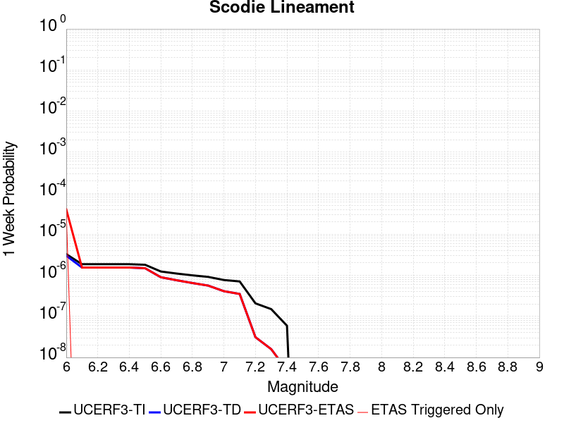 | 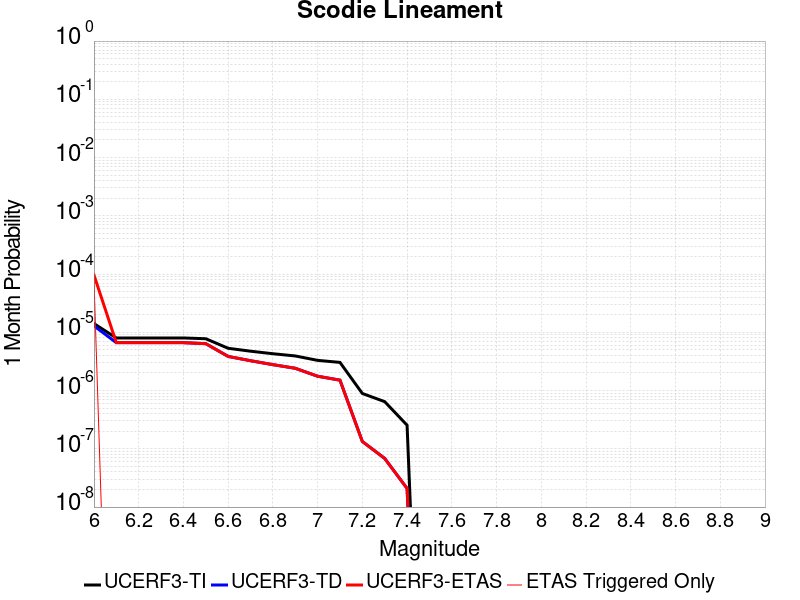 | 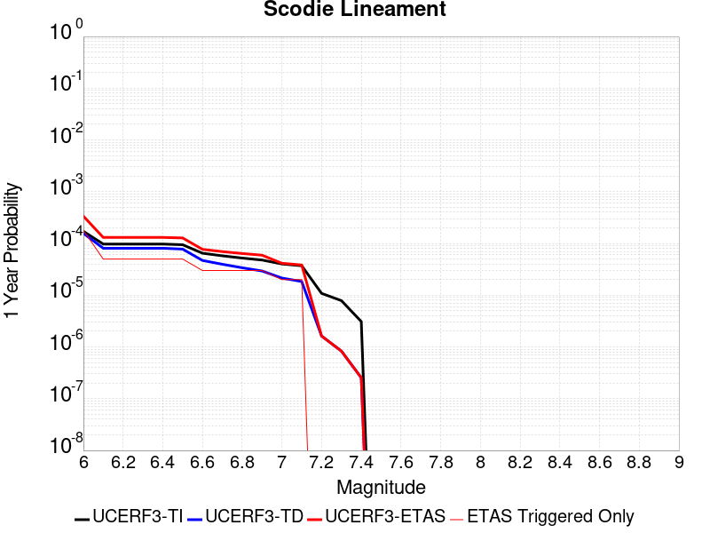 | 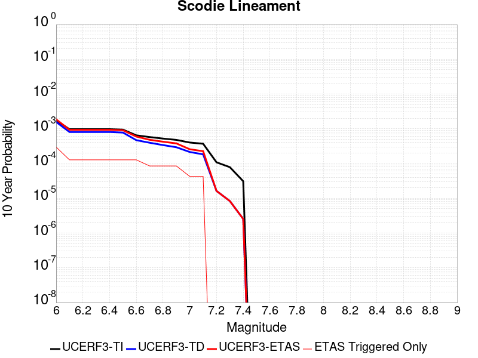 |

| Magnitude | 1 wk TI Prob | 1 wk TD Prob | 1 wk ETAS Prob | 1 wk ETAS/TD Gain | 1 wk ETAS Triggered Only | 1 mo TI Prob | 1 mo TD Prob | 1 mo ETAS Prob | 1 mo ETAS/TD Gain | 1 mo ETAS Triggered Only | 1 yr TI Prob | 1 yr TD Prob | 1 yr ETAS Prob | 1 yr ETAS/TD Gain | 1 yr ETAS Triggered Only | 10 yr TI Prob | 10 yr TD Prob | 10 yr ETAS Prob | 10 yr ETAS/TD Gain | 10 yr ETAS Triggered Only |
|-----|-----|-----|-----|-----|-----|-----|-----|-----|-----|-----|-----|-----|-----|-----|-----|-----|-----|-----|-----|-----|
| 6.0 | 3.2919327E-6 | 3.0133422E-6 | 4.554107E-5 | 15.113142 | 4.2527856E-5 | 1.4108206E-5 | 1.2914278E-5 | 1.830235E-4 | 14.172183 | 1.7011142E-4 | 1.7175387E-4 | 1.5722317E-4 | 4.1235017E-4 | 2.6227062 | 2.5516714E-4 | 0.0017162118 | 0.0015714309 | 0.0018686581 | 1.1891443 | 2.97695E-4 |
| 6.1 | 1.8663811E-6 | 1.5490499E-6 | 1.5490499E-6 | 1.0 | 0.0 | 7.998751E-6 | 6.6387715E-6 | 9.169392E-5 | 13.811881 | 8.505571E-5 | 9.738045E-5 | 8.082454E-5 | 1.6587338E-4 | 2.052265 | 8.505571E-5 | 9.7337784E-4 | 8.080003E-4 | 9.3548076E-4 | 1.1577728 | 1.2758357E-4 |
| 6.2 | 1.8663811E-6 | 1.5490499E-6 | 1.5490499E-6 | 1.0 | 0.0 | 7.998751E-6 | 6.6387715E-6 | 9.169392E-5 | 13.811881 | 8.505571E-5 | 9.738045E-5 | 8.082454E-5 | 1.6587338E-4 | 2.052265 | 8.505571E-5 | 9.7337784E-4 | 8.080003E-4 | 9.3548076E-4 | 1.1577728 | 1.2758357E-4 |
| 6.3 | 1.8663811E-6 | 1.5490499E-6 | 1.5490499E-6 | 1.0 | 0.0 | 7.998751E-6 | 6.6387715E-6 | 9.169392E-5 | 13.811881 | 8.505571E-5 | 9.738045E-5 | 8.082454E-5 | 1.6587338E-4 | 2.052265 | 8.505571E-5 | 9.7337784E-4 | 8.080003E-4 | 9.3548076E-4 | 1.1577728 | 1.2758357E-4 |
| 6.4 | 1.8663811E-6 | 1.5490499E-6 | 1.5490499E-6 | 1.0 | 0.0 | 7.998751E-6 | 6.6387715E-6 | 9.169392E-5 | 13.811881 | 8.505571E-5 | 9.738045E-5 | 8.082454E-5 | 1.6587338E-4 | 2.052265 | 8.505571E-5 | 9.7337784E-4 | 8.080003E-4 | 9.3548076E-4 | 1.1577728 | 1.2758357E-4 |
| 6.5 | 1.8106311E-6 | 1.4909839E-6 | 1.4909839E-6 | 1.0 | 0.0 | 7.759824E-6 | 6.3899183E-6 | 9.144509E-5 | 14.310838 | 8.505571E-5 | 9.447177E-5 | 7.7794975E-5 | 1.6284407E-4 | 2.0932467 | 8.505571E-5 | 9.4431615E-4 | 7.7772606E-4 | 9.0521044E-4 | 1.1639193 | 1.2758357E-4 |
| 6.6 | 1.2414679E-6 | 8.997558E-7 | 8.997558E-7 | 1.0 | 0.0 | 5.320566E-6 | 3.856091E-6 | 8.8911474E-5 | 23.057411 | 8.505571E-5 | 6.477596E-5 | 4.6946985E-5 | 1.319987E-4 | 2.8116546 | 8.505571E-5 | 6.475708E-4 | 4.693793E-4 | 5.96903E-4 | 1.2716857 | 1.2758357E-4 |
| 6.7 | 1.1062215E-6 | 7.594311E-7 | 7.594311E-7 | 1.0 | 0.0 | 4.7409408E-6 | 3.2547011E-6 | 8.831014E-5 | 27.133102 | 8.505571E-5 | 5.7719422E-5 | 3.9625334E-5 | 1.2467768E-4 | 3.146413 | 8.505571E-5 | 5.770443E-4 | 3.961897E-4 | 4.812117E-4 | 1.2145993 | 8.505571E-5 |
| 6.8 | 1.0006736E-6 | 6.500397E-7 | 6.500397E-7 | 1.0 | 0.0 | 4.288594E-6 | 2.7858816E-6 | 8.7841356E-5 | 31.5309 | 8.505571E-5 | 5.221238E-5 | 3.3917644E-5 | 1.1897047E-4 | 3.5076277 | 8.505571E-5 | 5.220012E-4 | 3.3913075E-4 | 4.241576E-4 | 1.25072 | 8.505571E-5 |
| 6.9 | 9.167364E-7 | 5.631625E-7 | 5.631625E-7 | 1.0 | 0.0 | 3.9288643E-6 | 2.4135516E-6 | 8.746906E-5 | 36.240807 | 8.505571E-5 | 4.7832873E-5 | 2.9384651E-5 | 1.1443786E-4 | 3.8944774 | 8.505571E-5 | 4.782258E-4 | 2.9381333E-4 | 3.7884407E-4 | 1.2894039 | 8.505571E-5 |
| 7.0 | 7.6987664E-7 | 4.113383E-7 | 4.113383E-7 | 1.0 | 0.0 | 3.2994672E-6 | 1.7628774E-6 | 4.4290657E-5 | 25.124071 | 4.2527856E-5 | 4.0170275E-5 | 2.1462862E-5 | 6.3989806E-5 | 2.98142 | 4.2527856E-5 | 4.0163012E-4 | 2.1461173E-4 | 2.5713048E-4 | 1.1981193 | 4.2527856E-5 |
| 7.1 | 7.1038727E-7 | 3.5211494E-7 | 3.5211494E-7 | 1.0 | 0.0 | 3.0445133E-6 | 1.5090633E-6 | 4.4036853E-5 | 29.181583 | 4.2527856E-5 | 3.706632E-5 | 1.8372726E-5 | 6.08998E-5 | 3.314685 | 4.2527856E-5 | 3.7060137E-4 | 1.8371557E-4 | 2.2623561E-4 | 1.231445 | 4.2527856E-5 |
| 7.2 | 2.0799602E-7 | 3.1186854E-8 | 3.1186854E-8 | 1.0 | 0.0 | 8.914113E-7 | 1.3365793E-7 | 1.3365793E-7 | 1.0 | 0.0 | 1.0852878E-5 | 1.6272843E-6 | 1.6272843E-6 | 1.0 | 0.0 | 1.08523476E-4 | 1.627273E-5 | 1.627273E-5 | 1.0 | 0.0 |
| 7.3 | 1.5048182E-7 | 1.5945696E-8 | 1.5945696E-8 | 1.0 | 0.0 | 6.449219E-7 | 6.83387E-8 | 6.83387E-8 | 1.0 | 0.0 | 7.851896E-6 | 8.320234E-7 | 8.320234E-7 | 1.0 | 0.0 | 7.851618E-5 | 8.320206E-6 | 8.320206E-6 | 1.0 | 0.0 |
| 7.4 | 5.9334678E-8 | 4.8683537E-9 | 4.8683537E-9 | 1.0 | 0.0 | 2.5429145E-7 | 2.0864372E-8 | 2.0864372E-8 | 1.0 | 0.0 | 3.095994E-6 | 2.5402372E-7 | 2.5402372E-7 | 1.0 | 0.0 | 3.095951E-5 | 2.5402353E-6 | 2.5402353E-6 | 1.0 | 0.0 |

## Baker
*[(top)](#table-of-contents)*

| 1 Week | 1 Month | 1 Year | 10 Year |
|-----|-----|-----|-----|
| 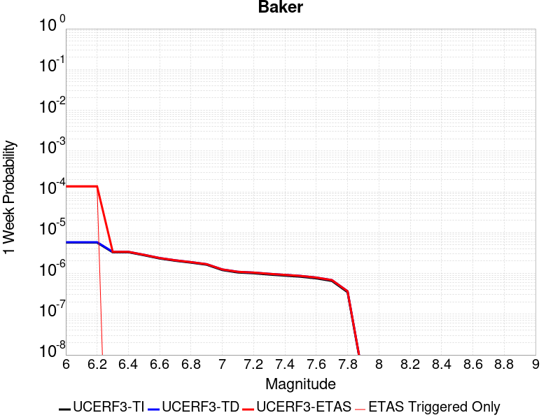 | 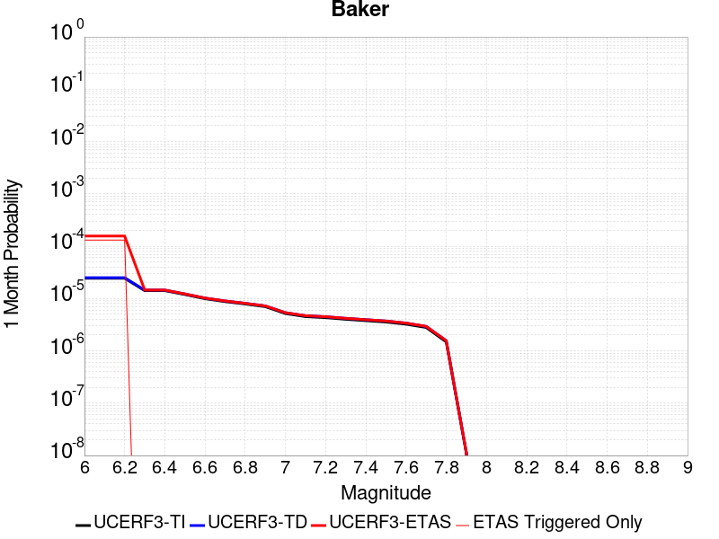 | 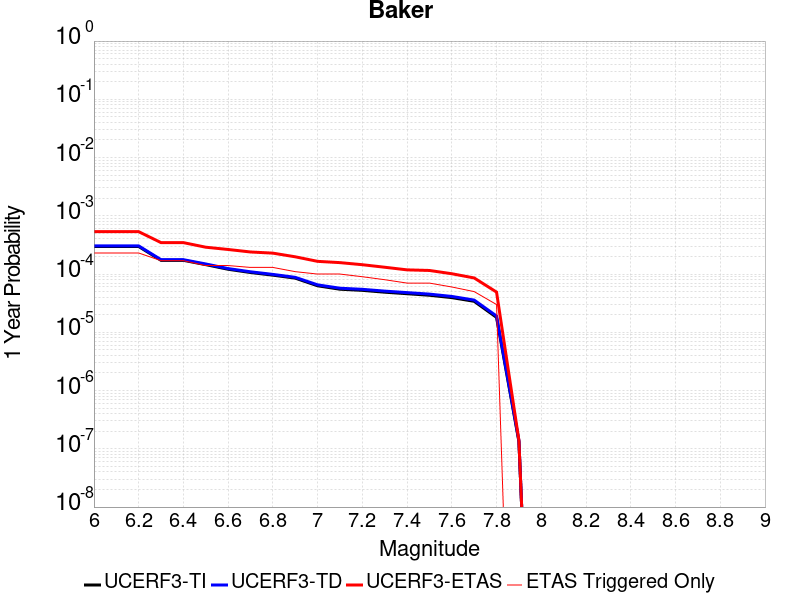 | 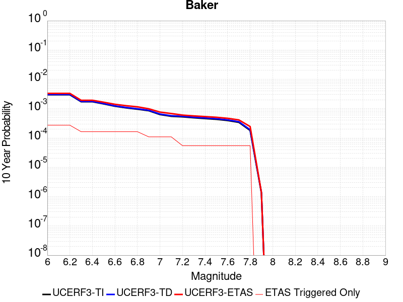 |

| Magnitude | 1 wk TI Prob | 1 wk TD Prob | 1 wk ETAS Prob | 1 wk ETAS/TD Gain | 1 wk ETAS Triggered Only | 1 mo TI Prob | 1 mo TD Prob | 1 mo ETAS Prob | 1 mo ETAS/TD Gain | 1 mo ETAS Triggered Only | 1 yr TI Prob | 1 yr TD Prob | 1 yr ETAS Prob | 1 yr ETAS/TD Gain | 1 yr ETAS Triggered Only | 10 yr TI Prob | 10 yr TD Prob | 10 yr ETAS Prob | 10 yr ETAS/TD Gain | 10 yr ETAS Triggered Only |
|-----|-----|-----|-----|-----|-----|-----|-----|-----|-----|-----|-----|-----|-----|-----|-----|-----|-----|-----|-----|-----|
| 6.0 | 5.695525E-6 | 5.8348373E-6 | 1.3341766E-4 | 22.865704 | 1.2758357E-4 | 2.4409164E-5 | 2.5006228E-5 | 1.5258661E-4 | 6.101944 | 1.2758357E-4 | 2.9714106E-4 | 3.044123E-4 | 5.169868E-4 | 1.6983113 | 2.1263928E-4 | 0.0029674405 | 0.0030403486 | 0.0033371386 | 1.097617 | 2.97695E-4 |
| 6.1 | 5.695525E-6 | 5.8348373E-6 | 1.3341766E-4 | 22.865704 | 1.2758357E-4 | 2.4409164E-5 | 2.5006228E-5 | 1.5258661E-4 | 6.101944 | 1.2758357E-4 | 2.9714106E-4 | 3.044123E-4 | 5.169868E-4 | 1.6983113 | 2.1263928E-4 | 0.0029674405 | 0.0030403486 | 0.0033371386 | 1.097617 | 2.97695E-4 |
| 6.2 | 5.695525E-6 | 5.8348373E-6 | 1.3341766E-4 | 22.865704 | 1.2758357E-4 | 2.4409164E-5 | 2.5006228E-5 | 1.5258661E-4 | 6.101944 | 1.2758357E-4 | 2.9714106E-4 | 3.044123E-4 | 5.169868E-4 | 1.6983113 | 2.1263928E-4 | 0.0029674405 | 0.0030403486 | 0.0033371386 | 1.097617 | 2.97695E-4 |
| 6.3 | 3.2995713E-6 | 3.383667E-6 | 4.591138E-5 | 13.568527 | 4.2527856E-5 | 1.4140943E-5 | 1.4501353E-5 | 5.7028592E-5 | 3.9326396 | 4.2527856E-5 | 1.7215237E-4 | 1.7654014E-4 | 3.0410118E-4 | 1.7225611 | 1.2758357E-4 | 0.0017201907 | 0.001764046 | 0.0019763103 | 1.1203281 | 2.1263928E-4 |
| 6.4 | 3.2995713E-6 | 3.383667E-6 | 4.591138E-5 | 13.568527 | 4.2527856E-5 | 1.4140943E-5 | 1.4501353E-5 | 5.7028592E-5 | 3.9326396 | 4.2527856E-5 | 1.7215237E-4 | 1.7654014E-4 | 3.0410118E-4 | 1.7225611 | 1.2758357E-4 | 0.0017201907 | 0.001764046 | 0.0019763103 | 1.1203281 | 2.1263928E-4 |
| 6.5 | 2.782202E-6 | 2.8558404E-6 | 4.5383575E-5 | 15.891496 | 4.2527856E-5 | 1.1923668E-5 | 1.223926E-5 | 5.4766595E-5 | 4.4746656 | 4.2527856E-5 | 1.4516099E-4 | 1.4900314E-4 | 2.765677E-4 | 1.85612 | 1.2758357E-4 | 0.001450662 | 0.0014890651 | 0.0017013877 | 1.1425879 | 2.1263928E-4 |
| 6.6 | 2.3163404E-6 | 2.38092E-6 | 4.4908673E-5 | 18.8619 | 4.2527856E-5 | 9.927136E-6 | 1.0203904E-5 | 5.2731324E-5 | 5.16776 | 4.2527856E-5 | 1.20856166E-4 | 1.2422565E-4 | 2.5179336E-4 | 2.0269032 | 1.2758357E-4 | 0.0012079047 | 0.0012415823 | 0.0014539576 | 1.1710521 | 2.1263928E-4 |
| 6.7 | 2.037056E-6 | 2.0965003E-6 | 4.4624267E-5 | 21.285122 | 4.2527856E-5 | 8.7302105E-6 | 8.984972E-6 | 5.1512445E-5 | 5.733178 | 4.2527856E-5 | 1.0628513E-4 | 1.093867E-4 | 2.3695632E-4 | 2.166226 | 1.2758357E-4 | 0.0010623431 | 0.0010933448 | 0.0012632702 | 1.155418 | 1.7011142E-4 |
| 6.8 | 1.8356744E-6 | 1.8915287E-6 | 4.4419303E-5 | 23.483284 | 4.2527856E-5 | 7.867153E-6 | 8.106527E-6 | 5.0634037E-5 | 6.246083 | 4.2527856E-5 | 9.577837E-5 | 9.869264E-5 | 2.2626361E-4 | 2.2926087 | 1.2758357E-4 | 9.57371E-4 | 9.86502E-4 | 0.0011564457 | 1.1722689 | 1.7011142E-4 |
| 6.9 | 1.6310546E-6 | 1.6832072E-6 | 1.6832072E-6 | 1.0 | 0.0 | 6.9902153E-6 | 7.213726E-6 | 7.213726E-6 | 1.0 | 0.0 | 8.510255E-5 | 8.782368E-5 | 1.303478E-4 | 1.4841988 | 4.2527856E-5 | 8.5069967E-4 | 8.7790104E-4 | 9.6288207E-4 | 1.0968002 | 8.505571E-5 |
| 7.0 | 1.2058036E-6 | 1.2508665E-6 | 1.2508665E-6 | 1.0 | 0.0 | 5.1677193E-6 | 5.3608455E-6 | 5.3608455E-6 | 1.0 | 0.0 | 6.291517E-5 | 6.5266366E-5 | 1.0779144E-4 | 1.651562 | 4.2527856E-5 | 6.289736E-4 | 6.524743E-4 | 7.3747453E-4 | 1.1302737 | 8.505571E-5 |
| 7.1 | 1.052382E-6 | 1.0951609E-6 | 1.0951609E-6 | 1.0 | 0.0 | 4.5102006E-6 | 4.693538E-6 | 4.693538E-6 | 1.0 | 0.0 | 5.491031E-5 | 5.7142337E-5 | 9.966776E-5 | 1.7442018 | 4.2527856E-5 | 5.4896745E-4 | 5.7127734E-4 | 6.5628445E-4 | 1.1488018 | 8.505571E-5 |
| 7.2 | 1.0067454E-6 | 1.0487711E-6 | 1.0487711E-6 | 1.0 | 0.0 | 4.3146156E-6 | 4.4947255E-6 | 4.4947255E-6 | 1.0 | 0.0 | 5.252918E-5 | 5.4721917E-5 | 9.7247445E-5 | 1.7771206 | 4.2527856E-5 | 5.251676E-4 | 5.470853E-4 | 5.895899E-4 | 1.0776927 | 4.2527856E-5 |
| 7.3 | 9.3596316E-7 | 9.767723E-7 | 9.767723E-7 | 1.0 | 0.0 | 4.0112645E-6 | 4.1861604E-6 | 4.1861604E-6 | 1.0 | 0.0 | 4.8836053E-5 | 5.096532E-5 | 9.3491006E-5 | 1.8344045 | 4.2527856E-5 | 4.8825322E-4 | 5.095371E-4 | 5.5204326E-4 | 1.0834212 | 4.2527856E-5 |
| 7.4 | 8.8117395E-7 | 9.2076635E-7 | 9.2076635E-7 | 1.0 | 0.0 | 3.7764542E-6 | 3.9461356E-6 | 3.9461356E-6 | 1.0 | 0.0 | 4.5977362E-5 | 4.8043148E-5 | 9.056896E-5 | 1.8851588 | 4.2527856E-5 | 4.596785E-4 | 4.8032837E-4 | 5.228358E-4 | 1.0884966 | 4.2527856E-5 |
| 7.5 | 8.292386E-7 | 8.6745956E-7 | 8.6745956E-7 | 1.0 | 0.0 | 3.5538749E-6 | 3.7176785E-6 | 3.7176785E-6 | 1.0 | 0.0 | 4.326757E-5 | 4.5261804E-5 | 8.778773E-5 | 1.9395545 | 4.2527856E-5 | 4.3259145E-4 | 4.5252658E-4 | 4.950352E-4 | 1.0939362 | 4.2527856E-5 |
| 7.6 | 7.553842E-7 | 7.9144706E-7 | 7.9144706E-7 | 1.0 | 0.0 | 3.2373566E-6 | 3.3919116E-6 | 3.3919116E-6 | 1.0 | 0.0 | 3.9414106E-5 | 4.129575E-5 | 8.382185E-5 | 2.0297937 | 4.2527856E-5 | 3.9407116E-4 | 4.1288146E-4 | 4.5539174E-4 | 1.1029601 | 4.2527856E-5 |
| 7.7 | 6.5285366E-7 | 6.852797E-7 | 6.852797E-7 | 1.0 | 0.0 | 2.797941E-6 | 2.9369096E-6 | 2.9369096E-6 | 1.0 | 0.0 | 3.40644E-5 | 3.5756293E-5 | 7.828263E-5 | 2.1893384 | 4.2527856E-5 | 3.405918E-4 | 3.5750607E-4 | 4.0001873E-4 | 1.1189145 | 4.2527856E-5 |
| 7.8 | 3.4586725E-7 | 3.6482615E-7 | 3.6482615E-7 | 1.0 | 0.0 | 1.4822873E-6 | 1.5635396E-6 | 1.5635396E-6 | 1.0 | 0.0 | 1.80467E-5 | 1.9035933E-5 | 6.156298E-5 | 3.2340405 | 4.2527856E-5 | 1.8045233E-4 | 1.9034347E-4 | 2.3286323E-4 | 1.2233844 | 4.2527856E-5 |
| 7.9 | 2.5591178E-9 | 2.6696718E-9 | 2.6696718E-9 | 1.0 | 0.0 | 1.0967647E-8 | 1.14414505E-8 | 1.14414505E-8 | 1.0 | 0.0 | 1.335311E-7 | 1.3929966E-7 | 1.3929966E-7 | 1.0 | 0.0 | 1.3353102E-6 | 1.3929966E-6 | 1.3929966E-6 | 1.0 | 0.0 |

## Santa Ynez (East)
*[(top)](#table-of-contents)*

| 1 Week | 1 Month | 1 Year | 10 Year |
|-----|-----|-----|-----|
| 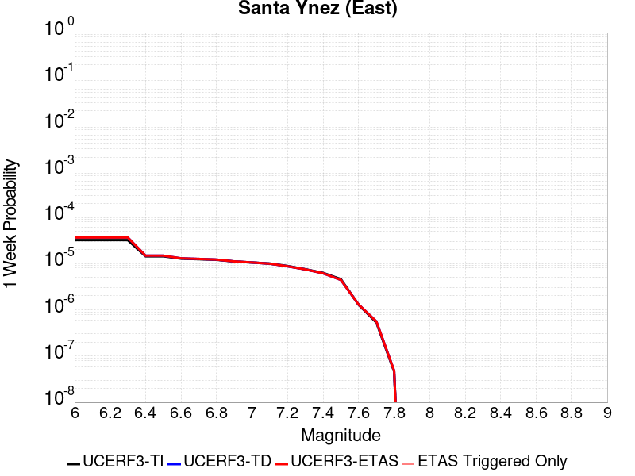 | 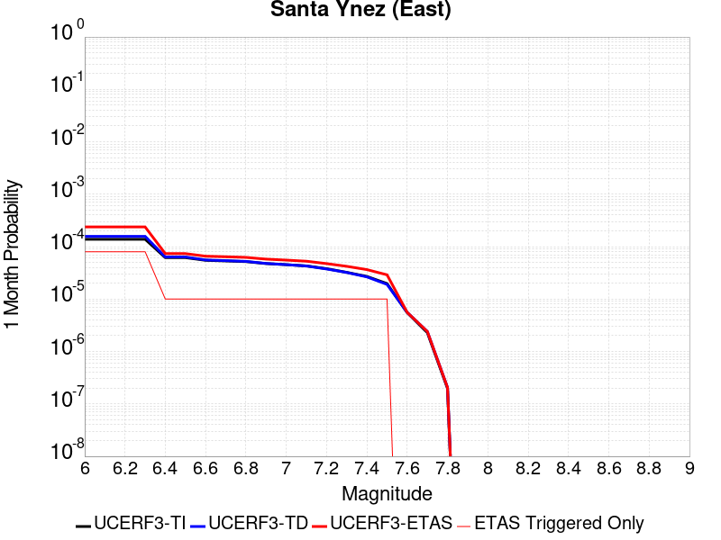 | 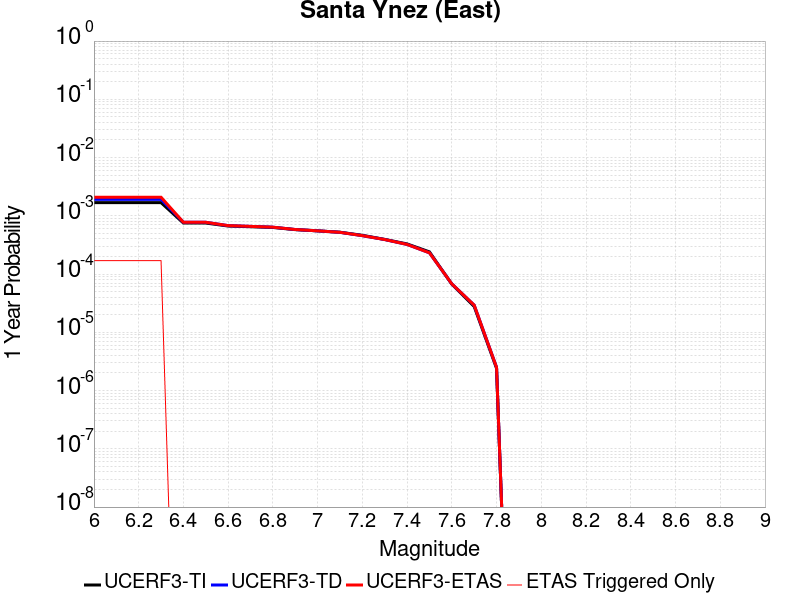 | 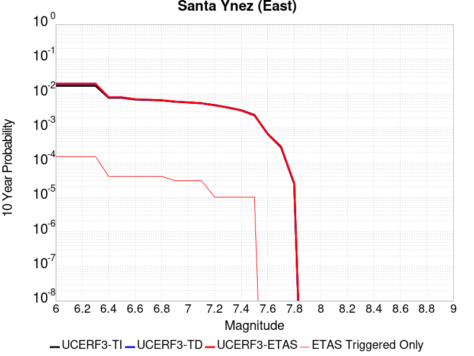 |

| Magnitude | 1 wk TI Prob | 1 wk TD Prob | 1 wk ETAS Prob | 1 wk ETAS/TD Gain | 1 wk ETAS Triggered Only | 1 mo TI Prob | 1 mo TD Prob | 1 mo ETAS Prob | 1 mo ETAS/TD Gain | 1 mo ETAS Triggered Only | 1 yr TI Prob | 1 yr TD Prob | 1 yr ETAS Prob | 1 yr ETAS/TD Gain | 1 yr ETAS Triggered Only | 10 yr TI Prob | 10 yr TD Prob | 10 yr ETAS Prob | 10 yr ETAS/TD Gain | 10 yr ETAS Triggered Only |
|-----|-----|-----|-----|-----|-----|-----|-----|-----|-----|-----|-----|-----|-----|-----|-----|-----|-----|-----|-----|-----|
| 6.0 | 3.2269712E-5 | 3.67505E-5 | 1.2180309E-4 | 3.3143244 | 8.505571E-5 | 1.3829143E-4 | 1.5749598E-4 | 2.8505945E-4 | 1.8099475 | 1.2758357E-4 | 0.0016823979 | 0.0019164166 | 0.002086202 | 1.0885953 | 1.7011142E-4 | 0.016697178 | 0.019056441 | 0.019306745 | 1.013135 | 2.5516714E-4 |
| 6.1 | 3.2269712E-5 | 3.67505E-5 | 1.2180309E-4 | 3.3143244 | 8.505571E-5 | 1.3829143E-4 | 1.5749598E-4 | 2.8505945E-4 | 1.8099475 | 1.2758357E-4 | 0.0016823979 | 0.0019164166 | 0.002086202 | 1.0885953 | 1.7011142E-4 | 0.016697178 | 0.019056441 | 0.019306745 | 1.013135 | 2.5516714E-4 |
| 6.2 | 3.2269712E-5 | 3.67505E-5 | 1.2180309E-4 | 3.3143244 | 8.505571E-5 | 1.3829143E-4 | 1.5749598E-4 | 2.8505945E-4 | 1.8099475 | 1.2758357E-4 | 0.0016823979 | 0.0019164166 | 0.002086202 | 1.0885953 | 1.7011142E-4 | 0.016697178 | 0.019056441 | 0.019306745 | 1.013135 | 2.5516714E-4 |
| 6.3 | 3.2269712E-5 | 3.67505E-5 | 1.2180309E-4 | 3.3143244 | 8.505571E-5 | 1.3829143E-4 | 1.5749598E-4 | 2.8505945E-4 | 1.8099475 | 1.2758357E-4 | 0.0016823979 | 0.0019164166 | 0.002086202 | 1.0885953 | 1.7011142E-4 | 0.016697178 | 0.019056441 | 0.019306745 | 1.013135 | 2.5516714E-4 |
| 6.4 | 1.4404779E-5 | 1.4849382E-5 | 1.4849382E-5 | 1.0 | 0.0 | 6.1733306E-5 | 6.363868E-5 | 6.363868E-5 | 1.0 | 0.0 | 7.513438E-4 | 7.745306E-4 | 7.745306E-4 | 1.0 | 0.0 | 0.0074880854 | 0.007718862 | 0.0077610617 | 1.005467 | 4.2527856E-5 |
| 6.5 | 1.4404779E-5 | 1.4849382E-5 | 1.4849382E-5 | 1.0 | 0.0 | 6.1733306E-5 | 6.363868E-5 | 6.363868E-5 | 1.0 | 0.0 | 7.513438E-4 | 7.745306E-4 | 7.745306E-4 | 1.0 | 0.0 | 0.0074880854 | 0.007718862 | 0.0077610617 | 1.005467 | 4.2527856E-5 |
| 6.6 | 1.280208E-5 | 1.3011947E-5 | 1.3011947E-5 | 1.0 | 0.0 | 5.4864904E-5 | 5.5764307E-5 | 5.5764307E-5 | 1.0 | 0.0 | 6.6777546E-4 | 6.787207E-4 | 6.787207E-4 | 1.0 | 0.0 | 0.006657724 | 0.0067666885 | 0.0068089287 | 1.0062424 | 4.2527856E-5 |
| 6.7 | 1.2457027E-5 | 1.2628468E-5 | 1.2628468E-5 | 1.0 | 0.0 | 5.3386164E-5 | 5.412089E-5 | 5.412089E-5 | 1.0 | 0.0 | 6.497827E-4 | 6.587243E-4 | 6.587243E-4 | 1.0 | 0.0 | 0.00647886 | 0.006567915 | 0.0066101635 | 1.0064325 | 4.2527856E-5 |
| 6.8 | 1.2095134E-5 | 1.2230915E-5 | 1.2230915E-5 | 1.0 | 0.0 | 5.1835254E-5 | 5.241716E-5 | 5.241716E-5 | 1.0 | 0.0 | 6.309115E-4 | 6.379937E-4 | 6.379937E-4 | 1.0 | 0.0 | 0.0062912325 | 0.006361809 | 0.0064040665 | 1.0066423 | 4.2527856E-5 |
| 6.9 | 1.1104036E-5 | 1.1157347E-5 | 1.1157347E-5 | 1.0 | 0.0 | 4.758786E-5 | 4.781633E-5 | 4.781633E-5 | 1.0 | 0.0 | 5.7922816E-4 | 5.820096E-4 | 5.820096E-4 | 1.0 | 0.0 | 0.005777207 | 0.0058049993 | 0.00584728 | 1.0072836 | 4.2527856E-5 |
| 7.0 | 1.0577444E-5 | 1.058168E-5 | 1.058168E-5 | 1.0 | 0.0 | 4.5331115E-5 | 4.5349276E-5 | 4.5349276E-5 | 1.0 | 0.0 | 5.5176654E-4 | 5.519888E-4 | 5.519888E-4 | 1.0 | 0.0 | 0.0055039856 | 0.0055063153 | 0.005548609 | 1.0076809 | 4.2527856E-5 |
| 7.1 | 1.0021775E-5 | 9.980988E-6 | 9.980988E-6 | 1.0 | 0.0 | 4.294976E-5 | 4.2774966E-5 | 4.2774966E-5 | 1.0 | 0.0 | 5.2278786E-4 | 5.2066194E-4 | 5.2066194E-4 | 1.0 | 0.0 | 0.0052155964 | 0.0051945536 | 0.0052368604 | 1.0081445 | 4.2527856E-5 |
| 7.2 | 8.874109E-6 | 8.748793E-6 | 8.748793E-6 | 1.0 | 0.0 | 3.8031343E-5 | 3.7494297E-5 | 3.7494297E-5 | 1.0 | 0.0 | 4.629332E-4 | 4.5639853E-4 | 4.5639853E-4 | 1.0 | 0.0 | 0.0046197 | 0.0045547304 | 0.0045547304 | 1.0 | 0.0 |
| 7.3 | 7.5504267E-6 | 7.5051175E-6 | 7.5051175E-6 | 1.0 | 0.0 | 3.235857E-5 | 3.21644E-5 | 3.21644E-5 | 1.0 | 0.0 | 3.9389438E-4 | 3.915322E-4 | 3.915322E-4 | 1.0 | 0.0 | 0.0039319694 | 0.003908531 | 0.003908531 | 1.0 | 0.0 |
| 7.4 | 6.309394E-6 | 6.1831556E-6 | 6.1831556E-6 | 1.0 | 0.0 | 2.703998E-5 | 2.6498974E-5 | 2.6498974E-5 | 1.0 | 0.0 | 3.2916202E-4 | 3.225782E-4 | 3.225782E-4 | 1.0 | 0.0 | 0.003286749 | 0.003221197 | 0.003221197 | 1.0 | 0.0 |
| 7.5 | 4.6103073E-6 | 4.4408903E-6 | 4.4408903E-6 | 1.0 | 0.0 | 1.975831E-5 | 1.9032252E-5 | 1.9032252E-5 | 1.0 | 0.0 | 2.4053088E-4 | 2.3169373E-4 | 2.3169373E-4 | 1.0 | 0.0 | 0.002402707 | 0.002314591 | 0.002314591 | 1.0 | 0.0 |
| 7.6 | 1.2858658E-6 | 1.3008173E-6 | 1.3008173E-6 | 1.0 | 0.0 | 5.5108417E-6 | 5.5749197E-6 | 5.5749197E-6 | 1.0 | 0.0 | 6.7092435E-5 | 6.78726E-5 | 6.78726E-5 | 1.0 | 0.0 | 6.707218E-4 | 6.785256E-4 | 6.785256E-4 | 1.0 | 0.0 |
| 7.7 | 5.3302307E-7 | 5.612138E-7 | 5.612138E-7 | 1.0 | 0.0 | 2.2843826E-6 | 2.4052001E-6 | 2.4052001E-6 | 1.0 | 0.0 | 2.7812002E-5 | 2.9282954E-5 | 2.9282954E-5 | 1.0 | 0.0 | 2.7808524E-4 | 2.9279452E-4 | 2.9279452E-4 | 1.0 | 0.0 |
| 7.8 | 4.613933E-8 | 4.80301E-8 | 4.80301E-8 | 1.0 | 0.0 | 1.9773998E-7 | 2.0584326E-7 | 2.0584326E-7 | 1.0 | 0.0 | 2.4074816E-6 | 2.5061388E-6 | 2.5061388E-6 | 1.0 | 0.0 | 2.4074554E-5 | 2.5061116E-5 | 2.5061116E-5 | 1.0 | 0.0 |

## Channel Islands Thrust
*[(top)](#table-of-contents)*

| 1 Week | 1 Month | 1 Year | 10 Year |
|-----|-----|-----|-----|
| 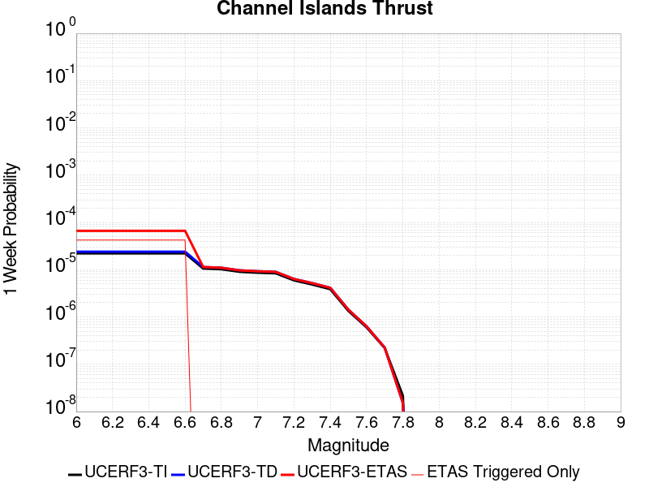 | 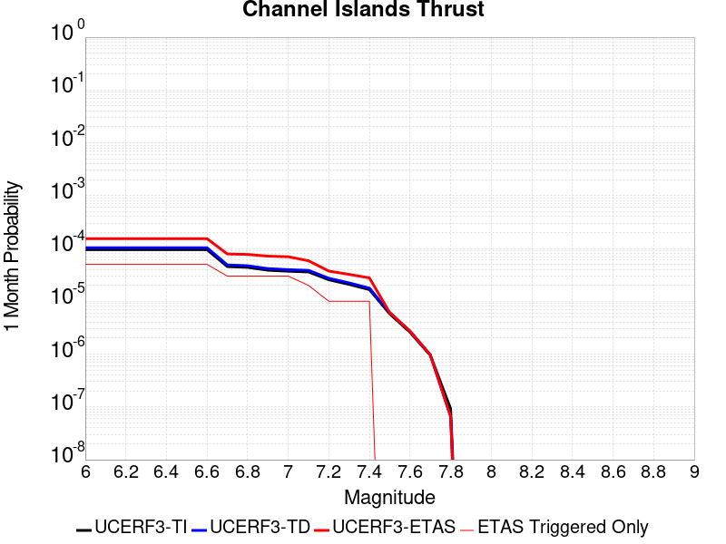 | 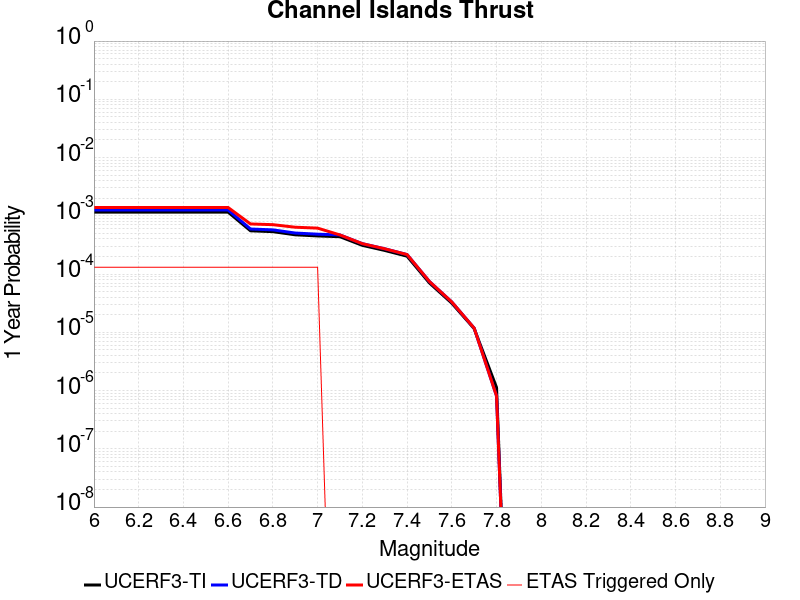 | 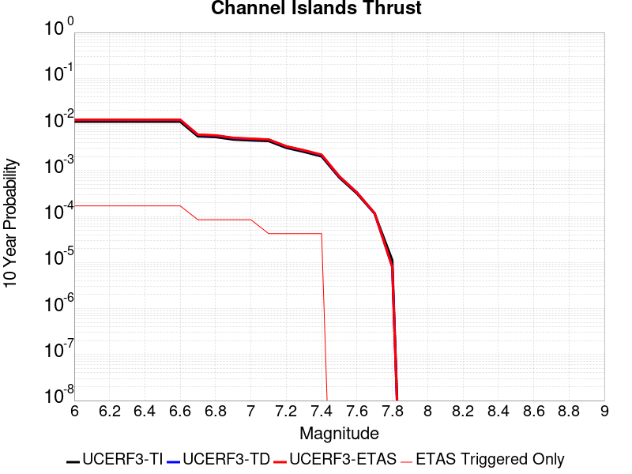 |

| Magnitude | 1 wk TI Prob | 1 wk TD Prob | 1 wk ETAS Prob | 1 wk ETAS/TD Gain | 1 wk ETAS Triggered Only | 1 mo TI Prob | 1 mo TD Prob | 1 mo ETAS Prob | 1 mo ETAS/TD Gain | 1 mo ETAS Triggered Only | 1 yr TI Prob | 1 yr TD Prob | 1 yr ETAS Prob | 1 yr ETAS/TD Gain | 1 yr ETAS Triggered Only | 10 yr TI Prob | 10 yr TD Prob | 10 yr ETAS Prob | 10 yr ETAS/TD Gain | 10 yr ETAS Triggered Only |
|-----|-----|-----|-----|-----|-----|-----|-----|-----|-----|-----|-----|-----|-----|-----|-----|-----|-----|-----|-----|-----|
| 6.0 | 2.2156251E-5 | 2.4092022E-5 | 6.661885E-5 | 2.7651832 | 4.2527856E-5 | 9.495191E-5 | 1.03248036E-4 | 1.8829497E-4 | 1.8237147 | 8.505571E-5 | 0.0011554264 | 0.0012564264 | 0.0013838498 | 1.1014172 | 1.2758357E-4 | 0.011494373 | 0.0125038205 | 0.012671805 | 1.0134346 | 1.7011142E-4 |
| 6.1 | 2.2156251E-5 | 2.4092022E-5 | 6.661885E-5 | 2.7651832 | 4.2527856E-5 | 9.495191E-5 | 1.03248036E-4 | 1.8829497E-4 | 1.8237147 | 8.505571E-5 | 0.0011554264 | 0.0012564264 | 0.0013838498 | 1.1014172 | 1.2758357E-4 | 0.011494373 | 0.0125038205 | 0.012671805 | 1.0134346 | 1.7011142E-4 |
| 6.2 | 2.2156251E-5 | 2.4092022E-5 | 6.661885E-5 | 2.7651832 | 4.2527856E-5 | 9.495191E-5 | 1.03248036E-4 | 1.8829497E-4 | 1.8237147 | 8.505571E-5 | 0.0011554264 | 0.0012564264 | 0.0013838498 | 1.1014172 | 1.2758357E-4 | 0.011494373 | 0.0125038205 | 0.012671805 | 1.0134346 | 1.7011142E-4 |
| 6.3 | 2.2156251E-5 | 2.4092022E-5 | 6.661885E-5 | 2.7651832 | 4.2527856E-5 | 9.495191E-5 | 1.03248036E-4 | 1.8829497E-4 | 1.8237147 | 8.505571E-5 | 0.0011554264 | 0.0012564264 | 0.0013838498 | 1.1014172 | 1.2758357E-4 | 0.011494373 | 0.0125038205 | 0.012671805 | 1.0134346 | 1.7011142E-4 |
| 6.4 | 2.2156251E-5 | 2.4092022E-5 | 6.661885E-5 | 2.7651832 | 4.2527856E-5 | 9.495191E-5 | 1.03248036E-4 | 1.8829497E-4 | 1.8237147 | 8.505571E-5 | 0.0011554264 | 0.0012564264 | 0.0013838498 | 1.1014172 | 1.2758357E-4 | 0.011494373 | 0.0125038205 | 0.012671805 | 1.0134346 | 1.7011142E-4 |
| 6.5 | 2.2156251E-5 | 2.4092022E-5 | 6.661885E-5 | 2.7651832 | 4.2527856E-5 | 9.495191E-5 | 1.03248036E-4 | 1.8829497E-4 | 1.8237147 | 8.505571E-5 | 0.0011554264 | 0.0012564264 | 0.0013838498 | 1.1014172 | 1.2758357E-4 | 0.011494373 | 0.0125038205 | 0.012671805 | 1.0134346 | 1.7011142E-4 |
| 6.6 | 2.2156251E-5 | 2.4092022E-5 | 6.661885E-5 | 2.7651832 | 4.2527856E-5 | 9.495191E-5 | 1.03248036E-4 | 1.8829497E-4 | 1.8237147 | 8.505571E-5 | 0.0011554264 | 0.0012564264 | 0.0013838498 | 1.1014172 | 1.2758357E-4 | 0.011494373 | 0.0125038205 | 0.012671805 | 1.0134346 | 1.7011142E-4 |
| 6.7 | 1.0601296E-5 | 1.1379544E-5 | 1.1379544E-5 | 1.0 | 0.0 | 4.5433335E-5 | 4.876859E-5 | 9.129437E-5 | 1.8719913 | 4.2527856E-5 | 5.5301044E-4 | 5.936007E-4 | 6.786059E-4 | 1.1432027 | 8.505571E-5 | 0.005516363 | 0.005920653 | 0.006005205 | 1.0142809 | 8.505571E-5 |
| 6.8 | 1.0246747E-5 | 1.0996669E-5 | 1.0996669E-5 | 1.0 | 0.0 | 4.391389E-5 | 4.7127756E-5 | 8.965361E-5 | 1.9023526 | 4.2527856E-5 | 5.345204E-4 | 5.7363417E-4 | 6.586411E-4 | 1.1481901 | 8.505571E-5 | 0.0053323656 | 0.005722025 | 0.0058065937 | 1.0147796 | 8.505571E-5 |
| 6.9 | 9.049551E-6 | 9.699645E-6 | 9.699645E-6 | 1.0 | 0.0 | 3.878322E-5 | 4.1569267E-5 | 8.409535E-5 | 2.0230176 | 4.2527856E-5 | 4.7208337E-4 | 5.059924E-4 | 5.910051E-4 | 1.1680118 | 8.505571E-5 | 0.0047108172 | 0.0050488203 | 0.0051334463 | 1.0167615 | 8.505571E-5 |
| 7.0 | 8.6542195E-6 | 9.274603E-6 | 9.274603E-6 | 1.0 | 0.0 | 3.7088983E-5 | 3.9747716E-5 | 8.227388E-5 | 2.0699022 | 4.2527856E-5 | 4.5146482E-4 | 4.8382508E-4 | 5.688396E-4 | 1.1757134 | 8.505571E-5 | 0.004505487 | 0.004828129 | 0.004912774 | 1.0175316 | 8.505571E-5 |
| 7.1 | 8.391028E-6 | 8.992924E-6 | 8.992924E-6 | 1.0 | 0.0 | 3.5961057E-5 | 3.854056E-5 | 3.854056E-5 | 1.0 | 0.0 | 4.3773788E-4 | 4.6913436E-4 | 5.1164225E-4 | 1.0906092 | 4.2527856E-5 | 0.004368766 | 0.0046818503 | 0.004724179 | 1.0090411 | 4.2527856E-5 |
| 7.2 | 5.965188E-6 | 6.3716952E-6 | 6.3716952E-6 | 1.0 | 0.0 | 2.556484E-5 | 2.7306982E-5 | 2.7306982E-5 | 1.0 | 0.0 | 3.1120746E-4 | 3.3241234E-4 | 3.7492605E-4 | 1.1278945 | 4.2527856E-5 | 0.00310772 | 0.0033192092 | 0.003361596 | 1.0127702 | 4.2527856E-5 |
| 7.3 | 4.877518E-6 | 5.2060063E-6 | 5.2060063E-6 | 1.0 | 0.0 | 2.0903482E-5 | 2.2311267E-5 | 2.2311267E-5 | 1.0 | 0.0 | 2.5447016E-4 | 2.716063E-4 | 3.141226E-4 | 1.1565366 | 4.2527856E-5 | 0.0025417898 | 0.0027127895 | 0.0027552021 | 1.0156343 | 4.2527856E-5 |
| 7.4 | 3.8829853E-6 | 4.141863E-6 | 4.141863E-6 | 1.0 | 0.0 | 1.664126E-5 | 1.7750723E-5 | 1.7750723E-5 | 1.0 | 0.0 | 2.0258849E-4 | 2.1609402E-4 | 2.5861268E-4 | 1.19676 | 4.2527856E-5 | 0.002024039 | 0.0021588807 | 0.0022013166 | 1.0196565 | 4.2527856E-5 |
| 7.5 | 1.3489616E-6 | 1.4277903E-6 | 1.4277903E-6 | 1.0 | 0.0 | 5.7812517E-6 | 6.119087E-6 | 6.119087E-6 | 1.0 | 0.0 | 7.038446E-5 | 7.449738E-5 | 7.449738E-5 | 1.0 | 0.0 | 7.036218E-4 | 7.44728E-4 | 7.44728E-4 | 1.0 | 0.0 |
| 7.6 | 6.058192E-7 | 6.353778E-7 | 6.353778E-7 | 1.0 | 0.0 | 2.5963652E-6 | 2.7230449E-6 | 2.7230449E-6 | 1.0 | 0.0 | 3.161029E-5 | 3.3152584E-5 | 3.3152584E-5 | 1.0 | 0.0 | 3.1605794E-4 | 3.31478E-4 | 3.31478E-4 | 1.0 | 0.0 |
| 7.7 | 2.2170494E-7 | 2.2607902E-7 | 2.2607902E-7 | 1.0 | 0.0 | 9.5016367E-7 | 9.689098E-7 | 9.689098E-7 | 1.0 | 0.0 | 1.1568181E-5 | 1.1796425E-5 | 1.1796425E-5 | 1.0 | 0.0 | 1.1567579E-4 | 1.1795909E-4 | 1.1795909E-4 | 1.0 | 0.0 |
| 7.8 | 2.1613102E-8 | 1.5466682E-8 | 1.5466682E-8 | 1.0 | 0.0 | 9.262757E-8 | 6.628578E-8 | 6.628578E-8 | 1.0 | 0.0 | 1.1277401E-6 | 8.070291E-7 | 8.070291E-7 | 1.0 | 0.0 | 1.1277344E-5 | 8.070269E-6 | 8.070269E-6 | 1.0 | 0.0 |

## Big Pine (Central)
*[(top)](#table-of-contents)*

| 1 Week | 1 Month | 1 Year | 10 Year |
|-----|-----|-----|-----|
| 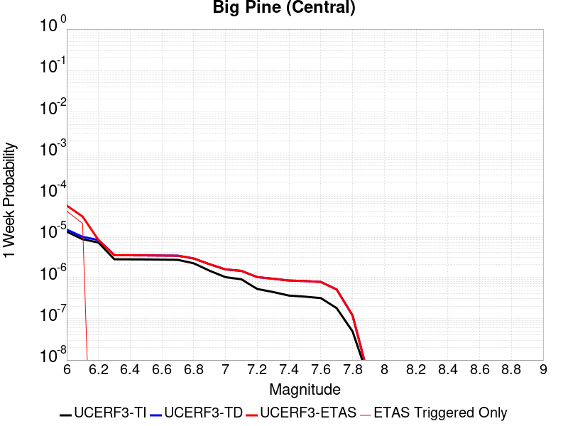 | 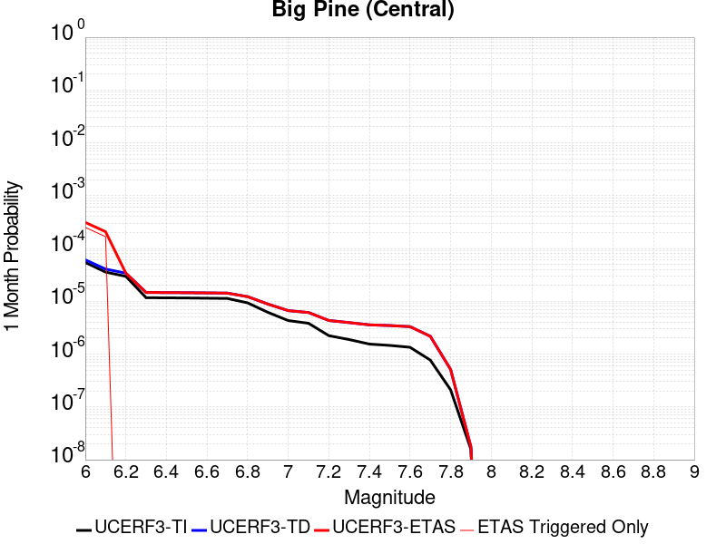 | 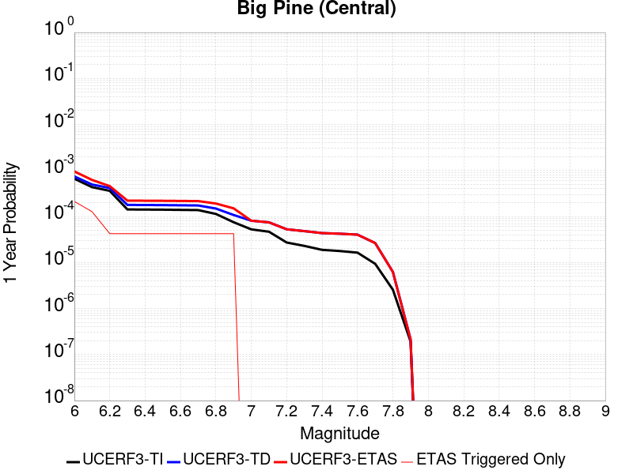 | 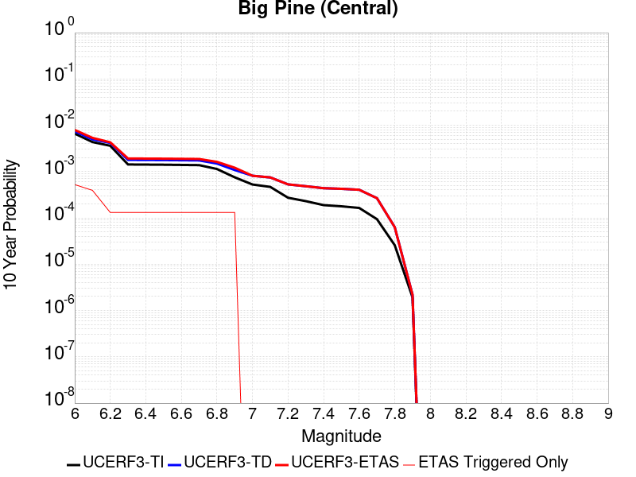 |

| Magnitude | 1 wk TI Prob | 1 wk TD Prob | 1 wk ETAS Prob | 1 wk ETAS/TD Gain | 1 wk ETAS Triggered Only | 1 mo TI Prob | 1 mo TD Prob | 1 mo ETAS Prob | 1 mo ETAS/TD Gain | 1 mo ETAS Triggered Only | 1 yr TI Prob | 1 yr TD Prob | 1 yr ETAS Prob | 1 yr ETAS/TD Gain | 1 yr ETAS Triggered Only | 10 yr TI Prob | 10 yr TD Prob | 10 yr ETAS Prob | 10 yr ETAS/TD Gain | 10 yr ETAS Triggered Only |
|-----|-----|-----|-----|-----|-----|-----|-----|-----|-----|-----|-----|-----|-----|-----|-----|-----|-----|-----|-----|-----|
| 6.0 | 1.2706755E-5 | 1.4250529E-5 | 1.4183228E-4 | 9.952773 | 1.2758357E-4 | 5.4456385E-5 | 6.107247E-5 | 1.8864825E-4 | 3.0889244 | 1.2758357E-4 | 6.628048E-4 | 7.433402E-4 | 9.558214E-4 | 1.2858465 | 2.1263928E-4 | 0.006608314 | 0.0074135666 | 0.007666842 | 1.0341638 | 2.5516714E-4 |
| 6.1 | 8.342579E-6 | 9.510762E-6 | 9.4565665E-5 | 9.943017 | 8.505571E-5 | 3.5753423E-5 | 4.0759893E-5 | 1.2581213E-4 | 3.0866652 | 8.505571E-5 | 4.3521097E-4 | 4.961604E-4 | 6.236807E-4 | 1.2570142 | 1.2758357E-4 | 0.0043435963 | 0.0049540824 | 0.0051233512 | 1.0341675 | 1.7011142E-4 |
| 6.2 | 6.923899E-6 | 7.967147E-6 | 7.967147E-6 | 1.0 | 0.0 | 2.9673516E-5 | 3.4144578E-5 | 3.4144578E-5 | 1.0 | 0.0 | 3.6121515E-4 | 4.156502E-4 | 4.5816036E-4 | 1.102274 | 4.2527856E-5 | 0.003606286 | 0.0041520367 | 0.004236739 | 1.0204003 | 8.505571E-5 |
| 6.3 | 2.728396E-6 | 3.4242908E-6 | 3.4242908E-6 | 1.0 | 0.0 | 1.1693074E-5 | 1.4675454E-5 | 1.4675454E-5 | 1.0 | 0.0 | 1.4235388E-4 | 1.7865987E-4 | 2.2118013E-4 | 1.2379956 | 4.2527856E-5 | 0.0014226272 | 0.0017866704 | 0.0018715742 | 1.0475206 | 8.505571E-5 |
| 6.4 | 2.7136944E-6 | 3.408584E-6 | 3.408584E-6 | 1.0 | 0.0 | 1.1630066E-5 | 1.4608141E-5 | 1.4608141E-5 | 1.0 | 0.0 | 1.4158686E-4 | 1.7784047E-4 | 2.2036076E-4 | 1.2390924 | 4.2527856E-5 | 0.0014149669 | 0.0017784894 | 0.0018633939 | 1.0477396 | 8.505571E-5 |
| 6.5 | 2.6971882E-6 | 3.3909291E-6 | 3.3909291E-6 | 1.0 | 0.0 | 1.1559327E-5 | 1.45324775E-5 | 1.45324775E-5 | 1.0 | 0.0 | 1.4072572E-4 | 1.7691942E-4 | 2.1943975E-4 | 1.2403373 | 4.2527856E-5 | 0.0014063664 | 0.0017692937 | 0.0018541989 | 1.0479882 | 8.505571E-5 |
| 6.6 | 2.669092E-6 | 3.3609497E-6 | 3.3609497E-6 | 1.0 | 0.0 | 1.1438916E-5 | 1.4403995E-5 | 1.4403995E-5 | 1.0 | 0.0 | 1.3925991E-4 | 1.753554E-4 | 2.178758E-4 | 1.2424812 | 4.2527856E-5 | 0.0013917267 | 0.0017536782 | 0.0018385848 | 1.0484163 | 8.505571E-5 |
| 6.7 | 2.6408059E-6 | 3.3309752E-6 | 3.3309752E-6 | 1.0 | 0.0 | 1.1317691E-5 | 1.4275535E-5 | 1.4275535E-5 | 1.0 | 0.0 | 1.3778417E-4 | 1.7379165E-4 | 2.1631211E-4 | 1.2446635 | 4.2527856E-5 | 0.0013769877 | 0.0017380653 | 0.0018229731 | 1.048852 | 8.505571E-5 |
| 6.8 | 2.1786943E-6 | 2.8544325E-6 | 2.8544325E-6 | 1.0 | 0.0 | 9.337228E-6 | 1.2233229E-5 | 1.2233229E-5 | 1.0 | 0.0 | 1.1367482E-4 | 1.4893012E-4 | 1.9145165E-4 | 1.2855133 | 4.2527856E-5 | 0.0011361669 | 0.0014897975 | 0.0015747265 | 1.0570071 | 8.505571E-5 |
| 6.9 | 1.4411696E-6 | 2.068499E-6 | 2.068499E-6 | 1.0 | 0.0 | 6.1764263E-6 | 8.864968E-6 | 8.864968E-6 | 1.0 | 0.0 | 7.51954E-5 | 1.079259E-4 | 1.5044917E-4 | 1.3940042 | 4.2527856E-5 | 7.5169955E-4 | 0.0010801847 | 0.0011651485 | 1.0786568 | 8.505571E-5 |
| 7.0 | 1.0073411E-6 | 1.554261E-6 | 1.554261E-6 | 1.0 | 0.0 | 4.317169E-6 | 6.6611024E-6 | 6.6611024E-6 | 1.0 | 0.0 | 5.2560266E-5 | 8.1096056E-5 | 8.1096056E-5 | 1.0 | 0.0 | 5.2547833E-4 | 8.1210316E-4 | 8.1210316E-4 | 1.0 | 0.0 |
| 7.1 | 8.947104E-7 | 1.4302494E-6 | 1.4302494E-6 | 1.0 | 0.0 | 3.834468E-6 | 6.129627E-6 | 6.129627E-6 | 1.0 | 0.0 | 4.6683643E-5 | 7.46258E-5 | 7.46258E-5 | 1.0 | 0.0 | 4.6673836E-4 | 7.474457E-4 | 7.474457E-4 | 1.0 | 0.0 |
| 7.2 | 5.215166E-7 | 1.0111678E-6 | 1.0111678E-6 | 1.0 | 0.0 | 2.2350691E-6 | 4.3335694E-6 | 4.3335694E-6 | 1.0 | 0.0 | 2.7211627E-5 | 5.2759973E-5 | 5.2759973E-5 | 1.0 | 0.0 | 2.7208295E-4 | 5.2890263E-4 | 5.2890263E-4 | 1.0 | 0.0 |
| 7.3 | 4.4024807E-7 | 9.219589E-7 | 9.219589E-7 | 1.0 | 0.0 | 1.8867761E-6 | 3.9512465E-6 | 3.9512465E-6 | 1.0 | 0.0 | 2.2971257E-5 | 4.810541E-5 | 4.810541E-5 | 1.0 | 0.0 | 2.2968883E-4 | 4.8237795E-4 | 4.8237795E-4 | 1.0 | 0.0 |
| 7.4 | 3.6130905E-7 | 8.358523E-7 | 8.358523E-7 | 1.0 | 0.0 | 1.5484665E-6 | 3.5822195E-6 | 3.5822195E-6 | 1.0 | 0.0 | 1.8852415E-5 | 4.3612687E-5 | 4.3612687E-5 | 1.0 | 0.0 | 1.8850817E-4 | 4.374597E-4 | 4.374597E-4 | 1.0 | 0.0 |
| 7.5 | 3.408184E-7 | 8.108147E-7 | 8.108147E-7 | 1.0 | 0.0 | 1.4606494E-6 | 3.4749157E-6 | 3.4749157E-6 | 1.0 | 0.0 | 1.7783263E-5 | 4.2306317E-5 | 4.2306317E-5 | 1.0 | 0.0 | 1.778184E-4 | 4.2437963E-4 | 4.2437963E-4 | 1.0 | 0.0 |
| 7.6 | 3.1428627E-7 | 7.7316E-7 | 7.7316E-7 | 1.0 | 0.0 | 1.3469405E-6 | 3.3135389E-6 | 3.3135389E-6 | 1.0 | 0.0 | 1.6398877E-5 | 4.0341627E-5 | 4.0341627E-5 | 1.0 | 0.0 | 1.6397667E-4 | 4.0471106E-4 | 4.0471106E-4 | 1.0 | 0.0 |
| 7.7 | 1.7972785E-7 | 5.077752E-7 | 5.077752E-7 | 1.0 | 0.0 | 7.70262E-7 | 2.1761778E-6 | 2.1761778E-6 | 1.0 | 0.0 | 9.377899E-6 | 2.6494654E-5 | 2.6494654E-5 | 1.0 | 0.0 | 9.377503E-5 | 2.662899E-4 | 2.662899E-4 | 1.0 | 0.0 |
| 7.8 | 4.9230927E-8 | 1.198079E-7 | 1.198079E-7 | 1.0 | 0.0 | 2.1098968E-7 | 5.134623E-7 | 5.134623E-7 | 1.0 | 0.0 | 2.5687964E-6 | 6.2513873E-6 | 6.2513873E-6 | 1.0 | 0.0 | 2.5687666E-5 | 6.295415E-5 | 6.295415E-5 | 1.0 | 0.0 |
| 7.9 | 3.6805972E-9 | 4.105293E-9 | 4.105293E-9 | 1.0 | 0.0 | 1.5773987E-8 | 1.7594115E-8 | 1.7594115E-8 | 1.0 | 0.0 | 1.9204828E-7 | 2.1420831E-7 | 2.1420831E-7 | 1.0 | 0.0 | 1.920481E-6 | 2.1900614E-6 | 2.1900614E-6 | 1.0 | 0.0 |

## Pleito
*[(top)](#table-of-contents)*

| 1 Week | 1 Month | 1 Year | 10 Year |
|-----|-----|-----|-----|
| 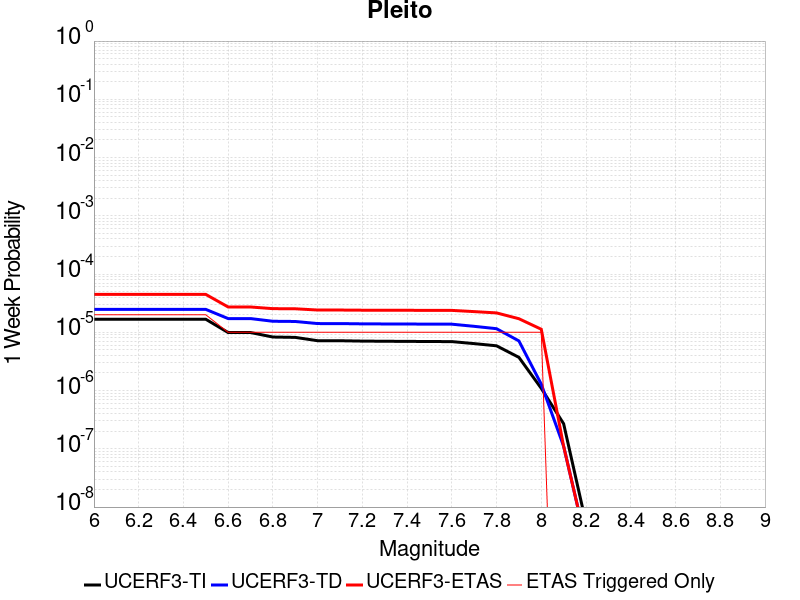 | 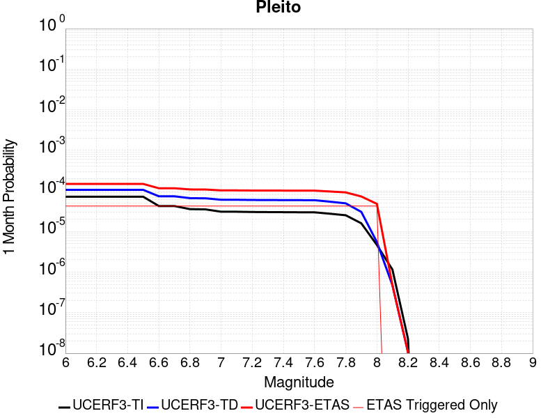 |  | 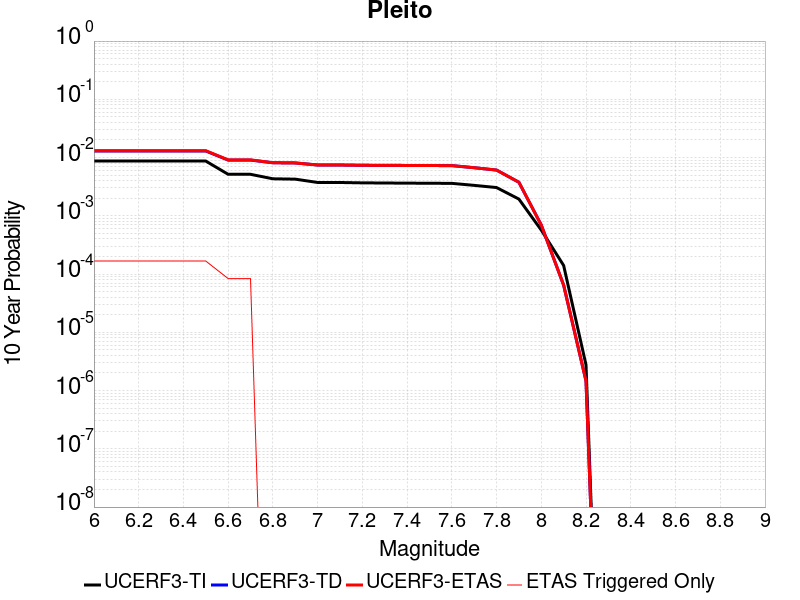 |

| Magnitude | 1 wk TI Prob | 1 wk TD Prob | 1 wk ETAS Prob | 1 wk ETAS/TD Gain | 1 wk ETAS Triggered Only | 1 mo TI Prob | 1 mo TD Prob | 1 mo ETAS Prob | 1 mo ETAS/TD Gain | 1 mo ETAS Triggered Only | 1 yr TI Prob | 1 yr TD Prob | 1 yr ETAS Prob | 1 yr ETAS/TD Gain | 1 yr ETAS Triggered Only | 10 yr TI Prob | 10 yr TD Prob | 10 yr ETAS Prob | 10 yr ETAS/TD Gain | 10 yr ETAS Triggered Only |
|-----|-----|-----|-----|-----|-----|-----|-----|-----|-----|-----|-----|-----|-----|-----|-----|-----|-----|-----|-----|-----|
| 6.0 | 1.6763008E-5 | 2.4763838E-5 | 6.729064E-5 | 2.7172945 | 4.2527856E-5 | 7.183948E-5 | 1.0612683E-4 | 1.4865017E-4 | 1.4006842 | 4.2527856E-5 | 8.742947E-4 | 0.0012914003 | 0.001503765 | 1.1644453 | 2.1263928E-4 | 0.00870863 | 0.0129538905 | 0.013205752 | 1.0194429 | 2.5516714E-4 |
| 6.1 | 1.6763008E-5 | 2.4763838E-5 | 6.729064E-5 | 2.7172945 | 4.2527856E-5 | 7.183948E-5 | 1.0612683E-4 | 1.4865017E-4 | 1.4006842 | 4.2527856E-5 | 8.742947E-4 | 0.0012914003 | 0.001503765 | 1.1644453 | 2.1263928E-4 | 0.00870863 | 0.0129538905 | 0.013205752 | 1.0194429 | 2.5516714E-4 |
| 6.2 | 1.6763008E-5 | 2.4763838E-5 | 6.729064E-5 | 2.7172945 | 4.2527856E-5 | 7.183948E-5 | 1.0612683E-4 | 1.4865017E-4 | 1.4006842 | 4.2527856E-5 | 8.742947E-4 | 0.0012914003 | 0.001503765 | 1.1644453 | 2.1263928E-4 | 0.00870863 | 0.0129538905 | 0.013205752 | 1.0194429 | 2.5516714E-4 |
| 6.3 | 1.6763008E-5 | 2.4763838E-5 | 6.729064E-5 | 2.7172945 | 4.2527856E-5 | 7.183948E-5 | 1.0612683E-4 | 1.4865017E-4 | 1.4006842 | 4.2527856E-5 | 8.742947E-4 | 0.0012914003 | 0.001503765 | 1.1644453 | 2.1263928E-4 | 0.00870863 | 0.0129538905 | 0.013205752 | 1.0194429 | 2.5516714E-4 |
| 6.4 | 1.6763008E-5 | 2.4763838E-5 | 6.729064E-5 | 2.7172945 | 4.2527856E-5 | 7.183948E-5 | 1.0612683E-4 | 1.4865017E-4 | 1.4006842 | 4.2527856E-5 | 8.742947E-4 | 0.0012914003 | 0.001503765 | 1.1644453 | 2.1263928E-4 | 0.00870863 | 0.0129538905 | 0.013205752 | 1.0194429 | 2.5516714E-4 |
| 6.5 | 1.6763008E-5 | 2.4763838E-5 | 6.729064E-5 | 2.7172945 | 4.2527856E-5 | 7.183948E-5 | 1.0612683E-4 | 1.4865017E-4 | 1.4006842 | 4.2527856E-5 | 8.742947E-4 | 0.0012914003 | 0.001503765 | 1.1644453 | 2.1263928E-4 | 0.00870863 | 0.0129538905 | 0.013205752 | 1.0194429 | 2.5516714E-4 |
| 6.6 | 9.910213E-6 | 1.7214623E-5 | 5.9741746E-5 | 3.4704068 | 4.2527856E-5 | 4.247165E-5 | 7.377489E-5 | 1.1629961E-4 | 1.5764118 | 4.2527856E-5 | 5.169696E-4 | 8.978429E-4 | 0.0010253119 | 1.1419725 | 1.2758357E-4 | 0.0051576863 | 0.009050702 | 0.009177131 | 1.013969 | 1.2758357E-4 |
| 6.7 | 9.910213E-6 | 1.7214623E-5 | 5.9741746E-5 | 3.4704068 | 4.2527856E-5 | 4.247165E-5 | 7.377489E-5 | 1.1629961E-4 | 1.5764118 | 4.2527856E-5 | 5.169696E-4 | 8.978429E-4 | 0.0010253119 | 1.1419725 | 1.2758357E-4 | 0.0051576863 | 0.009050702 | 0.009177131 | 1.013969 | 1.2758357E-4 |
| 6.8 | 8.300162E-6 | 1.5474232E-5 | 5.800143E-5 | 3.7482588 | 4.2527856E-5 | 3.557164E-5 | 6.631646E-5 | 1.08841494E-4 | 1.641244 | 4.2527856E-5 | 4.3299864E-4 | 8.071053E-4 | 8.920923E-4 | 1.1052986 | 8.505571E-5 | 0.004321559 | 0.008150139 | 0.008234502 | 1.0103511 | 8.505571E-5 |
| 6.9 | 8.183114E-6 | 1.5345448E-5 | 5.787265E-5 | 3.7713237 | 4.2527856E-5 | 3.5070017E-5 | 6.576455E-5 | 1.0828961E-4 | 1.6466259 | 4.2527856E-5 | 4.2689382E-4 | 8.003907E-4 | 8.8537834E-4 | 1.1061827 | 8.505571E-5 | 0.0042607468 | 0.008083483 | 0.008167852 | 1.0104371 | 8.505571E-5 |
| 7.0 | 7.1748823E-6 | 1.413244E-5 | 5.6659694E-5 | 4.0091944 | 4.2527856E-5 | 3.0749135E-5 | 6.0566195E-5 | 1.0309147E-4 | 1.702129 | 4.2527856E-5 | 3.743064E-4 | 7.371445E-4 | 8.2213746E-4 | 1.1153003 | 8.505571E-5 | 0.0037367654 | 0.007454939 | 0.007539361 | 1.0113243 | 8.505571E-5 |
| 7.1 | 7.1671807E-6 | 1.412281E-5 | 5.6650064E-5 | 4.0112457 | 4.2527856E-5 | 3.0716128E-5 | 6.052493E-5 | 1.0305021E-4 | 1.7026078 | 4.2527856E-5 | 3.7390468E-4 | 7.366424E-4 | 8.216355E-4 | 1.115379 | 8.505571E-5 | 0.0037327618 | 0.0074499524 | 0.0075343745 | 1.0113319 | 8.505571E-5 |
| 7.2 | 7.0649667E-6 | 1.39701015E-5 | 5.6497363E-5 | 4.0441628 | 4.2527856E-5 | 3.0278077E-5 | 5.9870494E-5 | 1.023958E-4 | 1.7102883 | 4.2527856E-5 | 3.6857324E-4 | 7.2868E-4 | 8.136737E-4 | 1.1166407 | 8.505571E-5 | 0.0036796255 | 0.0073707094 | 0.007455138 | 1.0114546 | 8.505571E-5 |
| 7.3 | 7.02082E-6 | 1.3913556E-5 | 5.6440822E-5 | 4.0565343 | 4.2527856E-5 | 3.008888E-5 | 5.9628168E-5 | 1.0215349E-4 | 1.713175 | 4.2527856E-5 | 3.6627054E-4 | 7.2573166E-4 | 8.107256E-4 | 1.1171149 | 8.505571E-5 | 0.0036566744 | 0.007341209 | 0.0074256402 | 1.011501 | 8.505571E-5 |
| 7.4 | 6.987146E-6 | 1.3873118E-5 | 5.6400386E-5 | 4.065444 | 4.2527856E-5 | 2.9944567E-5 | 5.945487E-5 | 1.019802E-4 | 1.715254 | 4.2527856E-5 | 3.6451413E-4 | 7.2362315E-4 | 8.086173E-4 | 1.1174564 | 8.505571E-5 | 0.0036391679 | 0.007320144 | 0.0074045775 | 1.0115343 | 8.505571E-5 |
| 7.5 | 6.9494554E-6 | 1.3830024E-5 | 5.635729E-5 | 4.074996 | 4.2527856E-5 | 2.9783041E-5 | 5.9270187E-5 | 1.0179552E-4 | 1.7174827 | 4.2527856E-5 | 3.625482E-4 | 7.2137616E-4 | 8.0637046E-4 | 1.1178225 | 8.505571E-5 | 0.0036195726 | 0.0072977724 | 0.0073822076 | 1.01157 | 8.505571E-5 |
| 7.6 | 6.92694E-6 | 1.3789138E-5 | 5.6316407E-5 | 4.0841136 | 4.2527856E-5 | 2.9686547E-5 | 5.909497E-5 | 1.0162031E-4 | 1.7196102 | 4.2527856E-5 | 3.6137376E-4 | 7.1924424E-4 | 8.042388E-4 | 1.118172 | 8.505571E-5 | 0.0036078666 | 0.0072765257 | 0.0073609627 | 1.011604 | 8.505571E-5 |
| 7.7 | 6.395867E-6 | 1.2668219E-5 | 5.5195535E-5 | 4.3570085 | 4.2527856E-5 | 2.741057E-5 | 5.429124E-5 | 9.681679E-5 | 1.7832856 | 4.2527856E-5 | 3.336726E-4 | 6.6079566E-4 | 7.457952E-4 | 1.1286321 | 8.505571E-5 | 0.0033317201 | 0.0066951844 | 0.0067796707 | 1.0126189 | 8.505571E-5 |
| 7.8 | 5.8664327E-6 | 1.153586E-5 | 5.4063225E-5 | 4.6865363 | 4.2527856E-5 | 2.5141611E-5 | 4.9438466E-5 | 9.196422E-5 | 1.8601755 | 4.2527856E-5 | 3.060561E-4 | 6.017473E-4 | 6.8675185E-4 | 1.1412629 | 8.505571E-5 | 0.0030563495 | 0.0061006667 | 0.0061852033 | 1.013857 | 8.505571E-5 |
| 7.9 | 3.7167474E-6 | 7.1140853E-6 | 4.964164E-5 | 6.9779367 | 4.2527856E-5 | 1.592882E-5 | 3.0488582E-5 | 7.3015144E-5 | 2.3948357 | 4.2527856E-5 | 1.9391612E-4 | 3.7113542E-4 | 4.5615956E-4 | 1.229092 | 8.505571E-5 | 0.0019374699 | 0.0037674906 | 0.0038522258 | 1.0224912 | 8.505571E-5 |
| 8.0 | 1.0903841E-6 | 1.2879392E-6 | 4.381574E-5 | 34.02004 | 4.2527856E-5 | 4.6730665E-6 | 5.5197274E-6 | 4.804735E-5 | 8.704659 | 4.2527856E-5 | 5.68931E-5 | 6.720063E-5 | 1.09725624E-4 | 1.6328065 | 4.2527856E-5 | 5.6878536E-4 | 6.941948E-4 | 7.3669315E-4 | 1.0612196 | 4.2527856E-5 |
| 8.1 | 2.6894583E-7 | 1.1060341E-7 | 1.1060341E-7 | 1.0 | 0.0 | 1.1526245E-6 | 4.740145E-7 | 4.740145E-7 | 1.0 | 0.0 | 1.4033113E-5 | 5.7711113E-6 | 5.7711113E-6 | 1.0 | 0.0 | 1.4032227E-4 | 6.456908E-5 | 6.456908E-5 | 1.0 | 0.0 |
| 8.2 | 5.2967013E-9 | 2.4578228E-9 | 2.4578228E-9 | 1.0 | 0.0 | 2.2700148E-8 | 1.0533527E-8 | 1.0533527E-8 | 1.0 | 0.0 | 2.7637427E-7 | 1.2824569E-7 | 1.2824569E-7 | 1.0 | 0.0 | 2.7637393E-6 | 1.4592787E-6 | 1.4592787E-6 | 1.0 | 0.0 |

## Santa Cruz Island
*[(top)](#table-of-contents)*

| 1 Week | 1 Month | 1 Year | 10 Year |
|-----|-----|-----|-----|
| 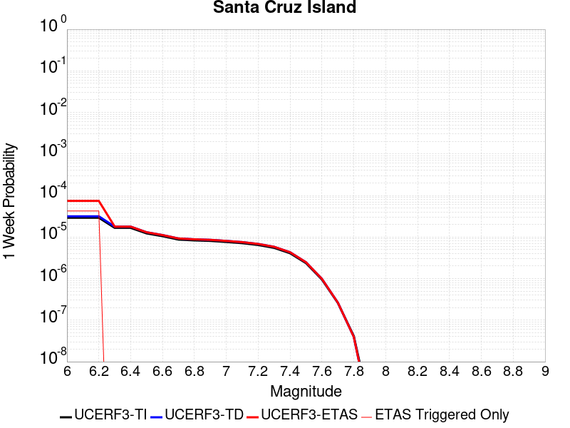 |  | 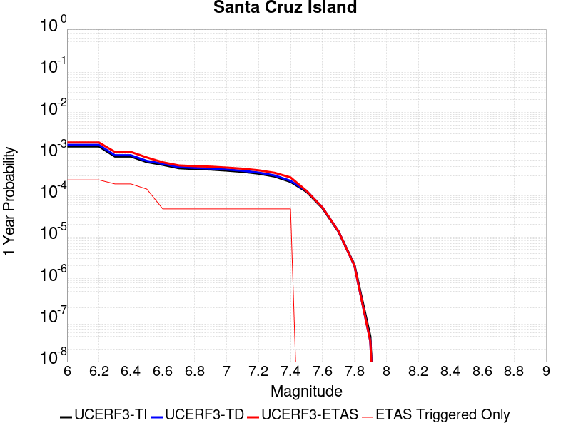 | 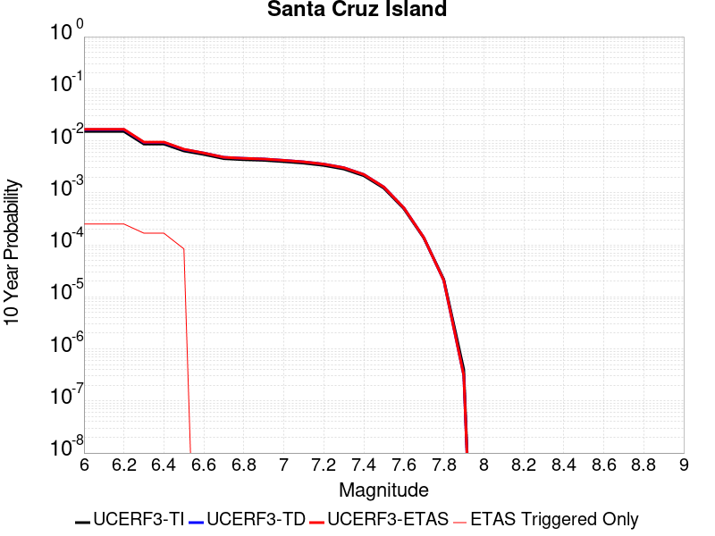 |

| Magnitude | 1 wk TI Prob | 1 wk TD Prob | 1 wk ETAS Prob | 1 wk ETAS/TD Gain | 1 wk ETAS Triggered Only | 1 mo TI Prob | 1 mo TD Prob | 1 mo ETAS Prob | 1 mo ETAS/TD Gain | 1 mo ETAS Triggered Only | 1 yr TI Prob | 1 yr TD Prob | 1 yr ETAS Prob | 1 yr ETAS/TD Gain | 1 yr ETAS Triggered Only | 10 yr TI Prob | 10 yr TD Prob | 10 yr ETAS Prob | 10 yr ETAS/TD Gain | 10 yr ETAS Triggered Only |
|-----|-----|-----|-----|-----|-----|-----|-----|-----|-----|-----|-----|-----|-----|-----|-----|-----|-----|-----|-----|-----|
| 6.0 | 2.9164563E-5 | 3.1599742E-5 | 7.4126256E-5 | 2.3457866 | 4.2527856E-5 | 1.2498499E-4 | 1.3542121E-4 | 2.629875E-4 | 1.9419963 | 1.2758357E-4 | 0.0015206301 | 0.0016476426 | 0.0019023892 | 1.1546129 | 2.5516714E-4 | 0.015102667 | 0.016368 | 0.01661899 | 1.0153342 | 2.5516714E-4 |
| 6.1 | 2.9164563E-5 | 3.1599742E-5 | 7.4126256E-5 | 2.3457866 | 4.2527856E-5 | 1.2498499E-4 | 1.3542121E-4 | 2.629875E-4 | 1.9419963 | 1.2758357E-4 | 0.0015206301 | 0.0016476426 | 0.0019023892 | 1.1546129 | 2.5516714E-4 | 0.015102667 | 0.016368 | 0.01661899 | 1.0153342 | 2.5516714E-4 |
| 6.2 | 2.9164563E-5 | 3.1599742E-5 | 7.4126256E-5 | 2.3457866 | 4.2527856E-5 | 1.2498499E-4 | 1.3542121E-4 | 2.629875E-4 | 1.9419963 | 1.2758357E-4 | 0.0015206301 | 0.0016476426 | 0.0019023892 | 1.1546129 | 2.5516714E-4 | 0.015102667 | 0.016368 | 0.01661899 | 1.0153342 | 2.5516714E-4 |
| 6.3 | 1.6635553E-5 | 1.780436E-5 | 1.780436E-5 | 1.0 | 0.0 | 7.1293274E-5 | 7.630226E-5 | 1.6135149E-4 | 2.1146357 | 8.505571E-5 | 8.6765E-4 | 9.2860236E-4 | 0.0010985559 | 1.1830207 | 1.7011142E-4 | 0.008642701 | 0.009249094 | 0.009417632 | 1.0182221 | 1.7011142E-4 |
| 6.4 | 1.6635553E-5 | 1.780436E-5 | 1.780436E-5 | 1.0 | 0.0 | 7.1293274E-5 | 7.630226E-5 | 1.6135149E-4 | 2.1146357 | 8.505571E-5 | 8.6765E-4 | 9.2860236E-4 | 0.0010985559 | 1.1830207 | 1.7011142E-4 | 0.008642701 | 0.009249094 | 0.009417632 | 1.0182221 | 1.7011142E-4 |
| 6.5 | 1.2238748E-5 | 1.3042995E-5 | 1.3042995E-5 | 1.0 | 0.0 | 5.2450723E-5 | 5.5897377E-5 | 9.842285E-5 | 1.7607777 | 4.2527856E-5 | 6.3840044E-4 | 6.8034173E-4 | 8.078385E-4 | 1.187401 | 1.2758357E-4 | 0.0063656955 | 0.0067829876 | 0.006909706 | 1.0186818 | 1.2758357E-4 |
| 6.6 | 1.0489767E-5 | 1.1156636E-5 | 1.1156636E-5 | 1.0 | 0.0 | 4.495537E-5 | 4.781329E-5 | 4.781329E-5 | 1.0 | 0.0 | 5.4719415E-4 | 5.819735E-4 | 6.2447664E-4 | 1.0730327 | 4.2527856E-5 | 0.005458487 | 0.0058047357 | 0.005847017 | 1.0072839 | 4.2527856E-5 |
| 6.7 | 8.699222E-6 | 9.236782E-6 | 9.236782E-6 | 1.0 | 0.0 | 3.7281847E-5 | 3.958561E-5 | 3.958561E-5 | 1.0 | 0.0 | 4.5381195E-4 | 4.8184878E-4 | 5.2435615E-4 | 1.0882173 | 4.2527856E-5 | 0.0045288634 | 0.004808108 | 0.0048504313 | 1.0088025 | 4.2527856E-5 |
| 6.8 | 8.307732E-6 | 8.8169045E-6 | 8.8169045E-6 | 1.0 | 0.0 | 3.560408E-5 | 3.7786187E-5 | 3.7786187E-5 | 1.0 | 0.0 | 4.3339343E-4 | 4.5995016E-4 | 5.024584E-4 | 1.0924194 | 4.2527856E-5 | 0.004325492 | 0.0045900354 | 0.0046323678 | 1.0092227 | 4.2527856E-5 |
| 6.9 | 8.073121E-6 | 8.564939E-6 | 8.564939E-6 | 1.0 | 0.0 | 3.459863E-5 | 3.6706366E-5 | 3.6706366E-5 | 1.0 | 0.0 | 4.2115687E-4 | 4.468088E-4 | 4.8931764E-4 | 1.0951388 | 4.2527856E-5 | 0.004203596 | 0.004459156 | 0.004501494 | 1.0094947 | 4.2527856E-5 |
| 7.0 | 7.617019E-6 | 8.074664E-6 | 8.074664E-6 | 1.0 | 0.0 | 3.264396E-5 | 3.4605247E-5 | 3.4605247E-5 | 1.0 | 0.0 | 3.9736772E-4 | 4.212378E-4 | 4.6374777E-4 | 1.1009167 | 4.2527856E-5 | 0.003966579 | 0.0042044413 | 0.0042467904 | 1.0100725 | 4.2527856E-5 |
| 7.1 | 7.1224836E-6 | 7.545788E-6 | 7.545788E-6 | 1.0 | 0.0 | 3.052457E-5 | 3.2338692E-5 | 3.2338692E-5 | 1.0 | 0.0 | 3.715733E-4 | 3.936528E-4 | 4.3616391E-4 | 1.1079913 | 4.2527856E-5 | 0.003709526 | 0.003929598 | 0.0039719585 | 1.0107799 | 4.2527856E-5 |
| 7.2 | 6.441115E-6 | 6.8273835E-6 | 6.8273835E-6 | 1.0 | 0.0 | 2.7604487E-5 | 2.9259887E-5 | 2.9259887E-5 | 1.0 | 0.0 | 3.360328E-4 | 3.5618112E-4 | 3.9869384E-4 | 1.119357 | 4.2527856E-5 | 0.0033552512 | 0.003556131 | 0.0035985075 | 1.0119165 | 4.2527856E-5 |
| 7.3 | 5.494274E-6 | 5.8199944E-6 | 5.8199944E-6 | 1.0 | 0.0 | 2.3546674E-5 | 2.4942596E-5 | 2.4942596E-5 | 1.0 | 0.0 | 2.8664304E-4 | 3.0363398E-4 | 3.461489E-4 | 1.1400204 | 4.2527856E-5 | 0.002862736 | 0.0030322142 | 0.0030746132 | 1.0139828 | 4.2527856E-5 |
| 7.4 | 4.0802624E-6 | 4.312256E-6 | 4.312256E-6 | 1.0 | 0.0 | 1.7486722E-5 | 1.8480967E-5 | 1.8480967E-5 | 1.0 | 0.0 | 2.1288003E-4 | 2.2498262E-4 | 2.675009E-4 | 1.1889848 | 4.2527856E-5 | 0.0021267622 | 0.0022475575 | 0.0022899897 | 1.0188793 | 4.2527856E-5 |
| 7.5 | 2.3584746E-6 | 2.4753094E-6 | 2.4753094E-6 | 1.0 | 0.0 | 1.0107709E-5 | 1.0608426E-5 | 1.0608426E-5 | 1.0 | 0.0 | 1.2305441E-4 | 1.2915E-4 | 1.2915E-4 | 1.0 | 0.0 | 0.0012298629 | 0.0012907543 | 0.0012907543 | 1.0 | 0.0 |
| 7.6 | 9.4981914E-7 | 9.86093E-7 | 9.86093E-7 | 1.0 | 0.0 | 4.0706473E-6 | 4.2261063E-6 | 4.2261063E-6 | 1.0 | 0.0 | 4.9559E-5 | 5.145164E-5 | 5.145164E-5 | 1.0 | 0.0 | 4.954795E-4 | 5.1439856E-4 | 5.1439856E-4 | 1.0 | 0.0 |
| 7.7 | 2.6013532E-7 | 2.6416603E-7 | 2.6416603E-7 | 1.0 | 0.0 | 1.1148652E-6 | 1.1321397E-6 | 1.1321397E-6 | 1.0 | 0.0 | 1.3573399E-5 | 1.3783714E-5 | 1.3783714E-5 | 1.0 | 0.0 | 1.357257E-4 | 1.3782867E-4 | 1.3782867E-4 | 1.0 | 0.0 |
| 7.8 | 4.1522263E-8 | 3.965679E-8 | 3.965679E-8 | 1.0 | 0.0 | 1.7795254E-7 | 1.6995766E-7 | 1.6995766E-7 | 1.0 | 0.0 | 2.16657E-6 | 2.0692328E-6 | 2.0692328E-6 | 1.0 | 0.0 | 2.1665488E-5 | 2.0692156E-5 | 2.0692156E-5 | 1.0 | 0.0 |
| 7.9 | 7.7242046E-10 | 5.9468175E-10 | 5.9468175E-10 | 1.0 | 0.0 | 3.3103735E-9 | 2.5486364E-9 | 2.5486364E-9 | 1.0 | 0.0 | 4.0303796E-8 | 3.1029646E-8 | 3.1029646E-8 | 1.0 | 0.0 | 4.030379E-7 | 3.1029643E-7 | 3.1029643E-7 | 1.0 | 0.0 |

## Ortigalita (North)
*[(top)](#table-of-contents)*

| 1 Week | 1 Month | 1 Year | 10 Year |
|-----|-----|-----|-----|
| 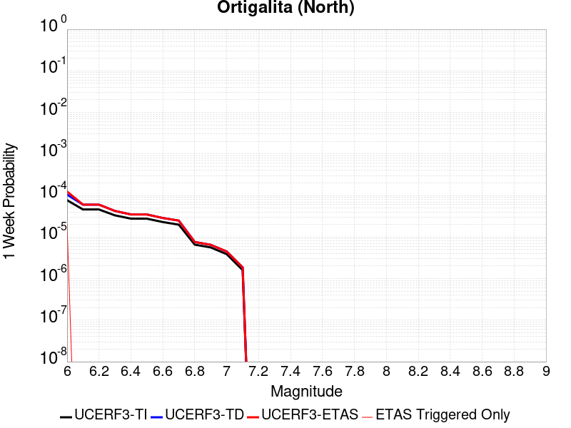 | 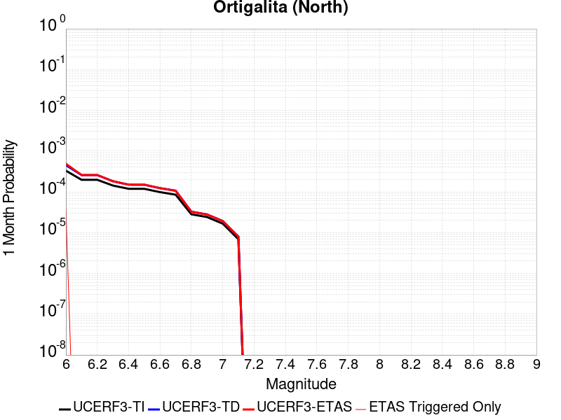 | 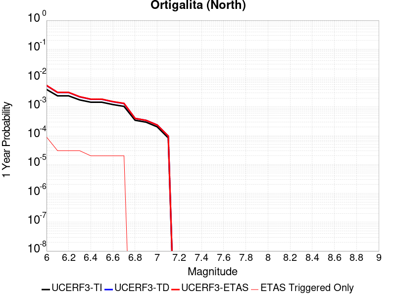 | 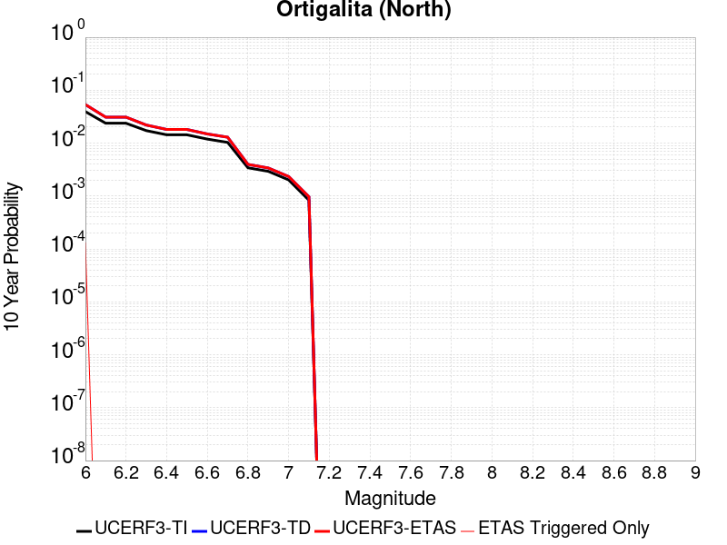 |

| Magnitude | 1 wk TI Prob | 1 wk TD Prob | 1 wk ETAS Prob | 1 wk ETAS/TD Gain | 1 wk ETAS Triggered Only | 1 mo TI Prob | 1 mo TD Prob | 1 mo ETAS Prob | 1 mo ETAS/TD Gain | 1 mo ETAS Triggered Only | 1 yr TI Prob | 1 yr TD Prob | 1 yr ETAS Prob | 1 yr ETAS/TD Gain | 1 yr ETAS Triggered Only | 10 yr TI Prob | 10 yr TD Prob | 10 yr ETAS Prob | 10 yr ETAS/TD Gain | 10 yr ETAS Triggered Only |
|-----|-----|-----|-----|-----|-----|-----|-----|-----|-----|-----|-----|-----|-----|-----|-----|-----|-----|-----|-----|-----|
| 6.0 | 7.711876E-5 | 1.05064966E-4 | 1.05064966E-4 | 1.0 | 0.0 | 3.3046713E-4 | 4.502116E-4 | 4.927203E-4 | 1.0944194 | 4.2527856E-5 | 0.004016016 | 0.0054681194 | 0.0055950056 | 1.0232047 | 1.2758357E-4 | 0.039442103 | 0.053454787 | 0.05365606 | 1.0037653 | 2.1263928E-4 |
| 6.1 | 4.607858E-5 | 6.0239203E-5 | 6.0239203E-5 | 1.0 | 0.0 | 1.9746469E-4 | 2.5814527E-4 | 2.5814527E-4 | 1.0 | 0.0 | 0.0024014818 | 0.0031387596 | 0.003181154 | 1.0135068 | 4.2527856E-5 | 0.023756953 | 0.030975068 | 0.03105749 | 1.0026609 | 8.505571E-5 |
| 6.2 | 4.607858E-5 | 6.0239203E-5 | 6.0239203E-5 | 1.0 | 0.0 | 1.9746469E-4 | 2.5814527E-4 | 2.5814527E-4 | 1.0 | 0.0 | 0.0024014818 | 0.0031387596 | 0.003181154 | 1.0135068 | 4.2527856E-5 | 0.023756953 | 0.030975068 | 0.03105749 | 1.0026609 | 8.505571E-5 |
| 6.3 | 3.327423E-5 | 4.2475127E-5 | 4.2475127E-5 | 1.0 | 0.0 | 1.4259605E-4 | 1.8202531E-4 | 1.8202531E-4 | 1.0 | 0.0 | 0.0017347244 | 0.002214197 | 0.0022566307 | 1.0191643 | 4.2527856E-5 | 0.017212452 | 0.021945644 | 0.022028834 | 1.0037907 | 8.505571E-5 |
| 6.4 | 2.7732503E-5 | 3.4998593E-5 | 3.4998593E-5 | 1.0 | 0.0 | 1.1884817E-4 | 1.4998685E-4 | 1.4998685E-4 | 1.0 | 0.0 | 0.001446016 | 0.0018248095 | 0.0018672597 | 1.0232629 | 4.2527856E-5 | 0.014366428 | 0.018121224 | 0.018204737 | 1.0046086 | 8.505571E-5 |
| 6.5 | 2.7689714E-5 | 3.4948407E-5 | 3.4948407E-5 | 1.0 | 0.0 | 1.186648E-4 | 1.497718E-4 | 1.497718E-4 | 1.0 | 0.0 | 0.0014437864 | 0.0018221956 | 0.001864646 | 1.0232962 | 4.2527856E-5 | 0.014344421 | 0.01809551 | 0.018179027 | 1.0046153 | 8.505571E-5 |
| 6.6 | 2.2976905E-5 | 2.8718265E-5 | 2.8718265E-5 | 1.0 | 0.0 | 9.846873E-5 | 1.230739E-4 | 1.230739E-4 | 1.0 | 0.0 | 0.0011981975 | 0.0014976363 | 0.0015401006 | 1.0283542 | 4.2527856E-5 | 0.011917574 | 0.014898697 | 0.014982485 | 1.0056239 | 8.505571E-5 |
| 6.7 | 1.9871539E-5 | 2.4904411E-5 | 2.4904411E-5 | 1.0 | 0.0 | 8.516096E-5 | 1.0673023E-4 | 1.0673023E-4 | 1.0 | 0.0 | 0.0010363415 | 0.0012989145 | 0.0013413872 | 1.0326985 | 4.2527856E-5 | 0.010315218 | 0.012936919 | 0.013020874 | 1.0064896 | 8.505571E-5 |
| 6.8 | 6.5640475E-6 | 7.6054926E-6 | 7.6054926E-6 | 1.0 | 0.0 | 2.813133E-5 | 3.2594577E-5 | 3.2594577E-5 | 1.0 | 0.0 | 3.424451E-4 | 3.9676955E-4 | 3.9676955E-4 | 1.0 | 0.0 | 0.0034191788 | 0.003960899 | 0.003960899 | 1.0 | 0.0 |
| 6.9 | 5.6219683E-6 | 6.5018376E-6 | 6.5018376E-6 | 1.0 | 0.0 | 2.4093928E-5 | 2.7864735E-5 | 2.7864735E-5 | 1.0 | 0.0 | 2.933041E-4 | 3.3920293E-4 | 3.3920293E-4 | 1.0 | 0.0 | 0.0029291727 | 0.003387109 | 0.003387109 | 1.0 | 0.0 |
| 7.0 | 3.875591E-6 | 4.4847548E-6 | 4.4847548E-6 | 1.0 | 0.0 | 1.6609569E-5 | 1.9220248E-5 | 1.9220248E-5 | 1.0 | 0.0 | 2.0220275E-4 | 2.339835E-4 | 2.339835E-4 | 1.0 | 0.0 | 0.0020201886 | 0.0023375798 | 0.0023375798 | 1.0 | 0.0 |
| 7.1 | 1.6017933E-6 | 1.8570418E-6 | 1.8570418E-6 | 1.0 | 0.0 | 6.8648105E-6 | 7.958732E-6 | 7.958732E-6 | 1.0 | 0.0 | 8.357586E-5 | 9.689432E-5 | 9.689432E-5 | 1.0 | 0.0 | 8.3544437E-4 | 9.686254E-4 | 9.686254E-4 | 1.0 | 0.0 |

## Rose Canyon
*[(top)](#table-of-contents)*

| 1 Week | 1 Month | 1 Year | 10 Year |
|-----|-----|-----|-----|
| 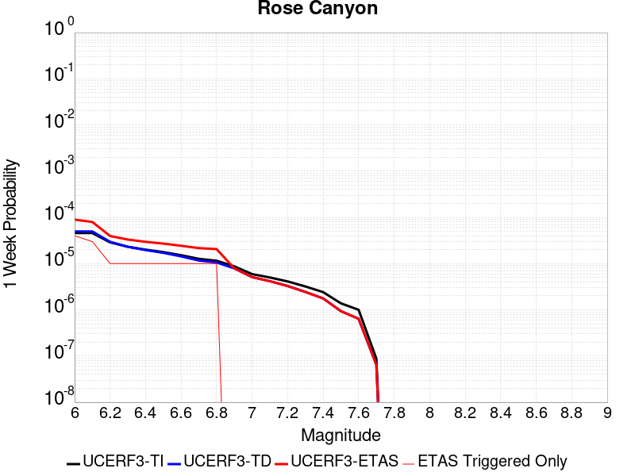 | 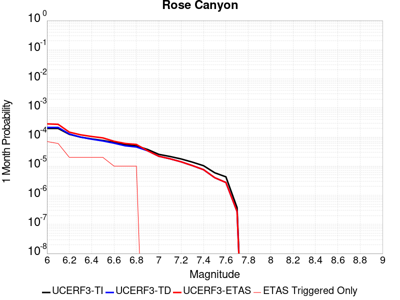 | 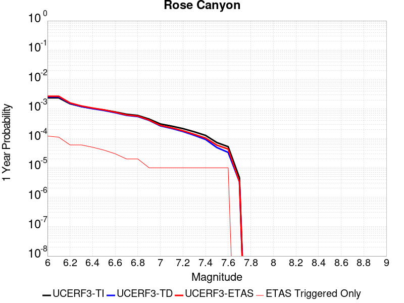 | 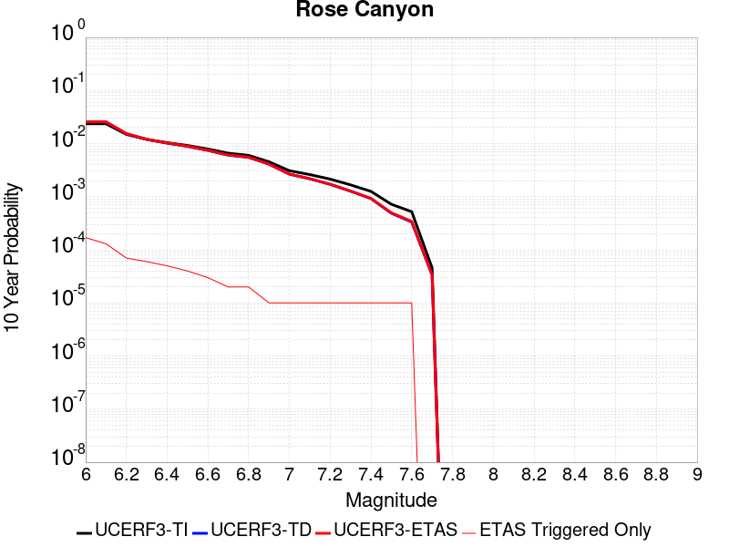 |

| Magnitude | 1 wk TI Prob | 1 wk TD Prob | 1 wk ETAS Prob | 1 wk ETAS/TD Gain | 1 wk ETAS Triggered Only | 1 mo TI Prob | 1 mo TD Prob | 1 mo ETAS Prob | 1 mo ETAS/TD Gain | 1 mo ETAS Triggered Only | 1 yr TI Prob | 1 yr TD Prob | 1 yr ETAS Prob | 1 yr ETAS/TD Gain | 1 yr ETAS Triggered Only | 10 yr TI Prob | 10 yr TD Prob | 10 yr ETAS Prob | 10 yr ETAS/TD Gain | 10 yr ETAS Triggered Only |
|-----|-----|-----|-----|-----|-----|-----|-----|-----|-----|-----|-----|-----|-----|-----|-----|-----|-----|-----|-----|-----|
| 6.0 | 4.5923203E-5 | 4.9714225E-5 | 1.3476571E-4 | 2.7108078 | 8.505571E-5 | 1.9679888E-4 | 2.1304491E-4 | 2.980825E-4 | 1.3991534 | 8.505571E-5 | 0.0023933933 | 0.0025909345 | 0.0027181874 | 1.0491147 | 1.2758357E-4 | 0.023677798 | 0.02563999 | 0.02580574 | 1.0064645 | 1.7011142E-4 |
| 6.1 | 4.5923203E-5 | 4.9714225E-5 | 1.3476571E-4 | 2.7108078 | 8.505571E-5 | 1.9679888E-4 | 2.1304491E-4 | 2.980825E-4 | 1.3991534 | 8.505571E-5 | 0.0023933933 | 0.0025909345 | 0.0027181874 | 1.0491147 | 1.2758357E-4 | 0.023677798 | 0.02563999 | 0.025764303 | 1.0048484 | 1.2758357E-4 |
| 6.2 | 2.8844734E-5 | 2.9668723E-5 | 7.219532E-5 | 2.4333813 | 4.2527856E-5 | 1.2361443E-4 | 1.2714567E-4 | 1.6966811E-4 | 1.3344388 | 4.2527856E-5 | 0.0015039665 | 0.0015468939 | 0.001631818 | 1.0548998 | 8.505571E-5 | 0.0149382865 | 0.015374276 | 0.015458024 | 1.0054473 | 8.505571E-5 |
| 6.3 | 2.3171577E-5 | 2.3161238E-5 | 6.568811E-5 | 2.8361225 | 4.2527856E-5 | 9.9302975E-5 | 9.9258745E-5 | 1.4178238E-4 | 1.428412 | 4.2527856E-5 | 0.0012083431 | 0.0012078186 | 0.0012927717 | 1.0703359 | 8.505571E-5 | 0.012017938 | 0.012022437 | 0.01210647 | 1.0069897 | 8.505571E-5 |
| 6.4 | 2.0066604E-5 | 1.9667024E-5 | 6.219404E-5 | 3.1623514 | 4.2527856E-5 | 8.599689E-5 | 8.4284584E-5 | 1.2680885E-4 | 1.504532 | 4.2527856E-5 | 0.0010465092 | 0.0010256917 | 0.0011106601 | 1.0828402 | 8.505571E-5 | 0.010415946 | 0.010217559 | 0.0103017455 | 1.0082394 | 8.505571E-5 |
| 6.5 | 1.776989E-5 | 1.7113807E-5 | 5.9640934E-5 | 3.48496 | 4.2527856E-5 | 7.615444E-5 | 7.334287E-5 | 1.158676E-4 | 1.5798074 | 4.2527856E-5 | 9.267859E-4 | 8.925905E-4 | 9.775703E-4 | 1.0952058 | 8.505571E-5 | 0.009229303 | 0.008896211 | 0.00898051 | 1.0094758 | 8.505571E-5 |
| 6.6 | 1.5227364E-5 | 1.433926E-5 | 5.6866505E-5 | 3.9657907 | 4.2527856E-5 | 6.52585E-5 | 6.1452556E-5 | 1.039778E-4 | 1.6920012 | 4.2527856E-5 | 7.942326E-4 | 7.479332E-4 | 8.329253E-4 | 1.1136359 | 8.505571E-5 | 0.007914 | 0.007458359 | 0.0075427806 | 1.011319 | 8.505571E-5 |
| 6.7 | 1.2703898E-5 | 1.1673274E-5 | 5.4200635E-5 | 4.643139 | 4.2527856E-5 | 5.4444143E-5 | 5.0027378E-5 | 9.2553106E-5 | 1.8500491 | 4.2527856E-5 | 6.626558E-4 | 6.089174E-4 | 6.5141934E-4 | 1.0697992 | 4.2527856E-5 | 0.006606833 | 0.0060750856 | 0.006117355 | 1.0069579 | 4.2527856E-5 |
| 6.8 | 1.1554917E-5 | 1.0609337E-5 | 5.313674E-5 | 5.008488 | 4.2527856E-5 | 4.9520135E-5 | 4.546782E-5 | 8.799374E-5 | 1.9352971 | 4.2527856E-5 | 6.0274085E-4 | 5.5343413E-4 | 5.959384E-4 | 1.0768011 | 4.2527856E-5 | 0.0060110865 | 0.0055225673 | 0.0055648605 | 1.0076582 | 4.2527856E-5 |
| 6.9 | 8.732078E-6 | 7.881357E-6 | 7.881357E-6 | 1.0 | 0.0 | 3.7422655E-5 | 3.3776825E-5 | 3.3776825E-5 | 1.0 | 0.0 | 4.5552556E-4 | 4.111582E-4 | 4.111582E-4 | 1.0 | 0.0 | 0.0045459294 | 0.0041048084 | 0.0041048084 | 1.0 | 0.0 |
| 7.0 | 5.9337494E-6 | 5.1074853E-6 | 5.1074853E-6 | 1.0 | 0.0 | 2.5430107E-5 | 2.188904E-5 | 2.188904E-5 | 1.0 | 0.0 | 3.0956755E-4 | 2.664666E-4 | 2.664666E-4 | 1.0 | 0.0 | 0.0030913667 | 0.0026614866 | 0.0026614866 | 1.0 | 0.0 |
| 7.1 | 5.013409E-6 | 4.1773833E-6 | 4.1773833E-6 | 1.0 | 0.0 | 2.1485863E-5 | 1.7902948E-5 | 1.7902948E-5 | 1.0 | 0.0 | 2.6155898E-4 | 2.179467E-4 | 2.179467E-4 | 1.0 | 0.0 | 0.0026125133 | 0.0021773411 | 0.0021773411 | 1.0 | 0.0 |
| 7.2 | 4.120763E-6 | 3.2821383E-6 | 3.2821383E-6 | 1.0 | 0.0 | 1.7660293E-5 | 1.4066231E-5 | 1.4066231E-5 | 1.0 | 0.0 | 2.1499286E-4 | 1.7124301E-4 | 1.7124301E-4 | 1.0 | 0.0 | 0.0021478499 | 0.00171112 | 0.00171112 | 1.0 | 0.0 |
| 7.3 | 3.2081239E-6 | 2.4405372E-6 | 2.4405372E-6 | 1.0 | 0.0 | 1.374903E-5 | 1.0459404E-5 | 1.0459404E-5 | 1.0 | 0.0 | 1.6738157E-4 | 1.2733586E-4 | 1.2733586E-4 | 1.0 | 0.0 | 0.0016725556 | 0.001272636 | 0.001272636 | 1.0 | 0.0 |
| 7.4 | 2.4194755E-6 | 1.7680634E-6 | 1.7680634E-6 | 1.0 | 0.0 | 1.0369139E-5 | 7.577393E-6 | 7.577393E-6 | 1.0 | 0.0 | 1.2623696E-4 | 9.2250906E-5 | 9.2250906E-5 | 1.0 | 0.0 | 0.0012616527 | 9.2213147E-4 | 9.2213147E-4 | 1.0 | 0.0 |
| 7.5 | 1.3842889E-6 | 9.3786275E-7 | 9.3786275E-7 | 1.0 | 0.0 | 5.9326535E-6 | 4.019406E-6 | 4.019406E-6 | 1.0 | 0.0 | 7.222766E-5 | 4.8935202E-5 | 4.8935202E-5 | 1.0 | 0.0 | 7.220419E-4 | 4.892478E-4 | 4.892478E-4 | 1.0 | 0.0 |
| 7.6 | 1.0021575E-6 | 6.411463E-7 | 6.411463E-7 | 1.0 | 0.0 | 4.2949537E-6 | 2.7477672E-6 | 2.7477672E-6 | 1.0 | 0.0 | 5.2289808E-5 | 3.3453573E-5 | 3.3453573E-5 | 1.0 | 0.0 | 5.2277505E-4 | 3.344875E-4 | 3.344875E-4 | 1.0 | 0.0 |
| 7.7 | 8.7620116E-8 | 6.4492404E-8 | 6.4492404E-8 | 1.0 | 0.0 | 3.7551473E-7 | 2.76396E-7 | 2.76396E-7 | 1.0 | 0.0 | 4.5718825E-6 | 3.3651165E-6 | 3.3651165E-6 | 1.0 | 0.0 | 4.5717883E-5 | 3.3650686E-5 | 3.3650686E-5 | 1.0 | 0.0 |

## San Jacinto (Stepovers Combined)
*[(top)](#table-of-contents)*

| 1 Week | 1 Month | 1 Year | 10 Year |
|-----|-----|-----|-----|
| 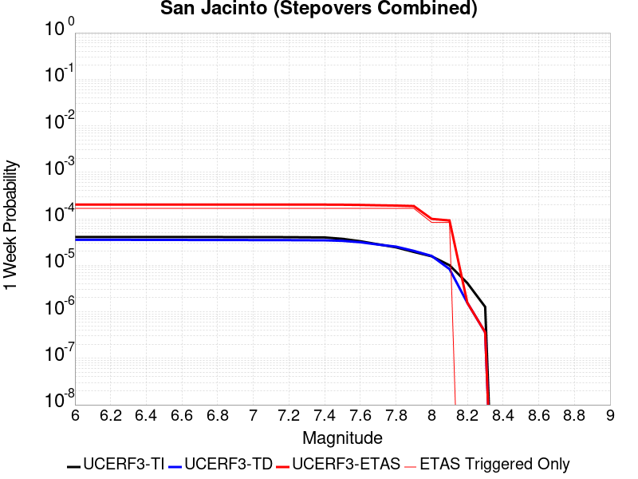 | 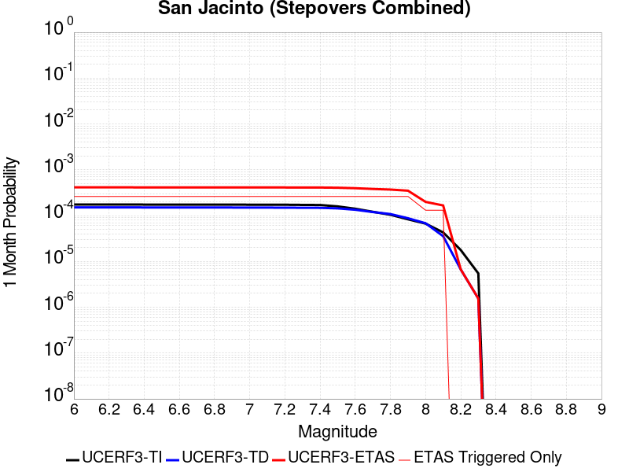 | 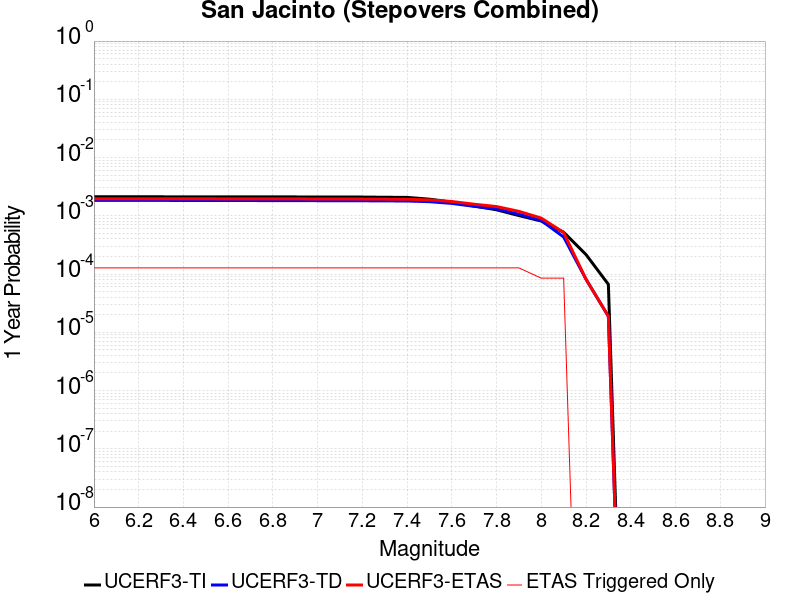 | 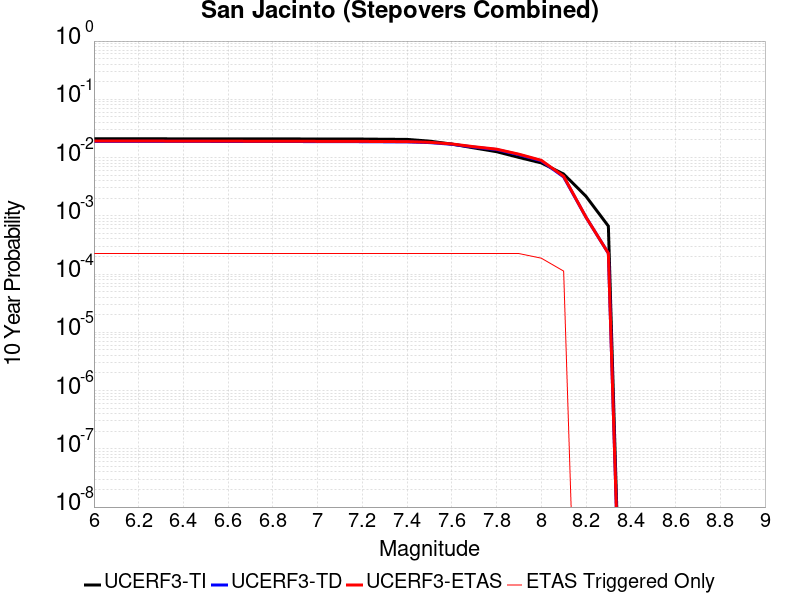 |

| Magnitude | 1 wk TI Prob | 1 wk TD Prob | 1 wk ETAS Prob | 1 wk ETAS/TD Gain | 1 wk ETAS Triggered Only | 1 mo TI Prob | 1 mo TD Prob | 1 mo ETAS Prob | 1 mo ETAS/TD Gain | 1 mo ETAS Triggered Only | 1 yr TI Prob | 1 yr TD Prob | 1 yr ETAS Prob | 1 yr ETAS/TD Gain | 1 yr ETAS Triggered Only | 10 yr TI Prob | 10 yr TD Prob | 10 yr ETAS Prob | 10 yr ETAS/TD Gain | 10 yr ETAS Triggered Only |
|-----|-----|-----|-----|-----|-----|-----|-----|-----|-----|-----|-----|-----|-----|-----|-----|-----|-----|-----|-----|-----|
| 6.0 | 4.0667746E-5 | 3.5272755E-5 | 1.6285182E-4 | 4.6169295 | 1.2758357E-4 | 1.742787E-4 | 1.5116022E-4 | 2.787245E-4 | 1.8439012 | 1.2758357E-4 | 0.0021197782 | 0.0018388226 | 0.0019661717 | 1.0692557 | 1.2758357E-4 | 0.020996714 | 0.018986892 | 0.019195493 | 1.0109867 | 2.1263928E-4 |
| 6.1 | 4.0667746E-5 | 3.5272755E-5 | 1.6285182E-4 | 4.6169295 | 1.2758357E-4 | 1.742787E-4 | 1.5116022E-4 | 2.787245E-4 | 1.8439012 | 1.2758357E-4 | 0.0021197782 | 0.0018388226 | 0.0019661717 | 1.0692557 | 1.2758357E-4 | 0.020996714 | 0.018986892 | 0.019195493 | 1.0109867 | 2.1263928E-4 |
| 6.2 | 4.0667746E-5 | 3.5272755E-5 | 1.6285182E-4 | 4.6169295 | 1.2758357E-4 | 1.742787E-4 | 1.5116022E-4 | 2.787245E-4 | 1.8439012 | 1.2758357E-4 | 0.0021197782 | 0.0018388226 | 0.0019661717 | 1.0692557 | 1.2758357E-4 | 0.020996714 | 0.018986892 | 0.019195493 | 1.0109867 | 2.1263928E-4 |
| 6.3 | 4.0667746E-5 | 3.5272755E-5 | 1.6285182E-4 | 4.6169295 | 1.2758357E-4 | 1.742787E-4 | 1.5116022E-4 | 2.787245E-4 | 1.8439012 | 1.2758357E-4 | 0.0021197782 | 0.0018388226 | 0.0019661717 | 1.0692557 | 1.2758357E-4 | 0.020996714 | 0.018986892 | 0.019195493 | 1.0109867 | 2.1263928E-4 |
| 6.4 | 4.0577226E-5 | 3.5144654E-5 | 1.6272374E-4 | 4.630113 | 1.2758357E-4 | 1.738908E-4 | 1.5061127E-4 | 2.7817563E-4 | 1.8469775 | 1.2758357E-4 | 0.0021150648 | 0.0018321523 | 0.001959502 | 1.0695083 | 1.2758357E-4 | 0.020950472 | 0.018921461 | 0.019130075 | 1.0110253 | 2.1263928E-4 |
| 6.5 | 4.0577226E-5 | 3.5144654E-5 | 1.6272374E-4 | 4.630113 | 1.2758357E-4 | 1.738908E-4 | 1.5061127E-4 | 2.7817563E-4 | 1.8469775 | 1.2758357E-4 | 0.0021150648 | 0.0018321523 | 0.001959502 | 1.0695083 | 1.2758357E-4 | 0.020950472 | 0.018921461 | 0.019130075 | 1.0110253 | 2.1263928E-4 |
| 6.6 | 4.053861E-5 | 3.509E-5 | 1.626691E-4 | 4.6357675 | 1.2758357E-4 | 1.7372532E-4 | 1.5037706E-4 | 2.7794146E-4 | 1.8482968 | 1.2758357E-4 | 0.0021130538 | 0.0018293057 | 0.0019566559 | 1.0696167 | 1.2758357E-4 | 0.020930743 | 0.018893538 | 0.01910216 | 1.011042 | 2.1263928E-4 |
| 6.7 | 4.0516545E-5 | 3.5059067E-5 | 1.6263816E-4 | 4.6389756 | 1.2758357E-4 | 1.7363077E-4 | 1.5024451E-4 | 2.7780893E-4 | 1.8490453 | 1.2758357E-4 | 0.002111905 | 0.001827695 | 0.0019550454 | 1.0696782 | 1.2758357E-4 | 0.020919468 | 0.018877735 | 0.019086361 | 1.0110514 | 2.1263928E-4 |
| 6.8 | 4.049434E-5 | 3.5030633E-5 | 1.6260972E-4 | 4.6419296 | 1.2758357E-4 | 1.7353562E-4 | 1.5012265E-4 | 2.7768707E-4 | 1.8497347 | 1.2758357E-4 | 0.0021107488 | 0.0018262138 | 0.0019535644 | 1.0697348 | 1.2758357E-4 | 0.020908125 | 0.018863149 | 0.019071776 | 1.0110601 | 2.1263928E-4 |
| 6.9 | 4.046386E-5 | 3.499319E-5 | 1.625723E-4 | 4.6458263 | 1.2758357E-4 | 1.73405E-4 | 1.4996222E-4 | 2.7752665E-4 | 1.8506439 | 1.2758357E-4 | 0.0021091616 | 0.0018242638 | 0.0019516146 | 1.0698094 | 1.2758357E-4 | 0.020892553 | 0.01884392 | 0.019052554 | 1.0110716 | 2.1263928E-4 |
| 7.0 | 4.036382E-5 | 3.487376E-5 | 1.6245288E-4 | 4.658313 | 1.2758357E-4 | 1.7297632E-4 | 1.4945042E-4 | 2.7701491E-4 | 1.8535573 | 1.2758357E-4 | 0.0021039525 | 0.0018180435 | 0.0019453951 | 1.0700487 | 1.2758357E-4 | 0.02084144 | 0.018782536 | 0.018991182 | 1.0111085 | 2.1263928E-4 |
| 7.1 | 4.0343282E-5 | 3.4852223E-5 | 1.6243134E-4 | 4.6605735 | 1.2758357E-4 | 1.7288832E-4 | 1.4935812E-4 | 2.7692263E-4 | 1.8540848 | 1.2758357E-4 | 0.002102883 | 0.0018169218 | 0.0019442736 | 1.0700921 | 1.2758357E-4 | 0.020830948 | 0.018771412 | 0.01898006 | 1.0111152 | 2.1263928E-4 |
| 7.2 | 4.0257353E-5 | 3.4756722E-5 | 1.6233585E-4 | 4.670632 | 1.2758357E-4 | 1.725201E-4 | 1.489489E-4 | 2.7651346E-4 | 1.8564317 | 1.2758357E-4 | 0.0020984085 | 0.0018119477 | 0.0019393001 | 1.0702848 | 1.2758357E-4 | 0.020787042 | 0.018722152 | 0.01893081 | 1.011145 | 2.1263928E-4 |
| 7.3 | 3.9940667E-5 | 3.4584376E-5 | 1.6216353E-4 | 4.6889243 | 1.2758357E-4 | 1.7116306E-4 | 1.4821035E-4 | 2.75775E-4 | 1.8607 | 1.2758357E-4 | 0.0020819185 | 0.0018029709 | 0.0019303245 | 1.0706354 | 1.2758357E-4 | 0.020625217 | 0.018630784 | 0.018839462 | 1.0112007 | 2.1263928E-4 |
| 7.4 | 3.9721202E-5 | 3.4469766E-5 | 1.6204893E-4 | 4.7011905 | 1.2758357E-4 | 1.7022261E-4 | 1.4771923E-4 | 2.7528394E-4 | 1.8635621 | 1.2758357E-4 | 0.0020704903 | 0.0017970012 | 0.0019243555 | 1.0708704 | 1.2758357E-4 | 0.020513052 | 0.018569905 | 0.018778596 | 1.0112381 | 2.1263928E-4 |
| 7.5 | 3.7036873E-5 | 3.3537188E-5 | 1.6111648E-4 | 4.8041143 | 1.2758357E-4 | 1.5871979E-4 | 1.437229E-4 | 2.7128813E-4 | 1.8875777 | 1.2758357E-4 | 0.0019307006 | 0.0017484248 | 0.0018757853 | 1.072843 | 1.2758357E-4 | 0.019140124 | 0.018071463 | 0.01828026 | 1.0115539 | 2.1263928E-4 |
| 7.6 | 3.2940967E-5 | 3.1317984E-5 | 1.5889756E-4 | 5.0736837 | 1.2758357E-4 | 1.4116794E-4 | 1.3421304E-4 | 2.617795E-4 | 1.9504772 | 1.2758357E-4 | 0.0017173645 | 0.0016328214 | 0.0017601966 | 1.0780092 | 1.2758357E-4 | 0.01704153 | 0.016904354 | 0.017113399 | 1.0123663 | 2.1263928E-4 |
| 7.7 | 2.8236149E-5 | 2.7883889E-5 | 1.554639E-4 | 5.5754023 | 1.2758357E-4 | 1.2100645E-4 | 1.19496915E-4 | 2.4706524E-4 | 2.067545 | 1.2758357E-4 | 0.0014722579 | 0.001453905 | 0.0015813031 | 1.0876248 | 1.2758357E-4 | 0.014625421 | 0.015115095 | 0.015324521 | 1.0138553 | 2.1263928E-4 |
| 7.8 | 2.4329287E-5 | 2.5207537E-5 | 1.5278789E-4 | 6.0611987 | 1.2758357E-4 | 1.042642E-4 | 1.0802783E-4 | 2.3559762E-4 | 2.1808975 | 1.2758357E-4 | 0.0012686774 | 0.0013144462 | 0.0014418621 | 1.096935 | 1.2758357E-4 | 0.012614589 | 0.013712396 | 0.0139221195 | 1.0152944 | 2.1263928E-4 |
| 7.9 | 1.9370926E-5 | 2.0421452E-5 | 1.4800241E-4 | 7.2473993 | 1.2758357E-4 | 8.301561E-5 | 8.7517576E-5 | 2.1508998E-4 | 2.4576776 | 1.2758357E-4 | 0.0010102465 | 0.0010650064 | 0.0011924541 | 1.1196685 | 1.2758357E-4 | 0.0100566605 | 0.011199483 | 0.01140974 | 1.0187739 | 2.1263928E-4 |
| 8.0 | 1.5583017E-5 | 1.588647E-5 | 1.0094083E-4 | 6.353887 | 8.505571E-5 | 6.6782646E-5 | 6.808309E-5 | 1.5313302E-4 | 2.2492077 | 8.505571E-5 | 8.127754E-4 | 8.285971E-4 | 9.1358233E-4 | 1.1025652 | 8.505571E-5 | 0.008098091 | 0.008781809 | 0.008950427 | 1.0192008 | 1.7011142E-4 |
| 8.1 | 1.0024873E-5 | 8.292404E-6 | 9.334741E-5 | 11.256978 | 8.505571E-5 | 4.2963035E-5 | 3.5538393E-5 | 1.2059108E-4 | 3.3932621 | 8.505571E-5 | 5.229494E-4 | 4.3259456E-4 | 5.176135E-4 | 1.1965326 | 8.505571E-5 | 0.0052172043 | 0.0046534105 | 0.0047804005 | 1.0272896 | 1.2758357E-4 |
| 8.2 | 4.142796E-6 | 1.5610041E-6 | 1.5610041E-6 | 1.0 | 0.0 | 1.775472E-5 | 6.69E-6 | 6.69E-6 | 1.0 | 0.0 | 2.1614227E-4 | 8.144774E-5 | 8.144774E-5 | 1.0 | 0.0 | 0.0021593217 | 9.454649E-4 | 9.454649E-4 | 1.0 | 0.0 |
| 8.3 | 1.2750878E-6 | 3.612133E-7 | 3.612133E-7 | 1.0 | 0.0 | 5.4646503E-6 | 1.548056E-6 | 1.548056E-6 | 1.0 | 0.0 | 6.653009E-5 | 1.8847424E-5 | 1.8847424E-5 | 1.0 | 0.0 | 6.6510175E-4 | 2.2734253E-4 | 2.2734253E-4 | 1.0 | 0.0 |

## San Jacinto (Lytle Creek connector)
*[(top)](#table-of-contents)*

| 1 Week | 1 Month | 1 Year | 10 Year |
|-----|-----|-----|-----|
| 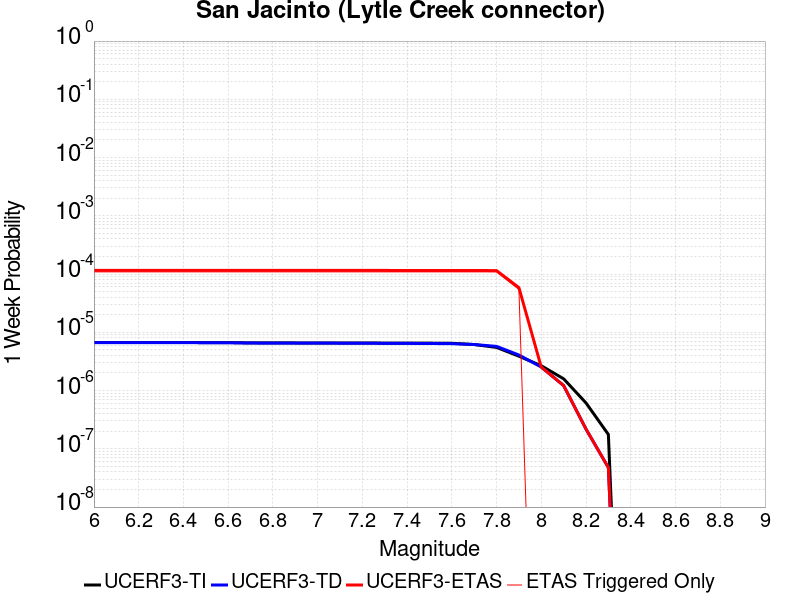 | 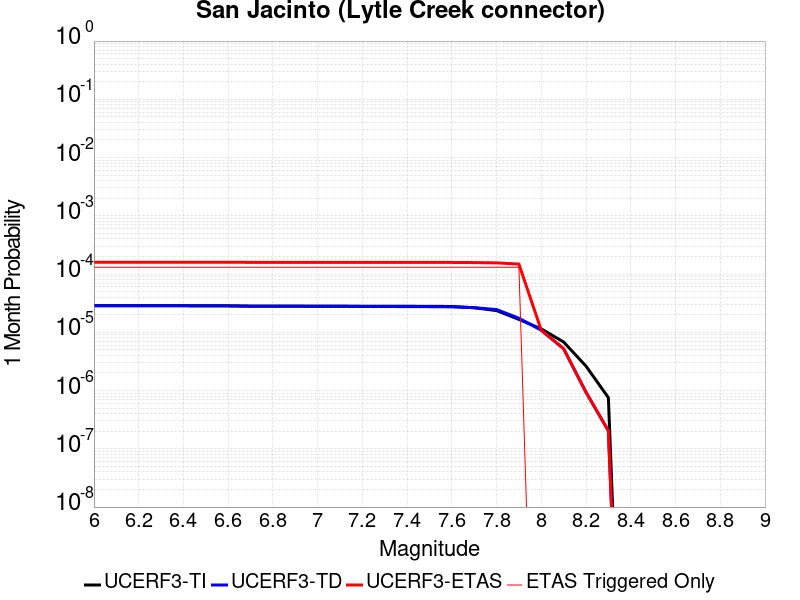 | 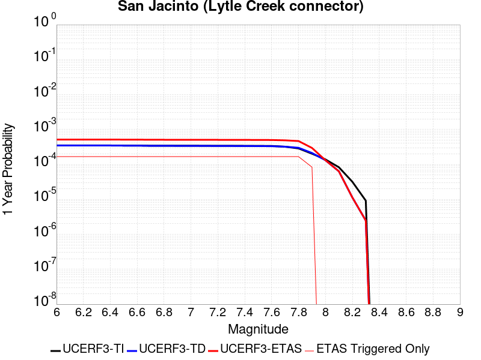 | 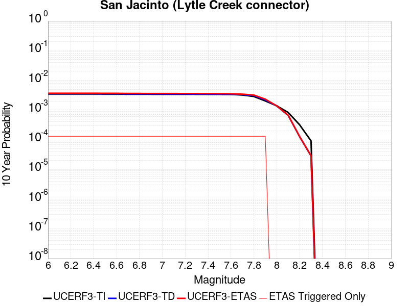 |

| Magnitude | 1 wk TI Prob | 1 wk TD Prob | 1 wk ETAS Prob | 1 wk ETAS/TD Gain | 1 wk ETAS Triggered Only | 1 mo TI Prob | 1 mo TD Prob | 1 mo ETAS Prob | 1 mo ETAS/TD Gain | 1 mo ETAS Triggered Only | 1 yr TI Prob | 1 yr TD Prob | 1 yr ETAS Prob | 1 yr ETAS/TD Gain | 1 yr ETAS Triggered Only | 10 yr TI Prob | 10 yr TD Prob | 10 yr ETAS Prob | 10 yr ETAS/TD Gain | 10 yr ETAS Triggered Only |
|-----|-----|-----|-----|-----|-----|-----|-----|-----|-----|-----|-----|-----|-----|-----|-----|-----|-----|-----|-----|-----|
| 6.0 | 6.693995E-6 | 6.660216E-6 | 1.3424293E-4 | 20.155943 | 1.2758357E-4 | 2.8688235E-5 | 2.854347E-5 | 1.561234E-4 | 5.469671 | 1.2758357E-4 | 3.492233E-4 | 3.4746144E-4 | 4.7500068E-4 | 1.3670601 | 1.2758357E-4 | 0.00348675 | 0.0035493854 | 0.0037612699 | 1.0596961 | 2.1263928E-4 |
| 6.1 | 6.693995E-6 | 6.660216E-6 | 1.3424293E-4 | 20.155943 | 1.2758357E-4 | 2.8688235E-5 | 2.854347E-5 | 1.561234E-4 | 5.469671 | 1.2758357E-4 | 3.492233E-4 | 3.4746144E-4 | 4.7500068E-4 | 1.3670601 | 1.2758357E-4 | 0.00348675 | 0.0035493854 | 0.0037612699 | 1.0596961 | 2.1263928E-4 |
| 6.2 | 6.693995E-6 | 6.660216E-6 | 1.3424293E-4 | 20.155943 | 1.2758357E-4 | 2.8688235E-5 | 2.854347E-5 | 1.561234E-4 | 5.469671 | 1.2758357E-4 | 3.492233E-4 | 3.4746144E-4 | 4.7500068E-4 | 1.3670601 | 1.2758357E-4 | 0.00348675 | 0.0035493854 | 0.0037612699 | 1.0596961 | 2.1263928E-4 |
| 6.3 | 6.693995E-6 | 6.660216E-6 | 1.3424293E-4 | 20.155943 | 1.2758357E-4 | 2.8688235E-5 | 2.854347E-5 | 1.561234E-4 | 5.469671 | 1.2758357E-4 | 3.492233E-4 | 3.4746144E-4 | 4.7500068E-4 | 1.3670601 | 1.2758357E-4 | 0.00348675 | 0.0035493854 | 0.0037612699 | 1.0596961 | 2.1263928E-4 |
| 6.4 | 6.693995E-6 | 6.660216E-6 | 1.3424293E-4 | 20.155943 | 1.2758357E-4 | 2.8688235E-5 | 2.854347E-5 | 1.561234E-4 | 5.469671 | 1.2758357E-4 | 3.492233E-4 | 3.4746144E-4 | 4.7500068E-4 | 1.3670601 | 1.2758357E-4 | 0.00348675 | 0.0035493854 | 0.0037612699 | 1.0596961 | 2.1263928E-4 |
| 6.5 | 6.6561875E-6 | 6.6204343E-6 | 1.3420316E-4 | 20.271051 | 1.2758357E-4 | 2.8526205E-5 | 2.837298E-5 | 1.5595293E-4 | 5.4965296 | 1.2758357E-4 | 3.472512E-4 | 3.4538636E-4 | 4.7292587E-4 | 1.3692662 | 1.2758357E-4 | 0.0034670907 | 0.003528701 | 0.0037405898 | 1.0600473 | 2.1263928E-4 |
| 6.6 | 6.6561875E-6 | 6.6204343E-6 | 1.3420316E-4 | 20.271051 | 1.2758357E-4 | 2.8526205E-5 | 2.837298E-5 | 1.5595293E-4 | 5.4965296 | 1.2758357E-4 | 3.472512E-4 | 3.4538636E-4 | 4.7292587E-4 | 1.3692662 | 1.2758357E-4 | 0.0034670907 | 0.003528701 | 0.0037405898 | 1.0600473 | 2.1263928E-4 |
| 6.7 | 6.5802237E-6 | 6.539611E-6 | 1.3412234E-4 | 20.509224 | 1.2758357E-4 | 2.8200653E-5 | 2.8026603E-5 | 1.556066E-4 | 5.552103 | 1.2758357E-4 | 3.4328885E-4 | 3.4117055E-4 | 4.6871058E-4 | 1.3738308 | 1.2758357E-4 | 0.0034275902 | 0.0034866752 | 0.0036985732 | 1.0607736 | 2.1263928E-4 |
| 6.8 | 6.575632E-6 | 6.5341005E-6 | 1.3411684E-4 | 20.525677 | 1.2758357E-4 | 2.8180975E-5 | 2.8002989E-5 | 1.5558298E-4 | 5.555942 | 1.2758357E-4 | 3.4304935E-4 | 3.4088313E-4 | 4.6842318E-4 | 1.3741461 | 1.2758357E-4 | 0.0034252026 | 0.00348381 | 0.0036957085 | 1.0608238 | 2.1263928E-4 |
| 6.9 | 6.570433E-6 | 6.525495E-6 | 1.3410822E-4 | 20.551428 | 1.2758357E-4 | 2.8158694E-5 | 2.7966107E-5 | 1.555461E-4 | 5.5619507 | 1.2758357E-4 | 3.4277816E-4 | 3.4043423E-4 | 4.6797437E-4 | 1.3746396 | 1.2758357E-4 | 0.0034224992 | 0.0034793352 | 0.0036912346 | 1.0609022 | 2.1263928E-4 |
| 7.0 | 6.5643826E-6 | 6.515616E-6 | 1.3409836E-4 | 20.58107 | 1.2758357E-4 | 2.8132765E-5 | 2.792377E-5 | 1.5550377E-4 | 5.5688677 | 1.2758357E-4 | 3.424626E-4 | 3.3991894E-4 | 4.6745912E-4 | 1.3752077 | 1.2758357E-4 | 0.0034193532 | 0.0034741985 | 0.0036860988 | 1.0609926 | 2.1263928E-4 |
| 7.1 | 6.557402E-6 | 6.5043278E-6 | 1.3408707E-4 | 20.615053 | 1.2758357E-4 | 2.8102848E-5 | 2.7875392E-5 | 1.554554E-4 | 5.576797 | 1.2758357E-4 | 3.4209844E-4 | 3.3933012E-4 | 4.668704E-4 | 1.375859 | 1.2758357E-4 | 0.0034157229 | 0.0034683298 | 0.0036802315 | 1.0610962 | 2.1263928E-4 |
| 7.2 | 6.546394E-6 | 6.4862943E-6 | 1.3406904E-4 | 20.669588 | 1.2758357E-4 | 2.8055672E-5 | 2.7798109E-5 | 1.5537813E-4 | 5.5895214 | 1.2758357E-4 | 3.4152428E-4 | 3.3838948E-4 | 4.659299E-4 | 1.3769041 | 1.2758357E-4 | 0.0034099987 | 0.0034589572 | 0.0036708608 | 1.0612624 | 2.1263928E-4 |
| 7.3 | 6.5364216E-6 | 6.4670803E-6 | 1.3404983E-4 | 20.728027 | 1.2758357E-4 | 2.8012933E-5 | 2.7715765E-5 | 1.552958E-4 | 5.6031575 | 1.2758357E-4 | 3.4100408E-4 | 3.3738726E-4 | 4.6492778E-4 | 1.3780241 | 1.2758357E-4 | 0.003404813 | 0.0034489788 | 0.0036608847 | 1.0614402 | 2.1263928E-4 |
| 7.4 | 6.5269523E-6 | 6.4481674E-6 | 1.3403091E-4 | 20.785892 | 1.2758357E-4 | 2.7972354E-5 | 2.7634711E-5 | 1.5521476E-4 | 5.616659 | 1.2758357E-4 | 3.4051016E-4 | 3.3640073E-4 | 4.639414E-4 | 1.3791331 | 1.2758357E-4 | 0.0033998888 | 0.003439161 | 0.0036510688 | 1.0616162 | 2.1263928E-4 |
| 7.5 | 6.5111835E-6 | 6.424442E-6 | 1.3400719E-4 | 20.858961 | 1.2758357E-4 | 2.7904773E-5 | 2.7533031E-5 | 1.5511308E-4 | 5.633709 | 1.2758357E-4 | 3.3968766E-4 | 3.3516317E-4 | 4.62704E-4 | 1.3805335 | 1.2758357E-4 | 0.0033916887 | 0.003426834 | 0.0036387446 | 1.0618386 | 2.1263928E-4 |
| 7.6 | 6.4768806E-6 | 6.383551E-6 | 1.339663E-4 | 20.986172 | 1.2758357E-4 | 2.7757764E-5 | 2.735779E-5 | 1.5493786E-4 | 5.663391 | 1.2758357E-4 | 3.3789838E-4 | 3.3303024E-4 | 4.6057132E-4 | 1.3829714 | 1.2758357E-4 | 0.0033738504 | 0.0034055663 | 0.0036174813 | 1.062226 | 2.1263928E-4 |
| 7.7 | 6.1655364E-6 | 6.1760365E-6 | 1.3375882E-4 | 21.657711 | 1.2758357E-4 | 2.642346E-5 | 2.646846E-5 | 1.5404866E-4 | 5.8200836 | 1.2758357E-4 | 3.2165812E-4 | 3.2220592E-4 | 4.4974836E-4 | 1.3958415 | 1.2758357E-4 | 0.0032119295 | 0.0032971818 | 0.0035091199 | 1.0642786 | 2.1263928E-4 |
| 7.8 | 5.5043524E-6 | 5.737097E-6 | 1.3331993E-4 | 23.238222 | 1.2758357E-4 | 2.3589868E-5 | 2.4587327E-5 | 1.5216776E-4 | 6.1888695 | 1.2758357E-4 | 2.871688E-4 | 2.9930964E-4 | 4.2685503E-4 | 1.4261318 | 1.2758357E-4 | 0.0028679797 | 0.0030672832 | 0.0032792704 | 1.0691123 | 2.1263928E-4 |
| 7.9 | 3.889249E-6 | 4.076761E-6 | 8.9132125E-5 | 21.863466 | 8.505571E-5 | 1.6668104E-5 | 1.7471715E-5 | 1.0252594E-4 | 5.868109 | 8.505571E-5 | 2.0291525E-4 | 2.1269741E-4 | 2.9773504E-4 | 1.3998057 | 8.505571E-5 | 0.0020273007 | 0.0021943315 | 0.0023640697 | 1.077353 | 1.7011142E-4 |
| 8.0 | 2.668535E-6 | 2.5315155E-6 | 4.5059263E-5 | 17.799324 | 4.2527856E-5 | 1.1436528E-5 | 1.0849307E-5 | 5.33767E-5 | 4.919826 | 4.2527856E-5 | 1.3923083E-4 | 1.3208234E-4 | 1.7460457E-4 | 1.3219373 | 4.2527856E-5 | 0.0013914363 | 0.0013757964 | 0.0015032043 | 1.0926068 | 1.2758357E-4 |
| 8.1 | 1.5911459E-6 | 1.218661E-6 | 4.3746466E-5 | 35.897156 | 4.2527856E-5 | 6.8191785E-6 | 5.2228224E-6 | 4.7750455E-5 | 9.142653 | 4.2527856E-5 | 8.3020335E-5 | 6.3586034E-5 | 1.0611118E-4 | 1.6687814 | 4.2527856E-5 | 8.298933E-4 | 6.6932244E-4 | 7.543212E-4 | 1.1269922 | 8.505571E-5 |
| 8.2 | 6.1294963E-7 | 2.1812275E-7 | 2.1812275E-7 | 1.0 | 0.0 | 2.6269242E-6 | 9.3481145E-7 | 9.3481145E-7 | 1.0 | 0.0 | 3.1982334E-5 | 1.138127E-5 | 1.138127E-5 | 1.0 | 0.0 | 3.1977732E-4 | 1.2784546E-4 | 1.2784546E-4 | 1.0 | 0.0 |
| 8.3 | 1.762871E-7 | 4.7546838E-8 | 4.7546838E-8 | 1.0 | 0.0 | 7.5551594E-7 | 2.0377215E-7 | 2.0377215E-7 | 1.0 | 0.0 | 9.1983675E-6 | 2.480923E-6 | 2.480923E-6 | 1.0 | 0.0 | 9.197987E-5 | 2.868753E-5 | 2.868753E-5 | 1.0 | 0.0 |

## Mission Creek
*[(top)](#table-of-contents)*

| 1 Week | 1 Month | 1 Year | 10 Year |
|-----|-----|-----|-----|
| 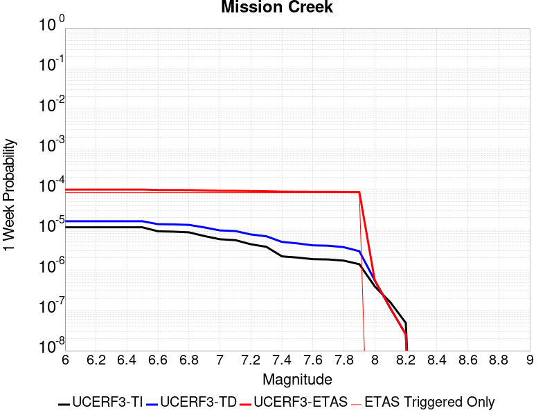 | 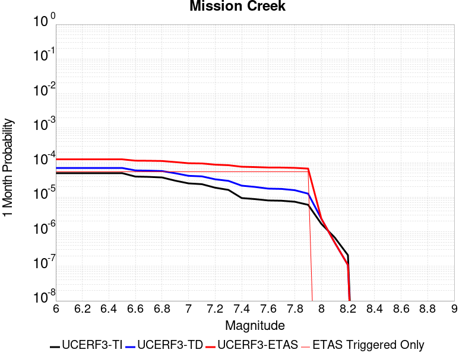 | 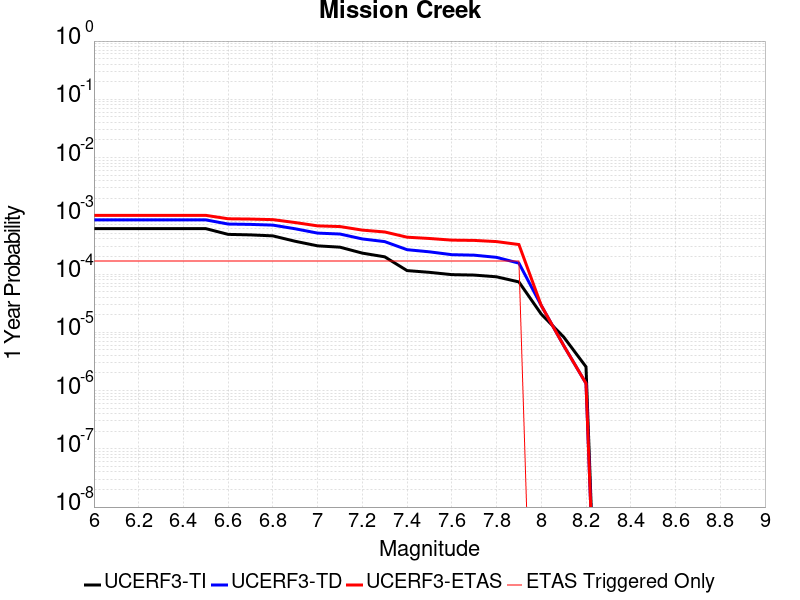 | 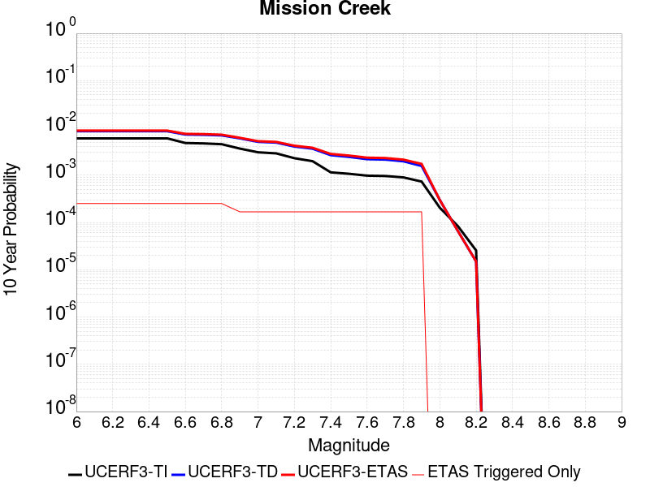 |

| Magnitude | 1 wk TI Prob | 1 wk TD Prob | 1 wk ETAS Prob | 1 wk ETAS/TD Gain | 1 wk ETAS Triggered Only | 1 mo TI Prob | 1 mo TD Prob | 1 mo ETAS Prob | 1 mo ETAS/TD Gain | 1 mo ETAS Triggered Only | 1 yr TI Prob | 1 yr TD Prob | 1 yr ETAS Prob | 1 yr ETAS/TD Gain | 1 yr ETAS Triggered Only | 10 yr TI Prob | 10 yr TD Prob | 10 yr ETAS Prob | 10 yr ETAS/TD Gain | 10 yr ETAS Triggered Only |
|-----|-----|-----|-----|-----|-----|-----|-----|-----|-----|-----|-----|-----|-----|-----|-----|-----|-----|-----|-----|-----|
| 6.0 | 1.1549387E-5 | 1.632237E-5 | 5.884953E-5 | 3.6054525 | 4.2527856E-5 | 4.9496433E-5 | 6.9951224E-5 | 1.12476104E-4 | 1.607922 | 4.2527856E-5 | 6.0245243E-4 | 8.513384E-4 | 0.001021305 | 1.1996464 | 1.7011142E-4 | 0.006008218 | 0.008509998 | 0.008720827 | 1.0247743 | 2.1263928E-4 |
| 6.1 | 1.1549387E-5 | 1.632237E-5 | 5.884953E-5 | 3.6054525 | 4.2527856E-5 | 4.9496433E-5 | 6.9951224E-5 | 1.12476104E-4 | 1.607922 | 4.2527856E-5 | 6.0245243E-4 | 8.513384E-4 | 0.001021305 | 1.1996464 | 1.7011142E-4 | 0.006008218 | 0.008509998 | 0.008720827 | 1.0247743 | 2.1263928E-4 |
| 6.2 | 1.1549387E-5 | 1.632237E-5 | 5.884953E-5 | 3.6054525 | 4.2527856E-5 | 4.9496433E-5 | 6.9951224E-5 | 1.12476104E-4 | 1.607922 | 4.2527856E-5 | 6.0245243E-4 | 8.513384E-4 | 0.001021305 | 1.1996464 | 1.7011142E-4 | 0.006008218 | 0.008509998 | 0.008720827 | 1.0247743 | 2.1263928E-4 |
| 6.3 | 1.1549387E-5 | 1.632237E-5 | 5.884953E-5 | 3.6054525 | 4.2527856E-5 | 4.9496433E-5 | 6.9951224E-5 | 1.12476104E-4 | 1.607922 | 4.2527856E-5 | 6.0245243E-4 | 8.513384E-4 | 0.001021305 | 1.1996464 | 1.7011142E-4 | 0.006008218 | 0.008509998 | 0.008720827 | 1.0247743 | 2.1263928E-4 |
| 6.4 | 1.1549387E-5 | 1.632237E-5 | 5.884953E-5 | 3.6054525 | 4.2527856E-5 | 4.9496433E-5 | 6.9951224E-5 | 1.12476104E-4 | 1.607922 | 4.2527856E-5 | 6.0245243E-4 | 8.513384E-4 | 0.001021305 | 1.1996464 | 1.7011142E-4 | 0.006008218 | 0.008509998 | 0.008720827 | 1.0247743 | 2.1263928E-4 |
| 6.5 | 1.1549387E-5 | 1.632237E-5 | 5.884953E-5 | 3.6054525 | 4.2527856E-5 | 4.9496433E-5 | 6.9951224E-5 | 1.12476104E-4 | 1.607922 | 4.2527856E-5 | 6.0245243E-4 | 8.513384E-4 | 0.001021305 | 1.1996464 | 1.7011142E-4 | 0.006008218 | 0.008509998 | 0.008720827 | 1.0247743 | 2.1263928E-4 |
| 6.6 | 9.202681E-6 | 1.3845646E-5 | 5.637291E-5 | 4.071526 | 4.2527856E-5 | 3.9439463E-5 | 5.9337188E-5 | 1.0186252E-4 | 1.7166725 | 4.2527856E-5 | 4.800697E-4 | 7.221998E-4 | 8.921884E-4 | 1.2353761 | 1.7011142E-4 | 0.004790339 | 0.0072271815 | 0.007438284 | 1.0292095 | 2.1263928E-4 |
| 6.7 | 9.019164E-6 | 1.3651316E-5 | 5.6178593E-5 | 4.115251 | 4.2527856E-5 | 3.8652986E-5 | 5.8504378E-5 | 1.0102975E-4 | 1.726875 | 4.2527856E-5 | 4.7049852E-4 | 7.12067E-4 | 8.820573E-4 | 1.2387279 | 1.7011142E-4 | 0.004695036 | 0.007126506 | 0.00733763 | 1.0296252 | 2.1263928E-4 |
| 6.8 | 8.673558E-6 | 1.3273427E-5 | 5.580072E-5 | 4.203942 | 4.2527856E-5 | 3.717186E-5 | 5.6884925E-5 | 9.941036E-5 | 1.7475696 | 4.2527856E-5 | 4.524734E-4 | 6.923627E-4 | 8.623564E-4 | 1.2455269 | 1.7011142E-4 | 0.0045155324 | 0.006930694 | 0.0071418597 | 1.0304682 | 2.1263928E-4 |
| 6.9 | 7.002255E-6 | 1.1477657E-5 | 5.4005024E-5 | 4.7052307 | 4.2527856E-5 | 3.000932E-5 | 4.9189068E-5 | 9.1714835E-5 | 1.8645369 | 4.2527856E-5 | 3.653022E-4 | 5.9871917E-4 | 7.687288E-4 | 1.2839555 | 1.7011142E-4 | 0.0036470229 | 0.005999517 | 0.006168608 | 1.028184 | 1.7011142E-4 |
| 7.0 | 5.84644E-6 | 9.67498E-6 | 5.2202424E-5 | 5.395611 | 4.2527856E-5 | 2.5055931E-5 | 4.1463565E-5 | 8.398966E-5 | 2.0256255 | 4.2527856E-5 | 3.0501327E-4 | 5.047066E-4 | 6.7473215E-4 | 1.3368801 | 1.7011142E-4 | 0.0030459496 | 0.0050638523 | 0.005233102 | 1.0334232 | 1.7011142E-4 |
| 7.1 | 5.54703E-6 | 9.329456E-6 | 5.1856914E-5 | 5.5584073 | 4.2527856E-5 | 2.377277E-5 | 3.9982795E-5 | 8.250895E-5 | 2.0636113 | 4.2527856E-5 | 2.8939504E-4 | 4.8668624E-4 | 6.567149E-4 | 1.3493599 | 1.7011142E-4 | 0.0028901845 | 0.004884446 | 0.005053727 | 1.034657 | 1.7011142E-4 |
| 7.2 | 4.384709E-6 | 7.68157E-6 | 5.02091E-5 | 6.5363064 | 4.2527856E-5 | 1.8791474E-5 | 3.2920623E-5 | 7.5447075E-5 | 2.2917876 | 4.2527856E-5 | 2.2876218E-4 | 4.0073853E-4 | 5.7078176E-4 | 1.4243248 | 1.7011142E-4 | 0.0022852682 | 0.004028366 | 0.0041977917 | 1.0420582 | 1.7011142E-4 |
| 7.3 | 3.7888456E-6 | 6.915452E-6 | 4.9443013E-5 | 7.149643 | 4.2527856E-5 | 1.623781E-5 | 2.9637333E-5 | 7.216393E-5 | 2.4348996 | 4.2527856E-5 | 1.9767738E-4 | 3.6077813E-4 | 5.308282E-4 | 1.4713424 | 1.7011142E-4 | 0.0019750162 | 0.0036301152 | 0.003799609 | 1.0466911 | 1.7011142E-4 |
| 7.4 | 2.1982462E-6 | 5.0237763E-6 | 4.7551417E-5 | 9.465274 | 4.2527856E-5 | 9.421021E-6 | 2.1530293E-5 | 6.405723E-5 | 2.975214 | 4.2527856E-5 | 1.1469489E-4 | 2.621E-4 | 4.3216682E-4 | 1.6488625 | 1.7011142E-4 | 0.0011463572 | 0.0026458844 | 0.0028155458 | 1.0641227 | 1.7011142E-4 |
| 7.5 | 2.051923E-6 | 4.615016E-6 | 4.7142676E-5 | 10.215062 | 4.2527856E-5 | 8.793926E-6 | 1.9778492E-5 | 6.230551E-5 | 3.1501648 | 4.2527856E-5 | 1.0706078E-4 | 2.4077666E-4 | 4.1084713E-4 | 1.7063411 | 1.7011142E-4 | 0.0010700922 | 0.0024335422 | 0.0026032396 | 1.0697327 | 1.7011142E-4 |
| 7.6 | 1.8733427E-6 | 4.1233748E-6 | 4.6651054E-5 | 11.313804 | 4.2527856E-5 | 8.028587E-6 | 1.7671488E-5 | 6.0198592E-5 | 3.4065378 | 4.2527856E-5 | 9.774366E-5 | 2.151292E-4 | 3.8520404E-4 | 1.7905706 | 1.7011142E-4 | 9.770069E-4 | 0.0021780801 | 0.0023478211 | 1.0779314 | 1.7011142E-4 |
| 7.7 | 1.8411953E-6 | 4.0430496E-6 | 4.6570734E-5 | 11.518714 | 4.2527856E-5 | 7.890813E-6 | 1.732724E-5 | 5.985436E-5 | 3.4543502 | 4.2527856E-5 | 9.606641E-5 | 2.1093882E-4 | 3.8101437E-4 | 1.806279 | 1.7011142E-4 | 9.6024893E-4 | 0.0021363653 | 0.0023061133 | 1.0794564 | 1.7011142E-4 |
| 7.8 | 1.7194251E-6 | 3.7104276E-6 | 4.6238125E-5 | 12.461671 | 4.2527856E-5 | 7.368944E-6 | 1.5901736E-5 | 5.8428916E-5 | 3.6743734 | 4.2527856E-5 | 8.97132E-5 | 1.9358651E-4 | 3.63665E-4 | 1.8785658 | 1.7011142E-4 | 8.967699E-4 | 0.0019623525 | 0.00213213 | 1.0865173 | 1.7011142E-4 |
| 7.9 | 1.4035052E-6 | 2.9500632E-6 | 4.5477795E-5 | 15.415872 | 4.2527856E-5 | 6.0150082E-6 | 1.2643067E-5 | 5.5170385E-5 | 4.363687 | 4.2527856E-5 | 7.3230265E-5 | 1.5391852E-4 | 3.2400378E-4 | 2.1050344 | 1.7011142E-4 | 7.3206134E-4 | 0.0015631086 | 0.0017329542 | 1.1086588 | 1.7011142E-4 |
| 8.0 | 3.9318823E-7 | 5.528522E-7 | 5.528522E-7 | 1.0 | 0.0 | 1.6850913E-6 | 2.3693647E-6 | 2.3693647E-6 | 1.0 | 0.0 | 2.0515794E-5 | 2.8846638E-5 | 2.8846638E-5 | 1.0 | 0.0 | 2.0513899E-4 | 2.9899E-4 | 2.9899E-4 | 1.0 | 0.0 |
| 8.1 | 1.596793E-7 | 1.1380002E-7 | 1.1380002E-7 | 1.0 | 0.0 | 6.8433974E-7 | 4.877143E-7 | 4.877143E-7 | 1.0 | 0.0 | 8.331805E-6 | 5.937906E-6 | 5.937906E-6 | 1.0 | 0.0 | 8.331492E-5 | 6.549966E-5 | 6.549966E-5 | 1.0 | 0.0 |
| 8.2 | 4.9003038E-8 | 2.5444924E-8 | 2.5444924E-8 | 1.0 | 0.0 | 2.10013E-7 | 1.0904967E-7 | 1.0904967E-7 | 1.0 | 0.0 | 2.5569052E-6 | 1.327679E-6 | 1.327679E-6 | 1.0 | 0.0 | 2.556876E-5 | 1.495635E-5 | 1.495635E-5 | 1.0 | 0.0 |

## San Jacinto (San Jacinto Valley) rev
*[(top)](#table-of-contents)*

| 1 Week | 1 Month | 1 Year | 10 Year |
|-----|-----|-----|-----|
| 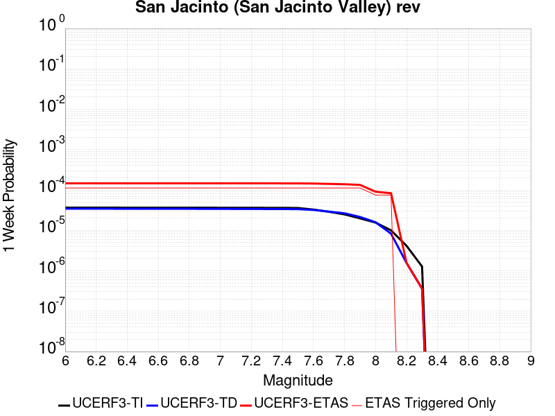 | 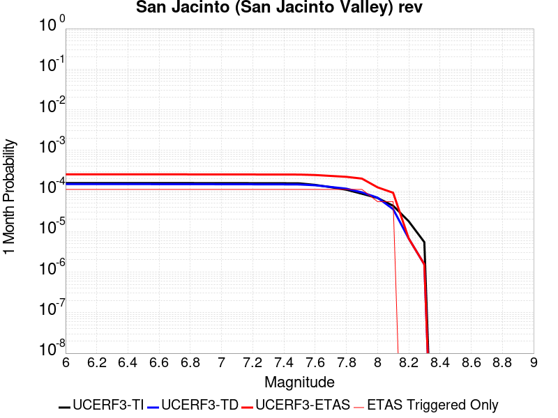 | 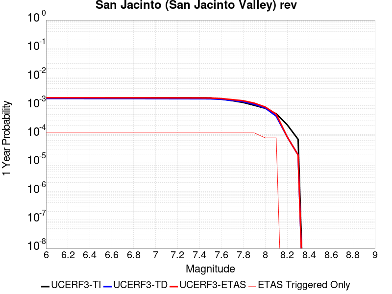 | 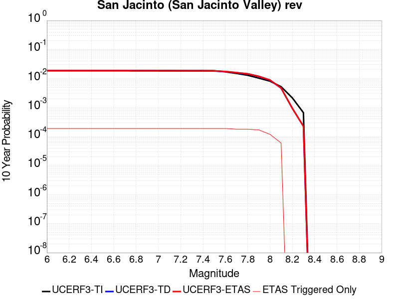 |

| Magnitude | 1 wk TI Prob | 1 wk TD Prob | 1 wk ETAS Prob | 1 wk ETAS/TD Gain | 1 wk ETAS Triggered Only | 1 mo TI Prob | 1 mo TD Prob | 1 mo ETAS Prob | 1 mo ETAS/TD Gain | 1 mo ETAS Triggered Only | 1 yr TI Prob | 1 yr TD Prob | 1 yr ETAS Prob | 1 yr ETAS/TD Gain | 1 yr ETAS Triggered Only | 10 yr TI Prob | 10 yr TD Prob | 10 yr ETAS Prob | 10 yr ETAS/TD Gain | 10 yr ETAS Triggered Only |
|-----|-----|-----|-----|-----|-----|-----|-----|-----|-----|-----|-----|-----|-----|-----|-----|-----|-----|-----|-----|-----|
| 6.0 | 3.652694E-5 | 3.4402394E-5 | 1.6198157E-4 | 4.7084394 | 1.2758357E-4 | 1.5653463E-4 | 1.474305E-4 | 2.7499525E-4 | 1.8652534 | 1.2758357E-4 | 0.0019041431 | 0.00179349 | 0.0019208448 | 1.0710094 | 1.2758357E-4 | 0.018879099 | 0.018526595 | 0.018735295 | 1.0112649 | 2.1263928E-4 |
| 6.1 | 3.652694E-5 | 3.4402394E-5 | 1.6198157E-4 | 4.7084394 | 1.2758357E-4 | 1.5653463E-4 | 1.474305E-4 | 2.7499525E-4 | 1.8652534 | 1.2758357E-4 | 0.0019041431 | 0.00179349 | 0.0019208448 | 1.0710094 | 1.2758357E-4 | 0.018879099 | 0.018526595 | 0.018735295 | 1.0112649 | 2.1263928E-4 |
| 6.2 | 3.652694E-5 | 3.4402394E-5 | 1.6198157E-4 | 4.7084394 | 1.2758357E-4 | 1.5653463E-4 | 1.474305E-4 | 2.7499525E-4 | 1.8652534 | 1.2758357E-4 | 0.0019041431 | 0.00179349 | 0.0019208448 | 1.0710094 | 1.2758357E-4 | 0.018879099 | 0.018526595 | 0.018735295 | 1.0112649 | 2.1263928E-4 |
| 6.3 | 3.652694E-5 | 3.4402394E-5 | 1.6198157E-4 | 4.7084394 | 1.2758357E-4 | 1.5653463E-4 | 1.474305E-4 | 2.7499525E-4 | 1.8652534 | 1.2758357E-4 | 0.0019041431 | 0.00179349 | 0.0019208448 | 1.0710094 | 1.2758357E-4 | 0.018879099 | 0.018526595 | 0.018735295 | 1.0112649 | 2.1263928E-4 |
| 6.4 | 3.646941E-5 | 3.432397E-5 | 1.6190315E-4 | 4.7169123 | 1.2758357E-4 | 1.5628811E-4 | 1.4709444E-4 | 2.7465925E-4 | 1.8672305 | 1.2758357E-4 | 0.0019011468 | 0.0017894056 | 0.0019167609 | 1.0711719 | 1.2758357E-4 | 0.018849645 | 0.018486476 | 0.018695185 | 1.0112898 | 2.1263928E-4 |
| 6.5 | 3.646941E-5 | 3.432397E-5 | 1.6190315E-4 | 4.7169123 | 1.2758357E-4 | 1.5628811E-4 | 1.4709444E-4 | 2.7465925E-4 | 1.8672305 | 1.2758357E-4 | 0.0019011468 | 0.0017894056 | 0.0019167609 | 1.0711719 | 1.2758357E-4 | 0.018849645 | 0.018486476 | 0.018695185 | 1.0112898 | 2.1263928E-4 |
| 6.6 | 3.6442503E-5 | 3.4287354E-5 | 1.6186654E-4 | 4.720882 | 1.2758357E-4 | 1.561728E-4 | 1.4693754E-4 | 2.7450235E-4 | 1.8681568 | 1.2758357E-4 | 0.0018997455 | 0.0017874985 | 0.001914854 | 1.0712479 | 1.2758357E-4 | 0.018835869 | 0.018467745 | 0.018676458 | 1.0113014 | 2.1263928E-4 |
| 6.7 | 3.6432113E-5 | 3.4272925E-5 | 1.6185212E-4 | 4.7224483 | 1.2758357E-4 | 1.5612828E-4 | 1.4687571E-4 | 2.7444054E-4 | 1.8685223 | 1.2758357E-4 | 0.0018992044 | 0.0017867472 | 0.0019141028 | 1.0712779 | 1.2758357E-4 | 0.018830549 | 0.018460369 | 0.018669082 | 1.011306 | 2.1263928E-4 |
| 6.8 | 3.6409598E-5 | 3.424198E-5 | 1.6182118E-4 | 4.7258124 | 1.2758357E-4 | 1.560318E-4 | 1.4674311E-4 | 2.7430797E-4 | 1.8693073 | 1.2758357E-4 | 0.0018980318 | 0.0017851355 | 0.0019124913 | 1.0713423 | 1.2758357E-4 | 0.018819023 | 0.018444523 | 0.01865324 | 1.011316 | 2.1263928E-4 |
| 6.9 | 3.638078E-5 | 3.4202407E-5 | 1.6178162E-4 | 4.7301235 | 1.2758357E-4 | 1.5590832E-4 | 1.4657351E-4 | 2.7413838E-4 | 1.8703132 | 1.2758357E-4 | 0.0018965311 | 0.001783074 | 0.0019104301 | 1.071425 | 1.2758357E-4 | 0.018804269 | 0.018424258 | 0.018632978 | 1.0113286 | 2.1263928E-4 |
| 7.0 | 3.6294874E-5 | 3.408442E-5 | 1.6166364E-4 | 4.7430363 | 1.2758357E-4 | 1.5554018E-4 | 1.4606792E-4 | 2.7363285E-4 | 1.8733262 | 1.2758357E-4 | 0.0018920569 | 0.001776929 | 0.0019042859 | 1.0716724 | 1.2758357E-4 | 0.018760284 | 0.018363839 | 0.018572574 | 1.0113666 | 2.1263928E-4 |
| 7.1 | 3.6260717E-5 | 3.4040702E-5 | 1.6161993E-4 | 4.7478433 | 1.2758357E-4 | 1.5539382E-4 | 1.4588058E-4 | 2.7344553E-4 | 1.8744478 | 1.2758357E-4 | 0.001890278 | 0.0017746518 | 0.001902009 | 1.0717646 | 1.2758357E-4 | 0.018742796 | 0.018341439 | 0.018550178 | 1.0113808 | 2.1263928E-4 |
| 7.2 | 3.6210204E-5 | 3.397492E-5 | 1.6155416E-4 | 4.7551003 | 1.2758357E-4 | 1.5517735E-4 | 1.455987E-4 | 2.731637E-4 | 1.8761411 | 1.2758357E-4 | 0.001887647 | 0.0017712255 | 0.001898583 | 1.0719037 | 1.2758357E-4 | 0.01871693 | 0.01830772 | 0.018516466 | 1.0114021 | 2.1263928E-4 |
| 7.3 | 3.6119454E-5 | 3.386321E-5 | 1.6144245E-4 | 4.7674885 | 1.2758357E-4 | 1.5478847E-4 | 1.4511998E-4 | 2.7268502E-4 | 1.8790317 | 1.2758357E-4 | 0.0018829206 | 0.0017654065 | 0.0018927648 | 1.072141 | 1.2758357E-4 | 0.018670462 | 0.018250274 | 0.018459031 | 1.0114386 | 2.1263928E-4 |
| 7.4 | 3.607848E-5 | 3.381071E-5 | 1.6138997E-4 | 4.773339 | 1.2758357E-4 | 1.5461289E-4 | 1.44895E-4 | 2.7246008E-4 | 1.8803967 | 1.2758357E-4 | 0.0018807866 | 0.0017626719 | 0.0018900306 | 1.0722532 | 1.2758357E-4 | 0.018649481 | 0.018223269 | 0.018432032 | 1.0114559 | 2.1263928E-4 |
| 7.5 | 3.5856774E-5 | 3.3620483E-5 | 1.6119976E-4 | 4.794689 | 1.2758357E-4 | 1.5366284E-4 | 1.4407984E-4 | 2.7164503E-4 | 1.8853785 | 1.2758357E-4 | 0.0018692396 | 0.0017527633 | 0.0018801232 | 1.0726624 | 1.2758357E-4 | 0.018535944 | 0.018124366 | 0.018333152 | 1.0115196 | 2.1263928E-4 |
| 7.6 | 3.286655E-5 | 3.2143445E-5 | 1.5972291E-4 | 4.969066 | 1.2758357E-4 | 1.4084904E-4 | 1.3775036E-4 | 2.6531637E-4 | 1.9260664 | 1.2758357E-4 | 0.001713488 | 0.0016758227 | 0.0018031923 | 1.0760043 | 1.2758357E-4 | 0.017003361 | 0.017344031 | 0.017552983 | 1.0120474 | 2.1263928E-4 |
| 7.7 | 2.8882527E-5 | 2.9236293E-5 | 1.5681612E-4 | 5.3637486 | 1.2758357E-4 | 1.237764E-4 | 1.2529238E-4 | 2.5285996E-4 | 2.0181592 | 1.2758357E-4 | 0.0015059357 | 0.0015243685 | 0.0016517576 | 1.0835685 | 1.2758357E-4 | 0.014957713 | 0.015830461 | 0.016039733 | 1.0132196 | 2.1263928E-4 |
| 7.8 | 2.4950225E-5 | 2.6527203E-5 | 1.5410739E-4 | 5.8094096 | 1.2758357E-4 | 1.0692515E-4 | 1.1368306E-4 | 2.4125213E-4 | 2.1221466 | 1.2758357E-4 | 0.0013010362 | 0.0013832134 | 0.0015106205 | 1.0921094 | 1.2758357E-4 | 0.012934455 | 0.014411755 | 0.0146213295 | 1.014542 | 2.1263928E-4 |
| 7.9 | 1.9881603E-5 | 2.1507445E-5 | 1.4908827E-4 | 6.9319377 | 1.2758357E-4 | 8.520408E-5 | 9.217151E-5 | 2.1974332E-4 | 2.3840697 | 1.2758357E-4 | 0.001036866 | 0.0011216112 | 0.0012490518 | 1.1136227 | 1.2758357E-4 | 0.010320415 | 0.011777027 | 0.011987162 | 1.0178428 | 2.1263928E-4 |
| 8.0 | 1.563292E-5 | 1.5937347E-5 | 1.009917E-4 | 6.3367953 | 8.505571E-5 | 6.6996516E-5 | 6.8301124E-5 | 1.5335102E-4 | 2.2452197 | 8.505571E-5 | 8.153773E-4 | 8.3124964E-4 | 9.162346E-4 | 1.1022377 | 8.505571E-5 | 0.00812392 | 0.008810506 | 0.008979118 | 1.0191377 | 1.7011142E-4 |
| 8.1 | 1.0045313E-5 | 8.301802E-6 | 9.335681E-5 | 11.245366 | 8.505571E-5 | 4.305063E-5 | 3.5578672E-5 | 1.20631354E-4 | 3.3905525 | 8.505571E-5 | 5.2401534E-4 | 4.3308473E-4 | 5.181036E-4 | 1.19631 | 8.505571E-5 | 0.0052278144 | 0.0046591135 | 0.004786103 | 1.0272561 | 1.2758357E-4 |
| 8.2 | 4.1554413E-6 | 1.5655598E-6 | 1.5655598E-6 | 1.0 | 0.0 | 1.7808914E-5 | 6.709525E-6 | 6.709525E-6 | 1.0 | 0.0 | 2.1680194E-4 | 8.168544E-5 | 8.168544E-5 | 1.0 | 0.0 | 0.0021659054 | 9.482903E-4 | 9.482903E-4 | 1.0 | 0.0 |
| 8.3 | 1.2758221E-6 | 3.6149942E-7 | 3.6149942E-7 | 1.0 | 0.0 | 5.4677976E-6 | 1.5492824E-6 | 1.5492824E-6 | 1.0 | 0.0 | 6.65684E-5 | 1.8862354E-5 | 1.8862354E-5 | 1.0 | 0.0 | 6.6548464E-4 | 2.2751294E-4 | 2.2751294E-4 | 1.0 | 0.0 |

## Santa Rosa Island
*[(top)](#table-of-contents)*

| 1 Week | 1 Month | 1 Year | 10 Year |
|-----|-----|-----|-----|
|  | 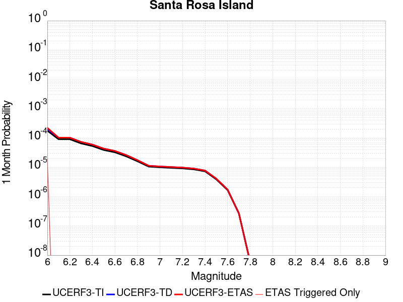 | 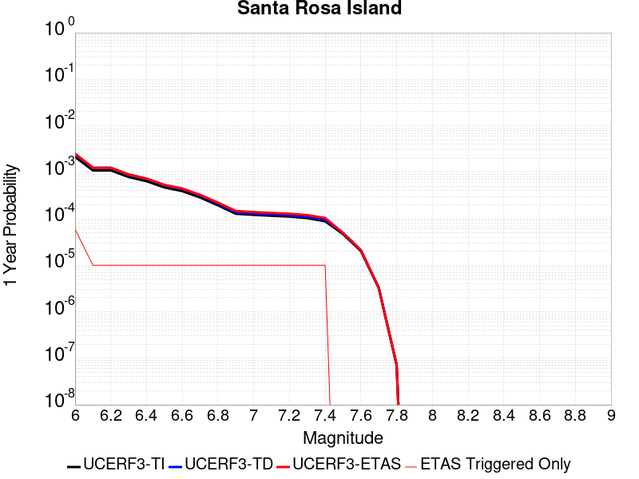 | 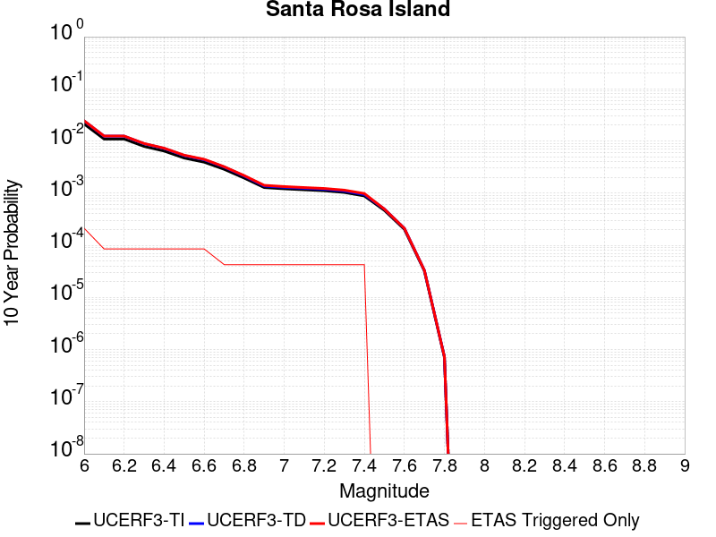 |

| Magnitude | 1 wk TI Prob | 1 wk TD Prob | 1 wk ETAS Prob | 1 wk ETAS/TD Gain | 1 wk ETAS Triggered Only | 1 mo TI Prob | 1 mo TD Prob | 1 mo ETAS Prob | 1 mo ETAS/TD Gain | 1 mo ETAS Triggered Only | 1 yr TI Prob | 1 yr TD Prob | 1 yr ETAS Prob | 1 yr ETAS/TD Gain | 1 yr ETAS Triggered Only | 10 yr TI Prob | 10 yr TD Prob | 10 yr ETAS Prob | 10 yr ETAS/TD Gain | 10 yr ETAS Triggered Only |
|-----|-----|-----|-----|-----|-----|-----|-----|-----|-----|-----|-----|-----|-----|-----|-----|-----|-----|-----|-----|-----|
| 6.0 | 4.1143165E-5 | 4.7091133E-5 | 4.7091133E-5 | 1.0 | 0.0 | 1.7631594E-4 | 2.0180465E-4 | 2.0180465E-4 | 1.0 | 0.0 | 0.002144533 | 0.0024544 | 0.0025816704 | 1.051854 | 1.2758357E-4 | 0.021239553 | 0.024293551 | 0.024501024 | 1.0085403 | 2.1263928E-4 |
| 6.1 | 2.1061249E-5 | 2.3864959E-5 | 2.3864959E-5 | 1.0 | 0.0 | 9.0259375E-5 | 1.0227455E-4 | 1.0227455E-4 | 1.0 | 0.0 | 0.0010983539 | 0.0012445104 | 0.0012869852 | 1.0341299 | 4.2527856E-5 | 0.01092941 | 0.012378449 | 0.012462451 | 1.0067862 | 8.505571E-5 |
| 6.2 | 2.1061249E-5 | 2.3864959E-5 | 2.3864959E-5 | 1.0 | 0.0 | 9.0259375E-5 | 1.0227455E-4 | 1.0227455E-4 | 1.0 | 0.0 | 0.0010983539 | 0.0012445104 | 0.0012869852 | 1.0341299 | 4.2527856E-5 | 0.01092941 | 0.012378449 | 0.012462451 | 1.0067862 | 8.505571E-5 |
| 6.3 | 1.5158236E-5 | 1.7074419E-5 | 1.7074419E-5 | 1.0 | 0.0 | 6.496225E-5 | 7.3174095E-5 | 7.3174095E-5 | 1.0 | 0.0 | 7.906284E-4 | 8.905424E-4 | 9.330324E-4 | 1.0477124 | 4.2527856E-5 | 0.007878214 | 0.008870989 | 0.008955291 | 1.009503 | 8.505571E-5 |
| 6.4 | 1.2341918E-5 | 1.3852917E-5 | 1.3852917E-5 | 1.0 | 0.0 | 5.2892858E-5 | 5.9368336E-5 | 5.9368336E-5 | 1.0 | 0.0 | 6.437803E-4 | 7.225779E-4 | 7.6507503E-4 | 1.0588132 | 4.2527856E-5 | 0.006419184 | 0.007203121 | 0.007287564 | 1.0117232 | 8.505571E-5 |
| 6.5 | 9.061158E-6 | 1.0117031E-5 | 1.0117031E-5 | 1.0 | 0.0 | 3.883296E-5 | 4.3358013E-5 | 4.3358013E-5 | 1.0 | 0.0 | 4.726887E-4 | 5.277613E-4 | 5.702667E-4 | 1.0805391 | 4.2527856E-5 | 0.004716845 | 0.0052656173 | 0.005350225 | 1.016068 | 8.505571E-5 |
| 6.6 | 7.5461685E-6 | 8.400733E-6 | 8.400733E-6 | 1.0 | 0.0 | 3.2340322E-5 | 3.600267E-5 | 3.600267E-5 | 1.0 | 0.0 | 3.936723E-4 | 4.3824865E-4 | 4.8075788E-4 | 1.096998 | 4.2527856E-5 | 0.003929756 | 0.0043742736 | 0.0044589574 | 1.0193595 | 8.505571E-5 |
| 6.7 | 5.5023775E-6 | 6.087381E-6 | 6.087381E-6 | 1.0 | 0.0 | 2.3581404E-5 | 2.6088532E-5 | 2.6088532E-5 | 1.0 | 0.0 | 2.8706578E-4 | 3.1758484E-4 | 3.600992E-4 | 1.1338677 | 4.2527856E-5 | 0.0028669522 | 0.0031716314 | 0.0032140245 | 1.0133663 | 4.2527856E-5 |
| 6.8 | 3.7351679E-6 | 4.0831405E-6 | 4.0831405E-6 | 1.0 | 0.0 | 1.6007763E-5 | 1.749907E-5 | 1.749907E-5 | 1.0 | 0.0 | 1.948771E-4 | 2.1303284E-4 | 2.5555163E-4 | 1.199588 | 4.2527856E-5 | 0.0019470629 | 0.0021285315 | 0.0021709688 | 1.0199374 | 4.2527856E-5 |
| 6.9 | 2.456366E-6 | 2.6292705E-6 | 2.6292705E-6 | 1.0 | 0.0 | 1.0527241E-5 | 1.1268254E-5 | 1.1268254E-5 | 1.0 | 0.0 | 1.2816161E-4 | 1.3718237E-4 | 1.797044E-4 | 1.309967 | 4.2527856E-5 | 0.0012808773 | 0.0013709799 | 0.0014134494 | 1.0309775 | 4.2527856E-5 |
| 7.0 | 2.3245157E-6 | 2.4827782E-6 | 2.4827782E-6 | 1.0 | 0.0 | 9.962172E-6 | 1.0640435E-5 | 1.0640435E-5 | 1.0 | 0.0 | 1.2128269E-4 | 1.2953962E-4 | 1.7206196E-4 | 1.3282574 | 4.2527856E-5 | 0.0012121652 | 0.0012946434 | 0.0013371161 | 1.0328065 | 4.2527856E-5 |
| 7.1 | 2.2248344E-6 | 2.37325E-6 | 2.37325E-6 | 1.0 | 0.0 | 9.53497E-6 | 1.0171032E-5 | 1.0171032E-5 | 1.0 | 0.0 | 1.1608207E-4 | 1.2382529E-4 | 1.6634788E-4 | 1.343408 | 4.2527856E-5 | 0.0011602144 | 0.001237565 | 0.0012800401 | 1.0343217 | 4.2527856E-5 |
| 7.2 | 2.1350402E-6 | 2.276154E-6 | 2.276154E-6 | 1.0 | 0.0 | 9.150141E-6 | 9.754909E-6 | 9.754909E-6 | 1.0 | 0.0 | 1.1139726E-4 | 1.1875956E-4 | 1.6128237E-4 | 1.358058 | 4.2527856E-5 | 0.0011134144 | 0.0011869629 | 0.0012294402 | 1.0357866 | 4.2527856E-5 |
| 7.3 | 1.9793572E-6 | 2.108719E-6 | 2.108719E-6 | 1.0 | 0.0 | 8.482932E-6 | 9.037336E-6 | 9.037336E-6 | 1.0 | 0.0 | 1.032748E-4 | 1.10024026E-4 | 1.525472E-4 | 1.3864899 | 4.2527856E-5 | 0.0010322682 | 0.0010996973 | 0.0011421784 | 1.0386298 | 4.2527856E-5 |
| 7.4 | 1.6951194E-6 | 1.8045733E-6 | 1.8045733E-6 | 1.0 | 0.0 | 7.264777E-6 | 7.733863E-6 | 7.733863E-6 | 1.0 | 0.0 | 8.844508E-5 | 9.415573E-5 | 1.3667958E-4 | 1.4516332 | 4.2527856E-5 | 8.840988E-4 | 9.4116E-4 | 9.836479E-4 | 1.0451441 | 4.2527856E-5 |
| 7.5 | 8.987207E-7 | 9.5122147E-7 | 9.5122147E-7 | 1.0 | 0.0 | 3.8516546E-6 | 4.076657E-6 | 4.076657E-6 | 1.0 | 0.0 | 4.6892885E-5 | 4.963218E-5 | 4.963218E-5 | 1.0 | 0.0 | 4.688299E-4 | 4.9621216E-4 | 4.9621216E-4 | 1.0 | 0.0 |
| 7.6 | 3.8783037E-7 | 4.052932E-7 | 4.052932E-7 | 1.0 | 0.0 | 1.6621291E-6 | 1.7369698E-6 | 1.7369698E-6 | 1.0 | 0.0 | 2.0236233E-5 | 2.1147409E-5 | 2.1147409E-5 | 1.0 | 0.0 | 2.023439E-4 | 2.1145462E-4 | 2.1145462E-4 | 1.0 | 0.0 |
| 7.7 | 6.181804E-8 | 6.339035E-8 | 6.339035E-8 | 1.0 | 0.0 | 2.6493444E-7 | 2.7167292E-7 | 2.7167292E-7 | 1.0 | 0.0 | 3.225572E-6 | 3.3076128E-6 | 3.3076128E-6 | 1.0 | 0.0 | 3.225525E-5 | 3.307564E-5 | 3.307564E-5 | 1.0 | 0.0 |
| 7.8 | 1.3704449E-9 | 1.3964153E-9 | 1.3964153E-9 | 1.0 | 0.0 | 5.873335E-9 | 5.984637E-9 | 5.984637E-9 | 1.0 | 0.0 | 7.1507856E-8 | 7.286295E-8 | 7.286295E-8 | 1.0 | 0.0 | 7.1507833E-7 | 7.286294E-7 | 7.286294E-7 | 1.0 | 0.0 |

## San Jacinto (Anza) rev
*[(top)](#table-of-contents)*

| 1 Week | 1 Month | 1 Year | 10 Year |
|-----|-----|-----|-----|
| 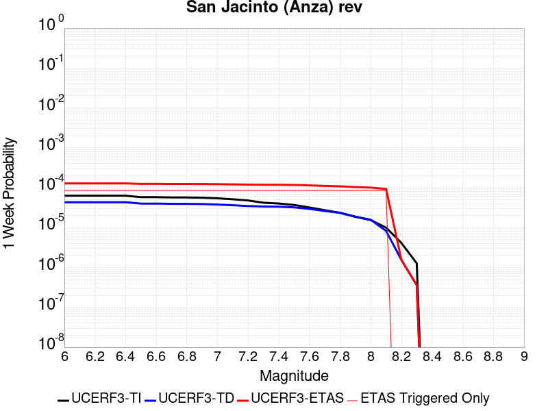 | 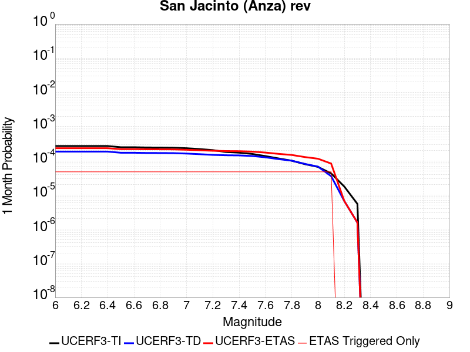 | 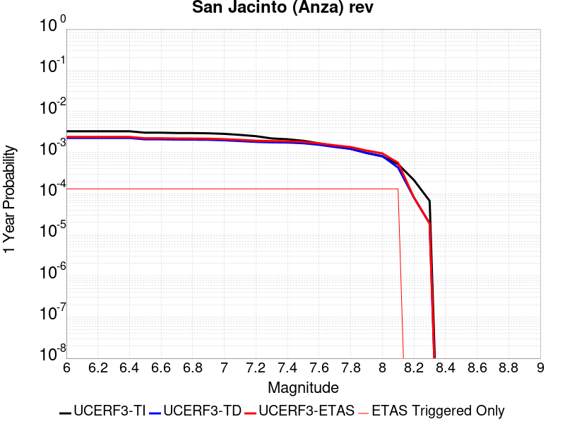 | 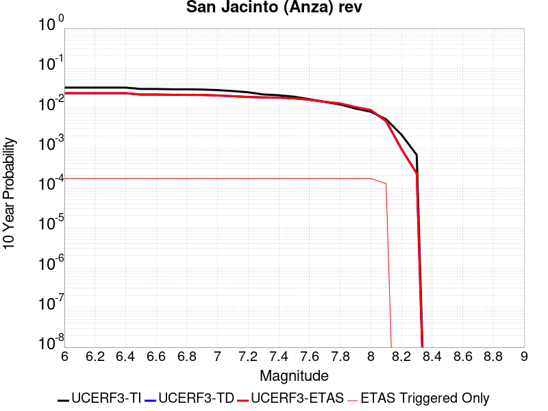 |

| Magnitude | 1 wk TI Prob | 1 wk TD Prob | 1 wk ETAS Prob | 1 wk ETAS/TD Gain | 1 wk ETAS Triggered Only | 1 mo TI Prob | 1 mo TD Prob | 1 mo ETAS Prob | 1 mo ETAS/TD Gain | 1 mo ETAS Triggered Only | 1 yr TI Prob | 1 yr TD Prob | 1 yr ETAS Prob | 1 yr ETAS/TD Gain | 1 yr ETAS Triggered Only | 10 yr TI Prob | 10 yr TD Prob | 10 yr ETAS Prob | 10 yr ETAS/TD Gain | 10 yr ETAS Triggered Only |
|-----|-----|-----|-----|-----|-----|-----|-----|-----|-----|-----|-----|-----|-----|-----|-----|-----|-----|-----|-----|-----|
| 6.0 | 6.3015636E-5 | 4.3302647E-5 | 1.2835467E-4 | 2.96413 | 8.505571E-5 | 2.7003905E-4 | 1.8556965E-4 | 2.7060957E-4 | 1.4582642 | 8.505571E-5 | 0.0032827691 | 0.0022569813 | 0.002341845 | 1.0376005 | 8.505571E-5 | 0.032346968 | 0.023296192 | 0.02346234 | 1.007132 | 1.7011142E-4 |
| 6.1 | 6.3015636E-5 | 4.3302647E-5 | 1.2835467E-4 | 2.96413 | 8.505571E-5 | 2.7003905E-4 | 1.8556965E-4 | 2.7060957E-4 | 1.4582642 | 8.505571E-5 | 0.0032827691 | 0.0022569813 | 0.002341845 | 1.0376005 | 8.505571E-5 | 0.032346968 | 0.023296192 | 0.02346234 | 1.007132 | 1.7011142E-4 |
| 6.2 | 6.3015636E-5 | 4.3302647E-5 | 1.2835467E-4 | 2.96413 | 8.505571E-5 | 2.7003905E-4 | 1.8556965E-4 | 2.7060957E-4 | 1.4582642 | 8.505571E-5 | 0.0032827691 | 0.0022569813 | 0.002341845 | 1.0376005 | 8.505571E-5 | 0.032346968 | 0.023296192 | 0.02346234 | 1.007132 | 1.7011142E-4 |
| 6.3 | 6.3015636E-5 | 4.3302647E-5 | 1.2835467E-4 | 2.96413 | 8.505571E-5 | 2.7003905E-4 | 1.8556965E-4 | 2.7060957E-4 | 1.4582642 | 8.505571E-5 | 0.0032827691 | 0.0022569813 | 0.002341845 | 1.0376005 | 8.505571E-5 | 0.032346968 | 0.023296192 | 0.02346234 | 1.007132 | 1.7011142E-4 |
| 6.4 | 6.3015636E-5 | 4.3302647E-5 | 1.2835467E-4 | 2.96413 | 8.505571E-5 | 2.7003905E-4 | 1.8556965E-4 | 2.7060957E-4 | 1.4582642 | 8.505571E-5 | 0.0032827691 | 0.0022569813 | 0.002341845 | 1.0376005 | 8.505571E-5 | 0.032346968 | 0.023296192 | 0.02346234 | 1.007132 | 1.7011142E-4 |
| 6.5 | 5.811017E-5 | 4.0082516E-5 | 1.2513481E-4 | 3.1219304 | 8.505571E-5 | 2.4901982E-4 | 1.7177092E-4 | 2.5681203E-4 | 1.4950844 | 8.505571E-5 | 0.0030276014 | 0.002089311 | 0.0021741888 | 1.0406249 | 8.505571E-5 | 0.02986684 | 0.021593736 | 0.021760175 | 1.0077077 | 1.7011142E-4 |
| 6.6 | 5.811017E-5 | 4.0082516E-5 | 1.2513481E-4 | 3.1219304 | 8.505571E-5 | 2.4901982E-4 | 1.7177092E-4 | 2.5681203E-4 | 1.4950844 | 8.505571E-5 | 0.0030276014 | 0.002089311 | 0.0021741888 | 1.0406249 | 8.505571E-5 | 0.02986684 | 0.021593736 | 0.021760175 | 1.0077077 | 1.7011142E-4 |
| 6.7 | 5.712442E-5 | 3.9505223E-5 | 1.2455757E-4 | 3.1529393 | 8.505571E-5 | 2.4479596E-4 | 1.6929714E-4 | 2.5433846E-4 | 1.5023198 | 8.505571E-5 | 0.0029763177 | 0.0020592497 | 0.0021441302 | 1.0412191 | 8.505571E-5 | 0.029367693 | 0.021285562 | 0.021452053 | 1.0078218 | 1.7011142E-4 |
| 6.8 | 5.6967532E-5 | 3.9361643E-5 | 1.24414E-4 | 3.160793 | 8.505571E-5 | 2.4412372E-4 | 1.6868189E-4 | 2.5372324E-4 | 1.5041523 | 8.505571E-5 | 0.0029681553 | 0.002051773 | 0.0021366542 | 1.0413697 | 8.505571E-5 | 0.029288229 | 0.021210281 | 0.021376785 | 1.0078502 | 1.7011142E-4 |
| 6.9 | 5.6211324E-5 | 3.9066435E-5 | 1.2411883E-4 | 3.1771219 | 8.505571E-5 | 2.4088343E-4 | 1.6741687E-4 | 2.5245835E-4 | 1.5079623 | 8.505571E-5 | 0.0029288116 | 0.0020364004 | 0.0021212827 | 1.0416826 | 8.505571E-5 | 0.028905109 | 0.021049714 | 0.021216244 | 1.0079113 | 1.7011142E-4 |
| 7.0 | 5.4383527E-5 | 3.792697E-5 | 1.2297946E-4 | 3.2425332 | 8.505571E-5 | 2.3305144E-4 | 1.6253405E-4 | 2.4757595E-4 | 1.5232251 | 8.505571E-5 | 0.0028337094 | 0.001977061 | 0.0020619484 | 1.0429362 | 8.505571E-5 | 0.027978465 | 0.020440677 | 0.020607311 | 1.0081521 | 1.7011142E-4 |
| 7.1 | 5.1393665E-5 | 3.6389913E-5 | 1.2144253E-4 | 3.337258 | 8.505571E-5 | 2.2023996E-4 | 1.5594746E-4 | 2.4098992E-4 | 1.5453275 | 8.505571E-5 | 0.0026781242 | 0.0018970112 | 0.0019819057 | 1.0447516 | 8.505571E-5 | 0.026460782 | 0.019614287 | 0.01978106 | 1.0085027 | 1.7011142E-4 |
| 7.2 | 4.785222E-5 | 3.4741795E-5 | 1.1979455E-4 | 3.4481392 | 8.505571E-5 | 2.0506482E-4 | 1.4888494E-4 | 2.3392799E-4 | 1.5711998 | 8.505571E-5 | 0.0024938055 | 0.0018111705 | 0.0018960722 | 1.0468767 | 8.505571E-5 | 0.024660049 | 0.018728992 | 0.018895917 | 1.0089127 | 1.7011142E-4 |
| 7.3 | 4.2143256E-5 | 3.383628E-5 | 1.1888911E-4 | 3.513658 | 8.505571E-5 | 1.8060145E-4 | 1.4500458E-4 | 2.3004797E-4 | 1.5864875 | 8.505571E-5 | 0.002196605 | 0.0017640047 | 0.0018489104 | 1.0481323 | 8.505571E-5 | 0.02175019 | 0.01823724 | 0.018404251 | 1.0091575 | 1.7011142E-4 |
| 7.4 | 4.0264713E-5 | 3.347446E-5 | 1.1852733E-4 | 3.5408282 | 8.505571E-5 | 1.7255165E-4 | 1.4345412E-4 | 2.2849762E-4 | 1.5928273 | 8.505571E-5 | 0.002098792 | 0.0017451581 | 0.0018300654 | 1.048653 | 8.505571E-5 | 0.020790804 | 0.018041821 | 0.018208863 | 1.0092586 | 1.7011142E-4 |
| 7.5 | 3.694492E-5 | 3.218847E-5 | 1.1724144E-4 | 3.642343 | 8.505571E-5 | 1.5832575E-4 | 1.379433E-4 | 2.2298728E-4 | 1.6165141 | 8.505571E-5 | 0.0019259118 | 0.001678169 | 0.001763082 | 1.0505986 | 8.505571E-5 | 0.01909306 | 0.01735827 | 0.017525429 | 1.00963 | 1.7011142E-4 |
| 7.6 | 3.200565E-5 | 2.9504106E-5 | 1.1455731E-4 | 3.8827581 | 8.505571E-5 | 1.3715986E-4 | 1.2644005E-4 | 2.11485E-4 | 1.6726109 | 8.505571E-5 | 0.001668642 | 0.0015383229 | 0.0016232478 | 1.0552062 | 8.505571E-5 | 0.01656168 | 0.0159463 | 0.016113698 | 1.0104977 | 1.7011142E-4 |
| 7.7 | 2.731642E-5 | 2.6092788E-5 | 1.1114628E-4 | 4.2596555 | 8.505571E-5 | 1.1706512E-4 | 1.1182144E-4 | 1.9686765E-4 | 1.7605536 | 8.505571E-5 | 0.001424336 | 0.0013605768 | 0.0014455168 | 1.0624294 | 8.505571E-5 | 0.014152412 | 0.014167004 | 0.014334706 | 1.0118375 | 1.7011142E-4 |
| 7.8 | 2.3466424E-5 | 2.3504817E-5 | 1.0855853E-4 | 4.618565 | 8.505571E-5 | 1.0056651E-4 | 1.0073105E-4 | 1.8577819E-4 | 1.8442992 | 8.505571E-5 | 0.0012237094 | 0.0012257113 | 0.0013106628 | 1.0693079 | 8.505571E-5 | 0.012169928 | 0.012808893 | 0.012976825 | 1.0131106 | 1.7011142E-4 |
| 7.9 | 1.8611925E-5 | 1.8908117E-5 | 1.0396222E-4 | 5.4982853 | 8.505571E-5 | 7.9762955E-5 | 8.1032274E-5 | 1.660811E-4 | 2.0495672 | 8.505571E-5 | 9.7068126E-4 | 9.861222E-4 | 0.001071094 | 1.0861677 | 8.505571E-5 | 0.0096645225 | 0.010393824 | 0.0105621675 | 1.0161965 | 1.7011142E-4 |
| 8.0 | 1.5460775E-5 | 1.5740965E-5 | 1.0079534E-4 | 6.4033775 | 8.505571E-5 | 6.6258784E-5 | 6.7459536E-5 | 1.5250951E-4 | 2.2607553 | 8.505571E-5 | 8.0640207E-4 | 8.21011E-4 | 9.0599695E-4 | 1.1035137 | 8.505571E-5 | 0.008034821 | 0.0087028835 | 0.008871514 | 1.0193764 | 1.7011142E-4 |
| 8.1 | 9.983884E-6 | 8.269952E-6 | 9.332496E-5 | 11.284825 | 8.505571E-5 | 4.2787375E-5 | 3.544217E-5 | 1.2049487E-4 | 3.3997598 | 8.505571E-5 | 5.2081177E-4 | 4.314235E-4 | 5.164425E-4 | 1.1970663 | 8.505571E-5 | 0.0051959283 | 0.004640022 | 0.0047670137 | 1.0273688 | 1.2758357E-4 |
| 8.2 | 4.1226E-6 | 1.5529788E-6 | 1.5529788E-6 | 1.0 | 0.0 | 1.7668166E-5 | 6.6556063E-6 | 6.6556063E-6 | 1.0 | 0.0 | 2.1508869E-4 | 8.102902E-5 | 8.102902E-5 | 1.0 | 0.0 | 0.0021488064 | 9.4050163E-4 | 9.4050163E-4 | 1.0 | 0.0 |
| 8.3 | 1.2750878E-6 | 3.612133E-7 | 3.612133E-7 | 1.0 | 0.0 | 5.4646503E-6 | 1.548056E-6 | 1.548056E-6 | 1.0 | 0.0 | 6.653009E-5 | 1.8847424E-5 | 1.8847424E-5 | 1.0 | 0.0 | 6.6510175E-4 | 2.2734253E-4 | 2.2734253E-4 | 1.0 | 0.0 |

## Cleghorn Pass
*[(top)](#table-of-contents)*

| 1 Week | 1 Month | 1 Year | 10 Year |
|-----|-----|-----|-----|
| 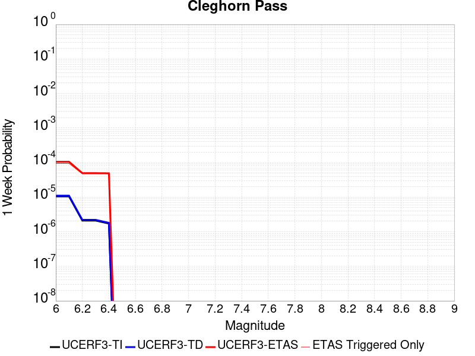 | 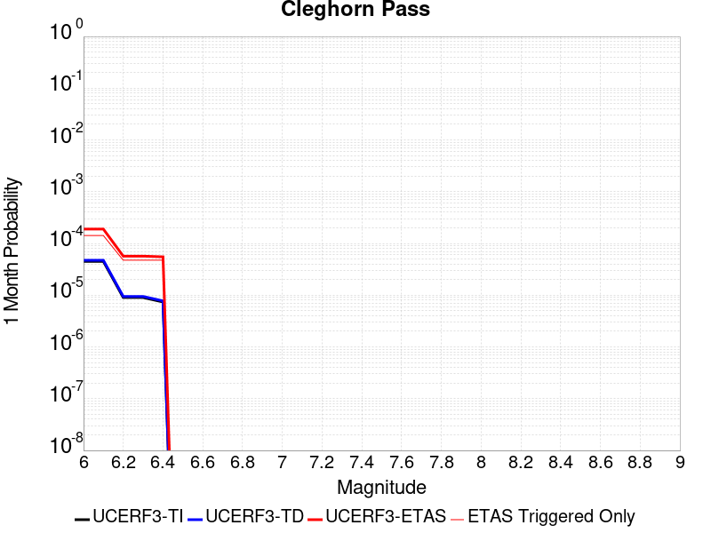 | 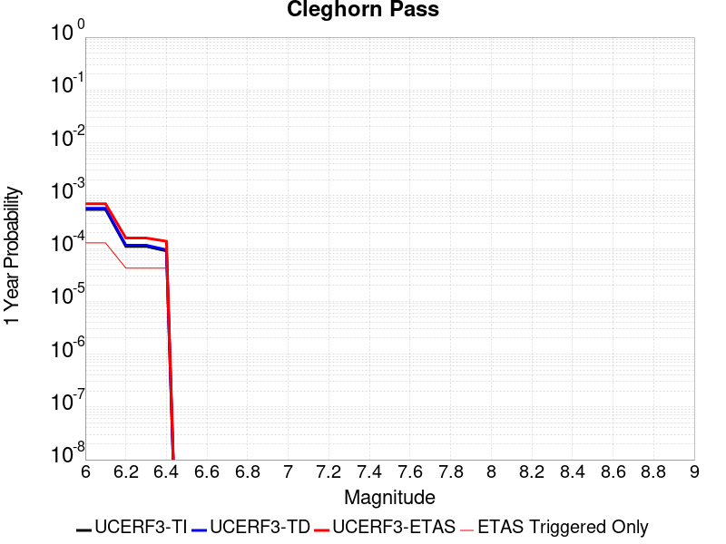 | 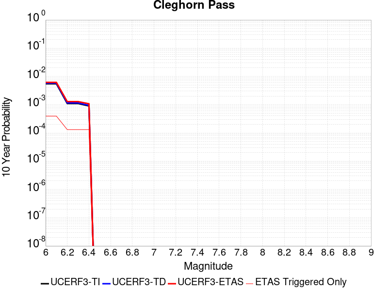 |

| Magnitude | 1 wk TI Prob | 1 wk TD Prob | 1 wk ETAS Prob | 1 wk ETAS/TD Gain | 1 wk ETAS Triggered Only | 1 mo TI Prob | 1 mo TD Prob | 1 mo ETAS Prob | 1 mo ETAS/TD Gain | 1 mo ETAS Triggered Only | 1 yr TI Prob | 1 yr TD Prob | 1 yr ETAS Prob | 1 yr ETAS/TD Gain | 1 yr ETAS Triggered Only | 10 yr TI Prob | 10 yr TD Prob | 10 yr ETAS Prob | 10 yr ETAS/TD Gain | 10 yr ETAS Triggered Only |
|-----|-----|-----|-----|-----|-----|-----|-----|-----|-----|-----|-----|-----|-----|-----|-----|-----|-----|-----|-----|-----|
| 6.0 | 1.0522846E-5 | 1.1040642E-5 | 9.609541E-5 | 8.703789 | 8.505571E-5 | 4.509713E-5 | 4.7316473E-5 | 1.74894E-4 | 3.6962602 | 1.2758357E-4 | 5.4891926E-4 | 5.759784E-4 | 7.0348853E-4 | 1.22138 | 1.2758357E-4 | 0.0054756533 | 0.005750022 | 0.005919155 | 1.0294144 | 1.7011142E-4 |
| 6.1 | 1.0522846E-5 | 1.1040642E-5 | 9.609541E-5 | 8.703789 | 8.505571E-5 | 4.509713E-5 | 4.7316473E-5 | 1.74894E-4 | 3.6962602 | 1.2758357E-4 | 5.4891926E-4 | 5.759784E-4 | 7.0348853E-4 | 1.22138 | 1.2758357E-4 | 0.0054756533 | 0.005750022 | 0.005919155 | 1.0294144 | 1.7011142E-4 |
| 6.2 | 2.1045846E-6 | 2.2082024E-6 | 4.4735963E-5 | 20.258995 | 4.2527856E-5 | 9.019617E-6 | 9.463714E-6 | 5.1991166E-5 | 5.493738 | 4.2527856E-5 | 1.098083E-4 | 1.1521882E-4 | 1.5774177E-4 | 1.3690625 | 4.2527856E-5 | 0.0010975406 | 0.0011520023 | 0.0011944812 | 1.0368739 | 4.2527856E-5 |
| 6.3 | 2.1045846E-6 | 2.2082024E-6 | 4.4735963E-5 | 20.258995 | 4.2527856E-5 | 9.019617E-6 | 9.463714E-6 | 5.1991166E-5 | 5.493738 | 4.2527856E-5 | 1.098083E-4 | 1.1521882E-4 | 1.5774177E-4 | 1.3690625 | 4.2527856E-5 | 0.0010975406 | 0.0011520023 | 0.0011944812 | 1.0368739 | 4.2527856E-5 |
| 6.4 | 1.7259927E-6 | 1.810877E-6 | 4.4338656E-5 | 24.48463 | 4.2527856E-5 | 7.3970905E-6 | 7.760902E-6 | 5.028843E-5 | 6.4797144 | 4.2527856E-5 | 9.005586E-5 | 9.4488976E-5 | 1.3701282E-4 | 1.4500402 | 4.2527856E-5 | 9.001937E-4 | 9.448898E-4 | 9.873775E-4 | 1.0449657 | 4.2527856E-5 |

## White Wolf (Extension)
*[(top)](#table-of-contents)*

| 1 Week | 1 Month | 1 Year | 10 Year |
|-----|-----|-----|-----|
| 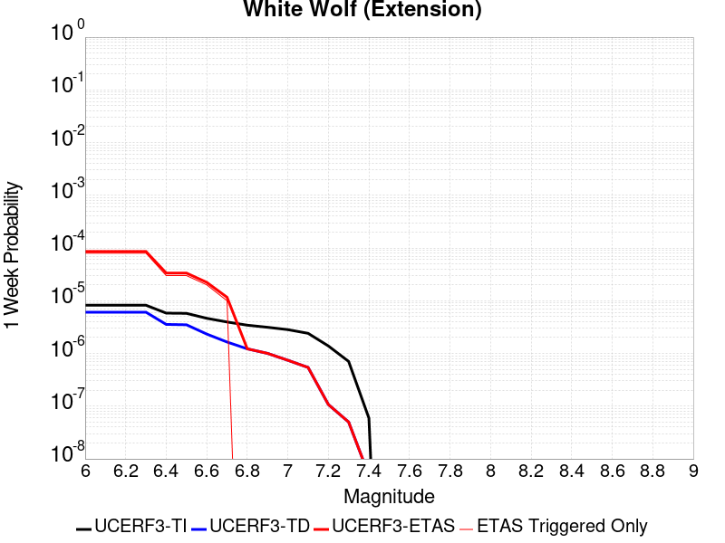 |  | 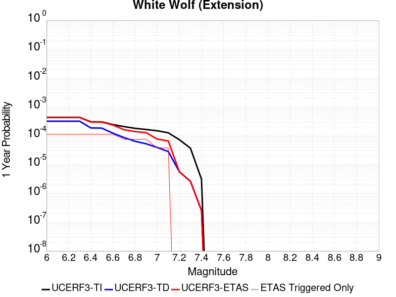 | 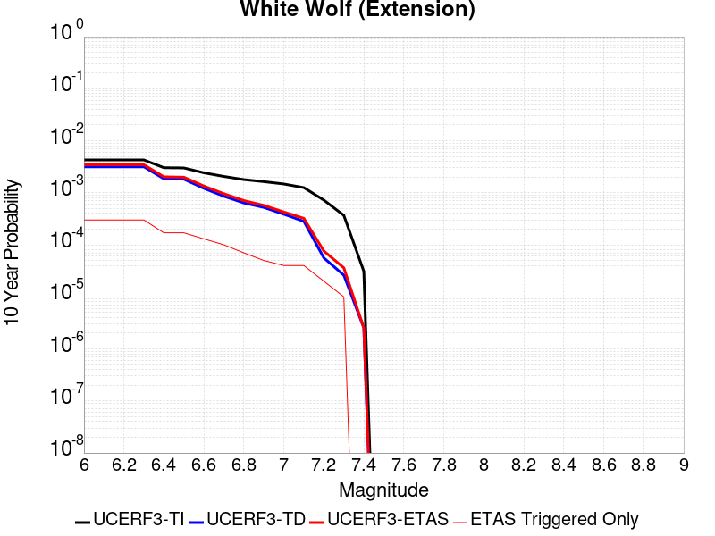 |

| Magnitude | 1 wk TI Prob | 1 wk TD Prob | 1 wk ETAS Prob | 1 wk ETAS/TD Gain | 1 wk ETAS Triggered Only | 1 mo TI Prob | 1 mo TD Prob | 1 mo ETAS Prob | 1 mo ETAS/TD Gain | 1 mo ETAS Triggered Only | 1 yr TI Prob | 1 yr TD Prob | 1 yr ETAS Prob | 1 yr ETAS/TD Gain | 1 yr ETAS Triggered Only | 10 yr TI Prob | 10 yr TD Prob | 10 yr ETAS Prob | 10 yr ETAS/TD Gain | 10 yr ETAS Triggered Only |
|-----|-----|-----|-----|-----|-----|-----|-----|-----|-----|-----|-----|-----|-----|-----|-----|-----|-----|-----|-----|-----|
| 6.0 | 8.222555E-6 | 6.0666657E-6 | 4.8594262E-5 | 8.010045 | 4.2527856E-5 | 3.5239045E-5 | 2.5999774E-5 | 1.5358003E-4 | 5.9069753 | 1.2758357E-4 | 4.289509E-4 | 3.1650788E-4 | 4.4405108E-4 | 1.40297 | 1.2758357E-4 | 0.0042812387 | 0.003161223 | 0.0033307967 | 1.0536418 | 1.7011142E-4 |
| 6.1 | 8.222555E-6 | 6.0666657E-6 | 4.8594262E-5 | 8.010045 | 4.2527856E-5 | 3.5239045E-5 | 2.5999774E-5 | 1.5358003E-4 | 5.9069753 | 1.2758357E-4 | 4.289509E-4 | 3.1650788E-4 | 4.4405108E-4 | 1.40297 | 1.2758357E-4 | 0.0042812387 | 0.003161223 | 0.0033307967 | 1.0536418 | 1.7011142E-4 |
| 6.2 | 8.222555E-6 | 6.0666657E-6 | 4.8594262E-5 | 8.010045 | 4.2527856E-5 | 3.5239045E-5 | 2.5999774E-5 | 1.5358003E-4 | 5.9069753 | 1.2758357E-4 | 4.289509E-4 | 3.1650788E-4 | 4.4405108E-4 | 1.40297 | 1.2758357E-4 | 0.0042812387 | 0.003161223 | 0.0033307967 | 1.0536418 | 1.7011142E-4 |
| 6.3 | 8.222555E-6 | 6.0666657E-6 | 4.8594262E-5 | 8.010045 | 4.2527856E-5 | 3.5239045E-5 | 2.5999774E-5 | 1.5358003E-4 | 5.9069753 | 1.2758357E-4 | 4.289509E-4 | 3.1650788E-4 | 4.4405108E-4 | 1.40297 | 1.2758357E-4 | 0.0042812387 | 0.003161223 | 0.0033307967 | 1.0536418 | 1.7011142E-4 |
| 6.4 | 5.821773E-6 | 3.5571766E-6 | 4.6084882E-5 | 12.955466 | 4.2527856E-5 | 2.4950215E-5 | 1.5244959E-5 | 1.4282658E-4 | 9.368774 | 1.2758357E-4 | 3.0372653E-4 | 1.8559267E-4 | 3.1315256E-4 | 1.687311 | 1.2758357E-4 | 0.0030331176 | 0.001854485 | 0.002024281 | 1.0915596 | 1.7011142E-4 |
| 6.5 | 5.766023E-6 | 3.4991106E-6 | 4.6026817E-5 | 13.153862 | 4.2527856E-5 | 2.4711293E-5 | 1.4996108E-5 | 1.4257776E-4 | 9.507651 | 1.2758357E-4 | 3.0081844E-4 | 1.8256342E-4 | 3.101237E-4 | 1.6987176 | 1.2758357E-4 | 0.0030041158 | 0.0018242426 | 0.0019940436 | 1.0930803 | 1.7011142E-4 |
| 6.6 | 4.643576E-6 | 2.332624E-6 | 4.4860382E-5 | 19.231724 | 4.2527856E-5 | 1.9900888E-5 | 9.996925E-6 | 1.3757922E-4 | 13.762155 | 1.2758357E-4 | 2.4226638E-4 | 1.2170619E-4 | 2.4927422E-4 | 2.048164 | 1.2758357E-4 | 0.0024200242 | 0.0012164378 | 0.0013863422 | 1.1396738 | 1.7011142E-4 |
| 6.7 | 3.9529173E-6 | 1.6483477E-6 | 1.6483477E-6 | 1.0 | 0.0 | 1.6940963E-5 | 7.0643296E-6 | 9.211944E-5 | 13.040083 | 8.505571E-5 | 2.0623671E-4 | 8.6005006E-5 | 1.710534E-4 | 1.9888773 | 8.505571E-5 | 0.002060454 | 8.597357E-4 | 9.447183E-4 | 1.0988474 | 8.505571E-5 |
| 6.8 | 3.4377522E-6 | 1.2245237E-6 | 1.2245237E-6 | 1.0 | 0.0 | 1.473314E-5 | 5.2479486E-6 | 9.030321E-5 | 17.207336 | 8.505571E-5 | 1.7936122E-4 | 6.3891996E-5 | 1.4894227E-4 | 2.331157 | 8.505571E-5 | 0.0017921652 | 6.387454E-4 | 7.237467E-4 | 1.1330756 | 8.505571E-5 |
| 6.9 | 3.1367306E-6 | 1.0033783E-6 | 1.0033783E-6 | 1.0 | 0.0 | 1.3443062E-5 | 4.3001864E-6 | 8.935553E-5 | 20.779457 | 8.505571E-5 | 1.63657E-4 | 5.235359E-5 | 1.3740484E-4 | 2.6245546 | 8.505571E-5 | 0.0016353652 | 5.2342017E-4 | 6.0843135E-4 | 1.1624148 | 8.505571E-5 |
| 7.0 | 2.8298145E-6 | 7.4286646E-7 | 7.4286646E-7 | 1.0 | 0.0 | 1.2127721E-5 | 3.1837099E-6 | 4.571143E-5 | 14.357913 | 4.2527856E-5 | 1.47645E-4 | 3.8761027E-5 | 8.128724E-5 | 2.0971382 | 4.2527856E-5 | 0.0014754693 | 3.8754768E-4 | 4.3005904E-4 | 1.1096933 | 4.2527856E-5 |
| 7.1 | 2.4091064E-6 | 5.4227525E-7 | 5.4227525E-7 | 1.0 | 0.0 | 1.03247E-5 | 2.3240348E-6 | 4.4851793E-5 | 19.299105 | 4.2527856E-5 | 1.2569598E-4 | 2.8294799E-5 | 7.082145E-5 | 2.5029848 | 4.2527856E-5 | 0.001256249 | 2.8291598E-4 | 3.254318E-4 | 1.1502773 | 4.2527856E-5 |
| 7.2 | 1.3875518E-6 | 1.0743063E-7 | 1.0743063E-7 | 1.0 | 0.0 | 5.9466374E-6 | 4.6041689E-7 | 4.6041689E-7 | 1.0 | 0.0 | 7.23979E-5 | 5.6055624E-6 | 5.6055624E-6 | 1.0 | 0.0 | 7.2374323E-4 | 5.6054323E-5 | 5.6054323E-5 | 1.0 | 0.0 |
| 7.3 | 7.056077E-7 | 5.002034E-8 | 5.002034E-8 | 1.0 | 0.0 | 3.0240296E-6 | 2.1437286E-7 | 2.1437286E-7 | 1.0 | 0.0 | 3.681694E-5 | 2.609987E-6 | 2.609987E-6 | 1.0 | 0.0 | 3.681084E-4 | 2.609961E-5 | 2.609961E-5 | 1.0 | 0.0 |
| 7.4 | 5.9334678E-8 | 4.8683537E-9 | 4.8683537E-9 | 1.0 | 0.0 | 2.5429145E-7 | 2.0864372E-8 | 2.0864372E-8 | 1.0 | 0.0 | 3.095994E-6 | 2.5402372E-7 | 2.5402372E-7 | 1.0 | 0.0 | 3.095951E-5 | 2.5402353E-6 | 2.5402353E-6 | 1.0 | 0.0 |

## San Clemente
*[(top)](#table-of-contents)*

| 1 Week | 1 Month | 1 Year | 10 Year |
|-----|-----|-----|-----|
| 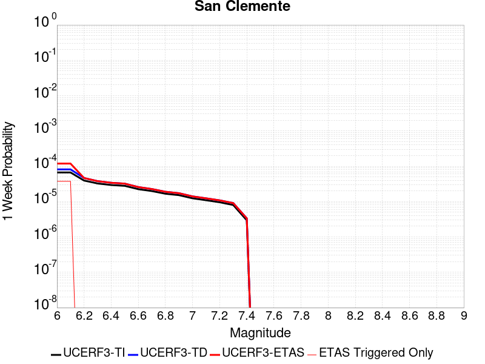 | 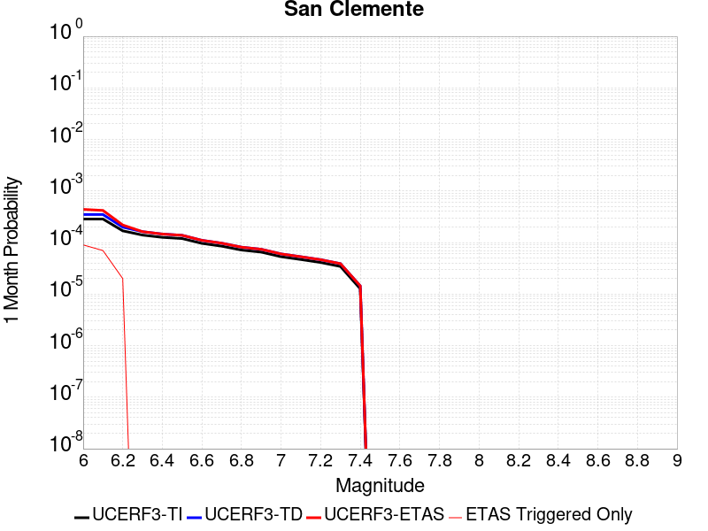 | 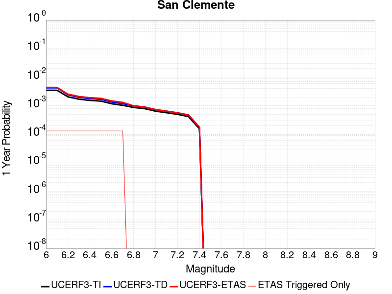 | 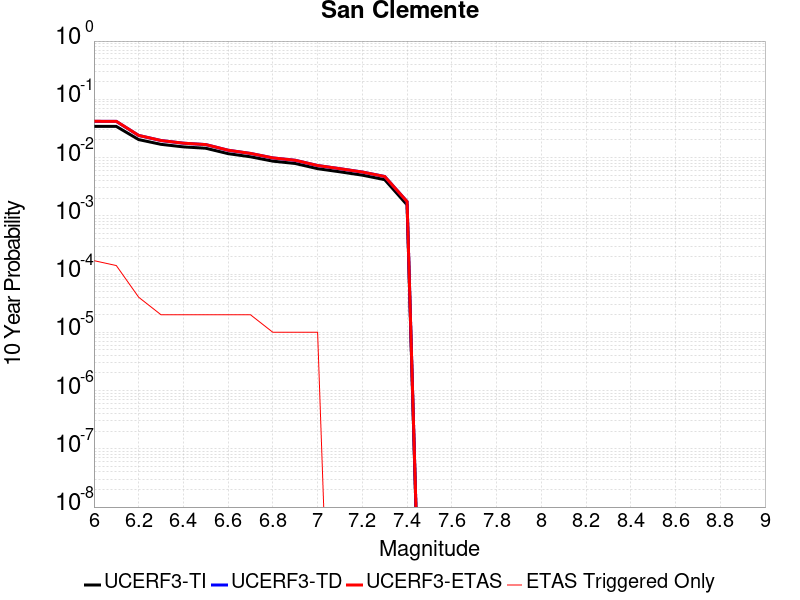 |

| Magnitude | 1 wk TI Prob | 1 wk TD Prob | 1 wk ETAS Prob | 1 wk ETAS/TD Gain | 1 wk ETAS Triggered Only | 1 mo TI Prob | 1 mo TD Prob | 1 mo ETAS Prob | 1 mo ETAS/TD Gain | 1 mo ETAS Triggered Only | 1 yr TI Prob | 1 yr TD Prob | 1 yr ETAS Prob | 1 yr ETAS/TD Gain | 1 yr ETAS Triggered Only | 10 yr TI Prob | 10 yr TD Prob | 10 yr ETAS Prob | 10 yr ETAS/TD Gain | 10 yr ETAS Triggered Only |
|-----|-----|-----|-----|-----|-----|-----|-----|-----|-----|-----|-----|-----|-----|-----|-----|-----|-----|-----|-----|-----|
| 6.0 | 6.681379E-5 | 8.163422E-5 | 1.2415861E-4 | 1.5209137 | 4.2527856E-5 | 2.8631336E-4 | 3.498173E-4 | 3.923303E-4 | 1.1215291 | 4.2527856E-5 | 0.003480294 | 0.0042512873 | 0.0043783286 | 1.029883 | 1.2758357E-4 | 0.03426291 | 0.041755714 | 0.04191872 | 1.0039039 | 1.7011142E-4 |
| 6.1 | 6.681379E-5 | 8.163422E-5 | 1.2415861E-4 | 1.5209137 | 4.2527856E-5 | 2.8631336E-4 | 3.498173E-4 | 3.923303E-4 | 1.1215291 | 4.2527856E-5 | 0.003480294 | 0.0042512873 | 0.0043783286 | 1.029883 | 1.2758357E-4 | 0.03426291 | 0.041755714 | 0.04187797 | 1.0029279 | 1.2758357E-4 |
| 6.2 | 3.9400576E-5 | 4.6451984E-5 | 4.6451984E-5 | 1.0 | 0.0 | 1.6884868E-4 | 1.9906509E-4 | 1.9906509E-4 | 1.0 | 0.0 | 0.0020537945 | 0.002420985 | 0.0025058347 | 1.0350477 | 8.505571E-5 | 0.020349167 | 0.02395286 | 0.024035878 | 1.0034659 | 8.505571E-5 |
| 6.3 | 3.2590255E-5 | 3.7929087E-5 | 3.7929087E-5 | 1.0 | 0.0 | 1.3966505E-4 | 1.6254328E-4 | 1.6254328E-4 | 1.0 | 0.0 | 0.0016990956 | 0.0019771985 | 0.002062086 | 1.0429332 | 8.505571E-5 | 0.01686163 | 0.019599866 | 0.019683255 | 1.0042546 | 8.505571E-5 |
| 6.4 | 2.9454652E-5 | 3.4097775E-5 | 3.4097775E-5 | 1.0 | 0.0 | 1.2622811E-4 | 1.4612528E-4 | 1.4612528E-4 | 1.0 | 0.0 | 0.0015357438 | 0.0017776482 | 0.0018625527 | 1.0477623 | 8.505571E-5 | 0.015251739 | 0.017637458 | 0.017721012 | 1.0047374 | 8.505571E-5 |
| 6.5 | 2.790836E-5 | 3.2247463E-5 | 3.2247463E-5 | 1.0 | 0.0 | 1.1960178E-4 | 1.3819622E-4 | 1.3819622E-4 | 1.0 | 0.0 | 0.001455179 | 0.0016812651 | 0.0017661778 | 1.0505053 | 8.505571E-5 | 0.014456868 | 0.016688475 | 0.016772112 | 1.0050116 | 8.505571E-5 |
| 6.6 | 2.2492153E-5 | 2.5762707E-5 | 2.5762707E-5 | 1.0 | 0.0 | 9.639138E-5 | 1.1040701E-4 | 1.1040701E-4 | 1.0 | 0.0 | 0.0011729331 | 0.0013433908 | 0.0014283323 | 1.0632291 | 8.505571E-5 | 0.011667615 | 0.013354415 | 0.013438335 | 1.006284 | 8.505571E-5 |
| 6.7 | 1.9862755E-5 | 2.2666423E-5 | 2.2666423E-5 | 1.0 | 0.0 | 8.512331E-5 | 9.713826E-5 | 9.713826E-5 | 1.0 | 0.0 | 0.0010358836 | 0.0011820279 | 0.0012669831 | 1.0718724 | 8.505571E-5 | 0.010310682 | 0.011758701 | 0.0118427565 | 1.0071484 | 8.505571E-5 |
| 6.8 | 1.6697575E-5 | 1.897771E-5 | 1.897771E-5 | 1.0 | 0.0 | 7.155907E-5 | 8.133056E-5 | 8.133056E-5 | 1.0 | 0.0 | 8.7088346E-4 | 9.897591E-4 | 0.0010322449 | 1.0429254 | 4.2527856E-5 | 0.008674784 | 0.0098545365 | 0.009896645 | 1.004273 | 4.2527856E-5 |
| 6.9 | 1.5218415E-5 | 1.72694E-5 | 1.72694E-5 | 1.0 | 0.0 | 6.522015E-5 | 7.4009666E-5 | 7.4009666E-5 | 1.0 | 0.0 | 7.93766E-4 | 9.00704E-4 | 9.4319356E-4 | 1.0471737 | 4.2527856E-5 | 0.007909367 | 0.008971481 | 0.009013627 | 1.0046978 | 4.2527856E-5 |
| 7.0 | 1.2392958E-5 | 1.4033016E-5 | 1.4033016E-5 | 1.0 | 0.0 | 5.3111595E-5 | 6.014015E-5 | 6.014015E-5 | 1.0 | 0.0 | 6.4644177E-4 | 7.319679E-4 | 7.744647E-4 | 1.0580581 | 4.2527856E-5 | 0.0064456454 | 0.0072963564 | 0.007338574 | 1.0057861 | 4.2527856E-5 |
| 7.1 | 1.0934128E-5 | 1.2375138E-5 | 1.2375138E-5 | 1.0 | 0.0 | 4.6859706E-5 | 5.303527E-5 | 5.303527E-5 | 1.0 | 0.0 | 5.7036756E-4 | 6.455204E-4 | 6.455204E-4 | 1.0 | 0.0 | 0.0056890585 | 0.0064371997 | 0.0064371997 | 1.0 | 0.0 |
| 7.2 | 9.5798805E-6 | 1.0844935E-5 | 1.0844935E-5 | 1.0 | 0.0 | 4.1055984E-5 | 4.6477508E-5 | 4.6477508E-5 | 1.0 | 0.0 | 4.9974193E-4 | 5.657239E-4 | 5.657239E-4 | 1.0 | 0.0 | 0.0049861963 | 0.0056435615 | 0.0056435615 | 1.0 | 0.0 |
| 7.3 | 8.0167365E-6 | 9.083918E-6 | 9.083918E-6 | 1.0 | 0.0 | 3.4356988E-5 | 3.8930535E-5 | 3.8930535E-5 | 1.0 | 0.0 | 4.1821605E-4 | 4.7388324E-4 | 4.7388324E-4 | 1.0 | 0.0 | 0.0041742986 | 0.0047294297 | 0.0047294297 | 1.0 | 0.0 |
| 7.4 | 2.9581017E-6 | 3.3623792E-6 | 3.3623792E-6 | 1.0 | 0.0 | 1.2677518E-5 | 1.4410146E-5 | 1.4410146E-5 | 1.0 | 0.0 | 1.5433785E-4 | 1.7543444E-4 | 1.7543444E-4 | 1.0 | 0.0 | 0.001542307 | 0.0017534546 | 0.0017534546 | 1.0 | 0.0 |

## Red Mountain
*[(top)](#table-of-contents)*

| 1 Week | 1 Month | 1 Year | 10 Year |
|-----|-----|-----|-----|
| 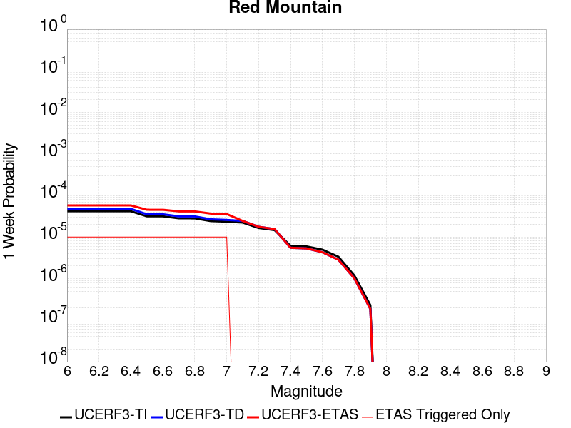 | 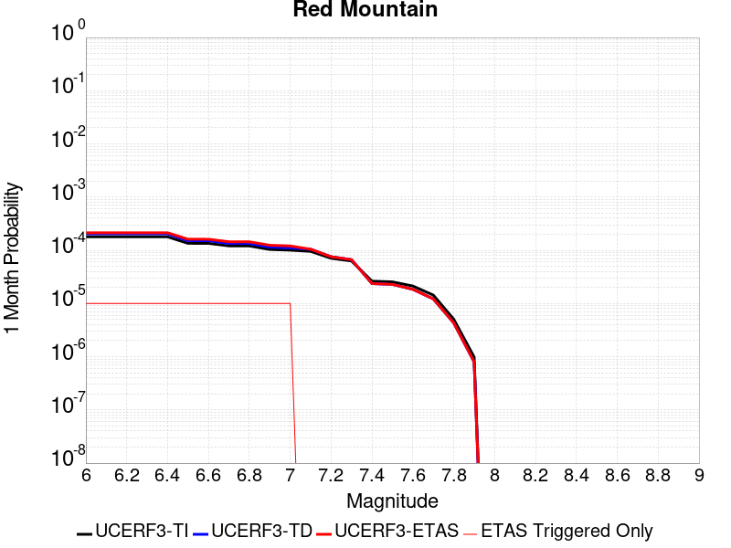 | 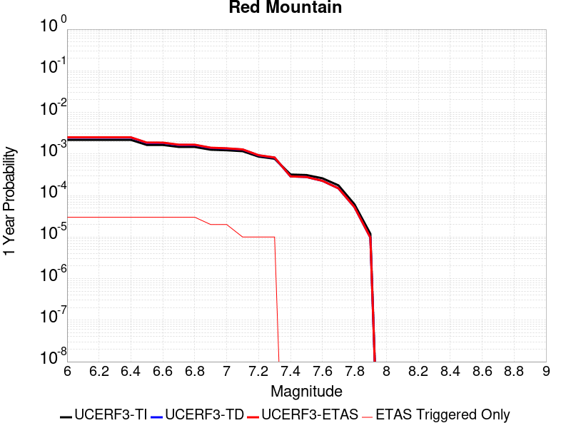 | 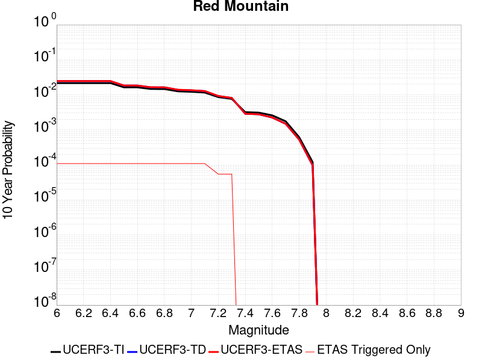 |

| Magnitude | 1 wk TI Prob | 1 wk TD Prob | 1 wk ETAS Prob | 1 wk ETAS/TD Gain | 1 wk ETAS Triggered Only | 1 mo TI Prob | 1 mo TD Prob | 1 mo ETAS Prob | 1 mo ETAS/TD Gain | 1 mo ETAS Triggered Only | 1 yr TI Prob | 1 yr TD Prob | 1 yr ETAS Prob | 1 yr ETAS/TD Gain | 1 yr ETAS Triggered Only | 10 yr TI Prob | 10 yr TD Prob | 10 yr ETAS Prob | 10 yr ETAS/TD Gain | 10 yr ETAS Triggered Only |
|-----|-----|-----|-----|-----|-----|-----|-----|-----|-----|-----|-----|-----|-----|-----|-----|-----|-----|-----|-----|-----|
| 6.0 | 4.1810763E-5 | 4.7589947E-5 | 4.7589947E-5 | 1.0 | 0.0 | 1.7917668E-4 | 2.039419E-4 | 2.039419E-4 | 1.0 | 0.0 | 0.0021792934 | 0.0024803306 | 0.0024803306 | 1.0 | 0.0 | 0.021580452 | 0.024544092 | 0.024668545 | 1.0050706 | 1.2758357E-4 |
| 6.1 | 4.1810763E-5 | 4.7589947E-5 | 4.7589947E-5 | 1.0 | 0.0 | 1.7917668E-4 | 2.039419E-4 | 2.039419E-4 | 1.0 | 0.0 | 0.0021792934 | 0.0024803306 | 0.0024803306 | 1.0 | 0.0 | 0.021580452 | 0.024544092 | 0.024668545 | 1.0050706 | 1.2758357E-4 |
| 6.2 | 4.1810763E-5 | 4.7589947E-5 | 4.7589947E-5 | 1.0 | 0.0 | 1.7917668E-4 | 2.039419E-4 | 2.039419E-4 | 1.0 | 0.0 | 0.0021792934 | 0.0024803306 | 0.0024803306 | 1.0 | 0.0 | 0.021580452 | 0.024544092 | 0.024668545 | 1.0050706 | 1.2758357E-4 |
| 6.3 | 4.1810763E-5 | 4.7589947E-5 | 4.7589947E-5 | 1.0 | 0.0 | 1.7917668E-4 | 2.039419E-4 | 2.039419E-4 | 1.0 | 0.0 | 0.0021792934 | 0.0024803306 | 0.0024803306 | 1.0 | 0.0 | 0.021580452 | 0.024544092 | 0.024668545 | 1.0050706 | 1.2758357E-4 |
| 6.4 | 4.1810763E-5 | 4.7589947E-5 | 4.7589947E-5 | 1.0 | 0.0 | 1.7917668E-4 | 2.039419E-4 | 2.039419E-4 | 1.0 | 0.0 | 0.0021792934 | 0.0024803306 | 0.0024803306 | 1.0 | 0.0 | 0.021580452 | 0.024544092 | 0.024668545 | 1.0050706 | 1.2758357E-4 |
| 6.5 | 3.154503E-5 | 3.5359728E-5 | 3.5359728E-5 | 1.0 | 0.0 | 1.3518598E-4 | 1.5153342E-4 | 1.5153342E-4 | 1.0 | 0.0 | 0.0016446467 | 0.0018434501 | 0.0018434501 | 1.0 | 0.0 | 0.01632528 | 0.018291233 | 0.018416483 | 1.0068475 | 1.2758357E-4 |
| 6.6 | 3.1535834E-5 | 3.534911E-5 | 3.534911E-5 | 1.0 | 0.0 | 1.3514658E-4 | 1.5148791E-4 | 1.5148791E-4 | 1.0 | 0.0 | 0.0016441676 | 0.001842897 | 0.001842897 | 1.0 | 0.0 | 0.01632056 | 0.018285794 | 0.018411046 | 1.0068496 | 1.2758357E-4 |
| 6.7 | 2.8267326E-5 | 3.146934E-5 | 3.146934E-5 | 1.0 | 0.0 | 1.2114006E-4 | 1.348621E-4 | 1.348621E-4 | 1.0 | 0.0 | 0.0014738824 | 0.0016407946 | 0.0016407946 | 1.0 | 0.0 | 0.014641452 | 0.016295563 | 0.016421068 | 1.0077018 | 1.2758357E-4 |
| 6.8 | 2.8212884E-5 | 3.1407224E-5 | 3.1407224E-5 | 1.0 | 0.0 | 1.20906756E-4 | 1.3459593E-4 | 1.3459593E-4 | 1.0 | 0.0 | 0.0014710457 | 0.0016375587 | 0.0016375587 | 1.0 | 0.0 | 0.014613459 | 0.01626368 | 0.016389187 | 1.0077171 | 1.2758357E-4 |
| 6.9 | 2.4227871E-5 | 2.6706979E-5 | 2.6706979E-5 | 1.0 | 0.0 | 1.03829596E-4 | 1.14453884E-4 | 1.14453884E-4 | 1.0 | 0.0 | 0.0012633923 | 0.0013926612 | 0.0013926612 | 1.0 | 0.0 | 0.012562336 | 0.013847026 | 0.013972843 | 1.0090863 | 1.2758357E-4 |
| 7.0 | 2.348524E-5 | 2.5835763E-5 | 2.5835763E-5 | 1.0 | 0.0 | 1.0064714E-4 | 1.1072042E-4 | 1.1072042E-4 | 1.0 | 0.0 | 0.0012246901 | 0.0013472632 | 0.0013472632 | 1.0 | 0.0 | 0.012179627 | 0.01339859 | 0.013524463 | 1.0093945 | 1.2758357E-4 |
| 7.1 | 2.2311642E-5 | 2.4462828E-5 | 2.4462828E-5 | 1.0 | 0.0 | 9.561782E-5 | 1.048369E-4 | 1.048369E-4 | 1.0 | 0.0 | 0.0011635252 | 0.0012757168 | 0.0012757168 | 1.0 | 0.0 | 0.01157452 | 0.012691451 | 0.012817415 | 1.0099251 | 1.2758357E-4 |
| 7.2 | 1.6533986E-5 | 1.7670347E-5 | 1.7670347E-5 | 1.0 | 0.0 | 7.085802E-5 | 7.572822E-5 | 7.572822E-5 | 1.0 | 0.0 | 8.623549E-4 | 9.216645E-4 | 9.216645E-4 | 1.0 | 0.0 | 0.008590161 | 0.009184699 | 0.009268973 | 1.0091755 | 8.505571E-5 |
| 7.3 | 1.4703092E-5 | 1.555952E-5 | 1.555952E-5 | 1.0 | 0.0 | 6.301173E-5 | 6.66823E-5 | 6.66823E-5 | 1.0 | 0.0 | 7.668978E-4 | 8.1161625E-4 | 8.1161625E-4 | 1.0 | 0.0 | 0.0076425658 | 0.008092596 | 0.008176963 | 1.0104252 | 8.505571E-5 |
| 7.4 | 6.1331984E-6 | 5.528872E-6 | 5.528872E-6 | 1.0 | 0.0 | 2.6284872E-5 | 2.3694953E-5 | 2.3694953E-5 | 1.0 | 0.0 | 3.199713E-4 | 2.8844838E-4 | 2.8844838E-4 | 1.0 | 0.0 | 0.0031951098 | 0.0028807942 | 0.0029231997 | 1.01472 | 4.2527856E-5 |
| 7.5 | 5.954766E-6 | 5.3385015E-6 | 5.3385015E-6 | 1.0 | 0.0 | 2.5520176E-5 | 2.2879094E-5 | 2.2879094E-5 | 1.0 | 0.0 | 3.1066386E-4 | 2.785179E-4 | 2.785179E-4 | 1.0 | 0.0 | 0.003102299 | 0.0027817423 | 0.002824152 | 1.0152457 | 4.2527856E-5 |
| 7.6 | 4.9726646E-6 | 4.315295E-6 | 4.315295E-6 | 1.0 | 0.0 | 2.1311245E-5 | 1.8493993E-5 | 1.8493993E-5 | 1.0 | 0.0 | 2.5943352E-4 | 2.2514143E-4 | 2.2514143E-4 | 1.0 | 0.0 | 0.0025913084 | 0.002249168 | 0.0022916002 | 1.0188657 | 4.2527856E-5 |
| 7.7 | 3.3613894E-6 | 2.8526642E-6 | 2.8526642E-6 | 1.0 | 0.0 | 1.4405875E-5 | 1.2225649E-5 | 1.2225649E-5 | 1.0 | 0.0 | 1.7537741E-4 | 1.4883737E-4 | 1.4883737E-4 | 1.0 | 0.0 | 0.0017523908 | 0.0014874031 | 0.0015298678 | 1.0285494 | 4.2527856E-5 |
| 7.8 | 1.1828961E-6 | 1.0122756E-6 | 1.0122756E-6 | 1.0 | 0.0 | 5.069545E-6 | 4.338317E-6 | 4.338317E-6 | 1.0 | 0.0 | 6.171996E-5 | 5.281776E-5 | 5.281776E-5 | 1.0 | 0.0 | 6.170282E-4 | 5.2805495E-4 | 5.705604E-4 | 1.0804943 | 4.2527856E-5 |
| 7.9 | 2.2967266E-7 | 1.8618952E-7 | 1.8618952E-7 | 1.0 | 0.0 | 9.843111E-7 | 7.9795484E-7 | 7.9795484E-7 | 1.0 | 0.0 | 1.19839215E-5 | 9.7150605E-6 | 9.7150605E-6 | 1.0 | 0.0 | 1.1983275E-4 | 9.714664E-5 | 9.714664E-5 | 1.0 | 0.0 |

## San Andreas (North Branch Mill Creek)
*[(top)](#table-of-contents)*

| 1 Week | 1 Month | 1 Year | 10 Year |
|-----|-----|-----|-----|
| 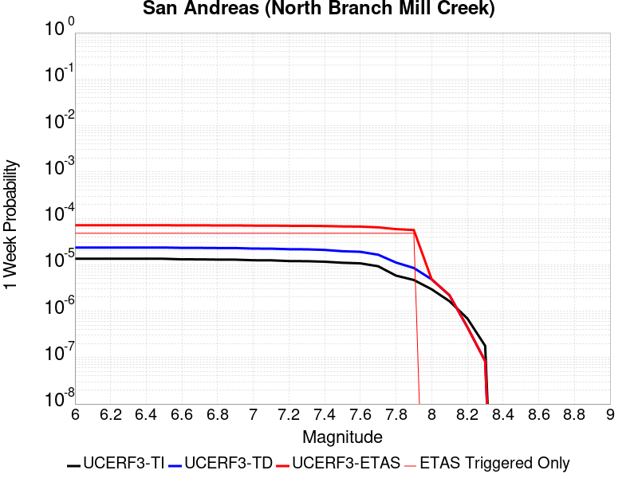 |  | 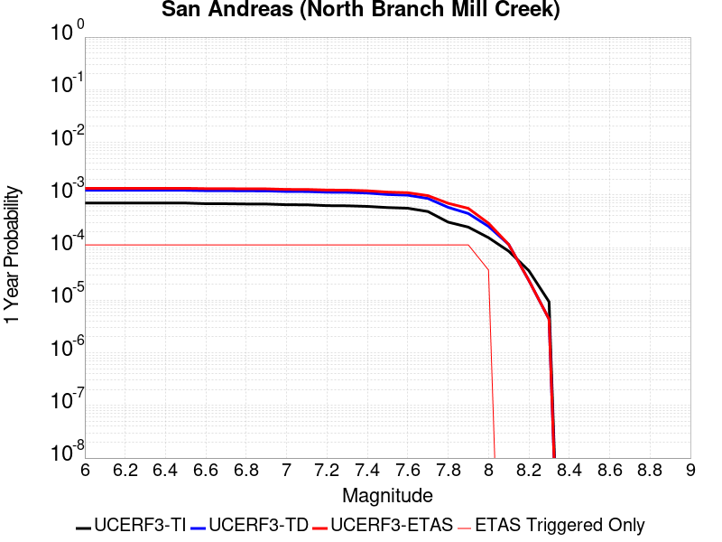 | 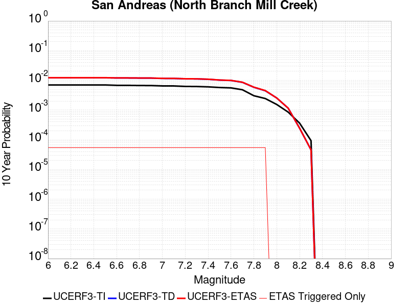 |

| Magnitude | 1 wk TI Prob | 1 wk TD Prob | 1 wk ETAS Prob | 1 wk ETAS/TD Gain | 1 wk ETAS Triggered Only | 1 mo TI Prob | 1 mo TD Prob | 1 mo ETAS Prob | 1 mo ETAS/TD Gain | 1 mo ETAS Triggered Only | 1 yr TI Prob | 1 yr TD Prob | 1 yr ETAS Prob | 1 yr ETAS/TD Gain | 1 yr ETAS Triggered Only | 10 yr TI Prob | 10 yr TD Prob | 10 yr ETAS Prob | 10 yr ETAS/TD Gain | 10 yr ETAS Triggered Only |
|-----|-----|-----|-----|-----|-----|-----|-----|-----|-----|-----|-----|-----|-----|-----|-----|-----|-----|-----|-----|-----|
| 6.0 | 1.3461156E-5 | 2.3499893E-5 | 1.08553606E-4 | 4.6193233 | 8.505571E-5 | 5.7689394E-5 | 1.00709956E-4 | 2.2828068E-4 | 2.266714 | 1.2758357E-4 | 7.02142E-4 | 0.0012254574 | 0.0013528846 | 1.1039834 | 1.2758357E-4 | 0.0069992766 | 0.01222957 | 0.012397601 | 1.0137397 | 1.7011142E-4 |
| 6.1 | 1.3461156E-5 | 2.3499893E-5 | 1.08553606E-4 | 4.6193233 | 8.505571E-5 | 5.7689394E-5 | 1.00709956E-4 | 2.2828068E-4 | 2.266714 | 1.2758357E-4 | 7.02142E-4 | 0.0012254574 | 0.0013528846 | 1.1039834 | 1.2758357E-4 | 0.0069992766 | 0.01222957 | 0.012397601 | 1.0137397 | 1.7011142E-4 |
| 6.2 | 1.3461156E-5 | 2.3499893E-5 | 1.08553606E-4 | 4.6193233 | 8.505571E-5 | 5.7689394E-5 | 1.00709956E-4 | 2.2828068E-4 | 2.266714 | 1.2758357E-4 | 7.02142E-4 | 0.0012254574 | 0.0013528846 | 1.1039834 | 1.2758357E-4 | 0.0069992766 | 0.01222957 | 0.012397601 | 1.0137397 | 1.7011142E-4 |
| 6.3 | 1.3461156E-5 | 2.3499893E-5 | 1.08553606E-4 | 4.6193233 | 8.505571E-5 | 5.7689394E-5 | 1.00709956E-4 | 2.2828068E-4 | 2.266714 | 1.2758357E-4 | 7.02142E-4 | 0.0012254574 | 0.0013528846 | 1.1039834 | 1.2758357E-4 | 0.0069992766 | 0.01222957 | 0.012397601 | 1.0137397 | 1.7011142E-4 |
| 6.4 | 1.3461156E-5 | 2.3499893E-5 | 1.08553606E-4 | 4.6193233 | 8.505571E-5 | 5.7689394E-5 | 1.00709956E-4 | 2.2828068E-4 | 2.266714 | 1.2758357E-4 | 7.02142E-4 | 0.0012254574 | 0.0013528846 | 1.1039834 | 1.2758357E-4 | 0.0069992766 | 0.01222957 | 0.012397601 | 1.0137397 | 1.7011142E-4 |
| 6.5 | 1.3450706E-5 | 2.3488852E-5 | 1.0854257E-4 | 4.6210246 | 8.505571E-5 | 5.764461E-5 | 1.0066265E-4 | 2.2823337E-4 | 2.2673094 | 1.2758357E-4 | 7.0159714E-4 | 0.001224882 | 0.0013523092 | 1.1040323 | 1.2758357E-4 | 0.006993862 | 0.01222388 | 0.012391912 | 1.0137463 | 1.7011142E-4 |
| 6.6 | 1.3074523E-5 | 2.3103135E-5 | 1.08156884E-4 | 4.6814804 | 8.505571E-5 | 5.6032466E-5 | 9.9009696E-5 | 2.2658064E-4 | 2.288469 | 1.2758357E-4 | 6.8198174E-4 | 0.0012047797 | 0.0013322096 | 1.1057702 | 1.2758357E-4 | 0.006798926 | 0.012025044 | 0.012193111 | 1.0139763 | 1.7011142E-4 |
| 6.7 | 1.3050216E-5 | 2.3078432E-5 | 1.0813218E-4 | 4.6854215 | 8.505571E-5 | 5.59283E-5 | 9.890384E-5 | 2.2647479E-4 | 2.2898483 | 1.2758357E-4 | 6.8071426E-4 | 0.0012034923 | 0.0013309222 | 1.1058836 | 1.2758357E-4 | 0.0067863287 | 0.012012309 | 0.012180377 | 1.0139914 | 1.7011142E-4 |
| 6.8 | 1.29049395E-5 | 2.292684E-5 | 1.079806E-4 | 4.7097898 | 8.505571E-5 | 5.530571E-5 | 9.825421E-5 | 2.2582524E-4 | 2.2983773 | 1.2758357E-4 | 6.73139E-4 | 0.0011955918 | 0.0013230228 | 1.1065841 | 1.2758357E-4 | 0.0067110364 | 0.011934154 | 0.012102235 | 1.0140841 | 1.7011142E-4 |
| 6.9 | 1.2867369E-5 | 2.2886245E-5 | 1.0794001E-4 | 4.7163706 | 8.505571E-5 | 5.51447E-5 | 9.8080236E-5 | 2.256513E-4 | 2.3006806 | 1.2758357E-4 | 6.711799E-4 | 0.0011934759 | 0.0013209073 | 1.1067733 | 1.2758357E-4 | 0.006691564 | 0.011913223 | 0.012081308 | 1.0141091 | 1.7011142E-4 |
| 7.0 | 1.2495996E-5 | 2.2286325E-5 | 1.0734014E-4 | 4.816413 | 8.505571E-5 | 5.3553173E-5 | 9.550934E-5 | 2.2308073E-4 | 2.3356953 | 1.2758357E-4 | 6.518148E-4 | 0.0011622087 | 0.001289644 | 1.1096492 | 1.2758357E-4 | 0.0064990623 | 0.0116038285 | 0.011771966 | 1.0144898 | 1.7011142E-4 |
| 7.1 | 1.2452067E-5 | 2.2231397E-5 | 1.0728522E-4 | 4.8258424 | 8.505571E-5 | 5.3364907E-5 | 9.527396E-5 | 2.2284537E-4 | 2.3389957 | 1.2758357E-4 | 6.4952404E-4 | 0.0011593461 | 0.0012867817 | 1.1099203 | 1.2758357E-4 | 0.0064762887 | 0.0115755 | 0.011743642 | 1.0145257 | 1.7011142E-4 |
| 7.2 | 1.2002777E-5 | 2.1609963E-5 | 1.06663836E-4 | 4.935864 | 8.505571E-5 | 5.143946E-5 | 9.2610855E-5 | 2.2018261E-4 | 2.3775032 | 1.2758357E-4 | 6.2609545E-4 | 0.0011269567 | 0.0012543964 | 1.1130831 | 1.2758357E-4 | 0.006243344 | 0.011254923 | 0.01142312 | 1.0149443 | 1.7011142E-4 |
| 7.3 | 1.1923425E-5 | 2.1479793E-5 | 1.0653368E-4 | 4.9597163 | 8.505571E-5 | 5.109939E-5 | 9.205302E-5 | 2.1962484E-4 | 2.3858516 | 1.2758357E-4 | 6.219575E-4 | 0.001120172 | 0.0012476126 | 1.1137688 | 1.2758357E-4 | 0.0062021962 | 0.011187789 | 0.011355997 | 1.015035 | 1.7011142E-4 |
| 7.4 | 1.16105175E-5 | 2.0853771E-5 | 1.0590771E-4 | 5.0785875 | 8.505571E-5 | 4.975841E-5 | 8.937026E-5 | 2.1694243E-4 | 2.4274566 | 1.2758357E-4 | 6.0564023E-4 | 0.0010875424 | 0.0012149871 | 1.1171861 | 1.2758357E-4 | 0.006039923 | 0.010865397 | 0.01103366 | 1.0154861 | 1.7011142E-4 |
| 7.5 | 1.1037265E-5 | 1.9553907E-5 | 1.04607956E-4 | 5.3497214 | 8.505571E-5 | 4.7301706E-5 | 8.379978E-5 | 2.1137265E-4 | 2.5223534 | 1.2758357E-4 | 5.757461E-4 | 0.0010197869 | 0.0011472404 | 1.1249804 | 1.2758357E-4 | 0.005742567 | 0.010194898 | 0.010363275 | 1.0165159 | 1.7011142E-4 |
| 7.6 | 1.0720915E-5 | 1.899582E-5 | 1.0404991E-4 | 5.4775167 | 8.505571E-5 | 4.5945973E-5 | 8.140812E-5 | 2.089813E-4 | 2.5670817 | 1.2758357E-4 | 5.592486E-4 | 9.906954E-4 | 0.0011181525 | 1.1286542 | 1.2758357E-4 | 0.005578433 | 0.009906623 | 0.010075049 | 1.0170014 | 1.7011142E-4 |
| 7.7 | 9.276279E-6 | 1.6441649E-5 | 1.0149596E-4 | 6.1731014 | 8.505571E-5 | 3.9754876E-5 | 7.0462316E-5 | 1.980369E-4 | 2.8105364 | 1.2758357E-4 | 4.839081E-4 | 8.575427E-4 | 9.850168E-4 | 1.1486505 | 1.2758357E-4 | 0.0048285574 | 0.008586041 | 0.008754692 | 1.0196425 | 1.7011142E-4 |
| 7.8 | 5.8346777E-6 | 1.1155013E-5 | 9.620978E-5 | 8.624802 | 8.505571E-5 | 2.5005522E-5 | 4.7806327E-5 | 1.7538379E-4 | 3.6686316 | 1.2758357E-4 | 3.043997E-4 | 5.818867E-4 | 7.0939603E-4 | 1.2191309 | 1.2758357E-4 | 0.0030398308 | 0.0058469265 | 0.0060160435 | 1.0289241 | 1.7011142E-4 |
| 7.9 | 4.690204E-6 | 8.509093E-6 | 9.356408E-5 | 10.995775 | 8.505571E-5 | 2.0100719E-5 | 3.6467034E-5 | 1.6404595E-4 | 4.4984727 | 1.2758357E-4 | 2.4469878E-4 | 4.4389578E-4 | 5.7142274E-4 | 1.2872902 | 1.2758357E-4 | 0.002444295 | 0.0044707474 | 0.004640098 | 1.0378798 | 1.7011142E-4 |
| 8.0 | 2.9570454E-6 | 4.846947E-6 | 4.846947E-6 | 1.0 | 0.0 | 1.267299E-5 | 2.0772464E-5 | 6.3299434E-5 | 3.0472763 | 4.2527856E-5 | 1.5428272E-4 | 2.5287544E-4 | 2.9539253E-4 | 1.1681346 | 4.2527856E-5 | 0.0015417566 | 0.002549644 | 0.0025920635 | 1.0166374 | 4.2527856E-5 |
| 8.1 | 1.6376824E-6 | 2.1968929E-6 | 2.1968929E-6 | 1.0 | 0.0 | 7.01862E-6 | 9.41522E-6 | 9.41522E-6 | 1.0 | 0.0 | 8.544835E-5 | 1.14624294E-4 | 1.14624294E-4 | 1.0 | 0.0 | 8.54155E-4 | 0.0011606582 | 0.0011606582 | 1.0 | 0.0 |
| 8.2 | 6.9631557E-7 | 4.5360213E-7 | 4.5360213E-7 | 1.0 | 0.0 | 2.984206E-6 | 1.9440076E-6 | 1.9440076E-6 | 1.0 | 0.0 | 3.63321E-5 | 2.3668037E-5 | 2.3668037E-5 | 1.0 | 0.0 | 3.6326164E-4 | 2.451564E-4 | 2.451564E-4 | 1.0 | 0.0 |
| 8.3 | 1.7876137E-7 | 8.360375E-8 | 8.360375E-8 | 1.0 | 0.0 | 7.661199E-7 | 3.5830175E-7 | 3.5830175E-7 | 1.0 | 0.0 | 9.32747E-6 | 4.3623154E-6 | 4.3623154E-6 | 1.0 | 0.0 | 9.3270784E-5 | 4.5817014E-5 | 4.5817014E-5 | 1.0 | 0.0 |

## Rinconada 2011 CFM
*[(top)](#table-of-contents)*

| 1 Week | 1 Month | 1 Year | 10 Year |
|-----|-----|-----|-----|
| 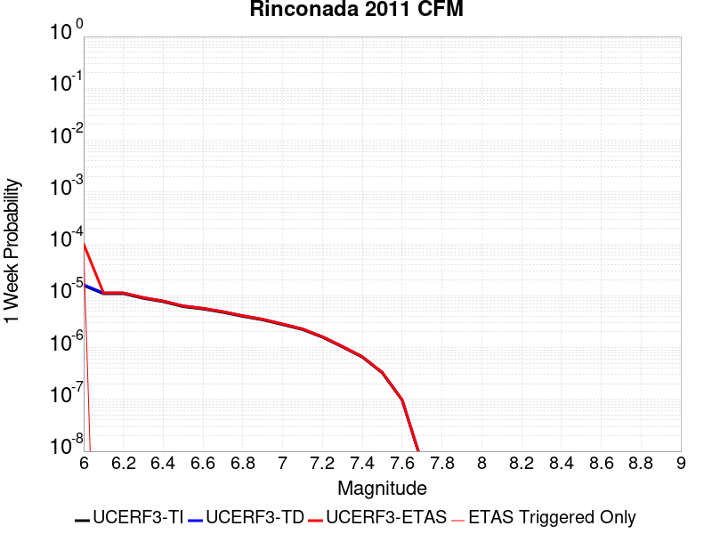 | 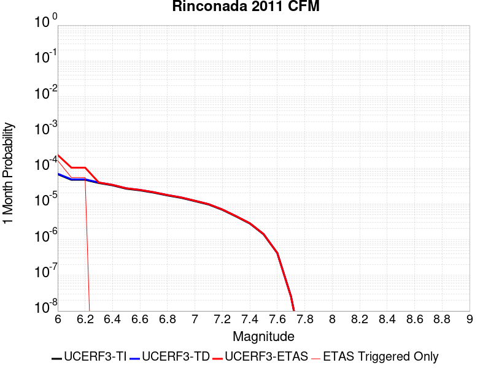 | 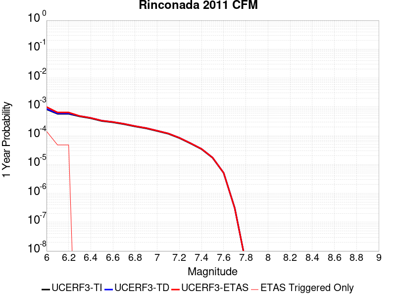 | 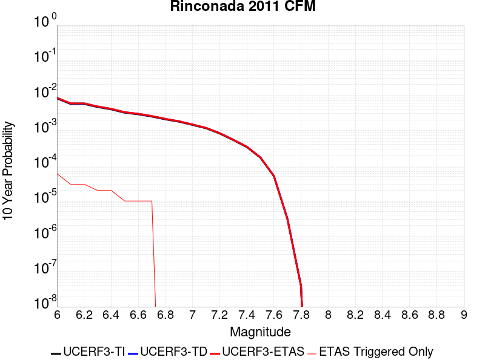 |

| Magnitude | 1 wk TI Prob | 1 wk TD Prob | 1 wk ETAS Prob | 1 wk ETAS/TD Gain | 1 wk ETAS Triggered Only | 1 mo TI Prob | 1 mo TD Prob | 1 mo ETAS Prob | 1 mo ETAS/TD Gain | 1 mo ETAS Triggered Only | 1 yr TI Prob | 1 yr TD Prob | 1 yr ETAS Prob | 1 yr ETAS/TD Gain | 1 yr ETAS Triggered Only | 10 yr TI Prob | 10 yr TD Prob | 10 yr ETAS Prob | 10 yr ETAS/TD Gain | 10 yr ETAS Triggered Only |
|-----|-----|-----|-----|-----|-----|-----|-----|-----|-----|-----|-----|-----|-----|-----|-----|-----|-----|-----|-----|-----|
| 6.0 | 1.5752368E-5 | 1.6274716E-5 | 5.8801877E-5 | 3.613082 | 4.2527856E-5 | 6.75084E-5 | 6.974694E-5 | 1.973216E-4 | 2.829108 | 1.2758357E-4 | 8.2160486E-4 | 8.488412E-4 | 9.763165E-4 | 1.1501757 | 1.2758357E-4 | 0.008185739 | 0.00845637 | 0.008625043 | 1.0199462 | 1.7011142E-4 |
| 6.1 | 1.0966133E-5 | 1.1323029E-5 | 1.1323029E-5 | 1.0 | 0.0 | 4.6996865E-5 | 4.852637E-5 | 9.105216E-5 | 1.876344 | 4.2527856E-5 | 5.720366E-4 | 5.906491E-4 | 6.3315185E-4 | 1.0719594 | 4.2527856E-5 | 0.0057056635 | 0.0058908886 | 0.0059754434 | 1.0143535 | 8.505571E-5 |
| 6.2 | 1.0966133E-5 | 1.1323029E-5 | 1.1323029E-5 | 1.0 | 0.0 | 4.6996865E-5 | 4.852637E-5 | 9.105216E-5 | 1.876344 | 4.2527856E-5 | 5.720366E-4 | 5.906491E-4 | 6.3315185E-4 | 1.0719594 | 4.2527856E-5 | 0.0057056635 | 0.0058908886 | 0.0059754434 | 1.0143535 | 8.505571E-5 |
| 6.3 | 8.926149E-6 | 9.212771E-6 | 9.212771E-6 | 1.0 | 0.0 | 3.8254362E-5 | 3.948271E-5 | 3.948271E-5 | 1.0 | 0.0 | 4.6564735E-4 | 4.805963E-4 | 4.805963E-4 | 1.0 | 0.0 | 0.0046467283 | 0.0047956146 | 0.0048379386 | 1.0088255 | 4.2527856E-5 |
| 6.4 | 7.676955E-6 | 7.920191E-6 | 7.920191E-6 | 1.0 | 0.0 | 3.290082E-5 | 3.3943234E-5 | 3.3943234E-5 | 1.0 | 0.0 | 4.0049385E-4 | 4.1318068E-4 | 4.1318068E-4 | 1.0 | 0.0 | 0.0039977287 | 0.004124151 | 0.0041665034 | 1.0102694 | 4.2527856E-5 |
| 6.5 | 6.1671026E-6 | 6.3589546E-6 | 6.3589546E-6 | 1.0 | 0.0 | 2.6430173E-5 | 2.725238E-5 | 2.725238E-5 | 1.0 | 0.0 | 3.2173982E-4 | 3.317473E-4 | 3.317473E-4 | 1.0 | 0.0 | 0.003212744 | 0.0033125326 | 0.0033549194 | 1.0127959 | 4.2527856E-5 |
| 6.6 | 5.553456E-6 | 5.7248126E-6 | 5.7248126E-6 | 1.0 | 0.0 | 2.3800309E-5 | 2.453468E-5 | 2.453468E-5 | 1.0 | 0.0 | 2.897302E-4 | 2.9866883E-4 | 2.9866883E-4 | 1.0 | 0.0 | 0.0028935277 | 0.002982683 | 0.003025084 | 1.0142157 | 4.2527856E-5 |
| 6.7 | 4.787857E-6 | 4.9333094E-6 | 4.9333094E-6 | 1.0 | 0.0 | 2.0519226E-5 | 2.1142583E-5 | 2.1142583E-5 | 1.0 | 0.0 | 2.4979294E-4 | 2.573806E-4 | 2.573806E-4 | 1.0 | 0.0 | 0.0024951235 | 0.0025708308 | 0.0026132492 | 1.0164999 | 4.2527856E-5 |
| 6.8 | 3.9955166E-6 | 4.1134763E-6 | 4.1134763E-6 | 1.0 | 0.0 | 1.7123532E-5 | 1.7629065E-5 | 1.7629065E-5 | 1.0 | 0.0 | 2.0845905E-4 | 2.1461274E-4 | 2.1461274E-4 | 1.0 | 0.0 | 0.002082636 | 0.0021440585 | 0.0021440585 | 1.0 | 0.0 |
| 6.9 | 3.4250072E-6 | 3.5224464E-6 | 3.5224464E-6 | 1.0 | 0.0 | 1.46785205E-5 | 1.5096111E-5 | 1.5096111E-5 | 1.0 | 0.0 | 1.7869633E-4 | 1.8377967E-4 | 1.8377967E-4 | 1.0 | 0.0 | 0.001785527 | 0.0018362794 | 0.0018362794 | 1.0 | 0.0 |
| 7.0 | 2.7712713E-6 | 2.8467E-6 | 2.8467E-6 | 1.0 | 0.0 | 1.1876823E-5 | 1.2200086E-5 | 1.2200086E-5 | 1.0 | 0.0 | 1.4459073E-4 | 1.4852593E-4 | 1.4852593E-4 | 1.0 | 0.0 | 0.0014449668 | 0.0014842682 | 0.0014842682 | 1.0 | 0.0 |
| 7.1 | 2.227358E-6 | 2.2856984E-6 | 2.2856984E-6 | 1.0 | 0.0 | 9.545785E-6 | 9.795814E-6 | 9.795814E-6 | 1.0 | 0.0 | 1.16213734E-4 | 1.19257515E-4 | 1.19257515E-4 | 1.0 | 0.0 | 0.0011615298 | 0.0011919362 | 0.0011919362 | 1.0 | 0.0 |
| 7.2 | 1.581796E-6 | 1.6209011E-6 | 1.6209011E-6 | 1.0 | 0.0 | 6.779108E-6 | 6.9467005E-6 | 6.9467005E-6 | 1.0 | 0.0 | 8.253252E-5 | 8.457281E-5 | 8.457281E-5 | 1.0 | 0.0 | 8.250187E-4 | 8.454067E-4 | 8.454067E-4 | 1.0 | 0.0 |
| 7.3 | 1.0306567E-6 | 1.0546477E-6 | 1.0546477E-6 | 1.0 | 0.0 | 4.4170924E-6 | 4.519911E-6 | 4.519911E-6 | 1.0 | 0.0 | 5.3776774E-5 | 5.5028526E-5 | 5.5028526E-5 | 1.0 | 0.0 | 5.376376E-4 | 5.5014924E-4 | 5.5014924E-4 | 1.0 | 0.0 |
| 7.4 | 6.535541E-7 | 6.682742E-7 | 6.682742E-7 | 1.0 | 0.0 | 2.800943E-6 | 2.864029E-6 | 2.864029E-6 | 1.0 | 0.0 | 3.4100947E-5 | 3.4868997E-5 | 3.4868997E-5 | 1.0 | 0.0 | 3.4095717E-4 | 3.4863537E-4 | 3.4863537E-4 | 1.0 | 0.0 |
| 7.5 | 3.2656962E-7 | 3.3316687E-7 | 3.3316687E-7 | 1.0 | 0.0 | 1.3995833E-6 | 1.4278572E-6 | 1.4278572E-6 | 1.0 | 0.0 | 1.7039794E-5 | 1.7384024E-5 | 1.7384024E-5 | 1.0 | 0.0 | 1.7038487E-4 | 1.7382667E-4 | 1.7382667E-4 | 1.0 | 0.0 |
| 7.6 | 9.754343E-8 | 9.82099E-8 | 9.82099E-8 | 1.0 | 0.0 | 4.180432E-7 | 4.208995E-7 | 4.208995E-7 | 1.0 | 0.0 | 5.089664E-6 | 5.1244397E-6 | 5.1244397E-6 | 1.0 | 0.0 | 5.0895473E-5 | 5.1243223E-5 | 5.1243223E-5 | 1.0 | 0.0 |
| 7.7 | 6.0001453E-9 | 5.8490435E-9 | 5.8490435E-9 | 1.0 | 0.0 | 2.5714908E-8 | 2.506733E-8 | 2.506733E-8 | 1.0 | 0.0 | 3.1307894E-7 | 3.051947E-7 | 3.051947E-7 | 1.0 | 0.0 | 3.1307852E-6 | 3.051943E-6 | 3.051943E-6 | 1.0 | 0.0 |
| 7.8 | 7.400003E-11 | 7.4654505E-11 | 7.4654505E-11 | 1.0 | 0.0 | 3.171432E-10 | 3.1994773E-10 | 3.1994773E-10 | 1.0 | 0.0 | 3.861218E-9 | 3.895363E-9 | 3.895363E-9 | 1.0 | 0.0 | 3.861218E-8 | 3.895363E-8 | 3.895363E-8 | 1.0 | 0.0 |

## Tin Mountain
*[(top)](#table-of-contents)*

| 1 Week | 1 Month | 1 Year | 10 Year |
|-----|-----|-----|-----|
| 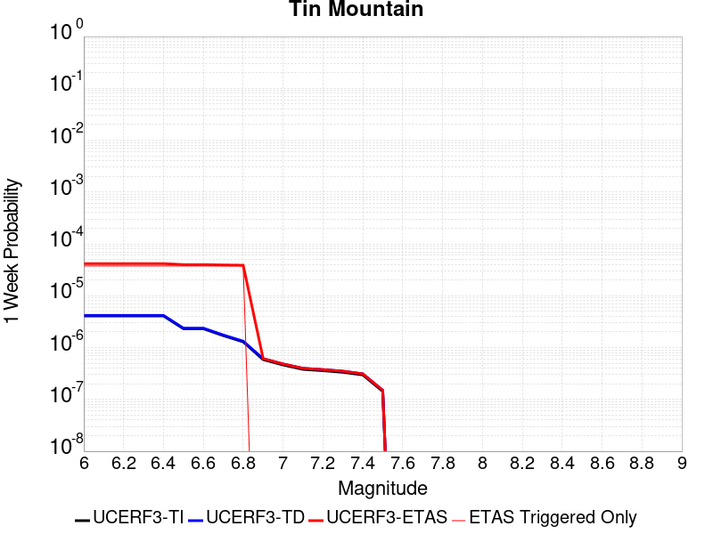 | 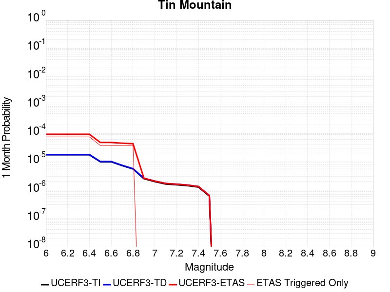 | 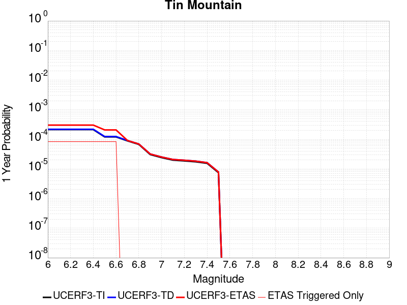 | 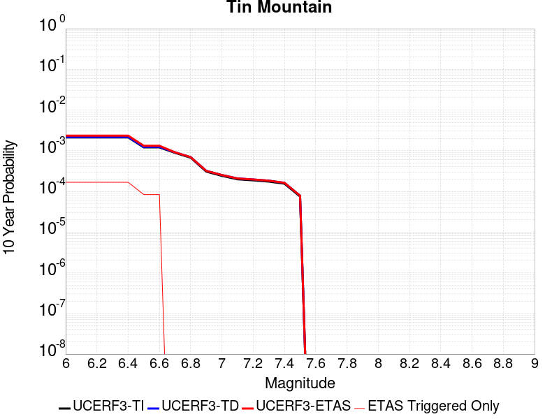 |

| Magnitude | 1 wk TI Prob | 1 wk TD Prob | 1 wk ETAS Prob | 1 wk ETAS/TD Gain | 1 wk ETAS Triggered Only | 1 mo TI Prob | 1 mo TD Prob | 1 mo ETAS Prob | 1 mo ETAS/TD Gain | 1 mo ETAS Triggered Only | 1 yr TI Prob | 1 yr TD Prob | 1 yr ETAS Prob | 1 yr ETAS/TD Gain | 1 yr ETAS Triggered Only | 10 yr TI Prob | 10 yr TD Prob | 10 yr ETAS Prob | 10 yr ETAS/TD Gain | 10 yr ETAS Triggered Only |
|-----|-----|-----|-----|-----|-----|-----|-----|-----|-----|-----|-----|-----|-----|-----|-----|-----|-----|-----|-----|-----|
| 6.0 | 4.083776E-6 | 4.1815365E-6 | 4.1815365E-6 | 1.0 | 0.0 | 1.750178E-5 | 1.792077E-5 | 6.0447863E-5 | 3.373062 | 4.2527856E-5 | 2.1306332E-4 | 2.1816725E-4 | 3.032044E-4 | 1.3897797 | 8.505571E-5 | 0.0021285915 | 0.0021798965 | 0.0023072017 | 1.0583998 | 1.2758357E-4 |
| 6.1 | 4.083776E-6 | 4.1815365E-6 | 4.1815365E-6 | 1.0 | 0.0 | 1.750178E-5 | 1.792077E-5 | 6.0447863E-5 | 3.373062 | 4.2527856E-5 | 2.1306332E-4 | 2.1816725E-4 | 3.032044E-4 | 1.3897797 | 8.505571E-5 | 0.0021285915 | 0.0021798965 | 0.0023072017 | 1.0583998 | 1.2758357E-4 |
| 6.2 | 4.083776E-6 | 4.1815365E-6 | 4.1815365E-6 | 1.0 | 0.0 | 1.750178E-5 | 1.792077E-5 | 6.0447863E-5 | 3.373062 | 4.2527856E-5 | 2.1306332E-4 | 2.1816725E-4 | 3.032044E-4 | 1.3897797 | 8.505571E-5 | 0.0021285915 | 0.0021798965 | 0.0023072017 | 1.0583998 | 1.2758357E-4 |
| 6.3 | 4.083776E-6 | 4.1815365E-6 | 4.1815365E-6 | 1.0 | 0.0 | 1.750178E-5 | 1.792077E-5 | 6.0447863E-5 | 3.373062 | 4.2527856E-5 | 2.1306332E-4 | 2.1816725E-4 | 3.032044E-4 | 1.3897797 | 8.505571E-5 | 0.0021285915 | 0.0021798965 | 0.0023072017 | 1.0583998 | 1.2758357E-4 |
| 6.4 | 4.083776E-6 | 4.1815365E-6 | 4.1815365E-6 | 1.0 | 0.0 | 1.750178E-5 | 1.792077E-5 | 6.0447863E-5 | 3.373062 | 4.2527856E-5 | 2.1306332E-4 | 2.1816725E-4 | 3.032044E-4 | 1.3897797 | 8.505571E-5 | 0.0021285915 | 0.0021798965 | 0.0023072017 | 1.0583998 | 1.2758357E-4 |
| 6.5 | 2.3143427E-6 | 2.3731573E-6 | 2.3731573E-6 | 1.0 | 0.0 | 9.9185745E-6 | 1.0170638E-5 | 1.0170638E-5 | 1.0 | 0.0 | 1.2075195E-4 | 1.2382126E-4 | 1.6634385E-4 | 1.3434192 | 4.2527856E-5 | 0.0012068636 | 0.0012375986 | 0.0012800739 | 1.0343207 | 4.2527856E-5 |
| 6.6 | 2.3143427E-6 | 2.3731573E-6 | 2.3731573E-6 | 1.0 | 0.0 | 9.9185745E-6 | 1.0170638E-5 | 1.0170638E-5 | 1.0 | 0.0 | 1.2075195E-4 | 1.2382126E-4 | 1.6634385E-4 | 1.3434192 | 4.2527856E-5 | 0.0012068636 | 0.0012375986 | 0.0012800739 | 1.0343207 | 4.2527856E-5 |
| 6.7 | 1.7029532E-6 | 1.7497915E-6 | 1.7497915E-6 | 1.0 | 0.0 | 7.2983503E-6 | 7.499088E-6 | 7.499088E-6 | 1.0 | 0.0 | 8.885379E-5 | 9.1298105E-5 | 9.1298105E-5 | 1.0 | 0.0 | 8.881827E-4 | 9.1265864E-4 | 9.1265864E-4 | 1.0 | 0.0 |
| 6.8 | 1.2914646E-6 | 1.3299378E-6 | 1.3299378E-6 | 1.0 | 0.0 | 5.534837E-6 | 5.6997237E-6 | 5.6997237E-6 | 1.0 | 0.0 | 6.738455E-5 | 6.939237E-5 | 6.939237E-5 | 1.0 | 0.0 | 6.736412E-4 | 6.9375033E-4 | 6.9375033E-4 | 1.0 | 0.0 |
| 6.9 | 5.8708974E-7 | 6.1169936E-7 | 6.1169936E-7 | 1.0 | 0.0 | 2.5160964E-6 | 2.6215664E-6 | 2.6215664E-6 | 1.0 | 0.0 | 3.0633044E-5 | 3.1917145E-5 | 3.1917145E-5 | 1.0 | 0.0 | 3.0628822E-4 | 3.191297E-4 | 3.191297E-4 | 1.0 | 0.0 |
| 7.0 | 4.6248786E-7 | 4.832015E-7 | 4.832015E-7 | 1.0 | 0.0 | 1.9820893E-6 | 2.0708624E-6 | 2.0708624E-6 | 1.0 | 0.0 | 2.413167E-5 | 2.5212494E-5 | 2.5212494E-5 | 1.0 | 0.0 | 2.412905E-4 | 2.5210003E-4 | 2.5210003E-4 | 1.0 | 0.0 |
| 7.1 | 3.804606E-7 | 3.987147E-7 | 3.987147E-7 | 1.0 | 0.0 | 1.6305444E-6 | 1.7087764E-6 | 1.7087764E-6 | 1.0 | 0.0 | 1.9851697E-5 | 2.0804187E-5 | 2.0804187E-5 | 1.0 | 0.0 | 1.9849923E-4 | 2.0802575E-4 | 2.0802575E-4 | 1.0 | 0.0 |
| 7.2 | 3.5864858E-7 | 3.7616863E-7 | 3.7616863E-7 | 1.0 | 0.0 | 1.5370645E-6 | 1.6121504E-6 | 1.6121504E-6 | 1.0 | 0.0 | 1.87136E-5 | 1.9627789E-5 | 1.9627789E-5 | 1.0 | 0.0 | 1.8712023E-4 | 1.9626386E-4 | 1.9626386E-4 | 1.0 | 0.0 |
| 7.3 | 3.342063E-7 | 3.506347E-7 | 3.506347E-7 | 1.0 | 0.0 | 1.4323119E-6 | 1.5027196E-6 | 1.5027196E-6 | 1.0 | 0.0 | 1.7438259E-5 | 1.829549E-5 | 1.829549E-5 | 1.0 | 0.0 | 1.743689E-4 | 1.8294314E-4 | 1.8294314E-4 | 1.0 | 0.0 |
| 7.4 | 2.971242E-7 | 3.1165817E-7 | 3.1165817E-7 | 1.0 | 0.0 | 1.2733886E-6 | 1.3356774E-6 | 1.3356774E-6 | 1.0 | 0.0 | 1.5503398E-5 | 1.6261785E-5 | 1.6261785E-5 | 1.0 | 0.0 | 1.5502315E-4 | 1.6260923E-4 | 1.6260923E-4 | 1.0 | 0.0 |
| 7.5 | 1.4326713E-7 | 1.5012525E-7 | 1.5012525E-7 | 1.0 | 0.0 | 6.140018E-7 | 6.433939E-7 | 6.433939E-7 | 1.0 | 0.0 | 7.4754466E-6 | 7.8333205E-6 | 7.8333205E-6 | 1.0 | 0.0 | 7.475195E-5 | 7.833321E-5 | 7.833321E-5 | 1.0 | 0.0 |

## Cleghorn Lake
*[(top)](#table-of-contents)*

| 1 Week | 1 Month | 1 Year | 10 Year |
|-----|-----|-----|-----|
| 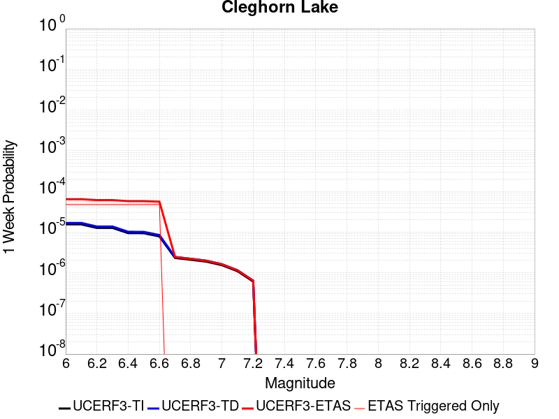 | 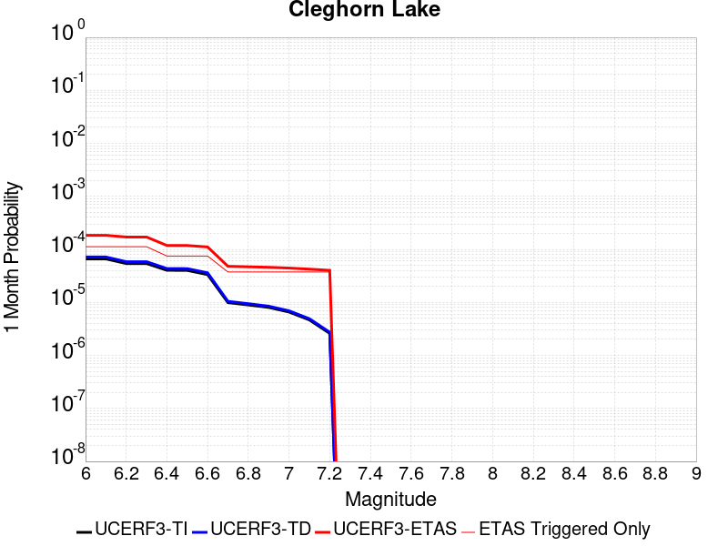 | 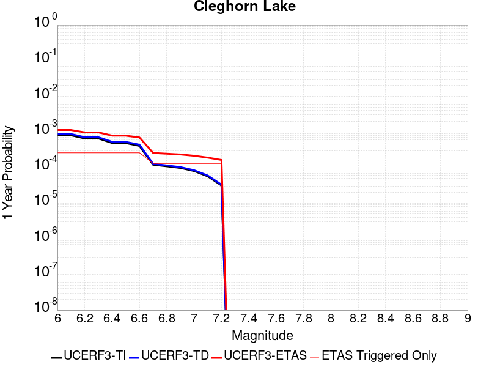 | 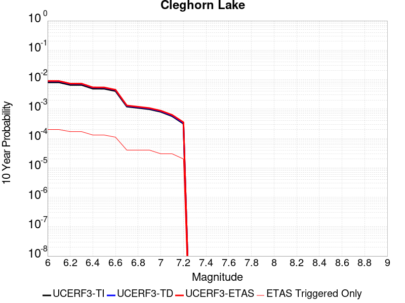 |

| Magnitude | 1 wk TI Prob | 1 wk TD Prob | 1 wk ETAS Prob | 1 wk ETAS/TD Gain | 1 wk ETAS Triggered Only | 1 mo TI Prob | 1 mo TD Prob | 1 mo ETAS Prob | 1 mo ETAS/TD Gain | 1 mo ETAS Triggered Only | 1 yr TI Prob | 1 yr TD Prob | 1 yr ETAS Prob | 1 yr ETAS/TD Gain | 1 yr ETAS Triggered Only | 10 yr TI Prob | 10 yr TD Prob | 10 yr ETAS Prob | 10 yr ETAS/TD Gain | 10 yr ETAS Triggered Only |
|-----|-----|-----|-----|-----|-----|-----|-----|-----|-----|-----|-----|-----|-----|-----|-----|-----|-----|-----|-----|-----|
| 6.0 | 1.5467183E-5 | 1.6794203E-5 | 5.9321344E-5 | 3.5322511 | 4.2527856E-5 | 6.6286244E-5 | 7.197348E-5 | 1.9954787E-4 | 2.7725194 | 1.2758357E-4 | 8.067362E-4 | 8.759797E-4 | 0.0010034515 | 1.1455191 | 1.2758357E-4 | 0.008038137 | 0.008730696 | 0.008857165 | 1.0144856 | 1.2758357E-4 |
| 6.1 | 1.5467183E-5 | 1.6794203E-5 | 5.9321344E-5 | 3.5322511 | 4.2527856E-5 | 6.6286244E-5 | 7.197348E-5 | 1.9954787E-4 | 2.7725194 | 1.2758357E-4 | 8.067362E-4 | 8.759797E-4 | 0.0010034515 | 1.1455191 | 1.2758357E-4 | 0.008038137 | 0.008730696 | 0.008857165 | 1.0144856 | 1.2758357E-4 |
| 6.2 | 1.2624631E-5 | 1.3681544E-5 | 5.6208817E-5 | 4.108368 | 4.2527856E-5 | 5.410444E-5 | 5.863415E-5 | 1.8621024E-4 | 3.1757984 | 1.2758357E-4 | 6.585225E-4 | 7.1368564E-4 | 8.411781E-4 | 1.1786397 | 1.2758357E-4 | 0.0065657445 | 0.0071187317 | 0.007245407 | 1.0177946 | 1.2758357E-4 |
| 6.3 | 1.2624631E-5 | 1.3681544E-5 | 5.6208817E-5 | 4.108368 | 4.2527856E-5 | 5.410444E-5 | 5.863415E-5 | 1.8621024E-4 | 3.1757984 | 1.2758357E-4 | 6.585225E-4 | 7.1368564E-4 | 8.411781E-4 | 1.1786397 | 1.2758357E-4 | 0.0065657445 | 0.0071187317 | 0.007245407 | 1.0177946 | 1.2758357E-4 |
| 6.4 | 9.417684E-6 | 1.0170118E-5 | 5.2697542E-5 | 5.181606 | 4.2527856E-5 | 4.036088E-5 | 4.3585722E-5 | 1.2863772E-4 | 2.951373 | 8.505571E-5 | 4.912829E-4 | 5.3056807E-4 | 6.155786E-4 | 1.1602256 | 8.505571E-5 | 0.004901982 | 0.005297049 | 0.005381654 | 1.0159721 | 8.505571E-5 |
| 6.5 | 9.368219E-6 | 1.0117545E-5 | 5.264497E-5 | 5.203335 | 4.2527856E-5 | 4.014889E-5 | 4.3360415E-5 | 1.2841244E-4 | 2.961513 | 8.505571E-5 | 4.8870314E-4 | 5.2782625E-4 | 6.128371E-4 | 1.1610583 | 8.505571E-5 | 0.004876298 | 0.0052697617 | 0.005354369 | 1.0160552 | 8.505571E-5 |
| 6.6 | 7.803798E-6 | 8.441831E-6 | 5.0969327E-5 | 6.03771 | 4.2527856E-5 | 3.3444423E-5 | 3.6179E-5 | 1.21231635E-4 | 3.3508842 | 8.505571E-5 | 4.0710976E-4 | 4.4043022E-4 | 5.254485E-4 | 1.1930345 | 8.505571E-5 | 0.0040636472 | 0.0043994905 | 0.004484172 | 1.019248 | 8.505571E-5 |
| 6.7 | 2.3108669E-6 | 2.4438336E-6 | 2.4438336E-6 | 1.0 | 0.0 | 9.903678E-6 | 1.0473532E-5 | 5.3000942E-5 | 5.0604653 | 4.2527856E-5 | 1.205706E-4 | 1.2750797E-4 | 1.7003041E-4 | 1.3334885 | 4.2527856E-5 | 0.001205052 | 0.0012743667 | 0.0013168404 | 1.0333292 | 4.2527856E-5 |
| 6.8 | 2.0882828E-6 | 2.2062823E-6 | 2.2062823E-6 | 1.0 | 0.0 | 8.949753E-6 | 9.455462E-6 | 5.1982915E-5 | 5.49766 | 4.2527856E-5 | 1.08957785E-4 | 1.1511434E-4 | 1.576373E-4 | 1.3693976 | 4.2527856E-5 | 0.0010890438 | 0.0011505639 | 0.0011930428 | 1.0369201 | 4.2527856E-5 |
| 6.9 | 1.876935E-6 | 1.981051E-6 | 1.981051E-6 | 1.0 | 0.0 | 8.043982E-6 | 8.490192E-6 | 5.1017687E-5 | 6.0090146 | 4.2527856E-5 | 9.7931086E-5 | 1.03363345E-4 | 1.458868E-4 | 1.4113979 | 4.2527856E-5 | 9.788794E-4 | 0.0010331686 | 0.0010756525 | 1.04112 | 4.2527856E-5 |
| 7.0 | 1.5357559E-6 | 1.6202807E-6 | 1.6202807E-6 | 1.0 | 0.0 | 6.5817944E-6 | 6.9440425E-6 | 4.9471604E-5 | 7.1243234 | 4.2527856E-5 | 8.01304E-5 | 8.454057E-5 | 1.2706482E-4 | 1.5030042 | 4.2527856E-5 | 8.010151E-4 | 8.450965E-4 | 8.8758837E-4 | 1.0502806 | 4.2527856E-5 |
| 7.1 | 1.0905424E-6 | 1.1497619E-6 | 1.1497619E-6 | 1.0 | 0.0 | 4.6737446E-6 | 4.9275427E-6 | 4.745519E-5 | 9.630599 | 4.2527856E-5 | 5.6901354E-5 | 5.999128E-5 | 1.02516584E-4 | 1.7088581 | 4.2527856E-5 | 5.6886784E-4 | 5.997606E-4 | 6.42263E-4 | 1.0708655 | 4.2527856E-5 |
| 7.2 | 6.06668E-7 | 6.387277E-7 | 6.387277E-7 | 1.0 | 0.0 | 2.600003E-6 | 2.7374022E-6 | 4.526514E-5 | 16.535803 | 4.2527856E-5 | 3.1654577E-5 | 3.3327433E-5 | 7.585387E-5 | 2.276019 | 4.2527856E-5 | 3.1650066E-4 | 3.3323118E-4 | 3.7574486E-4 | 1.1275802 | 4.2527856E-5 |

## Brawley (Seismic Zone) alt 1
*[(top)](#table-of-contents)*

| 1 Week | 1 Month | 1 Year | 10 Year |
|-----|-----|-----|-----|
| 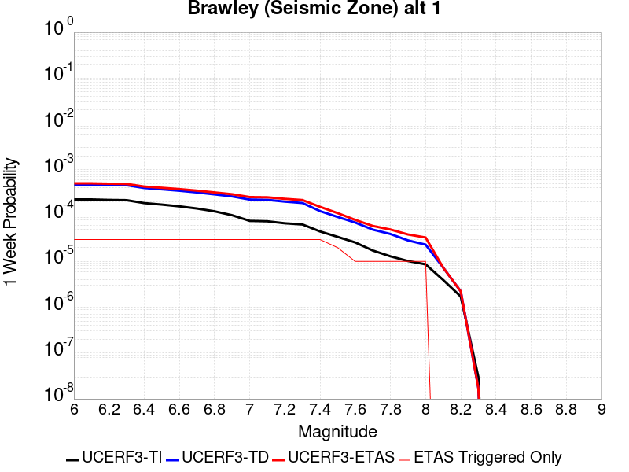 | 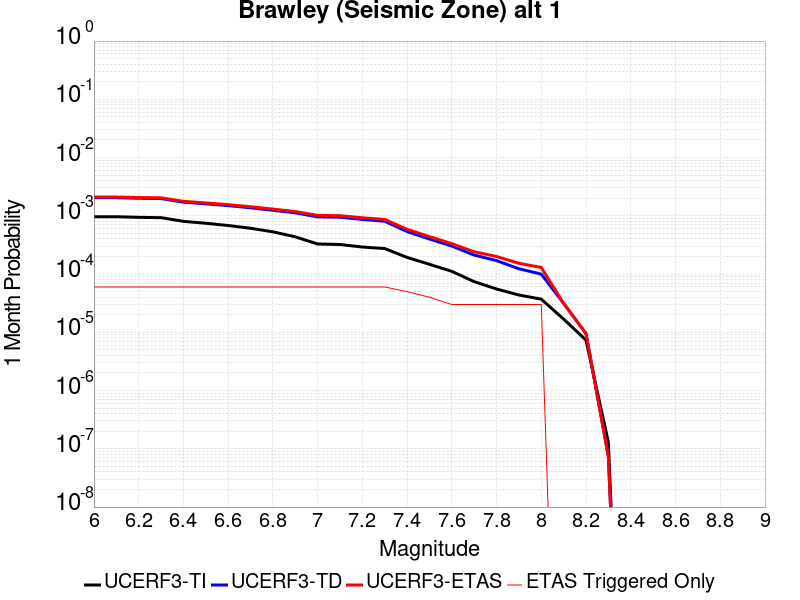 | 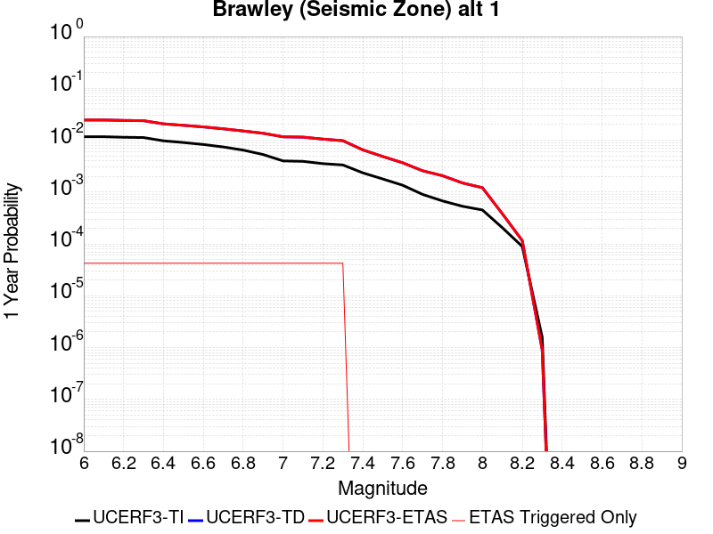 | 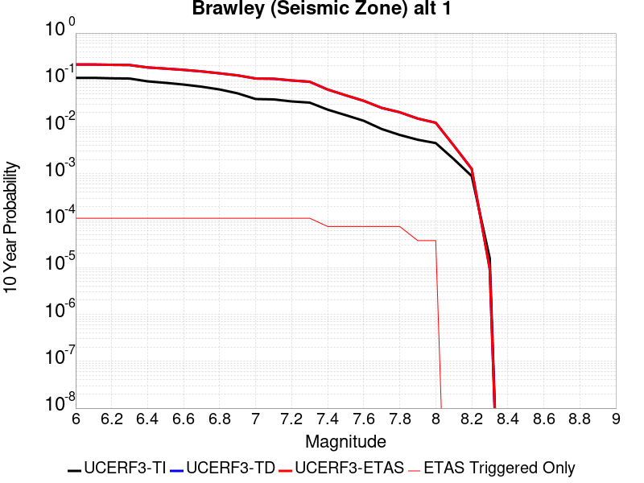 |

| Magnitude | 1 wk TI Prob | 1 wk TD Prob | 1 wk ETAS Prob | 1 wk ETAS/TD Gain | 1 wk ETAS Triggered Only | 1 mo TI Prob | 1 mo TD Prob | 1 mo ETAS Prob | 1 mo ETAS/TD Gain | 1 mo ETAS Triggered Only | 1 yr TI Prob | 1 yr TD Prob | 1 yr ETAS Prob | 1 yr ETAS/TD Gain | 1 yr ETAS Triggered Only | 10 yr TI Prob | 10 yr TD Prob | 10 yr ETAS Prob | 10 yr ETAS/TD Gain | 10 yr ETAS Triggered Only |
|-----|-----|-----|-----|-----|-----|-----|-----|-----|-----|-----|-----|-----|-----|-----|-----|-----|-----|-----|-----|-----|
| 6.0 | 2.2521618E-4 | 4.7632487E-4 | 4.7632487E-4 | 1.0 | 0.0 | 9.6485513E-4 | 0.0020398323 | 0.0020822734 | 1.0208062 | 4.2527856E-5 | 0.011683988 | 0.024546238 | 0.02458772 | 1.00169 | 4.2527856E-5 | 0.11088423 | 0.21350002 | 0.21360037 | 1.00047 | 1.2758357E-4 |
| 6.1 | 2.2521618E-4 | 4.7632487E-4 | 4.7632487E-4 | 1.0 | 0.0 | 9.6485513E-4 | 0.0020398323 | 0.0020822734 | 1.0208062 | 4.2527856E-5 | 0.011683988 | 0.024546238 | 0.02458772 | 1.00169 | 4.2527856E-5 | 0.11088423 | 0.21350002 | 0.21360037 | 1.00047 | 1.2758357E-4 |
| 6.2 | 2.198148E-4 | 4.6717093E-4 | 4.6717093E-4 | 1.0 | 0.0 | 9.417233E-4 | 0.0020006616 | 0.0020431043 | 1.0212144 | 4.2527856E-5 | 0.011405343 | 0.024080504 | 0.024122007 | 1.0017235 | 4.2527856E-5 | 0.10837428 | 0.20993657 | 0.21003737 | 1.0004802 | 1.2758357E-4 |
| 6.3 | 2.1704129E-4 | 4.615278E-4 | 4.615278E-4 | 1.0 | 0.0 | 9.298453E-4 | 0.0019765133 | 0.0020189572 | 1.0214741 | 4.2527856E-5 | 0.011262234 | 0.02379366 | 0.023835177 | 1.0017449 | 4.2527856E-5 | 0.107082725 | 0.20782755 | 0.20792861 | 1.0004863 | 1.2758357E-4 |
| 6.4 | 1.876142E-4 | 4.00449E-4 | 4.00449E-4 | 1.0 | 0.0 | 8.038131E-4 | 0.0017150956 | 0.0017575505 | 1.0247537 | 4.2527856E-5 | 0.00974259 | 0.020680401 | 0.02072205 | 1.0020139 | 4.2527856E-5 | 0.093263686 | 0.18457815 | 0.18468219 | 1.0005636 | 1.2758357E-4 |
| 6.5 | 1.7390939E-4 | 3.7477075E-4 | 3.7477075E-4 | 1.0 | 0.0 | 7.45113E-4 | 0.0016051838 | 0.0016476435 | 1.0264516 | 4.2527856E-5 | 0.009034078 | 0.019368723 | 0.019410428 | 1.0021532 | 4.2527856E-5 | 0.086755216 | 0.17440031 | 0.17450565 | 1.0006039 | 1.2758357E-4 |
| 6.6 | 1.591791E-4 | 3.4891962E-4 | 3.4891962E-4 | 1.0 | 0.0 | 6.8201777E-4 | 0.0014945229 | 0.0015369871 | 1.0284133 | 4.2527856E-5 | 0.008271996 | 0.018045569 | 0.01808733 | 1.0023142 | 4.2527856E-5 | 0.07970774 | 0.16380852 | 0.16391522 | 1.0006512 | 1.2758357E-4 |
| 6.7 | 1.4268003E-4 | 3.20582E-4 | 3.20582E-4 | 1.0 | 0.0 | 6.1134255E-4 | 0.0013732077 | 0.0014156771 | 1.0309272 | 4.2527856E-5 | 0.007417723 | 0.016592601 | 0.016634425 | 1.0025206 | 4.2527856E-5 | 0.07174956 | 0.15193306 | 0.15204127 | 1.0007122 | 1.2758357E-4 |
| 6.8 | 1.239713E-4 | 2.9053655E-4 | 2.9053655E-4 | 1.0 | 0.0 | 5.3119735E-4 | 0.0012445687 | 0.0012870436 | 1.0341282 | 4.2527856E-5 | 0.0064481674 | 0.015048777 | 0.015090665 | 1.0027834 | 4.2527856E-5 | 0.06264243 | 0.13837762 | 0.13848755 | 1.0007944 | 1.2758357E-4 |
| 6.9 | 1.0180238E-4 | 2.625439E-4 | 2.625439E-4 | 1.0 | 0.0 | 4.3622297E-4 | 0.0011247073 | 0.0011671872 | 1.0377698 | 4.2527856E-5 | 0.005298089 | 0.013608336 | 0.013650285 | 1.0030826 | 4.2527856E-5 | 0.05173543 | 0.124961674 | 0.12507331 | 1.0008934 | 1.2758357E-4 |
| 7.0 | 7.6619996E-5 | 2.23993E-4 | 2.23993E-4 | 1.0 | 0.0 | 3.283301E-4 | 9.5962E-4 | 0.001002107 | 1.0442748 | 4.2527856E-5 | 0.0039900932 | 0.011621496 | 0.011663529 | 1.0036169 | 4.2527856E-5 | 0.039192066 | 0.107266866 | 0.10738076 | 1.0010618 | 1.2758357E-4 |
| 7.1 | 7.5127435E-5 | 2.2082464E-4 | 2.2082464E-4 | 1.0 | 0.0 | 3.2193496E-4 | 9.4605127E-4 | 9.885388E-4 | 1.0449104 | 4.2527856E-5 | 0.0039125155 | 0.011458045 | 0.011500085 | 1.0036691 | 4.2527856E-5 | 0.038443442 | 0.10583085 | 0.10594493 | 1.001078 | 1.2758357E-4 |
| 7.2 | 6.788582E-5 | 2.0210193E-4 | 2.0210193E-4 | 1.0 | 0.0 | 2.9090676E-4 | 8.6586666E-4 | 9.0835773E-4 | 1.0490735 | 4.2527856E-5 | 0.0035360386 | 0.0104916105 | 0.010533692 | 1.004011 | 4.2527856E-5 | 0.034803 | 0.09750131 | 0.09761646 | 1.001181 | 1.2758357E-4 |
| 7.3 | 6.399602E-5 | 1.8841137E-4 | 1.8841137E-4 | 1.0 | 0.0 | 2.7423984E-4 | 8.072303E-4 | 8.497238E-4 | 1.0526412 | 4.2527856E-5 | 0.0033337586 | 0.009784332 | 0.009826443 | 1.004304 | 4.2527856E-5 | 0.03284188 | 0.09139617 | 0.09151209 | 1.0012684 | 1.2758357E-4 |
| 7.4 | 4.506759E-5 | 1.2529209E-4 | 1.2529209E-4 | 1.0 | 0.0 | 1.9313251E-4 | 5.368565E-4 | 5.368565E-4 | 1.0 | 0.0 | 0.0023488526 | 0.0065168133 | 0.0065168133 | 1.0 | 0.0 | 0.023241805 | 0.062363707 | 0.062443458 | 1.0012788 | 8.505571E-5 |
| 7.5 | 3.43289E-5 | 9.33541E-5 | 9.33541E-5 | 1.0 | 0.0 | 1.4711556E-4 | 4.00028E-4 | 4.00028E-4 | 1.0 | 0.0 | 0.0017896603 | 0.0048595266 | 0.0048595266 | 1.0 | 0.0 | 0.01775316 | 0.04705519 | 0.047136243 | 1.0017226 | 8.505571E-5 |
| 7.6 | 2.5980507E-5 | 7.053101E-5 | 7.053101E-5 | 1.0 | 0.0 | 1.1134028E-4 | 3.0224086E-4 | 3.0224086E-4 | 1.0 | 0.0 | 0.001354725 | 0.003673598 | 0.003673598 | 1.0 | 0.0 | 0.013464959 | 0.035840835 | 0.03592284 | 1.0022881 | 8.505571E-5 |
| 7.7 | 1.7292105E-5 | 4.9407296E-5 | 4.9407296E-5 | 1.0 | 0.0 | 7.4106916E-5 | 2.117284E-4 | 2.117284E-4 | 1.0 | 0.0 | 9.018782E-4 | 0.0025747516 | 0.0025747516 | 1.0 | 0.0 | 0.008982267 | 0.025290398 | 0.025373302 | 1.0032781 | 8.505571E-5 |
| 7.8 | 1.2927471E-5 | 3.9693266E-5 | 3.9693266E-5 | 1.0 | 0.0 | 5.5402274E-5 | 1.7010293E-4 | 1.7010293E-4 | 1.0 | 0.0 | 6.743139E-4 | 0.0020690386 | 0.0020690386 | 1.0 | 0.0 | 0.0067227143 | 0.020431727 | 0.020515045 | 1.0040779 | 8.505571E-5 |
| 7.9 | 1.0200774E-5 | 2.874569E-5 | 2.874569E-5 | 1.0 | 0.0 | 4.371687E-5 | 1.2319001E-4 | 1.2319001E-4 | 1.0 | 0.0 | 5.321229E-4 | 0.0014988075 | 0.0014988075 | 1.0 | 0.0 | 0.005308505 | 0.014991644 | 0.015033534 | 1.0027943 | 4.2527856E-5 |
| 8.0 | 8.650396E-6 | 2.3277367E-5 | 2.3277367E-5 | 1.0 | 0.0 | 3.70726E-5 | 9.975634E-5 | 9.975634E-5 | 1.0 | 0.0 | 4.5126543E-4 | 0.0012138576 | 0.0012138576 | 1.0 | 0.0 | 0.0045035016 | 0.012211097 | 0.012253106 | 1.0034401 | 4.2527856E-5 |
| 8.1 | 3.9368224E-6 | 7.3279825E-6 | 7.3279825E-6 | 1.0 | 0.0 | 1.6871985E-5 | 3.140526E-5 | 3.140526E-5 | 1.0 | 0.0 | 2.0539707E-4 | 3.8229208E-4 | 3.8229208E-4 | 1.0 | 0.0 | 0.0020520731 | 0.004001185 | 0.004001185 | 1.0 | 0.0 |
| 8.2 | 1.7101195E-6 | 2.217876E-6 | 2.217876E-6 | 1.0 | 0.0 | 7.329063E-6 | 9.505149E-6 | 9.505149E-6 | 1.0 | 0.0 | 8.922769E-5 | 1.1571907E-4 | 1.1571907E-4 | 1.0 | 0.0 | 8.9191867E-4 | 0.0012666774 | 0.0012666774 | 1.0 | 0.0 |
| 8.3 | 3.0346666E-8 | 1.721586E-8 | 1.721586E-8 | 1.0 | 0.0 | 1.3005713E-7 | 7.378226E-8 | 7.378226E-8 | 1.0 | 0.0 | 1.5834444E-6 | 8.9829894E-7 | 8.9829894E-7 | 1.0 | 0.0 | 1.5834332E-5 | 9.367729E-6 | 9.367729E-6 | 1.0 | 0.0 |

## Bullion Mountains
*[(top)](#table-of-contents)*

| 1 Week | 1 Month | 1 Year | 10 Year |
|-----|-----|-----|-----|
| 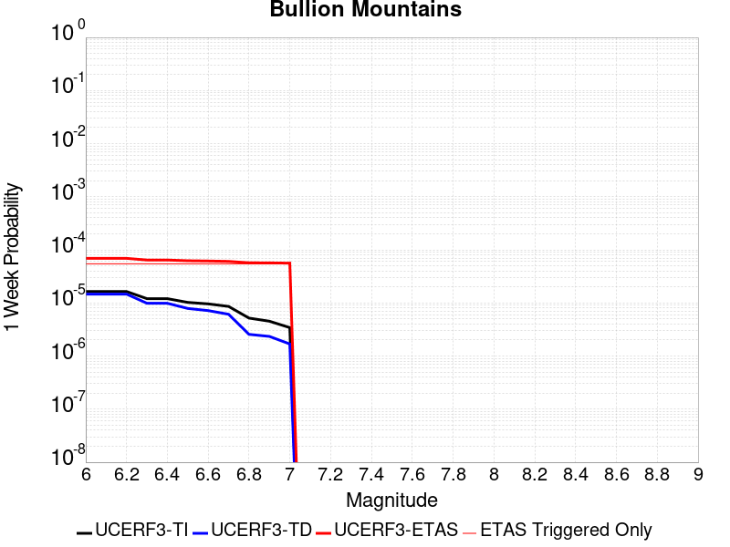 | 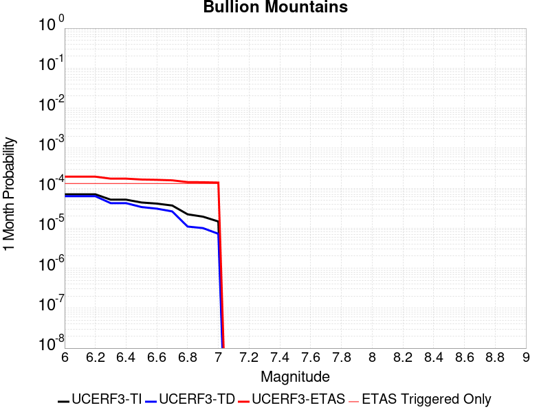 | 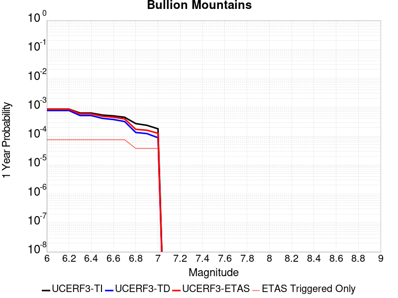 | 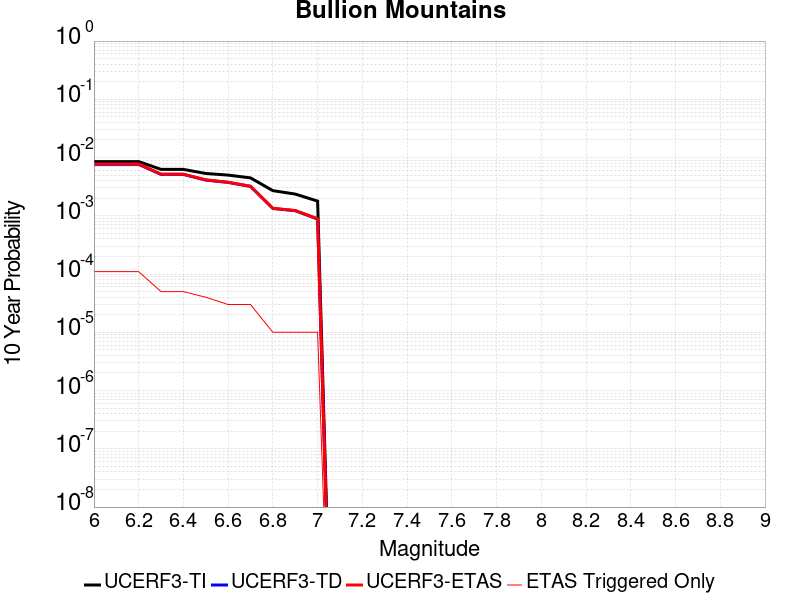 |

| Magnitude | 1 wk TI Prob | 1 wk TD Prob | 1 wk ETAS Prob | 1 wk ETAS/TD Gain | 1 wk ETAS Triggered Only | 1 mo TI Prob | 1 mo TD Prob | 1 mo ETAS Prob | 1 mo ETAS/TD Gain | 1 mo ETAS Triggered Only | 1 yr TI Prob | 1 yr TD Prob | 1 yr ETAS Prob | 1 yr ETAS/TD Gain | 1 yr ETAS Triggered Only | 10 yr TI Prob | 10 yr TD Prob | 10 yr ETAS Prob | 10 yr ETAS/TD Gain | 10 yr ETAS Triggered Only |
|-----|-----|-----|-----|-----|-----|-----|-----|-----|-----|-----|-----|-----|-----|-----|-----|-----|-----|-----|-----|-----|
| 6.0 | 1.6420427E-5 | 1.4692089E-5 | 5.721932E-5 | 3.8945665 | 4.2527856E-5 | 7.037136E-5 | 6.296479E-5 | 1.0548997E-4 | 1.6753802 | 4.2527856E-5 | 8.5643446E-4 | 7.663651E-4 | 8.513556E-4 | 1.1109009 | 8.505571E-5 | 0.008531413 | 0.007641016 | 0.0077676247 | 1.0165696 | 1.2758357E-4 |
| 6.1 | 1.6420427E-5 | 1.4692089E-5 | 5.721932E-5 | 3.8945665 | 4.2527856E-5 | 7.037136E-5 | 6.296479E-5 | 1.0548997E-4 | 1.6753802 | 4.2527856E-5 | 8.5643446E-4 | 7.663651E-4 | 8.513556E-4 | 1.1109009 | 8.505571E-5 | 0.008531413 | 0.007641016 | 0.0077676247 | 1.0165696 | 1.2758357E-4 |
| 6.2 | 1.6420427E-5 | 1.4692089E-5 | 5.721932E-5 | 3.8945665 | 4.2527856E-5 | 7.037136E-5 | 6.296479E-5 | 1.0548997E-4 | 1.6753802 | 4.2527856E-5 | 8.5643446E-4 | 7.663651E-4 | 8.513556E-4 | 1.1109009 | 8.505571E-5 | 0.008531413 | 0.007641016 | 0.0077676247 | 1.0165696 | 1.2758357E-4 |
| 6.3 | 1.2046778E-5 | 9.862335E-6 | 5.2389772E-5 | 5.312106 | 4.2527856E-5 | 5.1628023E-5 | 4.2266598E-5 | 8.479266E-5 | 2.0061388 | 4.2527856E-5 | 6.283899E-4 | 5.144975E-4 | 5.9950945E-4 | 1.165233 | 8.505571E-5 | 0.0062661595 | 0.005135345 | 0.005219964 | 1.0164777 | 8.505571E-5 |
| 6.4 | 1.2046778E-5 | 9.862335E-6 | 5.2389772E-5 | 5.312106 | 4.2527856E-5 | 5.1628023E-5 | 4.2266598E-5 | 8.479266E-5 | 2.0061388 | 4.2527856E-5 | 6.283899E-4 | 5.144975E-4 | 5.9950945E-4 | 1.165233 | 8.505571E-5 | 0.0062661595 | 0.005135345 | 0.005219964 | 1.0164777 | 8.505571E-5 |
| 6.5 | 1.0244343E-5 | 7.879458E-6 | 5.040698E-5 | 6.3972645 | 4.2527856E-5 | 4.390359E-5 | 3.3768785E-5 | 7.6295204E-5 | 2.259341 | 4.2527856E-5 | 5.343951E-4 | 4.110781E-4 | 4.9609883E-4 | 1.2068238 | 8.505571E-5 | 0.005331118 | 0.004105208 | 0.0041899146 | 1.0206339 | 8.505571E-5 |
| 6.6 | 9.605408E-6 | 7.1774966E-6 | 4.9705046E-5 | 6.925123 | 4.2527856E-5 | 4.1165385E-5 | 3.076045E-5 | 7.3286996E-5 | 2.3825073 | 4.2527856E-5 | 5.010733E-4 | 3.744645E-4 | 4.5948834E-4 | 1.2270546 | 8.505571E-5 | 0.00499945 | 0.003740332 | 0.0038250696 | 1.0226551 | 8.505571E-5 |
| 6.7 | 8.60418E-6 | 6.1240044E-6 | 4.86516E-5 | 7.9444094 | 4.2527856E-5 | 3.687454E-5 | 2.624558E-5 | 6.877232E-5 | 2.6203392 | 4.2527856E-5 | 4.48855E-4 | 3.1951256E-4 | 4.045411E-4 | 1.2661195 | 8.505571E-5 | 0.004479495 | 0.0031924439 | 0.003277228 | 1.0265578 | 8.505571E-5 |
| 6.8 | 5.187994E-6 | 2.5631666E-6 | 4.5090914E-5 | 17.591877 | 4.2527856E-5 | 2.223407E-5 | 1.0984976E-5 | 5.3512365E-5 | 4.8714137 | 4.2527856E-5 | 2.7066618E-4 | 1.3373788E-4 | 1.7626004E-4 | 1.3179516 | 4.2527856E-5 | 0.0027033675 | 0.0013369655 | 0.0013794365 | 1.0317667 | 4.2527856E-5 |
| 6.9 | 4.5302368E-6 | 2.3443165E-6 | 4.487207E-5 | 19.14079 | 4.2527856E-5 | 1.9415156E-5 | 1.0047055E-5 | 5.2574484E-5 | 5.2328253 | 4.2527856E-5 | 2.3635388E-4 | 1.2232E-4 | 1.6484264E-4 | 1.3476346 | 4.2527856E-5 | 0.0023610266 | 0.0012229157 | 0.0012653916 | 1.0347333 | 4.2527856E-5 |
| 7.0 | 3.431668E-6 | 1.6882402E-6 | 4.4216024E-5 | 26.1906 | 4.2527856E-5 | 1.4707065E-5 | 7.235315E-6 | 4.9762864E-5 | 6.8777742 | 4.2527856E-5 | 1.7904381E-4 | 8.808996E-5 | 1.3061408E-4 | 1.482735 | 4.2527856E-5 | 0.0017889962 | 8.808996E-4 | 9.2339003E-4 | 1.0482352 | 4.2527856E-5 |

## San Jacinto (Coyote Creek)
*[(top)](#table-of-contents)*

| 1 Week | 1 Month | 1 Year | 10 Year |
|-----|-----|-----|-----|
| 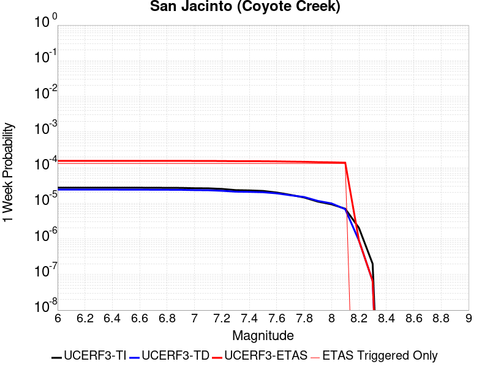 | 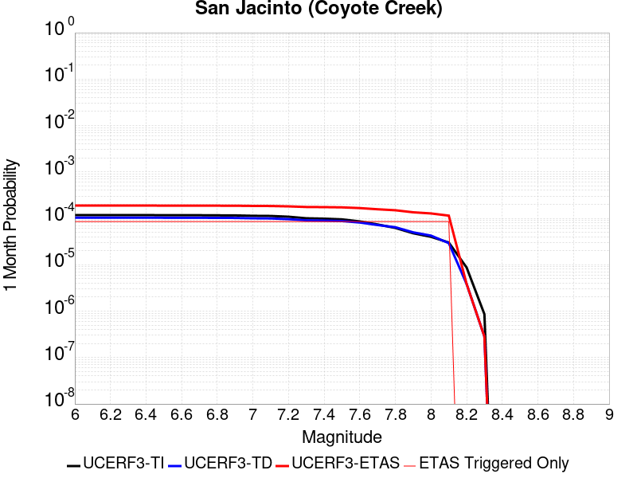 | 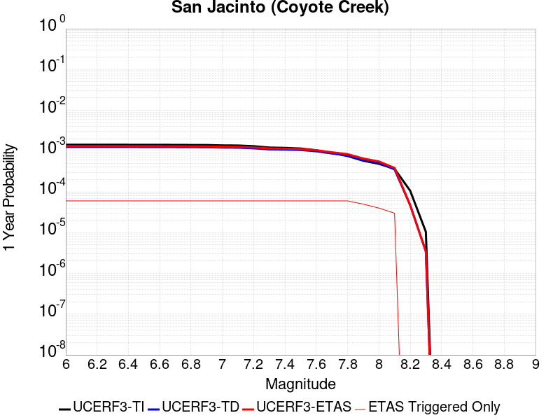 | 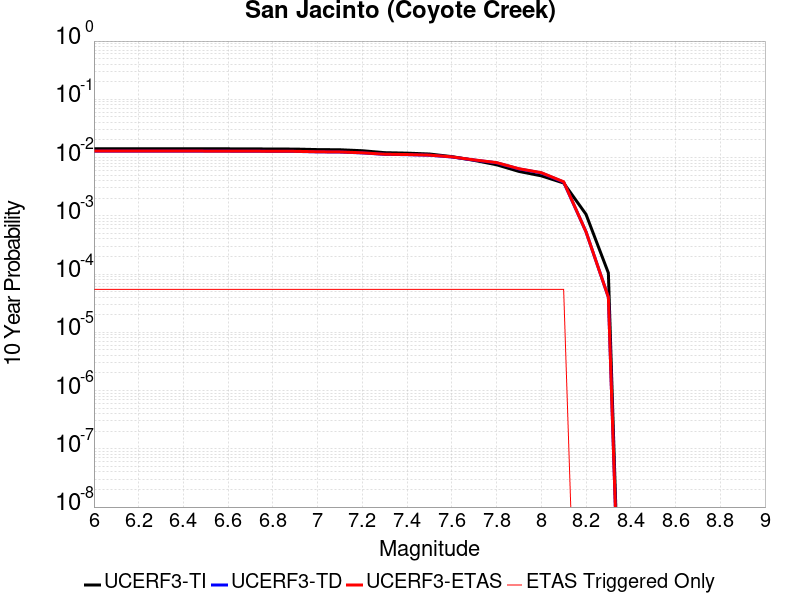 |

| Magnitude | 1 wk TI Prob | 1 wk TD Prob | 1 wk ETAS Prob | 1 wk ETAS/TD Gain | 1 wk ETAS Triggered Only | 1 mo TI Prob | 1 mo TD Prob | 1 mo ETAS Prob | 1 mo ETAS/TD Gain | 1 mo ETAS Triggered Only | 1 yr TI Prob | 1 yr TD Prob | 1 yr ETAS Prob | 1 yr ETAS/TD Gain | 1 yr ETAS Triggered Only | 10 yr TI Prob | 10 yr TD Prob | 10 yr ETAS Prob | 10 yr ETAS/TD Gain | 10 yr ETAS Triggered Only |
|-----|-----|-----|-----|-----|-----|-----|-----|-----|-----|-----|-----|-----|-----|-----|-----|-----|-----|-----|-----|-----|
| 6.0 | 2.7374346E-5 | 2.4145214E-5 | 1.09198874E-4 | 4.5225887 | 8.505571E-5 | 1.1731335E-4 | 1.034754E-4 | 1.885223E-4 | 1.8219047 | 8.505571E-5 | 0.0014273542 | 0.0012590875 | 0.0013440361 | 1.0674684 | 8.505571E-5 | 0.01418221 | 0.012928318 | 0.013054252 | 1.009741 | 1.2758357E-4 |
| 6.1 | 2.7374346E-5 | 2.4145214E-5 | 1.09198874E-4 | 4.5225887 | 8.505571E-5 | 1.1731335E-4 | 1.034754E-4 | 1.885223E-4 | 1.8219047 | 8.505571E-5 | 0.0014273542 | 0.0012590875 | 0.0013440361 | 1.0674684 | 8.505571E-5 | 0.01418221 | 0.012928318 | 0.013054252 | 1.009741 | 1.2758357E-4 |
| 6.2 | 2.7374346E-5 | 2.4145214E-5 | 1.09198874E-4 | 4.5225887 | 8.505571E-5 | 1.1731335E-4 | 1.034754E-4 | 1.885223E-4 | 1.8219047 | 8.505571E-5 | 0.0014273542 | 0.0012590875 | 0.0013440361 | 1.0674684 | 8.505571E-5 | 0.01418221 | 0.012928318 | 0.013054252 | 1.009741 | 1.2758357E-4 |
| 6.3 | 2.7374346E-5 | 2.4145214E-5 | 1.09198874E-4 | 4.5225887 | 8.505571E-5 | 1.1731335E-4 | 1.034754E-4 | 1.885223E-4 | 1.8219047 | 8.505571E-5 | 0.0014273542 | 0.0012590875 | 0.0013440361 | 1.0674684 | 8.505571E-5 | 0.01418221 | 0.012928318 | 0.013054252 | 1.009741 | 1.2758357E-4 |
| 6.4 | 2.7374346E-5 | 2.4145214E-5 | 1.09198874E-4 | 4.5225887 | 8.505571E-5 | 1.1731335E-4 | 1.034754E-4 | 1.885223E-4 | 1.8219047 | 8.505571E-5 | 0.0014273542 | 0.0012590875 | 0.0013440361 | 1.0674684 | 8.505571E-5 | 0.01418221 | 0.012928318 | 0.013054252 | 1.009741 | 1.2758357E-4 |
| 6.5 | 2.7282445E-5 | 2.4031293E-5 | 1.0908496E-4 | 4.539288 | 8.505571E-5 | 1.16919524E-4 | 1.029872E-4 | 1.8803416E-4 | 1.8258011 | 8.505571E-5 | 0.0014225657 | 0.0012531505 | 0.0013380997 | 1.0677885 | 8.505571E-5 | 0.014134934 | 0.012869646 | 0.012995588 | 1.0097859 | 1.2758357E-4 |
| 6.6 | 2.7282445E-5 | 2.4031293E-5 | 1.0908496E-4 | 4.539288 | 8.505571E-5 | 1.16919524E-4 | 1.029872E-4 | 1.8803416E-4 | 1.8258011 | 8.505571E-5 | 0.0014225657 | 0.0012531505 | 0.0013380997 | 1.0677885 | 8.505571E-5 | 0.014134934 | 0.012869646 | 0.012995588 | 1.0097859 | 1.2758357E-4 |
| 6.7 | 2.7216198E-5 | 2.3956412E-5 | 1.09010085E-4 | 4.550351 | 8.505571E-5 | 1.1663563E-4 | 1.02666316E-4 | 1.8771329E-4 | 1.8283825 | 8.505571E-5 | 0.0014191137 | 0.0012492483 | 0.0013341978 | 1.0680004 | 8.505571E-5 | 0.014100855 | 0.0128310565 | 0.012957003 | 1.0098158 | 1.2758357E-4 |
| 6.8 | 2.7078617E-5 | 2.387363E-5 | 1.08927314E-4 | 4.562662 | 8.505571E-5 | 1.1604605E-4 | 1.0231156E-4 | 1.8735857E-4 | 1.8312551 | 8.505571E-5 | 0.001411945 | 0.0012449342 | 0.0013298839 | 1.0682364 | 8.505571E-5 | 0.014030075 | 0.012788199 | 0.012914151 | 1.0098491 | 1.2758357E-4 |
| 6.9 | 2.6982952E-5 | 2.3793142E-5 | 1.0884683E-4 | 4.5747147 | 8.505571E-5 | 1.15636096E-4 | 1.0196664E-4 | 1.8701368E-4 | 1.8340673 | 8.505571E-5 | 0.0014069602 | 0.0012407395 | 0.0013256896 | 1.0684674 | 8.505571E-5 | 0.013980856 | 0.012746515 | 0.0128724715 | 1.0098817 | 1.2758357E-4 |
| 7.0 | 2.6449972E-5 | 2.3370165E-5 | 1.0842389E-4 | 4.639415 | 8.505571E-5 | 1.1335209E-4 | 1.00154015E-4 | 1.852012E-4 | 1.8491641 | 8.505571E-5 | 0.001379188 | 0.0012186957 | 0.0013036476 | 1.0697074 | 8.505571E-5 | 0.0137065975 | 0.0125278765 | 0.012653862 | 1.0100564 | 1.2758357E-4 |
| 7.1 | 2.6257849E-5 | 2.3196202E-5 | 1.0824994E-4 | 4.66671 | 8.505571E-5 | 1.1252879E-4 | 9.940852E-5 | 1.8445577E-4 | 1.8555329 | 8.505571E-5 | 0.0013691769 | 0.0012096294 | 0.0012945822 | 1.0702305 | 8.505571E-5 | 0.013607717 | 0.012437741 | 0.012563738 | 1.0101302 | 1.2758357E-4 |
| 7.2 | 2.5270041E-5 | 2.2390966E-5 | 1.0744477E-4 | 4.798577 | 8.505571E-5 | 1.0829568E-4 | 9.595777E-5 | 1.8100532E-4 | 1.8863019 | 8.505571E-5 | 0.0013177024 | 0.0011676621 | 0.0012526185 | 1.0727577 | 8.505571E-5 | 0.013099162 | 0.012018777 | 0.012144827 | 1.0104878 | 1.2758357E-4 |
| 7.3 | 2.339701E-5 | 2.1122814E-5 | 1.0617673E-4 | 5.0266376 | 8.505571E-5 | 1.0026905E-4 | 9.0523215E-5 | 1.7557123E-4 | 1.939516 | 8.505571E-5 | 0.001220092 | 0.0011015651 | 0.0011865271 | 1.0771284 | 8.505571E-5 | 0.012134149 | 0.011357696 | 0.01148383 | 1.0111057 | 1.2758357E-4 |
| 7.4 | 2.296333E-5 | 2.0853171E-5 | 1.0590711E-4 | 5.0787053 | 8.505571E-5 | 9.841056E-5 | 8.936768E-5 | 1.7441579E-4 | 1.9516652 | 8.505571E-5 | 0.0011974899 | 0.0010875105 | 0.0011724737 | 1.0781263 | 8.505571E-5 | 0.011910575 | 0.01121681 | 0.011342962 | 1.0112467 | 1.2758357E-4 |
| 7.5 | 2.2188895E-5 | 2.0376096E-5 | 1.05430074E-4 | 5.174204 | 8.505571E-5 | 9.50918E-5 | 8.732321E-5 | 1.723715E-4 | 1.9739482 | 8.505571E-5 | 0.0011571277 | 0.0010626436 | 0.001147609 | 1.0799565 | 8.505571E-5 | 0.011511209 | 0.010966429 | 0.0110926125 | 1.0115064 | 1.2758357E-4 |
| 7.6 | 2.0013189E-5 | 1.8962366E-5 | 1.04016464E-4 | 5.485416 | 8.505571E-5 | 8.5767984E-5 | 8.1264756E-5 | 1.6631356E-4 | 2.0465643 | 8.505571E-5 | 0.001043725 | 9.889511E-4 | 0.0010739227 | 1.0859209 | 8.505571E-5 | 0.010388365 | 0.010224434 | 0.010350713 | 1.0123507 | 1.2758357E-4 |
| 7.7 | 1.7230794E-5 | 1.674371E-5 | 1.01797996E-4 | 6.0797753 | 8.505571E-5 | 7.384417E-5 | 7.175679E-5 | 1.5680639E-4 | 2.1852484 | 8.505571E-5 | 8.986819E-4 | 8.7328954E-4 | 9.58271E-4 | 1.0973119 | 8.505571E-5 | 0.008950562 | 0.009062956 | 0.009189384 | 1.0139499 | 1.2758357E-4 |
| 7.8 | 1.4478809E-5 | 1.4990978E-5 | 1.00045414E-4 | 6.6737084 | 8.505571E-5 | 6.205057E-5 | 6.424547E-5 | 1.4929572E-4 | 2.3238325 | 8.505571E-5 | 7.552038E-4 | 7.819085E-4 | 8.6689775E-4 | 1.1086946 | 8.505571E-5 | 0.0075264242 | 0.008141387 | 0.008267932 | 1.0155435 | 1.2758357E-4 |
| 7.9 | 1.1114467E-5 | 1.1645102E-5 | 9.669982E-5 | 8.3039055 | 8.505571E-5 | 4.7632562E-5 | 4.990663E-5 | 1.349581E-4 | 2.7042117 | 8.505571E-5 | 5.797721E-4 | 6.074444E-4 | 6.924484E-4 | 1.1399372 | 8.505571E-5 | 0.0057826187 | 0.0063803247 | 0.0065070945 | 1.0198689 | 1.2758357E-4 |
| 8.0 | 9.327402E-6 | 9.899186E-6 | 9.4954055E-5 | 9.592107 | 8.505571E-5 | 3.9973966E-5 | 4.2424395E-5 | 1.274765E-4 | 3.0047922 | 8.505571E-5 | 4.8657437E-4 | 5.1639514E-4 | 6.0140697E-4 | 1.1646254 | 8.505571E-5 | 0.0048551033 | 0.0054499684 | 0.005576857 | 1.0232824 | 1.2758357E-4 |
| 8.1 | 7.0235833E-6 | 6.827495E-6 | 9.1882626E-5 | 13.457736 | 8.505571E-5 | 3.0100724E-5 | 2.9260367E-5 | 1.1431359E-4 | 3.9067721 | 8.505571E-5 | 3.664147E-4 | 3.5618723E-4 | 4.4121267E-4 | 1.2387099 | 8.505571E-5 | 0.003658111 | 0.0037876023 | 0.0039147027 | 1.0335569 | 1.2758357E-4 |
| 8.2 | 2.0358202E-6 | 8.994527E-7 | 8.994527E-7 | 1.0 | 0.0 | 8.724915E-6 | 3.854792E-6 | 3.854792E-6 | 1.0 | 0.0 | 1.06220665E-4 | 4.69311E-5 | 4.69311E-5 | 1.0 | 0.0 | 0.001061699 | 5.3254166E-4 | 5.3254166E-4 | 1.0 | 0.0 |
| 8.3 | 2.0051264E-7 | 6.617272E-8 | 6.617272E-8 | 1.0 | 0.0 | 8.5933965E-7 | 2.8359733E-7 | 2.8359733E-7 | 1.0 | 0.0 | 1.046241E-5 | 3.4527925E-6 | 3.4527925E-6 | 1.0 | 0.0 | 1.0461917E-4 | 4.01389E-5 | 4.01389E-5 | 1.0 | 0.0 |

## Cleghorn
*[(top)](#table-of-contents)*

| 1 Week | 1 Month | 1 Year | 10 Year |
|-----|-----|-----|-----|
| 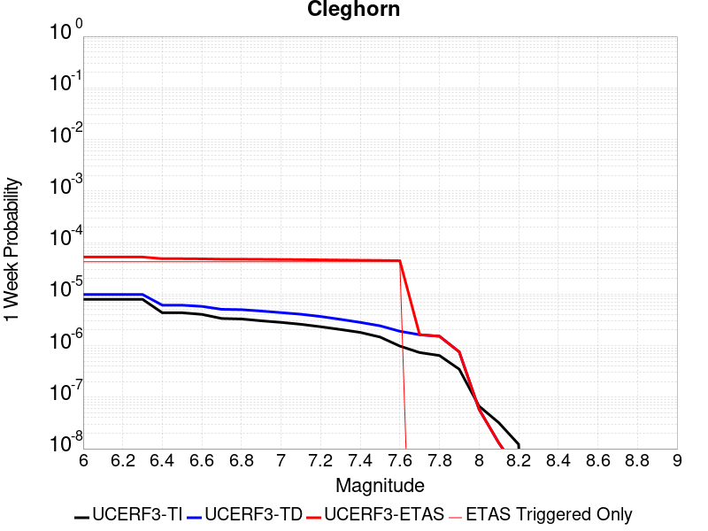 | 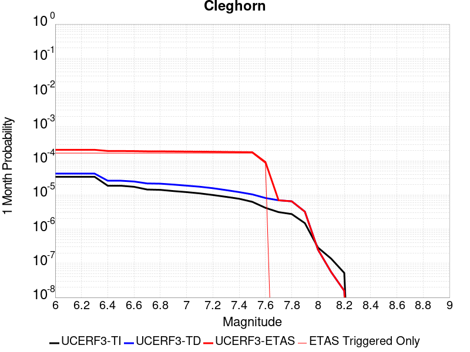 |  | 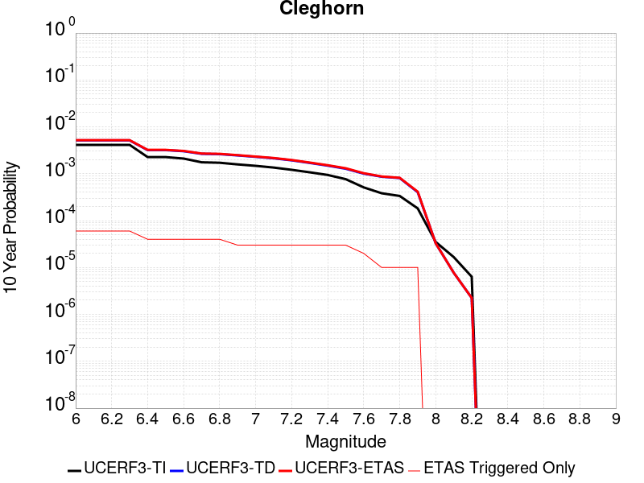 |

| Magnitude | 1 wk TI Prob | 1 wk TD Prob | 1 wk ETAS Prob | 1 wk ETAS/TD Gain | 1 wk ETAS Triggered Only | 1 mo TI Prob | 1 mo TD Prob | 1 mo ETAS Prob | 1 mo ETAS/TD Gain | 1 mo ETAS Triggered Only | 1 yr TI Prob | 1 yr TD Prob | 1 yr ETAS Prob | 1 yr ETAS/TD Gain | 1 yr ETAS Triggered Only | 10 yr TI Prob | 10 yr TD Prob | 10 yr ETAS Prob | 10 yr ETAS/TD Gain | 10 yr ETAS Triggered Only |
|-----|-----|-----|-----|-----|-----|-----|-----|-----|-----|-----|-----|-----|-----|-----|-----|-----|-----|-----|-----|-----|
| 6.0 | 7.9267165E-6 | 9.831582E-6 | 5.235902E-5 | 5.3255944 | 4.2527856E-5 | 3.39712E-5 | 4.2134732E-5 | 1.2718687E-4 | 3.0185752 | 8.505571E-5 | 4.1352084E-4 | 5.128803E-4 | 5.978923E-4 | 1.1657543 | 8.505571E-5 | 0.004127522 | 0.0051320773 | 0.005259006 | 1.0247325 | 1.2758357E-4 |
| 6.1 | 7.9267165E-6 | 9.831582E-6 | 5.235902E-5 | 5.3255944 | 4.2527856E-5 | 3.39712E-5 | 4.2134732E-5 | 1.2718687E-4 | 3.0185752 | 8.505571E-5 | 4.1352084E-4 | 5.128803E-4 | 5.978923E-4 | 1.1657543 | 8.505571E-5 | 0.004127522 | 0.0051320773 | 0.005259006 | 1.0247325 | 1.2758357E-4 |
| 6.2 | 7.9267165E-6 | 9.831582E-6 | 5.235902E-5 | 5.3255944 | 4.2527856E-5 | 3.39712E-5 | 4.2134732E-5 | 1.2718687E-4 | 3.0185752 | 8.505571E-5 | 4.1352084E-4 | 5.128803E-4 | 5.978923E-4 | 1.1657543 | 8.505571E-5 | 0.004127522 | 0.0051320773 | 0.005259006 | 1.0247325 | 1.2758357E-4 |
| 6.3 | 7.9267165E-6 | 9.831582E-6 | 5.235902E-5 | 5.3255944 | 4.2527856E-5 | 3.39712E-5 | 4.2134732E-5 | 1.2718687E-4 | 3.0185752 | 8.505571E-5 | 4.1352084E-4 | 5.128803E-4 | 5.978923E-4 | 1.1657543 | 8.505571E-5 | 0.004127522 | 0.0051320773 | 0.005259006 | 1.0247325 | 1.2758357E-4 |
| 6.4 | 4.3445207E-6 | 6.0914435E-6 | 4.861904E-5 | 7.98153 | 4.2527856E-5 | 1.8619241E-5 | 2.610593E-5 | 1.11159425E-4 | 4.258014 | 8.505571E-5 | 2.2666567E-4 | 3.1779436E-4 | 4.0282303E-4 | 1.2675588 | 8.505571E-5 | 0.0022643462 | 0.0031875873 | 0.0033147642 | 1.0398976 | 1.2758357E-4 |
| 6.5 | 4.3445207E-6 | 6.0914435E-6 | 4.861904E-5 | 7.98153 | 4.2527856E-5 | 1.8619241E-5 | 2.610593E-5 | 1.11159425E-4 | 4.258014 | 8.505571E-5 | 2.2666567E-4 | 3.1779436E-4 | 4.0282303E-4 | 1.2675588 | 8.505571E-5 | 0.0022643462 | 0.0031875873 | 0.0033147642 | 1.0398976 | 1.2758357E-4 |
| 6.6 | 4.040109E-6 | 5.773851E-6 | 4.8301463E-5 | 8.365554 | 4.2527856E-5 | 1.7314638E-5 | 2.4744846E-5 | 1.0979846E-4 | 4.437225 | 8.505571E-5 | 2.1078532E-4 | 3.012278E-4 | 3.862579E-4 | 1.2822784 | 8.505571E-5 | 0.002105855 | 0.003022377 | 0.0031495749 | 1.0420854 | 1.2758357E-4 |
| 6.7 | 3.3632055E-6 | 5.067348E-6 | 4.759499E-5 | 9.392485 | 4.2527856E-5 | 1.4413658E-5 | 2.1717027E-5 | 1.06770894E-4 | 4.91646 | 8.505571E-5 | 1.7547216E-4 | 2.6437303E-4 | 3.4940627E-4 | 1.3216411 | 8.505571E-5 | 0.0017533366 | 0.0026547113 | 0.002781956 | 1.0479317 | 1.2758357E-4 |
| 6.8 | 3.2902772E-6 | 4.9892556E-6 | 4.75169E-5 | 9.523846 | 4.2527856E-5 | 1.4101111E-5 | 2.1382351E-5 | 1.06436244E-4 | 4.9777613 | 8.505571E-5 | 1.716675E-4 | 2.6029933E-4 | 3.453329E-4 | 1.3266761 | 8.505571E-5 | 0.0017153495 | 0.0026140702 | 0.0027413203 | 1.0486789 | 1.2758357E-4 |
| 6.9 | 3.031547E-6 | 4.6910186E-6 | 4.7218673E-5 | 10.065762 | 4.2527856E-5 | 1.299228E-5 | 2.0104211E-5 | 1.05158215E-4 | 5.230656 | 8.505571E-5 | 1.5816953E-4 | 2.4474156E-4 | 3.2977643E-4 | 1.3474478 | 8.505571E-5 | 0.00158057 | 0.0024588439 | 0.0025861138 | 1.0517601 | 1.2758357E-4 |
| 7.0 | 2.8259715E-6 | 4.3705895E-6 | 4.6898258E-5 | 10.73042 | 4.2527856E-5 | 1.211125E-5 | 1.8730963E-5 | 1.0378508E-4 | 5.5408297 | 8.505571E-5 | 1.4744449E-4 | 2.2802586E-4 | 3.1306216E-4 | 1.372924 | 8.505571E-5 | 0.001473467 | 0.0022920412 | 0.0024193323 | 1.0555362 | 1.2758357E-4 |
| 7.1 | 2.5962665E-6 | 4.0658106E-6 | 4.6593494E-5 | 11.459828 | 4.2527856E-5 | 1.1126809E-5 | 1.7424789E-5 | 1.0247902E-4 | 5.8812203 | 8.505571E-5 | 1.3546048E-4 | 2.1212637E-4 | 2.9716402E-4 | 1.4008821 | 8.505571E-5 | 0.0013537793 | 0.002133366 | 0.0022606773 | 1.0596763 | 1.2758357E-4 |
| 7.2 | 2.3247253E-6 | 3.6763672E-6 | 4.6204066E-5 | 12.56786 | 4.2527856E-5 | 9.96307E-6 | 1.5755764E-5 | 1.0081014E-4 | 6.3983016 | 8.505571E-5 | 1.21293626E-4 | 1.9180974E-4 | 2.7684914E-4 | 1.4433528 | 8.505571E-5 | 0.0012122744 | 0.0019305905 | 0.0020579277 | 1.0659577 | 1.2758357E-4 |
| 7.3 | 2.056928E-6 | 3.2350938E-6 | 4.5762812E-5 | 14.145745 | 4.2527856E-5 | 8.815376E-6 | 1.3864615E-5 | 9.891915E-5 | 7.1346483 | 8.505571E-5 | 1.0732192E-4 | 1.6878877E-4 | 2.5383013E-4 | 1.503833 | 8.505571E-5 | 0.001072701 | 0.0017008206 | 0.0018281871 | 1.0748854 | 1.2758357E-4 |
| 7.4 | 1.8055999E-6 | 2.8255042E-6 | 4.535324E-5 | 16.051378 | 4.2527856E-5 | 7.738263E-6 | 1.2109249E-5 | 9.716393E-5 | 8.023944 | 8.505571E-5 | 9.4209274E-5 | 1.4742027E-4 | 2.3246344E-4 | 1.5768757 | 8.505571E-5 | 9.4169343E-4 | 0.0014875771 | 0.0016149709 | 1.0856384 | 1.2758357E-4 |
| 7.5 | 1.4683443E-6 | 2.4247483E-6 | 4.49525E-5 | 18.539038 | 4.2527856E-5 | 6.292889E-6 | 1.0391738E-5 | 9.5446565E-5 | 9.184851 | 8.505571E-5 | 7.661323E-5 | 1.2651215E-4 | 2.1155711E-4 | 1.6722275 | 8.505571E-5 | 7.658682E-4 | 0.0012787961 | 0.0014062165 | 1.099641 | 1.2758357E-4 |
| 7.6 | 9.804088E-7 | 1.900266E-6 | 4.442804E-5 | 23.379906 | 4.2527856E-5 | 4.201745E-6 | 8.143972E-6 | 5.0671482E-5 | 6.2219615 | 4.2527856E-5 | 5.1155046E-5 | 9.91484E-5 | 1.4167203E-4 | 1.4288888 | 4.2527856E-5 | 5.114327E-4 | 0.001005471 | 0.0010904412 | 1.0845078 | 8.505571E-5 |
| 7.7 | 7.3434086E-7 | 1.6284146E-6 | 1.6284146E-6 | 1.0 | 0.0 | 3.1471714E-6 | 6.978901E-6 | 6.978901E-6 | 1.0 | 0.0 | 3.831614E-5 | 8.4964835E-5 | 8.4964835E-5 | 1.0 | 0.0 | 3.8309532E-4 | 8.6378685E-4 | 9.062779E-4 | 1.0491917 | 4.2527856E-5 |
| 7.8 | 6.434184E-7 | 1.5220047E-6 | 1.5220047E-6 | 1.0 | 0.0 | 2.7575045E-6 | 6.5228614E-6 | 6.5228614E-6 | 1.0 | 0.0 | 3.35721E-5 | 7.941297E-5 | 7.941297E-5 | 1.0 | 0.0 | 3.3567028E-4 | 8.079678E-4 | 8.504613E-4 | 1.0525931 | 4.2527856E-5 |
| 7.9 | 3.4943926E-7 | 7.574459E-7 | 7.574459E-7 | 1.0 | 0.0 | 1.497596E-6 | 3.2461926E-6 | 3.2461926E-6 | 1.0 | 0.0 | 1.8233079E-5 | 3.952169E-5 | 3.952169E-5 | 1.0 | 0.0 | 1.8231584E-4 | 4.040099E-4 | 4.4652057E-4 | 1.1052219 | 4.2527856E-5 |
| 8.0 | 6.717524E-8 | 5.838828E-8 | 5.838828E-8 | 1.0 | 0.0 | 2.8789387E-7 | 2.5023547E-7 | 2.5023547E-7 | 1.0 | 0.0 | 3.505102E-6 | 3.0466126E-6 | 3.0466126E-6 | 1.0 | 0.0 | 3.5050467E-5 | 3.273506E-5 | 3.273506E-5 | 1.0 | 0.0 |
| 8.1 | 3.1984914E-8 | 1.2956093E-8 | 1.2956093E-8 | 1.0 | 0.0 | 1.370782E-7 | 5.552611E-8 | 5.552611E-8 | 1.0 | 0.0 | 1.6689258E-6 | 6.760302E-7 | 6.760302E-7 | 1.0 | 0.0 | 1.6689133E-5 | 7.74454E-6 | 7.74454E-6 | 1.0 | 0.0 |
| 8.2 | 1.21887656E-8 | 3.6495305E-9 | 3.6495305E-9 | 1.0 | 0.0 | 5.2237567E-8 | 1.5640845E-8 | 1.5640845E-8 | 1.0 | 0.0 | 6.359922E-7 | 1.9042727E-7 | 1.9042727E-7 | 1.0 | 0.0 | 6.3599036E-6 | 2.2470974E-6 | 2.2470974E-6 | 1.0 | 0.0 |

## San Jacinto (Borrego)
*[(top)](#table-of-contents)*

| 1 Week | 1 Month | 1 Year | 10 Year |
|-----|-----|-----|-----|
| 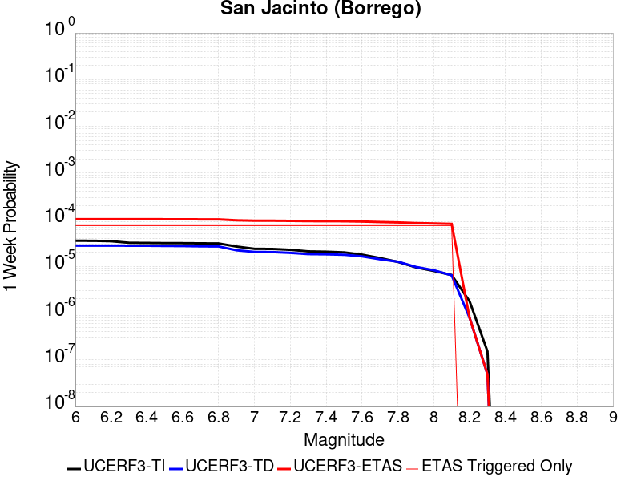 | 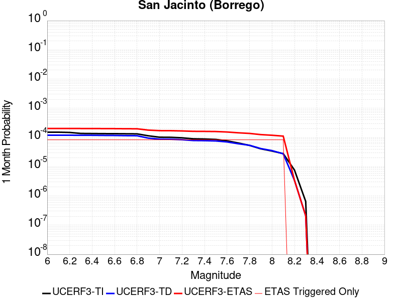 | 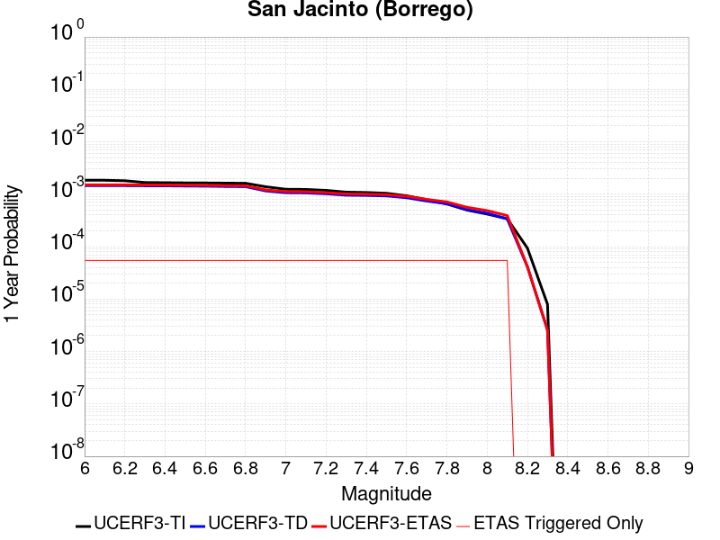 | 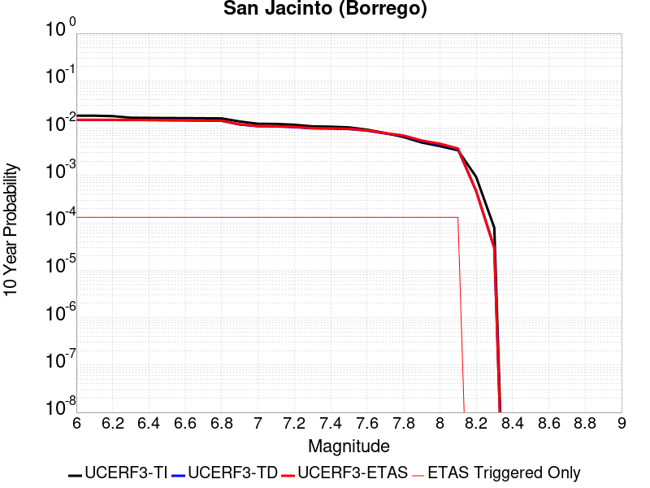 |

| Magnitude | 1 wk TI Prob | 1 wk TD Prob | 1 wk ETAS Prob | 1 wk ETAS/TD Gain | 1 wk ETAS Triggered Only | 1 mo TI Prob | 1 mo TD Prob | 1 mo ETAS Prob | 1 mo ETAS/TD Gain | 1 mo ETAS Triggered Only | 1 yr TI Prob | 1 yr TD Prob | 1 yr ETAS Prob | 1 yr ETAS/TD Gain | 1 yr ETAS Triggered Only | 10 yr TI Prob | 10 yr TD Prob | 10 yr ETAS Prob | 10 yr ETAS/TD Gain | 10 yr ETAS Triggered Only |
|-----|-----|-----|-----|-----|-----|-----|-----|-----|-----|-----|-----|-----|-----|-----|-----|-----|-----|-----|-----|-----|
| 6.0 | 3.543992E-5 | 2.7926513E-5 | 1.1297985E-4 | 4.0456123 | 8.505571E-5 | 1.5187653E-4 | 1.1967963E-4 | 2.0472516E-4 | 1.7106099 | 8.505571E-5 | 0.0018475284 | 0.0014561379 | 0.0015410697 | 1.0583268 | 8.505571E-5 | 0.018322436 | 0.014869647 | 0.014995334 | 1.0084525 | 1.2758357E-4 |
| 6.1 | 3.542281E-5 | 2.7926513E-5 | 1.1297985E-4 | 4.0456123 | 8.505571E-5 | 1.5180321E-4 | 1.1967963E-4 | 2.0472516E-4 | 1.7106099 | 8.505571E-5 | 0.0018466372 | 0.0014561379 | 0.0015410697 | 1.0583268 | 8.505571E-5 | 0.018313672 | 0.014869647 | 0.014995334 | 1.0084525 | 1.2758357E-4 |
| 6.2 | 3.4688688E-5 | 2.7926511E-5 | 1.1297985E-4 | 4.045613 | 8.505571E-5 | 1.4865733E-4 | 1.1967963E-4 | 2.0472516E-4 | 1.7106099 | 8.505571E-5 | 0.0018084005 | 0.0014561379 | 0.0015410697 | 1.0583268 | 8.505571E-5 | 0.017937548 | 0.014869647 | 0.014995334 | 1.0084525 | 1.2758357E-4 |
| 6.3 | 3.2087122E-5 | 2.7771865E-5 | 1.1282521E-4 | 4.0625725 | 8.505571E-5 | 1.3750899E-4 | 1.1901691E-4 | 2.040625E-4 | 1.7145673 | 8.505571E-5 | 0.0016728862 | 0.00144808 | 0.0015330125 | 1.0586518 | 8.505571E-5 | 0.016603488 | 0.014790683 | 0.01491638 | 1.0084983 | 1.2758357E-4 |
| 6.4 | 3.1828724E-5 | 2.7738852E-5 | 1.127922E-4 | 4.0662174 | 8.505571E-5 | 1.364017E-4 | 1.1887544E-4 | 2.0392104E-4 | 1.7154177 | 8.505571E-5 | 0.0016594254 | 0.0014463598 | 0.0015312926 | 1.0587217 | 8.505571E-5 | 0.016470885 | 0.014773762 | 0.014899461 | 1.0085082 | 1.2758357E-4 |
| 6.5 | 3.1563577E-5 | 2.747857E-5 | 1.1253195E-4 | 4.095262 | 8.505571E-5 | 1.3526545E-4 | 1.1776006E-4 | 2.0280575E-4 | 1.7221948 | 8.505571E-5 | 0.0016456128 | 0.0014327979 | 0.0015177317 | 1.0592784 | 8.505571E-5 | 0.0163348 | 0.014640348 | 0.014766064 | 1.0085869 | 1.2758357E-4 |
| 6.6 | 3.1467625E-5 | 2.7322796E-5 | 1.1237618E-4 | 4.1129093 | 8.505571E-5 | 1.3485427E-4 | 1.1709251E-4 | 2.0213825E-4 | 1.7263125 | 8.505571E-5 | 0.0016406142 | 0.0014246812 | 0.0015096157 | 1.0596166 | 8.505571E-5 | 0.016285548 | 0.014560594 | 0.01468632 | 1.0086347 | 1.2758357E-4 |
| 6.7 | 3.1223695E-5 | 2.6940816E-5 | 1.1199423E-4 | 4.1570473 | 8.505571E-5 | 1.3380898E-4 | 1.15455594E-4 | 2.0050148E-4 | 1.7366112 | 8.505571E-5 | 0.0016279068 | 0.0014047775 | 0.0014897138 | 1.0604624 | 8.505571E-5 | 0.01616033 | 0.014364966 | 0.014490717 | 1.008754 | 1.2758357E-4 |
| 6.8 | 3.1015585E-5 | 2.6761822E-5 | 1.1181526E-4 | 4.178163 | 8.505571E-5 | 1.3291716E-4 | 1.1468855E-4 | 1.9973451E-4 | 1.7415383 | 8.505571E-5 | 0.001617065 | 0.0013954508 | 0.0014803879 | 1.0608671 | 8.505571E-5 | 0.016053487 | 0.014272246 | 0.014398009 | 1.0088117 | 1.2758357E-4 |
| 6.9 | 2.6641965E-5 | 2.2184247E-5 | 1.0723807E-4 | 4.833974 | 8.505571E-5 | 1.1417485E-4 | 9.50719E-5 | 1.8011952E-4 | 1.8945612 | 8.505571E-5 | 0.0013891924 | 0.0011568897 | 0.0012418469 | 1.073436 | 8.505571E-5 | 0.0138054015 | 0.011882438 | 0.012008506 | 1.0106096 | 1.2758357E-4 |
| 7.0 | 2.3854353E-5 | 2.0479023E-5 | 1.0553299E-4 | 5.153224 | 8.505571E-5 | 1.02228936E-4 | 8.77643E-5 | 1.7281255E-4 | 1.9690528 | 8.505571E-5 | 0.0012439266 | 0.0010680092 | 0.0011529741 | 1.0795544 | 8.505571E-5 | 0.012369866 | 0.0109828 | 0.011108983 | 1.011489 | 1.2758357E-4 |
| 7.1 | 2.3672901E-5 | 2.031551E-5 | 1.05369494E-4 | 5.1866527 | 8.505571E-5 | 1.0145135E-4 | 8.7063585E-5 | 1.7211189E-4 | 1.9768528 | 8.505571E-5 | 0.0012344702 | 0.0010594862 | 0.0011444518 | 1.0801951 | 8.505571E-5 | 0.0122763505 | 0.010897976 | 0.01102417 | 1.0115795 | 1.2758357E-4 |
| 7.2 | 2.2717244E-5 | 1.9542893E-5 | 1.0459694E-4 | 5.352173 | 8.505571E-5 | 9.735599E-5 | 8.375258E-5 | 1.6880117E-4 | 2.0154743 | 8.505571E-5 | 0.0011846646 | 0.001019213 | 0.001104182 | 1.0833673 | 8.505571E-5 | 0.01178369 | 0.010495341 | 0.010621586 | 1.0120286 | 1.2758357E-4 |
| 7.3 | 2.1016205E-5 | 1.8384526E-5 | 1.0343867E-4 | 5.626399 | 8.505571E-5 | 9.006634E-5 | 7.878846E-5 | 1.6383747E-4 | 2.0794604 | 8.505571E-5 | 0.001096006 | 9.5882936E-4 | 0.0010438035 | 1.0886228 | 8.505571E-5 | 0.010906163 | 0.009890967 | 0.010017289 | 1.0127714 | 1.2758357E-4 |
| 7.4 | 2.0683625E-5 | 1.8187047E-5 | 1.0324121E-4 | 5.6766343 | 8.505571E-5 | 8.86411E-5 | 7.794217E-5 | 1.6299126E-4 | 2.0911818 | 8.505571E-5 | 0.001078671 | 9.485349E-4 | 0.0010335098 | 1.0895855 | 8.505571E-5 | 0.010734501 | 0.009787692 | 0.009914027 | 1.0129075 | 1.2758357E-4 |
| 7.5 | 1.9993966E-5 | 1.7782075E-5 | 1.02836275E-4 | 5.7831426 | 8.505571E-5 | 8.568561E-5 | 7.620667E-5 | 1.612559E-4 | 2.1160338 | 8.505571E-5 | 0.001042723 | 9.2742336E-4 | 0.0010124001 | 1.0916268 | 8.505571E-5 | 0.010378438 | 0.009574614 | 0.009700976 | 1.0131977 | 1.2758357E-4 |
| 7.6 | 1.788966E-5 | 1.6435291E-5 | 1.01489604E-4 | 6.1751027 | 8.505571E-5 | 7.666772E-5 | 7.043507E-5 | 1.5548478E-4 | 2.2074912 | 8.505571E-5 | 9.3302975E-4 | 8.572113E-4 | 9.4219414E-4 | 1.0991387 | 8.505571E-5 | 0.00929122 | 0.008866487 | 0.008992939 | 1.0142618 | 1.2758357E-4 |
| 7.7 | 1.5125781E-5 | 1.4237377E-5 | 9.929188E-5 | 6.9740286 | 8.505571E-5 | 6.4823165E-5 | 6.1015908E-5 | 1.4606644E-4 | 2.3939073 | 8.505571E-5 | 7.889362E-4 | 7.426163E-4 | 8.2760886E-4 | 1.1144501 | 8.505571E-5 | 0.007861412 | 0.0077142045 | 0.007840804 | 1.0164112 | 1.2758357E-4 |
| 7.8 | 1.250089E-5 | 1.26304985E-5 | 9.768514E-5 | 7.734068 | 8.505571E-5 | 5.3574146E-5 | 5.412959E-5 | 1.391807E-4 | 2.57125 | 8.505571E-5 | 6.5207E-4 | 6.588291E-4 | 7.438288E-4 | 1.1290163 | 8.505571E-5 | 0.006501599 | 0.0068677636 | 0.006994471 | 1.0184495 | 1.2758357E-4 |
| 7.9 | 9.561E-6 | 9.754616E-6 | 9.48095E-5 | 9.719449 | 8.505571E-5 | 4.0975072E-5 | 4.1804833E-5 | 1.2685699E-4 | 3.0345054 | 8.505571E-5 | 4.987573E-4 | 5.088555E-4 | 5.9386797E-4 | 1.167066 | 8.505571E-5 | 0.0049763937 | 0.0053523467 | 0.0054792473 | 1.0237094 | 1.2758357E-4 |
| 8.0 | 8.01699E-6 | 8.293488E-6 | 9.334849E-5 | 11.255638 | 8.505571E-5 | 3.4358076E-5 | 3.554304E-5 | 1.2059572E-4 | 3.3929493 | 8.505571E-5 | 4.1822926E-4 | 4.3265108E-4 | 5.1767E-4 | 1.1965069 | 8.505571E-5 | 0.0041744304 | 0.004573375 | 0.0047003753 | 1.0277694 | 1.2758357E-4 |
| 8.1 | 6.541947E-6 | 6.4622354E-6 | 9.1517395E-5 | 14.16188 | 8.505571E-5 | 2.8036617E-5 | 2.7695003E-5 | 1.12748356E-4 | 4.071072 | 8.505571E-5 | 3.4129233E-4 | 3.37135E-4 | 4.2216203E-4 | 1.2522047 | 8.505571E-5 | 0.0034076865 | 0.0035806994 | 0.0037078261 | 1.0355033 | 1.2758357E-4 |
| 8.2 | 1.7968189E-6 | 7.9713476E-7 | 7.9713476E-7 | 1.0 | 0.0 | 7.70063E-6 | 3.4162877E-6 | 3.4162877E-6 | 1.0 | 0.0 | 9.3751136E-5 | 4.159253E-5 | 4.159253E-5 | 1.0 | 0.0 | 9.371159E-4 | 4.712058E-4 | 4.712058E-4 | 1.0 | 0.0 |
| 8.3 | 1.5167889E-7 | 4.897714E-8 | 4.897714E-8 | 1.0 | 0.0 | 6.500522E-7 | 2.09902E-7 | 2.09902E-7 | 1.0 | 0.0 | 7.9143565E-6 | 2.5555544E-6 | 2.5555544E-6 | 1.0 | 0.0 | 7.914075E-5 | 2.969505E-5 | 2.969505E-5 | 1.0 | 0.0 |

## Big Pine (East)
*[(top)](#table-of-contents)*

| 1 Week | 1 Month | 1 Year | 10 Year |
|-----|-----|-----|-----|
| 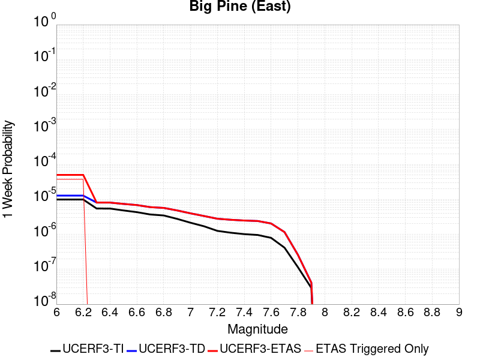 | 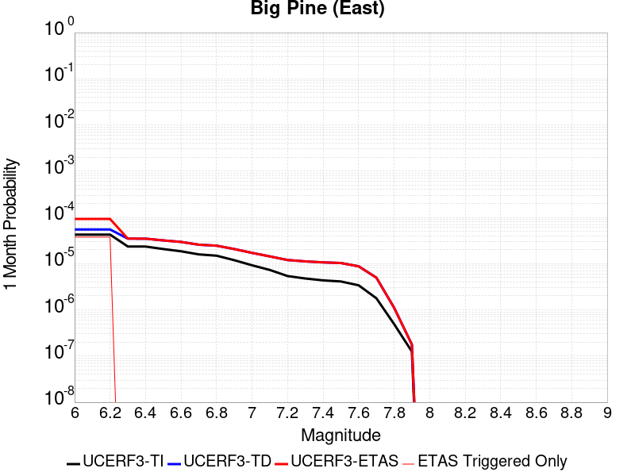 | 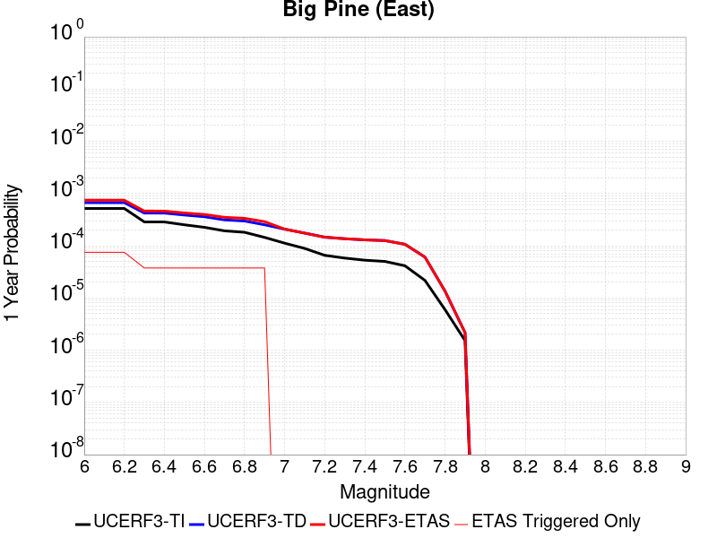 | 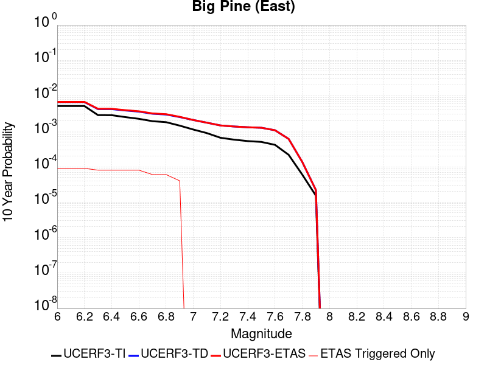 |

| Magnitude | 1 wk TI Prob | 1 wk TD Prob | 1 wk ETAS Prob | 1 wk ETAS/TD Gain | 1 wk ETAS Triggered Only | 1 mo TI Prob | 1 mo TD Prob | 1 mo ETAS Prob | 1 mo ETAS/TD Gain | 1 mo ETAS Triggered Only | 1 yr TI Prob | 1 yr TD Prob | 1 yr ETAS Prob | 1 yr ETAS/TD Gain | 1 yr ETAS Triggered Only | 10 yr TI Prob | 10 yr TD Prob | 10 yr ETAS Prob | 10 yr ETAS/TD Gain | 10 yr ETAS Triggered Only |
|-----|-----|-----|-----|-----|-----|-----|-----|-----|-----|-----|-----|-----|-----|-----|-----|-----|-----|-----|-----|-----|
| 6.0 | 9.916913E-6 | 1.2816984E-5 | 1.2816984E-5 | 1.0 | 0.0 | 4.250036E-5 | 5.49289E-5 | 5.49289E-5 | 1.0 | 0.0 | 5.173191E-4 | 6.685763E-4 | 7.110757E-4 | 1.063567 | 4.2527856E-5 | 0.0051611643 | 0.006670441 | 0.0067971735 | 1.0189991 | 1.2758357E-4 |
| 6.1 | 9.916913E-6 | 1.2816984E-5 | 1.2816984E-5 | 1.0 | 0.0 | 4.250036E-5 | 5.49289E-5 | 5.49289E-5 | 1.0 | 0.0 | 5.173191E-4 | 6.685763E-4 | 7.110757E-4 | 1.063567 | 4.2527856E-5 | 0.0051611643 | 0.006670441 | 0.0067971735 | 1.0189991 | 1.2758357E-4 |
| 6.2 | 9.916913E-6 | 1.2816984E-5 | 1.2816984E-5 | 1.0 | 0.0 | 4.250036E-5 | 5.49289E-5 | 5.49289E-5 | 1.0 | 0.0 | 5.173191E-4 | 6.685763E-4 | 7.110757E-4 | 1.063567 | 4.2527856E-5 | 0.0051611643 | 0.006670441 | 0.0067971735 | 1.0189991 | 1.2758357E-4 |
| 6.3 | 5.479711E-6 | 8.112951E-6 | 8.112951E-6 | 1.0 | 0.0 | 2.3484265E-5 | 3.4769346E-5 | 3.4769346E-5 | 1.0 | 0.0 | 2.858834E-4 | 4.2323777E-4 | 4.657476E-4 | 1.1004397 | 4.2527856E-5 | 0.0028551589 | 0.004227244 | 0.004354288 | 1.0300537 | 1.2758357E-4 |
| 6.4 | 5.465009E-6 | 8.097245E-6 | 8.097245E-6 | 1.0 | 0.0 | 2.3421257E-5 | 3.4702036E-5 | 3.4702036E-5 | 1.0 | 0.0 | 2.851165E-4 | 4.2241855E-4 | 4.6492845E-4 | 1.1006346 | 4.2527856E-5 | 0.0028475097 | 0.0042190826 | 0.004346128 | 1.030112 | 1.2758357E-4 |
| 6.5 | 4.826767E-6 | 7.422301E-6 | 7.422301E-6 | 1.0 | 0.0 | 2.068598E-5 | 3.180949E-5 | 3.180949E-5 | 1.0 | 0.0 | 2.518227E-4 | 3.872145E-4 | 4.297259E-4 | 1.1097877 | 4.2527856E-5 | 0.0025153751 | 0.003868283 | 0.003995373 | 1.0328544 | 1.2758357E-4 |
| 6.6 | 4.3146847E-6 | 6.8822374E-6 | 6.8822374E-6 | 1.0 | 0.0 | 1.8491375E-5 | 2.9494982E-5 | 2.9494982E-5 | 1.0 | 0.0 | 2.2510924E-4 | 3.590447E-4 | 4.0155728E-4 | 1.1184047 | 4.2527856E-5 | 0.0022488134 | 0.0035874986 | 0.0037146243 | 1.0354358 | 1.2758357E-4 |
| 6.7 | 3.6968106E-6 | 5.9954727E-6 | 5.9954727E-6 | 1.0 | 0.0 | 1.5843378E-5 | 2.5694639E-5 | 2.5694639E-5 | 1.0 | 0.0 | 1.9287605E-4 | 3.1278885E-4 | 3.553034E-4 | 1.1359209 | 4.2527856E-5 | 0.0019270873 | 0.0031262483 | 0.003253433 | 1.0406829 | 1.2758357E-4 |
| 6.8 | 3.4671132E-6 | 5.702177E-6 | 5.702177E-6 | 1.0 | 0.0 | 1.4858972E-5 | 2.4437682E-5 | 2.4437682E-5 | 1.0 | 0.0 | 1.8089297E-4 | 2.974896E-4 | 3.400048E-4 | 1.1429132 | 4.2527856E-5 | 0.0018074579 | 0.002973667 | 0.0031008713 | 1.0427768 | 1.2758357E-4 |
| 6.9 | 2.7686972E-6 | 4.825223E-6 | 4.825223E-6 | 1.0 | 0.0 | 1.1865792E-5 | 2.0679368E-5 | 2.0679368E-5 | 1.0 | 0.0 | 1.4445644E-4 | 2.5174298E-4 | 2.9426013E-4 | 1.1688911 | 4.2527856E-5 | 0.0014436257 | 0.0025172636 | 0.002644526 | 1.0505558 | 1.2758357E-4 |
| 7.0 | 2.1472624E-6 | 3.9850406E-6 | 3.9850406E-6 | 1.0 | 0.0 | 9.20252E-6 | 1.7078637E-5 | 1.7078637E-5 | 1.0 | 0.0 | 1.12034926E-4 | 2.079131E-4 | 2.079131E-4 | 1.0 | 0.0 | 0.0011197845 | 0.0020798394 | 0.0020798394 | 1.0 | 0.0 |
| 7.1 | 1.7018335E-6 | 3.344876E-6 | 3.344876E-6 | 1.0 | 0.0 | 7.293552E-6 | 1.4335106E-5 | 1.4335106E-5 | 1.0 | 0.0 | 8.879537E-5 | 1.7451629E-4 | 1.7451629E-4 | 1.0 | 0.0 | 8.87599E-4 | 0.0017464145 | 0.0017464145 | 1.0 | 0.0 |
| 7.2 | 1.25603E-6 | 2.794484E-6 | 2.794484E-6 | 1.0 | 0.0 | 5.3829745E-6 | 1.1976307E-5 | 1.1976307E-5 | 1.0 | 0.0 | 6.553574E-5 | 1.4580201E-4 | 1.4580201E-4 | 1.0 | 0.0 | 6.551642E-4 | 0.001459661 | 0.001459661 | 1.0 | 0.0 |
| 7.3 | 1.112297E-6 | 2.610332E-6 | 2.610332E-6 | 1.0 | 0.0 | 4.7669787E-6 | 1.118709E-5 | 1.118709E-5 | 1.0 | 0.0 | 5.803642E-5 | 1.3619453E-4 | 1.3619453E-4 | 1.0 | 0.0 | 5.802127E-4 | 0.0013635408 | 0.0013635408 | 1.0 | 0.0 |
| 7.4 | 1.0137181E-6 | 2.4834917E-6 | 2.4834917E-6 | 1.0 | 0.0 | 4.3444993E-6 | 1.0643494E-5 | 1.0643494E-5 | 1.0 | 0.0 | 5.2892992E-5 | 1.2957705E-4 | 1.2957705E-4 | 1.0 | 0.0 | 5.288041E-4 | 0.0012972289 | 0.0012972289 | 1.0 | 0.0 |
| 7.5 | 9.598608E-7 | 2.4071483E-6 | 2.4071483E-6 | 1.0 | 0.0 | 4.1136827E-6 | 1.031631E-5 | 1.031631E-5 | 1.0 | 0.0 | 5.0082934E-5 | 1.2559404E-4 | 1.2559404E-4 | 1.0 | 0.0 | 5.007165E-4 | 0.0012572526 | 0.0012572526 | 1.0 | 0.0 |
| 7.6 | 7.929459E-7 | 2.0448588E-6 | 2.0448588E-6 | 1.0 | 0.0 | 3.3983351E-6 | 8.763653E-6 | 8.763653E-6 | 1.0 | 0.0 | 4.1373947E-5 | 1.06692416E-4 | 1.06692416E-4 | 1.0 | 0.0 | 4.1366243E-4 | 0.0010685222 | 0.0010685222 | 1.0 | 0.0 |
| 7.7 | 4.155788E-7 | 1.1605589E-6 | 1.1605589E-6 | 1.0 | 0.0 | 1.7810507E-6 | 4.9738146E-6 | 4.9738146E-6 | 1.0 | 0.0 | 2.1684076E-5 | 6.0554554E-5 | 6.0554554E-5 | 1.0 | 0.0 | 2.1681961E-4 | 6.0857297E-4 | 6.0857297E-4 | 1.0 | 0.0 |
| 7.8 | 1.14666925E-7 | 2.592015E-7 | 2.592015E-7 | 1.0 | 0.0 | 4.914296E-7 | 1.1108631E-6 | 1.1108631E-6 | 1.0 | 0.0 | 5.9831386E-6 | 1.3524678E-5 | 1.3524678E-5 | 1.0 | 0.0 | 5.9829777E-5 | 1.3634123E-4 | 1.3634123E-4 | 1.0 | 0.0 |
| 7.9 | 2.9231824E-8 | 4.1463963E-8 | 4.1463963E-8 | 1.0 | 0.0 | 1.2527924E-7 | 1.7770269E-7 | 1.7770269E-7 | 1.0 | 0.0 | 1.5252737E-6 | 2.1635283E-6 | 2.1635283E-6 | 1.0 | 0.0 | 1.5252632E-5 | 2.1967755E-5 | 2.1967755E-5 | 1.0 | 0.0 |

## Imperial
*[(top)](#table-of-contents)*

| 1 Week | 1 Month | 1 Year | 10 Year |
|-----|-----|-----|-----|
| 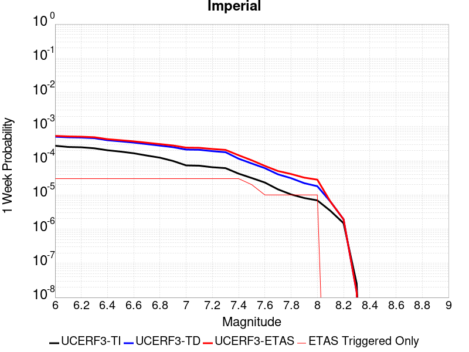 | 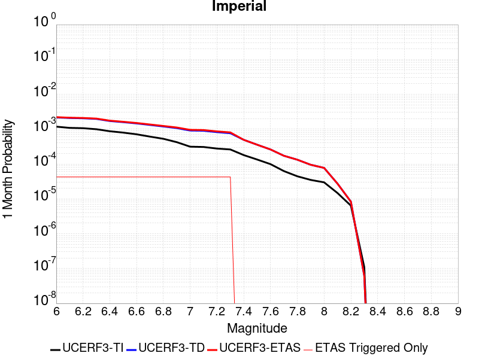 |  | 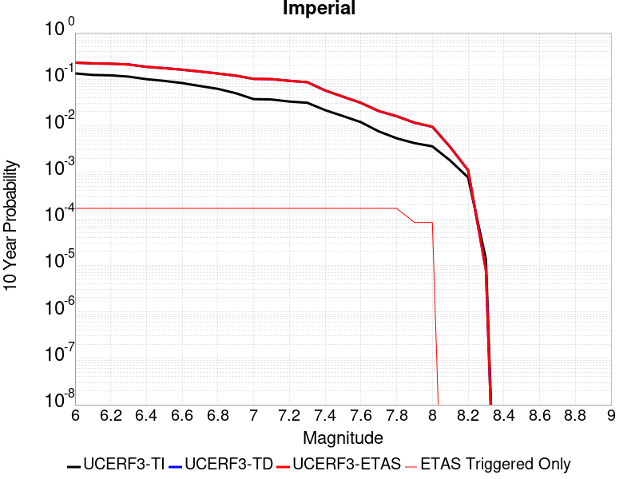 |

| Magnitude | 1 wk TI Prob | 1 wk TD Prob | 1 wk ETAS Prob | 1 wk ETAS/TD Gain | 1 wk ETAS Triggered Only | 1 mo TI Prob | 1 mo TD Prob | 1 mo ETAS Prob | 1 mo ETAS/TD Gain | 1 mo ETAS Triggered Only | 1 yr TI Prob | 1 yr TD Prob | 1 yr ETAS Prob | 1 yr ETAS/TD Gain | 1 yr ETAS Triggered Only | 10 yr TI Prob | 10 yr TD Prob | 10 yr ETAS Prob | 10 yr ETAS/TD Gain | 10 yr ETAS Triggered Only |
|-----|-----|-----|-----|-----|-----|-----|-----|-----|-----|-----|-----|-----|-----|-----|-----|-----|-----|-----|-----|-----|
| 6.0 | 2.7496446E-4 | 5.0552754E-4 | 5.0552754E-4 | 1.0 | 0.0 | 0.0011778869 | 0.002164787 | 0.0022072229 | 1.0196028 | 4.2527856E-5 | 0.0142467655 | 0.026038699 | 0.026080118 | 1.0015907 | 4.2527856E-5 | 0.13367249 | 0.2280438 | 0.22814228 | 1.0004319 | 1.2758357E-4 |
| 6.1 | 2.5356023E-4 | 4.8656776E-4 | 4.8656776E-4 | 1.0 | 0.0 | 0.001086234 | 0.0020836622 | 0.0021261014 | 1.0203676 | 4.2527856E-5 | 0.013144928 | 0.025071215 | 0.025112676 | 1.0016538 | 4.2527856E-5 | 0.123940155 | 0.21947981 | 0.2195794 | 1.0004537 | 1.2758357E-4 |
| 6.2 | 2.4820742E-4 | 4.7752203E-4 | 4.7752203E-4 | 1.0 | 0.0 | 0.0010633124 | 0.0020449557 | 0.0020873966 | 1.020754 | 4.2527856E-5 | 0.01286919 | 0.024611235 | 0.024652716 | 1.0016855 | 4.2527856E-5 | 0.12148927 | 0.21598552 | 0.21608555 | 1.0004631 | 1.2758357E-4 |
| 6.3 | 2.3205351E-4 | 4.5890483E-4 | 4.5890483E-4 | 1.0 | 0.0 | 9.94136E-4 | 0.0019652895 | 0.0020077338 | 1.0215969 | 4.2527856E-5 | 0.012036599 | 0.02366133 | 0.023702852 | 1.0017549 | 4.2527856E-5 | 0.11405133 | 0.20793462 | 0.20803568 | 1.000486 | 1.2758357E-4 |
| 6.4 | 2.0304754E-4 | 3.987652E-4 | 3.987652E-4 | 1.0 | 0.0 | 8.6991355E-4 | 0.0017078889 | 0.0017503442 | 1.0248584 | 4.2527856E-5 | 0.010539869 | 0.020595672 | 0.020637322 | 1.0020224 | 4.2527856E-5 | 0.100537635 | 0.1850669 | 0.18517086 | 1.0005618 | 1.2758357E-4 |
| 6.5 | 1.854992E-4 | 3.6988858E-4 | 3.6988858E-4 | 1.0 | 0.0 | 7.9475436E-4 | 0.0015842861 | 0.0016267465 | 1.026801 | 4.2527856E-5 | 0.009633281 | 0.01911948 | 0.019161196 | 1.0021818 | 4.2527856E-5 | 0.0922623 | 0.173298 | 0.17340347 | 1.0006087 | 1.2758357E-4 |
| 6.6 | 1.6586106E-4 | 3.403506E-4 | 3.403506E-4 | 1.0 | 0.0 | 7.106394E-4 | 0.0014578402 | 0.0015003061 | 1.0291293 | 4.2527856E-5 | 0.008617763 | 0.01760642 | 0.0176482 | 1.002373 | 4.2527856E-5 | 0.08291132 | 0.16077545 | 0.16088252 | 1.000666 | 1.2758357E-4 |
| 6.7 | 1.4224656E-4 | 3.076692E-4 | 3.076692E-4 | 1.0 | 0.0 | 6.094856E-4 | 0.001317924 | 0.0013603959 | 1.0322263 | 4.2527856E-5 | 0.0073952693 | 0.015929576 | 0.015971428 | 1.0026273 | 4.2527856E-5 | 0.07153955 | 0.14648417 | 0.14659306 | 1.0007434 | 1.2758357E-4 |
| 6.8 | 1.2317259E-4 | 2.779122E-4 | 2.779122E-4 | 1.0 | 0.0 | 5.2777573E-4 | 0.0011905148 | 0.0012329919 | 1.0356797 | 4.2527856E-5 | 0.0064067547 | 0.0143995695 | 0.0144414855 | 1.0029109 | 4.2527856E-5 | 0.06225166 | 0.13293684 | 0.13304745 | 1.0008322 | 1.2758357E-4 |
| 6.9 | 9.859898E-5 | 2.5014306E-4 | 2.5014306E-4 | 1.0 | 0.0 | 4.2249862E-4 | 0.0010716055 | 0.0011140878 | 1.0396435 | 4.2527856E-5 | 0.0051317946 | 0.012969712 | 0.013011688 | 1.0032365 | 4.2527856E-5 | 0.05014893 | 0.11940631 | 0.11951866 | 1.0009409 | 1.2758357E-4 |
| 7.0 | 7.3191884E-5 | 2.1266776E-4 | 2.1266776E-4 | 1.0 | 0.0 | 3.136418E-4 | 9.1111806E-4 | 9.536072E-4 | 1.0466341 | 4.2527856E-5 | 0.003811904 | 0.011037128 | 0.011079187 | 1.0038106 | 4.2527856E-5 | 0.037471764 | 0.10206493 | 0.10217949 | 1.0011225 | 1.2758357E-4 |
| 7.1 | 7.1760296E-5 | 2.0968143E-4 | 2.0968143E-4 | 1.0 | 0.0 | 3.0750787E-4 | 8.983284E-4 | 9.40818E-4 | 1.0472986 | 4.2527856E-5 | 0.003737482 | 0.010882978 | 0.010925043 | 1.0038652 | 4.2527856E-5 | 0.03675245 | 0.10070146 | 0.10081619 | 1.0011394 | 1.2758357E-4 |
| 7.2 | 6.46614E-5 | 1.9136685E-4 | 1.9136685E-4 | 1.0 | 0.0 | 2.7709085E-4 | 8.1988896E-4 | 8.6238194E-4 | 1.0518278 | 4.2527856E-5 | 0.0033683628 | 0.0099370815 | 0.009979187 | 1.0042372 | 4.2527856E-5 | 0.033177625 | 0.09250898 | 0.09262476 | 1.0012516 | 1.2758357E-4 |
| 7.3 | 6.088115E-5 | 1.78084E-4 | 1.78084E-4 | 1.0 | 0.0 | 2.6089314E-4 | 7.6299673E-4 | 8.0549216E-4 | 1.0556954 | 4.2527856E-5 | 0.0031717476 | 0.009250494 | 0.009292628 | 1.0045549 | 4.2527856E-5 | 0.031268585 | 0.08655989 | 0.08667643 | 1.0013463 | 1.2758357E-4 |
| 7.4 | 4.199346E-5 | 1.1510366E-4 | 1.1510366E-4 | 1.0 | 0.0 | 1.7995955E-4 | 4.9320905E-4 | 4.9320905E-4 | 1.0 | 0.0 | 0.0021888057 | 0.0059884563 | 0.0059884563 | 1.0 | 0.0 | 0.02167372 | 0.057439793 | 0.057519965 | 1.0013957 | 8.505571E-5 |
| 7.5 | 3.130448E-5 | 8.33328E-5 | 8.33328E-5 | 1.0 | 0.0 | 1.3415517E-4 | 3.57092E-4 | 3.57092E-4 | 1.0 | 0.0 | 0.0016321153 | 0.004338988 | 0.004338988 | 1.0 | 0.0 | 0.016201803 | 0.04213201 | 0.04221348 | 1.0019337 | 8.505571E-5 |
| 7.6 | 2.3074248E-5 | 6.0844646E-5 | 6.0844646E-5 | 1.0 | 0.0 | 9.888588E-5 | 2.6073685E-4 | 2.6073685E-4 | 1.0 | 0.0 | 0.0012032706 | 0.0031698733 | 0.0031698733 | 1.0 | 0.0 | 0.011967761 | 0.031026395 | 0.031108811 | 1.0026563 | 8.505571E-5 |
| 7.7 | 1.45864815E-5 | 4.0124698E-5 | 4.0124698E-5 | 1.0 | 0.0 | 6.2511994E-5 | 1.7195169E-4 | 1.7195169E-4 | 1.0 | 0.0 | 7.608177E-4 | 0.0020915072 | 0.0020915072 | 1.0 | 0.0 | 0.007582182 | 0.020627763 | 0.020711064 | 1.0040383 | 8.505571E-5 |
| 7.8 | 1.0352979E-5 | 3.0960902E-5 | 3.0960902E-5 | 1.0 | 0.0 | 4.4369157E-5 | 1.3268284E-4 | 1.3268284E-4 | 1.0 | 0.0 | 5.400606E-4 | 0.0016142189 | 0.0016142189 | 1.0 | 0.0 | 0.0053875 | 0.016016833 | 0.016100526 | 1.0052253 | 8.505571E-5 |
| 7.9 | 8.137906E-6 | 2.2149103E-5 | 2.2149103E-5 | 1.0 | 0.0 | 3.4876273E-5 | 9.492128E-5 | 9.492128E-5 | 1.0 | 0.0 | 4.2453592E-4 | 0.0011550548 | 0.0011550548 | 1.0 | 0.0 | 0.004237258 | 0.011617903 | 0.011659936 | 1.003618 | 4.2527856E-5 |
| 8.0 | 6.93792E-6 | 1.8008766E-5 | 1.8008766E-5 | 1.0 | 0.0 | 2.9733603E-5 | 7.717814E-5 | 7.717814E-5 | 1.0 | 0.0 | 3.6194647E-4 | 9.3923963E-4 | 9.3923963E-4 | 1.0 | 0.0 | 0.0036135751 | 0.00950155 | 0.009543674 | 1.0044334 | 4.2527856E-5 |
| 8.1 | 3.4286315E-6 | 6.379872E-6 | 6.379872E-6 | 1.0 | 0.0 | 1.4694053E-5 | 2.7342023E-5 | 2.7342023E-5 | 1.0 | 0.0 | 1.7888541E-4 | 3.328384E-4 | 3.328384E-4 | 1.0 | 0.0 | 0.0017874148 | 0.003486031 | 0.003486031 | 1.0 | 0.0 |
| 8.2 | 1.4906886E-6 | 1.9366646E-6 | 1.9366646E-6 | 1.0 | 0.0 | 6.3886496E-6 | 8.299965E-6 | 8.299965E-6 | 1.0 | 0.0 | 7.7779034E-5 | 1.0104742E-4 | 1.0104742E-4 | 1.0 | 0.0 | 7.775182E-4 | 0.0011075331 | 0.0011075331 | 1.0 | 0.0 |
| 8.3 | 2.5758007E-8 | 1.4500102E-8 | 1.4500102E-8 | 1.0 | 0.0 | 1.10391454E-7 | 6.214329E-8 | 6.214329E-8 | 1.0 | 0.0 | 1.3440151E-6 | 7.565946E-7 | 7.565946E-7 | 1.0 | 0.0 | 1.344007E-5 | 7.887763E-6 | 7.887763E-6 | 1.0 | 0.0 |

## Ventura-Pitas Point
*[(top)](#table-of-contents)*

| 1 Week | 1 Month | 1 Year | 10 Year |
|-----|-----|-----|-----|
| 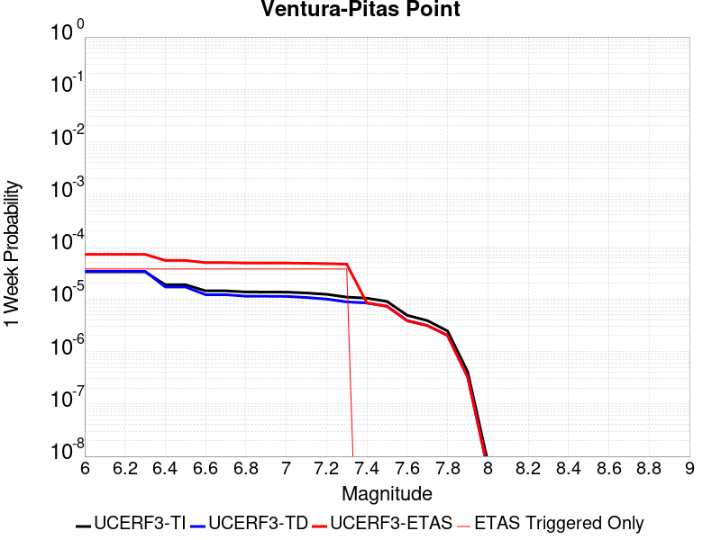 | 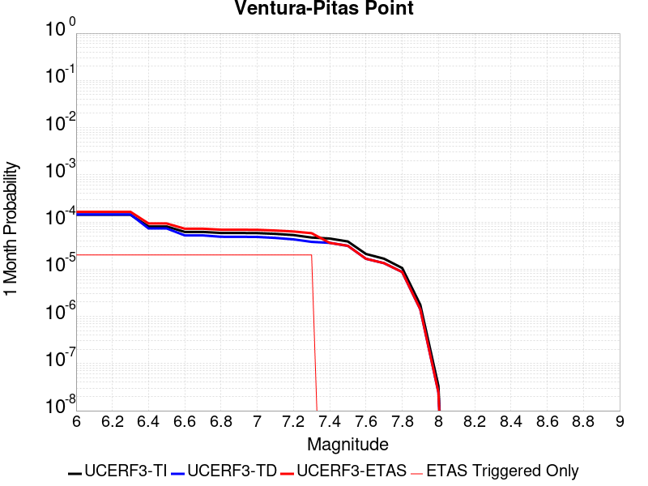 | 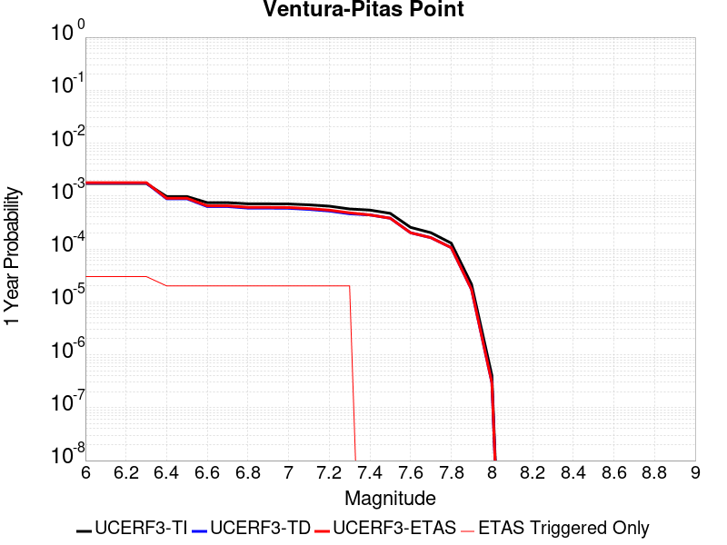 | 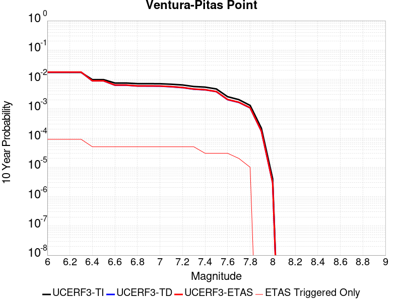 |

| Magnitude | 1 wk TI Prob | 1 wk TD Prob | 1 wk ETAS Prob | 1 wk ETAS/TD Gain | 1 wk ETAS Triggered Only | 1 mo TI Prob | 1 mo TD Prob | 1 mo ETAS Prob | 1 mo ETAS/TD Gain | 1 mo ETAS Triggered Only | 1 yr TI Prob | 1 yr TD Prob | 1 yr ETAS Prob | 1 yr ETAS/TD Gain | 1 yr ETAS Triggered Only | 10 yr TI Prob | 10 yr TD Prob | 10 yr ETAS Prob | 10 yr ETAS/TD Gain | 10 yr ETAS Triggered Only |
|-----|-----|-----|-----|-----|-----|-----|-----|-----|-----|-----|-----|-----|-----|-----|-----|-----|-----|-----|-----|-----|
| 6.0 | 3.3179622E-5 | 3.3735185E-5 | 3.3735185E-5 | 1.0 | 0.0 | 1.4219063E-4 | 1.445728E-4 | 1.445728E-4 | 1.0 | 0.0 | 0.0017297962 | 0.0017590096 | 0.0017590096 | 1.0 | 0.0 | 0.017163932 | 0.0174764 | 0.01755997 | 1.0047818 | 8.505571E-5 |
| 6.1 | 3.3179622E-5 | 3.3735185E-5 | 3.3735185E-5 | 1.0 | 0.0 | 1.4219063E-4 | 1.445728E-4 | 1.445728E-4 | 1.0 | 0.0 | 0.0017297962 | 0.0017590096 | 0.0017590096 | 1.0 | 0.0 | 0.017163932 | 0.0174764 | 0.01755997 | 1.0047818 | 8.505571E-5 |
| 6.2 | 3.3179622E-5 | 3.3735185E-5 | 3.3735185E-5 | 1.0 | 0.0 | 1.4219063E-4 | 1.445728E-4 | 1.445728E-4 | 1.0 | 0.0 | 0.0017297962 | 0.0017590096 | 0.0017590096 | 1.0 | 0.0 | 0.017163932 | 0.0174764 | 0.01755997 | 1.0047818 | 8.505571E-5 |
| 6.3 | 3.3179622E-5 | 3.3735185E-5 | 3.3735185E-5 | 1.0 | 0.0 | 1.4219063E-4 | 1.445728E-4 | 1.445728E-4 | 1.0 | 0.0 | 0.0017297962 | 0.0017590096 | 0.0017590096 | 1.0 | 0.0 | 0.017163932 | 0.0174764 | 0.01755997 | 1.0047818 | 8.505571E-5 |
| 6.4 | 1.8754668E-5 | 1.701961E-5 | 1.701961E-5 | 1.0 | 0.0 | 8.037467E-5 | 7.293928E-5 | 7.293928E-5 | 1.0 | 0.0 | 9.781223E-4 | 8.8769704E-4 | 8.8769704E-4 | 1.0 | 0.0 | 0.009738282 | 0.008843848 | 0.008928152 | 1.0095325 | 8.505571E-5 |
| 6.5 | 1.8754668E-5 | 1.701961E-5 | 1.701961E-5 | 1.0 | 0.0 | 8.037467E-5 | 7.293928E-5 | 7.293928E-5 | 1.0 | 0.0 | 9.781223E-4 | 8.8769704E-4 | 8.8769704E-4 | 1.0 | 0.0 | 0.009738282 | 0.008843848 | 0.008928152 | 1.0095325 | 8.505571E-5 |
| 6.6 | 1.4361558E-5 | 1.2122275E-5 | 1.2122275E-5 | 1.0 | 0.0 | 6.154808E-5 | 5.1951585E-5 | 5.1951585E-5 | 1.0 | 0.0 | 7.490902E-4 | 6.3232926E-4 | 6.3232926E-4 | 1.0 | 0.0 | 0.0074657016 | 0.0063055577 | 0.006390077 | 1.0134039 | 8.505571E-5 |
| 6.7 | 1.4361558E-5 | 1.2122275E-5 | 1.2122275E-5 | 1.0 | 0.0 | 6.154808E-5 | 5.1951585E-5 | 5.1951585E-5 | 1.0 | 0.0 | 7.490902E-4 | 6.3232926E-4 | 6.3232926E-4 | 1.0 | 0.0 | 0.0074657016 | 0.0063055577 | 0.006390077 | 1.0134039 | 8.505571E-5 |
| 6.8 | 1.3663846E-5 | 1.13444175E-5 | 1.13444175E-5 | 1.0 | 0.0 | 5.8558027E-5 | 4.861804E-5 | 4.861804E-5 | 1.0 | 0.0 | 7.127108E-4 | 5.917658E-4 | 5.917658E-4 | 1.0 | 0.0 | 0.007104293 | 0.005902116 | 0.00598667 | 1.014326 | 8.505571E-5 |
| 6.9 | 1.3644157E-5 | 1.1322519E-5 | 1.1322519E-5 | 1.0 | 0.0 | 5.8473648E-5 | 4.8524187E-5 | 4.8524187E-5 | 1.0 | 0.0 | 7.116841E-4 | 5.9062376E-4 | 5.9062376E-4 | 1.0 | 0.0 | 0.007094092 | 0.0058907564 | 0.005975311 | 1.0143538 | 8.505571E-5 |
| 7.0 | 1.3568845E-5 | 1.1242086E-5 | 1.1242086E-5 | 1.0 | 0.0 | 5.8150898E-5 | 4.817949E-5 | 4.817949E-5 | 1.0 | 0.0 | 7.077572E-4 | 5.864293E-4 | 5.864293E-4 | 1.0 | 0.0 | 0.007055073 | 0.0058490336 | 0.0059335916 | 1.0144567 | 8.505571E-5 |
| 7.1 | 1.306572E-5 | 1.072054E-5 | 1.072054E-5 | 1.0 | 0.0 | 5.599474E-5 | 4.5944373E-5 | 4.5944373E-5 | 1.0 | 0.0 | 6.815227E-4 | 5.5923103E-4 | 5.5923103E-4 | 1.0 | 0.0 | 0.0067943637 | 0.0055784425 | 0.0056630233 | 1.0151621 | 8.505571E-5 |
| 7.2 | 1.232604E-5 | 9.995143E-6 | 9.995143E-6 | 1.0 | 0.0 | 5.2824813E-5 | 4.2835632E-5 | 4.2835632E-5 | 1.0 | 0.0 | 6.429523E-4 | 5.214008E-4 | 5.214008E-4 | 1.0 | 0.0 | 0.0064109527 | 0.005201967 | 0.00528658 | 1.0162656 | 8.505571E-5 |
| 7.3 | 1.0917261E-5 | 8.84384E-6 | 8.84384E-6 | 1.0 | 0.0 | 4.678742E-5 | 3.790163E-5 | 3.790163E-5 | 1.0 | 0.0 | 5.69488E-4 | 4.6135622E-4 | 4.6135622E-4 | 1.0 | 0.0 | 0.0056803077 | 0.00460415 | 0.0046888143 | 1.0183886 | 8.505571E-5 |
| 7.4 | 1.039959E-5 | 8.423562E-6 | 8.423562E-6 | 1.0 | 0.0 | 4.456891E-5 | 3.610049E-5 | 3.610049E-5 | 1.0 | 0.0 | 5.424914E-4 | 4.3943635E-4 | 4.3943635E-4 | 1.0 | 0.0 | 0.0054116896 | 0.004385836 | 0.0044705183 | 1.0193082 | 8.505571E-5 |
| 7.5 | 9.015877E-6 | 7.2975445E-6 | 7.2975445E-6 | 1.0 | 0.0 | 3.86389E-5 | 3.1274823E-5 | 3.1274823E-5 | 1.0 | 0.0 | 4.7032707E-4 | 3.8070587E-4 | 3.8070587E-4 | 1.0 | 0.0 | 0.004693329 | 0.0038006818 | 0.0038854142 | 1.022294 | 8.505571E-5 |
| 7.6 | 4.900162E-6 | 3.8741155E-6 | 3.8741155E-6 | 1.0 | 0.0 | 2.1000526E-5 | 1.6603248E-5 | 1.6603248E-5 | 1.0 | 0.0 | 2.556514E-4 | 2.0212591E-4 | 2.0212591E-4 | 1.0 | 0.0 | 0.0025535747 | 0.0020194345 | 0.0021043185 | 1.0420336 | 8.505571E-5 |
| 7.7 | 3.8850626E-6 | 3.1267302E-6 | 3.1267302E-6 | 1.0 | 0.0 | 1.6650163E-5 | 1.3400205E-5 | 1.3400205E-5 | 1.0 | 0.0 | 2.0269687E-4 | 1.6313537E-4 | 1.6313537E-4 | 1.0 | 0.0 | 0.002025121 | 0.0016301654 | 0.0017150824 | 1.0520911 | 8.505571E-5 |
| 7.8 | 2.4654719E-6 | 2.029875E-6 | 2.029875E-6 | 1.0 | 0.0 | 1.0566265E-5 | 8.699436E-6 | 8.699436E-6 | 1.0 | 0.0 | 1.2863669E-4 | 1.0591053E-4 | 1.0591053E-4 | 1.0 | 0.0 | 0.0012856225 | 0.0010586053 | 0.001101088 | 1.040131 | 4.2527856E-5 |
| 7.9 | 4.095894E-7 | 3.2764765E-7 | 3.2764765E-7 | 1.0 | 0.0 | 1.7553821E-6 | 1.4042034E-6 | 1.4042034E-6 | 1.0 | 0.0 | 2.1371567E-5 | 1.7096047E-5 | 1.7096047E-5 | 1.0 | 0.0 | 2.1369511E-4 | 1.7094762E-4 | 1.7094762E-4 | 1.0 | 0.0 |
| 8.0 | 7.791402E-9 | 5.683497E-9 | 5.683497E-9 | 1.0 | 0.0 | 3.3391725E-8 | 2.4357844E-8 | 2.4357844E-8 | 1.0 | 0.0 | 4.0654416E-7 | 2.9655675E-7 | 2.9655675E-7 | 1.0 | 0.0 | 4.065434E-6 | 2.9655655E-6 | 2.9655655E-6 | 1.0 | 0.0 |

## Deep Springs
*[(top)](#table-of-contents)*

| 1 Week | 1 Month | 1 Year | 10 Year |
|-----|-----|-----|-----|
| 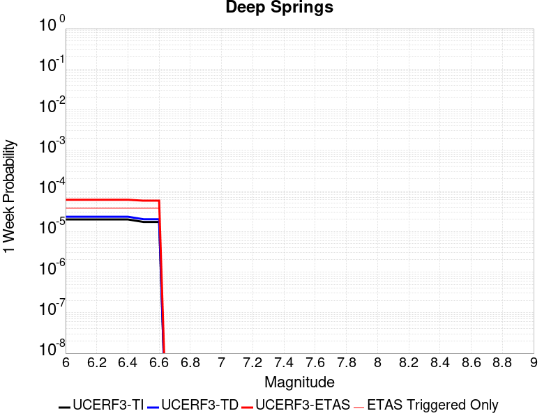 | 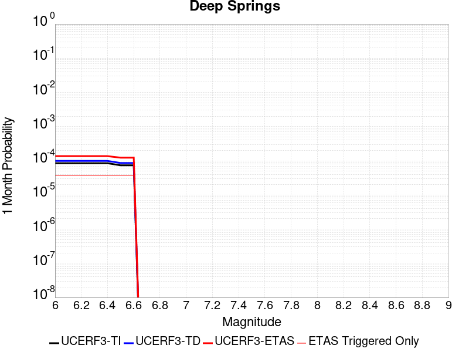 | 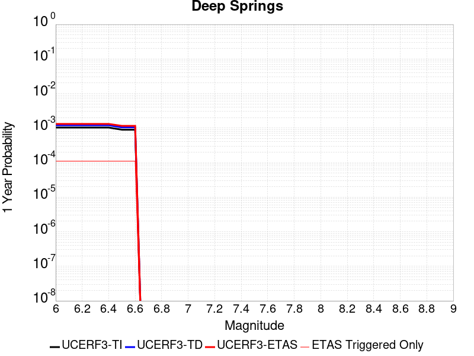 | 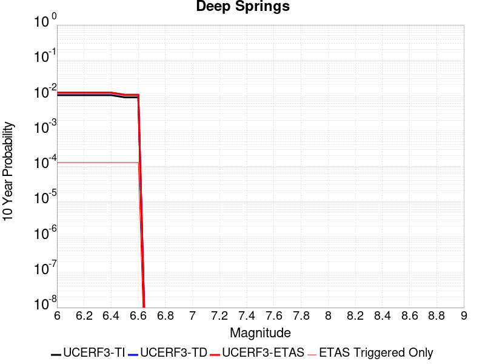 |

| Magnitude | 1 wk TI Prob | 1 wk TD Prob | 1 wk ETAS Prob | 1 wk ETAS/TD Gain | 1 wk ETAS Triggered Only | 1 mo TI Prob | 1 mo TD Prob | 1 mo ETAS Prob | 1 mo ETAS/TD Gain | 1 mo ETAS Triggered Only | 1 yr TI Prob | 1 yr TD Prob | 1 yr ETAS Prob | 1 yr ETAS/TD Gain | 1 yr ETAS Triggered Only | 10 yr TI Prob | 10 yr TD Prob | 10 yr ETAS Prob | 10 yr ETAS/TD Gain | 10 yr ETAS Triggered Only |
|-----|-----|-----|-----|-----|-----|-----|-----|-----|-----|-----|-----|-----|-----|-----|-----|-----|-----|-----|-----|-----|
| 6.0 | 1.9810619E-5 | 2.311252E-5 | 6.563939E-5 | 2.839993 | 4.2527856E-5 | 8.489989E-5 | 9.905276E-5 | 1.415764E-4 | 1.4293029 | 4.2527856E-5 | 0.001033166 | 0.0012058079 | 0.0013332376 | 1.10568 | 1.2758357E-4 | 0.010283757 | 0.012042425 | 0.012168472 | 1.0104669 | 1.2758357E-4 |
| 6.1 | 1.9810619E-5 | 2.311252E-5 | 6.563939E-5 | 2.839993 | 4.2527856E-5 | 8.489989E-5 | 9.905276E-5 | 1.415764E-4 | 1.4293029 | 4.2527856E-5 | 0.001033166 | 0.0012058079 | 0.0013332376 | 1.10568 | 1.2758357E-4 | 0.010283757 | 0.012042425 | 0.012168472 | 1.0104669 | 1.2758357E-4 |
| 6.2 | 1.9810619E-5 | 2.311252E-5 | 6.563939E-5 | 2.839993 | 4.2527856E-5 | 8.489989E-5 | 9.905276E-5 | 1.415764E-4 | 1.4293029 | 4.2527856E-5 | 0.001033166 | 0.0012058079 | 0.0013332376 | 1.10568 | 1.2758357E-4 | 0.010283757 | 0.012042425 | 0.012168472 | 1.0104669 | 1.2758357E-4 |
| 6.3 | 1.9810619E-5 | 2.311252E-5 | 6.563939E-5 | 2.839993 | 4.2527856E-5 | 8.489989E-5 | 9.905276E-5 | 1.415764E-4 | 1.4293029 | 4.2527856E-5 | 0.001033166 | 0.0012058079 | 0.0013332376 | 1.10568 | 1.2758357E-4 | 0.010283757 | 0.012042425 | 0.012168472 | 1.0104669 | 1.2758357E-4 |
| 6.4 | 1.9810619E-5 | 2.311252E-5 | 6.563939E-5 | 2.839993 | 4.2527856E-5 | 8.489989E-5 | 9.905276E-5 | 1.415764E-4 | 1.4293029 | 4.2527856E-5 | 0.001033166 | 0.0012058079 | 0.0013332376 | 1.10568 | 1.2758357E-4 | 0.010283757 | 0.012042425 | 0.012168472 | 1.0104669 | 1.2758357E-4 |
| 6.5 | 1.7190405E-5 | 2.0050555E-5 | 6.257756E-5 | 3.1209888 | 4.2527856E-5 | 7.367108E-5 | 8.593095E-5 | 1.2845515E-4 | 1.4948648 | 4.2527856E-5 | 8.9657627E-4 | 0.0010462094 | 0.0011736595 | 1.1218208 | 1.2758357E-4 | 0.008929676 | 0.010462056 | 0.010588305 | 1.0120673 | 1.2758357E-4 |
| 6.6 | 1.7190405E-5 | 2.0050555E-5 | 6.257756E-5 | 3.1209888 | 4.2527856E-5 | 7.367108E-5 | 8.593095E-5 | 1.2845515E-4 | 1.4948648 | 4.2527856E-5 | 8.9657627E-4 | 0.0010462094 | 0.0011736595 | 1.1218208 | 1.2758357E-4 | 0.008929676 | 0.010462056 | 0.010588305 | 1.0120673 | 1.2758357E-4 |

## Santa Cruz Catalina Ridge alt1
*[(top)](#table-of-contents)*

| 1 Week | 1 Month | 1 Year | 10 Year |
|-----|-----|-----|-----|
| 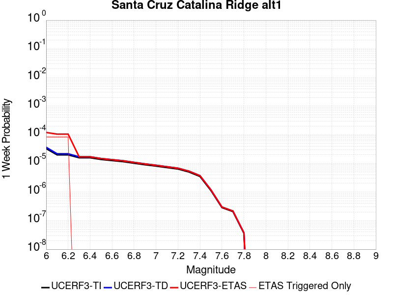 | 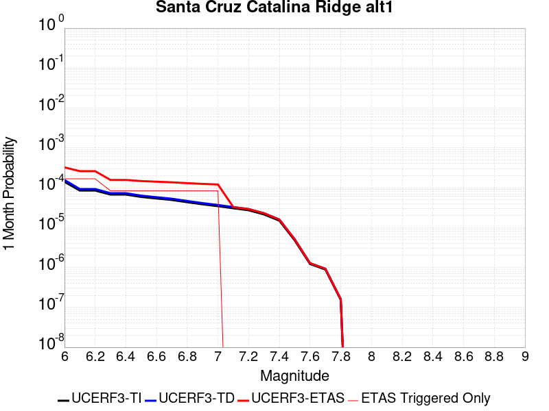 | 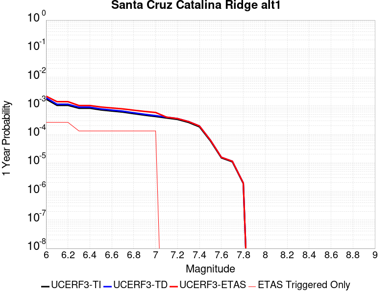 | 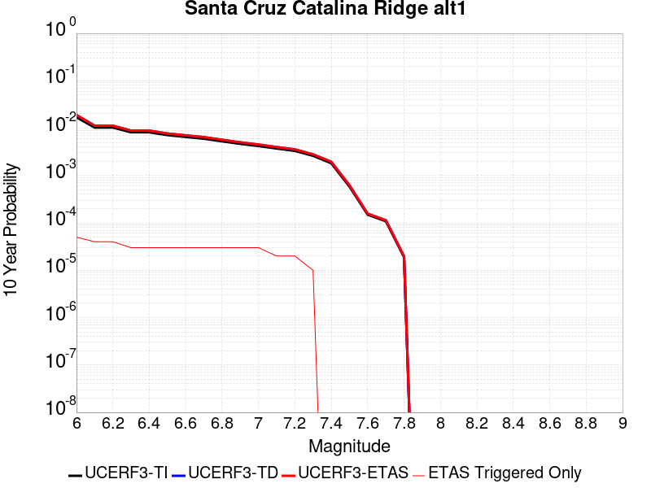 |

| Magnitude | 1 wk TI Prob | 1 wk TD Prob | 1 wk ETAS Prob | 1 wk ETAS/TD Gain | 1 wk ETAS Triggered Only | 1 mo TI Prob | 1 mo TD Prob | 1 mo ETAS Prob | 1 mo ETAS/TD Gain | 1 mo ETAS Triggered Only | 1 yr TI Prob | 1 yr TD Prob | 1 yr ETAS Prob | 1 yr ETAS/TD Gain | 1 yr ETAS Triggered Only | 10 yr TI Prob | 10 yr TD Prob | 10 yr ETAS Prob | 10 yr ETAS/TD Gain | 10 yr ETAS Triggered Only |
|-----|-----|-----|-----|-----|-----|-----|-----|-----|-----|-----|-----|-----|-----|-----|-----|-----|-----|-----|-----|-----|
| 6.0 | 3.2833184E-5 | 3.65584E-5 | 7.90847E-5 | 2.163243 | 4.2527856E-5 | 1.4070606E-4 | 1.5667039E-4 | 2.4171277E-4 | 1.5428109 | 8.505571E-5 | 0.00171175 | 0.0019059596 | 0.001990853 | 1.0445411 | 8.505571E-5 | 0.016986247 | 0.018913029 | 0.0190382 | 1.0066183 | 1.2758357E-4 |
| 6.1 | 1.9835548E-5 | 2.1659505E-5 | 6.418644E-5 | 2.9634306 | 4.2527856E-5 | 8.500672E-5 | 9.282326E-5 | 1.7787107E-4 | 1.9162339 | 8.505571E-5 | 0.0010344655 | 0.0011295575 | 0.0012145172 | 1.075215 | 8.505571E-5 | 0.010296632 | 0.011240295 | 0.011324395 | 1.0074819 | 8.505571E-5 |
| 6.2 | 1.9835548E-5 | 2.1659505E-5 | 6.418644E-5 | 2.9634306 | 4.2527856E-5 | 8.500672E-5 | 9.282326E-5 | 1.7787107E-4 | 1.9162339 | 8.505571E-5 | 0.0010344655 | 0.0011295575 | 0.0012145172 | 1.075215 | 8.505571E-5 | 0.010296632 | 0.011240295 | 0.011324395 | 1.0074819 | 8.505571E-5 |
| 6.3 | 1.5728183E-5 | 1.703395E-5 | 1.703395E-5 | 1.0 | 0.0 | 6.7404755E-5 | 7.300063E-5 | 1.15525385E-4 | 1.5825258 | 4.2527856E-5 | 8.2034385E-4 | 8.884264E-4 | 9.3091646E-4 | 1.0478262 | 4.2527856E-5 | 0.008173222 | 0.008849427 | 0.008891579 | 1.0047632 | 4.2527856E-5 |
| 6.4 | 1.5728183E-5 | 1.703395E-5 | 1.703395E-5 | 1.0 | 0.0 | 6.7404755E-5 | 7.300063E-5 | 1.15525385E-4 | 1.5825258 | 4.2527856E-5 | 8.2034385E-4 | 8.884264E-4 | 9.3091646E-4 | 1.0478262 | 4.2527856E-5 | 0.008173222 | 0.008849427 | 0.008891579 | 1.0047632 | 4.2527856E-5 |
| 6.5 | 1.3707734E-5 | 1.4794522E-5 | 1.4794522E-5 | 1.0 | 0.0 | 5.8746107E-5 | 6.3403575E-5 | 1.0592873E-4 | 1.670706 | 4.2527856E-5 | 7.1499916E-4 | 7.716686E-4 | 8.1416365E-4 | 1.055069 | 4.2527856E-5 | 0.0071270303 | 0.0076902895 | 0.0077324905 | 1.0054876 | 4.2527856E-5 |
| 6.6 | 1.2539813E-5 | 1.3510219E-5 | 1.3510219E-5 | 1.0 | 0.0 | 5.3740947E-5 | 5.789967E-5 | 1.00425066E-4 | 1.7344669 | 4.2527856E-5 | 6.540996E-4 | 7.0470315E-4 | 7.4720103E-4 | 1.0603061 | 4.2527856E-5 | 0.0065217763 | 0.0070249885 | 0.0070672175 | 1.0060112 | 4.2527856E-5 |
| 6.7 | 1.1504083E-5 | 1.2377375E-5 | 1.2377375E-5 | 1.0 | 0.0 | 4.930228E-5 | 5.3044827E-5 | 9.557042E-5 | 1.8016918 | 4.2527856E-5 | 6.0008996E-4 | 6.456314E-4 | 6.881318E-4 | 1.0658276 | 4.2527856E-5 | 0.005984721 | 0.006437786 | 0.00648004 | 1.0065634 | 4.2527856E-5 |
| 6.8 | 1.012739E-5 | 1.0877071E-5 | 1.0877071E-5 | 1.0 | 0.0 | 4.340238E-5 | 4.6615194E-5 | 8.914107E-5 | 1.912275 | 4.2527856E-5 | 5.282958E-4 | 5.673937E-4 | 6.098974E-4 | 1.0749105 | 4.2527856E-5 | 0.0052704164 | 0.0056596193 | 0.0057019065 | 1.0074717 | 4.2527856E-5 |
| 6.9 | 8.9607865E-6 | 9.609117E-6 | 9.609117E-6 | 1.0 | 0.0 | 3.8402806E-5 | 4.1181287E-5 | 8.370739E-5 | 2.032656 | 4.2527856E-5 | 4.6745385E-4 | 5.012679E-4 | 5.4377445E-4 | 1.0847981 | 4.2527856E-5 | 0.0046647177 | 0.005001492 | 0.005043807 | 1.0084605 | 4.2527856E-5 |
| 7.0 | 8.046829E-6 | 8.619746E-6 | 8.619746E-6 | 1.0 | 0.0 | 3.4485955E-5 | 3.694125E-5 | 7.9467536E-5 | 2.151187 | 4.2527856E-5 | 4.1978562E-4 | 4.496677E-4 | 4.9217645E-4 | 1.0945337 | 4.2527856E-5 | 0.004189935 | 0.0044876686 | 0.0045300056 | 1.0094341 | 4.2527856E-5 |
| 7.1 | 7.136131E-6 | 7.637656E-6 | 7.637656E-6 | 1.0 | 0.0 | 3.0583058E-5 | 3.2732405E-5 | 3.2732405E-5 | 1.0 | 0.0 | 3.7228514E-4 | 3.9844486E-4 | 3.9844486E-4 | 1.0 | 0.0 | 0.0037166206 | 0.003977381 | 0.003977381 | 1.0 | 0.0 |
| 7.2 | 6.362014E-6 | 6.8049585E-6 | 6.8049585E-6 | 1.0 | 0.0 | 2.726549E-5 | 2.9163786E-5 | 2.9163786E-5 | 1.0 | 0.0 | 3.3190678E-4 | 3.550119E-4 | 3.550119E-4 | 1.0 | 0.0 | 0.0033141149 | 0.003544516 | 0.003544516 | 1.0 | 0.0 |
| 7.3 | 5.004101E-6 | 5.351715E-6 | 5.351715E-6 | 1.0 | 0.0 | 2.1445969E-5 | 2.2935723E-5 | 2.2935723E-5 | 1.0 | 0.0 | 2.6107338E-4 | 2.792072E-4 | 2.792072E-4 | 1.0 | 0.0 | 0.002607669 | 0.0027886187 | 0.0027886187 | 1.0 | 0.0 |
| 7.4 | 3.4901443E-6 | 3.7320526E-6 | 3.7320526E-6 | 1.0 | 0.0 | 1.4957676E-5 | 1.5994416E-5 | 1.5994416E-5 | 1.0 | 0.0 | 1.8209449E-4 | 1.9471499E-4 | 1.9471499E-4 | 1.0 | 0.0 | 0.0018194534 | 0.0019454823 | 0.0019454823 | 1.0 | 0.0 |
| 7.5 | 1.1215045E-6 | 1.189387E-6 | 1.189387E-6 | 1.0 | 0.0 | 4.806439E-6 | 5.097363E-6 | 5.097363E-6 | 1.0 | 0.0 | 5.851682E-5 | 6.205866E-5 | 6.205866E-5 | 1.0 | 0.0 | 5.850142E-4 | 6.2041637E-4 | 6.2041637E-4 | 1.0 | 0.0 |
| 7.6 | 2.8599047E-7 | 2.9951994E-7 | 2.9951994E-7 | 1.0 | 0.0 | 1.2256729E-6 | 1.2836562E-6 | 1.2836562E-6 | 1.0 | 0.0 | 1.4922465E-5 | 1.5628404E-5 | 1.5628404E-5 | 1.0 | 0.0 | 1.4921463E-4 | 1.5627318E-4 | 1.5627318E-4 | 1.0 | 0.0 |
| 7.7 | 2.0781519E-7 | 2.1744323E-7 | 2.1744323E-7 | 1.0 | 0.0 | 8.906362E-7 | 9.3189925E-7 | 9.3189925E-7 | 1.0 | 0.0 | 1.08434415E-5 | 1.13458145E-5 | 1.13458145E-5 | 1.0 | 0.0 | 1.0842913E-4 | 1.1345245E-4 | 1.1345245E-4 | 1.0 | 0.0 |
| 7.8 | 3.614776E-8 | 3.764102E-8 | 3.764102E-8 | 1.0 | 0.0 | 1.5491896E-7 | 1.6131864E-7 | 1.6131864E-7 | 1.0 | 0.0 | 1.8861368E-6 | 1.9640527E-6 | 1.9640527E-6 | 1.0 | 0.0 | 1.8861208E-5 | 1.9640367E-5 | 1.9640367E-5 | 1.0 | 0.0 |

## Mission Ridge-Arroyo Parida-Santa Ana
*[(top)](#table-of-contents)*

| 1 Week | 1 Month | 1 Year | 10 Year |
|-----|-----|-----|-----|
| 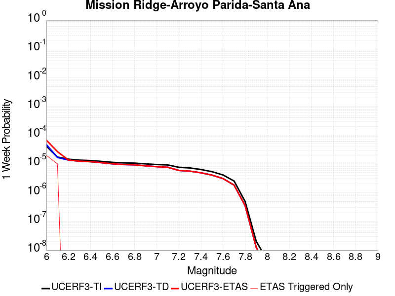 | 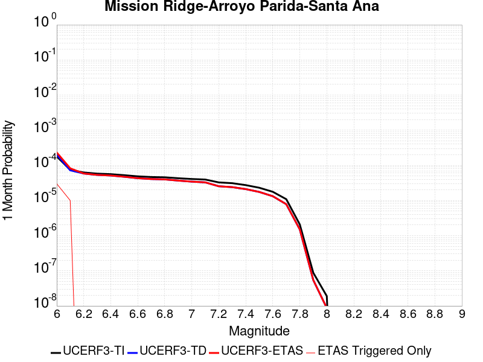 | 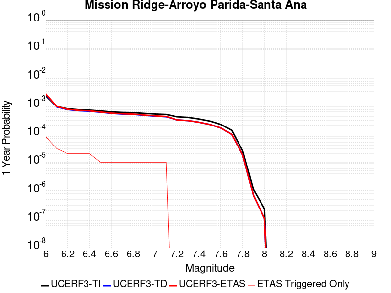 | 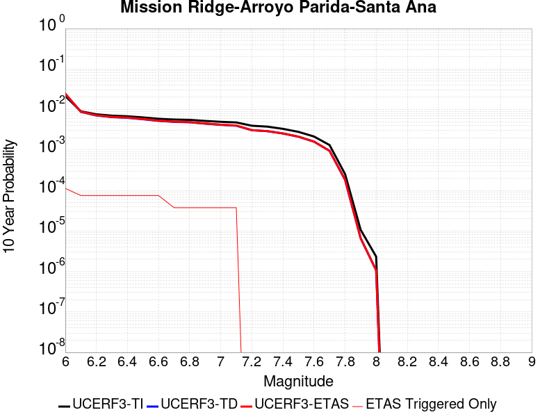 |

| Magnitude | 1 wk TI Prob | 1 wk TD Prob | 1 wk ETAS Prob | 1 wk ETAS/TD Gain | 1 wk ETAS Triggered Only | 1 mo TI Prob | 1 mo TD Prob | 1 mo ETAS Prob | 1 mo ETAS/TD Gain | 1 mo ETAS Triggered Only | 1 yr TI Prob | 1 yr TD Prob | 1 yr ETAS Prob | 1 yr ETAS/TD Gain | 1 yr ETAS Triggered Only | 10 yr TI Prob | 10 yr TD Prob | 10 yr ETAS Prob | 10 yr ETAS/TD Gain | 10 yr ETAS Triggered Only |
|-----|-----|-----|-----|-----|-----|-----|-----|-----|-----|-----|-----|-----|-----|-----|-----|-----|-----|-----|-----|-----|
| 6.0 | 4.169034E-5 | 4.7138263E-5 | 4.7138263E-5 | 1.0 | 0.0 | 1.7866064E-4 | 2.0201034E-4 | 2.0201034E-4 | 1.0 | 0.0 | 0.0021730233 | 0.00245745 | 0.00245745 | 1.0 | 0.0 | 0.021518968 | 0.024384614 | 0.024467597 | 1.0034031 | 8.505571E-5 |
| 6.1 | 1.73813E-5 | 1.6854226E-5 | 1.6854226E-5 | 1.0 | 0.0 | 7.4489166E-5 | 7.223046E-5 | 7.223046E-5 | 1.0 | 0.0 | 9.065282E-4 | 8.790618E-4 | 8.790618E-4 | 1.0 | 0.0 | 0.009028391 | 0.008756988 | 0.008799143 | 1.0048139 | 4.2527856E-5 |
| 6.2 | 1.4622182E-5 | 1.367329E-5 | 1.367329E-5 | 1.0 | 0.0 | 6.2664985E-5 | 5.8598518E-5 | 5.8598518E-5 | 1.0 | 0.0 | 7.6267915E-4 | 7.132073E-4 | 7.132073E-4 | 1.0 | 0.0 | 0.007600669 | 0.007109627 | 0.007151853 | 1.0059392 | 4.2527856E-5 |
| 6.3 | 1.3552434E-5 | 1.2482201E-5 | 1.2482201E-5 | 1.0 | 0.0 | 5.8080568E-5 | 5.3494066E-5 | 5.3494066E-5 | 1.0 | 0.0 | 7.069015E-4 | 6.510988E-4 | 6.510988E-4 | 1.0 | 0.0 | 0.00704657 | 0.006492275 | 0.0065345266 | 1.006508 | 4.2527856E-5 |
| 6.4 | 1.30977305E-5 | 1.1979156E-5 | 1.1979156E-5 | 1.0 | 0.0 | 5.613192E-5 | 5.1338247E-5 | 5.1338247E-5 | 1.0 | 0.0 | 6.831918E-4 | 6.248669E-4 | 6.248669E-4 | 1.0 | 0.0 | 0.006810953 | 0.0062314444 | 0.0062737074 | 1.0067822 | 4.2527856E-5 |
| 6.5 | 1.225205E-5 | 1.1048803E-5 | 1.1048803E-5 | 1.0 | 0.0 | 5.2507727E-5 | 4.7351168E-5 | 4.7351168E-5 | 1.0 | 0.0 | 6.3909404E-4 | 5.7635066E-4 | 5.7635066E-4 | 1.0 | 0.0 | 0.006372592 | 0.005748869 | 0.0057911524 | 1.0073551 | 4.2527856E-5 |
| 6.6 | 1.1352241E-5 | 1.0063535E-5 | 1.0063535E-5 | 1.0 | 0.0 | 4.8651553E-5 | 4.3128734E-5 | 4.3128734E-5 | 1.0 | 0.0 | 5.921717E-4 | 5.2496797E-4 | 5.2496797E-4 | 1.0 | 0.0 | 0.0059059616 | 0.0052375244 | 0.0052798293 | 1.0080773 | 4.2527856E-5 |
| 6.7 | 1.0864116E-5 | 9.517027E-6 | 9.517027E-6 | 1.0 | 0.0 | 4.6559664E-5 | 4.0786632E-5 | 4.0786632E-5 | 1.0 | 0.0 | 5.667165E-4 | 4.964661E-4 | 4.964661E-4 | 1.0 | 0.0 | 0.005652734 | 0.004953804 | 0.004953804 | 1.0 | 0.0 |
| 6.8 | 1.0666365E-5 | 9.299779E-6 | 9.299779E-6 | 1.0 | 0.0 | 4.571219E-5 | 3.9855597E-5 | 3.9855597E-5 | 1.0 | 0.0 | 5.564038E-4 | 4.8513585E-4 | 4.8513585E-4 | 1.0 | 0.0 | 0.005550127 | 0.0048410003 | 0.0048410003 | 1.0 | 0.0 |
| 6.9 | 1.0038665E-5 | 8.592046E-6 | 8.592046E-6 | 1.0 | 0.0 | 4.302214E-5 | 3.682254E-5 | 3.682254E-5 | 1.0 | 0.0 | 5.236687E-4 | 4.4822405E-4 | 4.4822405E-4 | 1.0 | 0.0 | 0.005224364 | 0.004473411 | 0.004473411 | 1.0 | 0.0 |
| 7.0 | 9.5379955E-6 | 8.025073E-6 | 8.025073E-6 | 1.0 | 0.0 | 4.0876483E-5 | 3.4392728E-5 | 3.4392728E-5 | 1.0 | 0.0 | 4.975576E-4 | 4.1865272E-4 | 4.1865272E-4 | 1.0 | 0.0 | 0.00496445 | 0.0041788397 | 0.0041788397 | 1.0 | 0.0 |
| 7.1 | 9.207389E-6 | 7.652375E-6 | 7.652375E-6 | 1.0 | 0.0 | 3.945964E-5 | 3.279549E-5 | 3.279549E-5 | 1.0 | 0.0 | 4.803152E-4 | 3.9921363E-4 | 3.9921363E-4 | 1.0 | 0.0 | 0.004792784 | 0.003985161 | 0.003985161 | 1.0 | 0.0 |
| 7.2 | 7.638091E-6 | 5.9311183E-6 | 5.9311183E-6 | 1.0 | 0.0 | 3.2734264E-5 | 2.541883E-5 | 2.541883E-5 | 1.0 | 0.0 | 3.984668E-4 | 3.0943064E-4 | 3.0943064E-4 | 1.0 | 0.0 | 0.0039775306 | 0.0030900547 | 0.0030900547 | 1.0 | 0.0 |
| 7.3 | 7.2500147E-6 | 5.5961527E-6 | 5.5961527E-6 | 1.0 | 0.0 | 3.1071122E-5 | 2.3983293E-5 | 2.3983293E-5 | 1.0 | 0.0 | 3.7822526E-4 | 2.9195778E-4 | 2.9195778E-4 | 1.0 | 0.0 | 0.0037758215 | 0.0029157975 | 0.0029157975 | 1.0 | 0.0 |
| 7.4 | 6.3899715E-6 | 4.9184964E-6 | 4.9184964E-6 | 1.0 | 0.0 | 2.7385306E-5 | 2.10791E-5 | 2.10791E-5 | 1.0 | 0.0 | 3.3336508E-4 | 2.5660804E-4 | 2.5660804E-4 | 1.0 | 0.0 | 0.0033286542 | 0.0025631618 | 0.0025631618 | 1.0 | 0.0 |
| 7.5 | 5.379025E-6 | 4.0838527E-6 | 4.0838527E-6 | 1.0 | 0.0 | 2.305276E-5 | 1.7502109E-5 | 1.7502109E-5 | 1.0 | 0.0 | 2.806312E-4 | 2.1306744E-4 | 2.1306744E-4 | 1.0 | 0.0 | 0.0028027708 | 0.002128643 | 0.002128643 | 1.0 | 0.0 |
| 7.6 | 4.1270696E-6 | 3.0883439E-6 | 3.0883439E-6 | 1.0 | 0.0 | 1.768732E-5 | 1.3235693E-5 | 1.3235693E-5 | 1.0 | 0.0 | 2.1532185E-4 | 1.6113273E-4 | 1.6113273E-4 | 1.0 | 0.0 | 0.0021511333 | 0.001610167 | 0.001610167 | 1.0 | 0.0 |
| 7.7 | 2.5406805E-6 | 1.8282013E-6 | 1.8282013E-6 | 1.0 | 0.0 | 1.0888585E-5 | 7.835125E-6 | 7.835125E-6 | 1.0 | 0.0 | 1.3256045E-4 | 9.538854E-5 | 9.538854E-5 | 1.0 | 0.0 | 0.0013248142 | 9.534821E-4 | 9.534821E-4 | 1.0 | 0.0 |
| 7.8 | 4.8608285E-7 | 3.5098864E-7 | 3.5098864E-7 | 1.0 | 0.0 | 2.0832106E-6 | 1.5042363E-6 | 1.5042363E-6 | 1.0 | 0.0 | 2.5362791E-5 | 1.8313924E-5 | 1.8313924E-5 | 1.0 | 0.0 | 2.5359896E-4 | 1.8312426E-4 | 1.8312426E-4 | 1.0 | 0.0 |
| 7.9 | 2.0472514E-8 | 1.2688783E-8 | 1.2688783E-8 | 1.0 | 0.0 | 8.7739345E-8 | 5.43805E-8 | 5.43805E-8 | 1.0 | 0.0 | 1.068226E-6 | 6.6208236E-7 | 6.6208236E-7 | 1.0 | 0.0 | 1.0682209E-5 | 6.620805E-6 | 6.620805E-6 | 1.0 | 0.0 |
| 8.0 | 4.443582E-9 | 2.0321211E-9 | 2.0321211E-9 | 1.0 | 0.0 | 1.9043922E-8 | 8.70909E-9 | 8.70909E-9 | 1.0 | 0.0 | 2.3185973E-7 | 1.0603316E-7 | 1.0603316E-7 | 1.0 | 0.0 | 2.3185949E-6 | 1.0603312E-6 | 1.0603312E-6 | 1.0 | 0.0 |

## Pinto Mtn
*[(top)](#table-of-contents)*

| 1 Week | 1 Month | 1 Year | 10 Year |
|-----|-----|-----|-----|
| 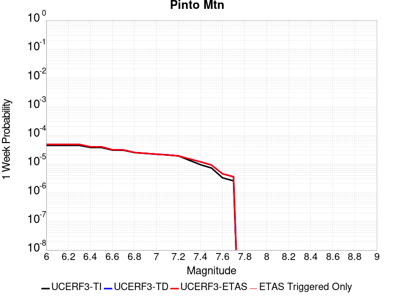 |  |  | 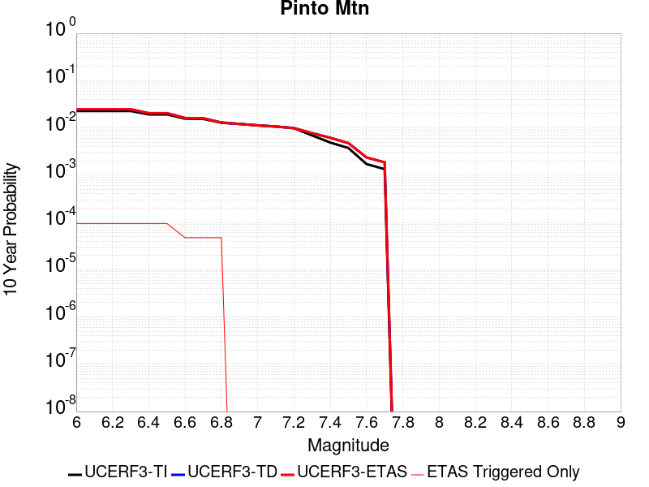 |

| Magnitude | 1 wk TI Prob | 1 wk TD Prob | 1 wk ETAS Prob | 1 wk ETAS/TD Gain | 1 wk ETAS Triggered Only | 1 mo TI Prob | 1 mo TD Prob | 1 mo ETAS Prob | 1 mo ETAS/TD Gain | 1 mo ETAS Triggered Only | 1 yr TI Prob | 1 yr TD Prob | 1 yr ETAS Prob | 1 yr ETAS/TD Gain | 1 yr ETAS Triggered Only | 10 yr TI Prob | 10 yr TD Prob | 10 yr ETAS Prob | 10 yr ETAS/TD Gain | 10 yr ETAS Triggered Only |
|-----|-----|-----|-----|-----|-----|-----|-----|-----|-----|-----|-----|-----|-----|-----|-----|-----|-----|-----|-----|-----|
| 6.0 | 4.4194956E-5 | 4.785362E-5 | 9.037944E-5 | 1.8886647 | 4.2527856E-5 | 1.893932E-4 | 2.0507174E-4 | 2.9011E-4 | 1.4146757 | 8.505571E-5 | 0.0023034236 | 0.0024940541 | 0.0025788979 | 1.0340184 | 8.505571E-5 | 0.022796938 | 0.024678145 | 0.02480258 | 1.0050423 | 1.2758357E-4 |
| 6.1 | 4.4194956E-5 | 4.785362E-5 | 9.037944E-5 | 1.8886647 | 4.2527856E-5 | 1.893932E-4 | 2.0507174E-4 | 2.9011E-4 | 1.4146757 | 8.505571E-5 | 0.0023034236 | 0.0024940541 | 0.0025788979 | 1.0340184 | 8.505571E-5 | 0.022796938 | 0.024678145 | 0.02480258 | 1.0050423 | 1.2758357E-4 |
| 6.2 | 4.4194956E-5 | 4.785362E-5 | 9.037944E-5 | 1.8886647 | 4.2527856E-5 | 1.893932E-4 | 2.0507174E-4 | 2.9011E-4 | 1.4146757 | 8.505571E-5 | 0.0023034236 | 0.0024940541 | 0.0025788979 | 1.0340184 | 8.505571E-5 | 0.022796938 | 0.024678145 | 0.02480258 | 1.0050423 | 1.2758357E-4 |
| 6.3 | 4.4194956E-5 | 4.785362E-5 | 9.037944E-5 | 1.8886647 | 4.2527856E-5 | 1.893932E-4 | 2.0507174E-4 | 2.9011E-4 | 1.4146757 | 8.505571E-5 | 0.0023034236 | 0.0024940541 | 0.0025788979 | 1.0340184 | 8.505571E-5 | 0.022796938 | 0.024678145 | 0.02480258 | 1.0050423 | 1.2758357E-4 |
| 6.4 | 3.729929E-5 | 3.9603186E-5 | 8.212936E-5 | 2.0738068 | 4.2527856E-5 | 1.5984432E-4 | 1.6971743E-4 | 2.1223807E-4 | 1.2505379 | 4.2527856E-5 | 0.0019443673 | 0.002064445 | 0.002106885 | 1.0205576 | 4.2527856E-5 | 0.019274427 | 0.02046269 | 0.020546006 | 1.0040716 | 8.505571E-5 |
| 6.5 | 3.729929E-5 | 3.9603186E-5 | 8.212936E-5 | 2.0738068 | 4.2527856E-5 | 1.5984432E-4 | 1.6971743E-4 | 2.1223807E-4 | 1.2505379 | 4.2527856E-5 | 0.0019443673 | 0.002064445 | 0.002106885 | 1.0205576 | 4.2527856E-5 | 0.019274427 | 0.02046269 | 0.020546006 | 1.0040716 | 8.505571E-5 |
| 6.6 | 3.0204548E-5 | 3.1205298E-5 | 3.1205298E-5 | 1.0 | 0.0 | 1.2944164E-4 | 1.3373033E-4 | 1.3373033E-4 | 1.0 | 0.0 | 0.0015748127 | 0.0016269855 | 0.0016269855 | 1.0 | 0.0 | 0.015636992 | 0.01615461 | 0.01619645 | 1.0025901 | 4.2527856E-5 |
| 6.7 | 2.9857754E-5 | 3.081468E-5 | 3.081468E-5 | 1.0 | 0.0 | 1.2795553E-4 | 1.3205643E-4 | 1.3205643E-4 | 1.0 | 0.0 | 0.0015567453 | 0.001606636 | 0.001606636 | 1.0 | 0.0 | 0.015458848 | 0.01595405 | 0.015995897 | 1.0026231 | 4.2527856E-5 |
| 6.8 | 2.4819734E-5 | 2.5009364E-5 | 2.5009364E-5 | 1.0 | 0.0 | 1.0636595E-4 | 1.07178705E-4 | 1.07178705E-4 | 1.0 | 0.0 | 0.0012942362 | 0.0013041412 | 0.0013041412 | 1.0 | 0.0 | 0.012867244 | 0.0129672475 | 0.013009223 | 1.0032371 | 4.2527856E-5 |
| 6.9 | 2.331124E-5 | 2.3337643E-5 | 2.3337643E-5 | 1.0 | 0.0 | 9.990149E-5 | 1.00014746E-4 | 1.00014746E-4 | 1.0 | 0.0 | 0.001215622 | 0.0012170197 | 0.0012170197 | 1.0 | 0.0 | 0.012089936 | 0.012105742 | 0.012105742 | 1.0 | 0.0 |
| 7.0 | 2.1818534E-5 | 2.1760772E-5 | 2.1760772E-5 | 1.0 | 0.0 | 9.3504656E-5 | 9.325723E-5 | 9.325723E-5 | 1.0 | 0.0 | 0.0011378246 | 0.0011348352 | 0.0011348352 | 1.0 | 0.0 | 0.011320163 | 0.011292503 | 0.011292503 | 1.0 | 0.0 |
| 7.1 | 2.066081E-5 | 2.0540418E-5 | 2.0540418E-5 | 1.0 | 0.0 | 8.854332E-5 | 8.8027504E-5 | 8.8027504E-5 | 1.0 | 0.0 | 0.0010774818 | 0.0010712275 | 0.0010712275 | 1.0 | 0.0 | 0.010722724 | 0.010662688 | 0.010662688 | 1.0 | 0.0 |
| 7.2 | 1.8990233E-5 | 1.9053701E-5 | 1.9053701E-5 | 1.0 | 0.0 | 8.138417E-5 | 8.1656275E-5 | 8.1656275E-5 | 1.0 | 0.0 | 9.904018E-4 | 9.937311E-4 | 9.937311E-4 | 1.0 | 0.0 | 0.009859995 | 0.009894874 | 0.009894874 | 1.0 | 0.0 |
| 7.3 | 1.3335872E-5 | 1.4906372E-5 | 1.4906372E-5 | 1.0 | 0.0 | 5.7152483E-5 | 6.388296E-5 | 6.388296E-5 | 1.0 | 0.0 | 6.956093E-4 | 7.775102E-4 | 7.775102E-4 | 1.0 | 0.0 | 0.006934359 | 0.0077491994 | 0.0077491994 | 1.0 | 0.0 |
| 7.4 | 9.414066E-6 | 1.186061E-5 | 1.186061E-5 | 1.0 | 0.0 | 4.0345374E-5 | 5.0830247E-5 | 5.0830247E-5 | 1.0 | 0.0 | 4.910942E-4 | 6.1869196E-4 | 6.1869196E-4 | 1.0 | 0.0 | 0.0049001034 | 0.006170644 | 0.006170644 | 1.0 | 0.0 |
| 7.5 | 7.2101157E-6 | 9.157893E-6 | 9.157893E-6 | 1.0 | 0.0 | 3.090013E-5 | 3.924757E-5 | 3.924757E-5 | 1.0 | 0.0 | 3.7614413E-4 | 4.7774217E-4 | 4.7774217E-4 | 1.0 | 0.0 | 0.0037550807 | 0.004767927 | 0.004767927 | 1.0 | 0.0 |
| 7.6 | 3.296375E-6 | 4.5453176E-6 | 4.5453176E-6 | 1.0 | 0.0 | 1.4127245E-5 | 1.9479796E-5 | 1.9479796E-5 | 1.0 | 0.0 | 1.7198564E-4 | 2.3714209E-4 | 2.3714209E-4 | 1.0 | 0.0 | 0.0017185259 | 0.0023690276 | 0.0023690276 | 1.0 | 0.0 |
| 7.7 | 2.5741092E-6 | 3.584251E-6 | 3.584251E-6 | 1.0 | 0.0 | 1.103185E-5 | 1.5360993E-5 | 1.5360993E-5 | 1.0 | 0.0 | 1.3430449E-4 | 1.8700535E-4 | 1.8700535E-4 | 1.0 | 0.0 | 0.0013422335 | 0.0018686098 | 0.0018686098 | 1.0 | 0.0 |

## Lost Hills
*[(top)](#table-of-contents)*

| 1 Week | 1 Month | 1 Year | 10 Year |
|-----|-----|-----|-----|
| 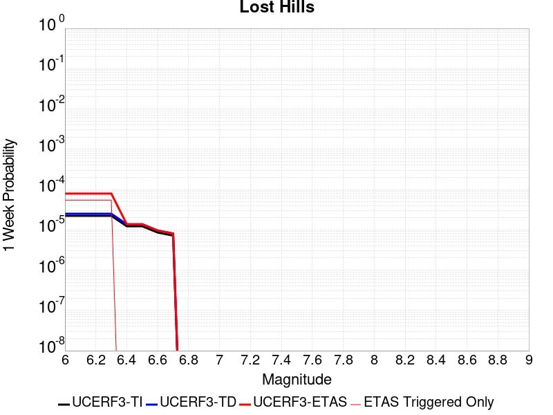 | 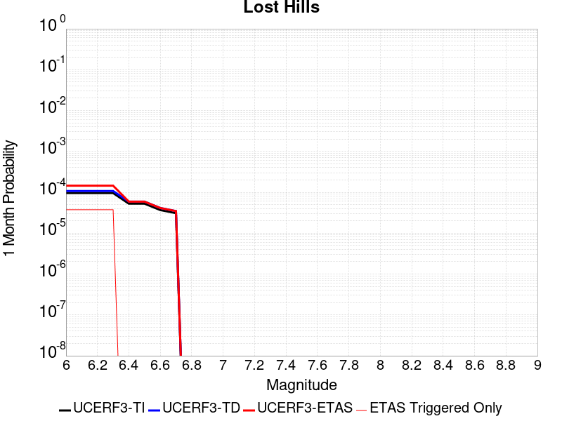 | 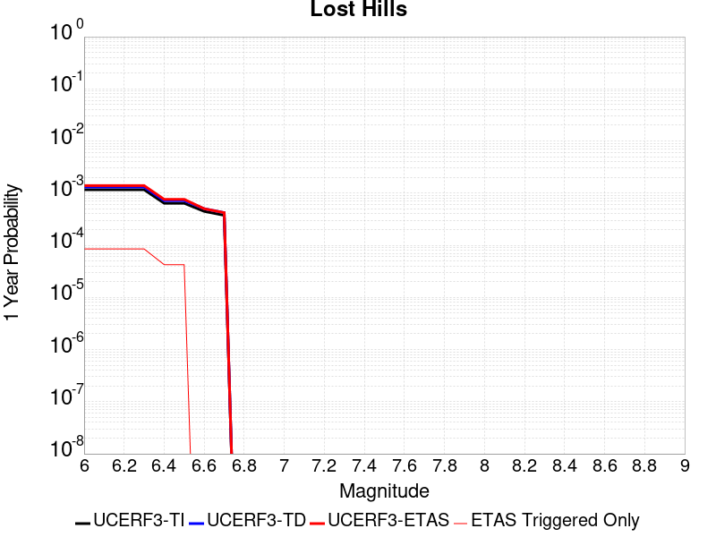 | 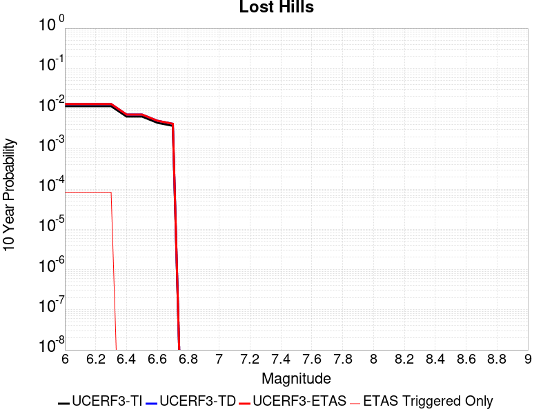 |

| Magnitude | 1 wk TI Prob | 1 wk TD Prob | 1 wk ETAS Prob | 1 wk ETAS/TD Gain | 1 wk ETAS Triggered Only | 1 mo TI Prob | 1 mo TD Prob | 1 mo ETAS Prob | 1 mo ETAS/TD Gain | 1 mo ETAS Triggered Only | 1 yr TI Prob | 1 yr TD Prob | 1 yr ETAS Prob | 1 yr ETAS/TD Gain | 1 yr ETAS Triggered Only | 10 yr TI Prob | 10 yr TD Prob | 10 yr ETAS Prob | 10 yr ETAS/TD Gain | 10 yr ETAS Triggered Only |
|-----|-----|-----|-----|-----|-----|-----|-----|-----|-----|-----|-----|-----|-----|-----|-----|-----|-----|-----|-----|-----|
| 6.0 | 2.233523E-5 | 2.5106583E-5 | 6.763337E-5 | 2.69385 | 4.2527856E-5 | 9.571891E-5 | 1.0759615E-4 | 1.5011943E-4 | 1.3952119 | 4.2527856E-5 | 0.0011647546 | 0.001309364 | 0.0013943084 | 1.0648745 | 8.505571E-5 | 0.011586686 | 0.013033091 | 0.013117038 | 1.0064411 | 8.505571E-5 |
| 6.1 | 2.233523E-5 | 2.5106583E-5 | 6.763337E-5 | 2.69385 | 4.2527856E-5 | 9.571891E-5 | 1.0759615E-4 | 1.5011943E-4 | 1.3952119 | 4.2527856E-5 | 0.0011647546 | 0.001309364 | 0.0013943084 | 1.0648745 | 8.505571E-5 | 0.011586686 | 0.013033091 | 0.013117038 | 1.0064411 | 8.505571E-5 |
| 6.2 | 2.233523E-5 | 2.5106583E-5 | 6.763337E-5 | 2.69385 | 4.2527856E-5 | 9.571891E-5 | 1.0759615E-4 | 1.5011943E-4 | 1.3952119 | 4.2527856E-5 | 0.0011647546 | 0.001309364 | 0.0013943084 | 1.0648745 | 8.505571E-5 | 0.011586686 | 0.013033091 | 0.013117038 | 1.0064411 | 8.505571E-5 |
| 6.3 | 2.233523E-5 | 2.5106583E-5 | 6.763337E-5 | 2.69385 | 4.2527856E-5 | 9.571891E-5 | 1.0759615E-4 | 1.5011943E-4 | 1.3952119 | 4.2527856E-5 | 0.0011647546 | 0.001309364 | 0.0013943084 | 1.0648745 | 8.505571E-5 | 0.011586686 | 0.013033091 | 0.013117038 | 1.0064411 | 8.505571E-5 |
| 6.4 | 1.2288092E-5 | 1.3781108E-5 | 1.3781108E-5 | 1.0 | 0.0 | 5.2662188E-5 | 5.906108E-5 | 5.906108E-5 | 1.0 | 0.0 | 6.409735E-4 | 7.189252E-4 | 7.614225E-4 | 1.0591122 | 4.2527856E-5 | 0.006391279 | 0.0071752006 | 0.0072174235 | 1.0058845 | 4.2527856E-5 |
| 6.5 | 1.2288092E-5 | 1.3781108E-5 | 1.3781108E-5 | 1.0 | 0.0 | 5.2662188E-5 | 5.906108E-5 | 5.906108E-5 | 1.0 | 0.0 | 6.409735E-4 | 7.189252E-4 | 7.614225E-4 | 1.0591122 | 4.2527856E-5 | 0.006391279 | 0.0071752006 | 0.0072174235 | 1.0058845 | 4.2527856E-5 |
| 6.6 | 8.58281E-6 | 9.63377E-6 | 9.63377E-6 | 1.0 | 0.0 | 3.6782953E-5 | 4.12874E-5 | 4.12874E-5 | 1.0 | 0.0 | 4.4774043E-4 | 5.026414E-4 | 5.026414E-4 | 1.0 | 0.0 | 0.0044683935 | 0.005023205 | 0.005023205 | 1.0 | 0.0 |
| 6.7 | 7.205685E-6 | 8.088302E-6 | 8.088302E-6 | 1.0 | 0.0 | 3.088114E-5 | 3.466415E-5 | 3.466415E-5 | 1.0 | 0.0 | 3.7591302E-4 | 4.2203604E-4 | 4.2203604E-4 | 1.0 | 0.0 | 0.0037527776 | 0.0042203604 | 0.0042203604 | 1.0 | 0.0 |

## Kern Canyon (Lake Isabella) 2011
*[(top)](#table-of-contents)*

| 1 Week | 1 Month | 1 Year | 10 Year |
|-----|-----|-----|-----|
| 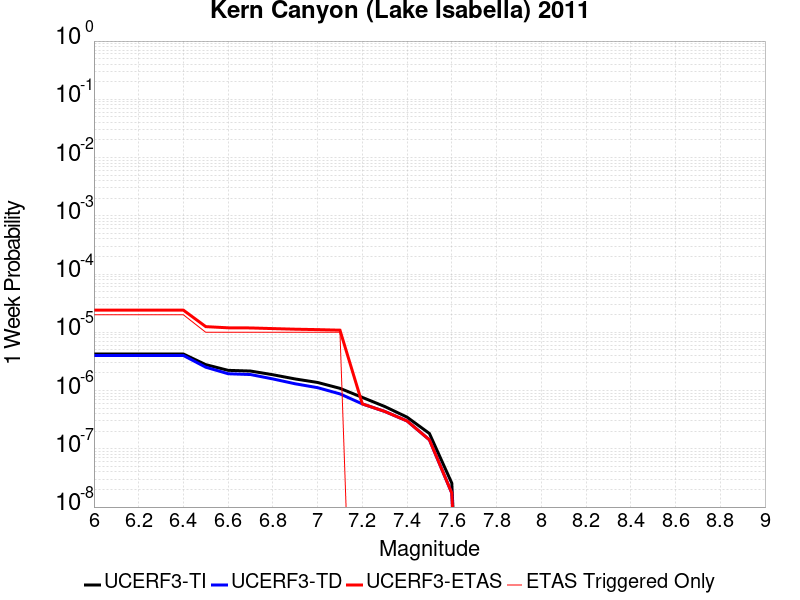 | 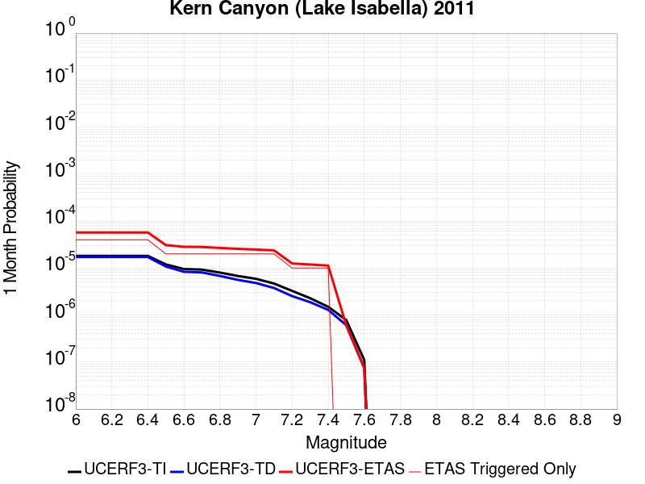 | 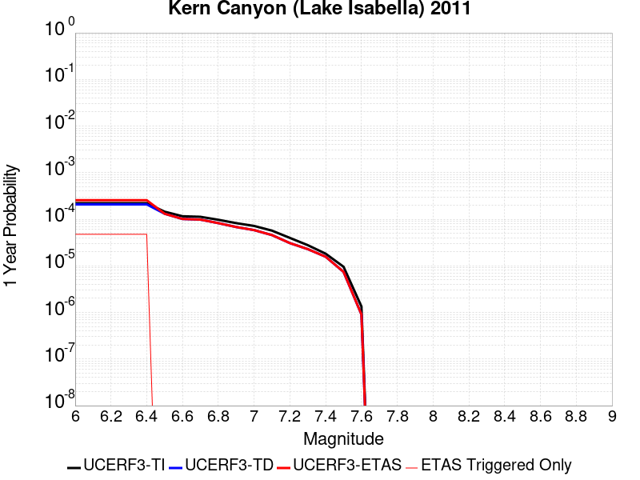 | 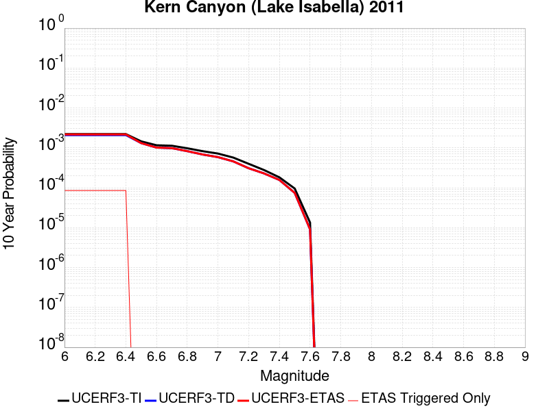 |

| Magnitude | 1 wk TI Prob | 1 wk TD Prob | 1 wk ETAS Prob | 1 wk ETAS/TD Gain | 1 wk ETAS Triggered Only | 1 mo TI Prob | 1 mo TD Prob | 1 mo ETAS Prob | 1 mo ETAS/TD Gain | 1 mo ETAS Triggered Only | 1 yr TI Prob | 1 yr TD Prob | 1 yr ETAS Prob | 1 yr ETAS/TD Gain | 1 yr ETAS Triggered Only | 10 yr TI Prob | 10 yr TD Prob | 10 yr ETAS Prob | 10 yr ETAS/TD Gain | 10 yr ETAS Triggered Only |
|-----|-----|-----|-----|-----|-----|-----|-----|-----|-----|-----|-----|-----|-----|-----|-----|-----|-----|-----|-----|-----|
| 6.0 | 4.2387383E-6 | 4.001639E-6 | 4.001639E-6 | 1.0 | 0.0 | 1.8165894E-5 | 1.7149778E-5 | 5.9676906E-5 | 3.479748 | 4.2527856E-5 | 2.2114732E-4 | 2.087804E-4 | 2.5129938E-4 | 1.203654 | 4.2527856E-5 | 0.0022092736 | 0.0020860266 | 0.0021709048 | 1.040689 | 8.505571E-5 |
| 6.1 | 4.2387383E-6 | 4.001639E-6 | 4.001639E-6 | 1.0 | 0.0 | 1.8165894E-5 | 1.7149778E-5 | 5.9676906E-5 | 3.479748 | 4.2527856E-5 | 2.2114732E-4 | 2.087804E-4 | 2.5129938E-4 | 1.203654 | 4.2527856E-5 | 0.0022092736 | 0.0020860266 | 0.0021709048 | 1.040689 | 8.505571E-5 |
| 6.2 | 4.2387383E-6 | 4.001639E-6 | 4.001639E-6 | 1.0 | 0.0 | 1.8165894E-5 | 1.7149778E-5 | 5.9676906E-5 | 3.479748 | 4.2527856E-5 | 2.2114732E-4 | 2.087804E-4 | 2.5129938E-4 | 1.203654 | 4.2527856E-5 | 0.0022092736 | 0.0020860266 | 0.0021709048 | 1.040689 | 8.505571E-5 |
| 6.3 | 4.2387383E-6 | 4.001639E-6 | 4.001639E-6 | 1.0 | 0.0 | 1.8165894E-5 | 1.7149778E-5 | 5.9676906E-5 | 3.479748 | 4.2527856E-5 | 2.2114732E-4 | 2.087804E-4 | 2.5129938E-4 | 1.203654 | 4.2527856E-5 | 0.0022092736 | 0.0020860266 | 0.0021709048 | 1.040689 | 8.505571E-5 |
| 6.4 | 4.2387383E-6 | 4.001639E-6 | 4.001639E-6 | 1.0 | 0.0 | 1.8165894E-5 | 1.7149778E-5 | 5.9676906E-5 | 3.479748 | 4.2527856E-5 | 2.2114732E-4 | 2.087804E-4 | 2.5129938E-4 | 1.203654 | 4.2527856E-5 | 0.0022092736 | 0.0020860266 | 0.0021709048 | 1.040689 | 8.505571E-5 |
| 6.5 | 2.7857532E-6 | 2.517867E-6 | 2.517867E-6 | 1.0 | 0.0 | 1.1938888E-5 | 1.0790815E-5 | 1.0790815E-5 | 1.0 | 0.0 | 1.4534626E-4 | 1.3137059E-4 | 1.3137059E-4 | 1.0 | 0.0 | 0.0014525123 | 0.001312962 | 0.001312962 | 1.0 | 0.0 |
| 6.6 | 2.2233348E-6 | 1.9441236E-6 | 1.9441236E-6 | 1.0 | 0.0 | 9.528543E-6 | 8.331932E-6 | 8.331932E-6 | 1.0 | 0.0 | 1.1600384E-4 | 1.01436635E-4 | 1.01436635E-4 | 1.0 | 0.0 | 0.001159433 | 0.001013912 | 0.001013912 | 1.0 | 0.0 |
| 6.7 | 2.1635126E-6 | 1.8835036E-6 | 1.8835036E-6 | 1.0 | 0.0 | 9.272164E-6 | 8.072134E-6 | 8.072134E-6 | 1.0 | 0.0 | 1.1288274E-4 | 9.827388E-5 | 9.827388E-5 | 1.0 | 0.0 | 0.0011282542 | 9.823124E-4 | 9.823124E-4 | 1.0 | 0.0 |
| 6.8 | 1.8685711E-6 | 1.5831425E-6 | 1.5831425E-6 | 1.0 | 0.0 | 8.008137E-6 | 6.784879E-6 | 6.784879E-6 | 1.0 | 0.0 | 9.74947E-5 | 8.260282E-5 | 8.260282E-5 | 1.0 | 0.0 | 9.745194E-4 | 8.2572614E-4 | 8.2572614E-4 | 1.0 | 0.0 |
| 6.9 | 1.5815071E-6 | 1.3064928E-6 | 1.3064928E-6 | 1.0 | 0.0 | 6.77787E-6 | 5.599243E-6 | 5.599243E-6 | 1.0 | 0.0 | 8.251744E-5 | 6.816868E-5 | 6.816868E-5 | 1.0 | 0.0 | 8.248681E-4 | 6.8148033E-4 | 6.8148033E-4 | 1.0 | 0.0 |
| 7.0 | 1.3772564E-6 | 1.1210718E-6 | 1.1210718E-6 | 1.0 | 0.0 | 5.9025137E-6 | 4.8045845E-6 | 4.8045845E-6 | 1.0 | 0.0 | 7.186073E-5 | 5.8494268E-5 | 5.8494268E-5 | 1.0 | 0.0 | 7.18375E-4 | 5.847908E-4 | 5.847908E-4 | 1.0 | 0.0 |
| 7.1 | 1.0916998E-6 | 8.763777E-7 | 8.763777E-7 | 1.0 | 0.0 | 4.678705E-6 | 3.7558991E-6 | 3.7558991E-6 | 1.0 | 0.0 | 5.6961744E-5 | 4.5727127E-5 | 4.5727127E-5 | 1.0 | 0.0 | 5.6947145E-4 | 4.571785E-4 | 4.571785E-4 | 1.0 | 0.0 |
| 7.2 | 7.6277024E-7 | 5.901454E-7 | 5.901454E-7 | 1.0 | 0.0 | 3.2690114E-6 | 2.5291922E-6 | 2.5291922E-6 | 1.0 | 0.0 | 3.9799485E-5 | 3.0792486E-5 | 3.0792486E-5 | 1.0 | 0.0 | 3.9792358E-4 | 3.0788282E-4 | 3.0788282E-4 | 1.0 | 0.0 |
| 7.3 | 5.3265916E-7 | 4.3824414E-7 | 4.3824414E-7 | 1.0 | 0.0 | 2.282823E-6 | 1.878188E-6 | 1.878188E-6 | 1.0 | 0.0 | 2.7793016E-5 | 2.2866701E-5 | 2.2866701E-5 | 1.0 | 0.0 | 2.778954E-4 | 2.2864387E-4 | 2.2864387E-4 | 1.0 | 0.0 |
| 7.4 | 3.4946007E-7 | 3.006571E-7 | 3.006571E-7 | 1.0 | 0.0 | 1.497685E-6 | 1.2885298E-6 | 1.2885298E-6 | 1.0 | 0.0 | 1.8234163E-5 | 1.568774E-5 | 1.568774E-5 | 1.0 | 0.0 | 1.8232666E-4 | 1.5686655E-4 | 1.5686655E-4 | 1.0 | 0.0 |
| 7.5 | 1.8317026E-7 | 1.4244812E-7 | 1.4244812E-7 | 1.0 | 0.0 | 7.850152E-7 | 6.104918E-7 | 6.104918E-7 | 1.0 | 0.0 | 9.557518E-6 | 7.432713E-6 | 7.432713E-6 | 1.0 | 0.0 | 9.5571064E-5 | 7.432472E-5 | 7.432472E-5 | 1.0 | 0.0 |
| 7.6 | 2.572245E-8 | 1.7352555E-8 | 1.7352555E-8 | 1.0 | 0.0 | 1.10239064E-7 | 7.436809E-8 | 7.436809E-8 | 1.0 | 0.0 | 1.3421597E-6 | 9.054312E-7 | 9.054312E-7 | 1.0 | 0.0 | 1.3421517E-5 | 9.05428E-6 | 9.05428E-6 | 1.0 | 0.0 |

## Great Valley 09 (Laguna Seca)
*[(top)](#table-of-contents)*

| 1 Week | 1 Month | 1 Year | 10 Year |
|-----|-----|-----|-----|
| 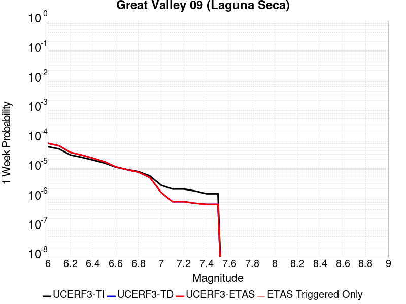 | 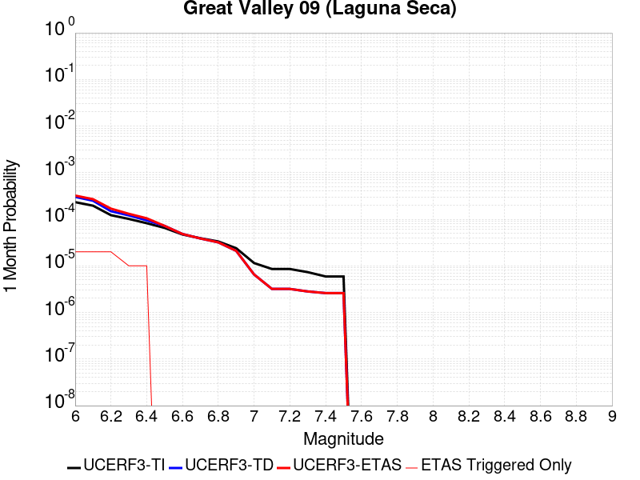 | 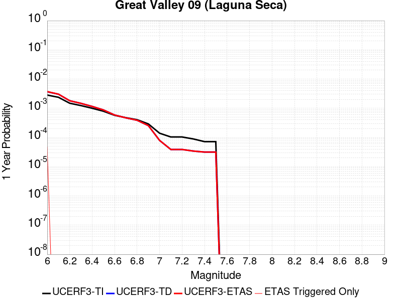 | 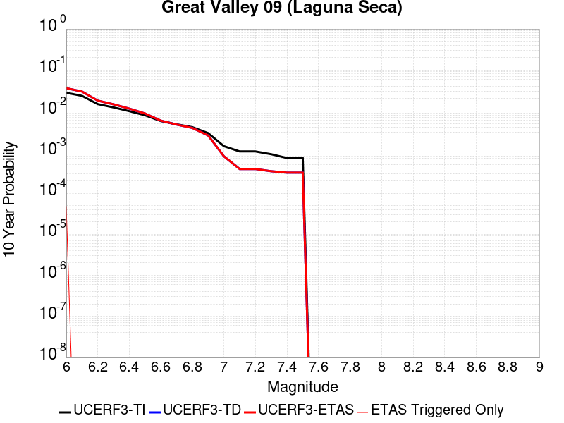 |

| Magnitude | 1 wk TI Prob | 1 wk TD Prob | 1 wk ETAS Prob | 1 wk ETAS/TD Gain | 1 wk ETAS Triggered Only | 1 mo TI Prob | 1 mo TD Prob | 1 mo ETAS Prob | 1 mo ETAS/TD Gain | 1 mo ETAS Triggered Only | 1 yr TI Prob | 1 yr TD Prob | 1 yr ETAS Prob | 1 yr ETAS/TD Gain | 1 yr ETAS Triggered Only | 10 yr TI Prob | 10 yr TD Prob | 10 yr ETAS Prob | 10 yr ETAS/TD Gain | 10 yr ETAS Triggered Only |
|-----|-----|-----|-----|-----|-----|-----|-----|-----|-----|-----|-----|-----|-----|-----|-----|-----|-----|-----|-----|-----|
| 6.0 | 5.4353277E-5 | 7.05022E-5 | 7.05022E-5 | 1.0 | 0.0 | 2.3292181E-4 | 3.0211566E-4 | 3.0211566E-4 | 1.0 | 0.0 | 0.0028321352 | 0.0036721937 | 0.0037145654 | 1.0115385 | 4.2527856E-5 | 0.02796312 | 0.03611547 | 0.036197454 | 1.0022701 | 8.505571E-5 |
| 6.1 | 4.5578287E-5 | 5.822118E-5 | 5.822118E-5 | 1.0 | 0.0 | 1.953209E-4 | 2.4949326E-4 | 2.4949326E-4 | 1.0 | 0.0 | 0.0023754383 | 0.003033432 | 0.003033432 | 1.0 | 0.0 | 0.023502063 | 0.029919548 | 0.029919548 | 1.0 | 0.0 |
| 6.2 | 2.8536782E-5 | 3.4737273E-5 | 3.4737273E-5 | 1.0 | 0.0 | 1.2229476E-4 | 1.4886224E-4 | 1.4886224E-4 | 1.0 | 0.0 | 0.0014879217 | 0.001810813 | 0.001810813 | 1.0 | 0.0 | 0.014779986 | 0.017958116 | 0.017958116 | 1.0 | 0.0 |
| 6.3 | 2.3698774E-5 | 2.8213295E-5 | 2.8213295E-5 | 1.0 | 0.0 | 1.01562226E-4 | 1.20905075E-4 | 1.20905075E-4 | 1.0 | 0.0 | 0.0012358186 | 0.0014710218 | 0.0014710218 | 1.0 | 0.0 | 0.012289686 | 0.014611342 | 0.014611342 | 1.0 | 0.0 |
| 6.4 | 1.9191197E-5 | 2.2123184E-5 | 2.2123184E-5 | 1.0 | 0.0 | 8.2245395E-5 | 9.4806666E-5 | 9.4806666E-5 | 1.0 | 0.0 | 0.0010008777 | 0.0011536429 | 0.0011536429 | 1.0 | 0.0 | 0.009963818 | 0.011476948 | 0.011476948 | 1.0 | 0.0 |
| 6.5 | 1.5203241E-5 | 1.6802203E-5 | 1.6802203E-5 | 1.0 | 0.0 | 6.5155116E-5 | 7.200386E-5 | 7.200386E-5 | 1.0 | 0.0 | 7.9297484E-4 | 8.7626575E-4 | 8.7626575E-4 | 1.0 | 0.0 | 0.007901512 | 0.0087295165 | 0.0087295165 | 1.0 | 0.0 |
| 6.6 | 1.0984925E-5 | 1.1242595E-5 | 1.1242595E-5 | 1.0 | 0.0 | 4.70774E-5 | 4.8181686E-5 | 4.8181686E-5 | 1.0 | 0.0 | 5.730166E-4 | 5.8645656E-4 | 5.8645656E-4 | 1.0 | 0.0 | 0.005715413 | 0.0058494853 | 0.0058494853 | 1.0 | 0.0 |
| 6.7 | 9.134616E-6 | 9.019894E-6 | 9.019894E-6 | 1.0 | 0.0 | 3.9147766E-5 | 3.865613E-5 | 3.865613E-5 | 1.0 | 0.0 | 4.7651984E-4 | 4.7053912E-4 | 4.7053912E-4 | 1.0 | 0.0 | 0.004754993 | 0.0046956735 | 0.0046956735 | 1.0 | 0.0 |
| 6.8 | 7.785589E-6 | 7.4519444E-6 | 7.4519444E-6 | 1.0 | 0.0 | 3.3366385E-5 | 3.1936524E-5 | 3.1936524E-5 | 1.0 | 0.0 | 4.0616E-4 | 3.8875983E-4 | 3.8875983E-4 | 1.0 | 0.0 | 0.0040541845 | 0.0038810016 | 0.0038810016 | 1.0 | 0.0 |
| 6.9 | 5.579095E-6 | 4.898492E-6 | 4.898492E-6 | 1.0 | 0.0 | 2.3910188E-5 | 2.0993377E-5 | 2.0993377E-5 | 1.0 | 0.0 | 2.9106764E-4 | 2.5556577E-4 | 2.5556577E-4 | 1.0 | 0.0 | 0.002906867 | 0.002552856 | 0.002552856 | 1.0 | 0.0 |
| 7.0 | 2.6816688E-6 | 1.5216126E-6 | 1.5216126E-6 | 1.0 | 0.0 | 1.1492816E-5 | 6.521181E-6 | 6.521181E-6 | 1.0 | 0.0 | 1.3991605E-4 | 7.939258E-5 | 7.939258E-5 | 1.0 | 0.0 | 0.0013982799 | 7.9365086E-4 | 7.9365086E-4 | 1.0 | 0.0 |
| 7.1 | 1.9951021E-6 | 7.453827E-7 | 7.453827E-7 | 1.0 | 0.0 | 8.55041E-6 | 3.1944935E-6 | 3.1944935E-6 | 1.0 | 0.0 | 1.0409627E-4 | 3.8892307E-5 | 3.8892307E-5 | 1.0 | 0.0 | 0.0010404752 | 3.8885913E-4 | 3.8885913E-4 | 1.0 | 0.0 |
| 7.2 | 1.9951021E-6 | 7.453827E-7 | 7.453827E-7 | 1.0 | 0.0 | 8.55041E-6 | 3.1944935E-6 | 3.1944935E-6 | 1.0 | 0.0 | 1.0409627E-4 | 3.8892307E-5 | 3.8892307E-5 | 1.0 | 0.0 | 0.0010404752 | 3.8885913E-4 | 3.8885913E-4 | 1.0 | 0.0 |
| 7.3 | 1.7087556E-6 | 6.578881E-7 | 6.578881E-7 | 1.0 | 0.0 | 7.3232177E-6 | 2.8195177E-6 | 2.8195177E-6 | 1.0 | 0.0 | 8.915652E-5 | 3.4327128E-5 | 3.4327128E-5 | 1.0 | 0.0 | 8.9120766E-4 | 3.432223E-4 | 3.432223E-4 | 1.0 | 0.0 |
| 7.4 | 1.3804846E-6 | 6.073852E-7 | 6.073852E-7 | 1.0 | 0.0 | 5.916349E-6 | 2.6030768E-6 | 2.6030768E-6 | 1.0 | 0.0 | 7.2029165E-5 | 3.169204E-5 | 3.169204E-5 | 1.0 | 0.0 | 7.200583E-4 | 3.1687922E-4 | 3.1687922E-4 | 1.0 | 0.0 |
| 7.5 | 1.3804846E-6 | 6.073852E-7 | 6.073852E-7 | 1.0 | 0.0 | 5.916349E-6 | 2.6030768E-6 | 2.6030768E-6 | 1.0 | 0.0 | 7.2029165E-5 | 3.169204E-5 | 3.169204E-5 | 1.0 | 0.0 | 7.200583E-4 | 3.1687922E-4 | 3.1687922E-4 | 1.0 | 0.0 |

## San Andreas (Santa Cruz Mts) 2011 CFM
*[(top)](#table-of-contents)*

| 1 Week | 1 Month | 1 Year | 10 Year |
|-----|-----|-----|-----|
| 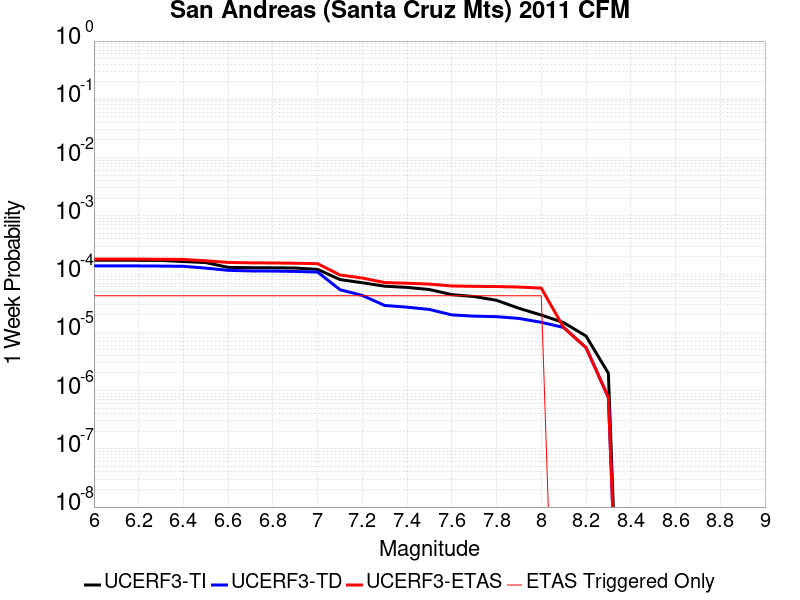 | 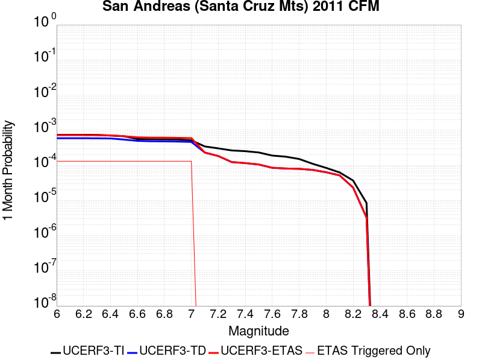 | 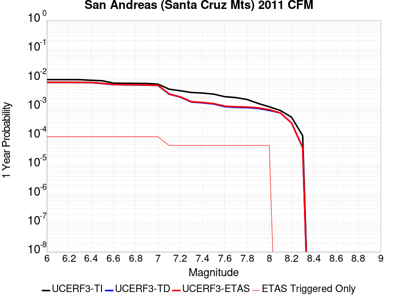 | 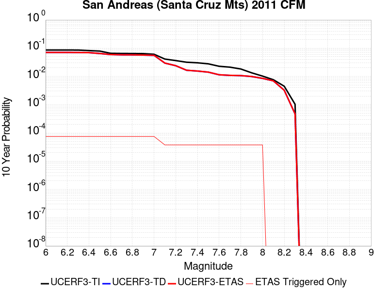 |

| Magnitude | 1 wk TI Prob | 1 wk TD Prob | 1 wk ETAS Prob | 1 wk ETAS/TD Gain | 1 wk ETAS Triggered Only | 1 mo TI Prob | 1 mo TD Prob | 1 mo ETAS Prob | 1 mo ETAS/TD Gain | 1 mo ETAS Triggered Only | 1 yr TI Prob | 1 yr TD Prob | 1 yr ETAS Prob | 1 yr ETAS/TD Gain | 1 yr ETAS Triggered Only | 10 yr TI Prob | 10 yr TD Prob | 10 yr ETAS Prob | 10 yr ETAS/TD Gain | 10 yr ETAS Triggered Only |
|-----|-----|-----|-----|-----|-----|-----|-----|-----|-----|-----|-----|-----|-----|-----|-----|-----|-----|-----|-----|-----|
| 6.0 | 1.7221631E-4 | 1.3793171E-4 | 1.804537E-4 | 1.308283 | 4.2527856E-5 | 7.378611E-4 | 5.9100403E-4 | 6.7600945E-4 | 1.1438322 | 8.505571E-5 | 0.008946515 | 0.007172124 | 0.0072565693 | 1.0117742 | 8.505571E-5 | 0.08594794 | 0.0705551 | 0.07063415 | 1.0011204 | 8.505571E-5 |
| 6.1 | 1.7221631E-4 | 1.3793171E-4 | 1.804537E-4 | 1.308283 | 4.2527856E-5 | 7.378611E-4 | 5.9100403E-4 | 6.7600945E-4 | 1.1438322 | 8.505571E-5 | 0.008946515 | 0.007172124 | 0.0072565693 | 1.0117742 | 8.505571E-5 | 0.08594794 | 0.0705551 | 0.07063415 | 1.0011204 | 8.505571E-5 |
| 6.2 | 1.7221631E-4 | 1.3793171E-4 | 1.804537E-4 | 1.308283 | 4.2527856E-5 | 7.378611E-4 | 5.9100403E-4 | 6.7600945E-4 | 1.1438322 | 8.505571E-5 | 0.008946515 | 0.007172124 | 0.0072565693 | 1.0117742 | 8.505571E-5 | 0.08594794 | 0.0705551 | 0.07063415 | 1.0011204 | 8.505571E-5 |
| 6.3 | 1.716926E-4 | 1.3712609E-4 | 1.7964811E-4 | 1.3100944 | 4.2527856E-5 | 7.3561794E-4 | 5.875529E-4 | 6.725586E-4 | 1.1446776 | 8.505571E-5 | 0.008919428 | 0.0071303817 | 0.0072148307 | 1.0118436 | 8.505571E-5 | 0.08569809 | 0.070167266 | 0.070246354 | 1.0011271 | 8.505571E-5 |
| 6.4 | 1.6392978E-4 | 1.3588481E-4 | 1.7840689E-4 | 1.3129274 | 4.2527856E-5 | 7.02367E-4 | 5.822355E-4 | 6.672417E-4 | 1.1459997 | 8.505571E-5 | 0.008517839 | 0.007066063 | 0.007150518 | 1.0119522 | 8.505571E-5 | 0.08198654 | 0.06940135 | 0.06948051 | 1.0011405 | 8.505571E-5 |
| 6.5 | 1.5742714E-4 | 1.2648388E-4 | 1.6900635E-4 | 1.3361889 | 4.2527856E-5 | 6.745133E-4 | 5.4196286E-4 | 6.2697247E-4 | 1.1568551 | 8.505571E-5 | 0.00818132 | 0.0065787593 | 0.0066632554 | 1.0128437 | 8.505571E-5 | 0.078865945 | 0.06486309 | 0.064942636 | 1.0012263 | 8.505571E-5 |
| 6.6 | 1.3038084E-4 | 1.1588213E-4 | 1.5840506E-4 | 1.3669498 | 4.2527856E-5 | 5.5865536E-4 | 4.9654447E-4 | 5.815579E-4 | 1.1712102 | 8.505571E-5 | 0.006780438 | 0.0060289134 | 0.006113456 | 1.014023 | 8.505571E-5 | 0.0657725 | 0.05932738 | 0.059407387 | 1.0013486 | 8.505571E-5 |
| 6.7 | 1.2867592E-4 | 1.1314701E-4 | 1.5567006E-4 | 1.3758212 | 4.2527856E-5 | 5.5135164E-4 | 4.8482692E-4 | 5.698414E-4 | 1.1753502 | 8.505571E-5 | 0.0066920654 | 0.00588703 | 0.0059715854 | 1.0143629 | 8.505571E-5 | 0.06494093 | 0.058038417 | 0.058118537 | 1.0013804 | 8.505571E-5 |
| 6.8 | 1.2801298E-4 | 1.1252261E-4 | 1.5504568E-4 | 1.3779069 | 4.2527856E-5 | 5.485117E-4 | 4.8215193E-4 | 5.671666E-4 | 1.1763235 | 8.505571E-5 | 0.0066577005 | 0.0058546383 | 0.005939196 | 1.0144429 | 8.505571E-5 | 0.06461738 | 0.057752274 | 0.057832416 | 1.0013877 | 8.505571E-5 |
| 6.9 | 1.269149E-4 | 1.1094465E-4 | 1.5346779E-4 | 1.3832824 | 4.2527856E-5 | 5.4380763E-4 | 4.7539172E-4 | 5.60407E-4 | 1.178832 | 8.505571E-5 | 0.006600777 | 0.005772772 | 0.0058573363 | 1.0146489 | 8.505571E-5 | 0.06408122 | 0.0570241 | 0.057104304 | 1.0014066 | 8.505571E-5 |
| 7.0 | 1.2030331E-4 | 1.0824504E-4 | 1.5076829E-4 | 1.3928425 | 4.2527856E-5 | 5.154837E-4 | 4.638261E-4 | 5.4884236E-4 | 1.1832933 | 8.505571E-5 | 0.006257969 | 0.0056326967 | 0.005717273 | 1.0150152 | 8.505571E-5 | 0.06084648 | 0.055696685 | 0.055777006 | 1.0014421 | 8.505571E-5 |
| 7.1 | 8.049617E-5 | 5.3926604E-5 | 9.645217E-5 | 1.7885823 | 4.2527856E-5 | 3.4493793E-4 | 2.3109373E-4 | 2.7361175E-4 | 1.1839861 | 4.2527856E-5 | 0.0041915346 | 0.0028099709 | 0.002852379 | 1.0150921 | 4.2527856E-5 | 0.041133516 | 0.029618956 | 0.029660225 | 1.0013933 | 4.2527856E-5 |
| 7.2 | 7.093979E-5 | 4.2937932E-5 | 8.546396E-5 | 1.990407 | 4.2527856E-5 | 3.0399222E-4 | 1.8400686E-4 | 2.2652688E-4 | 1.2310785 | 4.2527856E-5 | 0.0036948253 | 0.0022380045 | 0.0022804372 | 1.01896 | 4.2527856E-5 | 0.03633994 | 0.023941692 | 0.023983201 | 1.0017338 | 4.2527856E-5 |
| 7.3 | 6.193693E-5 | 2.8894141E-5 | 7.142077E-5 | 2.471808 | 4.2527856E-5 | 2.6541698E-4 | 1.2382616E-4 | 1.6634875E-4 | 1.3434055 | 4.2527856E-5 | 0.0032266637 | 0.0015065427 | 0.0015490066 | 1.0281862 | 4.2527856E-5 | 0.031802133 | 0.016499156 | 0.016540982 | 1.0025351 | 4.2527856E-5 |
| 7.4 | 5.906492E-5 | 2.702346E-5 | 6.9550166E-5 | 2.573696 | 4.2527856E-5 | 2.5311083E-4 | 1.1580969E-4 | 1.5833262E-4 | 1.3671794 | 4.2527856E-5 | 0.0030772698 | 0.0014090725 | 0.0014515404 | 1.030139 | 4.2527856E-5 | 0.030350044 | 0.015471023 | 0.015512892 | 1.0027063 | 4.2527856E-5 |
| 7.5 | 5.424296E-5 | 2.4678277E-5 | 6.720508E-5 | 2.7232487 | 4.2527856E-5 | 2.324491E-4 | 1.05759755E-4 | 1.4828311E-4 | 1.402075 | 4.2527856E-5 | 0.002826395 | 0.0012868657 | 0.0013293388 | 1.0330051 | 4.2527856E-5 | 0.027907165 | 0.014163188 | 0.014205113 | 1.0029602 | 4.2527856E-5 |
| 7.6 | 4.43084E-5 | 1.990431E-5 | 6.243132E-5 | 3.1365728 | 4.2527856E-5 | 1.8987931E-4 | 8.53014E-5 | 1.2782562E-4 | 1.4985174 | 4.2527856E-5 | 0.0023093296 | 0.0010380499 | 0.0010805337 | 1.0409265 | 4.2527856E-5 | 0.022854783 | 0.011412679 | 0.011454722 | 1.0036838 | 4.2527856E-5 |
| 7.7 | 4.118098E-5 | 1.8936442E-5 | 6.146349E-5 | 3.2457783 | 4.2527856E-5 | 1.7647797E-4 | 8.115366E-5 | 1.2367807E-4 | 1.5239986 | 4.2527856E-5 | 0.002146502 | 9.875982E-4 | 0.001030084 | 1.0430194 | 4.2527856E-5 | 0.021258866 | 0.010870468 | 0.010912534 | 1.0038697 | 4.2527856E-5 |
| 7.8 | 3.5408906E-5 | 1.856446E-5 | 6.109153E-5 | 3.2907784 | 4.2527856E-5 | 1.5174363E-4 | 7.955955E-5 | 1.2208402E-4 | 1.5344987 | 4.2527856E-5 | 0.0018459131 | 9.682073E-4 | 0.001010694 | 1.0438818 | 4.2527856E-5 | 0.018306552 | 0.010652021 | 0.010694095 | 1.00395 | 4.2527856E-5 |
| 7.9 | 2.5860836E-5 | 1.7315993E-5 | 5.9843114E-5 | 3.4559445 | 4.2527856E-5 | 1.10827445E-4 | 7.420929E-5 | 1.1673399E-4 | 1.5730374 | 4.2527856E-5 | 0.001348489 | 9.031238E-4 | 9.456133E-4 | 1.0470473 | 4.2527856E-5 | 0.013403354 | 0.009907599 | 0.009949706 | 1.0042499 | 4.2527856E-5 |
| 8.0 | 1.9777332E-5 | 1.4839596E-5 | 5.7366822E-5 | 3.865794 | 4.2527856E-5 | 8.4757245E-5 | 6.3596715E-5 | 1.0612187E-4 | 1.668669 | 4.2527856E-5 | 0.0010314309 | 7.740152E-4 | 8.165101E-4 | 1.054902 | 4.2527856E-5 | 0.010266567 | 0.008508967 | 0.008551134 | 1.0049555 | 4.2527856E-5 |
| 8.1 | 1.468494E-5 | 1.2107374E-5 | 1.2107374E-5 | 1.0 | 0.0 | 6.293394E-5 | 5.1887713E-5 | 5.1887713E-5 | 1.0 | 0.0 | 7.6595135E-4 | 6.3155E-4 | 6.3155E-4 | 1.0 | 0.0 | 0.0076331664 | 0.006969149 | 0.006969149 | 1.0 | 0.0 |
| 8.2 | 8.63836E-6 | 5.469061E-6 | 5.469061E-6 | 1.0 | 0.0 | 3.7021015E-5 | 2.3438623E-5 | 2.3438623E-5 | 1.0 | 0.0 | 4.5063766E-4 | 2.8532793E-4 | 2.8532793E-4 | 1.0 | 0.0 | 0.004497249 | 0.00324569 | 0.00324569 | 1.0 | 0.0 |
| 8.3 | 1.983087E-6 | 7.6599065E-7 | 7.6599065E-7 | 1.0 | 0.0 | 8.498917E-6 | 3.282813E-6 | 3.282813E-6 | 1.0 | 0.0 | 1.034694E-4 | 3.9967534E-5 | 3.9967534E-5 | 1.0 | 0.0 | 0.0010342124 | 4.719687E-4 | 4.719687E-4 | 1.0 | 0.0 |

## Camp Rock 2011
*[(top)](#table-of-contents)*

| 1 Week | 1 Month | 1 Year | 10 Year |
|-----|-----|-----|-----|
| 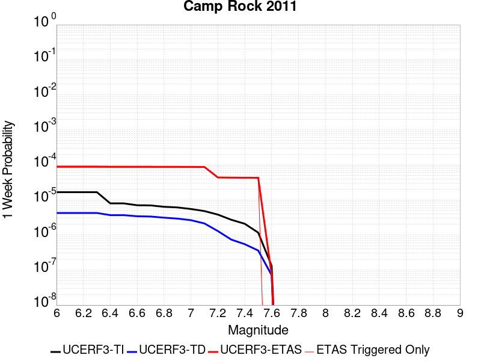 | 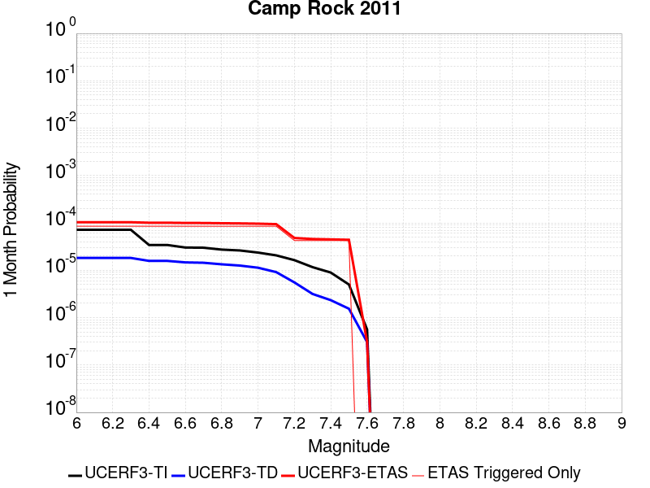 | 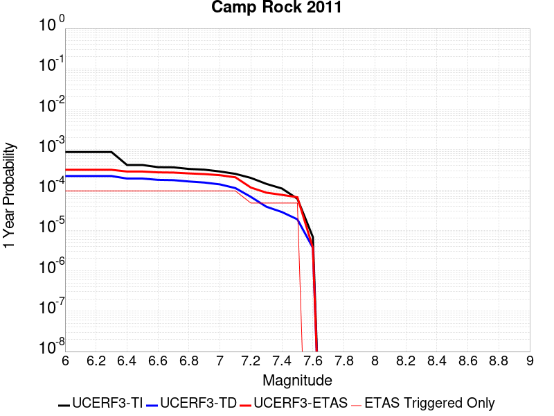 | 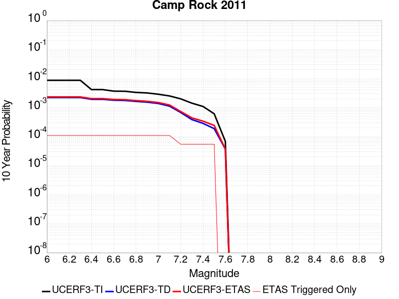 |

| Magnitude | 1 wk TI Prob | 1 wk TD Prob | 1 wk ETAS Prob | 1 wk ETAS/TD Gain | 1 wk ETAS Triggered Only | 1 mo TI Prob | 1 mo TD Prob | 1 mo ETAS Prob | 1 mo ETAS/TD Gain | 1 mo ETAS Triggered Only | 1 yr TI Prob | 1 yr TD Prob | 1 yr ETAS Prob | 1 yr ETAS/TD Gain | 1 yr ETAS Triggered Only | 10 yr TI Prob | 10 yr TD Prob | 10 yr ETAS Prob | 10 yr ETAS/TD Gain | 10 yr ETAS Triggered Only |
|-----|-----|-----|-----|-----|-----|-----|-----|-----|-----|-----|-----|-----|-----|-----|-----|-----|-----|-----|-----|-----|
| 6.0 | 1.6710783E-5 | 4.25026E-6 | 8.930561E-5 | 21.011799 | 8.505571E-5 | 7.161568E-5 | 1.8215276E-5 | 1.0326944E-4 | 5.6693864 | 8.505571E-5 | 8.7157206E-4 | 2.2174895E-4 | 3.067858E-4 | 1.3834826 | 8.505571E-5 | 0.008681616 | 0.0022153298 | 0.002300197 | 1.0383091 | 8.505571E-5 |
| 6.1 | 1.6710783E-5 | 4.25026E-6 | 8.930561E-5 | 21.011799 | 8.505571E-5 | 7.161568E-5 | 1.8215276E-5 | 1.0326944E-4 | 5.6693864 | 8.505571E-5 | 8.7157206E-4 | 2.2174895E-4 | 3.067858E-4 | 1.3834826 | 8.505571E-5 | 0.008681616 | 0.0022153298 | 0.002300197 | 1.0383091 | 8.505571E-5 |
| 6.2 | 1.6710783E-5 | 4.25026E-6 | 8.930561E-5 | 21.011799 | 8.505571E-5 | 7.161568E-5 | 1.8215276E-5 | 1.0326944E-4 | 5.6693864 | 8.505571E-5 | 8.7157206E-4 | 2.2174895E-4 | 3.067858E-4 | 1.3834826 | 8.505571E-5 | 0.008681616 | 0.0022153298 | 0.002300197 | 1.0383091 | 8.505571E-5 |
| 6.3 | 1.6710783E-5 | 4.25026E-6 | 8.930561E-5 | 21.011799 | 8.505571E-5 | 7.161568E-5 | 1.8215276E-5 | 1.0326944E-4 | 5.6693864 | 8.505571E-5 | 8.7157206E-4 | 2.2174895E-4 | 3.067858E-4 | 1.3834826 | 8.505571E-5 | 0.008681616 | 0.0022153298 | 0.002300197 | 1.0383091 | 8.505571E-5 |
| 6.4 | 7.982846E-6 | 3.6820884E-6 | 8.8737484E-5 | 24.09977 | 8.505571E-5 | 3.421175E-5 | 1.5780286E-5 | 1.0083465E-4 | 6.389913 | 8.505571E-5 | 4.1644843E-4 | 1.9210839E-4 | 2.7714777E-4 | 1.4426636 | 8.505571E-5 | 0.0041566887 | 0.001919458 | 0.0020043505 | 1.0442274 | 8.505571E-5 |
| 6.5 | 7.982846E-6 | 3.6820884E-6 | 8.8737484E-5 | 24.09977 | 8.505571E-5 | 3.421175E-5 | 1.5780286E-5 | 1.0083465E-4 | 6.389913 | 8.505571E-5 | 4.1644843E-4 | 1.9210839E-4 | 2.7714777E-4 | 1.4426636 | 8.505571E-5 | 0.0041566887 | 0.001919458 | 0.0020043505 | 1.0442274 | 8.505571E-5 |
| 6.6 | 7.048869E-6 | 3.4243571E-6 | 8.847978E-5 | 25.838362 | 8.505571E-5 | 3.0209088E-5 | 1.4675736E-5 | 9.97302E-5 | 6.795584 | 8.505571E-5 | 3.677336E-4 | 1.7866275E-4 | 2.6370326E-4 | 1.4759835 | 8.505571E-5 | 0.0036712566 | 0.0017852228 | 0.0018701266 | 1.0475593 | 8.505571E-5 |
| 6.7 | 6.987307E-6 | 3.3623348E-6 | 8.841776E-5 | 26.296537 | 8.505571E-5 | 2.9945259E-5 | 1.4409929E-5 | 9.9464414E-5 | 6.902492 | 8.505571E-5 | 3.6452254E-4 | 1.7542706E-4 | 2.6046784E-4 | 1.4847643 | 8.505571E-5 | 0.0036392517 | 0.001752917 | 0.0018378235 | 1.0484374 | 8.505571E-5 |
| 6.8 | 6.3737602E-6 | 3.1179077E-6 | 8.817335E-5 | 28.279655 | 8.505571E-5 | 2.731583E-5 | 1.3362394E-5 | 9.841697E-5 | 7.3652196 | 8.505571E-5 | 3.3251947E-4 | 1.626753E-4 | 2.4771717E-4 | 1.5227706 | 8.505571E-5 | 0.0033202237 | 0.0016255907 | 0.0017105083 | 1.0522379 | 8.505571E-5 |
| 6.9 | 6.112211E-6 | 2.9331156E-6 | 8.798858E-5 | 29.998333 | 8.505571E-5 | 2.6194928E-5 | 1.2570436E-5 | 9.762508E-5 | 7.7662444 | 8.505571E-5 | 3.1887658E-4 | 1.5303459E-4 | 2.380773E-4 | 1.555709 | 8.505571E-5 | 0.003184194 | 0.0015293199 | 0.0016142455 | 1.0555316 | 8.505571E-5 |
| 7.0 | 5.5140117E-6 | 2.641923E-6 | 8.769741E-5 | 33.19454 | 8.505571E-5 | 2.3631264E-5 | 1.132248E-5 | 9.6377225E-5 | 8.512025 | 8.505571E-5 | 2.8767265E-4 | 1.3784273E-4 | 2.2288671E-4 | 1.616964 | 8.505571E-5 | 0.0028730053 | 0.0013775975 | 0.001462536 | 1.061657 | 8.505571E-5 |
| 7.1 | 4.8151105E-6 | 2.1342705E-6 | 8.71898E-5 | 40.852276 | 8.505571E-5 | 2.0636026E-5 | 9.146843E-6 | 9.420177E-5 | 10.29883 | 8.505571E-5 | 2.5121463E-4 | 1.1135734E-4 | 1.9640358E-4 | 1.7637237 | 8.505571E-5 | 0.0025093083 | 0.0011130372 | 0.0011979983 | 1.0763326 | 8.505571E-5 |
| 7.2 | 3.818335E-6 | 1.2937425E-6 | 4.3821543E-5 | 33.87192 | 4.2527856E-5 | 1.6364189E-5 | 5.5445994E-6 | 4.807222E-5 | 8.670098 | 4.2527856E-5 | 1.9921579E-4 | 6.750349E-5 | 1.1002847E-4 | 1.6299672 | 4.2527856E-5 | 0.0019903728 | 6.748381E-4 | 7.1733724E-4 | 1.0629768 | 4.2527856E-5 |
| 7.3 | 2.7166698E-6 | 7.3835776E-7 | 4.3266184E-5 | 58.59786 | 4.2527856E-5 | 1.1642818E-5 | 3.1643867E-6 | 4.5692108E-5 | 14.439483 | 4.2527856E-5 | 1.4174209E-4 | 3.8525748E-5 | 8.105196E-5 | 2.103839 | 4.2527856E-5 | 0.0014165172 | 3.851927E-4 | 4.2770416E-4 | 1.1103642 | 4.2527856E-5 |
| 7.4 | 2.0893426E-6 | 5.4618386E-7 | 4.3074015E-5 | 78.86359 | 4.2527856E-5 | 8.954295E-6 | 2.3407858E-6 | 4.4868542E-5 | 19.168154 | 4.2527856E-5 | 1.0901308E-4 | 2.84987E-5 | 7.1025344E-5 | 2.492231 | 4.2527856E-5 | 0.0010895962 | 2.84951E-4 | 3.2746675E-4 | 1.1492037 | 4.2527856E-5 |
| 7.5 | 1.1681728E-6 | 3.6030585E-7 | 4.2888147E-5 | 119.03261 | 4.2527856E-5 | 5.0064455E-6 | 1.544167E-6 | 4.4071956E-5 | 28.540926 | 4.2527856E-5 | 6.0951766E-5 | 1.8800076E-5 | 6.132713E-5 | 3.2620683 | 4.2527856E-5 | 6.093505E-4 | 1.8798532E-4 | 2.3050519E-4 | 1.2261871 | 4.2527856E-5 |
| 7.6 | 1.3154387E-7 | 7.1197384E-8 | 7.1197384E-8 | 1.0 | 0.0 | 5.6375933E-7 | 3.051316E-7 | 3.051316E-7 | 1.0 | 0.0 | 6.863748E-6 | 3.7149728E-6 | 3.7149728E-6 | 1.0 | 0.0 | 6.863536E-5 | 3.7149264E-5 | 3.7149264E-5 | 1.0 | 0.0 |

## San Gabriel (Extension)
*[(top)](#table-of-contents)*

| 1 Week | 1 Month | 1 Year | 10 Year |
|-----|-----|-----|-----|
|  | 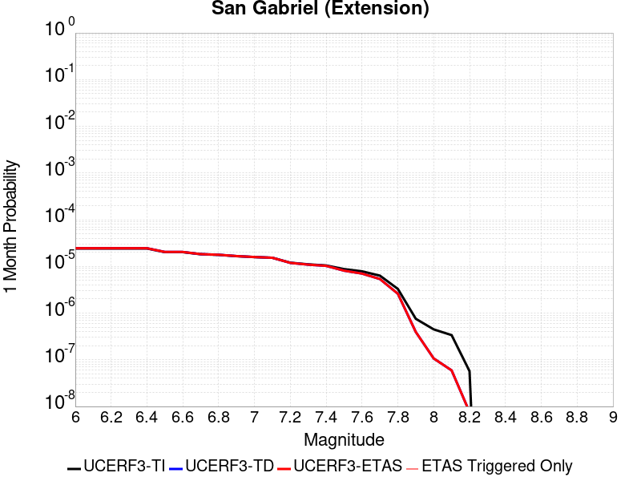 | 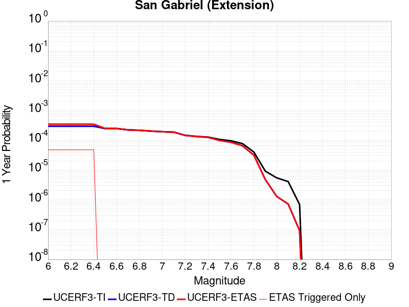 | 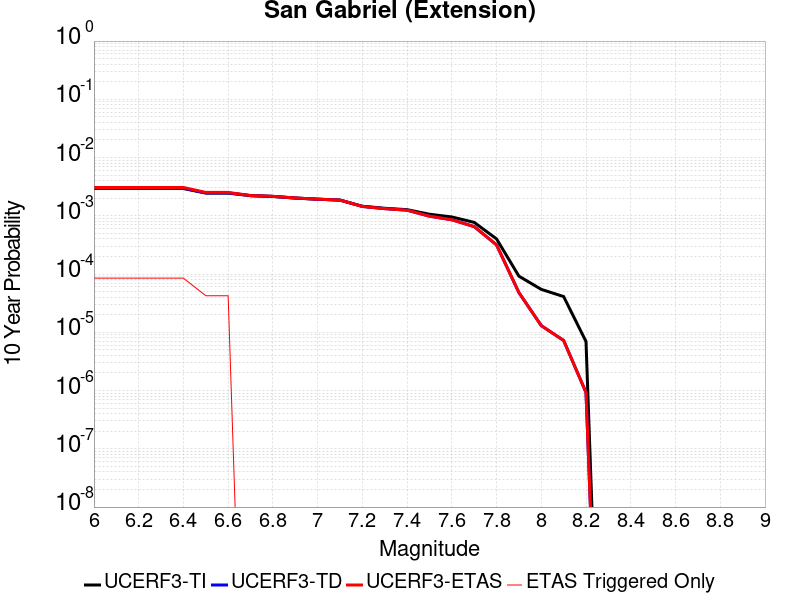 |

| Magnitude | 1 wk TI Prob | 1 wk TD Prob | 1 wk ETAS Prob | 1 wk ETAS/TD Gain | 1 wk ETAS Triggered Only | 1 mo TI Prob | 1 mo TD Prob | 1 mo ETAS Prob | 1 mo ETAS/TD Gain | 1 mo ETAS Triggered Only | 1 yr TI Prob | 1 yr TD Prob | 1 yr ETAS Prob | 1 yr ETAS/TD Gain | 1 yr ETAS Triggered Only | 10 yr TI Prob | 10 yr TD Prob | 10 yr ETAS Prob | 10 yr ETAS/TD Gain | 10 yr ETAS Triggered Only |
|-----|-----|-----|-----|-----|-----|-----|-----|-----|-----|-----|-----|-----|-----|-----|-----|-----|-----|-----|-----|-----|
| 6.0 | 5.6486106E-6 | 5.7168304E-6 | 5.7168304E-6 | 1.0 | 0.0 | 2.4208108E-5 | 2.450048E-5 | 2.450048E-5 | 1.0 | 0.0 | 2.9469383E-4 | 2.9825376E-4 | 3.4076892E-4 | 1.142547 | 4.2527856E-5 | 0.0029430336 | 0.0029786653 | 0.0030634676 | 1.0284699 | 8.505571E-5 |
| 6.1 | 5.6486106E-6 | 5.7168304E-6 | 5.7168304E-6 | 1.0 | 0.0 | 2.4208108E-5 | 2.450048E-5 | 2.450048E-5 | 1.0 | 0.0 | 2.9469383E-4 | 2.9825376E-4 | 3.4076892E-4 | 1.142547 | 4.2527856E-5 | 0.0029430336 | 0.0029786653 | 0.0030634676 | 1.0284699 | 8.505571E-5 |
| 6.2 | 5.6486106E-6 | 5.7168304E-6 | 5.7168304E-6 | 1.0 | 0.0 | 2.4208108E-5 | 2.450048E-5 | 2.450048E-5 | 1.0 | 0.0 | 2.9469383E-4 | 2.9825376E-4 | 3.4076892E-4 | 1.142547 | 4.2527856E-5 | 0.0029430336 | 0.0029786653 | 0.0030634676 | 1.0284699 | 8.505571E-5 |
| 6.3 | 5.6486106E-6 | 5.7168304E-6 | 5.7168304E-6 | 1.0 | 0.0 | 2.4208108E-5 | 2.450048E-5 | 2.450048E-5 | 1.0 | 0.0 | 2.9469383E-4 | 2.9825376E-4 | 3.4076892E-4 | 1.142547 | 4.2527856E-5 | 0.0029430336 | 0.0029786653 | 0.0030634676 | 1.0284699 | 8.505571E-5 |
| 6.4 | 5.6486106E-6 | 5.7168304E-6 | 5.7168304E-6 | 1.0 | 0.0 | 2.4208108E-5 | 2.450048E-5 | 2.450048E-5 | 1.0 | 0.0 | 2.9469383E-4 | 2.9825376E-4 | 3.4076892E-4 | 1.142547 | 4.2527856E-5 | 0.0029430336 | 0.0029786653 | 0.0030634676 | 1.0284699 | 8.505571E-5 |
| 6.5 | 4.7134554E-6 | 4.7542544E-6 | 4.7542544E-6 | 1.0 | 0.0 | 2.0200367E-5 | 2.0375222E-5 | 2.0375222E-5 | 1.0 | 0.0 | 2.459117E-4 | 2.4804095E-4 | 2.4804095E-4 | 1.0 | 0.0 | 0.0024563975 | 0.002477729 | 0.0025201514 | 1.0171216 | 4.2527856E-5 |
| 6.6 | 4.7134554E-6 | 4.7542544E-6 | 4.7542544E-6 | 1.0 | 0.0 | 2.0200367E-5 | 2.0375222E-5 | 2.0375222E-5 | 1.0 | 0.0 | 2.459117E-4 | 2.4804095E-4 | 2.4804095E-4 | 1.0 | 0.0 | 0.0024563975 | 0.002477729 | 0.0025201514 | 1.0171216 | 4.2527856E-5 |
| 6.7 | 4.2468837E-6 | 4.2740717E-6 | 4.2740717E-6 | 1.0 | 0.0 | 1.8200803E-5 | 1.8317325E-5 | 1.8317325E-5 | 1.0 | 0.0 | 2.2157225E-4 | 2.2299135E-4 | 2.2299135E-4 | 1.0 | 0.0 | 0.0022135144 | 0.0022277518 | 0.0022277518 | 1.0 | 0.0 |
| 6.8 | 4.1180615E-6 | 4.1414614E-6 | 4.1414614E-6 | 1.0 | 0.0 | 1.7648716E-5 | 1.7749004E-5 | 1.7749004E-5 | 1.0 | 0.0 | 2.1485193E-4 | 2.160734E-4 | 2.160734E-4 | 1.0 | 0.0 | 0.0021464431 | 0.0021587082 | 0.0021587082 | 1.0 | 0.0 |
| 6.9 | 3.863861E-6 | 3.8797766E-6 | 3.8797766E-6 | 1.0 | 0.0 | 1.65593E-5 | 1.6627511E-5 | 1.6627511E-5 | 1.0 | 0.0 | 2.0159081E-4 | 2.0242184E-4 | 2.0242184E-4 | 1.0 | 0.0 | 0.0020140803 | 0.002022446 | 0.002022446 | 1.0 | 0.0 |
| 7.0 | 3.6947372E-6 | 3.705676E-6 | 3.705676E-6 | 1.0 | 0.0 | 1.5834492E-5 | 1.5881375E-5 | 1.5881375E-5 | 1.0 | 0.0 | 1.9276788E-4 | 1.9333926E-4 | 1.9333926E-4 | 1.0 | 0.0 | 0.0019260074 | 0.0019317807 | 0.0019317807 | 1.0 | 0.0 |
| 7.1 | 3.5686835E-6 | 3.5728963E-6 | 3.5728963E-6 | 1.0 | 0.0 | 1.5294268E-5 | 1.5312327E-5 | 1.5312327E-5 | 1.0 | 0.0 | 1.861918E-4 | 1.8641229E-4 | 1.8641229E-4 | 1.0 | 0.0 | 0.0018603588 | 0.0018626289 | 0.0018626289 | 1.0 | 0.0 |
| 7.2 | 2.8023446E-6 | 2.7767885E-6 | 2.7767885E-6 | 1.0 | 0.0 | 1.2009994E-5 | 1.1900468E-5 | 1.1900468E-5 | 1.0 | 0.0 | 1.4621185E-4 | 1.4487868E-4 | 1.4487868E-4 | 1.0 | 0.0 | 0.001461157 | 0.0014478569 | 0.0014478569 | 1.0 | 0.0 |
| 7.3 | 2.5843012E-6 | 2.5459642E-6 | 2.5459642E-6 | 1.0 | 0.0 | 1.1075529E-5 | 1.0911231E-5 | 1.0911231E-5 | 1.0 | 0.0 | 1.3483623E-4 | 1.3283623E-4 | 1.3283623E-4 | 1.0 | 0.0 | 0.0013475444 | 0.0013275818 | 0.0013275818 | 1.0 | 0.0 |
| 7.4 | 2.4464468E-6 | 2.396665E-6 | 2.396665E-6 | 1.0 | 0.0 | 1.04847295E-5 | 1.0271382E-5 | 1.0271382E-5 | 1.0 | 0.0 | 1.276441E-4 | 1.25047E-4 | 1.25047E-4 | 1.0 | 0.0 | 0.0012757082 | 0.0012497796 | 0.0012497796 | 1.0 | 0.0 |
| 7.5 | 2.0420266E-6 | 1.8910426E-6 | 1.8910426E-6 | 1.0 | 0.0 | 8.751514E-6 | 8.104444E-6 | 8.104444E-6 | 1.0 | 0.0 | 1.0654447E-4 | 9.8667166E-5 | 9.8667166E-5 | 1.0 | 0.0 | 0.001064934 | 9.862408E-4 | 9.862408E-4 | 1.0 | 0.0 |
| 7.6 | 1.8326596E-6 | 1.6398341E-6 | 1.6398341E-6 | 1.0 | 0.0 | 7.854232E-6 | 7.0278415E-6 | 7.0278415E-6 | 1.0 | 0.0 | 9.562107E-5 | 8.5560634E-5 | 8.5560634E-5 | 1.0 | 0.0 | 9.5579936E-4 | 8.5528276E-4 | 8.5528276E-4 | 1.0 | 0.0 |
| 7.7 | 1.4786998E-6 | 1.2523838E-6 | 1.2523838E-6 | 1.0 | 0.0 | 6.3372695E-6 | 5.367348E-6 | 5.367348E-6 | 1.0 | 0.0 | 7.715353E-5 | 6.534551E-5 | 6.534551E-5 | 1.0 | 0.0 | 7.7126746E-4 | 6.532707E-4 | 6.532707E-4 | 1.0 | 0.0 |
| 7.8 | 7.6975533E-7 | 6.0693884E-7 | 6.0693884E-7 | 1.0 | 0.0 | 3.2989474E-6 | 2.601164E-6 | 2.601164E-6 | 1.0 | 0.0 | 4.0163945E-5 | 3.166871E-5 | 3.166871E-5 | 1.0 | 0.0 | 4.0156685E-4 | 3.1664805E-4 | 3.1664805E-4 | 1.0 | 0.0 |
| 7.9 | 1.7645915E-7 | 9.213256E-8 | 9.213256E-8 | 1.0 | 0.0 | 7.562533E-7 | 3.9485377E-7 | 3.9485377E-7 | 1.0 | 0.0 | 9.207345E-6 | 4.807334E-6 | 4.807334E-6 | 1.0 | 0.0 | 9.206964E-5 | 4.807699E-5 | 4.807699E-5 | 1.0 | 0.0 |
| 8.0 | 1.0463461E-7 | 2.4949307E-8 | 2.4949307E-8 | 1.0 | 0.0 | 4.4843398E-7 | 1.0692559E-7 | 1.0692559E-7 | 1.0 | 0.0 | 5.45967E-6 | 1.3018183E-6 | 1.3018183E-6 | 1.0 | 0.0 | 5.459536E-5 | 1.3022789E-5 | 1.3022789E-5 | 1.0 | 0.0 |
| 8.1 | 7.875717E-8 | 1.3866874E-8 | 1.3866874E-8 | 1.0 | 0.0 | 3.3753068E-7 | 5.942946E-8 | 5.942946E-8 | 1.0 | 0.0 | 4.109428E-6 | 7.235534E-7 | 7.235534E-7 | 1.0 | 0.0 | 4.109352E-5 | 7.2401926E-6 | 7.2401926E-6 | 1.0 | 0.0 |
| 8.2 | 1.33163E-8 | 1.7733891E-9 | 1.7733891E-9 | 1.0 | 0.0 | 5.7069855E-8 | 7.600239E-9 | 7.600239E-9 | 1.0 | 0.0 | 6.9482525E-7 | 9.25329E-8 | 9.25329E-8 | 1.0 | 0.0 | 6.9482307E-6 | 9.272953E-7 | 9.272953E-7 | 1.0 | 0.0 |

## Oceanic - West Huasna
*[(top)](#table-of-contents)*

| 1 Week | 1 Month | 1 Year | 10 Year |
|-----|-----|-----|-----|
| 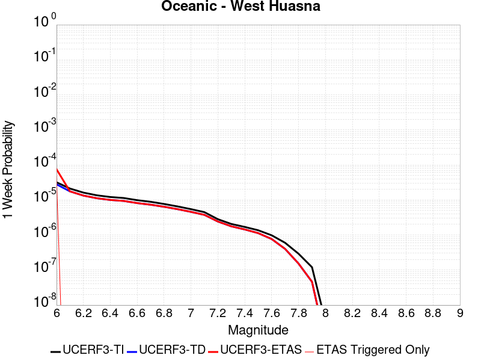 | 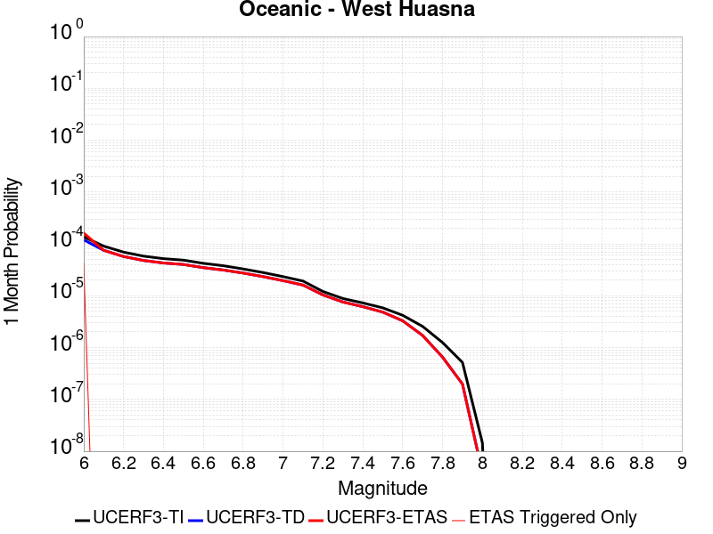 | 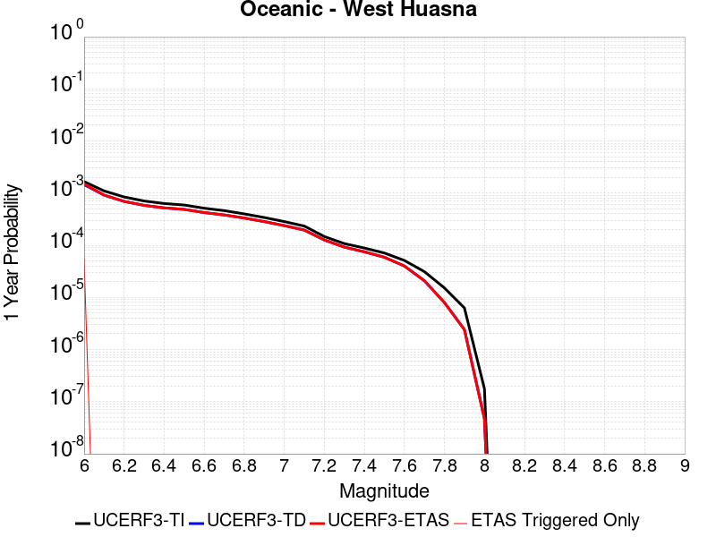 | 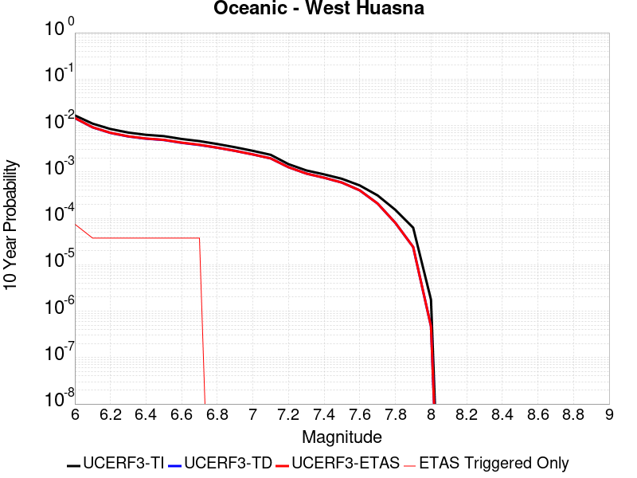 |

| Magnitude | 1 wk TI Prob | 1 wk TD Prob | 1 wk ETAS Prob | 1 wk ETAS/TD Gain | 1 wk ETAS Triggered Only | 1 mo TI Prob | 1 mo TD Prob | 1 mo ETAS Prob | 1 mo ETAS/TD Gain | 1 mo ETAS Triggered Only | 1 yr TI Prob | 1 yr TD Prob | 1 yr ETAS Prob | 1 yr ETAS/TD Gain | 1 yr ETAS Triggered Only | 10 yr TI Prob | 10 yr TD Prob | 10 yr ETAS Prob | 10 yr ETAS/TD Gain | 10 yr ETAS Triggered Only |
|-----|-----|-----|-----|-----|-----|-----|-----|-----|-----|-----|-----|-----|-----|-----|-----|-----|-----|-----|-----|-----|
| 6.0 | 3.195567E-5 | 2.7926868E-5 | 7.0453534E-5 | 2.5227869 | 4.2527856E-5 | 1.3694567E-4 | 1.1968133E-4 | 1.622041E-4 | 1.3553 | 4.2527856E-5 | 0.0016660384 | 0.0014561893 | 0.0014986553 | 1.0291624 | 4.2527856E-5 | 0.016536033 | 0.014471028 | 0.014554853 | 1.0057926 | 8.505571E-5 |
| 6.1 | 2.1156782E-5 | 1.7573486E-5 | 1.7573486E-5 | 1.0 | 0.0 | 9.066878E-5 | 7.531282E-5 | 7.531282E-5 | 1.0 | 0.0 | 0.0011033333 | 9.165572E-4 | 9.165572E-4 | 1.0 | 0.0 | 0.010978713 | 0.009128777 | 0.009170918 | 1.0046161 | 4.2527856E-5 |
| 6.2 | 1.6195117E-5 | 1.3327152E-5 | 1.3327152E-5 | 1.0 | 0.0 | 6.9405796E-5 | 5.7115132E-5 | 5.7115132E-5 | 1.0 | 0.0 | 8.44688E-4 | 6.9515745E-4 | 6.9515745E-4 | 1.0 | 0.0 | 0.008414844 | 0.006930123 | 0.0069723562 | 1.0060941 | 4.2527856E-5 |
| 6.3 | 1.3559345E-5 | 1.1179142E-5 | 1.1179142E-5 | 1.0 | 0.0 | 5.811018E-5 | 4.7909736E-5 | 4.7909736E-5 | 1.0 | 0.0 | 7.072618E-4 | 5.831459E-4 | 5.831459E-4 | 1.0 | 0.0 | 0.0070501505 | 0.0058162753 | 0.0058585554 | 1.0072694 | 4.2527856E-5 |
| 6.4 | 1.2120619E-5 | 1.0000977E-5 | 1.0000977E-5 | 1.0 | 0.0 | 5.1944477E-5 | 4.2860633E-5 | 4.2860633E-5 | 1.0 | 0.0 | 6.322405E-4 | 5.2170374E-4 | 5.2170374E-4 | 1.0 | 0.0 | 0.006304447 | 0.0052048573 | 0.005247164 | 1.0081283 | 4.2527856E-5 |
| 6.5 | 1.13511915E-5 | 9.3674735E-6 | 9.3674735E-6 | 1.0 | 0.0 | 4.8647056E-5 | 4.01457E-5 | 4.01457E-5 | 1.0 | 0.0 | 5.9211696E-4 | 4.886647E-4 | 4.886647E-4 | 1.0 | 0.0 | 0.0059054173 | 0.0048759608 | 0.0049182815 | 1.0086794 | 4.2527856E-5 |
| 6.6 | 9.850605E-6 | 8.135418E-6 | 8.135418E-6 | 1.0 | 0.0 | 4.2216197E-5 | 3.4865614E-5 | 3.4865614E-5 | 1.0 | 0.0 | 5.1386096E-4 | 4.2440637E-4 | 4.2440637E-4 | 1.0 | 0.0 | 0.0051267436 | 0.004235991 | 0.0042783385 | 1.0099971 | 4.2527856E-5 |
| 6.7 | 8.8558645E-6 | 7.318433E-6 | 7.318433E-6 | 1.0 | 0.0 | 3.7953152E-5 | 3.1364336E-5 | 3.1364336E-5 | 1.0 | 0.0 | 4.6198163E-4 | 3.8179406E-4 | 3.8179406E-4 | 1.0 | 0.0 | 0.004610224 | 0.0038114067 | 0.0038537725 | 1.0111156 | 4.2527856E-5 |
| 6.8 | 7.67136E-6 | 6.391756E-6 | 6.391756E-6 | 1.0 | 0.0 | 3.2876844E-5 | 2.7392953E-5 | 2.7392953E-5 | 1.0 | 0.0 | 4.0020206E-4 | 3.3345833E-4 | 3.3345833E-4 | 1.0 | 0.0 | 0.003994821 | 0.0033296007 | 0.0033296007 | 1.0 | 0.0 |
| 6.9 | 6.534529E-6 | 5.4583297E-6 | 5.4583297E-6 | 1.0 | 0.0 | 2.8004823E-5 | 2.3392633E-5 | 2.3392633E-5 | 1.0 | 0.0 | 3.4090536E-4 | 2.847682E-4 | 2.847682E-4 | 1.0 | 0.0 | 0.0034038287 | 0.0028440498 | 0.0028440498 | 1.0 | 0.0 |
| 7.0 | 5.460525E-6 | 4.5699517E-6 | 4.5699517E-6 | 1.0 | 0.0 | 2.3402039E-5 | 1.958536E-5 | 1.958536E-5 | 1.0 | 0.0 | 2.8488258E-4 | 2.3842578E-4 | 2.3842578E-4 | 1.0 | 0.0 | 0.0028451765 | 0.0023817138 | 0.0023817138 | 1.0 | 0.0 |
| 7.1 | 4.4825083E-6 | 3.7524428E-6 | 3.7524428E-6 | 1.0 | 0.0 | 1.9210609E-5 | 1.60818E-5 | 1.60818E-5 | 1.0 | 0.0 | 2.3386406E-4 | 1.9577841E-4 | 1.9577841E-4 | 1.0 | 0.0 | 0.002336181 | 0.0019560715 | 0.0019560715 | 1.0 | 0.0 |
| 7.2 | 2.821708E-6 | 2.4249334E-6 | 2.4249334E-6 | 1.0 | 0.0 | 1.2092979E-5 | 1.039253E-5 | 1.039253E-5 | 1.0 | 0.0 | 1.4722206E-4 | 1.2652173E-4 | 1.2652173E-4 | 1.0 | 0.0 | 0.0014712457 | 0.0012644994 | 0.0012644994 | 1.0 | 0.0 |
| 7.3 | 2.0644757E-6 | 1.7687412E-6 | 1.7687412E-6 | 1.0 | 0.0 | 8.847723E-6 | 7.5802973E-6 | 7.5802973E-6 | 1.0 | 0.0 | 1.0771569E-4 | 9.228622E-5 | 9.228622E-5 | 1.0 | 0.0 | 0.001076635 | 9.2248066E-4 | 9.2248066E-4 | 1.0 | 0.0 |
| 7.4 | 1.6980367E-6 | 1.4379892E-6 | 1.4379892E-6 | 1.0 | 0.0 | 7.27728E-6 | 6.162796E-6 | 6.162796E-6 | 1.0 | 0.0 | 8.8597284E-5 | 7.5029464E-5 | 7.5029464E-5 | 1.0 | 0.0 | 8.8561967E-4 | 7.500429E-4 | 7.500429E-4 | 1.0 | 0.0 |
| 7.5 | 1.3637683E-6 | 1.1302635E-6 | 1.1302635E-6 | 1.0 | 0.0 | 5.844708E-6 | 4.8439774E-6 | 4.8439774E-6 | 1.0 | 0.0 | 7.1156996E-5 | 5.897383E-5 | 5.897383E-5 | 1.0 | 0.0 | 7.1134215E-4 | 5.895833E-4 | 5.895833E-4 | 1.0 | 0.0 |
| 7.6 | 9.802994E-7 | 7.677247E-7 | 7.677247E-7 | 1.0 | 0.0 | 4.2012766E-6 | 3.2902446E-6 | 3.2902446E-6 | 1.0 | 0.0 | 5.1149345E-5 | 4.0057992E-5 | 4.0057992E-5 | 1.0 | 0.0 | 5.113757E-4 | 4.0050913E-4 | 4.0050913E-4 | 1.0 | 0.0 |
| 7.7 | 5.986191E-7 | 4.0050548E-7 | 4.0050548E-7 | 1.0 | 0.0 | 2.5655079E-6 | 1.7164509E-6 | 1.7164509E-6 | 1.0 | 0.0 | 3.1234613E-5 | 2.089759E-5 | 2.089759E-5 | 1.0 | 0.0 | 3.123022E-4 | 2.089576E-4 | 2.089576E-4 | 1.0 | 0.0 |
| 7.8 | 2.9189815E-7 | 1.5285792E-7 | 1.5285792E-7 | 1.0 | 0.0 | 1.2509914E-6 | 6.5510517E-7 | 6.5510517E-7 | 1.0 | 0.0 | 1.5230714E-5 | 7.9758765E-6 | 7.9758765E-6 | 1.0 | 0.0 | 1.522967E-4 | 7.9757214E-5 | 7.9757214E-5 | 1.0 | 0.0 |
| 7.9 | 1.2057845E-7 | 4.621248E-8 | 4.621248E-8 | 1.0 | 0.0 | 5.1676466E-7 | 1.9805347E-7 | 1.9805347E-7 | 1.0 | 0.0 | 6.2915915E-6 | 2.4112983E-6 | 2.4112983E-6 | 1.0 | 0.0 | 6.2914136E-5 | 2.4114026E-5 | 2.4114026E-5 | 1.0 | 0.0 |
| 8.0 | 3.3806387E-9 | 9.011393E-10 | 9.011393E-10 | 1.0 | 0.0 | 1.4488451E-8 | 3.8620254E-9 | 3.8620254E-9 | 1.0 | 0.0 | 1.7639688E-7 | 4.702016E-8 | 4.702016E-8 | 1.0 | 0.0 | 1.7639674E-6 | 4.7129527E-7 | 4.7129527E-7 | 1.0 | 0.0 |

## Whittier alt 1
*[(top)](#table-of-contents)*

| 1 Week | 1 Month | 1 Year | 10 Year |
|-----|-----|-----|-----|
| 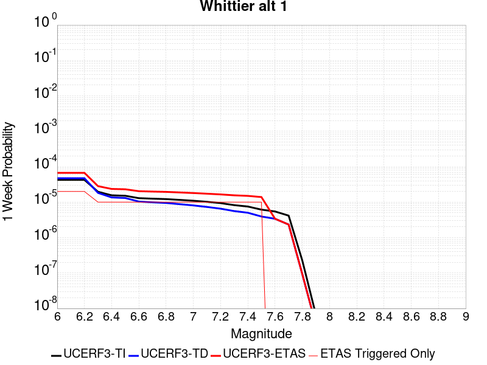 | 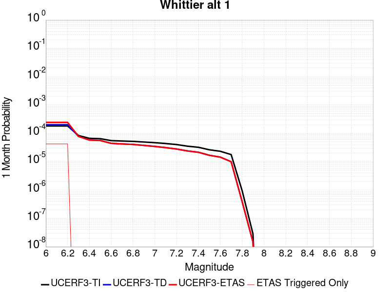 | 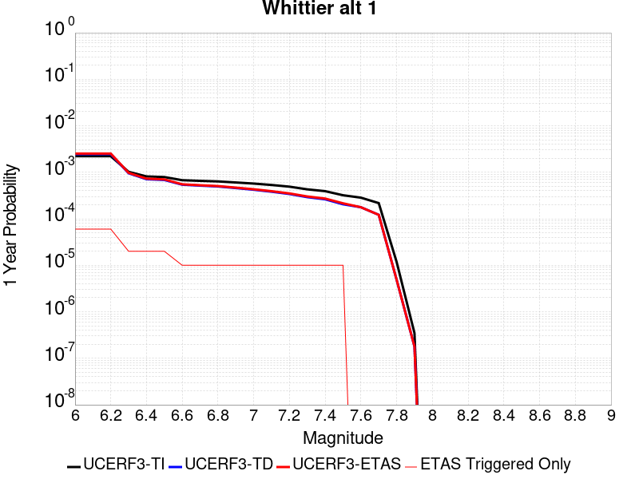 | 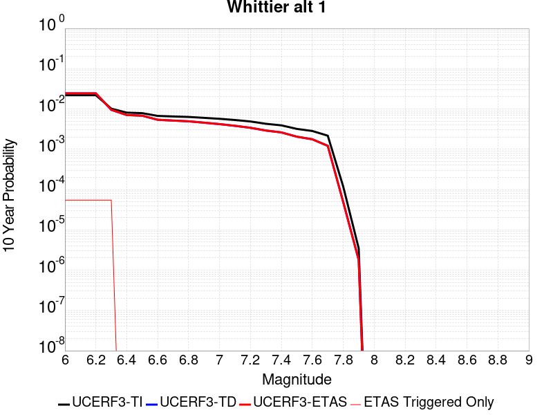 |

| Magnitude | 1 wk TI Prob | 1 wk TD Prob | 1 wk ETAS Prob | 1 wk ETAS/TD Gain | 1 wk ETAS Triggered Only | 1 mo TI Prob | 1 mo TD Prob | 1 mo ETAS Prob | 1 mo ETAS/TD Gain | 1 mo ETAS Triggered Only | 1 yr TI Prob | 1 yr TD Prob | 1 yr ETAS Prob | 1 yr ETAS/TD Gain | 1 yr ETAS Triggered Only | 10 yr TI Prob | 10 yr TD Prob | 10 yr ETAS Prob | 10 yr ETAS/TD Gain | 10 yr ETAS Triggered Only |
|-----|-----|-----|-----|-----|-----|-----|-----|-----|-----|-----|-----|-----|-----|-----|-----|-----|-----|-----|-----|-----|
| 6.0 | 4.2554693E-5 | 4.725218E-5 | 4.725218E-5 | 1.0 | 0.0 | 1.8236451E-4 | 2.0249544E-4 | 2.4501467E-4 | 1.2099763 | 4.2527856E-5 | 0.002218027 | 0.0024629154 | 0.0025053385 | 1.0172248 | 4.2527856E-5 | 0.02196019 | 0.024390234 | 0.024473216 | 1.0034022 | 8.505571E-5 |
| 6.1 | 4.2554693E-5 | 4.725218E-5 | 4.725218E-5 | 1.0 | 0.0 | 1.8236451E-4 | 2.0249544E-4 | 2.4501467E-4 | 1.2099763 | 4.2527856E-5 | 0.002218027 | 0.0024629154 | 0.0025053385 | 1.0172248 | 4.2527856E-5 | 0.02196019 | 0.024390234 | 0.024473216 | 1.0034022 | 8.505571E-5 |
| 6.2 | 4.2554693E-5 | 4.725218E-5 | 4.725218E-5 | 1.0 | 0.0 | 1.8236451E-4 | 2.0249544E-4 | 2.4501467E-4 | 1.2099763 | 4.2527856E-5 | 0.002218027 | 0.0024629154 | 0.0025053385 | 1.0172248 | 4.2527856E-5 | 0.02196019 | 0.024390234 | 0.024473216 | 1.0034022 | 8.505571E-5 |
| 6.3 | 1.9617712E-5 | 1.8268593E-5 | 1.8268593E-5 | 1.0 | 0.0 | 8.40732E-5 | 7.829172E-5 | 7.829172E-5 | 1.0 | 0.0 | 0.0010231105 | 9.52804E-4 | 9.52804E-4 | 1.0 | 0.0 | 0.01018413 | 0.009490474 | 0.009532599 | 1.0044386 | 4.2527856E-5 |
| 6.4 | 1.5611336E-5 | 1.3604271E-5 | 1.3604271E-5 | 1.0 | 0.0 | 6.690401E-5 | 5.8302747E-5 | 5.8302747E-5 | 1.0 | 0.0 | 8.142519E-4 | 7.0961076E-4 | 7.0961076E-4 | 1.0 | 0.0 | 0.008112748 | 0.0070754145 | 0.0070754145 | 1.0 | 0.0 |
| 6.5 | 1.5150166E-5 | 1.3100925E-5 | 1.3100925E-5 | 1.0 | 0.0 | 6.492767E-5 | 5.6145647E-5 | 5.6145647E-5 | 1.0 | 0.0 | 7.9020765E-4 | 6.8336475E-4 | 6.8336475E-4 | 1.0 | 0.0 | 0.007874036 | 0.0068145846 | 0.0068145846 | 1.0 | 0.0 |
| 6.6 | 1.295588E-5 | 1.0380725E-5 | 1.0380725E-5 | 1.0 | 0.0 | 5.552402E-5 | 4.4488075E-5 | 4.4488075E-5 | 1.0 | 0.0 | 6.7579525E-4 | 5.4150965E-4 | 5.4150965E-4 | 1.0 | 0.0 | 0.006737438 | 0.0054033357 | 0.0054033357 | 1.0 | 0.0 |
| 6.7 | 1.2542085E-5 | 9.899369E-6 | 9.899369E-6 | 1.0 | 0.0 | 5.3750682E-5 | 4.242519E-5 | 4.242519E-5 | 1.0 | 0.0 | 6.542181E-4 | 5.164061E-4 | 5.164061E-4 | 1.0 | 0.0 | 0.006522954 | 0.0051534795 | 0.0051534795 | 1.0 | 0.0 |
| 6.8 | 1.2195878E-5 | 9.495415E-6 | 9.495415E-6 | 1.0 | 0.0 | 5.2267E-5 | 4.069401E-5 | 4.069401E-5 | 1.0 | 0.0 | 6.36165E-4 | 4.9533875E-4 | 4.9533875E-4 | 1.0 | 0.0 | 0.0063434686 | 0.004943688 | 0.004943688 | 1.0 | 0.0 |
| 6.9 | 1.1580298E-5 | 8.772933E-6 | 8.772933E-6 | 1.0 | 0.0 | 4.9628903E-5 | 3.7597754E-5 | 3.7597754E-5 | 1.0 | 0.0 | 6.040644E-4 | 4.5765814E-4 | 4.5765814E-4 | 1.0 | 0.0 | 0.00602425 | 0.0045684157 | 0.0045684157 | 1.0 | 0.0 |
| 7.0 | 1.0964795E-5 | 8.083994E-6 | 8.083994E-6 | 1.0 | 0.0 | 4.6991136E-5 | 3.4645236E-5 | 3.4645236E-5 | 1.0 | 0.0 | 5.7196687E-4 | 4.2172565E-4 | 4.2172565E-4 | 1.0 | 0.0 | 0.0057049696 | 0.004210462 | 0.004210462 | 1.0 | 0.0 |
| 7.1 | 1.0230601E-5 | 7.3266697E-6 | 7.3266697E-6 | 1.0 | 0.0 | 4.3844695E-5 | 3.1399642E-5 | 3.1399642E-5 | 1.0 | 0.0 | 5.336784E-4 | 3.8222488E-4 | 3.8222488E-4 | 1.0 | 0.0 | 0.005323986 | 0.0038168381 | 0.0038168381 | 1.0 | 0.0 |
| 7.2 | 9.40865E-6 | 6.543289E-6 | 6.543289E-6 | 1.0 | 0.0 | 4.032216E-5 | 2.8042374E-5 | 2.8042374E-5 | 1.0 | 0.0 | 4.908117E-4 | 3.4136363E-4 | 3.4136363E-4 | 1.0 | 0.0 | 0.0048972913 | 0.003409485 | 0.003409485 | 1.0 | 0.0 |
| 7.3 | 8.237384E-6 | 5.5977525E-6 | 5.5977525E-6 | 1.0 | 0.0 | 3.5302593E-5 | 2.3990153E-5 | 2.3990153E-5 | 1.0 | 0.0 | 4.2972428E-4 | 2.92042E-4 | 2.92042E-4 | 1.0 | 0.0 | 0.0042889426 | 0.002916903 | 0.002916903 | 1.0 | 0.0 |
| 7.4 | 7.5316966E-6 | 5.027819E-6 | 5.027819E-6 | 1.0 | 0.0 | 3.2278298E-5 | 2.1547625E-5 | 2.1547625E-5 | 1.0 | 0.0 | 3.9291743E-4 | 2.6231175E-4 | 2.6231175E-4 | 1.0 | 0.0 | 0.0039222343 | 0.0026201333 | 0.0026201333 | 1.0 | 0.0 |
| 7.5 | 6.149649E-6 | 3.933841E-6 | 3.933841E-6 | 1.0 | 0.0 | 2.6355372E-5 | 1.6859214E-5 | 1.6859214E-5 | 1.0 | 0.0 | 3.208294E-4 | 2.052425E-4 | 2.052425E-4 | 1.0 | 0.0 | 0.003203666 | 0.0020506186 | 0.0020506186 | 1.0 | 0.0 |
| 7.6 | 5.457711E-6 | 3.3953788E-6 | 3.3953788E-6 | 1.0 | 0.0 | 2.338998E-5 | 1.4551547E-5 | 1.4551547E-5 | 1.0 | 0.0 | 2.8473578E-4 | 1.771515E-4 | 1.771515E-4 | 1.0 | 0.0 | 0.0028437122 | 0.0017701836 | 0.0017701836 | 1.0 | 0.0 |
| 7.7 | 4.1676276E-6 | 2.3331952E-6 | 2.3331952E-6 | 1.0 | 0.0 | 1.7861139E-5 | 9.999374E-6 | 9.999374E-6 | 1.0 | 0.0 | 2.1743766E-4 | 1.2173632E-4 | 1.2173632E-4 | 1.0 | 0.0 | 0.0021722503 | 0.0012167693 | 0.0012167693 | 1.0 | 0.0 |
| 7.8 | 2.2692414E-7 | 9.3854695E-8 | 9.3854695E-8 | 1.0 | 0.0 | 9.725317E-7 | 4.0223435E-7 | 4.0223435E-7 | 1.0 | 0.0 | 1.1840509E-5 | 4.8971956E-6 | 4.8971956E-6 | 1.0 | 0.0 | 1.1839878E-4 | 4.8971204E-5 | 4.8971204E-5 | 1.0 | 0.0 |
| 7.9 | 6.676829E-9 | 3.439853E-9 | 3.439853E-9 | 1.0 | 0.0 | 2.861498E-8 | 1.4742227E-8 | 1.4742227E-8 | 1.0 | 0.0 | 3.4838732E-7 | 1.7948659E-7 | 1.7948659E-7 | 1.0 | 0.0 | 3.4838679E-6 | 1.7948646E-6 | 1.7948646E-6 | 1.0 | 0.0 |

## Owens Valley
*[(top)](#table-of-contents)*

| 1 Week | 1 Month | 1 Year | 10 Year |
|-----|-----|-----|-----|
| 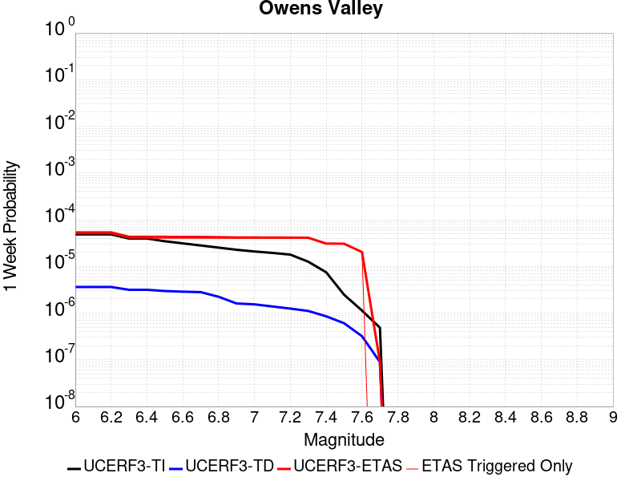 | 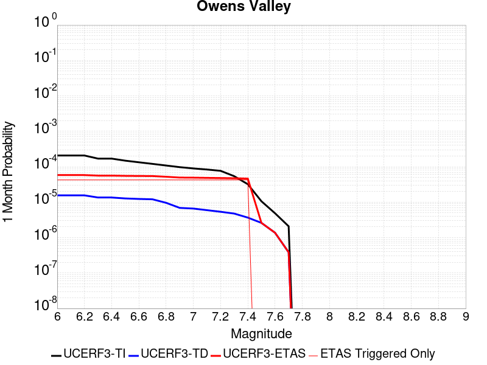 | 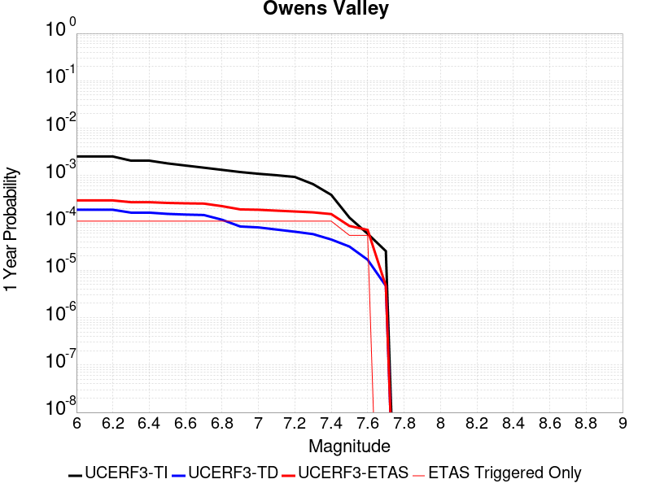 | 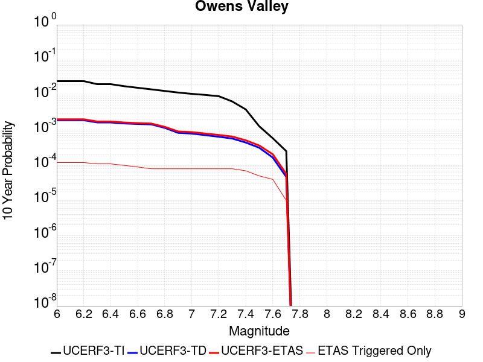 |

| Magnitude | 1 wk TI Prob | 1 wk TD Prob | 1 wk ETAS Prob | 1 wk ETAS/TD Gain | 1 wk ETAS Triggered Only | 1 mo TI Prob | 1 mo TD Prob | 1 mo ETAS Prob | 1 mo ETAS/TD Gain | 1 mo ETAS Triggered Only | 1 yr TI Prob | 1 yr TD Prob | 1 yr ETAS Prob | 1 yr ETAS/TD Gain | 1 yr ETAS Triggered Only | 10 yr TI Prob | 10 yr TD Prob | 10 yr ETAS Prob | 10 yr ETAS/TD Gain | 10 yr ETAS Triggered Only |
|-----|-----|-----|-----|-----|-----|-----|-----|-----|-----|-----|-----|-----|-----|-----|-----|-----|-----|-----|-----|-----|
| 6.0 | 4.83821E-5 | 3.626567E-6 | 3.626567E-6 | 1.0 | 0.0 | 2.0733538E-4 | 1.5542342E-5 | 5.8069538E-5 | 3.736215 | 4.2527856E-5 | 0.002521386 | 1.8921259E-4 | 2.742522E-4 | 1.4494395 | 8.505571E-5 | 0.024929691 | 0.001925011 | 0.002009903 | 1.0440995 | 8.505571E-5 |
| 6.1 | 4.83821E-5 | 3.626567E-6 | 3.626567E-6 | 1.0 | 0.0 | 2.0733538E-4 | 1.5542342E-5 | 5.8069538E-5 | 3.736215 | 4.2527856E-5 | 0.002521386 | 1.8921259E-4 | 2.742522E-4 | 1.4494395 | 8.505571E-5 | 0.024929691 | 0.001925011 | 0.002009903 | 1.0440995 | 8.505571E-5 |
| 6.2 | 4.83821E-5 | 3.626567E-6 | 3.626567E-6 | 1.0 | 0.0 | 2.0733538E-4 | 1.5542342E-5 | 5.8069538E-5 | 3.736215 | 4.2527856E-5 | 0.002521386 | 1.8921259E-4 | 2.742522E-4 | 1.4494395 | 8.505571E-5 | 0.024929691 | 0.001925011 | 0.002009903 | 1.0440995 | 8.505571E-5 |
| 6.3 | 3.953008E-5 | 3.1553948E-6 | 3.1553948E-6 | 1.0 | 0.0 | 1.6940363E-4 | 1.3523055E-5 | 5.6050336E-5 | 4.1447983 | 4.2527856E-5 | 0.002060538 | 1.6463149E-4 | 2.496732E-4 | 1.5165579 | 8.505571E-5 | 0.020415364 | 0.0016592 | 0.0017441144 | 1.051178 | 8.505571E-5 |
| 6.4 | 3.953008E-5 | 3.1553948E-6 | 3.1553948E-6 | 1.0 | 0.0 | 1.6940363E-4 | 1.3523055E-5 | 5.6050336E-5 | 4.1447983 | 4.2527856E-5 | 0.002060538 | 1.6463149E-4 | 2.496732E-4 | 1.5165579 | 8.505571E-5 | 0.020415364 | 0.0016592 | 0.0017441144 | 1.051178 | 8.505571E-5 |
| 6.5 | 3.457342E-5 | 2.9715961E-6 | 2.9715961E-6 | 1.0 | 0.0 | 1.4816338E-4 | 1.2735354E-5 | 5.526267E-5 | 4.3393116 | 4.2527856E-5 | 0.0018023965 | 1.550426E-4 | 2.4008512E-4 | 1.5485107 | 8.505571E-5 | 0.017878477 | 0.001555719 | 0.0016406423 | 1.0545878 | 8.505571E-5 |
| 6.6 | 3.1127765E-5 | 2.8744932E-6 | 2.8744932E-6 | 1.0 | 0.0 | 1.3339789E-4 | 1.2319203E-5 | 5.4846536E-5 | 4.4521174 | 4.2527856E-5 | 0.0016229092 | 1.4997667E-4 | 2.3501962E-4 | 1.5670413 | 8.505571E-5 | 0.016111081 | 0.0015012559 | 0.0015861839 | 1.0565714 | 8.505571E-5 |
| 6.7 | 2.806885E-5 | 2.8104134E-6 | 2.8104134E-6 | 1.0 | 0.0 | 1.2028952E-4 | 1.20445775E-5 | 5.457192E-5 | 4.530829 | 4.2527856E-5 | 0.001463541 | 1.4663354E-4 | 2.3167678E-4 | 1.5799712 | 8.505571E-5 | 0.014539397 | 0.0014657511 | 0.0015506821 | 1.0579437 | 8.505571E-5 |
| 6.8 | 2.524524E-5 | 2.2353688E-6 | 2.2353688E-6 | 1.0 | 0.0 | 1.0818939E-4 | 9.580118E-6 | 5.2107567E-5 | 5.439136 | 4.2527856E-5 | 0.0013164099 | 1.16632E-4 | 2.0167779E-4 | 1.7291806 | 8.505571E-5 | 0.01308639 | 0.0011659812 | 0.0012509377 | 1.0728627 | 8.505571E-5 |
| 6.9 | 2.2704568E-5 | 1.6081682E-6 | 1.6081682E-6 | 1.0 | 0.0 | 9.730166E-5 | 6.8921313E-6 | 4.9419694E-5 | 7.1704516 | 4.2527856E-5 | 0.0011840039 | 8.390849E-5 | 1.6895706E-4 | 2.0135872 | 8.505571E-5 | 0.011777153 | 8.3897985E-4 | 9.239642E-4 | 1.1012949 | 8.505571E-5 |
| 7.0 | 2.0871712E-5 | 1.5395453E-6 | 1.5395453E-6 | 1.0 | 0.0 | 8.944713E-5 | 6.598035E-6 | 4.912561E-5 | 7.4454913 | 4.2527856E-5 | 0.0010884746 | 8.032813E-5 | 1.65377E-4 | 2.0587683 | 8.505571E-5 | 0.010831586 | 8.0316263E-4 | 8.8815E-4 | 1.1058159 | 8.505571E-5 |
| 7.1 | 1.944928E-5 | 1.3864178E-6 | 1.3864178E-6 | 1.0 | 0.0 | 8.335139E-5 | 5.941777E-6 | 4.846938E-5 | 8.157388 | 4.2527856E-5 | 0.0010143308 | 7.233874E-5 | 1.573883E-4 | 2.1757123 | 8.505571E-5 | 0.010097133 | 7.2330976E-4 | 8.0830394E-4 | 1.1175073 | 8.505571E-5 |
| 7.2 | 1.7876306E-5 | 1.2489141E-6 | 1.2489141E-6 | 1.0 | 0.0 | 7.6610486E-5 | 5.352478E-6 | 4.7880105E-5 | 8.945409 | 4.2527856E-5 | 9.3233347E-4 | 6.516448E-5 | 1.5021465E-4 | 2.3051615 | 8.505571E-5 | 0.009284316 | 6.5159105E-4 | 7.3659135E-4 | 1.1304504 | 8.505571E-5 |
| 7.3 | 1.2618672E-5 | 1.1115209E-6 | 1.1115209E-6 | 1.0 | 0.0 | 5.40789E-5 | 4.763652E-6 | 4.7291305E-5 | 9.927531 | 4.2527856E-5 | 6.582117E-4 | 5.799593E-5 | 1.4304671E-4 | 2.4664958 | 8.505571E-5 | 0.0065626553 | 5.7994033E-4 | 6.6494674E-4 | 1.1465778 | 8.505571E-5 |
| 7.4 | 7.4874442E-6 | 8.5486437E-7 | 8.5486437E-7 | 1.0 | 0.0 | 3.208865E-5 | 3.6636993E-6 | 4.61914E-5 | 12.607858 | 4.2527856E-5 | 3.906093E-4 | 4.4604632E-5 | 1.2965655E-4 | 2.9067957 | 8.505571E-5 | 0.003899234 | 4.4604883E-4 | 5.310666E-4 | 1.190602 | 8.505571E-5 |
| 7.5 | 2.4734156E-6 | 6.068616E-7 | 6.068616E-7 | 1.0 | 0.0 | 1.060031E-5 | 2.6008327E-6 | 2.6008327E-6 | 1.0 | 0.0 | 1.2905113E-4 | 3.166468E-5 | 7.419119E-5 | 2.3430266 | 4.2527856E-5 | 0.0012897621 | 3.1660203E-4 | 3.591164E-4 | 1.1342834 | 4.2527856E-5 |
| 7.6 | 1.1328841E-6 | 3.196531E-7 | 3.196531E-7 | 1.0 | 0.0 | 4.8552088E-6 | 1.3699412E-6 | 1.3699412E-6 | 1.0 | 0.0 | 5.9110564E-5 | 1.6678909E-5 | 5.9206053E-5 | 3.549756 | 4.2527856E-5 | 5.9094845E-4 | 1.6677675E-4 | 2.092975E-4 | 1.2549561 | 4.2527856E-5 |
| 7.7 | 4.8613185E-7 | 8.964689E-8 | 8.964689E-8 | 1.0 | 0.0 | 2.0834207E-6 | 3.8420092E-7 | 3.8420092E-7 | 1.0 | 0.0 | 2.536535E-5 | 4.6776368E-6 | 4.6776368E-6 | 1.0 | 0.0 | 2.5362454E-4 | 4.677545E-5 | 4.677545E-5 | 1.0 | 0.0 |

## North Frontal  (East)
*[(top)](#table-of-contents)*

| 1 Week | 1 Month | 1 Year | 10 Year |
|-----|-----|-----|-----|
| 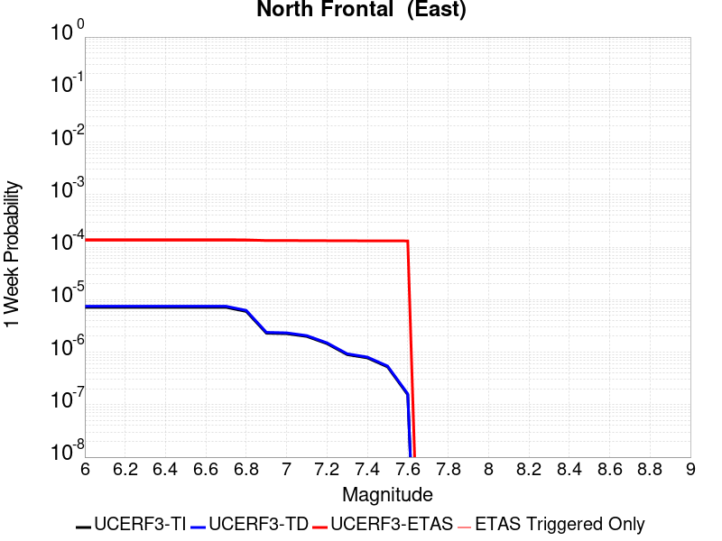 | 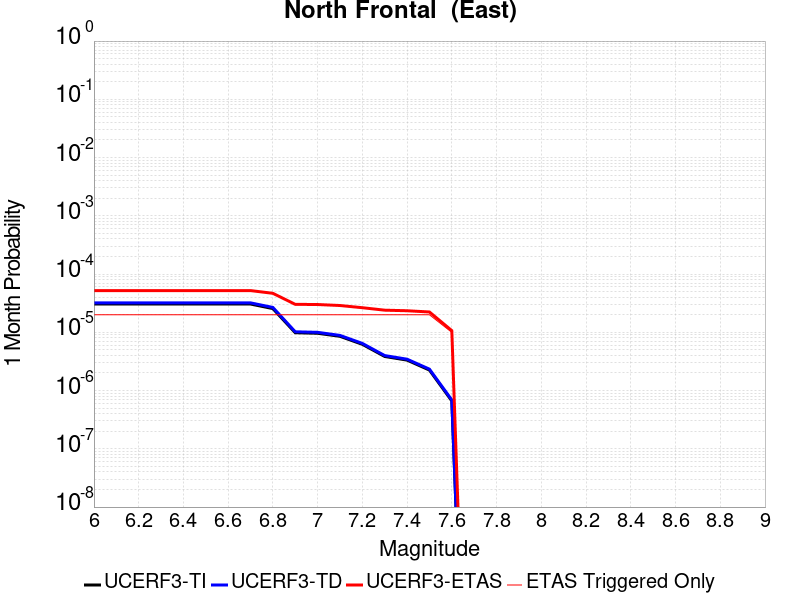 | 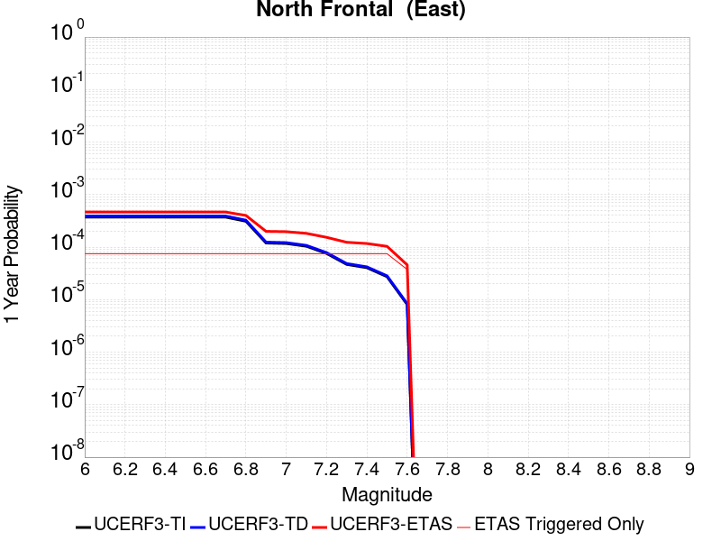 | 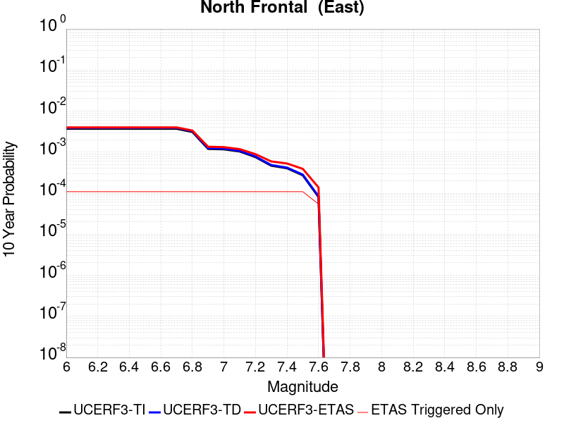 |

| Magnitude | 1 wk TI Prob | 1 wk TD Prob | 1 wk ETAS Prob | 1 wk ETAS/TD Gain | 1 wk ETAS Triggered Only | 1 mo TI Prob | 1 mo TD Prob | 1 mo ETAS Prob | 1 mo ETAS/TD Gain | 1 mo ETAS Triggered Only | 1 yr TI Prob | 1 yr TD Prob | 1 yr ETAS Prob | 1 yr ETAS/TD Gain | 1 yr ETAS Triggered Only | 10 yr TI Prob | 10 yr TD Prob | 10 yr ETAS Prob | 10 yr ETAS/TD Gain | 10 yr ETAS Triggered Only |
|-----|-----|-----|-----|-----|-----|-----|-----|-----|-----|-----|-----|-----|-----|-----|-----|-----|-----|-----|-----|-----|
| 6.0 | 7.135738E-6 | 7.4771765E-6 | 5.0004714E-5 | 6.6876464 | 4.2527856E-5 | 3.0581377E-5 | 3.204476E-5 | 1.1709775E-4 | 3.6541932 | 8.505571E-5 | 3.7226462E-4 | 3.9009505E-4 | 4.751176E-4 | 1.2179533 | 8.505571E-5 | 0.0037164164 | 0.0038960609 | 0.003980785 | 1.0217462 | 8.505571E-5 |
| 6.1 | 7.135738E-6 | 7.4771765E-6 | 5.0004714E-5 | 6.6876464 | 4.2527856E-5 | 3.0581377E-5 | 3.204476E-5 | 1.1709775E-4 | 3.6541932 | 8.505571E-5 | 3.7226462E-4 | 3.9009505E-4 | 4.751176E-4 | 1.2179533 | 8.505571E-5 | 0.0037164164 | 0.0038960609 | 0.003980785 | 1.0217462 | 8.505571E-5 |
| 6.2 | 7.135738E-6 | 7.4771765E-6 | 5.0004714E-5 | 6.6876464 | 4.2527856E-5 | 3.0581377E-5 | 3.204476E-5 | 1.1709775E-4 | 3.6541932 | 8.505571E-5 | 3.7226462E-4 | 3.9009505E-4 | 4.751176E-4 | 1.2179533 | 8.505571E-5 | 0.0037164164 | 0.0038960609 | 0.003980785 | 1.0217462 | 8.505571E-5 |
| 6.3 | 7.135738E-6 | 7.4771765E-6 | 5.0004714E-5 | 6.6876464 | 4.2527856E-5 | 3.0581377E-5 | 3.204476E-5 | 1.1709775E-4 | 3.6541932 | 8.505571E-5 | 3.7226462E-4 | 3.9009505E-4 | 4.751176E-4 | 1.2179533 | 8.505571E-5 | 0.0037164164 | 0.0038960609 | 0.003980785 | 1.0217462 | 8.505571E-5 |
| 6.4 | 7.135738E-6 | 7.4771765E-6 | 5.0004714E-5 | 6.6876464 | 4.2527856E-5 | 3.0581377E-5 | 3.204476E-5 | 1.1709775E-4 | 3.6541932 | 8.505571E-5 | 3.7226462E-4 | 3.9009505E-4 | 4.751176E-4 | 1.2179533 | 8.505571E-5 | 0.0037164164 | 0.0038960609 | 0.003980785 | 1.0217462 | 8.505571E-5 |
| 6.5 | 7.135738E-6 | 7.4771765E-6 | 5.0004714E-5 | 6.6876464 | 4.2527856E-5 | 3.0581377E-5 | 3.204476E-5 | 1.1709775E-4 | 3.6541932 | 8.505571E-5 | 3.7226462E-4 | 3.9009505E-4 | 4.751176E-4 | 1.2179533 | 8.505571E-5 | 0.0037164164 | 0.0038960609 | 0.003980785 | 1.0217462 | 8.505571E-5 |
| 6.6 | 7.135738E-6 | 7.4771765E-6 | 5.0004714E-5 | 6.6876464 | 4.2527856E-5 | 3.0581377E-5 | 3.204476E-5 | 1.1709775E-4 | 3.6541932 | 8.505571E-5 | 3.7226462E-4 | 3.9009505E-4 | 4.751176E-4 | 1.2179533 | 8.505571E-5 | 0.0037164164 | 0.0038960609 | 0.003980785 | 1.0217462 | 8.505571E-5 |
| 6.7 | 7.135738E-6 | 7.4771765E-6 | 5.0004714E-5 | 6.6876464 | 4.2527856E-5 | 3.0581377E-5 | 3.204476E-5 | 1.1709775E-4 | 3.6541932 | 8.505571E-5 | 3.7226462E-4 | 3.9009505E-4 | 4.751176E-4 | 1.2179533 | 8.505571E-5 | 0.0037164164 | 0.0038960609 | 0.003980785 | 1.0217462 | 8.505571E-5 |
| 6.8 | 5.959142E-6 | 6.236683E-6 | 4.8764272E-5 | 7.818944 | 4.2527856E-5 | 2.553893E-5 | 2.6728469E-5 | 1.11781905E-4 | 4.182129 | 8.505571E-5 | 3.108921E-4 | 3.253886E-4 | 4.1041663E-4 | 1.2613122 | 8.505571E-5 | 0.0031045752 | 0.0032508948 | 0.003335674 | 1.0260787 | 8.505571E-5 |
| 6.9 | 2.2946929E-6 | 2.3824605E-6 | 4.4910215E-5 | 18.85035 | 4.2527856E-5 | 9.834361E-6 | 1.0210508E-5 | 9.526535E-5 | 9.330129 | 8.505571E-5 | 1.1972676E-4 | 1.2430632E-4 | 2.0935145E-4 | 1.6841578 | 8.505571E-5 | 0.0011966228 | 0.0012424142 | 0.0013273644 | 1.068375 | 8.505571E-5 |
| 7.0 | 2.2468673E-6 | 2.3321538E-6 | 4.485991E-5 | 19.2354 | 4.2527856E-5 | 9.629396E-6 | 9.994909E-6 | 9.504977E-5 | 9.509818 | 8.505571E-5 | 1.1723159E-4 | 1.21681696E-4 | 2.0672705E-4 | 1.6989167 | 8.505571E-5 | 0.0011716976 | 0.0012161969 | 0.0013011493 | 1.0698508 | 8.505571E-5 |
| 7.1 | 1.9921076E-6 | 2.0646032E-6 | 4.4592372E-5 | 21.598518 | 4.2527856E-5 | 8.537577E-6 | 8.848272E-6 | 9.390323E-5 | 10.612607 | 8.505571E-5 | 1.0394004E-4 | 1.0772282E-4 | 1.9276937E-4 | 1.7894943 | 8.505571E-5 | 0.0010389143 | 0.0010767487 | 0.0011617129 | 1.0789081 | 8.505571E-5 |
| 7.2 | 1.4524545E-6 | 1.5045148E-6 | 4.4032306E-5 | 29.266783 | 4.2527856E-5 | 6.2247905E-6 | 6.447906E-6 | 9.150307E-5 | 14.19113 | 8.505571E-5 | 7.5784184E-5 | 7.850068E-5 | 1.6354972E-4 | 2.083418 | 8.505571E-5 | 7.575835E-4 | 7.8475394E-4 | 8.697429E-4 | 1.1083001 | 8.505571E-5 |
| 7.3 | 8.9802575E-7 | 9.3087283E-7 | 4.3458687E-5 | 46.68596 | 4.2527856E-5 | 3.848676E-6 | 3.9894494E-6 | 8.904482E-5 | 22.320078 | 8.505571E-5 | 4.685662E-5 | 4.857058E-5 | 1.3362216E-4 | 2.7510927 | 8.505571E-5 | 4.6846745E-4 | 4.8561094E-4 | 5.7062536E-4 | 1.175067 | 8.505571E-5 |
| 7.4 | 7.776139E-7 | 8.0604747E-7 | 4.333387E-5 | 53.76094 | 4.2527856E-5 | 3.3326266E-6 | 3.4544853E-6 | 8.85099E-5 | 25.621735 | 8.505571E-5 | 4.0573974E-5 | 4.2057654E-5 | 1.2710979E-4 | 3.0222747 | 8.505571E-5 | 4.0566566E-4 | 4.205077E-4 | 5.0552766E-4 | 1.2021841 | 8.505571E-5 |
| 7.5 | 5.244417E-7 | 5.441219E-7 | 4.3071956E-5 | 79.158646 | 4.2527856E-5 | 2.2476054E-6 | 2.3319494E-6 | 8.738746E-5 | 37.473995 | 8.505571E-5 | 2.7364253E-5 | 2.839118E-5 | 1.13444476E-4 | 3.9957647 | 8.505571E-5 | 2.7360884E-4 | 2.8388205E-4 | 3.689136E-4 | 1.2995313 | 8.505571E-5 |
| 7.6 | 1.5489647E-7 | 1.6089504E-7 | 4.2688745E-5 | 265.32043 | 4.2527856E-5 | 6.6384183E-7 | 6.895501E-7 | 4.3217377E-5 | 62.674744 | 4.2527856E-5 | 8.082245E-6 | 8.395261E-6 | 5.092276E-5 | 6.0656557 | 4.2527856E-5 | 8.08195E-5 | 8.395143E-5 | 1.2647572E-4 | 1.5065343 | 4.2527856E-5 |

## Santa Ynez River
*[(top)](#table-of-contents)*

| 1 Week | 1 Month | 1 Year | 10 Year |
|-----|-----|-----|-----|
|  | 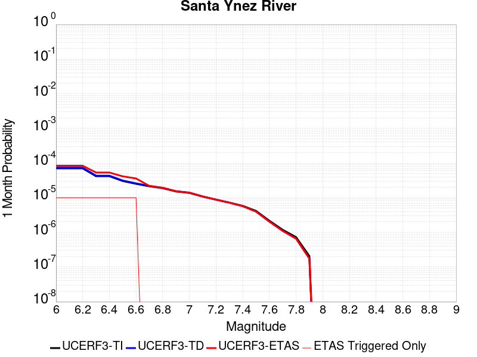 | 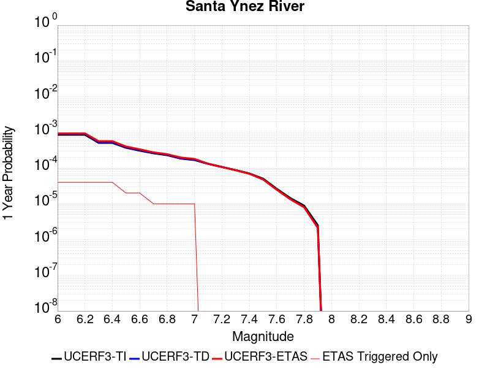 | 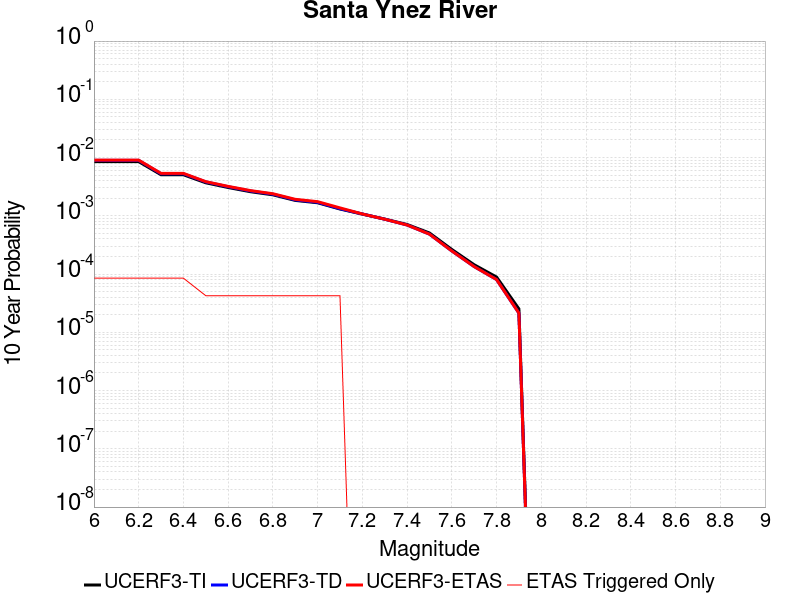 |

| Magnitude | 1 wk TI Prob | 1 wk TD Prob | 1 wk ETAS Prob | 1 wk ETAS/TD Gain | 1 wk ETAS Triggered Only | 1 mo TI Prob | 1 mo TD Prob | 1 mo ETAS Prob | 1 mo ETAS/TD Gain | 1 mo ETAS Triggered Only | 1 yr TI Prob | 1 yr TD Prob | 1 yr ETAS Prob | 1 yr ETAS/TD Gain | 1 yr ETAS Triggered Only | 10 yr TI Prob | 10 yr TD Prob | 10 yr ETAS Prob | 10 yr ETAS/TD Gain | 10 yr ETAS Triggered Only |
|-----|-----|-----|-----|-----|-----|-----|-----|-----|-----|-----|-----|-----|-----|-----|-----|-----|-----|-----|-----|-----|
| 6.0 | 1.6396456E-5 | 1.7209435E-5 | 1.7209435E-5 | 1.0 | 0.0 | 7.026863E-5 | 7.375284E-5 | 7.375284E-5 | 1.0 | 0.0 | 8.551848E-4 | 8.976064E-4 | 9.400961E-4 | 1.0473367 | 4.2527856E-5 | 0.0085190125 | 0.008943358 | 0.009027653 | 1.0094254 | 8.505571E-5 |
| 6.1 | 1.6396456E-5 | 1.7209435E-5 | 1.7209435E-5 | 1.0 | 0.0 | 7.026863E-5 | 7.375284E-5 | 7.375284E-5 | 1.0 | 0.0 | 8.551848E-4 | 8.976064E-4 | 9.400961E-4 | 1.0473367 | 4.2527856E-5 | 0.0085190125 | 0.008943358 | 0.009027653 | 1.0094254 | 8.505571E-5 |
| 6.2 | 1.6396456E-5 | 1.7209435E-5 | 1.7209435E-5 | 1.0 | 0.0 | 7.026863E-5 | 7.375284E-5 | 7.375284E-5 | 1.0 | 0.0 | 8.551848E-4 | 8.976064E-4 | 9.400961E-4 | 1.0473367 | 4.2527856E-5 | 0.0085190125 | 0.008943358 | 0.009027653 | 1.0094254 | 8.505571E-5 |
| 6.3 | 9.736976E-6 | 1.012233E-5 | 1.012233E-5 | 1.0 | 0.0 | 4.172923E-5 | 4.338072E-5 | 4.338072E-5 | 1.0 | 0.0 | 5.0793495E-4 | 5.280373E-4 | 5.705427E-4 | 1.0804969 | 4.2527856E-5 | 0.005067755 | 0.005268332 | 0.0053529395 | 1.0160596 | 8.505571E-5 |
| 6.4 | 9.736976E-6 | 1.012233E-5 | 1.012233E-5 | 1.0 | 0.0 | 4.172923E-5 | 4.338072E-5 | 4.338072E-5 | 1.0 | 0.0 | 5.0793495E-4 | 5.280373E-4 | 5.705427E-4 | 1.0804969 | 4.2527856E-5 | 0.005067755 | 0.005268332 | 0.0053529395 | 1.0160596 | 8.505571E-5 |
| 6.5 | 7.081964E-6 | 7.3298966E-6 | 7.3298966E-6 | 1.0 | 0.0 | 3.035092E-5 | 3.1413474E-5 | 3.1413474E-5 | 1.0 | 0.0 | 3.694598E-4 | 3.8239348E-4 | 3.8239348E-4 | 1.0 | 0.0 | 0.0036884616 | 0.0038175168 | 0.0038598822 | 1.0110977 | 4.2527856E-5 |
| 6.6 | 5.873247E-6 | 6.059743E-6 | 6.059743E-6 | 1.0 | 0.0 | 2.5170815E-5 | 2.5970074E-5 | 2.5970074E-5 | 1.0 | 0.0 | 3.064116E-4 | 3.1614062E-4 | 3.1614062E-4 | 1.0 | 0.0 | 0.0030598943 | 0.0031569963 | 0.00319939 | 1.0134284 | 4.2527856E-5 |
| 6.7 | 4.973277E-6 | 5.115901E-6 | 5.115901E-6 | 1.0 | 0.0 | 2.1313872E-5 | 2.1925109E-5 | 2.1925109E-5 | 1.0 | 0.0 | 2.5946548E-4 | 2.66906E-4 | 2.66906E-4 | 1.0 | 0.0 | 0.0025916274 | 0.0026659032 | 0.0027083177 | 1.01591 | 4.2527856E-5 |
| 6.8 | 4.396492E-6 | 4.5109778E-6 | 4.5109778E-6 | 1.0 | 0.0 | 1.884197E-5 | 1.9332621E-5 | 1.9332621E-5 | 1.0 | 0.0 | 2.2937685E-4 | 2.3534958E-4 | 2.3534958E-4 | 1.0 | 0.0 | 0.0022914023 | 0.0023510386 | 0.0023934667 | 1.0180464 | 4.2527856E-5 |
| 6.9 | 3.5255632E-6 | 3.6013332E-6 | 3.6013332E-6 | 1.0 | 0.0 | 1.5109469E-5 | 1.5434196E-5 | 1.5434196E-5 | 1.0 | 0.0 | 1.8394225E-4 | 1.8789528E-4 | 1.8789528E-4 | 1.0 | 0.0 | 0.0018379007 | 0.0018773803 | 0.0019198284 | 1.0226102 | 4.2527856E-5 |
| 7.0 | 3.211603E-6 | 3.273654E-6 | 3.273654E-6 | 1.0 | 0.0 | 1.376394E-5 | 1.4029872E-5 | 1.4029872E-5 | 1.0 | 0.0 | 1.6756308E-4 | 1.7080043E-4 | 1.7080043E-4 | 1.0 | 0.0 | 0.0016743679 | 0.0017067058 | 0.001749161 | 1.0248755 | 4.2527856E-5 |
| 7.1 | 2.5094619E-6 | 2.5409204E-6 | 2.5409204E-6 | 1.0 | 0.0 | 1.0754793E-5 | 1.0889614E-5 | 1.0889614E-5 | 1.0 | 0.0 | 1.3093173E-4 | 1.3257304E-4 | 1.3257304E-4 | 1.0 | 0.0 | 0.0013085462 | 0.0013249456 | 0.001367417 | 1.0320553 | 4.2527856E-5 |
| 7.2 | 2.0515774E-6 | 2.0619375E-6 | 2.0619375E-6 | 1.0 | 0.0 | 8.792445E-6 | 8.836846E-6 | 8.836846E-6 | 1.0 | 0.0 | 1.0704277E-4 | 1.0758333E-4 | 1.0758333E-4 | 1.0 | 0.0 | 0.0010699122 | 0.0010753168 | 0.0010753168 | 1.0 | 0.0 |
| 7.3 | 1.6845745E-6 | 1.6773907E-6 | 1.6773907E-6 | 1.0 | 0.0 | 7.219585E-6 | 7.1887976E-6 | 7.1887976E-6 | 1.0 | 0.0 | 8.78949E-5 | 8.752012E-5 | 8.752012E-5 | 1.0 | 0.0 | 8.7860145E-4 | 8.7485946E-4 | 8.7485946E-4 | 1.0 | 0.0 |
| 7.4 | 1.3600285E-6 | 1.3333357E-6 | 1.3333357E-6 | 1.0 | 0.0 | 5.82868E-6 | 5.714284E-6 | 5.714284E-6 | 1.0 | 0.0 | 7.096187E-5 | 6.956921E-5 | 6.956921E-5 | 1.0 | 0.0 | 7.0939213E-4 | 6.954765E-4 | 6.954765E-4 | 1.0 | 0.0 |
| 7.5 | 9.735342E-7 | 9.290103E-7 | 9.290103E-7 | 1.0 | 0.0 | 4.172283E-6 | 3.9814668E-6 | 3.9814668E-6 | 1.0 | 0.0 | 5.079636E-5 | 4.8473295E-5 | 4.8473295E-5 | 1.0 | 0.0 | 5.0784746E-4 | 4.8462892E-4 | 4.8462892E-4 | 1.0 | 0.0 |
| 7.6 | 5.067187E-7 | 4.77857E-7 | 4.77857E-7 | 1.0 | 0.0 | 2.1716498E-6 | 2.047957E-6 | 2.047957E-6 | 1.0 | 0.0 | 2.6439517E-5 | 2.4933597E-5 | 2.4933597E-5 | 1.0 | 0.0 | 2.643637E-4 | 2.4930874E-4 | 2.4930874E-4 | 1.0 | 0.0 |
| 7.7 | 2.769089E-7 | 2.5759124E-7 | 2.5759124E-7 | 1.0 | 0.0 | 1.1867519E-6 | 1.1039621E-6 | 1.1039621E-6 | 1.0 | 0.0 | 1.4448608E-5 | 1.34406555E-5 | 1.34406555E-5 | 1.0 | 0.0 | 1.444767E-4 | 1.3439846E-4 | 1.3439846E-4 | 1.0 | 0.0 |
| 7.8 | 1.7044663E-7 | 1.5449015E-7 | 1.5449015E-7 | 1.0 | 0.0 | 7.3048534E-7 | 6.621005E-7 | 6.621005E-7 | 1.0 | 0.0 | 8.893623E-6 | 8.061043E-6 | 8.061043E-6 | 1.0 | 0.0 | 8.893267E-5 | 8.060753E-5 | 8.060753E-5 | 1.0 | 0.0 |
| 7.9 | 4.8344287E-8 | 4.0910923E-8 | 4.0910923E-8 | 1.0 | 0.0 | 2.0718979E-7 | 1.7533252E-7 | 1.7533252E-7 | 1.0 | 0.0 | 2.5225327E-6 | 2.1346711E-6 | 2.1346711E-6 | 1.0 | 0.0 | 2.5225041E-5 | 2.1346512E-5 | 2.1346512E-5 | 1.0 | 0.0 |

## San Jacinto (Superstition Mtn)
*[(top)](#table-of-contents)*

| 1 Week | 1 Month | 1 Year | 10 Year |
|-----|-----|-----|-----|
| 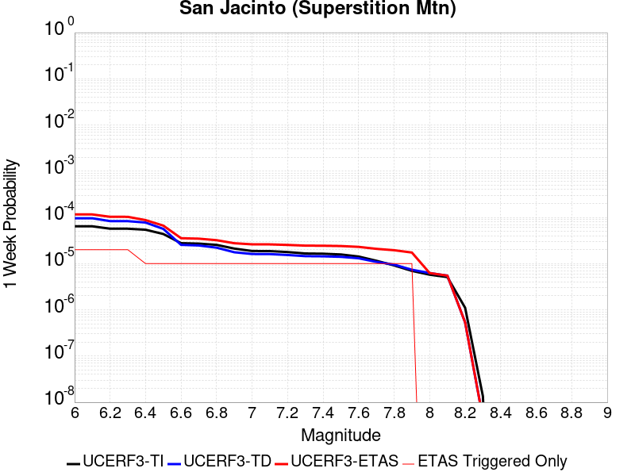 | 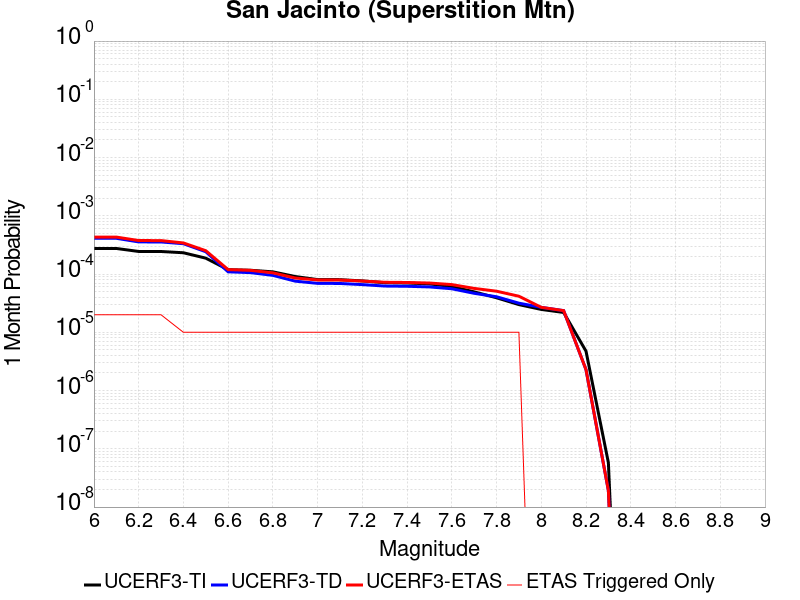 | 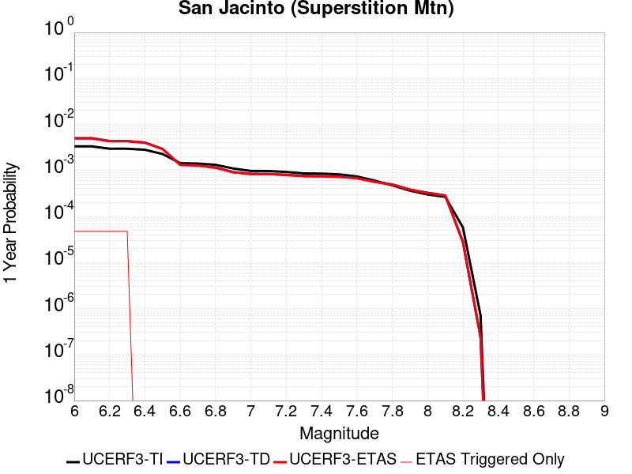 | 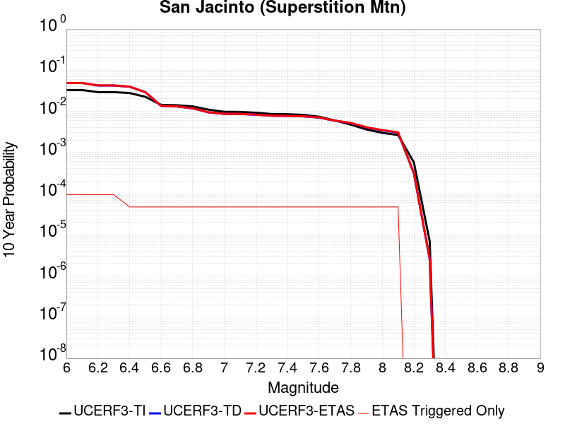 |

| Magnitude | 1 wk TI Prob | 1 wk TD Prob | 1 wk ETAS Prob | 1 wk ETAS/TD Gain | 1 wk ETAS Triggered Only | 1 mo TI Prob | 1 mo TD Prob | 1 mo ETAS Prob | 1 mo ETAS/TD Gain | 1 mo ETAS Triggered Only | 1 yr TI Prob | 1 yr TD Prob | 1 yr ETAS Prob | 1 yr ETAS/TD Gain | 1 yr ETAS Triggered Only | 10 yr TI Prob | 10 yr TD Prob | 10 yr ETAS Prob | 10 yr ETAS/TD Gain | 10 yr ETAS Triggered Only |
|-----|-----|-----|-----|-----|-----|-----|-----|-----|-----|-----|-----|-----|-----|-----|-----|-----|-----|-----|-----|-----|
| 6.0 | 6.4193904E-5 | 9.599367E-5 | 1.3851744E-4 | 1.4429852 | 4.2527856E-5 | 2.7508775E-4 | 4.1134638E-4 | 4.5385672E-4 | 1.1033444 | 4.2527856E-5 | 0.0033440501 | 0.0049980893 | 0.005040405 | 1.0084662 | 4.2527856E-5 | 0.03294174 | 0.048823986 | 0.04890489 | 1.001657 | 8.505571E-5 |
| 6.1 | 6.4193904E-5 | 9.599367E-5 | 1.3851744E-4 | 1.4429852 | 4.2527856E-5 | 2.7508775E-4 | 4.1134638E-4 | 4.5385672E-4 | 1.1033444 | 4.2527856E-5 | 0.0033440501 | 0.0049980893 | 0.005040405 | 1.0084662 | 4.2527856E-5 | 0.03294174 | 0.048823986 | 0.04890489 | 1.001657 | 8.505571E-5 |
| 6.2 | 5.7023593E-5 | 8.3144434E-5 | 1.2566875E-4 | 1.5114512 | 4.2527856E-5 | 2.4436394E-4 | 3.5629404E-4 | 3.9880673E-4 | 1.1193192 | 4.2527856E-5 | 0.002971072 | 0.0043308944 | 0.004373238 | 1.0097771 | 4.2527856E-5 | 0.029316625 | 0.04250403 | 0.04258547 | 1.001916 | 8.505571E-5 |
| 6.3 | 5.6940098E-5 | 8.298979E-5 | 1.2551413E-4 | 1.5124043 | 4.2527856E-5 | 2.4400617E-4 | 3.5563146E-4 | 3.981442E-4 | 1.1195415 | 4.2527856E-5 | 0.002966728 | 0.00432286 | 0.004365204 | 1.0097954 | 4.2527856E-5 | 0.029274331 | 0.042427283 | 0.04250873 | 1.0019196 | 8.505571E-5 |
| 6.4 | 5.4171585E-5 | 7.7483564E-5 | 7.7483564E-5 | 1.0 | 0.0 | 2.3214328E-4 | 3.3203943E-4 | 3.3203943E-4 | 1.0 | 0.0 | 0.0028226813 | 0.0040367353 | 0.0040367353 | 1.0 | 0.0 | 0.02787096 | 0.03971653 | 0.03975737 | 1.0010283 | 4.2527856E-5 |
| 6.5 | 4.375144E-5 | 5.642133E-5 | 5.642133E-5 | 1.0 | 0.0 | 1.874927E-4 | 2.4178992E-4 | 2.4178992E-4 | 1.0 | 0.0 | 0.0022803338 | 0.002940994 | 0.002940994 | 1.0 | 0.0 | 0.022570757 | 0.029236801 | 0.029278086 | 1.001412 | 4.2527856E-5 |
| 6.6 | 2.772192E-5 | 2.5488358E-5 | 2.5488358E-5 | 1.0 | 0.0 | 1.1880282E-4 | 1.09231354E-4 | 1.09231354E-4 | 1.0 | 0.0 | 0.0014454646 | 0.0013290998 | 0.0013290998 | 1.0 | 0.0 | 0.014360986 | 0.01354049 | 0.013582442 | 1.0030982 | 4.2527856E-5 |
| 6.7 | 2.7124124E-5 | 2.4699386E-5 | 2.4699386E-5 | 1.0 | 0.0 | 1.1624106E-4 | 1.05850326E-4 | 1.05850326E-4 | 1.0 | 0.0 | 0.0014143161 | 0.001287985 | 0.001287985 | 1.0 | 0.0 | 0.014053487 | 0.013133943 | 0.013175913 | 1.0031955 | 4.2527856E-5 |
| 6.8 | 2.5475807E-5 | 2.216446E-5 | 2.216446E-5 | 1.0 | 0.0 | 1.0917746E-4 | 9.4987154E-5 | 9.4987154E-5 | 1.0 | 0.0 | 0.001328425 | 0.001155867 | 0.001155867 | 1.0 | 0.0 | 0.0132051185 | 0.011822182 | 0.011864207 | 1.0035548 | 4.2527856E-5 |
| 6.9 | 2.1162023E-5 | 1.7626244E-5 | 1.7626244E-5 | 1.0 | 0.0 | 9.069123E-5 | 7.5538876E-5 | 7.5538876E-5 | 1.0 | 0.0 | 0.0011036064 | 9.193016E-4 | 9.193016E-4 | 1.0 | 0.0 | 0.010981417 | 0.00944688 | 0.009489005 | 1.0044593 | 4.2527856E-5 |
| 7.0 | 1.8754288E-5 | 1.6161559E-5 | 1.6161559E-5 | 1.0 | 0.0 | 8.037304E-5 | 6.9261994E-5 | 6.9261994E-5 | 1.0 | 0.0 | 9.781026E-4 | 8.4294105E-4 | 8.4294105E-4 | 1.0 | 0.0 | 0.009738087 | 0.008670042 | 0.008712201 | 1.0048627 | 4.2527856E-5 |
| 7.1 | 1.8678527E-5 | 1.6086702E-5 | 1.6086702E-5 | 1.0 | 0.0 | 8.0048376E-5 | 6.89412E-5 | 6.89412E-5 | 1.0 | 0.0 | 9.7415317E-4 | 8.3903834E-4 | 8.3903834E-4 | 1.0 | 0.0 | 0.009698939 | 0.008630998 | 0.0086731585 | 1.0048848 | 4.2527856E-5 |
| 7.2 | 1.7804578E-5 | 1.5381282E-5 | 1.5381282E-5 | 1.0 | 0.0 | 7.6303106E-5 | 6.5918124E-5 | 6.5918124E-5 | 1.0 | 0.0 | 9.285943E-4 | 8.022599E-4 | 8.022599E-4 | 1.0 | 0.0 | 0.009247236 | 0.008262311 | 0.008304488 | 1.0051047 | 4.2527856E-5 |
| 7.3 | 1.6583685E-5 | 1.4530388E-5 | 1.4530388E-5 | 1.0 | 0.0 | 7.1070994E-5 | 6.227162E-5 | 6.227162E-5 | 1.0 | 0.0 | 8.649459E-4 | 7.5789524E-4 | 7.5789524E-4 | 1.0 | 0.0 | 0.00861587 | 0.007817623 | 0.007859819 | 1.0053974 | 4.2527856E-5 |
| 7.4 | 1.6387552E-5 | 1.4395274E-5 | 1.4395274E-5 | 1.0 | 0.0 | 7.023047E-5 | 6.169258E-5 | 6.169258E-5 | 1.0 | 0.0 | 8.5472054E-4 | 7.5085036E-4 | 7.5085036E-4 | 1.0 | 0.0 | 0.008514405 | 0.0077470057 | 0.0077892044 | 1.005447 | 4.2527856E-5 |
| 7.5 | 1.5790754E-5 | 1.4035962E-5 | 1.4035962E-5 | 1.0 | 0.0 | 6.767291E-5 | 6.0152746E-5 | 6.0152746E-5 | 1.0 | 0.0 | 8.236062E-4 | 7.321156E-4 | 7.321156E-4 | 1.0 | 0.0 | 0.008205604 | 0.007557569 | 0.0075997757 | 1.0055847 | 4.2527856E-5 |
| 7.6 | 1.4248672E-5 | 1.3054932E-5 | 1.3054932E-5 | 1.0 | 0.0 | 6.106431E-5 | 5.594852E-5 | 5.594852E-5 | 1.0 | 0.0 | 7.432043E-4 | 6.8096205E-4 | 6.8096205E-4 | 1.0 | 0.0 | 0.007407237 | 0.0070401574 | 0.0070823855 | 1.0059983 | 4.2527856E-5 |
| 7.7 | 1.15449975E-5 | 1.090368E-5 | 1.090368E-5 | 1.0 | 0.0 | 4.947762E-5 | 4.6729223E-5 | 4.6729223E-5 | 1.0 | 0.0 | 6.022235E-4 | 5.687805E-4 | 5.687805E-4 | 1.0 | 0.0 | 0.006005941 | 0.0059101824 | 0.005952459 | 1.0071532 | 4.2527856E-5 |
| 7.8 | 9.1391985E-6 | 9.514299E-6 | 9.514299E-6 | 1.0 | 0.0 | 3.9167408E-5 | 4.0774932E-5 | 4.0774932E-5 | 1.0 | 0.0 | 4.767588E-4 | 4.963223E-4 | 4.963223E-4 | 1.0 | 0.0 | 0.0047573727 | 0.0051766867 | 0.0052189943 | 1.0081728 | 4.2527856E-5 |
| 7.9 | 6.973017E-6 | 7.3821784E-6 | 7.3821784E-6 | 1.0 | 0.0 | 2.9884017E-5 | 3.1637526E-5 | 3.1637526E-5 | 1.0 | 0.0 | 3.6377716E-4 | 3.8511935E-4 | 3.8511935E-4 | 1.0 | 0.0 | 0.0036318225 | 0.0040517948 | 0.00409415 | 1.0104536 | 4.2527856E-5 |
| 8.0 | 5.7638235E-6 | 6.259972E-6 | 6.259972E-6 | 1.0 | 0.0 | 2.4701867E-5 | 2.6828178E-5 | 2.6828178E-5 | 1.0 | 0.0 | 3.0070372E-4 | 3.2658462E-4 | 3.2658462E-4 | 1.0 | 0.0 | 0.0030029714 | 0.0034534496 | 0.0034958303 | 1.0122721 | 4.2527856E-5 |
| 8.1 | 5.1124434E-6 | 5.4956718E-6 | 5.4956718E-6 | 1.0 | 0.0 | 2.1910288E-5 | 2.355267E-5 | 2.355267E-5 | 1.0 | 0.0 | 2.6672508E-4 | 2.867165E-4 | 2.867165E-4 | 1.0 | 0.0 | 0.0026640517 | 0.003040336 | 0.0030827348 | 1.0139453 | 4.2527856E-5 |
| 8.2 | 1.1075938E-6 | 5.336568E-7 | 5.336568E-7 | 1.0 | 0.0 | 4.7468216E-6 | 2.2870988E-6 | 2.2870988E-6 | 1.0 | 0.0 | 5.779102E-5 | 2.7845093E-5 | 2.7845093E-5 | 1.0 | 0.0 | 5.777599E-4 | 3.1346595E-4 | 3.1346595E-4 | 1.0 | 0.0 |
| 8.3 | 1.3584393E-8 | 4.473836E-9 | 4.473836E-9 | 1.0 | 0.0 | 5.8218827E-8 | 1.9173582E-8 | 1.9173582E-8 | 1.0 | 0.0 | 7.0881396E-7 | 2.3343837E-7 | 2.3343837E-7 | 1.0 | 0.0 | 7.0881174E-6 | 2.6163038E-6 | 2.6163038E-6 | 1.0 | 0.0 |

## San Juan
*[(top)](#table-of-contents)*

| 1 Week | 1 Month | 1 Year | 10 Year |
|-----|-----|-----|-----|
|  |  | 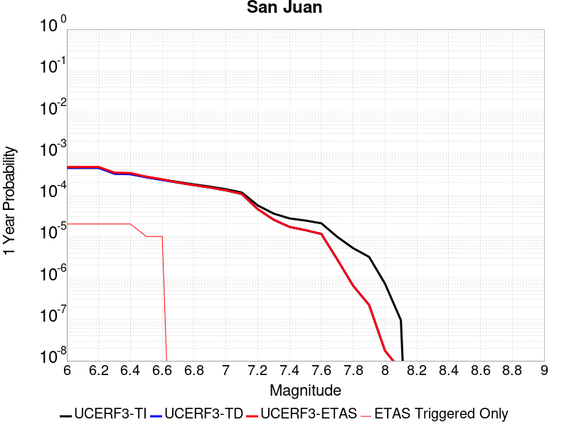 | 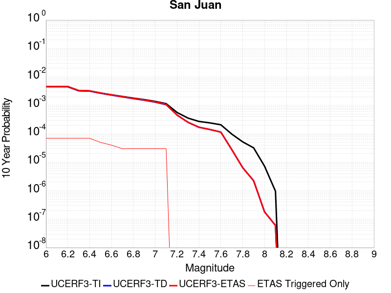 |

| Magnitude | 1 wk TI Prob | 1 wk TD Prob | 1 wk ETAS Prob | 1 wk ETAS/TD Gain | 1 wk ETAS Triggered Only | 1 mo TI Prob | 1 mo TD Prob | 1 mo ETAS Prob | 1 mo ETAS/TD Gain | 1 mo ETAS Triggered Only | 1 yr TI Prob | 1 yr TD Prob | 1 yr ETAS Prob | 1 yr ETAS/TD Gain | 1 yr ETAS Triggered Only | 10 yr TI Prob | 10 yr TD Prob | 10 yr ETAS Prob | 10 yr ETAS/TD Gain | 10 yr ETAS Triggered Only |
|-----|-----|-----|-----|-----|-----|-----|-----|-----|-----|-----|-----|-----|-----|-----|-----|-----|-----|-----|-----|-----|
| 6.0 | 8.682808E-6 | 8.7491635E-6 | 8.7491635E-6 | 1.0 | 0.0 | 3.72115E-5 | 3.74959E-5 | 3.74959E-5 | 1.0 | 0.0 | 4.5295584E-4 | 4.564218E-4 | 4.564218E-4 | 1.0 | 0.0 | 0.004520337 | 0.004555385 | 0.004640053 | 1.0185864 | 8.505571E-5 |
| 6.1 | 8.682808E-6 | 8.7491635E-6 | 8.7491635E-6 | 1.0 | 0.0 | 3.72115E-5 | 3.74959E-5 | 3.74959E-5 | 1.0 | 0.0 | 4.5295584E-4 | 4.564218E-4 | 4.564218E-4 | 1.0 | 0.0 | 0.004520337 | 0.004555385 | 0.004640053 | 1.0185864 | 8.505571E-5 |
| 6.2 | 8.682808E-6 | 8.7491635E-6 | 8.7491635E-6 | 1.0 | 0.0 | 3.72115E-5 | 3.74959E-5 | 3.74959E-5 | 1.0 | 0.0 | 4.5295584E-4 | 4.564218E-4 | 4.564218E-4 | 1.0 | 0.0 | 0.004520337 | 0.004555385 | 0.004640053 | 1.0185864 | 8.505571E-5 |
| 6.3 | 6.3054235E-6 | 6.2825848E-6 | 6.2825848E-6 | 1.0 | 0.0 | 2.7022963E-5 | 2.6925094E-5 | 2.6925094E-5 | 1.0 | 0.0 | 3.2895492E-4 | 3.2776513E-4 | 3.2776513E-4 | 1.0 | 0.0 | 0.003284684 | 0.003273017 | 0.0033577941 | 1.0259019 | 8.505571E-5 |
| 6.4 | 6.1490473E-6 | 6.1144656E-6 | 6.1144656E-6 | 1.0 | 0.0 | 2.6352795E-5 | 2.6204598E-5 | 2.6204598E-5 | 1.0 | 0.0 | 3.2079802E-4 | 3.1899565E-4 | 3.1899565E-4 | 1.0 | 0.0 | 0.0032033534 | 0.0031855737 | 0.0032703585 | 1.0266153 | 8.505571E-5 |
| 6.5 | 5.204848E-6 | 5.137233E-6 | 5.137233E-6 | 1.0 | 0.0 | 2.23063E-5 | 2.2016533E-5 | 2.2016533E-5 | 1.0 | 0.0 | 2.7154534E-4 | 2.6801927E-4 | 2.6801927E-4 | 1.0 | 0.0 | 0.0027121378 | 0.0026771144 | 0.0027619423 | 1.0316863 | 8.505571E-5 |
| 6.6 | 4.5179986E-6 | 4.4150297E-6 | 4.4150297E-6 | 1.0 | 0.0 | 1.9362706E-5 | 1.8921424E-5 | 1.8921424E-5 | 1.0 | 0.0 | 2.3571544E-4 | 2.3034477E-4 | 2.3034477E-4 | 1.0 | 0.0 | 0.0023546559 | 0.0023011973 | 0.0023436272 | 1.0184382 | 4.2527856E-5 |
| 6.7 | 3.9442616E-6 | 3.819828E-6 | 3.819828E-6 | 1.0 | 0.0 | 1.6903869E-5 | 1.6370592E-5 | 1.6370592E-5 | 1.0 | 0.0 | 2.0578515E-4 | 1.992944E-4 | 1.992944E-4 | 1.0 | 0.0 | 0.002055947 | 0.0019912818 | 0.002033725 | 1.0213145 | 4.2527856E-5 |
| 6.8 | 3.4536245E-6 | 3.3163353E-6 | 3.3163353E-6 | 1.0 | 0.0 | 1.4801163E-5 | 1.4212792E-5 | 1.4212792E-5 | 1.0 | 0.0 | 1.8018926E-4 | 1.7302761E-4 | 1.7302761E-4 | 1.0 | 0.0 | 0.0018004322 | 0.0017290477 | 0.0017715021 | 1.0245535 | 4.2527856E-5 |
| 6.9 | 3.059865E-6 | 2.9120315E-6 | 2.9120315E-6 | 1.0 | 0.0 | 1.3113641E-5 | 1.2480078E-5 | 1.2480078E-5 | 1.0 | 0.0 | 1.596469E-4 | 1.5193493E-4 | 1.5193493E-4 | 1.0 | 0.0 | 0.0015953224 | 0.0015184252 | 0.0015608885 | 1.0279653 | 4.2527856E-5 |
| 7.0 | 2.6504351E-6 | 2.4920002E-6 | 2.4920002E-6 | 1.0 | 0.0 | 1.1358958E-5 | 1.0679961E-5 | 1.0679961E-5 | 1.0 | 0.0 | 1.3828653E-4 | 1.300213E-4 | 1.300213E-4 | 1.0 | 0.0 | 0.0013820052 | 0.0012995641 | 0.0013420368 | 1.0326822 | 4.2527856E-5 |
| 7.1 | 2.2039317E-6 | 2.0338296E-6 | 2.0338296E-6 | 1.0 | 0.0 | 9.445387E-6 | 8.716386E-6 | 8.716386E-6 | 1.0 | 0.0 | 1.1499152E-4 | 1.0611736E-4 | 1.0611736E-4 | 1.0 | 0.0 | 0.0011493203 | 0.0010607769 | 0.0011032596 | 1.0400487 | 4.2527856E-5 |
| 7.2 | 1.0786707E-6 | 8.7701903E-7 | 8.7701903E-7 | 1.0 | 0.0 | 4.622866E-6 | 3.7586476E-6 | 3.7586476E-6 | 1.0 | 0.0 | 5.628194E-5 | 4.5760586E-5 | 4.5760586E-5 | 1.0 | 0.0 | 5.6267687E-4 | 4.5757066E-4 | 4.5757066E-4 | 1.0 | 0.0 |
| 7.3 | 6.846433E-7 | 4.868805E-7 | 4.868805E-7 | 1.0 | 0.0 | 2.9341822E-6 | 2.086629E-6 | 2.086629E-6 | 1.0 | 0.0 | 3.5723086E-5 | 2.5404412E-5 | 2.5404412E-5 | 1.0 | 0.0 | 3.571734E-4 | 2.540486E-4 | 2.540486E-4 | 1.0 | 0.0 |
| 7.4 | 5.23043E-7 | 3.2628162E-7 | 3.2628162E-7 | 1.0 | 0.0 | 2.2416111E-6 | 1.398349E-6 | 1.398349E-6 | 1.0 | 0.0 | 2.7291273E-5 | 1.7024766E-5 | 1.7024766E-5 | 1.0 | 0.0 | 2.7287923E-4 | 1.7026656E-4 | 1.7026656E-4 | 1.0 | 0.0 |
| 7.5 | 4.648444E-7 | 2.7234944E-7 | 2.7234944E-7 | 1.0 | 0.0 | 1.9921886E-6 | 1.1672114E-6 | 1.1672114E-6 | 1.0 | 0.0 | 2.4254627E-5 | 1.42107065E-5 | 1.42107065E-5 | 1.0 | 0.0 | 2.425198E-4 | 1.421276E-4 | 1.421276E-4 | 1.0 | 0.0 |
| 7.6 | 3.9906567E-7 | 2.2083314E-7 | 2.2083314E-7 | 1.0 | 0.0 | 1.7102802E-6 | 9.464274E-7 | 9.464274E-7 | 1.0 | 0.0 | 2.0822463E-5 | 1.1522693E-5 | 1.1522693E-5 | 1.0 | 0.0 | 2.0820512E-4 | 1.15245566E-4 | 1.15245566E-4 | 1.0 | 0.0 |
| 7.7 | 1.8784601E-7 | 5.3666906E-8 | 5.3666906E-8 | 1.0 | 0.0 | 8.0505407E-7 | 2.30001E-7 | 2.30001E-7 | 1.0 | 0.0 | 9.80149E-6 | 2.8002585E-6 | 2.8002585E-6 | 1.0 | 0.0 | 9.801057E-5 | 2.8011282E-5 | 2.8011282E-5 | 1.0 | 0.0 |
| 7.8 | 1.00154914E-7 | 1.2415832E-8 | 1.2415832E-8 | 1.0 | 0.0 | 4.2923529E-7 | 5.3210716E-8 | 5.3210716E-8 | 1.0 | 0.0 | 5.225927E-6 | 6.4784024E-7 | 6.4784024E-7 | 1.0 | 0.0 | 5.225804E-5 | 6.484273E-6 | 6.484273E-6 | 1.0 | 0.0 |
| 7.9 | 6.171429E-8 | 4.2966155E-9 | 4.2966155E-9 | 1.0 | 0.0 | 2.6448978E-7 | 1.8414067E-8 | 1.8414067E-8 | 1.0 | 0.0 | 3.2201583E-6 | 2.2419121E-7 | 2.2419121E-7 | 1.0 | 0.0 | 3.2201115E-5 | 2.2472002E-6 | 2.2472002E-6 | 1.0 | 0.0 |
| 8.0 | 1.3974572E-8 | 3.3788217E-10 | 3.3788217E-10 | 1.0 | 0.0 | 5.989102E-8 | 1.448067E-9 | 1.448067E-9 | 1.0 | 0.0 | 7.2917294E-7 | 1.763022E-8 | 1.763022E-8 | 1.0 | 0.0 | 7.2917055E-6 | 1.8060365E-7 | 1.8060365E-7 | 1.0 | 0.0 |
| 8.1 | 1.8403477E-9 | 1.1302803E-10 | 1.1302803E-10 | 1.0 | 0.0 | 7.887204E-9 | 4.844063E-10 | 4.844063E-10 | 1.0 | 0.0 | 9.602671E-8 | 5.8976446E-9 | 5.8976446E-9 | 1.0 | 0.0 | 9.602667E-7 | 6.021993E-8 | 6.021993E-8 | 1.0 | 0.0 |

## Pine Mtn
*[(top)](#table-of-contents)*

| 1 Week | 1 Month | 1 Year | 10 Year |
|-----|-----|-----|-----|
| 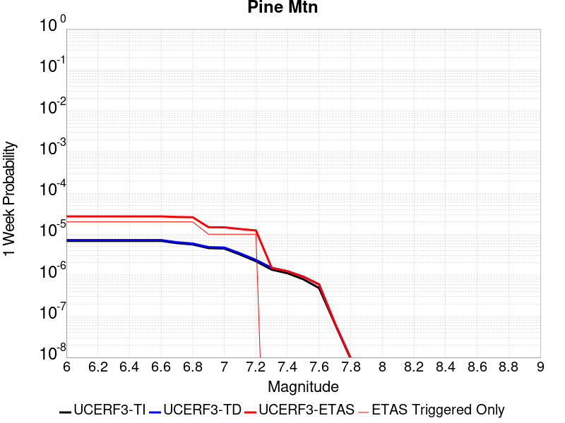 | 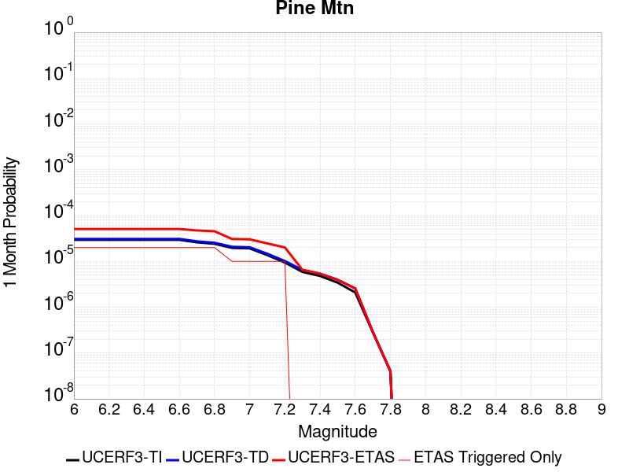 | 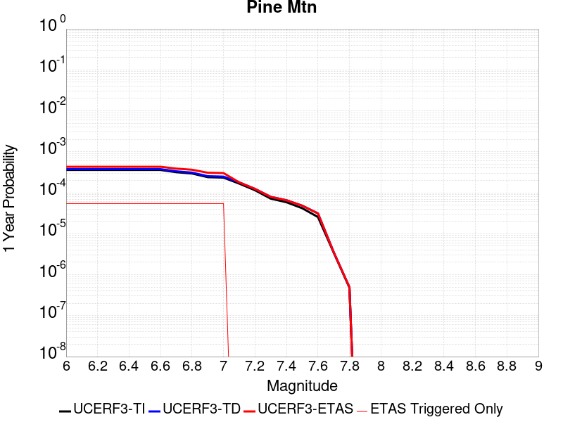 | 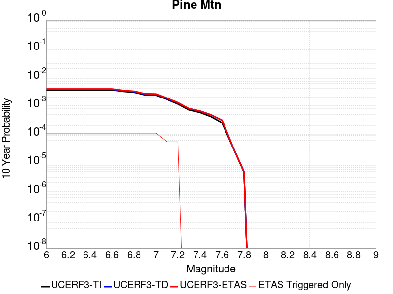 |

| Magnitude | 1 wk TI Prob | 1 wk TD Prob | 1 wk ETAS Prob | 1 wk ETAS/TD Gain | 1 wk ETAS Triggered Only | 1 mo TI Prob | 1 mo TD Prob | 1 mo ETAS Prob | 1 mo ETAS/TD Gain | 1 mo ETAS Triggered Only | 1 yr TI Prob | 1 yr TD Prob | 1 yr ETAS Prob | 1 yr ETAS/TD Gain | 1 yr ETAS Triggered Only | 10 yr TI Prob | 10 yr TD Prob | 10 yr ETAS Prob | 10 yr ETAS/TD Gain | 10 yr ETAS Triggered Only |
|-----|-----|-----|-----|-----|-----|-----|-----|-----|-----|-----|-----|-----|-----|-----|-----|-----|-----|-----|-----|-----|
| 6.0 | 6.894797E-6 | 7.225461E-6 | 7.225461E-6 | 1.0 | 0.0 | 2.9548795E-5 | 3.096591E-5 | 3.096591E-5 | 1.0 | 0.0 | 3.596972E-4 | 3.7694772E-4 | 4.1945957E-4 | 1.1127791 | 4.2527856E-5 | 0.0035911554 | 0.003763381 | 0.0038481166 | 1.0225158 | 8.505571E-5 |
| 6.1 | 6.894797E-6 | 7.225461E-6 | 7.225461E-6 | 1.0 | 0.0 | 2.9548795E-5 | 3.096591E-5 | 3.096591E-5 | 1.0 | 0.0 | 3.596972E-4 | 3.7694772E-4 | 4.1945957E-4 | 1.1127791 | 4.2527856E-5 | 0.0035911554 | 0.003763381 | 0.0038481166 | 1.0225158 | 8.505571E-5 |
| 6.2 | 6.894797E-6 | 7.225461E-6 | 7.225461E-6 | 1.0 | 0.0 | 2.9548795E-5 | 3.096591E-5 | 3.096591E-5 | 1.0 | 0.0 | 3.596972E-4 | 3.7694772E-4 | 4.1945957E-4 | 1.1127791 | 4.2527856E-5 | 0.0035911554 | 0.003763381 | 0.0038481166 | 1.0225158 | 8.505571E-5 |
| 6.3 | 6.894797E-6 | 7.225461E-6 | 7.225461E-6 | 1.0 | 0.0 | 2.9548795E-5 | 3.096591E-5 | 3.096591E-5 | 1.0 | 0.0 | 3.596972E-4 | 3.7694772E-4 | 4.1945957E-4 | 1.1127791 | 4.2527856E-5 | 0.0035911554 | 0.003763381 | 0.0038481166 | 1.0225158 | 8.505571E-5 |
| 6.4 | 6.894797E-6 | 7.225461E-6 | 7.225461E-6 | 1.0 | 0.0 | 2.9548795E-5 | 3.096591E-5 | 3.096591E-5 | 1.0 | 0.0 | 3.596972E-4 | 3.7694772E-4 | 4.1945957E-4 | 1.1127791 | 4.2527856E-5 | 0.0035911554 | 0.003763381 | 0.0038481166 | 1.0225158 | 8.505571E-5 |
| 6.5 | 6.894797E-6 | 7.225461E-6 | 7.225461E-6 | 1.0 | 0.0 | 2.9548795E-5 | 3.096591E-5 | 3.096591E-5 | 1.0 | 0.0 | 3.596972E-4 | 3.7694772E-4 | 4.1945957E-4 | 1.1127791 | 4.2527856E-5 | 0.0035911554 | 0.003763381 | 0.0038481166 | 1.0225158 | 8.505571E-5 |
| 6.6 | 6.894797E-6 | 7.225461E-6 | 7.225461E-6 | 1.0 | 0.0 | 2.9548795E-5 | 3.096591E-5 | 3.096591E-5 | 1.0 | 0.0 | 3.596972E-4 | 3.7694772E-4 | 4.1945957E-4 | 1.1127791 | 4.2527856E-5 | 0.0035911554 | 0.003763381 | 0.0038481166 | 1.0225158 | 8.505571E-5 |
| 6.7 | 6.0867933E-6 | 6.3971133E-6 | 6.3971133E-6 | 1.0 | 0.0 | 2.6085996E-5 | 2.7415923E-5 | 2.7415923E-5 | 1.0 | 0.0 | 3.1755073E-4 | 3.3373994E-4 | 3.762536E-4 | 1.1273856 | 4.2527856E-5 | 0.0031709734 | 0.0033326065 | 0.0034173788 | 1.0254372 | 8.505571E-5 |
| 6.8 | 5.6530425E-6 | 5.9505956E-6 | 5.9505956E-6 | 1.0 | 0.0 | 2.42271E-5 | 2.5502315E-5 | 2.5502315E-5 | 1.0 | 0.0 | 2.94925E-4 | 3.104485E-4 | 3.5296316E-4 | 1.136946 | 4.2527856E-5 | 0.002945339 | 0.0031003528 | 0.0031851449 | 1.0273491 | 8.505571E-5 |
| 6.9 | 4.6015225E-6 | 4.863834E-6 | 4.863834E-6 | 1.0 | 0.0 | 1.9720663E-5 | 2.0844845E-5 | 2.0844845E-5 | 1.0 | 0.0 | 2.4007261E-4 | 2.5375787E-4 | 2.9627496E-4 | 1.1675497 | 4.2527856E-5 | 0.0023981342 | 0.0025348254 | 0.0026196656 | 1.0334698 | 8.505571E-5 |
| 7.0 | 4.4875965E-6 | 4.747473E-6 | 4.747473E-6 | 1.0 | 0.0 | 1.9232413E-5 | 2.0346162E-5 | 2.0346162E-5 | 1.0 | 0.0 | 2.3412947E-4 | 2.4768783E-4 | 2.9020515E-4 | 1.1716568 | 4.2527856E-5 | 0.0023388295 | 0.0024742614 | 0.0025591066 | 1.0342911 | 8.505571E-5 |
| 7.1 | 3.203907E-6 | 3.4294096E-6 | 3.4294096E-6 | 1.0 | 0.0 | 1.3730958E-5 | 1.4697391E-5 | 1.4697391E-5 | 1.0 | 0.0 | 1.6716159E-4 | 1.789267E-4 | 1.789267E-4 | 1.0 | 0.0 | 0.0016703589 | 0.0017878925 | 0.0018303443 | 1.0237441 | 4.2527856E-5 |
| 7.2 | 2.2060601E-6 | 2.3784817E-6 | 2.3784817E-6 | 1.0 | 0.0 | 9.4545085E-6 | 1.0193455E-5 | 1.0193455E-5 | 1.0 | 0.0 | 1.15102564E-4 | 1.240987E-4 | 1.240987E-4 | 1.0 | 0.0 | 0.0011504296 | 0.0012403389 | 0.001282814 | 1.0342448 | 4.2527856E-5 |
| 7.3 | 1.3765207E-6 | 1.5216481E-6 | 1.5216481E-6 | 1.0 | 0.0 | 5.899361E-6 | 6.521333E-6 | 6.521333E-6 | 1.0 | 0.0 | 7.182235E-5 | 7.939443E-5 | 7.939443E-5 | 1.0 | 0.0 | 7.1799144E-4 | 7.936697E-4 | 7.936697E-4 | 1.0 | 0.0 |
| 7.4 | 1.1245983E-6 | 1.2587075E-6 | 1.2587075E-6 | 1.0 | 0.0 | 4.819698E-6 | 5.39445E-6 | 5.39445E-6 | 1.0 | 0.0 | 5.8678244E-5 | 6.567554E-5 | 6.567554E-5 | 1.0 | 0.0 | 5.866275E-4 | 6.5656955E-4 | 6.5656955E-4 | 1.0 | 0.0 |
| 7.5 | 8.031682E-7 | 9.276951E-7 | 9.276951E-7 | 1.0 | 0.0 | 3.4421448E-6 | 3.9758306E-6 | 3.9758306E-6 | 1.0 | 0.0 | 4.1907308E-5 | 4.840473E-5 | 4.840473E-5 | 1.0 | 0.0 | 4.1899405E-4 | 4.8394862E-4 | 4.8394862E-4 | 1.0 | 0.0 |
| 7.6 | 4.8953444E-7 | 6.003009E-7 | 6.003009E-7 | 1.0 | 0.0 | 2.098003E-6 | 2.5727159E-6 | 2.5727159E-6 | 1.0 | 0.0 | 2.5542888E-5 | 3.1322415E-5 | 3.1322415E-5 | 1.0 | 0.0 | 2.5539953E-4 | 3.1318486E-4 | 3.1318486E-4 | 1.0 | 0.0 |
| 7.7 | 6.634529E-8 | 6.788826E-8 | 6.788826E-8 | 1.0 | 0.0 | 2.843369E-7 | 2.9094966E-7 | 2.9094966E-7 | 1.0 | 0.0 | 3.4617963E-6 | 3.5423066E-6 | 3.5423066E-6 | 1.0 | 0.0 | 3.4617424E-5 | 3.542255E-5 | 3.542255E-5 | 1.0 | 0.0 |
| 7.8 | 9.235578E-9 | 9.488566E-9 | 9.488566E-9 | 1.0 | 0.0 | 3.9581046E-8 | 4.0665284E-8 | 4.0665284E-8 | 1.0 | 0.0 | 4.818991E-7 | 4.950997E-7 | 4.950997E-7 | 1.0 | 0.0 | 4.8189804E-6 | 4.950988E-6 | 4.950988E-6 | 1.0 | 0.0 |

## Santa Ynez (West)
*[(top)](#table-of-contents)*

| 1 Week | 1 Month | 1 Year | 10 Year |
|-----|-----|-----|-----|
| 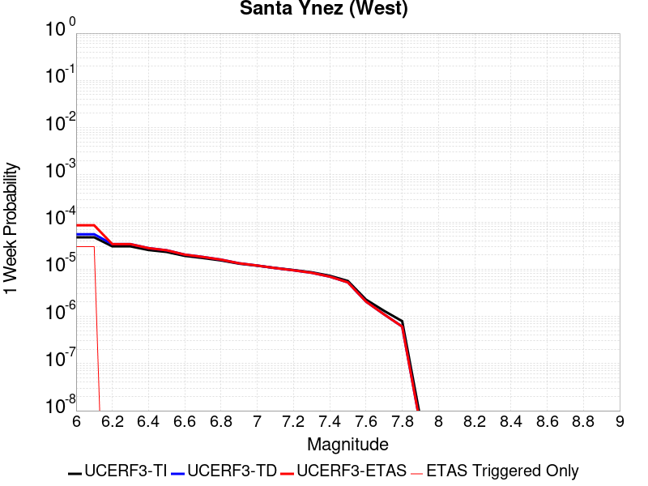 | 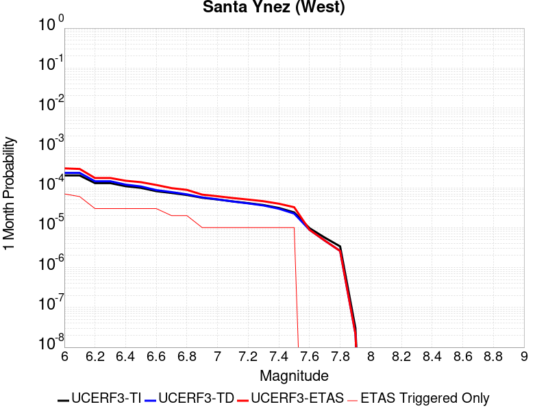 | 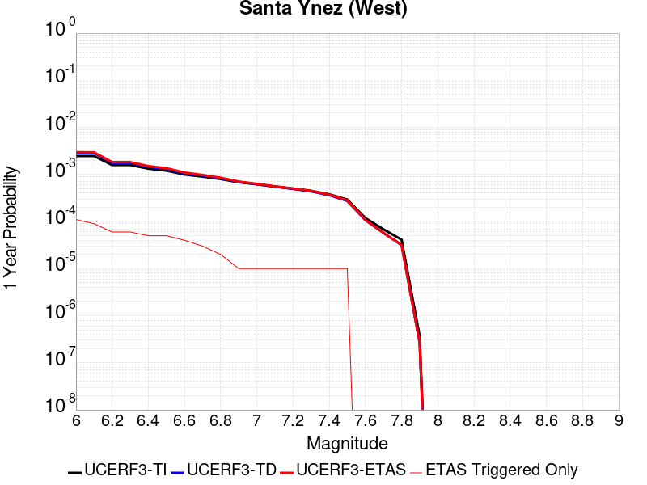 | 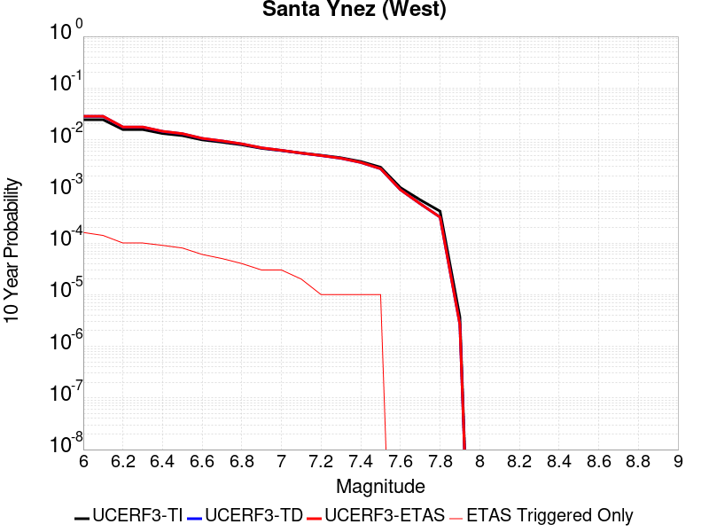 |

| Magnitude | 1 wk TI Prob | 1 wk TD Prob | 1 wk ETAS Prob | 1 wk ETAS/TD Gain | 1 wk ETAS Triggered Only | 1 mo TI Prob | 1 mo TD Prob | 1 mo ETAS Prob | 1 mo ETAS/TD Gain | 1 mo ETAS Triggered Only | 1 yr TI Prob | 1 yr TD Prob | 1 yr ETAS Prob | 1 yr ETAS/TD Gain | 1 yr ETAS Triggered Only | 10 yr TI Prob | 10 yr TD Prob | 10 yr ETAS Prob | 10 yr ETAS/TD Gain | 10 yr ETAS Triggered Only |
|-----|-----|-----|-----|-----|-----|-----|-----|-----|-----|-----|-----|-----|-----|-----|-----|-----|-----|-----|-----|-----|
| 6.0 | 4.7352758E-5 | 5.4972126E-5 | 5.4972126E-5 | 1.0 | 0.0 | 2.0292461E-4 | 2.3557522E-4 | 2.3557522E-4 | 1.0 | 0.0 | 0.0024678076 | 0.0028645284 | 0.0028645284 | 1.0 | 0.0 | 0.024405818 | 0.028304417 | 0.028345741 | 1.00146 | 4.2527856E-5 |
| 6.1 | 4.7352758E-5 | 5.4972126E-5 | 5.4972126E-5 | 1.0 | 0.0 | 2.0292461E-4 | 2.3557522E-4 | 2.3557522E-4 | 1.0 | 0.0 | 0.0024678076 | 0.0028645284 | 0.0028645284 | 1.0 | 0.0 | 0.024405818 | 0.028304417 | 0.028345741 | 1.00146 | 4.2527856E-5 |
| 6.2 | 3.0415853E-5 | 3.392511E-5 | 3.392511E-5 | 1.0 | 0.0 | 1.3034715E-4 | 1.4538545E-4 | 1.4538545E-4 | 1.0 | 0.0 | 0.0015858212 | 0.0017686661 | 0.0017686661 | 1.0 | 0.0 | 0.015745522 | 0.017549807 | 0.017591588 | 1.0023807 | 4.2527856E-5 |
| 6.3 | 3.0415853E-5 | 3.392511E-5 | 3.392511E-5 | 1.0 | 0.0 | 1.3034715E-4 | 1.4538545E-4 | 1.4538545E-4 | 1.0 | 0.0 | 0.0015858212 | 0.0017686661 | 0.0017686661 | 1.0 | 0.0 | 0.015745522 | 0.017549807 | 0.017591588 | 1.0023807 | 4.2527856E-5 |
| 6.4 | 2.5452082E-5 | 2.7912422E-5 | 2.7912422E-5 | 1.0 | 0.0 | 1.09075794E-4 | 1.196193E-4 | 1.196193E-4 | 1.0 | 0.0 | 0.0013271887 | 0.0014554089 | 0.0014554089 | 1.0 | 0.0 | 0.013192902 | 0.014460951 | 0.014502864 | 1.0028983 | 4.2527856E-5 |
| 6.5 | 2.3143784E-5 | 2.5128256E-5 | 2.5128256E-5 | 1.0 | 0.0 | 9.9183875E-5 | 1.0768817E-4 | 1.0768817E-4 | 1.0 | 0.0 | 0.0012068948 | 0.0013103267 | 0.0013103267 | 1.0 | 0.0 | 0.012003611 | 0.01302768 | 0.013069654 | 1.0032219 | 4.2527856E-5 |
| 6.6 | 1.9118515E-5 | 2.035434E-5 | 2.035434E-5 | 1.0 | 0.0 | 8.193392E-5 | 8.7230015E-5 | 8.7230015E-5 | 1.0 | 0.0 | 9.97089E-4 | 0.001061516 | 0.001061516 | 1.0 | 0.0 | 0.00992627 | 0.010565365 | 0.010607444 | 1.0039827 | 4.2527856E-5 |
| 6.7 | 1.722807E-5 | 1.8146347E-5 | 1.8146347E-5 | 1.0 | 0.0 | 7.3832496E-5 | 7.776777E-5 | 7.776777E-5 | 1.0 | 0.0 | 8.985399E-4 | 9.464169E-4 | 9.464169E-4 | 1.0 | 0.0 | 0.008949154 | 0.0094245095 | 0.009466637 | 1.00447 | 4.2527856E-5 |
| 6.8 | 1.5317364E-5 | 1.5926486E-5 | 1.5926486E-5 | 1.0 | 0.0 | 6.56442E-5 | 6.82546E-5 | 6.82546E-5 | 1.0 | 0.0 | 7.98925E-4 | 8.306873E-4 | 8.306873E-4 | 1.0 | 0.0 | 0.007960589 | 0.00827631 | 0.008318486 | 1.005096 | 4.2527856E-5 |
| 6.9 | 1.3071226E-5 | 1.3329624E-5 | 1.3329624E-5 | 1.0 | 0.0 | 5.6018336E-5 | 5.7125722E-5 | 5.7125722E-5 | 1.0 | 0.0 | 6.8180985E-4 | 6.9528597E-4 | 6.9528597E-4 | 1.0 | 0.0 | 0.0067972173 | 0.006931367 | 0.0069736 | 1.006093 | 4.2527856E-5 |
| 7.0 | 1.1836986E-5 | 1.19327815E-5 | 1.19327815E-5 | 1.0 | 0.0 | 5.0728955E-5 | 5.11395E-5 | 5.11395E-5 | 1.0 | 0.0 | 6.1745E-4 | 6.2244723E-4 | 6.2244723E-4 | 1.0 | 0.0 | 0.006157372 | 0.006207231 | 0.006249495 | 1.0068088 | 4.2527856E-5 |
| 7.1 | 1.0597169E-5 | 1.0542201E-5 | 1.0542201E-5 | 1.0 | 0.0 | 4.541565E-5 | 4.5180084E-5 | 4.5180084E-5 | 1.0 | 0.0 | 5.5279525E-4 | 5.4992986E-4 | 5.4992986E-4 | 1.0 | 0.0 | 0.0055142213 | 0.005485821 | 0.0055281157 | 1.0077097 | 4.2527856E-5 |
| 7.2 | 9.59113E-6 | 9.459144E-6 | 9.459144E-6 | 1.0 | 0.0 | 4.11042E-5 | 4.0538565E-5 | 4.0538565E-5 | 1.0 | 0.0 | 5.0032866E-4 | 4.934463E-4 | 4.934463E-4 | 1.0 | 0.0 | 0.004992037 | 0.0049236254 | 0.0049236254 | 1.0 | 0.0 |
| 7.3 | 8.586084E-6 | 8.379583E-6 | 8.379583E-6 | 1.0 | 0.0 | 3.679698E-5 | 3.5912013E-5 | 3.5912013E-5 | 1.0 | 0.0 | 4.4791115E-4 | 4.3714207E-4 | 4.3714207E-4 | 1.0 | 0.0 | 0.004470094 | 0.004362933 | 0.004362933 | 1.0 | 0.0 |
| 7.4 | 7.2622997E-6 | 6.9515427E-6 | 6.9515427E-6 | 1.0 | 0.0 | 3.112377E-5 | 2.979199E-5 | 2.979199E-5 | 1.0 | 0.0 | 3.78866E-4 | 3.626581E-4 | 3.626581E-4 | 1.0 | 0.0 | 0.0037822074 | 0.0036207628 | 0.0036207628 | 1.0 | 0.0 |
| 7.5 | 5.627296E-6 | 5.251588E-6 | 5.251588E-6 | 1.0 | 0.0 | 2.411676E-5 | 2.2506614E-5 | 2.2506614E-5 | 1.0 | 0.0 | 2.9358198E-4 | 2.739843E-4 | 2.739843E-4 | 1.0 | 0.0 | 0.0029319443 | 0.002736537 | 0.002736537 | 1.0 | 0.0 |
| 7.6 | 2.265244E-6 | 2.0608625E-6 | 2.0608625E-6 | 1.0 | 0.0 | 9.708152E-6 | 8.832238E-6 | 8.832238E-6 | 1.0 | 0.0 | 1.18190335E-4 | 1.0752728E-4 | 1.0752728E-4 | 1.0 | 0.0 | 0.001181275 | 0.0010747612 | 0.0010747612 | 1.0 | 0.0 |
| 7.7 | 1.3099874E-6 | 1.1016252E-6 | 1.1016252E-6 | 1.0 | 0.0 | 5.61422E-6 | 4.7212425E-6 | 4.7212425E-6 | 1.0 | 0.0 | 6.8350986E-5 | 5.7479636E-5 | 5.7479636E-5 | 1.0 | 0.0 | 6.832996E-4 | 5.7465007E-4 | 5.7465007E-4 | 1.0 | 0.0 |
| 7.8 | 7.903951E-7 | 6.0711415E-7 | 6.0711415E-7 | 1.0 | 0.0 | 3.3874032E-6 | 2.6019152E-6 | 2.6019152E-6 | 1.0 | 0.0 | 4.1240855E-5 | 3.167787E-5 | 3.167787E-5 | 1.0 | 0.0 | 4.12332E-4 | 3.167349E-4 | 3.167349E-4 | 1.0 | 0.0 |
| 7.9 | 7.0753297E-9 | 5.0899476E-9 | 5.0899476E-9 | 1.0 | 0.0 | 3.032284E-8 | 2.181406E-8 | 2.181406E-8 | 1.0 | 0.0 | 3.6918053E-7 | 2.6558615E-7 | 2.6558615E-7 | 1.0 | 0.0 | 3.691799E-6 | 2.6558594E-6 | 2.6558594E-6 | 1.0 | 0.0 |

## Chino alt 1
*[(top)](#table-of-contents)*

| 1 Week | 1 Month | 1 Year | 10 Year |
|-----|-----|-----|-----|
| 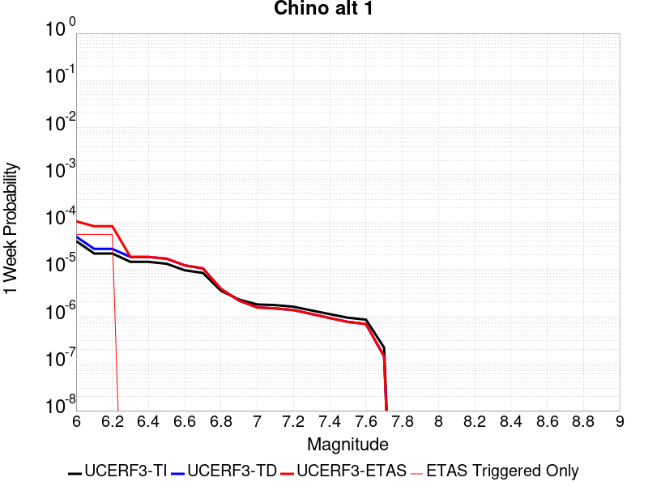 | 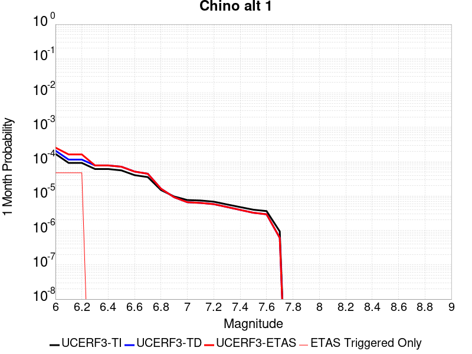 | 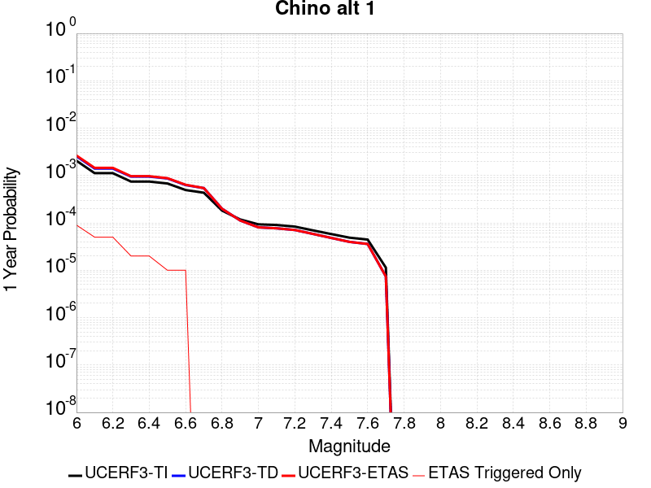 | 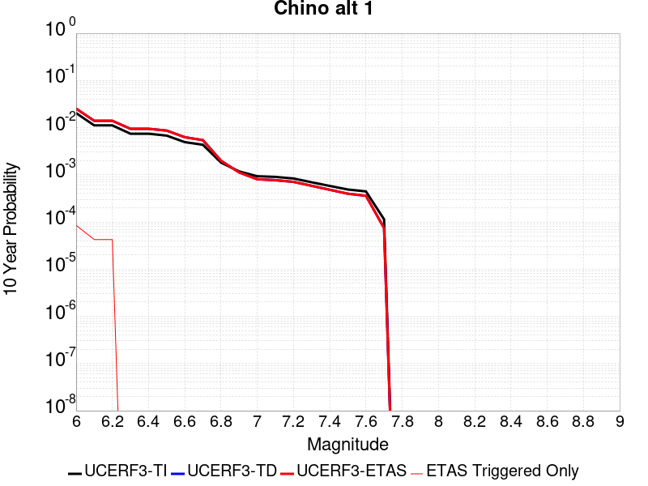 |

| Magnitude | 1 wk TI Prob | 1 wk TD Prob | 1 wk ETAS Prob | 1 wk ETAS/TD Gain | 1 wk ETAS Triggered Only | 1 mo TI Prob | 1 mo TD Prob | 1 mo ETAS Prob | 1 mo ETAS/TD Gain | 1 mo ETAS Triggered Only | 1 yr TI Prob | 1 yr TD Prob | 1 yr ETAS Prob | 1 yr ETAS/TD Gain | 1 yr ETAS Triggered Only | 10 yr TI Prob | 10 yr TD Prob | 10 yr ETAS Prob | 10 yr ETAS/TD Gain | 10 yr ETAS Triggered Only |
|-----|-----|-----|-----|-----|-----|-----|-----|-----|-----|-----|-----|-----|-----|-----|-----|-----|-----|-----|-----|-----|
| 6.0 | 3.939946E-5 | 4.8948554E-5 | 9.147433E-5 | 1.8687851 | 4.2527856E-5 | 1.6884391E-4 | 2.097656E-4 | 2.5228452E-4 | 1.2026974 | 4.2527856E-5 | 0.0020537362 | 0.0025513945 | 0.0026362333 | 1.0332519 | 8.505571E-5 | 0.020348595 | 0.025277847 | 0.025360752 | 1.0032798 | 8.505571E-5 |
| 6.1 | 2.1505624E-5 | 2.6879026E-5 | 6.940574E-5 | 2.5821524 | 4.2527856E-5 | 9.2163704E-5 | 1.1519137E-4 | 1.5771433E-4 | 1.3691505 | 4.2527856E-5 | 0.0011215154 | 0.001401664 | 0.0014441322 | 1.0302985 | 4.2527856E-5 | 0.011158722 | 0.013945141 | 0.013987076 | 1.0030072 | 4.2527856E-5 |
| 6.2 | 2.1505624E-5 | 2.6879026E-5 | 6.940574E-5 | 2.5821524 | 4.2527856E-5 | 9.2163704E-5 | 1.1519137E-4 | 1.5771433E-4 | 1.3691505 | 4.2527856E-5 | 0.0011215154 | 0.001401664 | 0.0014441322 | 1.0302985 | 4.2527856E-5 | 0.011158722 | 0.013945141 | 0.013987076 | 1.0030072 | 4.2527856E-5 |
| 6.3 | 1.4290785E-5 | 1.8165128E-5 | 1.8165128E-5 | 1.0 | 0.0 | 6.1244784E-5 | 7.784848E-5 | 7.784848E-5 | 1.0 | 0.0 | 7.454001E-4 | 9.4743853E-4 | 9.4743853E-4 | 1.0 | 0.0 | 0.007429048 | 0.0094444575 | 0.0094444575 | 1.0 | 0.0 |
| 6.4 | 1.4290785E-5 | 1.8165128E-5 | 1.8165128E-5 | 1.0 | 0.0 | 6.1244784E-5 | 7.784848E-5 | 7.784848E-5 | 1.0 | 0.0 | 7.454001E-4 | 9.4743853E-4 | 9.4743853E-4 | 1.0 | 0.0 | 0.007429048 | 0.0094444575 | 0.0094444575 | 1.0 | 0.0 |
| 6.5 | 1.3017944E-5 | 1.6652088E-5 | 1.6652088E-5 | 1.0 | 0.0 | 5.5789995E-5 | 7.136439E-5 | 7.136439E-5 | 1.0 | 0.0 | 6.790315E-4 | 8.685589E-4 | 8.685589E-4 | 1.0 | 0.0 | 0.0067696036 | 0.008661949 | 0.008661949 | 1.0 | 0.0 |
| 6.6 | 9.470016E-6 | 1.2039424E-5 | 1.2039424E-5 | 1.0 | 0.0 | 4.058515E-5 | 5.1596704E-5 | 5.1596704E-5 | 1.0 | 0.0 | 4.940122E-4 | 6.280428E-4 | 6.280428E-4 | 1.0 | 0.0 | 0.004929154 | 0.0062718987 | 0.0062718987 | 1.0 | 0.0 |
| 6.7 | 8.314155E-6 | 1.0407736E-5 | 1.0407736E-5 | 1.0 | 0.0 | 3.5631605E-5 | 4.4604003E-5 | 4.4604003E-5 | 1.0 | 0.0 | 4.3372845E-4 | 5.429507E-4 | 5.429507E-4 | 1.0 | 0.0 | 0.004328829 | 0.005425775 | 0.005425775 | 1.0 | 0.0 |
| 6.8 | 3.4856364E-6 | 3.8133708E-6 | 3.8133708E-6 | 1.0 | 0.0 | 1.4938357E-5 | 1.6342927E-5 | 1.6342927E-5 | 1.0 | 0.0 | 1.8185932E-4 | 1.9895904E-4 | 1.9895904E-4 | 1.0 | 0.0 | 0.0018171056 | 0.0019894864 | 0.0019894864 | 1.0 | 0.0 |
| 6.9 | 2.2645952E-6 | 2.1529022E-6 | 2.1529022E-6 | 1.0 | 0.0 | 9.705372E-6 | 9.226692E-6 | 9.226692E-6 | 1.0 | 0.0 | 1.18156495E-4 | 1.123294E-4 | 1.123294E-4 | 1.0 | 0.0 | 0.0011809369 | 0.0011233423 | 0.0011233423 | 1.0 | 0.0 |
| 7.0 | 1.7864003E-6 | 1.5430785E-6 | 1.5430785E-6 | 1.0 | 0.0 | 7.655979E-6 | 6.613177E-6 | 6.613177E-6 | 1.0 | 0.0 | 9.3207556E-5 | 8.051251E-5 | 8.051251E-5 | 1.0 | 0.0 | 9.316847E-4 | 8.0528046E-4 | 8.0528046E-4 | 1.0 | 0.0 |
| 7.1 | 1.7315456E-6 | 1.4733511E-6 | 1.4733511E-6 | 1.0 | 0.0 | 7.420889E-6 | 6.3143466E-6 | 6.3143466E-6 | 1.0 | 0.0 | 9.034557E-5 | 7.6874516E-5 | 7.6874516E-5 | 1.0 | 0.0 | 9.0308854E-4 | 7.6891703E-4 | 7.6891703E-4 | 1.0 | 0.0 |
| 7.2 | 1.6008337E-6 | 1.3574215E-6 | 1.3574215E-6 | 1.0 | 0.0 | 6.860698E-6 | 5.817508E-6 | 5.817508E-6 | 1.0 | 0.0 | 8.352579E-5 | 7.082591E-5 | 7.082591E-5 | 1.0 | 0.0 | 8.34944E-4 | 7.0845755E-4 | 7.0845755E-4 | 1.0 | 0.0 |
| 7.3 | 1.3320939E-6 | 1.121782E-6 | 1.121782E-6 | 1.0 | 0.0 | 5.7089615E-6 | 4.807629E-6 | 4.807629E-6 | 1.0 | 0.0 | 6.9504385E-5 | 5.8531357E-5 | 5.8531357E-5 | 1.0 | 0.0 | 6.9482654E-4 | 5.8530393E-4 | 5.8530393E-4 | 1.0 | 0.0 |
| 7.4 | 1.114294E-6 | 9.237111E-7 | 9.237111E-7 | 1.0 | 0.0 | 4.775537E-6 | 3.958756E-6 | 3.958756E-6 | 1.0 | 0.0 | 5.8140613E-5 | 4.8196827E-5 | 4.8196827E-5 | 1.0 | 0.0 | 5.81254E-4 | 4.8188053E-4 | 4.8188053E-4 | 1.0 | 0.0 |
| 7.5 | 9.354081E-7 | 7.6234323E-7 | 7.6234323E-7 | 1.0 | 0.0 | 4.0088858E-6 | 3.2671815E-6 | 3.2671815E-6 | 1.0 | 0.0 | 4.8807087E-5 | 3.9777242E-5 | 3.9777242E-5 | 1.0 | 0.0 | 4.879637E-4 | 3.977046E-4 | 3.977046E-4 | 1.0 | 0.0 |
| 7.6 | 8.521771E-7 | 6.88071E-7 | 6.88071E-7 | 1.0 | 0.0 | 3.6521824E-6 | 2.9488726E-6 | 2.9488726E-6 | 1.0 | 0.0 | 4.4464414E-5 | 3.5901965E-5 | 3.5901965E-5 | 1.0 | 0.0 | 4.4455516E-4 | 3.589648E-4 | 3.589648E-4 | 1.0 | 0.0 |
| 7.7 | 2.1803626E-7 | 1.418649E-7 | 1.418649E-7 | 1.0 | 0.0 | 9.344408E-7 | 6.079923E-7 | 6.079923E-7 | 1.0 | 0.0 | 1.1376757E-5 | 7.4022914E-6 | 7.4022914E-6 | 1.0 | 0.0 | 1.13761744E-4 | 7.402141E-5 | 7.402141E-5 | 1.0 | 0.0 |

## Emerson-Copper Mtn 2011
*[(top)](#table-of-contents)*

| 1 Week | 1 Month | 1 Year | 10 Year |
|-----|-----|-----|-----|
| 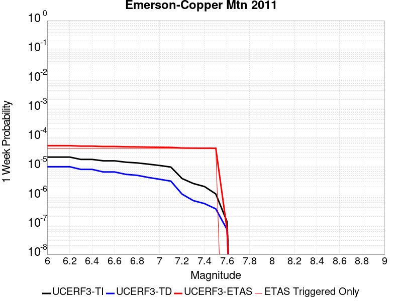 | 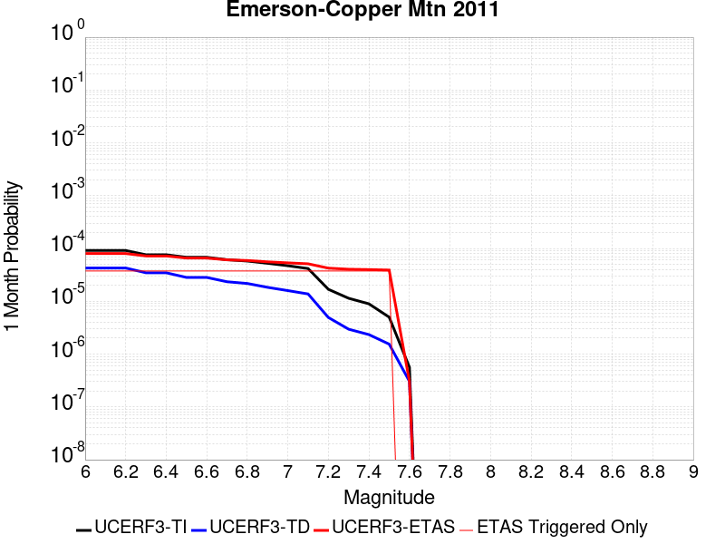 | 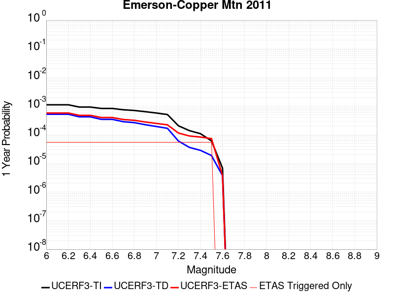 | 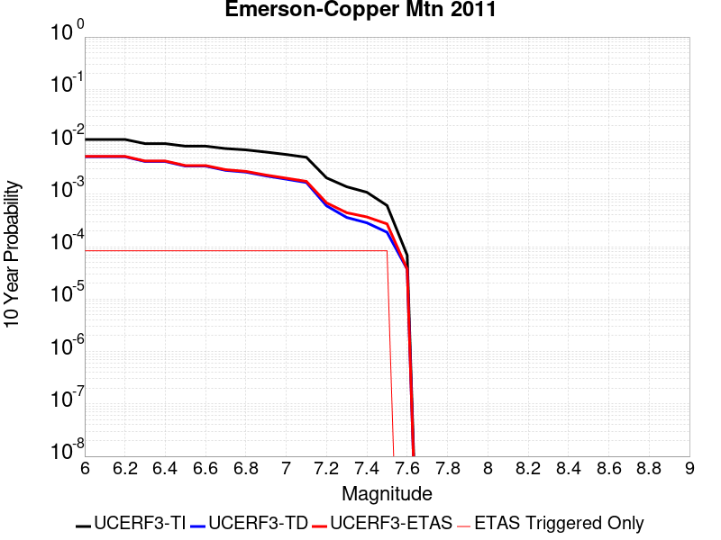 |

| Magnitude | 1 wk TI Prob | 1 wk TD Prob | 1 wk ETAS Prob | 1 wk ETAS/TD Gain | 1 wk ETAS Triggered Only | 1 mo TI Prob | 1 mo TD Prob | 1 mo ETAS Prob | 1 mo ETAS/TD Gain | 1 mo ETAS Triggered Only | 1 yr TI Prob | 1 yr TD Prob | 1 yr ETAS Prob | 1 yr ETAS/TD Gain | 1 yr ETAS Triggered Only | 10 yr TI Prob | 10 yr TD Prob | 10 yr ETAS Prob | 10 yr ETAS/TD Gain | 10 yr ETAS Triggered Only |
|-----|-----|-----|-----|-----|-----|-----|-----|-----|-----|-----|-----|-----|-----|-----|-----|-----|-----|-----|-----|-----|
| 6.0 | 2.1364202E-5 | 9.968114E-6 | 5.2495547E-5 | 5.266347 | 4.2527856E-5 | 9.1557646E-5 | 4.2719836E-5 | 8.5245876E-5 | 1.9954636 | 4.2527856E-5 | 0.0011141442 | 5.199986E-4 | 5.6250434E-4 | 1.081742 | 4.2527856E-5 | 0.011085749 | 0.005188688 | 0.0052733026 | 1.0163075 | 8.505571E-5 |
| 6.1 | 2.1364202E-5 | 9.968114E-6 | 5.2495547E-5 | 5.266347 | 4.2527856E-5 | 9.1557646E-5 | 4.2719836E-5 | 8.5245876E-5 | 1.9954636 | 4.2527856E-5 | 0.0011141442 | 5.199986E-4 | 5.6250434E-4 | 1.081742 | 4.2527856E-5 | 0.011085749 | 0.005188688 | 0.0052733026 | 1.0163075 | 8.505571E-5 |
| 6.2 | 2.1364202E-5 | 9.968114E-6 | 5.2495547E-5 | 5.266347 | 4.2527856E-5 | 9.1557646E-5 | 4.2719836E-5 | 8.5245876E-5 | 1.9954636 | 4.2527856E-5 | 0.0011141442 | 5.199986E-4 | 5.6250434E-4 | 1.081742 | 4.2527856E-5 | 0.011085749 | 0.005188688 | 0.0052733026 | 1.0163075 | 8.505571E-5 |
| 6.3 | 1.7751237E-5 | 8.089227E-6 | 5.0616738E-5 | 6.2573023 | 4.2527856E-5 | 7.607452E-5 | 3.466769E-5 | 7.719407E-5 | 2.2266862 | 4.2527856E-5 | 9.258136E-4 | 4.2200365E-4 | 4.6451355E-4 | 1.1007335 | 4.2527856E-5 | 0.00921966 | 0.0042126453 | 0.0042973426 | 1.0201055 | 8.505571E-5 |
| 6.4 | 1.7751237E-5 | 8.089227E-6 | 5.0616738E-5 | 6.2573023 | 4.2527856E-5 | 7.607452E-5 | 3.466769E-5 | 7.719407E-5 | 2.2266862 | 4.2527856E-5 | 9.258136E-4 | 4.2200365E-4 | 4.6451355E-4 | 1.1007335 | 4.2527856E-5 | 0.00921966 | 0.0042126453 | 0.0042973426 | 1.0201055 | 8.505571E-5 |
| 6.5 | 1.5886664E-5 | 6.603819E-6 | 4.9131395E-5 | 7.4398456 | 4.2527856E-5 | 6.808392E-5 | 2.8301802E-5 | 7.082845E-5 | 2.5026128 | 4.2527856E-5 | 8.286065E-4 | 3.4452465E-4 | 3.8703784E-4 | 1.1233968 | 4.2527856E-5 | 0.008255237 | 0.0034403696 | 0.0035251325 | 1.0246378 | 8.505571E-5 |
| 6.6 | 1.5886664E-5 | 6.603819E-6 | 4.9131395E-5 | 7.4398456 | 4.2527856E-5 | 6.808392E-5 | 2.8301802E-5 | 7.082845E-5 | 2.5026128 | 4.2527856E-5 | 8.286065E-4 | 3.4452465E-4 | 3.8703784E-4 | 1.1233968 | 4.2527856E-5 | 0.008255237 | 0.0034403696 | 0.0035251325 | 1.0246378 | 8.505571E-5 |
| 6.7 | 1.428471E-5 | 5.470403E-6 | 4.7998026E-5 | 8.77413 | 4.2527856E-5 | 6.121875E-5 | 2.3444394E-5 | 6.597125E-5 | 2.8139458 | 4.2527856E-5 | 7.450834E-4 | 2.8540206E-4 | 3.2791778E-4 | 1.1489679 | 4.2527856E-5 | 0.007425902 | 0.0028507432 | 0.0028931499 | 1.0148757 | 4.2527856E-5 |
| 6.8 | 1.3490684E-5 | 5.073699E-6 | 4.7601337E-5 | 9.38198 | 4.2527856E-5 | 5.7815934E-5 | 2.1744265E-5 | 6.42712E-5 | 2.955777 | 4.2527856E-5 | 7.0368167E-4 | 2.6470813E-4 | 3.0722472E-4 | 1.1606169 | 4.2527856E-5 | 0.007014576 | 0.002644309 | 0.0026867245 | 1.0160402 | 4.2527856E-5 |
| 6.9 | 1.2235421E-5 | 4.289677E-6 | 4.681735E-5 | 10.913957 | 4.2527856E-5 | 5.2436466E-5 | 1.838422E-5 | 6.0911294E-5 | 3.3132377 | 4.2527856E-5 | 6.38227E-4 | 2.238085E-4 | 2.6632685E-4 | 1.1899765 | 4.2527856E-5 | 0.0063639707 | 0.0022361854 | 0.002278618 | 1.0189755 | 4.2527856E-5 |
| 7.0 | 1.1009851E-5 | 3.7189886E-6 | 4.6246685E-5 | 12.435286 | 4.2527856E-5 | 4.7184225E-5 | 1.5938444E-5 | 5.8465623E-5 | 3.6682138 | 4.2527856E-5 | 5.743165E-4 | 1.9403672E-4 | 2.3655633E-4 | 1.2191317 | 4.2527856E-5 | 0.005728345 | 0.0019390108 | 0.0019814563 | 1.0218903 | 4.2527856E-5 |
| 7.1 | 9.726373E-6 | 3.2117953E-6 | 4.5739514E-5 | 14.241105 | 4.2527856E-5 | 4.168379E-5 | 1.3764783E-5 | 5.6292054E-5 | 4.0895705 | 4.2527856E-5 | 5.07382E-4 | 1.6757673E-4 | 2.1009745E-4 | 1.2537389 | 4.2527856E-5 | 0.0050622504 | 0.0016748349 | 0.0017172914 | 1.0253497 | 4.2527856E-5 |
| 7.2 | 3.9335127E-6 | 1.1524792E-6 | 4.3680287E-5 | 37.90115 | 4.2527856E-5 | 1.6857803E-5 | 4.9391874E-6 | 4.7466834E-5 | 9.610251 | 4.2527856E-5 | 2.0522442E-4 | 6.0133007E-5 | 1.02658305E-4 | 1.7071873 | 4.2527856E-5 | 0.00205035 | 6.011733E-4 | 6.436756E-4 | 1.0706989 | 4.2527856E-5 |
| 7.3 | 2.661632E-6 | 6.911505E-7 | 4.3218977E-5 | 62.531933 | 4.2527856E-5 | 1.14069435E-5 | 2.9620703E-6 | 4.54898E-5 | 15.357434 | 4.2527856E-5 | 1.3887069E-4 | 3.6062618E-5 | 7.858894E-5 | 2.1792355 | 4.2527856E-5 | 0.0013878393 | 3.605687E-4 | 4.030812E-4 | 1.1179041 | 4.2527856E-5 |
| 7.4 | 2.0893426E-6 | 5.4618386E-7 | 4.3074015E-5 | 78.86359 | 4.2527856E-5 | 8.954295E-6 | 2.3407858E-6 | 4.4868542E-5 | 19.168154 | 4.2527856E-5 | 1.0901308E-4 | 2.84987E-5 | 7.1025344E-5 | 2.492231 | 4.2527856E-5 | 0.0010895962 | 2.84951E-4 | 3.2746675E-4 | 1.1492037 | 4.2527856E-5 |
| 7.5 | 1.1681728E-6 | 3.6030585E-7 | 4.2888147E-5 | 119.03261 | 4.2527856E-5 | 5.0064455E-6 | 1.544167E-6 | 4.4071956E-5 | 28.540926 | 4.2527856E-5 | 6.0951766E-5 | 1.8800076E-5 | 6.132713E-5 | 3.2620683 | 4.2527856E-5 | 6.093505E-4 | 1.8798532E-4 | 2.3050519E-4 | 1.2261871 | 4.2527856E-5 |
| 7.6 | 1.3154387E-7 | 7.1197384E-8 | 7.1197384E-8 | 1.0 | 0.0 | 5.6375933E-7 | 3.051316E-7 | 3.051316E-7 | 1.0 | 0.0 | 6.863748E-6 | 3.7149728E-6 | 3.7149728E-6 | 1.0 | 0.0 | 6.863536E-5 | 3.7149264E-5 | 3.7149264E-5 | 1.0 | 0.0 |

## Great Valley 08 (Quinto)
*[(top)](#table-of-contents)*

| 1 Week | 1 Month | 1 Year | 10 Year |
|-----|-----|-----|-----|
|  | 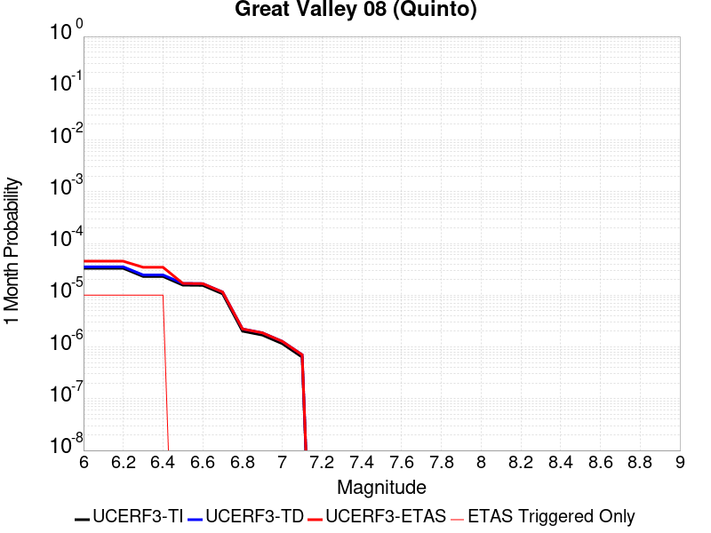 | 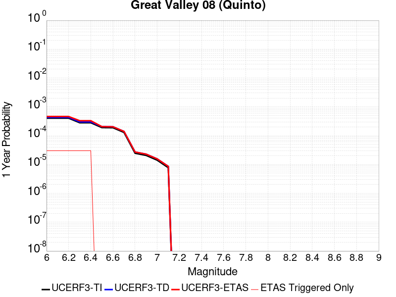 | 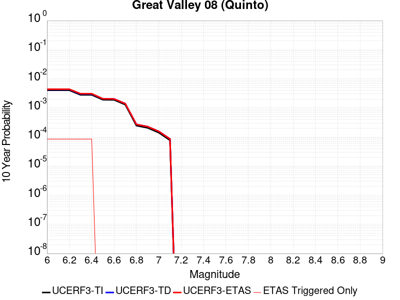 |

| Magnitude | 1 wk TI Prob | 1 wk TD Prob | 1 wk ETAS Prob | 1 wk ETAS/TD Gain | 1 wk ETAS Triggered Only | 1 mo TI Prob | 1 mo TD Prob | 1 mo ETAS Prob | 1 mo ETAS/TD Gain | 1 mo ETAS Triggered Only | 1 yr TI Prob | 1 yr TD Prob | 1 yr ETAS Prob | 1 yr ETAS/TD Gain | 1 yr ETAS Triggered Only | 10 yr TI Prob | 10 yr TD Prob | 10 yr ETAS Prob | 10 yr ETAS/TD Gain | 10 yr ETAS Triggered Only |
|-----|-----|-----|-----|-----|-----|-----|-----|-----|-----|-----|-----|-----|-----|-----|-----|-----|-----|-----|-----|-----|
| 6.0 | 7.737697E-6 | 8.253038E-6 | 8.253038E-6 | 1.0 | 0.0 | 3.3161137E-5 | 3.536979E-5 | 3.536979E-5 | 1.0 | 0.0 | 4.0366207E-4 | 4.3056096E-4 | 4.730705E-4 | 1.0987306 | 4.2527856E-5 | 0.004029296 | 0.0042991205 | 0.004383811 | 1.0196993 | 8.505571E-5 |
| 6.1 | 7.737697E-6 | 8.253038E-6 | 8.253038E-6 | 1.0 | 0.0 | 3.3161137E-5 | 3.536979E-5 | 3.536979E-5 | 1.0 | 0.0 | 4.0366207E-4 | 4.3056096E-4 | 4.730705E-4 | 1.0987306 | 4.2527856E-5 | 0.004029296 | 0.0042991205 | 0.004383811 | 1.0196993 | 8.505571E-5 |
| 6.2 | 7.737697E-6 | 8.253038E-6 | 8.253038E-6 | 1.0 | 0.0 | 3.3161137E-5 | 3.536979E-5 | 3.536979E-5 | 1.0 | 0.0 | 4.0366207E-4 | 4.3056096E-4 | 4.730705E-4 | 1.0987306 | 4.2527856E-5 | 0.004029296 | 0.0042991205 | 0.004383811 | 1.0196993 | 8.505571E-5 |
| 6.3 | 5.374012E-6 | 5.7505736E-6 | 5.7505736E-6 | 1.0 | 0.0 | 2.3031276E-5 | 2.4645145E-5 | 2.4645145E-5 | 1.0 | 0.0 | 2.803697E-4 | 3.0002446E-4 | 3.4253957E-4 | 1.1417054 | 4.2527856E-5 | 0.0028001624 | 0.0029972875 | 0.0030820882 | 1.0282925 | 8.505571E-5 |
| 6.4 | 5.374012E-6 | 5.7505736E-6 | 5.7505736E-6 | 1.0 | 0.0 | 2.3031276E-5 | 2.4645145E-5 | 2.4645145E-5 | 1.0 | 0.0 | 2.803697E-4 | 3.0002446E-4 | 3.4253957E-4 | 1.1417054 | 4.2527856E-5 | 0.0028001624 | 0.0029972875 | 0.0030820882 | 1.0282925 | 8.505571E-5 |
| 6.5 | 3.65427E-6 | 3.941324E-6 | 3.941324E-6 | 1.0 | 0.0 | 1.5661062E-5 | 1.689132E-5 | 1.689132E-5 | 1.0 | 0.0 | 1.9065675E-4 | 2.0563944E-4 | 2.0563944E-4 | 1.0 | 0.0 | 0.0019049325 | 0.0020551833 | 0.0020551833 | 1.0 | 0.0 |
| 6.6 | 3.6143538E-6 | 3.8985104E-6 | 3.8985104E-6 | 1.0 | 0.0 | 1.5489995E-5 | 1.6707834E-5 | 1.6707834E-5 | 1.0 | 0.0 | 1.8857437E-4 | 2.0340596E-4 | 2.0340596E-4 | 1.0 | 0.0 | 0.0018841444 | 0.0020328893 | 0.0020328893 | 1.0 | 0.0 |
| 6.7 | 2.4821015E-6 | 2.6857067E-6 | 2.6857067E-6 | 1.0 | 0.0 | 1.0637535E-5 | 1.1510153E-5 | 1.1510153E-5 | 1.0 | 0.0 | 1.2950429E-4 | 1.4013276E-4 | 1.4013276E-4 | 1.0 | 0.0 | 0.0012942884 | 0.0014009989 | 0.0014009989 | 1.0 | 0.0 |
| 6.8 | 4.7110538E-7 | 5.193021E-7 | 5.193021E-7 | 1.0 | 0.0 | 2.0190216E-6 | 2.2255786E-6 | 2.2255786E-6 | 1.0 | 0.0 | 2.458131E-5 | 2.70961E-5 | 2.70961E-5 | 1.0 | 0.0 | 2.457859E-4 | 2.7092977E-4 | 2.7092977E-4 | 1.0 | 0.0 |
| 6.9 | 3.958685E-7 | 4.3703452E-7 | 4.3703452E-7 | 1.0 | 0.0 | 1.6965782E-6 | 1.8730038E-6 | 1.8730038E-6 | 1.0 | 0.0 | 2.0655643E-5 | 2.28036E-5 | 2.28036E-5 | 1.0 | 0.0 | 2.0653724E-4 | 2.2801422E-4 | 2.2801422E-4 | 1.0 | 0.0 |
| 7.0 | 2.70294E-7 | 2.9920008E-7 | 2.9920008E-7 | 1.0 | 0.0 | 1.1584025E-6 | 1.2822856E-6 | 1.2822856E-6 | 1.0 | 0.0 | 1.4103458E-5 | 1.5611728E-5 | 1.5611728E-5 | 1.0 | 0.0 | 1.4102564E-4 | 1.5610759E-4 | 1.5610759E-4 | 1.0 | 0.0 |
| 7.1 | 1.4828602E-7 | 1.6469107E-7 | 1.6469107E-7 | 1.0 | 0.0 | 6.3551136E-7 | 7.058187E-7 | 7.058187E-7 | 1.0 | 0.0 | 7.737323E-6 | 8.593317E-6 | 8.593317E-6 | 1.0 | 0.0 | 7.737054E-5 | 8.593065E-5 | 8.593065E-5 | 1.0 | 0.0 |

## Oak Ridge (Onshore)
*[(top)](#table-of-contents)*

| 1 Week | 1 Month | 1 Year | 10 Year |
|-----|-----|-----|-----|
| 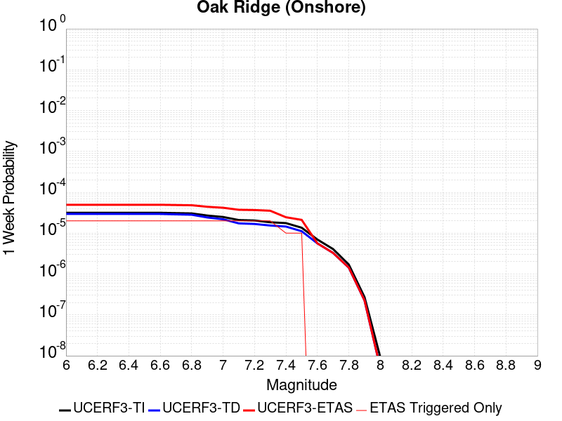 | 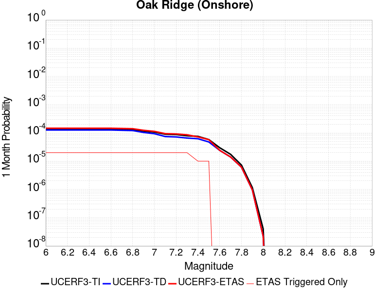 | 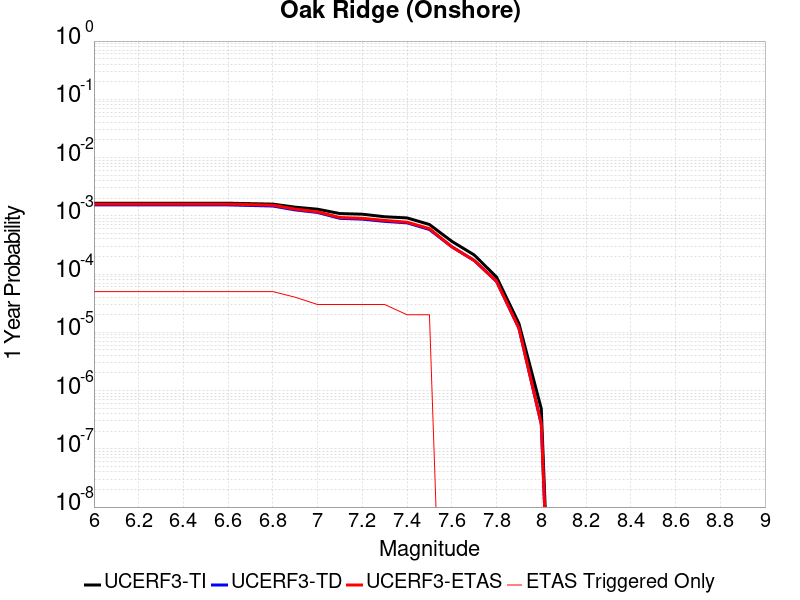 |  |

| Magnitude | 1 wk TI Prob | 1 wk TD Prob | 1 wk ETAS Prob | 1 wk ETAS/TD Gain | 1 wk ETAS Triggered Only | 1 mo TI Prob | 1 mo TD Prob | 1 mo ETAS Prob | 1 mo ETAS/TD Gain | 1 mo ETAS Triggered Only | 1 yr TI Prob | 1 yr TD Prob | 1 yr ETAS Prob | 1 yr ETAS/TD Gain | 1 yr ETAS Triggered Only | 10 yr TI Prob | 10 yr TD Prob | 10 yr ETAS Prob | 10 yr ETAS/TD Gain | 10 yr ETAS Triggered Only |
|-----|-----|-----|-----|-----|-----|-----|-----|-----|-----|-----|-----|-----|-----|-----|-----|-----|-----|-----|-----|-----|
| 6.0 | 3.155064E-5 | 2.9525974E-5 | 2.9525974E-5 | 1.0 | 0.0 | 1.3521002E-4 | 1.2653397E-4 | 1.2653397E-4 | 1.0 | 0.0 | 0.001644939 | 0.0015395004 | 0.0015395004 | 1.0 | 0.0 | 0.01632816 | 0.015292859 | 0.0153766135 | 1.0054767 | 8.505571E-5 |
| 6.1 | 3.155064E-5 | 2.9525974E-5 | 2.9525974E-5 | 1.0 | 0.0 | 1.3521002E-4 | 1.2653397E-4 | 1.2653397E-4 | 1.0 | 0.0 | 0.001644939 | 0.0015395004 | 0.0015395004 | 1.0 | 0.0 | 0.01632816 | 0.015292859 | 0.0153766135 | 1.0054767 | 8.505571E-5 |
| 6.2 | 3.155064E-5 | 2.9525974E-5 | 2.9525974E-5 | 1.0 | 0.0 | 1.3521002E-4 | 1.2653397E-4 | 1.2653397E-4 | 1.0 | 0.0 | 0.001644939 | 0.0015395004 | 0.0015395004 | 1.0 | 0.0 | 0.01632816 | 0.015292859 | 0.0153766135 | 1.0054767 | 8.505571E-5 |
| 6.3 | 3.155064E-5 | 2.9525974E-5 | 2.9525974E-5 | 1.0 | 0.0 | 1.3521002E-4 | 1.2653397E-4 | 1.2653397E-4 | 1.0 | 0.0 | 0.001644939 | 0.0015395004 | 0.0015395004 | 1.0 | 0.0 | 0.01632816 | 0.015292859 | 0.0153766135 | 1.0054767 | 8.505571E-5 |
| 6.4 | 3.155064E-5 | 2.9525974E-5 | 2.9525974E-5 | 1.0 | 0.0 | 1.3521002E-4 | 1.2653397E-4 | 1.2653397E-4 | 1.0 | 0.0 | 0.001644939 | 0.0015395004 | 0.0015395004 | 1.0 | 0.0 | 0.01632816 | 0.015292859 | 0.0153766135 | 1.0054767 | 8.505571E-5 |
| 6.5 | 3.155064E-5 | 2.9525974E-5 | 2.9525974E-5 | 1.0 | 0.0 | 1.3521002E-4 | 1.2653397E-4 | 1.2653397E-4 | 1.0 | 0.0 | 0.001644939 | 0.0015395004 | 0.0015395004 | 1.0 | 0.0 | 0.01632816 | 0.015292859 | 0.0153766135 | 1.0054767 | 8.505571E-5 |
| 6.6 | 3.155064E-5 | 2.9525974E-5 | 2.9525974E-5 | 1.0 | 0.0 | 1.3521002E-4 | 1.2653397E-4 | 1.2653397E-4 | 1.0 | 0.0 | 0.001644939 | 0.0015395004 | 0.0015395004 | 1.0 | 0.0 | 0.01632816 | 0.015292859 | 0.0153766135 | 1.0054767 | 8.505571E-5 |
| 6.7 | 3.098897E-5 | 2.8864175E-5 | 2.8864175E-5 | 1.0 | 0.0 | 1.328031E-4 | 1.2369796E-4 | 1.2369796E-4 | 1.0 | 0.0 | 0.0016156785 | 0.0015050198 | 0.0015050198 | 1.0 | 0.0 | 0.016039822 | 0.014952714 | 0.015036497 | 1.0056033 | 8.505571E-5 |
| 6.8 | 3.0449872E-5 | 2.8239372E-5 | 2.8239372E-5 | 1.0 | 0.0 | 1.3049292E-4 | 1.2102048E-4 | 1.2102048E-4 | 1.0 | 0.0 | 0.0015875935 | 0.0014724657 | 0.0014724657 | 1.0 | 0.0 | 0.015762992 | 0.014631462 | 0.014715273 | 1.0057281 | 8.505571E-5 |
| 6.9 | 2.697928E-5 | 2.4219773E-5 | 2.4219773E-5 | 1.0 | 0.0 | 1.15620365E-4 | 1.0379502E-4 | 1.0379502E-4 | 1.0 | 0.0 | 0.0014067689 | 0.0012629933 | 0.0012629933 | 1.0 | 0.0 | 0.0139789665 | 0.01256087 | 0.012644857 | 1.0066864 | 8.505571E-5 |
| 7.0 | 2.4893961E-5 | 2.1862043E-5 | 2.1862043E-5 | 1.0 | 0.0 | 1.0668404E-4 | 9.3691204E-5 | 9.3691204E-5 | 1.0 | 0.0 | 0.0012981043 | 0.0011401111 | 0.0011401111 | 1.0 | 0.0 | 0.012905477 | 0.011344905 | 0.0113869505 | 1.0037061 | 4.2527856E-5 |
| 7.1 | 2.0945363E-5 | 1.7354487E-5 | 1.7354487E-5 | 1.0 | 0.0 | 8.976275E-5 | 7.437428E-5 | 7.437428E-5 | 1.0 | 0.0 | 0.0010923136 | 9.051354E-4 | 9.051354E-4 | 1.0 | 0.0 | 0.0108696 | 0.009015423 | 0.009057567 | 1.0046747 | 4.2527856E-5 |
| 7.2 | 2.0439404E-5 | 1.6809423E-5 | 1.6809423E-5 | 1.0 | 0.0 | 8.7594504E-5 | 7.203843E-5 | 7.203843E-5 | 1.0 | 0.0 | 0.0010659413 | 8.767196E-4 | 8.767196E-4 | 1.0 | 0.0 | 0.010608427 | 0.008733526 | 0.008775682 | 1.004827 | 4.2527856E-5 |
| 7.3 | 1.8463334E-5 | 1.5381811E-5 | 1.5381811E-5 | 1.0 | 0.0 | 7.912617E-5 | 6.59204E-5 | 6.59204E-5 | 1.0 | 0.0 | 9.6293533E-4 | 8.0228975E-4 | 8.0228975E-4 | 1.0 | 0.0 | 0.009587734 | 0.007994797 | 0.008036985 | 1.0052769 | 4.2527856E-5 |
| 7.4 | 1.763139E-5 | 1.451684E-5 | 1.451684E-5 | 1.0 | 0.0 | 7.556091E-5 | 6.221356E-5 | 6.221356E-5 | 1.0 | 0.0 | 9.1956573E-4 | 7.571909E-4 | 7.571909E-4 | 1.0 | 0.0 | 0.009157699 | 0.007546914 | 0.0075891204 | 1.0055926 | 4.2527856E-5 |
| 7.5 | 1.3594944E-5 | 1.1163356E-5 | 1.1163356E-5 | 1.0 | 0.0 | 5.8262744E-5 | 4.784209E-5 | 4.784209E-5 | 1.0 | 0.0 | 7.0911803E-4 | 5.8232434E-4 | 5.8232434E-4 | 1.0 | 0.0 | 0.007068595 | 0.0058082556 | 0.0058505363 | 1.0072794 | 4.2527856E-5 |
| 7.6 | 6.9889534E-6 | 5.6367144E-6 | 5.6367144E-6 | 1.0 | 0.0 | 2.9952313E-5 | 2.4157125E-5 | 2.4157125E-5 | 1.0 | 0.0 | 3.646084E-4 | 2.9407372E-4 | 2.9407372E-4 | 1.0 | 0.0 | 0.0036401073 | 0.0029368899 | 0.0029792928 | 1.014438 | 4.2527856E-5 |
| 7.7 | 4.0824193E-6 | 3.2832586E-6 | 3.2832586E-6 | 1.0 | 0.0 | 1.7495966E-5 | 1.4071033E-5 | 1.4071033E-5 | 1.0 | 0.0 | 2.1299256E-4 | 1.713015E-4 | 1.713015E-4 | 1.0 | 0.0 | 0.0021278851 | 0.0017117079 | 0.001754163 | 1.0248028 | 4.2527856E-5 |
| 7.8 | 1.7023609E-6 | 1.4370495E-6 | 1.4370495E-6 | 1.0 | 0.0 | 7.295812E-6 | 6.1587693E-6 | 6.1587693E-6 | 1.0 | 0.0 | 8.882289E-5 | 7.498047E-5 | 7.498047E-5 | 1.0 | 0.0 | 8.8787393E-4 | 7.495545E-4 | 7.495545E-4 | 1.0 | 0.0 |
| 7.9 | 2.721225E-7 | 2.2616497E-7 | 2.2616497E-7 | 1.0 | 0.0 | 1.1662388E-6 | 9.692781E-7 | 9.692781E-7 | 1.0 | 0.0 | 1.4198865E-5 | 1.1800899E-5 | 1.1800899E-5 | 1.0 | 0.0 | 1.4197957E-4 | 1.1800301E-4 | 1.1800301E-4 | 1.0 | 0.0 |
| 8.0 | 9.364255E-9 | 5.1206666E-9 | 5.1206666E-9 | 1.0 | 0.0 | 4.0132523E-8 | 2.1945715E-8 | 2.1945715E-8 | 1.0 | 0.0 | 4.8861335E-7 | 2.6718905E-7 | 2.6718905E-7 | 1.0 | 0.0 | 4.8861225E-6 | 2.6718876E-6 | 2.6718876E-6 | 1.0 | 0.0 |

## Coronado Bank alt1
*[(top)](#table-of-contents)*

| 1 Week | 1 Month | 1 Year | 10 Year |
|-----|-----|-----|-----|
|  | 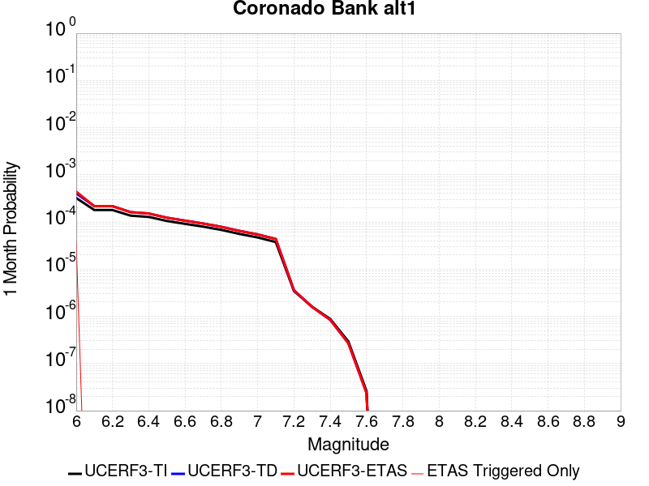 | 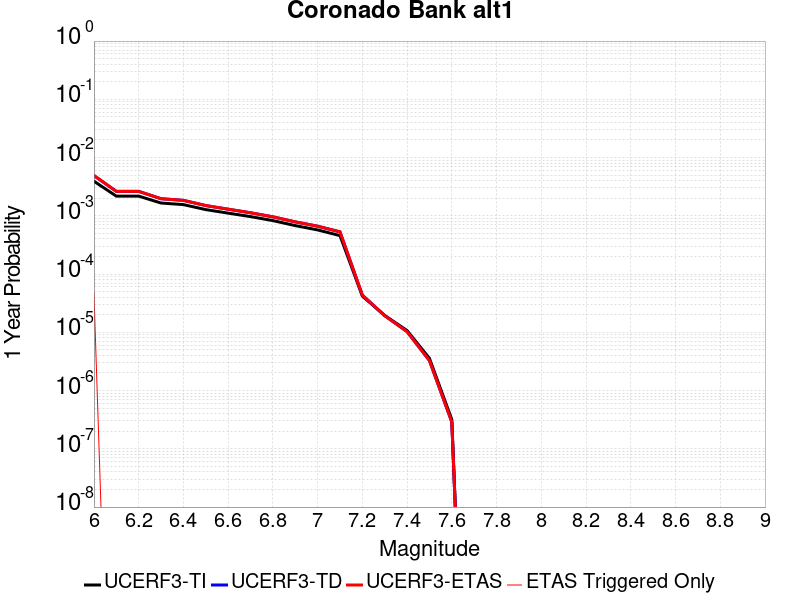 | 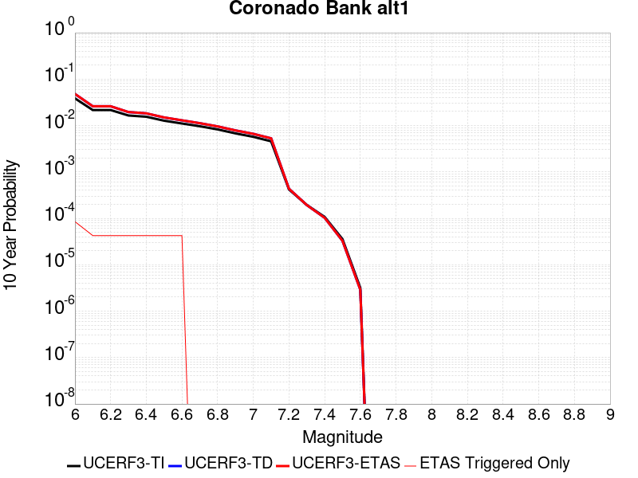 |

| Magnitude | 1 wk TI Prob | 1 wk TD Prob | 1 wk ETAS Prob | 1 wk ETAS/TD Gain | 1 wk ETAS Triggered Only | 1 mo TI Prob | 1 mo TD Prob | 1 mo ETAS Prob | 1 mo ETAS/TD Gain | 1 mo ETAS Triggered Only | 1 yr TI Prob | 1 yr TD Prob | 1 yr ETAS Prob | 1 yr ETAS/TD Gain | 1 yr ETAS Triggered Only | 10 yr TI Prob | 10 yr TD Prob | 10 yr ETAS Prob | 10 yr ETAS/TD Gain | 10 yr ETAS Triggered Only |
|-----|-----|-----|-----|-----|-----|-----|-----|-----|-----|-----|-----|-----|-----|-----|-----|-----|-----|-----|-----|-----|
| 6.0 | 7.533492E-5 | 9.394913E-5 | 1.3647298E-4 | 1.4526265 | 4.2527856E-5 | 3.22824E-4 | 4.0258127E-4 | 4.4509198E-4 | 1.1055955 | 4.2527856E-5 | 0.0039233007 | 0.0048909658 | 0.0049332855 | 1.0086527 | 4.2527856E-5 | 0.03854755 | 0.04790356 | 0.047984544 | 1.0016905 | 8.505571E-5 |
| 6.1 | 4.1807285E-5 | 5.049283E-5 | 5.049283E-5 | 1.0 | 0.0 | 1.7916178E-4 | 2.1638049E-4 | 2.1638049E-4 | 1.0 | 0.0 | 0.0021791123 | 0.0026313474 | 0.0026313474 | 1.0 | 0.0 | 0.021578677 | 0.026011046 | 0.02605247 | 1.0015925 | 4.2527856E-5 |
| 6.2 | 4.1807285E-5 | 5.049283E-5 | 5.049283E-5 | 1.0 | 0.0 | 1.7916178E-4 | 2.1638049E-4 | 2.1638049E-4 | 1.0 | 0.0 | 0.0021791123 | 0.0026313474 | 0.0026313474 | 1.0 | 0.0 | 0.021578677 | 0.026011046 | 0.02605247 | 1.0015925 | 4.2527856E-5 |
| 6.3 | 3.1793104E-5 | 3.7711117E-5 | 3.7711117E-5 | 1.0 | 0.0 | 1.3624904E-4 | 1.6160926E-4 | 1.6160926E-4 | 1.0 | 0.0 | 0.0016575698 | 0.001965848 | 0.001965848 | 1.0 | 0.0 | 0.016452603 | 0.019488465 | 0.019530164 | 1.0021397 | 4.2527856E-5 |
| 6.4 | 2.9878007E-5 | 3.5335794E-5 | 3.5335794E-5 | 1.0 | 0.0 | 1.2804232E-4 | 1.5143053E-4 | 1.5143053E-4 | 1.0 | 0.0 | 0.0015578003 | 0.0018421387 | 0.0018421387 | 1.0 | 0.0 | 0.015469253 | 0.01827244 | 0.018314192 | 1.0022849 | 4.2527856E-5 |
| 6.5 | 2.4512565E-5 | 2.8764043E-5 | 2.8764043E-5 | 1.0 | 0.0 | 1.0504962E-4 | 1.2326881E-4 | 1.2326881E-4 | 1.0 | 0.0 | 0.0012782287 | 0.0014997921 | 0.0014997921 | 1.0 | 0.0 | 0.012709012 | 0.014899683 | 0.014941577 | 1.0028118 | 4.2527856E-5 |
| 6.6 | 2.1317413E-5 | 2.490667E-5 | 2.490667E-5 | 1.0 | 0.0 | 9.135714E-5 | 1.0673863E-4 | 1.0673863E-4 | 1.0 | 0.0 | 0.0011117056 | 0.0012987906 | 0.0012987906 | 1.0 | 0.0 | 0.011061605 | 0.012914404 | 0.012956384 | 1.0032505 | 4.2527856E-5 |
| 6.7 | 1.8585655E-5 | 2.163488E-5 | 2.163488E-5 | 1.0 | 0.0 | 7.9650374E-5 | 9.271773E-5 | 9.271773E-5 | 1.0 | 0.0 | 9.6931186E-4 | 0.0011282742 | 0.0011282742 | 1.0 | 0.0 | 0.0096509475 | 0.011227623 | 0.011227623 | 1.0 | 0.0 |
| 6.8 | 1.5862879E-5 | 1.8419474E-5 | 1.8419474E-5 | 1.0 | 0.0 | 6.798199E-5 | 7.893833E-5 | 7.893833E-5 | 1.0 | 0.0 | 8.273665E-4 | 9.6066965E-4 | 9.6066965E-4 | 1.0 | 0.0 | 0.008242928 | 0.00956715 | 0.00956715 | 1.0 | 0.0 |
| 6.9 | 1.3021509E-5 | 1.5095265E-5 | 1.5095265E-5 | 1.0 | 0.0 | 5.5805274E-5 | 6.469249E-5 | 6.469249E-5 | 1.0 | 0.0 | 6.792174E-4 | 7.8736455E-4 | 7.8736455E-4 | 1.0 | 0.0 | 0.006771452 | 0.007847573 | 0.007847573 | 1.0 | 0.0 |
| 7.0 | 1.0974371E-5 | 1.2720104E-5 | 1.2720104E-5 | 1.0 | 0.0 | 4.7032172E-5 | 5.451369E-5 | 5.451369E-5 | 1.0 | 0.0 | 5.7246623E-4 | 6.6351966E-4 | 6.6351966E-4 | 1.0 | 0.0 | 0.0057099373 | 0.006617135 | 0.006617135 | 1.0 | 0.0 |
| 7.1 | 8.766221E-6 | 1.01638325E-5 | 1.01638325E-5 | 1.0 | 0.0 | 3.7568978E-5 | 4.355865E-5 | 4.355865E-5 | 1.0 | 0.0 | 4.573063E-4 | 5.3021475E-4 | 5.3021475E-4 | 1.0 | 0.0 | 0.0045636636 | 0.0052911965 | 0.0052911965 | 1.0 | 0.0 |
| 7.2 | 8.026024E-7 | 8.331765E-7 | 8.331765E-7 | 1.0 | 0.0 | 3.43972E-6 | 3.5707515E-6 | 3.5707515E-6 | 1.0 | 0.0 | 4.1877785E-5 | 4.3473043E-5 | 4.3473043E-5 | 1.0 | 0.0 | 4.1869894E-4 | 4.3464647E-4 | 4.3464647E-4 | 1.0 | 0.0 |
| 7.3 | 3.7293114E-7 | 3.7000953E-7 | 3.7000953E-7 | 1.0 | 0.0 | 1.5982754E-6 | 1.5857541E-6 | 1.5857541E-6 | 1.0 | 0.0 | 1.9458828E-5 | 1.9306386E-5 | 1.9306386E-5 | 1.0 | 0.0 | 1.9457124E-4 | 1.9304715E-4 | 1.9304715E-4 | 1.0 | 0.0 |
| 7.4 | 2.0557036E-7 | 1.9674363E-7 | 1.9674363E-7 | 1.0 | 0.0 | 8.810155E-7 | 8.431867E-7 | 8.431867E-7 | 1.0 | 0.0 | 1.0726311E-5 | 1.026575E-5 | 1.026575E-5 | 1.0 | 0.0 | 1.0725793E-4 | 1.0265279E-4 | 1.0265279E-4 | 1.0 | 0.0 |
| 7.5 | 6.845446E-8 | 6.279369E-8 | 6.279369E-8 | 1.0 | 0.0 | 2.9337625E-7 | 2.691158E-7 | 2.691158E-7 | 1.0 | 0.0 | 3.5718497E-6 | 3.2764797E-6 | 3.2764797E-6 | 1.0 | 0.0 | 3.5717923E-5 | 3.2764325E-5 | 3.2764325E-5 | 1.0 | 0.0 |
| 7.6 | 6.0975145E-9 | 5.53185E-9 | 5.53185E-9 | 1.0 | 0.0 | 2.6132206E-8 | 2.370793E-8 | 2.370793E-8 | 1.0 | 0.0 | 3.1815955E-7 | 2.88644E-7 | 2.88644E-7 | 1.0 | 0.0 | 3.181591E-6 | 2.8864374E-6 | 2.8864374E-6 | 1.0 | 0.0 |

## Sheephole
*[(top)](#table-of-contents)*

| 1 Week | 1 Month | 1 Year | 10 Year |
|-----|-----|-----|-----|
| 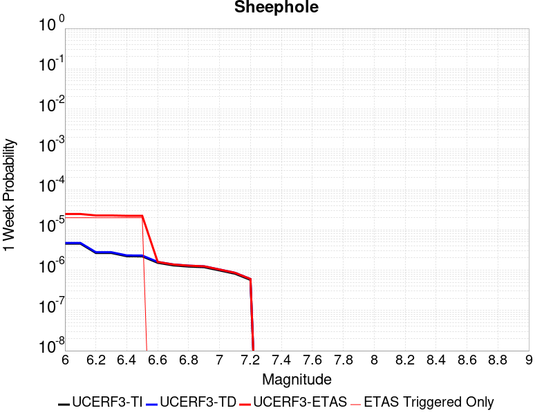 | 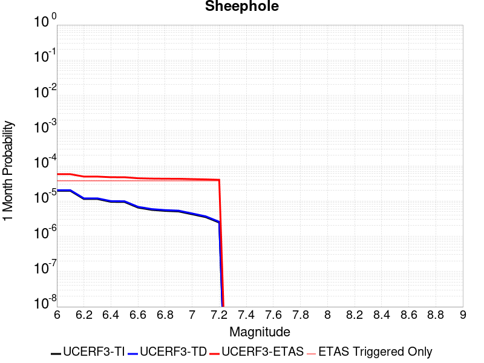 | 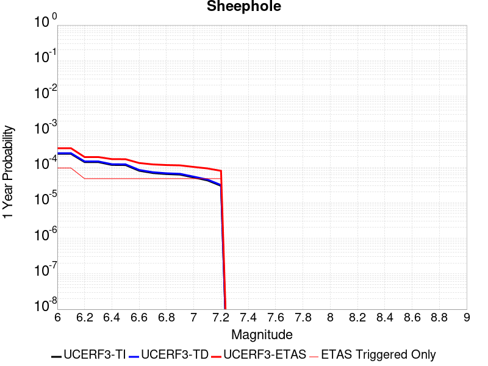 | 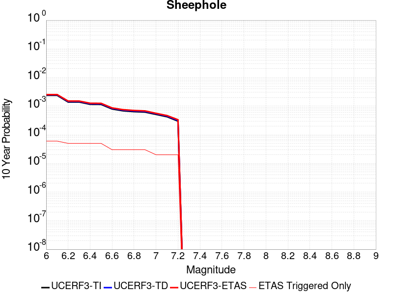 |

| Magnitude | 1 wk TI Prob | 1 wk TD Prob | 1 wk ETAS Prob | 1 wk ETAS/TD Gain | 1 wk ETAS Triggered Only | 1 mo TI Prob | 1 mo TD Prob | 1 mo ETAS Prob | 1 mo ETAS/TD Gain | 1 mo ETAS Triggered Only | 1 yr TI Prob | 1 yr TD Prob | 1 yr ETAS Prob | 1 yr ETAS/TD Gain | 1 yr ETAS Triggered Only | 10 yr TI Prob | 10 yr TD Prob | 10 yr ETAS Prob | 10 yr ETAS/TD Gain | 10 yr ETAS Triggered Only |
|-----|-----|-----|-----|-----|-----|-----|-----|-----|-----|-----|-----|-----|-----|-----|-----|-----|-----|-----|-----|-----|
| 6.0 | 4.5579695E-6 | 4.7412627E-6 | 4.7412627E-6 | 1.0 | 0.0 | 1.9534009E-5 | 2.031957E-5 | 6.2846564E-5 | 3.0929081 | 4.2527856E-5 | 2.3780059E-4 | 2.473682E-4 | 3.3240288E-4 | 1.3437575 | 8.505571E-5 | 0.0023754628 | 0.002471473 | 0.0025563187 | 1.0343299 | 8.505571E-5 |
| 6.1 | 4.5579695E-6 | 4.7412627E-6 | 4.7412627E-6 | 1.0 | 0.0 | 1.9534009E-5 | 2.031957E-5 | 6.2846564E-5 | 3.0929081 | 4.2527856E-5 | 2.3780059E-4 | 2.473682E-4 | 3.3240288E-4 | 1.3437575 | 8.505571E-5 | 0.0023754628 | 0.002471473 | 0.0025563187 | 1.0343299 | 8.505571E-5 |
| 6.2 | 2.6677674E-6 | 2.7873941E-6 | 2.7873941E-6 | 1.0 | 0.0 | 1.1433239E-5 | 1.1945926E-5 | 5.4473276E-5 | 4.5599875 | 4.2527856E-5 | 1.3919079E-4 | 1.4543302E-4 | 1.8795469E-4 | 1.2923797 | 4.2527856E-5 | 0.0013910364 | 0.0014534844 | 0.0014959504 | 1.0292168 | 4.2527856E-5 |
| 6.3 | 2.6677674E-6 | 2.7873941E-6 | 2.7873941E-6 | 1.0 | 0.0 | 1.1433239E-5 | 1.1945926E-5 | 5.4473276E-5 | 4.5599875 | 4.2527856E-5 | 1.3919079E-4 | 1.4543302E-4 | 1.8795469E-4 | 1.2923797 | 4.2527856E-5 | 0.0013910364 | 0.0014534844 | 0.0014959504 | 1.0292168 | 4.2527856E-5 |
| 6.4 | 2.2159759E-6 | 2.3228788E-6 | 2.3228788E-6 | 1.0 | 0.0 | 9.497005E-6 | 9.955161E-6 | 5.2482592E-5 | 5.271898 | 4.2527856E-5 | 1.156199E-4 | 1.2119815E-4 | 1.6372085E-4 | 1.3508527 | 4.2527856E-5 | 0.0011555976 | 0.0012113999 | 0.0012538763 | 1.0350639 | 4.2527856E-5 |
| 6.5 | 2.1986082E-6 | 2.304759E-6 | 2.304759E-6 | 1.0 | 0.0 | 9.4225725E-6 | 9.877506E-6 | 5.2404943E-5 | 5.3054833 | 4.2527856E-5 | 1.1471378E-4 | 1.2025281E-4 | 1.6277554E-4 | 1.3536112 | 4.2527856E-5 | 0.0011465458 | 0.0012019566 | 0.0012444333 | 1.0353397 | 4.2527856E-5 |
| 6.6 | 1.5232331E-6 | 1.6018919E-6 | 1.6018919E-6 | 1.0 | 0.0 | 6.5281256E-6 | 6.865234E-6 | 4.93928E-5 | 7.1946273 | 4.2527856E-5 | 7.947703E-5 | 8.35812E-5 | 1.261055E-4 | 1.5087783 | 4.2527856E-5 | 7.9448614E-4 | 8.3551643E-4 | 8.780087E-4 | 1.0508575 | 4.2527856E-5 |
| 6.7 | 1.3137362E-6 | 1.382819E-6 | 1.382819E-6 | 1.0 | 0.0 | 5.6302856E-6 | 5.926355E-6 | 4.845396E-5 | 8.176014 | 4.2527856E-5 | 6.854657E-5 | 7.215112E-5 | 1.1467591E-4 | 1.589385 | 4.2527856E-5 | 6.8525434E-4 | 7.212908E-4 | 7.63788E-4 | 1.0589182 | 4.2527856E-5 |
| 6.8 | 1.2275751E-6 | 1.2922847E-6 | 1.2922847E-6 | 1.0 | 0.0 | 5.2610258E-6 | 5.5383516E-6 | 4.8065973E-5 | 8.67875 | 4.2527856E-5 | 6.4051106E-5 | 6.7427485E-5 | 1.0995247E-4 | 1.6306773 | 4.2527856E-5 | 6.4032647E-4 | 6.740836E-4 | 7.1658276E-4 | 1.0630474 | 4.2527856E-5 |
| 6.9 | 1.1837088E-6 | 1.246102E-6 | 1.246102E-6 | 1.0 | 0.0 | 5.0730278E-6 | 5.340427E-6 | 4.7868056E-5 | 8.963339 | 4.2527856E-5 | 6.176237E-5 | 6.501789E-5 | 1.0754298E-4 | 1.6540521 | 4.2527856E-5 | 6.17452E-4 | 6.5000186E-4 | 6.925021E-4 | 1.0653847 | 4.2527856E-5 |
| 7.0 | 9.849371E-7 | 1.0366288E-6 | 1.0366288E-6 | 1.0 | 0.0 | 4.2211523E-6 | 4.442688E-6 | 4.6970355E-5 | 10.572508 | 4.2527856E-5 | 5.1391315E-5 | 5.4088487E-5 | 9.661404E-5 | 1.786222 | 4.2527856E-5 | 5.137943E-4 | 5.407633E-4 | 5.832682E-4 | 1.0786016 | 4.2527856E-5 |
| 7.1 | 8.1643645E-7 | 8.591669E-7 | 8.591669E-7 | 1.0 | 0.0 | 3.4990085E-6 | 3.682139E-6 | 4.620984E-5 | 12.5497265 | 4.2527856E-5 | 4.2599597E-5 | 4.482921E-5 | 8.735516E-5 | 1.9486214 | 4.2527856E-5 | 4.259143E-4 | 4.4821028E-4 | 4.907191E-4 | 1.0948412 | 4.2527856E-5 |
| 7.2 | 5.7295756E-7 | 6.029502E-7 | 6.029502E-7 | 1.0 | 0.0 | 2.45553E-6 | 2.58407E-6 | 4.5111818E-5 | 17.457659 | 4.2527856E-5 | 2.9895667E-5 | 3.1460666E-5 | 7.398718E-5 | 2.351736 | 4.2527856E-5 | 2.9891645E-4 | 3.145688E-4 | 3.570833E-4 | 1.1351516 | 4.2527856E-5 |

## Blue Cut
*[(top)](#table-of-contents)*

| 1 Week | 1 Month | 1 Year | 10 Year |
|-----|-----|-----|-----|
| 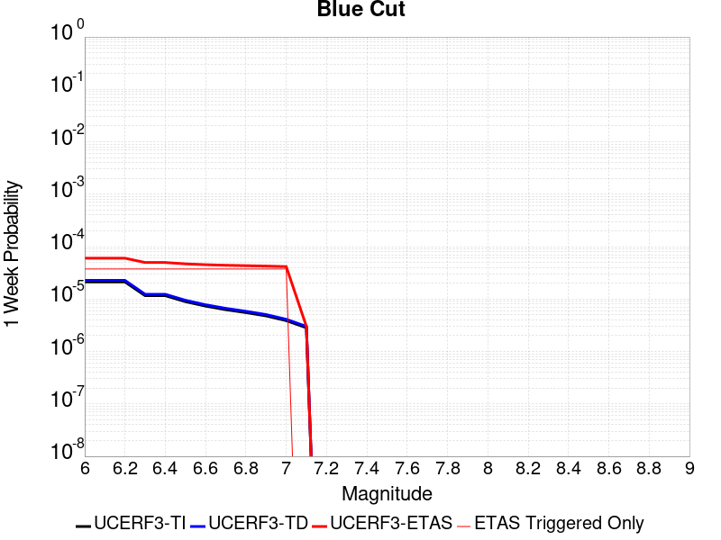 | 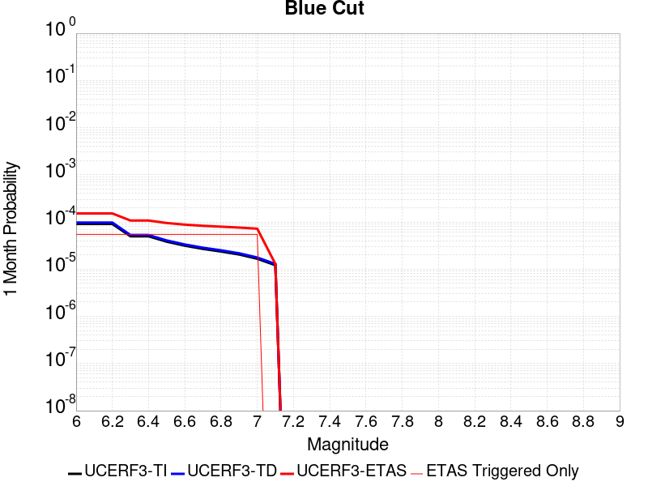 | 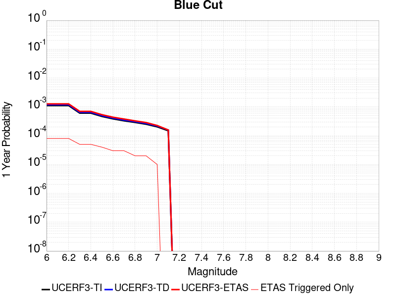 | 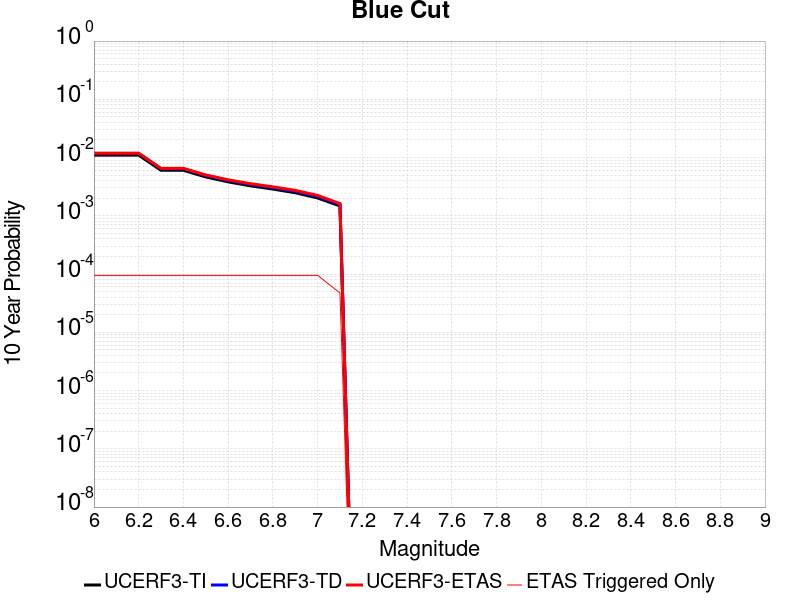 |

| Magnitude | 1 wk TI Prob | 1 wk TD Prob | 1 wk ETAS Prob | 1 wk ETAS/TD Gain | 1 wk ETAS Triggered Only | 1 mo TI Prob | 1 mo TD Prob | 1 mo ETAS Prob | 1 mo ETAS/TD Gain | 1 mo ETAS Triggered Only | 1 yr TI Prob | 1 yr TD Prob | 1 yr ETAS Prob | 1 yr ETAS/TD Gain | 1 yr ETAS Triggered Only | 10 yr TI Prob | 10 yr TD Prob | 10 yr ETAS Prob | 10 yr ETAS/TD Gain | 10 yr ETAS Triggered Only |
|-----|-----|-----|-----|-----|-----|-----|-----|-----|-----|-----|-----|-----|-----|-----|-----|-----|-----|-----|-----|-----|
| 6.0 | 2.1227985E-5 | 2.2719574E-5 | 6.5246466E-5 | 2.871817 | 4.2527856E-5 | 9.097391E-5 | 9.73663E-5 | 1.3989002E-4 | 1.4367396 | 4.2527856E-5 | 0.0011070445 | 0.0011848481 | 0.0012273255 | 1.0358505 | 4.2527856E-5 | 0.011015458 | 0.011791152 | 0.011875205 | 1.0071285 | 8.505571E-5 |
| 6.1 | 2.1227985E-5 | 2.2719574E-5 | 6.5246466E-5 | 2.871817 | 4.2527856E-5 | 9.097391E-5 | 9.73663E-5 | 1.3989002E-4 | 1.4367396 | 4.2527856E-5 | 0.0011070445 | 0.0011848481 | 0.0012273255 | 1.0358505 | 4.2527856E-5 | 0.011015458 | 0.011791152 | 0.011875205 | 1.0071285 | 8.505571E-5 |
| 6.2 | 2.1227985E-5 | 2.2719574E-5 | 6.5246466E-5 | 2.871817 | 4.2527856E-5 | 9.097391E-5 | 9.73663E-5 | 1.3989002E-4 | 1.4367396 | 4.2527856E-5 | 0.0011070445 | 0.0011848481 | 0.0012273255 | 1.0358505 | 4.2527856E-5 | 0.011015458 | 0.011791152 | 0.011875205 | 1.0071285 | 8.505571E-5 |
| 6.3 | 1.1613981E-5 | 1.2353542E-5 | 5.488087E-5 | 4.442521 | 4.2527856E-5 | 4.9773254E-5 | 5.2942745E-5 | 9.546835E-5 | 1.8032376 | 4.2527856E-5 | 6.0582085E-4 | 6.443998E-4 | 6.869002E-4 | 1.0659535 | 4.2527856E-5 | 0.0060417196 | 0.0064265593 | 0.0065110684 | 1.01315 | 8.505571E-5 |
| 6.4 | 1.1613981E-5 | 1.2353542E-5 | 5.488087E-5 | 4.442521 | 4.2527856E-5 | 4.9773254E-5 | 5.2942745E-5 | 9.546835E-5 | 1.8032376 | 4.2527856E-5 | 6.0582085E-4 | 6.443998E-4 | 6.869002E-4 | 1.0659535 | 4.2527856E-5 | 0.0060417196 | 0.0064265593 | 0.0065110684 | 1.01315 | 8.505571E-5 |
| 6.5 | 8.931326E-6 | 9.4816E-6 | 5.200905E-5 | 5.4852614 | 4.2527856E-5 | 3.8276554E-5 | 4.0634844E-5 | 8.316097E-5 | 2.0465434 | 4.2527856E-5 | 4.6591737E-4 | 4.946261E-4 | 5.371329E-4 | 1.0859373 | 4.2527856E-5 | 0.0046494175 | 0.004936161 | 0.005020797 | 1.0171461 | 8.505571E-5 |
| 6.6 | 7.345353E-6 | 7.79028E-6 | 5.0317805E-5 | 6.45905 | 4.2527856E-5 | 3.1479703E-5 | 3.338653E-5 | 7.591296E-5 | 2.2737603 | 4.2527856E-5 | 3.83198E-4 | 4.064132E-4 | 4.4892376E-4 | 1.1045994 | 4.2527856E-5 | 0.0038253788 | 0.0040574907 | 0.0041422015 | 1.0208776 | 8.505571E-5 |
| 6.7 | 6.2775666E-6 | 6.655149E-6 | 4.9182723E-5 | 7.390176 | 4.2527856E-5 | 2.690358E-5 | 2.8521798E-5 | 7.104844E-5 | 2.4910226 | 4.2527856E-5 | 3.2750185E-4 | 3.472051E-4 | 3.8971816E-4 | 1.1224438 | 4.2527856E-5 | 0.0032701963 | 0.003467367 | 0.0035521279 | 1.0244453 | 8.505571E-5 |
| 6.8 | 5.5234095E-6 | 5.8551113E-6 | 4.8382717E-5 | 8.26333 | 4.2527856E-5 | 2.367154E-5 | 2.5093133E-5 | 6.761992E-5 | 2.694758 | 4.2527856E-5 | 2.8816288E-4 | 3.0547334E-4 | 3.479882E-4 | 1.139177 | 4.2527856E-5 | 0.002877895 | 0.0030512505 | 0.0031360467 | 1.0277907 | 8.505571E-5 |
| 6.9 | 4.7780054E-6 | 5.0654203E-6 | 4.759306E-5 | 9.3956785 | 4.2527856E-5 | 2.0477004E-5 | 2.1708804E-5 | 6.423573E-5 | 2.9589717 | 4.2527856E-5 | 2.4927902E-4 | 2.642797E-4 | 3.067963E-4 | 1.1608773 | 4.2527856E-5 | 0.0024899957 | 0.002640346 | 0.0027251772 | 1.0321288 | 8.505571E-5 |
| 7.0 | 3.883171E-6 | 4.118487E-6 | 4.6646168E-5 | 11.326044 | 4.2527856E-5 | 1.6642054E-5 | 1.7650578E-5 | 6.0177685E-5 | 3.4093888 | 4.2527856E-5 | 2.0259817E-4 | 2.1488148E-4 | 2.574002E-4 | 1.1978705 | 4.2527856E-5 | 0.0020241356 | 0.0021474129 | 0.002232286 | 1.0395234 | 8.505571E-5 |
| 7.1 | 2.8358215E-6 | 3.0097158E-6 | 3.0097158E-6 | 1.0 | 0.0 | 1.2153464E-5 | 1.2898756E-5 | 1.2898756E-5 | 1.0 | 0.0 | 1.4795837E-4 | 1.5703762E-4 | 1.5703762E-4 | 1.0 | 0.0 | 0.001478599 | 0.0015699116 | 0.0016123727 | 1.0270468 | 4.2527856E-5 |

## San Gabriel
*[(top)](#table-of-contents)*

| 1 Week | 1 Month | 1 Year | 10 Year |
|-----|-----|-----|-----|
| 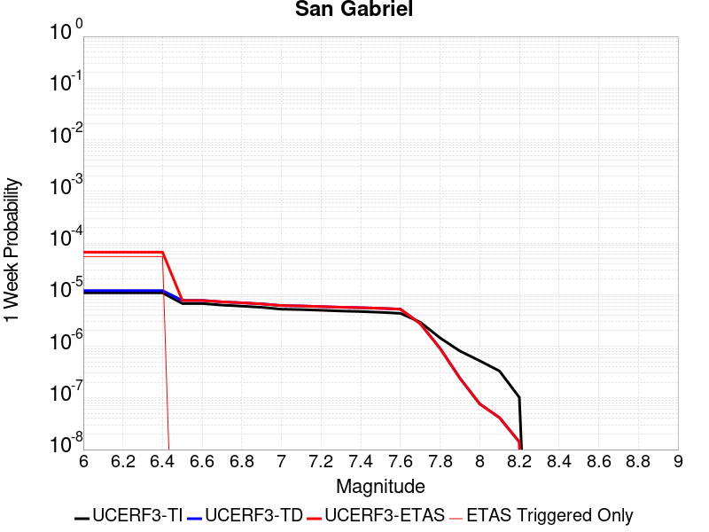 | 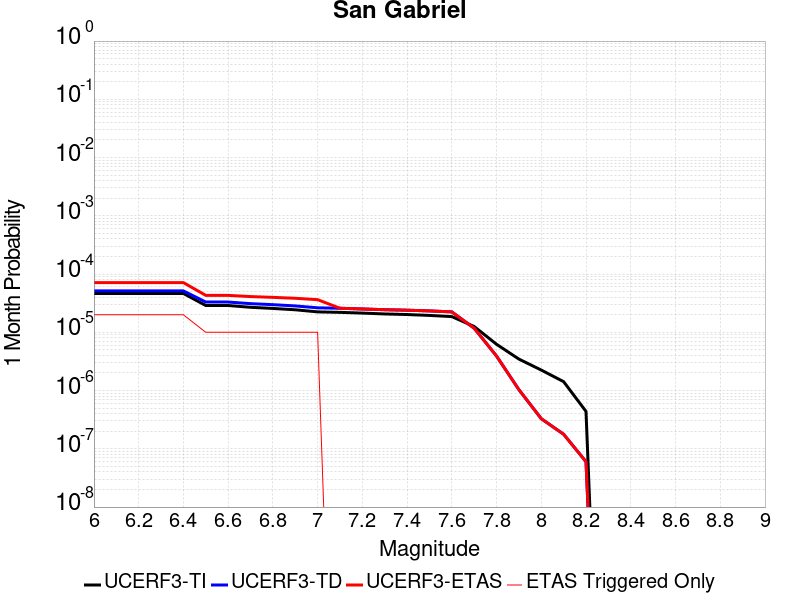 | 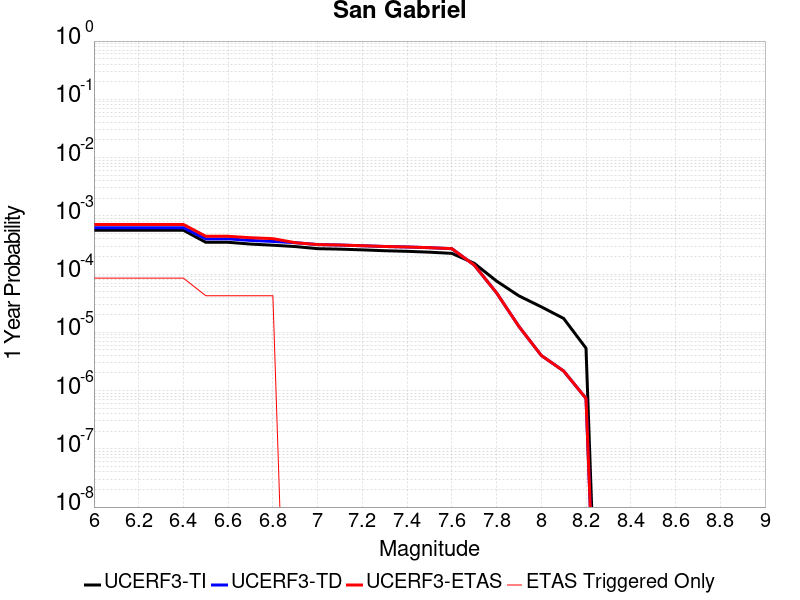 | 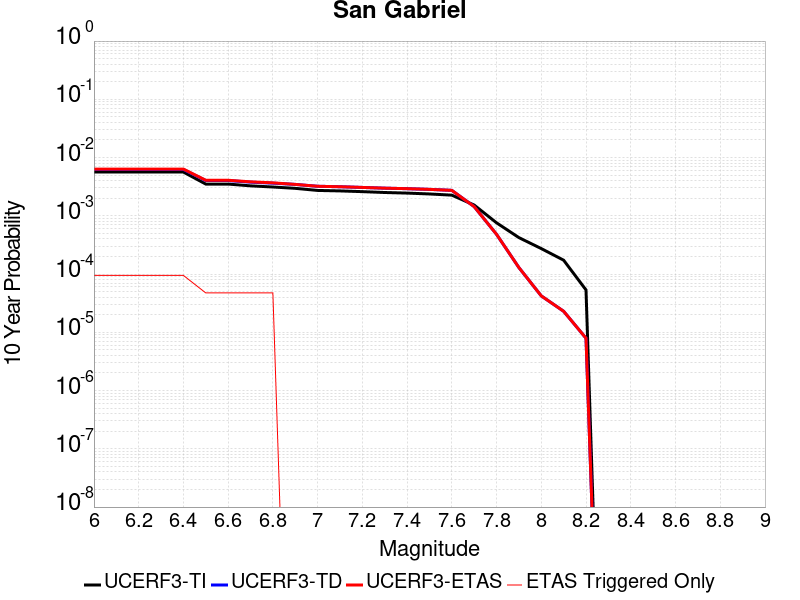 |

| Magnitude | 1 wk TI Prob | 1 wk TD Prob | 1 wk ETAS Prob | 1 wk ETAS/TD Gain | 1 wk ETAS Triggered Only | 1 mo TI Prob | 1 mo TD Prob | 1 mo ETAS Prob | 1 mo ETAS/TD Gain | 1 mo ETAS Triggered Only | 1 yr TI Prob | 1 yr TD Prob | 1 yr ETAS Prob | 1 yr ETAS/TD Gain | 1 yr ETAS Triggered Only | 10 yr TI Prob | 10 yr TD Prob | 10 yr ETAS Prob | 10 yr ETAS/TD Gain | 10 yr ETAS Triggered Only |
|-----|-----|-----|-----|-----|-----|-----|-----|-----|-----|-----|-----|-----|-----|-----|-----|-----|-----|-----|-----|-----|
| 6.0 | 1.083775E-5 | 1.19851875E-5 | 5.4512533E-5 | 4.5483255 | 4.2527856E-5 | 4.6446676E-5 | 5.1364143E-5 | 9.3889816E-5 | 1.8279253 | 4.2527856E-5 | 5.653415E-4 | 6.251903E-4 | 7.1019283E-4 | 1.1359626 | 8.505571E-5 | 0.0056390543 | 0.006246409 | 0.0063309334 | 1.0135317 | 8.505571E-5 |
| 6.1 | 1.083775E-5 | 1.19851875E-5 | 5.4512533E-5 | 4.5483255 | 4.2527856E-5 | 4.6446676E-5 | 5.1364143E-5 | 9.3889816E-5 | 1.8279253 | 4.2527856E-5 | 5.653415E-4 | 6.251903E-4 | 7.1019283E-4 | 1.1359626 | 8.505571E-5 | 0.0056390543 | 0.006246409 | 0.0063309334 | 1.0135317 | 8.505571E-5 |
| 6.2 | 1.083775E-5 | 1.19851875E-5 | 5.4512533E-5 | 4.5483255 | 4.2527856E-5 | 4.6446676E-5 | 5.1364143E-5 | 9.3889816E-5 | 1.8279253 | 4.2527856E-5 | 5.653415E-4 | 6.251903E-4 | 7.1019283E-4 | 1.1359626 | 8.505571E-5 | 0.0056390543 | 0.006246409 | 0.0063309334 | 1.0135317 | 8.505571E-5 |
| 6.3 | 1.083775E-5 | 1.19851875E-5 | 5.4512533E-5 | 4.5483255 | 4.2527856E-5 | 4.6446676E-5 | 5.1364143E-5 | 9.3889816E-5 | 1.8279253 | 4.2527856E-5 | 5.653415E-4 | 6.251903E-4 | 7.1019283E-4 | 1.1359626 | 8.505571E-5 | 0.0056390543 | 0.006246409 | 0.0063309334 | 1.0135317 | 8.505571E-5 |
| 6.4 | 1.083775E-5 | 1.19851875E-5 | 5.4512533E-5 | 4.5483255 | 4.2527856E-5 | 4.6446676E-5 | 5.1364143E-5 | 9.3889816E-5 | 1.8279253 | 4.2527856E-5 | 5.653415E-4 | 6.251903E-4 | 7.1019283E-4 | 1.1359626 | 8.505571E-5 | 0.0056390543 | 0.006246409 | 0.0063309334 | 1.0135317 | 8.505571E-5 |
| 6.5 | 6.7317824E-6 | 7.716944E-6 | 7.716944E-6 | 1.0 | 0.0 | 2.8850178E-5 | 3.3072207E-5 | 3.3072207E-5 | 1.0 | 0.0 | 3.511943E-4 | 4.0258077E-4 | 4.4509151E-4 | 1.1055956 | 4.2527856E-5 | 0.003506398 | 0.0040296097 | 0.0040719663 | 1.0105113 | 4.2527856E-5 |
| 6.6 | 6.7317824E-6 | 7.716944E-6 | 7.716944E-6 | 1.0 | 0.0 | 2.8850178E-5 | 3.3072207E-5 | 3.3072207E-5 | 1.0 | 0.0 | 3.511943E-4 | 4.0258077E-4 | 4.4509151E-4 | 1.1055956 | 4.2527856E-5 | 0.003506398 | 0.0040296097 | 0.0040719663 | 1.0105113 | 4.2527856E-5 |
| 6.7 | 6.274881E-6 | 7.2458647E-6 | 7.2458647E-6 | 1.0 | 0.0 | 2.6892068E-5 | 3.1053343E-5 | 3.1053343E-5 | 1.0 | 0.0 | 3.2736175E-4 | 3.780098E-4 | 4.205216E-4 | 1.1124622 | 4.2527856E-5 | 0.0032687993 | 0.0037847564 | 0.0038271232 | 1.0111941 | 4.2527856E-5 |
| 6.8 | 5.996209E-6 | 6.958585E-6 | 6.958585E-6 | 1.0 | 0.0 | 2.5697784E-5 | 2.9822171E-5 | 2.9822171E-5 | 1.0 | 0.0 | 3.128256E-4 | 3.6302538E-4 | 4.055378E-4 | 1.117106 | 4.2527856E-5 | 0.003123856 | 0.0036354093 | 0.0036777826 | 1.0116557 | 4.2527856E-5 |
| 6.9 | 5.686331E-6 | 6.6236316E-6 | 6.6236316E-6 | 1.0 | 0.0 | 2.4369761E-5 | 2.8386688E-5 | 2.8386688E-5 | 1.0 | 0.0 | 2.9666146E-4 | 3.4555403E-4 | 3.4555403E-4 | 1.0 | 0.0 | 0.0029626573 | 0.0034612515 | 0.0034612515 | 1.0 | 0.0 |
| 7.0 | 5.2329838E-6 | 6.147514E-6 | 6.147514E-6 | 1.0 | 0.0 | 2.242688E-5 | 2.6346226E-5 | 2.6346226E-5 | 1.0 | 0.0 | 2.7301308E-4 | 3.2071886E-4 | 3.2071886E-4 | 1.0 | 0.0 | 0.002726779 | 0.0032136322 | 0.0032136322 | 1.0 | 0.0 |
| 7.1 | 5.135671E-6 | 6.03764E-6 | 6.03764E-6 | 1.0 | 0.0 | 2.2009834E-5 | 2.5875348E-5 | 2.5875348E-5 | 1.0 | 0.0 | 2.6793676E-4 | 3.1498758E-4 | 3.1498758E-4 | 1.0 | 0.0 | 0.0026761394 | 0.0031564834 | 0.0031564834 | 1.0 | 0.0 |
| 7.2 | 4.989062E-6 | 5.87102E-6 | 5.87102E-6 | 1.0 | 0.0 | 2.1381518E-5 | 2.5161276E-5 | 2.5161276E-5 | 1.0 | 0.0 | 2.6028889E-4 | 3.0629625E-4 | 3.0629625E-4 | 1.0 | 0.0 | 0.0025998424 | 0.003069813 | 0.003069813 | 1.0 | 0.0 |
| 7.3 | 4.8219395E-6 | 5.702574E-6 | 5.702574E-6 | 1.0 | 0.0 | 2.0665291E-5 | 2.443938E-5 | 2.443938E-5 | 1.0 | 0.0 | 2.5157086E-4 | 2.9750957E-4 | 2.9750957E-4 | 1.0 | 0.0 | 0.0025128627 | 0.0029821852 | 0.0029821852 | 1.0 | 0.0 |
| 7.4 | 4.7118383E-6 | 5.5911332E-6 | 5.5911332E-6 | 1.0 | 0.0 | 2.0193436E-5 | 2.3961782E-5 | 2.3961782E-5 | 1.0 | 0.0 | 2.4582737E-4 | 2.916964E-4 | 2.916964E-4 | 1.0 | 0.0 | 0.002455556 | 0.0029242067 | 0.0029242067 | 1.0 | 0.0 |
| 7.5 | 4.5506545E-6 | 5.4365014E-6 | 5.4365014E-6 | 1.0 | 0.0 | 1.9502659E-5 | 2.3299088E-5 | 2.3299088E-5 | 1.0 | 0.0 | 2.37419E-4 | 2.8363022E-4 | 2.8363022E-4 | 1.0 | 0.0 | 0.002371655 | 0.002843753 | 0.002843753 | 1.0 | 0.0 |
| 7.6 | 4.343636E-6 | 5.2293817E-6 | 5.2293817E-6 | 1.0 | 0.0 | 1.861545E-5 | 2.2411448E-5 | 2.2411448E-5 | 1.0 | 0.0 | 2.2661954E-4 | 2.7282597E-4 | 2.7282597E-4 | 1.0 | 0.0 | 0.0022638857 | 0.0027359722 | 0.0027359722 | 1.0 | 0.0 |
| 7.7 | 2.936235E-6 | 2.7440458E-6 | 2.7440458E-6 | 1.0 | 0.0 | 1.2583803E-5 | 1.1760143E-5 | 1.1760143E-5 | 1.0 | 0.0 | 1.5319703E-4 | 1.4317037E-4 | 1.4317037E-4 | 1.0 | 0.0 | 0.0015309147 | 0.0014380751 | 0.0014380751 | 1.0 | 0.0 |
| 7.8 | 1.4541639E-6 | 9.1237047E-7 | 9.1237047E-7 | 1.0 | 0.0 | 6.232116E-6 | 3.9101533E-6 | 3.9101533E-6 | 1.0 | 0.0 | 7.587337E-5 | 4.7605077E-5 | 4.7605077E-5 | 1.0 | 0.0 | 7.584747E-4 | 4.8085177E-4 | 4.8085177E-4 | 1.0 | 0.0 |
| 7.9 | 8.098958E-7 | 2.41753E-7 | 2.41753E-7 | 1.0 | 0.0 | 3.4709774E-6 | 1.0360839E-6 | 1.0360839E-6 | 1.0 | 0.0 | 4.225833E-5 | 1.2614248E-5 | 1.2614248E-5 | 1.0 | 0.0 | 4.2250296E-4 | 1.2921814E-4 | 1.2921814E-4 | 1.0 | 0.0 |
| 8.0 | 5.2473234E-7 | 7.6792055E-8 | 7.6792055E-8 | 1.0 | 0.0 | 2.248851E-6 | 3.2910876E-7 | 3.2910876E-7 | 1.0 | 0.0 | 2.7379416E-5 | 4.0068917E-6 | 4.0068917E-6 | 1.0 | 0.0 | 2.7376044E-4 | 4.21918E-5 | 4.21918E-5 | 1.0 | 0.0 |
| 8.1 | 3.3162388E-7 | 4.1496126E-8 | 4.1496126E-8 | 1.0 | 0.0 | 1.4212444E-6 | 1.7784053E-7 | 1.7784053E-7 | 1.0 | 0.0 | 1.7303513E-5 | 2.1652063E-6 | 2.1652063E-6 | 1.0 | 0.0 | 1.7302166E-4 | 2.2965523E-5 | 2.2965523E-5 | 1.0 | 0.0 |
| 8.2 | 1.0235345E-7 | 1.4043474E-8 | 1.4043474E-8 | 1.0 | 0.0 | 4.3865757E-7 | 6.0186316E-8 | 6.0186316E-8 | 1.0 | 0.0 | 5.340643E-6 | 7.327681E-7 | 7.327681E-7 | 1.0 | 0.0 | 5.3405143E-5 | 7.9273705E-6 | 7.9273705E-6 | 1.0 | 0.0 |

## White Mountains
*[(top)](#table-of-contents)*

| 1 Week | 1 Month | 1 Year | 10 Year |
|-----|-----|-----|-----|
|  |  | 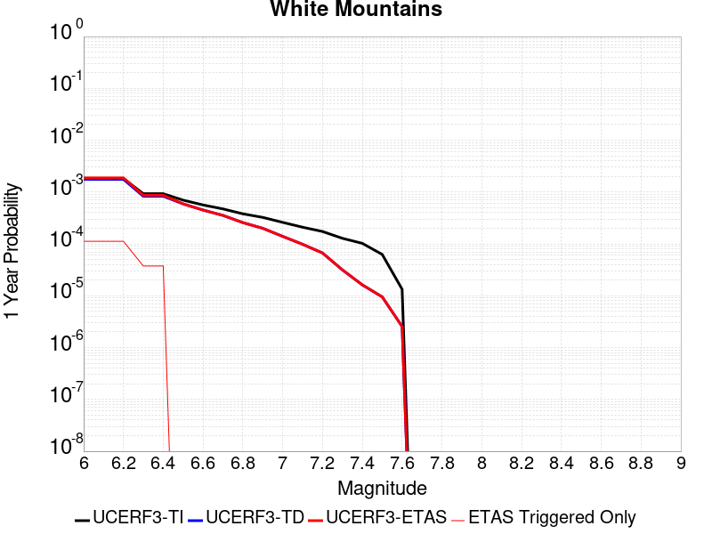 | 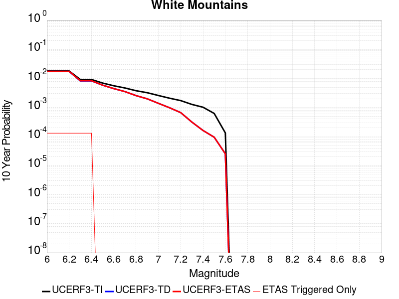 |

| Magnitude | 1 wk TI Prob | 1 wk TD Prob | 1 wk ETAS Prob | 1 wk ETAS/TD Gain | 1 wk ETAS Triggered Only | 1 mo TI Prob | 1 mo TD Prob | 1 mo ETAS Prob | 1 mo ETAS/TD Gain | 1 mo ETAS Triggered Only | 1 yr TI Prob | 1 yr TD Prob | 1 yr ETAS Prob | 1 yr ETAS/TD Gain | 1 yr ETAS Triggered Only | 10 yr TI Prob | 10 yr TD Prob | 10 yr ETAS Prob | 10 yr ETAS/TD Gain | 10 yr ETAS Triggered Only |
|-----|-----|-----|-----|-----|-----|-----|-----|-----|-----|-----|-----|-----|-----|-----|-----|-----|-----|-----|-----|-----|
| 6.0 | 3.503579E-5 | 3.378405E-5 | 3.378405E-5 | 1.0 | 0.0 | 1.5014476E-4 | 1.4478143E-4 | 1.4478143E-4 | 1.0 | 0.0 | 0.0018264796 | 0.0017614096 | 0.0018463155 | 1.0482033 | 8.505571E-5 | 0.018115403 | 0.017486818 | 0.017570388 | 1.004779 | 8.505571E-5 |
| 6.1 | 3.503579E-5 | 3.378405E-5 | 3.378405E-5 | 1.0 | 0.0 | 1.5014476E-4 | 1.4478143E-4 | 1.4478143E-4 | 1.0 | 0.0 | 0.0018264796 | 0.0017614096 | 0.0018463155 | 1.0482033 | 8.505571E-5 | 0.018115403 | 0.017486818 | 0.017570388 | 1.004779 | 8.505571E-5 |
| 6.2 | 3.503579E-5 | 3.378405E-5 | 3.378405E-5 | 1.0 | 0.0 | 1.5014476E-4 | 1.4478143E-4 | 1.4478143E-4 | 1.0 | 0.0 | 0.0018264796 | 0.0017614096 | 0.0018463155 | 1.0482033 | 8.505571E-5 | 0.018115403 | 0.017486818 | 0.017570388 | 1.004779 | 8.505571E-5 |
| 6.3 | 1.7818425E-5 | 1.5916074E-5 | 1.5916074E-5 | 1.0 | 0.0 | 7.636245E-5 | 6.821004E-5 | 6.821004E-5 | 1.0 | 0.0 | 9.293162E-4 | 8.301551E-4 | 8.726477E-4 | 1.0511863 | 4.2527856E-5 | 0.009254395 | 0.008271999 | 0.008314175 | 1.0050987 | 4.2527856E-5 |
| 6.4 | 1.7818425E-5 | 1.5916074E-5 | 1.5916074E-5 | 1.0 | 0.0 | 7.636245E-5 | 6.821004E-5 | 6.821004E-5 | 1.0 | 0.0 | 9.293162E-4 | 8.301551E-4 | 8.726477E-4 | 1.0511863 | 4.2527856E-5 | 0.009254395 | 0.008271999 | 0.008314175 | 1.0050987 | 4.2527856E-5 |
| 6.5 | 1.3397557E-5 | 1.13362685E-5 | 1.13362685E-5 | 1.0 | 0.0 | 5.741684E-5 | 4.858314E-5 | 4.858314E-5 | 1.0 | 0.0 | 6.988258E-4 | 5.913462E-4 | 5.913462E-4 | 1.0 | 0.0 | 0.006966323 | 0.005898432 | 0.005898432 | 1.0 | 0.0 |
| 6.6 | 1.0818695E-5 | 8.625366E-6 | 8.625366E-6 | 1.0 | 0.0 | 4.6365014E-5 | 3.6965357E-5 | 3.6965357E-5 | 1.0 | 0.0 | 5.6434784E-4 | 4.4996463E-4 | 4.4996463E-4 | 1.0 | 0.0 | 0.005629168 | 0.004490972 | 0.004490972 | 1.0 | 0.0 |
| 6.7 | 9.067908E-6 | 6.802442E-6 | 6.802442E-6 | 1.0 | 0.0 | 3.8861883E-5 | 2.9153016E-5 | 2.9153016E-5 | 1.0 | 0.0 | 4.7304068E-4 | 3.5488335E-4 | 3.5488335E-4 | 1.0 | 0.0 | 0.00472035 | 0.0035434833 | 0.0035434833 | 1.0 | 0.0 |
| 6.8 | 7.295947E-6 | 4.936391E-6 | 4.936391E-6 | 1.0 | 0.0 | 3.126797E-5 | 2.1155796E-5 | 2.1155796E-5 | 1.0 | 0.0 | 3.8062103E-4 | 2.575425E-4 | 2.575425E-4 | 1.0 | 0.0 | 0.0037996976 | 0.0025725532 | 0.0025725532 | 1.0 | 0.0 |
| 6.9 | 6.2243444E-6 | 3.832213E-6 | 3.832213E-6 | 1.0 | 0.0 | 2.6675489E-5 | 1.642367E-5 | 1.642367E-5 | 1.0 | 0.0 | 3.2472567E-4 | 1.9994036E-4 | 1.9994036E-4 | 1.0 | 0.0 | 0.0032425157 | 0.0019976576 | 0.0019976576 | 1.0 | 0.0 |
| 7.0 | 4.9878413E-6 | 2.6795342E-6 | 2.6795342E-6 | 1.0 | 0.0 | 2.1376287E-5 | 1.14836685E-5 | 1.14836685E-5 | 1.0 | 0.0 | 2.602252E-4 | 1.3980496E-4 | 1.3980496E-4 | 1.0 | 0.0 | 0.002599207 | 0.0013971963 | 0.0013971963 | 1.0 | 0.0 |
| 7.1 | 4.0252844E-6 | 1.8857575E-6 | 1.8857575E-6 | 1.0 | 0.0 | 1.7251105E-5 | 8.081794E-6 | 8.081794E-6 | 1.0 | 0.0 | 2.1001195E-4 | 9.8391516E-5 | 9.8391516E-5 | 1.0 | 0.0 | 0.0020981359 | 9.834924E-4 | 9.834924E-4 | 1.0 | 0.0 |
| 7.2 | 3.3284066E-6 | 1.281964E-6 | 1.281964E-6 | 1.0 | 0.0 | 1.4264522E-5 | 5.494121E-6 | 5.494121E-6 | 1.0 | 0.0 | 1.736567E-4 | 6.688897E-5 | 6.688897E-5 | 1.0 | 0.0 | 0.0017352107 | 6.6869846E-4 | 6.6869846E-4 | 1.0 | 0.0 |
| 7.3 | 2.458226E-6 | 6.05722E-7 | 6.05722E-7 | 1.0 | 0.0 | 1.0535211E-5 | 2.5959491E-6 | 2.5959491E-6 | 1.0 | 0.0 | 1.2825865E-4 | 3.1605257E-5 | 3.1605257E-5 | 1.0 | 0.0 | 0.0012818464 | 3.160114E-4 | 3.160114E-4 | 1.0 | 0.0 |
| 7.4 | 1.965953E-6 | 3.1089303E-7 | 3.1089303E-7 | 1.0 | 0.0 | 8.425486E-6 | 1.332398E-6 | 1.332398E-6 | 1.0 | 0.0 | 1.0257547E-4 | 1.6221828E-5 | 1.6221828E-5 | 1.0 | 0.0 | 0.0010252813 | 1.6220656E-4 | 1.6220656E-4 | 1.0 | 0.0 |
| 7.5 | 1.2014192E-6 | 1.8244253E-7 | 1.8244253E-7 | 1.0 | 0.0 | 5.148929E-6 | 7.8189635E-7 | 7.8189635E-7 | 1.0 | 0.0 | 6.2686406E-5 | 9.519547E-6 | 9.519547E-6 | 1.0 | 0.0 | 6.266873E-4 | 9.519148E-5 | 9.519148E-5 | 1.0 | 0.0 |
| 7.6 | 2.5612175E-7 | 4.8946475E-8 | 4.8946475E-8 | 1.0 | 0.0 | 1.0976642E-6 | 2.0977059E-7 | 2.0977059E-7 | 1.0 | 0.0 | 1.3363979E-5 | 2.5539543E-6 | 2.5539543E-6 | 1.0 | 0.0 | 1.3363175E-4 | 2.5539286E-5 | 2.5539286E-5 | 1.0 | 0.0 |

## Ortigalita (South)
*[(top)](#table-of-contents)*

| 1 Week | 1 Month | 1 Year | 10 Year |
|-----|-----|-----|-----|
| 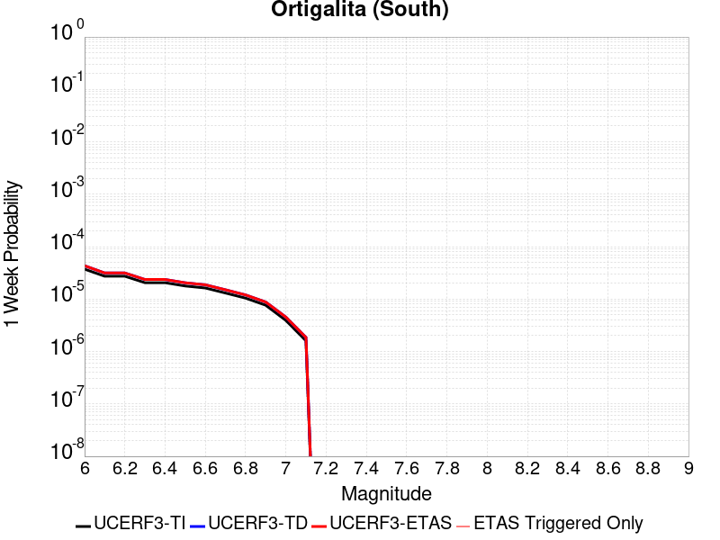 | 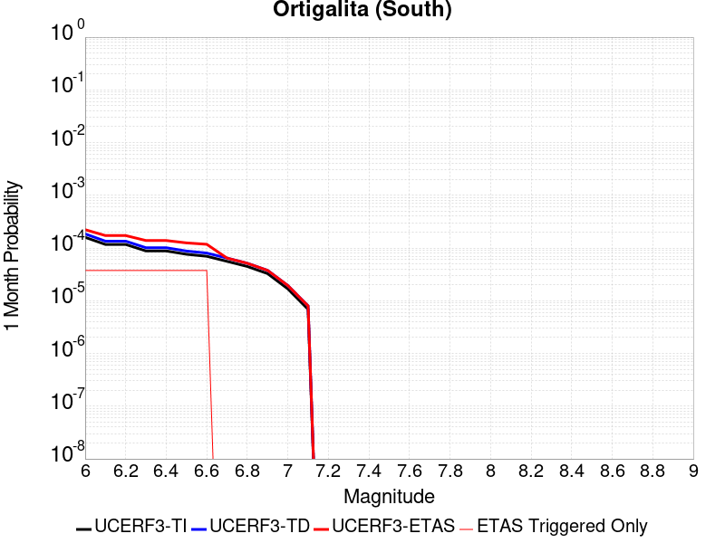 | 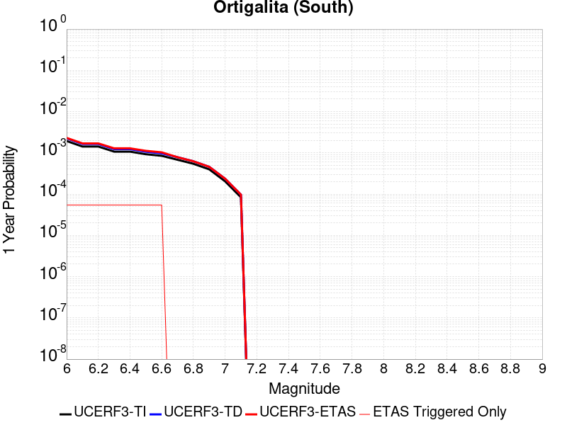 | 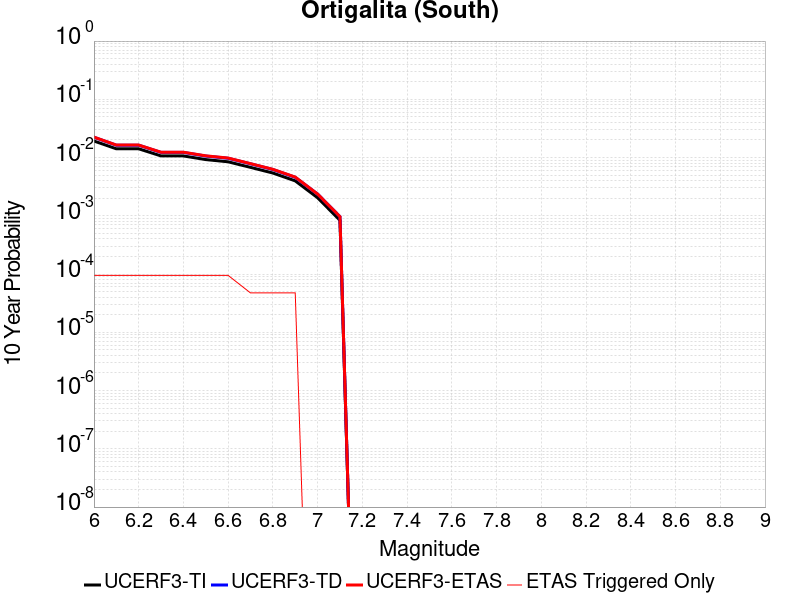 |

| Magnitude | 1 wk TI Prob | 1 wk TD Prob | 1 wk ETAS Prob | 1 wk ETAS/TD Gain | 1 wk ETAS Triggered Only | 1 mo TI Prob | 1 mo TD Prob | 1 mo ETAS Prob | 1 mo ETAS/TD Gain | 1 mo ETAS Triggered Only | 1 yr TI Prob | 1 yr TD Prob | 1 yr ETAS Prob | 1 yr ETAS/TD Gain | 1 yr ETAS Triggered Only | 10 yr TI Prob | 10 yr TD Prob | 10 yr ETAS Prob | 10 yr ETAS/TD Gain | 10 yr ETAS Triggered Only |
|-----|-----|-----|-----|-----|-----|-----|-----|-----|-----|-----|-----|-----|-----|-----|-----|-----|-----|-----|-----|-----|
| 6.0 | 3.72394E-5 | 4.325562E-5 | 4.325562E-5 | 1.0 | 0.0 | 1.5958765E-4 | 1.8536893E-4 | 2.278889E-4 | 1.2293802 | 4.2527856E-5 | 0.0019412481 | 0.0022546875 | 0.0023395515 | 1.0376389 | 8.505571E-5 | 0.019243775 | 0.022334497 | 0.022417653 | 1.0037233 | 8.505571E-5 |
| 6.1 | 2.7299884E-5 | 3.149204E-5 | 3.149204E-5 | 1.0 | 0.0 | 1.16994255E-4 | 1.3495922E-4 | 1.7748134E-4 | 1.3150738 | 4.2527856E-5 | 0.0014234743 | 0.0016419457 | 0.0017268617 | 1.0517167 | 8.505571E-5 | 0.014143906 | 0.01630407 | 0.01638774 | 1.0051318 | 8.505571E-5 |
| 6.2 | 2.7299884E-5 | 3.149204E-5 | 3.149204E-5 | 1.0 | 0.0 | 1.16994255E-4 | 1.3495922E-4 | 1.7748134E-4 | 1.3150738 | 4.2527856E-5 | 0.0014234743 | 0.0016419457 | 0.0017268617 | 1.0517167 | 8.505571E-5 | 0.014143906 | 0.01630407 | 0.01638774 | 1.0051318 | 8.505571E-5 |
| 6.3 | 2.0546433E-5 | 2.363145E-5 | 2.363145E-5 | 1.0 | 0.0 | 8.805317E-5 | 1.0127382E-4 | 1.4379737E-4 | 1.4198868 | 4.2527856E-5 | 0.00107152 | 0.0012323303 | 0.0013172812 | 1.0689352 | 8.505571E-5 | 0.010663681 | 0.01225703 | 0.012341043 | 1.0068543 | 8.505571E-5 |
| 6.4 | 2.0546433E-5 | 2.363145E-5 | 2.363145E-5 | 1.0 | 0.0 | 8.805317E-5 | 1.0127382E-4 | 1.4379737E-4 | 1.4198868 | 4.2527856E-5 | 0.00107152 | 0.0012323303 | 0.0013172812 | 1.0689352 | 8.505571E-5 | 0.010663681 | 0.01225703 | 0.012341043 | 1.0068543 | 8.505571E-5 |
| 6.5 | 1.7779594E-5 | 2.0446974E-5 | 2.0446974E-5 | 1.0 | 0.0 | 7.619603E-5 | 8.762702E-5 | 1.3015115E-4 | 1.4852855 | 4.2527856E-5 | 9.272918E-4 | 0.0010663504 | 0.0011513154 | 1.0796783 | 8.505571E-5 | 0.009234319 | 0.010613803 | 0.010697956 | 1.0079286 | 8.505571E-5 |
| 6.6 | 1.6272212E-5 | 1.8714967E-5 | 1.8714967E-5 | 1.0 | 0.0 | 6.973618E-5 | 8.0204605E-5 | 1.2272905E-4 | 1.5301995 | 4.2527856E-5 | 8.487073E-4 | 9.760658E-4 | 0.0010610385 | 1.0870563 | 8.505571E-5 | 0.008454733 | 0.009719091 | 0.009803319 | 1.0086664 | 8.505571E-5 |
| 6.7 | 1.3051484E-5 | 1.5038758E-5 | 1.5038758E-5 | 1.0 | 0.0 | 5.593373E-5 | 6.445028E-5 | 6.445028E-5 | 1.0 | 0.0 | 6.807804E-4 | 7.844092E-4 | 8.269037E-4 | 1.054174 | 4.2527856E-5 | 0.006786986 | 0.007817388 | 0.007859583 | 1.0053977 | 4.2527856E-5 |
| 6.8 | 1.04277415E-5 | 1.1987235E-5 | 1.1987235E-5 | 1.0 | 0.0 | 4.4689557E-5 | 5.1372896E-5 | 5.1372896E-5 | 1.0 | 0.0 | 5.439595E-4 | 6.2529295E-4 | 6.677942E-4 | 1.0679702 | 4.2527856E-5 | 0.0054262993 | 0.00623609 | 0.0062783523 | 1.006777 | 4.2527856E-5 |
| 6.9 | 7.639968E-6 | 8.791503E-6 | 8.791503E-6 | 1.0 | 0.0 | 3.274231E-5 | 3.767736E-5 | 3.767736E-5 | 1.0 | 0.0 | 3.9856473E-4 | 4.586312E-4 | 5.0113956E-4 | 1.0926852 | 4.2527856E-5 | 0.003978506 | 0.004577433 | 0.004619766 | 1.0092483 | 4.2527856E-5 |
| 7.0 | 3.919831E-6 | 4.5334014E-6 | 4.5334014E-6 | 1.0 | 0.0 | 1.679917E-5 | 1.942873E-5 | 1.942873E-5 | 1.0 | 0.0 | 2.045107E-4 | 2.3652123E-4 | 2.3652123E-4 | 1.0 | 0.0 | 0.0020432258 | 0.0023629034 | 0.0023629034 | 1.0 | 0.0 |
| 7.1 | 1.6017933E-6 | 1.8570418E-6 | 1.8570418E-6 | 1.0 | 0.0 | 6.8648105E-6 | 7.958732E-6 | 7.958732E-6 | 1.0 | 0.0 | 8.357586E-5 | 9.689432E-5 | 9.689432E-5 | 1.0 | 0.0 | 8.3544437E-4 | 9.686254E-4 | 9.686254E-4 | 1.0 | 0.0 |

## Cucamonga
*[(top)](#table-of-contents)*

| 1 Week | 1 Month | 1 Year | 10 Year |
|-----|-----|-----|-----|
| 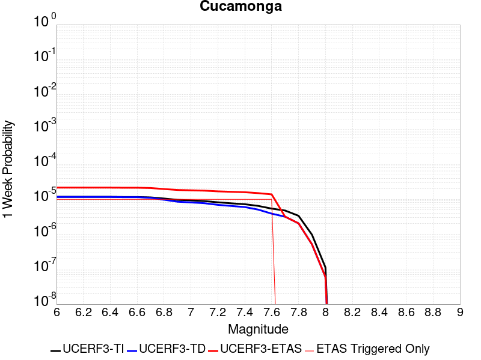 | 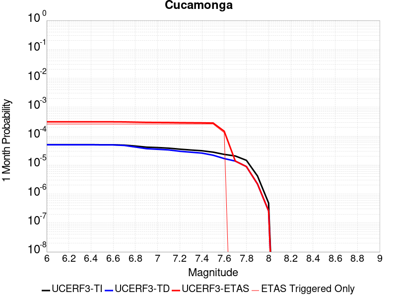 | 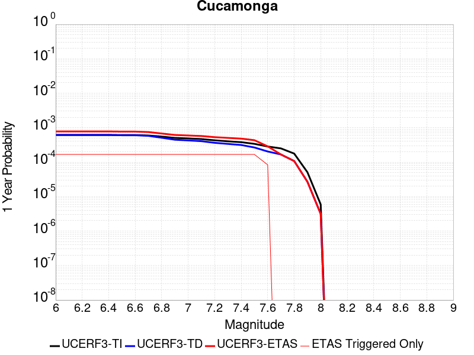 | 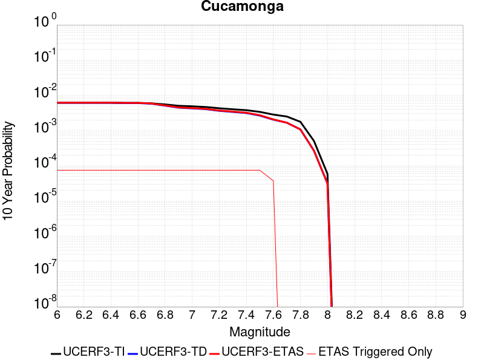 |

| Magnitude | 1 wk TI Prob | 1 wk TD Prob | 1 wk ETAS Prob | 1 wk ETAS/TD Gain | 1 wk ETAS Triggered Only | 1 mo TI Prob | 1 mo TD Prob | 1 mo ETAS Prob | 1 mo ETAS/TD Gain | 1 mo ETAS Triggered Only | 1 yr TI Prob | 1 yr TD Prob | 1 yr ETAS Prob | 1 yr ETAS/TD Gain | 1 yr ETAS Triggered Only | 10 yr TI Prob | 10 yr TD Prob | 10 yr ETAS Prob | 10 yr ETAS/TD Gain | 10 yr ETAS Triggered Only |
|-----|-----|-----|-----|-----|-----|-----|-----|-----|-----|-----|-----|-----|-----|-----|-----|-----|-----|-----|-----|-----|
| 6.0 | 1.1848348E-5 | 1.1737008E-5 | 5.4264365E-5 | 4.623356 | 4.2527856E-5 | 5.0777642E-5 | 5.030051E-5 | 1.3535195E-4 | 2.6908662 | 8.505571E-5 | 6.180424E-4 | 6.1223935E-4 | 6.9724297E-4 | 1.1388406 | 8.505571E-5 | 0.0061632637 | 0.0061067017 | 0.0061912383 | 1.0138432 | 8.505571E-5 |
| 6.1 | 1.1848348E-5 | 1.1737008E-5 | 5.4264365E-5 | 4.623356 | 4.2527856E-5 | 5.0777642E-5 | 5.030051E-5 | 1.3535195E-4 | 2.6908662 | 8.505571E-5 | 6.180424E-4 | 6.1223935E-4 | 6.9724297E-4 | 1.1388406 | 8.505571E-5 | 0.0061632637 | 0.0061067017 | 0.0061912383 | 1.0138432 | 8.505571E-5 |
| 6.2 | 1.1848348E-5 | 1.1737008E-5 | 5.4264365E-5 | 4.623356 | 4.2527856E-5 | 5.0777642E-5 | 5.030051E-5 | 1.3535195E-4 | 2.6908662 | 8.505571E-5 | 6.180424E-4 | 6.1223935E-4 | 6.9724297E-4 | 1.1388406 | 8.505571E-5 | 0.0061632637 | 0.0061067017 | 0.0061912383 | 1.0138432 | 8.505571E-5 |
| 6.3 | 1.1848348E-5 | 1.1737008E-5 | 5.4264365E-5 | 4.623356 | 4.2527856E-5 | 5.0777642E-5 | 5.030051E-5 | 1.3535195E-4 | 2.6908662 | 8.505571E-5 | 6.180424E-4 | 6.1223935E-4 | 6.9724297E-4 | 1.1388406 | 8.505571E-5 | 0.0061632637 | 0.0061067017 | 0.0061912383 | 1.0138432 | 8.505571E-5 |
| 6.4 | 1.1848348E-5 | 1.1737008E-5 | 5.4264365E-5 | 4.623356 | 4.2527856E-5 | 5.0777642E-5 | 5.030051E-5 | 1.3535195E-4 | 2.6908662 | 8.505571E-5 | 6.180424E-4 | 6.1223935E-4 | 6.9724297E-4 | 1.1388406 | 8.505571E-5 | 0.0061632637 | 0.0061067017 | 0.0061912383 | 1.0138432 | 8.505571E-5 |
| 6.5 | 1.16988695E-5 | 1.15760395E-5 | 5.4103402E-5 | 4.6737404 | 4.2527856E-5 | 5.013705E-5 | 4.9610666E-5 | 1.3466216E-4 | 2.714379 | 8.505571E-5 | 6.102476E-4 | 6.0384517E-4 | 6.8884954E-4 | 1.1407717 | 8.505571E-5 | 0.006085745 | 0.006023216 | 0.0061077597 | 1.0140363 | 8.505571E-5 |
| 6.6 | 1.16988695E-5 | 1.15760395E-5 | 5.4103402E-5 | 4.6737404 | 4.2527856E-5 | 5.013705E-5 | 4.9610666E-5 | 1.3466216E-4 | 2.714379 | 8.505571E-5 | 6.102476E-4 | 6.0384517E-4 | 6.8884954E-4 | 1.1407717 | 8.505571E-5 | 0.006085745 | 0.006023216 | 0.0061077597 | 1.0140363 | 8.505571E-5 |
| 6.7 | 1.1397107E-5 | 1.11149475E-5 | 5.3642332E-5 | 4.8261433 | 4.2527856E-5 | 4.884383E-5 | 4.7634636E-5 | 1.326863E-4 | 2.7855005 | 8.505571E-5 | 5.9451134E-4 | 5.797998E-4 | 6.648062E-4 | 1.1466134 | 8.505571E-5 | 0.005929234 | 0.0057840226 | 0.0058685867 | 1.0146202 | 8.505571E-5 |
| 6.8 | 1.058387E-5 | 9.784992E-6 | 5.2312433E-5 | 5.346191 | 4.2527856E-5 | 4.5358654E-5 | 4.193501E-5 | 1.2698716E-4 | 3.0281894 | 8.505571E-5 | 5.521017E-4 | 5.1044027E-4 | 5.9545255E-4 | 1.1665471 | 8.505571E-5 | 0.00550732 | 0.0050936877 | 0.00517831 | 1.0166132 | 8.505571E-5 |
| 6.9 | 9.690046E-6 | 8.57948E-6 | 5.110697E-5 | 5.9568844 | 4.2527856E-5 | 4.1528107E-5 | 3.6768684E-5 | 1.2182127E-4 | 3.31318 | 8.505571E-5 | 5.054874E-4 | 4.475672E-4 | 5.3258485E-4 | 1.189955 | 8.505571E-5 | 0.005043391 | 0.004467594 | 0.00455227 | 1.0189533 | 8.505571E-5 |
| 7.0 | 9.381461E-6 | 8.187101E-6 | 5.0714607E-5 | 6.1944523 | 4.2527856E-5 | 4.020564E-5 | 3.5087105E-5 | 1.2013983E-4 | 3.424045 | 8.505571E-5 | 4.893937E-4 | 4.2710215E-4 | 5.1212154E-4 | 1.199061 | 8.505571E-5 | 0.0048831734 | 0.0042637475 | 0.0043484406 | 1.0198635 | 8.505571E-5 |
| 7.1 | 8.946492E-6 | 7.781886E-6 | 5.0309412E-5 | 6.464938 | 4.2527856E-5 | 3.8341543E-5 | 3.3350516E-5 | 1.1840339E-4 | 3.5502717 | 8.505571E-5 | 4.667083E-4 | 4.0596718E-4 | 4.909884E-4 | 1.2094287 | 8.505571E-5 | 0.0046572937 | 0.004053192 | 0.004137903 | 1.0208998 | 8.505571E-5 |
| 7.2 | 8.251016E-6 | 6.9752796E-6 | 4.950284E-5 | 7.0968966 | 4.2527856E-5 | 3.5361016E-5 | 2.9893714E-5 | 1.1494688E-4 | 3.8451858 | 8.505571E-5 | 4.3043532E-4 | 3.6389544E-4 | 4.4892018E-4 | 1.2336516 | 8.505571E-5 | 0.0042960253 | 0.0036339292 | 0.0037186758 | 1.0233209 | 8.505571E-5 |
| 7.3 | 7.717881E-6 | 6.4863502E-6 | 4.9013932E-5 | 7.556473 | 4.2527856E-5 | 3.3076216E-5 | 2.7798349E-5 | 1.12851696E-4 | 4.0596547 | 8.505571E-5 | 4.026285E-4 | 3.3839257E-4 | 4.234195E-4 | 1.2512671 | 8.505571E-5 | 0.004018998 | 0.00337971 | 0.0034644783 | 1.0250815 | 8.505571E-5 |
| 7.4 | 7.275623E-6 | 6.031997E-6 | 4.8559596E-5 | 8.050335 | 4.2527856E-5 | 3.118087E-5 | 2.585116E-5 | 1.1090467E-4 | 4.2901235 | 8.505571E-5 | 3.7956095E-4 | 3.1469265E-4 | 3.997216E-4 | 1.2701968 | 8.505571E-5 | 0.0037891332 | 0.0031434062 | 0.0032281945 | 1.0269734 | 8.505571E-5 |
| 7.5 | 6.5109502E-6 | 5.1006014E-6 | 4.762824E-5 | 9.3377695 | 4.2527856E-5 | 2.7903774E-5 | 2.1859538E-5 | 1.0691339E-4 | 4.8909264 | 8.505571E-5 | 3.3967546E-4 | 2.661075E-4 | 3.511406E-4 | 1.3195441 | 8.505571E-5 | 0.0033915674 | 0.002658813 | 0.0027436425 | 1.031905 | 8.505571E-5 |
| 7.6 | 5.4495326E-6 | 3.90857E-6 | 4.643626E-5 | 11.880626 | 4.2527856E-5 | 2.335493E-5 | 1.6750908E-5 | 5.927805E-5 | 3.5387964 | 4.2527856E-5 | 2.8430918E-4 | 2.0392328E-4 | 2.4644245E-4 | 1.2085057 | 4.2527856E-5 | 0.0028394572 | 0.002038282 | 0.0020807234 | 1.020822 | 4.2527856E-5 |
| 7.7 | 4.7997164E-6 | 3.2002547E-6 | 3.2002547E-6 | 1.0 | 0.0 | 2.057005E-5 | 1.3715306E-5 | 1.3715306E-5 | 1.0 | 0.0 | 2.504116E-4 | 1.6697108E-4 | 1.6697108E-4 | 1.0 | 0.0 | 0.002501296 | 0.0016693877 | 0.0016693877 | 1.0 | 0.0 |
| 7.8 | 3.3941733E-6 | 2.0641899E-6 | 2.0641899E-6 | 1.0 | 0.0 | 1.4546376E-5 | 8.846498E-6 | 8.846498E-6 | 1.0 | 0.0 | 1.7708774E-4 | 1.07700806E-4 | 1.07700806E-4 | 1.0 | 0.0 | 0.0017694668 | 0.001076723 | 0.001076723 | 1.0 | 0.0 |
| 7.9 | 9.750552E-7 | 5.155946E-7 | 5.155946E-7 | 1.0 | 0.0 | 4.178801E-6 | 2.2096892E-6 | 2.2096892E-6 | 1.0 | 0.0 | 5.0875715E-5 | 2.690264E-5 | 2.690264E-5 | 1.0 | 0.0 | 5.086407E-4 | 2.6899425E-4 | 2.6899425E-4 | 1.0 | 0.0 |
| 8.0 | 1.133857E-7 | 6.053707E-8 | 6.053707E-8 | 1.0 | 0.0 | 4.8593864E-7 | 2.5944456E-7 | 2.5944456E-7 | 1.0 | 0.0 | 5.9162867E-6 | 3.158733E-6 | 3.158733E-6 | 1.0 | 0.0 | 5.916129E-5 | 3.1586897E-5 | 3.1586897E-5 | 1.0 | 0.0 |

## North Frontal  (West)
*[(top)](#table-of-contents)*

| 1 Week | 1 Month | 1 Year | 10 Year |
|-----|-----|-----|-----|
| 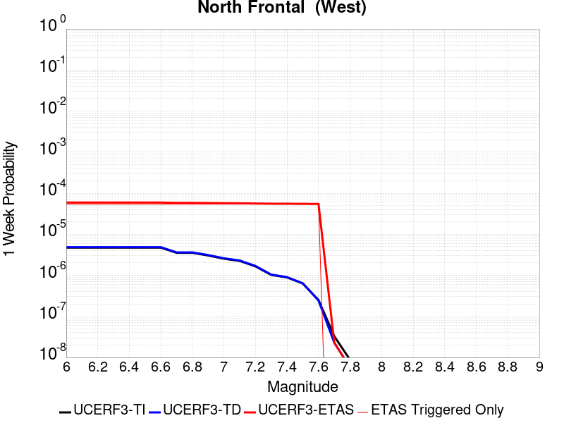 | 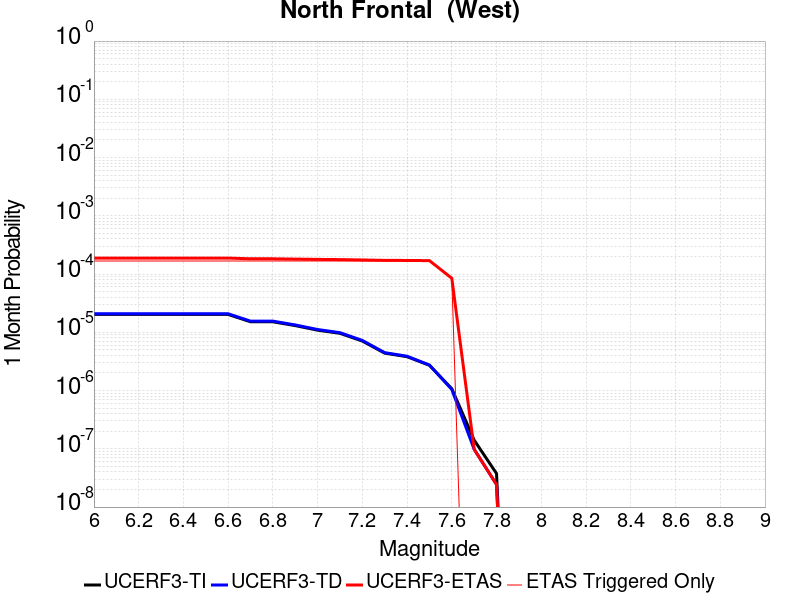 | 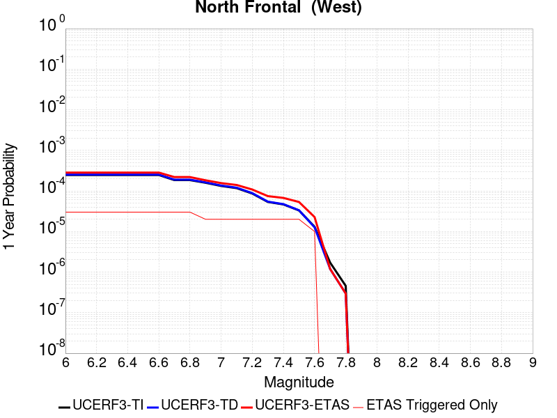 | 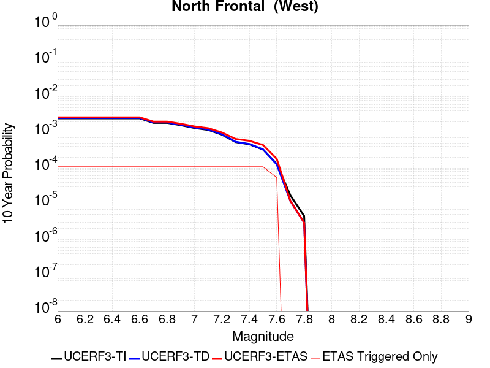 |

| Magnitude | 1 wk TI Prob | 1 wk TD Prob | 1 wk ETAS Prob | 1 wk ETAS/TD Gain | 1 wk ETAS Triggered Only | 1 mo TI Prob | 1 mo TD Prob | 1 mo ETAS Prob | 1 mo ETAS/TD Gain | 1 mo ETAS Triggered Only | 1 yr TI Prob | 1 yr TD Prob | 1 yr ETAS Prob | 1 yr ETAS/TD Gain | 1 yr ETAS Triggered Only | 10 yr TI Prob | 10 yr TD Prob | 10 yr ETAS Prob | 10 yr ETAS/TD Gain | 10 yr ETAS Triggered Only |
|-----|-----|-----|-----|-----|-----|-----|-----|-----|-----|-----|-----|-----|-----|-----|-----|-----|-----|-----|-----|-----|
| 6.0 | 4.7316266E-6 | 4.8526726E-6 | 4.7380323E-5 | 9.763758 | 4.2527856E-5 | 2.0278241E-5 | 2.0797012E-5 | 1.0585095E-4 | 5.08972 | 8.505571E-5 | 2.4685962E-4 | 2.5317568E-4 | 3.3820985E-4 | 1.3358703 | 8.505571E-5 | 0.0024658558 | 0.0025290183 | 0.002613859 | 1.0335468 | 8.505571E-5 |
| 6.1 | 4.7316266E-6 | 4.8526726E-6 | 4.7380323E-5 | 9.763758 | 4.2527856E-5 | 2.0278241E-5 | 2.0797012E-5 | 1.0585095E-4 | 5.08972 | 8.505571E-5 | 2.4685962E-4 | 2.5317568E-4 | 3.3820985E-4 | 1.3358703 | 8.505571E-5 | 0.0024658558 | 0.0025290183 | 0.002613859 | 1.0335468 | 8.505571E-5 |
| 6.2 | 4.7316266E-6 | 4.8526726E-6 | 4.7380323E-5 | 9.763758 | 4.2527856E-5 | 2.0278241E-5 | 2.0797012E-5 | 1.0585095E-4 | 5.08972 | 8.505571E-5 | 2.4685962E-4 | 2.5317568E-4 | 3.3820985E-4 | 1.3358703 | 8.505571E-5 | 0.0024658558 | 0.0025290183 | 0.002613859 | 1.0335468 | 8.505571E-5 |
| 6.3 | 4.7316266E-6 | 4.8526726E-6 | 4.7380323E-5 | 9.763758 | 4.2527856E-5 | 2.0278241E-5 | 2.0797012E-5 | 1.0585095E-4 | 5.08972 | 8.505571E-5 | 2.4685962E-4 | 2.5317568E-4 | 3.3820985E-4 | 1.3358703 | 8.505571E-5 | 0.0024658558 | 0.0025290183 | 0.002613859 | 1.0335468 | 8.505571E-5 |
| 6.4 | 4.7316266E-6 | 4.8526726E-6 | 4.7380323E-5 | 9.763758 | 4.2527856E-5 | 2.0278241E-5 | 2.0797012E-5 | 1.0585095E-4 | 5.08972 | 8.505571E-5 | 2.4685962E-4 | 2.5317568E-4 | 3.3820985E-4 | 1.3358703 | 8.505571E-5 | 0.0024658558 | 0.0025290183 | 0.002613859 | 1.0335468 | 8.505571E-5 |
| 6.5 | 4.7316266E-6 | 4.8526726E-6 | 4.7380323E-5 | 9.763758 | 4.2527856E-5 | 2.0278241E-5 | 2.0797012E-5 | 1.0585095E-4 | 5.08972 | 8.505571E-5 | 2.4685962E-4 | 2.5317568E-4 | 3.3820985E-4 | 1.3358703 | 8.505571E-5 | 0.0024658558 | 0.0025290183 | 0.002613859 | 1.0335468 | 8.505571E-5 |
| 6.6 | 4.7316266E-6 | 4.8526726E-6 | 4.7380323E-5 | 9.763758 | 4.2527856E-5 | 2.0278241E-5 | 2.0797012E-5 | 1.0585095E-4 | 5.08972 | 8.505571E-5 | 2.4685962E-4 | 2.5317568E-4 | 3.3820985E-4 | 1.3358703 | 8.505571E-5 | 0.0024658558 | 0.0025290183 | 0.002613859 | 1.0335468 | 8.505571E-5 |
| 6.7 | 3.5382777E-6 | 3.6308859E-6 | 4.6158588E-5 | 12.712762 | 4.2527856E-5 | 1.516396E-5 | 1.5560852E-5 | 1.0061524E-4 | 6.4659214 | 8.505571E-5 | 1.8460557E-4 | 1.8943768E-4 | 2.7447726E-4 | 1.4489055 | 8.505571E-5 | 0.0018445229 | 0.0018928389 | 0.0019777336 | 1.0448505 | 8.505571E-5 |
| 6.8 | 3.5382777E-6 | 3.6308859E-6 | 4.6158588E-5 | 12.712762 | 4.2527856E-5 | 1.516396E-5 | 1.5560852E-5 | 1.0061524E-4 | 6.4659214 | 8.505571E-5 | 1.8460557E-4 | 1.8943768E-4 | 2.7447726E-4 | 1.4489055 | 8.505571E-5 | 0.0018445229 | 0.0018928389 | 0.0019777336 | 1.0448505 | 8.505571E-5 |
| 6.9 | 3.0428037E-6 | 3.1227605E-6 | 4.5650482E-5 | 14.61863 | 4.2527856E-5 | 1.30405215E-5 | 1.33831945E-5 | 9.843777E-5 | 7.3553267 | 8.505571E-5 | 1.5875678E-4 | 1.6292889E-4 | 2.4797075E-4 | 1.5219568 | 8.505571E-5 | 0.0015864341 | 0.0016281615 | 0.0017130788 | 1.0521553 | 8.505571E-5 |
| 7.0 | 2.538778E-6 | 2.6060904E-6 | 4.5133835E-5 | 17.3186 | 4.2527856E-5 | 1.0880432E-5 | 1.1168913E-5 | 9.622367E-5 | 8.615312 | 8.505571E-5 | 1.324612E-4 | 1.3597352E-4 | 2.2101766E-4 | 1.6254464 | 8.505571E-5 | 0.0013238228 | 0.0013589499 | 0.00144389 | 1.0625043 | 8.505571E-5 |
| 7.1 | 2.2418935E-6 | 2.3012074E-6 | 4.4828965E-5 | 19.480629 | 4.2527856E-5 | 9.60808E-6 | 9.862282E-6 | 9.491715E-5 | 9.624259 | 8.505571E-5 | 1.1697209E-4 | 1.2006712E-4 | 2.0511262E-4 | 1.7083163 | 8.505571E-5 | 0.0011691054 | 0.0012000664 | 0.00128502 | 1.0707908 | 8.505571E-5 |
| 7.2 | 1.6526745E-6 | 1.6924851E-6 | 4.422027E-5 | 26.12742 | 4.2527856E-5 | 7.082872E-6 | 7.253489E-6 | 9.230858E-5 | 12.726094 | 8.505571E-5 | 8.623055E-5 | 8.8307905E-5 | 1.7335611E-4 | 1.9630871 | 8.505571E-5 | 8.61971E-4 | 8.827532E-4 | 9.677338E-4 | 1.0962677 | 8.505571E-5 |
| 7.3 | 1.0246019E-6 | 1.0442261E-6 | 4.3572036E-5 | 41.72663 | 4.2527856E-5 | 4.391144E-6 | 4.4752474E-6 | 8.953058E-5 | 20.005726 | 8.505571E-5 | 5.3460866E-5 | 5.448489E-5 | 1.3953597E-4 | 2.561003 | 8.505571E-5 | 5.344801E-4 | 5.4472685E-4 | 6.297362E-4 | 1.1560588 | 8.505571E-5 |
| 7.4 | 8.9045164E-7 | 9.0565584E-7 | 4.3433472E-5 | 47.95803 | 4.2527856E-5 | 3.8162157E-6 | 3.8813773E-6 | 8.893676E-5 | 22.913712 | 8.505571E-5 | 4.646144E-5 | 4.7254853E-5 | 1.3230655E-4 | 2.799851 | 8.505571E-5 | 4.6451724E-4 | 4.7245892E-4 | 5.5747444E-4 | 1.1799427 | 8.505571E-5 |
| 7.5 | 6.3357E-7 | 6.4027006E-7 | 4.31681E-5 | 67.42171 | 4.2527856E-5 | 2.7152971E-6 | 2.744012E-6 | 8.779949E-5 | 31.99676 | 8.505571E-5 | 3.305824E-5 | 3.34079E-5 | 1.1846077E-4 | 3.545891 | 8.505571E-5 | 3.3053322E-4 | 3.3403534E-4 | 4.1906265E-4 | 1.2545458 | 8.505571E-5 |
| 7.6 | 2.5087024E-7 | 2.4361097E-7 | 4.2771455E-5 | 175.57278 | 4.2527856E-5 | 1.0751578E-6 | 1.0440467E-6 | 4.3571858E-5 | 41.733627 | 4.2527856E-5 | 1.3089967E-5 | 1.2711216E-5 | 5.523853E-5 | 4.3456526 | 4.2527856E-5 | 1.3089196E-4 | 1.2710695E-4 | 1.696294E-4 | 1.3345407 | 4.2527856E-5 |
| 7.7 | 3.282987E-8 | 2.2874195E-8 | 2.2874195E-8 | 1.0 | 0.0 | 1.4069944E-7 | 9.803227E-8 | 9.803227E-8 | 1.0 | 0.0 | 1.7130144E-6 | 1.1935423E-6 | 1.1935423E-6 | 1.0 | 0.0 | 1.7130013E-5 | 1.1935367E-5 | 1.1935367E-5 | 1.0 | 0.0 |
| 7.8 | 8.77499E-9 | 5.6815956E-9 | 5.6815956E-9 | 1.0 | 0.0 | 3.7607098E-8 | 2.4349696E-8 | 2.4349696E-8 | 1.0 | 0.0 | 4.578663E-7 | 2.9645753E-7 | 2.9645753E-7 | 1.0 | 0.0 | 4.5786537E-6 | 2.9645726E-6 | 2.9645726E-6 | 1.0 | 0.0 |

## Pitas Point (Lower)-Montalvo
*[(top)](#table-of-contents)*

| 1 Week | 1 Month | 1 Year | 10 Year |
|-----|-----|-----|-----|
|  |  |  | 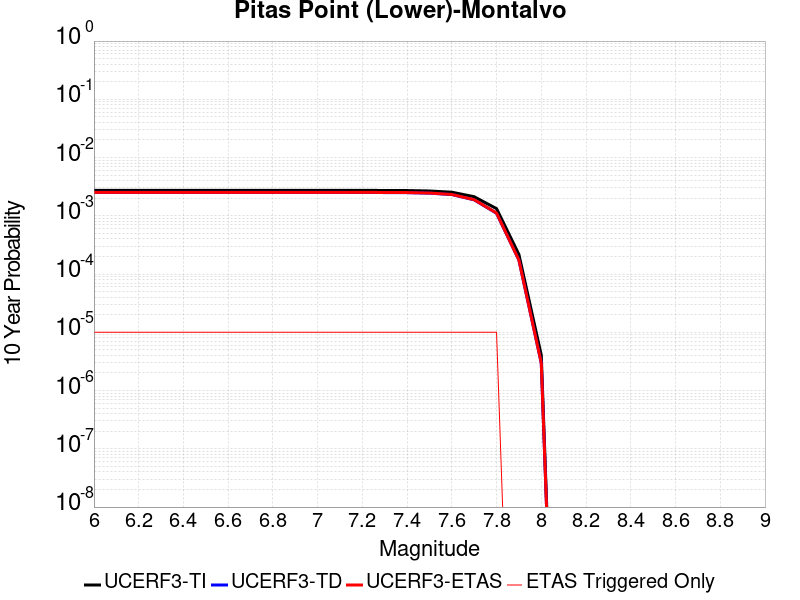 |

| Magnitude | 1 wk TI Prob | 1 wk TD Prob | 1 wk ETAS Prob | 1 wk ETAS/TD Gain | 1 wk ETAS Triggered Only | 1 mo TI Prob | 1 mo TD Prob | 1 mo ETAS Prob | 1 mo ETAS/TD Gain | 1 mo ETAS Triggered Only | 1 yr TI Prob | 1 yr TD Prob | 1 yr ETAS Prob | 1 yr ETAS/TD Gain | 1 yr ETAS Triggered Only | 10 yr TI Prob | 10 yr TD Prob | 10 yr ETAS Prob | 10 yr ETAS/TD Gain | 10 yr ETAS Triggered Only |
|-----|-----|-----|-----|-----|-----|-----|-----|-----|-----|-----|-----|-----|-----|-----|-----|-----|-----|-----|-----|-----|
| 6.0 | 5.2543637E-6 | 4.8378706E-6 | 4.8378706E-6 | 1.0 | 0.0 | 2.2518509E-5 | 2.0733567E-5 | 2.0733567E-5 | 1.0 | 0.0 | 2.7412834E-4 | 2.5240227E-4 | 2.5240227E-4 | 1.0 | 0.0 | 0.0027379042 | 0.0025211885 | 0.002563609 | 1.0168257 | 4.2527856E-5 |
| 6.1 | 5.2543637E-6 | 4.8378706E-6 | 4.8378706E-6 | 1.0 | 0.0 | 2.2518509E-5 | 2.0733567E-5 | 2.0733567E-5 | 1.0 | 0.0 | 2.7412834E-4 | 2.5240227E-4 | 2.5240227E-4 | 1.0 | 0.0 | 0.0027379042 | 0.0025211885 | 0.002563609 | 1.0168257 | 4.2527856E-5 |
| 6.2 | 5.2543637E-6 | 4.8378706E-6 | 4.8378706E-6 | 1.0 | 0.0 | 2.2518509E-5 | 2.0733567E-5 | 2.0733567E-5 | 1.0 | 0.0 | 2.7412834E-4 | 2.5240227E-4 | 2.5240227E-4 | 1.0 | 0.0 | 0.0027379042 | 0.0025211885 | 0.002563609 | 1.0168257 | 4.2527856E-5 |
| 6.3 | 5.2543637E-6 | 4.8378706E-6 | 4.8378706E-6 | 1.0 | 0.0 | 2.2518509E-5 | 2.0733567E-5 | 2.0733567E-5 | 1.0 | 0.0 | 2.7412834E-4 | 2.5240227E-4 | 2.5240227E-4 | 1.0 | 0.0 | 0.0027379042 | 0.0025211885 | 0.002563609 | 1.0168257 | 4.2527856E-5 |
| 6.4 | 5.2543637E-6 | 4.8378706E-6 | 4.8378706E-6 | 1.0 | 0.0 | 2.2518509E-5 | 2.0733567E-5 | 2.0733567E-5 | 1.0 | 0.0 | 2.7412834E-4 | 2.5240227E-4 | 2.5240227E-4 | 1.0 | 0.0 | 0.0027379042 | 0.0025211885 | 0.002563609 | 1.0168257 | 4.2527856E-5 |
| 6.5 | 5.2543637E-6 | 4.8378706E-6 | 4.8378706E-6 | 1.0 | 0.0 | 2.2518509E-5 | 2.0733567E-5 | 2.0733567E-5 | 1.0 | 0.0 | 2.7412834E-4 | 2.5240227E-4 | 2.5240227E-4 | 1.0 | 0.0 | 0.0027379042 | 0.0025211885 | 0.002563609 | 1.0168257 | 4.2527856E-5 |
| 6.6 | 5.2543637E-6 | 4.8378706E-6 | 4.8378706E-6 | 1.0 | 0.0 | 2.2518509E-5 | 2.0733567E-5 | 2.0733567E-5 | 1.0 | 0.0 | 2.7412834E-4 | 2.5240227E-4 | 2.5240227E-4 | 1.0 | 0.0 | 0.0027379042 | 0.0025211885 | 0.002563609 | 1.0168257 | 4.2527856E-5 |
| 6.7 | 5.2543637E-6 | 4.8378706E-6 | 4.8378706E-6 | 1.0 | 0.0 | 2.2518509E-5 | 2.0733567E-5 | 2.0733567E-5 | 1.0 | 0.0 | 2.7412834E-4 | 2.5240227E-4 | 2.5240227E-4 | 1.0 | 0.0 | 0.0027379042 | 0.0025211885 | 0.002563609 | 1.0168257 | 4.2527856E-5 |
| 6.8 | 5.2543637E-6 | 4.8378706E-6 | 4.8378706E-6 | 1.0 | 0.0 | 2.2518509E-5 | 2.0733567E-5 | 2.0733567E-5 | 1.0 | 0.0 | 2.7412834E-4 | 2.5240227E-4 | 2.5240227E-4 | 1.0 | 0.0 | 0.0027379042 | 0.0025211885 | 0.002563609 | 1.0168257 | 4.2527856E-5 |
| 6.9 | 5.2543637E-6 | 4.8378706E-6 | 4.8378706E-6 | 1.0 | 0.0 | 2.2518509E-5 | 2.0733567E-5 | 2.0733567E-5 | 1.0 | 0.0 | 2.7412834E-4 | 2.5240227E-4 | 2.5240227E-4 | 1.0 | 0.0 | 0.0027379042 | 0.0025211885 | 0.002563609 | 1.0168257 | 4.2527856E-5 |
| 7.0 | 5.2543637E-6 | 4.8378706E-6 | 4.8378706E-6 | 1.0 | 0.0 | 2.2518509E-5 | 2.0733567E-5 | 2.0733567E-5 | 1.0 | 0.0 | 2.7412834E-4 | 2.5240227E-4 | 2.5240227E-4 | 1.0 | 0.0 | 0.0027379042 | 0.0025211885 | 0.002563609 | 1.0168257 | 4.2527856E-5 |
| 7.1 | 5.2543637E-6 | 4.8378706E-6 | 4.8378706E-6 | 1.0 | 0.0 | 2.2518509E-5 | 2.0733567E-5 | 2.0733567E-5 | 1.0 | 0.0 | 2.7412834E-4 | 2.5240227E-4 | 2.5240227E-4 | 1.0 | 0.0 | 0.0027379042 | 0.0025211885 | 0.002563609 | 1.0168257 | 4.2527856E-5 |
| 7.2 | 5.2458695E-6 | 4.8290244E-6 | 4.8290244E-6 | 1.0 | 0.0 | 2.2482105E-5 | 2.0695656E-5 | 2.0695656E-5 | 1.0 | 0.0 | 2.7368523E-4 | 2.519408E-4 | 2.519408E-4 | 1.0 | 0.0 | 0.0027334841 | 0.0025165842 | 0.002559005 | 1.0168566 | 4.2527856E-5 |
| 7.3 | 5.22665E-6 | 4.8089414E-6 | 4.8089414E-6 | 1.0 | 0.0 | 2.2399736E-5 | 2.0609588E-5 | 2.0609588E-5 | 1.0 | 0.0 | 2.7268266E-4 | 2.5089315E-4 | 2.5089315E-4 | 1.0 | 0.0 | 0.002723483 | 0.0025061315 | 0.0025485528 | 1.016927 | 4.2527856E-5 |
| 7.4 | 5.210642E-6 | 4.792154E-6 | 4.792154E-6 | 1.0 | 0.0 | 2.233113E-5 | 2.0537642E-5 | 2.0537642E-5 | 1.0 | 0.0 | 2.718476E-4 | 2.5001742E-4 | 2.5001742E-4 | 1.0 | 0.0 | 0.002715153 | 0.0024973939 | 0.0025398156 | 1.0169864 | 4.2527856E-5 |
| 7.5 | 5.1226016E-6 | 4.7000403E-6 | 4.7000403E-6 | 1.0 | 0.0 | 2.1953823E-5 | 2.0142877E-5 | 2.0142877E-5 | 1.0 | 0.0 | 2.67255E-4 | 2.4521223E-4 | 2.4521223E-4 | 1.0 | 0.0 | 0.0026693381 | 0.0024494485 | 0.002491872 | 1.0173197 | 4.2527856E-5 |
| 7.6 | 4.8796987E-6 | 4.4449403E-6 | 4.4449403E-6 | 1.0 | 0.0 | 2.0912828E-5 | 1.9049607E-5 | 1.9049607E-5 | 1.0 | 0.0 | 2.5458392E-4 | 2.3190459E-4 | 2.3190459E-4 | 1.0 | 0.0 | 0.0025429246 | 0.0023166565 | 0.0023590857 | 1.018315 | 4.2527856E-5 |
| 7.7 | 4.0834398E-6 | 3.6091124E-6 | 3.6091124E-6 | 1.0 | 0.0 | 1.7500339E-5 | 1.5467534E-5 | 1.5467534E-5 | 1.0 | 0.0 | 2.1304579E-4 | 1.8830119E-4 | 1.8830119E-4 | 1.0 | 0.0 | 0.0021284167 | 0.00188144 | 0.0019238879 | 1.0225613 | 4.2527856E-5 |
| 7.8 | 2.5445438E-6 | 2.121228E-6 | 2.121228E-6 | 1.0 | 0.0 | 1.0905142E-5 | 9.090945E-6 | 9.090945E-6 | 1.0 | 0.0 | 1.3276201E-4 | 1.1067669E-4 | 1.1067669E-4 | 1.0 | 0.0 | 0.0013268272 | 0.0011062203 | 0.0011487012 | 1.0384017 | 4.2527856E-5 |
| 7.9 | 4.1677114E-7 | 3.3293693E-7 | 3.3293693E-7 | 1.0 | 0.0 | 1.7861609E-6 | 1.4268718E-6 | 1.4268718E-6 | 1.0 | 0.0 | 2.1746291E-5 | 1.737203E-5 | 1.737203E-5 | 1.0 | 0.0 | 2.1744163E-4 | 1.7370703E-4 | 1.7370703E-4 | 1.0 | 0.0 |
| 8.0 | 7.791402E-9 | 5.683497E-9 | 5.683497E-9 | 1.0 | 0.0 | 3.3391725E-8 | 2.4357844E-8 | 2.4357844E-8 | 1.0 | 0.0 | 4.0654416E-7 | 2.9655675E-7 | 2.9655675E-7 | 1.0 | 0.0 | 4.065434E-6 | 2.9655655E-6 | 2.9655655E-6 | 1.0 | 0.0 |

## Homestead Valley 2011
*[(top)](#table-of-contents)*

| 1 Week | 1 Month | 1 Year | 10 Year |
|-----|-----|-----|-----|
| 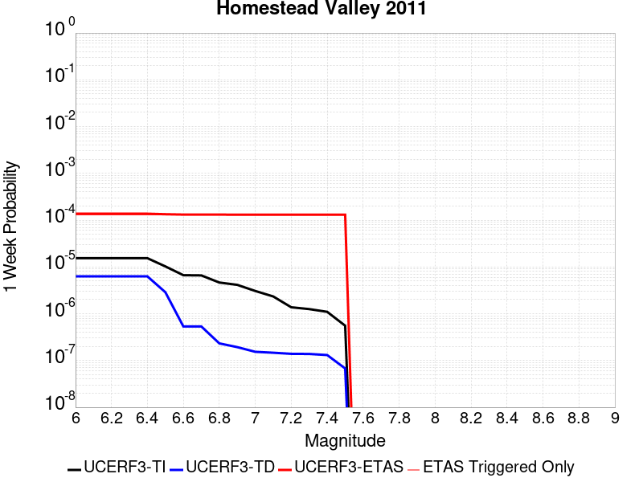 | 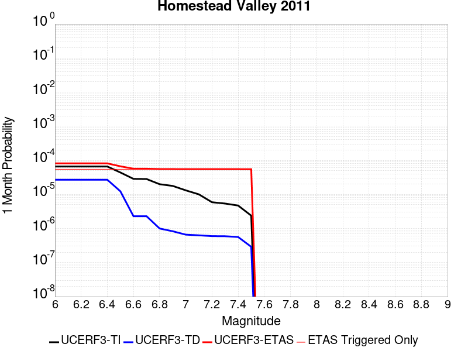 |  | 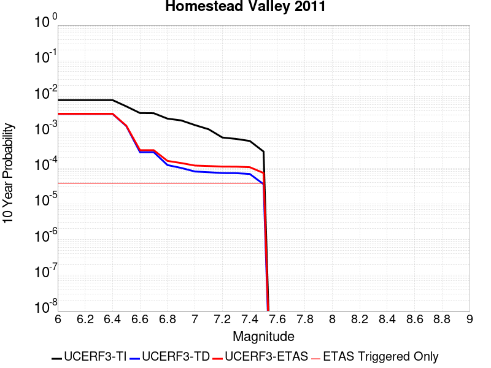 |

| Magnitude | 1 wk TI Prob | 1 wk TD Prob | 1 wk ETAS Prob | 1 wk ETAS/TD Gain | 1 wk ETAS Triggered Only | 1 mo TI Prob | 1 mo TD Prob | 1 mo ETAS Prob | 1 mo ETAS/TD Gain | 1 mo ETAS Triggered Only | 1 yr TI Prob | 1 yr TD Prob | 1 yr ETAS Prob | 1 yr ETAS/TD Gain | 1 yr ETAS Triggered Only | 10 yr TI Prob | 10 yr TD Prob | 10 yr ETAS Prob | 10 yr ETAS/TD Gain | 10 yr ETAS Triggered Only |
|-----|-----|-----|-----|-----|-----|-----|-----|-----|-----|-----|-----|-----|-----|-----|-----|-----|-----|-----|-----|-----|
| 6.0 | 1.539795E-5 | 6.286606E-6 | 4.8814196E-5 | 7.764793 | 4.2527856E-5 | 6.5989545E-5 | 2.6942436E-5 | 6.946915E-5 | 2.5784285 | 4.2527856E-5 | 8.0312655E-4 | 3.279954E-4 | 3.7050928E-4 | 1.1296175 | 4.2527856E-5 | 0.008002302 | 0.0032771337 | 0.0033195224 | 1.0129346 | 4.2527856E-5 |
| 6.1 | 1.539795E-5 | 6.286606E-6 | 4.8814196E-5 | 7.764793 | 4.2527856E-5 | 6.5989545E-5 | 2.6942436E-5 | 6.946915E-5 | 2.5784285 | 4.2527856E-5 | 8.0312655E-4 | 3.279954E-4 | 3.7050928E-4 | 1.1296175 | 4.2527856E-5 | 0.008002302 | 0.0032771337 | 0.0033195224 | 1.0129346 | 4.2527856E-5 |
| 6.2 | 1.539795E-5 | 6.286606E-6 | 4.8814196E-5 | 7.764793 | 4.2527856E-5 | 6.5989545E-5 | 2.6942436E-5 | 6.946915E-5 | 2.5784285 | 4.2527856E-5 | 8.0312655E-4 | 3.279954E-4 | 3.7050928E-4 | 1.1296175 | 4.2527856E-5 | 0.008002302 | 0.0032771337 | 0.0033195224 | 1.0129346 | 4.2527856E-5 |
| 6.3 | 1.539795E-5 | 6.286606E-6 | 4.8814196E-5 | 7.764793 | 4.2527856E-5 | 6.5989545E-5 | 2.6942436E-5 | 6.946915E-5 | 2.5784285 | 4.2527856E-5 | 8.0312655E-4 | 3.279954E-4 | 3.7050928E-4 | 1.1296175 | 4.2527856E-5 | 0.008002302 | 0.0032771337 | 0.0033195224 | 1.0129346 | 4.2527856E-5 |
| 6.4 | 1.539795E-5 | 6.286606E-6 | 4.8814196E-5 | 7.764793 | 4.2527856E-5 | 6.5989545E-5 | 2.6942436E-5 | 6.946915E-5 | 2.5784285 | 4.2527856E-5 | 8.0312655E-4 | 3.279954E-4 | 3.7050928E-4 | 1.1296175 | 4.2527856E-5 | 0.008002302 | 0.0032771337 | 0.0033195224 | 1.0129346 | 4.2527856E-5 |
| 6.5 | 1.0265258E-5 | 2.8788488E-6 | 4.540658E-5 | 15.772478 | 4.2527856E-5 | 4.3993223E-5 | 1.2337905E-5 | 5.4865235E-5 | 4.446884 | 4.2527856E-5 | 5.3548586E-4 | 1.5021059E-4 | 1.9273206E-4 | 1.283079 | 4.2527856E-5 | 0.005341973 | 0.0015017724 | 0.0015442364 | 1.028276 | 4.2527856E-5 |
| 6.6 | 6.664671E-6 | 5.348204E-7 | 4.3062653E-5 | 80.51797 | 4.2527856E-5 | 2.8562565E-5 | 2.2920863E-6 | 4.4819844E-5 | 19.55417 | 4.2527856E-5 | 3.476937E-4 | 2.7905911E-5 | 7.043258E-5 | 2.5239305 | 4.2527856E-5 | 0.003471502 | 2.790357E-4 | 3.215517E-4 | 1.1523676 | 4.2527856E-5 |
| 6.7 | 6.5954046E-6 | 5.348204E-7 | 4.3062653E-5 | 80.51797 | 4.2527856E-5 | 2.8265715E-5 | 2.2920863E-6 | 4.4819844E-5 | 19.55417 | 4.2527856E-5 | 3.4408073E-4 | 2.7905911E-5 | 7.043258E-5 | 2.5239305 | 4.2527856E-5 | 0.0034354846 | 2.790357E-4 | 3.215517E-4 | 1.1523676 | 4.2527856E-5 |
| 6.8 | 4.648189E-6 | 2.3265572E-7 | 4.27605E-5 | 183.79303 | 4.2527856E-5 | 1.9920659E-5 | 9.970956E-7 | 4.352491E-5 | 43.65169 | 4.2527856E-5 | 2.4250703E-4 | 1.2139576E-5 | 5.4666914E-5 | 4.503198 | 4.2527856E-5 | 0.0024224254 | 1.2138961E-4 | 1.6391231E-4 | 1.3502992 | 4.2527856E-5 |
| 6.9 | 4.1428534E-6 | 1.9344557E-7 | 4.2721294E-5 | 220.844 | 4.2527856E-5 | 1.7754966E-5 | 8.290522E-7 | 4.335687E-5 | 52.296917 | 4.2527856E-5 | 2.1614527E-4 | 1.0093667E-5 | 5.2621093E-5 | 5.2132783 | 4.2527856E-5 | 0.0021593515 | 1.0093238E-4 | 1.4345594E-4 | 1.4213074 | 4.2527856E-5 |
| 7.0 | 3.0673707E-6 | 1.5367603E-7 | 4.2681524E-5 | 277.73703 | 4.2527856E-5 | 1.3145808E-5 | 6.586114E-7 | 4.318644E-5 | 65.57196 | 4.2527856E-5 | 1.6003846E-4 | 8.0185655E-6 | 5.054608E-5 | 6.3036313 | 4.2527856E-5 | 0.0015992324 | 8.0182865E-5 | 1.2270731E-4 | 1.5303433 | 4.2527856E-5 |
| 7.1 | 2.340854E-6 | 1.468766E-7 | 4.2674725E-5 | 290.54816 | 4.2527856E-5 | 1.0032193E-5 | 6.29471E-7 | 4.31573E-5 | 68.56122 | 4.2527856E-5 | 1.221351E-4 | 7.663783E-6 | 5.0191313E-5 | 6.549156 | 4.2527856E-5 | 0.00122068 | 7.663529E-5 | 1.19159886E-4 | 1.5548958 | 4.2527856E-5 |
| 7.2 | 1.3754182E-6 | 1.3922634E-7 | 4.2667078E-5 | 306.45837 | 4.2527856E-5 | 5.8946357E-6 | 5.966842E-7 | 4.3124513E-5 | 72.2736 | 4.2527856E-5 | 7.176483E-5 | 7.2646067E-6 | 4.9792154E-5 | 6.8540745 | 4.2527856E-5 | 7.174166E-4 | 7.264379E-5 | 1.1516855E-4 | 1.5853876 | 4.2527856E-5 |
| 7.3 | 1.2573237E-6 | 1.3827146E-7 | 4.266612E-5 | 308.5678 | 4.2527856E-5 | 5.388519E-6 | 5.9259185E-7 | 4.312042E-5 | 72.76581 | 4.2527856E-5 | 6.560324E-5 | 7.2147827E-6 | 4.974233E-5 | 6.8945017 | 4.2527856E-5 | 6.558388E-4 | 7.214558E-5 | 1.14670365E-4 | 1.5894303 | 4.2527856E-5 |
| 7.4 | 1.0994207E-6 | 1.3106106E-7 | 4.265891E-5 | 325.48883 | 4.2527856E-5 | 4.7117946E-6 | 5.616901E-7 | 4.3089523E-5 | 76.71405 | 4.2527856E-5 | 5.736459E-5 | 6.8385566E-6 | 4.936612E-5 | 7.2187924 | 4.2527856E-5 | 5.734978E-4 | 6.838355E-5 | 1.109085E-4 | 1.6218593 | 4.2527856E-5 |
| 7.5 | 5.5569126E-7 | 6.772991E-8 | 4.2595584E-5 | 628.9036 | 4.2527856E-5 | 2.3815317E-6 | 2.90271E-7 | 4.2818116E-5 | 147.51082 | 4.2527856E-5 | 2.8994764E-5 | 3.5340445E-6 | 4.606175E-5 | 13.033721 | 4.2527856E-5 | 2.899098E-4 | 3.5339945E-5 | 7.7866294E-5 | 2.2033508 | 4.2527856E-5 |

## Hector Mine
*[(top)](#table-of-contents)*

| 1 Week | 1 Month | 1 Year | 10 Year |
|-----|-----|-----|-----|
| 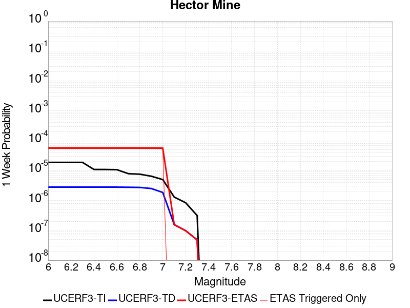 | 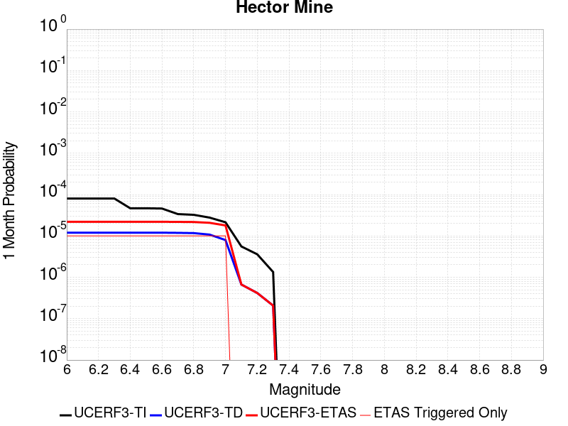 |  | 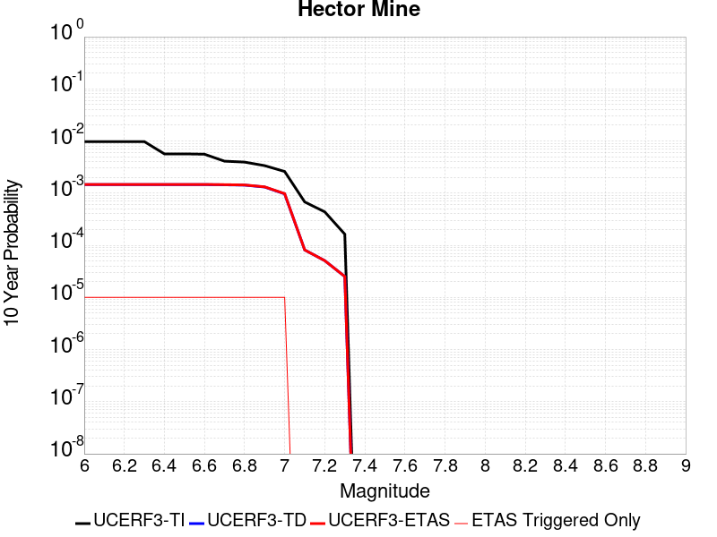 |

| Magnitude | 1 wk TI Prob | 1 wk TD Prob | 1 wk ETAS Prob | 1 wk ETAS/TD Gain | 1 wk ETAS Triggered Only | 1 mo TI Prob | 1 mo TD Prob | 1 mo ETAS Prob | 1 mo ETAS/TD Gain | 1 mo ETAS Triggered Only | 1 yr TI Prob | 1 yr TD Prob | 1 yr ETAS Prob | 1 yr ETAS/TD Gain | 1 yr ETAS Triggered Only | 10 yr TI Prob | 10 yr TD Prob | 10 yr ETAS Prob | 10 yr ETAS/TD Gain | 10 yr ETAS Triggered Only |
|-----|-----|-----|-----|-----|-----|-----|-----|-----|-----|-----|-----|-----|-----|-----|-----|-----|-----|-----|-----|-----|
| 6.0 | 1.8760093E-5 | 2.7963818E-6 | 4.532412E-5 | 16.20813 | 4.2527856E-5 | 8.039792E-5 | 1.1984461E-5 | 5.4511806E-5 | 4.5485406 | 4.2527856E-5 | 9.78405E-4 | 1.4590504E-4 | 1.8842668E-4 | 1.2914337 | 4.2527856E-5 | 0.009741086 | 0.0014584847 | 0.0015009504 | 1.0291164 | 4.2527856E-5 |
| 6.1 | 1.8760093E-5 | 2.7963818E-6 | 4.532412E-5 | 16.20813 | 4.2527856E-5 | 8.039792E-5 | 1.1984461E-5 | 5.4511806E-5 | 4.5485406 | 4.2527856E-5 | 9.78405E-4 | 1.4590504E-4 | 1.8842668E-4 | 1.2914337 | 4.2527856E-5 | 0.009741086 | 0.0014584847 | 0.0015009504 | 1.0291164 | 4.2527856E-5 |
| 6.2 | 1.8760093E-5 | 2.7963818E-6 | 4.532412E-5 | 16.20813 | 4.2527856E-5 | 8.039792E-5 | 1.1984461E-5 | 5.4511806E-5 | 4.5485406 | 4.2527856E-5 | 9.78405E-4 | 1.4590504E-4 | 1.8842668E-4 | 1.2914337 | 4.2527856E-5 | 0.009741086 | 0.0014584847 | 0.0015009504 | 1.0291164 | 4.2527856E-5 |
| 6.3 | 1.8760093E-5 | 2.7963818E-6 | 4.532412E-5 | 16.20813 | 4.2527856E-5 | 8.039792E-5 | 1.1984461E-5 | 5.4511806E-5 | 4.5485406 | 4.2527856E-5 | 9.78405E-4 | 1.4590504E-4 | 1.8842668E-4 | 1.2914337 | 4.2527856E-5 | 0.009741086 | 0.0014584847 | 0.0015009504 | 1.0291164 | 4.2527856E-5 |
| 6.4 | 1.0888055E-5 | 2.7963818E-6 | 4.532412E-5 | 16.20813 | 4.2527856E-5 | 4.666226E-5 | 1.1984461E-5 | 5.4511806E-5 | 4.5485406 | 4.2527856E-5 | 5.679649E-4 | 1.4590504E-4 | 1.8842668E-4 | 1.2914337 | 4.2527856E-5 | 0.0056651547 | 0.0014584847 | 0.0015009504 | 1.0291164 | 4.2527856E-5 |
| 6.5 | 1.0888055E-5 | 2.7963818E-6 | 4.532412E-5 | 16.20813 | 4.2527856E-5 | 4.666226E-5 | 1.1984461E-5 | 5.4511806E-5 | 4.5485406 | 4.2527856E-5 | 5.679649E-4 | 1.4590504E-4 | 1.8842668E-4 | 1.2914337 | 4.2527856E-5 | 0.0056651547 | 0.0014584847 | 0.0015009504 | 1.0291164 | 4.2527856E-5 |
| 6.6 | 1.0730738E-5 | 2.7963818E-6 | 4.532412E-5 | 16.20813 | 4.2527856E-5 | 4.5988065E-5 | 1.1984461E-5 | 5.4511806E-5 | 4.5485406 | 4.2527856E-5 | 5.5976084E-4 | 1.4590504E-4 | 1.8842668E-4 | 1.2914337 | 4.2527856E-5 | 0.0055835294 | 0.0014584847 | 0.0015009504 | 1.0291164 | 4.2527856E-5 |
| 6.7 | 7.881326E-6 | 2.7710626E-6 | 4.52988E-5 | 16.347088 | 4.2527856E-5 | 3.3776672E-5 | 1.1875951E-5 | 5.4403303E-5 | 4.580964 | 4.2527856E-5 | 4.111534E-4 | 1.445841E-4 | 1.871058E-4 | 1.2940967 | 4.2527856E-5 | 0.0041039353 | 0.0014452925 | 0.0014877588 | 1.0293826 | 4.2527856E-5 |
| 6.8 | 7.5683483E-6 | 2.7328138E-6 | 4.5260553E-5 | 16.561888 | 4.2527856E-5 | 3.2435375E-5 | 1.1712029E-5 | 5.4239386E-5 | 4.631084 | 4.2527856E-5 | 3.9482914E-4 | 1.4258861E-4 | 1.851104E-4 | 1.2982131 | 4.2527856E-5 | 0.0039412836 | 0.0014253634 | 0.0014678305 | 1.029794 | 4.2527856E-5 |
| 6.9 | 6.473048E-6 | 2.5138945E-6 | 4.5041645E-5 | 17.917078 | 4.2527856E-5 | 2.7741338E-5 | 1.07738115E-5 | 5.330121E-5 | 4.9472933 | 4.2527856E-5 | 3.3769844E-4 | 1.3116724E-4 | 1.736895E-4 | 1.3241837 | 4.2527856E-5 | 0.0033718573 | 0.0013112876 | 0.0013537598 | 1.0323896 | 4.2527856E-5 |
| 7.0 | 4.9959954E-6 | 1.8565124E-6 | 4.438429E-5 | 23.907349 | 4.2527856E-5 | 2.1411232E-5 | 7.956478E-6 | 5.0483995E-5 | 6.3450184 | 4.2527856E-5 | 2.6065056E-4 | 9.686937E-5 | 1.3939312E-4 | 1.4389802 | 4.2527856E-5 | 0.0026034506 | 9.6862105E-4 | 0.0010111077 | 1.043863 | 4.2527856E-5 |
| 7.1 | 1.2997541E-6 | 1.5602147E-7 | 1.5602147E-7 | 1.0 | 0.0 | 5.5703626E-6 | 6.686633E-7 | 6.686633E-7 | 1.0 | 0.0 | 6.7817055E-5 | 8.140949E-6 | 8.140949E-6 | 1.0 | 0.0 | 6.779636E-4 | 8.1406906E-5 | 8.1406906E-5 | 1.0 | 0.0 |
| 7.2 | 8.392699E-7 | 9.727592E-8 | 9.727592E-8 | 1.0 | 0.0 | 3.596866E-6 | 4.1689677E-7 | 4.1689677E-7 | 1.0 | 0.0 | 4.3790962E-5 | 5.0757085E-6 | 5.0757085E-6 | 1.0 | 0.0 | 4.3782333E-4 | 5.0756116E-5 | 5.0756116E-5 | 1.0 | 0.0 |
| 7.3 | 3.13015E-7 | 4.829262E-8 | 4.829262E-8 | 1.0 | 0.0 | 1.3414921E-6 | 2.0696835E-7 | 2.0696835E-7 | 1.0 | 0.0 | 1.6332544E-5 | 2.5198376E-6 | 2.5198376E-6 | 1.0 | 0.0 | 1.6331344E-4 | 2.5198176E-5 | 2.5198176E-5 | 1.0 | 0.0 |

## Sisar
*[(top)](#table-of-contents)*

| 1 Week | 1 Month | 1 Year | 10 Year |
|-----|-----|-----|-----|
| 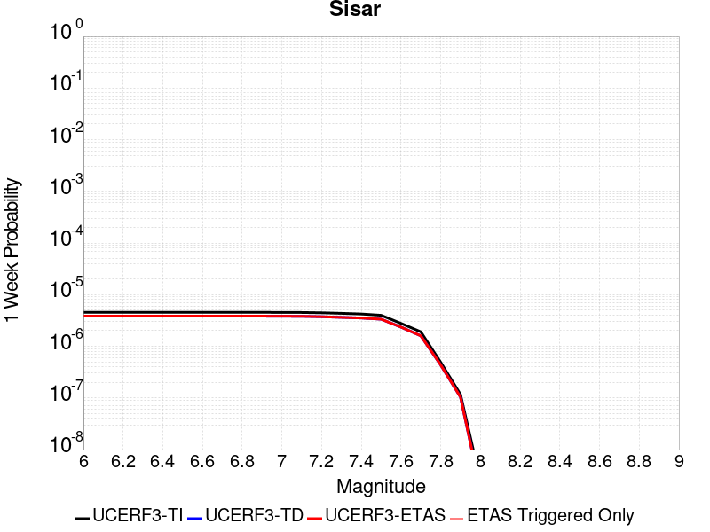 | 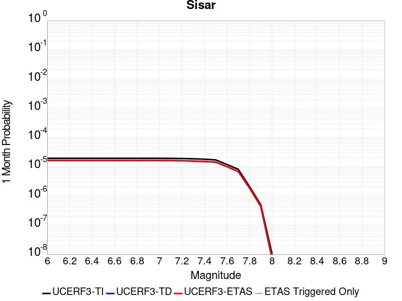 | 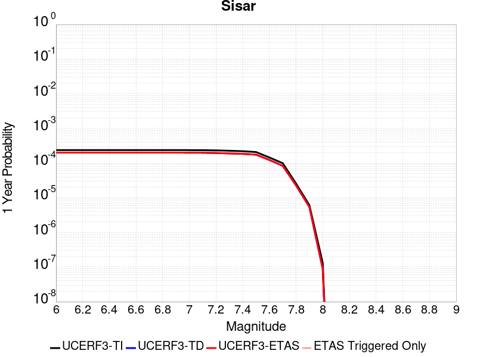 | 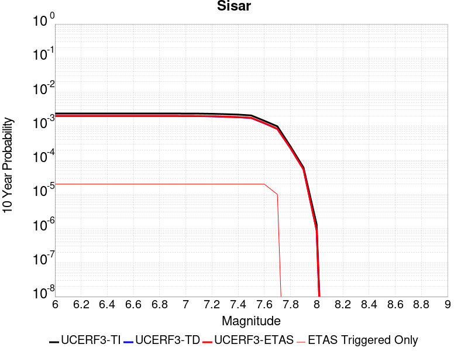 |

| Magnitude | 1 wk TI Prob | 1 wk TD Prob | 1 wk ETAS Prob | 1 wk ETAS/TD Gain | 1 wk ETAS Triggered Only | 1 mo TI Prob | 1 mo TD Prob | 1 mo ETAS Prob | 1 mo ETAS/TD Gain | 1 mo ETAS Triggered Only | 1 yr TI Prob | 1 yr TD Prob | 1 yr ETAS Prob | 1 yr ETAS/TD Gain | 1 yr ETAS Triggered Only | 10 yr TI Prob | 10 yr TD Prob | 10 yr ETAS Prob | 10 yr ETAS/TD Gain | 10 yr ETAS Triggered Only |
|-----|-----|-----|-----|-----|-----|-----|-----|-----|-----|-----|-----|-----|-----|-----|-----|-----|-----|-----|-----|-----|
| 6.0 | 4.544193E-6 | 3.839576E-6 | 3.839576E-6 | 1.0 | 0.0 | 1.9474966E-5 | 1.6455224E-5 | 1.6455224E-5 | 1.0 | 0.0 | 2.3708193E-4 | 2.0032428E-4 | 2.0032428E-4 | 1.0 | 0.0 | 0.0023682916 | 0.002001471 | 0.0020439136 | 1.0212058 | 4.2527856E-5 |
| 6.1 | 4.544193E-6 | 3.839576E-6 | 3.839576E-6 | 1.0 | 0.0 | 1.9474966E-5 | 1.6455224E-5 | 1.6455224E-5 | 1.0 | 0.0 | 2.3708193E-4 | 2.0032428E-4 | 2.0032428E-4 | 1.0 | 0.0 | 0.0023682916 | 0.002001471 | 0.0020439136 | 1.0212058 | 4.2527856E-5 |
| 6.2 | 4.544193E-6 | 3.839576E-6 | 3.839576E-6 | 1.0 | 0.0 | 1.9474966E-5 | 1.6455224E-5 | 1.6455224E-5 | 1.0 | 0.0 | 2.3708193E-4 | 2.0032428E-4 | 2.0032428E-4 | 1.0 | 0.0 | 0.0023682916 | 0.002001471 | 0.0020439136 | 1.0212058 | 4.2527856E-5 |
| 6.3 | 4.544193E-6 | 3.839576E-6 | 3.839576E-6 | 1.0 | 0.0 | 1.9474966E-5 | 1.6455224E-5 | 1.6455224E-5 | 1.0 | 0.0 | 2.3708193E-4 | 2.0032428E-4 | 2.0032428E-4 | 1.0 | 0.0 | 0.0023682916 | 0.002001471 | 0.0020439136 | 1.0212058 | 4.2527856E-5 |
| 6.4 | 4.544193E-6 | 3.839576E-6 | 3.839576E-6 | 1.0 | 0.0 | 1.9474966E-5 | 1.6455224E-5 | 1.6455224E-5 | 1.0 | 0.0 | 2.3708193E-4 | 2.0032428E-4 | 2.0032428E-4 | 1.0 | 0.0 | 0.0023682916 | 0.002001471 | 0.0020439136 | 1.0212058 | 4.2527856E-5 |
| 6.5 | 4.544193E-6 | 3.839576E-6 | 3.839576E-6 | 1.0 | 0.0 | 1.9474966E-5 | 1.6455224E-5 | 1.6455224E-5 | 1.0 | 0.0 | 2.3708193E-4 | 2.0032428E-4 | 2.0032428E-4 | 1.0 | 0.0 | 0.0023682916 | 0.002001471 | 0.0020439136 | 1.0212058 | 4.2527856E-5 |
| 6.6 | 4.544193E-6 | 3.839576E-6 | 3.839576E-6 | 1.0 | 0.0 | 1.9474966E-5 | 1.6455224E-5 | 1.6455224E-5 | 1.0 | 0.0 | 2.3708193E-4 | 2.0032428E-4 | 2.0032428E-4 | 1.0 | 0.0 | 0.0023682916 | 0.002001471 | 0.0020439136 | 1.0212058 | 4.2527856E-5 |
| 6.7 | 4.544193E-6 | 3.839576E-6 | 3.839576E-6 | 1.0 | 0.0 | 1.9474966E-5 | 1.6455224E-5 | 1.6455224E-5 | 1.0 | 0.0 | 2.3708193E-4 | 2.0032428E-4 | 2.0032428E-4 | 1.0 | 0.0 | 0.0023682916 | 0.002001471 | 0.0020439136 | 1.0212058 | 4.2527856E-5 |
| 6.8 | 4.544193E-6 | 3.839576E-6 | 3.839576E-6 | 1.0 | 0.0 | 1.9474966E-5 | 1.6455224E-5 | 1.6455224E-5 | 1.0 | 0.0 | 2.3708193E-4 | 2.0032428E-4 | 2.0032428E-4 | 1.0 | 0.0 | 0.0023682916 | 0.002001471 | 0.0020439136 | 1.0212058 | 4.2527856E-5 |
| 6.9 | 4.542225E-6 | 3.8375383E-6 | 3.8375383E-6 | 1.0 | 0.0 | 1.9466532E-5 | 1.6446491E-5 | 1.6446491E-5 | 1.0 | 0.0 | 2.3697925E-4 | 2.0021795E-4 | 2.0021795E-4 | 1.0 | 0.0 | 0.002367267 | 0.0020004094 | 0.0020428523 | 1.021217 | 4.2527856E-5 |
| 7.0 | 4.5278484E-6 | 3.822602E-6 | 3.822602E-6 | 1.0 | 0.0 | 1.940492E-5 | 1.638248E-5 | 1.638248E-5 | 1.0 | 0.0 | 2.3622929E-4 | 1.9943877E-4 | 1.9943877E-4 | 1.0 | 0.0 | 0.0023597833 | 0.0019926317 | 0.0020350749 | 1.0213001 | 4.2527856E-5 |
| 7.1 | 4.5132488E-6 | 3.8073897E-6 | 3.8073897E-6 | 1.0 | 0.0 | 1.9342351E-5 | 1.6317284E-5 | 1.6317284E-5 | 1.0 | 0.0 | 2.3546767E-4 | 1.9864515E-4 | 1.9864515E-4 | 1.0 | 0.0 | 0.0023521832 | 0.0019847096 | 0.002027153 | 1.0213852 | 4.2527856E-5 |
| 7.2 | 4.448859E-6 | 3.7398502E-6 | 3.7398502E-6 | 1.0 | 0.0 | 1.9066398E-5 | 1.6027832E-5 | 1.6027832E-5 | 1.0 | 0.0 | 2.3210866E-4 | 1.9512173E-4 | 1.9512173E-4 | 1.0 | 0.0 | 0.0023186638 | 0.0019495375 | 0.0019919826 | 1.0217718 | 4.2527856E-5 |
| 7.3 | 4.3424366E-6 | 3.6336846E-6 | 3.6336846E-6 | 1.0 | 0.0 | 1.861031E-5 | 1.5572843E-5 | 1.5572843E-5 | 1.0 | 0.0 | 2.2655698E-4 | 1.895832E-4 | 1.895832E-4 | 1.0 | 0.0 | 0.0022632615 | 0.0018942481 | 0.0019366954 | 1.0224085 | 4.2527856E-5 |
| 7.4 | 4.218641E-6 | 3.5330384E-6 | 3.5330384E-6 | 1.0 | 0.0 | 1.8079765E-5 | 1.5141507E-5 | 1.5141507E-5 | 1.0 | 0.0 | 2.2009891E-4 | 1.8433259E-4 | 1.8433259E-4 | 1.0 | 0.0 | 0.0021988105 | 0.0018418302 | 0.0018842798 | 1.0230474 | 4.2527856E-5 |
| 7.5 | 3.983779E-6 | 3.3478068E-6 | 3.3478068E-6 | 1.0 | 0.0 | 1.7073227E-5 | 1.4347666E-5 | 1.4347666E-5 | 1.0 | 0.0 | 2.0784672E-4 | 1.7466917E-4 | 1.7466917E-4 | 1.0 | 0.0 | 0.0020765243 | 0.0017453518 | 0.0017878055 | 1.0243238 | 4.2527856E-5 |
| 7.6 | 2.777393E-6 | 2.35225E-6 | 2.35225E-6 | 1.0 | 0.0 | 1.1903058E-5 | 1.0081033E-5 | 1.0081033E-5 | 1.0 | 0.0 | 1.449101E-4 | 1.2272975E-4 | 1.2272975E-4 | 1.0 | 0.0 | 0.0014481564 | 0.0012266274 | 0.001269103 | 1.034628 | 4.2527856E-5 |
| 7.7 | 1.9028433E-6 | 1.593867E-6 | 1.593867E-6 | 1.0 | 0.0 | 8.155017E-6 | 6.8308404E-6 | 6.8308404E-6 | 1.0 | 0.0 | 9.928281E-5 | 8.3162355E-5 | 8.3162355E-5 | 1.0 | 0.0 | 9.923846E-4 | 8.313171E-4 | 8.738096E-4 | 1.0511147 | 4.2527856E-5 |
| 7.8 | 4.9095956E-7 | 4.3583708E-7 | 4.3583708E-7 | 1.0 | 0.0 | 2.1041105E-6 | 1.8678718E-6 | 1.8678718E-6 | 1.0 | 0.0 | 2.5617246E-5 | 2.2741104E-5 | 2.2741104E-5 | 1.0 | 0.0 | 2.5614293E-4 | 2.2738794E-4 | 2.2738794E-4 | 1.0 | 0.0 |
| 7.9 | 1.16657894E-7 | 1.0335569E-7 | 1.0335569E-7 | 1.0 | 0.0 | 4.999623E-7 | 4.4295288E-7 | 4.4295288E-7 | 1.0 | 0.0 | 6.087024E-6 | 5.3929384E-6 | 5.3929384E-6 | 1.0 | 0.0 | 6.0868573E-5 | 5.3928103E-5 | 5.3928103E-5 | 1.0 | 0.0 |
| 8.0 | 2.5100346E-9 | 1.7067566E-9 | 1.7067566E-9 | 1.0 | 0.0 | 1.0757291E-8 | 7.3146724E-9 | 7.3146724E-9 | 1.0 | 0.0 | 1.3097001E-7 | 8.905613E-8 | 8.905613E-8 | 1.0 | 0.0 | 1.3096993E-6 | 8.9056095E-7 | 8.9056095E-7 | 1.0 | 0.0 |

## Malibu Coast (Extension) alt 1
*[(top)](#table-of-contents)*

| 1 Week | 1 Month | 1 Year | 10 Year |
|-----|-----|-----|-----|
| 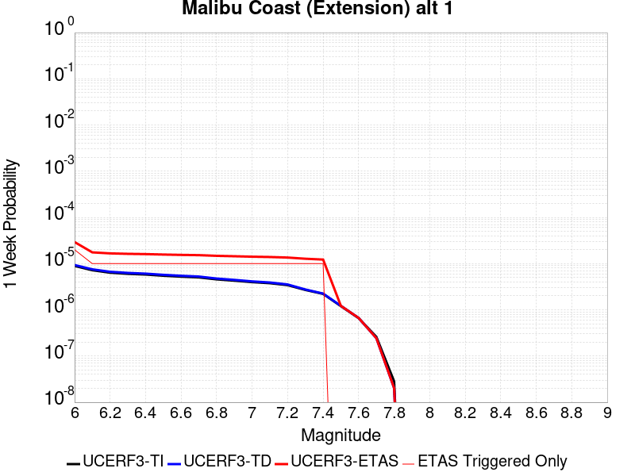 | 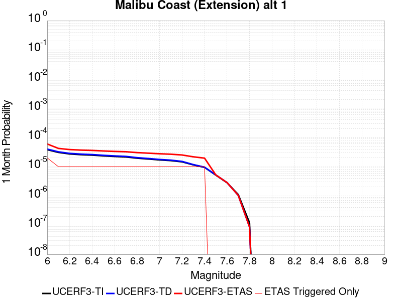 | 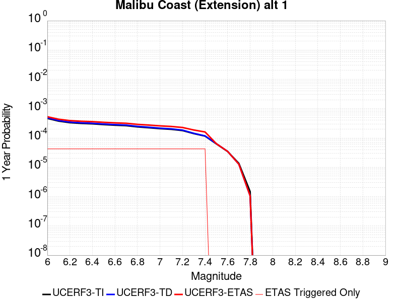 | 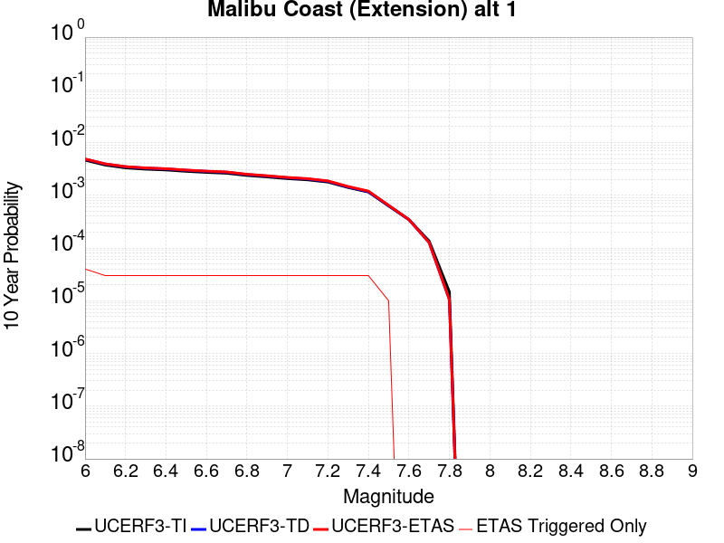 |

| Magnitude | 1 wk TI Prob | 1 wk TD Prob | 1 wk ETAS Prob | 1 wk ETAS/TD Gain | 1 wk ETAS Triggered Only | 1 mo TI Prob | 1 mo TD Prob | 1 mo ETAS Prob | 1 mo ETAS/TD Gain | 1 mo ETAS Triggered Only | 1 yr TI Prob | 1 yr TD Prob | 1 yr ETAS Prob | 1 yr ETAS/TD Gain | 1 yr ETAS Triggered Only | 10 yr TI Prob | 10 yr TD Prob | 10 yr ETAS Prob | 10 yr ETAS/TD Gain | 10 yr ETAS Triggered Only |
|-----|-----|-----|-----|-----|-----|-----|-----|-----|-----|-----|-----|-----|-----|-----|-----|-----|-----|-----|-----|-----|
| 6.0 | 8.930738E-6 | 9.329276E-6 | 9.329276E-6 | 1.0 | 0.0 | 3.827403E-5 | 3.998201E-5 | 3.998201E-5 | 1.0 | 0.0 | 4.6588664E-4 | 4.8667393E-4 | 5.291811E-4 | 1.0873421 | 4.2527856E-5 | 0.0046491115 | 0.004856264 | 0.0048985854 | 1.0087148 | 4.2527856E-5 |
| 6.1 | 7.199952E-6 | 7.5302964E-6 | 7.5302964E-6 | 1.0 | 0.0 | 3.0856572E-5 | 3.2272303E-5 | 3.2272303E-5 | 1.0 | 0.0 | 3.75614E-4 | 3.9284505E-4 | 4.353562E-4 | 1.1082135 | 4.2527856E-5 | 0.0037497976 | 0.003921572 | 0.0039639333 | 1.010802 | 4.2527856E-5 |
| 6.2 | 6.3721413E-6 | 6.6667917E-6 | 6.6667917E-6 | 1.0 | 0.0 | 2.7308892E-5 | 2.8571652E-5 | 2.8571652E-5 | 1.0 | 0.0 | 3.3243504E-4 | 3.4780471E-4 | 3.9031776E-4 | 1.1222326 | 4.2527856E-5 | 0.0033193815 | 0.0034726437 | 0.003515024 | 1.012204 | 4.2527856E-5 |
| 6.3 | 6.016345E-6 | 6.295158E-6 | 6.295158E-6 | 1.0 | 0.0 | 2.578408E-5 | 2.6978973E-5 | 2.6978973E-5 | 1.0 | 0.0 | 3.1387596E-4 | 3.2841982E-4 | 3.709337E-4 | 1.1294498 | 4.2527856E-5 | 0.00313433 | 0.0032793807 | 0.0033217692 | 1.0129257 | 4.2527856E-5 |
| 6.4 | 5.8104883E-6 | 6.0795446E-6 | 6.0795446E-6 | 1.0 | 0.0 | 2.4901856E-5 | 2.6054933E-5 | 2.6054933E-5 | 1.0 | 0.0 | 3.031379E-4 | 3.1717293E-4 | 3.596873E-4 | 1.1340415 | 4.2527856E-5 | 0.0030272473 | 0.0031672374 | 0.0032096305 | 1.0133849 | 4.2527856E-5 |
| 6.5 | 5.476925E-6 | 5.7275133E-6 | 5.7275133E-6 | 1.0 | 0.0 | 2.3472323E-5 | 2.4546256E-5 | 2.4546256E-5 | 1.0 | 0.0 | 2.8573806E-4 | 2.9880996E-4 | 3.4132513E-4 | 1.1422815 | 4.2527856E-5 | 0.0028537093 | 0.002984114 | 0.0030265148 | 1.0142089 | 4.2527856E-5 |
| 6.6 | 5.222387E-6 | 5.45858E-6 | 5.45858E-6 | 1.0 | 0.0 | 2.2381464E-5 | 2.3393704E-5 | 2.3393704E-5 | 1.0 | 0.0 | 2.7246025E-4 | 2.8478142E-4 | 3.2729717E-4 | 1.1492926 | 4.2527856E-5 | 0.0027212645 | 0.0028441956 | 0.0028866024 | 1.01491 | 4.2527856E-5 |
| 6.7 | 5.0337076E-6 | 5.259103E-6 | 5.259103E-6 | 1.0 | 0.0 | 2.1572854E-5 | 2.253882E-5 | 2.253882E-5 | 1.0 | 0.0 | 2.6261783E-4 | 2.7437587E-4 | 3.1689205E-4 | 1.154956 | 4.2527856E-5 | 0.002623077 | 0.002740401 | 0.0027828123 | 1.0154763 | 4.2527856E-5 |
| 6.8 | 4.5675624E-6 | 4.7587164E-6 | 4.7587164E-6 | 1.0 | 0.0 | 1.9575122E-5 | 2.039434E-5 | 2.039434E-5 | 1.0 | 0.0 | 2.3830103E-4 | 2.48273E-4 | 2.9079028E-4 | 1.1712523 | 4.2527856E-5 | 0.0023804565 | 0.002479976 | 0.0025223983 | 1.0171059 | 4.2527856E-5 |
| 6.9 | 4.2802412E-6 | 4.4520207E-6 | 4.4520207E-6 | 1.0 | 0.0 | 1.8343762E-5 | 1.907995E-5 | 1.907995E-5 | 1.0 | 0.0 | 2.2331243E-4 | 2.3227377E-4 | 2.7479176E-4 | 1.1830511 | 4.2527856E-5 | 0.0022308815 | 0.0023203269 | 0.002362756 | 1.0182859 | 4.2527856E-5 |
| 7.0 | 3.9794063E-6 | 4.130099E-6 | 4.130099E-6 | 1.0 | 0.0 | 1.7054486E-5 | 1.7700306E-5 | 1.7700306E-5 | 1.0 | 0.0 | 2.0761859E-4 | 2.1548003E-4 | 2.5799873E-4 | 1.1973208 | 4.2527856E-5 | 0.0020742472 | 0.0021527244 | 0.0021951608 | 1.0197128 | 4.2527856E-5 |
| 7.1 | 3.7730424E-6 | 3.911217E-6 | 3.911217E-6 | 1.0 | 0.0 | 1.6170083E-5 | 1.6762251E-5 | 1.6762251E-5 | 1.0 | 0.0 | 1.9685295E-4 | 2.0406142E-4 | 2.465806E-4 | 1.2083646 | 4.2527856E-5 | 0.0019667868 | 0.0020387534 | 0.0020811944 | 1.0208172 | 4.2527856E-5 |
| 7.2 | 3.424985E-6 | 3.541337E-6 | 3.541337E-6 | 1.0 | 0.0 | 1.4678424E-5 | 1.5177071E-5 | 1.5177071E-5 | 1.0 | 0.0 | 1.7869516E-4 | 1.8476529E-4 | 2.2728529E-4 | 1.2301298 | 4.2527856E-5 | 0.0017855153 | 0.0018461287 | 0.0018885782 | 1.0229937 | 4.2527856E-5 |
| 7.3 | 2.6966375E-6 | 2.7596534E-6 | 2.7596534E-6 | 1.0 | 0.0 | 1.15569665E-5 | 1.1827032E-5 | 1.1827032E-5 | 1.0 | 0.0 | 1.4069698E-4 | 1.4398464E-4 | 1.8650637E-4 | 1.2953213 | 4.2527856E-5 | 0.0014060794 | 0.0014389176 | 0.0014813843 | 1.0295129 | 4.2527856E-5 |
| 7.4 | 2.215957E-6 | 2.249378E-6 | 2.249378E-6 | 1.0 | 0.0 | 9.496924E-6 | 9.640156E-6 | 9.640156E-6 | 1.0 | 0.0 | 1.1561892E-4 | 1.17362615E-4 | 1.5988549E-4 | 1.3623203 | 4.2527856E-5 | 0.0011555878 | 0.0011730101 | 0.0012154881 | 1.0362128 | 4.2527856E-5 |
| 7.5 | 1.2040218E-6 | 1.2219067E-6 | 1.2219067E-6 | 1.0 | 0.0 | 5.160083E-6 | 5.2367322E-6 | 5.2367322E-6 | 1.0 | 0.0 | 6.2822204E-5 | 6.375537E-5 | 6.375537E-5 | 1.0 | 0.0 | 6.280445E-4 | 6.3737266E-4 | 6.3737266E-4 | 1.0 | 0.0 |
| 7.6 | 6.6157446E-7 | 6.678975E-7 | 6.678975E-7 | 1.0 | 0.0 | 2.835316E-6 | 2.8624147E-6 | 2.8624147E-6 | 1.0 | 0.0 | 3.4519428E-5 | 3.484936E-5 | 3.484936E-5 | 1.0 | 0.0 | 3.4514067E-4 | 3.4844046E-4 | 3.4844046E-4 | 1.0 | 0.0 |
| 7.7 | 2.6012302E-7 | 2.4357593E-7 | 2.4357593E-7 | 1.0 | 0.0 | 1.1148124E-6 | 1.0438964E-6 | 1.0438964E-6 | 1.0 | 0.0 | 1.3572758E-5 | 1.2709375E-5 | 1.2709375E-5 | 1.0 | 0.0 | 1.3571928E-4 | 1.2708755E-4 | 1.2708755E-4 | 1.0 | 0.0 |
| 7.8 | 2.8323132E-8 | 2.0266649E-8 | 2.0266649E-8 | 1.0 | 0.0 | 1.2138484E-7 | 8.685707E-8 | 8.685707E-8 | 1.0 | 0.0 | 1.4778595E-6 | 1.0574844E-6 | 1.0574844E-6 | 1.0 | 0.0 | 1.4778497E-5 | 1.0574801E-5 | 1.0574801E-5 | 1.0 | 0.0 |

## Elmore Ranch
*[(top)](#table-of-contents)*

| 1 Week | 1 Month | 1 Year | 10 Year |
|-----|-----|-----|-----|
| 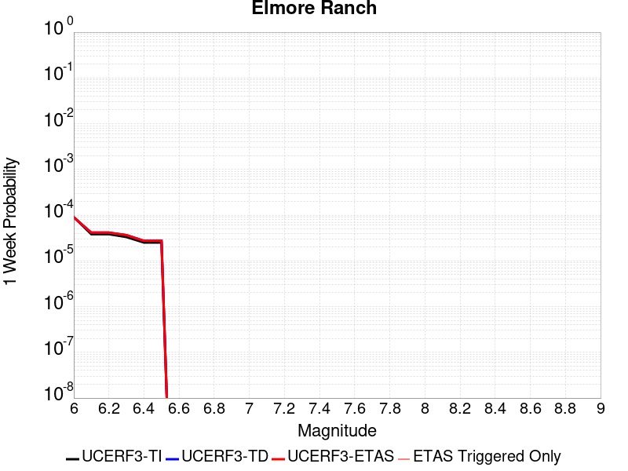 |  | 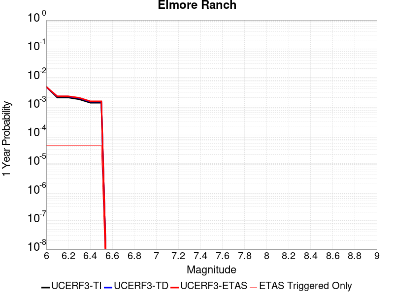 | 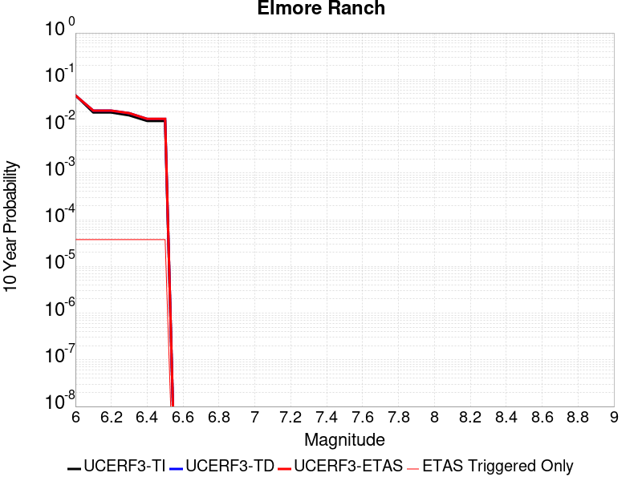 |

| Magnitude | 1 wk TI Prob | 1 wk TD Prob | 1 wk ETAS Prob | 1 wk ETAS/TD Gain | 1 wk ETAS Triggered Only | 1 mo TI Prob | 1 mo TD Prob | 1 mo ETAS Prob | 1 mo ETAS/TD Gain | 1 mo ETAS Triggered Only | 1 yr TI Prob | 1 yr TD Prob | 1 yr ETAS Prob | 1 yr ETAS/TD Gain | 1 yr ETAS Triggered Only | 10 yr TI Prob | 10 yr TD Prob | 10 yr ETAS Prob | 10 yr ETAS/TD Gain | 10 yr ETAS Triggered Only |
|-----|-----|-----|-----|-----|-----|-----|-----|-----|-----|-----|-----|-----|-----|-----|-----|-----|-----|-----|-----|-----|
| 6.0 | 9.102099E-5 | 8.952015E-5 | 8.952015E-5 | 1.0 | 0.0 | 3.9003167E-4 | 3.8361453E-4 | 3.8361453E-4 | 1.0 | 0.0 | 0.0047383 | 0.004662009 | 0.0047043385 | 1.0090797 | 4.2527856E-5 | 0.046385348 | 0.045870975 | 0.04591155 | 1.0008845 | 4.2527856E-5 |
| 6.1 | 3.8306698E-5 | 4.1498504E-5 | 4.1498504E-5 | 1.0 | 0.0 | 1.6416123E-4 | 1.7784268E-4 | 1.7784268E-4 | 1.0 | 0.0 | 0.0019968306 | 0.0021631396 | 0.0022055756 | 1.0196177 | 4.2527856E-5 | 0.019789828 | 0.021628205 | 0.021669813 | 1.0019238 | 4.2527856E-5 |
| 6.2 | 3.8306698E-5 | 4.1498504E-5 | 4.1498504E-5 | 1.0 | 0.0 | 1.6416123E-4 | 1.7784268E-4 | 1.7784268E-4 | 1.0 | 0.0 | 0.0019968306 | 0.0021631396 | 0.0022055756 | 1.0196177 | 4.2527856E-5 | 0.019789828 | 0.021628205 | 0.021669813 | 1.0019238 | 4.2527856E-5 |
| 6.3 | 3.3197924E-5 | 3.6554302E-5 | 3.6554302E-5 | 1.0 | 0.0 | 1.4226905E-4 | 1.5665586E-4 | 1.5665586E-4 | 1.0 | 0.0 | 0.0017307495 | 0.001905917 | 0.0019483638 | 1.022271 | 4.2527856E-5 | 0.017173318 | 0.01908996 | 0.019131675 | 1.0021852 | 4.2527856E-5 |
| 6.4 | 2.5148964E-5 | 2.7420487E-5 | 2.7420487E-5 | 1.0 | 0.0 | 1.0777682E-4 | 1.17514726E-4 | 1.17514726E-4 | 1.0 | 0.0 | 0.0013113929 | 0.0014304507 | 0.0014729177 | 1.0296879 | 4.2527856E-5 | 0.01303681 | 0.014387194 | 0.01442911 | 1.0029135 | 4.2527856E-5 |
| 6.5 | 2.5148964E-5 | 2.7420487E-5 | 2.7420487E-5 | 1.0 | 0.0 | 1.0777682E-4 | 1.17514726E-4 | 1.17514726E-4 | 1.0 | 0.0 | 0.0013113929 | 0.0014304507 | 0.0014729177 | 1.0296879 | 4.2527856E-5 | 0.01303681 | 0.014387194 | 0.01442911 | 1.0029135 | 4.2527856E-5 |

## Mono Lake 2011 CFM
*[(top)](#table-of-contents)*

| 1 Week | 1 Month | 1 Year | 10 Year |
|-----|-----|-----|-----|
| 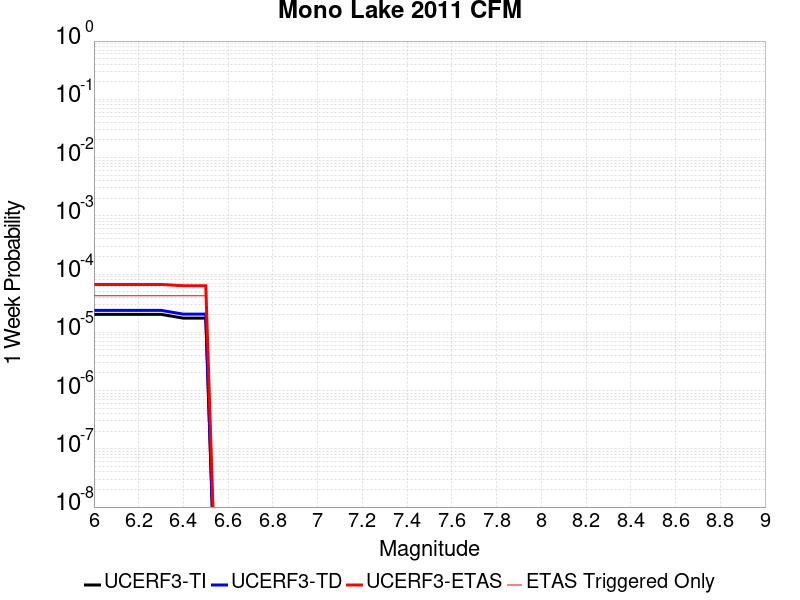 | 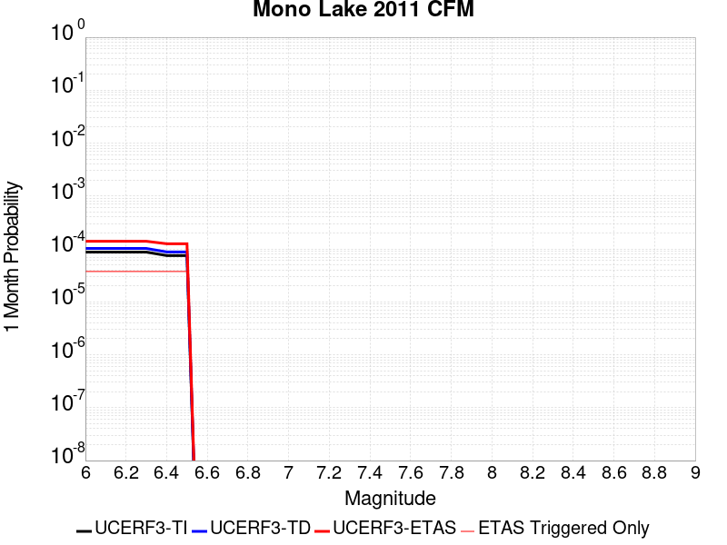 | 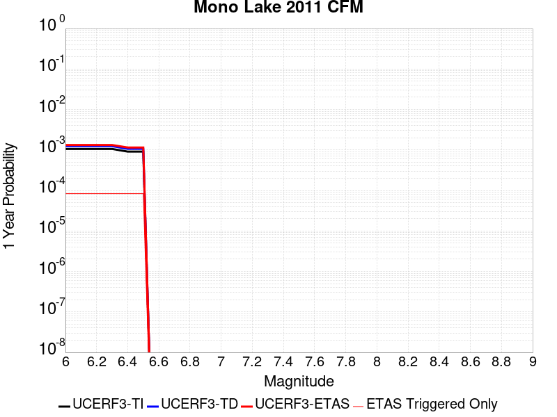 | 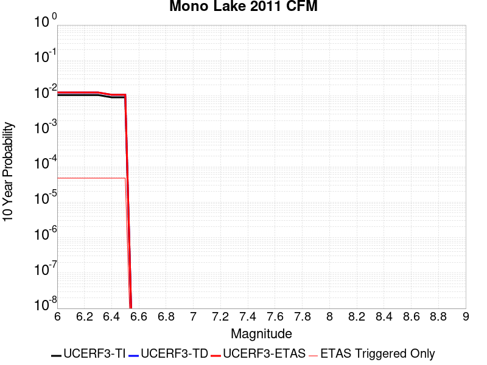 |

| Magnitude | 1 wk TI Prob | 1 wk TD Prob | 1 wk ETAS Prob | 1 wk ETAS/TD Gain | 1 wk ETAS Triggered Only | 1 mo TI Prob | 1 mo TD Prob | 1 mo ETAS Prob | 1 mo ETAS/TD Gain | 1 mo ETAS Triggered Only | 1 yr TI Prob | 1 yr TD Prob | 1 yr ETAS Prob | 1 yr ETAS/TD Gain | 1 yr ETAS Triggered Only | 10 yr TI Prob | 10 yr TD Prob | 10 yr ETAS Prob | 10 yr ETAS/TD Gain | 10 yr ETAS Triggered Only |
|-----|-----|-----|-----|-----|-----|-----|-----|-----|-----|-----|-----|-----|-----|-----|-----|-----|-----|-----|-----|-----|
| 6.0 | 2.0341662E-5 | 2.3828166E-5 | 6.635501E-5 | 2.78473 | 4.2527856E-5 | 8.717564E-5 | 1.0211971E-4 | 1.4464323E-4 | 1.4164084 | 4.2527856E-5 | 0.0010608466 | 0.0012431298 | 0.0012856048 | 1.0341678 | 4.2527856E-5 | 0.010557966 | 0.012413835 | 0.012455835 | 1.0033833 | 4.2527856E-5 |
| 6.1 | 2.0341662E-5 | 2.3828166E-5 | 6.635501E-5 | 2.78473 | 4.2527856E-5 | 8.717564E-5 | 1.0211971E-4 | 1.4464323E-4 | 1.4164084 | 4.2527856E-5 | 0.0010608466 | 0.0012431298 | 0.0012856048 | 1.0341678 | 4.2527856E-5 | 0.010557966 | 0.012413835 | 0.012455835 | 1.0033833 | 4.2527856E-5 |
| 6.2 | 2.0341662E-5 | 2.3828166E-5 | 6.635501E-5 | 2.78473 | 4.2527856E-5 | 8.717564E-5 | 1.0211971E-4 | 1.4464323E-4 | 1.4164084 | 4.2527856E-5 | 0.0010608466 | 0.0012431298 | 0.0012856048 | 1.0341678 | 4.2527856E-5 | 0.010557966 | 0.012413835 | 0.012455835 | 1.0033833 | 4.2527856E-5 |
| 6.3 | 2.0341662E-5 | 2.3828166E-5 | 6.635501E-5 | 2.78473 | 4.2527856E-5 | 8.717564E-5 | 1.0211971E-4 | 1.4464323E-4 | 1.4164084 | 4.2527856E-5 | 0.0010608466 | 0.0012431298 | 0.0012856048 | 1.0341678 | 4.2527856E-5 | 0.010557966 | 0.012413835 | 0.012455835 | 1.0033833 | 4.2527856E-5 |
| 6.4 | 1.749821E-5 | 2.0490985E-5 | 6.301797E-5 | 3.0753996 | 4.2527856E-5 | 7.499018E-5 | 8.781851E-5 | 1.3034263E-4 | 1.4842273 | 4.2527856E-5 | 9.1262296E-4 | 0.0010691903 | 0.0011116727 | 1.0397332 | 4.2527856E-5 | 0.009088841 | 0.010691865 | 0.010733938 | 1.0039351 | 4.2527856E-5 |
| 6.5 | 1.749821E-5 | 2.0490985E-5 | 6.301797E-5 | 3.0753996 | 4.2527856E-5 | 7.499018E-5 | 8.781851E-5 | 1.3034263E-4 | 1.4842273 | 4.2527856E-5 | 9.1262296E-4 | 0.0010691903 | 0.0011116727 | 1.0397332 | 4.2527856E-5 | 0.009088841 | 0.010691865 | 0.010733938 | 1.0039351 | 4.2527856E-5 |

## Great Valley 07 (Orestimba)
*[(top)](#table-of-contents)*

| 1 Week | 1 Month | 1 Year | 10 Year |
|-----|-----|-----|-----|
|  |  | 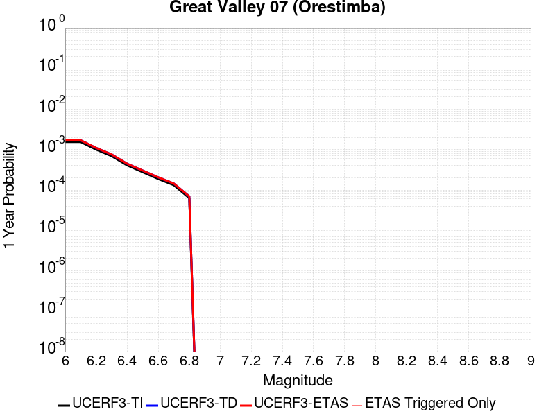 | 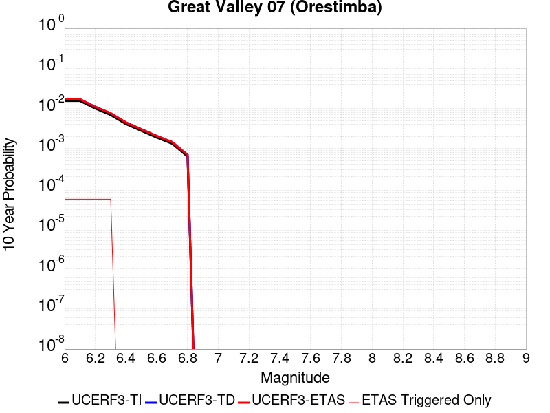 |

| Magnitude | 1 wk TI Prob | 1 wk TD Prob | 1 wk ETAS Prob | 1 wk ETAS/TD Gain | 1 wk ETAS Triggered Only | 1 mo TI Prob | 1 mo TD Prob | 1 mo ETAS Prob | 1 mo ETAS/TD Gain | 1 mo ETAS Triggered Only | 1 yr TI Prob | 1 yr TD Prob | 1 yr ETAS Prob | 1 yr ETAS/TD Gain | 1 yr ETAS Triggered Only | 10 yr TI Prob | 10 yr TD Prob | 10 yr ETAS Prob | 10 yr ETAS/TD Gain | 10 yr ETAS Triggered Only |
|-----|-----|-----|-----|-----|-----|-----|-----|-----|-----|-----|-----|-----|-----|-----|-----|-----|-----|-----|-----|-----|
| 6.0 | 2.9687902E-5 | 3.27575E-5 | 3.27575E-5 | 1.0 | 0.0 | 1.2722766E-4 | 1.4038214E-4 | 1.4038214E-4 | 1.0 | 0.0 | 0.0015478961 | 0.0017078844 | 0.0017078844 | 1.0 | 0.0 | 0.015371585 | 0.016955135 | 0.016996942 | 1.0024657 | 4.2527856E-5 |
| 6.1 | 2.9687902E-5 | 3.27575E-5 | 3.27575E-5 | 1.0 | 0.0 | 1.2722766E-4 | 1.4038214E-4 | 1.4038214E-4 | 1.0 | 0.0 | 0.0015478961 | 0.0017078844 | 0.0017078844 | 1.0 | 0.0 | 0.015371585 | 0.016955135 | 0.016996942 | 1.0024657 | 4.2527856E-5 |
| 6.2 | 1.9231524E-5 | 2.1159167E-5 | 2.1159167E-5 | 1.0 | 0.0 | 8.2418206E-5 | 9.067912E-5 | 9.067912E-5 | 1.0 | 0.0 | 0.0010029797 | 0.0011034822 | 0.0011034822 | 1.0 | 0.0 | 0.00998465 | 0.01098244 | 0.011024501 | 1.0038298 | 4.2527856E-5 |
| 6.3 | 1.324766E-5 | 1.4548534E-5 | 1.4548534E-5 | 1.0 | 0.0 | 5.6774446E-5 | 6.234942E-5 | 6.234942E-5 | 1.0 | 0.0 | 6.910097E-4 | 7.5884897E-4 | 7.5884897E-4 | 1.0 | 0.0 | 0.006888649 | 0.0075635235 | 0.0076057296 | 1.0055802 | 4.2527856E-5 |
| 6.4 | 7.818645E-6 | 8.57284E-6 | 8.57284E-6 | 1.0 | 0.0 | 3.3508048E-5 | 3.6740246E-5 | 3.6740246E-5 | 1.0 | 0.0 | 4.078841E-4 | 4.4722404E-4 | 4.4722404E-4 | 1.0 | 0.0 | 0.004071363 | 0.0044635804 | 0.0044635804 | 1.0 | 0.0 |
| 6.5 | 5.3076565E-6 | 5.8178007E-6 | 5.8178007E-6 | 1.0 | 0.0 | 2.27469E-5 | 2.4933206E-5 | 2.4933206E-5 | 1.0 | 0.0 | 2.7690834E-4 | 3.035216E-4 | 3.035216E-4 | 1.0 | 0.0 | 0.0027656353 | 0.00303128 | 0.00303128 | 1.0 | 0.0 |
| 6.6 | 3.6003578E-6 | 3.9484953E-6 | 3.9484953E-6 | 1.0 | 0.0 | 1.5430012E-5 | 1.6922022E-5 | 1.6922022E-5 | 1.0 | 0.0 | 1.8784421E-4 | 2.0600771E-4 | 2.0600771E-4 | 1.0 | 0.0 | 0.0018768552 | 0.0020583214 | 0.0020583214 | 1.0 | 0.0 |
| 6.7 | 2.5361826E-6 | 2.7834678E-6 | 2.7834678E-6 | 1.0 | 0.0 | 1.0869308E-5 | 1.1929101E-5 | 1.1929101E-5 | 1.0 | 0.0 | 1.3232579E-4 | 1.4522845E-4 | 1.4522845E-4 | 1.0 | 0.0 | 0.0013224703 | 0.0014514653 | 0.0014514653 | 1.0 | 0.0 |
| 6.8 | 1.2115831E-6 | 1.3313797E-6 | 1.3313797E-6 | 1.0 | 0.0 | 5.1924885E-6 | 5.7059065E-6 | 5.7059065E-6 | 1.0 | 0.0 | 6.3216714E-5 | 6.9468166E-5 | 6.9468166E-5 | 1.0 | 0.0 | 6.3198735E-4 | 6.945596E-4 | 6.945596E-4 | 1.0 | 0.0 |

## White Wolf
*[(top)](#table-of-contents)*

| 1 Week | 1 Month | 1 Year | 10 Year |
|-----|-----|-----|-----|
|  | 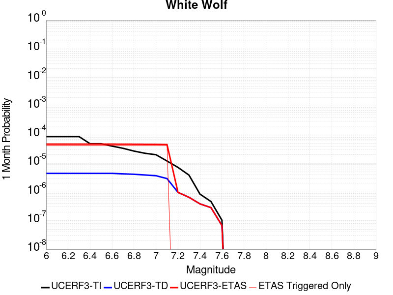 | 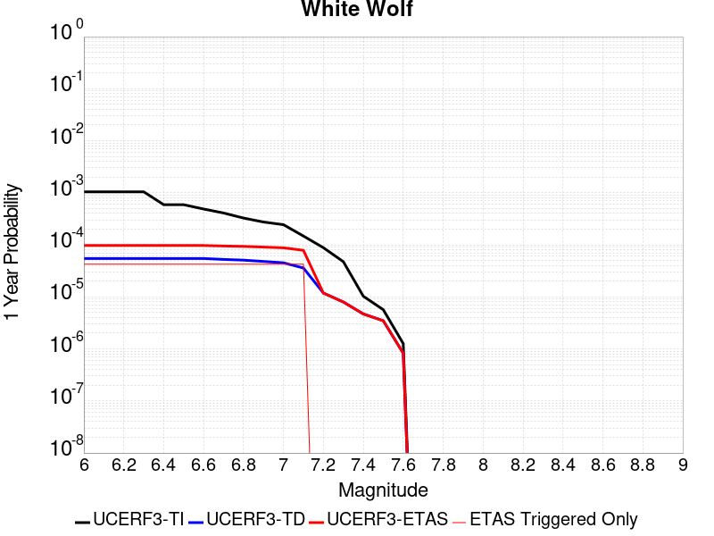 | 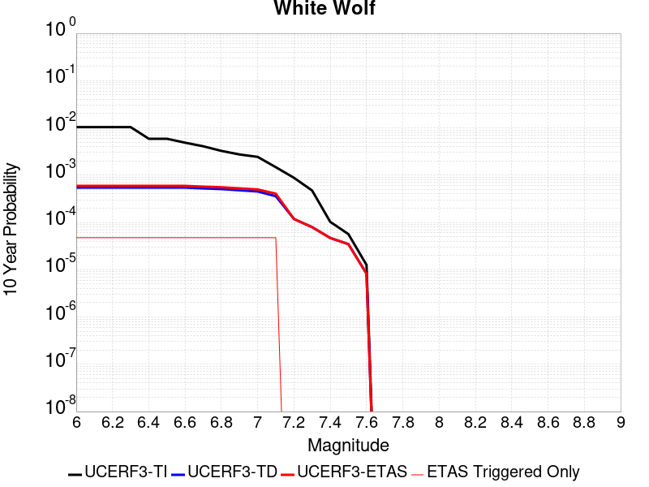 |

| Magnitude | 1 wk TI Prob | 1 wk TD Prob | 1 wk ETAS Prob | 1 wk ETAS/TD Gain | 1 wk ETAS Triggered Only | 1 mo TI Prob | 1 mo TD Prob | 1 mo ETAS Prob | 1 mo ETAS/TD Gain | 1 mo ETAS Triggered Only | 1 yr TI Prob | 1 yr TD Prob | 1 yr ETAS Prob | 1 yr ETAS/TD Gain | 1 yr ETAS Triggered Only | 10 yr TI Prob | 10 yr TD Prob | 10 yr ETAS Prob | 10 yr ETAS/TD Gain | 10 yr ETAS Triggered Only |
|-----|-----|-----|-----|-----|-----|-----|-----|-----|-----|-----|-----|-----|-----|-----|-----|-----|-----|-----|-----|-----|
| 6.0 | 2.0037822E-5 | 1.0469162E-6 | 1.0469162E-6 | 1.0 | 0.0 | 8.587355E-5 | 4.486776E-6 | 4.701444E-5 | 10.478446 | 4.2527856E-5 | 0.001045009 | 5.4625183E-5 | 9.715071E-5 | 1.7784969 | 4.2527856E-5 | 0.010401085 | 5.461226E-4 | 5.8862724E-4 | 1.0778298 | 4.2527856E-5 |
| 6.1 | 2.0037822E-5 | 1.0469162E-6 | 1.0469162E-6 | 1.0 | 0.0 | 8.587355E-5 | 4.486776E-6 | 4.701444E-5 | 10.478446 | 4.2527856E-5 | 0.001045009 | 5.4625183E-5 | 9.715071E-5 | 1.7784969 | 4.2527856E-5 | 0.010401085 | 5.461226E-4 | 5.8862724E-4 | 1.0778298 | 4.2527856E-5 |
| 6.2 | 2.0037822E-5 | 1.0469162E-6 | 1.0469162E-6 | 1.0 | 0.0 | 8.587355E-5 | 4.486776E-6 | 4.701444E-5 | 10.478446 | 4.2527856E-5 | 0.001045009 | 5.4625183E-5 | 9.715071E-5 | 1.7784969 | 4.2527856E-5 | 0.010401085 | 5.461226E-4 | 5.8862724E-4 | 1.0778298 | 4.2527856E-5 |
| 6.3 | 2.0037822E-5 | 1.0469162E-6 | 1.0469162E-6 | 1.0 | 0.0 | 8.587355E-5 | 4.486776E-6 | 4.701444E-5 | 10.478446 | 4.2527856E-5 | 0.001045009 | 5.4625183E-5 | 9.715071E-5 | 1.7784969 | 4.2527856E-5 | 0.010401085 | 5.461226E-4 | 5.8862724E-4 | 1.0778298 | 4.2527856E-5 |
| 6.4 | 1.132487E-5 | 1.0469162E-6 | 1.0469162E-6 | 1.0 | 0.0 | 4.8534253E-5 | 4.486776E-6 | 4.701444E-5 | 10.478446 | 4.2527856E-5 | 5.907443E-4 | 5.4625183E-5 | 9.715071E-5 | 1.7784969 | 4.2527856E-5 | 0.005891764 | 5.461226E-4 | 5.8862724E-4 | 1.0778298 | 4.2527856E-5 |
| 6.5 | 1.132487E-5 | 1.0469162E-6 | 1.0469162E-6 | 1.0 | 0.0 | 4.8534253E-5 | 4.486776E-6 | 4.701444E-5 | 10.478446 | 4.2527856E-5 | 5.907443E-4 | 5.4625183E-5 | 9.715071E-5 | 1.7784969 | 4.2527856E-5 | 0.005891764 | 5.461226E-4 | 5.8862724E-4 | 1.0778298 | 4.2527856E-5 |
| 6.6 | 9.347473E-6 | 1.0469162E-6 | 1.0469162E-6 | 1.0 | 0.0 | 4.0059982E-5 | 4.486776E-6 | 4.701444E-5 | 10.478446 | 4.2527856E-5 | 4.8762115E-4 | 5.4625183E-5 | 9.715071E-5 | 1.7784969 | 4.2527856E-5 | 0.0048655253 | 5.461226E-4 | 5.8862724E-4 | 1.0778298 | 4.2527856E-5 |
| 6.7 | 7.842647E-6 | 1.0048342E-6 | 1.0048342E-6 | 1.0 | 0.0 | 3.361091E-5 | 4.3064256E-6 | 4.68341E-5 | 10.8754 | 4.2527856E-5 | 4.0913603E-4 | 5.2429517E-5 | 9.495515E-5 | 1.8111008 | 4.2527856E-5 | 0.004083836 | 5.2417646E-4 | 5.66682E-4 | 1.0810902 | 4.2527856E-5 |
| 6.8 | 6.26597E-6 | 9.734822E-7 | 9.734822E-7 | 1.0 | 0.0 | 2.685388E-5 | 4.17206E-6 | 4.6699737E-5 | 11.193448 | 4.2527856E-5 | 3.2689696E-4 | 5.0793697E-5 | 9.3319395E-5 | 1.8372239 | 4.2527856E-5 | 0.003264165 | 5.078258E-4 | 5.503321E-4 | 1.0837024 | 4.2527856E-5 |
| 6.9 | 5.258436E-6 | 9.183254E-7 | 9.183254E-7 | 1.0 | 0.0 | 2.2535958E-5 | 3.9356746E-6 | 4.6463363E-5 | 11.805693 | 4.2527856E-5 | 2.7434074E-4 | 4.7915833E-5 | 9.044165E-5 | 1.8875108 | 4.2527856E-5 | 0.0027400232 | 4.790598E-4 | 5.215673E-4 | 1.088731 | 4.2527856E-5 |
| 7.0 | 4.675028E-6 | 8.6611794E-7 | 8.6611794E-7 | 1.0 | 0.0 | 2.003568E-5 | 3.7119291E-6 | 4.6239627E-5 | 12.457034 | 4.2527856E-5 | 2.4390711E-4 | 4.5191846E-5 | 8.771778E-5 | 1.9410089 | 4.2527856E-5 | 0.0024363957 | 4.518313E-4 | 4.943399E-4 | 1.0940808 | 4.2527856E-5 |
| 7.1 | 2.8270078E-6 | 6.8741696E-7 | 6.8741696E-7 | 1.0 | 0.0 | 1.2115692E-5 | 2.9460696E-6 | 4.54738E-5 | 15.435412 | 4.2527856E-5 | 1.4749856E-4 | 3.5867848E-5 | 7.839418E-5 | 2.1856394 | 4.2527856E-5 | 0.001474007 | 3.586247E-4 | 4.0113728E-4 | 1.1185434 | 4.2527856E-5 |
| 7.2 | 1.6881406E-6 | 2.2706382E-7 | 2.2706382E-7 | 1.0 | 0.0 | 7.2348685E-6 | 9.731303E-7 | 9.731303E-7 | 1.0 | 0.0 | 8.808096E-5 | 1.1847799E-5 | 1.1847799E-5 | 1.0 | 0.0 | 8.8046055E-4 | 1.1847183E-4 | 1.1847183E-4 | 1.0 | 0.0 |
| 7.3 | 9.086107E-7 | 1.5266386E-7 | 1.5266386E-7 | 1.0 | 0.0 | 3.8940398E-6 | 6.5427355E-7 | 6.5427355E-7 | 1.0 | 0.0 | 4.7408903E-5 | 7.965752E-6 | 7.965752E-6 | 1.0 | 0.0 | 4.739879E-4 | 7.965475E-5 | 7.965475E-5 | 1.0 | 0.0 |
| 7.4 | 1.9717383E-7 | 9.003913E-8 | 9.003913E-8 | 1.0 | 0.0 | 8.450304E-7 | 3.8588192E-7 | 3.8588192E-7 | 1.0 | 0.0 | 1.0288197E-5 | 4.6981027E-6 | 4.6981027E-6 | 1.0 | 0.0 | 1.028772E-4 | 4.6980065E-5 | 4.6980065E-5 | 1.0 | 0.0 |
| 7.5 | 1.086975E-7 | 6.6597195E-8 | 6.6597195E-8 | 1.0 | 0.0 | 4.6584634E-7 | 2.8541652E-7 | 2.8541652E-7 | 1.0 | 0.0 | 5.6716644E-6 | 3.474941E-6 | 3.474941E-6 | 1.0 | 0.0 | 5.6715195E-5 | 3.474889E-5 | 3.474889E-5 | 1.0 | 0.0 |
| 7.6 | 2.4217808E-8 | 1.5820765E-8 | 1.5820765E-8 | 1.0 | 0.0 | 1.03790605E-7 | 6.780328E-8 | 6.780328E-8 | 1.0 | 0.0 | 1.2636499E-6 | 8.255046E-7 | 8.255046E-7 | 1.0 | 0.0 | 1.2636427E-5 | 8.2550205E-6 | 8.2550205E-6 | 1.0 | 0.0 |

## Northridge
*[(top)](#table-of-contents)*

| 1 Week | 1 Month | 1 Year | 10 Year |
|-----|-----|-----|-----|
|  |  | 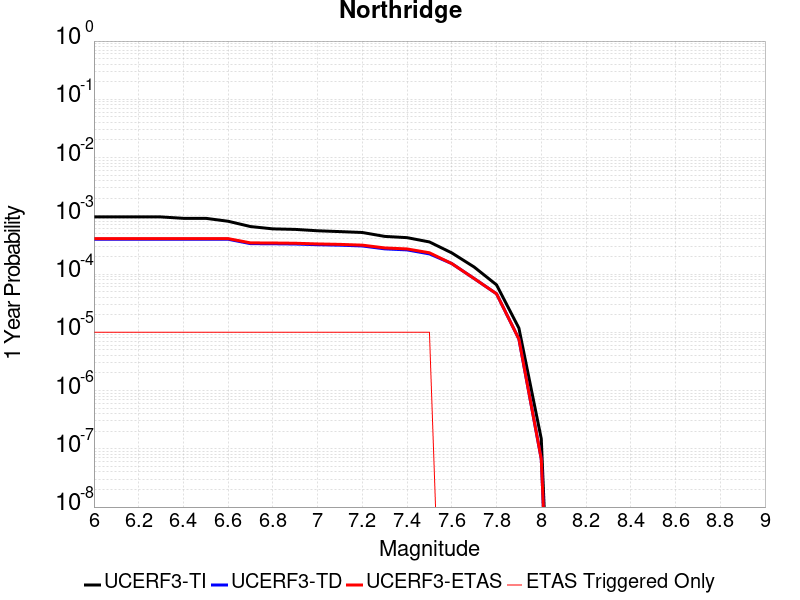 | 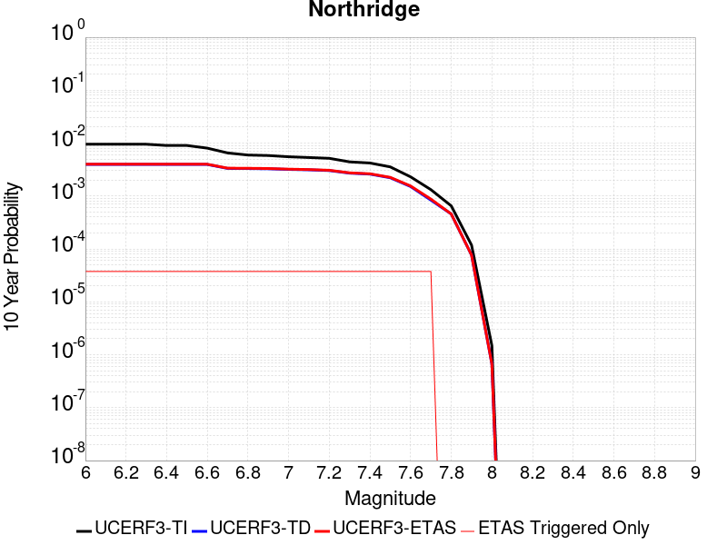 |

| Magnitude | 1 wk TI Prob | 1 wk TD Prob | 1 wk ETAS Prob | 1 wk ETAS/TD Gain | 1 wk ETAS Triggered Only | 1 mo TI Prob | 1 mo TD Prob | 1 mo ETAS Prob | 1 mo ETAS/TD Gain | 1 mo ETAS Triggered Only | 1 yr TI Prob | 1 yr TD Prob | 1 yr ETAS Prob | 1 yr ETAS/TD Gain | 1 yr ETAS Triggered Only | 10 yr TI Prob | 10 yr TD Prob | 10 yr ETAS Prob | 10 yr ETAS/TD Gain | 10 yr ETAS Triggered Only |
|-----|-----|-----|-----|-----|-----|-----|-----|-----|-----|-----|-----|-----|-----|-----|-----|-----|-----|-----|-----|-----|
| 6.0 | 1.8340852E-5 | 7.5880193E-6 | 7.5880193E-6 | 1.0 | 0.0 | 7.860128E-5 | 3.251969E-5 | 3.251969E-5 | 1.0 | 0.0 | 9.565505E-4 | 3.958575E-4 | 3.958575E-4 | 1.0 | 0.0 | 0.009524435 | 0.003951746 | 0.003994106 | 1.0107193 | 4.2527856E-5 |
| 6.1 | 1.8340852E-5 | 7.5880193E-6 | 7.5880193E-6 | 1.0 | 0.0 | 7.860128E-5 | 3.251969E-5 | 3.251969E-5 | 1.0 | 0.0 | 9.565505E-4 | 3.958575E-4 | 3.958575E-4 | 1.0 | 0.0 | 0.009524435 | 0.003951746 | 0.003994106 | 1.0107193 | 4.2527856E-5 |
| 6.2 | 1.8340852E-5 | 7.5880193E-6 | 7.5880193E-6 | 1.0 | 0.0 | 7.860128E-5 | 3.251969E-5 | 3.251969E-5 | 1.0 | 0.0 | 9.565505E-4 | 3.958575E-4 | 3.958575E-4 | 1.0 | 0.0 | 0.009524435 | 0.003951746 | 0.003994106 | 1.0107193 | 4.2527856E-5 |
| 6.3 | 1.8340852E-5 | 7.5880193E-6 | 7.5880193E-6 | 1.0 | 0.0 | 7.860128E-5 | 3.251969E-5 | 3.251969E-5 | 1.0 | 0.0 | 9.565505E-4 | 3.958575E-4 | 3.958575E-4 | 1.0 | 0.0 | 0.009524435 | 0.003951746 | 0.003994106 | 1.0107193 | 4.2527856E-5 |
| 6.4 | 1.7361892E-5 | 7.5880193E-6 | 7.5880193E-6 | 1.0 | 0.0 | 7.440598E-5 | 3.251969E-5 | 3.251969E-5 | 1.0 | 0.0 | 9.055163E-4 | 3.958575E-4 | 3.958575E-4 | 1.0 | 0.0 | 0.009018354 | 0.003951746 | 0.003994106 | 1.0107193 | 4.2527856E-5 |
| 6.5 | 1.7361892E-5 | 7.5880193E-6 | 7.5880193E-6 | 1.0 | 0.0 | 7.440598E-5 | 3.251969E-5 | 3.251969E-5 | 1.0 | 0.0 | 9.055163E-4 | 3.958575E-4 | 3.958575E-4 | 1.0 | 0.0 | 0.009018354 | 0.003951746 | 0.003994106 | 1.0107193 | 4.2527856E-5 |
| 6.6 | 1.5458201E-5 | 7.5880193E-6 | 7.5880193E-6 | 1.0 | 0.0 | 6.624775E-5 | 3.251969E-5 | 3.251969E-5 | 1.0 | 0.0 | 8.0626784E-4 | 3.958575E-4 | 3.958575E-4 | 1.0 | 0.0 | 0.008033488 | 0.003951746 | 0.003994106 | 1.0107193 | 4.2527856E-5 |
| 6.7 | 1.2538368E-5 | 6.381603E-6 | 6.381603E-6 | 1.0 | 0.0 | 5.3734755E-5 | 2.7349442E-5 | 2.7349442E-5 | 1.0 | 0.0 | 6.5402425E-4 | 3.3292902E-4 | 3.3292902E-4 | 1.0 | 0.0 | 0.0065210275 | 0.0033243506 | 0.003366737 | 1.0127503 | 4.2527856E-5 |
| 6.8 | 1.1438097E-5 | 6.3502566E-6 | 6.3502566E-6 | 1.0 | 0.0 | 4.9019498E-5 | 2.7215105E-5 | 2.7215105E-5 | 1.0 | 0.0 | 5.9664896E-4 | 3.3129397E-4 | 3.3129397E-4 | 1.0 | 0.0 | 0.005950495 | 0.0033080487 | 0.0033504358 | 1.0128133 | 4.2527856E-5 |
| 6.9 | 1.1204891E-5 | 6.2867084E-6 | 6.2867084E-6 | 1.0 | 0.0 | 4.8020076E-5 | 2.694276E-5 | 2.694276E-5 | 1.0 | 0.0 | 5.8448757E-4 | 3.2797916E-4 | 3.2797916E-4 | 1.0 | 0.0 | 0.0058295266 | 0.0032749989 | 0.0033173875 | 1.012943 | 4.2527856E-5 |
| 7.0 | 1.061046E-5 | 6.115359E-6 | 6.115359E-6 | 1.0 | 0.0 | 4.5472607E-5 | 2.6208421E-5 | 2.6208421E-5 | 1.0 | 0.0 | 5.534883E-4 | 3.1904122E-4 | 3.1904122E-4 | 1.0 | 0.0 | 0.0055211177 | 0.0031858785 | 0.003228271 | 1.0133064 | 4.2527856E-5 |
| 7.1 | 1.0266979E-5 | 6.004274E-6 | 6.004274E-6 | 1.0 | 0.0 | 4.40006E-5 | 2.5732352E-5 | 2.5732352E-5 | 1.0 | 0.0 | 5.355756E-4 | 3.1324677E-4 | 3.1324677E-4 | 1.0 | 0.0 | 0.0053428668 | 0.003128098 | 0.003170493 | 1.0135529 | 4.2527856E-5 |
| 7.2 | 9.91273E-6 | 5.819984E-6 | 5.819984E-6 | 1.0 | 0.0 | 4.248244E-5 | 2.4942554E-5 | 2.4942554E-5 | 1.0 | 0.0 | 5.171009E-4 | 3.036337E-4 | 3.036337E-4 | 1.0 | 0.0 | 0.0051589934 | 0.0030322333 | 0.0030746323 | 1.0139828 | 4.2527856E-5 |
| 7.3 | 8.4959265E-6 | 5.193062E-6 | 5.193062E-6 | 1.0 | 0.0 | 3.6410605E-5 | 2.225579E-5 | 2.225579E-5 | 1.0 | 0.0 | 4.4320893E-4 | 2.709308E-4 | 2.709308E-4 | 1.0 | 0.0 | 0.00442326 | 0.0027060313 | 0.0027484442 | 1.0156734 | 4.2527856E-5 |
| 7.4 | 8.0847185E-6 | 4.9819355E-6 | 4.9819355E-6 | 1.0 | 0.0 | 3.4648332E-5 | 2.135098E-5 | 2.135098E-5 | 1.0 | 0.0 | 4.2176177E-4 | 2.599174E-4 | 2.599174E-4 | 1.0 | 0.0 | 0.0042096223 | 0.00259616 | 0.0026385775 | 1.0163386 | 4.2527856E-5 |
| 7.5 | 6.8220684E-6 | 4.2533075E-6 | 4.2533075E-6 | 1.0 | 0.0 | 2.9237108E-5 | 1.8228335E-5 | 1.8228335E-5 | 1.0 | 0.0 | 3.5590364E-4 | 2.2190758E-4 | 2.2190758E-4 | 1.0 | 0.0 | 0.0035533418 | 0.002216881 | 0.0022593145 | 1.0191411 | 4.2527856E-5 |
| 7.6 | 4.4224143E-6 | 2.8999582E-6 | 2.8999582E-6 | 1.0 | 0.0 | 1.8953066E-5 | 1.2428334E-5 | 1.2428334E-5 | 1.0 | 0.0 | 2.3072914E-4 | 1.5130457E-4 | 1.5130457E-4 | 1.0 | 0.0 | 0.0023048974 | 0.0015120271 | 0.0015544908 | 1.0280838 | 4.2527856E-5 |
| 7.7 | 2.5297056E-6 | 1.6045905E-6 | 1.6045905E-6 | 1.0 | 0.0 | 1.0841551E-5 | 6.8767986E-6 | 6.8767986E-6 | 1.0 | 0.0 | 1.319879E-4 | 8.3721854E-5 | 8.3721854E-5 | 1.0 | 0.0 | 0.0013190953 | 8.369078E-4 | 8.794001E-4 | 1.0507729 | 4.2527856E-5 |
| 7.8 | 1.2508156E-6 | 8.780076E-7 | 8.780076E-7 | 1.0 | 0.0 | 5.3606273E-6 | 3.7628845E-6 | 3.7628845E-6 | 1.0 | 0.0 | 6.526368E-5 | 4.581217E-5 | 4.581217E-5 | 1.0 | 0.0 | 6.524452E-4 | 4.5802852E-4 | 4.5802852E-4 | 1.0 | 0.0 |
| 7.9 | 2.262199E-7 | 1.4664671E-7 | 1.4664671E-7 | 1.0 | 0.0 | 9.695135E-7 | 6.284858E-7 | 6.284858E-7 | 1.0 | 0.0 | 1.1803763E-5 | 7.651788E-6 | 7.651788E-6 | 1.0 | 0.0 | 1.1803136E-4 | 7.651533E-5 | 7.651533E-5 | 1.0 | 0.0 |
| 8.0 | 2.865362E-9 | 1.2753101E-9 | 1.2753101E-9 | 1.0 | 0.0 | 1.2280123E-8 | 5.4656146E-9 | 5.4656146E-9 | 1.0 | 0.0 | 1.4951048E-7 | 6.654386E-8 | 6.654386E-8 | 1.0 | 0.0 | 1.4951038E-6 | 6.654386E-7 | 6.654386E-7 | 1.0 | 0.0 |

## Peralta Hills
*[(top)](#table-of-contents)*

| 1 Week | 1 Month | 1 Year | 10 Year |
|-----|-----|-----|-----|
| 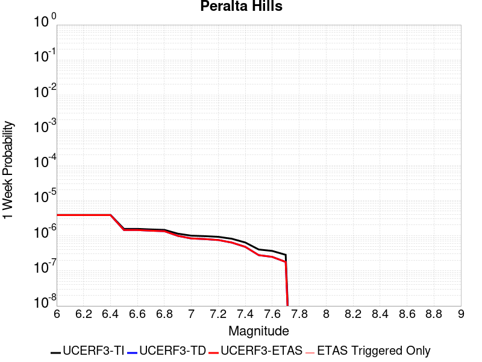 | 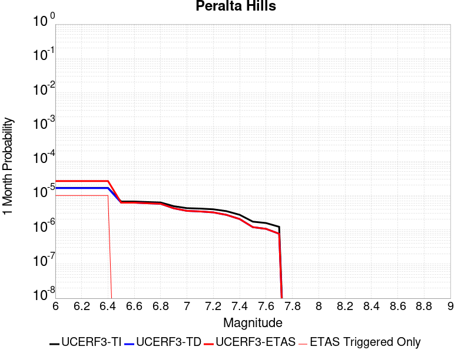 | 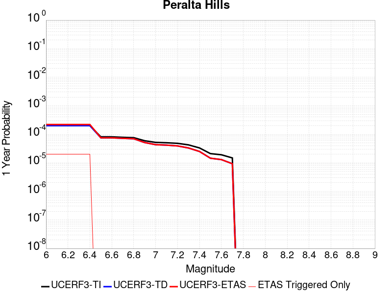 | 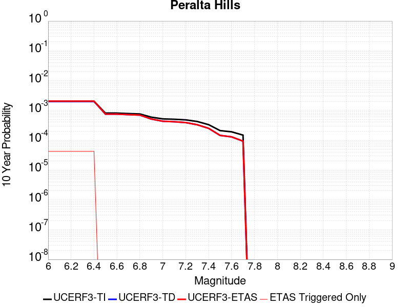 |

| Magnitude | 1 wk TI Prob | 1 wk TD Prob | 1 wk ETAS Prob | 1 wk ETAS/TD Gain | 1 wk ETAS Triggered Only | 1 mo TI Prob | 1 mo TD Prob | 1 mo ETAS Prob | 1 mo ETAS/TD Gain | 1 mo ETAS Triggered Only | 1 yr TI Prob | 1 yr TD Prob | 1 yr ETAS Prob | 1 yr ETAS/TD Gain | 1 yr ETAS Triggered Only | 10 yr TI Prob | 10 yr TD Prob | 10 yr ETAS Prob | 10 yr ETAS/TD Gain | 10 yr ETAS Triggered Only |
|-----|-----|-----|-----|-----|-----|-----|-----|-----|-----|-----|-----|-----|-----|-----|-----|-----|-----|-----|-----|-----|
| 6.0 | 3.8850067E-6 | 3.839512E-6 | 3.839512E-6 | 1.0 | 0.0 | 1.6649923E-5 | 1.645499E-5 | 5.8982143E-5 | 3.5844536 | 4.2527856E-5 | 2.0269395E-4 | 2.0032849E-4 | 2.4284782E-4 | 1.2122481 | 4.2527856E-5 | 0.0020250916 | 0.0020022066 | 0.0020446493 | 1.0211979 | 4.2527856E-5 |
| 6.1 | 3.8850067E-6 | 3.839512E-6 | 3.839512E-6 | 1.0 | 0.0 | 1.6649923E-5 | 1.645499E-5 | 5.8982143E-5 | 3.5844536 | 4.2527856E-5 | 2.0269395E-4 | 2.0032849E-4 | 2.4284782E-4 | 1.2122481 | 4.2527856E-5 | 0.0020250916 | 0.0020022066 | 0.0020446493 | 1.0211979 | 4.2527856E-5 |
| 6.2 | 3.8850067E-6 | 3.839512E-6 | 3.839512E-6 | 1.0 | 0.0 | 1.6649923E-5 | 1.645499E-5 | 5.8982143E-5 | 3.5844536 | 4.2527856E-5 | 2.0269395E-4 | 2.0032849E-4 | 2.4284782E-4 | 1.2122481 | 4.2527856E-5 | 0.0020250916 | 0.0020022066 | 0.0020446493 | 1.0211979 | 4.2527856E-5 |
| 6.3 | 3.8850067E-6 | 3.839512E-6 | 3.839512E-6 | 1.0 | 0.0 | 1.6649923E-5 | 1.645499E-5 | 5.8982143E-5 | 3.5844536 | 4.2527856E-5 | 2.0269395E-4 | 2.0032849E-4 | 2.4284782E-4 | 1.2122481 | 4.2527856E-5 | 0.0020250916 | 0.0020022066 | 0.0020446493 | 1.0211979 | 4.2527856E-5 |
| 6.4 | 3.8850067E-6 | 3.839512E-6 | 3.839512E-6 | 1.0 | 0.0 | 1.6649923E-5 | 1.645499E-5 | 5.8982143E-5 | 3.5844536 | 4.2527856E-5 | 2.0269395E-4 | 2.0032849E-4 | 2.4284782E-4 | 1.2122481 | 4.2527856E-5 | 0.0020250916 | 0.0020022066 | 0.0020446493 | 1.0211979 | 4.2527856E-5 |
| 6.5 | 1.5587785E-6 | 1.4430796E-6 | 1.4430796E-6 | 1.0 | 0.0 | 6.6804623E-6 | 6.184613E-6 | 6.184613E-6 | 1.0 | 0.0 | 8.133159E-5 | 7.529531E-5 | 7.529531E-5 | 1.0 | 0.0 | 8.1301836E-4 | 7.52722E-4 | 7.52722E-4 | 1.0 | 0.0 |
| 6.6 | 1.5587785E-6 | 1.4430796E-6 | 1.4430796E-6 | 1.0 | 0.0 | 6.6804623E-6 | 6.184613E-6 | 6.184613E-6 | 1.0 | 0.0 | 8.133159E-5 | 7.529531E-5 | 7.529531E-5 | 1.0 | 0.0 | 8.1301836E-4 | 7.52722E-4 | 7.52722E-4 | 1.0 | 0.0 |
| 6.7 | 1.5018579E-6 | 1.3837022E-6 | 1.3837022E-6 | 1.0 | 0.0 | 6.436518E-6 | 5.93014E-6 | 5.93014E-6 | 1.0 | 0.0 | 7.836179E-5 | 7.21973E-5 | 7.21973E-5 | 1.0 | 0.0 | 7.833416E-4 | 7.21762E-4 | 7.21762E-4 | 1.0 | 0.0 |
| 6.8 | 1.4584314E-6 | 1.3381342E-6 | 1.3381342E-6 | 1.0 | 0.0 | 6.250405E-6 | 5.7348498E-6 | 5.7348498E-6 | 1.0 | 0.0 | 7.6096025E-5 | 6.98198E-5 | 6.98198E-5 | 1.0 | 0.0 | 7.6069974E-4 | 6.98002E-4 | 6.98002E-4 | 1.0 | 0.0 |
| 6.9 | 1.1382393E-6 | 9.862285E-7 | 9.862285E-7 | 1.0 | 0.0 | 4.8781594E-6 | 4.226687E-6 | 4.226687E-6 | 1.0 | 0.0 | 5.9389975E-5 | 5.1458785E-5 | 5.1458785E-5 | 1.0 | 0.0 | 5.93741E-4 | 5.144769E-4 | 5.144769E-4 | 1.0 | 0.0 |
| 7.0 | 9.970413E-7 | 8.309642E-7 | 8.309642E-7 | 1.0 | 0.0 | 4.273027E-6 | 3.561271E-6 | 3.561271E-6 | 1.0 | 0.0 | 5.2022864E-5 | 4.335768E-5 | 4.335768E-5 | 1.0 | 0.0 | 5.2010687E-4 | 4.33499E-4 | 4.33499E-4 | 1.0 | 0.0 |
| 7.1 | 9.684443E-7 | 7.99408E-7 | 7.99408E-7 | 1.0 | 0.0 | 4.150469E-6 | 3.4260302E-6 | 3.4260302E-6 | 1.0 | 0.0 | 5.053079E-5 | 4.1711188E-5 | 4.1711188E-5 | 1.0 | 0.0 | 5.05193E-4 | 4.170403E-4 | 4.170403E-4 | 1.0 | 0.0 |
| 7.2 | 9.240811E-7 | 7.5031426E-7 | 7.5031426E-7 | 1.0 | 0.0 | 3.960342E-6 | 3.215629E-6 | 3.215629E-6 | 1.0 | 0.0 | 4.8216094E-5 | 3.9149647E-5 | 3.9149647E-5 | 1.0 | 0.0 | 4.8205635E-4 | 3.9143403E-4 | 3.9143403E-4 | 1.0 | 0.0 |
| 7.3 | 8.158643E-7 | 6.350017E-7 | 6.350017E-7 | 1.0 | 0.0 | 3.4965567E-6 | 2.7214332E-6 | 2.7214332E-6 | 1.0 | 0.0 | 4.2569747E-5 | 3.313301E-5 | 3.313301E-5 | 1.0 | 0.0 | 4.2561593E-4 | 3.3128684E-4 | 3.3128684E-4 | 1.0 | 0.0 |
| 7.4 | 6.3822824E-7 | 4.7957286E-7 | 4.7957286E-7 | 1.0 | 0.0 | 2.7352612E-6 | 2.0553111E-6 | 2.0553111E-6 | 1.0 | 0.0 | 3.3301294E-5 | 2.5023177E-5 | 2.5023177E-5 | 1.0 | 0.0 | 3.3296304E-4 | 2.5020874E-4 | 2.5020874E-4 | 1.0 | 0.0 |
| 7.5 | 4.0292628E-7 | 2.7846056E-7 | 2.7846056E-7 | 1.0 | 0.0 | 1.7268258E-6 | 1.193402E-6 | 1.193402E-6 | 1.0 | 0.0 | 2.1023901E-5 | 1.4529601E-5 | 1.4529601E-5 | 1.0 | 0.0 | 2.1021912E-4 | 1.452893E-4 | 1.452893E-4 | 1.0 | 0.0 |
| 7.6 | 3.672993E-7 | 2.485495E-7 | 2.485495E-7 | 1.0 | 0.0 | 1.5741389E-6 | 1.0652118E-6 | 1.0652118E-6 | 1.0 | 0.0 | 1.9164972E-5 | 1.2968904E-5 | 1.2968904E-5 | 1.0 | 0.0 | 1.916332E-4 | 1.296842E-4 | 1.296842E-4 | 1.0 | 0.0 |
| 7.7 | 2.8466823E-7 | 1.7859877E-7 | 1.7859877E-7 | 1.0 | 0.0 | 1.2200061E-6 | 7.6542324E-7 | 7.6542324E-7 | 1.0 | 0.0 | 1.4853474E-5 | 9.319015E-6 | 9.319015E-6 | 1.0 | 0.0 | 1.485248E-4 | 9.3188835E-5 | 9.3188835E-5 | 1.0 | 0.0 |

## West Napa 2011 CFM
*[(top)](#table-of-contents)*

| 1 Week | 1 Month | 1 Year | 10 Year |
|-----|-----|-----|-----|
| 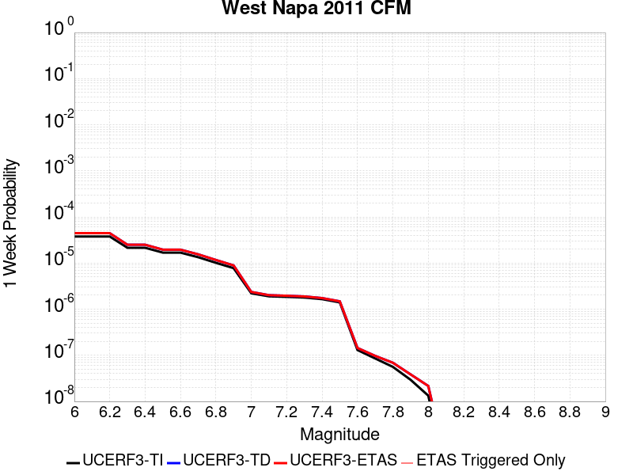 | 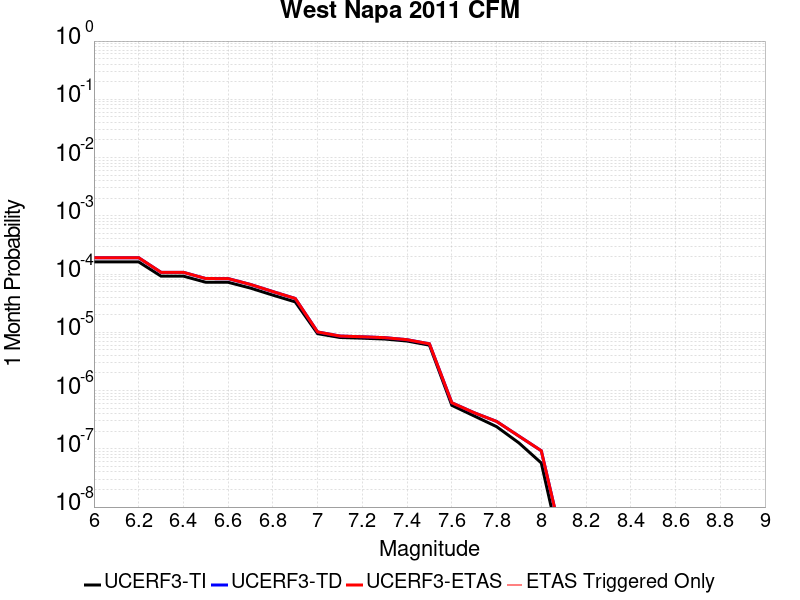 | 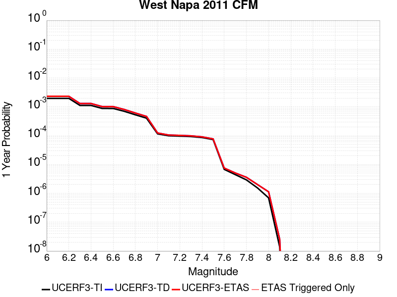 | 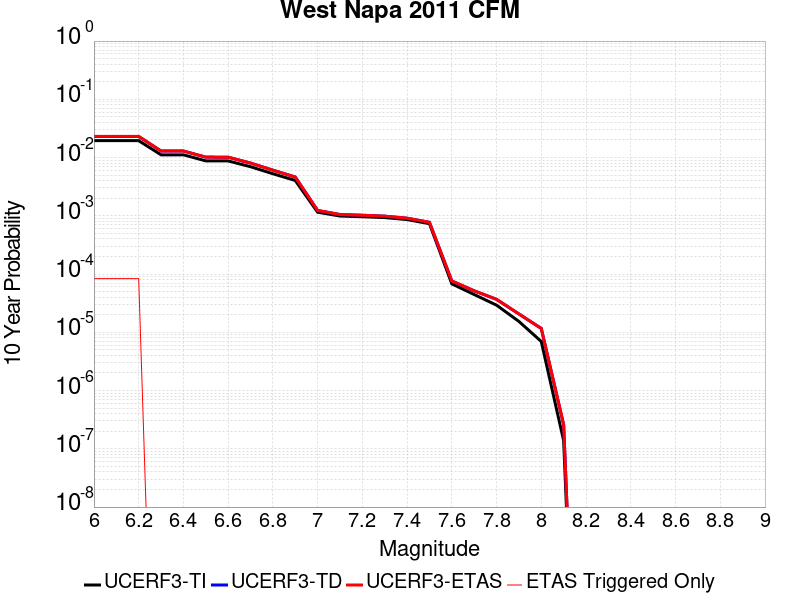 |

| Magnitude | 1 wk TI Prob | 1 wk TD Prob | 1 wk ETAS Prob | 1 wk ETAS/TD Gain | 1 wk ETAS Triggered Only | 1 mo TI Prob | 1 mo TD Prob | 1 mo ETAS Prob | 1 mo ETAS/TD Gain | 1 mo ETAS Triggered Only | 1 yr TI Prob | 1 yr TD Prob | 1 yr ETAS Prob | 1 yr ETAS/TD Gain | 1 yr ETAS Triggered Only | 10 yr TI Prob | 10 yr TD Prob | 10 yr ETAS Prob | 10 yr ETAS/TD Gain | 10 yr ETAS Triggered Only |
|-----|-----|-----|-----|-----|-----|-----|-----|-----|-----|-----|-----|-----|-----|-----|-----|-----|-----|-----|-----|-----|
| 6.0 | 3.773104E-5 | 4.452845E-5 | 4.452845E-5 | 1.0 | 0.0 | 1.6169442E-4 | 1.9082405E-4 | 1.9082405E-4 | 1.0 | 0.0 | 0.001966852 | 0.0023211248 | 0.0023211248 | 1.0 | 0.0 | 0.019495348 | 0.023002245 | 0.023043795 | 1.0018064 | 4.2527856E-5 |
| 6.1 | 3.773104E-5 | 4.452845E-5 | 4.452845E-5 | 1.0 | 0.0 | 1.6169442E-4 | 1.9082405E-4 | 1.9082405E-4 | 1.0 | 0.0 | 0.001966852 | 0.0023211248 | 0.0023211248 | 1.0 | 0.0 | 0.019495348 | 0.023002245 | 0.023043795 | 1.0018064 | 4.2527856E-5 |
| 6.2 | 3.773104E-5 | 4.452845E-5 | 4.452845E-5 | 1.0 | 0.0 | 1.6169442E-4 | 1.9082405E-4 | 1.9082405E-4 | 1.0 | 0.0 | 0.001966852 | 0.0023211248 | 0.0023211248 | 1.0 | 0.0 | 0.019495348 | 0.023002245 | 0.023043795 | 1.0018064 | 4.2527856E-5 |
| 6.3 | 2.147964E-5 | 2.4987039E-5 | 2.4987039E-5 | 1.0 | 0.0 | 9.2052345E-5 | 1.0708343E-4 | 1.0708343E-4 | 1.0 | 0.0 | 0.001120161 | 0.0013030528 | 0.0013030528 | 1.0 | 0.0 | 0.011145315 | 0.0129647385 | 0.0129647385 | 1.0 | 0.0 |
| 6.4 | 2.147964E-5 | 2.4987039E-5 | 2.4987039E-5 | 1.0 | 0.0 | 9.2052345E-5 | 1.0708343E-4 | 1.0708343E-4 | 1.0 | 0.0 | 0.001120161 | 0.0013030528 | 0.0013030528 | 1.0 | 0.0 | 0.011145315 | 0.0129647385 | 0.0129647385 | 1.0 | 0.0 |
| 6.5 | 1.688201E-5 | 1.9547346E-5 | 1.9547346E-5 | 1.0 | 0.0 | 7.234947E-5 | 8.377206E-5 | 8.377206E-5 | 1.0 | 0.0 | 8.804988E-4 | 0.0010195201 | 0.0010195201 | 1.0 | 0.0 | 0.008770182 | 0.010157098 | 0.010157098 | 1.0 | 0.0 |
| 6.6 | 1.6846381E-5 | 1.9507039E-5 | 1.9507039E-5 | 1.0 | 0.0 | 7.219678E-5 | 8.359933E-5 | 8.359933E-5 | 1.0 | 0.0 | 8.7864127E-4 | 0.001017419 | 0.001017419 | 1.0 | 0.0 | 0.008751754 | 0.010136279 | 0.010136279 | 1.0 | 0.0 |
| 6.7 | 1.3396501E-5 | 1.5467655E-5 | 1.5467655E-5 | 1.0 | 0.0 | 5.7412315E-5 | 6.628862E-5 | 6.628862E-5 | 1.0 | 0.0 | 6.9877075E-4 | 8.0682867E-4 | 8.0682867E-4 | 1.0 | 0.0 | 0.0069657755 | 0.008046719 | 0.008046719 | 1.0 | 0.0 |
| 6.8 | 1.0139058E-5 | 1.1672149E-5 | 1.1672149E-5 | 1.0 | 0.0 | 4.3452383E-5 | 5.0022853E-5 | 5.0022853E-5 | 1.0 | 0.0 | 5.289043E-4 | 6.0891354E-4 | 6.0891354E-4 | 1.0 | 0.0 | 0.005276473 | 0.006079373 | 0.006079373 | 1.0 | 0.0 |
| 6.9 | 7.761281E-6 | 8.890694E-6 | 8.890694E-6 | 1.0 | 0.0 | 3.326221E-5 | 3.8102706E-5 | 3.8102706E-5 | 1.0 | 0.0 | 4.0489217E-4 | 4.6385307E-4 | 4.6385307E-4 | 1.0 | 0.0 | 0.0040415525 | 0.004635363 | 0.004635363 | 1.0 | 0.0 |
| 7.0 | 2.2109202E-6 | 2.3666025E-6 | 2.3666025E-6 | 1.0 | 0.0 | 9.475338E-6 | 1.0142544E-5 | 1.0142544E-5 | 1.0 | 0.0 | 1.1535613E-4 | 1.2347854E-4 | 1.2347854E-4 | 1.0 | 0.0 | 0.0011529627 | 0.0012355851 | 0.0012355851 | 1.0 | 0.0 |
| 7.1 | 1.9008926E-6 | 2.0132914E-6 | 2.0132914E-6 | 1.0 | 0.0 | 8.146657E-6 | 8.6283635E-6 | 8.6283635E-6 | 1.0 | 0.0 | 9.918104E-5 | 1.05045285E-4 | 1.05045285E-4 | 1.0 | 0.0 | 9.913679E-4 | 0.001051437 | 0.001051437 | 1.0 | 0.0 |
| 7.2 | 1.8495944E-6 | 1.9560982E-6 | 1.9560982E-6 | 1.0 | 0.0 | 7.926808E-6 | 8.383251E-6 | 8.383251E-6 | 1.0 | 0.0 | 9.650462E-5 | 1.0206133E-4 | 1.0206133E-4 | 1.0 | 0.0 | 9.6462725E-4 | 0.0010216252 | 0.0010216252 | 1.0 | 0.0 |
| 7.3 | 1.7883189E-6 | 1.8880608E-6 | 1.8880608E-6 | 1.0 | 0.0 | 7.664201E-6 | 8.091664E-6 | 8.091664E-6 | 1.0 | 0.0 | 9.330765E-5 | 9.8511584E-5 | 9.8511584E-5 | 1.0 | 0.0 | 9.3268487E-4 | 9.861597E-4 | 9.861597E-4 | 1.0 | 0.0 |
| 7.4 | 1.6520572E-6 | 1.741484E-6 | 1.741484E-6 | 1.0 | 0.0 | 7.0802257E-6 | 7.463482E-6 | 7.463482E-6 | 1.0 | 0.0 | 8.6198335E-5 | 9.086413E-5 | 9.086413E-5 | 1.0 | 0.0 | 8.616491E-4 | 9.0974604E-4 | 9.0974604E-4 | 1.0 | 0.0 |
| 7.5 | 1.4040345E-6 | 1.4800074E-6 | 1.4800074E-6 | 1.0 | 0.0 | 6.0172765E-6 | 6.3428733E-6 | 6.3428733E-6 | 1.0 | 0.0 | 7.325788E-5 | 7.7221775E-5 | 7.7221775E-5 | 1.0 | 0.0 | 7.3233736E-4 | 7.7339396E-4 | 7.7339396E-4 | 1.0 | 0.0 |
| 7.6 | 1.3013842E-7 | 1.4415936E-7 | 1.4415936E-7 | 1.0 | 0.0 | 5.57736E-7 | 6.1782566E-7 | 6.1782566E-7 | 1.0 | 0.0 | 6.790414E-6 | 7.5220014E-6 | 7.5220014E-6 | 1.0 | 0.0 | 6.790207E-5 | 7.614869E-5 | 7.614869E-5 | 1.0 | 0.0 |
| 7.7 | 8.541512E-8 | 9.716316E-8 | 9.716316E-8 | 1.0 | 0.0 | 3.6606474E-7 | 4.1641349E-7 | 4.1641349E-7 | 1.0 | 0.0 | 4.456829E-6 | 5.0698222E-6 | 5.0698222E-6 | 1.0 | 0.0 | 4.4567398E-5 | 5.160297E-5 | 5.160297E-5 | 1.0 | 0.0 |
| 7.8 | 5.6074793E-8 | 6.89534E-8 | 6.89534E-8 | 1.0 | 0.0 | 2.403205E-7 | 2.9551452E-7 | 2.9551452E-7 | 1.0 | 0.0 | 2.9258983E-6 | 3.5978833E-6 | 3.5978833E-6 | 1.0 | 0.0 | 2.9258597E-5 | 3.681433E-5 | 3.681433E-5 | 1.0 | 0.0 |
| 7.9 | 2.9475839E-8 | 3.8566046E-8 | 3.8566046E-8 | 1.0 | 0.0 | 1.2632502E-7 | 1.6528305E-7 | 1.6528305E-7 | 1.0 | 0.0 | 1.538006E-6 | 2.0123193E-6 | 2.0123193E-6 | 1.0 | 0.0 | 1.5379954E-5 | 2.0665891E-5 | 2.0665891E-5 | 1.0 | 0.0 |
| 8.0 | 1.3337122E-8 | 2.163124E-8 | 2.163124E-8 | 1.0 | 0.0 | 5.7159088E-8 | 9.270532E-8 | 9.270532E-8 | 1.0 | 0.0 | 6.959117E-7 | 1.1286867E-6 | 1.1286867E-6 | 1.0 | 0.0 | 6.959095E-6 | 1.1645628E-5 | 1.1645628E-5 | 1.0 | 0.0 |
| 8.1 | 2.6589986E-10 | 4.8615456E-10 | 4.8615456E-10 | 1.0 | 0.0 | 1.1395708E-9 | 2.0835205E-9 | 2.0835205E-9 | 1.0 | 0.0 | 1.3874274E-8 | 2.536686E-8 | 2.536686E-8 | 1.0 | 0.0 | 1.3874273E-7 | 2.6035906E-7 | 2.6035906E-7 | 1.0 | 0.0 |

## Elsinore (Coyote Mountains)
*[(top)](#table-of-contents)*

| 1 Week | 1 Month | 1 Year | 10 Year |
|-----|-----|-----|-----|
|  | 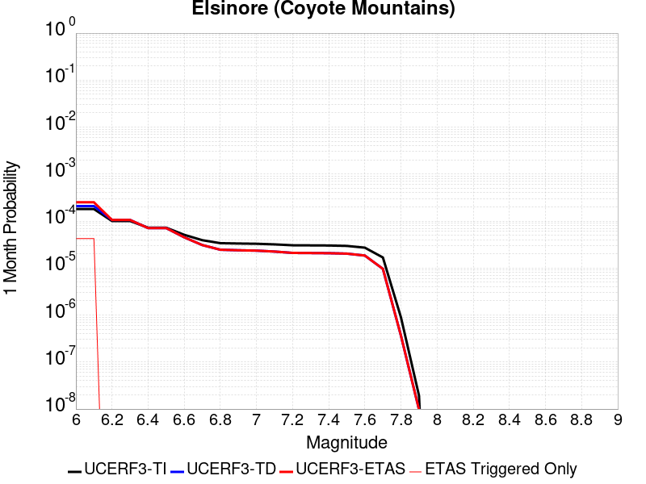 | 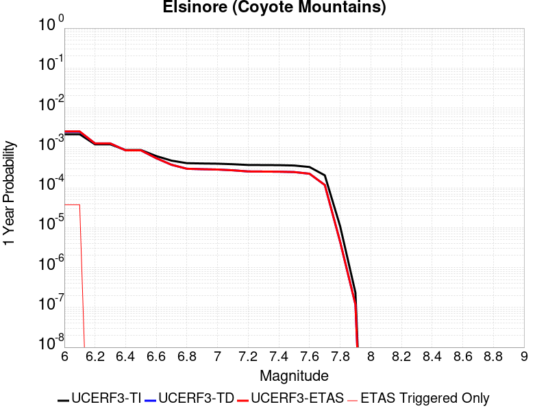 | 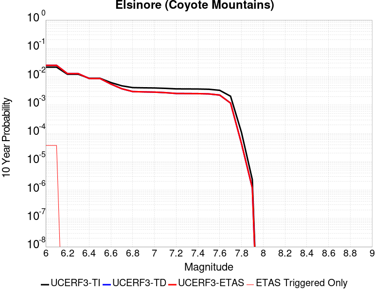 |

| Magnitude | 1 wk TI Prob | 1 wk TD Prob | 1 wk ETAS Prob | 1 wk ETAS/TD Gain | 1 wk ETAS Triggered Only | 1 mo TI Prob | 1 mo TD Prob | 1 mo ETAS Prob | 1 mo ETAS/TD Gain | 1 mo ETAS Triggered Only | 1 yr TI Prob | 1 yr TD Prob | 1 yr ETAS Prob | 1 yr ETAS/TD Gain | 1 yr ETAS Triggered Only | 10 yr TI Prob | 10 yr TD Prob | 10 yr ETAS Prob | 10 yr ETAS/TD Gain | 10 yr ETAS Triggered Only |
|-----|-----|-----|-----|-----|-----|-----|-----|-----|-----|-----|-----|-----|-----|-----|-----|-----|-----|-----|-----|-----|
| 6.0 | 4.20513E-5 | 4.8631882E-5 | 4.8631882E-5 | 1.0 | 0.0 | 1.8020741E-4 | 2.0840895E-4 | 2.5092796E-4 | 1.2040172 | 4.2527856E-5 | 0.0021918174 | 0.002535 | 0.00257742 | 1.0167338 | 4.2527856E-5 | 0.021703249 | 0.025111282 | 0.025152743 | 1.001651 | 4.2527856E-5 |
| 6.1 | 4.20513E-5 | 4.8631882E-5 | 4.8631882E-5 | 1.0 | 0.0 | 1.8020741E-4 | 2.0840895E-4 | 2.5092796E-4 | 1.2040172 | 4.2527856E-5 | 0.0021918174 | 0.002535 | 0.00257742 | 1.0167338 | 4.2527856E-5 | 0.021703249 | 0.025111282 | 0.025152743 | 1.001651 | 4.2527856E-5 |
| 6.2 | 2.3413893E-5 | 2.469566E-5 | 2.469566E-5 | 1.0 | 0.0 | 1.0034139E-4 | 1.0583479E-4 | 1.0583479E-4 | 1.0 | 0.0 | 0.0012209718 | 0.0012878707 | 0.0012878707 | 1.0 | 0.0 | 0.012142851 | 0.01281264 | 0.01281264 | 1.0 | 0.0 |
| 6.3 | 2.3413893E-5 | 2.469566E-5 | 2.469566E-5 | 1.0 | 0.0 | 1.0034139E-4 | 1.0583479E-4 | 1.0583479E-4 | 1.0 | 0.0 | 0.0012209718 | 0.0012878707 | 0.0012878707 | 1.0 | 0.0 | 0.012142851 | 0.01281264 | 0.01281264 | 1.0 | 0.0 |
| 6.4 | 1.6894814E-5 | 1.6568361E-5 | 1.6568361E-5 | 1.0 | 0.0 | 7.240433E-5 | 7.1005554E-5 | 7.1005554E-5 | 1.0 | 0.0 | 8.811662E-4 | 8.6418656E-4 | 8.6418656E-4 | 1.0 | 0.0 | 0.0087768035 | 0.00861194 | 0.00861194 | 1.0 | 0.0 |
| 6.5 | 1.6894814E-5 | 1.6568361E-5 | 1.6568361E-5 | 1.0 | 0.0 | 7.240433E-5 | 7.1005554E-5 | 7.1005554E-5 | 1.0 | 0.0 | 8.811662E-4 | 8.6418656E-4 | 8.6418656E-4 | 1.0 | 0.0 | 0.0087768035 | 0.00861194 | 0.00861194 | 1.0 | 0.0 |
| 6.6 | 1.1910969E-5 | 1.0530774E-5 | 1.0530774E-5 | 1.0 | 0.0 | 5.1046012E-5 | 4.5131183E-5 | 4.5131183E-5 | 1.0 | 0.0 | 6.21308E-4 | 5.4934516E-4 | 5.4934516E-4 | 1.0 | 0.0 | 0.0061957375 | 0.005481174 | 0.005481174 | 1.0 | 0.0 |
| 6.7 | 9.1486E-6 | 7.2028593E-6 | 7.2028593E-6 | 1.0 | 0.0 | 3.9207694E-5 | 3.0869054E-5 | 3.0869054E-5 | 1.0 | 0.0 | 4.7724912E-4 | 3.757697E-4 | 3.757697E-4 | 1.0 | 0.0 | 0.0047622547 | 0.0037517229 | 0.0037517229 | 1.0 | 0.0 |
| 6.8 | 7.90441E-6 | 5.7290276E-6 | 5.7290276E-6 | 1.0 | 0.0 | 3.3875604E-5 | 2.4552752E-5 | 2.4552752E-5 | 1.0 | 0.0 | 4.1235742E-4 | 2.9889002E-4 | 2.9889002E-4 | 1.0 | 0.0 | 0.0041159308 | 0.002985009 | 0.002985009 | 1.0 | 0.0 |
| 6.9 | 7.77015E-6 | 5.582982E-6 | 5.582982E-6 | 1.0 | 0.0 | 3.3300217E-5 | 2.3926852E-5 | 2.3926852E-5 | 1.0 | 0.0 | 4.0535472E-4 | 2.9127175E-4 | 2.9127175E-4 | 1.0 | 0.0 | 0.004046161 | 0.002909027 | 0.002909027 | 1.0 | 0.0 |
| 7.0 | 7.675798E-6 | 5.47984E-6 | 5.47984E-6 | 1.0 | 0.0 | 3.289586E-5 | 2.3484827E-5 | 2.3484827E-5 | 1.0 | 0.0 | 4.004335E-4 | 2.858915E-4 | 2.858915E-4 | 1.0 | 0.0 | 0.003997127 | 0.0028553635 | 0.0028553635 | 1.0 | 0.0 |
| 7.1 | 7.447814E-6 | 5.238714E-6 | 5.238714E-6 | 1.0 | 0.0 | 3.191881E-5 | 2.2451446E-5 | 2.2451446E-5 | 1.0 | 0.0 | 3.8854225E-4 | 2.7331332E-4 | 2.7331332E-4 | 1.0 | 0.0 | 0.003878636 | 0.0027298962 | 0.0027298962 | 1.0 | 0.0 |
| 7.2 | 7.128185E-6 | 4.905372E-6 | 4.905372E-6 | 1.0 | 0.0 | 3.0549007E-5 | 2.102286E-5 | 2.102286E-5 | 1.0 | 0.0 | 3.7187067E-4 | 2.5592445E-4 | 2.5592445E-4 | 1.0 | 0.0 | 0.00371249 | 0.0025564157 | 0.0025564157 | 1.0 | 0.0 |
| 7.3 | 7.0913875E-6 | 4.874047E-6 | 4.874047E-6 | 1.0 | 0.0 | 3.0391306E-5 | 2.0888614E-5 | 2.0888614E-5 | 1.0 | 0.0 | 3.6995133E-4 | 2.5429038E-4 | 2.5429038E-4 | 1.0 | 0.0 | 0.0036933604 | 0.0025401122 | 0.0025401122 | 1.0 | 0.0 |
| 7.4 | 7.051521E-6 | 4.837899E-6 | 4.837899E-6 | 1.0 | 0.0 | 3.0220453E-5 | 2.0733693E-5 | 2.0733693E-5 | 1.0 | 0.0 | 3.6787192E-4 | 2.5240466E-4 | 2.5240466E-4 | 1.0 | 0.0 | 0.0036726352 | 0.0025212981 | 0.0025212981 | 1.0 | 0.0 |
| 7.5 | 6.910666E-6 | 4.733448E-6 | 4.733448E-6 | 1.0 | 0.0 | 2.9616802E-5 | 2.0286056E-5 | 2.0286056E-5 | 1.0 | 0.0 | 3.605249E-4 | 2.4695593E-4 | 2.4695593E-4 | 1.0 | 0.0 | 0.0035994058 | 0.0024669329 | 0.0024669329 | 1.0 | 0.0 |
| 7.6 | 6.341753E-6 | 4.3065565E-6 | 4.3065565E-6 | 1.0 | 0.0 | 2.7178658E-5 | 1.8456547E-5 | 1.8456547E-5 | 1.0 | 0.0 | 3.3084993E-4 | 2.2468645E-4 | 2.2468645E-4 | 1.0 | 0.0 | 0.0033035777 | 0.002244708 | 0.002244708 | 1.0 | 0.0 |
| 7.7 | 3.9205916E-6 | 2.2439415E-6 | 2.2439415E-6 | 1.0 | 0.0 | 1.6802427E-5 | 9.616861E-6 | 9.616861E-6 | 1.0 | 0.0 | 2.0455034E-4 | 1.1707973E-4 | 1.1707973E-4 | 1.0 | 0.0 | 0.0020436216 | 0.0011702535 | 0.0011702535 | 1.0 | 0.0 |
| 7.8 | 2.0846227E-7 | 8.486417E-8 | 8.486417E-8 | 1.0 | 0.0 | 8.9340944E-7 | 3.6370355E-7 | 3.6370355E-7 | 1.0 | 0.0 | 1.0877206E-5 | 4.428085E-6 | 4.428085E-6 | 1.0 | 0.0 | 1.0876673E-4 | 4.4280296E-5 | 4.4280296E-5 | 1.0 | 0.0 |
| 7.9 | 4.4969806E-9 | 2.2691855E-9 | 2.2691855E-9 | 1.0 | 0.0 | 1.9272775E-8 | 9.72508E-9 | 9.72508E-9 | 1.0 | 0.0 | 2.3464601E-7 | 1.18402845E-7 | 1.18402845E-7 | 1.0 | 0.0 | 2.3464577E-6 | 1.184028E-6 | 1.184028E-6 | 1.0 | 0.0 |

## Morales (East)
*[(top)](#table-of-contents)*

| 1 Week | 1 Month | 1 Year | 10 Year |
|-----|-----|-----|-----|
|  | 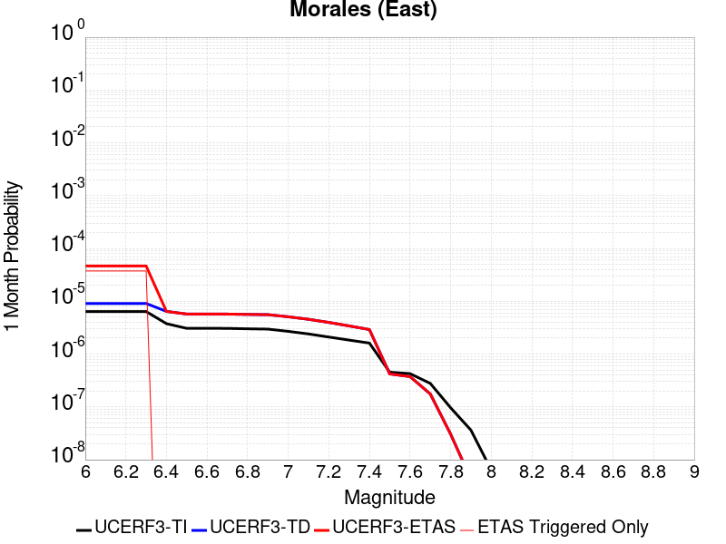 | 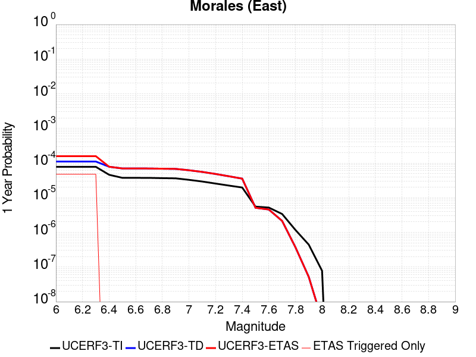 | 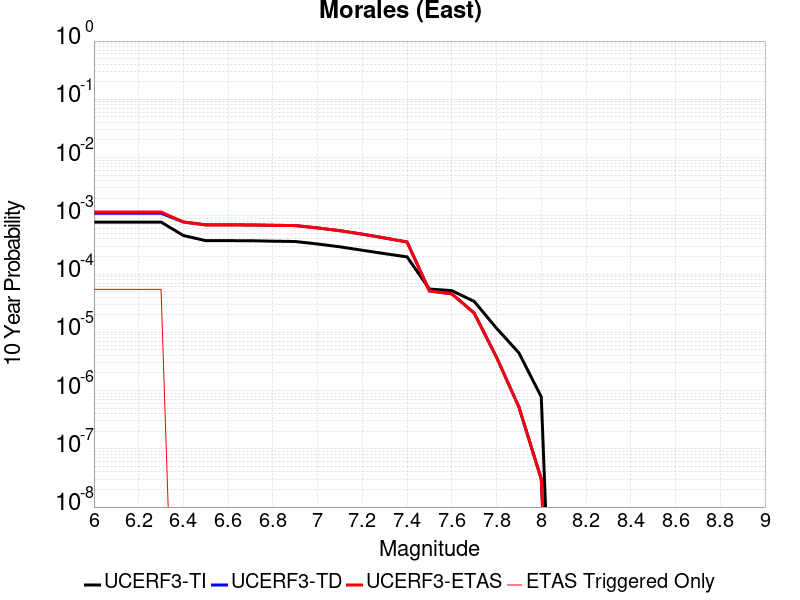 |

| Magnitude | 1 wk TI Prob | 1 wk TD Prob | 1 wk ETAS Prob | 1 wk ETAS/TD Gain | 1 wk ETAS Triggered Only | 1 mo TI Prob | 1 mo TD Prob | 1 mo ETAS Prob | 1 mo ETAS/TD Gain | 1 mo ETAS Triggered Only | 1 yr TI Prob | 1 yr TD Prob | 1 yr ETAS Prob | 1 yr ETAS/TD Gain | 1 yr ETAS Triggered Only | 10 yr TI Prob | 10 yr TD Prob | 10 yr ETAS Prob | 10 yr ETAS/TD Gain | 10 yr ETAS Triggered Only |
|-----|-----|-----|-----|-----|-----|-----|-----|-----|-----|-----|-----|-----|-----|-----|-----|-----|-----|-----|-----|-----|
| 6.0 | 1.4942771E-6 | 2.123479E-6 | 4.4651246E-5 | 21.027401 | 4.2527856E-5 | 6.404029E-6 | 9.100596E-6 | 5.1628063E-5 | 5.6730423 | 4.2527856E-5 | 7.7966266E-5 | 1.107947E-4 | 1.5331784E-4 | 1.3838012 | 4.2527856E-5 | 7.793892E-4 | 0.0011074544 | 0.0011499352 | 1.0383589 | 4.2527856E-5 |
| 6.1 | 1.4942771E-6 | 2.123479E-6 | 4.4651246E-5 | 21.027401 | 4.2527856E-5 | 6.404029E-6 | 9.100596E-6 | 5.1628063E-5 | 5.6730423 | 4.2527856E-5 | 7.7966266E-5 | 1.107947E-4 | 1.5331784E-4 | 1.3838012 | 4.2527856E-5 | 7.793892E-4 | 0.0011074544 | 0.0011499352 | 1.0383589 | 4.2527856E-5 |
| 6.2 | 1.4942771E-6 | 2.123479E-6 | 4.4651246E-5 | 21.027401 | 4.2527856E-5 | 6.404029E-6 | 9.100596E-6 | 5.1628063E-5 | 5.6730423 | 4.2527856E-5 | 7.7966266E-5 | 1.107947E-4 | 1.5331784E-4 | 1.3838012 | 4.2527856E-5 | 7.793892E-4 | 0.0011074544 | 0.0011499352 | 1.0383589 | 4.2527856E-5 |
| 6.3 | 1.4942771E-6 | 2.123479E-6 | 4.4651246E-5 | 21.027401 | 4.2527856E-5 | 6.404029E-6 | 9.100596E-6 | 5.1628063E-5 | 5.6730423 | 4.2527856E-5 | 7.7966266E-5 | 1.107947E-4 | 1.5331784E-4 | 1.3838012 | 4.2527856E-5 | 7.793892E-4 | 0.0011074544 | 0.0011499352 | 1.0383589 | 4.2527856E-5 |
| 6.4 | 8.798845E-7 | 1.5022731E-6 | 1.5022731E-6 | 1.0 | 0.0 | 3.7709283E-6 | 6.438298E-6 | 6.438298E-6 | 1.0 | 0.0 | 4.5910085E-5 | 7.8383564E-5 | 7.8383564E-5 | 1.0 | 0.0 | 4.59006E-4 | 7.835727E-4 | 7.835727E-4 | 1.0 | 0.0 |
| 6.5 | 7.1751725E-7 | 1.3384229E-6 | 1.3384229E-6 | 1.0 | 0.0 | 3.0750705E-6 | 5.7360858E-6 | 5.7360858E-6 | 1.0 | 0.0 | 3.7438338E-5 | 6.9834685E-5 | 6.9834685E-5 | 1.0 | 0.0 | 3.743203E-4 | 6.9813756E-4 | 6.9813756E-4 | 1.0 | 0.0 |
| 6.6 | 7.1751725E-7 | 1.3384229E-6 | 1.3384229E-6 | 1.0 | 0.0 | 3.0750705E-6 | 5.7360858E-6 | 5.7360858E-6 | 1.0 | 0.0 | 3.7438338E-5 | 6.9834685E-5 | 6.9834685E-5 | 1.0 | 0.0 | 3.743203E-4 | 6.9813756E-4 | 6.9813756E-4 | 1.0 | 0.0 |
| 6.7 | 7.159057E-7 | 1.3358889E-6 | 1.3358889E-6 | 1.0 | 0.0 | 3.0681638E-6 | 5.725226E-6 | 5.725226E-6 | 1.0 | 0.0 | 3.7354253E-5 | 6.970247E-5 | 6.970247E-5 | 1.0 | 0.0 | 3.7347974E-4 | 6.968163E-4 | 6.968163E-4 | 1.0 | 0.0 |
| 6.8 | 7.032203E-7 | 1.3174443E-6 | 1.3174443E-6 | 1.0 | 0.0 | 3.0137978E-6 | 5.646178E-6 | 5.646178E-6 | 1.0 | 0.0 | 3.669237E-5 | 6.8740126E-5 | 6.8740126E-5 | 1.0 | 0.0 | 3.6686313E-4 | 6.871988E-4 | 6.871988E-4 | 1.0 | 0.0 |
| 6.9 | 6.941549E-7 | 1.3025061E-6 | 1.3025061E-6 | 1.0 | 0.0 | 2.974946E-6 | 5.582158E-6 | 5.582158E-6 | 1.0 | 0.0 | 3.6219368E-5 | 6.7960726E-5 | 6.7960726E-5 | 1.0 | 0.0 | 3.6213463E-4 | 6.7940954E-4 | 6.7940954E-4 | 1.0 | 0.0 |
| 7.0 | 6.2932247E-7 | 1.18774E-6 | 1.18774E-6 | 1.0 | 0.0 | 2.6970936E-6 | 5.090305E-6 | 5.090305E-6 | 1.0 | 0.0 | 3.283662E-5 | 6.1972765E-5 | 6.1972765E-5 | 1.0 | 0.0 | 3.283177E-4 | 6.1956374E-4 | 6.1956374E-4 | 1.0 | 0.0 |
| 7.1 | 5.6200963E-7 | 1.0640374E-6 | 1.0640374E-6 | 1.0 | 0.0 | 2.4086105E-6 | 4.5601523E-6 | 4.5601523E-6 | 1.0 | 0.0 | 2.9324437E-5 | 5.551849E-5 | 5.551849E-5 | 1.0 | 0.0 | 2.9320567E-4 | 5.550534E-4 | 5.550534E-4 | 1.0 | 0.0 |
| 7.2 | 4.91044E-7 | 9.285713E-7 | 9.285713E-7 | 1.0 | 0.0 | 2.1044725E-6 | 3.9795855E-6 | 3.9795855E-6 | 1.0 | 0.0 | 2.5621652E-5 | 4.8450413E-5 | 4.8450413E-5 | 1.0 | 0.0 | 2.56187E-4 | 4.8440482E-4 | 4.8440482E-4 | 1.0 | 0.0 |
| 7.3 | 4.2978448E-7 | 7.9739846E-7 | 7.9739846E-7 | 1.0 | 0.0 | 1.8419321E-6 | 3.4174175E-6 | 3.4174175E-6 | 1.0 | 0.0 | 2.2425293E-5 | 4.1606294E-5 | 4.1606294E-5 | 1.0 | 0.0 | 2.242303E-4 | 4.1599068E-4 | 4.1599068E-4 | 1.0 | 0.0 |
| 7.4 | 3.774317E-7 | 6.806746E-7 | 6.806746E-7 | 1.0 | 0.0 | 1.6175634E-6 | 2.9171736E-6 | 2.9171736E-6 | 1.0 | 0.0 | 1.9693656E-5 | 3.5516037E-5 | 3.5516037E-5 | 1.0 | 0.0 | 1.969191E-4 | 3.551089E-4 | 3.551089E-4 | 1.0 | 0.0 |
| 7.5 | 1.0603232E-7 | 9.840901E-8 | 9.840901E-8 | 1.0 | 0.0 | 4.5442414E-7 | 4.2175284E-7 | 4.2175284E-7 | 1.0 | 0.0 | 5.5326E-6 | 5.134829E-6 | 5.134829E-6 | 1.0 | 0.0 | 5.532462E-5 | 5.134967E-5 | 5.134967E-5 | 1.0 | 0.0 |
| 7.6 | 9.960384E-8 | 8.755334E-8 | 8.755334E-8 | 1.0 | 0.0 | 4.2687353E-7 | 3.7522852E-7 | 3.7522852E-7 | 1.0 | 0.0 | 5.197173E-6 | 4.568398E-6 | 4.568398E-6 | 1.0 | 0.0 | 5.1970514E-5 | 4.5685607E-5 | 4.5685607E-5 | 1.0 | 0.0 |
| 7.7 | 6.499468E-8 | 4.1038682E-8 | 4.1038682E-8 | 1.0 | 0.0 | 2.785486E-7 | 1.7588006E-7 | 1.7588006E-7 | 1.0 | 0.0 | 3.3913238E-6 | 2.1413375E-6 | 2.1413375E-6 | 1.0 | 0.0 | 3.3912722E-5 | 2.1415728E-5 | 2.1415728E-5 | 1.0 | 0.0 |
| 7.8 | 2.2517119E-8 | 7.1312614E-9 | 7.1312614E-9 | 1.0 | 0.0 | 9.6501935E-8 | 3.0562546E-8 | 3.0562546E-8 | 1.0 | 0.0 | 1.1749105E-6 | 3.7209892E-7 | 3.7209892E-7 | 1.0 | 0.0 | 1.1749043E-5 | 3.7235213E-6 | 3.7235213E-6 | 1.0 | 0.0 |
| 7.9 | 8.493023E-9 | 9.970124E-10 | 9.970124E-10 | 1.0 | 0.0 | 3.639867E-8 | 4.2729082E-9 | 4.2729082E-9 | 1.0 | 0.0 | 4.4315374E-7 | 5.202266E-8 | 5.202266E-8 | 1.0 | 0.0 | 4.4315284E-6 | 5.2233156E-7 | 5.2233156E-7 | 1.0 | 0.0 |
| 8.0 | 1.4971842E-9 | 5.5458416E-11 | 5.5458416E-11 | 1.0 | 0.0 | 6.4165038E-9 | 2.376762E-10 | 2.376762E-10 | 1.0 | 0.0 | 7.812093E-8 | 2.8937068E-9 | 2.8937068E-9 | 1.0 | 0.0 | 7.81209E-7 | 3.019288E-8 | 3.019288E-8 | 1.0 | 0.0 |

## Elysian Park (Upper)
*[(top)](#table-of-contents)*

| 1 Week | 1 Month | 1 Year | 10 Year |
|-----|-----|-----|-----|
|  | 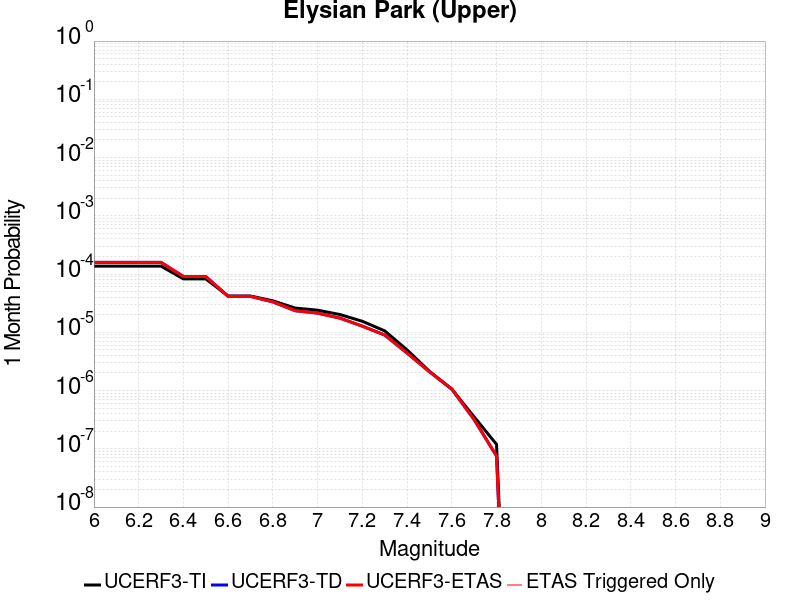 | 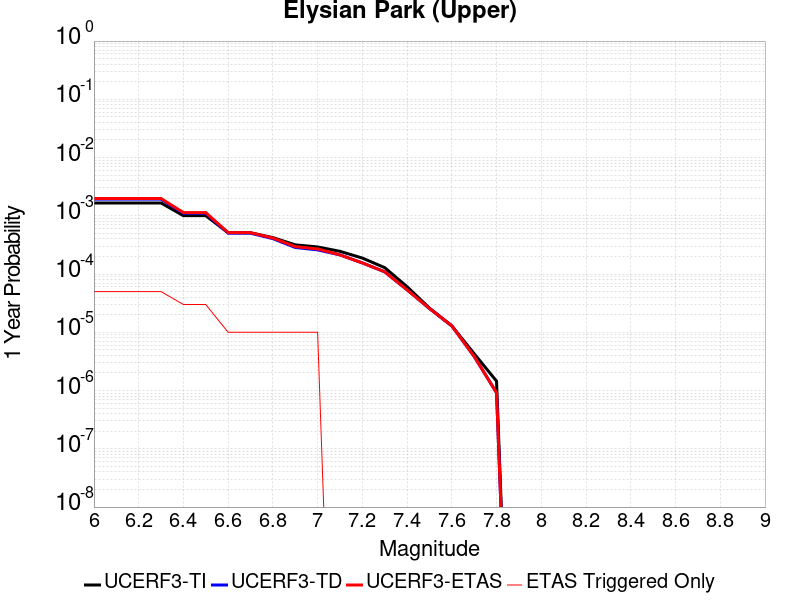 | 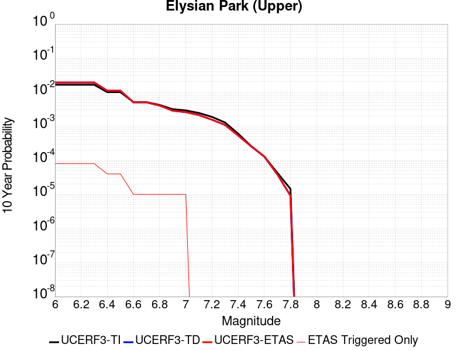 |

| Magnitude | 1 wk TI Prob | 1 wk TD Prob | 1 wk ETAS Prob | 1 wk ETAS/TD Gain | 1 wk ETAS Triggered Only | 1 mo TI Prob | 1 mo TD Prob | 1 mo ETAS Prob | 1 mo ETAS/TD Gain | 1 mo ETAS Triggered Only | 1 yr TI Prob | 1 yr TD Prob | 1 yr ETAS Prob | 1 yr ETAS/TD Gain | 1 yr ETAS Triggered Only | 10 yr TI Prob | 10 yr TD Prob | 10 yr ETAS Prob | 10 yr ETAS/TD Gain | 10 yr ETAS Triggered Only |
|-----|-----|-----|-----|-----|-----|-----|-----|-----|-----|-----|-----|-----|-----|-----|-----|-----|-----|-----|-----|-----|
| 6.0 | 3.1876025E-5 | 3.7035516E-5 | 3.7035516E-5 | 1.0 | 0.0 | 1.3660437E-4 | 1.587167E-4 | 1.587167E-4 | 1.0 | 0.0 | 0.0016618895 | 0.0019311075 | 0.0019311075 | 1.0 | 0.0 | 0.016495159 | 0.019189782 | 0.019231495 | 1.0021737 | 4.2527856E-5 |
| 6.1 | 3.1876025E-5 | 3.7035516E-5 | 3.7035516E-5 | 1.0 | 0.0 | 1.3660437E-4 | 1.587167E-4 | 1.587167E-4 | 1.0 | 0.0 | 0.0016618895 | 0.0019311075 | 0.0019311075 | 1.0 | 0.0 | 0.016495159 | 0.019189782 | 0.019231495 | 1.0021737 | 4.2527856E-5 |
| 6.2 | 3.1876025E-5 | 3.7035516E-5 | 3.7035516E-5 | 1.0 | 0.0 | 1.3660437E-4 | 1.587167E-4 | 1.587167E-4 | 1.0 | 0.0 | 0.0016618895 | 0.0019311075 | 0.0019311075 | 1.0 | 0.0 | 0.016495159 | 0.019189782 | 0.019231495 | 1.0021737 | 4.2527856E-5 |
| 6.3 | 3.1876025E-5 | 3.7035516E-5 | 3.7035516E-5 | 1.0 | 0.0 | 1.3660437E-4 | 1.587167E-4 | 1.587167E-4 | 1.0 | 0.0 | 0.0016618895 | 0.0019311075 | 0.0019311075 | 1.0 | 0.0 | 0.016495159 | 0.019189782 | 0.019231495 | 1.0021737 | 4.2527856E-5 |
| 6.4 | 1.9273462E-5 | 2.1202266E-5 | 2.1202266E-5 | 1.0 | 0.0 | 8.259794E-5 | 9.086466E-5 | 9.086466E-5 | 1.0 | 0.0 | 0.001005166 | 0.0011058892 | 0.0011058892 | 1.0 | 0.0 | 0.010006315 | 0.011020724 | 0.011062783 | 1.0038164 | 4.2527856E-5 |
| 6.5 | 1.9273462E-5 | 2.1202266E-5 | 2.1202266E-5 | 1.0 | 0.0 | 8.259794E-5 | 9.086466E-5 | 9.086466E-5 | 1.0 | 0.0 | 0.001005166 | 0.0011058892 | 0.0011058892 | 1.0 | 0.0 | 0.010006315 | 0.011020724 | 0.011062783 | 1.0038164 | 4.2527856E-5 |
| 6.6 | 9.813258E-6 | 9.665599E-6 | 9.665599E-6 | 1.0 | 0.0 | 4.205614E-5 | 4.1423376E-5 | 4.1423376E-5 | 1.0 | 0.0 | 5.119132E-4 | 5.0422014E-4 | 5.0422014E-4 | 1.0 | 0.0 | 0.005107356 | 0.0050314846 | 0.0050314846 | 1.0 | 0.0 |
| 6.7 | 9.801478E-6 | 9.653168E-6 | 9.653168E-6 | 1.0 | 0.0 | 4.2005657E-5 | 4.1370105E-5 | 4.1370105E-5 | 1.0 | 0.0 | 5.112989E-4 | 5.035719E-4 | 5.035719E-4 | 1.0 | 0.0 | 0.0051012407 | 0.0050250315 | 0.0050250315 | 1.0 | 0.0 |
| 6.8 | 8.102489E-6 | 7.773004E-6 | 7.773004E-6 | 1.0 | 0.0 | 3.4724493E-5 | 3.3312477E-5 | 3.3312477E-5 | 1.0 | 0.0 | 4.2268867E-4 | 4.055089E-4 | 4.055089E-4 | 1.0 | 0.0 | 0.004218856 | 0.0040481836 | 0.0040481836 | 1.0 | 0.0 |
| 6.9 | 6.08275E-6 | 5.4814514E-6 | 5.4814514E-6 | 1.0 | 0.0 | 2.6068668E-5 | 2.3491726E-5 | 2.3491726E-5 | 1.0 | 0.0 | 3.173398E-4 | 2.85975E-4 | 2.85975E-4 | 1.0 | 0.0 | 0.0031688702 | 0.0028561477 | 0.0028561477 | 1.0 | 0.0 |
| 7.0 | 5.5995934E-6 | 4.98278E-6 | 4.98278E-6 | 1.0 | 0.0 | 2.3998036E-5 | 2.13546E-5 | 2.13546E-5 | 1.0 | 0.0 | 2.9213692E-4 | 2.599619E-4 | 2.599619E-4 | 1.0 | 0.0 | 0.0029175316 | 0.0025966454 | 0.0025966454 | 1.0 | 0.0 |
| 7.1 | 4.709881E-6 | 4.0874015E-6 | 4.0874015E-6 | 1.0 | 0.0 | 2.0185047E-5 | 1.7517319E-5 | 1.7517319E-5 | 1.0 | 0.0 | 2.4572524E-4 | 2.132529E-4 | 2.132529E-4 | 1.0 | 0.0 | 0.002454537 | 0.002130524 | 0.002130524 | 1.0 | 0.0 |
| 7.2 | 3.6063436E-6 | 2.9779544E-6 | 2.9779544E-6 | 1.0 | 0.0 | 1.5455667E-5 | 1.27626E-5 | 1.27626E-5 | 1.0 | 0.0 | 1.881565E-4 | 1.5537368E-4 | 1.5537368E-4 | 1.0 | 0.0 | 0.0018799726 | 0.0015526618 | 0.0015526618 | 1.0 | 0.0 |
| 7.3 | 2.471135E-6 | 2.0954615E-6 | 2.0954615E-6 | 1.0 | 0.0 | 1.0590536E-5 | 8.980519E-6 | 8.980519E-6 | 1.0 | 0.0 | 1.2893214E-4 | 1.093324E-4 | 1.093324E-4 | 1.0 | 0.0 | 0.0012885736 | 0.0010927934 | 0.0010927934 | 1.0 | 0.0 |
| 7.4 | 1.163943E-6 | 1.0275091E-6 | 1.0275091E-6 | 1.0 | 0.0 | 4.988318E-6 | 4.4036033E-6 | 4.4036033E-6 | 1.0 | 0.0 | 6.0731076E-5 | 5.3612584E-5 | 5.3612584E-5 | 1.0 | 0.0 | 6.071448E-4 | 5.359995E-4 | 5.359995E-4 | 1.0 | 0.0 |
| 7.5 | 4.99459E-7 | 4.917604E-7 | 4.917604E-7 | 1.0 | 0.0 | 2.140537E-6 | 2.1075427E-6 | 2.1075427E-6 | 1.0 | 0.0 | 2.6060725E-5 | 2.5659048E-5 | 2.5659048E-5 | 1.0 | 0.0 | 2.605767E-4 | 2.5656243E-4 | 2.5656243E-4 | 1.0 | 0.0 |
| 7.6 | 2.4667852E-7 | 2.4778336E-7 | 2.4778336E-7 | 1.0 | 0.0 | 1.0571932E-6 | 1.0619283E-6 | 1.0619283E-6 | 1.0 | 0.0 | 1.2871251E-5 | 1.2928905E-5 | 1.2928905E-5 | 1.0 | 0.0 | 1.2870505E-4 | 1.2928189E-4 | 1.2928189E-4 | 1.0 | 0.0 |
| 7.7 | 8.2312795E-8 | 7.3864456E-8 | 7.3864456E-8 | 1.0 | 0.0 | 3.527691E-7 | 3.165619E-7 | 3.165619E-7 | 1.0 | 0.0 | 4.294955E-6 | 3.8541357E-6 | 3.8541357E-6 | 1.0 | 0.0 | 4.2948723E-5 | 3.8540802E-5 | 3.8540802E-5 | 1.0 | 0.0 |
| 7.8 | 2.7819295E-8 | 1.7566023E-8 | 1.7566023E-8 | 1.0 | 0.0 | 1.1922555E-7 | 7.5282955E-8 | 7.5282955E-8 | 1.0 | 0.0 | 1.45157E-6 | 9.165697E-7 | 9.165697E-7 | 1.0 | 0.0 | 1.45156055E-5 | 9.165675E-6 | 9.165675E-6 | 1.0 | 0.0 |

## Monterey Bay-Tularcitos
*[(top)](#table-of-contents)*

| 1 Week | 1 Month | 1 Year | 10 Year |
|-----|-----|-----|-----|
| 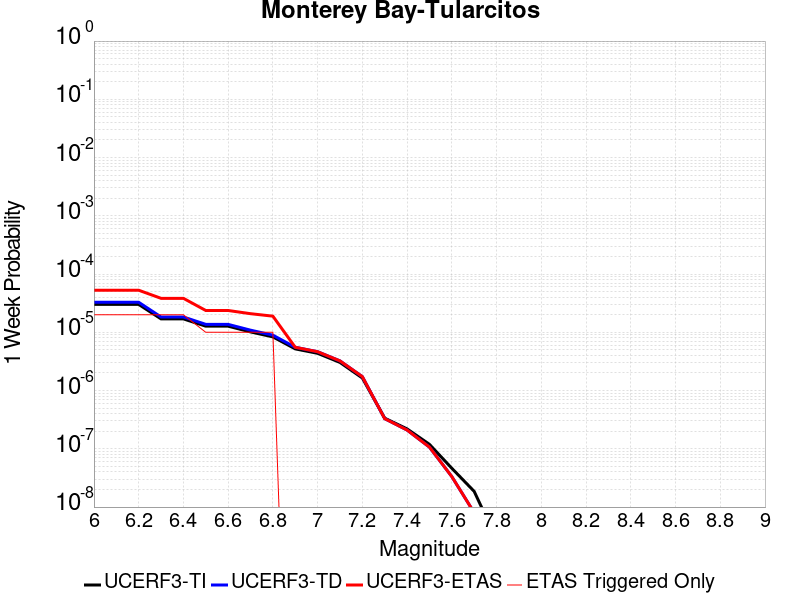 | 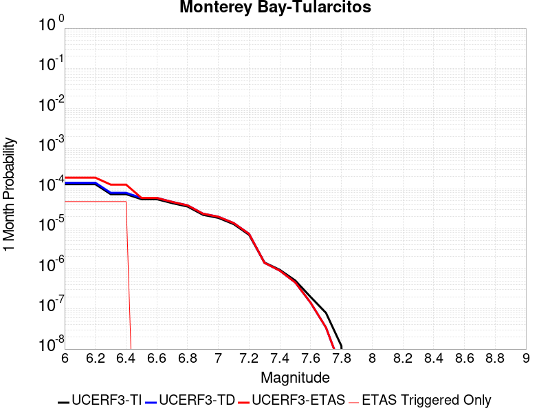 |  | 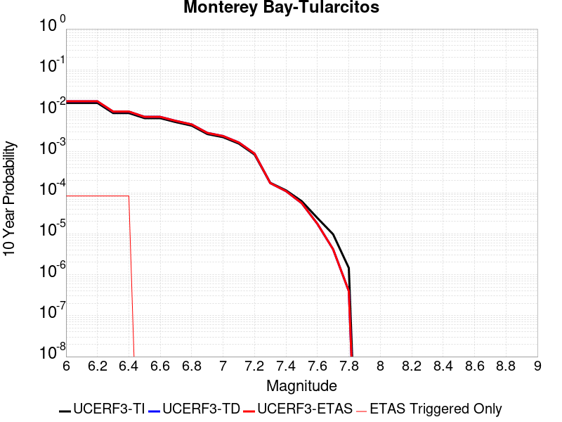 |

| Magnitude | 1 wk TI Prob | 1 wk TD Prob | 1 wk ETAS Prob | 1 wk ETAS/TD Gain | 1 wk ETAS Triggered Only | 1 mo TI Prob | 1 mo TD Prob | 1 mo ETAS Prob | 1 mo ETAS/TD Gain | 1 mo ETAS Triggered Only | 1 yr TI Prob | 1 yr TD Prob | 1 yr ETAS Prob | 1 yr ETAS/TD Gain | 1 yr ETAS Triggered Only | 10 yr TI Prob | 10 yr TD Prob | 10 yr ETAS Prob | 10 yr ETAS/TD Gain | 10 yr ETAS Triggered Only |
|-----|-----|-----|-----|-----|-----|-----|-----|-----|-----|-----|-----|-----|-----|-----|-----|-----|-----|-----|-----|-----|
| 6.0 | 3.0131365E-5 | 3.279877E-5 | 7.532523E-5 | 2.296587 | 4.2527856E-5 | 1.2912804E-4 | 1.4055918E-4 | 1.8308107E-4 | 1.3025194 | 4.2527856E-5 | 0.001571 | 0.0017100703 | 0.0017525253 | 1.0248265 | 4.2527856E-5 | 0.015599402 | 0.016979916 | 0.017021723 | 1.002462 | 4.2527856E-5 |
| 6.1 | 3.0131365E-5 | 3.279877E-5 | 7.532523E-5 | 2.296587 | 4.2527856E-5 | 1.2912804E-4 | 1.4055918E-4 | 1.8308107E-4 | 1.3025194 | 4.2527856E-5 | 0.001571 | 0.0017100703 | 0.0017525253 | 1.0248265 | 4.2527856E-5 | 0.015599402 | 0.016979916 | 0.017021723 | 1.002462 | 4.2527856E-5 |
| 6.2 | 3.0131365E-5 | 3.279877E-5 | 7.532523E-5 | 2.296587 | 4.2527856E-5 | 1.2912804E-4 | 1.4055918E-4 | 1.8308107E-4 | 1.3025194 | 4.2527856E-5 | 0.001571 | 0.0017100703 | 0.0017525253 | 1.0248265 | 4.2527856E-5 | 0.015599402 | 0.016979916 | 0.017021723 | 1.002462 | 4.2527856E-5 |
| 6.3 | 1.6998249E-5 | 1.8330798E-5 | 6.0857874E-5 | 3.3199794 | 4.2527856E-5 | 7.28476E-5 | 7.85583E-5 | 1.2108282E-4 | 1.5413115 | 4.2527856E-5 | 8.865586E-4 | 9.5604634E-4 | 9.985336E-4 | 1.0444405 | 4.2527856E-5 | 0.0088303005 | 0.009521258 | 0.009563381 | 1.0044241 | 4.2527856E-5 |
| 6.4 | 1.6998249E-5 | 1.8330798E-5 | 6.0857874E-5 | 3.3199794 | 4.2527856E-5 | 7.28476E-5 | 7.85583E-5 | 1.2108282E-4 | 1.5413115 | 4.2527856E-5 | 8.865586E-4 | 9.5604634E-4 | 9.985336E-4 | 1.0444405 | 4.2527856E-5 | 0.0088303005 | 0.009521258 | 0.009563381 | 1.0044241 | 4.2527856E-5 |
| 6.5 | 1.27470785E-5 | 1.3693312E-5 | 1.3693312E-5 | 1.0 | 0.0 | 5.4629192E-5 | 5.8684363E-5 | 5.8684363E-5 | 1.0 | 0.0 | 6.649074E-4 | 7.1425823E-4 | 7.1425823E-4 | 1.0 | 0.0 | 0.0066292146 | 0.007120678 | 0.007120678 | 1.0 | 0.0 |
| 6.6 | 1.2739422E-5 | 1.36854E-5 | 1.36854E-5 | 1.0 | 0.0 | 5.4596385E-5 | 5.8650454E-5 | 5.8650454E-5 | 1.0 | 0.0 | 6.645082E-4 | 7.1384566E-4 | 7.1384566E-4 | 1.0 | 0.0 | 0.0066252467 | 0.007116579 | 0.007116579 | 1.0 | 0.0 |
| 6.7 | 1.0160109E-5 | 1.0885755E-5 | 1.0885755E-5 | 1.0 | 0.0 | 4.35426E-5 | 4.665244E-5 | 4.665244E-5 | 1.0 | 0.0 | 5.300022E-4 | 5.6785246E-4 | 5.6785246E-4 | 1.0 | 0.0 | 0.005287399 | 0.0056647263 | 0.0056647263 | 1.0 | 0.0 |
| 6.8 | 8.349859E-6 | 8.932587E-6 | 8.932587E-6 | 1.0 | 0.0 | 3.578462E-5 | 3.8281985E-5 | 3.8281985E-5 | 1.0 | 0.0 | 4.3559066E-4 | 4.6598914E-4 | 4.6598914E-4 | 1.0 | 0.0 | 0.004347378 | 0.004650685 | 0.004650685 | 1.0 | 0.0 |
| 6.9 | 5.193639E-6 | 5.53643E-6 | 5.53643E-6 | 1.0 | 0.0 | 2.2258262E-5 | 2.372736E-5 | 2.372736E-5 | 1.0 | 0.0 | 2.7096065E-4 | 2.8884556E-4 | 2.8884556E-4 | 1.0 | 0.0 | 0.0027063051 | 0.0028850222 | 0.0028850222 | 1.0 | 0.0 |
| 7.0 | 4.359381E-6 | 4.643366E-6 | 4.643366E-6 | 1.0 | 0.0 | 1.8682927E-5 | 1.9900004E-5 | 1.9900004E-5 | 1.0 | 0.0 | 2.274409E-4 | 2.422586E-4 | 2.422586E-4 | 1.0 | 0.0 | 0.0022720827 | 0.002420238 | 0.002420238 | 1.0 | 0.0 |
| 7.1 | 3.0398533E-6 | 3.2310427E-6 | 3.2310427E-6 | 1.0 | 0.0 | 1.3027877E-5 | 1.3847267E-5 | 1.3847267E-5 | 1.0 | 0.0 | 1.5860285E-4 | 1.6858005E-4 | 1.6858005E-4 | 1.0 | 0.0 | 0.001584897 | 0.0016847793 | 0.0016847793 | 1.0 | 0.0 |
| 7.2 | 1.642335E-6 | 1.7333153E-6 | 1.7333153E-6 | 1.0 | 0.0 | 7.0385595E-6 | 7.428485E-6 | 7.428485E-6 | 1.0 | 0.0 | 8.569109E-5 | 9.044012E-5 | 9.044012E-5 | 1.0 | 0.0 | 8.5658056E-4 | 9.042358E-4 | 9.042358E-4 | 1.0 | 0.0 |
| 7.3 | 3.356842E-7 | 3.2952389E-7 | 3.2952389E-7 | 1.0 | 0.0 | 1.4386458E-6 | 1.4122444E-6 | 1.4122444E-6 | 1.0 | 0.0 | 1.7515373E-5 | 1.7193941E-5 | 1.7193941E-5 | 1.0 | 0.0 | 1.7513991E-4 | 1.719262E-4 | 1.719262E-4 | 1.0 | 0.0 |
| 7.4 | 2.1973483E-7 | 2.1006413E-7 | 2.1006413E-7 | 1.0 | 0.0 | 9.417204E-7 | 9.0027453E-7 | 9.0027453E-7 | 1.0 | 0.0 | 1.1465385E-5 | 1.0960787E-5 | 1.0960787E-5 | 1.0 | 0.0 | 1.1464794E-4 | 1.096025E-4 | 1.096025E-4 | 1.0 | 0.0 |
| 7.5 | 1.1944135E-7 | 1.0696043E-7 | 1.0696043E-7 | 1.0 | 0.0 | 5.118914E-7 | 4.5840173E-7 | 4.5840173E-7 | 1.0 | 0.0 | 6.23226E-6 | 5.581027E-6 | 5.581027E-6 | 1.0 | 0.0 | 6.2320854E-5 | 5.5808883E-5 | 5.5808883E-5 | 1.0 | 0.0 |
| 7.6 | 4.636058E-8 | 3.336489E-8 | 3.336489E-8 | 1.0 | 0.0 | 1.9868818E-7 | 1.4299238E-7 | 1.4299238E-7 | 1.0 | 0.0 | 2.419026E-6 | 1.7409308E-6 | 1.7409308E-6 | 1.0 | 0.0 | 2.4189996E-5 | 1.7409173E-5 | 1.7409173E-5 | 1.0 | 0.0 |
| 7.7 | 1.8588572E-8 | 8.003744E-9 | 8.003744E-9 | 1.0 | 0.0 | 7.9665305E-8 | 3.430176E-8 | 3.430176E-8 | 1.0 | 0.0 | 9.699246E-7 | 4.1762385E-7 | 4.1762385E-7 | 1.0 | 0.0 | 9.699204E-6 | 4.176231E-6 | 4.176231E-6 | 1.0 | 0.0 |
| 7.8 | 2.7960154E-9 | 7.6099427E-10 | 7.6099427E-10 | 1.0 | 0.0 | 1.1982923E-8 | 3.2614043E-9 | 3.2614043E-9 | 1.0 | 0.0 | 1.4589209E-7 | 3.9707597E-8 | 3.9707597E-8 | 1.0 | 0.0 | 1.4589199E-6 | 3.9707595E-7 | 3.9707595E-7 | 1.0 | 0.0 |

## Santa Susana alt 1
*[(top)](#table-of-contents)*

| 1 Week | 1 Month | 1 Year | 10 Year |
|-----|-----|-----|-----|
| 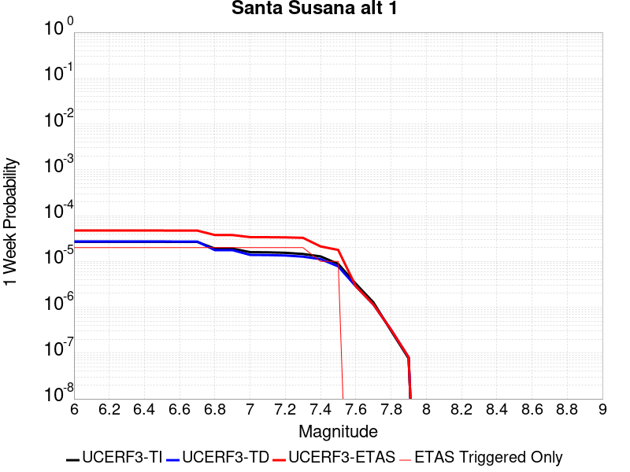 | 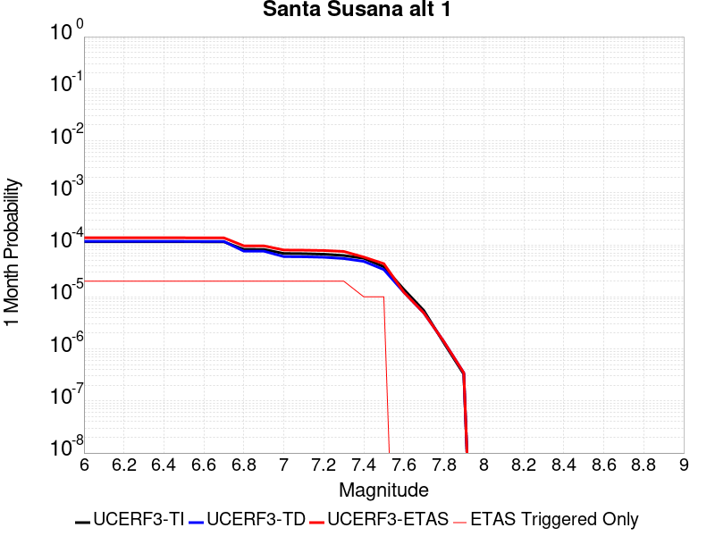 | 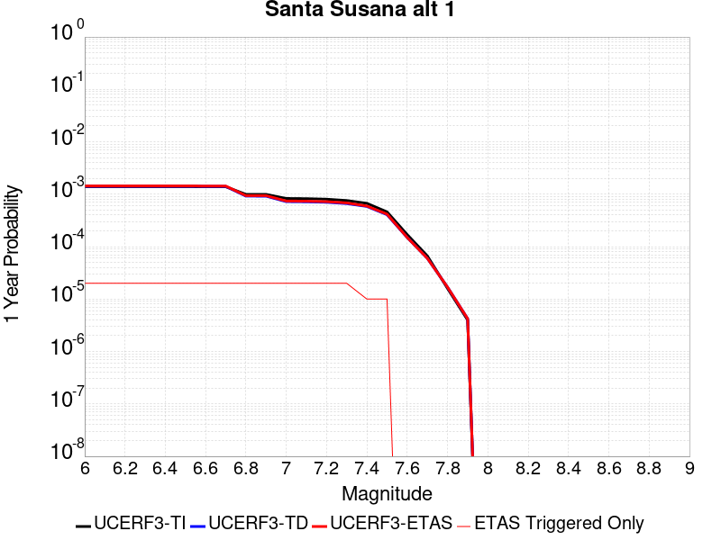 | 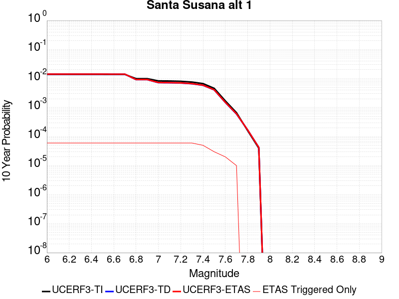 |

| Magnitude | 1 wk TI Prob | 1 wk TD Prob | 1 wk ETAS Prob | 1 wk ETAS/TD Gain | 1 wk ETAS Triggered Only | 1 mo TI Prob | 1 mo TD Prob | 1 mo ETAS Prob | 1 mo ETAS/TD Gain | 1 mo ETAS Triggered Only | 1 yr TI Prob | 1 yr TD Prob | 1 yr ETAS Prob | 1 yr ETAS/TD Gain | 1 yr ETAS Triggered Only | 10 yr TI Prob | 10 yr TD Prob | 10 yr ETAS Prob | 10 yr ETAS/TD Gain | 10 yr ETAS Triggered Only |
|-----|-----|-----|-----|-----|-----|-----|-----|-----|-----|-----|-----|-----|-----|-----|-----|-----|-----|-----|-----|-----|
| 6.0 | 2.674877E-5 | 2.7198023E-5 | 2.7198023E-5 | 1.0 | 0.0 | 1.1463255E-4 | 1.1655839E-4 | 1.1655839E-4 | 1.0 | 0.0 | 0.0013947578 | 0.0014182882 | 0.0014182882 | 1.0 | 0.0 | 0.013860362 | 0.014104128 | 0.014146056 | 1.0029727 | 4.2527856E-5 |
| 6.1 | 2.674877E-5 | 2.7198023E-5 | 2.7198023E-5 | 1.0 | 0.0 | 1.1463255E-4 | 1.1655839E-4 | 1.1655839E-4 | 1.0 | 0.0 | 0.0013947578 | 0.0014182882 | 0.0014182882 | 1.0 | 0.0 | 0.013860362 | 0.014104128 | 0.014146056 | 1.0029727 | 4.2527856E-5 |
| 6.2 | 2.674877E-5 | 2.7198023E-5 | 2.7198023E-5 | 1.0 | 0.0 | 1.1463255E-4 | 1.1655839E-4 | 1.1655839E-4 | 1.0 | 0.0 | 0.0013947578 | 0.0014182882 | 0.0014182882 | 1.0 | 0.0 | 0.013860362 | 0.014104128 | 0.014146056 | 1.0029727 | 4.2527856E-5 |
| 6.3 | 2.674877E-5 | 2.7198023E-5 | 2.7198023E-5 | 1.0 | 0.0 | 1.1463255E-4 | 1.1655839E-4 | 1.1655839E-4 | 1.0 | 0.0 | 0.0013947578 | 0.0014182882 | 0.0014182882 | 1.0 | 0.0 | 0.013860362 | 0.014104128 | 0.014146056 | 1.0029727 | 4.2527856E-5 |
| 6.4 | 2.674877E-5 | 2.7198023E-5 | 2.7198023E-5 | 1.0 | 0.0 | 1.1463255E-4 | 1.1655839E-4 | 1.1655839E-4 | 1.0 | 0.0 | 0.0013947578 | 0.0014182882 | 0.0014182882 | 1.0 | 0.0 | 0.013860362 | 0.014104128 | 0.014146056 | 1.0029727 | 4.2527856E-5 |
| 6.5 | 2.674877E-5 | 2.7198023E-5 | 2.7198023E-5 | 1.0 | 0.0 | 1.1463255E-4 | 1.1655839E-4 | 1.1655839E-4 | 1.0 | 0.0 | 0.0013947578 | 0.0014182882 | 0.0014182882 | 1.0 | 0.0 | 0.013860362 | 0.014104128 | 0.014146056 | 1.0029727 | 4.2527856E-5 |
| 6.6 | 2.6647976E-5 | 2.7074359E-5 | 2.7074359E-5 | 1.0 | 0.0 | 1.14200615E-4 | 1.1602845E-4 | 1.1602845E-4 | 1.0 | 0.0 | 0.0013895056 | 0.0014118447 | 0.0014118447 | 1.0 | 0.0 | 0.013808494 | 0.014040513 | 0.014082444 | 1.0029864 | 4.2527856E-5 |
| 6.7 | 2.6647976E-5 | 2.7074359E-5 | 2.7074359E-5 | 1.0 | 0.0 | 1.14200615E-4 | 1.1602845E-4 | 1.1602845E-4 | 1.0 | 0.0 | 0.0013895056 | 0.0014118447 | 0.0014118447 | 1.0 | 0.0 | 0.013808494 | 0.014040513 | 0.014082444 | 1.0029864 | 4.2527856E-5 |
| 6.8 | 1.9073179E-5 | 1.7637283E-5 | 1.7637283E-5 | 1.0 | 0.0 | 8.1739636E-5 | 7.558627E-5 | 7.558627E-5 | 1.0 | 0.0 | 9.947256E-4 | 9.198925E-4 | 9.198925E-4 | 1.0 | 0.0 | 0.009902848 | 0.009163101 | 0.009205239 | 1.0045987 | 4.2527856E-5 |
| 6.9 | 1.9041876E-5 | 1.7619415E-5 | 1.7619415E-5 | 1.0 | 0.0 | 8.160549E-5 | 7.55097E-5 | 7.55097E-5 | 1.0 | 0.0 | 9.930939E-4 | 9.1896096E-4 | 9.1896096E-4 | 1.0 | 0.0 | 0.0098866755 | 0.0091538625 | 0.009196001 | 1.0046034 | 4.2527856E-5 |
| 7.0 | 1.5917482E-5 | 1.3863864E-5 | 1.3863864E-5 | 1.0 | 0.0 | 6.8215995E-5 | 5.9415237E-5 | 5.9415237E-5 | 1.0 | 0.0 | 8.302132E-4 | 7.231451E-4 | 7.231451E-4 | 1.0 | 0.0 | 0.008271185 | 0.0072088144 | 0.007251036 | 1.0058569 | 4.2527856E-5 |
| 7.1 | 1.577788E-5 | 1.3743872E-5 | 1.3743872E-5 | 1.0 | 0.0 | 6.761774E-5 | 5.8901005E-5 | 5.8901005E-5 | 1.0 | 0.0 | 8.2293496E-4 | 7.1688846E-4 | 7.1688846E-4 | 1.0 | 0.0 | 0.008198941 | 0.007146652 | 0.0071888757 | 1.0059083 | 4.2527856E-5 |
| 7.2 | 1.5416446E-5 | 1.3469944E-5 | 1.3469944E-5 | 1.0 | 0.0 | 6.606882E-5 | 5.772708E-5 | 5.772708E-5 | 1.0 | 0.0 | 8.0409093E-4 | 7.026052E-4 | 7.026052E-4 | 1.0 | 0.0 | 0.008011877 | 0.0070047234 | 0.0070469533 | 1.0060288 | 4.2527856E-5 |
| 7.3 | 1.4534083E-5 | 1.2717879E-5 | 1.2717879E-5 | 1.0 | 0.0 | 6.228744E-5 | 5.4504082E-5 | 5.4504082E-5 | 1.0 | 0.0 | 7.580857E-4 | 6.633896E-4 | 6.633896E-4 | 1.0 | 0.0 | 0.007555048 | 0.0066149444 | 0.006657191 | 1.0063865 | 4.2527856E-5 |
| 7.4 | 1.2858995E-5 | 1.1229652E-5 | 1.1229652E-5 | 1.0 | 0.0 | 5.5108816E-5 | 4.8126214E-5 | 4.8126214E-5 | 1.0 | 0.0 | 6.7074323E-4 | 5.857831E-4 | 5.857831E-4 | 1.0 | 0.0 | 0.0066872234 | 0.005843165 | 0.005885444 | 1.0072356 | 4.2527856E-5 |
| 7.5 | 8.827668E-6 | 7.805457E-6 | 7.805457E-6 | 1.0 | 0.0 | 3.7832317E-5 | 3.3451546E-5 | 3.3451546E-5 | 1.0 | 0.0 | 4.605111E-4 | 4.071989E-4 | 4.071989E-4 | 1.0 | 0.0 | 0.0045955796 | 0.0040647765 | 0.0041071316 | 1.01042 | 4.2527856E-5 |
| 7.6 | 3.2533426E-6 | 2.871988E-6 | 2.871988E-6 | 1.0 | 0.0 | 1.3942822E-5 | 1.2308465E-5 | 1.2308465E-5 | 1.0 | 0.0 | 1.6974064E-4 | 1.4984563E-4 | 1.4984563E-4 | 1.0 | 0.0 | 0.0016961104 | 0.0014974826 | 0.0015399469 | 1.028357 | 4.2527856E-5 |
| 7.7 | 1.2751709E-6 | 1.1491089E-6 | 1.1491089E-6 | 1.0 | 0.0 | 5.4650063E-6 | 4.9247437E-6 | 4.9247437E-6 | 1.0 | 0.0 | 6.653442E-5 | 5.9957198E-5 | 5.9957198E-5 | 1.0 | 0.0 | 6.6514505E-4 | 5.994191E-4 | 6.419215E-4 | 1.0709059 | 4.2527856E-5 |
| 7.8 | 3.067544E-7 | 3.2400436E-7 | 3.2400436E-7 | 1.0 | 0.0 | 1.3146611E-6 | 1.3885895E-6 | 1.3885895E-6 | 1.0 | 0.0 | 1.600588E-5 | 1.6905957E-5 | 1.6905957E-5 | 1.0 | 0.0 | 1.6004729E-4 | 1.6904772E-4 | 1.6904772E-4 | 1.0 | 0.0 |
| 7.9 | 7.622999E-8 | 8.087964E-8 | 8.087964E-8 | 1.0 | 0.0 | 3.2669993E-7 | 3.4662696E-7 | 3.4662696E-7 | 1.0 | 0.0 | 3.977564E-6 | 4.2201773E-6 | 4.2201773E-6 | 1.0 | 0.0 | 3.977493E-5 | 4.220118E-5 | 4.220118E-5 | 1.0 | 0.0 |

## Calaveras (So) - Paicines extension 2011 CFM
*[(top)](#table-of-contents)*

| 1 Week | 1 Month | 1 Year | 10 Year |
|-----|-----|-----|-----|
|  | 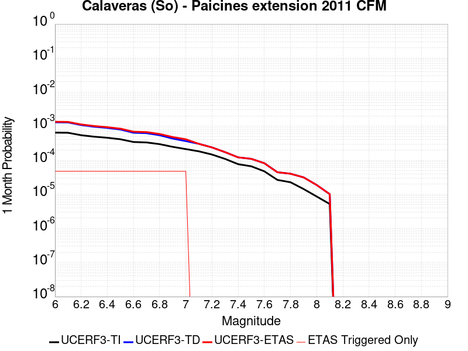 | 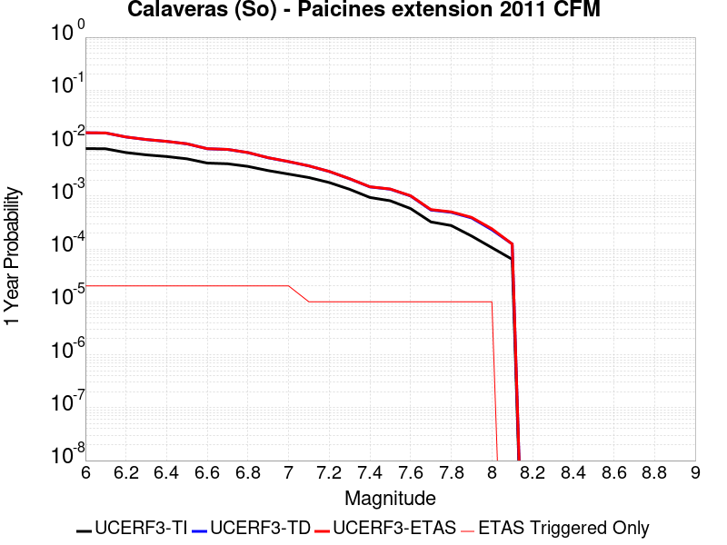 | 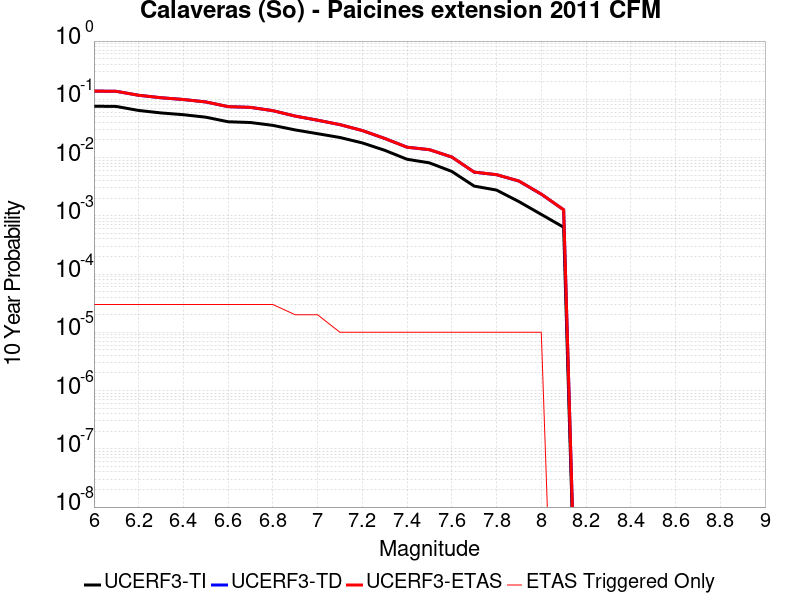 |

| Magnitude | 1 wk TI Prob | 1 wk TD Prob | 1 wk ETAS Prob | 1 wk ETAS/TD Gain | 1 wk ETAS Triggered Only | 1 mo TI Prob | 1 mo TD Prob | 1 mo ETAS Prob | 1 mo ETAS/TD Gain | 1 mo ETAS Triggered Only | 1 yr TI Prob | 1 yr TD Prob | 1 yr ETAS Prob | 1 yr ETAS/TD Gain | 1 yr ETAS Triggered Only | 10 yr TI Prob | 10 yr TD Prob | 10 yr ETAS Prob | 10 yr ETAS/TD Gain | 10 yr ETAS Triggered Only |
|-----|-----|-----|-----|-----|-----|-----|-----|-----|-----|-----|-----|-----|-----|-----|-----|-----|-----|-----|-----|-----|
| 6.0 | 1.5183659E-4 | 3.0533716E-4 | 3.0533716E-4 | 1.0 | 0.0 | 6.5056595E-4 | 0.0013069661 | 0.0013494383 | 1.0324968 | 4.2527856E-5 | 0.007891912 | 0.01569571 | 0.01573757 | 1.002667 | 4.2527856E-5 | 0.076174594 | 0.13848671 | 0.13852336 | 1.0002645 | 4.2527856E-5 |
| 6.1 | 1.5024997E-4 | 3.0227835E-4 | 3.0227835E-4 | 1.0 | 0.0 | 6.437695E-4 | 0.00129387 | 0.0013363429 | 1.0328262 | 4.2527856E-5 | 0.0078097614 | 0.015539104 | 0.015580972 | 1.0026942 | 4.2527856E-5 | 0.075409345 | 0.13715632 | 0.13719302 | 1.0002675 | 4.2527856E-5 |
| 6.2 | 1.2743923E-4 | 2.5306802E-4 | 2.5306802E-4 | 1.0 | 0.0 | 5.460538E-4 | 0.0010841049 | 0.0011265867 | 1.039186 | 4.2527856E-5 | 0.0066279583 | 0.013046704 | 0.013088677 | 1.0032171 | 4.2527856E-5 | 0.064337276 | 0.11725405 | 0.117291585 | 1.0003202 | 4.2527856E-5 |
| 6.3 | 1.1525114E-4 | 2.2595265E-4 | 2.2595265E-4 | 1.0 | 0.0 | 4.9383997E-4 | 9.6799526E-4 | 0.001010482 | 1.0438914 | 4.2527856E-5 | 0.0059959386 | 0.011667927 | 0.011709958 | 1.0036023 | 4.2527856E-5 | 0.058367174 | 0.10637007 | 0.106408074 | 1.0003573 | 4.2527856E-5 |
| 6.4 | 1.07200925E-4 | 2.0836305E-4 | 2.0836305E-4 | 1.0 | 0.0 | 4.5935164E-4 | 8.926636E-4 | 9.351535E-4 | 1.047599 | 4.2527856E-5 | 0.0055782744 | 0.010772766 | 0.010814835 | 1.0039052 | 4.2527856E-5 | 0.0544031 | 0.09919256 | 0.09923087 | 1.0003862 | 4.2527856E-5 |
| 6.5 | 9.69631E-5 | 1.8729115E-4 | 1.8729115E-4 | 1.0 | 0.0 | 4.1548995E-4 | 8.024135E-4 | 8.4490725E-4 | 1.0529574 | 4.2527856E-5 | 0.0050468626 | 0.009694662 | 0.009736778 | 1.0043442 | 4.2527856E-5 | 0.04933773 | 0.090084255 | 0.09012295 | 1.0004295 | 4.2527856E-5 |
| 6.6 | 8.0552316E-5 | 1.5070537E-4 | 1.5070537E-4 | 1.0 | 0.0 | 3.4517853E-4 | 6.456994E-4 | 6.8819977E-4 | 1.0658207 | 4.2527856E-5 | 0.0041944524 | 0.007826256 | 0.007868451 | 1.0053915 | 4.2527856E-5 | 0.04116161 | 0.074854024 | 0.07489337 | 1.0005256 | 4.2527856E-5 |
| 6.7 | 7.815757E-5 | 1.4610609E-4 | 1.4610609E-4 | 1.0 | 0.0 | 3.34918E-4 | 6.260017E-4 | 6.6850294E-4 | 1.0678931 | 4.2527856E-5 | 0.004070005 | 0.0075890915 | 0.0076312968 | 1.0055612 | 4.2527856E-5 | 0.039962657 | 0.072703585 | 0.07274302 | 1.0005424 | 4.2527856E-5 |
| 6.8 | 6.965264E-5 | 1.2721405E-4 | 1.2721405E-4 | 1.0 | 0.0 | 2.9847719E-4 | 5.450839E-4 | 5.875886E-4 | 1.0779783 | 4.2527856E-5 | 0.0036279052 | 0.00661342 | 0.006655666 | 1.0063881 | 4.2527856E-5 | 0.03569247 | 0.06379891 | 0.06383873 | 1.0006241 | 4.2527856E-5 |
| 6.9 | 5.8000453E-5 | 1.01435086E-4 | 1.01435086E-4 | 1.0 | 0.0 | 2.4854968E-4 | 4.3464993E-4 | 4.771593E-4 | 1.0978014 | 4.2527856E-5 | 0.0030218933 | 0.0052791284 | 0.005321432 | 1.0080134 | 4.2527856E-5 | 0.029811295 | 0.051501602 | 0.05154194 | 1.0007832 | 4.2527856E-5 |
| 7.0 | 4.9865852E-5 | 8.567692E-5 | 8.567692E-5 | 1.0 | 0.0 | 2.1369329E-4 | 3.671356E-4 | 4.0964785E-4 | 1.1157944 | 4.2527856E-5 | 0.0025986114 | 0.0044608037 | 0.004503142 | 1.0094912 | 4.2527856E-5 | 0.025684336 | 0.043781694 | 0.04382236 | 1.0009289 | 4.2527856E-5 |
| 7.1 | 4.283875E-5 | 7.112159E-5 | 7.112159E-5 | 1.0 | 0.0 | 1.8358172E-4 | 3.047715E-4 | 3.047715E-4 | 1.0 | 0.0 | 0.0022328163 | 0.003704336 | 0.003704336 | 1.0 | 0.0 | 0.022105146 | 0.03673583 | 0.03673583 | 1.0 | 0.0 |
| 7.2 | 3.450115E-5 | 5.5776054E-5 | 5.5776054E-5 | 1.0 | 0.0 | 1.478537E-4 | 2.390185E-4 | 2.390185E-4 | 1.0 | 0.0 | 0.0017986323 | 0.0029061958 | 0.0029061958 | 1.0 | 0.0 | 0.017841442 | 0.029079199 | 0.029079199 | 1.0 | 0.0 |
| 7.3 | 2.5709045E-5 | 4.0588155E-5 | 4.0588155E-5 | 1.0 | 0.0 | 1.1017697E-4 | 1.7393773E-4 | 1.7393773E-4 | 1.0 | 0.0 | 0.0013405791 | 0.002115652 | 0.002115652 | 1.0 | 0.0 | 0.013325208 | 0.021297242 | 0.021297242 | 1.0 | 0.0 |
| 7.4 | 1.8003093E-5 | 2.8509934E-5 | 2.8509934E-5 | 1.0 | 0.0 | 7.715383E-5 | 1.2217973E-4 | 1.2217973E-4 | 1.0 | 0.0 | 9.3894306E-4 | 0.0014865254 | 0.0014865254 | 1.0 | 0.0 | 0.009349857 | 0.015052196 | 0.015052196 | 1.0 | 0.0 |
| 7.5 | 1.5595824E-5 | 2.5822499E-5 | 2.5822499E-5 | 1.0 | 0.0 | 6.683753E-5 | 1.1066317E-4 | 1.1066317E-4 | 1.0 | 0.0 | 8.134431E-4 | 0.0013464936 | 0.0013464936 | 1.0 | 0.0 | 0.008104719 | 0.01365213 | 0.01365213 | 1.0 | 0.0 |
| 7.6 | 1.1110309E-5 | 1.9222098E-5 | 1.9222098E-5 | 1.0 | 0.0 | 4.761474E-5 | 8.2377825E-5 | 8.2377825E-5 | 1.0 | 0.0 | 5.795553E-4 | 0.0010024898 | 0.0010024898 | 1.0 | 0.0 | 0.0057804612 | 0.010203943 | 0.010203943 | 1.0 | 0.0 |
| 7.7 | 6.2140443E-6 | 1.0437076E-5 | 1.0437076E-5 | 1.0 | 0.0 | 2.6631347E-5 | 4.4729557E-5 | 4.4729557E-5 | 1.0 | 0.0 | 3.241884E-4 | 5.444464E-4 | 5.444464E-4 | 1.0 | 0.0 | 0.0032371588 | 0.005619835 | 0.005619835 | 1.0 | 0.0 |
| 7.8 | 5.305533E-6 | 9.433038E-6 | 9.433038E-6 | 1.0 | 0.0 | 2.27378E-5 | 4.042668E-5 | 4.042668E-5 | 1.0 | 0.0 | 2.7679754E-4 | 4.920837E-4 | 4.920837E-4 | 1.0 | 0.0 | 0.0027645302 | 0.005074324 | 0.005074324 | 1.0 | 0.0 |
| 7.9 | 3.363505E-6 | 7.3848937E-6 | 7.3848937E-6 | 1.0 | 0.0 | 1.4414942E-5 | 3.164916E-5 | 3.164916E-5 | 1.0 | 0.0 | 1.7548777E-4 | 3.8526047E-4 | 3.8526047E-4 | 1.0 | 0.0 | 0.0017534926 | 0.003948527 | 0.003948527 | 1.0 | 0.0 |
| 8.0 | 2.0271132E-6 | 4.413104E-6 | 4.413104E-6 | 1.0 | 0.0 | 8.687599E-6 | 1.8913164E-5 | 1.8913164E-5 | 1.0 | 0.0 | 1.05766376E-4 | 2.302435E-4 | 2.302435E-4 | 1.0 | 0.0 | 0.0010571606 | 0.002351099 | 0.002351099 | 1.0 | 0.0 |
| 8.1 | 1.2206116E-6 | 2.3751331E-6 | 2.3751331E-6 | 1.0 | 0.0 | 5.2311816E-6 | 1.0179103E-5 | 1.0179103E-5 | 1.0 | 0.0 | 6.3687774E-5 | 1.2392356E-4 | 1.2392356E-4 | 1.0 | 0.0 | 6.366953E-4 | 0.0012705477 | 0.0012705477 | 1.0 | 0.0 |

## Anaheim
*[(top)](#table-of-contents)*

| 1 Week | 1 Month | 1 Year | 10 Year |
|-----|-----|-----|-----|
| 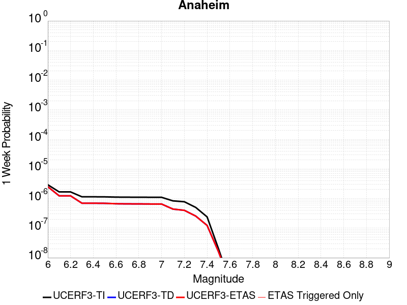 | 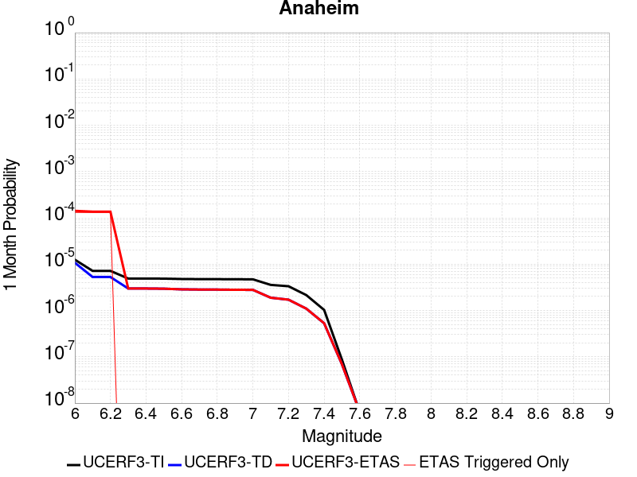 | 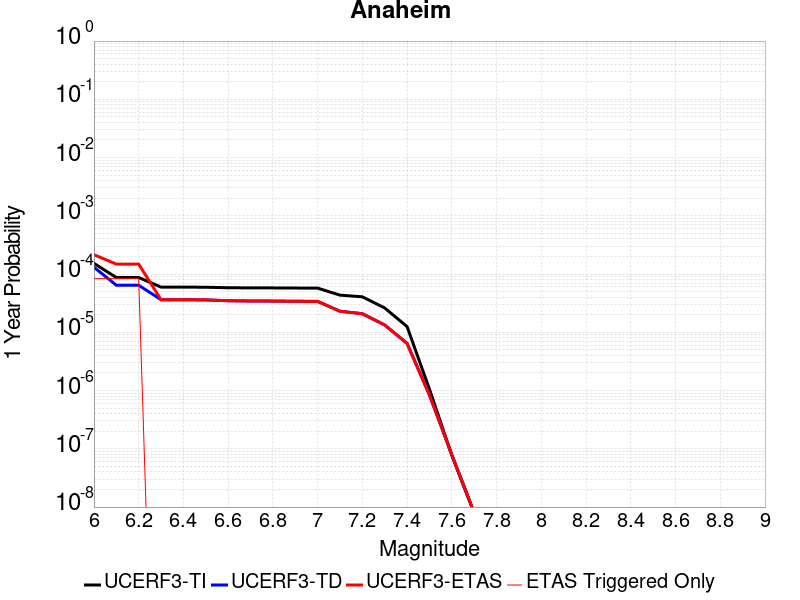 | 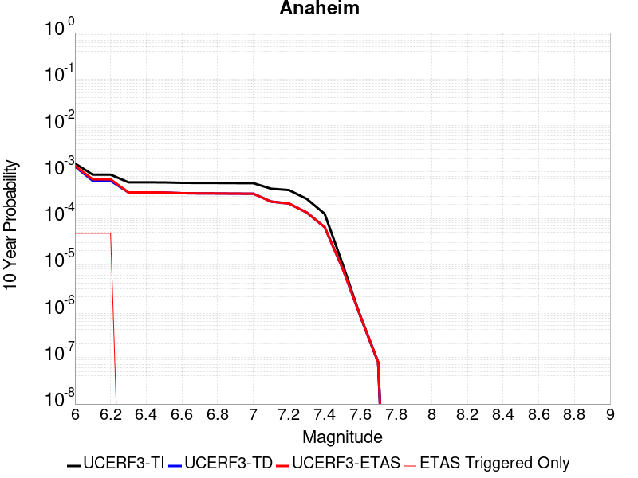 |

| Magnitude | 1 wk TI Prob | 1 wk TD Prob | 1 wk ETAS Prob | 1 wk ETAS/TD Gain | 1 wk ETAS Triggered Only | 1 mo TI Prob | 1 mo TD Prob | 1 mo ETAS Prob | 1 mo ETAS/TD Gain | 1 mo ETAS Triggered Only | 1 yr TI Prob | 1 yr TD Prob | 1 yr ETAS Prob | 1 yr ETAS/TD Gain | 1 yr ETAS Triggered Only | 10 yr TI Prob | 10 yr TD Prob | 10 yr ETAS Prob | 10 yr ETAS/TD Gain | 10 yr ETAS Triggered Only |
|-----|-----|-----|-----|-----|-----|-----|-----|-----|-----|-----|-----|-----|-----|-----|-----|-----|-----|-----|-----|-----|
| 6.0 | 2.9254998E-6 | 2.5122863E-6 | 2.5122863E-6 | 1.0 | 0.0 | 1.25377965E-5 | 1.0766909E-5 | 5.329431E-5 | 4.949824 | 4.2527856E-5 | 1.5263697E-4 | 1.3108159E-4 | 1.7360387E-4 | 1.3243955 | 4.2527856E-5 | 0.0015253217 | 0.0013102728 | 0.001352745 | 1.0324147 | 4.2527856E-5 |
| 6.1 | 1.6729715E-6 | 1.2337348E-6 | 1.2337348E-6 | 1.0 | 0.0 | 7.1698582E-6 | 5.287426E-6 | 4.7815058E-5 | 9.043163 | 4.2527856E-5 | 8.7289525E-5 | 6.437293E-5 | 1.0689805E-4 | 1.6606055 | 4.2527856E-5 | 8.7255245E-4 | 6.435838E-4 | 6.8608427E-4 | 1.0660372 | 4.2527856E-5 |
| 6.2 | 1.6729715E-6 | 1.2337348E-6 | 1.2337348E-6 | 1.0 | 0.0 | 7.1698582E-6 | 5.287426E-6 | 4.7815058E-5 | 9.043163 | 4.2527856E-5 | 8.7289525E-5 | 6.437293E-5 | 1.0689805E-4 | 1.6606055 | 4.2527856E-5 | 8.7255245E-4 | 6.435838E-4 | 6.8608427E-4 | 1.0660372 | 4.2527856E-5 |
| 6.3 | 1.1444064E-6 | 6.9596666E-7 | 6.9596666E-7 | 1.0 | 0.0 | 4.9045893E-6 | 2.9827113E-6 | 2.9827113E-6 | 1.0 | 0.0 | 5.971174E-5 | 3.631396E-5 | 3.631396E-5 | 1.0 | 0.0 | 5.96957E-4 | 3.6308577E-4 | 3.6308577E-4 | 1.0 | 0.0 |
| 6.4 | 1.1444064E-6 | 6.9596666E-7 | 6.9596666E-7 | 1.0 | 0.0 | 4.9045893E-6 | 2.9827113E-6 | 2.9827113E-6 | 1.0 | 0.0 | 5.971174E-5 | 3.631396E-5 | 3.631396E-5 | 1.0 | 0.0 | 5.96957E-4 | 3.6308577E-4 | 3.6308577E-4 | 1.0 | 0.0 |
| 6.5 | 1.1385318E-6 | 6.9003505E-7 | 6.9003505E-7 | 1.0 | 0.0 | 4.879413E-6 | 2.95729E-6 | 2.95729E-6 | 1.0 | 0.0 | 5.9405233E-5 | 3.6004465E-5 | 3.6004465E-5 | 1.0 | 0.0 | 5.938936E-4 | 3.5999183E-4 | 3.5999183E-4 | 1.0 | 0.0 |
| 6.6 | 1.1165511E-6 | 6.678222E-7 | 6.678222E-7 | 1.0 | 0.0 | 4.78521E-6 | 2.862092E-6 | 2.862092E-6 | 1.0 | 0.0 | 5.8258374E-5 | 3.484547E-5 | 3.484547E-5 | 1.0 | 0.0 | 5.8243104E-4 | 3.484055E-4 | 3.484055E-4 | 1.0 | 0.0 |
| 6.7 | 1.1098243E-6 | 6.610416E-7 | 6.610416E-7 | 1.0 | 0.0 | 4.7563813E-6 | 2.8330326E-6 | 2.8330326E-6 | 1.0 | 0.0 | 5.7907404E-5 | 3.449168E-5 | 3.449168E-5 | 1.0 | 0.0 | 5.7892315E-4 | 3.4486872E-4 | 3.4486872E-4 | 1.0 | 0.0 |
| 6.8 | 1.1077587E-6 | 6.589619E-7 | 6.589619E-7 | 1.0 | 0.0 | 4.7475287E-6 | 2.8241195E-6 | 2.8241195E-6 | 1.0 | 0.0 | 5.779963E-5 | 3.438317E-5 | 3.438317E-5 | 1.0 | 0.0 | 5.77846E-4 | 3.4378393E-4 | 3.4378393E-4 | 1.0 | 0.0 |
| 6.9 | 1.1024468E-6 | 6.5361957E-7 | 6.5361957E-7 | 1.0 | 0.0 | 4.7247636E-6 | 2.8012241E-6 | 2.8012241E-6 | 1.0 | 0.0 | 5.752248E-5 | 3.4104425E-5 | 3.4104425E-5 | 1.0 | 0.0 | 5.750759E-4 | 3.4099736E-4 | 3.4099736E-4 | 1.0 | 0.0 |
| 7.0 | 1.0993066E-6 | 6.510303E-7 | 6.510303E-7 | 1.0 | 0.0 | 4.7113053E-6 | 2.7901272E-6 | 2.7901272E-6 | 1.0 | 0.0 | 5.7358633E-5 | 3.3969325E-5 | 3.3969325E-5 | 1.0 | 0.0 | 5.734383E-4 | 3.3964674E-4 | 3.3964674E-4 | 1.0 | 0.0 |
| 7.1 | 8.334877E-7 | 4.4049145E-7 | 4.4049145E-7 | 1.0 | 0.0 | 3.5720855E-6 | 1.8878193E-6 | 1.8878193E-6 | 1.0 | 0.0 | 4.348927E-5 | 2.298398E-5 | 2.298398E-5 | 1.0 | 0.0 | 4.3480762E-4 | 2.2981827E-4 | 2.2981827E-4 | 1.0 | 0.0 |
| 7.2 | 7.794411E-7 | 3.997645E-7 | 3.997645E-7 | 1.0 | 0.0 | 3.3404576E-6 | 1.7132754E-6 | 1.7132754E-6 | 1.0 | 0.0 | 4.0669314E-5 | 2.0858948E-5 | 2.0858948E-5 | 1.0 | 0.0 | 4.066187E-4 | 2.0857195E-4 | 2.0857195E-4 | 1.0 | 0.0 |
| 7.3 | 5.01704E-7 | 2.5573388E-7 | 2.5573388E-7 | 1.0 | 0.0 | 2.150158E-6 | 1.0960019E-6 | 1.0960019E-6 | 1.0 | 0.0 | 2.617786E-5 | 1.3343754E-5 | 1.3343754E-5 | 1.0 | 0.0 | 2.6174777E-4 | 1.3343077E-4 | 1.3343077E-4 | 1.0 | 0.0 |
| 7.4 | 2.4008182E-7 | 1.2367859E-7 | 1.2367859E-7 | 1.0 | 0.0 | 1.0289217E-6 | 5.30051E-7 | 5.30051E-7 | 1.0 | 0.0 | 1.252705E-5 | 6.4533597E-6 | 6.4533597E-6 | 1.0 | 0.0 | 1.2526344E-4 | 6.453248E-5 | 6.453248E-5 | 1.0 | 0.0 |
| 7.5 | 2.0263876E-8 | 1.6120866E-8 | 1.6120866E-8 | 1.0 | 0.0 | 8.684518E-8 | 6.908943E-8 | 6.908943E-8 | 1.0 | 0.0 | 1.0573395E-6 | 8.4116357E-7 | 8.4116357E-7 | 1.0 | 0.0 | 1.0573345E-5 | 8.411613E-6 | 8.411613E-6 | 1.0 | 0.0 |
| 7.6 | 1.4871431E-9 | 1.508418E-9 | 1.508418E-9 | 1.0 | 0.0 | 6.37347E-9 | 6.4646484E-9 | 6.4646484E-9 | 1.0 | 0.0 | 7.7596994E-8 | 7.870709E-8 | 7.870709E-8 | 1.0 | 0.0 | 7.759697E-7 | 7.8707063E-7 | 7.8707063E-7 | 1.0 | 0.0 |
| 7.7 | 1.5093293E-10 | 1.5333512E-10 | 1.5333512E-10 | 1.0 | 0.0 | 6.4685546E-10 | 6.571509E-10 | 6.571509E-10 | 1.0 | 0.0 | 7.875465E-9 | 8.0008125E-9 | 8.0008125E-9 | 1.0 | 0.0 | 7.8754645E-8 | 8.000812E-8 | 8.000812E-8 | 1.0 | 0.0 |

## Santa Susana East (connector)
*[(top)](#table-of-contents)*

| 1 Week | 1 Month | 1 Year | 10 Year |
|-----|-----|-----|-----|
| 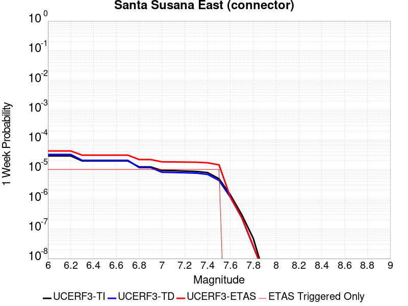 | 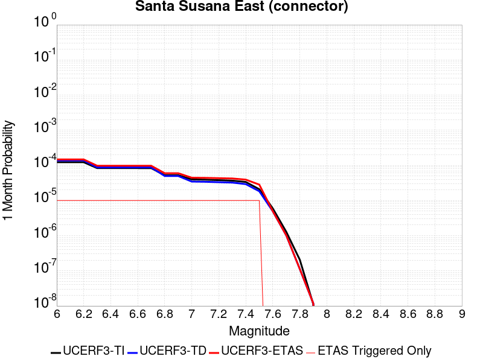 | 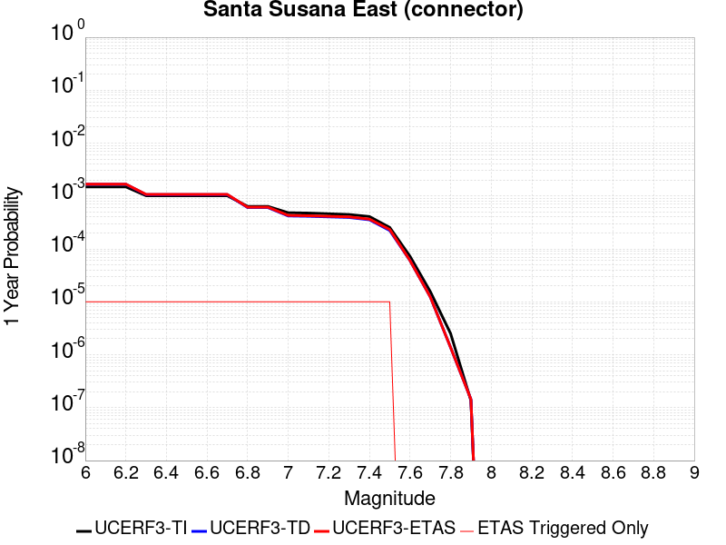 | 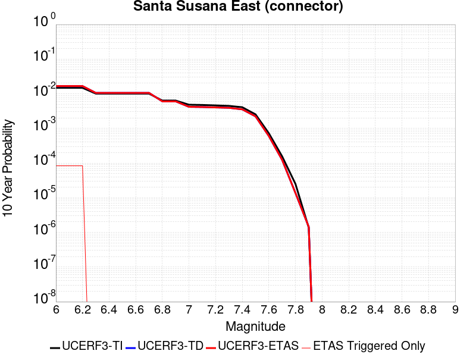 |

| Magnitude | 1 wk TI Prob | 1 wk TD Prob | 1 wk ETAS Prob | 1 wk ETAS/TD Gain | 1 wk ETAS Triggered Only | 1 mo TI Prob | 1 mo TD Prob | 1 mo ETAS Prob | 1 mo ETAS/TD Gain | 1 mo ETAS Triggered Only | 1 yr TI Prob | 1 yr TD Prob | 1 yr ETAS Prob | 1 yr ETAS/TD Gain | 1 yr ETAS Triggered Only | 10 yr TI Prob | 10 yr TD Prob | 10 yr ETAS Prob | 10 yr ETAS/TD Gain | 10 yr ETAS Triggered Only |
|-----|-----|-----|-----|-----|-----|-----|-----|-----|-----|-----|-----|-----|-----|-----|-----|-----|-----|-----|-----|-----|
| 6.0 | 2.858397E-5 | 3.202091E-5 | 3.202091E-5 | 1.0 | 0.0 | 1.2249697E-4 | 1.3722685E-4 | 1.3722685E-4 | 1.0 | 0.0 | 0.0014903803 | 0.0016697381 | 0.0016697381 | 1.0 | 0.0 | 0.014804244 | 0.016599052 | 0.016640874 | 1.0025195 | 4.2527856E-5 |
| 6.1 | 2.858397E-5 | 3.202091E-5 | 3.202091E-5 | 1.0 | 0.0 | 1.2249697E-4 | 1.3722685E-4 | 1.3722685E-4 | 1.0 | 0.0 | 0.0014903803 | 0.0016697381 | 0.0016697381 | 1.0 | 0.0 | 0.014804244 | 0.016599052 | 0.016640874 | 1.0025195 | 4.2527856E-5 |
| 6.2 | 2.858397E-5 | 3.202091E-5 | 3.202091E-5 | 1.0 | 0.0 | 1.2249697E-4 | 1.3722685E-4 | 1.3722685E-4 | 1.0 | 0.0 | 0.0014903803 | 0.0016697381 | 0.0016697381 | 1.0 | 0.0 | 0.014804244 | 0.016599052 | 0.016640874 | 1.0025195 | 4.2527856E-5 |
| 6.3 | 1.943582E-5 | 2.036718E-5 | 2.036718E-5 | 1.0 | 0.0 | 8.329371E-5 | 8.7285625E-5 | 8.7285625E-5 | 1.0 | 0.0 | 0.001013629 | 0.0010622967 | 0.0010622967 | 1.0 | 0.0 | 0.010090181 | 0.010583619 | 0.010583619 | 1.0 | 0.0 |
| 6.4 | 1.943582E-5 | 2.036718E-5 | 2.036718E-5 | 1.0 | 0.0 | 8.329371E-5 | 8.7285625E-5 | 8.7285625E-5 | 1.0 | 0.0 | 0.001013629 | 0.0010622967 | 0.0010622967 | 1.0 | 0.0 | 0.010090181 | 0.010583619 | 0.010583619 | 1.0 | 0.0 |
| 6.5 | 1.943582E-5 | 2.036718E-5 | 2.036718E-5 | 1.0 | 0.0 | 8.329371E-5 | 8.7285625E-5 | 8.7285625E-5 | 1.0 | 0.0 | 0.001013629 | 0.0010622967 | 0.0010622967 | 1.0 | 0.0 | 0.010090181 | 0.010583619 | 0.010583619 | 1.0 | 0.0 |
| 6.6 | 1.943582E-5 | 2.036718E-5 | 2.036718E-5 | 1.0 | 0.0 | 8.329371E-5 | 8.7285625E-5 | 8.7285625E-5 | 1.0 | 0.0 | 0.001013629 | 0.0010622967 | 0.0010622967 | 1.0 | 0.0 | 0.010090181 | 0.010583619 | 0.010583619 | 1.0 | 0.0 |
| 6.7 | 1.9404439E-5 | 2.03546E-5 | 2.03546E-5 | 1.0 | 0.0 | 8.3159226E-5 | 8.723172E-5 | 8.723172E-5 | 1.0 | 0.0 | 0.0010119933 | 0.0010616409 | 0.0010616409 | 1.0 | 0.0 | 0.010073971 | 0.010577125 | 0.010577125 | 1.0 | 0.0 |
| 6.8 | 1.2217526E-5 | 1.1592998E-5 | 1.1592998E-5 | 1.0 | 0.0 | 5.2359774E-5 | 4.9683425E-5 | 4.9683425E-5 | 1.0 | 0.0 | 6.372938E-4 | 6.0474465E-4 | 6.0474465E-4 | 1.0 | 0.0 | 0.0063546924 | 0.006033037 | 0.006033037 | 1.0 | 0.0 |
| 6.9 | 1.2217526E-5 | 1.1592998E-5 | 1.1592998E-5 | 1.0 | 0.0 | 5.2359774E-5 | 4.9683425E-5 | 4.9683425E-5 | 1.0 | 0.0 | 6.372938E-4 | 6.0474465E-4 | 6.0474465E-4 | 1.0 | 0.0 | 0.0063546924 | 0.006033037 | 0.006033037 | 1.0 | 0.0 |
| 7.0 | 9.276017E-6 | 8.059113E-6 | 8.059113E-6 | 1.0 | 0.0 | 3.9753755E-5 | 3.4538618E-5 | 3.4538618E-5 | 1.0 | 0.0 | 4.8389446E-4 | 4.2042998E-4 | 4.2042998E-4 | 1.0 | 0.0 | 0.0048284214 | 0.0041970722 | 0.0041970722 | 1.0 | 0.0 |
| 7.1 | 9.130355E-6 | 7.942286E-6 | 7.942286E-6 | 1.0 | 0.0 | 3.9129503E-5 | 3.4037945E-5 | 3.4037945E-5 | 1.0 | 0.0 | 4.7629757E-4 | 4.1433662E-4 | 4.1433662E-4 | 1.0 | 0.0 | 0.00475278 | 0.004136367 | 0.004136367 | 1.0 | 0.0 |
| 7.2 | 8.851015E-6 | 7.741445E-6 | 7.741445E-6 | 1.0 | 0.0 | 3.7932372E-5 | 3.317722E-5 | 3.317722E-5 | 1.0 | 0.0 | 4.6172875E-4 | 4.038612E-4 | 4.038612E-4 | 1.0 | 0.0 | 0.0046077054 | 0.0040319953 | 0.0040319953 | 1.0 | 0.0 |
| 7.3 | 8.573006E-6 | 7.550166E-6 | 7.550166E-6 | 1.0 | 0.0 | 3.6740938E-5 | 3.2357475E-5 | 3.2357475E-5 | 1.0 | 0.0 | 4.472291E-4 | 3.9388443E-4 | 3.9388443E-4 | 1.0 | 0.0 | 0.004463301 | 0.0039325804 | 0.0039325804 | 1.0 | 0.0 |
| 7.4 | 7.852282E-6 | 6.817687E-6 | 6.817687E-6 | 1.0 | 0.0 | 3.36522E-5 | 2.9218349E-5 | 2.9218349E-5 | 1.0 | 0.0 | 4.096385E-4 | 3.5567835E-4 | 3.5567835E-4 | 1.0 | 0.0 | 0.0040888423 | 0.0035517553 | 0.0035517553 | 1.0 | 0.0 |
| 7.5 | 4.8869324E-6 | 4.279055E-6 | 4.279055E-6 | 1.0 | 0.0 | 2.0943828E-5 | 1.8338687E-5 | 1.8338687E-5 | 1.0 | 0.0 | 2.5496128E-4 | 2.232523E-4 | 2.232523E-4 | 1.0 | 0.0 | 0.0025466895 | 0.0022304445 | 0.0022304445 | 1.0 | 0.0 |
| 7.6 | 1.3894544E-6 | 1.1568179E-6 | 1.1568179E-6 | 1.0 | 0.0 | 5.954791E-6 | 4.957783E-6 | 4.957783E-6 | 1.0 | 0.0 | 7.249717E-5 | 6.0359558E-5 | 6.0359558E-5 | 1.0 | 0.0 | 7.247352E-4 | 6.0345343E-4 | 6.0345343E-4 | 1.0 | 0.0 |
| 7.7 | 2.9924632E-7 | 2.371928E-7 | 2.371928E-7 | 1.0 | 0.0 | 1.2824837E-6 | 1.0165402E-6 | 1.0165402E-6 | 1.0 | 0.0 | 1.5614127E-5 | 1.2376314E-5 | 1.2376314E-5 | 1.0 | 0.0 | 1.5613029E-4 | 1.2375697E-4 | 1.2375697E-4 | 1.0 | 0.0 |
| 7.8 | 4.8188564E-8 | 2.6323061E-8 | 2.6323061E-8 | 1.0 | 0.0 | 2.065224E-7 | 1.1281311E-7 | 1.1281311E-7 | 1.0 | 0.0 | 2.5144072E-6 | 1.3734989E-6 | 1.3734989E-6 | 1.0 | 0.0 | 2.5143789E-5 | 1.3734912E-5 | 1.3734912E-5 | 1.0 | 0.0 |
| 7.9 | 2.6127251E-9 | 2.7681102E-9 | 2.7681102E-9 | 1.0 | 0.0 | 1.1197393E-8 | 1.186333E-8 | 1.186333E-8 | 1.0 | 0.0 | 1.3632825E-7 | 1.4443603E-7 | 1.4443603E-7 | 1.0 | 0.0 | 1.3632817E-6 | 1.4443604E-6 | 1.4443604E-6 | 1.0 | 0.0 |

## Laguna Salada
*[(top)](#table-of-contents)*

| 1 Week | 1 Month | 1 Year | 10 Year |
|-----|-----|-----|-----|
| 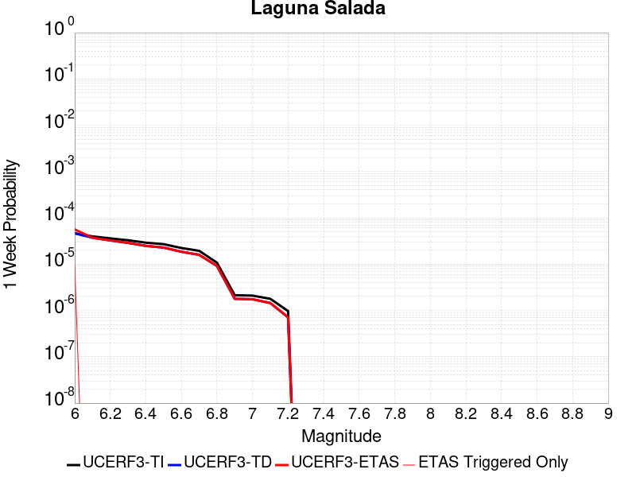 | 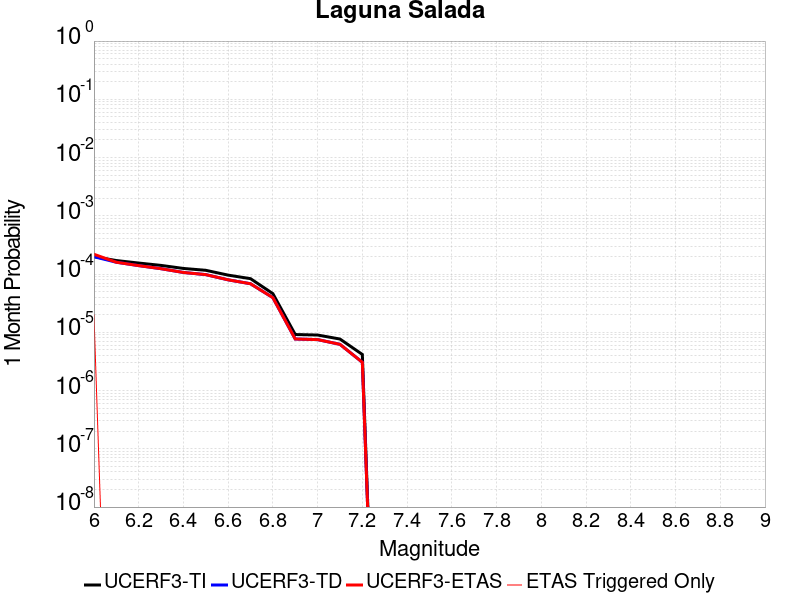 | 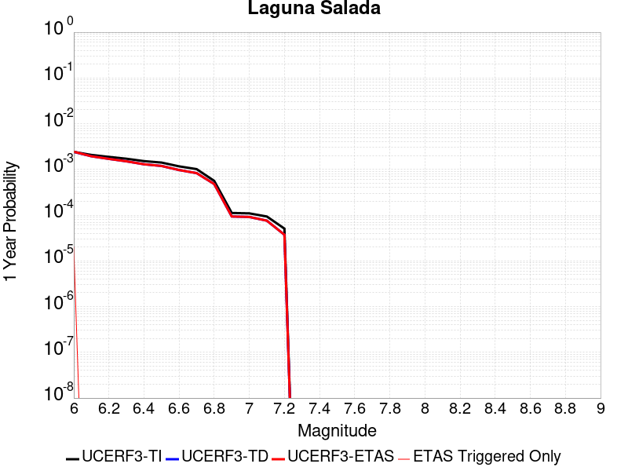 | 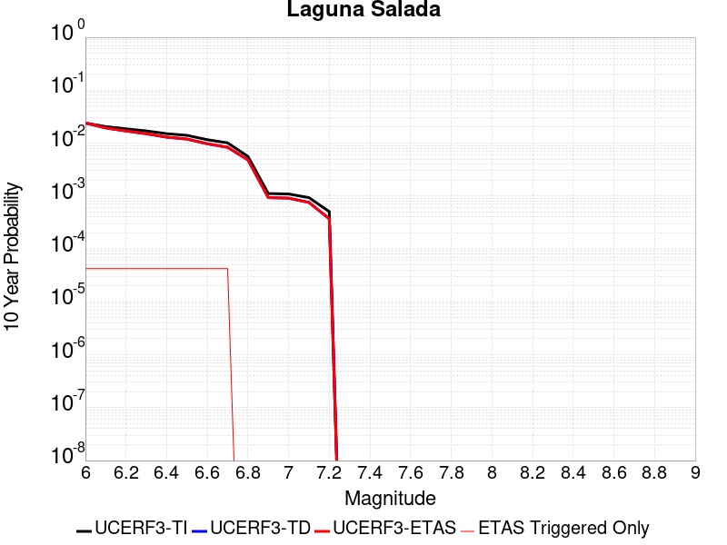 |

| Magnitude | 1 wk TI Prob | 1 wk TD Prob | 1 wk ETAS Prob | 1 wk ETAS/TD Gain | 1 wk ETAS Triggered Only | 1 mo TI Prob | 1 mo TD Prob | 1 mo ETAS Prob | 1 mo ETAS/TD Gain | 1 mo ETAS Triggered Only | 1 yr TI Prob | 1 yr TD Prob | 1 yr ETAS Prob | 1 yr ETAS/TD Gain | 1 yr ETAS Triggered Only | 10 yr TI Prob | 10 yr TD Prob | 10 yr ETAS Prob | 10 yr ETAS/TD Gain | 10 yr ETAS Triggered Only |
|-----|-----|-----|-----|-----|-----|-----|-----|-----|-----|-----|-----|-----|-----|-----|-----|-----|-----|-----|-----|-----|
| 6.0 | 4.6465593E-5 | 4.634639E-5 | 4.634639E-5 | 1.0 | 0.0 | 1.9912305E-4 | 1.9861311E-4 | 1.9861311E-4 | 1.0 | 0.0 | 0.0024216278 | 0.002415429 | 0.002415429 | 1.0 | 0.0 | 0.02395408 | 0.023975259 | 0.024016768 | 1.0017313 | 4.2527856E-5 |
| 6.1 | 3.982297E-5 | 3.7246125E-5 | 3.7246125E-5 | 1.0 | 0.0 | 1.706587E-4 | 1.5961716E-4 | 1.5961716E-4 | 1.0 | 0.0 | 0.0020757897 | 0.0019417295 | 0.0019417295 | 1.0 | 0.0 | 0.020565065 | 0.019331863 | 0.019373568 | 1.0021573 | 4.2527856E-5 |
| 6.2 | 3.6067784E-5 | 3.2602693E-5 | 3.2602693E-5 | 1.0 | 0.0 | 1.5456705E-4 | 1.3971896E-4 | 1.3971896E-4 | 1.0 | 0.0 | 0.0018802295 | 0.0016998611 | 0.0016998611 | 1.0 | 0.0 | 0.018644003 | 0.016949628 | 0.016991435 | 1.0024666 | 4.2527856E-5 |
| 6.3 | 3.2859112E-5 | 2.8849448E-5 | 2.8849448E-5 | 1.0 | 0.0 | 1.4081717E-4 | 1.2363521E-4 | 1.2363521E-4 | 1.0 | 0.0 | 0.0017131006 | 0.0015043203 | 0.0015043203 | 1.0 | 0.0 | 0.016999546 | 0.015018767 | 0.015060657 | 1.0027891 | 4.2527856E-5 |
| 6.4 | 2.9132116E-5 | 2.4852965E-5 | 2.4852965E-5 | 1.0 | 0.0 | 1.2484594E-4 | 1.0650887E-4 | 1.0650887E-4 | 1.0 | 0.0 | 0.0015189396 | 0.001296065 | 0.001296065 | 1.0 | 0.0 | 0.015085992 | 0.012956262 | 0.012998239 | 1.0032399 | 4.2527856E-5 |
| 6.5 | 2.7075037E-5 | 2.2825836E-5 | 2.2825836E-5 | 1.0 | 0.0 | 1.1603071E-4 | 9.7821845E-5 | 9.7821845E-5 | 1.0 | 0.0 | 0.0014117584 | 0.0011904186 | 0.0011904186 | 1.0 | 0.0 | 0.014028233 | 0.011907749 | 0.01194977 | 1.003529 | 4.2527856E-5 |
| 6.6 | 2.2367465E-5 | 1.8573526E-5 | 1.8573526E-5 | 1.0 | 0.0 | 9.5857045E-5 | 7.959886E-5 | 7.959886E-5 | 1.0 | 0.0 | 0.0011664346 | 9.6876756E-4 | 9.6876756E-4 | 1.0 | 0.0 | 0.011603311 | 0.009702191 | 0.009744305 | 1.0043408 | 4.2527856E-5 |
| 6.7 | 1.9458053E-5 | 1.5914242E-5 | 1.5914242E-5 | 1.0 | 0.0 | 8.338899E-5 | 6.8202564E-5 | 6.8202564E-5 | 1.0 | 0.0 | 0.001014788 | 8.3013024E-4 | 8.3013024E-4 | 1.0 | 0.0 | 0.010101665 | 0.0083209425 | 0.0083631165 | 1.0050684 | 4.2527856E-5 |
| 6.8 | 1.0767866E-5 | 9.18435E-6 | 9.18435E-6 | 1.0 | 0.0 | 4.614718E-5 | 3.9361294E-5 | 3.9361294E-5 | 1.0 | 0.0 | 5.6169706E-4 | 4.7918706E-4 | 4.7918706E-4 | 1.0 | 0.0 | 0.0056027942 | 0.0048096925 | 0.0048096925 | 1.0 | 0.0 |
| 6.9 | 2.1384765E-6 | 1.7913675E-6 | 1.7913675E-6 | 1.0 | 0.0 | 9.164866E-6 | 7.677269E-6 | 7.677269E-6 | 1.0 | 0.0 | 1.1157654E-4 | 9.346713E-5 | 9.346713E-5 | 1.0 | 0.0 | 0.0011152053 | 9.343165E-4 | 9.343165E-4 | 1.0 | 0.0 |
| 7.0 | 2.0952946E-6 | 1.7493046E-6 | 1.7493046E-6 | 1.0 | 0.0 | 8.979802E-6 | 7.4970003E-6 | 7.4970003E-6 | 1.0 | 0.0 | 1.0932361E-4 | 9.1272545E-5 | 9.1272545E-5 | 1.0 | 0.0 | 0.0010926984 | 9.123888E-4 | 9.123888E-4 | 1.0 | 0.0 |
| 7.1 | 1.7887576E-6 | 1.4500254E-6 | 1.4500254E-6 | 1.0 | 0.0 | 7.666081E-6 | 6.2143813E-6 | 6.2143813E-6 | 1.0 | 0.0 | 9.333054E-5 | 7.565777E-5 | 7.565777E-5 | 1.0 | 0.0 | 9.329135E-4 | 7.563506E-4 | 7.563506E-4 | 1.0 | 0.0 |
| 7.2 | 9.723109E-7 | 7.135619E-7 | 7.135619E-7 | 1.0 | 0.0 | 4.16704E-6 | 3.0581198E-6 | 3.0581198E-6 | 1.0 | 0.0 | 5.073253E-5 | 3.7232137E-5 | 3.7232137E-5 | 1.0 | 0.0 | 5.072095E-4 | 3.7227524E-4 | 3.7227524E-4 | 1.0 | 0.0 |

## Raymond
*[(top)](#table-of-contents)*

| 1 Week | 1 Month | 1 Year | 10 Year |
|-----|-----|-----|-----|
| 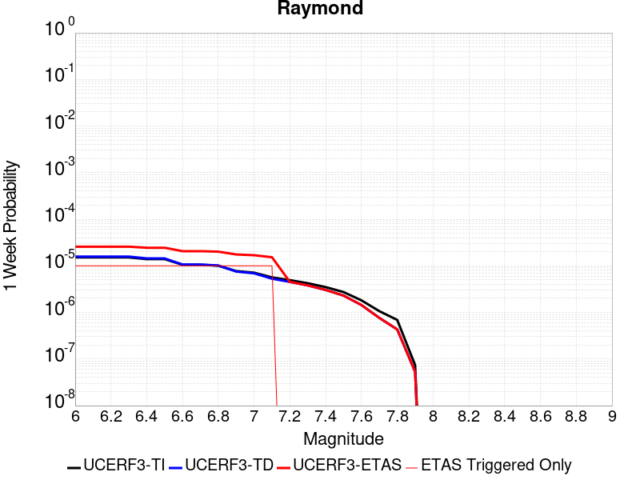 | 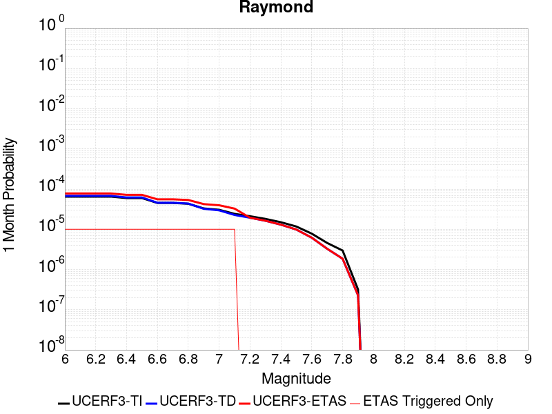 | 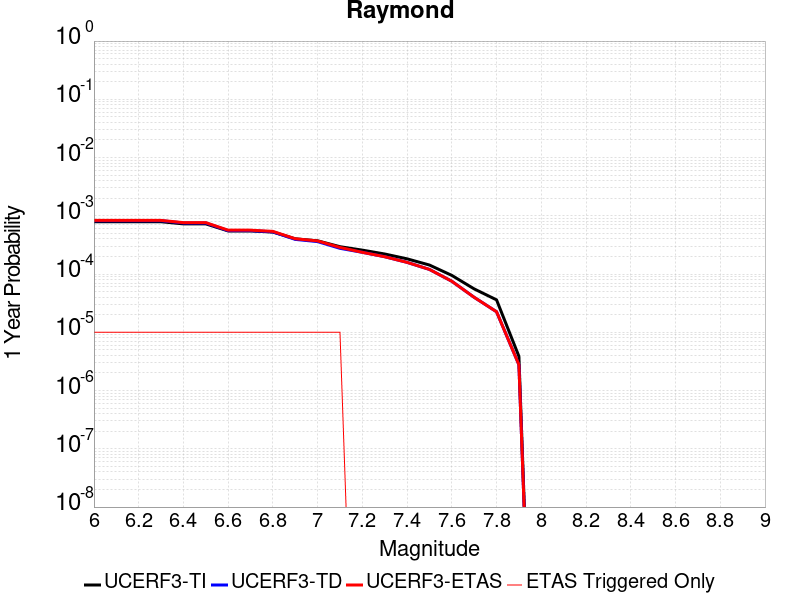 | 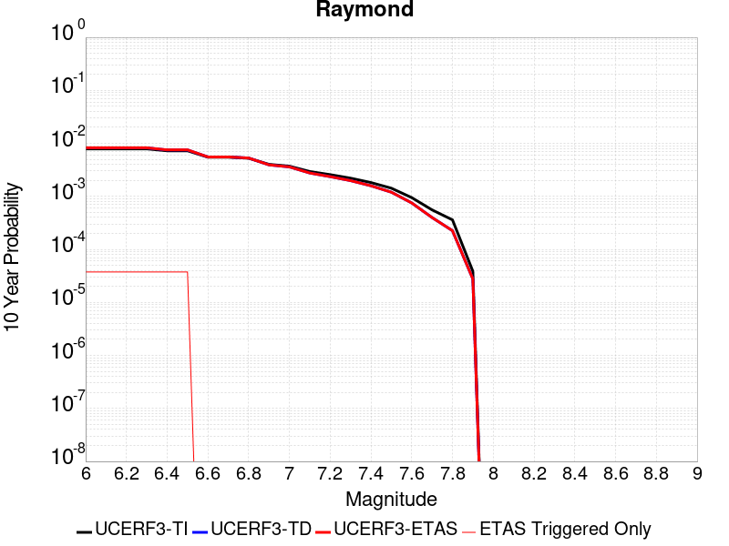 |

| Magnitude | 1 wk TI Prob | 1 wk TD Prob | 1 wk ETAS Prob | 1 wk ETAS/TD Gain | 1 wk ETAS Triggered Only | 1 mo TI Prob | 1 mo TD Prob | 1 mo ETAS Prob | 1 mo ETAS/TD Gain | 1 mo ETAS Triggered Only | 1 yr TI Prob | 1 yr TD Prob | 1 yr ETAS Prob | 1 yr ETAS/TD Gain | 1 yr ETAS Triggered Only | 10 yr TI Prob | 10 yr TD Prob | 10 yr ETAS Prob | 10 yr ETAS/TD Gain | 10 yr ETAS Triggered Only |
|-----|-----|-----|-----|-----|-----|-----|-----|-----|-----|-----|-----|-----|-----|-----|-----|-----|-----|-----|-----|-----|
| 6.0 | 1.5157413E-5 | 1.5810128E-5 | 1.5810128E-5 | 1.0 | 0.0 | 6.4958724E-5 | 6.7756075E-5 | 6.7756075E-5 | 1.0 | 0.0 | 7.905855E-4 | 8.2464307E-4 | 8.2464307E-4 | 1.0 | 0.0 | 0.007877788 | 0.008218348 | 0.008260527 | 1.0051322 | 4.2527856E-5 |
| 6.1 | 1.5157413E-5 | 1.5810128E-5 | 1.5810128E-5 | 1.0 | 0.0 | 6.4958724E-5 | 6.7756075E-5 | 6.7756075E-5 | 1.0 | 0.0 | 7.905855E-4 | 8.2464307E-4 | 8.2464307E-4 | 1.0 | 0.0 | 0.007877788 | 0.008218348 | 0.008260527 | 1.0051322 | 4.2527856E-5 |
| 6.2 | 1.5157413E-5 | 1.5810128E-5 | 1.5810128E-5 | 1.0 | 0.0 | 6.4958724E-5 | 6.7756075E-5 | 6.7756075E-5 | 1.0 | 0.0 | 7.905855E-4 | 8.2464307E-4 | 8.2464307E-4 | 1.0 | 0.0 | 0.007877788 | 0.008218348 | 0.008260527 | 1.0051322 | 4.2527856E-5 |
| 6.3 | 1.5157413E-5 | 1.5810128E-5 | 1.5810128E-5 | 1.0 | 0.0 | 6.4958724E-5 | 6.7756075E-5 | 6.7756075E-5 | 1.0 | 0.0 | 7.905855E-4 | 8.2464307E-4 | 8.2464307E-4 | 1.0 | 0.0 | 0.007877788 | 0.008218348 | 0.008260527 | 1.0051322 | 4.2527856E-5 |
| 6.4 | 1.3941944E-5 | 1.445469E-5 | 1.445469E-5 | 1.0 | 0.0 | 5.9749822E-5 | 6.1947336E-5 | 6.1947336E-5 | 1.0 | 0.0 | 7.2721124E-4 | 7.5397117E-4 | 7.5397117E-4 | 1.0 | 0.0 | 0.007248361 | 0.0075164647 | 0.007558673 | 1.0056155 | 4.2527856E-5 |
| 6.5 | 1.3941944E-5 | 1.445469E-5 | 1.445469E-5 | 1.0 | 0.0 | 5.9749822E-5 | 6.1947336E-5 | 6.1947336E-5 | 1.0 | 0.0 | 7.2721124E-4 | 7.5397117E-4 | 7.5397117E-4 | 1.0 | 0.0 | 0.007248361 | 0.0075164647 | 0.007558673 | 1.0056155 | 4.2527856E-5 |
| 6.6 | 1.0542609E-5 | 1.0671113E-5 | 1.0671113E-5 | 1.0 | 0.0 | 4.5181827E-5 | 4.573257E-5 | 4.573257E-5 | 1.0 | 0.0 | 5.499499E-4 | 5.5665727E-4 | 5.5665727E-4 | 1.0 | 0.0 | 0.005485909 | 0.00555319 | 0.00555319 | 1.0 | 0.0 |
| 6.7 | 1.0542609E-5 | 1.0671113E-5 | 1.0671113E-5 | 1.0 | 0.0 | 4.5181827E-5 | 4.573257E-5 | 4.573257E-5 | 1.0 | 0.0 | 5.499499E-4 | 5.5665727E-4 | 5.5665727E-4 | 1.0 | 0.0 | 0.005485909 | 0.00555319 | 0.00555319 | 1.0 | 0.0 |
| 6.8 | 1.0079132E-5 | 1.0176646E-5 | 1.0176646E-5 | 1.0 | 0.0 | 4.3195567E-5 | 4.3613498E-5 | 4.3613498E-5 | 1.0 | 0.0 | 5.257791E-4 | 5.3087034E-4 | 5.3087034E-4 | 1.0 | 0.0 | 0.0052453685 | 0.005296571 | 0.005296571 | 1.0 | 0.0 |
| 6.9 | 7.721598E-6 | 7.5489047E-6 | 7.5489047E-6 | 1.0 | 0.0 | 3.3092143E-5 | 3.2352054E-5 | 3.2352054E-5 | 1.0 | 0.0 | 4.0282236E-4 | 3.9381627E-4 | 3.9381627E-4 | 1.0 | 0.0 | 0.0040209293 | 0.0039313175 | 0.0039313175 | 1.0 | 0.0 |
| 7.0 | 7.137566E-6 | 6.9113057E-6 | 6.9113057E-6 | 1.0 | 0.0 | 3.058921E-5 | 2.961955E-5 | 2.961955E-5 | 1.0 | 0.0 | 3.7236E-4 | 3.6055944E-4 | 3.6055944E-4 | 1.0 | 0.0 | 0.0037173668 | 0.0035998628 | 0.0035998628 | 1.0 | 0.0 |
| 7.1 | 5.654976E-6 | 5.29954E-6 | 5.29954E-6 | 1.0 | 0.0 | 2.4235387E-5 | 2.2712118E-5 | 2.2712118E-5 | 1.0 | 0.0 | 2.9502588E-4 | 2.7648517E-4 | 2.7648517E-4 | 1.0 | 0.0 | 0.0029463451 | 0.002761443 | 0.002761443 | 1.0 | 0.0 |
| 7.2 | 4.9358455E-6 | 4.5266574E-6 | 4.5266574E-6 | 1.0 | 0.0 | 2.1153453E-5 | 1.9399817E-5 | 1.9399817E-5 | 1.0 | 0.0 | 2.5751285E-4 | 2.3616731E-4 | 2.3616731E-4 | 1.0 | 0.0 | 0.0025721465 | 0.0023591854 | 0.0023591854 | 1.0 | 0.0 |
| 7.3 | 4.2368597E-6 | 3.8056164E-6 | 3.8056164E-6 | 1.0 | 0.0 | 1.8157843E-5 | 1.6309683E-5 | 1.6309683E-5 | 1.0 | 0.0 | 2.2104931E-4 | 1.9855241E-4 | 1.9855241E-4 | 1.0 | 0.0 | 0.0022082955 | 0.0019837688 | 0.0019837688 | 1.0 | 0.0 |
| 7.4 | 3.4999923E-6 | 3.043744E-6 | 3.043744E-6 | 1.0 | 0.0 | 1.49998805E-5 | 1.3044552E-5 | 1.3044552E-5 | 1.0 | 0.0 | 1.8260824E-4 | 1.5880594E-4 | 1.5880594E-4 | 1.0 | 0.0 | 0.0018245826 | 0.0015869403 | 0.0015869403 | 1.0 | 0.0 |
| 7.5 | 2.738017E-6 | 2.3020468E-6 | 2.3020468E-6 | 1.0 | 0.0 | 1.1734306E-5 | 9.865878E-6 | 9.865878E-6 | 1.0 | 0.0 | 1.428558E-4 | 1.2011051E-4 | 1.2011051E-4 | 1.0 | 0.0 | 0.0014276401 | 0.0012004703 | 0.0012004703 | 1.0 | 0.0 |
| 7.6 | 1.8186392E-6 | 1.442312E-6 | 1.442312E-6 | 1.0 | 0.0 | 7.794145E-6 | 6.181323E-6 | 6.181323E-6 | 1.0 | 0.0 | 9.488958E-5 | 7.5255055E-5 | 7.5255055E-5 | 1.0 | 0.0 | 9.4849075E-4 | 7.523072E-4 | 7.523072E-4 | 1.0 | 0.0 |
| 7.7 | 1.0660348E-6 | 7.6438056E-7 | 7.6438056E-7 | 1.0 | 0.0 | 4.5687125E-6 | 3.2759126E-6 | 3.2759126E-6 | 1.0 | 0.0 | 5.5622655E-5 | 3.9883522E-5 | 3.9883522E-5 | 1.0 | 0.0 | 5.5608735E-4 | 3.9877277E-4 | 3.9877277E-4 | 1.0 | 0.0 |
| 7.8 | 6.913602E-7 | 4.3204133E-7 | 4.3204133E-7 | 1.0 | 0.0 | 2.962969E-6 | 1.8516045E-6 | 1.8516045E-6 | 1.0 | 0.0 | 3.607355E-5 | 2.2543056E-5 | 2.2543056E-5 | 1.0 | 0.0 | 3.6067693E-4 | 2.2541556E-4 | 2.2541556E-4 | 1.0 | 0.0 |
| 7.9 | 7.425201E-8 | 5.3222113E-8 | 5.3222113E-8 | 1.0 | 0.0 | 3.1822285E-7 | 2.2809476E-7 | 2.2809476E-7 | 1.0 | 0.0 | 3.874356E-6 | 2.7770516E-6 | 2.7770516E-6 | 1.0 | 0.0 | 3.8742884E-5 | 2.7770298E-5 | 2.7770298E-5 | 1.0 | 0.0 |

## Monte Vista - Shannon 2011 CFM
*[(top)](#table-of-contents)*

| 1 Week | 1 Month | 1 Year | 10 Year |
|-----|-----|-----|-----|
| 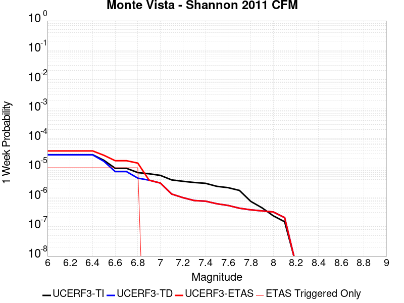 | 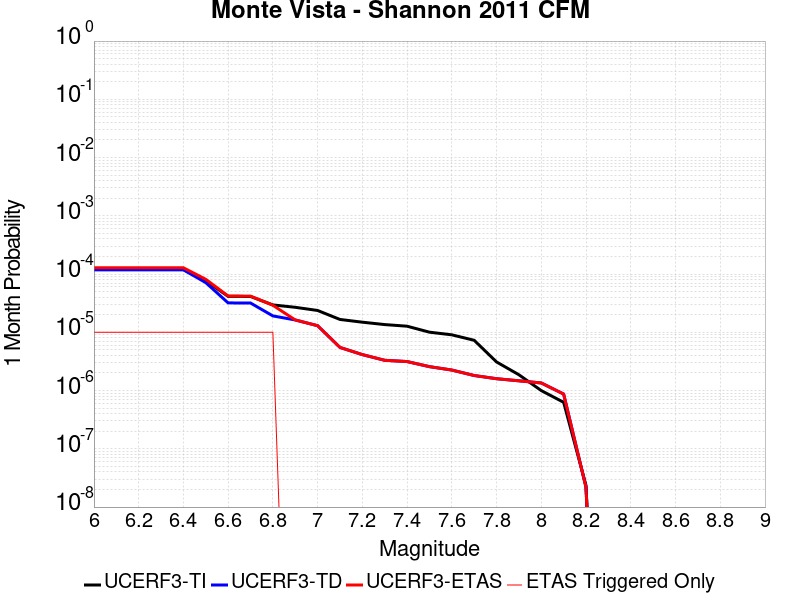 | 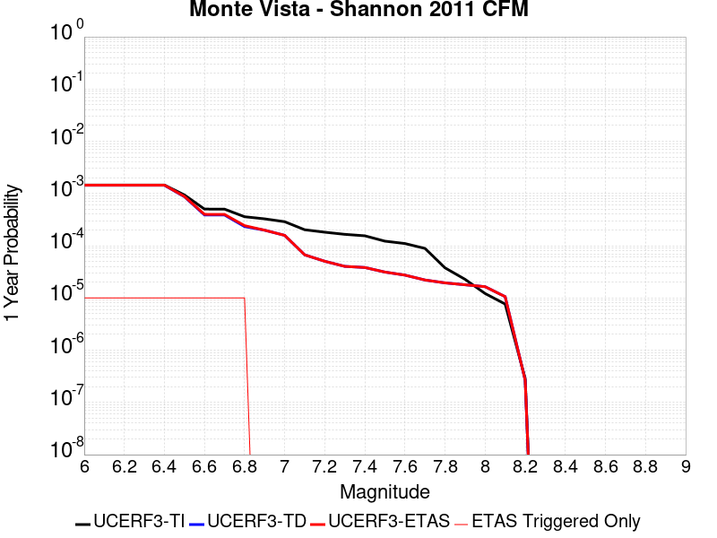 | 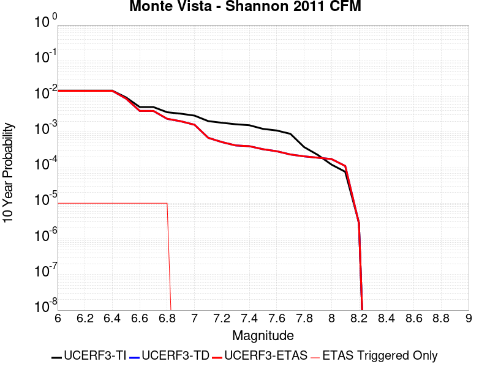 |

| Magnitude | 1 wk TI Prob | 1 wk TD Prob | 1 wk ETAS Prob | 1 wk ETAS/TD Gain | 1 wk ETAS Triggered Only | 1 mo TI Prob | 1 mo TD Prob | 1 mo ETAS Prob | 1 mo ETAS/TD Gain | 1 mo ETAS Triggered Only | 1 yr TI Prob | 1 yr TD Prob | 1 yr ETAS Prob | 1 yr ETAS/TD Gain | 1 yr ETAS Triggered Only | 10 yr TI Prob | 10 yr TD Prob | 10 yr ETAS Prob | 10 yr ETAS/TD Gain | 10 yr ETAS Triggered Only |
|-----|-----|-----|-----|-----|-----|-----|-----|-----|-----|-----|-----|-----|-----|-----|-----|-----|-----|-----|-----|-----|
| 6.0 | 2.7907707E-5 | 2.7584209E-5 | 7.011089E-5 | 2.541704 | 4.2527856E-5 | 1.19598975E-4 | 1.1821338E-4 | 1.607362E-4 | 1.3597125 | 4.2527856E-5 | 0.0014551448 | 0.0014384214 | 0.0014808881 | 1.0295231 | 4.2527856E-5 | 0.014456532 | 0.014320195 | 0.014362114 | 1.0029273 | 4.2527856E-5 |
| 6.1 | 2.7907707E-5 | 2.7584209E-5 | 7.011089E-5 | 2.541704 | 4.2527856E-5 | 1.19598975E-4 | 1.1821338E-4 | 1.607362E-4 | 1.3597125 | 4.2527856E-5 | 0.0014551448 | 0.0014384214 | 0.0014808881 | 1.0295231 | 4.2527856E-5 | 0.014456532 | 0.014320195 | 0.014362114 | 1.0029273 | 4.2527856E-5 |
| 6.2 | 2.7907707E-5 | 2.7584209E-5 | 7.011089E-5 | 2.541704 | 4.2527856E-5 | 1.19598975E-4 | 1.1821338E-4 | 1.607362E-4 | 1.3597125 | 4.2527856E-5 | 0.0014551448 | 0.0014384214 | 0.0014808881 | 1.0295231 | 4.2527856E-5 | 0.014456532 | 0.014320195 | 0.014362114 | 1.0029273 | 4.2527856E-5 |
| 6.3 | 2.7907707E-5 | 2.7584209E-5 | 7.011089E-5 | 2.541704 | 4.2527856E-5 | 1.19598975E-4 | 1.1821338E-4 | 1.607362E-4 | 1.3597125 | 4.2527856E-5 | 0.0014551448 | 0.0014384214 | 0.0014808881 | 1.0295231 | 4.2527856E-5 | 0.014456532 | 0.014320195 | 0.014362114 | 1.0029273 | 4.2527856E-5 |
| 6.4 | 2.7907707E-5 | 2.7584209E-5 | 7.011089E-5 | 2.541704 | 4.2527856E-5 | 1.19598975E-4 | 1.1821338E-4 | 1.607362E-4 | 1.3597125 | 4.2527856E-5 | 0.0014551448 | 0.0014384214 | 0.0014808881 | 1.0295231 | 4.2527856E-5 | 0.014456532 | 0.014320195 | 0.014362114 | 1.0029273 | 4.2527856E-5 |
| 6.5 | 1.7990213E-5 | 1.6639884E-5 | 5.9167032E-5 | 3.5557358 | 4.2527856E-5 | 7.709863E-5 | 7.131221E-5 | 1.13837035E-4 | 1.596319 | 4.2527856E-5 | 9.382716E-4 | 8.679467E-4 | 9.1043767E-4 | 1.0489557 | 4.2527856E-5 | 0.0093431985 | 0.008668941 | 0.008711101 | 1.0048633 | 4.2527856E-5 |
| 6.6 | 9.650407E-6 | 7.4571435E-6 | 4.9984683E-5 | 6.702926 | 4.2527856E-5 | 4.135823E-5 | 3.195884E-5 | 7.448534E-5 | 2.3306646 | 4.2527856E-5 | 5.0342013E-4 | 3.8903722E-4 | 4.3154854E-4 | 1.1092731 | 4.2527856E-5 | 0.005022812 | 0.0039012418 | 0.003943604 | 1.0108585 | 4.2527856E-5 |
| 6.7 | 9.62828E-6 | 7.4350583E-6 | 4.9962597E-5 | 6.7198663 | 4.2527856E-5 | 4.1263404E-5 | 3.186419E-5 | 7.439069E-5 | 2.3346174 | 4.2527856E-5 | 5.022661E-4 | 3.878853E-4 | 4.3039664E-4 | 1.1095978 | 4.2527856E-5 | 0.0050113243 | 0.003889763 | 0.0039321254 | 1.0108907 | 4.2527856E-5 |
| 6.8 | 6.887523E-6 | 4.4615676E-6 | 4.6989233E-5 | 10.5320015 | 4.2527856E-5 | 2.9517621E-5 | 1.9120876E-5 | 6.1647916E-5 | 3.2241158 | 4.2527856E-5 | 3.5931775E-4 | 2.3277402E-4 | 2.7529197E-4 | 1.1826576 | 4.2527856E-5 | 0.0035873733 | 0.0023424553 | 0.0023848836 | 1.0181128 | 4.2527856E-5 |
| 6.9 | 6.2722347E-6 | 3.8034377E-6 | 3.8034377E-6 | 1.0 | 0.0 | 2.6880729E-5 | 1.6300357E-5 | 1.6300357E-5 | 1.0 | 0.0 | 3.2722374E-4 | 1.984408E-4 | 1.984408E-4 | 1.0 | 0.0 | 0.003267423 | 0.0019997752 | 0.0019997752 | 1.0 | 0.0 |
| 7.0 | 5.5320347E-6 | 3.0305885E-6 | 3.0305885E-6 | 1.0 | 0.0 | 2.3708504E-5 | 1.2988182E-5 | 1.2988182E-5 | 1.0 | 0.0 | 2.8861282E-4 | 1.5812147E-4 | 1.5812147E-4 | 1.0 | 0.0 | 0.0028823826 | 0.001597215 | 0.001597215 | 1.0 | 0.0 |
| 7.1 | 3.8794055E-6 | 1.2837862E-6 | 1.2837862E-6 | 1.0 | 0.0 | 1.6625918E-5 | 5.5019295E-6 | 5.5019295E-6 | 1.0 | 0.0 | 2.0240174E-4 | 6.698394E-5 | 6.698394E-5 | 1.0 | 0.0 | 0.002022175 | 6.865884E-4 | 6.865884E-4 | 1.0 | 0.0 |
| 7.2 | 3.4813652E-6 | 9.671046E-7 | 9.671046E-7 | 1.0 | 0.0 | 1.49200505E-5 | 4.1447274E-6 | 4.1447274E-6 | 1.0 | 0.0 | 1.8163648E-4 | 5.0460894E-5 | 5.0460894E-5 | 1.0 | 0.0 | 0.0018148809 | 5.214329E-4 | 5.214329E-4 | 1.0 | 0.0 |
| 7.3 | 3.1682148E-6 | 7.719097E-7 | 7.719097E-7 | 1.0 | 0.0 | 1.3577992E-5 | 3.30818E-6 | 3.30818E-6 | 1.0 | 0.0 | 1.6529951E-4 | 4.027635E-5 | 4.027635E-5 | 1.0 | 0.0 | 0.0016517661 | 4.1960424E-4 | 4.1960424E-4 | 1.0 | 0.0 |
| 7.4 | 2.9707667E-6 | 7.3457204E-7 | 7.3457204E-7 | 1.0 | 0.0 | 1.2731795E-5 | 3.148162E-6 | 3.148162E-6 | 1.0 | 0.0 | 1.5499859E-4 | 3.8328202E-5 | 3.8328202E-5 | 1.0 | 0.0 | 0.0015489052 | 3.9992164E-4 | 3.9992164E-4 | 1.0 | 0.0 |
| 7.5 | 2.3462758E-6 | 6.007889E-7 | 6.007889E-7 | 1.0 | 0.0 | 1.0055429E-5 | 2.574807E-6 | 2.574807E-6 | 1.0 | 0.0 | 1.2241797E-4 | 3.1347827E-5 | 3.1347827E-5 | 1.0 | 0.0 | 0.0012235056 | 3.2839534E-4 | 3.2839534E-4 | 1.0 | 0.0 |
| 7.6 | 2.112783E-6 | 5.251582E-7 | 5.251582E-7 | 1.0 | 0.0 | 9.054753E-6 | 2.250676E-6 | 2.250676E-6 | 1.0 | 0.0 | 1.1023604E-4 | 2.7401638E-5 | 2.7401638E-5 | 1.0 | 0.0 | 0.0011018137 | 2.885138E-4 | 2.885138E-4 | 1.0 | 0.0 |
| 7.7 | 1.7022471E-6 | 4.231601E-7 | 4.231601E-7 | 1.0 | 0.0 | 7.2953244E-6 | 1.8135419E-6 | 1.8135419E-6 | 1.0 | 0.0 | 8.881695E-5 | 2.207965E-5 | 2.207965E-5 | 1.0 | 0.0 | 8.878146E-4 | 2.3398738E-4 | 2.3398738E-4 | 1.0 | 0.0 |
| 7.8 | 7.230914E-7 | 3.7285864E-7 | 3.7285864E-7 | 1.0 | 0.0 | 3.0989595E-6 | 1.5979647E-6 | 1.5979647E-6 | 1.0 | 0.0 | 3.772918E-5 | 1.9455047E-5 | 1.9455047E-5 | 1.0 | 0.0 | 3.7722773E-4 | 2.0726922E-4 | 2.0726922E-4 | 1.0 | 0.0 |
| 7.9 | 4.3588446E-7 | 3.4305793E-7 | 3.4305793E-7 | 1.0 | 0.0 | 1.868075E-6 | 1.4702474E-6 | 1.4702474E-6 | 1.0 | 0.0 | 2.2743576E-5 | 1.7900116E-5 | 1.7900116E-5 | 1.0 | 0.0 | 2.2741247E-4 | 1.8995286E-4 | 1.8995286E-4 | 1.0 | 0.0 |
| 8.0 | 2.3317523E-7 | 3.1513588E-7 | 3.1513588E-7 | 1.0 | 0.0 | 9.99322E-7 | 1.3505817E-6 | 1.3505817E-6 | 1.0 | 0.0 | 1.2166677E-5 | 1.644321E-5 | 1.644321E-5 | 1.0 | 0.0 | 1.21660116E-4 | 1.7399415E-4 | 1.7399415E-4 | 1.0 | 0.0 |
| 8.1 | 1.4662456E-7 | 2.030774E-7 | 2.030774E-7 | 1.0 | 0.0 | 6.283908E-7 | 8.703314E-7 | 8.703314E-7 | 1.0 | 0.0 | 7.650631E-6 | 1.05962345E-5 | 1.05962345E-5 | 1.0 | 0.0 | 7.650368E-5 | 1.113227E-4 | 1.113227E-4 | 1.0 | 0.0 |
| 8.2 | 5.4931775E-9 | 5.07573E-9 | 5.07573E-9 | 1.0 | 0.0 | 2.3542189E-8 | 2.1753127E-8 | 2.1753127E-8 | 1.0 | 0.0 | 2.8662612E-7 | 2.6484432E-7 | 2.6484432E-7 | 1.0 | 0.0 | 2.8662573E-6 | 2.7539324E-6 | 2.7539324E-6 | 1.0 | 0.0 |

## San Luis Range 2011 CFM
*[(top)](#table-of-contents)*

| 1 Week | 1 Month | 1 Year | 10 Year |
|-----|-----|-----|-----|
|  | 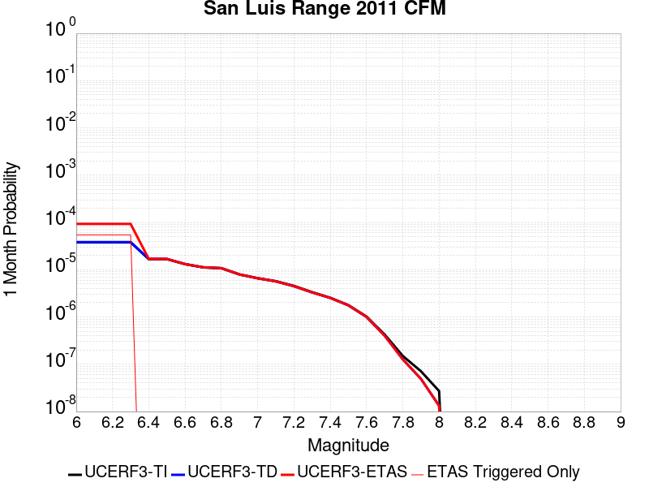 | 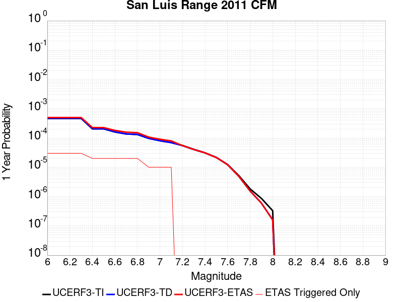 | 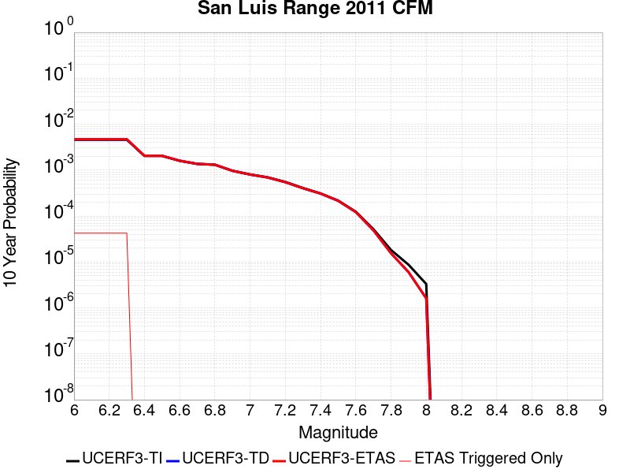 |

| Magnitude | 1 wk TI Prob | 1 wk TD Prob | 1 wk ETAS Prob | 1 wk ETAS/TD Gain | 1 wk ETAS Triggered Only | 1 mo TI Prob | 1 mo TD Prob | 1 mo ETAS Prob | 1 mo ETAS/TD Gain | 1 mo ETAS Triggered Only | 1 yr TI Prob | 1 yr TD Prob | 1 yr ETAS Prob | 1 yr ETAS/TD Gain | 1 yr ETAS Triggered Only | 10 yr TI Prob | 10 yr TD Prob | 10 yr ETAS Prob | 10 yr ETAS/TD Gain | 10 yr ETAS Triggered Only |
|-----|-----|-----|-----|-----|-----|-----|-----|-----|-----|-----|-----|-----|-----|-----|-----|-----|-----|-----|-----|-----|
| 6.0 | 8.8368415E-6 | 8.965454E-6 | 5.1492927E-5 | 5.7434826 | 4.2527856E-5 | 3.787163E-5 | 3.842285E-5 | 8.0949074E-5 | 2.106795 | 4.2527856E-5 | 4.609895E-4 | 4.677057E-4 | 5.1021366E-4 | 1.0908861 | 4.2527856E-5 | 0.0046003438 | 0.0046679964 | 0.0047103255 | 1.009068 | 4.2527856E-5 |
| 6.1 | 8.8368415E-6 | 8.965454E-6 | 5.1492927E-5 | 5.7434826 | 4.2527856E-5 | 3.787163E-5 | 3.842285E-5 | 8.0949074E-5 | 2.106795 | 4.2527856E-5 | 4.609895E-4 | 4.677057E-4 | 5.1021366E-4 | 1.0908861 | 4.2527856E-5 | 0.0046003438 | 0.0046679964 | 0.0047103255 | 1.009068 | 4.2527856E-5 |
| 6.2 | 8.8368415E-6 | 8.965454E-6 | 5.1492927E-5 | 5.7434826 | 4.2527856E-5 | 3.787163E-5 | 3.842285E-5 | 8.0949074E-5 | 2.106795 | 4.2527856E-5 | 4.609895E-4 | 4.677057E-4 | 5.1021366E-4 | 1.0908861 | 4.2527856E-5 | 0.0046003438 | 0.0046679964 | 0.0047103255 | 1.009068 | 4.2527856E-5 |
| 6.3 | 8.8368415E-6 | 8.965454E-6 | 5.1492927E-5 | 5.7434826 | 4.2527856E-5 | 3.787163E-5 | 3.842285E-5 | 8.0949074E-5 | 2.106795 | 4.2527856E-5 | 4.609895E-4 | 4.677057E-4 | 5.1021366E-4 | 1.0908861 | 4.2527856E-5 | 0.0046003438 | 0.0046679964 | 0.0047103255 | 1.009068 | 4.2527856E-5 |
| 6.4 | 3.9094193E-6 | 3.9412025E-6 | 3.9412025E-6 | 1.0 | 0.0 | 1.6754546E-5 | 1.689076E-5 | 1.689076E-5 | 1.0 | 0.0 | 2.039675E-4 | 2.056259E-4 | 2.056259E-4 | 1.0 | 0.0 | 0.0020378039 | 0.0020543851 | 0.0020543851 | 1.0 | 0.0 |
| 6.5 | 3.9094193E-6 | 3.9412025E-6 | 3.9412025E-6 | 1.0 | 0.0 | 1.6754546E-5 | 1.689076E-5 | 1.689076E-5 | 1.0 | 0.0 | 2.039675E-4 | 2.056259E-4 | 2.056259E-4 | 1.0 | 0.0 | 0.0020378039 | 0.0020543851 | 0.0020543851 | 1.0 | 0.0 |
| 6.6 | 3.0587726E-6 | 3.0753883E-6 | 3.0753883E-6 | 1.0 | 0.0 | 1.3108959E-5 | 1.318017E-5 | 1.318017E-5 | 1.0 | 0.0 | 1.595899E-4 | 1.6045687E-4 | 1.6045687E-4 | 1.0 | 0.0 | 0.0015947534 | 0.0016034221 | 0.0016034221 | 1.0 | 0.0 |
| 6.7 | 2.6160574E-6 | 2.6251273E-6 | 2.6251273E-6 | 1.0 | 0.0 | 1.1211626E-5 | 1.1250498E-5 | 1.1250498E-5 | 1.0 | 0.0 | 1.3649299E-4 | 1.3696625E-4 | 1.3696625E-4 | 1.0 | 0.0 | 0.0013640919 | 0.0013688246 | 0.0013688246 | 1.0 | 0.0 |
| 6.8 | 2.5110312E-6 | 2.51814E-6 | 2.51814E-6 | 1.0 | 0.0 | 1.0761518E-5 | 1.0791985E-5 | 1.0791985E-5 | 1.0 | 0.0 | 1.310136E-4 | 1.3138456E-4 | 1.3138456E-4 | 1.0 | 0.0 | 0.0013093639 | 0.0013130746 | 0.0013130746 | 1.0 | 0.0 |
| 6.9 | 1.8564405E-6 | 1.852487E-6 | 1.852487E-6 | 1.0 | 0.0 | 7.95615E-6 | 7.939206E-6 | 7.939206E-6 | 1.0 | 0.0 | 9.686181E-5 | 9.665557E-5 | 9.665557E-5 | 1.0 | 0.0 | 9.68196E-4 | 9.661373E-4 | 9.661373E-4 | 1.0 | 0.0 |
| 7.0 | 1.546127E-6 | 1.5369537E-6 | 1.5369537E-6 | 1.0 | 0.0 | 6.626242E-6 | 6.586928E-6 | 6.586928E-6 | 1.0 | 0.0 | 8.06715E-5 | 8.0192905E-5 | 8.0192905E-5 | 1.0 | 0.0 | 8.0642226E-4 | 8.016404E-4 | 8.016404E-4 | 1.0 | 0.0 |
| 7.1 | 1.3368208E-6 | 1.3235326E-6 | 1.3235326E-6 | 1.0 | 0.0 | 5.7292195E-6 | 5.67227E-6 | 5.67227E-6 | 1.0 | 0.0 | 6.975101E-5 | 6.905771E-5 | 6.905771E-5 | 1.0 | 0.0 | 6.972912E-4 | 6.9036294E-4 | 6.9036294E-4 | 1.0 | 0.0 |
| 7.2 | 1.0623363E-6 | 1.0454368E-6 | 1.0454368E-6 | 1.0 | 0.0 | 4.5528623E-6 | 4.4804356E-6 | 4.4804356E-6 | 1.0 | 0.0 | 5.5429686E-5 | 5.4547938E-5 | 5.4547938E-5 | 1.0 | 0.0 | 5.5415864E-4 | 5.4534577E-4 | 5.4534577E-4 | 1.0 | 0.0 |
| 7.3 | 7.831679E-7 | 7.7273904E-7 | 7.7273904E-7 | 1.0 | 0.0 | 3.3564295E-6 | 3.3117344E-6 | 3.3117344E-6 | 1.0 | 0.0 | 4.086376E-5 | 4.0319625E-5 | 4.0319625E-5 | 1.0 | 0.0 | 4.0856248E-4 | 4.031232E-4 | 4.031232E-4 | 1.0 | 0.0 |
| 7.4 | 5.9558846E-7 | 5.910636E-7 | 5.910636E-7 | 1.0 | 0.0 | 2.5525194E-6 | 2.5331274E-6 | 2.5331274E-6 | 1.0 | 0.0 | 3.107648E-5 | 3.084039E-5 | 3.084039E-5 | 1.0 | 0.0 | 3.1072134E-4 | 3.083612E-4 | 3.083612E-4 | 1.0 | 0.0 |
| 7.5 | 4.1616502E-7 | 4.119631E-7 | 4.119631E-7 | 1.0 | 0.0 | 1.7835631E-6 | 1.7655549E-6 | 1.7655549E-6 | 1.0 | 0.0 | 2.1714664E-5 | 2.149542E-5 | 2.149542E-5 | 1.0 | 0.0 | 2.1712543E-4 | 2.1493346E-4 | 2.1493346E-4 | 1.0 | 0.0 |
| 7.6 | 2.3816014E-7 | 2.3376548E-7 | 2.3376548E-7 | 1.0 | 0.0 | 1.0206859E-6 | 1.0018516E-6 | 1.0018516E-6 | 1.0 | 0.0 | 1.242678E-5 | 1.2197475E-5 | 1.2197475E-5 | 1.0 | 0.0 | 1.2426086E-4 | 1.2196808E-4 | 1.2196808E-4 | 1.0 | 0.0 |
| 7.7 | 9.918777E-8 | 9.3867584E-8 | 9.3867584E-8 | 1.0 | 0.0 | 4.2509038E-7 | 4.0228957E-7 | 4.0228957E-7 | 1.0 | 0.0 | 5.1754632E-6 | 4.8978645E-6 | 4.8978645E-6 | 1.0 | 0.0 | 5.1753424E-5 | 4.897757E-5 | 4.897757E-5 | 1.0 | 0.0 |
| 7.8 | 3.4982556E-8 | 2.968655E-8 | 2.968655E-8 | 1.0 | 0.0 | 1.4992524E-7 | 1.2722806E-7 | 1.2722806E-7 | 1.0 | 0.0 | 1.8253382E-6 | 1.5490006E-6 | 1.5490006E-6 | 1.0 | 0.0 | 1.8253233E-5 | 1.5489897E-5 | 1.5489897E-5 | 1.0 | 0.0 |
| 7.9 | 1.6624908E-8 | 1.1477036E-8 | 1.1477036E-8 | 1.0 | 0.0 | 7.12496E-8 | 4.91873E-8 | 4.91873E-8 | 1.0 | 0.0 | 8.6746354E-7 | 5.988552E-7 | 5.988552E-7 | 1.0 | 0.0 | 8.674601E-6 | 5.988536E-6 | 5.988536E-6 | 1.0 | 0.0 |
| 8.0 | 6.3352315E-9 | 3.0888412E-9 | 3.0888412E-9 | 1.0 | 0.0 | 2.715099E-8 | 1.3237893E-8 | 1.3237893E-8 | 1.0 | 0.0 | 3.3056327E-7 | 1.6117131E-7 | 1.6117131E-7 | 1.0 | 0.0 | 3.3056278E-6 | 1.611712E-6 | 1.611712E-6 | 1.0 | 0.0 |

## Simi-Santa Rosa
*[(top)](#table-of-contents)*

| 1 Week | 1 Month | 1 Year | 10 Year |
|-----|-----|-----|-----|
| 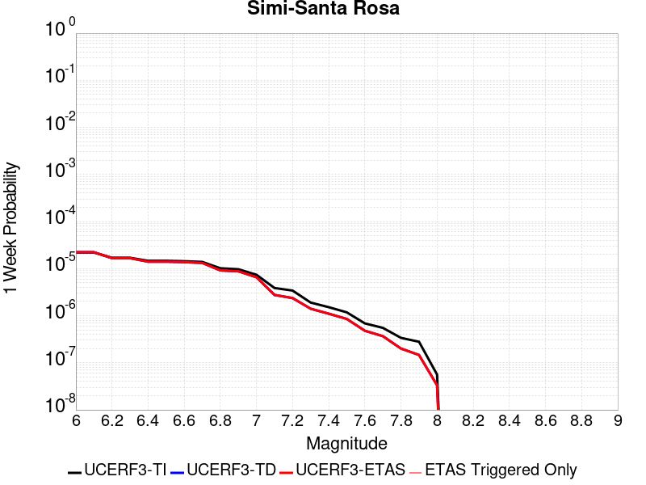 | 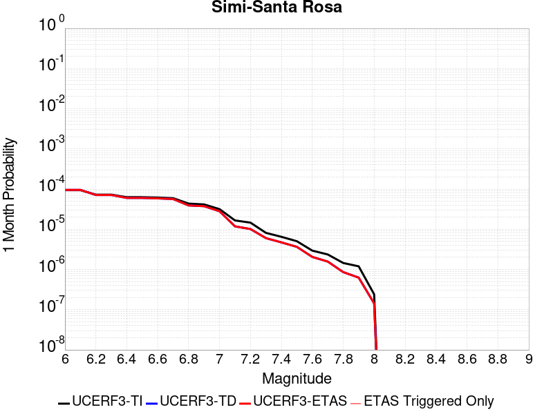 | 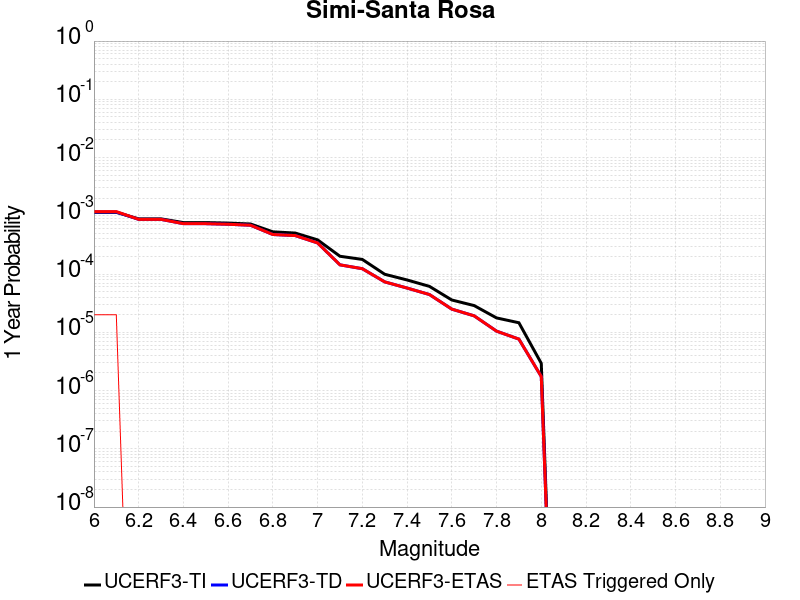 | 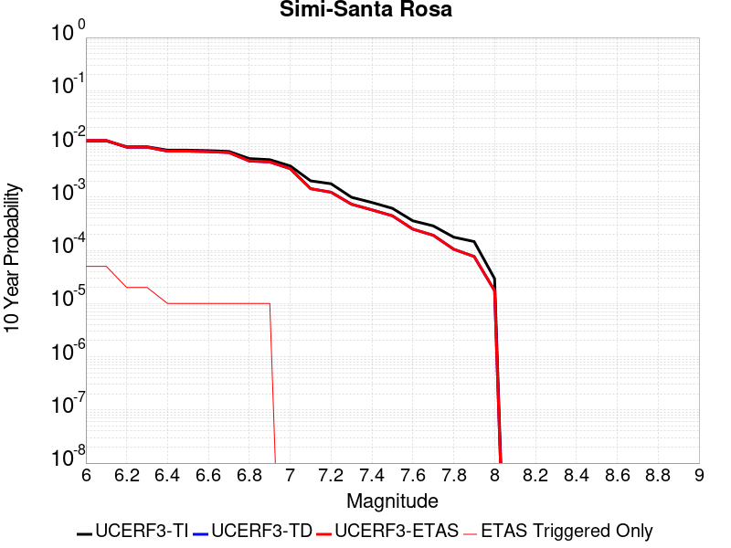 |

| Magnitude | 1 wk TI Prob | 1 wk TD Prob | 1 wk ETAS Prob | 1 wk ETAS/TD Gain | 1 wk ETAS Triggered Only | 1 mo TI Prob | 1 mo TD Prob | 1 mo ETAS Prob | 1 mo ETAS/TD Gain | 1 mo ETAS Triggered Only | 1 yr TI Prob | 1 yr TD Prob | 1 yr ETAS Prob | 1 yr ETAS/TD Gain | 1 yr ETAS Triggered Only | 10 yr TI Prob | 10 yr TD Prob | 10 yr ETAS Prob | 10 yr ETAS/TD Gain | 10 yr ETAS Triggered Only |
|-----|-----|-----|-----|-----|-----|-----|-----|-----|-----|-----|-----|-----|-----|-----|-----|-----|-----|-----|-----|-----|
| 6.0 | 2.198912E-5 | 2.2275442E-5 | 2.2275442E-5 | 1.0 | 0.0 | 9.4235686E-5 | 9.5462936E-5 | 9.5462936E-5 | 1.0 | 0.0 | 0.0011467156 | 0.0011616853 | 0.0011616853 | 1.0 | 0.0 | 0.011408163 | 0.011560575 | 0.011602611 | 1.0036361 | 4.2527856E-5 |
| 6.1 | 2.198912E-5 | 2.2275442E-5 | 2.2275442E-5 | 1.0 | 0.0 | 9.4235686E-5 | 9.5462936E-5 | 9.5462936E-5 | 1.0 | 0.0 | 0.0011467156 | 0.0011616853 | 0.0011616853 | 1.0 | 0.0 | 0.011408163 | 0.011560575 | 0.011602611 | 1.0036361 | 4.2527856E-5 |
| 6.2 | 1.69983E-5 | 1.6668559E-5 | 1.6668559E-5 | 1.0 | 0.0 | 7.284782E-5 | 7.143489E-5 | 7.143489E-5 | 1.0 | 0.0 | 8.865613E-4 | 8.6940196E-4 | 8.6940196E-4 | 1.0 | 0.0 | 0.008830327 | 0.008662928 | 0.008705087 | 1.0048666 | 4.2527856E-5 |
| 6.3 | 1.69983E-5 | 1.6668559E-5 | 1.6668559E-5 | 1.0 | 0.0 | 7.284782E-5 | 7.143489E-5 | 7.143489E-5 | 1.0 | 0.0 | 8.865613E-4 | 8.6940196E-4 | 8.6940196E-4 | 1.0 | 0.0 | 0.008830327 | 0.008662928 | 0.008705087 | 1.0048666 | 4.2527856E-5 |
| 6.4 | 1.4666188E-5 | 1.4052543E-5 | 1.4052543E-5 | 1.0 | 0.0 | 6.285358E-5 | 6.0223934E-5 | 6.0223934E-5 | 1.0 | 0.0 | 7.6497364E-4 | 7.3300465E-4 | 7.3300465E-4 | 1.0 | 0.0 | 0.0076234564 | 0.007308344 | 0.007350561 | 1.0057765 | 4.2527856E-5 |
| 6.5 | 1.4666188E-5 | 1.4052543E-5 | 1.4052543E-5 | 1.0 | 0.0 | 6.285358E-5 | 6.0223934E-5 | 6.0223934E-5 | 1.0 | 0.0 | 7.6497364E-4 | 7.3300465E-4 | 7.3300465E-4 | 1.0 | 0.0 | 0.0076234564 | 0.007308344 | 0.007350561 | 1.0057765 | 4.2527856E-5 |
| 6.6 | 1.4377586E-5 | 1.3729583E-5 | 1.3729583E-5 | 1.0 | 0.0 | 6.1616774E-5 | 5.883988E-5 | 5.883988E-5 | 1.0 | 0.0 | 7.4992597E-4 | 7.1616494E-4 | 7.1616494E-4 | 1.0 | 0.0 | 0.007474003 | 0.0071410383 | 0.0071832626 | 1.0059129 | 4.2527856E-5 |
| 6.7 | 1.3881404E-5 | 1.320755E-5 | 1.320755E-5 | 1.0 | 0.0 | 5.9490372E-5 | 5.66027E-5 | 5.66027E-5 | 1.0 | 0.0 | 7.240546E-4 | 6.8894465E-4 | 6.8894465E-4 | 1.0 | 0.0 | 0.007217 | 0.006870538 | 0.006912774 | 1.0061474 | 4.2527856E-5 |
| 6.8 | 1.0176516E-5 | 9.154151E-6 | 9.154151E-6 | 1.0 | 0.0 | 4.3612912E-5 | 3.9231574E-5 | 3.9231574E-5 | 1.0 | 0.0 | 5.308578E-4 | 4.7755634E-4 | 4.7755634E-4 | 1.0 | 0.0 | 0.0052959146 | 0.004766934 | 0.0048092594 | 1.008879 | 4.2527856E-5 |
| 6.9 | 9.699797E-6 | 8.774719E-6 | 8.774719E-6 | 1.0 | 0.0 | 4.15699E-5 | 3.7605492E-5 | 3.7605492E-5 | 1.0 | 0.0 | 5.05996E-4 | 4.577671E-4 | 4.577671E-4 | 1.0 | 0.0 | 0.005048454 | 0.0045698597 | 0.004612193 | 1.0092636 | 4.2527856E-5 |
| 7.0 | 7.4049476E-6 | 6.559333E-6 | 6.559333E-6 | 1.0 | 0.0 | 3.1735104E-5 | 2.8111197E-5 | 2.8111197E-5 | 1.0 | 0.0 | 3.8630638E-4 | 3.422127E-4 | 3.422127E-4 | 1.0 | 0.0 | 0.0038563553 | 0.0034180996 | 0.0034180996 | 1.0 | 0.0 |
| 7.1 | 3.873439E-6 | 2.7595095E-6 | 2.7595095E-6 | 1.0 | 0.0 | 1.6600346E-5 | 1.1826417E-5 | 1.1826417E-5 | 1.0 | 0.0 | 2.0209046E-4 | 1.4397735E-4 | 1.4397735E-4 | 1.0 | 0.0 | 0.0020190678 | 0.0014388643 | 0.0014388643 | 1.0 | 0.0 |
| 7.2 | 3.417706E-6 | 2.3676484E-6 | 2.3676484E-6 | 1.0 | 0.0 | 1.4647229E-5 | 1.0147027E-5 | 1.0147027E-5 | 1.0 | 0.0 | 1.7831543E-4 | 1.2353327E-4 | 1.2353327E-4 | 1.0 | 0.0 | 0.0017817242 | 0.0012346683 | 0.0012346683 | 1.0 | 0.0 |
| 7.3 | 1.90225E-6 | 1.4073753E-6 | 1.4073753E-6 | 1.0 | 0.0 | 8.152474E-6 | 6.0315947E-6 | 6.0315947E-6 | 1.0 | 0.0 | 9.9251854E-5 | 7.343221E-5 | 7.343221E-5 | 1.0 | 0.0 | 9.920754E-4 | 7.340817E-4 | 7.340817E-4 | 1.0 | 0.0 |
| 7.4 | 1.5170556E-6 | 1.1024773E-6 | 1.1024773E-6 | 1.0 | 0.0 | 6.5016507E-6 | 4.724894E-6 | 4.724894E-6 | 1.0 | 0.0 | 7.915472E-5 | 5.7524077E-5 | 5.7524077E-5 | 1.0 | 0.0 | 7.9126534E-4 | 5.7509297E-4 | 5.7509297E-4 | 1.0 | 0.0 |
| 7.5 | 1.178732E-6 | 8.535102E-7 | 8.535102E-7 | 1.0 | 0.0 | 5.0516987E-6 | 3.6578958E-6 | 3.6578958E-6 | 1.0 | 0.0 | 6.1502695E-5 | 4.453398E-5 | 4.453398E-5 | 1.0 | 0.0 | 6.148568E-4 | 4.452515E-4 | 4.452515E-4 | 1.0 | 0.0 |
| 7.6 | 6.8722386E-7 | 4.793198E-7 | 4.793198E-7 | 1.0 | 0.0 | 2.9452417E-6 | 2.054226E-6 | 2.054226E-6 | 1.0 | 0.0 | 3.5857727E-5 | 2.5009915E-5 | 2.5009915E-5 | 1.0 | 0.0 | 3.5851944E-4 | 2.5007114E-4 | 2.5007114E-4 | 1.0 | 0.0 |
| 7.7 | 5.5126515E-7 | 3.6731157E-7 | 3.6731157E-7 | 1.0 | 0.0 | 2.3625628E-6 | 1.5741915E-6 | 1.5741915E-6 | 1.0 | 0.0 | 2.8763823E-5 | 1.9165615E-5 | 1.9165615E-5 | 1.0 | 0.0 | 2.87601E-4 | 1.9163972E-4 | 1.9163972E-4 | 1.0 | 0.0 |
| 7.8 | 3.3860243E-7 | 2.0075942E-7 | 2.0075942E-7 | 1.0 | 0.0 | 1.4511525E-6 | 8.6039717E-7 | 8.6039717E-7 | 1.0 | 0.0 | 1.7667637E-5 | 1.0475286E-5 | 1.0475286E-5 | 1.0 | 0.0 | 1.7666233E-4 | 1.04747975E-4 | 1.04747975E-4 | 1.0 | 0.0 |
| 7.9 | 2.7955386E-7 | 1.4649108E-7 | 1.4649108E-7 | 1.0 | 0.0 | 1.1980875E-6 | 6.278188E-7 | 6.278188E-7 | 1.0 | 0.0 | 1.4586617E-5 | 7.643667E-6 | 7.643667E-6 | 1.0 | 0.0 | 1.458566E-4 | 7.643409E-5 | 7.643409E-5 | 1.0 | 0.0 |
| 8.0 | 5.6259015E-8 | 3.3355324E-8 | 3.3355324E-8 | 1.0 | 0.0 | 2.4111003E-7 | 1.4295138E-7 | 1.4295138E-7 | 1.0 | 0.0 | 2.9355108E-6 | 1.7404317E-6 | 1.7404317E-6 | 1.0 | 0.0 | 2.935472E-5 | 1.7404194E-5 | 1.7404194E-5 | 1.0 | 0.0 |

## Great Valley 03a Dunnigan Hills
*[(top)](#table-of-contents)*

| 1 Week | 1 Month | 1 Year | 10 Year |
|-----|-----|-----|-----|
|  |  | 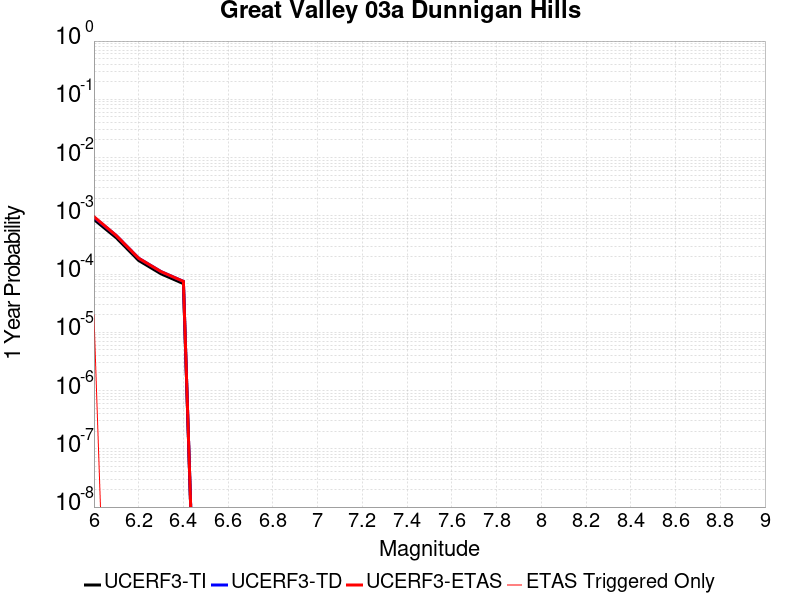 | 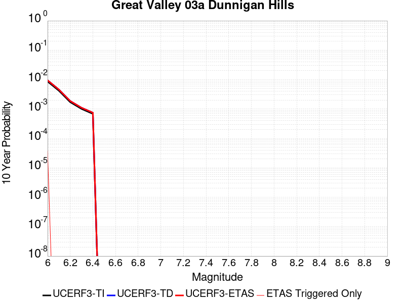 |

| Magnitude | 1 wk TI Prob | 1 wk TD Prob | 1 wk ETAS Prob | 1 wk ETAS/TD Gain | 1 wk ETAS Triggered Only | 1 mo TI Prob | 1 mo TD Prob | 1 mo ETAS Prob | 1 mo ETAS/TD Gain | 1 mo ETAS Triggered Only | 1 yr TI Prob | 1 yr TD Prob | 1 yr ETAS Prob | 1 yr ETAS/TD Gain | 1 yr ETAS Triggered Only | 10 yr TI Prob | 10 yr TD Prob | 10 yr ETAS Prob | 10 yr ETAS/TD Gain | 10 yr ETAS Triggered Only |
|-----|-----|-----|-----|-----|-----|-----|-----|-----|-----|-----|-----|-----|-----|-----|-----|-----|-----|-----|-----|-----|
| 6.0 | 1.6591328E-5 | 1.8107954E-5 | 1.8107954E-5 | 1.0 | 0.0 | 7.110376E-5 | 7.7603596E-5 | 7.7603596E-5 | 1.0 | 0.0 | 8.6534437E-4 | 9.444834E-4 | 9.869711E-4 | 1.044985 | 4.2527856E-5 | 0.008619824 | 0.009411525 | 0.009453652 | 1.0044762 | 4.2527856E-5 |
| 6.1 | 8.041125E-6 | 8.769726E-6 | 8.769726E-6 | 1.0 | 0.0 | 3.4461507E-5 | 3.7584115E-5 | 3.7584115E-5 | 1.0 | 0.0 | 4.194881E-4 | 4.5751085E-4 | 4.5751085E-4 | 1.0 | 0.0 | 0.004186971 | 0.004567687 | 0.004567687 | 1.0 | 0.0 |
| 6.2 | 3.2807004E-6 | 3.5795688E-6 | 3.5795688E-6 | 1.0 | 0.0 | 1.4060069E-5 | 1.5340942E-5 | 1.5340942E-5 | 1.0 | 0.0 | 1.7116789E-4 | 1.8676413E-4 | 1.8676413E-4 | 1.0 | 0.0 | 0.0017103611 | 0.0018664796 | 0.0018664796 | 1.0 | 0.0 |
| 6.3 | 1.9339366E-6 | 2.1103806E-6 | 2.1103806E-6 | 1.0 | 0.0 | 8.288273E-6 | 9.044474E-6 | 9.044474E-6 | 1.0 | 0.0 | 1.00905054E-4 | 1.1011375E-4 | 1.1011375E-4 | 1.0 | 0.0 | 0.0010085925 | 0.0011008718 | 0.0011008718 | 1.0 | 0.0 |
| 6.4 | 1.3142635E-6 | 1.4339867E-6 | 1.4339867E-6 | 1.0 | 0.0 | 5.6325457E-6 | 6.145657E-6 | 6.145657E-6 | 1.0 | 0.0 | 6.857408E-5 | 7.482337E-5 | 7.482337E-5 | 1.0 | 0.0 | 6.8552926E-4 | 7.4823375E-4 | 7.4823375E-4 | 1.0 | 0.0 |

## Sierra Madre
*[(top)](#table-of-contents)*

| 1 Week | 1 Month | 1 Year | 10 Year |
|-----|-----|-----|-----|
| 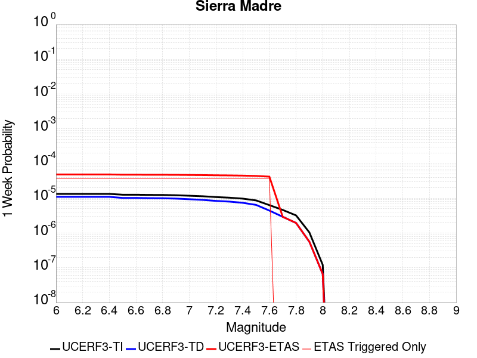 | 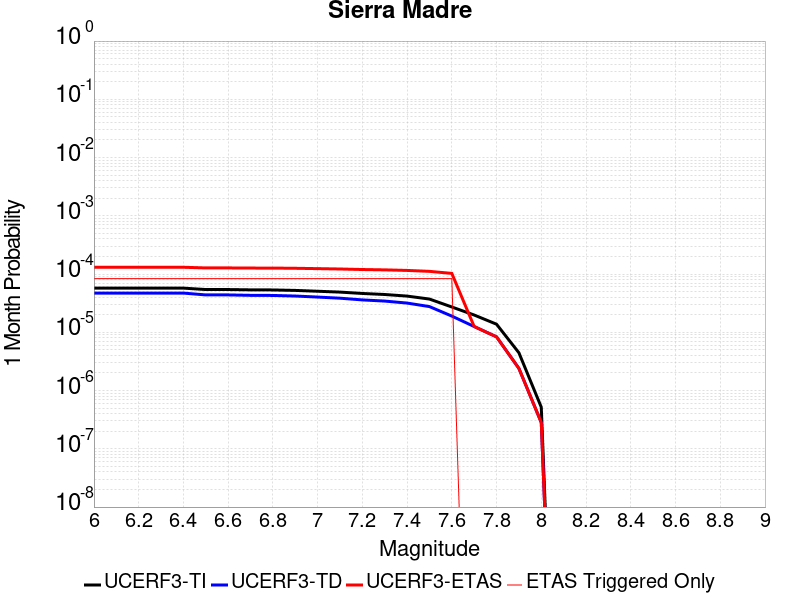 | 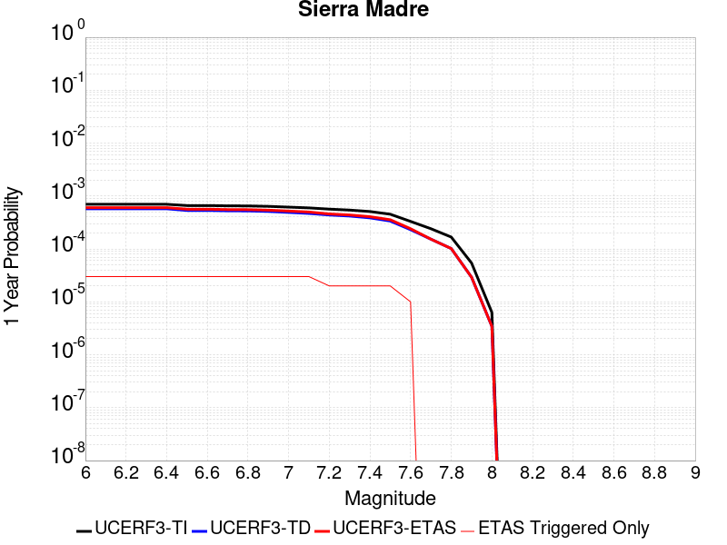 | 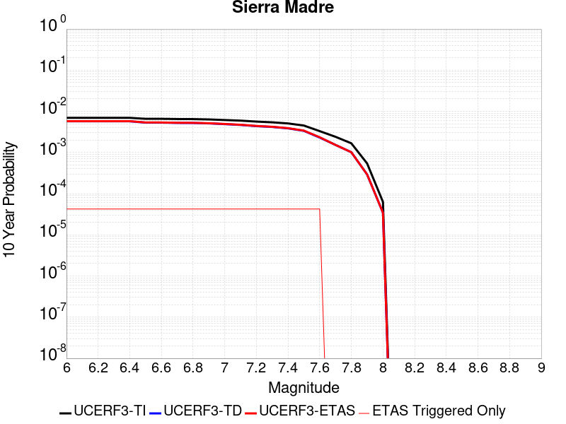 |

| Magnitude | 1 wk TI Prob | 1 wk TD Prob | 1 wk ETAS Prob | 1 wk ETAS/TD Gain | 1 wk ETAS Triggered Only | 1 mo TI Prob | 1 mo TD Prob | 1 mo ETAS Prob | 1 mo ETAS/TD Gain | 1 mo ETAS Triggered Only | 1 yr TI Prob | 1 yr TD Prob | 1 yr ETAS Prob | 1 yr ETAS/TD Gain | 1 yr ETAS Triggered Only | 10 yr TI Prob | 10 yr TD Prob | 10 yr ETAS Prob | 10 yr ETAS/TD Gain | 10 yr ETAS Triggered Only |
|-----|-----|-----|-----|-----|-----|-----|-----|-----|-----|-----|-----|-----|-----|-----|-----|-----|-----|-----|-----|-----|
| 6.0 | 1.3379373E-5 | 1.10007395E-5 | 5.352813E-5 | 4.865866 | 4.2527856E-5 | 5.7338908E-5 | 4.7145186E-5 | 8.967103E-5 | 1.902019 | 4.2527856E-5 | 6.978776E-4 | 5.738429E-4 | 6.1634637E-4 | 1.0740681 | 4.2527856E-5 | 0.0069569005 | 0.0057239756 | 0.00576626 | 1.0073873 | 4.2527856E-5 |
| 6.1 | 1.3379373E-5 | 1.10007395E-5 | 5.352813E-5 | 4.865866 | 4.2527856E-5 | 5.7338908E-5 | 4.7145186E-5 | 8.967103E-5 | 1.902019 | 4.2527856E-5 | 6.978776E-4 | 5.738429E-4 | 6.1634637E-4 | 1.0740681 | 4.2527856E-5 | 0.0069569005 | 0.0057239756 | 0.00576626 | 1.0073873 | 4.2527856E-5 |
| 6.2 | 1.3379373E-5 | 1.10007395E-5 | 5.352813E-5 | 4.865866 | 4.2527856E-5 | 5.7338908E-5 | 4.7145186E-5 | 8.967103E-5 | 1.902019 | 4.2527856E-5 | 6.978776E-4 | 5.738429E-4 | 6.1634637E-4 | 1.0740681 | 4.2527856E-5 | 0.0069569005 | 0.0057239756 | 0.00576626 | 1.0073873 | 4.2527856E-5 |
| 6.3 | 1.3379373E-5 | 1.10007395E-5 | 5.352813E-5 | 4.865866 | 4.2527856E-5 | 5.7338908E-5 | 4.7145186E-5 | 8.967103E-5 | 1.902019 | 4.2527856E-5 | 6.978776E-4 | 5.738429E-4 | 6.1634637E-4 | 1.0740681 | 4.2527856E-5 | 0.0069569005 | 0.0057239756 | 0.00576626 | 1.0073873 | 4.2527856E-5 |
| 6.4 | 1.3379373E-5 | 1.10007395E-5 | 5.352813E-5 | 4.865866 | 4.2527856E-5 | 5.7338908E-5 | 4.7145186E-5 | 8.967103E-5 | 1.902019 | 4.2527856E-5 | 6.978776E-4 | 5.738429E-4 | 6.1634637E-4 | 1.0740681 | 4.2527856E-5 | 0.0069569005 | 0.0057239756 | 0.00576626 | 1.0073873 | 4.2527856E-5 |
| 6.5 | 1.26563245E-5 | 1.0230196E-5 | 5.2757616E-5 | 5.1570487 | 4.2527856E-5 | 5.4240263E-5 | 4.3842967E-5 | 8.636896E-5 | 1.9699615 | 4.2527856E-5 | 6.601751E-4 | 5.336584E-4 | 5.761636E-4 | 1.0796486 | 4.2527856E-5 | 0.006582173 | 0.0053240913 | 0.0053663924 | 1.0079453 | 4.2527856E-5 |
| 6.6 | 1.26563245E-5 | 1.0230196E-5 | 5.2757616E-5 | 5.1570487 | 4.2527856E-5 | 5.4240263E-5 | 4.3842967E-5 | 8.636896E-5 | 1.9699615 | 4.2527856E-5 | 6.601751E-4 | 5.336584E-4 | 5.761636E-4 | 1.0796486 | 4.2527856E-5 | 0.006582173 | 0.0053240913 | 0.0053663924 | 1.0079453 | 4.2527856E-5 |
| 6.7 | 1.2502474E-5 | 1.006634E-5 | 5.259377E-5 | 5.224716 | 4.2527856E-5 | 5.3580934E-5 | 4.314075E-5 | 8.566677E-5 | 1.9857507 | 4.2527856E-5 | 6.521526E-4 | 5.251131E-4 | 5.6761864E-4 | 1.0809455 | 4.2527856E-5 | 0.0065024206 | 0.0052390425 | 0.0052813473 | 1.008075 | 4.2527856E-5 |
| 6.8 | 1.2454966E-5 | 1.0018625E-5 | 5.2546056E-5 | 5.244837 | 4.2527856E-5 | 5.3377335E-5 | 4.2936266E-5 | 8.546229E-5 | 1.9904455 | 4.2527856E-5 | 6.4967526E-4 | 5.226247E-4 | 5.651303E-4 | 1.0813311 | 4.2527856E-5 | 0.006477792 | 0.0052142753 | 0.0052565816 | 1.0081135 | 4.2527856E-5 |
| 6.9 | 1.2225574E-5 | 9.792602E-6 | 5.2320043E-5 | 5.342813 | 4.2527856E-5 | 5.2394265E-5 | 4.1967625E-5 | 8.4493695E-5 | 2.0133066 | 4.2527856E-5 | 6.3771347E-4 | 5.108371E-4 | 5.533432E-4 | 1.0832088 | 4.2527856E-5 | 0.006358865 | 0.0050969445 | 0.005139256 | 1.0083013 | 4.2527856E-5 |
| 7.0 | 1.182946E-5 | 9.399144E-6 | 5.19266E-5 | 5.5246096 | 4.2527856E-5 | 5.06967E-5 | 4.0281426E-5 | 8.280757E-5 | 2.0557258 | 4.2527856E-5 | 6.1705755E-4 | 4.9031706E-4 | 5.32824E-4 | 1.0866929 | 4.2527856E-5 | 0.006153469 | 0.004892664 | 0.004934984 | 1.0086496 | 4.2527856E-5 |
| 7.1 | 1.14369095E-5 | 8.986159E-6 | 5.151363E-5 | 5.732553 | 4.2527856E-5 | 4.9014405E-5 | 3.8511545E-5 | 8.103777E-5 | 2.104246 | 4.2527856E-5 | 5.9658696E-4 | 4.687782E-4 | 5.112861E-4 | 1.0906781 | 4.2527856E-5 | 0.005949879 | 0.004678199 | 0.004720528 | 1.0090481 | 4.2527856E-5 |
| 7.2 | 1.0836419E-5 | 8.3995565E-6 | 5.0927054E-5 | 6.0630646 | 4.2527856E-5 | 4.644097E-5 | 3.5997607E-5 | 7.852393E-5 | 2.1813653 | 4.2527856E-5 | 5.652721E-4 | 4.3818366E-4 | 4.806929E-4 | 1.0970123 | 4.2527856E-5 | 0.0056383642 | 0.004373494 | 0.004415836 | 1.0096815 | 4.2527856E-5 |
| 7.3 | 1.0403439E-5 | 8.02082E-6 | 5.0548333E-5 | 6.3021407 | 4.2527856E-5 | 4.4585406E-5 | 3.4374494E-5 | 7.690089E-5 | 2.2371497 | 4.2527856E-5 | 5.426921E-4 | 4.1843E-4 | 4.6094006E-4 | 1.1015942 | 4.2527856E-5 | 0.005413687 | 0.004176717 | 0.0042190673 | 1.0101396 | 4.2527856E-5 |
| 7.4 | 9.768864E-6 | 7.414448E-6 | 4.9941988E-5 | 6.735766 | 4.2527856E-5 | 4.186589E-5 | 3.1775824E-5 | 7.430233E-5 | 2.3383288 | 4.2527856E-5 | 5.09598E-4 | 3.868029E-4 | 4.293143E-4 | 1.1099045 | 4.2527856E-5 | 0.0050843097 | 0.0038615882 | 0.003903952 | 1.0109705 | 4.2527856E-5 |
| 7.5 | 8.687089E-6 | 6.4501564E-6 | 4.8977738E-5 | 7.5932636 | 4.2527856E-5 | 3.722985E-5 | 2.764324E-5 | 7.016992E-5 | 2.5384116 | 4.2527856E-5 | 4.5317915E-4 | 3.3650533E-4 | 3.7901886E-4 | 1.1263384 | 4.2527856E-5 | 0.004522561 | 0.0033602451 | 0.00340263 | 1.0126137 | 4.2527856E-5 |
| 7.6 | 6.3506063E-6 | 4.4303215E-6 | 4.695799E-5 | 10.599228 | 4.2527856E-5 | 2.72166E-5 | 1.8986955E-5 | 6.1514E-5 | 3.2398033 | 4.2527856E-5 | 3.3131172E-4 | 2.3114192E-4 | 2.7365994E-4 | 1.1839477 | 4.2527856E-5 | 0.003308182 | 0.0023092402 | 0.0023516698 | 1.0183738 | 4.2527856E-5 |
| 7.7 | 4.62223E-6 | 2.932967E-6 | 2.932967E-6 | 1.0 | 0.0 | 1.9809406E-5 | 1.2569798E-5 | 1.2569798E-5 | 1.0 | 0.0 | 2.4115283E-4 | 1.5302657E-4 | 1.5302657E-4 | 1.0 | 0.0 | 0.0024089129 | 0.001529413 | 0.001529413 | 1.0 | 0.0 |
| 7.8 | 3.2145008E-6 | 1.9494332E-6 | 1.9494332E-6 | 1.0 | 0.0 | 1.3776359E-5 | 8.3546865E-6 | 8.3546865E-6 | 1.0 | 0.0 | 1.6771426E-4 | 1.0171358E-4 | 1.0171358E-4 | 1.0 | 0.0 | 0.0016758774 | 0.0010168145 | 0.0010168145 | 1.0 | 0.0 |
| 7.9 | 1.0391769E-6 | 5.6026335E-7 | 5.6026335E-7 | 1.0 | 0.0 | 4.4536077E-6 | 2.4011265E-6 | 2.4011265E-6 | 1.0 | 0.0 | 5.4221324E-5 | 2.9233326E-5 | 2.9233326E-5 | 1.0 | 0.0 | 5.4208096E-4 | 2.9229524E-4 | 2.9229524E-4 | 1.0 | 0.0 |
| 8.0 | 1.210983E-7 | 6.613821E-8 | 6.613821E-8 | 1.0 | 0.0 | 5.1899264E-7 | 2.8344945E-7 | 2.8344945E-7 | 1.0 | 0.0 | 6.3187167E-6 | 3.4509917E-6 | 3.4509917E-6 | 1.0 | 0.0 | 6.318537E-5 | 3.45094E-5 | 3.45094E-5 | 1.0 | 0.0 |

## San Diego Trough south
*[(top)](#table-of-contents)*

| 1 Week | 1 Month | 1 Year | 10 Year |
|-----|-----|-----|-----|
| 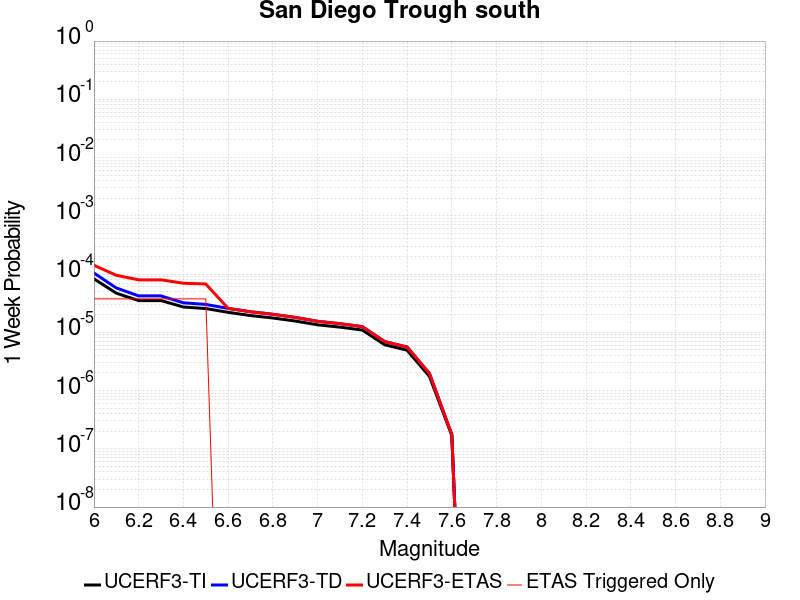 | 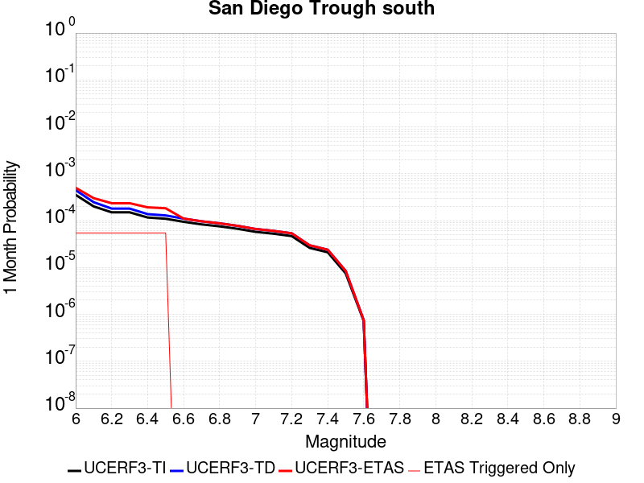 | 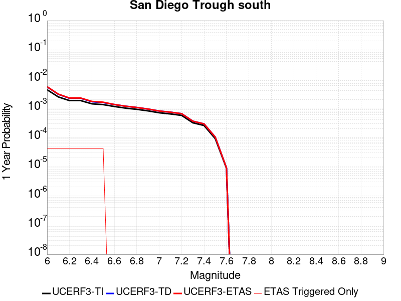 | 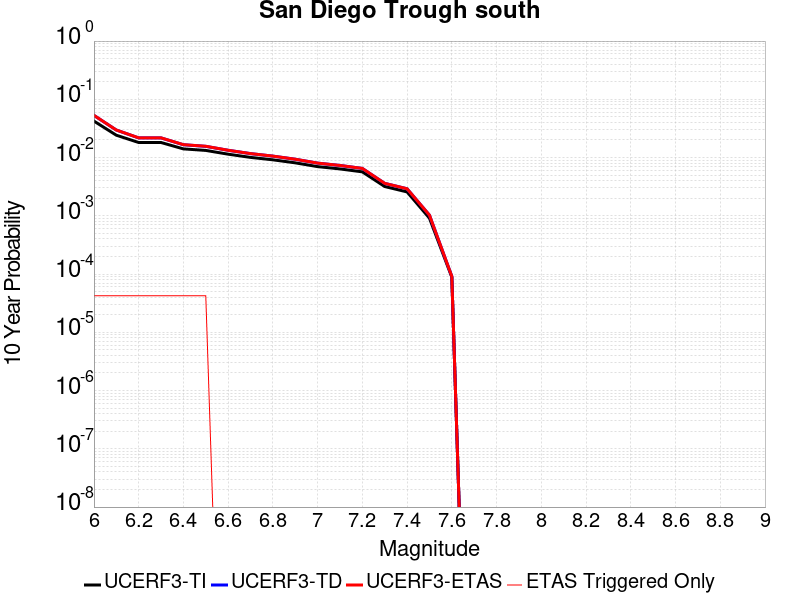 |

| Magnitude | 1 wk TI Prob | 1 wk TD Prob | 1 wk ETAS Prob | 1 wk ETAS/TD Gain | 1 wk ETAS Triggered Only | 1 mo TI Prob | 1 mo TD Prob | 1 mo ETAS Prob | 1 mo ETAS/TD Gain | 1 mo ETAS Triggered Only | 1 yr TI Prob | 1 yr TD Prob | 1 yr ETAS Prob | 1 yr ETAS/TD Gain | 1 yr ETAS Triggered Only | 10 yr TI Prob | 10 yr TD Prob | 10 yr ETAS Prob | 10 yr ETAS/TD Gain | 10 yr ETAS Triggered Only |
|-----|-----|-----|-----|-----|-----|-----|-----|-----|-----|-----|-----|-----|-----|-----|-----|-----|-----|-----|-----|-----|
| 6.0 | 8.279495E-5 | 1.04241306E-4 | 1.4676472E-4 | 1.4079325 | 4.2527856E-5 | 3.5478722E-4 | 4.4667677E-4 | 4.891856E-4 | 1.0951669 | 4.2527856E-5 | 0.004310982 | 0.0054256152 | 0.0054679126 | 1.0077958 | 4.2527856E-5 | 0.042283054 | 0.05299221 | 0.053032484 | 1.00076 | 4.2527856E-5 |
| 6.1 | 4.6961468E-5 | 5.772944E-5 | 1.00254845E-4 | 1.7366328 | 4.2527856E-5 | 2.0124791E-4 | 2.473894E-4 | 2.8990675E-4 | 1.171864 | 4.2527856E-5 | 0.00244744 | 0.0030079768 | 0.0030503767 | 1.0140958 | 4.2527856E-5 | 0.024206603 | 0.029679462 | 0.029720727 | 1.0013903 | 4.2527856E-5 |
| 6.2 | 3.5079658E-5 | 4.214154E-5 | 8.46676E-5 | 2.0091248 | 4.2527856E-5 | 1.5033272E-4 | 1.8059435E-4 | 2.2311452E-4 | 1.2354457 | 4.2527856E-5 | 0.0018287642 | 0.0021965632 | 0.0022389975 | 1.0193186 | 4.2527856E-5 | 0.018137876 | 0.021751117 | 0.021792721 | 1.0019127 | 4.2527856E-5 |
| 6.3 | 3.5079658E-5 | 4.214154E-5 | 8.46676E-5 | 2.0091248 | 4.2527856E-5 | 1.5033272E-4 | 1.8059435E-4 | 2.2311452E-4 | 1.2354457 | 4.2527856E-5 | 0.0018287642 | 0.0021965632 | 0.0022389975 | 1.0193186 | 4.2527856E-5 | 0.018137876 | 0.021751117 | 0.021792721 | 1.0019127 | 4.2527856E-5 |
| 6.4 | 2.7196904E-5 | 3.2087162E-5 | 7.461366E-5 | 2.325343 | 4.2527856E-5 | 1.16552954E-4 | 1.3750927E-4 | 1.8003127E-4 | 1.3092301 | 4.2527856E-5 | 0.0014181085 | 0.0016729041 | 0.0017153608 | 1.0253791 | 4.2527856E-5 | 0.014090929 | 0.016604643 | 0.016646465 | 1.0025187 | 4.2527856E-5 |
| 6.5 | 2.5584688E-5 | 3.010164E-5 | 7.2628216E-5 | 2.412766 | 4.2527856E-5 | 1.0964406E-4 | 1.2900073E-4 | 1.715231E-4 | 1.3296288 | 4.2527856E-5 | 0.0013340989 | 0.0015694655 | 0.0016119266 | 1.0270545 | 4.2527856E-5 | 0.013261181 | 0.015585314 | 0.01562718 | 1.0026861 | 4.2527856E-5 |
| 6.6 | 2.2034688E-5 | 2.5742738E-5 | 2.5742738E-5 | 1.0 | 0.0 | 9.443096E-5 | 1.1032141E-4 | 1.1032141E-4 | 1.0 | 0.0 | 0.0011490905 | 0.0013423424 | 0.0013423424 | 1.0 | 0.0 | 0.011431668 | 0.013343317 | 0.013343317 | 1.0 | 0.0 |
| 6.7 | 1.9394853E-5 | 2.254176E-5 | 2.254176E-5 | 1.0 | 0.0 | 8.311815E-5 | 9.6603995E-5 | 9.6603995E-5 | 1.0 | 0.0 | 0.0010114936 | 0.0011755243 | 0.0011755243 | 1.0 | 0.0 | 0.01006902 | 0.011693766 | 0.011693766 | 1.0 | 0.0 |
| 6.8 | 1.7615313E-5 | 2.0403182E-5 | 2.0403182E-5 | 1.0 | 0.0 | 7.549201E-5 | 8.74393E-5 | 8.74393E-5 | 1.0 | 0.0 | 9.1872766E-4 | 0.0010640579 | 0.0010640579 | 1.0 | 0.0 | 0.009149387 | 0.010590198 | 0.010590198 | 1.0 | 0.0 |
| 6.9 | 1.5621423E-5 | 1.8026114E-5 | 1.8026114E-5 | 1.0 | 0.0 | 6.6947236E-5 | 7.725251E-5 | 7.725251E-5 | 1.0 | 0.0 | 8.147778E-4 | 9.40147E-4 | 9.40147E-4 | 1.0 | 0.0 | 0.008117969 | 0.009362142 | 0.009362142 | 1.0 | 0.0 |
| 7.0 | 1.3444376E-5 | 1.544809E-5 | 1.544809E-5 | 1.0 | 0.0 | 5.7617483E-5 | 6.620443E-5 | 6.620443E-5 | 1.0 | 0.0 | 7.0126704E-4 | 8.057436E-4 | 8.057436E-4 | 1.0 | 0.0 | 0.006990582 | 0.008028555 | 0.008028555 | 1.0 | 0.0 |
| 7.1 | 1.2268361E-5 | 1.407303E-5 | 1.407303E-5 | 1.0 | 0.0 | 5.2577634E-5 | 6.0311606E-5 | 6.0311606E-5 | 1.0 | 0.0 | 6.399447E-4 | 7.3404907E-4 | 7.3404907E-4 | 1.0 | 0.0 | 0.0063810493 | 0.0073165493 | 0.0073165493 | 1.0 | 0.0 |
| 7.2 | 1.0922655E-5 | 1.2513563E-5 | 1.2513563E-5 | 1.0 | 0.0 | 4.681054E-5 | 5.3628468E-5 | 5.3628468E-5 | 1.0 | 0.0 | 5.697693E-4 | 6.5273355E-4 | 6.5273355E-4 | 1.0 | 0.0 | 0.0056831064 | 0.0065084435 | 0.0065084435 | 1.0 | 0.0 |
| 7.3 | 6.1106753E-6 | 6.928925E-6 | 6.928925E-6 | 1.0 | 0.0 | 2.6188345E-5 | 2.9695057E-5 | 2.9695057E-5 | 1.0 | 0.0 | 3.1879646E-4 | 3.6147775E-4 | 3.6147775E-4 | 1.0 | 0.0 | 0.0031833951 | 0.003608943 | 0.003608943 | 1.0 | 0.0 |
| 7.4 | 4.933187E-6 | 5.5895525E-6 | 5.5895525E-6 | 1.0 | 0.0 | 2.114206E-5 | 2.3955008E-5 | 2.3955008E-5 | 1.0 | 0.0 | 2.5737417E-4 | 2.9161357E-4 | 2.9161357E-4 | 1.0 | 0.0 | 0.002570763 | 0.0029123505 | 0.0029123505 | 1.0 | 0.0 |
| 7.5 | 1.7489613E-6 | 1.969678E-6 | 1.969678E-6 | 1.0 | 0.0 | 7.495527E-6 | 8.4414505E-6 | 8.4414505E-6 | 1.0 | 0.0 | 9.125422E-5 | 1.02770035E-4 | 1.02770035E-4 | 1.0 | 0.0 | 9.1216754E-4 | 0.0010272472 | 0.0010272472 | 1.0 | 0.0 |
| 7.6 | 1.6988751E-7 | 1.7533823E-7 | 1.7533823E-7 | 1.0 | 0.0 | 7.2808916E-7 | 7.5144936E-7 | 7.5144936E-7 | 1.0 | 0.0 | 8.864449E-6 | 9.14886E-6 | 9.14886E-6 | 1.0 | 0.0 | 8.8640954E-5 | 9.1485024E-5 | 9.1485024E-5 | 1.0 | 0.0 |

## Malibu Coast alt 1
*[(top)](#table-of-contents)*

| 1 Week | 1 Month | 1 Year | 10 Year |
|-----|-----|-----|-----|
|  | 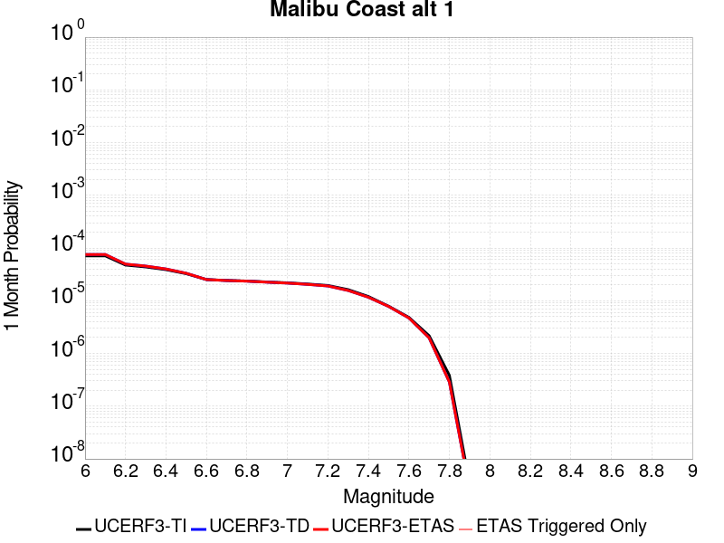 | 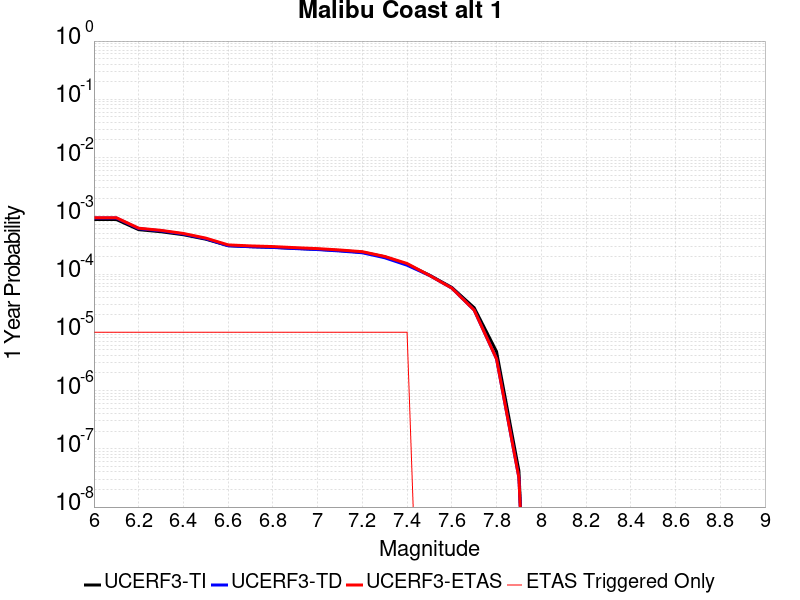 | 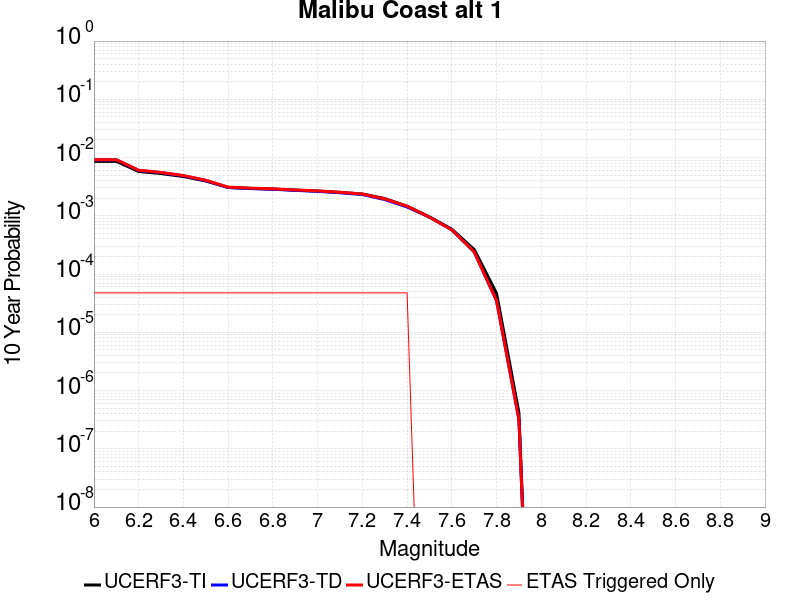 |

| Magnitude | 1 wk TI Prob | 1 wk TD Prob | 1 wk ETAS Prob | 1 wk ETAS/TD Gain | 1 wk ETAS Triggered Only | 1 mo TI Prob | 1 mo TD Prob | 1 mo ETAS Prob | 1 mo ETAS/TD Gain | 1 mo ETAS Triggered Only | 1 yr TI Prob | 1 yr TD Prob | 1 yr ETAS Prob | 1 yr ETAS/TD Gain | 1 yr ETAS Triggered Only | 10 yr TI Prob | 10 yr TD Prob | 10 yr ETAS Prob | 10 yr ETAS/TD Gain | 10 yr ETAS Triggered Only |
|-----|-----|-----|-----|-----|-----|-----|-----|-----|-----|-----|-----|-----|-----|-----|-----|-----|-----|-----|-----|-----|
| 6.0 | 1.6572556E-5 | 1.7598066E-5 | 1.7598066E-5 | 1.0 | 0.0 | 7.102331E-5 | 7.541821E-5 | 7.541821E-5 | 1.0 | 0.0 | 8.6436566E-4 | 9.178488E-4 | 9.6033764E-4 | 1.0462917 | 4.2527856E-5 | 0.0086101135 | 0.009142512 | 0.009184652 | 1.0046091 | 4.2527856E-5 |
| 6.1 | 1.6572556E-5 | 1.7598066E-5 | 1.7598066E-5 | 1.0 | 0.0 | 7.102331E-5 | 7.541821E-5 | 7.541821E-5 | 1.0 | 0.0 | 8.6436566E-4 | 9.178488E-4 | 9.6033764E-4 | 1.0462917 | 4.2527856E-5 | 0.0086101135 | 0.009142512 | 0.009184652 | 1.0046091 | 4.2527856E-5 |
| 6.2 | 1.1085717E-5 | 1.1557147E-5 | 1.1557147E-5 | 1.0 | 0.0 | 4.750935E-5 | 4.952971E-5 | 4.952971E-5 | 1.0 | 0.0 | 5.782728E-4 | 6.028609E-4 | 6.453631E-4 | 1.0705009 | 4.2527856E-5 | 0.0057677035 | 0.0060126255 | 0.006054898 | 1.0070306 | 4.2527856E-5 |
| 6.3 | 1.0208568E-5 | 1.0592237E-5 | 1.0592237E-5 | 1.0 | 0.0 | 4.375027E-5 | 4.539453E-5 | 4.539453E-5 | 1.0 | 0.0 | 5.325294E-4 | 5.5254117E-4 | 5.9504557E-4 | 1.0769253 | 4.2527856E-5 | 0.0053125503 | 0.0055119814 | 0.005554275 | 1.007673 | 4.2527856E-5 |
| 6.4 | 9.0682315E-6 | 9.342637E-6 | 9.342637E-6 | 1.0 | 0.0 | 3.8863272E-5 | 4.003927E-5 | 4.003927E-5 | 1.0 | 0.0 | 4.730576E-4 | 4.8737114E-4 | 5.2987825E-4 | 1.0872172 | 4.2527856E-5 | 0.0047205184 | 0.004863236 | 0.0049055573 | 1.0087023 | 4.2527856E-5 |
| 6.5 | 7.605796E-6 | 7.748587E-6 | 7.748587E-6 | 1.0 | 0.0 | 3.259586E-5 | 3.3207816E-5 | 3.3207816E-5 | 1.0 | 0.0 | 3.9678233E-4 | 4.0423148E-4 | 4.4674217E-4 | 1.1051642 | 4.2527856E-5 | 0.0039607463 | 0.0040351 | 0.004077456 | 1.010497 | 4.2527856E-5 |
| 6.6 | 5.889873E-6 | 5.8795385E-6 | 5.8795385E-6 | 1.0 | 0.0 | 2.5242069E-5 | 2.519778E-5 | 2.519778E-5 | 1.0 | 0.0 | 3.0727885E-4 | 3.0673988E-4 | 3.492547E-4 | 1.1386021 | 4.2527856E-5 | 0.003068543 | 0.0030631777 | 0.0031055752 | 1.013841 | 4.2527856E-5 |
| 6.7 | 5.66586E-6 | 5.641641E-6 | 5.641641E-6 | 1.0 | 0.0 | 2.428203E-5 | 2.417824E-5 | 2.417824E-5 | 1.0 | 0.0 | 2.955936E-4 | 2.9433038E-4 | 3.3684573E-4 | 1.1444477 | 4.2527856E-5 | 0.0029520073 | 0.0029394177 | 0.0029818206 | 1.0144256 | 4.2527856E-5 |
| 6.8 | 5.521556E-6 | 5.489427E-6 | 5.489427E-6 | 1.0 | 0.0 | 2.3663597E-5 | 2.3525903E-5 | 2.3525903E-5 | 1.0 | 0.0 | 2.880662E-4 | 2.8639034E-4 | 3.28906E-4 | 1.1484536 | 4.2527856E-5 | 0.0028769306 | 0.002860224 | 0.0029026303 | 1.0148262 | 4.2527856E-5 |
| 6.9 | 5.29752E-6 | 5.2499317E-6 | 5.2499317E-6 | 1.0 | 0.0 | 2.270346E-5 | 2.2499513E-5 | 2.2499513E-5 | 1.0 | 0.0 | 2.7637955E-4 | 2.7389723E-4 | 3.1641344E-4 | 1.1552268 | 4.2527856E-5 | 0.0027603607 | 0.0027356069 | 0.0027780184 | 1.0155035 | 4.2527856E-5 |
| 7.0 | 5.106743E-6 | 5.0476788E-6 | 5.0476788E-6 | 1.0 | 0.0 | 2.1885859E-5 | 2.163273E-5 | 2.163273E-5 | 1.0 | 0.0 | 2.6642776E-4 | 2.6334674E-4 | 3.058634E-4 | 1.1614474 | 4.2527856E-5 | 0.0026610855 | 0.0026303562 | 0.0026727722 | 1.0161256 | 4.2527856E-5 |
| 7.1 | 4.8469647E-6 | 4.770373E-6 | 4.770373E-6 | 1.0 | 0.0 | 2.0772539E-5 | 2.0444295E-5 | 2.0444295E-5 | 1.0 | 0.0 | 2.528763E-4 | 2.4888094E-4 | 2.913982E-4 | 1.1708338 | 4.2527856E-5 | 0.0025258875 | 0.00248603 | 0.0025284523 | 1.0170642 | 4.2527856E-5 |
| 7.2 | 4.545514E-6 | 4.4481935E-6 | 4.4481935E-6 | 1.0 | 0.0 | 1.9480629E-5 | 1.9063547E-5 | 1.9063547E-5 | 1.0 | 0.0 | 2.3715083E-4 | 2.3207403E-4 | 2.7459202E-4 | 1.1832087 | 4.2527856E-5 | 0.0023689792 | 0.0023183243 | 0.0023607535 | 1.0183017 | 4.2527856E-5 |
| 7.3 | 3.794097E-6 | 3.6519348E-6 | 3.6519348E-6 | 1.0 | 0.0 | 1.6260314E-5 | 1.5651056E-5 | 1.5651056E-5 | 1.0 | 0.0 | 1.9795135E-4 | 1.9053498E-4 | 2.3305473E-4 | 1.2231598 | 4.2527856E-5 | 0.001977751 | 0.0019037209 | 0.0019461678 | 1.0222968 | 4.2527856E-5 |
| 7.4 | 2.808217E-6 | 2.719077E-6 | 2.719077E-6 | 1.0 | 0.0 | 1.203516E-5 | 1.1653135E-5 | 1.1653135E-5 | 1.0 | 0.0 | 1.4651821E-4 | 1.418677E-4 | 1.8438953E-4 | 1.2997288 | 4.2527856E-5 | 0.0014642165 | 0.001417774 | 0.0014602416 | 1.0299537 | 4.2527856E-5 |
| 7.5 | 1.83809E-6 | 1.8190691E-6 | 1.8190691E-6 | 1.0 | 0.0 | 7.877505E-6 | 7.795988E-6 | 7.795988E-6 | 1.0 | 0.0 | 9.59044E-5 | 9.491203E-5 | 9.491203E-5 | 1.0 | 0.0 | 9.5863023E-4 | 9.48717E-4 | 9.48717E-4 | 1.0 | 0.0 |
| 7.6 | 1.1292672E-6 | 1.1001447E-6 | 1.1001447E-6 | 1.0 | 0.0 | 4.839708E-6 | 4.714897E-6 | 4.714897E-6 | 1.0 | 0.0 | 5.8921847E-5 | 5.7402376E-5 | 5.7402376E-5 | 1.0 | 0.0 | 5.890623E-4 | 5.738771E-4 | 5.738771E-4 | 1.0 | 0.0 |
| 7.7 | 5.065272E-7 | 4.609151E-7 | 4.609151E-7 | 1.0 | 0.0 | 2.170829E-6 | 1.975349E-6 | 1.975349E-6 | 1.0 | 0.0 | 2.6429525E-5 | 2.404962E-5 | 2.404962E-5 | 1.0 | 0.0 | 2.642638E-4 | 2.4047129E-4 | 2.4047129E-4 | 1.0 | 0.0 |
| 7.8 | 8.952991E-8 | 6.707874E-8 | 6.707874E-8 | 1.0 | 0.0 | 3.8369956E-7 | 2.8748025E-7 | 2.8748025E-7 | 1.0 | 0.0 | 4.671532E-6 | 3.5000667E-6 | 3.5000667E-6 | 1.0 | 0.0 | 4.671434E-5 | 3.5000136E-5 | 3.5000136E-5 | 1.0 | 0.0 |
| 7.9 | 8.007447E-10 | 6.1608785E-10 | 6.1608785E-10 | 1.0 | 0.0 | 3.4317629E-9 | 2.6403764E-9 | 2.6403764E-9 | 1.0 | 0.0 | 4.1781714E-8 | 3.2146584E-8 | 3.2146584E-8 | 1.0 | 0.0 | 4.1781706E-7 | 3.214658E-7 | 3.214658E-7 | 1.0 | 0.0 |

## Verdugo
*[(top)](#table-of-contents)*

| 1 Week | 1 Month | 1 Year | 10 Year |
|-----|-----|-----|-----|
| 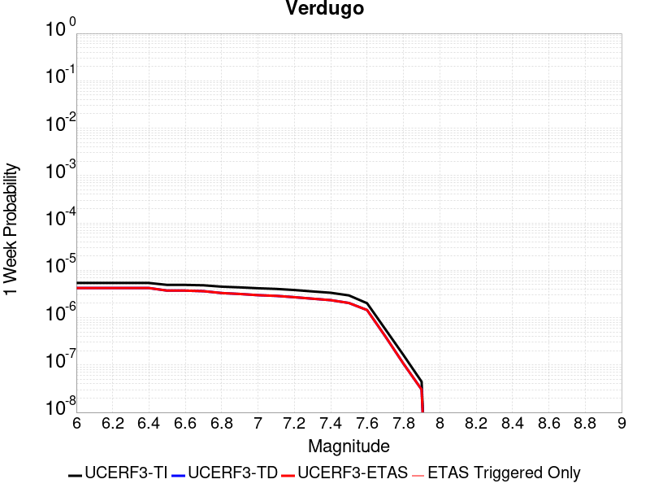 |  | 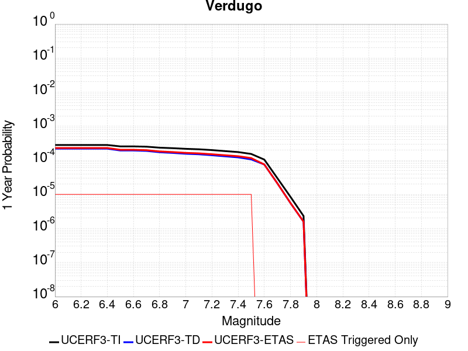 | 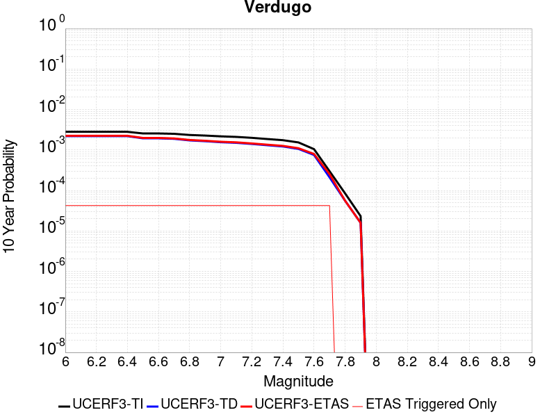 |

| Magnitude | 1 wk TI Prob | 1 wk TD Prob | 1 wk ETAS Prob | 1 wk ETAS/TD Gain | 1 wk ETAS Triggered Only | 1 mo TI Prob | 1 mo TD Prob | 1 mo ETAS Prob | 1 mo ETAS/TD Gain | 1 mo ETAS Triggered Only | 1 yr TI Prob | 1 yr TD Prob | 1 yr ETAS Prob | 1 yr ETAS/TD Gain | 1 yr ETAS Triggered Only | 10 yr TI Prob | 10 yr TD Prob | 10 yr ETAS Prob | 10 yr ETAS/TD Gain | 10 yr ETAS Triggered Only |
|-----|-----|-----|-----|-----|-----|-----|-----|-----|-----|-----|-----|-----|-----|-----|-----|-----|-----|-----|-----|-----|
| 6.0 | 5.392987E-6 | 4.216517E-6 | 4.216517E-6 | 1.0 | 0.0 | 2.3112598E-5 | 1.8070665E-5 | 1.8070665E-5 | 1.0 | 0.0 | 2.8135953E-4 | 2.1998861E-4 | 2.1998861E-4 | 1.0 | 0.0 | 0.0028100356 | 0.0021977562 | 0.0022401905 | 1.0193081 | 4.2527856E-5 |
| 6.1 | 5.392987E-6 | 4.216517E-6 | 4.216517E-6 | 1.0 | 0.0 | 2.3112598E-5 | 1.8070665E-5 | 1.8070665E-5 | 1.0 | 0.0 | 2.8135953E-4 | 2.1998861E-4 | 2.1998861E-4 | 1.0 | 0.0 | 0.0028100356 | 0.0021977562 | 0.0022401905 | 1.0193081 | 4.2527856E-5 |
| 6.2 | 5.392987E-6 | 4.216517E-6 | 4.216517E-6 | 1.0 | 0.0 | 2.3112598E-5 | 1.8070665E-5 | 1.8070665E-5 | 1.0 | 0.0 | 2.8135953E-4 | 2.1998861E-4 | 2.1998861E-4 | 1.0 | 0.0 | 0.0028100356 | 0.0021977562 | 0.0022401905 | 1.0193081 | 4.2527856E-5 |
| 6.3 | 5.392987E-6 | 4.216517E-6 | 4.216517E-6 | 1.0 | 0.0 | 2.3112598E-5 | 1.8070665E-5 | 1.8070665E-5 | 1.0 | 0.0 | 2.8135953E-4 | 2.1998861E-4 | 2.1998861E-4 | 1.0 | 0.0 | 0.0028100356 | 0.0021977562 | 0.0022401905 | 1.0193081 | 4.2527856E-5 |
| 6.4 | 5.392987E-6 | 4.216517E-6 | 4.216517E-6 | 1.0 | 0.0 | 2.3112598E-5 | 1.8070665E-5 | 1.8070665E-5 | 1.0 | 0.0 | 2.8135953E-4 | 2.1998861E-4 | 2.1998861E-4 | 1.0 | 0.0 | 0.0028100356 | 0.0021977562 | 0.0022401905 | 1.0193081 | 4.2527856E-5 |
| 6.5 | 4.9154837E-6 | 3.722465E-6 | 3.722465E-6 | 1.0 | 0.0 | 2.1066187E-5 | 1.5953325E-5 | 1.5953325E-5 | 1.0 | 0.0 | 2.5645064E-4 | 1.9421462E-4 | 1.9421462E-4 | 1.0 | 0.0 | 0.002561549 | 0.0019404698 | 0.0019829152 | 1.0218737 | 4.2527856E-5 |
| 6.6 | 4.9154837E-6 | 3.722465E-6 | 3.722465E-6 | 1.0 | 0.0 | 2.1066187E-5 | 1.5953325E-5 | 1.5953325E-5 | 1.0 | 0.0 | 2.5645064E-4 | 1.9421462E-4 | 1.9421462E-4 | 1.0 | 0.0 | 0.002561549 | 0.0019404698 | 0.0019829152 | 1.0218737 | 4.2527856E-5 |
| 6.7 | 4.817006E-6 | 3.6206518E-6 | 3.6206518E-6 | 1.0 | 0.0 | 2.0644147E-5 | 1.5516987E-5 | 1.5516987E-5 | 1.0 | 0.0 | 2.513135E-4 | 1.8890314E-4 | 1.8890314E-4 | 1.0 | 0.0 | 0.0025102948 | 0.0018874453 | 0.0019298929 | 1.0224894 | 4.2527856E-5 |
| 6.8 | 4.507407E-6 | 3.3071042E-6 | 3.3071042E-6 | 1.0 | 0.0 | 1.9317316E-5 | 1.4173227E-5 | 1.4173227E-5 | 1.0 | 0.0 | 2.3516294E-4 | 1.7254551E-4 | 1.7254551E-4 | 1.0 | 0.0 | 0.0023491425 | 0.0017241298 | 0.0017665843 | 1.0246238 | 4.2527856E-5 |
| 6.9 | 4.3573054E-6 | 3.161011E-6 | 3.161011E-6 | 1.0 | 0.0 | 1.8674033E-5 | 1.354712E-5 | 1.354712E-5 | 1.0 | 0.0 | 2.2733262E-4 | 1.6492383E-4 | 1.6492383E-4 | 1.0 | 0.0 | 0.0022710022 | 0.0016480266 | 0.0016904845 | 1.0257628 | 4.2527856E-5 |
| 7.0 | 4.171527E-6 | 2.9836704E-6 | 2.9836704E-6 | 1.0 | 0.0 | 1.787785E-5 | 1.2787096E-5 | 1.2787096E-5 | 1.0 | 0.0 | 2.1764109E-4 | 1.5567189E-4 | 1.5567189E-4 | 1.0 | 0.0 | 0.0021742806 | 0.0015556397 | 0.0015981013 | 1.0272954 | 4.2527856E-5 |
| 7.1 | 4.0405484E-6 | 2.882261E-6 | 2.882261E-6 | 1.0 | 0.0 | 1.731652E-5 | 1.235249E-5 | 1.235249E-5 | 1.0 | 0.0 | 2.1080824E-4 | 1.503813E-4 | 1.503813E-4 | 1.0 | 0.0 | 0.0021060838 | 0.0015028063 | 0.0015452703 | 1.0282564 | 4.2527856E-5 |
| 7.2 | 3.8306007E-6 | 2.7018452E-6 | 2.7018452E-6 | 1.0 | 0.0 | 1.6416758E-5 | 1.15792855E-5 | 1.15792855E-5 | 1.0 | 0.0 | 1.9985568E-4 | 1.4096878E-4 | 1.4096878E-4 | 1.0 | 0.0 | 0.0019967605 | 0.0014088044 | 0.0014512723 | 1.0301447 | 4.2527856E-5 |
| 7.3 | 3.5750938E-6 | 2.5121758E-6 | 2.5121758E-6 | 1.0 | 0.0 | 1.532174E-5 | 1.0766424E-5 | 1.0766424E-5 | 1.0 | 0.0 | 1.8652623E-4 | 1.3107344E-4 | 1.3107344E-4 | 1.0 | 0.0 | 0.0018636974 | 0.0013099718 | 0.001352444 | 1.0324222 | 4.2527856E-5 |
| 7.4 | 3.3510041E-6 | 2.3408586E-6 | 2.3408586E-6 | 1.0 | 0.0 | 1.4361368E-5 | 1.0032213E-5 | 1.0032213E-5 | 1.0 | 0.0 | 1.7483562E-4 | 1.2213545E-4 | 1.2213545E-4 | 1.0 | 0.0 | 0.0017469813 | 0.0012206937 | 0.0012631697 | 1.0347966 | 4.2527856E-5 |
| 7.5 | 2.948287E-6 | 2.0391124E-6 | 2.0391124E-6 | 1.0 | 0.0 | 1.2635454E-5 | 8.739024E-6 | 8.739024E-6 | 1.0 | 0.0 | 1.538258E-4 | 1.0639253E-4 | 1.0639253E-4 | 1.0 | 0.0 | 0.0015371935 | 0.0010634261 | 0.0011059088 | 1.0399488 | 4.2527856E-5 |
| 7.6 | 2.0134323E-6 | 1.4471265E-6 | 1.4471265E-6 | 1.0 | 0.0 | 8.628967E-6 | 6.2019562E-6 | 6.2019562E-6 | 1.0 | 0.0 | 1.05052604E-4 | 7.550629E-5 | 7.550629E-5 | 1.0 | 0.0 | 0.0010500296 | 7.548152E-4 | 7.973109E-4 | 1.0562996 | 4.2527856E-5 |
| 7.7 | 5.726436E-7 | 4.045248E-7 | 4.045248E-7 | 1.0 | 0.0 | 2.4541846E-6 | 1.7336766E-6 | 1.7336766E-6 | 1.0 | 0.0 | 2.9879287E-5 | 2.1107335E-5 | 2.1107335E-5 | 1.0 | 0.0 | 2.987527E-4 | 2.1105584E-4 | 2.5357472E-4 | 1.201458 | 4.2527856E-5 |
| 7.8 | 1.6248204E-7 | 1.0687696E-7 | 1.0687696E-7 | 1.0 | 0.0 | 6.963514E-7 | 4.5804404E-7 | 4.5804404E-7 | 1.0 | 0.0 | 8.478045E-6 | 5.5766723E-6 | 5.5766723E-6 | 1.0 | 0.0 | 8.477722E-5 | 5.5765355E-5 | 5.5765355E-5 | 1.0 | 0.0 |
| 7.9 | 4.4475744E-8 | 3.0375546E-8 | 3.0375546E-8 | 1.0 | 0.0 | 1.9061031E-7 | 1.301809E-7 | 1.301809E-7 | 1.0 | 0.0 | 2.320678E-6 | 1.5849514E-6 | 1.5849514E-6 | 1.0 | 0.0 | 2.3206538E-5 | 1.5849415E-5 | 1.5849415E-5 | 1.0 | 0.0 |

## Pitas Point (Lower West)
*[(top)](#table-of-contents)*

| 1 Week | 1 Month | 1 Year | 10 Year |
|-----|-----|-----|-----|
|  |  |  | 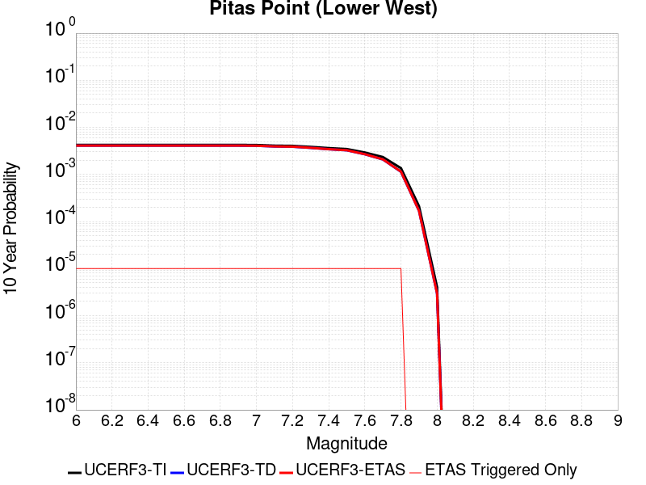 |

| Magnitude | 1 wk TI Prob | 1 wk TD Prob | 1 wk ETAS Prob | 1 wk ETAS/TD Gain | 1 wk ETAS Triggered Only | 1 mo TI Prob | 1 mo TD Prob | 1 mo ETAS Prob | 1 mo ETAS/TD Gain | 1 mo ETAS Triggered Only | 1 yr TI Prob | 1 yr TD Prob | 1 yr ETAS Prob | 1 yr ETAS/TD Gain | 1 yr ETAS Triggered Only | 10 yr TI Prob | 10 yr TD Prob | 10 yr ETAS Prob | 10 yr ETAS/TD Gain | 10 yr ETAS Triggered Only |
|-----|-----|-----|-----|-----|-----|-----|-----|-----|-----|-----|-----|-----|-----|-----|-----|-----|-----|-----|-----|-----|
| 6.0 | 8.151497E-6 | 7.855762E-6 | 7.855762E-6 | 1.0 | 0.0 | 3.493452E-5 | 3.3667122E-5 | 3.3667122E-5 | 1.0 | 0.0 | 4.252448E-4 | 4.0982084E-4 | 4.0982084E-4 | 1.0 | 0.0 | 0.0042443196 | 0.0040907315 | 0.0041330853 | 1.0103536 | 4.2527856E-5 |
| 6.1 | 8.151497E-6 | 7.855762E-6 | 7.855762E-6 | 1.0 | 0.0 | 3.493452E-5 | 3.3667122E-5 | 3.3667122E-5 | 1.0 | 0.0 | 4.252448E-4 | 4.0982084E-4 | 4.0982084E-4 | 1.0 | 0.0 | 0.0042443196 | 0.0040907315 | 0.0041330853 | 1.0103536 | 4.2527856E-5 |
| 6.2 | 8.151497E-6 | 7.855762E-6 | 7.855762E-6 | 1.0 | 0.0 | 3.493452E-5 | 3.3667122E-5 | 3.3667122E-5 | 1.0 | 0.0 | 4.252448E-4 | 4.0982084E-4 | 4.0982084E-4 | 1.0 | 0.0 | 0.0042443196 | 0.0040907315 | 0.0041330853 | 1.0103536 | 4.2527856E-5 |
| 6.3 | 8.151497E-6 | 7.855762E-6 | 7.855762E-6 | 1.0 | 0.0 | 3.493452E-5 | 3.3667122E-5 | 3.3667122E-5 | 1.0 | 0.0 | 4.252448E-4 | 4.0982084E-4 | 4.0982084E-4 | 1.0 | 0.0 | 0.0042443196 | 0.0040907315 | 0.0041330853 | 1.0103536 | 4.2527856E-5 |
| 6.4 | 8.151497E-6 | 7.855762E-6 | 7.855762E-6 | 1.0 | 0.0 | 3.493452E-5 | 3.3667122E-5 | 3.3667122E-5 | 1.0 | 0.0 | 4.252448E-4 | 4.0982084E-4 | 4.0982084E-4 | 1.0 | 0.0 | 0.0042443196 | 0.0040907315 | 0.0041330853 | 1.0103536 | 4.2527856E-5 |
| 6.5 | 8.151497E-6 | 7.855762E-6 | 7.855762E-6 | 1.0 | 0.0 | 3.493452E-5 | 3.3667122E-5 | 3.3667122E-5 | 1.0 | 0.0 | 4.252448E-4 | 4.0982084E-4 | 4.0982084E-4 | 1.0 | 0.0 | 0.0042443196 | 0.0040907315 | 0.0041330853 | 1.0103536 | 4.2527856E-5 |
| 6.6 | 8.151497E-6 | 7.855762E-6 | 7.855762E-6 | 1.0 | 0.0 | 3.493452E-5 | 3.3667122E-5 | 3.3667122E-5 | 1.0 | 0.0 | 4.252448E-4 | 4.0982084E-4 | 4.0982084E-4 | 1.0 | 0.0 | 0.0042443196 | 0.0040907315 | 0.0041330853 | 1.0103536 | 4.2527856E-5 |
| 6.7 | 8.151497E-6 | 7.855762E-6 | 7.855762E-6 | 1.0 | 0.0 | 3.493452E-5 | 3.3667122E-5 | 3.3667122E-5 | 1.0 | 0.0 | 4.252448E-4 | 4.0982084E-4 | 4.0982084E-4 | 1.0 | 0.0 | 0.0042443196 | 0.0040907315 | 0.0041330853 | 1.0103536 | 4.2527856E-5 |
| 6.8 | 8.151497E-6 | 7.855762E-6 | 7.855762E-6 | 1.0 | 0.0 | 3.493452E-5 | 3.3667122E-5 | 3.3667122E-5 | 1.0 | 0.0 | 4.252448E-4 | 4.0982084E-4 | 4.0982084E-4 | 1.0 | 0.0 | 0.0042443196 | 0.0040907315 | 0.0041330853 | 1.0103536 | 4.2527856E-5 |
| 6.9 | 8.151497E-6 | 7.855762E-6 | 7.855762E-6 | 1.0 | 0.0 | 3.493452E-5 | 3.3667122E-5 | 3.3667122E-5 | 1.0 | 0.0 | 4.252448E-4 | 4.0982084E-4 | 4.0982084E-4 | 1.0 | 0.0 | 0.0042443196 | 0.0040907315 | 0.0041330853 | 1.0103536 | 4.2527856E-5 |
| 7.0 | 8.103535E-6 | 7.805192E-6 | 7.805192E-6 | 1.0 | 0.0 | 3.4728975E-5 | 3.3450397E-5 | 3.3450397E-5 | 1.0 | 0.0 | 4.2274324E-4 | 4.0718322E-4 | 4.0718322E-4 | 1.0 | 0.0 | 0.0042193993 | 0.004064452 | 0.004106807 | 1.0104208 | 4.2527856E-5 |
| 7.1 | 7.853298E-6 | 7.540883E-6 | 7.540883E-6 | 1.0 | 0.0 | 3.3656554E-5 | 3.2317676E-5 | 3.2317676E-5 | 1.0 | 0.0 | 4.096915E-4 | 3.9339735E-4 | 3.9339735E-4 | 1.0 | 0.0 | 0.00408937 | 0.0039270855 | 0.0039694463 | 1.0107869 | 4.2527856E-5 |
| 7.2 | 7.771102E-6 | 7.453165E-6 | 7.453165E-6 | 1.0 | 0.0 | 3.33043E-5 | 3.194175E-5 | 3.194175E-5 | 1.0 | 0.0 | 4.0540437E-4 | 3.8882208E-4 | 3.8882208E-4 | 1.0 | 0.0 | 0.0040466557 | 0.0038814936 | 0.003923856 | 1.0109141 | 4.2527856E-5 |
| 7.3 | 7.3945344E-6 | 7.0492697E-6 | 7.0492697E-6 | 1.0 | 0.0 | 3.1690477E-5 | 3.021081E-5 | 3.021081E-5 | 1.0 | 0.0 | 3.8576324E-4 | 3.6775516E-4 | 3.6775516E-4 | 1.0 | 0.0 | 0.0038509427 | 0.0036715334 | 0.003713905 | 1.0115407 | 4.2527856E-5 |
| 7.4 | 6.964645E-6 | 6.5901186E-6 | 6.5901186E-6 | 1.0 | 0.0 | 2.9848137E-5 | 2.8243063E-5 | 2.8243063E-5 | 1.0 | 0.0 | 3.6334046E-4 | 3.4380553E-4 | 3.4380553E-4 | 1.0 | 0.0 | 0.0036274698 | 0.0034327896 | 0.0034751715 | 1.0123461 | 4.2527856E-5 |
| 7.5 | 6.6525035E-6 | 6.259157E-6 | 6.259157E-6 | 1.0 | 0.0 | 2.851042E-5 | 2.6824686E-5 | 2.6824686E-5 | 1.0 | 0.0 | 3.4705905E-4 | 3.265421E-4 | 3.265421E-4 | 1.0 | 0.0 | 0.0034651754 | 0.0032606742 | 0.0033030633 | 1.0130001 | 4.2527856E-5 |
| 7.6 | 5.613338E-6 | 5.151386E-6 | 5.151386E-6 | 1.0 | 0.0 | 2.405694E-5 | 2.2077185E-5 | 2.2077185E-5 | 1.0 | 0.0 | 2.928539E-4 | 2.6875688E-4 | 2.6875688E-4 | 1.0 | 0.0 | 0.0029246826 | 0.0026843501 | 0.0027267637 | 1.0158004 | 4.2527856E-5 |
| 7.7 | 4.494704E-6 | 3.996911E-6 | 3.996911E-6 | 1.0 | 0.0 | 1.9262876E-5 | 1.7129507E-5 | 1.7129507E-5 | 1.0 | 0.0 | 2.3450027E-4 | 2.0853203E-4 | 2.0853203E-4 | 1.0 | 0.0 | 0.0023425296 | 0.0020833875 | 0.002125827 | 1.0203704 | 4.2527856E-5 |
| 7.8 | 2.6075882E-6 | 2.1836374E-6 | 2.1836374E-6 | 1.0 | 0.0 | 1.117533E-5 | 9.358413E-6 | 9.358413E-6 | 1.0 | 0.0 | 1.3605114E-4 | 1.1393277E-4 | 1.1393277E-4 | 1.0 | 0.0 | 0.0013596788 | 0.0011387484 | 0.0011812277 | 1.0373036 | 4.2527856E-5 |
| 7.9 | 4.045984E-7 | 3.242375E-7 | 3.242375E-7 | 1.0 | 0.0 | 1.733992E-6 | 1.3895885E-6 | 1.3895885E-6 | 1.0 | 0.0 | 2.1111147E-5 | 1.6918111E-5 | 1.6918111E-5 | 1.0 | 0.0 | 2.1109142E-4 | 1.6916855E-4 | 1.6916855E-4 | 1.0 | 0.0 |
| 8.0 | 7.791402E-9 | 5.683497E-9 | 5.683497E-9 | 1.0 | 0.0 | 3.3391725E-8 | 2.4357844E-8 | 2.4357844E-8 | 1.0 | 0.0 | 4.0654416E-7 | 2.9655675E-7 | 2.9655675E-7 | 1.0 | 0.0 | 4.065434E-6 | 2.9655655E-6 | 2.9655655E-6 | 1.0 | 0.0 |

## San Cayetano
*[(top)](#table-of-contents)*

| 1 Week | 1 Month | 1 Year | 10 Year |
|-----|-----|-----|-----|
| 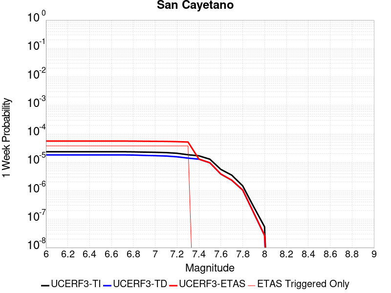 | 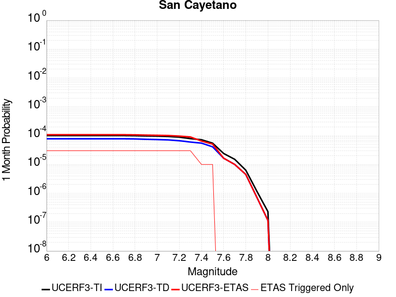 | 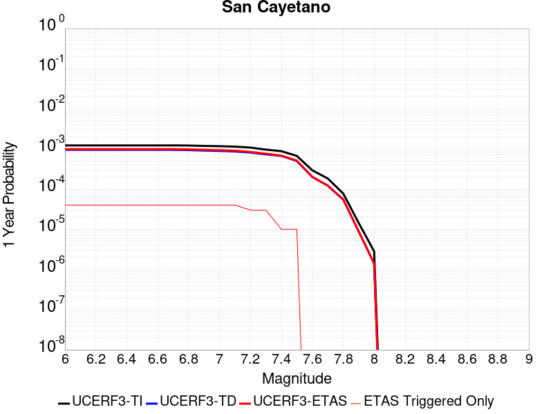 | 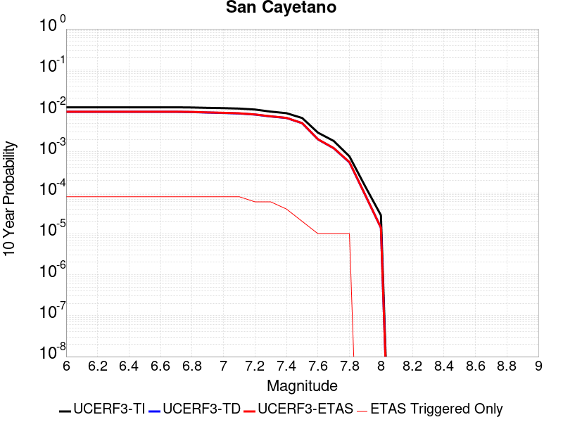 |

| Magnitude | 1 wk TI Prob | 1 wk TD Prob | 1 wk ETAS Prob | 1 wk ETAS/TD Gain | 1 wk ETAS Triggered Only | 1 mo TI Prob | 1 mo TD Prob | 1 mo ETAS Prob | 1 mo ETAS/TD Gain | 1 mo ETAS Triggered Only | 1 yr TI Prob | 1 yr TD Prob | 1 yr ETAS Prob | 1 yr ETAS/TD Gain | 1 yr ETAS Triggered Only | 10 yr TI Prob | 10 yr TD Prob | 10 yr ETAS Prob | 10 yr ETAS/TD Gain | 10 yr ETAS Triggered Only |
|-----|-----|-----|-----|-----|-----|-----|-----|-----|-----|-----|-----|-----|-----|-----|-----|-----|-----|-----|-----|-----|
| 6.0 | 2.3476267E-5 | 1.816928E-5 | 1.816928E-5 | 1.0 | 0.0 | 1.0060869E-4 | 7.786603E-5 | 7.786603E-5 | 1.0 | 0.0 | 0.0012242225 | 9.476103E-4 | 9.476103E-4 | 1.0 | 0.0 | 0.012175002 | 0.009436584 | 0.009478711 | 1.0044641 | 4.2527856E-5 |
| 6.1 | 2.3476267E-5 | 1.816928E-5 | 1.816928E-5 | 1.0 | 0.0 | 1.0060869E-4 | 7.786603E-5 | 7.786603E-5 | 1.0 | 0.0 | 0.0012242225 | 9.476103E-4 | 9.476103E-4 | 1.0 | 0.0 | 0.012175002 | 0.009436584 | 0.009478711 | 1.0044641 | 4.2527856E-5 |
| 6.2 | 2.3476267E-5 | 1.816928E-5 | 1.816928E-5 | 1.0 | 0.0 | 1.0060869E-4 | 7.786603E-5 | 7.786603E-5 | 1.0 | 0.0 | 0.0012242225 | 9.476103E-4 | 9.476103E-4 | 1.0 | 0.0 | 0.012175002 | 0.009436584 | 0.009478711 | 1.0044641 | 4.2527856E-5 |
| 6.3 | 2.3476267E-5 | 1.816928E-5 | 1.816928E-5 | 1.0 | 0.0 | 1.0060869E-4 | 7.786603E-5 | 7.786603E-5 | 1.0 | 0.0 | 0.0012242225 | 9.476103E-4 | 9.476103E-4 | 1.0 | 0.0 | 0.012175002 | 0.009436584 | 0.009478711 | 1.0044641 | 4.2527856E-5 |
| 6.4 | 2.3476267E-5 | 1.816928E-5 | 1.816928E-5 | 1.0 | 0.0 | 1.0060869E-4 | 7.786603E-5 | 7.786603E-5 | 1.0 | 0.0 | 0.0012242225 | 9.476103E-4 | 9.476103E-4 | 1.0 | 0.0 | 0.012175002 | 0.009436584 | 0.009478711 | 1.0044641 | 4.2527856E-5 |
| 6.5 | 2.3476267E-5 | 1.816928E-5 | 1.816928E-5 | 1.0 | 0.0 | 1.0060869E-4 | 7.786603E-5 | 7.786603E-5 | 1.0 | 0.0 | 0.0012242225 | 9.476103E-4 | 9.476103E-4 | 1.0 | 0.0 | 0.012175002 | 0.009436584 | 0.009478711 | 1.0044641 | 4.2527856E-5 |
| 6.6 | 2.3476267E-5 | 1.816928E-5 | 1.816928E-5 | 1.0 | 0.0 | 1.0060869E-4 | 7.786603E-5 | 7.786603E-5 | 1.0 | 0.0 | 0.0012242225 | 9.476103E-4 | 9.476103E-4 | 1.0 | 0.0 | 0.012175002 | 0.009436584 | 0.009478711 | 1.0044641 | 4.2527856E-5 |
| 6.7 | 2.3476267E-5 | 1.816928E-5 | 1.816928E-5 | 1.0 | 0.0 | 1.0060869E-4 | 7.786603E-5 | 7.786603E-5 | 1.0 | 0.0 | 0.0012242225 | 9.476103E-4 | 9.476103E-4 | 1.0 | 0.0 | 0.012175002 | 0.009436584 | 0.009478711 | 1.0044641 | 4.2527856E-5 |
| 6.8 | 2.3241924E-5 | 1.7936987E-5 | 1.7936987E-5 | 1.0 | 0.0 | 9.960445E-5 | 7.687056E-5 | 7.687056E-5 | 1.0 | 0.0 | 0.0012120095 | 9.3550084E-4 | 9.3550084E-4 | 1.0 | 0.0 | 0.012054204 | 0.009316482 | 0.009358614 | 1.0045223 | 4.2527856E-5 |
| 6.9 | 2.2761007E-5 | 1.7432423E-5 | 1.7432423E-5 | 1.0 | 0.0 | 9.7543525E-5 | 7.470827E-5 | 7.470827E-5 | 1.0 | 0.0 | 0.0011869454 | 9.09197E-4 | 9.09197E-4 | 1.0 | 0.0 | 0.011806256 | 0.009055603 | 0.009097746 | 1.0046538 | 4.2527856E-5 |
| 7.0 | 2.240283E-5 | 1.7066168E-5 | 1.7066168E-5 | 1.0 | 0.0 | 9.600859E-5 | 7.313869E-5 | 7.313869E-5 | 1.0 | 0.0 | 0.0011682777 | 8.9010317E-4 | 8.9010317E-4 | 1.0 | 0.0 | 0.011621549 | 0.008866196 | 0.008908346 | 1.0047541 | 4.2527856E-5 |
| 7.1 | 2.1871154E-5 | 1.6586018E-5 | 1.6586018E-5 | 1.0 | 0.0 | 9.373015E-5 | 7.108101E-5 | 7.108101E-5 | 1.0 | 0.0 | 0.0011405671 | 8.6507114E-4 | 8.6507114E-4 | 1.0 | 0.0 | 0.011347309 | 0.008617838 | 0.00866 | 1.0048923 | 4.2527856E-5 |
| 7.2 | 2.0714133E-5 | 1.5564561E-5 | 1.5564561E-5 | 1.0 | 0.0 | 8.8771834E-5 | 6.670357E-5 | 6.670357E-5 | 1.0 | 0.0 | 0.0010802611 | 8.1181666E-4 | 8.1181666E-4 | 1.0 | 0.0 | 0.010750249 | 0.008089285 | 0.00813147 | 1.0052148 | 4.2527856E-5 |
| 7.3 | 1.8408395E-5 | 1.3996864E-5 | 1.3996864E-5 | 1.0 | 0.0 | 7.8890735E-5 | 5.99852E-5 | 5.99852E-5 | 1.0 | 0.0 | 9.600714E-4 | 7.300781E-4 | 7.300781E-4 | 1.0 | 0.0 | 0.009559342 | 0.0072775153 | 0.007319734 | 1.0058012 | 4.2527856E-5 |
| 7.4 | 1.6856795E-5 | 1.28500815E-5 | 1.28500815E-5 | 1.0 | 0.0 | 7.2241404E-5 | 5.5070628E-5 | 5.5070628E-5 | 1.0 | 0.0 | 8.7918417E-4 | 6.7028153E-4 | 6.7028153E-4 | 1.0 | 0.0 | 0.00875714 | 0.0066832784 | 0.006725522 | 1.0063208 | 4.2527856E-5 |
| 7.5 | 1.2822778E-5 | 9.577542E-6 | 9.577542E-6 | 1.0 | 0.0 | 5.495361E-5 | 4.1045972E-5 | 4.1045972E-5 | 1.0 | 0.0 | 6.688548E-4 | 4.996217E-4 | 4.996217E-4 | 1.0 | 0.0 | 0.006668452 | 0.0049851555 | 0.005027471 | 1.0084884 | 4.2527856E-5 |
| 7.6 | 5.6272684E-6 | 3.854903E-6 | 3.854903E-6 | 1.0 | 0.0 | 2.4116642E-5 | 1.652091E-5 | 1.652091E-5 | 1.0 | 0.0 | 2.9358055E-4 | 2.0112359E-4 | 2.0112359E-4 | 1.0 | 0.0 | 0.0029319301 | 0.0020094267 | 0.002051869 | 1.0211216 | 4.2527856E-5 |
| 7.7 | 3.5261346E-6 | 2.3407013E-6 | 2.3407013E-6 | 1.0 | 0.0 | 1.5111918E-5 | 1.0031539E-5 | 1.0031539E-5 | 1.0 | 0.0 | 1.8397206E-4 | 1.2212721E-4 | 1.2212721E-4 | 1.0 | 0.0 | 0.0018381984 | 0.0012206084 | 0.0012630844 | 1.034799 | 4.2527856E-5 |
| 7.8 | 1.4826929E-6 | 1.056428E-6 | 1.056428E-6 | 1.0 | 0.0 | 6.354383E-6 | 4.5275406E-6 | 4.5275406E-6 | 1.0 | 0.0 | 7.736187E-5 | 5.5121433E-5 | 5.5121433E-5 | 1.0 | 0.0 | 7.733494E-4 | 5.5107963E-4 | 5.9358403E-4 | 1.0771294 | 4.2527856E-5 |
| 7.9 | 2.7568166E-7 | 1.6978244E-7 | 1.6978244E-7 | 1.0 | 0.0 | 1.1814923E-6 | 7.2763885E-7 | 7.2763885E-7 | 1.0 | 0.0 | 1.4384574E-5 | 8.858967E-6 | 8.858967E-6 | 1.0 | 0.0 | 1.4383643E-4 | 8.8586174E-5 | 8.8586174E-5 | 1.0 | 0.0 |
| 8.0 | 5.407832E-8 | 2.6887697E-8 | 2.6887697E-8 | 1.0 | 0.0 | 2.3176422E-7 | 1.15232986E-7 | 1.15232986E-7 | 1.0 | 0.0 | 2.8217257E-6 | 1.4029607E-6 | 1.4029607E-6 | 1.0 | 0.0 | 2.8216898E-5 | 1.4029522E-5 | 1.4029522E-5 | 1.0 | 0.0 |

## Eaton Roughs 2011 CFM
*[(top)](#table-of-contents)*

| 1 Week | 1 Month | 1 Year | 10 Year |
|-----|-----|-----|-----|
|  |  | 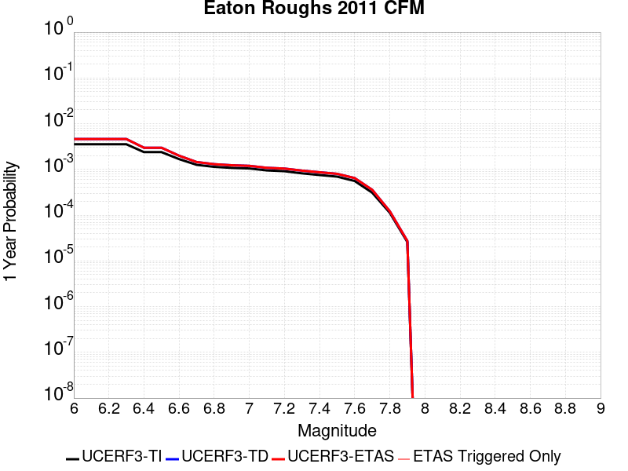 | 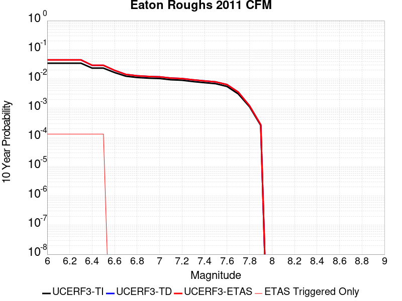 |

| Magnitude | 1 wk TI Prob | 1 wk TD Prob | 1 wk ETAS Prob | 1 wk ETAS/TD Gain | 1 wk ETAS Triggered Only | 1 mo TI Prob | 1 mo TD Prob | 1 mo ETAS Prob | 1 mo ETAS/TD Gain | 1 mo ETAS Triggered Only | 1 yr TI Prob | 1 yr TD Prob | 1 yr ETAS Prob | 1 yr ETAS/TD Gain | 1 yr ETAS Triggered Only | 10 yr TI Prob | 10 yr TD Prob | 10 yr ETAS Prob | 10 yr ETAS/TD Gain | 10 yr ETAS Triggered Only |
|-----|-----|-----|-----|-----|-----|-----|-----|-----|-----|-----|-----|-----|-----|-----|-----|-----|-----|-----|-----|-----|
| 6.0 | 6.8044945E-5 | 8.843646E-5 | 8.843646E-5 | 1.0 | 0.0 | 2.9158857E-4 | 3.7896493E-4 | 3.7896493E-4 | 1.0 | 0.0 | 0.0035443127 | 0.0046050907 | 0.0046050907 | 1.0 | 0.0 | 0.03488314 | 0.04516335 | 0.045203954 | 1.0008991 | 4.2527856E-5 |
| 6.1 | 6.8044945E-5 | 8.843646E-5 | 8.843646E-5 | 1.0 | 0.0 | 2.9158857E-4 | 3.7896493E-4 | 3.7896493E-4 | 1.0 | 0.0 | 0.0035443127 | 0.0046050907 | 0.0046050907 | 1.0 | 0.0 | 0.03488314 | 0.04516335 | 0.045203954 | 1.0008991 | 4.2527856E-5 |
| 6.2 | 6.8044945E-5 | 8.843646E-5 | 8.843646E-5 | 1.0 | 0.0 | 2.9158857E-4 | 3.7896493E-4 | 3.7896493E-4 | 1.0 | 0.0 | 0.0035443127 | 0.0046050907 | 0.0046050907 | 1.0 | 0.0 | 0.03488314 | 0.04516335 | 0.045203954 | 1.0008991 | 4.2527856E-5 |
| 6.3 | 6.8044945E-5 | 8.843646E-5 | 8.843646E-5 | 1.0 | 0.0 | 2.9158857E-4 | 3.7896493E-4 | 3.7896493E-4 | 1.0 | 0.0 | 0.0035443127 | 0.0046050907 | 0.0046050907 | 1.0 | 0.0 | 0.03488314 | 0.04516335 | 0.045203954 | 1.0008991 | 4.2527856E-5 |
| 6.4 | 4.5830013E-5 | 5.715427E-5 | 5.715427E-5 | 1.0 | 0.0 | 1.9639956E-4 | 2.4492692E-4 | 2.4492692E-4 | 1.0 | 0.0 | 0.0023885423 | 0.0029784471 | 0.0029784471 | 1.0 | 0.0 | 0.023630321 | 0.029421588 | 0.029462865 | 1.001403 | 4.2527856E-5 |
| 6.5 | 4.5830013E-5 | 5.715427E-5 | 5.715427E-5 | 1.0 | 0.0 | 1.9639956E-4 | 2.4492692E-4 | 2.4492692E-4 | 1.0 | 0.0 | 0.0023885423 | 0.0029784471 | 0.0029784471 | 1.0 | 0.0 | 0.023630321 | 0.029421588 | 0.029462865 | 1.001403 | 4.2527856E-5 |
| 6.6 | 3.222194E-5 | 3.8261504E-5 | 3.8261504E-5 | 1.0 | 0.0 | 1.3808672E-4 | 1.639682E-4 | 1.639682E-4 | 1.0 | 0.0 | 0.0016799092 | 0.001994599 | 0.001994599 | 1.0 | 0.0 | 0.016672665 | 0.019776601 | 0.019776601 | 1.0 | 0.0 |
| 6.7 | 2.4155654E-5 | 2.7786238E-5 | 2.7786238E-5 | 1.0 | 0.0 | 1.0352012E-4 | 1.1907848E-4 | 1.1907848E-4 | 1.0 | 0.0 | 0.0012596287 | 0.0014488247 | 0.0014488247 | 1.0 | 0.0 | 0.012525126 | 0.014394943 | 0.014394943 | 1.0 | 0.0 |
| 6.8 | 2.1814667E-5 | 2.4940868E-5 | 2.4940868E-5 | 1.0 | 0.0 | 9.348808E-5 | 1.06885076E-4 | 1.06885076E-4 | 1.0 | 0.0 | 0.001137623 | 0.0013005526 | 0.0013005526 | 1.0 | 0.0 | 0.011318169 | 0.012930038 | 0.012930038 | 1.0 | 0.0 |
| 6.9 | 2.0700467E-5 | 2.3628932E-5 | 2.3628932E-5 | 1.0 | 0.0 | 8.871327E-5 | 1.01262944E-4 | 1.01262944E-4 | 1.0 | 0.0 | 0.0010795488 | 0.0012321823 | 0.0012321823 | 1.0 | 0.0 | 0.010743194 | 0.012254035 | 0.012254035 | 1.0 | 0.0 |
| 7.0 | 2.0104066E-5 | 2.29365E-5 | 2.29365E-5 | 1.0 | 0.0 | 8.615744E-5 | 9.82956E-5 | 9.82956E-5 | 1.0 | 0.0 | 0.0010484619 | 0.0011960949 | 0.0011960949 | 1.0 | 0.0 | 0.010435291 | 0.011897073 | 0.011897073 | 1.0 | 0.0 |
| 7.1 | 1.8225232E-5 | 2.0773046E-5 | 2.0773046E-5 | 1.0 | 0.0 | 7.81058E-5 | 8.902431E-5 | 8.902431E-5 | 1.0 | 0.0 | 9.5052324E-4 | 0.0010833336 | 0.0010833336 | 1.0 | 0.0 | 0.009464677 | 0.010780825 | 0.010780825 | 1.0 | 0.0 |
| 7.2 | 1.7526572E-5 | 1.9993488E-5 | 1.9993488E-5 | 1.0 | 0.0 | 7.511172E-5 | 8.5683576E-5 | 8.5683576E-5 | 1.0 | 0.0 | 9.141015E-4 | 0.0010426997 | 0.0010426997 | 1.0 | 0.0 | 0.009103506 | 0.010378351 | 0.010378351 | 1.0 | 0.0 |
| 7.3 | 1.5727232E-5 | 1.8021507E-5 | 1.8021507E-5 | 1.0 | 0.0 | 6.740067E-5 | 7.723275E-5 | 7.723275E-5 | 1.0 | 0.0 | 8.2029426E-4 | 9.399043E-4 | 9.399043E-4 | 1.0 | 0.0 | 0.008172729 | 0.009359511 | 0.009359511 | 1.0 | 0.0 |
| 7.4 | 1.4457361E-5 | 1.6598358E-5 | 1.6598358E-5 | 1.0 | 0.0 | 6.195865E-5 | 7.113389E-5 | 7.113389E-5 | 1.0 | 0.0 | 7.540854E-4 | 8.657119E-4 | 8.657119E-4 | 1.0 | 0.0 | 0.007515317 | 0.008623555 | 0.008623555 | 1.0 | 0.0 |
| 7.5 | 1.33280955E-5 | 1.5345435E-5 | 1.5345435E-5 | 1.0 | 0.0 | 5.711916E-5 | 6.57645E-5 | 6.57645E-5 | 1.0 | 0.0 | 6.9520384E-4 | 8.0038945E-4 | 8.0038945E-4 | 1.0 | 0.0 | 0.00693033 | 0.007975209 | 0.007975209 | 1.0 | 0.0 |
| 7.6 | 1.0699478E-5 | 1.2387815E-5 | 1.2387815E-5 | 1.0 | 0.0 | 4.5854096E-5 | 5.308956E-5 | 5.308956E-5 | 1.0 | 0.0 | 5.581306E-4 | 6.4617425E-4 | 6.4617425E-4 | 1.0 | 0.0 | 0.005567309 | 0.0064430353 | 0.0064430353 | 1.0 | 0.0 |
| 7.7 | 5.9390236E-6 | 6.852951E-6 | 6.852951E-6 | 1.0 | 0.0 | 2.545271E-5 | 2.9369461E-5 | 2.9369461E-5 | 1.0 | 0.0 | 3.0984267E-4 | 3.5751477E-4 | 3.5751477E-4 | 1.0 | 0.0 | 0.0030941102 | 0.0035694204 | 0.0035694204 | 1.0 | 0.0 |
| 7.8 | 2.1622036E-6 | 2.3296996E-6 | 2.3296996E-6 | 1.0 | 0.0 | 9.266554E-6 | 9.984388E-6 | 9.984388E-6 | 1.0 | 0.0 | 1.1281446E-4 | 1.21553225E-4 | 1.21553225E-4 | 1.0 | 0.0 | 0.001127572 | 0.001214873 | 0.001214873 | 1.0 | 0.0 |
| 7.9 | 4.9586197E-7 | 5.2189216E-7 | 5.2189216E-7 | 1.0 | 0.0 | 2.125121E-6 | 2.2366787E-6 | 2.2366787E-6 | 1.0 | 0.0 | 2.5873042E-5 | 2.7231245E-5 | 2.7231245E-5 | 1.0 | 0.0 | 2.5870028E-4 | 2.7228118E-4 | 2.7228118E-4 | 1.0 | 0.0 |

## Bennett Valley 2011 CFM
*[(top)](#table-of-contents)*

| 1 Week | 1 Month | 1 Year | 10 Year |
|-----|-----|-----|-----|
| 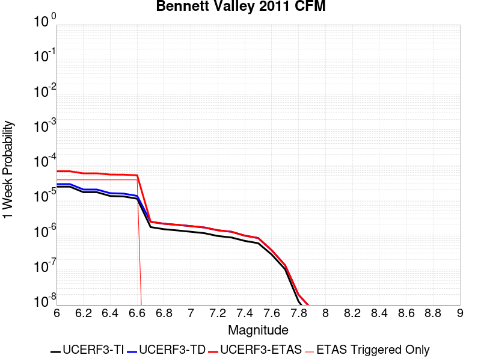 | 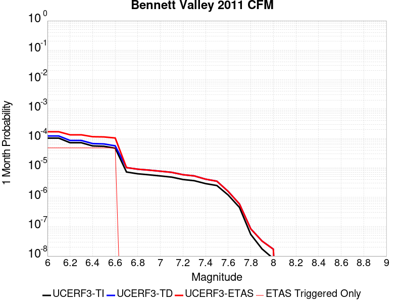 | 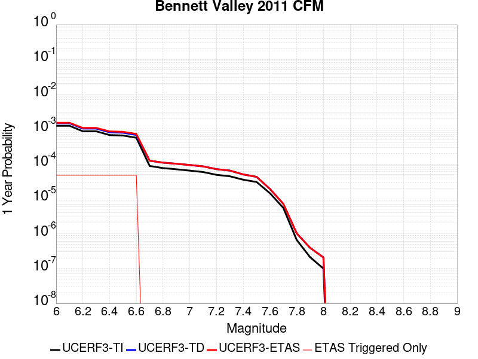 | 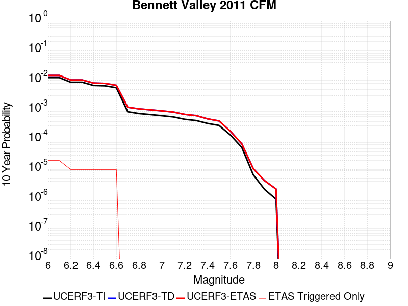 |

| Magnitude | 1 wk TI Prob | 1 wk TD Prob | 1 wk ETAS Prob | 1 wk ETAS/TD Gain | 1 wk ETAS Triggered Only | 1 mo TI Prob | 1 mo TD Prob | 1 mo ETAS Prob | 1 mo ETAS/TD Gain | 1 mo ETAS Triggered Only | 1 yr TI Prob | 1 yr TD Prob | 1 yr ETAS Prob | 1 yr ETAS/TD Gain | 1 yr ETAS Triggered Only | 10 yr TI Prob | 10 yr TD Prob | 10 yr ETAS Prob | 10 yr ETAS/TD Gain | 10 yr ETAS Triggered Only |
|-----|-----|-----|-----|-----|-----|-----|-----|-----|-----|-----|-----|-----|-----|-----|-----|-----|-----|-----|-----|-----|
| 6.0 | 2.3893934E-5 | 2.8238892E-5 | 7.076555E-5 | 2.5059605 | 4.2527856E-5 | 1.0239855E-4 | 1.2101925E-4 | 1.6354196E-4 | 1.3513714 | 4.2527856E-5 | 0.0012459893 | 0.0014725985 | 0.0015150637 | 1.028837 | 4.2527856E-5 | 0.012390262 | 0.014651061 | 0.014692966 | 1.0028602 | 4.2527856E-5 |
| 6.1 | 2.3893934E-5 | 2.8238892E-5 | 7.076555E-5 | 2.5059605 | 4.2527856E-5 | 1.0239855E-4 | 1.2101925E-4 | 1.6354196E-4 | 1.3513714 | 4.2527856E-5 | 0.0012459893 | 0.0014725985 | 0.0015150637 | 1.028837 | 4.2527856E-5 | 0.012390262 | 0.014651061 | 0.014692966 | 1.0028602 | 4.2527856E-5 |
| 6.2 | 1.6657146E-5 | 1.9853778E-5 | 6.238079E-5 | 3.1420112 | 4.2527856E-5 | 7.138582E-5 | 8.508564E-5 | 1.2760988E-4 | 1.4997816 | 4.2527856E-5 | 8.6877577E-4 | 0.0010355669 | 0.0010780507 | 1.0410247 | 4.2527856E-5 | 0.008653872 | 0.010325688 | 0.010367777 | 1.0040761 | 4.2527856E-5 |
| 6.3 | 1.6657146E-5 | 1.9853778E-5 | 6.238079E-5 | 3.1420112 | 4.2527856E-5 | 7.138582E-5 | 8.508564E-5 | 1.2760988E-4 | 1.4997816 | 4.2527856E-5 | 8.6877577E-4 | 0.0010355669 | 0.0010780507 | 1.0410247 | 4.2527856E-5 | 0.008653872 | 0.010325688 | 0.010367777 | 1.0040761 | 4.2527856E-5 |
| 6.4 | 1.29418495E-5 | 1.5567497E-5 | 5.809469E-5 | 3.7317939 | 4.2527856E-5 | 5.546389E-5 | 6.671687E-5 | 1.0924189E-4 | 1.6373953 | 4.2527856E-5 | 6.7506364E-4 | 8.121055E-4 | 8.545988E-4 | 1.0523249 | 4.2527856E-5 | 0.0067301663 | 0.008108527 | 0.008150711 | 1.0052023 | 4.2527856E-5 |
| 6.5 | 1.2582504E-5 | 1.5134528E-5 | 5.7661742E-5 | 3.8099463 | 4.2527856E-5 | 5.39239E-5 | 6.4861386E-5 | 1.07386484E-4 | 1.6556304 | 4.2527856E-5 | 6.563257E-4 | 7.895315E-4 | 8.320258E-4 | 1.0538222 | 4.2527856E-5 | 0.006543907 | 0.007884431 | 0.007926623 | 1.0053514 | 4.2527856E-5 |
| 6.6 | 1.0846706E-5 | 1.3036779E-5 | 5.556408E-5 | 4.262102 | 4.2527856E-5 | 4.6485053E-5 | 5.5871435E-5 | 9.8396915E-5 | 1.7611309 | 4.2527856E-5 | 5.6580856E-4 | 6.801508E-4 | 7.2264974E-4 | 1.0624846 | 4.2527856E-5 | 0.005643701 | 0.0067976876 | 0.0068399264 | 1.0062137 | 4.2527856E-5 |
| 6.7 | 1.6803231E-6 | 2.377857E-6 | 2.377857E-6 | 1.0 | 0.0 | 7.2013645E-6 | 1.0190777E-5 | 1.0190777E-5 | 1.0 | 0.0 | 8.7673085E-5 | 1.2406579E-4 | 1.2406579E-4 | 1.0 | 0.0 | 8.76385E-4 | 0.0012444059 | 0.0012444059 | 1.0 | 0.0 |
| 6.8 | 1.4609833E-6 | 2.0939308E-6 | 2.0939308E-6 | 1.0 | 0.0 | 6.261342E-6 | 8.973958E-6 | 8.973958E-6 | 1.0 | 0.0 | 7.6229175E-5 | 1.09252534E-4 | 1.09252534E-4 | 1.0 | 0.0 | 7.620303E-4 | 0.0010963855 | 0.0010963855 | 1.0 | 0.0 |
| 6.9 | 1.3492396E-6 | 1.945872E-6 | 1.945872E-6 | 1.0 | 0.0 | 5.7824427E-6 | 8.339425E-6 | 8.339425E-6 | 1.0 | 0.0 | 7.0398964E-5 | 1.0152783E-4 | 1.0152783E-4 | 1.0 | 0.0 | 7.037667E-4 | 0.001019182 | 0.001019182 | 1.0 | 0.0 |
| 7.0 | 1.2347921E-6 | 1.7888614E-6 | 1.7888614E-6 | 1.0 | 0.0 | 5.291955E-6 | 7.6665265E-6 | 7.6665265E-6 | 1.0 | 0.0 | 6.442765E-5 | 9.333601E-5 | 9.333601E-5 | 1.0 | 0.0 | 6.440897E-4 | 9.373206E-4 | 9.373206E-4 | 1.0 | 0.0 |
| 7.1 | 1.1262973E-6 | 1.6358822E-6 | 1.6358822E-6 | 1.0 | 0.0 | 4.8269794E-6 | 7.010905E-6 | 7.010905E-6 | 1.0 | 0.0 | 5.876689E-5 | 8.535448E-5 | 8.535448E-5 | 1.0 | 0.0 | 5.875135E-4 | 8.575462E-4 | 8.575462E-4 | 1.0 | 0.0 |
| 7.2 | 9.351744E-7 | 1.3611456E-6 | 1.3611456E-6 | 1.0 | 0.0 | 4.007884E-6 | 5.8334676E-6 | 5.8334676E-6 | 1.0 | 0.0 | 4.8794896E-5 | 7.102018E-5 | 7.102018E-5 | 1.0 | 0.0 | 4.878418E-4 | 7.1425125E-4 | 7.1425125E-4 | 1.0 | 0.0 |
| 7.3 | 8.5039534E-7 | 1.2386469E-6 | 1.2386469E-6 | 1.0 | 0.0 | 3.6445463E-6 | 5.308476E-6 | 5.308476E-6 | 1.0 | 0.0 | 4.437145E-5 | 6.4628795E-5 | 6.4628795E-5 | 1.0 | 0.0 | 4.436259E-4 | 6.50087E-4 | 6.50087E-4 | 1.0 | 0.0 |
| 7.4 | 6.7875015E-7 | 9.600462E-7 | 9.600462E-7 | 1.0 | 0.0 | 2.908926E-6 | 4.114477E-6 | 4.114477E-6 | 1.0 | 0.0 | 3.54156E-5 | 5.0092618E-5 | 5.0092618E-5 | 1.0 | 0.0 | 3.5409955E-4 | 5.0410116E-4 | 5.0410116E-4 | 1.0 | 0.0 |
| 7.5 | 5.826867E-7 | 8.188238E-7 | 8.188238E-7 | 1.0 | 0.0 | 2.4972264E-6 | 3.5092403E-6 | 3.5092403E-6 | 1.0 | 0.0 | 3.0403306E-5 | 4.2724172E-5 | 4.2724172E-5 | 1.0 | 0.0 | 3.0399146E-4 | 4.3002292E-4 | 4.3002292E-4 | 1.0 | 0.0 |
| 7.6 | 2.7734902E-7 | 3.682212E-7 | 3.682212E-7 | 1.0 | 0.0 | 1.1886381E-6 | 1.5780898E-6 | 1.5780898E-6 | 1.0 | 0.0 | 1.4471572E-5 | 1.9213076E-5 | 1.9213076E-5 | 1.0 | 0.0 | 1.447063E-4 | 1.9312318E-4 | 1.9312318E-4 | 1.0 | 0.0 |
| 7.7 | 1.0530888E-7 | 1.3748802E-7 | 1.3748802E-7 | 1.0 | 0.0 | 4.513237E-7 | 5.892342E-7 | 5.892342E-7 | 1.0 | 0.0 | 5.4948523E-6 | 7.1739028E-6 | 7.1739028E-6 | 1.0 | 0.0 | 5.4947162E-5 | 7.256238E-5 | 7.256238E-5 | 1.0 | 0.0 |
| 7.8 | 1.2714258E-8 | 1.9632653E-8 | 1.9632653E-8 | 1.0 | 0.0 | 5.448968E-8 | 8.413994E-8 | 8.413994E-8 | 1.0 | 0.0 | 6.6341164E-7 | 1.0244033E-6 | 1.0244033E-6 | 1.0 | 0.0 | 6.6340967E-6 | 1.0658104E-5 | 1.0658104E-5 | 1.0 | 0.0 |
| 7.9 | 4.075888E-9 | 7.559692E-9 | 7.559692E-9 | 1.0 | 0.0 | 1.7468091E-8 | 3.239868E-8 | 3.239868E-8 | 1.0 | 0.0 | 2.12674E-7 | 3.9445388E-7 | 3.9445388E-7 | 1.0 | 0.0 | 2.1267379E-6 | 4.194808E-6 | 4.194808E-6 | 1.0 | 0.0 |
| 8.0 | 1.9126138E-9 | 3.995532E-9 | 3.995532E-9 | 1.0 | 0.0 | 8.196917E-9 | 1.7123707E-8 | 1.7123707E-8 | 1.0 | 0.0 | 9.9797454E-8 | 2.0848113E-7 | 2.0848113E-7 | 1.0 | 0.0 | 9.979741E-7 | 2.197992E-6 | 2.197992E-6 | 1.0 | 0.0 |

## Dry Mountain
*[(top)](#table-of-contents)*

| 1 Week | 1 Month | 1 Year | 10 Year |
|-----|-----|-----|-----|
| 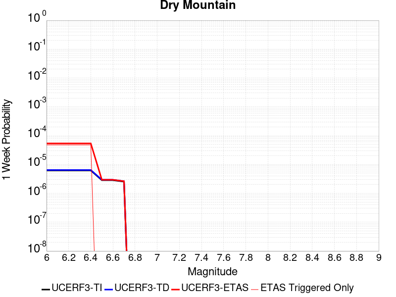 | 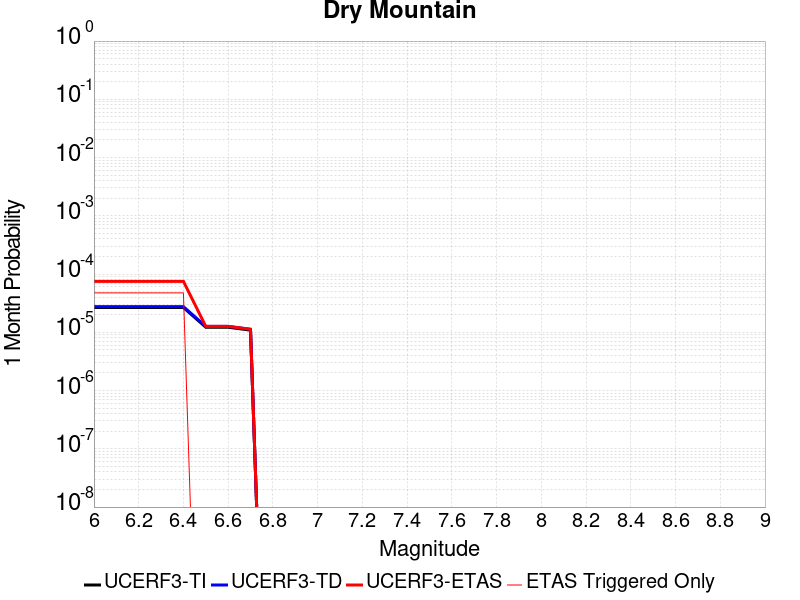 | 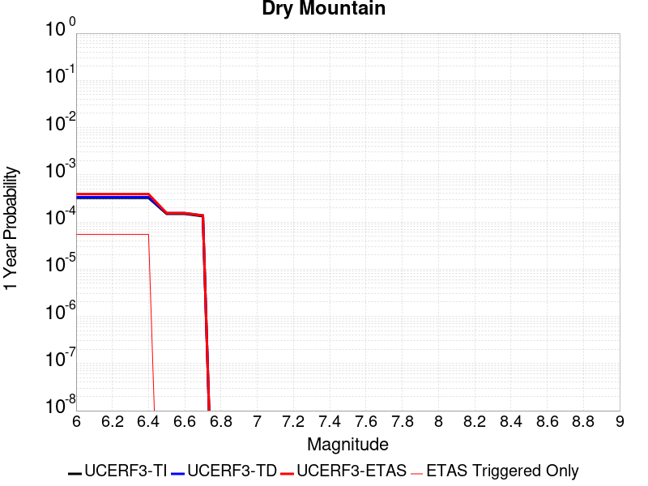 | 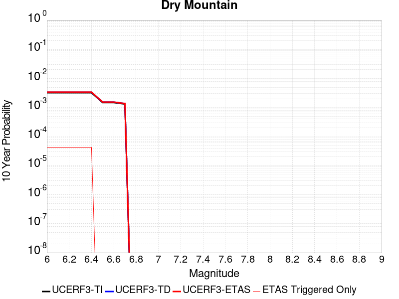 |

| Magnitude | 1 wk TI Prob | 1 wk TD Prob | 1 wk ETAS Prob | 1 wk ETAS/TD Gain | 1 wk ETAS Triggered Only | 1 mo TI Prob | 1 mo TD Prob | 1 mo ETAS Prob | 1 mo ETAS/TD Gain | 1 mo ETAS Triggered Only | 1 yr TI Prob | 1 yr TD Prob | 1 yr ETAS Prob | 1 yr ETAS/TD Gain | 1 yr ETAS Triggered Only | 10 yr TI Prob | 10 yr TD Prob | 10 yr ETAS Prob | 10 yr ETAS/TD Gain | 10 yr ETAS Triggered Only |
|-----|-----|-----|-----|-----|-----|-----|-----|-----|-----|-----|-----|-----|-----|-----|-----|-----|-----|-----|-----|-----|
| 6.0 | 6.222801E-6 | 6.439381E-6 | 4.8966962E-5 | 7.604296 | 4.2527856E-5 | 2.6668875E-5 | 2.7597147E-5 | 7.012383E-5 | 2.540981 | 4.2527856E-5 | 3.2464517E-4 | 3.3595937E-4 | 3.7847293E-4 | 1.1265438 | 4.2527856E-5 | 0.0032417132 | 0.0033560768 | 0.003398462 | 1.0126294 | 4.2527856E-5 |
| 6.1 | 6.222801E-6 | 6.439381E-6 | 4.8966962E-5 | 7.604296 | 4.2527856E-5 | 2.6668875E-5 | 2.7597147E-5 | 7.012383E-5 | 2.540981 | 4.2527856E-5 | 3.2464517E-4 | 3.3595937E-4 | 3.7847293E-4 | 1.1265438 | 4.2527856E-5 | 0.0032417132 | 0.0033560768 | 0.003398462 | 1.0126294 | 4.2527856E-5 |
| 6.2 | 6.222801E-6 | 6.439381E-6 | 4.8966962E-5 | 7.604296 | 4.2527856E-5 | 2.6668875E-5 | 2.7597147E-5 | 7.012383E-5 | 2.540981 | 4.2527856E-5 | 3.2464517E-4 | 3.3595937E-4 | 3.7847293E-4 | 1.1265438 | 4.2527856E-5 | 0.0032417132 | 0.0033560768 | 0.003398462 | 1.0126294 | 4.2527856E-5 |
| 6.3 | 6.222801E-6 | 6.439381E-6 | 4.8966962E-5 | 7.604296 | 4.2527856E-5 | 2.6668875E-5 | 2.7597147E-5 | 7.012383E-5 | 2.540981 | 4.2527856E-5 | 3.2464517E-4 | 3.3595937E-4 | 3.7847293E-4 | 1.1265438 | 4.2527856E-5 | 0.0032417132 | 0.0033560768 | 0.003398462 | 1.0126294 | 4.2527856E-5 |
| 6.4 | 6.222801E-6 | 6.439381E-6 | 4.8966962E-5 | 7.604296 | 4.2527856E-5 | 2.6668875E-5 | 2.7597147E-5 | 7.012383E-5 | 2.540981 | 4.2527856E-5 | 3.2464517E-4 | 3.3595937E-4 | 3.7847293E-4 | 1.1265438 | 4.2527856E-5 | 0.0032417132 | 0.0033560768 | 0.003398462 | 1.0126294 | 4.2527856E-5 |
| 6.5 | 2.8528623E-6 | 2.9521684E-6 | 2.9521684E-6 | 1.0 | 0.0 | 1.22264955E-5 | 1.2652138E-5 | 1.2652138E-5 | 1.0 | 0.0 | 1.4884741E-4 | 1.540376E-4 | 1.540376E-4 | 1.0 | 0.0 | 0.0014874774 | 0.0015401616 | 0.0015401616 | 1.0 | 0.0 |
| 6.6 | 2.8528623E-6 | 2.9521684E-6 | 2.9521684E-6 | 1.0 | 0.0 | 1.22264955E-5 | 1.2652138E-5 | 1.2652138E-5 | 1.0 | 0.0 | 1.4884741E-4 | 1.540376E-4 | 1.540376E-4 | 1.0 | 0.0 | 0.0014874774 | 0.0015401616 | 0.0015401616 | 1.0 | 0.0 |
| 6.7 | 2.541E-6 | 2.6293578E-6 | 2.6293578E-6 | 1.0 | 0.0 | 1.0889954E-5 | 1.1268677E-5 | 1.1268677E-5 | 1.0 | 0.0 | 1.3257713E-4 | 1.3719614E-4 | 1.3719614E-4 | 1.0 | 0.0 | 0.0013249806 | 0.0013719613 | 0.0013719613 | 1.0 | 0.0 |

