# Parent Section Magnitude-Probability Distributions

Only fault sections with at least one triggered aftershock are plotted. Sections are sorted by total supraseismogenic trigger rate (decreasing)

## Table Of Contents

* [Garlock (Central)](#garlock-central)
* [Tank Canyon](#tank-canyon)
* [Little Lake](#little-lake)
* [Airport Lake](#airport-lake)
* [Owl Lake](#owl-lake)
* [Panamint Valley](#panamint-valley)
* [Garlock (East)](#garlock-east)
* [Hunter Mountain-Saline Valley](#hunter-mountain-saline-valley)
* [Blackwater](#blackwater)
* [Garlock (West)](#garlock-west)
* [Ash Hill](#ash-hill)
* [Gravel Hills-Harper Lk](#gravel-hills-harper-lk)
* [McLean Lake](#mclean-lake)
* [Goldstone Lake](#goldstone-lake)
* [San Andreas (Mojave N)](#san-andreas-mojave-n)
* [Coyote Canyon](#coyote-canyon)
* [San Andreas (Mojave S)](#san-andreas-mojave-s)
* [Nelson Lake](#nelson-lake)
* [So Sierra Nevada](#so-sierra-nevada)
* [Death Valley (So)](#death-valley-so)
* [Towne Pass](#towne-pass)
* [San Andreas (San Bernardino N)](#san-andreas-san-bernardino-n)
* [Lenwood-Lockhart-Old Woman Springs](#lenwood-lockhart-old-woman-springs)
* [Bicycle Lake](#bicycle-lake)
* [Garlic Springs](#garlic-springs)
* [Paradise](#paradise)
* [San Andreas (San Bernardino S)](#san-andreas-san-bernardino-s)
* [Helendale-So Lockhart](#helendale-so-lockhart)
* [Death Valley (Black Mtns Frontal)](#death-valley-black-mtns-frontal)
* [Coyote Lake](#coyote-lake)
* [Death Valley (No)](#death-valley-no)
* [San Andreas (Big Bend)](#san-andreas-big-bend)
* [Manix-Afton Hills](#manix-afton-hills)
* [Death Valley (Fish Lake Valley)](#death-valley-fish-lake-valley)
* [Ludlow](#ludlow)
* [San Andreas (Cholame) rev](#san-andreas-cholame-rev)
* [Elsinore (Glen Ivy) rev](#elsinore-glen-ivy-rev)
* [Red Pass](#red-pass)
* [San Andreas (San Gorgonio Pass-Garnet HIll)](#san-andreas-san-gorgonio-pass-garnet-hill)
* [San Andreas (Parkfield)](#san-andreas-parkfield)
* [Big Pine (Central)](#big-pine-central)
* [San Andreas (Carrizo) rev](#san-andreas-carrizo-rev)
* [Baker](#baker)
* [San Andreas (Creeping Section) 2011 CFM](#san-andreas-creeping-section-2011-cfm)
* [San Jacinto (San Bernardino)](#san-jacinto-san-bernardino)
* [Cady](#cady)
* [Scodie Lineament](#scodie-lineament)
* [Cleghorn Pass](#cleghorn-pass)
* [Cleghorn Lake](#cleghorn-lake)
* [San Clemente](#san-clemente)
* [Lake Isabella (Seismicity)](#lake-isabella-seismicity)
* [Channel Islands Thrust](#channel-islands-thrust)
* [Santa Cruz Island](#santa-cruz-island)
* [Mission Creek](#mission-creek)
* [Santa Cruz Catalina Ridge alt1](#santa-cruz-catalina-ridge-alt1)
* [North Frontal  (East)](#north-frontal--east)
* [Rinconada 2011 CFM](#rinconada-2011-cfm)
* [Pine Mtn](#pine-mtn)
* [Cucamonga](#cucamonga)
* [San Jacinto (Stepovers Combined)](#san-jacinto-stepovers-combined)
* [Rose Canyon](#rose-canyon)
* [San Jacinto (Lytle Creek connector)](#san-jacinto-lytle-creek-connector)
* [Kern Canyon (Lake Isabella) 2011](#kern-canyon-lake-isabella-2011)
* [Imperial](#imperial)
* [San Jacinto (San Jacinto Valley) rev](#san-jacinto-san-jacinto-valley-rev)
* [San Andreas (Coachella) rev](#san-andreas-coachella-rev)
* [Tin Mountain](#tin-mountain)
* [Calico-Hidalgo](#calico-hidalgo)
* [Big Pine (East)](#big-pine-east)
* [Bullion Mountains](#bullion-mountains)
* [Camp Rock 2011](#camp-rock-2011)
* [Pleito](#pleito)
* [North Frontal  (West)](#north-frontal--west)
* [Brawley (Seismic Zone) alt 1](#brawley-seismic-zone-alt-1)
* [Cleghorn](#cleghorn)
* [Santa Ynez (East)](#santa-ynez-east)
* [Santa Rosa Island](#santa-rosa-island)
* [Mono Lake 2011 CFM](#mono-lake-2011-cfm)
* [Elysian Park (Upper)](#elysian-park-upper)
* [Hector Mine](#hector-mine)
* [Sierra Madre](#sierra-madre)
* [Homestead Valley 2011](#homestead-valley-2011)
* [San Jacinto (Coyote Creek)](#san-jacinto-coyote-creek)
* [Anaheim](#anaheim)
* [Deep Springs](#deep-springs)
* [Monterey Bay-Tularcitos](#monterey-bay-tularcitos)
* [Raymond](#raymond)
* [West Napa 2011 CFM](#west-napa-2011-cfm)
* [San Jacinto (Borrego)](#san-jacinto-borrego)
* [White Mountains](#white-mountains)
* [Sheephole](#sheephole)
* [Owens Valley](#owens-valley)
* [Eaton Roughs 2011 CFM](#eaton-roughs-2011-cfm)
* [San Juan](#san-juan)
* [Emerson-Copper Mtn 2011](#emerson-copper-mtn-2011)
* [Santa Ynez River](#santa-ynez-river)
* [Calaveras (So) - Paicines extension 2011 CFM](#calaveras-so---paicines-extension-2011-cfm)
* [San Andreas (Santa Cruz Mts) 2011 CFM](#san-andreas-santa-cruz-mts-2011-cfm)
* [Santa Susana East (connector)](#santa-susana-east-connector)
* [Pinto Mtn](#pinto-mtn)
* [Independence rev 2011](#independence-rev-2011)
* [Coronado Bank alt1](#coronado-bank-alt1)
* [Sierra Nevada  (No Extension)](#sierra-nevada--no-extension)
* [San Gabriel (Extension)](#san-gabriel-extension)
* [Great Valley 07 (Orestimba)](#great-valley-07-orestimba)
* [San Jacinto (Anza) rev](#san-jacinto-anza-rev)
* [White Wolf (Extension)](#white-wolf-extension)
* [Ortigalita (North)](#ortigalita-north)
* [Lost Hills](#lost-hills)

## Garlock (Central)
*[(top)](#table-of-contents)*

| 1 Week | 1 Month | 1 Year | 10 Year |
|-----|-----|-----|-----|
|  | 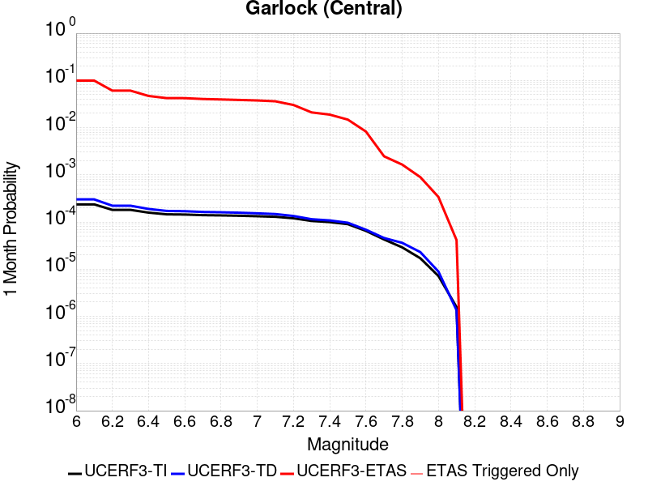 |  |  |

| Magnitude | 1 wk TI Prob | 1 wk TD Prob | 1 wk ETAS Prob | 1 wk ETAS/TD Gain | 1 wk ETAS Triggered Only | 1 mo TI Prob | 1 mo TD Prob | 1 mo ETAS Prob | 1 mo ETAS/TD Gain | 1 mo ETAS Triggered Only | 1 yr TI Prob | 1 yr TD Prob | 1 yr ETAS Prob | 1 yr ETAS/TD Gain | 1 yr ETAS Triggered Only | 10 yr TI Prob | 10 yr TD Prob | 10 yr ETAS Prob | 10 yr ETAS/TD Gain | 10 yr ETAS Triggered Only |
|-----|-----|-----|-----|-----|-----|-----|-----|-----|-----|-----|-----|-----|-----|-----|-----|-----|-----|-----|-----|-----|
| 6.0 | 5.5131142E-5 | 7.024681E-5 | 0.075456135 | 1074.1573 | 0.07539118 | 2.3625491E-4 | 3.010234E-4 | 0.095243566 | 316.39923 | 0.094971135 | 0.0028726095 | 0.0036588663 | 0.13112985 | 35.838924 | 0.12793909 | 0.028357591 | 0.036079824 | 0.18876168 | 5.231779 | 0.15839678 |
| 6.1 | 5.5131142E-5 | 7.024681E-5 | 0.075456135 | 1074.1573 | 0.07539118 | 2.3625491E-4 | 3.010234E-4 | 0.095243566 | 316.39923 | 0.094971135 | 0.0028726095 | 0.0036588663 | 0.13112985 | 35.838924 | 0.12793909 | 0.028357591 | 0.036079824 | 0.18876168 | 5.231779 | 0.15839678 |
| 6.2 | 4.216245E-5 | 5.1661493E-5 | 0.048664328 | 941.98456 | 0.04861518 | 1.806837E-4 | 2.2138779E-4 | 0.061374277 | 277.22522 | 0.061166428 | 0.0021976046 | 0.0026920962 | 0.0837218 | 31.09911 | 0.08124843 | 0.021759989 | 0.026689773 | 0.12572293 | 4.710528 | 0.10174881 |
| 6.3 | 4.216245E-5 | 5.1661493E-5 | 0.048664328 | 941.98456 | 0.04861518 | 1.806837E-4 | 2.2138779E-4 | 0.061374277 | 277.22522 | 0.061166428 | 0.0021976046 | 0.0026920962 | 0.0837218 | 31.09911 | 0.08124843 | 0.021759989 | 0.026689773 | 0.12572293 | 4.710528 | 0.10174881 |
| 6.4 | 3.6858168E-5 | 4.411054E-5 | 0.036524802 | 828.02893 | 0.036482304 | 1.5795401E-4 | 1.8903162E-4 | 0.046117928 | 243.96938 | 0.04593758 | 0.0019213937 | 0.002299056 | 0.06382576 | 27.761724 | 0.061668478 | 0.019048655 | 0.02284894 | 0.09839807 | 4.306461 | 0.0773157 |
| 6.5 | 3.39199E-5 | 4.0018083E-5 | 0.03300665 | 824.7934 | 0.03296795 | 1.453629E-4 | 1.7149492E-4 | 0.041834503 | 243.94019 | 0.041670155 | 0.0017683565 | 0.002085973 | 0.05769728 | 27.659649 | 0.055727553 | 0.017543508 | 0.020759864 | 0.08925997 | 4.299641 | 0.0699523 |
| 6.6 | 3.3571985E-5 | 3.9472274E-5 | 0.033006124 | 836.18506 | 0.03296795 | 1.4387199E-4 | 1.6915603E-4 | 0.0417486 | 246.80527 | 0.041586477 | 0.0017502342 | 0.0020575512 | 0.057586942 | 27.988096 | 0.05564388 | 0.017365133 | 0.020481179 | 0.088836856 | 4.337487 | 0.069784954 |
| 6.7 | 3.2580007E-5 | 3.8088703E-5 | 0.03141502 | 824.7858 | 0.031378128 | 1.3962112E-4 | 1.632272E-4 | 0.039735045 | 243.43396 | 0.039578278 | 0.0016985617 | 0.0019855013 | 0.055013634 | 27.70768 | 0.05313363 | 0.016856372 | 0.019773813 | 0.084980056 | 4.297606 | 0.06652163 |
| 6.8 | 3.2185937E-5 | 3.7515918E-5 | 0.030494075 | 812.83026 | 0.030457702 | 1.3793244E-4 | 1.6077272E-4 | 0.03864509 | 240.37093 | 0.038490504 | 0.0016780337 | 0.001955672 | 0.053649206 | 27.43262 | 0.05179483 | 0.016654192 | 0.019480614 | 0.083065465 | 4.264006 | 0.06484813 |
| 6.9 | 3.165394E-5 | 3.6720503E-5 | 0.029572913 | 805.3515 | 0.029537277 | 1.3565269E-4 | 1.5736422E-4 | 0.037637867 | 239.17679 | 0.037486404 | 0.0016503202 | 0.001914247 | 0.052357204 | 27.35133 | 0.050539702 | 0.01638118 | 0.019073246 | 0.08137125 | 4.2662506 | 0.06350933 |
| 7.0 | 3.0903822E-5 | 3.5625766E-5 | 0.02865146 | 804.2342 | 0.028616853 | 1.3243823E-4 | 1.5267303E-4 | 0.036629405 | 239.9206 | 0.036482304 | 0.0016112428 | 0.0018572307 | 0.050883237 | 27.397371 | 0.04911723 | 0.015996104 | 0.018512413 | 0.07928564 | 4.2828364 | 0.061919503 |
| 7.1 | 3.0069863E-5 | 3.4392073E-5 | 0.027562523 | 801.42084 | 0.027529078 | 1.2886449E-4 | 1.4738638E-4 | 0.034951057 | 237.13899 | 0.034808803 | 0.0015677959 | 0.0017929734 | 0.04839991 | 26.994217 | 0.046690654 | 0.01556781 | 0.017880075 | 0.07598055 | 4.2494535 | 0.05915823 |
| 7.2 | 2.7957109E-5 | 3.128145E-5 | 0.023543222 | 752.6256 | 0.023512676 | 1.1981068E-4 | 1.340566E-4 | 0.03000203 | 223.80122 | 0.029871978 | 0.0014577188 | 0.0016309366 | 0.041061126 | 25.176409 | 0.039494604 | 0.014481937 | 0.016283695 | 0.06534193 | 4.012721 | 0.049870305 |
| 7.3 | 2.4519275E-5 | 2.6714795E-5 | 0.017179633 | 643.0756 | 0.017153377 | 1.0507837E-4 | 1.1448703E-4 | 0.021616502 | 188.81178 | 0.021504477 | 0.0012785783 | 0.001393003 | 0.03005355 | 21.574648 | 0.028700527 | 0.012712469 | 0.013928054 | 0.048994623 | 3.5176935 | 0.03556188 |
| 7.4 | 2.3225532E-5 | 2.51994E-5 | 0.015672032 | 621.92084 | 0.015647227 | 9.95342E-5 | 1.0799304E-4 | 0.019602165 | 181.51321 | 0.019496277 | 0.0012111551 | 0.0013140367 | 0.027302768 | 20.777782 | 0.026022928 | 0.012045753 | 0.013145725 | 0.04468939 | 3.3995378 | 0.03196385 |
| 7.5 | 2.097765E-5 | 2.2483688E-5 | 0.012322433 | 548.06104 | 0.012300226 | 8.9901114E-5 | 9.635517E-5 | 0.015825741 | 164.24382 | 0.0157309 | 0.0010939965 | 0.0011725046 | 0.021983152 | 18.748882 | 0.020835077 | 0.010886264 | 0.011740365 | 0.03737508 | 3.1834683 | 0.025939252 |
| 7.6 | 1.511254E-5 | 1.5991332E-5 | 0.0074629476 | 466.68704 | 0.0074470756 | 6.476642E-5 | 6.853253E-5 | 0.009439491 | 137.73738 | 0.009371601 | 7.882459E-4 | 8.3407195E-4 | 0.012956828 | 15.534426 | 0.012132876 | 0.007854558 | 0.008383559 | 0.023899605 | 2.850771 | 0.015647227 |
| 7.7 | 9.934069E-6 | 1.0678794E-5 | 0.002520902 | 236.0662 | 0.00251025 | 4.2573887E-5 | 4.5765457E-5 | 0.0028905855 | 63.16086 | 0.0028449502 | 5.182138E-4 | 5.570524E-4 | 0.0039858166 | 7.155192 | 0.0034306752 | 0.00517007 | 0.005627684 | 0.0102871135 | 1.8279481 | 0.0046858005 |
| 7.8 | 6.7562896E-6 | 8.428449E-6 | 0.0015982402 | 189.62447 | 0.0015898251 | 2.8955206E-5 | 3.6121426E-5 | 0.001960577 | 54.2774 | 0.0019245251 | 3.5247262E-4 | 4.3968976E-4 | 0.002865198 | 6.5164084 | 0.0024265752 | 0.0035191406 | 0.004446654 | 0.0076954686 | 1.7306199 | 0.0032633252 |
| 7.9 | 3.975453E-6 | 5.37103E-6 | 8.421166E-4 | 156.78865 | 8.367501E-4 | 1.7037546E-5 | 2.3018498E-5 | 9.434224E-4 | 40.9854 | 9.2042505E-4 | 2.0741238E-4 | 2.8021427E-4 | 0.0015349877 | 5.4779067 | 0.001255125 | 0.002072189 | 0.0028336283 | 0.004418948 | 1.5594665 | 0.0015898251 |
| 8.0 | 1.6729537E-6 | 2.0775144E-6 | 8.575235E-5 | 41.276417 | 8.3675004E-5 | 7.169782E-6 | 8.903603E-6 | 1.7625213E-4 | 19.795595 | 1.6735001E-4 | 8.7288594E-5 | 1.0839601E-4 | 2.7572789E-4 | 2.5437088 | 1.6735001E-4 | 8.7254314E-4 | 0.0010969337 | 0.0012641002 | 1.1523943 | 1.6735001E-4 |
| 8.1 | 3.6733252E-7 | 3.1489964E-7 | 8.398988E-5 | 266.7195 | 8.3675004E-5 | 1.5742813E-6 | 1.3495693E-6 | 8.502446E-5 | 63.001183 | 8.3675004E-5 | 1.9166706E-5 | 1.6430899E-5 | 1.0010453E-4 | 6.0924563 | 8.3675004E-5 | 1.9165053E-4 | 1.6638759E-4 | 2.5004867E-4 | 1.5028085 | 8.3675004E-5 |

## Tank Canyon
*[(top)](#table-of-contents)*

| 1 Week | 1 Month | 1 Year | 10 Year |
|-----|-----|-----|-----|
| 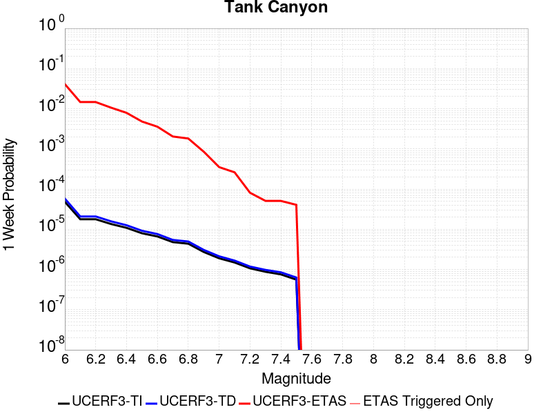 |  | 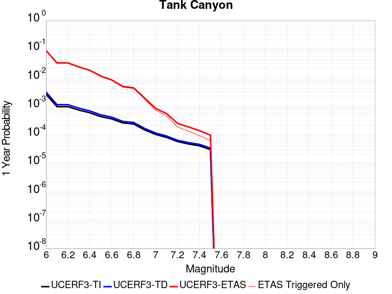 |  |

| Magnitude | 1 wk TI Prob | 1 wk TD Prob | 1 wk ETAS Prob | 1 wk ETAS/TD Gain | 1 wk ETAS Triggered Only | 1 mo TI Prob | 1 mo TD Prob | 1 mo ETAS Prob | 1 mo ETAS/TD Gain | 1 mo ETAS Triggered Only | 1 yr TI Prob | 1 yr TD Prob | 1 yr ETAS Prob | 1 yr ETAS/TD Gain | 1 yr ETAS Triggered Only | 10 yr TI Prob | 10 yr TD Prob | 10 yr ETAS Prob | 10 yr ETAS/TD Gain | 10 yr ETAS Triggered Only |
|-----|-----|-----|-----|-----|-----|-----|-----|-----|-----|-----|-----|-----|-----|-----|-----|-----|-----|-----|-----|-----|
| 6.0 | 4.8284557E-5 | 5.7964822E-5 | 0.04038698 | 696.7498 | 0.040331353 | 2.0691741E-4 | 2.4840087E-4 | 0.053452484 | 215.18639 | 0.053217303 | 0.0025163088 | 0.0030207601 | 0.083606645 | 27.677353 | 0.08083005 | 0.02488006 | 0.029863637 | 0.13620442 | 4.5608783 | 0.10961426 |
| 6.1 | 1.7796336E-5 | 2.0873314E-5 | 0.0134922685 | 646.38837 | 0.013471676 | 7.626778E-5 | 8.945422E-5 | 0.018579977 | 207.70375 | 0.018492177 | 9.281647E-4 | 0.0010885983 | 0.030008635 | 27.566307 | 0.028951552 | 0.009242975 | 0.010836744 | 0.051310413 | 4.734855 | 0.04091708 |
| 6.2 | 1.7796336E-5 | 2.0873314E-5 | 0.0134922685 | 646.38837 | 0.013471676 | 7.626778E-5 | 8.945422E-5 | 0.018579977 | 207.70375 | 0.018492177 | 9.281647E-4 | 0.0010885983 | 0.030008635 | 27.566307 | 0.028951552 | 0.009242975 | 0.010836744 | 0.051310413 | 4.734855 | 0.04091708 |
| 6.3 | 1.3515912E-5 | 1.5759564E-5 | 0.008717823 | 553.17664 | 0.008702201 | 5.792405E-5 | 6.753938E-5 | 0.012366935 | 183.10703 | 0.012300226 | 7.049971E-4 | 8.2200574E-4 | 0.021305531 | 25.918957 | 0.020500377 | 0.007027647 | 0.0081922645 | 0.038068492 | 4.6468825 | 0.030123003 |
| 6.4 | 1.0870146E-5 | 1.2618021E-5 | 0.0062044905 | 491.7166 | 0.0061919503 | 4.658551E-5 | 5.4076212E-5 | 0.008755806 | 161.91605 | 0.008702201 | 5.67031E-4 | 6.581969E-4 | 0.014957205 | 22.724514 | 0.0143084265 | 0.005655863 | 0.0065644905 | 0.028094053 | 4.2797003 | 0.021671826 |
| 6.5 | 7.964826E-6 | 9.196094E-6 | 0.0040255594 | 437.74667 | 0.0040164003 | 3.4134522E-5 | 3.9411298E-5 | 0.0054780724 | 138.99751 | 0.0054388754 | 4.1550855E-4 | 4.7973756E-4 | 0.0095123025 | 19.828138 | 0.0090369005 | 0.0041473247 | 0.004788321 | 0.01836204 | 3.8347552 | 0.013639026 |
| 6.6 | 6.6317E-6 | 7.6122988E-6 | 0.0032709127 | 429.6879 | 0.0032633252 | 2.8421264E-5 | 3.2623782E-5 | 0.004132565 | 126.6734 | 0.0041000755 | 3.4597394E-4 | 3.9713128E-4 | 0.0070048315 | 17.63858 | 0.0066103255 | 0.0034543579 | 0.003965368 | 0.014383269 | 3.6272216 | 0.010459376 |
| 6.7 | 4.793663E-6 | 5.4307857E-6 | 0.0016789219 | 309.149 | 0.0016735002 | 2.0544108E-5 | 2.3274613E-5 | 0.002031428 | 87.28085 | 0.0020082002 | 2.500958E-4 | 2.8333595E-4 | 0.0034620853 | 12.219012 | 0.0031796503 | 0.0024981452 | 0.0028304397 | 0.008003606 | 2.8276901 | 0.0051878504 |
| 6.8 | 4.382823E-6 | 4.9692567E-6 | 0.0015111119 | 304.09213 | 0.0015061501 | 1.8783392E-5 | 2.1296666E-5 | 0.0017784344 | 83.507645 | 0.0017571751 | 2.286638E-4 | 2.5926033E-4 | 0.0031871262 | 12.293151 | 0.0029286253 | 0.0022842865 | 0.002590253 | 0.0074308324 | 2.868767 | 0.0048531503 |
| 6.9 | 2.729601E-6 | 3.0735416E-6 | 6.7247153E-4 | 218.79369 | 6.6940003E-4 | 1.1698237E-5 | 1.3172262E-5 | 8.499113E-4 | 64.522804 | 8.367501E-4 | 1.4241673E-4 | 1.6036171E-4 | 0.0014989472 | 9.347288 | 0.0013388001 | 0.001423255 | 0.0016026258 | 0.003941771 | 2.4595704 | 0.0023429003 |
| 7.0 | 1.8987357E-6 | 2.126939E-6 | 8.580177E-5 | 40.340492 | 8.3675004E-5 | 8.137413E-6 | 9.115425E-6 | 9.278967E-5 | 10.179412 | 8.3675004E-5 | 9.90685E-5 | 1.1097535E-4 | 4.4563823E-4 | 4.0156507 | 3.3470002E-4 | 9.902435E-4 | 0.0011092679 | 0.0018615077 | 1.6781406 | 7.5307506E-4 |
| 7.1 | 1.4928986E-6 | 1.6641272E-6 | 1.6641272E-6 | 1.0 | 0.0 | 6.398121E-6 | 7.1319573E-6 | 7.1319573E-6 | 1.0 | 0.0 | 7.789434E-5 | 8.682871E-5 | 3.3783194E-4 | 3.890786 | 2.5102502E-4 | 7.786704E-4 | 8.6800574E-4 | 0.0014532224 | 1.6742083 | 5.8572507E-4 |
| 7.2 | 1.069082E-6 | 1.1828573E-6 | 1.1828573E-6 | 1.0 | 0.0 | 4.581772E-6 | 5.0693816E-6 | 5.0693816E-6 | 1.0 | 0.0 | 5.5781646E-5 | 6.171851E-5 | 2.2905819E-4 | 3.7113373 | 1.6735001E-4 | 5.576765E-4 | 6.170659E-4 | 8.67936E-4 | 1.4065533 | 2.5102502E-4 |
| 7.3 | 8.776551E-7 | 9.770005E-7 | 9.770005E-7 | 1.0 | 0.0 | 3.7613736E-6 | 4.1871413E-6 | 4.1871413E-6 | 1.0 | 0.0 | 4.579376E-5 | 5.097777E-5 | 1.3464851E-4 | 2.641318 | 8.3675004E-5 | 4.5784327E-4 | 5.097118E-4 | 5.9334416E-4 | 1.1640778 | 8.3675004E-5 |
| 7.4 | 7.55721E-7 | 8.510244E-7 | 8.510244E-7 | 1.0 | 0.0 | 3.2388E-6 | 3.6472454E-6 | 3.6472454E-6 | 1.0 | 0.0 | 3.9431678E-5 | 4.4404827E-5 | 1.2807612E-4 | 2.8842838 | 8.3675004E-5 | 3.942468E-4 | 4.440104E-4 | 5.2764826E-4 | 1.1883692 | 8.3675004E-5 |
| 7.5 | 5.587665E-7 | 6.305619E-7 | 6.305619E-7 | 1.0 | 0.0 | 2.3947114E-6 | 2.702408E-6 | 2.702408E-6 | 1.0 | 0.0 | 2.915522E-5 | 3.290182E-5 | 1.1657407E-4 | 3.543089 | 8.3675004E-5 | 2.9151395E-4 | 3.290182E-4 | 4.1266566E-4 | 1.2542336 | 8.3675004E-5 |

## Little Lake
*[(top)](#table-of-contents)*

| 1 Week | 1 Month | 1 Year | 10 Year |
|-----|-----|-----|-----|
|  |  | 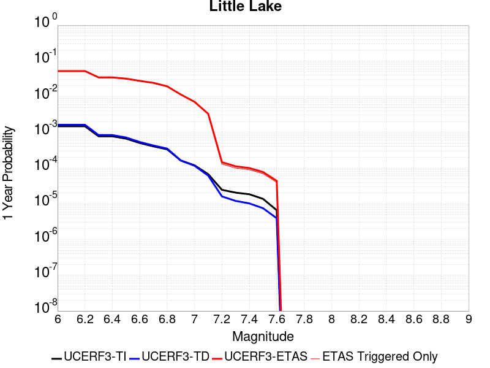 |  |

| Magnitude | 1 wk TI Prob | 1 wk TD Prob | 1 wk ETAS Prob | 1 wk ETAS/TD Gain | 1 wk ETAS Triggered Only | 1 mo TI Prob | 1 mo TD Prob | 1 mo ETAS Prob | 1 mo ETAS/TD Gain | 1 mo ETAS Triggered Only | 1 yr TI Prob | 1 yr TD Prob | 1 yr ETAS Prob | 1 yr ETAS/TD Gain | 1 yr ETAS Triggered Only | 10 yr TI Prob | 10 yr TD Prob | 10 yr ETAS Prob | 10 yr ETAS/TD Gain | 10 yr ETAS Triggered Only |
|-----|-----|-----|-----|-----|-----|-----|-----|-----|-----|-----|-----|-----|-----|-----|-----|-----|-----|-----|-----|-----|
| 6.0 | 2.8424427E-5 | 3.120572E-5 | 0.027810441 | 891.1969 | 0.027780103 | 1.2181328E-4 | 1.337327E-4 | 0.034603223 | 258.74918 | 0.0344741 | 0.0014820677 | 0.0016271127 | 0.049829032 | 30.624205 | 0.048280478 | 0.014722223 | 0.016165402 | 0.0739557 | 4.574938 | 0.058739856 |
| 6.1 | 2.8424427E-5 | 3.120572E-5 | 0.027810441 | 891.1969 | 0.027780103 | 1.2181328E-4 | 1.337327E-4 | 0.034603223 | 258.74918 | 0.0344741 | 0.0014820677 | 0.0016271127 | 0.049829032 | 30.624205 | 0.048280478 | 0.014722223 | 0.016165402 | 0.0739557 | 4.574938 | 0.058739856 |
| 6.2 | 2.8424427E-5 | 3.120572E-5 | 0.027810441 | 891.1969 | 0.027780103 | 1.2181328E-4 | 1.337327E-4 | 0.034603223 | 258.74918 | 0.0344741 | 0.0014820677 | 0.0016271127 | 0.049829032 | 30.624205 | 0.048280478 | 0.014722223 | 0.016165402 | 0.0739557 | 4.574938 | 0.058739856 |
| 6.3 | 1.48860645E-5 | 1.6081389E-5 | 0.020014087 | 1244.5496 | 0.019998327 | 6.379586E-5 | 6.8918576E-5 | 0.024249328 | 351.85474 | 0.024182077 | 7.7643775E-4 | 8.3878887E-4 | 0.03369548 | 40.17159 | 0.032884277 | 0.007737305 | 0.008359048 | 0.047191612 | 5.6455727 | 0.0391599 |
| 6.4 | 1.48860645E-5 | 1.6081389E-5 | 0.020014087 | 1244.5496 | 0.019998327 | 6.379586E-5 | 6.8918576E-5 | 0.024249328 | 351.85474 | 0.024182077 | 7.7643775E-4 | 8.3878887E-4 | 0.03369548 | 40.17159 | 0.032884277 | 0.007737305 | 0.008359048 | 0.047191612 | 5.6455727 | 0.0391599 |
| 6.5 | 1.2797581E-5 | 1.3765565E-5 | 0.018924057 | 1374.7389 | 0.018910551 | 5.4845623E-5 | 5.899409E-5 | 0.023151934 | 392.44498 | 0.023094302 | 6.675408E-4 | 7.18042E-4 | 0.031990025 | 44.551743 | 0.031294454 | 0.006655392 | 0.00715977 | 0.043630097 | 6.0937843 | 0.03673333 |
| 6.6 | 9.661896E-6 | 1.0289038E-5 | 0.016494095 | 1603.0747 | 0.016483976 | 4.1407468E-5 | 4.409522E-5 | 0.02004154 | 454.50592 | 0.019998327 | 5.040193E-4 | 5.367433E-4 | 0.027716523 | 51.63832 | 0.027194377 | 0.005028777 | 0.0053560743 | 0.03681582 | 6.873657 | 0.031629153 |
| 6.7 | 7.767871E-6 | 8.199687E-6 | 0.014483857 | 1766.3916 | 0.014475776 | 3.329045E-5 | 3.5141118E-5 | 0.01785729 | 508.15945 | 0.017822776 | 4.0523586E-4 | 4.2777284E-4 | 0.024683144 | 57.701523 | 0.024265751 | 0.004044977 | 0.004270846 | 0.032598846 | 7.632878 | 0.028449502 |
| 6.8 | 6.4235196E-6 | 6.7357446E-6 | 0.011888507 | 1764.9878 | 0.011881851 | 2.752908E-5 | 2.8867229E-5 | 0.0142532075 | 493.75046 | 0.014224751 | 3.35115E-4 | 3.5141467E-4 | 0.019422611 | 55.269783 | 0.0190779 | 0.003346101 | 0.00350985 | 0.025856044 | 7.3667088 | 0.0224249 |
| 6.9 | 3.1283696E-6 | 3.1121804E-6 | 0.0071154656 | 2286.3281 | 0.0071123755 | 1.3407229E-5 | 1.3337856E-5 | 0.008464401 | 634.61475 | 0.008451176 | 1.6322079E-4 | 1.6237781E-4 | 0.011707653 | 72.10132 | 0.011547151 | 0.0016310095 | 0.00162274 | 0.015323172 | 9.442778 | 0.013722701 |
| 7.0 | 2.290603E-6 | 2.2286815E-6 | 0.004604344 | 2065.9497 | 0.0046021254 | 9.816834E-6 | 9.551463E-6 | 0.0056993975 | 596.7041 | 0.0056899004 | 1.19513395E-4 | 1.162839E-4 | 0.0075624934 | 65.034744 | 0.0074470756 | 0.0011944914 | 0.0011623327 | 0.00977084 | 8.406234 | 0.008618525 |
| 7.1 | 1.293693E-6 | 1.1776827E-6 | 0.0022604002 | 1919.3625 | 0.0022592251 | 5.5443866E-6 | 5.0472063E-6 | 0.0029336577 | 581.2439 | 0.0029286253 | 6.750081E-5 | 6.14487E-5 | 0.0037429228 | 60.911343 | 0.0036817002 | 6.7480316E-4 | 6.143856E-4 | 0.0046283184 | 7.533247 | 0.0040164003 |
| 7.2 | 4.715842E-7 | 3.0917857E-7 | 3.0917857E-7 | 1.0 | 0.0 | 2.0210737E-6 | 1.3250503E-6 | 8.499995E-5 | 64.14846 | 8.3675004E-5 | 2.4606294E-5 | 1.6132375E-5 | 9.980603E-5 | 6.1866918 | 8.3675004E-5 | 2.460357E-4 | 1.6131258E-4 | 2.4497407E-4 | 1.5186298 | 8.3675004E-5 |
| 7.3 | 3.9430947E-7 | 2.3097488E-7 | 2.3097488E-7 | 1.0 | 0.0 | 1.6898966E-6 | 9.89892E-7 | 8.466482E-5 | 85.52935 | 8.3675004E-5 | 2.0574296E-5 | 1.2051869E-5 | 9.572587E-5 | 7.942824 | 8.3675004E-5 | 2.0572392E-4 | 1.20512224E-4 | 2.0417715E-4 | 1.6942443 | 8.3675004E-5 |
| 7.4 | 3.547123E-7 | 1.9679135E-7 | 1.9679135E-7 | 1.0 | 0.0 | 1.5201948E-6 | 8.4339126E-7 | 8.4518324E-5 | 100.21248 | 8.3675004E-5 | 1.8508214E-5 | 1.0268241E-5 | 9.3942384E-5 | 9.148829 | 8.3675004E-5 | 1.8506673E-4 | 1.02677724E-4 | 1.8634414E-4 | 1.8148448 | 8.3675004E-5 |
| 7.5 | 2.6354266E-7 | 1.4423138E-7 | 1.4423138E-7 | 1.0 | 0.0 | 1.129468E-6 | 6.181344E-7 | 6.181344E-7 | 1.0 | 0.0 | 1.3751187E-5 | 7.5257603E-6 | 7.5257603E-6 | 1.0 | 0.0 | 1.3750336E-4 | 7.5255106E-5 | 7.5255106E-5 | 1.0 | 0.0 |
| 7.6 | 1.269913E-7 | 7.572556E-8 | 7.572556E-8 | 1.0 | 0.0 | 5.4424834E-7 | 3.245381E-7 | 3.245381E-7 | 1.0 | 0.0 | 6.6262032E-6 | 3.9512443E-6 | 3.9512443E-6 | 1.0 | 0.0 | 6.626006E-5 | 3.9511775E-5 | 3.9511775E-5 | 1.0 | 0.0 |

## Airport Lake
*[(top)](#table-of-contents)*

| 1 Week | 1 Month | 1 Year | 10 Year |
|-----|-----|-----|-----|
|  |  |  |  |

| Magnitude | 1 wk TI Prob | 1 wk TD Prob | 1 wk ETAS Prob | 1 wk ETAS/TD Gain | 1 wk ETAS Triggered Only | 1 mo TI Prob | 1 mo TD Prob | 1 mo ETAS Prob | 1 mo ETAS/TD Gain | 1 mo ETAS Triggered Only | 1 yr TI Prob | 1 yr TD Prob | 1 yr ETAS Prob | 1 yr ETAS/TD Gain | 1 yr ETAS Triggered Only | 10 yr TI Prob | 10 yr TD Prob | 10 yr ETAS Prob | 10 yr ETAS/TD Gain | 10 yr ETAS Triggered Only |
|-----|-----|-----|-----|-----|-----|-----|-----|-----|-----|-----|-----|-----|-----|-----|-----|-----|-----|-----|-----|-----|
| 6.0 | 1.2387061E-5 | 1.3103157E-5 | 0.025449973 | 1942.278 | 0.025437202 | 5.3086325E-5 | 5.615534E-5 | 0.030679489 | 546.3325 | 0.030625053 | 6.461343E-4 | 6.8350515E-4 | 0.041572616 | 60.82268 | 0.04091708 | 0.0064425888 | 0.0068168393 | 0.05593166 | 8.2049265 | 0.04945193 |
| 6.1 | 1.2387061E-5 | 1.3103157E-5 | 0.025449973 | 1942.278 | 0.025437202 | 5.3086325E-5 | 5.615534E-5 | 0.030679489 | 546.3325 | 0.030625053 | 6.461343E-4 | 6.8350515E-4 | 0.041572616 | 60.82268 | 0.04091708 | 0.0064425888 | 0.0068168393 | 0.05593166 | 8.2049265 | 0.04945193 |
| 6.2 | 1.2387061E-5 | 1.3103157E-5 | 0.025449973 | 1942.278 | 0.025437202 | 5.3086325E-5 | 5.615534E-5 | 0.030679489 | 546.3325 | 0.030625053 | 6.461343E-4 | 6.8350515E-4 | 0.041572616 | 60.82268 | 0.04091708 | 0.0064425888 | 0.0068168393 | 0.05593166 | 8.2049265 | 0.04945193 |
| 6.3 | 1.2387061E-5 | 1.3103157E-5 | 0.025449973 | 1942.278 | 0.025437202 | 5.3086325E-5 | 5.615534E-5 | 0.030679489 | 546.3325 | 0.030625053 | 6.461343E-4 | 6.8350515E-4 | 0.041572616 | 60.82268 | 0.04091708 | 0.0064425888 | 0.0068168393 | 0.05593166 | 8.2049265 | 0.04945193 |
| 6.4 | 1.2387061E-5 | 1.3103157E-5 | 0.025449973 | 1942.278 | 0.025437202 | 5.3086325E-5 | 5.615534E-5 | 0.030679489 | 546.3325 | 0.030625053 | 6.461343E-4 | 6.8350515E-4 | 0.041572616 | 60.82268 | 0.04091708 | 0.0064425888 | 0.0068168393 | 0.05593166 | 8.2049265 | 0.04945193 |
| 6.5 | 6.9922594E-6 | 7.384925E-6 | 0.018834122 | 2550.3472 | 0.018826876 | 2.996648E-5 | 3.1649324E-5 | 0.022288496 | 704.2329 | 0.022257552 | 3.6478083E-4 | 3.8526783E-4 | 0.030413022 | 78.93994 | 0.030039327 | 0.003641826 | 0.0038465366 | 0.03993845 | 10.382963 | 0.03623128 |
| 6.6 | 6.9922594E-6 | 7.384925E-6 | 0.018834122 | 2550.3472 | 0.018826876 | 2.996648E-5 | 3.1649324E-5 | 0.022288496 | 704.2329 | 0.022257552 | 3.6478083E-4 | 3.8526783E-4 | 0.030413022 | 78.93994 | 0.030039327 | 0.003641826 | 0.0038465366 | 0.03993845 | 10.382963 | 0.03623128 |
| 6.7 | 5.477277E-6 | 5.7860684E-6 | 0.01690804 | 2922.1982 | 0.016902352 | 2.3473833E-5 | 2.4797222E-5 | 0.020022627 | 807.45447 | 0.019998327 | 2.8575645E-4 | 3.0186825E-4 | 0.026902488 | 89.119965 | 0.026608652 | 0.0028538927 | 0.003014966 | 0.03488245 | 11.569765 | 0.03196385 |
| 6.8 | 3.9950432E-6 | 4.2190873E-6 | 0.012388067 | 2936.1963 | 0.012383901 | 1.7121502E-5 | 1.8081691E-5 | 0.01457727 | 806.18945 | 0.0145594515 | 2.0843433E-4 | 2.2012512E-4 | 0.01946114 | 88.40945 | 0.019245252 | 0.0020823893 | 0.0021993418 | 0.025493324 | 11.591343 | 0.023345327 |
| 6.9 | 2.95695E-6 | 3.1230243E-6 | 0.008872646 | 2841.043 | 0.008869551 | 1.2672582E-5 | 1.3384334E-5 | 0.01047262 | 782.4536 | 0.010459376 | 1.5427776E-4 | 1.6294434E-4 | 0.014301716 | 87.77056 | 0.014141076 | 0.001541707 | 0.0016284712 | 0.018753914 | 11.516271 | 0.017153377 |
| 7.0 | 1.456072E-6 | 1.540812E-6 | 0.0043526343 | 2824.8965 | 0.0043511004 | 6.2402937E-6 | 6.603469E-6 | 0.005278094 | 799.29114 | 0.0052715256 | 7.597293E-5 | 8.039528E-5 | 0.007108531 | 88.419754 | 0.0070287003 | 7.594696E-4 | 8.0376083E-4 | 0.008913713 | 11.090007 | 0.008116475 |
| 7.1 | 6.995192E-7 | 7.4089746E-7 | 0.0022599644 | 3050.3066 | 0.0022592251 | 2.997936E-6 | 3.1752747E-6 | 0.0028481164 | 896.9669 | 0.0028449502 | 3.649926E-5 | 3.865897E-5 | 0.003636545 | 94.06731 | 0.0035980253 | 3.6493264E-4 | 3.865897E-4 | 0.0043177945 | 11.168934 | 0.003932725 |

## Owl Lake
*[(top)](#table-of-contents)*

| 1 Week | 1 Month | 1 Year | 10 Year |
|-----|-----|-----|-----|
|  |  |  |  |

| Magnitude | 1 wk TI Prob | 1 wk TD Prob | 1 wk ETAS Prob | 1 wk ETAS/TD Gain | 1 wk ETAS Triggered Only | 1 mo TI Prob | 1 mo TD Prob | 1 mo ETAS Prob | 1 mo ETAS/TD Gain | 1 mo ETAS Triggered Only | 1 yr TI Prob | 1 yr TD Prob | 1 yr ETAS Prob | 1 yr ETAS/TD Gain | 1 yr ETAS Triggered Only | 10 yr TI Prob | 10 yr TD Prob | 10 yr ETAS Prob | 10 yr ETAS/TD Gain | 10 yr ETAS Triggered Only |
|-----|-----|-----|-----|-----|-----|-----|-----|-----|-----|-----|-----|-----|-----|-----|-----|-----|-----|-----|-----|-----|
| 6.0 | 5.0320643E-5 | 6.635816E-5 | 0.017553274 | 264.52322 | 0.017488075 | 2.1564208E-4 | 2.843674E-4 | 0.023455754 | 82.48398 | 0.023177978 | 0.0026222812 | 0.0034577388 | 0.03681201 | 10.646267 | 0.03347 | 0.02591553 | 0.034140717 | 0.07665113 | 2.245153 | 0.044013053 |
| 6.1 | 5.0320643E-5 | 6.635816E-5 | 0.017553274 | 264.52322 | 0.017488075 | 2.1564208E-4 | 2.843674E-4 | 0.023455754 | 82.48398 | 0.023177978 | 0.0026222812 | 0.0034577388 | 0.03681201 | 10.646267 | 0.03347 | 0.02591553 | 0.034140717 | 0.07665113 | 2.245153 | 0.044013053 |
| 6.2 | 2.4125871E-5 | 3.0981035E-5 | 0.012079809 | 389.90976 | 0.012049201 | 1.0339249E-4 | 1.3277028E-4 | 0.016279902 | 122.617065 | 0.016149277 | 0.0012580766 | 0.001615439 | 0.025257211 | 15.634891 | 0.023680028 | 0.012509781 | 0.016070465 | 0.047602974 | 2.9621406 | 0.03204753 |
| 6.3 | 1.7433485E-5 | 2.2355514E-5 | 0.01106721 | 495.05502 | 0.011045101 | 7.471279E-5 | 9.580672E-5 | 0.01473753 | 153.82564 | 0.014643126 | 9.0924866E-4 | 0.0011659743 | 0.021976758 | 18.848406 | 0.020835077 | 0.009055373 | 0.011628896 | 0.03925135 | 3.375329 | 0.027947452 |
| 6.4 | 1.7433485E-5 | 2.2355514E-5 | 0.01106721 | 495.05502 | 0.011045101 | 7.471279E-5 | 9.580672E-5 | 0.01473753 | 153.82564 | 0.014643126 | 9.0924866E-4 | 0.0011659743 | 0.021976758 | 18.848406 | 0.020835077 | 0.009055373 | 0.011628896 | 0.03925135 | 3.375329 | 0.027947452 |
| 6.5 | 1.5182742E-5 | 1.9429144E-5 | 0.010896969 | 560.8568 | 0.010877751 | 6.506727E-5 | 8.326596E-5 | 0.014474168 | 173.83057 | 0.014392101 | 7.919061E-4 | 0.0010134429 | 0.020824322 | 20.548096 | 0.019830976 | 0.0078909 | 0.010118429 | 0.036375016 | 3.5949273 | 0.026524978 |
| 6.6 | 6.7271576E-6 | 8.547361E-6 | 0.008794348 | 1028.8962 | 0.0087858755 | 2.8830356E-5 | 3.6631063E-5 | 0.011332343 | 309.3643 | 0.011296126 | 3.5095305E-4 | 4.458976E-4 | 0.015584321 | 34.950447 | 0.015145176 | 0.0035039932 | 0.004467813 | 0.024460092 | 5.4747353 | 0.020082 |
| 6.7 | 6.682835E-6 | 8.479807E-6 | 0.008794281 | 1037.0851 | 0.0087858755 | 2.8640408E-5 | 3.6341557E-5 | 0.0113320565 | 311.8209 | 0.011296126 | 3.4864116E-4 | 4.4237426E-4 | 0.015580851 | 35.22097 | 0.015145176 | 0.003480947 | 0.0044327388 | 0.024425723 | 5.5103 | 0.020082 |
| 6.8 | 6.5774975E-6 | 8.32628E-6 | 0.008710454 | 1046.1399 | 0.008702201 | 2.8188972E-5 | 3.5683603E-5 | 0.011164063 | 312.86252 | 0.011128776 | 3.4314668E-4 | 4.343669E-4 | 0.0154056875 | 35.46699 | 0.014977826 | 0.0034261728 | 0.004352885 | 0.02418085 | 5.555132 | 0.019914651 |
| 6.9 | 6.363419E-6 | 7.999454E-6 | 0.00871013 | 1088.8406 | 0.008702201 | 2.727151E-5 | 3.428296E-5 | 0.011079005 | 323.16364 | 0.011045101 | 3.3198006E-4 | 4.1732067E-4 | 0.0153052565 | 36.67505 | 0.014894151 | 0.0033148455 | 0.0041828766 | 0.023930902 | 5.721159 | 0.019830976 |
| 7.0 | 6.1342453E-6 | 7.6316555E-6 | 0.008542418 | 1119.34 | 0.008534851 | 2.6289357E-5 | 3.2706717E-5 | 0.010910102 | 333.57373 | 0.010877751 | 3.2002592E-4 | 3.9813702E-4 | 0.015119075 | 37.974552 | 0.014726801 | 0.0031956544 | 0.003991571 | 0.023493368 | 5.885745 | 0.01957995 |
| 7.1 | 5.842926E-6 | 7.142211E-6 | 0.008039885 | 1125.6858 | 0.008032801 | 2.504087E-5 | 3.0609146E-5 | 0.01032232 | 337.2299 | 0.010292026 | 3.0482994E-4 | 3.7260808E-4 | 0.014424771 | 38.712986 | 0.014057401 | 0.0030441214 | 0.0037370329 | 0.022493552 | 6.019094 | 0.018826876 |
| 7.2 | 4.77173E-6 | 5.358483E-6 | 0.005193181 | 969.1513 | 0.0051878504 | 2.045011E-5 | 2.2964748E-5 | 0.0068004844 | 296.1271 | 0.0067776754 | 2.4895166E-4 | 2.79564E-4 | 0.00939759 | 33.615166 | 0.009120576 | 0.0024867293 | 0.002808645 | 0.015074324 | 5.367116 | 0.012300226 |
| 7.3 | 3.0494948E-6 | 2.710463E-6 | 0.001341507 | 494.93646 | 0.0013388001 | 1.3069198E-5 | 1.1616219E-5 | 0.0016850969 | 145.06415 | 0.0016735002 | 1.5910587E-4 | 1.4141845E-4 | 0.00281864 | 19.931204 | 0.0026776001 | 0.0015899199 | 0.0014232415 | 0.00493259 | 3.4657435 | 0.0035143502 |
| 7.4 | 2.7263884E-6 | 2.3056762E-6 | 0.0010064035 | 436.48947 | 0.0010041001 | 1.1684469E-5 | 9.881433E-6 | 0.0012649941 | 128.01727 | 0.001255125 | 1.4224913E-4 | 1.20299905E-4 | 0.0021282586 | 17.691273 | 0.0020082002 | 0.0014215811 | 0.0012112238 | 0.003885581 | 3.2079792 | 0.0026776001 |
| 7.5 | 2.6090431E-6 | 2.1656133E-6 | 8.3891384E-4 | 387.37936 | 8.367501E-4 | 1.1181565E-5 | 9.281167E-6 | 0.001013372 | 109.18583 | 0.0010041001 | 1.3612706E-4 | 1.1299244E-4 | 0.0017026379 | 15.0686 | 0.0015898251 | 0.001360437 | 0.0011379806 | 0.003394635 | 2.983034 | 0.0022592251 |
| 7.6 | 2.3008756E-6 | 1.8727933E-6 | 5.8759673E-4 | 313.75418 | 5.8572507E-4 | 9.860858E-6 | 8.0262325E-6 | 6.7742093E-4 | 84.400856 | 6.6940003E-4 | 1.20049335E-4 | 9.7715085E-5 | 0.0011853839 | 12.131022 | 0.0010877751 | 0.001199845 | 9.849932E-4 | 0.0025732524 | 2.612457 | 0.0015898251 |
| 7.7 | 1.7184348E-6 | 1.3419171E-6 | 2.523666E-4 | 188.06422 | 2.5102502E-4 | 7.3646997E-6 | 5.7510606E-6 | 2.5677463E-4 | 44.64822 | 2.5102502E-4 | 8.966153E-5 | 7.0016955E-5 | 3.210244E-4 | 4.5849524 | 2.5102502E-4 | 8.962536E-4 | 7.078345E-4 | 0.0012931449 | 1.826903 | 5.8572507E-4 |
| 7.8 | 8.4612907E-7 | 8.4058576E-7 | 8.451552E-5 | 100.5436 | 8.3675004E-5 | 3.6262625E-6 | 3.6025056E-6 | 8.727721E-5 | 24.226809 | 8.3675004E-5 | 4.4148852E-5 | 4.3859643E-5 | 1.2753098E-4 | 2.9077067 | 8.3675004E-5 | 4.414008E-4 | 4.4398365E-4 | 6.948972E-4 | 1.5651414 | 2.5102502E-4 |
| 7.9 | 2.716738E-7 | 3.768106E-7 | 3.768106E-7 | 1.0 | 0.0 | 1.1643157E-6 | 1.6149015E-6 | 1.6149015E-6 | 1.0 | 0.0 | 1.4175452E-5 | 1.966126E-5 | 1.966126E-5 | 1.0 | 0.0 | 1.4174548E-4 | 1.9836679E-4 | 1.9836679E-4 | 1.0 | 0.0 |
| 8.0 | 2.1995428E-8 | 3.384878E-8 | 3.384878E-8 | 1.0 | 0.0 | 9.426611E-8 | 1.4506621E-7 | 1.4506621E-7 | 1.0 | 0.0 | 1.1476893E-6 | 1.7661803E-6 | 1.7661803E-6 | 1.0 | 0.0 | 1.14768345E-5 | 1.7963059E-5 | 1.7963059E-5 | 1.0 | 0.0 |

## Panamint Valley
*[(top)](#table-of-contents)*

| 1 Week | 1 Month | 1 Year | 10 Year |
|-----|-----|-----|-----|
|  |  |  |  |

| Magnitude | 1 wk TI Prob | 1 wk TD Prob | 1 wk ETAS Prob | 1 wk ETAS/TD Gain | 1 wk ETAS Triggered Only | 1 mo TI Prob | 1 mo TD Prob | 1 mo ETAS Prob | 1 mo ETAS/TD Gain | 1 mo ETAS Triggered Only | 1 yr TI Prob | 1 yr TD Prob | 1 yr ETAS Prob | 1 yr ETAS/TD Gain | 1 yr ETAS Triggered Only | 10 yr TI Prob | 10 yr TD Prob | 10 yr ETAS Prob | 10 yr ETAS/TD Gain | 10 yr ETAS Triggered Only |
|-----|-----|-----|-----|-----|-----|-----|-----|-----|-----|-----|-----|-----|-----|-----|-----|-----|-----|-----|-----|-----|
| 6.0 | 3.0211835E-5 | 3.3984514E-5 | 0.014927629 | 439.24802 | 0.014894151 | 1.2947287E-4 | 1.4563995E-4 | 0.019806402 | 135.99567 | 0.019663626 | 0.0015751923 | 0.0017717537 | 0.030337904 | 17.123093 | 0.028616853 | 0.015640736 | 0.017583137 | 0.055150244 | 3.1365418 | 0.03823948 |
| 6.1 | 3.0211835E-5 | 3.3984514E-5 | 0.014927629 | 439.24802 | 0.014894151 | 1.2947287E-4 | 1.4563995E-4 | 0.019806402 | 135.99567 | 0.019663626 | 0.0015751923 | 0.0017717537 | 0.030337904 | 17.123093 | 0.028616853 | 0.015640736 | 0.017583137 | 0.055150244 | 3.1365418 | 0.03823948 |
| 6.2 | 3.0211835E-5 | 3.3984514E-5 | 0.014927629 | 439.24802 | 0.014894151 | 1.2947287E-4 | 1.4563995E-4 | 0.019806402 | 135.99567 | 0.019663626 | 0.0015751923 | 0.0017717537 | 0.030337904 | 17.123093 | 0.028616853 | 0.015640736 | 0.017583137 | 0.055150244 | 3.1365418 | 0.03823948 |
| 6.3 | 2.8573924E-5 | 3.210268E-5 | 0.014172724 | 441.48105 | 0.014141076 | 1.2245393E-4 | 1.3757581E-4 | 0.018710872 | 136.00407 | 0.01857585 | 0.001489857 | 0.0016737265 | 0.028822588 | 17.220608 | 0.027194377 | 0.01479908 | 0.016617801 | 0.052411564 | 3.153941 | 0.036398627 |
| 6.4 | 2.8573924E-5 | 3.210268E-5 | 0.014172724 | 441.48105 | 0.014141076 | 1.2245393E-4 | 1.3757581E-4 | 0.018710872 | 136.00407 | 0.01857585 | 0.001489857 | 0.0016737265 | 0.028822588 | 17.220608 | 0.027194377 | 0.01479908 | 0.016617801 | 0.052411564 | 3.153941 | 0.036398627 |
| 6.5 | 2.7468774E-5 | 3.0828433E-5 | 0.013836779 | 448.83173 | 0.013806376 | 1.1771801E-4 | 1.3211532E-4 | 0.018036202 | 136.51862 | 0.017906452 | 0.0014322745 | 0.0016073446 | 0.027755525 | 17.267937 | 0.026190277 | 0.014230782 | 0.015963677 | 0.05046382 | 3.1611652 | 0.03505983 |
| 6.6 | 2.6135967E-5 | 2.925248E-5 | 0.01366788 | 467.2383 | 0.013639026 | 1.1200648E-4 | 1.253619E-4 | 0.017694911 | 141.15062 | 0.017571751 | 0.0013628257 | 0.0015252391 | 0.026840096 | 17.597305 | 0.025353527 | 0.013544982 | 0.015154043 | 0.048528876 | 3.2023714 | 0.033888377 |
| 6.7 | 2.4498746E-5 | 2.7341335E-5 | 0.013414976 | 490.6482 | 0.013388001 | 1.04990395E-4 | 1.1717203E-4 | 0.017268538 | 147.37766 | 0.017153377 | 0.0012775084 | 0.0014256609 | 0.025991041 | 18.230871 | 0.024600452 | 0.012701893 | 0.014171274 | 0.046177093 | 3.2584996 | 0.0324659 |
| 6.8 | 2.2244329E-5 | 2.4935423E-5 | 0.012659546 | 507.69324 | 0.012634926 | 9.532935E-5 | 1.0686185E-4 | 0.016170746 | 151.32385 | 0.016065601 | 0.0011600169 | 0.0013002884 | 0.024280995 | 18.673548 | 0.023010626 | 0.011539802 | 0.0129325185 | 0.042748548 | 3.3055081 | 0.030206677 |
| 6.9 | 1.9902658E-5 | 2.2290267E-5 | 0.011652857 | 522.77783 | 0.011630826 | 8.529431E-5 | 9.552632E-5 | 0.014988255 | 156.90182 | 0.014894151 | 0.0010379635 | 0.0011624309 | 0.022056866 | 18.974775 | 0.020918751 | 0.010331288 | 0.011568608 | 0.038448382 | 3.32351 | 0.027194377 |
| 7.0 | 1.8353881E-5 | 2.0566185E-5 | 0.010898094 | 529.90344 | 0.010877751 | 7.865712E-5 | 8.813792E-5 | 0.013976965 | 158.58061 | 0.013890051 | 9.5722964E-4 | 0.0010725686 | 0.02063152 | 19.235617 | 0.01957995 | 0.009531168 | 0.010678849 | 0.035513286 | 3.3255723 | 0.025102502 |
| 7.1 | 1.7667631E-5 | 1.9772613E-5 | 0.010646288 | 538.4361 | 0.010626726 | 7.571623E-5 | 8.473711E-5 | 0.013722608 | 161.9433 | 0.013639026 | 9.2145515E-4 | 0.0010312037 | 0.020340199 | 19.724714 | 0.019328926 | 0.009176437 | 0.010269073 | 0.0346169 | 3.370986 | 0.024600452 |
| 7.2 | 1.6381597E-5 | 1.8158249E-5 | 0.009724283 | 535.5297 | 0.009706301 | 7.020495E-5 | 7.781885E-5 | 0.012460756 | 160.12517 | 0.012383901 | 8.544101E-4 | 9.4704994E-4 | 0.018084181 | 19.095278 | 0.017153377 | 0.008511325 | 0.009434792 | 0.03090215 | 3.2753398 | 0.021671826 |
| 7.3 | 1.4520491E-5 | 1.5966476E-5 | 0.0073792497 | 462.17148 | 0.0073634004 | 6.222919E-5 | 6.842605E-5 | 0.009606724 | 140.3957 | 0.00953895 | 7.57377E-4 | 8.327849E-4 | 0.013958821 | 16.761616 | 0.013136976 | 0.0075480095 | 0.00829975 | 0.024729894 | 2.979595 | 0.016567651 |
| 7.4 | 1.2852287E-5 | 1.4145411E-5 | 0.0071264203 | 503.79733 | 0.0071123755 | 5.5080065E-5 | 6.062187E-5 | 0.0091806445 | 151.44113 | 0.009120576 | 6.7039346E-4 | 7.378371E-4 | 0.013279827 | 17.998318 | 0.012551251 | 0.0066837464 | 0.0073567946 | 0.022888906 | 3.111261 | 0.015647227 |
| 7.5 | 1.1637851E-5 | 1.2836797E-5 | 0.006957773 | 542.0178 | 0.0069450256 | 4.987555E-5 | 5.5013777E-5 | 0.009007747 | 163.7362 | 0.008953226 | 6.070656E-4 | 6.6960254E-4 | 0.0129615925 | 19.357143 | 0.012300226 | 0.006054099 | 0.0066787465 | 0.021889005 | 3.2774122 | 0.015312526 |
| 7.6 | 3.0068115E-6 | 3.3330316E-6 | 0.0034339968 | 1030.2924 | 0.0034306752 | 1.2886271E-5 | 1.4284384E-5 | 0.004281649 | 299.74332 | 0.0042674253 | 1.5687906E-4 | 1.7390578E-4 | 0.005946477 | 34.193672 | 0.0057735755 | 0.0015676835 | 0.0017391363 | 0.009256789 | 5.322636 | 0.0075307507 |

## Garlock (East)
*[(top)](#table-of-contents)*

| 1 Week | 1 Month | 1 Year | 10 Year |
|-----|-----|-----|-----|
|  |  |  |  |

| Magnitude | 1 wk TI Prob | 1 wk TD Prob | 1 wk ETAS Prob | 1 wk ETAS/TD Gain | 1 wk ETAS Triggered Only | 1 mo TI Prob | 1 mo TD Prob | 1 mo ETAS Prob | 1 mo ETAS/TD Gain | 1 mo ETAS Triggered Only | 1 yr TI Prob | 1 yr TD Prob | 1 yr ETAS Prob | 1 yr ETAS/TD Gain | 1 yr ETAS Triggered Only | 10 yr TI Prob | 10 yr TD Prob | 10 yr ETAS Prob | 10 yr ETAS/TD Gain | 10 yr ETAS Triggered Only |
|-----|-----|-----|-----|-----|-----|-----|-----|-----|-----|-----|-----|-----|-----|-----|-----|-----|-----|-----|-----|-----|
| 6.0 | 4.5092507E-5 | 6.290325E-5 | 0.012195016 | 193.86942 | 0.012132876 | 1.9323928E-4 | 2.6956003E-4 | 0.016581789 | 61.51427 | 0.016316626 | 0.0023501497 | 0.0032774 | 0.02612921 | 7.9725423 | 0.02292695 | 0.023254504 | 0.032351844 | 0.061824184 | 1.910994 | 0.030457702 |
| 6.1 | 4.5092507E-5 | 6.290325E-5 | 0.012195016 | 193.86942 | 0.012132876 | 1.9323928E-4 | 2.6956003E-4 | 0.016581789 | 61.51427 | 0.016316626 | 0.0023501497 | 0.0032774 | 0.02612921 | 7.9725423 | 0.02292695 | 0.023254504 | 0.032351844 | 0.061824184 | 1.910994 | 0.030457702 |
| 6.2 | 2.6674514E-5 | 3.4509674E-5 | 0.009656804 | 279.82886 | 0.009622626 | 1.1431433E-4 | 1.4789042E-4 | 0.0126136225 | 85.29034 | 0.012467576 | 0.0013908884 | 0.0017991117 | 0.01842048 | 10.238652 | 0.016651327 | 0.01382215 | 0.017890299 | 0.038927875 | 2.175921 | 0.021420801 |
| 6.3 | 2.6674514E-5 | 3.4509674E-5 | 0.009656804 | 279.82886 | 0.009622626 | 1.1431433E-4 | 1.4789042E-4 | 0.0126136225 | 85.29034 | 0.012467576 | 0.0013908884 | 0.0017991117 | 0.01842048 | 10.238652 | 0.016651327 | 0.01382215 | 0.017890299 | 0.038927875 | 2.175921 | 0.021420801 |
| 6.4 | 2.5312667E-5 | 3.233893E-5 | 0.009570981 | 295.9585 | 0.00953895 | 1.0847834E-4 | 1.3858822E-4 | 0.012520773 | 90.345146 | 0.012383901 | 0.0013199237 | 0.0016860351 | 0.01814222 | 10.760285 | 0.016483976 | 0.013121112 | 0.016778335 | 0.037428375 | 2.2307563 | 0.021002427 |
| 6.5 | 2.5312667E-5 | 3.233893E-5 | 0.009570981 | 295.9585 | 0.00953895 | 1.0847834E-4 | 1.3858822E-4 | 0.012520773 | 90.345146 | 0.012383901 | 0.0013199237 | 0.0016860351 | 0.01814222 | 10.760285 | 0.016483976 | 0.013121112 | 0.016778335 | 0.037428375 | 2.2307563 | 0.021002427 |
| 6.6 | 2.246556E-5 | 2.8133776E-5 | 0.009148452 | 325.17685 | 0.009120576 | 9.627742E-5 | 1.20567885E-4 | 0.011749991 | 97.4554 | 0.011630826 | 0.0011715472 | 0.0014669491 | 0.01700767 | 11.593905 | 0.015563551 | 0.011653901 | 0.01461866 | 0.034242187 | 2.3423615 | 0.019914651 |
| 6.7 | 2.2241198E-5 | 2.7803519E-5 | 0.009148126 | 329.02762 | 0.009120576 | 9.531594E-5 | 1.1915263E-4 | 0.011748592 | 98.601204 | 0.011630826 | 0.0011598538 | 0.0014497414 | 0.016990729 | 11.719834 | 0.015563551 | 0.011538187 | 0.014448853 | 0.03407576 | 2.3583713 | 0.019914651 |
| 6.8 | 1.9528685E-5 | 2.389819E-5 | 0.00897691 | 375.63135 | 0.008953226 | 8.369167E-5 | 1.0241691E-4 | 0.011481052 | 112.10114 | 0.011379801 | 0.0010184698 | 0.0012462323 | 0.016456105 | 13.204685 | 0.015228851 | 0.010138147 | 0.012436427 | 0.031359702 | 2.5216005 | 0.019161576 |
| 6.9 | 1.3318621E-5 | 1.5198884E-5 | 0.008633593 | 568.04126 | 0.008618525 | 5.7078556E-5 | 6.513648E-5 | 0.010942179 | 167.98848 | 0.010877751 | 6.9470983E-4 | 7.927538E-4 | 0.014839011 | 18.718307 | 0.014057401 | 0.0069254204 | 0.007939888 | 0.02528911 | 3.1850715 | 0.017488075 |
| 7.0 | 1.1760853E-5 | 1.31077895E-5 | 0.008547846 | 652.1196 | 0.008534851 | 5.0402683E-5 | 5.6175057E-5 | 0.010765974 | 191.65044 | 0.0107104005 | 6.134799E-4 | 6.8372174E-4 | 0.014564276 | 21.301466 | 0.013890051 | 0.0061178906 | 0.00685652 | 0.024058487 | 3.508848 | 0.017320726 |
| 7.1 | 1.0064758E-5 | 1.0902931E-5 | 0.00854566 | 783.79486 | 0.008534851 | 4.3133965E-5 | 4.672603E-5 | 0.010589284 | 226.62497 | 0.010543051 | 5.2502943E-4 | 5.687444E-4 | 0.013614621 | 23.938032 | 0.013053301 | 0.005237907 | 0.0057129986 | 0.02160362 | 3.7814853 | 0.015981926 |
| 7.2 | 9.768808E-6 | 1.0498807E-5 | 0.008294238 | 790.01715 | 0.008283826 | 4.186565E-5 | 4.499413E-5 | 0.0102528855 | 227.87163 | 0.010208351 | 5.095951E-4 | 5.4766936E-4 | 0.013259305 | 24.21042 | 0.012718601 | 0.0050842804 | 0.0055032647 | 0.02106438 | 3.8276153 | 0.015647227 |
| 7.3 | 9.344516E-6 | 9.944468E-6 | 0.007875317 | 791.92944 | 0.00786545 | 4.004731E-5 | 4.261847E-5 | 0.009497492 | 222.84918 | 0.009455276 | 4.8746695E-4 | 5.1875977E-4 | 0.012310815 | 23.731245 | 0.011798176 | 0.0048639905 | 0.0052149445 | 0.019615231 | 3.7613497 | 0.014475776 |
| 7.4 | 9.023491E-6 | 9.490661E-6 | 0.006870776 | 723.9513 | 0.0068613505 | 3.867153E-5 | 4.0673647E-5 | 0.008324162 | 204.6574 | 0.008283826 | 4.7072413E-4 | 4.950925E-4 | 0.010782023 | 21.777796 | 0.010292026 | 0.004697283 | 0.0049783974 | 0.017300647 | 3.4751437 | 0.012383901 |
| 7.5 | 7.081253E-6 | 7.087672E-6 | 0.0037724362 | 532.25323 | 0.0037653754 | 3.0347876E-5 | 3.0375388E-5 | 0.0048833783 | 160.76761 | 0.0048531503 | 3.6942272E-4 | 3.6975832E-4 | 0.006057555 | 16.382471 | 0.0056899004 | 0.003688092 | 0.0037243143 | 0.010643475 | 2.8578346 | 0.0069450256 |
| 7.6 | 6.116396E-6 | 5.959245E-6 | 0.0026835436 | 450.31604 | 0.0026776001 | 2.6212863E-5 | 2.5539372E-5 | 0.0035398 | 138.60168 | 0.0035143502 | 3.1909486E-4 | 3.1089774E-4 | 0.0043260492 | 13.914701 | 0.0040164003 | 0.0031863707 | 0.0031357552 | 0.0080571 | 2.569429 | 0.0049368255 |
| 7.7 | 4.797145E-6 | 4.757281E-6 | 0.0015945749 | 335.1862 | 0.0015898251 | 2.055903E-5 | 2.0388188E-5 | 0.0018612008 | 91.288185 | 0.0018408501 | 2.5027743E-4 | 2.4819805E-4 | 0.002339554 | 9.426158 | 0.002091875 | 0.0024999576 | 0.0025093474 | 0.0051802285 | 2.0643728 | 0.0026776001 |
| 7.8 | 3.4028885E-6 | 3.978462E-6 | 0.0010917492 | 274.41492 | 0.0010877751 | 1.4583726E-5 | 1.7050439E-5 | 0.0013558277 | 79.51864 | 0.0013388001 | 1.775424E-4 | 2.0756939E-4 | 0.0017134069 | 8.2546215 | 0.0015061501 | 0.0017740062 | 0.0021012232 | 0.004021704 | 1.9139825 | 0.0019245251 |
| 7.9 | 2.5928412E-6 | 3.3724489E-6 | 6.7277026E-4 | 199.49013 | 6.6940003E-4 | 1.1112129E-5 | 1.4453272E-5 | 7.675174E-4 | 53.103367 | 7.5307506E-4 | 1.3528178E-4 | 1.7595445E-4 | 0.0010962175 | 6.230121 | 9.2042505E-4 | 0.0013519945 | 0.0017812408 | 0.0030341302 | 1.7033801 | 0.001255125 |
| 8.0 | 1.3743648E-6 | 1.6734747E-6 | 8.534834E-5 | 51.000675 | 8.3675004E-5 | 5.8901214E-6 | 7.1720146E-6 | 1.7452083E-4 | 24.333584 | 1.6735001E-4 | 7.1709874E-5 | 8.731581E-5 | 2.546512E-4 | 2.9164388 | 1.6735001E-4 | 7.1686733E-4 | 8.837234E-4 | 0.0010509255 | 1.1892018 | 1.6735001E-4 |
| 8.1 | 3.6733252E-7 | 3.1489964E-7 | 8.398988E-5 | 266.7195 | 8.3675004E-5 | 1.5742813E-6 | 1.3495693E-6 | 8.502446E-5 | 63.001183 | 8.3675004E-5 | 1.9166706E-5 | 1.6430899E-5 | 1.0010453E-4 | 6.0924563 | 8.3675004E-5 | 1.9165053E-4 | 1.6638759E-4 | 2.5004867E-4 | 1.5028085 | 8.3675004E-5 |

## Hunter Mountain-Saline Valley
*[(top)](#table-of-contents)*

| 1 Week | 1 Month | 1 Year | 10 Year |
|-----|-----|-----|-----|
|  |  |  |  |

| Magnitude | 1 wk TI Prob | 1 wk TD Prob | 1 wk ETAS Prob | 1 wk ETAS/TD Gain | 1 wk ETAS Triggered Only | 1 mo TI Prob | 1 mo TD Prob | 1 mo ETAS Prob | 1 mo ETAS/TD Gain | 1 mo ETAS Triggered Only | 1 yr TI Prob | 1 yr TD Prob | 1 yr ETAS Prob | 1 yr ETAS/TD Gain | 1 yr ETAS Triggered Only | 10 yr TI Prob | 10 yr TD Prob | 10 yr ETAS Prob | 10 yr ETAS/TD Gain | 10 yr ETAS Triggered Only |
|-----|-----|-----|-----|-----|-----|-----|-----|-----|-----|-----|-----|-----|-----|-----|-----|-----|-----|-----|-----|-----|
| 6.0 | 4.5103672E-5 | 5.4570177E-5 | 0.0075012394 | 137.46042 | 0.0074470756 | 1.9328714E-4 | 2.3385242E-4 | 0.009770572 | 41.780933 | 0.00953895 | 0.002350731 | 0.0028435152 | 0.015943136 | 5.60684 | 0.013136976 | 0.023260195 | 0.028091887 | 0.044112798 | 1.5703038 | 0.016483976 |
| 6.1 | 4.5103672E-5 | 5.4570177E-5 | 0.0075012394 | 137.46042 | 0.0074470756 | 1.9328714E-4 | 2.3385242E-4 | 0.009770572 | 41.780933 | 0.00953895 | 0.002350731 | 0.0028435152 | 0.015943136 | 5.60684 | 0.013136976 | 0.023260195 | 0.028091887 | 0.044112798 | 1.5703038 | 0.016483976 |
| 6.2 | 3.9363465E-5 | 4.706337E-5 | 0.0073264465 | 155.67195 | 0.0072797257 | 1.6868966E-4 | 2.0168544E-4 | 0.009571396 | 47.45705 | 0.009371601 | 0.002051862 | 0.0024528175 | 0.015390632 | 6.2746744 | 0.012969626 | 0.020330196 | 0.024273481 | 0.040112402 | 1.6525196 | 0.01623295 |
| 6.3 | 3.9363465E-5 | 4.706337E-5 | 0.0073264465 | 155.67195 | 0.0072797257 | 1.6868966E-4 | 2.0168544E-4 | 0.009571396 | 47.45705 | 0.009371601 | 0.002051862 | 0.0024528175 | 0.015390632 | 6.2746744 | 0.012969626 | 0.020330196 | 0.024273481 | 0.040112402 | 1.6525196 | 0.01623295 |
| 6.4 | 3.2311684E-5 | 3.795099E-5 | 0.0073174 | 192.81184 | 0.0072797257 | 1.384713E-4 | 1.6263737E-4 | 0.009532714 | 58.613308 | 0.009371601 | 0.0016845843 | 0.0019783843 | 0.014838842 | 7.500485 | 0.0128859505 | 0.016718714 | 0.019616475 | 0.035448957 | 1.8071014 | 0.016149277 |
| 6.5 | 3.2311684E-5 | 3.795099E-5 | 0.0073174 | 192.81184 | 0.0072797257 | 1.384713E-4 | 1.6263737E-4 | 0.009532714 | 58.613308 | 0.009371601 | 0.0016845843 | 0.0019783843 | 0.014838842 | 7.500485 | 0.0128859505 | 0.016718714 | 0.019616475 | 0.035448957 | 1.8071014 | 0.016149277 |
| 6.6 | 2.9305844E-5 | 3.418183E-5 | 0.0072299866 | 211.51547 | 0.0071960506 | 1.2559042E-4 | 1.4648569E-4 | 0.009433051 | 64.39571 | 0.009287925 | 0.0015279909 | 0.001782067 | 0.014561528 | 8.171145 | 0.012802276 | 0.015175272 | 0.01768569 | 0.033467162 | 1.8923298 | 0.016065601 |
| 6.7 | 2.7826512E-5 | 3.2344276E-5 | 0.007228162 | 223.47578 | 0.0071960506 | 1.19251024E-4 | 1.386113E-4 | 0.00942525 | 67.9977 | 0.009287925 | 0.0014509142 | 0.0016863465 | 0.014467034 | 8.578921 | 0.012802276 | 0.014414776 | 0.016743187 | 0.0325398 | 1.9434651 | 0.016065601 |
| 6.8 | 2.3389874E-5 | 2.6866714E-5 | 0.007222724 | 268.8354 | 0.0071960506 | 1.0023846E-4 | 1.15138246E-4 | 0.009401995 | 81.65831 | 0.009287925 | 0.00121972 | 0.001400954 | 0.0141852945 | 10.125454 | 0.012802276 | 0.01213047 | 0.013927434 | 0.029686773 | 2.1315322 | 0.015981926 |
| 6.9 | 2.069209E-5 | 2.3570032E-5 | 0.0071357777 | 302.74792 | 0.0071123755 | 8.867737E-5 | 1.01010715E-4 | 0.009220665 | 91.284035 | 0.009120576 | 0.0010791123 | 0.0012291478 | 0.013848543 | 11.266785 | 0.012634926 | 0.010738871 | 0.012228523 | 0.027849711 | 2.2774386 | 0.015814576 |
| 7.0 | 1.7462342E-5 | 1.9633546E-5 | 0.0071318694 | 363.24918 | 0.0071123755 | 7.483646E-5 | 8.414118E-5 | 0.009203949 | 109.38698 | 0.009120576 | 9.1075303E-4 | 0.0010239601 | 0.013645948 | 13.326641 | 0.012634926 | 0.009070295 | 0.0101960525 | 0.025849383 | 2.5352345 | 0.015814576 |
| 7.1 | 1.4807709E-5 | 1.6441749E-5 | 0.0071287 | 433.5731 | 0.0071123755 | 6.3460066E-5 | 7.046283E-5 | 0.0091903955 | 130.42899 | 0.009120576 | 7.723524E-4 | 8.575638E-4 | 0.013481654 | 15.720877 | 0.012634926 | 0.007696735 | 0.008545532 | 0.024224965 | 2.8348105 | 0.015814576 |
| 7.2 | 1.4180048E-5 | 1.5698337E-5 | 0.007127962 | 454.05844 | 0.0071123755 | 6.077022E-5 | 6.727694E-5 | 0.009187239 | 136.55852 | 0.009120576 | 7.396263E-4 | 8.188051E-4 | 0.013443385 | 16.418297 | 0.012634926 | 0.0073716943 | 0.008160833 | 0.023846349 | 2.9220483 | 0.015814576 |
| 7.3 | 1.3730402E-5 | 1.5172075E-5 | 0.0071274396 | 469.77356 | 0.0071123755 | 5.8843252E-5 | 6.502165E-5 | 0.009185004 | 141.26071 | 0.009120576 | 7.161811E-4 | 7.9136714E-4 | 0.013416294 | 16.953312 | 0.012634926 | 0.007138774 | 0.007888422 | 0.023578247 | 2.9889684 | 0.015814576 |
| 7.4 | 1.2810095E-5 | 1.4109277E-5 | 0.0070427107 | 499.1546 | 0.0070287003 | 5.489925E-5 | 6.0467017E-5 | 0.009096821 | 150.4427 | 0.0090369005 | 6.681934E-4 | 7.359531E-4 | 0.013194353 | 17.928253 | 0.012467576 | 0.006661878 | 0.007338053 | 0.022787398 | 3.1053739 | 0.015563551 |
| 7.5 | 1.1595659E-5 | 1.2800664E-5 | 0.0068740635 | 537.00836 | 0.0068613505 | 4.9694736E-5 | 5.4858923E-5 | 0.008923923 | 162.6704 | 0.008869551 | 6.0486543E-4 | 6.6771836E-4 | 0.012876112 | 19.283747 | 0.012216551 | 0.006032217 | 0.0066599925 | 0.02178742 | 3.271388 | 0.015228851 |
| 7.6 | 2.997694E-6 | 3.3251579E-6 | 0.003433989 | 1032.7296 | 0.0034306752 | 1.28471975E-5 | 1.425064E-5 | 0.0042816154 | 300.4507 | 0.0042674253 | 1.564034E-4 | 1.73495E-4 | 0.0059460686 | 34.272274 | 0.0057735755 | 0.0015629337 | 0.001735031 | 0.009252716 | 5.332882 | 0.0075307507 |

## Blackwater
*[(top)](#table-of-contents)*

| 1 Week | 1 Month | 1 Year | 10 Year |
|-----|-----|-----|-----|
|  |  |  |  |

| Magnitude | 1 wk TI Prob | 1 wk TD Prob | 1 wk ETAS Prob | 1 wk ETAS/TD Gain | 1 wk ETAS Triggered Only | 1 mo TI Prob | 1 mo TD Prob | 1 mo ETAS Prob | 1 mo ETAS/TD Gain | 1 mo ETAS Triggered Only | 1 yr TI Prob | 1 yr TD Prob | 1 yr ETAS Prob | 1 yr ETAS/TD Gain | 1 yr ETAS Triggered Only | 10 yr TI Prob | 10 yr TD Prob | 10 yr ETAS Prob | 10 yr ETAS/TD Gain | 10 yr ETAS Triggered Only |
|-----|-----|-----|-----|-----|-----|-----|-----|-----|-----|-----|-----|-----|-----|-----|-----|-----|-----|-----|-----|-----|
| 6.0 | 3.0708583E-5 | 3.3095846E-5 | 0.004718741 | 142.57803 | 0.0046858005 | 1.3160157E-4 | 1.4183241E-4 | 0.0061655785 | 43.47087 | 0.0060246005 | 0.0016010714 | 0.0017255784 | 0.011999845 | 6.9540997 | 0.010292026 | 0.015895851 | 0.017135633 | 0.03012974 | 1.7583091 | 0.013220651 |
| 6.1 | 3.0708583E-5 | 3.3095846E-5 | 0.004718741 | 142.57803 | 0.0046858005 | 1.3160157E-4 | 1.4183241E-4 | 0.0061655785 | 43.47087 | 0.0060246005 | 0.0016010714 | 0.0017255784 | 0.011999845 | 6.9540997 | 0.010292026 | 0.015895851 | 0.017135633 | 0.03012974 | 1.7583091 | 0.013220651 |
| 6.2 | 1.1707779E-5 | 1.2545122E-5 | 0.0015186763 | 121.05712 | 0.0015061501 | 5.017523E-5 | 5.3763757E-5 | 0.002061856 | 38.350296 | 0.0020082002 | 6.107122E-4 | 6.5438676E-4 | 0.0043336777 | 6.6225023 | 0.0036817002 | 0.006090366 | 0.0065255696 | 0.010848276 | 1.662426 | 0.0043511004 |
| 6.3 | 1.1707779E-5 | 1.2545122E-5 | 0.0015186763 | 121.05712 | 0.0015061501 | 5.017523E-5 | 5.3763757E-5 | 0.002061856 | 38.350296 | 0.0020082002 | 6.107122E-4 | 6.5438676E-4 | 0.0043336777 | 6.6225023 | 0.0036817002 | 0.006090366 | 0.0065255696 | 0.010848276 | 1.662426 | 0.0043511004 |
| 6.4 | 7.929244E-6 | 8.480098E-6 | 0.0011799203 | 139.13992 | 0.0011714501 | 3.3982033E-5 | 3.6342793E-5 | 0.0015424382 | 42.441376 | 0.0015061501 | 4.136527E-4 | 4.423877E-4 | 0.0031188035 | 7.049932 | 0.0026776001 | 0.0041288356 | 0.0044154758 | 0.0075810864 | 1.7169353 | 0.0031796503 |
| 6.5 | 5.8832115E-6 | 6.285991E-6 | 7.593563E-4 | 120.80137 | 7.5307506E-4 | 2.521352E-5 | 2.6939697E-5 | 9.4734E-4 | 35.165203 | 9.2042505E-4 | 3.0693135E-4 | 3.27944E-4 | 0.0020845428 | 6.356399 | 0.0017571751 | 0.0030650778 | 0.0032748538 | 0.005109675 | 1.5602759 | 0.0018408501 |
| 6.6 | 5.8832115E-6 | 6.285991E-6 | 7.593563E-4 | 120.80137 | 7.5307506E-4 | 2.521352E-5 | 2.6939697E-5 | 9.4734E-4 | 35.165203 | 9.2042505E-4 | 3.0693135E-4 | 3.27944E-4 | 0.0020845428 | 6.356399 | 0.0017571751 | 0.0030650778 | 0.0032748538 | 0.005109675 | 1.5602759 | 0.0018408501 |
| 6.7 | 3.0715053E-6 | 3.2814662E-6 | 3.379804E-4 | 102.996765 | 3.3470002E-4 | 1.3163528E-5 | 1.4063357E-5 | 3.4875868E-4 | 24.799105 | 3.3470002E-4 | 1.6025416E-4 | 1.7120909E-4 | 0.0010078159 | 5.8864627 | 8.367501E-4 | 0.0016013865 | 0.0017108864 | 0.0026297367 | 1.537061 | 9.2042505E-4 |
| 6.8 | 2.2722281E-6 | 2.4287538E-6 | 2.4287538E-6 | 1.0 | 0.0 | 9.738084E-6 | 1.0408908E-5 | 1.0408908E-5 | 1.0 | 0.0 | 1.1855473E-4 | 1.26722E-4 | 5.45044E-4 | 4.3011003 | 4.1837504E-4 | 0.001184915 | 0.0012665876 | 0.0016844327 | 1.3298984 | 4.1837504E-4 |
| 6.9 | 9.952399E-7 | 1.0653489E-6 | 1.0653489E-6 | 1.0 | 0.0 | 4.265307E-6 | 4.5657757E-6 | 4.5657757E-6 | 1.0 | 0.0 | 5.1928873E-5 | 5.5587418E-5 | 3.9026883E-4 | 7.0208125 | 3.3470002E-4 | 5.191674E-4 | 5.557858E-4 | 8.9029974E-4 | 1.6018758 | 3.3470002E-4 |
| 7.0 | 4.7385504E-7 | 5.0755597E-7 | 5.0755597E-7 | 1.0 | 0.0 | 2.0308057E-6 | 2.1752398E-6 | 2.1752398E-6 | 1.0 | 0.0 | 2.4724779E-5 | 2.6483543E-5 | 1.9382912E-4 | 7.3188515 | 1.6735001E-4 | 2.4722028E-4 | 2.6483546E-4 | 4.3214113E-4 | 1.6317345 | 1.6735001E-4 |

## Garlock (West)
*[(top)](#table-of-contents)*

| 1 Week | 1 Month | 1 Year | 10 Year |
|-----|-----|-----|-----|
|  |  |  |  |

| Magnitude | 1 wk TI Prob | 1 wk TD Prob | 1 wk ETAS Prob | 1 wk ETAS/TD Gain | 1 wk ETAS Triggered Only | 1 mo TI Prob | 1 mo TD Prob | 1 mo ETAS Prob | 1 mo ETAS/TD Gain | 1 mo ETAS Triggered Only | 1 yr TI Prob | 1 yr TD Prob | 1 yr ETAS Prob | 1 yr ETAS/TD Gain | 1 yr ETAS Triggered Only | 10 yr TI Prob | 10 yr TD Prob | 10 yr ETAS Prob | 10 yr ETAS/TD Gain | 10 yr ETAS Triggered Only |
|-----|-----|-----|-----|-----|-----|-----|-----|-----|-----|-----|-----|-----|-----|-----|-----|-----|-----|-----|-----|-----|
| 6.0 | 2.5181727E-5 | 2.51973E-5 | 0.0058823 | 233.44962 | 0.0058572507 | 1.0791722E-4 | 1.0798398E-4 | 0.007721587 | 71.50679 | 0.0076144254 | 0.0013131002 | 0.0013139155 | 0.011592418 | 8.8228035 | 0.010292026 | 0.013053683 | 0.013141977 | 0.025776004 | 1.9613492 | 0.012802276 |
| 6.1 | 2.5077732E-5 | 2.5098372E-5 | 0.0058822017 | 234.36588 | 0.0058572507 | 1.0747157E-4 | 1.0756004E-4 | 0.0077211666 | 71.78471 | 0.0076144254 | 0.001307681 | 0.0013087603 | 0.011587316 | 8.853659 | 0.010292026 | 0.013000126 | 0.013091032 | 0.025725713 | 1.9651401 | 0.012802276 |
| 6.2 | 2.494612E-5 | 2.498005E-5 | 0.0058820844 | 235.47127 | 0.0058572507 | 1.0690756E-4 | 1.0705298E-4 | 0.007720663 | 72.12002 | 0.0076144254 | 0.0013008224 | 0.0013025942 | 0.011581213 | 8.890883 | 0.010292026 | 0.012932341 | 0.013030097 | 0.025665557 | 1.9697136 | 0.012802276 |
| 6.3 | 2.4733758E-5 | 2.479942E-5 | 0.0058819046 | 237.17912 | 0.0058572507 | 1.0599751E-4 | 1.06278916E-4 | 0.0077198953 | 72.63807 | 0.0076144254 | 0.0012897556 | 0.0012931811 | 0.011571897 | 8.948397 | 0.010292026 | 0.012822957 | 0.012937066 | 0.025573717 | 1.9767787 | 0.012802276 |
| 6.4 | 2.3237335E-5 | 2.317873E-5 | 0.0058802934 | 253.69351 | 0.0058572507 | 9.958477E-5 | 9.933365E-5 | 0.007713003 | 77.64743 | 0.0076144254 | 0.0012117702 | 0.001208719 | 0.0114883045 | 9.504529 | 0.010292026 | 0.012051838 | 0.012101916 | 0.02474926 | 2.0450697 | 0.012802276 |
| 6.5 | 2.2732203E-5 | 2.2993298E-5 | 0.005880109 | 255.73143 | 0.0058572507 | 9.742009E-5 | 9.8539E-5 | 0.0077122143 | 78.2656 | 0.0076144254 | 0.0011854442 | 0.0011990548 | 0.01147874 | 9.573157 | 0.010292026 | 0.011791403 | 0.012006322 | 0.02465489 | 2.0534923 | 0.012802276 |
| 6.6 | 2.1319436E-5 | 2.17735E-5 | 0.0058788965 | 270.00238 | 0.0058572507 | 9.136581E-5 | 9.331167E-5 | 0.007707027 | 82.59446 | 0.0076144254 | 0.001111811 | 0.0011354799 | 0.01141582 | 10.0537405 | 0.010292026 | 0.011062649 | 0.011377227 | 0.024033848 | 2.1124523 | 0.012802276 |
| 6.7 | 1.970802E-5 | 2.0393396E-5 | 0.0058775246 | 288.20724 | 0.0058572507 | 8.446021E-5 | 8.739735E-5 | 0.0077011576 | 88.1166 | 0.0076144254 | 0.001027818 | 0.001063545 | 0.011344625 | 10.666802 | 0.010292026 | 0.010230771 | 0.010664964 | 0.023247922 | 2.1798406 | 0.012718601 |
| 6.8 | 1.8744462E-5 | 1.9901045E-5 | 0.0058770347 | 295.3129 | 0.0058572507 | 8.033094E-5 | 8.5287415E-5 | 0.0076990635 | 90.27198 | 0.0076144254 | 9.775903E-4 | 0.0010378812 | 0.011319225 | 10.906089 | 0.010292026 | 0.009733009 | 0.01041075 | 0.022996942 | 2.208961 | 0.012718601 |
| 6.9 | 1.7559682E-5 | 1.8953415E-5 | 0.0058760927 | 310.0282 | 0.0058572507 | 7.5253614E-5 | 8.12264E-5 | 0.0076950337 | 94.73563 | 0.0076144254 | 9.158276E-4 | 9.884841E-4 | 0.011270337 | 11.401635 | 0.010292026 | 0.0091206245 | 0.009921231 | 0.022513648 | 2.2692392 | 0.012718601 |
| 7.0 | 1.6794445E-5 | 1.8216237E-5 | 0.0058753598 | 322.53424 | 0.0058572507 | 7.197421E-5 | 7.8067256E-5 | 0.0076918984 | 98.52912 | 0.0076144254 | 8.759337E-4 | 9.5005584E-4 | 0.011148708 | 11.734793 | 0.010208351 | 0.008724891 | 0.009540141 | 0.022054527 | 2.3117614 | 0.012634926 |
| 7.1 | 1.6337795E-5 | 1.7717046E-5 | 0.005874864 | 331.59387 | 0.0058572507 | 7.0017246E-5 | 7.5927994E-5 | 0.007606107 | 100.17526 | 0.0075307507 | 8.521265E-4 | 9.240326E-4 | 0.011039353 | 11.94693 | 0.010124676 | 0.008488664 | 0.009281996 | 0.021716746 | 2.3396635 | 0.012551251 |
| 7.2 | 1.5780008E-5 | 1.7165687E-5 | 0.0058743157 | 342.21268 | 0.0058572507 | 6.762685E-5 | 7.356516E-5 | 0.0076037617 | 103.36091 | 0.0075307507 | 8.2304585E-4 | 8.9528906E-4 | 0.0109273 | 12.205332 | 0.010041 | 0.008200042 | 0.008996838 | 0.021352245 | 2.3733056 | 0.012467576 |
| 7.3 | 1.5058865E-5 | 1.6618762E-5 | 0.005873772 | 353.4422 | 0.0058572507 | 6.45364E-5 | 7.122133E-5 | 0.0076014358 | 106.72977 | 0.0075307507 | 7.854473E-4 | 8.667759E-4 | 0.010899073 | 12.574269 | 0.010041 | 0.00782677 | 0.008713539 | 0.021072477 | 2.4183605 | 0.012467576 |
| 7.4 | 1.4887923E-5 | 1.6454731E-5 | 0.005873609 | 356.9556 | 0.0058572507 | 6.380382E-5 | 7.051838E-5 | 0.0075170686 | 106.5973 | 0.0074470756 | 7.7653467E-4 | 8.582243E-4 | 0.010807005 | 12.592284 | 0.009957326 | 0.0077382675 | 0.008628399 | 0.02073954 | 2.4036372 | 0.012216551 |
| 7.5 | 1.4509299E-5 | 1.6046748E-5 | 0.005622182 | 350.3627 | 0.005606225 | 6.218123E-5 | 6.876997E-5 | 0.0071806563 | 104.41558 | 0.0071123755 | 7.567935E-4 | 8.36954E-4 | 0.010200711 | 12.1879 | 0.009371601 | 0.0075422134 | 0.008416704 | 0.019949637 | 2.3702433 | 0.011630826 |
| 7.6 | 1.2756717E-5 | 1.4050848E-5 | 0.004030395 | 286.8435 | 0.0040164003 | 5.4670498E-5 | 6.0216535E-5 | 0.0051640845 | 85.75858 | 0.0051041753 | 6.6541E-4 | 7.328904E-4 | 0.007171144 | 9.784743 | 0.0064429753 | 0.006634211 | 0.0073816874 | 0.0155213075 | 2.1026773 | 0.008200151 |
| 7.7 | 1.0328985E-5 | 1.1460557E-5 | 0.002521682 | 220.03136 | 0.00251025 | 4.4266326E-5 | 4.911575E-5 | 0.0028939263 | 58.920532 | 0.0028449502 | 5.388092E-4 | 5.978206E-4 | 0.004026445 | 6.735206 | 0.0034306752 | 0.0053750467 | 0.006038511 | 0.010696016 | 1.7713002 | 0.0046858005 |
| 7.8 | 7.0306583E-6 | 8.899601E-6 | 0.0015987105 | 179.63846 | 0.0015898251 | 3.0131043E-5 | 3.814059E-5 | 0.0019625924 | 51.45679 | 0.0019245251 | 3.667837E-4 | 4.642629E-4 | 0.0028897114 | 6.2243 | 0.0024265752 | 0.003661789 | 0.0046952725 | 0.007943275 | 1.6917603 | 0.0032633252 |
| 7.9 | 4.060633E-6 | 5.4653938E-6 | 8.422109E-4 | 154.09885 | 8.367501E-4 | 1.7402595E-5 | 2.3422906E-5 | 9.438264E-4 | 40.295017 | 9.2042505E-4 | 2.11856E-4 | 2.851367E-4 | 0.0015399039 | 5.400582 | 0.001255125 | 0.0021165414 | 0.002884201 | 0.004469441 | 1.5496287 | 0.0015898251 |
| 8.0 | 1.6729537E-6 | 2.0775144E-6 | 8.575235E-5 | 41.276417 | 8.3675004E-5 | 7.169782E-6 | 8.903603E-6 | 1.7625213E-4 | 19.795595 | 1.6735001E-4 | 8.7288594E-5 | 1.0839601E-4 | 2.7572789E-4 | 2.5437088 | 1.6735001E-4 | 8.7254314E-4 | 0.0010969337 | 0.0012641002 | 1.1523943 | 1.6735001E-4 |
| 8.1 | 3.6733252E-7 | 3.1489964E-7 | 8.398988E-5 | 266.7195 | 8.3675004E-5 | 1.5742813E-6 | 1.3495693E-6 | 8.502446E-5 | 63.001183 | 8.3675004E-5 | 1.9166706E-5 | 1.6430899E-5 | 1.0010453E-4 | 6.0924563 | 8.3675004E-5 | 1.9165053E-4 | 1.6638759E-4 | 2.5004867E-4 | 1.5028085 | 8.3675004E-5 |

## Ash Hill
*[(top)](#table-of-contents)*

| 1 Week | 1 Month | 1 Year | 10 Year |
|-----|-----|-----|-----|
|  |  |  |  |

| Magnitude | 1 wk TI Prob | 1 wk TD Prob | 1 wk ETAS Prob | 1 wk ETAS/TD Gain | 1 wk ETAS Triggered Only | 1 mo TI Prob | 1 mo TD Prob | 1 mo ETAS Prob | 1 mo ETAS/TD Gain | 1 mo ETAS Triggered Only | 1 yr TI Prob | 1 yr TD Prob | 1 yr ETAS Prob | 1 yr ETAS/TD Gain | 1 yr ETAS Triggered Only | 10 yr TI Prob | 10 yr TD Prob | 10 yr ETAS Prob | 10 yr ETAS/TD Gain | 10 yr ETAS Triggered Only |
|-----|-----|-----|-----|-----|-----|-----|-----|-----|-----|-----|-----|-----|-----|-----|-----|-----|-----|-----|-----|-----|
| 6.0 | 2.1545662E-5 | 2.3194447E-5 | 0.0038721554 | 166.9432 | 0.0038490503 | 9.2335285E-5 | 9.940143E-5 | 0.0048684026 | 48.97719 | 0.004769475 | 0.0011236023 | 0.0012096206 | 0.009734147 | 8.047274 | 0.008534851 | 0.011179381 | 0.012038348 | 0.023942497 | 1.9888523 | 0.012049201 |
| 6.1 | 2.1545662E-5 | 2.3194447E-5 | 0.0038721554 | 166.9432 | 0.0038490503 | 9.2335285E-5 | 9.940143E-5 | 0.0048684026 | 48.97719 | 0.004769475 | 0.0011236023 | 0.0012096206 | 0.009734147 | 8.047274 | 0.008534851 | 0.011179381 | 0.012038348 | 0.023942497 | 1.9888523 | 0.012049201 |
| 6.2 | 2.1545662E-5 | 2.3194447E-5 | 0.0038721554 | 166.9432 | 0.0038490503 | 9.2335285E-5 | 9.940143E-5 | 0.0048684026 | 48.97719 | 0.004769475 | 0.0011236023 | 0.0012096206 | 0.009734147 | 8.047274 | 0.008534851 | 0.011179381 | 0.012038348 | 0.023942497 | 1.9888523 | 0.012049201 |
| 6.3 | 1.0025529E-5 | 1.0746934E-5 | 0.0016842291 | 156.71716 | 0.0016735002 | 4.2965847E-5 | 4.605755E-5 | 0.0021378363 | 46.41663 | 0.002091875 | 5.229836E-4 | 5.6061964E-4 | 0.0036548593 | 6.5193205 | 0.0030959751 | 0.005217545 | 0.0055933665 | 0.010252957 | 1.8330567 | 0.0046858005 |
| 6.4 | 1.0025529E-5 | 1.0746934E-5 | 0.0016842291 | 156.71716 | 0.0016735002 | 4.2965847E-5 | 4.605755E-5 | 0.0021378363 | 46.41663 | 0.002091875 | 5.229836E-4 | 5.6061964E-4 | 0.0036548593 | 6.5193205 | 0.0030959751 | 0.005217545 | 0.0055933665 | 0.010252957 | 1.8330567 | 0.0046858005 |
| 6.5 | 6.9617327E-6 | 7.456634E-6 | 8.4420043E-4 | 113.21468 | 8.367501E-4 | 2.9835655E-5 | 3.195666E-5 | 0.0012033693 | 37.656292 | 0.0011714501 | 3.6318856E-4 | 3.8901155E-4 | 0.0023964306 | 6.160307 | 0.0020082002 | 0.0036259557 | 0.0038841602 | 0.00688476 | 1.7725222 | 0.0030123002 |
| 6.6 | 4.9919777E-6 | 5.3466883E-6 | 5.910686E-4 | 110.548546 | 5.8572507E-4 | 2.1394015E-5 | 2.2914215E-5 | 7.7597203E-4 | 33.86422 | 7.5307506E-4 | 2.60441E-4 | 2.7895154E-4 | 0.0016173782 | 5.7980614 | 0.0013388001 | 0.0026013597 | 0.0027866727 | 0.005039602 | 1.8084658 | 0.0022592251 |
| 6.7 | 3.6630722E-6 | 3.924624E-6 | 1.7127398E-4 | 43.640865 | 1.6735001E-4 | 1.5698786E-5 | 1.681974E-5 | 2.6784054E-4 | 15.924178 | 2.5102502E-4 | 1.9111596E-4 | 2.0476682E-4 | 8.740298E-4 | 4.268415 | 6.6940003E-4 | 0.0019095168 | 0.0020463446 | 0.0032989013 | 1.6120948 | 0.001255125 |
| 6.8 | 2.5599613E-6 | 2.744925E-6 | 8.64197E-5 | 31.483446 | 8.3675004E-5 | 1.0971216E-5 | 1.1763939E-5 | 1.7911199E-4 | 15.225511 | 1.6735001E-4 | 1.3356637E-4 | 1.4322149E-4 | 5.615366E-4 | 3.9207566 | 4.1837504E-4 | 0.0013348613 | 0.0014317769 | 0.002267329 | 1.5835769 | 8.367501E-4 |
| 6.9 | 1.7684905E-6 | 1.8968707E-6 | 1.8968707E-6 | 1.0 | 0.0 | 7.579223E-6 | 8.129446E-6 | 8.129446E-6 | 1.0 | 0.0 | 9.2273134E-5 | 9.8976E-5 | 2.6630945E-4 | 2.6906466 | 1.6735001E-4 | 9.223483E-4 | 9.8976E-4 | 0.0014913132 | 1.5067421 | 5.0205004E-4 |

## Gravel Hills-Harper Lk
*[(top)](#table-of-contents)*

| 1 Week | 1 Month | 1 Year | 10 Year |
|-----|-----|-----|-----|
|  |  |  |  |

| Magnitude | 1 wk TI Prob | 1 wk TD Prob | 1 wk ETAS Prob | 1 wk ETAS/TD Gain | 1 wk ETAS Triggered Only | 1 mo TI Prob | 1 mo TD Prob | 1 mo ETAS Prob | 1 mo ETAS/TD Gain | 1 mo ETAS Triggered Only | 1 yr TI Prob | 1 yr TD Prob | 1 yr ETAS Prob | 1 yr ETAS/TD Gain | 1 yr ETAS Triggered Only | 10 yr TI Prob | 10 yr TD Prob | 10 yr ETAS Prob | 10 yr ETAS/TD Gain | 10 yr ETAS Triggered Only |
|-----|-----|-----|-----|-----|-----|-----|-----|-----|-----|-----|-----|-----|-----|-----|-----|-----|-----|-----|-----|-----|
| 6.0 | 3.0679566E-5 | 3.1464646E-5 | 0.0029599976 | 94.07377 | 0.0029286253 | 1.3147724E-4 | 1.3484273E-4 | 0.0041507017 | 30.781794 | 0.0040164003 | 0.0015995599 | 0.0016406906 | 0.0074883313 | 4.5641336 | 0.0058572507 | 0.015880952 | 0.01630734 | 0.02503225 | 1.5350298 | 0.008869551 |
| 6.1 | 3.0679566E-5 | 3.1464646E-5 | 0.0029599976 | 94.07377 | 0.0029286253 | 1.3147724E-4 | 1.3484273E-4 | 0.0041507017 | 30.781794 | 0.0040164003 | 0.0015995599 | 0.0016406906 | 0.0074883313 | 4.5641336 | 0.0058572507 | 0.015880952 | 0.01630734 | 0.02503225 | 1.5350298 | 0.008869551 |
| 6.2 | 1.514536E-5 | 1.3635206E-5 | 6.8302616E-4 | 50.092834 | 6.6940003E-4 | 6.490707E-5 | 5.843536E-5 | 0.0011461469 | 19.613928 | 0.0010877751 | 7.8995706E-4 | 7.1123015E-4 | 0.0024671555 | 3.4688568 | 0.0017571751 | 0.007871548 | 0.0070907404 | 0.009417028 | 1.328074 | 0.0023429003 |
| 6.3 | 1.514536E-5 | 1.3635206E-5 | 6.8302616E-4 | 50.092834 | 6.6940003E-4 | 6.490707E-5 | 5.843536E-5 | 0.0011461469 | 19.613928 | 0.0010877751 | 7.8995706E-4 | 7.1123015E-4 | 0.0024671555 | 3.4688568 | 0.0017571751 | 0.007871548 | 0.0070907404 | 0.009417028 | 1.328074 | 0.0023429003 |
| 6.4 | 1.2532521E-5 | 1.06896905E-5 | 4.2906025E-4 | 40.13776 | 4.1837504E-4 | 5.37097E-5 | 4.581219E-5 | 8.825239E-4 | 19.263954 | 8.367501E-4 | 6.537194E-4 | 5.576265E-4 | 0.001644795 | 2.9496357 | 0.0010877751 | 0.0065179965 | 0.005562863 | 0.0070606344 | 1.2692448 | 0.0015061501 |
| 6.5 | 1.1094058E-5 | 9.083664E-6 | 1.7643215E-4 | 19.423018 | 1.6735001E-4 | 4.7545094E-5 | 3.892943E-5 | 5.4095994E-4 | 13.895912 | 5.0205004E-4 | 5.787078E-4 | 4.7386673E-4 | 0.0011429496 | 2.4119642 | 6.6940003E-4 | 0.0057720304 | 0.0047289706 | 0.005478484 | 1.1584941 | 7.5307506E-4 |
| 6.6 | 9.688328E-6 | 7.5316952E-6 | 1.7488045E-4 | 23.219269 | 1.6735001E-4 | 4.1520743E-5 | 3.227831E-5 | 1.9962293E-4 | 6.1844296 | 1.6735001E-4 | 5.053978E-4 | 3.9292008E-4 | 7.274886E-4 | 1.8514925 | 3.3470002E-4 | 0.0050424994 | 0.0039225104 | 0.004255898 | 1.0849934 | 3.3470002E-4 |
| 6.7 | 8.974824E-6 | 6.749413E-6 | 1.740983E-4 | 25.794584 | 1.6735001E-4 | 3.8462964E-5 | 2.8925748E-5 | 1.9627092E-4 | 6.785336 | 1.6735001E-4 | 4.6818596E-4 | 3.5211627E-4 | 6.866984E-4 | 1.9502037 | 3.3470002E-4 | 0.004672008 | 0.0035158044 | 0.0038493278 | 1.094864 | 3.3470002E-4 |
| 6.8 | 7.4780046E-6 | 5.1161933E-6 | 1.7246536E-4 | 33.7097 | 1.6735001E-4 | 3.20482E-5 | 2.1926366E-5 | 1.8927272E-4 | 8.632197 | 1.6735001E-4 | 3.9011694E-4 | 2.669222E-4 | 4.3422755E-4 | 1.6267945 | 1.6735001E-4 | 0.0038943281 | 0.0026661542 | 0.002833058 | 1.062601 | 1.6735001E-4 |
| 6.9 | 6.3409307E-6 | 3.9074966E-6 | 1.7125685E-4 | 43.827766 | 1.6735001E-4 | 2.7175134E-5 | 1.6746313E-5 | 1.8409353E-4 | 10.993078 | 1.6735001E-4 | 3.3080703E-4 | 2.0386827E-4 | 3.7118417E-4 | 1.8207059 | 1.6735001E-4 | 0.0033031502 | 0.0020369107 | 0.00220392 | 1.0819914 | 1.6735001E-4 |
| 7.0 | 5.1239335E-6 | 2.6058565E-6 | 1.6995543E-4 | 65.220566 | 1.6735001E-4 | 2.195953E-5 | 1.116791E-5 | 1.7851606E-4 | 15.984733 | 1.6735001E-4 | 2.6732447E-4 | 1.3596108E-4 | 3.0328834E-4 | 2.2306998 | 1.6735001E-4 | 0.0026700313 | 0.0013588042 | 0.0015259268 | 1.1229924 | 1.6735001E-4 |
| 7.1 | 4.438899E-6 | 2.0984728E-6 | 1.6944813E-4 | 80.748314 | 1.6735001E-4 | 1.9023713E-5 | 8.993425E-6 | 1.7634193E-4 | 19.607872 | 1.6735001E-4 | 2.315891E-4 | 1.0948967E-4 | 2.7682135E-4 | 2.5282874 | 1.6735001E-4 | 0.002313479 | 0.0010943791 | 0.001261546 | 1.1527504 | 1.6735001E-4 |
| 7.2 | 3.50367E-6 | 1.2615716E-6 | 8.493647E-5 | 67.32592 | 8.3675004E-5 | 1.5015643E-5 | 5.4067245E-6 | 8.908128E-5 | 16.476015 | 8.3675004E-5 | 1.8280011E-4 | 6.582497E-5 | 1.4949447E-4 | 2.2710905 | 8.3675004E-5 | 0.0018264982 | 6.580629E-4 | 7.416829E-4 | 1.1270698 | 8.3675004E-5 |
| 7.3 | 2.561638E-6 | 7.1191585E-7 | 8.438686E-5 | 118.53488 | 8.3675004E-5 | 1.0978401E-5 | 3.0510646E-6 | 8.672581E-5 | 28.424772 | 8.3675004E-5 | 1.3365384E-4 | 3.71461E-5 | 1.20818E-4 | 3.2525084 | 8.3675004E-5 | 0.0013357349 | 3.7140088E-4 | 4.5504482E-4 | 1.225212 | 8.3675004E-5 |
| 7.4 | 2.0368864E-6 | 5.304837E-7 | 8.420544E-5 | 158.73332 | 8.3675004E-5 | 8.729483E-6 | 2.2734996E-6 | 8.594832E-5 | 37.80441 | 8.3675004E-5 | 1.06276275E-4 | 2.7679513E-5 | 1.113522E-4 | 4.0229106 | 8.3675004E-5 | 0.0010622547 | 2.767612E-4 | 3.6041305E-4 | 1.3022528 | 8.3675004E-5 |
| 7.5 | 1.1681728E-6 | 3.6030585E-7 | 8.403528E-5 | 233.23318 | 8.3675004E-5 | 5.0064455E-6 | 1.544167E-6 | 8.521904E-5 | 55.18771 | 8.3675004E-5 | 6.0951766E-5 | 1.8800076E-5 | 1.0247351E-4 | 5.4506965 | 8.3675004E-5 | 6.093505E-4 | 1.8798532E-4 | 2.716446E-4 | 1.4450309 | 8.3675004E-5 |
| 7.6 | 1.3154387E-7 | 7.1197384E-8 | 7.1197384E-8 | 1.0 | 0.0 | 5.6375933E-7 | 3.051316E-7 | 3.051316E-7 | 1.0 | 0.0 | 6.863748E-6 | 3.7149728E-6 | 3.7149728E-6 | 1.0 | 0.0 | 6.863536E-5 | 3.7149264E-5 | 3.7149264E-5 | 1.0 | 0.0 |

## McLean Lake
*[(top)](#table-of-contents)*

| 1 Week | 1 Month | 1 Year | 10 Year |
|-----|-----|-----|-----|
|  |  | 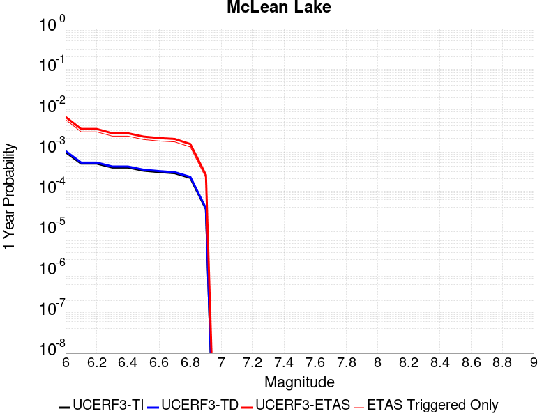 |  |

| Magnitude | 1 wk TI Prob | 1 wk TD Prob | 1 wk ETAS Prob | 1 wk ETAS/TD Gain | 1 wk ETAS Triggered Only | 1 mo TI Prob | 1 mo TD Prob | 1 mo ETAS Prob | 1 mo ETAS/TD Gain | 1 mo ETAS Triggered Only | 1 yr TI Prob | 1 yr TD Prob | 1 yr ETAS Prob | 1 yr ETAS/TD Gain | 1 yr ETAS Triggered Only | 10 yr TI Prob | 10 yr TD Prob | 10 yr ETAS Prob | 10 yr ETAS/TD Gain | 10 yr ETAS Triggered Only |
|-----|-----|-----|-----|-----|-----|-----|-----|-----|-----|-----|-----|-----|-----|-----|-----|-----|-----|-----|-----|-----|
| 6.0 | 1.7360222E-5 | 1.8501627E-5 | 0.0020266646 | 109.5398 | 0.0020082002 | 7.439883E-5 | 7.9290556E-5 | 0.0038443673 | 48.484554 | 0.0037653754 | 9.0542925E-4 | 9.6498354E-4 | 0.0067329877 | 6.9773083 | 0.0057735755 | 0.009017491 | 0.0096127745 | 0.0177341 | 1.8448471 | 0.008200151 |
| 6.1 | 9.062689E-6 | 9.592193E-6 | 0.001181031 | 123.12419 | 0.0011714501 | 3.8839516E-5 | 4.1108804E-5 | 0.0022165696 | 53.919582 | 0.0021755502 | 4.727685E-4 | 5.003936E-4 | 0.0036784527 | 7.3511186 | 0.0031796503 | 0.0047176396 | 0.004993552 | 0.009406182 | 1.8836657 | 0.0044347756 |
| 6.2 | 9.062689E-6 | 9.592193E-6 | 0.001181031 | 123.12419 | 0.0011714501 | 3.8839516E-5 | 4.1108804E-5 | 0.0022165696 | 53.919582 | 0.0021755502 | 4.727685E-4 | 5.003936E-4 | 0.0036784527 | 7.3511186 | 0.0031796503 | 0.0047176396 | 0.004993552 | 0.009406182 | 1.8836657 | 0.0044347756 |
| 6.3 | 7.2575485E-6 | 7.66771E-6 | 0.0010117601 | 131.95076 | 0.0010041001 | 3.110341E-5 | 3.2861237E-5 | 0.0017899786 | 54.47082 | 0.0017571751 | 3.786182E-4 | 4.0001926E-4 | 0.0028256238 | 7.0637193 | 0.0024265752 | 0.0037797375 | 0.0039936965 | 0.007410671 | 1.8555918 | 0.0034306752 |
| 6.4 | 7.2575485E-6 | 7.66771E-6 | 0.0010117601 | 131.95076 | 0.0010041001 | 3.110341E-5 | 3.2861237E-5 | 0.0017899786 | 54.47082 | 0.0017571751 | 3.786182E-4 | 4.0001926E-4 | 0.0028256238 | 7.0637193 | 0.0024265752 | 0.0037797375 | 0.0039936965 | 0.007410671 | 1.8555918 | 0.0034306752 |
| 6.5 | 6.06582E-6 | 6.4038773E-6 | 6.757996E-4 | 105.52976 | 6.6940003E-4 | 2.5996113E-5 | 2.7444936E-5 | 0.001449881 | 52.828728 | 0.0014224751 | 3.164567E-4 | 3.3409733E-4 | 0.0023416264 | 7.0088153 | 0.0020082002 | 0.0031600643 | 0.0033365893 | 0.006172047 | 1.8498073 | 0.0028449502 |
| 6.6 | 5.598744E-6 | 5.910262E-6 | 5.9163186E-4 | 100.10247 | 5.8572507E-4 | 2.3994397E-5 | 2.5329486E-5 | 0.0012804228 | 50.550682 | 0.001255125 | 2.9209262E-4 | 3.0834923E-4 | 0.0021486317 | 6.968176 | 0.0018408501 | 0.0029170897 | 0.003079843 | 0.0057491967 | 1.8667175 | 0.0026776001 |
| 6.7 | 5.246996E-6 | 5.539162E-6 | 5.9126096E-4 | 106.74195 | 5.8572507E-4 | 2.2486933E-5 | 2.3739085E-5 | 0.0012788344 | 53.870415 | 0.001255125 | 2.73744E-4 | 2.8899137E-4 | 0.0021293096 | 7.368073 | 0.0018408501 | 0.0027340704 | 0.0028867796 | 0.005389783 | 1.8670574 | 0.00251025 |
| 6.8 | 4.02324E-6 | 4.2469046E-6 | 5.0629483E-4 | 119.21502 | 5.0205004E-4 | 1.7242342E-5 | 1.8200926E-5 | 0.0010222828 | 56.166523 | 0.0010041001 | 2.099053E-4 | 2.2157968E-4 | 0.001727396 | 7.795823 | 0.0015061501 | 0.0020970714 | 0.002214172 | 0.0042179255 | 1.9049675 | 0.0020082002 |
| 6.9 | 6.835972E-7 | 7.1399285E-7 | 8.438894E-5 | 118.19298 | 8.3675004E-5 | 2.9296991E-6 | 3.0599674E-6 | 2.540842E-4 | 83.03494 | 2.5102502E-4 | 3.56685E-5 | 3.7254784E-5 | 3.7194235E-4 | 9.983747 | 3.3470002E-4 | 3.5662777E-4 | 3.7251666E-4 | 7.907358E-4 | 2.122686 | 4.1837504E-4 |

## Goldstone Lake
*[(top)](#table-of-contents)*

| 1 Week | 1 Month | 1 Year | 10 Year |
|-----|-----|-----|-----|
|  |  |  |  |

| Magnitude | 1 wk TI Prob | 1 wk TD Prob | 1 wk ETAS Prob | 1 wk ETAS/TD Gain | 1 wk ETAS Triggered Only | 1 mo TI Prob | 1 mo TD Prob | 1 mo ETAS Prob | 1 mo ETAS/TD Gain | 1 mo ETAS Triggered Only | 1 yr TI Prob | 1 yr TD Prob | 1 yr ETAS Prob | 1 yr ETAS/TD Gain | 1 yr ETAS Triggered Only | 10 yr TI Prob | 10 yr TD Prob | 10 yr ETAS Prob | 10 yr ETAS/TD Gain | 10 yr ETAS Triggered Only |
|-----|-----|-----|-----|-----|-----|-----|-----|-----|-----|-----|-----|-----|-----|-----|-----|-----|-----|-----|-----|-----|
| 6.0 | 2.671352E-5 | 3.037609E-5 | 0.001620153 | 53.336456 | 0.0015898251 | 1.1448149E-4 | 1.3017785E-4 | 0.0029747577 | 22.851488 | 0.0028449502 | 0.001392921 | 0.0015839594 | 0.005844625 | 3.6898832 | 0.0042674253 | 0.013842222 | 0.015746197 | 0.022170076 | 1.407964 | 0.0065266504 |
| 6.1 | 2.671352E-5 | 3.037609E-5 | 0.001620153 | 53.336456 | 0.0015898251 | 1.1448149E-4 | 1.3017785E-4 | 0.0029747577 | 22.851488 | 0.0028449502 | 0.001392921 | 0.0015839594 | 0.005844625 | 3.6898832 | 0.0042674253 | 0.013842222 | 0.015746197 | 0.022170076 | 1.407964 | 0.0065266504 |
| 6.2 | 1.4197047E-5 | 1.6096245E-5 | 0.0010201802 | 63.380013 | 0.0010041001 | 6.0843064E-5 | 6.8982634E-5 | 0.0019097058 | 27.683863 | 0.0018408501 | 7.4051257E-4 | 8.3963864E-4 | 0.0030969668 | 3.6884522 | 0.0022592251 | 0.007380498 | 0.0083743585 | 0.0114444075 | 1.366601 | 0.0030959751 |
| 6.3 | 1.4197047E-5 | 1.6096245E-5 | 0.0010201802 | 63.380013 | 0.0010041001 | 6.0843064E-5 | 6.8982634E-5 | 0.0019097058 | 27.683863 | 0.0018408501 | 7.4051257E-4 | 8.3963864E-4 | 0.0030969668 | 3.6884522 | 0.0022592251 | 0.007380498 | 0.0083743585 | 0.0114444075 | 1.366601 | 0.0030959751 |
| 6.4 | 1.3238931E-5 | 1.500846E-5 | 8.5174595E-4 | 56.75106 | 8.367501E-4 | 5.6737044E-5 | 6.4320935E-5 | 0.0015703741 | 24.414667 | 0.0015061501 | 6.9055456E-4 | 7.82924E-4 | 0.0027895519 | 3.5629919 | 0.0020082002 | 0.006884126 | 0.0078112837 | 0.01055099 | 1.350737 | 0.0027612753 |
| 6.5 | 1.3238931E-5 | 1.500846E-5 | 8.5174595E-4 | 56.75106 | 8.367501E-4 | 5.6737044E-5 | 6.4320935E-5 | 0.0015703741 | 24.414667 | 0.0015061501 | 6.9055456E-4 | 7.82924E-4 | 0.0027895519 | 3.5629919 | 0.0020082002 | 0.006884126 | 0.0078112837 | 0.01055099 | 1.350737 | 0.0027612753 |
| 6.6 | 1.1328278E-5 | 1.2855166E-5 | 6.8224664E-4 | 53.07179 | 6.6940003E-4 | 4.8548856E-5 | 5.5092944E-5 | 0.0012264785 | 22.26199 | 0.0011714501 | 5.90922E-4 | 6.7064585E-4 | 0.0023430237 | 3.4936826 | 0.0016735002 | 0.0058935313 | 0.0066956086 | 0.008939707 | 1.3351598 | 0.0022592251 |
| 6.7 | 8.651175E-6 | 9.824565E-6 | 5.955439E-4 | 60.617836 | 5.8572507E-4 | 3.707594E-5 | 4.2105108E-5 | 9.6249144E-4 | 22.859257 | 9.2042505E-4 | 4.5130608E-4 | 5.1259965E-4 | 0.0018507135 | 3.6104465 | 0.0013388001 | 0.0045039062 | 0.005123051 | 0.0069544706 | 1.357486 | 0.0018408501 |
| 6.8 | 1.0215377E-6 | 1.1754702E-6 | 1.1754702E-6 | 1.0 | 0.0 | 4.378012E-6 | 5.0377203E-6 | 5.0377203E-6 | 1.0 | 0.0 | 5.3300988E-5 | 6.1332634E-5 | 6.1332634E-5 | 1.0 | 0.0 | 5.3288206E-4 | 6.1316835E-4 | 6.1316835E-4 | 1.0 | 0.0 |
| 6.9 | 7.9360774E-7 | 9.2833966E-7 | 9.2833966E-7 | 1.0 | 0.0 | 3.4011714E-6 | 3.9785928E-6 | 3.9785928E-6 | 1.0 | 0.0 | 4.1408475E-5 | 4.843836E-5 | 4.843836E-5 | 1.0 | 0.0 | 4.140076E-4 | 4.8428503E-4 | 4.8428503E-4 | 1.0 | 0.0 |
| 7.0 | 7.4382757E-7 | 8.7473285E-7 | 8.7473285E-7 | 1.0 | 0.0 | 3.1878285E-6 | 3.74885E-6 | 3.74885E-6 | 1.0 | 0.0 | 3.8811122E-5 | 4.564136E-5 | 4.564136E-5 | 1.0 | 0.0 | 3.8804344E-4 | 4.5632652E-4 | 4.5632652E-4 | 1.0 | 0.0 |
| 7.1 | 6.4709513E-7 | 7.7113E-7 | 7.7113E-7 | 1.0 | 0.0 | 2.773262E-6 | 3.3048389E-6 | 3.3048389E-6 | 1.0 | 0.0 | 3.376394E-5 | 4.0235733E-5 | 4.0235733E-5 | 1.0 | 0.0 | 3.375881E-4 | 4.0229043E-4 | 4.0229043E-4 | 1.0 | 0.0 |
| 7.2 | 6.356704E-7 | 7.5883594E-7 | 7.5883594E-7 | 1.0 | 0.0 | 2.7242988E-6 | 3.2521505E-6 | 3.2521505E-6 | 1.0 | 0.0 | 3.3167835E-5 | 3.959427E-5 | 3.959427E-5 | 1.0 | 0.0 | 3.3162883E-4 | 3.958781E-4 | 3.958781E-4 | 1.0 | 0.0 |
| 7.3 | 5.7695723E-7 | 6.8965653E-7 | 6.8965653E-7 | 1.0 | 0.0 | 2.4726714E-6 | 2.9556677E-6 | 2.9556677E-6 | 1.0 | 0.0 | 3.0104358E-5 | 3.5984718E-5 | 3.5984718E-5 | 1.0 | 0.0 | 3.0100282E-4 | 3.5979465E-4 | 3.5979465E-4 | 1.0 | 0.0 |
| 7.4 | 5.209647E-7 | 6.193514E-7 | 6.193514E-7 | 1.0 | 0.0 | 2.232704E-6 | 2.6543607E-6 | 2.6543607E-6 | 1.0 | 0.0 | 2.718283E-5 | 3.2316417E-5 | 3.2316417E-5 | 1.0 | 0.0 | 2.7179506E-4 | 3.2312275E-4 | 3.2312275E-4 | 1.0 | 0.0 |
| 7.5 | 4.512955E-7 | 5.348885E-7 | 5.348885E-7 | 1.0 | 0.0 | 1.934122E-6 | 2.2923775E-6 | 2.2923775E-6 | 1.0 | 0.0 | 2.3547682E-5 | 2.7909393E-5 | 2.7909393E-5 | 1.0 | 0.0 | 2.3545188E-4 | 2.7906417E-4 | 2.7906417E-4 | 1.0 | 0.0 |
| 7.6 | 2.21172E-7 | 2.603961E-7 | 2.603961E-7 | 1.0 | 0.0 | 9.478797E-7 | 1.1159829E-6 | 1.1159829E-6 | 1.0 | 0.0 | 1.1540374E-5 | 1.3587036E-5 | 1.3587036E-5 | 1.0 | 0.0 | 1.1539775E-4 | 1.3586486E-4 | 1.3586486E-4 | 1.0 | 0.0 |

## San Andreas (Mojave N)
*[(top)](#table-of-contents)*

| 1 Week | 1 Month | 1 Year | 10 Year |
|-----|-----|-----|-----|
|  |  |  |  |

| Magnitude | 1 wk TI Prob | 1 wk TD Prob | 1 wk ETAS Prob | 1 wk ETAS/TD Gain | 1 wk ETAS Triggered Only | 1 mo TI Prob | 1 mo TD Prob | 1 mo ETAS Prob | 1 mo ETAS/TD Gain | 1 mo ETAS Triggered Only | 1 yr TI Prob | 1 yr TD Prob | 1 yr ETAS Prob | 1 yr ETAS/TD Gain | 1 yr ETAS Triggered Only | 10 yr TI Prob | 10 yr TD Prob | 10 yr ETAS Prob | 10 yr ETAS/TD Gain | 10 yr ETAS Triggered Only |
|-----|-----|-----|-----|-----|-----|-----|-----|-----|-----|-----|-----|-----|-----|-----|-----|-----|-----|-----|-----|-----|
| 6.0 | 9.877682E-5 | 1.9400702E-4 | 0.0028710878 | 14.798886 | 0.0026776001 | 4.2326056E-4 | 8.311939E-4 | 0.0040918067 | 4.9228063 | 0.0032633252 | 0.0051410277 | 0.010072956 | 0.014214563 | 1.4111611 | 0.00418375 | 0.05023708 | 0.09831428 | 0.10344478 | 1.0521847 | 0.0056899004 |
| 6.1 | 9.877682E-5 | 1.9400702E-4 | 0.0028710878 | 14.798886 | 0.0026776001 | 4.2326056E-4 | 8.311939E-4 | 0.0040918067 | 4.9228063 | 0.0032633252 | 0.0051410277 | 0.010072956 | 0.014214563 | 1.4111611 | 0.00418375 | 0.05023708 | 0.09831428 | 0.10344478 | 1.0521847 | 0.0056899004 |
| 6.2 | 9.877682E-5 | 1.9400702E-4 | 0.0028710878 | 14.798886 | 0.0026776001 | 4.2326056E-4 | 8.311939E-4 | 0.0040918067 | 4.9228063 | 0.0032633252 | 0.0051410277 | 0.010072956 | 0.014214563 | 1.4111611 | 0.00418375 | 0.05023708 | 0.09831428 | 0.10344478 | 1.0521847 | 0.0056899004 |
| 6.3 | 9.877682E-5 | 1.9400702E-4 | 0.0028710878 | 14.798886 | 0.0026776001 | 4.2326056E-4 | 8.311939E-4 | 0.0040918067 | 4.9228063 | 0.0032633252 | 0.0051410277 | 0.010072956 | 0.014214563 | 1.4111611 | 0.00418375 | 0.05023708 | 0.09831428 | 0.10344478 | 1.0521847 | 0.0056899004 |
| 6.4 | 9.877682E-5 | 1.9400702E-4 | 0.0028710878 | 14.798886 | 0.0026776001 | 4.2326056E-4 | 8.311939E-4 | 0.0040918067 | 4.9228063 | 0.0032633252 | 0.0051410277 | 0.010072956 | 0.014214563 | 1.4111611 | 0.00418375 | 0.05023708 | 0.09831428 | 0.10344478 | 1.0521847 | 0.0056899004 |
| 6.5 | 9.861474E-5 | 1.9374468E-4 | 0.002870826 | 14.817574 | 0.0026776001 | 4.2256617E-4 | 8.300703E-4 | 0.004090687 | 4.9281206 | 0.0032633252 | 0.0051326132 | 0.010059402 | 0.014201067 | 1.4117206 | 0.00418375 | 0.050156746 | 0.098192066 | 0.103323266 | 1.0522567 | 0.0056899004 |
| 6.6 | 9.861474E-5 | 1.9374468E-4 | 0.002870826 | 14.817574 | 0.0026776001 | 4.2256617E-4 | 8.300703E-4 | 0.004090687 | 4.9281206 | 0.0032633252 | 0.0051326132 | 0.010059402 | 0.014201067 | 1.4117206 | 0.00418375 | 0.050156746 | 0.098192066 | 0.103323266 | 1.0522567 | 0.0056899004 |
| 6.7 | 9.8552715E-5 | 1.9364421E-4 | 0.002870726 | 14.824744 | 0.0026776001 | 4.223004E-4 | 8.2964E-4 | 0.004090258 | 4.93016 | 0.0032633252 | 0.0051293927 | 0.010054212 | 0.014195899 | 1.4119354 | 0.00418375 | 0.050125998 | 0.098145254 | 0.10327672 | 1.0522844 | 0.0056899004 |
| 6.8 | 9.8464974E-5 | 1.9349584E-4 | 0.0028705779 | 14.835347 | 0.0026776001 | 4.219245E-4 | 8.290045E-4 | 0.0040896246 | 4.933175 | 0.0032633252 | 0.0051248376 | 0.010046546 | 0.0141882645 | 1.4122529 | 0.00418375 | 0.05008251 | 0.09807528 | 0.10320714 | 1.0523257 | 0.0056899004 |
| 6.9 | 9.825824E-5 | 1.9317595E-4 | 0.0028702589 | 14.858263 | 0.0026776001 | 4.2103877E-4 | 8.276344E-4 | 0.004088259 | 4.9396915 | 0.0032633252 | 0.0051141046 | 0.010030019 | 0.014171806 | 1.4129391 | 0.00418375 | 0.049980022 | 0.09792438 | 0.1030571 | 1.0524151 | 0.0056899004 |
| 7.0 | 9.781462E-5 | 1.924896E-4 | 0.0028695744 | 14.907685 | 0.0026776001 | 4.1913814E-4 | 8.246948E-4 | 0.004085329 | 4.9537463 | 0.0032633252 | 0.005091073 | 0.009994558 | 0.014136494 | 1.414419 | 0.00418375 | 0.04976007 | 0.09760077 | 0.10265983 | 1.0518341 | 0.005606225 |
| 7.1 | 9.7121134E-5 | 1.9150671E-4 | 0.0028685941 | 14.979078 | 0.0026776001 | 4.1616702E-4 | 8.204851E-4 | 0.004081133 | 4.9740486 | 0.0032633252 | 0.005055068 | 0.009943774 | 0.014085922 | 1.416557 | 0.00418375 | 0.04941613 | 0.09713728 | 0.102198936 | 1.0521083 | 0.005606225 |
| 7.2 | 9.663819E-5 | 1.9081456E-4 | 0.0028679038 | 15.029795 | 0.0026776001 | 4.1409794E-4 | 8.175206E-4 | 0.004078178 | 4.988471 | 0.0032633252 | 0.0050299936 | 0.00990801 | 0.014050309 | 1.4180757 | 0.00418375 | 0.049176537 | 0.09681055 | 0.10187403 | 1.0523031 | 0.005606225 |
| 7.3 | 9.6277574E-5 | 1.9033969E-4 | 0.0028674302 | 15.064804 | 0.0026776001 | 4.125529E-4 | 8.154867E-4 | 0.0040761507 | 4.998427 | 0.0032633252 | 0.0050112694 | 0.009883473 | 0.0140258735 | 1.419124 | 0.00418375 | 0.04899759 | 0.09658401 | 0.10164876 | 1.0524389 | 0.005606225 |
| 7.4 | 9.593308E-5 | 1.897375E-4 | 0.0028668297 | 15.109452 | 0.0026776001 | 4.1107697E-4 | 8.129075E-4 | 0.00407358 | 5.0111237 | 0.0032633252 | 0.0049933824 | 0.009852355 | 0.013994886 | 1.4204609 | 0.00418375 | 0.04882661 | 0.09630218 | 0.10136852 | 1.0526087 | 0.005606225 |
| 7.5 | 9.561707E-5 | 1.8919831E-4 | 0.002866292 | 15.14967 | 0.0026776001 | 4.0972308E-4 | 8.1059814E-4 | 0.004071278 | 5.0225606 | 0.0032633252 | 0.0049769743 | 0.009824493 | 0.01396714 | 1.4216652 | 0.00418375 | 0.048669744 | 0.09604836 | 0.10111612 | 1.0527625 | 0.005606225 |
| 7.6 | 9.418194E-5 | 1.8572104E-4 | 0.002862824 | 15.414645 | 0.0026776001 | 4.0357444E-4 | 7.957047E-4 | 0.004056433 | 5.097913 | 0.0032633252 | 0.004902454 | 0.009644784 | 0.013788183 | 1.4296 | 0.00418375 | 0.047957025 | 0.094430685 | 0.09950751 | 1.0537624 | 0.005606225 |
| 7.7 | 8.202141E-5 | 1.6021315E-4 | 0.0027537227 | 17.18787 | 0.0025939252 | 3.51473E-4 | 6.8644714E-4 | 0.003613062 | 5.2634234 | 0.0029286253 | 0.00427079 | 0.008325525 | 0.011893595 | 1.4285699 | 0.0035980253 | 0.04189639 | 0.08223219 | 0.08668626 | 1.0541645 | 0.0048531503 |
| 7.8 | 7.2859846E-5 | 1.4516473E-4 | 0.0018184219 | 12.52661 | 0.0016735002 | 3.1221908E-4 | 6.219862E-4 | 0.0026289374 | 4.2266808 | 0.0020082002 | 0.003794643 | 0.0075464295 | 0.01012078 | 1.3411349 | 0.0025939252 | 0.037304975 | 0.07472468 | 0.07797642 | 1.0435163 | 0.0035143502 |
| 7.9 | 5.3874453E-5 | 1.0045676E-4 | 0.0010207894 | 10.16148 | 9.2042505E-4 | 2.3087008E-4 | 4.3045796E-4 | 0.0014341258 | 3.331628 | 0.0010041001 | 0.0028072202 | 0.0052282433 | 0.0066432813 | 1.2706527 | 0.0014224751 | 0.02772022 | 0.05242443 | 0.054168776 | 1.0332735 | 0.0018408501 |
| 8.0 | 3.468538E-5 | 5.4260272E-5 | 1.3793074E-4 | 2.5420208 | 8.3675004E-5 | 1.4864317E-4 | 2.325233E-4 | 3.998344E-4 | 1.7195455 | 1.6735001E-4 | 0.0018082283 | 0.002827298 | 0.0029941746 | 1.0590235 | 1.6735001E-4 | 0.017935853 | 0.028947512 | 0.02919127 | 1.0084207 | 2.5102502E-4 |
| 8.1 | 1.9152367E-5 | 1.940263E-5 | 1.0307601E-4 | 5.312476 | 8.3675004E-5 | 8.207899E-5 | 8.3151484E-5 | 1.6681953E-4 | 2.0062122 | 8.3675004E-5 | 9.988535E-4 | 0.0010118998 | 0.0010954901 | 1.0826073 | 8.3675004E-5 | 0.009943757 | 0.01085625 | 0.010939017 | 1.0076239 | 8.3675004E-5 |
| 8.2 | 8.643924E-6 | 5.4748625E-6 | 5.4748625E-6 | 1.0 | 0.0 | 3.704486E-5 | 2.3463486E-5 | 2.3463486E-5 | 1.0 | 0.0 | 4.5092785E-4 | 2.8563058E-4 | 2.8563058E-4 | 1.0 | 0.0 | 0.0045001395 | 0.0032487072 | 0.0032487072 | 1.0 | 0.0 |
| 8.3 | 1.983087E-6 | 7.6599065E-7 | 7.6599065E-7 | 1.0 | 0.0 | 8.498917E-6 | 3.282813E-6 | 3.282813E-6 | 1.0 | 0.0 | 1.034694E-4 | 3.9967534E-5 | 3.9967534E-5 | 1.0 | 0.0 | 0.0010342124 | 4.719687E-4 | 4.719687E-4 | 1.0 | 0.0 |

## Coyote Canyon
*[(top)](#table-of-contents)*

| 1 Week | 1 Month | 1 Year | 10 Year |
|-----|-----|-----|-----|
|  |  |  |  |

| Magnitude | 1 wk TI Prob | 1 wk TD Prob | 1 wk ETAS Prob | 1 wk ETAS/TD Gain | 1 wk ETAS Triggered Only | 1 mo TI Prob | 1 mo TD Prob | 1 mo ETAS Prob | 1 mo ETAS/TD Gain | 1 mo ETAS Triggered Only | 1 yr TI Prob | 1 yr TD Prob | 1 yr ETAS Prob | 1 yr ETAS/TD Gain | 1 yr ETAS Triggered Only | 10 yr TI Prob | 10 yr TD Prob | 10 yr ETAS Prob | 10 yr ETAS/TD Gain | 10 yr ETAS Triggered Only |
|-----|-----|-----|-----|-----|-----|-----|-----|-----|-----|-----|-----|-----|-----|-----|-----|-----|-----|-----|-----|-----|
| 6.0 | 3.5090034E-5 | 4.0364324E-5 | 0.0011280956 | 27.947836 | 0.0010877751 | 1.503772E-4 | 1.7297994E-4 | 0.0016788695 | 9.705573 | 0.0015061501 | 0.0018293047 | 0.0021042528 | 0.0050267153 | 2.3888364 | 0.0029286253 | 0.018143194 | 0.020869201 | 0.025293356 | 1.2119944 | 0.0045184502 |
| 6.1 | 3.5090034E-5 | 4.0364324E-5 | 0.0011280956 | 27.947836 | 0.0010877751 | 1.503772E-4 | 1.7297994E-4 | 0.0016788695 | 9.705573 | 0.0015061501 | 0.0018293047 | 0.0021042528 | 0.0050267153 | 2.3888364 | 0.0029286253 | 0.018143194 | 0.020869201 | 0.025293356 | 1.2119944 | 0.0045184502 |
| 6.2 | 1.841879E-5 | 2.1059794E-5 | 7.74119E-4 | 36.75815 | 7.5307506E-4 | 7.8935285E-5 | 9.0253714E-5 | 9.2692825E-4 | 10.270251 | 8.367501E-4 | 9.606133E-4 | 0.001098387 | 0.0026864659 | 2.4458282 | 0.0015898251 | 0.0095647145 | 0.010939667 | 0.013174177 | 1.2042576 | 0.0022592251 |
| 6.3 | 1.841879E-5 | 2.1059794E-5 | 7.74119E-4 | 36.75815 | 7.5307506E-4 | 7.8935285E-5 | 9.0253714E-5 | 9.2692825E-4 | 10.270251 | 8.367501E-4 | 9.606133E-4 | 0.001098387 | 0.0026864659 | 2.4458282 | 0.0015898251 | 0.0095647145 | 0.010939667 | 0.013174177 | 1.2042576 | 0.0022592251 |
| 6.4 | 1.712201E-5 | 1.9565212E-5 | 7.7262556E-4 | 39.48976 | 7.5307506E-4 | 7.337798E-5 | 8.3848776E-5 | 8.368607E-4 | 9.980595 | 7.5307506E-4 | 8.930107E-4 | 0.0010204813 | 0.0023579153 | 2.3105912 | 0.0013388001 | 0.008894307 | 0.010167871 | 0.012072828 | 1.1873506 | 0.0019245251 |
| 6.5 | 1.4744935E-5 | 1.6836972E-5 | 7.6989934E-4 | 45.72671 | 7.5307506E-4 | 6.3191044E-5 | 7.215698E-5 | 8.251777E-4 | 11.435868 | 7.5307506E-4 | 7.6907943E-4 | 8.7825063E-4 | 0.0021322735 | 2.4278643 | 0.001255125 | 0.007664232 | 0.008756994 | 0.010581724 | 1.208374 | 0.0018408501 |
| 6.6 | 1.2017839E-5 | 1.37240895E-5 | 5.1576726E-4 | 37.58116 | 5.0205004E-4 | 5.150401E-5 | 5.88167E-5 | 5.608372E-4 | 9.535339 | 5.0205004E-4 | 6.268809E-4 | 7.159466E-4 | 0.0016357127 | 2.2846854 | 9.2042505E-4 | 0.0062511545 | 0.0071450938 | 0.008640482 | 1.2092888 | 0.0015061501 |
| 6.7 | 1.00956095E-5 | 1.1533517E-5 | 5.135778E-4 | 44.529156 | 5.0205004E-4 | 4.326618E-5 | 4.942891E-5 | 5.5145414E-4 | 11.15651 | 5.0205004E-4 | 5.266384E-4 | 6.017178E-4 | 0.0014379644 | 2.3897655 | 8.367501E-4 | 0.005253921 | 0.0060094125 | 0.007256995 | 1.2076048 | 0.001255125 |

## San Andreas (Mojave S)
*[(top)](#table-of-contents)*

| 1 Week | 1 Month | 1 Year | 10 Year |
|-----|-----|-----|-----|
|  |  |  |  |

| Magnitude | 1 wk TI Prob | 1 wk TD Prob | 1 wk ETAS Prob | 1 wk ETAS/TD Gain | 1 wk ETAS Triggered Only | 1 mo TI Prob | 1 mo TD Prob | 1 mo ETAS Prob | 1 mo ETAS/TD Gain | 1 mo ETAS Triggered Only | 1 yr TI Prob | 1 yr TD Prob | 1 yr ETAS Prob | 1 yr ETAS/TD Gain | 1 yr ETAS Triggered Only | 10 yr TI Prob | 10 yr TD Prob | 10 yr ETAS Prob | 10 yr ETAS/TD Gain | 10 yr ETAS Triggered Only |
|-----|-----|-----|-----|-----|-----|-----|-----|-----|-----|-----|-----|-----|-----|-----|-----|-----|-----|-----|-----|-----|
| 6.0 | 3.1064058E-4 | 6.7460834E-4 | 0.0027650723 | 4.0987816 | 0.002091875 | 0.0013306376 | 0.0028881032 | 0.00530767 | 1.8377702 | 0.0024265752 | 0.016080605 | 0.03462235 | 0.037934247 | 1.0956578 | 0.0034306752 | 0.1496549 | 0.28660452 | 0.29006675 | 1.0120801 | 0.0048531503 |
| 6.1 | 3.1064058E-4 | 6.7460834E-4 | 0.0027650723 | 4.0987816 | 0.002091875 | 0.0013306376 | 0.0028881032 | 0.00530767 | 1.8377702 | 0.0024265752 | 0.016080605 | 0.03462235 | 0.037934247 | 1.0956578 | 0.0034306752 | 0.1496549 | 0.28660452 | 0.29006675 | 1.0120801 | 0.0048531503 |
| 6.2 | 3.1064058E-4 | 6.7460834E-4 | 0.0027650723 | 4.0987816 | 0.002091875 | 0.0013306376 | 0.0028881032 | 0.00530767 | 1.8377702 | 0.0024265752 | 0.016080605 | 0.03462235 | 0.037934247 | 1.0956578 | 0.0034306752 | 0.1496549 | 0.28660452 | 0.29006675 | 1.0120801 | 0.0048531503 |
| 6.3 | 3.1064058E-4 | 6.7460834E-4 | 0.0027650723 | 4.0987816 | 0.002091875 | 0.0013306376 | 0.0028881032 | 0.00530767 | 1.8377702 | 0.0024265752 | 0.016080605 | 0.03462235 | 0.037934247 | 1.0956578 | 0.0034306752 | 0.1496549 | 0.28660452 | 0.29006675 | 1.0120801 | 0.0048531503 |
| 6.4 | 1.9872203E-4 | 4.3179357E-4 | 0.0025227654 | 5.842527 | 0.002091875 | 8.5138786E-4 | 0.0018492596 | 0.0042713475 | 2.3097608 | 0.0024265752 | 0.010316478 | 0.02228844 | 0.02547903 | 1.1431501 | 0.0032633252 | 0.098504856 | 0.19699748 | 0.2006258 | 1.0184182 | 0.0045184502 |
| 6.5 | 1.291105E-4 | 2.875267E-4 | 0.0023788004 | 8.27332 | 0.002091875 | 5.5321335E-4 | 0.0012316781 | 0.0036552646 | 2.967711 | 0.0024265752 | 0.006714592 | 0.0148934 | 0.018025694 | 1.2103143 | 0.0031796503 | 0.065152965 | 0.13803436 | 0.14185698 | 1.0276933 | 0.0044347756 |
| 6.6 | 1.291105E-4 | 2.875267E-4 | 0.0023788004 | 8.27332 | 0.002091875 | 5.5321335E-4 | 0.0012316781 | 0.0036552646 | 2.967711 | 0.0024265752 | 0.006714592 | 0.0148934 | 0.018025694 | 1.2103143 | 0.0031796503 | 0.065152965 | 0.13803436 | 0.14185698 | 1.0276933 | 0.0044347756 |
| 6.7 | 1.08001186E-4 | 2.4333889E-4 | 0.002334705 | 9.59446 | 0.002091875 | 4.6278012E-4 | 0.0010424647 | 0.0034665102 | 3.3253024 | 0.0024265752 | 0.0056198016 | 0.012618446 | 0.015757974 | 1.2488047 | 0.0031796503 | 0.054797906 | 0.119176775 | 0.123083025 | 1.032777 | 0.0044347756 |
| 6.8 | 1.0624356E-4 | 2.3851555E-4 | 0.0023298918 | 9.768301 | 0.002091875 | 4.5525006E-4 | 0.0010218095 | 0.0034459052 | 3.3723557 | 0.0024265752 | 0.0055285925 | 0.012369843 | 0.015510161 | 1.2538689 | 0.0031796503 | 0.053930566 | 0.11712591 | 0.12104126 | 1.0334285 | 0.0044347756 |
| 6.9 | 1.0393785E-4 | 2.3221898E-4 | 0.0022399528 | 9.6458645 | 0.0020082002 | 4.4537184E-4 | 9.948451E-4 | 0.0033354145 | 3.3526974 | 0.0023429003 | 0.0054089287 | 0.012045221 | 0.0151039045 | 1.2539333 | 0.0030959751 | 0.05279156 | 0.11442335 | 0.11827659 | 1.0336752 | 0.0043511004 |
| 7.0 | 1.0155622E-4 | 2.2591476E-4 | 0.0022336612 | 9.887186 | 0.0020082002 | 4.3516833E-4 | 9.6784724E-4 | 0.00330848 | 3.4183905 | 0.0023429003 | 0.005285311 | 0.0117200995 | 0.014697095 | 1.2540077 | 0.0030123002 | 0.05161361 | 0.111683756 | 0.115474574 | 1.0339425 | 0.0042674253 |
| 7.1 | 9.885595E-5 | 2.1879886E-4 | 0.0022265597 | 10.176286 | 0.0020082002 | 4.2359953E-4 | 9.3737274E-4 | 0.0032780766 | 3.4970899 | 0.0023429003 | 0.0051451353 | 0.011352993 | 0.014331094 | 1.2623186 | 0.0030123002 | 0.05027629 | 0.1085682 | 0.112372324 | 1.035039 | 0.0042674253 |
| 7.2 | 9.6411415E-5 | 2.124288E-4 | 0.0022202025 | 10.451512 | 0.0020082002 | 4.1312634E-4 | 9.1009185E-4 | 0.0032508597 | 3.572013 | 0.0023429003 | 0.005018219 | 0.011024255 | 0.014003348 | 1.2702307 | 0.0030123002 | 0.049064007 | 0.105758004 | 0.10957412 | 1.0360835 | 0.0042674253 |
| 7.3 | 9.1180635E-5 | 1.9471257E-4 | 0.0022025218 | 11.311656 | 0.0020082002 | 3.907156E-4 | 8.342157E-4 | 0.0031751613 | 3.8061635 | 0.0023429003 | 0.004746591 | 0.01010939 | 0.013091237 | 1.2949582 | 0.0030123002 | 0.046464786 | 0.09795115 | 0.101800576 | 1.0392995 | 0.0042674253 |
| 7.4 | 8.887388E-5 | 1.8719878E-4 | 0.002195023 | 11.725627 | 0.0020082002 | 3.8083247E-4 | 8.020339E-4 | 0.003143055 | 3.9188554 | 0.0023429003 | 0.0046267817 | 0.00972114 | 0.012704157 | 1.3068588 | 0.0030123002 | 0.045316286 | 0.09458615 | 0.09837417 | 1.0400484 | 0.00418375 |
| 7.5 | 8.6750515E-5 | 1.8051457E-4 | 0.0021883522 | 12.122856 | 0.0020082002 | 3.7173493E-4 | 7.7340455E-4 | 0.0031144926 | 4.0269904 | 0.0023429003 | 0.004516484 | 0.009375632 | 0.01235969 | 1.3182781 | 0.0030123002 | 0.04425787 | 0.091549896 | 0.09535062 | 1.0415154 | 0.00418375 |
| 7.6 | 8.453092E-5 | 1.7439072E-4 | 0.0021822406 | 12.513514 | 0.0020082002 | 3.6222505E-4 | 7.471748E-4 | 0.0030883243 | 4.133336 | 0.0023429003 | 0.0044011753 | 0.009058985 | 0.012043997 | 1.3295084 | 0.0030123002 | 0.04315024 | 0.08870898 | 0.09252159 | 1.0429789 | 0.00418375 |
| 7.7 | 8.259102E-5 | 1.6961215E-4 | 0.0021774718 | 12.837946 | 0.0020082002 | 3.539135E-4 | 7.2670676E-4 | 0.0030679044 | 4.221654 | 0.0023429003 | 0.004300386 | 0.008811831 | 0.011714649 | 1.329423 | 0.0029286253 | 0.042181134 | 0.08645982 | 0.09020541 | 1.0433216 | 0.0041000755 |
| 7.8 | 7.444844E-5 | 1.5283503E-4 | 0.0018260793 | 11.948043 | 0.0016735002 | 3.1902574E-4 | 6.548429E-4 | 0.002661728 | 4.064682 | 0.0020082002 | 0.0038772223 | 0.007943616 | 0.010516936 | 1.3239481 | 0.0025939252 | 0.03810269 | 0.078290746 | 0.08160708 | 1.0423592 | 0.0035980253 |
| 7.9 | 5.2586525E-5 | 1.00064186E-4 | 0.0010203972 | 10.197426 | 9.2042505E-4 | 2.2535135E-4 | 4.2877605E-4 | 0.0014324456 | 3.340778 | 0.0010041001 | 0.0027402006 | 0.005207864 | 0.006622931 | 1.2717173 | 0.0014224751 | 0.027066574 | 0.052200034 | 0.053944793 | 1.0334245 | 0.0018408501 |
| 8.0 | 3.379877E-5 | 5.4074168E-5 | 1.3774465E-4 | 2.5473282 | 8.3675004E-5 | 1.4484383E-4 | 2.3172585E-4 | 3.990371E-4 | 1.7220223 | 1.6735001E-4 | 0.0017620471 | 0.002817614 | 0.0029844926 | 1.0592269 | 1.6735001E-4 | 0.017481409 | 0.028834904 | 0.02907869 | 1.0084546 | 2.5102502E-4 |
| 8.1 | 1.8668277E-5 | 1.9309397E-5 | 1.0298279E-4 | 5.333299 | 8.3675004E-5 | 8.000444E-5 | 8.275194E-5 | 1.6642002E-4 | 2.011071 | 8.3675004E-5 | 9.736188E-4 | 0.0010070398 | 0.0010906305 | 1.0830064 | 8.3675004E-5 | 0.009693642 | 0.010798888 | 0.01088166 | 1.0076648 | 8.3675004E-5 |
| 8.2 | 8.541571E-6 | 5.460819E-6 | 5.460819E-6 | 1.0 | 0.0 | 3.660622E-5 | 2.3403301E-5 | 2.3403301E-5 | 1.0 | 0.0 | 4.455896E-4 | 2.84898E-4 | 2.84898E-4 | 1.0 | 0.0 | 0.0044469717 | 0.0032408056 | 0.0032408056 | 1.0 | 0.0 |
| 8.3 | 1.983087E-6 | 7.6599065E-7 | 7.6599065E-7 | 1.0 | 0.0 | 8.498917E-6 | 3.282813E-6 | 3.282813E-6 | 1.0 | 0.0 | 1.034694E-4 | 3.9967534E-5 | 3.9967534E-5 | 1.0 | 0.0 | 0.0010342124 | 4.719687E-4 | 4.719687E-4 | 1.0 | 0.0 |

## Nelson Lake
*[(top)](#table-of-contents)*

| 1 Week | 1 Month | 1 Year | 10 Year |
|-----|-----|-----|-----|
|  |  |  |  |

| Magnitude | 1 wk TI Prob | 1 wk TD Prob | 1 wk ETAS Prob | 1 wk ETAS/TD Gain | 1 wk ETAS Triggered Only | 1 mo TI Prob | 1 mo TD Prob | 1 mo ETAS Prob | 1 mo ETAS/TD Gain | 1 mo ETAS Triggered Only | 1 yr TI Prob | 1 yr TD Prob | 1 yr ETAS Prob | 1 yr ETAS/TD Gain | 1 yr ETAS Triggered Only | 10 yr TI Prob | 10 yr TD Prob | 10 yr ETAS Prob | 10 yr ETAS/TD Gain | 10 yr ETAS Triggered Only |
|-----|-----|-----|-----|-----|-----|-----|-----|-----|-----|-----|-----|-----|-----|-----|-----|-----|-----|-----|-----|-----|
| 6.0 | 9.913453E-6 | 1.0192255E-5 | 0.0011816304 | 115.93414 | 0.0011714501 | 4.2485535E-5 | 4.3680422E-5 | 0.0018844502 | 43.141758 | 0.0018408501 | 5.1713863E-4 | 5.316897E-4 | 0.0036260188 | 6.8198028 | 0.0030959751 | 0.0051593683 | 0.005305204 | 0.009549989 | 1.8001174 | 0.0042674253 |
| 6.1 | 9.913453E-6 | 1.0192255E-5 | 0.0011816304 | 115.93414 | 0.0011714501 | 4.2485535E-5 | 4.3680422E-5 | 0.0018844502 | 43.141758 | 0.0018408501 | 5.1713863E-4 | 5.316897E-4 | 0.0036260188 | 6.8198028 | 0.0030959751 | 0.0051593683 | 0.005305204 | 0.009549989 | 1.8001174 | 0.0042674253 |
| 6.2 | 4.5596407E-6 | 4.696313E-6 | 4.2306937E-4 | 90.08543 | 4.1837504E-4 | 1.954117E-5 | 2.0126909E-5 | 7.731868E-4 | 38.415577 | 7.5307506E-4 | 2.3788778E-4 | 2.4501883E-4 | 0.0014998363 | 6.121311 | 0.001255125 | 0.0023763329 | 0.0024476128 | 0.004200487 | 1.7161567 | 0.0017571751 |
| 6.3 | 4.5596407E-6 | 4.696313E-6 | 4.2306937E-4 | 90.08543 | 4.1837504E-4 | 1.954117E-5 | 2.0126909E-5 | 7.731868E-4 | 38.415577 | 7.5307506E-4 | 2.3788778E-4 | 2.4501883E-4 | 0.0014998363 | 6.121311 | 0.001255125 | 0.0023763329 | 0.0024476128 | 0.004200487 | 1.7161567 | 0.0017571751 |
| 6.4 | 3.4025713E-6 | 3.5098972E-6 | 3.3820875E-4 | 96.35859 | 3.3470002E-4 | 1.4582367E-5 | 1.5042335E-5 | 6.8443234E-4 | 45.500404 | 6.6940003E-4 | 1.7752586E-4 | 1.8312587E-4 | 0.0011870421 | 6.48211 | 0.0010041001 | 0.001773841 | 0.0018298327 | 0.0033332268 | 1.821602 | 0.0015061501 |
| 6.5 | 2.8352947E-6 | 2.927856E-6 | 2.5395214E-4 | 86.73655 | 2.5102502E-4 | 1.2151207E-5 | 1.2547898E-5 | 5.982656E-4 | 47.678547 | 5.8572507E-4 | 1.479309E-4 | 1.5276071E-4 | 0.0010730452 | 7.0243535 | 9.2042505E-4 | 0.0014783246 | 0.0015266308 | 0.002863387 | 1.8756251 | 0.0013388001 |
| 6.6 | 2.251518E-6 | 2.3290677E-6 | 1.696787E-4 | 72.85262 | 1.6735001E-4 | 9.649328E-6 | 9.981683E-6 | 3.4467838E-4 | 34.531086 | 3.3470002E-4 | 1.1747423E-4 | 1.2152085E-4 | 7.9083955E-4 | 6.5078506 | 6.6940003E-4 | 0.0011741214 | 0.0012146058 | 0.0022174863 | 1.825684 | 0.0010041001 |
| 6.7 | 1.8911853E-6 | 1.9591396E-6 | 1.6930883E-4 | 86.41998 | 1.6735001E-4 | 8.105055E-6 | 8.39629E-6 | 3.430935E-4 | 40.862514 | 3.3470002E-4 | 9.867457E-5 | 1.0222061E-4 | 6.042193E-4 | 5.9109344 | 5.0205004E-4 | 9.863076E-4 | 0.0010217935 | 0.0018576885 | 1.8180666 | 8.367501E-4 |
| 6.8 | 1.4874814E-6 | 1.5438305E-6 | 1.6889359E-4 | 109.39905 | 1.6735001E-4 | 6.374905E-6 | 6.6164025E-6 | 3.413142E-4 | 51.58607 | 3.3470002E-4 | 7.76117E-5 | 8.055224E-5 | 5.825618E-4 | 7.2320995 | 5.0205004E-4 | 7.75846E-4 | 8.0528157E-4 | 0.0016413578 | 2.038241 | 8.367501E-4 |
| 6.9 | 6.835972E-7 | 7.1399285E-7 | 8.438894E-5 | 118.19298 | 8.3675004E-5 | 2.9296991E-6 | 3.0599674E-6 | 2.540842E-4 | 83.03494 | 2.5102502E-4 | 3.56685E-5 | 3.7254784E-5 | 3.7194235E-4 | 9.983747 | 3.3470002E-4 | 3.5662777E-4 | 3.7251666E-4 | 7.907358E-4 | 2.122686 | 4.1837504E-4 |

## So Sierra Nevada
*[(top)](#table-of-contents)*

| 1 Week | 1 Month | 1 Year | 10 Year |
|-----|-----|-----|-----|
|  |  |  |  |

| Magnitude | 1 wk TI Prob | 1 wk TD Prob | 1 wk ETAS Prob | 1 wk ETAS/TD Gain | 1 wk ETAS Triggered Only | 1 mo TI Prob | 1 mo TD Prob | 1 mo ETAS Prob | 1 mo ETAS/TD Gain | 1 mo ETAS Triggered Only | 1 yr TI Prob | 1 yr TD Prob | 1 yr ETAS Prob | 1 yr ETAS/TD Gain | 1 yr ETAS Triggered Only | 10 yr TI Prob | 10 yr TD Prob | 10 yr ETAS Prob | 10 yr ETAS/TD Gain | 10 yr ETAS Triggered Only |
|-----|-----|-----|-----|-----|-----|-----|-----|-----|-----|-----|-----|-----|-----|-----|-----|-----|-----|-----|-----|-----|
| 6.0 | 1.15488665E-5 | 1.1079643E-5 | 0.0011825168 | 106.72878 | 0.0011714501 | 4.9494203E-5 | 4.748339E-5 | 0.0018882462 | 39.766457 | 0.0018408501 | 6.024253E-4 | 5.7796965E-4 | 0.0036721556 | 6.3535438 | 0.0030959751 | 0.006007948 | 0.005765934 | 0.010175139 | 1.7646991 | 0.0044347756 |
| 6.1 | 1.15488665E-5 | 1.1079643E-5 | 0.0011825168 | 106.72878 | 0.0011714501 | 4.9494203E-5 | 4.748339E-5 | 0.0018882462 | 39.766457 | 0.0018408501 | 6.024253E-4 | 5.7796965E-4 | 0.0036721556 | 6.3535438 | 0.0030959751 | 0.006007948 | 0.005765934 | 0.010175139 | 1.7646991 | 0.0044347756 |
| 6.2 | 1.15488665E-5 | 1.1079643E-5 | 0.0011825168 | 106.72878 | 0.0011714501 | 4.9494203E-5 | 4.748339E-5 | 0.0018882462 | 39.766457 | 0.0018408501 | 6.024253E-4 | 5.7796965E-4 | 0.0036721556 | 6.3535438 | 0.0030959751 | 0.006007948 | 0.005765934 | 0.010175139 | 1.7646991 | 0.0044347756 |
| 6.3 | 1.15488665E-5 | 1.1079643E-5 | 0.0011825168 | 106.72878 | 0.0011714501 | 4.9494203E-5 | 4.748339E-5 | 0.0018882462 | 39.766457 | 0.0018408501 | 6.024253E-4 | 5.7796965E-4 | 0.0036721556 | 6.3535438 | 0.0030959751 | 0.006007948 | 0.005765934 | 0.010175139 | 1.7646991 | 0.0044347756 |
| 6.4 | 1.15488665E-5 | 1.1079643E-5 | 0.0011825168 | 106.72878 | 0.0011714501 | 4.9494203E-5 | 4.748339E-5 | 0.0018882462 | 39.766457 | 0.0018408501 | 6.024253E-4 | 5.7796965E-4 | 0.0036721556 | 6.3535438 | 0.0030959751 | 0.006007948 | 0.005765934 | 0.010175139 | 1.7646991 | 0.0044347756 |
| 6.5 | 1.15488665E-5 | 1.1079643E-5 | 0.0011825168 | 106.72878 | 0.0011714501 | 4.9494203E-5 | 4.748339E-5 | 0.0018882462 | 39.766457 | 0.0018408501 | 6.024253E-4 | 5.7796965E-4 | 0.0036721556 | 6.3535438 | 0.0030959751 | 0.006007948 | 0.005765934 | 0.010175139 | 1.7646991 | 0.0044347756 |
| 6.6 | 7.587044E-6 | 6.935635E-6 | 8.436799E-4 | 121.64422 | 8.367501E-4 | 3.2515498E-5 | 2.9723828E-5 | 0.0012848116 | 43.22497 | 0.001255125 | 3.9580427E-4 | 3.6183043E-4 | 0.0020347252 | 5.623421 | 0.0016735002 | 0.003951 | 0.0036127048 | 0.005947141 | 1.6461741 | 0.0023429003 |
| 6.7 | 7.587044E-6 | 6.935635E-6 | 8.436799E-4 | 121.64422 | 8.367501E-4 | 3.2515498E-5 | 2.9723828E-5 | 0.0012848116 | 43.22497 | 0.001255125 | 3.9580427E-4 | 3.6183043E-4 | 0.0020347252 | 5.623421 | 0.0016735002 | 0.003951 | 0.0036127048 | 0.005947141 | 1.6461741 | 0.0023429003 |
| 6.8 | 5.9026956E-6 | 5.1793927E-6 | 5.909014E-4 | 114.087006 | 5.8572507E-4 | 2.5297022E-5 | 2.2197215E-5 | 8.589287E-4 | 38.695335 | 8.367501E-4 | 3.0794772E-4 | 2.7021873E-4 | 0.0013576999 | 5.0244474 | 0.0010877751 | 0.0030752132 | 0.002699018 | 0.0041176537 | 1.5256119 | 0.0014224751 |
| 6.9 | 5.0118915E-6 | 4.2524252E-6 | 5.89975E-4 | 138.73846 | 5.8572507E-4 | 2.1479358E-5 | 1.8224557E-5 | 7.712859E-4 | 42.321243 | 7.5307506E-4 | 2.614798E-4 | 2.2186211E-4 | 0.0010584266 | 4.7706504 | 8.367501E-4 | 0.0026117235 | 0.0022164788 | 0.0033853324 | 1.5273471 | 0.0011714501 |
| 7.0 | 4.4924795E-6 | 3.7139177E-6 | 5.894368E-4 | 158.71025 | 5.8572507E-4 | 1.925334E-5 | 1.5916696E-5 | 7.689798E-4 | 48.312775 | 7.5307506E-4 | 2.3438422E-4 | 1.9376918E-4 | 9.466983E-4 | 4.885701 | 7.5307506E-4 | 0.0023413717 | 0.0019360651 | 0.0030217343 | 1.5607606 | 0.0010877751 |
| 7.1 | 3.9118436E-6 | 3.1119775E-6 | 2.5413622E-4 | 81.663895 | 2.5102502E-4 | 1.6764936E-5 | 1.3336982E-5 | 3.4803254E-4 | 26.0953 | 3.3470002E-4 | 2.0409399E-4 | 1.6236622E-4 | 4.970119E-4 | 3.0610547 | 3.3470002E-4 | 0.0020390663 | 0.001622532 | 0.0022908458 | 1.4118956 | 6.6940003E-4 |
| 7.2 | 3.4200818E-6 | 2.6054543E-6 | 2.536298E-4 | 97.34572 | 2.5102502E-4 | 1.4657411E-5 | 1.11661875E-5 | 3.4586247E-4 | 30.974087 | 3.3470002E-4 | 1.7843937E-4 | 1.3594035E-4 | 4.7059488E-4 | 3.4617746 | 3.3470002E-4 | 0.0017829615 | 0.0013586218 | 0.0018599897 | 1.3690269 | 5.0205004E-4 |
| 7.3 | 2.6593618E-6 | 1.8284203E-6 | 1.6917812E-4 | 92.52694 | 1.6735001E-4 | 1.13972155E-5 | 7.836065E-6 | 2.5885913E-4 | 33.034325 | 2.5102502E-4 | 1.3875226E-4 | 9.540021E-5 | 3.4640127E-4 | 3.6310327 | 2.5102502E-4 | 0.0013866565 | 9.5362146E-4 | 0.0012880024 | 1.3506432 | 3.3470002E-4 |
| 7.4 | 2.2577992E-6 | 1.436438E-6 | 1.6878621E-4 | 117.5033 | 1.6735001E-4 | 9.676246E-6 | 6.15615E-6 | 2.5717964E-4 | 41.77605 | 2.5102502E-4 | 1.1780193E-4 | 7.49488E-5 | 3.25955E-4 | 4.3490357 | 2.5102502E-4 | 0.001177395 | 7.492603E-4 | 0.0010837095 | 1.4463726 | 3.3470002E-4 |
| 7.5 | 1.489319E-6 | 7.353936E-7 | 7.353936E-7 | 1.0 | 0.0 | 6.3827797E-6 | 3.1516831E-6 | 3.1516831E-6 | 1.0 | 0.0 | 7.770758E-5 | 3.8371072E-5 | 3.8371072E-5 | 1.0 | 0.0 | 7.7680405E-4 | 3.836449E-4 | 3.836449E-4 | 1.0 | 0.0 |
| 7.6 | 1.0680322E-6 | 4.6596554E-7 | 4.6596554E-7 | 1.0 | 0.0 | 4.577273E-6 | 1.9969937E-6 | 1.9969937E-6 | 1.0 | 0.0 | 5.5726876E-5 | 2.4313129E-5 | 2.4313129E-5 | 1.0 | 0.0 | 5.5712904E-4 | 2.4310495E-4 | 2.4310495E-4 | 1.0 | 0.0 |
| 7.7 | 5.509146E-7 | 1.5580486E-7 | 1.5580486E-7 | 1.0 | 0.0 | 2.3610605E-6 | 6.677349E-7 | 6.677349E-7 | 1.0 | 0.0 | 2.8745531E-5 | 8.129644E-6 | 8.129644E-6 | 1.0 | 0.0 | 2.8741814E-4 | 8.1293576E-5 | 8.1293576E-5 | 1.0 | 0.0 |

## Death Valley (So)
*[(top)](#table-of-contents)*

| 1 Week | 1 Month | 1 Year | 10 Year |
|-----|-----|-----|-----|
|  |  |  |  |

| Magnitude | 1 wk TI Prob | 1 wk TD Prob | 1 wk ETAS Prob | 1 wk ETAS/TD Gain | 1 wk ETAS Triggered Only | 1 mo TI Prob | 1 mo TD Prob | 1 mo ETAS Prob | 1 mo ETAS/TD Gain | 1 mo ETAS Triggered Only | 1 yr TI Prob | 1 yr TD Prob | 1 yr ETAS Prob | 1 yr ETAS/TD Gain | 1 yr ETAS Triggered Only | 10 yr TI Prob | 10 yr TD Prob | 10 yr ETAS Prob | 10 yr ETAS/TD Gain | 10 yr ETAS Triggered Only |
|-----|-----|-----|-----|-----|-----|-----|-----|-----|-----|-----|-----|-----|-----|-----|-----|-----|-----|-----|-----|-----|
| 6.0 | 2.0684236E-5 | 2.5617775E-5 | 0.0010296921 | 40.19444 | 0.0010041001 | 8.864371E-5 | 1.0978594E-4 | 0.0013647733 | 12.43122 | 0.001255125 | 0.0010787029 | 0.0013358411 | 0.004176991 | 3.126862 | 0.0028449502 | 0.010734817 | 0.013281397 | 0.017327018 | 1.3046081 | 0.0041000755 |
| 6.1 | 2.0684236E-5 | 2.5617775E-5 | 0.0010296921 | 40.19444 | 0.0010041001 | 8.864371E-5 | 1.0978594E-4 | 0.0013647733 | 12.43122 | 0.001255125 | 0.0010787029 | 0.0013358411 | 0.004176991 | 3.126862 | 0.0028449502 | 0.010734817 | 0.013281397 | 0.017327018 | 1.3046081 | 0.0041000755 |
| 6.2 | 2.0684236E-5 | 2.5617775E-5 | 0.0010296921 | 40.19444 | 0.0010041001 | 8.864371E-5 | 1.0978594E-4 | 0.0013647733 | 12.43122 | 0.001255125 | 0.0010787029 | 0.0013358411 | 0.004176991 | 3.126862 | 0.0028449502 | 0.010734817 | 0.013281397 | 0.017327018 | 1.3046081 | 0.0041000755 |
| 6.3 | 2.0240292E-5 | 2.511786E-5 | 0.0010291927 | 40.974537 | 0.0010041001 | 8.6741224E-5 | 1.07643624E-4 | 0.0013626337 | 12.658749 | 0.001255125 | 0.0010555626 | 0.00130979 | 0.0040674484 | 3.1054204 | 0.0027612753 | 0.010505628 | 0.013023956 | 0.016905462 | 1.2980281 | 0.003932725 |
| 6.4 | 2.0240292E-5 | 2.511786E-5 | 0.0010291927 | 40.974537 | 0.0010041001 | 8.6741224E-5 | 1.07643624E-4 | 0.0013626337 | 12.658749 | 0.001255125 | 0.0010555626 | 0.00130979 | 0.0040674484 | 3.1054204 | 0.0027612753 | 0.010505628 | 0.013023956 | 0.016905462 | 1.2980281 | 0.003932725 |
| 6.5 | 1.9962767E-5 | 2.4807114E-5 | 0.0010288822 | 41.475292 | 0.0010041001 | 8.55519E-5 | 1.0631196E-4 | 0.0013613036 | 12.804802 | 0.001255125 | 0.0010410968 | 0.0012935963 | 0.0040512998 | 3.1318114 | 0.0027612753 | 0.010362327 | 0.012863902 | 0.016746039 | 1.3017852 | 0.003932725 |
| 6.6 | 1.8937297E-5 | 2.3310964E-5 | 8.6004153E-4 | 36.89429 | 8.367501E-4 | 8.115732E-5 | 9.990039E-5 | 0.0011875668 | 11.887509 | 0.0010877751 | 9.876423E-4 | 0.0012156231 | 0.0038063952 | 3.1312294 | 0.0025939252 | 0.009832645 | 0.012092789 | 0.01581263 | 1.3076082 | 0.0037653754 |
| 6.7 | 1.8621096E-5 | 2.2911607E-5 | 6.922963E-4 | 30.215965 | 6.6940003E-4 | 7.980225E-5 | 9.818898E-5 | 0.0010185237 | 10.3730955 | 9.2042505E-4 | 9.711593E-4 | 0.0011948098 | 0.0036184858 | 3.0285034 | 0.0024265752 | 0.009669261 | 0.011886904 | 0.01544216 | 1.2990901 | 0.0035980253 |
| 6.8 | 1.7830353E-5 | 2.1805688E-5 | 6.911911E-4 | 31.697744 | 6.6940003E-4 | 7.641356E-5 | 9.344968E-5 | 0.0010137887 | 10.848498 | 9.2042505E-4 | 9.29938E-4 | 0.00113717 | 0.003393826 | 2.9844491 | 0.0022592251 | 0.009260561 | 0.011316354 | 0.014708207 | 1.2997302 | 0.0034306752 |
| 6.9 | 1.3135183E-5 | 1.5303925E-5 | 6.0102E-4 | 39.272278 | 5.8572507E-4 | 5.6292425E-5 | 6.558664E-5 | 8.186123E-4 | 12.481389 | 7.5307506E-4 | 6.8514474E-4 | 7.982312E-4 | 0.0023867872 | 2.9900951 | 0.0015898251 | 0.006830362 | 0.007954649 | 0.010278912 | 1.2921894 | 0.0023429003 |
| 7.0 | 1.1507512E-5 | 1.3154199E-5 | 4.3152372E-4 | 32.805016 | 4.1837504E-4 | 4.9316975E-5 | 5.6373956E-5 | 5.583957E-4 | 9.905207 | 5.0205004E-4 | 6.002687E-4 | 6.8614254E-4 | 0.002024024 | 2.9498594 | 0.0013388001 | 0.0059864987 | 0.0068409415 | 0.008918506 | 1.3036957 | 0.002091875 |
| 7.1 | 9.715903E-6 | 1.0865278E-5 | 4.2923578E-4 | 39.505272 | 4.1837504E-4 | 4.1638916E-5 | 4.656467E-5 | 5.485913E-4 | 11.781278 | 5.0205004E-4 | 5.068359E-4 | 5.667817E-4 | 0.0013194298 | 2.3279333 | 7.5307506E-4 | 0.0050568148 | 0.0056538144 | 0.006569036 | 1.1618768 | 9.2042505E-4 |
| 7.2 | 9.233269E-6 | 1.02863105E-5 | 4.2865705E-4 | 41.672573 | 4.1837504E-4 | 3.9570554E-5 | 4.4083466E-5 | 5.461114E-4 | 12.388123 | 5.0205004E-4 | 4.81665E-4 | 5.3658825E-4 | 0.0012892592 | 2.4026973 | 7.5307506E-4 | 0.0048062233 | 0.0053533576 | 0.0061856285 | 1.155467 | 8.367501E-4 |
| 7.3 | 8.8041315E-6 | 9.808164E-6 | 4.281791E-4 | 43.655376 | 4.1837504E-4 | 3.7731446E-5 | 4.2034335E-5 | 5.440633E-4 | 12.943306 | 5.0205004E-4 | 4.592835E-4 | 5.1165203E-4 | 0.0012643418 | 2.471097 | 7.5307506E-4 | 0.0045833546 | 0.005105167 | 0.0059376457 | 1.1630658 | 8.367501E-4 |
| 7.4 | 8.708749E-6 | 9.707175E-6 | 4.2807814E-4 | 44.099148 | 4.1837504E-4 | 3.7322676E-5 | 4.160154E-5 | 5.436307E-4 | 13.067562 | 5.0205004E-4 | 4.5430884E-4 | 5.0638523E-4 | 0.001259079 | 2.4864054 | 7.5307506E-4 | 0.004533812 | 0.0050527398 | 0.005885262 | 1.1647666 | 8.367501E-4 |
| 7.5 | 8.612678E-6 | 9.604817E-6 | 4.2797584E-4 | 44.558456 | 4.1837504E-4 | 3.6910955E-5 | 4.1162875E-5 | 4.595207E-4 | 11.163473 | 4.1837504E-4 | 4.492982E-4 | 5.01047E-4 | 0.0011701116 | 2.335333 | 6.6940003E-4 | 0.004483909 | 0.0049995985 | 0.0057489085 | 1.149874 | 7.5307506E-4 |
| 7.6 | 8.319024E-6 | 9.283916E-6 | 3.4398082E-4 | 37.05126 | 3.3470002E-4 | 3.5652476E-5 | 3.978763E-5 | 3.7447433E-4 | 9.411828 | 3.3470002E-4 | 4.3398244E-4 | 4.8431093E-4 | 0.0010697523 | 2.208813 | 5.8572507E-4 | 0.0043313587 | 0.0048329784 | 0.005499143 | 1.1378373 | 6.6940003E-4 |
| 7.7 | 7.4718328E-6 | 8.34517E-6 | 3.430424E-4 | 41.1067 | 3.3470002E-4 | 3.2021748E-5 | 3.5764548E-5 | 3.704526E-4 | 10.358096 | 3.3470002E-4 | 3.8979502E-4 | 4.353504E-4 | 9.371819E-4 | 2.152707 | 5.0205004E-4 | 0.00389112 | 0.0043453807 | 0.0049285605 | 1.1342069 | 5.8572507E-4 |
| 7.8 | 3.4586725E-7 | 3.6482615E-7 | 3.6482615E-7 | 1.0 | 0.0 | 1.4822873E-6 | 1.5635396E-6 | 1.5635396E-6 | 1.0 | 0.0 | 1.80467E-5 | 1.9035933E-5 | 1.02709346E-4 | 5.3955507 | 8.3675004E-5 | 1.8045233E-4 | 1.9034347E-4 | 2.7400255E-4 | 1.4395164 | 8.3675004E-5 |
| 7.9 | 2.5591178E-9 | 2.6696718E-9 | 2.6696718E-9 | 1.0 | 0.0 | 1.0967647E-8 | 1.14414505E-8 | 1.14414505E-8 | 1.0 | 0.0 | 1.335311E-7 | 1.3929966E-7 | 1.3929966E-7 | 1.0 | 0.0 | 1.3353102E-6 | 1.3929966E-6 | 1.3929966E-6 | 1.0 | 0.0 |

## Towne Pass
*[(top)](#table-of-contents)*

| 1 Week | 1 Month | 1 Year | 10 Year |
|-----|-----|-----|-----|
|  |  |  |  |

| Magnitude | 1 wk TI Prob | 1 wk TD Prob | 1 wk ETAS Prob | 1 wk ETAS/TD Gain | 1 wk ETAS Triggered Only | 1 mo TI Prob | 1 mo TD Prob | 1 mo ETAS Prob | 1 mo ETAS/TD Gain | 1 mo ETAS Triggered Only | 1 yr TI Prob | 1 yr TD Prob | 1 yr ETAS Prob | 1 yr ETAS/TD Gain | 1 yr ETAS Triggered Only | 10 yr TI Prob | 10 yr TD Prob | 10 yr ETAS Prob | 10 yr ETAS/TD Gain | 10 yr ETAS Triggered Only |
|-----|-----|-----|-----|-----|-----|-----|-----|-----|-----|-----|-----|-----|-----|-----|-----|-----|-----|-----|-----|-----|
| 6.0 | 3.849728E-6 | 3.8945414E-6 | 0.0014263641 | 366.247 | 0.0014224751 | 1.649873E-5 | 1.669081E-5 | 0.002108531 | 126.328865 | 0.002091875 | 2.0085352E-4 | 2.0319603E-4 | 0.0030475683 | 14.998168 | 0.0028449502 | 0.0020067208 | 0.0020305314 | 0.0059552714 | 2.9328632 | 0.003932725 |
| 6.1 | 3.849728E-6 | 3.8945414E-6 | 0.0014263641 | 366.247 | 0.0014224751 | 1.649873E-5 | 1.669081E-5 | 0.002108531 | 126.328865 | 0.002091875 | 2.0085352E-4 | 2.0319603E-4 | 0.0030475683 | 14.998168 | 0.0028449502 | 0.0020067208 | 0.0020305314 | 0.0059552714 | 2.9328632 | 0.003932725 |
| 6.2 | 3.849728E-6 | 3.8945414E-6 | 0.0014263641 | 366.247 | 0.0014224751 | 1.649873E-5 | 1.669081E-5 | 0.002108531 | 126.328865 | 0.002091875 | 2.0085352E-4 | 2.0319603E-4 | 0.0030475683 | 14.998168 | 0.0028449502 | 0.0020067208 | 0.0020305314 | 0.0059552714 | 2.9328632 | 0.003932725 |
| 6.3 | 3.849728E-6 | 3.8945414E-6 | 0.0014263641 | 366.247 | 0.0014224751 | 1.649873E-5 | 1.669081E-5 | 0.002108531 | 126.328865 | 0.002091875 | 2.0085352E-4 | 2.0319603E-4 | 0.0030475683 | 14.998168 | 0.0028449502 | 0.0020067208 | 0.0020305314 | 0.0059552714 | 2.9328632 | 0.003932725 |
| 6.4 | 3.849728E-6 | 3.8945414E-6 | 0.0014263641 | 366.247 | 0.0014224751 | 1.649873E-5 | 1.669081E-5 | 0.002108531 | 126.328865 | 0.002091875 | 2.0085352E-4 | 2.0319603E-4 | 0.0030475683 | 14.998168 | 0.0028449502 | 0.0020067208 | 0.0020305314 | 0.0059552714 | 2.9328632 | 0.003932725 |
| 6.5 | 1.1953545E-6 | 1.203052E-6 | 2.5222776E-4 | 209.65657 | 2.5102502E-4 | 5.1229376E-6 | 5.1559277E-6 | 4.235288E-4 | 82.14405 | 4.1837504E-4 | 6.236998E-5 | 6.277173E-5 | 6.4846E-4 | 10.330446 | 5.8572507E-4 | 6.235248E-4 | 6.275517E-4 | 0.0012965316 | 2.0660157 | 6.6940003E-4 |
| 6.6 | 1.1953545E-6 | 1.203052E-6 | 2.5222776E-4 | 209.65657 | 2.5102502E-4 | 5.1229376E-6 | 5.1559277E-6 | 4.235288E-4 | 82.14405 | 4.1837504E-4 | 6.236998E-5 | 6.277173E-5 | 6.4846E-4 | 10.330446 | 5.8572507E-4 | 6.235248E-4 | 6.275517E-4 | 0.0012965316 | 2.0660157 | 6.6940003E-4 |
| 6.7 | 8.375951E-7 | 8.4106705E-7 | 8.4516E-5 | 100.48664 | 8.3675004E-5 | 3.5896885E-6 | 3.6045683E-6 | 1.7095398E-4 | 47.427032 | 1.6735001E-4 | 4.370358E-5 | 4.3884793E-5 | 3.7857014E-4 | 8.626453 | 3.3470002E-4 | 4.3694986E-4 | 4.38767E-4 | 7.7332015E-4 | 1.7624848 | 3.3470002E-4 |
| 6.8 | 6.38041E-7 | 6.392156E-7 | 6.392156E-7 | 1.0 | 0.0 | 2.7344586E-6 | 2.7394929E-6 | 2.7394929E-6 | 1.0 | 0.0 | 3.3291526E-5 | 3.3352855E-5 | 1.1702507E-4 | 3.5086973 | 8.3675004E-5 | 3.3286537E-4 | 3.334823E-4 | 4.171294E-4 | 1.2508292 | 8.3675004E-5 |
| 6.9 | 5.3460053E-7 | 5.345333E-7 | 5.345333E-7 | 1.0 | 0.0 | 2.2911431E-6 | 2.2908553E-6 | 2.2908553E-6 | 1.0 | 0.0 | 2.789431E-5 | 2.789084E-5 | 1.1156351E-4 | 4.0000057 | 8.3675004E-5 | 2.789081E-4 | 2.7887672E-4 | 3.6252837E-4 | 1.2999593 | 8.3675004E-5 |
| 7.0 | 3.557783E-7 | 3.5324226E-7 | 3.5324226E-7 | 1.0 | 0.0 | 1.5247632E-6 | 1.5138945E-6 | 1.5138945E-6 | 1.0 | 0.0 | 1.8563835E-5 | 1.843152E-5 | 1.843152E-5 | 1.0 | 0.0 | 1.8562283E-4 | 1.8430075E-4 | 1.8430075E-4 | 1.0 | 0.0 |
| 7.1 | 3.037942E-7 | 3.0002218E-7 | 3.0002218E-7 | 1.0 | 0.0 | 1.3019744E-6 | 1.2858087E-6 | 1.2858087E-6 | 1.0 | 0.0 | 1.5851423E-5 | 1.5654618E-5 | 1.5654618E-5 | 1.0 | 0.0 | 1.5850292E-4 | 1.5653588E-4 | 1.5653588E-4 | 1.0 | 0.0 |
| 7.2 | 2.0808248E-7 | 2.0217689E-7 | 2.0217689E-7 | 1.0 | 0.0 | 8.917818E-7 | 8.6647213E-7 | 8.6647213E-7 | 1.0 | 0.0 | 1.0857389E-5 | 1.0549252E-5 | 1.0549252E-5 | 1.0 | 0.0 | 1.0856859E-4 | 1.0548797E-4 | 1.0548797E-4 | 1.0 | 0.0 |
| 7.3 | 1.1162073E-7 | 1.0636894E-7 | 1.0636894E-7 | 1.0 | 0.0 | 4.7837443E-7 | 4.558668E-7 | 4.558668E-7 | 1.0 | 0.0 | 5.8241935E-6 | 5.550166E-6 | 5.550166E-6 | 1.0 | 0.0 | 5.8240406E-5 | 5.5500474E-5 | 5.5500474E-5 | 1.0 | 0.0 |

## San Andreas (San Bernardino N)
*[(top)](#table-of-contents)*

| 1 Week | 1 Month | 1 Year | 10 Year |
|-----|-----|-----|-----|
|  |  |  |  |

| Magnitude | 1 wk TI Prob | 1 wk TD Prob | 1 wk ETAS Prob | 1 wk ETAS/TD Gain | 1 wk ETAS Triggered Only | 1 mo TI Prob | 1 mo TD Prob | 1 mo ETAS Prob | 1 mo ETAS/TD Gain | 1 mo ETAS Triggered Only | 1 yr TI Prob | 1 yr TD Prob | 1 yr ETAS Prob | 1 yr ETAS/TD Gain | 1 yr ETAS Triggered Only | 10 yr TI Prob | 10 yr TD Prob | 10 yr ETAS Prob | 10 yr ETAS/TD Gain | 10 yr ETAS Triggered Only |
|-----|-----|-----|-----|-----|-----|-----|-----|-----|-----|-----|-----|-----|-----|-----|-----|-----|-----|-----|-----|-----|
| 6.0 | 1.4273766E-4 | 3.1606483E-4 | 0.0015707932 | 4.969845 | 0.001255125 | 6.115894E-4 | 0.0013538664 | 0.0027744155 | 2.0492537 | 0.0014224751 | 0.0074207084 | 0.016360244 | 0.018417895 | 1.1257714 | 0.002091875 | 0.07177748 | 0.15026689 | 0.15282653 | 1.017034 | 0.0030123002 |
| 6.1 | 1.4273766E-4 | 3.1606483E-4 | 0.0015707932 | 4.969845 | 0.001255125 | 6.115894E-4 | 0.0013538664 | 0.0027744155 | 2.0492537 | 0.0014224751 | 0.0074207084 | 0.016360244 | 0.018417895 | 1.1257714 | 0.002091875 | 0.07177748 | 0.15026689 | 0.15282653 | 1.017034 | 0.0030123002 |
| 6.2 | 1.4273766E-4 | 3.1606483E-4 | 0.0015707932 | 4.969845 | 0.001255125 | 6.115894E-4 | 0.0013538664 | 0.0027744155 | 2.0492537 | 0.0014224751 | 0.0074207084 | 0.016360244 | 0.018417895 | 1.1257714 | 0.002091875 | 0.07177748 | 0.15026689 | 0.15282653 | 1.017034 | 0.0030123002 |
| 6.3 | 1.3730655E-4 | 3.0511338E-4 | 0.0015598555 | 5.11238 | 0.001255125 | 5.883239E-4 | 0.0013069791 | 0.0027275952 | 2.0869462 | 0.0014224751 | 0.0071393442 | 0.015797773 | 0.0178566 | 1.130324 | 0.002091875 | 0.06914291 | 0.14556676 | 0.14806908 | 1.0171901 | 0.0029286253 |
| 6.4 | 1.3730655E-4 | 3.0511338E-4 | 0.0015598555 | 5.11238 | 0.001255125 | 5.883239E-4 | 0.0013069791 | 0.0027275952 | 2.0869462 | 0.0014224751 | 0.0071393442 | 0.015797773 | 0.0178566 | 1.130324 | 0.002091875 | 0.06914291 | 0.14556676 | 0.14806908 | 1.0171901 | 0.0029286253 |
| 6.5 | 1.2942807E-4 | 2.8925808E-4 | 0.0015440201 | 5.3378634 | 0.001255125 | 5.545738E-4 | 0.0012390936 | 0.0026598063 | 2.146574 | 0.0014224751 | 0.0067310524 | 0.01498286 | 0.017043393 | 1.137526 | 0.002091875 | 0.06530788 | 0.13870941 | 0.14123182 | 1.0181848 | 0.0029286253 |
| 6.6 | 1.1125901E-4 | 2.536472E-4 | 0.001508454 | 5.9470553 | 0.001255125 | 4.767372E-4 | 0.0010866089 | 0.0025075383 | 2.3076735 | 0.0014224751 | 0.005788839 | 0.013149847 | 0.015214214 | 1.1569879 | 0.002091875 | 0.056403454 | 0.122999296 | 0.1255677 | 1.0208814 | 0.0029286253 |
| 6.7 | 1.02209575E-4 | 2.3499702E-4 | 0.0014898272 | 6.339771 | 0.001255125 | 4.3796748E-4 | 0.0010067427 | 0.0024277857 | 2.4115255 | 0.0014224751 | 0.0053192247 | 0.012188629 | 0.014255008 | 1.1695333 | 0.002091875 | 0.051936906 | 0.114790924 | 0.11738337 | 1.0225841 | 0.0029286253 |
| 6.8 | 9.610582E-5 | 2.2025521E-4 | 0.0014751039 | 6.6972485 | 0.001255125 | 4.1181705E-4 | 9.436101E-4 | 0.002364743 | 2.5060594 | 0.0014224751 | 0.0050023515 | 0.011428202 | 0.01349617 | 1.1809531 | 0.002091875 | 0.048912346 | 0.1081929 | 0.11080467 | 1.0241399 | 0.0029286253 |
| 6.9 | 9.3877505E-5 | 2.1481077E-4 | 0.0013860093 | 6.4522333 | 0.0011714501 | 4.0227012E-4 | 9.2029345E-4 | 0.0022578614 | 2.4534147 | 0.0013388001 | 0.0048866454 | 0.011147255 | 0.0131330695 | 1.1781437 | 0.0020082002 | 0.04780577 | 0.10578323 | 0.10832723 | 1.0240492 | 0.0028449502 |
| 7.0 | 9.1019785E-5 | 2.0808022E-4 | 0.0013792865 | 6.6286287 | 0.0011714501 | 3.900265E-4 | 8.914682E-4 | 0.0022290747 | 2.5004535 | 0.0013388001 | 0.0047382377 | 0.010799837 | 0.012786349 | 1.1839391 | 0.0020082002 | 0.046384744 | 0.102753714 | 0.105306335 | 1.0248421 | 0.0028449502 |
| 7.1 | 8.771155E-5 | 1.9982594E-4 | 0.001371042 | 6.861181 | 0.0011714501 | 3.758525E-4 | 8.5611636E-4 | 0.0021937704 | 2.5624673 | 0.0013388001 | 0.0045664064 | 0.0103736 | 0.012360968 | 1.1915793 | 0.0020082002 | 0.044737056 | 0.09906527 | 0.10162838 | 1.025873 | 0.0028449502 |
| 7.2 | 8.0830236E-5 | 1.8388197E-4 | 0.0013551166 | 7.3694916 | 0.0011714501 | 3.4636928E-4 | 7.8782777E-4 | 0.002125573 | 2.6980176 | 0.0013388001 | 0.0042088944 | 0.009549725 | 0.011538747 | 1.2082806 | 0.0020082002 | 0.041300658 | 0.09179615 | 0.09437995 | 1.0281471 | 0.0028449502 |
| 7.3 | 7.7668235E-5 | 1.7331762E-4 | 0.0013445647 | 7.7578073 | 0.0011714501 | 3.328214E-4 | 7.425784E-4 | 0.0020803844 | 2.8015685 | 0.0013388001 | 0.0040445733 | 0.009003494 | 0.010993613 | 1.2210386 | 0.0020082002 | 0.03971748 | 0.08706327 | 0.089660525 | 1.0298319 | 0.0028449502 |
| 7.4 | 7.520177E-5 | 1.6551897E-4 | 0.0013367751 | 8.076265 | 0.0011714501 | 3.2225347E-4 | 7.0917426E-4 | 0.002047025 | 2.8864908 | 0.0013388001 | 0.0039163795 | 0.008600081 | 0.010591011 | 1.2315012 | 0.0020082002 | 0.038480744 | 0.08351955 | 0.086050205 | 1.0303001 | 0.0027612753 |
| 7.5 | 7.274697E-5 | 1.5839566E-4 | 0.0013296602 | 8.394549 | 0.0011714501 | 3.1173544E-4 | 6.78662E-4 | 0.0020165534 | 2.9713664 | 0.0013388001 | 0.003788775 | 0.008231463 | 0.010223133 | 1.2419581 | 0.0020082002 | 0.03724827 | 0.08023631 | 0.08277603 | 1.031653 | 0.0027612753 |
| 7.6 | 7.1185845E-5 | 1.540943E-4 | 0.0013253639 | 8.600992 | 0.0011714501 | 3.0504653E-4 | 6.6023704E-4 | 0.0019981533 | 3.0264177 | 0.0013388001 | 0.0037076178 | 0.008008812 | 0.010000928 | 1.2487407 | 0.0020082002 | 0.036463667 | 0.07822598 | 0.08077125 | 1.0325375 | 0.0027612753 |
| 7.7 | 6.709961E-5 | 1.4318313E-4 | 0.0013144655 | 9.180309 | 0.0011714501 | 2.8753807E-4 | 6.1349774E-4 | 0.0019514764 | 3.1809025 | 0.0013388001 | 0.003495157 | 0.0074437927 | 0.009353992 | 1.2566165 | 0.0019245251 | 0.034406938 | 0.07305469 | 0.07553668 | 1.0339744 | 0.0026776001 |
| 7.8 | 6.300812E-5 | 1.3202413E-4 | 0.0013033196 | 9.871828 | 0.0011714501 | 2.7000686E-4 | 5.65695E-4 | 0.0019037378 | 3.3653076 | 0.0013388001 | 0.0032823787 | 0.006865616 | 0.008776928 | 1.278389 | 0.0019245251 | 0.032343175 | 0.06771354 | 0.07020983 | 1.0368655 | 0.0026776001 |
| 7.9 | 4.983037E-5 | 9.723488E-5 | 0.0010175705 | 10.465076 | 9.2042505E-4 | 2.1354125E-4 | 4.1665437E-4 | 0.0014203361 | 3.4089072 | 0.0010041001 | 0.0025967648 | 0.0050609782 | 0.006476254 | 1.2796447 | 0.0014224751 | 0.025666296 | 0.05064886 | 0.052396473 | 1.0345045 | 0.0018408501 |
| 8.0 | 3.2211527E-5 | 5.3304586E-5 | 1.3697513E-4 | 2.5696688 | 8.3675004E-5 | 1.380421E-4 | 2.2842824E-4 | 3.9574E-4 | 1.732448 | 1.6735001E-4 | 0.0016793669 | 0.0027775685 | 0.0029444539 | 1.0600832 | 1.6735001E-4 | 0.016667323 | 0.028361378 | 0.028605284 | 1.0085999 | 2.5102502E-4 |
| 8.1 | 1.743376E-5 | 1.8824427E-5 | 1.02497856E-4 | 5.444939 | 8.3675004E-5 | 7.471398E-5 | 8.067362E-5 | 1.6434188E-4 | 2.0371203 | 8.3675004E-5 | 9.0926304E-4 | 9.817594E-4 | 0.0010653522 | 1.085146 | 8.3675004E-5 | 0.009055517 | 0.010484105 | 0.010566902 | 1.0078975 | 8.3675004E-5 |
| 8.2 | 7.831616E-6 | 5.1551065E-6 | 5.1551065E-6 | 1.0 | 0.0 | 3.3563636E-5 | 2.2093127E-5 | 2.2093127E-5 | 1.0 | 0.0 | 4.0856065E-4 | 2.6895068E-4 | 2.6895068E-4 | 1.0 | 0.0 | 0.004078103 | 0.0030418145 | 0.0030418145 | 1.0 | 0.0 |
| 8.3 | 1.983087E-6 | 7.6599065E-7 | 7.6599065E-7 | 1.0 | 0.0 | 8.498917E-6 | 3.282813E-6 | 3.282813E-6 | 1.0 | 0.0 | 1.034694E-4 | 3.9967534E-5 | 3.9967534E-5 | 1.0 | 0.0 | 0.0010342124 | 4.719687E-4 | 4.719687E-4 | 1.0 | 0.0 |

## Lenwood-Lockhart-Old Woman Springs
*[(top)](#table-of-contents)*

| 1 Week | 1 Month | 1 Year | 10 Year |
|-----|-----|-----|-----|
|  |  |  |  |

| Magnitude | 1 wk TI Prob | 1 wk TD Prob | 1 wk ETAS Prob | 1 wk ETAS/TD Gain | 1 wk ETAS Triggered Only | 1 mo TI Prob | 1 mo TD Prob | 1 mo ETAS Prob | 1 mo ETAS/TD Gain | 1 mo ETAS Triggered Only | 1 yr TI Prob | 1 yr TD Prob | 1 yr ETAS Prob | 1 yr ETAS/TD Gain | 1 yr ETAS Triggered Only | 10 yr TI Prob | 10 yr TD Prob | 10 yr ETAS Prob | 10 yr ETAS/TD Gain | 10 yr ETAS Triggered Only |
|-----|-----|-----|-----|-----|-----|-----|-----|-----|-----|-----|-----|-----|-----|-----|-----|-----|-----|-----|-----|-----|
| 6.0 | 3.744542E-5 | 4.396252E-5 | 8.806758E-4 | 20.032423 | 8.367501E-4 | 1.604705E-4 | 1.8839816E-4 | 0.0014432868 | 7.6608324 | 0.001255125 | 0.0019519776 | 0.0022915069 | 0.0043785884 | 1.9107901 | 0.002091875 | 0.019349206 | 0.022696787 | 0.025722494 | 1.13331 | 0.0030959751 |
| 6.1 | 3.744542E-5 | 4.396252E-5 | 8.806758E-4 | 20.032423 | 8.367501E-4 | 1.604705E-4 | 1.8839816E-4 | 0.0014432868 | 7.6608324 | 0.001255125 | 0.0019519776 | 0.0022915069 | 0.0043785884 | 1.9107901 | 0.002091875 | 0.019349206 | 0.022696787 | 0.025722494 | 1.13331 | 0.0030959751 |
| 6.2 | 3.744542E-5 | 4.396252E-5 | 8.806758E-4 | 20.032423 | 8.367501E-4 | 1.604705E-4 | 1.8839816E-4 | 0.0014432868 | 7.6608324 | 0.001255125 | 0.0019519776 | 0.0022915069 | 0.0043785884 | 1.9107901 | 0.002091875 | 0.019349206 | 0.022696787 | 0.025722494 | 1.13331 | 0.0030959751 |
| 6.3 | 2.1079984E-5 | 2.5353434E-5 | 4.4371787E-4 | 17.501293 | 4.1837504E-4 | 9.0339665E-5 | 1.0865316E-4 | 7.779805E-4 | 7.1602197 | 6.6940003E-4 | 0.0010993304 | 0.0013220694 | 0.0024084065 | 1.8216944 | 0.0010877751 | 0.010939079 | 0.0131442575 | 0.01463061 | 1.11308 | 0.0015061501 |
| 6.4 | 2.1079984E-5 | 2.5353434E-5 | 4.4371787E-4 | 17.501293 | 4.1837504E-4 | 9.0339665E-5 | 1.0865316E-4 | 7.779805E-4 | 7.1602197 | 6.6940003E-4 | 0.0010993304 | 0.0013220694 | 0.0024084065 | 1.8216944 | 0.0010877751 | 0.010939079 | 0.0131442575 | 0.01463061 | 1.11308 | 0.0015061501 |
| 6.5 | 1.7397282E-5 | 2.066241E-5 | 4.390288E-4 | 21.247705 | 4.1837504E-4 | 7.455765E-5 | 8.8550245E-5 | 7.5789104E-4 | 8.558881 | 6.6940003E-4 | 9.073613E-4 | 0.0010775778 | 0.0020805958 | 1.9308081 | 0.0010041001 | 0.009036654 | 0.010724821 | 0.0119664855 | 1.1157748 | 0.001255125 |
| 6.6 | 1.52050325E-5 | 1.7679693E-5 | 3.523738E-4 | 19.93099 | 3.3470002E-4 | 6.51628E-5 | 7.576796E-5 | 5.7777995E-4 | 7.62565 | 5.0205004E-4 | 7.9306826E-4 | 9.220924E-4 | 0.0017580709 | 1.9066104 | 8.367501E-4 | 0.007902439 | 0.009183526 | 0.010261312 | 1.1173607 | 0.0010877751 |
| 6.7 | 1.332523E-5 | 1.5264002E-5 | 3.4995892E-4 | 22.927074 | 3.3470002E-4 | 5.7106878E-5 | 6.5415545E-5 | 5.674327E-4 | 8.674279 | 5.0205004E-4 | 6.950544E-4 | 7.961491E-4 | 0.001632233 | 2.05016 | 8.367501E-4 | 0.006928845 | 0.007933599 | 0.009012744 | 1.1360221 | 0.0010877751 |
| 6.8 | 1.1525329E-5 | 1.3030979E-5 | 2.6405274E-4 | 20.26346 | 2.5102502E-4 | 4.9393333E-5 | 5.584588E-5 | 4.7419756E-4 | 8.491182 | 4.1837504E-4 | 6.011979E-4 | 6.797157E-4 | 0.0013486608 | 1.9841541 | 6.6940003E-4 | 0.00599574 | 0.006776819 | 0.0076078987 | 1.1226356 | 8.367501E-4 |
| 6.9 | 1.0253909E-5 | 1.15144385E-5 | 2.6253657E-4 | 22.80064 | 2.5102502E-4 | 4.3944583E-5 | 4.9346683E-5 | 4.6770106E-4 | 9.477862 | 4.1837504E-4 | 5.3489394E-4 | 6.0063385E-4 | 0.001186007 | 1.9745924 | 5.8572507E-4 | 0.0053360825 | 0.0059904843 | 0.0067390483 | 1.1249588 | 7.5307506E-4 |
| 7.0 | 8.104563E-6 | 8.991279E-6 | 2.6001403E-4 | 28.91847 | 2.5102502E-4 | 3.4733377E-5 | 3.8533497E-5 | 4.5689242E-4 | 11.857019 | 4.1837504E-4 | 4.2279682E-4 | 4.6904673E-4 | 9.708613E-4 | 2.0698605 | 5.0205004E-4 | 0.0042199334 | 0.0046808156 | 0.0053470824 | 1.1423398 | 6.6940003E-4 |
| 7.1 | 6.7986157E-6 | 7.515816E-6 | 1.7486457E-4 | 23.266212 | 1.6735001E-4 | 2.91366E-5 | 3.2210253E-5 | 3.668995E-4 | 11.390767 | 3.3470002E-4 | 3.5468035E-4 | 3.920914E-4 | 8.103024E-4 | 2.066616 | 4.1837504E-4 | 0.003541148 | 0.003914213 | 0.0044142976 | 1.1277612 | 5.0205004E-4 |
| 7.2 | 5.6893327E-6 | 6.2800136E-6 | 8.99545E-5 | 14.323933 | 8.3675004E-5 | 2.4382627E-5 | 2.6914078E-5 | 2.7793235E-4 | 10.326653 | 2.5102502E-4 | 2.9681803E-4 | 3.2763163E-4 | 6.62222E-4 | 2.0212395 | 3.3470002E-4 | 0.002964219 | 0.0032716845 | 0.0036886907 | 1.1274592 | 4.1837504E-4 |
| 7.3 | 4.253348E-6 | 4.7069107E-6 | 8.838152E-5 | 18.776972 | 8.3675004E-5 | 1.8228506E-5 | 2.0172329E-5 | 2.711923E-4 | 13.443777 | 2.5102502E-4 | 2.2190946E-4 | 2.4557224E-4 | 5.801901E-4 | 2.3626044 | 3.3470002E-4 | 0.00221688 | 0.0024531898 | 0.0028705385 | 1.1701249 | 4.1837504E-4 |
| 7.4 | 2.5448119E-6 | 2.852045E-6 | 8.6526816E-5 | 30.338516 | 8.3675004E-5 | 1.0906291E-5 | 1.2223002E-5 | 1.7957097E-4 | 14.691233 | 1.6735001E-4 | 1.3277601E-4 | 1.4880655E-4 | 3.1613166E-4 | 2.1244473 | 1.6735001E-4 | 0.001326967 | 0.0014872311 | 0.0017378828 | 1.1685358 | 2.5102502E-4 |
| 7.5 | 4.3706837E-8 | 4.562909E-8 | 4.562909E-8 | 1.0 | 0.0 | 1.8731501E-7 | 1.9555324E-7 | 1.9555324E-7 | 1.0 | 0.0 | 2.2805577E-6 | 2.3808586E-6 | 2.3808586E-6 | 1.0 | 0.0 | 2.2805343E-5 | 2.3808387E-5 | 2.3808387E-5 | 1.0 | 0.0 |

## Bicycle Lake
*[(top)](#table-of-contents)*

| 1 Week | 1 Month | 1 Year | 10 Year |
|-----|-----|-----|-----|
|  |  |  |  |

| Magnitude | 1 wk TI Prob | 1 wk TD Prob | 1 wk ETAS Prob | 1 wk ETAS/TD Gain | 1 wk ETAS Triggered Only | 1 mo TI Prob | 1 mo TD Prob | 1 mo ETAS Prob | 1 mo ETAS/TD Gain | 1 mo ETAS Triggered Only | 1 yr TI Prob | 1 yr TD Prob | 1 yr ETAS Prob | 1 yr ETAS/TD Gain | 1 yr ETAS Triggered Only | 10 yr TI Prob | 10 yr TD Prob | 10 yr ETAS Prob | 10 yr ETAS/TD Gain | 10 yr ETAS Triggered Only |
|-----|-----|-----|-----|-----|-----|-----|-----|-----|-----|-----|-----|-----|-----|-----|-----|-----|-----|-----|-----|-----|
| 6.0 | 1.9621975E-5 | 2.2097078E-5 | 5.24136E-4 | 23.719698 | 5.0205004E-4 | 8.4091465E-5 | 9.4699084E-5 | 8.4770285E-4 | 8.951542 | 7.5307506E-4 | 0.0010233327 | 0.0011524865 | 0.0024897438 | 2.1603234 | 0.0013388001 | 0.01018633 | 0.011478408 | 0.01387713 | 1.2089769 | 0.0024265752 |
| 6.1 | 1.9621975E-5 | 2.2097078E-5 | 5.24136E-4 | 23.719698 | 5.0205004E-4 | 8.4091465E-5 | 9.4699084E-5 | 8.4770285E-4 | 8.951542 | 7.5307506E-4 | 0.0010233327 | 0.0011524865 | 0.0024897438 | 2.1603234 | 0.0013388001 | 0.01018633 | 0.011478408 | 0.01387713 | 1.2089769 | 0.0024265752 |
| 6.2 | 9.9971285E-6 | 1.1255639E-5 | 1.7860378E-4 | 15.867936 | 1.6735001E-4 | 4.2844134E-5 | 4.8237856E-5 | 2.155798E-4 | 4.4691 | 1.6735001E-4 | 5.2150246E-4 | 5.871896E-4 | 0.0010889448 | 1.8545029 | 5.0205004E-4 | 0.0052028033 | 0.005861487 | 0.006859701 | 1.1703006 | 0.0010041001 |
| 6.3 | 9.589428E-6 | 1.0798346E-5 | 1.7814655E-4 | 16.497578 | 1.6735001E-4 | 4.10969E-5 | 4.62781E-5 | 2.1362037E-4 | 4.6160145 | 1.6735001E-4 | 5.002399E-4 | 5.6334207E-4 | 0.0010651093 | 1.8906972 | 5.0205004E-4 | 0.0049911533 | 0.0056242296 | 0.0066226823 | 1.1775271 | 0.0010041001 |
| 6.4 | 9.589428E-6 | 1.0798346E-5 | 1.7814655E-4 | 16.497578 | 1.6735001E-4 | 4.10969E-5 | 4.62781E-5 | 2.1362037E-4 | 4.6160145 | 1.6735001E-4 | 5.002399E-4 | 5.6334207E-4 | 0.0010651093 | 1.8906972 | 5.0205004E-4 | 0.0049911533 | 0.0056242296 | 0.0066226823 | 1.1775271 | 0.0010041001 |
| 6.5 | 5.557707E-6 | 6.2856016E-6 | 1.7363456E-4 | 27.624176 | 1.6735001E-4 | 2.3818526E-5 | 2.6938165E-5 | 1.9428367E-4 | 7.2122087 | 1.6735001E-4 | 2.8995197E-4 | 3.2794967E-4 | 6.6253997E-4 | 2.0202487 | 3.3470002E-4 | 0.0028957394 | 0.0032772934 | 0.0039445 | 1.2035846 | 6.6940003E-4 |
| 6.6 | 4.8742945E-6 | 5.5132896E-6 | 1.7286238E-4 | 31.353764 | 1.6735001E-4 | 2.0889667E-5 | 2.3628318E-5 | 1.9097437E-4 | 8.082437 | 1.6735001E-4 | 2.54302E-4 | 2.87663E-4 | 6.222667E-4 | 2.1631796 | 3.3470002E-4 | 0.002540112 | 0.0028754752 | 0.0035429504 | 1.232127 | 6.6940003E-4 |
| 6.7 | 3.991108E-6 | 4.5159104E-6 | 8.8190536E-5 | 19.52885 | 8.3675004E-5 | 1.7104636E-5 | 1.9353902E-5 | 1.0302729E-4 | 5.323334 | 8.3675004E-5 | 2.0822904E-4 | 2.3563375E-4 | 4.0294434E-4 | 1.7100451 | 1.6735001E-4 | 0.0020803404 | 0.0023563374 | 0.0027737266 | 1.1771348 | 4.1837504E-4 |

## Garlic Springs
*[(top)](#table-of-contents)*

| 1 Week | 1 Month | 1 Year | 10 Year |
|-----|-----|-----|-----|
|  |  |  |  |

| Magnitude | 1 wk TI Prob | 1 wk TD Prob | 1 wk ETAS Prob | 1 wk ETAS/TD Gain | 1 wk ETAS Triggered Only | 1 mo TI Prob | 1 mo TD Prob | 1 mo ETAS Prob | 1 mo ETAS/TD Gain | 1 mo ETAS Triggered Only | 1 yr TI Prob | 1 yr TD Prob | 1 yr ETAS Prob | 1 yr ETAS/TD Gain | 1 yr ETAS Triggered Only | 10 yr TI Prob | 10 yr TD Prob | 10 yr ETAS Prob | 10 yr ETAS/TD Gain | 10 yr ETAS Triggered Only |
|-----|-----|-----|-----|-----|-----|-----|-----|-----|-----|-----|-----|-----|-----|-----|-----|-----|-----|-----|-----|-----|
| 6.0 | 1.6760017E-5 | 1.8776833E-5 | 1.861237E-4 | 9.912413 | 1.6735001E-4 | 7.182667E-5 | 8.0470316E-5 | 2.4780686E-4 | 3.0794816 | 1.6735001E-4 | 8.7413884E-4 | 9.794032E-4 | 0.0018989268 | 1.9388611 | 9.2042505E-4 | 0.008707083 | 0.009762413 | 0.01166815 | 1.1952116 | 0.0019245251 |
| 6.1 | 9.852767E-6 | 1.09735865E-5 | 9.464767E-5 | 8.625045 | 8.3675004E-5 | 4.222546E-5 | 4.702921E-5 | 1.3070028E-4 | 2.7791297 | 8.3675004E-5 | 5.139737E-4 | 5.7250116E-4 | 9.906366E-4 | 1.7303662 | 4.1837504E-4 | 0.005127866 | 0.005717221 | 0.006715581 | 1.1746231 | 0.0010041001 |
| 6.2 | 9.852767E-6 | 1.09735865E-5 | 9.464767E-5 | 8.625045 | 8.3675004E-5 | 4.222546E-5 | 4.702921E-5 | 1.3070028E-4 | 2.7791297 | 8.3675004E-5 | 5.139737E-4 | 5.7250116E-4 | 9.906366E-4 | 1.7303662 | 4.1837504E-4 | 0.005127866 | 0.005717221 | 0.006715581 | 1.1746231 | 0.0010041001 |
| 6.3 | 4.3167724E-6 | 4.7780286E-6 | 8.845264E-5 | 18.512371 | 8.3675004E-5 | 1.8500323E-5 | 2.0477235E-5 | 1.04150524E-4 | 5.0861616 | 8.3675004E-5 | 2.2521814E-4 | 2.4930484E-4 | 3.32959E-4 | 1.3355496 | 8.3675004E-5 | 0.0022499003 | 0.00249251 | 0.0029098422 | 1.1674346 | 4.1837504E-4 |
| 6.4 | 4.3167724E-6 | 4.7780286E-6 | 8.845264E-5 | 18.512371 | 8.3675004E-5 | 1.8500323E-5 | 2.0477235E-5 | 1.04150524E-4 | 5.0861616 | 8.3675004E-5 | 2.2521814E-4 | 2.4930484E-4 | 3.32959E-4 | 1.3355496 | 8.3675004E-5 | 0.0022499003 | 0.00249251 | 0.0029098422 | 1.1674346 | 4.1837504E-4 |
| 6.5 | 4.3167724E-6 | 4.7780286E-6 | 8.845264E-5 | 18.512371 | 8.3675004E-5 | 1.8500323E-5 | 2.0477235E-5 | 1.04150524E-4 | 5.0861616 | 8.3675004E-5 | 2.2521814E-4 | 2.4930484E-4 | 3.32959E-4 | 1.3355496 | 8.3675004E-5 | 0.0022499003 | 0.00249251 | 0.0029098422 | 1.1674346 | 4.1837504E-4 |
| 6.6 | 4.301311E-6 | 4.760897E-6 | 8.84355E-5 | 18.575386 | 8.3675004E-5 | 1.8434059E-5 | 2.0403815E-5 | 1.0407712E-4 | 5.1008654 | 8.3675004E-5 | 2.2441156E-4 | 2.4841115E-4 | 3.3206536E-4 | 1.3367571 | 8.3675004E-5 | 0.0022418506 | 0.002483593 | 0.002900929 | 1.1680372 | 4.1837504E-4 |
| 6.7 | 3.8599724E-6 | 4.27106E-6 | 8.794571E-5 | 20.591074 | 8.3675004E-5 | 1.6542634E-5 | 1.8304541E-5 | 1.0197802E-4 | 5.5711865 | 8.3675004E-5 | 2.0138794E-4 | 2.228578E-4 | 3.0651415E-4 | 1.37538 | 8.3675004E-5 | 0.0020120554 | 0.002228578 | 0.0025625322 | 1.1498507 | 3.3470002E-4 |

## Paradise
*[(top)](#table-of-contents)*

| 1 Week | 1 Month | 1 Year | 10 Year |
|-----|-----|-----|-----|
|  | 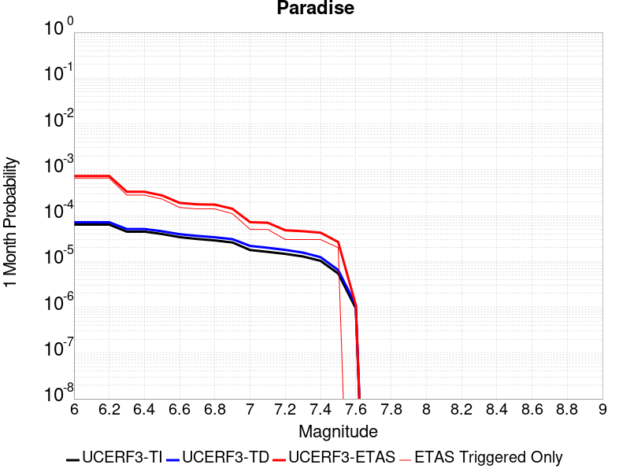 |  |  |

| Magnitude | 1 wk TI Prob | 1 wk TD Prob | 1 wk ETAS Prob | 1 wk ETAS/TD Gain | 1 wk ETAS Triggered Only | 1 mo TI Prob | 1 mo TD Prob | 1 mo ETAS Prob | 1 mo ETAS/TD Gain | 1 mo ETAS Triggered Only | 1 yr TI Prob | 1 yr TD Prob | 1 yr ETAS Prob | 1 yr ETAS/TD Gain | 1 yr ETAS Triggered Only | 10 yr TI Prob | 10 yr TD Prob | 10 yr ETAS Prob | 10 yr ETAS/TD Gain | 10 yr ETAS Triggered Only |
|-----|-----|-----|-----|-----|-----|-----|-----|-----|-----|-----|-----|-----|-----|-----|-----|-----|-----|-----|-----|-----|
| 6.0 | 1.4851273E-5 | 1.6694692E-5 | 3.5138914E-4 | 21.047956 | 3.3470002E-4 | 6.364676E-5 | 7.154685E-5 | 5.7356094E-4 | 8.016579 | 5.0205004E-4 | 7.7462377E-4 | 8.707584E-4 | 0.001790382 | 2.056118 | 9.2042505E-4 | 0.0077192914 | 0.008675844 | 0.0105007235 | 1.2103403 | 0.0018408501 |
| 6.1 | 1.4851273E-5 | 1.6694692E-5 | 3.5138914E-4 | 21.047956 | 3.3470002E-4 | 6.364676E-5 | 7.154685E-5 | 5.7356094E-4 | 8.016579 | 5.0205004E-4 | 7.7462377E-4 | 8.707584E-4 | 0.001790382 | 2.056118 | 9.2042505E-4 | 0.0077192914 | 0.008675844 | 0.0105007235 | 1.2103403 | 0.0018408501 |
| 6.2 | 1.4851273E-5 | 1.6694692E-5 | 3.5138914E-4 | 21.047956 | 3.3470002E-4 | 6.364676E-5 | 7.154685E-5 | 5.7356094E-4 | 8.016579 | 5.0205004E-4 | 7.7462377E-4 | 8.707584E-4 | 0.001790382 | 2.056118 | 9.2042505E-4 | 0.0077192914 | 0.008675844 | 0.0105007235 | 1.2103403 | 0.0018408501 |
| 6.3 | 1.0426831E-5 | 1.188862E-5 | 1.188862E-5 | 1.0 | 0.0 | 4.4685654E-5 | 5.0950268E-5 | 5.0950268E-5 | 1.0 | 0.0 | 5.43912E-4 | 6.201489E-4 | 7.03772E-4 | 1.1348436 | 8.3675004E-5 | 0.0054258266 | 0.0061847917 | 0.0066005792 | 1.0672274 | 4.1837504E-4 |
| 6.4 | 1.0426831E-5 | 1.188862E-5 | 1.188862E-5 | 1.0 | 0.0 | 4.4685654E-5 | 5.0950268E-5 | 5.0950268E-5 | 1.0 | 0.0 | 5.43912E-4 | 6.201489E-4 | 7.03772E-4 | 1.1348436 | 8.3675004E-5 | 0.0054258266 | 0.0061847917 | 0.0066005792 | 1.0672274 | 4.1837504E-4 |
| 6.5 | 9.25027E-6 | 1.06199595E-5 | 1.06199595E-5 | 1.0 | 0.0 | 3.964341E-5 | 4.551335E-5 | 4.551335E-5 | 1.0 | 0.0 | 4.8255164E-4 | 5.53989E-4 | 6.3761766E-4 | 1.1509572 | 8.3675004E-5 | 0.0048150513 | 0.0055265795 | 0.0056930045 | 1.0301136 | 1.6735001E-4 |
| 6.6 | 7.904275E-6 | 9.159525E-6 | 9.159525E-6 | 1.0 | 0.0 | 3.3875025E-5 | 3.9254537E-5 | 3.9254537E-5 | 1.0 | 0.0 | 4.1235037E-4 | 4.7782314E-4 | 4.7782314E-4 | 1.0 | 0.0 | 0.0041158604 | 0.0047683544 | 0.0048516304 | 1.0174643 | 8.3675004E-5 |
| 6.7 | 7.2061953E-6 | 8.407248E-6 | 8.407248E-6 | 1.0 | 0.0 | 3.088333E-5 | 3.6030586E-5 | 3.6030586E-5 | 1.0 | 0.0 | 3.7593965E-4 | 4.3858777E-4 | 4.3858777E-4 | 1.0 | 0.0 | 0.003753043 | 0.004377591 | 0.004377591 | 1.0 | 0.0 |
| 6.8 | 6.6948724E-6 | 7.842166E-6 | 7.842166E-6 | 1.0 | 0.0 | 2.8691995E-5 | 3.360887E-5 | 3.360887E-5 | 1.0 | 0.0 | 3.4926904E-4 | 4.0911473E-4 | 4.0911473E-4 | 1.0 | 0.0 | 0.003487206 | 0.0040839734 | 0.0040839734 | 1.0 | 0.0 |
| 6.9 | 6.0421025E-6 | 7.130621E-6 | 7.130621E-6 | 1.0 | 0.0 | 2.5894467E-5 | 3.0559466E-5 | 3.0559466E-5 | 1.0 | 0.0 | 3.1521954E-4 | 3.7200135E-4 | 3.7200135E-4 | 1.0 | 0.0 | 0.0031477278 | 0.0037141247 | 0.0037141247 | 1.0 | 0.0 |
| 7.0 | 4.134091E-6 | 5.0803087E-6 | 5.0803087E-6 | 1.0 | 0.0 | 1.7717413E-5 | 2.177258E-5 | 2.177258E-5 | 1.0 | 0.0 | 2.1568815E-4 | 2.6505045E-4 | 2.6505045E-4 | 1.0 | 0.0 | 0.0021547892 | 0.0026474963 | 0.0026474963 | 1.0 | 0.0 |
| 7.1 | 3.7674888E-6 | 4.6318696E-6 | 4.6318696E-6 | 1.0 | 0.0 | 1.6146281E-5 | 1.9850726E-5 | 1.9850726E-5 | 1.0 | 0.0 | 1.9656324E-4 | 2.4165731E-4 | 2.4165731E-4 | 1.0 | 0.0 | 0.0019638946 | 0.002414096 | 0.002414096 | 1.0 | 0.0 |
| 7.2 | 3.4065345E-6 | 4.156723E-6 | 4.156723E-6 | 1.0 | 0.0 | 1.4599351E-5 | 1.7814415E-5 | 1.7814415E-5 | 1.0 | 0.0 | 1.777326E-4 | 2.1687041E-4 | 2.1687041E-4 | 1.0 | 0.0 | 0.0017759053 | 0.002166736 | 0.002166736 | 1.0 | 0.0 |
| 7.3 | 2.9934936E-6 | 3.6293168E-6 | 3.6293168E-6 | 1.0 | 0.0 | 1.2829195E-5 | 1.555413E-5 | 1.555413E-5 | 1.0 | 0.0 | 1.5618425E-4 | 1.8935655E-4 | 1.8935655E-4 | 1.0 | 0.0 | 0.0015607453 | 0.0018920974 | 0.0018920974 | 1.0 | 0.0 |
| 7.4 | 2.4049796E-6 | 2.8889842E-6 | 2.8889842E-6 | 1.0 | 0.0 | 1.0307015E-5 | 1.238131E-5 | 1.238131E-5 | 1.0 | 0.0 | 1.2548068E-4 | 1.5073347E-4 | 1.5073347E-4 | 1.0 | 0.0 | 0.0012540985 | 0.0015064536 | 0.0015064536 | 1.0 | 0.0 |
| 7.5 | 1.2710091E-6 | 1.5134682E-6 | 1.5134682E-6 | 1.0 | 0.0 | 5.44717E-6 | 6.4862834E-6 | 6.4862834E-6 | 1.0 | 0.0 | 6.631728E-5 | 7.8968886E-5 | 7.8968886E-5 | 1.0 | 0.0 | 6.6297496E-4 | 7.8953087E-4 | 7.8953087E-4 | 1.0 | 0.0 |
| 7.6 | 2.21172E-7 | 2.603961E-7 | 2.603961E-7 | 1.0 | 0.0 | 9.478797E-7 | 1.1159829E-6 | 1.1159829E-6 | 1.0 | 0.0 | 1.1540374E-5 | 1.3587036E-5 | 1.3587036E-5 | 1.0 | 0.0 | 1.1539775E-4 | 1.3586486E-4 | 1.3586486E-4 | 1.0 | 0.0 |

## San Andreas (San Bernardino S)
*[(top)](#table-of-contents)*

| 1 Week | 1 Month | 1 Year | 10 Year |
|-----|-----|-----|-----|
|  |  |  |  |

| Magnitude | 1 wk TI Prob | 1 wk TD Prob | 1 wk ETAS Prob | 1 wk ETAS/TD Gain | 1 wk ETAS Triggered Only | 1 mo TI Prob | 1 mo TD Prob | 1 mo ETAS Prob | 1 mo ETAS/TD Gain | 1 mo ETAS Triggered Only | 1 yr TI Prob | 1 yr TD Prob | 1 yr ETAS Prob | 1 yr ETAS/TD Gain | 1 yr ETAS Triggered Only | 10 yr TI Prob | 10 yr TD Prob | 10 yr ETAS Prob | 10 yr ETAS/TD Gain | 10 yr ETAS Triggered Only |
|-----|-----|-----|-----|-----|-----|-----|-----|-----|-----|-----|-----|-----|-----|-----|-----|-----|-----|-----|-----|-----|
| 6.0 | 1.2336002E-4 | 3.0004102E-4 | 7.182905E-4 | 2.3939743 | 4.1837504E-4 | 5.2857865E-4 | 0.0012852824 | 0.0018702546 | 1.4551313 | 5.8572507E-4 | 0.006416472 | 0.015540994 | 0.016447114 | 1.0583051 | 9.2042505E-4 | 0.06234337 | 0.14283717 | 0.14412819 | 1.0090383 | 0.0015061501 |
| 6.1 | 1.2336002E-4 | 3.0004102E-4 | 7.182905E-4 | 2.3939743 | 4.1837504E-4 | 5.2857865E-4 | 0.0012852824 | 0.0018702546 | 1.4551313 | 5.8572507E-4 | 0.006416472 | 0.015540994 | 0.016447114 | 1.0583051 | 9.2042505E-4 | 0.06234337 | 0.14283717 | 0.14412819 | 1.0090383 | 0.0015061501 |
| 6.2 | 1.2336002E-4 | 3.0004102E-4 | 7.182905E-4 | 2.3939743 | 4.1837504E-4 | 5.2857865E-4 | 0.0012852824 | 0.0018702546 | 1.4551313 | 5.8572507E-4 | 0.006416472 | 0.015540994 | 0.016447114 | 1.0583051 | 9.2042505E-4 | 0.06234337 | 0.14283717 | 0.14412819 | 1.0090383 | 0.0015061501 |
| 6.3 | 1.1712257E-4 | 2.8792414E-4 | 7.061787E-4 | 2.4526556 | 4.1837504E-4 | 5.018573E-4 | 0.0012334028 | 0.0018184053 | 1.4742998 | 5.8572507E-4 | 0.006093008 | 0.014918125 | 0.015824819 | 1.060778 | 9.2042505E-4 | 0.059286322 | 0.13754563 | 0.13884461 | 1.009444 | 0.0015061501 |
| 6.4 | 1.1712257E-4 | 2.8792414E-4 | 7.061787E-4 | 2.4526556 | 4.1837504E-4 | 5.018573E-4 | 0.0012334028 | 0.0018184053 | 1.4742998 | 5.8572507E-4 | 0.006093008 | 0.014918125 | 0.015824819 | 1.060778 | 9.2042505E-4 | 0.059286322 | 0.13754563 | 0.13884461 | 1.009444 | 0.0015061501 |
| 6.5 | 1.0689076E-4 | 2.680528E-4 | 6.863157E-4 | 2.560375 | 4.1837504E-4 | 4.5802278E-4 | 0.0011483167 | 0.0017333691 | 1.509487 | 5.8572507E-4 | 0.0055621783 | 0.01389575 | 0.014803385 | 1.0653175 | 9.2042505E-4 | 0.05425003 | 0.12879294 | 0.13010511 | 1.0101882 | 0.0015061501 |
| 6.6 | 9.7648895E-5 | 2.50501E-4 | 6.687712E-4 | 2.6697347 | 4.1837504E-4 | 4.1842813E-4 | 0.0010731576 | 0.0016582542 | 1.5452101 | 5.8572507E-4 | 0.005082469 | 0.012991785 | 0.013900252 | 1.0699263 | 9.2042505E-4 | 0.049677886 | 0.12095292 | 0.122276895 | 1.0109463 | 0.0015061501 |
| 6.7 | 8.757013E-5 | 2.3120902E-4 | 6.494873E-4 | 2.8090916 | 4.1837504E-4 | 3.7524657E-4 | 9.905418E-4 | 0.0015756866 | 1.5907321 | 5.8572507E-4 | 0.00455906 | 0.011997245 | 0.012906628 | 1.0757992 | 9.2042505E-4 | 0.04466656 | 0.11226123 | 0.113598295 | 1.0119103 | 0.0015061501 |
| 6.8 | 8.562978E-5 | 2.2680782E-4 | 6.45088E-4 | 2.8442051 | 4.1837504E-4 | 3.6693315E-4 | 9.7169366E-4 | 0.0015568496 | 1.602202 | 5.8572507E-4 | 0.004458263 | 0.011770263 | 0.012679855 | 1.0772787 | 9.2042505E-4 | 0.043698758 | 0.11027153 | 0.1116116 | 1.0121524 | 0.0015061501 |
| 6.9 | 6.124075E-5 | 1.7065753E-4 | 5.889612E-4 | 3.4511292 | 4.1837504E-4 | 2.6243398E-4 | 7.311852E-4 | 0.0012328682 | 1.6861229 | 5.0205004E-4 | 0.0031904527 | 0.008866051 | 0.009695382 | 1.0935401 | 8.367501E-4 | 0.031450346 | 0.08418263 | 0.085408725 | 1.0145648 | 0.0013388001 |
| 7.0 | 5.8598747E-5 | 1.649477E-4 | 5.8325374E-4 | 3.5359917 | 4.1837504E-4 | 2.5111332E-4 | 7.06728E-4 | 0.0012084233 | 1.7098844 | 5.0205004E-4 | 0.0030530186 | 0.008570663 | 0.009400241 | 1.0967928 | 8.367501E-4 | 0.03011414 | 0.081500374 | 0.082730055 | 1.0150881 | 0.0013388001 |
| 7.1 | 5.613814E-5 | 1.5913323E-4 | 5.774417E-4 | 3.628668 | 4.1837504E-4 | 2.4056983E-4 | 6.818221E-4 | 0.0011835297 | 1.7358338 | 5.0205004E-4 | 0.0029250039 | 0.008269769 | 0.009099599 | 1.100345 | 8.367501E-4 | 0.028868021 | 0.07879931 | 0.08003262 | 1.0156512 | 0.0013388001 |
| 7.2 | 4.991222E-5 | 1.4519796E-4 | 5.6351227E-4 | 3.880993 | 4.1837504E-4 | 2.1389198E-4 | 6.2212895E-4 | 0.0011238666 | 1.806485 | 5.0205004E-4 | 0.002601025 | 0.007548217 | 0.008378651 | 1.1100173 | 8.367501E-4 | 0.025707912 | 0.07225321 | 0.07341765 | 1.016116 | 0.001255125 |
| 7.3 | 4.7410045E-5 | 1.3714004E-4 | 4.7179416E-4 | 3.4402366 | 3.3470002E-4 | 2.0317009E-4 | 5.8761094E-4 | 0.0010057401 | 1.7115749 | 4.1837504E-4 | 0.0024707897 | 0.0071307817 | 0.007878486 | 1.104856 | 7.5307506E-4 | 0.024434982 | 0.06853558 | 0.06962674 | 1.0159211 | 0.0011714501 |
| 7.4 | 4.5556746E-5 | 1.3121912E-4 | 4.6587523E-4 | 3.550361 | 3.3470002E-4 | 1.952286E-4 | 5.622468E-4 | 9.803865E-4 | 1.7436944 | 4.1837504E-4 | 0.002374317 | 0.0068239477 | 0.007571884 | 1.1096046 | 7.5307506E-4 | 0.023491086 | 0.065788016 | 0.06680423 | 1.0154468 | 0.0010877751 |
| 7.5 | 4.3084514E-5 | 1.2357246E-4 | 4.5823114E-4 | 3.7081976 | 3.3470002E-4 | 1.8463485E-4 | 5.2948913E-4 | 9.476426E-4 | 1.7897302 | 4.1837504E-4 | 0.0022456115 | 0.0064275465 | 0.0071757813 | 1.1164106 | 7.5307506E-4 | 0.022230545 | 0.062188786 | 0.063208915 | 1.0164037 | 0.0010877751 |
| 7.6 | 3.408608E-5 | 9.83552E-5 | 4.330223E-4 | 4.4026375 | 3.3470002E-4 | 1.4607502E-4 | 4.214543E-4 | 8.3965296E-4 | 1.9922754 | 4.1837504E-4 | 0.0017770125 | 0.0051191594 | 0.005868379 | 1.1463561 | 7.5307506E-4 | 0.017628696 | 0.050020292 | 0.051053658 | 1.0206589 | 0.0010877751 |
| 7.7 | 2.8315713E-5 | 8.248679E-5 | 4.171592E-4 | 5.057285 | 3.3470002E-4 | 1.2134742E-4 | 3.5346695E-4 | 7.716941E-4 | 2.1832142 | 4.1837504E-4 | 0.0014764034 | 0.0042949775 | 0.005044818 | 1.1745855 | 7.5307506E-4 | 0.01466633 | 0.0422714 | 0.043313198 | 1.0246453 | 0.0010877751 |
| 7.8 | 2.6222975E-5 | 7.463088E-5 | 4.0930594E-4 | 5.4844046 | 3.3470002E-4 | 1.1237934E-4 | 3.1980744E-4 | 7.380487E-4 | 2.3077908 | 4.1837504E-4 | 0.0013673597 | 0.0038867102 | 0.004636858 | 1.1930033 | 7.5307506E-4 | 0.013589768 | 0.03843674 | 0.039482705 | 1.0272126 | 0.0010877751 |
| 7.9 | 2.1469694E-5 | 5.787864E-5 | 3.925593E-4 | 6.7824554 | 3.3470002E-4 | 9.200973E-5 | 2.4802773E-4 | 6.66299E-4 | 2.686389 | 4.1837504E-4 | 0.0011196428 | 0.0030155594 | 0.0037663635 | 1.2489767 | 7.5307506E-4 | 0.011140184 | 0.030152109 | 0.031044781 | 1.0296056 | 9.2042505E-4 |
| 8.0 | 1.2420249E-5 | 3.131896E-5 | 3.131896E-5 | 1.0 | 0.0 | 5.322855E-5 | 1.342172E-4 | 2.1788098E-4 | 1.6233461 | 8.3675004E-5 | 6.478649E-4 | 0.0016328706 | 0.0017164091 | 1.0511605 | 8.3675004E-5 | 0.0064597935 | 0.016522504 | 0.016687088 | 1.0099612 | 1.6735001E-4 |
| 8.1 | 4.9197724E-6 | 7.822348E-6 | 7.822348E-6 | 1.0 | 0.0 | 2.1084568E-5 | 3.352392E-5 | 3.352392E-5 | 1.0 | 0.0 | 2.566744E-4 | 4.0807744E-4 | 4.0807744E-4 | 1.0 | 0.0 | 0.002563781 | 0.0043843705 | 0.0043843705 | 1.0 | 0.0 |
| 8.2 | 2.5634774E-6 | 2.9067196E-6 | 2.9067196E-6 | 1.0 | 0.0 | 1.0986286E-5 | 1.2457311E-5 | 1.2457311E-5 | 1.0 | 0.0 | 1.3374983E-4 | 1.5165724E-4 | 1.5165724E-4 | 1.0 | 0.0 | 0.0013366934 | 0.0017049741 | 0.0017049741 | 1.0 | 0.0 |
| 8.3 | 5.2850464E-7 | 3.2088764E-7 | 3.2088764E-7 | 1.0 | 0.0 | 2.2650179E-6 | 1.375232E-6 | 1.375232E-6 | 1.0 | 0.0 | 2.7576245E-5 | 1.6743334E-5 | 1.6743334E-5 | 1.0 | 0.0 | 2.7572823E-4 | 1.9870348E-4 | 1.9870348E-4 | 1.0 | 0.0 |

## Helendale-So Lockhart
*[(top)](#table-of-contents)*

| 1 Week | 1 Month | 1 Year | 10 Year |
|-----|-----|-----|-----|
|  |  |  |  |

| Magnitude | 1 wk TI Prob | 1 wk TD Prob | 1 wk ETAS Prob | 1 wk ETAS/TD Gain | 1 wk ETAS Triggered Only | 1 mo TI Prob | 1 mo TD Prob | 1 mo ETAS Prob | 1 mo ETAS/TD Gain | 1 mo ETAS Triggered Only | 1 yr TI Prob | 1 yr TD Prob | 1 yr ETAS Prob | 1 yr ETAS/TD Gain | 1 yr ETAS Triggered Only | 10 yr TI Prob | 10 yr TD Prob | 10 yr ETAS Prob | 10 yr ETAS/TD Gain | 10 yr ETAS Triggered Only |
|-----|-----|-----|-----|-----|-----|-----|-----|-----|-----|-----|-----|-----|-----|-----|-----|-----|-----|-----|-----|-----|
| 6.0 | 1.7296055E-5 | 1.8103729E-5 | 3.527977E-4 | 19.48757 | 3.3470002E-4 | 7.412385E-5 | 7.7585224E-5 | 6.6326483E-4 | 8.548855 | 5.8572507E-4 | 9.0208417E-4 | 9.4421144E-4 | 0.0017801714 | 1.8853525 | 8.367501E-4 | 0.008984311 | 0.009404116 | 0.010813214 | 1.1498384 | 0.0014224751 |
| 6.1 | 1.7296055E-5 | 1.8103729E-5 | 3.527977E-4 | 19.48757 | 3.3470002E-4 | 7.412385E-5 | 7.7585224E-5 | 6.6326483E-4 | 8.548855 | 5.8572507E-4 | 9.0208417E-4 | 9.4421144E-4 | 0.0017801714 | 1.8853525 | 8.367501E-4 | 0.008984311 | 0.009404116 | 0.010813214 | 1.1498384 | 0.0014224751 |
| 6.2 | 1.7296055E-5 | 1.8103729E-5 | 3.527977E-4 | 19.48757 | 3.3470002E-4 | 7.412385E-5 | 7.7585224E-5 | 6.6326483E-4 | 8.548855 | 5.8572507E-4 | 9.0208417E-4 | 9.4421144E-4 | 0.0017801714 | 1.8853525 | 8.367501E-4 | 0.008984311 | 0.009404116 | 0.010813214 | 1.1498384 | 0.0014224751 |
| 6.3 | 1.0669118E-5 | 1.1135425E-5 | 1.7848358E-4 | 16.028448 | 1.6735001E-4 | 4.5723988E-5 | 4.772239E-5 | 2.9873542E-4 | 6.259859 | 2.5102502E-4 | 5.5654737E-4 | 5.80868E-4 | 0.0010826264 | 1.863808 | 5.0205004E-4 | 0.0055515557 | 0.0057937936 | 0.006708886 | 1.1579436 | 9.2042505E-4 |
| 6.4 | 1.0669118E-5 | 1.1135425E-5 | 1.7848358E-4 | 16.028448 | 1.6735001E-4 | 4.5723988E-5 | 4.772239E-5 | 2.9873542E-4 | 6.259859 | 2.5102502E-4 | 5.5654737E-4 | 5.80868E-4 | 0.0010826264 | 1.863808 | 5.0205004E-4 | 0.0055515557 | 0.0057937936 | 0.006708886 | 1.1579436 | 9.2042505E-4 |
| 6.5 | 8.790038E-6 | 9.170197E-6 | 1.7651868E-4 | 19.24917 | 1.6735001E-4 | 3.767105E-5 | 3.930026E-5 | 2.9031542E-4 | 7.3871117 | 2.5102502E-4 | 4.585485E-4 | 4.7837716E-4 | 9.801871E-4 | 2.0489838 | 5.0205004E-4 | 0.0045760344 | 0.004773638 | 0.0056063943 | 1.1744488 | 8.367501E-4 |
| 6.6 | 7.396949E-6 | 7.715537E-6 | 1.7506426E-4 | 22.689835 | 1.6735001E-4 | 3.1700827E-5 | 3.3066175E-5 | 2.840829E-4 | 8.591345 | 2.5102502E-4 | 3.858892E-4 | 4.025073E-4 | 9.0435526E-4 | 2.2468045 | 5.0205004E-4 | 0.003852198 | 0.00401789 | 0.004767939 | 1.1866775 | 7.5307506E-4 |
| 6.7 | 6.4600285E-6 | 6.738031E-6 | 1.7408692E-4 | 25.836468 | 1.6735001E-4 | 2.7685543E-5 | 2.887696E-5 | 2.7989474E-4 | 9.692666 | 2.5102502E-4 | 3.3701936E-4 | 3.5152107E-4 | 8.533946E-4 | 2.4277198 | 5.0205004E-4 | 0.0033650869 | 0.003509732 | 0.0042601638 | 1.2138146 | 7.5307506E-4 |
| 6.8 | 5.600104E-6 | 5.836009E-6 | 8.9510526E-5 | 15.3376255 | 8.3675004E-5 | 2.4000226E-5 | 2.5011232E-5 | 1.9235705E-4 | 7.690827 | 1.6735001E-4 | 2.9216358E-4 | 3.044698E-4 | 5.554184E-4 | 1.824215 | 2.5102502E-4 | 0.0029177975 | 0.003040588 | 0.003457691 | 1.1371784 | 4.1837504E-4 |
| 6.9 | 4.839122E-6 | 5.0395092E-6 | 8.871409E-5 | 17.603716 | 8.3675004E-5 | 2.0738931E-5 | 2.159772E-5 | 1.8894412E-4 | 8.748336 | 1.6735001E-4 | 2.5246723E-4 | 2.6292098E-4 | 5.1388E-4 | 1.9545035 | 2.5102502E-4 | 0.002521806 | 0.002626147 | 0.0030434232 | 1.158893 | 4.1837504E-4 |
| 7.0 | 3.6937633E-6 | 3.845208E-6 | 8.751989E-5 | 22.760769 | 8.3675004E-5 | 1.5830317E-5 | 1.647936E-5 | 1.8382662E-4 | 11.154961 | 1.6735001E-4 | 1.9271708E-4 | 2.0061806E-4 | 4.515927E-4 | 2.2510073 | 2.5102502E-4 | 0.0019255003 | 0.002004401 | 0.0024219374 | 1.2083099 | 4.1837504E-4 |
| 7.1 | 2.7858857E-6 | 2.8978538E-6 | 8.657262E-5 | 29.874737 | 8.3675004E-5 | 1.1939455E-5 | 1.2419316E-5 | 1.7976724E-4 | 14.474812 | 1.6735001E-4 | 1.4535317E-4 | 1.511949E-4 | 4.0218196E-4 | 2.6600235 | 2.5102502E-4 | 0.0014525814 | 0.0015109418 | 0.001845136 | 1.2211828 | 3.3470002E-4 |
| 7.2 | 2.1672065E-6 | 2.2540128E-6 | 8.5928834E-5 | 38.1226 | 8.3675004E-5 | 9.2879945E-6 | 9.66002E-6 | 1.7700842E-4 | 18.323814 | 1.6735001E-4 | 1.1307546E-4 | 1.1760458E-4 | 3.6860007E-4 | 3.1342323 | 2.5102502E-4 | 0.0011301794 | 0.0011754417 | 0.0015097483 | 1.2844094 | 3.3470002E-4 |
| 7.3 | 1.4823496E-6 | 1.5422102E-6 | 8.5217085E-5 | 55.256466 | 8.3675004E-5 | 6.3529114E-6 | 6.6094562E-6 | 1.7395837E-4 | 26.319616 | 1.6735001E-4 | 7.734395E-5 | 8.046731E-5 | 3.3147214E-4 | 4.119339 | 2.5102502E-4 | 7.731704E-4 | 8.0439687E-4 | 0.0011388276 | 1.4157535 | 3.3470002E-4 |
| 7.4 | 4.2321457E-7 | 4.4108765E-7 | 8.411606E-5 | 190.70145 | 8.3675004E-5 | 1.8137755E-6 | 1.8903745E-6 | 8.5565225E-5 | 45.263634 | 8.3675004E-5 | 2.2082493E-5 | 2.3015113E-5 | 1.06688196E-4 | 4.635571 | 8.3675004E-5 | 2.2080299E-4 | 2.3013182E-4 | 3.9744333E-4 | 1.7270247 | 1.6735001E-4 |
| 7.5 | 5.6942316E-8 | 5.9415648E-8 | 5.9415648E-8 | 1.0 | 0.0 | 2.440385E-7 | 2.5463845E-7 | 2.5463845E-7 | 1.0 | 0.0 | 2.9711643E-6 | 3.1002196E-6 | 3.1002196E-6 | 1.0 | 0.0 | 2.9711247E-5 | 3.1001844E-5 | 3.1001844E-5 | 1.0 | 0.0 |

## Death Valley (Black Mtns Frontal)
*[(top)](#table-of-contents)*

| 1 Week | 1 Month | 1 Year | 10 Year |
|-----|-----|-----|-----|
|  |  |  |  |

| Magnitude | 1 wk TI Prob | 1 wk TD Prob | 1 wk ETAS Prob | 1 wk ETAS/TD Gain | 1 wk ETAS Triggered Only | 1 mo TI Prob | 1 mo TD Prob | 1 mo ETAS Prob | 1 mo ETAS/TD Gain | 1 mo ETAS Triggered Only | 1 yr TI Prob | 1 yr TD Prob | 1 yr ETAS Prob | 1 yr ETAS/TD Gain | 1 yr ETAS Triggered Only | 10 yr TI Prob | 10 yr TD Prob | 10 yr ETAS Prob | 10 yr ETAS/TD Gain | 10 yr ETAS Triggered Only |
|-----|-----|-----|-----|-----|-----|-----|-----|-----|-----|-----|-----|-----|-----|-----|-----|-----|-----|-----|-----|-----|
| 6.0 | 1.6707214E-5 | 1.867027E-5 | 5.2071095E-4 | 27.889847 | 5.0205004E-4 | 7.160038E-5 | 8.001302E-5 | 7.493595E-4 | 9.365469 | 6.6940003E-4 | 8.71386E-4 | 9.737309E-4 | 0.0019768532 | 2.0301845 | 0.0010041001 | 0.00867977 | 0.009695496 | 0.011021317 | 1.1367459 | 0.0013388001 |
| 6.1 | 1.6707214E-5 | 1.867027E-5 | 5.2071095E-4 | 27.889847 | 5.0205004E-4 | 7.160038E-5 | 8.001302E-5 | 7.493595E-4 | 9.365469 | 6.6940003E-4 | 8.71386E-4 | 9.737309E-4 | 0.0019768532 | 2.0301845 | 0.0010041001 | 0.00867977 | 0.009695496 | 0.011021317 | 1.1367459 | 0.0013388001 |
| 6.2 | 1.6707214E-5 | 1.867027E-5 | 5.2071095E-4 | 27.889847 | 5.0205004E-4 | 7.160038E-5 | 8.001302E-5 | 7.493595E-4 | 9.365469 | 6.6940003E-4 | 8.71386E-4 | 9.737309E-4 | 0.0019768532 | 2.0301845 | 0.0010041001 | 0.00867977 | 0.009695496 | 0.011021317 | 1.1367459 | 0.0013388001 |
| 6.3 | 1.6707214E-5 | 1.867027E-5 | 5.2071095E-4 | 27.889847 | 5.0205004E-4 | 7.160038E-5 | 8.001302E-5 | 7.493595E-4 | 9.365469 | 6.6940003E-4 | 8.71386E-4 | 9.737309E-4 | 0.0019768532 | 2.0301845 | 0.0010041001 | 0.00867977 | 0.009695496 | 0.011021317 | 1.1367459 | 0.0013388001 |
| 6.4 | 1.5515609E-5 | 1.7338214E-5 | 5.1937957E-4 | 29.95577 | 5.0205004E-4 | 6.649377E-5 | 7.4304546E-5 | 7.4365485E-4 | 10.008202 | 6.6940003E-4 | 8.0926094E-4 | 9.042885E-4 | 0.0018238812 | 2.0169241 | 9.2042505E-4 | 0.008063202 | 0.009006773 | 0.010167672 | 1.1288918 | 0.0011714501 |
| 6.5 | 1.5515609E-5 | 1.7338214E-5 | 5.1937957E-4 | 29.95577 | 5.0205004E-4 | 6.649377E-5 | 7.4304546E-5 | 7.4365485E-4 | 10.008202 | 6.6940003E-4 | 8.0926094E-4 | 9.042885E-4 | 0.0018238812 | 2.0169241 | 9.2042505E-4 | 0.008063202 | 0.009006773 | 0.010167672 | 1.1288918 | 0.0011714501 |
| 6.6 | 1.5041828E-5 | 1.6809145E-5 | 5.1885075E-4 | 30.86717 | 5.0205004E-4 | 6.4463384E-5 | 7.203723E-5 | 7.4138906E-4 | 10.291748 | 6.6940003E-4 | 7.8455906E-4 | 8.767063E-4 | 0.0017963245 | 2.0489466 | 9.2042505E-4 | 0.00781795 | 0.008733132 | 0.009811408 | 1.1234695 | 0.0010877751 |
| 6.7 | 1.4634985E-5 | 1.6356016E-5 | 5.1839784E-4 | 31.694628 | 5.0205004E-4 | 6.271985E-5 | 7.009536E-5 | 7.394485E-4 | 10.549179 | 6.6940003E-4 | 7.6334673E-4 | 8.5308263E-4 | 0.0017727226 | 2.0780196 | 9.2042505E-4 | 0.007607299 | 0.008498715 | 0.009577246 | 1.1269051 | 0.0010877751 |
| 6.8 | 1.4209158E-5 | 1.5882048E-5 | 5.179241E-4 | 32.610664 | 5.0205004E-4 | 6.089497E-5 | 6.8064175E-5 | 7.3741865E-4 | 10.8341675 | 6.6940003E-4 | 7.4114406E-4 | 8.2837185E-4 | 0.0017480345 | 2.110205 | 9.2042505E-4 | 0.007386771 | 0.008253456 | 0.009249269 | 1.120654 | 0.0010041001 |
| 6.9 | 1.3780098E-5 | 1.5404594E-5 | 4.3377318E-4 | 28.158691 | 4.1837504E-4 | 5.9056227E-5 | 6.6018045E-5 | 6.5170444E-4 | 9.871611 | 5.8572507E-4 | 7.1877235E-4 | 8.0347876E-4 | 0.0016395565 | 2.0405724 | 8.367501E-4 | 0.0071645193 | 0.008006332 | 0.008919389 | 1.1140417 | 9.2042505E-4 |
| 7.0 | 1.3585064E-5 | 1.5188155E-5 | 4.3355682E-4 | 28.545721 | 4.1837504E-4 | 5.8220405E-5 | 6.50905E-5 | 5.6710787E-4 | 8.712605 | 5.0205004E-4 | 7.086029E-4 | 7.9219416E-4 | 0.0015446726 | 1.9498662 | 7.5307506E-4 | 0.007063476 | 0.007894293 | 0.008724438 | 1.1051575 | 8.367501E-4 |
| 7.1 | 1.3398601E-5 | 1.49813395E-5 | 4.333501E-4 | 28.925991 | 4.1837504E-4 | 5.742131E-5 | 6.420419E-5 | 5.66222E-4 | 8.819081 | 5.0205004E-4 | 6.9888023E-4 | 7.8141113E-4 | 0.0015338977 | 1.9629842 | 7.5307506E-4 | 0.0069668638 | 0.007787224 | 0.008617458 | 1.106615 | 8.367501E-4 |
| 7.2 | 1.3126312E-5 | 1.4679561E-5 | 4.3304844E-4 | 29.500095 | 4.1837504E-4 | 5.6254412E-5 | 6.291092E-5 | 5.649294E-4 | 8.979831 | 5.0205004E-4 | 6.846822E-4 | 7.6567667E-4 | 0.0015181751 | 1.9827888 | 7.5307506E-4 | 0.006825765 | 0.00763097 | 0.008461335 | 1.1088151 | 8.367501E-4 |
| 7.3 | 1.2922429E-5 | 1.4453788E-5 | 4.3282277E-4 | 29.945284 | 4.1837504E-4 | 5.5380664E-5 | 6.194336E-5 | 5.639623E-4 | 9.104483 | 5.0205004E-4 | 6.74051E-4 | 7.53905E-4 | 0.0015064123 | 1.9981462 | 7.5307506E-4 | 0.006720101 | 0.007514055 | 0.008344517 | 1.1105212 | 8.367501E-4 |
| 7.4 | 1.2768878E-5 | 1.4283772E-5 | 4.3265283E-4 | 30.289818 | 4.1837504E-4 | 5.4722615E-5 | 6.1214756E-5 | 5.632341E-4 | 9.200953 | 5.0205004E-4 | 6.660441E-4 | 7.4504025E-4 | 0.0014975542 | 2.0100312 | 7.5307506E-4 | 0.0066405144 | 0.0074260035 | 0.00825654 | 1.1118417 | 8.367501E-4 |
| 7.5 | 1.2521929E-5 | 1.40120155E-5 | 4.3238117E-4 | 30.857887 | 4.1837504E-4 | 5.366431E-5 | 6.005014E-5 | 4.7840006E-4 | 7.966676 | 4.1837504E-4 | 6.531671E-4 | 7.3087064E-4 | 0.0013997814 | 1.9152246 | 6.6940003E-4 | 0.006512506 | 0.0072852457 | 0.008032834 | 1.1026168 | 7.5307506E-4 |
| 7.6 | 1.1301089E-5 | 1.2648149E-5 | 3.4734394E-4 | 27.462038 | 3.3470002E-4 | 4.8432343E-5 | 5.4205255E-5 | 3.8888713E-4 | 7.1743436 | 3.3470002E-4 | 5.895042E-4 | 6.5975444E-4 | 0.0012450931 | 1.8872068 | 5.8572507E-4 | 0.0058794282 | 0.00657851 | 0.0072435066 | 1.1010861 | 6.6940003E-4 |
| 7.7 | 9.189108E-6 | 1.0283358E-5 | 3.4497996E-4 | 33.5474 | 3.3470002E-4 | 3.93813E-5 | 4.407082E-5 | 3.7875609E-4 | 8.59426 | 3.3470002E-4 | 4.7936183E-4 | 5.3643517E-4 | 0.0010382159 | 1.9353986 | 5.0205004E-4 | 0.004783291 | 0.005351914 | 0.0059345043 | 1.1088564 | 5.8572507E-4 |
| 7.8 | 3.4586725E-7 | 3.6482615E-7 | 3.6482615E-7 | 1.0 | 0.0 | 1.4822873E-6 | 1.5635396E-6 | 1.5635396E-6 | 1.0 | 0.0 | 1.80467E-5 | 1.9035933E-5 | 1.02709346E-4 | 5.3955507 | 8.3675004E-5 | 1.8045233E-4 | 1.9034347E-4 | 2.7400255E-4 | 1.4395164 | 8.3675004E-5 |
| 7.9 | 2.5591178E-9 | 2.6696718E-9 | 2.6696718E-9 | 1.0 | 0.0 | 1.0967647E-8 | 1.14414505E-8 | 1.14414505E-8 | 1.0 | 0.0 | 1.335311E-7 | 1.3929966E-7 | 1.3929966E-7 | 1.0 | 0.0 | 1.3353102E-6 | 1.3929966E-6 | 1.3929966E-6 | 1.0 | 0.0 |

## Coyote Lake
*[(top)](#table-of-contents)*

| 1 Week | 1 Month | 1 Year | 10 Year |
|-----|-----|-----|-----|
|  |  |  |  |

| Magnitude | 1 wk TI Prob | 1 wk TD Prob | 1 wk ETAS Prob | 1 wk ETAS/TD Gain | 1 wk ETAS Triggered Only | 1 mo TI Prob | 1 mo TD Prob | 1 mo ETAS Prob | 1 mo ETAS/TD Gain | 1 mo ETAS Triggered Only | 1 yr TI Prob | 1 yr TD Prob | 1 yr ETAS Prob | 1 yr ETAS/TD Gain | 1 yr ETAS Triggered Only | 10 yr TI Prob | 10 yr TD Prob | 10 yr ETAS Prob | 10 yr ETAS/TD Gain | 10 yr ETAS Triggered Only |
|-----|-----|-----|-----|-----|-----|-----|-----|-----|-----|-----|-----|-----|-----|-----|-----|-----|-----|-----|-----|-----|
| 6.0 | 1.980352E-5 | 2.1706745E-5 | 1.05379935E-4 | 4.854709 | 8.3675004E-5 | 8.486947E-5 | 9.302599E-5 | 1.7669321E-4 | 1.8993962 | 8.3675004E-5 | 0.0010327959 | 0.0011320751 | 0.0013828159 | 1.2214879 | 2.5102502E-4 | 0.010280091 | 0.011270258 | 0.01218031 | 1.0807481 | 9.2042505E-4 |
| 6.1 | 1.980352E-5 | 2.1706745E-5 | 1.05379935E-4 | 4.854709 | 8.3675004E-5 | 8.486947E-5 | 9.302599E-5 | 1.7669321E-4 | 1.8993962 | 8.3675004E-5 | 0.0010327959 | 0.0011320751 | 0.0013828159 | 1.2214879 | 2.5102502E-4 | 0.010280091 | 0.011270258 | 0.01218031 | 1.0807481 | 9.2042505E-4 |
| 6.2 | 1.980352E-5 | 2.1706745E-5 | 1.05379935E-4 | 4.854709 | 8.3675004E-5 | 8.486947E-5 | 9.302599E-5 | 1.7669321E-4 | 1.8993962 | 8.3675004E-5 | 0.0010327959 | 0.0011320751 | 0.0013828159 | 1.2214879 | 2.5102502E-4 | 0.010280091 | 0.011270258 | 0.01218031 | 1.0807481 | 9.2042505E-4 |
| 6.3 | 1.5344787E-5 | 1.682067E-5 | 1.0049427E-4 | 5.974451 | 8.3675004E-5 | 6.576172E-5 | 7.2086936E-5 | 1.5575592E-4 | 2.1606677 | 8.3675004E-5 | 8.003548E-4 | 8.773662E-4 | 9.6096785E-4 | 1.095287 | 8.3675004E-5 | 0.007974784 | 0.00874507 | 0.009325672 | 1.0663921 | 5.8572507E-4 |
| 6.4 | 1.5344787E-5 | 1.682067E-5 | 1.0049427E-4 | 5.974451 | 8.3675004E-5 | 6.576172E-5 | 7.2086936E-5 | 1.5575592E-4 | 2.1606677 | 8.3675004E-5 | 8.003548E-4 | 8.773662E-4 | 9.6096785E-4 | 1.095287 | 8.3675004E-5 | 0.007974784 | 0.00874507 | 0.009325672 | 1.0663921 | 5.8572507E-4 |
| 6.5 | 1.4189697E-5 | 1.5557987E-5 | 9.923169E-5 | 6.3781834 | 8.3675004E-5 | 6.081157E-5 | 6.6675726E-5 | 1.5034515E-4 | 2.254871 | 8.3675004E-5 | 7.401293E-4 | 8.115349E-4 | 8.95142E-4 | 1.1030234 | 8.3675004E-5 | 0.0073766913 | 0.008091656 | 0.008672642 | 1.0718006 | 5.8572507E-4 |
| 6.6 | 1.3469301E-5 | 1.4771577E-5 | 9.844535E-5 | 6.6645117 | 8.3675004E-5 | 5.7724297E-5 | 6.330556E-5 | 1.4697528E-4 | 2.3216803 | 8.3675004E-5 | 7.025667E-4 | 7.7053264E-4 | 8.541432E-4 | 1.10851 | 8.3675004E-5 | 0.0070034964 | 0.0076845144 | 0.008265738 | 1.0756358 | 5.8572507E-4 |
| 6.7 | 1.3027966E-5 | 1.4281745E-5 | 9.7955555E-5 | 6.8587947 | 8.3675004E-5 | 5.5832945E-5 | 6.120638E-5 | 1.4487626E-4 | 2.3670125 | 8.3675004E-5 | 6.7955407E-4 | 7.4499263E-4 | 8.286053E-4 | 1.1122329 | 8.3675004E-5 | 0.006774798 | 0.0074308286 | 0.007929148 | 1.0670611 | 5.0205004E-4 |
| 6.8 | 5.695434E-6 | 6.2244176E-6 | 6.2244176E-6 | 1.0 | 0.0 | 2.4408775E-5 | 2.6675973E-5 | 2.6675973E-5 | 1.0 | 0.0 | 2.971363E-4 | 3.2476155E-4 | 3.2476155E-4 | 1.0 | 0.0 | 0.0029673933 | 0.0032458105 | 0.0032458105 | 1.0 | 0.0 |
| 6.9 | 4.385688E-6 | 4.7930553E-6 | 4.7930553E-6 | 1.0 | 0.0 | 1.879567E-5 | 2.0541665E-5 | 2.0541665E-5 | 1.0 | 0.0 | 2.2881327E-4 | 2.5009477E-4 | 2.5009477E-4 | 1.0 | 0.0 | 0.002285778 | 0.0025009478 | 0.0025009478 | 1.0 | 0.0 |

## Death Valley (No)
*[(top)](#table-of-contents)*

| 1 Week | 1 Month | 1 Year | 10 Year |
|-----|-----|-----|-----|
|  |  |  |  |

| Magnitude | 1 wk TI Prob | 1 wk TD Prob | 1 wk ETAS Prob | 1 wk ETAS/TD Gain | 1 wk ETAS Triggered Only | 1 mo TI Prob | 1 mo TD Prob | 1 mo ETAS Prob | 1 mo ETAS/TD Gain | 1 mo ETAS Triggered Only | 1 yr TI Prob | 1 yr TD Prob | 1 yr ETAS Prob | 1 yr ETAS/TD Gain | 1 yr ETAS Triggered Only | 10 yr TI Prob | 10 yr TD Prob | 10 yr ETAS Prob | 10 yr ETAS/TD Gain | 10 yr ETAS Triggered Only |
|-----|-----|-----|-----|-----|-----|-----|-----|-----|-----|-----|-----|-----|-----|-----|-----|-----|-----|-----|-----|-----|
| 6.0 | 2.0074807E-5 | 2.2500084E-5 | 5.245388E-4 | 23.31275 | 5.0205004E-4 | 8.603206E-5 | 9.642541E-5 | 5.98427E-4 | 6.206114 | 5.0205004E-4 | 0.001046937 | 0.0011733545 | 0.0019255459 | 1.6410607 | 7.5307506E-4 | 0.010420183 | 0.011672506 | 0.01249949 | 1.0708488 | 8.367501E-4 |
| 6.1 | 2.0074807E-5 | 2.2500084E-5 | 5.245388E-4 | 23.31275 | 5.0205004E-4 | 8.603206E-5 | 9.642541E-5 | 5.98427E-4 | 6.206114 | 5.0205004E-4 | 0.001046937 | 0.0011733545 | 0.0019255459 | 1.6410607 | 7.5307506E-4 | 0.010420183 | 0.011672506 | 0.01249949 | 1.0708488 | 8.367501E-4 |
| 6.2 | 2.0074807E-5 | 2.2500084E-5 | 5.245388E-4 | 23.31275 | 5.0205004E-4 | 8.603206E-5 | 9.642541E-5 | 5.98427E-4 | 6.206114 | 5.0205004E-4 | 0.001046937 | 0.0011733545 | 0.0019255459 | 1.6410607 | 7.5307506E-4 | 0.010420183 | 0.011672506 | 0.01249949 | 1.0708488 | 8.367501E-4 |
| 6.3 | 1.9050609E-5 | 2.1336948E-5 | 5.233763E-4 | 24.529108 | 5.0205004E-4 | 8.164292E-5 | 9.1440896E-5 | 5.9344503E-4 | 6.48993 | 5.0205004E-4 | 9.935491E-4 | 0.001112731 | 0.0018649681 | 1.6760278 | 7.5307506E-4 | 0.009891188 | 0.011072419 | 0.011899904 | 1.074734 | 8.367501E-4 |
| 6.4 | 1.9050609E-5 | 2.1336948E-5 | 5.233763E-4 | 24.529108 | 5.0205004E-4 | 8.164292E-5 | 9.1440896E-5 | 5.9344503E-4 | 6.48993 | 5.0205004E-4 | 9.935491E-4 | 0.001112731 | 0.0018649681 | 1.6760278 | 7.5307506E-4 | 0.009891188 | 0.011072419 | 0.011899904 | 1.074734 | 8.367501E-4 |
| 6.5 | 1.8367004E-5 | 2.0561009E-5 | 4.3892744E-4 | 21.347565 | 4.1837504E-4 | 7.8713354E-5 | 8.811567E-5 | 5.0645386E-4 | 5.7476025 | 4.1837504E-4 | 9.5791375E-4 | 0.0010722869 | 0.0017409691 | 1.6236039 | 6.6940003E-4 | 0.009537951 | 0.0106719155 | 0.011416954 | 1.069813 | 7.5307506E-4 |
| 6.6 | 1.779439E-5 | 1.9910927E-5 | 4.3827764E-4 | 22.011913 | 4.1837504E-4 | 7.625944E-5 | 8.53298E-5 | 5.0366914E-4 | 5.9026175 | 4.1837504E-4 | 9.280632E-4 | 0.0010384015 | 0.0017071065 | 1.6439754 | 6.6940003E-4 | 0.009241969 | 0.010336253 | 0.011081544 | 1.0721046 | 7.5307506E-4 |
| 6.7 | 1.7025437E-5 | 1.9043426E-5 | 4.374105E-4 | 22.969109 | 4.1837504E-4 | 7.296412E-5 | 8.161216E-5 | 4.9995305E-4 | 6.1259627 | 4.1837504E-4 | 8.87976E-4 | 9.931813E-4 | 0.0016619165 | 1.6733264 | 6.6940003E-4 | 0.008844362 | 0.009888145 | 0.010633774 | 1.0754063 | 7.5307506E-4 |
| 6.8 | 1.6545107E-5 | 1.8512545E-5 | 4.3687984E-4 | 23.599123 | 4.1837504E-4 | 7.090568E-5 | 7.93371E-5 | 4.9767894E-4 | 6.272966 | 4.1837504E-4 | 8.629347E-4 | 9.655073E-4 | 0.001634261 | 1.692645 | 6.6940003E-4 | 0.008595915 | 0.009613829 | 0.0103596635 | 1.0775794 | 7.5307506E-4 |
| 6.9 | 1.615478E-5 | 1.8087594E-5 | 4.3645507E-4 | 24.130077 | 4.1837504E-4 | 6.9232934E-5 | 7.751599E-5 | 4.958586E-4 | 6.3968554 | 4.1837504E-4 | 8.4258494E-4 | 9.433546E-4 | 0.0016121232 | 1.708926 | 6.6940003E-4 | 0.008393973 | 0.009394196 | 0.010140196 | 1.0794108 | 7.5307506E-4 |
| 7.0 | 1.5894311E-5 | 1.780555E-5 | 4.3617314E-4 | 24.496471 | 4.1837504E-4 | 6.81167E-5 | 7.6307304E-5 | 4.946504E-4 | 6.482347 | 4.1837504E-4 | 8.2900526E-4 | 9.286515E-4 | 0.0015974299 | 1.7201608 | 6.6940003E-4 | 0.008259195 | 0.009248397 | 0.009994508 | 1.0806745 | 7.5307506E-4 |
| 7.1 | 1.5602263E-5 | 1.7483504E-5 | 4.3585122E-4 | 24.929285 | 4.1837504E-4 | 6.6865134E-5 | 7.492718E-5 | 4.9327087E-4 | 6.583337 | 4.1837504E-4 | 8.137789E-4 | 9.118627E-4 | 0.0015806523 | 1.7334324 | 6.6940003E-4 | 0.008108052 | 0.009081894 | 0.00982813 | 1.0821674 | 7.5307506E-4 |
| 7.2 | 1.5323829E-5 | 1.717063E-5 | 4.3553847E-4 | 25.365316 | 4.1837504E-4 | 6.56719E-5 | 7.358637E-5 | 4.9193064E-4 | 6.6850777 | 4.1837504E-4 | 7.99262E-4 | 8.9555193E-4 | 0.0015643524 | 1.7468027 | 6.6940003E-4 | 0.007963934 | 0.008920107 | 0.009666464 | 1.0836713 | 7.5307506E-4 |
| 7.3 | 1.4556212E-5 | 1.6302456E-5 | 4.3467066E-4 | 26.662895 | 4.1837504E-4 | 6.238227E-5 | 6.9865826E-5 | 4.8821163E-4 | 6.987846 | 4.1837504E-4 | 7.592395E-4 | 8.5029035E-4 | 0.0015191212 | 1.7865912 | 6.6940003E-4 | 0.0075665074 | 0.008471014 | 0.00921771 | 1.0881472 | 7.5307506E-4 |
| 7.4 | 1.411725E-5 | 1.580796E-5 | 4.3417639E-4 | 27.465681 | 4.1837504E-4 | 6.0501097E-5 | 6.7746674E-5 | 4.8609337E-4 | 7.175162 | 4.1837504E-4 | 7.363519E-4 | 8.245094E-4 | 0.0014933576 | 1.8112074 | 6.6940003E-4 | 0.0073391674 | 0.008215138 | 0.008962027 | 1.0909162 | 7.5307506E-4 |
| 7.5 | 1.3503312E-5 | 1.5126289E-5 | 4.33495E-4 | 28.658384 | 4.1837504E-4 | 5.7870053E-5 | 6.482538E-5 | 4.831733E-4 | 7.4534593 | 4.1837504E-4 | 7.043401E-4 | 7.8896893E-4 | 0.0014578409 | 1.8477798 | 6.6940003E-4 | 0.007021119 | 0.007862304 | 0.008609459 | 1.09503 | 7.5307506E-4 |
| 7.6 | 1.1279839E-5 | 1.2626327E-5 | 3.4732211E-4 | 27.507772 | 3.3470002E-4 | 4.834127E-5 | 5.4111737E-5 | 3.8879365E-4 | 7.185015 | 3.3470002E-4 | 5.88396E-4 | 6.5861654E-4 | 0.0012439558 | 1.8887405 | 5.8572507E-4 | 0.005868405 | 0.006567199 | 0.0072322027 | 1.1012615 | 6.6940003E-4 |
| 7.7 | 9.189108E-6 | 1.0283358E-5 | 3.4497996E-4 | 33.5474 | 3.3470002E-4 | 3.93813E-5 | 4.407082E-5 | 3.7875609E-4 | 8.59426 | 3.3470002E-4 | 4.7936183E-4 | 5.3643517E-4 | 0.0010382159 | 1.9353986 | 5.0205004E-4 | 0.004783291 | 0.005351914 | 0.0059345043 | 1.1088564 | 5.8572507E-4 |
| 7.8 | 3.4586725E-7 | 3.6482615E-7 | 3.6482615E-7 | 1.0 | 0.0 | 1.4822873E-6 | 1.5635396E-6 | 1.5635396E-6 | 1.0 | 0.0 | 1.80467E-5 | 1.9035933E-5 | 1.02709346E-4 | 5.3955507 | 8.3675004E-5 | 1.8045233E-4 | 1.9034347E-4 | 2.7400255E-4 | 1.4395164 | 8.3675004E-5 |
| 7.9 | 2.5591178E-9 | 2.6696718E-9 | 2.6696718E-9 | 1.0 | 0.0 | 1.0967647E-8 | 1.14414505E-8 | 1.14414505E-8 | 1.0 | 0.0 | 1.335311E-7 | 1.3929966E-7 | 1.3929966E-7 | 1.0 | 0.0 | 1.3353102E-6 | 1.3929966E-6 | 1.3929966E-6 | 1.0 | 0.0 |

## San Andreas (Big Bend)
*[(top)](#table-of-contents)*

| 1 Week | 1 Month | 1 Year | 10 Year |
|-----|-----|-----|-----|
|  |  |  |  |

| Magnitude | 1 wk TI Prob | 1 wk TD Prob | 1 wk ETAS Prob | 1 wk ETAS/TD Gain | 1 wk ETAS Triggered Only | 1 mo TI Prob | 1 mo TD Prob | 1 mo ETAS Prob | 1 mo ETAS/TD Gain | 1 mo ETAS Triggered Only | 1 yr TI Prob | 1 yr TD Prob | 1 yr ETAS Prob | 1 yr ETAS/TD Gain | 1 yr ETAS Triggered Only | 10 yr TI Prob | 10 yr TD Prob | 10 yr ETAS Prob | 10 yr ETAS/TD Gain | 10 yr ETAS Triggered Only |
|-----|-----|-----|-----|-----|-----|-----|-----|-----|-----|-----|-----|-----|-----|-----|-----|-----|-----|-----|-----|-----|
| 6.0 | 1.0179969E-4 | 2.0072258E-4 | 2.843808E-4 | 1.4167852 | 8.3675004E-5 | 4.362114E-4 | 8.599571E-4 | 0.0010271632 | 1.1944354 | 1.6735001E-4 | 0.0052979486 | 0.010419999 | 0.010751211 | 1.0317862 | 3.3470002E-4 | 0.051734097 | 0.10144902 | 0.10220089 | 1.0074112 | 8.367501E-4 |
| 6.1 | 1.0179969E-4 | 2.0072258E-4 | 2.843808E-4 | 1.4167852 | 8.3675004E-5 | 4.362114E-4 | 8.599571E-4 | 0.0010271632 | 1.1944354 | 1.6735001E-4 | 0.0052979486 | 0.010419999 | 0.010751211 | 1.0317862 | 3.3470002E-4 | 0.051734097 | 0.10144902 | 0.10220089 | 1.0074112 | 8.367501E-4 |
| 6.2 | 1.0179969E-4 | 2.0072258E-4 | 2.843808E-4 | 1.4167852 | 8.3675004E-5 | 4.362114E-4 | 8.599571E-4 | 0.0010271632 | 1.1944354 | 1.6735001E-4 | 0.0052979486 | 0.010419999 | 0.010751211 | 1.0317862 | 3.3470002E-4 | 0.051734097 | 0.10144902 | 0.10220089 | 1.0074112 | 8.367501E-4 |
| 6.3 | 1.0179969E-4 | 2.0072258E-4 | 2.843808E-4 | 1.4167852 | 8.3675004E-5 | 4.362114E-4 | 8.599571E-4 | 0.0010271632 | 1.1944354 | 1.6735001E-4 | 0.0052979486 | 0.010419999 | 0.010751211 | 1.0317862 | 3.3470002E-4 | 0.051734097 | 0.10144902 | 0.10220089 | 1.0074112 | 8.367501E-4 |
| 6.4 | 9.1639464E-5 | 1.8429532E-4 | 2.679549E-4 | 1.4539431 | 8.3675004E-5 | 3.9268145E-4 | 7.895982E-4 | 8.732072E-4 | 1.1058879 | 8.3675004E-5 | 0.0047704205 | 0.009571102 | 0.009819725 | 1.0259764 | 2.5102502E-4 | 0.046693064 | 0.09377527 | 0.0943819 | 1.0064689 | 6.6940003E-4 |
| 6.5 | 9.1639464E-5 | 1.8429532E-4 | 2.679549E-4 | 1.4539431 | 8.3675004E-5 | 3.9268145E-4 | 7.895982E-4 | 8.732072E-4 | 1.1058879 | 8.3675004E-5 | 0.0047704205 | 0.009571102 | 0.009819725 | 1.0259764 | 2.5102502E-4 | 0.046693064 | 0.09377527 | 0.0943819 | 1.0064689 | 6.6940003E-4 |
| 6.6 | 9.042622E-5 | 1.823659E-4 | 2.6602566E-4 | 1.4587467 | 8.3675004E-5 | 3.8748336E-4 | 7.8133424E-4 | 8.649439E-4 | 1.1070088 | 8.3675004E-5 | 0.0047074095 | 0.009471365 | 0.009720013 | 1.0262525 | 2.5102502E-4 | 0.046089325 | 0.092869274 | 0.093400605 | 1.0057212 | 5.8572507E-4 |
| 6.7 | 8.9836685E-5 | 1.8150927E-4 | 2.6516907E-4 | 1.4609121 | 8.3675004E-5 | 3.8495753E-4 | 7.776651E-4 | 8.6127507E-4 | 1.107514 | 8.3675004E-5 | 0.00467679 | 0.00942708 | 0.009675738 | 1.0263771 | 2.5102502E-4 | 0.045795817 | 0.09246355 | 0.092995115 | 1.005749 | 5.8572507E-4 |
| 6.8 | 8.9471854E-5 | 1.8097709E-4 | 2.6463694E-4 | 1.4622678 | 8.3675004E-5 | 3.8339442E-4 | 7.7538576E-4 | 8.589959E-4 | 1.1078304 | 8.3675004E-5 | 0.004657841 | 0.009399569 | 0.009648234 | 1.026455 | 2.5102502E-4 | 0.04561414 | 0.092210755 | 0.09274247 | 1.0057663 | 5.8572507E-4 |
| 6.9 | 8.858234E-5 | 1.7979681E-4 | 2.6345678E-4 | 1.4653028 | 8.3675004E-5 | 3.7958333E-4 | 7.703304E-4 | 8.5394096E-4 | 1.1085385 | 8.3675004E-5 | 0.004611638 | 0.009338548 | 0.009587229 | 1.0266294 | 2.5102502E-4 | 0.04517103 | 0.09165087 | 0.09218292 | 1.0058051 | 5.8572507E-4 |
| 7.0 | 8.7433385E-5 | 1.7818481E-4 | 2.6184492E-4 | 1.469513 | 8.3675004E-5 | 3.746607E-4 | 7.634259E-4 | 8.47037E-4 | 1.1095209 | 8.3675004E-5 | 0.004551957 | 0.009255203 | 0.009503905 | 1.0268716 | 2.5102502E-4 | 0.044598386 | 0.09088532 | 0.09126567 | 1.004185 | 4.1837504E-4 |
| 7.1 | 8.684964E-5 | 1.7730435E-4 | 2.6096453E-4 | 1.471845 | 8.3675004E-5 | 3.7215967E-4 | 7.596547E-4 | 8.4326614E-4 | 1.1100651 | 8.3675004E-5 | 0.0045216335 | 0.009209678 | 0.009458391 | 1.0270057 | 2.5102502E-4 | 0.04430731 | 0.09046686 | 0.09084739 | 1.0042063 | 4.1837504E-4 |
| 7.2 | 8.606521E-5 | 1.762105E-4 | 2.5987075E-4 | 1.4747746 | 8.3675004E-5 | 3.6879873E-4 | 7.549695E-4 | 8.385813E-4 | 1.1107486 | 8.3675004E-5 | 0.0044808835 | 0.0091531165 | 0.009401844 | 1.0271741 | 2.5102502E-4 | 0.043916024 | 0.089947365 | 0.09032811 | 1.004233 | 4.1837504E-4 |
| 7.3 | 8.568266E-5 | 1.7563057E-4 | 2.592909E-4 | 1.4763426 | 8.3675004E-5 | 3.6715972E-4 | 7.524855E-4 | 8.360975E-4 | 1.1111145 | 8.3675004E-5 | 0.0044610105 | 0.009123127 | 0.009371862 | 1.0272642 | 2.5102502E-4 | 0.043725148 | 0.08966853 | 0.090049386 | 1.0042474 | 4.1837504E-4 |
| 7.4 | 8.5432206E-5 | 1.7525644E-4 | 2.5891679E-4 | 1.4773595 | 8.3675004E-5 | 3.6608664E-4 | 7.50883E-4 | 8.344952E-4 | 1.1113518 | 8.3675004E-5 | 0.004447999 | 0.009103781 | 0.00935252 | 1.0273226 | 2.5102502E-4 | 0.043600157 | 0.08948871 | 0.08986964 | 1.0042568 | 4.1837504E-4 |
| 7.5 | 8.4791965E-5 | 1.7394972E-4 | 2.5761017E-4 | 1.4809462 | 8.3675004E-5 | 3.633435E-4 | 7.4528606E-4 | 8.288987E-4 | 1.1121887 | 8.3675004E-5 | 0.0044147377 | 0.009036204 | 0.009284961 | 1.0275289 | 2.5102502E-4 | 0.043280575 | 0.088866346 | 0.08924754 | 1.0042895 | 4.1837504E-4 |
| 7.6 | 8.241105E-5 | 1.6840403E-4 | 2.5206496E-4 | 1.4967868 | 8.3675004E-5 | 3.531424E-4 | 7.215321E-4 | 8.0514676E-4 | 1.1158848 | 8.3675004E-5 | 0.0042910352 | 0.008749358 | 0.008998187 | 1.0284396 | 2.5102502E-4 | 0.042091176 | 0.086243294 | 0.08662558 | 1.0044327 | 4.1837504E-4 |
| 7.7 | 7.00432E-5 | 1.42045E-4 | 2.2570812E-4 | 1.5889902 | 8.3675004E-5 | 3.001506E-4 | 6.0862233E-4 | 6.922464E-4 | 1.137399 | 8.3675004E-5 | 0.0036482112 | 0.0073848404 | 0.0075509544 | 1.022494 | 1.6735001E-4 | 0.035888977 | 0.07351733 | 0.0737499 | 1.0031635 | 2.5102502E-4 |
| 7.8 | 6.415362E-5 | 1.2968935E-4 | 2.1335349E-4 | 1.645112 | 8.3675004E-5 | 2.749151E-4 | 5.556931E-4 | 6.3932163E-4 | 1.1504941 | 8.3675004E-5 | 0.0033419547 | 0.0067446055 | 0.006910827 | 1.0246451 | 1.6735001E-4 | 0.03292141 | 0.06725231 | 0.06748645 | 1.0034815 | 2.5102502E-4 |
| 7.9 | 4.939911E-5 | 9.3411545E-5 | 1.7707873E-4 | 1.8956836 | 8.3675004E-5 | 2.116933E-4 | 4.0027377E-4 | 4.839153E-4 | 1.2089608 | 8.3675004E-5 | 0.0025743195 | 0.004862453 | 0.005028989 | 1.0342494 | 1.6735001E-4 | 0.025447013 | 0.048914436 | 0.049153183 | 1.0048809 | 2.5102502E-4 |
| 8.0 | 3.344983E-5 | 5.222685E-5 | 5.222685E-5 | 1.0 | 0.0 | 1.4334853E-4 | 2.2381016E-4 | 2.2381016E-4 | 1.0 | 0.0 | 0.0017438711 | 0.0027214854 | 0.0027214854 | 1.0 | 0.0 | 0.017302496 | 0.027922187 | 0.028003527 | 1.002913 | 8.3675004E-5 |
| 8.1 | 1.9104898E-5 | 1.9173063E-5 | 1.9173063E-5 | 1.0 | 0.0 | 8.1875565E-5 | 8.216769E-5 | 8.216769E-5 | 1.0 | 0.0 | 9.963791E-4 | 9.999331E-4 | 9.999331E-4 | 1.0 | 0.0 | 0.009919235 | 0.010749801 | 0.010749801 | 1.0 | 0.0 |
| 8.2 | 8.643924E-6 | 5.4748625E-6 | 5.4748625E-6 | 1.0 | 0.0 | 3.704486E-5 | 2.3463486E-5 | 2.3463486E-5 | 1.0 | 0.0 | 4.5092785E-4 | 2.8563058E-4 | 2.8563058E-4 | 1.0 | 0.0 | 0.0045001395 | 0.0032487072 | 0.0032487072 | 1.0 | 0.0 |
| 8.3 | 1.983087E-6 | 7.6599065E-7 | 7.6599065E-7 | 1.0 | 0.0 | 8.498917E-6 | 3.282813E-6 | 3.282813E-6 | 1.0 | 0.0 | 1.034694E-4 | 3.9967534E-5 | 3.9967534E-5 | 1.0 | 0.0 | 0.0010342124 | 4.719687E-4 | 4.719687E-4 | 1.0 | 0.0 |

## Manix-Afton Hills
*[(top)](#table-of-contents)*

| 1 Week | 1 Month | 1 Year | 10 Year |
|-----|-----|-----|-----|
|  |  |  |  |

| Magnitude | 1 wk TI Prob | 1 wk TD Prob | 1 wk ETAS Prob | 1 wk ETAS/TD Gain | 1 wk ETAS Triggered Only | 1 mo TI Prob | 1 mo TD Prob | 1 mo ETAS Prob | 1 mo ETAS/TD Gain | 1 mo ETAS Triggered Only | 1 yr TI Prob | 1 yr TD Prob | 1 yr ETAS Prob | 1 yr ETAS/TD Gain | 1 yr ETAS Triggered Only | 10 yr TI Prob | 10 yr TD Prob | 10 yr ETAS Prob | 10 yr ETAS/TD Gain | 10 yr ETAS Triggered Only |
|-----|-----|-----|-----|-----|-----|-----|-----|-----|-----|-----|-----|-----|-----|-----|-----|-----|-----|-----|-----|-----|
| 6.0 | 1.3783202E-5 | 1.47110895E-5 | 2.657324E-4 | 18.063408 | 2.5102502E-4 | 5.906953E-5 | 6.30461E-5 | 3.9772503E-4 | 6.3084793 | 3.3470002E-4 | 7.189342E-4 | 7.6733343E-4 | 0.001352609 | 1.7627395 | 5.8572507E-4 | 0.0071661277 | 0.007648596 | 0.008395911 | 1.0977062 | 7.5307506E-4 |
| 6.1 | 1.3783202E-5 | 1.47110895E-5 | 2.657324E-4 | 18.063408 | 2.5102502E-4 | 5.906953E-5 | 6.30461E-5 | 3.9772503E-4 | 6.3084793 | 3.3470002E-4 | 7.189342E-4 | 7.6733343E-4 | 0.001352609 | 1.7627395 | 5.8572507E-4 | 0.0071661277 | 0.007648596 | 0.008395911 | 1.0977062 | 7.5307506E-4 |
| 6.2 | 1.3783202E-5 | 1.47110895E-5 | 2.657324E-4 | 18.063408 | 2.5102502E-4 | 5.906953E-5 | 6.30461E-5 | 3.9772503E-4 | 6.3084793 | 3.3470002E-4 | 7.189342E-4 | 7.6733343E-4 | 0.001352609 | 1.7627395 | 5.8572507E-4 | 0.0071661277 | 0.007648596 | 0.008395911 | 1.0977062 | 7.5307506E-4 |
| 6.3 | 1.10494875E-5 | 1.1793136E-5 | 1.7914118E-4 | 15.190292 | 1.6735001E-4 | 4.7354086E-5 | 5.054109E-5 | 2.1788264E-4 | 4.3110003 | 1.6735001E-4 | 5.763835E-4 | 6.151744E-4 | 9.496685E-4 | 1.5437387 | 3.3470002E-4 | 0.005748908 | 0.0061357557 | 0.0066347253 | 1.0813216 | 5.0205004E-4 |
| 6.4 | 1.10494875E-5 | 1.1793136E-5 | 1.7914118E-4 | 15.190292 | 1.6735001E-4 | 4.7354086E-5 | 5.054109E-5 | 2.1788264E-4 | 4.3110003 | 1.6735001E-4 | 5.763835E-4 | 6.151744E-4 | 9.496685E-4 | 1.5437387 | 3.3470002E-4 | 0.005748908 | 0.0061357557 | 0.0066347253 | 1.0813216 | 5.0205004E-4 |
| 6.5 | 9.788949E-6 | 1.045432E-5 | 1.7780258E-4 | 17.00757 | 1.6735001E-4 | 4.1951964E-5 | 4.480351E-5 | 2.1214603E-4 | 4.7350316 | 1.6735001E-4 | 5.1064545E-4 | 5.453555E-4 | 7.962436E-4 | 1.4600451 | 2.5102502E-4 | 0.0050947363 | 0.0054410985 | 0.005857197 | 1.0764732 | 4.1837504E-4 |
| 6.6 | 8.810006E-6 | 9.4136285E-6 | 1.7676207E-4 | 18.777252 | 1.6735001E-4 | 3.775662E-5 | 4.0343548E-5 | 2.0768681E-4 | 5.147956 | 1.6735001E-4 | 4.5958988E-4 | 4.9108086E-4 | 7.419826E-4 | 1.5109174 | 2.5102502E-4 | 0.0045864056 | 0.004900839 | 0.0052338988 | 1.0679598 | 3.3470002E-4 |
| 6.7 | 8.80128E-6 | 9.404108E-6 | 1.7675255E-4 | 18.795248 | 1.6735001E-4 | 3.7719226E-5 | 4.0302748E-5 | 2.0764602E-4 | 5.1521554 | 1.6735001E-4 | 4.591348E-4 | 4.9058435E-4 | 7.414862E-4 | 1.5114347 | 2.5102502E-4 | 0.004581874 | 0.0048958957 | 0.005228957 | 1.0680287 | 3.3470002E-4 |
| 6.8 | 6.8994877E-6 | 7.380076E-6 | 9.105446E-5 | 12.337876 | 8.3675004E-5 | 2.9568899E-5 | 3.162856E-5 | 1.1530092E-4 | 3.6454685 | 8.3675004E-5 | 3.5994186E-4 | 3.8501783E-4 | 5.523034E-4 | 1.4344878 | 1.6735001E-4 | 0.003593594 | 0.0038443129 | 0.004094373 | 1.0650468 | 2.5102502E-4 |
| 6.9 | 4.9328037E-6 | 5.2709615E-6 | 8.8945526E-5 | 16.87463 | 8.3675004E-5 | 2.1140417E-5 | 2.2589675E-5 | 1.0626279E-4 | 4.704043 | 8.3675004E-5 | 2.5735417E-4 | 2.7500073E-4 | 4.423047E-4 | 1.6083765 | 1.6735001E-4 | 0.0025705635 | 0.0027472095 | 0.0029140997 | 1.060749 | 1.6735001E-4 |
| 7.0 | 3.347973E-6 | 3.59003E-6 | 8.7264736E-5 | 24.307524 | 8.3675004E-5 | 1.4348378E-5 | 1.5385775E-5 | 9.905949E-5 | 6.4383817 | 8.3675004E-5 | 1.746775E-4 | 1.8730981E-4 | 2.7096915E-4 | 1.4466362 | 8.3675004E-5 | 0.0017454025 | 0.0018719219 | 0.0019554403 | 1.0446163 | 8.3675004E-5 |
| 7.1 | 1.2073567E-6 | 1.293482E-6 | 1.293482E-6 | 1.0 | 0.0 | 5.1743755E-6 | 5.543492E-6 | 5.543492E-6 | 1.0 | 0.0 | 6.29962E-5 | 6.749156E-5 | 6.749156E-5 | 1.0 | 0.0 | 6.297835E-4 | 6.7487074E-4 | 6.7487074E-4 | 1.0 | 0.0 |

## Death Valley (Fish Lake Valley)
*[(top)](#table-of-contents)*

| 1 Week | 1 Month | 1 Year | 10 Year |
|-----|-----|-----|-----|
|  |  |  |  |

| Magnitude | 1 wk TI Prob | 1 wk TD Prob | 1 wk ETAS Prob | 1 wk ETAS/TD Gain | 1 wk ETAS Triggered Only | 1 mo TI Prob | 1 mo TD Prob | 1 mo ETAS Prob | 1 mo ETAS/TD Gain | 1 mo ETAS Triggered Only | 1 yr TI Prob | 1 yr TD Prob | 1 yr ETAS Prob | 1 yr ETAS/TD Gain | 1 yr ETAS Triggered Only | 10 yr TI Prob | 10 yr TD Prob | 10 yr ETAS Prob | 10 yr ETAS/TD Gain | 10 yr ETAS Triggered Only |
|-----|-----|-----|-----|-----|-----|-----|-----|-----|-----|-----|-----|-----|-----|-----|-----|-----|-----|-----|-----|-----|
| 6.0 | 3.872328E-5 | 4.7267473E-5 | 3.819517E-4 | 8.080646 | 3.3470002E-4 | 1.6594635E-4 | 2.0256084E-4 | 5.371931E-4 | 2.6520085 | 3.3470002E-4 | 0.0020185246 | 0.002463534 | 0.0029643471 | 1.2032906 | 5.0205004E-4 | 0.02000288 | 0.024388181 | 0.024959622 | 1.0234311 | 5.8572507E-4 |
| 6.1 | 3.872328E-5 | 4.7267473E-5 | 3.819517E-4 | 8.080646 | 3.3470002E-4 | 1.6594635E-4 | 2.0256084E-4 | 5.371931E-4 | 2.6520085 | 3.3470002E-4 | 0.0020185246 | 0.002463534 | 0.0029643471 | 1.2032906 | 5.0205004E-4 | 0.02000288 | 0.024388181 | 0.024959622 | 1.0234311 | 5.8572507E-4 |
| 6.2 | 3.872328E-5 | 4.7267473E-5 | 3.819517E-4 | 8.080646 | 3.3470002E-4 | 1.6594635E-4 | 2.0256084E-4 | 5.371931E-4 | 2.6520085 | 3.3470002E-4 | 0.0020185246 | 0.002463534 | 0.0029643471 | 1.2032906 | 5.0205004E-4 | 0.02000288 | 0.024388181 | 0.024959622 | 1.0234311 | 5.8572507E-4 |
| 6.3 | 2.8356371E-5 | 3.3609853E-5 | 3.682986E-4 | 10.9580555 | 3.3470002E-4 | 1.2152165E-4 | 1.4403471E-4 | 4.7868653E-4 | 3.3234107 | 3.3470002E-4 | 0.0014785219 | 0.0017522911 | 0.0022534614 | 1.2860086 | 5.0205004E-4 | 0.014687235 | 0.017391782 | 0.017967321 | 1.0330925 | 5.8572507E-4 |
| 6.4 | 2.8356371E-5 | 3.3609853E-5 | 3.682986E-4 | 10.9580555 | 3.3470002E-4 | 1.2152165E-4 | 1.4403471E-4 | 4.7868653E-4 | 3.3234107 | 3.3470002E-4 | 0.0014785219 | 0.0017522911 | 0.0022534614 | 1.2860086 | 5.0205004E-4 | 0.014687235 | 0.017391782 | 0.017967321 | 1.0330925 | 5.8572507E-4 |
| 6.5 | 2.4448687E-5 | 2.8607552E-5 | 3.63298E-4 | 12.699374 | 3.3470002E-4 | 1.0477588E-4 | 1.2259831E-4 | 4.5725732E-4 | 3.7297192 | 3.3470002E-4 | 0.0012748998 | 0.0014916632 | 0.0019929642 | 1.3360686 | 5.0205004E-4 | 0.012676105 | 0.014821377 | 0.01539842 | 1.0389332 | 5.8572507E-4 |
| 6.6 | 2.1298161E-5 | 2.4660083E-5 | 3.5935186E-4 | 14.572207 | 3.3470002E-4 | 9.127464E-5 | 1.0568198E-4 | 4.4034663E-4 | 4.166714 | 3.3470002E-4 | 0.0011107022 | 0.0012859525 | 0.0017873569 | 1.3899089 | 5.0205004E-4 | 0.011051672 | 0.012788526 | 0.01336676 | 1.0452151 | 5.8572507E-4 |
| 6.7 | 1.8959729E-5 | 2.1781025E-5 | 3.5647376E-4 | 16.366253 | 3.3470002E-4 | 8.125345E-5 | 9.334405E-5 | 4.2801283E-4 | 4.5853252 | 3.3470002E-4 | 9.888117E-4 | 0.001135897 | 0.0016373767 | 1.4414835 | 5.0205004E-4 | 0.009844234 | 0.01130357 | 0.011882674 | 1.051232 | 5.8572507E-4 |
| 6.8 | 1.6691629E-5 | 1.9018353E-5 | 3.53712E-4 | 18.598457 | 3.3470002E-4 | 7.153359E-5 | 8.150477E-5 | 4.1617753E-4 | 5.1061735 | 3.3470002E-4 | 8.7057345E-4 | 9.918857E-4 | 0.0014934378 | 1.505655 | 5.0205004E-4 | 0.008671708 | 0.009876343 | 0.010456284 | 1.0587201 | 5.8572507E-4 |
| 6.9 | 1.450505E-5 | 1.638954E-5 | 3.5108408E-4 | 21.421228 | 3.3470002E-4 | 6.216302E-5 | 7.0239046E-5 | 4.0491557E-4 | 5.7648215 | 3.3470002E-4 | 7.5657194E-4 | 8.5483363E-4 | 0.0013564544 | 1.5868052 | 5.0205004E-4 | 0.007540013 | 0.008516385 | 0.009097123 | 1.0681906 | 5.8572507E-4 |
| 7.0 | 1.2940855E-5 | 1.4537972E-5 | 3.4923313E-4 | 24.022135 | 3.3470002E-4 | 5.545963E-5 | 6.230414E-5 | 3.9698332E-4 | 6.371701 | 3.3470002E-4 | 6.750118E-4 | 7.5829466E-4 | 0.001259964 | 1.6615757 | 5.0205004E-4 | 0.006729651 | 0.0075576897 | 0.008138988 | 1.0769148 | 5.8572507E-4 |
| 7.1 | 1.2544658E-5 | 1.4078208E-5 | 3.4877352E-4 | 24.774 | 3.3470002E-4 | 5.3761712E-5 | 6.0333812E-5 | 3.9501363E-4 | 6.5471354 | 3.3470002E-4 | 6.5435225E-4 | 7.343222E-4 | 0.0012360036 | 1.6831897 | 5.0205004E-4 | 0.006524288 | 0.007319551 | 0.007900989 | 1.0794363 | 5.8572507E-4 |
| 7.2 | 1.2489416E-5 | 1.4015674E-5 | 3.48711E-4 | 24.880074 | 3.3470002E-4 | 5.3524967E-5 | 6.0065824E-5 | 3.9474576E-4 | 6.571886 | 3.3470002E-4 | 6.514716E-4 | 7.310616E-4 | 0.0012327447 | 1.686239 | 5.0205004E-4 | 0.006495651 | 0.0072871596 | 0.007868617 | 1.0797919 | 5.8572507E-4 |
| 7.3 | 1.2368307E-5 | 1.3879812E-5 | 3.4857518E-4 | 25.113825 | 3.3470002E-4 | 5.3005948E-5 | 5.9483587E-5 | 3.941637E-4 | 6.626428 | 3.3470002E-4 | 6.451563E-4 | 7.2397763E-4 | 0.0012256642 | 1.6929587 | 5.0205004E-4 | 0.0064328653 | 0.007216782 | 0.0077982796 | 1.0805758 | 5.8572507E-4 |
| 7.4 | 1.2161707E-5 | 1.36478675E-5 | 3.4834334E-4 | 25.523643 | 3.3470002E-4 | 5.212056E-5 | 5.8489582E-5 | 3.9317002E-4 | 6.722052 | 3.3470002E-4 | 6.3438306E-4 | 7.118836E-4 | 0.0012135762 | 1.7047397 | 5.0205004E-4 | 0.006325751 | 0.0070966207 | 0.007678189 | 1.0819501 | 5.8572507E-4 |
| 7.5 | 1.1707948E-5 | 1.3145515E-5 | 3.4784115E-4 | 26.460823 | 3.3470002E-4 | 5.0175953E-5 | 5.6336736E-5 | 3.910179E-4 | 6.9407268 | 3.3470002E-4 | 6.10721E-4 | 6.856895E-4 | 0.0011873953 | 1.7316808 | 5.0205004E-4 | 0.0060904534 | 0.006836321 | 0.007418042 | 1.0850927 | 5.8572507E-4 |
| 7.6 | 1.0319538E-5 | 1.1579622E-5 | 3.4627577E-4 | 29.903893 | 3.3470002E-4 | 4.4225842E-5 | 4.9626036E-5 | 3.8430945E-4 | 7.744109 | 3.3470002E-4 | 5.383166E-4 | 6.040347E-4 | 0.0011057814 | 1.8306589 | 5.0205004E-4 | 0.0053701443 | 0.0060244603 | 0.0066066566 | 1.0966388 | 5.8572507E-4 |
| 7.7 | 8.937764E-6 | 1.0022779E-5 | 3.4471945E-4 | 34.3936 | 3.3470002E-4 | 3.830414E-5 | 4.295409E-5 | 3.7763975E-4 | 8.791706 | 3.3470002E-4 | 4.6625308E-4 | 5.228456E-4 | 0.0010246332 | 1.9597242 | 5.0205004E-4 | 0.0046527605 | 0.005216664 | 0.0057993336 | 1.1116939 | 5.8572507E-4 |
| 7.8 | 3.108007E-7 | 3.284654E-7 | 3.284654E-7 | 1.0 | 0.0 | 1.3320023E-6 | 1.407708E-6 | 1.407708E-6 | 1.0 | 0.0 | 1.6217007E-5 | 1.7138715E-5 | 1.00812285E-4 | 5.882138 | 8.3675004E-5 | 1.6215823E-4 | 1.7137431E-4 | 2.5503497E-4 | 1.488175 | 8.3675004E-5 |
| 7.9 | 2.5591178E-9 | 2.6696718E-9 | 2.6696718E-9 | 1.0 | 0.0 | 1.0967647E-8 | 1.14414505E-8 | 1.14414505E-8 | 1.0 | 0.0 | 1.335311E-7 | 1.3929966E-7 | 1.3929966E-7 | 1.0 | 0.0 | 1.3353102E-6 | 1.3929966E-6 | 1.3929966E-6 | 1.0 | 0.0 |

## Ludlow
*[(top)](#table-of-contents)*

| 1 Week | 1 Month | 1 Year | 10 Year |
|-----|-----|-----|-----|
|  |  |  |  |

| Magnitude | 1 wk TI Prob | 1 wk TD Prob | 1 wk ETAS Prob | 1 wk ETAS/TD Gain | 1 wk ETAS Triggered Only | 1 mo TI Prob | 1 mo TD Prob | 1 mo ETAS Prob | 1 mo ETAS/TD Gain | 1 mo ETAS Triggered Only | 1 yr TI Prob | 1 yr TD Prob | 1 yr ETAS Prob | 1 yr ETAS/TD Gain | 1 yr ETAS Triggered Only | 10 yr TI Prob | 10 yr TD Prob | 10 yr ETAS Prob | 10 yr ETAS/TD Gain | 10 yr ETAS Triggered Only |
|-----|-----|-----|-----|-----|-----|-----|-----|-----|-----|-----|-----|-----|-----|-----|-----|-----|-----|-----|-----|-----|
| 6.0 | 2.2407607E-5 | 2.3657254E-5 | 1.0733028E-4 | 4.5368867 | 8.3675004E-5 | 9.602906E-5 | 1.0138454E-4 | 2.687176E-4 | 2.6504788 | 1.6735001E-4 | 0.0011685267 | 0.001233702 | 0.0014844172 | 1.2032219 | 2.5102502E-4 | 0.011624013 | 0.012273042 | 0.012768931 | 1.0404047 | 5.0205004E-4 |
| 6.1 | 2.2407607E-5 | 2.3657254E-5 | 1.0733028E-4 | 4.5368867 | 8.3675004E-5 | 9.602906E-5 | 1.0138454E-4 | 2.687176E-4 | 2.6504788 | 1.6735001E-4 | 0.0011685267 | 0.001233702 | 0.0014844172 | 1.2032219 | 2.5102502E-4 | 0.011624013 | 0.012273042 | 0.012768931 | 1.0404047 | 5.0205004E-4 |
| 6.2 | 1.0781252E-5 | 1.1365663E-5 | 1.1365663E-5 | 1.0 | 0.0 | 4.620455E-5 | 4.8709102E-5 | 1.3238002E-4 | 2.717768 | 8.3675004E-5 | 5.623952E-4 | 5.9287593E-4 | 6.7650137E-4 | 1.1410505 | 8.3675004E-5 | 0.00560974 | 0.0059133614 | 0.0060797217 | 1.0281329 | 1.6735001E-4 |
| 6.3 | 1.0781252E-5 | 1.1365663E-5 | 1.1365663E-5 | 1.0 | 0.0 | 4.620455E-5 | 4.8709102E-5 | 1.3238002E-4 | 2.717768 | 8.3675004E-5 | 5.623952E-4 | 5.9287593E-4 | 6.7650137E-4 | 1.1410505 | 8.3675004E-5 | 0.00560974 | 0.0059133614 | 0.0060797217 | 1.0281329 | 1.6735001E-4 |
| 6.4 | 7.814439E-6 | 8.237729E-6 | 8.237729E-6 | 1.0 | 0.0 | 3.3490025E-5 | 3.530408E-5 | 1.1897613E-4 | 3.370039 | 8.3675004E-5 | 4.0766477E-4 | 4.2974384E-4 | 5.133829E-4 | 1.1946254 | 8.3675004E-5 | 0.0040691774 | 0.0042892746 | 0.004455907 | 1.0388485 | 1.6735001E-4 |
| 6.5 | 6.4986366E-6 | 6.85092E-6 | 6.85092E-6 | 1.0 | 0.0 | 2.7851002E-5 | 2.9360759E-5 | 1.1303331E-4 | 3.849809 | 8.3675004E-5 | 3.390332E-4 | 3.5740953E-4 | 4.4105464E-4 | 1.2340316 | 8.3675004E-5 | 0.003385164 | 0.0035684432 | 0.0036518197 | 1.0233649 | 8.3675004E-5 |
| 6.6 | 5.582177E-6 | 5.8860055E-6 | 5.8860055E-6 | 1.0 | 0.0 | 2.3923398E-5 | 2.5225498E-5 | 1.0889839E-4 | 4.3169966 | 8.3675004E-5 | 2.9122844E-4 | 3.0707786E-4 | 3.907272E-4 | 1.2724042 | 8.3675004E-5 | 0.0029084706 | 0.003066609 | 0.0031500272 | 1.0272021 | 8.3675004E-5 |
| 6.7 | 4.6858763E-6 | 4.940427E-6 | 4.940427E-6 | 1.0 | 0.0 | 2.0082172E-5 | 2.1173091E-5 | 1.04846324E-4 | 4.9518666 | 8.3675004E-5 | 2.4447302E-4 | 2.5775246E-4 | 3.414059E-4 | 1.3245496 | 8.3675004E-5 | 0.0024420423 | 0.0025745912 | 0.002658051 | 1.0324166 | 8.3675004E-5 |
| 6.8 | 3.5584908E-6 | 3.7520183E-6 | 3.7520183E-6 | 1.0 | 0.0 | 1.5250586E-5 | 1.6079981E-5 | 9.975364E-5 | 6.203592 | 8.3675004E-5 | 1.8566006E-4 | 1.957566E-4 | 2.7941522E-4 | 1.4273604 | 8.3675004E-5 | 0.0018550502 | 0.0019558826 | 0.002039394 | 1.0426975 | 8.3675004E-5 |
| 6.9 | 2.532834E-6 | 2.6710034E-6 | 2.6710034E-6 | 1.0 | 0.0 | 1.0854958E-5 | 1.1447109E-5 | 9.5121155E-5 | 8.309623 | 8.3675004E-5 | 1.3215111E-4 | 1.3935992E-4 | 2.2302326E-4 | 1.6003401 | 8.3675004E-5 | 0.0013207254 | 0.0013927529 | 0.0014763114 | 1.0599952 | 8.3675004E-5 |
| 7.0 | 1.7083285E-6 | 1.8019439E-6 | 1.8019439E-6 | 1.0 | 0.0 | 7.3213873E-6 | 7.722595E-6 | 9.1396956E-5 | 11.835006 | 8.3675004E-5 | 8.913424E-5 | 9.40187E-5 | 1.7768584E-4 | 1.8898989 | 8.3675004E-5 | 8.9098496E-4 | 9.3980576E-4 | 0.0010234021 | 1.0889506 | 8.3675004E-5 |
| 7.1 | 1.0905424E-6 | 1.1497619E-6 | 1.1497619E-6 | 1.0 | 0.0 | 4.6737446E-6 | 4.9275427E-6 | 8.860214E-5 | 17.980999 | 8.3675004E-5 | 5.6901354E-5 | 5.999128E-5 | 1.4366127E-4 | 2.3947024 | 8.3675004E-5 | 5.6886784E-4 | 5.997606E-4 | 6.833854E-4 | 1.1394303 | 8.3675004E-5 |
| 7.2 | 6.06668E-7 | 6.387277E-7 | 6.387277E-7 | 1.0 | 0.0 | 2.600003E-6 | 2.7374022E-6 | 8.641218E-5 | 31.56722 | 8.3675004E-5 | 3.1654577E-5 | 3.3327433E-5 | 1.1699965E-4 | 3.510611 | 8.3675004E-5 | 3.1650066E-4 | 3.3323118E-4 | 4.168783E-4 | 1.2510183 | 8.3675004E-5 |

## San Andreas (Cholame) rev
*[(top)](#table-of-contents)*

| 1 Week | 1 Month | 1 Year | 10 Year |
|-----|-----|-----|-----|
|  |  |  |  |

| Magnitude | 1 wk TI Prob | 1 wk TD Prob | 1 wk ETAS Prob | 1 wk ETAS/TD Gain | 1 wk ETAS Triggered Only | 1 mo TI Prob | 1 mo TD Prob | 1 mo ETAS Prob | 1 mo ETAS/TD Gain | 1 mo ETAS Triggered Only | 1 yr TI Prob | 1 yr TD Prob | 1 yr ETAS Prob | 1 yr ETAS/TD Gain | 1 yr ETAS Triggered Only | 10 yr TI Prob | 10 yr TD Prob | 10 yr ETAS Prob | 10 yr ETAS/TD Gain | 10 yr ETAS Triggered Only |
|-----|-----|-----|-----|-----|-----|-----|-----|-----|-----|-----|-----|-----|-----|-----|-----|-----|-----|-----|-----|-----|
| 6.0 | 1.2302514E-4 | 2.5204287E-4 | 3.356968E-4 | 1.3319036 | 8.3675004E-5 | 5.27144E-4 | 0.0010797381 | 0.0011633228 | 1.077412 | 8.3675004E-5 | 0.0063991086 | 0.0130670825 | 0.013314827 | 1.0189594 | 2.5102502E-4 | 0.06217949 | 0.12439073 | 0.12483033 | 1.0035341 | 5.0205004E-4 |
| 6.1 | 1.2302514E-4 | 2.5204287E-4 | 3.356968E-4 | 1.3319036 | 8.3675004E-5 | 5.27144E-4 | 0.0010797381 | 0.0011633228 | 1.077412 | 8.3675004E-5 | 0.0063991086 | 0.0130670825 | 0.013314827 | 1.0189594 | 2.5102502E-4 | 0.06217949 | 0.12439073 | 0.12483033 | 1.0035341 | 5.0205004E-4 |
| 6.2 | 1.2203569E-4 | 2.5021084E-4 | 3.338649E-4 | 1.3343344 | 8.3675004E-5 | 5.2290526E-4 | 0.0010718931 | 0.0011554784 | 1.0779792 | 8.3675004E-5 | 0.006347804 | 0.01297271 | 0.013220478 | 1.0190992 | 2.5102502E-4 | 0.061695136 | 0.12357691 | 0.12401692 | 1.0035605 | 5.0205004E-4 |
| 6.3 | 1.2142645E-4 | 2.4907055E-4 | 3.3272474E-4 | 1.3358654 | 8.3675004E-5 | 5.202953E-4 | 0.0010670102 | 0.001150596 | 1.0783364 | 8.3675004E-5 | 0.006316212 | 0.012913967 | 0.0131617505 | 1.0191872 | 2.5102502E-4 | 0.06139677 | 0.12307103 | 0.12351129 | 1.0035774 | 5.0205004E-4 |
| 6.4 | 1.1865206E-4 | 2.44126E-4 | 3.2778058E-4 | 1.3426697 | 8.3675004E-5 | 5.0840975E-4 | 0.0010458364 | 0.0011294239 | 1.0799241 | 8.3675004E-5 | 0.006172335 | 0.012659196 | 0.012907043 | 1.0195785 | 2.5102502E-4 | 0.060036868 | 0.1208638 | 0.121305175 | 1.0036519 | 5.0205004E-4 |
| 6.5 | 1.17443946E-4 | 2.4205919E-4 | 3.2571395E-4 | 1.3455963 | 8.3675004E-5 | 5.032341E-4 | 0.0010369857 | 0.0011205738 | 1.0806069 | 8.3675004E-5 | 0.006109677 | 0.012552682 | 0.012800557 | 1.0197467 | 2.5102502E-4 | 0.059444077 | 0.11993805 | 0.12037989 | 1.0036838 | 5.0205004E-4 |
| 6.6 | 1.13579066E-4 | 2.3514954E-4 | 3.1880487E-4 | 1.3557538 | 8.3675004E-5 | 4.866766E-4 | 0.001007396 | 0.0010909868 | 1.082977 | 8.3675004E-5 | 0.0059092017 | 0.012196515 | 0.0124444775 | 1.0203307 | 2.5102502E-4 | 0.057545185 | 0.11685214 | 0.117295526 | 1.0037944 | 5.0205004E-4 |
| 6.7 | 1.1271412E-4 | 2.3359268E-4 | 3.1724814E-4 | 1.3581253 | 8.3675004E-5 | 4.829711E-4 | 0.0010007289 | 0.0010843202 | 1.0835304 | 8.3675004E-5 | 0.005864331 | 0.012116249 | 0.012364232 | 1.020467 | 2.5102502E-4 | 0.057119697 | 0.116155714 | 0.11659945 | 1.0038202 | 5.0205004E-4 |
| 6.8 | 1.1217975E-4 | 2.3247694E-4 | 3.161325E-4 | 1.3598446 | 8.3675004E-5 | 4.8068175E-4 | 9.959509E-4 | 0.0010795426 | 1.0839316 | 8.3675004E-5 | 0.005836608 | 0.012058721 | 0.012306719 | 1.0205659 | 2.5102502E-4 | 0.056856725 | 0.11565396 | 0.11609795 | 1.0038389 | 5.0205004E-4 |
| 6.9 | 1.1146753E-4 | 2.3096445E-4 | 3.1462012E-4 | 1.3622016 | 8.3675004E-5 | 4.7763053E-4 | 9.894737E-4 | 0.0010730659 | 1.0844815 | 8.3675004E-5 | 0.0057996577 | 0.011980731 | 0.012228749 | 1.0207014 | 2.5102502E-4 | 0.056506127 | 0.11497439 | 0.11541872 | 1.0038645 | 5.0205004E-4 |
| 7.0 | 1.0965793E-4 | 2.2719789E-4 | 3.1085388E-4 | 1.3682076 | 8.3675004E-5 | 4.698779E-4 | 9.733434E-4 | 0.0010569369 | 1.0858829 | 8.3675004E-5 | 0.005705768 | 0.011786487 | 0.012034553 | 1.0210466 | 2.5102502E-4 | 0.055614736 | 0.11327597 | 0.11372115 | 1.0039301 | 5.0205004E-4 |
| 7.1 | 9.927982E-5 | 2.0538924E-4 | 2.8904705E-4 | 1.4073136 | 8.3675004E-5 | 4.2541555E-4 | 8.7994366E-4 | 9.63545E-4 | 1.0950077 | 8.3675004E-5 | 0.0051671406 | 0.010660981 | 0.01090933 | 1.0232952 | 2.5102502E-4 | 0.05048634 | 0.1033706 | 0.10374573 | 1.003629 | 4.1837504E-4 |
| 7.2 | 9.696786E-5 | 2.0043184E-4 | 2.8409009E-4 | 1.41739 | 8.3675004E-5 | 4.1551032E-4 | 8.5871184E-4 | 9.42315E-4 | 1.0973588 | 8.3675004E-5 | 0.00504711 | 0.010404981 | 0.010653393 | 1.0238744 | 2.5102502E-4 | 0.04934009 | 0.1011086 | 0.10148467 | 1.0037194 | 4.1837504E-4 |
| 7.3 | 9.4727984E-5 | 1.9472468E-4 | 2.783834E-4 | 1.4296256 | 8.3675004E-5 | 4.0591392E-4 | 8.3426846E-4 | 9.1787364E-4 | 1.1002138 | 8.3675004E-5 | 0.0049308087 | 0.010110183 | 0.01035867 | 1.0245779 | 2.5102502E-4 | 0.048228268 | 0.09847952 | 0.09885669 | 1.00383 | 4.1837504E-4 |
| 7.4 | 9.220358E-5 | 1.8843076E-4 | 2.7209E-4 | 1.4439787 | 8.3675004E-5 | 3.9509835E-4 | 8.073114E-4 | 8.9091883E-4 | 1.1035628 | 8.3675004E-5 | 0.004799717 | 0.009784967 | 0.010033535 | 1.0254031 | 2.5102502E-4 | 0.046973653 | 0.095557496 | 0.095935896 | 1.0039599 | 4.1837504E-4 |
| 7.5 | 7.71631E-5 | 1.5177966E-4 | 2.3544197E-4 | 1.551209 | 8.3675004E-5 | 3.306571E-4 | 6.503223E-4 | 7.339429E-4 | 1.1285833 | 8.3675004E-5 | 0.0040183207 | 0.007889002 | 0.008138046 | 1.0315686 | 2.5102502E-4 | 0.03946433 | 0.07828531 | 0.07867093 | 1.0049258 | 4.1837504E-4 |
| 7.6 | 7.5634416E-5 | 1.483744E-4 | 2.3203698E-4 | 1.5638614 | 8.3675004E-5 | 3.241072E-4 | 6.3573546E-4 | 7.193573E-4 | 1.1315355 | 8.3675004E-5 | 0.0039388672 | 0.0077126776 | 0.007961767 | 1.0322961 | 2.5102502E-4 | 0.038697794 | 0.07664872 | 0.077035025 | 1.0050399 | 4.1837504E-4 |
| 7.7 | 6.3783E-5 | 1.235872E-4 | 2.0725187E-4 | 1.6769687 | 8.3675004E-5 | 2.7332708E-4 | 5.29552E-4 | 6.1318267E-4 | 1.1579273 | 8.3675004E-5 | 0.0033226798 | 0.0064282627 | 0.006594537 | 1.0258662 | 1.6735001E-4 | 0.032734364 | 0.06454029 | 0.06477512 | 1.0036384 | 2.5102502E-4 |
| 7.8 | 5.863422E-5 | 1.1416107E-4 | 1.9782652E-4 | 1.732872 | 8.3675004E-5 | 2.512653E-4 | 4.8917E-4 | 5.728041E-4 | 1.1709714 | 8.3675004E-5 | 0.003054864 | 0.0059394026 | 0.0061057587 | 1.0280089 | 1.6735001E-4 | 0.030132094 | 0.059659187 | 0.059895236 | 1.0039567 | 2.5102502E-4 |
| 7.9 | 4.595283E-5 | 8.426331E-5 | 1.6793127E-4 | 1.9929346 | 8.3675004E-5 | 1.9692584E-4 | 3.610785E-4 | 4.447233E-4 | 1.2316526 | 8.3675004E-5 | 0.0023949358 | 0.0043872762 | 0.004553892 | 1.0379771 | 1.6735001E-4 | 0.023692891 | 0.044362005 | 0.044601895 | 1.0054076 | 2.5102502E-4 |
| 8.0 | 3.2950178E-5 | 5.0772942E-5 | 5.0772942E-5 | 1.0 | 0.0 | 1.412074E-4 | 2.1758018E-4 | 2.1758018E-4 | 1.0 | 0.0 | 0.0017178444 | 0.0026458222 | 0.0026458222 | 1.0 | 0.0 | 0.017046256 | 0.027180137 | 0.027261538 | 1.0029949 | 8.3675004E-5 |
| 8.1 | 1.9177472E-5 | 1.9185145E-5 | 1.9185145E-5 | 1.0 | 0.0 | 8.218658E-5 | 8.221946E-5 | 8.221946E-5 | 1.0 | 0.0 | 0.0010001622 | 0.0010005629 | 0.0010005629 | 1.0 | 0.0 | 0.009956728 | 0.010758142 | 0.010758142 | 1.0 | 0.0 |
| 8.2 | 8.643924E-6 | 5.4748625E-6 | 5.4748625E-6 | 1.0 | 0.0 | 3.704486E-5 | 2.3463486E-5 | 2.3463486E-5 | 1.0 | 0.0 | 4.5092785E-4 | 2.8563058E-4 | 2.8563058E-4 | 1.0 | 0.0 | 0.0045001395 | 0.0032487072 | 0.0032487072 | 1.0 | 0.0 |
| 8.3 | 1.983087E-6 | 7.6599065E-7 | 7.6599065E-7 | 1.0 | 0.0 | 8.498917E-6 | 3.282813E-6 | 3.282813E-6 | 1.0 | 0.0 | 1.034694E-4 | 3.9967534E-5 | 3.9967534E-5 | 1.0 | 0.0 | 0.0010342124 | 4.719687E-4 | 4.719687E-4 | 1.0 | 0.0 |

## Elsinore (Glen Ivy) rev
*[(top)](#table-of-contents)*

| 1 Week | 1 Month | 1 Year | 10 Year |
|-----|-----|-----|-----|
|  |  |  | 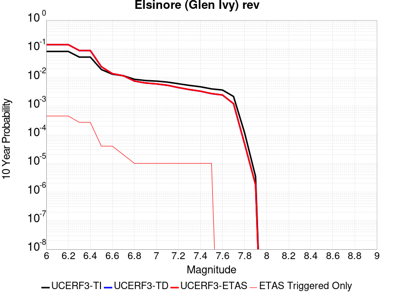 |

| Magnitude | 1 wk TI Prob | 1 wk TD Prob | 1 wk ETAS Prob | 1 wk ETAS/TD Gain | 1 wk ETAS Triggered Only | 1 mo TI Prob | 1 mo TD Prob | 1 mo ETAS Prob | 1 mo ETAS/TD Gain | 1 mo ETAS Triggered Only | 1 yr TI Prob | 1 yr TD Prob | 1 yr ETAS Prob | 1 yr ETAS/TD Gain | 1 yr ETAS Triggered Only | 10 yr TI Prob | 10 yr TD Prob | 10 yr ETAS Prob | 10 yr ETAS/TD Gain | 10 yr ETAS Triggered Only |
|-----|-----|-----|-----|-----|-----|-----|-----|-----|-----|-----|-----|-----|-----|-----|-----|-----|-----|-----|-----|-----|
| 6.0 | 1.6204086E-4 | 2.9360707E-4 | 5.445584E-4 | 1.8547182 | 2.5102502E-4 | 6.94276E-4 | 0.0012578638 | 0.0015085732 | 1.1993135 | 2.5102502E-4 | 0.008420097 | 0.015234485 | 0.015646486 | 1.0270439 | 4.1837504E-4 | 0.081081145 | 0.13969168 | 0.14012359 | 1.0030919 | 5.0205004E-4 |
| 6.1 | 1.6204086E-4 | 2.9360707E-4 | 5.445584E-4 | 1.8547182 | 2.5102502E-4 | 6.94276E-4 | 0.0012578638 | 0.0015085732 | 1.1993135 | 2.5102502E-4 | 0.008420097 | 0.015234485 | 0.015646486 | 1.0270439 | 4.1837504E-4 | 0.081081145 | 0.13969168 | 0.14012359 | 1.0030919 | 5.0205004E-4 |
| 6.2 | 1.6204086E-4 | 2.9360707E-4 | 5.445584E-4 | 1.8547182 | 2.5102502E-4 | 6.94276E-4 | 0.0012578638 | 0.0015085732 | 1.1993135 | 2.5102502E-4 | 0.008420097 | 0.015234485 | 0.015646486 | 1.0270439 | 4.1837504E-4 | 0.081081145 | 0.13969168 | 0.14012359 | 1.0030919 | 5.0205004E-4 |
| 6.3 | 1.0111737E-4 | 1.7703383E-4 | 2.60694E-4 | 1.4725661 | 8.3675004E-5 | 4.332882E-4 | 7.5861247E-4 | 8.42224E-4 | 1.1102164 | 8.3675004E-5 | 0.005262531 | 0.009217682 | 0.009466393 | 1.026982 | 2.5102502E-4 | 0.0513964 | 0.0870191 | 0.08724828 | 1.0026337 | 2.5102502E-4 |
| 6.4 | 1.0111737E-4 | 1.7703383E-4 | 2.60694E-4 | 1.4725661 | 8.3675004E-5 | 4.332882E-4 | 7.5861247E-4 | 8.42224E-4 | 1.1102164 | 8.3675004E-5 | 0.005262531 | 0.009217682 | 0.009466393 | 1.026982 | 2.5102502E-4 | 0.0513964 | 0.0870191 | 0.08724828 | 1.0026337 | 2.5102502E-4 |
| 6.5 | 3.6624708E-5 | 4.6391084E-5 | 4.6391084E-5 | 1.0 | 0.0 | 1.569536E-4 | 1.9880582E-4 | 1.9880582E-4 | 1.0 | 0.0 | 0.001909235 | 0.0024181372 | 0.0024181372 | 1.0 | 0.0 | 0.01892915 | 0.023739954 | 0.023739954 | 1.0 | 0.0 |
| 6.6 | 2.5051324E-5 | 2.614772E-5 | 2.614772E-5 | 1.0 | 0.0 | 1.073584E-4 | 1.12057096E-4 | 1.12057096E-4 | 1.0 | 0.0 | 0.0013063047 | 0.0013634858 | 0.0013634858 | 1.0 | 0.0 | 0.012986525 | 0.013564618 | 0.013564618 | 1.0 | 0.0 |
| 6.7 | 2.2189772E-5 | 2.2072849E-5 | 2.2072849E-5 | 1.0 | 0.0 | 9.509556E-5 | 9.4594696E-5 | 9.4594696E-5 | 1.0 | 0.0 | 0.0011571734 | 0.0011511183 | 0.0011511183 | 1.0 | 0.0 | 0.011511663 | 0.011465415 | 0.011465415 | 1.0 | 0.0 |
| 6.8 | 1.6654378E-5 | 1.4437705E-5 | 1.4437705E-5 | 1.0 | 0.0 | 7.137396E-5 | 6.187444E-5 | 6.187444E-5 | 1.0 | 0.0 | 8.686314E-4 | 7.530661E-4 | 7.530661E-4 | 1.0 | 0.0 | 0.008652439 | 0.00751048 | 0.00751048 | 1.0 | 0.0 |
| 6.9 | 1.5042909E-5 | 1.2332022E-5 | 1.2332022E-5 | 1.0 | 0.0 | 6.446802E-5 | 5.285047E-5 | 5.285047E-5 | 1.0 | 0.0 | 7.8461546E-4 | 6.4326765E-4 | 6.4326765E-4 | 1.0 | 0.0 | 0.007818509 | 0.00641828 | 0.00641828 | 1.0 | 0.0 |
| 7.0 | 1.4361385E-5 | 1.1451324E-5 | 1.1451324E-5 | 1.0 | 0.0 | 6.154734E-5 | 4.9076196E-5 | 4.9076196E-5 | 1.0 | 0.0 | 7.490812E-4 | 5.973418E-4 | 5.973418E-4 | 1.0 | 0.0 | 0.007465612 | 0.0059613534 | 0.0059613534 | 1.0 | 0.0 |
| 7.1 | 1.3265571E-5 | 1.0244926E-5 | 1.0244926E-5 | 1.0 | 0.0 | 5.6851208E-5 | 4.39061E-5 | 4.39061E-5 | 1.0 | 0.0 | 6.919436E-4 | 5.344282E-4 | 5.344282E-4 | 1.0 | 0.0 | 0.006897931 | 0.0053347866 | 0.0053347866 | 1.0 | 0.0 |
| 7.2 | 1.1596403E-5 | 8.505067E-6 | 8.505067E-6 | 1.0 | 0.0 | 4.9697923E-5 | 3.6449786E-5 | 3.6449786E-5 | 1.0 | 0.0 | 6.049042E-4 | 4.436875E-4 | 4.436875E-4 | 1.0 | 0.0 | 0.006032603 | 0.0044294316 | 0.0044294316 | 1.0 | 0.0 |
| 7.3 | 1.0150827E-5 | 7.2387597E-6 | 7.2387597E-6 | 1.0 | 0.0 | 4.3502816E-5 | 3.1022897E-5 | 3.1022897E-5 | 1.0 | 0.0 | 5.2951806E-4 | 3.7763975E-4 | 3.7763975E-4 | 1.0 | 0.0 | 0.005282581 | 0.0037703665 | 0.0037703665 | 1.0 | 0.0 |
| 7.4 | 9.080705E-6 | 6.352519E-6 | 6.352519E-6 | 1.0 | 0.0 | 3.8916725E-5 | 2.7224805E-5 | 2.7224805E-5 | 1.0 | 0.0 | 4.7370812E-4 | 3.3141294E-4 | 3.3141294E-4 | 1.0 | 0.0 | 0.004726996 | 0.0033093381 | 0.0033093381 | 1.0 | 0.0 |
| 7.5 | 7.671649E-6 | 5.2256332E-6 | 5.2256332E-6 | 1.0 | 0.0 | 3.287808E-5 | 2.2395385E-5 | 2.2395385E-5 | 1.0 | 0.0 | 4.0021708E-4 | 2.7263095E-4 | 2.7263095E-4 | 1.0 | 0.0 | 0.0039949706 | 0.00272309 | 0.00272309 | 1.0 | 0.0 |
| 7.6 | 6.990086E-6 | 4.687545E-6 | 4.687545E-6 | 1.0 | 0.0 | 2.9957167E-5 | 2.008933E-5 | 2.008933E-5 | 1.0 | 0.0 | 3.6466747E-4 | 2.445613E-4 | 2.445613E-4 | 1.0 | 0.0 | 0.0036406964 | 0.002443038 | 0.002443038 | 1.0 | 0.0 |
| 7.7 | 4.163505E-6 | 2.3295343E-6 | 2.3295343E-6 | 1.0 | 0.0 | 1.7843471E-5 | 9.983683E-6 | 9.983683E-6 | 1.0 | 0.0 | 2.172226E-4 | 1.21545316E-4 | 1.21545316E-4 | 1.0 | 0.0 | 0.0021701038 | 0.0012148614 | 0.0012148614 | 1.0 | 0.0 |
| 7.8 | 2.2692414E-7 | 9.3854695E-8 | 9.3854695E-8 | 1.0 | 0.0 | 9.725317E-7 | 4.0223435E-7 | 4.0223435E-7 | 1.0 | 0.0 | 1.1840509E-5 | 4.8971956E-6 | 4.8971956E-6 | 1.0 | 0.0 | 1.1839878E-4 | 4.8971204E-5 | 4.8971204E-5 | 1.0 | 0.0 |
| 7.9 | 6.676829E-9 | 3.439853E-9 | 3.439853E-9 | 1.0 | 0.0 | 2.861498E-8 | 1.4742227E-8 | 1.4742227E-8 | 1.0 | 0.0 | 3.4838732E-7 | 1.7948659E-7 | 1.7948659E-7 | 1.0 | 0.0 | 3.4838679E-6 | 1.7948646E-6 | 1.7948646E-6 | 1.0 | 0.0 |

## Red Pass
*[(top)](#table-of-contents)*

| 1 Week | 1 Month | 1 Year | 10 Year |
|-----|-----|-----|-----|
|  |  |  |  |

| Magnitude | 1 wk TI Prob | 1 wk TD Prob | 1 wk ETAS Prob | 1 wk ETAS/TD Gain | 1 wk ETAS Triggered Only | 1 mo TI Prob | 1 mo TD Prob | 1 mo ETAS Prob | 1 mo ETAS/TD Gain | 1 mo ETAS Triggered Only | 1 yr TI Prob | 1 yr TD Prob | 1 yr ETAS Prob | 1 yr ETAS/TD Gain | 1 yr ETAS Triggered Only | 10 yr TI Prob | 10 yr TD Prob | 10 yr ETAS Prob | 10 yr ETAS/TD Gain | 10 yr ETAS Triggered Only |
|-----|-----|-----|-----|-----|-----|-----|-----|-----|-----|-----|-----|-----|-----|-----|-----|-----|-----|-----|-----|-----|
| 6.0 | 8.258278E-6 | 8.551265E-6 | 9.222556E-5 | 10.785019 | 8.3675004E-5 | 3.539214E-5 | 3.6647863E-5 | 1.20319804E-4 | 3.2831328 | 8.3675004E-5 | 4.308141E-4 | 4.4611428E-4 | 7.8066497E-4 | 1.7499216 | 3.3470002E-4 | 0.0042997985 | 0.004453945 | 0.004953759 | 1.1122183 | 5.0205004E-4 |
| 6.1 | 3.649988E-6 | 3.7753161E-6 | 3.7753161E-6 | 1.0 | 0.0 | 1.5642712E-5 | 1.6179853E-5 | 1.6179853E-5 | 1.0 | 0.0 | 1.9043336E-4 | 1.9697666E-4 | 1.9697666E-4 | 1.0 | 0.0 | 0.0019027026 | 0.001968488 | 0.001968488 | 1.0 | 0.0 |
| 6.2 | 3.649988E-6 | 3.7753161E-6 | 3.7753161E-6 | 1.0 | 0.0 | 1.5642712E-5 | 1.6179853E-5 | 1.6179853E-5 | 1.0 | 0.0 | 1.9043336E-4 | 1.9697666E-4 | 1.9697666E-4 | 1.0 | 0.0 | 0.0019027026 | 0.001968488 | 0.001968488 | 1.0 | 0.0 |
| 6.3 | 1.3924937E-6 | 1.4411166E-6 | 1.4411166E-6 | 1.0 | 0.0 | 5.9678164E-6 | 6.1762075E-6 | 6.1762075E-6 | 1.0 | 0.0 | 7.265574E-5 | 7.519415E-5 | 7.519415E-5 | 1.0 | 0.0 | 7.263199E-4 | 7.518258E-4 | 7.518258E-4 | 1.0 | 0.0 |
| 6.4 | 1.3924937E-6 | 1.4411166E-6 | 1.4411166E-6 | 1.0 | 0.0 | 5.9678164E-6 | 6.1762075E-6 | 6.1762075E-6 | 1.0 | 0.0 | 7.265574E-5 | 7.519415E-5 | 7.519415E-5 | 1.0 | 0.0 | 7.263199E-4 | 7.518258E-4 | 7.518258E-4 | 1.0 | 0.0 |
| 6.5 | 9.876812E-7 | 1.0221912E-6 | 1.0221912E-6 | 1.0 | 0.0 | 4.2329125E-6 | 4.3808195E-6 | 4.3808195E-6 | 1.0 | 0.0 | 5.153449E-5 | 5.3336476E-5 | 5.3336476E-5 | 1.0 | 0.0 | 5.1522546E-4 | 5.333648E-4 | 5.333648E-4 | 1.0 | 0.0 |

## San Andreas (San Gorgonio Pass-Garnet HIll)
*[(top)](#table-of-contents)*

| 1 Week | 1 Month | 1 Year | 10 Year |
|-----|-----|-----|-----|
|  |  |  |  |

| Magnitude | 1 wk TI Prob | 1 wk TD Prob | 1 wk ETAS Prob | 1 wk ETAS/TD Gain | 1 wk ETAS Triggered Only | 1 mo TI Prob | 1 mo TD Prob | 1 mo ETAS Prob | 1 mo ETAS/TD Gain | 1 mo ETAS Triggered Only | 1 yr TI Prob | 1 yr TD Prob | 1 yr ETAS Prob | 1 yr ETAS/TD Gain | 1 yr ETAS Triggered Only | 10 yr TI Prob | 10 yr TD Prob | 10 yr ETAS Prob | 10 yr ETAS/TD Gain | 10 yr ETAS Triggered Only |
|-----|-----|-----|-----|-----|-----|-----|-----|-----|-----|-----|-----|-----|-----|-----|-----|-----|-----|-----|-----|-----|
| 6.0 | 8.31567E-5 | 2.3382473E-4 | 3.1748018E-4 | 1.3577698 | 8.3675004E-5 | 3.5633717E-4 | 0.0010017233 | 0.0011689058 | 1.1668948 | 1.6735001E-4 | 0.004329778 | 0.012127888 | 0.012375869 | 1.0204471 | 2.5102502E-4 | 0.042463828 | 0.11257892 | 0.11302445 | 1.0039575 | 5.0205004E-4 |
| 6.1 | 8.31567E-5 | 2.3382473E-4 | 3.1748018E-4 | 1.3577698 | 8.3675004E-5 | 3.5633717E-4 | 0.0010017233 | 0.0011689058 | 1.1668948 | 1.6735001E-4 | 0.004329778 | 0.012127888 | 0.012375869 | 1.0204471 | 2.5102502E-4 | 0.042463828 | 0.11257892 | 0.11302445 | 1.0039575 | 5.0205004E-4 |
| 6.2 | 8.31567E-5 | 2.3382473E-4 | 3.1748018E-4 | 1.3577698 | 8.3675004E-5 | 3.5633717E-4 | 0.0010017233 | 0.0011689058 | 1.1668948 | 1.6735001E-4 | 0.004329778 | 0.012127888 | 0.012375869 | 1.0204471 | 2.5102502E-4 | 0.042463828 | 0.11257892 | 0.11302445 | 1.0039575 | 5.0205004E-4 |
| 6.3 | 8.31567E-5 | 2.3382473E-4 | 3.1748018E-4 | 1.3577698 | 8.3675004E-5 | 3.5633717E-4 | 0.0010017233 | 0.0011689058 | 1.1668948 | 1.6735001E-4 | 0.004329778 | 0.012127888 | 0.012375869 | 1.0204471 | 2.5102502E-4 | 0.042463828 | 0.11257892 | 0.11302445 | 1.0039575 | 5.0205004E-4 |
| 6.4 | 8.059055E-5 | 2.2940808E-4 | 3.130639E-4 | 1.3646594 | 8.3675004E-5 | 3.4534236E-4 | 9.828096E-4 | 0.001149995 | 1.1701097 | 1.6735001E-4 | 0.0041964394 | 0.011900152 | 0.012148189 | 1.0208433 | 2.5102502E-4 | 0.041180745 | 0.11056015 | 0.11100669 | 1.0040389 | 5.0205004E-4 |
| 6.5 | 8.059055E-5 | 2.2940808E-4 | 3.130639E-4 | 1.3646594 | 8.3675004E-5 | 3.4534236E-4 | 9.828096E-4 | 0.001149995 | 1.1701097 | 1.6735001E-4 | 0.0041964394 | 0.011900152 | 0.012148189 | 1.0208433 | 2.5102502E-4 | 0.041180745 | 0.11056015 | 0.11100669 | 1.0040389 | 5.0205004E-4 |
| 6.6 | 7.619237E-5 | 2.218517E-4 | 3.0550815E-4 | 1.3770827 | 8.3675004E-5 | 3.2649786E-4 | 9.5044886E-4 | 0.0011176398 | 1.1759074 | 1.6735001E-4 | 0.0039678677 | 0.01151087 | 0.0117590055 | 1.0215566 | 2.5102502E-4 | 0.03897764 | 0.10709683 | 0.10754511 | 1.0041858 | 5.0205004E-4 |
| 6.7 | 7.440636E-5 | 2.1860997E-4 | 3.0226668E-4 | 1.3826756 | 8.3675004E-5 | 3.188454E-4 | 9.3656575E-4 | 0.001103759 | 1.1785173 | 1.6735001E-4 | 0.0038750346 | 0.011343609 | 0.011591786 | 1.0218781 | 2.5102502E-4 | 0.038081564 | 0.105605274 | 0.106054306 | 1.004252 | 5.0205004E-4 |
| 6.8 | 7.3735864E-5 | 2.1708169E-4 | 3.0073852E-4 | 1.3853704 | 8.3675004E-5 | 3.1597257E-4 | 9.3002064E-4 | 0.001097215 | 1.1797749 | 1.6735001E-4 | 0.0038401815 | 0.011264749 | 0.011512946 | 1.0220331 | 2.5102502E-4 | 0.03774495 | 0.10490683 | 0.10535621 | 1.0042837 | 5.0205004E-4 |
| 6.9 | 7.27575E-5 | 2.1477141E-4 | 2.9842847E-4 | 1.3895166 | 8.3675004E-5 | 3.117806E-4 | 9.201265E-4 | 0.0010873225 | 1.1817099 | 1.6735001E-4 | 0.003789323 | 0.011145527 | 0.011393753 | 1.0222715 | 2.5102502E-4 | 0.037253562 | 0.103854746 | 0.10430466 | 1.0043321 | 5.0205004E-4 |
| 7.0 | 7.102591E-5 | 2.1061185E-4 | 2.9426924E-4 | 1.3972112 | 8.3675004E-5 | 3.0436125E-4 | 9.023122E-4 | 0.0010695112 | 1.1853006 | 1.6735001E-4 | 0.003699303 | 0.010930831 | 0.011179112 | 1.0227138 | 2.5102502E-4 | 0.03638325 | 0.10195695 | 0.10240781 | 1.0044221 | 5.0205004E-4 |
| 7.1 | 7.028513E-5 | 2.0896831E-4 | 2.9262583E-4 | 1.4003359 | 8.3675004E-5 | 3.0118722E-4 | 8.9527335E-4 | 0.0010624735 | 1.1867589 | 1.6735001E-4 | 0.0036607897 | 0.010845989 | 0.011094292 | 1.0228934 | 2.5102502E-4 | 0.036010686 | 0.101199985 | 0.10165123 | 1.0044589 | 5.0205004E-4 |
| 7.2 | 6.8498244E-5 | 2.0504706E-4 | 2.887049E-4 | 1.4079934 | 8.3675004E-5 | 2.9353087E-4 | 8.784794E-4 | 0.0010456824 | 1.1903323 | 1.6735001E-4 | 0.003567883 | 0.010643536 | 0.010891889 | 1.0233337 | 2.5102502E-4 | 0.035111405 | 0.09939202 | 0.09976881 | 1.003791 | 4.1837504E-4 |
| 7.3 | 6.622592E-5 | 1.9732013E-4 | 1.9732013E-4 | 1.0 | 0.0 | 2.8379448E-4 | 8.453858E-4 | 9.289901E-4 | 1.0988948 | 8.3675004E-5 | 0.0034497243 | 0.0102444785 | 0.010410114 | 1.0161682 | 1.6735001E-4 | 0.033966612 | 0.095888525 | 0.09619113 | 1.0031558 | 3.3470002E-4 |
| 7.4 | 5.1050705E-5 | 1.4689034E-4 | 1.4689034E-4 | 1.0 | 0.0 | 2.1877038E-4 | 6.29379E-4 | 7.1300135E-4 | 1.1328648 | 8.3675004E-5 | 0.002660276 | 0.0076359594 | 0.007802032 | 1.0217487 | 1.6735001E-4 | 0.02628654 | 0.07286301 | 0.07317333 | 1.0042589 | 3.3470002E-4 |
| 7.5 | 3.9302922E-5 | 1.1129847E-4 | 1.1129847E-4 | 1.0 | 0.0 | 1.6843023E-4 | 4.7690657E-4 | 5.6054164E-4 | 1.17537 | 8.3675004E-5 | 0.0020487092 | 0.005790949 | 0.0059573296 | 1.0287312 | 1.6735001E-4 | 0.020299247 | 0.05600951 | 0.056325465 | 1.0056411 | 3.3470002E-4 |
| 7.6 | 2.9851626E-5 | 8.4949745E-5 | 8.4949745E-5 | 1.0 | 0.0 | 1.2792926E-4 | 3.6401965E-4 | 4.476642E-4 | 1.2297803 | 8.3675004E-5 | 0.0015564259 | 0.0044229585 | 0.0045895684 | 1.0376693 | 1.6735001E-4 | 0.0154556995 | 0.04319374 | 0.04351398 | 1.0074141 | 3.3470002E-4 |
| 7.7 | 2.1135214E-5 | 6.3529005E-5 | 6.3529005E-5 | 1.0 | 0.0 | 9.0576345E-5 | 2.7223877E-4 | 3.5589098E-4 | 1.3072752 | 8.3675004E-5 | 0.0011022091 | 0.0033094748 | 0.003476271 | 1.0503995 | 1.6735001E-4 | 0.010967582 | 0.032582592 | 0.032906387 | 1.0099376 | 3.3470002E-4 |
| 7.8 | 1.883379E-5 | 5.564028E-5 | 5.564028E-5 | 1.0 | 0.0 | 8.0713755E-5 | 2.3843657E-4 | 3.2209163E-4 | 1.3508483 | 8.3675004E-5 | 9.822468E-4 | 0.0028991038 | 0.0030659686 | 1.0575573 | 1.6735001E-4 | 0.0097791655 | 0.028695205 | 0.029020302 | 1.0113293 | 3.3470002E-4 |
| 7.9 | 1.5156185E-5 | 4.1658426E-5 | 4.1658426E-5 | 1.0 | 0.0 | 6.495346E-5 | 1.785239E-4 | 2.6218398E-4 | 1.4686211 | 8.3675004E-5 | 7.9052144E-4 | 0.0021713632 | 0.0023383498 | 1.076904 | 1.6735001E-4 | 0.007877152 | 0.021759422 | 0.022004986 | 1.0112853 | 2.5102502E-4 |
| 8.0 | 1.1405907E-5 | 2.9974231E-5 | 2.9974231E-5 | 1.0 | 0.0 | 4.8881542E-5 | 1.2845467E-4 | 2.1211893E-4 | 1.6513134 | 8.3675004E-5 | 5.9497025E-4 | 0.0015628147 | 0.0016463589 | 1.0534575 | 8.3675004E-5 | 0.005933798 | 0.015772851 | 0.015937561 | 1.0104426 | 1.6735001E-4 |
| 8.1 | 4.3511436E-6 | 7.369219E-6 | 7.369219E-6 | 1.0 | 0.0 | 1.8647626E-5 | 3.1581985E-5 | 3.1581985E-5 | 1.0 | 0.0 | 2.2701119E-4 | 3.8444297E-4 | 3.8444297E-4 | 1.0 | 0.0 | 0.0022677942 | 0.0041163345 | 0.0041163345 | 1.0 | 0.0 |
| 8.2 | 2.3042528E-6 | 2.7329415E-6 | 2.7329415E-6 | 1.0 | 0.0 | 9.875332E-6 | 1.1712554E-5 | 1.1712554E-5 | 1.0 | 0.0 | 1.2022553E-4 | 1.4259106E-4 | 1.4259106E-4 | 1.0 | 0.0 | 0.0012016051 | 0.0015979785 | 0.0015979785 | 1.0 | 0.0 |
| 8.3 | 5.202968E-7 | 3.1598344E-7 | 3.1598344E-7 | 1.0 | 0.0 | 2.2298414E-6 | 1.3542141E-6 | 1.3542141E-6 | 1.0 | 0.0 | 2.714798E-5 | 1.6487444E-5 | 1.6487444E-5 | 1.0 | 0.0 | 2.7144665E-4 | 1.9563142E-4 | 1.9563142E-4 | 1.0 | 0.0 |

## San Andreas (Parkfield)
*[(top)](#table-of-contents)*

| 1 Week | 1 Month | 1 Year | 10 Year |
|-----|-----|-----|-----|
|  |  |  |  |

| Magnitude | 1 wk TI Prob | 1 wk TD Prob | 1 wk ETAS Prob | 1 wk ETAS/TD Gain | 1 wk ETAS Triggered Only | 1 mo TI Prob | 1 mo TD Prob | 1 mo ETAS Prob | 1 mo ETAS/TD Gain | 1 mo ETAS Triggered Only | 1 yr TI Prob | 1 yr TD Prob | 1 yr ETAS Prob | 1 yr ETAS/TD Gain | 1 yr ETAS Triggered Only | 10 yr TI Prob | 10 yr TD Prob | 10 yr ETAS Prob | 10 yr ETAS/TD Gain | 10 yr ETAS Triggered Only |
|-----|-----|-----|-----|-----|-----|-----|-----|-----|-----|-----|-----|-----|-----|-----|-----|-----|-----|-----|-----|-----|
| 6.0 | 5.556969E-4 | 7.7782426E-4 | 7.7782426E-4 | 1.0 | 0.0 | 0.0023793848 | 0.0033298214 | 0.0034966143 | 1.0500906 | 1.6735001E-4 | 0.028586963 | 0.040191233 | 0.040592793 | 1.0099913 | 4.1837504E-4 | 0.25176284 | 0.33716413 | 0.33744144 | 1.0008225 | 4.1837504E-4 |
| 6.1 | 1.925858E-4 | 3.0276453E-4 | 3.0276453E-4 | 1.0 | 0.0 | 8.2510663E-4 | 0.0012970108 | 0.0012970108 | 1.0 | 0.0 | 0.0099994885 | 0.015778083 | 0.015860438 | 1.0052196 | 8.3675004E-5 | 0.095613256 | 0.1497237 | 0.14979483 | 1.0004752 | 8.3675004E-5 |
| 6.2 | 9.4306815E-5 | 1.8242796E-4 | 1.8242796E-4 | 1.0 | 0.0 | 4.0410945E-4 | 7.816011E-4 | 7.816011E-4 | 1.0 | 0.0 | 0.0049089384 | 0.009474681 | 0.009557563 | 1.0087478 | 8.3675004E-5 | 0.048019063 | 0.09185409 | 0.09193008 | 1.0008273 | 8.3675004E-5 |
| 6.3 | 9.283051E-5 | 1.7939322E-4 | 1.7939322E-4 | 1.0 | 0.0 | 3.9778434E-4 | 7.686027E-4 | 7.686027E-4 | 1.0 | 0.0 | 0.0048322747 | 0.009317789 | 0.009400684 | 1.0088965 | 8.3675004E-5 | 0.047285385 | 0.09050704 | 0.09058314 | 1.0008408 | 8.3675004E-5 |
| 6.4 | 9.138826E-5 | 1.770153E-4 | 1.770153E-4 | 1.0 | 0.0 | 3.916052E-4 | 7.5841765E-4 | 7.5841765E-4 | 1.0 | 0.0 | 0.0047573745 | 0.00919484 | 0.009277745 | 1.0090165 | 8.3675004E-5 | 0.046568092 | 0.08940927 | 0.08948547 | 1.0008522 | 8.3675004E-5 |
| 6.5 | 9.000255E-5 | 1.7459576E-4 | 1.7459576E-4 | 1.0 | 0.0 | 3.8566816E-4 | 7.480541E-4 | 7.480541E-4 | 1.0 | 0.0 | 0.0046854047 | 0.009069731 | 0.009152648 | 1.009142 | 8.3675004E-5 | 0.045878403 | 0.088295065 | 0.08837135 | 1.000864 | 8.3675004E-5 |
| 6.6 | 8.8109264E-5 | 1.7140752E-4 | 1.7140752E-4 | 1.0 | 0.0 | 3.7755648E-4 | 7.3439797E-4 | 7.3439797E-4 | 1.0 | 0.0 | 0.0045870654 | 0.008904854 | 0.008987783 | 1.0093129 | 8.3675004E-5 | 0.04493529 | 0.0868267 | 0.0869031 | 1.00088 | 8.3675004E-5 |
| 6.7 | 8.738073E-5 | 1.7007832E-4 | 1.7007832E-4 | 1.0 | 0.0 | 3.7443507E-4 | 7.287046E-4 | 7.287046E-4 | 1.0 | 0.0 | 0.0045492216 | 0.008836143 | 0.008919079 | 1.009386 | 8.3675004E-5 | 0.04457213 | 0.08622707 | 0.086303525 | 1.0008867 | 8.3675004E-5 |
| 6.8 | 8.710195E-5 | 1.6953335E-4 | 1.6953335E-4 | 1.0 | 0.0 | 3.7324068E-4 | 7.263703E-4 | 7.263703E-4 | 1.0 | 0.0 | 0.0045347405 | 0.008807961 | 0.008890899 | 1.0094162 | 8.3675004E-5 | 0.04443313 | 0.08597467 | 0.08605115 | 1.0008895 | 8.3675004E-5 |
| 6.9 | 8.6801556E-5 | 1.689429E-4 | 1.689429E-4 | 1.0 | 0.0 | 3.7195362E-4 | 7.2384125E-4 | 7.2384125E-4 | 1.0 | 0.0 | 0.0045191357 | 0.008777418 | 0.008860359 | 1.0094494 | 8.3675004E-5 | 0.044283327 | 0.085700735 | 0.08577724 | 1.0008926 | 8.3675004E-5 |
| 7.0 | 8.5571606E-5 | 1.6647128E-4 | 1.6647128E-4 | 1.0 | 0.0 | 3.6668387E-4 | 7.132544E-4 | 7.132544E-4 | 1.0 | 0.0 | 0.004455241 | 0.008649553 | 0.008732505 | 1.0095903 | 8.3675004E-5 | 0.043669727 | 0.08454914 | 0.084625736 | 1.000906 | 8.3675004E-5 |
| 7.1 | 7.82589E-5 | 1.5128135E-4 | 1.5128135E-4 | 1.0 | 0.0 | 3.3535215E-4 | 6.481883E-4 | 6.481883E-4 | 1.0 | 0.0 | 0.0040752706 | 0.007863307 | 0.007946324 | 1.0105575 | 8.3675004E-5 | 0.040013418 | 0.07746111 | 0.077538304 | 1.0009966 | 8.3675004E-5 |
| 7.2 | 7.690929E-5 | 1.4865391E-4 | 1.4865391E-4 | 1.0 | 0.0 | 3.2956956E-4 | 6.369334E-4 | 6.369334E-4 | 1.0 | 0.0 | 0.004005129 | 0.007727258 | 0.0078102862 | 1.0107449 | 8.3675004E-5 | 0.0393371 | 0.07623427 | 0.076311566 | 1.0010139 | 8.3675004E-5 |
| 7.3 | 7.5543794E-5 | 1.4561978E-4 | 1.4561978E-4 | 1.0 | 0.0 | 3.2371894E-4 | 6.2393624E-4 | 6.2393624E-4 | 1.0 | 0.0 | 0.003934157 | 0.007570127 | 0.007653169 | 1.0109696 | 8.3675004E-5 | 0.038652334 | 0.074797355 | 0.074874766 | 1.001035 | 8.3675004E-5 |
| 7.4 | 7.4214564E-5 | 1.4262961E-4 | 1.4262961E-4 | 1.0 | 0.0 | 3.1802364E-4 | 6.111273E-4 | 6.111273E-4 | 1.0 | 0.0 | 0.003865065 | 0.00741525 | 0.0074983044 | 1.0112005 | 8.3675004E-5 | 0.03798529 | 0.07337123 | 0.07344877 | 1.0010568 | 8.3675004E-5 |
| 7.5 | 6.149578E-5 | 1.11907226E-4 | 1.11907226E-4 | 1.0 | 0.0 | 2.6352672E-4 | 4.7951436E-4 | 4.7951436E-4 | 1.0 | 0.0 | 0.0032037178 | 0.0058224914 | 0.005905679 | 1.0142874 | 8.3675004E-5 | 0.03157923 | 0.058557566 | 0.05863634 | 1.0013453 | 8.3675004E-5 |
| 7.6 | 6.0643448E-5 | 1.10193796E-4 | 1.10193796E-4 | 1.0 | 0.0 | 2.598746E-4 | 4.7217376E-4 | 4.7217376E-4 | 1.0 | 0.0 | 0.0031593828 | 0.0057335934 | 0.005816789 | 1.0145102 | 8.3675004E-5 | 0.031148417 | 0.057718582 | 0.057797424 | 1.001366 | 8.3675004E-5 |
| 7.7 | 5.1652263E-5 | 9.174698E-5 | 9.174698E-5 | 1.0 | 0.0 | 2.2134806E-4 | 3.931421E-4 | 3.931421E-4 | 1.0 | 0.0 | 0.002691582 | 0.0047760103 | 0.0047760103 | 1.0 | 0.0 | 0.026592141 | 0.04853623 | 0.04853623 | 1.0 | 0.0 |
| 7.8 | 4.8090482E-5 | 8.559635E-5 | 8.559635E-5 | 1.0 | 0.0 | 2.060858E-4 | 3.6678996E-4 | 3.6678996E-4 | 1.0 | 0.0 | 0.0025062072 | 0.0044565317 | 0.0044565317 | 1.0 | 0.0 | 0.024781305 | 0.04530245 | 0.04530245 | 1.0 | 0.0 |
| 7.9 | 3.970278E-5 | 6.750426E-5 | 6.750426E-5 | 1.0 | 0.0 | 1.7014367E-4 | 2.892719E-4 | 2.892719E-4 | 1.0 | 0.0 | 0.002069531 | 0.0035162016 | 0.0035162016 | 1.0 | 0.0 | 0.020503636 | 0.035881363 | 0.035881363 | 1.0 | 0.0 |
| 8.0 | 2.8982335E-5 | 4.069796E-5 | 4.069796E-5 | 1.0 | 0.0 | 1.2420409E-4 | 1.7440817E-4 | 1.7440817E-4 | 1.0 | 0.0 | 0.0015111357 | 0.0021213528 | 0.0021213528 | 1.0 | 0.0 | 0.015009012 | 0.022010697 | 0.022010697 | 1.0 | 0.0 |
| 8.1 | 1.8836186E-5 | 1.8681134E-5 | 1.8681134E-5 | 1.0 | 0.0 | 8.0724014E-5 | 8.005955E-5 | 8.005955E-5 | 1.0 | 0.0 | 9.823717E-4 | 9.742898E-4 | 9.742898E-4 | 1.0 | 0.0 | 0.009780403 | 0.010488115 | 0.010488115 | 1.0 | 0.0 |
| 8.2 | 8.643924E-6 | 5.4748625E-6 | 5.4748625E-6 | 1.0 | 0.0 | 3.704486E-5 | 2.3463486E-5 | 2.3463486E-5 | 1.0 | 0.0 | 4.5092785E-4 | 2.8563058E-4 | 2.8563058E-4 | 1.0 | 0.0 | 0.0045001395 | 0.0032487072 | 0.0032487072 | 1.0 | 0.0 |
| 8.3 | 1.983087E-6 | 7.6599065E-7 | 7.6599065E-7 | 1.0 | 0.0 | 8.498917E-6 | 3.282813E-6 | 3.282813E-6 | 1.0 | 0.0 | 1.034694E-4 | 3.9967534E-5 | 3.9967534E-5 | 1.0 | 0.0 | 0.0010342124 | 4.719687E-4 | 4.719687E-4 | 1.0 | 0.0 |

## Big Pine (Central)
*[(top)](#table-of-contents)*

| 1 Week | 1 Month | 1 Year | 10 Year |
|-----|-----|-----|-----|
|  |  |  |  |

| Magnitude | 1 wk TI Prob | 1 wk TD Prob | 1 wk ETAS Prob | 1 wk ETAS/TD Gain | 1 wk ETAS Triggered Only | 1 mo TI Prob | 1 mo TD Prob | 1 mo ETAS Prob | 1 mo ETAS/TD Gain | 1 mo ETAS Triggered Only | 1 yr TI Prob | 1 yr TD Prob | 1 yr ETAS Prob | 1 yr ETAS/TD Gain | 1 yr ETAS Triggered Only | 10 yr TI Prob | 10 yr TD Prob | 10 yr ETAS Prob | 10 yr ETAS/TD Gain | 10 yr ETAS Triggered Only |
|-----|-----|-----|-----|-----|-----|-----|-----|-----|-----|-----|-----|-----|-----|-----|-----|-----|-----|-----|-----|-----|
| 6.0 | 1.2706755E-5 | 1.4250529E-5 | 2.6527196E-4 | 18.614887 | 2.5102502E-4 | 5.4456385E-5 | 6.107247E-5 | 3.1208215E-4 | 5.11003 | 2.5102502E-4 | 6.628048E-4 | 7.433402E-4 | 0.0010777914 | 1.4499302 | 3.3470002E-4 | 0.006608314 | 0.0074135666 | 0.00782884 | 1.0560154 | 4.1837504E-4 |
| 6.1 | 8.342579E-6 | 9.510762E-6 | 1.7685918E-4 | 18.595692 | 1.6735001E-4 | 3.5753423E-5 | 4.0759893E-5 | 2.0810308E-4 | 5.1055846 | 1.6735001E-4 | 4.3521097E-4 | 4.961604E-4 | 6.634274E-4 | 1.3371228 | 1.6735001E-4 | 0.0043435963 | 0.0049540824 | 0.0052038636 | 1.0504193 | 2.5102502E-4 |
| 6.2 | 6.923899E-6 | 7.967147E-6 | 7.967147E-6 | 1.0 | 0.0 | 2.9673516E-5 | 3.4144578E-5 | 3.4144578E-5 | 1.0 | 0.0 | 3.6121515E-4 | 4.156502E-4 | 4.156502E-4 | 1.0 | 0.0 | 0.003606286 | 0.0041520367 | 0.0042353645 | 1.0200691 | 8.3675004E-5 |
| 6.3 | 2.728396E-6 | 3.4242908E-6 | 3.4242908E-6 | 1.0 | 0.0 | 1.1693074E-5 | 1.4675454E-5 | 1.4675454E-5 | 1.0 | 0.0 | 1.4235388E-4 | 1.7865987E-4 | 1.7865987E-4 | 1.0 | 0.0 | 0.0014226272 | 0.0017866704 | 0.001870196 | 1.0467492 | 8.3675004E-5 |
| 6.4 | 2.7136944E-6 | 3.408584E-6 | 3.408584E-6 | 1.0 | 0.0 | 1.1630066E-5 | 1.4608141E-5 | 1.4608141E-5 | 1.0 | 0.0 | 1.4158686E-4 | 1.7784047E-4 | 1.7784047E-4 | 1.0 | 0.0 | 0.0014149669 | 0.0017784894 | 0.0018620157 | 1.0469646 | 8.3675004E-5 |
| 6.5 | 2.6971882E-6 | 3.3909291E-6 | 3.3909291E-6 | 1.0 | 0.0 | 1.1559327E-5 | 1.45324775E-5 | 1.45324775E-5 | 1.0 | 0.0 | 1.4072572E-4 | 1.7691942E-4 | 1.7691942E-4 | 1.0 | 0.0 | 0.0014063664 | 0.0017692937 | 0.0018528206 | 1.0472093 | 8.3675004E-5 |
| 6.6 | 2.669092E-6 | 3.3609497E-6 | 3.3609497E-6 | 1.0 | 0.0 | 1.1438916E-5 | 1.4403995E-5 | 1.4403995E-5 | 1.0 | 0.0 | 1.3925991E-4 | 1.753554E-4 | 1.753554E-4 | 1.0 | 0.0 | 0.0013917267 | 0.0017536782 | 0.0018372065 | 1.0476303 | 8.3675004E-5 |
| 6.7 | 2.6408059E-6 | 3.3309752E-6 | 3.3309752E-6 | 1.0 | 0.0 | 1.1317691E-5 | 1.4275535E-5 | 1.4275535E-5 | 1.0 | 0.0 | 1.3778417E-4 | 1.7379165E-4 | 1.7379165E-4 | 1.0 | 0.0 | 0.0013769877 | 0.0017380653 | 0.0018215948 | 1.048059 | 8.3675004E-5 |
| 6.8 | 2.1786943E-6 | 2.8544325E-6 | 2.8544325E-6 | 1.0 | 0.0 | 9.337228E-6 | 1.2233229E-5 | 1.2233229E-5 | 1.0 | 0.0 | 1.1367482E-4 | 1.4893012E-4 | 1.4893012E-4 | 1.0 | 0.0 | 0.0011361669 | 0.0014897975 | 0.0015733478 | 1.0560817 | 8.3675004E-5 |
| 6.9 | 1.4411696E-6 | 2.068499E-6 | 2.068499E-6 | 1.0 | 0.0 | 6.1764263E-6 | 8.864968E-6 | 8.864968E-6 | 1.0 | 0.0 | 7.51954E-5 | 1.079259E-4 | 1.079259E-4 | 1.0 | 0.0 | 7.5169955E-4 | 0.0010801847 | 0.0011637693 | 1.07738 | 8.3675004E-5 |
| 7.0 | 1.0073411E-6 | 1.554261E-6 | 1.554261E-6 | 1.0 | 0.0 | 4.317169E-6 | 6.6611024E-6 | 6.6611024E-6 | 1.0 | 0.0 | 5.2560266E-5 | 8.1096056E-5 | 8.1096056E-5 | 1.0 | 0.0 | 5.2547833E-4 | 8.1210316E-4 | 8.1210316E-4 | 1.0 | 0.0 |
| 7.1 | 8.947104E-7 | 1.4302494E-6 | 1.4302494E-6 | 1.0 | 0.0 | 3.834468E-6 | 6.129627E-6 | 6.129627E-6 | 1.0 | 0.0 | 4.6683643E-5 | 7.46258E-5 | 7.46258E-5 | 1.0 | 0.0 | 4.6673836E-4 | 7.474457E-4 | 7.474457E-4 | 1.0 | 0.0 |
| 7.2 | 5.215166E-7 | 1.0111678E-6 | 1.0111678E-6 | 1.0 | 0.0 | 2.2350691E-6 | 4.3335694E-6 | 4.3335694E-6 | 1.0 | 0.0 | 2.7211627E-5 | 5.2759973E-5 | 5.2759973E-5 | 1.0 | 0.0 | 2.7208295E-4 | 5.2890263E-4 | 5.2890263E-4 | 1.0 | 0.0 |
| 7.3 | 4.4024807E-7 | 9.219589E-7 | 9.219589E-7 | 1.0 | 0.0 | 1.8867761E-6 | 3.9512465E-6 | 3.9512465E-6 | 1.0 | 0.0 | 2.2971257E-5 | 4.810541E-5 | 4.810541E-5 | 1.0 | 0.0 | 2.2968883E-4 | 4.8237795E-4 | 4.8237795E-4 | 1.0 | 0.0 |
| 7.4 | 3.6130905E-7 | 8.358523E-7 | 8.358523E-7 | 1.0 | 0.0 | 1.5484665E-6 | 3.5822195E-6 | 3.5822195E-6 | 1.0 | 0.0 | 1.8852415E-5 | 4.3612687E-5 | 4.3612687E-5 | 1.0 | 0.0 | 1.8850817E-4 | 4.374597E-4 | 4.374597E-4 | 1.0 | 0.0 |
| 7.5 | 3.408184E-7 | 8.108147E-7 | 8.108147E-7 | 1.0 | 0.0 | 1.4606494E-6 | 3.4749157E-6 | 3.4749157E-6 | 1.0 | 0.0 | 1.7783263E-5 | 4.2306317E-5 | 4.2306317E-5 | 1.0 | 0.0 | 1.778184E-4 | 4.2437963E-4 | 4.2437963E-4 | 1.0 | 0.0 |
| 7.6 | 3.1428627E-7 | 7.7316E-7 | 7.7316E-7 | 1.0 | 0.0 | 1.3469405E-6 | 3.3135389E-6 | 3.3135389E-6 | 1.0 | 0.0 | 1.6398877E-5 | 4.0341627E-5 | 4.0341627E-5 | 1.0 | 0.0 | 1.6397667E-4 | 4.0471106E-4 | 4.0471106E-4 | 1.0 | 0.0 |
| 7.7 | 1.7972785E-7 | 5.077752E-7 | 5.077752E-7 | 1.0 | 0.0 | 7.70262E-7 | 2.1761778E-6 | 2.1761778E-6 | 1.0 | 0.0 | 9.377899E-6 | 2.6494654E-5 | 2.6494654E-5 | 1.0 | 0.0 | 9.377503E-5 | 2.662899E-4 | 2.662899E-4 | 1.0 | 0.0 |
| 7.8 | 4.9230927E-8 | 1.198079E-7 | 1.198079E-7 | 1.0 | 0.0 | 2.1098968E-7 | 5.134623E-7 | 5.134623E-7 | 1.0 | 0.0 | 2.5687964E-6 | 6.2513873E-6 | 6.2513873E-6 | 1.0 | 0.0 | 2.5687666E-5 | 6.295415E-5 | 6.295415E-5 | 1.0 | 0.0 |
| 7.9 | 3.6805972E-9 | 4.105293E-9 | 4.105293E-9 | 1.0 | 0.0 | 1.5773987E-8 | 1.7594115E-8 | 1.7594115E-8 | 1.0 | 0.0 | 1.9204828E-7 | 2.1420831E-7 | 2.1420831E-7 | 1.0 | 0.0 | 1.920481E-6 | 2.1900614E-6 | 2.1900614E-6 | 1.0 | 0.0 |

## San Andreas (Carrizo) rev
*[(top)](#table-of-contents)*

| 1 Week | 1 Month | 1 Year | 10 Year |
|-----|-----|-----|-----|
|  |  |  |  |

| Magnitude | 1 wk TI Prob | 1 wk TD Prob | 1 wk ETAS Prob | 1 wk ETAS/TD Gain | 1 wk ETAS Triggered Only | 1 mo TI Prob | 1 mo TD Prob | 1 mo ETAS Prob | 1 mo ETAS/TD Gain | 1 mo ETAS Triggered Only | 1 yr TI Prob | 1 yr TD Prob | 1 yr ETAS Prob | 1 yr ETAS/TD Gain | 1 yr ETAS Triggered Only | 10 yr TI Prob | 10 yr TD Prob | 10 yr ETAS Prob | 10 yr ETAS/TD Gain | 10 yr ETAS Triggered Only |
|-----|-----|-----|-----|-----|-----|-----|-----|-----|-----|-----|-----|-----|-----|-----|-----|-----|-----|-----|-----|-----|
| 6.0 | 1.1674632E-4 | 2.432302E-4 | 3.2688485E-4 | 1.343932 | 8.3675004E-5 | 5.002454E-4 | 0.0010420004 | 0.0011255882 | 1.0802186 | 8.3675004E-5 | 0.006073493 | 0.012613042 | 0.012860902 | 1.0196509 | 2.5102502E-4 | 0.0591016 | 0.12061418 | 0.120982096 | 1.0030503 | 4.1837504E-4 |
| 6.1 | 1.1674632E-4 | 2.432302E-4 | 3.2688485E-4 | 1.343932 | 8.3675004E-5 | 5.002454E-4 | 0.0010420004 | 0.0011255882 | 1.0802186 | 8.3675004E-5 | 0.006073493 | 0.012613042 | 0.012860902 | 1.0196509 | 2.5102502E-4 | 0.0591016 | 0.12061418 | 0.120982096 | 1.0030503 | 4.1837504E-4 |
| 6.2 | 1.1674632E-4 | 2.432302E-4 | 3.2688485E-4 | 1.343932 | 8.3675004E-5 | 5.002454E-4 | 0.0010420004 | 0.0011255882 | 1.0802186 | 8.3675004E-5 | 0.006073493 | 0.012613042 | 0.012860902 | 1.0196509 | 2.5102502E-4 | 0.0591016 | 0.12061418 | 0.120982096 | 1.0030503 | 4.1837504E-4 |
| 6.3 | 1.1674632E-4 | 2.432302E-4 | 3.2688485E-4 | 1.343932 | 8.3675004E-5 | 5.002454E-4 | 0.0010420004 | 0.0011255882 | 1.0802186 | 8.3675004E-5 | 0.006073493 | 0.012613042 | 0.012860902 | 1.0196509 | 2.5102502E-4 | 0.0591016 | 0.12061418 | 0.120982096 | 1.0030503 | 4.1837504E-4 |
| 6.4 | 1.1674632E-4 | 2.432302E-4 | 3.2688485E-4 | 1.343932 | 8.3675004E-5 | 5.002454E-4 | 0.0010420004 | 0.0011255882 | 1.0802186 | 8.3675004E-5 | 0.006073493 | 0.012613042 | 0.012860902 | 1.0196509 | 2.5102502E-4 | 0.0591016 | 0.12061418 | 0.120982096 | 1.0030503 | 4.1837504E-4 |
| 6.5 | 1.13136164E-4 | 2.3643032E-4 | 3.2008556E-4 | 1.3538262 | 8.3675004E-5 | 4.847792E-4 | 0.0010128808 | 0.0010964711 | 1.0825273 | 8.3675004E-5 | 0.0058862255 | 0.012262545 | 0.012510491 | 1.0202198 | 2.5102502E-4 | 0.057327334 | 0.117585555 | 0.11795473 | 1.0031396 | 4.1837504E-4 |
| 6.6 | 1.13136164E-4 | 2.3643032E-4 | 3.2008556E-4 | 1.3538262 | 8.3675004E-5 | 4.847792E-4 | 0.0010128808 | 0.0010964711 | 1.0825273 | 8.3675004E-5 | 0.0058862255 | 0.012262545 | 0.012510491 | 1.0202198 | 2.5102502E-4 | 0.057327334 | 0.117585555 | 0.11795473 | 1.0031396 | 4.1837504E-4 |
| 6.7 | 1.1149675E-4 | 2.3334254E-4 | 3.1699802E-4 | 1.3585093 | 8.3675004E-5 | 4.777557E-4 | 9.996577E-4 | 0.001083249 | 1.08362 | 8.3675004E-5 | 0.0058011734 | 0.012103349 | 0.012351336 | 1.0204891 | 2.5102502E-4 | 0.05652051 | 0.1162071 | 0.11657686 | 1.0031819 | 4.1837504E-4 |
| 6.8 | 1.1103589E-4 | 2.3236412E-4 | 3.160197E-4 | 1.3600193 | 8.3675004E-5 | 4.7578133E-4 | 9.954676E-4 | 0.0010790594 | 1.0839723 | 8.3675004E-5 | 0.005777263 | 0.012052901 | 0.012300901 | 1.0205759 | 2.5102502E-4 | 0.056293584 | 0.1157674 | 0.11613734 | 1.0031955 | 4.1837504E-4 |
| 6.9 | 1.1053259E-4 | 2.3128795E-4 | 3.149436E-4 | 1.3616948 | 8.3675004E-5 | 4.7362508E-4 | 9.90859E-4 | 0.0010744511 | 1.0843632 | 8.3675004E-5 | 0.0057511497 | 0.01199741 | 0.012245424 | 1.0206722 | 2.5102502E-4 | 0.05604569 | 0.11528359 | 0.11565374 | 1.0032107 | 4.1837504E-4 |
| 7.0 | 1.1005377E-4 | 2.3029637E-4 | 3.139521E-4 | 1.3632525 | 8.3675004E-5 | 4.7157376E-4 | 9.866126E-4 | 0.0010702051 | 1.0847267 | 8.3675004E-5 | 0.0057263062 | 0.011946279 | 0.012194305 | 1.0207618 | 2.5102502E-4 | 0.055809796 | 0.11483591 | 0.11520624 | 1.0032248 | 4.1837504E-4 |
| 7.1 | 1.0308142E-4 | 2.1539345E-4 | 2.990504E-4 | 1.3883915 | 8.3675004E-5 | 4.417027E-4 | 9.227892E-4 | 0.001006387 | 1.0905925 | 8.3675004E-5 | 0.0053644776 | 0.011177397 | 0.011425617 | 1.0222073 | 2.5102502E-4 | 0.052368138 | 0.108092256 | 0.10846541 | 1.0034522 | 4.1837504E-4 |
| 7.2 | 1.0027479E-4 | 2.094724E-4 | 2.9312988E-4 | 1.3993723 | 8.3675004E-5 | 4.296783E-4 | 8.9743105E-4 | 9.81031E-4 | 1.0931547 | 8.3675004E-5 | 0.0052187922 | 0.010871782 | 0.011120078 | 1.0228386 | 2.5102502E-4 | 0.050979212 | 0.10539625 | 0.10577053 | 1.0035511 | 4.1837504E-4 |
| 7.3 | 9.816942E-5 | 2.0422463E-4 | 2.8788255E-4 | 1.4096367 | 8.3675004E-5 | 4.2065824E-4 | 8.7495585E-4 | 9.5855765E-4 | 1.0955497 | 8.3675004E-5 | 0.005109493 | 0.010600842 | 0.010849206 | 1.0234287 | 2.5102502E-4 | 0.049935985 | 0.102979995 | 0.10335529 | 1.0036443 | 4.1837504E-4 |
| 7.4 | 9.5634205E-5 | 1.9791997E-4 | 2.8157842E-4 | 1.4226882 | 8.3675004E-5 | 4.0979648E-4 | 8.479536E-4 | 9.315577E-4 | 1.098595 | 8.3675004E-5 | 0.0049778637 | 0.010275229 | 0.010523675 | 1.0241791 | 2.5102502E-4 | 0.048678253 | 0.10006632 | 0.10044283 | 1.0037626 | 4.1837504E-4 |
| 7.5 | 8.052417E-5 | 1.611261E-4 | 2.4478763E-4 | 1.5192301 | 8.3675004E-5 | 3.4505792E-4 | 6.903579E-4 | 7.739751E-4 | 1.1211216 | 8.3675004E-5 | 0.0041929903 | 0.008372796 | 0.008621719 | 1.02973 | 2.5102502E-4 | 0.04114753 | 0.08281049 | 0.08319422 | 1.0046338 | 4.1837504E-4 |
| 7.6 | 7.897024E-5 | 1.5765853E-4 | 2.4132035E-4 | 1.5306519 | 8.3675004E-5 | 3.384E-4 | 6.755046E-4 | 7.591231E-4 | 1.1237867 | 8.3675004E-5 | 0.0041122385 | 0.008193332 | 0.0084423 | 1.0303867 | 2.5102502E-4 | 0.040369697 | 0.08115171 | 0.08153613 | 1.0047371 | 4.1837504E-4 |
| 7.7 | 6.707427E-5 | 1.3276102E-4 | 2.1642493E-4 | 1.6301842 | 8.3675004E-5 | 2.8742946E-4 | 5.688518E-4 | 6.5247924E-4 | 1.1470109 | 8.3675004E-5 | 0.003493839 | 0.00690381 | 0.0070700045 | 1.0240729 | 1.6735001E-4 | 0.034394164 | 0.069048055 | 0.06928175 | 1.0033845 | 2.5102502E-4 |
| 7.8 | 6.147705E-5 | 1.2197486E-4 | 2.0563966E-4 | 1.6859183 | 8.3675004E-5 | 2.6344648E-4 | 5.226447E-4 | 6.06276E-4 | 1.1600156 | 8.3675004E-5 | 0.0032027436 | 0.006344659 | 0.0065109474 | 1.0262091 | 1.6735001E-4 | 0.031569764 | 0.06351457 | 0.06374965 | 1.0037012 | 2.5102502E-4 |
| 7.9 | 4.7636717E-5 | 8.87977E-5 | 1.7246528E-4 | 1.9422269 | 8.3675004E-5 | 2.0414138E-4 | 3.8050607E-4 | 4.6414926E-4 | 1.2198209 | 8.3675004E-5 | 0.0024825884 | 0.0046228287 | 0.004789405 | 1.0360334 | 1.6735001E-4 | 0.024550365 | 0.046628095 | 0.046867415 | 1.0051326 | 2.5102502E-4 |
| 8.0 | 3.3554235E-5 | 5.2136907E-5 | 5.2136907E-5 | 1.0 | 0.0 | 1.4379594E-4 | 2.2342477E-4 | 2.2342477E-4 | 1.0 | 0.0 | 0.0017493097 | 0.002716805 | 0.002716805 | 1.0 | 0.0 | 0.017356034 | 0.027880952 | 0.027962295 | 1.0029175 | 8.3675004E-5 |
| 8.1 | 1.9175432E-5 | 1.9184976E-5 | 1.9184976E-5 | 1.0 | 0.0 | 8.217783E-5 | 8.2218736E-5 | 8.2218736E-5 | 1.0 | 0.0 | 0.0010000558 | 0.0010005541 | 0.0010005541 | 1.0 | 0.0 | 0.009955673 | 0.0107580265 | 0.0107580265 | 1.0 | 0.0 |
| 8.2 | 8.643924E-6 | 5.4748625E-6 | 5.4748625E-6 | 1.0 | 0.0 | 3.704486E-5 | 2.3463486E-5 | 2.3463486E-5 | 1.0 | 0.0 | 4.5092785E-4 | 2.8563058E-4 | 2.8563058E-4 | 1.0 | 0.0 | 0.0045001395 | 0.0032487072 | 0.0032487072 | 1.0 | 0.0 |
| 8.3 | 1.983087E-6 | 7.6599065E-7 | 7.6599065E-7 | 1.0 | 0.0 | 8.498917E-6 | 3.282813E-6 | 3.282813E-6 | 1.0 | 0.0 | 1.034694E-4 | 3.9967534E-5 | 3.9967534E-5 | 1.0 | 0.0 | 0.0010342124 | 4.719687E-4 | 4.719687E-4 | 1.0 | 0.0 |

## Baker
*[(top)](#table-of-contents)*

| 1 Week | 1 Month | 1 Year | 10 Year |
|-----|-----|-----|-----|
|  |  |  |  |

| Magnitude | 1 wk TI Prob | 1 wk TD Prob | 1 wk ETAS Prob | 1 wk ETAS/TD Gain | 1 wk ETAS Triggered Only | 1 mo TI Prob | 1 mo TD Prob | 1 mo ETAS Prob | 1 mo ETAS/TD Gain | 1 mo ETAS Triggered Only | 1 yr TI Prob | 1 yr TD Prob | 1 yr ETAS Prob | 1 yr ETAS/TD Gain | 1 yr ETAS Triggered Only | 10 yr TI Prob | 10 yr TD Prob | 10 yr ETAS Prob | 10 yr ETAS/TD Gain | 10 yr ETAS Triggered Only |
|-----|-----|-----|-----|-----|-----|-----|-----|-----|-----|-----|-----|-----|-----|-----|-----|-----|-----|-----|-----|-----|
| 6.0 | 5.695525E-6 | 5.8348373E-6 | 8.9509354E-5 | 15.340507 | 8.3675004E-5 | 2.4409164E-5 | 2.5006228E-5 | 1.0867914E-4 | 4.346083 | 8.3675004E-5 | 2.9714106E-4 | 3.044123E-4 | 5.553609E-4 | 1.8243707 | 2.5102502E-4 | 0.0029674405 | 0.0030403486 | 0.003374031 | 1.1097513 | 3.3470002E-4 |
| 6.1 | 5.695525E-6 | 5.8348373E-6 | 8.9509354E-5 | 15.340507 | 8.3675004E-5 | 2.4409164E-5 | 2.5006228E-5 | 1.0867914E-4 | 4.346083 | 8.3675004E-5 | 2.9714106E-4 | 3.044123E-4 | 5.553609E-4 | 1.8243707 | 2.5102502E-4 | 0.0029674405 | 0.0030403486 | 0.003374031 | 1.1097513 | 3.3470002E-4 |
| 6.2 | 5.695525E-6 | 5.8348373E-6 | 8.9509354E-5 | 15.340507 | 8.3675004E-5 | 2.4409164E-5 | 2.5006228E-5 | 1.0867914E-4 | 4.346083 | 8.3675004E-5 | 2.9714106E-4 | 3.044123E-4 | 5.553609E-4 | 1.8243707 | 2.5102502E-4 | 0.0029674405 | 0.0030403486 | 0.003374031 | 1.1097513 | 3.3470002E-4 |
| 6.3 | 3.2995713E-6 | 3.383667E-6 | 3.383667E-6 | 1.0 | 0.0 | 1.4140943E-5 | 1.4501353E-5 | 1.4501353E-5 | 1.0 | 0.0 | 1.7215237E-4 | 1.7654014E-4 | 3.438606E-4 | 1.9477758 | 1.6735001E-4 | 0.0017201907 | 0.001764046 | 0.0020146281 | 1.1420497 | 2.5102502E-4 |
| 6.4 | 3.2995713E-6 | 3.383667E-6 | 3.383667E-6 | 1.0 | 0.0 | 1.4140943E-5 | 1.4501353E-5 | 1.4501353E-5 | 1.0 | 0.0 | 1.7215237E-4 | 1.7654014E-4 | 3.438606E-4 | 1.9477758 | 1.6735001E-4 | 0.0017201907 | 0.001764046 | 0.0020146281 | 1.1420497 | 2.5102502E-4 |
| 6.5 | 2.782202E-6 | 2.8558404E-6 | 2.8558404E-6 | 1.0 | 0.0 | 1.1923668E-5 | 1.223926E-5 | 1.223926E-5 | 1.0 | 0.0 | 1.4516099E-4 | 1.4900314E-4 | 3.1632822E-4 | 2.1229634 | 1.6735001E-4 | 0.001450662 | 0.0014890651 | 0.0017397163 | 1.1683279 | 2.5102502E-4 |
| 6.6 | 2.3163404E-6 | 2.38092E-6 | 2.38092E-6 | 1.0 | 0.0 | 9.927136E-6 | 1.0203904E-5 | 1.0203904E-5 | 1.0 | 0.0 | 1.20856166E-4 | 1.2422565E-4 | 2.9155487E-4 | 2.346978 | 1.6735001E-4 | 0.0012079047 | 0.0012415823 | 0.0014922956 | 1.2019305 | 2.5102502E-4 |
| 6.7 | 2.037056E-6 | 2.0965003E-6 | 2.0965003E-6 | 1.0 | 0.0 | 8.7302105E-6 | 8.984972E-6 | 8.984972E-6 | 1.0 | 0.0 | 1.0628513E-4 | 1.093867E-4 | 2.767184E-4 | 2.5297263 | 1.6735001E-4 | 0.0010623431 | 0.0010933448 | 0.0013440953 | 1.2293426 | 2.5102502E-4 |
| 6.8 | 1.8356744E-6 | 1.8915287E-6 | 1.8915287E-6 | 1.0 | 0.0 | 7.867153E-6 | 8.106527E-6 | 8.106527E-6 | 1.0 | 0.0 | 9.577837E-5 | 9.869264E-5 | 2.6602612E-4 | 2.6955013 | 1.6735001E-4 | 9.57371E-4 | 9.86502E-4 | 0.0012372794 | 1.2542087 | 2.5102502E-4 |
| 6.9 | 1.6310546E-6 | 1.6832072E-6 | 1.6832072E-6 | 1.0 | 0.0 | 6.9902153E-6 | 7.213726E-6 | 7.213726E-6 | 1.0 | 0.0 | 8.510255E-5 | 8.782368E-5 | 1.7149134E-4 | 1.9526776 | 8.3675004E-5 | 8.5069967E-4 | 8.7790104E-4 | 0.0010451041 | 1.1904578 | 1.6735001E-4 |
| 7.0 | 1.2058036E-6 | 1.2508665E-6 | 1.2508665E-6 | 1.0 | 0.0 | 5.1677193E-6 | 5.3608455E-6 | 5.3608455E-6 | 1.0 | 0.0 | 6.291517E-5 | 6.5266366E-5 | 1.4893591E-4 | 2.2819703 | 8.3675004E-5 | 6.289736E-4 | 6.524743E-4 | 8.197151E-4 | 1.2563179 | 1.6735001E-4 |
| 7.1 | 1.052382E-6 | 1.0951609E-6 | 1.0951609E-6 | 1.0 | 0.0 | 4.5102006E-6 | 4.693538E-6 | 4.693538E-6 | 1.0 | 0.0 | 5.491031E-5 | 5.7142337E-5 | 1.4081257E-4 | 2.4642422 | 8.3675004E-5 | 5.4896745E-4 | 5.7127734E-4 | 7.3853176E-4 | 1.2927727 | 1.6735001E-4 |
| 7.2 | 1.0067454E-6 | 1.0487711E-6 | 1.0487711E-6 | 1.0 | 0.0 | 4.3146156E-6 | 4.4947255E-6 | 4.4947255E-6 | 1.0 | 0.0 | 5.252918E-5 | 5.4721917E-5 | 1.3839234E-4 | 2.5290112 | 8.3675004E-5 | 5.251676E-4 | 5.470853E-4 | 6.307145E-4 | 1.1528633 | 8.3675004E-5 |
| 7.3 | 9.3596316E-7 | 9.767723E-7 | 9.767723E-7 | 1.0 | 0.0 | 4.0112645E-6 | 4.1861604E-6 | 4.1861604E-6 | 1.0 | 0.0 | 4.8836053E-5 | 5.096532E-5 | 1.3463607E-4 | 2.641719 | 8.3675004E-5 | 4.8825322E-4 | 5.095371E-4 | 5.931695E-4 | 1.164134 | 8.3675004E-5 |
| 7.4 | 8.8117395E-7 | 9.2076635E-7 | 9.2076635E-7 | 1.0 | 0.0 | 3.7764542E-6 | 3.9461356E-6 | 3.9461356E-6 | 1.0 | 0.0 | 4.5977362E-5 | 4.8043148E-5 | 1.3171413E-4 | 2.74158 | 8.3675004E-5 | 4.596785E-4 | 4.8032837E-4 | 5.639632E-4 | 1.1741201 | 8.3675004E-5 |
| 7.5 | 8.292386E-7 | 8.6745956E-7 | 8.6745956E-7 | 1.0 | 0.0 | 3.5538749E-6 | 3.7176785E-6 | 3.7176785E-6 | 1.0 | 0.0 | 4.326757E-5 | 4.5261804E-5 | 1.2893302E-4 | 2.8486054 | 8.3675004E-5 | 4.3259145E-4 | 4.5252658E-4 | 5.3616374E-4 | 1.1848226 | 8.3675004E-5 |
| 7.6 | 7.553842E-7 | 7.9144706E-7 | 7.9144706E-7 | 1.0 | 0.0 | 3.2373566E-6 | 3.3919116E-6 | 3.3919116E-6 | 1.0 | 0.0 | 3.9414106E-5 | 4.129575E-5 | 1.249673E-4 | 3.026154 | 8.3675004E-5 | 3.9407116E-4 | 4.1288146E-4 | 4.965219E-4 | 1.2025775 | 8.3675004E-5 |
| 7.7 | 6.5285366E-7 | 6.852797E-7 | 6.852797E-7 | 1.0 | 0.0 | 2.797941E-6 | 2.9369096E-6 | 2.9369096E-6 | 1.0 | 0.0 | 3.40644E-5 | 3.5756293E-5 | 1.1942831E-4 | 3.3400638 | 8.3675004E-5 | 3.405918E-4 | 3.5750607E-4 | 4.4115118E-4 | 1.2339683 | 8.3675004E-5 |
| 7.8 | 3.4586725E-7 | 3.6482615E-7 | 3.6482615E-7 | 1.0 | 0.0 | 1.4822873E-6 | 1.5635396E-6 | 1.5635396E-6 | 1.0 | 0.0 | 1.80467E-5 | 1.9035933E-5 | 1.02709346E-4 | 5.3955507 | 8.3675004E-5 | 1.8045233E-4 | 1.9034347E-4 | 2.7400255E-4 | 1.4395164 | 8.3675004E-5 |
| 7.9 | 2.5591178E-9 | 2.6696718E-9 | 2.6696718E-9 | 1.0 | 0.0 | 1.0967647E-8 | 1.14414505E-8 | 1.14414505E-8 | 1.0 | 0.0 | 1.335311E-7 | 1.3929966E-7 | 1.3929966E-7 | 1.0 | 0.0 | 1.3353102E-6 | 1.3929966E-6 | 1.3929966E-6 | 1.0 | 0.0 |

## San Andreas (Creeping Section) 2011 CFM
*[(top)](#table-of-contents)*

| 1 Week | 1 Month | 1 Year | 10 Year |
|-----|-----|-----|-----|
| 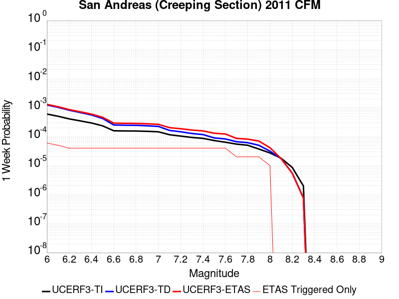 |  |  |  |

| Magnitude | 1 wk TI Prob | 1 wk TD Prob | 1 wk ETAS Prob | 1 wk ETAS/TD Gain | 1 wk ETAS Triggered Only | 1 mo TI Prob | 1 mo TD Prob | 1 mo ETAS Prob | 1 mo ETAS/TD Gain | 1 mo ETAS Triggered Only | 1 yr TI Prob | 1 yr TD Prob | 1 yr ETAS Prob | 1 yr ETAS/TD Gain | 1 yr ETAS Triggered Only | 10 yr TI Prob | 10 yr TD Prob | 10 yr ETAS Prob | 10 yr ETAS/TD Gain | 10 yr ETAS Triggered Only |
|-----|-----|-----|-----|-----|-----|-----|-----|-----|-----|-----|-----|-----|-----|-----|-----|-----|-----|-----|-----|-----|
| 6.0 | 5.986481E-4 | 0.001228691 | 0.001228691 | 1.0 | 0.0 | 0.0025631124 | 0.005246795 | 0.005330031 | 1.0158641 | 8.3675004E-5 | 0.030762846 | 0.061203245 | 0.061438907 | 1.0038505 | 2.5102502E-4 | 0.26835477 | 0.425928 | 0.42612013 | 1.0004511 | 3.3470002E-4 |
| 6.1 | 5.015945E-4 | 0.0010230356 | 0.0010230356 | 1.0 | 0.0 | 0.00214792 | 0.004369436 | 0.004452745 | 1.0190665 | 8.3675004E-5 | 0.025839351 | 0.051246606 | 0.051484767 | 1.0046474 | 2.5102502E-4 | 0.23032776 | 0.37284943 | 0.37305936 | 1.000563 | 3.3470002E-4 |
| 6.2 | 4.073338E-4 | 8.1157376E-4 | 8.1157376E-4 | 1.0 | 0.0 | 0.0017445484 | 0.0034683137 | 0.0035516985 | 1.0240419 | 8.3675004E-5 | 0.021034058 | 0.04093177 | 0.04109227 | 1.0039212 | 1.6735001E-4 | 0.19150782 | 0.31302592 | 0.31319836 | 1.0005509 | 2.5102502E-4 |
| 6.3 | 3.464099E-4 | 6.7455834E-4 | 6.7455834E-4 | 1.0 | 0.0 | 0.0014837692 | 0.0028832308 | 0.0029666645 | 1.0289376 | 8.3675004E-5 | 0.017915873 | 0.034187846 | 0.034349475 | 1.0047277 | 1.6735001E-4 | 0.16538359 | 0.27130842 | 0.27149135 | 1.0006742 | 2.5102502E-4 |
| 6.4 | 2.935057E-4 | 5.5516965E-4 | 5.5516965E-4 | 1.0 | 0.0 | 0.0012572751 | 0.0023727308 | 0.0024562073 | 1.0351816 | 8.3675004E-5 | 0.015200248 | 0.02826279 | 0.02842541 | 1.0057539 | 1.6735001E-4 | 0.14201577 | 0.23297668 | 0.23316921 | 1.0008265 | 2.5102502E-4 |
| 6.5 | 2.3409708E-4 | 4.2132285E-4 | 4.2132285E-4 | 1.0 | 0.0 | 0.0010028875 | 0.0018017791 | 0.0018853034 | 1.0463566 | 8.3675004E-5 | 0.012141965 | 0.021586355 | 0.021750093 | 1.0075853 | 1.6735001E-4 | 0.11499573 | 0.1868149 | 0.18701904 | 1.0010927 | 2.5102502E-4 |
| 6.6 | 1.5842178E-4 | 2.5068692E-4 | 2.5068692E-4 | 1.0 | 0.0 | 6.7877385E-4 | 0.0010739256 | 0.0011575108 | 1.0778314 | 8.3675004E-5 | 0.0082328 | 0.012995283 | 0.013160459 | 1.0127105 | 1.6735001E-4 | 0.07934396 | 0.12313759 | 0.12328434 | 1.0011917 | 1.6735001E-4 |
| 6.7 | 1.5616413E-4 | 2.4605254E-4 | 2.4605254E-4 | 1.0 | 0.0 | 6.691031E-4 | 0.0010540807 | 0.0011376675 | 1.0792983 | 8.3675004E-5 | 0.0081159435 | 0.012757154 | 0.012922369 | 1.0129508 | 1.6735001E-4 | 0.0782586 | 0.12116472 | 0.12131179 | 1.0012138 | 1.6735001E-4 |
| 6.8 | 1.5538467E-4 | 2.442914E-4 | 2.442914E-4 | 1.0 | 0.0 | 6.6576427E-4 | 0.001046539 | 0.0011301265 | 1.0798703 | 8.3675004E-5 | 0.008075596 | 0.012666538 | 0.012831768 | 1.0130446 | 1.6735001E-4 | 0.07788358 | 0.12039561 | 0.12054281 | 1.0012226 | 1.6735001E-4 |
| 6.9 | 1.5153569E-4 | 2.3538464E-4 | 2.3538464E-4 | 1.0 | 0.0 | 6.49277E-4 | 0.0010084033 | 0.0010919939 | 1.0828941 | 8.3675004E-5 | 0.007876333 | 0.012208726 | 0.012374033 | 1.01354 | 1.6735001E-4 | 0.07602952 | 0.11646574 | 0.116613604 | 1.0012696 | 1.6735001E-4 |
| 7.0 | 1.4588932E-4 | 2.2395732E-4 | 2.2395732E-4 | 1.0 | 0.0 | 6.250901E-4 | 9.59466E-4 | 0.0010430607 | 1.0871263 | 8.3675004E-5 | 0.0075839474 | 0.011619428 | 0.011784833 | 1.0142353 | 1.6735001E-4 | 0.073302895 | 0.11131206 | 0.11146078 | 1.0013361 | 1.6735001E-4 |
| 7.1 | 1.1565079E-4 | 1.6281323E-4 | 1.6281323E-4 | 1.0 | 0.0 | 4.955521E-4 | 6.9758523E-4 | 6.9758523E-4 | 1.0 | 0.0 | 0.006016669 | 0.008460228 | 0.008543195 | 1.0098068 | 8.3675004E-5 | 0.058563538 | 0.08366478 | 0.08374146 | 1.0009165 | 8.3675004E-5 |
| 7.2 | 1.0393792E-4 | 1.4615392E-4 | 1.4615392E-4 | 1.0 | 0.0 | 4.4537216E-4 | 6.262243E-4 | 6.262243E-4 | 1.0 | 0.0 | 0.005408933 | 0.0075977976 | 0.007680837 | 1.0109293 | 8.3675004E-5 | 0.052791595 | 0.07561503 | 0.075692385 | 1.0010229 | 8.3675004E-5 |
| 7.3 | 9.332884E-5 | 1.2780601E-4 | 1.2780601E-4 | 1.0 | 0.0 | 3.999194E-4 | 5.4762565E-4 | 5.4762565E-4 | 1.0 | 0.0 | 0.0048581534 | 0.0066470946 | 0.0067302133 | 1.0125046 | 8.3675004E-5 | 0.047533102 | 0.06647954 | 0.06655765 | 1.0011749 | 8.3675004E-5 |
| 7.4 | 8.670252E-5 | 1.1702972E-4 | 1.1702972E-4 | 1.0 | 0.0 | 3.715293E-4 | 5.014601E-4 | 5.014601E-4 | 1.0 | 0.0 | 0.004513991 | 0.0060883067 | 0.0061714724 | 1.0136598 | 8.3675004E-5 | 0.044233937 | 0.061148684 | 0.061227243 | 1.0012847 | 8.3675004E-5 |
| 7.5 | 7.3036405E-5 | 9.005699E-5 | 9.005699E-5 | 1.0 | 0.0 | 3.129756E-4 | 3.859015E-4 | 3.859015E-4 | 1.0 | 0.0 | 0.0038038217 | 0.0046882504 | 0.004771533 | 1.0177641 | 8.3675004E-5 | 0.03739367 | 0.047875606 | 0.047955275 | 1.001664 | 8.3675004E-5 |
| 7.6 | 6.3935775E-5 | 8.280209E-5 | 8.280209E-5 | 1.0 | 0.0 | 2.7398168E-4 | 3.5481792E-4 | 3.5481792E-4 | 1.0 | 0.0 | 0.0033306254 | 0.00431137 | 0.0043946845 | 1.0193243 | 8.3675004E-5 | 0.032811474 | 0.043990135 | 0.04407013 | 1.0018184 | 8.3675004E-5 |
| 7.7 | 5.5050095E-5 | 6.661729E-5 | 6.661729E-5 | 1.0 | 0.0 | 2.3590765E-4 | 2.8547147E-4 | 2.8547147E-4 | 1.0 | 0.0 | 0.0028683927 | 0.0034700802 | 0.0034700802 | 1.0 | 0.0 | 0.0283165 | 0.03579509 | 0.03579509 | 1.0 | 0.0 |
| 7.8 | 5.027131E-5 | 6.1627725E-5 | 6.1627725E-5 | 1.0 | 0.0 | 2.1543067E-4 | 2.640921E-4 | 2.640921E-4 | 1.0 | 0.0 | 0.0026197135 | 0.003210584 | 0.003210584 | 1.0 | 0.0 | 0.025890453 | 0.03312572 | 0.03312572 | 1.0 | 0.0 |
| 7.9 | 3.7271806E-5 | 5.0224386E-5 | 5.0224386E-5 | 1.0 | 0.0 | 1.5972654E-4 | 2.1522962E-4 | 2.1522962E-4 | 1.0 | 0.0 | 0.0019429359 | 0.0026172737 | 0.0026172737 | 1.0 | 0.0 | 0.019260362 | 0.027066687 | 0.027066687 | 1.0 | 0.0 |
| 8.0 | 2.7310243E-5 | 3.1428404E-5 | 3.1428404E-5 | 1.0 | 0.0 | 1.17038646E-4 | 1.3468621E-4 | 1.3468621E-4 | 1.0 | 0.0 | 0.0014240141 | 0.0016385721 | 0.0016385721 | 1.0 | 0.0 | 0.014149235 | 0.01721387 | 0.01721387 | 1.0 | 0.0 |
| 8.1 | 1.7940547E-5 | 1.7400796E-5 | 1.7400796E-5 | 1.0 | 0.0 | 7.688579E-5 | 7.457271E-5 | 7.457271E-5 | 1.0 | 0.0 | 9.3568244E-4 | 9.075451E-4 | 9.075451E-4 | 1.0 | 0.0 | 0.009317525 | 0.009799073 | 0.009799073 | 1.0 | 0.0 |
| 8.2 | 8.643924E-6 | 5.4748625E-6 | 5.4748625E-6 | 1.0 | 0.0 | 3.704486E-5 | 2.3463486E-5 | 2.3463486E-5 | 1.0 | 0.0 | 4.5092785E-4 | 2.8563058E-4 | 2.8563058E-4 | 1.0 | 0.0 | 0.0045001395 | 0.0032487072 | 0.0032487072 | 1.0 | 0.0 |
| 8.3 | 1.983087E-6 | 7.6599065E-7 | 7.6599065E-7 | 1.0 | 0.0 | 8.498917E-6 | 3.282813E-6 | 3.282813E-6 | 1.0 | 0.0 | 1.034694E-4 | 3.9967534E-5 | 3.9967534E-5 | 1.0 | 0.0 | 0.0010342124 | 4.719687E-4 | 4.719687E-4 | 1.0 | 0.0 |

## San Jacinto (San Bernardino)
*[(top)](#table-of-contents)*

| 1 Week | 1 Month | 1 Year | 10 Year |
|-----|-----|-----|-----|
|  |  |  |  |

| Magnitude | 1 wk TI Prob | 1 wk TD Prob | 1 wk ETAS Prob | 1 wk ETAS/TD Gain | 1 wk ETAS Triggered Only | 1 mo TI Prob | 1 mo TD Prob | 1 mo ETAS Prob | 1 mo ETAS/TD Gain | 1 mo ETAS Triggered Only | 1 yr TI Prob | 1 yr TD Prob | 1 yr ETAS Prob | 1 yr ETAS/TD Gain | 1 yr ETAS Triggered Only | 10 yr TI Prob | 10 yr TD Prob | 10 yr ETAS Prob | 10 yr ETAS/TD Gain | 10 yr ETAS Triggered Only |
|-----|-----|-----|-----|-----|-----|-----|-----|-----|-----|-----|-----|-----|-----|-----|-----|-----|-----|-----|-----|-----|
| 6.0 | 3.409352E-5 | 3.5986508E-5 | 3.7067448E-4 | 10.300373 | 3.3470002E-4 | 1.461069E-4 | 1.542188E-4 | 4.888672E-4 | 3.1699586 | 3.3470002E-4 | 0.0017774 | 0.0018759987 | 0.0022100708 | 1.178077 | 3.3470002E-4 | 0.01763251 | 0.019349935 | 0.019678159 | 1.0169625 | 3.3470002E-4 |
| 6.1 | 3.409352E-5 | 3.5986508E-5 | 3.7067448E-4 | 10.300373 | 3.3470002E-4 | 1.461069E-4 | 1.542188E-4 | 4.888672E-4 | 3.1699586 | 3.3470002E-4 | 0.0017774 | 0.0018759987 | 0.0022100708 | 1.178077 | 3.3470002E-4 | 0.01763251 | 0.019349935 | 0.019678159 | 1.0169625 | 3.3470002E-4 |
| 6.2 | 3.409352E-5 | 3.5986508E-5 | 3.7067448E-4 | 10.300373 | 3.3470002E-4 | 1.461069E-4 | 1.542188E-4 | 4.888672E-4 | 3.1699586 | 3.3470002E-4 | 0.0017774 | 0.0018759987 | 0.0022100708 | 1.178077 | 3.3470002E-4 | 0.01763251 | 0.019349935 | 0.019678159 | 1.0169625 | 3.3470002E-4 |
| 6.3 | 3.409352E-5 | 3.5986508E-5 | 3.7067448E-4 | 10.300373 | 3.3470002E-4 | 1.461069E-4 | 1.542188E-4 | 4.888672E-4 | 3.1699586 | 3.3470002E-4 | 0.0017774 | 0.0018759987 | 0.0022100708 | 1.178077 | 3.3470002E-4 | 0.01763251 | 0.019349935 | 0.019678159 | 1.0169625 | 3.3470002E-4 |
| 6.4 | 3.400795E-5 | 3.5879173E-5 | 3.705672E-4 | 10.3281975 | 3.3470002E-4 | 1.4574021E-4 | 1.5375883E-4 | 4.884074E-4 | 3.176451 | 3.3470002E-4 | 0.0017729428 | 0.0018704084 | 0.0022044824 | 1.1786102 | 3.3470002E-4 | 0.017588645 | 0.019295016 | 0.01962326 | 1.0170118 | 3.3470002E-4 |
| 6.5 | 3.341482E-5 | 3.5139812E-5 | 3.6982808E-4 | 10.524475 | 3.3470002E-4 | 1.4319851E-4 | 1.5059051E-4 | 4.8524013E-4 | 3.2222493 | 3.3470002E-4 | 0.0017420477 | 0.0018318989 | 0.0021659858 | 1.1823719 | 3.3470002E-4 | 0.017284546 | 0.018916558 | 0.019244928 | 1.0173588 | 3.3470002E-4 |
| 6.6 | 3.3364955E-5 | 3.5077028E-5 | 3.697653E-4 | 10.541523 | 3.3470002E-4 | 1.4298483E-4 | 1.5032147E-4 | 4.8497118E-4 | 3.226227 | 3.3470002E-4 | 0.0017394501 | 0.001828629 | 0.002162717 | 1.1826986 | 3.3470002E-4 | 0.017258976 | 0.018884424 | 0.019212803 | 1.0173889 | 3.3470002E-4 |
| 6.7 | 3.335922E-5 | 3.5066805E-5 | 3.697551E-4 | 10.544306 | 3.3470002E-4 | 1.4296026E-4 | 1.5027766E-4 | 4.8492738E-4 | 3.2268763 | 3.3470002E-4 | 0.0017391514 | 0.0018280965 | 0.0021621846 | 1.1827519 | 3.3470002E-4 | 0.017256035 | 0.018879214 | 0.019207597 | 1.0173938 | 3.3470002E-4 |
| 6.8 | 3.327683E-5 | 3.496087E-5 | 3.696492E-4 | 10.573227 | 3.3470002E-4 | 1.4260718E-4 | 1.498237E-4 | 4.8447357E-4 | 3.2336245 | 3.3470002E-4 | 0.0017348597 | 0.0018225788 | 0.0021566688 | 1.1833062 | 3.3470002E-4 | 0.017213784 | 0.018824987 | 0.019153386 | 1.0174448 | 3.3470002E-4 |
| 6.9 | 3.3235785E-5 | 3.4901823E-5 | 3.6959015E-4 | 10.589423 | 3.3470002E-4 | 1.4243131E-4 | 1.4957068E-4 | 4.8422065E-4 | 3.2374036 | 3.3470002E-4 | 0.0017327217 | 0.0018195034 | 0.0021535945 | 1.1836166 | 3.3470002E-4 | 0.017192734 | 0.018794855 | 0.019123266 | 1.0174733 | 3.3470002E-4 |
| 7.0 | 3.3197095E-5 | 3.4841752E-5 | 3.695301E-4 | 10.605956 | 3.3470002E-4 | 1.422655E-4 | 1.4931326E-4 | 4.8396332E-4 | 3.2412612 | 3.3470002E-4 | 0.0017307063 | 0.0018163746 | 0.0021504667 | 1.1839335 | 3.3470002E-4 | 0.017172894 | 0.018764233 | 0.019092653 | 1.0175024 | 3.3470002E-4 |
| 7.1 | 3.3129716E-5 | 3.4721965E-5 | 3.6941038E-4 | 10.639097 | 3.3470002E-4 | 1.4197677E-4 | 1.4879994E-4 | 4.8345016E-4 | 3.2489944 | 3.3470002E-4 | 0.0017271966 | 0.0018101353 | 0.0021442296 | 1.1845686 | 3.3470002E-4 | 0.017138338 | 0.018703312 | 0.019031752 | 1.0175605 | 3.3470002E-4 |
| 7.2 | 3.3034008E-5 | 3.458941E-5 | 3.6927787E-4 | 10.676038 | 3.3470002E-4 | 1.4156665E-4 | 1.4823192E-4 | 4.8288234E-4 | 3.2576137 | 3.3470002E-4 | 0.0017222111 | 0.0018032312 | 0.0021373276 | 1.1852765 | 3.3470002E-4 | 0.017089253 | 0.018635705 | 0.018964168 | 1.0176255 | 3.3470002E-4 |
| 7.3 | 3.2956614E-5 | 3.445717E-5 | 3.6914565E-4 | 10.713174 | 3.3470002E-4 | 1.4123498E-4 | 1.4766524E-4 | 4.8231584E-4 | 3.266279 | 3.3470002E-4 | 0.0017181796 | 0.0017963431 | 0.0021304418 | 1.1859883 | 3.3470002E-4 | 0.017049557 | 0.018568452 | 0.018896937 | 1.0176905 | 3.3470002E-4 |
| 7.4 | 3.2915937E-5 | 3.4378863E-5 | 3.690674E-4 | 10.735299 | 3.3470002E-4 | 1.4106068E-4 | 1.4732967E-4 | 4.819804E-4 | 3.2714412 | 3.3470002E-4 | 0.0017160608 | 0.0017922645 | 0.0021263647 | 1.1864123 | 3.3470002E-4 | 0.017028693 | 0.018528719 | 0.018857216 | 1.0177292 | 3.3470002E-4 |
| 7.5 | 3.281791E-5 | 3.4243778E-5 | 3.6893235E-4 | 10.773704 | 3.3470002E-4 | 1.406406E-4 | 1.4675081E-4 | 4.8140172E-4 | 3.2804024 | 3.3470002E-4 | 0.0017109542 | 0.0017852283 | 0.0021193307 | 1.1871483 | 3.3470002E-4 | 0.016978411 | 0.018459605 | 0.018788127 | 1.0177968 | 3.3470002E-4 |
| 7.6 | 3.2521442E-5 | 3.396873E-5 | 3.6865738E-4 | 10.852846 | 3.3470002E-4 | 1.3937015E-4 | 1.4557215E-4 | 4.8022345E-4 | 3.298869 | 3.3470002E-4 | 0.0016955109 | 0.0017709016 | 0.002105009 | 1.188665 | 3.3470002E-4 | 0.016826328 | 0.018317232 | 0.018645803 | 1.0179377 | 3.3470002E-4 |
| 7.7 | 3.0287873E-5 | 3.245276E-5 | 3.6714194E-4 | 11.313118 | 3.3470002E-4 | 1.297987E-4 | 1.3907586E-4 | 4.7372933E-4 | 3.4062657 | 3.3470002E-4 | 0.0015791537 | 0.0016919347 | 0.0020260683 | 1.1974862 | 3.3470002E-4 | 0.01567979 | 0.01752809 | 0.017856924 | 1.0187603 | 3.3470002E-4 |
| 7.8 | 2.6316151E-5 | 2.9663592E-5 | 3.6435368E-4 | 12.282858 | 3.3470002E-4 | 1.1277862E-4 | 1.2712348E-4 | 4.6178096E-4 | 3.6325386 | 3.3470002E-4 | 0.0013722149 | 0.0015466306 | 0.0018808129 | 1.2160712 | 3.3470002E-4 | 0.013637724 | 0.016069634 | 0.016398955 | 1.0204934 | 3.3470002E-4 |
| 7.9 | 2.0761147E-5 | 2.34181E-5 | 2.7443725E-4 | 11.719022 | 2.5102502E-4 | 8.897331E-5 | 1.0035944E-4 | 3.5135925E-4 | 3.5010087 | 2.5102502E-4 | 0.0010827117 | 0.0012211921 | 0.0014719105 | 1.2053063 | 2.5102502E-4 | 0.010774517 | 0.012793174 | 0.013040988 | 1.0193708 | 2.5102502E-4 |
| 8.0 | 1.5738568E-5 | 1.6033575E-5 | 9.970724E-5 | 6.2186527 | 8.3675004E-5 | 6.744926E-5 | 6.871352E-5 | 1.5238277E-4 | 2.2176535 | 8.3675004E-5 | 8.2088535E-4 | 8.3626667E-4 | 9.198717E-4 | 1.0999742 | 8.3675004E-5 | 0.008178596 | 0.008865921 | 0.008948853 | 1.0093541 | 8.3675004E-5 |
| 8.1 | 1.0105832E-5 | 8.3304985E-6 | 9.2004804E-5 | 11.044334 | 8.3675004E-5 | 4.3309992E-5 | 3.570165E-5 | 1.1937367E-4 | 3.3436458 | 8.3675004E-5 | 5.2717153E-4 | 4.345814E-4 | 5.1822007E-4 | 1.1924579 | 8.3675004E-5 | 0.005259227 | 0.004677232 | 0.0047605154 | 1.0178062 | 8.3675004E-5 |
| 8.2 | 4.189207E-6 | 1.5784357E-6 | 1.5784357E-6 | 1.0 | 0.0 | 1.7953622E-5 | 6.7647065E-6 | 6.7647065E-6 | 1.0 | 0.0 | 2.1856341E-4 | 8.235722E-5 | 8.235722E-5 | 1.0 | 0.0 | 0.0021834858 | 9.565867E-4 | 9.565867E-4 | 1.0 | 0.0 |
| 8.3 | 1.2758221E-6 | 3.6149942E-7 | 3.6149942E-7 | 1.0 | 0.0 | 5.4677976E-6 | 1.5492824E-6 | 1.5492824E-6 | 1.0 | 0.0 | 6.65684E-5 | 1.8862354E-5 | 1.8862354E-5 | 1.0 | 0.0 | 6.6548464E-4 | 2.2751294E-4 | 2.2751294E-4 | 1.0 | 0.0 |

## Cady
*[(top)](#table-of-contents)*

| 1 Week | 1 Month | 1 Year | 10 Year |
|-----|-----|-----|-----|
|  |  |  |  |

| Magnitude | 1 wk TI Prob | 1 wk TD Prob | 1 wk ETAS Prob | 1 wk ETAS/TD Gain | 1 wk ETAS Triggered Only | 1 mo TI Prob | 1 mo TD Prob | 1 mo ETAS Prob | 1 mo ETAS/TD Gain | 1 mo ETAS Triggered Only | 1 yr TI Prob | 1 yr TD Prob | 1 yr ETAS Prob | 1 yr ETAS/TD Gain | 1 yr ETAS Triggered Only | 10 yr TI Prob | 10 yr TD Prob | 10 yr ETAS Prob | 10 yr ETAS/TD Gain | 10 yr ETAS Triggered Only |
|-----|-----|-----|-----|-----|-----|-----|-----|-----|-----|-----|-----|-----|-----|-----|-----|-----|-----|-----|-----|-----|
| 6.0 | 1.9892565E-5 | 2.1858728E-5 | 1.0553191E-4 | 4.8279066 | 8.3675004E-5 | 8.525106E-5 | 9.3677416E-5 | 1.7734458E-4 | 1.8931413 | 8.3675004E-5 | 0.0010374374 | 0.0011400167 | 0.001307176 | 1.1466287 | 1.6735001E-4 | 0.010326075 | 0.011350701 | 0.011681601 | 1.0291525 | 3.3470002E-4 |
| 6.1 | 1.9892565E-5 | 2.1858728E-5 | 1.0553191E-4 | 4.8279066 | 8.3675004E-5 | 8.525106E-5 | 9.3677416E-5 | 1.7734458E-4 | 1.8931413 | 8.3675004E-5 | 0.0010374374 | 0.0011400167 | 0.001307176 | 1.1466287 | 1.6735001E-4 | 0.010326075 | 0.011350701 | 0.011681601 | 1.0291525 | 3.3470002E-4 |
| 6.2 | 1.9892565E-5 | 2.1858728E-5 | 1.0553191E-4 | 4.8279066 | 8.3675004E-5 | 8.525106E-5 | 9.3677416E-5 | 1.7734458E-4 | 1.8931413 | 8.3675004E-5 | 0.0010374374 | 0.0011400167 | 0.001307176 | 1.1466287 | 1.6735001E-4 | 0.010326075 | 0.011350701 | 0.011681601 | 1.0291525 | 3.3470002E-4 |
| 6.3 | 1.1117327E-5 | 1.2176583E-5 | 9.585057E-5 | 7.871713 | 8.3675004E-5 | 4.764482E-5 | 5.2184492E-5 | 1.3585514E-4 | 2.603362 | 8.3675004E-5 | 5.7992124E-4 | 6.351925E-4 | 8.024362E-4 | 1.2632961 | 1.6735001E-4 | 0.0057841022 | 0.0063368753 | 0.0066694543 | 1.0524831 | 3.3470002E-4 |
| 6.4 | 1.1117327E-5 | 1.2176583E-5 | 9.585057E-5 | 7.871713 | 8.3675004E-5 | 4.764482E-5 | 5.2184492E-5 | 1.3585514E-4 | 2.603362 | 8.3675004E-5 | 5.7992124E-4 | 6.351925E-4 | 8.024362E-4 | 1.2632961 | 1.6735001E-4 | 0.0057841022 | 0.0063368753 | 0.0066694543 | 1.0524831 | 3.3470002E-4 |
| 6.5 | 6.103093E-6 | 6.672021E-6 | 9.034647E-5 | 13.541096 | 8.3675004E-5 | 2.615585E-5 | 2.8594131E-5 | 1.12266745E-4 | 3.9262164 | 8.3675004E-5 | 3.1840094E-4 | 3.480905E-4 | 4.3173638E-4 | 1.2402992 | 8.3675004E-5 | 0.0031794512 | 0.0034766865 | 0.0036434548 | 1.0479676 | 1.6735001E-4 |
| 6.6 | 5.817237E-6 | 6.3656585E-6 | 9.0040136E-5 | 14.144669 | 8.3675004E-5 | 2.4930776E-5 | 2.728118E-5 | 1.109539E-4 | 4.0670495 | 8.3675004E-5 | 3.034899E-4 | 3.3211018E-4 | 4.157574E-4 | 1.2518659 | 8.3675004E-5 | 0.0030307577 | 0.0033173605 | 0.0034841555 | 1.0502794 | 1.6735001E-4 |
| 6.7 | 4.8846314E-6 | 5.3405684E-6 | 8.901513E-5 | 16.667727 | 8.3675004E-5 | 2.0933967E-5 | 2.2888014E-5 | 1.0656111E-4 | 4.6557603 | 8.3675004E-5 | 2.5484123E-4 | 2.7863772E-4 | 3.6228943E-4 | 1.3002167 | 8.3675004E-5 | 0.0025454918 | 0.0027840391 | 0.0029509233 | 1.0599432 | 1.6735001E-4 |
| 6.8 | 1.7788773E-6 | 1.9399079E-6 | 8.561475E-5 | 44.133408 | 8.3675004E-5 | 7.6237375E-6 | 8.313874E-6 | 9.1988186E-5 | 11.06442 | 8.3675004E-5 | 9.281505E-5 | 1.01218284E-4 | 1.8488482E-4 | 1.8265951 | 8.3675004E-5 | 9.2776294E-4 | 0.0010118765 | 0.0011790572 | 1.1652185 | 1.6735001E-4 |
| 6.9 | 7.5455404E-7 | 8.297092E-7 | 8.4504645E-5 | 101.84851 | 8.3675004E-5 | 3.233799E-6 | 3.5558937E-6 | 8.7230605E-5 | 24.531275 | 8.3675004E-5 | 3.937079E-5 | 4.3292483E-5 | 1.2696386E-4 | 2.9327002 | 8.3675004E-5 | 3.9363815E-4 | 4.3287344E-4 | 5.165122E-4 | 1.1932176 | 8.3675004E-5 |
| 7.0 | 6.8578805E-7 | 7.541816E-7 | 8.442913E-5 | 111.948006 | 8.3675004E-5 | 2.9390883E-6 | 3.2322048E-6 | 8.690694E-5 | 26.887821 | 8.3675004E-5 | 3.578281E-5 | 3.9351715E-5 | 1.2302343E-4 | 3.1262534 | 8.3675004E-5 | 3.577705E-4 | 3.9347992E-4 | 4.77122E-4 | 1.2125702 | 8.3675004E-5 |

## Scodie Lineament
*[(top)](#table-of-contents)*

| 1 Week | 1 Month | 1 Year | 10 Year |
|-----|-----|-----|-----|
|  |  |  |  |

| Magnitude | 1 wk TI Prob | 1 wk TD Prob | 1 wk ETAS Prob | 1 wk ETAS/TD Gain | 1 wk ETAS Triggered Only | 1 mo TI Prob | 1 mo TD Prob | 1 mo ETAS Prob | 1 mo ETAS/TD Gain | 1 mo ETAS Triggered Only | 1 yr TI Prob | 1 yr TD Prob | 1 yr ETAS Prob | 1 yr ETAS/TD Gain | 1 yr ETAS Triggered Only | 10 yr TI Prob | 10 yr TD Prob | 10 yr ETAS Prob | 10 yr ETAS/TD Gain | 10 yr ETAS Triggered Only |
|-----|-----|-----|-----|-----|-----|-----|-----|-----|-----|-----|-----|-----|-----|-----|-----|-----|-----|-----|-----|-----|
| 6.0 | 3.2919327E-6 | 3.0133422E-6 | 8.6688095E-5 | 28.76809 | 8.3675004E-5 | 1.4108206E-5 | 1.2914278E-5 | 9.6588206E-5 | 7.4791794 | 8.3675004E-5 | 1.7175387E-4 | 1.5722317E-4 | 4.0820873E-4 | 2.596365 | 2.5102502E-4 | 0.0017162118 | 0.0015714309 | 0.001905605 | 1.2126559 | 3.3470002E-4 |
| 6.1 | 1.8663811E-6 | 1.5490499E-6 | 1.5490499E-6 | 1.0 | 0.0 | 7.998751E-6 | 6.6387715E-6 | 6.6387715E-6 | 1.0 | 0.0 | 9.738045E-5 | 8.082454E-5 | 8.082454E-5 | 1.0 | 0.0 | 9.7337784E-4 | 8.080003E-4 | 8.9160766E-4 | 1.1034745 | 8.3675004E-5 |
| 6.2 | 1.8663811E-6 | 1.5490499E-6 | 1.5490499E-6 | 1.0 | 0.0 | 7.998751E-6 | 6.6387715E-6 | 6.6387715E-6 | 1.0 | 0.0 | 9.738045E-5 | 8.082454E-5 | 8.082454E-5 | 1.0 | 0.0 | 9.7337784E-4 | 8.080003E-4 | 8.9160766E-4 | 1.1034745 | 8.3675004E-5 |
| 6.3 | 1.8663811E-6 | 1.5490499E-6 | 1.5490499E-6 | 1.0 | 0.0 | 7.998751E-6 | 6.6387715E-6 | 6.6387715E-6 | 1.0 | 0.0 | 9.738045E-5 | 8.082454E-5 | 8.082454E-5 | 1.0 | 0.0 | 9.7337784E-4 | 8.080003E-4 | 8.9160766E-4 | 1.1034745 | 8.3675004E-5 |
| 6.4 | 1.8663811E-6 | 1.5490499E-6 | 1.5490499E-6 | 1.0 | 0.0 | 7.998751E-6 | 6.6387715E-6 | 6.6387715E-6 | 1.0 | 0.0 | 9.738045E-5 | 8.082454E-5 | 8.082454E-5 | 1.0 | 0.0 | 9.7337784E-4 | 8.080003E-4 | 8.9160766E-4 | 1.1034745 | 8.3675004E-5 |
| 6.5 | 1.8106311E-6 | 1.4909839E-6 | 1.4909839E-6 | 1.0 | 0.0 | 7.759824E-6 | 6.3899183E-6 | 6.3899183E-6 | 1.0 | 0.0 | 9.447177E-5 | 7.7794975E-5 | 7.7794975E-5 | 1.0 | 0.0 | 9.4431615E-4 | 7.7772606E-4 | 8.61336E-4 | 1.1075057 | 8.3675004E-5 |
| 6.6 | 1.2414679E-6 | 8.997558E-7 | 8.997558E-7 | 1.0 | 0.0 | 5.320566E-6 | 3.856091E-6 | 3.856091E-6 | 1.0 | 0.0 | 6.477596E-5 | 4.6946985E-5 | 4.6946985E-5 | 1.0 | 0.0 | 6.475708E-4 | 4.693793E-4 | 5.5301504E-4 | 1.1781837 | 8.3675004E-5 |
| 6.7 | 1.1062215E-6 | 7.594311E-7 | 7.594311E-7 | 1.0 | 0.0 | 4.7409408E-6 | 3.2547011E-6 | 3.2547011E-6 | 1.0 | 0.0 | 5.7719422E-5 | 3.9625334E-5 | 3.9625334E-5 | 1.0 | 0.0 | 5.770443E-4 | 3.961897E-4 | 3.961897E-4 | 1.0 | 0.0 |
| 6.8 | 1.0006736E-6 | 6.500397E-7 | 6.500397E-7 | 1.0 | 0.0 | 4.288594E-6 | 2.7858816E-6 | 2.7858816E-6 | 1.0 | 0.0 | 5.221238E-5 | 3.3917644E-5 | 3.3917644E-5 | 1.0 | 0.0 | 5.220012E-4 | 3.3913075E-4 | 3.3913075E-4 | 1.0 | 0.0 |
| 6.9 | 9.167364E-7 | 5.631625E-7 | 5.631625E-7 | 1.0 | 0.0 | 3.9288643E-6 | 2.4135516E-6 | 2.4135516E-6 | 1.0 | 0.0 | 4.7832873E-5 | 2.9384651E-5 | 2.9384651E-5 | 1.0 | 0.0 | 4.782258E-4 | 2.9381333E-4 | 2.9381333E-4 | 1.0 | 0.0 |
| 7.0 | 7.6987664E-7 | 4.113383E-7 | 4.113383E-7 | 1.0 | 0.0 | 3.2994672E-6 | 1.7628774E-6 | 1.7628774E-6 | 1.0 | 0.0 | 4.0170275E-5 | 2.1462862E-5 | 2.1462862E-5 | 1.0 | 0.0 | 4.0163012E-4 | 2.1461173E-4 | 2.1461173E-4 | 1.0 | 0.0 |
| 7.1 | 7.1038727E-7 | 3.5211494E-7 | 3.5211494E-7 | 1.0 | 0.0 | 3.0445133E-6 | 1.5090633E-6 | 1.5090633E-6 | 1.0 | 0.0 | 3.706632E-5 | 1.8372726E-5 | 1.8372726E-5 | 1.0 | 0.0 | 3.7060137E-4 | 1.8371557E-4 | 1.8371557E-4 | 1.0 | 0.0 |
| 7.2 | 2.0799602E-7 | 3.1186854E-8 | 3.1186854E-8 | 1.0 | 0.0 | 8.914113E-7 | 1.3365793E-7 | 1.3365793E-7 | 1.0 | 0.0 | 1.0852878E-5 | 1.6272843E-6 | 1.6272843E-6 | 1.0 | 0.0 | 1.08523476E-4 | 1.627273E-5 | 1.627273E-5 | 1.0 | 0.0 |
| 7.3 | 1.5048182E-7 | 1.5945696E-8 | 1.5945696E-8 | 1.0 | 0.0 | 6.449219E-7 | 6.83387E-8 | 6.83387E-8 | 1.0 | 0.0 | 7.851896E-6 | 8.320234E-7 | 8.320234E-7 | 1.0 | 0.0 | 7.851618E-5 | 8.320206E-6 | 8.320206E-6 | 1.0 | 0.0 |
| 7.4 | 5.9334678E-8 | 4.8683537E-9 | 4.8683537E-9 | 1.0 | 0.0 | 2.5429145E-7 | 2.0864372E-8 | 2.0864372E-8 | 1.0 | 0.0 | 3.095994E-6 | 2.5402372E-7 | 2.5402372E-7 | 1.0 | 0.0 | 3.095951E-5 | 2.5402353E-6 | 2.5402353E-6 | 1.0 | 0.0 |

## Cleghorn Pass
*[(top)](#table-of-contents)*

| 1 Week | 1 Month | 1 Year | 10 Year |
|-----|-----|-----|-----|
|  |  |  |  |

| Magnitude | 1 wk TI Prob | 1 wk TD Prob | 1 wk ETAS Prob | 1 wk ETAS/TD Gain | 1 wk ETAS Triggered Only | 1 mo TI Prob | 1 mo TD Prob | 1 mo ETAS Prob | 1 mo ETAS/TD Gain | 1 mo ETAS Triggered Only | 1 yr TI Prob | 1 yr TD Prob | 1 yr ETAS Prob | 1 yr ETAS/TD Gain | 1 yr ETAS Triggered Only | 10 yr TI Prob | 10 yr TD Prob | 10 yr ETAS Prob | 10 yr ETAS/TD Gain | 10 yr ETAS Triggered Only |
|-----|-----|-----|-----|-----|-----|-----|-----|-----|-----|-----|-----|-----|-----|-----|-----|-----|-----|-----|-----|-----|
| 6.0 | 1.0522846E-5 | 1.1040642E-5 | 1.783888E-4 | 16.157467 | 1.6735001E-4 | 4.509713E-5 | 4.7316473E-5 | 2.9832963E-4 | 6.304984 | 2.5102502E-4 | 5.4891926E-4 | 5.759784E-4 | 8.2685886E-4 | 1.4355726 | 2.5102502E-4 | 0.0054756533 | 0.005750022 | 0.0060827974 | 1.0578737 | 3.3470002E-4 |
| 6.1 | 1.0522846E-5 | 1.1040642E-5 | 1.783888E-4 | 16.157467 | 1.6735001E-4 | 4.509713E-5 | 4.7316473E-5 | 2.9832963E-4 | 6.304984 | 2.5102502E-4 | 5.4891926E-4 | 5.759784E-4 | 8.2685886E-4 | 1.4355726 | 2.5102502E-4 | 0.0054756533 | 0.005750022 | 0.0060827974 | 1.0578737 | 3.3470002E-4 |
| 6.2 | 2.1045846E-6 | 2.2082024E-6 | 8.5883024E-5 | 38.89273 | 8.3675004E-5 | 9.019617E-6 | 9.463714E-6 | 9.3137925E-5 | 9.841583 | 8.3675004E-5 | 1.098083E-4 | 1.1521882E-4 | 1.9888418E-4 | 1.7261432 | 8.3675004E-5 | 0.0010975406 | 0.0011520023 | 0.0012355809 | 1.0725508 | 8.3675004E-5 |
| 6.3 | 2.1045846E-6 | 2.2082024E-6 | 8.5883024E-5 | 38.89273 | 8.3675004E-5 | 9.019617E-6 | 9.463714E-6 | 9.3137925E-5 | 9.841583 | 8.3675004E-5 | 1.098083E-4 | 1.1521882E-4 | 1.9888418E-4 | 1.7261432 | 8.3675004E-5 | 0.0010975406 | 0.0011520023 | 0.0012355809 | 1.0725508 | 8.3675004E-5 |
| 6.4 | 1.7259927E-6 | 1.810877E-6 | 8.5485735E-5 | 47.20681 | 8.3675004E-5 | 7.3970905E-6 | 7.760902E-6 | 9.143526E-5 | 11.781525 | 8.3675004E-5 | 9.005586E-5 | 9.4488976E-5 | 1.7815609E-4 | 1.8854694 | 8.3675004E-5 | 9.001937E-4 | 9.448898E-4 | 0.0010284857 | 1.0884717 | 8.3675004E-5 |

## Cleghorn Lake
*[(top)](#table-of-contents)*

| 1 Week | 1 Month | 1 Year | 10 Year |
|-----|-----|-----|-----|
|  |  |  |  |

| Magnitude | 1 wk TI Prob | 1 wk TD Prob | 1 wk ETAS Prob | 1 wk ETAS/TD Gain | 1 wk ETAS Triggered Only | 1 mo TI Prob | 1 mo TD Prob | 1 mo ETAS Prob | 1 mo ETAS/TD Gain | 1 mo ETAS Triggered Only | 1 yr TI Prob | 1 yr TD Prob | 1 yr ETAS Prob | 1 yr ETAS/TD Gain | 1 yr ETAS Triggered Only | 10 yr TI Prob | 10 yr TD Prob | 10 yr ETAS Prob | 10 yr ETAS/TD Gain | 10 yr ETAS Triggered Only |
|-----|-----|-----|-----|-----|-----|-----|-----|-----|-----|-----|-----|-----|-----|-----|-----|-----|-----|-----|-----|-----|
| 6.0 | 1.5467183E-5 | 1.6794203E-5 | 1.00467805E-4 | 5.9822903 | 8.3675004E-5 | 6.6286244E-5 | 7.197348E-5 | 3.2298043E-4 | 4.487492 | 2.5102502E-4 | 8.067362E-4 | 8.759797E-4 | 0.0011267848 | 1.2863139 | 2.5102502E-4 | 0.008038137 | 0.008730696 | 0.008979529 | 1.028501 | 2.5102502E-4 |
| 6.1 | 1.5467183E-5 | 1.6794203E-5 | 1.00467805E-4 | 5.9822903 | 8.3675004E-5 | 6.6286244E-5 | 7.197348E-5 | 3.2298043E-4 | 4.487492 | 2.5102502E-4 | 8.067362E-4 | 8.759797E-4 | 0.0011267848 | 1.2863139 | 2.5102502E-4 | 0.008038137 | 0.008730696 | 0.008979529 | 1.028501 | 2.5102502E-4 |
| 6.2 | 1.2624631E-5 | 1.3681544E-5 | 9.7355405E-5 | 7.11582 | 8.3675004E-5 | 5.410444E-5 | 5.863415E-5 | 3.0964444E-4 | 5.2809577 | 2.5102502E-4 | 6.585225E-4 | 7.1368564E-4 | 9.645315E-4 | 1.3514795 | 2.5102502E-4 | 0.0065657445 | 0.0071187317 | 0.00736797 | 1.0350115 | 2.5102502E-4 |
| 6.3 | 1.2624631E-5 | 1.3681544E-5 | 9.7355405E-5 | 7.11582 | 8.3675004E-5 | 5.410444E-5 | 5.863415E-5 | 3.0964444E-4 | 5.2809577 | 2.5102502E-4 | 6.585225E-4 | 7.1368564E-4 | 9.645315E-4 | 1.3514795 | 2.5102502E-4 | 0.0065657445 | 0.0071187317 | 0.00736797 | 1.0350115 | 2.5102502E-4 |
| 6.4 | 9.417684E-6 | 1.0170118E-5 | 9.3844275E-5 | 9.227452 | 8.3675004E-5 | 4.036088E-5 | 4.3585722E-5 | 2.1092844E-4 | 4.839393 | 1.6735001E-4 | 4.912829E-4 | 5.3056807E-4 | 6.978293E-4 | 1.3152493 | 1.6735001E-4 | 0.004901982 | 0.005297049 | 0.0054635126 | 1.0314257 | 1.6735001E-4 |
| 6.5 | 9.368219E-6 | 1.0117545E-5 | 9.379171E-5 | 9.270205 | 8.3675004E-5 | 4.014889E-5 | 4.3360415E-5 | 2.1070318E-4 | 4.859344 | 1.6735001E-4 | 4.8870314E-4 | 5.2782625E-4 | 6.9508795E-4 | 1.3168877 | 1.6735001E-4 | 0.004876298 | 0.0052697617 | 0.0054362295 | 1.0315893 | 1.6735001E-4 |
| 6.6 | 7.803798E-6 | 8.441831E-6 | 9.211613E-5 | 10.911866 | 8.3675004E-5 | 3.3444423E-5 | 3.6179E-5 | 2.0352296E-4 | 5.625445 | 1.6735001E-4 | 4.0710976E-4 | 4.4043022E-4 | 6.077065E-4 | 1.3798021 | 1.6735001E-4 | 0.0040636472 | 0.0043994905 | 0.004566104 | 1.0378711 | 1.6735001E-4 |
| 6.7 | 2.3108669E-6 | 2.4438336E-6 | 2.4438336E-6 | 1.0 | 0.0 | 9.903678E-6 | 1.0473532E-5 | 9.414766E-5 | 8.989103 | 8.3675004E-5 | 1.205706E-4 | 1.2750797E-4 | 2.1117232E-4 | 1.6561499 | 8.3675004E-5 | 0.001205052 | 0.0012743667 | 0.0013579351 | 1.0655764 | 8.3675004E-5 |
| 6.8 | 2.0882828E-6 | 2.2062823E-6 | 2.2062823E-6 | 1.0 | 0.0 | 8.949753E-6 | 9.455462E-6 | 9.3129674E-5 | 9.849299 | 8.3675004E-5 | 1.08957785E-4 | 1.1511434E-4 | 1.9877971E-4 | 1.7268023 | 8.3675004E-5 | 0.0010890438 | 0.0011505639 | 0.0012341427 | 1.0726415 | 8.3675004E-5 |
| 6.9 | 1.876935E-6 | 1.981051E-6 | 1.981051E-6 | 1.0 | 0.0 | 8.043982E-6 | 8.490192E-6 | 9.216449E-5 | 10.855407 | 8.3675004E-5 | 9.7931086E-5 | 1.03363345E-4 | 1.870297E-4 | 1.8094393 | 8.3675004E-5 | 9.788794E-4 | 0.0010331686 | 0.0011167572 | 1.0809051 | 8.3675004E-5 |
| 7.0 | 1.5357559E-6 | 1.6202807E-6 | 1.6202807E-6 | 1.0 | 0.0 | 6.5817944E-6 | 6.9440425E-6 | 9.0618465E-5 | 13.049815 | 8.3675004E-5 | 8.01304E-5 | 8.454057E-5 | 1.682085E-4 | 1.9896779 | 8.3675004E-5 | 8.010151E-4 | 8.450965E-4 | 9.287008E-4 | 1.0989287 | 8.3675004E-5 |
| 7.1 | 1.0905424E-6 | 1.1497619E-6 | 1.1497619E-6 | 1.0 | 0.0 | 4.6737446E-6 | 4.9275427E-6 | 8.860214E-5 | 17.980999 | 8.3675004E-5 | 5.6901354E-5 | 5.999128E-5 | 1.4366127E-4 | 2.3947024 | 8.3675004E-5 | 5.6886784E-4 | 5.997606E-4 | 6.833854E-4 | 1.1394303 | 8.3675004E-5 |
| 7.2 | 6.06668E-7 | 6.387277E-7 | 6.387277E-7 | 1.0 | 0.0 | 2.600003E-6 | 2.7374022E-6 | 8.641218E-5 | 31.56722 | 8.3675004E-5 | 3.1654577E-5 | 3.3327433E-5 | 1.1699965E-4 | 3.510611 | 8.3675004E-5 | 3.1650066E-4 | 3.3323118E-4 | 4.168783E-4 | 1.2510183 | 8.3675004E-5 |

## San Clemente
*[(top)](#table-of-contents)*

| 1 Week | 1 Month | 1 Year | 10 Year |
|-----|-----|-----|-----|
|  |  |  |  |

| Magnitude | 1 wk TI Prob | 1 wk TD Prob | 1 wk ETAS Prob | 1 wk ETAS/TD Gain | 1 wk ETAS Triggered Only | 1 mo TI Prob | 1 mo TD Prob | 1 mo ETAS Prob | 1 mo ETAS/TD Gain | 1 mo ETAS Triggered Only | 1 yr TI Prob | 1 yr TD Prob | 1 yr ETAS Prob | 1 yr ETAS/TD Gain | 1 yr ETAS Triggered Only | 10 yr TI Prob | 10 yr TD Prob | 10 yr ETAS Prob | 10 yr ETAS/TD Gain | 10 yr ETAS Triggered Only |
|-----|-----|-----|-----|-----|-----|-----|-----|-----|-----|-----|-----|-----|-----|-----|-----|-----|-----|-----|-----|-----|
| 6.0 | 6.681379E-5 | 8.163422E-5 | 8.163422E-5 | 1.0 | 0.0 | 2.8631336E-4 | 3.498173E-4 | 3.498173E-4 | 1.0 | 0.0 | 0.003480294 | 0.0042512873 | 0.004417926 | 1.0391972 | 1.6735001E-4 | 0.03426291 | 0.041755714 | 0.041996256 | 1.0057607 | 2.5102502E-4 |
| 6.1 | 6.681379E-5 | 8.163422E-5 | 8.163422E-5 | 1.0 | 0.0 | 2.8631336E-4 | 3.498173E-4 | 3.498173E-4 | 1.0 | 0.0 | 0.003480294 | 0.0042512873 | 0.004417926 | 1.0391972 | 1.6735001E-4 | 0.03426291 | 0.041755714 | 0.041916076 | 1.0038404 | 1.6735001E-4 |
| 6.2 | 3.9400576E-5 | 4.6451984E-5 | 4.6451984E-5 | 1.0 | 0.0 | 1.6884868E-4 | 1.9906509E-4 | 1.9906509E-4 | 1.0 | 0.0 | 0.0020537945 | 0.002420985 | 0.0025879296 | 1.0689574 | 1.6735001E-4 | 0.020349167 | 0.02395286 | 0.024116201 | 1.0068192 | 1.6735001E-4 |
| 6.3 | 3.2590255E-5 | 3.7929087E-5 | 3.7929087E-5 | 1.0 | 0.0 | 1.3966505E-4 | 1.6254328E-4 | 1.6254328E-4 | 1.0 | 0.0 | 0.0016990956 | 0.0019771985 | 0.0021442175 | 1.0844727 | 1.6735001E-4 | 0.01686163 | 0.019599866 | 0.019763935 | 1.008371 | 1.6735001E-4 |
| 6.4 | 2.9454652E-5 | 3.4097775E-5 | 3.4097775E-5 | 1.0 | 0.0 | 1.2622811E-4 | 1.4612528E-4 | 1.4612528E-4 | 1.0 | 0.0 | 0.0015357438 | 0.0017776482 | 0.0019447007 | 1.0939739 | 1.6735001E-4 | 0.015251739 | 0.017637458 | 0.017801857 | 1.009321 | 1.6735001E-4 |
| 6.5 | 2.790836E-5 | 3.2247463E-5 | 3.2247463E-5 | 1.0 | 0.0 | 1.1960178E-4 | 1.3819622E-4 | 1.3819622E-4 | 1.0 | 0.0 | 0.001455179 | 0.0016812651 | 0.0018483337 | 1.0993708 | 1.6735001E-4 | 0.014456868 | 0.016688475 | 0.016853033 | 1.0098605 | 1.6735001E-4 |
| 6.6 | 2.2492153E-5 | 2.5762707E-5 | 2.5762707E-5 | 1.0 | 0.0 | 9.639138E-5 | 1.1040701E-4 | 1.1040701E-4 | 1.0 | 0.0 | 0.0011729331 | 0.0013433908 | 0.001510516 | 1.1244055 | 1.6735001E-4 | 0.011667615 | 0.013354415 | 0.01351953 | 1.012364 | 1.6735001E-4 |
| 6.7 | 1.9862755E-5 | 2.2666423E-5 | 2.2666423E-5 | 1.0 | 0.0 | 8.512331E-5 | 9.713826E-5 | 9.713826E-5 | 1.0 | 0.0 | 0.0010358836 | 0.0011820279 | 0.0013491801 | 1.1414114 | 1.6735001E-4 | 0.010310682 | 0.011758701 | 0.011924082 | 1.0140647 | 1.6735001E-4 |
| 6.8 | 1.6697575E-5 | 1.897771E-5 | 1.897771E-5 | 1.0 | 0.0 | 7.155907E-5 | 8.133056E-5 | 8.133056E-5 | 1.0 | 0.0 | 8.7088346E-4 | 9.897591E-4 | 0.0010733512 | 1.0844572 | 8.3675004E-5 | 0.008674784 | 0.0098545365 | 0.009937387 | 1.0084074 | 8.3675004E-5 |
| 6.9 | 1.5218415E-5 | 1.72694E-5 | 1.72694E-5 | 1.0 | 0.0 | 6.522015E-5 | 7.4009666E-5 | 7.4009666E-5 | 1.0 | 0.0 | 7.93766E-4 | 9.00704E-4 | 9.843037E-4 | 1.0928159 | 8.3675004E-5 | 0.007909367 | 0.008971481 | 0.009054405 | 1.0092431 | 8.3675004E-5 |
| 7.0 | 1.2392958E-5 | 1.4033016E-5 | 1.4033016E-5 | 1.0 | 0.0 | 5.3111595E-5 | 6.014015E-5 | 6.014015E-5 | 1.0 | 0.0 | 6.4644177E-4 | 7.319679E-4 | 8.155817E-4 | 1.1142315 | 8.3675004E-5 | 0.0064456454 | 0.0072963564 | 0.007379421 | 1.0113844 | 8.3675004E-5 |
| 7.1 | 1.0934128E-5 | 1.2375138E-5 | 1.2375138E-5 | 1.0 | 0.0 | 4.6859706E-5 | 5.303527E-5 | 5.303527E-5 | 1.0 | 0.0 | 5.7036756E-4 | 6.455204E-4 | 6.455204E-4 | 1.0 | 0.0 | 0.0056890585 | 0.0064371997 | 0.0064371997 | 1.0 | 0.0 |
| 7.2 | 9.5798805E-6 | 1.0844935E-5 | 1.0844935E-5 | 1.0 | 0.0 | 4.1055984E-5 | 4.6477508E-5 | 4.6477508E-5 | 1.0 | 0.0 | 4.9974193E-4 | 5.657239E-4 | 5.657239E-4 | 1.0 | 0.0 | 0.0049861963 | 0.0056435615 | 0.0056435615 | 1.0 | 0.0 |
| 7.3 | 8.0167365E-6 | 9.083918E-6 | 9.083918E-6 | 1.0 | 0.0 | 3.4356988E-5 | 3.8930535E-5 | 3.8930535E-5 | 1.0 | 0.0 | 4.1821605E-4 | 4.7388324E-4 | 4.7388324E-4 | 1.0 | 0.0 | 0.0041742986 | 0.0047294297 | 0.0047294297 | 1.0 | 0.0 |
| 7.4 | 2.9581017E-6 | 3.3623792E-6 | 3.3623792E-6 | 1.0 | 0.0 | 1.2677518E-5 | 1.4410146E-5 | 1.4410146E-5 | 1.0 | 0.0 | 1.5433785E-4 | 1.7543444E-4 | 1.7543444E-4 | 1.0 | 0.0 | 0.001542307 | 0.0017534546 | 0.0017534546 | 1.0 | 0.0 |

## Lake Isabella (Seismicity)
*[(top)](#table-of-contents)*

| 1 Week | 1 Month | 1 Year | 10 Year |
|-----|-----|-----|-----|
|  | 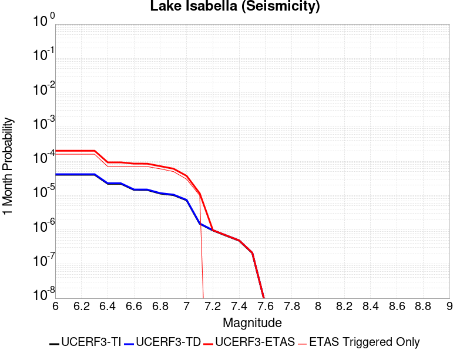 |  |  |

| Magnitude | 1 wk TI Prob | 1 wk TD Prob | 1 wk ETAS Prob | 1 wk ETAS/TD Gain | 1 wk ETAS Triggered Only | 1 mo TI Prob | 1 mo TD Prob | 1 mo ETAS Prob | 1 mo ETAS/TD Gain | 1 mo ETAS Triggered Only | 1 yr TI Prob | 1 yr TD Prob | 1 yr ETAS Prob | 1 yr ETAS/TD Gain | 1 yr ETAS Triggered Only | 10 yr TI Prob | 10 yr TD Prob | 10 yr ETAS Prob | 10 yr ETAS/TD Gain | 10 yr ETAS Triggered Only |
|-----|-----|-----|-----|-----|-----|-----|-----|-----|-----|-----|-----|-----|-----|-----|-----|-----|-----|-----|-----|-----|
| 6.0 | 9.431637E-6 | 9.741651E-6 | 9.3415845E-5 | 9.589323 | 8.3675004E-5 | 4.0420677E-5 | 4.1749343E-5 | 1.2542085E-4 | 3.0041397 | 8.3675004E-5 | 4.920106E-4 | 5.0819275E-4 | 7.590902E-4 | 1.4937053 | 2.5102502E-4 | 0.004909227 | 0.005071599 | 0.005321351 | 1.0492452 | 2.5102502E-4 |
| 6.1 | 9.431637E-6 | 9.741651E-6 | 9.3415845E-5 | 9.589323 | 8.3675004E-5 | 4.0420677E-5 | 4.1749343E-5 | 1.2542085E-4 | 3.0041397 | 8.3675004E-5 | 4.920106E-4 | 5.0819275E-4 | 7.590902E-4 | 1.4937053 | 2.5102502E-4 | 0.004909227 | 0.005071599 | 0.005321351 | 1.0492452 | 2.5102502E-4 |
| 6.2 | 9.431637E-6 | 9.741651E-6 | 9.3415845E-5 | 9.589323 | 8.3675004E-5 | 4.0420677E-5 | 4.1749343E-5 | 1.2542085E-4 | 3.0041397 | 8.3675004E-5 | 4.920106E-4 | 5.0819275E-4 | 7.590902E-4 | 1.4937053 | 2.5102502E-4 | 0.004909227 | 0.005071599 | 0.005321351 | 1.0492452 | 2.5102502E-4 |
| 6.3 | 9.431637E-6 | 9.741651E-6 | 9.3415845E-5 | 9.589323 | 8.3675004E-5 | 4.0420677E-5 | 4.1749343E-5 | 1.2542085E-4 | 3.0041397 | 8.3675004E-5 | 4.920106E-4 | 5.0819275E-4 | 7.590902E-4 | 1.4937053 | 2.5102502E-4 | 0.004909227 | 0.005071599 | 0.005321351 | 1.0492452 | 2.5102502E-4 |
| 6.4 | 5.144063E-6 | 5.3000763E-6 | 5.3000763E-6 | 1.0 | 0.0 | 2.2045799E-5 | 2.2714434E-5 | 2.2714434E-5 | 1.0 | 0.0 | 2.6837454E-4 | 2.765166E-4 | 4.4382032E-4 | 1.6050406 | 1.6735001E-4 | 0.0026805066 | 0.0027620657 | 0.0029289534 | 1.0604213 | 1.6735001E-4 |
| 6.5 | 5.144063E-6 | 5.3000763E-6 | 5.3000763E-6 | 1.0 | 0.0 | 2.2045799E-5 | 2.2714434E-5 | 2.2714434E-5 | 1.0 | 0.0 | 2.6837454E-4 | 2.765166E-4 | 4.4382032E-4 | 1.6050406 | 1.6735001E-4 | 0.0026805066 | 0.0027620657 | 0.0029289534 | 1.0604213 | 1.6735001E-4 |
| 6.6 | 3.4009804E-6 | 3.498786E-6 | 3.498786E-6 | 1.0 | 0.0 | 1.4575549E-5 | 1.4994721E-5 | 1.4994721E-5 | 1.0 | 0.0 | 1.7744285E-4 | 1.8254704E-4 | 2.6620677E-4 | 1.4582914 | 8.3675004E-5 | 0.0017730123 | 0.0018241286 | 0.001907651 | 1.0457876 | 8.3675004E-5 |
| 6.7 | 3.3880428E-6 | 3.4856528E-6 | 3.4856528E-6 | 1.0 | 0.0 | 1.4520103E-5 | 1.4938435E-5 | 1.4938435E-5 | 1.0 | 0.0 | 1.767679E-4 | 1.8186188E-4 | 2.6552167E-4 | 1.4600183 | 8.3675004E-5 | 0.0017662736 | 0.0018172882 | 0.0019008111 | 1.0459602 | 8.3675004E-5 |
| 6.8 | 2.6582E-6 | 2.7337003E-6 | 2.7337003E-6 | 1.0 | 0.0 | 1.1392236E-5 | 1.1715813E-5 | 1.1715813E-5 | 1.0 | 0.0 | 1.3869164E-4 | 1.4263204E-4 | 2.262951E-4 | 1.5865659 | 8.3675004E-5 | 0.0013860512 | 0.0014255369 | 0.0015090926 | 1.0586135 | 8.3675004E-5 |
| 6.9 | 2.406011E-6 | 2.4743288E-6 | 2.4743288E-6 | 1.0 | 0.0 | 1.0311434E-5 | 1.0604231E-5 | 1.0604231E-5 | 1.0 | 0.0 | 1.2553448E-4 | 1.2910018E-4 | 2.1276438E-4 | 1.6480564 | 8.3675004E-5 | 0.0012546359 | 0.0012903814 | 0.0013739484 | 1.0647615 | 8.3675004E-5 |
| 7.0 | 1.6953097E-6 | 1.7429371E-6 | 1.7429371E-6 | 1.0 | 0.0 | 7.265593E-6 | 7.469715E-6 | 7.469715E-6 | 1.0 | 0.0 | 8.8455E-5 | 9.094104E-5 | 9.094104E-5 | 1.0 | 0.0 | 8.84198E-4 | 9.09141E-4 | 9.09141E-4 | 1.0 | 0.0 |
| 7.1 | 3.5013824E-7 | 3.5714822E-7 | 3.5714822E-7 | 1.0 | 0.0 | 1.5005916E-6 | 1.5306344E-6 | 1.5306344E-6 | 1.0 | 0.0 | 1.826955E-5 | 1.8635317E-5 | 1.8635317E-5 | 1.0 | 0.0 | 1.8268047E-4 | 1.863378E-4 | 1.863378E-4 | 1.0 | 0.0 |
| 7.2 | 2.2321095E-7 | 2.2750574E-7 | 2.2750574E-7 | 1.0 | 0.0 | 9.56618E-7 | 9.750242E-7 | 9.750242E-7 | 1.0 | 0.0 | 1.1646762E-5 | 1.1870856E-5 | 1.1870856E-5 | 1.0 | 0.0 | 1.1646151E-4 | 1.1870232E-4 | 1.1870232E-4 | 1.0 | 0.0 |
| 7.3 | 1.5760406E-7 | 1.6060922E-7 | 1.6060922E-7 | 1.0 | 0.0 | 6.7544585E-7 | 6.8832503E-7 | 6.8832503E-7 | 1.0 | 0.0 | 8.223522E-6 | 8.380326E-6 | 8.380326E-6 | 1.0 | 0.0 | 8.2232174E-5 | 8.3800165E-5 | 8.3800165E-5 | 1.0 | 0.0 |
| 7.4 | 1.1216497E-7 | 1.1431706E-7 | 1.1431706E-7 | 1.0 | 0.0 | 4.8070694E-7 | 4.899302E-7 | 4.899302E-7 | 1.0 | 0.0 | 5.852591E-6 | 5.964884E-6 | 5.964884E-6 | 1.0 | 0.0 | 5.8524372E-5 | 5.9647282E-5 | 5.9647282E-5 | 1.0 | 0.0 |
| 7.5 | 4.885185E-8 | 4.9787737E-8 | 4.9787737E-8 | 1.0 | 0.0 | 2.0936506E-7 | 2.13376E-7 | 2.13376E-7 | 1.0 | 0.0 | 2.5490165E-6 | 2.59785E-6 | 2.59785E-6 | 1.0 | 0.0 | 2.5489873E-5 | 2.5978214E-5 | 2.5978214E-5 | 1.0 | 0.0 |
| 7.6 | 1.504641E-9 | 1.5317903E-9 | 1.5317903E-9 | 1.0 | 0.0 | 6.4484613E-9 | 6.5648154E-9 | 6.5648154E-9 | 1.0 | 0.0 | 7.851001E-8 | 7.992663E-8 | 7.992663E-8 | 1.0 | 0.0 | 7.8509987E-7 | 7.992663E-7 | 7.992663E-7 | 1.0 | 0.0 |

## Channel Islands Thrust
*[(top)](#table-of-contents)*

| 1 Week | 1 Month | 1 Year | 10 Year |
|-----|-----|-----|-----|
|  |  |  |  |

| Magnitude | 1 wk TI Prob | 1 wk TD Prob | 1 wk ETAS Prob | 1 wk ETAS/TD Gain | 1 wk ETAS Triggered Only | 1 mo TI Prob | 1 mo TD Prob | 1 mo ETAS Prob | 1 mo ETAS/TD Gain | 1 mo ETAS Triggered Only | 1 yr TI Prob | 1 yr TD Prob | 1 yr ETAS Prob | 1 yr ETAS/TD Gain | 1 yr ETAS Triggered Only | 10 yr TI Prob | 10 yr TD Prob | 10 yr ETAS Prob | 10 yr ETAS/TD Gain | 10 yr ETAS Triggered Only |
|-----|-----|-----|-----|-----|-----|-----|-----|-----|-----|-----|-----|-----|-----|-----|-----|-----|-----|-----|-----|-----|
| 6.0 | 2.2156251E-5 | 2.4092022E-5 | 2.4092022E-5 | 1.0 | 0.0 | 9.495191E-5 | 1.03248036E-4 | 1.869144E-4 | 1.8103434 | 8.3675004E-5 | 0.0011554264 | 0.0012564264 | 0.0013399963 | 1.0665139 | 8.3675004E-5 | 0.011494373 | 0.0125038205 | 0.012669078 | 1.0132166 | 1.6735001E-4 |
| 6.1 | 2.2156251E-5 | 2.4092022E-5 | 2.4092022E-5 | 1.0 | 0.0 | 9.495191E-5 | 1.03248036E-4 | 1.869144E-4 | 1.8103434 | 8.3675004E-5 | 0.0011554264 | 0.0012564264 | 0.0013399963 | 1.0665139 | 8.3675004E-5 | 0.011494373 | 0.0125038205 | 0.012669078 | 1.0132166 | 1.6735001E-4 |
| 6.2 | 2.2156251E-5 | 2.4092022E-5 | 2.4092022E-5 | 1.0 | 0.0 | 9.495191E-5 | 1.03248036E-4 | 1.869144E-4 | 1.8103434 | 8.3675004E-5 | 0.0011554264 | 0.0012564264 | 0.0013399963 | 1.0665139 | 8.3675004E-5 | 0.011494373 | 0.0125038205 | 0.012669078 | 1.0132166 | 1.6735001E-4 |
| 6.3 | 2.2156251E-5 | 2.4092022E-5 | 2.4092022E-5 | 1.0 | 0.0 | 9.495191E-5 | 1.03248036E-4 | 1.869144E-4 | 1.8103434 | 8.3675004E-5 | 0.0011554264 | 0.0012564264 | 0.0013399963 | 1.0665139 | 8.3675004E-5 | 0.011494373 | 0.0125038205 | 0.012669078 | 1.0132166 | 1.6735001E-4 |
| 6.4 | 2.2156251E-5 | 2.4092022E-5 | 2.4092022E-5 | 1.0 | 0.0 | 9.495191E-5 | 1.03248036E-4 | 1.869144E-4 | 1.8103434 | 8.3675004E-5 | 0.0011554264 | 0.0012564264 | 0.0013399963 | 1.0665139 | 8.3675004E-5 | 0.011494373 | 0.0125038205 | 0.012669078 | 1.0132166 | 1.6735001E-4 |
| 6.5 | 2.2156251E-5 | 2.4092022E-5 | 2.4092022E-5 | 1.0 | 0.0 | 9.495191E-5 | 1.03248036E-4 | 1.869144E-4 | 1.8103434 | 8.3675004E-5 | 0.0011554264 | 0.0012564264 | 0.0013399963 | 1.0665139 | 8.3675004E-5 | 0.011494373 | 0.0125038205 | 0.012669078 | 1.0132166 | 1.6735001E-4 |
| 6.6 | 2.2156251E-5 | 2.4092022E-5 | 2.4092022E-5 | 1.0 | 0.0 | 9.495191E-5 | 1.03248036E-4 | 1.869144E-4 | 1.8103434 | 8.3675004E-5 | 0.0011554264 | 0.0012564264 | 0.0013399963 | 1.0665139 | 8.3675004E-5 | 0.011494373 | 0.0125038205 | 0.012669078 | 1.0132166 | 1.6735001E-4 |
| 6.7 | 1.0601296E-5 | 1.1379544E-5 | 1.1379544E-5 | 1.0 | 0.0 | 4.5433335E-5 | 4.876859E-5 | 1.3243951E-4 | 2.7156725 | 8.3675004E-5 | 5.5301044E-4 | 5.936007E-4 | 6.7722605E-4 | 1.1408781 | 8.3675004E-5 | 0.005516363 | 0.005920653 | 0.006003833 | 1.014049 | 8.3675004E-5 |
| 6.8 | 1.0246747E-5 | 1.0996669E-5 | 1.0996669E-5 | 1.0 | 0.0 | 4.391389E-5 | 4.7127756E-5 | 1.3079881E-4 | 2.7754095 | 8.3675004E-5 | 5.345204E-4 | 5.7363417E-4 | 6.572612E-4 | 1.1457846 | 8.3675004E-5 | 0.0053323656 | 0.005722025 | 0.005805221 | 1.0145396 | 8.3675004E-5 |
| 6.9 | 9.049551E-6 | 9.699645E-6 | 9.699645E-6 | 1.0 | 0.0 | 3.878322E-5 | 4.1569267E-5 | 1.252408E-4 | 3.012822 | 8.3675004E-5 | 4.7208337E-4 | 5.059924E-4 | 5.8962504E-4 | 1.1652844 | 8.3675004E-5 | 0.0047108172 | 0.0050488203 | 0.0051320726 | 1.0164895 | 8.3675004E-5 |
| 7.0 | 8.6542195E-6 | 9.274603E-6 | 9.274603E-6 | 1.0 | 0.0 | 3.7088983E-5 | 3.9747716E-5 | 1.2341939E-4 | 3.105069 | 8.3675004E-5 | 4.5146482E-4 | 4.8382508E-4 | 5.6745956E-4 | 1.1728611 | 8.3675004E-5 | 0.004505487 | 0.004828129 | 0.0049114 | 1.0172471 | 8.3675004E-5 |
| 7.1 | 8.391028E-6 | 8.992924E-6 | 8.992924E-6 | 1.0 | 0.0 | 3.5961057E-5 | 3.854056E-5 | 3.854056E-5 | 1.0 | 0.0 | 4.3773788E-4 | 4.6913436E-4 | 4.6913436E-4 | 1.0 | 0.0 | 0.004368766 | 0.0046818503 | 0.0046818503 | 1.0 | 0.0 |
| 7.2 | 5.965188E-6 | 6.3716952E-6 | 6.3716952E-6 | 1.0 | 0.0 | 2.556484E-5 | 2.7306982E-5 | 2.7306982E-5 | 1.0 | 0.0 | 3.1120746E-4 | 3.3241234E-4 | 3.3241234E-4 | 1.0 | 0.0 | 0.00310772 | 0.0033192092 | 0.0033192092 | 1.0 | 0.0 |
| 7.3 | 4.877518E-6 | 5.2060063E-6 | 5.2060063E-6 | 1.0 | 0.0 | 2.0903482E-5 | 2.2311267E-5 | 2.2311267E-5 | 1.0 | 0.0 | 2.5447016E-4 | 2.716063E-4 | 2.716063E-4 | 1.0 | 0.0 | 0.0025417898 | 0.0027127895 | 0.0027127895 | 1.0 | 0.0 |
| 7.4 | 3.8829853E-6 | 4.141863E-6 | 4.141863E-6 | 1.0 | 0.0 | 1.664126E-5 | 1.7750723E-5 | 1.7750723E-5 | 1.0 | 0.0 | 2.0258849E-4 | 2.1609402E-4 | 2.1609402E-4 | 1.0 | 0.0 | 0.002024039 | 0.0021588807 | 0.0021588807 | 1.0 | 0.0 |
| 7.5 | 1.3489616E-6 | 1.4277903E-6 | 1.4277903E-6 | 1.0 | 0.0 | 5.7812517E-6 | 6.119087E-6 | 6.119087E-6 | 1.0 | 0.0 | 7.038446E-5 | 7.449738E-5 | 7.449738E-5 | 1.0 | 0.0 | 7.036218E-4 | 7.44728E-4 | 7.44728E-4 | 1.0 | 0.0 |
| 7.6 | 6.058192E-7 | 6.353778E-7 | 6.353778E-7 | 1.0 | 0.0 | 2.5963652E-6 | 2.7230449E-6 | 2.7230449E-6 | 1.0 | 0.0 | 3.161029E-5 | 3.3152584E-5 | 3.3152584E-5 | 1.0 | 0.0 | 3.1605794E-4 | 3.31478E-4 | 3.31478E-4 | 1.0 | 0.0 |
| 7.7 | 2.2170494E-7 | 2.2607902E-7 | 2.2607902E-7 | 1.0 | 0.0 | 9.5016367E-7 | 9.689098E-7 | 9.689098E-7 | 1.0 | 0.0 | 1.1568181E-5 | 1.1796425E-5 | 1.1796425E-5 | 1.0 | 0.0 | 1.1567579E-4 | 1.1795909E-4 | 1.1795909E-4 | 1.0 | 0.0 |
| 7.8 | 2.1613102E-8 | 1.5466682E-8 | 1.5466682E-8 | 1.0 | 0.0 | 9.262757E-8 | 6.628578E-8 | 6.628578E-8 | 1.0 | 0.0 | 1.1277401E-6 | 8.070291E-7 | 8.070291E-7 | 1.0 | 0.0 | 1.1277344E-5 | 8.070269E-6 | 8.070269E-6 | 1.0 | 0.0 |

## Santa Cruz Island
*[(top)](#table-of-contents)*

| 1 Week | 1 Month | 1 Year | 10 Year |
|-----|-----|-----|-----|
|  |  |  |  |

| Magnitude | 1 wk TI Prob | 1 wk TD Prob | 1 wk ETAS Prob | 1 wk ETAS/TD Gain | 1 wk ETAS Triggered Only | 1 mo TI Prob | 1 mo TD Prob | 1 mo ETAS Prob | 1 mo ETAS/TD Gain | 1 mo ETAS Triggered Only | 1 yr TI Prob | 1 yr TD Prob | 1 yr ETAS Prob | 1 yr ETAS/TD Gain | 1 yr ETAS Triggered Only | 10 yr TI Prob | 10 yr TD Prob | 10 yr ETAS Prob | 10 yr ETAS/TD Gain | 10 yr ETAS Triggered Only |
|-----|-----|-----|-----|-----|-----|-----|-----|-----|-----|-----|-----|-----|-----|-----|-----|-----|-----|-----|-----|-----|
| 6.0 | 2.9164563E-5 | 3.1599742E-5 | 3.1599742E-5 | 1.0 | 0.0 | 1.2498499E-4 | 1.3542121E-4 | 3.0274855E-4 | 2.2356067 | 1.6735001E-4 | 0.0015206301 | 0.0016476426 | 0.0018982539 | 1.1521031 | 2.5102502E-4 | 0.015102667 | 0.016368 | 0.016614916 | 1.0150853 | 2.5102502E-4 |
| 6.1 | 2.9164563E-5 | 3.1599742E-5 | 3.1599742E-5 | 1.0 | 0.0 | 1.2498499E-4 | 1.3542121E-4 | 3.0274855E-4 | 2.2356067 | 1.6735001E-4 | 0.0015206301 | 0.0016476426 | 0.0018982539 | 1.1521031 | 2.5102502E-4 | 0.015102667 | 0.016368 | 0.016614916 | 1.0150853 | 2.5102502E-4 |
| 6.2 | 2.9164563E-5 | 3.1599742E-5 | 3.1599742E-5 | 1.0 | 0.0 | 1.2498499E-4 | 1.3542121E-4 | 3.0274855E-4 | 2.2356067 | 1.6735001E-4 | 0.0015206301 | 0.0016476426 | 0.0018982539 | 1.1521031 | 2.5102502E-4 | 0.015102667 | 0.016368 | 0.016614916 | 1.0150853 | 2.5102502E-4 |
| 6.3 | 1.6635553E-5 | 1.780436E-5 | 1.780436E-5 | 1.0 | 0.0 | 7.1293274E-5 | 7.630226E-5 | 2.4363952E-4 | 3.1930835 | 1.6735001E-4 | 8.6765E-4 | 9.2860236E-4 | 0.0010957969 | 1.1800498 | 1.6735001E-4 | 0.008642701 | 0.009249094 | 0.009414895 | 1.0179263 | 1.6735001E-4 |
| 6.4 | 1.6635553E-5 | 1.780436E-5 | 1.780436E-5 | 1.0 | 0.0 | 7.1293274E-5 | 7.630226E-5 | 2.4363952E-4 | 3.1930835 | 1.6735001E-4 | 8.6765E-4 | 9.2860236E-4 | 0.0010957969 | 1.1800498 | 1.6735001E-4 | 0.008642701 | 0.009249094 | 0.009414895 | 1.0179263 | 1.6735001E-4 |
| 6.5 | 1.2238748E-5 | 1.3042995E-5 | 1.3042995E-5 | 1.0 | 0.0 | 5.2450723E-5 | 5.5897377E-5 | 1.3956771E-4 | 2.4968562 | 8.3675004E-5 | 6.3840044E-4 | 6.8034173E-4 | 7.6395983E-4 | 1.122906 | 8.3675004E-5 | 0.0063656955 | 0.0067829876 | 0.006866095 | 1.0122523 | 8.3675004E-5 |
| 6.6 | 1.0489767E-5 | 1.1156636E-5 | 1.1156636E-5 | 1.0 | 0.0 | 4.495537E-5 | 4.781329E-5 | 4.781329E-5 | 1.0 | 0.0 | 5.4719415E-4 | 5.819735E-4 | 5.819735E-4 | 1.0 | 0.0 | 0.005458487 | 0.0058047357 | 0.0058047357 | 1.0 | 0.0 |
| 6.7 | 8.699222E-6 | 9.236782E-6 | 9.236782E-6 | 1.0 | 0.0 | 3.7281847E-5 | 3.958561E-5 | 3.958561E-5 | 1.0 | 0.0 | 4.5381195E-4 | 4.8184878E-4 | 4.8184878E-4 | 1.0 | 0.0 | 0.0045288634 | 0.004808108 | 0.004808108 | 1.0 | 0.0 |
| 6.8 | 8.307732E-6 | 8.8169045E-6 | 8.8169045E-6 | 1.0 | 0.0 | 3.560408E-5 | 3.7786187E-5 | 3.7786187E-5 | 1.0 | 0.0 | 4.3339343E-4 | 4.5995016E-4 | 4.5995016E-4 | 1.0 | 0.0 | 0.004325492 | 0.0045900354 | 0.0045900354 | 1.0 | 0.0 |
| 6.9 | 8.073121E-6 | 8.564939E-6 | 8.564939E-6 | 1.0 | 0.0 | 3.459863E-5 | 3.6706366E-5 | 3.6706366E-5 | 1.0 | 0.0 | 4.2115687E-4 | 4.468088E-4 | 4.468088E-4 | 1.0 | 0.0 | 0.004203596 | 0.004459156 | 0.004459156 | 1.0 | 0.0 |
| 7.0 | 7.617019E-6 | 8.074664E-6 | 8.074664E-6 | 1.0 | 0.0 | 3.264396E-5 | 3.4605247E-5 | 3.4605247E-5 | 1.0 | 0.0 | 3.9736772E-4 | 4.212378E-4 | 4.212378E-4 | 1.0 | 0.0 | 0.003966579 | 0.0042044413 | 0.0042044413 | 1.0 | 0.0 |
| 7.1 | 7.1224836E-6 | 7.545788E-6 | 7.545788E-6 | 1.0 | 0.0 | 3.052457E-5 | 3.2338692E-5 | 3.2338692E-5 | 1.0 | 0.0 | 3.715733E-4 | 3.936528E-4 | 3.936528E-4 | 1.0 | 0.0 | 0.003709526 | 0.003929598 | 0.003929598 | 1.0 | 0.0 |
| 7.2 | 6.441115E-6 | 6.8273835E-6 | 6.8273835E-6 | 1.0 | 0.0 | 2.7604487E-5 | 2.9259887E-5 | 2.9259887E-5 | 1.0 | 0.0 | 3.360328E-4 | 3.5618112E-4 | 3.5618112E-4 | 1.0 | 0.0 | 0.0033552512 | 0.003556131 | 0.003556131 | 1.0 | 0.0 |
| 7.3 | 5.494274E-6 | 5.8199944E-6 | 5.8199944E-6 | 1.0 | 0.0 | 2.3546674E-5 | 2.4942596E-5 | 2.4942596E-5 | 1.0 | 0.0 | 2.8664304E-4 | 3.0363398E-4 | 3.0363398E-4 | 1.0 | 0.0 | 0.002862736 | 0.0030322142 | 0.0030322142 | 1.0 | 0.0 |
| 7.4 | 4.0802624E-6 | 4.312256E-6 | 4.312256E-6 | 1.0 | 0.0 | 1.7486722E-5 | 1.8480967E-5 | 1.8480967E-5 | 1.0 | 0.0 | 2.1288003E-4 | 2.2498262E-4 | 2.2498262E-4 | 1.0 | 0.0 | 0.0021267622 | 0.0022475575 | 0.0022475575 | 1.0 | 0.0 |
| 7.5 | 2.3584746E-6 | 2.4753094E-6 | 2.4753094E-6 | 1.0 | 0.0 | 1.0107709E-5 | 1.0608426E-5 | 1.0608426E-5 | 1.0 | 0.0 | 1.2305441E-4 | 1.2915E-4 | 1.2915E-4 | 1.0 | 0.0 | 0.0012298629 | 0.0012907543 | 0.0012907543 | 1.0 | 0.0 |
| 7.6 | 9.4981914E-7 | 9.86093E-7 | 9.86093E-7 | 1.0 | 0.0 | 4.0706473E-6 | 4.2261063E-6 | 4.2261063E-6 | 1.0 | 0.0 | 4.9559E-5 | 5.145164E-5 | 5.145164E-5 | 1.0 | 0.0 | 4.954795E-4 | 5.1439856E-4 | 5.1439856E-4 | 1.0 | 0.0 |
| 7.7 | 2.6013532E-7 | 2.6416603E-7 | 2.6416603E-7 | 1.0 | 0.0 | 1.1148652E-6 | 1.1321397E-6 | 1.1321397E-6 | 1.0 | 0.0 | 1.3573399E-5 | 1.3783714E-5 | 1.3783714E-5 | 1.0 | 0.0 | 1.357257E-4 | 1.3782867E-4 | 1.3782867E-4 | 1.0 | 0.0 |
| 7.8 | 4.1522263E-8 | 3.965679E-8 | 3.965679E-8 | 1.0 | 0.0 | 1.7795254E-7 | 1.6995766E-7 | 1.6995766E-7 | 1.0 | 0.0 | 2.16657E-6 | 2.0692328E-6 | 2.0692328E-6 | 1.0 | 0.0 | 2.1665488E-5 | 2.0692156E-5 | 2.0692156E-5 | 1.0 | 0.0 |
| 7.9 | 7.7242046E-10 | 5.9468175E-10 | 5.9468175E-10 | 1.0 | 0.0 | 3.3103735E-9 | 2.5486364E-9 | 2.5486364E-9 | 1.0 | 0.0 | 4.0303796E-8 | 3.1029646E-8 | 3.1029646E-8 | 1.0 | 0.0 | 4.030379E-7 | 3.1029643E-7 | 3.1029643E-7 | 1.0 | 0.0 |

## Mission Creek
*[(top)](#table-of-contents)*

| 1 Week | 1 Month | 1 Year | 10 Year |
|-----|-----|-----|-----|
| 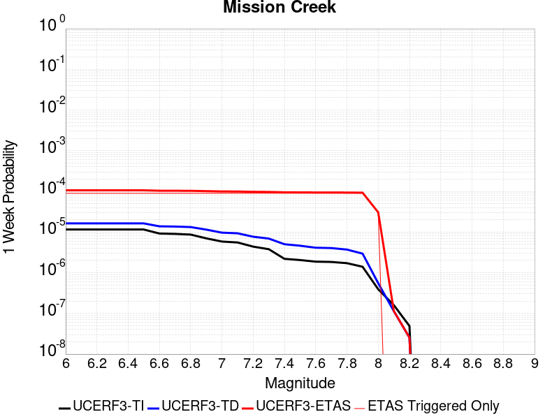 |  |  | 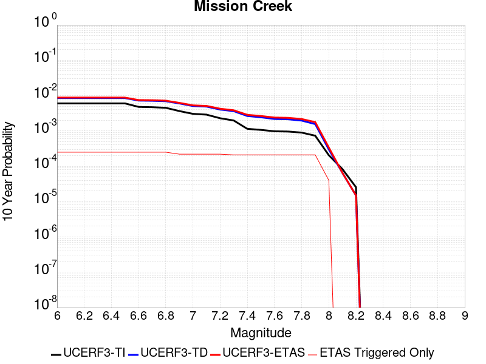 |

| Magnitude | 1 wk TI Prob | 1 wk TD Prob | 1 wk ETAS Prob | 1 wk ETAS/TD Gain | 1 wk ETAS Triggered Only | 1 mo TI Prob | 1 mo TD Prob | 1 mo ETAS Prob | 1 mo ETAS/TD Gain | 1 mo ETAS Triggered Only | 1 yr TI Prob | 1 yr TD Prob | 1 yr ETAS Prob | 1 yr ETAS/TD Gain | 1 yr ETAS Triggered Only | 10 yr TI Prob | 10 yr TD Prob | 10 yr ETAS Prob | 10 yr ETAS/TD Gain | 10 yr ETAS Triggered Only |
|-----|-----|-----|-----|-----|-----|-----|-----|-----|-----|-----|-----|-----|-----|-----|-----|-----|-----|-----|-----|-----|
| 6.0 | 1.1549387E-5 | 1.632237E-5 | 9.999601E-5 | 6.126317 | 8.3675004E-5 | 4.9496433E-5 | 6.9951224E-5 | 1.5362038E-4 | 2.1961071 | 8.3675004E-5 | 6.0245243E-4 | 8.513384E-4 | 0.0010185459 | 1.1964055 | 1.6735001E-4 | 0.006008218 | 0.008509998 | 0.008758887 | 1.0292467 | 2.5102502E-4 |
| 6.1 | 1.1549387E-5 | 1.632237E-5 | 9.999601E-5 | 6.126317 | 8.3675004E-5 | 4.9496433E-5 | 6.9951224E-5 | 1.5362038E-4 | 2.1961071 | 8.3675004E-5 | 6.0245243E-4 | 8.513384E-4 | 0.0010185459 | 1.1964055 | 1.6735001E-4 | 0.006008218 | 0.008509998 | 0.008758887 | 1.0292467 | 2.5102502E-4 |
| 6.2 | 1.1549387E-5 | 1.632237E-5 | 9.999601E-5 | 6.126317 | 8.3675004E-5 | 4.9496433E-5 | 6.9951224E-5 | 1.5362038E-4 | 2.1961071 | 8.3675004E-5 | 6.0245243E-4 | 8.513384E-4 | 0.0010185459 | 1.1964055 | 1.6735001E-4 | 0.006008218 | 0.008509998 | 0.008758887 | 1.0292467 | 2.5102502E-4 |
| 6.3 | 1.1549387E-5 | 1.632237E-5 | 9.999601E-5 | 6.126317 | 8.3675004E-5 | 4.9496433E-5 | 6.9951224E-5 | 1.5362038E-4 | 2.1961071 | 8.3675004E-5 | 6.0245243E-4 | 8.513384E-4 | 0.0010185459 | 1.1964055 | 1.6735001E-4 | 0.006008218 | 0.008509998 | 0.008758887 | 1.0292467 | 2.5102502E-4 |
| 6.4 | 1.1549387E-5 | 1.632237E-5 | 9.999601E-5 | 6.126317 | 8.3675004E-5 | 4.9496433E-5 | 6.9951224E-5 | 1.5362038E-4 | 2.1961071 | 8.3675004E-5 | 6.0245243E-4 | 8.513384E-4 | 0.0010185459 | 1.1964055 | 1.6735001E-4 | 0.006008218 | 0.008509998 | 0.008758887 | 1.0292467 | 2.5102502E-4 |
| 6.5 | 1.1549387E-5 | 1.632237E-5 | 9.999601E-5 | 6.126317 | 8.3675004E-5 | 4.9496433E-5 | 6.9951224E-5 | 1.5362038E-4 | 2.1961071 | 8.3675004E-5 | 6.0245243E-4 | 8.513384E-4 | 0.0010185459 | 1.1964055 | 1.6735001E-4 | 0.006008218 | 0.008509998 | 0.008758887 | 1.0292467 | 2.5102502E-4 |
| 6.6 | 9.202681E-6 | 1.3845646E-5 | 9.751949E-5 | 7.0433326 | 8.3675004E-5 | 3.9439463E-5 | 5.9337188E-5 | 1.4300723E-4 | 2.4100776 | 8.3675004E-5 | 4.800697E-4 | 7.221998E-4 | 8.8942895E-4 | 1.2315552 | 1.6735001E-4 | 0.004790339 | 0.0072271815 | 0.007476392 | 1.0344825 | 2.5102502E-4 |
| 6.7 | 9.019164E-6 | 1.3651316E-5 | 9.732518E-5 | 7.1293626 | 8.3675004E-5 | 3.8652986E-5 | 5.8504378E-5 | 1.421745E-4 | 2.4301512 | 8.3675004E-5 | 4.7049852E-4 | 7.12067E-4 | 8.792979E-4 | 1.2348527 | 1.6735001E-4 | 0.004695036 | 0.007126506 | 0.007375742 | 1.0349731 | 2.5102502E-4 |
| 6.8 | 8.673558E-6 | 1.3273427E-5 | 9.6947326E-5 | 7.3038654 | 8.3675004E-5 | 3.717186E-5 | 5.6884925E-5 | 1.4055517E-4 | 2.4708686 | 8.3675004E-5 | 4.524734E-4 | 6.923627E-4 | 8.595969E-4 | 1.2415413 | 1.6735001E-4 | 0.0045155324 | 0.006930694 | 0.0071799792 | 1.0359683 | 2.5102502E-4 |
| 6.9 | 7.002255E-6 | 1.1477657E-5 | 9.51517E-5 | 8.290168 | 8.3675004E-5 | 3.000932E-5 | 4.9189068E-5 | 1.3285996E-4 | 2.7010057 | 8.3675004E-5 | 3.653022E-4 | 5.9871917E-4 | 7.65969E-4 | 1.279346 | 1.6735001E-4 | 0.0036470229 | 0.005999517 | 0.0061658635 | 1.0277265 | 1.6735001E-4 |
| 7.0 | 5.84644E-6 | 9.67498E-6 | 9.3349176E-5 | 9.648514 | 8.3675004E-5 | 2.5055931E-5 | 4.1463565E-5 | 1.251351E-4 | 3.0179532 | 8.3675004E-5 | 3.0501327E-4 | 5.047066E-4 | 6.719721E-4 | 1.3314115 | 1.6735001E-4 | 0.0030459496 | 0.0050638523 | 0.0052303546 | 1.0328807 | 1.6735001E-4 |
| 7.1 | 5.54703E-6 | 9.329456E-6 | 9.3003684E-5 | 9.968822 | 8.3675004E-5 | 2.377277E-5 | 3.9982795E-5 | 1.2365446E-4 | 3.0926917 | 8.3675004E-5 | 2.8939504E-4 | 4.8668624E-4 | 6.539548E-4 | 1.3436887 | 1.6735001E-4 | 0.0028901845 | 0.004884446 | 0.005050979 | 1.0340945 | 1.6735001E-4 |
| 7.2 | 4.384709E-6 | 7.68157E-6 | 9.1355934E-5 | 11.892872 | 8.3675004E-5 | 1.8791474E-5 | 3.2920623E-5 | 1.1659288E-4 | 3.5416365 | 8.3675004E-5 | 2.2876218E-4 | 4.0073853E-4 | 5.680215E-4 | 1.4174367 | 1.6735001E-4 | 0.0022852682 | 0.004028366 | 0.0041950415 | 1.0413755 | 1.6735001E-4 |
| 7.3 | 3.7888456E-6 | 6.915452E-6 | 9.058988E-5 | 13.099632 | 8.3675004E-5 | 1.623781E-5 | 2.9637333E-5 | 1.1330986E-4 | 3.8232138 | 8.3675004E-5 | 1.9767738E-4 | 3.6077813E-4 | 5.2806776E-4 | 1.4636911 | 1.6735001E-4 | 0.0019750162 | 0.0036301152 | 0.0037968575 | 1.0459331 | 1.6735001E-4 |
| 7.4 | 2.1982462E-6 | 5.0237763E-6 | 8.869836E-5 | 17.655714 | 8.3675004E-5 | 9.421021E-6 | 2.1530293E-5 | 1.052035E-4 | 4.886301 | 8.3675004E-5 | 1.1469489E-4 | 2.621E-4 | 4.2940615E-4 | 1.6383295 | 1.6735001E-4 | 0.0011463572 | 0.0026458844 | 0.0028127916 | 1.0630819 | 1.6735001E-4 |
| 7.5 | 2.051923E-6 | 4.615016E-6 | 8.8289635E-5 | 19.130949 | 8.3675004E-5 | 8.793926E-6 | 1.9778492E-5 | 1.0345184E-4 | 5.2305226 | 8.3675004E-5 | 1.0706078E-4 | 2.4077666E-4 | 4.0808637E-4 | 1.6948751 | 1.6735001E-4 | 0.0010700922 | 0.0024335422 | 0.0026004848 | 1.0686008 | 1.6735001E-4 |
| 7.6 | 1.8733427E-6 | 4.1233748E-6 | 8.7798035E-5 | 21.29276 | 8.3675004E-5 | 8.028587E-6 | 1.7671488E-5 | 1.0134502E-4 | 5.7349453 | 8.3675004E-5 | 9.774366E-5 | 2.151292E-4 | 3.8244322E-4 | 1.7777374 | 1.6735001E-4 | 9.770069E-4 | 0.0021780801 | 0.0023450658 | 1.0766664 | 1.6735001E-4 |
| 7.7 | 1.8411953E-6 | 4.0430496E-6 | 8.7717715E-5 | 21.695929 | 8.3675004E-5 | 7.890813E-6 | 1.732724E-5 | 1.010008E-4 | 5.8290176 | 8.3675004E-5 | 9.606641E-5 | 2.1093882E-4 | 3.7825352E-4 | 1.7931907 | 1.6735001E-4 | 9.6024893E-4 | 0.0021363653 | 0.0023033577 | 1.0781666 | 1.6735001E-4 |
| 7.8 | 1.7194251E-6 | 3.7104276E-6 | 8.7385124E-5 | 23.551228 | 8.3675004E-5 | 7.368944E-6 | 1.5901736E-5 | 9.957541E-5 | 6.261921 | 8.3675004E-5 | 8.97132E-5 | 1.9358651E-4 | 3.6090412E-4 | 1.8643041 | 1.6735001E-4 | 8.967699E-4 | 0.0019623525 | 0.002129374 | 1.0851129 | 1.6735001E-4 |
| 7.9 | 1.4035052E-6 | 2.9500632E-6 | 8.662482E-5 | 29.363718 | 8.3675004E-5 | 6.0150082E-6 | 1.2643067E-5 | 9.631702E-5 | 7.618169 | 8.3675004E-5 | 7.3230265E-5 | 1.5391852E-4 | 3.2124278E-4 | 2.0870962 | 1.6735001E-4 | 7.3206134E-4 | 0.0015631086 | 0.0017301971 | 1.106895 | 1.6735001E-4 |
| 8.0 | 3.9318823E-7 | 5.528522E-7 | 5.528522E-7 | 1.0 | 0.0 | 1.6850913E-6 | 2.3693647E-6 | 2.3693647E-6 | 1.0 | 0.0 | 2.0515794E-5 | 2.8846638E-5 | 2.8846638E-5 | 1.0 | 0.0 | 2.0513899E-4 | 2.9899E-4 | 2.9899E-4 | 1.0 | 0.0 |
| 8.1 | 1.596793E-7 | 1.1380002E-7 | 1.1380002E-7 | 1.0 | 0.0 | 6.8433974E-7 | 4.877143E-7 | 4.877143E-7 | 1.0 | 0.0 | 8.331805E-6 | 5.937906E-6 | 5.937906E-6 | 1.0 | 0.0 | 8.331492E-5 | 6.549966E-5 | 6.549966E-5 | 1.0 | 0.0 |
| 8.2 | 4.9003038E-8 | 2.5444924E-8 | 2.5444924E-8 | 1.0 | 0.0 | 2.10013E-7 | 1.0904967E-7 | 1.0904967E-7 | 1.0 | 0.0 | 2.5569052E-6 | 1.327679E-6 | 1.327679E-6 | 1.0 | 0.0 | 2.556876E-5 | 1.495635E-5 | 1.495635E-5 | 1.0 | 0.0 |

## Santa Cruz Catalina Ridge alt1
*[(top)](#table-of-contents)*

| 1 Week | 1 Month | 1 Year | 10 Year |
|-----|-----|-----|-----|
|  |  |  |  |

| Magnitude | 1 wk TI Prob | 1 wk TD Prob | 1 wk ETAS Prob | 1 wk ETAS/TD Gain | 1 wk ETAS Triggered Only | 1 mo TI Prob | 1 mo TD Prob | 1 mo ETAS Prob | 1 mo ETAS/TD Gain | 1 mo ETAS Triggered Only | 1 yr TI Prob | 1 yr TD Prob | 1 yr ETAS Prob | 1 yr ETAS/TD Gain | 1 yr ETAS Triggered Only | 10 yr TI Prob | 10 yr TD Prob | 10 yr ETAS Prob | 10 yr ETAS/TD Gain | 10 yr ETAS Triggered Only |
|-----|-----|-----|-----|-----|-----|-----|-----|-----|-----|-----|-----|-----|-----|-----|-----|-----|-----|-----|-----|-----|
| 6.0 | 3.2833184E-5 | 3.65584E-5 | 1.2023035E-4 | 3.2887204 | 8.3675004E-5 | 1.4070606E-4 | 1.5667039E-4 | 3.2399417E-4 | 2.067999 | 1.6735001E-4 | 0.00171175 | 0.0019059596 | 0.0020729906 | 1.0876362 | 1.6735001E-4 | 0.016986247 | 0.018913029 | 0.019159308 | 1.0130216 | 2.5102502E-4 |
| 6.1 | 1.9835548E-5 | 2.1659505E-5 | 1.053327E-4 | 4.8631167 | 8.3675004E-5 | 8.500672E-5 | 9.282326E-5 | 2.6015774E-4 | 2.8027215 | 1.6735001E-4 | 0.0010344655 | 0.0011295575 | 0.0012967185 | 1.1479881 | 1.6735001E-4 | 0.010296632 | 0.011240295 | 0.011405764 | 1.014721 | 1.6735001E-4 |
| 6.2 | 1.9835548E-5 | 2.1659505E-5 | 1.053327E-4 | 4.8631167 | 8.3675004E-5 | 8.500672E-5 | 9.282326E-5 | 2.6015774E-4 | 2.8027215 | 1.6735001E-4 | 0.0010344655 | 0.0011295575 | 0.0012967185 | 1.1479881 | 1.6735001E-4 | 0.010296632 | 0.011240295 | 0.011405764 | 1.014721 | 1.6735001E-4 |
| 6.3 | 1.5728183E-5 | 1.703395E-5 | 1.703395E-5 | 1.0 | 0.0 | 6.7404755E-5 | 7.300063E-5 | 1.5666953E-4 | 2.1461394 | 8.3675004E-5 | 8.2034385E-4 | 8.884264E-4 | 9.720271E-4 | 1.0940998 | 8.3675004E-5 | 0.008173222 | 0.008849427 | 0.008932361 | 1.0093718 | 8.3675004E-5 |
| 6.4 | 1.5728183E-5 | 1.703395E-5 | 1.703395E-5 | 1.0 | 0.0 | 6.7404755E-5 | 7.300063E-5 | 1.5666953E-4 | 2.1461394 | 8.3675004E-5 | 8.2034385E-4 | 8.884264E-4 | 9.720271E-4 | 1.0940998 | 8.3675004E-5 | 0.008173222 | 0.008849427 | 0.008932361 | 1.0093718 | 8.3675004E-5 |
| 6.5 | 1.3707734E-5 | 1.4794522E-5 | 1.4794522E-5 | 1.0 | 0.0 | 5.8746107E-5 | 6.3403575E-5 | 1.4707327E-4 | 2.319637 | 8.3675004E-5 | 7.1499916E-4 | 7.716686E-4 | 8.5527904E-4 | 1.1083502 | 8.3675004E-5 | 0.0071270303 | 0.0076902895 | 0.007773321 | 1.0107969 | 8.3675004E-5 |
| 6.6 | 1.2539813E-5 | 1.3510219E-5 | 1.3510219E-5 | 1.0 | 0.0 | 5.3740947E-5 | 5.789967E-5 | 1.4156984E-4 | 2.4450886 | 8.3675004E-5 | 6.540996E-4 | 7.0470315E-4 | 7.883192E-4 | 1.1186543 | 8.3675004E-5 | 0.0065217763 | 0.0070249885 | 0.0071080755 | 1.0118273 | 8.3675004E-5 |
| 6.7 | 1.1504083E-5 | 1.2377375E-5 | 1.2377375E-5 | 1.0 | 0.0 | 4.930228E-5 | 5.3044827E-5 | 1.3671539E-4 | 2.5773559 | 8.3675004E-5 | 6.0008996E-4 | 6.456314E-4 | 7.2925235E-4 | 1.1295182 | 8.3675004E-5 | 0.005984721 | 0.006437786 | 0.0065209223 | 1.0129138 | 8.3675004E-5 |
| 6.8 | 1.012739E-5 | 1.0877071E-5 | 1.0877071E-5 | 1.0 | 0.0 | 4.340238E-5 | 4.6615194E-5 | 1.302863E-4 | 2.794932 | 8.3675004E-5 | 5.282958E-4 | 5.673937E-4 | 6.5102126E-4 | 1.1473889 | 8.3675004E-5 | 0.0052704164 | 0.0056596193 | 0.005742821 | 1.0147009 | 8.3675004E-5 |
| 6.9 | 8.9607865E-6 | 9.609117E-6 | 9.609117E-6 | 1.0 | 0.0 | 3.8402806E-5 | 4.1181287E-5 | 1.2485284E-4 | 3.031786 | 8.3675004E-5 | 4.6745385E-4 | 5.012679E-4 | 5.8490096E-4 | 1.166843 | 8.3675004E-5 | 0.0046647177 | 0.005001492 | 0.0050847484 | 1.0166464 | 8.3675004E-5 |
| 7.0 | 8.046829E-6 | 8.619746E-6 | 8.619746E-6 | 1.0 | 0.0 | 3.4485955E-5 | 3.694125E-5 | 1.20613164E-4 | 3.2649996 | 8.3675004E-5 | 4.1978562E-4 | 4.496677E-4 | 5.333051E-4 | 1.1859982 | 8.3675004E-5 | 0.004189935 | 0.0044876686 | 0.0045709684 | 1.0185618 | 8.3675004E-5 |
| 7.1 | 7.136131E-6 | 7.637656E-6 | 7.637656E-6 | 1.0 | 0.0 | 3.0583058E-5 | 3.2732405E-5 | 3.2732405E-5 | 1.0 | 0.0 | 3.7228514E-4 | 3.9844486E-4 | 3.9844486E-4 | 1.0 | 0.0 | 0.0037166206 | 0.003977381 | 0.003977381 | 1.0 | 0.0 |
| 7.2 | 6.362014E-6 | 6.8049585E-6 | 6.8049585E-6 | 1.0 | 0.0 | 2.726549E-5 | 2.9163786E-5 | 2.9163786E-5 | 1.0 | 0.0 | 3.3190678E-4 | 3.550119E-4 | 3.550119E-4 | 1.0 | 0.0 | 0.0033141149 | 0.003544516 | 0.003544516 | 1.0 | 0.0 |
| 7.3 | 5.004101E-6 | 5.351715E-6 | 5.351715E-6 | 1.0 | 0.0 | 2.1445969E-5 | 2.2935723E-5 | 2.2935723E-5 | 1.0 | 0.0 | 2.6107338E-4 | 2.792072E-4 | 2.792072E-4 | 1.0 | 0.0 | 0.002607669 | 0.0027886187 | 0.0027886187 | 1.0 | 0.0 |
| 7.4 | 3.4901443E-6 | 3.7320526E-6 | 3.7320526E-6 | 1.0 | 0.0 | 1.4957676E-5 | 1.5994416E-5 | 1.5994416E-5 | 1.0 | 0.0 | 1.8209449E-4 | 1.9471499E-4 | 1.9471499E-4 | 1.0 | 0.0 | 0.0018194534 | 0.0019454823 | 0.0019454823 | 1.0 | 0.0 |
| 7.5 | 1.1215045E-6 | 1.189387E-6 | 1.189387E-6 | 1.0 | 0.0 | 4.806439E-6 | 5.097363E-6 | 5.097363E-6 | 1.0 | 0.0 | 5.851682E-5 | 6.205866E-5 | 6.205866E-5 | 1.0 | 0.0 | 5.850142E-4 | 6.2041637E-4 | 6.2041637E-4 | 1.0 | 0.0 |
| 7.6 | 2.8599047E-7 | 2.9951994E-7 | 2.9951994E-7 | 1.0 | 0.0 | 1.2256729E-6 | 1.2836562E-6 | 1.2836562E-6 | 1.0 | 0.0 | 1.4922465E-5 | 1.5628404E-5 | 1.5628404E-5 | 1.0 | 0.0 | 1.4921463E-4 | 1.5627318E-4 | 1.5627318E-4 | 1.0 | 0.0 |
| 7.7 | 2.0781519E-7 | 2.1744323E-7 | 2.1744323E-7 | 1.0 | 0.0 | 8.906362E-7 | 9.3189925E-7 | 9.3189925E-7 | 1.0 | 0.0 | 1.08434415E-5 | 1.13458145E-5 | 1.13458145E-5 | 1.0 | 0.0 | 1.0842913E-4 | 1.1345245E-4 | 1.1345245E-4 | 1.0 | 0.0 |
| 7.8 | 3.614776E-8 | 3.764102E-8 | 3.764102E-8 | 1.0 | 0.0 | 1.5491896E-7 | 1.6131864E-7 | 1.6131864E-7 | 1.0 | 0.0 | 1.8861368E-6 | 1.9640527E-6 | 1.9640527E-6 | 1.0 | 0.0 | 1.8861208E-5 | 1.9640367E-5 | 1.9640367E-5 | 1.0 | 0.0 |

## North Frontal  (East)
*[(top)](#table-of-contents)*

| 1 Week | 1 Month | 1 Year | 10 Year |
|-----|-----|-----|-----|
|  |  |  |  |

| Magnitude | 1 wk TI Prob | 1 wk TD Prob | 1 wk ETAS Prob | 1 wk ETAS/TD Gain | 1 wk ETAS Triggered Only | 1 mo TI Prob | 1 mo TD Prob | 1 mo ETAS Prob | 1 mo ETAS/TD Gain | 1 mo ETAS Triggered Only | 1 yr TI Prob | 1 yr TD Prob | 1 yr ETAS Prob | 1 yr ETAS/TD Gain | 1 yr ETAS Triggered Only | 10 yr TI Prob | 10 yr TD Prob | 10 yr ETAS Prob | 10 yr ETAS/TD Gain | 10 yr ETAS Triggered Only |
|-----|-----|-----|-----|-----|-----|-----|-----|-----|-----|-----|-----|-----|-----|-----|-----|-----|-----|-----|-----|-----|
| 6.0 | 7.135738E-6 | 7.4771765E-6 | 9.115156E-5 | 12.190639 | 8.3675004E-5 | 3.0581377E-5 | 3.204476E-5 | 1.9938941E-4 | 6.2222157 | 1.6735001E-4 | 3.7226462E-4 | 3.9009505E-4 | 5.573798E-4 | 1.4288306 | 1.6735001E-4 | 0.0037164164 | 0.0038960609 | 0.0040627588 | 1.0427862 | 1.6735001E-4 |
| 6.1 | 7.135738E-6 | 7.4771765E-6 | 9.115156E-5 | 12.190639 | 8.3675004E-5 | 3.0581377E-5 | 3.204476E-5 | 1.9938941E-4 | 6.2222157 | 1.6735001E-4 | 3.7226462E-4 | 3.9009505E-4 | 5.573798E-4 | 1.4288306 | 1.6735001E-4 | 0.0037164164 | 0.0038960609 | 0.0040627588 | 1.0427862 | 1.6735001E-4 |
| 6.2 | 7.135738E-6 | 7.4771765E-6 | 9.115156E-5 | 12.190639 | 8.3675004E-5 | 3.0581377E-5 | 3.204476E-5 | 1.9938941E-4 | 6.2222157 | 1.6735001E-4 | 3.7226462E-4 | 3.9009505E-4 | 5.573798E-4 | 1.4288306 | 1.6735001E-4 | 0.0037164164 | 0.0038960609 | 0.0040627588 | 1.0427862 | 1.6735001E-4 |
| 6.3 | 7.135738E-6 | 7.4771765E-6 | 9.115156E-5 | 12.190639 | 8.3675004E-5 | 3.0581377E-5 | 3.204476E-5 | 1.9938941E-4 | 6.2222157 | 1.6735001E-4 | 3.7226462E-4 | 3.9009505E-4 | 5.573798E-4 | 1.4288306 | 1.6735001E-4 | 0.0037164164 | 0.0038960609 | 0.0040627588 | 1.0427862 | 1.6735001E-4 |
| 6.4 | 7.135738E-6 | 7.4771765E-6 | 9.115156E-5 | 12.190639 | 8.3675004E-5 | 3.0581377E-5 | 3.204476E-5 | 1.9938941E-4 | 6.2222157 | 1.6735001E-4 | 3.7226462E-4 | 3.9009505E-4 | 5.573798E-4 | 1.4288306 | 1.6735001E-4 | 0.0037164164 | 0.0038960609 | 0.0040627588 | 1.0427862 | 1.6735001E-4 |
| 6.5 | 7.135738E-6 | 7.4771765E-6 | 9.115156E-5 | 12.190639 | 8.3675004E-5 | 3.0581377E-5 | 3.204476E-5 | 1.9938941E-4 | 6.2222157 | 1.6735001E-4 | 3.7226462E-4 | 3.9009505E-4 | 5.573798E-4 | 1.4288306 | 1.6735001E-4 | 0.0037164164 | 0.0038960609 | 0.0040627588 | 1.0427862 | 1.6735001E-4 |
| 6.6 | 7.135738E-6 | 7.4771765E-6 | 9.115156E-5 | 12.190639 | 8.3675004E-5 | 3.0581377E-5 | 3.204476E-5 | 1.9938941E-4 | 6.2222157 | 1.6735001E-4 | 3.7226462E-4 | 3.9009505E-4 | 5.573798E-4 | 1.4288306 | 1.6735001E-4 | 0.0037164164 | 0.0038960609 | 0.0040627588 | 1.0427862 | 1.6735001E-4 |
| 6.7 | 7.135738E-6 | 7.4771765E-6 | 9.115156E-5 | 12.190639 | 8.3675004E-5 | 3.0581377E-5 | 3.204476E-5 | 1.9938941E-4 | 6.2222157 | 1.6735001E-4 | 3.7226462E-4 | 3.9009505E-4 | 5.573798E-4 | 1.4288306 | 1.6735001E-4 | 0.0037164164 | 0.0038960609 | 0.0040627588 | 1.0427862 | 1.6735001E-4 |
| 6.8 | 5.959142E-6 | 6.236683E-6 | 8.991117E-5 | 14.416505 | 8.3675004E-5 | 2.553893E-5 | 2.6728469E-5 | 1.94074E-4 | 7.2609477 | 1.6735001E-4 | 3.108921E-4 | 3.253886E-4 | 4.9268414E-4 | 1.5141408 | 1.6735001E-4 | 0.0031045752 | 0.0032508948 | 0.0034177008 | 1.0513108 | 1.6735001E-4 |
| 6.9 | 2.2946929E-6 | 2.3824605E-6 | 8.605727E-5 | 36.121174 | 8.3675004E-5 | 9.834361E-6 | 1.0210508E-5 | 1.7755882E-4 | 17.389812 | 1.6735001E-4 | 1.1972676E-4 | 1.2430632E-4 | 2.9163552E-4 | 2.346104 | 1.6735001E-4 | 0.0011966228 | 0.0012424142 | 0.0014095564 | 1.1345301 | 1.6735001E-4 |
| 7.0 | 2.2468673E-6 | 2.3321538E-6 | 8.600696E-5 | 36.878773 | 8.3675004E-5 | 9.629396E-6 | 9.994909E-6 | 1.7734325E-4 | 17.743359 | 1.6735001E-4 | 1.1723159E-4 | 1.21681696E-4 | 2.8901134E-4 | 2.3751423 | 1.6735001E-4 | 0.0011716976 | 0.0012161969 | 0.0013833435 | 1.1374338 | 1.6735001E-4 |
| 7.1 | 1.9921076E-6 | 2.0646032E-6 | 8.573943E-5 | 41.52829 | 8.3675004E-5 | 8.537577E-6 | 8.848272E-6 | 1.761968E-4 | 19.913132 | 1.6735001E-4 | 1.0394004E-4 | 1.0772282E-4 | 2.750548E-4 | 2.553357 | 1.6735001E-4 | 0.0010389143 | 0.0010767487 | 0.0012439186 | 1.1552542 | 1.6735001E-4 |
| 7.2 | 1.4524545E-6 | 1.5045148E-6 | 8.5179396E-5 | 56.615856 | 8.3675004E-5 | 6.2247905E-6 | 6.447906E-6 | 1.7379684E-4 | 26.953997 | 1.6735001E-4 | 7.5784184E-5 | 7.850068E-5 | 2.4583755E-4 | 3.1316617 | 1.6735001E-4 | 7.575835E-4 | 7.8475394E-4 | 9.519726E-4 | 1.2130842 | 1.6735001E-4 |
| 7.3 | 8.9802575E-7 | 9.3087283E-7 | 8.46058E-5 | 90.88868 | 8.3675004E-5 | 3.848676E-6 | 3.9894494E-6 | 1.7133879E-4 | 42.94798 | 1.6735001E-4 | 4.685662E-5 | 4.857058E-5 | 2.1591247E-4 | 4.4453344 | 1.6735001E-4 | 4.6846745E-4 | 4.8561094E-4 | 6.528797E-4 | 1.3444501 | 1.6735001E-4 |
| 7.4 | 7.776139E-7 | 8.0604747E-7 | 8.4480984E-5 | 104.808945 | 8.3675004E-5 | 3.3326266E-6 | 3.4544853E-6 | 1.7080392E-4 | 49.444103 | 1.6735001E-4 | 4.0573974E-5 | 4.2057654E-5 | 2.0940063E-4 | 4.9788947 | 1.6735001E-4 | 4.0566566E-4 | 4.205077E-4 | 5.8778736E-4 | 1.397804 | 1.6735001E-4 |
| 7.5 | 5.244417E-7 | 5.441219E-7 | 8.4219086E-5 | 154.7798 | 8.3675004E-5 | 2.2476054E-6 | 2.3319494E-6 | 1.6968157E-4 | 72.76383 | 1.6735001E-4 | 2.7364253E-5 | 2.839118E-5 | 1.9573644E-4 | 6.8942695 | 1.6735001E-4 | 2.7360884E-4 | 2.8388205E-4 | 4.5118455E-4 | 1.5893381 | 1.6735001E-4 |
| 7.6 | 1.5489647E-7 | 1.6089504E-7 | 8.383589E-5 | 521.0595 | 8.3675004E-5 | 6.6384183E-7 | 6.895501E-7 | 8.4364496E-5 | 122.34716 | 8.3675004E-5 | 8.082245E-6 | 8.395261E-6 | 9.206957E-5 | 10.96685 | 8.3675004E-5 | 8.08195E-5 | 8.395143E-5 | 1.6761941E-4 | 1.9966236 | 8.3675004E-5 |

## Rinconada 2011 CFM
*[(top)](#table-of-contents)*

| 1 Week | 1 Month | 1 Year | 10 Year |
|-----|-----|-----|-----|
|  |  |  |  |

| Magnitude | 1 wk TI Prob | 1 wk TD Prob | 1 wk ETAS Prob | 1 wk ETAS/TD Gain | 1 wk ETAS Triggered Only | 1 mo TI Prob | 1 mo TD Prob | 1 mo ETAS Prob | 1 mo ETAS/TD Gain | 1 mo ETAS Triggered Only | 1 yr TI Prob | 1 yr TD Prob | 1 yr ETAS Prob | 1 yr ETAS/TD Gain | 1 yr ETAS Triggered Only | 10 yr TI Prob | 10 yr TD Prob | 10 yr ETAS Prob | 10 yr ETAS/TD Gain | 10 yr ETAS Triggered Only |
|-----|-----|-----|-----|-----|-----|-----|-----|-----|-----|-----|-----|-----|-----|-----|-----|-----|-----|-----|-----|-----|
| 6.0 | 1.5752368E-5 | 1.6274716E-5 | 9.994836E-5 | 6.1413274 | 8.3675004E-5 | 6.75084E-5 | 6.974694E-5 | 2.3708527E-4 | 3.3992214 | 1.6735001E-4 | 8.2160486E-4 | 8.488412E-4 | 0.0010160492 | 1.1969838 | 1.6735001E-4 | 0.008185739 | 0.00845637 | 0.008622305 | 1.0196224 | 1.6735001E-4 |
| 6.1 | 1.0966133E-5 | 1.1323029E-5 | 1.1323029E-5 | 1.0 | 0.0 | 4.6996865E-5 | 4.852637E-5 | 4.852637E-5 | 1.0 | 0.0 | 5.720366E-4 | 5.906491E-4 | 5.906491E-4 | 1.0 | 0.0 | 0.0057056635 | 0.0058908886 | 0.0058908886 | 1.0 | 0.0 |
| 6.2 | 1.0966133E-5 | 1.1323029E-5 | 1.1323029E-5 | 1.0 | 0.0 | 4.6996865E-5 | 4.852637E-5 | 4.852637E-5 | 1.0 | 0.0 | 5.720366E-4 | 5.906491E-4 | 5.906491E-4 | 1.0 | 0.0 | 0.0057056635 | 0.0058908886 | 0.0058908886 | 1.0 | 0.0 |
| 6.3 | 8.926149E-6 | 9.212771E-6 | 9.212771E-6 | 1.0 | 0.0 | 3.8254362E-5 | 3.948271E-5 | 3.948271E-5 | 1.0 | 0.0 | 4.6564735E-4 | 4.805963E-4 | 4.805963E-4 | 1.0 | 0.0 | 0.0046467283 | 0.0047956146 | 0.0047956146 | 1.0 | 0.0 |
| 6.4 | 7.676955E-6 | 7.920191E-6 | 7.920191E-6 | 1.0 | 0.0 | 3.290082E-5 | 3.3943234E-5 | 3.3943234E-5 | 1.0 | 0.0 | 4.0049385E-4 | 4.1318068E-4 | 4.1318068E-4 | 1.0 | 0.0 | 0.0039977287 | 0.004124151 | 0.004124151 | 1.0 | 0.0 |
| 6.5 | 6.1671026E-6 | 6.3589546E-6 | 6.3589546E-6 | 1.0 | 0.0 | 2.6430173E-5 | 2.725238E-5 | 2.725238E-5 | 1.0 | 0.0 | 3.2173982E-4 | 3.317473E-4 | 3.317473E-4 | 1.0 | 0.0 | 0.003212744 | 0.0033125326 | 0.0033125326 | 1.0 | 0.0 |
| 6.6 | 5.553456E-6 | 5.7248126E-6 | 5.7248126E-6 | 1.0 | 0.0 | 2.3800309E-5 | 2.453468E-5 | 2.453468E-5 | 1.0 | 0.0 | 2.897302E-4 | 2.9866883E-4 | 2.9866883E-4 | 1.0 | 0.0 | 0.0028935277 | 0.002982683 | 0.002982683 | 1.0 | 0.0 |
| 6.7 | 4.787857E-6 | 4.9333094E-6 | 4.9333094E-6 | 1.0 | 0.0 | 2.0519226E-5 | 2.1142583E-5 | 2.1142583E-5 | 1.0 | 0.0 | 2.4979294E-4 | 2.573806E-4 | 2.573806E-4 | 1.0 | 0.0 | 0.0024951235 | 0.0025708308 | 0.0025708308 | 1.0 | 0.0 |
| 6.8 | 3.9955166E-6 | 4.1134763E-6 | 4.1134763E-6 | 1.0 | 0.0 | 1.7123532E-5 | 1.7629065E-5 | 1.7629065E-5 | 1.0 | 0.0 | 2.0845905E-4 | 2.1461274E-4 | 2.1461274E-4 | 1.0 | 0.0 | 0.002082636 | 0.0021440585 | 0.0021440585 | 1.0 | 0.0 |
| 6.9 | 3.4250072E-6 | 3.5224464E-6 | 3.5224464E-6 | 1.0 | 0.0 | 1.46785205E-5 | 1.5096111E-5 | 1.5096111E-5 | 1.0 | 0.0 | 1.7869633E-4 | 1.8377967E-4 | 1.8377967E-4 | 1.0 | 0.0 | 0.001785527 | 0.0018362794 | 0.0018362794 | 1.0 | 0.0 |
| 7.0 | 2.7712713E-6 | 2.8467E-6 | 2.8467E-6 | 1.0 | 0.0 | 1.1876823E-5 | 1.2200086E-5 | 1.2200086E-5 | 1.0 | 0.0 | 1.4459073E-4 | 1.4852593E-4 | 1.4852593E-4 | 1.0 | 0.0 | 0.0014449668 | 0.0014842682 | 0.0014842682 | 1.0 | 0.0 |
| 7.1 | 2.227358E-6 | 2.2856984E-6 | 2.2856984E-6 | 1.0 | 0.0 | 9.545785E-6 | 9.795814E-6 | 9.795814E-6 | 1.0 | 0.0 | 1.16213734E-4 | 1.19257515E-4 | 1.19257515E-4 | 1.0 | 0.0 | 0.0011615298 | 0.0011919362 | 0.0011919362 | 1.0 | 0.0 |
| 7.2 | 1.581796E-6 | 1.6209011E-6 | 1.6209011E-6 | 1.0 | 0.0 | 6.779108E-6 | 6.9467005E-6 | 6.9467005E-6 | 1.0 | 0.0 | 8.253252E-5 | 8.457281E-5 | 8.457281E-5 | 1.0 | 0.0 | 8.250187E-4 | 8.454067E-4 | 8.454067E-4 | 1.0 | 0.0 |
| 7.3 | 1.0306567E-6 | 1.0546477E-6 | 1.0546477E-6 | 1.0 | 0.0 | 4.4170924E-6 | 4.519911E-6 | 4.519911E-6 | 1.0 | 0.0 | 5.3776774E-5 | 5.5028526E-5 | 5.5028526E-5 | 1.0 | 0.0 | 5.376376E-4 | 5.5014924E-4 | 5.5014924E-4 | 1.0 | 0.0 |
| 7.4 | 6.535541E-7 | 6.682742E-7 | 6.682742E-7 | 1.0 | 0.0 | 2.800943E-6 | 2.864029E-6 | 2.864029E-6 | 1.0 | 0.0 | 3.4100947E-5 | 3.4868997E-5 | 3.4868997E-5 | 1.0 | 0.0 | 3.4095717E-4 | 3.4863537E-4 | 3.4863537E-4 | 1.0 | 0.0 |
| 7.5 | 3.2656962E-7 | 3.3316687E-7 | 3.3316687E-7 | 1.0 | 0.0 | 1.3995833E-6 | 1.4278572E-6 | 1.4278572E-6 | 1.0 | 0.0 | 1.7039794E-5 | 1.7384024E-5 | 1.7384024E-5 | 1.0 | 0.0 | 1.7038487E-4 | 1.7382667E-4 | 1.7382667E-4 | 1.0 | 0.0 |
| 7.6 | 9.754343E-8 | 9.82099E-8 | 9.82099E-8 | 1.0 | 0.0 | 4.180432E-7 | 4.208995E-7 | 4.208995E-7 | 1.0 | 0.0 | 5.089664E-6 | 5.1244397E-6 | 5.1244397E-6 | 1.0 | 0.0 | 5.0895473E-5 | 5.1243223E-5 | 5.1243223E-5 | 1.0 | 0.0 |
| 7.7 | 6.0001453E-9 | 5.8490435E-9 | 5.8490435E-9 | 1.0 | 0.0 | 2.5714908E-8 | 2.506733E-8 | 2.506733E-8 | 1.0 | 0.0 | 3.1307894E-7 | 3.051947E-7 | 3.051947E-7 | 1.0 | 0.0 | 3.1307852E-6 | 3.051943E-6 | 3.051943E-6 | 1.0 | 0.0 |
| 7.8 | 7.400003E-11 | 7.4654505E-11 | 7.4654505E-11 | 1.0 | 0.0 | 3.171432E-10 | 3.1994773E-10 | 3.1994773E-10 | 1.0 | 0.0 | 3.861218E-9 | 3.895363E-9 | 3.895363E-9 | 1.0 | 0.0 | 3.861218E-8 | 3.895363E-8 | 3.895363E-8 | 1.0 | 0.0 |

## Pine Mtn
*[(top)](#table-of-contents)*

| 1 Week | 1 Month | 1 Year | 10 Year |
|-----|-----|-----|-----|
|  |  |  |  |

| Magnitude | 1 wk TI Prob | 1 wk TD Prob | 1 wk ETAS Prob | 1 wk ETAS/TD Gain | 1 wk ETAS Triggered Only | 1 mo TI Prob | 1 mo TD Prob | 1 mo ETAS Prob | 1 mo ETAS/TD Gain | 1 mo ETAS Triggered Only | 1 yr TI Prob | 1 yr TD Prob | 1 yr ETAS Prob | 1 yr ETAS/TD Gain | 1 yr ETAS Triggered Only | 10 yr TI Prob | 10 yr TD Prob | 10 yr ETAS Prob | 10 yr ETAS/TD Gain | 10 yr ETAS Triggered Only |
|-----|-----|-----|-----|-----|-----|-----|-----|-----|-----|-----|-----|-----|-----|-----|-----|-----|-----|-----|-----|-----|
| 6.0 | 6.894797E-6 | 7.225461E-6 | 7.225461E-6 | 1.0 | 0.0 | 2.9548795E-5 | 3.096591E-5 | 3.096591E-5 | 1.0 | 0.0 | 3.596972E-4 | 3.7694772E-4 | 4.605912E-4 | 1.2218968 | 8.3675004E-5 | 0.0035911554 | 0.003763381 | 0.003930101 | 1.0443007 | 1.6735001E-4 |
| 6.1 | 6.894797E-6 | 7.225461E-6 | 7.225461E-6 | 1.0 | 0.0 | 2.9548795E-5 | 3.096591E-5 | 3.096591E-5 | 1.0 | 0.0 | 3.596972E-4 | 3.7694772E-4 | 4.605912E-4 | 1.2218968 | 8.3675004E-5 | 0.0035911554 | 0.003763381 | 0.003930101 | 1.0443007 | 1.6735001E-4 |
| 6.2 | 6.894797E-6 | 7.225461E-6 | 7.225461E-6 | 1.0 | 0.0 | 2.9548795E-5 | 3.096591E-5 | 3.096591E-5 | 1.0 | 0.0 | 3.596972E-4 | 3.7694772E-4 | 4.605912E-4 | 1.2218968 | 8.3675004E-5 | 0.0035911554 | 0.003763381 | 0.003930101 | 1.0443007 | 1.6735001E-4 |
| 6.3 | 6.894797E-6 | 7.225461E-6 | 7.225461E-6 | 1.0 | 0.0 | 2.9548795E-5 | 3.096591E-5 | 3.096591E-5 | 1.0 | 0.0 | 3.596972E-4 | 3.7694772E-4 | 4.605912E-4 | 1.2218968 | 8.3675004E-5 | 0.0035911554 | 0.003763381 | 0.003930101 | 1.0443007 | 1.6735001E-4 |
| 6.4 | 6.894797E-6 | 7.225461E-6 | 7.225461E-6 | 1.0 | 0.0 | 2.9548795E-5 | 3.096591E-5 | 3.096591E-5 | 1.0 | 0.0 | 3.596972E-4 | 3.7694772E-4 | 4.605912E-4 | 1.2218968 | 8.3675004E-5 | 0.0035911554 | 0.003763381 | 0.003930101 | 1.0443007 | 1.6735001E-4 |
| 6.5 | 6.894797E-6 | 7.225461E-6 | 7.225461E-6 | 1.0 | 0.0 | 2.9548795E-5 | 3.096591E-5 | 3.096591E-5 | 1.0 | 0.0 | 3.596972E-4 | 3.7694772E-4 | 4.605912E-4 | 1.2218968 | 8.3675004E-5 | 0.0035911554 | 0.003763381 | 0.003930101 | 1.0443007 | 1.6735001E-4 |
| 6.6 | 6.894797E-6 | 7.225461E-6 | 7.225461E-6 | 1.0 | 0.0 | 2.9548795E-5 | 3.096591E-5 | 3.096591E-5 | 1.0 | 0.0 | 3.596972E-4 | 3.7694772E-4 | 4.605912E-4 | 1.2218968 | 8.3675004E-5 | 0.0035911554 | 0.003763381 | 0.003930101 | 1.0443007 | 1.6735001E-4 |
| 6.7 | 6.0867933E-6 | 6.3971133E-6 | 6.3971133E-6 | 1.0 | 0.0 | 2.6085996E-5 | 2.7415923E-5 | 2.7415923E-5 | 1.0 | 0.0 | 3.1755073E-4 | 3.3373994E-4 | 4.1738703E-4 | 1.2506355 | 8.3675004E-5 | 0.0031709734 | 0.0033326065 | 0.0034993987 | 1.0500486 | 1.6735001E-4 |
| 6.8 | 5.6530425E-6 | 5.9505956E-6 | 5.9505956E-6 | 1.0 | 0.0 | 2.42271E-5 | 2.5502315E-5 | 2.5502315E-5 | 1.0 | 0.0 | 2.94925E-4 | 3.104485E-4 | 3.9409753E-4 | 1.2694458 | 8.3675004E-5 | 0.002945339 | 0.0031003528 | 0.003267184 | 1.0538104 | 1.6735001E-4 |
| 6.9 | 4.6015225E-6 | 4.863834E-6 | 4.863834E-6 | 1.0 | 0.0 | 1.9720663E-5 | 2.0844845E-5 | 2.0844845E-5 | 1.0 | 0.0 | 2.4007261E-4 | 2.5375787E-4 | 3.3741165E-4 | 1.3296598 | 8.3675004E-5 | 0.0023981342 | 0.0025348254 | 0.0027017512 | 1.065853 | 1.6735001E-4 |
| 7.0 | 4.4875965E-6 | 4.747473E-6 | 4.747473E-6 | 1.0 | 0.0 | 1.9232413E-5 | 2.0346162E-5 | 2.0346162E-5 | 1.0 | 0.0 | 2.3412947E-4 | 2.4768783E-4 | 3.313421E-4 | 1.3377408 | 8.3675004E-5 | 0.0023388295 | 0.0024742614 | 0.0026411973 | 1.067469 | 1.6735001E-4 |
| 7.1 | 3.203907E-6 | 3.4294096E-6 | 3.4294096E-6 | 1.0 | 0.0 | 1.3730958E-5 | 1.4697391E-5 | 1.4697391E-5 | 1.0 | 0.0 | 1.6716159E-4 | 1.789267E-4 | 1.789267E-4 | 1.0 | 0.0 | 0.0016703589 | 0.0017878925 | 0.001871418 | 1.0467173 | 8.3675004E-5 |
| 7.2 | 2.2060601E-6 | 2.3784817E-6 | 2.3784817E-6 | 1.0 | 0.0 | 9.4545085E-6 | 1.0193455E-5 | 1.0193455E-5 | 1.0 | 0.0 | 1.15102564E-4 | 1.240987E-4 | 1.240987E-4 | 1.0 | 0.0 | 0.0011504296 | 0.0012403389 | 0.0013239101 | 1.0673777 | 8.3675004E-5 |
| 7.3 | 1.3765207E-6 | 1.5216481E-6 | 1.5216481E-6 | 1.0 | 0.0 | 5.899361E-6 | 6.521333E-6 | 6.521333E-6 | 1.0 | 0.0 | 7.182235E-5 | 7.939443E-5 | 7.939443E-5 | 1.0 | 0.0 | 7.1799144E-4 | 7.936697E-4 | 7.936697E-4 | 1.0 | 0.0 |
| 7.4 | 1.1245983E-6 | 1.2587075E-6 | 1.2587075E-6 | 1.0 | 0.0 | 4.819698E-6 | 5.39445E-6 | 5.39445E-6 | 1.0 | 0.0 | 5.8678244E-5 | 6.567554E-5 | 6.567554E-5 | 1.0 | 0.0 | 5.866275E-4 | 6.5656955E-4 | 6.5656955E-4 | 1.0 | 0.0 |
| 7.5 | 8.031682E-7 | 9.276951E-7 | 9.276951E-7 | 1.0 | 0.0 | 3.4421448E-6 | 3.9758306E-6 | 3.9758306E-6 | 1.0 | 0.0 | 4.1907308E-5 | 4.840473E-5 | 4.840473E-5 | 1.0 | 0.0 | 4.1899405E-4 | 4.8394862E-4 | 4.8394862E-4 | 1.0 | 0.0 |
| 7.6 | 4.8953444E-7 | 6.003009E-7 | 6.003009E-7 | 1.0 | 0.0 | 2.098003E-6 | 2.5727159E-6 | 2.5727159E-6 | 1.0 | 0.0 | 2.5542888E-5 | 3.1322415E-5 | 3.1322415E-5 | 1.0 | 0.0 | 2.5539953E-4 | 3.1318486E-4 | 3.1318486E-4 | 1.0 | 0.0 |
| 7.7 | 6.634529E-8 | 6.788826E-8 | 6.788826E-8 | 1.0 | 0.0 | 2.843369E-7 | 2.9094966E-7 | 2.9094966E-7 | 1.0 | 0.0 | 3.4617963E-6 | 3.5423066E-6 | 3.5423066E-6 | 1.0 | 0.0 | 3.4617424E-5 | 3.542255E-5 | 3.542255E-5 | 1.0 | 0.0 |
| 7.8 | 9.235578E-9 | 9.488566E-9 | 9.488566E-9 | 1.0 | 0.0 | 3.9581046E-8 | 4.0665284E-8 | 4.0665284E-8 | 1.0 | 0.0 | 4.818991E-7 | 4.950997E-7 | 4.950997E-7 | 1.0 | 0.0 | 4.8189804E-6 | 4.950988E-6 | 4.950988E-6 | 1.0 | 0.0 |

## Cucamonga
*[(top)](#table-of-contents)*

| 1 Week | 1 Month | 1 Year | 10 Year |
|-----|-----|-----|-----|
|  |  |  |  |

| Magnitude | 1 wk TI Prob | 1 wk TD Prob | 1 wk ETAS Prob | 1 wk ETAS/TD Gain | 1 wk ETAS Triggered Only | 1 mo TI Prob | 1 mo TD Prob | 1 mo ETAS Prob | 1 mo ETAS/TD Gain | 1 mo ETAS Triggered Only | 1 yr TI Prob | 1 yr TD Prob | 1 yr ETAS Prob | 1 yr ETAS/TD Gain | 1 yr ETAS Triggered Only | 10 yr TI Prob | 10 yr TD Prob | 10 yr ETAS Prob | 10 yr ETAS/TD Gain | 10 yr ETAS Triggered Only |
|-----|-----|-----|-----|-----|-----|-----|-----|-----|-----|-----|-----|-----|-----|-----|-----|-----|-----|-----|-----|-----|
| 6.0 | 1.1848348E-5 | 1.1737008E-5 | 9.541103E-5 | 8.129076 | 8.3675004E-5 | 5.0777642E-5 | 5.030051E-5 | 2.1764211E-4 | 4.326837 | 1.6735001E-4 | 6.180424E-4 | 6.1223935E-4 | 7.794869E-4 | 1.2731735 | 1.6735001E-4 | 0.0061632637 | 0.0061067017 | 0.00627303 | 1.0272369 | 1.6735001E-4 |
| 6.1 | 1.1848348E-5 | 1.1737008E-5 | 9.541103E-5 | 8.129076 | 8.3675004E-5 | 5.0777642E-5 | 5.030051E-5 | 2.1764211E-4 | 4.326837 | 1.6735001E-4 | 6.180424E-4 | 6.1223935E-4 | 7.794869E-4 | 1.2731735 | 1.6735001E-4 | 0.0061632637 | 0.0061067017 | 0.00627303 | 1.0272369 | 1.6735001E-4 |
| 6.2 | 1.1848348E-5 | 1.1737008E-5 | 9.541103E-5 | 8.129076 | 8.3675004E-5 | 5.0777642E-5 | 5.030051E-5 | 2.1764211E-4 | 4.326837 | 1.6735001E-4 | 6.180424E-4 | 6.1223935E-4 | 7.794869E-4 | 1.2731735 | 1.6735001E-4 | 0.0061632637 | 0.0061067017 | 0.00627303 | 1.0272369 | 1.6735001E-4 |
| 6.3 | 1.1848348E-5 | 1.1737008E-5 | 9.541103E-5 | 8.129076 | 8.3675004E-5 | 5.0777642E-5 | 5.030051E-5 | 2.1764211E-4 | 4.326837 | 1.6735001E-4 | 6.180424E-4 | 6.1223935E-4 | 7.794869E-4 | 1.2731735 | 1.6735001E-4 | 0.0061632637 | 0.0061067017 | 0.00627303 | 1.0272369 | 1.6735001E-4 |
| 6.4 | 1.1848348E-5 | 1.1737008E-5 | 9.541103E-5 | 8.129076 | 8.3675004E-5 | 5.0777642E-5 | 5.030051E-5 | 2.1764211E-4 | 4.326837 | 1.6735001E-4 | 6.180424E-4 | 6.1223935E-4 | 7.794869E-4 | 1.2731735 | 1.6735001E-4 | 0.0061632637 | 0.0061067017 | 0.00627303 | 1.0272369 | 1.6735001E-4 |
| 6.5 | 1.16988695E-5 | 1.15760395E-5 | 9.525008E-5 | 8.2282095 | 8.3675004E-5 | 5.013705E-5 | 4.9610666E-5 | 2.1695238E-4 | 4.3730993 | 1.6735001E-4 | 6.102476E-4 | 6.0384517E-4 | 7.710941E-4 | 1.2769732 | 1.6735001E-4 | 0.006085745 | 0.006023216 | 0.006189558 | 1.0276169 | 1.6735001E-4 |
| 6.6 | 1.16988695E-5 | 1.15760395E-5 | 9.525008E-5 | 8.2282095 | 8.3675004E-5 | 5.013705E-5 | 4.9610666E-5 | 2.1695238E-4 | 4.3730993 | 1.6735001E-4 | 6.102476E-4 | 6.0384517E-4 | 7.710941E-4 | 1.2769732 | 1.6735001E-4 | 0.006085745 | 0.006023216 | 0.006189558 | 1.0276169 | 1.6735001E-4 |
| 6.7 | 1.1397107E-5 | 1.11149475E-5 | 9.478902E-5 | 8.528068 | 8.3675004E-5 | 4.884383E-5 | 4.7634636E-5 | 2.1497668E-4 | 4.513033 | 1.6735001E-4 | 5.9451134E-4 | 5.797998E-4 | 7.4705284E-4 | 1.2884668 | 1.6735001E-4 | 0.005929234 | 0.0057840226 | 0.005950405 | 1.0287658 | 1.6735001E-4 |
| 6.8 | 1.058387E-5 | 9.784992E-6 | 9.345918E-5 | 9.551278 | 8.3675004E-5 | 4.5358654E-5 | 4.193501E-5 | 2.09278E-4 | 4.990532 | 1.6735001E-4 | 5.521017E-4 | 5.1044027E-4 | 6.777048E-4 | 1.3276869 | 1.6735001E-4 | 0.00550732 | 0.0050936877 | 0.0052601853 | 1.0326871 | 1.6735001E-4 |
| 6.9 | 9.690046E-6 | 8.57948E-6 | 9.2253766E-5 | 10.752839 | 8.3675004E-5 | 4.1528107E-5 | 3.6768684E-5 | 2.0411254E-4 | 5.5512605 | 1.6735001E-4 | 5.054874E-4 | 4.475672E-4 | 6.148423E-4 | 1.373743 | 1.6735001E-4 | 0.005043391 | 0.004467594 | 0.0046341964 | 1.0372913 | 1.6735001E-4 |
| 7.0 | 9.381461E-6 | 8.187101E-6 | 9.1861424E-5 | 11.220263 | 8.3675004E-5 | 4.020564E-5 | 3.5087105E-5 | 2.0243124E-4 | 5.7693915 | 1.6735001E-4 | 4.893937E-4 | 4.2710215E-4 | 5.9438066E-4 | 1.3916593 | 1.6735001E-4 | 0.0048831734 | 0.0042637475 | 0.004430384 | 1.0390822 | 1.6735001E-4 |
| 7.1 | 8.946492E-6 | 7.781886E-6 | 9.145624E-5 | 11.752452 | 8.3675004E-5 | 3.8341543E-5 | 3.3350516E-5 | 2.0069495E-4 | 6.0177464 | 1.6735001E-4 | 4.667083E-4 | 4.0596718E-4 | 5.7324924E-4 | 1.4120581 | 1.6735001E-4 | 0.0046572937 | 0.004053192 | 0.004219864 | 1.0411211 | 1.6735001E-4 |
| 7.2 | 8.251016E-6 | 6.9752796E-6 | 9.06497E-5 | 12.995852 | 8.3675004E-5 | 3.5361016E-5 | 2.9893714E-5 | 1.9723873E-4 | 6.598 | 1.6735001E-4 | 4.3043532E-4 | 3.6389544E-4 | 5.3118455E-4 | 1.4597175 | 1.6735001E-4 | 0.0042960253 | 0.0036339292 | 0.003800671 | 1.0458847 | 1.6735001E-4 |
| 7.3 | 7.717881E-6 | 6.4863502E-6 | 9.0160815E-5 | 13.900084 | 8.3675004E-5 | 3.3076216E-5 | 2.7798349E-5 | 1.9514372E-4 | 7.0199747 | 1.6735001E-4 | 4.026285E-4 | 3.3839257E-4 | 5.056859E-4 | 1.4943767 | 1.6735001E-4 | 0.004018998 | 0.00337971 | 0.0035464945 | 1.0493487 | 1.6735001E-4 |
| 7.4 | 7.275623E-6 | 6.031997E-6 | 8.97065E-5 | 14.871774 | 8.3675004E-5 | 3.118087E-5 | 2.585116E-5 | 1.9319684E-4 | 7.47343 | 1.6735001E-4 | 3.7956095E-4 | 3.1469265E-4 | 4.8199E-4 | 1.5316215 | 1.6735001E-4 | 0.0037891332 | 0.0031434062 | 0.0033102303 | 1.053071 | 1.6735001E-4 |
| 7.5 | 6.5109502E-6 | 5.1006014E-6 | 8.877518E-5 | 17.404846 | 8.3675004E-5 | 2.7903774E-5 | 2.1859538E-5 | 1.892059E-4 | 8.65553 | 1.6735001E-4 | 3.3967546E-4 | 2.661075E-4 | 4.33413E-4 | 1.6287138 | 1.6735001E-4 | 0.0033915674 | 0.002658813 | 0.0028257181 | 1.0627743 | 1.6735001E-4 |
| 7.6 | 5.4495326E-6 | 3.90857E-6 | 8.758325E-5 | 22.408003 | 8.3675004E-5 | 2.335493E-5 | 1.6750908E-5 | 1.0042451E-4 | 5.9951687 | 8.3675004E-5 | 2.8430918E-4 | 2.0392328E-4 | 2.875812E-4 | 1.4102422 | 8.3675004E-5 | 0.0028394572 | 0.002038282 | 0.0021217866 | 1.0409681 | 8.3675004E-5 |
| 7.7 | 4.7997164E-6 | 3.2002547E-6 | 3.2002547E-6 | 1.0 | 0.0 | 2.057005E-5 | 1.3715306E-5 | 1.3715306E-5 | 1.0 | 0.0 | 2.504116E-4 | 1.6697108E-4 | 1.6697108E-4 | 1.0 | 0.0 | 0.002501296 | 0.0016693877 | 0.0016693877 | 1.0 | 0.0 |
| 7.8 | 3.3941733E-6 | 2.0641899E-6 | 2.0641899E-6 | 1.0 | 0.0 | 1.4546376E-5 | 8.846498E-6 | 8.846498E-6 | 1.0 | 0.0 | 1.7708774E-4 | 1.07700806E-4 | 1.07700806E-4 | 1.0 | 0.0 | 0.0017694668 | 0.001076723 | 0.001076723 | 1.0 | 0.0 |
| 7.9 | 9.750552E-7 | 5.155946E-7 | 5.155946E-7 | 1.0 | 0.0 | 4.178801E-6 | 2.2096892E-6 | 2.2096892E-6 | 1.0 | 0.0 | 5.0875715E-5 | 2.690264E-5 | 2.690264E-5 | 1.0 | 0.0 | 5.086407E-4 | 2.6899425E-4 | 2.6899425E-4 | 1.0 | 0.0 |
| 8.0 | 1.133857E-7 | 6.053707E-8 | 6.053707E-8 | 1.0 | 0.0 | 4.8593864E-7 | 2.5944456E-7 | 2.5944456E-7 | 1.0 | 0.0 | 5.9162867E-6 | 3.158733E-6 | 3.158733E-6 | 1.0 | 0.0 | 5.916129E-5 | 3.1586897E-5 | 3.1586897E-5 | 1.0 | 0.0 |

## San Jacinto (Stepovers Combined)
*[(top)](#table-of-contents)*

| 1 Week | 1 Month | 1 Year | 10 Year |
|-----|-----|-----|-----|
|  |  |  |  |

| Magnitude | 1 wk TI Prob | 1 wk TD Prob | 1 wk ETAS Prob | 1 wk ETAS/TD Gain | 1 wk ETAS Triggered Only | 1 mo TI Prob | 1 mo TD Prob | 1 mo ETAS Prob | 1 mo ETAS/TD Gain | 1 mo ETAS Triggered Only | 1 yr TI Prob | 1 yr TD Prob | 1 yr ETAS Prob | 1 yr ETAS/TD Gain | 1 yr ETAS Triggered Only | 10 yr TI Prob | 10 yr TD Prob | 10 yr ETAS Prob | 10 yr ETAS/TD Gain | 10 yr ETAS Triggered Only |
|-----|-----|-----|-----|-----|-----|-----|-----|-----|-----|-----|-----|-----|-----|-----|-----|-----|-----|-----|-----|-----|
| 6.0 | 4.0667746E-5 | 3.5272755E-5 | 2.0261687E-4 | 5.744288 | 1.6735001E-4 | 1.742787E-4 | 1.5116022E-4 | 3.1848493E-4 | 2.1069362 | 1.6735001E-4 | 0.0021197782 | 0.0018388226 | 0.0020058649 | 1.090842 | 1.6735001E-4 | 0.020996714 | 0.018986892 | 0.019151064 | 1.0086466 | 1.6735001E-4 |
| 6.1 | 4.0667746E-5 | 3.5272755E-5 | 2.0261687E-4 | 5.744288 | 1.6735001E-4 | 1.742787E-4 | 1.5116022E-4 | 3.1848493E-4 | 2.1069362 | 1.6735001E-4 | 0.0021197782 | 0.0018388226 | 0.0020058649 | 1.090842 | 1.6735001E-4 | 0.020996714 | 0.018986892 | 0.019151064 | 1.0086466 | 1.6735001E-4 |
| 6.2 | 4.0667746E-5 | 3.5272755E-5 | 2.0261687E-4 | 5.744288 | 1.6735001E-4 | 1.742787E-4 | 1.5116022E-4 | 3.1848493E-4 | 2.1069362 | 1.6735001E-4 | 0.0021197782 | 0.0018388226 | 0.0020058649 | 1.090842 | 1.6735001E-4 | 0.020996714 | 0.018986892 | 0.019151064 | 1.0086466 | 1.6735001E-4 |
| 6.3 | 4.0667746E-5 | 3.5272755E-5 | 2.0261687E-4 | 5.744288 | 1.6735001E-4 | 1.742787E-4 | 1.5116022E-4 | 3.1848493E-4 | 2.1069362 | 1.6735001E-4 | 0.0021197782 | 0.0018388226 | 0.0020058649 | 1.090842 | 1.6735001E-4 | 0.020996714 | 0.018986892 | 0.019151064 | 1.0086466 | 1.6735001E-4 |
| 6.4 | 4.0577226E-5 | 3.5144654E-5 | 2.0248878E-4 | 5.7615814 | 1.6735001E-4 | 1.738908E-4 | 1.5061127E-4 | 3.179361E-4 | 2.1109715 | 1.6735001E-4 | 0.0021150648 | 0.0018321523 | 0.0019991957 | 1.0911733 | 1.6735001E-4 | 0.020950472 | 0.018921461 | 0.019085644 | 1.0086771 | 1.6735001E-4 |
| 6.5 | 4.0577226E-5 | 3.5144654E-5 | 2.0248878E-4 | 5.7615814 | 1.6735001E-4 | 1.738908E-4 | 1.5061127E-4 | 3.179361E-4 | 2.1109715 | 1.6735001E-4 | 0.0021150648 | 0.0018321523 | 0.0019991957 | 1.0911733 | 1.6735001E-4 | 0.020950472 | 0.018921461 | 0.019085644 | 1.0086771 | 1.6735001E-4 |
| 6.6 | 4.053861E-5 | 3.509E-5 | 2.0243414E-4 | 5.7689977 | 1.6735001E-4 | 1.7372532E-4 | 1.5037706E-4 | 3.1770192E-4 | 2.112702 | 1.6735001E-4 | 0.0021130538 | 0.0018293057 | 0.0019963495 | 1.0913155 | 1.6735001E-4 | 0.020930743 | 0.018893538 | 0.019057726 | 1.0086901 | 1.6735001E-4 |
| 6.7 | 4.0516545E-5 | 3.5059067E-5 | 2.0240321E-4 | 5.7732058 | 1.6735001E-4 | 1.7363077E-4 | 1.5024451E-4 | 3.175694E-4 | 2.1136837 | 1.6735001E-4 | 0.002111905 | 0.001827695 | 0.001994739 | 1.0913961 | 1.6735001E-4 | 0.020919468 | 0.018877735 | 0.019041926 | 1.0086976 | 1.6735001E-4 |
| 6.8 | 4.049434E-5 | 3.5030633E-5 | 2.0237478E-4 | 5.7770805 | 1.6735001E-4 | 1.7353562E-4 | 1.5012265E-4 | 3.1744753E-4 | 2.1145878 | 1.6735001E-4 | 0.0021107488 | 0.0018262138 | 0.0019932583 | 1.0914704 | 1.6735001E-4 | 0.020908125 | 0.018863149 | 0.019027341 | 1.0087044 | 1.6735001E-4 |
| 6.9 | 4.046386E-5 | 3.499319E-5 | 2.0233735E-4 | 5.7821918 | 1.6735001E-4 | 1.73405E-4 | 1.4996222E-4 | 3.1728714E-4 | 2.1157806 | 1.6735001E-4 | 0.0021091616 | 0.0018242638 | 0.0019913085 | 1.0915684 | 1.6735001E-4 | 0.020892553 | 0.01884392 | 0.019008117 | 1.0087135 | 1.6735001E-4 |
| 7.0 | 4.036382E-5 | 3.487376E-5 | 2.0221794E-4 | 5.79857 | 1.6735001E-4 | 1.7297632E-4 | 1.4945042E-4 | 3.1677543E-4 | 2.1196022 | 1.6735001E-4 | 0.0021039525 | 0.0018180435 | 0.0019850894 | 1.0918821 | 1.6735001E-4 | 0.02084144 | 0.018782536 | 0.018946743 | 1.0087426 | 1.6735001E-4 |
| 7.1 | 4.0343282E-5 | 3.4852223E-5 | 2.021964E-4 | 5.8015356 | 1.6735001E-4 | 1.7288832E-4 | 1.4935812E-4 | 3.1668314E-4 | 2.120294 | 1.6735001E-4 | 0.002102883 | 0.0018169218 | 0.0019839678 | 1.091939 | 1.6735001E-4 | 0.020830948 | 0.018771412 | 0.01893562 | 1.0087478 | 1.6735001E-4 |
| 7.2 | 4.0257353E-5 | 3.4756722E-5 | 2.0210091E-4 | 5.8147287 | 1.6735001E-4 | 1.725201E-4 | 1.489489E-4 | 3.1627397E-4 | 2.1233726 | 1.6735001E-4 | 0.0020984085 | 0.0018119477 | 0.0019789943 | 1.0921918 | 1.6735001E-4 | 0.020787042 | 0.018722152 | 0.018886369 | 1.0087713 | 1.6735001E-4 |
| 7.3 | 3.9940667E-5 | 3.4584376E-5 | 2.019286E-4 | 5.838723 | 1.6735001E-4 | 1.7116306E-4 | 1.4821035E-4 | 3.1553558E-4 | 2.128971 | 1.6735001E-4 | 0.0020819185 | 0.0018029709 | 0.0019700192 | 1.0926517 | 1.6735001E-4 | 0.020625217 | 0.018630784 | 0.018795015 | 1.008815 | 1.6735001E-4 |
| 7.4 | 3.9721202E-5 | 3.4469766E-5 | 2.0181401E-4 | 5.854812 | 1.6735001E-4 | 1.7022261E-4 | 1.4771923E-4 | 3.150445E-4 | 2.1327252 | 1.6735001E-4 | 0.0020704903 | 0.0017970012 | 0.0019640506 | 1.09296 | 1.6735001E-4 | 0.020513052 | 0.018569905 | 0.018734148 | 1.0088445 | 1.6735001E-4 |
| 7.5 | 3.7036873E-5 | 3.3537188E-5 | 2.0088158E-4 | 5.989816 | 1.6735001E-4 | 1.5871979E-4 | 1.437229E-4 | 3.1104885E-4 | 2.1642263 | 1.6735001E-4 | 0.0019307006 | 0.0017484248 | 0.0019154822 | 1.0955474 | 1.6735001E-4 | 0.019140124 | 0.018071463 | 0.01823579 | 1.0090932 | 1.6735001E-4 |
| 7.6 | 3.2940967E-5 | 3.1317984E-5 | 1.9866276E-4 | 6.343408 | 1.6735001E-4 | 1.4116794E-4 | 1.3421304E-4 | 3.015406E-4 | 2.2467308 | 1.6735001E-4 | 0.0017173645 | 0.0016328214 | 0.0017998981 | 1.102324 | 1.6735001E-4 | 0.01704153 | 0.016904354 | 0.017068874 | 1.0097325 | 1.6735001E-4 |
| 7.7 | 2.8236149E-5 | 2.7883889E-5 | 1.9522924E-4 | 7.0015063 | 1.6735001E-4 | 1.2100645E-4 | 1.19496915E-4 | 2.8682692E-4 | 2.4002874 | 1.6735001E-4 | 0.0014722579 | 0.001453905 | 0.0016210118 | 1.1149365 | 1.6735001E-4 | 0.014625421 | 0.015115095 | 0.015279916 | 1.0109043 | 1.6735001E-4 |
| 7.8 | 2.4329287E-5 | 2.5207537E-5 | 1.9255333E-4 | 7.6387205 | 1.6735001E-4 | 1.042642E-4 | 1.0802783E-4 | 2.7535978E-4 | 2.5489707 | 1.6735001E-4 | 0.0012686774 | 0.0013144462 | 0.0014815762 | 1.1271486 | 1.6735001E-4 | 0.012614589 | 0.013712396 | 0.013877451 | 1.0120369 | 1.6735001E-4 |
| 7.9 | 1.9370926E-5 | 2.0421452E-5 | 1.8776805E-4 | 9.194648 | 1.6735001E-4 | 8.301561E-5 | 8.7517576E-5 | 2.5485293E-4 | 2.9120202 | 1.6735001E-4 | 0.0010102465 | 0.0010650064 | 0.0012321782 | 1.1569679 | 1.6735001E-4 | 0.0100566605 | 0.011199483 | 0.011364958 | 1.0147753 | 1.6735001E-4 |
| 8.0 | 1.5583017E-5 | 1.588647E-5 | 9.9560144E-5 | 6.266978 | 8.3675004E-5 | 6.6782646E-5 | 6.808309E-5 | 1.517524E-4 | 2.2289293 | 8.3675004E-5 | 8.127754E-4 | 8.285971E-4 | 9.1220275E-4 | 1.1009003 | 8.3675004E-5 | 0.008098091 | 0.008781809 | 0.00886475 | 1.0094446 | 8.3675004E-5 |
| 8.1 | 1.0024873E-5 | 8.292404E-6 | 9.1966715E-5 | 11.090477 | 8.3675004E-5 | 4.2963035E-5 | 3.5538393E-5 | 1.19210425E-4 | 3.3544123 | 8.3675004E-5 | 5.229494E-4 | 4.3259456E-4 | 5.162334E-4 | 1.1933422 | 8.3675004E-5 | 0.0052172043 | 0.0046534105 | 0.0047366964 | 1.0178977 | 8.3675004E-5 |
| 8.2 | 4.142796E-6 | 1.5610041E-6 | 1.5610041E-6 | 1.0 | 0.0 | 1.775472E-5 | 6.69E-6 | 6.69E-6 | 1.0 | 0.0 | 2.1614227E-4 | 8.144774E-5 | 8.144774E-5 | 1.0 | 0.0 | 0.0021593217 | 9.454649E-4 | 9.454649E-4 | 1.0 | 0.0 |
| 8.3 | 1.2750878E-6 | 3.612133E-7 | 3.612133E-7 | 1.0 | 0.0 | 5.4646503E-6 | 1.548056E-6 | 1.548056E-6 | 1.0 | 0.0 | 6.653009E-5 | 1.8847424E-5 | 1.8847424E-5 | 1.0 | 0.0 | 6.6510175E-4 | 2.2734253E-4 | 2.2734253E-4 | 1.0 | 0.0 |

## Rose Canyon
*[(top)](#table-of-contents)*

| 1 Week | 1 Month | 1 Year | 10 Year |
|-----|-----|-----|-----|
|  |  |  |  |

| Magnitude | 1 wk TI Prob | 1 wk TD Prob | 1 wk ETAS Prob | 1 wk ETAS/TD Gain | 1 wk ETAS Triggered Only | 1 mo TI Prob | 1 mo TD Prob | 1 mo ETAS Prob | 1 mo ETAS/TD Gain | 1 mo ETAS Triggered Only | 1 yr TI Prob | 1 yr TD Prob | 1 yr ETAS Prob | 1 yr ETAS/TD Gain | 1 yr ETAS Triggered Only | 10 yr TI Prob | 10 yr TD Prob | 10 yr ETAS Prob | 10 yr ETAS/TD Gain | 10 yr ETAS Triggered Only |
|-----|-----|-----|-----|-----|-----|-----|-----|-----|-----|-----|-----|-----|-----|-----|-----|-----|-----|-----|-----|-----|
| 6.0 | 4.5923203E-5 | 4.9714225E-5 | 1.3338507E-4 | 2.6830363 | 8.3675004E-5 | 1.9679888E-4 | 2.1304491E-4 | 2.9670208E-4 | 1.3926739 | 8.3675004E-5 | 0.0023933933 | 0.0025909345 | 0.0026743927 | 1.0322117 | 8.3675004E-5 | 0.023677798 | 0.02563999 | 0.02572152 | 1.0031798 | 8.3675004E-5 |
| 6.1 | 4.5923203E-5 | 4.9714225E-5 | 1.3338507E-4 | 2.6830363 | 8.3675004E-5 | 1.9679888E-4 | 2.1304491E-4 | 2.9670208E-4 | 1.3926739 | 8.3675004E-5 | 0.0023933933 | 0.0025909345 | 0.0026743927 | 1.0322117 | 8.3675004E-5 | 0.023677798 | 0.02563999 | 0.02572152 | 1.0031798 | 8.3675004E-5 |
| 6.2 | 2.8844734E-5 | 2.9668723E-5 | 1.13341244E-4 | 3.8202267 | 8.3675004E-5 | 1.2361443E-4 | 1.2714567E-4 | 2.1081003E-4 | 1.6580198 | 8.3675004E-5 | 0.0015039665 | 0.0015468939 | 0.0016304394 | 1.0540086 | 8.3675004E-5 | 0.0149382865 | 0.015374276 | 0.015456664 | 1.0053588 | 8.3675004E-5 |
| 6.3 | 2.3171577E-5 | 2.3161238E-5 | 1.06834304E-4 | 4.6126337 | 8.3675004E-5 | 9.9302975E-5 | 9.9258745E-5 | 1.8292545E-4 | 1.8429152 | 8.3675004E-5 | 0.0012083431 | 0.0012078186 | 0.0012913926 | 1.0691941 | 8.3675004E-5 | 0.012017938 | 0.012022437 | 0.012105105 | 1.0068762 | 8.3675004E-5 |
| 6.4 | 2.0066604E-5 | 1.9667024E-5 | 1.0334038E-4 | 5.2545004 | 8.3675004E-5 | 8.599689E-5 | 8.4284584E-5 | 1.6795253E-4 | 1.992684 | 8.3675004E-5 | 0.0010465092 | 0.0010256917 | 0.0011092809 | 1.0814954 | 8.3675004E-5 | 0.010415946 | 0.010217559 | 0.010300378 | 1.0081056 | 8.3675004E-5 |
| 6.5 | 1.776989E-5 | 1.7113807E-5 | 1.0078738E-4 | 5.8892436 | 8.3675004E-5 | 7.615444E-5 | 7.334287E-5 | 1.5701173E-4 | 2.140791 | 8.3675004E-5 | 9.267859E-4 | 8.925905E-4 | 9.7619084E-4 | 1.0936604 | 8.3675004E-5 | 0.009229303 | 0.008896211 | 0.008979142 | 1.009322 | 8.3675004E-5 |
| 6.6 | 1.5227364E-5 | 1.433926E-5 | 9.8013064E-5 | 6.8352947 | 8.3675004E-5 | 6.52585E-5 | 6.1452556E-5 | 1.4512242E-4 | 2.361536 | 8.3675004E-5 | 7.942326E-4 | 7.479332E-4 | 8.315456E-4 | 1.1117913 | 8.3675004E-5 | 0.007914 | 0.007458359 | 0.00754141 | 1.0111353 | 8.3675004E-5 |
| 6.7 | 1.2703898E-5 | 1.1673274E-5 | 9.5347306E-5 | 8.168 | 8.3675004E-5 | 5.4444143E-5 | 5.0027378E-5 | 1.336982E-4 | 2.6725006 | 8.3675004E-5 | 6.626558E-4 | 6.089174E-4 | 6.925414E-4 | 1.1373323 | 8.3675004E-5 | 0.006606833 | 0.0060750856 | 0.0061582522 | 1.0136898 | 8.3675004E-5 |
| 6.8 | 1.1554917E-5 | 1.0609337E-5 | 9.428345E-5 | 8.886838 | 8.3675004E-5 | 4.9520135E-5 | 4.546782E-5 | 1.2913902E-4 | 2.840229 | 8.3675004E-5 | 6.0274085E-4 | 5.5343413E-4 | 6.370628E-4 | 1.1511086 | 8.3675004E-5 | 0.0060110865 | 0.0055225673 | 0.00560578 | 1.0150678 | 8.3675004E-5 |
| 6.9 | 8.732078E-6 | 7.881357E-6 | 7.881357E-6 | 1.0 | 0.0 | 3.7422655E-5 | 3.3776825E-5 | 3.3776825E-5 | 1.0 | 0.0 | 4.5552556E-4 | 4.111582E-4 | 4.111582E-4 | 1.0 | 0.0 | 0.0045459294 | 0.0041048084 | 0.0041048084 | 1.0 | 0.0 |
| 7.0 | 5.9337494E-6 | 5.1074853E-6 | 5.1074853E-6 | 1.0 | 0.0 | 2.5430107E-5 | 2.188904E-5 | 2.188904E-5 | 1.0 | 0.0 | 3.0956755E-4 | 2.664666E-4 | 2.664666E-4 | 1.0 | 0.0 | 0.0030913667 | 0.0026614866 | 0.0026614866 | 1.0 | 0.0 |
| 7.1 | 5.013409E-6 | 4.1773833E-6 | 4.1773833E-6 | 1.0 | 0.0 | 2.1485863E-5 | 1.7902948E-5 | 1.7902948E-5 | 1.0 | 0.0 | 2.6155898E-4 | 2.179467E-4 | 2.179467E-4 | 1.0 | 0.0 | 0.0026125133 | 0.0021773411 | 0.0021773411 | 1.0 | 0.0 |
| 7.2 | 4.120763E-6 | 3.2821383E-6 | 3.2821383E-6 | 1.0 | 0.0 | 1.7660293E-5 | 1.4066231E-5 | 1.4066231E-5 | 1.0 | 0.0 | 2.1499286E-4 | 1.7124301E-4 | 1.7124301E-4 | 1.0 | 0.0 | 0.0021478499 | 0.00171112 | 0.00171112 | 1.0 | 0.0 |
| 7.3 | 3.2081239E-6 | 2.4405372E-6 | 2.4405372E-6 | 1.0 | 0.0 | 1.374903E-5 | 1.0459404E-5 | 1.0459404E-5 | 1.0 | 0.0 | 1.6738157E-4 | 1.2733586E-4 | 1.2733586E-4 | 1.0 | 0.0 | 0.0016725556 | 0.001272636 | 0.001272636 | 1.0 | 0.0 |
| 7.4 | 2.4194755E-6 | 1.7680634E-6 | 1.7680634E-6 | 1.0 | 0.0 | 1.0369139E-5 | 7.577393E-6 | 7.577393E-6 | 1.0 | 0.0 | 1.2623696E-4 | 9.2250906E-5 | 9.2250906E-5 | 1.0 | 0.0 | 0.0012616527 | 9.2213147E-4 | 9.2213147E-4 | 1.0 | 0.0 |
| 7.5 | 1.3842889E-6 | 9.3786275E-7 | 9.3786275E-7 | 1.0 | 0.0 | 5.9326535E-6 | 4.019406E-6 | 4.019406E-6 | 1.0 | 0.0 | 7.222766E-5 | 4.8935202E-5 | 4.8935202E-5 | 1.0 | 0.0 | 7.220419E-4 | 4.892478E-4 | 4.892478E-4 | 1.0 | 0.0 |
| 7.6 | 1.0021575E-6 | 6.411463E-7 | 6.411463E-7 | 1.0 | 0.0 | 4.2949537E-6 | 2.7477672E-6 | 2.7477672E-6 | 1.0 | 0.0 | 5.2289808E-5 | 3.3453573E-5 | 3.3453573E-5 | 1.0 | 0.0 | 5.2277505E-4 | 3.344875E-4 | 3.344875E-4 | 1.0 | 0.0 |
| 7.7 | 8.7620116E-8 | 6.4492404E-8 | 6.4492404E-8 | 1.0 | 0.0 | 3.7551473E-7 | 2.76396E-7 | 2.76396E-7 | 1.0 | 0.0 | 4.5718825E-6 | 3.3651165E-6 | 3.3651165E-6 | 1.0 | 0.0 | 4.5717883E-5 | 3.3650686E-5 | 3.3650686E-5 | 1.0 | 0.0 |

## San Jacinto (Lytle Creek connector)
*[(top)](#table-of-contents)*

| 1 Week | 1 Month | 1 Year | 10 Year |
|-----|-----|-----|-----|
|  |  |  |  |

| Magnitude | 1 wk TI Prob | 1 wk TD Prob | 1 wk ETAS Prob | 1 wk ETAS/TD Gain | 1 wk ETAS Triggered Only | 1 mo TI Prob | 1 mo TD Prob | 1 mo ETAS Prob | 1 mo ETAS/TD Gain | 1 mo ETAS Triggered Only | 1 yr TI Prob | 1 yr TD Prob | 1 yr ETAS Prob | 1 yr ETAS/TD Gain | 1 yr ETAS Triggered Only | 10 yr TI Prob | 10 yr TD Prob | 10 yr ETAS Prob | 10 yr ETAS/TD Gain | 10 yr ETAS Triggered Only |
|-----|-----|-----|-----|-----|-----|-----|-----|-----|-----|-----|-----|-----|-----|-----|-----|-----|-----|-----|-----|-----|
| 6.0 | 6.693995E-6 | 6.660216E-6 | 1.7400911E-4 | 26.126646 | 1.6735001E-4 | 2.8688235E-5 | 2.854347E-5 | 1.958887E-4 | 6.86282 | 1.6735001E-4 | 3.492233E-4 | 3.4746144E-4 | 5.147533E-4 | 1.4814689 | 1.6735001E-4 | 0.00348675 | 0.0035493854 | 0.0037161412 | 1.0469817 | 1.6735001E-4 |
| 6.1 | 6.693995E-6 | 6.660216E-6 | 1.7400911E-4 | 26.126646 | 1.6735001E-4 | 2.8688235E-5 | 2.854347E-5 | 1.958887E-4 | 6.86282 | 1.6735001E-4 | 3.492233E-4 | 3.4746144E-4 | 5.147533E-4 | 1.4814689 | 1.6735001E-4 | 0.00348675 | 0.0035493854 | 0.0037161412 | 1.0469817 | 1.6735001E-4 |
| 6.2 | 6.693995E-6 | 6.660216E-6 | 1.7400911E-4 | 26.126646 | 1.6735001E-4 | 2.8688235E-5 | 2.854347E-5 | 1.958887E-4 | 6.86282 | 1.6735001E-4 | 3.492233E-4 | 3.4746144E-4 | 5.147533E-4 | 1.4814689 | 1.6735001E-4 | 0.00348675 | 0.0035493854 | 0.0037161412 | 1.0469817 | 1.6735001E-4 |
| 6.3 | 6.693995E-6 | 6.660216E-6 | 1.7400911E-4 | 26.126646 | 1.6735001E-4 | 2.8688235E-5 | 2.854347E-5 | 1.958887E-4 | 6.86282 | 1.6735001E-4 | 3.492233E-4 | 3.4746144E-4 | 5.147533E-4 | 1.4814689 | 1.6735001E-4 | 0.00348675 | 0.0035493854 | 0.0037161412 | 1.0469817 | 1.6735001E-4 |
| 6.4 | 6.693995E-6 | 6.660216E-6 | 1.7400911E-4 | 26.126646 | 1.6735001E-4 | 2.8688235E-5 | 2.854347E-5 | 1.958887E-4 | 6.86282 | 1.6735001E-4 | 3.492233E-4 | 3.4746144E-4 | 5.147533E-4 | 1.4814689 | 1.6735001E-4 | 0.00348675 | 0.0035493854 | 0.0037161412 | 1.0469817 | 1.6735001E-4 |
| 6.5 | 6.6561875E-6 | 6.6204343E-6 | 1.7396934E-4 | 26.277632 | 1.6735001E-4 | 2.8526205E-5 | 2.837298E-5 | 1.9571824E-4 | 6.89805 | 1.6735001E-4 | 3.472512E-4 | 3.4538636E-4 | 5.126786E-4 | 1.4843625 | 1.6735001E-4 | 0.0034670907 | 0.003528701 | 0.0036954603 | 1.047258 | 1.6735001E-4 |
| 6.6 | 6.6561875E-6 | 6.6204343E-6 | 1.7396934E-4 | 26.277632 | 1.6735001E-4 | 2.8526205E-5 | 2.837298E-5 | 1.9571824E-4 | 6.89805 | 1.6735001E-4 | 3.472512E-4 | 3.4538636E-4 | 5.126786E-4 | 1.4843625 | 1.6735001E-4 | 0.0034670907 | 0.003528701 | 0.0036954603 | 1.047258 | 1.6735001E-4 |
| 6.7 | 6.5802237E-6 | 6.539611E-6 | 1.7388853E-4 | 26.590042 | 1.6735001E-4 | 2.8200653E-5 | 2.8026603E-5 | 1.9537193E-4 | 6.9709454 | 1.6735001E-4 | 3.4328885E-4 | 3.4117055E-4 | 5.084635E-4 | 1.4903498 | 1.6735001E-4 | 0.0034275902 | 0.0034866752 | 0.0036534418 | 1.0478296 | 1.6735001E-4 |
| 6.8 | 6.575632E-6 | 6.5341005E-6 | 1.7388302E-4 | 26.611622 | 1.6735001E-4 | 2.8180975E-5 | 2.8002989E-5 | 1.9534832E-4 | 6.9759808 | 1.6735001E-4 | 3.4304935E-4 | 3.4088313E-4 | 5.081761E-4 | 1.4907634 | 1.6735001E-4 | 0.0034252026 | 0.00348381 | 0.003650577 | 1.0478691 | 1.6735001E-4 |
| 6.9 | 6.570433E-6 | 6.525495E-6 | 1.7387442E-4 | 26.6454 | 1.6735001E-4 | 2.8158694E-5 | 2.7966107E-5 | 1.9531144E-4 | 6.9838624 | 1.6735001E-4 | 3.4277816E-4 | 3.4043423E-4 | 5.0772727E-4 | 1.4914107 | 1.6735001E-4 | 0.0034224992 | 0.0034793352 | 0.003646103 | 1.047931 | 1.6735001E-4 |
| 7.0 | 6.5643826E-6 | 6.515616E-6 | 1.7386454E-4 | 26.684282 | 1.6735001E-4 | 2.8132765E-5 | 2.792377E-5 | 1.9526911E-4 | 6.992935 | 1.6735001E-4 | 3.424626E-4 | 3.3991894E-4 | 5.0721207E-4 | 1.4921559 | 1.6735001E-4 | 0.0034193532 | 0.0034741985 | 0.003640967 | 1.048002 | 1.6735001E-4 |
| 7.1 | 6.557402E-6 | 6.5043278E-6 | 1.7385324E-4 | 26.728857 | 1.6735001E-4 | 2.8102848E-5 | 2.7875392E-5 | 1.9522074E-4 | 7.003336 | 1.6735001E-4 | 3.4209844E-4 | 3.3933012E-4 | 5.0662336E-4 | 1.4930103 | 1.6735001E-4 | 0.0034157229 | 0.0034683298 | 0.0036350994 | 1.0480835 | 1.6735001E-4 |
| 7.2 | 6.546394E-6 | 6.4862943E-6 | 1.7383521E-4 | 26.80039 | 1.6735001E-4 | 2.8055672E-5 | 2.7798109E-5 | 1.9514347E-4 | 7.0200267 | 1.6735001E-4 | 3.4152428E-4 | 3.3838948E-4 | 5.056829E-4 | 1.4943812 | 1.6735001E-4 | 0.0034099987 | 0.0034589572 | 0.0036257282 | 1.0482143 | 1.6735001E-4 |
| 7.3 | 6.5364216E-6 | 6.4670803E-6 | 1.73816E-4 | 26.877045 | 1.6735001E-4 | 2.8012933E-5 | 2.7715765E-5 | 1.9506113E-4 | 7.037913 | 1.6735001E-4 | 3.4100408E-4 | 3.3738726E-4 | 5.046808E-4 | 1.4958502 | 1.6735001E-4 | 0.003404813 | 0.0034489788 | 0.0036157516 | 1.0483543 | 1.6735001E-4 |
| 7.4 | 6.5269523E-6 | 6.4481674E-6 | 1.737971E-4 | 26.952944 | 1.6735001E-4 | 2.7972354E-5 | 2.7634711E-5 | 1.949801E-4 | 7.0556226 | 1.6735001E-4 | 3.4051016E-4 | 3.3640073E-4 | 5.0369446E-4 | 1.4973048 | 1.6735001E-4 | 0.0033998888 | 0.003439161 | 0.0036059355 | 1.0484928 | 1.6735001E-4 |
| 7.5 | 6.5111835E-6 | 6.424442E-6 | 1.7377338E-4 | 27.04879 | 1.6735001E-4 | 2.7904773E-5 | 2.7533031E-5 | 1.9487843E-4 | 7.0779867 | 1.6735001E-4 | 3.3968766E-4 | 3.3516317E-4 | 5.024571E-4 | 1.4991417 | 1.6735001E-4 | 0.0033916887 | 0.003426834 | 0.0035936106 | 1.0486678 | 1.6735001E-4 |
| 7.6 | 6.4768806E-6 | 6.383551E-6 | 1.737325E-4 | 27.21565 | 1.6735001E-4 | 2.7757764E-5 | 2.735779E-5 | 1.9470323E-4 | 7.116921 | 1.6735001E-4 | 3.3789838E-4 | 3.3303024E-4 | 5.0032453E-4 | 1.5023396 | 1.6735001E-4 | 0.0033738504 | 0.0034055663 | 0.0035723464 | 1.0489728 | 1.6735001E-4 |
| 7.7 | 6.1655364E-6 | 6.1760365E-6 | 1.7352501E-4 | 28.0965 | 1.6735001E-4 | 2.642346E-5 | 2.646846E-5 | 1.9381405E-4 | 7.3224525 | 1.6735001E-4 | 3.2165812E-4 | 3.2220592E-4 | 4.89502E-4 | 1.5192211 | 1.6735001E-4 | 0.0032119295 | 0.0032971818 | 0.00346398 | 1.0505881 | 1.6735001E-4 |
| 7.8 | 5.5043524E-6 | 5.737097E-6 | 1.7308615E-4 | 30.16964 | 1.6735001E-4 | 2.3589868E-5 | 2.4587327E-5 | 1.9193323E-4 | 7.8061852 | 1.6735001E-4 | 2.871688E-4 | 2.9930964E-4 | 4.6660955E-4 | 1.5589527 | 1.6735001E-4 | 0.0028679797 | 0.0030672832 | 0.00323412 | 1.0543923 | 1.6735001E-4 |
| 7.9 | 3.889249E-6 | 4.076761E-6 | 8.7751425E-5 | 21.52479 | 8.3675004E-5 | 1.6668104E-5 | 1.7471715E-5 | 1.0114526E-4 | 5.789086 | 8.3675004E-5 | 2.0291525E-4 | 2.1269741E-4 | 2.963546E-4 | 1.3933156 | 8.3675004E-5 | 0.0020273007 | 0.0021943315 | 0.002277823 | 1.0380486 | 8.3675004E-5 |
| 8.0 | 2.668535E-6 | 2.5315155E-6 | 2.5315155E-6 | 1.0 | 0.0 | 1.1436528E-5 | 1.0849307E-5 | 1.0849307E-5 | 1.0 | 0.0 | 1.3923083E-4 | 1.3208234E-4 | 1.3208234E-4 | 1.0 | 0.0 | 0.0013914363 | 0.0013757964 | 0.0013757964 | 1.0 | 0.0 |
| 8.1 | 1.5911459E-6 | 1.218661E-6 | 1.218661E-6 | 1.0 | 0.0 | 6.8191785E-6 | 5.2228224E-6 | 5.2228224E-6 | 1.0 | 0.0 | 8.3020335E-5 | 6.3586034E-5 | 6.3586034E-5 | 1.0 | 0.0 | 8.298933E-4 | 6.6932244E-4 | 6.6932244E-4 | 1.0 | 0.0 |
| 8.2 | 6.1294963E-7 | 2.1812275E-7 | 2.1812275E-7 | 1.0 | 0.0 | 2.6269242E-6 | 9.3481145E-7 | 9.3481145E-7 | 1.0 | 0.0 | 3.1982334E-5 | 1.138127E-5 | 1.138127E-5 | 1.0 | 0.0 | 3.1977732E-4 | 1.2784546E-4 | 1.2784546E-4 | 1.0 | 0.0 |
| 8.3 | 1.762871E-7 | 4.7546838E-8 | 4.7546838E-8 | 1.0 | 0.0 | 7.5551594E-7 | 2.0377215E-7 | 2.0377215E-7 | 1.0 | 0.0 | 9.1983675E-6 | 2.480923E-6 | 2.480923E-6 | 1.0 | 0.0 | 9.197987E-5 | 2.868753E-5 | 2.868753E-5 | 1.0 | 0.0 |

## Kern Canyon (Lake Isabella) 2011
*[(top)](#table-of-contents)*

| 1 Week | 1 Month | 1 Year | 10 Year |
|-----|-----|-----|-----|
|  |  | 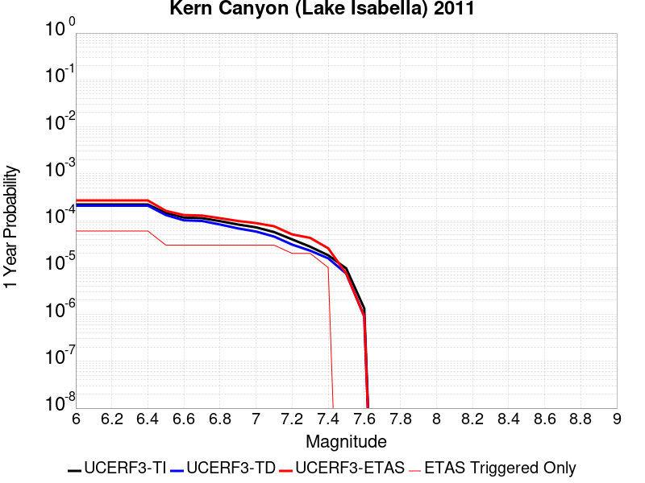 |  |

| Magnitude | 1 wk TI Prob | 1 wk TD Prob | 1 wk ETAS Prob | 1 wk ETAS/TD Gain | 1 wk ETAS Triggered Only | 1 mo TI Prob | 1 mo TD Prob | 1 mo ETAS Prob | 1 mo ETAS/TD Gain | 1 mo ETAS Triggered Only | 1 yr TI Prob | 1 yr TD Prob | 1 yr ETAS Prob | 1 yr ETAS/TD Gain | 1 yr ETAS Triggered Only | 10 yr TI Prob | 10 yr TD Prob | 10 yr ETAS Prob | 10 yr ETAS/TD Gain | 10 yr ETAS Triggered Only |
|-----|-----|-----|-----|-----|-----|-----|-----|-----|-----|-----|-----|-----|-----|-----|-----|-----|-----|-----|-----|-----|
| 6.0 | 4.2387383E-6 | 4.001639E-6 | 4.001639E-6 | 1.0 | 0.0 | 1.8165894E-5 | 1.7149778E-5 | 1.0082335E-4 | 5.8789887 | 8.3675004E-5 | 2.2114732E-4 | 2.087804E-4 | 2.9243794E-4 | 1.4006963 | 8.3675004E-5 | 0.0022092736 | 0.0020860266 | 0.0022530274 | 1.0800569 | 1.6735001E-4 |
| 6.1 | 4.2387383E-6 | 4.001639E-6 | 4.001639E-6 | 1.0 | 0.0 | 1.8165894E-5 | 1.7149778E-5 | 1.0082335E-4 | 5.8789887 | 8.3675004E-5 | 2.2114732E-4 | 2.087804E-4 | 2.9243794E-4 | 1.4006963 | 8.3675004E-5 | 0.0022092736 | 0.0020860266 | 0.0022530274 | 1.0800569 | 1.6735001E-4 |
| 6.2 | 4.2387383E-6 | 4.001639E-6 | 4.001639E-6 | 1.0 | 0.0 | 1.8165894E-5 | 1.7149778E-5 | 1.0082335E-4 | 5.8789887 | 8.3675004E-5 | 2.2114732E-4 | 2.087804E-4 | 2.9243794E-4 | 1.4006963 | 8.3675004E-5 | 0.0022092736 | 0.0020860266 | 0.0022530274 | 1.0800569 | 1.6735001E-4 |
| 6.3 | 4.2387383E-6 | 4.001639E-6 | 4.001639E-6 | 1.0 | 0.0 | 1.8165894E-5 | 1.7149778E-5 | 1.0082335E-4 | 5.8789887 | 8.3675004E-5 | 2.2114732E-4 | 2.087804E-4 | 2.9243794E-4 | 1.4006963 | 8.3675004E-5 | 0.0022092736 | 0.0020860266 | 0.0022530274 | 1.0800569 | 1.6735001E-4 |
| 6.4 | 4.2387383E-6 | 4.001639E-6 | 4.001639E-6 | 1.0 | 0.0 | 1.8165894E-5 | 1.7149778E-5 | 1.0082335E-4 | 5.8789887 | 8.3675004E-5 | 2.2114732E-4 | 2.087804E-4 | 2.9243794E-4 | 1.4006963 | 8.3675004E-5 | 0.0022092736 | 0.0020860266 | 0.0022530274 | 1.0800569 | 1.6735001E-4 |
| 6.5 | 2.7857532E-6 | 2.517867E-6 | 2.517867E-6 | 1.0 | 0.0 | 1.1938888E-5 | 1.0790815E-5 | 1.0790815E-5 | 1.0 | 0.0 | 1.4534626E-4 | 1.3137059E-4 | 1.3137059E-4 | 1.0 | 0.0 | 0.0014525123 | 0.001312962 | 0.001312962 | 1.0 | 0.0 |
| 6.6 | 2.2233348E-6 | 1.9441236E-6 | 1.9441236E-6 | 1.0 | 0.0 | 9.528543E-6 | 8.331932E-6 | 8.331932E-6 | 1.0 | 0.0 | 1.1600384E-4 | 1.01436635E-4 | 1.01436635E-4 | 1.0 | 0.0 | 0.001159433 | 0.001013912 | 0.001013912 | 1.0 | 0.0 |
| 6.7 | 2.1635126E-6 | 1.8835036E-6 | 1.8835036E-6 | 1.0 | 0.0 | 9.272164E-6 | 8.072134E-6 | 8.072134E-6 | 1.0 | 0.0 | 1.1288274E-4 | 9.827388E-5 | 9.827388E-5 | 1.0 | 0.0 | 0.0011282542 | 9.823124E-4 | 9.823124E-4 | 1.0 | 0.0 |
| 6.8 | 1.8685711E-6 | 1.5831425E-6 | 1.5831425E-6 | 1.0 | 0.0 | 8.008137E-6 | 6.784879E-6 | 6.784879E-6 | 1.0 | 0.0 | 9.74947E-5 | 8.260282E-5 | 8.260282E-5 | 1.0 | 0.0 | 9.745194E-4 | 8.2572614E-4 | 8.2572614E-4 | 1.0 | 0.0 |
| 6.9 | 1.5815071E-6 | 1.3064928E-6 | 1.3064928E-6 | 1.0 | 0.0 | 6.77787E-6 | 5.599243E-6 | 5.599243E-6 | 1.0 | 0.0 | 8.251744E-5 | 6.816868E-5 | 6.816868E-5 | 1.0 | 0.0 | 8.248681E-4 | 6.8148033E-4 | 6.8148033E-4 | 1.0 | 0.0 |
| 7.0 | 1.3772564E-6 | 1.1210718E-6 | 1.1210718E-6 | 1.0 | 0.0 | 5.9025137E-6 | 4.8045845E-6 | 4.8045845E-6 | 1.0 | 0.0 | 7.186073E-5 | 5.8494268E-5 | 5.8494268E-5 | 1.0 | 0.0 | 7.18375E-4 | 5.847908E-4 | 5.847908E-4 | 1.0 | 0.0 |
| 7.1 | 1.0916998E-6 | 8.763777E-7 | 8.763777E-7 | 1.0 | 0.0 | 4.678705E-6 | 3.7558991E-6 | 3.7558991E-6 | 1.0 | 0.0 | 5.6961744E-5 | 4.5727127E-5 | 4.5727127E-5 | 1.0 | 0.0 | 5.6947145E-4 | 4.571785E-4 | 4.571785E-4 | 1.0 | 0.0 |
| 7.2 | 7.6277024E-7 | 5.901454E-7 | 5.901454E-7 | 1.0 | 0.0 | 3.2690114E-6 | 2.5291922E-6 | 2.5291922E-6 | 1.0 | 0.0 | 3.9799485E-5 | 3.0792486E-5 | 3.0792486E-5 | 1.0 | 0.0 | 3.9792358E-4 | 3.0788282E-4 | 3.0788282E-4 | 1.0 | 0.0 |
| 7.3 | 5.3265916E-7 | 4.3824414E-7 | 4.3824414E-7 | 1.0 | 0.0 | 2.282823E-6 | 1.878188E-6 | 1.878188E-6 | 1.0 | 0.0 | 2.7793016E-5 | 2.2866701E-5 | 2.2866701E-5 | 1.0 | 0.0 | 2.778954E-4 | 2.2864387E-4 | 2.2864387E-4 | 1.0 | 0.0 |
| 7.4 | 3.4946007E-7 | 3.006571E-7 | 3.006571E-7 | 1.0 | 0.0 | 1.497685E-6 | 1.2885298E-6 | 1.2885298E-6 | 1.0 | 0.0 | 1.8234163E-5 | 1.568774E-5 | 1.568774E-5 | 1.0 | 0.0 | 1.8232666E-4 | 1.5686655E-4 | 1.5686655E-4 | 1.0 | 0.0 |
| 7.5 | 1.8317026E-7 | 1.4244812E-7 | 1.4244812E-7 | 1.0 | 0.0 | 7.850152E-7 | 6.104918E-7 | 6.104918E-7 | 1.0 | 0.0 | 9.557518E-6 | 7.432713E-6 | 7.432713E-6 | 1.0 | 0.0 | 9.5571064E-5 | 7.432472E-5 | 7.432472E-5 | 1.0 | 0.0 |
| 7.6 | 2.572245E-8 | 1.7352555E-8 | 1.7352555E-8 | 1.0 | 0.0 | 1.10239064E-7 | 7.436809E-8 | 7.436809E-8 | 1.0 | 0.0 | 1.3421597E-6 | 9.054312E-7 | 9.054312E-7 | 1.0 | 0.0 | 1.3421517E-5 | 9.05428E-6 | 9.05428E-6 | 1.0 | 0.0 |

## Imperial
*[(top)](#table-of-contents)*

| 1 Week | 1 Month | 1 Year | 10 Year |
|-----|-----|-----|-----|
|  |  |  |  |

| Magnitude | 1 wk TI Prob | 1 wk TD Prob | 1 wk ETAS Prob | 1 wk ETAS/TD Gain | 1 wk ETAS Triggered Only | 1 mo TI Prob | 1 mo TD Prob | 1 mo ETAS Prob | 1 mo ETAS/TD Gain | 1 mo ETAS Triggered Only | 1 yr TI Prob | 1 yr TD Prob | 1 yr ETAS Prob | 1 yr ETAS/TD Gain | 1 yr ETAS Triggered Only | 10 yr TI Prob | 10 yr TD Prob | 10 yr ETAS Prob | 10 yr ETAS/TD Gain | 10 yr ETAS Triggered Only |
|-----|-----|-----|-----|-----|-----|-----|-----|-----|-----|-----|-----|-----|-----|-----|-----|-----|-----|-----|-----|-----|
| 6.0 | 2.7496446E-4 | 5.0552754E-4 | 5.0552754E-4 | 1.0 | 0.0 | 0.0011778869 | 0.002164787 | 0.002164787 | 1.0 | 0.0 | 0.0142467655 | 0.026038699 | 0.026038699 | 1.0 | 0.0 | 0.13367249 | 0.2280438 | 0.22817297 | 1.0005665 | 1.6735001E-4 |
| 6.1 | 2.5356023E-4 | 4.8656776E-4 | 4.8656776E-4 | 1.0 | 0.0 | 0.001086234 | 0.0020836622 | 0.0020836622 | 1.0 | 0.0 | 0.013144928 | 0.025071215 | 0.025071215 | 1.0 | 0.0 | 0.123940155 | 0.21947981 | 0.21961044 | 1.0005951 | 1.6735001E-4 |
| 6.2 | 2.4820742E-4 | 4.7752203E-4 | 4.7752203E-4 | 1.0 | 0.0 | 0.0010633124 | 0.0020449557 | 0.0020449557 | 1.0 | 0.0 | 0.01286919 | 0.024611235 | 0.024611235 | 1.0 | 0.0 | 0.12148927 | 0.21598552 | 0.21611673 | 1.0006075 | 1.6735001E-4 |
| 6.3 | 2.3205351E-4 | 4.5890483E-4 | 4.5890483E-4 | 1.0 | 0.0 | 9.94136E-4 | 0.0019652895 | 0.0019652895 | 1.0 | 0.0 | 0.012036599 | 0.02366133 | 0.02366133 | 1.0 | 0.0 | 0.11405133 | 0.20793462 | 0.20806716 | 1.0006374 | 1.6735001E-4 |
| 6.4 | 2.0304754E-4 | 3.987652E-4 | 3.987652E-4 | 1.0 | 0.0 | 8.6991355E-4 | 0.0017078889 | 0.0017078889 | 1.0 | 0.0 | 0.010539869 | 0.020595672 | 0.020595672 | 1.0 | 0.0 | 0.100537635 | 0.1850669 | 0.18520327 | 1.000737 | 1.6735001E-4 |
| 6.5 | 1.854992E-4 | 3.6988858E-4 | 3.6988858E-4 | 1.0 | 0.0 | 7.9475436E-4 | 0.0015842861 | 0.0015842861 | 1.0 | 0.0 | 0.009633281 | 0.01911948 | 0.01911948 | 1.0 | 0.0 | 0.0922623 | 0.173298 | 0.17343636 | 1.0007983 | 1.6735001E-4 |
| 6.6 | 1.6586106E-4 | 3.403506E-4 | 3.403506E-4 | 1.0 | 0.0 | 7.106394E-4 | 0.0014578402 | 0.0014578402 | 1.0 | 0.0 | 0.008617763 | 0.01760642 | 0.01760642 | 1.0 | 0.0 | 0.08291132 | 0.16077545 | 0.1609159 | 1.0008736 | 1.6735001E-4 |
| 6.7 | 1.4224656E-4 | 3.076692E-4 | 3.076692E-4 | 1.0 | 0.0 | 6.094856E-4 | 0.001317924 | 0.001317924 | 1.0 | 0.0 | 0.0073952693 | 0.015929576 | 0.015929576 | 1.0 | 0.0 | 0.07153955 | 0.14648417 | 0.146627 | 1.0009751 | 1.6735001E-4 |
| 6.8 | 1.2317259E-4 | 2.779122E-4 | 2.779122E-4 | 1.0 | 0.0 | 5.2777573E-4 | 0.0011905148 | 0.0011905148 | 1.0 | 0.0 | 0.0064067547 | 0.0143995695 | 0.0143995695 | 1.0 | 0.0 | 0.06225166 | 0.13293684 | 0.13308193 | 1.0010915 | 1.6735001E-4 |
| 6.9 | 9.859898E-5 | 2.5014306E-4 | 2.5014306E-4 | 1.0 | 0.0 | 4.2249862E-4 | 0.0010716055 | 0.0010716055 | 1.0 | 0.0 | 0.0051317946 | 0.012969712 | 0.012969712 | 1.0 | 0.0 | 0.05014893 | 0.11940631 | 0.11955368 | 1.0012342 | 1.6735001E-4 |
| 7.0 | 7.3191884E-5 | 2.1266776E-4 | 2.1266776E-4 | 1.0 | 0.0 | 3.136418E-4 | 9.1111806E-4 | 9.1111806E-4 | 1.0 | 0.0 | 0.003811904 | 0.011037128 | 0.011037128 | 1.0 | 0.0 | 0.037471764 | 0.10206493 | 0.10221519 | 1.0014722 | 1.6735001E-4 |
| 7.1 | 7.1760296E-5 | 2.0968143E-4 | 2.0968143E-4 | 1.0 | 0.0 | 3.0750787E-4 | 8.983284E-4 | 8.983284E-4 | 1.0 | 0.0 | 0.003737482 | 0.010882978 | 0.010882978 | 1.0 | 0.0 | 0.03675245 | 0.10070146 | 0.10085195 | 1.0014945 | 1.6735001E-4 |
| 7.2 | 6.46614E-5 | 1.9136685E-4 | 1.9136685E-4 | 1.0 | 0.0 | 2.7709085E-4 | 8.1988896E-4 | 8.1988896E-4 | 1.0 | 0.0 | 0.0033683628 | 0.0099370815 | 0.0099370815 | 1.0 | 0.0 | 0.033177625 | 0.09250898 | 0.092660844 | 1.0016416 | 1.6735001E-4 |
| 7.3 | 6.088115E-5 | 1.78084E-4 | 1.78084E-4 | 1.0 | 0.0 | 2.6089314E-4 | 7.6299673E-4 | 7.6299673E-4 | 1.0 | 0.0 | 0.0031717476 | 0.009250494 | 0.009250494 | 1.0 | 0.0 | 0.031268585 | 0.08655989 | 0.086712755 | 1.001766 | 1.6735001E-4 |
| 7.4 | 4.199346E-5 | 1.1510366E-4 | 1.1510366E-4 | 1.0 | 0.0 | 1.7995955E-4 | 4.9320905E-4 | 4.9320905E-4 | 1.0 | 0.0 | 0.0021888057 | 0.0059884563 | 0.0059884563 | 1.0 | 0.0 | 0.02167372 | 0.057439793 | 0.057597533 | 1.0027461 | 1.6735001E-4 |
| 7.5 | 3.130448E-5 | 8.33328E-5 | 8.33328E-5 | 1.0 | 0.0 | 1.3415517E-4 | 3.57092E-4 | 3.57092E-4 | 1.0 | 0.0 | 0.0016321153 | 0.004338988 | 0.004338988 | 1.0 | 0.0 | 0.016201803 | 0.04213201 | 0.042292308 | 1.0038047 | 1.6735001E-4 |
| 7.6 | 2.3074248E-5 | 6.0844646E-5 | 6.0844646E-5 | 1.0 | 0.0 | 9.888588E-5 | 2.6073685E-4 | 2.6073685E-4 | 1.0 | 0.0 | 0.0012032706 | 0.0031698733 | 0.0031698733 | 1.0 | 0.0 | 0.011967761 | 0.031026395 | 0.031188553 | 1.0052265 | 1.6735001E-4 |
| 7.7 | 1.45864815E-5 | 4.0124698E-5 | 4.0124698E-5 | 1.0 | 0.0 | 6.2511994E-5 | 1.7195169E-4 | 1.7195169E-4 | 1.0 | 0.0 | 7.608177E-4 | 0.0020915072 | 0.0020915072 | 1.0 | 0.0 | 0.007582182 | 0.020627763 | 0.020791661 | 1.0079455 | 1.6735001E-4 |
| 7.8 | 1.0352979E-5 | 3.0960902E-5 | 3.0960902E-5 | 1.0 | 0.0 | 4.4369157E-5 | 1.3268284E-4 | 1.3268284E-4 | 1.0 | 0.0 | 5.400606E-4 | 0.0016142189 | 0.0016142189 | 1.0 | 0.0 | 0.0053875 | 0.016016833 | 0.016181502 | 1.0102811 | 1.6735001E-4 |
| 7.9 | 8.137906E-6 | 2.2149103E-5 | 2.2149103E-5 | 1.0 | 0.0 | 3.4876273E-5 | 9.492128E-5 | 9.492128E-5 | 1.0 | 0.0 | 4.2453592E-4 | 0.0011550548 | 0.0011550548 | 1.0 | 0.0 | 0.004237258 | 0.011617903 | 0.011700605 | 1.0071186 | 8.3675004E-5 |
| 8.0 | 6.93792E-6 | 1.8008766E-5 | 1.8008766E-5 | 1.0 | 0.0 | 2.9733603E-5 | 7.717814E-5 | 7.717814E-5 | 1.0 | 0.0 | 3.6194647E-4 | 9.3923963E-4 | 9.3923963E-4 | 1.0 | 0.0 | 0.0036135751 | 0.00950155 | 0.009584431 | 1.0087228 | 8.3675004E-5 |
| 8.1 | 3.4286315E-6 | 6.379872E-6 | 6.379872E-6 | 1.0 | 0.0 | 1.4694053E-5 | 2.7342023E-5 | 2.7342023E-5 | 1.0 | 0.0 | 1.7888541E-4 | 3.328384E-4 | 3.328384E-4 | 1.0 | 0.0 | 0.0017874148 | 0.003486031 | 0.003486031 | 1.0 | 0.0 |
| 8.2 | 1.4906886E-6 | 1.9366646E-6 | 1.9366646E-6 | 1.0 | 0.0 | 6.3886496E-6 | 8.299965E-6 | 8.299965E-6 | 1.0 | 0.0 | 7.7779034E-5 | 1.0104742E-4 | 1.0104742E-4 | 1.0 | 0.0 | 7.775182E-4 | 0.0011075331 | 0.0011075331 | 1.0 | 0.0 |
| 8.3 | 2.5758007E-8 | 1.4500102E-8 | 1.4500102E-8 | 1.0 | 0.0 | 1.10391454E-7 | 6.214329E-8 | 6.214329E-8 | 1.0 | 0.0 | 1.3440151E-6 | 7.565946E-7 | 7.565946E-7 | 1.0 | 0.0 | 1.344007E-5 | 7.887763E-6 | 7.887763E-6 | 1.0 | 0.0 |

## San Jacinto (San Jacinto Valley) rev
*[(top)](#table-of-contents)*

| 1 Week | 1 Month | 1 Year | 10 Year |
|-----|-----|-----|-----|
|  |  |  |  |

| Magnitude | 1 wk TI Prob | 1 wk TD Prob | 1 wk ETAS Prob | 1 wk ETAS/TD Gain | 1 wk ETAS Triggered Only | 1 mo TI Prob | 1 mo TD Prob | 1 mo ETAS Prob | 1 mo ETAS/TD Gain | 1 mo ETAS Triggered Only | 1 yr TI Prob | 1 yr TD Prob | 1 yr ETAS Prob | 1 yr ETAS/TD Gain | 1 yr ETAS Triggered Only | 10 yr TI Prob | 10 yr TD Prob | 10 yr ETAS Prob | 10 yr ETAS/TD Gain | 10 yr ETAS Triggered Only |
|-----|-----|-----|-----|-----|-----|-----|-----|-----|-----|-----|-----|-----|-----|-----|-----|-----|-----|-----|-----|-----|
| 6.0 | 3.652694E-5 | 3.4402394E-5 | 2.0174665E-4 | 5.8643203 | 1.6735001E-4 | 1.5653463E-4 | 1.474305E-4 | 3.1475583E-4 | 2.1349437 | 1.6735001E-4 | 0.0019041431 | 0.00179349 | 0.00196054 | 1.0931424 | 1.6735001E-4 | 0.018879099 | 0.018526595 | 0.018690845 | 1.0088656 | 1.6735001E-4 |
| 6.1 | 3.652694E-5 | 3.4402394E-5 | 2.0174665E-4 | 5.8643203 | 1.6735001E-4 | 1.5653463E-4 | 1.474305E-4 | 3.1475583E-4 | 2.1349437 | 1.6735001E-4 | 0.0019041431 | 0.00179349 | 0.00196054 | 1.0931424 | 1.6735001E-4 | 0.018879099 | 0.018526595 | 0.018690845 | 1.0088656 | 1.6735001E-4 |
| 6.2 | 3.652694E-5 | 3.4402394E-5 | 2.0174665E-4 | 5.8643203 | 1.6735001E-4 | 1.5653463E-4 | 1.474305E-4 | 3.1475583E-4 | 2.1349437 | 1.6735001E-4 | 0.0019041431 | 0.00179349 | 0.00196054 | 1.0931424 | 1.6735001E-4 | 0.018879099 | 0.018526595 | 0.018690845 | 1.0088656 | 1.6735001E-4 |
| 6.3 | 3.652694E-5 | 3.4402394E-5 | 2.0174665E-4 | 5.8643203 | 1.6735001E-4 | 1.5653463E-4 | 1.474305E-4 | 3.1475583E-4 | 2.1349437 | 1.6735001E-4 | 0.0019041431 | 0.00179349 | 0.00196054 | 1.0931424 | 1.6735001E-4 | 0.018879099 | 0.018526595 | 0.018690845 | 1.0088656 | 1.6735001E-4 |
| 6.4 | 3.646941E-5 | 3.432397E-5 | 2.0166824E-4 | 5.875435 | 1.6735001E-4 | 1.5628811E-4 | 1.4709444E-4 | 3.1441983E-4 | 2.1375372 | 1.6735001E-4 | 0.0019011468 | 0.0017894056 | 0.001956456 | 1.0933553 | 1.6735001E-4 | 0.018849645 | 0.018486476 | 0.018650733 | 1.0088853 | 1.6735001E-4 |
| 6.5 | 3.646941E-5 | 3.432397E-5 | 2.0166824E-4 | 5.875435 | 1.6735001E-4 | 1.5628811E-4 | 1.4709444E-4 | 3.1441983E-4 | 2.1375372 | 1.6735001E-4 | 0.0019011468 | 0.0017894056 | 0.001956456 | 1.0933553 | 1.6735001E-4 | 0.018849645 | 0.018486476 | 0.018650733 | 1.0088853 | 1.6735001E-4 |
| 6.6 | 3.6442503E-5 | 3.4287354E-5 | 2.0163163E-4 | 5.880641 | 1.6735001E-4 | 1.561728E-4 | 1.4693754E-4 | 3.1426296E-4 | 2.138752 | 1.6735001E-4 | 0.0018997455 | 0.0017874985 | 0.0019545495 | 1.0934551 | 1.6735001E-4 | 0.018835869 | 0.018467745 | 0.018632004 | 1.0088944 | 1.6735001E-4 |
| 6.7 | 3.6432113E-5 | 3.4272925E-5 | 2.0161721E-4 | 5.882696 | 1.6735001E-4 | 1.5612828E-4 | 1.4687571E-4 | 3.1420114E-4 | 2.1392314 | 1.6735001E-4 | 0.0018992044 | 0.0017867472 | 0.0019537983 | 1.0934945 | 1.6735001E-4 | 0.018830549 | 0.018460369 | 0.01862463 | 1.008898 | 1.6735001E-4 |
| 6.8 | 3.6409598E-5 | 3.424198E-5 | 2.0158627E-4 | 5.8871083 | 1.6735001E-4 | 1.560318E-4 | 1.4674311E-4 | 3.1406857E-4 | 2.1402612 | 1.6735001E-4 | 0.0018980318 | 0.0017851355 | 0.0019521867 | 1.093579 | 1.6735001E-4 | 0.018819023 | 0.018444523 | 0.018608786 | 1.0089058 | 1.6735001E-4 |
| 6.9 | 3.638078E-5 | 3.4202407E-5 | 2.0154669E-4 | 5.8927636 | 1.6735001E-4 | 1.5590832E-4 | 1.4657351E-4 | 3.13899E-4 | 2.1415806 | 1.6735001E-4 | 0.0018965311 | 0.001783074 | 0.0019501257 | 1.0936874 | 1.6735001E-4 | 0.018804269 | 0.018424258 | 0.018588524 | 1.0089158 | 1.6735001E-4 |
| 7.0 | 3.6294874E-5 | 3.408442E-5 | 2.0142873E-4 | 5.909701 | 1.6735001E-4 | 1.5554018E-4 | 1.4606792E-4 | 3.1339348E-4 | 2.1455326 | 1.6735001E-4 | 0.0018920569 | 0.001776929 | 0.0019439816 | 1.094012 | 1.6735001E-4 | 0.018760284 | 0.018363839 | 0.018528117 | 1.0089457 | 1.6735001E-4 |
| 7.1 | 3.6260717E-5 | 3.4040702E-5 | 2.0138502E-4 | 5.9160066 | 1.6735001E-4 | 1.5539382E-4 | 1.4588058E-4 | 3.1320617E-4 | 2.147004 | 1.6735001E-4 | 0.001890278 | 0.0017746518 | 0.0019417049 | 1.0941329 | 1.6735001E-4 | 0.018742796 | 0.018341439 | 0.01850572 | 1.0089568 | 1.6735001E-4 |
| 7.2 | 3.6210204E-5 | 3.397492E-5 | 2.0131924E-4 | 5.925525 | 1.6735001E-4 | 1.5517735E-4 | 1.455987E-4 | 3.1292433E-4 | 2.149225 | 1.6735001E-4 | 0.001887647 | 0.0017712255 | 0.001938279 | 1.0943153 | 1.6735001E-4 | 0.01871693 | 0.01830772 | 0.018472005 | 1.0089736 | 1.6735001E-4 |
| 7.3 | 3.6119454E-5 | 3.386321E-5 | 2.0120756E-4 | 5.941775 | 1.6735001E-4 | 1.5478847E-4 | 1.4511998E-4 | 3.124457E-4 | 2.1530166 | 1.6735001E-4 | 0.0018829206 | 0.0017654065 | 0.001932461 | 1.0946267 | 1.6735001E-4 | 0.018670462 | 0.018250274 | 0.018414568 | 1.0090023 | 1.6735001E-4 |
| 7.4 | 3.607848E-5 | 3.381071E-5 | 2.0115507E-4 | 5.949448 | 1.6735001E-4 | 1.5461289E-4 | 1.44895E-4 | 3.1222077E-4 | 2.154807 | 1.6735001E-4 | 0.0018807866 | 0.0017626719 | 0.0019297269 | 1.0947738 | 1.6735001E-4 | 0.018649481 | 0.018223269 | 0.01838757 | 1.0090159 | 1.6735001E-4 |
| 7.5 | 3.5856774E-5 | 3.3620483E-5 | 2.0096487E-4 | 5.9774537 | 1.6735001E-4 | 1.5366284E-4 | 1.4407984E-4 | 3.1140575E-4 | 2.1613417 | 1.6735001E-4 | 0.0018692396 | 0.0017527633 | 0.00191982 | 1.0953104 | 1.6735001E-4 | 0.018535944 | 0.018124366 | 0.018288683 | 1.0090661 | 1.6735001E-4 |
| 7.6 | 3.286655E-5 | 3.2143445E-5 | 1.9948807E-4 | 6.206182 | 1.6735001E-4 | 1.4084904E-4 | 1.3775036E-4 | 3.0507732E-4 | 2.2147117 | 1.6735001E-4 | 0.001713488 | 0.0016758227 | 0.0018428921 | 1.099694 | 1.6735001E-4 | 0.017003361 | 0.017344031 | 0.017508479 | 1.0094815 | 1.6735001E-4 |
| 7.7 | 2.8882527E-5 | 2.9236293E-5 | 1.9658142E-4 | 6.7238827 | 1.6735001E-4 | 1.237764E-4 | 1.2529238E-4 | 2.9262144E-4 | 2.3355083 | 1.6735001E-4 | 0.0015059357 | 0.0015243685 | 0.0016914634 | 1.1096158 | 1.6735001E-4 | 0.014957713 | 0.015830461 | 0.015995162 | 1.010404 | 1.6735001E-4 |
| 7.8 | 2.4950225E-5 | 2.6527203E-5 | 1.9387278E-4 | 7.308451 | 1.6735001E-4 | 1.0692515E-4 | 1.1368306E-4 | 2.8101404E-4 | 2.4719079 | 1.6735001E-4 | 0.0013010362 | 0.0013832134 | 0.001550332 | 1.1208191 | 1.6735001E-4 | 0.012934455 | 0.014411755 | 0.014576693 | 1.0114447 | 1.6735001E-4 |
| 7.9 | 1.9881603E-5 | 2.1507445E-5 | 1.8885385E-4 | 8.78086 | 1.6735001E-4 | 8.520408E-5 | 9.217151E-5 | 2.595061E-4 | 2.8154697 | 1.6735001E-4 | 0.001036866 | 0.0011216112 | 0.0012887736 | 1.1490376 | 1.6735001E-4 | 0.010320415 | 0.011777027 | 0.011942406 | 1.0140425 | 1.6735001E-4 |
| 8.0 | 1.563292E-5 | 1.5937347E-5 | 9.961102E-5 | 6.2501636 | 8.3675004E-5 | 6.6996516E-5 | 6.8301124E-5 | 1.5197042E-4 | 2.225006 | 8.3675004E-5 | 8.153773E-4 | 8.3124964E-4 | 9.148551E-4 | 1.1005781 | 8.3675004E-5 | 0.00812392 | 0.008810506 | 0.008893444 | 1.0094135 | 8.3675004E-5 |
| 8.1 | 1.0045313E-5 | 8.301802E-6 | 9.1976115E-5 | 11.079054 | 8.3675004E-5 | 4.305063E-5 | 3.5578672E-5 | 1.19250704E-4 | 3.3517468 | 8.3675004E-5 | 5.2401534E-4 | 4.3308473E-4 | 5.167235E-4 | 1.1931233 | 8.3675004E-5 | 0.0052278144 | 0.0046591135 | 0.004742399 | 1.0178758 | 8.3675004E-5 |
| 8.2 | 4.1554413E-6 | 1.5655598E-6 | 1.5655598E-6 | 1.0 | 0.0 | 1.7808914E-5 | 6.709525E-6 | 6.709525E-6 | 1.0 | 0.0 | 2.1680194E-4 | 8.168544E-5 | 8.168544E-5 | 1.0 | 0.0 | 0.0021659054 | 9.482903E-4 | 9.482903E-4 | 1.0 | 0.0 |
| 8.3 | 1.2758221E-6 | 3.6149942E-7 | 3.6149942E-7 | 1.0 | 0.0 | 5.4677976E-6 | 1.5492824E-6 | 1.5492824E-6 | 1.0 | 0.0 | 6.65684E-5 | 1.8862354E-5 | 1.8862354E-5 | 1.0 | 0.0 | 6.6548464E-4 | 2.2751294E-4 | 2.2751294E-4 | 1.0 | 0.0 |

## San Andreas (Coachella) rev
*[(top)](#table-of-contents)*

| 1 Week | 1 Month | 1 Year | 10 Year |
|-----|-----|-----|-----|
|  |  |  |  |

| Magnitude | 1 wk TI Prob | 1 wk TD Prob | 1 wk ETAS Prob | 1 wk ETAS/TD Gain | 1 wk ETAS Triggered Only | 1 mo TI Prob | 1 mo TD Prob | 1 mo ETAS Prob | 1 mo ETAS/TD Gain | 1 mo ETAS Triggered Only | 1 yr TI Prob | 1 yr TD Prob | 1 yr ETAS Prob | 1 yr ETAS/TD Gain | 1 yr ETAS Triggered Only | 10 yr TI Prob | 10 yr TD Prob | 10 yr ETAS Prob | 10 yr ETAS/TD Gain | 10 yr ETAS Triggered Only |
|-----|-----|-----|-----|-----|-----|-----|-----|-----|-----|-----|-----|-----|-----|-----|-----|-----|-----|-----|-----|-----|
| 6.0 | 1.1925945E-4 | 3.2729402E-4 | 3.2729402E-4 | 1.0 | 0.0 | 5.110118E-4 | 0.0014019393 | 0.0014019393 | 1.0 | 0.0 | 0.0062038354 | 0.016936364 | 0.016936364 | 1.0 | 0.0 | 0.060334753 | 0.15265316 | 0.15279496 | 1.0009289 | 1.6735001E-4 |
| 6.1 | 1.1925945E-4 | 3.2729402E-4 | 3.2729402E-4 | 1.0 | 0.0 | 5.110118E-4 | 0.0014019393 | 0.0014019393 | 1.0 | 0.0 | 0.0062038354 | 0.016936364 | 0.016936364 | 1.0 | 0.0 | 0.060334753 | 0.15265316 | 0.15279496 | 1.0009289 | 1.6735001E-4 |
| 6.2 | 1.07432395E-4 | 3.0230157E-4 | 3.0230157E-4 | 1.0 | 0.0 | 4.603433E-4 | 0.0012949388 | 0.0012949388 | 1.0 | 0.0 | 0.005590286 | 0.015653009 | 0.015653009 | 1.0 | 0.0 | 0.05451731 | 0.14182423 | 0.14196785 | 1.0010127 | 1.6735001E-4 |
| 6.3 | 1.0718766E-4 | 3.0175463E-4 | 3.0175463E-4 | 1.0 | 0.0 | 4.592948E-4 | 0.0012925972 | 0.0012925972 | 1.0 | 0.0 | 0.005577586 | 0.015624908 | 0.015624908 | 1.0 | 0.0 | 0.054396555 | 0.14159249 | 0.14173615 | 1.0010146 | 1.6735001E-4 |
| 6.4 | 1.0355944E-4 | 2.9383553E-4 | 2.9383553E-4 | 1.0 | 0.0 | 4.4375064E-4 | 0.0012586913 | 0.0012586913 | 1.0 | 0.0 | 0.0053892885 | 0.015217941 | 0.015217941 | 1.0 | 0.0 | 0.052604496 | 0.13815255 | 0.13829678 | 1.001044 | 1.6735001E-4 |
| 6.5 | 1.0227914E-4 | 2.9102986E-4 | 2.9102986E-4 | 1.0 | 0.0 | 4.382655E-4 | 0.0012466786 | 0.0012466786 | 1.0 | 0.0 | 0.0053228354 | 0.01507372 | 0.01507372 | 1.0 | 0.0 | 0.051971316 | 0.13693172 | 0.13707615 | 1.0010548 | 1.6735001E-4 |
| 6.6 | 1.0116757E-4 | 2.8868738E-4 | 2.8868738E-4 | 1.0 | 0.0 | 4.3350324E-4 | 0.0012366489 | 0.0012366489 | 1.0 | 0.0 | 0.0052651367 | 0.01495329 | 0.01495329 | 1.0 | 0.0 | 0.051421247 | 0.1359099 | 0.1360545 | 1.001064 | 1.6735001E-4 |
| 6.7 | 1.0050676E-4 | 2.8727303E-4 | 2.8727303E-4 | 1.0 | 0.0 | 4.3067214E-4 | 0.0012305931 | 0.0012305931 | 1.0 | 0.0 | 0.005230834 | 0.014880571 | 0.014880571 | 1.0 | 0.0 | 0.051094085 | 0.13529462 | 0.13543932 | 1.0010695 | 1.6735001E-4 |
| 6.8 | 9.976819E-5 | 2.853096E-4 | 2.853096E-4 | 1.0 | 0.0 | 4.2750788E-4 | 0.0012221863 | 0.0012221863 | 1.0 | 0.0 | 0.0051924936 | 0.0147796115 | 0.0147796115 | 1.0 | 0.0 | 0.050728295 | 0.13444631 | 0.13459116 | 1.0010774 | 1.6735001E-4 |
| 6.9 | 9.77719E-5 | 2.8027873E-4 | 2.8027873E-4 | 1.0 | 0.0 | 4.1895514E-4 | 0.0012006456 | 0.0012006456 | 1.0 | 0.0 | 0.0050888555 | 0.014520878 | 0.014520878 | 1.0 | 0.0 | 0.049738888 | 0.1322748 | 0.13242002 | 1.0010978 | 1.6735001E-4 |
| 7.0 | 8.500761E-5 | 2.4762485E-4 | 2.4762485E-4 | 1.0 | 0.0 | 3.6426744E-4 | 0.001060821 | 0.001060821 | 1.0 | 0.0 | 0.0044259406 | 0.012839786 | 0.012839786 | 1.0 | 0.0 | 0.04338823 | 0.11813272 | 0.1182803 | 1.0012493 | 1.6735001E-4 |
| 7.1 | 8.319876E-5 | 2.4365232E-4 | 2.4365232E-4 | 1.0 | 0.0 | 3.5651738E-4 | 0.0010438096 | 0.0010438096 | 1.0 | 0.0 | 0.004331963 | 0.012635092 | 0.012635092 | 1.0 | 0.0 | 0.042484846 | 0.116353 | 0.11650088 | 1.0012709 | 1.6735001E-4 |
| 7.2 | 7.563917E-5 | 2.2413683E-4 | 2.2413683E-4 | 1.0 | 0.0 | 3.2412758E-4 | 9.602359E-4 | 9.602359E-4 | 1.0 | 0.0 | 0.0039391145 | 0.011628893 | 0.011628893 | 1.0 | 0.0 | 0.03870018 | 0.10775925 | 0.10790856 | 1.0013857 | 1.6735001E-4 |
| 7.3 | 7.082985E-5 | 2.0729867E-4 | 2.0729867E-4 | 1.0 | 0.0 | 3.0352117E-4 | 8.881233E-4 | 8.881233E-4 | 1.0 | 0.0 | 0.0036891096 | 0.010759917 | 0.010759917 | 1.0 | 0.0 | 0.03628465 | 0.100282 | 0.10043257 | 1.0015014 | 1.6735001E-4 |
| 7.4 | 5.146215E-5 | 1.4273795E-4 | 1.4273795E-4 | 1.0 | 0.0 | 2.2053342E-4 | 6.115915E-4 | 6.115915E-4 | 1.0 | 0.0 | 0.0026816884 | 0.0074208933 | 0.0074208933 | 1.0 | 0.0 | 0.02649557 | 0.070849575 | 0.07100507 | 1.0021946 | 1.6735001E-4 |
| 7.5 | 4.0285166E-5 | 1.09416E-4 | 1.09416E-4 | 1.0 | 0.0 | 1.7263928E-4 | 4.6884175E-4 | 4.6884175E-4 | 1.0 | 0.0 | 0.002099857 | 0.0056932783 | 0.0056932783 | 1.0 | 0.0 | 0.020801254 | 0.055011146 | 0.05516929 | 1.0028747 | 1.6735001E-4 |
| 7.6 | 3.1168736E-5 | 8.4389096E-5 | 8.4389096E-5 | 1.0 | 0.0 | 1.3357346E-4 | 3.6161754E-4 | 3.6161754E-4 | 1.0 | 0.0 | 0.0016250437 | 0.0043938323 | 0.0043938323 | 1.0 | 0.0 | 0.016132116 | 0.04281005 | 0.042970236 | 1.0037417 | 1.6735001E-4 |
| 7.7 | 2.2100989E-5 | 6.238755E-5 | 6.238755E-5 | 1.0 | 0.0 | 9.4715084E-5 | 2.6734784E-4 | 2.6734784E-4 | 1.0 | 0.0 | 0.001152546 | 0.0032501083 | 0.0032501083 | 1.0 | 0.0 | 0.011465867 | 0.0319002 | 0.03206221 | 1.0050787 | 1.6735001E-4 |
| 7.8 | 1.7484861E-5 | 5.179572E-5 | 5.179572E-5 | 1.0 | 0.0 | 7.493296E-5 | 2.2196278E-4 | 2.2196278E-4 | 1.0 | 0.0 | 9.1192697E-4 | 0.0026990508 | 0.0026990508 | 1.0 | 0.0 | 0.009081938 | 0.026640115 | 0.026803007 | 1.0061145 | 1.6735001E-4 |
| 7.9 | 1.3967285E-5 | 3.822255E-5 | 3.822255E-5 | 1.0 | 0.0 | 5.985842E-5 | 1.6380067E-4 | 1.6380067E-4 | 1.0 | 0.0 | 7.2853256E-4 | 0.00199245 | 0.00199245 | 1.0 | 0.0 | 0.0072614877 | 0.019909438 | 0.019991446 | 1.0041192 | 8.3675004E-5 |
| 8.0 | 1.1887396E-5 | 3.106521E-5 | 3.106521E-5 | 1.0 | 0.0 | 5.094499E-5 | 1.3312983E-4 | 1.3312983E-4 | 1.0 | 0.0 | 6.200787E-4 | 0.0016196516 | 0.0016196516 | 1.0 | 0.0 | 0.006183513 | 0.016279267 | 0.016361581 | 1.0050563 | 8.3675004E-5 |
| 8.1 | 5.100864E-6 | 8.973418E-6 | 8.973418E-6 | 1.0 | 0.0 | 2.1860664E-5 | 3.8456936E-5 | 3.8456936E-5 | 1.0 | 0.0 | 2.6612106E-4 | 4.6811273E-4 | 4.6811273E-4 | 1.0 | 0.0 | 0.002658026 | 0.004917731 | 0.004917731 | 1.0 | 0.0 |
| 8.2 | 2.3004484E-6 | 2.7864487E-6 | 2.7864487E-6 | 1.0 | 0.0 | 9.859027E-6 | 1.1941868E-5 | 1.1941868E-5 | 1.0 | 0.0 | 1.2002704E-4 | 1.4538258E-4 | 1.4538258E-4 | 1.0 | 0.0 | 0.0011996223 | 0.0015973912 | 0.0015973912 | 1.0 | 0.0 |
| 8.3 | 1.0424446E-7 | 5.8161504E-8 | 5.8161504E-8 | 1.0 | 0.0 | 4.4676187E-7 | 2.4926356E-7 | 2.4926356E-7 | 1.0 | 0.0 | 5.439312E-6 | 3.03478E-6 | 3.03478E-6 | 1.0 | 0.0 | 5.4391792E-5 | 3.190716E-5 | 3.190716E-5 | 1.0 | 0.0 |

## Tin Mountain
*[(top)](#table-of-contents)*

| 1 Week | 1 Month | 1 Year | 10 Year |
|-----|-----|-----|-----|
|  |  |  | 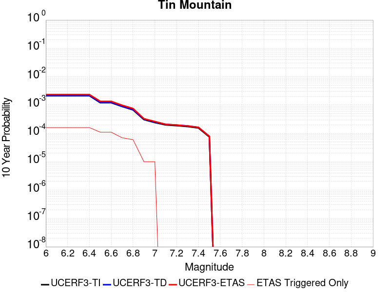 |

| Magnitude | 1 wk TI Prob | 1 wk TD Prob | 1 wk ETAS Prob | 1 wk ETAS/TD Gain | 1 wk ETAS Triggered Only | 1 mo TI Prob | 1 mo TD Prob | 1 mo ETAS Prob | 1 mo ETAS/TD Gain | 1 mo ETAS Triggered Only | 1 yr TI Prob | 1 yr TD Prob | 1 yr ETAS Prob | 1 yr ETAS/TD Gain | 1 yr ETAS Triggered Only | 10 yr TI Prob | 10 yr TD Prob | 10 yr ETAS Prob | 10 yr ETAS/TD Gain | 10 yr ETAS Triggered Only |
|-----|-----|-----|-----|-----|-----|-----|-----|-----|-----|-----|-----|-----|-----|-----|-----|-----|-----|-----|-----|-----|
| 6.0 | 4.083776E-6 | 4.1815365E-6 | 4.1815365E-6 | 1.0 | 0.0 | 1.750178E-5 | 1.792077E-5 | 1.792077E-5 | 1.0 | 0.0 | 2.1306332E-4 | 2.1816725E-4 | 3.01824E-4 | 1.3834524 | 8.3675004E-5 | 0.0021285915 | 0.0021798965 | 0.0023468817 | 1.0766023 | 1.6735001E-4 |
| 6.1 | 4.083776E-6 | 4.1815365E-6 | 4.1815365E-6 | 1.0 | 0.0 | 1.750178E-5 | 1.792077E-5 | 1.792077E-5 | 1.0 | 0.0 | 2.1306332E-4 | 2.1816725E-4 | 3.01824E-4 | 1.3834524 | 8.3675004E-5 | 0.0021285915 | 0.0021798965 | 0.0023468817 | 1.0766023 | 1.6735001E-4 |
| 6.2 | 4.083776E-6 | 4.1815365E-6 | 4.1815365E-6 | 1.0 | 0.0 | 1.750178E-5 | 1.792077E-5 | 1.792077E-5 | 1.0 | 0.0 | 2.1306332E-4 | 2.1816725E-4 | 3.01824E-4 | 1.3834524 | 8.3675004E-5 | 0.0021285915 | 0.0021798965 | 0.0023468817 | 1.0766023 | 1.6735001E-4 |
| 6.3 | 4.083776E-6 | 4.1815365E-6 | 4.1815365E-6 | 1.0 | 0.0 | 1.750178E-5 | 1.792077E-5 | 1.792077E-5 | 1.0 | 0.0 | 2.1306332E-4 | 2.1816725E-4 | 3.01824E-4 | 1.3834524 | 8.3675004E-5 | 0.0021285915 | 0.0021798965 | 0.0023468817 | 1.0766023 | 1.6735001E-4 |
| 6.4 | 4.083776E-6 | 4.1815365E-6 | 4.1815365E-6 | 1.0 | 0.0 | 1.750178E-5 | 1.792077E-5 | 1.792077E-5 | 1.0 | 0.0 | 2.1306332E-4 | 2.1816725E-4 | 3.01824E-4 | 1.3834524 | 8.3675004E-5 | 0.0021285915 | 0.0021798965 | 0.0023468817 | 1.0766023 | 1.6735001E-4 |
| 6.5 | 2.3143427E-6 | 2.3731573E-6 | 2.3731573E-6 | 1.0 | 0.0 | 9.9185745E-6 | 1.0170638E-5 | 1.0170638E-5 | 1.0 | 0.0 | 1.2075195E-4 | 1.2382126E-4 | 2.0748591E-4 | 1.6756889 | 8.3675004E-5 | 0.0012068636 | 0.0012375986 | 0.00132117 | 1.067527 | 8.3675004E-5 |
| 6.6 | 2.3143427E-6 | 2.3731573E-6 | 2.3731573E-6 | 1.0 | 0.0 | 9.9185745E-6 | 1.0170638E-5 | 1.0170638E-5 | 1.0 | 0.0 | 1.2075195E-4 | 1.2382126E-4 | 2.0748591E-4 | 1.6756889 | 8.3675004E-5 | 0.0012068636 | 0.0012375986 | 0.00132117 | 1.067527 | 8.3675004E-5 |
| 6.7 | 1.7029532E-6 | 1.7497915E-6 | 1.7497915E-6 | 1.0 | 0.0 | 7.2983503E-6 | 7.499088E-6 | 7.499088E-6 | 1.0 | 0.0 | 8.885379E-5 | 9.1298105E-5 | 9.1298105E-5 | 1.0 | 0.0 | 8.881827E-4 | 9.1265864E-4 | 9.1265864E-4 | 1.0 | 0.0 |
| 6.8 | 1.2914646E-6 | 1.3299378E-6 | 1.3299378E-6 | 1.0 | 0.0 | 5.534837E-6 | 5.6997237E-6 | 5.6997237E-6 | 1.0 | 0.0 | 6.738455E-5 | 6.939237E-5 | 6.939237E-5 | 1.0 | 0.0 | 6.736412E-4 | 6.9375033E-4 | 6.9375033E-4 | 1.0 | 0.0 |
| 6.9 | 5.8708974E-7 | 6.1169936E-7 | 6.1169936E-7 | 1.0 | 0.0 | 2.5160964E-6 | 2.6215664E-6 | 2.6215664E-6 | 1.0 | 0.0 | 3.0633044E-5 | 3.1917145E-5 | 3.1917145E-5 | 1.0 | 0.0 | 3.0628822E-4 | 3.191297E-4 | 3.191297E-4 | 1.0 | 0.0 |
| 7.0 | 4.6248786E-7 | 4.832015E-7 | 4.832015E-7 | 1.0 | 0.0 | 1.9820893E-6 | 2.0708624E-6 | 2.0708624E-6 | 1.0 | 0.0 | 2.413167E-5 | 2.5212494E-5 | 2.5212494E-5 | 1.0 | 0.0 | 2.412905E-4 | 2.5210003E-4 | 2.5210003E-4 | 1.0 | 0.0 |
| 7.1 | 3.804606E-7 | 3.987147E-7 | 3.987147E-7 | 1.0 | 0.0 | 1.6305444E-6 | 1.7087764E-6 | 1.7087764E-6 | 1.0 | 0.0 | 1.9851697E-5 | 2.0804187E-5 | 2.0804187E-5 | 1.0 | 0.0 | 1.9849923E-4 | 2.0802575E-4 | 2.0802575E-4 | 1.0 | 0.0 |
| 7.2 | 3.5864858E-7 | 3.7616863E-7 | 3.7616863E-7 | 1.0 | 0.0 | 1.5370645E-6 | 1.6121504E-6 | 1.6121504E-6 | 1.0 | 0.0 | 1.87136E-5 | 1.9627789E-5 | 1.9627789E-5 | 1.0 | 0.0 | 1.8712023E-4 | 1.9626386E-4 | 1.9626386E-4 | 1.0 | 0.0 |
| 7.3 | 3.342063E-7 | 3.506347E-7 | 3.506347E-7 | 1.0 | 0.0 | 1.4323119E-6 | 1.5027196E-6 | 1.5027196E-6 | 1.0 | 0.0 | 1.7438259E-5 | 1.829549E-5 | 1.829549E-5 | 1.0 | 0.0 | 1.743689E-4 | 1.8294314E-4 | 1.8294314E-4 | 1.0 | 0.0 |
| 7.4 | 2.971242E-7 | 3.1165817E-7 | 3.1165817E-7 | 1.0 | 0.0 | 1.2733886E-6 | 1.3356774E-6 | 1.3356774E-6 | 1.0 | 0.0 | 1.5503398E-5 | 1.6261785E-5 | 1.6261785E-5 | 1.0 | 0.0 | 1.5502315E-4 | 1.6260923E-4 | 1.6260923E-4 | 1.0 | 0.0 |
| 7.5 | 1.4326713E-7 | 1.5012525E-7 | 1.5012525E-7 | 1.0 | 0.0 | 6.140018E-7 | 6.433939E-7 | 6.433939E-7 | 1.0 | 0.0 | 7.4754466E-6 | 7.8333205E-6 | 7.8333205E-6 | 1.0 | 0.0 | 7.475195E-5 | 7.833321E-5 | 7.833321E-5 | 1.0 | 0.0 |

## Calico-Hidalgo
*[(top)](#table-of-contents)*

| 1 Week | 1 Month | 1 Year | 10 Year |
|-----|-----|-----|-----|
| 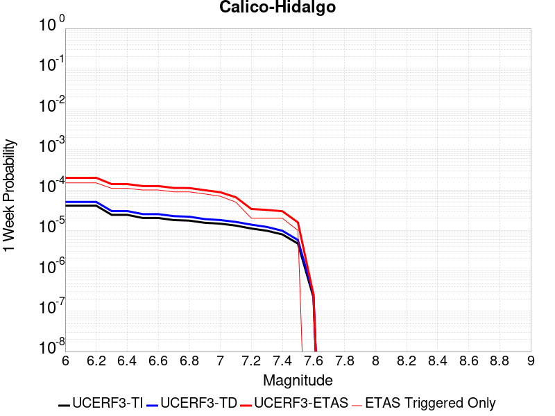 | 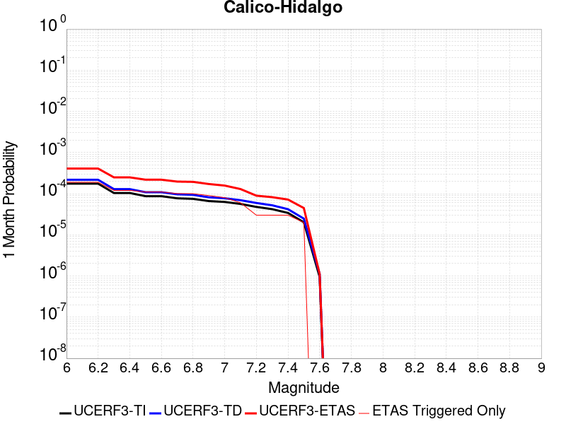 |  |  |

| Magnitude | 1 wk TI Prob | 1 wk TD Prob | 1 wk ETAS Prob | 1 wk ETAS/TD Gain | 1 wk ETAS Triggered Only | 1 mo TI Prob | 1 mo TD Prob | 1 mo ETAS Prob | 1 mo ETAS/TD Gain | 1 mo ETAS Triggered Only | 1 yr TI Prob | 1 yr TD Prob | 1 yr ETAS Prob | 1 yr ETAS/TD Gain | 1 yr ETAS Triggered Only | 10 yr TI Prob | 10 yr TD Prob | 10 yr ETAS Prob | 10 yr ETAS/TD Gain | 10 yr ETAS Triggered Only |
|-----|-----|-----|-----|-----|-----|-----|-----|-----|-----|-----|-----|-----|-----|-----|-----|-----|-----|-----|-----|-----|
| 6.0 | 4.0906612E-5 | 5.0703686E-5 | 1.3437445E-4 | 2.6501908 | 8.3675004E-5 | 1.7530227E-4 | 2.172857E-4 | 3.009425E-4 | 1.3850085 | 8.3675004E-5 | 0.0021322158 | 0.002642648 | 0.002726102 | 1.0315796 | 8.3675004E-5 | 0.02111873 | 0.026152607 | 0.026315581 | 1.0062317 | 1.6735001E-4 |
| 6.1 | 4.0906612E-5 | 5.0703686E-5 | 1.3437445E-4 | 2.6501908 | 8.3675004E-5 | 1.7530227E-4 | 2.172857E-4 | 3.009425E-4 | 1.3850085 | 8.3675004E-5 | 0.0021322158 | 0.002642648 | 0.002726102 | 1.0315796 | 8.3675004E-5 | 0.02111873 | 0.026152607 | 0.026315581 | 1.0062317 | 1.6735001E-4 |
| 6.2 | 4.0906612E-5 | 5.0703686E-5 | 1.3437445E-4 | 2.6501908 | 8.3675004E-5 | 1.7530227E-4 | 2.172857E-4 | 3.009425E-4 | 1.3850085 | 8.3675004E-5 | 0.0021322158 | 0.002642648 | 0.002726102 | 1.0315796 | 8.3675004E-5 | 0.02111873 | 0.026152607 | 0.026315581 | 1.0062317 | 1.6735001E-4 |
| 6.3 | 2.4242801E-5 | 3.0090669E-5 | 1.13763155E-4 | 3.780679 | 8.3675004E-5 | 1.0389358E-4 | 1.2895382E-4 | 2.1261803E-4 | 1.648792 | 8.3675004E-5 | 0.0012641704 | 0.0015689151 | 0.0016524588 | 1.0532494 | 8.3675004E-5 | 0.01257003 | 0.01558206 | 0.015664432 | 1.0052863 | 8.3675004E-5 |
| 6.4 | 2.4242801E-5 | 3.0090669E-5 | 1.13763155E-4 | 3.780679 | 8.3675004E-5 | 1.0389358E-4 | 1.2895382E-4 | 2.1261803E-4 | 1.648792 | 8.3675004E-5 | 0.0012641704 | 0.0015689151 | 0.0016524588 | 1.0532494 | 8.3675004E-5 | 0.01257003 | 0.01558206 | 0.015664432 | 1.0052863 | 8.3675004E-5 |
| 6.5 | 2.0286952E-5 | 2.5315738E-5 | 1.0898863E-4 | 4.305173 | 8.3675004E-5 | 8.694118E-5 | 1.0849161E-4 | 1.9215753E-4 | 1.7711742 | 8.3675004E-5 | 0.0010579949 | 0.001320102 | 0.0014036666 | 1.0633016 | 8.3675004E-5 | 0.010529719 | 0.013124538 | 0.013207114 | 1.0062917 | 8.3675004E-5 |
| 6.6 | 2.0269223E-5 | 2.5296687E-5 | 1.0896958E-4 | 4.307662 | 8.3675004E-5 | 8.6865206E-5 | 1.08409964E-4 | 1.920759E-4 | 1.771755 | 8.3675004E-5 | 0.0010570707 | 0.0013191093 | 0.0014026739 | 1.0633492 | 8.3675004E-5 | 0.010520565 | 0.013114728 | 0.013197306 | 1.0062965 | 8.3675004E-5 |
| 6.7 | 1.799852E-5 | 2.25406E-5 | 1.0621372E-4 | 4.712107 | 8.3675004E-5 | 7.713423E-5 | 9.659908E-5 | 1.80266E-4 | 1.8661255 | 8.3675004E-5 | 9.3870464E-4 | 0.0011754738 | 0.0012590504 | 1.0711004 | 8.3675004E-5 | 0.009347493 | 0.011694173 | 0.01177687 | 1.0070716 | 8.3675004E-5 |
| 6.8 | 1.7458793E-5 | 2.184212E-5 | 1.055153E-4 | 4.8308177 | 8.3675004E-5 | 7.4821255E-5 | 9.3605806E-5 | 1.7727299E-4 | 1.8938246 | 8.3675004E-5 | 9.10568E-4 | 0.0011390693 | 0.001222649 | 1.0733755 | 8.3675004E-5 | 0.009068459 | 0.011333893 | 0.01141662 | 1.0072991 | 8.3675004E-5 |
| 6.9 | 1.542884E-5 | 1.9025927E-5 | 1.0269934E-4 | 5.397863 | 8.3675004E-5 | 6.612192E-5 | 8.153721E-5 | 1.6520539E-4 | 2.026135 | 8.3675004E-5 | 8.04737E-4 | 9.922766E-4 | 0.0010758686 | 1.0842426 | 8.3675004E-5 | 0.008018291 | 0.009879857 | 0.009962706 | 1.0083855 | 8.3675004E-5 |
| 7.0 | 1.468253E-5 | 1.8030598E-5 | 1.017041E-4 | 5.640639 | 8.3675004E-5 | 6.292361E-5 | 7.7271776E-5 | 1.6094033E-4 | 2.0827827 | 8.3675004E-5 | 7.658257E-4 | 9.4039086E-4 | 0.0010239872 | 1.0888953 | 8.3675004E-5 | 0.0076319184 | 0.009365481 | 0.009448373 | 1.0088507 | 8.3675004E-5 |
| 7.1 | 1.3139281E-5 | 1.6200942E-5 | 1.6200942E-5 | 1.0 | 0.0 | 5.6309986E-5 | 6.943083E-5 | 6.943083E-5 | 1.0 | 0.0 | 6.853584E-4 | 8.4500515E-4 | 8.4500515E-4 | 1.0 | 0.0 | 0.0068324856 | 0.0084192185 | 0.0084192185 | 1.0 | 0.0 |
| 7.2 | 1.1127404E-5 | 1.3866597E-5 | 1.3866597E-5 | 1.0 | 0.0 | 4.7688E-5 | 5.942698E-5 | 5.942698E-5 | 1.0 | 0.0 | 5.8044674E-4 | 7.232942E-4 | 7.232942E-4 | 1.0 | 0.0 | 0.0057893298 | 0.0072105085 | 0.0072105085 | 1.0 | 0.0 |
| 7.3 | 9.808154E-6 | 1.2176215E-5 | 1.2176215E-5 | 1.0 | 0.0 | 4.2034266E-5 | 5.2182797E-5 | 5.2182797E-5 | 1.0 | 0.0 | 5.11647E-4 | 6.3515105E-4 | 6.3515105E-4 | 1.0 | 0.0 | 0.0051047057 | 0.006334433 | 0.006334433 | 1.0 | 0.0 |
| 7.4 | 7.942452E-6 | 9.792144E-6 | 9.792144E-6 | 1.0 | 0.0 | 3.4038632E-5 | 4.1965708E-5 | 4.1965708E-5 | 1.0 | 0.0 | 4.1434157E-4 | 5.1082217E-4 | 5.1082217E-4 | 1.0 | 0.0 | 0.0041356985 | 0.005097421 | 0.005097421 | 1.0 | 0.0 |
| 7.5 | 4.7121216E-6 | 5.772836E-6 | 5.772836E-6 | 1.0 | 0.0 | 2.019465E-5 | 2.4740535E-5 | 2.4740535E-5 | 1.0 | 0.0 | 2.4584212E-4 | 3.0118204E-4 | 3.0118204E-4 | 1.0 | 0.0 | 0.0024557032 | 0.0030084911 | 0.0030084911 | 1.0 | 0.0 |
| 7.6 | 2.21172E-7 | 2.603961E-7 | 2.603961E-7 | 1.0 | 0.0 | 9.478797E-7 | 1.1159829E-6 | 1.1159829E-6 | 1.0 | 0.0 | 1.1540374E-5 | 1.3587036E-5 | 1.3587036E-5 | 1.0 | 0.0 | 1.1539775E-4 | 1.3586486E-4 | 1.3586486E-4 | 1.0 | 0.0 |

## Big Pine (East)
*[(top)](#table-of-contents)*

| 1 Week | 1 Month | 1 Year | 10 Year |
|-----|-----|-----|-----|
|  |  |  |  |

| Magnitude | 1 wk TI Prob | 1 wk TD Prob | 1 wk ETAS Prob | 1 wk ETAS/TD Gain | 1 wk ETAS Triggered Only | 1 mo TI Prob | 1 mo TD Prob | 1 mo ETAS Prob | 1 mo ETAS/TD Gain | 1 mo ETAS Triggered Only | 1 yr TI Prob | 1 yr TD Prob | 1 yr ETAS Prob | 1 yr ETAS/TD Gain | 1 yr ETAS Triggered Only | 10 yr TI Prob | 10 yr TD Prob | 10 yr ETAS Prob | 10 yr ETAS/TD Gain | 10 yr ETAS Triggered Only |
|-----|-----|-----|-----|-----|-----|-----|-----|-----|-----|-----|-----|-----|-----|-----|-----|-----|-----|-----|-----|-----|
| 6.0 | 9.916913E-6 | 1.2816984E-5 | 1.2816984E-5 | 1.0 | 0.0 | 4.250036E-5 | 5.49289E-5 | 5.49289E-5 | 1.0 | 0.0 | 5.173191E-4 | 6.685763E-4 | 6.685763E-4 | 1.0 | 0.0 | 0.0051611643 | 0.006670441 | 0.0068366746 | 1.024921 | 1.6735001E-4 |
| 6.1 | 9.916913E-6 | 1.2816984E-5 | 1.2816984E-5 | 1.0 | 0.0 | 4.250036E-5 | 5.49289E-5 | 5.49289E-5 | 1.0 | 0.0 | 5.173191E-4 | 6.685763E-4 | 6.685763E-4 | 1.0 | 0.0 | 0.0051611643 | 0.006670441 | 0.0068366746 | 1.024921 | 1.6735001E-4 |
| 6.2 | 9.916913E-6 | 1.2816984E-5 | 1.2816984E-5 | 1.0 | 0.0 | 4.250036E-5 | 5.49289E-5 | 5.49289E-5 | 1.0 | 0.0 | 5.173191E-4 | 6.685763E-4 | 6.685763E-4 | 1.0 | 0.0 | 0.0051611643 | 0.006670441 | 0.0068366746 | 1.024921 | 1.6735001E-4 |
| 6.3 | 5.479711E-6 | 8.112951E-6 | 8.112951E-6 | 1.0 | 0.0 | 2.3484265E-5 | 3.4769346E-5 | 3.4769346E-5 | 1.0 | 0.0 | 2.858834E-4 | 4.2323777E-4 | 4.2323777E-4 | 1.0 | 0.0 | 0.0028551589 | 0.004227244 | 0.0043938863 | 1.0394211 | 1.6735001E-4 |
| 6.4 | 5.465009E-6 | 8.097245E-6 | 8.097245E-6 | 1.0 | 0.0 | 2.3421257E-5 | 3.4702036E-5 | 3.4702036E-5 | 1.0 | 0.0 | 2.851165E-4 | 4.2241855E-4 | 4.2241855E-4 | 1.0 | 0.0 | 0.0028475097 | 0.0042190826 | 0.0043857265 | 1.0394976 | 1.6735001E-4 |
| 6.5 | 4.826767E-6 | 7.422301E-6 | 7.422301E-6 | 1.0 | 0.0 | 2.068598E-5 | 3.180949E-5 | 3.180949E-5 | 1.0 | 0.0 | 2.518227E-4 | 3.872145E-4 | 3.872145E-4 | 1.0 | 0.0 | 0.0025153751 | 0.003868283 | 0.004034986 | 1.0430948 | 1.6735001E-4 |
| 6.6 | 4.3146847E-6 | 6.8822374E-6 | 6.8822374E-6 | 1.0 | 0.0 | 1.8491375E-5 | 2.9494982E-5 | 2.9494982E-5 | 1.0 | 0.0 | 2.2510924E-4 | 3.590447E-4 | 3.590447E-4 | 1.0 | 0.0 | 0.0022488134 | 0.0035874986 | 0.0037542481 | 1.0464808 | 1.6735001E-4 |
| 6.7 | 3.6968106E-6 | 5.9954727E-6 | 5.9954727E-6 | 1.0 | 0.0 | 1.5843378E-5 | 2.5694639E-5 | 2.5694639E-5 | 1.0 | 0.0 | 1.9287605E-4 | 3.1278885E-4 | 3.1278885E-4 | 1.0 | 0.0 | 0.0019270873 | 0.0031262483 | 0.0032930751 | 1.0533633 | 1.6735001E-4 |
| 6.8 | 3.4671132E-6 | 5.702177E-6 | 5.702177E-6 | 1.0 | 0.0 | 1.4858972E-5 | 2.4437682E-5 | 2.4437682E-5 | 1.0 | 0.0 | 1.8089297E-4 | 2.974896E-4 | 2.974896E-4 | 1.0 | 0.0 | 0.0018074579 | 0.002973667 | 0.0031405196 | 1.05611 | 1.6735001E-4 |
| 6.9 | 2.7686972E-6 | 4.825223E-6 | 4.825223E-6 | 1.0 | 0.0 | 1.1865792E-5 | 2.0679368E-5 | 2.0679368E-5 | 1.0 | 0.0 | 1.4445644E-4 | 2.5174298E-4 | 2.5174298E-4 | 1.0 | 0.0 | 0.0014436257 | 0.0025172636 | 0.0026841925 | 1.0663136 | 1.6735001E-4 |
| 7.0 | 2.1472624E-6 | 3.9850406E-6 | 3.9850406E-6 | 1.0 | 0.0 | 9.20252E-6 | 1.7078637E-5 | 1.7078637E-5 | 1.0 | 0.0 | 1.12034926E-4 | 2.079131E-4 | 2.079131E-4 | 1.0 | 0.0 | 0.0011197845 | 0.0020798394 | 0.0020798394 | 1.0 | 0.0 |
| 7.1 | 1.7018335E-6 | 3.344876E-6 | 3.344876E-6 | 1.0 | 0.0 | 7.293552E-6 | 1.4335106E-5 | 1.4335106E-5 | 1.0 | 0.0 | 8.879537E-5 | 1.7451629E-4 | 1.7451629E-4 | 1.0 | 0.0 | 8.87599E-4 | 0.0017464145 | 0.0017464145 | 1.0 | 0.0 |
| 7.2 | 1.25603E-6 | 2.794484E-6 | 2.794484E-6 | 1.0 | 0.0 | 5.3829745E-6 | 1.1976307E-5 | 1.1976307E-5 | 1.0 | 0.0 | 6.553574E-5 | 1.4580201E-4 | 1.4580201E-4 | 1.0 | 0.0 | 6.551642E-4 | 0.001459661 | 0.001459661 | 1.0 | 0.0 |
| 7.3 | 1.112297E-6 | 2.610332E-6 | 2.610332E-6 | 1.0 | 0.0 | 4.7669787E-6 | 1.118709E-5 | 1.118709E-5 | 1.0 | 0.0 | 5.803642E-5 | 1.3619453E-4 | 1.3619453E-4 | 1.0 | 0.0 | 5.802127E-4 | 0.0013635408 | 0.0013635408 | 1.0 | 0.0 |
| 7.4 | 1.0137181E-6 | 2.4834917E-6 | 2.4834917E-6 | 1.0 | 0.0 | 4.3444993E-6 | 1.0643494E-5 | 1.0643494E-5 | 1.0 | 0.0 | 5.2892992E-5 | 1.2957705E-4 | 1.2957705E-4 | 1.0 | 0.0 | 5.288041E-4 | 0.0012972289 | 0.0012972289 | 1.0 | 0.0 |
| 7.5 | 9.598608E-7 | 2.4071483E-6 | 2.4071483E-6 | 1.0 | 0.0 | 4.1136827E-6 | 1.031631E-5 | 1.031631E-5 | 1.0 | 0.0 | 5.0082934E-5 | 1.2559404E-4 | 1.2559404E-4 | 1.0 | 0.0 | 5.007165E-4 | 0.0012572526 | 0.0012572526 | 1.0 | 0.0 |
| 7.6 | 7.929459E-7 | 2.0448588E-6 | 2.0448588E-6 | 1.0 | 0.0 | 3.3983351E-6 | 8.763653E-6 | 8.763653E-6 | 1.0 | 0.0 | 4.1373947E-5 | 1.06692416E-4 | 1.06692416E-4 | 1.0 | 0.0 | 4.1366243E-4 | 0.0010685222 | 0.0010685222 | 1.0 | 0.0 |
| 7.7 | 4.155788E-7 | 1.1605589E-6 | 1.1605589E-6 | 1.0 | 0.0 | 1.7810507E-6 | 4.9738146E-6 | 4.9738146E-6 | 1.0 | 0.0 | 2.1684076E-5 | 6.0554554E-5 | 6.0554554E-5 | 1.0 | 0.0 | 2.1681961E-4 | 6.0857297E-4 | 6.0857297E-4 | 1.0 | 0.0 |
| 7.8 | 1.14666925E-7 | 2.592015E-7 | 2.592015E-7 | 1.0 | 0.0 | 4.914296E-7 | 1.1108631E-6 | 1.1108631E-6 | 1.0 | 0.0 | 5.9831386E-6 | 1.3524678E-5 | 1.3524678E-5 | 1.0 | 0.0 | 5.9829777E-5 | 1.3634123E-4 | 1.3634123E-4 | 1.0 | 0.0 |
| 7.9 | 2.9231824E-8 | 4.1463963E-8 | 4.1463963E-8 | 1.0 | 0.0 | 1.2527924E-7 | 1.7770269E-7 | 1.7770269E-7 | 1.0 | 0.0 | 1.5252737E-6 | 2.1635283E-6 | 2.1635283E-6 | 1.0 | 0.0 | 1.5252632E-5 | 2.1967755E-5 | 2.1967755E-5 | 1.0 | 0.0 |

## Bullion Mountains
*[(top)](#table-of-contents)*

| 1 Week | 1 Month | 1 Year | 10 Year |
|-----|-----|-----|-----|
|  |  |  |  |

| Magnitude | 1 wk TI Prob | 1 wk TD Prob | 1 wk ETAS Prob | 1 wk ETAS/TD Gain | 1 wk ETAS Triggered Only | 1 mo TI Prob | 1 mo TD Prob | 1 mo ETAS Prob | 1 mo ETAS/TD Gain | 1 mo ETAS Triggered Only | 1 yr TI Prob | 1 yr TD Prob | 1 yr ETAS Prob | 1 yr ETAS/TD Gain | 1 yr ETAS Triggered Only | 10 yr TI Prob | 10 yr TD Prob | 10 yr ETAS Prob | 10 yr ETAS/TD Gain | 10 yr ETAS Triggered Only |
|-----|-----|-----|-----|-----|-----|-----|-----|-----|-----|-----|-----|-----|-----|-----|-----|-----|-----|-----|-----|-----|
| 6.0 | 1.6420427E-5 | 1.4692089E-5 | 9.836587E-5 | 6.6951585 | 8.3675004E-5 | 7.037136E-5 | 6.296479E-5 | 1.4663453E-4 | 2.3288336 | 8.3675004E-5 | 8.5643446E-4 | 7.663651E-4 | 9.3358685E-4 | 1.2182012 | 1.6735001E-4 | 0.008531413 | 0.007641016 | 0.007807087 | 1.0217342 | 1.6735001E-4 |
| 6.1 | 1.6420427E-5 | 1.4692089E-5 | 9.836587E-5 | 6.6951585 | 8.3675004E-5 | 7.037136E-5 | 6.296479E-5 | 1.4663453E-4 | 2.3288336 | 8.3675004E-5 | 8.5643446E-4 | 7.663651E-4 | 9.3358685E-4 | 1.2182012 | 1.6735001E-4 | 0.008531413 | 0.007641016 | 0.007807087 | 1.0217342 | 1.6735001E-4 |
| 6.2 | 1.6420427E-5 | 1.4692089E-5 | 9.836587E-5 | 6.6951585 | 8.3675004E-5 | 7.037136E-5 | 6.296479E-5 | 1.4663453E-4 | 2.3288336 | 8.3675004E-5 | 8.5643446E-4 | 7.663651E-4 | 9.3358685E-4 | 1.2182012 | 1.6735001E-4 | 0.008531413 | 0.007641016 | 0.007807087 | 1.0217342 | 1.6735001E-4 |
| 6.3 | 1.2046778E-5 | 9.862335E-6 | 9.353652E-5 | 9.484216 | 8.3675004E-5 | 5.1628023E-5 | 4.2266598E-5 | 1.2593807E-4 | 2.979612 | 8.3675004E-5 | 6.283899E-4 | 5.144975E-4 | 6.817614E-4 | 1.3251015 | 1.6735001E-4 | 0.0062661595 | 0.005135345 | 0.0053018355 | 1.0324205 | 1.6735001E-4 |
| 6.4 | 1.2046778E-5 | 9.862335E-6 | 9.353652E-5 | 9.484216 | 8.3675004E-5 | 5.1628023E-5 | 4.2266598E-5 | 1.2593807E-4 | 2.979612 | 8.3675004E-5 | 6.283899E-4 | 5.144975E-4 | 6.817614E-4 | 1.3251015 | 1.6735001E-4 | 0.0062661595 | 0.005135345 | 0.0053018355 | 1.0324205 | 1.6735001E-4 |
| 6.5 | 1.0244343E-5 | 7.879458E-6 | 9.1553804E-5 | 11.619302 | 8.3675004E-5 | 4.390359E-5 | 3.3768785E-5 | 1.1744097E-4 | 3.4777966 | 8.3675004E-5 | 5.343951E-4 | 4.110781E-4 | 5.783593E-4 | 1.406933 | 1.6735001E-4 | 0.005331118 | 0.004105208 | 0.004271871 | 1.0405979 | 1.6735001E-4 |
| 6.6 | 9.605408E-6 | 7.1774966E-6 | 9.08519E-5 | 12.657882 | 8.3675004E-5 | 4.1165385E-5 | 3.076045E-5 | 1.14432885E-4 | 3.7201302 | 8.3675004E-5 | 5.010733E-4 | 3.744645E-4 | 5.4175186E-4 | 1.4467375 | 1.6735001E-4 | 0.00499945 | 0.003740332 | 0.003907056 | 1.0445746 | 1.6735001E-4 |
| 6.7 | 8.60418E-6 | 6.1240044E-6 | 8.97985E-5 | 14.6633625 | 8.3675004E-5 | 3.687454E-5 | 2.624558E-5 | 1.0991839E-4 | 4.1880727 | 8.3675004E-5 | 4.48855E-4 | 3.1951256E-4 | 4.8680912E-4 | 1.5235993 | 1.6735001E-4 | 0.004479495 | 0.0031924439 | 0.0033592596 | 1.0522534 | 1.6735001E-4 |
| 6.8 | 5.187994E-6 | 2.5631666E-6 | 8.623796E-5 | 33.645084 | 8.3675004E-5 | 2.223407E-5 | 1.0984976E-5 | 9.4659066E-5 | 8.617139 | 8.3675004E-5 | 2.7066618E-4 | 1.3373788E-4 | 2.1740168E-4 | 1.6255805 | 8.3675004E-5 | 0.0027033675 | 0.0013369655 | 0.0014205286 | 1.0625021 | 8.3675004E-5 |
| 6.9 | 4.5302368E-6 | 2.3443165E-6 | 8.601913E-5 | 36.692623 | 8.3675004E-5 | 1.9415156E-5 | 1.0047055E-5 | 9.372122E-5 | 9.328228 | 8.3675004E-5 | 2.3635388E-4 | 1.2232E-4 | 2.0598476E-4 | 1.6839828 | 8.3675004E-5 | 0.0023610266 | 0.0012229157 | 0.0013064884 | 1.0683389 | 8.3675004E-5 |
| 7.0 | 3.431668E-6 | 1.6882402E-6 | 8.5363106E-5 | 50.563366 | 8.3675004E-5 | 1.4707065E-5 | 7.235315E-6 | 9.0909714E-5 | 12.564721 | 8.3675004E-5 | 1.7904381E-4 | 8.808996E-5 | 1.717576E-4 | 1.9497976 | 8.3675004E-5 | 0.0017889962 | 8.808996E-4 | 9.6450094E-4 | 1.0949044 | 8.3675004E-5 |

## Camp Rock 2011
*[(top)](#table-of-contents)*

| 1 Week | 1 Month | 1 Year | 10 Year |
|-----|-----|-----|-----|
|  |  |  |  |

| Magnitude | 1 wk TI Prob | 1 wk TD Prob | 1 wk ETAS Prob | 1 wk ETAS/TD Gain | 1 wk ETAS Triggered Only | 1 mo TI Prob | 1 mo TD Prob | 1 mo ETAS Prob | 1 mo ETAS/TD Gain | 1 mo ETAS Triggered Only | 1 yr TI Prob | 1 yr TD Prob | 1 yr ETAS Prob | 1 yr ETAS/TD Gain | 1 yr ETAS Triggered Only | 10 yr TI Prob | 10 yr TD Prob | 10 yr ETAS Prob | 10 yr ETAS/TD Gain | 10 yr ETAS Triggered Only |
|-----|-----|-----|-----|-----|-----|-----|-----|-----|-----|-----|-----|-----|-----|-----|-----|-----|-----|-----|-----|-----|
| 6.0 | 1.6710783E-5 | 4.25026E-6 | 1.7159956E-4 | 40.373894 | 1.6735001E-4 | 7.161568E-5 | 1.8215276E-5 | 1.8556224E-4 | 10.187177 | 1.6735001E-4 | 8.7157206E-4 | 2.2174895E-4 | 3.8906187E-4 | 1.7545149 | 1.6735001E-4 | 0.008681616 | 0.0022153298 | 0.002382309 | 1.0753745 | 1.6735001E-4 |
| 6.1 | 1.6710783E-5 | 4.25026E-6 | 1.7159956E-4 | 40.373894 | 1.6735001E-4 | 7.161568E-5 | 1.8215276E-5 | 1.8556224E-4 | 10.187177 | 1.6735001E-4 | 8.7157206E-4 | 2.2174895E-4 | 3.8906187E-4 | 1.7545149 | 1.6735001E-4 | 0.008681616 | 0.0022153298 | 0.002382309 | 1.0753745 | 1.6735001E-4 |
| 6.2 | 1.6710783E-5 | 4.25026E-6 | 1.7159956E-4 | 40.373894 | 1.6735001E-4 | 7.161568E-5 | 1.8215276E-5 | 1.8556224E-4 | 10.187177 | 1.6735001E-4 | 8.7157206E-4 | 2.2174895E-4 | 3.8906187E-4 | 1.7545149 | 1.6735001E-4 | 0.008681616 | 0.0022153298 | 0.002382309 | 1.0753745 | 1.6735001E-4 |
| 6.3 | 1.6710783E-5 | 4.25026E-6 | 1.7159956E-4 | 40.373894 | 1.6735001E-4 | 7.161568E-5 | 1.8215276E-5 | 1.8556224E-4 | 10.187177 | 1.6735001E-4 | 8.7157206E-4 | 2.2174895E-4 | 3.8906187E-4 | 1.7545149 | 1.6735001E-4 | 0.008681616 | 0.0022153298 | 0.002382309 | 1.0753745 | 1.6735001E-4 |
| 6.4 | 7.982846E-6 | 3.6820884E-6 | 1.7103148E-4 | 46.449585 | 1.6735001E-4 | 3.421175E-5 | 1.5780286E-5 | 1.8312766E-4 | 11.604837 | 1.6735001E-4 | 4.1644843E-4 | 1.9210839E-4 | 3.5942625E-4 | 1.8709556 | 1.6735001E-4 | 0.0041566887 | 0.001919458 | 0.002086487 | 1.0870187 | 1.6735001E-4 |
| 6.5 | 7.982846E-6 | 3.6820884E-6 | 1.7103148E-4 | 46.449585 | 1.6735001E-4 | 3.421175E-5 | 1.5780286E-5 | 1.8312766E-4 | 11.604837 | 1.6735001E-4 | 4.1644843E-4 | 1.9210839E-4 | 3.5942625E-4 | 1.8709556 | 1.6735001E-4 | 0.0041566887 | 0.001919458 | 0.002086487 | 1.0870187 | 1.6735001E-4 |
| 6.6 | 7.048869E-6 | 3.4243571E-6 | 1.707738E-4 | 49.870323 | 1.6735001E-4 | 3.0209088E-5 | 1.4675736E-5 | 1.8202329E-4 | 12.403009 | 1.6735001E-4 | 3.677336E-4 | 1.7866275E-4 | 3.4598287E-4 | 1.9365137 | 1.6735001E-4 | 0.0036712566 | 0.0017852228 | 0.001952274 | 1.0935744 | 1.6735001E-4 |
| 6.7 | 6.987307E-6 | 3.3623348E-6 | 1.7071179E-4 | 50.7718 | 1.6735001E-4 | 2.9945259E-5 | 1.4409929E-5 | 1.8175752E-4 | 12.613355 | 1.6735001E-4 | 3.6452254E-4 | 1.7542706E-4 | 3.4274772E-4 | 1.9537904 | 1.6735001E-4 | 0.0036392517 | 0.001752917 | 0.0019199736 | 1.0953021 | 1.6735001E-4 |
| 6.8 | 6.3737602E-6 | 3.1179077E-6 | 1.7046739E-4 | 54.673653 | 1.6735001E-4 | 2.731583E-5 | 1.3362394E-5 | 1.8071017E-4 | 13.523787 | 1.6735001E-4 | 3.3251947E-4 | 1.626753E-4 | 3.299981E-4 | 2.0285692 | 1.6735001E-4 | 0.0033202237 | 0.0016255907 | 0.0017926687 | 1.1027799 | 1.6735001E-4 |
| 6.9 | 6.112211E-6 | 2.9331156E-6 | 1.7028264E-4 | 58.05521 | 1.6735001E-4 | 2.6194928E-5 | 1.2570436E-5 | 1.7991835E-4 | 14.312817 | 1.6735001E-4 | 3.1887658E-4 | 1.5303459E-4 | 3.20359E-4 | 2.0933764 | 1.6735001E-4 | 0.003184194 | 0.0015293199 | 0.001696414 | 1.1092604 | 1.6735001E-4 |
| 7.0 | 5.5140117E-6 | 2.641923E-6 | 1.6999149E-4 | 64.34385 | 1.6735001E-4 | 2.3631264E-5 | 1.132248E-5 | 1.786706E-4 | 15.780166 | 1.6735001E-4 | 2.8767265E-4 | 1.3784273E-4 | 3.0516967E-4 | 2.2138977 | 1.6735001E-4 | 0.0028730053 | 0.0013775975 | 0.0015447169 | 1.1213123 | 1.6735001E-4 |
| 7.1 | 4.8151105E-6 | 2.1342705E-6 | 1.6948393E-4 | 79.410706 | 1.6735001E-4 | 2.0636026E-5 | 9.146843E-6 | 1.7649532E-4 | 19.295765 | 1.6735001E-4 | 2.5121463E-4 | 1.1135734E-4 | 2.786887E-4 | 2.5026524 | 1.6735001E-4 | 0.0025093083 | 0.0011130372 | 0.001280201 | 1.150187 | 1.6735001E-4 |
| 7.2 | 3.818335E-6 | 1.2937425E-6 | 8.496864E-5 | 65.67663 | 8.3675004E-5 | 1.6364189E-5 | 5.5445994E-6 | 8.921914E-5 | 16.091179 | 8.3675004E-5 | 1.9921579E-4 | 6.750349E-5 | 1.5117285E-4 | 2.239482 | 8.3675004E-5 | 0.0019903728 | 6.748381E-4 | 7.584566E-4 | 1.123909 | 8.3675004E-5 |
| 7.3 | 2.7166698E-6 | 7.3835776E-7 | 8.44133E-5 | 114.325745 | 8.3675004E-5 | 1.1642818E-5 | 3.1643867E-6 | 8.683913E-5 | 27.44264 | 8.3675004E-5 | 1.4174209E-4 | 3.8525748E-5 | 1.2219753E-4 | 3.1718407 | 8.3675004E-5 | 0.0014165172 | 3.851927E-4 | 4.6883547E-4 | 1.2171453 | 8.3675004E-5 |
| 7.4 | 2.0893426E-6 | 5.4618386E-7 | 8.4221145E-5 | 154.19926 | 8.3675004E-5 | 8.954295E-6 | 2.3407858E-6 | 8.60156E-5 | 36.74646 | 8.3675004E-5 | 1.0901308E-4 | 2.84987E-5 | 1.1217132E-4 | 3.9360154 | 8.3675004E-5 | 0.0010895962 | 2.84951E-4 | 3.6860217E-4 | 1.2935634 | 8.3675004E-5 |
| 7.5 | 1.1681728E-6 | 3.6030585E-7 | 8.403528E-5 | 233.23318 | 8.3675004E-5 | 5.0064455E-6 | 1.544167E-6 | 8.521904E-5 | 55.18771 | 8.3675004E-5 | 6.0951766E-5 | 1.8800076E-5 | 1.0247351E-4 | 5.4506965 | 8.3675004E-5 | 6.093505E-4 | 1.8798532E-4 | 2.716446E-4 | 1.4450309 | 8.3675004E-5 |
| 7.6 | 1.3154387E-7 | 7.1197384E-8 | 7.1197384E-8 | 1.0 | 0.0 | 5.6375933E-7 | 3.051316E-7 | 3.051316E-7 | 1.0 | 0.0 | 6.863748E-6 | 3.7149728E-6 | 3.7149728E-6 | 1.0 | 0.0 | 6.863536E-5 | 3.7149264E-5 | 3.7149264E-5 | 1.0 | 0.0 |

## Pleito
*[(top)](#table-of-contents)*

| 1 Week | 1 Month | 1 Year | 10 Year |
|-----|-----|-----|-----|
|  |  |  |  |

| Magnitude | 1 wk TI Prob | 1 wk TD Prob | 1 wk ETAS Prob | 1 wk ETAS/TD Gain | 1 wk ETAS Triggered Only | 1 mo TI Prob | 1 mo TD Prob | 1 mo ETAS Prob | 1 mo ETAS/TD Gain | 1 mo ETAS Triggered Only | 1 yr TI Prob | 1 yr TD Prob | 1 yr ETAS Prob | 1 yr ETAS/TD Gain | 1 yr ETAS Triggered Only | 10 yr TI Prob | 10 yr TD Prob | 10 yr ETAS Prob | 10 yr ETAS/TD Gain | 10 yr ETAS Triggered Only |
|-----|-----|-----|-----|-----|-----|-----|-----|-----|-----|-----|-----|-----|-----|-----|-----|-----|-----|-----|-----|-----|
| 6.0 | 1.6763008E-5 | 2.4763838E-5 | 2.4763838E-5 | 1.0 | 0.0 | 7.183948E-5 | 1.0612683E-4 | 1.0612683E-4 | 1.0 | 0.0 | 8.742947E-4 | 0.0012914003 | 0.0014585342 | 1.1294206 | 1.6735001E-4 | 0.00870863 | 0.0129538905 | 0.013119073 | 1.0127516 | 1.6735001E-4 |
| 6.1 | 1.6763008E-5 | 2.4763838E-5 | 2.4763838E-5 | 1.0 | 0.0 | 7.183948E-5 | 1.0612683E-4 | 1.0612683E-4 | 1.0 | 0.0 | 8.742947E-4 | 0.0012914003 | 0.0014585342 | 1.1294206 | 1.6735001E-4 | 0.00870863 | 0.0129538905 | 0.013119073 | 1.0127516 | 1.6735001E-4 |
| 6.2 | 1.6763008E-5 | 2.4763838E-5 | 2.4763838E-5 | 1.0 | 0.0 | 7.183948E-5 | 1.0612683E-4 | 1.0612683E-4 | 1.0 | 0.0 | 8.742947E-4 | 0.0012914003 | 0.0014585342 | 1.1294206 | 1.6735001E-4 | 0.00870863 | 0.0129538905 | 0.013119073 | 1.0127516 | 1.6735001E-4 |
| 6.3 | 1.6763008E-5 | 2.4763838E-5 | 2.4763838E-5 | 1.0 | 0.0 | 7.183948E-5 | 1.0612683E-4 | 1.0612683E-4 | 1.0 | 0.0 | 8.742947E-4 | 0.0012914003 | 0.0014585342 | 1.1294206 | 1.6735001E-4 | 0.00870863 | 0.0129538905 | 0.013119073 | 1.0127516 | 1.6735001E-4 |
| 6.4 | 1.6763008E-5 | 2.4763838E-5 | 2.4763838E-5 | 1.0 | 0.0 | 7.183948E-5 | 1.0612683E-4 | 1.0612683E-4 | 1.0 | 0.0 | 8.742947E-4 | 0.0012914003 | 0.0014585342 | 1.1294206 | 1.6735001E-4 | 0.00870863 | 0.0129538905 | 0.013119073 | 1.0127516 | 1.6735001E-4 |
| 6.5 | 1.6763008E-5 | 2.4763838E-5 | 2.4763838E-5 | 1.0 | 0.0 | 7.183948E-5 | 1.0612683E-4 | 1.0612683E-4 | 1.0 | 0.0 | 8.742947E-4 | 0.0012914003 | 0.0014585342 | 1.1294206 | 1.6735001E-4 | 0.00870863 | 0.0129538905 | 0.013119073 | 1.0127516 | 1.6735001E-4 |
| 6.6 | 9.910213E-6 | 1.7214623E-5 | 1.7214623E-5 | 1.0 | 0.0 | 4.247165E-5 | 7.377489E-5 | 7.377489E-5 | 1.0 | 0.0 | 5.169696E-4 | 8.978429E-4 | 9.814427E-4 | 1.0931119 | 8.3675004E-5 | 0.0051576863 | 0.009050702 | 0.009133619 | 1.0091615 | 8.3675004E-5 |
| 6.7 | 9.910213E-6 | 1.7214623E-5 | 1.7214623E-5 | 1.0 | 0.0 | 4.247165E-5 | 7.377489E-5 | 7.377489E-5 | 1.0 | 0.0 | 5.169696E-4 | 8.978429E-4 | 9.814427E-4 | 1.0931119 | 8.3675004E-5 | 0.0051576863 | 0.009050702 | 0.009133619 | 1.0091615 | 8.3675004E-5 |
| 6.8 | 8.300162E-6 | 1.5474232E-5 | 1.5474232E-5 | 1.0 | 0.0 | 3.557164E-5 | 6.631646E-5 | 6.631646E-5 | 1.0 | 0.0 | 4.3299864E-4 | 8.071053E-4 | 8.071053E-4 | 1.0 | 0.0 | 0.004321559 | 0.008150139 | 0.008150139 | 1.0 | 0.0 |
| 6.9 | 8.183114E-6 | 1.5345448E-5 | 1.5345448E-5 | 1.0 | 0.0 | 3.5070017E-5 | 6.576455E-5 | 6.576455E-5 | 1.0 | 0.0 | 4.2689382E-4 | 8.003907E-4 | 8.003907E-4 | 1.0 | 0.0 | 0.0042607468 | 0.008083483 | 0.008083483 | 1.0 | 0.0 |
| 7.0 | 7.1748823E-6 | 1.413244E-5 | 1.413244E-5 | 1.0 | 0.0 | 3.0749135E-5 | 6.0566195E-5 | 6.0566195E-5 | 1.0 | 0.0 | 3.743064E-4 | 7.371445E-4 | 7.371445E-4 | 1.0 | 0.0 | 0.0037367654 | 0.007454939 | 0.007454939 | 1.0 | 0.0 |
| 7.1 | 7.1671807E-6 | 1.412281E-5 | 1.412281E-5 | 1.0 | 0.0 | 3.0716128E-5 | 6.052493E-5 | 6.052493E-5 | 1.0 | 0.0 | 3.7390468E-4 | 7.366424E-4 | 7.366424E-4 | 1.0 | 0.0 | 0.0037327618 | 0.0074499524 | 0.0074499524 | 1.0 | 0.0 |
| 7.2 | 7.0649667E-6 | 1.39701015E-5 | 1.39701015E-5 | 1.0 | 0.0 | 3.0278077E-5 | 5.9870494E-5 | 5.9870494E-5 | 1.0 | 0.0 | 3.6857324E-4 | 7.2868E-4 | 7.2868E-4 | 1.0 | 0.0 | 0.0036796255 | 0.0073707094 | 0.0073707094 | 1.0 | 0.0 |
| 7.3 | 7.02082E-6 | 1.3913556E-5 | 1.3913556E-5 | 1.0 | 0.0 | 3.008888E-5 | 5.9628168E-5 | 5.9628168E-5 | 1.0 | 0.0 | 3.6627054E-4 | 7.2573166E-4 | 7.2573166E-4 | 1.0 | 0.0 | 0.0036566744 | 0.007341209 | 0.007341209 | 1.0 | 0.0 |
| 7.4 | 6.987146E-6 | 1.3873118E-5 | 1.3873118E-5 | 1.0 | 0.0 | 2.9944567E-5 | 5.945487E-5 | 5.945487E-5 | 1.0 | 0.0 | 3.6451413E-4 | 7.2362315E-4 | 7.2362315E-4 | 1.0 | 0.0 | 0.0036391679 | 0.007320144 | 0.007320144 | 1.0 | 0.0 |
| 7.5 | 6.9494554E-6 | 1.3830024E-5 | 1.3830024E-5 | 1.0 | 0.0 | 2.9783041E-5 | 5.9270187E-5 | 5.9270187E-5 | 1.0 | 0.0 | 3.625482E-4 | 7.2137616E-4 | 7.2137616E-4 | 1.0 | 0.0 | 0.0036195726 | 0.0072977724 | 0.0072977724 | 1.0 | 0.0 |
| 7.6 | 6.92694E-6 | 1.3789138E-5 | 1.3789138E-5 | 1.0 | 0.0 | 2.9686547E-5 | 5.909497E-5 | 5.909497E-5 | 1.0 | 0.0 | 3.6137376E-4 | 7.1924424E-4 | 7.1924424E-4 | 1.0 | 0.0 | 0.0036078666 | 0.0072765257 | 0.0072765257 | 1.0 | 0.0 |
| 7.7 | 6.395867E-6 | 1.2668219E-5 | 1.2668219E-5 | 1.0 | 0.0 | 2.741057E-5 | 5.429124E-5 | 5.429124E-5 | 1.0 | 0.0 | 3.336726E-4 | 6.6079566E-4 | 6.6079566E-4 | 1.0 | 0.0 | 0.0033317201 | 0.0066951844 | 0.0066951844 | 1.0 | 0.0 |
| 7.8 | 5.8664327E-6 | 1.153586E-5 | 1.153586E-5 | 1.0 | 0.0 | 2.5141611E-5 | 4.9438466E-5 | 4.9438466E-5 | 1.0 | 0.0 | 3.060561E-4 | 6.017473E-4 | 6.017473E-4 | 1.0 | 0.0 | 0.0030563495 | 0.0061006667 | 0.0061006667 | 1.0 | 0.0 |
| 7.9 | 3.7167474E-6 | 7.1140853E-6 | 7.1140853E-6 | 1.0 | 0.0 | 1.592882E-5 | 3.0488582E-5 | 3.0488582E-5 | 1.0 | 0.0 | 1.9391612E-4 | 3.7113542E-4 | 3.7113542E-4 | 1.0 | 0.0 | 0.0019374699 | 0.0037674906 | 0.0037674906 | 1.0 | 0.0 |
| 8.0 | 1.0903841E-6 | 1.2879392E-6 | 1.2879392E-6 | 1.0 | 0.0 | 4.6730665E-6 | 5.5197274E-6 | 5.5197274E-6 | 1.0 | 0.0 | 5.68931E-5 | 6.720063E-5 | 6.720063E-5 | 1.0 | 0.0 | 5.6878536E-4 | 6.941948E-4 | 6.941948E-4 | 1.0 | 0.0 |
| 8.1 | 2.6894583E-7 | 1.1060341E-7 | 1.1060341E-7 | 1.0 | 0.0 | 1.1526245E-6 | 4.740145E-7 | 4.740145E-7 | 1.0 | 0.0 | 1.4033113E-5 | 5.7711113E-6 | 5.7711113E-6 | 1.0 | 0.0 | 1.4032227E-4 | 6.456908E-5 | 6.456908E-5 | 1.0 | 0.0 |
| 8.2 | 5.2967013E-9 | 2.4578228E-9 | 2.4578228E-9 | 1.0 | 0.0 | 2.2700148E-8 | 1.0533527E-8 | 1.0533527E-8 | 1.0 | 0.0 | 2.7637427E-7 | 1.2824569E-7 | 1.2824569E-7 | 1.0 | 0.0 | 2.7637393E-6 | 1.4592787E-6 | 1.4592787E-6 | 1.0 | 0.0 |

## North Frontal  (West)
*[(top)](#table-of-contents)*

| 1 Week | 1 Month | 1 Year | 10 Year |
|-----|-----|-----|-----|
|  |  |  |  |

| Magnitude | 1 wk TI Prob | 1 wk TD Prob | 1 wk ETAS Prob | 1 wk ETAS/TD Gain | 1 wk ETAS Triggered Only | 1 mo TI Prob | 1 mo TD Prob | 1 mo ETAS Prob | 1 mo ETAS/TD Gain | 1 mo ETAS Triggered Only | 1 yr TI Prob | 1 yr TD Prob | 1 yr ETAS Prob | 1 yr ETAS/TD Gain | 1 yr ETAS Triggered Only | 10 yr TI Prob | 10 yr TD Prob | 10 yr ETAS Prob | 10 yr ETAS/TD Gain | 10 yr ETAS Triggered Only |
|-----|-----|-----|-----|-----|-----|-----|-----|-----|-----|-----|-----|-----|-----|-----|-----|-----|-----|-----|-----|-----|
| 6.0 | 4.7316266E-6 | 4.8526726E-6 | 8.8527275E-5 | 18.242992 | 8.3675004E-5 | 2.0278241E-5 | 2.0797012E-5 | 1.8814355E-4 | 9.046662 | 1.6735001E-4 | 2.4685962E-4 | 2.5317568E-4 | 4.204833E-4 | 1.6608362 | 1.6735001E-4 | 0.0024658558 | 0.0025290183 | 0.002695945 | 1.0660045 | 1.6735001E-4 |
| 6.1 | 4.7316266E-6 | 4.8526726E-6 | 8.8527275E-5 | 18.242992 | 8.3675004E-5 | 2.0278241E-5 | 2.0797012E-5 | 1.8814355E-4 | 9.046662 | 1.6735001E-4 | 2.4685962E-4 | 2.5317568E-4 | 4.204833E-4 | 1.6608362 | 1.6735001E-4 | 0.0024658558 | 0.0025290183 | 0.002695945 | 1.0660045 | 1.6735001E-4 |
| 6.2 | 4.7316266E-6 | 4.8526726E-6 | 8.8527275E-5 | 18.242992 | 8.3675004E-5 | 2.0278241E-5 | 2.0797012E-5 | 1.8814355E-4 | 9.046662 | 1.6735001E-4 | 2.4685962E-4 | 2.5317568E-4 | 4.204833E-4 | 1.6608362 | 1.6735001E-4 | 0.0024658558 | 0.0025290183 | 0.002695945 | 1.0660045 | 1.6735001E-4 |
| 6.3 | 4.7316266E-6 | 4.8526726E-6 | 8.8527275E-5 | 18.242992 | 8.3675004E-5 | 2.0278241E-5 | 2.0797012E-5 | 1.8814355E-4 | 9.046662 | 1.6735001E-4 | 2.4685962E-4 | 2.5317568E-4 | 4.204833E-4 | 1.6608362 | 1.6735001E-4 | 0.0024658558 | 0.0025290183 | 0.002695945 | 1.0660045 | 1.6735001E-4 |
| 6.4 | 4.7316266E-6 | 4.8526726E-6 | 8.8527275E-5 | 18.242992 | 8.3675004E-5 | 2.0278241E-5 | 2.0797012E-5 | 1.8814355E-4 | 9.046662 | 1.6735001E-4 | 2.4685962E-4 | 2.5317568E-4 | 4.204833E-4 | 1.6608362 | 1.6735001E-4 | 0.0024658558 | 0.0025290183 | 0.002695945 | 1.0660045 | 1.6735001E-4 |
| 6.5 | 4.7316266E-6 | 4.8526726E-6 | 8.8527275E-5 | 18.242992 | 8.3675004E-5 | 2.0278241E-5 | 2.0797012E-5 | 1.8814355E-4 | 9.046662 | 1.6735001E-4 | 2.4685962E-4 | 2.5317568E-4 | 4.204833E-4 | 1.6608362 | 1.6735001E-4 | 0.0024658558 | 0.0025290183 | 0.002695945 | 1.0660045 | 1.6735001E-4 |
| 6.6 | 4.7316266E-6 | 4.8526726E-6 | 8.8527275E-5 | 18.242992 | 8.3675004E-5 | 2.0278241E-5 | 2.0797012E-5 | 1.8814355E-4 | 9.046662 | 1.6735001E-4 | 2.4685962E-4 | 2.5317568E-4 | 4.204833E-4 | 1.6608362 | 1.6735001E-4 | 0.0024658558 | 0.0025290183 | 0.002695945 | 1.0660045 | 1.6735001E-4 |
| 6.7 | 3.5382777E-6 | 3.6308859E-6 | 8.730559E-5 | 24.045258 | 8.3675004E-5 | 1.516396E-5 | 1.5560852E-5 | 1.8290826E-4 | 11.754386 | 1.6735001E-4 | 1.8460557E-4 | 1.8943768E-4 | 3.5675598E-4 | 1.8832368 | 1.6735001E-4 | 0.0018445229 | 0.0018928389 | 0.002059872 | 1.0882448 | 1.6735001E-4 |
| 6.8 | 3.5382777E-6 | 3.6308859E-6 | 8.730559E-5 | 24.045258 | 8.3675004E-5 | 1.516396E-5 | 1.5560852E-5 | 1.8290826E-4 | 11.754386 | 1.6735001E-4 | 1.8460557E-4 | 1.8943768E-4 | 3.5675598E-4 | 1.8832368 | 1.6735001E-4 | 0.0018445229 | 0.0018928389 | 0.002059872 | 1.0882448 | 1.6735001E-4 |
| 6.9 | 3.0428037E-6 | 3.1227605E-6 | 8.67975E-5 | 27.79512 | 8.3675004E-5 | 1.30405215E-5 | 1.33831945E-5 | 1.8073097E-4 | 13.504322 | 1.6735001E-4 | 1.5875678E-4 | 1.6292889E-4 | 3.3025164E-4 | 2.026968 | 1.6735001E-4 | 0.0015864341 | 0.0016281615 | 0.001795239 | 1.1026173 | 1.6735001E-4 |
| 7.0 | 2.538778E-6 | 2.6060904E-6 | 8.628088E-5 | 33.107403 | 8.3675004E-5 | 1.0880432E-5 | 1.1168913E-5 | 1.7851706E-4 | 15.983386 | 1.6735001E-4 | 1.324612E-4 | 1.3597352E-4 | 3.0330077E-4 | 2.2305872 | 1.6735001E-4 | 0.0013238228 | 0.0013589499 | 0.0015260725 | 1.1229792 | 1.6735001E-4 |
| 7.1 | 2.2418935E-6 | 2.3012074E-6 | 8.597602E-5 | 37.361267 | 8.3675004E-5 | 9.60808E-6 | 9.862282E-6 | 1.7721065E-4 | 17.968523 | 1.6735001E-4 | 1.1697209E-4 | 1.2006712E-4 | 2.8739704E-4 | 2.3936365 | 1.6735001E-4 | 0.0011691054 | 0.0012000664 | 0.0013672155 | 1.1392833 | 1.6735001E-4 |
| 7.2 | 1.6526745E-6 | 1.6924851E-6 | 8.536735E-5 | 50.439056 | 8.3675004E-5 | 7.082872E-6 | 7.253489E-6 | 1.7460229E-4 | 24.071491 | 1.6735001E-4 | 8.623055E-5 | 8.8307905E-5 | 2.5564313E-4 | 2.8949068 | 1.6735001E-4 | 8.61971E-4 | 8.827532E-4 | 0.0010499555 | 1.18941 | 1.6735001E-4 |
| 7.3 | 1.0246019E-6 | 1.0442261E-6 | 8.471915E-5 | 81.13104 | 8.3675004E-5 | 4.391144E-6 | 4.4752474E-6 | 1.718245E-4 | 38.394417 | 1.6735001E-4 | 5.3460866E-5 | 5.448489E-5 | 2.2182579E-4 | 4.0713263 | 1.6735001E-4 | 5.344801E-4 | 5.4472685E-4 | 7.119857E-4 | 1.3070508 | 1.6735001E-4 |
| 7.4 | 8.9045164E-7 | 9.0565584E-7 | 8.4580584E-5 | 93.39153 | 8.3675004E-5 | 3.8162157E-6 | 3.8813773E-6 | 1.7123074E-4 | 44.115974 | 1.6735001E-4 | 4.646144E-5 | 4.7254853E-5 | 2.1459696E-4 | 4.5412683 | 1.6735001E-4 | 4.6451724E-4 | 4.7245892E-4 | 6.3972984E-4 | 1.3540434 | 1.6735001E-4 |
| 7.5 | 6.3357E-7 | 6.4027006E-7 | 8.431522E-5 | 131.68697 | 8.3675004E-5 | 2.7152971E-6 | 2.744012E-6 | 1.7009357E-4 | 61.987183 | 1.6735001E-4 | 3.305824E-5 | 3.34079E-5 | 2.0075233E-4 | 6.009127 | 1.6735001E-4 | 3.3053322E-4 | 3.3403534E-4 | 5.013295E-4 | 1.5008276 | 1.6735001E-4 |
| 7.6 | 2.5087024E-7 | 2.4361097E-7 | 8.3918596E-5 | 344.4779 | 8.3675004E-5 | 1.0751578E-6 | 1.0440467E-6 | 8.4718966E-5 | 81.1448 | 8.3675004E-5 | 1.3089967E-5 | 1.2711216E-5 | 9.6385156E-5 | 7.582686 | 8.3675004E-5 | 1.3089196E-4 | 1.2710695E-4 | 2.1077132E-4 | 1.6582203 | 8.3675004E-5 |
| 7.7 | 3.282987E-8 | 2.2874195E-8 | 2.2874195E-8 | 1.0 | 0.0 | 1.4069944E-7 | 9.803227E-8 | 9.803227E-8 | 1.0 | 0.0 | 1.7130144E-6 | 1.1935423E-6 | 1.1935423E-6 | 1.0 | 0.0 | 1.7130013E-5 | 1.1935367E-5 | 1.1935367E-5 | 1.0 | 0.0 |
| 7.8 | 8.77499E-9 | 5.6815956E-9 | 5.6815956E-9 | 1.0 | 0.0 | 3.7607098E-8 | 2.4349696E-8 | 2.4349696E-8 | 1.0 | 0.0 | 4.578663E-7 | 2.9645753E-7 | 2.9645753E-7 | 1.0 | 0.0 | 4.5786537E-6 | 2.9645726E-6 | 2.9645726E-6 | 1.0 | 0.0 |

## Brawley (Seismic Zone) alt 1
*[(top)](#table-of-contents)*

| 1 Week | 1 Month | 1 Year | 10 Year |
|-----|-----|-----|-----|
|  |  |  |  |

| Magnitude | 1 wk TI Prob | 1 wk TD Prob | 1 wk ETAS Prob | 1 wk ETAS/TD Gain | 1 wk ETAS Triggered Only | 1 mo TI Prob | 1 mo TD Prob | 1 mo ETAS Prob | 1 mo ETAS/TD Gain | 1 mo ETAS Triggered Only | 1 yr TI Prob | 1 yr TD Prob | 1 yr ETAS Prob | 1 yr ETAS/TD Gain | 1 yr ETAS Triggered Only | 10 yr TI Prob | 10 yr TD Prob | 10 yr ETAS Prob | 10 yr ETAS/TD Gain | 10 yr ETAS Triggered Only |
|-----|-----|-----|-----|-----|-----|-----|-----|-----|-----|-----|-----|-----|-----|-----|-----|-----|-----|-----|-----|-----|
| 6.0 | 2.2521618E-4 | 4.7632487E-4 | 4.7632487E-4 | 1.0 | 0.0 | 9.6485513E-4 | 0.0020398323 | 0.0020398323 | 1.0 | 0.0 | 0.011683988 | 0.024546238 | 0.024546238 | 1.0 | 0.0 | 0.11088423 | 0.21350002 | 0.21363164 | 1.0006164 | 1.6735001E-4 |
| 6.1 | 2.2521618E-4 | 4.7632487E-4 | 4.7632487E-4 | 1.0 | 0.0 | 9.6485513E-4 | 0.0020398323 | 0.0020398323 | 1.0 | 0.0 | 0.011683988 | 0.024546238 | 0.024546238 | 1.0 | 0.0 | 0.11088423 | 0.21350002 | 0.21363164 | 1.0006164 | 1.6735001E-4 |
| 6.2 | 2.198148E-4 | 4.6717093E-4 | 4.6717093E-4 | 1.0 | 0.0 | 9.417233E-4 | 0.0020006616 | 0.0020006616 | 1.0 | 0.0 | 0.011405343 | 0.024080504 | 0.024080504 | 1.0 | 0.0 | 0.10837428 | 0.20993657 | 0.21006879 | 1.0006298 | 1.6735001E-4 |
| 6.3 | 2.1704129E-4 | 4.615278E-4 | 4.615278E-4 | 1.0 | 0.0 | 9.298453E-4 | 0.0019765133 | 0.0019765133 | 1.0 | 0.0 | 0.011262234 | 0.02379366 | 0.02379366 | 1.0 | 0.0 | 0.107082725 | 0.20782755 | 0.20796011 | 1.0006379 | 1.6735001E-4 |
| 6.4 | 1.876142E-4 | 4.00449E-4 | 4.00449E-4 | 1.0 | 0.0 | 8.038131E-4 | 0.0017150956 | 0.0017150956 | 1.0 | 0.0 | 0.00974259 | 0.020680401 | 0.020680401 | 1.0 | 0.0 | 0.093263686 | 0.18457815 | 0.18471462 | 1.0007393 | 1.6735001E-4 |
| 6.5 | 1.7390939E-4 | 3.7477075E-4 | 3.7477075E-4 | 1.0 | 0.0 | 7.45113E-4 | 0.0016051838 | 0.0016051838 | 1.0 | 0.0 | 0.009034078 | 0.019368723 | 0.019368723 | 1.0 | 0.0 | 0.086755216 | 0.17440031 | 0.17453848 | 1.0007923 | 1.6735001E-4 |
| 6.6 | 1.591791E-4 | 3.4891962E-4 | 3.4891962E-4 | 1.0 | 0.0 | 6.8201777E-4 | 0.0014945229 | 0.0014945229 | 1.0 | 0.0 | 0.008271996 | 0.018045569 | 0.018045569 | 1.0 | 0.0 | 0.07970774 | 0.16380852 | 0.16394846 | 1.0008543 | 1.6735001E-4 |
| 6.7 | 1.4268003E-4 | 3.20582E-4 | 3.20582E-4 | 1.0 | 0.0 | 6.1134255E-4 | 0.0013732077 | 0.0013732077 | 1.0 | 0.0 | 0.007417723 | 0.016592601 | 0.016592601 | 1.0 | 0.0 | 0.07174956 | 0.15193306 | 0.152075 | 1.0009341 | 1.6735001E-4 |
| 6.8 | 1.239713E-4 | 2.9053655E-4 | 2.9053655E-4 | 1.0 | 0.0 | 5.3119735E-4 | 0.0012445687 | 0.0012445687 | 1.0 | 0.0 | 0.0064481674 | 0.015048777 | 0.015048777 | 1.0 | 0.0 | 0.06264243 | 0.13837762 | 0.13852182 | 1.001042 | 1.6735001E-4 |
| 6.9 | 1.0180238E-4 | 2.625439E-4 | 2.625439E-4 | 1.0 | 0.0 | 4.3622297E-4 | 0.0011247073 | 0.0011247073 | 1.0 | 0.0 | 0.005298089 | 0.013608336 | 0.013608336 | 1.0 | 0.0 | 0.05173543 | 0.124961674 | 0.12510811 | 1.0011718 | 1.6735001E-4 |
| 7.0 | 7.6619996E-5 | 2.23993E-4 | 2.23993E-4 | 1.0 | 0.0 | 3.283301E-4 | 9.5962E-4 | 9.5962E-4 | 1.0 | 0.0 | 0.0039900932 | 0.011621496 | 0.011621496 | 1.0 | 0.0 | 0.039192066 | 0.107266866 | 0.107416265 | 1.0013927 | 1.6735001E-4 |
| 7.1 | 7.5127435E-5 | 2.2082464E-4 | 2.2082464E-4 | 1.0 | 0.0 | 3.2193496E-4 | 9.4605127E-4 | 9.4605127E-4 | 1.0 | 0.0 | 0.0039125155 | 0.011458045 | 0.011458045 | 1.0 | 0.0 | 0.038443442 | 0.10583085 | 0.105980486 | 1.001414 | 1.6735001E-4 |
| 7.2 | 6.788582E-5 | 2.0210193E-4 | 2.0210193E-4 | 1.0 | 0.0 | 2.9090676E-4 | 8.6586666E-4 | 8.6586666E-4 | 1.0 | 0.0 | 0.0035360386 | 0.0104916105 | 0.0104916105 | 1.0 | 0.0 | 0.034803 | 0.09750131 | 0.097652346 | 1.001549 | 1.6735001E-4 |
| 7.3 | 6.399602E-5 | 1.8841137E-4 | 1.8841137E-4 | 1.0 | 0.0 | 2.7423984E-4 | 8.072303E-4 | 8.072303E-4 | 1.0 | 0.0 | 0.0033337586 | 0.009784332 | 0.009784332 | 1.0 | 0.0 | 0.03284188 | 0.09139617 | 0.09154822 | 1.0016637 | 1.6735001E-4 |
| 7.4 | 4.506759E-5 | 1.2529209E-4 | 1.2529209E-4 | 1.0 | 0.0 | 1.9313251E-4 | 5.368565E-4 | 5.368565E-4 | 1.0 | 0.0 | 0.0023488526 | 0.0065168133 | 0.0065168133 | 1.0 | 0.0 | 0.023241805 | 0.062363707 | 0.062520616 | 1.0025162 | 1.6735001E-4 |
| 7.5 | 3.43289E-5 | 9.33541E-5 | 9.33541E-5 | 1.0 | 0.0 | 1.4711556E-4 | 4.00028E-4 | 4.00028E-4 | 1.0 | 0.0 | 0.0017896603 | 0.0048595266 | 0.0048595266 | 1.0 | 0.0 | 0.01775316 | 0.04705519 | 0.047214665 | 1.0033891 | 1.6735001E-4 |
| 7.6 | 2.5980507E-5 | 7.053101E-5 | 7.053101E-5 | 1.0 | 0.0 | 1.1134028E-4 | 3.0224086E-4 | 3.0224086E-4 | 1.0 | 0.0 | 0.001354725 | 0.003673598 | 0.003673598 | 1.0 | 0.0 | 0.013464959 | 0.035840835 | 0.036002185 | 1.0045019 | 1.6735001E-4 |
| 7.7 | 1.7292105E-5 | 4.9407296E-5 | 4.9407296E-5 | 1.0 | 0.0 | 7.4106916E-5 | 2.117284E-4 | 2.117284E-4 | 1.0 | 0.0 | 9.018782E-4 | 0.0025747516 | 0.0025747516 | 1.0 | 0.0 | 0.008982267 | 0.025290398 | 0.025453515 | 1.0064498 | 1.6735001E-4 |
| 7.8 | 1.2927471E-5 | 3.9693266E-5 | 3.9693266E-5 | 1.0 | 0.0 | 5.5402274E-5 | 1.7010293E-4 | 1.7010293E-4 | 1.0 | 0.0 | 6.743139E-4 | 0.0020690386 | 0.0020690386 | 1.0 | 0.0 | 0.0067227143 | 0.020431727 | 0.020595659 | 1.0080234 | 1.6735001E-4 |
| 7.9 | 1.0200774E-5 | 2.874569E-5 | 2.874569E-5 | 1.0 | 0.0 | 4.371687E-5 | 1.2319001E-4 | 1.2319001E-4 | 1.0 | 0.0 | 5.321229E-4 | 0.0014988075 | 0.0014988075 | 1.0 | 0.0 | 0.005308505 | 0.014991644 | 0.015074064 | 1.0054978 | 8.3675004E-5 |
| 8.0 | 8.650396E-6 | 2.3277367E-5 | 2.3277367E-5 | 1.0 | 0.0 | 3.70726E-5 | 9.975634E-5 | 9.975634E-5 | 1.0 | 0.0 | 4.5126543E-4 | 0.0012138576 | 0.0012138576 | 1.0 | 0.0 | 0.0045035016 | 0.012211097 | 0.01229375 | 1.0067687 | 8.3675004E-5 |
| 8.1 | 3.9368224E-6 | 7.3279825E-6 | 7.3279825E-6 | 1.0 | 0.0 | 1.6871985E-5 | 3.140526E-5 | 3.140526E-5 | 1.0 | 0.0 | 2.0539707E-4 | 3.8229208E-4 | 3.8229208E-4 | 1.0 | 0.0 | 0.0020520731 | 0.004001185 | 0.004001185 | 1.0 | 0.0 |
| 8.2 | 1.7101195E-6 | 2.217876E-6 | 2.217876E-6 | 1.0 | 0.0 | 7.329063E-6 | 9.505149E-6 | 9.505149E-6 | 1.0 | 0.0 | 8.922769E-5 | 1.1571907E-4 | 1.1571907E-4 | 1.0 | 0.0 | 8.9191867E-4 | 0.0012666774 | 0.0012666774 | 1.0 | 0.0 |
| 8.3 | 3.0346666E-8 | 1.721586E-8 | 1.721586E-8 | 1.0 | 0.0 | 1.3005713E-7 | 7.378226E-8 | 7.378226E-8 | 1.0 | 0.0 | 1.5834444E-6 | 8.9829894E-7 | 8.9829894E-7 | 1.0 | 0.0 | 1.5834332E-5 | 9.367729E-6 | 9.367729E-6 | 1.0 | 0.0 |

## Cleghorn
*[(top)](#table-of-contents)*

| 1 Week | 1 Month | 1 Year | 10 Year |
|-----|-----|-----|-----|
|  |  |  |  |

| Magnitude | 1 wk TI Prob | 1 wk TD Prob | 1 wk ETAS Prob | 1 wk ETAS/TD Gain | 1 wk ETAS Triggered Only | 1 mo TI Prob | 1 mo TD Prob | 1 mo ETAS Prob | 1 mo ETAS/TD Gain | 1 mo ETAS Triggered Only | 1 yr TI Prob | 1 yr TD Prob | 1 yr ETAS Prob | 1 yr ETAS/TD Gain | 1 yr ETAS Triggered Only | 10 yr TI Prob | 10 yr TD Prob | 10 yr ETAS Prob | 10 yr ETAS/TD Gain | 10 yr ETAS Triggered Only |
|-----|-----|-----|-----|-----|-----|-----|-----|-----|-----|-----|-----|-----|-----|-----|-----|-----|-----|-----|-----|-----|
| 6.0 | 7.9267165E-6 | 9.831582E-6 | 9.350577E-5 | 9.510755 | 8.3675004E-5 | 3.39712E-5 | 4.2134732E-5 | 2.094777E-4 | 4.9716153 | 1.6735001E-4 | 4.1352084E-4 | 5.128803E-4 | 6.801444E-4 | 1.3261272 | 1.6735001E-4 | 0.004127522 | 0.0051320773 | 0.0052985684 | 1.0324413 | 1.6735001E-4 |
| 6.1 | 7.9267165E-6 | 9.831582E-6 | 9.350577E-5 | 9.510755 | 8.3675004E-5 | 3.39712E-5 | 4.2134732E-5 | 2.094777E-4 | 4.9716153 | 1.6735001E-4 | 4.1352084E-4 | 5.128803E-4 | 6.801444E-4 | 1.3261272 | 1.6735001E-4 | 0.004127522 | 0.0051320773 | 0.0052985684 | 1.0324413 | 1.6735001E-4 |
| 6.2 | 7.9267165E-6 | 9.831582E-6 | 9.350577E-5 | 9.510755 | 8.3675004E-5 | 3.39712E-5 | 4.2134732E-5 | 2.094777E-4 | 4.9716153 | 1.6735001E-4 | 4.1352084E-4 | 5.128803E-4 | 6.801444E-4 | 1.3261272 | 1.6735001E-4 | 0.004127522 | 0.0051320773 | 0.0052985684 | 1.0324413 | 1.6735001E-4 |
| 6.3 | 7.9267165E-6 | 9.831582E-6 | 9.350577E-5 | 9.510755 | 8.3675004E-5 | 3.39712E-5 | 4.2134732E-5 | 2.094777E-4 | 4.9716153 | 1.6735001E-4 | 4.1352084E-4 | 5.128803E-4 | 6.801444E-4 | 1.3261272 | 1.6735001E-4 | 0.004127522 | 0.0051320773 | 0.0052985684 | 1.0324413 | 1.6735001E-4 |
| 6.4 | 4.3445207E-6 | 6.0914435E-6 | 8.976594E-5 | 14.736399 | 8.3675004E-5 | 1.8619241E-5 | 2.610593E-5 | 1.9345157E-4 | 7.410254 | 1.6735001E-4 | 2.2666567E-4 | 3.1779436E-4 | 4.8509118E-4 | 1.5264311 | 1.6735001E-4 | 0.0022643462 | 0.0031875873 | 0.003354404 | 1.0523332 | 1.6735001E-4 |
| 6.5 | 4.3445207E-6 | 6.0914435E-6 | 8.976594E-5 | 14.736399 | 8.3675004E-5 | 1.8619241E-5 | 2.610593E-5 | 1.9345157E-4 | 7.410254 | 1.6735001E-4 | 2.2666567E-4 | 3.1779436E-4 | 4.8509118E-4 | 1.5264311 | 1.6735001E-4 | 0.0022643462 | 0.0031875873 | 0.003354404 | 1.0523332 | 1.6735001E-4 |
| 6.6 | 4.040109E-6 | 5.773851E-6 | 8.9448375E-5 | 15.491978 | 8.3675004E-5 | 1.7314638E-5 | 2.4744846E-5 | 1.9209072E-4 | 7.7628574 | 1.6735001E-4 | 2.1078532E-4 | 3.012278E-4 | 4.685274E-4 | 1.5553923 | 1.6735001E-4 | 0.002105855 | 0.003022377 | 0.0031892213 | 1.055203 | 1.6735001E-4 |
| 6.7 | 3.3632055E-6 | 5.067348E-6 | 8.874193E-5 | 17.512499 | 8.3675004E-5 | 1.4413658E-5 | 2.1717027E-5 | 1.890634E-4 | 8.705769 | 1.6735001E-4 | 1.7547216E-4 | 2.6437303E-4 | 4.316788E-4 | 1.6328398 | 1.6735001E-4 | 0.0017533366 | 0.0026547113 | 0.0028216168 | 1.0628716 | 1.6735001E-4 |
| 6.8 | 3.2902772E-6 | 4.9892556E-6 | 8.8663845E-5 | 17.770956 | 8.3675004E-5 | 1.4101111E-5 | 2.1382351E-5 | 1.8872878E-4 | 8.826382 | 1.6735001E-4 | 1.716675E-4 | 2.6029933E-4 | 4.276058E-4 | 1.6427463 | 1.6735001E-4 | 0.0017153495 | 0.0026140702 | 0.0027809828 | 1.0638516 | 1.6735001E-4 |
| 6.9 | 3.031547E-6 | 4.6910186E-6 | 8.836563E-5 | 18.837196 | 8.3675004E-5 | 1.299228E-5 | 2.0104211E-5 | 1.8745086E-4 | 9.32396 | 1.6735001E-4 | 1.5816953E-4 | 2.4474156E-4 | 4.120506E-4 | 1.6836152 | 1.6735001E-4 | 0.00158057 | 0.0024588439 | 0.0026257823 | 1.0678931 | 1.6735001E-4 |
| 7.0 | 2.8259715E-6 | 4.3705895E-6 | 8.804523E-5 | 20.144934 | 8.3675004E-5 | 1.211125E-5 | 1.8730963E-5 | 1.8607784E-4 | 9.9342375 | 1.6735001E-4 | 1.4744449E-4 | 2.2802586E-4 | 3.953377E-4 | 1.7337407 | 1.6735001E-4 | 0.001473467 | 0.0022920412 | 0.0024590075 | 1.0728462 | 1.6735001E-4 |
| 7.1 | 2.5962665E-6 | 4.0658106E-6 | 8.7740475E-5 | 21.580069 | 8.3675004E-5 | 1.1126809E-5 | 1.7424789E-5 | 1.8477188E-4 | 10.603968 | 1.6735001E-4 | 1.3546048E-4 | 2.1212637E-4 | 3.7944087E-4 | 1.7887492 | 1.6735001E-4 | 0.0013537793 | 0.002133366 | 0.0023003588 | 1.0782768 | 1.6735001E-4 |
| 7.2 | 2.3247253E-6 | 3.6763672E-6 | 8.7351065E-5 | 23.760159 | 8.3675004E-5 | 9.96307E-6 | 1.5755764E-5 | 1.8310314E-4 | 11.621343 | 1.6735001E-4 | 1.21293626E-4 | 1.9180974E-4 | 3.5912765E-4 | 1.8723118 | 1.6735001E-4 | 0.0012122744 | 0.0019305905 | 0.0020976174 | 1.086516 | 1.6735001E-4 |
| 7.3 | 2.056928E-6 | 3.2350938E-6 | 8.690983E-5 | 26.864702 | 8.3675004E-5 | 8.815376E-6 | 1.3864615E-5 | 1.8121231E-4 | 13.070129 | 1.6735001E-4 | 1.0732192E-4 | 1.6878877E-4 | 3.3611053E-4 | 1.9913087 | 1.6735001E-4 | 0.001072701 | 0.0017008206 | 0.001867886 | 1.0982263 | 1.6735001E-4 |
| 7.4 | 1.8055999E-6 | 2.8255042E-6 | 8.650027E-5 | 30.614101 | 8.3675004E-5 | 7.738263E-6 | 1.2109249E-5 | 1.7945723E-4 | 14.819849 | 1.6735001E-4 | 9.4209274E-5 | 1.4742027E-4 | 3.1474562E-4 | 2.1350226 | 1.6735001E-4 | 9.4169343E-4 | 0.0014875771 | 0.0016546781 | 1.112331 | 1.6735001E-4 |
| 7.5 | 1.4683443E-6 | 2.4247483E-6 | 8.609955E-5 | 35.508656 | 8.3675004E-5 | 6.292889E-6 | 1.0391738E-5 | 1.7774002E-4 | 17.103973 | 1.6735001E-4 | 7.661323E-5 | 1.2651215E-4 | 2.93841E-4 | 2.3226304 | 1.6735001E-4 | 7.658682E-4 | 0.0012787961 | 0.0014459322 | 1.130698 | 1.6735001E-4 |
| 7.6 | 9.804088E-7 | 1.900266E-6 | 8.557511E-5 | 45.033226 | 8.3675004E-5 | 4.201745E-6 | 8.143972E-6 | 9.18183E-5 | 11.274387 | 8.3675004E-5 | 5.1155046E-5 | 9.91484E-5 | 1.8281511E-4 | 1.8438534 | 8.3675004E-5 | 5.114327E-4 | 0.001005471 | 0.001089062 | 1.0831361 | 8.3675004E-5 |
| 7.7 | 7.3434086E-7 | 1.6284146E-6 | 1.6284146E-6 | 1.0 | 0.0 | 3.1471714E-6 | 6.978901E-6 | 6.978901E-6 | 1.0 | 0.0 | 3.831614E-5 | 8.4964835E-5 | 8.4964835E-5 | 1.0 | 0.0 | 3.8309532E-4 | 8.6378685E-4 | 8.6378685E-4 | 1.0 | 0.0 |
| 7.8 | 6.434184E-7 | 1.5220047E-6 | 1.5220047E-6 | 1.0 | 0.0 | 2.7575045E-6 | 6.5228614E-6 | 6.5228614E-6 | 1.0 | 0.0 | 3.35721E-5 | 7.941297E-5 | 7.941297E-5 | 1.0 | 0.0 | 3.3567028E-4 | 8.079678E-4 | 8.079678E-4 | 1.0 | 0.0 |
| 7.9 | 3.4943926E-7 | 7.574459E-7 | 7.574459E-7 | 1.0 | 0.0 | 1.497596E-6 | 3.2461926E-6 | 3.2461926E-6 | 1.0 | 0.0 | 1.8233079E-5 | 3.952169E-5 | 3.952169E-5 | 1.0 | 0.0 | 1.8231584E-4 | 4.040099E-4 | 4.040099E-4 | 1.0 | 0.0 |
| 8.0 | 6.717524E-8 | 5.838828E-8 | 5.838828E-8 | 1.0 | 0.0 | 2.8789387E-7 | 2.5023547E-7 | 2.5023547E-7 | 1.0 | 0.0 | 3.505102E-6 | 3.0466126E-6 | 3.0466126E-6 | 1.0 | 0.0 | 3.5050467E-5 | 3.273506E-5 | 3.273506E-5 | 1.0 | 0.0 |
| 8.1 | 3.1984914E-8 | 1.2956093E-8 | 1.2956093E-8 | 1.0 | 0.0 | 1.370782E-7 | 5.552611E-8 | 5.552611E-8 | 1.0 | 0.0 | 1.6689258E-6 | 6.760302E-7 | 6.760302E-7 | 1.0 | 0.0 | 1.6689133E-5 | 7.74454E-6 | 7.74454E-6 | 1.0 | 0.0 |
| 8.2 | 1.21887656E-8 | 3.6495305E-9 | 3.6495305E-9 | 1.0 | 0.0 | 5.2237567E-8 | 1.5640845E-8 | 1.5640845E-8 | 1.0 | 0.0 | 6.359922E-7 | 1.9042727E-7 | 1.9042727E-7 | 1.0 | 0.0 | 6.3599036E-6 | 2.2470974E-6 | 2.2470974E-6 | 1.0 | 0.0 |

## Santa Ynez (East)
*[(top)](#table-of-contents)*

| 1 Week | 1 Month | 1 Year | 10 Year |
|-----|-----|-----|-----|
| 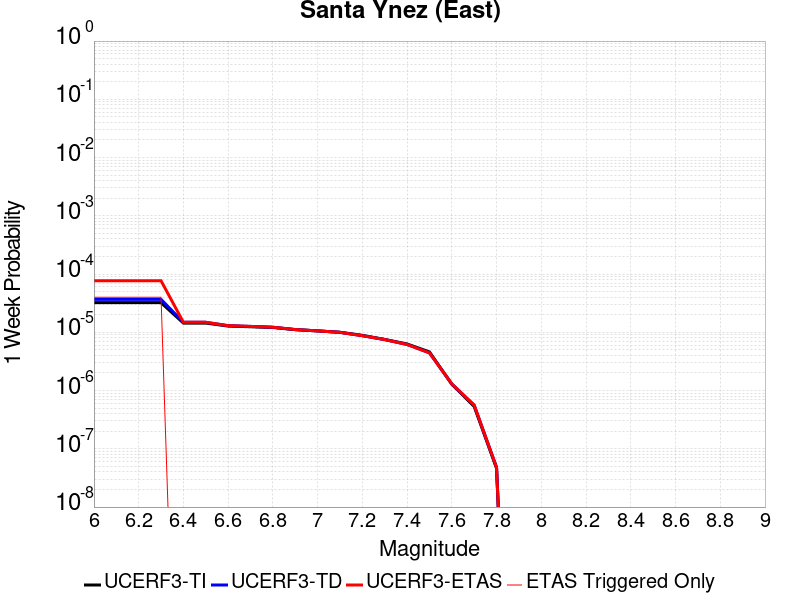 |  | 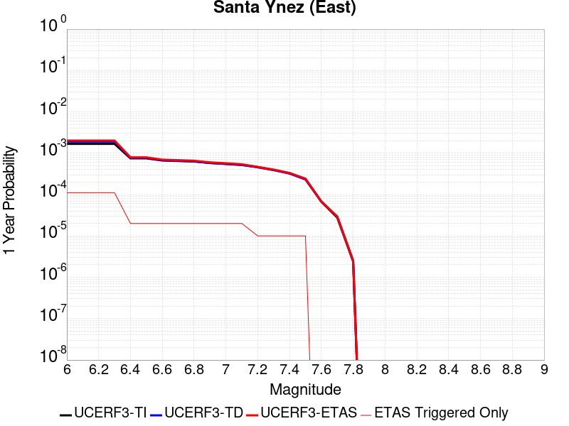 |  |

| Magnitude | 1 wk TI Prob | 1 wk TD Prob | 1 wk ETAS Prob | 1 wk ETAS/TD Gain | 1 wk ETAS Triggered Only | 1 mo TI Prob | 1 mo TD Prob | 1 mo ETAS Prob | 1 mo ETAS/TD Gain | 1 mo ETAS Triggered Only | 1 yr TI Prob | 1 yr TD Prob | 1 yr ETAS Prob | 1 yr ETAS/TD Gain | 1 yr ETAS Triggered Only | 10 yr TI Prob | 10 yr TD Prob | 10 yr ETAS Prob | 10 yr ETAS/TD Gain | 10 yr ETAS Triggered Only |
|-----|-----|-----|-----|-----|-----|-----|-----|-----|-----|-----|-----|-----|-----|-----|-----|-----|-----|-----|-----|-----|
| 6.0 | 3.2269712E-5 | 3.67505E-5 | 3.67505E-5 | 1.0 | 0.0 | 1.3829143E-4 | 1.5749598E-4 | 2.411578E-4 | 1.5311998 | 8.3675004E-5 | 0.0016823979 | 0.0019164166 | 0.0019999312 | 1.0435785 | 8.3675004E-5 | 0.016697178 | 0.019056441 | 0.019220602 | 1.0086144 | 1.6735001E-4 |
| 6.1 | 3.2269712E-5 | 3.67505E-5 | 3.67505E-5 | 1.0 | 0.0 | 1.3829143E-4 | 1.5749598E-4 | 2.411578E-4 | 1.5311998 | 8.3675004E-5 | 0.0016823979 | 0.0019164166 | 0.0019999312 | 1.0435785 | 8.3675004E-5 | 0.016697178 | 0.019056441 | 0.019220602 | 1.0086144 | 1.6735001E-4 |
| 6.2 | 3.2269712E-5 | 3.67505E-5 | 3.67505E-5 | 1.0 | 0.0 | 1.3829143E-4 | 1.5749598E-4 | 2.411578E-4 | 1.5311998 | 8.3675004E-5 | 0.0016823979 | 0.0019164166 | 0.0019999312 | 1.0435785 | 8.3675004E-5 | 0.016697178 | 0.019056441 | 0.019220602 | 1.0086144 | 1.6735001E-4 |
| 6.3 | 3.2269712E-5 | 3.67505E-5 | 3.67505E-5 | 1.0 | 0.0 | 1.3829143E-4 | 1.5749598E-4 | 2.411578E-4 | 1.5311998 | 8.3675004E-5 | 0.0016823979 | 0.0019164166 | 0.0019999312 | 1.0435785 | 8.3675004E-5 | 0.016697178 | 0.019056441 | 0.019220602 | 1.0086144 | 1.6735001E-4 |
| 6.4 | 1.4404779E-5 | 1.4849382E-5 | 1.4849382E-5 | 1.0 | 0.0 | 6.1733306E-5 | 6.363868E-5 | 6.363868E-5 | 1.0 | 0.0 | 7.513438E-4 | 7.745306E-4 | 7.745306E-4 | 1.0 | 0.0 | 0.0074880854 | 0.007718862 | 0.007718862 | 1.0 | 0.0 |
| 6.5 | 1.4404779E-5 | 1.4849382E-5 | 1.4849382E-5 | 1.0 | 0.0 | 6.1733306E-5 | 6.363868E-5 | 6.363868E-5 | 1.0 | 0.0 | 7.513438E-4 | 7.745306E-4 | 7.745306E-4 | 1.0 | 0.0 | 0.0074880854 | 0.007718862 | 0.007718862 | 1.0 | 0.0 |
| 6.6 | 1.280208E-5 | 1.3011947E-5 | 1.3011947E-5 | 1.0 | 0.0 | 5.4864904E-5 | 5.5764307E-5 | 5.5764307E-5 | 1.0 | 0.0 | 6.6777546E-4 | 6.787207E-4 | 6.787207E-4 | 1.0 | 0.0 | 0.006657724 | 0.0067666885 | 0.0067666885 | 1.0 | 0.0 |
| 6.7 | 1.2457027E-5 | 1.2628468E-5 | 1.2628468E-5 | 1.0 | 0.0 | 5.3386164E-5 | 5.412089E-5 | 5.412089E-5 | 1.0 | 0.0 | 6.497827E-4 | 6.587243E-4 | 6.587243E-4 | 1.0 | 0.0 | 0.00647886 | 0.006567915 | 0.006567915 | 1.0 | 0.0 |
| 6.8 | 1.2095134E-5 | 1.2230915E-5 | 1.2230915E-5 | 1.0 | 0.0 | 5.1835254E-5 | 5.241716E-5 | 5.241716E-5 | 1.0 | 0.0 | 6.309115E-4 | 6.379937E-4 | 6.379937E-4 | 1.0 | 0.0 | 0.0062912325 | 0.006361809 | 0.006361809 | 1.0 | 0.0 |
| 6.9 | 1.1104036E-5 | 1.1157347E-5 | 1.1157347E-5 | 1.0 | 0.0 | 4.758786E-5 | 4.781633E-5 | 4.781633E-5 | 1.0 | 0.0 | 5.7922816E-4 | 5.820096E-4 | 5.820096E-4 | 1.0 | 0.0 | 0.005777207 | 0.0058049993 | 0.0058049993 | 1.0 | 0.0 |
| 7.0 | 1.0577444E-5 | 1.058168E-5 | 1.058168E-5 | 1.0 | 0.0 | 4.5331115E-5 | 4.5349276E-5 | 4.5349276E-5 | 1.0 | 0.0 | 5.5176654E-4 | 5.519888E-4 | 5.519888E-4 | 1.0 | 0.0 | 0.0055039856 | 0.0055063153 | 0.0055063153 | 1.0 | 0.0 |
| 7.1 | 1.0021775E-5 | 9.980988E-6 | 9.980988E-6 | 1.0 | 0.0 | 4.294976E-5 | 4.2774966E-5 | 4.2774966E-5 | 1.0 | 0.0 | 5.2278786E-4 | 5.2066194E-4 | 5.2066194E-4 | 1.0 | 0.0 | 0.0052155964 | 0.0051945536 | 0.0051945536 | 1.0 | 0.0 |
| 7.2 | 8.874109E-6 | 8.748793E-6 | 8.748793E-6 | 1.0 | 0.0 | 3.8031343E-5 | 3.7494297E-5 | 3.7494297E-5 | 1.0 | 0.0 | 4.629332E-4 | 4.5639853E-4 | 4.5639853E-4 | 1.0 | 0.0 | 0.0046197 | 0.0045547304 | 0.0045547304 | 1.0 | 0.0 |
| 7.3 | 7.5504267E-6 | 7.5051175E-6 | 7.5051175E-6 | 1.0 | 0.0 | 3.235857E-5 | 3.21644E-5 | 3.21644E-5 | 1.0 | 0.0 | 3.9389438E-4 | 3.915322E-4 | 3.915322E-4 | 1.0 | 0.0 | 0.0039319694 | 0.003908531 | 0.003908531 | 1.0 | 0.0 |
| 7.4 | 6.309394E-6 | 6.1831556E-6 | 6.1831556E-6 | 1.0 | 0.0 | 2.703998E-5 | 2.6498974E-5 | 2.6498974E-5 | 1.0 | 0.0 | 3.2916202E-4 | 3.225782E-4 | 3.225782E-4 | 1.0 | 0.0 | 0.003286749 | 0.003221197 | 0.003221197 | 1.0 | 0.0 |
| 7.5 | 4.6103073E-6 | 4.4408903E-6 | 4.4408903E-6 | 1.0 | 0.0 | 1.975831E-5 | 1.9032252E-5 | 1.9032252E-5 | 1.0 | 0.0 | 2.4053088E-4 | 2.3169373E-4 | 2.3169373E-4 | 1.0 | 0.0 | 0.002402707 | 0.002314591 | 0.002314591 | 1.0 | 0.0 |
| 7.6 | 1.2858658E-6 | 1.3008173E-6 | 1.3008173E-6 | 1.0 | 0.0 | 5.5108417E-6 | 5.5749197E-6 | 5.5749197E-6 | 1.0 | 0.0 | 6.7092435E-5 | 6.78726E-5 | 6.78726E-5 | 1.0 | 0.0 | 6.707218E-4 | 6.785256E-4 | 6.785256E-4 | 1.0 | 0.0 |
| 7.7 | 5.3302307E-7 | 5.612138E-7 | 5.612138E-7 | 1.0 | 0.0 | 2.2843826E-6 | 2.4052001E-6 | 2.4052001E-6 | 1.0 | 0.0 | 2.7812002E-5 | 2.9282954E-5 | 2.9282954E-5 | 1.0 | 0.0 | 2.7808524E-4 | 2.9279452E-4 | 2.9279452E-4 | 1.0 | 0.0 |
| 7.8 | 4.613933E-8 | 4.80301E-8 | 4.80301E-8 | 1.0 | 0.0 | 1.9773998E-7 | 2.0584326E-7 | 2.0584326E-7 | 1.0 | 0.0 | 2.4074816E-6 | 2.5061388E-6 | 2.5061388E-6 | 1.0 | 0.0 | 2.4074554E-5 | 2.5061116E-5 | 2.5061116E-5 | 1.0 | 0.0 |

## Santa Rosa Island
*[(top)](#table-of-contents)*

| 1 Week | 1 Month | 1 Year | 10 Year |
|-----|-----|-----|-----|
|  |  |  |  |

| Magnitude | 1 wk TI Prob | 1 wk TD Prob | 1 wk ETAS Prob | 1 wk ETAS/TD Gain | 1 wk ETAS Triggered Only | 1 mo TI Prob | 1 mo TD Prob | 1 mo ETAS Prob | 1 mo ETAS/TD Gain | 1 mo ETAS Triggered Only | 1 yr TI Prob | 1 yr TD Prob | 1 yr ETAS Prob | 1 yr ETAS/TD Gain | 1 yr ETAS Triggered Only | 10 yr TI Prob | 10 yr TD Prob | 10 yr ETAS Prob | 10 yr ETAS/TD Gain | 10 yr ETAS Triggered Only |
|-----|-----|-----|-----|-----|-----|-----|-----|-----|-----|-----|-----|-----|-----|-----|-----|-----|-----|-----|-----|-----|
| 6.0 | 4.1143165E-5 | 4.7091133E-5 | 4.7091133E-5 | 1.0 | 0.0 | 1.7631594E-4 | 2.0180465E-4 | 2.0180465E-4 | 1.0 | 0.0 | 0.002144533 | 0.0024544 | 0.0024544 | 1.0 | 0.0 | 0.021239553 | 0.024293551 | 0.024456836 | 1.0067213 | 1.6735001E-4 |
| 6.1 | 2.1061249E-5 | 2.3864959E-5 | 2.3864959E-5 | 1.0 | 0.0 | 9.0259375E-5 | 1.0227455E-4 | 1.0227455E-4 | 1.0 | 0.0 | 0.0010983539 | 0.0012445104 | 0.0012445104 | 1.0 | 0.0 | 0.01092941 | 0.012378449 | 0.012461088 | 1.0066761 | 8.3675004E-5 |
| 6.2 | 2.1061249E-5 | 2.3864959E-5 | 2.3864959E-5 | 1.0 | 0.0 | 9.0259375E-5 | 1.0227455E-4 | 1.0227455E-4 | 1.0 | 0.0 | 0.0010983539 | 0.0012445104 | 0.0012445104 | 1.0 | 0.0 | 0.01092941 | 0.012378449 | 0.012461088 | 1.0066761 | 8.3675004E-5 |
| 6.3 | 1.5158236E-5 | 1.7074419E-5 | 1.7074419E-5 | 1.0 | 0.0 | 6.496225E-5 | 7.3174095E-5 | 7.3174095E-5 | 1.0 | 0.0 | 7.906284E-4 | 8.905424E-4 | 8.905424E-4 | 1.0 | 0.0 | 0.007878214 | 0.008870989 | 0.008953922 | 1.0093488 | 8.3675004E-5 |
| 6.4 | 1.2341918E-5 | 1.3852917E-5 | 1.3852917E-5 | 1.0 | 0.0 | 5.2892858E-5 | 5.9368336E-5 | 5.9368336E-5 | 1.0 | 0.0 | 6.437803E-4 | 7.225779E-4 | 7.225779E-4 | 1.0 | 0.0 | 0.006419184 | 0.007203121 | 0.0072861933 | 1.0115328 | 8.3675004E-5 |
| 6.5 | 9.061158E-6 | 1.0117031E-5 | 1.0117031E-5 | 1.0 | 0.0 | 3.883296E-5 | 4.3358013E-5 | 4.3358013E-5 | 1.0 | 0.0 | 4.726887E-4 | 5.277613E-4 | 5.277613E-4 | 1.0 | 0.0 | 0.004716845 | 0.0052656173 | 0.005348852 | 1.0158072 | 8.3675004E-5 |
| 6.6 | 7.5461685E-6 | 8.400733E-6 | 8.400733E-6 | 1.0 | 0.0 | 3.2340322E-5 | 3.600267E-5 | 3.600267E-5 | 1.0 | 0.0 | 3.936723E-4 | 4.3824865E-4 | 4.3824865E-4 | 1.0 | 0.0 | 0.003929756 | 0.0043742736 | 0.0044575827 | 1.0190452 | 8.3675004E-5 |
| 6.7 | 5.5023775E-6 | 6.087381E-6 | 6.087381E-6 | 1.0 | 0.0 | 2.3581404E-5 | 2.6088532E-5 | 2.6088532E-5 | 1.0 | 0.0 | 2.8706578E-4 | 3.1758484E-4 | 3.1758484E-4 | 1.0 | 0.0 | 0.0028669522 | 0.0031716314 | 0.0031716314 | 1.0 | 0.0 |
| 6.8 | 3.7351679E-6 | 4.0831405E-6 | 4.0831405E-6 | 1.0 | 0.0 | 1.6007763E-5 | 1.749907E-5 | 1.749907E-5 | 1.0 | 0.0 | 1.948771E-4 | 2.1303284E-4 | 2.1303284E-4 | 1.0 | 0.0 | 0.0019470629 | 0.0021285315 | 0.0021285315 | 1.0 | 0.0 |
| 6.9 | 2.456366E-6 | 2.6292705E-6 | 2.6292705E-6 | 1.0 | 0.0 | 1.0527241E-5 | 1.1268254E-5 | 1.1268254E-5 | 1.0 | 0.0 | 1.2816161E-4 | 1.3718237E-4 | 1.3718237E-4 | 1.0 | 0.0 | 0.0012808773 | 0.0013709799 | 0.0013709799 | 1.0 | 0.0 |
| 7.0 | 2.3245157E-6 | 2.4827782E-6 | 2.4827782E-6 | 1.0 | 0.0 | 9.962172E-6 | 1.0640435E-5 | 1.0640435E-5 | 1.0 | 0.0 | 1.2128269E-4 | 1.2953962E-4 | 1.2953962E-4 | 1.0 | 0.0 | 0.0012121652 | 0.0012946434 | 0.0012946434 | 1.0 | 0.0 |
| 7.1 | 2.2248344E-6 | 2.37325E-6 | 2.37325E-6 | 1.0 | 0.0 | 9.53497E-6 | 1.0171032E-5 | 1.0171032E-5 | 1.0 | 0.0 | 1.1608207E-4 | 1.2382529E-4 | 1.2382529E-4 | 1.0 | 0.0 | 0.0011602144 | 0.001237565 | 0.001237565 | 1.0 | 0.0 |
| 7.2 | 2.1350402E-6 | 2.276154E-6 | 2.276154E-6 | 1.0 | 0.0 | 9.150141E-6 | 9.754909E-6 | 9.754909E-6 | 1.0 | 0.0 | 1.1139726E-4 | 1.1875956E-4 | 1.1875956E-4 | 1.0 | 0.0 | 0.0011134144 | 0.0011869629 | 0.0011869629 | 1.0 | 0.0 |
| 7.3 | 1.9793572E-6 | 2.108719E-6 | 2.108719E-6 | 1.0 | 0.0 | 8.482932E-6 | 9.037336E-6 | 9.037336E-6 | 1.0 | 0.0 | 1.032748E-4 | 1.10024026E-4 | 1.10024026E-4 | 1.0 | 0.0 | 0.0010322682 | 0.0010996973 | 0.0010996973 | 1.0 | 0.0 |
| 7.4 | 1.6951194E-6 | 1.8045733E-6 | 1.8045733E-6 | 1.0 | 0.0 | 7.264777E-6 | 7.733863E-6 | 7.733863E-6 | 1.0 | 0.0 | 8.844508E-5 | 9.415573E-5 | 9.415573E-5 | 1.0 | 0.0 | 8.840988E-4 | 9.4116E-4 | 9.4116E-4 | 1.0 | 0.0 |
| 7.5 | 8.987207E-7 | 9.5122147E-7 | 9.5122147E-7 | 1.0 | 0.0 | 3.8516546E-6 | 4.076657E-6 | 4.076657E-6 | 1.0 | 0.0 | 4.6892885E-5 | 4.963218E-5 | 4.963218E-5 | 1.0 | 0.0 | 4.688299E-4 | 4.9621216E-4 | 4.9621216E-4 | 1.0 | 0.0 |
| 7.6 | 3.8783037E-7 | 4.052932E-7 | 4.052932E-7 | 1.0 | 0.0 | 1.6621291E-6 | 1.7369698E-6 | 1.7369698E-6 | 1.0 | 0.0 | 2.0236233E-5 | 2.1147409E-5 | 2.1147409E-5 | 1.0 | 0.0 | 2.023439E-4 | 2.1145462E-4 | 2.1145462E-4 | 1.0 | 0.0 |
| 7.7 | 6.181804E-8 | 6.339035E-8 | 6.339035E-8 | 1.0 | 0.0 | 2.6493444E-7 | 2.7167292E-7 | 2.7167292E-7 | 1.0 | 0.0 | 3.225572E-6 | 3.3076128E-6 | 3.3076128E-6 | 1.0 | 0.0 | 3.225525E-5 | 3.307564E-5 | 3.307564E-5 | 1.0 | 0.0 |
| 7.8 | 1.3704449E-9 | 1.3964153E-9 | 1.3964153E-9 | 1.0 | 0.0 | 5.873335E-9 | 5.984637E-9 | 5.984637E-9 | 1.0 | 0.0 | 7.1507856E-8 | 7.286295E-8 | 7.286295E-8 | 1.0 | 0.0 | 7.1507833E-7 | 7.286294E-7 | 7.286294E-7 | 1.0 | 0.0 |

## Mono Lake 2011 CFM
*[(top)](#table-of-contents)*

| 1 Week | 1 Month | 1 Year | 10 Year |
|-----|-----|-----|-----|
|  |  |  |  |

| Magnitude | 1 wk TI Prob | 1 wk TD Prob | 1 wk ETAS Prob | 1 wk ETAS/TD Gain | 1 wk ETAS Triggered Only | 1 mo TI Prob | 1 mo TD Prob | 1 mo ETAS Prob | 1 mo ETAS/TD Gain | 1 mo ETAS Triggered Only | 1 yr TI Prob | 1 yr TD Prob | 1 yr ETAS Prob | 1 yr ETAS/TD Gain | 1 yr ETAS Triggered Only | 10 yr TI Prob | 10 yr TD Prob | 10 yr ETAS Prob | 10 yr ETAS/TD Gain | 10 yr ETAS Triggered Only |
|-----|-----|-----|-----|-----|-----|-----|-----|-----|-----|-----|-----|-----|-----|-----|-----|-----|-----|-----|-----|-----|
| 6.0 | 2.0341662E-5 | 2.3828166E-5 | 1.0750118E-4 | 4.511517 | 8.3675004E-5 | 8.717564E-5 | 1.0211971E-4 | 1.8578618E-4 | 1.8192979 | 8.3675004E-5 | 0.0010608466 | 0.0012431298 | 0.0013267008 | 1.0672263 | 8.3675004E-5 | 0.010557966 | 0.012413835 | 0.012496471 | 1.0066568 | 8.3675004E-5 |
| 6.1 | 2.0341662E-5 | 2.3828166E-5 | 1.0750118E-4 | 4.511517 | 8.3675004E-5 | 8.717564E-5 | 1.0211971E-4 | 1.8578618E-4 | 1.8192979 | 8.3675004E-5 | 0.0010608466 | 0.0012431298 | 0.0013267008 | 1.0672263 | 8.3675004E-5 | 0.010557966 | 0.012413835 | 0.012496471 | 1.0066568 | 8.3675004E-5 |
| 6.2 | 2.0341662E-5 | 2.3828166E-5 | 1.0750118E-4 | 4.511517 | 8.3675004E-5 | 8.717564E-5 | 1.0211971E-4 | 1.8578618E-4 | 1.8192979 | 8.3675004E-5 | 0.0010608466 | 0.0012431298 | 0.0013267008 | 1.0672263 | 8.3675004E-5 | 0.010557966 | 0.012413835 | 0.012496471 | 1.0066568 | 8.3675004E-5 |
| 6.3 | 2.0341662E-5 | 2.3828166E-5 | 1.0750118E-4 | 4.511517 | 8.3675004E-5 | 8.717564E-5 | 1.0211971E-4 | 1.8578618E-4 | 1.8192979 | 8.3675004E-5 | 0.0010608466 | 0.0012431298 | 0.0013267008 | 1.0672263 | 8.3675004E-5 | 0.010557966 | 0.012413835 | 0.012496471 | 1.0066568 | 8.3675004E-5 |
| 6.4 | 1.749821E-5 | 2.0490985E-5 | 1.04164275E-4 | 5.08342 | 8.3675004E-5 | 7.499018E-5 | 8.781851E-5 | 1.7148617E-4 | 1.9527338 | 8.3675004E-5 | 9.1262296E-4 | 0.0010691903 | 0.0011527758 | 1.0781765 | 8.3675004E-5 | 0.009088841 | 0.010691865 | 0.010774645 | 1.0077424 | 8.3675004E-5 |
| 6.5 | 1.749821E-5 | 2.0490985E-5 | 1.04164275E-4 | 5.08342 | 8.3675004E-5 | 7.499018E-5 | 8.781851E-5 | 1.7148617E-4 | 1.9527338 | 8.3675004E-5 | 9.1262296E-4 | 0.0010691903 | 0.0011527758 | 1.0781765 | 8.3675004E-5 | 0.009088841 | 0.010691865 | 0.010774645 | 1.0077424 | 8.3675004E-5 |

## Elysian Park (Upper)
*[(top)](#table-of-contents)*

| 1 Week | 1 Month | 1 Year | 10 Year |
|-----|-----|-----|-----|
|  |  |  |  |

| Magnitude | 1 wk TI Prob | 1 wk TD Prob | 1 wk ETAS Prob | 1 wk ETAS/TD Gain | 1 wk ETAS Triggered Only | 1 mo TI Prob | 1 mo TD Prob | 1 mo ETAS Prob | 1 mo ETAS/TD Gain | 1 mo ETAS Triggered Only | 1 yr TI Prob | 1 yr TD Prob | 1 yr ETAS Prob | 1 yr ETAS/TD Gain | 1 yr ETAS Triggered Only | 10 yr TI Prob | 10 yr TD Prob | 10 yr ETAS Prob | 10 yr ETAS/TD Gain | 10 yr ETAS Triggered Only |
|-----|-----|-----|-----|-----|-----|-----|-----|-----|-----|-----|-----|-----|-----|-----|-----|-----|-----|-----|-----|-----|
| 6.0 | 3.1876025E-5 | 3.7035516E-5 | 3.7035516E-5 | 1.0 | 0.0 | 1.3660437E-4 | 1.587167E-4 | 1.587167E-4 | 1.0 | 0.0 | 0.0016618895 | 0.0019311075 | 0.0019311075 | 1.0 | 0.0 | 0.016495159 | 0.019189782 | 0.019271852 | 1.0042768 | 8.3675004E-5 |
| 6.1 | 3.1876025E-5 | 3.7035516E-5 | 3.7035516E-5 | 1.0 | 0.0 | 1.3660437E-4 | 1.587167E-4 | 1.587167E-4 | 1.0 | 0.0 | 0.0016618895 | 0.0019311075 | 0.0019311075 | 1.0 | 0.0 | 0.016495159 | 0.019189782 | 0.019271852 | 1.0042768 | 8.3675004E-5 |
| 6.2 | 3.1876025E-5 | 3.7035516E-5 | 3.7035516E-5 | 1.0 | 0.0 | 1.3660437E-4 | 1.587167E-4 | 1.587167E-4 | 1.0 | 0.0 | 0.0016618895 | 0.0019311075 | 0.0019311075 | 1.0 | 0.0 | 0.016495159 | 0.019189782 | 0.019271852 | 1.0042768 | 8.3675004E-5 |
| 6.3 | 3.1876025E-5 | 3.7035516E-5 | 3.7035516E-5 | 1.0 | 0.0 | 1.3660437E-4 | 1.587167E-4 | 1.587167E-4 | 1.0 | 0.0 | 0.0016618895 | 0.0019311075 | 0.0019311075 | 1.0 | 0.0 | 0.016495159 | 0.019189782 | 0.019271852 | 1.0042768 | 8.3675004E-5 |
| 6.4 | 1.9273462E-5 | 2.1202266E-5 | 2.1202266E-5 | 1.0 | 0.0 | 8.259794E-5 | 9.086466E-5 | 9.086466E-5 | 1.0 | 0.0 | 0.001005166 | 0.0011058892 | 0.0011058892 | 1.0 | 0.0 | 0.010006315 | 0.011020724 | 0.011103476 | 1.0075089 | 8.3675004E-5 |
| 6.5 | 1.9273462E-5 | 2.1202266E-5 | 2.1202266E-5 | 1.0 | 0.0 | 8.259794E-5 | 9.086466E-5 | 9.086466E-5 | 1.0 | 0.0 | 0.001005166 | 0.0011058892 | 0.0011058892 | 1.0 | 0.0 | 0.010006315 | 0.011020724 | 0.011103476 | 1.0075089 | 8.3675004E-5 |
| 6.6 | 9.813258E-6 | 9.665599E-6 | 9.665599E-6 | 1.0 | 0.0 | 4.205614E-5 | 4.1423376E-5 | 4.1423376E-5 | 1.0 | 0.0 | 5.119132E-4 | 5.0422014E-4 | 5.0422014E-4 | 1.0 | 0.0 | 0.005107356 | 0.0050314846 | 0.0050314846 | 1.0 | 0.0 |
| 6.7 | 9.801478E-6 | 9.653168E-6 | 9.653168E-6 | 1.0 | 0.0 | 4.2005657E-5 | 4.1370105E-5 | 4.1370105E-5 | 1.0 | 0.0 | 5.112989E-4 | 5.035719E-4 | 5.035719E-4 | 1.0 | 0.0 | 0.0051012407 | 0.0050250315 | 0.0050250315 | 1.0 | 0.0 |
| 6.8 | 8.102489E-6 | 7.773004E-6 | 7.773004E-6 | 1.0 | 0.0 | 3.4724493E-5 | 3.3312477E-5 | 3.3312477E-5 | 1.0 | 0.0 | 4.2268867E-4 | 4.055089E-4 | 4.055089E-4 | 1.0 | 0.0 | 0.004218856 | 0.0040481836 | 0.0040481836 | 1.0 | 0.0 |
| 6.9 | 6.08275E-6 | 5.4814514E-6 | 5.4814514E-6 | 1.0 | 0.0 | 2.6068668E-5 | 2.3491726E-5 | 2.3491726E-5 | 1.0 | 0.0 | 3.173398E-4 | 2.85975E-4 | 2.85975E-4 | 1.0 | 0.0 | 0.0031688702 | 0.0028561477 | 0.0028561477 | 1.0 | 0.0 |
| 7.0 | 5.5995934E-6 | 4.98278E-6 | 4.98278E-6 | 1.0 | 0.0 | 2.3998036E-5 | 2.13546E-5 | 2.13546E-5 | 1.0 | 0.0 | 2.9213692E-4 | 2.599619E-4 | 2.599619E-4 | 1.0 | 0.0 | 0.0029175316 | 0.0025966454 | 0.0025966454 | 1.0 | 0.0 |
| 7.1 | 4.709881E-6 | 4.0874015E-6 | 4.0874015E-6 | 1.0 | 0.0 | 2.0185047E-5 | 1.7517319E-5 | 1.7517319E-5 | 1.0 | 0.0 | 2.4572524E-4 | 2.132529E-4 | 2.132529E-4 | 1.0 | 0.0 | 0.002454537 | 0.002130524 | 0.002130524 | 1.0 | 0.0 |
| 7.2 | 3.6063436E-6 | 2.9779544E-6 | 2.9779544E-6 | 1.0 | 0.0 | 1.5455667E-5 | 1.27626E-5 | 1.27626E-5 | 1.0 | 0.0 | 1.881565E-4 | 1.5537368E-4 | 1.5537368E-4 | 1.0 | 0.0 | 0.0018799726 | 0.0015526618 | 0.0015526618 | 1.0 | 0.0 |
| 7.3 | 2.471135E-6 | 2.0954615E-6 | 2.0954615E-6 | 1.0 | 0.0 | 1.0590536E-5 | 8.980519E-6 | 8.980519E-6 | 1.0 | 0.0 | 1.2893214E-4 | 1.093324E-4 | 1.093324E-4 | 1.0 | 0.0 | 0.0012885736 | 0.0010927934 | 0.0010927934 | 1.0 | 0.0 |
| 7.4 | 1.163943E-6 | 1.0275091E-6 | 1.0275091E-6 | 1.0 | 0.0 | 4.988318E-6 | 4.4036033E-6 | 4.4036033E-6 | 1.0 | 0.0 | 6.0731076E-5 | 5.3612584E-5 | 5.3612584E-5 | 1.0 | 0.0 | 6.071448E-4 | 5.359995E-4 | 5.359995E-4 | 1.0 | 0.0 |
| 7.5 | 4.99459E-7 | 4.917604E-7 | 4.917604E-7 | 1.0 | 0.0 | 2.140537E-6 | 2.1075427E-6 | 2.1075427E-6 | 1.0 | 0.0 | 2.6060725E-5 | 2.5659048E-5 | 2.5659048E-5 | 1.0 | 0.0 | 2.605767E-4 | 2.5656243E-4 | 2.5656243E-4 | 1.0 | 0.0 |
| 7.6 | 2.4667852E-7 | 2.4778336E-7 | 2.4778336E-7 | 1.0 | 0.0 | 1.0571932E-6 | 1.0619283E-6 | 1.0619283E-6 | 1.0 | 0.0 | 1.2871251E-5 | 1.2928905E-5 | 1.2928905E-5 | 1.0 | 0.0 | 1.2870505E-4 | 1.2928189E-4 | 1.2928189E-4 | 1.0 | 0.0 |
| 7.7 | 8.2312795E-8 | 7.3864456E-8 | 7.3864456E-8 | 1.0 | 0.0 | 3.527691E-7 | 3.165619E-7 | 3.165619E-7 | 1.0 | 0.0 | 4.294955E-6 | 3.8541357E-6 | 3.8541357E-6 | 1.0 | 0.0 | 4.2948723E-5 | 3.8540802E-5 | 3.8540802E-5 | 1.0 | 0.0 |
| 7.8 | 2.7819295E-8 | 1.7566023E-8 | 1.7566023E-8 | 1.0 | 0.0 | 1.1922555E-7 | 7.5282955E-8 | 7.5282955E-8 | 1.0 | 0.0 | 1.45157E-6 | 9.165697E-7 | 9.165697E-7 | 1.0 | 0.0 | 1.45156055E-5 | 9.165675E-6 | 9.165675E-6 | 1.0 | 0.0 |

## Hector Mine
*[(top)](#table-of-contents)*

| 1 Week | 1 Month | 1 Year | 10 Year |
|-----|-----|-----|-----|
|  |  |  |  |

| Magnitude | 1 wk TI Prob | 1 wk TD Prob | 1 wk ETAS Prob | 1 wk ETAS/TD Gain | 1 wk ETAS Triggered Only | 1 mo TI Prob | 1 mo TD Prob | 1 mo ETAS Prob | 1 mo ETAS/TD Gain | 1 mo ETAS Triggered Only | 1 yr TI Prob | 1 yr TD Prob | 1 yr ETAS Prob | 1 yr ETAS/TD Gain | 1 yr ETAS Triggered Only | 10 yr TI Prob | 10 yr TD Prob | 10 yr ETAS Prob | 10 yr ETAS/TD Gain | 10 yr ETAS Triggered Only |
|-----|-----|-----|-----|-----|-----|-----|-----|-----|-----|-----|-----|-----|-----|-----|-----|-----|-----|-----|-----|-----|
| 6.0 | 1.8760093E-5 | 2.7963818E-6 | 8.6471155E-5 | 30.922514 | 8.3675004E-5 | 8.039792E-5 | 1.1984461E-5 | 9.565846E-5 | 7.981875 | 8.3675004E-5 | 9.78405E-4 | 1.4590504E-4 | 2.2956784E-4 | 1.5734059 | 8.3675004E-5 | 0.009741086 | 0.0014584847 | 0.0015420376 | 1.0572876 | 8.3675004E-5 |
| 6.1 | 1.8760093E-5 | 2.7963818E-6 | 8.6471155E-5 | 30.922514 | 8.3675004E-5 | 8.039792E-5 | 1.1984461E-5 | 9.565846E-5 | 7.981875 | 8.3675004E-5 | 9.78405E-4 | 1.4590504E-4 | 2.2956784E-4 | 1.5734059 | 8.3675004E-5 | 0.009741086 | 0.0014584847 | 0.0015420376 | 1.0572876 | 8.3675004E-5 |
| 6.2 | 1.8760093E-5 | 2.7963818E-6 | 8.6471155E-5 | 30.922514 | 8.3675004E-5 | 8.039792E-5 | 1.1984461E-5 | 9.565846E-5 | 7.981875 | 8.3675004E-5 | 9.78405E-4 | 1.4590504E-4 | 2.2956784E-4 | 1.5734059 | 8.3675004E-5 | 0.009741086 | 0.0014584847 | 0.0015420376 | 1.0572876 | 8.3675004E-5 |
| 6.3 | 1.8760093E-5 | 2.7963818E-6 | 8.6471155E-5 | 30.922514 | 8.3675004E-5 | 8.039792E-5 | 1.1984461E-5 | 9.565846E-5 | 7.981875 | 8.3675004E-5 | 9.78405E-4 | 1.4590504E-4 | 2.2956784E-4 | 1.5734059 | 8.3675004E-5 | 0.009741086 | 0.0014584847 | 0.0015420376 | 1.0572876 | 8.3675004E-5 |
| 6.4 | 1.0888055E-5 | 2.7963818E-6 | 8.6471155E-5 | 30.922514 | 8.3675004E-5 | 4.666226E-5 | 1.1984461E-5 | 9.565846E-5 | 7.981875 | 8.3675004E-5 | 5.679649E-4 | 1.4590504E-4 | 2.2956784E-4 | 1.5734059 | 8.3675004E-5 | 0.0056651547 | 0.0014584847 | 0.0015420376 | 1.0572876 | 8.3675004E-5 |
| 6.5 | 1.0888055E-5 | 2.7963818E-6 | 8.6471155E-5 | 30.922514 | 8.3675004E-5 | 4.666226E-5 | 1.1984461E-5 | 9.565846E-5 | 7.981875 | 8.3675004E-5 | 5.679649E-4 | 1.4590504E-4 | 2.2956784E-4 | 1.5734059 | 8.3675004E-5 | 0.0056651547 | 0.0014584847 | 0.0015420376 | 1.0572876 | 8.3675004E-5 |
| 6.6 | 1.0730738E-5 | 2.7963818E-6 | 8.6471155E-5 | 30.922514 | 8.3675004E-5 | 4.5988065E-5 | 1.1984461E-5 | 9.565846E-5 | 7.981875 | 8.3675004E-5 | 5.5976084E-4 | 1.4590504E-4 | 2.2956784E-4 | 1.5734059 | 8.3675004E-5 | 0.0055835294 | 0.0014584847 | 0.0015420376 | 1.0572876 | 8.3675004E-5 |
| 6.7 | 7.881326E-6 | 2.7710626E-6 | 8.6445834E-5 | 31.195917 | 8.3675004E-5 | 3.3776672E-5 | 1.1875951E-5 | 9.554996E-5 | 8.045669 | 8.3675004E-5 | 4.111534E-4 | 1.445841E-4 | 2.2824701E-4 | 1.5786452 | 8.3675004E-5 | 0.0041039353 | 0.0014452925 | 0.0015288466 | 1.0578111 | 8.3675004E-5 |
| 6.8 | 7.5683483E-6 | 2.7328138E-6 | 8.640759E-5 | 31.618544 | 8.3675004E-5 | 3.2435375E-5 | 1.1712029E-5 | 9.538606E-5 | 8.144281 | 8.3675004E-5 | 3.9482914E-4 | 1.4258861E-4 | 2.262517E-4 | 1.5867444 | 8.3675004E-5 | 0.0039412836 | 0.0014253634 | 0.001508919 | 1.0586207 | 8.3675004E-5 |
| 6.9 | 6.473048E-6 | 2.5138945E-6 | 8.618869E-5 | 34.284927 | 8.3675004E-5 | 2.7741338E-5 | 1.07738115E-5 | 9.444792E-5 | 8.766435 | 8.3675004E-5 | 3.3769844E-4 | 1.3116724E-4 | 2.1483126E-4 | 1.6378424 | 8.3675004E-5 | 0.0033718573 | 0.0013112876 | 0.001394853 | 1.0637276 | 8.3675004E-5 |
| 7.0 | 4.9959954E-6 | 1.8565124E-6 | 8.553136E-5 | 46.070988 | 8.3675004E-5 | 2.1411232E-5 | 7.956478E-6 | 9.163082E-5 | 11.516505 | 8.3675004E-5 | 2.6065056E-4 | 9.686937E-5 | 1.8053627E-4 | 1.8637085 | 8.3675004E-5 | 0.0026034506 | 9.6862105E-4 | 0.001052215 | 1.086302 | 8.3675004E-5 |
| 7.1 | 1.2997541E-6 | 1.5602147E-7 | 1.5602147E-7 | 1.0 | 0.0 | 5.5703626E-6 | 6.686633E-7 | 6.686633E-7 | 1.0 | 0.0 | 6.7817055E-5 | 8.140949E-6 | 8.140949E-6 | 1.0 | 0.0 | 6.779636E-4 | 8.1406906E-5 | 8.1406906E-5 | 1.0 | 0.0 |
| 7.2 | 8.392699E-7 | 9.727592E-8 | 9.727592E-8 | 1.0 | 0.0 | 3.596866E-6 | 4.1689677E-7 | 4.1689677E-7 | 1.0 | 0.0 | 4.3790962E-5 | 5.0757085E-6 | 5.0757085E-6 | 1.0 | 0.0 | 4.3782333E-4 | 5.0756116E-5 | 5.0756116E-5 | 1.0 | 0.0 |
| 7.3 | 3.13015E-7 | 4.829262E-8 | 4.829262E-8 | 1.0 | 0.0 | 1.3414921E-6 | 2.0696835E-7 | 2.0696835E-7 | 1.0 | 0.0 | 1.6332544E-5 | 2.5198376E-6 | 2.5198376E-6 | 1.0 | 0.0 | 1.6331344E-4 | 2.5198176E-5 | 2.5198176E-5 | 1.0 | 0.0 |

## Sierra Madre
*[(top)](#table-of-contents)*

| 1 Week | 1 Month | 1 Year | 10 Year |
|-----|-----|-----|-----|
|  |  |  |  |

| Magnitude | 1 wk TI Prob | 1 wk TD Prob | 1 wk ETAS Prob | 1 wk ETAS/TD Gain | 1 wk ETAS Triggered Only | 1 mo TI Prob | 1 mo TD Prob | 1 mo ETAS Prob | 1 mo ETAS/TD Gain | 1 mo ETAS Triggered Only | 1 yr TI Prob | 1 yr TD Prob | 1 yr ETAS Prob | 1 yr ETAS/TD Gain | 1 yr ETAS Triggered Only | 10 yr TI Prob | 10 yr TD Prob | 10 yr ETAS Prob | 10 yr ETAS/TD Gain | 10 yr ETAS Triggered Only |
|-----|-----|-----|-----|-----|-----|-----|-----|-----|-----|-----|-----|-----|-----|-----|-----|-----|-----|-----|-----|-----|
| 6.0 | 1.3379373E-5 | 1.10007395E-5 | 9.4674826E-5 | 8.606223 | 8.3675004E-5 | 5.7338908E-5 | 4.7145186E-5 | 1.3081625E-4 | 2.774753 | 8.3675004E-5 | 6.978776E-4 | 5.738429E-4 | 6.574699E-4 | 1.1457314 | 8.3675004E-5 | 0.0069569005 | 0.0057239756 | 0.0058071716 | 1.0145347 | 8.3675004E-5 |
| 6.1 | 1.3379373E-5 | 1.10007395E-5 | 9.4674826E-5 | 8.606223 | 8.3675004E-5 | 5.7338908E-5 | 4.7145186E-5 | 1.3081625E-4 | 2.774753 | 8.3675004E-5 | 6.978776E-4 | 5.738429E-4 | 6.574699E-4 | 1.1457314 | 8.3675004E-5 | 0.0069569005 | 0.0057239756 | 0.0058071716 | 1.0145347 | 8.3675004E-5 |
| 6.2 | 1.3379373E-5 | 1.10007395E-5 | 9.4674826E-5 | 8.606223 | 8.3675004E-5 | 5.7338908E-5 | 4.7145186E-5 | 1.3081625E-4 | 2.774753 | 8.3675004E-5 | 6.978776E-4 | 5.738429E-4 | 6.574699E-4 | 1.1457314 | 8.3675004E-5 | 0.0069569005 | 0.0057239756 | 0.0058071716 | 1.0145347 | 8.3675004E-5 |
| 6.3 | 1.3379373E-5 | 1.10007395E-5 | 9.4674826E-5 | 8.606223 | 8.3675004E-5 | 5.7338908E-5 | 4.7145186E-5 | 1.3081625E-4 | 2.774753 | 8.3675004E-5 | 6.978776E-4 | 5.738429E-4 | 6.574699E-4 | 1.1457314 | 8.3675004E-5 | 0.0069569005 | 0.0057239756 | 0.0058071716 | 1.0145347 | 8.3675004E-5 |
| 6.4 | 1.3379373E-5 | 1.10007395E-5 | 9.4674826E-5 | 8.606223 | 8.3675004E-5 | 5.7338908E-5 | 4.7145186E-5 | 1.3081625E-4 | 2.774753 | 8.3675004E-5 | 6.978776E-4 | 5.738429E-4 | 6.574699E-4 | 1.1457314 | 8.3675004E-5 | 0.0069569005 | 0.0057239756 | 0.0058071716 | 1.0145347 | 8.3675004E-5 |
| 6.5 | 1.26563245E-5 | 1.0230196E-5 | 9.3904346E-5 | 9.179134 | 8.3675004E-5 | 5.4240263E-5 | 4.3842967E-5 | 1.275143E-4 | 2.9084325 | 8.3675004E-5 | 6.601751E-4 | 5.336584E-4 | 6.172888E-4 | 1.1567113 | 8.3675004E-5 | 0.006582173 | 0.0053240913 | 0.005407321 | 1.0156326 | 8.3675004E-5 |
| 6.6 | 1.26563245E-5 | 1.0230196E-5 | 9.3904346E-5 | 9.179134 | 8.3675004E-5 | 5.4240263E-5 | 4.3842967E-5 | 1.275143E-4 | 2.9084325 | 8.3675004E-5 | 6.601751E-4 | 5.336584E-4 | 6.172888E-4 | 1.1567113 | 8.3675004E-5 | 0.006582173 | 0.0053240913 | 0.005407321 | 1.0156326 | 8.3675004E-5 |
| 6.7 | 1.2502474E-5 | 1.006634E-5 | 9.3740506E-5 | 9.312273 | 8.3675004E-5 | 5.3580934E-5 | 4.314075E-5 | 1.2681214E-4 | 2.939498 | 8.3675004E-5 | 6.521526E-4 | 5.251131E-4 | 6.0874416E-4 | 1.159263 | 8.3675004E-5 | 0.0065024206 | 0.0052390425 | 0.005322279 | 1.0158877 | 8.3675004E-5 |
| 6.8 | 1.2454966E-5 | 1.0018625E-5 | 9.369279E-5 | 9.351861 | 8.3675004E-5 | 5.3377335E-5 | 4.2936266E-5 | 1.2660767E-4 | 2.9487352 | 8.3675004E-5 | 6.4967526E-4 | 5.226247E-4 | 6.06256E-4 | 1.1600217 | 8.3675004E-5 | 0.006477792 | 0.0052142753 | 0.005297514 | 1.0159637 | 8.3675004E-5 |
| 6.9 | 1.2225574E-5 | 9.792602E-6 | 9.346679E-5 | 9.544633 | 8.3675004E-5 | 5.2394265E-5 | 4.1967625E-5 | 1.2563913E-4 | 2.9937153 | 8.3675004E-5 | 6.3771347E-4 | 5.108371E-4 | 5.9446937E-4 | 1.1637161 | 8.3675004E-5 | 0.006358865 | 0.0050969445 | 0.005180193 | 1.016333 | 8.3675004E-5 |
| 7.0 | 1.182946E-5 | 9.399144E-6 | 9.3073366E-5 | 9.902324 | 8.3675004E-5 | 5.06967E-5 | 4.0281426E-5 | 1.2395307E-4 | 3.0771766 | 8.3675004E-5 | 6.1705755E-4 | 4.9031706E-4 | 5.73951E-4 | 1.1705712 | 8.3675004E-5 | 0.006153469 | 0.004892664 | 0.00497593 | 1.0170184 | 8.3675004E-5 |
| 7.1 | 1.14369095E-5 | 8.986159E-6 | 9.266041E-5 | 10.31146 | 8.3675004E-5 | 4.9014405E-5 | 3.8511545E-5 | 1.2218334E-4 | 3.1726415 | 8.3675004E-5 | 5.9658696E-4 | 4.687782E-4 | 5.52414E-4 | 1.1784123 | 8.3675004E-5 | 0.005949879 | 0.004678199 | 0.0047614826 | 1.0178025 | 8.3675004E-5 |
| 7.2 | 1.0836419E-5 | 8.3995565E-6 | 9.207386E-5 | 10.961752 | 8.3675004E-5 | 4.644097E-5 | 3.5997607E-5 | 1.196696E-4 | 3.3243763 | 8.3675004E-5 | 5.652721E-4 | 4.3818366E-4 | 5.21822E-4 | 1.190875 | 8.3675004E-5 | 0.0056383642 | 0.004373494 | 0.004456803 | 1.0190486 | 8.3675004E-5 |
| 7.3 | 1.0403439E-5 | 8.02082E-6 | 9.1695154E-5 | 11.432142 | 8.3675004E-5 | 4.4585406E-5 | 3.4374494E-5 | 1.1804662E-4 | 3.4341342 | 8.3675004E-5 | 5.426921E-4 | 4.1843E-4 | 5.0207E-4 | 1.19989 | 8.3675004E-5 | 0.005413687 | 0.004176717 | 0.0042600427 | 1.01995 | 8.3675004E-5 |
| 7.4 | 9.768864E-6 | 7.414448E-6 | 9.1088834E-5 | 12.285315 | 8.3675004E-5 | 4.186589E-5 | 3.1775824E-5 | 1.1544817E-4 | 3.6332078 | 8.3675004E-5 | 5.09598E-4 | 3.868029E-4 | 4.7044552E-4 | 1.216241 | 8.3675004E-5 | 0.0050843097 | 0.0038615882 | 0.00394494 | 1.0215849 | 8.3675004E-5 |
| 7.5 | 8.687089E-6 | 6.4501564E-6 | 9.0124624E-5 | 13.972471 | 8.3675004E-5 | 3.722985E-5 | 2.764324E-5 | 1.1131593E-4 | 4.0268774 | 8.3675004E-5 | 4.5317915E-4 | 3.3650533E-4 | 4.2015218E-4 | 1.2485751 | 8.3675004E-5 | 0.004522561 | 0.0033602451 | 0.003443639 | 1.0248178 | 8.3675004E-5 |
| 7.6 | 6.3506063E-6 | 4.4303215E-6 | 8.810496E-5 | 19.886808 | 8.3675004E-5 | 2.72166E-5 | 1.8986955E-5 | 1.0266037E-4 | 5.4068894 | 8.3675004E-5 | 3.3131172E-4 | 2.3114192E-4 | 3.147976E-4 | 1.3619233 | 8.3675004E-5 | 0.003308182 | 0.0023092402 | 0.0023927218 | 1.0361512 | 8.3675004E-5 |
| 7.7 | 4.62223E-6 | 2.932967E-6 | 2.932967E-6 | 1.0 | 0.0 | 1.9809406E-5 | 1.2569798E-5 | 1.2569798E-5 | 1.0 | 0.0 | 2.4115283E-4 | 1.5302657E-4 | 1.5302657E-4 | 1.0 | 0.0 | 0.0024089129 | 0.001529413 | 0.001529413 | 1.0 | 0.0 |
| 7.8 | 3.2145008E-6 | 1.9494332E-6 | 1.9494332E-6 | 1.0 | 0.0 | 1.3776359E-5 | 8.3546865E-6 | 8.3546865E-6 | 1.0 | 0.0 | 1.6771426E-4 | 1.0171358E-4 | 1.0171358E-4 | 1.0 | 0.0 | 0.0016758774 | 0.0010168145 | 0.0010168145 | 1.0 | 0.0 |
| 7.9 | 1.0391769E-6 | 5.6026335E-7 | 5.6026335E-7 | 1.0 | 0.0 | 4.4536077E-6 | 2.4011265E-6 | 2.4011265E-6 | 1.0 | 0.0 | 5.4221324E-5 | 2.9233326E-5 | 2.9233326E-5 | 1.0 | 0.0 | 5.4208096E-4 | 2.9229524E-4 | 2.9229524E-4 | 1.0 | 0.0 |
| 8.0 | 1.210983E-7 | 6.613821E-8 | 6.613821E-8 | 1.0 | 0.0 | 5.1899264E-7 | 2.8344945E-7 | 2.8344945E-7 | 1.0 | 0.0 | 6.3187167E-6 | 3.4509917E-6 | 3.4509917E-6 | 1.0 | 0.0 | 6.318537E-5 | 3.45094E-5 | 3.45094E-5 | 1.0 | 0.0 |

## Homestead Valley 2011
*[(top)](#table-of-contents)*

| 1 Week | 1 Month | 1 Year | 10 Year |
|-----|-----|-----|-----|
|  |  |  |  |

| Magnitude | 1 wk TI Prob | 1 wk TD Prob | 1 wk ETAS Prob | 1 wk ETAS/TD Gain | 1 wk ETAS Triggered Only | 1 mo TI Prob | 1 mo TD Prob | 1 mo ETAS Prob | 1 mo ETAS/TD Gain | 1 mo ETAS Triggered Only | 1 yr TI Prob | 1 yr TD Prob | 1 yr ETAS Prob | 1 yr ETAS/TD Gain | 1 yr ETAS Triggered Only | 10 yr TI Prob | 10 yr TD Prob | 10 yr ETAS Prob | 10 yr ETAS/TD Gain | 10 yr ETAS Triggered Only |
|-----|-----|-----|-----|-----|-----|-----|-----|-----|-----|-----|-----|-----|-----|-----|-----|-----|-----|-----|-----|-----|
| 6.0 | 1.539795E-5 | 6.286606E-6 | 8.996109E-5 | 14.30996 | 8.3675004E-5 | 6.5989545E-5 | 2.6942436E-5 | 1.1061519E-4 | 4.105612 | 8.3675004E-5 | 8.0312655E-4 | 3.279954E-4 | 4.1164295E-4 | 1.2550267 | 8.3675004E-5 | 0.008002302 | 0.0032771337 | 0.0033605346 | 1.0254493 | 8.3675004E-5 |
| 6.1 | 1.539795E-5 | 6.286606E-6 | 8.996109E-5 | 14.30996 | 8.3675004E-5 | 6.5989545E-5 | 2.6942436E-5 | 1.1061519E-4 | 4.105612 | 8.3675004E-5 | 8.0312655E-4 | 3.279954E-4 | 4.1164295E-4 | 1.2550267 | 8.3675004E-5 | 0.008002302 | 0.0032771337 | 0.0033605346 | 1.0254493 | 8.3675004E-5 |
| 6.2 | 1.539795E-5 | 6.286606E-6 | 8.996109E-5 | 14.30996 | 8.3675004E-5 | 6.5989545E-5 | 2.6942436E-5 | 1.1061519E-4 | 4.105612 | 8.3675004E-5 | 8.0312655E-4 | 3.279954E-4 | 4.1164295E-4 | 1.2550267 | 8.3675004E-5 | 0.008002302 | 0.0032771337 | 0.0033605346 | 1.0254493 | 8.3675004E-5 |
| 6.3 | 1.539795E-5 | 6.286606E-6 | 8.996109E-5 | 14.30996 | 8.3675004E-5 | 6.5989545E-5 | 2.6942436E-5 | 1.1061519E-4 | 4.105612 | 8.3675004E-5 | 8.0312655E-4 | 3.279954E-4 | 4.1164295E-4 | 1.2550267 | 8.3675004E-5 | 0.008002302 | 0.0032771337 | 0.0033605346 | 1.0254493 | 8.3675004E-5 |
| 6.4 | 1.539795E-5 | 6.286606E-6 | 8.996109E-5 | 14.30996 | 8.3675004E-5 | 6.5989545E-5 | 2.6942436E-5 | 1.1061519E-4 | 4.105612 | 8.3675004E-5 | 8.0312655E-4 | 3.279954E-4 | 4.1164295E-4 | 1.2550267 | 8.3675004E-5 | 0.008002302 | 0.0032771337 | 0.0033605346 | 1.0254493 | 8.3675004E-5 |
| 6.5 | 1.0265258E-5 | 2.8788488E-6 | 8.655361E-5 | 30.065355 | 8.3675004E-5 | 4.3993223E-5 | 1.2337905E-5 | 9.601188E-5 | 7.7818623 | 8.3675004E-5 | 5.3548586E-4 | 1.5021059E-4 | 2.3387303E-4 | 1.5569676 | 8.3675004E-5 | 0.005341973 | 0.0015017724 | 0.0015853219 | 1.0556338 | 8.3675004E-5 |
| 6.6 | 6.664671E-6 | 5.348204E-7 | 8.420978E-5 | 157.45432 | 8.3675004E-5 | 2.8562565E-5 | 2.2920863E-6 | 8.59669E-5 | 37.505962 | 8.3675004E-5 | 3.476937E-4 | 2.7905911E-5 | 1.11578585E-4 | 3.9983852 | 8.3675004E-5 | 0.003471502 | 2.790357E-4 | 3.6268737E-4 | 1.2997884 | 8.3675004E-5 |
| 6.7 | 6.5954046E-6 | 5.348204E-7 | 8.420978E-5 | 157.45432 | 8.3675004E-5 | 2.8265715E-5 | 2.2920863E-6 | 8.59669E-5 | 37.505962 | 8.3675004E-5 | 3.4408073E-4 | 2.7905911E-5 | 1.11578585E-4 | 3.9983852 | 8.3675004E-5 | 0.0034354846 | 2.790357E-4 | 3.6268737E-4 | 1.2997884 | 8.3675004E-5 |
| 6.8 | 4.648189E-6 | 2.3265572E-7 | 8.3907646E-5 | 360.65152 | 8.3675004E-5 | 1.9920659E-5 | 9.970956E-7 | 8.467202E-5 | 84.918655 | 8.3675004E-5 | 2.4250703E-4 | 1.2139576E-5 | 9.5813564E-5 | 7.8926616 | 8.3675004E-5 | 0.0024224254 | 1.2138961E-4 | 2.0505446E-4 | 1.6892258 | 8.3675004E-5 |
| 6.9 | 4.1428534E-6 | 1.9344557E-7 | 8.3868435E-5 | 433.55057 | 8.3675004E-5 | 1.7754966E-5 | 8.290522E-7 | 8.450399E-5 | 101.92843 | 8.3675004E-5 | 2.1614527E-4 | 1.0093667E-5 | 9.376783E-5 | 9.289768 | 8.3675004E-5 | 0.0021593515 | 1.0093238E-4 | 1.8459895E-4 | 1.8289368 | 8.3675004E-5 |
| 7.0 | 3.0673707E-6 | 1.5367603E-7 | 8.382867E-5 | 545.48956 | 8.3675004E-5 | 1.3145808E-5 | 6.586114E-7 | 8.4333566E-5 | 128.04753 | 8.3675004E-5 | 1.6003846E-4 | 8.0185655E-6 | 9.16929E-5 | 11.435076 | 8.3675004E-5 | 0.0015992324 | 8.0182865E-5 | 1.6385116E-4 | 2.0434685 | 8.3675004E-5 |
| 7.1 | 2.340854E-6 | 1.468766E-7 | 8.382187E-5 | 570.69586 | 8.3675004E-5 | 1.0032193E-5 | 6.29471E-7 | 8.4304425E-5 | 133.929 | 8.3675004E-5 | 1.221351E-4 | 7.663783E-6 | 9.133815E-5 | 11.918154 | 8.3675004E-5 | 0.00122068 | 7.663529E-5 | 1.6030388E-4 | 2.0917764 | 8.3675004E-5 |
| 7.2 | 1.3754182E-6 | 1.3922634E-7 | 8.381422E-5 | 601.99976 | 8.3675004E-5 | 5.8946357E-6 | 5.966842E-7 | 8.427164E-5 | 141.23325 | 8.3675004E-5 | 7.176483E-5 | 7.2646067E-6 | 9.093901E-5 | 12.518091 | 8.3675004E-5 | 7.174166E-4 | 7.264379E-5 | 1.5631272E-4 | 2.1517699 | 8.3675004E-5 |
| 7.3 | 1.2573237E-6 | 1.3827146E-7 | 8.381327E-5 | 606.15015 | 8.3675004E-5 | 5.388519E-6 | 5.9259185E-7 | 8.426755E-5 | 142.20168 | 8.3675004E-5 | 6.560324E-5 | 7.2147827E-6 | 9.088918E-5 | 12.597633 | 8.3675004E-5 | 6.558388E-4 | 7.214558E-5 | 1.5581454E-4 | 2.1597242 | 8.3675004E-5 |
| 7.4 | 1.0994207E-6 | 1.3106106E-7 | 8.380606E-5 | 639.4429 | 8.3675004E-5 | 4.7117946E-6 | 5.616901E-7 | 8.423665E-5 | 149.96997 | 8.3675004E-5 | 5.736459E-5 | 6.8385566E-6 | 9.051299E-5 | 13.235686 | 8.3675004E-5 | 5.734978E-4 | 6.838355E-5 | 1.5205283E-4 | 2.2235293 | 8.3675004E-5 |
| 7.5 | 5.5569126E-7 | 6.772991E-8 | 8.374273E-5 | 1236.4218 | 8.3675004E-5 | 2.3815317E-6 | 2.90271E-7 | 8.396525E-5 | 289.26505 | 8.3675004E-5 | 2.8994764E-5 | 3.5340445E-6 | 8.7208755E-5 | 24.676758 | 8.3675004E-5 | 2.899098E-4 | 3.5339945E-5 | 1.19011995E-4 | 3.3676338 | 8.3675004E-5 |

## San Jacinto (Coyote Creek)
*[(top)](#table-of-contents)*

| 1 Week | 1 Month | 1 Year | 10 Year |
|-----|-----|-----|-----|
|  |  |  |  |

| Magnitude | 1 wk TI Prob | 1 wk TD Prob | 1 wk ETAS Prob | 1 wk ETAS/TD Gain | 1 wk ETAS Triggered Only | 1 mo TI Prob | 1 mo TD Prob | 1 mo ETAS Prob | 1 mo ETAS/TD Gain | 1 mo ETAS Triggered Only | 1 yr TI Prob | 1 yr TD Prob | 1 yr ETAS Prob | 1 yr ETAS/TD Gain | 1 yr ETAS Triggered Only | 10 yr TI Prob | 10 yr TD Prob | 10 yr ETAS Prob | 10 yr ETAS/TD Gain | 10 yr ETAS Triggered Only |
|-----|-----|-----|-----|-----|-----|-----|-----|-----|-----|-----|-----|-----|-----|-----|-----|-----|-----|-----|-----|-----|
| 6.0 | 2.7374346E-5 | 2.4145214E-5 | 1.078182E-4 | 4.465407 | 8.3675004E-5 | 1.1731335E-4 | 1.034754E-4 | 1.8714175E-4 | 1.8085628 | 8.3675004E-5 | 0.0014273542 | 0.0012590875 | 0.0013426571 | 1.0663732 | 8.3675004E-5 | 0.01418221 | 0.012928318 | 0.013010912 | 1.0063885 | 8.3675004E-5 |
| 6.1 | 2.7374346E-5 | 2.4145214E-5 | 1.078182E-4 | 4.465407 | 8.3675004E-5 | 1.1731335E-4 | 1.034754E-4 | 1.8714175E-4 | 1.8085628 | 8.3675004E-5 | 0.0014273542 | 0.0012590875 | 0.0013426571 | 1.0663732 | 8.3675004E-5 | 0.01418221 | 0.012928318 | 0.013010912 | 1.0063885 | 8.3675004E-5 |
| 6.2 | 2.7374346E-5 | 2.4145214E-5 | 1.078182E-4 | 4.465407 | 8.3675004E-5 | 1.1731335E-4 | 1.034754E-4 | 1.8714175E-4 | 1.8085628 | 8.3675004E-5 | 0.0014273542 | 0.0012590875 | 0.0013426571 | 1.0663732 | 8.3675004E-5 | 0.01418221 | 0.012928318 | 0.013010912 | 1.0063885 | 8.3675004E-5 |
| 6.3 | 2.7374346E-5 | 2.4145214E-5 | 1.078182E-4 | 4.465407 | 8.3675004E-5 | 1.1731335E-4 | 1.034754E-4 | 1.8714175E-4 | 1.8085628 | 8.3675004E-5 | 0.0014273542 | 0.0012590875 | 0.0013426571 | 1.0663732 | 8.3675004E-5 | 0.01418221 | 0.012928318 | 0.013010912 | 1.0063885 | 8.3675004E-5 |
| 6.4 | 2.7374346E-5 | 2.4145214E-5 | 1.078182E-4 | 4.465407 | 8.3675004E-5 | 1.1731335E-4 | 1.034754E-4 | 1.8714175E-4 | 1.8085628 | 8.3675004E-5 | 0.0014273542 | 0.0012590875 | 0.0013426571 | 1.0663732 | 8.3675004E-5 | 0.01418221 | 0.012928318 | 0.013010912 | 1.0063885 | 8.3675004E-5 |
| 6.5 | 2.7282445E-5 | 2.4031293E-5 | 1.0770429E-4 | 4.481835 | 8.3675004E-5 | 1.16919524E-4 | 1.029872E-4 | 1.8665359E-4 | 1.8123959 | 8.3675004E-5 | 0.0014225657 | 0.0012531505 | 0.0013367208 | 1.0666881 | 8.3675004E-5 | 0.014134934 | 0.012869646 | 0.012952244 | 1.0064181 | 8.3675004E-5 |
| 6.6 | 2.7282445E-5 | 2.4031293E-5 | 1.0770429E-4 | 4.481835 | 8.3675004E-5 | 1.16919524E-4 | 1.029872E-4 | 1.8665359E-4 | 1.8123959 | 8.3675004E-5 | 0.0014225657 | 0.0012531505 | 0.0013367208 | 1.0666881 | 8.3675004E-5 | 0.014134934 | 0.012869646 | 0.012952244 | 1.0064181 | 8.3675004E-5 |
| 6.7 | 2.7216198E-5 | 2.3956412E-5 | 1.07629414E-4 | 4.492718 | 8.3675004E-5 | 1.1663563E-4 | 1.02666316E-4 | 1.8633273E-4 | 1.8149354 | 8.3675004E-5 | 0.0014191137 | 0.0012492483 | 0.0013328188 | 1.0668966 | 8.3675004E-5 | 0.014100855 | 0.0128310565 | 0.012913658 | 1.0064377 | 8.3675004E-5 |
| 6.8 | 2.7078617E-5 | 2.387363E-5 | 1.07546635E-4 | 4.50483 | 8.3675004E-5 | 1.1604605E-4 | 1.0231156E-4 | 1.85978E-4 | 1.8177614 | 8.3675004E-5 | 0.001411945 | 0.0012449342 | 0.001328505 | 1.0671288 | 8.3675004E-5 | 0.014030075 | 0.012788199 | 0.0128708035 | 1.0064595 | 8.3675004E-5 |
| 6.9 | 2.6982952E-5 | 2.3793142E-5 | 1.07466156E-4 | 4.5166864 | 8.3675004E-5 | 1.15636096E-4 | 1.0196664E-4 | 1.8563311E-4 | 1.8205279 | 8.3675004E-5 | 0.0014069602 | 0.0012407395 | 0.0013243107 | 1.067356 | 8.3675004E-5 | 0.013980856 | 0.012746515 | 0.012829123 | 1.0064808 | 8.3675004E-5 |
| 7.0 | 2.6449972E-5 | 2.3370165E-5 | 1.0704321E-4 | 4.5803366 | 8.3675004E-5 | 1.1335209E-4 | 1.00154015E-4 | 1.8382064E-4 | 1.8353796 | 8.3675004E-5 | 0.001379188 | 0.0012186957 | 0.0013022687 | 1.0685759 | 8.3675004E-5 | 0.0137065975 | 0.0125278765 | 0.0126105035 | 1.0065954 | 8.3675004E-5 |
| 7.1 | 2.6257849E-5 | 2.3196202E-5 | 1.06869265E-4 | 4.607188 | 8.3675004E-5 | 1.1252879E-4 | 9.940852E-5 | 1.830752E-4 | 1.841645 | 8.3675004E-5 | 0.0013691769 | 0.0012096294 | 0.0012932031 | 1.0690904 | 8.3675004E-5 | 0.013607717 | 0.012437741 | 0.012520376 | 1.0066439 | 8.3675004E-5 |
| 7.2 | 2.5270041E-5 | 2.2390966E-5 | 1.060641E-4 | 4.7369146 | 8.3675004E-5 | 1.0829568E-4 | 9.595777E-5 | 1.7962474E-4 | 1.8719146 | 8.3675004E-5 | 0.0013177024 | 0.0011676621 | 0.0012512393 | 1.0715766 | 8.3675004E-5 | 0.013099162 | 0.012018777 | 0.012101447 | 1.0068784 | 8.3675004E-5 |
| 7.3 | 2.339701E-5 | 2.1122814E-5 | 1.04796054E-4 | 4.961273 | 8.3675004E-5 | 1.0026905E-4 | 9.0523215E-5 | 1.7419065E-4 | 1.9242649 | 8.3675004E-5 | 0.001220092 | 0.0011015651 | 0.0011851479 | 1.0758765 | 8.3675004E-5 | 0.012134149 | 0.011357696 | 0.0114404205 | 1.0072836 | 8.3675004E-5 |
| 7.4 | 2.296333E-5 | 2.0853171E-5 | 1.0452643E-4 | 5.012496 | 8.3675004E-5 | 9.841056E-5 | 8.936768E-5 | 1.7303521E-4 | 1.9362168 | 8.3675004E-5 | 0.0011974899 | 0.0010875105 | 0.0011710945 | 1.0768582 | 8.3675004E-5 | 0.011910575 | 0.01121681 | 0.011299546 | 1.0073761 | 8.3675004E-5 |
| 7.5 | 2.2188895E-5 | 2.0376096E-5 | 1.04049395E-4 | 5.1064444 | 8.3675004E-5 | 9.50918E-5 | 8.732321E-5 | 1.7099091E-4 | 1.9581381 | 8.3675004E-5 | 0.0011571277 | 0.0010626436 | 0.0011462297 | 1.0786586 | 8.3675004E-5 | 0.011511209 | 0.010966429 | 0.011049186 | 1.0075464 | 8.3675004E-5 |
| 7.6 | 2.0013189E-5 | 1.8962366E-5 | 1.02635786E-4 | 5.4126043 | 8.3675004E-5 | 8.5767984E-5 | 8.1264756E-5 | 1.6493296E-4 | 2.0295756 | 8.3675004E-5 | 0.001043725 | 9.889511E-4 | 0.0010725433 | 1.0845262 | 8.3675004E-5 | 0.010388365 | 0.010224434 | 0.010307253 | 1.0081002 | 8.3675004E-5 |
| 7.7 | 1.7230794E-5 | 1.674371E-5 | 1.0041732E-4 | 5.997316 | 8.3675004E-5 | 7.384417E-5 | 7.175679E-5 | 1.5542579E-4 | 2.1660082 | 8.3675004E-5 | 8.986819E-4 | 8.7328954E-4 | 9.5689145E-4 | 1.0957322 | 8.3675004E-5 | 0.008950562 | 0.009062956 | 0.009145873 | 1.009149 | 8.3675004E-5 |
| 7.8 | 1.4478809E-5 | 1.4990978E-5 | 9.866473E-5 | 6.5816073 | 8.3675004E-5 | 6.205057E-5 | 6.424547E-5 | 1.479151E-4 | 2.302343 | 8.3675004E-5 | 7.552038E-4 | 7.819085E-4 | 8.655181E-4 | 1.1069301 | 8.3675004E-5 | 0.0075264242 | 0.008141387 | 0.008224381 | 1.0101941 | 8.3675004E-5 |
| 7.9 | 1.1114467E-5 | 1.1645102E-5 | 9.5319134E-5 | 8.185341 | 8.3675004E-5 | 4.7632562E-5 | 4.990663E-5 | 1.3357746E-4 | 2.6765475 | 8.3675004E-5 | 5.797721E-4 | 6.074444E-4 | 6.9106853E-4 | 1.1376656 | 8.3675004E-5 | 0.0057826187 | 0.0063803247 | 0.0064634657 | 1.0130309 | 8.3675004E-5 |
| 8.0 | 9.327402E-6 | 9.899186E-6 | 9.357336E-5 | 9.452632 | 8.3675004E-5 | 3.9973966E-5 | 4.2424395E-5 | 1.2609585E-4 | 2.9722486 | 8.3675004E-5 | 4.8657437E-4 | 5.1639514E-4 | 6.00027E-4 | 1.1619531 | 8.3675004E-5 | 0.0048551033 | 0.0054499684 | 0.0055331877 | 1.0152696 | 8.3675004E-5 |
| 8.1 | 7.0235833E-6 | 6.827495E-6 | 9.050193E-5 | 13.25551 | 8.3675004E-5 | 3.0100724E-5 | 2.9260367E-5 | 1.12932925E-4 | 3.8595867 | 8.3675004E-5 | 3.664147E-4 | 3.5618723E-4 | 4.3983245E-4 | 1.2348349 | 8.3675004E-5 | 0.003658111 | 0.0037876023 | 0.0038709603 | 1.0220082 | 8.3675004E-5 |
| 8.2 | 2.0358202E-6 | 8.994527E-7 | 8.994527E-7 | 1.0 | 0.0 | 8.724915E-6 | 3.854792E-6 | 3.854792E-6 | 1.0 | 0.0 | 1.06220665E-4 | 4.69311E-5 | 4.69311E-5 | 1.0 | 0.0 | 0.001061699 | 5.3254166E-4 | 5.3254166E-4 | 1.0 | 0.0 |
| 8.3 | 2.0051264E-7 | 6.617272E-8 | 6.617272E-8 | 1.0 | 0.0 | 8.5933965E-7 | 2.8359733E-7 | 2.8359733E-7 | 1.0 | 0.0 | 1.046241E-5 | 3.4527925E-6 | 3.4527925E-6 | 1.0 | 0.0 | 1.0461917E-4 | 4.01389E-5 | 4.01389E-5 | 1.0 | 0.0 |

## Anaheim
*[(top)](#table-of-contents)*

| 1 Week | 1 Month | 1 Year | 10 Year |
|-----|-----|-----|-----|
|  |  |  |  |

| Magnitude | 1 wk TI Prob | 1 wk TD Prob | 1 wk ETAS Prob | 1 wk ETAS/TD Gain | 1 wk ETAS Triggered Only | 1 mo TI Prob | 1 mo TD Prob | 1 mo ETAS Prob | 1 mo ETAS/TD Gain | 1 mo ETAS Triggered Only | 1 yr TI Prob | 1 yr TD Prob | 1 yr ETAS Prob | 1 yr ETAS/TD Gain | 1 yr ETAS Triggered Only | 10 yr TI Prob | 10 yr TD Prob | 10 yr ETAS Prob | 10 yr ETAS/TD Gain | 10 yr ETAS Triggered Only |
|-----|-----|-----|-----|-----|-----|-----|-----|-----|-----|-----|-----|-----|-----|-----|-----|-----|-----|-----|-----|-----|
| 6.0 | 2.9254998E-6 | 2.5122863E-6 | 2.5122863E-6 | 1.0 | 0.0 | 1.25377965E-5 | 1.0766909E-5 | 9.444101E-5 | 8.771414 | 8.3675004E-5 | 1.5263697E-4 | 1.3108159E-4 | 2.1474563E-4 | 1.6382593 | 8.3675004E-5 | 0.0015253217 | 0.0013102728 | 0.0013938382 | 1.0637771 | 8.3675004E-5 |
| 6.1 | 1.6729715E-6 | 1.2337348E-6 | 1.2337348E-6 | 1.0 | 0.0 | 7.1698582E-6 | 5.287426E-6 | 8.896199E-5 | 16.825197 | 8.3675004E-5 | 8.7289525E-5 | 6.437293E-5 | 1.4804256E-4 | 2.299764 | 8.3675004E-5 | 8.7255245E-4 | 6.435838E-4 | 7.2720496E-4 | 1.1299305 | 8.3675004E-5 |
| 6.2 | 1.6729715E-6 | 1.2337348E-6 | 1.2337348E-6 | 1.0 | 0.0 | 7.1698582E-6 | 5.287426E-6 | 8.896199E-5 | 16.825197 | 8.3675004E-5 | 8.7289525E-5 | 6.437293E-5 | 1.4804256E-4 | 2.299764 | 8.3675004E-5 | 8.7255245E-4 | 6.435838E-4 | 7.2720496E-4 | 1.1299305 | 8.3675004E-5 |
| 6.3 | 1.1444064E-6 | 6.9596666E-7 | 6.9596666E-7 | 1.0 | 0.0 | 4.9045893E-6 | 2.9827113E-6 | 2.9827113E-6 | 1.0 | 0.0 | 5.971174E-5 | 3.631396E-5 | 3.631396E-5 | 1.0 | 0.0 | 5.96957E-4 | 3.6308577E-4 | 3.6308577E-4 | 1.0 | 0.0 |
| 6.4 | 1.1444064E-6 | 6.9596666E-7 | 6.9596666E-7 | 1.0 | 0.0 | 4.9045893E-6 | 2.9827113E-6 | 2.9827113E-6 | 1.0 | 0.0 | 5.971174E-5 | 3.631396E-5 | 3.631396E-5 | 1.0 | 0.0 | 5.96957E-4 | 3.6308577E-4 | 3.6308577E-4 | 1.0 | 0.0 |
| 6.5 | 1.1385318E-6 | 6.9003505E-7 | 6.9003505E-7 | 1.0 | 0.0 | 4.879413E-6 | 2.95729E-6 | 2.95729E-6 | 1.0 | 0.0 | 5.9405233E-5 | 3.6004465E-5 | 3.6004465E-5 | 1.0 | 0.0 | 5.938936E-4 | 3.5999183E-4 | 3.5999183E-4 | 1.0 | 0.0 |
| 6.6 | 1.1165511E-6 | 6.678222E-7 | 6.678222E-7 | 1.0 | 0.0 | 4.78521E-6 | 2.862092E-6 | 2.862092E-6 | 1.0 | 0.0 | 5.8258374E-5 | 3.484547E-5 | 3.484547E-5 | 1.0 | 0.0 | 5.8243104E-4 | 3.484055E-4 | 3.484055E-4 | 1.0 | 0.0 |
| 6.7 | 1.1098243E-6 | 6.610416E-7 | 6.610416E-7 | 1.0 | 0.0 | 4.7563813E-6 | 2.8330326E-6 | 2.8330326E-6 | 1.0 | 0.0 | 5.7907404E-5 | 3.449168E-5 | 3.449168E-5 | 1.0 | 0.0 | 5.7892315E-4 | 3.4486872E-4 | 3.4486872E-4 | 1.0 | 0.0 |
| 6.8 | 1.1077587E-6 | 6.589619E-7 | 6.589619E-7 | 1.0 | 0.0 | 4.7475287E-6 | 2.8241195E-6 | 2.8241195E-6 | 1.0 | 0.0 | 5.779963E-5 | 3.438317E-5 | 3.438317E-5 | 1.0 | 0.0 | 5.77846E-4 | 3.4378393E-4 | 3.4378393E-4 | 1.0 | 0.0 |
| 6.9 | 1.1024468E-6 | 6.5361957E-7 | 6.5361957E-7 | 1.0 | 0.0 | 4.7247636E-6 | 2.8012241E-6 | 2.8012241E-6 | 1.0 | 0.0 | 5.752248E-5 | 3.4104425E-5 | 3.4104425E-5 | 1.0 | 0.0 | 5.750759E-4 | 3.4099736E-4 | 3.4099736E-4 | 1.0 | 0.0 |
| 7.0 | 1.0993066E-6 | 6.510303E-7 | 6.510303E-7 | 1.0 | 0.0 | 4.7113053E-6 | 2.7901272E-6 | 2.7901272E-6 | 1.0 | 0.0 | 5.7358633E-5 | 3.3969325E-5 | 3.3969325E-5 | 1.0 | 0.0 | 5.734383E-4 | 3.3964674E-4 | 3.3964674E-4 | 1.0 | 0.0 |
| 7.1 | 8.334877E-7 | 4.4049145E-7 | 4.4049145E-7 | 1.0 | 0.0 | 3.5720855E-6 | 1.8878193E-6 | 1.8878193E-6 | 1.0 | 0.0 | 4.348927E-5 | 2.298398E-5 | 2.298398E-5 | 1.0 | 0.0 | 4.3480762E-4 | 2.2981827E-4 | 2.2981827E-4 | 1.0 | 0.0 |
| 7.2 | 7.794411E-7 | 3.997645E-7 | 3.997645E-7 | 1.0 | 0.0 | 3.3404576E-6 | 1.7132754E-6 | 1.7132754E-6 | 1.0 | 0.0 | 4.0669314E-5 | 2.0858948E-5 | 2.0858948E-5 | 1.0 | 0.0 | 4.066187E-4 | 2.0857195E-4 | 2.0857195E-4 | 1.0 | 0.0 |
| 7.3 | 5.01704E-7 | 2.5573388E-7 | 2.5573388E-7 | 1.0 | 0.0 | 2.150158E-6 | 1.0960019E-6 | 1.0960019E-6 | 1.0 | 0.0 | 2.617786E-5 | 1.3343754E-5 | 1.3343754E-5 | 1.0 | 0.0 | 2.6174777E-4 | 1.3343077E-4 | 1.3343077E-4 | 1.0 | 0.0 |
| 7.4 | 2.4008182E-7 | 1.2367859E-7 | 1.2367859E-7 | 1.0 | 0.0 | 1.0289217E-6 | 5.30051E-7 | 5.30051E-7 | 1.0 | 0.0 | 1.252705E-5 | 6.4533597E-6 | 6.4533597E-6 | 1.0 | 0.0 | 1.2526344E-4 | 6.453248E-5 | 6.453248E-5 | 1.0 | 0.0 |
| 7.5 | 2.0263876E-8 | 1.6120866E-8 | 1.6120866E-8 | 1.0 | 0.0 | 8.684518E-8 | 6.908943E-8 | 6.908943E-8 | 1.0 | 0.0 | 1.0573395E-6 | 8.4116357E-7 | 8.4116357E-7 | 1.0 | 0.0 | 1.0573345E-5 | 8.411613E-6 | 8.411613E-6 | 1.0 | 0.0 |
| 7.6 | 1.4871431E-9 | 1.508418E-9 | 1.508418E-9 | 1.0 | 0.0 | 6.37347E-9 | 6.4646484E-9 | 6.4646484E-9 | 1.0 | 0.0 | 7.7596994E-8 | 7.870709E-8 | 7.870709E-8 | 1.0 | 0.0 | 7.759697E-7 | 7.8707063E-7 | 7.8707063E-7 | 1.0 | 0.0 |
| 7.7 | 1.5093293E-10 | 1.5333512E-10 | 1.5333512E-10 | 1.0 | 0.0 | 6.4685546E-10 | 6.571509E-10 | 6.571509E-10 | 1.0 | 0.0 | 7.875465E-9 | 8.0008125E-9 | 8.0008125E-9 | 1.0 | 0.0 | 7.8754645E-8 | 8.000812E-8 | 8.000812E-8 | 1.0 | 0.0 |

## Deep Springs
*[(top)](#table-of-contents)*

| 1 Week | 1 Month | 1 Year | 10 Year |
|-----|-----|-----|-----|
|  |  |  |  |

| Magnitude | 1 wk TI Prob | 1 wk TD Prob | 1 wk ETAS Prob | 1 wk ETAS/TD Gain | 1 wk ETAS Triggered Only | 1 mo TI Prob | 1 mo TD Prob | 1 mo ETAS Prob | 1 mo ETAS/TD Gain | 1 mo ETAS Triggered Only | 1 yr TI Prob | 1 yr TD Prob | 1 yr ETAS Prob | 1 yr ETAS/TD Gain | 1 yr ETAS Triggered Only | 10 yr TI Prob | 10 yr TD Prob | 10 yr ETAS Prob | 10 yr ETAS/TD Gain | 10 yr ETAS Triggered Only |
|-----|-----|-----|-----|-----|-----|-----|-----|-----|-----|-----|-----|-----|-----|-----|-----|-----|-----|-----|-----|-----|
| 6.0 | 1.9810619E-5 | 2.311252E-5 | 1.0678559E-4 | 4.620249 | 8.3675004E-5 | 8.489989E-5 | 9.905276E-5 | 1.8271948E-4 | 1.8446683 | 8.3675004E-5 | 0.001033166 | 0.0012058079 | 0.001289382 | 1.0693096 | 8.3675004E-5 | 0.010283757 | 0.012042425 | 0.012125093 | 1.0068647 | 8.3675004E-5 |
| 6.1 | 1.9810619E-5 | 2.311252E-5 | 1.0678559E-4 | 4.620249 | 8.3675004E-5 | 8.489989E-5 | 9.905276E-5 | 1.8271948E-4 | 1.8446683 | 8.3675004E-5 | 0.001033166 | 0.0012058079 | 0.001289382 | 1.0693096 | 8.3675004E-5 | 0.010283757 | 0.012042425 | 0.012125093 | 1.0068647 | 8.3675004E-5 |
| 6.2 | 1.9810619E-5 | 2.311252E-5 | 1.0678559E-4 | 4.620249 | 8.3675004E-5 | 8.489989E-5 | 9.905276E-5 | 1.8271948E-4 | 1.8446683 | 8.3675004E-5 | 0.001033166 | 0.0012058079 | 0.001289382 | 1.0693096 | 8.3675004E-5 | 0.010283757 | 0.012042425 | 0.012125093 | 1.0068647 | 8.3675004E-5 |
| 6.3 | 1.9810619E-5 | 2.311252E-5 | 1.0678559E-4 | 4.620249 | 8.3675004E-5 | 8.489989E-5 | 9.905276E-5 | 1.8271948E-4 | 1.8446683 | 8.3675004E-5 | 0.001033166 | 0.0012058079 | 0.001289382 | 1.0693096 | 8.3675004E-5 | 0.010283757 | 0.012042425 | 0.012125093 | 1.0068647 | 8.3675004E-5 |
| 6.4 | 1.9810619E-5 | 2.311252E-5 | 1.0678559E-4 | 4.620249 | 8.3675004E-5 | 8.489989E-5 | 9.905276E-5 | 1.8271948E-4 | 1.8446683 | 8.3675004E-5 | 0.001033166 | 0.0012058079 | 0.001289382 | 1.0693096 | 8.3675004E-5 | 0.010283757 | 0.012042425 | 0.012125093 | 1.0068647 | 8.3675004E-5 |
| 6.5 | 1.7190405E-5 | 2.0050555E-5 | 1.0372388E-4 | 5.1731176 | 8.3675004E-5 | 7.367108E-5 | 8.593095E-5 | 1.6959877E-4 | 1.9736633 | 8.3675004E-5 | 8.9657627E-4 | 0.0010462094 | 0.0011297968 | 1.0798955 | 8.3675004E-5 | 0.008929676 | 0.010462056 | 0.010544856 | 1.0079143 | 8.3675004E-5 |
| 6.6 | 1.7190405E-5 | 2.0050555E-5 | 1.0372388E-4 | 5.1731176 | 8.3675004E-5 | 7.367108E-5 | 8.593095E-5 | 1.6959877E-4 | 1.9736633 | 8.3675004E-5 | 8.9657627E-4 | 0.0010462094 | 0.0011297968 | 1.0798955 | 8.3675004E-5 | 0.008929676 | 0.010462056 | 0.010544856 | 1.0079143 | 8.3675004E-5 |

## Monterey Bay-Tularcitos
*[(top)](#table-of-contents)*

| 1 Week | 1 Month | 1 Year | 10 Year |
|-----|-----|-----|-----|
|  |  |  |  |

| Magnitude | 1 wk TI Prob | 1 wk TD Prob | 1 wk ETAS Prob | 1 wk ETAS/TD Gain | 1 wk ETAS Triggered Only | 1 mo TI Prob | 1 mo TD Prob | 1 mo ETAS Prob | 1 mo ETAS/TD Gain | 1 mo ETAS Triggered Only | 1 yr TI Prob | 1 yr TD Prob | 1 yr ETAS Prob | 1 yr ETAS/TD Gain | 1 yr ETAS Triggered Only | 10 yr TI Prob | 10 yr TD Prob | 10 yr ETAS Prob | 10 yr ETAS/TD Gain | 10 yr ETAS Triggered Only |
|-----|-----|-----|-----|-----|-----|-----|-----|-----|-----|-----|-----|-----|-----|-----|-----|-----|-----|-----|-----|-----|
| 6.0 | 3.0131365E-5 | 3.279877E-5 | 1.16471034E-4 | 3.5510793 | 8.3675004E-5 | 1.2912804E-4 | 1.4055918E-4 | 2.2422243E-4 | 1.5952172 | 8.3675004E-5 | 0.001571 | 0.0017100703 | 0.0017936021 | 1.0488471 | 8.3675004E-5 | 0.015599402 | 0.016979916 | 0.01706217 | 1.0048442 | 8.3675004E-5 |
| 6.1 | 3.0131365E-5 | 3.279877E-5 | 1.16471034E-4 | 3.5510793 | 8.3675004E-5 | 1.2912804E-4 | 1.4055918E-4 | 2.2422243E-4 | 1.5952172 | 8.3675004E-5 | 0.001571 | 0.0017100703 | 0.0017936021 | 1.0488471 | 8.3675004E-5 | 0.015599402 | 0.016979916 | 0.01706217 | 1.0048442 | 8.3675004E-5 |
| 6.2 | 3.0131365E-5 | 3.279877E-5 | 1.16471034E-4 | 3.5510793 | 8.3675004E-5 | 1.2912804E-4 | 1.4055918E-4 | 2.2422243E-4 | 1.5952172 | 8.3675004E-5 | 0.001571 | 0.0017100703 | 0.0017936021 | 1.0488471 | 8.3675004E-5 | 0.015599402 | 0.016979916 | 0.01706217 | 1.0048442 | 8.3675004E-5 |
| 6.3 | 1.6998249E-5 | 1.8330798E-5 | 1.0200427E-4 | 5.564639 | 8.3675004E-5 | 7.28476E-5 | 7.85583E-5 | 1.6222673E-4 | 2.065049 | 8.3675004E-5 | 8.865586E-4 | 9.5604634E-4 | 0.0010396413 | 1.0874382 | 8.3675004E-5 | 0.0088303005 | 0.009521258 | 0.009604136 | 1.0087045 | 8.3675004E-5 |
| 6.4 | 1.6998249E-5 | 1.8330798E-5 | 1.0200427E-4 | 5.564639 | 8.3675004E-5 | 7.28476E-5 | 7.85583E-5 | 1.6222673E-4 | 2.065049 | 8.3675004E-5 | 8.865586E-4 | 9.5604634E-4 | 0.0010396413 | 1.0874382 | 8.3675004E-5 | 0.0088303005 | 0.009521258 | 0.009604136 | 1.0087045 | 8.3675004E-5 |
| 6.5 | 1.27470785E-5 | 1.3693312E-5 | 1.3693312E-5 | 1.0 | 0.0 | 5.4629192E-5 | 5.8684363E-5 | 5.8684363E-5 | 1.0 | 0.0 | 6.649074E-4 | 7.1425823E-4 | 7.1425823E-4 | 1.0 | 0.0 | 0.0066292146 | 0.007120678 | 0.007120678 | 1.0 | 0.0 |
| 6.6 | 1.2739422E-5 | 1.36854E-5 | 1.36854E-5 | 1.0 | 0.0 | 5.4596385E-5 | 5.8650454E-5 | 5.8650454E-5 | 1.0 | 0.0 | 6.645082E-4 | 7.1384566E-4 | 7.1384566E-4 | 1.0 | 0.0 | 0.0066252467 | 0.007116579 | 0.007116579 | 1.0 | 0.0 |
| 6.7 | 1.0160109E-5 | 1.0885755E-5 | 1.0885755E-5 | 1.0 | 0.0 | 4.35426E-5 | 4.665244E-5 | 4.665244E-5 | 1.0 | 0.0 | 5.300022E-4 | 5.6785246E-4 | 5.6785246E-4 | 1.0 | 0.0 | 0.005287399 | 0.0056647263 | 0.0056647263 | 1.0 | 0.0 |
| 6.8 | 8.349859E-6 | 8.932587E-6 | 8.932587E-6 | 1.0 | 0.0 | 3.578462E-5 | 3.8281985E-5 | 3.8281985E-5 | 1.0 | 0.0 | 4.3559066E-4 | 4.6598914E-4 | 4.6598914E-4 | 1.0 | 0.0 | 0.004347378 | 0.004650685 | 0.004650685 | 1.0 | 0.0 |
| 6.9 | 5.193639E-6 | 5.53643E-6 | 5.53643E-6 | 1.0 | 0.0 | 2.2258262E-5 | 2.372736E-5 | 2.372736E-5 | 1.0 | 0.0 | 2.7096065E-4 | 2.8884556E-4 | 2.8884556E-4 | 1.0 | 0.0 | 0.0027063051 | 0.0028850222 | 0.0028850222 | 1.0 | 0.0 |
| 7.0 | 4.359381E-6 | 4.643366E-6 | 4.643366E-6 | 1.0 | 0.0 | 1.8682927E-5 | 1.9900004E-5 | 1.9900004E-5 | 1.0 | 0.0 | 2.274409E-4 | 2.422586E-4 | 2.422586E-4 | 1.0 | 0.0 | 0.0022720827 | 0.002420238 | 0.002420238 | 1.0 | 0.0 |
| 7.1 | 3.0398533E-6 | 3.2310427E-6 | 3.2310427E-6 | 1.0 | 0.0 | 1.3027877E-5 | 1.3847267E-5 | 1.3847267E-5 | 1.0 | 0.0 | 1.5860285E-4 | 1.6858005E-4 | 1.6858005E-4 | 1.0 | 0.0 | 0.001584897 | 0.0016847793 | 0.0016847793 | 1.0 | 0.0 |
| 7.2 | 1.642335E-6 | 1.7333153E-6 | 1.7333153E-6 | 1.0 | 0.0 | 7.0385595E-6 | 7.428485E-6 | 7.428485E-6 | 1.0 | 0.0 | 8.569109E-5 | 9.044012E-5 | 9.044012E-5 | 1.0 | 0.0 | 8.5658056E-4 | 9.042358E-4 | 9.042358E-4 | 1.0 | 0.0 |
| 7.3 | 3.356842E-7 | 3.2952389E-7 | 3.2952389E-7 | 1.0 | 0.0 | 1.4386458E-6 | 1.4122444E-6 | 1.4122444E-6 | 1.0 | 0.0 | 1.7515373E-5 | 1.7193941E-5 | 1.7193941E-5 | 1.0 | 0.0 | 1.7513991E-4 | 1.719262E-4 | 1.719262E-4 | 1.0 | 0.0 |
| 7.4 | 2.1973483E-7 | 2.1006413E-7 | 2.1006413E-7 | 1.0 | 0.0 | 9.417204E-7 | 9.0027453E-7 | 9.0027453E-7 | 1.0 | 0.0 | 1.1465385E-5 | 1.0960787E-5 | 1.0960787E-5 | 1.0 | 0.0 | 1.1464794E-4 | 1.096025E-4 | 1.096025E-4 | 1.0 | 0.0 |
| 7.5 | 1.1944135E-7 | 1.0696043E-7 | 1.0696043E-7 | 1.0 | 0.0 | 5.118914E-7 | 4.5840173E-7 | 4.5840173E-7 | 1.0 | 0.0 | 6.23226E-6 | 5.581027E-6 | 5.581027E-6 | 1.0 | 0.0 | 6.2320854E-5 | 5.5808883E-5 | 5.5808883E-5 | 1.0 | 0.0 |
| 7.6 | 4.636058E-8 | 3.336489E-8 | 3.336489E-8 | 1.0 | 0.0 | 1.9868818E-7 | 1.4299238E-7 | 1.4299238E-7 | 1.0 | 0.0 | 2.419026E-6 | 1.7409308E-6 | 1.7409308E-6 | 1.0 | 0.0 | 2.4189996E-5 | 1.7409173E-5 | 1.7409173E-5 | 1.0 | 0.0 |
| 7.7 | 1.8588572E-8 | 8.003744E-9 | 8.003744E-9 | 1.0 | 0.0 | 7.9665305E-8 | 3.430176E-8 | 3.430176E-8 | 1.0 | 0.0 | 9.699246E-7 | 4.1762385E-7 | 4.1762385E-7 | 1.0 | 0.0 | 9.699204E-6 | 4.176231E-6 | 4.176231E-6 | 1.0 | 0.0 |
| 7.8 | 2.7960154E-9 | 7.6099427E-10 | 7.6099427E-10 | 1.0 | 0.0 | 1.1982923E-8 | 3.2614043E-9 | 3.2614043E-9 | 1.0 | 0.0 | 1.4589209E-7 | 3.9707597E-8 | 3.9707597E-8 | 1.0 | 0.0 | 1.4589199E-6 | 3.9707595E-7 | 3.9707595E-7 | 1.0 | 0.0 |

## Raymond
*[(top)](#table-of-contents)*

| 1 Week | 1 Month | 1 Year | 10 Year |
|-----|-----|-----|-----|
|  |  |  |  |

| Magnitude | 1 wk TI Prob | 1 wk TD Prob | 1 wk ETAS Prob | 1 wk ETAS/TD Gain | 1 wk ETAS Triggered Only | 1 mo TI Prob | 1 mo TD Prob | 1 mo ETAS Prob | 1 mo ETAS/TD Gain | 1 mo ETAS Triggered Only | 1 yr TI Prob | 1 yr TD Prob | 1 yr ETAS Prob | 1 yr ETAS/TD Gain | 1 yr ETAS Triggered Only | 10 yr TI Prob | 10 yr TD Prob | 10 yr ETAS Prob | 10 yr ETAS/TD Gain | 10 yr ETAS Triggered Only |
|-----|-----|-----|-----|-----|-----|-----|-----|-----|-----|-----|-----|-----|-----|-----|-----|-----|-----|-----|-----|-----|
| 6.0 | 1.5157413E-5 | 1.5810128E-5 | 1.5810128E-5 | 1.0 | 0.0 | 6.4958724E-5 | 6.7756075E-5 | 6.7756075E-5 | 1.0 | 0.0 | 7.905855E-4 | 8.2464307E-4 | 8.2464307E-4 | 1.0 | 0.0 | 0.007877788 | 0.008218348 | 0.008301335 | 1.0100979 | 8.3675004E-5 |
| 6.1 | 1.5157413E-5 | 1.5810128E-5 | 1.5810128E-5 | 1.0 | 0.0 | 6.4958724E-5 | 6.7756075E-5 | 6.7756075E-5 | 1.0 | 0.0 | 7.905855E-4 | 8.2464307E-4 | 8.2464307E-4 | 1.0 | 0.0 | 0.007877788 | 0.008218348 | 0.008301335 | 1.0100979 | 8.3675004E-5 |
| 6.2 | 1.5157413E-5 | 1.5810128E-5 | 1.5810128E-5 | 1.0 | 0.0 | 6.4958724E-5 | 6.7756075E-5 | 6.7756075E-5 | 1.0 | 0.0 | 7.905855E-4 | 8.2464307E-4 | 8.2464307E-4 | 1.0 | 0.0 | 0.007877788 | 0.008218348 | 0.008301335 | 1.0100979 | 8.3675004E-5 |
| 6.3 | 1.5157413E-5 | 1.5810128E-5 | 1.5810128E-5 | 1.0 | 0.0 | 6.4958724E-5 | 6.7756075E-5 | 6.7756075E-5 | 1.0 | 0.0 | 7.905855E-4 | 8.2464307E-4 | 8.2464307E-4 | 1.0 | 0.0 | 0.007877788 | 0.008218348 | 0.008301335 | 1.0100979 | 8.3675004E-5 |
| 6.4 | 1.3941944E-5 | 1.445469E-5 | 1.445469E-5 | 1.0 | 0.0 | 5.9749822E-5 | 6.1947336E-5 | 6.1947336E-5 | 1.0 | 0.0 | 7.2721124E-4 | 7.5397117E-4 | 7.5397117E-4 | 1.0 | 0.0 | 0.007248361 | 0.0075164647 | 0.0075995107 | 1.0110486 | 8.3675004E-5 |
| 6.5 | 1.3941944E-5 | 1.445469E-5 | 1.445469E-5 | 1.0 | 0.0 | 5.9749822E-5 | 6.1947336E-5 | 6.1947336E-5 | 1.0 | 0.0 | 7.2721124E-4 | 7.5397117E-4 | 7.5397117E-4 | 1.0 | 0.0 | 0.007248361 | 0.0075164647 | 0.0075995107 | 1.0110486 | 8.3675004E-5 |
| 6.6 | 1.0542609E-5 | 1.0671113E-5 | 1.0671113E-5 | 1.0 | 0.0 | 4.5181827E-5 | 4.573257E-5 | 4.573257E-5 | 1.0 | 0.0 | 5.499499E-4 | 5.5665727E-4 | 5.5665727E-4 | 1.0 | 0.0 | 0.005485909 | 0.00555319 | 0.00555319 | 1.0 | 0.0 |
| 6.7 | 1.0542609E-5 | 1.0671113E-5 | 1.0671113E-5 | 1.0 | 0.0 | 4.5181827E-5 | 4.573257E-5 | 4.573257E-5 | 1.0 | 0.0 | 5.499499E-4 | 5.5665727E-4 | 5.5665727E-4 | 1.0 | 0.0 | 0.005485909 | 0.00555319 | 0.00555319 | 1.0 | 0.0 |
| 6.8 | 1.0079132E-5 | 1.0176646E-5 | 1.0176646E-5 | 1.0 | 0.0 | 4.3195567E-5 | 4.3613498E-5 | 4.3613498E-5 | 1.0 | 0.0 | 5.257791E-4 | 5.3087034E-4 | 5.3087034E-4 | 1.0 | 0.0 | 0.0052453685 | 0.005296571 | 0.005296571 | 1.0 | 0.0 |
| 6.9 | 7.721598E-6 | 7.5489047E-6 | 7.5489047E-6 | 1.0 | 0.0 | 3.3092143E-5 | 3.2352054E-5 | 3.2352054E-5 | 1.0 | 0.0 | 4.0282236E-4 | 3.9381627E-4 | 3.9381627E-4 | 1.0 | 0.0 | 0.0040209293 | 0.0039313175 | 0.0039313175 | 1.0 | 0.0 |
| 7.0 | 7.137566E-6 | 6.9113057E-6 | 6.9113057E-6 | 1.0 | 0.0 | 3.058921E-5 | 2.961955E-5 | 2.961955E-5 | 1.0 | 0.0 | 3.7236E-4 | 3.6055944E-4 | 3.6055944E-4 | 1.0 | 0.0 | 0.0037173668 | 0.0035998628 | 0.0035998628 | 1.0 | 0.0 |
| 7.1 | 5.654976E-6 | 5.29954E-6 | 5.29954E-6 | 1.0 | 0.0 | 2.4235387E-5 | 2.2712118E-5 | 2.2712118E-5 | 1.0 | 0.0 | 2.9502588E-4 | 2.7648517E-4 | 2.7648517E-4 | 1.0 | 0.0 | 0.0029463451 | 0.002761443 | 0.002761443 | 1.0 | 0.0 |
| 7.2 | 4.9358455E-6 | 4.5266574E-6 | 4.5266574E-6 | 1.0 | 0.0 | 2.1153453E-5 | 1.9399817E-5 | 1.9399817E-5 | 1.0 | 0.0 | 2.5751285E-4 | 2.3616731E-4 | 2.3616731E-4 | 1.0 | 0.0 | 0.0025721465 | 0.0023591854 | 0.0023591854 | 1.0 | 0.0 |
| 7.3 | 4.2368597E-6 | 3.8056164E-6 | 3.8056164E-6 | 1.0 | 0.0 | 1.8157843E-5 | 1.6309683E-5 | 1.6309683E-5 | 1.0 | 0.0 | 2.2104931E-4 | 1.9855241E-4 | 1.9855241E-4 | 1.0 | 0.0 | 0.0022082955 | 0.0019837688 | 0.0019837688 | 1.0 | 0.0 |
| 7.4 | 3.4999923E-6 | 3.043744E-6 | 3.043744E-6 | 1.0 | 0.0 | 1.49998805E-5 | 1.3044552E-5 | 1.3044552E-5 | 1.0 | 0.0 | 1.8260824E-4 | 1.5880594E-4 | 1.5880594E-4 | 1.0 | 0.0 | 0.0018245826 | 0.0015869403 | 0.0015869403 | 1.0 | 0.0 |
| 7.5 | 2.738017E-6 | 2.3020468E-6 | 2.3020468E-6 | 1.0 | 0.0 | 1.1734306E-5 | 9.865878E-6 | 9.865878E-6 | 1.0 | 0.0 | 1.428558E-4 | 1.2011051E-4 | 1.2011051E-4 | 1.0 | 0.0 | 0.0014276401 | 0.0012004703 | 0.0012004703 | 1.0 | 0.0 |
| 7.6 | 1.8186392E-6 | 1.442312E-6 | 1.442312E-6 | 1.0 | 0.0 | 7.794145E-6 | 6.181323E-6 | 6.181323E-6 | 1.0 | 0.0 | 9.488958E-5 | 7.5255055E-5 | 7.5255055E-5 | 1.0 | 0.0 | 9.4849075E-4 | 7.523072E-4 | 7.523072E-4 | 1.0 | 0.0 |
| 7.7 | 1.0660348E-6 | 7.6438056E-7 | 7.6438056E-7 | 1.0 | 0.0 | 4.5687125E-6 | 3.2759126E-6 | 3.2759126E-6 | 1.0 | 0.0 | 5.5622655E-5 | 3.9883522E-5 | 3.9883522E-5 | 1.0 | 0.0 | 5.5608735E-4 | 3.9877277E-4 | 3.9877277E-4 | 1.0 | 0.0 |
| 7.8 | 6.913602E-7 | 4.3204133E-7 | 4.3204133E-7 | 1.0 | 0.0 | 2.962969E-6 | 1.8516045E-6 | 1.8516045E-6 | 1.0 | 0.0 | 3.607355E-5 | 2.2543056E-5 | 2.2543056E-5 | 1.0 | 0.0 | 3.6067693E-4 | 2.2541556E-4 | 2.2541556E-4 | 1.0 | 0.0 |
| 7.9 | 7.425201E-8 | 5.3222113E-8 | 5.3222113E-8 | 1.0 | 0.0 | 3.1822285E-7 | 2.2809476E-7 | 2.2809476E-7 | 1.0 | 0.0 | 3.874356E-6 | 2.7770516E-6 | 2.7770516E-6 | 1.0 | 0.0 | 3.8742884E-5 | 2.7770298E-5 | 2.7770298E-5 | 1.0 | 0.0 |

## West Napa 2011 CFM
*[(top)](#table-of-contents)*

| 1 Week | 1 Month | 1 Year | 10 Year |
|-----|-----|-----|-----|
|  |  |  |  |

| Magnitude | 1 wk TI Prob | 1 wk TD Prob | 1 wk ETAS Prob | 1 wk ETAS/TD Gain | 1 wk ETAS Triggered Only | 1 mo TI Prob | 1 mo TD Prob | 1 mo ETAS Prob | 1 mo ETAS/TD Gain | 1 mo ETAS Triggered Only | 1 yr TI Prob | 1 yr TD Prob | 1 yr ETAS Prob | 1 yr ETAS/TD Gain | 1 yr ETAS Triggered Only | 10 yr TI Prob | 10 yr TD Prob | 10 yr ETAS Prob | 10 yr ETAS/TD Gain | 10 yr ETAS Triggered Only |
|-----|-----|-----|-----|-----|-----|-----|-----|-----|-----|-----|-----|-----|-----|-----|-----|-----|-----|-----|-----|-----|
| 6.0 | 3.773104E-5 | 4.452845E-5 | 4.452845E-5 | 1.0 | 0.0 | 1.6169442E-4 | 1.9082405E-4 | 1.9082405E-4 | 1.0 | 0.0 | 0.001966852 | 0.0023211248 | 0.0023211248 | 1.0 | 0.0 | 0.019495348 | 0.023002245 | 0.023083996 | 1.003554 | 8.3675004E-5 |
| 6.1 | 3.773104E-5 | 4.452845E-5 | 4.452845E-5 | 1.0 | 0.0 | 1.6169442E-4 | 1.9082405E-4 | 1.9082405E-4 | 1.0 | 0.0 | 0.001966852 | 0.0023211248 | 0.0023211248 | 1.0 | 0.0 | 0.019495348 | 0.023002245 | 0.023083996 | 1.003554 | 8.3675004E-5 |
| 6.2 | 3.773104E-5 | 4.452845E-5 | 4.452845E-5 | 1.0 | 0.0 | 1.6169442E-4 | 1.9082405E-4 | 1.9082405E-4 | 1.0 | 0.0 | 0.001966852 | 0.0023211248 | 0.0023211248 | 1.0 | 0.0 | 0.019495348 | 0.023002245 | 0.023083996 | 1.003554 | 8.3675004E-5 |
| 6.3 | 2.147964E-5 | 2.4987039E-5 | 2.4987039E-5 | 1.0 | 0.0 | 9.2052345E-5 | 1.0708343E-4 | 1.0708343E-4 | 1.0 | 0.0 | 0.001120161 | 0.0013030528 | 0.0013030528 | 1.0 | 0.0 | 0.011145315 | 0.0129647385 | 0.0129647385 | 1.0 | 0.0 |
| 6.4 | 2.147964E-5 | 2.4987039E-5 | 2.4987039E-5 | 1.0 | 0.0 | 9.2052345E-5 | 1.0708343E-4 | 1.0708343E-4 | 1.0 | 0.0 | 0.001120161 | 0.0013030528 | 0.0013030528 | 1.0 | 0.0 | 0.011145315 | 0.0129647385 | 0.0129647385 | 1.0 | 0.0 |
| 6.5 | 1.688201E-5 | 1.9547346E-5 | 1.9547346E-5 | 1.0 | 0.0 | 7.234947E-5 | 8.377206E-5 | 8.377206E-5 | 1.0 | 0.0 | 8.804988E-4 | 0.0010195201 | 0.0010195201 | 1.0 | 0.0 | 0.008770182 | 0.010157098 | 0.010157098 | 1.0 | 0.0 |
| 6.6 | 1.6846381E-5 | 1.9507039E-5 | 1.9507039E-5 | 1.0 | 0.0 | 7.219678E-5 | 8.359933E-5 | 8.359933E-5 | 1.0 | 0.0 | 8.7864127E-4 | 0.001017419 | 0.001017419 | 1.0 | 0.0 | 0.008751754 | 0.010136279 | 0.010136279 | 1.0 | 0.0 |
| 6.7 | 1.3396501E-5 | 1.5467655E-5 | 1.5467655E-5 | 1.0 | 0.0 | 5.7412315E-5 | 6.628862E-5 | 6.628862E-5 | 1.0 | 0.0 | 6.9877075E-4 | 8.0682867E-4 | 8.0682867E-4 | 1.0 | 0.0 | 0.0069657755 | 0.008046719 | 0.008046719 | 1.0 | 0.0 |
| 6.8 | 1.0139058E-5 | 1.1672149E-5 | 1.1672149E-5 | 1.0 | 0.0 | 4.3452383E-5 | 5.0022853E-5 | 5.0022853E-5 | 1.0 | 0.0 | 5.289043E-4 | 6.0891354E-4 | 6.0891354E-4 | 1.0 | 0.0 | 0.005276473 | 0.006079373 | 0.006079373 | 1.0 | 0.0 |
| 6.9 | 7.761281E-6 | 8.890694E-6 | 8.890694E-6 | 1.0 | 0.0 | 3.326221E-5 | 3.8102706E-5 | 3.8102706E-5 | 1.0 | 0.0 | 4.0489217E-4 | 4.6385307E-4 | 4.6385307E-4 | 1.0 | 0.0 | 0.0040415525 | 0.004635363 | 0.004635363 | 1.0 | 0.0 |
| 7.0 | 2.2109202E-6 | 2.3666025E-6 | 2.3666025E-6 | 1.0 | 0.0 | 9.475338E-6 | 1.0142544E-5 | 1.0142544E-5 | 1.0 | 0.0 | 1.1535613E-4 | 1.2347854E-4 | 1.2347854E-4 | 1.0 | 0.0 | 0.0011529627 | 0.0012355851 | 0.0012355851 | 1.0 | 0.0 |
| 7.1 | 1.9008926E-6 | 2.0132914E-6 | 2.0132914E-6 | 1.0 | 0.0 | 8.146657E-6 | 8.6283635E-6 | 8.6283635E-6 | 1.0 | 0.0 | 9.918104E-5 | 1.05045285E-4 | 1.05045285E-4 | 1.0 | 0.0 | 9.913679E-4 | 0.001051437 | 0.001051437 | 1.0 | 0.0 |
| 7.2 | 1.8495944E-6 | 1.9560982E-6 | 1.9560982E-6 | 1.0 | 0.0 | 7.926808E-6 | 8.383251E-6 | 8.383251E-6 | 1.0 | 0.0 | 9.650462E-5 | 1.0206133E-4 | 1.0206133E-4 | 1.0 | 0.0 | 9.6462725E-4 | 0.0010216252 | 0.0010216252 | 1.0 | 0.0 |
| 7.3 | 1.7883189E-6 | 1.8880608E-6 | 1.8880608E-6 | 1.0 | 0.0 | 7.664201E-6 | 8.091664E-6 | 8.091664E-6 | 1.0 | 0.0 | 9.330765E-5 | 9.8511584E-5 | 9.8511584E-5 | 1.0 | 0.0 | 9.3268487E-4 | 9.861597E-4 | 9.861597E-4 | 1.0 | 0.0 |
| 7.4 | 1.6520572E-6 | 1.741484E-6 | 1.741484E-6 | 1.0 | 0.0 | 7.0802257E-6 | 7.463482E-6 | 7.463482E-6 | 1.0 | 0.0 | 8.6198335E-5 | 9.086413E-5 | 9.086413E-5 | 1.0 | 0.0 | 8.616491E-4 | 9.0974604E-4 | 9.0974604E-4 | 1.0 | 0.0 |
| 7.5 | 1.4040345E-6 | 1.4800074E-6 | 1.4800074E-6 | 1.0 | 0.0 | 6.0172765E-6 | 6.3428733E-6 | 6.3428733E-6 | 1.0 | 0.0 | 7.325788E-5 | 7.7221775E-5 | 7.7221775E-5 | 1.0 | 0.0 | 7.3233736E-4 | 7.7339396E-4 | 7.7339396E-4 | 1.0 | 0.0 |
| 7.6 | 1.3013842E-7 | 1.4415936E-7 | 1.4415936E-7 | 1.0 | 0.0 | 5.57736E-7 | 6.1782566E-7 | 6.1782566E-7 | 1.0 | 0.0 | 6.790414E-6 | 7.5220014E-6 | 7.5220014E-6 | 1.0 | 0.0 | 6.790207E-5 | 7.614869E-5 | 7.614869E-5 | 1.0 | 0.0 |
| 7.7 | 8.541512E-8 | 9.716316E-8 | 9.716316E-8 | 1.0 | 0.0 | 3.6606474E-7 | 4.1641349E-7 | 4.1641349E-7 | 1.0 | 0.0 | 4.456829E-6 | 5.0698222E-6 | 5.0698222E-6 | 1.0 | 0.0 | 4.4567398E-5 | 5.160297E-5 | 5.160297E-5 | 1.0 | 0.0 |
| 7.8 | 5.6074793E-8 | 6.89534E-8 | 6.89534E-8 | 1.0 | 0.0 | 2.403205E-7 | 2.9551452E-7 | 2.9551452E-7 | 1.0 | 0.0 | 2.9258983E-6 | 3.5978833E-6 | 3.5978833E-6 | 1.0 | 0.0 | 2.9258597E-5 | 3.681433E-5 | 3.681433E-5 | 1.0 | 0.0 |
| 7.9 | 2.9475839E-8 | 3.8566046E-8 | 3.8566046E-8 | 1.0 | 0.0 | 1.2632502E-7 | 1.6528305E-7 | 1.6528305E-7 | 1.0 | 0.0 | 1.538006E-6 | 2.0123193E-6 | 2.0123193E-6 | 1.0 | 0.0 | 1.5379954E-5 | 2.0665891E-5 | 2.0665891E-5 | 1.0 | 0.0 |
| 8.0 | 1.3337122E-8 | 2.163124E-8 | 2.163124E-8 | 1.0 | 0.0 | 5.7159088E-8 | 9.270532E-8 | 9.270532E-8 | 1.0 | 0.0 | 6.959117E-7 | 1.1286867E-6 | 1.1286867E-6 | 1.0 | 0.0 | 6.959095E-6 | 1.1645628E-5 | 1.1645628E-5 | 1.0 | 0.0 |
| 8.1 | 2.6589986E-10 | 4.8615456E-10 | 4.8615456E-10 | 1.0 | 0.0 | 1.1395708E-9 | 2.0835205E-9 | 2.0835205E-9 | 1.0 | 0.0 | 1.3874274E-8 | 2.536686E-8 | 2.536686E-8 | 1.0 | 0.0 | 1.3874273E-7 | 2.6035906E-7 | 2.6035906E-7 | 1.0 | 0.0 |

## San Jacinto (Borrego)
*[(top)](#table-of-contents)*

| 1 Week | 1 Month | 1 Year | 10 Year |
|-----|-----|-----|-----|
|  |  |  |  |

| Magnitude | 1 wk TI Prob | 1 wk TD Prob | 1 wk ETAS Prob | 1 wk ETAS/TD Gain | 1 wk ETAS Triggered Only | 1 mo TI Prob | 1 mo TD Prob | 1 mo ETAS Prob | 1 mo ETAS/TD Gain | 1 mo ETAS Triggered Only | 1 yr TI Prob | 1 yr TD Prob | 1 yr ETAS Prob | 1 yr ETAS/TD Gain | 1 yr ETAS Triggered Only | 10 yr TI Prob | 10 yr TD Prob | 10 yr ETAS Prob | 10 yr ETAS/TD Gain | 10 yr ETAS Triggered Only |
|-----|-----|-----|-----|-----|-----|-----|-----|-----|-----|-----|-----|-----|-----|-----|-----|-----|-----|-----|-----|-----|
| 6.0 | 3.543992E-5 | 2.7926513E-5 | 1.1159918E-4 | 3.9961734 | 8.3675004E-5 | 1.5187653E-4 | 1.1967963E-4 | 2.0334462E-4 | 1.6990746 | 8.3675004E-5 | 0.0018475284 | 0.0014561379 | 0.001539691 | 1.05738 | 8.3675004E-5 | 0.018322436 | 0.014869647 | 0.014952078 | 1.0055436 | 8.3675004E-5 |
| 6.1 | 3.542281E-5 | 2.7926513E-5 | 1.1159918E-4 | 3.9961734 | 8.3675004E-5 | 1.5180321E-4 | 1.1967963E-4 | 2.0334462E-4 | 1.6990746 | 8.3675004E-5 | 0.0018466372 | 0.0014561379 | 0.001539691 | 1.05738 | 8.3675004E-5 | 0.018313672 | 0.014869647 | 0.014952078 | 1.0055436 | 8.3675004E-5 |
| 6.2 | 3.4688688E-5 | 2.7926511E-5 | 1.1159918E-4 | 3.9961734 | 8.3675004E-5 | 1.4865733E-4 | 1.1967963E-4 | 2.0334462E-4 | 1.6990746 | 8.3675004E-5 | 0.0018084005 | 0.0014561379 | 0.001539691 | 1.05738 | 8.3675004E-5 | 0.017937548 | 0.014869647 | 0.0149520775 | 1.0055436 | 8.3675004E-5 |
| 6.3 | 3.2087122E-5 | 2.7771865E-5 | 1.1144455E-4 | 4.012858 | 8.3675004E-5 | 1.3750899E-4 | 1.1901691E-4 | 2.0268196E-4 | 1.7029678 | 8.3675004E-5 | 0.0016728862 | 0.00144808 | 0.0015316338 | 1.0576998 | 8.3675004E-5 | 0.016603488 | 0.014790683 | 0.01487312 | 1.0055736 | 8.3675004E-5 |
| 6.4 | 3.1828724E-5 | 2.7738852E-5 | 1.1141154E-4 | 4.0164437 | 8.3675004E-5 | 1.364017E-4 | 1.1887544E-4 | 2.025405E-4 | 1.7038044 | 8.3675004E-5 | 0.0016594254 | 0.0014463598 | 0.0015299139 | 1.0577685 | 8.3675004E-5 | 0.016470885 | 0.014773762 | 0.014856201 | 1.0055801 | 8.3675004E-5 |
| 6.5 | 3.1563577E-5 | 2.747857E-5 | 1.11151276E-4 | 4.045017 | 8.3675004E-5 | 1.3526545E-4 | 1.1776006E-4 | 2.0142521E-4 | 1.7104714 | 8.3675004E-5 | 0.0016456128 | 0.0014327979 | 0.001516353 | 1.058316 | 8.3675004E-5 | 0.0163348 | 0.014640348 | 0.014722798 | 1.0056317 | 8.3675004E-5 |
| 6.6 | 3.1467625E-5 | 2.7322796E-5 | 1.1099551E-4 | 4.062378 | 8.3675004E-5 | 1.3485427E-4 | 1.1709251E-4 | 2.0075771E-4 | 1.7145224 | 8.3675004E-5 | 0.0016406142 | 0.0014246812 | 0.001508237 | 1.0586488 | 8.3675004E-5 | 0.016285548 | 0.014560594 | 0.014643051 | 1.005663 | 8.3675004E-5 |
| 6.7 | 3.1223695E-5 | 2.6940816E-5 | 1.1061357E-4 | 4.1057987 | 8.3675004E-5 | 1.3380898E-4 | 1.15455594E-4 | 1.9912094E-4 | 1.7246538 | 8.3675004E-5 | 0.0016279068 | 0.0014047775 | 0.0014883351 | 1.0594809 | 8.3675004E-5 | 0.01616033 | 0.014364966 | 0.014447439 | 1.0057412 | 8.3675004E-5 |
| 6.8 | 3.1015585E-5 | 2.6761822E-5 | 1.1043459E-4 | 4.126572 | 8.3675004E-5 | 1.3291716E-4 | 1.1468855E-4 | 1.9835396E-4 | 1.729501 | 8.3675004E-5 | 0.001617065 | 0.0013954508 | 0.001479009 | 1.0598791 | 8.3675004E-5 | 0.016053487 | 0.014272246 | 0.014354726 | 1.0057791 | 8.3675004E-5 |
| 6.9 | 2.6641965E-5 | 2.2184247E-5 | 1.058574E-4 | 4.771737 | 8.3675004E-5 | 1.1417485E-4 | 9.50719E-5 | 1.7873895E-4 | 1.8800398 | 8.3675004E-5 | 0.0013891924 | 0.0011568897 | 0.0012404679 | 1.0722439 | 8.3675004E-5 | 0.0138054015 | 0.011882438 | 0.011965119 | 1.0069582 | 8.3675004E-5 |
| 7.0 | 2.3854353E-5 | 2.0479023E-5 | 1.04152314E-4 | 5.085805 | 8.3675004E-5 | 1.02228936E-4 | 8.77643E-5 | 1.7143197E-4 | 1.9533222 | 8.3675004E-5 | 0.0012439266 | 0.0010680092 | 0.0011515948 | 1.078263 | 8.3675004E-5 | 0.012369866 | 0.0109828 | 0.011065557 | 1.0075351 | 8.3675004E-5 |
| 7.1 | 2.3672901E-5 | 2.031551E-5 | 1.03988816E-4 | 5.118691 | 8.3675004E-5 | 1.0145135E-4 | 8.7063585E-5 | 1.707313E-4 | 1.9609956 | 8.3675004E-5 | 0.0012344702 | 0.0010594862 | 0.0011430726 | 1.0788933 | 8.3675004E-5 | 0.0122763505 | 0.010897976 | 0.010980739 | 1.0075943 | 8.3675004E-5 |
| 7.2 | 2.2717244E-5 | 1.9542893E-5 | 1.0321626E-4 | 5.281524 | 8.3675004E-5 | 9.735599E-5 | 8.375258E-5 | 1.6742057E-4 | 1.9989902 | 8.3675004E-5 | 0.0011846646 | 0.001019213 | 0.0011028027 | 1.082014 | 8.3675004E-5 | 0.01178369 | 0.010495341 | 0.010578138 | 1.0078889 | 8.3675004E-5 |
| 7.3 | 2.1016205E-5 | 1.8384526E-5 | 1.02057995E-4 | 5.5512986 | 8.3675004E-5 | 9.006634E-5 | 7.878846E-5 | 1.6245687E-4 | 2.0619376 | 8.3675004E-5 | 0.001096006 | 9.5882936E-4 | 0.0010424241 | 1.0871842 | 8.3675004E-5 | 0.010906163 | 0.009890967 | 0.009973814 | 1.0083761 | 8.3675004E-5 |
| 7.4 | 2.0683625E-5 | 1.8187047E-5 | 1.0186053E-4 | 5.6007185 | 8.3675004E-5 | 8.86411E-5 | 7.794217E-5 | 1.6161066E-4 | 2.0734687 | 8.3675004E-5 | 0.001078671 | 9.485349E-4 | 0.0010321304 | 1.0881313 | 8.3675004E-5 | 0.010734501 | 0.009787692 | 0.009870548 | 1.0084653 | 8.3675004E-5 |
| 7.5 | 1.9993966E-5 | 1.7782075E-5 | 1.0145559E-4 | 5.705498 | 8.3675004E-5 | 8.568561E-5 | 7.620667E-5 | 1.598753E-4 | 2.0979173 | 8.3675004E-5 | 0.001042723 | 9.2742336E-4 | 0.0010110207 | 1.0901394 | 8.3675004E-5 | 0.010378438 | 0.009574614 | 0.009657488 | 1.0086555 | 8.3675004E-5 |
| 7.6 | 1.788966E-5 | 1.6435291E-5 | 1.0010892E-4 | 6.0910954 | 8.3675004E-5 | 7.666772E-5 | 7.043507E-5 | 1.5410419E-4 | 2.18789 | 8.3675004E-5 | 9.3302975E-4 | 8.572113E-4 | 9.408146E-4 | 1.0975294 | 8.3675004E-5 | 0.00929122 | 0.008866487 | 0.0089494195 | 1.0093535 | 8.3675004E-5 |
| 7.7 | 1.5125781E-5 | 1.4237377E-5 | 9.7911194E-5 | 6.8770523 | 8.3675004E-5 | 6.4823165E-5 | 6.1015908E-5 | 1.4468581E-4 | 2.37128 | 8.3675004E-5 | 7.889362E-4 | 7.426163E-4 | 8.2622917E-4 | 1.1125923 | 8.3675004E-5 | 0.007861412 | 0.0077142045 | 0.0077972338 | 1.0107632 | 8.3675004E-5 |
| 7.8 | 1.250089E-5 | 1.26304985E-5 | 9.630445E-5 | 7.6247544 | 8.3675004E-5 | 5.3574146E-5 | 5.412959E-5 | 1.3780006E-4 | 2.545744 | 8.3675004E-5 | 6.5207E-4 | 6.588291E-4 | 7.4244896E-4 | 1.126922 | 8.3675004E-5 | 0.006501599 | 0.0068677636 | 0.006950864 | 1.0121001 | 8.3675004E-5 |
| 7.9 | 9.561E-6 | 9.754616E-6 | 9.3428804E-5 | 9.577907 | 8.3675004E-5 | 4.0975072E-5 | 4.1804833E-5 | 1.2547633E-4 | 3.0014794 | 8.3675004E-5 | 4.987573E-4 | 5.088555E-4 | 5.92488E-4 | 1.164354 | 8.3675004E-5 | 0.0049763937 | 0.0053523467 | 0.005435574 | 1.0155497 | 8.3675004E-5 |
| 8.0 | 8.01699E-6 | 8.293488E-6 | 9.19678E-5 | 11.089159 | 8.3675004E-5 | 3.4358076E-5 | 3.554304E-5 | 1.1921507E-4 | 3.3541048 | 8.3675004E-5 | 4.1822926E-4 | 4.3265108E-4 | 5.162899E-4 | 1.1933169 | 8.3675004E-5 | 0.0041744304 | 0.004573375 | 0.0046566674 | 1.0182124 | 8.3675004E-5 |
| 8.1 | 6.541947E-6 | 6.4622354E-6 | 9.01367E-5 | 13.948223 | 8.3675004E-5 | 2.8036617E-5 | 2.7695003E-5 | 1.1136769E-4 | 4.0212197 | 8.3675004E-5 | 3.4129233E-4 | 3.37135E-4 | 4.2078178E-4 | 1.2481107 | 8.3675004E-5 | 0.0034076865 | 0.0035806994 | 0.003664075 | 1.0232847 | 8.3675004E-5 |
| 8.2 | 1.7968189E-6 | 7.9713476E-7 | 7.9713476E-7 | 1.0 | 0.0 | 7.70063E-6 | 3.4162877E-6 | 3.4162877E-6 | 1.0 | 0.0 | 9.3751136E-5 | 4.159253E-5 | 4.159253E-5 | 1.0 | 0.0 | 9.371159E-4 | 4.712058E-4 | 4.712058E-4 | 1.0 | 0.0 |
| 8.3 | 1.5167889E-7 | 4.897714E-8 | 4.897714E-8 | 1.0 | 0.0 | 6.500522E-7 | 2.09902E-7 | 2.09902E-7 | 1.0 | 0.0 | 7.9143565E-6 | 2.5555544E-6 | 2.5555544E-6 | 1.0 | 0.0 | 7.914075E-5 | 2.969505E-5 | 2.969505E-5 | 1.0 | 0.0 |

## White Mountains
*[(top)](#table-of-contents)*

| 1 Week | 1 Month | 1 Year | 10 Year |
|-----|-----|-----|-----|
|  |  |  |  |

| Magnitude | 1 wk TI Prob | 1 wk TD Prob | 1 wk ETAS Prob | 1 wk ETAS/TD Gain | 1 wk ETAS Triggered Only | 1 mo TI Prob | 1 mo TD Prob | 1 mo ETAS Prob | 1 mo ETAS/TD Gain | 1 mo ETAS Triggered Only | 1 yr TI Prob | 1 yr TD Prob | 1 yr ETAS Prob | 1 yr ETAS/TD Gain | 1 yr ETAS Triggered Only | 10 yr TI Prob | 10 yr TD Prob | 10 yr ETAS Prob | 10 yr ETAS/TD Gain | 10 yr ETAS Triggered Only |
|-----|-----|-----|-----|-----|-----|-----|-----|-----|-----|-----|-----|-----|-----|-----|-----|-----|-----|-----|-----|-----|
| 6.0 | 3.503579E-5 | 3.378405E-5 | 3.378405E-5 | 1.0 | 0.0 | 1.5014476E-4 | 1.4478143E-4 | 1.4478143E-4 | 1.0 | 0.0 | 0.0018264796 | 0.0017614096 | 0.0018449372 | 1.0474209 | 8.3675004E-5 | 0.018115403 | 0.017486818 | 0.01756903 | 1.0047014 | 8.3675004E-5 |
| 6.1 | 3.503579E-5 | 3.378405E-5 | 3.378405E-5 | 1.0 | 0.0 | 1.5014476E-4 | 1.4478143E-4 | 1.4478143E-4 | 1.0 | 0.0 | 0.0018264796 | 0.0017614096 | 0.0018449372 | 1.0474209 | 8.3675004E-5 | 0.018115403 | 0.017486818 | 0.01756903 | 1.0047014 | 8.3675004E-5 |
| 6.2 | 3.503579E-5 | 3.378405E-5 | 3.378405E-5 | 1.0 | 0.0 | 1.5014476E-4 | 1.4478143E-4 | 1.4478143E-4 | 1.0 | 0.0 | 0.0018264796 | 0.0017614096 | 0.0018449372 | 1.0474209 | 8.3675004E-5 | 0.018115403 | 0.017486818 | 0.01756903 | 1.0047014 | 8.3675004E-5 |
| 6.3 | 1.7818425E-5 | 1.5916074E-5 | 1.5916074E-5 | 1.0 | 0.0 | 7.636245E-5 | 6.821004E-5 | 6.821004E-5 | 1.0 | 0.0 | 9.293162E-4 | 8.301551E-4 | 9.137607E-4 | 1.1007107 | 8.3675004E-5 | 0.009254395 | 0.008271999 | 0.008354981 | 1.0100318 | 8.3675004E-5 |
| 6.4 | 1.7818425E-5 | 1.5916074E-5 | 1.5916074E-5 | 1.0 | 0.0 | 7.636245E-5 | 6.821004E-5 | 6.821004E-5 | 1.0 | 0.0 | 9.293162E-4 | 8.301551E-4 | 9.137607E-4 | 1.1007107 | 8.3675004E-5 | 0.009254395 | 0.008271999 | 0.008354981 | 1.0100318 | 8.3675004E-5 |
| 6.5 | 1.3397557E-5 | 1.13362685E-5 | 1.13362685E-5 | 1.0 | 0.0 | 5.741684E-5 | 4.858314E-5 | 4.858314E-5 | 1.0 | 0.0 | 6.988258E-4 | 5.913462E-4 | 5.913462E-4 | 1.0 | 0.0 | 0.006966323 | 0.005898432 | 0.005898432 | 1.0 | 0.0 |
| 6.6 | 1.0818695E-5 | 8.625366E-6 | 8.625366E-6 | 1.0 | 0.0 | 4.6365014E-5 | 3.6965357E-5 | 3.6965357E-5 | 1.0 | 0.0 | 5.6434784E-4 | 4.4996463E-4 | 4.4996463E-4 | 1.0 | 0.0 | 0.005629168 | 0.004490972 | 0.004490972 | 1.0 | 0.0 |
| 6.7 | 9.067908E-6 | 6.802442E-6 | 6.802442E-6 | 1.0 | 0.0 | 3.8861883E-5 | 2.9153016E-5 | 2.9153016E-5 | 1.0 | 0.0 | 4.7304068E-4 | 3.5488335E-4 | 3.5488335E-4 | 1.0 | 0.0 | 0.00472035 | 0.0035434833 | 0.0035434833 | 1.0 | 0.0 |
| 6.8 | 7.295947E-6 | 4.936391E-6 | 4.936391E-6 | 1.0 | 0.0 | 3.126797E-5 | 2.1155796E-5 | 2.1155796E-5 | 1.0 | 0.0 | 3.8062103E-4 | 2.575425E-4 | 2.575425E-4 | 1.0 | 0.0 | 0.0037996976 | 0.0025725532 | 0.0025725532 | 1.0 | 0.0 |
| 6.9 | 6.2243444E-6 | 3.832213E-6 | 3.832213E-6 | 1.0 | 0.0 | 2.6675489E-5 | 1.642367E-5 | 1.642367E-5 | 1.0 | 0.0 | 3.2472567E-4 | 1.9994036E-4 | 1.9994036E-4 | 1.0 | 0.0 | 0.0032425157 | 0.0019976576 | 0.0019976576 | 1.0 | 0.0 |
| 7.0 | 4.9878413E-6 | 2.6795342E-6 | 2.6795342E-6 | 1.0 | 0.0 | 2.1376287E-5 | 1.14836685E-5 | 1.14836685E-5 | 1.0 | 0.0 | 2.602252E-4 | 1.3980496E-4 | 1.3980496E-4 | 1.0 | 0.0 | 0.002599207 | 0.0013971963 | 0.0013971963 | 1.0 | 0.0 |
| 7.1 | 4.0252844E-6 | 1.8857575E-6 | 1.8857575E-6 | 1.0 | 0.0 | 1.7251105E-5 | 8.081794E-6 | 8.081794E-6 | 1.0 | 0.0 | 2.1001195E-4 | 9.8391516E-5 | 9.8391516E-5 | 1.0 | 0.0 | 0.0020981359 | 9.834924E-4 | 9.834924E-4 | 1.0 | 0.0 |
| 7.2 | 3.3284066E-6 | 1.281964E-6 | 1.281964E-6 | 1.0 | 0.0 | 1.4264522E-5 | 5.494121E-6 | 5.494121E-6 | 1.0 | 0.0 | 1.736567E-4 | 6.688897E-5 | 6.688897E-5 | 1.0 | 0.0 | 0.0017352107 | 6.6869846E-4 | 6.6869846E-4 | 1.0 | 0.0 |
| 7.3 | 2.458226E-6 | 6.05722E-7 | 6.05722E-7 | 1.0 | 0.0 | 1.0535211E-5 | 2.5959491E-6 | 2.5959491E-6 | 1.0 | 0.0 | 1.2825865E-4 | 3.1605257E-5 | 3.1605257E-5 | 1.0 | 0.0 | 0.0012818464 | 3.160114E-4 | 3.160114E-4 | 1.0 | 0.0 |
| 7.4 | 1.965953E-6 | 3.1089303E-7 | 3.1089303E-7 | 1.0 | 0.0 | 8.425486E-6 | 1.332398E-6 | 1.332398E-6 | 1.0 | 0.0 | 1.0257547E-4 | 1.6221828E-5 | 1.6221828E-5 | 1.0 | 0.0 | 0.0010252813 | 1.6220656E-4 | 1.6220656E-4 | 1.0 | 0.0 |
| 7.5 | 1.2014192E-6 | 1.8244253E-7 | 1.8244253E-7 | 1.0 | 0.0 | 5.148929E-6 | 7.8189635E-7 | 7.8189635E-7 | 1.0 | 0.0 | 6.2686406E-5 | 9.519547E-6 | 9.519547E-6 | 1.0 | 0.0 | 6.266873E-4 | 9.519148E-5 | 9.519148E-5 | 1.0 | 0.0 |
| 7.6 | 2.5612175E-7 | 4.8946475E-8 | 4.8946475E-8 | 1.0 | 0.0 | 1.0976642E-6 | 2.0977059E-7 | 2.0977059E-7 | 1.0 | 0.0 | 1.3363979E-5 | 2.5539543E-6 | 2.5539543E-6 | 1.0 | 0.0 | 1.3363175E-4 | 2.5539286E-5 | 2.5539286E-5 | 1.0 | 0.0 |

## Sheephole
*[(top)](#table-of-contents)*

| 1 Week | 1 Month | 1 Year | 10 Year |
|-----|-----|-----|-----|
|  |  |  |  |

| Magnitude | 1 wk TI Prob | 1 wk TD Prob | 1 wk ETAS Prob | 1 wk ETAS/TD Gain | 1 wk ETAS Triggered Only | 1 mo TI Prob | 1 mo TD Prob | 1 mo ETAS Prob | 1 mo ETAS/TD Gain | 1 mo ETAS Triggered Only | 1 yr TI Prob | 1 yr TD Prob | 1 yr ETAS Prob | 1 yr ETAS/TD Gain | 1 yr ETAS Triggered Only | 10 yr TI Prob | 10 yr TD Prob | 10 yr ETAS Prob | 10 yr ETAS/TD Gain | 10 yr ETAS Triggered Only |
|-----|-----|-----|-----|-----|-----|-----|-----|-----|-----|-----|-----|-----|-----|-----|-----|-----|-----|-----|-----|-----|
| 6.0 | 4.5579695E-6 | 4.7412627E-6 | 4.7412627E-6 | 1.0 | 0.0 | 1.9534009E-5 | 2.031957E-5 | 1.03992876E-4 | 5.117868 | 8.3675004E-5 | 2.3780059E-4 | 2.473682E-4 | 3.3102251E-4 | 1.3381773 | 8.3675004E-5 | 0.0023754628 | 0.002471473 | 0.0025549415 | 1.0337727 | 8.3675004E-5 |
| 6.1 | 4.5579695E-6 | 4.7412627E-6 | 4.7412627E-6 | 1.0 | 0.0 | 1.9534009E-5 | 2.031957E-5 | 1.03992876E-4 | 5.117868 | 8.3675004E-5 | 2.3780059E-4 | 2.473682E-4 | 3.3102251E-4 | 1.3381773 | 8.3675004E-5 | 0.0023754628 | 0.002471473 | 0.0025549415 | 1.0337727 | 8.3675004E-5 |
| 6.2 | 2.6677674E-6 | 2.7873941E-6 | 2.7873941E-6 | 1.0 | 0.0 | 1.1433239E-5 | 1.1945926E-5 | 9.561994E-5 | 8.004396 | 8.3675004E-5 | 1.3919079E-4 | 1.4543302E-4 | 2.2909587E-4 | 1.5752671 | 8.3675004E-5 | 0.0013910364 | 0.0014534844 | 0.0015370378 | 1.0574849 | 8.3675004E-5 |
| 6.3 | 2.6677674E-6 | 2.7873941E-6 | 2.7873941E-6 | 1.0 | 0.0 | 1.1433239E-5 | 1.1945926E-5 | 9.561994E-5 | 8.004396 | 8.3675004E-5 | 1.3919079E-4 | 1.4543302E-4 | 2.2909587E-4 | 1.5752671 | 8.3675004E-5 | 0.0013910364 | 0.0014534844 | 0.0015370378 | 1.0574849 | 8.3675004E-5 |
| 6.4 | 2.2159759E-6 | 2.3228788E-6 | 2.3228788E-6 | 1.0 | 0.0 | 9.497005E-6 | 9.955161E-6 | 9.3629336E-5 | 9.405105 | 8.3675004E-5 | 1.156199E-4 | 1.2119815E-4 | 2.0486301E-4 | 1.6903147 | 8.3675004E-5 | 0.0011555976 | 0.0012113999 | 0.0012949735 | 1.0689893 | 8.3675004E-5 |
| 6.5 | 2.1986082E-6 | 2.304759E-6 | 2.304759E-6 | 1.0 | 0.0 | 9.4225725E-6 | 9.877506E-6 | 9.355169E-5 | 9.471185 | 8.3675004E-5 | 1.1471378E-4 | 1.2025281E-4 | 2.0391775E-4 | 1.6957421 | 8.3675004E-5 | 0.0011465458 | 0.0012019566 | 0.0012855311 | 1.069532 | 8.3675004E-5 |
| 6.6 | 1.5232331E-6 | 1.6018919E-6 | 1.6018919E-6 | 1.0 | 0.0 | 6.5281256E-6 | 6.865234E-6 | 9.053967E-5 | 13.18814 | 8.3675004E-5 | 7.947703E-5 | 8.35812E-5 | 1.6724922E-4 | 2.0010386 | 8.3675004E-5 | 7.9448614E-4 | 8.3551643E-4 | 9.191215E-4 | 1.1000639 | 8.3675004E-5 |
| 6.7 | 1.3137362E-6 | 1.382819E-6 | 1.382819E-6 | 1.0 | 0.0 | 5.6302856E-6 | 5.926355E-6 | 8.9600864E-5 | 15.119052 | 8.3675004E-5 | 6.854657E-5 | 7.215112E-5 | 1.5582009E-4 | 2.159635 | 8.3675004E-5 | 6.8525434E-4 | 7.212908E-4 | 8.049055E-4 | 1.1159236 | 8.3675004E-5 |
| 6.8 | 1.2275751E-6 | 1.2922847E-6 | 1.2922847E-6 | 1.0 | 0.0 | 5.2610258E-6 | 5.5383516E-6 | 8.9212896E-5 | 16.108204 | 8.3675004E-5 | 6.4051106E-5 | 6.7427485E-5 | 1.5109684E-4 | 2.2408793 | 8.3675004E-5 | 6.4032647E-4 | 6.740836E-4 | 7.577022E-4 | 1.1240479 | 8.3675004E-5 |
| 6.9 | 1.1837088E-6 | 1.246102E-6 | 1.246102E-6 | 1.0 | 0.0 | 5.0730278E-6 | 5.340427E-6 | 8.901499E-5 | 16.66814 | 8.3675004E-5 | 6.176237E-5 | 6.501789E-5 | 1.4868745E-4 | 2.2868698 | 8.3675004E-5 | 6.17452E-4 | 6.5000186E-4 | 7.3362247E-4 | 1.1286467 | 8.3675004E-5 |
| 7.0 | 9.849371E-7 | 1.0366288E-6 | 1.0366288E-6 | 1.0 | 0.0 | 4.2211523E-6 | 4.442688E-6 | 8.8117326E-5 | 19.834236 | 8.3675004E-5 | 5.1391315E-5 | 5.4088487E-5 | 1.3775897E-4 | 2.5469186 | 8.3675004E-5 | 5.137943E-4 | 5.407633E-4 | 6.2439305E-4 | 1.1546513 | 8.3675004E-5 |
| 7.1 | 8.1643645E-7 | 8.591669E-7 | 8.591669E-7 | 1.0 | 0.0 | 3.4990085E-6 | 3.682139E-6 | 8.7356835E-5 | 23.72448 | 8.3675004E-5 | 4.2599597E-5 | 4.482921E-5 | 1.2850047E-4 | 2.866445 | 8.3675004E-5 | 4.259143E-4 | 4.4821028E-4 | 5.318478E-4 | 1.1866033 | 8.3675004E-5 |
| 7.2 | 5.7295756E-7 | 6.029502E-7 | 6.029502E-7 | 1.0 | 0.0 | 2.45553E-6 | 2.58407E-6 | 8.625886E-5 | 33.38101 | 8.3675004E-5 | 2.9895667E-5 | 3.1460666E-5 | 1.1513304E-4 | 3.6595867 | 8.3675004E-5 | 2.9891645E-4 | 3.145688E-4 | 3.982175E-4 | 1.2659154 | 8.3675004E-5 |

## Owens Valley
*[(top)](#table-of-contents)*

| 1 Week | 1 Month | 1 Year | 10 Year |
|-----|-----|-----|-----|
|  |  |  |  |

| Magnitude | 1 wk TI Prob | 1 wk TD Prob | 1 wk ETAS Prob | 1 wk ETAS/TD Gain | 1 wk ETAS Triggered Only | 1 mo TI Prob | 1 mo TD Prob | 1 mo ETAS Prob | 1 mo ETAS/TD Gain | 1 mo ETAS Triggered Only | 1 yr TI Prob | 1 yr TD Prob | 1 yr ETAS Prob | 1 yr ETAS/TD Gain | 1 yr ETAS Triggered Only | 10 yr TI Prob | 10 yr TD Prob | 10 yr ETAS Prob | 10 yr ETAS/TD Gain | 10 yr ETAS Triggered Only |
|-----|-----|-----|-----|-----|-----|-----|-----|-----|-----|-----|-----|-----|-----|-----|-----|-----|-----|-----|-----|-----|
| 6.0 | 4.83821E-5 | 3.626567E-6 | 3.626567E-6 | 1.0 | 0.0 | 2.0733538E-4 | 1.5542342E-5 | 9.921605E-5 | 6.383597 | 8.3675004E-5 | 0.002521386 | 1.8921259E-4 | 2.7287175E-4 | 1.4421438 | 8.3675004E-5 | 0.024929691 | 0.001925011 | 0.002008525 | 1.0433836 | 8.3675004E-5 |
| 6.1 | 4.83821E-5 | 3.626567E-6 | 3.626567E-6 | 1.0 | 0.0 | 2.0733538E-4 | 1.5542342E-5 | 9.921605E-5 | 6.383597 | 8.3675004E-5 | 0.002521386 | 1.8921259E-4 | 2.7287175E-4 | 1.4421438 | 8.3675004E-5 | 0.024929691 | 0.001925011 | 0.002008525 | 1.0433836 | 8.3675004E-5 |
| 6.2 | 4.83821E-5 | 3.626567E-6 | 3.626567E-6 | 1.0 | 0.0 | 2.0733538E-4 | 1.5542342E-5 | 9.921605E-5 | 6.383597 | 8.3675004E-5 | 0.002521386 | 1.8921259E-4 | 2.7287175E-4 | 1.4421438 | 8.3675004E-5 | 0.024929691 | 0.001925011 | 0.002008525 | 1.0433836 | 8.3675004E-5 |
| 6.3 | 3.953008E-5 | 3.1553948E-6 | 3.1553948E-6 | 1.0 | 0.0 | 1.6940363E-4 | 1.3523055E-5 | 9.719693E-5 | 7.187498 | 8.3675004E-5 | 0.002060538 | 1.6463149E-4 | 2.4829272E-4 | 1.5081728 | 8.3675004E-5 | 0.020415364 | 0.0016592 | 0.0017427361 | 1.0503472 | 8.3675004E-5 |
| 6.4 | 3.953008E-5 | 3.1553948E-6 | 3.1553948E-6 | 1.0 | 0.0 | 1.6940363E-4 | 1.3523055E-5 | 9.719693E-5 | 7.187498 | 8.3675004E-5 | 0.002060538 | 1.6463149E-4 | 2.4829272E-4 | 1.5081728 | 8.3675004E-5 | 0.020415364 | 0.0016592 | 0.0017427361 | 1.0503472 | 8.3675004E-5 |
| 6.5 | 3.457342E-5 | 2.9715961E-6 | 2.9715961E-6 | 1.0 | 0.0 | 1.4816338E-4 | 1.2735354E-5 | 9.64093E-5 | 7.570209 | 8.3675004E-5 | 0.0018023965 | 1.550426E-4 | 2.3870464E-4 | 1.5396067 | 8.3675004E-5 | 0.017878477 | 0.001555719 | 0.0016392638 | 1.0537018 | 8.3675004E-5 |
| 6.6 | 3.1127765E-5 | 2.8744932E-6 | 2.8744932E-6 | 1.0 | 0.0 | 1.3339789E-4 | 1.2319203E-5 | 9.599318E-5 | 7.792158 | 8.3675004E-5 | 0.0016229092 | 1.4997667E-4 | 2.3363912E-4 | 1.5578365 | 8.3675004E-5 | 0.016111081 | 0.0015012559 | 0.0015848052 | 1.055653 | 8.3675004E-5 |
| 6.7 | 2.806885E-5 | 2.8104134E-6 | 2.8104134E-6 | 1.0 | 0.0 | 1.2028952E-4 | 1.20445775E-5 | 9.571858E-5 | 7.9470267 | 8.3675004E-5 | 0.001463541 | 1.4663354E-4 | 2.3029628E-4 | 1.5705566 | 8.3675004E-5 | 0.014539397 | 0.0014657511 | 0.0015493034 | 1.0570031 | 8.3675004E-5 |
| 6.8 | 2.524524E-5 | 2.2353688E-6 | 2.2353688E-6 | 1.0 | 0.0 | 1.0818939E-4 | 9.580118E-6 | 9.3254326E-5 | 9.734152 | 8.3675004E-5 | 0.0013164099 | 1.16632E-4 | 2.0029725E-4 | 1.7173438 | 8.3675004E-5 | 0.01308639 | 0.0011659812 | 0.0012495586 | 1.07168 | 8.3675004E-5 |
| 6.9 | 2.2704568E-5 | 1.6081682E-6 | 1.6081682E-6 | 1.0 | 0.0 | 9.730166E-5 | 6.8921313E-6 | 9.056656E-5 | 13.1405735 | 8.3675004E-5 | 0.0011840039 | 8.390849E-5 | 1.6757648E-4 | 1.9971337 | 8.3675004E-5 | 0.011777153 | 8.3897985E-4 | 9.225846E-4 | 1.0996505 | 8.3675004E-5 |
| 7.0 | 2.0871712E-5 | 1.5395453E-6 | 1.5395453E-6 | 1.0 | 0.0 | 8.944713E-5 | 6.598035E-6 | 9.0272486E-5 | 13.681724 | 8.3675004E-5 | 0.0010884746 | 8.032813E-5 | 1.6399642E-4 | 2.0415814 | 8.3675004E-5 | 0.010831586 | 8.0316263E-4 | 8.8677043E-4 | 1.1040982 | 8.3675004E-5 |
| 7.1 | 1.944928E-5 | 1.3864178E-6 | 1.3864178E-6 | 1.0 | 0.0 | 8.335139E-5 | 5.941777E-6 | 8.961629E-5 | 15.082405 | 8.3675004E-5 | 0.0010143308 | 7.233874E-5 | 1.5600769E-4 | 2.1566272 | 8.3675004E-5 | 0.010097133 | 7.2330976E-4 | 8.0692425E-4 | 1.1155999 | 8.3675004E-5 |
| 7.2 | 1.7876306E-5 | 1.2489141E-6 | 1.2489141E-6 | 1.0 | 0.0 | 7.6610486E-5 | 5.352478E-6 | 8.902704E-5 | 16.632862 | 8.3675004E-5 | 9.3233347E-4 | 6.516448E-5 | 1.4883403E-4 | 2.283975 | 8.3675004E-5 | 0.009284316 | 6.5159105E-4 | 7.3521154E-4 | 1.1283327 | 8.3675004E-5 |
| 7.3 | 1.2618672E-5 | 1.1115209E-6 | 1.1115209E-6 | 1.0 | 0.0 | 5.40789E-5 | 4.763652E-6 | 8.843826E-5 | 18.565222 | 8.3675004E-5 | 6.582117E-4 | 5.799593E-5 | 1.4166608E-4 | 2.4426901 | 8.3675004E-5 | 0.0065626553 | 5.7994033E-4 | 6.635668E-4 | 1.1441984 | 8.3675004E-5 |
| 7.4 | 7.4874442E-6 | 8.5486437E-7 | 8.5486437E-7 | 1.0 | 0.0 | 3.208865E-5 | 3.6636993E-6 | 8.73384E-5 | 23.838856 | 8.3675004E-5 | 3.906093E-4 | 4.4604632E-5 | 1.282759E-4 | 2.8758428 | 8.3675004E-5 | 0.003899234 | 4.4604883E-4 | 5.296865E-4 | 1.1875079 | 8.3675004E-5 |
| 7.5 | 2.4734156E-6 | 6.068616E-7 | 6.068616E-7 | 1.0 | 0.0 | 1.060031E-5 | 2.6008327E-6 | 2.6008327E-6 | 1.0 | 0.0 | 1.2905113E-4 | 3.166468E-5 | 3.166468E-5 | 1.0 | 0.0 | 0.0012897621 | 3.1660203E-4 | 3.1660203E-4 | 1.0 | 0.0 |
| 7.6 | 1.1328841E-6 | 3.196531E-7 | 3.196531E-7 | 1.0 | 0.0 | 4.8552088E-6 | 1.3699412E-6 | 1.3699412E-6 | 1.0 | 0.0 | 5.9110564E-5 | 1.6678909E-5 | 1.6678909E-5 | 1.0 | 0.0 | 5.9094845E-4 | 1.6677675E-4 | 1.6677675E-4 | 1.0 | 0.0 |
| 7.7 | 4.8613185E-7 | 8.964689E-8 | 8.964689E-8 | 1.0 | 0.0 | 2.0834207E-6 | 3.8420092E-7 | 3.8420092E-7 | 1.0 | 0.0 | 2.536535E-5 | 4.6776368E-6 | 4.6776368E-6 | 1.0 | 0.0 | 2.5362454E-4 | 4.677545E-5 | 4.677545E-5 | 1.0 | 0.0 |

## Eaton Roughs 2011 CFM
*[(top)](#table-of-contents)*

| 1 Week | 1 Month | 1 Year | 10 Year |
|-----|-----|-----|-----|
|  |  |  |  |

| Magnitude | 1 wk TI Prob | 1 wk TD Prob | 1 wk ETAS Prob | 1 wk ETAS/TD Gain | 1 wk ETAS Triggered Only | 1 mo TI Prob | 1 mo TD Prob | 1 mo ETAS Prob | 1 mo ETAS/TD Gain | 1 mo ETAS Triggered Only | 1 yr TI Prob | 1 yr TD Prob | 1 yr ETAS Prob | 1 yr ETAS/TD Gain | 1 yr ETAS Triggered Only | 10 yr TI Prob | 10 yr TD Prob | 10 yr ETAS Prob | 10 yr ETAS/TD Gain | 10 yr ETAS Triggered Only |
|-----|-----|-----|-----|-----|-----|-----|-----|-----|-----|-----|-----|-----|-----|-----|-----|-----|-----|-----|-----|-----|
| 6.0 | 6.8044945E-5 | 8.843646E-5 | 8.843646E-5 | 1.0 | 0.0 | 2.9158857E-4 | 3.7896493E-4 | 3.7896493E-4 | 1.0 | 0.0 | 0.0035443127 | 0.0046050907 | 0.0046050907 | 1.0 | 0.0 | 0.03488314 | 0.04516335 | 0.045243245 | 1.0017691 | 8.3675004E-5 |
| 6.1 | 6.8044945E-5 | 8.843646E-5 | 8.843646E-5 | 1.0 | 0.0 | 2.9158857E-4 | 3.7896493E-4 | 3.7896493E-4 | 1.0 | 0.0 | 0.0035443127 | 0.0046050907 | 0.0046050907 | 1.0 | 0.0 | 0.03488314 | 0.04516335 | 0.045243245 | 1.0017691 | 8.3675004E-5 |
| 6.2 | 6.8044945E-5 | 8.843646E-5 | 8.843646E-5 | 1.0 | 0.0 | 2.9158857E-4 | 3.7896493E-4 | 3.7896493E-4 | 1.0 | 0.0 | 0.0035443127 | 0.0046050907 | 0.0046050907 | 1.0 | 0.0 | 0.03488314 | 0.04516335 | 0.045243245 | 1.0017691 | 8.3675004E-5 |
| 6.3 | 6.8044945E-5 | 8.843646E-5 | 8.843646E-5 | 1.0 | 0.0 | 2.9158857E-4 | 3.7896493E-4 | 3.7896493E-4 | 1.0 | 0.0 | 0.0035443127 | 0.0046050907 | 0.0046050907 | 1.0 | 0.0 | 0.03488314 | 0.04516335 | 0.045243245 | 1.0017691 | 8.3675004E-5 |
| 6.4 | 4.5830013E-5 | 5.715427E-5 | 5.715427E-5 | 1.0 | 0.0 | 1.9639956E-4 | 2.4492692E-4 | 2.4492692E-4 | 1.0 | 0.0 | 0.0023885423 | 0.0029784471 | 0.0029784471 | 1.0 | 0.0 | 0.023630321 | 0.029421588 | 0.029502802 | 1.0027603 | 8.3675004E-5 |
| 6.5 | 4.5830013E-5 | 5.715427E-5 | 5.715427E-5 | 1.0 | 0.0 | 1.9639956E-4 | 2.4492692E-4 | 2.4492692E-4 | 1.0 | 0.0 | 0.0023885423 | 0.0029784471 | 0.0029784471 | 1.0 | 0.0 | 0.023630321 | 0.029421588 | 0.029502802 | 1.0027603 | 8.3675004E-5 |
| 6.6 | 3.222194E-5 | 3.8261504E-5 | 3.8261504E-5 | 1.0 | 0.0 | 1.3808672E-4 | 1.639682E-4 | 1.639682E-4 | 1.0 | 0.0 | 0.0016799092 | 0.001994599 | 0.001994599 | 1.0 | 0.0 | 0.016672665 | 0.019776601 | 0.019776601 | 1.0 | 0.0 |
| 6.7 | 2.4155654E-5 | 2.7786238E-5 | 2.7786238E-5 | 1.0 | 0.0 | 1.0352012E-4 | 1.1907848E-4 | 1.1907848E-4 | 1.0 | 0.0 | 0.0012596287 | 0.0014488247 | 0.0014488247 | 1.0 | 0.0 | 0.012525126 | 0.014394943 | 0.014394943 | 1.0 | 0.0 |
| 6.8 | 2.1814667E-5 | 2.4940868E-5 | 2.4940868E-5 | 1.0 | 0.0 | 9.348808E-5 | 1.06885076E-4 | 1.06885076E-4 | 1.0 | 0.0 | 0.001137623 | 0.0013005526 | 0.0013005526 | 1.0 | 0.0 | 0.011318169 | 0.012930038 | 0.012930038 | 1.0 | 0.0 |
| 6.9 | 2.0700467E-5 | 2.3628932E-5 | 2.3628932E-5 | 1.0 | 0.0 | 8.871327E-5 | 1.01262944E-4 | 1.01262944E-4 | 1.0 | 0.0 | 0.0010795488 | 0.0012321823 | 0.0012321823 | 1.0 | 0.0 | 0.010743194 | 0.012254035 | 0.012254035 | 1.0 | 0.0 |
| 7.0 | 2.0104066E-5 | 2.29365E-5 | 2.29365E-5 | 1.0 | 0.0 | 8.615744E-5 | 9.82956E-5 | 9.82956E-5 | 1.0 | 0.0 | 0.0010484619 | 0.0011960949 | 0.0011960949 | 1.0 | 0.0 | 0.010435291 | 0.011897073 | 0.011897073 | 1.0 | 0.0 |
| 7.1 | 1.8225232E-5 | 2.0773046E-5 | 2.0773046E-5 | 1.0 | 0.0 | 7.81058E-5 | 8.902431E-5 | 8.902431E-5 | 1.0 | 0.0 | 9.5052324E-4 | 0.0010833336 | 0.0010833336 | 1.0 | 0.0 | 0.009464677 | 0.010780825 | 0.010780825 | 1.0 | 0.0 |
| 7.2 | 1.7526572E-5 | 1.9993488E-5 | 1.9993488E-5 | 1.0 | 0.0 | 7.511172E-5 | 8.5683576E-5 | 8.5683576E-5 | 1.0 | 0.0 | 9.141015E-4 | 0.0010426997 | 0.0010426997 | 1.0 | 0.0 | 0.009103506 | 0.010378351 | 0.010378351 | 1.0 | 0.0 |
| 7.3 | 1.5727232E-5 | 1.8021507E-5 | 1.8021507E-5 | 1.0 | 0.0 | 6.740067E-5 | 7.723275E-5 | 7.723275E-5 | 1.0 | 0.0 | 8.2029426E-4 | 9.399043E-4 | 9.399043E-4 | 1.0 | 0.0 | 0.008172729 | 0.009359511 | 0.009359511 | 1.0 | 0.0 |
| 7.4 | 1.4457361E-5 | 1.6598358E-5 | 1.6598358E-5 | 1.0 | 0.0 | 6.195865E-5 | 7.113389E-5 | 7.113389E-5 | 1.0 | 0.0 | 7.540854E-4 | 8.657119E-4 | 8.657119E-4 | 1.0 | 0.0 | 0.007515317 | 0.008623555 | 0.008623555 | 1.0 | 0.0 |
| 7.5 | 1.33280955E-5 | 1.5345435E-5 | 1.5345435E-5 | 1.0 | 0.0 | 5.711916E-5 | 6.57645E-5 | 6.57645E-5 | 1.0 | 0.0 | 6.9520384E-4 | 8.0038945E-4 | 8.0038945E-4 | 1.0 | 0.0 | 0.00693033 | 0.007975209 | 0.007975209 | 1.0 | 0.0 |
| 7.6 | 1.0699478E-5 | 1.2387815E-5 | 1.2387815E-5 | 1.0 | 0.0 | 4.5854096E-5 | 5.308956E-5 | 5.308956E-5 | 1.0 | 0.0 | 5.581306E-4 | 6.4617425E-4 | 6.4617425E-4 | 1.0 | 0.0 | 0.005567309 | 0.0064430353 | 0.0064430353 | 1.0 | 0.0 |
| 7.7 | 5.9390236E-6 | 6.852951E-6 | 6.852951E-6 | 1.0 | 0.0 | 2.545271E-5 | 2.9369461E-5 | 2.9369461E-5 | 1.0 | 0.0 | 3.0984267E-4 | 3.5751477E-4 | 3.5751477E-4 | 1.0 | 0.0 | 0.0030941102 | 0.0035694204 | 0.0035694204 | 1.0 | 0.0 |
| 7.8 | 2.1622036E-6 | 2.3296996E-6 | 2.3296996E-6 | 1.0 | 0.0 | 9.266554E-6 | 9.984388E-6 | 9.984388E-6 | 1.0 | 0.0 | 1.1281446E-4 | 1.21553225E-4 | 1.21553225E-4 | 1.0 | 0.0 | 0.001127572 | 0.001214873 | 0.001214873 | 1.0 | 0.0 |
| 7.9 | 4.9586197E-7 | 5.2189216E-7 | 5.2189216E-7 | 1.0 | 0.0 | 2.125121E-6 | 2.2366787E-6 | 2.2366787E-6 | 1.0 | 0.0 | 2.5873042E-5 | 2.7231245E-5 | 2.7231245E-5 | 1.0 | 0.0 | 2.5870028E-4 | 2.7228118E-4 | 2.7228118E-4 | 1.0 | 0.0 |

## San Juan
*[(top)](#table-of-contents)*

| 1 Week | 1 Month | 1 Year | 10 Year |
|-----|-----|-----|-----|
|  |  |  |  |

| Magnitude | 1 wk TI Prob | 1 wk TD Prob | 1 wk ETAS Prob | 1 wk ETAS/TD Gain | 1 wk ETAS Triggered Only | 1 mo TI Prob | 1 mo TD Prob | 1 mo ETAS Prob | 1 mo ETAS/TD Gain | 1 mo ETAS Triggered Only | 1 yr TI Prob | 1 yr TD Prob | 1 yr ETAS Prob | 1 yr ETAS/TD Gain | 1 yr ETAS Triggered Only | 10 yr TI Prob | 10 yr TD Prob | 10 yr ETAS Prob | 10 yr ETAS/TD Gain | 10 yr ETAS Triggered Only |
|-----|-----|-----|-----|-----|-----|-----|-----|-----|-----|-----|-----|-----|-----|-----|-----|-----|-----|-----|-----|-----|
| 6.0 | 8.682808E-6 | 8.7491635E-6 | 8.7491635E-6 | 1.0 | 0.0 | 3.72115E-5 | 3.74959E-5 | 3.74959E-5 | 1.0 | 0.0 | 4.5295584E-4 | 4.564218E-4 | 4.564218E-4 | 1.0 | 0.0 | 0.004520337 | 0.004555385 | 0.004638679 | 1.0182847 | 8.3675004E-5 |
| 6.1 | 8.682808E-6 | 8.7491635E-6 | 8.7491635E-6 | 1.0 | 0.0 | 3.72115E-5 | 3.74959E-5 | 3.74959E-5 | 1.0 | 0.0 | 4.5295584E-4 | 4.564218E-4 | 4.564218E-4 | 1.0 | 0.0 | 0.004520337 | 0.004555385 | 0.004638679 | 1.0182847 | 8.3675004E-5 |
| 6.2 | 8.682808E-6 | 8.7491635E-6 | 8.7491635E-6 | 1.0 | 0.0 | 3.72115E-5 | 3.74959E-5 | 3.74959E-5 | 1.0 | 0.0 | 4.5295584E-4 | 4.564218E-4 | 4.564218E-4 | 1.0 | 0.0 | 0.004520337 | 0.004555385 | 0.004638679 | 1.0182847 | 8.3675004E-5 |
| 6.3 | 6.3054235E-6 | 6.2825848E-6 | 6.2825848E-6 | 1.0 | 0.0 | 2.7022963E-5 | 2.6925094E-5 | 2.6925094E-5 | 1.0 | 0.0 | 3.2895492E-4 | 3.2776513E-4 | 3.2776513E-4 | 1.0 | 0.0 | 0.003284684 | 0.003273017 | 0.003356418 | 1.0254815 | 8.3675004E-5 |
| 6.4 | 6.1490473E-6 | 6.1144656E-6 | 6.1144656E-6 | 1.0 | 0.0 | 2.6352795E-5 | 2.6204598E-5 | 2.6204598E-5 | 1.0 | 0.0 | 3.2079802E-4 | 3.1899565E-4 | 3.1899565E-4 | 1.0 | 0.0 | 0.0032033534 | 0.0031855737 | 0.0032689823 | 1.0261831 | 8.3675004E-5 |
| 6.5 | 5.204848E-6 | 5.137233E-6 | 5.137233E-6 | 1.0 | 0.0 | 2.23063E-5 | 2.2016533E-5 | 2.2016533E-5 | 1.0 | 0.0 | 2.7154534E-4 | 2.6801927E-4 | 2.6801927E-4 | 1.0 | 0.0 | 0.0027121378 | 0.0026771144 | 0.0027605654 | 1.031172 | 8.3675004E-5 |
| 6.6 | 4.5179986E-6 | 4.4150297E-6 | 4.4150297E-6 | 1.0 | 0.0 | 1.9362706E-5 | 1.8921424E-5 | 1.8921424E-5 | 1.0 | 0.0 | 2.3571544E-4 | 2.3034477E-4 | 2.3034477E-4 | 1.0 | 0.0 | 0.0023546559 | 0.0023011973 | 0.0023846796 | 1.0362779 | 8.3675004E-5 |
| 6.7 | 3.9442616E-6 | 3.819828E-6 | 3.819828E-6 | 1.0 | 0.0 | 1.6903869E-5 | 1.6370592E-5 | 1.6370592E-5 | 1.0 | 0.0 | 2.0578515E-4 | 1.992944E-4 | 1.992944E-4 | 1.0 | 0.0 | 0.002055947 | 0.0019912818 | 0.00207479 | 1.041937 | 8.3675004E-5 |
| 6.8 | 3.4536245E-6 | 3.3163353E-6 | 3.3163353E-6 | 1.0 | 0.0 | 1.4801163E-5 | 1.4212792E-5 | 1.4212792E-5 | 1.0 | 0.0 | 1.8018926E-4 | 1.7302761E-4 | 1.7302761E-4 | 1.0 | 0.0 | 0.0018004322 | 0.0017290477 | 0.0018125781 | 1.04831 | 8.3675004E-5 |
| 6.9 | 3.059865E-6 | 2.9120315E-6 | 2.9120315E-6 | 1.0 | 0.0 | 1.3113641E-5 | 1.2480078E-5 | 1.2480078E-5 | 1.0 | 0.0 | 1.596469E-4 | 1.5193493E-4 | 1.5193493E-4 | 1.0 | 0.0 | 0.0015953224 | 0.0015184252 | 0.0016019732 | 1.0550227 | 8.3675004E-5 |
| 7.0 | 2.6504351E-6 | 2.4920002E-6 | 2.4920002E-6 | 1.0 | 0.0 | 1.1358958E-5 | 1.0679961E-5 | 1.0679961E-5 | 1.0 | 0.0 | 1.3828653E-4 | 1.300213E-4 | 1.300213E-4 | 1.0 | 0.0 | 0.0013820052 | 0.0012995641 | 0.0013831304 | 1.0643033 | 8.3675004E-5 |
| 7.1 | 2.2039317E-6 | 2.0338296E-6 | 2.0338296E-6 | 1.0 | 0.0 | 9.445387E-6 | 8.716386E-6 | 8.716386E-6 | 1.0 | 0.0 | 1.1499152E-4 | 1.0611736E-4 | 1.0611736E-4 | 1.0 | 0.0 | 0.0011493203 | 0.0010607769 | 0.0011443632 | 1.0787972 | 8.3675004E-5 |
| 7.2 | 1.0786707E-6 | 8.7701903E-7 | 8.7701903E-7 | 1.0 | 0.0 | 4.622866E-6 | 3.7586476E-6 | 3.7586476E-6 | 1.0 | 0.0 | 5.628194E-5 | 4.5760586E-5 | 4.5760586E-5 | 1.0 | 0.0 | 5.6267687E-4 | 4.5757066E-4 | 4.5757066E-4 | 1.0 | 0.0 |
| 7.3 | 6.846433E-7 | 4.868805E-7 | 4.868805E-7 | 1.0 | 0.0 | 2.9341822E-6 | 2.086629E-6 | 2.086629E-6 | 1.0 | 0.0 | 3.5723086E-5 | 2.5404412E-5 | 2.5404412E-5 | 1.0 | 0.0 | 3.571734E-4 | 2.540486E-4 | 2.540486E-4 | 1.0 | 0.0 |
| 7.4 | 5.23043E-7 | 3.2628162E-7 | 3.2628162E-7 | 1.0 | 0.0 | 2.2416111E-6 | 1.398349E-6 | 1.398349E-6 | 1.0 | 0.0 | 2.7291273E-5 | 1.7024766E-5 | 1.7024766E-5 | 1.0 | 0.0 | 2.7287923E-4 | 1.7026656E-4 | 1.7026656E-4 | 1.0 | 0.0 |
| 7.5 | 4.648444E-7 | 2.7234944E-7 | 2.7234944E-7 | 1.0 | 0.0 | 1.9921886E-6 | 1.1672114E-6 | 1.1672114E-6 | 1.0 | 0.0 | 2.4254627E-5 | 1.42107065E-5 | 1.42107065E-5 | 1.0 | 0.0 | 2.425198E-4 | 1.421276E-4 | 1.421276E-4 | 1.0 | 0.0 |
| 7.6 | 3.9906567E-7 | 2.2083314E-7 | 2.2083314E-7 | 1.0 | 0.0 | 1.7102802E-6 | 9.464274E-7 | 9.464274E-7 | 1.0 | 0.0 | 2.0822463E-5 | 1.1522693E-5 | 1.1522693E-5 | 1.0 | 0.0 | 2.0820512E-4 | 1.15245566E-4 | 1.15245566E-4 | 1.0 | 0.0 |
| 7.7 | 1.8784601E-7 | 5.3666906E-8 | 5.3666906E-8 | 1.0 | 0.0 | 8.0505407E-7 | 2.30001E-7 | 2.30001E-7 | 1.0 | 0.0 | 9.80149E-6 | 2.8002585E-6 | 2.8002585E-6 | 1.0 | 0.0 | 9.801057E-5 | 2.8011282E-5 | 2.8011282E-5 | 1.0 | 0.0 |
| 7.8 | 1.00154914E-7 | 1.2415832E-8 | 1.2415832E-8 | 1.0 | 0.0 | 4.2923529E-7 | 5.3210716E-8 | 5.3210716E-8 | 1.0 | 0.0 | 5.225927E-6 | 6.4784024E-7 | 6.4784024E-7 | 1.0 | 0.0 | 5.225804E-5 | 6.484273E-6 | 6.484273E-6 | 1.0 | 0.0 |
| 7.9 | 6.171429E-8 | 4.2966155E-9 | 4.2966155E-9 | 1.0 | 0.0 | 2.6448978E-7 | 1.8414067E-8 | 1.8414067E-8 | 1.0 | 0.0 | 3.2201583E-6 | 2.2419121E-7 | 2.2419121E-7 | 1.0 | 0.0 | 3.2201115E-5 | 2.2472002E-6 | 2.2472002E-6 | 1.0 | 0.0 |
| 8.0 | 1.3974572E-8 | 3.3788217E-10 | 3.3788217E-10 | 1.0 | 0.0 | 5.989102E-8 | 1.448067E-9 | 1.448067E-9 | 1.0 | 0.0 | 7.2917294E-7 | 1.763022E-8 | 1.763022E-8 | 1.0 | 0.0 | 7.2917055E-6 | 1.8060365E-7 | 1.8060365E-7 | 1.0 | 0.0 |
| 8.1 | 1.8403477E-9 | 1.1302803E-10 | 1.1302803E-10 | 1.0 | 0.0 | 7.887204E-9 | 4.844063E-10 | 4.844063E-10 | 1.0 | 0.0 | 9.602671E-8 | 5.8976446E-9 | 5.8976446E-9 | 1.0 | 0.0 | 9.602667E-7 | 6.021993E-8 | 6.021993E-8 | 1.0 | 0.0 |

## Emerson-Copper Mtn 2011
*[(top)](#table-of-contents)*

| 1 Week | 1 Month | 1 Year | 10 Year |
|-----|-----|-----|-----|
|  | 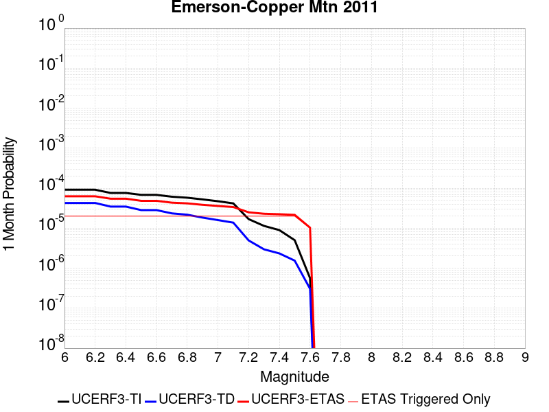 |  |  |

| Magnitude | 1 wk TI Prob | 1 wk TD Prob | 1 wk ETAS Prob | 1 wk ETAS/TD Gain | 1 wk ETAS Triggered Only | 1 mo TI Prob | 1 mo TD Prob | 1 mo ETAS Prob | 1 mo ETAS/TD Gain | 1 mo ETAS Triggered Only | 1 yr TI Prob | 1 yr TD Prob | 1 yr ETAS Prob | 1 yr ETAS/TD Gain | 1 yr ETAS Triggered Only | 10 yr TI Prob | 10 yr TD Prob | 10 yr ETAS Prob | 10 yr ETAS/TD Gain | 10 yr ETAS Triggered Only |
|-----|-----|-----|-----|-----|-----|-----|-----|-----|-----|-----|-----|-----|-----|-----|-----|-----|-----|-----|-----|-----|
| 6.0 | 2.1364202E-5 | 9.968114E-6 | 9.364229E-5 | 9.394183 | 8.3675004E-5 | 9.1557646E-5 | 4.2719836E-5 | 1.2639127E-4 | 2.9586084 | 8.3675004E-5 | 0.0011141442 | 5.199986E-4 | 6.036301E-4 | 1.1608303 | 8.3675004E-5 | 0.011085749 | 0.005188688 | 0.005271929 | 1.0160427 | 8.3675004E-5 |
| 6.1 | 2.1364202E-5 | 9.968114E-6 | 9.364229E-5 | 9.394183 | 8.3675004E-5 | 9.1557646E-5 | 4.2719836E-5 | 1.2639127E-4 | 2.9586084 | 8.3675004E-5 | 0.0011141442 | 5.199986E-4 | 6.036301E-4 | 1.1608303 | 8.3675004E-5 | 0.011085749 | 0.005188688 | 0.005271929 | 1.0160427 | 8.3675004E-5 |
| 6.2 | 2.1364202E-5 | 9.968114E-6 | 9.364229E-5 | 9.394183 | 8.3675004E-5 | 9.1557646E-5 | 4.2719836E-5 | 1.2639127E-4 | 2.9586084 | 8.3675004E-5 | 0.0011141442 | 5.199986E-4 | 6.036301E-4 | 1.1608303 | 8.3675004E-5 | 0.011085749 | 0.005188688 | 0.005271929 | 1.0160427 | 8.3675004E-5 |
| 6.3 | 1.7751237E-5 | 8.089227E-6 | 9.1763555E-5 | 11.343922 | 8.3675004E-5 | 7.607452E-5 | 3.466769E-5 | 1.183398E-4 | 3.4135473 | 8.3675004E-5 | 9.258136E-4 | 4.2200365E-4 | 5.056433E-4 | 1.1981966 | 8.3675004E-5 | 0.00921966 | 0.0042126453 | 0.004295968 | 1.0197791 | 8.3675004E-5 |
| 6.4 | 1.7751237E-5 | 8.089227E-6 | 9.1763555E-5 | 11.343922 | 8.3675004E-5 | 7.607452E-5 | 3.466769E-5 | 1.183398E-4 | 3.4135473 | 8.3675004E-5 | 9.258136E-4 | 4.2200365E-4 | 5.056433E-4 | 1.1981966 | 8.3675004E-5 | 0.00921966 | 0.0042126453 | 0.004295968 | 1.0197791 | 8.3675004E-5 |
| 6.5 | 1.5886664E-5 | 6.603819E-6 | 9.027827E-5 | 13.670616 | 8.3675004E-5 | 6.808392E-5 | 2.8301802E-5 | 1.1197444E-4 | 3.956442 | 8.3675004E-5 | 8.286065E-4 | 3.4452465E-4 | 4.281708E-4 | 1.2427872 | 8.3675004E-5 | 0.008255237 | 0.0034403696 | 0.0035237567 | 1.0242379 | 8.3675004E-5 |
| 6.6 | 1.5886664E-5 | 6.603819E-6 | 9.027827E-5 | 13.670616 | 8.3675004E-5 | 6.808392E-5 | 2.8301802E-5 | 1.1197444E-4 | 3.956442 | 8.3675004E-5 | 8.286065E-4 | 3.4452465E-4 | 4.281708E-4 | 1.2427872 | 8.3675004E-5 | 0.008255237 | 0.0034403696 | 0.0035237567 | 1.0242379 | 8.3675004E-5 |
| 6.7 | 1.428471E-5 | 5.470403E-6 | 8.914495E-5 | 16.295866 | 8.3675004E-5 | 6.121875E-5 | 2.3444394E-5 | 1.0711744E-4 | 4.5690002 | 8.3675004E-5 | 7.450834E-4 | 2.8540206E-4 | 3.690532E-4 | 1.2930993 | 8.3675004E-5 | 0.007425902 | 0.0028507432 | 0.0029341797 | 1.0292683 | 8.3675004E-5 |
| 6.8 | 1.3490684E-5 | 5.073699E-6 | 8.874828E-5 | 17.49183 | 8.3675004E-5 | 5.7815934E-5 | 2.1744265E-5 | 1.0541745E-4 | 4.8480577 | 8.3675004E-5 | 7.0368167E-4 | 2.6470813E-4 | 3.4836098E-4 | 1.3160192 | 8.3675004E-5 | 0.007014576 | 0.002644309 | 0.0027277628 | 1.0315597 | 8.3675004E-5 |
| 6.9 | 1.2235421E-5 | 4.289677E-6 | 8.796433E-5 | 20.506048 | 8.3675004E-5 | 5.2436466E-5 | 1.838422E-5 | 1.0205769E-4 | 5.5513744 | 8.3675004E-5 | 6.38227E-4 | 2.238085E-4 | 3.0746477E-4 | 1.3737851 | 8.3675004E-5 | 0.0063639707 | 0.0022361854 | 0.0023196733 | 1.0373349 | 8.3675004E-5 |
| 7.0 | 1.1009851E-5 | 3.7189886E-6 | 8.739368E-5 | 23.499315 | 8.3675004E-5 | 4.7184225E-5 | 1.5938444E-5 | 9.9612116E-5 | 6.2498016 | 8.3675004E-5 | 5.743165E-4 | 1.9403672E-4 | 2.7769548E-4 | 1.4311491 | 8.3675004E-5 | 0.005728345 | 0.0019390108 | 0.0020225237 | 1.0430697 | 8.3675004E-5 |
| 7.1 | 9.726373E-6 | 3.2117953E-6 | 8.688653E-5 | 27.052326 | 8.3675004E-5 | 4.168379E-5 | 1.3764783E-5 | 9.7438635E-5 | 7.0788355 | 8.3675004E-5 | 5.07382E-4 | 1.6757673E-4 | 2.512377E-4 | 1.4992399 | 8.3675004E-5 | 0.0050622504 | 0.0016748349 | 0.0017583697 | 1.0498765 | 8.3675004E-5 |
| 7.2 | 3.9335127E-6 | 1.1524792E-6 | 8.482739E-5 | 73.60427 | 8.3675004E-5 | 1.6857803E-5 | 4.9391874E-6 | 8.861378E-5 | 17.940964 | 8.3675004E-5 | 2.0522442E-4 | 6.0133007E-5 | 1.4380299E-4 | 2.391415 | 8.3675004E-5 | 0.00205035 | 6.011733E-4 | 6.84798E-4 | 1.1391025 | 8.3675004E-5 |
| 7.3 | 2.661632E-6 | 6.911505E-7 | 8.43661E-5 | 122.06618 | 8.3675004E-5 | 1.14069435E-5 | 2.9620703E-6 | 8.663683E-5 | 29.248743 | 8.3675004E-5 | 1.3887069E-4 | 3.6062618E-5 | 1.1973461E-4 | 3.3201861 | 8.3675004E-5 | 0.0013878393 | 3.605687E-4 | 4.4421354E-4 | 1.2319803 | 8.3675004E-5 |
| 7.4 | 2.0893426E-6 | 5.4618386E-7 | 8.4221145E-5 | 154.19926 | 8.3675004E-5 | 8.954295E-6 | 2.3407858E-6 | 8.60156E-5 | 36.74646 | 8.3675004E-5 | 1.0901308E-4 | 2.84987E-5 | 1.1217132E-4 | 3.9360154 | 8.3675004E-5 | 0.0010895962 | 2.84951E-4 | 3.6860217E-4 | 1.2935634 | 8.3675004E-5 |
| 7.5 | 1.1681728E-6 | 3.6030585E-7 | 8.403528E-5 | 233.23318 | 8.3675004E-5 | 5.0064455E-6 | 1.544167E-6 | 8.521904E-5 | 55.18771 | 8.3675004E-5 | 6.0951766E-5 | 1.8800076E-5 | 1.0247351E-4 | 5.4506965 | 8.3675004E-5 | 6.093505E-4 | 1.8798532E-4 | 2.716446E-4 | 1.4450309 | 8.3675004E-5 |
| 7.6 | 1.3154387E-7 | 7.1197384E-8 | 7.1197384E-8 | 1.0 | 0.0 | 5.6375933E-7 | 3.051316E-7 | 3.051316E-7 | 1.0 | 0.0 | 6.863748E-6 | 3.7149728E-6 | 3.7149728E-6 | 1.0 | 0.0 | 6.863536E-5 | 3.7149264E-5 | 3.7149264E-5 | 1.0 | 0.0 |

## Santa Ynez River
*[(top)](#table-of-contents)*

| 1 Week | 1 Month | 1 Year | 10 Year |
|-----|-----|-----|-----|
|  |  |  |  |

| Magnitude | 1 wk TI Prob | 1 wk TD Prob | 1 wk ETAS Prob | 1 wk ETAS/TD Gain | 1 wk ETAS Triggered Only | 1 mo TI Prob | 1 mo TD Prob | 1 mo ETAS Prob | 1 mo ETAS/TD Gain | 1 mo ETAS Triggered Only | 1 yr TI Prob | 1 yr TD Prob | 1 yr ETAS Prob | 1 yr ETAS/TD Gain | 1 yr ETAS Triggered Only | 10 yr TI Prob | 10 yr TD Prob | 10 yr ETAS Prob | 10 yr ETAS/TD Gain | 10 yr ETAS Triggered Only |
|-----|-----|-----|-----|-----|-----|-----|-----|-----|-----|-----|-----|-----|-----|-----|-----|-----|-----|-----|-----|-----|
| 6.0 | 1.6396456E-5 | 1.7209435E-5 | 1.7209435E-5 | 1.0 | 0.0 | 7.026863E-5 | 7.375284E-5 | 7.375284E-5 | 1.0 | 0.0 | 8.551848E-4 | 8.976064E-4 | 9.812063E-4 | 1.0931364 | 8.3675004E-5 | 0.0085190125 | 0.008943358 | 0.009026285 | 1.0092725 | 8.3675004E-5 |
| 6.1 | 1.6396456E-5 | 1.7209435E-5 | 1.7209435E-5 | 1.0 | 0.0 | 7.026863E-5 | 7.375284E-5 | 7.375284E-5 | 1.0 | 0.0 | 8.551848E-4 | 8.976064E-4 | 9.812063E-4 | 1.0931364 | 8.3675004E-5 | 0.0085190125 | 0.008943358 | 0.009026285 | 1.0092725 | 8.3675004E-5 |
| 6.2 | 1.6396456E-5 | 1.7209435E-5 | 1.7209435E-5 | 1.0 | 0.0 | 7.026863E-5 | 7.375284E-5 | 7.375284E-5 | 1.0 | 0.0 | 8.551848E-4 | 8.976064E-4 | 9.812063E-4 | 1.0931364 | 8.3675004E-5 | 0.0085190125 | 0.008943358 | 0.009026285 | 1.0092725 | 8.3675004E-5 |
| 6.3 | 9.736976E-6 | 1.012233E-5 | 1.012233E-5 | 1.0 | 0.0 | 4.172923E-5 | 4.338072E-5 | 4.338072E-5 | 1.0 | 0.0 | 5.0793495E-4 | 5.280373E-4 | 6.116681E-4 | 1.1583805 | 8.3675004E-5 | 0.005067755 | 0.005268332 | 0.0053515662 | 1.0157989 | 8.3675004E-5 |
| 6.4 | 9.736976E-6 | 1.012233E-5 | 1.012233E-5 | 1.0 | 0.0 | 4.172923E-5 | 4.338072E-5 | 4.338072E-5 | 1.0 | 0.0 | 5.0793495E-4 | 5.280373E-4 | 6.116681E-4 | 1.1583805 | 8.3675004E-5 | 0.005067755 | 0.005268332 | 0.0053515662 | 1.0157989 | 8.3675004E-5 |
| 6.5 | 7.081964E-6 | 7.3298966E-6 | 7.3298966E-6 | 1.0 | 0.0 | 3.035092E-5 | 3.1413474E-5 | 3.1413474E-5 | 1.0 | 0.0 | 3.694598E-4 | 3.8239348E-4 | 3.8239348E-4 | 1.0 | 0.0 | 0.0036884616 | 0.0038175168 | 0.0038175168 | 1.0 | 0.0 |
| 6.6 | 5.873247E-6 | 6.059743E-6 | 6.059743E-6 | 1.0 | 0.0 | 2.5170815E-5 | 2.5970074E-5 | 2.5970074E-5 | 1.0 | 0.0 | 3.064116E-4 | 3.1614062E-4 | 3.1614062E-4 | 1.0 | 0.0 | 0.0030598943 | 0.0031569963 | 0.0031569963 | 1.0 | 0.0 |
| 6.7 | 4.973277E-6 | 5.115901E-6 | 5.115901E-6 | 1.0 | 0.0 | 2.1313872E-5 | 2.1925109E-5 | 2.1925109E-5 | 1.0 | 0.0 | 2.5946548E-4 | 2.66906E-4 | 2.66906E-4 | 1.0 | 0.0 | 0.0025916274 | 0.0026659032 | 0.0026659032 | 1.0 | 0.0 |
| 6.8 | 4.396492E-6 | 4.5109778E-6 | 4.5109778E-6 | 1.0 | 0.0 | 1.884197E-5 | 1.9332621E-5 | 1.9332621E-5 | 1.0 | 0.0 | 2.2937685E-4 | 2.3534958E-4 | 2.3534958E-4 | 1.0 | 0.0 | 0.0022914023 | 0.0023510386 | 0.0023510386 | 1.0 | 0.0 |
| 6.9 | 3.5255632E-6 | 3.6013332E-6 | 3.6013332E-6 | 1.0 | 0.0 | 1.5109469E-5 | 1.5434196E-5 | 1.5434196E-5 | 1.0 | 0.0 | 1.8394225E-4 | 1.8789528E-4 | 1.8789528E-4 | 1.0 | 0.0 | 0.0018379007 | 0.0018773803 | 0.0018773803 | 1.0 | 0.0 |
| 7.0 | 3.211603E-6 | 3.273654E-6 | 3.273654E-6 | 1.0 | 0.0 | 1.376394E-5 | 1.4029872E-5 | 1.4029872E-5 | 1.0 | 0.0 | 1.6756308E-4 | 1.7080043E-4 | 1.7080043E-4 | 1.0 | 0.0 | 0.0016743679 | 0.0017067058 | 0.0017067058 | 1.0 | 0.0 |
| 7.1 | 2.5094619E-6 | 2.5409204E-6 | 2.5409204E-6 | 1.0 | 0.0 | 1.0754793E-5 | 1.0889614E-5 | 1.0889614E-5 | 1.0 | 0.0 | 1.3093173E-4 | 1.3257304E-4 | 1.3257304E-4 | 1.0 | 0.0 | 0.0013085462 | 0.0013249456 | 0.0013249456 | 1.0 | 0.0 |
| 7.2 | 2.0515774E-6 | 2.0619375E-6 | 2.0619375E-6 | 1.0 | 0.0 | 8.792445E-6 | 8.836846E-6 | 8.836846E-6 | 1.0 | 0.0 | 1.0704277E-4 | 1.0758333E-4 | 1.0758333E-4 | 1.0 | 0.0 | 0.0010699122 | 0.0010753168 | 0.0010753168 | 1.0 | 0.0 |
| 7.3 | 1.6845745E-6 | 1.6773907E-6 | 1.6773907E-6 | 1.0 | 0.0 | 7.219585E-6 | 7.1887976E-6 | 7.1887976E-6 | 1.0 | 0.0 | 8.78949E-5 | 8.752012E-5 | 8.752012E-5 | 1.0 | 0.0 | 8.7860145E-4 | 8.7485946E-4 | 8.7485946E-4 | 1.0 | 0.0 |
| 7.4 | 1.3600285E-6 | 1.3333357E-6 | 1.3333357E-6 | 1.0 | 0.0 | 5.82868E-6 | 5.714284E-6 | 5.714284E-6 | 1.0 | 0.0 | 7.096187E-5 | 6.956921E-5 | 6.956921E-5 | 1.0 | 0.0 | 7.0939213E-4 | 6.954765E-4 | 6.954765E-4 | 1.0 | 0.0 |
| 7.5 | 9.735342E-7 | 9.290103E-7 | 9.290103E-7 | 1.0 | 0.0 | 4.172283E-6 | 3.9814668E-6 | 3.9814668E-6 | 1.0 | 0.0 | 5.079636E-5 | 4.8473295E-5 | 4.8473295E-5 | 1.0 | 0.0 | 5.0784746E-4 | 4.8462892E-4 | 4.8462892E-4 | 1.0 | 0.0 |
| 7.6 | 5.067187E-7 | 4.77857E-7 | 4.77857E-7 | 1.0 | 0.0 | 2.1716498E-6 | 2.047957E-6 | 2.047957E-6 | 1.0 | 0.0 | 2.6439517E-5 | 2.4933597E-5 | 2.4933597E-5 | 1.0 | 0.0 | 2.643637E-4 | 2.4930874E-4 | 2.4930874E-4 | 1.0 | 0.0 |
| 7.7 | 2.769089E-7 | 2.5759124E-7 | 2.5759124E-7 | 1.0 | 0.0 | 1.1867519E-6 | 1.1039621E-6 | 1.1039621E-6 | 1.0 | 0.0 | 1.4448608E-5 | 1.34406555E-5 | 1.34406555E-5 | 1.0 | 0.0 | 1.444767E-4 | 1.3439846E-4 | 1.3439846E-4 | 1.0 | 0.0 |
| 7.8 | 1.7044663E-7 | 1.5449015E-7 | 1.5449015E-7 | 1.0 | 0.0 | 7.3048534E-7 | 6.621005E-7 | 6.621005E-7 | 1.0 | 0.0 | 8.893623E-6 | 8.061043E-6 | 8.061043E-6 | 1.0 | 0.0 | 8.893267E-5 | 8.060753E-5 | 8.060753E-5 | 1.0 | 0.0 |
| 7.9 | 4.8344287E-8 | 4.0910923E-8 | 4.0910923E-8 | 1.0 | 0.0 | 2.0718979E-7 | 1.7533252E-7 | 1.7533252E-7 | 1.0 | 0.0 | 2.5225327E-6 | 2.1346711E-6 | 2.1346711E-6 | 1.0 | 0.0 | 2.5225041E-5 | 2.1346512E-5 | 2.1346512E-5 | 1.0 | 0.0 |

## Calaveras (So) - Paicines extension 2011 CFM
*[(top)](#table-of-contents)*

| 1 Week | 1 Month | 1 Year | 10 Year |
|-----|-----|-----|-----|
|  |  |  |  |

| Magnitude | 1 wk TI Prob | 1 wk TD Prob | 1 wk ETAS Prob | 1 wk ETAS/TD Gain | 1 wk ETAS Triggered Only | 1 mo TI Prob | 1 mo TD Prob | 1 mo ETAS Prob | 1 mo ETAS/TD Gain | 1 mo ETAS Triggered Only | 1 yr TI Prob | 1 yr TD Prob | 1 yr ETAS Prob | 1 yr ETAS/TD Gain | 1 yr ETAS Triggered Only | 10 yr TI Prob | 10 yr TD Prob | 10 yr ETAS Prob | 10 yr ETAS/TD Gain | 10 yr ETAS Triggered Only |
|-----|-----|-----|-----|-----|-----|-----|-----|-----|-----|-----|-----|-----|-----|-----|-----|-----|-----|-----|-----|-----|
| 6.0 | 1.5183659E-4 | 3.0533716E-4 | 3.0533716E-4 | 1.0 | 0.0 | 6.5056595E-4 | 0.0013069661 | 0.0013905318 | 1.0639386 | 8.3675004E-5 | 0.007891912 | 0.01569571 | 0.015778072 | 1.0052474 | 8.3675004E-5 | 0.076174594 | 0.13848671 | 0.1385588 | 1.0005206 | 8.3675004E-5 |
| 6.1 | 1.5024997E-4 | 3.0227835E-4 | 3.0227835E-4 | 1.0 | 0.0 | 6.437695E-4 | 0.00129387 | 0.0013774368 | 1.0645866 | 8.3675004E-5 | 0.0078097614 | 0.015539104 | 0.015621479 | 1.0053011 | 8.3675004E-5 | 0.075409345 | 0.13715632 | 0.13722852 | 1.0005264 | 8.3675004E-5 |
| 6.2 | 1.2743923E-4 | 2.5306802E-4 | 2.5306802E-4 | 1.0 | 0.0 | 5.460538E-4 | 0.0010841049 | 0.0011676892 | 1.0770998 | 8.3675004E-5 | 0.0066279583 | 0.013046704 | 0.013129287 | 1.0063298 | 8.3675004E-5 | 0.064337276 | 0.11725405 | 0.117327906 | 1.0006299 | 8.3675004E-5 |
| 6.3 | 1.1525114E-4 | 2.2595265E-4 | 2.2595265E-4 | 1.0 | 0.0 | 4.9383997E-4 | 9.6799526E-4 | 0.0010515893 | 1.0863578 | 8.3675004E-5 | 0.0059959386 | 0.011667927 | 0.011750625 | 1.0070877 | 8.3675004E-5 | 0.058367174 | 0.10637007 | 0.10644484 | 1.000703 | 8.3675004E-5 |
| 6.4 | 1.07200925E-4 | 2.0836305E-4 | 2.0836305E-4 | 1.0 | 0.0 | 4.5935164E-4 | 8.926636E-4 | 9.762639E-4 | 1.0936526 | 8.3675004E-5 | 0.0055782744 | 0.010772766 | 0.010855539 | 1.0076836 | 8.3675004E-5 | 0.0544031 | 0.09919256 | 0.09926794 | 1.0007598 | 8.3675004E-5 |
| 6.5 | 9.69631E-5 | 1.8729115E-4 | 1.8729115E-4 | 1.0 | 0.0 | 4.1548995E-4 | 8.024135E-4 | 8.8602136E-4 | 1.1041955 | 8.3675004E-5 | 0.0050468626 | 0.009694662 | 0.009777526 | 1.0085473 | 8.3675004E-5 | 0.04933773 | 0.090084255 | 0.09016039 | 1.0008452 | 8.3675004E-5 |
| 6.6 | 8.0552316E-5 | 1.5070537E-4 | 1.5070537E-4 | 1.0 | 0.0 | 3.4517853E-4 | 6.456994E-4 | 7.2932034E-4 | 1.1295046 | 8.3675004E-5 | 0.0041944524 | 0.007826256 | 0.0079092765 | 1.010608 | 8.3675004E-5 | 0.04116161 | 0.074854024 | 0.074931435 | 1.0010341 | 8.3675004E-5 |
| 6.7 | 7.815757E-5 | 1.4610609E-4 | 1.4610609E-4 | 1.0 | 0.0 | 3.34918E-4 | 6.260017E-4 | 7.096243E-4 | 1.1335821 | 8.3675004E-5 | 0.004070005 | 0.0075890915 | 0.0076721315 | 1.010942 | 8.3675004E-5 | 0.039962657 | 0.072703585 | 0.072781175 | 1.0010673 | 8.3675004E-5 |
| 6.8 | 6.965264E-5 | 1.2721405E-4 | 1.2721405E-4 | 1.0 | 0.0 | 2.9847719E-4 | 5.450839E-4 | 6.287133E-4 | 1.1534249 | 8.3675004E-5 | 0.0036279052 | 0.00661342 | 0.0066965413 | 1.0125686 | 8.3675004E-5 | 0.03569247 | 0.06379891 | 0.06387725 | 1.0012279 | 8.3675004E-5 |
| 6.9 | 5.8000453E-5 | 1.01435086E-4 | 1.01435086E-4 | 1.0 | 0.0 | 2.4854968E-4 | 4.3464993E-4 | 5.182886E-4 | 1.1924276 | 8.3675004E-5 | 0.0030218933 | 0.0052791284 | 0.005362362 | 1.0157665 | 8.3675004E-5 | 0.029811295 | 0.051501602 | 0.05158097 | 1.001541 | 8.3675004E-5 |
| 7.0 | 4.9865852E-5 | 8.567692E-5 | 8.567692E-5 | 1.0 | 0.0 | 2.1369329E-4 | 3.671356E-4 | 4.507799E-4 | 1.2278295 | 8.3675004E-5 | 0.0025986114 | 0.0044608037 | 0.0045441054 | 1.0186741 | 8.3675004E-5 | 0.025684336 | 0.043781694 | 0.043861706 | 1.0018275 | 8.3675004E-5 |
| 7.1 | 4.283875E-5 | 7.112159E-5 | 7.112159E-5 | 1.0 | 0.0 | 1.8358172E-4 | 3.047715E-4 | 3.047715E-4 | 1.0 | 0.0 | 0.0022328163 | 0.003704336 | 0.003704336 | 1.0 | 0.0 | 0.022105146 | 0.03673583 | 0.03673583 | 1.0 | 0.0 |
| 7.2 | 3.450115E-5 | 5.5776054E-5 | 5.5776054E-5 | 1.0 | 0.0 | 1.478537E-4 | 2.390185E-4 | 2.390185E-4 | 1.0 | 0.0 | 0.0017986323 | 0.0029061958 | 0.0029061958 | 1.0 | 0.0 | 0.017841442 | 0.029079199 | 0.029079199 | 1.0 | 0.0 |
| 7.3 | 2.5709045E-5 | 4.0588155E-5 | 4.0588155E-5 | 1.0 | 0.0 | 1.1017697E-4 | 1.7393773E-4 | 1.7393773E-4 | 1.0 | 0.0 | 0.0013405791 | 0.002115652 | 0.002115652 | 1.0 | 0.0 | 0.013325208 | 0.021297242 | 0.021297242 | 1.0 | 0.0 |
| 7.4 | 1.8003093E-5 | 2.8509934E-5 | 2.8509934E-5 | 1.0 | 0.0 | 7.715383E-5 | 1.2217973E-4 | 1.2217973E-4 | 1.0 | 0.0 | 9.3894306E-4 | 0.0014865254 | 0.0014865254 | 1.0 | 0.0 | 0.009349857 | 0.015052196 | 0.015052196 | 1.0 | 0.0 |
| 7.5 | 1.5595824E-5 | 2.5822499E-5 | 2.5822499E-5 | 1.0 | 0.0 | 6.683753E-5 | 1.1066317E-4 | 1.1066317E-4 | 1.0 | 0.0 | 8.134431E-4 | 0.0013464936 | 0.0013464936 | 1.0 | 0.0 | 0.008104719 | 0.01365213 | 0.01365213 | 1.0 | 0.0 |
| 7.6 | 1.1110309E-5 | 1.9222098E-5 | 1.9222098E-5 | 1.0 | 0.0 | 4.761474E-5 | 8.2377825E-5 | 8.2377825E-5 | 1.0 | 0.0 | 5.795553E-4 | 0.0010024898 | 0.0010024898 | 1.0 | 0.0 | 0.0057804612 | 0.010203943 | 0.010203943 | 1.0 | 0.0 |
| 7.7 | 6.2140443E-6 | 1.0437076E-5 | 1.0437076E-5 | 1.0 | 0.0 | 2.6631347E-5 | 4.4729557E-5 | 4.4729557E-5 | 1.0 | 0.0 | 3.241884E-4 | 5.444464E-4 | 5.444464E-4 | 1.0 | 0.0 | 0.0032371588 | 0.005619835 | 0.005619835 | 1.0 | 0.0 |
| 7.8 | 5.305533E-6 | 9.433038E-6 | 9.433038E-6 | 1.0 | 0.0 | 2.27378E-5 | 4.042668E-5 | 4.042668E-5 | 1.0 | 0.0 | 2.7679754E-4 | 4.920837E-4 | 4.920837E-4 | 1.0 | 0.0 | 0.0027645302 | 0.005074324 | 0.005074324 | 1.0 | 0.0 |
| 7.9 | 3.363505E-6 | 7.3848937E-6 | 7.3848937E-6 | 1.0 | 0.0 | 1.4414942E-5 | 3.164916E-5 | 3.164916E-5 | 1.0 | 0.0 | 1.7548777E-4 | 3.8526047E-4 | 3.8526047E-4 | 1.0 | 0.0 | 0.0017534926 | 0.003948527 | 0.003948527 | 1.0 | 0.0 |
| 8.0 | 2.0271132E-6 | 4.413104E-6 | 4.413104E-6 | 1.0 | 0.0 | 8.687599E-6 | 1.8913164E-5 | 1.8913164E-5 | 1.0 | 0.0 | 1.05766376E-4 | 2.302435E-4 | 2.302435E-4 | 1.0 | 0.0 | 0.0010571606 | 0.002351099 | 0.002351099 | 1.0 | 0.0 |
| 8.1 | 1.2206116E-6 | 2.3751331E-6 | 2.3751331E-6 | 1.0 | 0.0 | 5.2311816E-6 | 1.0179103E-5 | 1.0179103E-5 | 1.0 | 0.0 | 6.3687774E-5 | 1.2392356E-4 | 1.2392356E-4 | 1.0 | 0.0 | 6.366953E-4 | 0.0012705477 | 0.0012705477 | 1.0 | 0.0 |

## San Andreas (Santa Cruz Mts) 2011 CFM
*[(top)](#table-of-contents)*

| 1 Week | 1 Month | 1 Year | 10 Year |
|-----|-----|-----|-----|
|  |  |  |  |

| Magnitude | 1 wk TI Prob | 1 wk TD Prob | 1 wk ETAS Prob | 1 wk ETAS/TD Gain | 1 wk ETAS Triggered Only | 1 mo TI Prob | 1 mo TD Prob | 1 mo ETAS Prob | 1 mo ETAS/TD Gain | 1 mo ETAS Triggered Only | 1 yr TI Prob | 1 yr TD Prob | 1 yr ETAS Prob | 1 yr ETAS/TD Gain | 1 yr ETAS Triggered Only | 10 yr TI Prob | 10 yr TD Prob | 10 yr ETAS Prob | 10 yr ETAS/TD Gain | 10 yr ETAS Triggered Only |
|-----|-----|-----|-----|-----|-----|-----|-----|-----|-----|-----|-----|-----|-----|-----|-----|-----|-----|-----|-----|-----|
| 6.0 | 1.7221631E-4 | 1.3793171E-4 | 1.3793171E-4 | 1.0 | 0.0 | 7.378611E-4 | 5.9100403E-4 | 6.746296E-4 | 1.1414975 | 8.3675004E-5 | 0.008946515 | 0.007172124 | 0.007255199 | 1.011583 | 8.3675004E-5 | 0.08594794 | 0.0705551 | 0.07063287 | 1.0011023 | 8.3675004E-5 |
| 6.1 | 1.7221631E-4 | 1.3793171E-4 | 1.3793171E-4 | 1.0 | 0.0 | 7.378611E-4 | 5.9100403E-4 | 6.746296E-4 | 1.1414975 | 8.3675004E-5 | 0.008946515 | 0.007172124 | 0.007255199 | 1.011583 | 8.3675004E-5 | 0.08594794 | 0.0705551 | 0.07063287 | 1.0011023 | 8.3675004E-5 |
| 6.2 | 1.7221631E-4 | 1.3793171E-4 | 1.3793171E-4 | 1.0 | 0.0 | 7.378611E-4 | 5.9100403E-4 | 6.746296E-4 | 1.1414975 | 8.3675004E-5 | 0.008946515 | 0.007172124 | 0.007255199 | 1.011583 | 8.3675004E-5 | 0.08594794 | 0.0705551 | 0.07063287 | 1.0011023 | 8.3675004E-5 |
| 6.3 | 1.716926E-4 | 1.3712609E-4 | 1.3712609E-4 | 1.0 | 0.0 | 7.3561794E-4 | 5.875529E-4 | 6.7117874E-4 | 1.1423291 | 8.3675004E-5 | 0.008919428 | 0.0071303817 | 0.00721346 | 1.0116513 | 8.3675004E-5 | 0.08569809 | 0.070167266 | 0.07024507 | 1.0011089 | 8.3675004E-5 |
| 6.4 | 1.6392978E-4 | 1.3588481E-4 | 1.3588481E-4 | 1.0 | 0.0 | 7.02367E-4 | 5.822355E-4 | 6.658618E-4 | 1.1436297 | 8.3675004E-5 | 0.008517839 | 0.007066063 | 0.007149147 | 1.0117581 | 8.3675004E-5 | 0.08198654 | 0.06940135 | 0.06947922 | 1.001122 | 8.3675004E-5 |
| 6.5 | 1.5742714E-4 | 1.2648388E-4 | 1.2648388E-4 | 1.0 | 0.0 | 6.745133E-4 | 5.4196286E-4 | 6.255925E-4 | 1.1543088 | 8.3675004E-5 | 0.00818132 | 0.0065787593 | 0.0066618836 | 1.0126352 | 8.3675004E-5 | 0.078865945 | 0.06486309 | 0.06494135 | 1.0012064 | 8.3675004E-5 |
| 6.6 | 1.3038084E-4 | 1.1588213E-4 | 1.1588213E-4 | 1.0 | 0.0 | 5.5865536E-4 | 4.9654447E-4 | 5.8017793E-4 | 1.1684309 | 8.3675004E-5 | 0.006780438 | 0.0060289134 | 0.006112084 | 1.0137953 | 8.3675004E-5 | 0.0657725 | 0.05932738 | 0.05940609 | 1.0013267 | 8.3675004E-5 |
| 6.7 | 1.2867592E-4 | 1.1314701E-4 | 1.1314701E-4 | 1.0 | 0.0 | 5.5135164E-4 | 4.8482692E-4 | 5.684614E-4 | 1.1725037 | 8.3675004E-5 | 0.0066920654 | 0.00588703 | 0.0059702126 | 1.0141298 | 8.3675004E-5 | 0.06494093 | 0.058038417 | 0.058117237 | 1.001358 | 8.3675004E-5 |
| 6.8 | 1.2801298E-4 | 1.1252261E-4 | 1.1252261E-4 | 1.0 | 0.0 | 5.485117E-4 | 4.8215193E-4 | 5.6578655E-4 | 1.1734612 | 8.3675004E-5 | 0.0066577005 | 0.0058546383 | 0.0059378236 | 1.0142084 | 8.3675004E-5 | 0.06461738 | 0.057752274 | 0.057831116 | 1.0013652 | 8.3675004E-5 |
| 6.9 | 1.269149E-4 | 1.1094465E-4 | 1.1094465E-4 | 1.0 | 0.0 | 5.4380763E-4 | 4.7539172E-4 | 5.5902696E-4 | 1.1759291 | 8.3675004E-5 | 0.006600777 | 0.005772772 | 0.0058559636 | 1.0144111 | 8.3675004E-5 | 0.06408122 | 0.0570241 | 0.057103 | 1.0013837 | 8.3675004E-5 |
| 7.0 | 1.2030331E-4 | 1.0824504E-4 | 1.0824504E-4 | 1.0 | 0.0 | 5.154837E-4 | 4.638261E-4 | 5.4746226E-4 | 1.180318 | 8.3675004E-5 | 0.006257969 | 0.0056326967 | 0.0057159 | 1.0147716 | 8.3675004E-5 | 0.06084648 | 0.055696685 | 0.055775702 | 1.0014187 | 8.3675004E-5 |
| 7.1 | 8.049617E-5 | 5.3926604E-5 | 5.3926604E-5 | 1.0 | 0.0 | 3.4493793E-4 | 2.3109373E-4 | 2.3109373E-4 | 1.0 | 0.0 | 0.0041915346 | 0.0028099709 | 0.0028099709 | 1.0 | 0.0 | 0.041133516 | 0.029618956 | 0.029618956 | 1.0 | 0.0 |
| 7.2 | 7.093979E-5 | 4.2937932E-5 | 4.2937932E-5 | 1.0 | 0.0 | 3.0399222E-4 | 1.8400686E-4 | 1.8400686E-4 | 1.0 | 0.0 | 0.0036948253 | 0.0022380045 | 0.0022380045 | 1.0 | 0.0 | 0.03633994 | 0.023941692 | 0.023941692 | 1.0 | 0.0 |
| 7.3 | 6.193693E-5 | 2.8894141E-5 | 2.8894141E-5 | 1.0 | 0.0 | 2.6541698E-4 | 1.2382616E-4 | 1.2382616E-4 | 1.0 | 0.0 | 0.0032266637 | 0.0015065427 | 0.0015065427 | 1.0 | 0.0 | 0.031802133 | 0.016499156 | 0.016499156 | 1.0 | 0.0 |
| 7.4 | 5.906492E-5 | 2.702346E-5 | 2.702346E-5 | 1.0 | 0.0 | 2.5311083E-4 | 1.1580969E-4 | 1.1580969E-4 | 1.0 | 0.0 | 0.0030772698 | 0.0014090725 | 0.0014090725 | 1.0 | 0.0 | 0.030350044 | 0.015471023 | 0.015471023 | 1.0 | 0.0 |
| 7.5 | 5.424296E-5 | 2.4678277E-5 | 2.4678277E-5 | 1.0 | 0.0 | 2.324491E-4 | 1.05759755E-4 | 1.05759755E-4 | 1.0 | 0.0 | 0.002826395 | 0.0012868657 | 0.0012868657 | 1.0 | 0.0 | 0.027907165 | 0.014163188 | 0.014163188 | 1.0 | 0.0 |
| 7.6 | 4.43084E-5 | 1.990431E-5 | 1.990431E-5 | 1.0 | 0.0 | 1.8987931E-4 | 8.53014E-5 | 8.53014E-5 | 1.0 | 0.0 | 0.0023093296 | 0.0010380499 | 0.0010380499 | 1.0 | 0.0 | 0.022854783 | 0.011412679 | 0.011412679 | 1.0 | 0.0 |
| 7.7 | 4.118098E-5 | 1.8936442E-5 | 1.8936442E-5 | 1.0 | 0.0 | 1.7647797E-4 | 8.115366E-5 | 8.115366E-5 | 1.0 | 0.0 | 0.002146502 | 9.875982E-4 | 9.875982E-4 | 1.0 | 0.0 | 0.021258866 | 0.010870468 | 0.010870468 | 1.0 | 0.0 |
| 7.8 | 3.5408906E-5 | 1.856446E-5 | 1.856446E-5 | 1.0 | 0.0 | 1.5174363E-4 | 7.955955E-5 | 7.955955E-5 | 1.0 | 0.0 | 0.0018459131 | 9.682073E-4 | 9.682073E-4 | 1.0 | 0.0 | 0.018306552 | 0.010652021 | 0.010652021 | 1.0 | 0.0 |
| 7.9 | 2.5860836E-5 | 1.7315993E-5 | 1.7315993E-5 | 1.0 | 0.0 | 1.10827445E-4 | 7.420929E-5 | 7.420929E-5 | 1.0 | 0.0 | 0.001348489 | 9.031238E-4 | 9.031238E-4 | 1.0 | 0.0 | 0.013403354 | 0.009907599 | 0.009907599 | 1.0 | 0.0 |
| 8.0 | 1.9777332E-5 | 1.4839596E-5 | 1.4839596E-5 | 1.0 | 0.0 | 8.4757245E-5 | 6.3596715E-5 | 6.3596715E-5 | 1.0 | 0.0 | 0.0010314309 | 7.740152E-4 | 7.740152E-4 | 1.0 | 0.0 | 0.010266567 | 0.008508967 | 0.008508967 | 1.0 | 0.0 |
| 8.1 | 1.468494E-5 | 1.2107374E-5 | 1.2107374E-5 | 1.0 | 0.0 | 6.293394E-5 | 5.1887713E-5 | 5.1887713E-5 | 1.0 | 0.0 | 7.6595135E-4 | 6.3155E-4 | 6.3155E-4 | 1.0 | 0.0 | 0.0076331664 | 0.006969149 | 0.006969149 | 1.0 | 0.0 |
| 8.2 | 8.63836E-6 | 5.469061E-6 | 5.469061E-6 | 1.0 | 0.0 | 3.7021015E-5 | 2.3438623E-5 | 2.3438623E-5 | 1.0 | 0.0 | 4.5063766E-4 | 2.8532793E-4 | 2.8532793E-4 | 1.0 | 0.0 | 0.004497249 | 0.00324569 | 0.00324569 | 1.0 | 0.0 |
| 8.3 | 1.983087E-6 | 7.6599065E-7 | 7.6599065E-7 | 1.0 | 0.0 | 8.498917E-6 | 3.282813E-6 | 3.282813E-6 | 1.0 | 0.0 | 1.034694E-4 | 3.9967534E-5 | 3.9967534E-5 | 1.0 | 0.0 | 0.0010342124 | 4.719687E-4 | 4.719687E-4 | 1.0 | 0.0 |

## Santa Susana East (connector)
*[(top)](#table-of-contents)*

| 1 Week | 1 Month | 1 Year | 10 Year |
|-----|-----|-----|-----|
|  |  |  |  |

| Magnitude | 1 wk TI Prob | 1 wk TD Prob | 1 wk ETAS Prob | 1 wk ETAS/TD Gain | 1 wk ETAS Triggered Only | 1 mo TI Prob | 1 mo TD Prob | 1 mo ETAS Prob | 1 mo ETAS/TD Gain | 1 mo ETAS Triggered Only | 1 yr TI Prob | 1 yr TD Prob | 1 yr ETAS Prob | 1 yr ETAS/TD Gain | 1 yr ETAS Triggered Only | 10 yr TI Prob | 10 yr TD Prob | 10 yr ETAS Prob | 10 yr ETAS/TD Gain | 10 yr ETAS Triggered Only |
|-----|-----|-----|-----|-----|-----|-----|-----|-----|-----|-----|-----|-----|-----|-----|-----|-----|-----|-----|-----|-----|
| 6.0 | 2.858397E-5 | 3.202091E-5 | 3.202091E-5 | 1.0 | 0.0 | 1.2249697E-4 | 1.3722685E-4 | 1.3722685E-4 | 1.0 | 0.0 | 0.0014903803 | 0.0016697381 | 0.0016697381 | 1.0 | 0.0 | 0.014804244 | 0.016599052 | 0.016681338 | 1.0049573 | 8.3675004E-5 |
| 6.1 | 2.858397E-5 | 3.202091E-5 | 3.202091E-5 | 1.0 | 0.0 | 1.2249697E-4 | 1.3722685E-4 | 1.3722685E-4 | 1.0 | 0.0 | 0.0014903803 | 0.0016697381 | 0.0016697381 | 1.0 | 0.0 | 0.014804244 | 0.016599052 | 0.016681338 | 1.0049573 | 8.3675004E-5 |
| 6.2 | 2.858397E-5 | 3.202091E-5 | 3.202091E-5 | 1.0 | 0.0 | 1.2249697E-4 | 1.3722685E-4 | 1.3722685E-4 | 1.0 | 0.0 | 0.0014903803 | 0.0016697381 | 0.0016697381 | 1.0 | 0.0 | 0.014804244 | 0.016599052 | 0.016681338 | 1.0049573 | 8.3675004E-5 |
| 6.3 | 1.943582E-5 | 2.036718E-5 | 2.036718E-5 | 1.0 | 0.0 | 8.329371E-5 | 8.7285625E-5 | 8.7285625E-5 | 1.0 | 0.0 | 0.001013629 | 0.0010622967 | 0.0010622967 | 1.0 | 0.0 | 0.010090181 | 0.010583619 | 0.010583619 | 1.0 | 0.0 |
| 6.4 | 1.943582E-5 | 2.036718E-5 | 2.036718E-5 | 1.0 | 0.0 | 8.329371E-5 | 8.7285625E-5 | 8.7285625E-5 | 1.0 | 0.0 | 0.001013629 | 0.0010622967 | 0.0010622967 | 1.0 | 0.0 | 0.010090181 | 0.010583619 | 0.010583619 | 1.0 | 0.0 |
| 6.5 | 1.943582E-5 | 2.036718E-5 | 2.036718E-5 | 1.0 | 0.0 | 8.329371E-5 | 8.7285625E-5 | 8.7285625E-5 | 1.0 | 0.0 | 0.001013629 | 0.0010622967 | 0.0010622967 | 1.0 | 0.0 | 0.010090181 | 0.010583619 | 0.010583619 | 1.0 | 0.0 |
| 6.6 | 1.943582E-5 | 2.036718E-5 | 2.036718E-5 | 1.0 | 0.0 | 8.329371E-5 | 8.7285625E-5 | 8.7285625E-5 | 1.0 | 0.0 | 0.001013629 | 0.0010622967 | 0.0010622967 | 1.0 | 0.0 | 0.010090181 | 0.010583619 | 0.010583619 | 1.0 | 0.0 |
| 6.7 | 1.9404439E-5 | 2.03546E-5 | 2.03546E-5 | 1.0 | 0.0 | 8.3159226E-5 | 8.723172E-5 | 8.723172E-5 | 1.0 | 0.0 | 0.0010119933 | 0.0010616409 | 0.0010616409 | 1.0 | 0.0 | 0.010073971 | 0.010577125 | 0.010577125 | 1.0 | 0.0 |
| 6.8 | 1.2217526E-5 | 1.1592998E-5 | 1.1592998E-5 | 1.0 | 0.0 | 5.2359774E-5 | 4.9683425E-5 | 4.9683425E-5 | 1.0 | 0.0 | 6.372938E-4 | 6.0474465E-4 | 6.0474465E-4 | 1.0 | 0.0 | 0.0063546924 | 0.006033037 | 0.006033037 | 1.0 | 0.0 |
| 6.9 | 1.2217526E-5 | 1.1592998E-5 | 1.1592998E-5 | 1.0 | 0.0 | 5.2359774E-5 | 4.9683425E-5 | 4.9683425E-5 | 1.0 | 0.0 | 6.372938E-4 | 6.0474465E-4 | 6.0474465E-4 | 1.0 | 0.0 | 0.0063546924 | 0.006033037 | 0.006033037 | 1.0 | 0.0 |
| 7.0 | 9.276017E-6 | 8.059113E-6 | 8.059113E-6 | 1.0 | 0.0 | 3.9753755E-5 | 3.4538618E-5 | 3.4538618E-5 | 1.0 | 0.0 | 4.8389446E-4 | 4.2042998E-4 | 4.2042998E-4 | 1.0 | 0.0 | 0.0048284214 | 0.0041970722 | 0.0041970722 | 1.0 | 0.0 |
| 7.1 | 9.130355E-6 | 7.942286E-6 | 7.942286E-6 | 1.0 | 0.0 | 3.9129503E-5 | 3.4037945E-5 | 3.4037945E-5 | 1.0 | 0.0 | 4.7629757E-4 | 4.1433662E-4 | 4.1433662E-4 | 1.0 | 0.0 | 0.00475278 | 0.004136367 | 0.004136367 | 1.0 | 0.0 |
| 7.2 | 8.851015E-6 | 7.741445E-6 | 7.741445E-6 | 1.0 | 0.0 | 3.7932372E-5 | 3.317722E-5 | 3.317722E-5 | 1.0 | 0.0 | 4.6172875E-4 | 4.038612E-4 | 4.038612E-4 | 1.0 | 0.0 | 0.0046077054 | 0.0040319953 | 0.0040319953 | 1.0 | 0.0 |
| 7.3 | 8.573006E-6 | 7.550166E-6 | 7.550166E-6 | 1.0 | 0.0 | 3.6740938E-5 | 3.2357475E-5 | 3.2357475E-5 | 1.0 | 0.0 | 4.472291E-4 | 3.9388443E-4 | 3.9388443E-4 | 1.0 | 0.0 | 0.004463301 | 0.0039325804 | 0.0039325804 | 1.0 | 0.0 |
| 7.4 | 7.852282E-6 | 6.817687E-6 | 6.817687E-6 | 1.0 | 0.0 | 3.36522E-5 | 2.9218349E-5 | 2.9218349E-5 | 1.0 | 0.0 | 4.096385E-4 | 3.5567835E-4 | 3.5567835E-4 | 1.0 | 0.0 | 0.0040888423 | 0.0035517553 | 0.0035517553 | 1.0 | 0.0 |
| 7.5 | 4.8869324E-6 | 4.279055E-6 | 4.279055E-6 | 1.0 | 0.0 | 2.0943828E-5 | 1.8338687E-5 | 1.8338687E-5 | 1.0 | 0.0 | 2.5496128E-4 | 2.232523E-4 | 2.232523E-4 | 1.0 | 0.0 | 0.0025466895 | 0.0022304445 | 0.0022304445 | 1.0 | 0.0 |
| 7.6 | 1.3894544E-6 | 1.1568179E-6 | 1.1568179E-6 | 1.0 | 0.0 | 5.954791E-6 | 4.957783E-6 | 4.957783E-6 | 1.0 | 0.0 | 7.249717E-5 | 6.0359558E-5 | 6.0359558E-5 | 1.0 | 0.0 | 7.247352E-4 | 6.0345343E-4 | 6.0345343E-4 | 1.0 | 0.0 |
| 7.7 | 2.9924632E-7 | 2.371928E-7 | 2.371928E-7 | 1.0 | 0.0 | 1.2824837E-6 | 1.0165402E-6 | 1.0165402E-6 | 1.0 | 0.0 | 1.5614127E-5 | 1.2376314E-5 | 1.2376314E-5 | 1.0 | 0.0 | 1.5613029E-4 | 1.2375697E-4 | 1.2375697E-4 | 1.0 | 0.0 |
| 7.8 | 4.8188564E-8 | 2.6323061E-8 | 2.6323061E-8 | 1.0 | 0.0 | 2.065224E-7 | 1.1281311E-7 | 1.1281311E-7 | 1.0 | 0.0 | 2.5144072E-6 | 1.3734989E-6 | 1.3734989E-6 | 1.0 | 0.0 | 2.5143789E-5 | 1.3734912E-5 | 1.3734912E-5 | 1.0 | 0.0 |
| 7.9 | 2.6127251E-9 | 2.7681102E-9 | 2.7681102E-9 | 1.0 | 0.0 | 1.1197393E-8 | 1.186333E-8 | 1.186333E-8 | 1.0 | 0.0 | 1.3632825E-7 | 1.4443603E-7 | 1.4443603E-7 | 1.0 | 0.0 | 1.3632817E-6 | 1.4443604E-6 | 1.4443604E-6 | 1.0 | 0.0 |

## Pinto Mtn
*[(top)](#table-of-contents)*

| 1 Week | 1 Month | 1 Year | 10 Year |
|-----|-----|-----|-----|
|  |  |  |  |

| Magnitude | 1 wk TI Prob | 1 wk TD Prob | 1 wk ETAS Prob | 1 wk ETAS/TD Gain | 1 wk ETAS Triggered Only | 1 mo TI Prob | 1 mo TD Prob | 1 mo ETAS Prob | 1 mo ETAS/TD Gain | 1 mo ETAS Triggered Only | 1 yr TI Prob | 1 yr TD Prob | 1 yr ETAS Prob | 1 yr ETAS/TD Gain | 1 yr ETAS Triggered Only | 10 yr TI Prob | 10 yr TD Prob | 10 yr ETAS Prob | 10 yr ETAS/TD Gain | 10 yr ETAS Triggered Only |
|-----|-----|-----|-----|-----|-----|-----|-----|-----|-----|-----|-----|-----|-----|-----|-----|-----|-----|-----|-----|-----|
| 6.0 | 4.4194956E-5 | 4.785362E-5 | 4.785362E-5 | 1.0 | 0.0 | 1.893932E-4 | 2.0507174E-4 | 2.0507174E-4 | 1.0 | 0.0 | 0.0023034236 | 0.0024940541 | 0.0024940541 | 1.0 | 0.0 | 0.022796938 | 0.024678145 | 0.024759755 | 1.003307 | 8.3675004E-5 |
| 6.1 | 4.4194956E-5 | 4.785362E-5 | 4.785362E-5 | 1.0 | 0.0 | 1.893932E-4 | 2.0507174E-4 | 2.0507174E-4 | 1.0 | 0.0 | 0.0023034236 | 0.0024940541 | 0.0024940541 | 1.0 | 0.0 | 0.022796938 | 0.024678145 | 0.024759755 | 1.003307 | 8.3675004E-5 |
| 6.2 | 4.4194956E-5 | 4.785362E-5 | 4.785362E-5 | 1.0 | 0.0 | 1.893932E-4 | 2.0507174E-4 | 2.0507174E-4 | 1.0 | 0.0 | 0.0023034236 | 0.0024940541 | 0.0024940541 | 1.0 | 0.0 | 0.022796938 | 0.024678145 | 0.024759755 | 1.003307 | 8.3675004E-5 |
| 6.3 | 4.4194956E-5 | 4.785362E-5 | 4.785362E-5 | 1.0 | 0.0 | 1.893932E-4 | 2.0507174E-4 | 2.0507174E-4 | 1.0 | 0.0 | 0.0023034236 | 0.0024940541 | 0.0024940541 | 1.0 | 0.0 | 0.022796938 | 0.024678145 | 0.024759755 | 1.003307 | 8.3675004E-5 |
| 6.4 | 3.729929E-5 | 3.9603186E-5 | 3.9603186E-5 | 1.0 | 0.0 | 1.5984432E-4 | 1.6971743E-4 | 1.6971743E-4 | 1.0 | 0.0 | 0.0019443673 | 0.002064445 | 0.002064445 | 1.0 | 0.0 | 0.019274427 | 0.02046269 | 0.020544654 | 1.0040054 | 8.3675004E-5 |
| 6.5 | 3.729929E-5 | 3.9603186E-5 | 3.9603186E-5 | 1.0 | 0.0 | 1.5984432E-4 | 1.6971743E-4 | 1.6971743E-4 | 1.0 | 0.0 | 0.0019443673 | 0.002064445 | 0.002064445 | 1.0 | 0.0 | 0.019274427 | 0.02046269 | 0.020544654 | 1.0040054 | 8.3675004E-5 |
| 6.6 | 3.0204548E-5 | 3.1205298E-5 | 3.1205298E-5 | 1.0 | 0.0 | 1.2944164E-4 | 1.3373033E-4 | 1.3373033E-4 | 1.0 | 0.0 | 0.0015748127 | 0.0016269855 | 0.0016269855 | 1.0 | 0.0 | 0.015636992 | 0.01615461 | 0.016236933 | 1.005096 | 8.3675004E-5 |
| 6.7 | 2.9857754E-5 | 3.081468E-5 | 3.081468E-5 | 1.0 | 0.0 | 1.2795553E-4 | 1.3205643E-4 | 1.3205643E-4 | 1.0 | 0.0 | 0.0015567453 | 0.001606636 | 0.001606636 | 1.0 | 0.0 | 0.015458848 | 0.01595405 | 0.01603639 | 1.005161 | 8.3675004E-5 |
| 6.8 | 2.4819734E-5 | 2.5009364E-5 | 2.5009364E-5 | 1.0 | 0.0 | 1.0636595E-4 | 1.07178705E-4 | 1.07178705E-4 | 1.0 | 0.0 | 0.0012942362 | 0.0013041412 | 0.0013041412 | 1.0 | 0.0 | 0.012867244 | 0.0129672475 | 0.013049837 | 1.0063691 | 8.3675004E-5 |
| 6.9 | 2.331124E-5 | 2.3337643E-5 | 2.3337643E-5 | 1.0 | 0.0 | 9.990149E-5 | 1.00014746E-4 | 1.00014746E-4 | 1.0 | 0.0 | 0.001215622 | 0.0012170197 | 0.0012170197 | 1.0 | 0.0 | 0.012089936 | 0.012105742 | 0.012105742 | 1.0 | 0.0 |
| 7.0 | 2.1818534E-5 | 2.1760772E-5 | 2.1760772E-5 | 1.0 | 0.0 | 9.3504656E-5 | 9.325723E-5 | 9.325723E-5 | 1.0 | 0.0 | 0.0011378246 | 0.0011348352 | 0.0011348352 | 1.0 | 0.0 | 0.011320163 | 0.011292503 | 0.011292503 | 1.0 | 0.0 |
| 7.1 | 2.066081E-5 | 2.0540418E-5 | 2.0540418E-5 | 1.0 | 0.0 | 8.854332E-5 | 8.8027504E-5 | 8.8027504E-5 | 1.0 | 0.0 | 0.0010774818 | 0.0010712275 | 0.0010712275 | 1.0 | 0.0 | 0.010722724 | 0.010662688 | 0.010662688 | 1.0 | 0.0 |
| 7.2 | 1.8990233E-5 | 1.9053701E-5 | 1.9053701E-5 | 1.0 | 0.0 | 8.138417E-5 | 8.1656275E-5 | 8.1656275E-5 | 1.0 | 0.0 | 9.904018E-4 | 9.937311E-4 | 9.937311E-4 | 1.0 | 0.0 | 0.009859995 | 0.009894874 | 0.009894874 | 1.0 | 0.0 |
| 7.3 | 1.3335872E-5 | 1.4906372E-5 | 1.4906372E-5 | 1.0 | 0.0 | 5.7152483E-5 | 6.388296E-5 | 6.388296E-5 | 1.0 | 0.0 | 6.956093E-4 | 7.775102E-4 | 7.775102E-4 | 1.0 | 0.0 | 0.006934359 | 0.0077491994 | 0.0077491994 | 1.0 | 0.0 |
| 7.4 | 9.414066E-6 | 1.186061E-5 | 1.186061E-5 | 1.0 | 0.0 | 4.0345374E-5 | 5.0830247E-5 | 5.0830247E-5 | 1.0 | 0.0 | 4.910942E-4 | 6.1869196E-4 | 6.1869196E-4 | 1.0 | 0.0 | 0.0049001034 | 0.006170644 | 0.006170644 | 1.0 | 0.0 |
| 7.5 | 7.2101157E-6 | 9.157893E-6 | 9.157893E-6 | 1.0 | 0.0 | 3.090013E-5 | 3.924757E-5 | 3.924757E-5 | 1.0 | 0.0 | 3.7614413E-4 | 4.7774217E-4 | 4.7774217E-4 | 1.0 | 0.0 | 0.0037550807 | 0.004767927 | 0.004767927 | 1.0 | 0.0 |
| 7.6 | 3.296375E-6 | 4.5453176E-6 | 4.5453176E-6 | 1.0 | 0.0 | 1.4127245E-5 | 1.9479796E-5 | 1.9479796E-5 | 1.0 | 0.0 | 1.7198564E-4 | 2.3714209E-4 | 2.3714209E-4 | 1.0 | 0.0 | 0.0017185259 | 0.0023690276 | 0.0023690276 | 1.0 | 0.0 |
| 7.7 | 2.5741092E-6 | 3.584251E-6 | 3.584251E-6 | 1.0 | 0.0 | 1.103185E-5 | 1.5360993E-5 | 1.5360993E-5 | 1.0 | 0.0 | 1.3430449E-4 | 1.8700535E-4 | 1.8700535E-4 | 1.0 | 0.0 | 0.0013422335 | 0.0018686098 | 0.0018686098 | 1.0 | 0.0 |

## Independence rev 2011
*[(top)](#table-of-contents)*

| 1 Week | 1 Month | 1 Year | 10 Year |
|-----|-----|-----|-----|
|  |  |  |  |

| Magnitude | 1 wk TI Prob | 1 wk TD Prob | 1 wk ETAS Prob | 1 wk ETAS/TD Gain | 1 wk ETAS Triggered Only | 1 mo TI Prob | 1 mo TD Prob | 1 mo ETAS Prob | 1 mo ETAS/TD Gain | 1 mo ETAS Triggered Only | 1 yr TI Prob | 1 yr TD Prob | 1 yr ETAS Prob | 1 yr ETAS/TD Gain | 1 yr ETAS Triggered Only | 10 yr TI Prob | 10 yr TD Prob | 10 yr ETAS Prob | 10 yr ETAS/TD Gain | 10 yr ETAS Triggered Only |
|-----|-----|-----|-----|-----|-----|-----|-----|-----|-----|-----|-----|-----|-----|-----|-----|-----|-----|-----|-----|-----|
| 6.0 | 4.422171E-6 | 4.326227E-6 | 4.326227E-6 | 1.0 | 0.0 | 1.8952025E-5 | 1.8540857E-5 | 1.8540857E-5 | 1.0 | 0.0 | 2.3071647E-4 | 2.2571455E-4 | 3.0937066E-4 | 1.370628 | 8.3675004E-5 | 0.0023047708 | 0.0022551466 | 0.002338633 | 1.0370203 | 8.3675004E-5 |
| 6.1 | 4.422171E-6 | 4.326227E-6 | 4.326227E-6 | 1.0 | 0.0 | 1.8952025E-5 | 1.8540857E-5 | 1.8540857E-5 | 1.0 | 0.0 | 2.3071647E-4 | 2.2571455E-4 | 3.0937066E-4 | 1.370628 | 8.3675004E-5 | 0.0023047708 | 0.0022551466 | 0.002338633 | 1.0370203 | 8.3675004E-5 |
| 6.2 | 4.422171E-6 | 4.326227E-6 | 4.326227E-6 | 1.0 | 0.0 | 1.8952025E-5 | 1.8540857E-5 | 1.8540857E-5 | 1.0 | 0.0 | 2.3071647E-4 | 2.2571455E-4 | 3.0937066E-4 | 1.370628 | 8.3675004E-5 | 0.0023047708 | 0.0022551466 | 0.002338633 | 1.0370203 | 8.3675004E-5 |
| 6.3 | 4.422171E-6 | 4.326227E-6 | 4.326227E-6 | 1.0 | 0.0 | 1.8952025E-5 | 1.8540857E-5 | 1.8540857E-5 | 1.0 | 0.0 | 2.3071647E-4 | 2.2571455E-4 | 3.0937066E-4 | 1.370628 | 8.3675004E-5 | 0.0023047708 | 0.0022551466 | 0.002338633 | 1.0370203 | 8.3675004E-5 |
| 6.4 | 4.422171E-6 | 4.326227E-6 | 4.326227E-6 | 1.0 | 0.0 | 1.8952025E-5 | 1.8540857E-5 | 1.8540857E-5 | 1.0 | 0.0 | 2.3071647E-4 | 2.2571455E-4 | 3.0937066E-4 | 1.370628 | 8.3675004E-5 | 0.0023047708 | 0.0022551466 | 0.002338633 | 1.0370203 | 8.3675004E-5 |
| 6.5 | 4.422171E-6 | 4.326227E-6 | 4.326227E-6 | 1.0 | 0.0 | 1.8952025E-5 | 1.8540857E-5 | 1.8540857E-5 | 1.0 | 0.0 | 2.3071647E-4 | 2.2571455E-4 | 3.0937066E-4 | 1.370628 | 8.3675004E-5 | 0.0023047708 | 0.0022551466 | 0.002338633 | 1.0370203 | 8.3675004E-5 |
| 6.6 | 2.663744E-6 | 2.5319862E-6 | 2.5319862E-6 | 1.0 | 0.0 | 1.1415996E-5 | 1.0851327E-5 | 1.0851327E-5 | 1.0 | 0.0 | 1.3898089E-4 | 1.3210738E-4 | 2.1577133E-4 | 1.6333026 | 8.3675004E-5 | 0.0013889399 | 0.0013203367 | 0.0014039013 | 1.0632904 | 8.3675004E-5 |
| 6.7 | 2.663744E-6 | 2.5319862E-6 | 2.5319862E-6 | 1.0 | 0.0 | 1.1415996E-5 | 1.0851327E-5 | 1.0851327E-5 | 1.0 | 0.0 | 1.3898089E-4 | 1.3210738E-4 | 2.1577133E-4 | 1.6333026 | 8.3675004E-5 | 0.0013889399 | 0.0013203367 | 0.0014039013 | 1.0632904 | 8.3675004E-5 |
| 6.8 | 1.9716529E-6 | 1.8322585E-6 | 1.8322585E-6 | 1.0 | 0.0 | 8.449913E-6 | 7.852514E-6 | 7.852514E-6 | 1.0 | 0.0 | 1.0287284E-4 | 9.5600284E-5 | 9.5600284E-5 | 1.0 | 0.0 | 0.0010282523 | 9.556045E-4 | 9.556045E-4 | 1.0 | 0.0 |
| 6.9 | 1.8788617E-6 | 1.7429993E-6 | 1.7429993E-6 | 1.0 | 0.0 | 8.0522395E-6 | 7.4699765E-6 | 7.4699765E-6 | 1.0 | 0.0 | 9.80316E-5 | 9.0943286E-5 | 9.0943286E-5 | 1.0 | 0.0 | 9.798837E-4 | 9.0907275E-4 | 9.0907275E-4 | 1.0 | 0.0 |
| 7.0 | 1.5045488E-6 | 1.3849503E-6 | 1.3849503E-6 | 1.0 | 0.0 | 6.44805E-6 | 5.9354884E-6 | 5.9354884E-6 | 1.0 | 0.0 | 7.8502184E-5 | 7.226223E-5 | 7.226223E-5 | 1.0 | 0.0 | 7.8474457E-4 | 7.2239246E-4 | 7.2239246E-4 | 1.0 | 0.0 |
| 7.1 | 1.272341E-6 | 1.1625096E-6 | 1.1625096E-6 | 1.0 | 0.0 | 5.4528787E-6 | 4.982175E-6 | 4.982175E-6 | 1.0 | 0.0 | 6.6386776E-5 | 6.0656326E-5 | 6.0656326E-5 | 1.0 | 0.0 | 6.636695E-4 | 6.064009E-4 | 6.064009E-4 | 1.0 | 0.0 |
| 7.2 | 1.0416892E-6 | 9.4098806E-7 | 9.4098806E-7 | 1.0 | 0.0 | 4.464375E-6 | 4.0328E-6 | 4.0328E-6 | 1.0 | 0.0 | 5.4352407E-5 | 4.909825E-5 | 4.909825E-5 | 1.0 | 0.0 | 5.4339116E-4 | 4.9087586E-4 | 4.9087586E-4 | 1.0 | 0.0 |
| 7.3 | 7.9450155E-7 | 7.235002E-7 | 7.235002E-7 | 1.0 | 0.0 | 3.4050022E-6 | 3.1007114E-6 | 3.1007114E-6 | 1.0 | 0.0 | 4.1455114E-5 | 3.775052E-5 | 3.775052E-5 | 1.0 | 0.0 | 4.144738E-4 | 3.7744216E-4 | 3.7744216E-4 | 1.0 | 0.0 |
| 7.4 | 5.3893444E-7 | 5.019512E-7 | 5.019512E-7 | 1.0 | 0.0 | 2.309717E-6 | 2.1512178E-6 | 2.1512178E-6 | 1.0 | 0.0 | 2.8120441E-5 | 2.6190766E-5 | 2.6190766E-5 | 1.0 | 0.0 | 2.8116882E-4 | 2.6187726E-4 | 2.6187726E-4 | 1.0 | 0.0 |
| 7.5 | 3.8852085E-7 | 3.682554E-7 | 3.682554E-7 | 1.0 | 0.0 | 1.6650882E-6 | 1.5782365E-6 | 1.5782365E-6 | 1.0 | 0.0 | 2.027226E-5 | 1.9214862E-5 | 1.9214862E-5 | 1.0 | 0.0 | 2.0270412E-4 | 1.9213221E-4 | 1.9213221E-4 | 1.0 | 0.0 |
| 7.6 | 2.414929E-7 | 2.345755E-7 | 2.345755E-7 | 1.0 | 0.0 | 1.0349692E-6 | 1.0053232E-6 | 1.0053232E-6 | 1.0 | 0.0 | 1.2600677E-5 | 1.2239742E-5 | 1.2239742E-5 | 1.0 | 0.0 | 1.2599962E-4 | 1.223908E-4 | 1.223908E-4 | 1.0 | 0.0 |
| 7.7 | 6.8298014E-8 | 6.85897E-8 | 6.85897E-8 | 1.0 | 0.0 | 2.9270575E-7 | 2.9395582E-7 | 2.9395582E-7 | 1.0 | 0.0 | 3.5636867E-6 | 3.5789067E-6 | 3.5789067E-6 | 1.0 | 0.0 | 3.5636294E-5 | 3.5788536E-5 | 3.5788536E-5 | 1.0 | 0.0 |

## Coronado Bank alt1
*[(top)](#table-of-contents)*

| 1 Week | 1 Month | 1 Year | 10 Year |
|-----|-----|-----|-----|
|  |  | 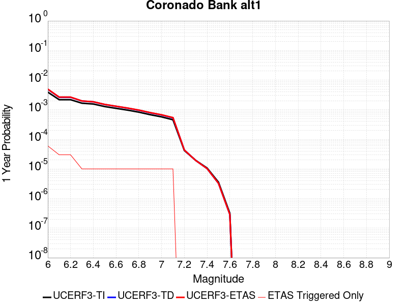 |  |

| Magnitude | 1 wk TI Prob | 1 wk TD Prob | 1 wk ETAS Prob | 1 wk ETAS/TD Gain | 1 wk ETAS Triggered Only | 1 mo TI Prob | 1 mo TD Prob | 1 mo ETAS Prob | 1 mo ETAS/TD Gain | 1 mo ETAS Triggered Only | 1 yr TI Prob | 1 yr TD Prob | 1 yr ETAS Prob | 1 yr ETAS/TD Gain | 1 yr ETAS Triggered Only | 10 yr TI Prob | 10 yr TD Prob | 10 yr ETAS Prob | 10 yr ETAS/TD Gain | 10 yr ETAS Triggered Only |
|-----|-----|-----|-----|-----|-----|-----|-----|-----|-----|-----|-----|-----|-----|-----|-----|-----|-----|-----|-----|-----|
| 6.0 | 7.533492E-5 | 9.394913E-5 | 1.7761628E-4 | 1.890558 | 8.3675004E-5 | 3.22824E-4 | 4.0258127E-4 | 4.862226E-4 | 1.2077626 | 8.3675004E-5 | 0.0039233007 | 0.0048909658 | 0.004974231 | 1.0170244 | 8.3675004E-5 | 0.03854755 | 0.04790356 | 0.04798323 | 1.0016631 | 8.3675004E-5 |
| 6.1 | 4.1807285E-5 | 5.049283E-5 | 5.049283E-5 | 1.0 | 0.0 | 1.7916178E-4 | 2.1638049E-4 | 2.1638049E-4 | 1.0 | 0.0 | 0.0021791123 | 0.0026313474 | 0.0026313474 | 1.0 | 0.0 | 0.021578677 | 0.026011046 | 0.026011046 | 1.0 | 0.0 |
| 6.2 | 4.1807285E-5 | 5.049283E-5 | 5.049283E-5 | 1.0 | 0.0 | 1.7916178E-4 | 2.1638049E-4 | 2.1638049E-4 | 1.0 | 0.0 | 0.0021791123 | 0.0026313474 | 0.0026313474 | 1.0 | 0.0 | 0.021578677 | 0.026011046 | 0.026011046 | 1.0 | 0.0 |
| 6.3 | 3.1793104E-5 | 3.7711117E-5 | 3.7711117E-5 | 1.0 | 0.0 | 1.3624904E-4 | 1.6160926E-4 | 1.6160926E-4 | 1.0 | 0.0 | 0.0016575698 | 0.001965848 | 0.001965848 | 1.0 | 0.0 | 0.016452603 | 0.019488465 | 0.019488465 | 1.0 | 0.0 |
| 6.4 | 2.9878007E-5 | 3.5335794E-5 | 3.5335794E-5 | 1.0 | 0.0 | 1.2804232E-4 | 1.5143053E-4 | 1.5143053E-4 | 1.0 | 0.0 | 0.0015578003 | 0.0018421387 | 0.0018421387 | 1.0 | 0.0 | 0.015469253 | 0.01827244 | 0.01827244 | 1.0 | 0.0 |
| 6.5 | 2.4512565E-5 | 2.8764043E-5 | 2.8764043E-5 | 1.0 | 0.0 | 1.0504962E-4 | 1.2326881E-4 | 1.2326881E-4 | 1.0 | 0.0 | 0.0012782287 | 0.0014997921 | 0.0014997921 | 1.0 | 0.0 | 0.012709012 | 0.014899683 | 0.014899683 | 1.0 | 0.0 |
| 6.6 | 2.1317413E-5 | 2.490667E-5 | 2.490667E-5 | 1.0 | 0.0 | 9.135714E-5 | 1.0673863E-4 | 1.0673863E-4 | 1.0 | 0.0 | 0.0011117056 | 0.0012987906 | 0.0012987906 | 1.0 | 0.0 | 0.011061605 | 0.012914404 | 0.012914404 | 1.0 | 0.0 |
| 6.7 | 1.8585655E-5 | 2.163488E-5 | 2.163488E-5 | 1.0 | 0.0 | 7.9650374E-5 | 9.271773E-5 | 9.271773E-5 | 1.0 | 0.0 | 9.6931186E-4 | 0.0011282742 | 0.0011282742 | 1.0 | 0.0 | 0.0096509475 | 0.011227623 | 0.011227623 | 1.0 | 0.0 |
| 6.8 | 1.5862879E-5 | 1.8419474E-5 | 1.8419474E-5 | 1.0 | 0.0 | 6.798199E-5 | 7.893833E-5 | 7.893833E-5 | 1.0 | 0.0 | 8.273665E-4 | 9.6066965E-4 | 9.6066965E-4 | 1.0 | 0.0 | 0.008242928 | 0.00956715 | 0.00956715 | 1.0 | 0.0 |
| 6.9 | 1.3021509E-5 | 1.5095265E-5 | 1.5095265E-5 | 1.0 | 0.0 | 5.5805274E-5 | 6.469249E-5 | 6.469249E-5 | 1.0 | 0.0 | 6.792174E-4 | 7.8736455E-4 | 7.8736455E-4 | 1.0 | 0.0 | 0.006771452 | 0.007847573 | 0.007847573 | 1.0 | 0.0 |
| 7.0 | 1.0974371E-5 | 1.2720104E-5 | 1.2720104E-5 | 1.0 | 0.0 | 4.7032172E-5 | 5.451369E-5 | 5.451369E-5 | 1.0 | 0.0 | 5.7246623E-4 | 6.6351966E-4 | 6.6351966E-4 | 1.0 | 0.0 | 0.0057099373 | 0.006617135 | 0.006617135 | 1.0 | 0.0 |
| 7.1 | 8.766221E-6 | 1.01638325E-5 | 1.01638325E-5 | 1.0 | 0.0 | 3.7568978E-5 | 4.355865E-5 | 4.355865E-5 | 1.0 | 0.0 | 4.573063E-4 | 5.3021475E-4 | 5.3021475E-4 | 1.0 | 0.0 | 0.0045636636 | 0.0052911965 | 0.0052911965 | 1.0 | 0.0 |
| 7.2 | 8.026024E-7 | 8.331765E-7 | 8.331765E-7 | 1.0 | 0.0 | 3.43972E-6 | 3.5707515E-6 | 3.5707515E-6 | 1.0 | 0.0 | 4.1877785E-5 | 4.3473043E-5 | 4.3473043E-5 | 1.0 | 0.0 | 4.1869894E-4 | 4.3464647E-4 | 4.3464647E-4 | 1.0 | 0.0 |
| 7.3 | 3.7293114E-7 | 3.7000953E-7 | 3.7000953E-7 | 1.0 | 0.0 | 1.5982754E-6 | 1.5857541E-6 | 1.5857541E-6 | 1.0 | 0.0 | 1.9458828E-5 | 1.9306386E-5 | 1.9306386E-5 | 1.0 | 0.0 | 1.9457124E-4 | 1.9304715E-4 | 1.9304715E-4 | 1.0 | 0.0 |
| 7.4 | 2.0557036E-7 | 1.9674363E-7 | 1.9674363E-7 | 1.0 | 0.0 | 8.810155E-7 | 8.431867E-7 | 8.431867E-7 | 1.0 | 0.0 | 1.0726311E-5 | 1.026575E-5 | 1.026575E-5 | 1.0 | 0.0 | 1.0725793E-4 | 1.0265279E-4 | 1.0265279E-4 | 1.0 | 0.0 |
| 7.5 | 6.845446E-8 | 6.279369E-8 | 6.279369E-8 | 1.0 | 0.0 | 2.9337625E-7 | 2.691158E-7 | 2.691158E-7 | 1.0 | 0.0 | 3.5718497E-6 | 3.2764797E-6 | 3.2764797E-6 | 1.0 | 0.0 | 3.5717923E-5 | 3.2764325E-5 | 3.2764325E-5 | 1.0 | 0.0 |
| 7.6 | 6.0975145E-9 | 5.53185E-9 | 5.53185E-9 | 1.0 | 0.0 | 2.6132206E-8 | 2.370793E-8 | 2.370793E-8 | 1.0 | 0.0 | 3.1815955E-7 | 2.88644E-7 | 2.88644E-7 | 1.0 | 0.0 | 3.181591E-6 | 2.8864374E-6 | 2.8864374E-6 | 1.0 | 0.0 |

## Sierra Nevada  (No Extension)
*[(top)](#table-of-contents)*

| 1 Week | 1 Month | 1 Year | 10 Year |
|-----|-----|-----|-----|
|  |  |  |  |

| Magnitude | 1 wk TI Prob | 1 wk TD Prob | 1 wk ETAS Prob | 1 wk ETAS/TD Gain | 1 wk ETAS Triggered Only | 1 mo TI Prob | 1 mo TD Prob | 1 mo ETAS Prob | 1 mo ETAS/TD Gain | 1 mo ETAS Triggered Only | 1 yr TI Prob | 1 yr TD Prob | 1 yr ETAS Prob | 1 yr ETAS/TD Gain | 1 yr ETAS Triggered Only | 10 yr TI Prob | 10 yr TD Prob | 10 yr ETAS Prob | 10 yr ETAS/TD Gain | 10 yr ETAS Triggered Only |
|-----|-----|-----|-----|-----|-----|-----|-----|-----|-----|-----|-----|-----|-----|-----|-----|-----|-----|-----|-----|-----|
| 6.0 | 7.7690465E-6 | 6.976322E-6 | 6.976322E-6 | 1.0 | 0.0 | 3.329549E-5 | 2.9898381E-5 | 1.1357089E-4 | 3.798563 | 8.3675004E-5 | 4.0529718E-4 | 3.6398784E-4 | 4.476324E-4 | 1.2298003 | 8.3675004E-5 | 0.004045588 | 0.0036374326 | 0.0037208034 | 1.0229201 | 8.3675004E-5 |
| 6.1 | 7.7690465E-6 | 6.976322E-6 | 6.976322E-6 | 1.0 | 0.0 | 3.329549E-5 | 2.9898381E-5 | 1.1357089E-4 | 3.798563 | 8.3675004E-5 | 4.0529718E-4 | 3.6398784E-4 | 4.476324E-4 | 1.2298003 | 8.3675004E-5 | 0.004045588 | 0.0036374326 | 0.0037208034 | 1.0229201 | 8.3675004E-5 |
| 6.2 | 7.7690465E-6 | 6.976322E-6 | 6.976322E-6 | 1.0 | 0.0 | 3.329549E-5 | 2.9898381E-5 | 1.1357089E-4 | 3.798563 | 8.3675004E-5 | 4.0529718E-4 | 3.6398784E-4 | 4.476324E-4 | 1.2298003 | 8.3675004E-5 | 0.004045588 | 0.0036374326 | 0.0037208034 | 1.0229201 | 8.3675004E-5 |
| 6.3 | 7.7690465E-6 | 6.976322E-6 | 6.976322E-6 | 1.0 | 0.0 | 3.329549E-5 | 2.9898381E-5 | 1.1357089E-4 | 3.798563 | 8.3675004E-5 | 4.0529718E-4 | 3.6398784E-4 | 4.476324E-4 | 1.2298003 | 8.3675004E-5 | 0.004045588 | 0.0036374326 | 0.0037208034 | 1.0229201 | 8.3675004E-5 |
| 6.4 | 7.7690465E-6 | 6.976322E-6 | 6.976322E-6 | 1.0 | 0.0 | 3.329549E-5 | 2.9898381E-5 | 1.1357089E-4 | 3.798563 | 8.3675004E-5 | 4.0529718E-4 | 3.6398784E-4 | 4.476324E-4 | 1.2298003 | 8.3675004E-5 | 0.004045588 | 0.0036374326 | 0.0037208034 | 1.0229201 | 8.3675004E-5 |
| 6.5 | 7.7690465E-6 | 6.976322E-6 | 6.976322E-6 | 1.0 | 0.0 | 3.329549E-5 | 2.9898381E-5 | 1.1357089E-4 | 3.798563 | 8.3675004E-5 | 4.0529718E-4 | 3.6398784E-4 | 4.476324E-4 | 1.2298003 | 8.3675004E-5 | 0.004045588 | 0.0036374326 | 0.0037208034 | 1.0229201 | 8.3675004E-5 |
| 6.6 | 2.653E-6 | 1.614854E-6 | 1.614854E-6 | 1.0 | 0.0 | 1.136995E-5 | 6.9207845E-6 | 9.059521E-5 | 13.090309 | 8.3675004E-5 | 1.3842035E-4 | 8.425733E-5 | 1.6792529E-4 | 1.993005 | 8.3675004E-5 | 0.0013833415 | 8.422573E-4 | 9.258618E-4 | 1.0992625 | 8.3675004E-5 |
| 6.7 | 2.5902466E-6 | 1.5501876E-6 | 1.5501876E-6 | 1.0 | 0.0 | 1.11010095E-5 | 6.643644E-6 | 9.031809E-5 | 13.594662 | 8.3675004E-5 | 1.351464E-4 | 8.0883394E-5 | 1.6455163E-4 | 2.0344303 | 8.3675004E-5 | 0.0013506424 | 8.0854254E-4 | 8.9214987E-4 | 1.103405 | 8.3675004E-5 |
| 6.8 | 2.5853892E-6 | 1.5469877E-6 | 1.5469877E-6 | 1.0 | 0.0 | 1.1080193E-5 | 6.629931E-6 | 9.0304384E-5 | 13.620712 | 8.3675004E-5 | 1.34893E-4 | 8.071645E-5 | 1.643847E-4 | 2.03657 | 8.3675004E-5 | 0.0013481114 | 8.068743E-4 | 8.9048175E-4 | 1.103619 | 8.3675004E-5 |
| 6.9 | 2.458257E-6 | 1.4220619E-6 | 1.4220619E-6 | 1.0 | 0.0 | 1.0535345E-5 | 6.094537E-6 | 8.976903E-5 | 14.729425 | 8.3675004E-5 | 1.2826028E-4 | 7.4198484E-5 | 1.5786728E-4 | 2.1276348 | 8.3675004E-5 | 0.0012818627 | 7.4173906E-4 | 8.25352E-4 | 1.1127255 | 8.3675004E-5 |
| 7.0 | 2.4341468E-6 | 1.3990258E-6 | 1.3990258E-6 | 1.0 | 0.0 | 1.0432016E-5 | 5.9958115E-6 | 8.967031E-5 | 14.955493 | 8.3675004E-5 | 1.270024E-4 | 7.2996576E-5 | 1.5666547E-4 | 2.146203 | 8.3675004E-5 | 0.0012692984 | 7.297279E-4 | 8.133419E-4 | 1.1145824 | 8.3675004E-5 |
| 7.1 | 2.3652476E-6 | 1.3339754E-6 | 1.3339754E-6 | 1.0 | 0.0 | 1.0136736E-5 | 5.717025E-6 | 8.939156E-5 | 15.636025 | 8.3675004E-5 | 1.2340778E-4 | 6.9602575E-5 | 1.5327176E-4 | 2.2020988 | 8.3675004E-5 | 0.0012333926 | 6.9580943E-4 | 7.7942625E-4 | 1.1201719 | 8.3675004E-5 |
| 7.2 | 2.272158E-6 | 1.2502821E-6 | 1.2502821E-6 | 1.0 | 0.0 | 9.737784E-6 | 5.3583412E-6 | 8.9032896E-5 | 16.615759 | 8.3675004E-5 | 1.1855107E-4 | 6.5235865E-5 | 1.4890541E-4 | 2.2825696 | 8.3675004E-5 | 0.0011848784 | 6.5216864E-4 | 7.357891E-4 | 1.128219 | 8.3675004E-5 |
| 7.3 | 2.1382127E-6 | 1.1419703E-6 | 1.1419703E-6 | 1.0 | 0.0 | 9.163737E-6 | 4.8941492E-6 | 8.856875E-5 | 18.096863 | 8.3675004E-5 | 1.1156279E-4 | 5.958465E-5 | 1.4325467E-4 | 2.404221 | 8.3675004E-5 | 0.001115068 | 5.956879E-4 | 6.793131E-4 | 1.1403842 | 8.3675004E-5 |
| 7.4 | 1.9048055E-6 | 9.575242E-7 | 9.575242E-7 | 1.0 | 0.0 | 8.163426E-6 | 4.1036687E-6 | 8.777833E-5 | 21.390207 | 8.3675004E-5 | 9.9385186E-5 | 4.996103E-5 | 1.3363185E-4 | 2.6747217 | 8.3675004E-5 | 9.934074E-4 | 4.994987E-4 | 5.8313186E-4 | 1.1674343 | 8.3675004E-5 |
| 7.5 | 1.5373403E-6 | 7.560042E-7 | 7.560042E-7 | 1.0 | 0.0 | 6.5885843E-6 | 3.2400142E-6 | 3.2400142E-6 | 1.0 | 0.0 | 8.021306E-5 | 3.9446462E-5 | 3.9446462E-5 | 1.0 | 0.0 | 8.0184115E-4 | 3.943951E-4 | 3.943951E-4 | 1.0 | 0.0 |
| 7.6 | 1.0680322E-6 | 4.6596554E-7 | 4.6596554E-7 | 1.0 | 0.0 | 4.577273E-6 | 1.9969937E-6 | 1.9969937E-6 | 1.0 | 0.0 | 5.5726876E-5 | 2.4313129E-5 | 2.4313129E-5 | 1.0 | 0.0 | 5.5712904E-4 | 2.4310495E-4 | 2.4310495E-4 | 1.0 | 0.0 |
| 7.7 | 5.509146E-7 | 1.5580486E-7 | 1.5580486E-7 | 1.0 | 0.0 | 2.3610605E-6 | 6.677349E-7 | 6.677349E-7 | 1.0 | 0.0 | 2.8745531E-5 | 8.129644E-6 | 8.129644E-6 | 1.0 | 0.0 | 2.8741814E-4 | 8.1293576E-5 | 8.1293576E-5 | 1.0 | 0.0 |

## San Gabriel (Extension)
*[(top)](#table-of-contents)*

| 1 Week | 1 Month | 1 Year | 10 Year |
|-----|-----|-----|-----|
|  |  |  |  |

| Magnitude | 1 wk TI Prob | 1 wk TD Prob | 1 wk ETAS Prob | 1 wk ETAS/TD Gain | 1 wk ETAS Triggered Only | 1 mo TI Prob | 1 mo TD Prob | 1 mo ETAS Prob | 1 mo ETAS/TD Gain | 1 mo ETAS Triggered Only | 1 yr TI Prob | 1 yr TD Prob | 1 yr ETAS Prob | 1 yr ETAS/TD Gain | 1 yr ETAS Triggered Only | 10 yr TI Prob | 10 yr TD Prob | 10 yr ETAS Prob | 10 yr ETAS/TD Gain | 10 yr ETAS Triggered Only |
|-----|-----|-----|-----|-----|-----|-----|-----|-----|-----|-----|-----|-----|-----|-----|-----|-----|-----|-----|-----|-----|
| 6.0 | 5.6486106E-6 | 5.7168304E-6 | 5.7168304E-6 | 1.0 | 0.0 | 2.4208108E-5 | 2.450048E-5 | 2.450048E-5 | 1.0 | 0.0 | 2.9469383E-4 | 2.9825376E-4 | 2.9825376E-4 | 1.0 | 0.0 | 0.0029430336 | 0.0029786653 | 0.0030620908 | 1.0280077 | 8.3675004E-5 |
| 6.1 | 5.6486106E-6 | 5.7168304E-6 | 5.7168304E-6 | 1.0 | 0.0 | 2.4208108E-5 | 2.450048E-5 | 2.450048E-5 | 1.0 | 0.0 | 2.9469383E-4 | 2.9825376E-4 | 2.9825376E-4 | 1.0 | 0.0 | 0.0029430336 | 0.0029786653 | 0.0030620908 | 1.0280077 | 8.3675004E-5 |
| 6.2 | 5.6486106E-6 | 5.7168304E-6 | 5.7168304E-6 | 1.0 | 0.0 | 2.4208108E-5 | 2.450048E-5 | 2.450048E-5 | 1.0 | 0.0 | 2.9469383E-4 | 2.9825376E-4 | 2.9825376E-4 | 1.0 | 0.0 | 0.0029430336 | 0.0029786653 | 0.0030620908 | 1.0280077 | 8.3675004E-5 |
| 6.3 | 5.6486106E-6 | 5.7168304E-6 | 5.7168304E-6 | 1.0 | 0.0 | 2.4208108E-5 | 2.450048E-5 | 2.450048E-5 | 1.0 | 0.0 | 2.9469383E-4 | 2.9825376E-4 | 2.9825376E-4 | 1.0 | 0.0 | 0.0029430336 | 0.0029786653 | 0.0030620908 | 1.0280077 | 8.3675004E-5 |
| 6.4 | 5.6486106E-6 | 5.7168304E-6 | 5.7168304E-6 | 1.0 | 0.0 | 2.4208108E-5 | 2.450048E-5 | 2.450048E-5 | 1.0 | 0.0 | 2.9469383E-4 | 2.9825376E-4 | 2.9825376E-4 | 1.0 | 0.0 | 0.0029430336 | 0.0029786653 | 0.0030620908 | 1.0280077 | 8.3675004E-5 |
| 6.5 | 4.7134554E-6 | 4.7542544E-6 | 4.7542544E-6 | 1.0 | 0.0 | 2.0200367E-5 | 2.0375222E-5 | 2.0375222E-5 | 1.0 | 0.0 | 2.459117E-4 | 2.4804095E-4 | 2.4804095E-4 | 1.0 | 0.0 | 0.0024563975 | 0.002477729 | 0.0025611967 | 1.0336871 | 8.3675004E-5 |
| 6.6 | 4.7134554E-6 | 4.7542544E-6 | 4.7542544E-6 | 1.0 | 0.0 | 2.0200367E-5 | 2.0375222E-5 | 2.0375222E-5 | 1.0 | 0.0 | 2.459117E-4 | 2.4804095E-4 | 2.4804095E-4 | 1.0 | 0.0 | 0.0024563975 | 0.002477729 | 0.0025611967 | 1.0336871 | 8.3675004E-5 |
| 6.7 | 4.2468837E-6 | 4.2740717E-6 | 4.2740717E-6 | 1.0 | 0.0 | 1.8200803E-5 | 1.8317325E-5 | 1.8317325E-5 | 1.0 | 0.0 | 2.2157225E-4 | 2.2299135E-4 | 2.2299135E-4 | 1.0 | 0.0 | 0.0022135144 | 0.0022277518 | 0.0022277518 | 1.0 | 0.0 |
| 6.8 | 4.1180615E-6 | 4.1414614E-6 | 4.1414614E-6 | 1.0 | 0.0 | 1.7648716E-5 | 1.7749004E-5 | 1.7749004E-5 | 1.0 | 0.0 | 2.1485193E-4 | 2.160734E-4 | 2.160734E-4 | 1.0 | 0.0 | 0.0021464431 | 0.0021587082 | 0.0021587082 | 1.0 | 0.0 |
| 6.9 | 3.863861E-6 | 3.8797766E-6 | 3.8797766E-6 | 1.0 | 0.0 | 1.65593E-5 | 1.6627511E-5 | 1.6627511E-5 | 1.0 | 0.0 | 2.0159081E-4 | 2.0242184E-4 | 2.0242184E-4 | 1.0 | 0.0 | 0.0020140803 | 0.002022446 | 0.002022446 | 1.0 | 0.0 |
| 7.0 | 3.6947372E-6 | 3.705676E-6 | 3.705676E-6 | 1.0 | 0.0 | 1.5834492E-5 | 1.5881375E-5 | 1.5881375E-5 | 1.0 | 0.0 | 1.9276788E-4 | 1.9333926E-4 | 1.9333926E-4 | 1.0 | 0.0 | 0.0019260074 | 0.0019317807 | 0.0019317807 | 1.0 | 0.0 |
| 7.1 | 3.5686835E-6 | 3.5728963E-6 | 3.5728963E-6 | 1.0 | 0.0 | 1.5294268E-5 | 1.5312327E-5 | 1.5312327E-5 | 1.0 | 0.0 | 1.861918E-4 | 1.8641229E-4 | 1.8641229E-4 | 1.0 | 0.0 | 0.0018603588 | 0.0018626289 | 0.0018626289 | 1.0 | 0.0 |
| 7.2 | 2.8023446E-6 | 2.7767885E-6 | 2.7767885E-6 | 1.0 | 0.0 | 1.2009994E-5 | 1.1900468E-5 | 1.1900468E-5 | 1.0 | 0.0 | 1.4621185E-4 | 1.4487868E-4 | 1.4487868E-4 | 1.0 | 0.0 | 0.001461157 | 0.0014478569 | 0.0014478569 | 1.0 | 0.0 |
| 7.3 | 2.5843012E-6 | 2.5459642E-6 | 2.5459642E-6 | 1.0 | 0.0 | 1.1075529E-5 | 1.0911231E-5 | 1.0911231E-5 | 1.0 | 0.0 | 1.3483623E-4 | 1.3283623E-4 | 1.3283623E-4 | 1.0 | 0.0 | 0.0013475444 | 0.0013275818 | 0.0013275818 | 1.0 | 0.0 |
| 7.4 | 2.4464468E-6 | 2.396665E-6 | 2.396665E-6 | 1.0 | 0.0 | 1.04847295E-5 | 1.0271382E-5 | 1.0271382E-5 | 1.0 | 0.0 | 1.276441E-4 | 1.25047E-4 | 1.25047E-4 | 1.0 | 0.0 | 0.0012757082 | 0.0012497796 | 0.0012497796 | 1.0 | 0.0 |
| 7.5 | 2.0420266E-6 | 1.8910426E-6 | 1.8910426E-6 | 1.0 | 0.0 | 8.751514E-6 | 8.104444E-6 | 8.104444E-6 | 1.0 | 0.0 | 1.0654447E-4 | 9.8667166E-5 | 9.8667166E-5 | 1.0 | 0.0 | 0.001064934 | 9.862408E-4 | 9.862408E-4 | 1.0 | 0.0 |
| 7.6 | 1.8326596E-6 | 1.6398341E-6 | 1.6398341E-6 | 1.0 | 0.0 | 7.854232E-6 | 7.0278415E-6 | 7.0278415E-6 | 1.0 | 0.0 | 9.562107E-5 | 8.5560634E-5 | 8.5560634E-5 | 1.0 | 0.0 | 9.5579936E-4 | 8.5528276E-4 | 8.5528276E-4 | 1.0 | 0.0 |
| 7.7 | 1.4786998E-6 | 1.2523838E-6 | 1.2523838E-6 | 1.0 | 0.0 | 6.3372695E-6 | 5.367348E-6 | 5.367348E-6 | 1.0 | 0.0 | 7.715353E-5 | 6.534551E-5 | 6.534551E-5 | 1.0 | 0.0 | 7.7126746E-4 | 6.532707E-4 | 6.532707E-4 | 1.0 | 0.0 |
| 7.8 | 7.6975533E-7 | 6.0693884E-7 | 6.0693884E-7 | 1.0 | 0.0 | 3.2989474E-6 | 2.601164E-6 | 2.601164E-6 | 1.0 | 0.0 | 4.0163945E-5 | 3.166871E-5 | 3.166871E-5 | 1.0 | 0.0 | 4.0156685E-4 | 3.1664805E-4 | 3.1664805E-4 | 1.0 | 0.0 |
| 7.9 | 1.7645915E-7 | 9.213256E-8 | 9.213256E-8 | 1.0 | 0.0 | 7.562533E-7 | 3.9485377E-7 | 3.9485377E-7 | 1.0 | 0.0 | 9.207345E-6 | 4.807334E-6 | 4.807334E-6 | 1.0 | 0.0 | 9.206964E-5 | 4.807699E-5 | 4.807699E-5 | 1.0 | 0.0 |
| 8.0 | 1.0463461E-7 | 2.4949307E-8 | 2.4949307E-8 | 1.0 | 0.0 | 4.4843398E-7 | 1.0692559E-7 | 1.0692559E-7 | 1.0 | 0.0 | 5.45967E-6 | 1.3018183E-6 | 1.3018183E-6 | 1.0 | 0.0 | 5.459536E-5 | 1.3022789E-5 | 1.3022789E-5 | 1.0 | 0.0 |
| 8.1 | 7.875717E-8 | 1.3866874E-8 | 1.3866874E-8 | 1.0 | 0.0 | 3.3753068E-7 | 5.942946E-8 | 5.942946E-8 | 1.0 | 0.0 | 4.109428E-6 | 7.235534E-7 | 7.235534E-7 | 1.0 | 0.0 | 4.109352E-5 | 7.2401926E-6 | 7.2401926E-6 | 1.0 | 0.0 |
| 8.2 | 1.33163E-8 | 1.7733891E-9 | 1.7733891E-9 | 1.0 | 0.0 | 5.7069855E-8 | 7.600239E-9 | 7.600239E-9 | 1.0 | 0.0 | 6.9482525E-7 | 9.25329E-8 | 9.25329E-8 | 1.0 | 0.0 | 6.9482307E-6 | 9.272953E-7 | 9.272953E-7 | 1.0 | 0.0 |

## Great Valley 07 (Orestimba)
*[(top)](#table-of-contents)*

| 1 Week | 1 Month | 1 Year | 10 Year |
|-----|-----|-----|-----|
|  | 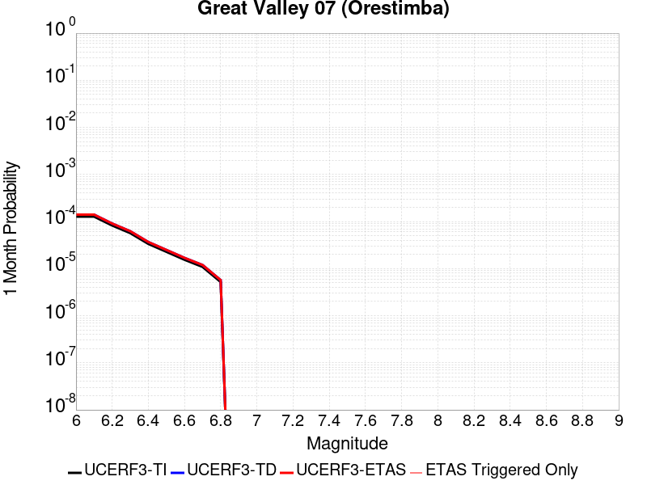 |  |  |

| Magnitude | 1 wk TI Prob | 1 wk TD Prob | 1 wk ETAS Prob | 1 wk ETAS/TD Gain | 1 wk ETAS Triggered Only | 1 mo TI Prob | 1 mo TD Prob | 1 mo ETAS Prob | 1 mo ETAS/TD Gain | 1 mo ETAS Triggered Only | 1 yr TI Prob | 1 yr TD Prob | 1 yr ETAS Prob | 1 yr ETAS/TD Gain | 1 yr ETAS Triggered Only | 10 yr TI Prob | 10 yr TD Prob | 10 yr ETAS Prob | 10 yr ETAS/TD Gain | 10 yr ETAS Triggered Only |
|-----|-----|-----|-----|-----|-----|-----|-----|-----|-----|-----|-----|-----|-----|-----|-----|-----|-----|-----|-----|-----|
| 6.0 | 2.9687902E-5 | 3.27575E-5 | 3.27575E-5 | 1.0 | 0.0 | 1.2722766E-4 | 1.4038214E-4 | 1.4038214E-4 | 1.0 | 0.0 | 0.0015478961 | 0.0017078844 | 0.0017078844 | 1.0 | 0.0 | 0.015371585 | 0.016955135 | 0.017037392 | 1.0048515 | 8.3675004E-5 |
| 6.1 | 2.9687902E-5 | 3.27575E-5 | 3.27575E-5 | 1.0 | 0.0 | 1.2722766E-4 | 1.4038214E-4 | 1.4038214E-4 | 1.0 | 0.0 | 0.0015478961 | 0.0017078844 | 0.0017078844 | 1.0 | 0.0 | 0.015371585 | 0.016955135 | 0.017037392 | 1.0048515 | 8.3675004E-5 |
| 6.2 | 1.9231524E-5 | 2.1159167E-5 | 2.1159167E-5 | 1.0 | 0.0 | 8.2418206E-5 | 9.067912E-5 | 9.067912E-5 | 1.0 | 0.0 | 0.0010029797 | 0.0011034822 | 0.0011034822 | 1.0 | 0.0 | 0.00998465 | 0.01098244 | 0.011065196 | 1.0075353 | 8.3675004E-5 |
| 6.3 | 1.324766E-5 | 1.4548534E-5 | 1.4548534E-5 | 1.0 | 0.0 | 5.6774446E-5 | 6.234942E-5 | 6.234942E-5 | 1.0 | 0.0 | 6.910097E-4 | 7.5884897E-4 | 7.5884897E-4 | 1.0 | 0.0 | 0.006888649 | 0.0075635235 | 0.007646566 | 1.0109793 | 8.3675004E-5 |
| 6.4 | 7.818645E-6 | 8.57284E-6 | 8.57284E-6 | 1.0 | 0.0 | 3.3508048E-5 | 3.6740246E-5 | 3.6740246E-5 | 1.0 | 0.0 | 4.078841E-4 | 4.4722404E-4 | 4.4722404E-4 | 1.0 | 0.0 | 0.004071363 | 0.0044635804 | 0.0044635804 | 1.0 | 0.0 |
| 6.5 | 5.3076565E-6 | 5.8178007E-6 | 5.8178007E-6 | 1.0 | 0.0 | 2.27469E-5 | 2.4933206E-5 | 2.4933206E-5 | 1.0 | 0.0 | 2.7690834E-4 | 3.035216E-4 | 3.035216E-4 | 1.0 | 0.0 | 0.0027656353 | 0.00303128 | 0.00303128 | 1.0 | 0.0 |
| 6.6 | 3.6003578E-6 | 3.9484953E-6 | 3.9484953E-6 | 1.0 | 0.0 | 1.5430012E-5 | 1.6922022E-5 | 1.6922022E-5 | 1.0 | 0.0 | 1.8784421E-4 | 2.0600771E-4 | 2.0600771E-4 | 1.0 | 0.0 | 0.0018768552 | 0.0020583214 | 0.0020583214 | 1.0 | 0.0 |
| 6.7 | 2.5361826E-6 | 2.7834678E-6 | 2.7834678E-6 | 1.0 | 0.0 | 1.0869308E-5 | 1.1929101E-5 | 1.1929101E-5 | 1.0 | 0.0 | 1.3232579E-4 | 1.4522845E-4 | 1.4522845E-4 | 1.0 | 0.0 | 0.0013224703 | 0.0014514653 | 0.0014514653 | 1.0 | 0.0 |
| 6.8 | 1.2115831E-6 | 1.3313797E-6 | 1.3313797E-6 | 1.0 | 0.0 | 5.1924885E-6 | 5.7059065E-6 | 5.7059065E-6 | 1.0 | 0.0 | 6.3216714E-5 | 6.9468166E-5 | 6.9468166E-5 | 1.0 | 0.0 | 6.3198735E-4 | 6.945596E-4 | 6.945596E-4 | 1.0 | 0.0 |

## San Jacinto (Anza) rev
*[(top)](#table-of-contents)*

| 1 Week | 1 Month | 1 Year | 10 Year |
|-----|-----|-----|-----|
|  |  |  |  |

| Magnitude | 1 wk TI Prob | 1 wk TD Prob | 1 wk ETAS Prob | 1 wk ETAS/TD Gain | 1 wk ETAS Triggered Only | 1 mo TI Prob | 1 mo TD Prob | 1 mo ETAS Prob | 1 mo ETAS/TD Gain | 1 mo ETAS Triggered Only | 1 yr TI Prob | 1 yr TD Prob | 1 yr ETAS Prob | 1 yr ETAS/TD Gain | 1 yr ETAS Triggered Only | 10 yr TI Prob | 10 yr TD Prob | 10 yr ETAS Prob | 10 yr ETAS/TD Gain | 10 yr ETAS Triggered Only |
|-----|-----|-----|-----|-----|-----|-----|-----|-----|-----|-----|-----|-----|-----|-----|-----|-----|-----|-----|-----|-----|
| 6.0 | 6.3015636E-5 | 4.3302647E-5 | 1.2697403E-4 | 2.9322464 | 8.3675004E-5 | 2.7003905E-4 | 1.8556965E-4 | 2.6922912E-4 | 1.4508252 | 8.3675004E-5 | 0.0032827691 | 0.0022569813 | 0.0023404674 | 1.0369902 | 8.3675004E-5 | 0.032346968 | 0.023296192 | 0.023377918 | 1.0035081 | 8.3675004E-5 |
| 6.1 | 6.3015636E-5 | 4.3302647E-5 | 1.2697403E-4 | 2.9322464 | 8.3675004E-5 | 2.7003905E-4 | 1.8556965E-4 | 2.6922912E-4 | 1.4508252 | 8.3675004E-5 | 0.0032827691 | 0.0022569813 | 0.0023404674 | 1.0369902 | 8.3675004E-5 | 0.032346968 | 0.023296192 | 0.023377918 | 1.0035081 | 8.3675004E-5 |
| 6.2 | 6.3015636E-5 | 4.3302647E-5 | 1.2697403E-4 | 2.9322464 | 8.3675004E-5 | 2.7003905E-4 | 1.8556965E-4 | 2.6922912E-4 | 1.4508252 | 8.3675004E-5 | 0.0032827691 | 0.0022569813 | 0.0023404674 | 1.0369902 | 8.3675004E-5 | 0.032346968 | 0.023296192 | 0.023377918 | 1.0035081 | 8.3675004E-5 |
| 6.3 | 6.3015636E-5 | 4.3302647E-5 | 1.2697403E-4 | 2.9322464 | 8.3675004E-5 | 2.7003905E-4 | 1.8556965E-4 | 2.6922912E-4 | 1.4508252 | 8.3675004E-5 | 0.0032827691 | 0.0022569813 | 0.0023404674 | 1.0369902 | 8.3675004E-5 | 0.032346968 | 0.023296192 | 0.023377918 | 1.0035081 | 8.3675004E-5 |
| 6.4 | 6.3015636E-5 | 4.3302647E-5 | 1.2697403E-4 | 2.9322464 | 8.3675004E-5 | 2.7003905E-4 | 1.8556965E-4 | 2.6922912E-4 | 1.4508252 | 8.3675004E-5 | 0.0032827691 | 0.0022569813 | 0.0023404674 | 1.0369902 | 8.3675004E-5 | 0.032346968 | 0.023296192 | 0.023377918 | 1.0035081 | 8.3675004E-5 |
| 6.5 | 5.811017E-5 | 4.0082516E-5 | 1.2375417E-4 | 3.087485 | 8.3675004E-5 | 2.4901982E-4 | 1.7177092E-4 | 2.5543157E-4 | 1.4870477 | 8.3675004E-5 | 0.0030276014 | 0.002089311 | 0.002172811 | 1.0399654 | 8.3675004E-5 | 0.02986684 | 0.021593736 | 0.021675605 | 1.0037913 | 8.3675004E-5 |
| 6.6 | 5.811017E-5 | 4.0082516E-5 | 1.2375417E-4 | 3.087485 | 8.3675004E-5 | 2.4901982E-4 | 1.7177092E-4 | 2.5543157E-4 | 1.4870477 | 8.3675004E-5 | 0.0030276014 | 0.002089311 | 0.002172811 | 1.0399654 | 8.3675004E-5 | 0.02986684 | 0.021593736 | 0.021675605 | 1.0037913 | 8.3675004E-5 |
| 6.7 | 5.712442E-5 | 3.9505223E-5 | 1.2317693E-4 | 3.1179907 | 8.3675004E-5 | 2.4479596E-4 | 1.6929714E-4 | 2.5295798E-4 | 1.4941657 | 8.3675004E-5 | 0.0029763177 | 0.0020592497 | 0.0021427523 | 1.0405501 | 8.3675004E-5 | 0.029367693 | 0.021285562 | 0.021367457 | 1.0038474 | 8.3675004E-5 |
| 6.8 | 5.6967532E-5 | 3.9361643E-5 | 1.2303336E-4 | 3.125717 | 8.3675004E-5 | 2.4412372E-4 | 1.6868189E-4 | 2.5234278E-4 | 1.4959685 | 8.3675004E-5 | 0.0029681553 | 0.002051773 | 0.0021352763 | 1.0406982 | 8.3675004E-5 | 0.029288229 | 0.021210281 | 0.021292182 | 1.0038613 | 8.3675004E-5 |
| 6.9 | 5.6211324E-5 | 3.9066435E-5 | 1.2273817E-4 | 3.1417806 | 8.3675004E-5 | 2.4088343E-4 | 1.6741687E-4 | 2.5107787E-4 | 1.4997166 | 8.3675004E-5 | 0.0029288116 | 0.0020364004 | 0.0021199048 | 1.041006 | 8.3675004E-5 | 0.028905109 | 0.021049714 | 0.021131627 | 1.0038915 | 8.3675004E-5 |
| 7.0 | 5.4383527E-5 | 3.792697E-5 | 1.215988E-4 | 3.2061303 | 8.3675004E-5 | 2.3305144E-4 | 1.6253405E-4 | 2.4619547E-4 | 1.5147315 | 8.3675004E-5 | 0.0028337094 | 0.001977061 | 0.0020605705 | 1.0422393 | 8.3675004E-5 | 0.027978465 | 0.020440677 | 0.020522641 | 1.0040098 | 8.3675004E-5 |
| 7.1 | 5.1393665E-5 | 3.6389913E-5 | 1.2006187E-4 | 3.2993174 | 8.3675004E-5 | 2.2023996E-4 | 1.5594746E-4 | 2.3960942E-4 | 1.5364753 | 8.3675004E-5 | 0.0026781242 | 0.0018970112 | 0.0019805275 | 1.0440252 | 8.3675004E-5 | 0.026460782 | 0.019614287 | 0.01969632 | 1.0041823 | 8.3675004E-5 |
| 7.2 | 4.785222E-5 | 3.4741795E-5 | 1.184139E-4 | 3.4083989 | 8.3675004E-5 | 2.0506482E-4 | 1.4888494E-4 | 2.3254748E-4 | 1.5619276 | 8.3675004E-5 | 0.0024938055 | 0.0018111705 | 0.0018946939 | 1.0461158 | 8.3675004E-5 | 0.024660049 | 0.018728992 | 0.0188111 | 1.004384 | 8.3675004E-5 |
| 7.3 | 4.2143256E-5 | 3.383628E-5 | 1.17508454E-4 | 3.472854 | 8.3675004E-5 | 1.8060145E-4 | 1.4500458E-4 | 2.2866746E-4 | 1.5769671 | 8.3675004E-5 | 0.002196605 | 0.0017640047 | 0.0018475321 | 1.047351 | 8.3675004E-5 | 0.02175019 | 0.01823724 | 0.01831939 | 1.0045044 | 8.3675004E-5 |
| 7.4 | 4.0264713E-5 | 3.347446E-5 | 1.17146665E-4 | 3.4995832 | 8.3675004E-5 | 1.7255165E-4 | 1.4345412E-4 | 2.2711711E-4 | 1.5832039 | 8.3675004E-5 | 0.002098792 | 0.0017451581 | 0.001828687 | 1.0478632 | 8.3675004E-5 | 0.020790804 | 0.018041821 | 0.018123986 | 1.0045542 | 8.3675004E-5 |
| 7.5 | 3.694492E-5 | 3.218847E-5 | 1.1586078E-4 | 3.59945 | 8.3675004E-5 | 1.5832575E-4 | 1.379433E-4 | 2.2160677E-4 | 1.6065062 | 8.3675004E-5 | 0.0019259118 | 0.001678169 | 0.0017617035 | 1.0497773 | 8.3675004E-5 | 0.01909306 | 0.01735827 | 0.017440492 | 1.0047368 | 8.3675004E-5 |
| 7.6 | 3.200565E-5 | 2.9504106E-5 | 1.1317665E-4 | 3.8359625 | 8.3675004E-5 | 1.3715986E-4 | 1.2644005E-4 | 2.1010448E-4 | 1.6616924 | 8.3675004E-5 | 0.001668642 | 0.0015383229 | 0.0016218692 | 1.05431 | 8.3675004E-5 | 0.01656168 | 0.0159463 | 0.01602864 | 1.0051637 | 8.3675004E-5 |
| 7.7 | 2.731642E-5 | 2.6092788E-5 | 1.0976561E-4 | 4.2067413 | 8.3675004E-5 | 1.1706512E-4 | 1.1182144E-4 | 1.954871E-4 | 1.7482076 | 8.3675004E-5 | 0.001424336 | 0.0013605768 | 0.001444138 | 1.061416 | 8.3675004E-5 | 0.014152412 | 0.014167004 | 0.014249494 | 1.0058227 | 8.3675004E-5 |
| 7.8 | 2.3466424E-5 | 2.3504817E-5 | 1.0717786E-4 | 4.559825 | 8.3675004E-5 | 1.0056651E-4 | 1.0073105E-4 | 1.8439762E-4 | 1.8305937 | 8.3675004E-5 | 0.0012237094 | 0.0012257113 | 0.0013092838 | 1.0681828 | 8.3675004E-5 | 0.012169928 | 0.012808893 | 0.0128914965 | 1.0064489 | 8.3675004E-5 |
| 7.9 | 1.8611925E-5 | 1.8908117E-5 | 1.0258154E-4 | 5.425265 | 8.3675004E-5 | 7.9762955E-5 | 8.1032274E-5 | 1.647005E-4 | 2.0325296 | 8.3675004E-5 | 9.7068126E-4 | 9.861222E-4 | 0.0010697147 | 1.0847689 | 8.3675004E-5 | 0.0096645225 | 0.010393824 | 0.01047663 | 1.0079668 | 8.3675004E-5 |
| 8.0 | 1.5460775E-5 | 1.5740965E-5 | 9.9414654E-5 | 6.315665 | 8.3675004E-5 | 6.6258784E-5 | 6.7459536E-5 | 1.511289E-4 | 2.2402897 | 8.3675004E-5 | 8.0640207E-4 | 8.21011E-4 | 9.0461737E-4 | 1.1018333 | 8.3675004E-5 | 0.008034821 | 0.0087028835 | 0.00878583 | 1.0095309 | 8.3675004E-5 |
| 8.1 | 9.983884E-6 | 8.269952E-6 | 9.194427E-5 | 11.117872 | 8.3675004E-5 | 4.2787375E-5 | 3.544217E-5 | 1.19114215E-4 | 3.3608046 | 8.3675004E-5 | 5.2081177E-4 | 4.314235E-4 | 5.150624E-4 | 1.1938673 | 8.3675004E-5 | 0.0051959283 | 0.004640022 | 0.0047233086 | 1.0179497 | 8.3675004E-5 |
| 8.2 | 4.1226E-6 | 1.5529788E-6 | 1.5529788E-6 | 1.0 | 0.0 | 1.7668166E-5 | 6.6556063E-6 | 6.6556063E-6 | 1.0 | 0.0 | 2.1508869E-4 | 8.102902E-5 | 8.102902E-5 | 1.0 | 0.0 | 0.0021488064 | 9.4050163E-4 | 9.4050163E-4 | 1.0 | 0.0 |
| 8.3 | 1.2750878E-6 | 3.612133E-7 | 3.612133E-7 | 1.0 | 0.0 | 5.4646503E-6 | 1.548056E-6 | 1.548056E-6 | 1.0 | 0.0 | 6.653009E-5 | 1.8847424E-5 | 1.8847424E-5 | 1.0 | 0.0 | 6.6510175E-4 | 2.2734253E-4 | 2.2734253E-4 | 1.0 | 0.0 |

## White Wolf (Extension)
*[(top)](#table-of-contents)*

| 1 Week | 1 Month | 1 Year | 10 Year |
|-----|-----|-----|-----|
|  |  |  |  |

| Magnitude | 1 wk TI Prob | 1 wk TD Prob | 1 wk ETAS Prob | 1 wk ETAS/TD Gain | 1 wk ETAS Triggered Only | 1 mo TI Prob | 1 mo TD Prob | 1 mo ETAS Prob | 1 mo ETAS/TD Gain | 1 mo ETAS Triggered Only | 1 yr TI Prob | 1 yr TD Prob | 1 yr ETAS Prob | 1 yr ETAS/TD Gain | 1 yr ETAS Triggered Only | 10 yr TI Prob | 10 yr TD Prob | 10 yr ETAS Prob | 10 yr ETAS/TD Gain | 10 yr ETAS Triggered Only |
|-----|-----|-----|-----|-----|-----|-----|-----|-----|-----|-----|-----|-----|-----|-----|-----|-----|-----|-----|-----|-----|
| 6.0 | 8.222555E-6 | 6.0666657E-6 | 6.0666657E-6 | 1.0 | 0.0 | 3.5239045E-5 | 2.5999774E-5 | 2.5999774E-5 | 1.0 | 0.0 | 4.289509E-4 | 3.1650788E-4 | 3.1650788E-4 | 1.0 | 0.0 | 0.0042812387 | 0.003161223 | 0.0032446336 | 1.0263855 | 8.3675004E-5 |
| 6.1 | 8.222555E-6 | 6.0666657E-6 | 6.0666657E-6 | 1.0 | 0.0 | 3.5239045E-5 | 2.5999774E-5 | 2.5999774E-5 | 1.0 | 0.0 | 4.289509E-4 | 3.1650788E-4 | 3.1650788E-4 | 1.0 | 0.0 | 0.0042812387 | 0.003161223 | 0.0032446336 | 1.0263855 | 8.3675004E-5 |
| 6.2 | 8.222555E-6 | 6.0666657E-6 | 6.0666657E-6 | 1.0 | 0.0 | 3.5239045E-5 | 2.5999774E-5 | 2.5999774E-5 | 1.0 | 0.0 | 4.289509E-4 | 3.1650788E-4 | 3.1650788E-4 | 1.0 | 0.0 | 0.0042812387 | 0.003161223 | 0.0032446336 | 1.0263855 | 8.3675004E-5 |
| 6.3 | 8.222555E-6 | 6.0666657E-6 | 6.0666657E-6 | 1.0 | 0.0 | 3.5239045E-5 | 2.5999774E-5 | 2.5999774E-5 | 1.0 | 0.0 | 4.289509E-4 | 3.1650788E-4 | 3.1650788E-4 | 1.0 | 0.0 | 0.0042812387 | 0.003161223 | 0.0032446336 | 1.0263855 | 8.3675004E-5 |
| 6.4 | 5.821773E-6 | 3.5571766E-6 | 3.5571766E-6 | 1.0 | 0.0 | 2.4950215E-5 | 1.5244959E-5 | 1.5244959E-5 | 1.0 | 0.0 | 3.0372653E-4 | 1.8559267E-4 | 1.8559267E-4 | 1.0 | 0.0 | 0.0030331176 | 0.001854485 | 0.0019380049 | 1.0450367 | 8.3675004E-5 |
| 6.5 | 5.766023E-6 | 3.4991106E-6 | 3.4991106E-6 | 1.0 | 0.0 | 2.4711293E-5 | 1.4996108E-5 | 1.4996108E-5 | 1.0 | 0.0 | 3.0081844E-4 | 1.8256342E-4 | 1.8256342E-4 | 1.0 | 0.0 | 0.0030041158 | 0.0018242426 | 0.0019077649 | 1.0457847 | 8.3675004E-5 |
| 6.6 | 4.643576E-6 | 2.332624E-6 | 2.332624E-6 | 1.0 | 0.0 | 1.9900888E-5 | 9.996925E-6 | 9.996925E-6 | 1.0 | 0.0 | 2.4226638E-4 | 1.2170619E-4 | 1.2170619E-4 | 1.0 | 0.0 | 0.0024200242 | 0.0012164378 | 0.001300011 | 1.0687033 | 8.3675004E-5 |
| 6.7 | 3.9529173E-6 | 1.6483477E-6 | 1.6483477E-6 | 1.0 | 0.0 | 1.6940963E-5 | 7.0643296E-6 | 7.0643296E-6 | 1.0 | 0.0 | 2.0623671E-4 | 8.6005006E-5 | 8.6005006E-5 | 1.0 | 0.0 | 0.002060454 | 8.597357E-4 | 8.597357E-4 | 1.0 | 0.0 |
| 6.8 | 3.4377522E-6 | 1.2245237E-6 | 1.2245237E-6 | 1.0 | 0.0 | 1.473314E-5 | 5.2479486E-6 | 5.2479486E-6 | 1.0 | 0.0 | 1.7936122E-4 | 6.3891996E-5 | 6.3891996E-5 | 1.0 | 0.0 | 0.0017921652 | 6.387454E-4 | 6.387454E-4 | 1.0 | 0.0 |
| 6.9 | 3.1367306E-6 | 1.0033783E-6 | 1.0033783E-6 | 1.0 | 0.0 | 1.3443062E-5 | 4.3001864E-6 | 4.3001864E-6 | 1.0 | 0.0 | 1.63657E-4 | 5.235359E-5 | 5.235359E-5 | 1.0 | 0.0 | 0.0016353652 | 5.2342017E-4 | 5.2342017E-4 | 1.0 | 0.0 |
| 7.0 | 2.8298145E-6 | 7.4286646E-7 | 7.4286646E-7 | 1.0 | 0.0 | 1.2127721E-5 | 3.1837099E-6 | 3.1837099E-6 | 1.0 | 0.0 | 1.47645E-4 | 3.8761027E-5 | 3.8761027E-5 | 1.0 | 0.0 | 0.0014754693 | 3.8754768E-4 | 3.8754768E-4 | 1.0 | 0.0 |
| 7.1 | 2.4091064E-6 | 5.4227525E-7 | 5.4227525E-7 | 1.0 | 0.0 | 1.03247E-5 | 2.3240348E-6 | 2.3240348E-6 | 1.0 | 0.0 | 1.2569598E-4 | 2.8294799E-5 | 2.8294799E-5 | 1.0 | 0.0 | 0.001256249 | 2.8291598E-4 | 2.8291598E-4 | 1.0 | 0.0 |
| 7.2 | 1.3875518E-6 | 1.0743063E-7 | 1.0743063E-7 | 1.0 | 0.0 | 5.9466374E-6 | 4.6041689E-7 | 4.6041689E-7 | 1.0 | 0.0 | 7.23979E-5 | 5.6055624E-6 | 5.6055624E-6 | 1.0 | 0.0 | 7.2374323E-4 | 5.6054323E-5 | 5.6054323E-5 | 1.0 | 0.0 |
| 7.3 | 7.056077E-7 | 5.002034E-8 | 5.002034E-8 | 1.0 | 0.0 | 3.0240296E-6 | 2.1437286E-7 | 2.1437286E-7 | 1.0 | 0.0 | 3.681694E-5 | 2.609987E-6 | 2.609987E-6 | 1.0 | 0.0 | 3.681084E-4 | 2.609961E-5 | 2.609961E-5 | 1.0 | 0.0 |
| 7.4 | 5.9334678E-8 | 4.8683537E-9 | 4.8683537E-9 | 1.0 | 0.0 | 2.5429145E-7 | 2.0864372E-8 | 2.0864372E-8 | 1.0 | 0.0 | 3.095994E-6 | 2.5402372E-7 | 2.5402372E-7 | 1.0 | 0.0 | 3.095951E-5 | 2.5402353E-6 | 2.5402353E-6 | 1.0 | 0.0 |

## Ortigalita (North)
*[(top)](#table-of-contents)*

| 1 Week | 1 Month | 1 Year | 10 Year |
|-----|-----|-----|-----|
|  |  |  |  |

| Magnitude | 1 wk TI Prob | 1 wk TD Prob | 1 wk ETAS Prob | 1 wk ETAS/TD Gain | 1 wk ETAS Triggered Only | 1 mo TI Prob | 1 mo TD Prob | 1 mo ETAS Prob | 1 mo ETAS/TD Gain | 1 mo ETAS Triggered Only | 1 yr TI Prob | 1 yr TD Prob | 1 yr ETAS Prob | 1 yr ETAS/TD Gain | 1 yr ETAS Triggered Only | 10 yr TI Prob | 10 yr TD Prob | 10 yr ETAS Prob | 10 yr ETAS/TD Gain | 10 yr ETAS Triggered Only |
|-----|-----|-----|-----|-----|-----|-----|-----|-----|-----|-----|-----|-----|-----|-----|-----|-----|-----|-----|-----|-----|
| 6.0 | 7.711876E-5 | 1.05064966E-4 | 1.05064966E-4 | 1.0 | 0.0 | 3.3046713E-4 | 4.502116E-4 | 4.502116E-4 | 1.0 | 0.0 | 0.004016016 | 0.0054681194 | 0.0054681194 | 1.0 | 0.0 | 0.039442103 | 0.053454787 | 0.05353399 | 1.0014817 | 8.3675004E-5 |
| 6.1 | 4.607858E-5 | 6.0239203E-5 | 6.0239203E-5 | 1.0 | 0.0 | 1.9746469E-4 | 2.5814527E-4 | 2.5814527E-4 | 1.0 | 0.0 | 0.0024014818 | 0.0031387596 | 0.0031387596 | 1.0 | 0.0 | 0.023756953 | 0.030975068 | 0.030975068 | 1.0 | 0.0 |
| 6.2 | 4.607858E-5 | 6.0239203E-5 | 6.0239203E-5 | 1.0 | 0.0 | 1.9746469E-4 | 2.5814527E-4 | 2.5814527E-4 | 1.0 | 0.0 | 0.0024014818 | 0.0031387596 | 0.0031387596 | 1.0 | 0.0 | 0.023756953 | 0.030975068 | 0.030975068 | 1.0 | 0.0 |
| 6.3 | 3.327423E-5 | 4.2475127E-5 | 4.2475127E-5 | 1.0 | 0.0 | 1.4259605E-4 | 1.8202531E-4 | 1.8202531E-4 | 1.0 | 0.0 | 0.0017347244 | 0.002214197 | 0.002214197 | 1.0 | 0.0 | 0.017212452 | 0.021945644 | 0.021945644 | 1.0 | 0.0 |
| 6.4 | 2.7732503E-5 | 3.4998593E-5 | 3.4998593E-5 | 1.0 | 0.0 | 1.1884817E-4 | 1.4998685E-4 | 1.4998685E-4 | 1.0 | 0.0 | 0.001446016 | 0.0018248095 | 0.0018248095 | 1.0 | 0.0 | 0.014366428 | 0.018121224 | 0.018121224 | 1.0 | 0.0 |
| 6.5 | 2.7689714E-5 | 3.4948407E-5 | 3.4948407E-5 | 1.0 | 0.0 | 1.186648E-4 | 1.497718E-4 | 1.497718E-4 | 1.0 | 0.0 | 0.0014437864 | 0.0018221956 | 0.0018221956 | 1.0 | 0.0 | 0.014344421 | 0.01809551 | 0.01809551 | 1.0 | 0.0 |
| 6.6 | 2.2976905E-5 | 2.8718265E-5 | 2.8718265E-5 | 1.0 | 0.0 | 9.846873E-5 | 1.230739E-4 | 1.230739E-4 | 1.0 | 0.0 | 0.0011981975 | 0.0014976363 | 0.0014976363 | 1.0 | 0.0 | 0.011917574 | 0.014898697 | 0.014898697 | 1.0 | 0.0 |
| 6.7 | 1.9871539E-5 | 2.4904411E-5 | 2.4904411E-5 | 1.0 | 0.0 | 8.516096E-5 | 1.0673023E-4 | 1.0673023E-4 | 1.0 | 0.0 | 0.0010363415 | 0.0012989145 | 0.0012989145 | 1.0 | 0.0 | 0.010315218 | 0.012936919 | 0.012936919 | 1.0 | 0.0 |
| 6.8 | 6.5640475E-6 | 7.6054926E-6 | 7.6054926E-6 | 1.0 | 0.0 | 2.813133E-5 | 3.2594577E-5 | 3.2594577E-5 | 1.0 | 0.0 | 3.424451E-4 | 3.9676955E-4 | 3.9676955E-4 | 1.0 | 0.0 | 0.0034191788 | 0.003960899 | 0.003960899 | 1.0 | 0.0 |
| 6.9 | 5.6219683E-6 | 6.5018376E-6 | 6.5018376E-6 | 1.0 | 0.0 | 2.4093928E-5 | 2.7864735E-5 | 2.7864735E-5 | 1.0 | 0.0 | 2.933041E-4 | 3.3920293E-4 | 3.3920293E-4 | 1.0 | 0.0 | 0.0029291727 | 0.003387109 | 0.003387109 | 1.0 | 0.0 |
| 7.0 | 3.875591E-6 | 4.4847548E-6 | 4.4847548E-6 | 1.0 | 0.0 | 1.6609569E-5 | 1.9220248E-5 | 1.9220248E-5 | 1.0 | 0.0 | 2.0220275E-4 | 2.339835E-4 | 2.339835E-4 | 1.0 | 0.0 | 0.0020201886 | 0.0023375798 | 0.0023375798 | 1.0 | 0.0 |
| 7.1 | 1.6017933E-6 | 1.8570418E-6 | 1.8570418E-6 | 1.0 | 0.0 | 6.8648105E-6 | 7.958732E-6 | 7.958732E-6 | 1.0 | 0.0 | 8.357586E-5 | 9.689432E-5 | 9.689432E-5 | 1.0 | 0.0 | 8.3544437E-4 | 9.686254E-4 | 9.686254E-4 | 1.0 | 0.0 |

## Lost Hills
*[(top)](#table-of-contents)*

| 1 Week | 1 Month | 1 Year | 10 Year |
|-----|-----|-----|-----|
|  |  |  |  |

| Magnitude | 1 wk TI Prob | 1 wk TD Prob | 1 wk ETAS Prob | 1 wk ETAS/TD Gain | 1 wk ETAS Triggered Only | 1 mo TI Prob | 1 mo TD Prob | 1 mo ETAS Prob | 1 mo ETAS/TD Gain | 1 mo ETAS Triggered Only | 1 yr TI Prob | 1 yr TD Prob | 1 yr ETAS Prob | 1 yr ETAS/TD Gain | 1 yr ETAS Triggered Only | 10 yr TI Prob | 10 yr TD Prob | 10 yr ETAS Prob | 10 yr ETAS/TD Gain | 10 yr ETAS Triggered Only |
|-----|-----|-----|-----|-----|-----|-----|-----|-----|-----|-----|-----|-----|-----|-----|-----|-----|-----|-----|-----|-----|
| 6.0 | 2.233523E-5 | 2.5106583E-5 | 1.0877949E-4 | 4.332708 | 8.3675004E-5 | 9.571891E-5 | 1.0759615E-4 | 1.9126215E-4 | 1.7775929 | 8.3675004E-5 | 0.0011647546 | 0.001309364 | 0.0013929295 | 1.0638214 | 8.3675004E-5 | 0.011586686 | 0.013033091 | 0.013115675 | 1.0063366 | 8.3675004E-5 |
| 6.1 | 2.233523E-5 | 2.5106583E-5 | 1.0877949E-4 | 4.332708 | 8.3675004E-5 | 9.571891E-5 | 1.0759615E-4 | 1.9126215E-4 | 1.7775929 | 8.3675004E-5 | 0.0011647546 | 0.001309364 | 0.0013929295 | 1.0638214 | 8.3675004E-5 | 0.011586686 | 0.013033091 | 0.013115675 | 1.0063366 | 8.3675004E-5 |
| 6.2 | 2.233523E-5 | 2.5106583E-5 | 1.0877949E-4 | 4.332708 | 8.3675004E-5 | 9.571891E-5 | 1.0759615E-4 | 1.9126215E-4 | 1.7775929 | 8.3675004E-5 | 0.0011647546 | 0.001309364 | 0.0013929295 | 1.0638214 | 8.3675004E-5 | 0.011586686 | 0.013033091 | 0.013115675 | 1.0063366 | 8.3675004E-5 |
| 6.3 | 2.233523E-5 | 2.5106583E-5 | 1.0877949E-4 | 4.332708 | 8.3675004E-5 | 9.571891E-5 | 1.0759615E-4 | 1.9126215E-4 | 1.7775929 | 8.3675004E-5 | 0.0011647546 | 0.001309364 | 0.0013929295 | 1.0638214 | 8.3675004E-5 | 0.011586686 | 0.013033091 | 0.013115675 | 1.0063366 | 8.3675004E-5 |
| 6.4 | 1.2288092E-5 | 1.3781108E-5 | 1.3781108E-5 | 1.0 | 0.0 | 5.2662188E-5 | 5.906108E-5 | 5.906108E-5 | 1.0 | 0.0 | 6.409735E-4 | 7.189252E-4 | 7.189252E-4 | 1.0 | 0.0 | 0.006391279 | 0.0071752006 | 0.0071752006 | 1.0 | 0.0 |
| 6.5 | 1.2288092E-5 | 1.3781108E-5 | 1.3781108E-5 | 1.0 | 0.0 | 5.2662188E-5 | 5.906108E-5 | 5.906108E-5 | 1.0 | 0.0 | 6.409735E-4 | 7.189252E-4 | 7.189252E-4 | 1.0 | 0.0 | 0.006391279 | 0.0071752006 | 0.0071752006 | 1.0 | 0.0 |
| 6.6 | 8.58281E-6 | 9.63377E-6 | 9.63377E-6 | 1.0 | 0.0 | 3.6782953E-5 | 4.12874E-5 | 4.12874E-5 | 1.0 | 0.0 | 4.4774043E-4 | 5.026414E-4 | 5.026414E-4 | 1.0 | 0.0 | 0.0044683935 | 0.005023205 | 0.005023205 | 1.0 | 0.0 |
| 6.7 | 7.205685E-6 | 8.088302E-6 | 8.088302E-6 | 1.0 | 0.0 | 3.088114E-5 | 3.466415E-5 | 3.466415E-5 | 1.0 | 0.0 | 3.7591302E-4 | 4.2203604E-4 | 4.2203604E-4 | 1.0 | 0.0 | 0.0037527776 | 0.0042203604 | 0.0042203604 | 1.0 | 0.0 |

