# Parent Section Magnitude-Probability Distributions

Only fault sections with at least one triggered aftershock are plotted. Sections are sorted by total supraseismogenic trigger rate (decreasing)

## Table Of Contents

* [Garlock (Central)](#garlock-central)
* [Tank Canyon](#tank-canyon)
* [Little Lake](#little-lake)
* [Owl Lake](#owl-lake)
* [Airport Lake](#airport-lake)
* [Panamint Valley](#panamint-valley)
* [Garlock (East)](#garlock-east)
* [Hunter Mountain-Saline Valley](#hunter-mountain-saline-valley)
* [Blackwater](#blackwater)
* [Ash Hill](#ash-hill)
* [Garlock (West)](#garlock-west)
* [McLean Lake](#mclean-lake)
* [Gravel Hills-Harper Lk](#gravel-hills-harper-lk)
* [Goldstone Lake](#goldstone-lake)
* [So Sierra Nevada](#so-sierra-nevada)
* [San Andreas (Mojave N)](#san-andreas-mojave-n)
* [Nelson Lake](#nelson-lake)
* [Coyote Canyon](#coyote-canyon)
* [San Andreas (Mojave S)](#san-andreas-mojave-s)
* [Towne Pass](#towne-pass)
* [Death Valley (So)](#death-valley-so)
* [Lenwood-Lockhart-Old Woman Springs](#lenwood-lockhart-old-woman-springs)
* [San Andreas (San Bernardino N)](#san-andreas-san-bernardino-n)
* [Paradise](#paradise)
* [Bicycle Lake](#bicycle-lake)
* [Garlic Springs](#garlic-springs)
* [San Andreas (San Bernardino S)](#san-andreas-san-bernardino-s)
* [Helendale-So Lockhart](#helendale-so-lockhart)
* [Death Valley (Black Mtns Frontal)](#death-valley-black-mtns-frontal)
* [San Andreas (Big Bend)](#san-andreas-big-bend)
* [Coyote Lake](#coyote-lake)
* [Manix-Afton Hills](#manix-afton-hills)
* [Death Valley (No)](#death-valley-no)
* [San Andreas (Parkfield)](#san-andreas-parkfield)
* [San Andreas (Cholame) rev](#san-andreas-cholame-rev)
* [Ludlow](#ludlow)
* [San Andreas (Carrizo) rev](#san-andreas-carrizo-rev)
* [San Andreas (San Gorgonio Pass-Garnet HIll)](#san-andreas-san-gorgonio-pass-garnet-hill)
* [San Andreas (Creeping Section) 2011 CFM](#san-andreas-creeping-section-2011-cfm)
* [Death Valley (Fish Lake Valley)](#death-valley-fish-lake-valley)
* [Calico-Hidalgo](#calico-hidalgo)
* [Independence rev 2011](#independence-rev-2011)
* [Red Pass](#red-pass)
* [Cady](#cady)
* [Elsinore (Glen Ivy) rev](#elsinore-glen-ivy-rev)
* [Sierra Nevada  (No Extension)](#sierra-nevada--no-extension)
* [Lake Isabella (Seismicity)](#lake-isabella-seismicity)
* [Channel Islands Thrust](#channel-islands-thrust)
* [Big Pine (Central)](#big-pine-central)
* [Rose Canyon](#rose-canyon)
* [Pleito](#pleito)
* [San Jacinto (San Bernardino)](#san-jacinto-san-bernardino)
* [Baker](#baker)
* [Scodie Lineament](#scodie-lineament)
* [Santa Cruz Island](#santa-cruz-island)
* [Ortigalita (North)](#ortigalita-north)
* [Santa Rosa Island](#santa-rosa-island)
* [Santa Ynez (East)](#santa-ynez-east)
* [Rinconada 2011 CFM](#rinconada-2011-cfm)
* [San Andreas (Coachella) rev](#san-andreas-coachella-rev)
* [Cleghorn Pass](#cleghorn-pass)
* [Big Pine (East)](#big-pine-east)
* [Bullion Mountains](#bullion-mountains)
* [Lost Hills](#lost-hills)
* [Cleghorn Lake](#cleghorn-lake)
* [Mission Creek](#mission-creek)
* [Santa Cruz Catalina Ridge alt1](#santa-cruz-catalina-ridge-alt1)
* [Tin Mountain](#tin-mountain)
* [San Clemente](#san-clemente)
* [White Wolf (Extension)](#white-wolf-extension)
* [Imperial](#imperial)
* [Red Mountain](#red-mountain)
* [Blue Cut](#blue-cut)
* [Emerson-Copper Mtn 2011](#emerson-copper-mtn-2011)
* [San Juan](#san-juan)
* [Owens Valley](#owens-valley)
* [San Jacinto (San Jacinto Valley) rev](#san-jacinto-san-jacinto-valley-rev)
* [San Jacinto (Stepovers Combined)](#san-jacinto-stepovers-combined)
* [Kern Canyon (Lake Isabella) 2011](#kern-canyon-lake-isabella-2011)
* [Deep Springs](#deep-springs)
* [Pine Mtn](#pine-mtn)
* [San Jacinto (Lytle Creek connector)](#san-jacinto-lytle-creek-connector)
* [Pinto Mtn](#pinto-mtn)
* [San Andreas (Santa Cruz Mts) 2011 CFM](#san-andreas-santa-cruz-mts-2011-cfm)
* [Camp Rock 2011](#camp-rock-2011)
* [Sheephole](#sheephole)
* [Brawley (Seismic Zone) alt 1](#brawley-seismic-zone-alt-1)
* [Cleghorn](#cleghorn)
* [Ventura-Pitas Point](#ventura-pitas-point)
* [Oceanic - West Huasna](#oceanic---west-huasna)
* [North Frontal  (West)](#north-frontal--west)
* [Cucamonga](#cucamonga)
* [North Frontal  (East)](#north-frontal--east)
* [San Gabriel](#san-gabriel)
* [Oak Ridge (Onshore)](#oak-ridge-onshore)
* [White Mountains](#white-mountains)
* [Ortigalita (South)](#ortigalita-south)
* [West Napa 2011 CFM](#west-napa-2011-cfm)
* [San Diego Trough south](#san-diego-trough-south)
* [Sierra Madre](#sierra-madre)
* [Great Valley 07 (Orestimba)](#great-valley-07-orestimba)
* [San Jacinto (Borrego)](#san-jacinto-borrego)
* [Chino alt 1](#chino-alt-1)
* [Great Valley 08 (Quinto)](#great-valley-08-quinto)
* [San Andreas (North Branch Mill Creek)](#san-andreas-north-branch-mill-creek)
* [Simi-Santa Rosa](#simi-santa-rosa)
* [San Jacinto (Superstition Mtn)](#san-jacinto-superstition-mtn)
* [Northridge](#northridge)
* [Santa Susana East (connector)](#santa-susana-east-connector)
* [Verdugo](#verdugo)
* [Homestead Valley 2011](#homestead-valley-2011)
* [Santa Susana alt 1](#santa-susana-alt-1)
* [Laguna Salada](#laguna-salada)
* [Calaveras (So) - Paicines extension 2011 CFM](#calaveras-so---paicines-extension-2011-cfm)
* [Bennett Valley 2011 CFM](#bennett-valley-2011-cfm)
* [Coronado Bank alt1](#coronado-bank-alt1)
* [San Luis Range 2011 CFM](#san-luis-range-2011-cfm)
* [Eaton Roughs 2011 CFM](#eaton-roughs-2011-cfm)
* [Morales (East)](#morales-east)
* [Mission Ridge-Arroyo Parida-Santa Ana](#mission-ridge-arroyo-parida-santa-ana)
* [Whittier alt 1](#whittier-alt-1)
* [Monterey Bay-Tularcitos](#monterey-bay-tularcitos)
* [San Jacinto (Anza) rev](#san-jacinto-anza-rev)
* [San Gabriel (Extension)](#san-gabriel-extension)
* [Santa Ynez River](#santa-ynez-river)
* [San Jacinto (Coyote Creek)](#san-jacinto-coyote-creek)
* [Hector Mine](#hector-mine)
* [Sisar](#sisar)
* [Mono Lake 2011 CFM](#mono-lake-2011-cfm)
* [Dry Mountain](#dry-mountain)
* [Malibu Coast (Extension) alt 1](#malibu-coast-extension-alt-1)
* [Elysian Park (Upper)](#elysian-park-upper)
* [Malibu Coast alt 1](#malibu-coast-alt-1)
* [White Wolf](#white-wolf)
* [Anaheim](#anaheim)
* [Raymond](#raymond)

## Garlock (Central)
*[(top)](#table-of-contents)*

| 1 Week | 1 Month | 1 Year | 10 Year |
|-----|-----|-----|-----|
|  |  |  |  |

| Magnitude | 1 wk TI Prob | 1 wk TD Prob | 1 wk ETAS Prob | 1 wk ETAS/TD Gain | 1 wk ETAS Triggered Only | 1 mo TI Prob | 1 mo TD Prob | 1 mo ETAS Prob | 1 mo ETAS/TD Gain | 1 mo ETAS Triggered Only | 1 yr TI Prob | 1 yr TD Prob | 1 yr ETAS Prob | 1 yr ETAS/TD Gain | 1 yr ETAS Triggered Only | 10 yr TI Prob | 10 yr TD Prob | 10 yr ETAS Prob | 10 yr ETAS/TD Gain | 10 yr ETAS Triggered Only |
|-----|-----|-----|-----|-----|-----|-----|-----|-----|-----|-----|-----|-----|-----|-----|-----|-----|-----|-----|-----|-----|
| 6.0 | 5.5131142E-5 | 7.024681E-5 | 0.07757869 | 1104.3732 | 0.07751389 | 2.3625491E-4 | 3.010234E-4 | 0.097613476 | 324.2721 | 0.09734176 | 0.0028726095 | 0.0036588663 | 0.13461928 | 36.792618 | 0.13144134 | 0.028357591 | 0.036079824 | 0.19160502 | 5.310586 | 0.16134655 |
| 6.1 | 5.5131142E-5 | 7.024681E-5 | 0.07757869 | 1104.3732 | 0.07751389 | 2.3625491E-4 | 3.010234E-4 | 0.097613476 | 324.2721 | 0.09734176 | 0.0028726095 | 0.0036588663 | 0.13461928 | 36.792618 | 0.13144134 | 0.028357591 | 0.036079824 | 0.19160502 | 5.310586 | 0.16134655 |
| 6.2 | 4.216245E-5 | 5.1661493E-5 | 0.048692793 | 942.5355 | 0.048643645 | 1.806837E-4 | 2.2138779E-4 | 0.061652385 | 278.4814 | 0.061444603 | 0.0021976046 | 0.0026920962 | 0.084614985 | 31.43089 | 0.08214402 | 0.021759989 | 0.026689773 | 0.1263642 | 4.7345552 | 0.10240767 |
| 6.3 | 4.216245E-5 | 5.1661493E-5 | 0.048692793 | 942.5355 | 0.048643645 | 1.806837E-4 | 2.2138779E-4 | 0.061652385 | 278.4814 | 0.061444603 | 0.0021976046 | 0.0026920962 | 0.084614985 | 31.43089 | 0.08214402 | 0.021759989 | 0.026689773 | 0.1263642 | 4.7345552 | 0.10240767 |
| 6.4 | 3.6858168E-5 | 4.411054E-5 | 0.036920138 | 836.9913 | 0.036877654 | 1.5795401E-4 | 1.8903162E-4 | 0.046971776 | 248.48634 | 0.04679159 | 0.0019213937 | 0.002299056 | 0.06539584 | 28.44465 | 0.06324218 | 0.019048655 | 0.02284894 | 0.099549815 | 4.3568683 | 0.07849439 |
| 6.5 | 3.39199E-5 | 4.0018083E-5 | 0.03337565 | 834.01416 | 0.033336964 | 1.453629E-4 | 1.7149492E-4 | 0.042870346 | 249.98029 | 0.042706177 | 0.0017683565 | 0.002085973 | 0.059216797 | 28.388094 | 0.057250246 | 0.017543508 | 0.020759864 | 0.09026362 | 4.347987 | 0.07097723 |
| 6.6 | 3.3571985E-5 | 3.9472274E-5 | 0.03337512 | 845.5333 | 0.033336964 | 1.4387199E-4 | 1.6915603E-4 | 0.042813648 | 253.1015 | 0.042651705 | 0.0017502342 | 0.0020575512 | 0.059135642 | 28.740788 | 0.05719577 | 0.017365133 | 0.020481179 | 0.089898 | 4.389298 | 0.07086828 |
| 6.7 | 3.2580007E-5 | 3.8088703E-5 | 0.03168521 | 831.8795 | 0.031648327 | 1.3962112E-4 | 1.632272E-4 | 0.040683903 | 249.24707 | 0.04052729 | 0.0016985617 | 0.0019855013 | 0.056240782 | 28.325735 | 0.05436322 | 0.016856372 | 0.019773813 | 0.085716695 | 4.334859 | 0.067273125 |
| 6.8 | 3.2185937E-5 | 3.7515918E-5 | 0.030976545 | 825.6907 | 0.03094019 | 1.3793244E-4 | 1.6077272E-4 | 0.039864596 | 247.95622 | 0.03971021 | 0.0016780337 | 0.001955672 | 0.055125263 | 28.187376 | 0.05327378 | 0.016654192 | 0.019480614 | 0.08410794 | 4.31752 | 0.06591132 |
| 6.9 | 3.165394E-5 | 3.6720503E-5 | 0.03015872 | 821.3047 | 0.030123107 | 1.3565269E-4 | 1.5736422E-4 | 0.038826514 | 246.73027 | 0.038675237 | 0.0016503202 | 0.001914247 | 0.05367248 | 28.038427 | 0.0518575 | 0.01638118 | 0.019073246 | 0.08212443 | 4.3057394 | 0.06427716 |
| 7.0 | 3.0903822E-5 | 3.5625766E-5 | 0.029449547 | 826.63617 | 0.029414969 | 1.3243823E-4 | 1.5267303E-4 | 0.03778719 | 247.50403 | 0.037640266 | 0.0016112428 | 0.0018572307 | 0.052150402 | 28.079659 | 0.050386753 | 0.015996104 | 0.018512413 | 0.079781875 | 4.309642 | 0.0624251 |
| 7.1 | 3.0069863E-5 | 3.4392073E-5 | 0.028250003 | 821.41034 | 0.028216582 | 1.2886449E-4 | 1.4738638E-4 | 0.035930324 | 243.7832 | 0.035788212 | 0.0015677959 | 0.0017929734 | 0.049370658 | 27.535635 | 0.047663145 | 0.01556781 | 0.017880075 | 0.07597912 | 4.2493734 | 0.05915677 |
| 7.2 | 2.7957109E-5 | 3.128145E-5 | 0.024052754 | 768.91425 | 0.024022225 | 1.1981068E-4 | 1.340566E-4 | 0.030688845 | 228.92455 | 0.030558884 | 0.0014577188 | 0.0016309366 | 0.041711446 | 25.57515 | 0.040145986 | 0.014481937 | 0.016283695 | 0.0653677 | 4.0143037 | 0.049896505 |
| 7.3 | 2.4519275E-5 | 2.6714795E-5 | 0.017021576 | 637.1592 | 0.016995315 | 1.0507837E-4 | 1.1448703E-4 | 0.021682994 | 189.39258 | 0.021570977 | 0.0012785783 | 0.001393003 | 0.029624674 | 21.26677 | 0.028271053 | 0.012712469 | 0.013928054 | 0.04835839 | 3.4720135 | 0.034916658 |
| 7.4 | 2.3225532E-5 | 2.51994E-5 | 0.0154949045 | 614.8918 | 0.015470095 | 9.95342E-5 | 1.0799304E-4 | 0.019661387 | 182.06163 | 0.019555507 | 0.0012111551 | 0.0013140367 | 0.026991114 | 20.54061 | 0.025710862 | 0.012045753 | 0.013145725 | 0.0442705 | 3.3676727 | 0.031539384 |
| 7.5 | 2.097765E-5 | 2.2483688E-5 | 0.012115032 | 538.83655 | 0.01209282 | 8.9901114E-5 | 9.635517E-5 | 0.0155649595 | 161.53735 | 0.015470095 | 0.0010939965 | 0.0011725046 | 0.021249166 | 18.122885 | 0.020100228 | 0.010886264 | 0.011740365 | 0.036395714 | 3.1000497 | 0.024948252 |
| 7.6 | 1.511254E-5 | 1.5991332E-5 | 0.0074240873 | 464.25693 | 0.0074082143 | 6.476642E-5 | 6.853253E-5 | 0.009328166 | 136.11298 | 0.009260268 | 7.882459E-4 | 8.3407195E-4 | 0.012644673 | 15.160171 | 0.01182046 | 0.007854558 | 0.008383559 | 0.02312979 | 2.7589464 | 0.014870901 |
| 7.7 | 9.934069E-6 | 1.0678794E-5 | 0.0022984853 | 215.2383 | 0.002287831 | 4.2573887E-5 | 4.5765457E-5 | 0.00260584 | 56.939014 | 0.0025601918 | 5.182138E-4 | 5.570524E-4 | 0.0036602363 | 6.5707216 | 0.0031049133 | 0.00517007 | 0.005627684 | 0.009581774 | 1.7026141 | 0.003976468 |
| 7.8 | 6.7562896E-6 | 8.428449E-6 | 0.0014791645 | 175.49664 | 0.0014707485 | 2.8955206E-5 | 3.6121426E-5 | 0.0017791677 | 49.25519 | 0.0017431093 | 3.5247262E-4 | 4.3968976E-4 | 0.0026720664 | 6.077163 | 0.0022333588 | 0.0035191406 | 0.004446654 | 0.0072123813 | 1.6219794 | 0.0027780803 |
| 7.9 | 3.975453E-6 | 5.37103E-6 | 7.135054E-4 | 132.84329 | 7.0813816E-4 | 1.7037546E-5 | 2.3018498E-5 | 8.400822E-4 | 36.495956 | 8.170825E-4 | 2.0741238E-4 | 2.8021427E-4 | 0.0013693523 | 4.886804 | 0.0010894433 | 0.002072189 | 0.0028336283 | 0.0041372557 | 1.460056 | 0.001307332 |
| 8.0 | 1.6729537E-6 | 2.0775144E-6 | 5.6549565E-5 | 27.21982 | 5.4472166E-5 | 7.169782E-6 | 8.903603E-6 | 1.7231864E-4 | 19.353811 | 1.634165E-4 | 8.7288594E-5 | 1.0839601E-4 | 2.717948E-4 | 2.5074244 | 1.634165E-4 | 8.7254314E-4 | 0.0010969337 | 0.0012601711 | 1.1488123 | 1.634165E-4 |
| 8.1 | 3.6733252E-7 | 3.1489964E-7 | 5.4787048E-5 | 173.98256 | 5.4472166E-5 | 1.5742813E-6 | 1.3495693E-6 | 5.582166E-5 | 41.362576 | 5.4472166E-5 | 1.9166706E-5 | 1.6430899E-5 | 7.090217E-5 | 4.3151727 | 5.4472166E-5 | 1.9165053E-4 | 1.6638759E-4 | 2.2085069E-4 | 1.3273267 | 5.4472166E-5 |

## Tank Canyon
*[(top)](#table-of-contents)*

| 1 Week | 1 Month | 1 Year | 10 Year |
|-----|-----|-----|-----|
|  |  |  |  |

| Magnitude | 1 wk TI Prob | 1 wk TD Prob | 1 wk ETAS Prob | 1 wk ETAS/TD Gain | 1 wk ETAS Triggered Only | 1 mo TI Prob | 1 mo TD Prob | 1 mo ETAS Prob | 1 mo ETAS/TD Gain | 1 mo ETAS Triggered Only | 1 yr TI Prob | 1 yr TD Prob | 1 yr ETAS Prob | 1 yr ETAS/TD Gain | 1 yr ETAS Triggered Only | 10 yr TI Prob | 10 yr TD Prob | 10 yr ETAS Prob | 10 yr ETAS/TD Gain | 10 yr ETAS Triggered Only |
|-----|-----|-----|-----|-----|-----|-----|-----|-----|-----|-----|-----|-----|-----|-----|-----|-----|-----|-----|-----|-----|
| 6.0 | 4.8284557E-5 | 5.7964822E-5 | 0.040473968 | 698.2505 | 0.040418345 | 2.0691741E-4 | 2.4840087E-4 | 0.05525162 | 222.42926 | 0.055016886 | 0.0025163088 | 0.0030207601 | 0.085025266 | 28.146975 | 0.08225297 | 0.02488006 | 0.029863637 | 0.13803823 | 4.6222844 | 0.11150452 |
| 6.1 | 1.7796336E-5 | 2.0873314E-5 | 0.013420746 | 642.9619 | 0.013400152 | 7.626778E-5 | 8.945422E-5 | 0.018826203 | 210.45628 | 0.018738424 | 9.281647E-4 | 0.0010885983 | 0.029927418 | 27.491701 | 0.028870247 | 0.009242975 | 0.010836744 | 0.05119426 | 4.724137 | 0.04079965 |
| 6.2 | 1.7796336E-5 | 2.0873314E-5 | 0.013420746 | 642.9619 | 0.013400152 | 7.626778E-5 | 8.945422E-5 | 0.018826203 | 210.45628 | 0.018738424 | 9.281647E-4 | 0.0010885983 | 0.029927418 | 27.491701 | 0.028870247 | 0.009242975 | 0.010836744 | 0.05119426 | 4.724137 | 0.04079965 |
| 6.3 | 1.3515912E-5 | 1.5759564E-5 | 0.0089490535 | 567.84906 | 0.008933435 | 5.792405E-5 | 6.753938E-5 | 0.013085508 | 193.74634 | 0.013018847 | 7.049971E-4 | 8.2200574E-4 | 0.021177849 | 25.763626 | 0.02037259 | 0.007027647 | 0.0081922645 | 0.03758236 | 4.5875425 | 0.029632857 |
| 6.4 | 1.0870146E-5 | 1.2618021E-5 | 0.0064402525 | 510.40115 | 0.0064277155 | 4.658551E-5 | 5.4076212E-5 | 0.009531721 | 176.26457 | 0.009478156 | 5.67031E-4 | 6.581969E-4 | 0.015410437 | 23.41311 | 0.014761956 | 0.005655863 | 0.0065644905 | 0.02815621 | 4.289169 | 0.021734394 |
| 6.5 | 7.964826E-6 | 9.196094E-6 | 0.0043124575 | 468.9445 | 0.004303301 | 3.4134522E-5 | 3.9411298E-5 | 0.006303463 | 159.94052 | 0.006264299 | 4.1550855E-4 | 4.7973756E-4 | 0.010171131 | 21.201448 | 0.009696045 | 0.0041473247 | 0.004788321 | 0.018720634 | 3.9096446 | 0.013999347 |
| 6.6 | 6.6317E-6 | 7.6122988E-6 | 0.0032759174 | 430.34534 | 0.00326833 | 2.8421264E-5 | 3.2623782E-5 | 0.0044991956 | 137.91153 | 0.0044667176 | 3.4597394E-4 | 3.9713128E-4 | 0.007312349 | 18.412926 | 0.006917965 | 0.0034543579 | 0.003965368 | 0.014274039 | 3.5996757 | 0.010349711 |
| 6.7 | 4.793663E-6 | 5.4307857E-6 | 0.0016395869 | 301.906 | 0.001634165 | 2.0544108E-5 | 2.3274613E-5 | 0.0023655233 | 101.63534 | 0.002342303 | 2.500958E-4 | 2.8333595E-4 | 0.003931937 | 13.877296 | 0.003649635 | 0.0024981452 | 0.0028304397 | 0.0081536025 | 2.880684 | 0.005338272 |
| 6.8 | 4.382823E-6 | 4.9692567E-6 | 0.0014757104 | 296.96802 | 0.0014707485 | 1.8783392E-5 | 2.1296666E-5 | 0.0020367238 | 95.63581 | 0.00201547 | 2.286638E-4 | 2.5926033E-4 | 0.0034722849 | 13.3930435 | 0.0032138578 | 0.0022842865 | 0.002590253 | 0.007371387 | 2.8458173 | 0.0047935504 |
| 6.9 | 2.729601E-6 | 3.0735416E-6 | 7.656815E-4 | 249.12025 | 7.626103E-4 | 1.1698237E-5 | 1.3172262E-5 | 0.0010481298 | 79.57098 | 0.0010349711 | 1.4241673E-4 | 1.6036171E-4 | 0.0017398011 | 10.849231 | 0.0015796928 | 0.001423255 | 0.0016026258 | 0.0040499447 | 2.5270681 | 0.0024512473 |
| 7.0 | 1.8987357E-6 | 2.126939E-6 | 2.744872E-4 | 129.05267 | 2.7236083E-4 | 8.137413E-6 | 9.115425E-6 | 4.4488878E-4 | 48.806145 | 4.3577733E-4 | 9.90685E-5 | 1.1097535E-4 | 7.645688E-4 | 6.8895373 | 6.53666E-4 | 9.902435E-4 | 0.0011092679 | 0.0020342676 | 1.8338829 | 9.260268E-4 |
| 7.1 | 1.4928986E-6 | 1.6641272E-6 | 1.6508035E-4 | 99.199356 | 1.634165E-4 | 6.398121E-6 | 7.1319573E-6 | 3.339626E-4 | 46.82622 | 3.26833E-4 | 7.789434E-5 | 8.682871E-5 | 5.7703565E-4 | 6.6456776 | 4.902495E-4 | 7.786704E-4 | 8.6800574E-4 | 0.0015755292 | 1.8151138 | 7.0813816E-4 |
| 7.2 | 1.069082E-6 | 1.1828573E-6 | 5.5654957E-5 | 47.05129 | 5.4472166E-5 | 4.581772E-6 | 5.0693816E-6 | 1.1401316E-4 | 22.490547 | 1.0894433E-4 | 5.5781646E-5 | 6.171851E-5 | 2.7959372E-4 | 4.530144 | 2.1788866E-4 | 5.576765E-4 | 6.170659E-4 | 8.8925863E-4 | 1.4411081 | 2.7236083E-4 |
| 7.3 | 8.776551E-7 | 9.770005E-7 | 9.770005E-7 | 1.0 | 0.0 | 3.7613736E-6 | 4.1871413E-6 | 5.865908E-5 | 14.009338 | 5.4472166E-5 | 4.579376E-5 | 5.097777E-5 | 1.5991654E-4 | 3.1369858 | 1.0894433E-4 | 4.5784327E-4 | 5.097118E-4 | 6.186006E-4 | 1.2136282 | 1.0894433E-4 |
| 7.4 | 7.55721E-7 | 8.510244E-7 | 8.510244E-7 | 1.0 | 0.0 | 3.2388E-6 | 3.6472454E-6 | 5.811921E-5 | 15.935098 | 5.4472166E-5 | 3.9431678E-5 | 4.4404827E-5 | 1.5334431E-4 | 3.4533255 | 1.0894433E-4 | 3.942468E-4 | 4.440104E-4 | 5.5290636E-4 | 1.2452555 | 1.0894433E-4 |
| 7.5 | 5.587665E-7 | 6.305619E-7 | 6.305619E-7 | 1.0 | 0.0 | 2.3947114E-6 | 2.702408E-6 | 2.702408E-6 | 1.0 | 0.0 | 2.915522E-5 | 3.290182E-5 | 8.737219E-5 | 2.6555429 | 5.4472166E-5 | 2.9151395E-4 | 3.290182E-4 | 3.8347242E-4 | 1.1655053 | 5.4472166E-5 |

## Little Lake
*[(top)](#table-of-contents)*

| 1 Week | 1 Month | 1 Year | 10 Year |
|-----|-----|-----|-----|
|  |  |  |  |

| Magnitude | 1 wk TI Prob | 1 wk TD Prob | 1 wk ETAS Prob | 1 wk ETAS/TD Gain | 1 wk ETAS Triggered Only | 1 mo TI Prob | 1 mo TD Prob | 1 mo ETAS Prob | 1 mo ETAS/TD Gain | 1 mo ETAS Triggered Only | 1 yr TI Prob | 1 yr TD Prob | 1 yr ETAS Prob | 1 yr ETAS/TD Gain | 1 yr ETAS Triggered Only | 10 yr TI Prob | 10 yr TD Prob | 10 yr ETAS Prob | 10 yr ETAS/TD Gain | 10 yr ETAS Triggered Only |
|-----|-----|-----|-----|-----|-----|-----|-----|-----|-----|-----|-----|-----|-----|-----|-----|-----|-----|-----|-----|-----|
| 6.0 | 2.8424427E-5 | 3.120572E-5 | 0.028246906 | 905.1836 | 0.028216582 | 1.2181328E-4 | 1.337327E-4 | 0.03493679 | 261.24344 | 0.03480771 | 0.0014820677 | 0.0016271127 | 0.050354756 | 30.947308 | 0.04880706 | 0.014722223 | 0.016165402 | 0.075330526 | 4.659985 | 0.06013727 |
| 6.1 | 2.8424427E-5 | 3.120572E-5 | 0.028246906 | 905.1836 | 0.028216582 | 1.2181328E-4 | 1.337327E-4 | 0.03493679 | 261.24344 | 0.03480771 | 0.0014820677 | 0.0016271127 | 0.050354756 | 30.947308 | 0.04880706 | 0.014722223 | 0.016165402 | 0.075330526 | 4.659985 | 0.06013727 |
| 6.2 | 2.8424427E-5 | 3.120572E-5 | 0.028246906 | 905.1836 | 0.028216582 | 1.2181328E-4 | 1.337327E-4 | 0.03493679 | 261.24344 | 0.03480771 | 0.0014820677 | 0.0016271127 | 0.050354756 | 30.947308 | 0.04880706 | 0.014722223 | 0.016165402 | 0.075330526 | 4.659985 | 0.06013727 |
| 6.3 | 1.48860645E-5 | 1.6081389E-5 | 0.020007044 | 1244.1117 | 0.019991284 | 6.379586E-5 | 6.8918576E-5 | 0.024416298 | 354.27744 | 0.024349058 | 7.7643775E-4 | 8.3878887E-4 | 0.03371238 | 40.191734 | 0.032901186 | 0.007737305 | 0.008359048 | 0.047953382 | 5.736704 | 0.039928097 |
| 6.4 | 1.48860645E-5 | 1.6081389E-5 | 0.020007044 | 1244.1117 | 0.019991284 | 6.379586E-5 | 6.8918576E-5 | 0.024416298 | 354.27744 | 0.024349058 | 7.7643775E-4 | 8.3878887E-4 | 0.03371238 | 40.191734 | 0.032901186 | 0.007737305 | 0.008359048 | 0.047953382 | 5.736704 | 0.039928097 |
| 6.5 | 1.2797581E-5 | 1.3765565E-5 | 0.018860875 | 1370.149 | 0.018847369 | 5.4845623E-5 | 5.899409E-5 | 0.023099361 | 391.5538 | 0.023041725 | 6.675408E-4 | 7.18042E-4 | 0.03190818 | 44.437763 | 0.03121255 | 0.006655392 | 0.00715977 | 0.04426013 | 6.181781 | 0.037367906 |
| 6.6 | 9.661896E-6 | 1.0289038E-5 | 0.016406242 | 1594.5361 | 0.016396122 | 4.1407468E-5 | 4.409522E-5 | 0.01987109 | 450.6404 | 0.019827869 | 5.040193E-4 | 5.367433E-4 | 0.027485993 | 51.20882 | 0.026963722 | 0.005028777 | 0.0053560743 | 0.037376694 | 6.978375 | 0.03219305 |
| 6.7 | 7.767871E-6 | 8.199687E-6 | 0.014225318 | 1734.8612 | 0.014217235 | 3.329045E-5 | 3.5141118E-5 | 0.01735668 | 493.91373 | 0.01732215 | 4.0523586E-4 | 4.2777284E-4 | 0.024221925 | 56.623337 | 0.023804337 | 0.004044977 | 0.004270846 | 0.032638118 | 7.6420727 | 0.028488941 |
| 6.8 | 6.4235196E-6 | 6.7357446E-6 | 0.011936059 | 1772.0475 | 0.011929404 | 2.752908E-5 | 2.8867229E-5 | 0.014354633 | 497.26398 | 0.014326179 | 3.35115E-4 | 3.5141467E-4 | 0.019791143 | 56.31849 | 0.019446563 | 0.003346101 | 0.00350985 | 0.026633546 | 7.588229 | 0.023205142 |
| 6.9 | 3.1283696E-6 | 3.1121804E-6 | 0.0074113035 | 2381.3862 | 0.0074082143 | 1.3407229E-5 | 1.3337856E-5 | 0.008892182 | 666.6875 | 0.008878963 | 1.6322079E-4 | 1.6237781E-4 | 0.012198771 | 75.125854 | 0.012038348 | 0.0016310095 | 0.00162274 | 0.015871288 | 9.780549 | 0.014271707 |
| 7.0 | 2.290603E-6 | 2.2286815E-6 | 0.004523408 | 2029.6342 | 0.0045211897 | 9.816834E-6 | 9.551463E-6 | 0.005620131 | 588.4052 | 0.005610633 | 1.19513395E-4 | 1.162839E-4 | 0.007578103 | 65.168976 | 0.0074626864 | 0.0011944914 | 0.0011623327 | 0.009922158 | 8.536418 | 0.008770019 |
| 7.1 | 1.293693E-6 | 1.1776827E-6 | 0.00239795 | 2036.1597 | 0.0023967752 | 5.5443866E-6 | 5.0472063E-6 | 0.0030010012 | 594.5866 | 0.002995969 | 6.750081E-5 | 6.14487E-5 | 0.003928735 | 63.935196 | 0.0038675237 | 6.7480316E-4 | 6.143856E-4 | 0.004860604 | 7.9113255 | 0.0042488286 |
| 7.2 | 4.715842E-7 | 3.0917857E-7 | 1.6372562E-4 | 529.55035 | 1.634165E-4 | 2.0210737E-6 | 1.3250503E-6 | 2.7368552E-4 | 206.54726 | 2.7236083E-4 | 2.4606294E-5 | 1.6132375E-5 | 3.429601E-4 | 21.25912 | 3.26833E-4 | 2.460357E-4 | 1.6131258E-4 | 4.8809283E-4 | 3.0257583 | 3.26833E-4 |
| 7.3 | 3.9430947E-7 | 2.3097488E-7 | 1.0917528E-4 | 472.67166 | 1.0894433E-4 | 1.6898966E-6 | 9.89892E-7 | 2.1887834E-4 | 221.11336 | 2.1788866E-4 | 2.0574296E-5 | 1.2051869E-5 | 2.844094E-4 | 23.598782 | 2.7236083E-4 | 2.0572392E-4 | 1.20512224E-4 | 3.9284021E-4 | 3.2597542 | 2.7236083E-4 |
| 7.4 | 3.547123E-7 | 1.9679135E-7 | 1.09141096E-4 | 554.60315 | 1.0894433E-4 | 1.5201948E-6 | 8.4339126E-7 | 2.1873186E-4 | 259.34805 | 2.1788866E-4 | 1.8508214E-5 | 1.0268241E-5 | 2.8262628E-4 | 27.524313 | 2.7236083E-4 | 1.8506673E-4 | 1.02677724E-4 | 3.750106E-4 | 3.652307 | 2.7236083E-4 |
| 7.5 | 2.6354266E-7 | 1.4423138E-7 | 5.4616386E-5 | 378.672 | 5.4472166E-5 | 1.129468E-6 | 6.181344E-7 | 1.09562396E-4 | 177.2469 | 1.0894433E-4 | 1.3751187E-5 | 7.5257603E-6 | 1.7094103E-4 | 22.71412 | 1.634165E-4 | 1.3750336E-4 | 7.5255106E-5 | 2.386593E-4 | 3.171337 | 1.634165E-4 |
| 7.6 | 1.269913E-7 | 7.572556E-8 | 7.572556E-8 | 1.0 | 0.0 | 5.4424834E-7 | 3.245381E-7 | 5.4796685E-5 | 168.84517 | 5.4472166E-5 | 6.6262032E-6 | 3.9512443E-6 | 1.1289514E-4 | 28.572048 | 1.0894433E-4 | 6.626006E-5 | 3.9511775E-5 | 1.484518E-4 | 3.7571533 | 1.0894433E-4 |

## Owl Lake
*[(top)](#table-of-contents)*

| 1 Week | 1 Month | 1 Year | 10 Year |
|-----|-----|-----|-----|
|  |  |  |  |

| Magnitude | 1 wk TI Prob | 1 wk TD Prob | 1 wk ETAS Prob | 1 wk ETAS/TD Gain | 1 wk ETAS Triggered Only | 1 mo TI Prob | 1 mo TD Prob | 1 mo ETAS Prob | 1 mo ETAS/TD Gain | 1 mo ETAS Triggered Only | 1 yr TI Prob | 1 yr TD Prob | 1 yr ETAS Prob | 1 yr ETAS/TD Gain | 1 yr ETAS Triggered Only | 10 yr TI Prob | 10 yr TD Prob | 10 yr ETAS Prob | 10 yr ETAS/TD Gain | 10 yr ETAS Triggered Only |
|-----|-----|-----|-----|-----|-----|-----|-----|-----|-----|-----|-----|-----|-----|-----|-----|-----|-----|-----|-----|-----|
| 6.0 | 5.0320643E-5 | 6.635816E-5 | 0.017986512 | 271.052 | 0.017921342 | 2.1564208E-4 | 2.843674E-4 | 0.024299761 | 85.451996 | 0.024022225 | 0.0026222812 | 0.0034577388 | 0.03890507 | 11.251593 | 0.035570323 | 0.02591553 | 0.034140717 | 0.0784404 | 2.2975614 | 0.04586556 |
| 6.1 | 5.0320643E-5 | 6.635816E-5 | 0.017986512 | 271.052 | 0.017921342 | 2.1564208E-4 | 2.843674E-4 | 0.024299761 | 85.451996 | 0.024022225 | 0.0026222812 | 0.0034577388 | 0.03890507 | 11.251593 | 0.035570323 | 0.02591553 | 0.034140717 | 0.0784404 | 2.2975614 | 0.04586556 |
| 6.2 | 2.4125871E-5 | 3.0981035E-5 | 0.013212836 | 426.4814 | 0.013182264 | 1.0339249E-4 | 1.3277028E-4 | 0.017942803 | 135.14171 | 0.017812397 | 0.0012580766 | 0.001615439 | 0.027828608 | 17.226654 | 0.026255583 | 0.012509781 | 0.016070465 | 0.050104413 | 3.117795 | 0.034589823 |
| 6.3 | 1.7433485E-5 | 2.2355514E-5 | 0.011897022 | 532.17395 | 0.011874932 | 7.471279E-5 | 9.580672E-5 | 0.01589122 | 165.86751 | 0.015796928 | 9.0924866E-4 | 0.0011659743 | 0.02390879 | 20.505419 | 0.022769365 | 0.009055373 | 0.011628896 | 0.041024834 | 3.5278356 | 0.029741801 |
| 6.4 | 1.7433485E-5 | 2.2355514E-5 | 0.011897022 | 532.17395 | 0.011874932 | 7.471279E-5 | 9.580672E-5 | 0.01589122 | 165.86751 | 0.015796928 | 9.0924866E-4 | 0.0011659743 | 0.02390879 | 20.505419 | 0.022769365 | 0.009055373 | 0.011628896 | 0.041024834 | 3.5278356 | 0.029741801 |
| 6.5 | 1.5182742E-5 | 1.9429144E-5 | 0.011785188 | 606.5727 | 0.011765988 | 6.506727E-5 | 8.326596E-5 | 0.015497605 | 186.12173 | 0.015415623 | 7.919061E-4 | 0.0010134429 | 0.022671392 | 22.370667 | 0.021679921 | 0.0078909 | 0.010118429 | 0.038103424 | 3.7657452 | 0.028271053 |
| 6.6 | 6.7271576E-6 | 8.547361E-6 | 0.009758982 | 1141.7538 | 0.009750517 | 2.8830356E-5 | 3.6631063E-5 | 0.0125103 | 341.5216 | 0.012474126 | 3.5095305E-4 | 4.458976E-4 | 0.017379187 | 38.975735 | 0.016940843 | 0.0035039932 | 0.004467813 | 0.025833957 | 5.7822385 | 0.021462033 |
| 6.7 | 6.682835E-6 | 8.479807E-6 | 0.009758915 | 1150.8416 | 0.009750517 | 2.8640408E-5 | 3.6341557E-5 | 0.0124555435 | 342.73557 | 0.012419653 | 3.4864116E-4 | 4.4237426E-4 | 0.017266827 | 39.03217 | 0.016831899 | 0.003480947 | 0.0044327388 | 0.025691174 | 5.7957788 | 0.021353088 |
| 6.8 | 6.5774975E-6 | 8.32628E-6 | 0.009704291 | 1165.5013 | 0.009696045 | 2.8188972E-5 | 3.5683603E-5 | 0.012291484 | 344.45746 | 0.012256237 | 3.4314668E-4 | 4.343669E-4 | 0.017095609 | 39.357533 | 0.016668482 | 0.0034261728 | 0.004352885 | 0.02545032 | 5.8467712 | 0.021189673 |
| 6.9 | 6.363419E-6 | 7.999454E-6 | 0.009703967 | 1213.0786 | 0.009696045 | 2.727151E-5 | 3.428296E-5 | 0.012235629 | 356.9012 | 0.012201765 | 3.3198006E-4 | 4.1732067E-4 | 0.017024398 | 40.794525 | 0.01661401 | 0.0033148455 | 0.0041828766 | 0.025175426 | 6.0186872 | 0.021080729 |
| 7.0 | 6.1342453E-6 | 7.6316555E-6 | 0.009594659 | 1257.2186 | 0.009587101 | 2.6289357E-5 | 3.2706717E-5 | 0.012125132 | 370.723 | 0.01209282 | 3.2002592E-4 | 3.9813702E-4 | 0.01684218 | 42.302475 | 0.016450593 | 0.0031956544 | 0.003991571 | 0.024771133 | 6.2058616 | 0.020862838 |
| 7.1 | 5.842926E-6 | 7.142211E-6 | 0.009049457 | 1267.0386 | 0.009042379 | 2.504087E-5 | 3.0609146E-5 | 0.0114694135 | 374.7054 | 0.011439155 | 3.0482994E-4 | 3.7260808E-4 | 0.015945842 | 42.795216 | 0.015579039 | 0.0030441214 | 0.0037370329 | 0.023545071 | 6.3004723 | 0.01988234 |
| 7.2 | 4.77173E-6 | 5.358483E-6 | 0.005888321 | 1098.8783 | 0.005882994 | 2.045011E-5 | 2.2964748E-5 | 0.00748548 | 325.95523 | 0.0074626864 | 2.4895166E-4 | 2.79564E-4 | 0.010408554 | 37.23138 | 0.010131823 | 0.0024867293 | 0.002808645 | 0.015790926 | 5.622258 | 0.013018847 |
| 7.3 | 3.0494948E-6 | 2.710463E-6 | 0.001582399 | 583.81134 | 0.0015796928 | 1.3069198E-5 | 1.1616219E-5 | 0.0019181198 | 165.12428 | 0.0019065258 | 1.5910587E-4 | 1.4141845E-4 | 0.0029735705 | 21.02675 | 0.0028325527 | 0.0015899199 | 0.0014232415 | 0.0049044983 | 3.4460058 | 0.0034862186 |
| 7.4 | 2.7263884E-6 | 2.3056762E-6 | 0.0012551625 | 544.3794 | 0.0012528598 | 1.1684469E-5 | 9.881433E-6 | 0.0014806153 | 149.83812 | 0.0014707485 | 1.4224913E-4 | 1.20299905E-4 | 0.0022444588 | 18.657194 | 0.0021244143 | 0.0014215811 | 0.0012112238 | 0.0038227208 | 3.1560812 | 0.002614664 |
| 7.5 | 2.6090431E-6 | 2.1656133E-6 | 0.0010371346 | 478.9103 | 0.0010349711 | 1.1181565E-5 | 9.281167E-6 | 0.001153186 | 124.25011 | 0.0011439155 | 1.3612706E-4 | 1.1299244E-4 | 0.0018014387 | 15.943002 | 0.0016886371 | 0.001360437 | 0.0011379806 | 0.0033143878 | 2.9125168 | 0.0021788867 |
| 7.6 | 2.3008756E-6 | 1.8727933E-6 | 8.1895373E-4 | 437.28998 | 8.170825E-4 | 9.860858E-6 | 8.0262325E-6 | 8.7957387E-4 | 109.58739 | 8.7155466E-4 | 1.20049335E-4 | 9.7715085E-5 | 0.0013504524 | 13.820307 | 0.0012528598 | 0.001199845 | 9.849932E-4 | 0.0025631299 | 2.6021805 | 0.0015796928 |
| 7.7 | 1.7184348E-6 | 1.3419171E-6 | 3.2817447E-4 | 244.55644 | 3.26833E-4 | 7.3646997E-6 | 5.7510606E-6 | 3.3258216E-4 | 57.82971 | 3.26833E-4 | 8.966153E-5 | 7.0016955E-5 | 4.512954E-4 | 6.445516 | 3.8130514E-4 | 8.962536E-4 | 7.078345E-4 | 0.0013066041 | 1.8459176 | 5.991938E-4 |
| 7.8 | 8.4612907E-7 | 8.4058576E-7 | 2.1872907E-4 | 260.2103 | 2.1788866E-4 | 3.6262625E-6 | 3.6025056E-6 | 2.2149038E-4 | 61.482315 | 2.1788866E-4 | 4.4148852E-5 | 4.3859643E-5 | 3.1620852E-4 | 7.209555 | 2.7236083E-4 | 4.414008E-4 | 4.4398365E-4 | 8.251195E-4 | 1.8584458 | 3.8130514E-4 |
| 7.9 | 2.716738E-7 | 3.768106E-7 | 5.4848955E-5 | 145.56108 | 5.4472166E-5 | 1.1643157E-6 | 1.6149015E-6 | 5.6086978E-5 | 34.730896 | 5.4472166E-5 | 1.4175452E-5 | 1.966126E-5 | 7.413235E-5 | 3.7704782 | 5.4472166E-5 | 1.4174548E-4 | 1.9836679E-4 | 2.5282815E-4 | 1.2745488 | 5.4472166E-5 |
| 8.0 | 2.1995428E-8 | 3.384878E-8 | 3.384878E-8 | 1.0 | 0.0 | 9.426611E-8 | 1.4506621E-7 | 1.4506621E-7 | 1.0 | 0.0 | 1.1476893E-6 | 1.7661803E-6 | 1.7661803E-6 | 1.0 | 0.0 | 1.14768345E-5 | 1.7963059E-5 | 1.7963059E-5 | 1.0 | 0.0 |

## Airport Lake
*[(top)](#table-of-contents)*

| 1 Week | 1 Month | 1 Year | 10 Year |
|-----|-----|-----|-----|
|  |  |  |  |

| Magnitude | 1 wk TI Prob | 1 wk TD Prob | 1 wk ETAS Prob | 1 wk ETAS/TD Gain | 1 wk ETAS Triggered Only | 1 mo TI Prob | 1 mo TD Prob | 1 mo ETAS Prob | 1 mo ETAS/TD Gain | 1 mo ETAS Triggered Only | 1 yr TI Prob | 1 yr TD Prob | 1 yr ETAS Prob | 1 yr ETAS/TD Gain | 1 yr ETAS Triggered Only | 10 yr TI Prob | 10 yr TD Prob | 10 yr ETAS Prob | 10 yr ETAS/TD Gain | 10 yr ETAS Triggered Only |
|-----|-----|-----|-----|-----|-----|-----|-----|-----|-----|-----|-----|-----|-----|-----|-----|-----|-----|-----|-----|-----|
| 6.0 | 1.2387061E-5 | 1.3103157E-5 | 0.025614684 | 1954.8484 | 0.025601918 | 5.3086325E-5 | 5.615534E-5 | 0.030667793 | 546.12427 | 0.030613357 | 6.461343E-4 | 6.8350515E-4 | 0.042489532 | 62.164173 | 0.041834623 | 0.0064425888 | 0.0068168393 | 0.05686011 | 8.3411255 | 0.050386753 |
| 6.1 | 1.2387061E-5 | 1.3103157E-5 | 0.025614684 | 1954.8484 | 0.025601918 | 5.3086325E-5 | 5.615534E-5 | 0.030667793 | 546.12427 | 0.030613357 | 6.461343E-4 | 6.8350515E-4 | 0.042489532 | 62.164173 | 0.041834623 | 0.0064425888 | 0.0068168393 | 0.05686011 | 8.3411255 | 0.050386753 |
| 6.2 | 1.2387061E-5 | 1.3103157E-5 | 0.025614684 | 1954.8484 | 0.025601918 | 5.3086325E-5 | 5.615534E-5 | 0.030667793 | 546.12427 | 0.030613357 | 6.461343E-4 | 6.8350515E-4 | 0.042489532 | 62.164173 | 0.041834623 | 0.0064425888 | 0.0068168393 | 0.05686011 | 8.3411255 | 0.050386753 |
| 6.3 | 1.2387061E-5 | 1.3103157E-5 | 0.025614684 | 1954.8484 | 0.025601918 | 5.3086325E-5 | 5.615534E-5 | 0.030667793 | 546.12427 | 0.030613357 | 6.461343E-4 | 6.8350515E-4 | 0.042489532 | 62.164173 | 0.041834623 | 0.0064425888 | 0.0068168393 | 0.05686011 | 8.3411255 | 0.050386753 |
| 6.4 | 1.2387061E-5 | 1.3103157E-5 | 0.025614684 | 1954.8484 | 0.025601918 | 5.3086325E-5 | 5.615534E-5 | 0.030667793 | 546.12427 | 0.030613357 | 6.461343E-4 | 6.8350515E-4 | 0.042489532 | 62.164173 | 0.041834623 | 0.0064425888 | 0.0068168393 | 0.05686011 | 8.3411255 | 0.050386753 |
| 6.5 | 6.9922594E-6 | 7.384925E-6 | 0.019072501 | 2582.6262 | 0.019065257 | 2.996648E-5 | 3.1649324E-5 | 0.02252794 | 711.79846 | 0.022497004 | 3.6478083E-4 | 3.8526783E-4 | 0.031204635 | 80.99465 | 0.030831246 | 0.003641826 | 0.0038465366 | 0.04096218 | 10.649107 | 0.03725896 |
| 6.6 | 6.9922594E-6 | 7.384925E-6 | 0.019072501 | 2582.6262 | 0.019065257 | 2.996648E-5 | 3.1649324E-5 | 0.02252794 | 711.79846 | 0.022497004 | 3.6478083E-4 | 3.8526783E-4 | 0.031204635 | 80.99465 | 0.030831246 | 0.003641826 | 0.0038465366 | 0.04096218 | 10.649107 | 0.03725896 |
| 6.7 | 5.477277E-6 | 5.7860684E-6 | 0.016674172 | 2881.7793 | 0.016668482 | 2.3473833E-5 | 2.4797222E-5 | 0.019852173 | 800.5805 | 0.019827869 | 2.8575645E-4 | 3.0186825E-4 | 0.027366363 | 90.65664 | 0.027072666 | 0.0028538927 | 0.003014966 | 0.03549111 | 11.771646 | 0.032574356 |
| 6.8 | 3.9950432E-6 | 4.2190873E-6 | 0.012532764 | 2970.492 | 0.012528598 | 1.7121502E-5 | 1.8081691E-5 | 0.014997656 | 829.4388 | 0.014979845 | 2.0843433E-4 | 2.2012512E-4 | 0.02042485 | 92.78746 | 0.020209173 | 0.0020823893 | 0.0021993418 | 0.0265492 | 12.07143 | 0.02440353 |
| 6.9 | 2.95695E-6 | 3.1230243E-6 | 0.009045474 | 2896.3828 | 0.009042379 | 1.2672582E-5 | 1.3384334E-5 | 0.0108532 | 810.8883 | 0.010839961 | 1.5427776E-4 | 1.6294434E-4 | 0.014922496 | 91.58032 | 0.014761956 | 0.001541707 | 0.0016284712 | 0.01952063 | 11.987089 | 0.017921342 |
| 7.0 | 1.456072E-6 | 1.540812E-6 | 0.0041414187 | 2687.816 | 0.0041398844 | 6.2402937E-6 | 6.603469E-6 | 0.0050724815 | 768.15405 | 0.0050659114 | 7.597293E-5 | 8.039528E-5 | 0.0068888683 | 85.68748 | 0.0068090204 | 7.594696E-4 | 8.0376083E-4 | 0.008859161 | 11.022137 | 0.00806188 |
| 7.1 | 6.995192E-7 | 7.4089746E-7 | 0.002234098 | 3015.3943 | 0.0022333588 | 2.997936E-6 | 3.1752747E-6 | 0.002726775 | 858.75244 | 0.0027236082 | 3.649926E-5 | 3.865897E-5 | 0.0035247428 | 91.175285 | 0.0034862186 | 3.6493264E-4 | 3.865897E-4 | 0.004252618 | 11.00034 | 0.0038675237 |

## Panamint Valley
*[(top)](#table-of-contents)*

| 1 Week | 1 Month | 1 Year | 10 Year |
|-----|-----|-----|-----|
|  |  |  |  |

| Magnitude | 1 wk TI Prob | 1 wk TD Prob | 1 wk ETAS Prob | 1 wk ETAS/TD Gain | 1 wk ETAS Triggered Only | 1 mo TI Prob | 1 mo TD Prob | 1 mo ETAS Prob | 1 mo ETAS/TD Gain | 1 mo ETAS Triggered Only | 1 yr TI Prob | 1 yr TD Prob | 1 yr ETAS Prob | 1 yr ETAS/TD Gain | 1 yr ETAS Triggered Only | 10 yr TI Prob | 10 yr TD Prob | 10 yr ETAS Prob | 10 yr ETAS/TD Gain | 10 yr ETAS Triggered Only |
|-----|-----|-----|-----|-----|-----|-----|-----|-----|-----|-----|-----|-----|-----|-----|-----|-----|-----|-----|-----|-----|
| 6.0 | 3.0211835E-5 | 3.3984514E-5 | 0.015231202 | 448.1807 | 0.015197734 | 1.2947287E-4 | 1.4563995E-4 | 0.02035187 | 139.74098 | 0.020209173 | 0.0015751923 | 0.0017717537 | 0.030808352 | 17.38862 | 0.029088136 | 0.015640736 | 0.017583137 | 0.054989684 | 3.1274102 | 0.038076043 |
| 6.1 | 3.0211835E-5 | 3.3984514E-5 | 0.015231202 | 448.1807 | 0.015197734 | 1.2947287E-4 | 1.4563995E-4 | 0.02035187 | 139.74098 | 0.020209173 | 0.0015751923 | 0.0017717537 | 0.030808352 | 17.38862 | 0.029088136 | 0.015640736 | 0.017583137 | 0.054989684 | 3.1274102 | 0.038076043 |
| 6.2 | 3.0211835E-5 | 3.3984514E-5 | 0.015231202 | 448.1807 | 0.015197734 | 1.2947287E-4 | 1.4563995E-4 | 0.02035187 | 139.74098 | 0.020209173 | 0.0015751923 | 0.0017717537 | 0.030808352 | 17.38862 | 0.029088136 | 0.015640736 | 0.017583137 | 0.054989684 | 3.1274102 | 0.038076043 |
| 6.3 | 2.8573924E-5 | 3.210268E-5 | 0.014575704 | 454.03387 | 0.014544068 | 1.2245393E-4 | 1.3757581E-4 | 0.019472534 | 141.54039 | 0.019337619 | 0.001489857 | 0.0016737265 | 0.029408034 | 17.570395 | 0.027780805 | 0.01479908 | 0.016617801 | 0.05234696 | 3.1500535 | 0.036332935 |
| 6.4 | 2.8573924E-5 | 3.210268E-5 | 0.014575704 | 454.03387 | 0.014544068 | 1.2245393E-4 | 1.3757581E-4 | 0.019472534 | 141.54039 | 0.019337619 | 0.001489857 | 0.0016737265 | 0.029408034 | 17.570395 | 0.027780805 | 0.01479908 | 0.016617801 | 0.05234696 | 3.1500535 | 0.036332935 |
| 6.5 | 2.7468774E-5 | 3.0828433E-5 | 0.014247625 | 462.15857 | 0.014217235 | 1.1771801E-4 | 1.3211532E-4 | 0.01892253 | 143.22737 | 0.018792897 | 0.0014322745 | 0.0016073446 | 0.028527725 | 17.748358 | 0.026963722 | 0.014230782 | 0.015963677 | 0.050483745 | 3.1624134 | 0.035080075 |
| 6.6 | 2.6135967E-5 | 2.925248E-5 | 0.013810307 | 472.1072 | 0.013781458 | 1.1200648E-4 | 1.253619E-4 | 0.01826232 | 145.67679 | 0.01813923 | 0.0013628257 | 0.0015252391 | 0.027360054 | 17.938206 | 0.025874278 | 0.013544982 | 0.015154043 | 0.04825405 | 3.184236 | 0.033609327 |
| 6.7 | 2.4498746E-5 | 2.7341335E-5 | 0.013536069 | 495.0771 | 0.013509097 | 1.04990395E-4 | 1.1717203E-4 | 0.017873017 | 152.53654 | 0.017757926 | 0.0012775084 | 0.0014256609 | 0.026447134 | 18.550787 | 0.025057197 | 0.012701893 | 0.014171274 | 0.04596181 | 3.2433078 | 0.03224752 |
| 6.8 | 2.2244329E-5 | 2.4935423E-5 | 0.012880046 | 516.5361 | 0.012855431 | 9.532935E-5 | 1.0686185E-4 | 0.016882496 | 157.98431 | 0.016777426 | 0.0011600169 | 0.0013002884 | 0.024801666 | 19.073975 | 0.023531975 | 0.011539802 | 0.0129325185 | 0.042719826 | 3.3032873 | 0.030177578 |
| 6.9 | 1.9902658E-5 | 2.2290267E-5 | 0.011951429 | 536.17255 | 0.011929404 | 8.529431E-5 | 9.552632E-5 | 0.01561861 | 163.5006 | 0.015524567 | 0.0010379635 | 0.0011624309 | 0.02243629 | 19.30118 | 0.021298617 | 0.010331288 | 0.011568608 | 0.038543448 | 3.3317275 | 0.027290555 |
| 7.0 | 1.8353881E-5 | 2.0566185E-5 | 0.011187131 | 543.95746 | 0.011166794 | 7.865712E-5 | 8.813792E-5 | 0.0145764565 | 165.38235 | 0.014489596 | 9.5722964E-4 | 0.0010725686 | 0.020933583 | 19.517244 | 0.01988234 | 0.009531168 | 0.010678849 | 0.035576243 | 3.3314679 | 0.02516614 |
| 7.1 | 1.7667631E-5 | 1.9772613E-5 | 0.010859519 | 549.2203 | 0.010839961 | 7.571623E-5 | 8.473711E-5 | 0.014082897 | 166.19514 | 0.013999347 | 9.2145515E-4 | 0.0010312037 | 0.020185633 | 19.574827 | 0.019174201 | 0.009176437 | 0.010269073 | 0.03426026 | 3.3362567 | 0.024240114 |
| 7.2 | 1.6381597E-5 | 1.8158249E-5 | 0.009931913 | 546.9642 | 0.009913934 | 7.020495E-5 | 7.781885E-5 | 0.012768846 | 164.08423 | 0.012692015 | 8.544101E-4 | 9.4704994E-4 | 0.01792627 | 18.928537 | 0.016995315 | 0.008511325 | 0.009434792 | 0.030748293 | 3.2590325 | 0.021516506 |
| 7.3 | 1.4520491E-5 | 1.5966476E-5 | 0.0075874766 | 475.21298 | 0.007571631 | 6.222919E-5 | 6.842605E-5 | 0.009872745 | 144.28343 | 0.009804989 | 7.57377E-4 | 8.327849E-4 | 0.013786363 | 16.554531 | 0.012964375 | 0.0075480095 | 0.00829975 | 0.024775868 | 2.9851341 | 0.01661401 |
| 7.4 | 1.2852287E-5 | 1.4145411E-5 | 0.0073677837 | 520.86035 | 0.007353742 | 5.5080065E-5 | 6.062187E-5 | 0.009538204 | 157.33932 | 0.009478156 | 6.7039346E-4 | 7.378371E-4 | 0.013202759 | 17.893866 | 0.012474126 | 0.0066837464 | 0.0073567946 | 0.023037508 | 3.13146 | 0.015796928 |
| 7.5 | 1.1637851E-5 | 1.2836797E-5 | 0.007094127 | 552.63995 | 0.0070813815 | 4.987555E-5 | 5.5013777E-5 | 0.009205834 | 167.33688 | 0.009151324 | 6.070656E-4 | 6.6960254E-4 | 0.012754326 | 19.047606 | 0.01209282 | 0.006054099 | 0.0066787465 | 0.021883195 | 3.2765424 | 0.015306679 |
| 7.6 | 3.0068115E-6 | 3.3330316E-6 | 0.003707428 | 1112.3291 | 0.0037041071 | 1.2886271E-5 | 1.4284384E-5 | 0.004589881 | 321.3216 | 0.004575662 | 1.5687906E-4 | 1.7390578E-4 | 0.0060558766 | 34.822746 | 0.005882994 | 0.0015676835 | 0.0017391363 | 0.009188844 | 5.283568 | 0.0074626864 |

## Garlock (East)
*[(top)](#table-of-contents)*

| 1 Week | 1 Month | 1 Year | 10 Year |
|-----|-----|-----|-----|
|  |  |  |  |

| Magnitude | 1 wk TI Prob | 1 wk TD Prob | 1 wk ETAS Prob | 1 wk ETAS/TD Gain | 1 wk ETAS Triggered Only | 1 mo TI Prob | 1 mo TD Prob | 1 mo ETAS Prob | 1 mo ETAS/TD Gain | 1 mo ETAS Triggered Only | 1 yr TI Prob | 1 yr TD Prob | 1 yr ETAS Prob | 1 yr ETAS/TD Gain | 1 yr ETAS Triggered Only | 10 yr TI Prob | 10 yr TD Prob | 10 yr ETAS Prob | 10 yr ETAS/TD Gain | 10 yr ETAS Triggered Only |
|-----|-----|-----|-----|-----|-----|-----|-----|-----|-----|-----|-----|-----|-----|-----|-----|-----|-----|-----|-----|-----|
| 6.0 | 4.5092507E-5 | 6.290325E-5 | 0.012590713 | 200.15997 | 0.012528598 | 1.9323928E-4 | 2.6956003E-4 | 0.017205836 | 63.829334 | 0.016940843 | 0.0023501497 | 0.0032774 | 0.027166601 | 8.289071 | 0.023967752 | 0.023254504 | 0.032351844 | 0.06292358 | 1.9449766 | 0.031593855 |
| 6.1 | 4.5092507E-5 | 6.290325E-5 | 0.012590713 | 200.15997 | 0.012528598 | 1.9323928E-4 | 2.6956003E-4 | 0.017205836 | 63.829334 | 0.016940843 | 0.0023501497 | 0.0032774 | 0.027166601 | 8.289071 | 0.023967752 | 0.023254504 | 0.032351844 | 0.06292358 | 1.9449766 | 0.031593855 |
| 6.2 | 2.6674514E-5 | 3.4509674E-5 | 0.0096757505 | 280.3779 | 0.009641573 | 1.1431433E-4 | 1.4789042E-4 | 0.012892492 | 87.17598 | 0.012746487 | 0.0013908884 | 0.0017991117 | 0.018872598 | 10.489954 | 0.01710426 | 0.01382215 | 0.017890299 | 0.039503347 | 2.2080874 | 0.022006754 |
| 6.3 | 2.6674514E-5 | 3.4509674E-5 | 0.0096757505 | 280.3779 | 0.009641573 | 1.1431433E-4 | 1.4789042E-4 | 0.012892492 | 87.17598 | 0.012746487 | 0.0013908884 | 0.0017991117 | 0.018872598 | 10.489954 | 0.01710426 | 0.01382215 | 0.017890299 | 0.039503347 | 2.2080874 | 0.022006754 |
| 6.4 | 2.5312667E-5 | 3.233893E-5 | 0.009455719 | 292.3943 | 0.009423684 | 1.0847834E-4 | 1.3858822E-4 | 0.01266545 | 91.389084 | 0.012528598 | 0.0013199237 | 0.0016860351 | 0.018435175 | 10.93404 | 0.016777426 | 0.013121112 | 0.016778335 | 0.037773155 | 2.2513053 | 0.021353088 |
| 6.5 | 2.5312667E-5 | 3.233893E-5 | 0.009455719 | 292.3943 | 0.009423684 | 1.0847834E-4 | 1.3858822E-4 | 0.01266545 | 91.389084 | 0.012528598 | 0.0013199237 | 0.0016860351 | 0.018435175 | 10.93404 | 0.016777426 | 0.013121112 | 0.016778335 | 0.037773155 | 2.2513053 | 0.021353088 |
| 6.6 | 2.246556E-5 | 2.8133776E-5 | 0.009070259 | 322.3975 | 0.009042379 | 9.627742E-5 | 1.20567885E-4 | 0.011939603 | 99.028046 | 0.01182046 | 0.0011715472 | 0.0014669491 | 0.017295096 | 11.78984 | 0.0158514 | 0.011653901 | 0.01461866 | 0.03442505 | 2.3548703 | 0.020100228 |
| 6.7 | 2.2241198E-5 | 2.7803519E-5 | 0.009069932 | 326.21524 | 0.009042379 | 9.531594E-5 | 1.1915263E-4 | 0.011938204 | 100.192535 | 0.01182046 | 0.0011598538 | 0.0014497414 | 0.01727816 | 11.918098 | 0.0158514 | 0.011538187 | 0.014448853 | 0.034258656 | 2.3710294 | 0.020100228 |
| 6.8 | 1.9528685E-5 | 2.389819E-5 | 0.008793707 | 367.9654 | 0.008770019 | 8.369167E-5 | 1.0241691E-4 | 0.011431467 | 111.61699 | 0.011330211 | 0.0010184698 | 0.0012462323 | 0.016533835 | 13.267057 | 0.015306679 | 0.010138147 | 0.012436427 | 0.031425964 | 2.5269287 | 0.019228674 |
| 6.9 | 1.3318621E-5 | 1.5198884E-5 | 0.008512727 | 560.0889 | 0.008497657 | 5.7078556E-5 | 6.513648E-5 | 0.010904391 | 167.40836 | 0.010839961 | 6.9470983E-4 | 7.927538E-4 | 0.014998718 | 18.919767 | 0.014217235 | 0.0069254204 | 0.007939888 | 0.025286619 | 3.1847577 | 0.017485565 |
| 7.0 | 1.1760853E-5 | 1.31077895E-5 | 0.008456183 | 645.1265 | 0.008443185 | 5.0402683E-5 | 5.6175057E-5 | 0.010786588 | 192.0174 | 0.010731016 | 6.134799E-4 | 6.8372174E-4 | 0.014782366 | 21.620441 | 0.014108291 | 0.0061178906 | 0.00685652 | 0.0240599 | 3.509054 | 0.01732215 |
| 7.1 | 1.0064758E-5 | 1.0902931E-5 | 0.0083450535 | 765.39545 | 0.008334241 | 4.3133965E-5 | 4.672603E-5 | 0.010504893 | 224.81888 | 0.010458656 | 5.2502943E-4 | 5.687444E-4 | 0.013852393 | 24.356096 | 0.013291208 | 0.005237907 | 0.0057129986 | 0.021798804 | 3.8156505 | 0.016178234 |
| 7.2 | 9.768808E-6 | 1.0498807E-5 | 0.008126766 | 774.0657 | 0.008116352 | 4.186565E-5 | 4.499413E-5 | 0.010230831 | 227.38145 | 0.010186295 | 5.095951E-4 | 5.4766936E-4 | 0.013559387 | 24.758345 | 0.013018847 | 0.0050842804 | 0.0055032647 | 0.021321602 | 3.8743553 | 0.015905872 |
| 7.3 | 9.344516E-6 | 9.944468E-6 | 0.0075270287 | 756.9061 | 0.0075171585 | 4.004731E-5 | 4.261847E-5 | 0.009411432 | 220.82988 | 0.009369212 | 4.8746695E-4 | 5.1875977E-4 | 0.012387532 | 23.879128 | 0.011874932 | 0.0048639905 | 0.0052149445 | 0.019683165 | 3.7743769 | 0.014544068 |
| 7.4 | 9.023491E-6 | 9.490661E-6 | 0.006655032 | 701.219 | 0.006645604 | 3.867153E-5 | 4.0673647E-5 | 0.008320106 | 204.55766 | 0.008279769 | 4.7072413E-4 | 4.950925E-4 | 0.011057461 | 22.334131 | 0.0105676 | 0.004697283 | 0.0049783974 | 0.017715627 | 3.5585 | 0.012800959 |
| 7.5 | 7.081253E-6 | 7.087672E-6 | 0.0034932815 | 492.86725 | 0.0034862186 | 3.0347876E-5 | 3.0375388E-5 | 0.004551428 | 149.83932 | 0.0045211897 | 3.6942272E-4 | 3.6975832E-4 | 0.0058149607 | 15.726382 | 0.0054472163 | 0.003688092 | 0.0037243143 | 0.0103994375 | 2.7923093 | 0.006700076 |
| 7.6 | 6.116396E-6 | 5.959245E-6 | 0.0022937765 | 384.9106 | 0.002287831 | 2.6212863E-5 | 2.5539372E-5 | 0.0030759026 | 120.43768 | 0.0030504412 | 3.1909486E-4 | 3.1089774E-4 | 0.0039593983 | 12.735372 | 0.003649635 | 0.0031863707 | 0.0031357552 | 0.0076427674 | 2.4372973 | 0.0045211897 |
| 7.7 | 4.797145E-6 | 4.757281E-6 | 0.0014210268 | 298.70566 | 0.0014162763 | 2.055903E-5 | 2.0388188E-5 | 0.0016545198 | 81.150894 | 0.001634165 | 2.5027743E-4 | 2.4819805E-4 | 0.002099792 | 8.460147 | 0.0018520536 | 0.0024999576 | 0.0025093474 | 0.004791437 | 1.9094356 | 0.002287831 |
| 7.8 | 3.4028885E-6 | 3.978462E-6 | 9.3000155E-4 | 233.7591 | 9.260268E-4 | 1.4583726E-5 | 1.7050439E-5 | 0.0011609464 | 68.08894 | 0.0011439155 | 1.775424E-4 | 2.0756939E-4 | 0.00151463 | 7.2969813 | 0.001307332 | 0.0017740062 | 0.0021012232 | 0.0036775966 | 1.7502171 | 0.0015796928 |
| 7.9 | 2.5928412E-6 | 3.3724489E-6 | 5.4809224E-4 | 162.52055 | 5.4472167E-4 | 1.1112129E-5 | 1.4453272E-5 | 6.681098E-4 | 46.225502 | 6.53666E-4 | 1.3528178E-4 | 1.7595445E-4 | 9.928931E-4 | 5.642899 | 8.170825E-4 | 0.0013519945 | 0.0017812408 | 0.0028143683 | 1.5800045 | 0.0010349711 |
| 8.0 | 1.3743648E-6 | 1.6734747E-6 | 5.614555E-5 | 33.55028 | 5.4472166E-5 | 5.8901214E-6 | 7.1720146E-6 | 1.7058734E-4 | 23.785135 | 1.634165E-4 | 7.1709874E-5 | 8.731581E-5 | 2.5071803E-4 | 2.8713934 | 1.634165E-4 | 7.1686733E-4 | 8.837234E-4 | 0.0010469954 | 1.1847547 | 1.634165E-4 |
| 8.1 | 3.6733252E-7 | 3.1489964E-7 | 5.4787048E-5 | 173.98256 | 5.4472166E-5 | 1.5742813E-6 | 1.3495693E-6 | 5.582166E-5 | 41.362576 | 5.4472166E-5 | 1.9166706E-5 | 1.6430899E-5 | 7.090217E-5 | 4.3151727 | 5.4472166E-5 | 1.9165053E-4 | 1.6638759E-4 | 2.2085069E-4 | 1.3273267 | 5.4472166E-5 |

## Hunter Mountain-Saline Valley
*[(top)](#table-of-contents)*

| 1 Week | 1 Month | 1 Year | 10 Year |
|-----|-----|-----|-----|
|  |  |  |  |

| Magnitude | 1 wk TI Prob | 1 wk TD Prob | 1 wk ETAS Prob | 1 wk ETAS/TD Gain | 1 wk ETAS Triggered Only | 1 mo TI Prob | 1 mo TD Prob | 1 mo ETAS Prob | 1 mo ETAS/TD Gain | 1 mo ETAS Triggered Only | 1 yr TI Prob | 1 yr TD Prob | 1 yr ETAS Prob | 1 yr ETAS/TD Gain | 1 yr ETAS Triggered Only | 10 yr TI Prob | 10 yr TD Prob | 10 yr ETAS Prob | 10 yr ETAS/TD Gain | 10 yr ETAS Triggered Only |
|-----|-----|-----|-----|-----|-----|-----|-----|-----|-----|-----|-----|-----|-----|-----|-----|-----|-----|-----|-----|-----|
| 6.0 | 4.5103672E-5 | 5.4570177E-5 | 0.007680257 | 140.74092 | 0.0076261032 | 1.9328714E-4 | 2.3385242E-4 | 0.0100365495 | 42.9183 | 0.009804989 | 0.002350731 | 0.0028435152 | 0.015771026 | 5.5463133 | 0.012964375 | 0.023260195 | 0.028091887 | 0.04423918 | 1.5748026 | 0.01661401 |
| 6.1 | 4.5103672E-5 | 5.4570177E-5 | 0.007680257 | 140.74092 | 0.0076261032 | 1.9328714E-4 | 2.3385242E-4 | 0.0100365495 | 42.9183 | 0.009804989 | 0.002350731 | 0.0028435152 | 0.015771026 | 5.5463133 | 0.012964375 | 0.023260195 | 0.028091887 | 0.04423918 | 1.5748026 | 0.01661401 |
| 6.2 | 3.9363465E-5 | 4.706337E-5 | 0.0075638685 | 160.71667 | 0.0075171585 | 1.6868966E-4 | 2.0168544E-4 | 0.0098957755 | 49.06539 | 0.009696045 | 0.002051862 | 0.0024528175 | 0.015276716 | 6.228232 | 0.012855431 | 0.020330196 | 0.024273481 | 0.040324762 | 1.6612681 | 0.016450593 |
| 6.3 | 3.9363465E-5 | 4.706337E-5 | 0.0075638685 | 160.71667 | 0.0075171585 | 1.6868966E-4 | 2.0168544E-4 | 0.0098957755 | 49.06539 | 0.009696045 | 0.002051862 | 0.0024528175 | 0.015276716 | 6.228232 | 0.012855431 | 0.020330196 | 0.024273481 | 0.040324762 | 1.6612681 | 0.016450593 |
| 6.4 | 3.2311684E-5 | 3.795099E-5 | 0.0075548245 | 199.06792 | 0.0075171585 | 1.384713E-4 | 1.6263737E-4 | 0.009857106 | 60.607876 | 0.009696045 | 0.0016845843 | 0.0019783843 | 0.014754018 | 7.457609 | 0.012800959 | 0.016718714 | 0.019616475 | 0.035637558 | 1.8167157 | 0.016341649 |
| 6.5 | 3.2311684E-5 | 3.795099E-5 | 0.0075548245 | 199.06792 | 0.0075171585 | 1.384713E-4 | 1.6263737E-4 | 0.009857106 | 60.607876 | 0.009696045 | 0.0016845843 | 0.0019783843 | 0.014754018 | 7.457609 | 0.012800959 | 0.016718714 | 0.019616475 | 0.035637558 | 1.8167157 | 0.016341649 |
| 6.6 | 2.9305844E-5 | 3.418183E-5 | 0.007496613 | 219.31573 | 0.0074626864 | 1.2559042E-4 | 1.4648569E-4 | 0.009786647 | 66.80957 | 0.009641573 | 0.0015279909 | 0.001782067 | 0.014505838 | 8.139895 | 0.012746487 | 0.015175272 | 0.01768569 | 0.03363131 | 1.9016112 | 0.016232705 |
| 6.7 | 2.7826512E-5 | 3.2344276E-5 | 0.0074947895 | 231.7192 | 0.0074626864 | 1.19251024E-4 | 1.386113E-4 | 0.009778848 | 70.548706 | 0.009641573 | 0.0014509142 | 0.0016863465 | 0.014411338 | 8.545894 | 0.012746487 | 0.014414776 | 0.016743187 | 0.032704104 | 1.9532784 | 0.016232705 |
| 6.8 | 2.3389874E-5 | 2.6866714E-5 | 0.007434882 | 276.7321 | 0.0074082143 | 1.0023846E-4 | 1.15138246E-4 | 0.009701136 | 84.25641 | 0.009587101 | 0.00121972 | 0.001400954 | 0.014075187 | 10.04686 | 0.012692015 | 0.01213047 | 0.013927434 | 0.029826632 | 2.1415741 | 0.01612376 |
| 6.9 | 2.069209E-5 | 2.3570032E-5 | 0.007377139 | 312.98807 | 0.007353742 | 8.867737E-5 | 1.01010715E-4 | 0.00957821 | 94.82371 | 0.009478156 | 0.0010791123 | 0.0012291478 | 0.013796751 | 11.224648 | 0.01258307 | 0.010738871 | 0.012228523 | 0.027993696 | 2.2892132 | 0.015960345 |
| 7.0 | 1.7462342E-5 | 1.9633546E-5 | 0.0073732315 | 375.5425 | 0.007353742 | 7.483646E-5 | 8.414118E-5 | 0.0095615005 | 113.63639 | 0.009478156 | 9.1075303E-4 | 0.0010239601 | 0.013594146 | 13.276051 | 0.01258307 | 0.009070295 | 0.0101960525 | 0.025993664 | 2.549385 | 0.015960345 |
| 7.1 | 1.4807709E-5 | 1.6441749E-5 | 0.007370063 | 448.25296 | 0.007353742 | 6.3460066E-5 | 7.046283E-5 | 0.009547952 | 135.50337 | 0.009478156 | 7.723524E-4 | 8.575638E-4 | 0.013375417 | 15.596994 | 0.012528598 | 0.007696735 | 0.008545532 | 0.02431548 | 2.8454027 | 0.015905872 |
| 7.2 | 1.4180048E-5 | 1.5698337E-5 | 0.007369325 | 469.4335 | 0.007353742 | 6.077022E-5 | 6.727694E-5 | 0.009544796 | 141.87321 | 0.009478156 | 7.396263E-4 | 8.188051E-4 | 0.013337145 | 16.288546 | 0.012528598 | 0.0073716943 | 0.008160833 | 0.0239369 | 2.933144 | 0.015905872 |
| 7.3 | 1.3730402E-5 | 1.5172075E-5 | 0.0073688026 | 485.68192 | 0.007353742 | 5.8843252E-5 | 6.502165E-5 | 0.009542562 | 146.75977 | 0.009478156 | 7.161811E-4 | 7.9136714E-4 | 0.013310051 | 16.819057 | 0.012528598 | 0.007138774 | 0.007888422 | 0.023668822 | 3.0004506 | 0.015905872 |
| 7.4 | 1.2810095E-5 | 1.4109277E-5 | 0.007313276 | 518.33105 | 0.00729927 | 5.489925E-5 | 6.0467017E-5 | 0.009483581 | 156.83891 | 0.009423684 | 6.681934E-4 | 7.359531E-4 | 0.013146467 | 17.863186 | 0.012419653 | 0.006661878 | 0.007338053 | 0.02296499 | 3.1295753 | 0.015742455 |
| 7.5 | 1.1595659E-5 | 1.2800664E-5 | 0.00703962 | 549.9418 | 0.0070269094 | 4.9694736E-5 | 5.4858923E-5 | 0.009151211 | 166.81354 | 0.009096852 | 6.0486543E-4 | 6.6771836E-4 | 0.012698028 | 19.017042 | 0.012038348 | 0.006032217 | 0.0066599925 | 0.02181062 | 3.2748716 | 0.0152522065 |
| 7.6 | 2.997694E-6 | 3.3251579E-6 | 0.00370742 | 1114.9606 | 0.0037041071 | 1.28471975E-5 | 1.425064E-5 | 0.0045898473 | 322.08008 | 0.004575662 | 1.564034E-4 | 1.73495E-4 | 0.006055468 | 34.90284 | 0.005882994 | 0.0015629337 | 0.001735031 | 0.009184769 | 5.2937207 | 0.0074626864 |

## Blackwater
*[(top)](#table-of-contents)*

| 1 Week | 1 Month | 1 Year | 10 Year |
|-----|-----|-----|-----|
|  |  |  |  |

| Magnitude | 1 wk TI Prob | 1 wk TD Prob | 1 wk ETAS Prob | 1 wk ETAS/TD Gain | 1 wk ETAS Triggered Only | 1 mo TI Prob | 1 mo TD Prob | 1 mo ETAS Prob | 1 mo ETAS/TD Gain | 1 mo ETAS Triggered Only | 1 yr TI Prob | 1 yr TD Prob | 1 yr ETAS Prob | 1 yr ETAS/TD Gain | 1 yr ETAS Triggered Only | 10 yr TI Prob | 10 yr TD Prob | 10 yr ETAS Prob | 10 yr ETAS/TD Gain | 10 yr ETAS Triggered Only |
|-----|-----|-----|-----|-----|-----|-----|-----|-----|-----|-----|-----|-----|-----|-----|-----|-----|-----|-----|-----|-----|
| 6.0 | 3.0708583E-5 | 3.3095846E-5 | 0.0046086065 | 139.25029 | 0.004575662 | 1.3160157E-4 | 1.4183241E-4 | 0.0064052427 | 45.160645 | 0.006264299 | 0.0016010714 | 0.0017255784 | 0.012220565 | 7.0820107 | 0.010513128 | 0.015895851 | 0.017135633 | 0.03052032 | 1.7811025 | 0.013618041 |
| 6.1 | 3.0708583E-5 | 3.3095846E-5 | 0.0046086065 | 139.25029 | 0.004575662 | 1.3160157E-4 | 1.4183241E-4 | 0.0064052427 | 45.160645 | 0.006264299 | 0.0016010714 | 0.0017255784 | 0.012220565 | 7.0820107 | 0.010513128 | 0.015895851 | 0.017135633 | 0.03052032 | 1.7811025 | 0.013618041 |
| 6.2 | 1.1707779E-5 | 1.2545122E-5 | 0.0010475033 | 83.49885 | 0.0010349711 | 5.017523E-5 | 5.3763757E-5 | 0.0014154947 | 26.328047 | 0.0013618041 | 6.107122E-4 | 6.5438676E-4 | 0.0035395222 | 5.408915 | 0.0028870248 | 0.006090366 | 0.0065255696 | 0.010205505 | 1.5639256 | 0.0037041071 |
| 6.3 | 1.1707779E-5 | 1.2545122E-5 | 0.0010475033 | 83.49885 | 0.0010349711 | 5.017523E-5 | 5.3763757E-5 | 0.0014154947 | 26.328047 | 0.0013618041 | 6.107122E-4 | 6.5438676E-4 | 0.0035395222 | 5.408915 | 0.0028870248 | 0.006090366 | 0.0065255696 | 0.010205505 | 1.5639256 | 0.0037041071 |
| 6.4 | 7.929244E-6 | 8.480098E-6 | 7.710839E-4 | 90.92866 | 7.626103E-4 | 3.3982033E-5 | 3.6342793E-5 | 0.0010168061 | 27.978205 | 9.80499E-4 | 4.136527E-4 | 4.423877E-4 | 0.0024025182 | 5.4307976 | 0.001960998 | 0.0041288356 | 0.0044154758 | 0.006964363 | 1.5772622 | 0.0025601918 |
| 6.5 | 5.8832115E-6 | 6.285991E-6 | 4.965324E-4 | 78.99031 | 4.902495E-4 | 2.521352E-5 | 2.6939697E-5 | 6.2611734E-4 | 23.24144 | 5.991938E-4 | 3.0693135E-4 | 3.27944E-4 | 0.0015259386 | 4.6530466 | 0.0011983876 | 0.0030650778 | 0.0032748538 | 0.0047950796 | 1.4642118 | 0.0015252206 |
| 6.6 | 5.8832115E-6 | 6.285991E-6 | 4.965324E-4 | 78.99031 | 4.902495E-4 | 2.521352E-5 | 2.6939697E-5 | 6.2611734E-4 | 23.24144 | 5.991938E-4 | 3.0693135E-4 | 3.27944E-4 | 0.0015259386 | 4.6530466 | 0.0011983876 | 0.0030650778 | 0.0032748538 | 0.0047950796 | 1.4642118 | 0.0015252206 |
| 6.7 | 3.0715053E-6 | 3.2814662E-6 | 2.2116941E-4 | 67.39957 | 2.1788866E-4 | 1.3163528E-5 | 1.4063357E-5 | 2.3194896E-4 | 16.493143 | 2.1788866E-4 | 1.6025416E-4 | 1.7120909E-4 | 7.7030034E-4 | 4.499179 | 5.991938E-4 | 0.0016013865 | 0.0017108864 | 0.002472192 | 1.4449773 | 7.626103E-4 |
| 6.8 | 2.2722281E-6 | 2.4287538E-6 | 2.4287538E-6 | 1.0 | 0.0 | 9.738084E-6 | 1.0408908E-5 | 1.0408908E-5 | 1.0 | 0.0 | 1.1855473E-4 | 1.26722E-4 | 4.5351358E-4 | 3.5788069 | 3.26833E-4 | 0.001184915 | 0.0012665876 | 0.001701813 | 1.3436204 | 4.3577733E-4 |
| 6.9 | 9.952399E-7 | 1.0653489E-6 | 1.0653489E-6 | 1.0 | 0.0 | 4.265307E-6 | 4.5657757E-6 | 4.5657757E-6 | 1.0 | 0.0 | 5.1928873E-5 | 5.5587418E-5 | 2.7346396E-4 | 4.91953 | 2.1788866E-4 | 5.191674E-4 | 5.557858E-4 | 8.279952E-4 | 1.4897741 | 2.7236083E-4 |
| 7.0 | 4.7385504E-7 | 5.0755597E-7 | 5.0755597E-7 | 1.0 | 0.0 | 2.0308057E-6 | 2.1752398E-6 | 2.1752398E-6 | 1.0 | 0.0 | 2.4724779E-5 | 2.6483543E-5 | 1.3542498E-4 | 5.113552 | 1.0894433E-4 | 2.4722028E-4 | 2.6483546E-4 | 4.2820864E-4 | 1.6168858 | 1.634165E-4 |

## Ash Hill
*[(top)](#table-of-contents)*

| 1 Week | 1 Month | 1 Year | 10 Year |
|-----|-----|-----|-----|
|  |  |  |  |

| Magnitude | 1 wk TI Prob | 1 wk TD Prob | 1 wk ETAS Prob | 1 wk ETAS/TD Gain | 1 wk ETAS Triggered Only | 1 mo TI Prob | 1 mo TD Prob | 1 mo ETAS Prob | 1 mo ETAS/TD Gain | 1 mo ETAS Triggered Only | 1 yr TI Prob | 1 yr TD Prob | 1 yr ETAS Prob | 1 yr ETAS/TD Gain | 1 yr ETAS Triggered Only | 10 yr TI Prob | 10 yr TD Prob | 10 yr ETAS Prob | 10 yr ETAS/TD Gain | 10 yr ETAS Triggered Only |
|-----|-----|-----|-----|-----|-----|-----|-----|-----|-----|-----|-----|-----|-----|-----|-----|-----|-----|-----|-----|-----|
| 6.0 | 2.1545662E-5 | 2.3194447E-5 | 0.0036727448 | 158.34587 | 0.003649635 | 9.2335285E-5 | 9.940143E-5 | 0.005001409 | 50.315258 | 0.0049024946 | 0.0011236023 | 0.0012096206 | 0.009805812 | 8.106519 | 0.008606602 | 0.011179381 | 0.012038348 | 0.023931775 | 1.9879616 | 0.012038348 |
| 6.1 | 2.1545662E-5 | 2.3194447E-5 | 0.0036727448 | 158.34587 | 0.003649635 | 9.2335285E-5 | 9.940143E-5 | 0.005001409 | 50.315258 | 0.0049024946 | 0.0011236023 | 0.0012096206 | 0.009805812 | 8.106519 | 0.008606602 | 0.011179381 | 0.012038348 | 0.023931775 | 1.9879616 | 0.012038348 |
| 6.2 | 2.1545662E-5 | 2.3194447E-5 | 0.0036727448 | 158.34587 | 0.003649635 | 9.2335285E-5 | 9.940143E-5 | 0.005001409 | 50.315258 | 0.0049024946 | 0.0011236023 | 0.0012096206 | 0.009805812 | 8.106519 | 0.008606602 | 0.011179381 | 0.012038348 | 0.023931775 | 1.9879616 | 0.012038348 |
| 6.3 | 1.0025529E-5 | 1.0746934E-5 | 0.0014814796 | 137.85136 | 0.0014707485 | 4.2965847E-5 | 4.605755E-5 | 0.0020069652 | 43.57516 | 0.001960998 | 5.229836E-4 | 5.6061964E-4 | 0.0033915841 | 6.0497065 | 0.0028325527 | 0.005217545 | 0.0055933665 | 0.009980933 | 1.7844231 | 0.0044122455 |
| 6.4 | 1.0025529E-5 | 1.0746934E-5 | 0.0014814796 | 137.85136 | 0.0014707485 | 4.2965847E-5 | 4.605755E-5 | 0.0020069652 | 43.57516 | 0.001960998 | 5.229836E-4 | 5.6061964E-4 | 0.0033915841 | 6.0497065 | 0.0028325527 | 0.005217545 | 0.0055933665 | 0.009980933 | 1.7844231 | 0.0044122455 |
| 6.5 | 6.9617327E-6 | 7.456634E-6 | 8.24533E-4 | 110.5771 | 8.170825E-4 | 2.9835655E-5 | 3.195666E-5 | 0.001230306 | 38.499203 | 0.0011983876 | 3.6318856E-4 | 3.8901155E-4 | 0.0022947956 | 5.8990426 | 0.0019065258 | 0.0036259557 | 0.0038841602 | 0.0067599714 | 1.7403946 | 0.0028870248 |
| 6.6 | 4.9919777E-6 | 5.3466883E-6 | 6.045373E-4 | 113.06762 | 5.991938E-4 | 2.1394015E-5 | 2.2914215E-5 | 8.39978E-4 | 36.657505 | 8.170825E-4 | 2.60441E-4 | 2.7895154E-4 | 0.0015859188 | 5.685284 | 0.001307332 | 0.0026013597 | 0.0027866727 | 0.0049594874 | 1.7797165 | 0.0021788867 |
| 6.7 | 3.6630722E-6 | 3.924624E-6 | 2.2181243E-4 | 56.51814 | 2.1788866E-4 | 1.5698786E-5 | 1.681974E-5 | 3.981185E-4 | 23.669718 | 3.8130514E-4 | 1.9111596E-4 | 2.0476682E-4 | 8.5829897E-4 | 4.1915917 | 6.53666E-4 | 0.0019095168 | 0.0020463446 | 0.0033510013 | 1.6375548 | 0.001307332 |
| 6.8 | 2.5599613E-6 | 2.744925E-6 | 1.11688954E-4 | 40.689255 | 1.0894433E-4 | 1.0971216E-5 | 1.1763939E-5 | 2.2965003E-4 | 19.521524 | 2.1788866E-4 | 1.3356637E-4 | 1.4322149E-4 | 5.2447204E-4 | 3.6619644 | 3.8130514E-4 | 0.0013348613 | 0.0014317769 | 0.0021932954 | 1.5318694 | 7.626103E-4 |
| 6.9 | 1.7684905E-6 | 1.8968707E-6 | 1.8968707E-6 | 1.0 | 0.0 | 7.579223E-6 | 8.129446E-6 | 6.260117E-5 | 7.7005453 | 5.4472166E-5 | 9.2273134E-5 | 9.8976E-5 | 2.6237633E-4 | 2.6509085 | 1.634165E-4 | 9.223483E-4 | 9.8976E-4 | 0.0014795243 | 1.4948313 | 4.902495E-4 |

## Garlock (West)
*[(top)](#table-of-contents)*

| 1 Week | 1 Month | 1 Year | 10 Year |
|-----|-----|-----|-----|
|  |  |  |  |

| Magnitude | 1 wk TI Prob | 1 wk TD Prob | 1 wk ETAS Prob | 1 wk ETAS/TD Gain | 1 wk ETAS Triggered Only | 1 mo TI Prob | 1 mo TD Prob | 1 mo ETAS Prob | 1 mo ETAS/TD Gain | 1 mo ETAS Triggered Only | 1 yr TI Prob | 1 yr TD Prob | 1 yr ETAS Prob | 1 yr ETAS/TD Gain | 1 yr ETAS Triggered Only | 10 yr TI Prob | 10 yr TD Prob | 10 yr ETAS Prob | 10 yr ETAS/TD Gain | 10 yr ETAS Triggered Only |
|-----|-----|-----|-----|-----|-----|-----|-----|-----|-----|-----|-----|-----|-----|-----|-----|-----|-----|-----|-----|-----|
| 6.0 | 2.5181727E-5 | 2.51973E-5 | 0.005853572 | 232.3095 | 0.0058285217 | 1.0791722E-4 | 1.0798398E-4 | 0.007569865 | 70.10174 | 0.0074626864 | 0.0013131002 | 0.0013139155 | 0.011269224 | 8.576826 | 0.0099684065 | 0.013053683 | 0.013141977 | 0.025183385 | 1.9162556 | 0.012201765 |
| 6.1 | 2.5077732E-5 | 2.5098372E-5 | 0.0058534737 | 233.22125 | 0.0058285217 | 1.0747157E-4 | 1.0756004E-4 | 0.007569444 | 70.37413 | 0.0074626864 | 0.001307681 | 0.0013087603 | 0.01126412 | 8.60671 | 0.0099684065 | 0.013000126 | 0.013091032 | 0.025133064 | 1.9198687 | 0.012201765 |
| 6.2 | 2.494612E-5 | 2.498005E-5 | 0.005853356 | 234.32123 | 0.0058285217 | 1.0690756E-4 | 1.0705298E-4 | 0.0075689405 | 70.70275 | 0.0074626864 | 0.0013008224 | 0.0013025942 | 0.011258015 | 8.642765 | 0.0099684065 | 0.012932341 | 0.013030097 | 0.02507287 | 1.9242276 | 0.012201765 |
| 6.3 | 2.4733758E-5 | 2.479942E-5 | 0.0058531766 | 236.0207 | 0.0058285217 | 1.0599751E-4 | 1.06278916E-4 | 0.007568172 | 71.21048 | 0.0074626864 | 0.0012897556 | 0.0012931811 | 0.011248697 | 8.698469 | 0.0099684065 | 0.012822957 | 0.012937066 | 0.024980975 | 1.9309615 | 0.012201765 |
| 6.4 | 2.3237335E-5 | 2.317873E-5 | 0.0058515654 | 252.45409 | 0.0058285217 | 9.958477E-5 | 9.933365E-5 | 0.007561279 | 76.12002 | 0.0074626864 | 0.0012117702 | 0.001208719 | 0.01111067 | 9.192103 | 0.009913934 | 0.012051838 | 0.012101916 | 0.024102204 | 1.9916023 | 0.0121472925 |
| 6.5 | 2.2732203E-5 | 2.2993298E-5 | 0.005851381 | 254.48203 | 0.0058285217 | 9.742009E-5 | 9.8539E-5 | 0.00756049 | 76.72587 | 0.0074626864 | 0.0011854442 | 0.0011990548 | 0.0111011015 | 9.25821 | 0.009913934 | 0.011791403 | 0.012006322 | 0.024007771 | 1.9995941 | 0.0121472925 |
| 6.6 | 2.1319436E-5 | 2.17735E-5 | 0.0058501684 | 268.68295 | 0.0058285217 | 9.136581E-5 | 9.331167E-5 | 0.0075553018 | 80.96845 | 0.0074626864 | 0.001111811 | 0.0011354799 | 0.011038157 | 9.721139 | 0.009913934 | 0.011062649 | 0.011377227 | 0.023386316 | 2.0555377 | 0.0121472925 |
| 6.7 | 1.970802E-5 | 2.0393396E-5 | 0.005848796 | 286.79855 | 0.0058285217 | 8.446021E-5 | 8.739735E-5 | 0.0075494316 | 86.380554 | 0.0074626864 | 0.001027818 | 0.001063545 | 0.010966935 | 10.311679 | 0.009913934 | 0.010230771 | 0.010664964 | 0.022628816 | 2.1217902 | 0.01209282 |
| 6.8 | 1.8744462E-5 | 1.9901045E-5 | 0.0058483067 | 293.86932 | 0.0058285217 | 8.033094E-5 | 8.5287415E-5 | 0.0075473376 | 88.49298 | 0.0074626864 | 9.775903E-4 | 0.0010378812 | 0.010941526 | 10.542174 | 0.009913934 | 0.009733009 | 0.01041075 | 0.022377675 | 2.1494777 | 0.01209282 |
| 6.9 | 1.7559682E-5 | 1.8953415E-5 | 0.0058473647 | 308.51245 | 0.0058285217 | 7.5253614E-5 | 8.12264E-5 | 0.007543307 | 92.867676 | 0.0074626864 | 9.158276E-4 | 9.884841E-4 | 0.010892618 | 11.019517 | 0.009913934 | 0.0091206245 | 0.009921231 | 0.021894077 | 2.2067902 | 0.01209282 |
| 7.0 | 1.6794445E-5 | 1.8216237E-5 | 0.0058466317 | 320.95715 | 0.0058285217 | 7.197421E-5 | 7.8067256E-5 | 0.007485703 | 95.88787 | 0.0074082143 | 8.759337E-4 | 9.5005584E-4 | 0.01074573 | 11.310631 | 0.009804989 | 0.008724891 | 0.009540141 | 0.021409689 | 2.2441692 | 0.011983876 |
| 7.1 | 1.6337795E-5 | 1.7717046E-5 | 0.0058461353 | 329.97238 | 0.0058285217 | 7.0017246E-5 | 7.5927994E-5 | 0.0074291117 | 97.84418 | 0.007353742 | 8.521265E-4 | 9.240326E-4 | 0.010665541 | 11.542385 | 0.009750517 | 0.008488664 | 0.009281996 | 0.021100672 | 2.2732904 | 0.011929404 |
| 7.2 | 1.5780008E-5 | 1.7165687E-5 | 0.0058455872 | 340.5391 | 0.0058285217 | 6.762685E-5 | 7.356516E-5 | 0.007426766 | 100.95494 | 0.007353742 | 8.2304585E-4 | 8.9528906E-4 | 0.010582654 | 11.820376 | 0.009696045 | 0.008200042 | 0.008996838 | 0.020764934 | 2.3080256 | 0.011874932 |
| 7.3 | 1.5058865E-5 | 1.6618762E-5 | 0.0058450433 | 351.71353 | 0.0058285217 | 6.45364E-5 | 7.122133E-5 | 0.00742444 | 104.24461 | 0.007353742 | 7.854473E-4 | 8.667759E-4 | 0.010554417 | 12.176639 | 0.009696045 | 0.00782677 | 0.008713539 | 0.020431 | 2.344742 | 0.01182046 |
| 7.4 | 1.4887923E-5 | 1.6454731E-5 | 0.005681467 | 345.2786 | 0.0056651053 | 6.380382E-5 | 7.051838E-5 | 0.0072058686 | 102.184265 | 0.0071358536 | 7.7653467E-4 | 8.582243E-4 | 0.010328246 | 12.034437 | 0.009478156 | 0.0077382675 | 0.008628399 | 0.020022854 | 2.3205757 | 0.011493627 |
| 7.5 | 1.4509299E-5 | 1.6046748E-5 | 0.005354233 | 333.66467 | 0.005338272 | 6.218123E-5 | 6.876997E-5 | 0.0067683854 | 98.420654 | 0.006700076 | 7.567935E-4 | 8.36954E-4 | 0.009654059 | 11.534755 | 0.008824491 | 0.0075422134 | 0.008416704 | 0.019165428 | 2.2770705 | 0.010839961 |
| 7.6 | 1.2756717E-5 | 1.4050848E-5 | 0.003718106 | 264.6179 | 0.0037041071 | 5.4670498E-5 | 6.0216535E-5 | 0.0047445404 | 78.79133 | 0.004684606 | 6.6541E-4 | 7.328904E-4 | 0.006720437 | 9.169771 | 0.005991938 | 0.006634211 | 0.0073816874 | 0.014789287 | 2.0035102 | 0.0074626864 |
| 7.7 | 1.0328985E-5 | 1.1460557E-5 | 0.0022992652 | 200.62422 | 0.002287831 | 4.4266326E-5 | 4.911575E-5 | 0.0026091817 | 53.123116 | 0.0025601918 | 5.388092E-4 | 5.978206E-4 | 0.0037008778 | 6.190616 | 0.0031049133 | 0.0053750467 | 0.006038511 | 0.009990968 | 1.6545415 | 0.003976468 |
| 7.8 | 7.0306583E-6 | 8.899601E-6 | 0.001479635 | 166.25858 | 0.0014707485 | 3.0131043E-5 | 3.814059E-5 | 0.0017811834 | 46.700466 | 0.0017431093 | 3.667837E-4 | 4.642629E-4 | 0.002696585 | 5.808314 | 0.0022333588 | 0.003661789 | 0.0046952725 | 0.007460309 | 1.588898 | 0.0027780803 |
| 7.9 | 4.060633E-6 | 5.4653938E-6 | 7.135997E-4 | 130.56693 | 7.0813816E-4 | 1.7402595E-5 | 2.3422906E-5 | 8.4048626E-4 | 35.883087 | 8.170825E-4 | 2.11856E-4 | 2.851367E-4 | 0.0013742694 | 4.8196864 | 0.0010894433 | 0.0021165414 | 0.002884201 | 0.0041877623 | 1.4519662 | 0.001307332 |
| 8.0 | 1.6729537E-6 | 2.0775144E-6 | 5.6549565E-5 | 27.21982 | 5.4472166E-5 | 7.169782E-6 | 8.903603E-6 | 1.7231864E-4 | 19.353811 | 1.634165E-4 | 8.7288594E-5 | 1.0839601E-4 | 2.717948E-4 | 2.5074244 | 1.634165E-4 | 8.7254314E-4 | 0.0010969337 | 0.0012601711 | 1.1488123 | 1.634165E-4 |
| 8.1 | 3.6733252E-7 | 3.1489964E-7 | 5.4787048E-5 | 173.98256 | 5.4472166E-5 | 1.5742813E-6 | 1.3495693E-6 | 5.582166E-5 | 41.362576 | 5.4472166E-5 | 1.9166706E-5 | 1.6430899E-5 | 7.090217E-5 | 4.3151727 | 5.4472166E-5 | 1.9165053E-4 | 1.6638759E-4 | 2.2085069E-4 | 1.3273267 | 5.4472166E-5 |

## McLean Lake
*[(top)](#table-of-contents)*

| 1 Week | 1 Month | 1 Year | 10 Year |
|-----|-----|-----|-----|
|  |  |  |  |

| Magnitude | 1 wk TI Prob | 1 wk TD Prob | 1 wk ETAS Prob | 1 wk ETAS/TD Gain | 1 wk ETAS Triggered Only | 1 mo TI Prob | 1 mo TD Prob | 1 mo ETAS Prob | 1 mo ETAS/TD Gain | 1 mo ETAS Triggered Only | 1 yr TI Prob | 1 yr TD Prob | 1 yr ETAS Prob | 1 yr ETAS/TD Gain | 1 yr ETAS Triggered Only | 10 yr TI Prob | 10 yr TD Prob | 10 yr ETAS Prob | 10 yr ETAS/TD Gain | 10 yr ETAS Triggered Only |
|-----|-----|-----|-----|-----|-----|-----|-----|-----|-----|-----|-----|-----|-----|-----|-----|-----|-----|-----|-----|-----|
| 6.0 | 1.7360222E-5 | 1.8501627E-5 | 0.0021428769 | 115.820984 | 0.0021244143 | 7.439883E-5 | 7.9290556E-5 | 0.004109911 | 51.833553 | 0.00403094 | 9.0542925E-4 | 9.6498354E-4 | 0.0072776573 | 7.5417423 | 0.0063187713 | 0.009017491 | 0.0096127745 | 0.01862218 | 1.9372326 | 0.009096852 |
| 6.1 | 9.062689E-6 | 9.592193E-6 | 0.0012079683 | 125.93244 | 0.0011983876 | 3.8839516E-5 | 4.1108804E-5 | 0.0023288457 | 56.65078 | 0.002287831 | 4.727685E-4 | 5.003936E-4 | 0.003767088 | 7.5282497 | 0.00326833 | 0.0047176396 | 0.004993552 | 0.010088366 | 2.0202787 | 0.0051203836 |
| 6.2 | 9.062689E-6 | 9.592193E-6 | 0.0012079683 | 125.93244 | 0.0011983876 | 3.8839516E-5 | 4.1108804E-5 | 0.0023288457 | 56.65078 | 0.002287831 | 4.727685E-4 | 5.003936E-4 | 0.003767088 | 7.5282497 | 0.00326833 | 0.0047176396 | 0.004993552 | 0.010088366 | 2.0202787 | 0.0051203836 |
| 6.3 | 7.2575485E-6 | 7.66771E-6 | 9.881592E-4 | 128.8728 | 9.80499E-4 | 3.110341E-5 | 3.2861237E-5 | 0.0019393243 | 59.01556 | 0.0019065258 | 3.786182E-4 | 4.0001926E-4 | 0.0030680876 | 7.66985 | 0.002669136 | 0.0037797375 | 0.0039936965 | 0.008225557 | 2.059635 | 0.0042488286 |
| 6.4 | 7.2575485E-6 | 7.66771E-6 | 9.881592E-4 | 128.8728 | 9.80499E-4 | 3.110341E-5 | 3.2861237E-5 | 0.0019393243 | 59.01556 | 0.0019065258 | 3.786182E-4 | 4.0001926E-4 | 0.0030680876 | 7.66985 | 0.002669136 | 0.0037797375 | 0.0039936965 | 0.008225557 | 2.059635 | 0.0042488286 |
| 6.5 | 6.06582E-6 | 6.4038773E-6 | 7.1453745E-4 | 111.57889 | 7.0813816E-4 | 2.5996113E-5 | 2.7444936E-5 | 0.0015526237 | 56.57232 | 0.0015252206 | 3.164567E-4 | 3.3409733E-4 | 0.0025667099 | 7.6825213 | 0.0022333588 | 0.0031600643 | 0.0033365893 | 0.0069197565 | 2.0739012 | 0.0035951629 |
| 6.6 | 5.598744E-6 | 5.910262E-6 | 6.5957237E-4 | 111.59782 | 6.53666E-4 | 2.3994397E-5 | 2.5329486E-5 | 0.0014415699 | 56.91272 | 0.0014162763 | 2.9209262E-4 | 3.0834923E-4 | 0.002323198 | 7.534307 | 0.00201547 | 0.0029170897 | 0.003079843 | 0.006446716 | 2.0931962 | 0.0033772741 |
| 6.7 | 5.246996E-6 | 5.539162E-6 | 6.592015E-4 | 119.00745 | 6.53666E-4 | 2.2486933E-5 | 2.3739085E-5 | 0.0014399817 | 60.658688 | 0.0014162763 | 2.73744E-4 | 2.8899137E-4 | 0.002303879 | 7.9721375 | 0.00201547 | 0.0027340704 | 0.0028867796 | 0.0060913595 | 2.110088 | 0.0032138578 |
| 6.8 | 4.02324E-6 | 4.2469046E-6 | 4.944943E-4 | 116.43641 | 4.902495E-4 | 1.7242342E-5 | 1.8200926E-5 | 0.0011076244 | 60.85539 | 0.0010894433 | 2.099053E-4 | 2.2157968E-4 | 0.0018553826 | 8.373432 | 0.001634165 | 0.0020970714 | 0.002214172 | 0.0048230467 | 2.178262 | 0.002614664 |
| 6.9 | 6.835972E-7 | 7.1399285E-7 | 5.518612E-5 | 77.29226 | 5.4472166E-5 | 2.9296991E-6 | 3.0599674E-6 | 1.6647596E-4 | 54.404488 | 1.634165E-4 | 3.56685E-5 | 3.7254784E-5 | 2.5513532E-4 | 6.8483906 | 2.1788866E-4 | 3.5662777E-4 | 3.7251666E-4 | 6.4477604E-4 | 1.7308649 | 2.7236083E-4 |

## Gravel Hills-Harper Lk
*[(top)](#table-of-contents)*

| 1 Week | 1 Month | 1 Year | 10 Year |
|-----|-----|-----|-----|
|  |  |  |  |

| Magnitude | 1 wk TI Prob | 1 wk TD Prob | 1 wk ETAS Prob | 1 wk ETAS/TD Gain | 1 wk ETAS Triggered Only | 1 mo TI Prob | 1 mo TD Prob | 1 mo ETAS Prob | 1 mo ETAS/TD Gain | 1 mo ETAS Triggered Only | 1 yr TI Prob | 1 yr TD Prob | 1 yr ETAS Prob | 1 yr ETAS/TD Gain | 1 yr ETAS Triggered Only | 10 yr TI Prob | 10 yr TD Prob | 10 yr ETAS Prob | 10 yr ETAS/TD Gain | 10 yr ETAS Triggered Only |
|-----|-----|-----|-----|-----|-----|-----|-----|-----|-----|-----|-----|-----|-----|-----|-----|-----|-----|-----|-----|-----|
| 6.0 | 3.0679566E-5 | 3.1464646E-5 | 0.0025371055 | 80.63353 | 0.0025057197 | 1.3147724E-4 | 1.3484273E-4 | 0.0035116617 | 26.042645 | 0.0033772741 | 0.0015995599 | 0.0016406906 | 0.007024587 | 4.2814817 | 0.005392744 | 0.015880952 | 0.01630734 | 0.024559254 | 1.5060247 | 0.008388713 |
| 6.1 | 3.0679566E-5 | 3.1464646E-5 | 0.0025371055 | 80.63353 | 0.0025057197 | 1.3147724E-4 | 1.3484273E-4 | 0.0035116617 | 26.042645 | 0.0033772741 | 0.0015995599 | 0.0016406906 | 0.007024587 | 4.2814817 | 0.005392744 | 0.015880952 | 0.01630734 | 0.024559254 | 1.5060247 | 0.008388713 |
| 6.2 | 1.514536E-5 | 1.3635206E-5 | 6.672923E-4 | 48.93892 | 6.53666E-4 | 6.490707E-5 | 5.843536E-5 | 9.844081E-4 | 16.846102 | 9.260268E-4 | 7.8995706E-4 | 7.1123015E-4 | 0.002235366 | 3.1429572 | 0.0015252206 | 0.007871548 | 0.0070907404 | 0.009308263 | 1.312735 | 0.0022333588 |
| 6.3 | 1.514536E-5 | 1.3635206E-5 | 6.672923E-4 | 48.93892 | 6.53666E-4 | 6.490707E-5 | 5.843536E-5 | 9.844081E-4 | 16.846102 | 9.260268E-4 | 7.8995706E-4 | 7.1123015E-4 | 0.002235366 | 3.1429572 | 0.0015252206 | 0.007871548 | 0.0070907404 | 0.009308263 | 1.312735 | 0.0022333588 |
| 6.4 | 1.2532521E-5 | 1.06896905E-5 | 3.375192E-4 | 31.57427 | 3.26833E-4 | 5.37097E-5 | 4.581219E-5 | 6.4497854E-4 | 14.078754 | 5.991938E-4 | 6.537194E-4 | 5.576265E-4 | 0.0014286952 | 2.5621006 | 8.7155466E-4 | 0.0065179965 | 0.005562863 | 0.0069170916 | 1.243441 | 0.0013618041 |
| 6.5 | 1.1094058E-5 | 9.083664E-6 | 1.7249868E-4 | 18.98999 | 1.634165E-4 | 4.7545094E-5 | 3.892943E-5 | 4.2021973E-4 | 10.794398 | 3.8130514E-4 | 5.787078E-4 | 4.7386673E-4 | 0.0010727766 | 2.2638783 | 5.991938E-4 | 0.0057720304 | 0.0047289706 | 0.005542189 | 1.1719652 | 8.170825E-4 |
| 6.6 | 9.688328E-6 | 7.5316952E-6 | 1.7094697E-4 | 22.69701 | 1.634165E-4 | 4.1520743E-5 | 3.227831E-5 | 1.9568953E-4 | 6.0625706 | 1.634165E-4 | 5.053978E-4 | 3.9292008E-4 | 6.651739E-4 | 1.6928986 | 2.7236083E-4 | 0.0050424994 | 0.0039225104 | 0.0043565785 | 1.1106608 | 4.3577733E-4 |
| 6.7 | 8.974824E-6 | 6.749413E-6 | 1.701648E-4 | 25.211794 | 1.634165E-4 | 3.8462964E-5 | 2.8925748E-5 | 1.9233751E-4 | 6.6493535 | 1.634165E-4 | 4.6818596E-4 | 3.5211627E-4 | 6.243812E-4 | 1.7732245 | 2.7236083E-4 | 0.004672008 | 0.0035158044 | 0.0038957691 | 1.1080732 | 3.8130514E-4 |
| 6.8 | 7.4780046E-6 | 5.1161933E-6 | 1.1405996E-4 | 22.293913 | 1.0894433E-4 | 3.20482E-5 | 2.1926366E-5 | 1.3086831E-4 | 5.968536 | 1.0894433E-4 | 3.9011694E-4 | 2.669222E-4 | 3.7583744E-4 | 1.4080412 | 1.0894433E-4 | 0.0038943281 | 0.0026661542 | 0.002829135 | 1.0611296 | 1.634165E-4 |
| 6.9 | 6.3409307E-6 | 3.9074966E-6 | 1.128514E-4 | 28.880741 | 1.0894433E-4 | 2.7175134E-5 | 1.6746313E-5 | 1.2568882E-4 | 7.505462 | 1.0894433E-4 | 3.3080703E-4 | 2.0386827E-4 | 3.127904E-4 | 1.534277 | 1.0894433E-4 | 0.0033031502 | 0.0020369107 | 0.0021999944 | 1.0800642 | 1.634165E-4 |
| 7.0 | 5.1239335E-6 | 2.6058565E-6 | 1.115499E-4 | 42.807384 | 1.0894433E-4 | 2.195953E-5 | 1.116791E-5 | 1.2011102E-4 | 10.755013 | 1.0894433E-4 | 2.6732447E-4 | 1.3596108E-4 | 2.448906E-4 | 1.8011817 | 1.0894433E-4 | 0.0026700313 | 0.0013588042 | 0.0014676005 | 1.0800676 | 1.0894433E-4 |
| 7.1 | 4.438899E-6 | 2.0984728E-6 | 1.1104257E-4 | 52.915897 | 1.0894433E-4 | 1.9023713E-5 | 8.993425E-6 | 1.17936775E-4 | 13.113667 | 1.0894433E-4 | 2.315891E-4 | 1.0948967E-4 | 2.1842206E-4 | 1.9949104 | 1.0894433E-4 | 0.002313479 | 0.0010943791 | 0.0012032043 | 1.0994401 | 1.0894433E-4 |
| 7.2 | 3.50367E-6 | 1.2615716E-6 | 5.5733668E-5 | 44.177967 | 5.4472166E-5 | 1.5015643E-5 | 5.4067245E-6 | 5.9878595E-5 | 11.074837 | 5.4472166E-5 | 1.8280011E-4 | 6.582497E-5 | 1.20293545E-4 | 1.8274759 | 5.4472166E-5 | 0.0018264982 | 6.580629E-4 | 7.1249926E-4 | 1.0827221 | 5.4472166E-5 |
| 7.3 | 2.561638E-6 | 7.1191585E-7 | 5.5184042E-5 | 77.51484 | 5.4472166E-5 | 1.0978401E-5 | 3.0510646E-6 | 5.7523062E-5 | 18.853441 | 5.4472166E-5 | 1.3365384E-4 | 3.71461E-5 | 9.161624E-5 | 2.4663758 | 5.4472166E-5 | 0.0013357349 | 3.7140088E-4 | 4.258528E-4 | 1.1466123 | 5.4472166E-5 |
| 7.4 | 2.0368864E-6 | 5.304837E-7 | 5.500262E-5 | 103.6839 | 5.4472166E-5 | 8.729483E-6 | 2.2734996E-6 | 5.674554E-5 | 24.959555 | 5.4472166E-5 | 1.06276275E-4 | 2.7679513E-5 | 8.215017E-5 | 2.9679053 | 5.4472166E-5 | 0.0010622547 | 2.767612E-4 | 3.3121827E-4 | 1.1967657 | 5.4472166E-5 |
| 7.5 | 1.1681728E-6 | 3.6030585E-7 | 5.483245E-5 | 152.18307 | 5.4472166E-5 | 5.0064455E-6 | 1.544167E-6 | 5.6016248E-5 | 36.276028 | 5.4472166E-5 | 6.0951766E-5 | 1.8800076E-5 | 7.3271214E-5 | 3.8973894 | 5.4472166E-5 | 6.093505E-4 | 1.8798532E-4 | 2.4244725E-4 | 1.2897137 | 5.4472166E-5 |
| 7.6 | 1.3154387E-7 | 7.1197384E-8 | 7.1197384E-8 | 1.0 | 0.0 | 5.6375933E-7 | 3.051316E-7 | 3.051316E-7 | 1.0 | 0.0 | 6.863748E-6 | 3.7149728E-6 | 3.7149728E-6 | 1.0 | 0.0 | 6.863536E-5 | 3.7149264E-5 | 3.7149264E-5 | 1.0 | 0.0 |

## Goldstone Lake
*[(top)](#table-of-contents)*

| 1 Week | 1 Month | 1 Year | 10 Year |
|-----|-----|-----|-----|
|  |  |  |  |

| Magnitude | 1 wk TI Prob | 1 wk TD Prob | 1 wk ETAS Prob | 1 wk ETAS/TD Gain | 1 wk ETAS Triggered Only | 1 mo TI Prob | 1 mo TD Prob | 1 mo ETAS Prob | 1 mo ETAS/TD Gain | 1 mo ETAS Triggered Only | 1 yr TI Prob | 1 yr TD Prob | 1 yr ETAS Prob | 1 yr ETAS/TD Gain | 1 yr ETAS Triggered Only | 10 yr TI Prob | 10 yr TD Prob | 10 yr ETAS Prob | 10 yr ETAS/TD Gain | 10 yr ETAS Triggered Only |
|-----|-----|-----|-----|-----|-----|-----|-----|-----|-----|-----|-----|-----|-----|-----|-----|-----|-----|-----|-----|-----|
| 6.0 | 2.671352E-5 | 3.037609E-5 | 0.0015555504 | 51.209698 | 0.0015252206 | 1.1448149E-4 | 1.3017785E-4 | 0.0027445015 | 21.082706 | 0.002614664 | 0.001392921 | 0.0015839594 | 0.005662901 | 3.575155 | 0.0040854122 | 0.013842222 | 0.015746197 | 0.022233542 | 1.4119946 | 0.006591132 |
| 6.1 | 2.671352E-5 | 3.037609E-5 | 0.0015555504 | 51.209698 | 0.0015252206 | 1.1448149E-4 | 1.3017785E-4 | 0.0027445015 | 21.082706 | 0.002614664 | 0.001392921 | 0.0015839594 | 0.005662901 | 3.575155 | 0.0040854122 | 0.013842222 | 0.015746197 | 0.022233542 | 1.4119946 | 0.006591132 |
| 6.2 | 1.4197047E-5 | 1.6096245E-5 | 9.4210816E-4 | 58.529686 | 9.260268E-4 | 6.0843064E-5 | 6.8982634E-5 | 0.0016485665 | 23.898281 | 0.0015796928 | 7.4051257E-4 | 8.3963864E-4 | 0.0030166958 | 3.5928502 | 0.0021788867 | 0.007380498 | 0.0083743585 | 0.011345238 | 1.3547591 | 0.002995969 |
| 6.3 | 1.4197047E-5 | 1.6096245E-5 | 9.4210816E-4 | 58.529686 | 9.260268E-4 | 6.0843064E-5 | 6.8982634E-5 | 0.0016485665 | 23.898281 | 0.0015796928 | 7.4051257E-4 | 8.3963864E-4 | 0.0030166958 | 3.5928502 | 0.0021788867 | 0.007380498 | 0.0083743585 | 0.011345238 | 1.3547591 | 0.002995969 |
| 6.4 | 1.3238931E-5 | 1.500846E-5 | 7.776073E-4 | 51.811268 | 7.626103E-4 | 5.6737044E-5 | 6.4320935E-5 | 0.0013715688 | 21.323832 | 0.001307332 | 6.9055456E-4 | 7.82924E-4 | 0.0027423867 | 3.5027494 | 0.001960998 | 0.006884126 | 0.0078112837 | 0.010513617 | 1.3459525 | 0.0027236082 |
| 6.5 | 1.3238931E-5 | 1.500846E-5 | 7.776073E-4 | 51.811268 | 7.626103E-4 | 5.6737044E-5 | 6.4320935E-5 | 0.0013715688 | 21.323832 | 0.001307332 | 6.9055456E-4 | 7.82924E-4 | 0.0027423867 | 3.5027494 | 0.001960998 | 0.006884126 | 0.0078112837 | 0.010513617 | 1.3459525 | 0.0027236082 |
| 6.6 | 1.1328278E-5 | 1.2855166E-5 | 6.120413E-4 | 47.61053 | 5.991938E-4 | 4.8548856E-5 | 5.5092944E-5 | 0.001090007 | 19.784876 | 0.0010349711 | 5.90922E-4 | 6.7064585E-4 | 0.0023581504 | 3.5162382 | 0.0016886371 | 0.0058935313 | 0.0066956086 | 0.009022228 | 1.3474845 | 0.002342303 |
| 6.7 | 8.651175E-6 | 9.824565E-6 | 5.5454083E-4 | 56.44432 | 5.4472167E-4 | 3.707594E-5 | 4.2105108E-5 | 8.5915317E-4 | 20.404964 | 8.170825E-4 | 4.5130608E-4 | 5.1259965E-4 | 0.0018192615 | 3.5490885 | 0.001307332 | 0.0045039062 | 0.005123051 | 0.0069656167 | 1.3596617 | 0.0018520536 |
| 6.8 | 1.0215377E-6 | 1.1754702E-6 | 1.1754702E-6 | 1.0 | 0.0 | 4.378012E-6 | 5.0377203E-6 | 5.0377203E-6 | 1.0 | 0.0 | 5.3300988E-5 | 6.1332634E-5 | 6.1332634E-5 | 1.0 | 0.0 | 5.3288206E-4 | 6.1316835E-4 | 6.1316835E-4 | 1.0 | 0.0 |
| 6.9 | 7.9360774E-7 | 9.2833966E-7 | 9.2833966E-7 | 1.0 | 0.0 | 3.4011714E-6 | 3.9785928E-6 | 3.9785928E-6 | 1.0 | 0.0 | 4.1408475E-5 | 4.843836E-5 | 4.843836E-5 | 1.0 | 0.0 | 4.140076E-4 | 4.8428503E-4 | 4.8428503E-4 | 1.0 | 0.0 |
| 7.0 | 7.4382757E-7 | 8.7473285E-7 | 8.7473285E-7 | 1.0 | 0.0 | 3.1878285E-6 | 3.74885E-6 | 3.74885E-6 | 1.0 | 0.0 | 3.8811122E-5 | 4.564136E-5 | 4.564136E-5 | 1.0 | 0.0 | 3.8804344E-4 | 4.5632652E-4 | 4.5632652E-4 | 1.0 | 0.0 |
| 7.1 | 6.4709513E-7 | 7.7113E-7 | 7.7113E-7 | 1.0 | 0.0 | 2.773262E-6 | 3.3048389E-6 | 3.3048389E-6 | 1.0 | 0.0 | 3.376394E-5 | 4.0235733E-5 | 4.0235733E-5 | 1.0 | 0.0 | 3.375881E-4 | 4.0229043E-4 | 4.0229043E-4 | 1.0 | 0.0 |
| 7.2 | 6.356704E-7 | 7.5883594E-7 | 7.5883594E-7 | 1.0 | 0.0 | 2.7242988E-6 | 3.2521505E-6 | 3.2521505E-6 | 1.0 | 0.0 | 3.3167835E-5 | 3.959427E-5 | 3.959427E-5 | 1.0 | 0.0 | 3.3162883E-4 | 3.958781E-4 | 3.958781E-4 | 1.0 | 0.0 |
| 7.3 | 5.7695723E-7 | 6.8965653E-7 | 6.8965653E-7 | 1.0 | 0.0 | 2.4726714E-6 | 2.9556677E-6 | 2.9556677E-6 | 1.0 | 0.0 | 3.0104358E-5 | 3.5984718E-5 | 3.5984718E-5 | 1.0 | 0.0 | 3.0100282E-4 | 3.5979465E-4 | 3.5979465E-4 | 1.0 | 0.0 |
| 7.4 | 5.209647E-7 | 6.193514E-7 | 6.193514E-7 | 1.0 | 0.0 | 2.232704E-6 | 2.6543607E-6 | 2.6543607E-6 | 1.0 | 0.0 | 2.718283E-5 | 3.2316417E-5 | 3.2316417E-5 | 1.0 | 0.0 | 2.7179506E-4 | 3.2312275E-4 | 3.2312275E-4 | 1.0 | 0.0 |
| 7.5 | 4.512955E-7 | 5.348885E-7 | 5.348885E-7 | 1.0 | 0.0 | 1.934122E-6 | 2.2923775E-6 | 2.2923775E-6 | 1.0 | 0.0 | 2.3547682E-5 | 2.7909393E-5 | 2.7909393E-5 | 1.0 | 0.0 | 2.3545188E-4 | 2.7906417E-4 | 2.7906417E-4 | 1.0 | 0.0 |
| 7.6 | 2.21172E-7 | 2.603961E-7 | 2.603961E-7 | 1.0 | 0.0 | 9.478797E-7 | 1.1159829E-6 | 1.1159829E-6 | 1.0 | 0.0 | 1.1540374E-5 | 1.3587036E-5 | 1.3587036E-5 | 1.0 | 0.0 | 1.1539775E-4 | 1.3586486E-4 | 1.3586486E-4 | 1.0 | 0.0 |

## So Sierra Nevada
*[(top)](#table-of-contents)*

| 1 Week | 1 Month | 1 Year | 10 Year |
|-----|-----|-----|-----|
|  |  |  |  |

| Magnitude | 1 wk TI Prob | 1 wk TD Prob | 1 wk ETAS Prob | 1 wk ETAS/TD Gain | 1 wk ETAS Triggered Only | 1 mo TI Prob | 1 mo TD Prob | 1 mo ETAS Prob | 1 mo ETAS/TD Gain | 1 mo ETAS Triggered Only | 1 yr TI Prob | 1 yr TD Prob | 1 yr ETAS Prob | 1 yr ETAS/TD Gain | 1 yr ETAS Triggered Only | 10 yr TI Prob | 10 yr TD Prob | 10 yr ETAS Prob | 10 yr ETAS/TD Gain | 10 yr ETAS Triggered Only |
|-----|-----|-----|-----|-----|-----|-----|-----|-----|-----|-----|-----|-----|-----|-----|-----|-----|-----|-----|-----|-----|
| 6.0 | 1.15488665E-5 | 1.1079643E-5 | 0.0015362834 | 138.6582 | 0.0015252206 | 4.9494203E-5 | 4.748339E-5 | 0.0021173274 | 44.590908 | 0.0020699422 | 6.024253E-4 | 5.7796965E-4 | 0.004116614 | 7.1225433 | 0.0035406908 | 0.006007948 | 0.005765934 | 0.011019268 | 1.9110985 | 0.0052838 |
| 6.1 | 1.15488665E-5 | 1.1079643E-5 | 0.0015362834 | 138.6582 | 0.0015252206 | 4.9494203E-5 | 4.748339E-5 | 0.0021173274 | 44.590908 | 0.0020699422 | 6.024253E-4 | 5.7796965E-4 | 0.004116614 | 7.1225433 | 0.0035406908 | 0.006007948 | 0.005765934 | 0.011019268 | 1.9110985 | 0.0052838 |
| 6.2 | 1.15488665E-5 | 1.1079643E-5 | 0.0015362834 | 138.6582 | 0.0015252206 | 4.9494203E-5 | 4.748339E-5 | 0.0021173274 | 44.590908 | 0.0020699422 | 6.024253E-4 | 5.7796965E-4 | 0.004116614 | 7.1225433 | 0.0035406908 | 0.006007948 | 0.005765934 | 0.011019268 | 1.9110985 | 0.0052838 |
| 6.3 | 1.15488665E-5 | 1.1079643E-5 | 0.0015362834 | 138.6582 | 0.0015252206 | 4.9494203E-5 | 4.748339E-5 | 0.0021173274 | 44.590908 | 0.0020699422 | 6.024253E-4 | 5.7796965E-4 | 0.004116614 | 7.1225433 | 0.0035406908 | 0.006007948 | 0.005765934 | 0.011019268 | 1.9110985 | 0.0052838 |
| 6.4 | 1.15488665E-5 | 1.1079643E-5 | 0.0015362834 | 138.6582 | 0.0015252206 | 4.9494203E-5 | 4.748339E-5 | 0.0021173274 | 44.590908 | 0.0020699422 | 6.024253E-4 | 5.7796965E-4 | 0.004116614 | 7.1225433 | 0.0035406908 | 0.006007948 | 0.005765934 | 0.011019268 | 1.9110985 | 0.0052838 |
| 6.5 | 1.15488665E-5 | 1.1079643E-5 | 0.0015362834 | 138.6582 | 0.0015252206 | 4.9494203E-5 | 4.748339E-5 | 0.0021173274 | 44.590908 | 0.0020699422 | 6.024253E-4 | 5.7796965E-4 | 0.004116614 | 7.1225433 | 0.0035406908 | 0.006007948 | 0.005765934 | 0.011019268 | 1.9110985 | 0.0052838 |
| 6.6 | 7.587044E-6 | 6.935635E-6 | 9.32956E-4 | 134.51631 | 9.260268E-4 | 3.2515498E-5 | 2.9723828E-5 | 0.0012825463 | 43.14876 | 0.0012528598 | 3.9580427E-4 | 3.6183043E-4 | 0.0022676664 | 6.267207 | 0.0019065258 | 0.003951 | 0.0036127048 | 0.0063264733 | 1.7511736 | 0.0027236082 |
| 6.7 | 7.587044E-6 | 6.935635E-6 | 9.32956E-4 | 134.51631 | 9.260268E-4 | 3.2515498E-5 | 2.9723828E-5 | 0.0012825463 | 43.14876 | 0.0012528598 | 3.9580427E-4 | 3.6183043E-4 | 0.0022676664 | 6.267207 | 0.0019065258 | 0.003951 | 0.0036127048 | 0.0063264733 | 1.7511736 | 0.0027236082 |
| 6.8 | 5.9026956E-6 | 5.1793927E-6 | 7.133139E-4 | 137.72153 | 7.0813816E-4 | 2.5297022E-5 | 2.2197215E-5 | 9.4820344E-4 | 42.717228 | 9.260268E-4 | 3.0794772E-4 | 2.7021873E-4 | 0.0016861124 | 6.239805 | 0.0014162763 | 0.0030752132 | 0.002699018 | 0.004546073 | 1.6843433 | 0.0018520536 |
| 6.9 | 5.0118915E-6 | 4.2524252E-6 | 7.1238755E-4 | 167.525 | 7.0813816E-4 | 2.1479358E-5 | 1.8224557E-5 | 8.897633E-4 | 48.82222 | 8.7155466E-4 | 2.614798E-4 | 2.2186211E-4 | 0.0014199838 | 6.400299 | 0.0011983876 | 0.0026117235 | 0.0022164788 | 0.0038470216 | 1.7356457 | 0.001634165 |
| 7.0 | 4.4924795E-6 | 3.7139177E-6 | 7.118494E-4 | 191.67076 | 7.0813816E-4 | 1.925334E-5 | 1.5916696E-5 | 8.8745746E-4 | 55.756386 | 8.7155466E-4 | 2.3438422E-4 | 1.9376918E-4 | 0.0012830014 | 6.621287 | 0.0010894433 | 0.0023413717 | 0.0019360651 | 0.003403966 | 1.7581878 | 0.0014707485 |
| 7.1 | 3.9118436E-6 | 3.1119775E-6 | 4.3888795E-4 | 141.03185 | 4.3577733E-4 | 1.6764936E-5 | 1.3336982E-5 | 5.5805134E-4 | 41.842403 | 5.4472167E-4 | 2.0409399E-4 | 1.6236622E-4 | 9.2485273E-4 | 5.6960907 | 7.626103E-4 | 0.0020390663 | 0.001622532 | 0.002655824 | 1.6368392 | 0.0010349711 |
| 7.2 | 3.4200818E-6 | 2.6054543E-6 | 4.3838163E-4 | 168.25536 | 4.3577733E-4 | 1.4657411E-5 | 1.11661875E-5 | 5.5588176E-4 | 49.78259 | 5.4472167E-4 | 1.7843937E-4 | 1.3594035E-4 | 8.439822E-4 | 6.208474 | 7.0813816E-4 | 0.0017829615 | 0.0013586218 | 0.0022289923 | 1.6406275 | 8.7155466E-4 |
| 7.3 | 2.6593618E-6 | 1.8284203E-6 | 3.286608E-4 | 179.75124 | 3.26833E-4 | 1.13972155E-5 | 7.836065E-6 | 4.4360996E-4 | 56.611317 | 4.3577733E-4 | 1.3875226E-4 | 9.540021E-5 | 6.400699E-4 | 6.7093134 | 5.4472167E-4 | 0.0013866565 | 9.5362146E-4 | 0.001606664 | 1.6848028 | 6.53666E-4 |
| 7.4 | 2.2577992E-6 | 1.436438E-6 | 3.2826894E-4 | 228.52985 | 3.26833E-4 | 9.676246E-6 | 6.15615E-6 | 4.4193078E-4 | 71.78688 | 4.3577733E-4 | 1.1780193E-4 | 7.49488E-5 | 6.1962963E-4 | 8.267372 | 5.4472167E-4 | 0.001177395 | 7.492603E-4 | 0.0014024365 | 1.8717614 | 6.53666E-4 |
| 7.5 | 1.489319E-6 | 7.353936E-7 | 1.0967964E-4 | 149.14413 | 1.0894433E-4 | 6.3827797E-6 | 3.1516831E-6 | 1.6656767E-4 | 52.850384 | 1.634165E-4 | 7.770758E-5 | 3.8371072E-5 | 3.1072146E-4 | 8.097805 | 2.7236083E-4 | 7.7680405E-4 | 3.836449E-4 | 6.559012E-4 | 1.7096572 | 2.7236083E-4 |
| 7.6 | 1.0680322E-6 | 4.6596554E-7 | 5.4938104E-5 | 117.90165 | 5.4472166E-5 | 4.577273E-6 | 1.9969937E-6 | 1.109411E-4 | 55.554058 | 1.0894433E-4 | 5.5726876E-5 | 2.4313129E-5 | 2.4219649E-4 | 9.961552 | 2.1788866E-4 | 5.5712904E-4 | 2.4310495E-4 | 4.6094065E-4 | 1.8960562 | 2.1788866E-4 |
| 7.7 | 5.509146E-7 | 1.5580486E-7 | 5.4627963E-5 | 350.61783 | 5.4472166E-5 | 2.3610605E-6 | 6.677349E-7 | 5.5139863E-5 | 82.57747 | 5.4472166E-5 | 2.8745531E-5 | 8.129644E-6 | 6.2601364E-5 | 7.700382 | 5.4472166E-5 | 2.8741814E-4 | 8.1293576E-5 | 1.3576132E-4 | 1.6700128 | 5.4472166E-5 |

## San Andreas (Mojave N)
*[(top)](#table-of-contents)*

| 1 Week | 1 Month | 1 Year | 10 Year |
|-----|-----|-----|-----|
|  |  |  |  |

| Magnitude | 1 wk TI Prob | 1 wk TD Prob | 1 wk ETAS Prob | 1 wk ETAS/TD Gain | 1 wk ETAS Triggered Only | 1 mo TI Prob | 1 mo TD Prob | 1 mo ETAS Prob | 1 mo ETAS/TD Gain | 1 mo ETAS Triggered Only | 1 yr TI Prob | 1 yr TD Prob | 1 yr ETAS Prob | 1 yr ETAS/TD Gain | 1 yr ETAS Triggered Only | 10 yr TI Prob | 10 yr TD Prob | 10 yr ETAS Prob | 10 yr ETAS/TD Gain | 10 yr ETAS Triggered Only |
|-----|-----|-----|-----|-----|-----|-----|-----|-----|-----|-----|-----|-----|-----|-----|-----|-----|-----|-----|-----|-----|
| 6.0 | 9.877682E-5 | 1.9400702E-4 | 0.0028081636 | 14.474546 | 0.002614664 | 4.2326056E-4 | 8.311939E-4 | 0.0039335266 | 4.7323813 | 0.0031049133 | 0.0051410277 | 0.010072956 | 0.013901522 | 1.3800837 | 0.0038675237 | 0.05023708 | 0.09831428 | 0.10283302 | 1.0459622 | 0.0050114393 |
| 6.1 | 9.877682E-5 | 1.9400702E-4 | 0.0028081636 | 14.474546 | 0.002614664 | 4.2326056E-4 | 8.311939E-4 | 0.0039335266 | 4.7323813 | 0.0031049133 | 0.0051410277 | 0.010072956 | 0.013901522 | 1.3800837 | 0.0038675237 | 0.05023708 | 0.09831428 | 0.10283302 | 1.0459622 | 0.0050114393 |
| 6.2 | 9.877682E-5 | 1.9400702E-4 | 0.0028081636 | 14.474546 | 0.002614664 | 4.2326056E-4 | 8.311939E-4 | 0.0039335266 | 4.7323813 | 0.0031049133 | 0.0051410277 | 0.010072956 | 0.013901522 | 1.3800837 | 0.0038675237 | 0.05023708 | 0.09831428 | 0.10283302 | 1.0459622 | 0.0050114393 |
| 6.3 | 9.877682E-5 | 1.9400702E-4 | 0.0028081636 | 14.474546 | 0.002614664 | 4.2326056E-4 | 8.311939E-4 | 0.0039335266 | 4.7323813 | 0.0031049133 | 0.0051410277 | 0.010072956 | 0.013901522 | 1.3800837 | 0.0038675237 | 0.05023708 | 0.09831428 | 0.10283302 | 1.0459622 | 0.0050114393 |
| 6.4 | 9.877682E-5 | 1.9400702E-4 | 0.0028081636 | 14.474546 | 0.002614664 | 4.2326056E-4 | 8.311939E-4 | 0.0039335266 | 4.7323813 | 0.0031049133 | 0.0051410277 | 0.010072956 | 0.013901522 | 1.3800837 | 0.0038675237 | 0.05023708 | 0.09831428 | 0.10283302 | 1.0459622 | 0.0050114393 |
| 6.5 | 9.861474E-5 | 1.9374468E-4 | 0.002807902 | 14.492795 | 0.002614664 | 4.2256617E-4 | 8.300703E-4 | 0.003932406 | 4.7374377 | 0.0031049133 | 0.0051326132 | 0.010059402 | 0.013888022 | 1.380601 | 0.0038675237 | 0.050156746 | 0.098192066 | 0.102711424 | 1.0460256 | 0.0050114393 |
| 6.6 | 9.861474E-5 | 1.9374468E-4 | 0.002807902 | 14.492795 | 0.002614664 | 4.2256617E-4 | 8.300703E-4 | 0.003932406 | 4.7374377 | 0.0031049133 | 0.0051326132 | 0.010059402 | 0.013888022 | 1.380601 | 0.0038675237 | 0.050156746 | 0.098192066 | 0.102711424 | 1.0460256 | 0.0050114393 |
| 6.7 | 9.8552715E-5 | 1.9364421E-4 | 0.0028078018 | 14.499797 | 0.002614664 | 4.223004E-4 | 8.2964E-4 | 0.0039319773 | 4.739378 | 0.0031049133 | 0.0051293927 | 0.010054212 | 0.013882851 | 1.3807995 | 0.0038675237 | 0.050125998 | 0.098145254 | 0.10266484 | 1.04605 | 0.0050114393 |
| 6.8 | 9.8464974E-5 | 1.9349584E-4 | 0.0028076537 | 14.510151 | 0.002614664 | 4.219245E-4 | 8.290045E-4 | 0.003931344 | 4.7422466 | 0.0031049133 | 0.0051248376 | 0.010046546 | 0.013875215 | 1.381093 | 0.0038675237 | 0.05008251 | 0.09807528 | 0.102595225 | 1.0460864 | 0.0050114393 |
| 6.9 | 9.825824E-5 | 1.9317595E-4 | 0.0028073348 | 14.532528 | 0.002614664 | 4.2103877E-4 | 8.276344E-4 | 0.0039299782 | 4.748447 | 0.0031049133 | 0.0051141046 | 0.010030019 | 0.013858751 | 1.3817273 | 0.0038675237 | 0.049980022 | 0.09792438 | 0.10244507 | 1.0461652 | 0.0050114393 |
| 7.0 | 9.781462E-5 | 1.924896E-4 | 0.0028066502 | 14.580789 | 0.002614664 | 4.1913814E-4 | 8.246948E-4 | 0.0039270474 | 4.7618194 | 0.0031049133 | 0.005091073 | 0.009994558 | 0.013823428 | 1.3830954 | 0.0038675237 | 0.04976007 | 0.09760077 | 0.10207394 | 1.0458312 | 0.004956967 |
| 7.1 | 9.7121134E-5 | 1.9150671E-4 | 0.0028056698 | 14.650504 | 0.002614664 | 4.1616702E-4 | 8.204851E-4 | 0.003922851 | 4.781136 | 0.0031049133 | 0.005055068 | 0.009943774 | 0.013772841 | 1.3850716 | 0.0038675237 | 0.04941613 | 0.09713728 | 0.10161275 | 1.0460736 | 0.004956967 |
| 7.2 | 9.663819E-5 | 1.9081456E-4 | 0.0028049794 | 14.700028 | 0.002614664 | 4.1409794E-4 | 8.175206E-4 | 0.0039198957 | 4.7948585 | 0.0031049133 | 0.0050299936 | 0.00990801 | 0.013737215 | 1.3864756 | 0.0038675237 | 0.049176537 | 0.09681055 | 0.101287626 | 1.0462458 | 0.004956967 |
| 7.3 | 9.6277574E-5 | 1.9033969E-4 | 0.0028045059 | 14.734215 | 0.002614664 | 4.125529E-4 | 8.154867E-4 | 0.0039178682 | 4.804331 | 0.0031049133 | 0.0050112694 | 0.009883473 | 0.013712772 | 1.3874447 | 0.0038675237 | 0.04899759 | 0.09658401 | 0.10106221 | 1.0463659 | 0.004956967 |
| 7.4 | 9.593308E-5 | 1.897375E-4 | 0.0028039054 | 14.777813 | 0.002614664 | 4.1107697E-4 | 8.129075E-4 | 0.003915297 | 4.8164115 | 0.0031049133 | 0.0049933824 | 0.009852355 | 0.013681775 | 1.3886806 | 0.0038675237 | 0.04882661 | 0.09630218 | 0.10078178 | 1.0465161 | 0.004956967 |
| 7.5 | 9.561707E-5 | 1.8919831E-4 | 0.0028033676 | 14.817085 | 0.002614664 | 4.0972308E-4 | 8.1059814E-4 | 0.0039129946 | 4.827293 | 0.0031049133 | 0.0049769743 | 0.009824493 | 0.01365402 | 1.3897939 | 0.0038675237 | 0.048669744 | 0.09604836 | 0.10052922 | 1.0466521 | 0.004956967 |
| 7.6 | 9.418194E-5 | 1.8572104E-4 | 0.0027998993 | 15.075832 | 0.002614664 | 4.0357444E-4 | 7.957047E-4 | 0.0038981475 | 4.898988 | 0.0031049133 | 0.004902454 | 0.009644784 | 0.013475006 | 1.3971288 | 0.0038675237 | 0.047957025 | 0.094430685 | 0.09891956 | 1.0475363 | 0.004956967 |
| 7.7 | 8.202141E-5 | 1.6021315E-4 | 0.002502141 | 15.617576 | 0.002342303 | 3.51473E-4 | 6.8644714E-4 | 0.0032993162 | 4.806366 | 0.002614664 | 0.00427079 | 0.008325525 | 0.011512625 | 1.3828108 | 0.0032138578 | 0.04189639 | 0.08223219 | 0.086031646 | 1.046204 | 0.0041398844 |
| 7.8 | 7.2859846E-5 | 1.4516473E-4 | 0.0017246281 | 11.880491 | 0.0015796928 | 3.1221908E-4 | 6.219862E-4 | 0.0024728877 | 3.9757922 | 0.0018520536 | 0.003794643 | 0.0075464295 | 0.009925118 | 1.3152071 | 0.0023967752 | 0.037304975 | 0.07472468 | 0.07754718 | 1.0377719 | 0.0030504412 |
| 7.9 | 5.3874453E-5 | 1.0045676E-4 | 9.1745716E-4 | 9.132856 | 8.170825E-4 | 2.3087008E-4 | 4.3045796E-4 | 0.0013560861 | 3.1503336 | 9.260268E-4 | 0.0028072202 | 0.0052282433 | 0.0064745527 | 1.2383802 | 0.0012528598 | 0.02772022 | 0.05242443 | 0.05386969 | 1.0275685 | 0.0015252206 |
| 8.0 | 3.468538E-5 | 5.4260272E-5 | 1.631987E-4 | 3.0077014 | 1.0894433E-4 | 1.4864317E-4 | 2.325233E-4 | 4.503613E-4 | 1.9368438 | 2.1788866E-4 | 0.0018082283 | 0.002827298 | 0.0030445706 | 1.0768481 | 2.1788866E-4 | 0.017935853 | 0.028947512 | 0.029211989 | 1.0091364 | 2.7236083E-4 |
| 8.1 | 1.9152367E-5 | 1.940263E-5 | 7.3873736E-5 | 3.8074083 | 5.4472166E-5 | 8.207899E-5 | 8.3151484E-5 | 1.3761912E-4 | 1.6550411 | 5.4472166E-5 | 9.988535E-4 | 0.0010118998 | 0.0010663169 | 1.0537771 | 5.4472166E-5 | 0.009943757 | 0.01085625 | 0.010910131 | 1.0049632 | 5.4472166E-5 |
| 8.2 | 8.643924E-6 | 5.4748625E-6 | 5.4748625E-6 | 1.0 | 0.0 | 3.704486E-5 | 2.3463486E-5 | 2.3463486E-5 | 1.0 | 0.0 | 4.5092785E-4 | 2.8563058E-4 | 2.8563058E-4 | 1.0 | 0.0 | 0.0045001395 | 0.0032487072 | 0.0032487072 | 1.0 | 0.0 |
| 8.3 | 1.983087E-6 | 7.6599065E-7 | 7.6599065E-7 | 1.0 | 0.0 | 8.498917E-6 | 3.282813E-6 | 3.282813E-6 | 1.0 | 0.0 | 1.034694E-4 | 3.9967534E-5 | 3.9967534E-5 | 1.0 | 0.0 | 0.0010342124 | 4.719687E-4 | 4.719687E-4 | 1.0 | 0.0 |

## Nelson Lake
*[(top)](#table-of-contents)*

| 1 Week | 1 Month | 1 Year | 10 Year |
|-----|-----|-----|-----|
|  |  |  |  |

| Magnitude | 1 wk TI Prob | 1 wk TD Prob | 1 wk ETAS Prob | 1 wk ETAS/TD Gain | 1 wk ETAS Triggered Only | 1 mo TI Prob | 1 mo TD Prob | 1 mo ETAS Prob | 1 mo ETAS/TD Gain | 1 mo ETAS Triggered Only | 1 yr TI Prob | 1 yr TD Prob | 1 yr ETAS Prob | 1 yr ETAS/TD Gain | 1 yr ETAS Triggered Only | 10 yr TI Prob | 10 yr TD Prob | 10 yr ETAS Prob | 10 yr ETAS/TD Gain | 10 yr ETAS Triggered Only |
|-----|-----|-----|-----|-----|-----|-----|-----|-----|-----|-----|-----|-----|-----|-----|-----|-----|-----|-----|-----|-----|
| 6.0 | 9.913453E-6 | 1.0192255E-5 | 0.0011540961 | 113.23265 | 0.0011439155 | 4.2485535E-5 | 4.3680422E-5 | 0.0020045927 | 45.892246 | 0.001960998 | 5.1713863E-4 | 5.316897E-4 | 0.0036893955 | 6.939001 | 0.0031593856 | 0.0051593683 | 0.005305204 | 0.009802408 | 1.8476967 | 0.0045211897 |
| 6.1 | 9.913453E-6 | 1.0192255E-5 | 0.0011540961 | 113.23265 | 0.0011439155 | 4.2485535E-5 | 4.3680422E-5 | 0.0020045927 | 45.892246 | 0.001960998 | 5.1713863E-4 | 5.316897E-4 | 0.0036893955 | 6.939001 | 0.0031593856 | 0.0051593683 | 0.005305204 | 0.009802408 | 1.8476967 | 0.0045211897 |
| 6.2 | 4.5596407E-6 | 4.696313E-6 | 5.494154E-4 | 116.98866 | 5.4472167E-4 | 1.954117E-5 | 2.0126909E-5 | 9.461351E-4 | 47.008465 | 9.260268E-4 | 2.3788778E-4 | 2.4501883E-4 | 0.0016064893 | 6.5565953 | 0.0013618041 | 0.0023763329 | 0.0024476128 | 0.00445815 | 1.8214277 | 0.00201547 |
| 6.3 | 4.5596407E-6 | 4.696313E-6 | 5.494154E-4 | 116.98866 | 5.4472167E-4 | 1.954117E-5 | 2.0126909E-5 | 9.461351E-4 | 47.008465 | 9.260268E-4 | 2.3788778E-4 | 2.4501883E-4 | 0.0016064893 | 6.5565953 | 0.0013618041 | 0.0023763329 | 0.0024476128 | 0.00445815 | 1.8214277 | 0.00201547 |
| 6.4 | 3.4025713E-6 | 3.5098972E-6 | 3.848137E-4 | 109.63675 | 3.8130514E-4 | 1.4582367E-5 | 1.5042335E-5 | 7.231698E-4 | 48.075638 | 7.0813816E-4 | 1.7752586E-4 | 1.8312587E-4 | 0.0011634453 | 6.3532543 | 9.80499E-4 | 0.001773841 | 0.0018298327 | 0.0032435174 | 1.772576 | 0.0014162763 |
| 6.5 | 2.8352947E-6 | 2.927856E-6 | 2.752879E-4 | 94.023705 | 2.7236083E-4 | 1.2151207E-5 | 1.2547898E-5 | 5.572627E-4 | 44.41084 | 5.4472167E-4 | 1.479309E-4 | 1.5276071E-4 | 9.697184E-4 | 6.3479567 | 8.170825E-4 | 0.0014783246 | 0.0015266308 | 0.0026688 | 1.7481632 | 0.0011439155 |
| 6.6 | 2.251518E-6 | 2.3290677E-6 | 2.2021722E-4 | 94.55167 | 2.1788866E-4 | 9.649328E-6 | 9.981683E-6 | 3.9128304E-4 | 39.200104 | 3.8130514E-4 | 1.1747423E-4 | 1.2152085E-4 | 7.751074E-4 | 6.3783903 | 6.53666E-4 | 0.0011741214 | 0.0012146058 | 0.0021395078 | 1.7614833 | 9.260268E-4 |
| 6.7 | 1.8911853E-6 | 1.9591396E-6 | 2.1984737E-4 | 112.216286 | 2.1788866E-4 | 8.105055E-6 | 8.39629E-6 | 3.8969825E-4 | 46.41315 | 3.8130514E-4 | 9.867457E-5 | 1.0222061E-4 | 6.468866E-4 | 6.328338 | 5.4472167E-4 | 9.863076E-4 | 0.0010217935 | 0.001838041 | 1.7988381 | 8.170825E-4 |
| 6.8 | 1.4874814E-6 | 1.5438305E-6 | 1.1048799E-4 | 71.56744 | 1.0894433E-4 | 6.374905E-6 | 6.6164025E-6 | 2.2450362E-4 | 33.931374 | 2.1788866E-4 | 7.76117E-5 | 8.055224E-5 | 4.073589E-4 | 5.057077 | 3.26833E-4 | 7.75846E-4 | 8.0528157E-4 | 0.0013495645 | 1.6758915 | 5.4472167E-4 |
| 6.9 | 6.835972E-7 | 7.1399285E-7 | 5.518612E-5 | 77.29226 | 5.4472166E-5 | 2.9296991E-6 | 3.0599674E-6 | 1.6647596E-4 | 54.404488 | 1.634165E-4 | 3.56685E-5 | 3.7254784E-5 | 2.5513532E-4 | 6.8483906 | 2.1788866E-4 | 3.5662777E-4 | 3.7251666E-4 | 6.4477604E-4 | 1.7308649 | 2.7236083E-4 |

## Coyote Canyon
*[(top)](#table-of-contents)*

| 1 Week | 1 Month | 1 Year | 10 Year |
|-----|-----|-----|-----|
|  |  |  |  |

| Magnitude | 1 wk TI Prob | 1 wk TD Prob | 1 wk ETAS Prob | 1 wk ETAS/TD Gain | 1 wk ETAS Triggered Only | 1 mo TI Prob | 1 mo TD Prob | 1 mo ETAS Prob | 1 mo ETAS/TD Gain | 1 mo ETAS Triggered Only | 1 yr TI Prob | 1 yr TD Prob | 1 yr ETAS Prob | 1 yr ETAS/TD Gain | 1 yr ETAS Triggered Only | 10 yr TI Prob | 10 yr TD Prob | 10 yr ETAS Prob | 10 yr ETAS/TD Gain | 10 yr ETAS Triggered Only |
|-----|-----|-----|-----|-----|-----|-----|-----|-----|-----|-----|-----|-----|-----|-----|-----|-----|-----|-----|-----|-----|
| 6.0 | 3.5090034E-5 | 4.0364324E-5 | 0.0012387036 | 30.68808 | 0.0011983876 | 1.503772E-4 | 1.7297994E-4 | 0.0019702504 | 11.390052 | 0.0017975814 | 0.0018293047 | 0.0021042528 | 0.00503956 | 2.3949404 | 0.002941497 | 0.018143194 | 0.020869201 | 0.025189366 | 1.2070116 | 0.0044122455 |
| 6.1 | 3.5090034E-5 | 4.0364324E-5 | 0.0012387036 | 30.68808 | 0.0011983876 | 1.503772E-4 | 1.7297994E-4 | 0.0019702504 | 11.390052 | 0.0017975814 | 0.0018293047 | 0.0021042528 | 0.00503956 | 2.3949404 | 0.002941497 | 0.018143194 | 0.020869201 | 0.025189366 | 1.2070116 | 0.0044122455 |
| 6.2 | 1.841879E-5 | 2.1059794E-5 | 6.74712E-4 | 32.03792 | 6.53666E-4 | 7.8935285E-5 | 9.0253714E-5 | 0.0010161969 | 11.259336 | 9.260268E-4 | 9.606133E-4 | 0.001098387 | 0.00256752 | 2.3375368 | 0.0014707485 | 0.0095647145 | 0.010939667 | 0.012986965 | 1.1871444 | 0.0020699422 |
| 6.3 | 1.841879E-5 | 2.1059794E-5 | 6.74712E-4 | 32.03792 | 6.53666E-4 | 7.8935285E-5 | 9.0253714E-5 | 0.0010161969 | 11.259336 | 9.260268E-4 | 9.606133E-4 | 0.001098387 | 0.00256752 | 2.3375368 | 0.0014707485 | 0.0095647145 | 0.010939667 | 0.012986965 | 1.1871444 | 0.0020699422 |
| 6.4 | 1.712201E-5 | 1.9565212E-5 | 6.732184E-4 | 34.40895 | 6.53666E-4 | 7.337798E-5 | 8.3848776E-5 | 9.553303E-4 | 11.393492 | 8.7155466E-4 | 8.930107E-4 | 0.0010204813 | 0.0023264792 | 2.279786 | 0.001307332 | 0.008894307 | 0.010167871 | 0.012001093 | 1.1802956 | 0.0018520536 |
| 6.5 | 1.4744935E-5 | 1.6836972E-5 | 6.7049195E-4 | 39.822598 | 6.53666E-4 | 6.3191044E-5 | 7.215698E-5 | 8.891805E-4 | 12.322862 | 8.170825E-4 | 7.6907943E-4 | 8.7825063E-4 | 0.0020211614 | 2.3013492 | 0.0011439155 | 0.007664232 | 0.008756994 | 0.0104308445 | 1.1911443 | 0.0016886371 |
| 6.6 | 1.2017839E-5 | 1.37240895E-5 | 4.4949542E-4 | 32.752296 | 4.3577733E-4 | 5.150401E-5 | 5.88167E-5 | 6.5797527E-4 | 11.186878 | 5.991938E-4 | 6.268809E-4 | 7.159466E-4 | 0.0015868773 | 2.2164743 | 8.7155466E-4 | 0.0062511545 | 0.0071450938 | 0.00855125 | 1.1968004 | 0.0014162763 |
| 6.7 | 1.00956095E-5 | 1.1533517E-5 | 4.4730582E-4 | 38.783123 | 4.3577733E-4 | 4.326618E-5 | 4.942891E-5 | 6.485931E-4 | 13.121736 | 5.991938E-4 | 5.266384E-4 | 6.017178E-4 | 0.0014183086 | 2.3570993 | 8.170825E-4 | 0.005253921 | 0.0060094125 | 0.0072547435 | 1.2072301 | 0.0012528598 |

## San Andreas (Mojave S)
*[(top)](#table-of-contents)*

| 1 Week | 1 Month | 1 Year | 10 Year |
|-----|-----|-----|-----|
|  |  |  |  |

| Magnitude | 1 wk TI Prob | 1 wk TD Prob | 1 wk ETAS Prob | 1 wk ETAS/TD Gain | 1 wk ETAS Triggered Only | 1 mo TI Prob | 1 mo TD Prob | 1 mo ETAS Prob | 1 mo ETAS/TD Gain | 1 mo ETAS Triggered Only | 1 yr TI Prob | 1 yr TD Prob | 1 yr ETAS Prob | 1 yr ETAS/TD Gain | 1 yr ETAS Triggered Only | 10 yr TI Prob | 10 yr TD Prob | 10 yr ETAS Prob | 10 yr ETAS/TD Gain | 10 yr ETAS Triggered Only |
|-----|-----|-----|-----|-----|-----|-----|-----|-----|-----|-----|-----|-----|-----|-----|-----|-----|-----|-----|-----|-----|
| 6.0 | 3.1064058E-4 | 6.7460834E-4 | 0.0026342834 | 3.904908 | 0.001960998 | 0.0013306376 | 0.0028881032 | 0.005169327 | 1.7898691 | 0.002287831 | 0.016080605 | 0.03462235 | 0.03767235 | 1.0880934 | 0.0031593856 | 0.1496549 | 0.28660452 | 0.2896745 | 1.0107114 | 0.004303301 |
| 6.1 | 3.1064058E-4 | 6.7460834E-4 | 0.0026342834 | 3.904908 | 0.001960998 | 0.0013306376 | 0.0028881032 | 0.005169327 | 1.7898691 | 0.002287831 | 0.016080605 | 0.03462235 | 0.03767235 | 1.0880934 | 0.0031593856 | 0.1496549 | 0.28660452 | 0.2896745 | 1.0107114 | 0.004303301 |
| 6.2 | 3.1064058E-4 | 6.7460834E-4 | 0.0026342834 | 3.904908 | 0.001960998 | 0.0013306376 | 0.0028881032 | 0.005169327 | 1.7898691 | 0.002287831 | 0.016080605 | 0.03462235 | 0.03767235 | 1.0880934 | 0.0031593856 | 0.1496549 | 0.28660452 | 0.2896745 | 1.0107114 | 0.004303301 |
| 6.3 | 3.1064058E-4 | 6.7460834E-4 | 0.0026342834 | 3.904908 | 0.001960998 | 0.0013306376 | 0.0028881032 | 0.005169327 | 1.7898691 | 0.002287831 | 0.016080605 | 0.03462235 | 0.03767235 | 1.0880934 | 0.0031593856 | 0.1496549 | 0.28660452 | 0.2896745 | 1.0107114 | 0.004303301 |
| 6.4 | 1.9872203E-4 | 4.3179357E-4 | 0.0023919446 | 5.5395565 | 0.001960998 | 8.5138786E-4 | 0.0018492596 | 0.0040784883 | 2.2054708 | 0.0022333588 | 0.010316478 | 0.02228844 | 0.025217634 | 1.1314222 | 0.002995969 | 0.098504856 | 0.19699748 | 0.20014685 | 1.0159869 | 0.003921996 |
| 6.5 | 1.291105E-4 | 2.875267E-4 | 0.0021935042 | 7.628872 | 0.0019065258 | 5.5321335E-4 | 0.0012316781 | 0.003407881 | 2.76686 | 0.0021788867 | 0.006714592 | 0.0148934 | 0.017683767 | 1.1873559 | 0.0028325527 | 0.065152965 | 0.13803436 | 0.14122717 | 1.0231305 | 0.0037041071 |
| 6.6 | 1.291105E-4 | 2.875267E-4 | 0.0021935042 | 7.628872 | 0.0019065258 | 5.5321335E-4 | 0.0012316781 | 0.003407881 | 2.76686 | 0.0021788867 | 0.006714592 | 0.0148934 | 0.017683767 | 1.1873559 | 0.0028325527 | 0.065152965 | 0.13803436 | 0.14122717 | 1.0231305 | 0.0037041071 |
| 6.7 | 1.08001186E-4 | 2.4333889E-4 | 0.0021494008 | 8.8329525 | 0.0019065258 | 4.6278012E-4 | 0.0010424647 | 0.00321908 | 3.087951 | 0.0021788867 | 0.0056198016 | 0.012618446 | 0.015415256 | 1.2216446 | 0.0028325527 | 0.054797906 | 0.119176775 | 0.12243944 | 1.0273767 | 0.0037041071 |
| 6.8 | 1.0624356E-4 | 2.3851555E-4 | 0.0021445865 | 8.991391 | 0.0019065258 | 4.5525006E-4 | 0.0010218095 | 0.0031984698 | 3.1302013 | 0.0021788867 | 0.0055285925 | 0.012369843 | 0.015167357 | 1.226156 | 0.0028325527 | 0.053930566 | 0.11712591 | 0.120396174 | 1.0279208 | 0.0037041071 |
| 6.9 | 1.0393785E-4 | 2.3221898E-4 | 0.0020838424 | 8.97361 | 0.0018520536 | 4.4537184E-4 | 9.948451E-4 | 0.003117146 | 3.133298 | 0.0021244143 | 0.0054089287 | 0.012045221 | 0.014789839 | 1.2278595 | 0.0027780803 | 0.05279156 | 0.11442335 | 0.11765538 | 1.0282463 | 0.003649635 |
| 7.0 | 1.0155622E-4 | 2.2591476E-4 | 0.00207755 | 9.196168 | 0.0018520536 | 4.3516833E-4 | 9.6784724E-4 | 0.0030902056 | 3.192865 | 0.0021244143 | 0.005285311 | 0.0117200995 | 0.0144117875 | 1.2296642 | 0.0027236082 | 0.05161361 | 0.111683756 | 0.114877395 | 1.0285954 | 0.0035951629 |
| 7.1 | 9.885595E-5 | 2.1879886E-4 | 0.0020704472 | 9.462789 | 0.0018520536 | 4.2359953E-4 | 9.3737274E-4 | 0.0030597958 | 3.2642252 | 0.0021244143 | 0.0051451353 | 0.011352993 | 0.01404568 | 1.2371786 | 0.0027236082 | 0.05027629 | 0.1085682 | 0.111773044 | 1.0295192 | 0.0035951629 |
| 7.2 | 9.6411415E-5 | 2.124288E-4 | 0.002064089 | 9.716616 | 0.0018520536 | 4.1312634E-4 | 9.1009185E-4 | 0.0030325728 | 3.3321614 | 0.0021244143 | 0.005018219 | 0.011024255 | 0.013717839 | 1.2443323 | 0.0027236082 | 0.049064007 | 0.105758004 | 0.10897295 | 1.0303991 | 0.0035951629 |
| 7.3 | 9.1180635E-5 | 1.9471257E-4 | 0.0020464056 | 10.509879 | 0.0018520536 | 3.907156E-4 | 8.342157E-4 | 0.002956858 | 3.5444765 | 0.0021244143 | 0.004746591 | 0.01010939 | 0.012805464 | 1.2666901 | 0.0027236082 | 0.046464786 | 0.09795115 | 0.101194166 | 1.0331085 | 0.0035951629 |
| 7.4 | 8.887388E-5 | 1.8719878E-4 | 0.0020389056 | 10.891661 | 0.0018520536 | 3.8083247E-4 | 8.020339E-4 | 0.0029247445 | 3.6466594 | 0.0021244143 | 0.0046267817 | 0.00972114 | 0.012418272 | 1.2774501 | 0.0027236082 | 0.045316286 | 0.09458615 | 0.09779194 | 1.0338929 | 0.0035406908 |
| 7.5 | 8.6750515E-5 | 1.8051457E-4 | 0.0020322339 | 11.258004 | 0.0018520536 | 3.7173493E-4 | 7.7340455E-4 | 0.002896176 | 3.7447102 | 0.0021244143 | 0.004516484 | 0.009375632 | 0.012073705 | 1.287775 | 0.0027236082 | 0.04425787 | 0.091549896 | 0.09476644 | 1.0351343 | 0.0035406908 |
| 7.6 | 8.453092E-5 | 1.7439072E-4 | 0.0020261214 | 11.618286 | 0.0018520536 | 3.6222505E-4 | 7.471748E-4 | 0.0028700018 | 3.8411386 | 0.0021244143 | 0.0044011753 | 0.009058985 | 0.01175792 | 1.297929 | 0.0027236082 | 0.04315024 | 0.08870898 | 0.09193558 | 1.0363729 | 0.0035406908 |
| 7.7 | 8.259102E-5 | 1.6961215E-4 | 0.0020213516 | 11.917493 | 0.0018520536 | 3.539135E-4 | 7.2670676E-4 | 0.0028495775 | 3.9212203 | 0.0021244143 | 0.004300386 | 0.008811831 | 0.011457446 | 1.3002346 | 0.002669136 | 0.042181134 | 0.08645982 | 0.089644626 | 1.0368357 | 0.0034862186 |
| 7.8 | 7.444844E-5 | 1.5283503E-4 | 0.0017322864 | 11.334354 | 0.0015796928 | 3.1902574E-4 | 6.548429E-4 | 0.0025056836 | 3.826389 | 0.0018520536 | 0.0038772223 | 0.007943616 | 0.010321353 | 1.2993267 | 0.0023967752 | 0.03810269 | 0.078290746 | 0.08115257 | 1.0365539 | 0.0031049133 |
| 7.9 | 5.2586525E-5 | 1.00064186E-4 | 9.170649E-4 | 9.164766 | 8.170825E-4 | 2.2535135E-4 | 4.2877605E-4 | 0.0013544058 | 3.158772 | 9.260268E-4 | 0.0027402006 | 0.005207864 | 0.006454199 | 1.2393179 | 0.0012528598 | 0.027066574 | 0.052200034 | 0.053645637 | 1.0276935 | 0.0015252206 |
| 8.0 | 3.379877E-5 | 5.4074168E-5 | 1.630126E-4 | 3.0146115 | 1.0894433E-4 | 1.4484383E-4 | 2.3172585E-4 | 4.4956402E-4 | 1.9400685 | 2.1788866E-4 | 0.0017620471 | 0.002817614 | 0.0030348888 | 1.077113 | 2.1788866E-4 | 0.017481409 | 0.028834904 | 0.02909941 | 1.0091732 | 2.7236083E-4 |
| 8.1 | 1.8668277E-5 | 1.9309397E-5 | 7.378051E-5 | 3.8209639 | 5.4472166E-5 | 8.000444E-5 | 8.275194E-5 | 1.372196E-4 | 1.658204 | 5.4472166E-5 | 9.736188E-4 | 0.0010070398 | 0.0010614571 | 1.0540369 | 5.4472166E-5 | 0.009693642 | 0.010798888 | 0.010852772 | 1.0049897 | 5.4472166E-5 |
| 8.2 | 8.541571E-6 | 5.460819E-6 | 5.460819E-6 | 1.0 | 0.0 | 3.660622E-5 | 2.3403301E-5 | 2.3403301E-5 | 1.0 | 0.0 | 4.455896E-4 | 2.84898E-4 | 2.84898E-4 | 1.0 | 0.0 | 0.0044469717 | 0.0032408056 | 0.0032408056 | 1.0 | 0.0 |
| 8.3 | 1.983087E-6 | 7.6599065E-7 | 7.6599065E-7 | 1.0 | 0.0 | 8.498917E-6 | 3.282813E-6 | 3.282813E-6 | 1.0 | 0.0 | 1.034694E-4 | 3.9967534E-5 | 3.9967534E-5 | 1.0 | 0.0 | 0.0010342124 | 4.719687E-4 | 4.719687E-4 | 1.0 | 0.0 |

## Towne Pass
*[(top)](#table-of-contents)*

| 1 Week | 1 Month | 1 Year | 10 Year |
|-----|-----|-----|-----|
|  |  |  |  |

| Magnitude | 1 wk TI Prob | 1 wk TD Prob | 1 wk ETAS Prob | 1 wk ETAS/TD Gain | 1 wk ETAS Triggered Only | 1 mo TI Prob | 1 mo TD Prob | 1 mo ETAS Prob | 1 mo ETAS/TD Gain | 1 mo ETAS Triggered Only | 1 yr TI Prob | 1 yr TD Prob | 1 yr ETAS Prob | 1 yr ETAS/TD Gain | 1 yr ETAS Triggered Only | 10 yr TI Prob | 10 yr TD Prob | 10 yr ETAS Prob | 10 yr ETAS/TD Gain | 10 yr ETAS Triggered Only |
|-----|-----|-----|-----|-----|-----|-----|-----|-----|-----|-----|-----|-----|-----|-----|-----|-----|-----|-----|-----|-----|
| 6.0 | 3.849728E-6 | 3.8945414E-6 | 0.0012567495 | 322.6951 | 0.0012528598 | 1.649873E-5 | 1.669081E-5 | 0.0019231847 | 115.224174 | 0.0019065258 | 2.0085352E-4 | 2.0319603E-4 | 0.0027084064 | 13.329033 | 0.0025057197 | 0.0020067208 | 0.0020305314 | 0.0061076484 | 3.0079062 | 0.0040854122 |
| 6.1 | 3.849728E-6 | 3.8945414E-6 | 0.0012567495 | 322.6951 | 0.0012528598 | 1.649873E-5 | 1.669081E-5 | 0.0019231847 | 115.224174 | 0.0019065258 | 2.0085352E-4 | 2.0319603E-4 | 0.0027084064 | 13.329033 | 0.0025057197 | 0.0020067208 | 0.0020305314 | 0.0061076484 | 3.0079062 | 0.0040854122 |
| 6.2 | 3.849728E-6 | 3.8945414E-6 | 0.0012567495 | 322.6951 | 0.0012528598 | 1.649873E-5 | 1.669081E-5 | 0.0019231847 | 115.224174 | 0.0019065258 | 2.0085352E-4 | 2.0319603E-4 | 0.0027084064 | 13.329033 | 0.0025057197 | 0.0020067208 | 0.0020305314 | 0.0061076484 | 3.0079062 | 0.0040854122 |
| 6.3 | 3.849728E-6 | 3.8945414E-6 | 0.0012567495 | 322.6951 | 0.0012528598 | 1.649873E-5 | 1.669081E-5 | 0.0019231847 | 115.224174 | 0.0019065258 | 2.0085352E-4 | 2.0319603E-4 | 0.0027084064 | 13.329033 | 0.0025057197 | 0.0020067208 | 0.0020305314 | 0.0061076484 | 3.0079062 | 0.0040854122 |
| 6.4 | 3.849728E-6 | 3.8945414E-6 | 0.0012567495 | 322.6951 | 0.0012528598 | 1.649873E-5 | 1.669081E-5 | 0.0019231847 | 115.224174 | 0.0019065258 | 2.0085352E-4 | 2.0319603E-4 | 0.0027084064 | 13.329033 | 0.0025057197 | 0.0020067208 | 0.0020305314 | 0.0061076484 | 3.0079062 | 0.0040854122 |
| 6.5 | 1.1953545E-6 | 1.203052E-6 | 1.6461936E-4 | 136.83478 | 1.634165E-4 | 5.1229376E-6 | 5.1559277E-6 | 3.3198722E-4 | 64.38943 | 3.26833E-4 | 6.236998E-5 | 6.277173E-5 | 5.529904E-4 | 8.8095455 | 4.902495E-4 | 6.235248E-4 | 6.275517E-4 | 0.0012808075 | 2.0409594 | 6.53666E-4 |
| 6.6 | 1.1953545E-6 | 1.203052E-6 | 1.6461936E-4 | 136.83478 | 1.634165E-4 | 5.1229376E-6 | 5.1559277E-6 | 3.3198722E-4 | 64.38943 | 3.26833E-4 | 6.236998E-5 | 6.277173E-5 | 5.529904E-4 | 8.8095455 | 4.902495E-4 | 6.235248E-4 | 6.275517E-4 | 0.0012808075 | 2.0409594 | 6.53666E-4 |
| 6.7 | 8.375951E-7 | 8.4106705E-7 | 5.5313187E-5 | 65.76549 | 5.4472166E-5 | 3.5896885E-6 | 3.6045683E-6 | 1.6702048E-4 | 46.335777 | 1.634165E-4 | 4.370358E-5 | 4.3884793E-5 | 3.7070343E-4 | 8.447196 | 3.26833E-4 | 4.3694986E-4 | 4.38767E-4 | 7.654566E-4 | 1.7445629 | 3.26833E-4 |
| 6.8 | 6.38041E-7 | 6.392156E-7 | 6.392156E-7 | 1.0 | 0.0 | 2.7344586E-6 | 2.7394929E-6 | 2.7394929E-6 | 1.0 | 0.0 | 3.3291526E-5 | 3.3352855E-5 | 8.78232E-5 | 2.633154 | 5.4472166E-5 | 3.3286537E-4 | 3.334823E-4 | 3.879363E-4 | 1.1632891 | 5.4472166E-5 |
| 6.9 | 5.3460053E-7 | 5.345333E-7 | 5.345333E-7 | 1.0 | 0.0 | 2.2911431E-6 | 2.2908553E-6 | 2.2908553E-6 | 1.0 | 0.0 | 2.789431E-5 | 2.789084E-5 | 8.236148E-5 | 2.952994 | 5.4472166E-5 | 2.789081E-4 | 2.7887672E-4 | 3.3333368E-4 | 1.1952726 | 5.4472166E-5 |
| 7.0 | 3.557783E-7 | 3.5324226E-7 | 3.5324226E-7 | 1.0 | 0.0 | 1.5247632E-6 | 1.5138945E-6 | 1.5138945E-6 | 1.0 | 0.0 | 1.8563835E-5 | 1.843152E-5 | 1.843152E-5 | 1.0 | 0.0 | 1.8562283E-4 | 1.8430075E-4 | 1.8430075E-4 | 1.0 | 0.0 |
| 7.1 | 3.037942E-7 | 3.0002218E-7 | 3.0002218E-7 | 1.0 | 0.0 | 1.3019744E-6 | 1.2858087E-6 | 1.2858087E-6 | 1.0 | 0.0 | 1.5851423E-5 | 1.5654618E-5 | 1.5654618E-5 | 1.0 | 0.0 | 1.5850292E-4 | 1.5653588E-4 | 1.5653588E-4 | 1.0 | 0.0 |
| 7.2 | 2.0808248E-7 | 2.0217689E-7 | 2.0217689E-7 | 1.0 | 0.0 | 8.917818E-7 | 8.6647213E-7 | 8.6647213E-7 | 1.0 | 0.0 | 1.0857389E-5 | 1.0549252E-5 | 1.0549252E-5 | 1.0 | 0.0 | 1.0856859E-4 | 1.0548797E-4 | 1.0548797E-4 | 1.0 | 0.0 |
| 7.3 | 1.1162073E-7 | 1.0636894E-7 | 1.0636894E-7 | 1.0 | 0.0 | 4.7837443E-7 | 4.558668E-7 | 4.558668E-7 | 1.0 | 0.0 | 5.8241935E-6 | 5.550166E-6 | 5.550166E-6 | 1.0 | 0.0 | 5.8240406E-5 | 5.5500474E-5 | 5.5500474E-5 | 1.0 | 0.0 |

## Death Valley (So)
*[(top)](#table-of-contents)*

| 1 Week | 1 Month | 1 Year | 10 Year |
|-----|-----|-----|-----|
|  |  |  |  |

| Magnitude | 1 wk TI Prob | 1 wk TD Prob | 1 wk ETAS Prob | 1 wk ETAS/TD Gain | 1 wk ETAS Triggered Only | 1 mo TI Prob | 1 mo TD Prob | 1 mo ETAS Prob | 1 mo ETAS/TD Gain | 1 mo ETAS Triggered Only | 1 yr TI Prob | 1 yr TD Prob | 1 yr ETAS Prob | 1 yr ETAS/TD Gain | 1 yr ETAS Triggered Only | 10 yr TI Prob | 10 yr TD Prob | 10 yr ETAS Prob | 10 yr ETAS/TD Gain | 10 yr ETAS Triggered Only |
|-----|-----|-----|-----|-----|-----|-----|-----|-----|-----|-----|-----|-----|-----|-----|-----|-----|-----|-----|-----|-----|
| 6.0 | 2.0684236E-5 | 2.5617775E-5 | 8.971501E-4 | 35.020607 | 8.7155466E-4 | 8.864371E-5 | 1.0978594E-4 | 0.0011991096 | 10.922251 | 0.0010894433 | 0.0010787029 | 0.0013358411 | 0.004055811 | 3.0361476 | 0.0027236082 | 0.010734817 | 0.013281397 | 0.017205052 | 1.2954248 | 0.003976468 |
| 6.1 | 2.0684236E-5 | 2.5617775E-5 | 8.971501E-4 | 35.020607 | 8.7155466E-4 | 8.864371E-5 | 1.0978594E-4 | 0.0011991096 | 10.922251 | 0.0010894433 | 0.0010787029 | 0.0013358411 | 0.004055811 | 3.0361476 | 0.0027236082 | 0.010734817 | 0.013281397 | 0.017205052 | 1.2954248 | 0.003976468 |
| 6.2 | 2.0684236E-5 | 2.5617775E-5 | 8.971501E-4 | 35.020607 | 8.7155466E-4 | 8.864371E-5 | 1.0978594E-4 | 0.0011991096 | 10.922251 | 0.0010894433 | 0.0010787029 | 0.0013358411 | 0.004055811 | 3.0361476 | 0.0027236082 | 0.010734817 | 0.013281397 | 0.017205052 | 1.2954248 | 0.003976468 |
| 6.3 | 2.0240292E-5 | 2.511786E-5 | 8.966506E-4 | 35.69773 | 8.7155466E-4 | 8.6741224E-5 | 1.07643624E-4 | 0.0011969696 | 11.119744 | 0.0010894433 | 0.0010555626 | 0.00130979 | 0.00397543 | 3.035166 | 0.002669136 | 0.010505628 | 0.013023956 | 0.016787346 | 1.2889591 | 0.0038130516 |
| 6.4 | 2.0240292E-5 | 2.511786E-5 | 8.966506E-4 | 35.69773 | 8.7155466E-4 | 8.6741224E-5 | 1.07643624E-4 | 0.0011969696 | 11.119744 | 0.0010894433 | 0.0010555626 | 0.00130979 | 0.00397543 | 3.035166 | 0.002669136 | 0.010505628 | 0.013023956 | 0.016787346 | 1.2889591 | 0.0038130516 |
| 6.5 | 1.9962767E-5 | 2.4807114E-5 | 8.963401E-4 | 36.13238 | 8.7155466E-4 | 8.55519E-5 | 1.0631196E-4 | 0.0011956395 | 11.246518 | 0.0010894433 | 0.0010410968 | 0.0012935963 | 0.003904878 | 3.0186217 | 0.002614664 | 0.010362327 | 0.012863902 | 0.016574131 | 1.2884218 | 0.0037585793 |
| 6.6 | 1.8937297E-5 | 2.3310964E-5 | 6.7696173E-4 | 29.040483 | 6.53666E-4 | 8.115732E-5 | 9.990039E-5 | 9.7136793E-4 | 9.723365 | 8.7155466E-4 | 9.876423E-4 | 0.0012156231 | 0.003555079 | 2.924491 | 0.002342303 | 0.009832645 | 0.012092789 | 0.015483036 | 1.2803528 | 0.0034317463 |
| 6.7 | 1.8621096E-5 | 2.2911607E-5 | 5.676208E-4 | 24.774378 | 5.4472167E-4 | 7.980225E-5 | 9.818898E-5 | 8.607244E-4 | 8.765998 | 7.626103E-4 | 9.711593E-4 | 0.0011948098 | 0.003371093 | 2.8214474 | 0.0021788867 | 0.009669261 | 0.011886904 | 0.015116383 | 1.2716838 | 0.00326833 |
| 6.8 | 1.7830353E-5 | 2.1805688E-5 | 5.6651543E-4 | 25.98017 | 5.4472167E-4 | 7.641356E-5 | 9.344968E-5 | 8.559887E-4 | 9.159889 | 7.626103E-4 | 9.29938E-4 | 0.00113717 | 0.0032047585 | 2.8181875 | 0.0020699422 | 0.009260561 | 0.011316354 | 0.014439987 | 1.2760282 | 0.0031593856 |
| 6.9 | 1.3135183E-5 | 1.5303925E-5 | 5.0554593E-4 | 33.03374 | 4.902495E-4 | 5.6292425E-5 | 6.558664E-5 | 7.192097E-4 | 10.965796 | 6.53666E-4 | 6.8514474E-4 | 7.982312E-4 | 0.0022678056 | 2.8410385 | 0.0014707485 | 0.006830362 | 0.007954649 | 0.0099540865 | 1.2513546 | 0.00201547 |
| 7.0 | 1.1507512E-5 | 1.3154199E-5 | 3.9445434E-4 | 29.986952 | 3.8130514E-4 | 4.9316975E-5 | 5.6373956E-5 | 5.465958E-4 | 9.695892 | 4.902495E-4 | 6.002687E-4 | 6.8614254E-4 | 0.0019925775 | 2.9040284 | 0.001307332 | 0.0059864987 | 0.0068409415 | 0.008626225 | 1.2609706 | 0.0017975814 |
| 7.1 | 9.715903E-6 | 1.0865278E-5 | 2.8322314E-4 | 26.06681 | 2.7236083E-4 | 4.1638916E-5 | 4.656467E-5 | 3.7338244E-4 | 8.018578 | 3.26833E-4 | 5.068359E-4 | 5.667817E-4 | 0.0011656359 | 2.0565872 | 5.991938E-4 | 0.0050568148 | 0.0056538144 | 0.006357949 | 1.1245415 | 7.0813816E-4 |
| 7.2 | 9.233269E-6 | 1.02863105E-5 | 2.8264432E-4 | 27.477718 | 2.7236083E-4 | 3.9570554E-5 | 4.4083466E-5 | 3.7090204E-4 | 8.413631 | 3.26833E-4 | 4.81665E-4 | 5.3658825E-4 | 0.0011354606 | 2.116074 | 5.991938E-4 | 0.0048062233 | 0.0053533576 | 0.006003524 | 1.1214503 | 6.53666E-4 |
| 7.3 | 8.8041315E-6 | 9.808164E-6 | 2.8216632E-4 | 28.768515 | 2.7236083E-4 | 3.7731446E-5 | 4.2034335E-5 | 3.688536E-4 | 8.775055 | 3.26833E-4 | 4.592835E-4 | 5.1165203E-4 | 0.0011105393 | 2.1704972 | 5.991938E-4 | 0.0045833546 | 0.005105167 | 0.005755496 | 1.1273865 | 6.53666E-4 |
| 7.4 | 8.708749E-6 | 9.707175E-6 | 2.8206536E-4 | 29.05741 | 2.7236083E-4 | 3.7322676E-5 | 4.160154E-5 | 3.6842094E-4 | 8.855945 | 3.26833E-4 | 4.5430884E-4 | 5.0638523E-4 | 0.0011052756 | 2.1826775 | 5.991938E-4 | 0.004533812 | 0.0050527398 | 0.005703103 | 1.1287149 | 6.53666E-4 |
| 7.5 | 8.612678E-6 | 9.604817E-6 | 2.8196303E-4 | 29.356417 | 2.7236083E-4 | 3.6910955E-5 | 4.1162875E-5 | 3.135125E-4 | 7.6163893 | 2.7236083E-4 | 4.492982E-4 | 5.01047E-4 | 0.0010454957 | 2.086622 | 5.4472167E-4 | 0.004483909 | 0.0049995985 | 0.0055957967 | 1.1192492 | 5.991938E-4 |
| 7.6 | 8.319024E-6 | 9.283916E-6 | 2.2717055E-4 | 24.46926 | 2.1788866E-4 | 3.5652476E-5 | 3.978763E-5 | 2.5766762E-4 | 6.4760737 | 2.1788866E-4 | 4.3398244E-4 | 4.8431093E-4 | 9.7432296E-4 | 2.0117717 | 4.902495E-4 | 0.0043313587 | 0.0048329784 | 0.0053750672 | 1.1121646 | 5.4472167E-4 |
| 7.7 | 7.4718328E-6 | 8.34517E-6 | 2.26232E-4 | 27.109335 | 2.1788866E-4 | 3.2021748E-5 | 3.5764548E-5 | 2.536454E-4 | 7.092091 | 2.1788866E-4 | 3.8979502E-4 | 4.353504E-4 | 8.70938E-4 | 2.0005448 | 4.3577733E-4 | 0.00389112 | 0.0043453807 | 0.0048335 | 1.1123306 | 4.902495E-4 |
| 7.8 | 3.4586725E-7 | 3.6482615E-7 | 3.6482615E-7 | 1.0 | 0.0 | 1.4822873E-6 | 1.5635396E-6 | 1.5635396E-6 | 1.0 | 0.0 | 1.80467E-5 | 1.9035933E-5 | 7.3507064E-5 | 3.8614898 | 5.4472166E-5 | 1.8045233E-4 | 1.9034347E-4 | 2.4480527E-4 | 1.2861238 | 5.4472166E-5 |
| 7.9 | 2.5591178E-9 | 2.6696718E-9 | 2.6696718E-9 | 1.0 | 0.0 | 1.0967647E-8 | 1.14414505E-8 | 1.14414505E-8 | 1.0 | 0.0 | 1.335311E-7 | 1.3929966E-7 | 1.3929966E-7 | 1.0 | 0.0 | 1.3353102E-6 | 1.3929966E-6 | 1.3929966E-6 | 1.0 | 0.0 |

## Lenwood-Lockhart-Old Woman Springs
*[(top)](#table-of-contents)*

| 1 Week | 1 Month | 1 Year | 10 Year |
|-----|-----|-----|-----|
|  |  |  |  |

| Magnitude | 1 wk TI Prob | 1 wk TD Prob | 1 wk ETAS Prob | 1 wk ETAS/TD Gain | 1 wk ETAS Triggered Only | 1 mo TI Prob | 1 mo TD Prob | 1 mo ETAS Prob | 1 mo ETAS/TD Gain | 1 mo ETAS Triggered Only | 1 yr TI Prob | 1 yr TD Prob | 1 yr ETAS Prob | 1 yr ETAS/TD Gain | 1 yr ETAS Triggered Only | 10 yr TI Prob | 10 yr TD Prob | 10 yr ETAS Prob | 10 yr ETAS/TD Gain | 10 yr ETAS Triggered Only |
|-----|-----|-----|-----|-----|-----|-----|-----|-----|-----|-----|-----|-----|-----|-----|-----|-----|-----|-----|-----|-----|
| 6.0 | 3.744542E-5 | 4.396252E-5 | 0.0010788882 | 24.54109 | 0.0010349711 | 1.604705E-4 | 1.8839816E-4 | 0.0016588696 | 8.805126 | 0.0014707485 | 0.0019519776 | 0.0022915069 | 0.00468279 | 2.0435417 | 0.0023967752 | 0.019349206 | 0.022696787 | 0.025890937 | 1.1407313 | 0.00326833 |
| 6.1 | 3.744542E-5 | 4.396252E-5 | 0.0010788882 | 24.54109 | 0.0010349711 | 1.604705E-4 | 1.8839816E-4 | 0.0016588696 | 8.805126 | 0.0014707485 | 0.0019519776 | 0.0022915069 | 0.00468279 | 2.0435417 | 0.0023967752 | 0.019349206 | 0.022696787 | 0.025890937 | 1.1407313 | 0.00326833 |
| 6.2 | 3.744542E-5 | 4.396252E-5 | 0.0010788882 | 24.54109 | 0.0010349711 | 1.604705E-4 | 1.8839816E-4 | 0.0016588696 | 8.805126 | 0.0014707485 | 0.0019519776 | 0.0022915069 | 0.00468279 | 2.0435417 | 0.0023967752 | 0.019349206 | 0.022696787 | 0.025890937 | 1.1407313 | 0.00326833 |
| 6.3 | 2.1079984E-5 | 2.5353434E-5 | 4.611197E-4 | 18.187662 | 4.3577733E-4 | 9.0339665E-5 | 1.0865316E-4 | 7.622481E-4 | 7.015425 | 6.53666E-4 | 0.0010993304 | 0.0013220694 | 0.0024100724 | 1.8229545 | 0.0010894433 | 0.010939079 | 0.0131442575 | 0.01464943 | 1.1145118 | 0.0015252206 |
| 6.4 | 2.1079984E-5 | 2.5353434E-5 | 4.611197E-4 | 18.187662 | 4.3577733E-4 | 9.0339665E-5 | 1.0865316E-4 | 7.622481E-4 | 7.015425 | 6.53666E-4 | 0.0010993304 | 0.0013220694 | 0.0024100724 | 1.8229545 | 0.0010894433 | 0.010939079 | 0.0131442575 | 0.01464943 | 1.1145118 | 0.0015252206 |
| 6.5 | 1.7397282E-5 | 2.066241E-5 | 4.019597E-4 | 19.453669 | 3.8130514E-4 | 7.455765E-5 | 8.8550245E-5 | 6.332237E-4 | 7.1510096 | 5.4472167E-4 | 9.073613E-4 | 0.0010775778 | 0.0019481933 | 1.8079375 | 8.7155466E-4 | 0.009036654 | 0.010724821 | 0.01180258 | 1.100492 | 0.0010894433 |
| 6.6 | 1.52050325E-5 | 1.7679693E-5 | 3.445069E-4 | 19.486023 | 3.26833E-4 | 6.51628E-5 | 7.576796E-5 | 5.115123E-4 | 6.7510366 | 4.3577733E-4 | 7.9306826E-4 | 9.220924E-4 | 0.0016295776 | 1.7672606 | 7.0813816E-4 | 0.007902439 | 0.009183526 | 0.010101049 | 1.0999097 | 9.260268E-4 |
| 6.7 | 1.332523E-5 | 1.5264002E-5 | 3.42092E-4 | 22.411684 | 3.26833E-4 | 5.7106878E-5 | 6.5415545E-5 | 5.0116435E-4 | 7.6612425 | 4.3577733E-4 | 6.950544E-4 | 7.961491E-4 | 0.0015037234 | 1.888746 | 7.0813816E-4 | 0.006928845 | 0.007933599 | 0.008852279 | 1.1157961 | 9.260268E-4 |
| 6.8 | 1.1525329E-5 | 1.3030979E-5 | 1.7644535E-4 | 13.540452 | 1.634165E-4 | 4.9393333E-5 | 5.584588E-5 | 3.281915E-4 | 5.8767357 | 2.7236083E-4 | 6.011979E-4 | 6.797157E-4 | 0.001169632 | 1.7207664 | 4.902495E-4 | 0.00599574 | 0.006776819 | 0.007426055 | 1.0958025 | 6.53666E-4 |
| 6.9 | 1.0253909E-5 | 1.15144385E-5 | 1.7492905E-4 | 15.192147 | 1.634165E-4 | 4.3944583E-5 | 4.9346683E-5 | 3.2169407E-4 | 6.5190616 | 2.7236083E-4 | 5.3489394E-4 | 6.0063385E-4 | 0.0010361494 | 1.7250932 | 4.3577733E-4 | 0.0053360825 | 0.0059904843 | 0.006586089 | 1.0994251 | 5.991938E-4 |
| 7.0 | 8.104563E-6 | 8.991279E-6 | 1.724063E-4 | 19.174837 | 1.634165E-4 | 3.4733377E-5 | 3.8533497E-5 | 3.1088383E-4 | 8.067885 | 2.7236083E-4 | 4.2279682E-4 | 4.6904673E-4 | 8.5017306E-4 | 1.8125551 | 3.8130514E-4 | 0.0042199334 | 0.0046808156 | 0.0052229874 | 1.1158285 | 5.4472167E-4 |
| 7.1 | 6.7986157E-6 | 7.515816E-6 | 1.1645933E-4 | 15.4952345 | 1.0894433E-4 | 2.91366E-5 | 3.2210253E-5 | 2.500919E-4 | 7.7643566 | 2.1788866E-4 | 3.5468035E-4 | 3.920914E-4 | 7.187963E-4 | 1.8332365 | 3.26833E-4 | 0.003541148 | 0.003914213 | 0.004348284 | 1.1108962 | 4.3577733E-4 |
| 7.2 | 5.6893327E-6 | 6.2800136E-6 | 6.0751838E-5 | 9.673839 | 5.4472166E-5 | 2.4382627E-5 | 2.6914078E-5 | 1.9032617E-4 | 7.0716214 | 1.634165E-4 | 2.9681803E-4 | 3.2763163E-4 | 5.9990323E-4 | 1.8310297 | 2.7236083E-4 | 0.002964219 | 0.0032716845 | 0.0036517421 | 1.1161658 | 3.8130514E-4 |
| 7.3 | 4.253348E-6 | 4.7069107E-6 | 5.917882E-5 | 12.572752 | 5.4472166E-5 | 1.8228506E-5 | 2.0172329E-5 | 1.8358552E-4 | 9.10086 | 1.634165E-4 | 2.2190946E-4 | 2.4557224E-4 | 5.1786617E-4 | 2.108814 | 2.7236083E-4 | 0.00221688 | 0.0024531898 | 0.0028335594 | 1.1550511 | 3.8130514E-4 |
| 7.4 | 2.5448119E-6 | 2.852045E-6 | 5.7324054E-5 | 20.099281 | 5.4472166E-5 | 1.0906291E-5 | 1.2223002E-5 | 1.21166E-4 | 9.91295 | 1.0894433E-4 | 1.3277601E-4 | 1.4880655E-4 | 3.121987E-4 | 2.0980175 | 1.634165E-4 | 0.001326967 | 0.0014872311 | 0.0017047958 | 1.1462884 | 2.1788866E-4 |
| 7.5 | 4.3706837E-8 | 4.562909E-8 | 4.562909E-8 | 1.0 | 0.0 | 1.8731501E-7 | 1.9555324E-7 | 1.9555324E-7 | 1.0 | 0.0 | 2.2805577E-6 | 2.3808586E-6 | 2.3808586E-6 | 1.0 | 0.0 | 2.2805343E-5 | 2.3808387E-5 | 2.3808387E-5 | 1.0 | 0.0 |

## San Andreas (San Bernardino N)
*[(top)](#table-of-contents)*

| 1 Week | 1 Month | 1 Year | 10 Year |
|-----|-----|-----|-----|
|  |  |  |  |

| Magnitude | 1 wk TI Prob | 1 wk TD Prob | 1 wk ETAS Prob | 1 wk ETAS/TD Gain | 1 wk ETAS Triggered Only | 1 mo TI Prob | 1 mo TD Prob | 1 mo ETAS Prob | 1 mo ETAS/TD Gain | 1 mo ETAS Triggered Only | 1 yr TI Prob | 1 yr TD Prob | 1 yr ETAS Prob | 1 yr ETAS/TD Gain | 1 yr ETAS Triggered Only | 10 yr TI Prob | 10 yr TD Prob | 10 yr ETAS Prob | 10 yr ETAS/TD Gain | 10 yr ETAS Triggered Only |
|-----|-----|-----|-----|-----|-----|-----|-----|-----|-----|-----|-----|-----|-----|-----|-----|-----|-----|-----|-----|-----|
| 6.0 | 1.4273766E-4 | 3.1606483E-4 | 0.0014051638 | 4.4458084 | 0.0010894433 | 6.115894E-4 | 0.0013538664 | 0.00260503 | 1.9241412 | 0.0012528598 | 0.0074207084 | 0.016360244 | 0.018074835 | 1.1048024 | 0.0017431093 | 0.07177748 | 0.15026689 | 0.15225722 | 1.0132453 | 0.002342303 |
| 6.1 | 1.4273766E-4 | 3.1606483E-4 | 0.0014051638 | 4.4458084 | 0.0010894433 | 6.115894E-4 | 0.0013538664 | 0.00260503 | 1.9241412 | 0.0012528598 | 0.0074207084 | 0.016360244 | 0.018074835 | 1.1048024 | 0.0017431093 | 0.07177748 | 0.15026689 | 0.15225722 | 1.0132453 | 0.002342303 |
| 6.2 | 1.4273766E-4 | 3.1606483E-4 | 0.0014051638 | 4.4458084 | 0.0010894433 | 6.115894E-4 | 0.0013538664 | 0.00260503 | 1.9241412 | 0.0012528598 | 0.0074207084 | 0.016360244 | 0.018074835 | 1.1048024 | 0.0017431093 | 0.07177748 | 0.15026689 | 0.15225722 | 1.0132453 | 0.002342303 |
| 6.3 | 1.3730655E-4 | 3.0511338E-4 | 0.0013942242 | 4.5695286 | 0.0010894433 | 5.883239E-4 | 0.0013069791 | 0.0025582016 | 1.9573392 | 0.0012528598 | 0.0071393442 | 0.015797773 | 0.017513344 | 1.1085958 | 0.0017431093 | 0.06914291 | 0.14556676 | 0.14752157 | 1.0134289 | 0.002287831 |
| 6.4 | 1.3730655E-4 | 3.0511338E-4 | 0.0013942242 | 4.5695286 | 0.0010894433 | 5.883239E-4 | 0.0013069791 | 0.0025582016 | 1.9573392 | 0.0012528598 | 0.0071393442 | 0.015797773 | 0.017513344 | 1.1085958 | 0.0017431093 | 0.06914291 | 0.14556676 | 0.14752157 | 1.0134289 | 0.002287831 |
| 6.5 | 1.2942807E-4 | 2.8925808E-4 | 0.0013783863 | 4.7652473 | 0.0010894433 | 5.545738E-4 | 0.0012390936 | 0.002490401 | 2.009857 | 0.0012528598 | 0.0067310524 | 0.01498286 | 0.016699852 | 1.1145971 | 0.0017431093 | 0.06530788 | 0.13870941 | 0.14067991 | 1.0142058 | 0.002287831 |
| 6.6 | 1.1125901E-4 | 2.536472E-4 | 0.0013428142 | 5.2940235 | 0.0010894433 | 4.767372E-4 | 0.0010866089 | 0.0023381072 | 2.151747 | 0.0012528598 | 0.005788839 | 0.013149847 | 0.0148700345 | 1.1308143 | 0.0017431093 | 0.056403454 | 0.122999296 | 0.12500572 | 1.0163125 | 0.002287831 |
| 6.7 | 1.02209575E-4 | 2.3499702E-4 | 0.0013241842 | 5.634898 | 0.0010894433 | 4.3796748E-4 | 0.0010067427 | 0.0022583413 | 2.2432158 | 0.0012528598 | 0.0053192247 | 0.012188629 | 0.013910493 | 1.141268 | 0.0017431093 | 0.051936906 | 0.114790924 | 0.11681613 | 1.0176426 | 0.002287831 |
| 6.8 | 9.610582E-5 | 2.2025521E-4 | 0.0013094585 | 5.9451876 | 0.0010894433 | 4.1181705E-4 | 9.436101E-4 | 0.0021952877 | 2.3264775 | 0.0012528598 | 0.0050023515 | 0.011428202 | 0.0131513905 | 1.1507839 | 0.0017431093 | 0.048912346 | 0.1081929 | 0.1102332 | 1.0188581 | 0.002287831 |
| 6.9 | 9.3877505E-5 | 2.1481077E-4 | 0.0012495596 | 5.8170247 | 0.0010349711 | 4.0227012E-4 | 9.2029345E-4 | 0.0021175782 | 2.3009815 | 0.0011983876 | 0.0048866454 | 0.011147255 | 0.012817069 | 1.1497959 | 0.0016886371 | 0.04780577 | 0.10578323 | 0.10778034 | 1.0188793 | 0.0022333588 |
| 7.0 | 9.1019785E-5 | 2.0808022E-4 | 0.001242836 | 5.9728694 | 0.0010349711 | 3.900265E-4 | 8.914682E-4 | 0.0020887875 | 2.343087 | 0.0011983876 | 0.0047382377 | 0.010799837 | 0.012470237 | 1.154669 | 0.0016886371 | 0.046384744 | 0.102753714 | 0.10475759 | 1.0195017 | 0.0022333588 |
| 7.1 | 8.771155E-5 | 1.9982594E-4 | 0.0012345903 | 6.178328 | 0.0010349711 | 3.758525E-4 | 8.5611636E-4 | 0.002053478 | 2.3985968 | 0.0011983876 | 0.0045664064 | 0.0103736 | 0.012044719 | 1.1610936 | 0.0016886371 | 0.044737056 | 0.09906527 | 0.10107738 | 1.020311 | 0.0022333588 |
| 7.2 | 8.0830236E-5 | 1.8388197E-4 | 0.0012186628 | 6.6274185 | 0.0010349711 | 3.4636928E-4 | 7.8782777E-4 | 0.0019852712 | 2.5199306 | 0.0011983876 | 0.0042088944 | 0.009549725 | 0.011222236 | 1.1751372 | 0.0016886371 | 0.041300658 | 0.09179615 | 0.0938245 | 1.0220962 | 0.0022333588 |
| 7.3 | 7.7668235E-5 | 1.7331762E-4 | 0.0012081093 | 6.970494 | 0.0010349711 | 3.328214E-4 | 7.425784E-4 | 0.0019400761 | 2.6126213 | 0.0011983876 | 0.0040445733 | 0.009003494 | 0.010676928 | 1.1858649 | 0.0016886371 | 0.03971748 | 0.08706327 | 0.08910218 | 1.0234188 | 0.0022333588 |
| 7.4 | 7.520177E-5 | 1.6551897E-4 | 0.0012003188 | 7.25185 | 0.0010349711 | 3.2225347E-4 | 7.0917426E-4 | 0.0019067121 | 2.6886368 | 0.0011983876 | 0.0039163795 | 0.008600081 | 0.010274196 | 1.1946627 | 0.0016886371 | 0.038480744 | 0.08351955 | 0.08551646 | 1.0239094 | 0.0021788867 |
| 7.5 | 7.274697E-5 | 1.5839566E-4 | 0.0011932028 | 7.533053 | 0.0010349711 | 3.1173544E-4 | 6.78662E-4 | 0.0018762363 | 2.764611 | 0.0011983876 | 0.003788775 | 0.008231463 | 0.0099062 | 1.2034556 | 0.0016886371 | 0.03724827 | 0.08023631 | 0.08224037 | 1.024977 | 0.0021788867 |
| 7.6 | 7.1185845E-5 | 1.540943E-4 | 0.0011889059 | 7.7154436 | 0.0010349711 | 3.0504653E-4 | 6.6023704E-4 | 0.0018578335 | 2.8138885 | 0.0011983876 | 0.0037076178 | 0.008008812 | 0.009683925 | 1.2091588 | 0.0016886371 | 0.036463667 | 0.07822598 | 0.080234416 | 1.0256748 | 0.0021788867 |
| 7.7 | 6.709961E-5 | 1.4318313E-4 | 0.0011780061 | 8.227268 | 0.0010349711 | 2.8753807E-4 | 6.1349774E-4 | 0.0018111501 | 2.9521708 | 0.0011983876 | 0.003495157 | 0.0074437927 | 0.009065793 | 1.2178998 | 0.001634165 | 0.034406938 | 0.07305469 | 0.07502391 | 1.0269554 | 0.0021244143 |
| 7.8 | 6.300812E-5 | 1.3202413E-4 | 0.0011668586 | 8.8382225 | 0.0010349711 | 2.7000686E-4 | 5.65695E-4 | 0.0017634047 | 3.1172357 | 0.0011983876 | 0.0032823787 | 0.006865616 | 0.008488561 | 1.2363875 | 0.001634165 | 0.032343175 | 0.06771354 | 0.0696941 | 1.0292492 | 0.0021244143 |
| 7.9 | 4.983037E-5 | 9.723488E-5 | 9.142379E-4 | 9.402366 | 8.170825E-4 | 2.1354125E-4 | 4.1665437E-4 | 0.0013422953 | 3.2216039 | 9.260268E-4 | 0.0025967648 | 0.0050609782 | 0.006307497 | 1.2463 | 0.0012528598 | 0.025666296 | 0.05064886 | 0.05209683 | 1.0285884 | 0.0015252206 |
| 8.0 | 3.2211527E-5 | 5.3304586E-5 | 1.6224312E-4 | 3.0436988 | 1.0894433E-4 | 1.380421E-4 | 2.2842824E-4 | 4.462671E-4 | 1.9536426 | 2.1788866E-4 | 0.0016793669 | 0.0027775685 | 0.0029948521 | 1.0782279 | 2.1788866E-4 | 0.016667323 | 0.028361378 | 0.028626015 | 1.0093309 | 2.7236083E-4 |
| 8.1 | 1.743376E-5 | 1.8824427E-5 | 7.329557E-5 | 3.8936415 | 5.4472166E-5 | 7.471398E-5 | 8.067362E-5 | 1.351414E-4 | 1.6751621 | 5.4472166E-5 | 9.0926304E-4 | 9.817594E-4 | 0.0010361781 | 1.0554298 | 5.4472166E-5 | 0.009055517 | 0.010484105 | 0.010538006 | 1.0051413 | 5.4472166E-5 |
| 8.2 | 7.831616E-6 | 5.1551065E-6 | 5.1551065E-6 | 1.0 | 0.0 | 3.3563636E-5 | 2.2093127E-5 | 2.2093127E-5 | 1.0 | 0.0 | 4.0856065E-4 | 2.6895068E-4 | 2.6895068E-4 | 1.0 | 0.0 | 0.004078103 | 0.0030418145 | 0.0030418145 | 1.0 | 0.0 |
| 8.3 | 1.983087E-6 | 7.6599065E-7 | 7.6599065E-7 | 1.0 | 0.0 | 8.498917E-6 | 3.282813E-6 | 3.282813E-6 | 1.0 | 0.0 | 1.034694E-4 | 3.9967534E-5 | 3.9967534E-5 | 1.0 | 0.0 | 0.0010342124 | 4.719687E-4 | 4.719687E-4 | 1.0 | 0.0 |

## Paradise
*[(top)](#table-of-contents)*

| 1 Week | 1 Month | 1 Year | 10 Year |
|-----|-----|-----|-----|
|  |  |  |  |

| Magnitude | 1 wk TI Prob | 1 wk TD Prob | 1 wk ETAS Prob | 1 wk ETAS/TD Gain | 1 wk ETAS Triggered Only | 1 mo TI Prob | 1 mo TD Prob | 1 mo ETAS Prob | 1 mo ETAS/TD Gain | 1 mo ETAS Triggered Only | 1 yr TI Prob | 1 yr TD Prob | 1 yr ETAS Prob | 1 yr ETAS/TD Gain | 1 yr ETAS Triggered Only | 10 yr TI Prob | 10 yr TD Prob | 10 yr ETAS Prob | 10 yr ETAS/TD Gain | 10 yr ETAS Triggered Only |
|-----|-----|-----|-----|-----|-----|-----|-----|-----|-----|-----|-----|-----|-----|-----|-----|-----|-----|-----|-----|-----|
| 6.0 | 1.4851273E-5 | 1.6694692E-5 | 3.4352223E-4 | 20.576735 | 3.26833E-4 | 6.364676E-5 | 7.154685E-5 | 7.2516606E-4 | 10.135542 | 6.53666E-4 | 7.7462377E-4 | 8.707584E-4 | 0.001959253 | 2.2500536 | 0.0010894433 | 0.0077192914 | 0.008675844 | 0.010835827 | 1.2489651 | 0.0021788867 |
| 6.1 | 1.4851273E-5 | 1.6694692E-5 | 3.4352223E-4 | 20.576735 | 3.26833E-4 | 6.364676E-5 | 7.154685E-5 | 7.2516606E-4 | 10.135542 | 6.53666E-4 | 7.7462377E-4 | 8.707584E-4 | 0.001959253 | 2.2500536 | 0.0010894433 | 0.0077192914 | 0.008675844 | 0.010835827 | 1.2489651 | 0.0021788867 |
| 6.2 | 1.4851273E-5 | 1.6694692E-5 | 3.4352223E-4 | 20.576735 | 3.26833E-4 | 6.364676E-5 | 7.154685E-5 | 7.2516606E-4 | 10.135542 | 6.53666E-4 | 7.7462377E-4 | 8.707584E-4 | 0.001959253 | 2.2500536 | 0.0010894433 | 0.0077192914 | 0.008675844 | 0.010835827 | 1.2489651 | 0.0021788867 |
| 6.3 | 1.0426831E-5 | 1.188862E-5 | 6.636014E-5 | 5.58182 | 5.4472166E-5 | 4.4685654E-5 | 5.0950268E-5 | 1.5988905E-4 | 3.1381395 | 1.0894433E-4 | 5.43912E-4 | 6.201489E-4 | 8.9234085E-4 | 1.4389138 | 2.7236083E-4 | 0.0054258266 | 0.0061847917 | 0.0068885502 | 1.1137886 | 7.0813816E-4 |
| 6.4 | 1.0426831E-5 | 1.188862E-5 | 6.636014E-5 | 5.58182 | 5.4472166E-5 | 4.4685654E-5 | 5.0950268E-5 | 1.5988905E-4 | 3.1381395 | 1.0894433E-4 | 5.43912E-4 | 6.201489E-4 | 8.9234085E-4 | 1.4389138 | 2.7236083E-4 | 0.0054258266 | 0.0061847917 | 0.0068885502 | 1.1137886 | 7.0813816E-4 |
| 6.5 | 9.25027E-6 | 1.06199595E-5 | 6.5091546E-5 | 6.129171 | 5.4472166E-5 | 3.964341E-5 | 4.551335E-5 | 9.998303E-5 | 2.196785 | 5.4472166E-5 | 4.8255164E-4 | 5.53989E-4 | 7.71757E-4 | 1.3930907 | 2.1788866E-4 | 0.0048150513 | 0.0055265795 | 0.005905777 | 1.0686135 | 3.8130514E-4 |
| 6.6 | 7.904275E-6 | 9.159525E-6 | 6.363119E-5 | 6.9469967 | 5.4472166E-5 | 3.3875025E-5 | 3.9254537E-5 | 9.3724564E-5 | 2.387611 | 5.4472166E-5 | 4.1235037E-4 | 4.7782314E-4 | 5.867154E-4 | 1.2278924 | 1.0894433E-4 | 0.0041158604 | 0.0047683544 | 0.0050394167 | 1.056846 | 2.7236083E-4 |
| 6.7 | 7.2061953E-6 | 8.407248E-6 | 6.287896E-5 | 7.479136 | 5.4472166E-5 | 3.088333E-5 | 3.6030586E-5 | 9.050079E-5 | 2.5117767 | 5.4472166E-5 | 3.7593965E-4 | 4.3858777E-4 | 5.474843E-4 | 1.2482891 | 1.0894433E-4 | 0.003753043 | 0.004377591 | 0.004594526 | 1.0495558 | 2.1788866E-4 |
| 6.8 | 6.6948724E-6 | 7.842166E-6 | 6.2313906E-5 | 7.946007 | 5.4472166E-5 | 2.8691995E-5 | 3.360887E-5 | 8.807921E-5 | 2.620713 | 5.4472166E-5 | 3.4926904E-4 | 4.0911473E-4 | 5.180145E-4 | 1.2661839 | 1.0894433E-4 | 0.003487206 | 0.0040839734 | 0.004300972 | 1.0531342 | 2.1788866E-4 |
| 6.9 | 6.0421025E-6 | 7.130621E-6 | 6.16024E-5 | 8.639135 | 5.4472166E-5 | 2.5894467E-5 | 3.0559466E-5 | 8.502996E-5 | 2.7824428 | 5.4472166E-5 | 3.1521954E-4 | 3.7200135E-4 | 4.8090518E-4 | 1.2927511 | 1.0894433E-4 | 0.0031477278 | 0.0037141247 | 0.0039312043 | 1.058447 | 2.1788866E-4 |
| 7.0 | 4.134091E-6 | 5.0803087E-6 | 5.9552196E-5 | 11.72216 | 5.4472166E-5 | 1.7717413E-5 | 2.177258E-5 | 7.624356E-5 | 3.5018156 | 5.4472166E-5 | 2.1568815E-4 | 2.6505045E-4 | 3.7396592E-4 | 1.4109235 | 1.0894433E-4 | 0.0021547892 | 0.0026474963 | 0.002864808 | 1.082082 | 2.1788866E-4 |
| 7.1 | 3.7674888E-6 | 4.6318696E-6 | 5.9103782E-5 | 12.760243 | 5.4472166E-5 | 1.6146281E-5 | 1.9850726E-5 | 7.432181E-5 | 3.7440348 | 5.4472166E-5 | 1.9656324E-4 | 2.4165731E-4 | 3.505753E-4 | 1.4507127 | 1.0894433E-4 | 0.0019638946 | 0.002414096 | 0.0025771179 | 1.0675292 | 1.634165E-4 |
| 7.2 | 3.4065345E-6 | 4.156723E-6 | 5.8628662E-5 | 14.104539 | 5.4472166E-5 | 1.4599351E-5 | 1.7814415E-5 | 7.2285606E-5 | 4.0577035 | 5.4472166E-5 | 1.777326E-4 | 2.1687041E-4 | 3.257911E-4 | 1.5022386 | 1.0894433E-4 | 0.0017759053 | 0.002166736 | 0.002275444 | 1.0501715 | 1.0894433E-4 |
| 7.3 | 2.9934936E-6 | 3.6293168E-6 | 5.8101283E-5 | 16.008877 | 5.4472166E-5 | 1.2829195E-5 | 1.555413E-5 | 7.0025446E-5 | 4.5020485 | 5.4472166E-5 | 1.5618425E-4 | 1.8935655E-4 | 2.9828024E-4 | 1.5752307 | 1.0894433E-4 | 0.0015607453 | 0.0018920974 | 0.0020008357 | 1.0574696 | 1.0894433E-4 |
| 7.4 | 2.4049796E-6 | 2.8889842E-6 | 5.736099E-5 | 19.855074 | 5.4472166E-5 | 1.0307015E-5 | 1.238131E-5 | 6.68528E-5 | 5.399493 | 5.4472166E-5 | 1.2548068E-4 | 1.5073347E-4 | 2.5966138E-4 | 1.7226524 | 1.0894433E-4 | 0.0012540985 | 0.0015064536 | 0.0016152338 | 1.0722095 | 1.0894433E-4 |
| 7.5 | 1.2710091E-6 | 1.5134682E-6 | 1.5134682E-6 | 1.0 | 0.0 | 5.44717E-6 | 6.4862834E-6 | 6.4862834E-6 | 1.0 | 0.0 | 6.631728E-5 | 7.8968886E-5 | 1.3343676E-4 | 1.6897383 | 5.4472166E-5 | 6.6297496E-4 | 7.8953087E-4 | 8.4396004E-4 | 1.0689386 | 5.4472166E-5 |
| 7.6 | 2.21172E-7 | 2.603961E-7 | 2.603961E-7 | 1.0 | 0.0 | 9.478797E-7 | 1.1159829E-6 | 1.1159829E-6 | 1.0 | 0.0 | 1.1540374E-5 | 1.3587036E-5 | 1.3587036E-5 | 1.0 | 0.0 | 1.1539775E-4 | 1.3586486E-4 | 1.3586486E-4 | 1.0 | 0.0 |

## Bicycle Lake
*[(top)](#table-of-contents)*

| 1 Week | 1 Month | 1 Year | 10 Year |
|-----|-----|-----|-----|
|  |  |  |  |

| Magnitude | 1 wk TI Prob | 1 wk TD Prob | 1 wk ETAS Prob | 1 wk ETAS/TD Gain | 1 wk ETAS Triggered Only | 1 mo TI Prob | 1 mo TD Prob | 1 mo ETAS Prob | 1 mo ETAS/TD Gain | 1 mo ETAS Triggered Only | 1 yr TI Prob | 1 yr TD Prob | 1 yr ETAS Prob | 1 yr ETAS/TD Gain | 1 yr ETAS Triggered Only | 10 yr TI Prob | 10 yr TD Prob | 10 yr ETAS Prob | 10 yr ETAS/TD Gain | 10 yr ETAS Triggered Only |
|-----|-----|-----|-----|-----|-----|-----|-----|-----|-----|-----|-----|-----|-----|-----|-----|-----|-----|-----|-----|-----|
| 6.0 | 1.9621975E-5 | 2.2097078E-5 | 4.0339382E-4 | 18.255527 | 3.8130514E-4 | 8.4091465E-5 | 9.4699084E-5 | 7.4830314E-4 | 7.9019046 | 6.53666E-4 | 0.0010233327 | 0.0011524865 | 0.0021862648 | 1.8969982 | 0.0010349711 | 0.01018633 | 0.011478408 | 0.013363049 | 1.1641902 | 0.0019065258 |
| 6.1 | 1.9621975E-5 | 2.2097078E-5 | 4.0339382E-4 | 18.255527 | 3.8130514E-4 | 8.4091465E-5 | 9.4699084E-5 | 7.4830314E-4 | 7.9019046 | 6.53666E-4 | 0.0010233327 | 0.0011524865 | 0.0021862648 | 1.8969982 | 0.0010349711 | 0.01018633 | 0.011478408 | 0.013363049 | 1.1641902 | 0.0019065258 |
| 6.2 | 9.9971285E-6 | 1.1255639E-5 | 1.7467029E-4 | 15.518469 | 1.634165E-4 | 4.2844134E-5 | 4.8237856E-5 | 3.2058553E-4 | 6.6459327 | 2.7236083E-4 | 5.2150246E-4 | 5.871896E-4 | 0.0010771513 | 1.8344179 | 4.902495E-4 | 0.0052028033 | 0.005861487 | 0.0067820856 | 1.157059 | 9.260268E-4 |
| 6.3 | 9.589428E-6 | 1.0798346E-5 | 1.7421307E-4 | 16.13331 | 1.634165E-4 | 4.10969E-5 | 4.62781E-5 | 3.1862632E-4 | 6.885035 | 2.7236083E-4 | 5.002399E-4 | 5.6334207E-4 | 0.0010533154 | 1.8697617 | 4.902495E-4 | 0.0049911533 | 0.0056242296 | 0.006545048 | 1.1637235 | 9.260268E-4 |
| 6.4 | 9.589428E-6 | 1.0798346E-5 | 1.7421307E-4 | 16.13331 | 1.634165E-4 | 4.10969E-5 | 4.62781E-5 | 3.1862632E-4 | 6.885035 | 2.7236083E-4 | 5.002399E-4 | 5.6334207E-4 | 0.0010533154 | 1.8697617 | 4.902495E-4 | 0.0049911533 | 0.0056242296 | 0.006545048 | 1.1637235 | 9.260268E-4 |
| 6.5 | 5.557707E-6 | 6.2856016E-6 | 1.15229246E-4 | 18.332254 | 1.0894433E-4 | 2.3818526E-5 | 2.6938165E-5 | 2.4482096E-4 | 9.088257 | 2.1788866E-4 | 2.8995197E-4 | 3.2794967E-4 | 6.546755E-4 | 1.996268 | 3.26833E-4 | 0.0028957394 | 0.0032772934 | 0.0038202298 | 1.1656661 | 5.4472167E-4 |
| 6.6 | 4.8742945E-6 | 5.5132896E-6 | 1.1445702E-4 | 20.760204 | 1.0894433E-4 | 2.0889667E-5 | 2.3628318E-5 | 2.4151184E-4 | 10.221288 | 2.1788866E-4 | 2.54302E-4 | 2.87663E-4 | 6.1440194E-4 | 2.1358395 | 3.26833E-4 | 0.002540112 | 0.0028754752 | 0.0034186305 | 1.1888924 | 5.4472167E-4 |
| 6.7 | 3.991108E-6 | 4.5159104E-6 | 5.898783E-5 | 13.062223 | 5.4472166E-5 | 1.7104636E-5 | 1.9353902E-5 | 1.8276724E-4 | 9.443431 | 1.634165E-4 | 2.0822904E-4 | 2.3563375E-4 | 4.5347106E-4 | 1.9244742 | 2.1788866E-4 | 0.0020803404 | 0.0023563374 | 0.0027367442 | 1.1614398 | 3.8130514E-4 |

## Garlic Springs
*[(top)](#table-of-contents)*

| 1 Week | 1 Month | 1 Year | 10 Year |
|-----|-----|-----|-----|
|  |  |  |  |

| Magnitude | 1 wk TI Prob | 1 wk TD Prob | 1 wk ETAS Prob | 1 wk ETAS/TD Gain | 1 wk ETAS Triggered Only | 1 mo TI Prob | 1 mo TD Prob | 1 mo ETAS Prob | 1 mo ETAS/TD Gain | 1 mo ETAS Triggered Only | 1 yr TI Prob | 1 yr TD Prob | 1 yr ETAS Prob | 1 yr ETAS/TD Gain | 1 yr ETAS Triggered Only | 10 yr TI Prob | 10 yr TD Prob | 10 yr ETAS Prob | 10 yr ETAS/TD Gain | 10 yr ETAS Triggered Only |
|-----|-----|-----|-----|-----|-----|-----|-----|-----|-----|-----|-----|-----|-----|-----|-----|-----|-----|-----|-----|-----|
| 6.0 | 1.6760017E-5 | 1.8776833E-5 | 2.366614E-4 | 12.603905 | 2.1788866E-4 | 7.182667E-5 | 8.0470316E-5 | 3.5280923E-4 | 4.38434 | 2.7236083E-4 | 8.7413884E-4 | 9.794032E-4 | 0.0017956854 | 1.8334486 | 8.170825E-4 | 0.008707083 | 0.009762413 | 0.011380624 | 1.1657594 | 0.001634165 |
| 6.1 | 9.852767E-6 | 1.09735865E-5 | 1.1991672E-4 | 10.92776 | 1.0894433E-4 | 4.222546E-5 | 4.702921E-5 | 2.1043803E-4 | 4.4746237 | 1.634165E-4 | 5.139737E-4 | 5.7250116E-4 | 0.001008029 | 1.7607458 | 4.3577733E-4 | 0.005127866 | 0.005717221 | 0.0066379537 | 1.1610454 | 9.260268E-4 |
| 6.2 | 9.852767E-6 | 1.09735865E-5 | 1.1991672E-4 | 10.92776 | 1.0894433E-4 | 4.222546E-5 | 4.702921E-5 | 2.1043803E-4 | 4.4746237 | 1.634165E-4 | 5.139737E-4 | 5.7250116E-4 | 0.001008029 | 1.7607458 | 4.3577733E-4 | 0.005127866 | 0.005717221 | 0.0066379537 | 1.1610454 | 9.260268E-4 |
| 6.3 | 4.3167724E-6 | 4.7780286E-6 | 5.9249935E-5 | 12.400497 | 5.4472166E-5 | 1.8500323E-5 | 2.0477235E-5 | 7.4948286E-5 | 3.6600783 | 5.4472166E-5 | 2.2521814E-4 | 2.4930484E-4 | 3.58222E-4 | 1.4368834 | 1.0894433E-4 | 0.0022499003 | 0.00249251 | 0.002927201 | 1.174399 | 4.3577733E-4 |
| 6.4 | 4.3167724E-6 | 4.7780286E-6 | 5.9249935E-5 | 12.400497 | 5.4472166E-5 | 1.8500323E-5 | 2.0477235E-5 | 7.4948286E-5 | 3.6600783 | 5.4472166E-5 | 2.2521814E-4 | 2.4930484E-4 | 3.58222E-4 | 1.4368834 | 1.0894433E-4 | 0.0022499003 | 0.00249251 | 0.002927201 | 1.174399 | 4.3577733E-4 |
| 6.5 | 4.3167724E-6 | 4.7780286E-6 | 5.9249935E-5 | 12.400497 | 5.4472166E-5 | 1.8500323E-5 | 2.0477235E-5 | 7.4948286E-5 | 3.6600783 | 5.4472166E-5 | 2.2521814E-4 | 2.4930484E-4 | 3.58222E-4 | 1.4368834 | 1.0894433E-4 | 0.0022499003 | 0.00249251 | 0.002927201 | 1.174399 | 4.3577733E-4 |
| 6.6 | 4.301311E-6 | 4.760897E-6 | 5.9232803E-5 | 12.441522 | 5.4472166E-5 | 1.8434059E-5 | 2.0403815E-5 | 7.4874864E-5 | 3.6696506 | 5.4472166E-5 | 2.2441156E-4 | 2.4841115E-4 | 3.5732842E-4 | 1.4384556 | 1.0894433E-4 | 0.0022418506 | 0.002483593 | 0.002918288 | 1.1750267 | 4.3577733E-4 |
| 6.7 | 3.8599724E-6 | 4.27106E-6 | 5.8742993E-5 | 13.753727 | 5.4472166E-5 | 1.6542634E-5 | 1.8304541E-5 | 7.277571E-5 | 3.975828 | 5.4472166E-5 | 2.0138794E-4 | 2.228578E-4 | 3.3177785E-4 | 1.4887424 | 1.0894433E-4 | 0.0020120554 | 0.002228578 | 0.0026090334 | 1.1707166 | 3.8130514E-4 |

## San Andreas (San Bernardino S)
*[(top)](#table-of-contents)*

| 1 Week | 1 Month | 1 Year | 10 Year |
|-----|-----|-----|-----|
|  |  |  |  |

| Magnitude | 1 wk TI Prob | 1 wk TD Prob | 1 wk ETAS Prob | 1 wk ETAS/TD Gain | 1 wk ETAS Triggered Only | 1 mo TI Prob | 1 mo TD Prob | 1 mo ETAS Prob | 1 mo ETAS/TD Gain | 1 mo ETAS Triggered Only | 1 yr TI Prob | 1 yr TD Prob | 1 yr ETAS Prob | 1 yr ETAS/TD Gain | 1 yr ETAS Triggered Only | 10 yr TI Prob | 10 yr TD Prob | 10 yr ETAS Prob | 10 yr ETAS/TD Gain | 10 yr ETAS Triggered Only |
|-----|-----|-----|-----|-----|-----|-----|-----|-----|-----|-----|-----|-----|-----|-----|-----|-----|-----|-----|-----|-----|
| 6.0 | 1.2336002E-4 | 3.0004102E-4 | 6.2677596E-4 | 2.0889676 | 3.26833E-4 | 5.2857865E-4 | 0.0012852824 | 0.0017749019 | 1.3809431 | 4.902495E-4 | 0.006416472 | 0.015540994 | 0.016291752 | 1.0483083 | 7.626103E-4 | 0.06234337 | 0.14283717 | 0.14386438 | 1.0071915 | 0.0011983876 |
| 6.1 | 1.2336002E-4 | 3.0004102E-4 | 6.2677596E-4 | 2.0889676 | 3.26833E-4 | 5.2857865E-4 | 0.0012852824 | 0.0017749019 | 1.3809431 | 4.902495E-4 | 0.006416472 | 0.015540994 | 0.016291752 | 1.0483083 | 7.626103E-4 | 0.06234337 | 0.14283717 | 0.14386438 | 1.0071915 | 0.0011983876 |
| 6.2 | 1.2336002E-4 | 3.0004102E-4 | 6.2677596E-4 | 2.0889676 | 3.26833E-4 | 5.2857865E-4 | 0.0012852824 | 0.0017749019 | 1.3809431 | 4.902495E-4 | 0.006416472 | 0.015540994 | 0.016291752 | 1.0483083 | 7.626103E-4 | 0.06234337 | 0.14283717 | 0.14386438 | 1.0071915 | 0.0011983876 |
| 6.3 | 1.1712257E-4 | 2.8792414E-4 | 6.14663E-4 | 2.134809 | 3.26833E-4 | 5.018573E-4 | 0.0012334028 | 0.0017230476 | 1.396987 | 4.902495E-4 | 0.006093008 | 0.014918125 | 0.015669359 | 1.0503571 | 7.626103E-4 | 0.059286322 | 0.13754563 | 0.1385322 | 1.0071727 | 0.0011439155 |
| 6.4 | 1.1712257E-4 | 2.8792414E-4 | 6.14663E-4 | 2.134809 | 3.26833E-4 | 5.018573E-4 | 0.0012334028 | 0.0017230476 | 1.396987 | 4.902495E-4 | 0.006093008 | 0.014918125 | 0.015669359 | 1.0503571 | 7.626103E-4 | 0.059286322 | 0.13754563 | 0.1385322 | 1.0071727 | 0.0011439155 |
| 6.5 | 1.0689076E-4 | 2.680528E-4 | 5.947982E-4 | 2.218959 | 3.26833E-4 | 4.5802278E-4 | 0.0011483167 | 0.0016380032 | 1.4264386 | 4.902495E-4 | 0.0055621783 | 0.01389575 | 0.014647763 | 1.0541183 | 7.626103E-4 | 0.05425003 | 0.12879294 | 0.12978953 | 1.0077379 | 0.0011439155 |
| 6.6 | 9.7648895E-5 | 2.50501E-4 | 5.772521E-4 | 2.3043904 | 3.26833E-4 | 4.1842813E-4 | 0.0010731576 | 0.001562881 | 1.4563386 | 4.902495E-4 | 0.005082469 | 0.012991785 | 0.013744487 | 1.0579368 | 7.626103E-4 | 0.049677886 | 0.12095292 | 0.12195847 | 1.0083137 | 0.0011439155 |
| 6.7 | 8.757013E-5 | 2.3120902E-4 | 5.579665E-4 | 2.4132555 | 3.26833E-4 | 3.7524657E-4 | 9.905418E-4 | 0.0014803057 | 1.4944404 | 4.902495E-4 | 0.00455906 | 0.011997245 | 0.012750707 | 1.0628028 | 7.626103E-4 | 0.04466656 | 0.11226123 | 0.11327673 | 1.0090458 | 0.0011439155 |
| 6.8 | 8.562978E-5 | 2.2680782E-4 | 5.535667E-4 | 2.440686 | 3.26833E-4 | 3.6693315E-4 | 9.7169366E-4 | 0.0014614668 | 1.5040407 | 4.902495E-4 | 0.004458263 | 0.011770263 | 0.012523898 | 1.0640286 | 7.626103E-4 | 0.043698758 | 0.11027153 | 0.11128931 | 1.0092297 | 0.0011439155 |
| 6.9 | 6.124075E-5 | 1.7065753E-4 | 4.9743475E-4 | 2.9148128 | 3.26833E-4 | 2.6243398E-4 | 7.311852E-4 | 0.0011666439 | 1.5955518 | 4.3577733E-4 | 0.0031904527 | 0.008866051 | 0.009567911 | 1.0791626 | 7.0813816E-4 | 0.031450346 | 0.08418263 | 0.085130475 | 1.0112594 | 0.0010349711 |
| 7.0 | 5.8598747E-5 | 1.649477E-4 | 4.917268E-4 | 2.981107 | 3.26833E-4 | 2.5111332E-4 | 7.06728E-4 | 0.0011421974 | 1.6161767 | 4.3577733E-4 | 0.0030530186 | 0.008570663 | 0.009272732 | 1.0819154 | 7.0813816E-4 | 0.03011414 | 0.081500374 | 0.08245099 | 1.011664 | 0.0010349711 |
| 7.1 | 5.613814E-5 | 1.5913323E-4 | 4.859142E-4 | 3.0535057 | 3.26833E-4 | 2.4056983E-4 | 6.818221E-4 | 0.0011173022 | 1.6387006 | 4.3577733E-4 | 0.0029250039 | 0.008269769 | 0.008972051 | 1.0849216 | 7.0813816E-4 | 0.028868021 | 0.07879931 | 0.07975273 | 1.0120993 | 0.0010349711 |
| 7.2 | 4.991222E-5 | 1.4519796E-4 | 4.7198348E-4 | 3.2506208 | 3.26833E-4 | 2.1389198E-4 | 6.2212895E-4 | 0.0010576352 | 1.7000257 | 4.3577733E-4 | 0.002601025 | 0.007548217 | 0.00825101 | 1.0931071 | 7.0813816E-4 | 0.025707912 | 0.07225321 | 0.07316286 | 1.0125898 | 9.80499E-4 |
| 7.3 | 4.7410045E-5 | 1.3714004E-4 | 4.094635E-4 | 2.9857328 | 2.7236083E-4 | 2.0317009E-4 | 5.8761094E-4 | 9.6869207E-4 | 1.6485262 | 3.8130514E-4 | 0.0024707897 | 0.0071307817 | 0.0077797864 | 1.0910145 | 6.53666E-4 | 0.024434982 | 0.06853558 | 0.06939814 | 1.0125856 | 9.260268E-4 |
| 7.4 | 4.5556746E-5 | 1.3121912E-4 | 4.035442E-4 | 3.075346 | 2.7236083E-4 | 1.952286E-4 | 5.622468E-4 | 9.433375E-4 | 1.6777998 | 3.8130514E-4 | 0.002374317 | 0.0068239477 | 0.007473153 | 1.0951363 | 6.53666E-4 | 0.023491086 | 0.065788016 | 0.06660223 | 1.0123764 | 8.7155466E-4 |
| 7.5 | 4.3084514E-5 | 1.2357246E-4 | 3.9589964E-4 | 3.2037852 | 2.7236083E-4 | 1.8463485E-4 | 5.2948913E-4 | 9.105924E-4 | 1.7197566 | 3.8130514E-4 | 0.0022456115 | 0.0064275465 | 0.0070770113 | 1.1010439 | 6.53666E-4 | 0.022230545 | 0.062188786 | 0.06300614 | 1.0131431 | 8.7155466E-4 |
| 7.6 | 3.408608E-5 | 9.83552E-5 | 3.7068923E-4 | 3.768883 | 2.7236083E-4 | 1.4607502E-4 | 4.214543E-4 | 8.025987E-4 | 1.9043554 | 3.8130514E-4 | 0.0017770125 | 0.0051191594 | 0.005769479 | 1.1270365 | 6.53666E-4 | 0.017628696 | 0.050020292 | 0.050848253 | 1.0165524 | 8.7155466E-4 |
| 7.7 | 2.8315713E-5 | 8.248679E-5 | 3.5482514E-4 | 4.3015995 | 2.7236083E-4 | 1.2134742E-4 | 3.5346695E-4 | 7.346373E-4 | 2.0783763 | 3.8130514E-4 | 0.0014764034 | 0.0042949775 | 0.004945836 | 1.1515394 | 6.53666E-4 | 0.01466633 | 0.0422714 | 0.043106116 | 1.0197465 | 8.7155466E-4 |
| 7.8 | 2.6222975E-5 | 7.463088E-5 | 3.4697138E-4 | 4.6491666 | 2.7236083E-4 | 1.1237934E-4 | 3.1980744E-4 | 7.0099067E-4 | 2.1919148 | 3.8130514E-4 | 0.0013673597 | 0.0038867102 | 0.0045378357 | 1.1675261 | 6.53666E-4 | 0.013589768 | 0.03843674 | 0.039274797 | 1.0218035 | 8.7155466E-4 |
| 7.9 | 2.1469694E-5 | 5.787864E-5 | 3.302237E-4 | 5.70545 | 2.7236083E-4 | 9.200973E-5 | 2.4802773E-4 | 6.292383E-4 | 2.5369675 | 3.8130514E-4 | 0.0011196428 | 0.0030155594 | 0.0036672542 | 1.2161107 | 6.53666E-4 | 0.011140184 | 0.030152109 | 0.030891726 | 1.0245295 | 7.626103E-4 |
| 8.0 | 1.2420249E-5 | 3.131896E-5 | 8.578942E-5 | 2.7392168 | 5.4472166E-5 | 5.322855E-5 | 1.342172E-4 | 2.9761178E-4 | 2.217389 | 1.634165E-4 | 6.478649E-4 | 0.0016328706 | 0.0017960203 | 1.0999159 | 1.634165E-4 | 0.0064597935 | 0.016522504 | 0.016736792 | 1.0129695 | 2.1788866E-4 |
| 8.1 | 4.9197724E-6 | 7.822348E-6 | 7.822348E-6 | 1.0 | 0.0 | 2.1084568E-5 | 3.352392E-5 | 3.352392E-5 | 1.0 | 0.0 | 2.566744E-4 | 4.0807744E-4 | 4.0807744E-4 | 1.0 | 0.0 | 0.002563781 | 0.0043843705 | 0.0043843705 | 1.0 | 0.0 |
| 8.2 | 2.5634774E-6 | 2.9067196E-6 | 2.9067196E-6 | 1.0 | 0.0 | 1.0986286E-5 | 1.2457311E-5 | 1.2457311E-5 | 1.0 | 0.0 | 1.3374983E-4 | 1.5165724E-4 | 1.5165724E-4 | 1.0 | 0.0 | 0.0013366934 | 0.0017049741 | 0.0017049741 | 1.0 | 0.0 |
| 8.3 | 5.2850464E-7 | 3.2088764E-7 | 3.2088764E-7 | 1.0 | 0.0 | 2.2650179E-6 | 1.375232E-6 | 1.375232E-6 | 1.0 | 0.0 | 2.7576245E-5 | 1.6743334E-5 | 1.6743334E-5 | 1.0 | 0.0 | 2.7572823E-4 | 1.9870348E-4 | 1.9870348E-4 | 1.0 | 0.0 |

## Helendale-So Lockhart
*[(top)](#table-of-contents)*

| 1 Week | 1 Month | 1 Year | 10 Year |
|-----|-----|-----|-----|
|  |  |  |  |

| Magnitude | 1 wk TI Prob | 1 wk TD Prob | 1 wk ETAS Prob | 1 wk ETAS/TD Gain | 1 wk ETAS Triggered Only | 1 mo TI Prob | 1 mo TD Prob | 1 mo ETAS Prob | 1 mo ETAS/TD Gain | 1 mo ETAS Triggered Only | 1 yr TI Prob | 1 yr TD Prob | 1 yr ETAS Prob | 1 yr ETAS/TD Gain | 1 yr ETAS Triggered Only | 10 yr TI Prob | 10 yr TD Prob | 10 yr ETAS Prob | 10 yr ETAS/TD Gain | 10 yr ETAS Triggered Only |
|-----|-----|-----|-----|-----|-----|-----|-----|-----|-----|-----|-----|-----|-----|-----|-----|-----|-----|-----|-----|-----|
| 6.0 | 1.7296055E-5 | 1.8103729E-5 | 3.449308E-4 | 19.053024 | 3.26833E-4 | 7.412385E-5 | 7.7585224E-5 | 6.2226463E-4 | 8.020401 | 5.4472167E-4 | 9.0208417E-4 | 9.4421144E-4 | 0.0016516809 | 1.7492702 | 7.0813816E-4 | 0.008984311 | 0.009404116 | 0.010537274 | 1.1204959 | 0.0011439155 |
| 6.1 | 1.7296055E-5 | 1.8103729E-5 | 3.449308E-4 | 19.053024 | 3.26833E-4 | 7.412385E-5 | 7.7585224E-5 | 6.2226463E-4 | 8.020401 | 5.4472167E-4 | 9.0208417E-4 | 9.4421144E-4 | 0.0016516809 | 1.7492702 | 7.0813816E-4 | 0.008984311 | 0.009404116 | 0.010537274 | 1.1204959 | 0.0011439155 |
| 6.2 | 1.7296055E-5 | 1.8103729E-5 | 3.449308E-4 | 19.053024 | 3.26833E-4 | 7.412385E-5 | 7.7585224E-5 | 6.2226463E-4 | 8.020401 | 5.4472167E-4 | 9.0208417E-4 | 9.4421144E-4 | 0.0016516809 | 1.7492702 | 7.0813816E-4 | 0.008984311 | 0.009404116 | 0.010537274 | 1.1204959 | 0.0011439155 |
| 6.3 | 1.0669118E-5 | 1.1135425E-5 | 2.2902165E-4 | 20.566944 | 2.1788866E-4 | 4.5723988E-5 | 4.772239E-5 | 3.7453978E-4 | 7.848303 | 3.26833E-4 | 5.5654737E-4 | 5.80868E-4 | 0.0010708327 | 1.8435044 | 4.902495E-4 | 0.0055515557 | 0.0057937936 | 0.006606142 | 1.1402102 | 8.170825E-4 |
| 6.4 | 1.0669118E-5 | 1.1135425E-5 | 2.2902165E-4 | 20.566944 | 2.1788866E-4 | 4.5723988E-5 | 4.772239E-5 | 3.7453978E-4 | 7.848303 | 3.26833E-4 | 5.5654737E-4 | 5.80868E-4 | 0.0010708327 | 1.8435044 | 4.902495E-4 | 0.0055515557 | 0.0057937936 | 0.006606142 | 1.1402102 | 8.170825E-4 |
| 6.5 | 8.790038E-6 | 9.170197E-6 | 2.2705685E-4 | 24.760303 | 2.1788866E-4 | 3.767105E-5 | 3.930026E-5 | 3.661204E-4 | 9.315979 | 3.26833E-4 | 4.585485E-4 | 4.7837716E-4 | 9.683921E-4 | 2.0243278 | 4.902495E-4 | 0.0045760344 | 0.004773638 | 0.0055326084 | 1.1589919 | 7.626103E-4 |
| 6.6 | 7.396949E-6 | 7.715537E-6 | 1.7113077E-4 | 22.180021 | 1.634165E-4 | 3.1700827E-5 | 3.3066175E-5 | 3.0541798E-4 | 9.236568 | 2.7236083E-4 | 3.858892E-4 | 4.025073E-4 | 8.3810923E-4 | 2.082221 | 4.3577733E-4 | 0.003852198 | 0.00401789 | 0.0046689296 | 1.1620352 | 6.53666E-4 |
| 6.7 | 6.4600285E-6 | 6.738031E-6 | 1.7015342E-4 | 25.252693 | 1.634165E-4 | 2.7685543E-5 | 2.887696E-5 | 3.012299E-4 | 10.431497 | 2.7236083E-4 | 3.3701936E-4 | 3.5152107E-4 | 7.8714517E-4 | 2.2392547 | 4.3577733E-4 | 0.0033650869 | 0.003509732 | 0.0041611036 | 1.1855901 | 6.53666E-4 |
| 6.8 | 5.600104E-6 | 5.836009E-6 | 6.0307855E-5 | 10.333749 | 5.4472166E-5 | 2.4000226E-5 | 2.5011232E-5 | 1.8842364E-4 | 7.5335608 | 1.634165E-4 | 2.9216358E-4 | 3.044698E-4 | 5.222921E-4 | 1.7154152 | 2.1788866E-4 | 0.0029177975 | 0.003040588 | 0.0034207338 | 1.1250237 | 3.8130514E-4 |
| 6.9 | 4.839122E-6 | 5.0395092E-6 | 5.95114E-5 | 11.808968 | 5.4472166E-5 | 2.0738931E-5 | 2.159772E-5 | 1.8501068E-4 | 8.566214 | 1.634165E-4 | 2.5246723E-4 | 2.6292098E-4 | 4.8075235E-4 | 1.828505 | 2.1788866E-4 | 0.002521806 | 0.002626147 | 0.0030064506 | 1.1448144 | 3.8130514E-4 |
| 7.0 | 3.6937633E-6 | 3.845208E-6 | 5.8317164E-5 | 15.166192 | 5.4472166E-5 | 1.5830317E-5 | 1.647936E-5 | 1.254219E-4 | 7.610847 | 1.0894433E-4 | 1.9271708E-4 | 2.0061806E-4 | 3.6400175E-4 | 1.8144019 | 1.634165E-4 | 0.0019255003 | 0.002004401 | 0.0023305789 | 1.1627308 | 3.26833E-4 |
| 7.1 | 2.7858857E-6 | 2.8978538E-6 | 5.736986E-5 | 19.797361 | 5.4472166E-5 | 1.1939455E-5 | 1.2419316E-5 | 1.2136229E-4 | 9.772059 | 1.0894433E-4 | 1.4535317E-4 | 1.511949E-4 | 3.1458668E-4 | 2.08067 | 1.634165E-4 | 0.0014525814 | 0.0015109418 | 0.0017828911 | 1.1799866 | 2.7236083E-4 |
| 7.2 | 2.1672065E-6 | 2.2540128E-6 | 5.6726054E-5 | 25.166697 | 5.4472166E-5 | 9.2879945E-6 | 9.66002E-6 | 1.186033E-4 | 12.277748 | 1.0894433E-4 | 1.1307546E-4 | 1.1760458E-4 | 2.8100185E-4 | 2.3893785 | 1.634165E-4 | 0.0011301794 | 0.0011754417 | 0.0014474823 | 1.231437 | 2.7236083E-4 |
| 7.3 | 1.4823496E-6 | 1.5422102E-6 | 5.601429E-5 | 36.32079 | 5.4472166E-5 | 6.3529114E-6 | 6.6094562E-6 | 1.1555306E-4 | 17.48299 | 1.0894433E-4 | 7.734395E-5 | 8.046731E-5 | 2.4387066E-4 | 3.0306797 | 1.634165E-4 | 7.731704E-4 | 8.0439687E-4 | 0.0010765386 | 1.3383178 | 2.7236083E-4 |
| 7.4 | 4.2321457E-7 | 4.4108765E-7 | 5.4913227E-5 | 124.49505 | 5.4472166E-5 | 1.8137755E-6 | 1.8903745E-6 | 5.6362438E-5 | 29.815487 | 5.4472166E-5 | 2.2082493E-5 | 2.3015113E-5 | 7.7486024E-5 | 3.3667452 | 5.4472166E-5 | 2.2080299E-4 | 2.3013182E-4 | 3.3905107E-4 | 1.4732907 | 1.0894433E-4 |
| 7.5 | 5.6942316E-8 | 5.9415648E-8 | 5.9415648E-8 | 1.0 | 0.0 | 2.440385E-7 | 2.5463845E-7 | 2.5463845E-7 | 1.0 | 0.0 | 2.9711643E-6 | 3.1002196E-6 | 3.1002196E-6 | 1.0 | 0.0 | 2.9711247E-5 | 3.1001844E-5 | 3.1001844E-5 | 1.0 | 0.0 |

## Death Valley (Black Mtns Frontal)
*[(top)](#table-of-contents)*

| 1 Week | 1 Month | 1 Year | 10 Year |
|-----|-----|-----|-----|
|  |  | 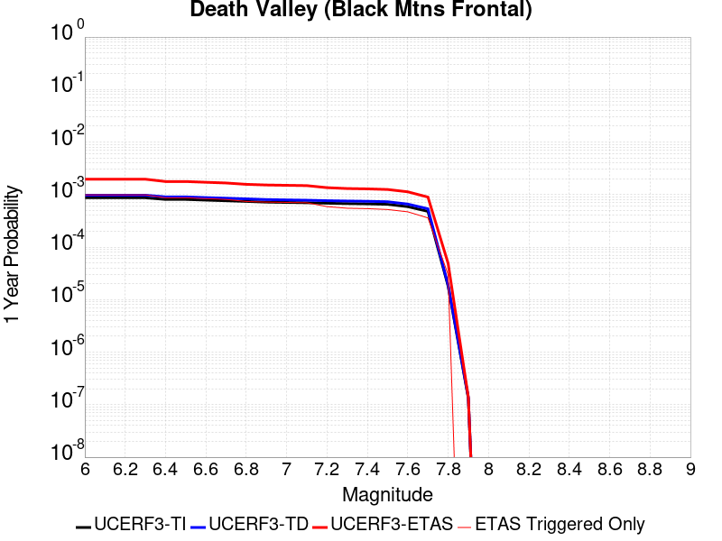 |  |

| Magnitude | 1 wk TI Prob | 1 wk TD Prob | 1 wk ETAS Prob | 1 wk ETAS/TD Gain | 1 wk ETAS Triggered Only | 1 mo TI Prob | 1 mo TD Prob | 1 mo ETAS Prob | 1 mo ETAS/TD Gain | 1 mo ETAS Triggered Only | 1 yr TI Prob | 1 yr TD Prob | 1 yr ETAS Prob | 1 yr ETAS/TD Gain | 1 yr ETAS Triggered Only | 10 yr TI Prob | 10 yr TD Prob | 10 yr ETAS Prob | 10 yr ETAS/TD Gain | 10 yr ETAS Triggered Only |
|-----|-----|-----|-----|-----|-----|-----|-----|-----|-----|-----|-----|-----|-----|-----|-----|-----|-----|-----|-----|-----|
| 6.0 | 1.6707214E-5 | 1.867027E-5 | 3.4549716E-4 | 18.505205 | 3.26833E-4 | 7.160038E-5 | 8.001302E-5 | 5.157555E-4 | 6.445894 | 4.3577733E-4 | 8.71386E-4 | 9.737309E-4 | 0.0018444369 | 1.8941958 | 8.7155466E-4 | 0.00867977 | 0.009695496 | 0.010774378 | 1.1112765 | 0.0010894433 |
| 6.1 | 1.6707214E-5 | 1.867027E-5 | 3.4549716E-4 | 18.505205 | 3.26833E-4 | 7.160038E-5 | 8.001302E-5 | 5.157555E-4 | 6.445894 | 4.3577733E-4 | 8.71386E-4 | 9.737309E-4 | 0.0018444369 | 1.8941958 | 8.7155466E-4 | 0.00867977 | 0.009695496 | 0.010774378 | 1.1112765 | 0.0010894433 |
| 6.2 | 1.6707214E-5 | 1.867027E-5 | 3.4549716E-4 | 18.505205 | 3.26833E-4 | 7.160038E-5 | 8.001302E-5 | 5.157555E-4 | 6.445894 | 4.3577733E-4 | 8.71386E-4 | 9.737309E-4 | 0.0018444369 | 1.8941958 | 8.7155466E-4 | 0.00867977 | 0.009695496 | 0.010774378 | 1.1112765 | 0.0010894433 |
| 6.3 | 1.6707214E-5 | 1.867027E-5 | 3.4549716E-4 | 18.505205 | 3.26833E-4 | 7.160038E-5 | 8.001302E-5 | 5.157555E-4 | 6.445894 | 4.3577733E-4 | 8.71386E-4 | 9.737309E-4 | 0.0018444369 | 1.8941958 | 8.7155466E-4 | 0.00867977 | 0.009695496 | 0.010774378 | 1.1112765 | 0.0010894433 |
| 6.4 | 1.5515609E-5 | 1.7338214E-5 | 3.4416554E-4 | 19.850115 | 3.26833E-4 | 6.649377E-5 | 7.4304546E-5 | 5.1004946E-4 | 6.8643107 | 4.3577733E-4 | 8.0926094E-4 | 9.042885E-4 | 0.0017206321 | 1.9027468 | 8.170825E-4 | 0.008063202 | 0.009006773 | 0.009978441 | 1.1078819 | 9.80499E-4 |
| 6.5 | 1.5515609E-5 | 1.7338214E-5 | 3.4416554E-4 | 19.850115 | 3.26833E-4 | 6.649377E-5 | 7.4304546E-5 | 5.1004946E-4 | 6.8643107 | 4.3577733E-4 | 8.0926094E-4 | 9.042885E-4 | 0.0017206321 | 1.9027468 | 8.170825E-4 | 0.008063202 | 0.009006773 | 0.009978441 | 1.1078819 | 9.80499E-4 |
| 6.6 | 1.5041828E-5 | 1.6809145E-5 | 3.4363664E-4 | 20.443434 | 3.26833E-4 | 6.4463384E-5 | 7.203723E-5 | 5.0778314E-4 | 7.0488987 | 4.3577733E-4 | 7.8455906E-4 | 8.767063E-4 | 0.0016386481 | 1.8690957 | 7.626103E-4 | 0.00781795 | 0.008733132 | 0.009597075 | 1.098927 | 8.7155466E-4 |
| 6.7 | 1.4634985E-5 | 1.6356016E-5 | 3.4318367E-4 | 20.982105 | 3.26833E-4 | 6.271985E-5 | 7.009536E-5 | 5.0584215E-4 | 7.216485 | 4.3577733E-4 | 7.6334673E-4 | 8.5308263E-4 | 0.0015606167 | 1.829385 | 7.0813816E-4 | 0.007607299 | 0.008498715 | 0.009308854 | 1.0953248 | 8.170825E-4 |
| 6.8 | 1.4209158E-5 | 1.5882048E-5 | 3.4270986E-4 | 21.578442 | 3.26833E-4 | 6.089497E-5 | 6.8064175E-5 | 5.038118E-4 | 7.402012 | 4.3577733E-4 | 7.4114406E-4 | 8.2837185E-4 | 0.0015359235 | 1.8541472 | 7.0813816E-4 | 0.007386771 | 0.008253456 | 0.009009772 | 1.0916363 | 7.626103E-4 |
| 6.9 | 1.3780098E-5 | 1.5404594E-5 | 2.877612E-4 | 18.680222 | 2.7236083E-4 | 5.9056227E-5 | 6.6018045E-5 | 4.4729802E-4 | 6.7753906 | 3.8130514E-4 | 7.1877235E-4 | 8.0347876E-4 | 0.0014566195 | 1.8128911 | 6.53666E-4 | 0.0071645193 | 0.008006332 | 0.008708801 | 1.0877391 | 7.0813816E-4 |
| 7.0 | 1.3585064E-5 | 1.5188155E-5 | 2.8754486E-4 | 18.932177 | 2.7236083E-4 | 5.8220405E-5 | 6.50905E-5 | 3.9190223E-4 | 6.0208817 | 3.26833E-4 | 7.086029E-4 | 7.9219416E-4 | 0.0013909133 | 1.7557732 | 5.991938E-4 | 0.007063476 | 0.007894293 | 0.008542799 | 1.0821487 | 6.53666E-4 |
| 7.1 | 1.3398601E-5 | 1.49813395E-5 | 2.8733807E-4 | 19.179733 | 2.7236083E-4 | 5.742131E-5 | 6.420419E-5 | 3.910162E-4 | 6.0901976 | 3.26833E-4 | 6.9888023E-4 | 7.8141113E-4 | 0.0013801367 | 1.7662107 | 5.991938E-4 | 0.0069668638 | 0.007787224 | 0.0084358 | 1.0832871 | 6.53666E-4 |
| 7.2 | 1.3126312E-5 | 1.4679561E-5 | 2.8703638E-4 | 19.553473 | 2.7236083E-4 | 5.6254412E-5 | 6.291092E-5 | 3.8972334E-4 | 6.1948442 | 3.26833E-4 | 6.846822E-4 | 7.6567667E-4 | 0.0013644117 | 1.7819685 | 5.991938E-4 | 0.006825765 | 0.00763097 | 0.008279648 | 1.085006 | 6.53666E-4 |
| 7.3 | 1.2922429E-5 | 1.4453788E-5 | 2.8681068E-4 | 19.843288 | 2.7236083E-4 | 5.5380664E-5 | 6.194336E-5 | 3.887561E-4 | 6.275993 | 3.26833E-4 | 6.74051E-4 | 7.53905E-4 | 0.0013526471 | 1.7941878 | 5.991938E-4 | 0.006720101 | 0.007514055 | 0.008162809 | 1.0863388 | 6.53666E-4 |
| 7.4 | 1.2768878E-5 | 1.4283772E-5 | 2.8664072E-4 | 20.06758 | 2.7236083E-4 | 5.4722615E-5 | 6.1214756E-5 | 3.8802775E-4 | 6.338794 | 3.26833E-4 | 6.660441E-4 | 7.4504025E-4 | 0.0013437876 | 1.8036443 | 5.991938E-4 | 0.0066405144 | 0.0074260035 | 0.008074815 | 1.0873703 | 6.53666E-4 |
| 7.5 | 1.2521929E-5 | 1.40120155E-5 | 2.8636903E-4 | 20.437391 | 2.7236083E-4 | 5.366431E-5 | 6.005014E-5 | 3.3239461E-4 | 5.5352845 | 2.7236083E-4 | 6.531671E-4 | 7.3087064E-4 | 0.0012751942 | 1.7447604 | 5.4472167E-4 | 0.006512506 | 0.0072852457 | 0.007880074 | 1.0816483 | 5.991938E-4 |
| 7.6 | 1.1301089E-5 | 1.2648149E-5 | 2.3053405E-4 | 18.226704 | 2.1788866E-4 | 4.8432343E-5 | 5.4205255E-5 | 2.720821E-4 | 5.0194783 | 2.1788866E-4 | 5.895042E-4 | 6.5975444E-4 | 0.0011496805 | 1.7425884 | 4.902495E-4 | 0.0058794282 | 0.00657851 | 0.0071196486 | 1.0822585 | 5.4472167E-4 |
| 7.7 | 9.189108E-6 | 1.0283358E-5 | 2.2816978E-4 | 22.188255 | 2.1788866E-4 | 3.93813E-5 | 4.407082E-5 | 2.6194987E-4 | 5.9438396 | 2.1788866E-4 | 4.7936183E-4 | 5.3643517E-4 | 9.719787E-4 | 1.8119221 | 4.3577733E-4 | 0.004783291 | 0.005351914 | 0.0058395397 | 1.0911124 | 4.902495E-4 |
| 7.8 | 3.4586725E-7 | 3.6482615E-7 | 3.6482615E-7 | 1.0 | 0.0 | 1.4822873E-6 | 1.5635396E-6 | 1.5635396E-6 | 1.0 | 0.0 | 1.80467E-5 | 1.9035933E-5 | 7.3507064E-5 | 3.8614898 | 5.4472166E-5 | 1.8045233E-4 | 1.9034347E-4 | 2.4480527E-4 | 1.2861238 | 5.4472166E-5 |
| 7.9 | 2.5591178E-9 | 2.6696718E-9 | 2.6696718E-9 | 1.0 | 0.0 | 1.0967647E-8 | 1.14414505E-8 | 1.14414505E-8 | 1.0 | 0.0 | 1.335311E-7 | 1.3929966E-7 | 1.3929966E-7 | 1.0 | 0.0 | 1.3353102E-6 | 1.3929966E-6 | 1.3929966E-6 | 1.0 | 0.0 |

## San Andreas (Big Bend)
*[(top)](#table-of-contents)*

| 1 Week | 1 Month | 1 Year | 10 Year |
|-----|-----|-----|-----|
|  |  |  |  |

| Magnitude | 1 wk TI Prob | 1 wk TD Prob | 1 wk ETAS Prob | 1 wk ETAS/TD Gain | 1 wk ETAS Triggered Only | 1 mo TI Prob | 1 mo TD Prob | 1 mo ETAS Prob | 1 mo ETAS/TD Gain | 1 mo ETAS Triggered Only | 1 yr TI Prob | 1 yr TD Prob | 1 yr ETAS Prob | 1 yr ETAS/TD Gain | 1 yr ETAS Triggered Only | 10 yr TI Prob | 10 yr TD Prob | 10 yr ETAS Prob | 10 yr ETAS/TD Gain | 10 yr ETAS Triggered Only |
|-----|-----|-----|-----|-----|-----|-----|-----|-----|-----|-----|-----|-----|-----|-----|-----|-----|-----|-----|-----|-----|
| 6.0 | 1.0179969E-4 | 2.0072258E-4 | 4.185675E-4 | 2.0853035 | 2.1788866E-4 | 4.362114E-4 | 8.599571E-4 | 0.001186509 | 1.3797305 | 3.26833E-4 | 0.0052979486 | 0.010419999 | 0.010959044 | 1.0517318 | 5.4472167E-4 | 0.051734097 | 0.10144902 | 0.10233005 | 1.0086844 | 9.80499E-4 |
| 6.1 | 1.0179969E-4 | 2.0072258E-4 | 4.185675E-4 | 2.0853035 | 2.1788866E-4 | 4.362114E-4 | 8.599571E-4 | 0.001186509 | 1.3797305 | 3.26833E-4 | 0.0052979486 | 0.010419999 | 0.010959044 | 1.0517318 | 5.4472167E-4 | 0.051734097 | 0.10144902 | 0.10233005 | 1.0086844 | 9.80499E-4 |
| 6.2 | 1.0179969E-4 | 2.0072258E-4 | 4.185675E-4 | 2.0853035 | 2.1788866E-4 | 4.362114E-4 | 8.599571E-4 | 0.001186509 | 1.3797305 | 3.26833E-4 | 0.0052979486 | 0.010419999 | 0.010959044 | 1.0517318 | 5.4472167E-4 | 0.051734097 | 0.10144902 | 0.10233005 | 1.0086844 | 9.80499E-4 |
| 6.3 | 1.0179969E-4 | 2.0072258E-4 | 4.185675E-4 | 2.0853035 | 2.1788866E-4 | 4.362114E-4 | 8.599571E-4 | 0.001186509 | 1.3797305 | 3.26833E-4 | 0.0052979486 | 0.010419999 | 0.010959044 | 1.0517318 | 5.4472167E-4 | 0.051734097 | 0.10144902 | 0.10233005 | 1.0086844 | 9.80499E-4 |
| 6.4 | 9.1639464E-5 | 1.8429532E-4 | 3.476817E-4 | 1.8865465 | 1.634165E-4 | 3.9268145E-4 | 7.895982E-4 | 9.5288566E-4 | 1.2067982 | 1.634165E-4 | 0.0047704205 | 0.009571102 | 0.0099487575 | 1.0394579 | 3.8130514E-4 | 0.046693064 | 0.09377527 | 0.094417006 | 1.0068433 | 7.0813816E-4 |
| 6.5 | 9.1639464E-5 | 1.8429532E-4 | 3.476817E-4 | 1.8865465 | 1.634165E-4 | 3.9268145E-4 | 7.895982E-4 | 9.5288566E-4 | 1.2067982 | 1.634165E-4 | 0.0047704205 | 0.009571102 | 0.0099487575 | 1.0394579 | 3.8130514E-4 | 0.046693064 | 0.09377527 | 0.094417006 | 1.0068433 | 7.0813816E-4 |
| 6.6 | 9.042622E-5 | 1.823659E-4 | 3.457526E-4 | 1.8959279 | 1.634165E-4 | 3.8748336E-4 | 7.8133424E-4 | 9.446231E-4 | 1.2089871 | 1.634165E-4 | 0.0047074095 | 0.009471365 | 0.009849058 | 1.0398774 | 3.8130514E-4 | 0.046089325 | 0.092869274 | 0.093462236 | 1.0063848 | 6.53666E-4 |
| 6.7 | 8.9836685E-5 | 1.8150927E-4 | 3.448961E-4 | 1.900157 | 1.634165E-4 | 3.8495753E-4 | 7.776651E-4 | 9.4095455E-4 | 1.2099739 | 1.634165E-4 | 0.00467679 | 0.00942708 | 0.009804791 | 1.0400666 | 3.8130514E-4 | 0.045795817 | 0.09246355 | 0.093056776 | 1.0064157 | 6.53666E-4 |
| 6.8 | 8.9471854E-5 | 1.8097709E-4 | 3.44364E-4 | 1.9028044 | 1.634165E-4 | 3.8339442E-4 | 7.7538576E-4 | 9.3867554E-4 | 1.2105917 | 1.634165E-4 | 0.004657841 | 0.009399569 | 0.00977729 | 1.040185 | 3.8130514E-4 | 0.04561414 | 0.092210755 | 0.09280415 | 1.0064352 | 6.53666E-4 |
| 6.9 | 8.858234E-5 | 1.7979681E-4 | 3.4318393E-4 | 1.9087319 | 1.634165E-4 | 3.7958333E-4 | 7.703304E-4 | 9.33621E-4 | 1.2119747 | 1.634165E-4 | 0.004611638 | 0.009338548 | 0.009716293 | 1.04045 | 3.8130514E-4 | 0.04517103 | 0.09165087 | 0.09224463 | 1.0064784 | 6.53666E-4 |
| 7.0 | 8.7433385E-5 | 1.7818481E-4 | 3.415722E-4 | 1.9169545 | 1.634165E-4 | 3.746607E-4 | 7.634259E-4 | 9.2671765E-4 | 1.2138934 | 1.634165E-4 | 0.004551957 | 0.009255203 | 0.009579011 | 1.0349866 | 3.26833E-4 | 0.044598386 | 0.09088532 | 0.09133101 | 1.0049039 | 4.902495E-4 |
| 7.1 | 8.684964E-5 | 1.7730435E-4 | 3.4069188E-4 | 1.9215088 | 1.634165E-4 | 3.7215967E-4 | 7.596547E-4 | 9.22947E-4 | 1.214956 | 1.634165E-4 | 0.0045216335 | 0.009209678 | 0.0095335 | 1.0351611 | 3.26833E-4 | 0.04430731 | 0.09046686 | 0.09091276 | 1.0049288 | 4.902495E-4 |
| 7.2 | 8.606521E-5 | 1.762105E-4 | 3.395982E-4 | 1.9272302 | 1.634165E-4 | 3.6879873E-4 | 7.549695E-4 | 9.1826264E-4 | 1.2162911 | 1.634165E-4 | 0.0044808835 | 0.0091531165 | 0.009476958 | 1.0353805 | 3.26833E-4 | 0.043916024 | 0.089947365 | 0.09039352 | 1.0049602 | 4.902495E-4 |
| 7.3 | 8.568266E-5 | 1.7563057E-4 | 3.3901836E-4 | 1.9302925 | 1.634165E-4 | 3.6715972E-4 | 7.524855E-4 | 9.1577903E-4 | 1.2170055 | 1.634165E-4 | 0.0044610105 | 0.009123127 | 0.009446979 | 1.0354978 | 3.26833E-4 | 0.043725148 | 0.08966853 | 0.09011482 | 1.0049771 | 4.902495E-4 |
| 7.4 | 8.5432206E-5 | 1.7525644E-4 | 3.3864428E-4 | 1.9322788 | 1.634165E-4 | 3.6608664E-4 | 7.50883E-4 | 9.141768E-4 | 1.217469 | 1.634165E-4 | 0.004447999 | 0.009103781 | 0.009427638 | 1.035574 | 3.26833E-4 | 0.043600157 | 0.08948871 | 0.08993509 | 1.0049881 | 4.902495E-4 |
| 7.5 | 8.4791965E-5 | 1.7394972E-4 | 3.3733778E-4 | 1.9392833 | 1.634165E-4 | 3.633435E-4 | 7.4528606E-4 | 9.085807E-4 | 1.2191033 | 1.634165E-4 | 0.0044147377 | 0.009036204 | 0.009360084 | 1.0358424 | 3.26833E-4 | 0.043280575 | 0.088866346 | 0.08931303 | 1.0050265 | 4.902495E-4 |
| 7.6 | 8.241105E-5 | 1.6840403E-4 | 3.31793E-4 | 1.9702201 | 1.634165E-4 | 3.531424E-4 | 7.215321E-4 | 8.848307E-4 | 1.2263219 | 1.634165E-4 | 0.0042910352 | 0.008749358 | 0.009073332 | 1.0370282 | 3.26833E-4 | 0.042091176 | 0.086243294 | 0.08669126 | 1.0051942 | 4.902495E-4 |
| 7.7 | 7.00432E-5 | 1.42045E-4 | 2.5097386E-4 | 1.7668616 | 1.0894433E-4 | 3.001506E-4 | 6.0862233E-4 | 7.1750034E-4 | 1.1788926 | 1.0894433E-4 | 0.0036482112 | 0.0073848404 | 0.00760112 | 1.029287 | 2.1788866E-4 | 0.035888977 | 0.07351733 | 0.07382014 | 1.0041188 | 3.26833E-4 |
| 7.8 | 6.415362E-5 | 1.2968935E-4 | 2.3861954E-4 | 1.8399318 | 1.0894433E-4 | 2.749151E-4 | 5.556931E-4 | 6.645769E-4 | 1.1959423 | 1.0894433E-4 | 0.0033419547 | 0.0067446055 | 0.00690692 | 1.0240659 | 1.634165E-4 | 0.03292141 | 0.06725231 | 0.06750635 | 1.0037775 | 2.7236083E-4 |
| 7.9 | 4.939911E-5 | 9.3411545E-5 | 2.0234569E-4 | 2.1661744 | 1.0894433E-4 | 2.116933E-4 | 4.0027377E-4 | 5.091745E-4 | 1.2720656 | 1.0894433E-4 | 0.0025743195 | 0.004862453 | 0.0050250744 | 1.0334444 | 1.634165E-4 | 0.025447013 | 0.048914436 | 0.049121667 | 1.0042366 | 2.1788866E-4 |
| 8.0 | 3.344983E-5 | 5.222685E-5 | 1.0669617E-4 | 2.042937 | 5.4472166E-5 | 1.4334853E-4 | 2.2381016E-4 | 2.7827013E-4 | 1.2433311 | 5.4472166E-5 | 0.0017438711 | 0.0027214854 | 0.0027758095 | 1.0199611 | 5.4472166E-5 | 0.017302496 | 0.027922187 | 0.02802809 | 1.0037928 | 1.0894433E-4 |
| 8.1 | 1.9104898E-5 | 1.9173063E-5 | 1.9173063E-5 | 1.0 | 0.0 | 8.1875565E-5 | 8.216769E-5 | 8.216769E-5 | 1.0 | 0.0 | 9.963791E-4 | 9.999331E-4 | 9.999331E-4 | 1.0 | 0.0 | 0.009919235 | 0.010749801 | 0.010749801 | 1.0 | 0.0 |
| 8.2 | 8.643924E-6 | 5.4748625E-6 | 5.4748625E-6 | 1.0 | 0.0 | 3.704486E-5 | 2.3463486E-5 | 2.3463486E-5 | 1.0 | 0.0 | 4.5092785E-4 | 2.8563058E-4 | 2.8563058E-4 | 1.0 | 0.0 | 0.0045001395 | 0.0032487072 | 0.0032487072 | 1.0 | 0.0 |
| 8.3 | 1.983087E-6 | 7.6599065E-7 | 7.6599065E-7 | 1.0 | 0.0 | 8.498917E-6 | 3.282813E-6 | 3.282813E-6 | 1.0 | 0.0 | 1.034694E-4 | 3.9967534E-5 | 3.9967534E-5 | 1.0 | 0.0 | 0.0010342124 | 4.719687E-4 | 4.719687E-4 | 1.0 | 0.0 |

## Coyote Lake
*[(top)](#table-of-contents)*

| 1 Week | 1 Month | 1 Year | 10 Year |
|-----|-----|-----|-----|
|  |  |  |  |

| Magnitude | 1 wk TI Prob | 1 wk TD Prob | 1 wk ETAS Prob | 1 wk ETAS/TD Gain | 1 wk ETAS Triggered Only | 1 mo TI Prob | 1 mo TD Prob | 1 mo ETAS Prob | 1 mo ETAS/TD Gain | 1 mo ETAS Triggered Only | 1 yr TI Prob | 1 yr TD Prob | 1 yr ETAS Prob | 1 yr ETAS/TD Gain | 1 yr ETAS Triggered Only | 10 yr TI Prob | 10 yr TD Prob | 10 yr ETAS Prob | 10 yr ETAS/TD Gain | 10 yr ETAS Triggered Only |
|-----|-----|-----|-----|-----|-----|-----|-----|-----|-----|-----|-----|-----|-----|-----|-----|-----|-----|-----|-----|-----|
| 6.0 | 1.980352E-5 | 2.1706745E-5 | 7.617773E-5 | 3.5094035 | 5.4472166E-5 | 8.486947E-5 | 9.302599E-5 | 2.019602E-4 | 2.171008 | 1.0894433E-4 | 0.0010327959 | 0.0011320751 | 0.001458538 | 1.2883757 | 3.26833E-4 | 0.010280091 | 0.011270258 | 0.01213199 | 1.0764607 | 8.7155466E-4 |
| 6.1 | 1.980352E-5 | 2.1706745E-5 | 7.617773E-5 | 3.5094035 | 5.4472166E-5 | 8.486947E-5 | 9.302599E-5 | 2.019602E-4 | 2.171008 | 1.0894433E-4 | 0.0010327959 | 0.0011320751 | 0.001458538 | 1.2883757 | 3.26833E-4 | 0.010280091 | 0.011270258 | 0.01213199 | 1.0764607 | 8.7155466E-4 |
| 6.2 | 1.980352E-5 | 2.1706745E-5 | 7.617773E-5 | 3.5094035 | 5.4472166E-5 | 8.486947E-5 | 9.302599E-5 | 2.019602E-4 | 2.171008 | 1.0894433E-4 | 0.0010327959 | 0.0011320751 | 0.001458538 | 1.2883757 | 3.26833E-4 | 0.010280091 | 0.011270258 | 0.01213199 | 1.0764607 | 8.7155466E-4 |
| 6.3 | 1.5344787E-5 | 1.682067E-5 | 7.129192E-5 | 4.238352 | 5.4472166E-5 | 6.576172E-5 | 7.2086936E-5 | 1.8102341E-4 | 2.511182 | 1.0894433E-4 | 8.003548E-4 | 8.773662E-4 | 0.0010406394 | 1.1860946 | 1.634165E-4 | 0.007974784 | 0.00874507 | 0.009339023 | 1.0679187 | 5.991938E-4 |
| 6.4 | 1.5344787E-5 | 1.682067E-5 | 7.129192E-5 | 4.238352 | 5.4472166E-5 | 6.576172E-5 | 7.2086936E-5 | 1.8102341E-4 | 2.511182 | 1.0894433E-4 | 8.003548E-4 | 8.773662E-4 | 0.0010406394 | 1.1860946 | 1.634165E-4 | 0.007974784 | 0.00874507 | 0.009339023 | 1.0679187 | 5.991938E-4 |
| 6.5 | 1.4189697E-5 | 1.5557987E-5 | 7.00293E-5 | 4.50118 | 5.4472166E-5 | 6.081157E-5 | 6.6675726E-5 | 1.7561279E-4 | 2.6338341 | 1.0894433E-4 | 7.401293E-4 | 8.115349E-4 | 9.748188E-4 | 1.2012038 | 1.634165E-4 | 0.0073766913 | 0.008091656 | 0.008686001 | 1.0734516 | 5.991938E-4 |
| 6.6 | 1.3469301E-5 | 1.4771577E-5 | 6.924294E-5 | 4.687579 | 5.4472166E-5 | 5.7724297E-5 | 6.330556E-5 | 1.7224299E-4 | 2.7208192 | 1.0894433E-4 | 7.025667E-4 | 7.7053264E-4 | 9.3382323E-4 | 1.2119191 | 1.634165E-4 | 0.0070034964 | 0.0076845144 | 0.008279104 | 1.077375 | 5.991938E-4 |
| 6.7 | 1.3027966E-5 | 1.4281745E-5 | 6.875313E-5 | 4.814057 | 5.4472166E-5 | 5.5832945E-5 | 6.120638E-5 | 1.7014403E-4 | 2.7798417 | 1.0894433E-4 | 6.7955407E-4 | 7.4499263E-4 | 9.0828736E-4 | 1.2191898 | 1.634165E-4 | 0.006774798 | 0.0074308286 | 0.007971503 | 1.0727609 | 5.4472167E-4 |
| 6.8 | 5.695434E-6 | 6.2244176E-6 | 6.2244176E-6 | 1.0 | 0.0 | 2.4408775E-5 | 2.6675973E-5 | 8.114668E-5 | 3.041939 | 5.4472166E-5 | 2.971363E-4 | 3.2476155E-4 | 3.79216E-4 | 1.1676753 | 5.4472166E-5 | 0.0029673933 | 0.0032458105 | 0.0033001057 | 1.0167278 | 5.4472166E-5 |
| 6.9 | 4.385688E-6 | 4.7930553E-6 | 4.7930553E-6 | 1.0 | 0.0 | 1.879567E-5 | 2.0541665E-5 | 7.5012715E-5 | 3.6517346 | 5.4472166E-5 | 2.2881327E-4 | 2.5009477E-4 | 3.0455334E-4 | 1.2177516 | 5.4472166E-5 | 0.002285778 | 0.0025009478 | 0.0025552837 | 1.0217261 | 5.4472166E-5 |

## Manix-Afton Hills
*[(top)](#table-of-contents)*

| 1 Week | 1 Month | 1 Year | 10 Year |
|-----|-----|-----|-----|
|  |  |  |  |

| Magnitude | 1 wk TI Prob | 1 wk TD Prob | 1 wk ETAS Prob | 1 wk ETAS/TD Gain | 1 wk ETAS Triggered Only | 1 mo TI Prob | 1 mo TD Prob | 1 mo ETAS Prob | 1 mo ETAS/TD Gain | 1 mo ETAS Triggered Only | 1 yr TI Prob | 1 yr TD Prob | 1 yr ETAS Prob | 1 yr ETAS/TD Gain | 1 yr ETAS Triggered Only | 10 yr TI Prob | 10 yr TD Prob | 10 yr ETAS Prob | 10 yr ETAS/TD Gain | 10 yr ETAS Triggered Only |
|-----|-----|-----|-----|-----|-----|-----|-----|-----|-----|-----|-----|-----|-----|-----|-----|-----|-----|-----|-----|-----|
| 6.0 | 1.3783202E-5 | 1.47110895E-5 | 2.870679E-4 | 19.513708 | 2.7236083E-4 | 5.906953E-5 | 6.30461E-5 | 3.898585E-4 | 6.183705 | 3.26833E-4 | 7.189342E-4 | 7.6733343E-4 | 0.0013660674 | 1.7802788 | 5.991938E-4 | 0.0071661277 | 0.007648596 | 0.008405373 | 1.0989434 | 7.626103E-4 |
| 6.1 | 1.3783202E-5 | 1.47110895E-5 | 2.870679E-4 | 19.513708 | 2.7236083E-4 | 5.906953E-5 | 6.30461E-5 | 3.898585E-4 | 6.183705 | 3.26833E-4 | 7.189342E-4 | 7.6733343E-4 | 0.0013660674 | 1.7802788 | 5.991938E-4 | 0.0071661277 | 0.007648596 | 0.008405373 | 1.0989434 | 7.626103E-4 |
| 6.2 | 1.3783202E-5 | 1.47110895E-5 | 2.870679E-4 | 19.513708 | 2.7236083E-4 | 5.906953E-5 | 6.30461E-5 | 3.898585E-4 | 6.183705 | 3.26833E-4 | 7.189342E-4 | 7.6733343E-4 | 0.0013660674 | 1.7802788 | 5.991938E-4 | 0.0071661277 | 0.007648596 | 0.008405373 | 1.0989434 | 7.626103E-4 |
| 6.3 | 1.10494875E-5 | 1.1793136E-5 | 2.2967922E-4 | 19.47567 | 2.1788866E-4 | 4.7354086E-5 | 5.054109E-5 | 2.6841875E-4 | 5.310901 | 2.1788866E-4 | 5.763835E-4 | 6.151744E-4 | 9.4180636E-4 | 1.5309583 | 3.26833E-4 | 0.005748908 | 0.0061357557 | 0.006622997 | 1.0794102 | 4.902495E-4 |
| 6.4 | 1.10494875E-5 | 1.1793136E-5 | 2.2967922E-4 | 19.47567 | 2.1788866E-4 | 4.7354086E-5 | 5.054109E-5 | 2.6841875E-4 | 5.310901 | 2.1788866E-4 | 5.763835E-4 | 6.151744E-4 | 9.4180636E-4 | 1.5309583 | 3.26833E-4 | 0.005748908 | 0.0061357557 | 0.006622997 | 1.0794102 | 4.902495E-4 |
| 6.5 | 9.788949E-6 | 1.045432E-5 | 1.738691E-4 | 16.631317 | 1.634165E-4 | 4.1951964E-5 | 4.480351E-5 | 2.0821269E-4 | 4.6472406 | 1.634165E-4 | 5.1064545E-4 | 5.453555E-4 | 7.631253E-4 | 1.3993171 | 2.1788866E-4 | 0.0050947363 | 0.0054410985 | 0.005820329 | 1.0696974 | 3.8130514E-4 |
| 6.6 | 8.810006E-6 | 9.4136285E-6 | 1.7282859E-4 | 18.359402 | 1.634165E-4 | 3.775662E-5 | 4.0343548E-5 | 2.0375344E-4 | 5.0504594 | 1.634165E-4 | 4.5958988E-4 | 4.9108086E-4 | 7.088625E-4 | 1.4434742 | 2.1788866E-4 | 0.0045864056 | 0.004900839 | 0.005171865 | 1.0553019 | 2.7236083E-4 |
| 6.7 | 8.80128E-6 | 9.404108E-6 | 1.7281907E-4 | 18.376976 | 1.634165E-4 | 3.7719226E-5 | 4.0302748E-5 | 2.0371265E-4 | 5.05456 | 1.634165E-4 | 4.591348E-4 | 4.9058435E-4 | 7.083661E-4 | 1.4439232 | 2.1788866E-4 | 0.004581874 | 0.0048958957 | 0.005166923 | 1.055358 | 2.7236083E-4 |
| 6.8 | 6.8994877E-6 | 7.380076E-6 | 1.163236E-4 | 15.761844 | 1.0894433E-4 | 2.9568899E-5 | 3.162856E-5 | 1.4056945E-4 | 4.444383 | 1.0894433E-4 | 3.5994186E-4 | 3.8501783E-4 | 5.483714E-4 | 1.4242754 | 1.634165E-4 | 0.003593594 | 0.0038443129 | 0.004061364 | 1.0564603 | 2.1788866E-4 |
| 6.9 | 4.9328037E-6 | 5.2709615E-6 | 1.14214716E-4 | 21.668669 | 1.0894433E-4 | 2.1140417E-5 | 2.2589675E-5 | 1.3153155E-4 | 5.82264 | 1.0894433E-4 | 2.5735417E-4 | 2.7500073E-4 | 4.3837228E-4 | 1.5940768 | 1.634165E-4 | 0.0025705635 | 0.0027472095 | 0.002910177 | 1.0593212 | 1.634165E-4 |
| 7.0 | 3.347973E-6 | 3.59003E-6 | 1.1253397E-4 | 31.346247 | 1.0894433E-4 | 1.4348378E-5 | 1.5385775E-5 | 1.2432844E-4 | 8.080739 | 1.0894433E-4 | 1.746775E-4 | 1.8730981E-4 | 2.9623375E-4 | 1.5815175 | 1.0894433E-4 | 0.0017454025 | 0.0018719219 | 0.0019806623 | 1.0580902 | 1.0894433E-4 |
| 7.1 | 1.2073567E-6 | 1.293482E-6 | 1.293482E-6 | 1.0 | 0.0 | 5.1743755E-6 | 5.543492E-6 | 5.543492E-6 | 1.0 | 0.0 | 6.29962E-5 | 6.749156E-5 | 6.749156E-5 | 1.0 | 0.0 | 6.297835E-4 | 6.7487074E-4 | 6.7487074E-4 | 1.0 | 0.0 |

## Death Valley (No)
*[(top)](#table-of-contents)*

| 1 Week | 1 Month | 1 Year | 10 Year |
|-----|-----|-----|-----|
|  |  |  |  |

| Magnitude | 1 wk TI Prob | 1 wk TD Prob | 1 wk ETAS Prob | 1 wk ETAS/TD Gain | 1 wk ETAS Triggered Only | 1 mo TI Prob | 1 mo TD Prob | 1 mo ETAS Prob | 1 mo ETAS/TD Gain | 1 mo ETAS Triggered Only | 1 yr TI Prob | 1 yr TD Prob | 1 yr ETAS Prob | 1 yr ETAS/TD Gain | 1 yr ETAS Triggered Only | 10 yr TI Prob | 10 yr TD Prob | 10 yr ETAS Prob | 10 yr ETAS/TD Gain | 10 yr ETAS Triggered Only |
|-----|-----|-----|-----|-----|-----|-----|-----|-----|-----|-----|-----|-----|-----|-----|-----|-----|-----|-----|-----|-----|
| 6.0 | 2.0074807E-5 | 2.2500084E-5 | 3.493257E-4 | 15.52553 | 3.26833E-4 | 8.603206E-5 | 9.642541E-5 | 4.2322688E-4 | 4.3891635 | 3.26833E-4 | 0.001046937 | 0.0011733545 | 0.0018262535 | 1.556438 | 6.53666E-4 | 0.010420183 | 0.011672506 | 0.012426215 | 1.0645713 | 7.626103E-4 |
| 6.1 | 2.0074807E-5 | 2.2500084E-5 | 3.493257E-4 | 15.52553 | 3.26833E-4 | 8.603206E-5 | 9.642541E-5 | 4.2322688E-4 | 4.3891635 | 3.26833E-4 | 0.001046937 | 0.0011733545 | 0.0018262535 | 1.556438 | 6.53666E-4 | 0.010420183 | 0.011672506 | 0.012426215 | 1.0645713 | 7.626103E-4 |
| 6.2 | 2.0074807E-5 | 2.2500084E-5 | 3.493257E-4 | 15.52553 | 3.26833E-4 | 8.603206E-5 | 9.642541E-5 | 4.2322688E-4 | 4.3891635 | 3.26833E-4 | 0.001046937 | 0.0011733545 | 0.0018262535 | 1.556438 | 6.53666E-4 | 0.010420183 | 0.011672506 | 0.012426215 | 1.0645713 | 7.626103E-4 |
| 6.3 | 1.9050609E-5 | 2.1336948E-5 | 3.4816295E-4 | 16.317375 | 3.26833E-4 | 8.164292E-5 | 9.1440896E-5 | 4.18244E-4 | 4.5739274 | 3.26833E-4 | 9.935491E-4 | 0.001112731 | 0.0017656697 | 1.5867893 | 6.53666E-4 | 0.009891188 | 0.011072419 | 0.011826585 | 1.0681121 | 7.626103E-4 |
| 6.4 | 1.9050609E-5 | 2.1336948E-5 | 3.4816295E-4 | 16.317375 | 3.26833E-4 | 8.164292E-5 | 9.1440896E-5 | 4.18244E-4 | 4.5739274 | 3.26833E-4 | 9.935491E-4 | 0.001112731 | 0.0017656697 | 1.5867893 | 6.53666E-4 | 0.009891188 | 0.011072419 | 0.011826585 | 1.0681121 | 7.626103E-4 |
| 6.5 | 1.8367004E-5 | 2.0561009E-5 | 2.9291623E-4 | 14.2462 | 2.7236083E-4 | 7.8713354E-5 | 8.811567E-5 | 3.6045248E-4 | 4.0906744 | 2.7236083E-4 | 9.5791375E-4 | 0.0010722869 | 0.0016164244 | 1.5074552 | 5.4472167E-4 | 0.009537951 | 0.0106719155 | 0.011318605 | 1.0605974 | 6.53666E-4 |
| 6.6 | 1.779439E-5 | 1.9910927E-5 | 2.9226634E-4 | 14.67869 | 2.7236083E-4 | 7.625944E-5 | 8.53298E-5 | 3.5766736E-4 | 4.1915884 | 2.7236083E-4 | 9.280632E-4 | 0.0010384015 | 0.0015825575 | 1.5240324 | 5.4472167E-4 | 0.009241969 | 0.010336253 | 0.010983163 | 1.0625864 | 6.53666E-4 |
| 6.7 | 1.7025437E-5 | 1.9043426E-5 | 2.9139908E-4 | 15.30182 | 2.7236083E-4 | 7.296412E-5 | 8.161216E-5 | 3.5395075E-4 | 4.3369856 | 2.7236083E-4 | 8.87976E-4 | 9.931813E-4 | 0.001537362 | 1.5479168 | 5.4472167E-4 | 0.008844362 | 0.009888145 | 0.010535347 | 1.0654523 | 6.53666E-4 |
| 6.8 | 1.6545107E-5 | 1.8512545E-5 | 2.9086834E-4 | 15.711958 | 2.7236083E-4 | 7.090568E-5 | 7.93371E-5 | 3.516763E-4 | 4.432684 | 2.7236083E-4 | 8.629347E-4 | 9.655073E-4 | 0.001509703 | 1.5636371 | 5.4472167E-4 | 0.008595915 | 0.009613829 | 0.010207262 | 1.061727 | 5.991938E-4 |
| 6.9 | 1.615478E-5 | 1.8087594E-5 | 2.9044348E-4 | 16.057608 | 2.7236083E-4 | 6.9232934E-5 | 7.751599E-5 | 3.498557E-4 | 4.5133357 | 2.7236083E-4 | 8.4258494E-4 | 9.433546E-4 | 0.0014875624 | 1.5768857 | 5.4472167E-4 | 0.008393973 | 0.009394196 | 0.00998776 | 1.0631843 | 5.991938E-4 |
| 7.0 | 1.5894311E-5 | 1.780555E-5 | 2.9016152E-4 | 16.296127 | 2.7236083E-4 | 6.81167E-5 | 7.6307304E-5 | 3.4864733E-4 | 4.5689907 | 2.7236083E-4 | 8.2900526E-4 | 9.286515E-4 | 0.0014728673 | 1.586028 | 5.4472167E-4 | 0.008259195 | 0.009248397 | 0.009842049 | 1.0641898 | 5.991938E-4 |
| 7.1 | 1.5602263E-5 | 1.7483504E-5 | 2.8983958E-4 | 16.577888 | 2.7236083E-4 | 6.6865134E-5 | 7.492718E-5 | 3.472676E-4 | 4.6347346 | 2.7236083E-4 | 8.137789E-4 | 9.118627E-4 | 0.0014560877 | 1.5968277 | 5.4472167E-4 | 0.008108052 | 0.009081894 | 0.009675646 | 1.0653776 | 5.991938E-4 |
| 7.2 | 1.5323829E-5 | 1.717063E-5 | 2.8952677E-4 | 16.861744 | 2.7236083E-4 | 6.56719E-5 | 7.358637E-5 | 3.4592717E-4 | 4.700968 | 2.7236083E-4 | 7.99262E-4 | 8.9555193E-4 | 0.0014397857 | 1.6077077 | 5.4472167E-4 | 0.007963934 | 0.008920107 | 0.009513956 | 1.0665742 | 5.991938E-4 |
| 7.3 | 1.4556212E-5 | 1.6302456E-5 | 2.8865883E-4 | 17.706465 | 2.7236083E-4 | 6.238227E-5 | 6.9865826E-5 | 3.422076E-4 | 4.898069 | 2.7236083E-4 | 7.592395E-4 | 8.5029035E-4 | 0.0013945488 | 1.6400855 | 5.4472167E-4 | 0.0075665074 | 0.008471014 | 0.009065133 | 1.0701354 | 5.991938E-4 |
| 7.4 | 1.411725E-5 | 1.580796E-5 | 2.8816448E-4 | 18.229074 | 2.7236083E-4 | 6.0501097E-5 | 6.7746674E-5 | 3.4008906E-4 | 5.020011 | 2.7236083E-4 | 7.363519E-4 | 8.245094E-4 | 0.0013687819 | 1.6601168 | 5.4472167E-4 | 0.0073391674 | 0.008215138 | 0.008809409 | 1.0723386 | 5.991938E-4 |
| 7.5 | 1.3503312E-5 | 1.5126289E-5 | 2.8748298E-4 | 19.00552 | 2.7236083E-4 | 5.7870053E-5 | 6.482538E-5 | 3.3716855E-4 | 5.2011814 | 2.7236083E-4 | 7.043401E-4 | 7.8896893E-4 | 0.0013332608 | 1.6898774 | 5.4472167E-4 | 0.007021119 | 0.007862304 | 0.008456787 | 1.0756118 | 5.991938E-4 |
| 7.6 | 1.1279839E-5 | 1.2626327E-5 | 2.3051223E-4 | 18.256475 | 2.1788866E-4 | 4.834127E-5 | 5.4111737E-5 | 2.719886E-4 | 5.0264254 | 2.1788866E-4 | 5.88396E-4 | 6.5861654E-4 | 0.0011485432 | 1.7438723 | 4.902495E-4 | 0.005868405 | 0.006567199 | 0.007108343 | 1.082401 | 5.4472167E-4 |
| 7.7 | 9.189108E-6 | 1.0283358E-5 | 2.2816978E-4 | 22.188255 | 2.1788866E-4 | 3.93813E-5 | 4.407082E-5 | 2.6194987E-4 | 5.9438396 | 2.1788866E-4 | 4.7936183E-4 | 5.3643517E-4 | 9.719787E-4 | 1.8119221 | 4.3577733E-4 | 0.004783291 | 0.005351914 | 0.0058395397 | 1.0911124 | 4.902495E-4 |
| 7.8 | 3.4586725E-7 | 3.6482615E-7 | 3.6482615E-7 | 1.0 | 0.0 | 1.4822873E-6 | 1.5635396E-6 | 1.5635396E-6 | 1.0 | 0.0 | 1.80467E-5 | 1.9035933E-5 | 7.3507064E-5 | 3.8614898 | 5.4472166E-5 | 1.8045233E-4 | 1.9034347E-4 | 2.4480527E-4 | 1.2861238 | 5.4472166E-5 |
| 7.9 | 2.5591178E-9 | 2.6696718E-9 | 2.6696718E-9 | 1.0 | 0.0 | 1.0967647E-8 | 1.14414505E-8 | 1.14414505E-8 | 1.0 | 0.0 | 1.335311E-7 | 1.3929966E-7 | 1.3929966E-7 | 1.0 | 0.0 | 1.3353102E-6 | 1.3929966E-6 | 1.3929966E-6 | 1.0 | 0.0 |

## San Andreas (Parkfield)
*[(top)](#table-of-contents)*

| 1 Week | 1 Month | 1 Year | 10 Year |
|-----|-----|-----|-----|
|  |  |  |  |

| Magnitude | 1 wk TI Prob | 1 wk TD Prob | 1 wk ETAS Prob | 1 wk ETAS/TD Gain | 1 wk ETAS Triggered Only | 1 mo TI Prob | 1 mo TD Prob | 1 mo ETAS Prob | 1 mo ETAS/TD Gain | 1 mo ETAS Triggered Only | 1 yr TI Prob | 1 yr TD Prob | 1 yr ETAS Prob | 1 yr ETAS/TD Gain | 1 yr ETAS Triggered Only | 10 yr TI Prob | 10 yr TD Prob | 10 yr ETAS Prob | 10 yr ETAS/TD Gain | 10 yr ETAS Triggered Only |
|-----|-----|-----|-----|-----|-----|-----|-----|-----|-----|-----|-----|-----|-----|-----|-----|-----|-----|-----|-----|-----|
| 6.0 | 5.556969E-4 | 7.7782426E-4 | 9.411136E-4 | 1.2099309 | 1.634165E-4 | 0.0023793848 | 0.0033298214 | 0.0036012754 | 1.0815221 | 2.7236083E-4 | 0.028586963 | 0.040191233 | 0.040714063 | 1.0130085 | 5.4472167E-4 | 0.25176284 | 0.33716413 | 0.33759743 | 1.0012851 | 6.53666E-4 |
| 6.1 | 1.925858E-4 | 3.0276453E-4 | 4.1167586E-4 | 1.359723 | 1.0894433E-4 | 8.2510663E-4 | 0.0012970108 | 0.0014058138 | 1.0838876 | 1.0894433E-4 | 0.0099994885 | 0.015778083 | 0.015992533 | 1.0135916 | 2.1788866E-4 | 0.095613256 | 0.1497237 | 0.14995527 | 1.0015467 | 2.7236083E-4 |
| 6.2 | 9.4306815E-5 | 1.8242796E-4 | 2.9135242E-4 | 1.597082 | 1.0894433E-4 | 4.0410945E-4 | 7.816011E-4 | 8.904603E-4 | 1.1392771 | 1.0894433E-4 | 0.0049089384 | 0.009474681 | 0.0096905045 | 1.0227791 | 2.1788866E-4 | 0.048019063 | 0.09185409 | 0.09210143 | 1.0026928 | 2.7236083E-4 |
| 6.3 | 9.283051E-5 | 1.7939322E-4 | 2.88318E-4 | 1.6071845 | 1.0894433E-4 | 3.9778434E-4 | 7.686027E-4 | 8.774633E-4 | 1.1416345 | 1.0894433E-4 | 0.0048322747 | 0.009317789 | 0.009533647 | 1.0231663 | 2.1788866E-4 | 0.047285385 | 0.09050704 | 0.09075475 | 1.0027369 | 2.7236083E-4 |
| 6.4 | 9.138826E-5 | 1.770153E-4 | 2.8594036E-4 | 1.6153425 | 1.0894433E-4 | 3.916052E-4 | 7.5841765E-4 | 8.6727936E-4 | 1.1435379 | 1.0894433E-4 | 0.0047573745 | 0.00919484 | 0.009410725 | 1.023479 | 2.1788866E-4 | 0.046568092 | 0.08940927 | 0.089657284 | 1.0027739 | 2.7236083E-4 |
| 6.5 | 9.000255E-5 | 1.7459576E-4 | 2.8352108E-4 | 1.6238714 | 1.0894433E-4 | 3.8566816E-4 | 7.480541E-4 | 8.5691694E-4 | 1.145528 | 1.0894433E-4 | 0.0046854047 | 0.009069731 | 0.009285645 | 1.0238059 | 2.1788866E-4 | 0.045878403 | 0.088295065 | 0.08854338 | 1.0028123 | 2.7236083E-4 |
| 6.6 | 8.8109264E-5 | 1.7140752E-4 | 2.803332E-4 | 1.6354777 | 1.0894433E-4 | 3.7755648E-4 | 7.3439797E-4 | 8.432623E-4 | 1.1482362 | 1.0894433E-4 | 0.0045870654 | 0.008904854 | 0.009120802 | 1.0242506 | 2.1788866E-4 | 0.04493529 | 0.0868267 | 0.087075405 | 1.0028645 | 2.7236083E-4 |
| 6.7 | 8.738073E-5 | 1.7007832E-4 | 2.7900413E-4 | 1.640445 | 1.0894433E-4 | 3.7443507E-4 | 7.287046E-4 | 8.375696E-4 | 1.1493951 | 1.0894433E-4 | 0.0045492216 | 0.008836143 | 0.009052106 | 1.0244409 | 2.1788866E-4 | 0.04457213 | 0.08622707 | 0.08647594 | 1.0028863 | 2.7236083E-4 |
| 6.8 | 8.710195E-5 | 1.6953335E-4 | 2.784592E-4 | 1.6425041 | 1.0894433E-4 | 3.7324068E-4 | 7.263703E-4 | 8.352355E-4 | 1.1498756 | 1.0894433E-4 | 0.0045347405 | 0.008807961 | 0.00902393 | 1.0245198 | 2.1788866E-4 | 0.04443313 | 0.08597467 | 0.08622362 | 1.0028956 | 2.7236083E-4 |
| 6.9 | 8.6801556E-5 | 1.689429E-4 | 2.7786882E-4 | 1.6447499 | 1.0894433E-4 | 3.7195362E-4 | 7.2384125E-4 | 8.327067E-4 | 1.1503997 | 1.0894433E-4 | 0.0045191357 | 0.008777418 | 0.008993395 | 1.0246059 | 2.1788866E-4 | 0.044283327 | 0.085700735 | 0.08594975 | 1.0029057 | 2.7236083E-4 |
| 7.0 | 8.5571606E-5 | 1.6647128E-4 | 2.7539747E-4 | 1.6543243 | 1.0894433E-4 | 3.6668387E-4 | 7.132544E-4 | 8.2212104E-4 | 1.1526337 | 1.0894433E-4 | 0.004455241 | 0.008649553 | 0.008865558 | 1.0249728 | 2.1788866E-4 | 0.043669727 | 0.08454914 | 0.08479847 | 1.002949 | 2.7236083E-4 |
| 7.1 | 7.82589E-5 | 1.5128135E-4 | 2.602092E-4 | 1.7200348 | 1.0894433E-4 | 3.3535215E-4 | 6.481883E-4 | 7.57062E-4 | 1.1679661 | 1.0894433E-4 | 0.0040752706 | 0.007863307 | 0.008079482 | 1.0274917 | 2.1788866E-4 | 0.040013418 | 0.07746111 | 0.07766212 | 1.002595 | 2.1788866E-4 |
| 7.2 | 7.690929E-5 | 1.4865391E-4 | 2.5758205E-4 | 1.7327633 | 1.0894433E-4 | 3.2956956E-4 | 6.369334E-4 | 7.458083E-4 | 1.1709361 | 1.0894433E-4 | 0.004005129 | 0.007727258 | 0.007943463 | 1.0279795 | 2.1788866E-4 | 0.0393371 | 0.07623427 | 0.07643555 | 1.0026402 | 2.1788866E-4 |
| 7.3 | 7.5543794E-5 | 1.4561978E-4 | 2.5454824E-4 | 1.7480334 | 1.0894433E-4 | 3.2371894E-4 | 6.2393624E-4 | 7.3281256E-4 | 1.1744992 | 1.0894433E-4 | 0.003934157 | 0.007570127 | 0.0077863666 | 1.0285648 | 2.1788866E-4 | 0.038652334 | 0.074797355 | 0.074998945 | 1.0026952 | 2.1788866E-4 |
| 7.4 | 7.4214564E-5 | 1.4262961E-4 | 2.515584E-4 | 1.7637179 | 1.0894433E-4 | 3.1802364E-4 | 6.111273E-4 | 7.20005E-4 | 1.1781589 | 1.0894433E-4 | 0.003865065 | 0.00741525 | 0.0076315226 | 1.029166 | 2.1788866E-4 | 0.03798529 | 0.07337123 | 0.073573135 | 1.0027518 | 2.1788866E-4 |
| 7.5 | 6.149578E-5 | 1.11907226E-4 | 2.2083937E-4 | 1.9734147 | 1.0894433E-4 | 2.6352672E-4 | 4.7951436E-4 | 5.8840646E-4 | 1.2270883 | 1.0894433E-4 | 0.0032037178 | 0.0058224914 | 0.0060391114 | 1.037204 | 2.1788866E-4 | 0.03157923 | 0.058557566 | 0.058762696 | 1.0035031 | 2.1788866E-4 |
| 7.6 | 6.0643448E-5 | 1.10193796E-4 | 2.1912613E-4 | 1.9885522 | 1.0894433E-4 | 2.598746E-4 | 4.7217376E-4 | 5.8106665E-4 | 1.2306204 | 1.0894433E-4 | 0.0031593828 | 0.0057335934 | 0.005950233 | 1.0377842 | 2.1788866E-4 | 0.031148417 | 0.057718582 | 0.057923894 | 1.0035571 | 2.1788866E-4 |
| 7.7 | 5.1652263E-5 | 9.174698E-5 | 1.4621415E-4 | 1.5936671 | 5.4472166E-5 | 2.2134806E-4 | 3.931421E-4 | 4.4759287E-4 | 1.1385014 | 5.4472166E-5 | 0.002691582 | 0.0047760103 | 0.0048844344 | 1.0227017 | 1.0894433E-4 | 0.026592141 | 0.04853623 | 0.048639886 | 1.0021356 | 1.0894433E-4 |
| 7.8 | 4.8090482E-5 | 8.559635E-5 | 1.4006386E-4 | 1.6363297 | 5.4472166E-5 | 2.060858E-4 | 3.6678996E-4 | 4.2124215E-4 | 1.1484561 | 5.4472166E-5 | 0.0025062072 | 0.0044565317 | 0.0045107612 | 1.0121685 | 5.4472166E-5 | 0.024781305 | 0.04530245 | 0.045354456 | 1.001148 | 5.4472166E-5 |
| 7.9 | 3.970278E-5 | 6.750426E-5 | 1.2197275E-4 | 1.8068897 | 5.4472166E-5 | 1.7014367E-4 | 2.892719E-4 | 3.4372832E-4 | 1.1882534 | 5.4472166E-5 | 0.002069531 | 0.0035162016 | 0.0035704821 | 1.0154372 | 5.4472166E-5 | 0.020503636 | 0.035881363 | 0.03593388 | 1.0014637 | 5.4472166E-5 |
| 8.0 | 2.8982335E-5 | 4.069796E-5 | 9.516791E-5 | 2.338395 | 5.4472166E-5 | 1.2420409E-4 | 1.7440817E-4 | 2.2887083E-4 | 1.3122712 | 5.4472166E-5 | 0.0015111357 | 0.0021213528 | 0.0021757092 | 1.0256236 | 5.4472166E-5 | 0.015009012 | 0.022010697 | 0.022063969 | 1.0024203 | 5.4472166E-5 |
| 8.1 | 1.8836186E-5 | 1.8681134E-5 | 1.8681134E-5 | 1.0 | 0.0 | 8.0724014E-5 | 8.005955E-5 | 8.005955E-5 | 1.0 | 0.0 | 9.823717E-4 | 9.742898E-4 | 9.742898E-4 | 1.0 | 0.0 | 0.009780403 | 0.010488115 | 0.010488115 | 1.0 | 0.0 |
| 8.2 | 8.643924E-6 | 5.4748625E-6 | 5.4748625E-6 | 1.0 | 0.0 | 3.704486E-5 | 2.3463486E-5 | 2.3463486E-5 | 1.0 | 0.0 | 4.5092785E-4 | 2.8563058E-4 | 2.8563058E-4 | 1.0 | 0.0 | 0.0045001395 | 0.0032487072 | 0.0032487072 | 1.0 | 0.0 |
| 8.3 | 1.983087E-6 | 7.6599065E-7 | 7.6599065E-7 | 1.0 | 0.0 | 8.498917E-6 | 3.282813E-6 | 3.282813E-6 | 1.0 | 0.0 | 1.034694E-4 | 3.9967534E-5 | 3.9967534E-5 | 1.0 | 0.0 | 0.0010342124 | 4.719687E-4 | 4.719687E-4 | 1.0 | 0.0 |

## San Andreas (Cholame) rev
*[(top)](#table-of-contents)*

| 1 Week | 1 Month | 1 Year | 10 Year |
|-----|-----|-----|-----|
|  |  |  |  |

| Magnitude | 1 wk TI Prob | 1 wk TD Prob | 1 wk ETAS Prob | 1 wk ETAS/TD Gain | 1 wk ETAS Triggered Only | 1 mo TI Prob | 1 mo TD Prob | 1 mo ETAS Prob | 1 mo ETAS/TD Gain | 1 mo ETAS Triggered Only | 1 yr TI Prob | 1 yr TD Prob | 1 yr ETAS Prob | 1 yr ETAS/TD Gain | 1 yr ETAS Triggered Only | 10 yr TI Prob | 10 yr TD Prob | 10 yr ETAS Prob | 10 yr ETAS/TD Gain | 10 yr ETAS Triggered Only |
|-----|-----|-----|-----|-----|-----|-----|-----|-----|-----|-----|-----|-----|-----|-----|-----|-----|-----|-----|-----|-----|
| 6.0 | 1.2302514E-4 | 2.5204287E-4 | 4.1541818E-4 | 1.6482044 | 1.634165E-4 | 5.27144E-4 | 0.0010797381 | 0.0012429783 | 1.1511848 | 1.634165E-4 | 0.0063991086 | 0.0130670825 | 0.013389645 | 1.0246851 | 3.26833E-4 | 0.06217949 | 0.12439073 | 0.124915384 | 1.0042179 | 5.991938E-4 |
| 6.1 | 1.2302514E-4 | 2.5204287E-4 | 4.1541818E-4 | 1.6482044 | 1.634165E-4 | 5.27144E-4 | 0.0010797381 | 0.0012429783 | 1.1511848 | 1.634165E-4 | 0.0063991086 | 0.0130670825 | 0.013389645 | 1.0246851 | 3.26833E-4 | 0.06217949 | 0.12439073 | 0.124915384 | 1.0042179 | 5.991938E-4 |
| 6.2 | 1.2203569E-4 | 2.5021084E-4 | 4.1358644E-4 | 1.6529517 | 1.634165E-4 | 5.2290526E-4 | 0.0010718931 | 0.0012351344 | 1.1522925 | 1.634165E-4 | 0.006347804 | 0.01297271 | 0.013295303 | 1.024867 | 3.26833E-4 | 0.061695136 | 0.12357691 | 0.124102056 | 1.0042496 | 5.991938E-4 |
| 6.3 | 1.2142645E-4 | 2.4907055E-4 | 4.1244636E-4 | 1.6559418 | 1.634165E-4 | 5.202953E-4 | 0.0010670102 | 0.0012302523 | 1.1529902 | 1.634165E-4 | 0.006316212 | 0.012913967 | 0.0132365795 | 1.0249816 | 3.26833E-4 | 0.06139677 | 0.12307103 | 0.12359648 | 1.0042695 | 5.991938E-4 |
| 6.4 | 1.1865206E-4 | 2.44126E-4 | 4.075026E-4 | 1.6692306 | 1.634165E-4 | 5.0840975E-4 | 0.0010458364 | 0.001209082 | 1.156091 | 1.634165E-4 | 0.006172335 | 0.012659196 | 0.012981892 | 1.025491 | 3.26833E-4 | 0.060036868 | 0.1208638 | 0.12139057 | 1.0043584 | 5.991938E-4 |
| 6.5 | 1.17443946E-4 | 2.4205919E-4 | 4.0543612E-4 | 1.6749462 | 1.634165E-4 | 5.032341E-4 | 0.0010369857 | 0.0012002327 | 1.1574246 | 1.634165E-4 | 0.006109677 | 0.012552682 | 0.012875413 | 1.0257101 | 3.26833E-4 | 0.059444077 | 0.11993805 | 0.12046538 | 1.0043967 | 5.991938E-4 |
| 6.6 | 1.13579066E-4 | 2.3514954E-4 | 3.985276E-4 | 1.6947837 | 1.634165E-4 | 4.866766E-4 | 0.001007396 | 0.0011706479 | 1.1620533 | 1.634165E-4 | 0.0059092017 | 0.012196515 | 0.012519361 | 1.0264704 | 3.26833E-4 | 0.057545185 | 0.11685214 | 0.11738132 | 1.0045286 | 5.991938E-4 |
| 6.7 | 1.1271412E-4 | 2.3359268E-4 | 3.96971E-4 | 1.6994154 | 1.634165E-4 | 4.829711E-4 | 0.0010007289 | 0.0011639819 | 1.1631341 | 1.634165E-4 | 0.005864331 | 0.012116249 | 0.0124391215 | 1.0266479 | 3.26833E-4 | 0.057119697 | 0.116155714 | 0.11668531 | 1.0045594 | 5.991938E-4 |
| 6.8 | 1.1217975E-4 | 2.3247694E-4 | 3.9585546E-4 | 1.702773 | 1.634165E-4 | 4.8068175E-4 | 9.959509E-4 | 0.0011592046 | 1.1639174 | 1.634165E-4 | 0.005836608 | 0.012058721 | 0.012381613 | 1.0267767 | 3.26833E-4 | 0.056856725 | 0.11565396 | 0.11618386 | 1.0045817 | 5.991938E-4 |
| 6.9 | 1.1146753E-4 | 2.3096445E-4 | 3.943432E-4 | 1.7073761 | 1.634165E-4 | 4.7763053E-4 | 9.894737E-4 | 0.0011527285 | 1.1649915 | 1.634165E-4 | 0.0057996577 | 0.011980731 | 0.0123036485 | 1.0269531 | 3.26833E-4 | 0.056506127 | 0.11497439 | 0.11550469 | 1.0046123 | 5.991938E-4 |
| 7.0 | 1.0965793E-4 | 2.2719789E-4 | 3.9057725E-4 | 1.719106 | 1.634165E-4 | 4.698779E-4 | 9.733434E-4 | 0.0011366009 | 1.1677285 | 1.634165E-4 | 0.005705768 | 0.011786487 | 0.012109468 | 1.0274026 | 3.26833E-4 | 0.055614736 | 0.11327597 | 0.11380728 | 1.0046905 | 5.991938E-4 |
| 7.1 | 9.927982E-5 | 2.0538924E-4 | 3.6877216E-4 | 1.7954795 | 1.634165E-4 | 4.2541555E-4 | 8.7994366E-4 | 0.0010432163 | 1.185549 | 1.634165E-4 | 0.0051671406 | 0.010660981 | 0.0109843295 | 1.0303301 | 3.26833E-4 | 0.05048634 | 0.1033706 | 0.10381017 | 1.0042524 | 4.902495E-4 |
| 7.2 | 9.696786E-5 | 2.0043184E-4 | 3.6381558E-4 | 1.8151586 | 1.634165E-4 | 4.1551032E-4 | 8.5871184E-4 | 0.001021988 | 1.1901408 | 1.634165E-4 | 0.00504711 | 0.010404981 | 0.010728413 | 1.0310844 | 3.26833E-4 | 0.04934009 | 0.1011086 | 0.10154928 | 1.0043585 | 4.902495E-4 |
| 7.3 | 9.4727984E-5 | 1.9472468E-4 | 3.5810936E-4 | 1.8390547 | 1.634165E-4 | 4.0591392E-4 | 8.3426846E-4 | 9.975486E-4 | 1.1957166 | 1.634165E-4 | 0.0049308087 | 0.010110183 | 0.010433711 | 1.0320003 | 3.26833E-4 | 0.048228268 | 0.09847952 | 0.098921485 | 1.004488 | 4.902495E-4 |
| 7.4 | 9.220358E-5 | 1.8843076E-4 | 3.5181644E-4 | 1.8670862 | 1.634165E-4 | 3.9509835E-4 | 8.073114E-4 | 9.705959E-4 | 1.2022573 | 1.634165E-4 | 0.004799717 | 0.009784967 | 0.010108601 | 1.0330747 | 3.26833E-4 | 0.046973653 | 0.095557496 | 0.0960009 | 1.0046402 | 4.902495E-4 |
| 7.5 | 7.71631E-5 | 1.5177966E-4 | 3.1517135E-4 | 2.076506 | 1.634165E-4 | 3.306571E-4 | 6.503223E-4 | 8.136325E-4 | 1.251122 | 1.634165E-4 | 0.0040183207 | 0.007889002 | 0.008213256 | 1.041102 | 3.26833E-4 | 0.03946433 | 0.07828531 | 0.07873718 | 1.0057721 | 4.902495E-4 |
| 7.6 | 7.5634416E-5 | 1.483744E-4 | 3.1176663E-4 | 2.1012158 | 1.634165E-4 | 3.241072E-4 | 6.3573546E-4 | 7.9904805E-4 | 1.2568877 | 1.634165E-4 | 0.0039388672 | 0.0077126776 | 0.00803699 | 1.0420493 | 3.26833E-4 | 0.038697794 | 0.07664872 | 0.077101395 | 1.0059057 | 4.902495E-4 |
| 7.7 | 6.3783E-5 | 1.235872E-4 | 2.3251807E-4 | 1.8814089 | 1.0894433E-4 | 2.7332708E-4 | 5.29552E-4 | 6.384386E-4 | 1.2056203 | 1.0894433E-4 | 0.0033226798 | 0.0064282627 | 0.0066447505 | 1.0336776 | 2.1788866E-4 | 0.032734364 | 0.06454029 | 0.06484603 | 1.0047371 | 3.26833E-4 |
| 7.8 | 5.863422E-5 | 1.1416107E-4 | 2.2309297E-4 | 1.9541947 | 1.0894433E-4 | 2.512653E-4 | 4.8917E-4 | 5.980611E-4 | 1.2226037 | 1.0894433E-4 | 0.003054864 | 0.0059394026 | 0.0061018486 | 1.0273505 | 1.634165E-4 | 0.030132094 | 0.059659187 | 0.059915297 | 1.004293 | 2.7236083E-4 |
| 7.9 | 4.595283E-5 | 8.426331E-5 | 1.9319846E-4 | 2.2927945 | 1.0894433E-4 | 1.9692584E-4 | 3.610785E-4 | 4.699835E-4 | 1.3016102 | 1.0894433E-4 | 0.0023949358 | 0.0043872762 | 0.0045499755 | 1.0370845 | 1.634165E-4 | 0.023692891 | 0.044362005 | 0.04457023 | 1.0046937 | 2.1788866E-4 |
| 8.0 | 3.2950178E-5 | 5.0772942E-5 | 1.0524234E-4 | 2.0728037 | 5.4472166E-5 | 1.412074E-4 | 2.1758018E-4 | 2.720405E-4 | 1.2502999 | 5.4472166E-5 | 0.0017178444 | 0.0026458222 | 0.0027001505 | 1.0205336 | 5.4472166E-5 | 0.017046256 | 0.027180137 | 0.02728612 | 1.0038993 | 1.0894433E-4 |
| 8.1 | 1.9177472E-5 | 1.9185145E-5 | 1.9185145E-5 | 1.0 | 0.0 | 8.218658E-5 | 8.221946E-5 | 8.221946E-5 | 1.0 | 0.0 | 0.0010001622 | 0.0010005629 | 0.0010005629 | 1.0 | 0.0 | 0.009956728 | 0.010758142 | 0.010758142 | 1.0 | 0.0 |
| 8.2 | 8.643924E-6 | 5.4748625E-6 | 5.4748625E-6 | 1.0 | 0.0 | 3.704486E-5 | 2.3463486E-5 | 2.3463486E-5 | 1.0 | 0.0 | 4.5092785E-4 | 2.8563058E-4 | 2.8563058E-4 | 1.0 | 0.0 | 0.0045001395 | 0.0032487072 | 0.0032487072 | 1.0 | 0.0 |
| 8.3 | 1.983087E-6 | 7.6599065E-7 | 7.6599065E-7 | 1.0 | 0.0 | 8.498917E-6 | 3.282813E-6 | 3.282813E-6 | 1.0 | 0.0 | 1.034694E-4 | 3.9967534E-5 | 3.9967534E-5 | 1.0 | 0.0 | 0.0010342124 | 4.719687E-4 | 4.719687E-4 | 1.0 | 0.0 |

## Ludlow
*[(top)](#table-of-contents)*

| 1 Week | 1 Month | 1 Year | 10 Year |
|-----|-----|-----|-----|
|  |  |  | 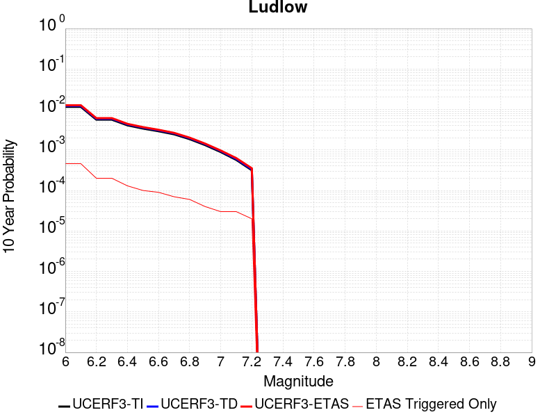 |

| Magnitude | 1 wk TI Prob | 1 wk TD Prob | 1 wk ETAS Prob | 1 wk ETAS/TD Gain | 1 wk ETAS Triggered Only | 1 mo TI Prob | 1 mo TD Prob | 1 mo ETAS Prob | 1 mo ETAS/TD Gain | 1 mo ETAS Triggered Only | 1 yr TI Prob | 1 yr TD Prob | 1 yr ETAS Prob | 1 yr ETAS/TD Gain | 1 yr ETAS Triggered Only | 10 yr TI Prob | 10 yr TD Prob | 10 yr ETAS Prob | 10 yr ETAS/TD Gain | 10 yr ETAS Triggered Only |
|-----|-----|-----|-----|-----|-----|-----|-----|-----|-----|-----|-----|-----|-----|-----|-----|-----|-----|-----|-----|-----|
| 6.0 | 2.2407607E-5 | 2.3657254E-5 | 1.32599E-4 | 5.6050043 | 1.0894433E-4 | 9.602906E-5 | 1.0138454E-4 | 3.1925112E-4 | 3.1489131 | 2.1788866E-4 | 0.0011685267 | 0.001233702 | 0.0015057267 | 1.2204947 | 2.7236083E-4 | 0.011624013 | 0.012273042 | 0.012811079 | 1.0438389 | 5.4472167E-4 |
| 6.1 | 2.2407607E-5 | 2.3657254E-5 | 1.32599E-4 | 5.6050043 | 1.0894433E-4 | 9.602906E-5 | 1.0138454E-4 | 3.1925112E-4 | 3.1489131 | 2.1788866E-4 | 0.0011685267 | 0.001233702 | 0.0015057267 | 1.2204947 | 2.7236083E-4 | 0.011624013 | 0.012273042 | 0.012811079 | 1.0438389 | 5.4472167E-4 |
| 6.2 | 1.0781252E-5 | 1.1365663E-5 | 6.583721E-5 | 5.792641 | 5.4472166E-5 | 4.620455E-5 | 4.8709102E-5 | 1.5764813E-4 | 3.236523 | 1.0894433E-4 | 5.623952E-4 | 5.9287593E-4 | 7.017557E-4 | 1.1836468 | 1.0894433E-4 | 0.00560974 | 0.0059133614 | 0.0061299615 | 1.036629 | 2.1788866E-4 |
| 6.3 | 1.0781252E-5 | 1.1365663E-5 | 6.583721E-5 | 5.792641 | 5.4472166E-5 | 4.620455E-5 | 4.8709102E-5 | 1.5764813E-4 | 3.236523 | 1.0894433E-4 | 5.623952E-4 | 5.9287593E-4 | 7.017557E-4 | 1.1836468 | 1.0894433E-4 | 0.00560974 | 0.0059133614 | 0.0061299615 | 1.036629 | 2.1788866E-4 |
| 6.4 | 7.814439E-6 | 8.237729E-6 | 6.270944E-5 | 7.612468 | 5.4472166E-5 | 3.3490025E-5 | 3.530408E-5 | 1.4424456E-4 | 4.085776 | 1.0894433E-4 | 4.0766477E-4 | 4.2974384E-4 | 5.3864135E-4 | 1.253401 | 1.0894433E-4 | 0.0040691774 | 0.0042892746 | 0.0045062285 | 1.0505806 | 2.1788866E-4 |
| 6.5 | 6.4986366E-6 | 6.85092E-6 | 6.85092E-6 | 1.0 | 0.0 | 2.7851002E-5 | 2.9360759E-5 | 8.383132E-5 | 2.8552165 | 5.4472166E-5 | 3.390332E-4 | 3.5740953E-4 | 4.1186222E-4 | 1.1523538 | 5.4472166E-5 | 0.003385164 | 0.0035684432 | 0.003676999 | 1.030421 | 1.0894433E-4 |
| 6.6 | 5.582177E-6 | 5.8860055E-6 | 5.8860055E-6 | 1.0 | 0.0 | 2.3923398E-5 | 2.5225498E-5 | 7.969629E-5 | 3.1593544 | 5.4472166E-5 | 2.9122844E-4 | 3.0707786E-4 | 3.615333E-4 | 1.1773343 | 5.4472166E-5 | 0.0029084706 | 0.003066609 | 0.003175219 | 1.0354171 | 1.0894433E-4 |
| 6.7 | 4.6858763E-6 | 4.940427E-6 | 4.940427E-6 | 1.0 | 0.0 | 2.0082172E-5 | 2.1173091E-5 | 7.56441E-5 | 3.5726528 | 5.4472166E-5 | 2.4447302E-4 | 2.5775246E-4 | 3.1221056E-4 | 1.2112807 | 5.4472166E-5 | 0.0024420423 | 0.0025745912 | 0.0026289232 | 1.0211031 | 5.4472166E-5 |
| 6.8 | 3.5584908E-6 | 3.7520183E-6 | 3.7520183E-6 | 1.0 | 0.0 | 1.5250586E-5 | 1.6079981E-5 | 7.055127E-5 | 4.3875217 | 5.4472166E-5 | 1.8566006E-4 | 1.957566E-4 | 2.5021812E-4 | 1.2782103 | 5.4472166E-5 | 0.0018550502 | 0.0019558826 | 0.0020102484 | 1.0277959 | 5.4472166E-5 |
| 6.9 | 2.532834E-6 | 2.6710034E-6 | 2.6710034E-6 | 1.0 | 0.0 | 1.0854958E-5 | 1.1447109E-5 | 6.591865E-5 | 5.758541 | 5.4472166E-5 | 1.3215111E-4 | 1.3935992E-4 | 1.938245E-4 | 1.3908195 | 5.4472166E-5 | 0.0013207254 | 0.0013927529 | 0.0014471492 | 1.0390567 | 5.4472166E-5 |
| 7.0 | 1.7083285E-6 | 1.8019439E-6 | 1.8019439E-6 | 1.0 | 0.0 | 7.3213873E-6 | 7.722595E-6 | 6.219434E-5 | 8.053555 | 5.4472166E-5 | 8.913424E-5 | 9.40187E-5 | 1.4848575E-4 | 1.5793214 | 5.4472166E-5 | 8.9098496E-4 | 9.3980576E-4 | 9.942267E-4 | 1.0579066 | 5.4472166E-5 |
| 7.1 | 1.0905424E-6 | 1.1497619E-6 | 1.1497619E-6 | 1.0 | 0.0 | 4.6737446E-6 | 4.9275427E-6 | 5.9399437E-5 | 12.054577 | 5.4472166E-5 | 5.6901354E-5 | 5.999128E-5 | 1.1446018E-4 | 1.907947 | 5.4472166E-5 | 5.6886784E-4 | 5.997606E-4 | 6.542001E-4 | 1.0907687 | 5.4472166E-5 |
| 7.2 | 6.06668E-7 | 6.387277E-7 | 6.387277E-7 | 1.0 | 0.0 | 2.600003E-6 | 2.7374022E-6 | 5.7209418E-5 | 20.899164 | 5.4472166E-5 | 3.1654577E-5 | 3.3327433E-5 | 8.779778E-5 | 2.6344 | 5.4472166E-5 | 3.1650066E-4 | 3.3323118E-4 | 3.876852E-4 | 1.1634121 | 5.4472166E-5 |

## San Andreas (Carrizo) rev
*[(top)](#table-of-contents)*

| 1 Week | 1 Month | 1 Year | 10 Year |
|-----|-----|-----|-----|
|  |  |  |  |

| Magnitude | 1 wk TI Prob | 1 wk TD Prob | 1 wk ETAS Prob | 1 wk ETAS/TD Gain | 1 wk ETAS Triggered Only | 1 mo TI Prob | 1 mo TD Prob | 1 mo ETAS Prob | 1 mo ETAS/TD Gain | 1 mo ETAS Triggered Only | 1 yr TI Prob | 1 yr TD Prob | 1 yr ETAS Prob | 1 yr ETAS/TD Gain | 1 yr ETAS Triggered Only | 10 yr TI Prob | 10 yr TD Prob | 10 yr ETAS Prob | 10 yr ETAS/TD Gain | 10 yr ETAS Triggered Only |
|-----|-----|-----|-----|-----|-----|-----|-----|-----|-----|-----|-----|-----|-----|-----|-----|-----|-----|-----|-----|-----|
| 6.0 | 1.1674632E-4 | 2.432302E-4 | 4.0660694E-4 | 1.671696 | 1.634165E-4 | 5.002454E-4 | 0.0010420004 | 0.0012052465 | 1.1566662 | 1.634165E-4 | 0.006073493 | 0.012613042 | 0.012935753 | 1.0255854 | 3.26833E-4 | 0.0591016 | 0.12061418 | 0.1210453 | 1.0035744 | 4.902495E-4 |
| 6.1 | 1.1674632E-4 | 2.432302E-4 | 4.0660694E-4 | 1.671696 | 1.634165E-4 | 5.002454E-4 | 0.0010420004 | 0.0012052465 | 1.1566662 | 1.634165E-4 | 0.006073493 | 0.012613042 | 0.012935753 | 1.0255854 | 3.26833E-4 | 0.0591016 | 0.12061418 | 0.1210453 | 1.0035744 | 4.902495E-4 |
| 6.2 | 1.1674632E-4 | 2.432302E-4 | 4.0660694E-4 | 1.671696 | 1.634165E-4 | 5.002454E-4 | 0.0010420004 | 0.0012052465 | 1.1566662 | 1.634165E-4 | 0.006073493 | 0.012613042 | 0.012935753 | 1.0255854 | 3.26833E-4 | 0.0591016 | 0.12061418 | 0.1210453 | 1.0035744 | 4.902495E-4 |
| 6.3 | 1.1674632E-4 | 2.432302E-4 | 4.0660694E-4 | 1.671696 | 1.634165E-4 | 5.002454E-4 | 0.0010420004 | 0.0012052465 | 1.1566662 | 1.634165E-4 | 0.006073493 | 0.012613042 | 0.012935753 | 1.0255854 | 3.26833E-4 | 0.0591016 | 0.12061418 | 0.1210453 | 1.0035744 | 4.902495E-4 |
| 6.4 | 1.1674632E-4 | 2.432302E-4 | 4.0660694E-4 | 1.671696 | 1.634165E-4 | 5.002454E-4 | 0.0010420004 | 0.0012052465 | 1.1566662 | 1.634165E-4 | 0.006073493 | 0.012613042 | 0.012935753 | 1.0255854 | 3.26833E-4 | 0.0591016 | 0.12061418 | 0.1210453 | 1.0035744 | 4.902495E-4 |
| 6.5 | 1.13136164E-4 | 2.3643032E-4 | 3.9980817E-4 | 1.691019 | 1.634165E-4 | 4.847792E-4 | 0.0010128808 | 0.0011761318 | 1.1611749 | 1.634165E-4 | 0.0058862255 | 0.012262545 | 0.012585369 | 1.0263261 | 3.26833E-4 | 0.057327334 | 0.117585555 | 0.11801816 | 1.003679 | 4.902495E-4 |
| 6.6 | 1.13136164E-4 | 2.3643032E-4 | 3.9980817E-4 | 1.691019 | 1.634165E-4 | 4.847792E-4 | 0.0010128808 | 0.0011761318 | 1.1611749 | 1.634165E-4 | 0.0058862255 | 0.012262545 | 0.012585369 | 1.0263261 | 3.26833E-4 | 0.057327334 | 0.117585555 | 0.11801816 | 1.003679 | 4.902495E-4 |
| 6.7 | 1.1149675E-4 | 2.3334254E-4 | 3.967209E-4 | 1.7001654 | 1.634165E-4 | 4.777557E-4 | 9.996577E-4 | 0.0011629108 | 1.163309 | 1.634165E-4 | 0.0058011734 | 0.012103349 | 0.012426226 | 1.0266767 | 3.26833E-4 | 0.05652051 | 0.1162071 | 0.11664038 | 1.0037285 | 4.902495E-4 |
| 6.8 | 1.1103589E-4 | 2.3236412E-4 | 3.9574265E-4 | 1.7031143 | 1.634165E-4 | 4.7578133E-4 | 9.954676E-4 | 0.0011587215 | 1.163997 | 1.634165E-4 | 0.005777263 | 0.012052901 | 0.012375795 | 1.0267897 | 3.26833E-4 | 0.056293584 | 0.1157674 | 0.116200894 | 1.0037445 | 4.902495E-4 |
| 6.9 | 1.1053259E-4 | 2.3128795E-4 | 3.9466665E-4 | 1.7063866 | 1.634165E-4 | 4.7362508E-4 | 9.90859E-4 | 0.0011541136 | 1.1647606 | 1.634165E-4 | 0.0057511497 | 0.01199741 | 0.012320322 | 1.0269151 | 3.26833E-4 | 0.05604569 | 0.11528359 | 0.11571733 | 1.0037622 | 4.902495E-4 |
| 7.0 | 1.1005377E-4 | 2.3029637E-4 | 3.9367523E-4 | 1.7094287 | 1.634165E-4 | 4.7157376E-4 | 9.866126E-4 | 0.0011498679 | 1.1654705 | 1.634165E-4 | 0.0057263062 | 0.011946279 | 0.012269207 | 1.0270318 | 3.26833E-4 | 0.055809796 | 0.11483591 | 0.11526986 | 1.0037789 | 4.902495E-4 |
| 7.1 | 1.0308142E-4 | 2.1539345E-4 | 3.7877474E-4 | 1.7585249 | 1.634165E-4 | 4.417027E-4 | 9.227892E-4 | 0.001086055 | 1.1769264 | 1.634165E-4 | 0.0053644776 | 0.011177397 | 0.011500577 | 1.0289137 | 3.26833E-4 | 0.052368138 | 0.108092256 | 0.108529516 | 1.0040452 | 4.902495E-4 |
| 7.2 | 1.0027479E-4 | 2.094724E-4 | 3.7285467E-4 | 1.7799703 | 1.634165E-4 | 4.296783E-4 | 8.9743105E-4 | 0.0010607009 | 1.1819302 | 1.634165E-4 | 0.0052187922 | 0.010871782 | 0.011195062 | 1.0297357 | 3.26833E-4 | 0.050979212 | 0.10539625 | 0.10583483 | 1.0041612 | 4.902495E-4 |
| 7.3 | 9.816942E-5 | 2.0422463E-4 | 3.6760775E-4 | 1.8000166 | 1.634165E-4 | 4.2065824E-4 | 8.7495585E-4 | 0.0010382293 | 1.1866077 | 1.634165E-4 | 0.005109493 | 0.010600842 | 0.01092421 | 1.030504 | 3.26833E-4 | 0.049935985 | 0.102979995 | 0.10341976 | 1.0042704 | 4.902495E-4 |
| 7.4 | 9.5634205E-5 | 1.9791997E-4 | 3.6130412E-4 | 1.8255062 | 1.634165E-4 | 4.0979648E-4 | 8.479536E-4 | 0.0010112316 | 1.1925553 | 1.634165E-4 | 0.0049778637 | 0.010275229 | 0.010598703 | 1.031481 | 3.26833E-4 | 0.048678253 | 0.10006632 | 0.10050751 | 1.004409 | 4.902495E-4 |
| 7.5 | 8.052417E-5 | 1.611261E-4 | 3.2451627E-4 | 2.0140514 | 1.634165E-4 | 3.4505792E-4 | 6.903579E-4 | 8.536615E-4 | 1.2365494 | 1.634165E-4 | 0.0041929903 | 0.008372796 | 0.008696892 | 1.0387083 | 3.26833E-4 | 0.04114753 | 0.08281049 | 0.08326014 | 1.0054299 | 4.902495E-4 |
| 7.6 | 7.897024E-5 | 1.5765853E-4 | 3.2104927E-4 | 2.0363584 | 1.634165E-4 | 3.384E-4 | 6.755046E-4 | 8.3881075E-4 | 1.2417542 | 1.634165E-4 | 0.0041122385 | 0.008193332 | 0.008517487 | 1.0395633 | 3.26833E-4 | 0.040369697 | 0.08115171 | 0.08160217 | 1.0055509 | 4.902495E-4 |
| 7.7 | 6.707427E-5 | 1.3276102E-4 | 2.416909E-4 | 1.8204958 | 1.0894433E-4 | 2.8742946E-4 | 5.688518E-4 | 6.7773415E-4 | 1.1914072 | 1.0894433E-4 | 0.003493839 | 0.00690381 | 0.0071201944 | 1.0313427 | 2.1788866E-4 | 0.034394164 | 0.069048055 | 0.06935232 | 1.0044066 | 3.26833E-4 |
| 7.8 | 6.147705E-5 | 1.2197486E-4 | 2.309059E-4 | 1.8930614 | 1.0894433E-4 | 2.6344648E-4 | 5.226447E-4 | 6.315321E-4 | 1.2083392 | 1.0894433E-4 | 0.0032027436 | 0.006344659 | 0.0065070386 | 1.0255932 | 1.634165E-4 | 0.031569764 | 0.06351457 | 0.06376962 | 1.0040158 | 2.7236083E-4 |
| 7.9 | 4.7636717E-5 | 8.87977E-5 | 1.9773236E-4 | 2.2267735 | 1.0894433E-4 | 2.0414138E-4 | 3.8050607E-4 | 4.8940897E-4 | 1.2862053 | 1.0894433E-4 | 0.0024825884 | 0.0046228287 | 0.0047854898 | 1.0351865 | 1.634165E-4 | 0.024550365 | 0.046628095 | 0.04683582 | 1.004455 | 2.1788866E-4 |
| 8.0 | 3.3554235E-5 | 5.2136907E-5 | 1.0660623E-4 | 2.0447364 | 5.4472166E-5 | 1.4379594E-4 | 2.2342477E-4 | 2.7788477E-4 | 1.2437509 | 5.4472166E-5 | 0.0017493097 | 0.002716805 | 0.0027711291 | 1.0199956 | 5.4472166E-5 | 0.017356034 | 0.027880952 | 0.02798686 | 1.0037985 | 1.0894433E-4 |
| 8.1 | 1.9175432E-5 | 1.9184976E-5 | 1.9184976E-5 | 1.0 | 0.0 | 8.217783E-5 | 8.2218736E-5 | 8.2218736E-5 | 1.0 | 0.0 | 0.0010000558 | 0.0010005541 | 0.0010005541 | 1.0 | 0.0 | 0.009955673 | 0.0107580265 | 0.0107580265 | 1.0 | 0.0 |
| 8.2 | 8.643924E-6 | 5.4748625E-6 | 5.4748625E-6 | 1.0 | 0.0 | 3.704486E-5 | 2.3463486E-5 | 2.3463486E-5 | 1.0 | 0.0 | 4.5092785E-4 | 2.8563058E-4 | 2.8563058E-4 | 1.0 | 0.0 | 0.0045001395 | 0.0032487072 | 0.0032487072 | 1.0 | 0.0 |
| 8.3 | 1.983087E-6 | 7.6599065E-7 | 7.6599065E-7 | 1.0 | 0.0 | 8.498917E-6 | 3.282813E-6 | 3.282813E-6 | 1.0 | 0.0 | 1.034694E-4 | 3.9967534E-5 | 3.9967534E-5 | 1.0 | 0.0 | 0.0010342124 | 4.719687E-4 | 4.719687E-4 | 1.0 | 0.0 |

## San Andreas (San Gorgonio Pass-Garnet HIll)
*[(top)](#table-of-contents)*

| 1 Week | 1 Month | 1 Year | 10 Year |
|-----|-----|-----|-----|
|  |  |  |  |

| Magnitude | 1 wk TI Prob | 1 wk TD Prob | 1 wk ETAS Prob | 1 wk ETAS/TD Gain | 1 wk ETAS Triggered Only | 1 mo TI Prob | 1 mo TD Prob | 1 mo ETAS Prob | 1 mo ETAS/TD Gain | 1 mo ETAS Triggered Only | 1 yr TI Prob | 1 yr TD Prob | 1 yr ETAS Prob | 1 yr ETAS/TD Gain | 1 yr ETAS Triggered Only | 10 yr TI Prob | 10 yr TD Prob | 10 yr ETAS Prob | 10 yr ETAS/TD Gain | 10 yr ETAS Triggered Only |
|-----|-----|-----|-----|-----|-----|-----|-----|-----|-----|-----|-----|-----|-----|-----|-----|-----|-----|-----|-----|-----|
| 6.0 | 8.31567E-5 | 2.3382473E-4 | 3.427436E-4 | 1.4658141 | 1.0894433E-4 | 3.5633717E-4 | 0.0010017233 | 0.0012193938 | 1.2172959 | 2.1788866E-4 | 0.004329778 | 0.012127888 | 0.012450757 | 1.026622 | 3.26833E-4 | 0.042463828 | 0.11257892 | 0.113013975 | 1.0038645 | 4.902495E-4 |
| 6.1 | 8.31567E-5 | 2.3382473E-4 | 3.427436E-4 | 1.4658141 | 1.0894433E-4 | 3.5633717E-4 | 0.0010017233 | 0.0012193938 | 1.2172959 | 2.1788866E-4 | 0.004329778 | 0.012127888 | 0.012450757 | 1.026622 | 3.26833E-4 | 0.042463828 | 0.11257892 | 0.113013975 | 1.0038645 | 4.902495E-4 |
| 6.2 | 8.31567E-5 | 2.3382473E-4 | 3.427436E-4 | 1.4658141 | 1.0894433E-4 | 3.5633717E-4 | 0.0010017233 | 0.0012193938 | 1.2172959 | 2.1788866E-4 | 0.004329778 | 0.012127888 | 0.012450757 | 1.026622 | 3.26833E-4 | 0.042463828 | 0.11257892 | 0.113013975 | 1.0038645 | 4.902495E-4 |
| 6.3 | 8.31567E-5 | 2.3382473E-4 | 3.427436E-4 | 1.4658141 | 1.0894433E-4 | 3.5633717E-4 | 0.0010017233 | 0.0012193938 | 1.2172959 | 2.1788866E-4 | 0.004329778 | 0.012127888 | 0.012450757 | 1.026622 | 3.26833E-4 | 0.042463828 | 0.11257892 | 0.113013975 | 1.0038645 | 4.902495E-4 |
| 6.4 | 8.059055E-5 | 2.2940808E-4 | 3.3832743E-4 | 1.4747843 | 1.0894433E-4 | 3.4534236E-4 | 9.828096E-4 | 0.001200484 | 1.2214819 | 2.1788866E-4 | 0.0041964394 | 0.011900152 | 0.012223096 | 1.0271378 | 3.26833E-4 | 0.041180745 | 0.11056015 | 0.110996194 | 1.003944 | 4.902495E-4 |
| 6.5 | 8.059055E-5 | 2.2940808E-4 | 3.3832743E-4 | 1.4747843 | 1.0894433E-4 | 3.4534236E-4 | 9.828096E-4 | 0.001200484 | 1.2214819 | 2.1788866E-4 | 0.0041964394 | 0.011900152 | 0.012223096 | 1.0271378 | 3.26833E-4 | 0.041180745 | 0.11056015 | 0.110996194 | 1.003944 | 4.902495E-4 |
| 6.6 | 7.619237E-5 | 2.218517E-4 | 3.3077187E-4 | 1.4909593 | 1.0894433E-4 | 3.2649786E-4 | 9.5044886E-4 | 0.0011681304 | 1.2290303 | 2.1788866E-4 | 0.0039678677 | 0.01151087 | 0.011833941 | 1.0280666 | 3.26833E-4 | 0.03897764 | 0.10709683 | 0.10753457 | 1.0040873 | 4.902495E-4 |
| 6.7 | 7.440636E-5 | 2.1860997E-4 | 3.275305E-4 | 1.4982413 | 1.0894433E-4 | 3.188454E-4 | 9.3656575E-4 | 0.0011542503 | 1.2324286 | 2.1788866E-4 | 0.0038750346 | 0.011343609 | 0.011666734 | 1.0284853 | 3.26833E-4 | 0.038081564 | 0.105605274 | 0.10604375 | 1.004152 | 4.902495E-4 |
| 6.8 | 7.3735864E-5 | 2.1708169E-4 | 3.2600237E-4 | 1.5017498 | 1.0894433E-4 | 3.1597257E-4 | 9.3002064E-4 | 0.0011477066 | 1.2340658 | 2.1788866E-4 | 0.0038401815 | 0.011264749 | 0.0115879 | 1.028687 | 3.26833E-4 | 0.03774495 | 0.10490683 | 0.105345644 | 1.0041829 | 4.902495E-4 |
| 6.9 | 7.27575E-5 | 2.1477141E-4 | 3.2369234E-4 | 1.5071481 | 1.0894433E-4 | 3.117806E-4 | 9.201265E-4 | 0.0011378147 | 1.236585 | 2.1788866E-4 | 0.003789323 | 0.011145527 | 0.011468716 | 1.0289973 | 3.26833E-4 | 0.037253562 | 0.103854746 | 0.10429408 | 1.0042303 | 4.902495E-4 |
| 7.0 | 7.102591E-5 | 2.1061185E-4 | 3.1953322E-4 | 1.5171665 | 1.0894433E-4 | 3.0436125E-4 | 9.023122E-4 | 0.0011200042 | 1.2412603 | 2.1788866E-4 | 0.003699303 | 0.010930831 | 0.011254092 | 1.0295733 | 3.26833E-4 | 0.03638325 | 0.10195695 | 0.10239721 | 1.0043181 | 4.902495E-4 |
| 7.1 | 7.028513E-5 | 2.0896831E-4 | 3.1788988E-4 | 1.5212349 | 1.0894433E-4 | 3.0118722E-4 | 8.9527335E-4 | 0.0011129669 | 1.2431588 | 2.1788866E-4 | 0.0036607897 | 0.010845989 | 0.011169277 | 1.0298072 | 3.26833E-4 | 0.036010686 | 0.101199985 | 0.10164062 | 1.0043541 | 4.902495E-4 |
| 7.2 | 6.8498244E-5 | 2.0504706E-4 | 3.1396907E-4 | 1.5312048 | 1.0894433E-4 | 2.9353087E-4 | 8.784794E-4 | 0.0010961767 | 1.2478114 | 2.1788866E-4 | 0.003567883 | 0.010643536 | 0.0109668905 | 1.0303804 | 3.26833E-4 | 0.035111405 | 0.09939202 | 0.099784486 | 1.0039487 | 4.3577733E-4 |
| 7.3 | 6.622592E-5 | 1.9732013E-4 | 2.5178154E-4 | 1.2760054 | 5.4472166E-5 | 2.8379448E-4 | 8.453858E-4 | 0.0010086641 | 1.1931406 | 1.634165E-4 | 0.0034497243 | 0.0102444785 | 0.01051405 | 1.0263138 | 2.7236083E-4 | 0.033966612 | 0.095888525 | 0.09623327 | 1.0035952 | 3.8130514E-4 |
| 7.4 | 5.1050705E-5 | 1.4689034E-4 | 2.013545E-4 | 1.3707812 | 5.4472166E-5 | 2.1877038E-4 | 6.29379E-4 | 7.9269265E-4 | 1.2594838 | 1.634165E-4 | 0.002660276 | 0.0076359594 | 0.00790624 | 1.0353959 | 2.7236083E-4 | 0.02628654 | 0.07286301 | 0.073216535 | 1.0048518 | 3.8130514E-4 |
| 7.5 | 3.9302922E-5 | 1.1129847E-4 | 1.6576458E-4 | 1.4893698 | 5.4472166E-5 | 1.6843023E-4 | 4.7690657E-4 | 6.402451E-4 | 1.3424959 | 1.634165E-4 | 0.0020487092 | 0.005790949 | 0.0060617323 | 1.0467598 | 2.7236083E-4 | 0.020299247 | 0.05600951 | 0.056369457 | 1.0064266 | 3.8130514E-4 |
| 7.6 | 2.9851626E-5 | 8.4949745E-5 | 1.3941729E-4 | 1.6411736 | 5.4472166E-5 | 1.2792926E-4 | 3.6401965E-4 | 5.2737666E-4 | 1.4487587 | 1.634165E-4 | 0.0015564259 | 0.0044229585 | 0.0046941144 | 1.0613065 | 2.7236083E-4 | 0.0154556995 | 0.04319374 | 0.04355857 | 1.0084465 | 3.8130514E-4 |
| 7.7 | 2.1135214E-5 | 6.3529005E-5 | 1.17997704E-4 | 1.8573833 | 5.4472166E-5 | 9.0576345E-5 | 2.7223877E-4 | 4.3561077E-4 | 1.6001056 | 1.634165E-4 | 0.0011022091 | 0.0033094748 | 0.0035809344 | 1.0820249 | 2.7236083E-4 | 0.010967582 | 0.032582592 | 0.032951474 | 1.0113214 | 3.8130514E-4 |
| 7.8 | 1.883379E-5 | 5.564028E-5 | 1.1010942E-4 | 1.9789515 | 5.4472166E-5 | 8.0713755E-5 | 2.3843657E-4 | 4.018141E-4 | 1.6852033 | 1.634165E-4 | 9.822468E-4 | 0.0028991038 | 0.0031706751 | 1.0936742 | 2.7236083E-4 | 0.0097791655 | 0.028695205 | 0.02906557 | 1.0129068 | 3.8130514E-4 |
| 7.9 | 1.5156185E-5 | 4.1658426E-5 | 9.612832E-5 | 2.3075361 | 5.4472166E-5 | 6.495346E-5 | 1.785239E-4 | 3.4191122E-4 | 1.9152126 | 1.634165E-4 | 7.9052144E-4 | 0.0021713632 | 0.0024431327 | 1.1251607 | 2.7236083E-4 | 0.007877152 | 0.021759422 | 0.022079144 | 1.0146935 | 3.26833E-4 |
| 8.0 | 1.1405907E-5 | 2.9974231E-5 | 8.4444764E-5 | 2.8172452 | 5.4472166E-5 | 4.8881542E-5 | 1.2845467E-4 | 2.9185019E-4 | 2.2720091 | 1.634165E-4 | 5.9497025E-4 | 0.0015628147 | 0.0017259758 | 1.1044021 | 1.634165E-4 | 0.005933798 | 0.015772851 | 0.015987303 | 1.0135963 | 2.1788866E-4 |
| 8.1 | 4.3511436E-6 | 7.369219E-6 | 7.369219E-6 | 1.0 | 0.0 | 1.8647626E-5 | 3.1581985E-5 | 3.1581985E-5 | 1.0 | 0.0 | 2.2701119E-4 | 3.8444297E-4 | 3.8444297E-4 | 1.0 | 0.0 | 0.0022677942 | 0.0041163345 | 0.0041163345 | 1.0 | 0.0 |
| 8.2 | 2.3042528E-6 | 2.7329415E-6 | 2.7329415E-6 | 1.0 | 0.0 | 9.875332E-6 | 1.1712554E-5 | 1.1712554E-5 | 1.0 | 0.0 | 1.2022553E-4 | 1.4259106E-4 | 1.4259106E-4 | 1.0 | 0.0 | 0.0012016051 | 0.0015979785 | 0.0015979785 | 1.0 | 0.0 |
| 8.3 | 5.202968E-7 | 3.1598344E-7 | 3.1598344E-7 | 1.0 | 0.0 | 2.2298414E-6 | 1.3542141E-6 | 1.3542141E-6 | 1.0 | 0.0 | 2.714798E-5 | 1.6487444E-5 | 1.6487444E-5 | 1.0 | 0.0 | 2.7144665E-4 | 1.9563142E-4 | 1.9563142E-4 | 1.0 | 0.0 |

## San Andreas (Creeping Section) 2011 CFM
*[(top)](#table-of-contents)*

| 1 Week | 1 Month | 1 Year | 10 Year |
|-----|-----|-----|-----|
|  |  |  |  |

| Magnitude | 1 wk TI Prob | 1 wk TD Prob | 1 wk ETAS Prob | 1 wk ETAS/TD Gain | 1 wk ETAS Triggered Only | 1 mo TI Prob | 1 mo TD Prob | 1 mo ETAS Prob | 1 mo ETAS/TD Gain | 1 mo ETAS Triggered Only | 1 yr TI Prob | 1 yr TD Prob | 1 yr ETAS Prob | 1 yr ETAS/TD Gain | 1 yr ETAS Triggered Only | 10 yr TI Prob | 10 yr TD Prob | 10 yr ETAS Prob | 10 yr ETAS/TD Gain | 10 yr ETAS Triggered Only |
|-----|-----|-----|-----|-----|-----|-----|-----|-----|-----|-----|-----|-----|-----|-----|-----|-----|-----|-----|-----|-----|
| 6.0 | 5.986481E-4 | 0.001228691 | 0.0012830963 | 1.044279 | 5.4472166E-5 | 0.0025631124 | 0.005246795 | 0.005409354 | 1.0309825 | 1.634165E-4 | 0.030762846 | 0.061203245 | 0.061510075 | 1.0050133 | 3.26833E-4 | 0.26835477 | 0.425928 | 0.42617816 | 1.0005873 | 4.3577733E-4 |
| 6.1 | 5.015945E-4 | 0.0010230356 | 0.001077452 | 1.0531912 | 5.4472166E-5 | 0.00214792 | 0.004369436 | 0.0045321384 | 1.0372365 | 1.634165E-4 | 0.025839351 | 0.051246606 | 0.05155669 | 1.0060508 | 3.26833E-4 | 0.23032776 | 0.37284943 | 0.37312275 | 1.000733 | 4.3577733E-4 |
| 6.2 | 4.073338E-4 | 8.1157376E-4 | 8.660017E-4 | 1.0670648 | 5.4472166E-5 | 0.0017445484 | 0.0034683137 | 0.0036311634 | 1.0469536 | 1.634165E-4 | 0.021034058 | 0.04093177 | 0.041192982 | 1.0063816 | 2.7236083E-4 | 0.19150782 | 0.31302592 | 0.31328785 | 1.0008368 | 3.8130514E-4 |
| 6.3 | 3.464099E-4 | 6.7455834E-4 | 7.2899373E-4 | 1.0806979 | 5.4472166E-5 | 0.0014837692 | 0.0028832308 | 0.0030461762 | 1.0565149 | 1.634165E-4 | 0.017915873 | 0.034187846 | 0.034450896 | 1.0076942 | 2.7236083E-4 | 0.16538359 | 0.27130842 | 0.27158627 | 1.0010241 | 3.8130514E-4 |
| 6.4 | 2.935057E-4 | 5.5516965E-4 | 6.0961157E-4 | 1.0980636 | 5.4472166E-5 | 0.0012572751 | 0.0023727308 | 0.0025357597 | 1.0687094 | 1.634165E-4 | 0.015200248 | 0.02826279 | 0.028527454 | 1.0093644 | 2.7236083E-4 | 0.14201577 | 0.23297668 | 0.23326914 | 1.0012554 | 3.8130514E-4 |
| 6.5 | 2.3409708E-4 | 4.2132285E-4 | 4.7577207E-4 | 1.129234 | 5.4472166E-5 | 0.0010028875 | 0.0018017791 | 0.0019649013 | 1.0905339 | 1.634165E-4 | 0.012141965 | 0.021586355 | 0.021852836 | 1.012345 | 2.7236083E-4 | 0.11499573 | 0.1868149 | 0.18712498 | 1.0016598 | 3.8130514E-4 |
| 6.6 | 1.5842178E-4 | 2.5068692E-4 | 3.0514543E-4 | 1.2172371 | 5.4472166E-5 | 6.7877385E-4 | 0.0010739256 | 0.0011827529 | 1.101336 | 1.0894433E-4 | 0.0082328 | 0.012995283 | 0.01321034 | 1.0165489 | 2.1788866E-4 | 0.07934396 | 0.12313759 | 0.123376414 | 1.0019395 | 2.7236083E-4 |
| 6.7 | 1.5616413E-4 | 2.4605254E-4 | 3.005113E-4 | 1.2213298 | 5.4472166E-5 | 6.691031E-4 | 0.0010540807 | 0.0011629101 | 1.1032459 | 1.0894433E-4 | 0.0081159435 | 0.012757154 | 0.012972263 | 1.0168618 | 2.1788866E-4 | 0.0782586 | 0.12116472 | 0.121404074 | 1.0019755 | 2.7236083E-4 |
| 6.8 | 1.5538467E-4 | 2.442914E-4 | 2.9875027E-4 | 1.2229258 | 5.4472166E-5 | 6.6576427E-4 | 0.001046539 | 0.0011553693 | 1.1039907 | 1.0894433E-4 | 0.008075596 | 0.012666538 | 0.012881666 | 1.016984 | 2.1788866E-4 | 0.07788358 | 0.12039561 | 0.120635174 | 1.0019898 | 2.7236083E-4 |
| 6.9 | 1.5153569E-4 | 2.3538464E-4 | 2.8984397E-4 | 1.2313632 | 5.4472166E-5 | 6.49277E-4 | 0.0010084033 | 0.0011172377 | 1.1079276 | 1.0894433E-4 | 0.007876333 | 0.012208726 | 0.012423955 | 1.017629 | 2.1788866E-4 | 0.07602952 | 0.11646574 | 0.11670638 | 1.0020661 | 2.7236083E-4 |
| 7.0 | 1.4588932E-4 | 2.2395732E-4 | 2.7841728E-4 | 1.2431712 | 5.4472166E-5 | 6.250901E-4 | 9.59466E-4 | 0.0010683058 | 1.1134379 | 1.0894433E-4 | 0.0075839474 | 0.011619428 | 0.011834784 | 1.0185342 | 2.1788866E-4 | 0.073302895 | 0.11131206 | 0.11155411 | 1.0021745 | 2.7236083E-4 |
| 7.1 | 1.1565079E-4 | 1.6281323E-4 | 2.1727652E-4 | 1.3345139 | 5.4472166E-5 | 4.955521E-4 | 6.9758523E-4 | 7.520194E-4 | 1.0780323 | 5.4472166E-5 | 0.006016669 | 0.008460228 | 0.008622262 | 1.0191524 | 1.634165E-4 | 0.058563538 | 0.08366478 | 0.08381453 | 1.0017898 | 1.634165E-4 |
| 7.2 | 1.0393792E-4 | 1.4615392E-4 | 2.0061812E-4 | 1.3726497 | 5.4472166E-5 | 4.4537216E-4 | 6.262243E-4 | 6.806624E-4 | 1.0869306 | 5.4472166E-5 | 0.005408933 | 0.0075977976 | 0.0077599725 | 1.021345 | 1.634165E-4 | 0.052791595 | 0.07561503 | 0.075766094 | 1.0019977 | 1.634165E-4 |
| 7.3 | 9.332884E-5 | 1.2780601E-4 | 1.8227121E-4 | 1.4261553 | 5.4472166E-5 | 3.999194E-4 | 5.4762565E-4 | 6.02068E-4 | 1.0994152 | 5.4472166E-5 | 0.0048581534 | 0.0066470946 | 0.0068094246 | 1.0244212 | 1.634165E-4 | 0.047533102 | 0.06647954 | 0.06663209 | 1.0022948 | 1.634165E-4 |
| 7.4 | 8.670252E-5 | 1.1702972E-4 | 1.714955E-4 | 1.4654014 | 5.4472166E-5 | 3.715293E-4 | 5.014601E-4 | 5.5590493E-4 | 1.1085726 | 5.4472166E-5 | 0.004513991 | 0.0060883067 | 0.0062507284 | 1.0266776 | 1.634165E-4 | 0.044233937 | 0.061148684 | 0.061302107 | 1.002509 | 1.634165E-4 |
| 7.5 | 7.3036405E-5 | 9.005699E-5 | 1.4452424E-4 | 1.6048088 | 5.4472166E-5 | 3.129756E-4 | 3.859015E-4 | 4.4035265E-4 | 1.1411011 | 5.4472166E-5 | 0.0038038217 | 0.0046882504 | 0.0048509007 | 1.0346932 | 1.634165E-4 | 0.03739367 | 0.047875606 | 0.0480312 | 1.0032499 | 1.634165E-4 |
| 7.6 | 6.3935775E-5 | 8.280209E-5 | 1.3726974E-4 | 1.6578053 | 5.4472166E-5 | 2.7398168E-4 | 3.5481792E-4 | 4.0927075E-4 | 1.1534669 | 5.4472166E-5 | 0.0033306254 | 0.00431137 | 0.004474082 | 1.0377402 | 1.634165E-4 | 0.032811474 | 0.043990135 | 0.044146363 | 1.0035515 | 1.634165E-4 |
| 7.7 | 5.5050095E-5 | 6.661729E-5 | 1.2108583E-4 | 1.8176336 | 5.4472166E-5 | 2.3590765E-4 | 2.8547147E-4 | 3.3992808E-4 | 1.1907603 | 5.4472166E-5 | 0.0028683927 | 0.0034700802 | 0.0035786463 | 1.0312864 | 1.0894433E-4 | 0.0283165 | 0.03579509 | 0.03590013 | 1.0029346 | 1.0894433E-4 |
| 7.8 | 5.027131E-5 | 6.1627725E-5 | 1.1609653E-4 | 1.8838362 | 5.4472166E-5 | 2.1543067E-4 | 2.640921E-4 | 3.1854986E-4 | 1.2062075 | 5.4472166E-5 | 0.0026197135 | 0.003210584 | 0.0032648812 | 1.016912 | 5.4472166E-5 | 0.025890453 | 0.03312572 | 0.03317839 | 1.0015899 | 5.4472166E-5 |
| 7.9 | 3.7271806E-5 | 5.0224386E-5 | 1.0469381E-4 | 2.0845215 | 5.4472166E-5 | 1.5972654E-4 | 2.1522962E-4 | 2.6969006E-4 | 1.2530341 | 5.4472166E-5 | 0.0019429359 | 0.0026172737 | 0.0026716033 | 1.020758 | 5.4472166E-5 | 0.019260362 | 0.027066687 | 0.027119685 | 1.001958 | 5.4472166E-5 |
| 8.0 | 2.7310243E-5 | 3.1428404E-5 | 8.589886E-5 | 2.73316 | 5.4472166E-5 | 1.17038646E-4 | 1.3468621E-4 | 1.8915105E-4 | 1.4043831 | 5.4472166E-5 | 0.0014240141 | 0.0016385721 | 0.001692955 | 1.0331892 | 5.4472166E-5 | 0.014149235 | 0.01721387 | 0.017267404 | 1.0031099 | 5.4472166E-5 |
| 8.1 | 1.7940547E-5 | 1.7400796E-5 | 1.7400796E-5 | 1.0 | 0.0 | 7.688579E-5 | 7.457271E-5 | 7.457271E-5 | 1.0 | 0.0 | 9.3568244E-4 | 9.075451E-4 | 9.075451E-4 | 1.0 | 0.0 | 0.009317525 | 0.009799073 | 0.009799073 | 1.0 | 0.0 |
| 8.2 | 8.643924E-6 | 5.4748625E-6 | 5.4748625E-6 | 1.0 | 0.0 | 3.704486E-5 | 2.3463486E-5 | 2.3463486E-5 | 1.0 | 0.0 | 4.5092785E-4 | 2.8563058E-4 | 2.8563058E-4 | 1.0 | 0.0 | 0.0045001395 | 0.0032487072 | 0.0032487072 | 1.0 | 0.0 |
| 8.3 | 1.983087E-6 | 7.6599065E-7 | 7.6599065E-7 | 1.0 | 0.0 | 8.498917E-6 | 3.282813E-6 | 3.282813E-6 | 1.0 | 0.0 | 1.034694E-4 | 3.9967534E-5 | 3.9967534E-5 | 1.0 | 0.0 | 0.0010342124 | 4.719687E-4 | 4.719687E-4 | 1.0 | 0.0 |

## Death Valley (Fish Lake Valley)
*[(top)](#table-of-contents)*

| 1 Week | 1 Month | 1 Year | 10 Year |
|-----|-----|-----|-----|
|  | 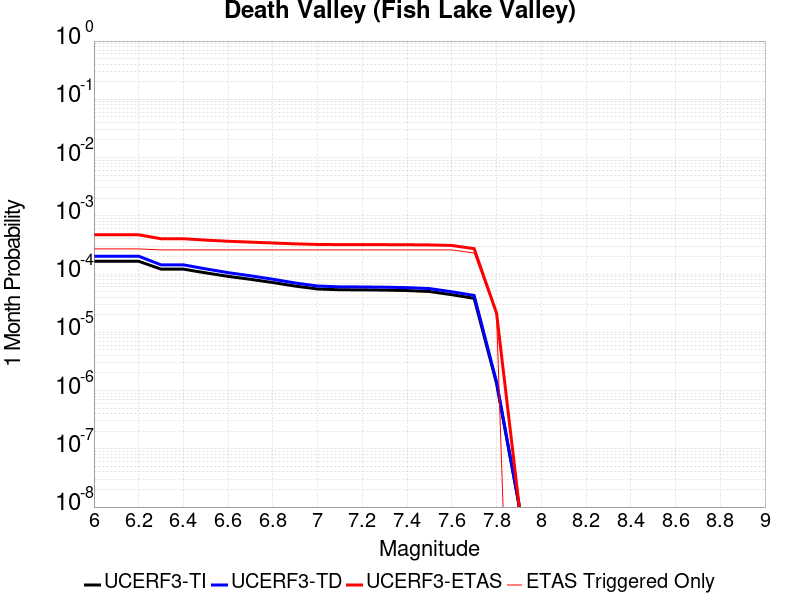 |  |  |

| Magnitude | 1 wk TI Prob | 1 wk TD Prob | 1 wk ETAS Prob | 1 wk ETAS/TD Gain | 1 wk ETAS Triggered Only | 1 mo TI Prob | 1 mo TD Prob | 1 mo ETAS Prob | 1 mo ETAS/TD Gain | 1 mo ETAS Triggered Only | 1 yr TI Prob | 1 yr TD Prob | 1 yr ETAS Prob | 1 yr ETAS/TD Gain | 1 yr ETAS Triggered Only | 10 yr TI Prob | 10 yr TD Prob | 10 yr ETAS Prob | 10 yr ETAS/TD Gain | 10 yr ETAS Triggered Only |
|-----|-----|-----|-----|-----|-----|-----|-----|-----|-----|-----|-----|-----|-----|-----|-----|-----|-----|-----|-----|-----|
| 6.0 | 3.872328E-5 | 4.7267473E-5 | 2.6514582E-4 | 5.6094775 | 2.1788866E-4 | 1.6594635E-4 | 2.0256084E-4 | 4.2040538E-4 | 2.0754523 | 2.1788866E-4 | 0.0020185246 | 0.002463534 | 0.0028982377 | 1.1764554 | 4.3577733E-4 | 0.02000288 | 0.024388181 | 0.024866475 | 1.0196117 | 4.902495E-4 |
| 6.1 | 3.872328E-5 | 4.7267473E-5 | 2.6514582E-4 | 5.6094775 | 2.1788866E-4 | 1.6594635E-4 | 2.0256084E-4 | 4.2040538E-4 | 2.0754523 | 2.1788866E-4 | 0.0020185246 | 0.002463534 | 0.0028982377 | 1.1764554 | 4.3577733E-4 | 0.02000288 | 0.024388181 | 0.024866475 | 1.0196117 | 4.902495E-4 |
| 6.2 | 3.872328E-5 | 4.7267473E-5 | 2.6514582E-4 | 5.6094775 | 2.1788866E-4 | 1.6594635E-4 | 2.0256084E-4 | 4.2040538E-4 | 2.0754523 | 2.1788866E-4 | 0.0020185246 | 0.002463534 | 0.0028982377 | 1.1764554 | 4.3577733E-4 | 0.02000288 | 0.024388181 | 0.024866475 | 1.0196117 | 4.902495E-4 |
| 6.3 | 2.8356371E-5 | 3.3609853E-5 | 2.5149118E-4 | 7.4826627 | 2.1788866E-4 | 1.2152165E-4 | 1.4403471E-4 | 3.61892E-4 | 2.5125332 | 2.1788866E-4 | 0.0014785219 | 0.0017522911 | 0.002187305 | 1.2482543 | 4.3577733E-4 | 0.014687235 | 0.017391782 | 0.017873505 | 1.0276983 | 4.902495E-4 |
| 6.4 | 2.8356371E-5 | 3.3609853E-5 | 2.5149118E-4 | 7.4826627 | 2.1788866E-4 | 1.2152165E-4 | 1.4403471E-4 | 3.61892E-4 | 2.5125332 | 2.1788866E-4 | 0.0014785219 | 0.0017522911 | 0.002187305 | 1.2482543 | 4.3577733E-4 | 0.014687235 | 0.017391782 | 0.017873505 | 1.0276983 | 4.902495E-4 |
| 6.5 | 2.4448687E-5 | 2.8607552E-5 | 2.4648997E-4 | 8.616256 | 2.1788866E-4 | 1.0477588E-4 | 1.2259831E-4 | 3.4046028E-4 | 2.7770386 | 2.1788866E-4 | 0.0012748998 | 0.0014916632 | 0.0019267903 | 1.2917061 | 4.3577733E-4 | 0.012676105 | 0.014821377 | 0.01530436 | 1.0325869 | 4.902495E-4 |
| 6.6 | 2.1298161E-5 | 2.4660083E-5 | 2.4254336E-4 | 9.8354645 | 2.1788866E-4 | 9.127464E-5 | 1.0568198E-4 | 3.235476E-4 | 3.061521 | 2.1788866E-4 | 0.0011107022 | 0.0012859525 | 0.0017211695 | 1.3384393 | 4.3577733E-4 | 0.011051672 | 0.012788526 | 0.013272505 | 1.0378449 | 4.902495E-4 |
| 6.7 | 1.8959729E-5 | 2.1781025E-5 | 2.3966494E-4 | 11.003382 | 2.1788866E-4 | 8.125345E-5 | 9.334405E-5 | 3.1121238E-4 | 3.3340352 | 2.1788866E-4 | 9.888117E-4 | 0.001135897 | 0.0015711793 | 1.3832058 | 4.3577733E-4 | 0.009844234 | 0.01130357 | 0.011788278 | 1.042881 | 4.902495E-4 |
| 6.8 | 1.6691629E-5 | 1.9018353E-5 | 2.3690287E-4 | 12.45654 | 2.1788866E-4 | 7.153359E-5 | 8.150477E-5 | 2.9937568E-4 | 3.6731062 | 2.1788866E-4 | 8.7057345E-4 | 9.918857E-4 | 0.0014272308 | 1.4389066 | 4.3577733E-4 | 0.008671708 | 0.009876343 | 0.010361752 | 1.0491486 | 4.902495E-4 |
| 6.9 | 1.450505E-5 | 1.638954E-5 | 2.3427463E-4 | 14.294155 | 2.1788866E-4 | 6.216302E-5 | 7.0239046E-5 | 2.881124E-4 | 4.101884 | 2.1788866E-4 | 7.5657194E-4 | 8.5483363E-4 | 0.0012902385 | 1.5093445 | 4.3577733E-4 | 0.007540013 | 0.008516385 | 0.00900246 | 1.0570751 | 4.902495E-4 |
| 7.0 | 1.2940855E-5 | 1.4537972E-5 | 2.3242347E-4 | 15.987338 | 2.1788866E-4 | 5.545963E-5 | 6.230414E-5 | 2.8017923E-4 | 4.49696 | 2.1788866E-4 | 6.750118E-4 | 7.5829466E-4 | 0.0011937416 | 1.574245 | 4.3577733E-4 | 0.006729651 | 0.0075576897 | 0.0080442345 | 1.0643774 | 4.902495E-4 |
| 7.1 | 1.2544658E-5 | 1.4078208E-5 | 2.319638E-4 | 16.476799 | 2.1788866E-4 | 5.3761712E-5 | 6.0333812E-5 | 2.7820934E-4 | 4.611168 | 2.1788866E-4 | 6.5435225E-4 | 7.343222E-4 | 0.0011697795 | 1.5930058 | 4.3577733E-4 | 0.006524288 | 0.007319551 | 0.007806212 | 1.0664878 | 4.902495E-4 |
| 7.2 | 1.2489416E-5 | 1.4015674E-5 | 2.3190129E-4 | 16.545853 | 2.1788866E-4 | 5.3524967E-5 | 6.0065824E-5 | 2.779414E-4 | 4.62728 | 2.1788866E-4 | 6.514716E-4 | 7.310616E-4 | 0.0011665204 | 1.5956526 | 4.3577733E-4 | 0.006495651 | 0.0072871596 | 0.0077738366 | 1.0667856 | 4.902495E-4 |
| 7.3 | 1.2368307E-5 | 1.3879812E-5 | 2.3176544E-4 | 16.698025 | 2.1788866E-4 | 5.3005948E-5 | 5.9483587E-5 | 2.7735927E-4 | 4.662787 | 2.1788866E-4 | 6.451563E-4 | 7.2397763E-4 | 0.0011594394 | 1.6014853 | 4.3577733E-4 | 0.0064328653 | 0.007216782 | 0.0077034933 | 1.0674416 | 4.902495E-4 |
| 7.4 | 1.2161707E-5 | 1.36478675E-5 | 2.3153356E-4 | 16.964815 | 2.1788866E-4 | 5.212056E-5 | 5.8489582E-5 | 2.763655E-4 | 4.725038 | 2.1788866E-4 | 6.3438306E-4 | 7.118836E-4 | 0.0011473506 | 1.6117111 | 4.3577733E-4 | 0.006325751 | 0.0070966207 | 0.007583391 | 1.0685918 | 4.902495E-4 |
| 7.5 | 1.1707948E-5 | 1.3145515E-5 | 2.3103131E-4 | 17.574915 | 2.1788866E-4 | 5.0175953E-5 | 5.6336736E-5 | 2.7421312E-4 | 4.8673944 | 2.1788866E-4 | 6.10721E-4 | 6.856895E-4 | 0.001121168 | 1.6350958 | 4.3577733E-4 | 0.0060904534 | 0.006836321 | 0.007323219 | 1.0712222 | 4.902495E-4 |
| 7.6 | 1.0319538E-5 | 1.1579622E-5 | 2.2946576E-4 | 19.816341 | 2.1788866E-4 | 4.4225842E-5 | 4.9626036E-5 | 2.6750387E-4 | 5.3903937 | 2.1788866E-4 | 5.383166E-4 | 6.040347E-4 | 0.0010395488 | 1.7210084 | 4.3577733E-4 | 0.0053701443 | 0.0060244603 | 0.006511756 | 1.0808862 | 4.902495E-4 |
| 7.7 | 8.937764E-6 | 1.0022779E-5 | 2.2790926E-4 | 22.739128 | 2.1788866E-4 | 3.830414E-5 | 4.295409E-5 | 2.608334E-4 | 6.0723763 | 2.1788866E-4 | 4.6625308E-4 | 5.228456E-4 | 9.583951E-4 | 1.8330365 | 4.3577733E-4 | 0.0046527605 | 0.005216664 | 0.0057043564 | 1.0934874 | 4.902495E-4 |
| 7.8 | 3.108007E-7 | 3.284654E-7 | 3.284654E-7 | 1.0 | 0.0 | 1.3320023E-6 | 1.407708E-6 | 1.407708E-6 | 1.0 | 0.0 | 1.6217007E-5 | 1.7138715E-5 | 7.1609946E-5 | 4.1782565 | 5.4472166E-5 | 1.6215823E-4 | 1.7137431E-4 | 2.2583714E-4 | 1.3178004 | 5.4472166E-5 |
| 7.9 | 2.5591178E-9 | 2.6696718E-9 | 2.6696718E-9 | 1.0 | 0.0 | 1.0967647E-8 | 1.14414505E-8 | 1.14414505E-8 | 1.0 | 0.0 | 1.335311E-7 | 1.3929966E-7 | 1.3929966E-7 | 1.0 | 0.0 | 1.3353102E-6 | 1.3929966E-6 | 1.3929966E-6 | 1.0 | 0.0 |

## Calico-Hidalgo
*[(top)](#table-of-contents)*

| 1 Week | 1 Month | 1 Year | 10 Year |
|-----|-----|-----|-----|
|  |  |  |  |

| Magnitude | 1 wk TI Prob | 1 wk TD Prob | 1 wk ETAS Prob | 1 wk ETAS/TD Gain | 1 wk ETAS Triggered Only | 1 mo TI Prob | 1 mo TD Prob | 1 mo ETAS Prob | 1 mo ETAS/TD Gain | 1 mo ETAS Triggered Only | 1 yr TI Prob | 1 yr TD Prob | 1 yr ETAS Prob | 1 yr ETAS/TD Gain | 1 yr ETAS Triggered Only | 10 yr TI Prob | 10 yr TD Prob | 10 yr ETAS Prob | 10 yr ETAS/TD Gain | 10 yr ETAS Triggered Only |
|-----|-----|-----|-----|-----|-----|-----|-----|-----|-----|-----|-----|-----|-----|-----|-----|-----|-----|-----|-----|-----|
| 6.0 | 4.0906612E-5 | 5.0703686E-5 | 1.596425E-4 | 3.148538 | 1.0894433E-4 | 1.7530227E-4 | 2.172857E-4 | 3.2620635E-4 | 1.5012785 | 1.0894433E-4 | 0.0021322158 | 0.002642648 | 0.0028056328 | 1.0616747 | 1.634165E-4 | 0.02111873 | 0.026152607 | 0.026576988 | 1.0162271 | 4.3577733E-4 |
| 6.1 | 4.0906612E-5 | 5.0703686E-5 | 1.596425E-4 | 3.148538 | 1.0894433E-4 | 1.7530227E-4 | 2.172857E-4 | 3.2620635E-4 | 1.5012785 | 1.0894433E-4 | 0.0021322158 | 0.002642648 | 0.0028056328 | 1.0616747 | 1.634165E-4 | 0.02111873 | 0.026152607 | 0.026576988 | 1.0162271 | 4.3577733E-4 |
| 6.2 | 4.0906612E-5 | 5.0703686E-5 | 1.596425E-4 | 3.148538 | 1.0894433E-4 | 1.7530227E-4 | 2.172857E-4 | 3.2620635E-4 | 1.5012785 | 1.0894433E-4 | 0.0021322158 | 0.002642648 | 0.0028056328 | 1.0616747 | 1.634165E-4 | 0.02111873 | 0.026152607 | 0.026576988 | 1.0162271 | 4.3577733E-4 |
| 6.3 | 2.4242801E-5 | 3.0090669E-5 | 1.3903172E-4 | 4.6204267 | 1.0894433E-4 | 1.0389358E-4 | 1.2895382E-4 | 2.378841E-4 | 1.8447231 | 1.0894433E-4 | 0.0012641704 | 0.0015689151 | 0.0017320752 | 1.1039954 | 1.634165E-4 | 0.01257003 | 0.01558206 | 0.0159038 | 1.0206481 | 3.26833E-4 |
| 6.4 | 2.4242801E-5 | 3.0090669E-5 | 1.3903172E-4 | 4.6204267 | 1.0894433E-4 | 1.0389358E-4 | 1.2895382E-4 | 2.378841E-4 | 1.8447231 | 1.0894433E-4 | 0.0012641704 | 0.0015689151 | 0.0017320752 | 1.1039954 | 1.634165E-4 | 0.01257003 | 0.01558206 | 0.0159038 | 1.0206481 | 3.26833E-4 |
| 6.5 | 2.0286952E-5 | 2.5315738E-5 | 1.3425731E-4 | 5.303314 | 1.0894433E-4 | 8.694118E-5 | 1.0849161E-4 | 2.1742411E-4 | 2.0040638 | 1.0894433E-4 | 0.0010579949 | 0.001320102 | 0.0014833028 | 1.1236274 | 1.634165E-4 | 0.010529719 | 0.013124538 | 0.013447082 | 1.0245756 | 3.26833E-4 |
| 6.6 | 2.0269223E-5 | 2.5296687E-5 | 1.3423826E-4 | 5.306555 | 1.0894433E-4 | 8.6865206E-5 | 1.08409964E-4 | 2.1734249E-4 | 2.00482 | 1.0894433E-4 | 0.0010570707 | 0.0013191093 | 0.0014823102 | 1.1237205 | 1.634165E-4 | 0.010520565 | 0.013114728 | 0.013437274 | 1.0245942 | 3.26833E-4 |
| 6.7 | 1.799852E-5 | 2.25406E-5 | 1.3148248E-4 | 5.83314 | 1.0894433E-4 | 7.713423E-5 | 9.659908E-5 | 2.0553288E-4 | 2.1276898 | 1.0894433E-4 | 9.3870464E-4 | 0.0011754738 | 0.0013386982 | 1.1388584 | 1.634165E-4 | 0.009347493 | 0.011694173 | 0.011963349 | 1.0230179 | 2.7236083E-4 |
| 6.8 | 1.7458793E-5 | 2.184212E-5 | 1.3078407E-4 | 5.9877005 | 1.0894433E-4 | 7.4821255E-5 | 9.3605806E-5 | 2.0253994E-4 | 2.163754 | 1.0894433E-4 | 9.10568E-4 | 0.0011390693 | 0.0013022997 | 1.1433015 | 1.634165E-4 | 0.009068459 | 0.011333893 | 0.011603167 | 1.0237583 | 2.7236083E-4 |
| 6.9 | 1.542884E-5 | 1.9025927E-5 | 1.2796819E-4 | 6.7259893 | 1.0894433E-4 | 6.612192E-5 | 8.153721E-5 | 1.9047265E-4 | 2.3360212 | 1.0894433E-4 | 8.04737E-4 | 9.922766E-4 | 0.0011555309 | 1.164525 | 1.634165E-4 | 0.008018291 | 0.009879857 | 0.010149527 | 1.0272949 | 2.7236083E-4 |
| 7.0 | 1.468253E-5 | 1.8030598E-5 | 1.2697297E-4 | 7.0420823 | 1.0894433E-4 | 6.292361E-5 | 7.7271776E-5 | 1.8620769E-4 | 2.4097762 | 1.0894433E-4 | 7.658257E-4 | 9.4039086E-4 | 0.0011036537 | 1.1736116 | 1.634165E-4 | 0.0076319184 | 0.009365481 | 0.009635291 | 1.028809 | 2.7236083E-4 |
| 7.1 | 1.3139281E-5 | 1.6200942E-5 | 7.067223E-5 | 4.3622293 | 5.4472166E-5 | 5.6309986E-5 | 6.943083E-5 | 1.2389921E-4 | 1.7844985 | 5.4472166E-5 | 6.853584E-4 | 8.4500515E-4 | 9.5385744E-4 | 1.1288185 | 1.0894433E-4 | 0.0068324856 | 0.0084192185 | 0.008581259 | 1.0192466 | 1.634165E-4 |
| 7.2 | 1.1127404E-5 | 1.3866597E-5 | 6.8338006E-5 | 4.9282465 | 5.4472166E-5 | 4.7688E-5 | 5.942698E-5 | 1.1389591E-4 | 1.916569 | 5.4472166E-5 | 5.8044674E-4 | 7.232942E-4 | 8.3215977E-4 | 1.1505135 | 1.0894433E-4 | 0.0057893298 | 0.0072105085 | 0.007318667 | 1.0150001 | 1.0894433E-4 |
| 7.3 | 9.808154E-6 | 1.2176215E-5 | 6.664771E-5 | 5.473599 | 5.4472166E-5 | 4.2034266E-5 | 5.2182797E-5 | 1.06652114E-4 | 2.0438175 | 5.4472166E-5 | 5.11647E-4 | 6.3515105E-4 | 7.4402615E-4 | 1.1714162 | 1.0894433E-4 | 0.0051047057 | 0.006334433 | 0.0064426875 | 1.0170898 | 1.0894433E-4 |
| 7.4 | 7.942452E-6 | 9.792144E-6 | 6.4263775E-5 | 6.5627894 | 5.4472166E-5 | 3.4038632E-5 | 4.1965708E-5 | 9.6435586E-5 | 2.2979617 | 5.4472166E-5 | 4.1434157E-4 | 5.1082217E-4 | 6.1971083E-4 | 1.2131636 | 1.0894433E-4 | 0.0041356985 | 0.005097421 | 0.00520581 | 1.0212635 | 1.0894433E-4 |
| 7.5 | 4.7121216E-6 | 5.772836E-6 | 5.772836E-6 | 1.0 | 0.0 | 2.019465E-5 | 2.4740535E-5 | 2.4740535E-5 | 1.0 | 0.0 | 2.4584212E-4 | 3.0118204E-4 | 3.556378E-4 | 1.1808068 | 5.4472166E-5 | 0.0024557032 | 0.0030084911 | 0.0030627993 | 1.0180516 | 5.4472166E-5 |
| 7.6 | 2.21172E-7 | 2.603961E-7 | 2.603961E-7 | 1.0 | 0.0 | 9.478797E-7 | 1.1159829E-6 | 1.1159829E-6 | 1.0 | 0.0 | 1.1540374E-5 | 1.3587036E-5 | 1.3587036E-5 | 1.0 | 0.0 | 1.1539775E-4 | 1.3586486E-4 | 1.3586486E-4 | 1.0 | 0.0 |

## Independence rev 2011
*[(top)](#table-of-contents)*

| 1 Week | 1 Month | 1 Year | 10 Year |
|-----|-----|-----|-----|
|  |  |  |  |

| Magnitude | 1 wk TI Prob | 1 wk TD Prob | 1 wk ETAS Prob | 1 wk ETAS/TD Gain | 1 wk ETAS Triggered Only | 1 mo TI Prob | 1 mo TD Prob | 1 mo ETAS Prob | 1 mo ETAS/TD Gain | 1 mo ETAS Triggered Only | 1 yr TI Prob | 1 yr TD Prob | 1 yr ETAS Prob | 1 yr ETAS/TD Gain | 1 yr ETAS Triggered Only | 10 yr TI Prob | 10 yr TD Prob | 10 yr ETAS Prob | 10 yr ETAS/TD Gain | 10 yr ETAS Triggered Only |
|-----|-----|-----|-----|-----|-----|-----|-----|-----|-----|-----|-----|-----|-----|-----|-----|-----|-----|-----|-----|-----|
| 6.0 | 4.422171E-6 | 4.326227E-6 | 1.6774201E-4 | 38.77328 | 1.634165E-4 | 1.8952025E-5 | 1.8540857E-5 | 2.3642548E-4 | 12.751594 | 2.1788866E-4 | 2.3071647E-4 | 2.2571455E-4 | 6.069336E-4 | 2.6889434 | 3.8130514E-4 | 0.0023047708 | 0.0022551466 | 0.002689941 | 1.192801 | 4.3577733E-4 |
| 6.1 | 4.422171E-6 | 4.326227E-6 | 1.6774201E-4 | 38.77328 | 1.634165E-4 | 1.8952025E-5 | 1.8540857E-5 | 2.3642548E-4 | 12.751594 | 2.1788866E-4 | 2.3071647E-4 | 2.2571455E-4 | 6.069336E-4 | 2.6889434 | 3.8130514E-4 | 0.0023047708 | 0.0022551466 | 0.002689941 | 1.192801 | 4.3577733E-4 |
| 6.2 | 4.422171E-6 | 4.326227E-6 | 1.6774201E-4 | 38.77328 | 1.634165E-4 | 1.8952025E-5 | 1.8540857E-5 | 2.3642548E-4 | 12.751594 | 2.1788866E-4 | 2.3071647E-4 | 2.2571455E-4 | 6.069336E-4 | 2.6889434 | 3.8130514E-4 | 0.0023047708 | 0.0022551466 | 0.002689941 | 1.192801 | 4.3577733E-4 |
| 6.3 | 4.422171E-6 | 4.326227E-6 | 1.6774201E-4 | 38.77328 | 1.634165E-4 | 1.8952025E-5 | 1.8540857E-5 | 2.3642548E-4 | 12.751594 | 2.1788866E-4 | 2.3071647E-4 | 2.2571455E-4 | 6.069336E-4 | 2.6889434 | 3.8130514E-4 | 0.0023047708 | 0.0022551466 | 0.002689941 | 1.192801 | 4.3577733E-4 |
| 6.4 | 4.422171E-6 | 4.326227E-6 | 1.6774201E-4 | 38.77328 | 1.634165E-4 | 1.8952025E-5 | 1.8540857E-5 | 2.3642548E-4 | 12.751594 | 2.1788866E-4 | 2.3071647E-4 | 2.2571455E-4 | 6.069336E-4 | 2.6889434 | 3.8130514E-4 | 0.0023047708 | 0.0022551466 | 0.002689941 | 1.192801 | 4.3577733E-4 |
| 6.5 | 4.422171E-6 | 4.326227E-6 | 1.6774201E-4 | 38.77328 | 1.634165E-4 | 1.8952025E-5 | 1.8540857E-5 | 2.3642548E-4 | 12.751594 | 2.1788866E-4 | 2.3071647E-4 | 2.2571455E-4 | 6.069336E-4 | 2.6889434 | 3.8130514E-4 | 0.0023047708 | 0.0022551466 | 0.002689941 | 1.192801 | 4.3577733E-4 |
| 6.6 | 2.663744E-6 | 2.5319862E-6 | 1.6594806E-4 | 65.540665 | 1.634165E-4 | 1.1415996E-5 | 1.0851327E-5 | 2.2873763E-4 | 21.079231 | 2.1788866E-4 | 1.3898089E-4 | 1.3210738E-4 | 4.588972E-4 | 3.473668 | 3.26833E-4 | 0.0013889399 | 0.0013203367 | 0.0016467383 | 1.2472107 | 3.26833E-4 |
| 6.7 | 2.663744E-6 | 2.5319862E-6 | 1.6594806E-4 | 65.540665 | 1.634165E-4 | 1.1415996E-5 | 1.0851327E-5 | 2.2873763E-4 | 21.079231 | 2.1788866E-4 | 1.3898089E-4 | 1.3210738E-4 | 4.588972E-4 | 3.473668 | 3.26833E-4 | 0.0013889399 | 0.0013203367 | 0.0016467383 | 1.2472107 | 3.26833E-4 |
| 6.8 | 1.9716529E-6 | 1.8322585E-6 | 1.6524845E-4 | 90.1884 | 1.634165E-4 | 8.449913E-6 | 7.852514E-6 | 2.2573947E-4 | 28.747416 | 2.1788866E-4 | 1.0287284E-4 | 9.5600284E-5 | 3.6793508E-4 | 3.8486817 | 2.7236083E-4 | 0.0010282523 | 9.556045E-4 | 0.001227705 | 1.2847418 | 2.7236083E-4 |
| 6.9 | 1.8788617E-6 | 1.7429993E-6 | 1.651592E-4 | 94.75575 | 1.634165E-4 | 8.0522395E-6 | 7.4699765E-6 | 2.2535701E-4 | 30.16837 | 2.1788866E-4 | 9.80316E-5 | 9.0943286E-5 | 3.6327934E-4 | 3.9945703 | 2.7236083E-4 | 9.798837E-4 | 9.0907275E-4 | 0.001181186 | 1.2993306 | 2.7236083E-4 |
| 7.0 | 1.5045488E-6 | 1.3849503E-6 | 1.6480121E-4 | 118.99431 | 1.634165E-4 | 6.44805E-6 | 5.9354884E-6 | 2.2382285E-4 | 37.709255 | 2.1788866E-4 | 7.8502184E-5 | 7.226223E-5 | 3.4460338E-4 | 4.76879 | 2.7236083E-4 | 7.8474457E-4 | 7.2239246E-4 | 9.945565E-4 | 1.3767538 | 2.7236083E-4 |
| 7.1 | 1.272341E-6 | 1.1625096E-6 | 1.6457881E-4 | 141.57199 | 1.634165E-4 | 5.4528787E-6 | 4.982175E-6 | 2.2286974E-4 | 44.733425 | 2.1788866E-4 | 6.6386776E-5 | 6.0656326E-5 | 3.3300061E-4 | 5.4899573 | 2.7236083E-4 | 6.636695E-4 | 6.064009E-4 | 8.7859656E-4 | 1.4488708 | 2.7236083E-4 |
| 7.2 | 1.0416892E-6 | 9.4098806E-7 | 1.6435733E-4 | 174.66463 | 1.634165E-4 | 4.464375E-6 | 4.0328E-6 | 2.2192058E-4 | 55.02891 | 2.1788866E-4 | 5.4352407E-5 | 4.909825E-5 | 3.214457E-4 | 6.546989 | 2.7236083E-4 | 5.4339116E-4 | 4.9087586E-4 | 7.63103E-4 | 1.5545743 | 2.7236083E-4 |
| 7.3 | 7.9450155E-7 | 7.235002E-7 | 1.6413987E-4 | 226.86916 | 1.634165E-4 | 3.4050022E-6 | 3.1007114E-6 | 2.2098869E-4 | 71.27032 | 2.1788866E-4 | 4.1455114E-5 | 3.775052E-5 | 3.1010105E-4 | 8.214485 | 2.7236083E-4 | 4.144738E-4 | 3.7744216E-4 | 6.497002E-4 | 1.7213238 | 2.7236083E-4 |
| 7.4 | 5.3893444E-7 | 5.019512E-7 | 1.6391836E-4 | 326.56235 | 1.634165E-4 | 2.309717E-6 | 2.1512178E-6 | 2.2003941E-4 | 102.28597 | 2.1788866E-4 | 2.8120441E-5 | 2.6190766E-5 | 2.9854444E-4 | 11.398844 | 2.7236083E-4 | 2.8116882E-4 | 2.6187726E-4 | 5.3416676E-4 | 2.03976 | 2.7236083E-4 |
| 7.5 | 3.8852085E-7 | 3.682554E-7 | 1.0931255E-4 | 296.83896 | 1.0894433E-4 | 1.6650882E-6 | 1.5782365E-6 | 1.6499448E-4 | 104.54357 | 1.634165E-4 | 2.027226E-5 | 1.9214862E-5 | 2.3709933E-4 | 12.339373 | 2.1788866E-4 | 2.0270412E-4 | 1.9213221E-4 | 4.0997902E-4 | 2.133838 | 2.1788866E-4 |
| 7.6 | 2.414929E-7 | 2.345755E-7 | 5.470673E-5 | 233.21587 | 5.4472166E-5 | 1.0349692E-6 | 1.0053232E-6 | 1.0994954E-4 | 109.367355 | 1.0894433E-4 | 1.2600677E-5 | 1.2239742E-5 | 1.7565423E-4 | 14.351138 | 1.634165E-4 | 1.2599962E-4 | 1.223908E-4 | 2.857873E-4 | 2.335039 | 1.634165E-4 |
| 7.7 | 6.8298014E-8 | 6.85897E-8 | 5.454075E-5 | 795.17413 | 5.4472166E-5 | 2.9270575E-7 | 2.9395582E-7 | 5.4766104E-5 | 186.30727 | 5.4472166E-5 | 3.5636867E-6 | 3.5789067E-6 | 5.8050875E-5 | 16.220284 | 5.4472166E-5 | 3.5636294E-5 | 3.5788536E-5 | 9.0258756E-5 | 2.5220017 | 5.4472166E-5 |

## Red Pass
*[(top)](#table-of-contents)*

| 1 Week | 1 Month | 1 Year | 10 Year |
|-----|-----|-----|-----|
|  |  |  |  |

| Magnitude | 1 wk TI Prob | 1 wk TD Prob | 1 wk ETAS Prob | 1 wk ETAS/TD Gain | 1 wk ETAS Triggered Only | 1 mo TI Prob | 1 mo TD Prob | 1 mo ETAS Prob | 1 mo ETAS/TD Gain | 1 mo ETAS Triggered Only | 1 yr TI Prob | 1 yr TD Prob | 1 yr ETAS Prob | 1 yr ETAS/TD Gain | 1 yr ETAS Triggered Only | 10 yr TI Prob | 10 yr TD Prob | 10 yr ETAS Prob | 10 yr ETAS/TD Gain | 10 yr ETAS Triggered Only |
|-----|-----|-----|-----|-----|-----|-----|-----|-----|-----|-----|-----|-----|-----|-----|-----|-----|-----|-----|-----|-----|
| 6.0 | 8.258278E-6 | 8.551265E-6 | 1.1749466E-4 | 13.740033 | 1.0894433E-4 | 3.539214E-5 | 3.6647863E-5 | 1.455882E-4 | 3.9726245 | 1.0894433E-4 | 4.308141E-4 | 4.4611428E-4 | 7.183536E-4 | 1.6102457 | 2.7236083E-4 | 0.0042997985 | 0.004453945 | 0.004887781 | 1.097405 | 4.3577733E-4 |
| 6.1 | 3.649988E-6 | 3.7753161E-6 | 5.8247275E-5 | 15.42845 | 5.4472166E-5 | 1.5642712E-5 | 1.6179853E-5 | 7.0651135E-5 | 4.366612 | 5.4472166E-5 | 1.9043336E-4 | 1.9697666E-4 | 2.514381E-4 | 1.2764868 | 5.4472166E-5 | 0.0019027026 | 0.001968488 | 0.002077218 | 1.0552353 | 1.0894433E-4 |
| 6.2 | 3.649988E-6 | 3.7753161E-6 | 5.8247275E-5 | 15.42845 | 5.4472166E-5 | 1.5642712E-5 | 1.6179853E-5 | 7.0651135E-5 | 4.366612 | 5.4472166E-5 | 1.9043336E-4 | 1.9697666E-4 | 2.514381E-4 | 1.2764868 | 5.4472166E-5 | 0.0019027026 | 0.001968488 | 0.002077218 | 1.0552353 | 1.0894433E-4 |
| 6.3 | 1.3924937E-6 | 1.4411166E-6 | 1.4411166E-6 | 1.0 | 0.0 | 5.9678164E-6 | 6.1762075E-6 | 6.1762075E-6 | 1.0 | 0.0 | 7.265574E-5 | 7.519415E-5 | 7.519415E-5 | 1.0 | 0.0 | 7.263199E-4 | 7.518258E-4 | 8.06257E-4 | 1.0723987 | 5.4472166E-5 |
| 6.4 | 1.3924937E-6 | 1.4411166E-6 | 1.4411166E-6 | 1.0 | 0.0 | 5.9678164E-6 | 6.1762075E-6 | 6.1762075E-6 | 1.0 | 0.0 | 7.265574E-5 | 7.519415E-5 | 7.519415E-5 | 1.0 | 0.0 | 7.263199E-4 | 7.518258E-4 | 8.06257E-4 | 1.0723987 | 5.4472166E-5 |
| 6.5 | 9.876812E-7 | 1.0221912E-6 | 1.0221912E-6 | 1.0 | 0.0 | 4.2329125E-6 | 4.3808195E-6 | 4.3808195E-6 | 1.0 | 0.0 | 5.153449E-5 | 5.3336476E-5 | 5.3336476E-5 | 1.0 | 0.0 | 5.1522546E-4 | 5.333648E-4 | 5.878079E-4 | 1.1020749 | 5.4472166E-5 |

## Cady
*[(top)](#table-of-contents)*

| 1 Week | 1 Month | 1 Year | 10 Year |
|-----|-----|-----|-----|
|  |  |  |  |

| Magnitude | 1 wk TI Prob | 1 wk TD Prob | 1 wk ETAS Prob | 1 wk ETAS/TD Gain | 1 wk ETAS Triggered Only | 1 mo TI Prob | 1 mo TD Prob | 1 mo ETAS Prob | 1 mo ETAS/TD Gain | 1 mo ETAS Triggered Only | 1 yr TI Prob | 1 yr TD Prob | 1 yr ETAS Prob | 1 yr ETAS/TD Gain | 1 yr ETAS Triggered Only | 10 yr TI Prob | 10 yr TD Prob | 10 yr ETAS Prob | 10 yr ETAS/TD Gain | 10 yr ETAS Triggered Only |
|-----|-----|-----|-----|-----|-----|-----|-----|-----|-----|-----|-----|-----|-----|-----|-----|-----|-----|-----|-----|-----|
| 6.0 | 1.9892565E-5 | 2.1858728E-5 | 2.3974263E-4 | 10.967821 | 2.1788866E-4 | 8.525106E-5 | 9.3677416E-5 | 3.1154568E-4 | 3.3257287 | 2.1788866E-4 | 0.0010374374 | 0.0011400167 | 0.001412067 | 1.2386371 | 2.7236083E-4 | 0.010326075 | 0.011350701 | 0.011781531 | 1.0379564 | 4.3577733E-4 |
| 6.1 | 1.9892565E-5 | 2.1858728E-5 | 2.3974263E-4 | 10.967821 | 2.1788866E-4 | 8.525106E-5 | 9.3677416E-5 | 3.1154568E-4 | 3.3257287 | 2.1788866E-4 | 0.0010374374 | 0.0011400167 | 0.001412067 | 1.2386371 | 2.7236083E-4 | 0.010326075 | 0.011350701 | 0.011781531 | 1.0379564 | 4.3577733E-4 |
| 6.2 | 1.9892565E-5 | 2.1858728E-5 | 2.3974263E-4 | 10.967821 | 2.1788866E-4 | 8.525106E-5 | 9.3677416E-5 | 3.1154568E-4 | 3.3257287 | 2.1788866E-4 | 0.0010374374 | 0.0011400167 | 0.001412067 | 1.2386371 | 2.7236083E-4 | 0.010326075 | 0.011350701 | 0.011781531 | 1.0379564 | 4.3577733E-4 |
| 6.3 | 1.1117327E-5 | 1.2176583E-5 | 1.21119585E-4 | 9.946927 | 1.0894433E-4 | 4.764482E-5 | 5.2184492E-5 | 1.6112314E-4 | 3.0875673 | 1.0894433E-4 | 5.7992124E-4 | 6.351925E-4 | 7.985052E-4 | 1.2571074 | 1.634165E-4 | 0.0057841022 | 0.0063368753 | 0.006661637 | 1.0512495 | 3.26833E-4 |
| 6.4 | 1.1117327E-5 | 1.2176583E-5 | 1.21119585E-4 | 9.946927 | 1.0894433E-4 | 4.764482E-5 | 5.2184492E-5 | 1.6112314E-4 | 3.0875673 | 1.0894433E-4 | 5.7992124E-4 | 6.351925E-4 | 7.985052E-4 | 1.2571074 | 1.634165E-4 | 0.0057841022 | 0.0063368753 | 0.006661637 | 1.0512495 | 3.26833E-4 |
| 6.5 | 6.103093E-6 | 6.672021E-6 | 6.114382E-5 | 9.164213 | 5.4472166E-5 | 2.615585E-5 | 2.8594131E-5 | 8.306474E-5 | 2.9049575 | 5.4472166E-5 | 3.1840094E-4 | 3.480905E-4 | 4.025437E-4 | 1.156434 | 5.4472166E-5 | 0.0031794512 | 0.0034766865 | 0.0035852522 | 1.0312268 | 1.0894433E-4 |
| 6.6 | 5.817237E-6 | 6.3656585E-6 | 6.0837476E-5 | 9.5571375 | 5.4472166E-5 | 2.4930776E-5 | 2.728118E-5 | 8.175186E-5 | 2.9966395 | 5.4472166E-5 | 3.034899E-4 | 3.3211018E-4 | 3.8656424E-4 | 1.1639639 | 5.4472166E-5 | 0.0030307577 | 0.0033173605 | 0.0034259434 | 1.0327318 | 1.0894433E-4 |
| 6.7 | 4.8846314E-6 | 5.3405684E-6 | 5.9812442E-5 | 11.19964 | 5.4472166E-5 | 2.0933967E-5 | 2.2888014E-5 | 7.7358935E-5 | 3.3798883 | 5.4472166E-5 | 2.5484123E-4 | 2.7863772E-4 | 3.330947E-4 | 1.19544 | 5.4472166E-5 | 0.0025454918 | 0.0027840391 | 0.0028926802 | 1.0390228 | 1.0894433E-4 |
| 6.8 | 1.7788773E-6 | 1.9399079E-6 | 5.6411965E-5 | 29.079714 | 5.4472166E-5 | 7.6237375E-6 | 8.313874E-6 | 6.2785584E-5 | 7.551905 | 5.4472166E-5 | 9.281505E-5 | 1.01218284E-4 | 1.5568493E-4 | 1.5381107 | 5.4472166E-5 | 9.2776294E-4 | 0.0010118765 | 0.0011207105 | 1.1075567 | 1.0894433E-4 |
| 6.9 | 7.5455404E-7 | 8.297092E-7 | 5.530183E-5 | 66.65206 | 5.4472166E-5 | 3.233799E-6 | 3.5558937E-6 | 5.8027865E-5 | 16.318785 | 5.4472166E-5 | 3.937079E-5 | 4.3292483E-5 | 9.776229E-5 | 2.2581816 | 5.4472166E-5 | 3.9363815E-4 | 4.3287344E-4 | 4.8732202E-4 | 1.125784 | 5.4472166E-5 |
| 7.0 | 6.8578805E-7 | 7.541816E-7 | 5.5226305E-5 | 73.2268 | 5.4472166E-5 | 2.9390883E-6 | 3.2322048E-6 | 5.7704194E-5 | 17.85289 | 5.4472166E-5 | 3.578281E-5 | 3.9351715E-5 | 9.3821734E-5 | 2.3841841 | 5.4472166E-5 | 3.577705E-4 | 3.9347992E-4 | 4.4793065E-4 | 1.1383824 | 5.4472166E-5 |

## Elsinore (Glen Ivy) rev
*[(top)](#table-of-contents)*

| 1 Week | 1 Month | 1 Year | 10 Year |
|-----|-----|-----|-----|
|  |  |  |  |

| Magnitude | 1 wk TI Prob | 1 wk TD Prob | 1 wk ETAS Prob | 1 wk ETAS/TD Gain | 1 wk ETAS Triggered Only | 1 mo TI Prob | 1 mo TD Prob | 1 mo ETAS Prob | 1 mo ETAS/TD Gain | 1 mo ETAS Triggered Only | 1 yr TI Prob | 1 yr TD Prob | 1 yr ETAS Prob | 1 yr ETAS/TD Gain | 1 yr ETAS Triggered Only | 10 yr TI Prob | 10 yr TD Prob | 10 yr ETAS Prob | 10 yr ETAS/TD Gain | 10 yr ETAS Triggered Only |
|-----|-----|-----|-----|-----|-----|-----|-----|-----|-----|-----|-----|-----|-----|-----|-----|-----|-----|-----|-----|-----|
| 6.0 | 1.6204086E-4 | 2.9360707E-4 | 4.5697557E-4 | 1.5564189 | 1.634165E-4 | 6.94276E-4 | 0.0012578638 | 0.0014210748 | 1.1297525 | 1.634165E-4 | 0.008420097 | 0.015234485 | 0.015502697 | 1.0176055 | 2.7236083E-4 | 0.081081145 | 0.13969168 | 0.14001971 | 1.0023483 | 3.8130514E-4 |
| 6.1 | 1.6204086E-4 | 2.9360707E-4 | 4.5697557E-4 | 1.5564189 | 1.634165E-4 | 6.94276E-4 | 0.0012578638 | 0.0014210748 | 1.1297525 | 1.634165E-4 | 0.008420097 | 0.015234485 | 0.015502697 | 1.0176055 | 2.7236083E-4 | 0.081081145 | 0.13969168 | 0.14001971 | 1.0023483 | 3.8130514E-4 |
| 6.2 | 1.6204086E-4 | 2.9360707E-4 | 4.5697557E-4 | 1.5564189 | 1.634165E-4 | 6.94276E-4 | 0.0012578638 | 0.0014210748 | 1.1297525 | 1.634165E-4 | 0.008420097 | 0.015234485 | 0.015502697 | 1.0176055 | 2.7236083E-4 | 0.081081145 | 0.13969168 | 0.14001971 | 1.0023483 | 3.8130514E-4 |
| 6.3 | 1.0111737E-4 | 1.7703383E-4 | 2.3149635E-4 | 1.3076391 | 5.4472166E-5 | 4.332882E-4 | 7.5861247E-4 | 8.1304327E-4 | 1.0717505 | 5.4472166E-5 | 0.005262531 | 0.009217682 | 0.009379593 | 1.0175651 | 1.634165E-4 | 0.0513964 | 0.0870191 | 0.087218024 | 1.0022861 | 2.1788866E-4 |
| 6.4 | 1.0111737E-4 | 1.7703383E-4 | 2.3149635E-4 | 1.3076391 | 5.4472166E-5 | 4.332882E-4 | 7.5861247E-4 | 8.1304327E-4 | 1.0717505 | 5.4472166E-5 | 0.005262531 | 0.009217682 | 0.009379593 | 1.0175651 | 1.634165E-4 | 0.0513964 | 0.0870191 | 0.087218024 | 1.0022861 | 2.1788866E-4 |
| 6.5 | 3.6624708E-5 | 4.6391084E-5 | 4.6391084E-5 | 1.0 | 0.0 | 1.569536E-4 | 1.9880582E-4 | 1.9880582E-4 | 1.0 | 0.0 | 0.001909235 | 0.0024181372 | 0.0024181372 | 1.0 | 0.0 | 0.01892915 | 0.023739954 | 0.023739954 | 1.0 | 0.0 |
| 6.6 | 2.5051324E-5 | 2.614772E-5 | 2.614772E-5 | 1.0 | 0.0 | 1.073584E-4 | 1.12057096E-4 | 1.12057096E-4 | 1.0 | 0.0 | 0.0013063047 | 0.0013634858 | 0.0013634858 | 1.0 | 0.0 | 0.012986525 | 0.013564618 | 0.013564618 | 1.0 | 0.0 |
| 6.7 | 2.2189772E-5 | 2.2072849E-5 | 2.2072849E-5 | 1.0 | 0.0 | 9.509556E-5 | 9.4594696E-5 | 9.4594696E-5 | 1.0 | 0.0 | 0.0011571734 | 0.0011511183 | 0.0011511183 | 1.0 | 0.0 | 0.011511663 | 0.011465415 | 0.011465415 | 1.0 | 0.0 |
| 6.8 | 1.6654378E-5 | 1.4437705E-5 | 1.4437705E-5 | 1.0 | 0.0 | 7.137396E-5 | 6.187444E-5 | 6.187444E-5 | 1.0 | 0.0 | 8.686314E-4 | 7.530661E-4 | 7.530661E-4 | 1.0 | 0.0 | 0.008652439 | 0.00751048 | 0.00751048 | 1.0 | 0.0 |
| 6.9 | 1.5042909E-5 | 1.2332022E-5 | 1.2332022E-5 | 1.0 | 0.0 | 6.446802E-5 | 5.285047E-5 | 5.285047E-5 | 1.0 | 0.0 | 7.8461546E-4 | 6.4326765E-4 | 6.4326765E-4 | 1.0 | 0.0 | 0.007818509 | 0.00641828 | 0.00641828 | 1.0 | 0.0 |
| 7.0 | 1.4361385E-5 | 1.1451324E-5 | 1.1451324E-5 | 1.0 | 0.0 | 6.154734E-5 | 4.9076196E-5 | 4.9076196E-5 | 1.0 | 0.0 | 7.490812E-4 | 5.973418E-4 | 5.973418E-4 | 1.0 | 0.0 | 0.007465612 | 0.0059613534 | 0.0059613534 | 1.0 | 0.0 |
| 7.1 | 1.3265571E-5 | 1.0244926E-5 | 1.0244926E-5 | 1.0 | 0.0 | 5.6851208E-5 | 4.39061E-5 | 4.39061E-5 | 1.0 | 0.0 | 6.919436E-4 | 5.344282E-4 | 5.344282E-4 | 1.0 | 0.0 | 0.006897931 | 0.0053347866 | 0.0053347866 | 1.0 | 0.0 |
| 7.2 | 1.1596403E-5 | 8.505067E-6 | 8.505067E-6 | 1.0 | 0.0 | 4.9697923E-5 | 3.6449786E-5 | 3.6449786E-5 | 1.0 | 0.0 | 6.049042E-4 | 4.436875E-4 | 4.436875E-4 | 1.0 | 0.0 | 0.006032603 | 0.0044294316 | 0.0044294316 | 1.0 | 0.0 |
| 7.3 | 1.0150827E-5 | 7.2387597E-6 | 7.2387597E-6 | 1.0 | 0.0 | 4.3502816E-5 | 3.1022897E-5 | 3.1022897E-5 | 1.0 | 0.0 | 5.2951806E-4 | 3.7763975E-4 | 3.7763975E-4 | 1.0 | 0.0 | 0.005282581 | 0.0037703665 | 0.0037703665 | 1.0 | 0.0 |
| 7.4 | 9.080705E-6 | 6.352519E-6 | 6.352519E-6 | 1.0 | 0.0 | 3.8916725E-5 | 2.7224805E-5 | 2.7224805E-5 | 1.0 | 0.0 | 4.7370812E-4 | 3.3141294E-4 | 3.3141294E-4 | 1.0 | 0.0 | 0.004726996 | 0.0033093381 | 0.0033093381 | 1.0 | 0.0 |
| 7.5 | 7.671649E-6 | 5.2256332E-6 | 5.2256332E-6 | 1.0 | 0.0 | 3.287808E-5 | 2.2395385E-5 | 2.2395385E-5 | 1.0 | 0.0 | 4.0021708E-4 | 2.7263095E-4 | 2.7263095E-4 | 1.0 | 0.0 | 0.0039949706 | 0.00272309 | 0.00272309 | 1.0 | 0.0 |
| 7.6 | 6.990086E-6 | 4.687545E-6 | 4.687545E-6 | 1.0 | 0.0 | 2.9957167E-5 | 2.008933E-5 | 2.008933E-5 | 1.0 | 0.0 | 3.6466747E-4 | 2.445613E-4 | 2.445613E-4 | 1.0 | 0.0 | 0.0036406964 | 0.002443038 | 0.002443038 | 1.0 | 0.0 |
| 7.7 | 4.163505E-6 | 2.3295343E-6 | 2.3295343E-6 | 1.0 | 0.0 | 1.7843471E-5 | 9.983683E-6 | 9.983683E-6 | 1.0 | 0.0 | 2.172226E-4 | 1.21545316E-4 | 1.21545316E-4 | 1.0 | 0.0 | 0.0021701038 | 0.0012148614 | 0.0012148614 | 1.0 | 0.0 |
| 7.8 | 2.2692414E-7 | 9.3854695E-8 | 9.3854695E-8 | 1.0 | 0.0 | 9.725317E-7 | 4.0223435E-7 | 4.0223435E-7 | 1.0 | 0.0 | 1.1840509E-5 | 4.8971956E-6 | 4.8971956E-6 | 1.0 | 0.0 | 1.1839878E-4 | 4.8971204E-5 | 4.8971204E-5 | 1.0 | 0.0 |
| 7.9 | 6.676829E-9 | 3.439853E-9 | 3.439853E-9 | 1.0 | 0.0 | 2.861498E-8 | 1.4742227E-8 | 1.4742227E-8 | 1.0 | 0.0 | 3.4838732E-7 | 1.7948659E-7 | 1.7948659E-7 | 1.0 | 0.0 | 3.4838679E-6 | 1.7948646E-6 | 1.7948646E-6 | 1.0 | 0.0 |

## Sierra Nevada  (No Extension)
*[(top)](#table-of-contents)*

| 1 Week | 1 Month | 1 Year | 10 Year |
|-----|-----|-----|-----|
|  |  |  |  |

| Magnitude | 1 wk TI Prob | 1 wk TD Prob | 1 wk ETAS Prob | 1 wk ETAS/TD Gain | 1 wk ETAS Triggered Only | 1 mo TI Prob | 1 mo TD Prob | 1 mo ETAS Prob | 1 mo ETAS/TD Gain | 1 mo ETAS Triggered Only | 1 yr TI Prob | 1 yr TD Prob | 1 yr ETAS Prob | 1 yr ETAS/TD Gain | 1 yr ETAS Triggered Only | 10 yr TI Prob | 10 yr TD Prob | 10 yr ETAS Prob | 10 yr ETAS/TD Gain | 10 yr ETAS Triggered Only |
|-----|-----|-----|-----|-----|-----|-----|-----|-----|-----|-----|-----|-----|-----|-----|-----|-----|-----|-----|-----|-----|
| 6.0 | 7.7690465E-6 | 6.976322E-6 | 1.7039168E-4 | 24.424286 | 1.634165E-4 | 3.329549E-5 | 2.9898381E-5 | 3.0225105E-4 | 10.109279 | 2.7236083E-4 | 4.0529718E-4 | 3.6398784E-4 | 7.451542E-4 | 2.0471954 | 3.8130514E-4 | 0.004045588 | 0.0036374326 | 0.0040173507 | 1.1044468 | 3.8130514E-4 |
| 6.1 | 7.7690465E-6 | 6.976322E-6 | 1.7039168E-4 | 24.424286 | 1.634165E-4 | 3.329549E-5 | 2.9898381E-5 | 3.0225105E-4 | 10.109279 | 2.7236083E-4 | 4.0529718E-4 | 3.6398784E-4 | 7.451542E-4 | 2.0471954 | 3.8130514E-4 | 0.004045588 | 0.0036374326 | 0.0040173507 | 1.1044468 | 3.8130514E-4 |
| 6.2 | 7.7690465E-6 | 6.976322E-6 | 1.7039168E-4 | 24.424286 | 1.634165E-4 | 3.329549E-5 | 2.9898381E-5 | 3.0225105E-4 | 10.109279 | 2.7236083E-4 | 4.0529718E-4 | 3.6398784E-4 | 7.451542E-4 | 2.0471954 | 3.8130514E-4 | 0.004045588 | 0.0036374326 | 0.0040173507 | 1.1044468 | 3.8130514E-4 |
| 6.3 | 7.7690465E-6 | 6.976322E-6 | 1.7039168E-4 | 24.424286 | 1.634165E-4 | 3.329549E-5 | 2.9898381E-5 | 3.0225105E-4 | 10.109279 | 2.7236083E-4 | 4.0529718E-4 | 3.6398784E-4 | 7.451542E-4 | 2.0471954 | 3.8130514E-4 | 0.004045588 | 0.0036374326 | 0.0040173507 | 1.1044468 | 3.8130514E-4 |
| 6.4 | 7.7690465E-6 | 6.976322E-6 | 1.7039168E-4 | 24.424286 | 1.634165E-4 | 3.329549E-5 | 2.9898381E-5 | 3.0225105E-4 | 10.109279 | 2.7236083E-4 | 4.0529718E-4 | 3.6398784E-4 | 7.451542E-4 | 2.0471954 | 3.8130514E-4 | 0.004045588 | 0.0036374326 | 0.0040173507 | 1.1044468 | 3.8130514E-4 |
| 6.5 | 7.7690465E-6 | 6.976322E-6 | 1.7039168E-4 | 24.424286 | 1.634165E-4 | 3.329549E-5 | 2.9898381E-5 | 3.0225105E-4 | 10.109279 | 2.7236083E-4 | 4.0529718E-4 | 3.6398784E-4 | 7.451542E-4 | 2.0471954 | 3.8130514E-4 | 0.004045588 | 0.0036374326 | 0.0040173507 | 1.1044468 | 3.8130514E-4 |
| 6.6 | 2.653E-6 | 1.614854E-6 | 1.6503109E-4 | 102.19567 | 1.634165E-4 | 1.136995E-5 | 6.9207845E-6 | 2.7927972E-4 | 40.353767 | 2.7236083E-4 | 1.3842035E-4 | 8.425733E-5 | 4.6553035E-4 | 5.525102 | 3.8130514E-4 | 0.0013833415 | 8.422573E-4 | 0.0012232412 | 1.4523368 | 3.8130514E-4 |
| 6.7 | 2.5902466E-6 | 1.5501876E-6 | 1.6496643E-4 | 106.417076 | 1.634165E-4 | 1.11010095E-5 | 6.643644E-6 | 2.7900265E-4 | 41.995426 | 2.7236083E-4 | 1.351464E-4 | 8.0883394E-5 | 4.621577E-4 | 5.7138762 | 3.8130514E-4 | 0.0013506424 | 8.0854254E-4 | 0.0011895394 | 1.4712144 | 3.8130514E-4 |
| 6.8 | 2.5853892E-6 | 1.5469877E-6 | 1.6496323E-4 | 106.635124 | 1.634165E-4 | 1.1080193E-5 | 6.629931E-6 | 2.7898894E-4 | 42.08022 | 2.7236083E-4 | 1.34893E-4 | 8.071645E-5 | 4.6199083E-4 | 5.7236266 | 3.8130514E-4 | 0.0013481114 | 8.068743E-4 | 0.0011878718 | 1.4721894 | 3.8130514E-4 |
| 6.9 | 2.458257E-6 | 1.4220619E-6 | 1.6483832E-4 | 115.91501 | 1.634165E-4 | 1.0535345E-5 | 6.094537E-6 | 2.784537E-4 | 45.689064 | 2.7236083E-4 | 1.2826028E-4 | 7.4198484E-5 | 4.5547535E-4 | 6.138607 | 3.8130514E-4 | 0.0012818627 | 7.4173906E-4 | 0.0011227614 | 1.5136878 | 3.8130514E-4 |
| 7.0 | 2.4341468E-6 | 1.3990258E-6 | 1.648153E-4 | 117.80718 | 1.634165E-4 | 1.0432016E-5 | 5.9958115E-6 | 2.78355E-4 | 46.42491 | 2.7236083E-4 | 1.270024E-4 | 7.2996576E-5 | 4.542739E-4 | 6.223222 | 3.8130514E-4 | 0.0012692984 | 7.297279E-4 | 0.0011107548 | 1.5221493 | 3.8130514E-4 |
| 7.1 | 2.3652476E-6 | 1.3339754E-6 | 1.6475025E-4 | 123.50321 | 1.634165E-4 | 1.0136736E-5 | 5.717025E-6 | 2.780763E-4 | 48.640034 | 2.7236083E-4 | 1.2340778E-4 | 6.9602575E-5 | 4.508812E-4 | 6.477938 | 3.8130514E-4 | 0.0012333926 | 6.9580943E-4 | 0.0010768493 | 1.547621 | 3.8130514E-4 |
| 7.2 | 2.272158E-6 | 1.2502821E-6 | 1.6466658E-4 | 131.70354 | 1.634165E-4 | 9.737784E-6 | 5.3583412E-6 | 2.777177E-4 | 51.829044 | 2.7236083E-4 | 1.1855107E-4 | 6.5235865E-5 | 4.4651615E-4 | 6.844642 | 3.8130514E-4 | 0.0011848784 | 6.5216864E-4 | 0.0010332251 | 1.5842913 | 3.8130514E-4 |
| 7.3 | 2.1382127E-6 | 1.1419703E-6 | 1.6455828E-4 | 144.10031 | 1.634165E-4 | 9.163737E-6 | 4.8941492E-6 | 2.7725365E-4 | 56.650017 | 2.7236083E-4 | 1.1156279E-4 | 5.958465E-5 | 4.408671E-4 | 7.3990045 | 3.8130514E-4 | 0.001115068 | 5.956879E-4 | 9.767659E-4 | 1.6397276 | 3.8130514E-4 |
| 7.4 | 1.9048055E-6 | 9.575242E-7 | 1.6437387E-4 | 171.66548 | 1.634165E-4 | 8.163426E-6 | 4.1036687E-6 | 2.7646337E-4 | 67.369804 | 2.7236083E-4 | 9.9385186E-5 | 4.996103E-5 | 4.3124714E-4 | 8.63167 | 3.8130514E-4 | 9.934074E-4 | 4.994987E-4 | 8.8061334E-4 | 1.7629944 | 3.8130514E-4 |
| 7.5 | 1.5373403E-6 | 7.560042E-7 | 1.0970025E-4 | 145.10535 | 1.0894433E-4 | 6.5885843E-6 | 3.2400142E-6 | 1.6665598E-4 | 51.436806 | 1.634165E-4 | 8.021306E-5 | 3.9446462E-5 | 3.1179655E-4 | 7.9042964 | 2.7236083E-4 | 8.0184115E-4 | 3.943951E-4 | 6.666485E-4 | 1.6903063 | 2.7236083E-4 |
| 7.6 | 1.0680322E-6 | 4.6596554E-7 | 5.4938104E-5 | 117.90165 | 5.4472166E-5 | 4.577273E-6 | 1.9969937E-6 | 1.109411E-4 | 55.554058 | 1.0894433E-4 | 5.5726876E-5 | 2.4313129E-5 | 2.4219649E-4 | 9.961552 | 2.1788866E-4 | 5.5712904E-4 | 2.4310495E-4 | 4.6094065E-4 | 1.8960562 | 2.1788866E-4 |
| 7.7 | 5.509146E-7 | 1.5580486E-7 | 5.4627963E-5 | 350.61783 | 5.4472166E-5 | 2.3610605E-6 | 6.677349E-7 | 5.5139863E-5 | 82.57747 | 5.4472166E-5 | 2.8745531E-5 | 8.129644E-6 | 6.2601364E-5 | 7.700382 | 5.4472166E-5 | 2.8741814E-4 | 8.1293576E-5 | 1.3576132E-4 | 1.6700128 | 5.4472166E-5 |

## Lake Isabella (Seismicity)
*[(top)](#table-of-contents)*

| 1 Week | 1 Month | 1 Year | 10 Year |
|-----|-----|-----|-----|
|  |  |  |  |

| Magnitude | 1 wk TI Prob | 1 wk TD Prob | 1 wk ETAS Prob | 1 wk ETAS/TD Gain | 1 wk ETAS Triggered Only | 1 mo TI Prob | 1 mo TD Prob | 1 mo ETAS Prob | 1 mo ETAS/TD Gain | 1 mo ETAS Triggered Only | 1 yr TI Prob | 1 yr TD Prob | 1 yr ETAS Prob | 1 yr ETAS/TD Gain | 1 yr ETAS Triggered Only | 10 yr TI Prob | 10 yr TD Prob | 10 yr ETAS Prob | 10 yr ETAS/TD Gain | 10 yr ETAS Triggered Only |
|-----|-----|-----|-----|-----|-----|-----|-----|-----|-----|-----|-----|-----|-----|-----|-----|-----|-----|-----|-----|-----|
| 6.0 | 9.431637E-6 | 9.741651E-6 | 1.1868492E-4 | 12.183244 | 1.0894433E-4 | 4.0420677E-5 | 4.1749343E-5 | 1.5068913E-4 | 3.6093771 | 1.0894433E-4 | 4.920106E-4 | 5.0819275E-4 | 7.8041514E-4 | 1.5356677 | 2.7236083E-4 | 0.004909227 | 0.005071599 | 0.00545097 | 1.0748031 | 3.8130514E-4 |
| 6.1 | 9.431637E-6 | 9.741651E-6 | 1.1868492E-4 | 12.183244 | 1.0894433E-4 | 4.0420677E-5 | 4.1749343E-5 | 1.5068913E-4 | 3.6093771 | 1.0894433E-4 | 4.920106E-4 | 5.0819275E-4 | 7.8041514E-4 | 1.5356677 | 2.7236083E-4 | 0.004909227 | 0.005071599 | 0.00545097 | 1.0748031 | 3.8130514E-4 |
| 6.2 | 9.431637E-6 | 9.741651E-6 | 1.1868492E-4 | 12.183244 | 1.0894433E-4 | 4.0420677E-5 | 4.1749343E-5 | 1.5068913E-4 | 3.6093771 | 1.0894433E-4 | 4.920106E-4 | 5.0819275E-4 | 7.8041514E-4 | 1.5356677 | 2.7236083E-4 | 0.004909227 | 0.005071599 | 0.00545097 | 1.0748031 | 3.8130514E-4 |
| 6.3 | 9.431637E-6 | 9.741651E-6 | 1.1868492E-4 | 12.183244 | 1.0894433E-4 | 4.0420677E-5 | 4.1749343E-5 | 1.5068913E-4 | 3.6093771 | 1.0894433E-4 | 4.920106E-4 | 5.0819275E-4 | 7.8041514E-4 | 1.5356677 | 2.7236083E-4 | 0.004909227 | 0.005071599 | 0.00545097 | 1.0748031 | 3.8130514E-4 |
| 6.4 | 5.144063E-6 | 5.3000763E-6 | 5.977195E-5 | 11.277565 | 5.4472166E-5 | 2.2045799E-5 | 2.2714434E-5 | 7.718536E-5 | 3.3980756 | 5.4472166E-5 | 2.6837454E-4 | 2.765166E-4 | 4.398879E-4 | 1.5908192 | 1.634165E-4 | 0.0026805066 | 0.0027620657 | 0.0030336743 | 1.0983353 | 2.7236083E-4 |
| 6.5 | 5.144063E-6 | 5.3000763E-6 | 5.977195E-5 | 11.277565 | 5.4472166E-5 | 2.2045799E-5 | 2.2714434E-5 | 7.718536E-5 | 3.3980756 | 5.4472166E-5 | 2.6837454E-4 | 2.765166E-4 | 4.398879E-4 | 1.5908192 | 1.634165E-4 | 0.0026805066 | 0.0027620657 | 0.0030336743 | 1.0983353 | 2.7236083E-4 |
| 6.6 | 3.4009804E-6 | 3.498786E-6 | 5.797076E-5 | 16.56882 | 5.4472166E-5 | 1.4575549E-5 | 1.4994721E-5 | 6.946607E-5 | 4.632702 | 5.4472166E-5 | 1.7744285E-4 | 1.8254704E-4 | 2.914715E-4 | 1.5966924 | 1.0894433E-4 | 0.0017730123 | 0.0018241286 | 0.001987247 | 1.0894227 | 1.634165E-4 |
| 6.7 | 3.3880428E-6 | 3.4856528E-6 | 5.7957626E-5 | 16.627481 | 5.4472166E-5 | 1.4520103E-5 | 1.4938435E-5 | 6.940978E-5 | 4.6463895 | 5.4472166E-5 | 1.767679E-4 | 1.8186188E-4 | 2.9078638E-4 | 1.5989408 | 1.0894433E-4 | 0.0017662736 | 0.0018172882 | 0.0019804076 | 1.0897598 | 1.634165E-4 |
| 6.8 | 2.6582E-6 | 2.7337003E-6 | 5.7205714E-5 | 20.926111 | 5.4472166E-5 | 1.1392236E-5 | 1.1715813E-5 | 6.618734E-5 | 5.649402 | 5.4472166E-5 | 1.3869164E-4 | 1.4263204E-4 | 2.5156082E-4 | 1.763705 | 1.0894433E-4 | 0.0013860512 | 0.0014255369 | 0.0015887205 | 1.1144717 | 1.634165E-4 |
| 6.9 | 2.406011E-6 | 2.4743288E-6 | 5.694636E-5 | 23.014872 | 5.4472166E-5 | 1.0311434E-5 | 1.0604231E-5 | 6.5075816E-5 | 6.136779 | 5.4472166E-5 | 1.2553448E-4 | 1.2910018E-4 | 2.3803045E-4 | 1.8437654 | 1.0894433E-4 | 0.0012546359 | 0.0012903814 | 0.0014535871 | 1.1264786 | 1.634165E-4 |
| 7.0 | 1.6953097E-6 | 1.7429371E-6 | 1.7429371E-6 | 1.0 | 0.0 | 7.265593E-6 | 7.469715E-6 | 7.469715E-6 | 1.0 | 0.0 | 8.8455E-5 | 9.094104E-5 | 9.094104E-5 | 1.0 | 0.0 | 8.84198E-4 | 9.09141E-4 | 9.09141E-4 | 1.0 | 0.0 |
| 7.1 | 3.5013824E-7 | 3.5714822E-7 | 3.5714822E-7 | 1.0 | 0.0 | 1.5005916E-6 | 1.5306344E-6 | 1.5306344E-6 | 1.0 | 0.0 | 1.826955E-5 | 1.8635317E-5 | 1.8635317E-5 | 1.0 | 0.0 | 1.8268047E-4 | 1.863378E-4 | 1.863378E-4 | 1.0 | 0.0 |
| 7.2 | 2.2321095E-7 | 2.2750574E-7 | 2.2750574E-7 | 1.0 | 0.0 | 9.56618E-7 | 9.750242E-7 | 9.750242E-7 | 1.0 | 0.0 | 1.1646762E-5 | 1.1870856E-5 | 1.1870856E-5 | 1.0 | 0.0 | 1.1646151E-4 | 1.1870232E-4 | 1.1870232E-4 | 1.0 | 0.0 |
| 7.3 | 1.5760406E-7 | 1.6060922E-7 | 1.6060922E-7 | 1.0 | 0.0 | 6.7544585E-7 | 6.8832503E-7 | 6.8832503E-7 | 1.0 | 0.0 | 8.223522E-6 | 8.380326E-6 | 8.380326E-6 | 1.0 | 0.0 | 8.2232174E-5 | 8.3800165E-5 | 8.3800165E-5 | 1.0 | 0.0 |
| 7.4 | 1.1216497E-7 | 1.1431706E-7 | 1.1431706E-7 | 1.0 | 0.0 | 4.8070694E-7 | 4.899302E-7 | 4.899302E-7 | 1.0 | 0.0 | 5.852591E-6 | 5.964884E-6 | 5.964884E-6 | 1.0 | 0.0 | 5.8524372E-5 | 5.9647282E-5 | 5.9647282E-5 | 1.0 | 0.0 |
| 7.5 | 4.885185E-8 | 4.9787737E-8 | 4.9787737E-8 | 1.0 | 0.0 | 2.0936506E-7 | 2.13376E-7 | 2.13376E-7 | 1.0 | 0.0 | 2.5490165E-6 | 2.59785E-6 | 2.59785E-6 | 1.0 | 0.0 | 2.5489873E-5 | 2.5978214E-5 | 2.5978214E-5 | 1.0 | 0.0 |
| 7.6 | 1.504641E-9 | 1.5317903E-9 | 1.5317903E-9 | 1.0 | 0.0 | 6.4484613E-9 | 6.5648154E-9 | 6.5648154E-9 | 1.0 | 0.0 | 7.851001E-8 | 7.992663E-8 | 7.992663E-8 | 1.0 | 0.0 | 7.8509987E-7 | 7.992663E-7 | 7.992663E-7 | 1.0 | 0.0 |

## Channel Islands Thrust
*[(top)](#table-of-contents)*

| 1 Week | 1 Month | 1 Year | 10 Year |
|-----|-----|-----|-----|
|  |  |  |  |

| Magnitude | 1 wk TI Prob | 1 wk TD Prob | 1 wk ETAS Prob | 1 wk ETAS/TD Gain | 1 wk ETAS Triggered Only | 1 mo TI Prob | 1 mo TD Prob | 1 mo ETAS Prob | 1 mo ETAS/TD Gain | 1 mo ETAS Triggered Only | 1 yr TI Prob | 1 yr TD Prob | 1 yr ETAS Prob | 1 yr ETAS/TD Gain | 1 yr ETAS Triggered Only | 10 yr TI Prob | 10 yr TD Prob | 10 yr ETAS Prob | 10 yr ETAS/TD Gain | 10 yr ETAS Triggered Only |
|-----|-----|-----|-----|-----|-----|-----|-----|-----|-----|-----|-----|-----|-----|-----|-----|-----|-----|-----|-----|-----|
| 6.0 | 2.2156251E-5 | 2.4092022E-5 | 7.856287E-5 | 3.2609499 | 5.4472166E-5 | 9.495191E-5 | 1.03248036E-4 | 2.1218111E-4 | 2.055062 | 1.0894433E-4 | 0.0011554264 | 0.0012564264 | 0.0014196377 | 1.129901 | 1.634165E-4 | 0.011494373 | 0.0125038205 | 0.012718985 | 1.0172079 | 2.1788866E-4 |
| 6.1 | 2.2156251E-5 | 2.4092022E-5 | 7.856287E-5 | 3.2609499 | 5.4472166E-5 | 9.495191E-5 | 1.03248036E-4 | 2.1218111E-4 | 2.055062 | 1.0894433E-4 | 0.0011554264 | 0.0012564264 | 0.0014196377 | 1.129901 | 1.634165E-4 | 0.011494373 | 0.0125038205 | 0.012718985 | 1.0172079 | 2.1788866E-4 |
| 6.2 | 2.2156251E-5 | 2.4092022E-5 | 7.856287E-5 | 3.2609499 | 5.4472166E-5 | 9.495191E-5 | 1.03248036E-4 | 2.1218111E-4 | 2.055062 | 1.0894433E-4 | 0.0011554264 | 0.0012564264 | 0.0014196377 | 1.129901 | 1.634165E-4 | 0.011494373 | 0.0125038205 | 0.012718985 | 1.0172079 | 2.1788866E-4 |
| 6.3 | 2.2156251E-5 | 2.4092022E-5 | 7.856287E-5 | 3.2609499 | 5.4472166E-5 | 9.495191E-5 | 1.03248036E-4 | 2.1218111E-4 | 2.055062 | 1.0894433E-4 | 0.0011554264 | 0.0012564264 | 0.0014196377 | 1.129901 | 1.634165E-4 | 0.011494373 | 0.0125038205 | 0.012718985 | 1.0172079 | 2.1788866E-4 |
| 6.4 | 2.2156251E-5 | 2.4092022E-5 | 7.856287E-5 | 3.2609499 | 5.4472166E-5 | 9.495191E-5 | 1.03248036E-4 | 2.1218111E-4 | 2.055062 | 1.0894433E-4 | 0.0011554264 | 0.0012564264 | 0.0014196377 | 1.129901 | 1.634165E-4 | 0.011494373 | 0.0125038205 | 0.012718985 | 1.0172079 | 2.1788866E-4 |
| 6.5 | 2.2156251E-5 | 2.4092022E-5 | 7.856287E-5 | 3.2609499 | 5.4472166E-5 | 9.495191E-5 | 1.03248036E-4 | 2.1218111E-4 | 2.055062 | 1.0894433E-4 | 0.0011554264 | 0.0012564264 | 0.0014196377 | 1.129901 | 1.634165E-4 | 0.011494373 | 0.0125038205 | 0.012718985 | 1.0172079 | 2.1788866E-4 |
| 6.6 | 2.2156251E-5 | 2.4092022E-5 | 7.856287E-5 | 3.2609499 | 5.4472166E-5 | 9.495191E-5 | 1.03248036E-4 | 2.1218111E-4 | 2.055062 | 1.0894433E-4 | 0.0011554264 | 0.0012564264 | 0.0014196377 | 1.129901 | 1.634165E-4 | 0.011494373 | 0.0125038205 | 0.012718985 | 1.0172079 | 2.1788866E-4 |
| 6.7 | 1.0601296E-5 | 1.1379544E-5 | 1.1379544E-5 | 1.0 | 0.0 | 4.5433335E-5 | 4.876859E-5 | 1.032381E-4 | 2.1168973 | 5.4472166E-5 | 5.5301044E-4 | 5.936007E-4 | 7.024804E-4 | 1.1834224 | 1.0894433E-4 | 0.005516363 | 0.005920653 | 0.0060289525 | 1.0182918 | 1.0894433E-4 |
| 6.8 | 1.0246747E-5 | 1.0996669E-5 | 1.0996669E-5 | 1.0 | 0.0 | 4.391389E-5 | 4.7127756E-5 | 1.01597354E-4 | 2.155786 | 5.4472166E-5 | 5.345204E-4 | 5.7363417E-4 | 6.8251597E-4 | 1.1898106 | 1.0894433E-4 | 0.0053323656 | 0.005722025 | 0.0058303457 | 1.0189306 | 1.0894433E-4 |
| 6.9 | 9.049551E-6 | 9.699645E-6 | 9.699645E-6 | 1.0 | 0.0 | 3.878322E-5 | 4.1569267E-5 | 9.603916E-5 | 2.3103406 | 5.4472166E-5 | 4.7208337E-4 | 5.059924E-4 | 6.148816E-4 | 1.2151994 | 1.0894433E-4 | 0.0047108172 | 0.0050488203 | 0.0051572146 | 1.0214692 | 1.0894433E-4 |
| 7.0 | 8.6542195E-6 | 9.274603E-6 | 9.274603E-6 | 1.0 | 0.0 | 3.7088983E-5 | 3.9747716E-5 | 9.4217714E-5 | 2.3703933 | 5.4472166E-5 | 4.5146482E-4 | 4.8382508E-4 | 5.927167E-4 | 1.225064 | 1.0894433E-4 | 0.004505487 | 0.004828129 | 0.0049365475 | 1.0224556 | 1.0894433E-4 |
| 7.1 | 8.391028E-6 | 8.992924E-6 | 8.992924E-6 | 1.0 | 0.0 | 3.5961057E-5 | 3.854056E-5 | 3.854056E-5 | 1.0 | 0.0 | 4.3773788E-4 | 4.6913436E-4 | 5.23581E-4 | 1.1160576 | 5.4472166E-5 | 0.004368766 | 0.0046818503 | 0.0047360673 | 1.0115802 | 5.4472166E-5 |
| 7.2 | 5.965188E-6 | 6.3716952E-6 | 6.3716952E-6 | 1.0 | 0.0 | 2.556484E-5 | 2.7306982E-5 | 2.7306982E-5 | 1.0 | 0.0 | 3.1120746E-4 | 3.3241234E-4 | 3.868664E-4 | 1.1638148 | 5.4472166E-5 | 0.00310772 | 0.0033192092 | 0.0033735007 | 1.0163567 | 5.4472166E-5 |
| 7.3 | 4.877518E-6 | 5.2060063E-6 | 5.2060063E-6 | 1.0 | 0.0 | 2.0903482E-5 | 2.2311267E-5 | 2.2311267E-5 | 1.0 | 0.0 | 2.5447016E-4 | 2.716063E-4 | 3.2606366E-4 | 1.2005012 | 5.4472166E-5 | 0.0025417898 | 0.0027127895 | 0.002767114 | 1.0200253 | 5.4472166E-5 |
| 7.4 | 3.8829853E-6 | 4.141863E-6 | 4.141863E-6 | 1.0 | 0.0 | 1.664126E-5 | 1.7750723E-5 | 1.7750723E-5 | 1.0 | 0.0 | 2.0258849E-4 | 2.1609402E-4 | 2.7055442E-4 | 1.2520218 | 5.4472166E-5 | 0.002024039 | 0.0021588807 | 0.0022132352 | 1.0251772 | 5.4472166E-5 |
| 7.5 | 1.3489616E-6 | 1.4277903E-6 | 1.4277903E-6 | 1.0 | 0.0 | 5.7812517E-6 | 6.119087E-6 | 6.119087E-6 | 1.0 | 0.0 | 7.038446E-5 | 7.449738E-5 | 7.449738E-5 | 1.0 | 0.0 | 7.036218E-4 | 7.44728E-4 | 7.44728E-4 | 1.0 | 0.0 |
| 7.6 | 6.058192E-7 | 6.353778E-7 | 6.353778E-7 | 1.0 | 0.0 | 2.5963652E-6 | 2.7230449E-6 | 2.7230449E-6 | 1.0 | 0.0 | 3.161029E-5 | 3.3152584E-5 | 3.3152584E-5 | 1.0 | 0.0 | 3.1605794E-4 | 3.31478E-4 | 3.31478E-4 | 1.0 | 0.0 |
| 7.7 | 2.2170494E-7 | 2.2607902E-7 | 2.2607902E-7 | 1.0 | 0.0 | 9.5016367E-7 | 9.689098E-7 | 9.689098E-7 | 1.0 | 0.0 | 1.1568181E-5 | 1.1796425E-5 | 1.1796425E-5 | 1.0 | 0.0 | 1.1567579E-4 | 1.1795909E-4 | 1.1795909E-4 | 1.0 | 0.0 |
| 7.8 | 2.1613102E-8 | 1.5466682E-8 | 1.5466682E-8 | 1.0 | 0.0 | 9.262757E-8 | 6.628578E-8 | 6.628578E-8 | 1.0 | 0.0 | 1.1277401E-6 | 8.070291E-7 | 8.070291E-7 | 1.0 | 0.0 | 1.1277344E-5 | 8.070269E-6 | 8.070269E-6 | 1.0 | 0.0 |

## Big Pine (Central)
*[(top)](#table-of-contents)*

| 1 Week | 1 Month | 1 Year | 10 Year |
|-----|-----|-----|-----|
|  |  |  |  |

| Magnitude | 1 wk TI Prob | 1 wk TD Prob | 1 wk ETAS Prob | 1 wk ETAS/TD Gain | 1 wk ETAS Triggered Only | 1 mo TI Prob | 1 mo TD Prob | 1 mo ETAS Prob | 1 mo ETAS/TD Gain | 1 mo ETAS Triggered Only | 1 yr TI Prob | 1 yr TD Prob | 1 yr ETAS Prob | 1 yr ETAS/TD Gain | 1 yr ETAS Triggered Only | 10 yr TI Prob | 10 yr TD Prob | 10 yr ETAS Prob | 10 yr ETAS/TD Gain | 10 yr ETAS Triggered Only |
|-----|-----|-----|-----|-----|-----|-----|-----|-----|-----|-----|-----|-----|-----|-----|-----|-----|-----|-----|-----|-----|
| 6.0 | 1.2706755E-5 | 1.4250529E-5 | 1.776647E-4 | 12.467236 | 1.634165E-4 | 5.4456385E-5 | 6.107247E-5 | 2.2447898E-4 | 3.6756167 | 1.634165E-4 | 6.628048E-4 | 7.433402E-4 | 0.0010154985 | 1.3661289 | 2.7236083E-4 | 0.006608314 | 0.0074135666 | 0.007737977 | 1.043759 | 3.26833E-4 |
| 6.1 | 8.342579E-6 | 9.510762E-6 | 1.1845405E-4 | 12.45474 | 1.0894433E-4 | 3.5753423E-5 | 4.0759893E-5 | 1.4969979E-4 | 3.6727226 | 1.0894433E-4 | 4.3521097E-4 | 4.961604E-4 | 6.594958E-4 | 1.3291988 | 1.634165E-4 | 0.0043435963 | 0.0049540824 | 0.0051708915 | 1.0437638 | 2.1788866E-4 |
| 6.2 | 6.923899E-6 | 7.967147E-6 | 7.967147E-6 | 1.0 | 0.0 | 2.9673516E-5 | 3.4144578E-5 | 3.4144578E-5 | 1.0 | 0.0 | 3.6121515E-4 | 4.156502E-4 | 4.700997E-4 | 1.1309985 | 5.4472166E-5 | 0.003606286 | 0.0041520367 | 0.004260529 | 1.0261298 | 1.0894433E-4 |
| 6.3 | 2.728396E-6 | 3.4242908E-6 | 3.4242908E-6 | 1.0 | 0.0 | 1.1693074E-5 | 1.4675454E-5 | 1.4675454E-5 | 1.0 | 0.0 | 1.4235388E-4 | 1.7865987E-4 | 2.3312231E-4 | 1.3048387 | 5.4472166E-5 | 0.0014226272 | 0.0017866704 | 0.0018954201 | 1.0608672 | 1.0894433E-4 |
| 6.4 | 2.7136944E-6 | 3.408584E-6 | 3.408584E-6 | 1.0 | 0.0 | 1.1630066E-5 | 1.4608141E-5 | 1.4608141E-5 | 1.0 | 0.0 | 1.4158686E-4 | 1.7784047E-4 | 2.3230295E-4 | 1.3062434 | 5.4472166E-5 | 0.0014149669 | 0.0017784894 | 0.00188724 | 1.0611477 | 1.0894433E-4 |
| 6.5 | 2.6971882E-6 | 3.3909291E-6 | 3.3909291E-6 | 1.0 | 0.0 | 1.1559327E-5 | 1.45324775E-5 | 1.45324775E-5 | 1.0 | 0.0 | 1.4072572E-4 | 1.7691942E-4 | 2.3138194E-4 | 1.3078381 | 5.4472166E-5 | 0.0014063664 | 0.0017692937 | 0.0018780453 | 1.0614661 | 1.0894433E-4 |
| 6.6 | 2.669092E-6 | 3.3609497E-6 | 3.3609497E-6 | 1.0 | 0.0 | 1.1438916E-5 | 1.4403995E-5 | 1.4403995E-5 | 1.0 | 0.0 | 1.3925991E-4 | 1.753554E-4 | 2.2981802E-4 | 1.3105842 | 5.4472166E-5 | 0.0013917267 | 0.0017536782 | 0.0018624315 | 1.0620143 | 1.0894433E-4 |
| 6.7 | 2.6408059E-6 | 3.3309752E-6 | 3.3309752E-6 | 1.0 | 0.0 | 1.1317691E-5 | 1.4275535E-5 | 1.4275535E-5 | 1.0 | 0.0 | 1.3778417E-4 | 1.7379165E-4 | 2.2825434E-4 | 1.3133793 | 5.4472166E-5 | 0.0013769877 | 0.0017380653 | 0.0018468202 | 1.0625725 | 1.0894433E-4 |
| 6.8 | 2.1786943E-6 | 2.8544325E-6 | 2.8544325E-6 | 1.0 | 0.0 | 9.337228E-6 | 1.2233229E-5 | 1.2233229E-5 | 1.0 | 0.0 | 1.1367482E-4 | 1.4893012E-4 | 2.0339417E-4 | 1.365702 | 5.4472166E-5 | 0.0011361669 | 0.0014897975 | 0.0015985796 | 1.073018 | 1.0894433E-4 |
| 6.9 | 1.4411696E-6 | 2.068499E-6 | 2.068499E-6 | 1.0 | 0.0 | 6.1764263E-6 | 8.864968E-6 | 8.864968E-6 | 1.0 | 0.0 | 7.51954E-5 | 1.079259E-4 | 1.6239219E-4 | 1.5046637 | 5.4472166E-5 | 7.5169955E-4 | 0.0010801847 | 0.0011890113 | 1.1007482 | 1.0894433E-4 |
| 7.0 | 1.0073411E-6 | 1.554261E-6 | 1.554261E-6 | 1.0 | 0.0 | 4.317169E-6 | 6.6611024E-6 | 6.6611024E-6 | 1.0 | 0.0 | 5.2560266E-5 | 8.1096056E-5 | 8.1096056E-5 | 1.0 | 0.0 | 5.2547833E-4 | 8.1210316E-4 | 8.1210316E-4 | 1.0 | 0.0 |
| 7.1 | 8.947104E-7 | 1.4302494E-6 | 1.4302494E-6 | 1.0 | 0.0 | 3.834468E-6 | 6.129627E-6 | 6.129627E-6 | 1.0 | 0.0 | 4.6683643E-5 | 7.46258E-5 | 7.46258E-5 | 1.0 | 0.0 | 4.6673836E-4 | 7.474457E-4 | 7.474457E-4 | 1.0 | 0.0 |
| 7.2 | 5.215166E-7 | 1.0111678E-6 | 1.0111678E-6 | 1.0 | 0.0 | 2.2350691E-6 | 4.3335694E-6 | 4.3335694E-6 | 1.0 | 0.0 | 2.7211627E-5 | 5.2759973E-5 | 5.2759973E-5 | 1.0 | 0.0 | 2.7208295E-4 | 5.2890263E-4 | 5.2890263E-4 | 1.0 | 0.0 |
| 7.3 | 4.4024807E-7 | 9.219589E-7 | 9.219589E-7 | 1.0 | 0.0 | 1.8867761E-6 | 3.9512465E-6 | 3.9512465E-6 | 1.0 | 0.0 | 2.2971257E-5 | 4.810541E-5 | 4.810541E-5 | 1.0 | 0.0 | 2.2968883E-4 | 4.8237795E-4 | 4.8237795E-4 | 1.0 | 0.0 |
| 7.4 | 3.6130905E-7 | 8.358523E-7 | 8.358523E-7 | 1.0 | 0.0 | 1.5484665E-6 | 3.5822195E-6 | 3.5822195E-6 | 1.0 | 0.0 | 1.8852415E-5 | 4.3612687E-5 | 4.3612687E-5 | 1.0 | 0.0 | 1.8850817E-4 | 4.374597E-4 | 4.374597E-4 | 1.0 | 0.0 |
| 7.5 | 3.408184E-7 | 8.108147E-7 | 8.108147E-7 | 1.0 | 0.0 | 1.4606494E-6 | 3.4749157E-6 | 3.4749157E-6 | 1.0 | 0.0 | 1.7783263E-5 | 4.2306317E-5 | 4.2306317E-5 | 1.0 | 0.0 | 1.778184E-4 | 4.2437963E-4 | 4.2437963E-4 | 1.0 | 0.0 |
| 7.6 | 3.1428627E-7 | 7.7316E-7 | 7.7316E-7 | 1.0 | 0.0 | 1.3469405E-6 | 3.3135389E-6 | 3.3135389E-6 | 1.0 | 0.0 | 1.6398877E-5 | 4.0341627E-5 | 4.0341627E-5 | 1.0 | 0.0 | 1.6397667E-4 | 4.0471106E-4 | 4.0471106E-4 | 1.0 | 0.0 |
| 7.7 | 1.7972785E-7 | 5.077752E-7 | 5.077752E-7 | 1.0 | 0.0 | 7.70262E-7 | 2.1761778E-6 | 2.1761778E-6 | 1.0 | 0.0 | 9.377899E-6 | 2.6494654E-5 | 2.6494654E-5 | 1.0 | 0.0 | 9.377503E-5 | 2.662899E-4 | 2.662899E-4 | 1.0 | 0.0 |
| 7.8 | 4.9230927E-8 | 1.198079E-7 | 1.198079E-7 | 1.0 | 0.0 | 2.1098968E-7 | 5.134623E-7 | 5.134623E-7 | 1.0 | 0.0 | 2.5687964E-6 | 6.2513873E-6 | 6.2513873E-6 | 1.0 | 0.0 | 2.5687666E-5 | 6.295415E-5 | 6.295415E-5 | 1.0 | 0.0 |
| 7.9 | 3.6805972E-9 | 4.105293E-9 | 4.105293E-9 | 1.0 | 0.0 | 1.5773987E-8 | 1.7594115E-8 | 1.7594115E-8 | 1.0 | 0.0 | 1.9204828E-7 | 2.1420831E-7 | 2.1420831E-7 | 1.0 | 0.0 | 1.920481E-6 | 2.1900614E-6 | 2.1900614E-6 | 1.0 | 0.0 |

## Rose Canyon
*[(top)](#table-of-contents)*

| 1 Week | 1 Month | 1 Year | 10 Year |
|-----|-----|-----|-----|
|  |  |  |  |

| Magnitude | 1 wk TI Prob | 1 wk TD Prob | 1 wk ETAS Prob | 1 wk ETAS/TD Gain | 1 wk ETAS Triggered Only | 1 mo TI Prob | 1 mo TD Prob | 1 mo ETAS Prob | 1 mo ETAS/TD Gain | 1 mo ETAS Triggered Only | 1 yr TI Prob | 1 yr TD Prob | 1 yr ETAS Prob | 1 yr ETAS/TD Gain | 1 yr ETAS Triggered Only | 10 yr TI Prob | 10 yr TD Prob | 10 yr ETAS Prob | 10 yr ETAS/TD Gain | 10 yr ETAS Triggered Only |
|-----|-----|-----|-----|-----|-----|-----|-----|-----|-----|-----|-----|-----|-----|-----|-----|-----|-----|-----|-----|-----|
| 6.0 | 4.5923203E-5 | 4.9714225E-5 | 1.5865314E-4 | 3.1913025 | 1.0894433E-4 | 1.9679888E-4 | 2.1304491E-4 | 3.2196604E-4 | 1.511259 | 1.0894433E-4 | 0.0023933933 | 0.0025909345 | 0.0027539276 | 1.062909 | 1.634165E-4 | 0.023677798 | 0.02563999 | 0.025852293 | 1.0082802 | 2.1788866E-4 |
| 6.1 | 4.5923203E-5 | 4.9714225E-5 | 1.5865314E-4 | 3.1913025 | 1.0894433E-4 | 1.9679888E-4 | 2.1304491E-4 | 3.2196604E-4 | 1.511259 | 1.0894433E-4 | 0.0023933933 | 0.0025909345 | 0.0027539276 | 1.062909 | 1.634165E-4 | 0.023677798 | 0.02563999 | 0.025799217 | 1.0062101 | 1.634165E-4 |
| 6.2 | 2.8844734E-5 | 2.9668723E-5 | 8.413927E-5 | 2.8359587 | 5.4472166E-5 | 1.2361443E-4 | 1.2714567E-4 | 1.816109E-4 | 1.4283688 | 5.4472166E-5 | 0.0015039665 | 0.0015468939 | 0.0016556697 | 1.0703188 | 1.0894433E-4 | 0.0149382865 | 0.015374276 | 0.015481546 | 1.0069772 | 1.0894433E-4 |
| 6.3 | 2.3171577E-5 | 2.3161238E-5 | 7.763214E-5 | 3.351813 | 5.4472166E-5 | 9.9302975E-5 | 9.9258745E-5 | 1.537255E-4 | 1.5487351 | 5.4472166E-5 | 0.0012083431 | 0.0012078186 | 0.0013166313 | 1.0900903 | 1.0894433E-4 | 0.012017938 | 0.012022437 | 0.012130071 | 1.0089529 | 1.0894433E-4 |
| 6.4 | 2.0066604E-5 | 1.9667024E-5 | 7.4138115E-5 | 3.7696662 | 5.4472166E-5 | 8.599689E-5 | 8.4284584E-5 | 1.3875216E-4 | 1.6462342 | 5.4472166E-5 | 0.0010465092 | 0.0010256917 | 0.0011345244 | 1.1061065 | 1.0894433E-4 | 0.010415946 | 0.010217559 | 0.01032539 | 1.0105535 | 1.0894433E-4 |
| 6.5 | 1.776989E-5 | 1.7113807E-5 | 7.158504E-5 | 4.1828823 | 5.4472166E-5 | 7.615444E-5 | 7.334287E-5 | 1.2781103E-4 | 1.7426512 | 5.4472166E-5 | 9.267859E-4 | 8.925905E-4 | 0.0010014377 | 1.1219451 | 1.0894433E-4 | 0.009229303 | 0.008896211 | 0.009004186 | 1.0121372 | 1.0894433E-4 |
| 6.6 | 1.5227364E-5 | 1.433926E-5 | 6.8810645E-5 | 4.7987585 | 5.4472166E-5 | 6.52585E-5 | 6.1452556E-5 | 1.1592137E-4 | 1.8863556 | 5.4472166E-5 | 7.942326E-4 | 7.479332E-4 | 8.5679605E-4 | 1.1455516 | 1.0894433E-4 | 0.007914 | 0.007458359 | 0.007566491 | 1.0144981 | 1.0894433E-4 |
| 6.7 | 1.2703898E-5 | 1.1673274E-5 | 6.61448E-5 | 5.6663456 | 5.4472166E-5 | 5.4444143E-5 | 5.0027378E-5 | 1.0449682E-4 | 2.0887926 | 5.4472166E-5 | 6.626558E-4 | 6.089174E-4 | 6.633564E-4 | 1.0894029 | 5.4472166E-5 | 0.006606833 | 0.0060750856 | 0.006129227 | 1.008912 | 5.4472166E-5 |
| 6.8 | 1.1554917E-5 | 1.0609337E-5 | 6.508092E-5 | 6.1343064 | 5.4472166E-5 | 4.9520135E-5 | 4.546782E-5 | 9.9937504E-5 | 2.1979833 | 5.4472166E-5 | 6.0274085E-4 | 5.5343413E-4 | 6.0787617E-4 | 1.0983713 | 5.4472166E-5 | 0.0060110865 | 0.0055225673 | 0.0055767386 | 1.0098091 | 5.4472166E-5 |
| 6.9 | 8.732078E-6 | 7.881357E-6 | 7.881357E-6 | 1.0 | 0.0 | 3.7422655E-5 | 3.3776825E-5 | 3.3776825E-5 | 1.0 | 0.0 | 4.5552556E-4 | 4.111582E-4 | 4.111582E-4 | 1.0 | 0.0 | 0.0045459294 | 0.0041048084 | 0.0041048084 | 1.0 | 0.0 |
| 7.0 | 5.9337494E-6 | 5.1074853E-6 | 5.1074853E-6 | 1.0 | 0.0 | 2.5430107E-5 | 2.188904E-5 | 2.188904E-5 | 1.0 | 0.0 | 3.0956755E-4 | 2.664666E-4 | 2.664666E-4 | 1.0 | 0.0 | 0.0030913667 | 0.0026614866 | 0.0026614866 | 1.0 | 0.0 |
| 7.1 | 5.013409E-6 | 4.1773833E-6 | 4.1773833E-6 | 1.0 | 0.0 | 2.1485863E-5 | 1.7902948E-5 | 1.7902948E-5 | 1.0 | 0.0 | 2.6155898E-4 | 2.179467E-4 | 2.179467E-4 | 1.0 | 0.0 | 0.0026125133 | 0.0021773411 | 0.0021773411 | 1.0 | 0.0 |
| 7.2 | 4.120763E-6 | 3.2821383E-6 | 3.2821383E-6 | 1.0 | 0.0 | 1.7660293E-5 | 1.4066231E-5 | 1.4066231E-5 | 1.0 | 0.0 | 2.1499286E-4 | 1.7124301E-4 | 1.7124301E-4 | 1.0 | 0.0 | 0.0021478499 | 0.00171112 | 0.00171112 | 1.0 | 0.0 |
| 7.3 | 3.2081239E-6 | 2.4405372E-6 | 2.4405372E-6 | 1.0 | 0.0 | 1.374903E-5 | 1.0459404E-5 | 1.0459404E-5 | 1.0 | 0.0 | 1.6738157E-4 | 1.2733586E-4 | 1.2733586E-4 | 1.0 | 0.0 | 0.0016725556 | 0.001272636 | 0.001272636 | 1.0 | 0.0 |
| 7.4 | 2.4194755E-6 | 1.7680634E-6 | 1.7680634E-6 | 1.0 | 0.0 | 1.0369139E-5 | 7.577393E-6 | 7.577393E-6 | 1.0 | 0.0 | 1.2623696E-4 | 9.2250906E-5 | 9.2250906E-5 | 1.0 | 0.0 | 0.0012616527 | 9.2213147E-4 | 9.2213147E-4 | 1.0 | 0.0 |
| 7.5 | 1.3842889E-6 | 9.3786275E-7 | 9.3786275E-7 | 1.0 | 0.0 | 5.9326535E-6 | 4.019406E-6 | 4.019406E-6 | 1.0 | 0.0 | 7.222766E-5 | 4.8935202E-5 | 4.8935202E-5 | 1.0 | 0.0 | 7.220419E-4 | 4.892478E-4 | 4.892478E-4 | 1.0 | 0.0 |
| 7.6 | 1.0021575E-6 | 6.411463E-7 | 6.411463E-7 | 1.0 | 0.0 | 4.2949537E-6 | 2.7477672E-6 | 2.7477672E-6 | 1.0 | 0.0 | 5.2289808E-5 | 3.3453573E-5 | 3.3453573E-5 | 1.0 | 0.0 | 5.2277505E-4 | 3.344875E-4 | 3.344875E-4 | 1.0 | 0.0 |
| 7.7 | 8.7620116E-8 | 6.4492404E-8 | 6.4492404E-8 | 1.0 | 0.0 | 3.7551473E-7 | 2.76396E-7 | 2.76396E-7 | 1.0 | 0.0 | 4.5718825E-6 | 3.3651165E-6 | 3.3651165E-6 | 1.0 | 0.0 | 4.5717883E-5 | 3.3650686E-5 | 3.3650686E-5 | 1.0 | 0.0 |

## Pleito
*[(top)](#table-of-contents)*

| 1 Week | 1 Month | 1 Year | 10 Year |
|-----|-----|-----|-----|
|  |  |  |  |

| Magnitude | 1 wk TI Prob | 1 wk TD Prob | 1 wk ETAS Prob | 1 wk ETAS/TD Gain | 1 wk ETAS Triggered Only | 1 mo TI Prob | 1 mo TD Prob | 1 mo ETAS Prob | 1 mo ETAS/TD Gain | 1 mo ETAS Triggered Only | 1 yr TI Prob | 1 yr TD Prob | 1 yr ETAS Prob | 1 yr ETAS/TD Gain | 1 yr ETAS Triggered Only | 10 yr TI Prob | 10 yr TD Prob | 10 yr ETAS Prob | 10 yr ETAS/TD Gain | 10 yr ETAS Triggered Only |
|-----|-----|-----|-----|-----|-----|-----|-----|-----|-----|-----|-----|-----|-----|-----|-----|-----|-----|-----|-----|-----|
| 6.0 | 1.6763008E-5 | 2.4763838E-5 | 7.9234655E-5 | 3.1996112 | 5.4472166E-5 | 7.183948E-5 | 1.0612683E-4 | 1.605932E-4 | 1.5132197 | 5.4472166E-5 | 8.742947E-4 | 0.0012914003 | 0.0015090075 | 1.168505 | 2.1788866E-4 | 0.00870863 | 0.0129538905 | 0.013222723 | 1.020753 | 2.7236083E-4 |
| 6.1 | 1.6763008E-5 | 2.4763838E-5 | 7.9234655E-5 | 3.1996112 | 5.4472166E-5 | 7.183948E-5 | 1.0612683E-4 | 1.605932E-4 | 1.5132197 | 5.4472166E-5 | 8.742947E-4 | 0.0012914003 | 0.0015090075 | 1.168505 | 2.1788866E-4 | 0.00870863 | 0.0129538905 | 0.013222723 | 1.020753 | 2.7236083E-4 |
| 6.2 | 1.6763008E-5 | 2.4763838E-5 | 7.9234655E-5 | 3.1996112 | 5.4472166E-5 | 7.183948E-5 | 1.0612683E-4 | 1.605932E-4 | 1.5132197 | 5.4472166E-5 | 8.742947E-4 | 0.0012914003 | 0.0015090075 | 1.168505 | 2.1788866E-4 | 0.00870863 | 0.0129538905 | 0.013222723 | 1.020753 | 2.7236083E-4 |
| 6.3 | 1.6763008E-5 | 2.4763838E-5 | 7.9234655E-5 | 3.1996112 | 5.4472166E-5 | 7.183948E-5 | 1.0612683E-4 | 1.605932E-4 | 1.5132197 | 5.4472166E-5 | 8.742947E-4 | 0.0012914003 | 0.0015090075 | 1.168505 | 2.1788866E-4 | 0.00870863 | 0.0129538905 | 0.013222723 | 1.020753 | 2.7236083E-4 |
| 6.4 | 1.6763008E-5 | 2.4763838E-5 | 7.9234655E-5 | 3.1996112 | 5.4472166E-5 | 7.183948E-5 | 1.0612683E-4 | 1.605932E-4 | 1.5132197 | 5.4472166E-5 | 8.742947E-4 | 0.0012914003 | 0.0015090075 | 1.168505 | 2.1788866E-4 | 0.00870863 | 0.0129538905 | 0.013222723 | 1.020753 | 2.7236083E-4 |
| 6.5 | 1.6763008E-5 | 2.4763838E-5 | 7.9234655E-5 | 3.1996112 | 5.4472166E-5 | 7.183948E-5 | 1.0612683E-4 | 1.605932E-4 | 1.5132197 | 5.4472166E-5 | 8.742947E-4 | 0.0012914003 | 0.0015090075 | 1.168505 | 2.1788866E-4 | 0.00870863 | 0.0129538905 | 0.013222723 | 1.020753 | 2.7236083E-4 |
| 6.6 | 9.910213E-6 | 1.7214623E-5 | 7.168585E-5 | 4.1642413 | 5.4472166E-5 | 4.247165E-5 | 7.377489E-5 | 1.2824305E-4 | 1.738302 | 5.4472166E-5 | 5.169696E-4 | 8.978429E-4 | 0.0010066894 | 1.1212311 | 1.0894433E-4 | 0.0051576863 | 0.009050702 | 0.009158661 | 1.0119282 | 1.0894433E-4 |
| 6.7 | 9.910213E-6 | 1.7214623E-5 | 7.168585E-5 | 4.1642413 | 5.4472166E-5 | 4.247165E-5 | 7.377489E-5 | 1.2824305E-4 | 1.738302 | 5.4472166E-5 | 5.169696E-4 | 8.978429E-4 | 0.0010066894 | 1.1212311 | 1.0894433E-4 | 0.0051576863 | 0.009050702 | 0.009158661 | 1.0119282 | 1.0894433E-4 |
| 6.8 | 8.300162E-6 | 1.5474232E-5 | 6.9945556E-5 | 4.5201306 | 5.4472166E-5 | 3.557164E-5 | 6.631646E-5 | 1.20785015E-4 | 1.8213428 | 5.4472166E-5 | 4.3299864E-4 | 8.071053E-4 | 8.6153345E-4 | 1.0674363 | 5.4472166E-5 | 0.004321559 | 0.008150139 | 0.008204167 | 1.0066291 | 5.4472166E-5 |
| 6.9 | 8.183114E-6 | 1.5345448E-5 | 6.981678E-5 | 4.5496736 | 5.4472166E-5 | 3.5070017E-5 | 6.576455E-5 | 1.2023313E-4 | 1.8282362 | 5.4472166E-5 | 4.2689382E-4 | 8.003907E-4 | 8.548193E-4 | 1.0680025 | 5.4472166E-5 | 0.0042607468 | 0.008083483 | 0.008137516 | 1.0066842 | 5.4472166E-5 |
| 7.0 | 7.1748823E-6 | 1.413244E-5 | 6.860383E-5 | 4.854352 | 5.4472166E-5 | 3.0749135E-5 | 6.0566195E-5 | 1.1503506E-4 | 1.8993279 | 5.4472166E-5 | 3.743064E-4 | 7.371445E-4 | 7.9157646E-4 | 1.0738417 | 5.4472166E-5 | 0.0037367654 | 0.007454939 | 0.0075090053 | 1.0072523 | 5.4472166E-5 |
| 7.1 | 7.1671807E-6 | 1.412281E-5 | 6.859421E-5 | 4.85698 | 5.4472166E-5 | 3.0716128E-5 | 6.052493E-5 | 1.14993796E-4 | 1.8999411 | 5.4472166E-5 | 3.7390468E-4 | 7.366424E-4 | 7.910744E-4 | 1.0738921 | 5.4472166E-5 | 0.0037327618 | 0.0074499524 | 0.0075040185 | 1.0072572 | 5.4472166E-5 |
| 7.2 | 7.0649667E-6 | 1.39701015E-5 | 6.8441506E-5 | 4.8991413 | 5.4472166E-5 | 3.0278077E-5 | 5.9870494E-5 | 1.143394E-4 | 1.9097787 | 5.4472166E-5 | 3.6857324E-4 | 7.2868E-4 | 7.831125E-4 | 1.0747001 | 5.4472166E-5 | 0.0036796255 | 0.0073707094 | 0.00742478 | 1.0073359 | 5.4472166E-5 |
| 7.3 | 7.02082E-6 | 1.3913556E-5 | 6.8384965E-5 | 4.914988 | 5.4472166E-5 | 3.008888E-5 | 5.9628168E-5 | 1.14097085E-4 | 1.9134762 | 5.4472166E-5 | 3.6627054E-4 | 7.2573166E-4 | 7.8016426E-4 | 1.0750037 | 5.4472166E-5 | 0.0036566744 | 0.007341209 | 0.007395281 | 1.0073656 | 5.4472166E-5 |
| 7.4 | 6.987146E-6 | 1.3873118E-5 | 6.8344525E-5 | 4.9263997 | 5.4472166E-5 | 2.9944567E-5 | 5.945487E-5 | 1.13923794E-4 | 1.916139 | 5.4472166E-5 | 3.6451413E-4 | 7.2362315E-4 | 7.7805587E-4 | 1.0752225 | 5.4472166E-5 | 0.0036391679 | 0.007320144 | 0.0073742177 | 1.0073869 | 5.4472166E-5 |
| 7.5 | 6.9494554E-6 | 1.3830024E-5 | 6.830144E-5 | 4.9386344 | 5.4472166E-5 | 2.9783041E-5 | 5.9270187E-5 | 1.1373912E-4 | 1.9189938 | 5.4472166E-5 | 3.625482E-4 | 7.2137616E-4 | 7.75809E-4 | 1.075457 | 5.4472166E-5 | 0.0036195726 | 0.0072977724 | 0.0073518474 | 1.0074097 | 5.4472166E-5 |
| 7.6 | 6.92694E-6 | 1.3789138E-5 | 6.826055E-5 | 4.950313 | 5.4472166E-5 | 2.9686547E-5 | 5.909497E-5 | 1.1356392E-4 | 1.9217188 | 5.4472166E-5 | 3.6137376E-4 | 7.1924424E-4 | 7.7367725E-4 | 1.0756809 | 5.4472166E-5 | 0.0036078666 | 0.0072765257 | 0.0073306016 | 1.0074315 | 5.4472166E-5 |
| 7.7 | 6.395867E-6 | 1.2668219E-5 | 6.713969E-5 | 5.299853 | 5.4472166E-5 | 2.741057E-5 | 5.429124E-5 | 1.0876045E-4 | 2.003278 | 5.4472166E-5 | 3.336726E-4 | 6.6079566E-4 | 7.152319E-4 | 1.0823797 | 5.4472166E-5 | 0.0033317201 | 0.0066951844 | 0.006749292 | 1.0080816 | 5.4472166E-5 |
| 7.8 | 5.8664327E-6 | 1.153586E-5 | 6.600739E-5 | 5.721931 | 5.4472166E-5 | 2.5141611E-5 | 4.9438466E-5 | 1.03907936E-4 | 2.101763 | 5.4472166E-5 | 3.060561E-4 | 6.017473E-4 | 6.5618666E-4 | 1.0904689 | 5.4472166E-5 | 0.0030563495 | 0.0061006667 | 0.0061548064 | 1.0088744 | 5.4472166E-5 |
| 7.9 | 3.7167474E-6 | 7.1140853E-6 | 6.158586E-5 | 8.656891 | 5.4472166E-5 | 1.592882E-5 | 3.0488582E-5 | 8.495909E-5 | 2.786587 | 5.4472166E-5 | 1.9391612E-4 | 3.7113542E-4 | 4.2558735E-4 | 1.1467172 | 5.4472166E-5 | 0.0019374699 | 0.0037674906 | 0.0038217576 | 1.014404 | 5.4472166E-5 |
| 8.0 | 1.0903841E-6 | 1.2879392E-6 | 5.5760032E-5 | 43.293995 | 5.4472166E-5 | 4.6730665E-6 | 5.5197274E-6 | 5.999159E-5 | 10.868578 | 5.4472166E-5 | 5.68931E-5 | 6.720063E-5 | 1.2166913E-4 | 1.8105357 | 5.4472166E-5 | 5.6878536E-4 | 6.941948E-4 | 7.4862916E-4 | 1.0784136 | 5.4472166E-5 |
| 8.1 | 2.6894583E-7 | 1.1060341E-7 | 1.1060341E-7 | 1.0 | 0.0 | 1.1526245E-6 | 4.740145E-7 | 4.740145E-7 | 1.0 | 0.0 | 1.4033113E-5 | 5.7711113E-6 | 5.7711113E-6 | 1.0 | 0.0 | 1.4032227E-4 | 6.456908E-5 | 6.456908E-5 | 1.0 | 0.0 |
| 8.2 | 5.2967013E-9 | 2.4578228E-9 | 2.4578228E-9 | 1.0 | 0.0 | 2.2700148E-8 | 1.0533527E-8 | 1.0533527E-8 | 1.0 | 0.0 | 2.7637427E-7 | 1.2824569E-7 | 1.2824569E-7 | 1.0 | 0.0 | 2.7637393E-6 | 1.4592787E-6 | 1.4592787E-6 | 1.0 | 0.0 |

## San Jacinto (San Bernardino)
*[(top)](#table-of-contents)*

| 1 Week | 1 Month | 1 Year | 10 Year |
|-----|-----|-----|-----|
|  |  |  |  |

| Magnitude | 1 wk TI Prob | 1 wk TD Prob | 1 wk ETAS Prob | 1 wk ETAS/TD Gain | 1 wk ETAS Triggered Only | 1 mo TI Prob | 1 mo TD Prob | 1 mo ETAS Prob | 1 mo ETAS/TD Gain | 1 mo ETAS Triggered Only | 1 yr TI Prob | 1 yr TD Prob | 1 yr ETAS Prob | 1 yr ETAS/TD Gain | 1 yr ETAS Triggered Only | 10 yr TI Prob | 10 yr TD Prob | 10 yr ETAS Prob | 10 yr ETAS/TD Gain | 10 yr ETAS Triggered Only |
|-----|-----|-----|-----|-----|-----|-----|-----|-----|-----|-----|-----|-----|-----|-----|-----|-----|-----|-----|-----|-----|
| 6.0 | 3.409352E-5 | 3.5986508E-5 | 3.0833753E-4 | 8.568142 | 2.7236083E-4 | 1.461069E-4 | 1.542188E-4 | 4.2653762E-4 | 2.7657952 | 2.7236083E-4 | 0.0017774 | 0.0018759987 | 0.0021478485 | 1.1449094 | 2.7236083E-4 | 0.01763251 | 0.019349935 | 0.019617027 | 1.0138031 | 2.7236083E-4 |
| 6.1 | 3.409352E-5 | 3.5986508E-5 | 3.0833753E-4 | 8.568142 | 2.7236083E-4 | 1.461069E-4 | 1.542188E-4 | 4.2653762E-4 | 2.7657952 | 2.7236083E-4 | 0.0017774 | 0.0018759987 | 0.0021478485 | 1.1449094 | 2.7236083E-4 | 0.01763251 | 0.019349935 | 0.019617027 | 1.0138031 | 2.7236083E-4 |
| 6.2 | 3.409352E-5 | 3.5986508E-5 | 3.0833753E-4 | 8.568142 | 2.7236083E-4 | 1.461069E-4 | 1.542188E-4 | 4.2653762E-4 | 2.7657952 | 2.7236083E-4 | 0.0017774 | 0.0018759987 | 0.0021478485 | 1.1449094 | 2.7236083E-4 | 0.01763251 | 0.019349935 | 0.019617027 | 1.0138031 | 2.7236083E-4 |
| 6.3 | 3.409352E-5 | 3.5986508E-5 | 3.0833753E-4 | 8.568142 | 2.7236083E-4 | 1.461069E-4 | 1.542188E-4 | 4.2653762E-4 | 2.7657952 | 2.7236083E-4 | 0.0017774 | 0.0018759987 | 0.0021478485 | 1.1449094 | 2.7236083E-4 | 0.01763251 | 0.019349935 | 0.019617027 | 1.0138031 | 2.7236083E-4 |
| 6.4 | 3.400795E-5 | 3.5879173E-5 | 3.0823023E-4 | 8.590784 | 2.7236083E-4 | 1.4574021E-4 | 1.5375883E-4 | 4.2607778E-4 | 2.7710783 | 2.7236083E-4 | 0.0017729428 | 0.0018704084 | 0.0021422599 | 1.1453433 | 2.7236083E-4 | 0.017588645 | 0.019295016 | 0.019562123 | 1.0138433 | 2.7236083E-4 |
| 6.5 | 3.341482E-5 | 3.5139812E-5 | 3.0749105E-4 | 8.7505045 | 2.7236083E-4 | 1.4319851E-4 | 1.5059051E-4 | 4.2291032E-4 | 2.8083465 | 2.7236083E-4 | 0.0017420477 | 0.0018318989 | 0.0021037608 | 1.1484044 | 2.7236083E-4 | 0.017284546 | 0.018916558 | 0.019183768 | 1.0141257 | 2.7236083E-4 |
| 6.6 | 3.3364955E-5 | 3.5077028E-5 | 3.074283E-4 | 8.764377 | 2.7236083E-4 | 1.4298483E-4 | 1.5032147E-4 | 4.2264134E-4 | 2.8115833 | 2.7236083E-4 | 0.0017394501 | 0.001828629 | 0.002100492 | 1.1486703 | 2.7236083E-4 | 0.017258976 | 0.018884424 | 0.019151641 | 1.0141501 | 2.7236083E-4 |
| 6.7 | 3.335922E-5 | 3.5066805E-5 | 3.074181E-4 | 8.766641 | 2.7236083E-4 | 1.4296026E-4 | 1.5027766E-4 | 4.2259754E-4 | 2.8121116 | 2.7236083E-4 | 0.0017391514 | 0.0018280965 | 0.0020999594 | 1.1487137 | 2.7236083E-4 | 0.017256035 | 0.018879214 | 0.019146433 | 1.0141541 | 2.7236083E-4 |
| 6.8 | 3.327683E-5 | 3.496087E-5 | 3.0731218E-4 | 8.790175 | 2.7236083E-4 | 1.4260718E-4 | 1.498237E-4 | 4.2214373E-4 | 2.817603 | 2.7236083E-4 | 0.0017348597 | 0.0018225788 | 0.0020944432 | 1.1491647 | 2.7236083E-4 | 0.017213784 | 0.018824987 | 0.01909222 | 1.0141957 | 2.7236083E-4 |
| 6.9 | 3.3235785E-5 | 3.4901823E-5 | 3.0725315E-4 | 8.803355 | 2.7236083E-4 | 1.4243131E-4 | 1.4957068E-4 | 4.2189076E-4 | 2.8206782 | 2.7236083E-4 | 0.0017327217 | 0.0018195034 | 0.0020913687 | 1.1494173 | 2.7236083E-4 | 0.017192734 | 0.018794855 | 0.019062096 | 1.0142189 | 2.7236083E-4 |
| 7.0 | 3.3197095E-5 | 3.4841752E-5 | 3.0719308E-4 | 8.816809 | 2.7236083E-4 | 1.422655E-4 | 1.4931326E-4 | 4.2163342E-4 | 2.8238175 | 2.7236083E-4 | 0.0017307063 | 0.0018163746 | 0.0020882408 | 1.1496751 | 2.7236083E-4 | 0.017172894 | 0.018764233 | 0.019031484 | 1.0142425 | 2.7236083E-4 |
| 7.1 | 3.3129716E-5 | 3.4721965E-5 | 3.0707332E-4 | 8.843778 | 2.7236083E-4 | 1.4197677E-4 | 1.4879994E-4 | 4.2112023E-4 | 2.8301103 | 2.7236083E-4 | 0.0017271966 | 0.0018101353 | 0.002082003 | 1.150192 | 2.7236083E-4 | 0.017138338 | 0.018703312 | 0.018970579 | 1.0142899 | 2.7236083E-4 |
| 7.2 | 3.3034008E-5 | 3.458941E-5 | 3.069408E-4 | 8.873837 | 2.7236083E-4 | 1.4156665E-4 | 1.4823192E-4 | 4.205524E-4 | 2.837124 | 2.7236083E-4 | 0.0017222111 | 0.0018032312 | 0.0020751008 | 1.150768 | 2.7236083E-4 | 0.017089253 | 0.018635705 | 0.018902991 | 1.0143427 | 2.7236083E-4 |
| 7.3 | 3.2956614E-5 | 3.445717E-5 | 3.0680862E-4 | 8.9040575 | 2.7236083E-4 | 1.4123498E-4 | 1.4766524E-4 | 4.1998585E-4 | 2.8441756 | 2.7236083E-4 | 0.0017181796 | 0.0017963431 | 0.0020682148 | 1.1513473 | 2.7236083E-4 | 0.017049557 | 0.018568452 | 0.018835757 | 1.0143956 | 2.7236083E-4 |
| 7.4 | 3.2915937E-5 | 3.4378863E-5 | 3.0673033E-4 | 8.922061 | 2.7236083E-4 | 1.4106068E-4 | 1.4732967E-4 | 4.1965037E-4 | 2.8483763 | 2.7236083E-4 | 0.0017160608 | 0.0017922645 | 0.0020641373 | 1.1516923 | 2.7236083E-4 | 0.017028693 | 0.018528719 | 0.018796032 | 1.0144271 | 2.7236083E-4 |
| 7.5 | 3.281791E-5 | 3.4243778E-5 | 3.0659526E-4 | 8.953313 | 2.7236083E-4 | 1.406406E-4 | 1.4675081E-4 | 4.1907167E-4 | 2.8556685 | 2.7236083E-4 | 0.0017109542 | 0.0017852283 | 0.002057103 | 1.1522912 | 2.7236083E-4 | 0.016978411 | 0.018459605 | 0.01872694 | 1.014482 | 2.7236083E-4 |
| 7.6 | 3.2521442E-5 | 3.396873E-5 | 3.063203E-4 | 9.0177145 | 2.7236083E-4 | 1.3937015E-4 | 1.4557215E-4 | 4.1789335E-4 | 2.8706956 | 2.7236083E-4 | 0.0016955109 | 0.0017709016 | 0.0020427802 | 1.1535255 | 2.7236083E-4 | 0.016826328 | 0.018317232 | 0.018584605 | 1.0145967 | 2.7236083E-4 |
| 7.7 | 3.0287873E-5 | 3.245276E-5 | 3.0480474E-4 | 9.392259 | 2.7236083E-4 | 1.297987E-4 | 1.3907586E-4 | 4.113988E-4 | 2.9580894 | 2.7236083E-4 | 0.0015791537 | 0.0016919347 | 0.0019638347 | 1.1607037 | 2.7236083E-4 | 0.01567979 | 0.01752809 | 0.017795678 | 1.0152662 | 2.7236083E-4 |
| 7.8 | 2.6316151E-5 | 2.9663592E-5 | 3.0201633E-4 | 10.181381 | 2.7236083E-4 | 1.1277862E-4 | 1.2712348E-4 | 3.994497E-4 | 3.1422179 | 2.7236083E-4 | 0.0013722149 | 0.0015466306 | 0.0018185702 | 1.1758271 | 2.7236083E-4 | 0.013637724 | 0.016069634 | 0.016337618 | 1.0166764 | 2.7236083E-4 |
| 7.9 | 2.0761147E-5 | 2.34181E-5 | 2.4130166E-4 | 10.304066 | 2.1788866E-4 | 8.897331E-5 | 1.0035944E-4 | 3.1822623E-4 | 3.170865 | 2.1788866E-4 | 0.0010827117 | 0.0012211921 | 0.0014388147 | 1.178205 | 2.1788866E-4 | 0.010774517 | 0.012793174 | 0.013008275 | 1.0168138 | 2.1788866E-4 |
| 8.0 | 1.5738568E-5 | 1.6033575E-5 | 7.0504866E-5 | 4.3973265 | 5.4472166E-5 | 6.744926E-5 | 6.871352E-5 | 1.2318193E-4 | 1.7926886 | 5.4472166E-5 | 8.2088535E-4 | 8.3626667E-4 | 8.906933E-4 | 1.0650828 | 5.4472166E-5 | 0.008178596 | 0.008865921 | 0.00891991 | 1.0060896 | 5.4472166E-5 |
| 8.1 | 1.0105832E-5 | 8.3304985E-6 | 6.280221E-5 | 7.53883 | 5.4472166E-5 | 4.3309992E-5 | 3.570165E-5 | 9.017187E-5 | 2.525706 | 5.4472166E-5 | 5.2717153E-4 | 4.345814E-4 | 4.890299E-4 | 1.1252896 | 5.4472166E-5 | 0.005259227 | 0.004677232 | 0.0047314493 | 1.0115918 | 5.4472166E-5 |
| 8.2 | 4.189207E-6 | 1.5784357E-6 | 1.5784357E-6 | 1.0 | 0.0 | 1.7953622E-5 | 6.7647065E-6 | 6.7647065E-6 | 1.0 | 0.0 | 2.1856341E-4 | 8.235722E-5 | 8.235722E-5 | 1.0 | 0.0 | 0.0021834858 | 9.565867E-4 | 9.565867E-4 | 1.0 | 0.0 |
| 8.3 | 1.2758221E-6 | 3.6149942E-7 | 3.6149942E-7 | 1.0 | 0.0 | 5.4677976E-6 | 1.5492824E-6 | 1.5492824E-6 | 1.0 | 0.0 | 6.65684E-5 | 1.8862354E-5 | 1.8862354E-5 | 1.0 | 0.0 | 6.6548464E-4 | 2.2751294E-4 | 2.2751294E-4 | 1.0 | 0.0 |

## Baker
*[(top)](#table-of-contents)*

| 1 Week | 1 Month | 1 Year | 10 Year |
|-----|-----|-----|-----|
|  |  |  |  |

| Magnitude | 1 wk TI Prob | 1 wk TD Prob | 1 wk ETAS Prob | 1 wk ETAS/TD Gain | 1 wk ETAS Triggered Only | 1 mo TI Prob | 1 mo TD Prob | 1 mo ETAS Prob | 1 mo ETAS/TD Gain | 1 mo ETAS Triggered Only | 1 yr TI Prob | 1 yr TD Prob | 1 yr ETAS Prob | 1 yr ETAS/TD Gain | 1 yr ETAS Triggered Only | 10 yr TI Prob | 10 yr TD Prob | 10 yr ETAS Prob | 10 yr ETAS/TD Gain | 10 yr ETAS Triggered Only |
|-----|-----|-----|-----|-----|-----|-----|-----|-----|-----|-----|-----|-----|-----|-----|-----|-----|-----|-----|-----|-----|
| 6.0 | 5.695525E-6 | 5.8348373E-6 | 1.1477853E-4 | 19.67125 | 1.0894433E-4 | 2.4409164E-5 | 2.5006228E-5 | 1.3394783E-4 | 5.356579 | 1.0894433E-4 | 2.9714106E-4 | 3.044123E-4 | 5.2223465E-4 | 1.7155504 | 2.1788866E-4 | 0.0029674405 | 0.0030403486 | 0.0033118816 | 1.0893097 | 2.7236083E-4 |
| 6.1 | 5.695525E-6 | 5.8348373E-6 | 1.1477853E-4 | 19.67125 | 1.0894433E-4 | 2.4409164E-5 | 2.5006228E-5 | 1.3394783E-4 | 5.356579 | 1.0894433E-4 | 2.9714106E-4 | 3.044123E-4 | 5.2223465E-4 | 1.7155504 | 2.1788866E-4 | 0.0029674405 | 0.0030403486 | 0.0033118816 | 1.0893097 | 2.7236083E-4 |
| 6.2 | 5.695525E-6 | 5.8348373E-6 | 1.1477853E-4 | 19.67125 | 1.0894433E-4 | 2.4409164E-5 | 2.5006228E-5 | 1.3394783E-4 | 5.356579 | 1.0894433E-4 | 2.9714106E-4 | 3.044123E-4 | 5.2223465E-4 | 1.7155504 | 2.1788866E-4 | 0.0029674405 | 0.0030403486 | 0.0033118816 | 1.0893097 | 2.7236083E-4 |
| 6.3 | 3.2995713E-6 | 3.383667E-6 | 3.383667E-6 | 1.0 | 0.0 | 1.4140943E-5 | 1.4501353E-5 | 1.4501353E-5 | 1.0 | 0.0 | 1.7215237E-4 | 1.7654014E-4 | 2.8546524E-4 | 1.616999 | 1.0894433E-4 | 0.0017201907 | 0.001764046 | 0.0019271743 | 1.0924739 | 1.634165E-4 |
| 6.4 | 3.2995713E-6 | 3.383667E-6 | 3.383667E-6 | 1.0 | 0.0 | 1.4140943E-5 | 1.4501353E-5 | 1.4501353E-5 | 1.0 | 0.0 | 1.7215237E-4 | 1.7654014E-4 | 2.8546524E-4 | 1.616999 | 1.0894433E-4 | 0.0017201907 | 0.001764046 | 0.0019271743 | 1.0924739 | 1.634165E-4 |
| 6.5 | 2.782202E-6 | 2.8558404E-6 | 2.8558404E-6 | 1.0 | 0.0 | 1.1923668E-5 | 1.223926E-5 | 1.223926E-5 | 1.0 | 0.0 | 1.4516099E-4 | 1.4900314E-4 | 2.5793124E-4 | 1.7310456 | 1.0894433E-4 | 0.001450662 | 0.0014890651 | 0.0016522382 | 1.109581 | 1.634165E-4 |
| 6.6 | 2.3163404E-6 | 2.38092E-6 | 2.38092E-6 | 1.0 | 0.0 | 9.927136E-6 | 1.0203904E-5 | 1.0203904E-5 | 1.0 | 0.0 | 1.20856166E-4 | 1.2422565E-4 | 2.3315645E-4 | 1.8768784 | 1.0894433E-4 | 0.0012079047 | 0.0012415823 | 0.0014047959 | 1.1314561 | 1.634165E-4 |
| 6.7 | 2.037056E-6 | 2.0965003E-6 | 2.0965003E-6 | 1.0 | 0.0 | 8.7302105E-6 | 8.984972E-6 | 8.984972E-6 | 1.0 | 0.0 | 1.0628513E-4 | 1.093867E-4 | 2.1831911E-4 | 1.9958469 | 1.0894433E-4 | 0.0010623431 | 0.0010933448 | 0.0012565826 | 1.1493013 | 1.634165E-4 |
| 6.8 | 1.8356744E-6 | 1.8915287E-6 | 1.8915287E-6 | 1.0 | 0.0 | 7.867153E-6 | 8.106527E-6 | 8.106527E-6 | 1.0 | 0.0 | 9.577837E-5 | 9.869264E-5 | 2.0762622E-4 | 2.103766 | 1.0894433E-4 | 9.57371E-4 | 9.86502E-4 | 0.0011497573 | 1.1654891 | 1.634165E-4 |
| 6.9 | 1.6310546E-6 | 1.6832072E-6 | 1.6832072E-6 | 1.0 | 0.0 | 6.9902153E-6 | 7.213726E-6 | 7.213726E-6 | 1.0 | 0.0 | 8.510255E-5 | 8.782368E-5 | 1.4229107E-4 | 1.6201901 | 5.4472166E-5 | 8.5069967E-4 | 8.7790104E-4 | 9.867498E-4 | 1.1239874 | 1.0894433E-4 |
| 7.0 | 1.2058036E-6 | 1.2508665E-6 | 1.2508665E-6 | 1.0 | 0.0 | 5.1677193E-6 | 5.3608455E-6 | 5.3608455E-6 | 1.0 | 0.0 | 6.291517E-5 | 6.5266366E-5 | 1.1973498E-4 | 1.8345586 | 5.4472166E-5 | 6.289736E-4 | 6.524743E-4 | 7.6134753E-4 | 1.1668621 | 1.0894433E-4 |
| 7.1 | 1.052382E-6 | 1.0951609E-6 | 1.0951609E-6 | 1.0 | 0.0 | 4.5102006E-6 | 4.693538E-6 | 4.693538E-6 | 1.0 | 0.0 | 5.491031E-5 | 5.7142337E-5 | 1.11611385E-4 | 1.9532171 | 5.4472166E-5 | 5.4896745E-4 | 5.7127734E-4 | 6.801594E-4 | 1.1905941 | 1.0894433E-4 |
| 7.2 | 1.0067454E-6 | 1.0487711E-6 | 1.0487711E-6 | 1.0 | 0.0 | 4.3146156E-6 | 4.4947255E-6 | 4.4947255E-6 | 1.0 | 0.0 | 5.252918E-5 | 5.4721917E-5 | 1.091911E-4 | 1.9953815 | 5.4472166E-5 | 5.251676E-4 | 5.470853E-4 | 6.0152763E-4 | 1.0995135 | 5.4472166E-5 |
| 7.3 | 9.3596316E-7 | 9.767723E-7 | 9.767723E-7 | 1.0 | 0.0 | 4.0112645E-6 | 4.1861604E-6 | 4.1861604E-6 | 1.0 | 0.0 | 4.8836053E-5 | 5.096532E-5 | 1.0543471E-4 | 2.068754 | 5.4472166E-5 | 4.8825322E-4 | 5.095371E-4 | 5.6398154E-4 | 1.1068507 | 5.4472166E-5 |
| 7.4 | 8.8117395E-7 | 9.2076635E-7 | 9.2076635E-7 | 1.0 | 0.0 | 3.7764542E-6 | 3.9461356E-6 | 3.9461356E-6 | 1.0 | 0.0 | 4.5977362E-5 | 4.8043148E-5 | 1.025127E-4 | 2.133763 | 5.4472166E-5 | 4.596785E-4 | 4.8032837E-4 | 5.347744E-4 | 1.1133516 | 5.4472166E-5 |
| 7.5 | 8.292386E-7 | 8.6745956E-7 | 8.6745956E-7 | 1.0 | 0.0 | 3.5538749E-6 | 3.7176785E-6 | 3.7176785E-6 | 1.0 | 0.0 | 4.326757E-5 | 4.5261804E-5 | 9.97315E-5 | 2.2034364 | 5.4472166E-5 | 4.3259145E-4 | 4.5252658E-4 | 5.069741E-4 | 1.1203189 | 5.4472166E-5 |
| 7.6 | 7.553842E-7 | 7.9144706E-7 | 7.9144706E-7 | 1.0 | 0.0 | 3.2373566E-6 | 3.3919116E-6 | 3.3919116E-6 | 1.0 | 0.0 | 3.9414106E-5 | 4.129575E-5 | 9.576567E-5 | 2.31902 | 5.4472166E-5 | 3.9407116E-4 | 4.1288146E-4 | 4.6733112E-4 | 1.1318773 | 5.4472166E-5 |
| 7.7 | 6.5285366E-7 | 6.852797E-7 | 6.852797E-7 | 1.0 | 0.0 | 2.797941E-6 | 2.9369096E-6 | 2.9369096E-6 | 1.0 | 0.0 | 3.40644E-5 | 3.5756293E-5 | 9.022651E-5 | 2.5233743 | 5.4472166E-5 | 3.405918E-4 | 3.5750607E-4 | 4.1195875E-4 | 1.1523126 | 5.4472166E-5 |
| 7.8 | 3.4586725E-7 | 3.6482615E-7 | 3.6482615E-7 | 1.0 | 0.0 | 1.4822873E-6 | 1.5635396E-6 | 1.5635396E-6 | 1.0 | 0.0 | 1.80467E-5 | 1.9035933E-5 | 7.3507064E-5 | 3.8614898 | 5.4472166E-5 | 1.8045233E-4 | 1.9034347E-4 | 2.4480527E-4 | 1.2861238 | 5.4472166E-5 |
| 7.9 | 2.5591178E-9 | 2.6696718E-9 | 2.6696718E-9 | 1.0 | 0.0 | 1.0967647E-8 | 1.14414505E-8 | 1.14414505E-8 | 1.0 | 0.0 | 1.335311E-7 | 1.3929966E-7 | 1.3929966E-7 | 1.0 | 0.0 | 1.3353102E-6 | 1.3929966E-6 | 1.3929966E-6 | 1.0 | 0.0 |

## Scodie Lineament
*[(top)](#table-of-contents)*

| 1 Week | 1 Month | 1 Year | 10 Year |
|-----|-----|-----|-----|
|  |  |  | 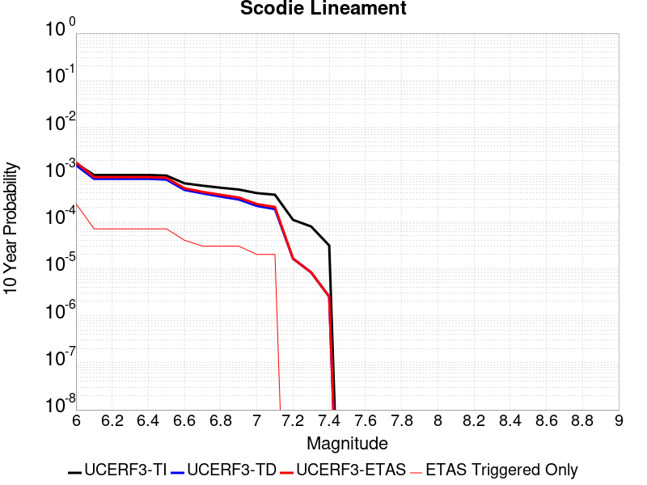 |

| Magnitude | 1 wk TI Prob | 1 wk TD Prob | 1 wk ETAS Prob | 1 wk ETAS/TD Gain | 1 wk ETAS Triggered Only | 1 mo TI Prob | 1 mo TD Prob | 1 mo ETAS Prob | 1 mo ETAS/TD Gain | 1 mo ETAS Triggered Only | 1 yr TI Prob | 1 yr TD Prob | 1 yr ETAS Prob | 1 yr ETAS/TD Gain | 1 yr ETAS Triggered Only | 10 yr TI Prob | 10 yr TD Prob | 10 yr ETAS Prob | 10 yr ETAS/TD Gain | 10 yr ETAS Triggered Only |
|-----|-----|-----|-----|-----|-----|-----|-----|-----|-----|-----|-----|-----|-----|-----|-----|-----|-----|-----|-----|-----|
| 6.0 | 3.2919327E-6 | 3.0133422E-6 | 5.7485344E-5 | 19.076939 | 5.4472166E-5 | 1.4108206E-5 | 1.2914278E-5 | 1.218572E-4 | 9.435851 | 1.0894433E-4 | 1.7175387E-4 | 1.5722317E-4 | 3.7507756E-4 | 2.385638 | 2.1788866E-4 | 0.0017162118 | 0.0015714309 | 0.0018433637 | 1.1730479 | 2.7236083E-4 |
| 6.1 | 1.8663811E-6 | 1.5490499E-6 | 1.5490499E-6 | 1.0 | 0.0 | 7.998751E-6 | 6.6387715E-6 | 6.111057E-5 | 9.205103 | 5.4472166E-5 | 9.738045E-5 | 8.082454E-5 | 1.352923E-4 | 1.6739013 | 5.4472166E-5 | 9.7337784E-4 | 8.080003E-4 | 9.168566E-4 | 1.1347231 | 1.0894433E-4 |
| 6.2 | 1.8663811E-6 | 1.5490499E-6 | 1.5490499E-6 | 1.0 | 0.0 | 7.998751E-6 | 6.6387715E-6 | 6.111057E-5 | 9.205103 | 5.4472166E-5 | 9.738045E-5 | 8.082454E-5 | 1.352923E-4 | 1.6739013 | 5.4472166E-5 | 9.7337784E-4 | 8.080003E-4 | 9.168566E-4 | 1.1347231 | 1.0894433E-4 |
| 6.3 | 1.8663811E-6 | 1.5490499E-6 | 1.5490499E-6 | 1.0 | 0.0 | 7.998751E-6 | 6.6387715E-6 | 6.111057E-5 | 9.205103 | 5.4472166E-5 | 9.738045E-5 | 8.082454E-5 | 1.352923E-4 | 1.6739013 | 5.4472166E-5 | 9.7337784E-4 | 8.080003E-4 | 9.168566E-4 | 1.1347231 | 1.0894433E-4 |
| 6.4 | 1.8663811E-6 | 1.5490499E-6 | 1.5490499E-6 | 1.0 | 0.0 | 7.998751E-6 | 6.6387715E-6 | 6.111057E-5 | 9.205103 | 5.4472166E-5 | 9.738045E-5 | 8.082454E-5 | 1.352923E-4 | 1.6739013 | 5.4472166E-5 | 9.7337784E-4 | 8.080003E-4 | 9.168566E-4 | 1.1347231 | 1.0894433E-4 |
| 6.5 | 1.8106311E-6 | 1.4909839E-6 | 1.4909839E-6 | 1.0 | 0.0 | 7.759824E-6 | 6.3899183E-6 | 6.0861734E-5 | 9.52465 | 5.4472166E-5 | 9.447177E-5 | 7.7794975E-5 | 1.322629E-4 | 1.7001472 | 5.4472166E-5 | 9.4431615E-4 | 7.7772606E-4 | 8.865857E-4 | 1.1399716 | 1.0894433E-4 |
| 6.6 | 1.2414679E-6 | 8.997558E-7 | 8.997558E-7 | 1.0 | 0.0 | 5.320566E-6 | 3.856091E-6 | 5.8328045E-5 | 15.126211 | 5.4472166E-5 | 6.477596E-5 | 4.6946985E-5 | 1.0141659E-4 | 2.1602366 | 5.4472166E-5 | 6.475708E-4 | 4.693793E-4 | 5.782725E-4 | 1.231994 | 1.0894433E-4 |
| 6.7 | 1.1062215E-6 | 7.594311E-7 | 7.594311E-7 | 1.0 | 0.0 | 4.7409408E-6 | 3.2547011E-6 | 5.7726687E-5 | 17.736403 | 5.4472166E-5 | 5.7719422E-5 | 3.9625334E-5 | 9.409534E-5 | 2.3746257 | 5.4472166E-5 | 5.770443E-4 | 3.961897E-4 | 4.5064028E-4 | 1.1374357 | 5.4472166E-5 |
| 6.8 | 1.0006736E-6 | 6.500397E-7 | 6.500397E-7 | 1.0 | 0.0 | 4.288594E-6 | 2.7858816E-6 | 5.7257894E-5 | 20.552881 | 5.4472166E-5 | 5.221238E-5 | 3.3917644E-5 | 8.838796E-5 | 2.6059582 | 5.4472166E-5 | 5.220012E-4 | 3.3913075E-4 | 3.9358443E-4 | 1.1605685 | 5.4472166E-5 |
| 6.9 | 9.167364E-7 | 5.631625E-7 | 5.631625E-7 | 1.0 | 0.0 | 3.9288643E-6 | 2.4135516E-6 | 5.6885583E-5 | 23.569244 | 5.4472166E-5 | 4.7832873E-5 | 2.9384651E-5 | 8.3855215E-5 | 2.853708 | 5.4472166E-5 | 4.782258E-4 | 2.9381333E-4 | 3.482695E-4 | 1.1853427 | 5.4472166E-5 |
| 7.0 | 7.6987664E-7 | 4.113383E-7 | 4.113383E-7 | 1.0 | 0.0 | 3.2994672E-6 | 1.7628774E-6 | 5.6234945E-5 | 31.89952 | 5.4472166E-5 | 4.0170275E-5 | 2.1462862E-5 | 7.593386E-5 | 3.5379186 | 5.4472166E-5 | 4.0163012E-4 | 2.1461173E-4 | 2.6907222E-4 | 1.2537628 | 5.4472166E-5 |
| 7.1 | 7.1038727E-7 | 3.5211494E-7 | 3.5211494E-7 | 1.0 | 0.0 | 3.0445133E-6 | 1.5090633E-6 | 5.5981145E-5 | 37.09662 | 5.4472166E-5 | 3.706632E-5 | 1.8372726E-5 | 7.284389E-5 | 3.964784 | 5.4472166E-5 | 3.7060137E-4 | 1.8371557E-4 | 2.3817773E-4 | 1.2964482 | 5.4472166E-5 |
| 7.2 | 2.0799602E-7 | 3.1186854E-8 | 3.1186854E-8 | 1.0 | 0.0 | 8.914113E-7 | 1.3365793E-7 | 1.3365793E-7 | 1.0 | 0.0 | 1.0852878E-5 | 1.6272843E-6 | 1.6272843E-6 | 1.0 | 0.0 | 1.08523476E-4 | 1.627273E-5 | 1.627273E-5 | 1.0 | 0.0 |
| 7.3 | 1.5048182E-7 | 1.5945696E-8 | 1.5945696E-8 | 1.0 | 0.0 | 6.449219E-7 | 6.83387E-8 | 6.83387E-8 | 1.0 | 0.0 | 7.851896E-6 | 8.320234E-7 | 8.320234E-7 | 1.0 | 0.0 | 7.851618E-5 | 8.320206E-6 | 8.320206E-6 | 1.0 | 0.0 |
| 7.4 | 5.9334678E-8 | 4.8683537E-9 | 4.8683537E-9 | 1.0 | 0.0 | 2.5429145E-7 | 2.0864372E-8 | 2.0864372E-8 | 1.0 | 0.0 | 3.095994E-6 | 2.5402372E-7 | 2.5402372E-7 | 1.0 | 0.0 | 3.095951E-5 | 2.5402353E-6 | 2.5402353E-6 | 1.0 | 0.0 |

## Santa Cruz Island
*[(top)](#table-of-contents)*

| 1 Week | 1 Month | 1 Year | 10 Year |
|-----|-----|-----|-----|
|  |  |  |  |

| Magnitude | 1 wk TI Prob | 1 wk TD Prob | 1 wk ETAS Prob | 1 wk ETAS/TD Gain | 1 wk ETAS Triggered Only | 1 mo TI Prob | 1 mo TD Prob | 1 mo ETAS Prob | 1 mo ETAS/TD Gain | 1 mo ETAS Triggered Only | 1 yr TI Prob | 1 yr TD Prob | 1 yr ETAS Prob | 1 yr ETAS/TD Gain | 1 yr ETAS Triggered Only | 10 yr TI Prob | 10 yr TD Prob | 10 yr ETAS Prob | 10 yr ETAS/TD Gain | 10 yr ETAS Triggered Only |
|-----|-----|-----|-----|-----|-----|-----|-----|-----|-----|-----|-----|-----|-----|-----|-----|-----|-----|-----|-----|-----|
| 6.0 | 2.9164563E-5 | 3.1599742E-5 | 3.1599742E-5 | 1.0 | 0.0 | 1.2498499E-4 | 1.3542121E-4 | 2.4435078E-4 | 1.804376 | 1.0894433E-4 | 0.0015206301 | 0.0016476426 | 0.0019195545 | 1.165031 | 2.7236083E-4 | 0.015102667 | 0.016368 | 0.016635902 | 1.0163674 | 2.7236083E-4 |
| 6.1 | 2.9164563E-5 | 3.1599742E-5 | 3.1599742E-5 | 1.0 | 0.0 | 1.2498499E-4 | 1.3542121E-4 | 2.4435078E-4 | 1.804376 | 1.0894433E-4 | 0.0015206301 | 0.0016476426 | 0.0019195545 | 1.165031 | 2.7236083E-4 | 0.015102667 | 0.016368 | 0.016635902 | 1.0163674 | 2.7236083E-4 |
| 6.2 | 2.9164563E-5 | 3.1599742E-5 | 3.1599742E-5 | 1.0 | 0.0 | 1.2498499E-4 | 1.3542121E-4 | 2.4435078E-4 | 1.804376 | 1.0894433E-4 | 0.0015206301 | 0.0016476426 | 0.0019195545 | 1.165031 | 2.7236083E-4 | 0.015102667 | 0.016368 | 0.016635902 | 1.0163674 | 2.7236083E-4 |
| 6.3 | 1.6635553E-5 | 1.780436E-5 | 1.780436E-5 | 1.0 | 0.0 | 7.1293274E-5 | 7.630226E-5 | 1.8523828E-4 | 2.4276905 | 1.0894433E-4 | 8.6765E-4 | 9.2860236E-4 | 0.0011462887 | 1.2344236 | 2.1788866E-4 | 0.008642701 | 0.009249094 | 0.009464967 | 1.02334 | 2.1788866E-4 |
| 6.4 | 1.6635553E-5 | 1.780436E-5 | 1.780436E-5 | 1.0 | 0.0 | 7.1293274E-5 | 7.630226E-5 | 1.8523828E-4 | 2.4276905 | 1.0894433E-4 | 8.6765E-4 | 9.2860236E-4 | 0.0011462887 | 1.2344236 | 2.1788866E-4 | 0.008642701 | 0.009249094 | 0.009464967 | 1.02334 | 2.1788866E-4 |
| 6.5 | 1.2238748E-5 | 1.3042995E-5 | 1.3042995E-5 | 1.0 | 0.0 | 5.2450723E-5 | 5.5897377E-5 | 1.103665E-4 | 1.9744486 | 5.4472166E-5 | 6.3840044E-4 | 6.8034173E-4 | 8.4364705E-4 | 1.2400342 | 1.634165E-4 | 0.0063656955 | 0.0067829876 | 0.0069452957 | 1.0239286 | 1.634165E-4 |
| 6.6 | 1.0489767E-5 | 1.1156636E-5 | 1.1156636E-5 | 1.0 | 0.0 | 4.495537E-5 | 4.781329E-5 | 4.781329E-5 | 1.0 | 0.0 | 5.4719415E-4 | 5.819735E-4 | 6.36414E-4 | 1.0935446 | 5.4472166E-5 | 0.005458487 | 0.0058047357 | 0.0058588916 | 1.0093297 | 5.4472166E-5 |
| 6.7 | 8.699222E-6 | 9.236782E-6 | 9.236782E-6 | 1.0 | 0.0 | 3.7281847E-5 | 3.958561E-5 | 3.958561E-5 | 1.0 | 0.0 | 4.5381195E-4 | 4.8184878E-4 | 5.362947E-4 | 1.1129938 | 5.4472166E-5 | 0.0045288634 | 0.004808108 | 0.0048623183 | 1.0112748 | 5.4472166E-5 |
| 6.8 | 8.307732E-6 | 8.8169045E-6 | 8.8169045E-6 | 1.0 | 0.0 | 3.560408E-5 | 3.7786187E-5 | 3.7786187E-5 | 1.0 | 0.0 | 4.3339343E-4 | 4.5995016E-4 | 5.143972E-4 | 1.1183761 | 5.4472166E-5 | 0.004325492 | 0.0045900354 | 0.0046442575 | 1.011813 | 5.4472166E-5 |
| 6.9 | 8.073121E-6 | 8.564939E-6 | 8.564939E-6 | 1.0 | 0.0 | 3.459863E-5 | 3.6706366E-5 | 3.6706366E-5 | 1.0 | 0.0 | 4.2115687E-4 | 4.468088E-4 | 5.012566E-4 | 1.1218593 | 5.4472166E-5 | 0.004203596 | 0.004459156 | 0.0045133852 | 1.0121614 | 5.4472166E-5 |
| 7.0 | 7.617019E-6 | 8.074664E-6 | 8.074664E-6 | 1.0 | 0.0 | 3.264396E-5 | 3.4605247E-5 | 3.4605247E-5 | 1.0 | 0.0 | 3.9736772E-4 | 4.212378E-4 | 4.7568703E-4 | 1.1292601 | 5.4472166E-5 | 0.003966579 | 0.0042044413 | 0.0042586843 | 1.0129014 | 5.4472166E-5 |
| 7.1 | 7.1224836E-6 | 7.545788E-6 | 7.545788E-6 | 1.0 | 0.0 | 3.052457E-5 | 3.2338692E-5 | 3.2338692E-5 | 1.0 | 0.0 | 3.715733E-4 | 3.936528E-4 | 4.4810353E-4 | 1.1383216 | 5.4472166E-5 | 0.003709526 | 0.003929598 | 0.003983856 | 1.0138075 | 5.4472166E-5 |
| 7.2 | 6.441115E-6 | 6.8273835E-6 | 6.8273835E-6 | 1.0 | 0.0 | 2.7604487E-5 | 2.9259887E-5 | 2.9259887E-5 | 1.0 | 0.0 | 3.360328E-4 | 3.5618112E-4 | 4.106339E-4 | 1.1528794 | 5.4472166E-5 | 0.0033552512 | 0.003556131 | 0.0036104093 | 1.0152633 | 5.4472166E-5 |
| 7.3 | 5.494274E-6 | 5.8199944E-6 | 5.8199944E-6 | 1.0 | 0.0 | 2.3546674E-5 | 2.4942596E-5 | 2.4942596E-5 | 1.0 | 0.0 | 2.8664304E-4 | 3.0363398E-4 | 3.580896E-4 | 1.1793463 | 5.4472166E-5 | 0.002862736 | 0.0030322142 | 0.0030865213 | 1.01791 | 5.4472166E-5 |
| 7.4 | 4.0802624E-6 | 4.312256E-6 | 4.312256E-6 | 1.0 | 0.0 | 1.7486722E-5 | 1.8480967E-5 | 1.8480967E-5 | 1.0 | 0.0 | 2.1288003E-4 | 2.2498262E-4 | 2.7944252E-4 | 1.2420627 | 5.4472166E-5 | 0.0021267622 | 0.0022475575 | 0.0023019072 | 1.0241817 | 5.4472166E-5 |
| 7.5 | 2.3584746E-6 | 2.4753094E-6 | 2.4753094E-6 | 1.0 | 0.0 | 1.0107709E-5 | 1.0608426E-5 | 1.0608426E-5 | 1.0 | 0.0 | 1.2305441E-4 | 1.2915E-4 | 1.2915E-4 | 1.0 | 0.0 | 0.0012298629 | 0.0012907543 | 0.0012907543 | 1.0 | 0.0 |
| 7.6 | 9.4981914E-7 | 9.86093E-7 | 9.86093E-7 | 1.0 | 0.0 | 4.0706473E-6 | 4.2261063E-6 | 4.2261063E-6 | 1.0 | 0.0 | 4.9559E-5 | 5.145164E-5 | 5.145164E-5 | 1.0 | 0.0 | 4.954795E-4 | 5.1439856E-4 | 5.1439856E-4 | 1.0 | 0.0 |
| 7.7 | 2.6013532E-7 | 2.6416603E-7 | 2.6416603E-7 | 1.0 | 0.0 | 1.1148652E-6 | 1.1321397E-6 | 1.1321397E-6 | 1.0 | 0.0 | 1.3573399E-5 | 1.3783714E-5 | 1.3783714E-5 | 1.0 | 0.0 | 1.357257E-4 | 1.3782867E-4 | 1.3782867E-4 | 1.0 | 0.0 |
| 7.8 | 4.1522263E-8 | 3.965679E-8 | 3.965679E-8 | 1.0 | 0.0 | 1.7795254E-7 | 1.6995766E-7 | 1.6995766E-7 | 1.0 | 0.0 | 2.16657E-6 | 2.0692328E-6 | 2.0692328E-6 | 1.0 | 0.0 | 2.1665488E-5 | 2.0692156E-5 | 2.0692156E-5 | 1.0 | 0.0 |
| 7.9 | 7.7242046E-10 | 5.9468175E-10 | 5.9468175E-10 | 1.0 | 0.0 | 3.3103735E-9 | 2.5486364E-9 | 2.5486364E-9 | 1.0 | 0.0 | 4.0303796E-8 | 3.1029646E-8 | 3.1029646E-8 | 1.0 | 0.0 | 4.030379E-7 | 3.1029643E-7 | 3.1029643E-7 | 1.0 | 0.0 |

## Ortigalita (North)
*[(top)](#table-of-contents)*

| 1 Week | 1 Month | 1 Year | 10 Year |
|-----|-----|-----|-----|
|  |  |  |  |

| Magnitude | 1 wk TI Prob | 1 wk TD Prob | 1 wk ETAS Prob | 1 wk ETAS/TD Gain | 1 wk ETAS Triggered Only | 1 mo TI Prob | 1 mo TD Prob | 1 mo ETAS Prob | 1 mo ETAS/TD Gain | 1 mo ETAS Triggered Only | 1 yr TI Prob | 1 yr TD Prob | 1 yr ETAS Prob | 1 yr ETAS/TD Gain | 1 yr ETAS Triggered Only | 10 yr TI Prob | 10 yr TD Prob | 10 yr ETAS Prob | 10 yr ETAS/TD Gain | 10 yr ETAS Triggered Only |
|-----|-----|-----|-----|-----|-----|-----|-----|-----|-----|-----|-----|-----|-----|-----|-----|-----|-----|-----|-----|-----|
| 6.0 | 7.711876E-5 | 1.05064966E-4 | 1.05064966E-4 | 1.0 | 0.0 | 3.3046713E-4 | 4.502116E-4 | 5.0465926E-4 | 1.120938 | 5.4472166E-5 | 0.004016016 | 0.0054681194 | 0.005576468 | 1.0198146 | 1.0894433E-4 | 0.039442103 | 0.053454787 | 0.05366103 | 1.0038582 | 2.1788866E-4 |
| 6.1 | 4.607858E-5 | 6.0239203E-5 | 6.0239203E-5 | 1.0 | 0.0 | 1.9746469E-4 | 2.5814527E-4 | 2.5814527E-4 | 1.0 | 0.0 | 0.0024014818 | 0.0031387596 | 0.0031387596 | 1.0 | 0.0 | 0.023756953 | 0.030975068 | 0.031027853 | 1.0017041 | 5.4472166E-5 |
| 6.2 | 4.607858E-5 | 6.0239203E-5 | 6.0239203E-5 | 1.0 | 0.0 | 1.9746469E-4 | 2.5814527E-4 | 2.5814527E-4 | 1.0 | 0.0 | 0.0024014818 | 0.0031387596 | 0.0031387596 | 1.0 | 0.0 | 0.023756953 | 0.030975068 | 0.031027853 | 1.0017041 | 5.4472166E-5 |
| 6.3 | 3.327423E-5 | 4.2475127E-5 | 4.2475127E-5 | 1.0 | 0.0 | 1.4259605E-4 | 1.8202531E-4 | 1.8202531E-4 | 1.0 | 0.0 | 0.0017347244 | 0.002214197 | 0.002214197 | 1.0 | 0.0 | 0.017212452 | 0.021945644 | 0.021998921 | 1.0024277 | 5.4472166E-5 |
| 6.4 | 2.7732503E-5 | 3.4998593E-5 | 3.4998593E-5 | 1.0 | 0.0 | 1.1884817E-4 | 1.4998685E-4 | 1.4998685E-4 | 1.0 | 0.0 | 0.001446016 | 0.0018248095 | 0.0018248095 | 1.0 | 0.0 | 0.014366428 | 0.018121224 | 0.018174708 | 1.0029515 | 5.4472166E-5 |
| 6.5 | 2.7689714E-5 | 3.4948407E-5 | 3.4948407E-5 | 1.0 | 0.0 | 1.186648E-4 | 1.497718E-4 | 1.497718E-4 | 1.0 | 0.0 | 0.0014437864 | 0.0018221956 | 0.0018221956 | 1.0 | 0.0 | 0.014344421 | 0.01809551 | 0.018148996 | 1.0029558 | 5.4472166E-5 |
| 6.6 | 2.2976905E-5 | 2.8718265E-5 | 2.8718265E-5 | 1.0 | 0.0 | 9.846873E-5 | 1.230739E-4 | 1.230739E-4 | 1.0 | 0.0 | 0.0011981975 | 0.0014976363 | 0.0014976363 | 1.0 | 0.0 | 0.011917574 | 0.014898697 | 0.014952358 | 1.0036017 | 5.4472166E-5 |
| 6.7 | 1.9871539E-5 | 2.4904411E-5 | 2.4904411E-5 | 1.0 | 0.0 | 8.516096E-5 | 1.0673023E-4 | 1.0673023E-4 | 1.0 | 0.0 | 0.0010363415 | 0.0012989145 | 0.0012989145 | 1.0 | 0.0 | 0.010315218 | 0.012936919 | 0.012990686 | 1.0041561 | 5.4472166E-5 |
| 6.8 | 6.5640475E-6 | 7.6054926E-6 | 7.6054926E-6 | 1.0 | 0.0 | 2.813133E-5 | 3.2594577E-5 | 3.2594577E-5 | 1.0 | 0.0 | 3.424451E-4 | 3.9676955E-4 | 3.9676955E-4 | 1.0 | 0.0 | 0.0034191788 | 0.003960899 | 0.003960899 | 1.0 | 0.0 |
| 6.9 | 5.6219683E-6 | 6.5018376E-6 | 6.5018376E-6 | 1.0 | 0.0 | 2.4093928E-5 | 2.7864735E-5 | 2.7864735E-5 | 1.0 | 0.0 | 2.933041E-4 | 3.3920293E-4 | 3.3920293E-4 | 1.0 | 0.0 | 0.0029291727 | 0.003387109 | 0.003387109 | 1.0 | 0.0 |
| 7.0 | 3.875591E-6 | 4.4847548E-6 | 4.4847548E-6 | 1.0 | 0.0 | 1.6609569E-5 | 1.9220248E-5 | 1.9220248E-5 | 1.0 | 0.0 | 2.0220275E-4 | 2.339835E-4 | 2.339835E-4 | 1.0 | 0.0 | 0.0020201886 | 0.0023375798 | 0.0023375798 | 1.0 | 0.0 |
| 7.1 | 1.6017933E-6 | 1.8570418E-6 | 1.8570418E-6 | 1.0 | 0.0 | 6.8648105E-6 | 7.958732E-6 | 7.958732E-6 | 1.0 | 0.0 | 8.357586E-5 | 9.689432E-5 | 9.689432E-5 | 1.0 | 0.0 | 8.3544437E-4 | 9.686254E-4 | 9.686254E-4 | 1.0 | 0.0 |

## Santa Rosa Island
*[(top)](#table-of-contents)*

| 1 Week | 1 Month | 1 Year | 10 Year |
|-----|-----|-----|-----|
|  |  |  |  |

| Magnitude | 1 wk TI Prob | 1 wk TD Prob | 1 wk ETAS Prob | 1 wk ETAS/TD Gain | 1 wk ETAS Triggered Only | 1 mo TI Prob | 1 mo TD Prob | 1 mo ETAS Prob | 1 mo ETAS/TD Gain | 1 mo ETAS Triggered Only | 1 yr TI Prob | 1 yr TD Prob | 1 yr ETAS Prob | 1 yr ETAS/TD Gain | 1 yr ETAS Triggered Only | 10 yr TI Prob | 10 yr TD Prob | 10 yr ETAS Prob | 10 yr ETAS/TD Gain | 10 yr ETAS Triggered Only |
|-----|-----|-----|-----|-----|-----|-----|-----|-----|-----|-----|-----|-----|-----|-----|-----|-----|-----|-----|-----|-----|
| 6.0 | 4.1143165E-5 | 4.7091133E-5 | 4.7091133E-5 | 1.0 | 0.0 | 1.7631594E-4 | 2.0180465E-4 | 2.0180465E-4 | 1.0 | 0.0 | 0.002144533 | 0.0024544 | 0.002563077 | 1.0442784 | 1.0894433E-4 | 0.021239553 | 0.024293551 | 0.024506146 | 1.0087512 | 2.1788866E-4 |
| 6.1 | 2.1061249E-5 | 2.3864959E-5 | 2.3864959E-5 | 1.0 | 0.0 | 9.0259375E-5 | 1.0227455E-4 | 1.0227455E-4 | 1.0 | 0.0 | 0.0010983539 | 0.0012445104 | 0.0012989148 | 1.0437155 | 5.4472166E-5 | 0.01092941 | 0.012378449 | 0.012486044 | 1.0086921 | 1.0894433E-4 |
| 6.2 | 2.1061249E-5 | 2.3864959E-5 | 2.3864959E-5 | 1.0 | 0.0 | 9.0259375E-5 | 1.0227455E-4 | 1.0227455E-4 | 1.0 | 0.0 | 0.0010983539 | 0.0012445104 | 0.0012989148 | 1.0437155 | 5.4472166E-5 | 0.01092941 | 0.012378449 | 0.012486044 | 1.0086921 | 1.0894433E-4 |
| 6.3 | 1.5158236E-5 | 1.7074419E-5 | 1.7074419E-5 | 1.0 | 0.0 | 6.496225E-5 | 7.3174095E-5 | 7.3174095E-5 | 1.0 | 0.0 | 7.906284E-4 | 8.905424E-4 | 9.449661E-4 | 1.0611129 | 5.4472166E-5 | 0.007878214 | 0.008870989 | 0.008978968 | 1.012172 | 1.0894433E-4 |
| 6.4 | 1.2341918E-5 | 1.3852917E-5 | 1.3852917E-5 | 1.0 | 0.0 | 5.2892858E-5 | 5.9368336E-5 | 5.9368336E-5 | 1.0 | 0.0 | 6.437803E-4 | 7.225779E-4 | 7.7701075E-4 | 1.0753314 | 5.4472166E-5 | 0.006419184 | 0.007203121 | 0.007311281 | 1.0150156 | 1.0894433E-4 |
| 6.5 | 9.061158E-6 | 1.0117031E-5 | 1.0117031E-5 | 1.0 | 0.0 | 3.883296E-5 | 4.3358013E-5 | 4.3358013E-5 | 1.0 | 0.0 | 4.726887E-4 | 5.277613E-4 | 5.822047E-4 | 1.1031592 | 5.4472166E-5 | 0.004716845 | 0.0052656173 | 0.005373988 | 1.0205808 | 1.0894433E-4 |
| 6.6 | 7.5461685E-6 | 8.400733E-6 | 8.400733E-6 | 1.0 | 0.0 | 3.2340322E-5 | 3.600267E-5 | 3.600267E-5 | 1.0 | 0.0 | 3.936723E-4 | 4.3824865E-4 | 4.9269694E-4 | 1.1242406 | 5.4472166E-5 | 0.003929756 | 0.0043742736 | 0.0044827415 | 1.0247967 | 1.0894433E-4 |
| 6.7 | 5.5023775E-6 | 6.087381E-6 | 6.087381E-6 | 1.0 | 0.0 | 2.3581404E-5 | 2.6088532E-5 | 2.6088532E-5 | 1.0 | 0.0 | 2.8706578E-4 | 3.1758484E-4 | 3.720397E-4 | 1.1714655 | 5.4472166E-5 | 0.0028669522 | 0.0031716314 | 0.003225931 | 1.0171204 | 5.4472166E-5 |
| 6.8 | 3.7351679E-6 | 4.0831405E-6 | 4.0831405E-6 | 1.0 | 0.0 | 1.6007763E-5 | 1.749907E-5 | 1.749907E-5 | 1.0 | 0.0 | 1.948771E-4 | 2.1303284E-4 | 2.674934E-4 | 1.255644 | 5.4472166E-5 | 0.0019470629 | 0.0021285315 | 0.0021828876 | 1.025537 | 5.4472166E-5 |
| 6.9 | 2.456366E-6 | 2.6292705E-6 | 2.6292705E-6 | 1.0 | 0.0 | 1.0527241E-5 | 1.1268254E-5 | 1.1268254E-5 | 1.0 | 0.0 | 1.2816161E-4 | 1.3718237E-4 | 1.9164708E-4 | 1.3970239 | 5.4472166E-5 | 0.0012808773 | 0.0013709799 | 0.0014253774 | 1.0396779 | 5.4472166E-5 |
| 7.0 | 2.3245157E-6 | 2.4827782E-6 | 2.4827782E-6 | 1.0 | 0.0 | 9.962172E-6 | 1.0640435E-5 | 1.0640435E-5 | 1.0 | 0.0 | 1.2128269E-4 | 1.2953962E-4 | 1.8400472E-4 | 1.4204514 | 5.4472166E-5 | 0.0012121652 | 0.0012946434 | 0.001349045 | 1.0420206 | 5.4472166E-5 |
| 7.1 | 2.2248344E-6 | 2.37325E-6 | 2.37325E-6 | 1.0 | 0.0 | 9.53497E-6 | 1.0171032E-5 | 1.0171032E-5 | 1.0 | 0.0 | 1.1608207E-4 | 1.2382529E-4 | 1.782907E-4 | 1.439857 | 5.4472166E-5 | 0.0011602144 | 0.001237565 | 0.0012919697 | 1.0439612 | 5.4472166E-5 |
| 7.2 | 2.1350402E-6 | 2.276154E-6 | 2.276154E-6 | 1.0 | 0.0 | 9.150141E-6 | 9.754909E-6 | 9.754909E-6 | 1.0 | 0.0 | 1.1139726E-4 | 1.1875956E-4 | 1.7322526E-4 | 1.4586215 | 5.4472166E-5 | 0.0011134144 | 0.0011869629 | 0.0012413703 | 1.0458376 | 5.4472166E-5 |
| 7.3 | 1.9793572E-6 | 2.108719E-6 | 2.108719E-6 | 1.0 | 0.0 | 8.482932E-6 | 9.037336E-6 | 9.037336E-6 | 1.0 | 0.0 | 1.032748E-4 | 1.10024026E-4 | 1.644902E-4 | 1.4950389 | 5.4472166E-5 | 0.0010322682 | 0.0010996973 | 0.0011541096 | 1.0494792 | 5.4472166E-5 |
| 7.4 | 1.6951194E-6 | 1.8045733E-6 | 1.8045733E-6 | 1.0 | 0.0 | 7.264777E-6 | 7.733863E-6 | 7.733863E-6 | 1.0 | 0.0 | 8.844508E-5 | 9.415573E-5 | 1.4862277E-4 | 1.5784782 | 5.4472166E-5 | 8.840988E-4 | 9.4116E-4 | 9.955809E-4 | 1.0578232 | 5.4472166E-5 |
| 7.5 | 8.987207E-7 | 9.5122147E-7 | 9.5122147E-7 | 1.0 | 0.0 | 3.8516546E-6 | 4.076657E-6 | 4.076657E-6 | 1.0 | 0.0 | 4.6892885E-5 | 4.963218E-5 | 4.963218E-5 | 1.0 | 0.0 | 4.688299E-4 | 4.9621216E-4 | 4.9621216E-4 | 1.0 | 0.0 |
| 7.6 | 3.8783037E-7 | 4.052932E-7 | 4.052932E-7 | 1.0 | 0.0 | 1.6621291E-6 | 1.7369698E-6 | 1.7369698E-6 | 1.0 | 0.0 | 2.0236233E-5 | 2.1147409E-5 | 2.1147409E-5 | 1.0 | 0.0 | 2.023439E-4 | 2.1145462E-4 | 2.1145462E-4 | 1.0 | 0.0 |
| 7.7 | 6.181804E-8 | 6.339035E-8 | 6.339035E-8 | 1.0 | 0.0 | 2.6493444E-7 | 2.7167292E-7 | 2.7167292E-7 | 1.0 | 0.0 | 3.225572E-6 | 3.3076128E-6 | 3.3076128E-6 | 1.0 | 0.0 | 3.225525E-5 | 3.307564E-5 | 3.307564E-5 | 1.0 | 0.0 |
| 7.8 | 1.3704449E-9 | 1.3964153E-9 | 1.3964153E-9 | 1.0 | 0.0 | 5.873335E-9 | 5.984637E-9 | 5.984637E-9 | 1.0 | 0.0 | 7.1507856E-8 | 7.286295E-8 | 7.286295E-8 | 1.0 | 0.0 | 7.1507833E-7 | 7.286294E-7 | 7.286294E-7 | 1.0 | 0.0 |

## Santa Ynez (East)
*[(top)](#table-of-contents)*

| 1 Week | 1 Month | 1 Year | 10 Year |
|-----|-----|-----|-----|
|  |  |  |  |

| Magnitude | 1 wk TI Prob | 1 wk TD Prob | 1 wk ETAS Prob | 1 wk ETAS/TD Gain | 1 wk ETAS Triggered Only | 1 mo TI Prob | 1 mo TD Prob | 1 mo ETAS Prob | 1 mo ETAS/TD Gain | 1 mo ETAS Triggered Only | 1 yr TI Prob | 1 yr TD Prob | 1 yr ETAS Prob | 1 yr ETAS/TD Gain | 1 yr ETAS Triggered Only | 10 yr TI Prob | 10 yr TD Prob | 10 yr ETAS Prob | 10 yr ETAS/TD Gain | 10 yr ETAS Triggered Only |
|-----|-----|-----|-----|-----|-----|-----|-----|-----|-----|-----|-----|-----|-----|-----|-----|-----|-----|-----|-----|-----|
| 6.0 | 3.2269712E-5 | 3.67505E-5 | 9.122067E-5 | 2.482161 | 5.4472166E-5 | 1.3829143E-4 | 1.5749598E-4 | 2.6642316E-4 | 1.6916188 | 1.0894433E-4 | 0.0016823979 | 0.0019164166 | 0.00207952 | 1.0851085 | 1.634165E-4 | 0.016697178 | 0.019056441 | 0.019270178 | 1.0112159 | 2.1788866E-4 |
| 6.1 | 3.2269712E-5 | 3.67505E-5 | 9.122067E-5 | 2.482161 | 5.4472166E-5 | 1.3829143E-4 | 1.5749598E-4 | 2.6642316E-4 | 1.6916188 | 1.0894433E-4 | 0.0016823979 | 0.0019164166 | 0.00207952 | 1.0851085 | 1.634165E-4 | 0.016697178 | 0.019056441 | 0.019270178 | 1.0112159 | 2.1788866E-4 |
| 6.2 | 3.2269712E-5 | 3.67505E-5 | 9.122067E-5 | 2.482161 | 5.4472166E-5 | 1.3829143E-4 | 1.5749598E-4 | 2.6642316E-4 | 1.6916188 | 1.0894433E-4 | 0.0016823979 | 0.0019164166 | 0.00207952 | 1.0851085 | 1.634165E-4 | 0.016697178 | 0.019056441 | 0.019270178 | 1.0112159 | 2.1788866E-4 |
| 6.3 | 3.2269712E-5 | 3.67505E-5 | 9.122067E-5 | 2.482161 | 5.4472166E-5 | 1.3829143E-4 | 1.5749598E-4 | 2.6642316E-4 | 1.6916188 | 1.0894433E-4 | 0.0016823979 | 0.0019164166 | 0.00207952 | 1.0851085 | 1.634165E-4 | 0.016697178 | 0.019056441 | 0.019270178 | 1.0112159 | 2.1788866E-4 |
| 6.4 | 1.4404779E-5 | 1.4849382E-5 | 1.4849382E-5 | 1.0 | 0.0 | 6.1733306E-5 | 6.363868E-5 | 6.363868E-5 | 1.0 | 0.0 | 7.513438E-4 | 7.745306E-4 | 7.745306E-4 | 1.0 | 0.0 | 0.0074880854 | 0.007718862 | 0.007718862 | 1.0 | 0.0 |
| 6.5 | 1.4404779E-5 | 1.4849382E-5 | 1.4849382E-5 | 1.0 | 0.0 | 6.1733306E-5 | 6.363868E-5 | 6.363868E-5 | 1.0 | 0.0 | 7.513438E-4 | 7.745306E-4 | 7.745306E-4 | 1.0 | 0.0 | 0.0074880854 | 0.007718862 | 0.007718862 | 1.0 | 0.0 |
| 6.6 | 1.280208E-5 | 1.3011947E-5 | 1.3011947E-5 | 1.0 | 0.0 | 5.4864904E-5 | 5.5764307E-5 | 5.5764307E-5 | 1.0 | 0.0 | 6.6777546E-4 | 6.787207E-4 | 6.787207E-4 | 1.0 | 0.0 | 0.006657724 | 0.0067666885 | 0.0067666885 | 1.0 | 0.0 |
| 6.7 | 1.2457027E-5 | 1.2628468E-5 | 1.2628468E-5 | 1.0 | 0.0 | 5.3386164E-5 | 5.412089E-5 | 5.412089E-5 | 1.0 | 0.0 | 6.497827E-4 | 6.587243E-4 | 6.587243E-4 | 1.0 | 0.0 | 0.00647886 | 0.006567915 | 0.006567915 | 1.0 | 0.0 |
| 6.8 | 1.2095134E-5 | 1.2230915E-5 | 1.2230915E-5 | 1.0 | 0.0 | 5.1835254E-5 | 5.241716E-5 | 5.241716E-5 | 1.0 | 0.0 | 6.309115E-4 | 6.379937E-4 | 6.379937E-4 | 1.0 | 0.0 | 0.0062912325 | 0.006361809 | 0.006361809 | 1.0 | 0.0 |
| 6.9 | 1.1104036E-5 | 1.1157347E-5 | 1.1157347E-5 | 1.0 | 0.0 | 4.758786E-5 | 4.781633E-5 | 4.781633E-5 | 1.0 | 0.0 | 5.7922816E-4 | 5.820096E-4 | 5.820096E-4 | 1.0 | 0.0 | 0.005777207 | 0.0058049993 | 0.0058049993 | 1.0 | 0.0 |
| 7.0 | 1.0577444E-5 | 1.058168E-5 | 1.058168E-5 | 1.0 | 0.0 | 4.5331115E-5 | 4.5349276E-5 | 4.5349276E-5 | 1.0 | 0.0 | 5.5176654E-4 | 5.519888E-4 | 5.519888E-4 | 1.0 | 0.0 | 0.0055039856 | 0.0055063153 | 0.0055063153 | 1.0 | 0.0 |
| 7.1 | 1.0021775E-5 | 9.980988E-6 | 9.980988E-6 | 1.0 | 0.0 | 4.294976E-5 | 4.2774966E-5 | 4.2774966E-5 | 1.0 | 0.0 | 5.2278786E-4 | 5.2066194E-4 | 5.2066194E-4 | 1.0 | 0.0 | 0.0052155964 | 0.0051945536 | 0.0051945536 | 1.0 | 0.0 |
| 7.2 | 8.874109E-6 | 8.748793E-6 | 8.748793E-6 | 1.0 | 0.0 | 3.8031343E-5 | 3.7494297E-5 | 3.7494297E-5 | 1.0 | 0.0 | 4.629332E-4 | 4.5639853E-4 | 4.5639853E-4 | 1.0 | 0.0 | 0.0046197 | 0.0045547304 | 0.0045547304 | 1.0 | 0.0 |
| 7.3 | 7.5504267E-6 | 7.5051175E-6 | 7.5051175E-6 | 1.0 | 0.0 | 3.235857E-5 | 3.21644E-5 | 3.21644E-5 | 1.0 | 0.0 | 3.9389438E-4 | 3.915322E-4 | 3.915322E-4 | 1.0 | 0.0 | 0.0039319694 | 0.003908531 | 0.003908531 | 1.0 | 0.0 |
| 7.4 | 6.309394E-6 | 6.1831556E-6 | 6.1831556E-6 | 1.0 | 0.0 | 2.703998E-5 | 2.6498974E-5 | 2.6498974E-5 | 1.0 | 0.0 | 3.2916202E-4 | 3.225782E-4 | 3.225782E-4 | 1.0 | 0.0 | 0.003286749 | 0.003221197 | 0.003221197 | 1.0 | 0.0 |
| 7.5 | 4.6103073E-6 | 4.4408903E-6 | 4.4408903E-6 | 1.0 | 0.0 | 1.975831E-5 | 1.9032252E-5 | 1.9032252E-5 | 1.0 | 0.0 | 2.4053088E-4 | 2.3169373E-4 | 2.3169373E-4 | 1.0 | 0.0 | 0.002402707 | 0.002314591 | 0.002314591 | 1.0 | 0.0 |
| 7.6 | 1.2858658E-6 | 1.3008173E-6 | 1.3008173E-6 | 1.0 | 0.0 | 5.5108417E-6 | 5.5749197E-6 | 5.5749197E-6 | 1.0 | 0.0 | 6.7092435E-5 | 6.78726E-5 | 6.78726E-5 | 1.0 | 0.0 | 6.707218E-4 | 6.785256E-4 | 6.785256E-4 | 1.0 | 0.0 |
| 7.7 | 5.3302307E-7 | 5.612138E-7 | 5.612138E-7 | 1.0 | 0.0 | 2.2843826E-6 | 2.4052001E-6 | 2.4052001E-6 | 1.0 | 0.0 | 2.7812002E-5 | 2.9282954E-5 | 2.9282954E-5 | 1.0 | 0.0 | 2.7808524E-4 | 2.9279452E-4 | 2.9279452E-4 | 1.0 | 0.0 |
| 7.8 | 4.613933E-8 | 4.80301E-8 | 4.80301E-8 | 1.0 | 0.0 | 1.9773998E-7 | 2.0584326E-7 | 2.0584326E-7 | 1.0 | 0.0 | 2.4074816E-6 | 2.5061388E-6 | 2.5061388E-6 | 1.0 | 0.0 | 2.4074554E-5 | 2.5061116E-5 | 2.5061116E-5 | 1.0 | 0.0 |

## Rinconada 2011 CFM
*[(top)](#table-of-contents)*

| 1 Week | 1 Month | 1 Year | 10 Year |
|-----|-----|-----|-----|
|  |  |  |  |

| Magnitude | 1 wk TI Prob | 1 wk TD Prob | 1 wk ETAS Prob | 1 wk ETAS/TD Gain | 1 wk ETAS Triggered Only | 1 mo TI Prob | 1 mo TD Prob | 1 mo ETAS Prob | 1 mo ETAS/TD Gain | 1 mo ETAS Triggered Only | 1 yr TI Prob | 1 yr TD Prob | 1 yr ETAS Prob | 1 yr ETAS/TD Gain | 1 yr ETAS Triggered Only | 10 yr TI Prob | 10 yr TD Prob | 10 yr ETAS Prob | 10 yr ETAS/TD Gain | 10 yr ETAS Triggered Only |
|-----|-----|-----|-----|-----|-----|-----|-----|-----|-----|-----|-----|-----|-----|-----|-----|-----|-----|-----|-----|-----|
| 6.0 | 1.5752368E-5 | 1.6274716E-5 | 7.074599E-5 | 4.346988 | 5.4472166E-5 | 6.75084E-5 | 6.974694E-5 | 2.3315204E-4 | 3.3428283 | 1.634165E-4 | 8.2160486E-4 | 8.488412E-4 | 0.001012119 | 1.1923537 | 1.634165E-4 | 0.008185739 | 0.00845637 | 0.008672416 | 1.0255483 | 2.1788866E-4 |
| 6.1 | 1.0966133E-5 | 1.1323029E-5 | 1.1323029E-5 | 1.0 | 0.0 | 4.6996865E-5 | 4.852637E-5 | 1.0299589E-4 | 2.1224728 | 5.4472166E-5 | 5.720366E-4 | 5.906491E-4 | 6.450891E-4 | 1.0921698 | 5.4472166E-5 | 0.0057056635 | 0.0058908886 | 0.005999191 | 1.0183848 | 1.0894433E-4 |
| 6.2 | 1.0966133E-5 | 1.1323029E-5 | 1.1323029E-5 | 1.0 | 0.0 | 4.6996865E-5 | 4.852637E-5 | 1.0299589E-4 | 2.1224728 | 5.4472166E-5 | 5.720366E-4 | 5.906491E-4 | 6.450891E-4 | 1.0921698 | 5.4472166E-5 | 0.0057056635 | 0.0058908886 | 0.005999191 | 1.0183848 | 1.0894433E-4 |
| 6.3 | 8.926149E-6 | 9.212771E-6 | 9.212771E-6 | 1.0 | 0.0 | 3.8254362E-5 | 3.948271E-5 | 3.948271E-5 | 1.0 | 0.0 | 4.6564735E-4 | 4.805963E-4 | 4.805963E-4 | 1.0 | 0.0 | 0.0046467283 | 0.0047956146 | 0.0048498255 | 1.0113043 | 5.4472166E-5 |
| 6.4 | 7.676955E-6 | 7.920191E-6 | 7.920191E-6 | 1.0 | 0.0 | 3.290082E-5 | 3.3943234E-5 | 3.3943234E-5 | 1.0 | 0.0 | 4.0049385E-4 | 4.1318068E-4 | 4.1318068E-4 | 1.0 | 0.0 | 0.0039977287 | 0.004124151 | 0.0041783988 | 1.0131537 | 5.4472166E-5 |
| 6.5 | 6.1671026E-6 | 6.3589546E-6 | 6.3589546E-6 | 1.0 | 0.0 | 2.6430173E-5 | 2.725238E-5 | 2.725238E-5 | 1.0 | 0.0 | 3.2173982E-4 | 3.317473E-4 | 3.317473E-4 | 1.0 | 0.0 | 0.003212744 | 0.0033125326 | 0.0033668242 | 1.0163898 | 5.4472166E-5 |
| 6.6 | 5.553456E-6 | 5.7248126E-6 | 5.7248126E-6 | 1.0 | 0.0 | 2.3800309E-5 | 2.453468E-5 | 2.453468E-5 | 1.0 | 0.0 | 2.897302E-4 | 2.9866883E-4 | 2.9866883E-4 | 1.0 | 0.0 | 0.0028935277 | 0.002982683 | 0.0030369929 | 1.0182084 | 5.4472166E-5 |
| 6.7 | 4.787857E-6 | 4.9333094E-6 | 4.9333094E-6 | 1.0 | 0.0 | 2.0519226E-5 | 2.1142583E-5 | 2.1142583E-5 | 1.0 | 0.0 | 2.4979294E-4 | 2.573806E-4 | 2.573806E-4 | 1.0 | 0.0 | 0.0024951235 | 0.0025708308 | 0.002625163 | 1.021134 | 5.4472166E-5 |
| 6.8 | 3.9955166E-6 | 4.1134763E-6 | 4.1134763E-6 | 1.0 | 0.0 | 1.7123532E-5 | 1.7629065E-5 | 1.7629065E-5 | 1.0 | 0.0 | 2.0845905E-4 | 2.1461274E-4 | 2.1461274E-4 | 1.0 | 0.0 | 0.002082636 | 0.0021440585 | 0.0021440585 | 1.0 | 0.0 |
| 6.9 | 3.4250072E-6 | 3.5224464E-6 | 3.5224464E-6 | 1.0 | 0.0 | 1.46785205E-5 | 1.5096111E-5 | 1.5096111E-5 | 1.0 | 0.0 | 1.7869633E-4 | 1.8377967E-4 | 1.8377967E-4 | 1.0 | 0.0 | 0.001785527 | 0.0018362794 | 0.0018362794 | 1.0 | 0.0 |
| 7.0 | 2.7712713E-6 | 2.8467E-6 | 2.8467E-6 | 1.0 | 0.0 | 1.1876823E-5 | 1.2200086E-5 | 1.2200086E-5 | 1.0 | 0.0 | 1.4459073E-4 | 1.4852593E-4 | 1.4852593E-4 | 1.0 | 0.0 | 0.0014449668 | 0.0014842682 | 0.0014842682 | 1.0 | 0.0 |
| 7.1 | 2.227358E-6 | 2.2856984E-6 | 2.2856984E-6 | 1.0 | 0.0 | 9.545785E-6 | 9.795814E-6 | 9.795814E-6 | 1.0 | 0.0 | 1.16213734E-4 | 1.19257515E-4 | 1.19257515E-4 | 1.0 | 0.0 | 0.0011615298 | 0.0011919362 | 0.0011919362 | 1.0 | 0.0 |
| 7.2 | 1.581796E-6 | 1.6209011E-6 | 1.6209011E-6 | 1.0 | 0.0 | 6.779108E-6 | 6.9467005E-6 | 6.9467005E-6 | 1.0 | 0.0 | 8.253252E-5 | 8.457281E-5 | 8.457281E-5 | 1.0 | 0.0 | 8.250187E-4 | 8.454067E-4 | 8.454067E-4 | 1.0 | 0.0 |
| 7.3 | 1.0306567E-6 | 1.0546477E-6 | 1.0546477E-6 | 1.0 | 0.0 | 4.4170924E-6 | 4.519911E-6 | 4.519911E-6 | 1.0 | 0.0 | 5.3776774E-5 | 5.5028526E-5 | 5.5028526E-5 | 1.0 | 0.0 | 5.376376E-4 | 5.5014924E-4 | 5.5014924E-4 | 1.0 | 0.0 |
| 7.4 | 6.535541E-7 | 6.682742E-7 | 6.682742E-7 | 1.0 | 0.0 | 2.800943E-6 | 2.864029E-6 | 2.864029E-6 | 1.0 | 0.0 | 3.4100947E-5 | 3.4868997E-5 | 3.4868997E-5 | 1.0 | 0.0 | 3.4095717E-4 | 3.4863537E-4 | 3.4863537E-4 | 1.0 | 0.0 |
| 7.5 | 3.2656962E-7 | 3.3316687E-7 | 3.3316687E-7 | 1.0 | 0.0 | 1.3995833E-6 | 1.4278572E-6 | 1.4278572E-6 | 1.0 | 0.0 | 1.7039794E-5 | 1.7384024E-5 | 1.7384024E-5 | 1.0 | 0.0 | 1.7038487E-4 | 1.7382667E-4 | 1.7382667E-4 | 1.0 | 0.0 |
| 7.6 | 9.754343E-8 | 9.82099E-8 | 9.82099E-8 | 1.0 | 0.0 | 4.180432E-7 | 4.208995E-7 | 4.208995E-7 | 1.0 | 0.0 | 5.089664E-6 | 5.1244397E-6 | 5.1244397E-6 | 1.0 | 0.0 | 5.0895473E-5 | 5.1243223E-5 | 5.1243223E-5 | 1.0 | 0.0 |
| 7.7 | 6.0001453E-9 | 5.8490435E-9 | 5.8490435E-9 | 1.0 | 0.0 | 2.5714908E-8 | 2.506733E-8 | 2.506733E-8 | 1.0 | 0.0 | 3.1307894E-7 | 3.051947E-7 | 3.051947E-7 | 1.0 | 0.0 | 3.1307852E-6 | 3.051943E-6 | 3.051943E-6 | 1.0 | 0.0 |
| 7.8 | 7.400003E-11 | 7.4654505E-11 | 7.4654505E-11 | 1.0 | 0.0 | 3.171432E-10 | 3.1994773E-10 | 3.1994773E-10 | 1.0 | 0.0 | 3.861218E-9 | 3.895363E-9 | 3.895363E-9 | 1.0 | 0.0 | 3.861218E-8 | 3.895363E-8 | 3.895363E-8 | 1.0 | 0.0 |

## San Andreas (Coachella) rev
*[(top)](#table-of-contents)*

| 1 Week | 1 Month | 1 Year | 10 Year |
|-----|-----|-----|-----|
|  |  |  | 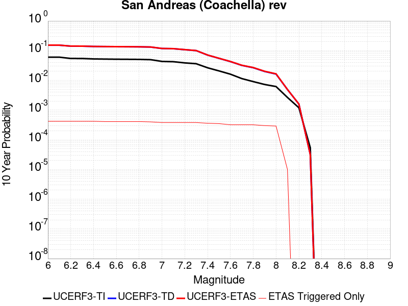 |

| Magnitude | 1 wk TI Prob | 1 wk TD Prob | 1 wk ETAS Prob | 1 wk ETAS/TD Gain | 1 wk ETAS Triggered Only | 1 mo TI Prob | 1 mo TD Prob | 1 mo ETAS Prob | 1 mo ETAS/TD Gain | 1 mo ETAS Triggered Only | 1 yr TI Prob | 1 yr TD Prob | 1 yr ETAS Prob | 1 yr ETAS/TD Gain | 1 yr ETAS Triggered Only | 10 yr TI Prob | 10 yr TD Prob | 10 yr ETAS Prob | 10 yr ETAS/TD Gain | 10 yr ETAS Triggered Only |
|-----|-----|-----|-----|-----|-----|-----|-----|-----|-----|-----|-----|-----|-----|-----|-----|-----|-----|-----|-----|-----|
| 6.0 | 1.1925945E-4 | 3.2729402E-4 | 3.8174834E-4 | 1.1663774 | 5.4472166E-5 | 5.110118E-4 | 0.0014019393 | 0.001510731 | 1.0776008 | 1.0894433E-4 | 0.0062038354 | 0.016936364 | 0.017043464 | 1.0063236 | 1.0894433E-4 | 0.060334753 | 0.15265316 | 0.15283778 | 1.0012095 | 2.1788866E-4 |
| 6.1 | 1.1925945E-4 | 3.2729402E-4 | 3.8174834E-4 | 1.1663774 | 5.4472166E-5 | 5.110118E-4 | 0.0014019393 | 0.001510731 | 1.0776008 | 1.0894433E-4 | 0.0062038354 | 0.016936364 | 0.017043464 | 1.0063236 | 1.0894433E-4 | 0.060334753 | 0.15265316 | 0.15283778 | 1.0012095 | 2.1788866E-4 |
| 6.2 | 1.07432395E-4 | 3.0230157E-4 | 3.5675726E-4 | 1.180137 | 5.4472166E-5 | 4.603433E-4 | 0.0012949388 | 0.0014037421 | 1.0840219 | 1.0894433E-4 | 0.005590286 | 0.015653009 | 0.015760247 | 1.006851 | 1.0894433E-4 | 0.05451731 | 0.14182423 | 0.14201123 | 1.0013185 | 2.1788866E-4 |
| 6.3 | 1.0718766E-4 | 3.0175463E-4 | 3.5621034E-4 | 1.1804636 | 5.4472166E-5 | 4.592948E-4 | 0.0012925972 | 0.0014014007 | 1.0841744 | 1.0894433E-4 | 0.005577586 | 0.015624908 | 0.015732149 | 1.0068635 | 1.0894433E-4 | 0.054396555 | 0.14159249 | 0.14177953 | 1.001321 | 2.1788866E-4 |
| 6.4 | 1.0355944E-4 | 2.9383553E-4 | 3.4829168E-4 | 1.1853287 | 5.4472166E-5 | 4.4375064E-4 | 0.0012586913 | 0.0013674985 | 1.0864447 | 1.0894433E-4 | 0.0053892885 | 0.015217941 | 0.015325228 | 1.00705 | 1.0894433E-4 | 0.052604496 | 0.13815255 | 0.13834034 | 1.0013592 | 2.1788866E-4 |
| 6.5 | 1.0227914E-4 | 2.9102986E-4 | 3.454862E-4 | 1.1871159 | 5.4472166E-5 | 4.382655E-4 | 0.0012466786 | 0.0013554872 | 1.0872787 | 1.0894433E-4 | 0.0053228354 | 0.01507372 | 0.015181023 | 1.0071185 | 1.0894433E-4 | 0.051971316 | 0.13693172 | 0.13711977 | 1.0013733 | 2.1788866E-4 |
| 6.6 | 1.0116757E-4 | 2.8868738E-4 | 3.4314382E-4 | 1.1886346 | 5.4472166E-5 | 4.3350324E-4 | 0.0012366489 | 0.0013454586 | 1.0879874 | 1.0894433E-4 | 0.0052651367 | 0.01495329 | 0.0150606055 | 1.0071768 | 1.0894433E-4 | 0.051421247 | 0.1359099 | 0.13609818 | 1.0013853 | 2.1788866E-4 |
| 6.7 | 1.0050676E-4 | 2.8727303E-4 | 3.4172952E-4 | 1.1895636 | 5.4472166E-5 | 4.3067214E-4 | 0.0012305931 | 0.0013394033 | 1.088421 | 1.0894433E-4 | 0.005230834 | 0.014880571 | 0.014987893 | 1.0072123 | 1.0894433E-4 | 0.051094085 | 0.13529462 | 0.13548303 | 1.0013926 | 2.1788866E-4 |
| 6.8 | 9.976819E-5 | 2.853096E-4 | 3.397662E-4 | 1.1908685 | 5.4472166E-5 | 4.2750788E-4 | 0.0012221863 | 0.0013309974 | 1.0890299 | 1.0894433E-4 | 0.0051924936 | 0.0147796115 | 0.0148869455 | 1.0072623 | 1.0894433E-4 | 0.050728295 | 0.13444631 | 0.1346349 | 1.0014027 | 2.1788866E-4 |
| 6.9 | 9.77719E-5 | 2.8027873E-4 | 3.3473564E-4 | 1.1942955 | 5.4472166E-5 | 4.1895514E-4 | 0.0012006456 | 0.0013094591 | 1.0906292 | 1.0894433E-4 | 0.0050888555 | 0.014520878 | 0.01462824 | 1.0073936 | 1.0894433E-4 | 0.049738888 | 0.1322748 | 0.13246387 | 1.0014293 | 2.1788866E-4 |
| 7.0 | 8.500761E-5 | 2.4762485E-4 | 2.4762485E-4 | 1.0 | 0.0 | 3.6426744E-4 | 0.001060821 | 0.0011152354 | 1.0512946 | 5.4472166E-5 | 0.0044259406 | 0.012839786 | 0.0128935585 | 1.004188 | 5.4472166E-5 | 0.04338823 | 0.11813272 | 0.118276834 | 1.0012199 | 1.634165E-4 |
| 7.1 | 8.319876E-5 | 2.4365232E-4 | 2.4365232E-4 | 1.0 | 0.0 | 3.5651738E-4 | 0.0010438096 | 0.0010982249 | 1.0521314 | 5.4472166E-5 | 0.004331963 | 0.012635092 | 0.012688876 | 1.0042567 | 5.4472166E-5 | 0.042484846 | 0.116353 | 0.116497405 | 1.0012411 | 1.634165E-4 |
| 7.2 | 7.563917E-5 | 2.2413683E-4 | 2.2413683E-4 | 1.0 | 0.0 | 3.2412758E-4 | 9.602359E-4 | 0.0010146557 | 1.0566734 | 5.4472166E-5 | 0.0039391145 | 0.011628893 | 0.011682732 | 1.0046297 | 5.4472166E-5 | 0.03870018 | 0.10775925 | 0.10790505 | 1.001353 | 1.634165E-4 |
| 7.3 | 7.082985E-5 | 2.0729867E-4 | 2.0729867E-4 | 1.0 | 0.0 | 3.0352117E-4 | 8.881233E-4 | 9.4254705E-4 | 1.0612795 | 5.4472166E-5 | 0.0036891096 | 0.010759917 | 0.010813803 | 1.005008 | 5.4472166E-5 | 0.03628465 | 0.100282 | 0.10042903 | 1.0014662 | 1.634165E-4 |
| 7.4 | 5.146215E-5 | 1.4273795E-4 | 1.4273795E-4 | 1.0 | 0.0 | 2.2053342E-4 | 6.115915E-4 | 6.6603033E-4 | 1.0890118 | 5.4472166E-5 | 0.0026816884 | 0.0074208933 | 0.007474961 | 1.007286 | 5.4472166E-5 | 0.02649557 | 0.070849575 | 0.07100142 | 1.0021431 | 1.634165E-4 |
| 7.5 | 4.0285166E-5 | 1.09416E-4 | 1.09416E-4 | 1.0 | 0.0 | 1.7263928E-4 | 4.6884175E-4 | 5.232884E-4 | 1.1161301 | 5.4472166E-5 | 0.002099857 | 0.0056932783 | 0.0057474403 | 1.0095134 | 5.4472166E-5 | 0.020801254 | 0.055011146 | 0.055165574 | 1.0028071 | 1.634165E-4 |
| 7.6 | 3.1168736E-5 | 8.4389096E-5 | 8.4389096E-5 | 1.0 | 0.0 | 1.3357346E-4 | 3.6161754E-4 | 4.1607002E-4 | 1.1505803 | 5.4472166E-5 | 0.0016250437 | 0.0043938323 | 0.004448065 | 1.0123429 | 5.4472166E-5 | 0.016132116 | 0.04281005 | 0.04296647 | 1.0036539 | 1.634165E-4 |
| 7.7 | 2.2100989E-5 | 6.238755E-5 | 6.238755E-5 | 1.0 | 0.0 | 9.4715084E-5 | 2.6734784E-4 | 3.2180545E-4 | 1.2036957 | 5.4472166E-5 | 0.001152546 | 0.0032501083 | 0.0033044035 | 1.0167056 | 5.4472166E-5 | 0.011465867 | 0.0319002 | 0.032058403 | 1.0049593 | 1.634165E-4 |
| 7.8 | 1.7484861E-5 | 5.179572E-5 | 5.179572E-5 | 1.0 | 0.0 | 7.493296E-5 | 2.2196278E-4 | 2.7642286E-4 | 1.2453568 | 5.4472166E-5 | 9.1192697E-4 | 0.0026990508 | 0.0027533758 | 1.0201275 | 5.4472166E-5 | 0.009081938 | 0.026640115 | 0.02679918 | 1.0059708 | 1.634165E-4 |
| 7.9 | 1.3967285E-5 | 3.822255E-5 | 3.822255E-5 | 1.0 | 0.0 | 5.985842E-5 | 1.6380067E-4 | 2.182639E-4 | 1.3324971 | 5.4472166E-5 | 7.2853256E-4 | 0.00199245 | 0.0020468137 | 1.0272849 | 5.4472166E-5 | 0.0072614877 | 0.019909438 | 0.020016212 | 1.0053631 | 1.0894433E-4 |
| 8.0 | 1.1887396E-5 | 3.106521E-5 | 3.106521E-5 | 1.0 | 0.0 | 5.094499E-5 | 1.3312983E-4 | 1.8759473E-4 | 1.4091113 | 5.4472166E-5 | 6.200787E-4 | 0.0016196516 | 0.0016740354 | 1.0335776 | 5.4472166E-5 | 0.006183513 | 0.016279267 | 0.016386438 | 1.0065832 | 1.0894433E-4 |
| 8.1 | 5.100864E-6 | 8.973418E-6 | 8.973418E-6 | 1.0 | 0.0 | 2.1860664E-5 | 3.8456936E-5 | 3.8456936E-5 | 1.0 | 0.0 | 2.6612106E-4 | 4.6811273E-4 | 4.6811273E-4 | 1.0 | 0.0 | 0.002658026 | 0.004917731 | 0.004917731 | 1.0 | 0.0 |
| 8.2 | 2.3004484E-6 | 2.7864487E-6 | 2.7864487E-6 | 1.0 | 0.0 | 9.859027E-6 | 1.1941868E-5 | 1.1941868E-5 | 1.0 | 0.0 | 1.2002704E-4 | 1.4538258E-4 | 1.4538258E-4 | 1.0 | 0.0 | 0.0011996223 | 0.0015973912 | 0.0015973912 | 1.0 | 0.0 |
| 8.3 | 1.0424446E-7 | 5.8161504E-8 | 5.8161504E-8 | 1.0 | 0.0 | 4.4676187E-7 | 2.4926356E-7 | 2.4926356E-7 | 1.0 | 0.0 | 5.439312E-6 | 3.03478E-6 | 3.03478E-6 | 1.0 | 0.0 | 5.4391792E-5 | 3.190716E-5 | 3.190716E-5 | 1.0 | 0.0 |

## Cleghorn Pass
*[(top)](#table-of-contents)*

| 1 Week | 1 Month | 1 Year | 10 Year |
|-----|-----|-----|-----|
|  |  |  |  |

| Magnitude | 1 wk TI Prob | 1 wk TD Prob | 1 wk ETAS Prob | 1 wk ETAS/TD Gain | 1 wk ETAS Triggered Only | 1 mo TI Prob | 1 mo TD Prob | 1 mo ETAS Prob | 1 mo ETAS/TD Gain | 1 mo ETAS Triggered Only | 1 yr TI Prob | 1 yr TD Prob | 1 yr ETAS Prob | 1 yr ETAS/TD Gain | 1 yr ETAS Triggered Only | 10 yr TI Prob | 10 yr TD Prob | 10 yr ETAS Prob | 10 yr ETAS/TD Gain | 10 yr ETAS Triggered Only |
|-----|-----|-----|-----|-----|-----|-----|-----|-----|-----|-----|-----|-----|-----|-----|-----|-----|-----|-----|-----|-----|
| 6.0 | 1.0522846E-5 | 1.1040642E-5 | 1.1998377E-4 | 10.867463 | 1.0894433E-4 | 4.509713E-5 | 4.7316473E-5 | 2.1072524E-4 | 4.453528 | 1.634165E-4 | 5.4891926E-4 | 5.759784E-4 | 7.393008E-4 | 1.2835563 | 1.634165E-4 | 0.0054756533 | 0.005750022 | 0.005966658 | 1.0376756 | 2.1788866E-4 |
| 6.1 | 1.0522846E-5 | 1.1040642E-5 | 1.1998377E-4 | 10.867463 | 1.0894433E-4 | 4.509713E-5 | 4.7316473E-5 | 2.1072524E-4 | 4.453528 | 1.634165E-4 | 5.4891926E-4 | 5.759784E-4 | 7.393008E-4 | 1.2835563 | 1.634165E-4 | 0.0054756533 | 0.005750022 | 0.005966658 | 1.0376756 | 2.1788866E-4 |
| 6.2 | 2.1045846E-6 | 2.2082024E-6 | 5.668025E-5 | 25.668049 | 5.4472166E-5 | 9.019617E-6 | 9.463714E-6 | 6.393536E-5 | 6.7558427 | 5.4472166E-5 | 1.098083E-4 | 1.1521882E-4 | 1.6968472E-4 | 1.4727169 | 5.4472166E-5 | 0.0010975406 | 0.0011520023 | 0.0012064116 | 1.0472302 | 5.4472166E-5 |
| 6.3 | 2.1045846E-6 | 2.2082024E-6 | 5.668025E-5 | 25.668049 | 5.4472166E-5 | 9.019617E-6 | 9.463714E-6 | 6.393536E-5 | 6.7558427 | 5.4472166E-5 | 1.098083E-4 | 1.1521882E-4 | 1.6968472E-4 | 1.4727169 | 5.4472166E-5 | 0.0010975406 | 0.0011520023 | 0.0012064116 | 1.0472302 | 5.4472166E-5 |
| 6.4 | 1.7259927E-6 | 1.810877E-6 | 5.6282945E-5 | 31.080488 | 5.4472166E-5 | 7.3970905E-6 | 7.760902E-6 | 6.223264E-5 | 8.018739 | 5.4472166E-5 | 9.005586E-5 | 9.4488976E-5 | 1.48956E-4 | 1.5764378 | 5.4472166E-5 | 9.001937E-4 | 9.448898E-4 | 9.993105E-4 | 1.0575948 | 5.4472166E-5 |

## Big Pine (East)
*[(top)](#table-of-contents)*

| 1 Week | 1 Month | 1 Year | 10 Year |
|-----|-----|-----|-----|
|  |  |  |  |

| Magnitude | 1 wk TI Prob | 1 wk TD Prob | 1 wk ETAS Prob | 1 wk ETAS/TD Gain | 1 wk ETAS Triggered Only | 1 mo TI Prob | 1 mo TD Prob | 1 mo ETAS Prob | 1 mo ETAS/TD Gain | 1 mo ETAS Triggered Only | 1 yr TI Prob | 1 yr TD Prob | 1 yr ETAS Prob | 1 yr ETAS/TD Gain | 1 yr ETAS Triggered Only | 10 yr TI Prob | 10 yr TD Prob | 10 yr ETAS Prob | 10 yr ETAS/TD Gain | 10 yr ETAS Triggered Only |
|-----|-----|-----|-----|-----|-----|-----|-----|-----|-----|-----|-----|-----|-----|-----|-----|-----|-----|-----|-----|-----|
| 6.0 | 9.916913E-6 | 1.2816984E-5 | 1.2816984E-5 | 1.0 | 0.0 | 4.250036E-5 | 5.49289E-5 | 5.49289E-5 | 1.0 | 0.0 | 5.173191E-4 | 6.685763E-4 | 7.23012E-4 | 1.0814204 | 5.4472166E-5 | 0.0051611643 | 0.006670441 | 0.0068327677 | 1.0243351 | 1.634165E-4 |
| 6.1 | 9.916913E-6 | 1.2816984E-5 | 1.2816984E-5 | 1.0 | 0.0 | 4.250036E-5 | 5.49289E-5 | 5.49289E-5 | 1.0 | 0.0 | 5.173191E-4 | 6.685763E-4 | 7.23012E-4 | 1.0814204 | 5.4472166E-5 | 0.0051611643 | 0.006670441 | 0.0068327677 | 1.0243351 | 1.634165E-4 |
| 6.2 | 9.916913E-6 | 1.2816984E-5 | 1.2816984E-5 | 1.0 | 0.0 | 4.250036E-5 | 5.49289E-5 | 5.49289E-5 | 1.0 | 0.0 | 5.173191E-4 | 6.685763E-4 | 7.23012E-4 | 1.0814204 | 5.4472166E-5 | 0.0051611643 | 0.006670441 | 0.0068327677 | 1.0243351 | 1.634165E-4 |
| 6.3 | 5.479711E-6 | 8.112951E-6 | 8.112951E-6 | 1.0 | 0.0 | 2.3484265E-5 | 3.4769346E-5 | 3.4769346E-5 | 1.0 | 0.0 | 2.858834E-4 | 4.2323777E-4 | 4.7768687E-4 | 1.128649 | 5.4472166E-5 | 0.0028551589 | 0.004227244 | 0.004389969 | 1.0384945 | 1.634165E-4 |
| 6.4 | 5.465009E-6 | 8.097245E-6 | 8.097245E-6 | 1.0 | 0.0 | 2.3421257E-5 | 3.4702036E-5 | 3.4702036E-5 | 1.0 | 0.0 | 2.851165E-4 | 4.2241855E-4 | 4.7686772E-4 | 1.1288986 | 5.4472166E-5 | 0.0028475097 | 0.0042190826 | 0.00438181 | 1.0385693 | 1.634165E-4 |
| 6.5 | 4.826767E-6 | 7.422301E-6 | 7.422301E-6 | 1.0 | 0.0 | 2.068598E-5 | 3.180949E-5 | 3.180949E-5 | 1.0 | 0.0 | 2.518227E-4 | 3.872145E-4 | 4.4166556E-4 | 1.1406225 | 5.4472166E-5 | 0.0025153751 | 0.003868283 | 0.0040310672 | 1.0420818 | 1.634165E-4 |
| 6.6 | 4.3146847E-6 | 6.8822374E-6 | 6.8822374E-6 | 1.0 | 0.0 | 1.8491375E-5 | 2.9494982E-5 | 2.9494982E-5 | 1.0 | 0.0 | 2.2510924E-4 | 3.590447E-4 | 4.134973E-4 | 1.1516597 | 5.4472166E-5 | 0.0022488134 | 0.0035874986 | 0.0037503287 | 1.0453882 | 1.634165E-4 |
| 6.7 | 3.6968106E-6 | 5.9954727E-6 | 5.9954727E-6 | 1.0 | 0.0 | 1.5843378E-5 | 2.5694639E-5 | 2.5694639E-5 | 1.0 | 0.0 | 1.9287605E-4 | 3.1278885E-4 | 3.6724398E-4 | 1.1740955 | 5.4472166E-5 | 0.0019270873 | 0.0031262483 | 0.0032891538 | 1.052109 | 1.634165E-4 |
| 6.8 | 3.4671132E-6 | 5.702177E-6 | 5.702177E-6 | 1.0 | 0.0 | 1.4858972E-5 | 2.4437682E-5 | 2.4437682E-5 | 1.0 | 0.0 | 1.8089297E-4 | 2.974896E-4 | 3.5194555E-4 | 1.1830516 | 5.4472166E-5 | 0.0018074579 | 0.002973667 | 0.0031365978 | 1.0547911 | 1.634165E-4 |
| 6.9 | 2.7686972E-6 | 4.825223E-6 | 4.825223E-6 | 1.0 | 0.0 | 1.1865792E-5 | 2.0679368E-5 | 2.0679368E-5 | 1.0 | 0.0 | 1.4445644E-4 | 2.5174298E-4 | 3.0620143E-4 | 1.2163256 | 5.4472166E-5 | 0.0014436257 | 0.0025172636 | 0.0026802688 | 1.0647548 | 1.634165E-4 |
| 7.0 | 2.1472624E-6 | 3.9850406E-6 | 3.9850406E-6 | 1.0 | 0.0 | 9.20252E-6 | 1.7078637E-5 | 1.7078637E-5 | 1.0 | 0.0 | 1.12034926E-4 | 2.079131E-4 | 2.079131E-4 | 1.0 | 0.0 | 0.0011197845 | 0.0020798394 | 0.0020798394 | 1.0 | 0.0 |
| 7.1 | 1.7018335E-6 | 3.344876E-6 | 3.344876E-6 | 1.0 | 0.0 | 7.293552E-6 | 1.4335106E-5 | 1.4335106E-5 | 1.0 | 0.0 | 8.879537E-5 | 1.7451629E-4 | 1.7451629E-4 | 1.0 | 0.0 | 8.87599E-4 | 0.0017464145 | 0.0017464145 | 1.0 | 0.0 |
| 7.2 | 1.25603E-6 | 2.794484E-6 | 2.794484E-6 | 1.0 | 0.0 | 5.3829745E-6 | 1.1976307E-5 | 1.1976307E-5 | 1.0 | 0.0 | 6.553574E-5 | 1.4580201E-4 | 1.4580201E-4 | 1.0 | 0.0 | 6.551642E-4 | 0.001459661 | 0.001459661 | 1.0 | 0.0 |
| 7.3 | 1.112297E-6 | 2.610332E-6 | 2.610332E-6 | 1.0 | 0.0 | 4.7669787E-6 | 1.118709E-5 | 1.118709E-5 | 1.0 | 0.0 | 5.803642E-5 | 1.3619453E-4 | 1.3619453E-4 | 1.0 | 0.0 | 5.802127E-4 | 0.0013635408 | 0.0013635408 | 1.0 | 0.0 |
| 7.4 | 1.0137181E-6 | 2.4834917E-6 | 2.4834917E-6 | 1.0 | 0.0 | 4.3444993E-6 | 1.0643494E-5 | 1.0643494E-5 | 1.0 | 0.0 | 5.2892992E-5 | 1.2957705E-4 | 1.2957705E-4 | 1.0 | 0.0 | 5.288041E-4 | 0.0012972289 | 0.0012972289 | 1.0 | 0.0 |
| 7.5 | 9.598608E-7 | 2.4071483E-6 | 2.4071483E-6 | 1.0 | 0.0 | 4.1136827E-6 | 1.031631E-5 | 1.031631E-5 | 1.0 | 0.0 | 5.0082934E-5 | 1.2559404E-4 | 1.2559404E-4 | 1.0 | 0.0 | 5.007165E-4 | 0.0012572526 | 0.0012572526 | 1.0 | 0.0 |
| 7.6 | 7.929459E-7 | 2.0448588E-6 | 2.0448588E-6 | 1.0 | 0.0 | 3.3983351E-6 | 8.763653E-6 | 8.763653E-6 | 1.0 | 0.0 | 4.1373947E-5 | 1.06692416E-4 | 1.06692416E-4 | 1.0 | 0.0 | 4.1366243E-4 | 0.0010685222 | 0.0010685222 | 1.0 | 0.0 |
| 7.7 | 4.155788E-7 | 1.1605589E-6 | 1.1605589E-6 | 1.0 | 0.0 | 1.7810507E-6 | 4.9738146E-6 | 4.9738146E-6 | 1.0 | 0.0 | 2.1684076E-5 | 6.0554554E-5 | 6.0554554E-5 | 1.0 | 0.0 | 2.1681961E-4 | 6.0857297E-4 | 6.0857297E-4 | 1.0 | 0.0 |
| 7.8 | 1.14666925E-7 | 2.592015E-7 | 2.592015E-7 | 1.0 | 0.0 | 4.914296E-7 | 1.1108631E-6 | 1.1108631E-6 | 1.0 | 0.0 | 5.9831386E-6 | 1.3524678E-5 | 1.3524678E-5 | 1.0 | 0.0 | 5.9829777E-5 | 1.3634123E-4 | 1.3634123E-4 | 1.0 | 0.0 |
| 7.9 | 2.9231824E-8 | 4.1463963E-8 | 4.1463963E-8 | 1.0 | 0.0 | 1.2527924E-7 | 1.7770269E-7 | 1.7770269E-7 | 1.0 | 0.0 | 1.5252737E-6 | 2.1635283E-6 | 2.1635283E-6 | 1.0 | 0.0 | 1.5252632E-5 | 2.1967755E-5 | 2.1967755E-5 | 1.0 | 0.0 |

## Bullion Mountains
*[(top)](#table-of-contents)*

| 1 Week | 1 Month | 1 Year | 10 Year |
|-----|-----|-----|-----|
|  |  |  |  |

| Magnitude | 1 wk TI Prob | 1 wk TD Prob | 1 wk ETAS Prob | 1 wk ETAS/TD Gain | 1 wk ETAS Triggered Only | 1 mo TI Prob | 1 mo TD Prob | 1 mo ETAS Prob | 1 mo ETAS/TD Gain | 1 mo ETAS Triggered Only | 1 yr TI Prob | 1 yr TD Prob | 1 yr ETAS Prob | 1 yr ETAS/TD Gain | 1 yr ETAS Triggered Only | 10 yr TI Prob | 10 yr TD Prob | 10 yr ETAS Prob | 10 yr ETAS/TD Gain | 10 yr ETAS Triggered Only |
|-----|-----|-----|-----|-----|-----|-----|-----|-----|-----|-----|-----|-----|-----|-----|-----|-----|-----|-----|-----|-----|
| 6.0 | 1.6420427E-5 | 1.4692089E-5 | 6.9163456E-5 | 4.70753 | 5.4472166E-5 | 7.037136E-5 | 6.296479E-5 | 1.1743353E-4 | 1.8650665 | 5.4472166E-5 | 8.5643446E-4 | 7.663651E-4 | 8.7522593E-4 | 1.1420482 | 1.0894433E-4 | 0.008531413 | 0.007641016 | 0.007803184 | 1.0212233 | 1.634165E-4 |
| 6.1 | 1.6420427E-5 | 1.4692089E-5 | 6.9163456E-5 | 4.70753 | 5.4472166E-5 | 7.037136E-5 | 6.296479E-5 | 1.1743353E-4 | 1.8650665 | 5.4472166E-5 | 8.5643446E-4 | 7.663651E-4 | 8.7522593E-4 | 1.1420482 | 1.0894433E-4 | 0.008531413 | 0.007641016 | 0.007803184 | 1.0212233 | 1.634165E-4 |
| 6.2 | 1.6420427E-5 | 1.4692089E-5 | 6.9163456E-5 | 4.70753 | 5.4472166E-5 | 7.037136E-5 | 6.296479E-5 | 1.1743353E-4 | 1.8650665 | 5.4472166E-5 | 8.5643446E-4 | 7.663651E-4 | 8.7522593E-4 | 1.1420482 | 1.0894433E-4 | 0.008531413 | 0.007641016 | 0.007803184 | 1.0212233 | 1.634165E-4 |
| 6.3 | 1.2046778E-5 | 9.862335E-6 | 6.433396E-5 | 6.5231977 | 5.4472166E-5 | 5.1628023E-5 | 4.2266598E-5 | 9.673646E-5 | 2.2887213 | 5.4472166E-5 | 6.283899E-4 | 5.144975E-4 | 6.233858E-4 | 1.21164 | 1.0894433E-4 | 0.0062661595 | 0.005135345 | 0.00524373 | 1.0211056 | 1.0894433E-4 |
| 6.4 | 1.2046778E-5 | 9.862335E-6 | 6.433396E-5 | 6.5231977 | 5.4472166E-5 | 5.1628023E-5 | 4.2266598E-5 | 9.673646E-5 | 2.2887213 | 5.4472166E-5 | 6.283899E-4 | 5.144975E-4 | 6.233858E-4 | 1.21164 | 1.0894433E-4 | 0.0062661595 | 0.005135345 | 0.00524373 | 1.0211056 | 1.0894433E-4 |
| 6.5 | 1.0244343E-5 | 7.879458E-6 | 6.2351195E-5 | 7.913132 | 5.4472166E-5 | 4.390359E-5 | 3.3768785E-5 | 8.823911E-5 | 2.6130376 | 5.4472166E-5 | 5.343951E-4 | 4.110781E-4 | 5.1997765E-4 | 1.264912 | 1.0894433E-4 | 0.005331118 | 0.004105208 | 0.004213705 | 1.0264292 | 1.0894433E-4 |
| 6.6 | 9.605408E-6 | 7.1774966E-6 | 6.164927E-5 | 8.589244 | 5.4472166E-5 | 4.1165385E-5 | 3.076045E-5 | 8.523094E-5 | 2.770796 | 5.4472166E-5 | 5.010733E-4 | 3.744645E-4 | 4.8336803E-4 | 1.2908248 | 1.0894433E-4 | 0.00499945 | 0.003740332 | 0.003848869 | 1.0290179 | 1.0894433E-4 |
| 6.7 | 8.60418E-6 | 6.1240044E-6 | 6.0595834E-5 | 9.894806 | 5.4472166E-5 | 3.687454E-5 | 2.624558E-5 | 8.0716316E-5 | 3.0754251 | 5.4472166E-5 | 4.48855E-4 | 3.1951256E-4 | 4.284221E-4 | 1.3408614 | 1.0894433E-4 | 0.004479495 | 0.0031924439 | 0.0033010403 | 1.0340167 | 1.0894433E-4 |
| 6.8 | 5.187994E-6 | 2.5631666E-6 | 5.703519E-5 | 22.251846 | 5.4472166E-5 | 2.223407E-5 | 1.0984976E-5 | 6.5456545E-5 | 5.958733 | 5.4472166E-5 | 2.7066618E-4 | 1.3373788E-4 | 1.8820276E-4 | 1.407251 | 5.4472166E-5 | 0.0027033675 | 0.0013369655 | 0.0013913648 | 1.0406886 | 5.4472166E-5 |
| 6.9 | 4.5302368E-6 | 2.3443165E-6 | 5.6816352E-5 | 24.235785 | 5.4472166E-5 | 1.9415156E-5 | 1.0047055E-5 | 6.4518674E-5 | 6.4216504 | 5.4472166E-5 | 2.3635388E-4 | 1.2232E-4 | 1.767855E-4 | 1.4452707 | 5.4472166E-5 | 0.0023610266 | 0.0012229157 | 0.0012773213 | 1.0444884 | 5.4472166E-5 |
| 7.0 | 3.431668E-6 | 1.6882402E-6 | 5.6160312E-5 | 33.265594 | 5.4472166E-5 | 1.4707065E-5 | 7.235315E-6 | 6.1707084E-5 | 8.528597 | 5.4472166E-5 | 1.7904381E-4 | 8.808996E-5 | 1.4255733E-4 | 1.6183152 | 5.4472166E-5 | 0.0017889962 | 8.808996E-4 | 9.353238E-4 | 1.0617825 | 5.4472166E-5 |

## Lost Hills
*[(top)](#table-of-contents)*

| 1 Week | 1 Month | 1 Year | 10 Year |
|-----|-----|-----|-----|
| 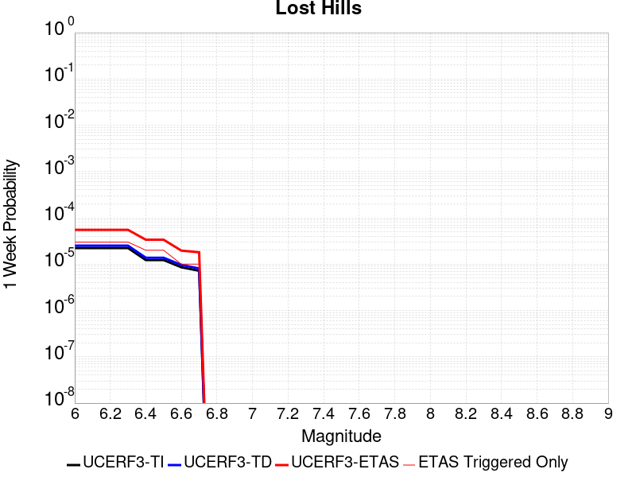 |  |  |  |

| Magnitude | 1 wk TI Prob | 1 wk TD Prob | 1 wk ETAS Prob | 1 wk ETAS/TD Gain | 1 wk ETAS Triggered Only | 1 mo TI Prob | 1 mo TD Prob | 1 mo ETAS Prob | 1 mo ETAS/TD Gain | 1 mo ETAS Triggered Only | 1 yr TI Prob | 1 yr TD Prob | 1 yr ETAS Prob | 1 yr ETAS/TD Gain | 1 yr ETAS Triggered Only | 10 yr TI Prob | 10 yr TD Prob | 10 yr ETAS Prob | 10 yr ETAS/TD Gain | 10 yr ETAS Triggered Only |
|-----|-----|-----|-----|-----|-----|-----|-----|-----|-----|-----|-----|-----|-----|-----|-----|-----|-----|-----|-----|-----|
| 6.0 | 2.233523E-5 | 2.5106583E-5 | 7.957738E-5 | 3.1695824 | 5.4472166E-5 | 9.571891E-5 | 1.0759615E-4 | 1.6206245E-4 | 1.5062106 | 5.4472166E-5 | 0.0011647546 | 0.001309364 | 0.0014181657 | 1.0830951 | 1.0894433E-4 | 0.011586686 | 0.013033091 | 0.013140615 | 1.0082501 | 1.0894433E-4 |
| 6.1 | 2.233523E-5 | 2.5106583E-5 | 7.957738E-5 | 3.1695824 | 5.4472166E-5 | 9.571891E-5 | 1.0759615E-4 | 1.6206245E-4 | 1.5062106 | 5.4472166E-5 | 0.0011647546 | 0.001309364 | 0.0014181657 | 1.0830951 | 1.0894433E-4 | 0.011586686 | 0.013033091 | 0.013140615 | 1.0082501 | 1.0894433E-4 |
| 6.2 | 2.233523E-5 | 2.5106583E-5 | 7.957738E-5 | 3.1695824 | 5.4472166E-5 | 9.571891E-5 | 1.0759615E-4 | 1.6206245E-4 | 1.5062106 | 5.4472166E-5 | 0.0011647546 | 0.001309364 | 0.0014181657 | 1.0830951 | 1.0894433E-4 | 0.011586686 | 0.013033091 | 0.013140615 | 1.0082501 | 1.0894433E-4 |
| 6.3 | 2.233523E-5 | 2.5106583E-5 | 7.957738E-5 | 3.1695824 | 5.4472166E-5 | 9.571891E-5 | 1.0759615E-4 | 1.6206245E-4 | 1.5062106 | 5.4472166E-5 | 0.0011647546 | 0.001309364 | 0.0014181657 | 1.0830951 | 1.0894433E-4 | 0.011586686 | 0.013033091 | 0.013140615 | 1.0082501 | 1.0894433E-4 |
| 6.4 | 1.2288092E-5 | 1.3781108E-5 | 1.3781108E-5 | 1.0 | 0.0 | 5.2662188E-5 | 5.906108E-5 | 5.906108E-5 | 1.0 | 0.0 | 6.409735E-4 | 7.189252E-4 | 7.733582E-4 | 1.0757145 | 5.4472166E-5 | 0.006391279 | 0.0071752006 | 0.007229282 | 1.0075372 | 5.4472166E-5 |
| 6.5 | 1.2288092E-5 | 1.3781108E-5 | 1.3781108E-5 | 1.0 | 0.0 | 5.2662188E-5 | 5.906108E-5 | 5.906108E-5 | 1.0 | 0.0 | 6.409735E-4 | 7.189252E-4 | 7.733582E-4 | 1.0757145 | 5.4472166E-5 | 0.006391279 | 0.0071752006 | 0.007229282 | 1.0075372 | 5.4472166E-5 |
| 6.6 | 8.58281E-6 | 9.63377E-6 | 9.63377E-6 | 1.0 | 0.0 | 3.6782953E-5 | 4.12874E-5 | 4.12874E-5 | 1.0 | 0.0 | 4.4774043E-4 | 5.026414E-4 | 5.026414E-4 | 1.0 | 0.0 | 0.0044683935 | 0.005023205 | 0.005023205 | 1.0 | 0.0 |
| 6.7 | 7.205685E-6 | 8.088302E-6 | 8.088302E-6 | 1.0 | 0.0 | 3.088114E-5 | 3.466415E-5 | 3.466415E-5 | 1.0 | 0.0 | 3.7591302E-4 | 4.2203604E-4 | 4.2203604E-4 | 1.0 | 0.0 | 0.0037527776 | 0.0042203604 | 0.0042203604 | 1.0 | 0.0 |

## Cleghorn Lake
*[(top)](#table-of-contents)*

| 1 Week | 1 Month | 1 Year | 10 Year |
|-----|-----|-----|-----|
|  |  |  |  |

| Magnitude | 1 wk TI Prob | 1 wk TD Prob | 1 wk ETAS Prob | 1 wk ETAS/TD Gain | 1 wk ETAS Triggered Only | 1 mo TI Prob | 1 mo TD Prob | 1 mo ETAS Prob | 1 mo ETAS/TD Gain | 1 mo ETAS Triggered Only | 1 yr TI Prob | 1 yr TD Prob | 1 yr ETAS Prob | 1 yr ETAS/TD Gain | 1 yr ETAS Triggered Only | 10 yr TI Prob | 10 yr TD Prob | 10 yr ETAS Prob | 10 yr ETAS/TD Gain | 10 yr ETAS Triggered Only |
|-----|-----|-----|-----|-----|-----|-----|-----|-----|-----|-----|-----|-----|-----|-----|-----|-----|-----|-----|-----|-----|
| 6.0 | 1.5467183E-5 | 1.6794203E-5 | 7.126545E-5 | 4.2434554 | 5.4472166E-5 | 6.6286244E-5 | 7.197348E-5 | 2.3537822E-4 | 3.2703464 | 1.634165E-4 | 8.067362E-4 | 8.759797E-4 | 0.0010392531 | 1.1863894 | 1.634165E-4 | 0.008038137 | 0.008730696 | 0.008892685 | 1.0185541 | 1.634165E-4 |
| 6.1 | 1.5467183E-5 | 1.6794203E-5 | 7.126545E-5 | 4.2434554 | 5.4472166E-5 | 6.6286244E-5 | 7.197348E-5 | 2.3537822E-4 | 3.2703464 | 1.634165E-4 | 8.067362E-4 | 8.759797E-4 | 0.0010392531 | 1.1863894 | 1.634165E-4 | 0.008038137 | 0.008730696 | 0.008892685 | 1.0185541 | 1.634165E-4 |
| 6.2 | 1.2624631E-5 | 1.3681544E-5 | 6.8152964E-5 | 4.9813795 | 5.4472166E-5 | 5.410444E-5 | 5.863415E-5 | 2.2204105E-4 | 3.7868898 | 1.634165E-4 | 6.585225E-4 | 7.1368564E-4 | 8.769855E-4 | 1.2288121 | 1.634165E-4 | 0.0065657445 | 0.0071187317 | 0.007280985 | 1.0227925 | 1.634165E-4 |
| 6.3 | 1.2624631E-5 | 1.3681544E-5 | 6.8152964E-5 | 4.9813795 | 5.4472166E-5 | 5.410444E-5 | 5.863415E-5 | 2.2204105E-4 | 3.7868898 | 1.634165E-4 | 6.585225E-4 | 7.1368564E-4 | 8.769855E-4 | 1.2288121 | 1.634165E-4 | 0.0065657445 | 0.0071187317 | 0.007280985 | 1.0227925 | 1.634165E-4 |
| 6.4 | 9.417684E-6 | 1.0170118E-5 | 6.4641725E-5 | 6.3560452 | 5.4472166E-5 | 4.036088E-5 | 4.3585722E-5 | 1.525253E-4 | 3.4994328 | 1.0894433E-4 | 4.912829E-4 | 5.3056807E-4 | 6.394546E-4 | 1.2052263 | 1.0894433E-4 | 0.004901982 | 0.005297049 | 0.0054054162 | 1.020458 | 1.0894433E-4 |
| 6.5 | 9.368219E-6 | 1.0117545E-5 | 6.4589156E-5 | 6.383877 | 5.4472166E-5 | 4.014889E-5 | 4.3360415E-5 | 1.5230002E-4 | 3.5124207 | 1.0894433E-4 | 4.8870314E-4 | 5.2782625E-4 | 6.367131E-4 | 1.206293 | 1.0894433E-4 | 0.004876298 | 0.0052697617 | 0.0053781318 | 1.0205646 | 1.0894433E-4 |
| 6.6 | 7.803798E-6 | 8.441831E-6 | 6.291354E-5 | 7.452594 | 5.4472166E-5 | 3.3444423E-5 | 3.6179E-5 | 1.4511938E-4 | 4.01115 | 1.0894433E-4 | 4.0710976E-4 | 4.4043022E-4 | 5.4932653E-4 | 1.24725 | 1.0894433E-4 | 0.0040636472 | 0.0043994905 | 0.0045079556 | 1.024654 | 1.0894433E-4 |
| 6.7 | 2.3108669E-6 | 2.4438336E-6 | 2.4438336E-6 | 1.0 | 0.0 | 9.903678E-6 | 1.0473532E-5 | 6.4945125E-5 | 6.200881 | 5.4472166E-5 | 1.205706E-4 | 1.2750797E-4 | 1.819732E-4 | 1.4271514 | 5.4472166E-5 | 0.001205052 | 0.0012743667 | 0.0013287695 | 1.04269 | 5.4472166E-5 |
| 6.8 | 2.0882828E-6 | 2.2062823E-6 | 2.2062823E-6 | 1.0 | 0.0 | 8.949753E-6 | 9.455462E-6 | 6.392711E-5 | 6.760866 | 5.4472166E-5 | 1.08957785E-4 | 1.1511434E-4 | 1.6958023E-4 | 1.4731461 | 5.4472166E-5 | 0.0010890438 | 0.0011505639 | 0.0012049734 | 1.0472894 | 5.4472166E-5 |
| 6.9 | 1.876935E-6 | 1.981051E-6 | 1.981051E-6 | 1.0 | 0.0 | 8.043982E-6 | 8.490192E-6 | 6.2961895E-5 | 7.4158387 | 5.4472166E-5 | 9.7931086E-5 | 1.03363345E-4 | 1.5782988E-4 | 1.5269425 | 5.4472166E-5 | 9.788794E-4 | 0.0010331686 | 0.0010875845 | 1.0526689 | 5.4472166E-5 |
| 7.0 | 1.5357559E-6 | 1.6202807E-6 | 1.6202807E-6 | 1.0 | 0.0 | 6.5817944E-6 | 6.9440425E-6 | 6.141583E-5 | 8.844391 | 5.4472166E-5 | 8.01304E-5 | 8.454057E-5 | 1.3900812E-4 | 1.6442772 | 5.4472166E-5 | 8.010151E-4 | 8.450965E-4 | 8.995226E-4 | 1.0644022 | 5.4472166E-5 |
| 7.1 | 1.0905424E-6 | 1.1497619E-6 | 1.1497619E-6 | 1.0 | 0.0 | 4.6737446E-6 | 4.9275427E-6 | 5.9399437E-5 | 12.054577 | 5.4472166E-5 | 5.6901354E-5 | 5.999128E-5 | 1.1446018E-4 | 1.907947 | 5.4472166E-5 | 5.6886784E-4 | 5.997606E-4 | 6.542001E-4 | 1.0907687 | 5.4472166E-5 |
| 7.2 | 6.06668E-7 | 6.387277E-7 | 6.387277E-7 | 1.0 | 0.0 | 2.600003E-6 | 2.7374022E-6 | 5.7209418E-5 | 20.899164 | 5.4472166E-5 | 3.1654577E-5 | 3.3327433E-5 | 8.779778E-5 | 2.6344 | 5.4472166E-5 | 3.1650066E-4 | 3.3323118E-4 | 3.876852E-4 | 1.1634121 | 5.4472166E-5 |

## Mission Creek
*[(top)](#table-of-contents)*

| 1 Week | 1 Month | 1 Year | 10 Year |
|-----|-----|-----|-----|
|  |  |  |  |

| Magnitude | 1 wk TI Prob | 1 wk TD Prob | 1 wk ETAS Prob | 1 wk ETAS/TD Gain | 1 wk ETAS Triggered Only | 1 mo TI Prob | 1 mo TD Prob | 1 mo ETAS Prob | 1 mo ETAS/TD Gain | 1 mo ETAS Triggered Only | 1 yr TI Prob | 1 yr TD Prob | 1 yr ETAS Prob | 1 yr ETAS/TD Gain | 1 yr ETAS Triggered Only | 10 yr TI Prob | 10 yr TD Prob | 10 yr ETAS Prob | 10 yr ETAS/TD Gain | 10 yr ETAS Triggered Only |
|-----|-----|-----|-----|-----|-----|-----|-----|-----|-----|-----|-----|-----|-----|-----|-----|-----|-----|-----|-----|-----|
| 6.0 | 1.1549387E-5 | 1.632237E-5 | 7.079365E-5 | 4.337216 | 5.4472166E-5 | 4.9496433E-5 | 6.9951224E-5 | 1.2441957E-4 | 1.778662 | 5.4472166E-5 | 6.0245243E-4 | 8.513384E-4 | 9.6018997E-4 | 1.1278594 | 1.0894433E-4 | 0.006008218 | 0.008509998 | 0.008672024 | 1.0190395 | 1.634165E-4 |
| 6.1 | 1.1549387E-5 | 1.632237E-5 | 7.079365E-5 | 4.337216 | 5.4472166E-5 | 4.9496433E-5 | 6.9951224E-5 | 1.2441957E-4 | 1.778662 | 5.4472166E-5 | 6.0245243E-4 | 8.513384E-4 | 9.6018997E-4 | 1.1278594 | 1.0894433E-4 | 0.006008218 | 0.008509998 | 0.008672024 | 1.0190395 | 1.634165E-4 |
| 6.2 | 1.1549387E-5 | 1.632237E-5 | 7.079365E-5 | 4.337216 | 5.4472166E-5 | 4.9496433E-5 | 6.9951224E-5 | 1.2441957E-4 | 1.778662 | 5.4472166E-5 | 6.0245243E-4 | 8.513384E-4 | 9.6018997E-4 | 1.1278594 | 1.0894433E-4 | 0.006008218 | 0.008509998 | 0.008672024 | 1.0190395 | 1.634165E-4 |
| 6.3 | 1.1549387E-5 | 1.632237E-5 | 7.079365E-5 | 4.337216 | 5.4472166E-5 | 4.9496433E-5 | 6.9951224E-5 | 1.2441957E-4 | 1.778662 | 5.4472166E-5 | 6.0245243E-4 | 8.513384E-4 | 9.6018997E-4 | 1.1278594 | 1.0894433E-4 | 0.006008218 | 0.008509998 | 0.008672024 | 1.0190395 | 1.634165E-4 |
| 6.4 | 1.1549387E-5 | 1.632237E-5 | 7.079365E-5 | 4.337216 | 5.4472166E-5 | 4.9496433E-5 | 6.9951224E-5 | 1.2441957E-4 | 1.778662 | 5.4472166E-5 | 6.0245243E-4 | 8.513384E-4 | 9.6018997E-4 | 1.1278594 | 1.0894433E-4 | 0.006008218 | 0.008509998 | 0.008672024 | 1.0190395 | 1.634165E-4 |
| 6.5 | 1.1549387E-5 | 1.632237E-5 | 7.079365E-5 | 4.337216 | 5.4472166E-5 | 4.9496433E-5 | 6.9951224E-5 | 1.2441957E-4 | 1.778662 | 5.4472166E-5 | 6.0245243E-4 | 8.513384E-4 | 9.6018997E-4 | 1.1278594 | 1.0894433E-4 | 0.006008218 | 0.008509998 | 0.008672024 | 1.0190395 | 1.634165E-4 |
| 6.6 | 9.202681E-6 | 1.3845646E-5 | 6.831706E-5 | 4.9341903 | 5.4472166E-5 | 3.9439463E-5 | 5.9337188E-5 | 1.1380612E-4 | 1.9179561 | 5.4472166E-5 | 4.800697E-4 | 7.221998E-4 | 8.3106547E-4 | 1.1507417 | 1.0894433E-4 | 0.004790339 | 0.0072271815 | 0.007389417 | 1.022448 | 1.634165E-4 |
| 6.7 | 9.019164E-6 | 1.3651316E-5 | 6.812274E-5 | 4.9901958 | 5.4472166E-5 | 3.8652986E-5 | 5.8504378E-5 | 1.1297336E-4 | 1.931024 | 5.4472166E-5 | 4.7049852E-4 | 7.12067E-4 | 8.209338E-4 | 1.1528883 | 1.0894433E-4 | 0.004695036 | 0.007126506 | 0.0072887577 | 1.0227674 | 1.634165E-4 |
| 6.8 | 8.673558E-6 | 1.3273427E-5 | 6.774487E-5 | 5.1037965 | 5.4472166E-5 | 3.717186E-5 | 5.6884925E-5 | 1.1135399E-4 | 1.9575307 | 5.4472166E-5 | 4.524734E-4 | 6.923627E-4 | 8.0123165E-4 | 1.1572425 | 1.0894433E-4 | 0.0045155324 | 0.006930694 | 0.007092978 | 1.0234152 | 1.634165E-4 |
| 6.9 | 7.002255E-6 | 1.1477657E-5 | 6.594919E-5 | 5.7458763 | 5.4472166E-5 | 3.000932E-5 | 4.9189068E-5 | 1.0365855E-4 | 2.1073494 | 5.4472166E-5 | 3.653022E-4 | 5.9871917E-4 | 7.075983E-4 | 1.1818534 | 1.0894433E-4 | 0.0036470229 | 0.005999517 | 0.006107808 | 1.01805 | 1.0894433E-4 |
| 7.0 | 5.84644E-6 | 9.67498E-6 | 6.414662E-5 | 6.630155 | 5.4472166E-5 | 2.5055931E-5 | 4.1463565E-5 | 9.593347E-5 | 2.3136811 | 5.4472166E-5 | 3.0501327E-4 | 5.047066E-4 | 6.135959E-4 | 1.2157478 | 1.0894433E-4 | 0.0030459496 | 0.0050638523 | 0.0051722447 | 1.0214052 | 1.0894433E-4 |
| 7.1 | 5.54703E-6 | 9.329456E-6 | 6.380111E-5 | 6.8386745 | 5.4472166E-5 | 2.377277E-5 | 3.9982795E-5 | 9.4452786E-5 | 2.3623357 | 5.4472166E-5 | 2.8939504E-4 | 4.8668624E-4 | 5.955776E-4 | 1.2237402 | 1.0894433E-4 | 0.0028901845 | 0.004884446 | 0.0049928585 | 1.0221953 | 1.0894433E-4 |
| 7.2 | 4.384709E-6 | 7.68157E-6 | 6.215332E-5 | 8.091225 | 5.4472166E-5 | 1.8791474E-5 | 3.2920623E-5 | 8.7390996E-5 | 2.6545973 | 5.4472166E-5 | 2.2876218E-4 | 4.0073853E-4 | 5.096392E-4 | 1.27175 | 1.0894433E-4 | 0.0022852682 | 0.004028366 | 0.004136871 | 1.0269353 | 1.0894433E-4 |
| 7.3 | 3.7888456E-6 | 6.915452E-6 | 6.138724E-5 | 8.876822 | 5.4472166E-5 | 1.623781E-5 | 2.9637333E-5 | 8.410788E-5 | 2.8379033 | 5.4472166E-5 | 1.9767738E-4 | 3.6077813E-4 | 4.6968317E-4 | 1.3018615 | 1.0894433E-4 | 0.0019750162 | 0.0036301152 | 0.0037386639 | 1.0299023 | 1.0894433E-4 |
| 7.4 | 2.1982462E-6 | 5.0237763E-6 | 5.949567E-5 | 11.842817 | 5.4472166E-5 | 9.421021E-6 | 2.1530293E-5 | 7.6001284E-5 | 3.5299697 | 5.4472166E-5 | 1.1469489E-4 | 2.621E-4 | 3.7101578E-4 | 1.4155505 | 1.0894433E-4 | 0.0011463572 | 0.0026458844 | 0.0027545406 | 1.041066 | 1.0894433E-4 |
| 7.5 | 2.051923E-6 | 4.615016E-6 | 5.9086928E-5 | 12.80319 | 5.4472166E-5 | 8.793926E-6 | 1.9778492E-5 | 7.4249576E-5 | 3.7540567 | 5.4472166E-5 | 1.0706078E-4 | 2.4077666E-4 | 3.4969478E-4 | 1.4523615 | 1.0894433E-4 | 0.0010700922 | 0.0024335422 | 0.0025422212 | 1.0446589 | 1.0894433E-4 |
| 7.6 | 1.8733427E-6 | 4.1233748E-6 | 5.8595317E-5 | 14.210523 | 5.4472166E-5 | 8.028587E-6 | 1.7671488E-5 | 7.214269E-5 | 4.0824347 | 5.4472166E-5 | 9.774366E-5 | 2.151292E-4 | 3.240501E-4 | 1.5063045 | 1.0894433E-4 | 9.770069E-4 | 0.0021780801 | 0.0022867871 | 1.0499096 | 1.0894433E-4 |
| 7.7 | 1.8411953E-6 | 4.0430496E-6 | 5.8514994E-5 | 14.472984 | 5.4472166E-5 | 7.890813E-6 | 1.732724E-5 | 7.179846E-5 | 4.1436753 | 5.4472166E-5 | 9.606641E-5 | 2.1093882E-4 | 3.1986018E-4 | 1.5163647 | 1.0894433E-4 | 9.6024893E-4 | 0.0021363653 | 0.002245077 | 1.0508863 | 1.0894433E-4 |
| 7.8 | 1.7194251E-6 | 3.7104276E-6 | 5.818239E-5 | 15.680778 | 5.4472166E-5 | 7.368944E-6 | 1.5901736E-5 | 7.037303E-5 | 4.4254937 | 5.4472166E-5 | 8.97132E-5 | 1.9358651E-4 | 3.0250975E-4 | 1.5626593 | 1.0894433E-4 | 8.967699E-4 | 0.0019623525 | 0.002071083 | 1.0554082 | 1.0894433E-4 |
| 7.9 | 1.4035052E-6 | 2.9500632E-6 | 5.742207E-5 | 19.464691 | 5.4472166E-5 | 6.0150082E-6 | 1.2643067E-5 | 6.7114546E-5 | 5.308407 | 5.4472166E-5 | 7.3230265E-5 | 1.5391852E-4 | 2.628461E-4 | 1.7076962 | 1.0894433E-4 | 7.3206134E-4 | 0.0015631086 | 0.0016718827 | 1.0695883 | 1.0894433E-4 |
| 8.0 | 3.9318823E-7 | 5.528522E-7 | 5.528522E-7 | 1.0 | 0.0 | 1.6850913E-6 | 2.3693647E-6 | 2.3693647E-6 | 1.0 | 0.0 | 2.0515794E-5 | 2.8846638E-5 | 2.8846638E-5 | 1.0 | 0.0 | 2.0513899E-4 | 2.9899E-4 | 2.9899E-4 | 1.0 | 0.0 |
| 8.1 | 1.596793E-7 | 1.1380002E-7 | 1.1380002E-7 | 1.0 | 0.0 | 6.8433974E-7 | 4.877143E-7 | 4.877143E-7 | 1.0 | 0.0 | 8.331805E-6 | 5.937906E-6 | 5.937906E-6 | 1.0 | 0.0 | 8.331492E-5 | 6.549966E-5 | 6.549966E-5 | 1.0 | 0.0 |
| 8.2 | 4.9003038E-8 | 2.5444924E-8 | 2.5444924E-8 | 1.0 | 0.0 | 2.10013E-7 | 1.0904967E-7 | 1.0904967E-7 | 1.0 | 0.0 | 2.5569052E-6 | 1.327679E-6 | 1.327679E-6 | 1.0 | 0.0 | 2.556876E-5 | 1.495635E-5 | 1.495635E-5 | 1.0 | 0.0 |

## Santa Cruz Catalina Ridge alt1
*[(top)](#table-of-contents)*

| 1 Week | 1 Month | 1 Year | 10 Year |
|-----|-----|-----|-----|
|  |  |  |  |

| Magnitude | 1 wk TI Prob | 1 wk TD Prob | 1 wk ETAS Prob | 1 wk ETAS/TD Gain | 1 wk ETAS Triggered Only | 1 mo TI Prob | 1 mo TD Prob | 1 mo ETAS Prob | 1 mo ETAS/TD Gain | 1 mo ETAS Triggered Only | 1 yr TI Prob | 1 yr TD Prob | 1 yr ETAS Prob | 1 yr ETAS/TD Gain | 1 yr ETAS Triggered Only | 10 yr TI Prob | 10 yr TD Prob | 10 yr ETAS Prob | 10 yr ETAS/TD Gain | 10 yr ETAS Triggered Only |
|-----|-----|-----|-----|-----|-----|-----|-----|-----|-----|-----|-----|-----|-----|-----|-----|-----|-----|-----|-----|-----|
| 6.0 | 3.2833184E-5 | 3.65584E-5 | 9.1028574E-5 | 2.4899497 | 5.4472166E-5 | 1.4070606E-4 | 1.5667039E-4 | 2.6559763E-4 | 1.6952639 | 1.0894433E-4 | 0.00171175 | 0.0019059596 | 0.0020146961 | 1.057051 | 1.0894433E-4 | 0.016986247 | 0.018913029 | 0.019073356 | 1.008477 | 1.634165E-4 |
| 6.1 | 1.9835548E-5 | 2.1659505E-5 | 7.613049E-5 | 3.5148766 | 5.4472166E-5 | 8.500672E-5 | 9.282326E-5 | 2.0175747E-4 | 2.1735659 | 1.0894433E-4 | 0.0010344655 | 0.0011295575 | 0.0012383787 | 1.0963397 | 1.0894433E-4 | 0.010296632 | 0.011240295 | 0.011348016 | 1.0095834 | 1.0894433E-4 |
| 6.2 | 1.9835548E-5 | 2.1659505E-5 | 7.613049E-5 | 3.5148766 | 5.4472166E-5 | 8.500672E-5 | 9.282326E-5 | 2.0175747E-4 | 2.1735659 | 1.0894433E-4 | 0.0010344655 | 0.0011295575 | 0.0012383787 | 1.0963397 | 1.0894433E-4 | 0.010296632 | 0.011240295 | 0.011348016 | 1.0095834 | 1.0894433E-4 |
| 6.3 | 1.5728183E-5 | 1.703395E-5 | 1.703395E-5 | 1.0 | 0.0 | 6.7404755E-5 | 7.300063E-5 | 1.2746883E-4 | 1.7461331 | 5.4472166E-5 | 8.2034385E-4 | 8.884264E-4 | 9.4285014E-4 | 1.0612587 | 5.4472166E-5 | 0.008173222 | 0.008849427 | 0.008903417 | 1.006101 | 5.4472166E-5 |
| 6.4 | 1.5728183E-5 | 1.703395E-5 | 1.703395E-5 | 1.0 | 0.0 | 6.7404755E-5 | 7.300063E-5 | 1.2746883E-4 | 1.7461331 | 5.4472166E-5 | 8.2034385E-4 | 8.884264E-4 | 9.4285014E-4 | 1.0612587 | 5.4472166E-5 | 0.008173222 | 0.008849427 | 0.008903417 | 1.006101 | 5.4472166E-5 |
| 6.5 | 1.3707734E-5 | 1.4794522E-5 | 1.4794522E-5 | 1.0 | 0.0 | 5.8746107E-5 | 6.3403575E-5 | 1.1787228E-4 | 1.8590795 | 5.4472166E-5 | 7.1499916E-4 | 7.716686E-4 | 8.260988E-4 | 1.0705357 | 5.4472166E-5 | 0.0071270303 | 0.0076902895 | 0.007744343 | 1.0070288 | 5.4472166E-5 |
| 6.6 | 1.2539813E-5 | 1.3510219E-5 | 1.3510219E-5 | 1.0 | 0.0 | 5.3740947E-5 | 5.789967E-5 | 1.1236868E-4 | 1.9407482 | 5.4472166E-5 | 6.540996E-4 | 7.0470315E-4 | 7.591369E-4 | 1.0772436 | 5.4472166E-5 | 0.0065217763 | 0.0070249885 | 0.007079078 | 1.0076996 | 5.4472166E-5 |
| 6.7 | 1.1504083E-5 | 1.2377375E-5 | 1.2377375E-5 | 1.0 | 0.0 | 4.930228E-5 | 5.3044827E-5 | 1.075141E-4 | 2.0268538 | 5.4472166E-5 | 6.0008996E-4 | 6.456314E-4 | 7.0006837E-4 | 1.0843159 | 5.4472166E-5 | 0.005984721 | 0.006437786 | 0.0064919074 | 1.0084069 | 5.4472166E-5 |
| 6.8 | 1.012739E-5 | 1.0877071E-5 | 1.0877071E-5 | 1.0 | 0.0 | 4.340238E-5 | 4.6615194E-5 | 1.0108482E-4 | 2.168495 | 5.4472166E-5 | 5.282958E-4 | 5.673937E-4 | 6.21835E-4 | 1.0959496 | 5.4472166E-5 | 0.0052704164 | 0.0056596193 | 0.0057137837 | 1.0095702 | 5.4472166E-5 |
| 6.9 | 8.9607865E-6 | 9.609117E-6 | 9.609117E-6 | 1.0 | 0.0 | 3.8402806E-5 | 4.1181287E-5 | 9.565121E-5 | 2.3226862 | 5.4472166E-5 | 4.6745385E-4 | 5.012679E-4 | 5.5571273E-4 | 1.1086143 | 5.4472166E-5 | 0.0046647177 | 0.005001492 | 0.0050556916 | 1.0108367 | 5.4472166E-5 |
| 7.0 | 8.046829E-6 | 8.619746E-6 | 8.619746E-6 | 1.0 | 0.0 | 3.4485955E-5 | 3.694125E-5 | 9.14114E-5 | 2.4745076 | 5.4472166E-5 | 4.1978562E-4 | 4.496677E-4 | 5.0411536E-4 | 1.1210842 | 5.4472166E-5 | 0.004189935 | 0.0044876686 | 0.0045418967 | 1.0120838 | 5.4472166E-5 |
| 7.1 | 7.136131E-6 | 7.637656E-6 | 7.637656E-6 | 1.0 | 0.0 | 3.0583058E-5 | 3.2732405E-5 | 3.2732405E-5 | 1.0 | 0.0 | 3.7228514E-4 | 3.9844486E-4 | 3.9844486E-4 | 1.0 | 0.0 | 0.0037166206 | 0.003977381 | 0.003977381 | 1.0 | 0.0 |
| 7.2 | 6.362014E-6 | 6.8049585E-6 | 6.8049585E-6 | 1.0 | 0.0 | 2.726549E-5 | 2.9163786E-5 | 2.9163786E-5 | 1.0 | 0.0 | 3.3190678E-4 | 3.550119E-4 | 3.550119E-4 | 1.0 | 0.0 | 0.0033141149 | 0.003544516 | 0.003544516 | 1.0 | 0.0 |
| 7.3 | 5.004101E-6 | 5.351715E-6 | 5.351715E-6 | 1.0 | 0.0 | 2.1445969E-5 | 2.2935723E-5 | 2.2935723E-5 | 1.0 | 0.0 | 2.6107338E-4 | 2.792072E-4 | 2.792072E-4 | 1.0 | 0.0 | 0.002607669 | 0.0027886187 | 0.0027886187 | 1.0 | 0.0 |
| 7.4 | 3.4901443E-6 | 3.7320526E-6 | 3.7320526E-6 | 1.0 | 0.0 | 1.4957676E-5 | 1.5994416E-5 | 1.5994416E-5 | 1.0 | 0.0 | 1.8209449E-4 | 1.9471499E-4 | 1.9471499E-4 | 1.0 | 0.0 | 0.0018194534 | 0.0019454823 | 0.0019454823 | 1.0 | 0.0 |
| 7.5 | 1.1215045E-6 | 1.189387E-6 | 1.189387E-6 | 1.0 | 0.0 | 4.806439E-6 | 5.097363E-6 | 5.097363E-6 | 1.0 | 0.0 | 5.851682E-5 | 6.205866E-5 | 6.205866E-5 | 1.0 | 0.0 | 5.850142E-4 | 6.2041637E-4 | 6.2041637E-4 | 1.0 | 0.0 |
| 7.6 | 2.8599047E-7 | 2.9951994E-7 | 2.9951994E-7 | 1.0 | 0.0 | 1.2256729E-6 | 1.2836562E-6 | 1.2836562E-6 | 1.0 | 0.0 | 1.4922465E-5 | 1.5628404E-5 | 1.5628404E-5 | 1.0 | 0.0 | 1.4921463E-4 | 1.5627318E-4 | 1.5627318E-4 | 1.0 | 0.0 |
| 7.7 | 2.0781519E-7 | 2.1744323E-7 | 2.1744323E-7 | 1.0 | 0.0 | 8.906362E-7 | 9.3189925E-7 | 9.3189925E-7 | 1.0 | 0.0 | 1.08434415E-5 | 1.13458145E-5 | 1.13458145E-5 | 1.0 | 0.0 | 1.0842913E-4 | 1.1345245E-4 | 1.1345245E-4 | 1.0 | 0.0 |
| 7.8 | 3.614776E-8 | 3.764102E-8 | 3.764102E-8 | 1.0 | 0.0 | 1.5491896E-7 | 1.6131864E-7 | 1.6131864E-7 | 1.0 | 0.0 | 1.8861368E-6 | 1.9640527E-6 | 1.9640527E-6 | 1.0 | 0.0 | 1.8861208E-5 | 1.9640367E-5 | 1.9640367E-5 | 1.0 | 0.0 |

## Tin Mountain
*[(top)](#table-of-contents)*

| 1 Week | 1 Month | 1 Year | 10 Year |
|-----|-----|-----|-----|
|  |  | 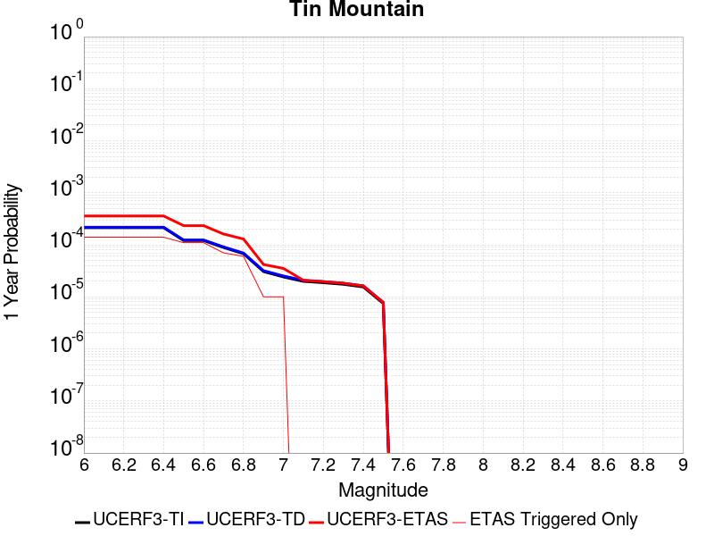 |  |

| Magnitude | 1 wk TI Prob | 1 wk TD Prob | 1 wk ETAS Prob | 1 wk ETAS/TD Gain | 1 wk ETAS Triggered Only | 1 mo TI Prob | 1 mo TD Prob | 1 mo ETAS Prob | 1 mo ETAS/TD Gain | 1 mo ETAS Triggered Only | 1 yr TI Prob | 1 yr TD Prob | 1 yr ETAS Prob | 1 yr ETAS/TD Gain | 1 yr ETAS Triggered Only | 10 yr TI Prob | 10 yr TD Prob | 10 yr ETAS Prob | 10 yr ETAS/TD Gain | 10 yr ETAS Triggered Only |
|-----|-----|-----|-----|-----|-----|-----|-----|-----|-----|-----|-----|-----|-----|-----|-----|-----|-----|-----|-----|-----|
| 6.0 | 4.083776E-6 | 4.1815365E-6 | 4.1815365E-6 | 1.0 | 0.0 | 1.750178E-5 | 1.792077E-5 | 7.239196E-5 | 4.0395565 | 5.4472166E-5 | 2.1306332E-4 | 2.1816725E-4 | 3.270878E-4 | 1.4992526 | 1.0894433E-4 | 0.0021285915 | 0.0021798965 | 0.0023429566 | 1.0748018 | 1.634165E-4 |
| 6.1 | 4.083776E-6 | 4.1815365E-6 | 4.1815365E-6 | 1.0 | 0.0 | 1.750178E-5 | 1.792077E-5 | 7.239196E-5 | 4.0395565 | 5.4472166E-5 | 2.1306332E-4 | 2.1816725E-4 | 3.270878E-4 | 1.4992526 | 1.0894433E-4 | 0.0021285915 | 0.0021798965 | 0.0023429566 | 1.0748018 | 1.634165E-4 |
| 6.2 | 4.083776E-6 | 4.1815365E-6 | 4.1815365E-6 | 1.0 | 0.0 | 1.750178E-5 | 1.792077E-5 | 7.239196E-5 | 4.0395565 | 5.4472166E-5 | 2.1306332E-4 | 2.1816725E-4 | 3.270878E-4 | 1.4992526 | 1.0894433E-4 | 0.0021285915 | 0.0021798965 | 0.0023429566 | 1.0748018 | 1.634165E-4 |
| 6.3 | 4.083776E-6 | 4.1815365E-6 | 4.1815365E-6 | 1.0 | 0.0 | 1.750178E-5 | 1.792077E-5 | 7.239196E-5 | 4.0395565 | 5.4472166E-5 | 2.1306332E-4 | 2.1816725E-4 | 3.270878E-4 | 1.4992526 | 1.0894433E-4 | 0.0021285915 | 0.0021798965 | 0.0023429566 | 1.0748018 | 1.634165E-4 |
| 6.4 | 4.083776E-6 | 4.1815365E-6 | 4.1815365E-6 | 1.0 | 0.0 | 1.750178E-5 | 1.792077E-5 | 7.239196E-5 | 4.0395565 | 5.4472166E-5 | 2.1306332E-4 | 2.1816725E-4 | 3.270878E-4 | 1.4992526 | 1.0894433E-4 | 0.0021285915 | 0.0021798965 | 0.0023429566 | 1.0748018 | 1.634165E-4 |
| 6.5 | 2.3143427E-6 | 2.3731573E-6 | 2.3731573E-6 | 1.0 | 0.0 | 9.9185745E-6 | 1.0170638E-5 | 1.0170638E-5 | 1.0 | 0.0 | 1.2075195E-4 | 1.2382126E-4 | 1.7828667E-4 | 1.4398713 | 5.4472166E-5 | 0.0012068636 | 0.0012375986 | 0.0012920033 | 1.04396 | 5.4472166E-5 |
| 6.6 | 2.3143427E-6 | 2.3731573E-6 | 2.3731573E-6 | 1.0 | 0.0 | 9.9185745E-6 | 1.0170638E-5 | 1.0170638E-5 | 1.0 | 0.0 | 1.2075195E-4 | 1.2382126E-4 | 1.7828667E-4 | 1.4398713 | 5.4472166E-5 | 0.0012068636 | 0.0012375986 | 0.0012920033 | 1.04396 | 5.4472166E-5 |
| 6.7 | 1.7029532E-6 | 1.7497915E-6 | 1.7497915E-6 | 1.0 | 0.0 | 7.2983503E-6 | 7.499088E-6 | 7.499088E-6 | 1.0 | 0.0 | 8.885379E-5 | 9.1298105E-5 | 9.1298105E-5 | 1.0 | 0.0 | 8.881827E-4 | 9.1265864E-4 | 9.1265864E-4 | 1.0 | 0.0 |
| 6.8 | 1.2914646E-6 | 1.3299378E-6 | 1.3299378E-6 | 1.0 | 0.0 | 5.534837E-6 | 5.6997237E-6 | 5.6997237E-6 | 1.0 | 0.0 | 6.738455E-5 | 6.939237E-5 | 6.939237E-5 | 1.0 | 0.0 | 6.736412E-4 | 6.9375033E-4 | 6.9375033E-4 | 1.0 | 0.0 |
| 6.9 | 5.8708974E-7 | 6.1169936E-7 | 6.1169936E-7 | 1.0 | 0.0 | 2.5160964E-6 | 2.6215664E-6 | 2.6215664E-6 | 1.0 | 0.0 | 3.0633044E-5 | 3.1917145E-5 | 3.1917145E-5 | 1.0 | 0.0 | 3.0628822E-4 | 3.191297E-4 | 3.191297E-4 | 1.0 | 0.0 |
| 7.0 | 4.6248786E-7 | 4.832015E-7 | 4.832015E-7 | 1.0 | 0.0 | 1.9820893E-6 | 2.0708624E-6 | 2.0708624E-6 | 1.0 | 0.0 | 2.413167E-5 | 2.5212494E-5 | 2.5212494E-5 | 1.0 | 0.0 | 2.412905E-4 | 2.5210003E-4 | 2.5210003E-4 | 1.0 | 0.0 |
| 7.1 | 3.804606E-7 | 3.987147E-7 | 3.987147E-7 | 1.0 | 0.0 | 1.6305444E-6 | 1.7087764E-6 | 1.7087764E-6 | 1.0 | 0.0 | 1.9851697E-5 | 2.0804187E-5 | 2.0804187E-5 | 1.0 | 0.0 | 1.9849923E-4 | 2.0802575E-4 | 2.0802575E-4 | 1.0 | 0.0 |
| 7.2 | 3.5864858E-7 | 3.7616863E-7 | 3.7616863E-7 | 1.0 | 0.0 | 1.5370645E-6 | 1.6121504E-6 | 1.6121504E-6 | 1.0 | 0.0 | 1.87136E-5 | 1.9627789E-5 | 1.9627789E-5 | 1.0 | 0.0 | 1.8712023E-4 | 1.9626386E-4 | 1.9626386E-4 | 1.0 | 0.0 |
| 7.3 | 3.342063E-7 | 3.506347E-7 | 3.506347E-7 | 1.0 | 0.0 | 1.4323119E-6 | 1.5027196E-6 | 1.5027196E-6 | 1.0 | 0.0 | 1.7438259E-5 | 1.829549E-5 | 1.829549E-5 | 1.0 | 0.0 | 1.743689E-4 | 1.8294314E-4 | 1.8294314E-4 | 1.0 | 0.0 |
| 7.4 | 2.971242E-7 | 3.1165817E-7 | 3.1165817E-7 | 1.0 | 0.0 | 1.2733886E-6 | 1.3356774E-6 | 1.3356774E-6 | 1.0 | 0.0 | 1.5503398E-5 | 1.6261785E-5 | 1.6261785E-5 | 1.0 | 0.0 | 1.5502315E-4 | 1.6260923E-4 | 1.6260923E-4 | 1.0 | 0.0 |
| 7.5 | 1.4326713E-7 | 1.5012525E-7 | 1.5012525E-7 | 1.0 | 0.0 | 6.140018E-7 | 6.433939E-7 | 6.433939E-7 | 1.0 | 0.0 | 7.4754466E-6 | 7.8333205E-6 | 7.8333205E-6 | 1.0 | 0.0 | 7.475195E-5 | 7.833321E-5 | 7.833321E-5 | 1.0 | 0.0 |

## San Clemente
*[(top)](#table-of-contents)*

| 1 Week | 1 Month | 1 Year | 10 Year |
|-----|-----|-----|-----|
|  |  |  |  |

| Magnitude | 1 wk TI Prob | 1 wk TD Prob | 1 wk ETAS Prob | 1 wk ETAS/TD Gain | 1 wk ETAS Triggered Only | 1 mo TI Prob | 1 mo TD Prob | 1 mo ETAS Prob | 1 mo ETAS/TD Gain | 1 mo ETAS Triggered Only | 1 yr TI Prob | 1 yr TD Prob | 1 yr ETAS Prob | 1 yr ETAS/TD Gain | 1 yr ETAS Triggered Only | 10 yr TI Prob | 10 yr TD Prob | 10 yr ETAS Prob | 10 yr ETAS/TD Gain | 10 yr ETAS Triggered Only |
|-----|-----|-----|-----|-----|-----|-----|-----|-----|-----|-----|-----|-----|-----|-----|-----|-----|-----|-----|-----|-----|
| 6.0 | 6.681379E-5 | 8.163422E-5 | 8.163422E-5 | 1.0 | 0.0 | 2.8631336E-4 | 3.498173E-4 | 3.498173E-4 | 1.0 | 0.0 | 0.003480294 | 0.0042512873 | 0.0043597687 | 1.0255172 | 1.0894433E-4 | 0.03426291 | 0.041755714 | 0.041912306 | 1.0037502 | 1.634165E-4 |
| 6.1 | 6.681379E-5 | 8.163422E-5 | 8.163422E-5 | 1.0 | 0.0 | 2.8631336E-4 | 3.498173E-4 | 3.498173E-4 | 1.0 | 0.0 | 0.003480294 | 0.0042512873 | 0.0043597687 | 1.0255172 | 1.0894433E-4 | 0.03426291 | 0.041755714 | 0.041860107 | 1.0025002 | 1.0894433E-4 |
| 6.2 | 3.9400576E-5 | 4.6451984E-5 | 4.6451984E-5 | 1.0 | 0.0 | 1.6884868E-4 | 1.9906509E-4 | 1.9906509E-4 | 1.0 | 0.0 | 0.0020537945 | 0.002420985 | 0.0025296654 | 1.0448911 | 1.0894433E-4 | 0.020349167 | 0.02395286 | 0.024059195 | 1.0044394 | 1.0894433E-4 |
| 6.3 | 3.2590255E-5 | 3.7929087E-5 | 3.7929087E-5 | 1.0 | 0.0 | 1.3966505E-4 | 1.6254328E-4 | 1.6254328E-4 | 1.0 | 0.0 | 0.0016990956 | 0.0019771985 | 0.0020859274 | 1.0549914 | 1.0894433E-4 | 0.01686163 | 0.019599866 | 0.019706674 | 1.0054495 | 1.0894433E-4 |
| 6.4 | 2.9454652E-5 | 3.4097775E-5 | 3.4097775E-5 | 1.0 | 0.0 | 1.2622811E-4 | 1.4612528E-4 | 1.4612528E-4 | 1.0 | 0.0 | 0.0015357438 | 0.0017776482 | 0.0018863989 | 1.0611767 | 1.0894433E-4 | 0.015251739 | 0.017637458 | 0.01774448 | 1.0060679 | 1.0894433E-4 |
| 6.5 | 2.790836E-5 | 3.2247463E-5 | 3.2247463E-5 | 1.0 | 0.0 | 1.1960178E-4 | 1.3819622E-4 | 1.3819622E-4 | 1.0 | 0.0 | 0.001455179 | 0.0016812651 | 0.0017900262 | 1.0646901 | 1.0894433E-4 | 0.014456868 | 0.016688475 | 0.016795602 | 1.0064192 | 1.0894433E-4 |
| 6.6 | 2.2492153E-5 | 2.5762707E-5 | 2.5762707E-5 | 1.0 | 0.0 | 9.639138E-5 | 1.1040701E-4 | 1.1040701E-4 | 1.0 | 0.0 | 0.0011729331 | 0.0013433908 | 0.0014521888 | 1.0809876 | 1.0894433E-4 | 0.011667615 | 0.013354415 | 0.013461905 | 1.008049 | 1.0894433E-4 |
| 6.7 | 1.9862755E-5 | 2.2666423E-5 | 2.2666423E-5 | 1.0 | 0.0 | 8.512331E-5 | 9.713826E-5 | 9.713826E-5 | 1.0 | 0.0 | 0.0010358836 | 0.0011820279 | 0.0012908435 | 1.0920584 | 1.0894433E-4 | 0.010310682 | 0.011758701 | 0.011866364 | 1.0091561 | 1.0894433E-4 |
| 6.8 | 1.6697575E-5 | 1.897771E-5 | 1.897771E-5 | 1.0 | 0.0 | 7.155907E-5 | 8.133056E-5 | 8.133056E-5 | 1.0 | 0.0 | 8.7088346E-4 | 9.897591E-4 | 0.0010441773 | 1.0549814 | 5.4472166E-5 | 0.008674784 | 0.0098545365 | 0.009908472 | 1.0054731 | 5.4472166E-5 |
| 6.9 | 1.5218415E-5 | 1.72694E-5 | 1.72694E-5 | 1.0 | 0.0 | 6.522015E-5 | 7.4009666E-5 | 7.4009666E-5 | 1.0 | 0.0 | 7.93766E-4 | 9.00704E-4 | 9.551271E-4 | 1.0604229 | 5.4472166E-5 | 0.007909367 | 0.008971481 | 0.009025464 | 1.0060172 | 5.4472166E-5 |
| 7.0 | 1.2392958E-5 | 1.4033016E-5 | 1.4033016E-5 | 1.0 | 0.0 | 5.3111595E-5 | 6.014015E-5 | 6.014015E-5 | 1.0 | 0.0 | 6.4644177E-4 | 7.319679E-4 | 7.864002E-4 | 1.0743643 | 5.4472166E-5 | 0.0064456454 | 0.0072963564 | 0.0073504313 | 1.0074112 | 5.4472166E-5 |
| 7.1 | 1.0934128E-5 | 1.2375138E-5 | 1.2375138E-5 | 1.0 | 0.0 | 4.6859706E-5 | 5.303527E-5 | 5.303527E-5 | 1.0 | 0.0 | 5.7036756E-4 | 6.455204E-4 | 6.455204E-4 | 1.0 | 0.0 | 0.0056890585 | 0.0064371997 | 0.0064371997 | 1.0 | 0.0 |
| 7.2 | 9.5798805E-6 | 1.0844935E-5 | 1.0844935E-5 | 1.0 | 0.0 | 4.1055984E-5 | 4.6477508E-5 | 4.6477508E-5 | 1.0 | 0.0 | 4.9974193E-4 | 5.657239E-4 | 5.657239E-4 | 1.0 | 0.0 | 0.0049861963 | 0.0056435615 | 0.0056435615 | 1.0 | 0.0 |
| 7.3 | 8.0167365E-6 | 9.083918E-6 | 9.083918E-6 | 1.0 | 0.0 | 3.4356988E-5 | 3.8930535E-5 | 3.8930535E-5 | 1.0 | 0.0 | 4.1821605E-4 | 4.7388324E-4 | 4.7388324E-4 | 1.0 | 0.0 | 0.0041742986 | 0.0047294297 | 0.0047294297 | 1.0 | 0.0 |
| 7.4 | 2.9581017E-6 | 3.3623792E-6 | 3.3623792E-6 | 1.0 | 0.0 | 1.2677518E-5 | 1.4410146E-5 | 1.4410146E-5 | 1.0 | 0.0 | 1.5433785E-4 | 1.7543444E-4 | 1.7543444E-4 | 1.0 | 0.0 | 0.001542307 | 0.0017534546 | 0.0017534546 | 1.0 | 0.0 |

## White Wolf (Extension)
*[(top)](#table-of-contents)*

| 1 Week | 1 Month | 1 Year | 10 Year |
|-----|-----|-----|-----|
|  |  |  |  |

| Magnitude | 1 wk TI Prob | 1 wk TD Prob | 1 wk ETAS Prob | 1 wk ETAS/TD Gain | 1 wk ETAS Triggered Only | 1 mo TI Prob | 1 mo TD Prob | 1 mo ETAS Prob | 1 mo ETAS/TD Gain | 1 mo ETAS Triggered Only | 1 yr TI Prob | 1 yr TD Prob | 1 yr ETAS Prob | 1 yr ETAS/TD Gain | 1 yr ETAS Triggered Only | 10 yr TI Prob | 10 yr TD Prob | 10 yr ETAS Prob | 10 yr ETAS/TD Gain | 10 yr ETAS Triggered Only |
|-----|-----|-----|-----|-----|-----|-----|-----|-----|-----|-----|-----|-----|-----|-----|-----|-----|-----|-----|-----|-----|
| 6.0 | 8.222555E-6 | 6.0666657E-6 | 6.05385E-5 | 9.978875 | 5.4472166E-5 | 3.5239045E-5 | 2.5999774E-5 | 1.3494128E-4 | 5.190094 | 1.0894433E-4 | 4.289509E-4 | 3.1650788E-4 | 4.2541773E-4 | 1.3440983 | 1.0894433E-4 | 0.0042812387 | 0.003161223 | 0.0033241229 | 1.0515306 | 1.634165E-4 |
| 6.1 | 8.222555E-6 | 6.0666657E-6 | 6.05385E-5 | 9.978875 | 5.4472166E-5 | 3.5239045E-5 | 2.5999774E-5 | 1.3494128E-4 | 5.190094 | 1.0894433E-4 | 4.289509E-4 | 3.1650788E-4 | 4.2541773E-4 | 1.3440983 | 1.0894433E-4 | 0.0042812387 | 0.003161223 | 0.0033241229 | 1.0515306 | 1.634165E-4 |
| 6.2 | 8.222555E-6 | 6.0666657E-6 | 6.05385E-5 | 9.978875 | 5.4472166E-5 | 3.5239045E-5 | 2.5999774E-5 | 1.3494128E-4 | 5.190094 | 1.0894433E-4 | 4.289509E-4 | 3.1650788E-4 | 4.2541773E-4 | 1.3440983 | 1.0894433E-4 | 0.0042812387 | 0.003161223 | 0.0033241229 | 1.0515306 | 1.634165E-4 |
| 6.3 | 8.222555E-6 | 6.0666657E-6 | 6.05385E-5 | 9.978875 | 5.4472166E-5 | 3.5239045E-5 | 2.5999774E-5 | 1.3494128E-4 | 5.190094 | 1.0894433E-4 | 4.289509E-4 | 3.1650788E-4 | 4.2541773E-4 | 1.3440983 | 1.0894433E-4 | 0.0042812387 | 0.003161223 | 0.0033241229 | 1.0515306 | 1.634165E-4 |
| 6.4 | 5.821773E-6 | 3.5571766E-6 | 5.802915E-5 | 16.313261 | 5.4472166E-5 | 2.4950215E-5 | 1.5244959E-5 | 1.2418763E-4 | 8.146144 | 1.0894433E-4 | 3.0372653E-4 | 1.8559267E-4 | 2.9451677E-4 | 1.5868988 | 1.0894433E-4 | 0.0030331176 | 0.001854485 | 0.0020175986 | 1.0879562 | 1.634165E-4 |
| 6.5 | 5.766023E-6 | 3.4991106E-6 | 5.7971083E-5 | 16.567377 | 5.4472166E-5 | 2.4711293E-5 | 1.4996108E-5 | 1.2393881E-4 | 8.264731 | 1.0894433E-4 | 3.0081844E-4 | 1.8256342E-4 | 2.9148787E-4 | 1.5966389 | 1.0894433E-4 | 0.0030041158 | 0.0018242426 | 0.0019873609 | 1.0894171 | 1.634165E-4 |
| 6.6 | 4.643576E-6 | 2.332624E-6 | 5.6804663E-5 | 24.352257 | 5.4472166E-5 | 1.9900888E-5 | 9.996925E-6 | 1.1894017E-4 | 11.8976755 | 1.0894433E-4 | 2.4226638E-4 | 1.2170619E-4 | 2.3063726E-4 | 1.8950331 | 1.0894433E-4 | 0.0024200242 | 0.0012164378 | 0.0013796554 | 1.1341767 | 1.634165E-4 |
| 6.7 | 3.9529173E-6 | 1.6483477E-6 | 1.6483477E-6 | 1.0 | 0.0 | 1.6940963E-5 | 7.0643296E-6 | 6.1536106E-5 | 8.710821 | 5.4472166E-5 | 2.0623671E-4 | 8.6005006E-5 | 1.4047249E-4 | 1.6333059 | 5.4472166E-5 | 0.002060454 | 8.597357E-4 | 9.1416104E-4 | 1.0633048 | 5.4472166E-5 |
| 6.8 | 3.4377522E-6 | 1.2245237E-6 | 1.2245237E-6 | 1.0 | 0.0 | 1.473314E-5 | 5.2479486E-6 | 5.9719827E-5 | 11.379652 | 5.4472166E-5 | 1.7936122E-4 | 6.3891996E-5 | 1.1836068E-4 | 1.8525119 | 5.4472166E-5 | 0.0017921652 | 6.387454E-4 | 6.931827E-4 | 1.0852255 | 5.4472166E-5 |
| 6.9 | 3.1367306E-6 | 1.0033783E-6 | 1.0033783E-6 | 1.0 | 0.0 | 1.3443062E-5 | 4.3001864E-6 | 5.8772115E-5 | 13.667342 | 5.4472166E-5 | 1.63657E-4 | 5.235359E-5 | 1.068229E-4 | 2.0404122 | 5.4472166E-5 | 0.0016353652 | 5.2342017E-4 | 5.7786383E-4 | 1.1040152 | 5.4472166E-5 |
| 7.0 | 2.8298145E-6 | 7.4286646E-7 | 7.4286646E-7 | 1.0 | 0.0 | 1.2127721E-5 | 3.1837099E-6 | 5.76557E-5 | 18.109596 | 5.4472166E-5 | 1.47645E-4 | 3.8761027E-5 | 9.323108E-5 | 2.405279 | 5.4472166E-5 | 0.0014754693 | 3.8754768E-4 | 4.4199874E-4 | 1.1405016 | 5.4472166E-5 |
| 7.1 | 2.4091064E-6 | 5.4227525E-7 | 5.4227525E-7 | 1.0 | 0.0 | 1.03247E-5 | 2.3240348E-6 | 5.6796074E-5 | 24.438564 | 5.4472166E-5 | 1.2569598E-4 | 2.8294799E-5 | 8.276542E-5 | 2.9251108 | 5.4472166E-5 | 0.001256249 | 2.8291598E-4 | 3.3737274E-4 | 1.1924838 | 5.4472166E-5 |
| 7.2 | 1.3875518E-6 | 1.0743063E-7 | 1.0743063E-7 | 1.0 | 0.0 | 5.9466374E-6 | 4.6041689E-7 | 4.6041689E-7 | 1.0 | 0.0 | 7.23979E-5 | 5.6055624E-6 | 5.6055624E-6 | 1.0 | 0.0 | 7.2374323E-4 | 5.6054323E-5 | 5.6054323E-5 | 1.0 | 0.0 |
| 7.3 | 7.056077E-7 | 5.002034E-8 | 5.002034E-8 | 1.0 | 0.0 | 3.0240296E-6 | 2.1437286E-7 | 2.1437286E-7 | 1.0 | 0.0 | 3.681694E-5 | 2.609987E-6 | 2.609987E-6 | 1.0 | 0.0 | 3.681084E-4 | 2.609961E-5 | 2.609961E-5 | 1.0 | 0.0 |
| 7.4 | 5.9334678E-8 | 4.8683537E-9 | 4.8683537E-9 | 1.0 | 0.0 | 2.5429145E-7 | 2.0864372E-8 | 2.0864372E-8 | 1.0 | 0.0 | 3.095994E-6 | 2.5402372E-7 | 2.5402372E-7 | 1.0 | 0.0 | 3.095951E-5 | 2.5402353E-6 | 2.5402353E-6 | 1.0 | 0.0 |

## Imperial
*[(top)](#table-of-contents)*

| 1 Week | 1 Month | 1 Year | 10 Year |
|-----|-----|-----|-----|
|  | 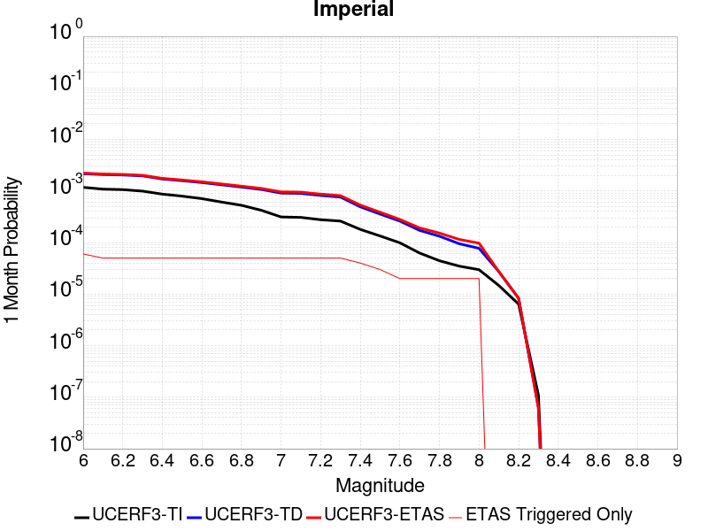 |  |  |

| Magnitude | 1 wk TI Prob | 1 wk TD Prob | 1 wk ETAS Prob | 1 wk ETAS/TD Gain | 1 wk ETAS Triggered Only | 1 mo TI Prob | 1 mo TD Prob | 1 mo ETAS Prob | 1 mo ETAS/TD Gain | 1 mo ETAS Triggered Only | 1 yr TI Prob | 1 yr TD Prob | 1 yr ETAS Prob | 1 yr ETAS/TD Gain | 1 yr ETAS Triggered Only | 10 yr TI Prob | 10 yr TD Prob | 10 yr ETAS Prob | 10 yr ETAS/TD Gain | 10 yr ETAS Triggered Only |
|-----|-----|-----|-----|-----|-----|-----|-----|-----|-----|-----|-----|-----|-----|-----|-----|-----|-----|-----|-----|-----|
| 6.0 | 2.7496446E-4 | 5.0552754E-4 | 5.0552754E-4 | 1.0 | 0.0 | 0.0011778869 | 0.002164787 | 0.002164787 | 1.0 | 0.0 | 0.0142467655 | 0.026038699 | 0.026038699 | 1.0 | 0.0 | 0.13367249 | 0.2280438 | 0.22812788 | 1.0003688 | 1.0894433E-4 |
| 6.1 | 2.5356023E-4 | 4.8656776E-4 | 4.8656776E-4 | 1.0 | 0.0 | 0.001086234 | 0.0020836622 | 0.0020836622 | 1.0 | 0.0 | 0.013144928 | 0.025071215 | 0.025071215 | 1.0 | 0.0 | 0.123940155 | 0.21947981 | 0.21956484 | 1.0003874 | 1.0894433E-4 |
| 6.2 | 2.4820742E-4 | 4.7752203E-4 | 4.7752203E-4 | 1.0 | 0.0 | 0.0010633124 | 0.0020449557 | 0.0020449557 | 1.0 | 0.0 | 0.01286919 | 0.024611235 | 0.024611235 | 1.0 | 0.0 | 0.12148927 | 0.21598552 | 0.21607094 | 1.0003954 | 1.0894433E-4 |
| 6.3 | 2.3205351E-4 | 4.5890483E-4 | 4.5890483E-4 | 1.0 | 0.0 | 9.94136E-4 | 0.0019652895 | 0.0019652895 | 1.0 | 0.0 | 0.012036599 | 0.02366133 | 0.02366133 | 1.0 | 0.0 | 0.11405133 | 0.20793462 | 0.20802091 | 1.000415 | 1.0894433E-4 |
| 6.4 | 2.0304754E-4 | 3.987652E-4 | 3.987652E-4 | 1.0 | 0.0 | 8.6991355E-4 | 0.0017078889 | 0.0017078889 | 1.0 | 0.0 | 0.010539869 | 0.020595672 | 0.020595672 | 1.0 | 0.0 | 0.100537635 | 0.1850669 | 0.18515567 | 1.0004797 | 1.0894433E-4 |
| 6.5 | 1.854992E-4 | 3.6988858E-4 | 3.6988858E-4 | 1.0 | 0.0 | 7.9475436E-4 | 0.0015842861 | 0.0015842861 | 1.0 | 0.0 | 0.009633281 | 0.01911948 | 0.01911948 | 1.0 | 0.0 | 0.0922623 | 0.173298 | 0.17338806 | 1.0005198 | 1.0894433E-4 |
| 6.6 | 1.6586106E-4 | 3.403506E-4 | 3.403506E-4 | 1.0 | 0.0 | 7.106394E-4 | 0.0014578402 | 0.0014578402 | 1.0 | 0.0 | 0.008617763 | 0.01760642 | 0.01760642 | 1.0 | 0.0 | 0.08291132 | 0.16077545 | 0.16086687 | 1.0005686 | 1.0894433E-4 |
| 6.7 | 1.4224656E-4 | 3.076692E-4 | 3.076692E-4 | 1.0 | 0.0 | 6.094856E-4 | 0.001317924 | 0.001317924 | 1.0 | 0.0 | 0.0073952693 | 0.015929576 | 0.015929576 | 1.0 | 0.0 | 0.07153955 | 0.14648417 | 0.14657715 | 1.0006348 | 1.0894433E-4 |
| 6.8 | 1.2317259E-4 | 2.779122E-4 | 2.779122E-4 | 1.0 | 0.0 | 5.2777573E-4 | 0.0011905148 | 0.0011905148 | 1.0 | 0.0 | 0.0064067547 | 0.0143995695 | 0.0143995695 | 1.0 | 0.0 | 0.06225166 | 0.13293684 | 0.1330313 | 1.0007106 | 1.0894433E-4 |
| 6.9 | 9.859898E-5 | 2.5014306E-4 | 2.5014306E-4 | 1.0 | 0.0 | 4.2249862E-4 | 0.0010716055 | 0.0010716055 | 1.0 | 0.0 | 0.0051317946 | 0.012969712 | 0.012969712 | 1.0 | 0.0 | 0.05014893 | 0.11940631 | 0.11950225 | 1.0008035 | 1.0894433E-4 |
| 7.0 | 7.3191884E-5 | 2.1266776E-4 | 2.1266776E-4 | 1.0 | 0.0 | 3.136418E-4 | 9.1111806E-4 | 9.1111806E-4 | 1.0 | 0.0 | 0.003811904 | 0.011037128 | 0.011037128 | 1.0 | 0.0 | 0.037471764 | 0.10206493 | 0.10216275 | 1.0009584 | 1.0894433E-4 |
| 7.1 | 7.1760296E-5 | 2.0968143E-4 | 2.0968143E-4 | 1.0 | 0.0 | 3.0750787E-4 | 8.983284E-4 | 8.983284E-4 | 1.0 | 0.0 | 0.003737482 | 0.010882978 | 0.010882978 | 1.0 | 0.0 | 0.03675245 | 0.10070146 | 0.10079943 | 1.0009729 | 1.0894433E-4 |
| 7.2 | 6.46614E-5 | 1.9136685E-4 | 1.9136685E-4 | 1.0 | 0.0 | 2.7709085E-4 | 8.1988896E-4 | 8.1988896E-4 | 1.0 | 0.0 | 0.0033683628 | 0.0099370815 | 0.0099370815 | 1.0 | 0.0 | 0.033177625 | 0.09250898 | 0.09260784 | 1.0010687 | 1.0894433E-4 |
| 7.3 | 6.088115E-5 | 1.78084E-4 | 1.78084E-4 | 1.0 | 0.0 | 2.6089314E-4 | 7.6299673E-4 | 7.6299673E-4 | 1.0 | 0.0 | 0.0031717476 | 0.009250494 | 0.009250494 | 1.0 | 0.0 | 0.031268585 | 0.08655989 | 0.08665941 | 1.0011497 | 1.0894433E-4 |
| 7.4 | 4.199346E-5 | 1.1510366E-4 | 1.1510366E-4 | 1.0 | 0.0 | 1.7995955E-4 | 4.9320905E-4 | 4.9320905E-4 | 1.0 | 0.0 | 0.0021888057 | 0.0059884563 | 0.0059884563 | 1.0 | 0.0 | 0.02167372 | 0.057439793 | 0.05754248 | 1.0017878 | 1.0894433E-4 |
| 7.5 | 3.130448E-5 | 8.33328E-5 | 8.33328E-5 | 1.0 | 0.0 | 1.3415517E-4 | 3.57092E-4 | 3.57092E-4 | 1.0 | 0.0 | 0.0016321153 | 0.004338988 | 0.004338988 | 1.0 | 0.0 | 0.016201803 | 0.04213201 | 0.04223636 | 1.0024768 | 1.0894433E-4 |
| 7.6 | 2.3074248E-5 | 6.0844646E-5 | 6.0844646E-5 | 1.0 | 0.0 | 9.888588E-5 | 2.6073685E-4 | 2.6073685E-4 | 1.0 | 0.0 | 0.0012032706 | 0.0031698733 | 0.0031698733 | 1.0 | 0.0 | 0.011967761 | 0.031026395 | 0.031131959 | 1.0034024 | 1.0894433E-4 |
| 7.7 | 1.45864815E-5 | 4.0124698E-5 | 4.0124698E-5 | 1.0 | 0.0 | 6.2511994E-5 | 1.7195169E-4 | 1.7195169E-4 | 1.0 | 0.0 | 7.608177E-4 | 0.0020915072 | 0.0020915072 | 1.0 | 0.0 | 0.007582182 | 0.020627763 | 0.020734461 | 1.0051725 | 1.0894433E-4 |
| 7.8 | 1.0352979E-5 | 3.0960902E-5 | 3.0960902E-5 | 1.0 | 0.0 | 4.4369157E-5 | 1.3268284E-4 | 1.3268284E-4 | 1.0 | 0.0 | 5.400606E-4 | 0.0016142189 | 0.0016142189 | 1.0 | 0.0 | 0.0053875 | 0.016016833 | 0.016124032 | 1.0066929 | 1.0894433E-4 |
| 7.9 | 8.137906E-6 | 2.2149103E-5 | 2.2149103E-5 | 1.0 | 0.0 | 3.4876273E-5 | 9.492128E-5 | 9.492128E-5 | 1.0 | 0.0 | 4.2453592E-4 | 0.0011550548 | 0.0011550548 | 1.0 | 0.0 | 0.004237258 | 0.011617903 | 0.0116717415 | 1.0046341 | 5.4472166E-5 |
| 8.0 | 6.93792E-6 | 1.8008766E-5 | 1.8008766E-5 | 1.0 | 0.0 | 2.9733603E-5 | 7.717814E-5 | 7.717814E-5 | 1.0 | 0.0 | 3.6194647E-4 | 9.3923963E-4 | 9.3923963E-4 | 1.0 | 0.0 | 0.0036135751 | 0.00950155 | 0.009555506 | 1.0056785 | 5.4472166E-5 |
| 8.1 | 3.4286315E-6 | 6.379872E-6 | 6.379872E-6 | 1.0 | 0.0 | 1.4694053E-5 | 2.7342023E-5 | 2.7342023E-5 | 1.0 | 0.0 | 1.7888541E-4 | 3.328384E-4 | 3.328384E-4 | 1.0 | 0.0 | 0.0017874148 | 0.003486031 | 0.003486031 | 1.0 | 0.0 |
| 8.2 | 1.4906886E-6 | 1.9366646E-6 | 1.9366646E-6 | 1.0 | 0.0 | 6.3886496E-6 | 8.299965E-6 | 8.299965E-6 | 1.0 | 0.0 | 7.7779034E-5 | 1.0104742E-4 | 1.0104742E-4 | 1.0 | 0.0 | 7.775182E-4 | 0.0011075331 | 0.0011075331 | 1.0 | 0.0 |
| 8.3 | 2.5758007E-8 | 1.4500102E-8 | 1.4500102E-8 | 1.0 | 0.0 | 1.10391454E-7 | 6.214329E-8 | 6.214329E-8 | 1.0 | 0.0 | 1.3440151E-6 | 7.565946E-7 | 7.565946E-7 | 1.0 | 0.0 | 1.344007E-5 | 7.887763E-6 | 7.887763E-6 | 1.0 | 0.0 |

## Red Mountain
*[(top)](#table-of-contents)*

| 1 Week | 1 Month | 1 Year | 10 Year |
|-----|-----|-----|-----|
|  |  |  |  |

| Magnitude | 1 wk TI Prob | 1 wk TD Prob | 1 wk ETAS Prob | 1 wk ETAS/TD Gain | 1 wk ETAS Triggered Only | 1 mo TI Prob | 1 mo TD Prob | 1 mo ETAS Prob | 1 mo ETAS/TD Gain | 1 mo ETAS Triggered Only | 1 yr TI Prob | 1 yr TD Prob | 1 yr ETAS Prob | 1 yr ETAS/TD Gain | 1 yr ETAS Triggered Only | 10 yr TI Prob | 10 yr TD Prob | 10 yr ETAS Prob | 10 yr ETAS/TD Gain | 10 yr ETAS Triggered Only |
|-----|-----|-----|-----|-----|-----|-----|-----|-----|-----|-----|-----|-----|-----|-----|-----|-----|-----|-----|-----|-----|
| 6.0 | 4.1810763E-5 | 4.7589947E-5 | 4.7589947E-5 | 1.0 | 0.0 | 1.7917668E-4 | 2.039419E-4 | 2.039419E-4 | 1.0 | 0.0 | 0.0021792934 | 0.0024803306 | 0.0024803306 | 1.0 | 0.0 | 0.021580452 | 0.024544092 | 0.024650361 | 1.0043298 | 1.0894433E-4 |
| 6.1 | 4.1810763E-5 | 4.7589947E-5 | 4.7589947E-5 | 1.0 | 0.0 | 1.7917668E-4 | 2.039419E-4 | 2.039419E-4 | 1.0 | 0.0 | 0.0021792934 | 0.0024803306 | 0.0024803306 | 1.0 | 0.0 | 0.021580452 | 0.024544092 | 0.024650361 | 1.0043298 | 1.0894433E-4 |
| 6.2 | 4.1810763E-5 | 4.7589947E-5 | 4.7589947E-5 | 1.0 | 0.0 | 1.7917668E-4 | 2.039419E-4 | 2.039419E-4 | 1.0 | 0.0 | 0.0021792934 | 0.0024803306 | 0.0024803306 | 1.0 | 0.0 | 0.021580452 | 0.024544092 | 0.024650361 | 1.0043298 | 1.0894433E-4 |
| 6.3 | 4.1810763E-5 | 4.7589947E-5 | 4.7589947E-5 | 1.0 | 0.0 | 1.7917668E-4 | 2.039419E-4 | 2.039419E-4 | 1.0 | 0.0 | 0.0021792934 | 0.0024803306 | 0.0024803306 | 1.0 | 0.0 | 0.021580452 | 0.024544092 | 0.024650361 | 1.0043298 | 1.0894433E-4 |
| 6.4 | 4.1810763E-5 | 4.7589947E-5 | 4.7589947E-5 | 1.0 | 0.0 | 1.7917668E-4 | 2.039419E-4 | 2.039419E-4 | 1.0 | 0.0 | 0.0021792934 | 0.0024803306 | 0.0024803306 | 1.0 | 0.0 | 0.021580452 | 0.024544092 | 0.024650361 | 1.0043298 | 1.0894433E-4 |
| 6.5 | 3.154503E-5 | 3.5359728E-5 | 3.5359728E-5 | 1.0 | 0.0 | 1.3518598E-4 | 1.5153342E-4 | 1.5153342E-4 | 1.0 | 0.0 | 0.0016446467 | 0.0018434501 | 0.0018434501 | 1.0 | 0.0 | 0.01632528 | 0.018291233 | 0.018398186 | 1.0058471 | 1.0894433E-4 |
| 6.6 | 3.1535834E-5 | 3.534911E-5 | 3.534911E-5 | 1.0 | 0.0 | 1.3514658E-4 | 1.5148791E-4 | 1.5148791E-4 | 1.0 | 0.0 | 0.0016441676 | 0.001842897 | 0.001842897 | 1.0 | 0.0 | 0.01632056 | 0.018285794 | 0.018392747 | 1.0058489 | 1.0894433E-4 |
| 6.7 | 2.8267326E-5 | 3.146934E-5 | 3.146934E-5 | 1.0 | 0.0 | 1.2114006E-4 | 1.348621E-4 | 1.348621E-4 | 1.0 | 0.0 | 0.0014738824 | 0.0016407946 | 0.0016407946 | 1.0 | 0.0 | 0.014641452 | 0.016295563 | 0.016402733 | 1.0065765 | 1.0894433E-4 |
| 6.8 | 2.8212884E-5 | 3.1407224E-5 | 3.1407224E-5 | 1.0 | 0.0 | 1.20906756E-4 | 1.3459593E-4 | 1.3459593E-4 | 1.0 | 0.0 | 0.0014710457 | 0.0016375587 | 0.0016375587 | 1.0 | 0.0 | 0.014613459 | 0.01626368 | 0.016370852 | 1.0065897 | 1.0894433E-4 |
| 6.9 | 2.4227871E-5 | 2.6706979E-5 | 2.6706979E-5 | 1.0 | 0.0 | 1.03829596E-4 | 1.14453884E-4 | 1.14453884E-4 | 1.0 | 0.0 | 0.0012633923 | 0.0013926612 | 0.0013926612 | 1.0 | 0.0 | 0.012562336 | 0.013847026 | 0.013954462 | 1.0077587 | 1.0894433E-4 |
| 7.0 | 2.348524E-5 | 2.5835763E-5 | 2.5835763E-5 | 1.0 | 0.0 | 1.0064714E-4 | 1.1072042E-4 | 1.1072042E-4 | 1.0 | 0.0 | 0.0012246901 | 0.0013472632 | 0.0013472632 | 1.0 | 0.0 | 0.012179627 | 0.01339859 | 0.013506074 | 1.0080221 | 1.0894433E-4 |
| 7.1 | 2.2311642E-5 | 2.4462828E-5 | 2.4462828E-5 | 1.0 | 0.0 | 9.561782E-5 | 1.048369E-4 | 1.048369E-4 | 1.0 | 0.0 | 0.0011635252 | 0.0012757168 | 0.0012757168 | 1.0 | 0.0 | 0.01157452 | 0.012691451 | 0.012799013 | 1.0084752 | 1.0894433E-4 |
| 7.2 | 1.6533986E-5 | 1.7670347E-5 | 1.7670347E-5 | 1.0 | 0.0 | 7.085802E-5 | 7.572822E-5 | 7.572822E-5 | 1.0 | 0.0 | 8.623549E-4 | 9.216645E-4 | 9.216645E-4 | 1.0 | 0.0 | 0.008590161 | 0.009184699 | 0.009238671 | 1.0058763 | 5.4472166E-5 |
| 7.3 | 1.4703092E-5 | 1.555952E-5 | 1.555952E-5 | 1.0 | 0.0 | 6.301173E-5 | 6.66823E-5 | 6.66823E-5 | 1.0 | 0.0 | 7.668978E-4 | 8.1161625E-4 | 8.1161625E-4 | 1.0 | 0.0 | 0.0076425658 | 0.008092596 | 0.008146627 | 1.0066767 | 5.4472166E-5 |
| 7.4 | 6.1331984E-6 | 5.528872E-6 | 5.528872E-6 | 1.0 | 0.0 | 2.6284872E-5 | 2.3694953E-5 | 2.3694953E-5 | 1.0 | 0.0 | 3.199713E-4 | 2.8844838E-4 | 2.8844838E-4 | 1.0 | 0.0 | 0.0031951098 | 0.0028807942 | 0.0028807942 | 1.0 | 0.0 |
| 7.5 | 5.954766E-6 | 5.3385015E-6 | 5.3385015E-6 | 1.0 | 0.0 | 2.5520176E-5 | 2.2879094E-5 | 2.2879094E-5 | 1.0 | 0.0 | 3.1066386E-4 | 2.785179E-4 | 2.785179E-4 | 1.0 | 0.0 | 0.003102299 | 0.0027817423 | 0.0027817423 | 1.0 | 0.0 |
| 7.6 | 4.9726646E-6 | 4.315295E-6 | 4.315295E-6 | 1.0 | 0.0 | 2.1311245E-5 | 1.8493993E-5 | 1.8493993E-5 | 1.0 | 0.0 | 2.5943352E-4 | 2.2514143E-4 | 2.2514143E-4 | 1.0 | 0.0 | 0.0025913084 | 0.002249168 | 0.002249168 | 1.0 | 0.0 |
| 7.7 | 3.3613894E-6 | 2.8526642E-6 | 2.8526642E-6 | 1.0 | 0.0 | 1.4405875E-5 | 1.2225649E-5 | 1.2225649E-5 | 1.0 | 0.0 | 1.7537741E-4 | 1.4883737E-4 | 1.4883737E-4 | 1.0 | 0.0 | 0.0017523908 | 0.0014874031 | 0.0014874031 | 1.0 | 0.0 |
| 7.8 | 1.1828961E-6 | 1.0122756E-6 | 1.0122756E-6 | 1.0 | 0.0 | 5.069545E-6 | 4.338317E-6 | 4.338317E-6 | 1.0 | 0.0 | 6.171996E-5 | 5.281776E-5 | 5.281776E-5 | 1.0 | 0.0 | 6.170282E-4 | 5.2805495E-4 | 5.2805495E-4 | 1.0 | 0.0 |
| 7.9 | 2.2967266E-7 | 1.8618952E-7 | 1.8618952E-7 | 1.0 | 0.0 | 9.843111E-7 | 7.9795484E-7 | 7.9795484E-7 | 1.0 | 0.0 | 1.19839215E-5 | 9.7150605E-6 | 9.7150605E-6 | 1.0 | 0.0 | 1.1983275E-4 | 9.714664E-5 | 9.714664E-5 | 1.0 | 0.0 |

## Blue Cut
*[(top)](#table-of-contents)*

| 1 Week | 1 Month | 1 Year | 10 Year |
|-----|-----|-----|-----|
|  |  |  |  |

| Magnitude | 1 wk TI Prob | 1 wk TD Prob | 1 wk ETAS Prob | 1 wk ETAS/TD Gain | 1 wk ETAS Triggered Only | 1 mo TI Prob | 1 mo TD Prob | 1 mo ETAS Prob | 1 mo ETAS/TD Gain | 1 mo ETAS Triggered Only | 1 yr TI Prob | 1 yr TD Prob | 1 yr ETAS Prob | 1 yr ETAS/TD Gain | 1 yr ETAS Triggered Only | 10 yr TI Prob | 10 yr TD Prob | 10 yr ETAS Prob | 10 yr ETAS/TD Gain | 10 yr ETAS Triggered Only |
|-----|-----|-----|-----|-----|-----|-----|-----|-----|-----|-----|-----|-----|-----|-----|-----|-----|-----|-----|-----|-----|
| 6.0 | 2.1227985E-5 | 2.2719574E-5 | 7.71905E-5 | 3.397533 | 5.4472166E-5 | 9.097391E-5 | 9.73663E-5 | 1.5183316E-4 | 1.5594016 | 5.4472166E-5 | 0.0011070445 | 0.0011848481 | 0.0012392558 | 1.0459195 | 5.4472166E-5 | 0.011015458 | 0.011791152 | 0.011898811 | 1.0091306 | 1.0894433E-4 |
| 6.1 | 2.1227985E-5 | 2.2719574E-5 | 7.71905E-5 | 3.397533 | 5.4472166E-5 | 9.097391E-5 | 9.73663E-5 | 1.5183316E-4 | 1.5594016 | 5.4472166E-5 | 0.0011070445 | 0.0011848481 | 0.0012392558 | 1.0459195 | 5.4472166E-5 | 0.011015458 | 0.011791152 | 0.011898811 | 1.0091306 | 1.0894433E-4 |
| 6.2 | 2.1227985E-5 | 2.2719574E-5 | 7.71905E-5 | 3.397533 | 5.4472166E-5 | 9.097391E-5 | 9.73663E-5 | 1.5183316E-4 | 1.5594016 | 5.4472166E-5 | 0.0011070445 | 0.0011848481 | 0.0012392558 | 1.0459195 | 5.4472166E-5 | 0.011015458 | 0.011791152 | 0.011898811 | 1.0091306 | 1.0894433E-4 |
| 6.3 | 1.1613981E-5 | 1.2353542E-5 | 6.6825036E-5 | 5.4093823 | 5.4472166E-5 | 4.9773254E-5 | 5.2942745E-5 | 1.0741203E-4 | 2.0288336 | 5.4472166E-5 | 6.0582085E-4 | 6.443998E-4 | 6.988368E-4 | 1.0844772 | 5.4472166E-5 | 0.0060417196 | 0.0064265593 | 0.006534803 | 1.0168432 | 1.0894433E-4 |
| 6.4 | 1.1613981E-5 | 1.2353542E-5 | 6.6825036E-5 | 5.4093823 | 5.4472166E-5 | 4.9773254E-5 | 5.2942745E-5 | 1.0741203E-4 | 2.0288336 | 5.4472166E-5 | 6.0582085E-4 | 6.443998E-4 | 6.988368E-4 | 1.0844772 | 5.4472166E-5 | 0.0060417196 | 0.0064265593 | 0.006534803 | 1.0168432 | 1.0894433E-4 |
| 6.5 | 8.931326E-6 | 9.4816E-6 | 6.3953245E-5 | 6.744985 | 5.4472166E-5 | 3.8276554E-5 | 4.0634844E-5 | 9.51048E-5 | 2.340474 | 5.4472166E-5 | 4.6591737E-4 | 4.946261E-4 | 5.4907135E-4 | 1.1100734 | 5.4472166E-5 | 0.0046494175 | 0.004936161 | 0.005044568 | 1.0219617 | 1.0894433E-4 |
| 6.6 | 7.345353E-6 | 7.79028E-6 | 6.226202E-5 | 7.9922705 | 5.4472166E-5 | 3.1479703E-5 | 3.338653E-5 | 8.7856875E-5 | 2.6315067 | 5.4472166E-5 | 3.83198E-4 | 4.064132E-4 | 4.608632E-4 | 1.133977 | 5.4472166E-5 | 0.0038253788 | 0.0040574907 | 0.004165993 | 1.0267413 | 1.0894433E-4 |
| 6.7 | 6.2775666E-6 | 6.655149E-6 | 6.112695E-5 | 9.184911 | 5.4472166E-5 | 2.690358E-5 | 2.8521798E-5 | 8.299241E-5 | 2.9097888 | 5.4472166E-5 | 3.2750185E-4 | 3.472051E-4 | 4.0165833E-4 | 1.156833 | 5.4472166E-5 | 0.0032701963 | 0.003467367 | 0.0035759336 | 1.0313109 | 1.0894433E-4 |
| 6.8 | 5.5234095E-6 | 5.8551113E-6 | 6.032696E-5 | 10.303298 | 5.4472166E-5 | 2.367154E-5 | 2.5093133E-5 | 7.956393E-5 | 3.1707451 | 5.4472166E-5 | 2.8816288E-4 | 3.0547334E-4 | 3.5992888E-4 | 1.178266 | 5.4472166E-5 | 0.002877895 | 0.0030512505 | 0.0031598625 | 1.0355959 | 1.0894433E-4 |
| 6.9 | 4.7780054E-6 | 5.0654203E-6 | 5.953731E-5 | 11.753675 | 5.4472166E-5 | 2.0477004E-5 | 2.1708804E-5 | 7.6179786E-5 | 3.5091655 | 5.4472166E-5 | 2.4927902E-4 | 2.642797E-4 | 3.1873744E-4 | 1.2060611 | 5.4472166E-5 | 0.0024899957 | 0.002640346 | 0.0027490028 | 1.0411525 | 1.0894433E-4 |
| 7.0 | 3.883171E-6 | 4.118487E-6 | 5.8590427E-5 | 14.226201 | 5.4472166E-5 | 1.6642054E-5 | 1.7650578E-5 | 7.212178E-5 | 4.086086 | 5.4472166E-5 | 2.0259817E-4 | 2.1488148E-4 | 2.6934195E-4 | 1.2534442 | 5.4472166E-5 | 0.0020241356 | 0.0021474129 | 0.002256123 | 1.0506239 | 1.0894433E-4 |
| 7.1 | 2.8358215E-6 | 3.0097158E-6 | 3.0097158E-6 | 1.0 | 0.0 | 1.2153464E-5 | 1.2898756E-5 | 1.2898756E-5 | 1.0 | 0.0 | 1.4795837E-4 | 1.5703762E-4 | 1.5703762E-4 | 1.0 | 0.0 | 0.001478599 | 0.0015699116 | 0.0016242983 | 1.0346432 | 5.4472166E-5 |

## Emerson-Copper Mtn 2011
*[(top)](#table-of-contents)*

| 1 Week | 1 Month | 1 Year | 10 Year |
|-----|-----|-----|-----|
|  |  |  |  |

| Magnitude | 1 wk TI Prob | 1 wk TD Prob | 1 wk ETAS Prob | 1 wk ETAS/TD Gain | 1 wk ETAS Triggered Only | 1 mo TI Prob | 1 mo TD Prob | 1 mo ETAS Prob | 1 mo ETAS/TD Gain | 1 mo ETAS Triggered Only | 1 yr TI Prob | 1 yr TD Prob | 1 yr ETAS Prob | 1 yr ETAS/TD Gain | 1 yr ETAS Triggered Only | 10 yr TI Prob | 10 yr TD Prob | 10 yr ETAS Prob | 10 yr ETAS/TD Gain | 10 yr ETAS Triggered Only |
|-----|-----|-----|-----|-----|-----|-----|-----|-----|-----|-----|-----|-----|-----|-----|-----|-----|-----|-----|-----|-----|
| 6.0 | 2.1364202E-5 | 9.968114E-6 | 6.443974E-5 | 6.4645867 | 5.4472166E-5 | 9.1557646E-5 | 4.2719836E-5 | 9.718967E-5 | 2.275048 | 5.4472166E-5 | 0.0011141442 | 5.199986E-4 | 5.7444244E-4 | 1.1047 | 5.4472166E-5 | 0.011085749 | 0.005188688 | 0.005297067 | 1.0208876 | 1.0894433E-4 |
| 6.1 | 2.1364202E-5 | 9.968114E-6 | 6.443974E-5 | 6.4645867 | 5.4472166E-5 | 9.1557646E-5 | 4.2719836E-5 | 9.718967E-5 | 2.275048 | 5.4472166E-5 | 0.0011141442 | 5.199986E-4 | 5.7444244E-4 | 1.1047 | 5.4472166E-5 | 0.011085749 | 0.005188688 | 0.005297067 | 1.0208876 | 1.0894433E-4 |
| 6.2 | 2.1364202E-5 | 9.968114E-6 | 6.443974E-5 | 6.4645867 | 5.4472166E-5 | 9.1557646E-5 | 4.2719836E-5 | 9.718967E-5 | 2.275048 | 5.4472166E-5 | 0.0011141442 | 5.199986E-4 | 5.7444244E-4 | 1.1047 | 5.4472166E-5 | 0.011085749 | 0.005188688 | 0.005297067 | 1.0208876 | 1.0894433E-4 |
| 6.3 | 1.7751237E-5 | 8.089227E-6 | 6.2560954E-5 | 7.7338605 | 5.4472166E-5 | 7.607452E-5 | 3.466769E-5 | 8.913797E-5 | 2.5712116 | 5.4472166E-5 | 9.258136E-4 | 4.2200365E-4 | 4.764528E-4 | 1.1290253 | 5.4472166E-5 | 0.00921966 | 0.0042126453 | 0.004321131 | 1.0257523 | 1.0894433E-4 |
| 6.4 | 1.7751237E-5 | 8.089227E-6 | 6.2560954E-5 | 7.7338605 | 5.4472166E-5 | 7.607452E-5 | 3.466769E-5 | 8.913797E-5 | 2.5712116 | 5.4472166E-5 | 9.258136E-4 | 4.2200365E-4 | 4.764528E-4 | 1.1290253 | 5.4472166E-5 | 0.00921966 | 0.0042126453 | 0.004321131 | 1.0257523 | 1.0894433E-4 |
| 6.5 | 1.5886664E-5 | 6.603819E-6 | 6.1075625E-5 | 9.24853 | 5.4472166E-5 | 6.808392E-5 | 2.8301802E-5 | 8.277242E-5 | 2.9246345 | 5.4472166E-5 | 8.286065E-4 | 3.4452465E-4 | 3.9897804E-4 | 1.1580538 | 5.4472166E-5 | 0.008255237 | 0.0034403696 | 0.003548939 | 1.0315576 | 1.0894433E-4 |
| 6.6 | 1.5886664E-5 | 6.603819E-6 | 6.1075625E-5 | 9.24853 | 5.4472166E-5 | 6.808392E-5 | 2.8301802E-5 | 8.277242E-5 | 2.9246345 | 5.4472166E-5 | 8.286065E-4 | 3.4452465E-4 | 3.9897804E-4 | 1.1580538 | 5.4472166E-5 | 0.008255237 | 0.0034403696 | 0.003548939 | 1.0315576 | 1.0894433E-4 |
| 6.7 | 1.428471E-5 | 5.470403E-6 | 5.994227E-5 | 10.957561 | 5.4472166E-5 | 6.121875E-5 | 2.3444394E-5 | 7.791528E-5 | 3.3234076 | 5.4472166E-5 | 7.450834E-4 | 2.8540206E-4 | 3.3985867E-4 | 1.1908066 | 5.4472166E-5 | 0.007425902 | 0.0028507432 | 0.00290506 | 1.0190536 | 5.4472166E-5 |
| 6.8 | 1.3490684E-5 | 5.073699E-6 | 5.9545586E-5 | 11.73613 | 5.4472166E-5 | 5.7815934E-5 | 2.1744265E-5 | 7.621524E-5 | 3.5050735 | 5.4472166E-5 | 7.0368167E-4 | 2.6470813E-4 | 3.1916588E-4 | 1.2057276 | 5.4472166E-5 | 0.007014576 | 0.002644309 | 0.002698637 | 1.0205452 | 5.4472166E-5 |
| 6.9 | 1.2235421E-5 | 4.289677E-6 | 5.876161E-5 | 13.698376 | 5.4472166E-5 | 5.2436466E-5 | 1.838422E-5 | 7.2855386E-5 | 3.9629302 | 5.4472166E-5 | 6.38227E-4 | 2.238085E-4 | 2.7826848E-4 | 1.2433329 | 5.4472166E-5 | 0.0063639707 | 0.0022361854 | 0.0022905357 | 1.024305 | 5.4472166E-5 |
| 7.0 | 1.1009851E-5 | 3.7189886E-6 | 5.819095E-5 | 15.646983 | 5.4472166E-5 | 4.7184225E-5 | 1.5938444E-5 | 7.040974E-5 | 4.4176044 | 5.4472166E-5 | 5.743165E-4 | 1.9403672E-4 | 2.484983E-4 | 1.2806767 | 5.4472166E-5 | 0.005728345 | 0.0019390108 | 0.0019933775 | 1.0280383 | 5.4472166E-5 |
| 7.1 | 9.726373E-6 | 3.2117953E-6 | 5.7683785E-5 | 17.959982 | 5.4472166E-5 | 4.168379E-5 | 1.3764783E-5 | 6.82362E-5 | 4.9573026 | 5.4472166E-5 | 5.07382E-4 | 1.6757673E-4 | 2.2203976E-4 | 1.3250036 | 5.4472166E-5 | 0.0050622504 | 0.0016748349 | 0.0017292157 | 1.0324694 | 5.4472166E-5 |
| 7.2 | 3.9335127E-6 | 1.1524792E-6 | 5.562458E-5 | 48.265152 | 5.4472166E-5 | 1.6857803E-5 | 4.9391874E-6 | 5.9411082E-5 | 12.028514 | 5.4472166E-5 | 2.0522442E-4 | 6.0133007E-5 | 1.146019E-4 | 1.9058069 | 5.4472166E-5 | 0.00205035 | 6.011733E-4 | 6.5561273E-4 | 1.0905553 | 5.4472166E-5 |
| 7.3 | 2.661632E-6 | 6.911505E-7 | 5.5163277E-5 | 79.8137 | 5.4472166E-5 | 1.14069435E-5 | 2.9620703E-6 | 5.7434074E-5 | 19.389841 | 5.4472166E-5 | 1.3887069E-4 | 3.6062618E-5 | 9.053282E-5 | 2.510434 | 5.4472166E-5 | 0.0013878393 | 3.605687E-4 | 4.1502123E-4 | 1.1510185 | 5.4472166E-5 |
| 7.4 | 2.0893426E-6 | 5.4618386E-7 | 5.5018318E-5 | 100.73223 | 5.4472166E-5 | 8.954295E-6 | 2.3407858E-6 | 5.6812823E-5 | 24.270834 | 5.4472166E-5 | 1.0901308E-4 | 2.84987E-5 | 8.2969316E-5 | 2.9113367 | 5.4472166E-5 | 0.0010895962 | 2.84951E-4 | 3.3940765E-4 | 1.1911088 | 5.4472166E-5 |
| 7.5 | 1.1681728E-6 | 3.6030585E-7 | 5.483245E-5 | 152.18307 | 5.4472166E-5 | 5.0064455E-6 | 1.544167E-6 | 5.6016248E-5 | 36.276028 | 5.4472166E-5 | 6.0951766E-5 | 1.8800076E-5 | 7.3271214E-5 | 3.8973894 | 5.4472166E-5 | 6.093505E-4 | 1.8798532E-4 | 2.4244725E-4 | 1.2897137 | 5.4472166E-5 |
| 7.6 | 1.3154387E-7 | 7.1197384E-8 | 7.1197384E-8 | 1.0 | 0.0 | 5.6375933E-7 | 3.051316E-7 | 3.051316E-7 | 1.0 | 0.0 | 6.863748E-6 | 3.7149728E-6 | 3.7149728E-6 | 1.0 | 0.0 | 6.863536E-5 | 3.7149264E-5 | 3.7149264E-5 | 1.0 | 0.0 |

## San Juan
*[(top)](#table-of-contents)*

| 1 Week | 1 Month | 1 Year | 10 Year |
|-----|-----|-----|-----|
|  |  |  |  |

| Magnitude | 1 wk TI Prob | 1 wk TD Prob | 1 wk ETAS Prob | 1 wk ETAS/TD Gain | 1 wk ETAS Triggered Only | 1 mo TI Prob | 1 mo TD Prob | 1 mo ETAS Prob | 1 mo ETAS/TD Gain | 1 mo ETAS Triggered Only | 1 yr TI Prob | 1 yr TD Prob | 1 yr ETAS Prob | 1 yr ETAS/TD Gain | 1 yr ETAS Triggered Only | 10 yr TI Prob | 10 yr TD Prob | 10 yr ETAS Prob | 10 yr ETAS/TD Gain | 10 yr ETAS Triggered Only |
|-----|-----|-----|-----|-----|-----|-----|-----|-----|-----|-----|-----|-----|-----|-----|-----|-----|-----|-----|-----|-----|
| 6.0 | 8.682808E-6 | 8.7491635E-6 | 8.7491635E-6 | 1.0 | 0.0 | 3.72115E-5 | 3.74959E-5 | 3.74959E-5 | 1.0 | 0.0 | 4.5295584E-4 | 4.564218E-4 | 4.564218E-4 | 1.0 | 0.0 | 0.004520337 | 0.004555385 | 0.004663833 | 1.0238066 | 1.0894433E-4 |
| 6.1 | 8.682808E-6 | 8.7491635E-6 | 8.7491635E-6 | 1.0 | 0.0 | 3.72115E-5 | 3.74959E-5 | 3.74959E-5 | 1.0 | 0.0 | 4.5295584E-4 | 4.564218E-4 | 4.564218E-4 | 1.0 | 0.0 | 0.004520337 | 0.004555385 | 0.004663833 | 1.0238066 | 1.0894433E-4 |
| 6.2 | 8.682808E-6 | 8.7491635E-6 | 8.7491635E-6 | 1.0 | 0.0 | 3.72115E-5 | 3.74959E-5 | 3.74959E-5 | 1.0 | 0.0 | 4.5295584E-4 | 4.564218E-4 | 4.564218E-4 | 1.0 | 0.0 | 0.004520337 | 0.004555385 | 0.004663833 | 1.0238066 | 1.0894433E-4 |
| 6.3 | 6.3054235E-6 | 6.2825848E-6 | 6.2825848E-6 | 1.0 | 0.0 | 2.7022963E-5 | 2.6925094E-5 | 2.6925094E-5 | 1.0 | 0.0 | 3.2895492E-4 | 3.2776513E-4 | 3.2776513E-4 | 1.0 | 0.0 | 0.003284684 | 0.003273017 | 0.0033816046 | 1.0331767 | 1.0894433E-4 |
| 6.4 | 6.1490473E-6 | 6.1144656E-6 | 6.1144656E-6 | 1.0 | 0.0 | 2.6352795E-5 | 2.6204598E-5 | 2.6204598E-5 | 1.0 | 0.0 | 3.2079802E-4 | 3.1899565E-4 | 3.1899565E-4 | 1.0 | 0.0 | 0.0032033534 | 0.0031855737 | 0.003294171 | 1.0340903 | 1.0894433E-4 |
| 6.5 | 5.204848E-6 | 5.137233E-6 | 5.137233E-6 | 1.0 | 0.0 | 2.23063E-5 | 2.2016533E-5 | 2.2016533E-5 | 1.0 | 0.0 | 2.7154534E-4 | 2.6801927E-4 | 2.6801927E-4 | 1.0 | 0.0 | 0.0027121378 | 0.0026771144 | 0.0027857672 | 1.0405858 | 1.0894433E-4 |
| 6.6 | 4.5179986E-6 | 4.4150297E-6 | 4.4150297E-6 | 1.0 | 0.0 | 1.9362706E-5 | 1.8921424E-5 | 1.8921424E-5 | 1.0 | 0.0 | 2.3571544E-4 | 2.3034477E-4 | 2.3034477E-4 | 1.0 | 0.0 | 0.0023546559 | 0.0023011973 | 0.002355544 | 1.0236168 | 5.4472166E-5 |
| 6.7 | 3.9442616E-6 | 3.819828E-6 | 3.819828E-6 | 1.0 | 0.0 | 1.6903869E-5 | 1.6370592E-5 | 1.6370592E-5 | 1.0 | 0.0 | 2.0578515E-4 | 1.992944E-4 | 1.992944E-4 | 1.0 | 0.0 | 0.002055947 | 0.0019912818 | 0.0020456454 | 1.0273008 | 5.4472166E-5 |
| 6.8 | 3.4536245E-6 | 3.3163353E-6 | 3.3163353E-6 | 1.0 | 0.0 | 1.4801163E-5 | 1.4212792E-5 | 1.4212792E-5 | 1.0 | 0.0 | 1.8018926E-4 | 1.7302761E-4 | 1.7302761E-4 | 1.0 | 0.0 | 0.0018004322 | 0.0017290477 | 0.0017834258 | 1.0314497 | 5.4472166E-5 |
| 6.9 | 3.059865E-6 | 2.9120315E-6 | 2.9120315E-6 | 1.0 | 0.0 | 1.3113641E-5 | 1.2480078E-5 | 1.2480078E-5 | 1.0 | 0.0 | 1.596469E-4 | 1.5193493E-4 | 1.5193493E-4 | 1.0 | 0.0 | 0.0015953224 | 0.0015184252 | 0.0015728147 | 1.0358196 | 5.4472166E-5 |
| 7.0 | 2.6504351E-6 | 2.4920002E-6 | 2.4920002E-6 | 1.0 | 0.0 | 1.1358958E-5 | 1.0679961E-5 | 1.0679961E-5 | 1.0 | 0.0 | 1.3828653E-4 | 1.300213E-4 | 1.300213E-4 | 1.0 | 0.0 | 0.0013820052 | 0.0012995641 | 0.0013539656 | 1.0418613 | 5.4472166E-5 |
| 7.1 | 2.2039317E-6 | 2.0338296E-6 | 2.0338296E-6 | 1.0 | 0.0 | 9.445387E-6 | 8.716386E-6 | 8.716386E-6 | 1.0 | 0.0 | 1.1499152E-4 | 1.0611736E-4 | 1.0611736E-4 | 1.0 | 0.0 | 0.0011493203 | 0.0010607769 | 0.0011151913 | 1.0512967 | 5.4472166E-5 |
| 7.2 | 1.0786707E-6 | 8.7701903E-7 | 8.7701903E-7 | 1.0 | 0.0 | 4.622866E-6 | 3.7586476E-6 | 3.7586476E-6 | 1.0 | 0.0 | 5.628194E-5 | 4.5760586E-5 | 4.5760586E-5 | 1.0 | 0.0 | 5.6267687E-4 | 4.5757066E-4 | 4.5757066E-4 | 1.0 | 0.0 |
| 7.3 | 6.846433E-7 | 4.868805E-7 | 4.868805E-7 | 1.0 | 0.0 | 2.9341822E-6 | 2.086629E-6 | 2.086629E-6 | 1.0 | 0.0 | 3.5723086E-5 | 2.5404412E-5 | 2.5404412E-5 | 1.0 | 0.0 | 3.571734E-4 | 2.540486E-4 | 2.540486E-4 | 1.0 | 0.0 |
| 7.4 | 5.23043E-7 | 3.2628162E-7 | 3.2628162E-7 | 1.0 | 0.0 | 2.2416111E-6 | 1.398349E-6 | 1.398349E-6 | 1.0 | 0.0 | 2.7291273E-5 | 1.7024766E-5 | 1.7024766E-5 | 1.0 | 0.0 | 2.7287923E-4 | 1.7026656E-4 | 1.7026656E-4 | 1.0 | 0.0 |
| 7.5 | 4.648444E-7 | 2.7234944E-7 | 2.7234944E-7 | 1.0 | 0.0 | 1.9921886E-6 | 1.1672114E-6 | 1.1672114E-6 | 1.0 | 0.0 | 2.4254627E-5 | 1.42107065E-5 | 1.42107065E-5 | 1.0 | 0.0 | 2.425198E-4 | 1.421276E-4 | 1.421276E-4 | 1.0 | 0.0 |
| 7.6 | 3.9906567E-7 | 2.2083314E-7 | 2.2083314E-7 | 1.0 | 0.0 | 1.7102802E-6 | 9.464274E-7 | 9.464274E-7 | 1.0 | 0.0 | 2.0822463E-5 | 1.1522693E-5 | 1.1522693E-5 | 1.0 | 0.0 | 2.0820512E-4 | 1.15245566E-4 | 1.15245566E-4 | 1.0 | 0.0 |
| 7.7 | 1.8784601E-7 | 5.3666906E-8 | 5.3666906E-8 | 1.0 | 0.0 | 8.0505407E-7 | 2.30001E-7 | 2.30001E-7 | 1.0 | 0.0 | 9.80149E-6 | 2.8002585E-6 | 2.8002585E-6 | 1.0 | 0.0 | 9.801057E-5 | 2.8011282E-5 | 2.8011282E-5 | 1.0 | 0.0 |
| 7.8 | 1.00154914E-7 | 1.2415832E-8 | 1.2415832E-8 | 1.0 | 0.0 | 4.2923529E-7 | 5.3210716E-8 | 5.3210716E-8 | 1.0 | 0.0 | 5.225927E-6 | 6.4784024E-7 | 6.4784024E-7 | 1.0 | 0.0 | 5.225804E-5 | 6.484273E-6 | 6.484273E-6 | 1.0 | 0.0 |
| 7.9 | 6.171429E-8 | 4.2966155E-9 | 4.2966155E-9 | 1.0 | 0.0 | 2.6448978E-7 | 1.8414067E-8 | 1.8414067E-8 | 1.0 | 0.0 | 3.2201583E-6 | 2.2419121E-7 | 2.2419121E-7 | 1.0 | 0.0 | 3.2201115E-5 | 2.2472002E-6 | 2.2472002E-6 | 1.0 | 0.0 |
| 8.0 | 1.3974572E-8 | 3.3788217E-10 | 3.3788217E-10 | 1.0 | 0.0 | 5.989102E-8 | 1.448067E-9 | 1.448067E-9 | 1.0 | 0.0 | 7.2917294E-7 | 1.763022E-8 | 1.763022E-8 | 1.0 | 0.0 | 7.2917055E-6 | 1.8060365E-7 | 1.8060365E-7 | 1.0 | 0.0 |
| 8.1 | 1.8403477E-9 | 1.1302803E-10 | 1.1302803E-10 | 1.0 | 0.0 | 7.887204E-9 | 4.844063E-10 | 4.844063E-10 | 1.0 | 0.0 | 9.602671E-8 | 5.8976446E-9 | 5.8976446E-9 | 1.0 | 0.0 | 9.602667E-7 | 6.021993E-8 | 6.021993E-8 | 1.0 | 0.0 |

## Owens Valley
*[(top)](#table-of-contents)*

| 1 Week | 1 Month | 1 Year | 10 Year |
|-----|-----|-----|-----|
|  |  |  |  |

| Magnitude | 1 wk TI Prob | 1 wk TD Prob | 1 wk ETAS Prob | 1 wk ETAS/TD Gain | 1 wk ETAS Triggered Only | 1 mo TI Prob | 1 mo TD Prob | 1 mo ETAS Prob | 1 mo ETAS/TD Gain | 1 mo ETAS Triggered Only | 1 yr TI Prob | 1 yr TD Prob | 1 yr ETAS Prob | 1 yr ETAS/TD Gain | 1 yr ETAS Triggered Only | 10 yr TI Prob | 10 yr TD Prob | 10 yr ETAS Prob | 10 yr ETAS/TD Gain | 10 yr ETAS Triggered Only |
|-----|-----|-----|-----|-----|-----|-----|-----|-----|-----|-----|-----|-----|-----|-----|-----|-----|-----|-----|-----|-----|
| 6.0 | 4.83821E-5 | 3.626567E-6 | 3.626567E-6 | 1.0 | 0.0 | 2.0733538E-4 | 1.5542342E-5 | 7.001366E-5 | 4.5047045 | 5.4472166E-5 | 0.002521386 | 1.8921259E-4 | 2.981363E-4 | 1.5756685 | 1.0894433E-4 | 0.024929691 | 0.001925011 | 0.0020337456 | 1.0564852 | 1.0894433E-4 |
| 6.1 | 4.83821E-5 | 3.626567E-6 | 3.626567E-6 | 1.0 | 0.0 | 2.0733538E-4 | 1.5542342E-5 | 7.001366E-5 | 4.5047045 | 5.4472166E-5 | 0.002521386 | 1.8921259E-4 | 2.981363E-4 | 1.5756685 | 1.0894433E-4 | 0.024929691 | 0.001925011 | 0.0020337456 | 1.0564852 | 1.0894433E-4 |
| 6.2 | 4.83821E-5 | 3.626567E-6 | 3.626567E-6 | 1.0 | 0.0 | 2.0733538E-4 | 1.5542342E-5 | 7.001366E-5 | 4.5047045 | 5.4472166E-5 | 0.002521386 | 1.8921259E-4 | 2.981363E-4 | 1.5756685 | 1.0894433E-4 | 0.024929691 | 0.001925011 | 0.0020337456 | 1.0564852 | 1.0894433E-4 |
| 6.3 | 3.953008E-5 | 3.1553948E-6 | 3.1553948E-6 | 1.0 | 0.0 | 1.6940363E-4 | 1.3523055E-5 | 6.7994486E-5 | 5.028042 | 5.4472166E-5 | 0.002060538 | 1.6463149E-4 | 2.7355787E-4 | 1.6616377 | 1.0894433E-4 | 0.020415364 | 0.0016592 | 0.0017679635 | 1.0655518 | 1.0894433E-4 |
| 6.4 | 3.953008E-5 | 3.1553948E-6 | 3.1553948E-6 | 1.0 | 0.0 | 1.6940363E-4 | 1.3523055E-5 | 6.7994486E-5 | 5.028042 | 5.4472166E-5 | 0.002060538 | 1.6463149E-4 | 2.7355787E-4 | 1.6616377 | 1.0894433E-4 | 0.020415364 | 0.0016592 | 0.0017679635 | 1.0655518 | 1.0894433E-4 |
| 6.5 | 3.457342E-5 | 2.9715961E-6 | 2.9715961E-6 | 1.0 | 0.0 | 1.4816338E-4 | 1.2735354E-5 | 6.720683E-5 | 5.2771854 | 5.4472166E-5 | 0.0018023965 | 1.550426E-4 | 2.6397005E-4 | 1.7025646 | 1.0894433E-4 | 0.017878477 | 0.001555719 | 0.0016644938 | 1.0699193 | 1.0894433E-4 |
| 6.6 | 3.1127765E-5 | 2.8744932E-6 | 2.8744932E-6 | 1.0 | 0.0 | 1.3339789E-4 | 1.2319203E-5 | 6.679069E-5 | 5.421674 | 5.4472166E-5 | 0.0016229092 | 1.4997667E-4 | 2.5890465E-4 | 1.7262996 | 1.0894433E-4 | 0.016111081 | 0.0015012559 | 0.0016100366 | 1.0724598 | 1.0894433E-4 |
| 6.7 | 2.806885E-5 | 2.8104134E-6 | 2.8104134E-6 | 1.0 | 0.0 | 1.2028952E-4 | 1.20445775E-5 | 6.6516084E-5 | 5.5224924 | 5.4472166E-5 | 0.001463541 | 1.4663354E-4 | 2.555619E-4 | 1.7428612 | 1.0894433E-4 | 0.014539397 | 0.0014657511 | 0.0015745357 | 1.0742177 | 1.0894433E-4 |
| 6.8 | 2.524524E-5 | 2.2353688E-6 | 2.2353688E-6 | 1.0 | 0.0 | 1.0818939E-4 | 9.580118E-6 | 6.405176E-5 | 6.685905 | 5.4472166E-5 | 0.0013164099 | 1.16632E-4 | 2.2556362E-4 | 1.9339771 | 1.0894433E-4 | 0.01308639 | 0.0011659812 | 0.0012747984 | 1.0933268 | 1.0894433E-4 |
| 6.9 | 2.2704568E-5 | 1.6081682E-6 | 1.6081682E-6 | 1.0 | 0.0 | 9.730166E-5 | 6.8921313E-6 | 6.136392E-5 | 8.903475 | 5.4472166E-5 | 0.0011840039 | 8.390849E-5 | 1.9284368E-4 | 2.298262 | 1.0894433E-4 | 0.011777153 | 8.3897985E-4 | 9.4783277E-4 | 1.1297444 | 1.0894433E-4 |
| 7.0 | 2.0871712E-5 | 1.5395453E-6 | 1.5395453E-6 | 1.0 | 0.0 | 8.944713E-5 | 6.598035E-6 | 6.106984E-5 | 9.255762 | 5.4472166E-5 | 0.0010884746 | 8.032813E-5 | 1.8926371E-4 | 2.3561325 | 1.0894433E-4 | 0.010831586 | 8.0316263E-4 | 9.1201946E-4 | 1.1355352 | 1.0894433E-4 |
| 7.1 | 1.944928E-5 | 1.3864178E-6 | 1.3864178E-6 | 1.0 | 0.0 | 8.335139E-5 | 5.941777E-6 | 6.041362E-5 | 10.167601 | 5.4472166E-5 | 0.0010143308 | 7.233874E-5 | 1.8127519E-4 | 2.5059211 | 1.0894433E-4 | 0.010097133 | 7.2330976E-4 | 8.321753E-4 | 1.1505102 | 1.0894433E-4 |
| 7.2 | 1.7876306E-5 | 1.2489141E-6 | 1.2489141E-6 | 1.0 | 0.0 | 7.6610486E-5 | 5.352478E-6 | 5.982435E-5 | 11.176945 | 5.4472166E-5 | 9.3233347E-4 | 6.516448E-5 | 1.7410172E-4 | 2.6717272 | 1.0894433E-4 | 0.009284316 | 6.5159105E-4 | 7.604644E-4 | 1.1670885 | 1.0894433E-4 |
| 7.3 | 1.2618672E-5 | 1.1115209E-6 | 1.1115209E-6 | 1.0 | 0.0 | 5.40789E-5 | 4.763652E-6 | 5.9235557E-5 | 12.434904 | 5.4472166E-5 | 6.582117E-4 | 5.799593E-5 | 1.6693394E-4 | 2.8783734 | 1.0894433E-4 | 0.0065626553 | 5.7994033E-4 | 6.888215E-4 | 1.1877455 | 1.0894433E-4 |
| 7.4 | 7.4874442E-6 | 8.5486437E-7 | 8.5486437E-7 | 1.0 | 0.0 | 3.208865E-5 | 3.6636993E-6 | 5.8135665E-5 | 15.868023 | 5.4472166E-5 | 3.906093E-4 | 4.4604632E-5 | 1.535441E-4 | 3.4423354 | 1.0894433E-4 | 0.003899234 | 4.4604883E-4 | 5.5494456E-4 | 1.2441341 | 1.0894433E-4 |
| 7.5 | 2.4734156E-6 | 6.068616E-7 | 6.068616E-7 | 1.0 | 0.0 | 1.060031E-5 | 2.6008327E-6 | 2.6008327E-6 | 1.0 | 0.0 | 1.2905113E-4 | 3.166468E-5 | 8.613512E-5 | 2.720227 | 5.4472166E-5 | 0.0012897621 | 3.1660203E-4 | 3.7105693E-4 | 1.171998 | 5.4472166E-5 |
| 7.6 | 1.1328841E-6 | 3.196531E-7 | 3.196531E-7 | 1.0 | 0.0 | 4.8552088E-6 | 1.3699412E-6 | 1.3699412E-6 | 1.0 | 0.0 | 5.9110564E-5 | 1.6678909E-5 | 7.115016E-5 | 4.265877 | 5.4472166E-5 | 5.9094845E-4 | 1.6677675E-4 | 2.2123982E-4 | 1.3265628 | 5.4472166E-5 |
| 7.7 | 4.8613185E-7 | 8.964689E-8 | 8.964689E-8 | 1.0 | 0.0 | 2.0834207E-6 | 3.8420092E-7 | 3.8420092E-7 | 1.0 | 0.0 | 2.536535E-5 | 4.6776368E-6 | 4.6776368E-6 | 1.0 | 0.0 | 2.5362454E-4 | 4.677545E-5 | 4.677545E-5 | 1.0 | 0.0 |

## San Jacinto (San Jacinto Valley) rev
*[(top)](#table-of-contents)*

| 1 Week | 1 Month | 1 Year | 10 Year |
|-----|-----|-----|-----|
|  |  |  |  |

| Magnitude | 1 wk TI Prob | 1 wk TD Prob | 1 wk ETAS Prob | 1 wk ETAS/TD Gain | 1 wk ETAS Triggered Only | 1 mo TI Prob | 1 mo TD Prob | 1 mo ETAS Prob | 1 mo ETAS/TD Gain | 1 mo ETAS Triggered Only | 1 yr TI Prob | 1 yr TD Prob | 1 yr ETAS Prob | 1 yr ETAS/TD Gain | 1 yr ETAS Triggered Only | 10 yr TI Prob | 10 yr TD Prob | 10 yr ETAS Prob | 10 yr ETAS/TD Gain | 10 yr ETAS Triggered Only |
|-----|-----|-----|-----|-----|-----|-----|-----|-----|-----|-----|-----|-----|-----|-----|-----|-----|-----|-----|-----|-----|
| 6.0 | 3.652694E-5 | 3.4402394E-5 | 1.4334297E-4 | 4.166657 | 1.0894433E-4 | 1.5653463E-4 | 1.474305E-4 | 2.5635876E-4 | 1.7388449 | 1.0894433E-4 | 0.0019041431 | 0.00179349 | 0.0019022389 | 1.0606353 | 1.0894433E-4 | 0.018879099 | 0.018526595 | 0.01863352 | 1.0057715 | 1.0894433E-4 |
| 6.1 | 3.652694E-5 | 3.4402394E-5 | 1.4334297E-4 | 4.166657 | 1.0894433E-4 | 1.5653463E-4 | 1.474305E-4 | 2.5635876E-4 | 1.7388449 | 1.0894433E-4 | 0.0019041431 | 0.00179349 | 0.0019022389 | 1.0606353 | 1.0894433E-4 | 0.018879099 | 0.018526595 | 0.01863352 | 1.0057715 | 1.0894433E-4 |
| 6.2 | 3.652694E-5 | 3.4402394E-5 | 1.4334297E-4 | 4.166657 | 1.0894433E-4 | 1.5653463E-4 | 1.474305E-4 | 2.5635876E-4 | 1.7388449 | 1.0894433E-4 | 0.0019041431 | 0.00179349 | 0.0019022389 | 1.0606353 | 1.0894433E-4 | 0.018879099 | 0.018526595 | 0.01863352 | 1.0057715 | 1.0894433E-4 |
| 6.3 | 3.652694E-5 | 3.4402394E-5 | 1.4334297E-4 | 4.166657 | 1.0894433E-4 | 1.5653463E-4 | 1.474305E-4 | 2.5635876E-4 | 1.7388449 | 1.0894433E-4 | 0.0019041431 | 0.00179349 | 0.0019022389 | 1.0606353 | 1.0894433E-4 | 0.018879099 | 0.018526595 | 0.01863352 | 1.0057715 | 1.0894433E-4 |
| 6.4 | 3.646941E-5 | 3.432397E-5 | 1.4326457E-4 | 4.1738925 | 1.0894433E-4 | 1.5628811E-4 | 1.4709444E-4 | 2.5602276E-4 | 1.7405331 | 1.0894433E-4 | 0.0019011468 | 0.0017894056 | 0.001898155 | 1.060774 | 1.0894433E-4 | 0.018849645 | 0.018486476 | 0.018593406 | 1.0057843 | 1.0894433E-4 |
| 6.5 | 3.646941E-5 | 3.432397E-5 | 1.4326457E-4 | 4.1738925 | 1.0894433E-4 | 1.5628811E-4 | 1.4709444E-4 | 2.5602276E-4 | 1.7405331 | 1.0894433E-4 | 0.0019011468 | 0.0017894056 | 0.001898155 | 1.060774 | 1.0894433E-4 | 0.018849645 | 0.018486476 | 0.018593406 | 1.0057843 | 1.0894433E-4 |
| 6.6 | 3.6442503E-5 | 3.4287354E-5 | 1.4322795E-4 | 4.177282 | 1.0894433E-4 | 1.561728E-4 | 1.4693754E-4 | 2.5586586E-4 | 1.741324 | 1.0894433E-4 | 0.0018997455 | 0.0017874985 | 0.0018962481 | 1.0608389 | 1.0894433E-4 | 0.018835869 | 0.018467745 | 0.018574677 | 1.0057902 | 1.0894433E-4 |
| 6.7 | 3.6432113E-5 | 3.4272925E-5 | 1.4321352E-4 | 4.1786194 | 1.0894433E-4 | 1.5612828E-4 | 1.4687571E-4 | 2.5580404E-4 | 1.741636 | 1.0894433E-4 | 0.0018992044 | 0.0017867472 | 0.001895497 | 1.0608646 | 1.0894433E-4 | 0.018830549 | 0.018460369 | 0.018567301 | 1.0057926 | 1.0894433E-4 |
| 6.8 | 3.6409598E-5 | 3.424198E-5 | 1.4318258E-4 | 4.1814923 | 1.0894433E-4 | 1.560318E-4 | 1.4674311E-4 | 2.5567145E-4 | 1.7423064 | 1.0894433E-4 | 0.0018980318 | 0.0017851355 | 0.0018938853 | 1.0609196 | 1.0894433E-4 | 0.018819023 | 0.018444523 | 0.018551458 | 1.0057976 | 1.0894433E-4 |
| 6.9 | 3.638078E-5 | 3.4202407E-5 | 1.4314301E-4 | 4.1851735 | 1.0894433E-4 | 1.5590832E-4 | 1.4657351E-4 | 2.555019E-4 | 1.7431654 | 1.0894433E-4 | 0.0018965311 | 0.001783074 | 0.0018918241 | 1.0609902 | 1.0894433E-4 | 0.018804269 | 0.018424258 | 0.018531194 | 1.0058042 | 1.0894433E-4 |
| 7.0 | 3.6294874E-5 | 3.408442E-5 | 1.4302504E-4 | 4.1962 | 1.0894433E-4 | 1.5554018E-4 | 1.4606792E-4 | 2.5499632E-4 | 1.7457381 | 1.0894433E-4 | 0.0018920569 | 0.001776929 | 0.0018856797 | 1.0612016 | 1.0894433E-4 | 0.018760284 | 0.018363839 | 0.018470783 | 1.0058236 | 1.0894433E-4 |
| 7.1 | 3.6260717E-5 | 3.4040702E-5 | 1.4298133E-4 | 4.2003045 | 1.0894433E-4 | 1.5539382E-4 | 1.4588058E-4 | 2.54809E-4 | 1.7466959 | 1.0894433E-4 | 0.001890278 | 0.0017746518 | 0.0018834028 | 1.0612801 | 1.0894433E-4 | 0.018742796 | 0.018341439 | 0.018448386 | 1.0058309 | 1.0894433E-4 |
| 7.2 | 3.6210204E-5 | 3.397492E-5 | 1.4291555E-4 | 4.2065015 | 1.0894433E-4 | 1.5517735E-4 | 1.455987E-4 | 2.5452717E-4 | 1.7481418 | 1.0894433E-4 | 0.001887647 | 0.0017712255 | 0.0018799768 | 1.061399 | 1.0894433E-4 | 0.01871693 | 0.01830772 | 0.018414669 | 1.0058417 | 1.0894433E-4 |
| 7.3 | 3.6119454E-5 | 3.386321E-5 | 1.4280385E-4 | 4.2170796 | 1.0894433E-4 | 1.5478847E-4 | 1.4511998E-4 | 2.540485E-4 | 1.7506101 | 1.0894433E-4 | 0.0018829206 | 0.0017654065 | 0.0018741585 | 1.0616016 | 1.0894433E-4 | 0.018670462 | 0.018250274 | 0.018357228 | 1.0058606 | 1.0894433E-4 |
| 7.4 | 3.607848E-5 | 3.381071E-5 | 1.4275135E-4 | 4.2220755 | 1.0894433E-4 | 1.5461289E-4 | 1.44895E-4 | 2.5382356E-4 | 1.7517757 | 1.0894433E-4 | 0.0018807866 | 0.0017626719 | 0.0018714241 | 1.0616974 | 1.0894433E-4 | 0.018649481 | 0.018223269 | 0.018330228 | 1.0058694 | 1.0894433E-4 |
| 7.5 | 3.5856774E-5 | 3.3620483E-5 | 1.4256114E-4 | 4.2403064 | 1.0894433E-4 | 1.5366284E-4 | 1.4407984E-4 | 2.5300847E-4 | 1.7560297 | 1.0894433E-4 | 0.0018692396 | 0.0017527633 | 0.0018615166 | 1.0620468 | 1.0894433E-4 | 0.018535944 | 0.018124366 | 0.018231336 | 1.0059019 | 1.0894433E-4 |
| 7.6 | 3.286655E-5 | 3.2143445E-5 | 1.4108427E-4 | 4.389208 | 1.0894433E-4 | 1.4084904E-4 | 1.3775036E-4 | 2.466797E-4 | 1.7907734 | 1.0894433E-4 | 0.001713488 | 0.0016758227 | 0.0017845844 | 1.0649005 | 1.0894433E-4 | 0.017003361 | 0.017344031 | 0.017451085 | 1.0061724 | 1.0894433E-4 |
| 7.7 | 2.8882527E-5 | 2.9236293E-5 | 1.3817743E-4 | 4.7262297 | 1.0894433E-4 | 1.237764E-4 | 1.2529238E-4 | 2.3422307E-4 | 1.8694118 | 1.0894433E-4 | 0.0015059357 | 0.0015243685 | 0.0016331468 | 1.0713595 | 1.0894433E-4 | 0.014957713 | 0.015830461 | 0.01593768 | 1.006773 | 1.0894433E-4 |
| 7.8 | 2.4950225E-5 | 2.6527203E-5 | 1.3546864E-4 | 5.106782 | 1.0894433E-4 | 1.0692515E-4 | 1.1368306E-4 | 2.2261501E-4 | 1.9582074 | 1.0894433E-4 | 0.0013010362 | 0.0013832134 | 0.001492007 | 1.0786529 | 1.0894433E-4 | 0.012934455 | 0.014411755 | 0.014519129 | 1.0074505 | 1.0894433E-4 |
| 7.9 | 1.9881603E-5 | 2.1507445E-5 | 1.3044944E-4 | 6.0653152 | 1.0894433E-4 | 8.520408E-5 | 9.217151E-5 | 2.011058E-4 | 2.181865 | 1.0894433E-4 | 0.001036866 | 0.0011216112 | 0.0012304334 | 1.097023 | 1.0894433E-4 | 0.010320415 | 0.011777027 | 0.0118846875 | 1.0091417 | 1.0894433E-4 |
| 8.0 | 1.563292E-5 | 1.5937347E-5 | 7.040864E-5 | 4.41784 | 5.4472166E-5 | 6.6996516E-5 | 6.8301124E-5 | 1.2276958E-4 | 1.7974751 | 5.4472166E-5 | 8.153773E-4 | 8.3124964E-4 | 8.8567653E-4 | 1.065476 | 5.4472166E-5 | 0.00812392 | 0.008810506 | 0.008864499 | 1.0061282 | 5.4472166E-5 |
| 8.1 | 1.0045313E-5 | 8.301802E-6 | 6.277351E-5 | 7.561432 | 5.4472166E-5 | 4.305063E-5 | 3.5578672E-5 | 9.0048896E-5 | 2.5309799 | 5.4472166E-5 | 5.2401534E-4 | 4.3308473E-4 | 4.875333E-4 | 1.1257226 | 5.4472166E-5 | 0.0052278144 | 0.0046591135 | 0.004713332 | 1.0116371 | 5.4472166E-5 |
| 8.2 | 4.1554413E-6 | 1.5655598E-6 | 1.5655598E-6 | 1.0 | 0.0 | 1.7808914E-5 | 6.709525E-6 | 6.709525E-6 | 1.0 | 0.0 | 2.1680194E-4 | 8.168544E-5 | 8.168544E-5 | 1.0 | 0.0 | 0.0021659054 | 9.482903E-4 | 9.482903E-4 | 1.0 | 0.0 |
| 8.3 | 1.2758221E-6 | 3.6149942E-7 | 3.6149942E-7 | 1.0 | 0.0 | 5.4677976E-6 | 1.5492824E-6 | 1.5492824E-6 | 1.0 | 0.0 | 6.65684E-5 | 1.8862354E-5 | 1.8862354E-5 | 1.0 | 0.0 | 6.6548464E-4 | 2.2751294E-4 | 2.2751294E-4 | 1.0 | 0.0 |

## San Jacinto (Stepovers Combined)
*[(top)](#table-of-contents)*

| 1 Week | 1 Month | 1 Year | 10 Year |
|-----|-----|-----|-----|
|  |  |  |  |

| Magnitude | 1 wk TI Prob | 1 wk TD Prob | 1 wk ETAS Prob | 1 wk ETAS/TD Gain | 1 wk ETAS Triggered Only | 1 mo TI Prob | 1 mo TD Prob | 1 mo ETAS Prob | 1 mo ETAS/TD Gain | 1 mo ETAS Triggered Only | 1 yr TI Prob | 1 yr TD Prob | 1 yr ETAS Prob | 1 yr ETAS/TD Gain | 1 yr ETAS Triggered Only | 10 yr TI Prob | 10 yr TD Prob | 10 yr ETAS Prob | 10 yr ETAS/TD Gain | 10 yr ETAS Triggered Only |
|-----|-----|-----|-----|-----|-----|-----|-----|-----|-----|-----|-----|-----|-----|-----|-----|-----|-----|-----|-----|-----|
| 6.0 | 4.0667746E-5 | 3.5272755E-5 | 1.4421325E-4 | 4.088516 | 1.0894433E-4 | 1.742787E-4 | 1.5116022E-4 | 2.6008807E-4 | 1.720612 | 1.0894433E-4 | 0.0021197782 | 0.0018388226 | 0.0019475666 | 1.0591378 | 1.0894433E-4 | 0.020996714 | 0.018986892 | 0.019093767 | 1.005629 | 1.0894433E-4 |
| 6.1 | 4.0667746E-5 | 3.5272755E-5 | 1.4421325E-4 | 4.088516 | 1.0894433E-4 | 1.742787E-4 | 1.5116022E-4 | 2.6008807E-4 | 1.720612 | 1.0894433E-4 | 0.0021197782 | 0.0018388226 | 0.0019475666 | 1.0591378 | 1.0894433E-4 | 0.020996714 | 0.018986892 | 0.019093767 | 1.005629 | 1.0894433E-4 |
| 6.2 | 4.0667746E-5 | 3.5272755E-5 | 1.4421325E-4 | 4.088516 | 1.0894433E-4 | 1.742787E-4 | 1.5116022E-4 | 2.6008807E-4 | 1.720612 | 1.0894433E-4 | 0.0021197782 | 0.0018388226 | 0.0019475666 | 1.0591378 | 1.0894433E-4 | 0.020996714 | 0.018986892 | 0.019093767 | 1.005629 | 1.0894433E-4 |
| 6.3 | 4.0667746E-5 | 3.5272755E-5 | 1.4421325E-4 | 4.088516 | 1.0894433E-4 | 1.742787E-4 | 1.5116022E-4 | 2.6008807E-4 | 1.720612 | 1.0894433E-4 | 0.0021197782 | 0.0018388226 | 0.0019475666 | 1.0591378 | 1.0894433E-4 | 0.020996714 | 0.018986892 | 0.019093767 | 1.005629 | 1.0894433E-4 |
| 6.4 | 4.0577226E-5 | 3.5144654E-5 | 1.4408516E-4 | 4.0997744 | 1.0894433E-4 | 1.738908E-4 | 1.5061127E-4 | 2.595392E-4 | 1.7232388 | 1.0894433E-4 | 0.0021150648 | 0.0018321523 | 0.001940897 | 1.0593536 | 1.0894433E-4 | 0.020950472 | 0.018921461 | 0.019028343 | 1.0056487 | 1.0894433E-4 |
| 6.5 | 4.0577226E-5 | 3.5144654E-5 | 1.4408516E-4 | 4.0997744 | 1.0894433E-4 | 1.738908E-4 | 1.5061127E-4 | 2.595392E-4 | 1.7232388 | 1.0894433E-4 | 0.0021150648 | 0.0018321523 | 0.001940897 | 1.0593536 | 1.0894433E-4 | 0.020950472 | 0.018921461 | 0.019028343 | 1.0056487 | 1.0894433E-4 |
| 6.6 | 4.053861E-5 | 3.509E-5 | 1.440305E-4 | 4.1046023 | 1.0894433E-4 | 1.7372532E-4 | 1.5037706E-4 | 2.59305E-4 | 1.7243654 | 1.0894433E-4 | 0.0021130538 | 0.0018293057 | 0.0019380506 | 1.0594461 | 1.0894433E-4 | 0.020930743 | 0.018893538 | 0.019000424 | 1.0056573 | 1.0894433E-4 |
| 6.7 | 4.0516545E-5 | 3.5059067E-5 | 1.4399958E-4 | 4.107342 | 1.0894433E-4 | 1.7363077E-4 | 1.5024451E-4 | 2.5917246E-4 | 1.7250046 | 1.0894433E-4 | 0.002111905 | 0.001827695 | 0.0019364402 | 1.0594985 | 1.0894433E-4 | 0.020919468 | 0.018877735 | 0.018984623 | 1.0056621 | 1.0894433E-4 |
| 6.8 | 4.049434E-5 | 3.5030633E-5 | 1.4397115E-4 | 4.109864 | 1.0894433E-4 | 1.7353562E-4 | 1.5012265E-4 | 2.5905063E-4 | 1.7255932 | 1.0894433E-4 | 0.0021107488 | 0.0018262138 | 0.0019349592 | 1.059547 | 1.0894433E-4 | 0.020908125 | 0.018863149 | 0.018970037 | 1.0056666 | 1.0894433E-4 |
| 6.9 | 4.046386E-5 | 3.499319E-5 | 1.439337E-4 | 4.1131916 | 1.0894433E-4 | 1.73405E-4 | 1.4996222E-4 | 2.588902E-4 | 1.7263696 | 1.0894433E-4 | 0.0021091616 | 0.0018242638 | 0.0019330094 | 1.0596107 | 1.0894433E-4 | 0.020892553 | 0.01884392 | 0.018950813 | 1.0056725 | 1.0894433E-4 |
| 7.0 | 4.036382E-5 | 3.487376E-5 | 1.438143E-4 | 4.123854 | 1.0894433E-4 | 1.7297632E-4 | 1.4945042E-4 | 2.5837848E-4 | 1.7288574 | 1.0894433E-4 | 0.0021039525 | 0.0018180435 | 0.0019267899 | 1.059815 | 1.0894433E-4 | 0.02084144 | 0.018782536 | 0.018889435 | 1.0056914 | 1.0894433E-4 |
| 7.1 | 4.0343282E-5 | 3.4852223E-5 | 1.4379276E-4 | 4.1257844 | 1.0894433E-4 | 1.7288832E-4 | 1.4935812E-4 | 2.582862E-4 | 1.7293079 | 1.0894433E-4 | 0.002102883 | 0.0018169218 | 0.0019256682 | 1.059852 | 1.0894433E-4 | 0.020830948 | 0.018771412 | 0.018878313 | 1.0056947 | 1.0894433E-4 |
| 7.2 | 4.0257353E-5 | 3.4756722E-5 | 1.4369727E-4 | 4.134373 | 1.0894433E-4 | 1.725201E-4 | 1.489489E-4 | 2.57877E-4 | 1.7313119 | 1.0894433E-4 | 0.0020984085 | 0.0018119477 | 0.0019206946 | 1.0600166 | 1.0894433E-4 | 0.020787042 | 0.018722152 | 0.018829057 | 1.00571 | 1.0894433E-4 |
| 7.3 | 3.9940667E-5 | 3.4584376E-5 | 1.4352494E-4 | 4.1499934 | 1.0894433E-4 | 1.7116306E-4 | 1.4821035E-4 | 2.5713854E-4 | 1.7349566 | 1.0894433E-4 | 0.0020819185 | 0.0018029709 | 0.0019117189 | 1.060316 | 1.0894433E-4 | 0.020625217 | 0.018630784 | 0.018737698 | 1.0057386 | 1.0894433E-4 |
| 7.4 | 3.9721202E-5 | 3.4469766E-5 | 1.4341035E-4 | 4.1604676 | 1.0894433E-4 | 1.7022261E-4 | 1.4771923E-4 | 2.5664747E-4 | 1.7374005 | 1.0894433E-4 | 0.0020704903 | 0.0017970012 | 0.0019057498 | 1.0605167 | 1.0894433E-4 | 0.020513052 | 0.018569905 | 0.018676827 | 1.0057578 | 1.0894433E-4 |
| 7.5 | 3.7036873E-5 | 3.3537188E-5 | 1.4247786E-4 | 4.248355 | 1.0894433E-4 | 1.5871979E-4 | 1.437229E-4 | 2.5265157E-4 | 1.7579076 | 1.0894433E-4 | 0.0019307006 | 0.0017484248 | 0.0018571786 | 1.062201 | 1.0894433E-4 | 0.019140124 | 0.018071463 | 0.018178439 | 1.0059196 | 1.0894433E-4 |
| 7.6 | 3.2940967E-5 | 3.1317984E-5 | 1.402589E-4 | 4.478542 | 1.0894433E-4 | 1.4116794E-4 | 1.3421304E-4 | 2.4314276E-4 | 1.8116179 | 1.0894433E-4 | 0.0017173645 | 0.0016328214 | 0.0017415878 | 1.0666126 | 1.0894433E-4 | 0.01704153 | 0.016904354 | 0.017011456 | 1.0063359 | 1.0894433E-4 |
| 7.7 | 2.8236149E-5 | 2.7883889E-5 | 1.3682518E-4 | 4.906962 | 1.0894433E-4 | 1.2100645E-4 | 1.19496915E-4 | 2.2842822E-4 | 1.9115826 | 1.0894433E-4 | 0.0014722579 | 0.001453905 | 0.001562691 | 1.0748233 | 1.0894433E-4 | 0.014625421 | 0.015115095 | 0.015222393 | 1.0070987 | 1.0894433E-4 |
| 7.8 | 2.4329287E-5 | 2.5207537E-5 | 1.3414912E-4 | 5.321786 | 1.0894433E-4 | 1.042642E-4 | 1.0802783E-4 | 2.169604E-4 | 2.008375 | 1.0894433E-4 | 0.0012686774 | 0.0013144462 | 0.0014232473 | 1.0827733 | 1.0894433E-4 | 0.012614589 | 0.013712396 | 0.013819846 | 1.007836 | 1.0894433E-4 |
| 7.9 | 1.9370926E-5 | 2.0421452E-5 | 1.2936356E-4 | 6.3346896 | 1.0894433E-4 | 8.301561E-5 | 8.7517576E-5 | 1.9645237E-4 | 2.244719 | 1.0894433E-4 | 0.0010102465 | 0.0010650064 | 0.0011738347 | 1.1021856 | 1.0894433E-4 | 0.0100566605 | 0.011199483 | 0.011307206 | 1.0096186 | 1.0894433E-4 |
| 8.0 | 1.5583017E-5 | 1.588647E-5 | 7.035777E-5 | 4.428786 | 5.4472166E-5 | 6.6782646E-5 | 6.808309E-5 | 1.2255154E-4 | 1.8000292 | 5.4472166E-5 | 8.127754E-4 | 8.285971E-4 | 8.830241E-4 | 1.0656857 | 5.4472166E-5 | 0.008098091 | 0.008781809 | 0.008835804 | 1.0061483 | 5.4472166E-5 |
| 8.1 | 1.0024873E-5 | 8.292404E-6 | 6.276412E-5 | 7.5688686 | 5.4472166E-5 | 4.2963035E-5 | 3.5538393E-5 | 9.000862E-5 | 2.532715 | 5.4472166E-5 | 5.229494E-4 | 4.3259456E-4 | 4.8704314E-4 | 1.1258652 | 5.4472166E-5 | 0.0052172043 | 0.0046534105 | 0.0047076293 | 1.0116514 | 5.4472166E-5 |
| 8.2 | 4.142796E-6 | 1.5610041E-6 | 1.5610041E-6 | 1.0 | 0.0 | 1.775472E-5 | 6.69E-6 | 6.69E-6 | 1.0 | 0.0 | 2.1614227E-4 | 8.144774E-5 | 8.144774E-5 | 1.0 | 0.0 | 0.0021593217 | 9.454649E-4 | 9.454649E-4 | 1.0 | 0.0 |
| 8.3 | 1.2750878E-6 | 3.612133E-7 | 3.612133E-7 | 1.0 | 0.0 | 5.4646503E-6 | 1.548056E-6 | 1.548056E-6 | 1.0 | 0.0 | 6.653009E-5 | 1.8847424E-5 | 1.8847424E-5 | 1.0 | 0.0 | 6.6510175E-4 | 2.2734253E-4 | 2.2734253E-4 | 1.0 | 0.0 |

## Kern Canyon (Lake Isabella) 2011
*[(top)](#table-of-contents)*

| 1 Week | 1 Month | 1 Year | 10 Year |
|-----|-----|-----|-----|
|  |  |  |  |

| Magnitude | 1 wk TI Prob | 1 wk TD Prob | 1 wk ETAS Prob | 1 wk ETAS/TD Gain | 1 wk ETAS Triggered Only | 1 mo TI Prob | 1 mo TD Prob | 1 mo ETAS Prob | 1 mo ETAS/TD Gain | 1 mo ETAS Triggered Only | 1 yr TI Prob | 1 yr TD Prob | 1 yr ETAS Prob | 1 yr ETAS/TD Gain | 1 yr ETAS Triggered Only | 10 yr TI Prob | 10 yr TD Prob | 10 yr ETAS Prob | 10 yr ETAS/TD Gain | 10 yr ETAS Triggered Only |
|-----|-----|-----|-----|-----|-----|-----|-----|-----|-----|-----|-----|-----|-----|-----|-----|-----|-----|-----|-----|-----|
| 6.0 | 4.2387383E-6 | 4.001639E-6 | 4.001639E-6 | 1.0 | 0.0 | 1.8165894E-5 | 1.7149778E-5 | 7.1621005E-5 | 4.176206 | 5.4472166E-5 | 2.2114732E-4 | 2.087804E-4 | 2.632412E-4 | 1.260852 | 5.4472166E-5 | 0.0022092736 | 0.0020860266 | 0.0021947436 | 1.0521169 | 1.0894433E-4 |
| 6.1 | 4.2387383E-6 | 4.001639E-6 | 4.001639E-6 | 1.0 | 0.0 | 1.8165894E-5 | 1.7149778E-5 | 7.1621005E-5 | 4.176206 | 5.4472166E-5 | 2.2114732E-4 | 2.087804E-4 | 2.632412E-4 | 1.260852 | 5.4472166E-5 | 0.0022092736 | 0.0020860266 | 0.0021947436 | 1.0521169 | 1.0894433E-4 |
| 6.2 | 4.2387383E-6 | 4.001639E-6 | 4.001639E-6 | 1.0 | 0.0 | 1.8165894E-5 | 1.7149778E-5 | 7.1621005E-5 | 4.176206 | 5.4472166E-5 | 2.2114732E-4 | 2.087804E-4 | 2.632412E-4 | 1.260852 | 5.4472166E-5 | 0.0022092736 | 0.0020860266 | 0.0021947436 | 1.0521169 | 1.0894433E-4 |
| 6.3 | 4.2387383E-6 | 4.001639E-6 | 4.001639E-6 | 1.0 | 0.0 | 1.8165894E-5 | 1.7149778E-5 | 7.1621005E-5 | 4.176206 | 5.4472166E-5 | 2.2114732E-4 | 2.087804E-4 | 2.632412E-4 | 1.260852 | 5.4472166E-5 | 0.0022092736 | 0.0020860266 | 0.0021947436 | 1.0521169 | 1.0894433E-4 |
| 6.4 | 4.2387383E-6 | 4.001639E-6 | 4.001639E-6 | 1.0 | 0.0 | 1.8165894E-5 | 1.7149778E-5 | 7.1621005E-5 | 4.176206 | 5.4472166E-5 | 2.2114732E-4 | 2.087804E-4 | 2.632412E-4 | 1.260852 | 5.4472166E-5 | 0.0022092736 | 0.0020860266 | 0.0021947436 | 1.0521169 | 1.0894433E-4 |
| 6.5 | 2.7857532E-6 | 2.517867E-6 | 2.517867E-6 | 1.0 | 0.0 | 1.1938888E-5 | 1.0790815E-5 | 1.0790815E-5 | 1.0 | 0.0 | 1.4534626E-4 | 1.3137059E-4 | 1.3137059E-4 | 1.0 | 0.0 | 0.0014525123 | 0.001312962 | 0.001312962 | 1.0 | 0.0 |
| 6.6 | 2.2233348E-6 | 1.9441236E-6 | 1.9441236E-6 | 1.0 | 0.0 | 9.528543E-6 | 8.331932E-6 | 8.331932E-6 | 1.0 | 0.0 | 1.1600384E-4 | 1.01436635E-4 | 1.01436635E-4 | 1.0 | 0.0 | 0.001159433 | 0.001013912 | 0.001013912 | 1.0 | 0.0 |
| 6.7 | 2.1635126E-6 | 1.8835036E-6 | 1.8835036E-6 | 1.0 | 0.0 | 9.272164E-6 | 8.072134E-6 | 8.072134E-6 | 1.0 | 0.0 | 1.1288274E-4 | 9.827388E-5 | 9.827388E-5 | 1.0 | 0.0 | 0.0011282542 | 9.823124E-4 | 9.823124E-4 | 1.0 | 0.0 |
| 6.8 | 1.8685711E-6 | 1.5831425E-6 | 1.5831425E-6 | 1.0 | 0.0 | 8.008137E-6 | 6.784879E-6 | 6.784879E-6 | 1.0 | 0.0 | 9.74947E-5 | 8.260282E-5 | 8.260282E-5 | 1.0 | 0.0 | 9.745194E-4 | 8.2572614E-4 | 8.2572614E-4 | 1.0 | 0.0 |
| 6.9 | 1.5815071E-6 | 1.3064928E-6 | 1.3064928E-6 | 1.0 | 0.0 | 6.77787E-6 | 5.599243E-6 | 5.599243E-6 | 1.0 | 0.0 | 8.251744E-5 | 6.816868E-5 | 6.816868E-5 | 1.0 | 0.0 | 8.248681E-4 | 6.8148033E-4 | 6.8148033E-4 | 1.0 | 0.0 |
| 7.0 | 1.3772564E-6 | 1.1210718E-6 | 1.1210718E-6 | 1.0 | 0.0 | 5.9025137E-6 | 4.8045845E-6 | 4.8045845E-6 | 1.0 | 0.0 | 7.186073E-5 | 5.8494268E-5 | 5.8494268E-5 | 1.0 | 0.0 | 7.18375E-4 | 5.847908E-4 | 5.847908E-4 | 1.0 | 0.0 |
| 7.1 | 1.0916998E-6 | 8.763777E-7 | 8.763777E-7 | 1.0 | 0.0 | 4.678705E-6 | 3.7558991E-6 | 3.7558991E-6 | 1.0 | 0.0 | 5.6961744E-5 | 4.5727127E-5 | 4.5727127E-5 | 1.0 | 0.0 | 5.6947145E-4 | 4.571785E-4 | 4.571785E-4 | 1.0 | 0.0 |
| 7.2 | 7.6277024E-7 | 5.901454E-7 | 5.901454E-7 | 1.0 | 0.0 | 3.2690114E-6 | 2.5291922E-6 | 2.5291922E-6 | 1.0 | 0.0 | 3.9799485E-5 | 3.0792486E-5 | 3.0792486E-5 | 1.0 | 0.0 | 3.9792358E-4 | 3.0788282E-4 | 3.0788282E-4 | 1.0 | 0.0 |
| 7.3 | 5.3265916E-7 | 4.3824414E-7 | 4.3824414E-7 | 1.0 | 0.0 | 2.282823E-6 | 1.878188E-6 | 1.878188E-6 | 1.0 | 0.0 | 2.7793016E-5 | 2.2866701E-5 | 2.2866701E-5 | 1.0 | 0.0 | 2.778954E-4 | 2.2864387E-4 | 2.2864387E-4 | 1.0 | 0.0 |
| 7.4 | 3.4946007E-7 | 3.006571E-7 | 3.006571E-7 | 1.0 | 0.0 | 1.497685E-6 | 1.2885298E-6 | 1.2885298E-6 | 1.0 | 0.0 | 1.8234163E-5 | 1.568774E-5 | 1.568774E-5 | 1.0 | 0.0 | 1.8232666E-4 | 1.5686655E-4 | 1.5686655E-4 | 1.0 | 0.0 |
| 7.5 | 1.8317026E-7 | 1.4244812E-7 | 1.4244812E-7 | 1.0 | 0.0 | 7.850152E-7 | 6.104918E-7 | 6.104918E-7 | 1.0 | 0.0 | 9.557518E-6 | 7.432713E-6 | 7.432713E-6 | 1.0 | 0.0 | 9.5571064E-5 | 7.432472E-5 | 7.432472E-5 | 1.0 | 0.0 |
| 7.6 | 2.572245E-8 | 1.7352555E-8 | 1.7352555E-8 | 1.0 | 0.0 | 1.10239064E-7 | 7.436809E-8 | 7.436809E-8 | 1.0 | 0.0 | 1.3421597E-6 | 9.054312E-7 | 9.054312E-7 | 1.0 | 0.0 | 1.3421517E-5 | 9.05428E-6 | 9.05428E-6 | 1.0 | 0.0 |

## Deep Springs
*[(top)](#table-of-contents)*

| 1 Week | 1 Month | 1 Year | 10 Year |
|-----|-----|-----|-----|
| 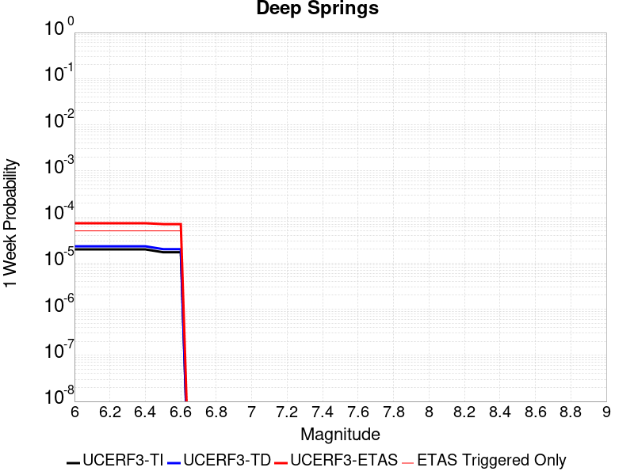 |  |  |  |

| Magnitude | 1 wk TI Prob | 1 wk TD Prob | 1 wk ETAS Prob | 1 wk ETAS/TD Gain | 1 wk ETAS Triggered Only | 1 mo TI Prob | 1 mo TD Prob | 1 mo ETAS Prob | 1 mo ETAS/TD Gain | 1 mo ETAS Triggered Only | 1 yr TI Prob | 1 yr TD Prob | 1 yr ETAS Prob | 1 yr ETAS/TD Gain | 1 yr ETAS Triggered Only | 10 yr TI Prob | 10 yr TD Prob | 10 yr ETAS Prob | 10 yr ETAS/TD Gain | 10 yr ETAS Triggered Only |
|-----|-----|-----|-----|-----|-----|-----|-----|-----|-----|-----|-----|-----|-----|-----|-----|-----|-----|-----|-----|-----|
| 6.0 | 1.9810619E-5 | 2.311252E-5 | 7.758343E-5 | 3.3567705 | 5.4472166E-5 | 8.489989E-5 | 9.905276E-5 | 1.5351953E-4 | 1.5498763 | 5.4472166E-5 | 0.001033166 | 0.0012058079 | 0.001314621 | 1.0902407 | 1.0894433E-4 | 0.010283757 | 0.012042425 | 0.012150058 | 1.0089377 | 1.0894433E-4 |
| 6.1 | 1.9810619E-5 | 2.311252E-5 | 7.758343E-5 | 3.3567705 | 5.4472166E-5 | 8.489989E-5 | 9.905276E-5 | 1.5351953E-4 | 1.5498763 | 5.4472166E-5 | 0.001033166 | 0.0012058079 | 0.001314621 | 1.0902407 | 1.0894433E-4 | 0.010283757 | 0.012042425 | 0.012150058 | 1.0089377 | 1.0894433E-4 |
| 6.2 | 1.9810619E-5 | 2.311252E-5 | 7.758343E-5 | 3.3567705 | 5.4472166E-5 | 8.489989E-5 | 9.905276E-5 | 1.5351953E-4 | 1.5498763 | 5.4472166E-5 | 0.001033166 | 0.0012058079 | 0.001314621 | 1.0902407 | 1.0894433E-4 | 0.010283757 | 0.012042425 | 0.012150058 | 1.0089377 | 1.0894433E-4 |
| 6.3 | 1.9810619E-5 | 2.311252E-5 | 7.758343E-5 | 3.3567705 | 5.4472166E-5 | 8.489989E-5 | 9.905276E-5 | 1.5351953E-4 | 1.5498763 | 5.4472166E-5 | 0.001033166 | 0.0012058079 | 0.001314621 | 1.0902407 | 1.0894433E-4 | 0.010283757 | 0.012042425 | 0.012150058 | 1.0089377 | 1.0894433E-4 |
| 6.4 | 1.9810619E-5 | 2.311252E-5 | 7.758343E-5 | 3.3567705 | 5.4472166E-5 | 8.489989E-5 | 9.905276E-5 | 1.5351953E-4 | 1.5498763 | 5.4472166E-5 | 0.001033166 | 0.0012058079 | 0.001314621 | 1.0902407 | 1.0894433E-4 | 0.010283757 | 0.012042425 | 0.012150058 | 1.0089377 | 1.0894433E-4 |
| 6.5 | 1.7190405E-5 | 2.0050555E-5 | 7.452163E-5 | 3.7166865 | 5.4472166E-5 | 7.367108E-5 | 8.593095E-5 | 1.4039844E-4 | 1.6338518 | 5.4472166E-5 | 8.9657627E-4 | 0.0010462094 | 0.0011550396 | 1.1040235 | 1.0894433E-4 | 0.008929676 | 0.010462056 | 0.010569861 | 1.0103043 | 1.0894433E-4 |
| 6.6 | 1.7190405E-5 | 2.0050555E-5 | 7.452163E-5 | 3.7166865 | 5.4472166E-5 | 7.367108E-5 | 8.593095E-5 | 1.4039844E-4 | 1.6338518 | 5.4472166E-5 | 8.9657627E-4 | 0.0010462094 | 0.0011550396 | 1.1040235 | 1.0894433E-4 | 0.008929676 | 0.010462056 | 0.010569861 | 1.0103043 | 1.0894433E-4 |

## Pine Mtn
*[(top)](#table-of-contents)*

| 1 Week | 1 Month | 1 Year | 10 Year |
|-----|-----|-----|-----|
|  |  |  | 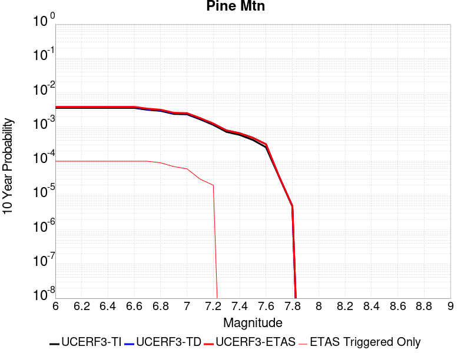 |

| Magnitude | 1 wk TI Prob | 1 wk TD Prob | 1 wk ETAS Prob | 1 wk ETAS/TD Gain | 1 wk ETAS Triggered Only | 1 mo TI Prob | 1 mo TD Prob | 1 mo ETAS Prob | 1 mo ETAS/TD Gain | 1 mo ETAS Triggered Only | 1 yr TI Prob | 1 yr TD Prob | 1 yr ETAS Prob | 1 yr ETAS/TD Gain | 1 yr ETAS Triggered Only | 10 yr TI Prob | 10 yr TD Prob | 10 yr ETAS Prob | 10 yr ETAS/TD Gain | 10 yr ETAS Triggered Only |
|-----|-----|-----|-----|-----|-----|-----|-----|-----|-----|-----|-----|-----|-----|-----|-----|-----|-----|-----|-----|-----|
| 6.0 | 6.894797E-6 | 7.225461E-6 | 7.225461E-6 | 1.0 | 0.0 | 2.9548795E-5 | 3.096591E-5 | 3.096591E-5 | 1.0 | 0.0 | 3.596972E-4 | 3.7694772E-4 | 4.3139936E-4 | 1.1444541 | 5.4472166E-5 | 0.0035911554 | 0.003763381 | 0.0038719154 | 1.0288396 | 1.0894433E-4 |
| 6.1 | 6.894797E-6 | 7.225461E-6 | 7.225461E-6 | 1.0 | 0.0 | 2.9548795E-5 | 3.096591E-5 | 3.096591E-5 | 1.0 | 0.0 | 3.596972E-4 | 3.7694772E-4 | 4.3139936E-4 | 1.1444541 | 5.4472166E-5 | 0.0035911554 | 0.003763381 | 0.0038719154 | 1.0288396 | 1.0894433E-4 |
| 6.2 | 6.894797E-6 | 7.225461E-6 | 7.225461E-6 | 1.0 | 0.0 | 2.9548795E-5 | 3.096591E-5 | 3.096591E-5 | 1.0 | 0.0 | 3.596972E-4 | 3.7694772E-4 | 4.3139936E-4 | 1.1444541 | 5.4472166E-5 | 0.0035911554 | 0.003763381 | 0.0038719154 | 1.0288396 | 1.0894433E-4 |
| 6.3 | 6.894797E-6 | 7.225461E-6 | 7.225461E-6 | 1.0 | 0.0 | 2.9548795E-5 | 3.096591E-5 | 3.096591E-5 | 1.0 | 0.0 | 3.596972E-4 | 3.7694772E-4 | 4.3139936E-4 | 1.1444541 | 5.4472166E-5 | 0.0035911554 | 0.003763381 | 0.0038719154 | 1.0288396 | 1.0894433E-4 |
| 6.4 | 6.894797E-6 | 7.225461E-6 | 7.225461E-6 | 1.0 | 0.0 | 2.9548795E-5 | 3.096591E-5 | 3.096591E-5 | 1.0 | 0.0 | 3.596972E-4 | 3.7694772E-4 | 4.3139936E-4 | 1.1444541 | 5.4472166E-5 | 0.0035911554 | 0.003763381 | 0.0038719154 | 1.0288396 | 1.0894433E-4 |
| 6.5 | 6.894797E-6 | 7.225461E-6 | 7.225461E-6 | 1.0 | 0.0 | 2.9548795E-5 | 3.096591E-5 | 3.096591E-5 | 1.0 | 0.0 | 3.596972E-4 | 3.7694772E-4 | 4.3139936E-4 | 1.1444541 | 5.4472166E-5 | 0.0035911554 | 0.003763381 | 0.0038719154 | 1.0288396 | 1.0894433E-4 |
| 6.6 | 6.894797E-6 | 7.225461E-6 | 7.225461E-6 | 1.0 | 0.0 | 2.9548795E-5 | 3.096591E-5 | 3.096591E-5 | 1.0 | 0.0 | 3.596972E-4 | 3.7694772E-4 | 4.3139936E-4 | 1.1444541 | 5.4472166E-5 | 0.0035911554 | 0.003763381 | 0.0038719154 | 1.0288396 | 1.0894433E-4 |
| 6.7 | 6.0867933E-6 | 6.3971133E-6 | 6.3971133E-6 | 1.0 | 0.0 | 2.6085996E-5 | 2.7415923E-5 | 2.7415923E-5 | 1.0 | 0.0 | 3.1755073E-4 | 3.3373994E-4 | 3.8819393E-4 | 1.163163 | 5.4472166E-5 | 0.0031709734 | 0.0033326065 | 0.0034411878 | 1.0325814 | 1.0894433E-4 |
| 6.8 | 5.6530425E-6 | 5.9505956E-6 | 5.9505956E-6 | 1.0 | 0.0 | 2.42271E-5 | 2.5502315E-5 | 2.5502315E-5 | 1.0 | 0.0 | 2.94925E-4 | 3.104485E-4 | 3.6490377E-4 | 1.1754084 | 5.4472166E-5 | 0.002945339 | 0.0031003528 | 0.0032089595 | 1.0350304 | 1.0894433E-4 |
| 6.9 | 4.6015225E-6 | 4.863834E-6 | 4.863834E-6 | 1.0 | 0.0 | 1.9720663E-5 | 2.0844845E-5 | 2.0844845E-5 | 1.0 | 0.0 | 2.4007261E-4 | 2.5375787E-4 | 3.0821623E-4 | 1.2146075 | 5.4472166E-5 | 0.0023981342 | 0.0025348254 | 0.0026434937 | 1.04287 | 1.0894433E-4 |
| 7.0 | 4.4875965E-6 | 4.747473E-6 | 4.747473E-6 | 1.0 | 0.0 | 1.9232413E-5 | 2.0346162E-5 | 2.0346162E-5 | 1.0 | 0.0 | 2.3412947E-4 | 2.4768783E-4 | 3.021465E-4 | 1.2198682 | 5.4472166E-5 | 0.0023388295 | 0.0024742614 | 0.002582936 | 1.0439221 | 1.0894433E-4 |
| 7.1 | 3.203907E-6 | 3.4294096E-6 | 3.4294096E-6 | 1.0 | 0.0 | 1.3730958E-5 | 1.4697391E-5 | 1.4697391E-5 | 1.0 | 0.0 | 1.6716159E-4 | 1.789267E-4 | 1.789267E-4 | 1.0 | 0.0 | 0.0016703589 | 0.0017878925 | 0.0018422673 | 1.0304128 | 5.4472166E-5 |
| 7.2 | 2.2060601E-6 | 2.3784817E-6 | 2.3784817E-6 | 1.0 | 0.0 | 9.4545085E-6 | 1.0193455E-5 | 1.0193455E-5 | 1.0 | 0.0 | 1.15102564E-4 | 1.240987E-4 | 1.240987E-4 | 1.0 | 0.0 | 0.0011504296 | 0.0012403389 | 0.0012947435 | 1.0438627 | 5.4472166E-5 |
| 7.3 | 1.3765207E-6 | 1.5216481E-6 | 1.5216481E-6 | 1.0 | 0.0 | 5.899361E-6 | 6.521333E-6 | 6.521333E-6 | 1.0 | 0.0 | 7.182235E-5 | 7.939443E-5 | 7.939443E-5 | 1.0 | 0.0 | 7.1799144E-4 | 7.936697E-4 | 7.936697E-4 | 1.0 | 0.0 |
| 7.4 | 1.1245983E-6 | 1.2587075E-6 | 1.2587075E-6 | 1.0 | 0.0 | 4.819698E-6 | 5.39445E-6 | 5.39445E-6 | 1.0 | 0.0 | 5.8678244E-5 | 6.567554E-5 | 6.567554E-5 | 1.0 | 0.0 | 5.866275E-4 | 6.5656955E-4 | 6.5656955E-4 | 1.0 | 0.0 |
| 7.5 | 8.031682E-7 | 9.276951E-7 | 9.276951E-7 | 1.0 | 0.0 | 3.4421448E-6 | 3.9758306E-6 | 3.9758306E-6 | 1.0 | 0.0 | 4.1907308E-5 | 4.840473E-5 | 4.840473E-5 | 1.0 | 0.0 | 4.1899405E-4 | 4.8394862E-4 | 4.8394862E-4 | 1.0 | 0.0 |
| 7.6 | 4.8953444E-7 | 6.003009E-7 | 6.003009E-7 | 1.0 | 0.0 | 2.098003E-6 | 2.5727159E-6 | 2.5727159E-6 | 1.0 | 0.0 | 2.5542888E-5 | 3.1322415E-5 | 3.1322415E-5 | 1.0 | 0.0 | 2.5539953E-4 | 3.1318486E-4 | 3.1318486E-4 | 1.0 | 0.0 |
| 7.7 | 6.634529E-8 | 6.788826E-8 | 6.788826E-8 | 1.0 | 0.0 | 2.843369E-7 | 2.9094966E-7 | 2.9094966E-7 | 1.0 | 0.0 | 3.4617963E-6 | 3.5423066E-6 | 3.5423066E-6 | 1.0 | 0.0 | 3.4617424E-5 | 3.542255E-5 | 3.542255E-5 | 1.0 | 0.0 |
| 7.8 | 9.235578E-9 | 9.488566E-9 | 9.488566E-9 | 1.0 | 0.0 | 3.9581046E-8 | 4.0665284E-8 | 4.0665284E-8 | 1.0 | 0.0 | 4.818991E-7 | 4.950997E-7 | 4.950997E-7 | 1.0 | 0.0 | 4.8189804E-6 | 4.950988E-6 | 4.950988E-6 | 1.0 | 0.0 |

## San Jacinto (Lytle Creek connector)
*[(top)](#table-of-contents)*

| 1 Week | 1 Month | 1 Year | 10 Year |
|-----|-----|-----|-----|
|  | 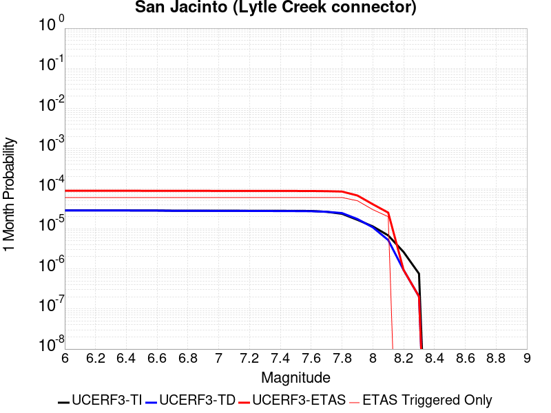 |  |  |

| Magnitude | 1 wk TI Prob | 1 wk TD Prob | 1 wk ETAS Prob | 1 wk ETAS/TD Gain | 1 wk ETAS Triggered Only | 1 mo TI Prob | 1 mo TD Prob | 1 mo ETAS Prob | 1 mo ETAS/TD Gain | 1 mo ETAS Triggered Only | 1 yr TI Prob | 1 yr TD Prob | 1 yr ETAS Prob | 1 yr ETAS/TD Gain | 1 yr ETAS Triggered Only | 10 yr TI Prob | 10 yr TD Prob | 10 yr ETAS Prob | 10 yr ETAS/TD Gain | 10 yr ETAS Triggered Only |
|-----|-----|-----|-----|-----|-----|-----|-----|-----|-----|-----|-----|-----|-----|-----|-----|-----|-----|-----|-----|-----|
| 6.0 | 6.693995E-6 | 6.660216E-6 | 1.1560382E-4 | 17.357368 | 1.0894433E-4 | 2.8688235E-5 | 2.854347E-5 | 1.3748469E-4 | 4.816677 | 1.0894433E-4 | 3.492233E-4 | 3.4746144E-4 | 4.563679E-4 | 1.3134347 | 1.0894433E-4 | 0.00348675 | 0.0035493854 | 0.0036579429 | 1.0305849 | 1.0894433E-4 |
| 6.1 | 6.693995E-6 | 6.660216E-6 | 1.1560382E-4 | 17.357368 | 1.0894433E-4 | 2.8688235E-5 | 2.854347E-5 | 1.3748469E-4 | 4.816677 | 1.0894433E-4 | 3.492233E-4 | 3.4746144E-4 | 4.563679E-4 | 1.3134347 | 1.0894433E-4 | 0.00348675 | 0.0035493854 | 0.0036579429 | 1.0305849 | 1.0894433E-4 |
| 6.2 | 6.693995E-6 | 6.660216E-6 | 1.1560382E-4 | 17.357368 | 1.0894433E-4 | 2.8688235E-5 | 2.854347E-5 | 1.3748469E-4 | 4.816677 | 1.0894433E-4 | 3.492233E-4 | 3.4746144E-4 | 4.563679E-4 | 1.3134347 | 1.0894433E-4 | 0.00348675 | 0.0035493854 | 0.0036579429 | 1.0305849 | 1.0894433E-4 |
| 6.3 | 6.693995E-6 | 6.660216E-6 | 1.1560382E-4 | 17.357368 | 1.0894433E-4 | 2.8688235E-5 | 2.854347E-5 | 1.3748469E-4 | 4.816677 | 1.0894433E-4 | 3.492233E-4 | 3.4746144E-4 | 4.563679E-4 | 1.3134347 | 1.0894433E-4 | 0.00348675 | 0.0035493854 | 0.0036579429 | 1.0305849 | 1.0894433E-4 |
| 6.4 | 6.693995E-6 | 6.660216E-6 | 1.1560382E-4 | 17.357368 | 1.0894433E-4 | 2.8688235E-5 | 2.854347E-5 | 1.3748469E-4 | 4.816677 | 1.0894433E-4 | 3.492233E-4 | 3.4746144E-4 | 4.563679E-4 | 1.3134347 | 1.0894433E-4 | 0.00348675 | 0.0035493854 | 0.0036579429 | 1.0305849 | 1.0894433E-4 |
| 6.5 | 6.6561875E-6 | 6.6204343E-6 | 1.1556404E-4 | 17.45566 | 1.0894433E-4 | 2.8526205E-5 | 2.837298E-5 | 1.3731421E-4 | 4.839612 | 1.0894433E-4 | 3.472512E-4 | 3.4538636E-4 | 4.5429307E-4 | 1.3153185 | 1.0894433E-4 | 0.0034670907 | 0.003528701 | 0.0036372608 | 1.0307648 | 1.0894433E-4 |
| 6.6 | 6.6561875E-6 | 6.6204343E-6 | 1.1556404E-4 | 17.45566 | 1.0894433E-4 | 2.8526205E-5 | 2.837298E-5 | 1.3731421E-4 | 4.839612 | 1.0894433E-4 | 3.472512E-4 | 3.4538636E-4 | 4.5429307E-4 | 1.3153185 | 1.0894433E-4 | 0.0034670907 | 0.003528701 | 0.0036372608 | 1.0307648 | 1.0894433E-4 |
| 6.7 | 6.5802237E-6 | 6.539611E-6 | 1.1548323E-4 | 17.659037 | 1.0894433E-4 | 2.8200653E-5 | 2.8026603E-5 | 1.3696788E-4 | 4.887067 | 1.0894433E-4 | 3.4328885E-4 | 3.4117055E-4 | 4.500777E-4 | 1.3192161 | 1.0894433E-4 | 0.0034275902 | 0.0034866752 | 0.0035952397 | 1.031137 | 1.0894433E-4 |
| 6.8 | 6.575632E-6 | 6.5341005E-6 | 1.1547772E-4 | 17.673086 | 1.0894433E-4 | 2.8180975E-5 | 2.8002989E-5 | 1.3694426E-4 | 4.8903446 | 1.0894433E-4 | 3.4304935E-4 | 3.4088313E-4 | 4.497903E-4 | 1.3194854 | 1.0894433E-4 | 0.0034252026 | 0.00348381 | 0.0035923747 | 1.0311626 | 1.0894433E-4 |
| 6.9 | 6.570433E-6 | 6.525495E-6 | 1.1546911E-4 | 17.695074 | 1.0894433E-4 | 2.8158694E-5 | 2.7966107E-5 | 1.3690739E-4 | 4.8954754 | 1.0894433E-4 | 3.4277816E-4 | 3.4043423E-4 | 4.4934146E-4 | 1.3199068 | 1.0894433E-4 | 0.0034224992 | 0.0034793352 | 0.0035879004 | 1.0312029 | 1.0894433E-4 |
| 7.0 | 6.5643826E-6 | 6.515616E-6 | 1.1545923E-4 | 17.720387 | 1.0894433E-4 | 2.8132765E-5 | 2.792377E-5 | 1.3686506E-4 | 4.901382 | 1.0894433E-4 | 3.424626E-4 | 3.3991894E-4 | 4.4882623E-4 | 1.320392 | 1.0894433E-4 | 0.0034193532 | 0.0034741985 | 0.0035827642 | 1.0312492 | 1.0894433E-4 |
| 7.1 | 6.557402E-6 | 6.5043278E-6 | 1.1544795E-4 | 17.749405 | 1.0894433E-4 | 2.8102848E-5 | 2.7875392E-5 | 1.3681668E-4 | 4.9081526 | 1.0894433E-4 | 3.4209844E-4 | 3.3933012E-4 | 4.482375E-4 | 1.3209481 | 1.0894433E-4 | 0.0034157229 | 0.0034683298 | 0.0035768964 | 1.0313022 | 1.0894433E-4 |
| 7.2 | 6.546394E-6 | 6.4862943E-6 | 1.1542992E-4 | 17.795973 | 1.0894433E-4 | 2.8055672E-5 | 2.7798109E-5 | 1.3673941E-4 | 4.9190183 | 1.0894433E-4 | 3.4152428E-4 | 3.3838948E-4 | 4.4729694E-4 | 1.3218405 | 1.0894433E-4 | 0.0034099987 | 0.0034589572 | 0.0035675245 | 1.0313873 | 1.0894433E-4 |
| 7.3 | 6.5364216E-6 | 6.4670803E-6 | 1.1541071E-4 | 17.845875 | 1.0894433E-4 | 2.8012933E-5 | 2.7715765E-5 | 1.3665708E-4 | 4.930662 | 1.0894433E-4 | 3.4100408E-4 | 3.3738726E-4 | 4.4629484E-4 | 1.322797 | 1.0894433E-4 | 0.003404813 | 0.0034489788 | 0.0035575475 | 1.0314785 | 1.0894433E-4 |
| 7.4 | 6.5269523E-6 | 6.4481674E-6 | 1.1539179E-4 | 17.895285 | 1.0894433E-4 | 2.7972354E-5 | 2.7634711E-5 | 1.3657603E-4 | 4.942191 | 1.0894433E-4 | 3.4051016E-4 | 3.3640073E-4 | 4.4530843E-4 | 1.3237438 | 1.0894433E-4 | 0.0033998888 | 0.003439161 | 0.0035477306 | 1.0315686 | 1.0894433E-4 |
| 7.5 | 6.5111835E-6 | 6.424442E-6 | 1.1536807E-4 | 17.95768 | 1.0894433E-4 | 2.7904773E-5 | 2.7533031E-5 | 1.3647437E-4 | 4.9567504 | 1.0894433E-4 | 3.3968766E-4 | 3.3516317E-4 | 4.44071E-4 | 1.3249397 | 1.0894433E-4 | 0.0033916887 | 0.003426834 | 0.003535405 | 1.0316826 | 1.0894433E-4 |
| 7.6 | 6.4768806E-6 | 6.383551E-6 | 1.1532719E-4 | 18.066305 | 1.0894433E-4 | 2.7757764E-5 | 2.735779E-5 | 1.3629913E-4 | 4.982096 | 1.0894433E-4 | 3.3789838E-4 | 3.3303024E-4 | 4.419383E-4 | 1.3270215 | 1.0894433E-4 | 0.0033738504 | 0.0034055663 | 0.0035141394 | 1.0318811 | 1.0894433E-4 |
| 7.7 | 6.1655364E-6 | 6.1760365E-6 | 1.1511969E-4 | 18.639736 | 1.0894433E-4 | 2.642346E-5 | 2.646846E-5 | 1.3540991E-4 | 5.1158967 | 1.0894433E-4 | 3.2165812E-4 | 3.2220592E-4 | 4.3111513E-4 | 1.3380113 | 1.0894433E-4 | 0.0032119295 | 0.0032971818 | 0.0034057668 | 1.0329328 | 1.0894433E-4 |
| 7.8 | 5.5043524E-6 | 5.737097E-6 | 1.146808E-4 | 19.989344 | 1.0894433E-4 | 2.3589868E-5 | 2.4587327E-5 | 1.3352897E-4 | 5.430805 | 1.0894433E-4 | 2.871688E-4 | 2.9930964E-4 | 4.0822136E-4 | 1.3638765 | 1.0894433E-4 | 0.0028679797 | 0.0030672832 | 0.0031758936 | 1.0354092 | 1.0894433E-4 |
| 7.9 | 3.889249E-6 | 4.076761E-6 | 5.8548703E-5 | 14.361574 | 5.4472166E-5 | 1.6668104E-5 | 1.7471715E-5 | 7.194293E-5 | 4.1176796 | 5.4472166E-5 | 2.0291525E-4 | 2.1269741E-4 | 2.67158E-4 | 1.2560472 | 5.4472166E-5 | 0.0020273007 | 0.0021943315 | 0.0022486842 | 1.0247695 | 5.4472166E-5 |
| 8.0 | 2.668535E-6 | 2.5315155E-6 | 2.5315155E-6 | 1.0 | 0.0 | 1.1436528E-5 | 1.0849307E-5 | 1.0849307E-5 | 1.0 | 0.0 | 1.3923083E-4 | 1.3208234E-4 | 1.3208234E-4 | 1.0 | 0.0 | 0.0013914363 | 0.0013757964 | 0.0013757964 | 1.0 | 0.0 |
| 8.1 | 1.5911459E-6 | 1.218661E-6 | 1.218661E-6 | 1.0 | 0.0 | 6.8191785E-6 | 5.2228224E-6 | 5.2228224E-6 | 1.0 | 0.0 | 8.3020335E-5 | 6.3586034E-5 | 6.3586034E-5 | 1.0 | 0.0 | 8.298933E-4 | 6.6932244E-4 | 6.6932244E-4 | 1.0 | 0.0 |
| 8.2 | 6.1294963E-7 | 2.1812275E-7 | 2.1812275E-7 | 1.0 | 0.0 | 2.6269242E-6 | 9.3481145E-7 | 9.3481145E-7 | 1.0 | 0.0 | 3.1982334E-5 | 1.138127E-5 | 1.138127E-5 | 1.0 | 0.0 | 3.1977732E-4 | 1.2784546E-4 | 1.2784546E-4 | 1.0 | 0.0 |
| 8.3 | 1.762871E-7 | 4.7546838E-8 | 4.7546838E-8 | 1.0 | 0.0 | 7.5551594E-7 | 2.0377215E-7 | 2.0377215E-7 | 1.0 | 0.0 | 9.1983675E-6 | 2.480923E-6 | 2.480923E-6 | 1.0 | 0.0 | 9.197987E-5 | 2.868753E-5 | 2.868753E-5 | 1.0 | 0.0 |

## Pinto Mtn
*[(top)](#table-of-contents)*

| 1 Week | 1 Month | 1 Year | 10 Year |
|-----|-----|-----|-----|
|  |  |  |  |

| Magnitude | 1 wk TI Prob | 1 wk TD Prob | 1 wk ETAS Prob | 1 wk ETAS/TD Gain | 1 wk ETAS Triggered Only | 1 mo TI Prob | 1 mo TD Prob | 1 mo ETAS Prob | 1 mo ETAS/TD Gain | 1 mo ETAS Triggered Only | 1 yr TI Prob | 1 yr TD Prob | 1 yr ETAS Prob | 1 yr ETAS/TD Gain | 1 yr ETAS Triggered Only | 10 yr TI Prob | 10 yr TD Prob | 10 yr ETAS Prob | 10 yr ETAS/TD Gain | 10 yr ETAS Triggered Only |
|-----|-----|-----|-----|-----|-----|-----|-----|-----|-----|-----|-----|-----|-----|-----|-----|-----|-----|-----|-----|-----|
| 6.0 | 4.4194956E-5 | 4.785362E-5 | 1.02323174E-4 | 2.1382537 | 5.4472166E-5 | 1.893932E-4 | 2.0507174E-4 | 2.5953274E-4 | 1.2655704 | 5.4472166E-5 | 0.0023034236 | 0.0024940541 | 0.0025483905 | 1.0217863 | 5.4472166E-5 | 0.022796938 | 0.024678145 | 0.024784401 | 1.0043057 | 1.0894433E-4 |
| 6.1 | 4.4194956E-5 | 4.785362E-5 | 1.02323174E-4 | 2.1382537 | 5.4472166E-5 | 1.893932E-4 | 2.0507174E-4 | 2.5953274E-4 | 1.2655704 | 5.4472166E-5 | 0.0023034236 | 0.0024940541 | 0.0025483905 | 1.0217863 | 5.4472166E-5 | 0.022796938 | 0.024678145 | 0.024784401 | 1.0043057 | 1.0894433E-4 |
| 6.2 | 4.4194956E-5 | 4.785362E-5 | 1.02323174E-4 | 2.1382537 | 5.4472166E-5 | 1.893932E-4 | 2.0507174E-4 | 2.5953274E-4 | 1.2655704 | 5.4472166E-5 | 0.0023034236 | 0.0024940541 | 0.0025483905 | 1.0217863 | 5.4472166E-5 | 0.022796938 | 0.024678145 | 0.024784401 | 1.0043057 | 1.0894433E-4 |
| 6.3 | 4.4194956E-5 | 4.785362E-5 | 1.02323174E-4 | 2.1382537 | 5.4472166E-5 | 1.893932E-4 | 2.0507174E-4 | 2.5953274E-4 | 1.2655704 | 5.4472166E-5 | 0.0023034236 | 0.0024940541 | 0.0025483905 | 1.0217863 | 5.4472166E-5 | 0.022796938 | 0.024678145 | 0.024784401 | 1.0043057 | 1.0894433E-4 |
| 6.4 | 3.729929E-5 | 3.9603186E-5 | 9.407319E-5 | 2.3753946 | 5.4472166E-5 | 1.5984432E-4 | 1.6971743E-4 | 2.2418034E-4 | 1.3209035 | 5.4472166E-5 | 0.0019443673 | 0.002064445 | 0.0021188047 | 1.0263314 | 5.4472166E-5 | 0.019274427 | 0.02046269 | 0.020569405 | 1.005215 | 1.0894433E-4 |
| 6.5 | 3.729929E-5 | 3.9603186E-5 | 9.407319E-5 | 2.3753946 | 5.4472166E-5 | 1.5984432E-4 | 1.6971743E-4 | 2.2418034E-4 | 1.3209035 | 5.4472166E-5 | 0.0019443673 | 0.002064445 | 0.0021188047 | 1.0263314 | 5.4472166E-5 | 0.019274427 | 0.02046269 | 0.020569405 | 1.005215 | 1.0894433E-4 |
| 6.6 | 3.0204548E-5 | 3.1205298E-5 | 3.1205298E-5 | 1.0 | 0.0 | 1.2944164E-4 | 1.3373033E-4 | 1.3373033E-4 | 1.0 | 0.0 | 0.0015748127 | 0.0016269855 | 0.0016269855 | 1.0 | 0.0 | 0.015636992 | 0.01615461 | 0.016208202 | 1.0033175 | 5.4472166E-5 |
| 6.7 | 2.9857754E-5 | 3.081468E-5 | 3.081468E-5 | 1.0 | 0.0 | 1.2795553E-4 | 1.3205643E-4 | 1.3205643E-4 | 1.0 | 0.0 | 0.0015567453 | 0.001606636 | 0.001606636 | 1.0 | 0.0 | 0.015458848 | 0.01595405 | 0.016007653 | 1.0033598 | 5.4472166E-5 |
| 6.8 | 2.4819734E-5 | 2.5009364E-5 | 2.5009364E-5 | 1.0 | 0.0 | 1.0636595E-4 | 1.07178705E-4 | 1.07178705E-4 | 1.0 | 0.0 | 0.0012942362 | 0.0013041412 | 0.0013041412 | 1.0 | 0.0 | 0.012867244 | 0.0129672475 | 0.013021013 | 1.0041463 | 5.4472166E-5 |
| 6.9 | 2.331124E-5 | 2.3337643E-5 | 2.3337643E-5 | 1.0 | 0.0 | 9.990149E-5 | 1.00014746E-4 | 1.00014746E-4 | 1.0 | 0.0 | 0.001215622 | 0.0012170197 | 0.0012170197 | 1.0 | 0.0 | 0.012089936 | 0.012105742 | 0.012105742 | 1.0 | 0.0 |
| 7.0 | 2.1818534E-5 | 2.1760772E-5 | 2.1760772E-5 | 1.0 | 0.0 | 9.3504656E-5 | 9.325723E-5 | 9.325723E-5 | 1.0 | 0.0 | 0.0011378246 | 0.0011348352 | 0.0011348352 | 1.0 | 0.0 | 0.011320163 | 0.011292503 | 0.011292503 | 1.0 | 0.0 |
| 7.1 | 2.066081E-5 | 2.0540418E-5 | 2.0540418E-5 | 1.0 | 0.0 | 8.854332E-5 | 8.8027504E-5 | 8.8027504E-5 | 1.0 | 0.0 | 0.0010774818 | 0.0010712275 | 0.0010712275 | 1.0 | 0.0 | 0.010722724 | 0.010662688 | 0.010662688 | 1.0 | 0.0 |
| 7.2 | 1.8990233E-5 | 1.9053701E-5 | 1.9053701E-5 | 1.0 | 0.0 | 8.138417E-5 | 8.1656275E-5 | 8.1656275E-5 | 1.0 | 0.0 | 9.904018E-4 | 9.937311E-4 | 9.937311E-4 | 1.0 | 0.0 | 0.009859995 | 0.009894874 | 0.009894874 | 1.0 | 0.0 |
| 7.3 | 1.3335872E-5 | 1.4906372E-5 | 1.4906372E-5 | 1.0 | 0.0 | 5.7152483E-5 | 6.388296E-5 | 6.388296E-5 | 1.0 | 0.0 | 6.956093E-4 | 7.775102E-4 | 7.775102E-4 | 1.0 | 0.0 | 0.006934359 | 0.0077491994 | 0.0077491994 | 1.0 | 0.0 |
| 7.4 | 9.414066E-6 | 1.186061E-5 | 1.186061E-5 | 1.0 | 0.0 | 4.0345374E-5 | 5.0830247E-5 | 5.0830247E-5 | 1.0 | 0.0 | 4.910942E-4 | 6.1869196E-4 | 6.1869196E-4 | 1.0 | 0.0 | 0.0049001034 | 0.006170644 | 0.006170644 | 1.0 | 0.0 |
| 7.5 | 7.2101157E-6 | 9.157893E-6 | 9.157893E-6 | 1.0 | 0.0 | 3.090013E-5 | 3.924757E-5 | 3.924757E-5 | 1.0 | 0.0 | 3.7614413E-4 | 4.7774217E-4 | 4.7774217E-4 | 1.0 | 0.0 | 0.0037550807 | 0.004767927 | 0.004767927 | 1.0 | 0.0 |
| 7.6 | 3.296375E-6 | 4.5453176E-6 | 4.5453176E-6 | 1.0 | 0.0 | 1.4127245E-5 | 1.9479796E-5 | 1.9479796E-5 | 1.0 | 0.0 | 1.7198564E-4 | 2.3714209E-4 | 2.3714209E-4 | 1.0 | 0.0 | 0.0017185259 | 0.0023690276 | 0.0023690276 | 1.0 | 0.0 |
| 7.7 | 2.5741092E-6 | 3.584251E-6 | 3.584251E-6 | 1.0 | 0.0 | 1.103185E-5 | 1.5360993E-5 | 1.5360993E-5 | 1.0 | 0.0 | 1.3430449E-4 | 1.8700535E-4 | 1.8700535E-4 | 1.0 | 0.0 | 0.0013422335 | 0.0018686098 | 0.0018686098 | 1.0 | 0.0 |

## San Andreas (Santa Cruz Mts) 2011 CFM
*[(top)](#table-of-contents)*

| 1 Week | 1 Month | 1 Year | 10 Year |
|-----|-----|-----|-----|
|  |  |  |  |

| Magnitude | 1 wk TI Prob | 1 wk TD Prob | 1 wk ETAS Prob | 1 wk ETAS/TD Gain | 1 wk ETAS Triggered Only | 1 mo TI Prob | 1 mo TD Prob | 1 mo ETAS Prob | 1 mo ETAS/TD Gain | 1 mo ETAS Triggered Only | 1 yr TI Prob | 1 yr TD Prob | 1 yr ETAS Prob | 1 yr ETAS/TD Gain | 1 yr ETAS Triggered Only | 10 yr TI Prob | 10 yr TD Prob | 10 yr ETAS Prob | 10 yr ETAS/TD Gain | 10 yr ETAS Triggered Only |
|-----|-----|-----|-----|-----|-----|-----|-----|-----|-----|-----|-----|-----|-----|-----|-----|-----|-----|-----|-----|-----|
| 6.0 | 1.7221631E-4 | 1.3793171E-4 | 1.9239636E-4 | 1.3948668 | 5.4472166E-5 | 7.378611E-4 | 5.9100403E-4 | 6.9988397E-4 | 1.1842288 | 1.0894433E-4 | 0.008946515 | 0.007172124 | 0.007280287 | 1.015081 | 1.0894433E-4 | 0.08594794 | 0.0705551 | 0.07065635 | 1.0014352 | 1.0894433E-4 |
| 6.1 | 1.7221631E-4 | 1.3793171E-4 | 1.9239636E-4 | 1.3948668 | 5.4472166E-5 | 7.378611E-4 | 5.9100403E-4 | 6.9988397E-4 | 1.1842288 | 1.0894433E-4 | 0.008946515 | 0.007172124 | 0.007280287 | 1.015081 | 1.0894433E-4 | 0.08594794 | 0.0705551 | 0.07065635 | 1.0014352 | 1.0894433E-4 |
| 6.2 | 1.7221631E-4 | 1.3793171E-4 | 1.9239636E-4 | 1.3948668 | 5.4472166E-5 | 7.378611E-4 | 5.9100403E-4 | 6.9988397E-4 | 1.1842288 | 1.0894433E-4 | 0.008946515 | 0.007172124 | 0.007280287 | 1.015081 | 1.0894433E-4 | 0.08594794 | 0.0705551 | 0.07065635 | 1.0014352 | 1.0894433E-4 |
| 6.3 | 1.716926E-4 | 1.3712609E-4 | 1.9159078E-4 | 1.397187 | 5.4472166E-5 | 7.3561794E-4 | 5.875529E-4 | 6.964332E-4 | 1.1853116 | 1.0894433E-4 | 0.008919428 | 0.0071303817 | 0.007238549 | 1.01517 | 1.0894433E-4 | 0.08569809 | 0.070167266 | 0.070268564 | 1.0014437 | 1.0894433E-4 |
| 6.4 | 1.6392978E-4 | 1.3588481E-4 | 1.9034957E-4 | 1.4008157 | 5.4472166E-5 | 7.02367E-4 | 5.822355E-4 | 6.9111644E-4 | 1.1870049 | 1.0894433E-4 | 0.008517839 | 0.007066063 | 0.0071742376 | 1.015309 | 1.0894433E-4 | 0.08198654 | 0.06940135 | 0.06950273 | 1.0014608 | 1.0894433E-4 |
| 6.5 | 1.5742714E-4 | 1.2648388E-4 | 1.8094915E-4 | 1.4306104 | 5.4472166E-5 | 6.745133E-4 | 5.4196286E-4 | 6.5084815E-4 | 1.2009091 | 1.0894433E-4 | 0.00818132 | 0.0065787593 | 0.006686987 | 1.0164511 | 1.0894433E-4 | 0.078865945 | 0.06486309 | 0.06496497 | 1.0015707 | 1.0894433E-4 |
| 6.6 | 1.3038084E-4 | 1.1588213E-4 | 1.7034798E-4 | 1.4700108 | 5.4472166E-5 | 5.5865536E-4 | 4.9654447E-4 | 6.054347E-4 | 1.219296 | 1.0894433E-4 | 0.006780438 | 0.0060289134 | 0.0061372006 | 1.0179614 | 1.0894433E-4 | 0.0657725 | 0.05932738 | 0.05942986 | 1.0017273 | 1.0894433E-4 |
| 6.7 | 1.2867592E-4 | 1.1314701E-4 | 1.67613E-4 | 1.4813738 | 5.4472166E-5 | 5.5135164E-4 | 4.8482692E-4 | 5.9371843E-4 | 1.2245988 | 1.0894433E-4 | 0.0066920654 | 0.00588703 | 0.005995333 | 1.0183969 | 1.0894433E-4 | 0.06494093 | 0.058038417 | 0.058141038 | 1.0017681 | 1.0894433E-4 |
| 6.8 | 1.2801298E-4 | 1.1252261E-4 | 1.6698866E-4 | 1.4840453 | 5.4472166E-5 | 5.485117E-4 | 4.8215193E-4 | 5.9104373E-4 | 1.2258455 | 1.0894433E-4 | 0.0066577005 | 0.0058546383 | 0.0059629446 | 1.0184993 | 1.0894433E-4 | 0.06461738 | 0.057752274 | 0.057854924 | 1.0017774 | 1.0894433E-4 |
| 6.9 | 1.269149E-4 | 1.1094465E-4 | 1.6541078E-4 | 1.4909306 | 5.4472166E-5 | 5.4380763E-4 | 4.7539172E-4 | 5.8428425E-4 | 1.2290585 | 1.0894433E-4 | 0.006600777 | 0.005772772 | 0.0058810874 | 1.0187632 | 1.0894433E-4 | 0.06408122 | 0.0570241 | 0.05712683 | 1.0018016 | 1.0894433E-4 |
| 7.0 | 1.2030331E-4 | 1.0824504E-4 | 1.6271131E-4 | 1.5031756 | 5.4472166E-5 | 5.154837E-4 | 4.638261E-4 | 5.727199E-4 | 1.2347729 | 1.0894433E-4 | 0.006257969 | 0.0056326967 | 0.005741027 | 1.0192325 | 1.0894433E-4 | 0.06084648 | 0.055696685 | 0.055799562 | 1.001847 | 1.0894433E-4 |
| 7.1 | 8.049617E-5 | 5.3926604E-5 | 1.0839583E-4 | 2.0100622 | 5.4472166E-5 | 3.4493793E-4 | 2.3109373E-4 | 2.855533E-4 | 1.2356601 | 5.4472166E-5 | 0.0041915346 | 0.0028099709 | 0.00286429 | 1.0193309 | 5.4472166E-5 | 0.041133516 | 0.029618956 | 0.029671814 | 1.0017847 | 5.4472166E-5 |
| 7.2 | 7.093979E-5 | 4.2937932E-5 | 9.7407756E-5 | 2.2685714 | 5.4472166E-5 | 3.0399222E-4 | 1.8400686E-4 | 2.38469E-4 | 1.2959789 | 5.4472166E-5 | 0.0036948253 | 0.0022380045 | 0.0022923548 | 1.0242852 | 5.4472166E-5 | 0.03633994 | 0.023941692 | 0.02399486 | 1.0022207 | 5.4472166E-5 |
| 7.3 | 6.193693E-5 | 2.8894141E-5 | 8.3364735E-5 | 2.8851776 | 5.4472166E-5 | 2.6541698E-4 | 1.2382616E-4 | 1.7829158E-4 | 1.4398539 | 5.4472166E-5 | 0.0032266637 | 0.0015065427 | 0.0015609328 | 1.0361027 | 5.4472166E-5 | 0.031802133 | 0.016499156 | 0.01655273 | 1.003247 | 5.4472166E-5 |
| 7.4 | 5.906492E-5 | 2.702346E-5 | 8.149415E-5 | 3.0156817 | 5.4472166E-5 | 2.5311083E-4 | 1.1580969E-4 | 1.7027555E-4 | 1.4703048 | 5.4472166E-5 | 0.0030772698 | 0.0014090725 | 0.001463468 | 1.0386037 | 5.4472166E-5 | 0.030350044 | 0.015471023 | 0.015524652 | 1.0034665 | 5.4472166E-5 |
| 7.5 | 5.424296E-5 | 2.4678277E-5 | 7.91491E-5 | 3.2072377 | 5.4472166E-5 | 2.324491E-4 | 1.05759755E-4 | 1.6022616E-4 | 1.5150012 | 5.4472166E-5 | 0.002826395 | 0.0012868657 | 0.0013412677 | 1.0422748 | 5.4472166E-5 | 0.027907165 | 0.014163188 | 0.014216888 | 1.0037916 | 5.4472166E-5 |
| 7.6 | 4.43084E-5 | 1.990431E-5 | 7.437539E-5 | 3.7366476 | 5.4472166E-5 | 1.8987931E-4 | 8.53014E-5 | 1.3976892E-4 | 1.6385303 | 5.4472166E-5 | 0.0023093296 | 0.0010380499 | 0.0010924656 | 1.052421 | 5.4472166E-5 | 0.022854783 | 0.011412679 | 0.01146653 | 1.0047184 | 5.4472166E-5 |
| 7.7 | 4.118098E-5 | 1.8936442E-5 | 7.340757E-5 | 3.8765242 | 5.4472166E-5 | 1.7647797E-4 | 8.115366E-5 | 1.356214E-4 | 1.6711681 | 5.4472166E-5 | 0.002146502 | 9.875982E-4 | 0.0010420165 | 1.0551018 | 5.4472166E-5 | 0.021258866 | 0.010870468 | 0.010924348 | 1.0049566 | 5.4472166E-5 |
| 7.8 | 3.5408906E-5 | 1.856446E-5 | 7.303561E-5 | 3.934163 | 5.4472166E-5 | 1.5174363E-4 | 7.955955E-5 | 1.3402737E-4 | 1.6846172 | 5.4472166E-5 | 0.0018459131 | 9.682073E-4 | 0.0010226268 | 1.0562063 | 5.4472166E-5 | 0.018306552 | 0.010652021 | 0.0107059125 | 1.0050594 | 5.4472166E-5 |
| 7.9 | 2.5860836E-5 | 1.7315993E-5 | 7.178722E-5 | 4.1457176 | 5.4472166E-5 | 1.10827445E-4 | 7.420929E-5 | 1.286774E-4 | 1.7339798 | 5.4472166E-5 | 0.001348489 | 9.031238E-4 | 9.575468E-4 | 1.0602608 | 5.4472166E-5 | 0.013403354 | 0.009907599 | 0.0099615315 | 1.0054436 | 5.4472166E-5 |
| 8.0 | 1.9777332E-5 | 1.4839596E-5 | 6.9310954E-5 | 4.6706767 | 5.4472166E-5 | 8.4757245E-5 | 6.3596715E-5 | 1.1806542E-4 | 1.8564703 | 5.4472166E-5 | 0.0010314309 | 7.740152E-4 | 8.284452E-4 | 1.0703217 | 5.4472166E-5 | 0.010266567 | 0.008508967 | 0.0085629765 | 1.0063473 | 5.4472166E-5 |
| 8.1 | 1.468494E-5 | 1.2107374E-5 | 1.2107374E-5 | 1.0 | 0.0 | 6.293394E-5 | 5.1887713E-5 | 5.1887713E-5 | 1.0 | 0.0 | 7.6595135E-4 | 6.3155E-4 | 6.3155E-4 | 1.0 | 0.0 | 0.0076331664 | 0.006969149 | 0.006969149 | 1.0 | 0.0 |
| 8.2 | 8.63836E-6 | 5.469061E-6 | 5.469061E-6 | 1.0 | 0.0 | 3.7021015E-5 | 2.3438623E-5 | 2.3438623E-5 | 1.0 | 0.0 | 4.5063766E-4 | 2.8532793E-4 | 2.8532793E-4 | 1.0 | 0.0 | 0.004497249 | 0.00324569 | 0.00324569 | 1.0 | 0.0 |
| 8.3 | 1.983087E-6 | 7.6599065E-7 | 7.6599065E-7 | 1.0 | 0.0 | 8.498917E-6 | 3.282813E-6 | 3.282813E-6 | 1.0 | 0.0 | 1.034694E-4 | 3.9967534E-5 | 3.9967534E-5 | 1.0 | 0.0 | 0.0010342124 | 4.719687E-4 | 4.719687E-4 | 1.0 | 0.0 |

## Camp Rock 2011
*[(top)](#table-of-contents)*

| 1 Week | 1 Month | 1 Year | 10 Year |
|-----|-----|-----|-----|
|  |  |  |  |

| Magnitude | 1 wk TI Prob | 1 wk TD Prob | 1 wk ETAS Prob | 1 wk ETAS/TD Gain | 1 wk ETAS Triggered Only | 1 mo TI Prob | 1 mo TD Prob | 1 mo ETAS Prob | 1 mo ETAS/TD Gain | 1 mo ETAS Triggered Only | 1 yr TI Prob | 1 yr TD Prob | 1 yr ETAS Prob | 1 yr ETAS/TD Gain | 1 yr ETAS Triggered Only | 10 yr TI Prob | 10 yr TD Prob | 10 yr ETAS Prob | 10 yr ETAS/TD Gain | 10 yr ETAS Triggered Only |
|-----|-----|-----|-----|-----|-----|-----|-----|-----|-----|-----|-----|-----|-----|-----|-----|-----|-----|-----|-----|-----|
| 6.0 | 1.6710783E-5 | 4.25026E-6 | 1.13194124E-4 | 26.63228 | 1.0894433E-4 | 7.161568E-5 | 1.8215276E-5 | 1.2715762E-4 | 6.980823 | 1.0894433E-4 | 8.7157206E-4 | 2.2174895E-4 | 3.3066914E-4 | 1.4911869 | 1.0894433E-4 | 0.008681616 | 0.0022153298 | 0.0023240326 | 1.0490686 | 1.0894433E-4 |
| 6.1 | 1.6710783E-5 | 4.25026E-6 | 1.13194124E-4 | 26.63228 | 1.0894433E-4 | 7.161568E-5 | 1.8215276E-5 | 1.2715762E-4 | 6.980823 | 1.0894433E-4 | 8.7157206E-4 | 2.2174895E-4 | 3.3066914E-4 | 1.4911869 | 1.0894433E-4 | 0.008681616 | 0.0022153298 | 0.0023240326 | 1.0490686 | 1.0894433E-4 |
| 6.2 | 1.6710783E-5 | 4.25026E-6 | 1.13194124E-4 | 26.63228 | 1.0894433E-4 | 7.161568E-5 | 1.8215276E-5 | 1.2715762E-4 | 6.980823 | 1.0894433E-4 | 8.7157206E-4 | 2.2174895E-4 | 3.3066914E-4 | 1.4911869 | 1.0894433E-4 | 0.008681616 | 0.0022153298 | 0.0023240326 | 1.0490686 | 1.0894433E-4 |
| 6.3 | 1.6710783E-5 | 4.25026E-6 | 1.13194124E-4 | 26.63228 | 1.0894433E-4 | 7.161568E-5 | 1.8215276E-5 | 1.2715762E-4 | 6.980823 | 1.0894433E-4 | 8.7157206E-4 | 2.2174895E-4 | 3.3066914E-4 | 1.4911869 | 1.0894433E-4 | 0.008681616 | 0.0022153298 | 0.0023240326 | 1.0490686 | 1.0894433E-4 |
| 6.4 | 7.982846E-6 | 3.6820884E-6 | 1.1262602E-4 | 30.587536 | 1.0894433E-4 | 3.421175E-5 | 1.5780286E-5 | 1.247229E-4 | 7.903716 | 1.0894433E-4 | 4.1644843E-4 | 1.9210839E-4 | 3.0103177E-4 | 1.5669893 | 1.0894433E-4 | 0.0041566887 | 0.001919458 | 0.0020281933 | 1.056649 | 1.0894433E-4 |
| 6.5 | 7.982846E-6 | 3.6820884E-6 | 1.1262602E-4 | 30.587536 | 1.0894433E-4 | 3.421175E-5 | 1.5780286E-5 | 1.247229E-4 | 7.903716 | 1.0894433E-4 | 4.1644843E-4 | 1.9210839E-4 | 3.0103177E-4 | 1.5669893 | 1.0894433E-4 | 0.0041566887 | 0.001919458 | 0.0020281933 | 1.056649 | 1.0894433E-4 |
| 6.6 | 7.048869E-6 | 3.4243571E-6 | 1.1236831E-4 | 32.814426 | 1.0894433E-4 | 3.0209088E-5 | 1.4675736E-5 | 1.2361846E-4 | 8.423324 | 1.0894433E-4 | 3.677336E-4 | 1.7866275E-4 | 2.875876E-4 | 1.6096674 | 1.0894433E-4 | 0.0036712566 | 0.0017852228 | 0.0018939726 | 1.0609167 | 1.0894433E-4 |
| 6.7 | 6.987307E-6 | 3.3623348E-6 | 1.123063E-4 | 33.401283 | 1.0894433E-4 | 2.9945259E-5 | 1.4409929E-5 | 1.2335269E-4 | 8.560257 | 1.0894433E-4 | 3.6452254E-4 | 1.7542706E-4 | 2.8435228E-4 | 1.6209146 | 1.0894433E-4 | 0.0036392517 | 0.001752917 | 0.0018616703 | 1.0620414 | 1.0894433E-4 |
| 6.8 | 6.3737602E-6 | 3.1179077E-6 | 1.120619E-4 | 35.94138 | 1.0894433E-4 | 2.731583E-5 | 1.3362394E-5 | 1.2230527E-4 | 9.1529455 | 1.0894433E-4 | 3.3251947E-4 | 1.626753E-4 | 2.716019E-4 | 1.6695952 | 1.0894433E-4 | 0.0033202237 | 0.0016255907 | 0.001734358 | 1.0669093 | 1.0894433E-4 |
| 6.9 | 6.112211E-6 | 2.9331156E-6 | 1.11877125E-4 | 38.14276 | 1.0894433E-4 | 2.6194928E-5 | 1.2570436E-5 | 1.21513396E-4 | 9.666601 | 1.0894433E-4 | 3.1887658E-4 | 1.5303459E-4 | 2.6196224E-4 | 1.7117845 | 1.0894433E-4 | 0.003184194 | 0.0015293199 | 0.0016380976 | 1.0711281 | 1.0894433E-4 |
| 7.0 | 5.5140117E-6 | 2.641923E-6 | 1.1158596E-4 | 42.236645 | 1.0894433E-4 | 2.3631264E-5 | 1.132248E-5 | 1.2026558E-4 | 10.621841 | 1.0894433E-4 | 2.8767265E-4 | 1.3784273E-4 | 2.4677202E-4 | 1.7902435 | 1.0894433E-4 | 0.0028730053 | 0.0013775975 | 0.0014863918 | 1.0789739 | 1.0894433E-4 |
| 7.1 | 4.8151105E-6 | 2.1342705E-6 | 1.1107837E-4 | 52.045124 | 1.0894433E-4 | 2.0636026E-5 | 9.146843E-6 | 1.18090175E-4 | 12.910485 | 1.0894433E-4 | 2.5121463E-4 | 1.1135734E-4 | 2.2028954E-4 | 1.978222 | 1.0894433E-4 | 0.0025093083 | 0.0011130372 | 0.0012218603 | 1.0977713 | 1.0894433E-4 |
| 7.2 | 3.818335E-6 | 1.2937425E-6 | 5.5765835E-5 | 43.10428 | 5.4472166E-5 | 1.6364189E-5 | 5.5445994E-6 | 6.001646E-5 | 10.82431 | 5.4472166E-5 | 1.9921579E-4 | 6.750349E-5 | 1.2197198E-4 | 1.8068988 | 5.4472166E-5 | 0.0019903728 | 6.748381E-4 | 7.292735E-4 | 1.0806644 | 5.4472166E-5 |
| 7.3 | 2.7166698E-6 | 7.3835776E-7 | 5.5210483E-5 | 74.774704 | 5.4472166E-5 | 1.1642818E-5 | 3.1643867E-6 | 5.763638E-5 | 18.214075 | 5.4472166E-5 | 1.4174209E-4 | 3.8525748E-5 | 9.299581E-5 | 2.4138613 | 5.4472166E-5 | 0.0014165172 | 3.851927E-4 | 4.3964386E-4 | 1.1413609 | 5.4472166E-5 |
| 7.4 | 2.0893426E-6 | 5.4618386E-7 | 5.5018318E-5 | 100.73223 | 5.4472166E-5 | 8.954295E-6 | 2.3407858E-6 | 5.6812823E-5 | 24.270834 | 5.4472166E-5 | 1.0901308E-4 | 2.84987E-5 | 8.2969316E-5 | 2.9113367 | 5.4472166E-5 | 0.0010895962 | 2.84951E-4 | 3.3940765E-4 | 1.1911088 | 5.4472166E-5 |
| 7.5 | 1.1681728E-6 | 3.6030585E-7 | 5.483245E-5 | 152.18307 | 5.4472166E-5 | 5.0064455E-6 | 1.544167E-6 | 5.6016248E-5 | 36.276028 | 5.4472166E-5 | 6.0951766E-5 | 1.8800076E-5 | 7.3271214E-5 | 3.8973894 | 5.4472166E-5 | 6.093505E-4 | 1.8798532E-4 | 2.4244725E-4 | 1.2897137 | 5.4472166E-5 |
| 7.6 | 1.3154387E-7 | 7.1197384E-8 | 7.1197384E-8 | 1.0 | 0.0 | 5.6375933E-7 | 3.051316E-7 | 3.051316E-7 | 1.0 | 0.0 | 6.863748E-6 | 3.7149728E-6 | 3.7149728E-6 | 1.0 | 0.0 | 6.863536E-5 | 3.7149264E-5 | 3.7149264E-5 | 1.0 | 0.0 |

## Sheephole
*[(top)](#table-of-contents)*

| 1 Week | 1 Month | 1 Year | 10 Year |
|-----|-----|-----|-----|
|  |  |  |  |

| Magnitude | 1 wk TI Prob | 1 wk TD Prob | 1 wk ETAS Prob | 1 wk ETAS/TD Gain | 1 wk ETAS Triggered Only | 1 mo TI Prob | 1 mo TD Prob | 1 mo ETAS Prob | 1 mo ETAS/TD Gain | 1 mo ETAS Triggered Only | 1 yr TI Prob | 1 yr TD Prob | 1 yr ETAS Prob | 1 yr ETAS/TD Gain | 1 yr ETAS Triggered Only | 10 yr TI Prob | 10 yr TD Prob | 10 yr ETAS Prob | 10 yr ETAS/TD Gain | 10 yr ETAS Triggered Only |
|-----|-----|-----|-----|-----|-----|-----|-----|-----|-----|-----|-----|-----|-----|-----|-----|-----|-----|-----|-----|-----|
| 6.0 | 4.5579695E-6 | 4.7412627E-6 | 4.7412627E-6 | 1.0 | 0.0 | 1.9534009E-5 | 2.031957E-5 | 7.479063E-5 | 3.6807191 | 5.4472166E-5 | 2.3780059E-4 | 2.473682E-4 | 3.562856E-4 | 1.4403046 | 1.0894433E-4 | 0.0023754628 | 0.002471473 | 0.0025801482 | 1.0439718 | 1.0894433E-4 |
| 6.1 | 4.5579695E-6 | 4.7412627E-6 | 4.7412627E-6 | 1.0 | 0.0 | 1.9534009E-5 | 2.031957E-5 | 7.479063E-5 | 3.6807191 | 5.4472166E-5 | 2.3780059E-4 | 2.473682E-4 | 3.562856E-4 | 1.4403046 | 1.0894433E-4 | 0.0023754628 | 0.002471473 | 0.0025801482 | 1.0439718 | 1.0894433E-4 |
| 6.2 | 2.6677674E-6 | 2.7873941E-6 | 2.7873941E-6 | 1.0 | 0.0 | 1.1433239E-5 | 1.1945926E-5 | 6.6417444E-5 | 5.55984 | 5.4472166E-5 | 1.3919079E-4 | 1.4543302E-4 | 1.9989727E-4 | 1.374497 | 5.4472166E-5 | 0.0013910364 | 0.0014534844 | 0.0015078774 | 1.0374225 | 5.4472166E-5 |
| 6.3 | 2.6677674E-6 | 2.7873941E-6 | 2.7873941E-6 | 1.0 | 0.0 | 1.1433239E-5 | 1.1945926E-5 | 6.6417444E-5 | 5.55984 | 5.4472166E-5 | 1.3919079E-4 | 1.4543302E-4 | 1.9989727E-4 | 1.374497 | 5.4472166E-5 | 0.0013910364 | 0.0014534844 | 0.0015078774 | 1.0374225 | 5.4472166E-5 |
| 6.4 | 2.2159759E-6 | 2.3228788E-6 | 2.3228788E-6 | 1.0 | 0.0 | 9.497005E-6 | 9.955161E-6 | 6.4426786E-5 | 6.471697 | 5.4472166E-5 | 1.156199E-4 | 1.2119815E-4 | 1.7566372E-4 | 1.4493927 | 5.4472166E-5 | 0.0011555976 | 0.0012113999 | 0.001265806 | 1.0449119 | 5.4472166E-5 |
| 6.5 | 2.1986082E-6 | 2.304759E-6 | 2.304759E-6 | 1.0 | 0.0 | 9.4225725E-6 | 9.877506E-6 | 6.434913E-5 | 6.5147147 | 5.4472166E-5 | 1.1471378E-4 | 1.2025281E-4 | 1.7471841E-4 | 1.4529259 | 5.4472166E-5 | 0.0011465458 | 0.0012019566 | 0.0012563633 | 1.0452651 | 5.4472166E-5 |
| 6.6 | 1.5232331E-6 | 1.6018919E-6 | 1.6018919E-6 | 1.0 | 0.0 | 6.5281256E-6 | 6.865234E-6 | 6.133702E-5 | 8.934441 | 5.4472166E-5 | 7.947703E-5 | 8.35812E-5 | 1.3804881E-4 | 1.651673 | 5.4472166E-5 | 7.9448614E-4 | 8.3551643E-4 | 8.8994304E-4 | 1.0651413 | 5.4472166E-5 |
| 6.7 | 1.3137362E-6 | 1.382819E-6 | 1.382819E-6 | 1.0 | 0.0 | 5.6302856E-6 | 5.926355E-6 | 6.0398197E-5 | 10.191459 | 5.4472166E-5 | 6.854657E-5 | 7.215112E-5 | 1.2661936E-4 | 1.7549188 | 5.4472166E-5 | 6.8525434E-4 | 7.212908E-4 | 7.757237E-4 | 1.0754659 | 5.4472166E-5 |
| 6.8 | 1.2275751E-6 | 1.2922847E-6 | 1.2922847E-6 | 1.0 | 0.0 | 5.2610258E-6 | 5.5383516E-6 | 6.0010214E-5 | 10.835392 | 5.4472166E-5 | 6.4051106E-5 | 6.7427485E-5 | 1.2189597E-4 | 1.8078085 | 5.4472166E-5 | 6.4032647E-4 | 6.740836E-4 | 7.2851905E-4 | 1.0807548 | 5.4472166E-5 |
| 6.9 | 1.1837088E-6 | 1.246102E-6 | 1.246102E-6 | 1.0 | 0.0 | 5.0730278E-6 | 5.340427E-6 | 5.98123E-5 | 11.19991 | 5.4472166E-5 | 6.176237E-5 | 6.501789E-5 | 1.1948652E-4 | 1.8377482 | 5.4472166E-5 | 6.17452E-4 | 6.5000186E-4 | 7.044386E-4 | 1.0837486 | 5.4472166E-5 |
| 7.0 | 9.849371E-7 | 1.0366288E-6 | 1.0366288E-6 | 1.0 | 0.0 | 4.2211523E-6 | 4.442688E-6 | 5.891461E-5 | 13.261028 | 5.4472166E-5 | 5.1391315E-5 | 5.4088487E-5 | 1.085577E-4 | 2.007039 | 5.4472166E-5 | 5.137943E-4 | 5.407633E-4 | 5.95206E-4 | 1.1006775 | 5.4472166E-5 |
| 7.1 | 8.1643645E-7 | 8.591669E-7 | 8.591669E-7 | 1.0 | 0.0 | 3.4990085E-6 | 3.682139E-6 | 5.8154103E-5 | 15.793565 | 5.4472166E-5 | 4.2599597E-5 | 4.482921E-5 | 9.929893E-5 | 2.2150497 | 5.4472166E-5 | 4.259143E-4 | 4.4821028E-4 | 5.02658E-4 | 1.1214781 | 5.4472166E-5 |
| 7.2 | 5.7295756E-7 | 6.029502E-7 | 6.029502E-7 | 1.0 | 0.0 | 2.45553E-6 | 2.58407E-6 | 5.7056095E-5 | 22.079933 | 5.4472166E-5 | 2.9895667E-5 | 3.1460666E-5 | 8.593112E-5 | 2.7313826 | 5.4472166E-5 | 2.9891645E-4 | 3.145688E-4 | 3.6902385E-4 | 1.17311 | 5.4472166E-5 |

## Brawley (Seismic Zone) alt 1
*[(top)](#table-of-contents)*

| 1 Week | 1 Month | 1 Year | 10 Year |
|-----|-----|-----|-----|
|  |  |  |  |

| Magnitude | 1 wk TI Prob | 1 wk TD Prob | 1 wk ETAS Prob | 1 wk ETAS/TD Gain | 1 wk ETAS Triggered Only | 1 mo TI Prob | 1 mo TD Prob | 1 mo ETAS Prob | 1 mo ETAS/TD Gain | 1 mo ETAS Triggered Only | 1 yr TI Prob | 1 yr TD Prob | 1 yr ETAS Prob | 1 yr ETAS/TD Gain | 1 yr ETAS Triggered Only | 10 yr TI Prob | 10 yr TD Prob | 10 yr ETAS Prob | 10 yr ETAS/TD Gain | 10 yr ETAS Triggered Only |
|-----|-----|-----|-----|-----|-----|-----|-----|-----|-----|-----|-----|-----|-----|-----|-----|-----|-----|-----|-----|-----|
| 6.0 | 2.2521618E-4 | 4.7632487E-4 | 4.7632487E-4 | 1.0 | 0.0 | 9.6485513E-4 | 0.0020398323 | 0.0020398323 | 1.0 | 0.0 | 0.011683988 | 0.024546238 | 0.024546238 | 1.0 | 0.0 | 0.11088423 | 0.21350002 | 0.2135857 | 1.0004014 | 1.0894433E-4 |
| 6.1 | 2.2521618E-4 | 4.7632487E-4 | 4.7632487E-4 | 1.0 | 0.0 | 9.6485513E-4 | 0.0020398323 | 0.0020398323 | 1.0 | 0.0 | 0.011683988 | 0.024546238 | 0.024546238 | 1.0 | 0.0 | 0.11088423 | 0.21350002 | 0.2135857 | 1.0004014 | 1.0894433E-4 |
| 6.2 | 2.198148E-4 | 4.6717093E-4 | 4.6717093E-4 | 1.0 | 0.0 | 9.417233E-4 | 0.0020006616 | 0.0020006616 | 1.0 | 0.0 | 0.011405343 | 0.024080504 | 0.024080504 | 1.0 | 0.0 | 0.10837428 | 0.20993657 | 0.21002264 | 1.00041 | 1.0894433E-4 |
| 6.3 | 2.1704129E-4 | 4.615278E-4 | 4.615278E-4 | 1.0 | 0.0 | 9.298453E-4 | 0.0019765133 | 0.0019765133 | 1.0 | 0.0 | 0.011262234 | 0.02379366 | 0.02379366 | 1.0 | 0.0 | 0.107082725 | 0.20782755 | 0.20791385 | 1.0004152 | 1.0894433E-4 |
| 6.4 | 1.876142E-4 | 4.00449E-4 | 4.00449E-4 | 1.0 | 0.0 | 8.038131E-4 | 0.0017150956 | 0.0017150956 | 1.0 | 0.0 | 0.00974259 | 0.020680401 | 0.020680401 | 1.0 | 0.0 | 0.093263686 | 0.18457815 | 0.18466699 | 1.0004812 | 1.0894433E-4 |
| 6.5 | 1.7390939E-4 | 3.7477075E-4 | 3.7477075E-4 | 1.0 | 0.0 | 7.45113E-4 | 0.0016051838 | 0.0016051838 | 1.0 | 0.0 | 0.009034078 | 0.019368723 | 0.019368723 | 1.0 | 0.0 | 0.086755216 | 0.17440031 | 0.17449026 | 1.0005157 | 1.0894433E-4 |
| 6.6 | 1.591791E-4 | 3.4891962E-4 | 3.4891962E-4 | 1.0 | 0.0 | 6.8201777E-4 | 0.0014945229 | 0.0014945229 | 1.0 | 0.0 | 0.008271996 | 0.018045569 | 0.018045569 | 1.0 | 0.0 | 0.07970774 | 0.16380852 | 0.16389963 | 1.0005561 | 1.0894433E-4 |
| 6.7 | 1.4268003E-4 | 3.20582E-4 | 3.20582E-4 | 1.0 | 0.0 | 6.1134255E-4 | 0.0013732077 | 0.0013732077 | 1.0 | 0.0 | 0.007417723 | 0.016592601 | 0.016592601 | 1.0 | 0.0 | 0.07174956 | 0.15193306 | 0.15202546 | 1.0006081 | 1.0894433E-4 |
| 6.8 | 1.239713E-4 | 2.9053655E-4 | 2.9053655E-4 | 1.0 | 0.0 | 5.3119735E-4 | 0.0012445687 | 0.0012445687 | 1.0 | 0.0 | 0.0064481674 | 0.015048777 | 0.015048777 | 1.0 | 0.0 | 0.06264243 | 0.13837762 | 0.1384715 | 1.0006783 | 1.0894433E-4 |
| 6.9 | 1.0180238E-4 | 2.625439E-4 | 2.625439E-4 | 1.0 | 0.0 | 4.3622297E-4 | 0.0011247073 | 0.0011247073 | 1.0 | 0.0 | 0.005298089 | 0.013608336 | 0.013608336 | 1.0 | 0.0 | 0.05173543 | 0.124961674 | 0.125057 | 1.0007628 | 1.0894433E-4 |
| 7.0 | 7.6619996E-5 | 2.23993E-4 | 2.23993E-4 | 1.0 | 0.0 | 3.283301E-4 | 9.5962E-4 | 9.5962E-4 | 1.0 | 0.0 | 0.0039900932 | 0.011621496 | 0.011621496 | 1.0 | 0.0 | 0.039192066 | 0.107266866 | 0.107364126 | 1.0009067 | 1.0894433E-4 |
| 7.1 | 7.5127435E-5 | 2.2082464E-4 | 2.2082464E-4 | 1.0 | 0.0 | 3.2193496E-4 | 9.4605127E-4 | 9.4605127E-4 | 1.0 | 0.0 | 0.0039125155 | 0.011458045 | 0.011458045 | 1.0 | 0.0 | 0.038443442 | 0.10583085 | 0.105928265 | 1.0009205 | 1.0894433E-4 |
| 7.2 | 6.788582E-5 | 2.0210193E-4 | 2.0210193E-4 | 1.0 | 0.0 | 2.9090676E-4 | 8.6586666E-4 | 8.6586666E-4 | 1.0 | 0.0 | 0.0035360386 | 0.0104916105 | 0.0104916105 | 1.0 | 0.0 | 0.034803 | 0.09750131 | 0.09759963 | 1.0010084 | 1.0894433E-4 |
| 7.3 | 6.399602E-5 | 1.8841137E-4 | 1.8841137E-4 | 1.0 | 0.0 | 2.7423984E-4 | 8.072303E-4 | 8.072303E-4 | 1.0 | 0.0 | 0.0033337586 | 0.009784332 | 0.009784332 | 1.0 | 0.0 | 0.03284188 | 0.09139617 | 0.09149515 | 1.001083 | 1.0894433E-4 |
| 7.4 | 4.506759E-5 | 1.2529209E-4 | 1.2529209E-4 | 1.0 | 0.0 | 1.9313251E-4 | 5.368565E-4 | 5.368565E-4 | 1.0 | 0.0 | 0.0023488526 | 0.0065168133 | 0.0065168133 | 1.0 | 0.0 | 0.023241805 | 0.062363707 | 0.062465854 | 1.0016379 | 1.0894433E-4 |
| 7.5 | 3.43289E-5 | 9.33541E-5 | 9.33541E-5 | 1.0 | 0.0 | 1.4711556E-4 | 4.00028E-4 | 4.00028E-4 | 1.0 | 0.0 | 0.0017896603 | 0.0048595266 | 0.0048595266 | 1.0 | 0.0 | 0.01775316 | 0.04705519 | 0.04715901 | 1.0022063 | 1.0894433E-4 |
| 7.6 | 2.5980507E-5 | 7.053101E-5 | 7.053101E-5 | 1.0 | 0.0 | 1.1134028E-4 | 3.0224086E-4 | 3.0224086E-4 | 1.0 | 0.0 | 0.001354725 | 0.003673598 | 0.003673598 | 1.0 | 0.0 | 0.013464959 | 0.035840835 | 0.035945874 | 1.0029308 | 1.0894433E-4 |
| 7.7 | 1.7292105E-5 | 4.9407296E-5 | 4.9407296E-5 | 1.0 | 0.0 | 7.4106916E-5 | 2.117284E-4 | 2.117284E-4 | 1.0 | 0.0 | 9.018782E-4 | 0.0025747516 | 0.0025747516 | 1.0 | 0.0 | 0.008982267 | 0.025290398 | 0.025396587 | 1.0041988 | 1.0894433E-4 |
| 7.8 | 1.2927471E-5 | 3.9693266E-5 | 3.9693266E-5 | 1.0 | 0.0 | 5.5402274E-5 | 1.7010293E-4 | 1.7010293E-4 | 1.0 | 0.0 | 6.743139E-4 | 0.0020690386 | 0.0020690386 | 1.0 | 0.0 | 0.0067227143 | 0.020431727 | 0.020538446 | 1.0052232 | 1.0894433E-4 |
| 7.9 | 1.0200774E-5 | 2.874569E-5 | 2.874569E-5 | 1.0 | 0.0 | 4.371687E-5 | 1.2319001E-4 | 1.2319001E-4 | 1.0 | 0.0 | 5.321229E-4 | 0.0014988075 | 0.0014988075 | 1.0 | 0.0 | 0.005308505 | 0.014991644 | 0.015045299 | 1.003579 | 5.4472166E-5 |
| 8.0 | 8.650396E-6 | 2.3277367E-5 | 2.3277367E-5 | 1.0 | 0.0 | 3.70726E-5 | 9.975634E-5 | 9.975634E-5 | 1.0 | 0.0 | 4.5126543E-4 | 0.0012138576 | 0.0012138576 | 1.0 | 0.0 | 0.0045035016 | 0.012211097 | 0.012264904 | 1.0044065 | 5.4472166E-5 |
| 8.1 | 3.9368224E-6 | 7.3279825E-6 | 7.3279825E-6 | 1.0 | 0.0 | 1.6871985E-5 | 3.140526E-5 | 3.140526E-5 | 1.0 | 0.0 | 2.0539707E-4 | 3.8229208E-4 | 3.8229208E-4 | 1.0 | 0.0 | 0.0020520731 | 0.004001185 | 0.004001185 | 1.0 | 0.0 |
| 8.2 | 1.7101195E-6 | 2.217876E-6 | 2.217876E-6 | 1.0 | 0.0 | 7.329063E-6 | 9.505149E-6 | 9.505149E-6 | 1.0 | 0.0 | 8.922769E-5 | 1.1571907E-4 | 1.1571907E-4 | 1.0 | 0.0 | 8.9191867E-4 | 0.0012666774 | 0.0012666774 | 1.0 | 0.0 |
| 8.3 | 3.0346666E-8 | 1.721586E-8 | 1.721586E-8 | 1.0 | 0.0 | 1.3005713E-7 | 7.378226E-8 | 7.378226E-8 | 1.0 | 0.0 | 1.5834444E-6 | 8.9829894E-7 | 8.9829894E-7 | 1.0 | 0.0 | 1.5834332E-5 | 9.367729E-6 | 9.367729E-6 | 1.0 | 0.0 |

## Cleghorn
*[(top)](#table-of-contents)*

| 1 Week | 1 Month | 1 Year | 10 Year |
|-----|-----|-----|-----|
|  |  |  |  |

| Magnitude | 1 wk TI Prob | 1 wk TD Prob | 1 wk ETAS Prob | 1 wk ETAS/TD Gain | 1 wk ETAS Triggered Only | 1 mo TI Prob | 1 mo TD Prob | 1 mo ETAS Prob | 1 mo ETAS/TD Gain | 1 mo ETAS Triggered Only | 1 yr TI Prob | 1 yr TD Prob | 1 yr ETAS Prob | 1 yr ETAS/TD Gain | 1 yr ETAS Triggered Only | 10 yr TI Prob | 10 yr TD Prob | 10 yr ETAS Prob | 10 yr ETAS/TD Gain | 10 yr ETAS Triggered Only |
|-----|-----|-----|-----|-----|-----|-----|-----|-----|-----|-----|-----|-----|-----|-----|-----|-----|-----|-----|-----|-----|
| 6.0 | 7.9267165E-6 | 9.831582E-6 | 6.430321E-5 | 6.540474 | 5.4472166E-5 | 3.39712E-5 | 4.2134732E-5 | 1.5107448E-4 | 3.585509 | 1.0894433E-4 | 4.1352084E-4 | 5.128803E-4 | 6.217687E-4 | 1.2123078 | 1.0894433E-4 | 0.004127522 | 0.0051320773 | 0.0052404623 | 1.0211191 | 1.0894433E-4 |
| 6.1 | 7.9267165E-6 | 9.831582E-6 | 6.430321E-5 | 6.540474 | 5.4472166E-5 | 3.39712E-5 | 4.2134732E-5 | 1.5107448E-4 | 3.585509 | 1.0894433E-4 | 4.1352084E-4 | 5.128803E-4 | 6.217687E-4 | 1.2123078 | 1.0894433E-4 | 0.004127522 | 0.0051320773 | 0.0052404623 | 1.0211191 | 1.0894433E-4 |
| 6.2 | 7.9267165E-6 | 9.831582E-6 | 6.430321E-5 | 6.540474 | 5.4472166E-5 | 3.39712E-5 | 4.2134732E-5 | 1.5107448E-4 | 3.585509 | 1.0894433E-4 | 4.1352084E-4 | 5.128803E-4 | 6.217687E-4 | 1.2123078 | 1.0894433E-4 | 0.004127522 | 0.0051320773 | 0.0052404623 | 1.0211191 | 1.0894433E-4 |
| 6.3 | 7.9267165E-6 | 9.831582E-6 | 6.430321E-5 | 6.540474 | 5.4472166E-5 | 3.39712E-5 | 4.2134732E-5 | 1.5107448E-4 | 3.585509 | 1.0894433E-4 | 4.1352084E-4 | 5.128803E-4 | 6.217687E-4 | 1.2123078 | 1.0894433E-4 | 0.004127522 | 0.0051320773 | 0.0052404623 | 1.0211191 | 1.0894433E-4 |
| 6.4 | 4.3445207E-6 | 6.0914435E-6 | 6.0563278E-5 | 9.942352 | 5.4472166E-5 | 1.8619241E-5 | 2.610593E-5 | 1.3504742E-4 | 5.173055 | 1.0894433E-4 | 2.2666567E-4 | 3.1779436E-4 | 4.2670406E-4 | 1.342705 | 1.0894433E-4 | 0.0022643462 | 0.0031875873 | 0.0032961844 | 1.0340687 | 1.0894433E-4 |
| 6.5 | 4.3445207E-6 | 6.0914435E-6 | 6.0563278E-5 | 9.942352 | 5.4472166E-5 | 1.8619241E-5 | 2.610593E-5 | 1.3504742E-4 | 5.173055 | 1.0894433E-4 | 2.2666567E-4 | 3.1779436E-4 | 4.2670406E-4 | 1.342705 | 1.0894433E-4 | 0.0022643462 | 0.0031875873 | 0.0032961844 | 1.0340687 | 1.0894433E-4 |
| 6.6 | 4.040109E-6 | 5.773851E-6 | 6.02457E-5 | 10.434232 | 5.4472166E-5 | 1.7314638E-5 | 2.4744846E-5 | 1.3368648E-4 | 5.402599 | 1.0894433E-4 | 2.1078532E-4 | 3.012278E-4 | 4.101393E-4 | 1.3615587 | 1.0894433E-4 | 0.002105855 | 0.003022377 | 0.0031309922 | 1.035937 | 1.0894433E-4 |
| 6.7 | 3.3632055E-6 | 5.067348E-6 | 5.9539238E-5 | 11.749585 | 5.4472166E-5 | 1.4413658E-5 | 2.1717027E-5 | 1.3065898E-4 | 6.016431 | 1.0894433E-4 | 1.7547216E-4 | 2.6437303E-4 | 3.7328855E-4 | 1.4119767 | 1.0894433E-4 | 0.0017533366 | 0.0026547113 | 0.0027633663 | 1.0409292 | 1.0894433E-4 |
| 6.8 | 3.2902772E-6 | 4.9892556E-6 | 5.946115E-5 | 11.917839 | 5.4472166E-5 | 1.4101111E-5 | 2.1382351E-5 | 1.3032435E-4 | 6.0949497 | 1.0894433E-4 | 1.716675E-4 | 2.6029933E-4 | 3.692153E-4 | 1.4184258 | 1.0894433E-4 | 0.0017153495 | 0.0026140702 | 0.0027227297 | 1.0415672 | 1.0894433E-4 |
| 6.9 | 3.031547E-6 | 4.6910186E-6 | 5.916293E-5 | 12.6119585 | 5.4472166E-5 | 1.299228E-5 | 2.0104211E-5 | 1.2904636E-4 | 6.4188714 | 1.0894433E-4 | 1.5816953E-4 | 2.4474156E-4 | 3.536592E-4 | 1.4450314 | 1.0894433E-4 | 0.00158057 | 0.0024588439 | 0.0025675201 | 1.0441982 | 1.0894433E-4 |
| 7.0 | 2.8259715E-6 | 4.3705895E-6 | 5.8842517E-5 | 13.463291 | 5.4472166E-5 | 1.211125E-5 | 1.8730963E-5 | 1.2767325E-4 | 6.81616 | 1.0894433E-4 | 1.4744449E-4 | 2.2802586E-4 | 3.3694535E-4 | 1.4776629 | 1.0894433E-4 | 0.001473467 | 0.0022920412 | 0.0024007356 | 1.0474226 | 1.0894433E-4 |
| 7.1 | 2.5962665E-6 | 4.0658106E-6 | 5.8537753E-5 | 14.39756 | 5.4472166E-5 | 1.1126809E-5 | 1.7424789E-5 | 1.2636722E-4 | 7.2521524 | 1.0894433E-4 | 1.3546048E-4 | 2.1212637E-4 | 3.2104758E-4 | 1.5134733 | 1.0894433E-4 | 0.0013537793 | 0.002133366 | 0.0022420778 | 1.0509579 | 1.0894433E-4 |
| 7.2 | 2.3247253E-6 | 3.6763672E-6 | 5.8148333E-5 | 15.816792 | 5.4472166E-5 | 9.96307E-6 | 1.5755764E-5 | 1.2469837E-4 | 7.9144607 | 1.0894433E-4 | 1.21293626E-4 | 1.9180974E-4 | 3.0073317E-4 | 1.5678723 | 1.0894433E-4 | 0.0012122744 | 0.0019305905 | 0.0020393245 | 1.0563216 | 1.0894433E-4 |
| 7.3 | 2.056928E-6 | 3.2350938E-6 | 5.7707082E-5 | 17.83784 | 5.4472166E-5 | 8.815376E-6 | 1.3864615E-5 | 1.2280744E-4 | 8.857616 | 1.0894433E-4 | 1.0732192E-4 | 1.6878877E-4 | 2.7771472E-4 | 1.6453388 | 1.0894433E-4 | 0.001072701 | 0.0017008206 | 0.0018095797 | 1.063945 | 1.0894433E-4 |
| 7.4 | 1.8055999E-6 | 2.8255042E-6 | 5.7297515E-5 | 20.278687 | 5.4472166E-5 | 7.738263E-6 | 1.2109249E-5 | 1.2105226E-4 | 9.996678 | 1.0894433E-4 | 9.4209274E-5 | 1.4742027E-4 | 2.5634855E-4 | 1.7388961 | 1.0894433E-4 | 9.4169343E-4 | 0.0014875771 | 0.0015963594 | 1.0731272 | 1.0894433E-4 |
| 7.5 | 1.4683443E-6 | 2.4247483E-6 | 5.689678E-5 | 23.465025 | 5.4472166E-5 | 6.292889E-6 | 1.0391738E-5 | 1.1933494E-4 | 11.483636 | 1.0894433E-4 | 7.661323E-5 | 1.2651215E-4 | 2.3544271E-4 | 1.8610283 | 1.0894433E-4 | 7.658682E-4 | 0.0012787961 | 0.0013876011 | 1.085084 | 1.0894433E-4 |
| 7.6 | 9.804088E-7 | 1.900266E-6 | 5.6372326E-5 | 29.665491 | 5.4472166E-5 | 4.201745E-6 | 8.143972E-6 | 6.261569E-5 | 7.6885934 | 5.4472166E-5 | 5.1155046E-5 | 9.91484E-5 | 1.5361517E-4 | 1.5493459 | 5.4472166E-5 | 5.114327E-4 | 0.001005471 | 0.0010598884 | 1.0541213 | 5.4472166E-5 |
| 7.7 | 7.3434086E-7 | 1.6284146E-6 | 1.6284146E-6 | 1.0 | 0.0 | 3.1471714E-6 | 6.978901E-6 | 6.978901E-6 | 1.0 | 0.0 | 3.831614E-5 | 8.4964835E-5 | 8.4964835E-5 | 1.0 | 0.0 | 3.8309532E-4 | 8.6378685E-4 | 8.6378685E-4 | 1.0 | 0.0 |
| 7.8 | 6.434184E-7 | 1.5220047E-6 | 1.5220047E-6 | 1.0 | 0.0 | 2.7575045E-6 | 6.5228614E-6 | 6.5228614E-6 | 1.0 | 0.0 | 3.35721E-5 | 7.941297E-5 | 7.941297E-5 | 1.0 | 0.0 | 3.3567028E-4 | 8.079678E-4 | 8.079678E-4 | 1.0 | 0.0 |
| 7.9 | 3.4943926E-7 | 7.574459E-7 | 7.574459E-7 | 1.0 | 0.0 | 1.497596E-6 | 3.2461926E-6 | 3.2461926E-6 | 1.0 | 0.0 | 1.8233079E-5 | 3.952169E-5 | 3.952169E-5 | 1.0 | 0.0 | 1.8231584E-4 | 4.040099E-4 | 4.040099E-4 | 1.0 | 0.0 |
| 8.0 | 6.717524E-8 | 5.838828E-8 | 5.838828E-8 | 1.0 | 0.0 | 2.8789387E-7 | 2.5023547E-7 | 2.5023547E-7 | 1.0 | 0.0 | 3.505102E-6 | 3.0466126E-6 | 3.0466126E-6 | 1.0 | 0.0 | 3.5050467E-5 | 3.273506E-5 | 3.273506E-5 | 1.0 | 0.0 |
| 8.1 | 3.1984914E-8 | 1.2956093E-8 | 1.2956093E-8 | 1.0 | 0.0 | 1.370782E-7 | 5.552611E-8 | 5.552611E-8 | 1.0 | 0.0 | 1.6689258E-6 | 6.760302E-7 | 6.760302E-7 | 1.0 | 0.0 | 1.6689133E-5 | 7.74454E-6 | 7.74454E-6 | 1.0 | 0.0 |
| 8.2 | 1.21887656E-8 | 3.6495305E-9 | 3.6495305E-9 | 1.0 | 0.0 | 5.2237567E-8 | 1.5640845E-8 | 1.5640845E-8 | 1.0 | 0.0 | 6.359922E-7 | 1.9042727E-7 | 1.9042727E-7 | 1.0 | 0.0 | 6.3599036E-6 | 2.2470974E-6 | 2.2470974E-6 | 1.0 | 0.0 |

## Ventura-Pitas Point
*[(top)](#table-of-contents)*

| 1 Week | 1 Month | 1 Year | 10 Year |
|-----|-----|-----|-----|
|  |  |  |  |

| Magnitude | 1 wk TI Prob | 1 wk TD Prob | 1 wk ETAS Prob | 1 wk ETAS/TD Gain | 1 wk ETAS Triggered Only | 1 mo TI Prob | 1 mo TD Prob | 1 mo ETAS Prob | 1 mo ETAS/TD Gain | 1 mo ETAS Triggered Only | 1 yr TI Prob | 1 yr TD Prob | 1 yr ETAS Prob | 1 yr ETAS/TD Gain | 1 yr ETAS Triggered Only | 10 yr TI Prob | 10 yr TD Prob | 10 yr ETAS Prob | 10 yr ETAS/TD Gain | 10 yr ETAS Triggered Only |
|-----|-----|-----|-----|-----|-----|-----|-----|-----|-----|-----|-----|-----|-----|-----|-----|-----|-----|-----|-----|-----|
| 6.0 | 3.3179622E-5 | 3.3735185E-5 | 3.3735185E-5 | 1.0 | 0.0 | 1.4219063E-4 | 1.445728E-4 | 1.445728E-4 | 1.0 | 0.0 | 0.0017297962 | 0.0017590096 | 0.0017590096 | 1.0 | 0.0 | 0.017163932 | 0.0174764 | 0.017529922 | 1.0030624 | 5.4472166E-5 |
| 6.1 | 3.3179622E-5 | 3.3735185E-5 | 3.3735185E-5 | 1.0 | 0.0 | 1.4219063E-4 | 1.445728E-4 | 1.445728E-4 | 1.0 | 0.0 | 0.0017297962 | 0.0017590096 | 0.0017590096 | 1.0 | 0.0 | 0.017163932 | 0.0174764 | 0.017529922 | 1.0030624 | 5.4472166E-5 |
| 6.2 | 3.3179622E-5 | 3.3735185E-5 | 3.3735185E-5 | 1.0 | 0.0 | 1.4219063E-4 | 1.445728E-4 | 1.445728E-4 | 1.0 | 0.0 | 0.0017297962 | 0.0017590096 | 0.0017590096 | 1.0 | 0.0 | 0.017163932 | 0.0174764 | 0.017529922 | 1.0030624 | 5.4472166E-5 |
| 6.3 | 3.3179622E-5 | 3.3735185E-5 | 3.3735185E-5 | 1.0 | 0.0 | 1.4219063E-4 | 1.445728E-4 | 1.445728E-4 | 1.0 | 0.0 | 0.0017297962 | 0.0017590096 | 0.0017590096 | 1.0 | 0.0 | 0.017163932 | 0.0174764 | 0.017529922 | 1.0030624 | 5.4472166E-5 |
| 6.4 | 1.8754668E-5 | 1.701961E-5 | 1.701961E-5 | 1.0 | 0.0 | 8.037467E-5 | 7.293928E-5 | 7.293928E-5 | 1.0 | 0.0 | 9.781223E-4 | 8.8769704E-4 | 8.8769704E-4 | 1.0 | 0.0 | 0.009738282 | 0.008843848 | 0.008897838 | 1.0061048 | 5.4472166E-5 |
| 6.5 | 1.8754668E-5 | 1.701961E-5 | 1.701961E-5 | 1.0 | 0.0 | 8.037467E-5 | 7.293928E-5 | 7.293928E-5 | 1.0 | 0.0 | 9.781223E-4 | 8.8769704E-4 | 8.8769704E-4 | 1.0 | 0.0 | 0.009738282 | 0.008843848 | 0.008897838 | 1.0061048 | 5.4472166E-5 |
| 6.6 | 1.4361558E-5 | 1.2122275E-5 | 1.2122275E-5 | 1.0 | 0.0 | 6.154808E-5 | 5.1951585E-5 | 5.1951585E-5 | 1.0 | 0.0 | 7.490902E-4 | 6.3232926E-4 | 6.3232926E-4 | 1.0 | 0.0 | 0.0074657016 | 0.0063055577 | 0.006359686 | 1.0085843 | 5.4472166E-5 |
| 6.7 | 1.4361558E-5 | 1.2122275E-5 | 1.2122275E-5 | 1.0 | 0.0 | 6.154808E-5 | 5.1951585E-5 | 5.1951585E-5 | 1.0 | 0.0 | 7.490902E-4 | 6.3232926E-4 | 6.3232926E-4 | 1.0 | 0.0 | 0.0074657016 | 0.0063055577 | 0.006359686 | 1.0085843 | 5.4472166E-5 |
| 6.8 | 1.3663846E-5 | 1.13444175E-5 | 1.13444175E-5 | 1.0 | 0.0 | 5.8558027E-5 | 4.861804E-5 | 4.861804E-5 | 1.0 | 0.0 | 7.127108E-4 | 5.917658E-4 | 5.917658E-4 | 1.0 | 0.0 | 0.007104293 | 0.005902116 | 0.0059562665 | 1.0091748 | 5.4472166E-5 |
| 6.9 | 1.3644157E-5 | 1.1322519E-5 | 1.1322519E-5 | 1.0 | 0.0 | 5.8473648E-5 | 4.8524187E-5 | 4.8524187E-5 | 1.0 | 0.0 | 7.116841E-4 | 5.9062376E-4 | 5.9062376E-4 | 1.0 | 0.0 | 0.007094092 | 0.0058907564 | 0.0059449077 | 1.0091926 | 5.4472166E-5 |
| 7.0 | 1.3568845E-5 | 1.1242086E-5 | 1.1242086E-5 | 1.0 | 0.0 | 5.8150898E-5 | 4.817949E-5 | 4.817949E-5 | 1.0 | 0.0 | 7.077572E-4 | 5.864293E-4 | 5.864293E-4 | 1.0 | 0.0 | 0.007055073 | 0.0058490336 | 0.0059031867 | 1.0092585 | 5.4472166E-5 |
| 7.1 | 1.306572E-5 | 1.072054E-5 | 1.072054E-5 | 1.0 | 0.0 | 5.599474E-5 | 4.5944373E-5 | 4.5944373E-5 | 1.0 | 0.0 | 6.815227E-4 | 5.5923103E-4 | 5.5923103E-4 | 1.0 | 0.0 | 0.0067943637 | 0.0055784425 | 0.0056326105 | 1.0097103 | 5.4472166E-5 |
| 7.2 | 1.232604E-5 | 9.995143E-6 | 9.995143E-6 | 1.0 | 0.0 | 5.2824813E-5 | 4.2835632E-5 | 4.2835632E-5 | 1.0 | 0.0 | 6.429523E-4 | 5.214008E-4 | 5.214008E-4 | 1.0 | 0.0 | 0.0064109527 | 0.005201967 | 0.0052561555 | 1.010417 | 5.4472166E-5 |
| 7.3 | 1.0917261E-5 | 8.84384E-6 | 8.84384E-6 | 1.0 | 0.0 | 4.678742E-5 | 3.790163E-5 | 3.790163E-5 | 1.0 | 0.0 | 5.69488E-4 | 4.6135622E-4 | 4.6135622E-4 | 1.0 | 0.0 | 0.0056803077 | 0.00460415 | 0.0046583717 | 1.0117767 | 5.4472166E-5 |
| 7.4 | 1.039959E-5 | 8.423562E-6 | 8.423562E-6 | 1.0 | 0.0 | 4.456891E-5 | 3.610049E-5 | 3.610049E-5 | 1.0 | 0.0 | 5.424914E-4 | 4.3943635E-4 | 4.3943635E-4 | 1.0 | 0.0 | 0.0054116896 | 0.004385836 | 0.004440069 | 1.0123656 | 5.4472166E-5 |
| 7.5 | 9.015877E-6 | 7.2975445E-6 | 7.2975445E-6 | 1.0 | 0.0 | 3.86389E-5 | 3.1274823E-5 | 3.1274823E-5 | 1.0 | 0.0 | 4.7032707E-4 | 3.8070587E-4 | 3.8070587E-4 | 1.0 | 0.0 | 0.004693329 | 0.0038006818 | 0.003854947 | 1.0142777 | 5.4472166E-5 |
| 7.6 | 4.900162E-6 | 3.8741155E-6 | 3.8741155E-6 | 1.0 | 0.0 | 2.1000526E-5 | 1.6603248E-5 | 1.6603248E-5 | 1.0 | 0.0 | 2.556514E-4 | 2.0212591E-4 | 2.0212591E-4 | 1.0 | 0.0 | 0.0025535747 | 0.0020194345 | 0.0020737967 | 1.0269195 | 5.4472166E-5 |
| 7.7 | 3.8850626E-6 | 3.1267302E-6 | 3.1267302E-6 | 1.0 | 0.0 | 1.6650163E-5 | 1.3400205E-5 | 1.3400205E-5 | 1.0 | 0.0 | 2.0269687E-4 | 1.6313537E-4 | 1.6313537E-4 | 1.0 | 0.0 | 0.002025121 | 0.0016301654 | 0.0016845488 | 1.0333606 | 5.4472166E-5 |
| 7.8 | 2.4654719E-6 | 2.029875E-6 | 2.029875E-6 | 1.0 | 0.0 | 1.0566265E-5 | 8.699436E-6 | 8.699436E-6 | 1.0 | 0.0 | 1.2863669E-4 | 1.0591053E-4 | 1.0591053E-4 | 1.0 | 0.0 | 0.0012856225 | 0.0010586053 | 0.0010586053 | 1.0 | 0.0 |
| 7.9 | 4.095894E-7 | 3.2764765E-7 | 3.2764765E-7 | 1.0 | 0.0 | 1.7553821E-6 | 1.4042034E-6 | 1.4042034E-6 | 1.0 | 0.0 | 2.1371567E-5 | 1.7096047E-5 | 1.7096047E-5 | 1.0 | 0.0 | 2.1369511E-4 | 1.7094762E-4 | 1.7094762E-4 | 1.0 | 0.0 |
| 8.0 | 7.791402E-9 | 5.683497E-9 | 5.683497E-9 | 1.0 | 0.0 | 3.3391725E-8 | 2.4357844E-8 | 2.4357844E-8 | 1.0 | 0.0 | 4.0654416E-7 | 2.9655675E-7 | 2.9655675E-7 | 1.0 | 0.0 | 4.065434E-6 | 2.9655655E-6 | 2.9655655E-6 | 1.0 | 0.0 |

## Oceanic - West Huasna
*[(top)](#table-of-contents)*

| 1 Week | 1 Month | 1 Year | 10 Year |
|-----|-----|-----|-----|
|  |  |  |  |

| Magnitude | 1 wk TI Prob | 1 wk TD Prob | 1 wk ETAS Prob | 1 wk ETAS/TD Gain | 1 wk ETAS Triggered Only | 1 mo TI Prob | 1 mo TD Prob | 1 mo ETAS Prob | 1 mo ETAS/TD Gain | 1 mo ETAS Triggered Only | 1 yr TI Prob | 1 yr TD Prob | 1 yr ETAS Prob | 1 yr ETAS/TD Gain | 1 yr ETAS Triggered Only | 10 yr TI Prob | 10 yr TD Prob | 10 yr ETAS Prob | 10 yr ETAS/TD Gain | 10 yr ETAS Triggered Only |
|-----|-----|-----|-----|-----|-----|-----|-----|-----|-----|-----|-----|-----|-----|-----|-----|-----|-----|-----|-----|-----|
| 6.0 | 3.195567E-5 | 2.7926868E-5 | 8.239751E-5 | 2.9504745 | 5.4472166E-5 | 1.3694567E-4 | 1.1968133E-4 | 1.7414698E-4 | 1.4550889 | 5.4472166E-5 | 0.0016660384 | 0.0014561893 | 0.0015105822 | 1.0373529 | 5.4472166E-5 | 0.016536033 | 0.014471028 | 0.0145783955 | 1.0074195 | 1.0894433E-4 |
| 6.1 | 2.1156782E-5 | 1.7573486E-5 | 1.7573486E-5 | 1.0 | 0.0 | 9.066878E-5 | 7.531282E-5 | 7.531282E-5 | 1.0 | 0.0 | 0.0011033333 | 9.165572E-4 | 9.165572E-4 | 1.0 | 0.0 | 0.010978713 | 0.009128777 | 0.009182753 | 1.0059127 | 5.4472166E-5 |
| 6.2 | 1.6195117E-5 | 1.3327152E-5 | 1.3327152E-5 | 1.0 | 0.0 | 6.9405796E-5 | 5.7115132E-5 | 5.7115132E-5 | 1.0 | 0.0 | 8.44688E-4 | 6.9515745E-4 | 6.9515745E-4 | 1.0 | 0.0 | 0.008414844 | 0.006930123 | 0.006984218 | 1.0078057 | 5.4472166E-5 |
| 6.3 | 1.3559345E-5 | 1.1179142E-5 | 1.1179142E-5 | 1.0 | 0.0 | 5.811018E-5 | 4.7909736E-5 | 4.7909736E-5 | 1.0 | 0.0 | 7.072618E-4 | 5.831459E-4 | 5.831459E-4 | 1.0 | 0.0 | 0.0070501505 | 0.0058162753 | 0.0058704303 | 1.009311 | 5.4472166E-5 |
| 6.4 | 1.2120619E-5 | 1.0000977E-5 | 1.0000977E-5 | 1.0 | 0.0 | 5.1944477E-5 | 4.2860633E-5 | 4.2860633E-5 | 1.0 | 0.0 | 6.322405E-4 | 5.2170374E-4 | 5.2170374E-4 | 1.0 | 0.0 | 0.006304447 | 0.0052048573 | 0.005259046 | 1.0104111 | 5.4472166E-5 |
| 6.5 | 1.13511915E-5 | 9.3674735E-6 | 9.3674735E-6 | 1.0 | 0.0 | 4.8647056E-5 | 4.01457E-5 | 4.01457E-5 | 1.0 | 0.0 | 5.9211696E-4 | 4.886647E-4 | 4.886647E-4 | 1.0 | 0.0 | 0.0059054173 | 0.0048759608 | 0.0049301675 | 1.0111171 | 5.4472166E-5 |
| 6.6 | 9.850605E-6 | 8.135418E-6 | 8.135418E-6 | 1.0 | 0.0 | 4.2216197E-5 | 3.4865614E-5 | 3.4865614E-5 | 1.0 | 0.0 | 5.1386096E-4 | 4.2440637E-4 | 4.2440637E-4 | 1.0 | 0.0 | 0.0051267436 | 0.004235991 | 0.0042902324 | 1.0128049 | 5.4472166E-5 |
| 6.7 | 8.8558645E-6 | 7.318433E-6 | 7.318433E-6 | 1.0 | 0.0 | 3.7953152E-5 | 3.1364336E-5 | 3.1364336E-5 | 1.0 | 0.0 | 4.6198163E-4 | 3.8179406E-4 | 3.8179406E-4 | 1.0 | 0.0 | 0.004610224 | 0.0038114067 | 0.0038656713 | 1.0142374 | 5.4472166E-5 |
| 6.8 | 7.67136E-6 | 6.391756E-6 | 6.391756E-6 | 1.0 | 0.0 | 3.2876844E-5 | 2.7392953E-5 | 2.7392953E-5 | 1.0 | 0.0 | 4.0020206E-4 | 3.3345833E-4 | 3.3345833E-4 | 1.0 | 0.0 | 0.003994821 | 0.0033296007 | 0.0033296007 | 1.0 | 0.0 |
| 6.9 | 6.534529E-6 | 5.4583297E-6 | 5.4583297E-6 | 1.0 | 0.0 | 2.8004823E-5 | 2.3392633E-5 | 2.3392633E-5 | 1.0 | 0.0 | 3.4090536E-4 | 2.847682E-4 | 2.847682E-4 | 1.0 | 0.0 | 0.0034038287 | 0.0028440498 | 0.0028440498 | 1.0 | 0.0 |
| 7.0 | 5.460525E-6 | 4.5699517E-6 | 4.5699517E-6 | 1.0 | 0.0 | 2.3402039E-5 | 1.958536E-5 | 1.958536E-5 | 1.0 | 0.0 | 2.8488258E-4 | 2.3842578E-4 | 2.3842578E-4 | 1.0 | 0.0 | 0.0028451765 | 0.0023817138 | 0.0023817138 | 1.0 | 0.0 |
| 7.1 | 4.4825083E-6 | 3.7524428E-6 | 3.7524428E-6 | 1.0 | 0.0 | 1.9210609E-5 | 1.60818E-5 | 1.60818E-5 | 1.0 | 0.0 | 2.3386406E-4 | 1.9577841E-4 | 1.9577841E-4 | 1.0 | 0.0 | 0.002336181 | 0.0019560715 | 0.0019560715 | 1.0 | 0.0 |
| 7.2 | 2.821708E-6 | 2.4249334E-6 | 2.4249334E-6 | 1.0 | 0.0 | 1.2092979E-5 | 1.039253E-5 | 1.039253E-5 | 1.0 | 0.0 | 1.4722206E-4 | 1.2652173E-4 | 1.2652173E-4 | 1.0 | 0.0 | 0.0014712457 | 0.0012644994 | 0.0012644994 | 1.0 | 0.0 |
| 7.3 | 2.0644757E-6 | 1.7687412E-6 | 1.7687412E-6 | 1.0 | 0.0 | 8.847723E-6 | 7.5802973E-6 | 7.5802973E-6 | 1.0 | 0.0 | 1.0771569E-4 | 9.228622E-5 | 9.228622E-5 | 1.0 | 0.0 | 0.001076635 | 9.2248066E-4 | 9.2248066E-4 | 1.0 | 0.0 |
| 7.4 | 1.6980367E-6 | 1.4379892E-6 | 1.4379892E-6 | 1.0 | 0.0 | 7.27728E-6 | 6.162796E-6 | 6.162796E-6 | 1.0 | 0.0 | 8.8597284E-5 | 7.5029464E-5 | 7.5029464E-5 | 1.0 | 0.0 | 8.8561967E-4 | 7.500429E-4 | 7.500429E-4 | 1.0 | 0.0 |
| 7.5 | 1.3637683E-6 | 1.1302635E-6 | 1.1302635E-6 | 1.0 | 0.0 | 5.844708E-6 | 4.8439774E-6 | 4.8439774E-6 | 1.0 | 0.0 | 7.1156996E-5 | 5.897383E-5 | 5.897383E-5 | 1.0 | 0.0 | 7.1134215E-4 | 5.895833E-4 | 5.895833E-4 | 1.0 | 0.0 |
| 7.6 | 9.802994E-7 | 7.677247E-7 | 7.677247E-7 | 1.0 | 0.0 | 4.2012766E-6 | 3.2902446E-6 | 3.2902446E-6 | 1.0 | 0.0 | 5.1149345E-5 | 4.0057992E-5 | 4.0057992E-5 | 1.0 | 0.0 | 5.113757E-4 | 4.0050913E-4 | 4.0050913E-4 | 1.0 | 0.0 |
| 7.7 | 5.986191E-7 | 4.0050548E-7 | 4.0050548E-7 | 1.0 | 0.0 | 2.5655079E-6 | 1.7164509E-6 | 1.7164509E-6 | 1.0 | 0.0 | 3.1234613E-5 | 2.089759E-5 | 2.089759E-5 | 1.0 | 0.0 | 3.123022E-4 | 2.089576E-4 | 2.089576E-4 | 1.0 | 0.0 |
| 7.8 | 2.9189815E-7 | 1.5285792E-7 | 1.5285792E-7 | 1.0 | 0.0 | 1.2509914E-6 | 6.5510517E-7 | 6.5510517E-7 | 1.0 | 0.0 | 1.5230714E-5 | 7.9758765E-6 | 7.9758765E-6 | 1.0 | 0.0 | 1.522967E-4 | 7.9757214E-5 | 7.9757214E-5 | 1.0 | 0.0 |
| 7.9 | 1.2057845E-7 | 4.621248E-8 | 4.621248E-8 | 1.0 | 0.0 | 5.1676466E-7 | 1.9805347E-7 | 1.9805347E-7 | 1.0 | 0.0 | 6.2915915E-6 | 2.4112983E-6 | 2.4112983E-6 | 1.0 | 0.0 | 6.2914136E-5 | 2.4114026E-5 | 2.4114026E-5 | 1.0 | 0.0 |
| 8.0 | 3.3806387E-9 | 9.011393E-10 | 9.011393E-10 | 1.0 | 0.0 | 1.4488451E-8 | 3.8620254E-9 | 3.8620254E-9 | 1.0 | 0.0 | 1.7639688E-7 | 4.702016E-8 | 4.702016E-8 | 1.0 | 0.0 | 1.7639674E-6 | 4.7129527E-7 | 4.7129527E-7 | 1.0 | 0.0 |

## North Frontal  (West)
*[(top)](#table-of-contents)*

| 1 Week | 1 Month | 1 Year | 10 Year |
|-----|-----|-----|-----|
|  |  |  |  |

| Magnitude | 1 wk TI Prob | 1 wk TD Prob | 1 wk ETAS Prob | 1 wk ETAS/TD Gain | 1 wk ETAS Triggered Only | 1 mo TI Prob | 1 mo TD Prob | 1 mo ETAS Prob | 1 mo ETAS/TD Gain | 1 mo ETAS Triggered Only | 1 yr TI Prob | 1 yr TD Prob | 1 yr ETAS Prob | 1 yr ETAS/TD Gain | 1 yr ETAS Triggered Only | 10 yr TI Prob | 10 yr TD Prob | 10 yr ETAS Prob | 10 yr ETAS/TD Gain | 10 yr ETAS Triggered Only |
|-----|-----|-----|-----|-----|-----|-----|-----|-----|-----|-----|-----|-----|-----|-----|-----|-----|-----|-----|-----|-----|
| 6.0 | 4.7316266E-6 | 4.8526726E-6 | 5.932457E-5 | 12.225134 | 5.4472166E-5 | 2.0278241E-5 | 2.0797012E-5 | 1.2973907E-4 | 6.238352 | 1.0894433E-4 | 2.4685962E-4 | 2.5317568E-4 | 3.620924E-4 | 1.4302022 | 1.0894433E-4 | 0.0024658558 | 0.0025290183 | 0.0026376871 | 1.0429688 | 1.0894433E-4 |
| 6.1 | 4.7316266E-6 | 4.8526726E-6 | 5.932457E-5 | 12.225134 | 5.4472166E-5 | 2.0278241E-5 | 2.0797012E-5 | 1.2973907E-4 | 6.238352 | 1.0894433E-4 | 2.4685962E-4 | 2.5317568E-4 | 3.620924E-4 | 1.4302022 | 1.0894433E-4 | 0.0024658558 | 0.0025290183 | 0.0026376871 | 1.0429688 | 1.0894433E-4 |
| 6.2 | 4.7316266E-6 | 4.8526726E-6 | 5.932457E-5 | 12.225134 | 5.4472166E-5 | 2.0278241E-5 | 2.0797012E-5 | 1.2973907E-4 | 6.238352 | 1.0894433E-4 | 2.4685962E-4 | 2.5317568E-4 | 3.620924E-4 | 1.4302022 | 1.0894433E-4 | 0.0024658558 | 0.0025290183 | 0.0026376871 | 1.0429688 | 1.0894433E-4 |
| 6.3 | 4.7316266E-6 | 4.8526726E-6 | 5.932457E-5 | 12.225134 | 5.4472166E-5 | 2.0278241E-5 | 2.0797012E-5 | 1.2973907E-4 | 6.238352 | 1.0894433E-4 | 2.4685962E-4 | 2.5317568E-4 | 3.620924E-4 | 1.4302022 | 1.0894433E-4 | 0.0024658558 | 0.0025290183 | 0.0026376871 | 1.0429688 | 1.0894433E-4 |
| 6.4 | 4.7316266E-6 | 4.8526726E-6 | 5.932457E-5 | 12.225134 | 5.4472166E-5 | 2.0278241E-5 | 2.0797012E-5 | 1.2973907E-4 | 6.238352 | 1.0894433E-4 | 2.4685962E-4 | 2.5317568E-4 | 3.620924E-4 | 1.4302022 | 1.0894433E-4 | 0.0024658558 | 0.0025290183 | 0.0026376871 | 1.0429688 | 1.0894433E-4 |
| 6.5 | 4.7316266E-6 | 4.8526726E-6 | 5.932457E-5 | 12.225134 | 5.4472166E-5 | 2.0278241E-5 | 2.0797012E-5 | 1.2973907E-4 | 6.238352 | 1.0894433E-4 | 2.4685962E-4 | 2.5317568E-4 | 3.620924E-4 | 1.4302022 | 1.0894433E-4 | 0.0024658558 | 0.0025290183 | 0.0026376871 | 1.0429688 | 1.0894433E-4 |
| 6.6 | 4.7316266E-6 | 4.8526726E-6 | 5.932457E-5 | 12.225134 | 5.4472166E-5 | 2.0278241E-5 | 2.0797012E-5 | 1.2973907E-4 | 6.238352 | 1.0894433E-4 | 2.4685962E-4 | 2.5317568E-4 | 3.620924E-4 | 1.4302022 | 1.0894433E-4 | 0.0024658558 | 0.0025290183 | 0.0026376871 | 1.0429688 | 1.0894433E-4 |
| 6.7 | 3.5382777E-6 | 3.6308859E-6 | 5.8102854E-5 | 16.00239 | 5.4472166E-5 | 1.516396E-5 | 1.5560852E-5 | 1.2450348E-4 | 8.001072 | 1.0894433E-4 | 1.8460557E-4 | 1.8943768E-4 | 2.9836135E-4 | 1.5749843 | 1.0894433E-4 | 0.0018445229 | 0.0018928389 | 0.002001577 | 1.0574471 | 1.0894433E-4 |
| 6.8 | 3.5382777E-6 | 3.6308859E-6 | 5.8102854E-5 | 16.00239 | 5.4472166E-5 | 1.516396E-5 | 1.5560852E-5 | 1.2450348E-4 | 8.001072 | 1.0894433E-4 | 1.8460557E-4 | 1.8943768E-4 | 2.9836135E-4 | 1.5749843 | 1.0894433E-4 | 0.0018445229 | 0.0018928389 | 0.002001577 | 1.0574471 | 1.0894433E-4 |
| 6.9 | 3.0428037E-6 | 3.1227605E-6 | 5.7594756E-5 | 18.443539 | 5.4472166E-5 | 1.30405215E-5 | 1.33831945E-5 | 1.2232606E-4 | 9.140274 | 1.0894433E-4 | 1.5875678E-4 | 1.6292889E-4 | 2.7185548E-4 | 1.6685529 | 1.0894433E-4 | 0.0015864341 | 0.0016281615 | 0.0017369285 | 1.0668036 | 1.0894433E-4 |
| 7.0 | 2.538778E-6 | 2.6060904E-6 | 5.7078112E-5 | 21.901817 | 5.4472166E-5 | 1.0880432E-5 | 1.1168913E-5 | 1.20112025E-4 | 10.754137 | 1.0894433E-4 | 1.324612E-4 | 1.3597352E-4 | 2.4490303E-4 | 1.8011084 | 1.0894433E-4 | 0.0013238228 | 0.0013589499 | 0.0014677462 | 1.080059 | 1.0894433E-4 |
| 7.1 | 2.2418935E-6 | 2.3012074E-6 | 5.6773246E-5 | 24.67107 | 5.4472166E-5 | 9.60808E-6 | 9.862282E-6 | 1.1880554E-4 | 12.046455 | 1.0894433E-4 | 1.1697209E-4 | 1.2006712E-4 | 2.2899837E-4 | 1.907253 | 1.0894433E-4 | 0.0011691054 | 0.0012000664 | 0.0013088799 | 1.090673 | 1.0894433E-4 |
| 7.2 | 1.6526745E-6 | 1.6924851E-6 | 5.6164557E-5 | 33.18467 | 5.4472166E-5 | 7.082872E-6 | 7.253489E-6 | 1.1619703E-4 | 16.019466 | 1.0894433E-4 | 8.623055E-5 | 8.8307905E-5 | 1.9724261E-4 | 2.2335782 | 1.0894433E-4 | 8.61971E-4 | 8.827532E-4 | 9.916014E-4 | 1.1233053 | 1.0894433E-4 |
| 7.3 | 1.0246019E-6 | 1.0442261E-6 | 5.5516335E-5 | 53.165054 | 5.4472166E-5 | 4.391144E-6 | 4.4752474E-6 | 1.1341909E-4 | 25.343647 | 1.0894433E-4 | 5.3460866E-5 | 5.448489E-5 | 1.6342329E-4 | 2.9994237 | 1.0894433E-4 | 5.344801E-4 | 5.4472685E-4 | 6.536118E-4 | 1.1998892 | 1.0894433E-4 |
| 7.4 | 8.9045164E-7 | 9.0565584E-7 | 5.537777E-5 | 61.146595 | 5.4472166E-5 | 3.8162157E-6 | 3.8813773E-6 | 1.12825284E-4 | 29.068365 | 1.0894433E-4 | 4.646144E-5 | 4.7254853E-5 | 1.5619403E-4 | 3.3053544 | 1.0894433E-4 | 4.6451724E-4 | 4.7245892E-4 | 5.8135175E-4 | 1.2304811 | 1.0894433E-4 |
| 7.5 | 6.3357E-7 | 6.4027006E-7 | 5.51124E-5 | 86.076805 | 5.4472166E-5 | 2.7152971E-6 | 2.744012E-6 | 1.11688045E-4 | 40.70246 | 1.0894433E-4 | 3.305824E-5 | 3.34079E-5 | 1.423486E-4 | 4.260926 | 1.0894433E-4 | 3.3053322E-4 | 3.3403534E-4 | 4.429433E-4 | 1.3260372 | 1.0894433E-4 |
| 7.6 | 2.5087024E-7 | 2.4361097E-7 | 5.471576E-5 | 224.60303 | 5.4472166E-5 | 1.0751578E-6 | 1.0440467E-6 | 5.5516153E-5 | 53.17401 | 5.4472166E-5 | 1.3089967E-5 | 1.2711216E-5 | 6.7182686E-5 | 5.285308 | 5.4472166E-5 | 1.3089196E-4 | 1.2710695E-4 | 1.8157219E-4 | 1.4284993 | 5.4472166E-5 |
| 7.7 | 3.282987E-8 | 2.2874195E-8 | 2.2874195E-8 | 1.0 | 0.0 | 1.4069944E-7 | 9.803227E-8 | 9.803227E-8 | 1.0 | 0.0 | 1.7130144E-6 | 1.1935423E-6 | 1.1935423E-6 | 1.0 | 0.0 | 1.7130013E-5 | 1.1935367E-5 | 1.1935367E-5 | 1.0 | 0.0 |
| 7.8 | 8.77499E-9 | 5.6815956E-9 | 5.6815956E-9 | 1.0 | 0.0 | 3.7607098E-8 | 2.4349696E-8 | 2.4349696E-8 | 1.0 | 0.0 | 4.578663E-7 | 2.9645753E-7 | 2.9645753E-7 | 1.0 | 0.0 | 4.5786537E-6 | 2.9645726E-6 | 2.9645726E-6 | 1.0 | 0.0 |

## Cucamonga
*[(top)](#table-of-contents)*

| 1 Week | 1 Month | 1 Year | 10 Year |
|-----|-----|-----|-----|
|  |  |  |  |

| Magnitude | 1 wk TI Prob | 1 wk TD Prob | 1 wk ETAS Prob | 1 wk ETAS/TD Gain | 1 wk ETAS Triggered Only | 1 mo TI Prob | 1 mo TD Prob | 1 mo ETAS Prob | 1 mo ETAS/TD Gain | 1 mo ETAS Triggered Only | 1 yr TI Prob | 1 yr TD Prob | 1 yr ETAS Prob | 1 yr ETAS/TD Gain | 1 yr ETAS Triggered Only | 10 yr TI Prob | 10 yr TD Prob | 10 yr ETAS Prob | 10 yr ETAS/TD Gain | 10 yr ETAS Triggered Only |
|-----|-----|-----|-----|-----|-----|-----|-----|-----|-----|-----|-----|-----|-----|-----|-----|-----|-----|-----|-----|-----|
| 6.0 | 1.1848348E-5 | 1.1737008E-5 | 6.620854E-5 | 5.641006 | 5.4472166E-5 | 5.0777642E-5 | 5.030051E-5 | 1.5923935E-4 | 3.1657603 | 1.0894433E-4 | 6.180424E-4 | 6.1223935E-4 | 7.2111696E-4 | 1.1778351 | 1.0894433E-4 | 0.0061632637 | 0.0061067017 | 0.006214981 | 1.0177312 | 1.0894433E-4 |
| 6.1 | 1.1848348E-5 | 1.1737008E-5 | 6.620854E-5 | 5.641006 | 5.4472166E-5 | 5.0777642E-5 | 5.030051E-5 | 1.5923935E-4 | 3.1657603 | 1.0894433E-4 | 6.180424E-4 | 6.1223935E-4 | 7.2111696E-4 | 1.1778351 | 1.0894433E-4 | 0.0061632637 | 0.0061067017 | 0.006214981 | 1.0177312 | 1.0894433E-4 |
| 6.2 | 1.1848348E-5 | 1.1737008E-5 | 6.620854E-5 | 5.641006 | 5.4472166E-5 | 5.0777642E-5 | 5.030051E-5 | 1.5923935E-4 | 3.1657603 | 1.0894433E-4 | 6.180424E-4 | 6.1223935E-4 | 7.2111696E-4 | 1.1778351 | 1.0894433E-4 | 0.0061632637 | 0.0061067017 | 0.006214981 | 1.0177312 | 1.0894433E-4 |
| 6.3 | 1.1848348E-5 | 1.1737008E-5 | 6.620854E-5 | 5.641006 | 5.4472166E-5 | 5.0777642E-5 | 5.030051E-5 | 1.5923935E-4 | 3.1657603 | 1.0894433E-4 | 6.180424E-4 | 6.1223935E-4 | 7.2111696E-4 | 1.1778351 | 1.0894433E-4 | 0.0061632637 | 0.0061067017 | 0.006214981 | 1.0177312 | 1.0894433E-4 |
| 6.4 | 1.1848348E-5 | 1.1737008E-5 | 6.620854E-5 | 5.641006 | 5.4472166E-5 | 5.0777642E-5 | 5.030051E-5 | 1.5923935E-4 | 3.1657603 | 1.0894433E-4 | 6.180424E-4 | 6.1223935E-4 | 7.2111696E-4 | 1.1778351 | 1.0894433E-4 | 0.0061632637 | 0.0061067017 | 0.006214981 | 1.0177312 | 1.0894433E-4 |
| 6.5 | 1.16988695E-5 | 1.15760395E-5 | 6.604757E-5 | 5.7055416 | 5.4472166E-5 | 5.013705E-5 | 4.9610666E-5 | 1.5854959E-4 | 3.195877 | 1.0894433E-4 | 6.102476E-4 | 6.0384517E-4 | 7.127237E-4 | 1.1803087 | 1.0894433E-4 | 0.006085745 | 0.006023216 | 0.006131504 | 1.0179784 | 1.0894433E-4 |
| 6.6 | 1.16988695E-5 | 1.15760395E-5 | 6.604757E-5 | 5.7055416 | 5.4472166E-5 | 5.013705E-5 | 4.9610666E-5 | 1.5854959E-4 | 3.195877 | 1.0894433E-4 | 6.102476E-4 | 6.0384517E-4 | 7.127237E-4 | 1.1803087 | 1.0894433E-4 | 0.006085745 | 0.006023216 | 0.006131504 | 1.0179784 | 1.0894433E-4 |
| 6.7 | 1.1397107E-5 | 1.11149475E-5 | 6.558651E-5 | 5.9007483 | 5.4472166E-5 | 4.884383E-5 | 4.7634636E-5 | 1.5657378E-4 | 3.2869735 | 1.0894433E-4 | 5.9451134E-4 | 5.797998E-4 | 6.8868103E-4 | 1.187791 | 1.0894433E-4 | 0.005929234 | 0.0057840226 | 0.005892337 | 1.0187265 | 1.0894433E-4 |
| 6.8 | 1.058387E-5 | 9.784992E-6 | 6.425662E-5 | 6.5668554 | 5.4472166E-5 | 4.5358654E-5 | 4.193501E-5 | 1.5087477E-4 | 3.5978236 | 1.0894433E-4 | 5.521017E-4 | 5.1044027E-4 | 6.19329E-4 | 1.2133231 | 1.0894433E-4 | 0.00550732 | 0.0050936877 | 0.005202077 | 1.0212792 | 1.0894433E-4 |
| 6.9 | 9.690046E-6 | 8.57948E-6 | 6.305118E-5 | 7.349067 | 5.4472166E-5 | 4.1528107E-5 | 3.6768684E-5 | 1.4570901E-4 | 3.962856 | 1.0894433E-4 | 5.054874E-4 | 4.475672E-4 | 5.5646274E-4 | 1.2433056 | 1.0894433E-4 | 0.005043391 | 0.004467594 | 0.0045760516 | 1.0242765 | 1.0894433E-4 |
| 7.0 | 9.381461E-6 | 8.187101E-6 | 6.265882E-5 | 7.6533585 | 5.4472166E-5 | 4.020564E-5 | 3.5087105E-5 | 1.4402761E-4 | 4.104859 | 1.0894433E-4 | 4.893937E-4 | 4.2710215E-4 | 5.3599995E-4 | 1.254969 | 1.0894433E-4 | 0.0048831734 | 0.0042637475 | 0.0043722275 | 1.0254424 | 1.0894433E-4 |
| 7.1 | 8.946492E-6 | 7.781886E-6 | 6.2253624E-5 | 7.999812 | 5.4472166E-5 | 3.8341543E-5 | 3.3350516E-5 | 1.4229122E-4 | 4.266537 | 1.0894433E-4 | 4.667083E-4 | 4.0596718E-4 | 5.148673E-4 | 1.2682486 | 1.0894433E-4 | 0.0046572937 | 0.004053192 | 0.004161695 | 1.0267698 | 1.0894433E-4 |
| 7.2 | 8.251016E-6 | 6.9752796E-6 | 6.144706E-5 | 8.809262 | 5.4472166E-5 | 3.5361016E-5 | 2.9893714E-5 | 1.3883479E-4 | 4.6442804 | 1.0894433E-4 | 4.3043532E-4 | 3.6389544E-4 | 4.728001E-4 | 1.2992747 | 1.0894433E-4 | 0.0042960253 | 0.0036339292 | 0.0037424776 | 1.0298709 | 1.0894433E-4 |
| 7.3 | 7.717881E-6 | 6.4863502E-6 | 6.0958162E-5 | 9.397914 | 5.4472166E-5 | 3.3076216E-5 | 2.7798349E-5 | 1.3673965E-4 | 4.9189844 | 1.0894433E-4 | 4.026285E-4 | 3.3839257E-4 | 4.4730003E-4 | 1.3218377 | 1.0894433E-4 | 0.004018998 | 0.00337971 | 0.0034882862 | 1.0321258 | 1.0894433E-4 |
| 7.4 | 7.275623E-6 | 6.031997E-6 | 6.0503833E-5 | 10.030481 | 5.4472166E-5 | 3.118087E-5 | 2.585116E-5 | 1.3479267E-4 | 5.2141824 | 1.0894433E-4 | 3.7956095E-4 | 3.1469265E-4 | 4.236027E-4 | 1.3460839 | 1.0894433E-4 | 0.0037891332 | 0.0031434062 | 0.0032520082 | 1.0345491 | 1.0894433E-4 |
| 7.5 | 6.5109502E-6 | 5.1006014E-6 | 5.957249E-5 | 11.679503 | 5.4472166E-5 | 2.7903774E-5 | 2.1859538E-5 | 1.3080149E-4 | 5.983726 | 1.0894433E-4 | 3.3967546E-4 | 2.661075E-4 | 3.7502285E-4 | 1.4092908 | 1.0894433E-4 | 0.0033915674 | 0.002658813 | 0.0027674676 | 1.0408659 | 1.0894433E-4 |
| 7.6 | 5.4495326E-6 | 3.90857E-6 | 5.8380523E-5 | 14.9365425 | 5.4472166E-5 | 2.335493E-5 | 1.6750908E-5 | 7.122216E-5 | 4.251839 | 5.4472166E-5 | 2.8430918E-4 | 2.0392328E-4 | 2.5838433E-4 | 1.2670664 | 5.4472166E-5 | 0.0028394572 | 0.002038282 | 0.0020926434 | 1.0266701 | 5.4472166E-5 |
| 7.7 | 4.7997164E-6 | 3.2002547E-6 | 3.2002547E-6 | 1.0 | 0.0 | 2.057005E-5 | 1.3715306E-5 | 1.3715306E-5 | 1.0 | 0.0 | 2.504116E-4 | 1.6697108E-4 | 1.6697108E-4 | 1.0 | 0.0 | 0.002501296 | 0.0016693877 | 0.0016693877 | 1.0 | 0.0 |
| 7.8 | 3.3941733E-6 | 2.0641899E-6 | 2.0641899E-6 | 1.0 | 0.0 | 1.4546376E-5 | 8.846498E-6 | 8.846498E-6 | 1.0 | 0.0 | 1.7708774E-4 | 1.07700806E-4 | 1.07700806E-4 | 1.0 | 0.0 | 0.0017694668 | 0.001076723 | 0.001076723 | 1.0 | 0.0 |
| 7.9 | 9.750552E-7 | 5.155946E-7 | 5.155946E-7 | 1.0 | 0.0 | 4.178801E-6 | 2.2096892E-6 | 2.2096892E-6 | 1.0 | 0.0 | 5.0875715E-5 | 2.690264E-5 | 2.690264E-5 | 1.0 | 0.0 | 5.086407E-4 | 2.6899425E-4 | 2.6899425E-4 | 1.0 | 0.0 |
| 8.0 | 1.133857E-7 | 6.053707E-8 | 6.053707E-8 | 1.0 | 0.0 | 4.8593864E-7 | 2.5944456E-7 | 2.5944456E-7 | 1.0 | 0.0 | 5.9162867E-6 | 3.158733E-6 | 3.158733E-6 | 1.0 | 0.0 | 5.916129E-5 | 3.1586897E-5 | 3.1586897E-5 | 1.0 | 0.0 |

## North Frontal  (East)
*[(top)](#table-of-contents)*

| 1 Week | 1 Month | 1 Year | 10 Year |
|-----|-----|-----|-----|
|  |  |  |  |

| Magnitude | 1 wk TI Prob | 1 wk TD Prob | 1 wk ETAS Prob | 1 wk ETAS/TD Gain | 1 wk ETAS Triggered Only | 1 mo TI Prob | 1 mo TD Prob | 1 mo ETAS Prob | 1 mo ETAS/TD Gain | 1 mo ETAS Triggered Only | 1 yr TI Prob | 1 yr TD Prob | 1 yr ETAS Prob | 1 yr ETAS/TD Gain | 1 yr ETAS Triggered Only | 10 yr TI Prob | 10 yr TD Prob | 10 yr ETAS Prob | 10 yr ETAS/TD Gain | 10 yr ETAS Triggered Only |
|-----|-----|-----|-----|-----|-----|-----|-----|-----|-----|-----|-----|-----|-----|-----|-----|-----|-----|-----|-----|-----|
| 6.0 | 7.135738E-6 | 7.4771765E-6 | 6.194894E-5 | 8.28507 | 5.4472166E-5 | 3.0581377E-5 | 3.204476E-5 | 1.409856E-4 | 4.399646 | 1.0894433E-4 | 3.7226462E-4 | 3.9009505E-4 | 4.989969E-4 | 1.2791674 | 1.0894433E-4 | 0.0037164164 | 0.0038960609 | 0.0040045804 | 1.0278537 | 1.0894433E-4 |
| 6.1 | 7.135738E-6 | 7.4771765E-6 | 6.194894E-5 | 8.28507 | 5.4472166E-5 | 3.0581377E-5 | 3.204476E-5 | 1.409856E-4 | 4.399646 | 1.0894433E-4 | 3.7226462E-4 | 3.9009505E-4 | 4.989969E-4 | 1.2791674 | 1.0894433E-4 | 0.0037164164 | 0.0038960609 | 0.0040045804 | 1.0278537 | 1.0894433E-4 |
| 6.2 | 7.135738E-6 | 7.4771765E-6 | 6.194894E-5 | 8.28507 | 5.4472166E-5 | 3.0581377E-5 | 3.204476E-5 | 1.409856E-4 | 4.399646 | 1.0894433E-4 | 3.7226462E-4 | 3.9009505E-4 | 4.989969E-4 | 1.2791674 | 1.0894433E-4 | 0.0037164164 | 0.0038960609 | 0.0040045804 | 1.0278537 | 1.0894433E-4 |
| 6.3 | 7.135738E-6 | 7.4771765E-6 | 6.194894E-5 | 8.28507 | 5.4472166E-5 | 3.0581377E-5 | 3.204476E-5 | 1.409856E-4 | 4.399646 | 1.0894433E-4 | 3.7226462E-4 | 3.9009505E-4 | 4.989969E-4 | 1.2791674 | 1.0894433E-4 | 0.0037164164 | 0.0038960609 | 0.0040045804 | 1.0278537 | 1.0894433E-4 |
| 6.4 | 7.135738E-6 | 7.4771765E-6 | 6.194894E-5 | 8.28507 | 5.4472166E-5 | 3.0581377E-5 | 3.204476E-5 | 1.409856E-4 | 4.399646 | 1.0894433E-4 | 3.7226462E-4 | 3.9009505E-4 | 4.989969E-4 | 1.2791674 | 1.0894433E-4 | 0.0037164164 | 0.0038960609 | 0.0040045804 | 1.0278537 | 1.0894433E-4 |
| 6.5 | 7.135738E-6 | 7.4771765E-6 | 6.194894E-5 | 8.28507 | 5.4472166E-5 | 3.0581377E-5 | 3.204476E-5 | 1.409856E-4 | 4.399646 | 1.0894433E-4 | 3.7226462E-4 | 3.9009505E-4 | 4.989969E-4 | 1.2791674 | 1.0894433E-4 | 0.0037164164 | 0.0038960609 | 0.0040045804 | 1.0278537 | 1.0894433E-4 |
| 6.6 | 7.135738E-6 | 7.4771765E-6 | 6.194894E-5 | 8.28507 | 5.4472166E-5 | 3.0581377E-5 | 3.204476E-5 | 1.409856E-4 | 4.399646 | 1.0894433E-4 | 3.7226462E-4 | 3.9009505E-4 | 4.989969E-4 | 1.2791674 | 1.0894433E-4 | 0.0037164164 | 0.0038960609 | 0.0040045804 | 1.0278537 | 1.0894433E-4 |
| 6.7 | 7.135738E-6 | 7.4771765E-6 | 6.194894E-5 | 8.28507 | 5.4472166E-5 | 3.0581377E-5 | 3.204476E-5 | 1.409856E-4 | 4.399646 | 1.0894433E-4 | 3.7226462E-4 | 3.9009505E-4 | 4.989969E-4 | 1.2791674 | 1.0894433E-4 | 0.0037164164 | 0.0038960609 | 0.0040045804 | 1.0278537 | 1.0894433E-4 |
| 6.8 | 5.959142E-6 | 6.236683E-6 | 6.070851E-5 | 9.734102 | 5.4472166E-5 | 2.553893E-5 | 2.6728469E-5 | 1.3566989E-4 | 5.075857 | 1.0894433E-4 | 3.108921E-4 | 3.253886E-4 | 4.3429746E-4 | 1.334704 | 1.0894433E-4 | 0.0031045752 | 0.0032508948 | 0.003359485 | 1.0334032 | 1.0894433E-4 |
| 6.9 | 2.2946929E-6 | 2.3824605E-6 | 5.6854497E-5 | 23.863773 | 5.4472166E-5 | 9.834361E-6 | 1.0210508E-5 | 1.1915372E-4 | 11.669716 | 1.0894433E-4 | 1.1972676E-4 | 1.2430632E-4 | 2.332371E-4 | 1.8763094 | 1.0894433E-4 | 0.0011966228 | 0.0012424142 | 0.0013512232 | 1.0875787 | 1.0894433E-4 |
| 7.0 | 2.2468673E-6 | 2.3321538E-6 | 5.680419E-5 | 24.356966 | 5.4472166E-5 | 9.629396E-6 | 9.994909E-6 | 1.1893815E-4 | 11.899873 | 1.0894433E-4 | 1.1723159E-4 | 1.21681696E-4 | 2.3061277E-4 | 1.8952134 | 1.0894433E-4 | 0.0011716976 | 0.0012161969 | 0.0013250088 | 1.089469 | 1.0894433E-4 |
| 7.1 | 1.9921076E-6 | 2.0646032E-6 | 5.6536657E-5 | 27.383787 | 5.4472166E-5 | 8.537577E-6 | 8.848272E-6 | 1.17791635E-4 | 13.312389 | 1.0894433E-4 | 1.0394004E-4 | 1.0772282E-4 | 2.1665542E-4 | 2.0112305 | 1.0894433E-4 | 0.0010389143 | 0.0010767487 | 0.0011855757 | 1.10107 | 1.0894433E-4 |
| 7.2 | 1.4524545E-6 | 1.5045148E-6 | 5.5976598E-5 | 37.205746 | 5.4472166E-5 | 6.2247905E-6 | 6.447906E-6 | 1.1539154E-4 | 17.89597 | 1.0894433E-4 | 7.5784184E-5 | 7.850068E-5 | 1.8743645E-4 | 2.3877048 | 1.0894433E-4 | 7.575835E-4 | 7.8475394E-4 | 8.9361274E-4 | 1.1387172 | 1.0894433E-4 |
| 7.3 | 8.9802575E-7 | 9.3087283E-7 | 5.5402987E-5 | 59.517246 | 5.4472166E-5 | 3.848676E-6 | 3.9894494E-6 | 1.1293335E-4 | 28.308002 | 1.0894433E-4 | 4.685662E-5 | 4.857058E-5 | 1.5750961E-4 | 3.2429018 | 1.0894433E-4 | 4.6846745E-4 | 4.8561094E-4 | 5.945024E-4 | 1.2242359 | 1.0894433E-4 |
| 7.4 | 7.776139E-7 | 8.0604747E-7 | 5.5278168E-5 | 68.57929 | 5.4472166E-5 | 3.3326266E-6 | 3.4544853E-6 | 1.1239844E-4 | 32.536957 | 1.0894433E-4 | 4.0573974E-5 | 4.2057654E-5 | 1.5099741E-4 | 3.5902476 | 1.0894433E-4 | 4.0566566E-4 | 4.205077E-4 | 5.2940624E-4 | 1.2589691 | 1.0894433E-4 |
| 7.5 | 5.244417E-7 | 5.441219E-7 | 5.501626E-5 | 101.11016 | 5.4472166E-5 | 2.2476054E-6 | 2.3319494E-6 | 1.1127602E-4 | 47.71803 | 1.0894433E-4 | 2.7364253E-5 | 2.839118E-5 | 1.3733242E-4 | 4.8371506 | 1.0894433E-4 | 2.7360884E-4 | 2.8388205E-4 | 3.9279545E-4 | 1.3836572 | 1.0894433E-4 |
| 7.6 | 1.5489647E-7 | 1.6089504E-7 | 5.4633052E-5 | 339.55707 | 5.4472166E-5 | 6.6384183E-7 | 6.895501E-7 | 5.5161676E-5 | 79.99662 | 5.4472166E-5 | 8.082245E-6 | 8.395261E-6 | 6.2866966E-5 | 7.488388 | 5.4472166E-5 | 8.08195E-5 | 8.395143E-5 | 1.3841903E-4 | 1.6487988 | 5.4472166E-5 |

## San Gabriel
*[(top)](#table-of-contents)*

| 1 Week | 1 Month | 1 Year | 10 Year |
|-----|-----|-----|-----|
|  |  | 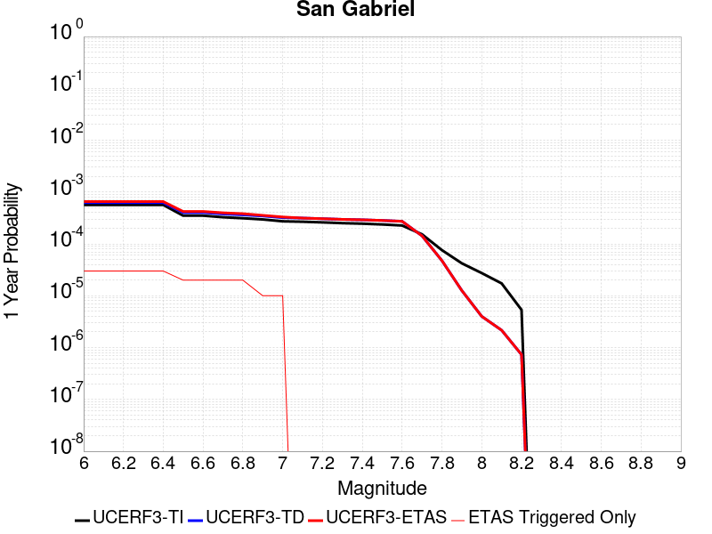 |  |

| Magnitude | 1 wk TI Prob | 1 wk TD Prob | 1 wk ETAS Prob | 1 wk ETAS/TD Gain | 1 wk ETAS Triggered Only | 1 mo TI Prob | 1 mo TD Prob | 1 mo ETAS Prob | 1 mo ETAS/TD Gain | 1 mo ETAS Triggered Only | 1 yr TI Prob | 1 yr TD Prob | 1 yr ETAS Prob | 1 yr ETAS/TD Gain | 1 yr ETAS Triggered Only | 10 yr TI Prob | 10 yr TD Prob | 10 yr ETAS Prob | 10 yr ETAS/TD Gain | 10 yr ETAS Triggered Only |
|-----|-----|-----|-----|-----|-----|-----|-----|-----|-----|-----|-----|-----|-----|-----|-----|-----|-----|-----|-----|-----|
| 6.0 | 1.083775E-5 | 1.19851875E-5 | 6.64567E-5 | 5.544903 | 5.4472166E-5 | 4.6446676E-5 | 5.1364143E-5 | 1.0583351E-4 | 2.060455 | 5.4472166E-5 | 5.653415E-4 | 6.251903E-4 | 7.3406653E-4 | 1.1741489 | 1.0894433E-4 | 0.0056390543 | 0.006246409 | 0.006354673 | 1.0173322 | 1.0894433E-4 |
| 6.1 | 1.083775E-5 | 1.19851875E-5 | 6.64567E-5 | 5.544903 | 5.4472166E-5 | 4.6446676E-5 | 5.1364143E-5 | 1.0583351E-4 | 2.060455 | 5.4472166E-5 | 5.653415E-4 | 6.251903E-4 | 7.3406653E-4 | 1.1741489 | 1.0894433E-4 | 0.0056390543 | 0.006246409 | 0.006354673 | 1.0173322 | 1.0894433E-4 |
| 6.2 | 1.083775E-5 | 1.19851875E-5 | 6.64567E-5 | 5.544903 | 5.4472166E-5 | 4.6446676E-5 | 5.1364143E-5 | 1.0583351E-4 | 2.060455 | 5.4472166E-5 | 5.653415E-4 | 6.251903E-4 | 7.3406653E-4 | 1.1741489 | 1.0894433E-4 | 0.0056390543 | 0.006246409 | 0.006354673 | 1.0173322 | 1.0894433E-4 |
| 6.3 | 1.083775E-5 | 1.19851875E-5 | 6.64567E-5 | 5.544903 | 5.4472166E-5 | 4.6446676E-5 | 5.1364143E-5 | 1.0583351E-4 | 2.060455 | 5.4472166E-5 | 5.653415E-4 | 6.251903E-4 | 7.3406653E-4 | 1.1741489 | 1.0894433E-4 | 0.0056390543 | 0.006246409 | 0.006354673 | 1.0173322 | 1.0894433E-4 |
| 6.4 | 1.083775E-5 | 1.19851875E-5 | 6.64567E-5 | 5.544903 | 5.4472166E-5 | 4.6446676E-5 | 5.1364143E-5 | 1.0583351E-4 | 2.060455 | 5.4472166E-5 | 5.653415E-4 | 6.251903E-4 | 7.3406653E-4 | 1.1741489 | 1.0894433E-4 | 0.0056390543 | 0.006246409 | 0.006354673 | 1.0173322 | 1.0894433E-4 |
| 6.5 | 6.7317824E-6 | 7.716944E-6 | 7.716944E-6 | 1.0 | 0.0 | 2.8850178E-5 | 3.3072207E-5 | 3.3072207E-5 | 1.0 | 0.0 | 3.511943E-4 | 4.0258077E-4 | 4.57031E-4 | 1.135253 | 5.4472166E-5 | 0.003506398 | 0.0040296097 | 0.0040838625 | 1.0134635 | 5.4472166E-5 |
| 6.6 | 6.7317824E-6 | 7.716944E-6 | 7.716944E-6 | 1.0 | 0.0 | 2.8850178E-5 | 3.3072207E-5 | 3.3072207E-5 | 1.0 | 0.0 | 3.511943E-4 | 4.0258077E-4 | 4.57031E-4 | 1.135253 | 5.4472166E-5 | 0.003506398 | 0.0040296097 | 0.0040838625 | 1.0134635 | 5.4472166E-5 |
| 6.7 | 6.274881E-6 | 7.2458647E-6 | 7.2458647E-6 | 1.0 | 0.0 | 2.6892068E-5 | 3.1053343E-5 | 3.1053343E-5 | 1.0 | 0.0 | 3.2736175E-4 | 3.780098E-4 | 4.3246138E-4 | 1.1440481 | 5.4472166E-5 | 0.0032687993 | 0.0037847564 | 0.0038390225 | 1.014338 | 5.4472166E-5 |
| 6.8 | 5.996209E-6 | 6.958585E-6 | 6.958585E-6 | 1.0 | 0.0 | 2.5697784E-5 | 2.9822171E-5 | 2.9822171E-5 | 1.0 | 0.0 | 3.128256E-4 | 3.6302538E-4 | 4.1747777E-4 | 1.149996 | 5.4472166E-5 | 0.003123856 | 0.0036354093 | 0.0036896835 | 1.0149293 | 5.4472166E-5 |
| 6.9 | 5.686331E-6 | 6.6236316E-6 | 6.6236316E-6 | 1.0 | 0.0 | 2.4369761E-5 | 2.8386688E-5 | 2.8386688E-5 | 1.0 | 0.0 | 2.9666146E-4 | 3.4555403E-4 | 3.4555403E-4 | 1.0 | 0.0 | 0.0029626573 | 0.0034612515 | 0.0034612515 | 1.0 | 0.0 |
| 7.0 | 5.2329838E-6 | 6.147514E-6 | 6.147514E-6 | 1.0 | 0.0 | 2.242688E-5 | 2.6346226E-5 | 2.6346226E-5 | 1.0 | 0.0 | 2.7301308E-4 | 3.2071886E-4 | 3.2071886E-4 | 1.0 | 0.0 | 0.002726779 | 0.0032136322 | 0.0032136322 | 1.0 | 0.0 |
| 7.1 | 5.135671E-6 | 6.03764E-6 | 6.03764E-6 | 1.0 | 0.0 | 2.2009834E-5 | 2.5875348E-5 | 2.5875348E-5 | 1.0 | 0.0 | 2.6793676E-4 | 3.1498758E-4 | 3.1498758E-4 | 1.0 | 0.0 | 0.0026761394 | 0.0031564834 | 0.0031564834 | 1.0 | 0.0 |
| 7.2 | 4.989062E-6 | 5.87102E-6 | 5.87102E-6 | 1.0 | 0.0 | 2.1381518E-5 | 2.5161276E-5 | 2.5161276E-5 | 1.0 | 0.0 | 2.6028889E-4 | 3.0629625E-4 | 3.0629625E-4 | 1.0 | 0.0 | 0.0025998424 | 0.003069813 | 0.003069813 | 1.0 | 0.0 |
| 7.3 | 4.8219395E-6 | 5.702574E-6 | 5.702574E-6 | 1.0 | 0.0 | 2.0665291E-5 | 2.443938E-5 | 2.443938E-5 | 1.0 | 0.0 | 2.5157086E-4 | 2.9750957E-4 | 2.9750957E-4 | 1.0 | 0.0 | 0.0025128627 | 0.0029821852 | 0.0029821852 | 1.0 | 0.0 |
| 7.4 | 4.7118383E-6 | 5.5911332E-6 | 5.5911332E-6 | 1.0 | 0.0 | 2.0193436E-5 | 2.3961782E-5 | 2.3961782E-5 | 1.0 | 0.0 | 2.4582737E-4 | 2.916964E-4 | 2.916964E-4 | 1.0 | 0.0 | 0.002455556 | 0.0029242067 | 0.0029242067 | 1.0 | 0.0 |
| 7.5 | 4.5506545E-6 | 5.4365014E-6 | 5.4365014E-6 | 1.0 | 0.0 | 1.9502659E-5 | 2.3299088E-5 | 2.3299088E-5 | 1.0 | 0.0 | 2.37419E-4 | 2.8363022E-4 | 2.8363022E-4 | 1.0 | 0.0 | 0.002371655 | 0.002843753 | 0.002843753 | 1.0 | 0.0 |
| 7.6 | 4.343636E-6 | 5.2293817E-6 | 5.2293817E-6 | 1.0 | 0.0 | 1.861545E-5 | 2.2411448E-5 | 2.2411448E-5 | 1.0 | 0.0 | 2.2661954E-4 | 2.7282597E-4 | 2.7282597E-4 | 1.0 | 0.0 | 0.0022638857 | 0.0027359722 | 0.0027359722 | 1.0 | 0.0 |
| 7.7 | 2.936235E-6 | 2.7440458E-6 | 2.7440458E-6 | 1.0 | 0.0 | 1.2583803E-5 | 1.1760143E-5 | 1.1760143E-5 | 1.0 | 0.0 | 1.5319703E-4 | 1.4317037E-4 | 1.4317037E-4 | 1.0 | 0.0 | 0.0015309147 | 0.0014380751 | 0.0014380751 | 1.0 | 0.0 |
| 7.8 | 1.4541639E-6 | 9.1237047E-7 | 9.1237047E-7 | 1.0 | 0.0 | 6.232116E-6 | 3.9101533E-6 | 3.9101533E-6 | 1.0 | 0.0 | 7.587337E-5 | 4.7605077E-5 | 4.7605077E-5 | 1.0 | 0.0 | 7.584747E-4 | 4.8085177E-4 | 4.8085177E-4 | 1.0 | 0.0 |
| 7.9 | 8.098958E-7 | 2.41753E-7 | 2.41753E-7 | 1.0 | 0.0 | 3.4709774E-6 | 1.0360839E-6 | 1.0360839E-6 | 1.0 | 0.0 | 4.225833E-5 | 1.2614248E-5 | 1.2614248E-5 | 1.0 | 0.0 | 4.2250296E-4 | 1.2921814E-4 | 1.2921814E-4 | 1.0 | 0.0 |
| 8.0 | 5.2473234E-7 | 7.6792055E-8 | 7.6792055E-8 | 1.0 | 0.0 | 2.248851E-6 | 3.2910876E-7 | 3.2910876E-7 | 1.0 | 0.0 | 2.7379416E-5 | 4.0068917E-6 | 4.0068917E-6 | 1.0 | 0.0 | 2.7376044E-4 | 4.21918E-5 | 4.21918E-5 | 1.0 | 0.0 |
| 8.1 | 3.3162388E-7 | 4.1496126E-8 | 4.1496126E-8 | 1.0 | 0.0 | 1.4212444E-6 | 1.7784053E-7 | 1.7784053E-7 | 1.0 | 0.0 | 1.7303513E-5 | 2.1652063E-6 | 2.1652063E-6 | 1.0 | 0.0 | 1.7302166E-4 | 2.2965523E-5 | 2.2965523E-5 | 1.0 | 0.0 |
| 8.2 | 1.0235345E-7 | 1.4043474E-8 | 1.4043474E-8 | 1.0 | 0.0 | 4.3865757E-7 | 6.0186316E-8 | 6.0186316E-8 | 1.0 | 0.0 | 5.340643E-6 | 7.327681E-7 | 7.327681E-7 | 1.0 | 0.0 | 5.3405143E-5 | 7.9273705E-6 | 7.9273705E-6 | 1.0 | 0.0 |

## Oak Ridge (Onshore)
*[(top)](#table-of-contents)*

| 1 Week | 1 Month | 1 Year | 10 Year |
|-----|-----|-----|-----|
|  |  |  |  |

| Magnitude | 1 wk TI Prob | 1 wk TD Prob | 1 wk ETAS Prob | 1 wk ETAS/TD Gain | 1 wk ETAS Triggered Only | 1 mo TI Prob | 1 mo TD Prob | 1 mo ETAS Prob | 1 mo ETAS/TD Gain | 1 mo ETAS Triggered Only | 1 yr TI Prob | 1 yr TD Prob | 1 yr ETAS Prob | 1 yr ETAS/TD Gain | 1 yr ETAS Triggered Only | 10 yr TI Prob | 10 yr TD Prob | 10 yr ETAS Prob | 10 yr ETAS/TD Gain | 10 yr ETAS Triggered Only |
|-----|-----|-----|-----|-----|-----|-----|-----|-----|-----|-----|-----|-----|-----|-----|-----|-----|-----|-----|-----|-----|
| 6.0 | 3.155064E-5 | 2.9525974E-5 | 2.9525974E-5 | 1.0 | 0.0 | 1.3521002E-4 | 1.2653397E-4 | 1.2653397E-4 | 1.0 | 0.0 | 0.001644939 | 0.0015395004 | 0.0015395004 | 1.0 | 0.0 | 0.01632816 | 0.015292859 | 0.015400137 | 1.0070149 | 1.0894433E-4 |
| 6.1 | 3.155064E-5 | 2.9525974E-5 | 2.9525974E-5 | 1.0 | 0.0 | 1.3521002E-4 | 1.2653397E-4 | 1.2653397E-4 | 1.0 | 0.0 | 0.001644939 | 0.0015395004 | 0.0015395004 | 1.0 | 0.0 | 0.01632816 | 0.015292859 | 0.015400137 | 1.0070149 | 1.0894433E-4 |
| 6.2 | 3.155064E-5 | 2.9525974E-5 | 2.9525974E-5 | 1.0 | 0.0 | 1.3521002E-4 | 1.2653397E-4 | 1.2653397E-4 | 1.0 | 0.0 | 0.001644939 | 0.0015395004 | 0.0015395004 | 1.0 | 0.0 | 0.01632816 | 0.015292859 | 0.015400137 | 1.0070149 | 1.0894433E-4 |
| 6.3 | 3.155064E-5 | 2.9525974E-5 | 2.9525974E-5 | 1.0 | 0.0 | 1.3521002E-4 | 1.2653397E-4 | 1.2653397E-4 | 1.0 | 0.0 | 0.001644939 | 0.0015395004 | 0.0015395004 | 1.0 | 0.0 | 0.01632816 | 0.015292859 | 0.015400137 | 1.0070149 | 1.0894433E-4 |
| 6.4 | 3.155064E-5 | 2.9525974E-5 | 2.9525974E-5 | 1.0 | 0.0 | 1.3521002E-4 | 1.2653397E-4 | 1.2653397E-4 | 1.0 | 0.0 | 0.001644939 | 0.0015395004 | 0.0015395004 | 1.0 | 0.0 | 0.01632816 | 0.015292859 | 0.015400137 | 1.0070149 | 1.0894433E-4 |
| 6.5 | 3.155064E-5 | 2.9525974E-5 | 2.9525974E-5 | 1.0 | 0.0 | 1.3521002E-4 | 1.2653397E-4 | 1.2653397E-4 | 1.0 | 0.0 | 0.001644939 | 0.0015395004 | 0.0015395004 | 1.0 | 0.0 | 0.01632816 | 0.015292859 | 0.015400137 | 1.0070149 | 1.0894433E-4 |
| 6.6 | 3.155064E-5 | 2.9525974E-5 | 2.9525974E-5 | 1.0 | 0.0 | 1.3521002E-4 | 1.2653397E-4 | 1.2653397E-4 | 1.0 | 0.0 | 0.001644939 | 0.0015395004 | 0.0015395004 | 1.0 | 0.0 | 0.01632816 | 0.015292859 | 0.015400137 | 1.0070149 | 1.0894433E-4 |
| 6.7 | 3.098897E-5 | 2.8864175E-5 | 2.8864175E-5 | 1.0 | 0.0 | 1.328031E-4 | 1.2369796E-4 | 1.2369796E-4 | 1.0 | 0.0 | 0.0016156785 | 0.0015050198 | 0.0015050198 | 1.0 | 0.0 | 0.016039822 | 0.014952714 | 0.015060029 | 1.007177 | 1.0894433E-4 |
| 6.8 | 3.0449872E-5 | 2.8239372E-5 | 2.8239372E-5 | 1.0 | 0.0 | 1.3049292E-4 | 1.2102048E-4 | 1.2102048E-4 | 1.0 | 0.0 | 0.0015875935 | 0.0014724657 | 0.0014724657 | 1.0 | 0.0 | 0.015762992 | 0.014631462 | 0.014738812 | 1.007337 | 1.0894433E-4 |
| 6.9 | 2.697928E-5 | 2.4219773E-5 | 2.4219773E-5 | 1.0 | 0.0 | 1.15620365E-4 | 1.0379502E-4 | 1.0379502E-4 | 1.0 | 0.0 | 0.0014067689 | 0.0012629933 | 0.0012629933 | 1.0 | 0.0 | 0.0139789665 | 0.01256087 | 0.012668446 | 1.0085644 | 1.0894433E-4 |
| 7.0 | 2.4893961E-5 | 2.1862043E-5 | 2.1862043E-5 | 1.0 | 0.0 | 1.0668404E-4 | 9.3691204E-5 | 9.3691204E-5 | 1.0 | 0.0 | 0.0012981043 | 0.0011401111 | 0.0011401111 | 1.0 | 0.0 | 0.012905477 | 0.011344905 | 0.01139876 | 1.004747 | 5.4472166E-5 |
| 7.1 | 2.0945363E-5 | 1.7354487E-5 | 1.7354487E-5 | 1.0 | 0.0 | 8.976275E-5 | 7.437428E-5 | 7.437428E-5 | 1.0 | 0.0 | 0.0010923136 | 9.051354E-4 | 9.051354E-4 | 1.0 | 0.0 | 0.0108696 | 0.009015423 | 0.009069404 | 1.0059876 | 5.4472166E-5 |
| 7.2 | 2.0439404E-5 | 1.6809423E-5 | 1.6809423E-5 | 1.0 | 0.0 | 8.7594504E-5 | 7.203843E-5 | 7.203843E-5 | 1.0 | 0.0 | 0.0010659413 | 8.767196E-4 | 8.767196E-4 | 1.0 | 0.0 | 0.010608427 | 0.008733526 | 0.008787523 | 1.0061827 | 5.4472166E-5 |
| 7.3 | 1.8463334E-5 | 1.5381811E-5 | 1.5381811E-5 | 1.0 | 0.0 | 7.912617E-5 | 6.59204E-5 | 6.59204E-5 | 1.0 | 0.0 | 9.6293533E-4 | 8.0228975E-4 | 8.0228975E-4 | 1.0 | 0.0 | 0.009587734 | 0.007994797 | 0.008048833 | 1.0067589 | 5.4472166E-5 |
| 7.4 | 1.763139E-5 | 1.451684E-5 | 1.451684E-5 | 1.0 | 0.0 | 7.556091E-5 | 6.221356E-5 | 6.221356E-5 | 1.0 | 0.0 | 9.1956573E-4 | 7.571909E-4 | 7.571909E-4 | 1.0 | 0.0 | 0.009157699 | 0.007546914 | 0.0076009748 | 1.0071633 | 5.4472166E-5 |
| 7.5 | 1.3594944E-5 | 1.1163356E-5 | 1.1163356E-5 | 1.0 | 0.0 | 5.8262744E-5 | 4.784209E-5 | 4.784209E-5 | 1.0 | 0.0 | 7.0911803E-4 | 5.8232434E-4 | 5.8232434E-4 | 1.0 | 0.0 | 0.007068595 | 0.0058082556 | 0.0058624116 | 1.009324 | 5.4472166E-5 |
| 7.6 | 6.9889534E-6 | 5.6367144E-6 | 5.6367144E-6 | 1.0 | 0.0 | 2.9952313E-5 | 2.4157125E-5 | 2.4157125E-5 | 1.0 | 0.0 | 3.646084E-4 | 2.9407372E-4 | 2.9407372E-4 | 1.0 | 0.0 | 0.0036401073 | 0.0029368899 | 0.002991202 | 1.018493 | 5.4472166E-5 |
| 7.7 | 4.0824193E-6 | 3.2832586E-6 | 3.2832586E-6 | 1.0 | 0.0 | 1.7495966E-5 | 1.4071033E-5 | 1.4071033E-5 | 1.0 | 0.0 | 2.1299256E-4 | 1.713015E-4 | 1.713015E-4 | 1.0 | 0.0 | 0.0021278851 | 0.0017117079 | 0.0017660868 | 1.0317688 | 5.4472166E-5 |
| 7.8 | 1.7023609E-6 | 1.4370495E-6 | 1.4370495E-6 | 1.0 | 0.0 | 7.295812E-6 | 6.1587693E-6 | 6.1587693E-6 | 1.0 | 0.0 | 8.882289E-5 | 7.498047E-5 | 7.498047E-5 | 1.0 | 0.0 | 8.8787393E-4 | 7.495545E-4 | 7.495545E-4 | 1.0 | 0.0 |
| 7.9 | 2.721225E-7 | 2.2616497E-7 | 2.2616497E-7 | 1.0 | 0.0 | 1.1662388E-6 | 9.692781E-7 | 9.692781E-7 | 1.0 | 0.0 | 1.4198865E-5 | 1.1800899E-5 | 1.1800899E-5 | 1.0 | 0.0 | 1.4197957E-4 | 1.1800301E-4 | 1.1800301E-4 | 1.0 | 0.0 |
| 8.0 | 9.364255E-9 | 5.1206666E-9 | 5.1206666E-9 | 1.0 | 0.0 | 4.0132523E-8 | 2.1945715E-8 | 2.1945715E-8 | 1.0 | 0.0 | 4.8861335E-7 | 2.6718905E-7 | 2.6718905E-7 | 1.0 | 0.0 | 4.8861225E-6 | 2.6718876E-6 | 2.6718876E-6 | 1.0 | 0.0 |

## White Mountains
*[(top)](#table-of-contents)*

| 1 Week | 1 Month | 1 Year | 10 Year |
|-----|-----|-----|-----|
| 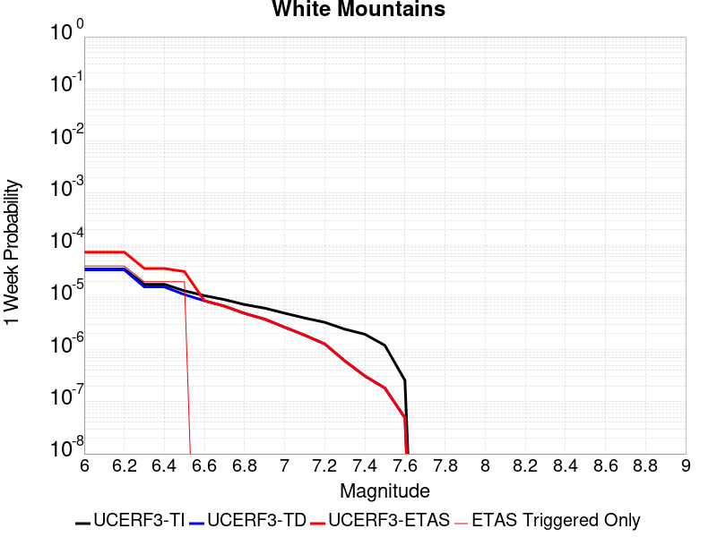 |  | 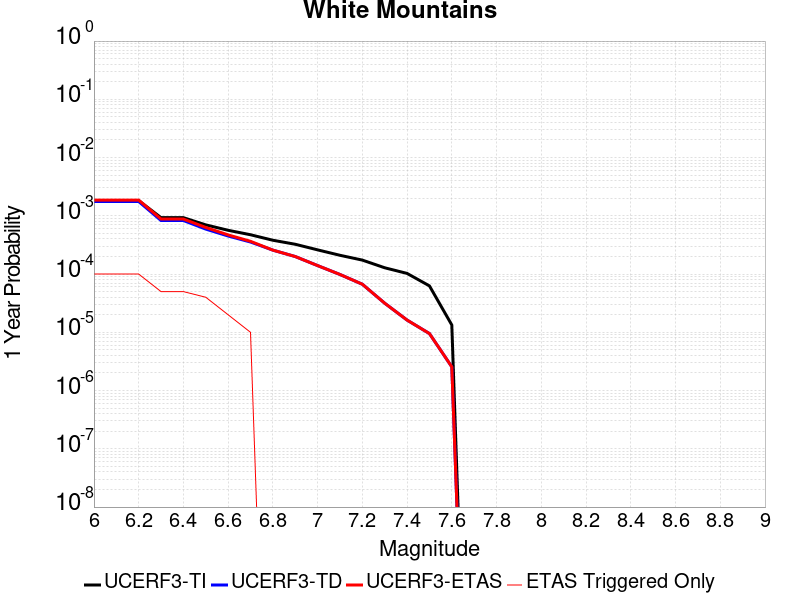 |  |

| Magnitude | 1 wk TI Prob | 1 wk TD Prob | 1 wk ETAS Prob | 1 wk ETAS/TD Gain | 1 wk ETAS Triggered Only | 1 mo TI Prob | 1 mo TD Prob | 1 mo ETAS Prob | 1 mo ETAS/TD Gain | 1 mo ETAS Triggered Only | 1 yr TI Prob | 1 yr TD Prob | 1 yr ETAS Prob | 1 yr ETAS/TD Gain | 1 yr ETAS Triggered Only | 10 yr TI Prob | 10 yr TD Prob | 10 yr ETAS Prob | 10 yr ETAS/TD Gain | 10 yr ETAS Triggered Only |
|-----|-----|-----|-----|-----|-----|-----|-----|-----|-----|-----|-----|-----|-----|-----|-----|-----|-----|-----|-----|-----|
| 6.0 | 3.503579E-5 | 3.378405E-5 | 3.378405E-5 | 1.0 | 0.0 | 1.5014476E-4 | 1.4478143E-4 | 1.4478143E-4 | 1.0 | 0.0 | 0.0018264796 | 0.0017614096 | 0.001870162 | 1.0617417 | 1.0894433E-4 | 0.018115403 | 0.017486818 | 0.017593857 | 1.0061212 | 1.0894433E-4 |
| 6.1 | 3.503579E-5 | 3.378405E-5 | 3.378405E-5 | 1.0 | 0.0 | 1.5014476E-4 | 1.4478143E-4 | 1.4478143E-4 | 1.0 | 0.0 | 0.0018264796 | 0.0017614096 | 0.001870162 | 1.0617417 | 1.0894433E-4 | 0.018115403 | 0.017486818 | 0.017593857 | 1.0061212 | 1.0894433E-4 |
| 6.2 | 3.503579E-5 | 3.378405E-5 | 3.378405E-5 | 1.0 | 0.0 | 1.5014476E-4 | 1.4478143E-4 | 1.4478143E-4 | 1.0 | 0.0 | 0.0018264796 | 0.0017614096 | 0.001870162 | 1.0617417 | 1.0894433E-4 | 0.018115403 | 0.017486818 | 0.017593857 | 1.0061212 | 1.0894433E-4 |
| 6.3 | 1.7818425E-5 | 1.5916074E-5 | 1.5916074E-5 | 1.0 | 0.0 | 7.636245E-5 | 6.821004E-5 | 6.821004E-5 | 1.0 | 0.0 | 9.293162E-4 | 8.301551E-4 | 8.8458206E-4 | 1.0655624 | 5.4472166E-5 | 0.009254395 | 0.008271999 | 0.00832602 | 1.0065306 | 5.4472166E-5 |
| 6.4 | 1.7818425E-5 | 1.5916074E-5 | 1.5916074E-5 | 1.0 | 0.0 | 7.636245E-5 | 6.821004E-5 | 6.821004E-5 | 1.0 | 0.0 | 9.293162E-4 | 8.301551E-4 | 8.8458206E-4 | 1.0655624 | 5.4472166E-5 | 0.009254395 | 0.008271999 | 0.00832602 | 1.0065306 | 5.4472166E-5 |
| 6.5 | 1.3397557E-5 | 1.13362685E-5 | 1.13362685E-5 | 1.0 | 0.0 | 5.741684E-5 | 4.858314E-5 | 4.858314E-5 | 1.0 | 0.0 | 6.988258E-4 | 5.913462E-4 | 5.913462E-4 | 1.0 | 0.0 | 0.006966323 | 0.005898432 | 0.005898432 | 1.0 | 0.0 |
| 6.6 | 1.0818695E-5 | 8.625366E-6 | 8.625366E-6 | 1.0 | 0.0 | 4.6365014E-5 | 3.6965357E-5 | 3.6965357E-5 | 1.0 | 0.0 | 5.6434784E-4 | 4.4996463E-4 | 4.4996463E-4 | 1.0 | 0.0 | 0.005629168 | 0.004490972 | 0.004490972 | 1.0 | 0.0 |
| 6.7 | 9.067908E-6 | 6.802442E-6 | 6.802442E-6 | 1.0 | 0.0 | 3.8861883E-5 | 2.9153016E-5 | 2.9153016E-5 | 1.0 | 0.0 | 4.7304068E-4 | 3.5488335E-4 | 3.5488335E-4 | 1.0 | 0.0 | 0.00472035 | 0.0035434833 | 0.0035434833 | 1.0 | 0.0 |
| 6.8 | 7.295947E-6 | 4.936391E-6 | 4.936391E-6 | 1.0 | 0.0 | 3.126797E-5 | 2.1155796E-5 | 2.1155796E-5 | 1.0 | 0.0 | 3.8062103E-4 | 2.575425E-4 | 2.575425E-4 | 1.0 | 0.0 | 0.0037996976 | 0.0025725532 | 0.0025725532 | 1.0 | 0.0 |
| 6.9 | 6.2243444E-6 | 3.832213E-6 | 3.832213E-6 | 1.0 | 0.0 | 2.6675489E-5 | 1.642367E-5 | 1.642367E-5 | 1.0 | 0.0 | 3.2472567E-4 | 1.9994036E-4 | 1.9994036E-4 | 1.0 | 0.0 | 0.0032425157 | 0.0019976576 | 0.0019976576 | 1.0 | 0.0 |
| 7.0 | 4.9878413E-6 | 2.6795342E-6 | 2.6795342E-6 | 1.0 | 0.0 | 2.1376287E-5 | 1.14836685E-5 | 1.14836685E-5 | 1.0 | 0.0 | 2.602252E-4 | 1.3980496E-4 | 1.3980496E-4 | 1.0 | 0.0 | 0.002599207 | 0.0013971963 | 0.0013971963 | 1.0 | 0.0 |
| 7.1 | 4.0252844E-6 | 1.8857575E-6 | 1.8857575E-6 | 1.0 | 0.0 | 1.7251105E-5 | 8.081794E-6 | 8.081794E-6 | 1.0 | 0.0 | 2.1001195E-4 | 9.8391516E-5 | 9.8391516E-5 | 1.0 | 0.0 | 0.0020981359 | 9.834924E-4 | 9.834924E-4 | 1.0 | 0.0 |
| 7.2 | 3.3284066E-6 | 1.281964E-6 | 1.281964E-6 | 1.0 | 0.0 | 1.4264522E-5 | 5.494121E-6 | 5.494121E-6 | 1.0 | 0.0 | 1.736567E-4 | 6.688897E-5 | 6.688897E-5 | 1.0 | 0.0 | 0.0017352107 | 6.6869846E-4 | 6.6869846E-4 | 1.0 | 0.0 |
| 7.3 | 2.458226E-6 | 6.05722E-7 | 6.05722E-7 | 1.0 | 0.0 | 1.0535211E-5 | 2.5959491E-6 | 2.5959491E-6 | 1.0 | 0.0 | 1.2825865E-4 | 3.1605257E-5 | 3.1605257E-5 | 1.0 | 0.0 | 0.0012818464 | 3.160114E-4 | 3.160114E-4 | 1.0 | 0.0 |
| 7.4 | 1.965953E-6 | 3.1089303E-7 | 3.1089303E-7 | 1.0 | 0.0 | 8.425486E-6 | 1.332398E-6 | 1.332398E-6 | 1.0 | 0.0 | 1.0257547E-4 | 1.6221828E-5 | 1.6221828E-5 | 1.0 | 0.0 | 0.0010252813 | 1.6220656E-4 | 1.6220656E-4 | 1.0 | 0.0 |
| 7.5 | 1.2014192E-6 | 1.8244253E-7 | 1.8244253E-7 | 1.0 | 0.0 | 5.148929E-6 | 7.8189635E-7 | 7.8189635E-7 | 1.0 | 0.0 | 6.2686406E-5 | 9.519547E-6 | 9.519547E-6 | 1.0 | 0.0 | 6.266873E-4 | 9.519148E-5 | 9.519148E-5 | 1.0 | 0.0 |
| 7.6 | 2.5612175E-7 | 4.8946475E-8 | 4.8946475E-8 | 1.0 | 0.0 | 1.0976642E-6 | 2.0977059E-7 | 2.0977059E-7 | 1.0 | 0.0 | 1.3363979E-5 | 2.5539543E-6 | 2.5539543E-6 | 1.0 | 0.0 | 1.3363175E-4 | 2.5539286E-5 | 2.5539286E-5 | 1.0 | 0.0 |

## Ortigalita (South)
*[(top)](#table-of-contents)*

| 1 Week | 1 Month | 1 Year | 10 Year |
|-----|-----|-----|-----|
|  |  |  |  |

| Magnitude | 1 wk TI Prob | 1 wk TD Prob | 1 wk ETAS Prob | 1 wk ETAS/TD Gain | 1 wk ETAS Triggered Only | 1 mo TI Prob | 1 mo TD Prob | 1 mo ETAS Prob | 1 mo ETAS/TD Gain | 1 mo ETAS Triggered Only | 1 yr TI Prob | 1 yr TD Prob | 1 yr ETAS Prob | 1 yr ETAS/TD Gain | 1 yr ETAS Triggered Only | 10 yr TI Prob | 10 yr TD Prob | 10 yr ETAS Prob | 10 yr ETAS/TD Gain | 10 yr ETAS Triggered Only |
|-----|-----|-----|-----|-----|-----|-----|-----|-----|-----|-----|-----|-----|-----|-----|-----|-----|-----|-----|-----|-----|
| 6.0 | 3.72394E-5 | 4.325562E-5 | 4.325562E-5 | 1.0 | 0.0 | 1.5958765E-4 | 1.8536893E-4 | 2.39831E-4 | 1.2938037 | 5.4472166E-5 | 0.0019412481 | 0.0022546875 | 0.002309037 | 1.0241051 | 5.4472166E-5 | 0.019243775 | 0.022334497 | 0.022387752 | 1.0023844 | 5.4472166E-5 |
| 6.1 | 2.7299884E-5 | 3.149204E-5 | 3.149204E-5 | 1.0 | 0.0 | 1.16994255E-4 | 1.3495922E-4 | 1.8942404E-4 | 1.4035649 | 5.4472166E-5 | 0.0014234743 | 0.0016419457 | 0.0016963284 | 1.0331209 | 5.4472166E-5 | 0.014143906 | 0.01630407 | 0.016357655 | 1.0032866 | 5.4472166E-5 |
| 6.2 | 2.7299884E-5 | 3.149204E-5 | 3.149204E-5 | 1.0 | 0.0 | 1.16994255E-4 | 1.3495922E-4 | 1.8942404E-4 | 1.4035649 | 5.4472166E-5 | 0.0014234743 | 0.0016419457 | 0.0016963284 | 1.0331209 | 5.4472166E-5 | 0.014143906 | 0.01630407 | 0.016357655 | 1.0032866 | 5.4472166E-5 |
| 6.3 | 2.0546433E-5 | 2.363145E-5 | 2.363145E-5 | 1.0 | 0.0 | 8.805317E-5 | 1.0127382E-4 | 1.5574046E-4 | 1.5378157 | 5.4472166E-5 | 0.00107152 | 0.0012323303 | 0.0012867353 | 1.0441481 | 5.4472166E-5 | 0.010663681 | 0.01225703 | 0.012310835 | 1.0043896 | 5.4472166E-5 |
| 6.4 | 2.0546433E-5 | 2.363145E-5 | 2.363145E-5 | 1.0 | 0.0 | 8.805317E-5 | 1.0127382E-4 | 1.5574046E-4 | 1.5378157 | 5.4472166E-5 | 0.00107152 | 0.0012323303 | 0.0012867353 | 1.0441481 | 5.4472166E-5 | 0.010663681 | 0.01225703 | 0.012310835 | 1.0043896 | 5.4472166E-5 |
| 6.5 | 1.7779594E-5 | 2.0446974E-5 | 2.0446974E-5 | 1.0 | 0.0 | 7.619603E-5 | 8.762702E-5 | 1.4209442E-4 | 1.6215822 | 5.4472166E-5 | 9.272918E-4 | 0.0010663504 | 0.0011207645 | 1.0510284 | 5.4472166E-5 | 0.009234319 | 0.010613803 | 0.0106676975 | 1.0050777 | 5.4472166E-5 |
| 6.6 | 1.6272212E-5 | 1.8714967E-5 | 1.8714967E-5 | 1.0 | 0.0 | 6.973618E-5 | 8.0204605E-5 | 1.346724E-4 | 1.6791105 | 5.4472166E-5 | 8.487073E-4 | 9.760658E-4 | 0.0010304848 | 1.0557534 | 5.4472166E-5 | 0.008454733 | 0.009719091 | 0.009773033 | 1.0055501 | 5.4472166E-5 |
| 6.7 | 1.3051484E-5 | 1.5038758E-5 | 1.5038758E-5 | 1.0 | 0.0 | 5.593373E-5 | 6.445028E-5 | 6.445028E-5 | 1.0 | 0.0 | 6.807804E-4 | 7.844092E-4 | 7.844092E-4 | 1.0 | 0.0 | 0.006786986 | 0.007817388 | 0.007817388 | 1.0 | 0.0 |
| 6.8 | 1.04277415E-5 | 1.1987235E-5 | 1.1987235E-5 | 1.0 | 0.0 | 4.4689557E-5 | 5.1372896E-5 | 5.1372896E-5 | 1.0 | 0.0 | 5.439595E-4 | 6.2529295E-4 | 6.2529295E-4 | 1.0 | 0.0 | 0.0054262993 | 0.00623609 | 0.00623609 | 1.0 | 0.0 |
| 6.9 | 7.639968E-6 | 8.791503E-6 | 8.791503E-6 | 1.0 | 0.0 | 3.274231E-5 | 3.767736E-5 | 3.767736E-5 | 1.0 | 0.0 | 3.9856473E-4 | 4.586312E-4 | 4.586312E-4 | 1.0 | 0.0 | 0.003978506 | 0.004577433 | 0.004577433 | 1.0 | 0.0 |
| 7.0 | 3.919831E-6 | 4.5334014E-6 | 4.5334014E-6 | 1.0 | 0.0 | 1.679917E-5 | 1.942873E-5 | 1.942873E-5 | 1.0 | 0.0 | 2.045107E-4 | 2.3652123E-4 | 2.3652123E-4 | 1.0 | 0.0 | 0.0020432258 | 0.0023629034 | 0.0023629034 | 1.0 | 0.0 |
| 7.1 | 1.6017933E-6 | 1.8570418E-6 | 1.8570418E-6 | 1.0 | 0.0 | 6.8648105E-6 | 7.958732E-6 | 7.958732E-6 | 1.0 | 0.0 | 8.357586E-5 | 9.689432E-5 | 9.689432E-5 | 1.0 | 0.0 | 8.3544437E-4 | 9.686254E-4 | 9.686254E-4 | 1.0 | 0.0 |

## West Napa 2011 CFM
*[(top)](#table-of-contents)*

| 1 Week | 1 Month | 1 Year | 10 Year |
|-----|-----|-----|-----|
|  |  |  |  |

| Magnitude | 1 wk TI Prob | 1 wk TD Prob | 1 wk ETAS Prob | 1 wk ETAS/TD Gain | 1 wk ETAS Triggered Only | 1 mo TI Prob | 1 mo TD Prob | 1 mo ETAS Prob | 1 mo ETAS/TD Gain | 1 mo ETAS Triggered Only | 1 yr TI Prob | 1 yr TD Prob | 1 yr ETAS Prob | 1 yr ETAS/TD Gain | 1 yr ETAS Triggered Only | 10 yr TI Prob | 10 yr TD Prob | 10 yr ETAS Prob | 10 yr ETAS/TD Gain | 10 yr ETAS Triggered Only |
|-----|-----|-----|-----|-----|-----|-----|-----|-----|-----|-----|-----|-----|-----|-----|-----|-----|-----|-----|-----|-----|
| 6.0 | 3.773104E-5 | 4.452845E-5 | 4.452845E-5 | 1.0 | 0.0 | 1.6169442E-4 | 1.9082405E-4 | 1.9082405E-4 | 1.0 | 0.0 | 0.001966852 | 0.0023211248 | 0.0023211248 | 1.0 | 0.0 | 0.019495348 | 0.023002245 | 0.023055464 | 1.0023136 | 5.4472166E-5 |
| 6.1 | 3.773104E-5 | 4.452845E-5 | 4.452845E-5 | 1.0 | 0.0 | 1.6169442E-4 | 1.9082405E-4 | 1.9082405E-4 | 1.0 | 0.0 | 0.001966852 | 0.0023211248 | 0.0023211248 | 1.0 | 0.0 | 0.019495348 | 0.023002245 | 0.023055464 | 1.0023136 | 5.4472166E-5 |
| 6.2 | 3.773104E-5 | 4.452845E-5 | 4.452845E-5 | 1.0 | 0.0 | 1.6169442E-4 | 1.9082405E-4 | 1.9082405E-4 | 1.0 | 0.0 | 0.001966852 | 0.0023211248 | 0.0023211248 | 1.0 | 0.0 | 0.019495348 | 0.023002245 | 0.023055464 | 1.0023136 | 5.4472166E-5 |
| 6.3 | 2.147964E-5 | 2.4987039E-5 | 2.4987039E-5 | 1.0 | 0.0 | 9.2052345E-5 | 1.0708343E-4 | 1.0708343E-4 | 1.0 | 0.0 | 0.001120161 | 0.0013030528 | 0.0013030528 | 1.0 | 0.0 | 0.011145315 | 0.0129647385 | 0.0129647385 | 1.0 | 0.0 |
| 6.4 | 2.147964E-5 | 2.4987039E-5 | 2.4987039E-5 | 1.0 | 0.0 | 9.2052345E-5 | 1.0708343E-4 | 1.0708343E-4 | 1.0 | 0.0 | 0.001120161 | 0.0013030528 | 0.0013030528 | 1.0 | 0.0 | 0.011145315 | 0.0129647385 | 0.0129647385 | 1.0 | 0.0 |
| 6.5 | 1.688201E-5 | 1.9547346E-5 | 1.9547346E-5 | 1.0 | 0.0 | 7.234947E-5 | 8.377206E-5 | 8.377206E-5 | 1.0 | 0.0 | 8.804988E-4 | 0.0010195201 | 0.0010195201 | 1.0 | 0.0 | 0.008770182 | 0.010157098 | 0.010157098 | 1.0 | 0.0 |
| 6.6 | 1.6846381E-5 | 1.9507039E-5 | 1.9507039E-5 | 1.0 | 0.0 | 7.219678E-5 | 8.359933E-5 | 8.359933E-5 | 1.0 | 0.0 | 8.7864127E-4 | 0.001017419 | 0.001017419 | 1.0 | 0.0 | 0.008751754 | 0.010136279 | 0.010136279 | 1.0 | 0.0 |
| 6.7 | 1.3396501E-5 | 1.5467655E-5 | 1.5467655E-5 | 1.0 | 0.0 | 5.7412315E-5 | 6.628862E-5 | 6.628862E-5 | 1.0 | 0.0 | 6.9877075E-4 | 8.0682867E-4 | 8.0682867E-4 | 1.0 | 0.0 | 0.0069657755 | 0.008046719 | 0.008046719 | 1.0 | 0.0 |
| 6.8 | 1.0139058E-5 | 1.1672149E-5 | 1.1672149E-5 | 1.0 | 0.0 | 4.3452383E-5 | 5.0022853E-5 | 5.0022853E-5 | 1.0 | 0.0 | 5.289043E-4 | 6.0891354E-4 | 6.0891354E-4 | 1.0 | 0.0 | 0.005276473 | 0.006079373 | 0.006079373 | 1.0 | 0.0 |
| 6.9 | 7.761281E-6 | 8.890694E-6 | 8.890694E-6 | 1.0 | 0.0 | 3.326221E-5 | 3.8102706E-5 | 3.8102706E-5 | 1.0 | 0.0 | 4.0489217E-4 | 4.6385307E-4 | 4.6385307E-4 | 1.0 | 0.0 | 0.0040415525 | 0.004635363 | 0.004635363 | 1.0 | 0.0 |
| 7.0 | 2.2109202E-6 | 2.3666025E-6 | 2.3666025E-6 | 1.0 | 0.0 | 9.475338E-6 | 1.0142544E-5 | 1.0142544E-5 | 1.0 | 0.0 | 1.1535613E-4 | 1.2347854E-4 | 1.2347854E-4 | 1.0 | 0.0 | 0.0011529627 | 0.0012355851 | 0.0012355851 | 1.0 | 0.0 |
| 7.1 | 1.9008926E-6 | 2.0132914E-6 | 2.0132914E-6 | 1.0 | 0.0 | 8.146657E-6 | 8.6283635E-6 | 8.6283635E-6 | 1.0 | 0.0 | 9.918104E-5 | 1.05045285E-4 | 1.05045285E-4 | 1.0 | 0.0 | 9.913679E-4 | 0.001051437 | 0.001051437 | 1.0 | 0.0 |
| 7.2 | 1.8495944E-6 | 1.9560982E-6 | 1.9560982E-6 | 1.0 | 0.0 | 7.926808E-6 | 8.383251E-6 | 8.383251E-6 | 1.0 | 0.0 | 9.650462E-5 | 1.0206133E-4 | 1.0206133E-4 | 1.0 | 0.0 | 9.6462725E-4 | 0.0010216252 | 0.0010216252 | 1.0 | 0.0 |
| 7.3 | 1.7883189E-6 | 1.8880608E-6 | 1.8880608E-6 | 1.0 | 0.0 | 7.664201E-6 | 8.091664E-6 | 8.091664E-6 | 1.0 | 0.0 | 9.330765E-5 | 9.8511584E-5 | 9.8511584E-5 | 1.0 | 0.0 | 9.3268487E-4 | 9.861597E-4 | 9.861597E-4 | 1.0 | 0.0 |
| 7.4 | 1.6520572E-6 | 1.741484E-6 | 1.741484E-6 | 1.0 | 0.0 | 7.0802257E-6 | 7.463482E-6 | 7.463482E-6 | 1.0 | 0.0 | 8.6198335E-5 | 9.086413E-5 | 9.086413E-5 | 1.0 | 0.0 | 8.616491E-4 | 9.0974604E-4 | 9.0974604E-4 | 1.0 | 0.0 |
| 7.5 | 1.4040345E-6 | 1.4800074E-6 | 1.4800074E-6 | 1.0 | 0.0 | 6.0172765E-6 | 6.3428733E-6 | 6.3428733E-6 | 1.0 | 0.0 | 7.325788E-5 | 7.7221775E-5 | 7.7221775E-5 | 1.0 | 0.0 | 7.3233736E-4 | 7.7339396E-4 | 7.7339396E-4 | 1.0 | 0.0 |
| 7.6 | 1.3013842E-7 | 1.4415936E-7 | 1.4415936E-7 | 1.0 | 0.0 | 5.57736E-7 | 6.1782566E-7 | 6.1782566E-7 | 1.0 | 0.0 | 6.790414E-6 | 7.5220014E-6 | 7.5220014E-6 | 1.0 | 0.0 | 6.790207E-5 | 7.614869E-5 | 7.614869E-5 | 1.0 | 0.0 |
| 7.7 | 8.541512E-8 | 9.716316E-8 | 9.716316E-8 | 1.0 | 0.0 | 3.6606474E-7 | 4.1641349E-7 | 4.1641349E-7 | 1.0 | 0.0 | 4.456829E-6 | 5.0698222E-6 | 5.0698222E-6 | 1.0 | 0.0 | 4.4567398E-5 | 5.160297E-5 | 5.160297E-5 | 1.0 | 0.0 |
| 7.8 | 5.6074793E-8 | 6.89534E-8 | 6.89534E-8 | 1.0 | 0.0 | 2.403205E-7 | 2.9551452E-7 | 2.9551452E-7 | 1.0 | 0.0 | 2.9258983E-6 | 3.5978833E-6 | 3.5978833E-6 | 1.0 | 0.0 | 2.9258597E-5 | 3.681433E-5 | 3.681433E-5 | 1.0 | 0.0 |
| 7.9 | 2.9475839E-8 | 3.8566046E-8 | 3.8566046E-8 | 1.0 | 0.0 | 1.2632502E-7 | 1.6528305E-7 | 1.6528305E-7 | 1.0 | 0.0 | 1.538006E-6 | 2.0123193E-6 | 2.0123193E-6 | 1.0 | 0.0 | 1.5379954E-5 | 2.0665891E-5 | 2.0665891E-5 | 1.0 | 0.0 |
| 8.0 | 1.3337122E-8 | 2.163124E-8 | 2.163124E-8 | 1.0 | 0.0 | 5.7159088E-8 | 9.270532E-8 | 9.270532E-8 | 1.0 | 0.0 | 6.959117E-7 | 1.1286867E-6 | 1.1286867E-6 | 1.0 | 0.0 | 6.959095E-6 | 1.1645628E-5 | 1.1645628E-5 | 1.0 | 0.0 |
| 8.1 | 2.6589986E-10 | 4.8615456E-10 | 4.8615456E-10 | 1.0 | 0.0 | 1.1395708E-9 | 2.0835205E-9 | 2.0835205E-9 | 1.0 | 0.0 | 1.3874274E-8 | 2.536686E-8 | 2.536686E-8 | 1.0 | 0.0 | 1.3874273E-7 | 2.6035906E-7 | 2.6035906E-7 | 1.0 | 0.0 |

## San Diego Trough south
*[(top)](#table-of-contents)*

| 1 Week | 1 Month | 1 Year | 10 Year |
|-----|-----|-----|-----|
|  |  | 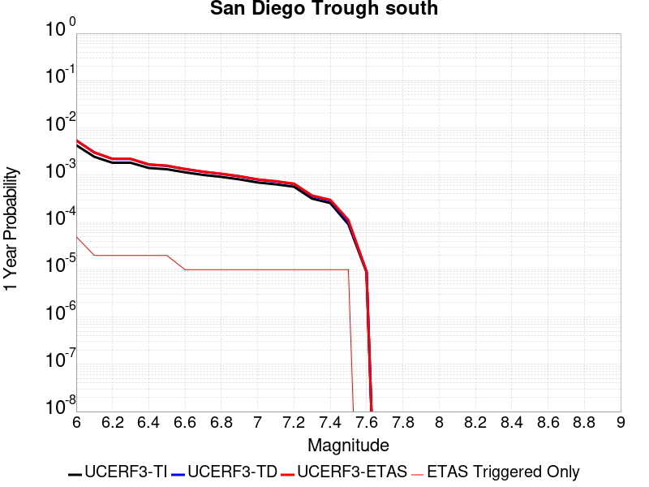 |  |

| Magnitude | 1 wk TI Prob | 1 wk TD Prob | 1 wk ETAS Prob | 1 wk ETAS/TD Gain | 1 wk ETAS Triggered Only | 1 mo TI Prob | 1 mo TD Prob | 1 mo ETAS Prob | 1 mo ETAS/TD Gain | 1 mo ETAS Triggered Only | 1 yr TI Prob | 1 yr TD Prob | 1 yr ETAS Prob | 1 yr ETAS/TD Gain | 1 yr ETAS Triggered Only | 10 yr TI Prob | 10 yr TD Prob | 10 yr ETAS Prob | 10 yr ETAS/TD Gain | 10 yr ETAS Triggered Only |
|-----|-----|-----|-----|-----|-----|-----|-----|-----|-----|-----|-----|-----|-----|-----|-----|-----|-----|-----|-----|-----|
| 6.0 | 8.279495E-5 | 1.04241306E-4 | 1.5870779E-4 | 1.5225039 | 5.4472166E-5 | 3.5478722E-4 | 4.4667677E-4 | 5.011246E-4 | 1.1218954 | 5.4472166E-5 | 0.004310982 | 0.0054256152 | 0.005479792 | 1.0099853 | 5.4472166E-5 | 0.042283054 | 0.05299221 | 0.053043794 | 1.0009735 | 5.4472166E-5 |
| 6.1 | 4.6961468E-5 | 5.772944E-5 | 1.1219846E-4 | 1.9435223 | 5.4472166E-5 | 2.0124791E-4 | 2.473894E-4 | 3.018481E-4 | 1.2201334 | 5.4472166E-5 | 0.00244744 | 0.0030079768 | 0.003062285 | 1.0180547 | 5.4472166E-5 | 0.024206603 | 0.029679462 | 0.029732317 | 1.0017809 | 5.4472166E-5 |
| 6.2 | 3.5079658E-5 | 4.214154E-5 | 9.661141E-5 | 2.2925458 | 5.4472166E-5 | 1.5033272E-4 | 1.8059435E-4 | 2.3505668E-4 | 1.3015727 | 5.4472166E-5 | 0.0018287642 | 0.0021965632 | 0.0022509156 | 1.0247444 | 5.4472166E-5 | 0.018137876 | 0.021751117 | 0.021804405 | 1.0024499 | 5.4472166E-5 |
| 6.3 | 3.5079658E-5 | 4.214154E-5 | 9.661141E-5 | 2.2925458 | 5.4472166E-5 | 1.5033272E-4 | 1.8059435E-4 | 2.3505668E-4 | 1.3015727 | 5.4472166E-5 | 0.0018287642 | 0.0021965632 | 0.0022509156 | 1.0247444 | 5.4472166E-5 | 0.018137876 | 0.021751117 | 0.021804405 | 1.0024499 | 5.4472166E-5 |
| 6.4 | 2.7196904E-5 | 3.2087162E-5 | 8.655758E-5 | 2.6975765 | 5.4472166E-5 | 1.16552954E-4 | 1.3750927E-4 | 1.9197394E-4 | 1.39608 | 5.4472166E-5 | 0.0014181085 | 0.0016729041 | 0.0017272852 | 1.032507 | 5.4472166E-5 | 0.014090929 | 0.016604643 | 0.016658211 | 1.003226 | 5.4472166E-5 |
| 6.5 | 2.5584688E-5 | 3.010164E-5 | 8.4572166E-5 | 2.8095534 | 5.4472166E-5 | 1.0964406E-4 | 1.2900073E-4 | 1.8346588E-4 | 1.422208 | 5.4472166E-5 | 0.0013340989 | 0.0015694655 | 0.0016238522 | 1.034653 | 5.4472166E-5 | 0.013261181 | 0.015585314 | 0.015638936 | 1.0034406 | 5.4472166E-5 |
| 6.6 | 2.2034688E-5 | 2.5742738E-5 | 2.5742738E-5 | 1.0 | 0.0 | 9.443096E-5 | 1.1032141E-4 | 1.1032141E-4 | 1.0 | 0.0 | 0.0011490905 | 0.0013423424 | 0.0013423424 | 1.0 | 0.0 | 0.011431668 | 0.013343317 | 0.013343317 | 1.0 | 0.0 |
| 6.7 | 1.9394853E-5 | 2.254176E-5 | 2.254176E-5 | 1.0 | 0.0 | 8.311815E-5 | 9.6603995E-5 | 9.6603995E-5 | 1.0 | 0.0 | 0.0010114936 | 0.0011755243 | 0.0011755243 | 1.0 | 0.0 | 0.01006902 | 0.011693766 | 0.011693766 | 1.0 | 0.0 |
| 6.8 | 1.7615313E-5 | 2.0403182E-5 | 2.0403182E-5 | 1.0 | 0.0 | 7.549201E-5 | 8.74393E-5 | 8.74393E-5 | 1.0 | 0.0 | 9.1872766E-4 | 0.0010640579 | 0.0010640579 | 1.0 | 0.0 | 0.009149387 | 0.010590198 | 0.010590198 | 1.0 | 0.0 |
| 6.9 | 1.5621423E-5 | 1.8026114E-5 | 1.8026114E-5 | 1.0 | 0.0 | 6.6947236E-5 | 7.725251E-5 | 7.725251E-5 | 1.0 | 0.0 | 8.147778E-4 | 9.40147E-4 | 9.40147E-4 | 1.0 | 0.0 | 0.008117969 | 0.009362142 | 0.009362142 | 1.0 | 0.0 |
| 7.0 | 1.3444376E-5 | 1.544809E-5 | 1.544809E-5 | 1.0 | 0.0 | 5.7617483E-5 | 6.620443E-5 | 6.620443E-5 | 1.0 | 0.0 | 7.0126704E-4 | 8.057436E-4 | 8.057436E-4 | 1.0 | 0.0 | 0.006990582 | 0.008028555 | 0.008028555 | 1.0 | 0.0 |
| 7.1 | 1.2268361E-5 | 1.407303E-5 | 1.407303E-5 | 1.0 | 0.0 | 5.2577634E-5 | 6.0311606E-5 | 6.0311606E-5 | 1.0 | 0.0 | 6.399447E-4 | 7.3404907E-4 | 7.3404907E-4 | 1.0 | 0.0 | 0.0063810493 | 0.0073165493 | 0.0073165493 | 1.0 | 0.0 |
| 7.2 | 1.0922655E-5 | 1.2513563E-5 | 1.2513563E-5 | 1.0 | 0.0 | 4.681054E-5 | 5.3628468E-5 | 5.3628468E-5 | 1.0 | 0.0 | 5.697693E-4 | 6.5273355E-4 | 6.5273355E-4 | 1.0 | 0.0 | 0.0056831064 | 0.0065084435 | 0.0065084435 | 1.0 | 0.0 |
| 7.3 | 6.1106753E-6 | 6.928925E-6 | 6.928925E-6 | 1.0 | 0.0 | 2.6188345E-5 | 2.9695057E-5 | 2.9695057E-5 | 1.0 | 0.0 | 3.1879646E-4 | 3.6147775E-4 | 3.6147775E-4 | 1.0 | 0.0 | 0.0031833951 | 0.003608943 | 0.003608943 | 1.0 | 0.0 |
| 7.4 | 4.933187E-6 | 5.5895525E-6 | 5.5895525E-6 | 1.0 | 0.0 | 2.114206E-5 | 2.3955008E-5 | 2.3955008E-5 | 1.0 | 0.0 | 2.5737417E-4 | 2.9161357E-4 | 2.9161357E-4 | 1.0 | 0.0 | 0.002570763 | 0.0029123505 | 0.0029123505 | 1.0 | 0.0 |
| 7.5 | 1.7489613E-6 | 1.969678E-6 | 1.969678E-6 | 1.0 | 0.0 | 7.495527E-6 | 8.4414505E-6 | 8.4414505E-6 | 1.0 | 0.0 | 9.125422E-5 | 1.02770035E-4 | 1.02770035E-4 | 1.0 | 0.0 | 9.1216754E-4 | 0.0010272472 | 0.0010272472 | 1.0 | 0.0 |
| 7.6 | 1.6988751E-7 | 1.7533823E-7 | 1.7533823E-7 | 1.0 | 0.0 | 7.2808916E-7 | 7.5144936E-7 | 7.5144936E-7 | 1.0 | 0.0 | 8.864449E-6 | 9.14886E-6 | 9.14886E-6 | 1.0 | 0.0 | 8.8640954E-5 | 9.1485024E-5 | 9.1485024E-5 | 1.0 | 0.0 |

## Sierra Madre
*[(top)](#table-of-contents)*

| 1 Week | 1 Month | 1 Year | 10 Year |
|-----|-----|-----|-----|
|  |  |  |  |

| Magnitude | 1 wk TI Prob | 1 wk TD Prob | 1 wk ETAS Prob | 1 wk ETAS/TD Gain | 1 wk ETAS Triggered Only | 1 mo TI Prob | 1 mo TD Prob | 1 mo ETAS Prob | 1 mo ETAS/TD Gain | 1 mo ETAS Triggered Only | 1 yr TI Prob | 1 yr TD Prob | 1 yr ETAS Prob | 1 yr ETAS/TD Gain | 1 yr ETAS Triggered Only | 10 yr TI Prob | 10 yr TD Prob | 10 yr ETAS Prob | 10 yr ETAS/TD Gain | 10 yr ETAS Triggered Only |
|-----|-----|-----|-----|-----|-----|-----|-----|-----|-----|-----|-----|-----|-----|-----|-----|-----|-----|-----|-----|-----|
| 6.0 | 1.3379373E-5 | 1.10007395E-5 | 6.5472304E-5 | 5.9516273 | 5.4472166E-5 | 5.7338908E-5 | 4.7145186E-5 | 1.0161478E-4 | 2.1553586 | 5.4472166E-5 | 6.978776E-4 | 5.738429E-4 | 6.2828383E-4 | 1.0948707 | 5.4472166E-5 | 0.0069569005 | 0.0057239756 | 0.005778136 | 1.009462 | 5.4472166E-5 |
| 6.1 | 1.3379373E-5 | 1.10007395E-5 | 6.5472304E-5 | 5.9516273 | 5.4472166E-5 | 5.7338908E-5 | 4.7145186E-5 | 1.0161478E-4 | 2.1553586 | 5.4472166E-5 | 6.978776E-4 | 5.738429E-4 | 6.2828383E-4 | 1.0948707 | 5.4472166E-5 | 0.0069569005 | 0.0057239756 | 0.005778136 | 1.009462 | 5.4472166E-5 |
| 6.2 | 1.3379373E-5 | 1.10007395E-5 | 6.5472304E-5 | 5.9516273 | 5.4472166E-5 | 5.7338908E-5 | 4.7145186E-5 | 1.0161478E-4 | 2.1553586 | 5.4472166E-5 | 6.978776E-4 | 5.738429E-4 | 6.2828383E-4 | 1.0948707 | 5.4472166E-5 | 0.0069569005 | 0.0057239756 | 0.005778136 | 1.009462 | 5.4472166E-5 |
| 6.3 | 1.3379373E-5 | 1.10007395E-5 | 6.5472304E-5 | 5.9516273 | 5.4472166E-5 | 5.7338908E-5 | 4.7145186E-5 | 1.0161478E-4 | 2.1553586 | 5.4472166E-5 | 6.978776E-4 | 5.738429E-4 | 6.2828383E-4 | 1.0948707 | 5.4472166E-5 | 0.0069569005 | 0.0057239756 | 0.005778136 | 1.009462 | 5.4472166E-5 |
| 6.4 | 1.3379373E-5 | 1.10007395E-5 | 6.5472304E-5 | 5.9516273 | 5.4472166E-5 | 5.7338908E-5 | 4.7145186E-5 | 1.0161478E-4 | 2.1553586 | 5.4472166E-5 | 6.978776E-4 | 5.738429E-4 | 6.2828383E-4 | 1.0948707 | 5.4472166E-5 | 0.0069569005 | 0.0057239756 | 0.005778136 | 1.009462 | 5.4472166E-5 |
| 6.5 | 1.26563245E-5 | 1.0230196E-5 | 6.47018E-5 | 6.324591 | 5.4472166E-5 | 5.4240263E-5 | 4.3842967E-5 | 9.831274E-5 | 2.2423835 | 5.4472166E-5 | 6.601751E-4 | 5.336584E-4 | 5.8810157E-4 | 1.1020186 | 5.4472166E-5 | 0.006582173 | 0.0053240913 | 0.0053782733 | 1.0101768 | 5.4472166E-5 |
| 6.6 | 1.26563245E-5 | 1.0230196E-5 | 6.47018E-5 | 6.324591 | 5.4472166E-5 | 5.4240263E-5 | 4.3842967E-5 | 9.831274E-5 | 2.2423835 | 5.4472166E-5 | 6.601751E-4 | 5.336584E-4 | 5.8810157E-4 | 1.1020186 | 5.4472166E-5 | 0.006582173 | 0.0053240913 | 0.0053782733 | 1.0101768 | 5.4472166E-5 |
| 6.7 | 1.2502474E-5 | 1.006634E-5 | 6.4537955E-5 | 6.4112635 | 5.4472166E-5 | 5.3580934E-5 | 4.314075E-5 | 9.7610566E-5 | 2.262607 | 5.4472166E-5 | 6.521526E-4 | 5.251131E-4 | 5.795567E-4 | 1.1036797 | 5.4472166E-5 | 0.0065024206 | 0.0052390425 | 0.005293229 | 1.0103428 | 5.4472166E-5 |
| 6.8 | 1.2454966E-5 | 1.0018625E-5 | 6.449025E-5 | 6.437035 | 5.4472166E-5 | 5.3377335E-5 | 4.2936266E-5 | 9.740609E-5 | 2.2686205 | 5.4472166E-5 | 6.4967526E-4 | 5.226247E-4 | 5.770684E-4 | 1.1041735 | 5.4472166E-5 | 0.006477792 | 0.0052142753 | 0.0052684634 | 1.0103923 | 5.4472166E-5 |
| 6.9 | 1.2225574E-5 | 9.792602E-6 | 6.426423E-5 | 6.5625286 | 5.4472166E-5 | 5.2394265E-5 | 4.1967625E-5 | 9.643751E-5 | 2.2979023 | 5.4472166E-5 | 6.3771347E-4 | 5.108371E-4 | 5.652814E-4 | 1.1065787 | 5.4472166E-5 | 0.006358865 | 0.0050969445 | 0.005151139 | 1.0106328 | 5.4472166E-5 |
| 7.0 | 1.182946E-5 | 9.399144E-6 | 6.387079E-5 | 6.795385 | 5.4472166E-5 | 5.06967E-5 | 4.0281426E-5 | 9.47514E-5 | 2.3522353 | 5.4472166E-5 | 6.1705755E-4 | 4.9031706E-4 | 5.447625E-4 | 1.1110413 | 5.4472166E-5 | 0.006153469 | 0.004892664 | 0.00494687 | 1.011079 | 5.4472166E-5 |
| 7.1 | 1.14369095E-5 | 8.986159E-6 | 6.345783E-5 | 7.061731 | 5.4472166E-5 | 4.9014405E-5 | 3.8511545E-5 | 9.2981616E-5 | 2.4143827 | 5.4472166E-5 | 5.9658696E-4 | 4.687782E-4 | 5.232248E-4 | 1.1161458 | 5.4472166E-5 | 0.005949879 | 0.004678199 | 0.0047324165 | 1.0115894 | 5.4472166E-5 |
| 7.2 | 1.0836419E-5 | 8.3995565E-6 | 6.2871266E-5 | 7.4850693 | 5.4472166E-5 | 4.644097E-5 | 3.5997607E-5 | 9.0467816E-5 | 2.5131617 | 5.4472166E-5 | 5.652721E-4 | 4.3818366E-4 | 4.92632E-4 | 1.1242591 | 5.4472166E-5 | 0.0056383642 | 0.004373494 | 0.0044277282 | 1.0124006 | 5.4472166E-5 |
| 7.3 | 1.0403439E-5 | 8.02082E-6 | 6.2492545E-5 | 7.7912917 | 5.4472166E-5 | 4.4585406E-5 | 3.4374494E-5 | 8.884478E-5 | 2.5846136 | 5.4472166E-5 | 5.426921E-4 | 4.1843E-4 | 4.728794E-4 | 1.1301278 | 5.4472166E-5 | 0.005413687 | 0.004176717 | 0.0042309617 | 1.0129874 | 5.4472166E-5 |
| 7.4 | 9.768864E-6 | 7.414448E-6 | 6.188621E-5 | 8.3467045 | 5.4472166E-5 | 4.186589E-5 | 3.1775824E-5 | 8.624626E-5 | 2.7142098 | 5.4472166E-5 | 5.09598E-4 | 3.868029E-4 | 4.4125397E-4 | 1.1407722 | 5.4472166E-5 | 0.0050843097 | 0.0038615882 | 0.00391585 | 1.0140517 | 5.4472166E-5 |
| 7.5 | 8.687089E-6 | 6.4501564E-6 | 6.092197E-5 | 9.445038 | 5.4472166E-5 | 3.722985E-5 | 2.764324E-5 | 8.21139E-5 | 2.9704876 | 5.4472166E-5 | 4.5317915E-4 | 3.3650533E-4 | 3.9095918E-4 | 1.1618216 | 5.4472166E-5 | 0.004522561 | 0.0033602451 | 0.0034145343 | 1.0161563 | 5.4472166E-5 |
| 7.6 | 6.3506063E-6 | 4.4303215E-6 | 5.8902246E-5 | 13.295253 | 5.4472166E-5 | 2.72166E-5 | 1.8986955E-5 | 7.345809E-5 | 3.8688712 | 5.4472166E-5 | 3.3131172E-4 | 2.3114192E-4 | 2.856015E-4 | 1.235611 | 5.4472166E-5 | 0.003308182 | 0.0023092402 | 0.0023635866 | 1.0235343 | 5.4472166E-5 |
| 7.7 | 4.62223E-6 | 2.932967E-6 | 2.932967E-6 | 1.0 | 0.0 | 1.9809406E-5 | 1.2569798E-5 | 1.2569798E-5 | 1.0 | 0.0 | 2.4115283E-4 | 1.5302657E-4 | 1.5302657E-4 | 1.0 | 0.0 | 0.0024089129 | 0.001529413 | 0.001529413 | 1.0 | 0.0 |
| 7.8 | 3.2145008E-6 | 1.9494332E-6 | 1.9494332E-6 | 1.0 | 0.0 | 1.3776359E-5 | 8.3546865E-6 | 8.3546865E-6 | 1.0 | 0.0 | 1.6771426E-4 | 1.0171358E-4 | 1.0171358E-4 | 1.0 | 0.0 | 0.0016758774 | 0.0010168145 | 0.0010168145 | 1.0 | 0.0 |
| 7.9 | 1.0391769E-6 | 5.6026335E-7 | 5.6026335E-7 | 1.0 | 0.0 | 4.4536077E-6 | 2.4011265E-6 | 2.4011265E-6 | 1.0 | 0.0 | 5.4221324E-5 | 2.9233326E-5 | 2.9233326E-5 | 1.0 | 0.0 | 5.4208096E-4 | 2.9229524E-4 | 2.9229524E-4 | 1.0 | 0.0 |
| 8.0 | 1.210983E-7 | 6.613821E-8 | 6.613821E-8 | 1.0 | 0.0 | 5.1899264E-7 | 2.8344945E-7 | 2.8344945E-7 | 1.0 | 0.0 | 6.3187167E-6 | 3.4509917E-6 | 3.4509917E-6 | 1.0 | 0.0 | 6.318537E-5 | 3.45094E-5 | 3.45094E-5 | 1.0 | 0.0 |

## Great Valley 07 (Orestimba)
*[(top)](#table-of-contents)*

| 1 Week | 1 Month | 1 Year | 10 Year |
|-----|-----|-----|-----|
|  |  |  |  |

| Magnitude | 1 wk TI Prob | 1 wk TD Prob | 1 wk ETAS Prob | 1 wk ETAS/TD Gain | 1 wk ETAS Triggered Only | 1 mo TI Prob | 1 mo TD Prob | 1 mo ETAS Prob | 1 mo ETAS/TD Gain | 1 mo ETAS Triggered Only | 1 yr TI Prob | 1 yr TD Prob | 1 yr ETAS Prob | 1 yr ETAS/TD Gain | 1 yr ETAS Triggered Only | 10 yr TI Prob | 10 yr TD Prob | 10 yr ETAS Prob | 10 yr ETAS/TD Gain | 10 yr ETAS Triggered Only |
|-----|-----|-----|-----|-----|-----|-----|-----|-----|-----|-----|-----|-----|-----|-----|-----|-----|-----|-----|-----|-----|
| 6.0 | 2.9687902E-5 | 3.27575E-5 | 3.27575E-5 | 1.0 | 0.0 | 1.2722766E-4 | 1.4038214E-4 | 1.4038214E-4 | 1.0 | 0.0 | 0.0015478961 | 0.0017078844 | 0.0017078844 | 1.0 | 0.0 | 0.015371585 | 0.016955135 | 0.017008685 | 1.0031582 | 5.4472166E-5 |
| 6.1 | 2.9687902E-5 | 3.27575E-5 | 3.27575E-5 | 1.0 | 0.0 | 1.2722766E-4 | 1.4038214E-4 | 1.4038214E-4 | 1.0 | 0.0 | 0.0015478961 | 0.0017078844 | 0.0017078844 | 1.0 | 0.0 | 0.015371585 | 0.016955135 | 0.017008685 | 1.0031582 | 5.4472166E-5 |
| 6.2 | 1.9231524E-5 | 2.1159167E-5 | 2.1159167E-5 | 1.0 | 0.0 | 8.2418206E-5 | 9.067912E-5 | 9.067912E-5 | 1.0 | 0.0 | 0.0010029797 | 0.0011034822 | 0.0011034822 | 1.0 | 0.0 | 0.00998465 | 0.01098244 | 0.011036314 | 1.0049055 | 5.4472166E-5 |
| 6.3 | 1.324766E-5 | 1.4548534E-5 | 1.4548534E-5 | 1.0 | 0.0 | 5.6774446E-5 | 6.234942E-5 | 6.234942E-5 | 1.0 | 0.0 | 6.910097E-4 | 7.5884897E-4 | 7.5884897E-4 | 1.0 | 0.0 | 0.006888649 | 0.0075635235 | 0.007617584 | 1.0071474 | 5.4472166E-5 |
| 6.4 | 7.818645E-6 | 8.57284E-6 | 8.57284E-6 | 1.0 | 0.0 | 3.3508048E-5 | 3.6740246E-5 | 3.6740246E-5 | 1.0 | 0.0 | 4.078841E-4 | 4.4722404E-4 | 4.4722404E-4 | 1.0 | 0.0 | 0.004071363 | 0.0044635804 | 0.0044635804 | 1.0 | 0.0 |
| 6.5 | 5.3076565E-6 | 5.8178007E-6 | 5.8178007E-6 | 1.0 | 0.0 | 2.27469E-5 | 2.4933206E-5 | 2.4933206E-5 | 1.0 | 0.0 | 2.7690834E-4 | 3.035216E-4 | 3.035216E-4 | 1.0 | 0.0 | 0.0027656353 | 0.00303128 | 0.00303128 | 1.0 | 0.0 |
| 6.6 | 3.6003578E-6 | 3.9484953E-6 | 3.9484953E-6 | 1.0 | 0.0 | 1.5430012E-5 | 1.6922022E-5 | 1.6922022E-5 | 1.0 | 0.0 | 1.8784421E-4 | 2.0600771E-4 | 2.0600771E-4 | 1.0 | 0.0 | 0.0018768552 | 0.0020583214 | 0.0020583214 | 1.0 | 0.0 |
| 6.7 | 2.5361826E-6 | 2.7834678E-6 | 2.7834678E-6 | 1.0 | 0.0 | 1.0869308E-5 | 1.1929101E-5 | 1.1929101E-5 | 1.0 | 0.0 | 1.3232579E-4 | 1.4522845E-4 | 1.4522845E-4 | 1.0 | 0.0 | 0.0013224703 | 0.0014514653 | 0.0014514653 | 1.0 | 0.0 |
| 6.8 | 1.2115831E-6 | 1.3313797E-6 | 1.3313797E-6 | 1.0 | 0.0 | 5.1924885E-6 | 5.7059065E-6 | 5.7059065E-6 | 1.0 | 0.0 | 6.3216714E-5 | 6.9468166E-5 | 6.9468166E-5 | 1.0 | 0.0 | 6.3198735E-4 | 6.945596E-4 | 6.945596E-4 | 1.0 | 0.0 |

## San Jacinto (Borrego)
*[(top)](#table-of-contents)*

| 1 Week | 1 Month | 1 Year | 10 Year |
|-----|-----|-----|-----|
|  |  |  |  |

| Magnitude | 1 wk TI Prob | 1 wk TD Prob | 1 wk ETAS Prob | 1 wk ETAS/TD Gain | 1 wk ETAS Triggered Only | 1 mo TI Prob | 1 mo TD Prob | 1 mo ETAS Prob | 1 mo ETAS/TD Gain | 1 mo ETAS Triggered Only | 1 yr TI Prob | 1 yr TD Prob | 1 yr ETAS Prob | 1 yr ETAS/TD Gain | 1 yr ETAS Triggered Only | 10 yr TI Prob | 10 yr TD Prob | 10 yr ETAS Prob | 10 yr ETAS/TD Gain | 10 yr ETAS Triggered Only |
|-----|-----|-----|-----|-----|-----|-----|-----|-----|-----|-----|-----|-----|-----|-----|-----|-----|-----|-----|-----|-----|
| 6.0 | 3.543992E-5 | 2.7926513E-5 | 8.239716E-5 | 2.9504993 | 5.4472166E-5 | 1.5187653E-4 | 1.1967963E-4 | 1.7414527E-4 | 1.4550954 | 5.4472166E-5 | 0.0018475284 | 0.0014561379 | 0.0015105307 | 1.0373542 | 5.4472166E-5 | 0.018322436 | 0.014869647 | 0.01492331 | 1.0036088 | 5.4472166E-5 |
| 6.1 | 3.542281E-5 | 2.7926513E-5 | 8.239716E-5 | 2.9504993 | 5.4472166E-5 | 1.5180321E-4 | 1.1967963E-4 | 1.7414527E-4 | 1.4550954 | 5.4472166E-5 | 0.0018466372 | 0.0014561379 | 0.0015105307 | 1.0373542 | 5.4472166E-5 | 0.018313672 | 0.014869647 | 0.01492331 | 1.0036088 | 5.4472166E-5 |
| 6.2 | 3.4688688E-5 | 2.7926511E-5 | 8.239716E-5 | 2.9504993 | 5.4472166E-5 | 1.4865733E-4 | 1.1967963E-4 | 1.7414527E-4 | 1.4550954 | 5.4472166E-5 | 0.0018084005 | 0.0014561379 | 0.0015105307 | 1.0373542 | 5.4472166E-5 | 0.017937548 | 0.014869647 | 0.014923309 | 1.0036088 | 5.4472166E-5 |
| 6.3 | 3.2087122E-5 | 2.7771865E-5 | 8.224251E-5 | 2.961361 | 5.4472166E-5 | 1.3750899E-4 | 1.1901691E-4 | 1.734826E-4 | 1.4576298 | 5.4472166E-5 | 0.0016728862 | 0.00144808 | 0.0015024733 | 1.0375624 | 5.4472166E-5 | 0.016603488 | 0.014790683 | 0.01484435 | 1.0036284 | 5.4472166E-5 |
| 6.4 | 3.1828724E-5 | 2.7738852E-5 | 8.22095E-5 | 2.9636953 | 5.4472166E-5 | 1.364017E-4 | 1.1887544E-4 | 1.7334113E-4 | 1.4581745 | 5.4472166E-5 | 0.0016594254 | 0.0014463598 | 0.0015007532 | 1.0376071 | 5.4472166E-5 | 0.016470885 | 0.014773762 | 0.014827429 | 1.0036327 | 5.4472166E-5 |
| 6.5 | 3.1563577E-5 | 2.747857E-5 | 8.194924E-5 | 2.9822962 | 5.4472166E-5 | 1.3526545E-4 | 1.1776006E-4 | 1.722258E-4 | 1.4625146 | 5.4472166E-5 | 0.0016456128 | 0.0014327979 | 0.001487192 | 1.0379635 | 5.4472166E-5 | 0.0163348 | 0.014640348 | 0.014694022 | 1.0036662 | 5.4472166E-5 |
| 6.6 | 3.1467625E-5 | 2.7322796E-5 | 8.179347E-5 | 2.9935982 | 5.4472166E-5 | 1.3485427E-4 | 1.1709251E-4 | 1.7155829E-4 | 1.4651518 | 5.4472166E-5 | 0.0016406142 | 0.0014246812 | 0.0014790758 | 1.0381801 | 5.4472166E-5 | 0.016285548 | 0.014560594 | 0.014614274 | 1.0036865 | 5.4472166E-5 |
| 6.7 | 3.1223695E-5 | 2.6940816E-5 | 8.141151E-5 | 3.0218651 | 5.4472166E-5 | 1.3380898E-4 | 1.15455594E-4 | 1.6992146E-4 | 1.4717474 | 5.4472166E-5 | 0.0016279068 | 0.0014047775 | 0.0014591732 | 1.0387219 | 5.4472166E-5 | 0.01616033 | 0.014364966 | 0.014418656 | 1.0037376 | 5.4472166E-5 |
| 6.8 | 3.1015585E-5 | 2.6761822E-5 | 8.123253E-5 | 3.0353885 | 5.4472166E-5 | 1.3291716E-4 | 1.1468855E-4 | 1.6915446E-4 | 1.4749029 | 5.4472166E-5 | 0.001617065 | 0.0013954508 | 0.001449847 | 1.0389811 | 5.4472166E-5 | 0.016053487 | 0.014272246 | 0.014325941 | 1.0037621 | 5.4472166E-5 |
| 6.9 | 2.6641965E-5 | 2.2184247E-5 | 7.6655204E-5 | 3.455389 | 5.4472166E-5 | 1.1417485E-4 | 9.50719E-5 | 1.4953889E-4 | 1.5729032 | 5.4472166E-5 | 0.0013891924 | 0.0011568897 | 0.0012112989 | 1.0470306 | 5.4472166E-5 | 0.0138054015 | 0.011882438 | 0.011936263 | 1.0045298 | 5.4472166E-5 |
| 7.0 | 2.3854353E-5 | 2.0479023E-5 | 7.4950076E-5 | 3.659846 | 5.4472166E-5 | 1.02228936E-4 | 8.77643E-5 | 1.4223169E-4 | 1.6206098 | 5.4472166E-5 | 0.0012439266 | 0.0010680092 | 0.0011224232 | 1.050949 | 5.4472166E-5 | 0.012369866 | 0.0109828 | 0.0110366745 | 1.0049053 | 5.4472166E-5 |
| 7.1 | 2.3672901E-5 | 2.031551E-5 | 7.478657E-5 | 3.6812546 | 5.4472166E-5 | 1.0145135E-4 | 8.7063585E-5 | 1.4153101E-4 | 1.6256051 | 5.4472166E-5 | 0.0012344702 | 0.0010594862 | 0.0011139007 | 1.0513593 | 5.4472166E-5 | 0.0122763505 | 0.010897976 | 0.010951854 | 1.0049438 | 5.4472166E-5 |
| 7.2 | 2.2717244E-5 | 1.9542893E-5 | 7.4013995E-5 | 3.7872589 | 5.4472166E-5 | 9.735599E-5 | 8.375258E-5 | 1.3822017E-4 | 1.6503394 | 5.4472166E-5 | 0.0011846646 | 0.001019213 | 0.0010736296 | 1.0533909 | 5.4472166E-5 | 0.01178369 | 0.010495341 | 0.010549242 | 1.0051357 | 5.4472166E-5 |
| 7.3 | 2.1016205E-5 | 1.8384526E-5 | 7.285569E-5 | 3.962881 | 5.4472166E-5 | 9.006634E-5 | 7.878846E-5 | 1.3325633E-4 | 1.6913179 | 5.4472166E-5 | 0.001096006 | 9.5882936E-4 | 0.0010132493 | 1.0567566 | 5.4472166E-5 | 0.010906163 | 0.009890967 | 0.0099449 | 1.0054528 | 5.4472166E-5 |
| 7.4 | 2.0683625E-5 | 1.8187047E-5 | 7.265822E-5 | 3.9950533 | 5.4472166E-5 | 8.86411E-5 | 7.794217E-5 | 1.3241009E-4 | 1.6988248 | 5.4472166E-5 | 0.001078671 | 9.485349E-4 | 0.0010029554 | 1.0573732 | 5.4472166E-5 | 0.010734501 | 0.009787692 | 0.009841631 | 1.0055109 | 5.4472166E-5 |
| 7.5 | 1.9993966E-5 | 1.7782075E-5 | 7.225327E-5 | 4.0632644 | 5.4472166E-5 | 8.568561E-5 | 7.620667E-5 | 1.3067469E-4 | 1.7147408 | 5.4472166E-5 | 0.001042723 | 9.2742336E-4 | 9.81845E-4 | 1.0586805 | 5.4472166E-5 | 0.010378438 | 0.009574614 | 0.009628565 | 1.0056348 | 5.4472166E-5 |
| 7.6 | 1.788966E-5 | 1.6435291E-5 | 7.090656E-5 | 4.314287 | 5.4472166E-5 | 7.666772E-5 | 7.043507E-5 | 1.249034E-4 | 1.7733127 | 5.4472166E-5 | 9.3302975E-4 | 8.572113E-4 | 9.116368E-4 | 1.0634913 | 5.4472166E-5 | 0.00929122 | 0.008866487 | 0.008920476 | 1.0060891 | 5.4472166E-5 |
| 7.7 | 1.5125781E-5 | 1.4237377E-5 | 6.870877E-5 | 4.8259425 | 5.4472166E-5 | 6.4823165E-5 | 6.1015908E-5 | 1.1548475E-4 | 1.892699 | 5.4472166E-5 | 7.889362E-4 | 7.426163E-4 | 7.9704804E-4 | 1.0732973 | 5.4472166E-5 | 0.007861412 | 0.0077142045 | 0.007768256 | 1.0070068 | 5.4472166E-5 |
| 7.8 | 1.250089E-5 | 1.26304985E-5 | 6.710197E-5 | 5.312694 | 5.4472166E-5 | 5.3574146E-5 | 5.412959E-5 | 1.08598804E-4 | 2.0062745 | 5.4472166E-5 | 6.5207E-4 | 6.588291E-4 | 7.132654E-4 | 1.0826257 | 5.4472166E-5 | 0.006501599 | 0.0068677636 | 0.006921862 | 1.0078771 | 5.4472166E-5 |
| 7.9 | 9.561E-6 | 9.754616E-6 | 6.422625E-5 | 6.5841904 | 5.4472166E-5 | 4.0975072E-5 | 4.1804833E-5 | 9.627472E-5 | 2.3029568 | 5.4472166E-5 | 4.987573E-4 | 5.088555E-4 | 5.633E-4 | 1.1069939 | 5.4472166E-5 | 0.0049763937 | 0.0053523467 | 0.0054065273 | 1.0101228 | 5.4472166E-5 |
| 8.0 | 8.01699E-6 | 8.293488E-6 | 6.27652E-5 | 7.5680103 | 5.4472166E-5 | 3.4358076E-5 | 3.554304E-5 | 9.0013265E-5 | 2.5325148 | 5.4472166E-5 | 4.1822926E-4 | 4.3265108E-4 | 4.8709966E-4 | 1.1258488 | 5.4472166E-5 | 0.0041744304 | 0.004573375 | 0.004627598 | 1.0118562 | 5.4472166E-5 |
| 8.1 | 6.541947E-6 | 6.4622354E-6 | 6.093405E-5 | 9.429253 | 5.4472166E-5 | 2.8036617E-5 | 2.7695003E-5 | 8.216566E-5 | 2.9668045 | 5.4472166E-5 | 3.4129233E-4 | 3.37135E-4 | 3.915888E-4 | 1.1615193 | 5.4472166E-5 | 0.0034076865 | 0.0035806994 | 0.0036349765 | 1.0151583 | 5.4472166E-5 |
| 8.2 | 1.7968189E-6 | 7.9713476E-7 | 7.9713476E-7 | 1.0 | 0.0 | 7.70063E-6 | 3.4162877E-6 | 3.4162877E-6 | 1.0 | 0.0 | 9.3751136E-5 | 4.159253E-5 | 4.159253E-5 | 1.0 | 0.0 | 9.371159E-4 | 4.712058E-4 | 4.712058E-4 | 1.0 | 0.0 |
| 8.3 | 1.5167889E-7 | 4.897714E-8 | 4.897714E-8 | 1.0 | 0.0 | 6.500522E-7 | 2.09902E-7 | 2.09902E-7 | 1.0 | 0.0 | 7.9143565E-6 | 2.5555544E-6 | 2.5555544E-6 | 1.0 | 0.0 | 7.914075E-5 | 2.969505E-5 | 2.969505E-5 | 1.0 | 0.0 |

## Chino alt 1
*[(top)](#table-of-contents)*

| 1 Week | 1 Month | 1 Year | 10 Year |
|-----|-----|-----|-----|
|  |  |  | 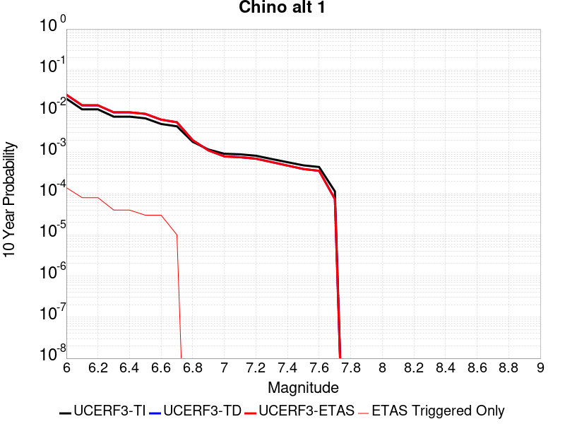 |

| Magnitude | 1 wk TI Prob | 1 wk TD Prob | 1 wk ETAS Prob | 1 wk ETAS/TD Gain | 1 wk ETAS Triggered Only | 1 mo TI Prob | 1 mo TD Prob | 1 mo ETAS Prob | 1 mo ETAS/TD Gain | 1 mo ETAS Triggered Only | 1 yr TI Prob | 1 yr TD Prob | 1 yr ETAS Prob | 1 yr ETAS/TD Gain | 1 yr ETAS Triggered Only | 10 yr TI Prob | 10 yr TD Prob | 10 yr ETAS Prob | 10 yr ETAS/TD Gain | 10 yr ETAS Triggered Only |
|-----|-----|-----|-----|-----|-----|-----|-----|-----|-----|-----|-----|-----|-----|-----|-----|-----|-----|-----|-----|-----|
| 6.0 | 3.939946E-5 | 4.8948554E-5 | 1.0341805E-4 | 2.1127908 | 5.4472166E-5 | 1.6884391E-4 | 2.097656E-4 | 2.6422634E-4 | 1.2596266 | 5.4472166E-5 | 0.0020537362 | 0.0025513945 | 0.0026057279 | 1.0212954 | 5.4472166E-5 | 0.020348595 | 0.025277847 | 0.025330942 | 1.0021005 | 5.4472166E-5 |
| 6.1 | 2.1505624E-5 | 2.6879026E-5 | 8.1349724E-5 | 3.0265133 | 5.4472166E-5 | 9.2163704E-5 | 1.1519137E-4 | 1.6965726E-4 | 1.4728296 | 5.4472166E-5 | 0.0011215154 | 0.001401664 | 0.0014560597 | 1.038808 | 5.4472166E-5 | 0.011158722 | 0.013945141 | 0.013998854 | 1.0038517 | 5.4472166E-5 |
| 6.2 | 2.1505624E-5 | 2.6879026E-5 | 8.1349724E-5 | 3.0265133 | 5.4472166E-5 | 9.2163704E-5 | 1.1519137E-4 | 1.6965726E-4 | 1.4728296 | 5.4472166E-5 | 0.0011215154 | 0.001401664 | 0.0014560597 | 1.038808 | 5.4472166E-5 | 0.011158722 | 0.013945141 | 0.013998854 | 1.0038517 | 5.4472166E-5 |
| 6.3 | 1.4290785E-5 | 1.8165128E-5 | 1.8165128E-5 | 1.0 | 0.0 | 6.1244784E-5 | 7.784848E-5 | 7.784848E-5 | 1.0 | 0.0 | 7.454001E-4 | 9.4743853E-4 | 9.4743853E-4 | 1.0 | 0.0 | 0.007429048 | 0.0094444575 | 0.0094444575 | 1.0 | 0.0 |
| 6.4 | 1.4290785E-5 | 1.8165128E-5 | 1.8165128E-5 | 1.0 | 0.0 | 6.1244784E-5 | 7.784848E-5 | 7.784848E-5 | 1.0 | 0.0 | 7.454001E-4 | 9.4743853E-4 | 9.4743853E-4 | 1.0 | 0.0 | 0.007429048 | 0.0094444575 | 0.0094444575 | 1.0 | 0.0 |
| 6.5 | 1.3017944E-5 | 1.6652088E-5 | 1.6652088E-5 | 1.0 | 0.0 | 5.5789995E-5 | 7.136439E-5 | 7.136439E-5 | 1.0 | 0.0 | 6.790315E-4 | 8.685589E-4 | 8.685589E-4 | 1.0 | 0.0 | 0.0067696036 | 0.008661949 | 0.008661949 | 1.0 | 0.0 |
| 6.6 | 9.470016E-6 | 1.2039424E-5 | 1.2039424E-5 | 1.0 | 0.0 | 4.058515E-5 | 5.1596704E-5 | 5.1596704E-5 | 1.0 | 0.0 | 4.940122E-4 | 6.280428E-4 | 6.280428E-4 | 1.0 | 0.0 | 0.004929154 | 0.0062718987 | 0.0062718987 | 1.0 | 0.0 |
| 6.7 | 8.314155E-6 | 1.0407736E-5 | 1.0407736E-5 | 1.0 | 0.0 | 3.5631605E-5 | 4.4604003E-5 | 4.4604003E-5 | 1.0 | 0.0 | 4.3372845E-4 | 5.429507E-4 | 5.429507E-4 | 1.0 | 0.0 | 0.004328829 | 0.005425775 | 0.005425775 | 1.0 | 0.0 |
| 6.8 | 3.4856364E-6 | 3.8133708E-6 | 3.8133708E-6 | 1.0 | 0.0 | 1.4938357E-5 | 1.6342927E-5 | 1.6342927E-5 | 1.0 | 0.0 | 1.8185932E-4 | 1.9895904E-4 | 1.9895904E-4 | 1.0 | 0.0 | 0.0018171056 | 0.0019894864 | 0.0019894864 | 1.0 | 0.0 |
| 6.9 | 2.2645952E-6 | 2.1529022E-6 | 2.1529022E-6 | 1.0 | 0.0 | 9.705372E-6 | 9.226692E-6 | 9.226692E-6 | 1.0 | 0.0 | 1.18156495E-4 | 1.123294E-4 | 1.123294E-4 | 1.0 | 0.0 | 0.0011809369 | 0.0011233423 | 0.0011233423 | 1.0 | 0.0 |
| 7.0 | 1.7864003E-6 | 1.5430785E-6 | 1.5430785E-6 | 1.0 | 0.0 | 7.655979E-6 | 6.613177E-6 | 6.613177E-6 | 1.0 | 0.0 | 9.3207556E-5 | 8.051251E-5 | 8.051251E-5 | 1.0 | 0.0 | 9.316847E-4 | 8.0528046E-4 | 8.0528046E-4 | 1.0 | 0.0 |
| 7.1 | 1.7315456E-6 | 1.4733511E-6 | 1.4733511E-6 | 1.0 | 0.0 | 7.420889E-6 | 6.3143466E-6 | 6.3143466E-6 | 1.0 | 0.0 | 9.034557E-5 | 7.6874516E-5 | 7.6874516E-5 | 1.0 | 0.0 | 9.0308854E-4 | 7.6891703E-4 | 7.6891703E-4 | 1.0 | 0.0 |
| 7.2 | 1.6008337E-6 | 1.3574215E-6 | 1.3574215E-6 | 1.0 | 0.0 | 6.860698E-6 | 5.817508E-6 | 5.817508E-6 | 1.0 | 0.0 | 8.352579E-5 | 7.082591E-5 | 7.082591E-5 | 1.0 | 0.0 | 8.34944E-4 | 7.0845755E-4 | 7.0845755E-4 | 1.0 | 0.0 |
| 7.3 | 1.3320939E-6 | 1.121782E-6 | 1.121782E-6 | 1.0 | 0.0 | 5.7089615E-6 | 4.807629E-6 | 4.807629E-6 | 1.0 | 0.0 | 6.9504385E-5 | 5.8531357E-5 | 5.8531357E-5 | 1.0 | 0.0 | 6.9482654E-4 | 5.8530393E-4 | 5.8530393E-4 | 1.0 | 0.0 |
| 7.4 | 1.114294E-6 | 9.237111E-7 | 9.237111E-7 | 1.0 | 0.0 | 4.775537E-6 | 3.958756E-6 | 3.958756E-6 | 1.0 | 0.0 | 5.8140613E-5 | 4.8196827E-5 | 4.8196827E-5 | 1.0 | 0.0 | 5.81254E-4 | 4.8188053E-4 | 4.8188053E-4 | 1.0 | 0.0 |
| 7.5 | 9.354081E-7 | 7.6234323E-7 | 7.6234323E-7 | 1.0 | 0.0 | 4.0088858E-6 | 3.2671815E-6 | 3.2671815E-6 | 1.0 | 0.0 | 4.8807087E-5 | 3.9777242E-5 | 3.9777242E-5 | 1.0 | 0.0 | 4.879637E-4 | 3.977046E-4 | 3.977046E-4 | 1.0 | 0.0 |
| 7.6 | 8.521771E-7 | 6.88071E-7 | 6.88071E-7 | 1.0 | 0.0 | 3.6521824E-6 | 2.9488726E-6 | 2.9488726E-6 | 1.0 | 0.0 | 4.4464414E-5 | 3.5901965E-5 | 3.5901965E-5 | 1.0 | 0.0 | 4.4455516E-4 | 3.589648E-4 | 3.589648E-4 | 1.0 | 0.0 |
| 7.7 | 2.1803626E-7 | 1.418649E-7 | 1.418649E-7 | 1.0 | 0.0 | 9.344408E-7 | 6.079923E-7 | 6.079923E-7 | 1.0 | 0.0 | 1.1376757E-5 | 7.4022914E-6 | 7.4022914E-6 | 1.0 | 0.0 | 1.13761744E-4 | 7.402141E-5 | 7.402141E-5 | 1.0 | 0.0 |

## Great Valley 08 (Quinto)
*[(top)](#table-of-contents)*

| 1 Week | 1 Month | 1 Year | 10 Year |
|-----|-----|-----|-----|
|  |  |  |  |

| Magnitude | 1 wk TI Prob | 1 wk TD Prob | 1 wk ETAS Prob | 1 wk ETAS/TD Gain | 1 wk ETAS Triggered Only | 1 mo TI Prob | 1 mo TD Prob | 1 mo ETAS Prob | 1 mo ETAS/TD Gain | 1 mo ETAS Triggered Only | 1 yr TI Prob | 1 yr TD Prob | 1 yr ETAS Prob | 1 yr ETAS/TD Gain | 1 yr ETAS Triggered Only | 10 yr TI Prob | 10 yr TD Prob | 10 yr ETAS Prob | 10 yr ETAS/TD Gain | 10 yr ETAS Triggered Only |
|-----|-----|-----|-----|-----|-----|-----|-----|-----|-----|-----|-----|-----|-----|-----|-----|-----|-----|-----|-----|-----|
| 6.0 | 7.737697E-6 | 8.253038E-6 | 8.253038E-6 | 1.0 | 0.0 | 3.3161137E-5 | 3.536979E-5 | 3.536979E-5 | 1.0 | 0.0 | 4.0366207E-4 | 4.3056096E-4 | 4.3056096E-4 | 1.0 | 0.0 | 0.004029296 | 0.0042991205 | 0.0043533584 | 1.012616 | 5.4472166E-5 |
| 6.1 | 7.737697E-6 | 8.253038E-6 | 8.253038E-6 | 1.0 | 0.0 | 3.3161137E-5 | 3.536979E-5 | 3.536979E-5 | 1.0 | 0.0 | 4.0366207E-4 | 4.3056096E-4 | 4.3056096E-4 | 1.0 | 0.0 | 0.004029296 | 0.0042991205 | 0.0043533584 | 1.012616 | 5.4472166E-5 |
| 6.2 | 7.737697E-6 | 8.253038E-6 | 8.253038E-6 | 1.0 | 0.0 | 3.3161137E-5 | 3.536979E-5 | 3.536979E-5 | 1.0 | 0.0 | 4.0366207E-4 | 4.3056096E-4 | 4.3056096E-4 | 1.0 | 0.0 | 0.004029296 | 0.0042991205 | 0.0043533584 | 1.012616 | 5.4472166E-5 |
| 6.3 | 5.374012E-6 | 5.7505736E-6 | 5.7505736E-6 | 1.0 | 0.0 | 2.3031276E-5 | 2.4645145E-5 | 2.4645145E-5 | 1.0 | 0.0 | 2.803697E-4 | 3.0002446E-4 | 3.0002446E-4 | 1.0 | 0.0 | 0.0028001624 | 0.0029972875 | 0.0030515965 | 1.0181193 | 5.4472166E-5 |
| 6.4 | 5.374012E-6 | 5.7505736E-6 | 5.7505736E-6 | 1.0 | 0.0 | 2.3031276E-5 | 2.4645145E-5 | 2.4645145E-5 | 1.0 | 0.0 | 2.803697E-4 | 3.0002446E-4 | 3.0002446E-4 | 1.0 | 0.0 | 0.0028001624 | 0.0029972875 | 0.0030515965 | 1.0181193 | 5.4472166E-5 |
| 6.5 | 3.65427E-6 | 3.941324E-6 | 3.941324E-6 | 1.0 | 0.0 | 1.5661062E-5 | 1.689132E-5 | 1.689132E-5 | 1.0 | 0.0 | 1.9065675E-4 | 2.0563944E-4 | 2.0563944E-4 | 1.0 | 0.0 | 0.0019049325 | 0.0020551833 | 0.0020551833 | 1.0 | 0.0 |
| 6.6 | 3.6143538E-6 | 3.8985104E-6 | 3.8985104E-6 | 1.0 | 0.0 | 1.5489995E-5 | 1.6707834E-5 | 1.6707834E-5 | 1.0 | 0.0 | 1.8857437E-4 | 2.0340596E-4 | 2.0340596E-4 | 1.0 | 0.0 | 0.0018841444 | 0.0020328893 | 0.0020328893 | 1.0 | 0.0 |
| 6.7 | 2.4821015E-6 | 2.6857067E-6 | 2.6857067E-6 | 1.0 | 0.0 | 1.0637535E-5 | 1.1510153E-5 | 1.1510153E-5 | 1.0 | 0.0 | 1.2950429E-4 | 1.4013276E-4 | 1.4013276E-4 | 1.0 | 0.0 | 0.0012942884 | 0.0014009989 | 0.0014009989 | 1.0 | 0.0 |
| 6.8 | 4.7110538E-7 | 5.193021E-7 | 5.193021E-7 | 1.0 | 0.0 | 2.0190216E-6 | 2.2255786E-6 | 2.2255786E-6 | 1.0 | 0.0 | 2.458131E-5 | 2.70961E-5 | 2.70961E-5 | 1.0 | 0.0 | 2.457859E-4 | 2.7092977E-4 | 2.7092977E-4 | 1.0 | 0.0 |
| 6.9 | 3.958685E-7 | 4.3703452E-7 | 4.3703452E-7 | 1.0 | 0.0 | 1.6965782E-6 | 1.8730038E-6 | 1.8730038E-6 | 1.0 | 0.0 | 2.0655643E-5 | 2.28036E-5 | 2.28036E-5 | 1.0 | 0.0 | 2.0653724E-4 | 2.2801422E-4 | 2.2801422E-4 | 1.0 | 0.0 |
| 7.0 | 2.70294E-7 | 2.9920008E-7 | 2.9920008E-7 | 1.0 | 0.0 | 1.1584025E-6 | 1.2822856E-6 | 1.2822856E-6 | 1.0 | 0.0 | 1.4103458E-5 | 1.5611728E-5 | 1.5611728E-5 | 1.0 | 0.0 | 1.4102564E-4 | 1.5610759E-4 | 1.5610759E-4 | 1.0 | 0.0 |
| 7.1 | 1.4828602E-7 | 1.6469107E-7 | 1.6469107E-7 | 1.0 | 0.0 | 6.3551136E-7 | 7.058187E-7 | 7.058187E-7 | 1.0 | 0.0 | 7.737323E-6 | 8.593317E-6 | 8.593317E-6 | 1.0 | 0.0 | 7.737054E-5 | 8.593065E-5 | 8.593065E-5 | 1.0 | 0.0 |

## San Andreas (North Branch Mill Creek)
*[(top)](#table-of-contents)*

| 1 Week | 1 Month | 1 Year | 10 Year |
|-----|-----|-----|-----|
|  |  | 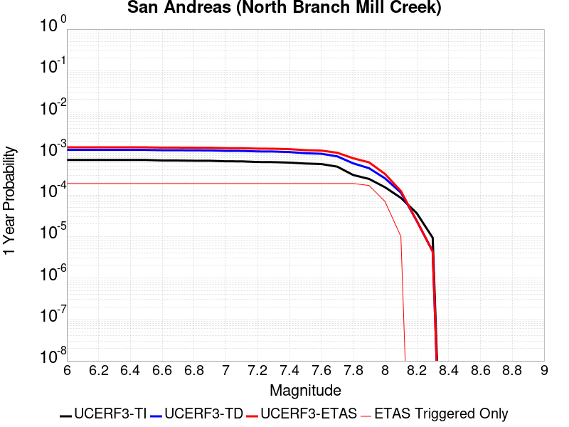 |  |

| Magnitude | 1 wk TI Prob | 1 wk TD Prob | 1 wk ETAS Prob | 1 wk ETAS/TD Gain | 1 wk ETAS Triggered Only | 1 mo TI Prob | 1 mo TD Prob | 1 mo ETAS Prob | 1 mo ETAS/TD Gain | 1 mo ETAS Triggered Only | 1 yr TI Prob | 1 yr TD Prob | 1 yr ETAS Prob | 1 yr ETAS/TD Gain | 1 yr ETAS Triggered Only | 10 yr TI Prob | 10 yr TD Prob | 10 yr ETAS Prob | 10 yr ETAS/TD Gain | 10 yr ETAS Triggered Only |
|-----|-----|-----|-----|-----|-----|-----|-----|-----|-----|-----|-----|-----|-----|-----|-----|-----|-----|-----|-----|-----|
| 6.0 | 1.3461156E-5 | 2.3499893E-5 | 7.797078E-5 | 3.3179204 | 5.4472166E-5 | 5.7689394E-5 | 1.00709956E-4 | 1.5517663E-4 | 1.5408272 | 5.4472166E-5 | 7.02142E-4 | 0.0012254574 | 0.0012798628 | 1.044396 | 5.4472166E-5 | 0.0069992766 | 0.01222957 | 0.0122833755 | 1.0043997 | 5.4472166E-5 |
| 6.1 | 1.3461156E-5 | 2.3499893E-5 | 7.797078E-5 | 3.3179204 | 5.4472166E-5 | 5.7689394E-5 | 1.00709956E-4 | 1.5517663E-4 | 1.5408272 | 5.4472166E-5 | 7.02142E-4 | 0.0012254574 | 0.0012798628 | 1.044396 | 5.4472166E-5 | 0.0069992766 | 0.01222957 | 0.0122833755 | 1.0043997 | 5.4472166E-5 |
| 6.2 | 1.3461156E-5 | 2.3499893E-5 | 7.797078E-5 | 3.3179204 | 5.4472166E-5 | 5.7689394E-5 | 1.00709956E-4 | 1.5517663E-4 | 1.5408272 | 5.4472166E-5 | 7.02142E-4 | 0.0012254574 | 0.0012798628 | 1.044396 | 5.4472166E-5 | 0.0069992766 | 0.01222957 | 0.0122833755 | 1.0043997 | 5.4472166E-5 |
| 6.3 | 1.3461156E-5 | 2.3499893E-5 | 7.797078E-5 | 3.3179204 | 5.4472166E-5 | 5.7689394E-5 | 1.00709956E-4 | 1.5517663E-4 | 1.5408272 | 5.4472166E-5 | 7.02142E-4 | 0.0012254574 | 0.0012798628 | 1.044396 | 5.4472166E-5 | 0.0069992766 | 0.01222957 | 0.0122833755 | 1.0043997 | 5.4472166E-5 |
| 6.4 | 1.3461156E-5 | 2.3499893E-5 | 7.797078E-5 | 3.3179204 | 5.4472166E-5 | 5.7689394E-5 | 1.00709956E-4 | 1.5517663E-4 | 1.5408272 | 5.4472166E-5 | 7.02142E-4 | 0.0012254574 | 0.0012798628 | 1.044396 | 5.4472166E-5 | 0.0069992766 | 0.01222957 | 0.0122833755 | 1.0043997 | 5.4472166E-5 |
| 6.5 | 1.3450706E-5 | 2.3488852E-5 | 7.795974E-5 | 3.31901 | 5.4472166E-5 | 5.764461E-5 | 1.0066265E-4 | 1.5512932E-4 | 1.5410813 | 5.4472166E-5 | 7.0159714E-4 | 0.001224882 | 0.0012792874 | 1.0444169 | 5.4472166E-5 | 0.006993862 | 0.01222388 | 0.012277686 | 1.0044017 | 5.4472166E-5 |
| 6.6 | 1.3074523E-5 | 2.3103135E-5 | 7.757404E-5 | 3.3577278 | 5.4472166E-5 | 5.6032466E-5 | 9.9009696E-5 | 1.5347647E-4 | 1.5501155 | 5.4472166E-5 | 6.8198174E-4 | 0.0012047797 | 0.0012591863 | 1.0451589 | 5.4472166E-5 | 0.006798926 | 0.012025044 | 0.012078862 | 1.0044755 | 5.4472166E-5 |
| 6.7 | 1.3050216E-5 | 2.3078432E-5 | 7.754934E-5 | 3.3602517 | 5.4472166E-5 | 5.59283E-5 | 9.890384E-5 | 1.5337061E-4 | 1.5507044 | 5.4472166E-5 | 6.8071426E-4 | 0.0012034923 | 0.0012578989 | 1.0452073 | 5.4472166E-5 | 0.0067863287 | 0.012012309 | 0.012066127 | 1.0044802 | 5.4472166E-5 |
| 6.8 | 1.29049395E-5 | 2.292684E-5 | 7.739776E-5 | 3.3758578 | 5.4472166E-5 | 5.530571E-5 | 9.825421E-5 | 1.5272103E-4 | 1.5543458 | 5.4472166E-5 | 6.73139E-4 | 0.0011955918 | 0.0012499988 | 1.0455064 | 5.4472166E-5 | 0.0067110364 | 0.011934154 | 0.011987977 | 1.0045099 | 5.4472166E-5 |
| 6.9 | 1.2867369E-5 | 2.2886245E-5 | 7.735716E-5 | 3.3800724 | 5.4472166E-5 | 5.51447E-5 | 9.8080236E-5 | 1.5254706E-4 | 1.5553292 | 5.4472166E-5 | 6.711799E-4 | 0.0011934759 | 0.0012478831 | 1.0455872 | 5.4472166E-5 | 0.006691564 | 0.011913223 | 0.011967047 | 1.0045179 | 5.4472166E-5 |
| 7.0 | 1.2495996E-5 | 2.2286325E-5 | 7.675728E-5 | 3.4441423 | 5.4472166E-5 | 5.3553173E-5 | 9.550934E-5 | 1.499763E-4 | 1.5702789 | 5.4472166E-5 | 6.518148E-4 | 0.0011622087 | 0.0012166176 | 1.046815 | 5.4472166E-5 | 0.0064990623 | 0.0116038285 | 0.011657668 | 1.0046399 | 5.4472166E-5 |
| 7.1 | 1.2452067E-5 | 2.2231397E-5 | 7.670235E-5 | 3.4501812 | 5.4472166E-5 | 5.3364907E-5 | 9.527396E-5 | 1.4974094E-4 | 1.5716879 | 5.4472166E-5 | 6.4952404E-4 | 0.0011593461 | 0.001213755 | 1.0469308 | 5.4472166E-5 | 0.0064762887 | 0.0115755 | 0.011629341 | 1.0046513 | 5.4472166E-5 |
| 7.2 | 1.2002777E-5 | 2.1609963E-5 | 7.608095E-5 | 3.5206423 | 5.4472166E-5 | 5.143946E-5 | 9.2610855E-5 | 1.4707798E-4 | 1.5881289 | 5.4472166E-5 | 6.2609545E-4 | 0.0011269567 | 0.0011813674 | 1.0482812 | 5.4472166E-5 | 0.006243344 | 0.011254923 | 0.011308782 | 1.0047854 | 5.4472166E-5 |
| 7.3 | 1.1923425E-5 | 2.1479793E-5 | 7.595079E-5 | 3.535918 | 5.4472166E-5 | 5.109939E-5 | 9.205302E-5 | 1.4652018E-4 | 1.5916933 | 5.4472166E-5 | 6.219575E-4 | 0.001120172 | 0.0011745831 | 1.048574 | 5.4472166E-5 | 0.0062021962 | 0.011187789 | 0.011241652 | 1.0048144 | 5.4472166E-5 |
| 7.4 | 1.16105175E-5 | 2.0853771E-5 | 7.53248E-5 | 3.6120467 | 5.4472166E-5 | 4.975841E-5 | 8.937026E-5 | 1.4383756E-4 | 1.6094567 | 5.4472166E-5 | 6.0564023E-4 | 0.0010875424 | 0.0011419553 | 1.050033 | 5.4472166E-5 | 0.006039923 | 0.010865397 | 0.010919277 | 1.0049589 | 5.4472166E-5 |
| 7.5 | 1.1037265E-5 | 1.9553907E-5 | 7.4025E-5 | 3.7856889 | 5.4472166E-5 | 4.7301706E-5 | 8.379978E-5 | 1.3826738E-4 | 1.649973 | 5.4472166E-5 | 5.757461E-4 | 0.0010197869 | 0.0010742035 | 1.0533608 | 5.4472166E-5 | 0.005742567 | 0.010194898 | 0.010248815 | 1.0052886 | 5.4472166E-5 |
| 7.6 | 1.0720915E-5 | 1.899582E-5 | 7.346695E-5 | 3.8675327 | 5.4472166E-5 | 4.5945973E-5 | 8.140812E-5 | 1.3587586E-4 | 1.66907 | 5.4472166E-5 | 5.592486E-4 | 9.906954E-4 | 0.0010451135 | 1.0549293 | 5.4472166E-5 | 0.005578433 | 0.009906623 | 0.009960555 | 1.005444 | 5.4472166E-5 |
| 7.7 | 9.276279E-6 | 1.6441649E-5 | 7.0912916E-5 | 4.3130054 | 5.4472166E-5 | 3.9754876E-5 | 7.0462316E-5 | 1.2493064E-4 | 1.7730136 | 5.4472166E-5 | 4.839081E-4 | 8.575427E-4 | 9.119681E-4 | 1.0634668 | 5.4472166E-5 | 0.0048285574 | 0.008586041 | 0.008640045 | 1.0062898 | 5.4472166E-5 |
| 7.8 | 5.8346777E-6 | 1.1155013E-5 | 6.562657E-5 | 5.883146 | 5.4472166E-5 | 2.5005522E-5 | 4.7806327E-5 | 1.0227589E-4 | 2.1393797 | 5.4472166E-5 | 3.043997E-4 | 5.818867E-4 | 6.3632714E-4 | 1.0935585 | 5.4472166E-5 | 0.0030398308 | 0.0058469265 | 0.00590108 | 1.0092618 | 5.4472166E-5 |
| 7.9 | 4.690204E-6 | 8.509093E-6 | 6.29808E-5 | 7.401587 | 5.4472166E-5 | 2.0100719E-5 | 3.6467034E-5 | 9.093721E-5 | 2.4936826 | 5.4472166E-5 | 2.4469878E-4 | 4.4389578E-4 | 4.983438E-4 | 1.1226594 | 5.4472166E-5 | 0.002444295 | 0.0044707474 | 0.004524976 | 1.0121297 | 5.4472166E-5 |
| 8.0 | 2.9570454E-6 | 4.846947E-6 | 4.846947E-6 | 1.0 | 0.0 | 1.267299E-5 | 2.0772464E-5 | 2.0772464E-5 | 1.0 | 0.0 | 1.5428272E-4 | 2.5287544E-4 | 2.5287544E-4 | 1.0 | 0.0 | 0.0015417566 | 0.002549644 | 0.002549644 | 1.0 | 0.0 |
| 8.1 | 1.6376824E-6 | 2.1968929E-6 | 2.1968929E-6 | 1.0 | 0.0 | 7.01862E-6 | 9.41522E-6 | 9.41522E-6 | 1.0 | 0.0 | 8.544835E-5 | 1.14624294E-4 | 1.14624294E-4 | 1.0 | 0.0 | 8.54155E-4 | 0.0011606582 | 0.0011606582 | 1.0 | 0.0 |
| 8.2 | 6.9631557E-7 | 4.5360213E-7 | 4.5360213E-7 | 1.0 | 0.0 | 2.984206E-6 | 1.9440076E-6 | 1.9440076E-6 | 1.0 | 0.0 | 3.63321E-5 | 2.3668037E-5 | 2.3668037E-5 | 1.0 | 0.0 | 3.6326164E-4 | 2.451564E-4 | 2.451564E-4 | 1.0 | 0.0 |
| 8.3 | 1.7876137E-7 | 8.360375E-8 | 8.360375E-8 | 1.0 | 0.0 | 7.661199E-7 | 3.5830175E-7 | 3.5830175E-7 | 1.0 | 0.0 | 9.32747E-6 | 4.3623154E-6 | 4.3623154E-6 | 1.0 | 0.0 | 9.3270784E-5 | 4.5817014E-5 | 4.5817014E-5 | 1.0 | 0.0 |

## Simi-Santa Rosa
*[(top)](#table-of-contents)*

| 1 Week | 1 Month | 1 Year | 10 Year |
|-----|-----|-----|-----|
|  |  |  |  |

| Magnitude | 1 wk TI Prob | 1 wk TD Prob | 1 wk ETAS Prob | 1 wk ETAS/TD Gain | 1 wk ETAS Triggered Only | 1 mo TI Prob | 1 mo TD Prob | 1 mo ETAS Prob | 1 mo ETAS/TD Gain | 1 mo ETAS Triggered Only | 1 yr TI Prob | 1 yr TD Prob | 1 yr ETAS Prob | 1 yr ETAS/TD Gain | 1 yr ETAS Triggered Only | 10 yr TI Prob | 10 yr TD Prob | 10 yr ETAS Prob | 10 yr ETAS/TD Gain | 10 yr ETAS Triggered Only |
|-----|-----|-----|-----|-----|-----|-----|-----|-----|-----|-----|-----|-----|-----|-----|-----|-----|-----|-----|-----|-----|
| 6.0 | 2.198912E-5 | 2.2275442E-5 | 2.2275442E-5 | 1.0 | 0.0 | 9.4235686E-5 | 9.5462936E-5 | 9.5462936E-5 | 1.0 | 0.0 | 0.0011467156 | 0.0011616853 | 0.0011616853 | 1.0 | 0.0 | 0.011408163 | 0.011560575 | 0.011614418 | 1.0046574 | 5.4472166E-5 |
| 6.1 | 2.198912E-5 | 2.2275442E-5 | 2.2275442E-5 | 1.0 | 0.0 | 9.4235686E-5 | 9.5462936E-5 | 9.5462936E-5 | 1.0 | 0.0 | 0.0011467156 | 0.0011616853 | 0.0011616853 | 1.0 | 0.0 | 0.011408163 | 0.011560575 | 0.011614418 | 1.0046574 | 5.4472166E-5 |
| 6.2 | 1.69983E-5 | 1.6668559E-5 | 1.6668559E-5 | 1.0 | 0.0 | 7.284782E-5 | 7.143489E-5 | 7.143489E-5 | 1.0 | 0.0 | 8.865613E-4 | 8.6940196E-4 | 8.6940196E-4 | 1.0 | 0.0 | 0.008830327 | 0.008662928 | 0.008716928 | 1.0062335 | 5.4472166E-5 |
| 6.3 | 1.69983E-5 | 1.6668559E-5 | 1.6668559E-5 | 1.0 | 0.0 | 7.284782E-5 | 7.143489E-5 | 7.143489E-5 | 1.0 | 0.0 | 8.865613E-4 | 8.6940196E-4 | 8.6940196E-4 | 1.0 | 0.0 | 0.008830327 | 0.008662928 | 0.008716928 | 1.0062335 | 5.4472166E-5 |
| 6.4 | 1.4666188E-5 | 1.4052543E-5 | 1.4052543E-5 | 1.0 | 0.0 | 6.285358E-5 | 6.0223934E-5 | 6.0223934E-5 | 1.0 | 0.0 | 7.6497364E-4 | 7.3300465E-4 | 7.3300465E-4 | 1.0 | 0.0 | 0.0076234564 | 0.007308344 | 0.0073624183 | 1.007399 | 5.4472166E-5 |
| 6.5 | 1.4666188E-5 | 1.4052543E-5 | 1.4052543E-5 | 1.0 | 0.0 | 6.285358E-5 | 6.0223934E-5 | 6.0223934E-5 | 1.0 | 0.0 | 7.6497364E-4 | 7.3300465E-4 | 7.3300465E-4 | 1.0 | 0.0 | 0.0076234564 | 0.007308344 | 0.0073624183 | 1.007399 | 5.4472166E-5 |
| 6.6 | 1.4377586E-5 | 1.3729583E-5 | 1.3729583E-5 | 1.0 | 0.0 | 6.1616774E-5 | 5.883988E-5 | 5.883988E-5 | 1.0 | 0.0 | 7.4992597E-4 | 7.1616494E-4 | 7.1616494E-4 | 1.0 | 0.0 | 0.007474003 | 0.0071410383 | 0.0071951216 | 1.0075736 | 5.4472166E-5 |
| 6.7 | 1.3881404E-5 | 1.320755E-5 | 1.320755E-5 | 1.0 | 0.0 | 5.9490372E-5 | 5.66027E-5 | 5.66027E-5 | 1.0 | 0.0 | 7.240546E-4 | 6.8894465E-4 | 6.8894465E-4 | 1.0 | 0.0 | 0.007217 | 0.006870538 | 0.006924636 | 1.0078739 | 5.4472166E-5 |
| 6.8 | 1.0176516E-5 | 9.154151E-6 | 9.154151E-6 | 1.0 | 0.0 | 4.3612912E-5 | 3.9231574E-5 | 3.9231574E-5 | 1.0 | 0.0 | 5.308578E-4 | 4.7755634E-4 | 4.7755634E-4 | 1.0 | 0.0 | 0.0052959146 | 0.004766934 | 0.004821147 | 1.0113726 | 5.4472166E-5 |
| 6.9 | 9.699797E-6 | 8.774719E-6 | 8.774719E-6 | 1.0 | 0.0 | 4.15699E-5 | 3.7605492E-5 | 3.7605492E-5 | 1.0 | 0.0 | 5.05996E-4 | 4.577671E-4 | 4.577671E-4 | 1.0 | 0.0 | 0.005048454 | 0.0045698597 | 0.0046240827 | 1.0118654 | 5.4472166E-5 |
| 7.0 | 7.4049476E-6 | 6.559333E-6 | 6.559333E-6 | 1.0 | 0.0 | 3.1735104E-5 | 2.8111197E-5 | 2.8111197E-5 | 1.0 | 0.0 | 3.8630638E-4 | 3.422127E-4 | 3.422127E-4 | 1.0 | 0.0 | 0.0038563553 | 0.0034180996 | 0.0034180996 | 1.0 | 0.0 |
| 7.1 | 3.873439E-6 | 2.7595095E-6 | 2.7595095E-6 | 1.0 | 0.0 | 1.6600346E-5 | 1.1826417E-5 | 1.1826417E-5 | 1.0 | 0.0 | 2.0209046E-4 | 1.4397735E-4 | 1.4397735E-4 | 1.0 | 0.0 | 0.0020190678 | 0.0014388643 | 0.0014388643 | 1.0 | 0.0 |
| 7.2 | 3.417706E-6 | 2.3676484E-6 | 2.3676484E-6 | 1.0 | 0.0 | 1.4647229E-5 | 1.0147027E-5 | 1.0147027E-5 | 1.0 | 0.0 | 1.7831543E-4 | 1.2353327E-4 | 1.2353327E-4 | 1.0 | 0.0 | 0.0017817242 | 0.0012346683 | 0.0012346683 | 1.0 | 0.0 |
| 7.3 | 1.90225E-6 | 1.4073753E-6 | 1.4073753E-6 | 1.0 | 0.0 | 8.152474E-6 | 6.0315947E-6 | 6.0315947E-6 | 1.0 | 0.0 | 9.9251854E-5 | 7.343221E-5 | 7.343221E-5 | 1.0 | 0.0 | 9.920754E-4 | 7.340817E-4 | 7.340817E-4 | 1.0 | 0.0 |
| 7.4 | 1.5170556E-6 | 1.1024773E-6 | 1.1024773E-6 | 1.0 | 0.0 | 6.5016507E-6 | 4.724894E-6 | 4.724894E-6 | 1.0 | 0.0 | 7.915472E-5 | 5.7524077E-5 | 5.7524077E-5 | 1.0 | 0.0 | 7.9126534E-4 | 5.7509297E-4 | 5.7509297E-4 | 1.0 | 0.0 |
| 7.5 | 1.178732E-6 | 8.535102E-7 | 8.535102E-7 | 1.0 | 0.0 | 5.0516987E-6 | 3.6578958E-6 | 3.6578958E-6 | 1.0 | 0.0 | 6.1502695E-5 | 4.453398E-5 | 4.453398E-5 | 1.0 | 0.0 | 6.148568E-4 | 4.452515E-4 | 4.452515E-4 | 1.0 | 0.0 |
| 7.6 | 6.8722386E-7 | 4.793198E-7 | 4.793198E-7 | 1.0 | 0.0 | 2.9452417E-6 | 2.054226E-6 | 2.054226E-6 | 1.0 | 0.0 | 3.5857727E-5 | 2.5009915E-5 | 2.5009915E-5 | 1.0 | 0.0 | 3.5851944E-4 | 2.5007114E-4 | 2.5007114E-4 | 1.0 | 0.0 |
| 7.7 | 5.5126515E-7 | 3.6731157E-7 | 3.6731157E-7 | 1.0 | 0.0 | 2.3625628E-6 | 1.5741915E-6 | 1.5741915E-6 | 1.0 | 0.0 | 2.8763823E-5 | 1.9165615E-5 | 1.9165615E-5 | 1.0 | 0.0 | 2.87601E-4 | 1.9163972E-4 | 1.9163972E-4 | 1.0 | 0.0 |
| 7.8 | 3.3860243E-7 | 2.0075942E-7 | 2.0075942E-7 | 1.0 | 0.0 | 1.4511525E-6 | 8.6039717E-7 | 8.6039717E-7 | 1.0 | 0.0 | 1.7667637E-5 | 1.0475286E-5 | 1.0475286E-5 | 1.0 | 0.0 | 1.7666233E-4 | 1.04747975E-4 | 1.04747975E-4 | 1.0 | 0.0 |
| 7.9 | 2.7955386E-7 | 1.4649108E-7 | 1.4649108E-7 | 1.0 | 0.0 | 1.1980875E-6 | 6.278188E-7 | 6.278188E-7 | 1.0 | 0.0 | 1.4586617E-5 | 7.643667E-6 | 7.643667E-6 | 1.0 | 0.0 | 1.458566E-4 | 7.643409E-5 | 7.643409E-5 | 1.0 | 0.0 |
| 8.0 | 5.6259015E-8 | 3.3355324E-8 | 3.3355324E-8 | 1.0 | 0.0 | 2.4111003E-7 | 1.4295138E-7 | 1.4295138E-7 | 1.0 | 0.0 | 2.9355108E-6 | 1.7404317E-6 | 1.7404317E-6 | 1.0 | 0.0 | 2.935472E-5 | 1.7404194E-5 | 1.7404194E-5 | 1.0 | 0.0 |

## San Jacinto (Superstition Mtn)
*[(top)](#table-of-contents)*

| 1 Week | 1 Month | 1 Year | 10 Year |
|-----|-----|-----|-----|
|  |  |  |  |

| Magnitude | 1 wk TI Prob | 1 wk TD Prob | 1 wk ETAS Prob | 1 wk ETAS/TD Gain | 1 wk ETAS Triggered Only | 1 mo TI Prob | 1 mo TD Prob | 1 mo ETAS Prob | 1 mo ETAS/TD Gain | 1 mo ETAS Triggered Only | 1 yr TI Prob | 1 yr TD Prob | 1 yr ETAS Prob | 1 yr ETAS/TD Gain | 1 yr ETAS Triggered Only | 10 yr TI Prob | 10 yr TD Prob | 10 yr ETAS Prob | 10 yr ETAS/TD Gain | 10 yr ETAS Triggered Only |
|-----|-----|-----|-----|-----|-----|-----|-----|-----|-----|-----|-----|-----|-----|-----|-----|-----|-----|-----|-----|-----|
| 6.0 | 6.4193904E-5 | 9.599367E-5 | 1.504606E-4 | 1.5674013 | 5.4472166E-5 | 2.7508775E-4 | 4.1134638E-4 | 4.6579613E-4 | 1.1323696 | 5.4472166E-5 | 0.0033440501 | 0.0049980893 | 0.0050522895 | 1.0108441 | 5.4472166E-5 | 0.03294174 | 0.048823986 | 0.048875798 | 1.0010612 | 5.4472166E-5 |
| 6.1 | 6.4193904E-5 | 9.599367E-5 | 1.504606E-4 | 1.5674013 | 5.4472166E-5 | 2.7508775E-4 | 4.1134638E-4 | 4.6579613E-4 | 1.1323696 | 5.4472166E-5 | 0.0033440501 | 0.0049980893 | 0.0050522895 | 1.0108441 | 5.4472166E-5 | 0.03294174 | 0.048823986 | 0.048875798 | 1.0010612 | 5.4472166E-5 |
| 6.2 | 5.7023593E-5 | 8.3144434E-5 | 1.3761206E-4 | 1.6550967 | 5.4472166E-5 | 2.4436394E-4 | 3.5629404E-4 | 4.1074678E-4 | 1.152831 | 5.4472166E-5 | 0.002971072 | 0.0043308944 | 0.0043851305 | 1.012523 | 5.4472166E-5 | 0.029316625 | 0.04250403 | 0.042556185 | 1.0012271 | 5.4472166E-5 |
| 6.3 | 5.6940098E-5 | 8.298979E-5 | 1.3745743E-4 | 1.6563174 | 5.4472166E-5 | 2.4400617E-4 | 3.5563146E-4 | 4.1008426E-4 | 1.1531157 | 5.4472166E-5 | 0.002966728 | 0.00432286 | 0.0043770964 | 1.0125465 | 5.4472166E-5 | 0.029274331 | 0.042427283 | 0.042479444 | 1.0012294 | 5.4472166E-5 |
| 6.4 | 5.4171585E-5 | 7.7483564E-5 | 7.7483564E-5 | 1.0 | 0.0 | 2.3214328E-4 | 3.3203943E-4 | 3.3203943E-4 | 1.0 | 0.0 | 0.0028226813 | 0.0040367353 | 0.0040367353 | 1.0 | 0.0 | 0.02787096 | 0.03971653 | 0.03971653 | 1.0 | 0.0 |
| 6.5 | 4.375144E-5 | 5.642133E-5 | 5.642133E-5 | 1.0 | 0.0 | 1.874927E-4 | 2.4178992E-4 | 2.4178992E-4 | 1.0 | 0.0 | 0.0022803338 | 0.002940994 | 0.002940994 | 1.0 | 0.0 | 0.022570757 | 0.029236801 | 0.029236801 | 1.0 | 0.0 |
| 6.6 | 2.772192E-5 | 2.5488358E-5 | 2.5488358E-5 | 1.0 | 0.0 | 1.1880282E-4 | 1.09231354E-4 | 1.09231354E-4 | 1.0 | 0.0 | 0.0014454646 | 0.0013290998 | 0.0013290998 | 1.0 | 0.0 | 0.014360986 | 0.01354049 | 0.01354049 | 1.0 | 0.0 |
| 6.7 | 2.7124124E-5 | 2.4699386E-5 | 2.4699386E-5 | 1.0 | 0.0 | 1.1624106E-4 | 1.05850326E-4 | 1.05850326E-4 | 1.0 | 0.0 | 0.0014143161 | 0.001287985 | 0.001287985 | 1.0 | 0.0 | 0.014053487 | 0.013133943 | 0.013133943 | 1.0 | 0.0 |
| 6.8 | 2.5475807E-5 | 2.216446E-5 | 2.216446E-5 | 1.0 | 0.0 | 1.0917746E-4 | 9.4987154E-5 | 9.4987154E-5 | 1.0 | 0.0 | 0.001328425 | 0.001155867 | 0.001155867 | 1.0 | 0.0 | 0.0132051185 | 0.011822182 | 0.011822182 | 1.0 | 0.0 |
| 6.9 | 2.1162023E-5 | 1.7626244E-5 | 1.7626244E-5 | 1.0 | 0.0 | 9.069123E-5 | 7.5538876E-5 | 7.5538876E-5 | 1.0 | 0.0 | 0.0011036064 | 9.193016E-4 | 9.193016E-4 | 1.0 | 0.0 | 0.010981417 | 0.00944688 | 0.00944688 | 1.0 | 0.0 |
| 7.0 | 1.8754288E-5 | 1.6161559E-5 | 1.6161559E-5 | 1.0 | 0.0 | 8.037304E-5 | 6.9261994E-5 | 6.9261994E-5 | 1.0 | 0.0 | 9.781026E-4 | 8.4294105E-4 | 8.4294105E-4 | 1.0 | 0.0 | 0.009738087 | 0.008670042 | 0.008670042 | 1.0 | 0.0 |
| 7.1 | 1.8678527E-5 | 1.6086702E-5 | 1.6086702E-5 | 1.0 | 0.0 | 8.0048376E-5 | 6.89412E-5 | 6.89412E-5 | 1.0 | 0.0 | 9.7415317E-4 | 8.3903834E-4 | 8.3903834E-4 | 1.0 | 0.0 | 0.009698939 | 0.008630998 | 0.008630998 | 1.0 | 0.0 |
| 7.2 | 1.7804578E-5 | 1.5381282E-5 | 1.5381282E-5 | 1.0 | 0.0 | 7.6303106E-5 | 6.5918124E-5 | 6.5918124E-5 | 1.0 | 0.0 | 9.285943E-4 | 8.022599E-4 | 8.022599E-4 | 1.0 | 0.0 | 0.009247236 | 0.008262311 | 0.008262311 | 1.0 | 0.0 |
| 7.3 | 1.6583685E-5 | 1.4530388E-5 | 1.4530388E-5 | 1.0 | 0.0 | 7.1070994E-5 | 6.227162E-5 | 6.227162E-5 | 1.0 | 0.0 | 8.649459E-4 | 7.5789524E-4 | 7.5789524E-4 | 1.0 | 0.0 | 0.00861587 | 0.007817623 | 0.007817623 | 1.0 | 0.0 |
| 7.4 | 1.6387552E-5 | 1.4395274E-5 | 1.4395274E-5 | 1.0 | 0.0 | 7.023047E-5 | 6.169258E-5 | 6.169258E-5 | 1.0 | 0.0 | 8.5472054E-4 | 7.5085036E-4 | 7.5085036E-4 | 1.0 | 0.0 | 0.008514405 | 0.0077470057 | 0.0077470057 | 1.0 | 0.0 |
| 7.5 | 1.5790754E-5 | 1.4035962E-5 | 1.4035962E-5 | 1.0 | 0.0 | 6.767291E-5 | 6.0152746E-5 | 6.0152746E-5 | 1.0 | 0.0 | 8.236062E-4 | 7.321156E-4 | 7.321156E-4 | 1.0 | 0.0 | 0.008205604 | 0.007557569 | 0.007557569 | 1.0 | 0.0 |
| 7.6 | 1.4248672E-5 | 1.3054932E-5 | 1.3054932E-5 | 1.0 | 0.0 | 6.106431E-5 | 5.594852E-5 | 5.594852E-5 | 1.0 | 0.0 | 7.432043E-4 | 6.8096205E-4 | 6.8096205E-4 | 1.0 | 0.0 | 0.007407237 | 0.0070401574 | 0.0070401574 | 1.0 | 0.0 |
| 7.7 | 1.15449975E-5 | 1.090368E-5 | 1.090368E-5 | 1.0 | 0.0 | 4.947762E-5 | 4.6729223E-5 | 4.6729223E-5 | 1.0 | 0.0 | 6.022235E-4 | 5.687805E-4 | 5.687805E-4 | 1.0 | 0.0 | 0.006005941 | 0.0059101824 | 0.0059101824 | 1.0 | 0.0 |
| 7.8 | 9.1391985E-6 | 9.514299E-6 | 9.514299E-6 | 1.0 | 0.0 | 3.9167408E-5 | 4.0774932E-5 | 4.0774932E-5 | 1.0 | 0.0 | 4.767588E-4 | 4.963223E-4 | 4.963223E-4 | 1.0 | 0.0 | 0.0047573727 | 0.0051766867 | 0.0051766867 | 1.0 | 0.0 |
| 7.9 | 6.973017E-6 | 7.3821784E-6 | 7.3821784E-6 | 1.0 | 0.0 | 2.9884017E-5 | 3.1637526E-5 | 3.1637526E-5 | 1.0 | 0.0 | 3.6377716E-4 | 3.8511935E-4 | 3.8511935E-4 | 1.0 | 0.0 | 0.0036318225 | 0.0040517948 | 0.0040517948 | 1.0 | 0.0 |
| 8.0 | 5.7638235E-6 | 6.259972E-6 | 6.259972E-6 | 1.0 | 0.0 | 2.4701867E-5 | 2.6828178E-5 | 2.6828178E-5 | 1.0 | 0.0 | 3.0070372E-4 | 3.2658462E-4 | 3.2658462E-4 | 1.0 | 0.0 | 0.0030029714 | 0.0034534496 | 0.0034534496 | 1.0 | 0.0 |
| 8.1 | 5.1124434E-6 | 5.4956718E-6 | 5.4956718E-6 | 1.0 | 0.0 | 2.1910288E-5 | 2.355267E-5 | 2.355267E-5 | 1.0 | 0.0 | 2.6672508E-4 | 2.867165E-4 | 2.867165E-4 | 1.0 | 0.0 | 0.0026640517 | 0.003040336 | 0.003040336 | 1.0 | 0.0 |
| 8.2 | 1.1075938E-6 | 5.336568E-7 | 5.336568E-7 | 1.0 | 0.0 | 4.7468216E-6 | 2.2870988E-6 | 2.2870988E-6 | 1.0 | 0.0 | 5.779102E-5 | 2.7845093E-5 | 2.7845093E-5 | 1.0 | 0.0 | 5.777599E-4 | 3.1346595E-4 | 3.1346595E-4 | 1.0 | 0.0 |
| 8.3 | 1.3584393E-8 | 4.473836E-9 | 4.473836E-9 | 1.0 | 0.0 | 5.8218827E-8 | 1.9173582E-8 | 1.9173582E-8 | 1.0 | 0.0 | 7.0881396E-7 | 2.3343837E-7 | 2.3343837E-7 | 1.0 | 0.0 | 7.0881174E-6 | 2.6163038E-6 | 2.6163038E-6 | 1.0 | 0.0 |

## Northridge
*[(top)](#table-of-contents)*

| 1 Week | 1 Month | 1 Year | 10 Year |
|-----|-----|-----|-----|
|  |  |  |  |

| Magnitude | 1 wk TI Prob | 1 wk TD Prob | 1 wk ETAS Prob | 1 wk ETAS/TD Gain | 1 wk ETAS Triggered Only | 1 mo TI Prob | 1 mo TD Prob | 1 mo ETAS Prob | 1 mo ETAS/TD Gain | 1 mo ETAS Triggered Only | 1 yr TI Prob | 1 yr TD Prob | 1 yr ETAS Prob | 1 yr ETAS/TD Gain | 1 yr ETAS Triggered Only | 10 yr TI Prob | 10 yr TD Prob | 10 yr ETAS Prob | 10 yr ETAS/TD Gain | 10 yr ETAS Triggered Only |
|-----|-----|-----|-----|-----|-----|-----|-----|-----|-----|-----|-----|-----|-----|-----|-----|-----|-----|-----|-----|-----|
| 6.0 | 1.8340852E-5 | 7.5880193E-6 | 7.5880193E-6 | 1.0 | 0.0 | 7.860128E-5 | 3.251969E-5 | 3.251969E-5 | 1.0 | 0.0 | 9.565505E-4 | 3.958575E-4 | 3.958575E-4 | 1.0 | 0.0 | 0.009524435 | 0.003951746 | 0.004006003 | 1.0137298 | 5.4472166E-5 |
| 6.1 | 1.8340852E-5 | 7.5880193E-6 | 7.5880193E-6 | 1.0 | 0.0 | 7.860128E-5 | 3.251969E-5 | 3.251969E-5 | 1.0 | 0.0 | 9.565505E-4 | 3.958575E-4 | 3.958575E-4 | 1.0 | 0.0 | 0.009524435 | 0.003951746 | 0.004006003 | 1.0137298 | 5.4472166E-5 |
| 6.2 | 1.8340852E-5 | 7.5880193E-6 | 7.5880193E-6 | 1.0 | 0.0 | 7.860128E-5 | 3.251969E-5 | 3.251969E-5 | 1.0 | 0.0 | 9.565505E-4 | 3.958575E-4 | 3.958575E-4 | 1.0 | 0.0 | 0.009524435 | 0.003951746 | 0.004006003 | 1.0137298 | 5.4472166E-5 |
| 6.3 | 1.8340852E-5 | 7.5880193E-6 | 7.5880193E-6 | 1.0 | 0.0 | 7.860128E-5 | 3.251969E-5 | 3.251969E-5 | 1.0 | 0.0 | 9.565505E-4 | 3.958575E-4 | 3.958575E-4 | 1.0 | 0.0 | 0.009524435 | 0.003951746 | 0.004006003 | 1.0137298 | 5.4472166E-5 |
| 6.4 | 1.7361892E-5 | 7.5880193E-6 | 7.5880193E-6 | 1.0 | 0.0 | 7.440598E-5 | 3.251969E-5 | 3.251969E-5 | 1.0 | 0.0 | 9.055163E-4 | 3.958575E-4 | 3.958575E-4 | 1.0 | 0.0 | 0.009018354 | 0.003951746 | 0.004006003 | 1.0137298 | 5.4472166E-5 |
| 6.5 | 1.7361892E-5 | 7.5880193E-6 | 7.5880193E-6 | 1.0 | 0.0 | 7.440598E-5 | 3.251969E-5 | 3.251969E-5 | 1.0 | 0.0 | 9.055163E-4 | 3.958575E-4 | 3.958575E-4 | 1.0 | 0.0 | 0.009018354 | 0.003951746 | 0.004006003 | 1.0137298 | 5.4472166E-5 |
| 6.6 | 1.5458201E-5 | 7.5880193E-6 | 7.5880193E-6 | 1.0 | 0.0 | 6.624775E-5 | 3.251969E-5 | 3.251969E-5 | 1.0 | 0.0 | 8.0626784E-4 | 3.958575E-4 | 3.958575E-4 | 1.0 | 0.0 | 0.008033488 | 0.003951746 | 0.004006003 | 1.0137298 | 5.4472166E-5 |
| 6.7 | 1.2538368E-5 | 6.381603E-6 | 6.381603E-6 | 1.0 | 0.0 | 5.3734755E-5 | 2.7349442E-5 | 2.7349442E-5 | 1.0 | 0.0 | 6.5402425E-4 | 3.3292902E-4 | 3.3292902E-4 | 1.0 | 0.0 | 0.0065210275 | 0.0033243506 | 0.0033786416 | 1.0163313 | 5.4472166E-5 |
| 6.8 | 1.1438097E-5 | 6.3502566E-6 | 6.3502566E-6 | 1.0 | 0.0 | 4.9019498E-5 | 2.7215105E-5 | 2.7215105E-5 | 1.0 | 0.0 | 5.9664896E-4 | 3.3129397E-4 | 3.3129397E-4 | 1.0 | 0.0 | 0.005950495 | 0.0033080487 | 0.0033623406 | 1.0164121 | 5.4472166E-5 |
| 6.9 | 1.1204891E-5 | 6.2867084E-6 | 6.2867084E-6 | 1.0 | 0.0 | 4.8020076E-5 | 2.694276E-5 | 2.694276E-5 | 1.0 | 0.0 | 5.8448757E-4 | 3.2797916E-4 | 3.2797916E-4 | 1.0 | 0.0 | 0.0058295266 | 0.0032749989 | 0.0033292926 | 1.0165782 | 5.4472166E-5 |
| 7.0 | 1.061046E-5 | 6.115359E-6 | 6.115359E-6 | 1.0 | 0.0 | 4.5472607E-5 | 2.6208421E-5 | 2.6208421E-5 | 1.0 | 0.0 | 5.534883E-4 | 3.1904122E-4 | 3.1904122E-4 | 1.0 | 0.0 | 0.0055211177 | 0.0031858785 | 0.0032401772 | 1.0170436 | 5.4472166E-5 |
| 7.1 | 1.0266979E-5 | 6.004274E-6 | 6.004274E-6 | 1.0 | 0.0 | 4.40006E-5 | 2.5732352E-5 | 2.5732352E-5 | 1.0 | 0.0 | 5.355756E-4 | 3.1324677E-4 | 3.1324677E-4 | 1.0 | 0.0 | 0.0053428668 | 0.003128098 | 0.0031824 | 1.0173594 | 5.4472166E-5 |
| 7.2 | 9.91273E-6 | 5.819984E-6 | 5.819984E-6 | 1.0 | 0.0 | 4.248244E-5 | 2.4942554E-5 | 2.4942554E-5 | 1.0 | 0.0 | 5.171009E-4 | 3.036337E-4 | 3.036337E-4 | 1.0 | 0.0 | 0.0051589934 | 0.0030322333 | 0.0030865404 | 1.0179099 | 5.4472166E-5 |
| 7.3 | 8.4959265E-6 | 5.193062E-6 | 5.193062E-6 | 1.0 | 0.0 | 3.6410605E-5 | 2.225579E-5 | 2.225579E-5 | 1.0 | 0.0 | 4.4320893E-4 | 2.709308E-4 | 2.709308E-4 | 1.0 | 0.0 | 0.00442326 | 0.0027060313 | 0.0027603563 | 1.0200754 | 5.4472166E-5 |
| 7.4 | 8.0847185E-6 | 4.9819355E-6 | 4.9819355E-6 | 1.0 | 0.0 | 3.4648332E-5 | 2.135098E-5 | 2.135098E-5 | 1.0 | 0.0 | 4.2176177E-4 | 2.599174E-4 | 2.599174E-4 | 1.0 | 0.0 | 0.0042096223 | 0.00259616 | 0.0026504907 | 1.0209273 | 5.4472166E-5 |
| 7.5 | 6.8220684E-6 | 4.2533075E-6 | 4.2533075E-6 | 1.0 | 0.0 | 2.9237108E-5 | 1.8228335E-5 | 1.8228335E-5 | 1.0 | 0.0 | 3.5590364E-4 | 2.2190758E-4 | 2.2190758E-4 | 1.0 | 0.0 | 0.0035533418 | 0.002216881 | 0.0022712322 | 1.024517 | 5.4472166E-5 |
| 7.6 | 4.4224143E-6 | 2.8999582E-6 | 2.8999582E-6 | 1.0 | 0.0 | 1.8953066E-5 | 1.2428334E-5 | 1.2428334E-5 | 1.0 | 0.0 | 2.3072914E-4 | 1.5130457E-4 | 1.5130457E-4 | 1.0 | 0.0 | 0.0023048974 | 0.0015120271 | 0.0015664169 | 1.0359714 | 5.4472166E-5 |
| 7.7 | 2.5297056E-6 | 1.6045905E-6 | 1.6045905E-6 | 1.0 | 0.0 | 1.0841551E-5 | 6.8767986E-6 | 6.8767986E-6 | 1.0 | 0.0 | 1.319879E-4 | 8.3721854E-5 | 8.3721854E-5 | 1.0 | 0.0 | 0.0013190953 | 8.369078E-4 | 8.9133444E-4 | 1.065033 | 5.4472166E-5 |
| 7.8 | 1.2508156E-6 | 8.780076E-7 | 8.780076E-7 | 1.0 | 0.0 | 5.3606273E-6 | 3.7628845E-6 | 3.7628845E-6 | 1.0 | 0.0 | 6.526368E-5 | 4.581217E-5 | 4.581217E-5 | 1.0 | 0.0 | 6.524452E-4 | 4.5802852E-4 | 4.5802852E-4 | 1.0 | 0.0 |
| 7.9 | 2.262199E-7 | 1.4664671E-7 | 1.4664671E-7 | 1.0 | 0.0 | 9.695135E-7 | 6.284858E-7 | 6.284858E-7 | 1.0 | 0.0 | 1.1803763E-5 | 7.651788E-6 | 7.651788E-6 | 1.0 | 0.0 | 1.1803136E-4 | 7.651533E-5 | 7.651533E-5 | 1.0 | 0.0 |
| 8.0 | 2.865362E-9 | 1.2753101E-9 | 1.2753101E-9 | 1.0 | 0.0 | 1.2280123E-8 | 5.4656146E-9 | 5.4656146E-9 | 1.0 | 0.0 | 1.4951048E-7 | 6.654386E-8 | 6.654386E-8 | 1.0 | 0.0 | 1.4951038E-6 | 6.654386E-7 | 6.654386E-7 | 1.0 | 0.0 |

## Santa Susana East (connector)
*[(top)](#table-of-contents)*

| 1 Week | 1 Month | 1 Year | 10 Year |
|-----|-----|-----|-----|
|  |  |  |  |

| Magnitude | 1 wk TI Prob | 1 wk TD Prob | 1 wk ETAS Prob | 1 wk ETAS/TD Gain | 1 wk ETAS Triggered Only | 1 mo TI Prob | 1 mo TD Prob | 1 mo ETAS Prob | 1 mo ETAS/TD Gain | 1 mo ETAS Triggered Only | 1 yr TI Prob | 1 yr TD Prob | 1 yr ETAS Prob | 1 yr ETAS/TD Gain | 1 yr ETAS Triggered Only | 10 yr TI Prob | 10 yr TD Prob | 10 yr ETAS Prob | 10 yr ETAS/TD Gain | 10 yr ETAS Triggered Only |
|-----|-----|-----|-----|-----|-----|-----|-----|-----|-----|-----|-----|-----|-----|-----|-----|-----|-----|-----|-----|-----|
| 6.0 | 2.858397E-5 | 3.202091E-5 | 3.202091E-5 | 1.0 | 0.0 | 1.2249697E-4 | 1.3722685E-4 | 1.3722685E-4 | 1.0 | 0.0 | 0.0014903803 | 0.0016697381 | 0.0016697381 | 1.0 | 0.0 | 0.014804244 | 0.016599052 | 0.01665262 | 1.0032271 | 5.4472166E-5 |
| 6.1 | 2.858397E-5 | 3.202091E-5 | 3.202091E-5 | 1.0 | 0.0 | 1.2249697E-4 | 1.3722685E-4 | 1.3722685E-4 | 1.0 | 0.0 | 0.0014903803 | 0.0016697381 | 0.0016697381 | 1.0 | 0.0 | 0.014804244 | 0.016599052 | 0.01665262 | 1.0032271 | 5.4472166E-5 |
| 6.2 | 2.858397E-5 | 3.202091E-5 | 3.202091E-5 | 1.0 | 0.0 | 1.2249697E-4 | 1.3722685E-4 | 1.3722685E-4 | 1.0 | 0.0 | 0.0014903803 | 0.0016697381 | 0.0016697381 | 1.0 | 0.0 | 0.014804244 | 0.016599052 | 0.01665262 | 1.0032271 | 5.4472166E-5 |
| 6.3 | 1.943582E-5 | 2.036718E-5 | 2.036718E-5 | 1.0 | 0.0 | 8.329371E-5 | 8.7285625E-5 | 8.7285625E-5 | 1.0 | 0.0 | 0.001013629 | 0.0010622967 | 0.0010622967 | 1.0 | 0.0 | 0.010090181 | 0.010583619 | 0.010583619 | 1.0 | 0.0 |
| 6.4 | 1.943582E-5 | 2.036718E-5 | 2.036718E-5 | 1.0 | 0.0 | 8.329371E-5 | 8.7285625E-5 | 8.7285625E-5 | 1.0 | 0.0 | 0.001013629 | 0.0010622967 | 0.0010622967 | 1.0 | 0.0 | 0.010090181 | 0.010583619 | 0.010583619 | 1.0 | 0.0 |
| 6.5 | 1.943582E-5 | 2.036718E-5 | 2.036718E-5 | 1.0 | 0.0 | 8.329371E-5 | 8.7285625E-5 | 8.7285625E-5 | 1.0 | 0.0 | 0.001013629 | 0.0010622967 | 0.0010622967 | 1.0 | 0.0 | 0.010090181 | 0.010583619 | 0.010583619 | 1.0 | 0.0 |
| 6.6 | 1.943582E-5 | 2.036718E-5 | 2.036718E-5 | 1.0 | 0.0 | 8.329371E-5 | 8.7285625E-5 | 8.7285625E-5 | 1.0 | 0.0 | 0.001013629 | 0.0010622967 | 0.0010622967 | 1.0 | 0.0 | 0.010090181 | 0.010583619 | 0.010583619 | 1.0 | 0.0 |
| 6.7 | 1.9404439E-5 | 2.03546E-5 | 2.03546E-5 | 1.0 | 0.0 | 8.3159226E-5 | 8.723172E-5 | 8.723172E-5 | 1.0 | 0.0 | 0.0010119933 | 0.0010616409 | 0.0010616409 | 1.0 | 0.0 | 0.010073971 | 0.010577125 | 0.010577125 | 1.0 | 0.0 |
| 6.8 | 1.2217526E-5 | 1.1592998E-5 | 1.1592998E-5 | 1.0 | 0.0 | 5.2359774E-5 | 4.9683425E-5 | 4.9683425E-5 | 1.0 | 0.0 | 6.372938E-4 | 6.0474465E-4 | 6.0474465E-4 | 1.0 | 0.0 | 0.0063546924 | 0.006033037 | 0.006033037 | 1.0 | 0.0 |
| 6.9 | 1.2217526E-5 | 1.1592998E-5 | 1.1592998E-5 | 1.0 | 0.0 | 5.2359774E-5 | 4.9683425E-5 | 4.9683425E-5 | 1.0 | 0.0 | 6.372938E-4 | 6.0474465E-4 | 6.0474465E-4 | 1.0 | 0.0 | 0.0063546924 | 0.006033037 | 0.006033037 | 1.0 | 0.0 |
| 7.0 | 9.276017E-6 | 8.059113E-6 | 8.059113E-6 | 1.0 | 0.0 | 3.9753755E-5 | 3.4538618E-5 | 3.4538618E-5 | 1.0 | 0.0 | 4.8389446E-4 | 4.2042998E-4 | 4.2042998E-4 | 1.0 | 0.0 | 0.0048284214 | 0.0041970722 | 0.0041970722 | 1.0 | 0.0 |
| 7.1 | 9.130355E-6 | 7.942286E-6 | 7.942286E-6 | 1.0 | 0.0 | 3.9129503E-5 | 3.4037945E-5 | 3.4037945E-5 | 1.0 | 0.0 | 4.7629757E-4 | 4.1433662E-4 | 4.1433662E-4 | 1.0 | 0.0 | 0.00475278 | 0.004136367 | 0.004136367 | 1.0 | 0.0 |
| 7.2 | 8.851015E-6 | 7.741445E-6 | 7.741445E-6 | 1.0 | 0.0 | 3.7932372E-5 | 3.317722E-5 | 3.317722E-5 | 1.0 | 0.0 | 4.6172875E-4 | 4.038612E-4 | 4.038612E-4 | 1.0 | 0.0 | 0.0046077054 | 0.0040319953 | 0.0040319953 | 1.0 | 0.0 |
| 7.3 | 8.573006E-6 | 7.550166E-6 | 7.550166E-6 | 1.0 | 0.0 | 3.6740938E-5 | 3.2357475E-5 | 3.2357475E-5 | 1.0 | 0.0 | 4.472291E-4 | 3.9388443E-4 | 3.9388443E-4 | 1.0 | 0.0 | 0.004463301 | 0.0039325804 | 0.0039325804 | 1.0 | 0.0 |
| 7.4 | 7.852282E-6 | 6.817687E-6 | 6.817687E-6 | 1.0 | 0.0 | 3.36522E-5 | 2.9218349E-5 | 2.9218349E-5 | 1.0 | 0.0 | 4.096385E-4 | 3.5567835E-4 | 3.5567835E-4 | 1.0 | 0.0 | 0.0040888423 | 0.0035517553 | 0.0035517553 | 1.0 | 0.0 |
| 7.5 | 4.8869324E-6 | 4.279055E-6 | 4.279055E-6 | 1.0 | 0.0 | 2.0943828E-5 | 1.8338687E-5 | 1.8338687E-5 | 1.0 | 0.0 | 2.5496128E-4 | 2.232523E-4 | 2.232523E-4 | 1.0 | 0.0 | 0.0025466895 | 0.0022304445 | 0.0022304445 | 1.0 | 0.0 |
| 7.6 | 1.3894544E-6 | 1.1568179E-6 | 1.1568179E-6 | 1.0 | 0.0 | 5.954791E-6 | 4.957783E-6 | 4.957783E-6 | 1.0 | 0.0 | 7.249717E-5 | 6.0359558E-5 | 6.0359558E-5 | 1.0 | 0.0 | 7.247352E-4 | 6.0345343E-4 | 6.0345343E-4 | 1.0 | 0.0 |
| 7.7 | 2.9924632E-7 | 2.371928E-7 | 2.371928E-7 | 1.0 | 0.0 | 1.2824837E-6 | 1.0165402E-6 | 1.0165402E-6 | 1.0 | 0.0 | 1.5614127E-5 | 1.2376314E-5 | 1.2376314E-5 | 1.0 | 0.0 | 1.5613029E-4 | 1.2375697E-4 | 1.2375697E-4 | 1.0 | 0.0 |
| 7.8 | 4.8188564E-8 | 2.6323061E-8 | 2.6323061E-8 | 1.0 | 0.0 | 2.065224E-7 | 1.1281311E-7 | 1.1281311E-7 | 1.0 | 0.0 | 2.5144072E-6 | 1.3734989E-6 | 1.3734989E-6 | 1.0 | 0.0 | 2.5143789E-5 | 1.3734912E-5 | 1.3734912E-5 | 1.0 | 0.0 |
| 7.9 | 2.6127251E-9 | 2.7681102E-9 | 2.7681102E-9 | 1.0 | 0.0 | 1.1197393E-8 | 1.186333E-8 | 1.186333E-8 | 1.0 | 0.0 | 1.3632825E-7 | 1.4443603E-7 | 1.4443603E-7 | 1.0 | 0.0 | 1.3632817E-6 | 1.4443604E-6 | 1.4443604E-6 | 1.0 | 0.0 |

## Verdugo
*[(top)](#table-of-contents)*

| 1 Week | 1 Month | 1 Year | 10 Year |
|-----|-----|-----|-----|
|  |  |  | 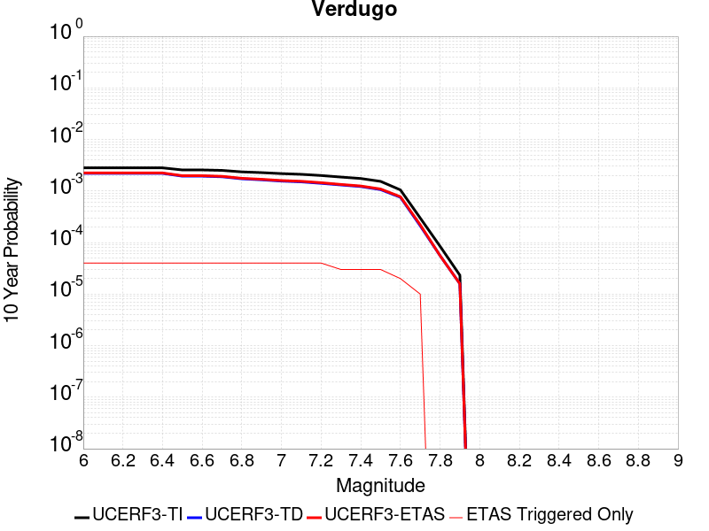 |

| Magnitude | 1 wk TI Prob | 1 wk TD Prob | 1 wk ETAS Prob | 1 wk ETAS/TD Gain | 1 wk ETAS Triggered Only | 1 mo TI Prob | 1 mo TD Prob | 1 mo ETAS Prob | 1 mo ETAS/TD Gain | 1 mo ETAS Triggered Only | 1 yr TI Prob | 1 yr TD Prob | 1 yr ETAS Prob | 1 yr ETAS/TD Gain | 1 yr ETAS Triggered Only | 10 yr TI Prob | 10 yr TD Prob | 10 yr ETAS Prob | 10 yr ETAS/TD Gain | 10 yr ETAS Triggered Only |
|-----|-----|-----|-----|-----|-----|-----|-----|-----|-----|-----|-----|-----|-----|-----|-----|-----|-----|-----|-----|-----|
| 6.0 | 5.392987E-6 | 4.216517E-6 | 4.216517E-6 | 1.0 | 0.0 | 2.3112598E-5 | 1.8070665E-5 | 1.8070665E-5 | 1.0 | 0.0 | 2.8135953E-4 | 2.1998861E-4 | 2.1998861E-4 | 1.0 | 0.0 | 0.0028100356 | 0.0021977562 | 0.0022521087 | 1.0247309 | 5.4472166E-5 |
| 6.1 | 5.392987E-6 | 4.216517E-6 | 4.216517E-6 | 1.0 | 0.0 | 2.3112598E-5 | 1.8070665E-5 | 1.8070665E-5 | 1.0 | 0.0 | 2.8135953E-4 | 2.1998861E-4 | 2.1998861E-4 | 1.0 | 0.0 | 0.0028100356 | 0.0021977562 | 0.0022521087 | 1.0247309 | 5.4472166E-5 |
| 6.2 | 5.392987E-6 | 4.216517E-6 | 4.216517E-6 | 1.0 | 0.0 | 2.3112598E-5 | 1.8070665E-5 | 1.8070665E-5 | 1.0 | 0.0 | 2.8135953E-4 | 2.1998861E-4 | 2.1998861E-4 | 1.0 | 0.0 | 0.0028100356 | 0.0021977562 | 0.0022521087 | 1.0247309 | 5.4472166E-5 |
| 6.3 | 5.392987E-6 | 4.216517E-6 | 4.216517E-6 | 1.0 | 0.0 | 2.3112598E-5 | 1.8070665E-5 | 1.8070665E-5 | 1.0 | 0.0 | 2.8135953E-4 | 2.1998861E-4 | 2.1998861E-4 | 1.0 | 0.0 | 0.0028100356 | 0.0021977562 | 0.0022521087 | 1.0247309 | 5.4472166E-5 |
| 6.4 | 5.392987E-6 | 4.216517E-6 | 4.216517E-6 | 1.0 | 0.0 | 2.3112598E-5 | 1.8070665E-5 | 1.8070665E-5 | 1.0 | 0.0 | 2.8135953E-4 | 2.1998861E-4 | 2.1998861E-4 | 1.0 | 0.0 | 0.0028100356 | 0.0021977562 | 0.0022521087 | 1.0247309 | 5.4472166E-5 |
| 6.5 | 4.9154837E-6 | 3.722465E-6 | 3.722465E-6 | 1.0 | 0.0 | 2.1066187E-5 | 1.5953325E-5 | 1.5953325E-5 | 1.0 | 0.0 | 2.5645064E-4 | 1.9421462E-4 | 1.9421462E-4 | 1.0 | 0.0 | 0.002561549 | 0.0019404698 | 0.0019948364 | 1.0280172 | 5.4472166E-5 |
| 6.6 | 4.9154837E-6 | 3.722465E-6 | 3.722465E-6 | 1.0 | 0.0 | 2.1066187E-5 | 1.5953325E-5 | 1.5953325E-5 | 1.0 | 0.0 | 2.5645064E-4 | 1.9421462E-4 | 1.9421462E-4 | 1.0 | 0.0 | 0.002561549 | 0.0019404698 | 0.0019948364 | 1.0280172 | 5.4472166E-5 |
| 6.7 | 4.817006E-6 | 3.6206518E-6 | 3.6206518E-6 | 1.0 | 0.0 | 2.0644147E-5 | 1.5516987E-5 | 1.5516987E-5 | 1.0 | 0.0 | 2.513135E-4 | 1.8890314E-4 | 1.8890314E-4 | 1.0 | 0.0 | 0.0025102948 | 0.0018874453 | 0.0019418147 | 1.0288057 | 5.4472166E-5 |
| 6.8 | 4.507407E-6 | 3.3071042E-6 | 3.3071042E-6 | 1.0 | 0.0 | 1.9317316E-5 | 1.4173227E-5 | 1.4173227E-5 | 1.0 | 0.0 | 2.3516294E-4 | 1.7254551E-4 | 1.7254551E-4 | 1.0 | 0.0 | 0.0023491425 | 0.0017241298 | 0.0017785081 | 1.0315396 | 5.4472166E-5 |
| 6.9 | 4.3573054E-6 | 3.161011E-6 | 3.161011E-6 | 1.0 | 0.0 | 1.8674033E-5 | 1.354712E-5 | 1.354712E-5 | 1.0 | 0.0 | 2.2733262E-4 | 1.6492383E-4 | 1.6492383E-4 | 1.0 | 0.0 | 0.0022710022 | 0.0016480266 | 0.001702409 | 1.0329984 | 5.4472166E-5 |
| 7.0 | 4.171527E-6 | 2.9836704E-6 | 2.9836704E-6 | 1.0 | 0.0 | 1.787785E-5 | 1.2787096E-5 | 1.2787096E-5 | 1.0 | 0.0 | 2.1764109E-4 | 1.5567189E-4 | 1.5567189E-4 | 1.0 | 0.0 | 0.0021742806 | 0.0015556397 | 0.0016100272 | 1.0349615 | 5.4472166E-5 |
| 7.1 | 4.0405484E-6 | 2.882261E-6 | 2.882261E-6 | 1.0 | 0.0 | 1.731652E-5 | 1.235249E-5 | 1.235249E-5 | 1.0 | 0.0 | 2.1080824E-4 | 1.503813E-4 | 1.503813E-4 | 1.0 | 0.0 | 0.0021060838 | 0.0015028063 | 0.0015571966 | 1.0361925 | 5.4472166E-5 |
| 7.2 | 3.8306007E-6 | 2.7018452E-6 | 2.7018452E-6 | 1.0 | 0.0 | 1.6416758E-5 | 1.15792855E-5 | 1.15792855E-5 | 1.0 | 0.0 | 1.9985568E-4 | 1.4096878E-4 | 1.4096878E-4 | 1.0 | 0.0 | 0.0019967605 | 0.0014088044 | 0.0014631998 | 1.038611 | 5.4472166E-5 |
| 7.3 | 3.5750938E-6 | 2.5121758E-6 | 2.5121758E-6 | 1.0 | 0.0 | 1.532174E-5 | 1.0766424E-5 | 1.0766424E-5 | 1.0 | 0.0 | 1.8652623E-4 | 1.3107344E-4 | 1.3107344E-4 | 1.0 | 0.0 | 0.0018636974 | 0.0013099718 | 0.0013643726 | 1.0415282 | 5.4472166E-5 |
| 7.4 | 3.3510041E-6 | 2.3408586E-6 | 2.3408586E-6 | 1.0 | 0.0 | 1.4361368E-5 | 1.0032213E-5 | 1.0032213E-5 | 1.0 | 0.0 | 1.7483562E-4 | 1.2213545E-4 | 1.2213545E-4 | 1.0 | 0.0 | 0.0017469813 | 0.0012206937 | 0.0012750993 | 1.0445695 | 5.4472166E-5 |
| 7.5 | 2.948287E-6 | 2.0391124E-6 | 2.0391124E-6 | 1.0 | 0.0 | 1.2635454E-5 | 8.739024E-6 | 8.739024E-6 | 1.0 | 0.0 | 1.538258E-4 | 1.0639253E-4 | 1.0639253E-4 | 1.0 | 0.0 | 0.0015371935 | 0.0010634261 | 0.0011178404 | 1.0511688 | 5.4472166E-5 |
| 7.6 | 2.0134323E-6 | 1.4471265E-6 | 1.4471265E-6 | 1.0 | 0.0 | 8.628967E-6 | 6.2019562E-6 | 6.2019562E-6 | 1.0 | 0.0 | 1.05052604E-4 | 7.550629E-5 | 7.550629E-5 | 1.0 | 0.0 | 0.0010500296 | 7.548152E-4 | 8.092462E-4 | 1.0721117 | 5.4472166E-5 |
| 7.7 | 5.726436E-7 | 4.045248E-7 | 4.045248E-7 | 1.0 | 0.0 | 2.4541846E-6 | 1.7336766E-6 | 1.7336766E-6 | 1.0 | 0.0 | 2.9879287E-5 | 2.1107335E-5 | 2.1107335E-5 | 1.0 | 0.0 | 2.987527E-4 | 2.1105584E-4 | 2.6551652E-4 | 1.2580391 | 5.4472166E-5 |
| 7.8 | 1.6248204E-7 | 1.0687696E-7 | 1.0687696E-7 | 1.0 | 0.0 | 6.963514E-7 | 4.5804404E-7 | 4.5804404E-7 | 1.0 | 0.0 | 8.478045E-6 | 5.5766723E-6 | 5.5766723E-6 | 1.0 | 0.0 | 8.477722E-5 | 5.5765355E-5 | 5.5765355E-5 | 1.0 | 0.0 |
| 7.9 | 4.4475744E-8 | 3.0375546E-8 | 3.0375546E-8 | 1.0 | 0.0 | 1.9061031E-7 | 1.301809E-7 | 1.301809E-7 | 1.0 | 0.0 | 2.320678E-6 | 1.5849514E-6 | 1.5849514E-6 | 1.0 | 0.0 | 2.3206538E-5 | 1.5849415E-5 | 1.5849415E-5 | 1.0 | 0.0 |

## Homestead Valley 2011
*[(top)](#table-of-contents)*

| 1 Week | 1 Month | 1 Year | 10 Year |
|-----|-----|-----|-----|
|  |  |  |  |

| Magnitude | 1 wk TI Prob | 1 wk TD Prob | 1 wk ETAS Prob | 1 wk ETAS/TD Gain | 1 wk ETAS Triggered Only | 1 mo TI Prob | 1 mo TD Prob | 1 mo ETAS Prob | 1 mo ETAS/TD Gain | 1 mo ETAS Triggered Only | 1 yr TI Prob | 1 yr TD Prob | 1 yr ETAS Prob | 1 yr ETAS/TD Gain | 1 yr ETAS Triggered Only | 10 yr TI Prob | 10 yr TD Prob | 10 yr ETAS Prob | 10 yr ETAS/TD Gain | 10 yr ETAS Triggered Only |
|-----|-----|-----|-----|-----|-----|-----|-----|-----|-----|-----|-----|-----|-----|-----|-----|-----|-----|-----|-----|-----|
| 6.0 | 1.539795E-5 | 6.286606E-6 | 6.075843E-5 | 9.664742 | 5.4472166E-5 | 6.5989545E-5 | 2.6942436E-5 | 8.1413134E-5 | 3.0217435 | 5.4472166E-5 | 8.0312655E-4 | 3.279954E-4 | 3.8244968E-4 | 1.1660216 | 5.4472166E-5 | 0.008002302 | 0.0032771337 | 0.0033314275 | 1.0165675 | 5.4472166E-5 |
| 6.1 | 1.539795E-5 | 6.286606E-6 | 6.075843E-5 | 9.664742 | 5.4472166E-5 | 6.5989545E-5 | 2.6942436E-5 | 8.1413134E-5 | 3.0217435 | 5.4472166E-5 | 8.0312655E-4 | 3.279954E-4 | 3.8244968E-4 | 1.1660216 | 5.4472166E-5 | 0.008002302 | 0.0032771337 | 0.0033314275 | 1.0165675 | 5.4472166E-5 |
| 6.2 | 1.539795E-5 | 6.286606E-6 | 6.075843E-5 | 9.664742 | 5.4472166E-5 | 6.5989545E-5 | 2.6942436E-5 | 8.1413134E-5 | 3.0217435 | 5.4472166E-5 | 8.0312655E-4 | 3.279954E-4 | 3.8244968E-4 | 1.1660216 | 5.4472166E-5 | 0.008002302 | 0.0032771337 | 0.0033314275 | 1.0165675 | 5.4472166E-5 |
| 6.3 | 1.539795E-5 | 6.286606E-6 | 6.075843E-5 | 9.664742 | 5.4472166E-5 | 6.5989545E-5 | 2.6942436E-5 | 8.1413134E-5 | 3.0217435 | 5.4472166E-5 | 8.0312655E-4 | 3.279954E-4 | 3.8244968E-4 | 1.1660216 | 5.4472166E-5 | 0.008002302 | 0.0032771337 | 0.0033314275 | 1.0165675 | 5.4472166E-5 |
| 6.4 | 1.539795E-5 | 6.286606E-6 | 6.075843E-5 | 9.664742 | 5.4472166E-5 | 6.5989545E-5 | 2.6942436E-5 | 8.1413134E-5 | 3.0217435 | 5.4472166E-5 | 8.0312655E-4 | 3.279954E-4 | 3.8244968E-4 | 1.1660216 | 5.4472166E-5 | 0.008002302 | 0.0032771337 | 0.0033314275 | 1.0165675 | 5.4472166E-5 |
| 6.5 | 1.0265258E-5 | 2.8788488E-6 | 5.7350855E-5 | 19.921453 | 5.4472166E-5 | 4.3993223E-5 | 1.2337905E-5 | 6.68094E-5 | 5.414971 | 5.4472166E-5 | 5.3548586E-4 | 1.5021059E-4 | 2.0467458E-4 | 1.3625841 | 5.4472166E-5 | 0.005341973 | 0.0015017724 | 0.0015561628 | 1.0362175 | 5.4472166E-5 |
| 6.6 | 6.664671E-6 | 5.348204E-7 | 5.5006956E-5 | 102.851265 | 5.4472166E-5 | 2.8562565E-5 | 2.2920863E-6 | 5.6764125E-5 | 24.765266 | 5.4472166E-5 | 3.476937E-4 | 2.7905911E-5 | 8.237656E-5 | 2.9519393 | 5.4472166E-5 | 0.003471502 | 2.790357E-4 | 3.3349267E-4 | 1.1951612 | 5.4472166E-5 |
| 6.7 | 6.5954046E-6 | 5.348204E-7 | 5.5006956E-5 | 102.851265 | 5.4472166E-5 | 2.8265715E-5 | 2.2920863E-6 | 5.6764125E-5 | 24.765266 | 5.4472166E-5 | 3.4408073E-4 | 2.7905911E-5 | 8.237656E-5 | 2.9519393 | 5.4472166E-5 | 0.0034354846 | 2.790357E-4 | 3.3349267E-4 | 1.1951612 | 5.4472166E-5 |
| 6.8 | 4.648189E-6 | 2.3265572E-7 | 5.4704808E-5 | 235.132 | 5.4472166E-5 | 1.9920659E-5 | 9.970956E-7 | 5.5469205E-5 | 55.63078 | 5.4472166E-5 | 2.4250703E-4 | 1.2139576E-5 | 6.661108E-5 | 5.487101 | 5.4472166E-5 | 0.0024224254 | 1.2138961E-4 | 1.7585517E-4 | 1.4486839 | 5.4472166E-5 |
| 6.9 | 4.1428534E-6 | 1.9344557E-7 | 5.46656E-5 | 282.58905 | 5.4472166E-5 | 1.7754966E-5 | 8.290522E-7 | 5.530117E-5 | 66.70409 | 5.4472166E-5 | 2.1614527E-4 | 1.0093667E-5 | 6.456528E-5 | 6.396613 | 5.4472166E-5 | 0.0021593515 | 1.0093238E-4 | 1.5539904E-4 | 1.5396352 | 5.4472166E-5 |
| 7.0 | 3.0673707E-6 | 1.5367603E-7 | 5.462583E-5 | 355.461 | 5.4472166E-5 | 1.3145808E-5 | 6.586114E-7 | 5.513074E-5 | 83.70754 | 5.4472166E-5 | 1.6003846E-4 | 8.0185655E-6 | 6.249029E-5 | 7.7932014 | 5.4472166E-5 | 0.0015992324 | 8.0182865E-5 | 1.3465066E-4 | 1.6792947 | 5.4472166E-5 |
| 7.1 | 2.340854E-6 | 1.468766E-7 | 5.4619035E-5 | 371.8702 | 5.4472166E-5 | 1.0032193E-5 | 6.29471E-7 | 5.5101602E-5 | 87.53636 | 5.4472166E-5 | 1.221351E-4 | 7.663783E-6 | 6.213553E-5 | 8.107683 | 5.4472166E-5 | 0.00122068 | 7.663529E-5 | 1.3110328E-4 | 1.710743 | 5.4472166E-5 |
| 7.2 | 1.3754182E-6 | 1.3922634E-7 | 5.4611384E-5 | 392.24893 | 5.4472166E-5 | 5.8946357E-6 | 5.966842E-7 | 5.5068816E-5 | 92.2914 | 5.4472166E-5 | 7.176483E-5 | 7.2646067E-6 | 6.173638E-5 | 8.49824 | 5.4472166E-5 | 7.174166E-4 | 7.264379E-5 | 1.27112E-4 | 1.7497987 | 5.4472166E-5 |
| 7.3 | 1.2573237E-6 | 1.3827146E-7 | 5.4610427E-5 | 394.95084 | 5.4472166E-5 | 5.388519E-6 | 5.9259185E-7 | 5.5064724E-5 | 92.921844 | 5.4472166E-5 | 6.560324E-5 | 7.2147827E-6 | 6.168655E-5 | 8.550022 | 5.4472166E-5 | 6.558388E-4 | 7.214558E-5 | 1.2661381E-4 | 1.7549767 | 5.4472166E-5 |
| 7.4 | 1.0994207E-6 | 1.3106106E-7 | 5.4603217E-5 | 416.6243 | 5.4472166E-5 | 4.7117946E-6 | 5.616901E-7 | 5.5033823E-5 | 97.97898 | 5.4472166E-5 | 5.736459E-5 | 6.8385566E-6 | 6.131035E-5 | 8.965393 | 5.4472166E-5 | 5.734978E-4 | 6.838355E-5 | 1.22852E-4 | 1.7965137 | 5.4472166E-5 |
| 7.5 | 5.5569126E-7 | 6.772991E-8 | 5.453989E-5 | 805.2557 | 5.4472166E-5 | 2.3815317E-6 | 2.90271E-7 | 5.476242E-5 | 188.65962 | 5.4472166E-5 | 2.8994764E-5 | 3.5340445E-6 | 5.8006015E-5 | 16.413494 | 5.4472166E-5 | 2.899098E-4 | 3.5339945E-5 | 8.9810186E-5 | 2.5413222 | 5.4472166E-5 |

## Santa Susana alt 1
*[(top)](#table-of-contents)*

| 1 Week | 1 Month | 1 Year | 10 Year |
|-----|-----|-----|-----|
|  |  |  |  |

| Magnitude | 1 wk TI Prob | 1 wk TD Prob | 1 wk ETAS Prob | 1 wk ETAS/TD Gain | 1 wk ETAS Triggered Only | 1 mo TI Prob | 1 mo TD Prob | 1 mo ETAS Prob | 1 mo ETAS/TD Gain | 1 mo ETAS Triggered Only | 1 yr TI Prob | 1 yr TD Prob | 1 yr ETAS Prob | 1 yr ETAS/TD Gain | 1 yr ETAS Triggered Only | 10 yr TI Prob | 10 yr TD Prob | 10 yr ETAS Prob | 10 yr ETAS/TD Gain | 10 yr ETAS Triggered Only |
|-----|-----|-----|-----|-----|-----|-----|-----|-----|-----|-----|-----|-----|-----|-----|-----|-----|-----|-----|-----|-----|
| 6.0 | 2.674877E-5 | 2.7198023E-5 | 2.7198023E-5 | 1.0 | 0.0 | 1.1463255E-4 | 1.1655839E-4 | 1.1655839E-4 | 1.0 | 0.0 | 0.0013947578 | 0.0014182882 | 0.0014182882 | 1.0 | 0.0 | 0.013860362 | 0.014104128 | 0.014157832 | 1.0038077 | 5.4472166E-5 |
| 6.1 | 2.674877E-5 | 2.7198023E-5 | 2.7198023E-5 | 1.0 | 0.0 | 1.1463255E-4 | 1.1655839E-4 | 1.1655839E-4 | 1.0 | 0.0 | 0.0013947578 | 0.0014182882 | 0.0014182882 | 1.0 | 0.0 | 0.013860362 | 0.014104128 | 0.014157832 | 1.0038077 | 5.4472166E-5 |
| 6.2 | 2.674877E-5 | 2.7198023E-5 | 2.7198023E-5 | 1.0 | 0.0 | 1.1463255E-4 | 1.1655839E-4 | 1.1655839E-4 | 1.0 | 0.0 | 0.0013947578 | 0.0014182882 | 0.0014182882 | 1.0 | 0.0 | 0.013860362 | 0.014104128 | 0.014157832 | 1.0038077 | 5.4472166E-5 |
| 6.3 | 2.674877E-5 | 2.7198023E-5 | 2.7198023E-5 | 1.0 | 0.0 | 1.1463255E-4 | 1.1655839E-4 | 1.1655839E-4 | 1.0 | 0.0 | 0.0013947578 | 0.0014182882 | 0.0014182882 | 1.0 | 0.0 | 0.013860362 | 0.014104128 | 0.014157832 | 1.0038077 | 5.4472166E-5 |
| 6.4 | 2.674877E-5 | 2.7198023E-5 | 2.7198023E-5 | 1.0 | 0.0 | 1.1463255E-4 | 1.1655839E-4 | 1.1655839E-4 | 1.0 | 0.0 | 0.0013947578 | 0.0014182882 | 0.0014182882 | 1.0 | 0.0 | 0.013860362 | 0.014104128 | 0.014157832 | 1.0038077 | 5.4472166E-5 |
| 6.5 | 2.674877E-5 | 2.7198023E-5 | 2.7198023E-5 | 1.0 | 0.0 | 1.1463255E-4 | 1.1655839E-4 | 1.1655839E-4 | 1.0 | 0.0 | 0.0013947578 | 0.0014182882 | 0.0014182882 | 1.0 | 0.0 | 0.013860362 | 0.014104128 | 0.014157832 | 1.0038077 | 5.4472166E-5 |
| 6.6 | 2.6647976E-5 | 2.7074359E-5 | 2.7074359E-5 | 1.0 | 0.0 | 1.14200615E-4 | 1.1602845E-4 | 1.1602845E-4 | 1.0 | 0.0 | 0.0013895056 | 0.0014118447 | 0.0014118447 | 1.0 | 0.0 | 0.013808494 | 0.014040513 | 0.0140942205 | 1.0038252 | 5.4472166E-5 |
| 6.7 | 2.6647976E-5 | 2.7074359E-5 | 2.7074359E-5 | 1.0 | 0.0 | 1.14200615E-4 | 1.1602845E-4 | 1.1602845E-4 | 1.0 | 0.0 | 0.0013895056 | 0.0014118447 | 0.0014118447 | 1.0 | 0.0 | 0.013808494 | 0.014040513 | 0.0140942205 | 1.0038252 | 5.4472166E-5 |
| 6.8 | 1.9073179E-5 | 1.7637283E-5 | 1.7637283E-5 | 1.0 | 0.0 | 8.1739636E-5 | 7.558627E-5 | 7.558627E-5 | 1.0 | 0.0 | 9.947256E-4 | 9.198925E-4 | 9.198925E-4 | 1.0 | 0.0 | 0.009902848 | 0.009163101 | 0.009217074 | 1.0058903 | 5.4472166E-5 |
| 6.9 | 1.9041876E-5 | 1.7619415E-5 | 1.7619415E-5 | 1.0 | 0.0 | 8.160549E-5 | 7.55097E-5 | 7.55097E-5 | 1.0 | 0.0 | 9.930939E-4 | 9.1896096E-4 | 9.1896096E-4 | 1.0 | 0.0 | 0.0098866755 | 0.0091538625 | 0.009207836 | 1.0058962 | 5.4472166E-5 |
| 7.0 | 1.5917482E-5 | 1.3863864E-5 | 1.3863864E-5 | 1.0 | 0.0 | 6.8215995E-5 | 5.9415237E-5 | 5.9415237E-5 | 1.0 | 0.0 | 8.302132E-4 | 7.231451E-4 | 7.231451E-4 | 1.0 | 0.0 | 0.008271185 | 0.0072088144 | 0.007262894 | 1.0075018 | 5.4472166E-5 |
| 7.1 | 1.577788E-5 | 1.3743872E-5 | 1.3743872E-5 | 1.0 | 0.0 | 6.761774E-5 | 5.8901005E-5 | 5.8901005E-5 | 1.0 | 0.0 | 8.2293496E-4 | 7.1688846E-4 | 7.1688846E-4 | 1.0 | 0.0 | 0.008198941 | 0.007146652 | 0.0072007347 | 1.0075675 | 5.4472166E-5 |
| 7.2 | 1.5416446E-5 | 1.3469944E-5 | 1.3469944E-5 | 1.0 | 0.0 | 6.606882E-5 | 5.772708E-5 | 5.772708E-5 | 1.0 | 0.0 | 8.0409093E-4 | 7.026052E-4 | 7.026052E-4 | 1.0 | 0.0 | 0.008011877 | 0.0070047234 | 0.007058814 | 1.007722 | 5.4472166E-5 |
| 7.3 | 1.4534083E-5 | 1.2717879E-5 | 1.2717879E-5 | 1.0 | 0.0 | 6.228744E-5 | 5.4504082E-5 | 5.4504082E-5 | 1.0 | 0.0 | 7.580857E-4 | 6.633896E-4 | 6.633896E-4 | 1.0 | 0.0 | 0.007555048 | 0.0066149444 | 0.006669056 | 1.0081803 | 5.4472166E-5 |
| 7.4 | 1.2858995E-5 | 1.1229652E-5 | 1.1229652E-5 | 1.0 | 0.0 | 5.5108816E-5 | 4.8126214E-5 | 4.8126214E-5 | 1.0 | 0.0 | 6.7074323E-4 | 5.857831E-4 | 5.857831E-4 | 1.0 | 0.0 | 0.0066872234 | 0.005843165 | 0.005897319 | 1.0092679 | 5.4472166E-5 |
| 7.5 | 8.827668E-6 | 7.805457E-6 | 7.805457E-6 | 1.0 | 0.0 | 3.7832317E-5 | 3.3451546E-5 | 3.3451546E-5 | 1.0 | 0.0 | 4.605111E-4 | 4.071989E-4 | 4.071989E-4 | 1.0 | 0.0 | 0.0045955796 | 0.0040647765 | 0.0041190274 | 1.0133466 | 5.4472166E-5 |
| 7.6 | 3.2533426E-6 | 2.871988E-6 | 2.871988E-6 | 1.0 | 0.0 | 1.3942822E-5 | 1.2308465E-5 | 1.2308465E-5 | 1.0 | 0.0 | 1.6974064E-4 | 1.4984563E-4 | 1.4984563E-4 | 1.0 | 0.0 | 0.0016961104 | 0.0014974826 | 0.0015518733 | 1.0363214 | 5.4472166E-5 |
| 7.7 | 1.2751709E-6 | 1.1491089E-6 | 1.1491089E-6 | 1.0 | 0.0 | 5.4650063E-6 | 4.9247437E-6 | 4.9247437E-6 | 1.0 | 0.0 | 6.653442E-5 | 5.9957198E-5 | 5.9957198E-5 | 1.0 | 0.0 | 6.6514505E-4 | 5.994191E-4 | 6.5385865E-4 | 1.0908204 | 5.4472166E-5 |
| 7.8 | 3.067544E-7 | 3.2400436E-7 | 3.2400436E-7 | 1.0 | 0.0 | 1.3146611E-6 | 1.3885895E-6 | 1.3885895E-6 | 1.0 | 0.0 | 1.600588E-5 | 1.6905957E-5 | 1.6905957E-5 | 1.0 | 0.0 | 1.6004729E-4 | 1.6904772E-4 | 1.6904772E-4 | 1.0 | 0.0 |
| 7.9 | 7.622999E-8 | 8.087964E-8 | 8.087964E-8 | 1.0 | 0.0 | 3.2669993E-7 | 3.4662696E-7 | 3.4662696E-7 | 1.0 | 0.0 | 3.977564E-6 | 4.2201773E-6 | 4.2201773E-6 | 1.0 | 0.0 | 3.977493E-5 | 4.220118E-5 | 4.220118E-5 | 1.0 | 0.0 |

## Laguna Salada
*[(top)](#table-of-contents)*

| 1 Week | 1 Month | 1 Year | 10 Year |
|-----|-----|-----|-----|
|  |  |  |  |

| Magnitude | 1 wk TI Prob | 1 wk TD Prob | 1 wk ETAS Prob | 1 wk ETAS/TD Gain | 1 wk ETAS Triggered Only | 1 mo TI Prob | 1 mo TD Prob | 1 mo ETAS Prob | 1 mo ETAS/TD Gain | 1 mo ETAS Triggered Only | 1 yr TI Prob | 1 yr TD Prob | 1 yr ETAS Prob | 1 yr ETAS/TD Gain | 1 yr ETAS Triggered Only | 10 yr TI Prob | 10 yr TD Prob | 10 yr ETAS Prob | 10 yr ETAS/TD Gain | 10 yr ETAS Triggered Only |
|-----|-----|-----|-----|-----|-----|-----|-----|-----|-----|-----|-----|-----|-----|-----|-----|-----|-----|-----|-----|-----|
| 6.0 | 4.6465593E-5 | 4.634639E-5 | 4.634639E-5 | 1.0 | 0.0 | 1.9912305E-4 | 1.9861311E-4 | 1.9861311E-4 | 1.0 | 0.0 | 0.0024216278 | 0.002415429 | 0.002415429 | 1.0 | 0.0 | 0.02395408 | 0.023975259 | 0.024028424 | 1.0022175 | 5.4472166E-5 |
| 6.1 | 3.982297E-5 | 3.7246125E-5 | 3.7246125E-5 | 1.0 | 0.0 | 1.706587E-4 | 1.5961716E-4 | 1.5961716E-4 | 1.0 | 0.0 | 0.0020757897 | 0.0019417295 | 0.0019417295 | 1.0 | 0.0 | 0.020565065 | 0.019331863 | 0.019385282 | 1.0027633 | 5.4472166E-5 |
| 6.2 | 3.6067784E-5 | 3.2602693E-5 | 3.2602693E-5 | 1.0 | 0.0 | 1.5456705E-4 | 1.3971896E-4 | 1.3971896E-4 | 1.0 | 0.0 | 0.0018802295 | 0.0016998611 | 0.0016998611 | 1.0 | 0.0 | 0.018644003 | 0.016949628 | 0.017003177 | 1.0031593 | 5.4472166E-5 |
| 6.3 | 3.2859112E-5 | 2.8849448E-5 | 2.8849448E-5 | 1.0 | 0.0 | 1.4081717E-4 | 1.2363521E-4 | 1.2363521E-4 | 1.0 | 0.0 | 0.0017131006 | 0.0015043203 | 0.0015043203 | 1.0 | 0.0 | 0.016999546 | 0.015018767 | 0.015072421 | 1.0035725 | 5.4472166E-5 |
| 6.4 | 2.9132116E-5 | 2.4852965E-5 | 2.4852965E-5 | 1.0 | 0.0 | 1.2484594E-4 | 1.0650887E-4 | 1.0650887E-4 | 1.0 | 0.0 | 0.0015189396 | 0.001296065 | 0.001296065 | 1.0 | 0.0 | 0.015085992 | 0.012956262 | 0.013010029 | 1.0041498 | 5.4472166E-5 |
| 6.5 | 2.7075037E-5 | 2.2825836E-5 | 2.2825836E-5 | 1.0 | 0.0 | 1.1603071E-4 | 9.7821845E-5 | 9.7821845E-5 | 1.0 | 0.0 | 0.0014117584 | 0.0011904186 | 0.0011904186 | 1.0 | 0.0 | 0.014028233 | 0.011907749 | 0.011961573 | 1.00452 | 5.4472166E-5 |
| 6.6 | 2.2367465E-5 | 1.8573526E-5 | 1.8573526E-5 | 1.0 | 0.0 | 9.5857045E-5 | 7.959886E-5 | 7.959886E-5 | 1.0 | 0.0 | 0.0011664346 | 9.6876756E-4 | 9.6876756E-4 | 1.0 | 0.0 | 0.011603311 | 0.009702191 | 0.009756134 | 1.0055599 | 5.4472166E-5 |
| 6.7 | 1.9458053E-5 | 1.5914242E-5 | 1.5914242E-5 | 1.0 | 0.0 | 8.338899E-5 | 6.8202564E-5 | 6.8202564E-5 | 1.0 | 0.0 | 0.001014788 | 8.3013024E-4 | 8.3013024E-4 | 1.0 | 0.0 | 0.010101665 | 0.0083209425 | 0.008374961 | 1.0064919 | 5.4472166E-5 |
| 6.8 | 1.0767866E-5 | 9.18435E-6 | 9.18435E-6 | 1.0 | 0.0 | 4.614718E-5 | 3.9361294E-5 | 3.9361294E-5 | 1.0 | 0.0 | 5.6169706E-4 | 4.7918706E-4 | 4.7918706E-4 | 1.0 | 0.0 | 0.0056027942 | 0.0048096925 | 0.0048096925 | 1.0 | 0.0 |
| 6.9 | 2.1384765E-6 | 1.7913675E-6 | 1.7913675E-6 | 1.0 | 0.0 | 9.164866E-6 | 7.677269E-6 | 7.677269E-6 | 1.0 | 0.0 | 1.1157654E-4 | 9.346713E-5 | 9.346713E-5 | 1.0 | 0.0 | 0.0011152053 | 9.343165E-4 | 9.343165E-4 | 1.0 | 0.0 |
| 7.0 | 2.0952946E-6 | 1.7493046E-6 | 1.7493046E-6 | 1.0 | 0.0 | 8.979802E-6 | 7.4970003E-6 | 7.4970003E-6 | 1.0 | 0.0 | 1.0932361E-4 | 9.1272545E-5 | 9.1272545E-5 | 1.0 | 0.0 | 0.0010926984 | 9.123888E-4 | 9.123888E-4 | 1.0 | 0.0 |
| 7.1 | 1.7887576E-6 | 1.4500254E-6 | 1.4500254E-6 | 1.0 | 0.0 | 7.666081E-6 | 6.2143813E-6 | 6.2143813E-6 | 1.0 | 0.0 | 9.333054E-5 | 7.565777E-5 | 7.565777E-5 | 1.0 | 0.0 | 9.329135E-4 | 7.563506E-4 | 7.563506E-4 | 1.0 | 0.0 |
| 7.2 | 9.723109E-7 | 7.135619E-7 | 7.135619E-7 | 1.0 | 0.0 | 4.16704E-6 | 3.0581198E-6 | 3.0581198E-6 | 1.0 | 0.0 | 5.073253E-5 | 3.7232137E-5 | 3.7232137E-5 | 1.0 | 0.0 | 5.072095E-4 | 3.7227524E-4 | 3.7227524E-4 | 1.0 | 0.0 |

## Calaveras (So) - Paicines extension 2011 CFM
*[(top)](#table-of-contents)*

| 1 Week | 1 Month | 1 Year | 10 Year |
|-----|-----|-----|-----|
|  |  |  |  |

| Magnitude | 1 wk TI Prob | 1 wk TD Prob | 1 wk ETAS Prob | 1 wk ETAS/TD Gain | 1 wk ETAS Triggered Only | 1 mo TI Prob | 1 mo TD Prob | 1 mo ETAS Prob | 1 mo ETAS/TD Gain | 1 mo ETAS Triggered Only | 1 yr TI Prob | 1 yr TD Prob | 1 yr ETAS Prob | 1 yr ETAS/TD Gain | 1 yr ETAS Triggered Only | 10 yr TI Prob | 10 yr TD Prob | 10 yr ETAS Prob | 10 yr ETAS/TD Gain | 10 yr ETAS Triggered Only |
|-----|-----|-----|-----|-----|-----|-----|-----|-----|-----|-----|-----|-----|-----|-----|-----|-----|-----|-----|-----|-----|
| 6.0 | 1.5183659E-4 | 3.0533716E-4 | 3.0533716E-4 | 1.0 | 0.0 | 6.5056595E-4 | 0.0013069661 | 0.0013613671 | 1.0416238 | 5.4472166E-5 | 0.007891912 | 0.01569571 | 0.015749328 | 1.0034161 | 5.4472166E-5 | 0.076174594 | 0.13848671 | 0.13853365 | 1.0003389 | 5.4472166E-5 |
| 6.1 | 1.5024997E-4 | 3.0227835E-4 | 3.0227835E-4 | 1.0 | 0.0 | 6.437695E-4 | 0.00129387 | 0.0013482717 | 1.0420457 | 5.4472166E-5 | 0.0078097614 | 0.015539104 | 0.01559273 | 1.003451 | 5.4472166E-5 | 0.075409345 | 0.13715632 | 0.13720332 | 1.0003427 | 5.4472166E-5 |
| 6.2 | 1.2743923E-4 | 2.5306802E-4 | 2.5306802E-4 | 1.0 | 0.0 | 5.460538E-4 | 0.0010841049 | 0.001138518 | 1.0501918 | 5.4472166E-5 | 0.0066279583 | 0.013046704 | 0.013100466 | 1.0041207 | 5.4472166E-5 | 0.064337276 | 0.11725405 | 0.11730213 | 1.0004101 | 5.4472166E-5 |
| 6.3 | 1.1525114E-4 | 2.2595265E-4 | 2.2595265E-4 | 1.0 | 0.0 | 4.9383997E-4 | 9.6799526E-4 | 0.0010224148 | 1.0562187 | 5.4472166E-5 | 0.0059959386 | 0.011667927 | 0.011721764 | 1.0046141 | 5.4472166E-5 | 0.058367174 | 0.10637007 | 0.10641875 | 1.0004576 | 5.4472166E-5 |
| 6.4 | 1.07200925E-4 | 2.0836305E-4 | 2.0836305E-4 | 1.0 | 0.0 | 4.5935164E-4 | 8.926636E-4 | 9.4708713E-4 | 1.0609676 | 5.4472166E-5 | 0.0055782744 | 0.010772766 | 0.010826651 | 1.005002 | 5.4472166E-5 | 0.0544031 | 0.09919256 | 0.09924163 | 1.0004947 | 5.4472166E-5 |
| 6.5 | 9.69631E-5 | 1.8729115E-4 | 1.8729115E-4 | 1.0 | 0.0 | 4.1548995E-4 | 8.024135E-4 | 8.56842E-4 | 1.0678309 | 5.4472166E-5 | 0.0050468626 | 0.009694662 | 0.009748606 | 1.0055643 | 5.4472166E-5 | 0.04933773 | 0.090084255 | 0.09013382 | 1.0005502 | 5.4472166E-5 |
| 6.6 | 8.0552316E-5 | 1.5070537E-4 | 1.5070537E-4 | 1.0 | 0.0 | 3.4517853E-4 | 6.456994E-4 | 7.0013636E-4 | 1.0843071 | 5.4472166E-5 | 0.0041944524 | 0.007826256 | 0.007880302 | 1.0069057 | 5.4472166E-5 | 0.04116161 | 0.074854024 | 0.07490442 | 1.0006733 | 5.4472166E-5 |
| 6.7 | 7.815757E-5 | 1.4610609E-4 | 1.4610609E-4 | 1.0 | 0.0 | 3.34918E-4 | 6.260017E-4 | 6.8043976E-4 | 1.0869615 | 5.4472166E-5 | 0.004070005 | 0.0075890915 | 0.0076431506 | 1.0071232 | 5.4472166E-5 | 0.039962657 | 0.072703585 | 0.0727541 | 1.0006948 | 5.4472166E-5 |
| 6.8 | 6.965264E-5 | 1.2721405E-4 | 1.2721405E-4 | 1.0 | 0.0 | 2.9847719E-4 | 5.450839E-4 | 5.995264E-4 | 1.099879 | 5.4472166E-5 | 0.0036279052 | 0.00661342 | 0.0066675316 | 1.0081822 | 5.4472166E-5 | 0.03569247 | 0.06379891 | 0.06384991 | 1.0007993 | 5.4472166E-5 |
| 6.9 | 5.8000453E-5 | 1.01435086E-4 | 1.01435086E-4 | 1.0 | 0.0 | 2.4854968E-4 | 4.3464993E-4 | 4.890984E-4 | 1.1252698 | 5.4472166E-5 | 0.0030218933 | 0.0052791284 | 0.0053333133 | 1.0102639 | 5.4472166E-5 | 0.029811295 | 0.051501602 | 0.051553268 | 1.0010033 | 5.4472166E-5 |
| 7.0 | 4.9865852E-5 | 8.567692E-5 | 8.567692E-5 | 1.0 | 0.0 | 2.1369329E-4 | 3.671356E-4 | 4.2158776E-4 | 1.1483163 | 5.4472166E-5 | 0.0025986114 | 0.0044608037 | 0.0045150327 | 1.0121568 | 5.4472166E-5 | 0.025684336 | 0.043781694 | 0.04383378 | 1.0011897 | 5.4472166E-5 |
| 7.1 | 4.283875E-5 | 7.112159E-5 | 7.112159E-5 | 1.0 | 0.0 | 1.8358172E-4 | 3.047715E-4 | 3.047715E-4 | 1.0 | 0.0 | 0.0022328163 | 0.003704336 | 0.003704336 | 1.0 | 0.0 | 0.022105146 | 0.03673583 | 0.03673583 | 1.0 | 0.0 |
| 7.2 | 3.450115E-5 | 5.5776054E-5 | 5.5776054E-5 | 1.0 | 0.0 | 1.478537E-4 | 2.390185E-4 | 2.390185E-4 | 1.0 | 0.0 | 0.0017986323 | 0.0029061958 | 0.0029061958 | 1.0 | 0.0 | 0.017841442 | 0.029079199 | 0.029079199 | 1.0 | 0.0 |
| 7.3 | 2.5709045E-5 | 4.0588155E-5 | 4.0588155E-5 | 1.0 | 0.0 | 1.1017697E-4 | 1.7393773E-4 | 1.7393773E-4 | 1.0 | 0.0 | 0.0013405791 | 0.002115652 | 0.002115652 | 1.0 | 0.0 | 0.013325208 | 0.021297242 | 0.021297242 | 1.0 | 0.0 |
| 7.4 | 1.8003093E-5 | 2.8509934E-5 | 2.8509934E-5 | 1.0 | 0.0 | 7.715383E-5 | 1.2217973E-4 | 1.2217973E-4 | 1.0 | 0.0 | 9.3894306E-4 | 0.0014865254 | 0.0014865254 | 1.0 | 0.0 | 0.009349857 | 0.015052196 | 0.015052196 | 1.0 | 0.0 |
| 7.5 | 1.5595824E-5 | 2.5822499E-5 | 2.5822499E-5 | 1.0 | 0.0 | 6.683753E-5 | 1.1066317E-4 | 1.1066317E-4 | 1.0 | 0.0 | 8.134431E-4 | 0.0013464936 | 0.0013464936 | 1.0 | 0.0 | 0.008104719 | 0.01365213 | 0.01365213 | 1.0 | 0.0 |
| 7.6 | 1.1110309E-5 | 1.9222098E-5 | 1.9222098E-5 | 1.0 | 0.0 | 4.761474E-5 | 8.2377825E-5 | 8.2377825E-5 | 1.0 | 0.0 | 5.795553E-4 | 0.0010024898 | 0.0010024898 | 1.0 | 0.0 | 0.0057804612 | 0.010203943 | 0.010203943 | 1.0 | 0.0 |
| 7.7 | 6.2140443E-6 | 1.0437076E-5 | 1.0437076E-5 | 1.0 | 0.0 | 2.6631347E-5 | 4.4729557E-5 | 4.4729557E-5 | 1.0 | 0.0 | 3.241884E-4 | 5.444464E-4 | 5.444464E-4 | 1.0 | 0.0 | 0.0032371588 | 0.005619835 | 0.005619835 | 1.0 | 0.0 |
| 7.8 | 5.305533E-6 | 9.433038E-6 | 9.433038E-6 | 1.0 | 0.0 | 2.27378E-5 | 4.042668E-5 | 4.042668E-5 | 1.0 | 0.0 | 2.7679754E-4 | 4.920837E-4 | 4.920837E-4 | 1.0 | 0.0 | 0.0027645302 | 0.005074324 | 0.005074324 | 1.0 | 0.0 |
| 7.9 | 3.363505E-6 | 7.3848937E-6 | 7.3848937E-6 | 1.0 | 0.0 | 1.4414942E-5 | 3.164916E-5 | 3.164916E-5 | 1.0 | 0.0 | 1.7548777E-4 | 3.8526047E-4 | 3.8526047E-4 | 1.0 | 0.0 | 0.0017534926 | 0.003948527 | 0.003948527 | 1.0 | 0.0 |
| 8.0 | 2.0271132E-6 | 4.413104E-6 | 4.413104E-6 | 1.0 | 0.0 | 8.687599E-6 | 1.8913164E-5 | 1.8913164E-5 | 1.0 | 0.0 | 1.05766376E-4 | 2.302435E-4 | 2.302435E-4 | 1.0 | 0.0 | 0.0010571606 | 0.002351099 | 0.002351099 | 1.0 | 0.0 |
| 8.1 | 1.2206116E-6 | 2.3751331E-6 | 2.3751331E-6 | 1.0 | 0.0 | 5.2311816E-6 | 1.0179103E-5 | 1.0179103E-5 | 1.0 | 0.0 | 6.3687774E-5 | 1.2392356E-4 | 1.2392356E-4 | 1.0 | 0.0 | 6.366953E-4 | 0.0012705477 | 0.0012705477 | 1.0 | 0.0 |

## Bennett Valley 2011 CFM
*[(top)](#table-of-contents)*

| 1 Week | 1 Month | 1 Year | 10 Year |
|-----|-----|-----|-----|
|  |  |  |  |

| Magnitude | 1 wk TI Prob | 1 wk TD Prob | 1 wk ETAS Prob | 1 wk ETAS/TD Gain | 1 wk ETAS Triggered Only | 1 mo TI Prob | 1 mo TD Prob | 1 mo ETAS Prob | 1 mo ETAS/TD Gain | 1 mo ETAS Triggered Only | 1 yr TI Prob | 1 yr TD Prob | 1 yr ETAS Prob | 1 yr ETAS/TD Gain | 1 yr ETAS Triggered Only | 10 yr TI Prob | 10 yr TD Prob | 10 yr ETAS Prob | 10 yr ETAS/TD Gain | 10 yr ETAS Triggered Only |
|-----|-----|-----|-----|-----|-----|-----|-----|-----|-----|-----|-----|-----|-----|-----|-----|-----|-----|-----|-----|-----|
| 6.0 | 2.3893934E-5 | 2.8238892E-5 | 8.270952E-5 | 2.9289222 | 5.4472166E-5 | 1.0239855E-4 | 1.2101925E-4 | 1.7548482E-4 | 1.4500571 | 5.4472166E-5 | 0.0012459893 | 0.0014725985 | 0.0015269904 | 1.036936 | 5.4472166E-5 | 0.012390262 | 0.014651061 | 0.014704735 | 1.0036635 | 5.4472166E-5 |
| 6.1 | 2.3893934E-5 | 2.8238892E-5 | 8.270952E-5 | 2.9289222 | 5.4472166E-5 | 1.0239855E-4 | 1.2101925E-4 | 1.7548482E-4 | 1.4500571 | 5.4472166E-5 | 0.0012459893 | 0.0014725985 | 0.0015269904 | 1.036936 | 5.4472166E-5 | 0.012390262 | 0.014651061 | 0.014704735 | 1.0036635 | 5.4472166E-5 |
| 6.2 | 1.6657146E-5 | 1.9853778E-5 | 7.432486E-5 | 3.743613 | 5.4472166E-5 | 7.138582E-5 | 8.508564E-5 | 1.3955317E-4 | 1.6401495 | 5.4472166E-5 | 8.6877577E-4 | 0.0010355669 | 0.0010899827 | 1.0525469 | 5.4472166E-5 | 0.008653872 | 0.010325688 | 0.010379598 | 1.0052209 | 5.4472166E-5 |
| 6.3 | 1.6657146E-5 | 1.9853778E-5 | 7.432486E-5 | 3.743613 | 5.4472166E-5 | 7.138582E-5 | 8.508564E-5 | 1.3955317E-4 | 1.6401495 | 5.4472166E-5 | 8.6877577E-4 | 0.0010355669 | 0.0010899827 | 1.0525469 | 5.4472166E-5 | 0.008653872 | 0.010325688 | 0.010379598 | 1.0052209 | 5.4472166E-5 |
| 6.4 | 1.29418495E-5 | 1.5567497E-5 | 7.003881E-5 | 4.4990416 | 5.4472166E-5 | 5.546389E-5 | 6.671687E-5 | 1.211854E-4 | 1.8164132 | 5.4472166E-5 | 6.7506364E-4 | 8.121055E-4 | 8.6653343E-4 | 1.0670208 | 5.4472166E-5 | 0.0067301663 | 0.008108527 | 0.008162558 | 1.0066634 | 5.4472166E-5 |
| 6.5 | 1.2582504E-5 | 1.5134528E-5 | 6.960587E-5 | 4.5991435 | 5.4472166E-5 | 5.39239E-5 | 6.4861386E-5 | 1.1933002E-4 | 1.8397697 | 5.4472166E-5 | 6.563257E-4 | 7.895315E-4 | 8.439607E-4 | 1.0689385 | 5.4472166E-5 | 0.006543907 | 0.007884431 | 0.0079384735 | 1.0068543 | 5.4472166E-5 |
| 6.6 | 1.0846706E-5 | 1.3036779E-5 | 6.7508234E-5 | 5.178291 | 5.4472166E-5 | 4.6485053E-5 | 5.5871435E-5 | 1.1034056E-4 | 1.9749011 | 5.4472166E-5 | 5.6580856E-4 | 6.801508E-4 | 7.345859E-4 | 1.0800339 | 5.4472166E-5 | 0.005643701 | 0.0067976876 | 0.0068517895 | 1.0079589 | 5.4472166E-5 |
| 6.7 | 1.6803231E-6 | 2.377857E-6 | 2.377857E-6 | 1.0 | 0.0 | 7.2013645E-6 | 1.0190777E-5 | 1.0190777E-5 | 1.0 | 0.0 | 8.7673085E-5 | 1.2406579E-4 | 1.2406579E-4 | 1.0 | 0.0 | 8.76385E-4 | 0.0012444059 | 0.0012444059 | 1.0 | 0.0 |
| 6.8 | 1.4609833E-6 | 2.0939308E-6 | 2.0939308E-6 | 1.0 | 0.0 | 6.261342E-6 | 8.973958E-6 | 8.973958E-6 | 1.0 | 0.0 | 7.6229175E-5 | 1.09252534E-4 | 1.09252534E-4 | 1.0 | 0.0 | 7.620303E-4 | 0.0010963855 | 0.0010963855 | 1.0 | 0.0 |
| 6.9 | 1.3492396E-6 | 1.945872E-6 | 1.945872E-6 | 1.0 | 0.0 | 5.7824427E-6 | 8.339425E-6 | 8.339425E-6 | 1.0 | 0.0 | 7.0398964E-5 | 1.0152783E-4 | 1.0152783E-4 | 1.0 | 0.0 | 7.037667E-4 | 0.001019182 | 0.001019182 | 1.0 | 0.0 |
| 7.0 | 1.2347921E-6 | 1.7888614E-6 | 1.7888614E-6 | 1.0 | 0.0 | 5.291955E-6 | 7.6665265E-6 | 7.6665265E-6 | 1.0 | 0.0 | 6.442765E-5 | 9.333601E-5 | 9.333601E-5 | 1.0 | 0.0 | 6.440897E-4 | 9.373206E-4 | 9.373206E-4 | 1.0 | 0.0 |
| 7.1 | 1.1262973E-6 | 1.6358822E-6 | 1.6358822E-6 | 1.0 | 0.0 | 4.8269794E-6 | 7.010905E-6 | 7.010905E-6 | 1.0 | 0.0 | 5.876689E-5 | 8.535448E-5 | 8.535448E-5 | 1.0 | 0.0 | 5.875135E-4 | 8.575462E-4 | 8.575462E-4 | 1.0 | 0.0 |
| 7.2 | 9.351744E-7 | 1.3611456E-6 | 1.3611456E-6 | 1.0 | 0.0 | 4.007884E-6 | 5.8334676E-6 | 5.8334676E-6 | 1.0 | 0.0 | 4.8794896E-5 | 7.102018E-5 | 7.102018E-5 | 1.0 | 0.0 | 4.878418E-4 | 7.1425125E-4 | 7.1425125E-4 | 1.0 | 0.0 |
| 7.3 | 8.5039534E-7 | 1.2386469E-6 | 1.2386469E-6 | 1.0 | 0.0 | 3.6445463E-6 | 5.308476E-6 | 5.308476E-6 | 1.0 | 0.0 | 4.437145E-5 | 6.4628795E-5 | 6.4628795E-5 | 1.0 | 0.0 | 4.436259E-4 | 6.50087E-4 | 6.50087E-4 | 1.0 | 0.0 |
| 7.4 | 6.7875015E-7 | 9.600462E-7 | 9.600462E-7 | 1.0 | 0.0 | 2.908926E-6 | 4.114477E-6 | 4.114477E-6 | 1.0 | 0.0 | 3.54156E-5 | 5.0092618E-5 | 5.0092618E-5 | 1.0 | 0.0 | 3.5409955E-4 | 5.0410116E-4 | 5.0410116E-4 | 1.0 | 0.0 |
| 7.5 | 5.826867E-7 | 8.188238E-7 | 8.188238E-7 | 1.0 | 0.0 | 2.4972264E-6 | 3.5092403E-6 | 3.5092403E-6 | 1.0 | 0.0 | 3.0403306E-5 | 4.2724172E-5 | 4.2724172E-5 | 1.0 | 0.0 | 3.0399146E-4 | 4.3002292E-4 | 4.3002292E-4 | 1.0 | 0.0 |
| 7.6 | 2.7734902E-7 | 3.682212E-7 | 3.682212E-7 | 1.0 | 0.0 | 1.1886381E-6 | 1.5780898E-6 | 1.5780898E-6 | 1.0 | 0.0 | 1.4471572E-5 | 1.9213076E-5 | 1.9213076E-5 | 1.0 | 0.0 | 1.447063E-4 | 1.9312318E-4 | 1.9312318E-4 | 1.0 | 0.0 |
| 7.7 | 1.0530888E-7 | 1.3748802E-7 | 1.3748802E-7 | 1.0 | 0.0 | 4.513237E-7 | 5.892342E-7 | 5.892342E-7 | 1.0 | 0.0 | 5.4948523E-6 | 7.1739028E-6 | 7.1739028E-6 | 1.0 | 0.0 | 5.4947162E-5 | 7.256238E-5 | 7.256238E-5 | 1.0 | 0.0 |
| 7.8 | 1.2714258E-8 | 1.9632653E-8 | 1.9632653E-8 | 1.0 | 0.0 | 5.448968E-8 | 8.413994E-8 | 8.413994E-8 | 1.0 | 0.0 | 6.6341164E-7 | 1.0244033E-6 | 1.0244033E-6 | 1.0 | 0.0 | 6.6340967E-6 | 1.0658104E-5 | 1.0658104E-5 | 1.0 | 0.0 |
| 7.9 | 4.075888E-9 | 7.559692E-9 | 7.559692E-9 | 1.0 | 0.0 | 1.7468091E-8 | 3.239868E-8 | 3.239868E-8 | 1.0 | 0.0 | 2.12674E-7 | 3.9445388E-7 | 3.9445388E-7 | 1.0 | 0.0 | 2.1267379E-6 | 4.194808E-6 | 4.194808E-6 | 1.0 | 0.0 |
| 8.0 | 1.9126138E-9 | 3.995532E-9 | 3.995532E-9 | 1.0 | 0.0 | 8.196917E-9 | 1.7123707E-8 | 1.7123707E-8 | 1.0 | 0.0 | 9.9797454E-8 | 2.0848113E-7 | 2.0848113E-7 | 1.0 | 0.0 | 9.979741E-7 | 2.197992E-6 | 2.197992E-6 | 1.0 | 0.0 |

## Coronado Bank alt1
*[(top)](#table-of-contents)*

| 1 Week | 1 Month | 1 Year | 10 Year |
|-----|-----|-----|-----|
| 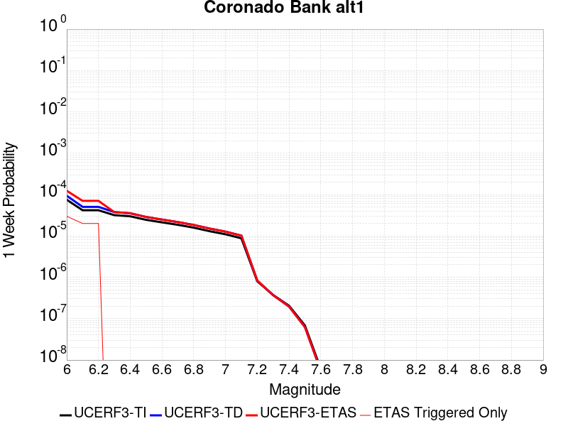 |  |  |  |

| Magnitude | 1 wk TI Prob | 1 wk TD Prob | 1 wk ETAS Prob | 1 wk ETAS/TD Gain | 1 wk ETAS Triggered Only | 1 mo TI Prob | 1 mo TD Prob | 1 mo ETAS Prob | 1 mo ETAS/TD Gain | 1 mo ETAS Triggered Only | 1 yr TI Prob | 1 yr TD Prob | 1 yr ETAS Prob | 1 yr ETAS/TD Gain | 1 yr ETAS Triggered Only | 10 yr TI Prob | 10 yr TD Prob | 10 yr ETAS Prob | 10 yr ETAS/TD Gain | 10 yr ETAS Triggered Only |
|-----|-----|-----|-----|-----|-----|-----|-----|-----|-----|-----|-----|-----|-----|-----|-----|-----|-----|-----|-----|-----|
| 6.0 | 7.533492E-5 | 9.394913E-5 | 1.4841618E-4 | 1.5797504 | 5.4472166E-5 | 3.22824E-4 | 4.0258127E-4 | 4.570315E-4 | 1.1352528 | 5.4472166E-5 | 0.0039233007 | 0.0048909658 | 0.004945171 | 1.0110829 | 5.4472166E-5 | 0.03854755 | 0.04790356 | 0.047955424 | 1.0010827 | 5.4472166E-5 |
| 6.1 | 4.1807285E-5 | 5.049283E-5 | 5.049283E-5 | 1.0 | 0.0 | 1.7916178E-4 | 2.1638049E-4 | 2.1638049E-4 | 1.0 | 0.0 | 0.0021791123 | 0.0026313474 | 0.0026313474 | 1.0 | 0.0 | 0.021578677 | 0.026011046 | 0.026011046 | 1.0 | 0.0 |
| 6.2 | 4.1807285E-5 | 5.049283E-5 | 5.049283E-5 | 1.0 | 0.0 | 1.7916178E-4 | 2.1638049E-4 | 2.1638049E-4 | 1.0 | 0.0 | 0.0021791123 | 0.0026313474 | 0.0026313474 | 1.0 | 0.0 | 0.021578677 | 0.026011046 | 0.026011046 | 1.0 | 0.0 |
| 6.3 | 3.1793104E-5 | 3.7711117E-5 | 3.7711117E-5 | 1.0 | 0.0 | 1.3624904E-4 | 1.6160926E-4 | 1.6160926E-4 | 1.0 | 0.0 | 0.0016575698 | 0.001965848 | 0.001965848 | 1.0 | 0.0 | 0.016452603 | 0.019488465 | 0.019488465 | 1.0 | 0.0 |
| 6.4 | 2.9878007E-5 | 3.5335794E-5 | 3.5335794E-5 | 1.0 | 0.0 | 1.2804232E-4 | 1.5143053E-4 | 1.5143053E-4 | 1.0 | 0.0 | 0.0015578003 | 0.0018421387 | 0.0018421387 | 1.0 | 0.0 | 0.015469253 | 0.01827244 | 0.01827244 | 1.0 | 0.0 |
| 6.5 | 2.4512565E-5 | 2.8764043E-5 | 2.8764043E-5 | 1.0 | 0.0 | 1.0504962E-4 | 1.2326881E-4 | 1.2326881E-4 | 1.0 | 0.0 | 0.0012782287 | 0.0014997921 | 0.0014997921 | 1.0 | 0.0 | 0.012709012 | 0.014899683 | 0.014899683 | 1.0 | 0.0 |
| 6.6 | 2.1317413E-5 | 2.490667E-5 | 2.490667E-5 | 1.0 | 0.0 | 9.135714E-5 | 1.0673863E-4 | 1.0673863E-4 | 1.0 | 0.0 | 0.0011117056 | 0.0012987906 | 0.0012987906 | 1.0 | 0.0 | 0.011061605 | 0.012914404 | 0.012914404 | 1.0 | 0.0 |
| 6.7 | 1.8585655E-5 | 2.163488E-5 | 2.163488E-5 | 1.0 | 0.0 | 7.9650374E-5 | 9.271773E-5 | 9.271773E-5 | 1.0 | 0.0 | 9.6931186E-4 | 0.0011282742 | 0.0011282742 | 1.0 | 0.0 | 0.0096509475 | 0.011227623 | 0.011227623 | 1.0 | 0.0 |
| 6.8 | 1.5862879E-5 | 1.8419474E-5 | 1.8419474E-5 | 1.0 | 0.0 | 6.798199E-5 | 7.893833E-5 | 7.893833E-5 | 1.0 | 0.0 | 8.273665E-4 | 9.6066965E-4 | 9.6066965E-4 | 1.0 | 0.0 | 0.008242928 | 0.00956715 | 0.00956715 | 1.0 | 0.0 |
| 6.9 | 1.3021509E-5 | 1.5095265E-5 | 1.5095265E-5 | 1.0 | 0.0 | 5.5805274E-5 | 6.469249E-5 | 6.469249E-5 | 1.0 | 0.0 | 6.792174E-4 | 7.8736455E-4 | 7.8736455E-4 | 1.0 | 0.0 | 0.006771452 | 0.007847573 | 0.007847573 | 1.0 | 0.0 |
| 7.0 | 1.0974371E-5 | 1.2720104E-5 | 1.2720104E-5 | 1.0 | 0.0 | 4.7032172E-5 | 5.451369E-5 | 5.451369E-5 | 1.0 | 0.0 | 5.7246623E-4 | 6.6351966E-4 | 6.6351966E-4 | 1.0 | 0.0 | 0.0057099373 | 0.006617135 | 0.006617135 | 1.0 | 0.0 |
| 7.1 | 8.766221E-6 | 1.01638325E-5 | 1.01638325E-5 | 1.0 | 0.0 | 3.7568978E-5 | 4.355865E-5 | 4.355865E-5 | 1.0 | 0.0 | 4.573063E-4 | 5.3021475E-4 | 5.3021475E-4 | 1.0 | 0.0 | 0.0045636636 | 0.0052911965 | 0.0052911965 | 1.0 | 0.0 |
| 7.2 | 8.026024E-7 | 8.331765E-7 | 8.331765E-7 | 1.0 | 0.0 | 3.43972E-6 | 3.5707515E-6 | 3.5707515E-6 | 1.0 | 0.0 | 4.1877785E-5 | 4.3473043E-5 | 4.3473043E-5 | 1.0 | 0.0 | 4.1869894E-4 | 4.3464647E-4 | 4.3464647E-4 | 1.0 | 0.0 |
| 7.3 | 3.7293114E-7 | 3.7000953E-7 | 3.7000953E-7 | 1.0 | 0.0 | 1.5982754E-6 | 1.5857541E-6 | 1.5857541E-6 | 1.0 | 0.0 | 1.9458828E-5 | 1.9306386E-5 | 1.9306386E-5 | 1.0 | 0.0 | 1.9457124E-4 | 1.9304715E-4 | 1.9304715E-4 | 1.0 | 0.0 |
| 7.4 | 2.0557036E-7 | 1.9674363E-7 | 1.9674363E-7 | 1.0 | 0.0 | 8.810155E-7 | 8.431867E-7 | 8.431867E-7 | 1.0 | 0.0 | 1.0726311E-5 | 1.026575E-5 | 1.026575E-5 | 1.0 | 0.0 | 1.0725793E-4 | 1.0265279E-4 | 1.0265279E-4 | 1.0 | 0.0 |
| 7.5 | 6.845446E-8 | 6.279369E-8 | 6.279369E-8 | 1.0 | 0.0 | 2.9337625E-7 | 2.691158E-7 | 2.691158E-7 | 1.0 | 0.0 | 3.5718497E-6 | 3.2764797E-6 | 3.2764797E-6 | 1.0 | 0.0 | 3.5717923E-5 | 3.2764325E-5 | 3.2764325E-5 | 1.0 | 0.0 |
| 7.6 | 6.0975145E-9 | 5.53185E-9 | 5.53185E-9 | 1.0 | 0.0 | 2.6132206E-8 | 2.370793E-8 | 2.370793E-8 | 1.0 | 0.0 | 3.1815955E-7 | 2.88644E-7 | 2.88644E-7 | 1.0 | 0.0 | 3.181591E-6 | 2.8864374E-6 | 2.8864374E-6 | 1.0 | 0.0 |

## San Luis Range 2011 CFM
*[(top)](#table-of-contents)*

| 1 Week | 1 Month | 1 Year | 10 Year |
|-----|-----|-----|-----|
|  |  |  |  |

| Magnitude | 1 wk TI Prob | 1 wk TD Prob | 1 wk ETAS Prob | 1 wk ETAS/TD Gain | 1 wk ETAS Triggered Only | 1 mo TI Prob | 1 mo TD Prob | 1 mo ETAS Prob | 1 mo ETAS/TD Gain | 1 mo ETAS Triggered Only | 1 yr TI Prob | 1 yr TD Prob | 1 yr ETAS Prob | 1 yr ETAS/TD Gain | 1 yr ETAS Triggered Only | 10 yr TI Prob | 10 yr TD Prob | 10 yr ETAS Prob | 10 yr ETAS/TD Gain | 10 yr ETAS Triggered Only |
|-----|-----|-----|-----|-----|-----|-----|-----|-----|-----|-----|-----|-----|-----|-----|-----|-----|-----|-----|-----|-----|
| 6.0 | 8.8368415E-6 | 8.965454E-6 | 6.343713E-5 | 7.07573 | 5.4472166E-5 | 3.787163E-5 | 3.842285E-5 | 9.289292E-5 | 2.4176478 | 5.4472166E-5 | 4.609895E-4 | 4.677057E-4 | 5.221524E-4 | 1.1164123 | 5.4472166E-5 | 0.0046003438 | 0.0046679964 | 0.0047222143 | 1.0116148 | 5.4472166E-5 |
| 6.1 | 8.8368415E-6 | 8.965454E-6 | 6.343713E-5 | 7.07573 | 5.4472166E-5 | 3.787163E-5 | 3.842285E-5 | 9.289292E-5 | 2.4176478 | 5.4472166E-5 | 4.609895E-4 | 4.677057E-4 | 5.221524E-4 | 1.1164123 | 5.4472166E-5 | 0.0046003438 | 0.0046679964 | 0.0047222143 | 1.0116148 | 5.4472166E-5 |
| 6.2 | 8.8368415E-6 | 8.965454E-6 | 6.343713E-5 | 7.07573 | 5.4472166E-5 | 3.787163E-5 | 3.842285E-5 | 9.289292E-5 | 2.4176478 | 5.4472166E-5 | 4.609895E-4 | 4.677057E-4 | 5.221524E-4 | 1.1164123 | 5.4472166E-5 | 0.0046003438 | 0.0046679964 | 0.0047222143 | 1.0116148 | 5.4472166E-5 |
| 6.3 | 8.8368415E-6 | 8.965454E-6 | 6.343713E-5 | 7.07573 | 5.4472166E-5 | 3.787163E-5 | 3.842285E-5 | 9.289292E-5 | 2.4176478 | 5.4472166E-5 | 4.609895E-4 | 4.677057E-4 | 5.221524E-4 | 1.1164123 | 5.4472166E-5 | 0.0046003438 | 0.0046679964 | 0.0047222143 | 1.0116148 | 5.4472166E-5 |
| 6.4 | 3.9094193E-6 | 3.9412025E-6 | 3.9412025E-6 | 1.0 | 0.0 | 1.6754546E-5 | 1.689076E-5 | 1.689076E-5 | 1.0 | 0.0 | 2.039675E-4 | 2.056259E-4 | 2.056259E-4 | 1.0 | 0.0 | 0.0020378039 | 0.0020543851 | 0.0020543851 | 1.0 | 0.0 |
| 6.5 | 3.9094193E-6 | 3.9412025E-6 | 3.9412025E-6 | 1.0 | 0.0 | 1.6754546E-5 | 1.689076E-5 | 1.689076E-5 | 1.0 | 0.0 | 2.039675E-4 | 2.056259E-4 | 2.056259E-4 | 1.0 | 0.0 | 0.0020378039 | 0.0020543851 | 0.0020543851 | 1.0 | 0.0 |
| 6.6 | 3.0587726E-6 | 3.0753883E-6 | 3.0753883E-6 | 1.0 | 0.0 | 1.3108959E-5 | 1.318017E-5 | 1.318017E-5 | 1.0 | 0.0 | 1.595899E-4 | 1.6045687E-4 | 1.6045687E-4 | 1.0 | 0.0 | 0.0015947534 | 0.0016034221 | 0.0016034221 | 1.0 | 0.0 |
| 6.7 | 2.6160574E-6 | 2.6251273E-6 | 2.6251273E-6 | 1.0 | 0.0 | 1.1211626E-5 | 1.1250498E-5 | 1.1250498E-5 | 1.0 | 0.0 | 1.3649299E-4 | 1.3696625E-4 | 1.3696625E-4 | 1.0 | 0.0 | 0.0013640919 | 0.0013688246 | 0.0013688246 | 1.0 | 0.0 |
| 6.8 | 2.5110312E-6 | 2.51814E-6 | 2.51814E-6 | 1.0 | 0.0 | 1.0761518E-5 | 1.0791985E-5 | 1.0791985E-5 | 1.0 | 0.0 | 1.310136E-4 | 1.3138456E-4 | 1.3138456E-4 | 1.0 | 0.0 | 0.0013093639 | 0.0013130746 | 0.0013130746 | 1.0 | 0.0 |
| 6.9 | 1.8564405E-6 | 1.852487E-6 | 1.852487E-6 | 1.0 | 0.0 | 7.95615E-6 | 7.939206E-6 | 7.939206E-6 | 1.0 | 0.0 | 9.686181E-5 | 9.665557E-5 | 9.665557E-5 | 1.0 | 0.0 | 9.68196E-4 | 9.661373E-4 | 9.661373E-4 | 1.0 | 0.0 |
| 7.0 | 1.546127E-6 | 1.5369537E-6 | 1.5369537E-6 | 1.0 | 0.0 | 6.626242E-6 | 6.586928E-6 | 6.586928E-6 | 1.0 | 0.0 | 8.06715E-5 | 8.0192905E-5 | 8.0192905E-5 | 1.0 | 0.0 | 8.0642226E-4 | 8.016404E-4 | 8.016404E-4 | 1.0 | 0.0 |
| 7.1 | 1.3368208E-6 | 1.3235326E-6 | 1.3235326E-6 | 1.0 | 0.0 | 5.7292195E-6 | 5.67227E-6 | 5.67227E-6 | 1.0 | 0.0 | 6.975101E-5 | 6.905771E-5 | 6.905771E-5 | 1.0 | 0.0 | 6.972912E-4 | 6.9036294E-4 | 6.9036294E-4 | 1.0 | 0.0 |
| 7.2 | 1.0623363E-6 | 1.0454368E-6 | 1.0454368E-6 | 1.0 | 0.0 | 4.5528623E-6 | 4.4804356E-6 | 4.4804356E-6 | 1.0 | 0.0 | 5.5429686E-5 | 5.4547938E-5 | 5.4547938E-5 | 1.0 | 0.0 | 5.5415864E-4 | 5.4534577E-4 | 5.4534577E-4 | 1.0 | 0.0 |
| 7.3 | 7.831679E-7 | 7.7273904E-7 | 7.7273904E-7 | 1.0 | 0.0 | 3.3564295E-6 | 3.3117344E-6 | 3.3117344E-6 | 1.0 | 0.0 | 4.086376E-5 | 4.0319625E-5 | 4.0319625E-5 | 1.0 | 0.0 | 4.0856248E-4 | 4.031232E-4 | 4.031232E-4 | 1.0 | 0.0 |
| 7.4 | 5.9558846E-7 | 5.910636E-7 | 5.910636E-7 | 1.0 | 0.0 | 2.5525194E-6 | 2.5331274E-6 | 2.5331274E-6 | 1.0 | 0.0 | 3.107648E-5 | 3.084039E-5 | 3.084039E-5 | 1.0 | 0.0 | 3.1072134E-4 | 3.083612E-4 | 3.083612E-4 | 1.0 | 0.0 |
| 7.5 | 4.1616502E-7 | 4.119631E-7 | 4.119631E-7 | 1.0 | 0.0 | 1.7835631E-6 | 1.7655549E-6 | 1.7655549E-6 | 1.0 | 0.0 | 2.1714664E-5 | 2.149542E-5 | 2.149542E-5 | 1.0 | 0.0 | 2.1712543E-4 | 2.1493346E-4 | 2.1493346E-4 | 1.0 | 0.0 |
| 7.6 | 2.3816014E-7 | 2.3376548E-7 | 2.3376548E-7 | 1.0 | 0.0 | 1.0206859E-6 | 1.0018516E-6 | 1.0018516E-6 | 1.0 | 0.0 | 1.242678E-5 | 1.2197475E-5 | 1.2197475E-5 | 1.0 | 0.0 | 1.2426086E-4 | 1.2196808E-4 | 1.2196808E-4 | 1.0 | 0.0 |
| 7.7 | 9.918777E-8 | 9.3867584E-8 | 9.3867584E-8 | 1.0 | 0.0 | 4.2509038E-7 | 4.0228957E-7 | 4.0228957E-7 | 1.0 | 0.0 | 5.1754632E-6 | 4.8978645E-6 | 4.8978645E-6 | 1.0 | 0.0 | 5.1753424E-5 | 4.897757E-5 | 4.897757E-5 | 1.0 | 0.0 |
| 7.8 | 3.4982556E-8 | 2.968655E-8 | 2.968655E-8 | 1.0 | 0.0 | 1.4992524E-7 | 1.2722806E-7 | 1.2722806E-7 | 1.0 | 0.0 | 1.8253382E-6 | 1.5490006E-6 | 1.5490006E-6 | 1.0 | 0.0 | 1.8253233E-5 | 1.5489897E-5 | 1.5489897E-5 | 1.0 | 0.0 |
| 7.9 | 1.6624908E-8 | 1.1477036E-8 | 1.1477036E-8 | 1.0 | 0.0 | 7.12496E-8 | 4.91873E-8 | 4.91873E-8 | 1.0 | 0.0 | 8.6746354E-7 | 5.988552E-7 | 5.988552E-7 | 1.0 | 0.0 | 8.674601E-6 | 5.988536E-6 | 5.988536E-6 | 1.0 | 0.0 |
| 8.0 | 6.3352315E-9 | 3.0888412E-9 | 3.0888412E-9 | 1.0 | 0.0 | 2.715099E-8 | 1.3237893E-8 | 1.3237893E-8 | 1.0 | 0.0 | 3.3056327E-7 | 1.6117131E-7 | 1.6117131E-7 | 1.0 | 0.0 | 3.3056278E-6 | 1.611712E-6 | 1.611712E-6 | 1.0 | 0.0 |

## Eaton Roughs 2011 CFM
*[(top)](#table-of-contents)*

| 1 Week | 1 Month | 1 Year | 10 Year |
|-----|-----|-----|-----|
|  |  |  |  |

| Magnitude | 1 wk TI Prob | 1 wk TD Prob | 1 wk ETAS Prob | 1 wk ETAS/TD Gain | 1 wk ETAS Triggered Only | 1 mo TI Prob | 1 mo TD Prob | 1 mo ETAS Prob | 1 mo ETAS/TD Gain | 1 mo ETAS Triggered Only | 1 yr TI Prob | 1 yr TD Prob | 1 yr ETAS Prob | 1 yr ETAS/TD Gain | 1 yr ETAS Triggered Only | 10 yr TI Prob | 10 yr TD Prob | 10 yr ETAS Prob | 10 yr ETAS/TD Gain | 10 yr ETAS Triggered Only |
|-----|-----|-----|-----|-----|-----|-----|-----|-----|-----|-----|-----|-----|-----|-----|-----|-----|-----|-----|-----|-----|
| 6.0 | 6.8044945E-5 | 8.843646E-5 | 8.843646E-5 | 1.0 | 0.0 | 2.9158857E-4 | 3.7896493E-4 | 3.7896493E-4 | 1.0 | 0.0 | 0.0035443127 | 0.0046050907 | 0.0046050907 | 1.0 | 0.0 | 0.03488314 | 0.04516335 | 0.04521536 | 1.0011517 | 5.4472166E-5 |
| 6.1 | 6.8044945E-5 | 8.843646E-5 | 8.843646E-5 | 1.0 | 0.0 | 2.9158857E-4 | 3.7896493E-4 | 3.7896493E-4 | 1.0 | 0.0 | 0.0035443127 | 0.0046050907 | 0.0046050907 | 1.0 | 0.0 | 0.03488314 | 0.04516335 | 0.04521536 | 1.0011517 | 5.4472166E-5 |
| 6.2 | 6.8044945E-5 | 8.843646E-5 | 8.843646E-5 | 1.0 | 0.0 | 2.9158857E-4 | 3.7896493E-4 | 3.7896493E-4 | 1.0 | 0.0 | 0.0035443127 | 0.0046050907 | 0.0046050907 | 1.0 | 0.0 | 0.03488314 | 0.04516335 | 0.04521536 | 1.0011517 | 5.4472166E-5 |
| 6.3 | 6.8044945E-5 | 8.843646E-5 | 8.843646E-5 | 1.0 | 0.0 | 2.9158857E-4 | 3.7896493E-4 | 3.7896493E-4 | 1.0 | 0.0 | 0.0035443127 | 0.0046050907 | 0.0046050907 | 1.0 | 0.0 | 0.03488314 | 0.04516335 | 0.04521536 | 1.0011517 | 5.4472166E-5 |
| 6.4 | 4.5830013E-5 | 5.715427E-5 | 5.715427E-5 | 1.0 | 0.0 | 1.9639956E-4 | 2.4492692E-4 | 2.4492692E-4 | 1.0 | 0.0 | 0.0023885423 | 0.0029784471 | 0.0029784471 | 1.0 | 0.0 | 0.023630321 | 0.029421588 | 0.029474458 | 1.001797 | 5.4472166E-5 |
| 6.5 | 4.5830013E-5 | 5.715427E-5 | 5.715427E-5 | 1.0 | 0.0 | 1.9639956E-4 | 2.4492692E-4 | 2.4492692E-4 | 1.0 | 0.0 | 0.0023885423 | 0.0029784471 | 0.0029784471 | 1.0 | 0.0 | 0.023630321 | 0.029421588 | 0.029474458 | 1.001797 | 5.4472166E-5 |
| 6.6 | 3.222194E-5 | 3.8261504E-5 | 3.8261504E-5 | 1.0 | 0.0 | 1.3808672E-4 | 1.639682E-4 | 1.639682E-4 | 1.0 | 0.0 | 0.0016799092 | 0.001994599 | 0.001994599 | 1.0 | 0.0 | 0.016672665 | 0.019776601 | 0.019776601 | 1.0 | 0.0 |
| 6.7 | 2.4155654E-5 | 2.7786238E-5 | 2.7786238E-5 | 1.0 | 0.0 | 1.0352012E-4 | 1.1907848E-4 | 1.1907848E-4 | 1.0 | 0.0 | 0.0012596287 | 0.0014488247 | 0.0014488247 | 1.0 | 0.0 | 0.012525126 | 0.014394943 | 0.014394943 | 1.0 | 0.0 |
| 6.8 | 2.1814667E-5 | 2.4940868E-5 | 2.4940868E-5 | 1.0 | 0.0 | 9.348808E-5 | 1.06885076E-4 | 1.06885076E-4 | 1.0 | 0.0 | 0.001137623 | 0.0013005526 | 0.0013005526 | 1.0 | 0.0 | 0.011318169 | 0.012930038 | 0.012930038 | 1.0 | 0.0 |
| 6.9 | 2.0700467E-5 | 2.3628932E-5 | 2.3628932E-5 | 1.0 | 0.0 | 8.871327E-5 | 1.01262944E-4 | 1.01262944E-4 | 1.0 | 0.0 | 0.0010795488 | 0.0012321823 | 0.0012321823 | 1.0 | 0.0 | 0.010743194 | 0.012254035 | 0.012254035 | 1.0 | 0.0 |
| 7.0 | 2.0104066E-5 | 2.29365E-5 | 2.29365E-5 | 1.0 | 0.0 | 8.615744E-5 | 9.82956E-5 | 9.82956E-5 | 1.0 | 0.0 | 0.0010484619 | 0.0011960949 | 0.0011960949 | 1.0 | 0.0 | 0.010435291 | 0.011897073 | 0.011897073 | 1.0 | 0.0 |
| 7.1 | 1.8225232E-5 | 2.0773046E-5 | 2.0773046E-5 | 1.0 | 0.0 | 7.81058E-5 | 8.902431E-5 | 8.902431E-5 | 1.0 | 0.0 | 9.5052324E-4 | 0.0010833336 | 0.0010833336 | 1.0 | 0.0 | 0.009464677 | 0.010780825 | 0.010780825 | 1.0 | 0.0 |
| 7.2 | 1.7526572E-5 | 1.9993488E-5 | 1.9993488E-5 | 1.0 | 0.0 | 7.511172E-5 | 8.5683576E-5 | 8.5683576E-5 | 1.0 | 0.0 | 9.141015E-4 | 0.0010426997 | 0.0010426997 | 1.0 | 0.0 | 0.009103506 | 0.010378351 | 0.010378351 | 1.0 | 0.0 |
| 7.3 | 1.5727232E-5 | 1.8021507E-5 | 1.8021507E-5 | 1.0 | 0.0 | 6.740067E-5 | 7.723275E-5 | 7.723275E-5 | 1.0 | 0.0 | 8.2029426E-4 | 9.399043E-4 | 9.399043E-4 | 1.0 | 0.0 | 0.008172729 | 0.009359511 | 0.009359511 | 1.0 | 0.0 |
| 7.4 | 1.4457361E-5 | 1.6598358E-5 | 1.6598358E-5 | 1.0 | 0.0 | 6.195865E-5 | 7.113389E-5 | 7.113389E-5 | 1.0 | 0.0 | 7.540854E-4 | 8.657119E-4 | 8.657119E-4 | 1.0 | 0.0 | 0.007515317 | 0.008623555 | 0.008623555 | 1.0 | 0.0 |
| 7.5 | 1.33280955E-5 | 1.5345435E-5 | 1.5345435E-5 | 1.0 | 0.0 | 5.711916E-5 | 6.57645E-5 | 6.57645E-5 | 1.0 | 0.0 | 6.9520384E-4 | 8.0038945E-4 | 8.0038945E-4 | 1.0 | 0.0 | 0.00693033 | 0.007975209 | 0.007975209 | 1.0 | 0.0 |
| 7.6 | 1.0699478E-5 | 1.2387815E-5 | 1.2387815E-5 | 1.0 | 0.0 | 4.5854096E-5 | 5.308956E-5 | 5.308956E-5 | 1.0 | 0.0 | 5.581306E-4 | 6.4617425E-4 | 6.4617425E-4 | 1.0 | 0.0 | 0.005567309 | 0.0064430353 | 0.0064430353 | 1.0 | 0.0 |
| 7.7 | 5.9390236E-6 | 6.852951E-6 | 6.852951E-6 | 1.0 | 0.0 | 2.545271E-5 | 2.9369461E-5 | 2.9369461E-5 | 1.0 | 0.0 | 3.0984267E-4 | 3.5751477E-4 | 3.5751477E-4 | 1.0 | 0.0 | 0.0030941102 | 0.0035694204 | 0.0035694204 | 1.0 | 0.0 |
| 7.8 | 2.1622036E-6 | 2.3296996E-6 | 2.3296996E-6 | 1.0 | 0.0 | 9.266554E-6 | 9.984388E-6 | 9.984388E-6 | 1.0 | 0.0 | 1.1281446E-4 | 1.21553225E-4 | 1.21553225E-4 | 1.0 | 0.0 | 0.001127572 | 0.001214873 | 0.001214873 | 1.0 | 0.0 |
| 7.9 | 4.9586197E-7 | 5.2189216E-7 | 5.2189216E-7 | 1.0 | 0.0 | 2.125121E-6 | 2.2366787E-6 | 2.2366787E-6 | 1.0 | 0.0 | 2.5873042E-5 | 2.7231245E-5 | 2.7231245E-5 | 1.0 | 0.0 | 2.5870028E-4 | 2.7228118E-4 | 2.7228118E-4 | 1.0 | 0.0 |

## Morales (East)
*[(top)](#table-of-contents)*

| 1 Week | 1 Month | 1 Year | 10 Year |
|-----|-----|-----|-----|
|  |  |  |  |

| Magnitude | 1 wk TI Prob | 1 wk TD Prob | 1 wk ETAS Prob | 1 wk ETAS/TD Gain | 1 wk ETAS Triggered Only | 1 mo TI Prob | 1 mo TD Prob | 1 mo ETAS Prob | 1 mo ETAS/TD Gain | 1 mo ETAS Triggered Only | 1 yr TI Prob | 1 yr TD Prob | 1 yr ETAS Prob | 1 yr ETAS/TD Gain | 1 yr ETAS Triggered Only | 10 yr TI Prob | 10 yr TD Prob | 10 yr ETAS Prob | 10 yr ETAS/TD Gain | 10 yr ETAS Triggered Only |
|-----|-----|-----|-----|-----|-----|-----|-----|-----|-----|-----|-----|-----|-----|-----|-----|-----|-----|-----|-----|-----|
| 6.0 | 1.4942771E-6 | 2.123479E-6 | 5.6595527E-5 | 26.652267 | 5.4472166E-5 | 6.404029E-6 | 9.100596E-6 | 6.357227E-5 | 6.985506 | 5.4472166E-5 | 7.7966266E-5 | 1.107947E-4 | 1.6526083E-4 | 1.491595 | 5.4472166E-5 | 7.793892E-4 | 0.0011074544 | 0.0011618662 | 1.0491323 | 5.4472166E-5 |
| 6.1 | 1.4942771E-6 | 2.123479E-6 | 5.6595527E-5 | 26.652267 | 5.4472166E-5 | 6.404029E-6 | 9.100596E-6 | 6.357227E-5 | 6.985506 | 5.4472166E-5 | 7.7966266E-5 | 1.107947E-4 | 1.6526083E-4 | 1.491595 | 5.4472166E-5 | 7.793892E-4 | 0.0011074544 | 0.0011618662 | 1.0491323 | 5.4472166E-5 |
| 6.2 | 1.4942771E-6 | 2.123479E-6 | 5.6595527E-5 | 26.652267 | 5.4472166E-5 | 6.404029E-6 | 9.100596E-6 | 6.357227E-5 | 6.985506 | 5.4472166E-5 | 7.7966266E-5 | 1.107947E-4 | 1.6526083E-4 | 1.491595 | 5.4472166E-5 | 7.793892E-4 | 0.0011074544 | 0.0011618662 | 1.0491323 | 5.4472166E-5 |
| 6.3 | 1.4942771E-6 | 2.123479E-6 | 5.6595527E-5 | 26.652267 | 5.4472166E-5 | 6.404029E-6 | 9.100596E-6 | 6.357227E-5 | 6.985506 | 5.4472166E-5 | 7.7966266E-5 | 1.107947E-4 | 1.6526083E-4 | 1.491595 | 5.4472166E-5 | 7.793892E-4 | 0.0011074544 | 0.0011618662 | 1.0491323 | 5.4472166E-5 |
| 6.4 | 8.798845E-7 | 1.5022731E-6 | 1.5022731E-6 | 1.0 | 0.0 | 3.7709283E-6 | 6.438298E-6 | 6.438298E-6 | 1.0 | 0.0 | 4.5910085E-5 | 7.8383564E-5 | 7.8383564E-5 | 1.0 | 0.0 | 4.59006E-4 | 7.835727E-4 | 7.835727E-4 | 1.0 | 0.0 |
| 6.5 | 7.1751725E-7 | 1.3384229E-6 | 1.3384229E-6 | 1.0 | 0.0 | 3.0750705E-6 | 5.7360858E-6 | 5.7360858E-6 | 1.0 | 0.0 | 3.7438338E-5 | 6.9834685E-5 | 6.9834685E-5 | 1.0 | 0.0 | 3.743203E-4 | 6.9813756E-4 | 6.9813756E-4 | 1.0 | 0.0 |
| 6.6 | 7.1751725E-7 | 1.3384229E-6 | 1.3384229E-6 | 1.0 | 0.0 | 3.0750705E-6 | 5.7360858E-6 | 5.7360858E-6 | 1.0 | 0.0 | 3.7438338E-5 | 6.9834685E-5 | 6.9834685E-5 | 1.0 | 0.0 | 3.743203E-4 | 6.9813756E-4 | 6.9813756E-4 | 1.0 | 0.0 |
| 6.7 | 7.159057E-7 | 1.3358889E-6 | 1.3358889E-6 | 1.0 | 0.0 | 3.0681638E-6 | 5.725226E-6 | 5.725226E-6 | 1.0 | 0.0 | 3.7354253E-5 | 6.970247E-5 | 6.970247E-5 | 1.0 | 0.0 | 3.7347974E-4 | 6.968163E-4 | 6.968163E-4 | 1.0 | 0.0 |
| 6.8 | 7.032203E-7 | 1.3174443E-6 | 1.3174443E-6 | 1.0 | 0.0 | 3.0137978E-6 | 5.646178E-6 | 5.646178E-6 | 1.0 | 0.0 | 3.669237E-5 | 6.8740126E-5 | 6.8740126E-5 | 1.0 | 0.0 | 3.6686313E-4 | 6.871988E-4 | 6.871988E-4 | 1.0 | 0.0 |
| 6.9 | 6.941549E-7 | 1.3025061E-6 | 1.3025061E-6 | 1.0 | 0.0 | 2.974946E-6 | 5.582158E-6 | 5.582158E-6 | 1.0 | 0.0 | 3.6219368E-5 | 6.7960726E-5 | 6.7960726E-5 | 1.0 | 0.0 | 3.6213463E-4 | 6.7940954E-4 | 6.7940954E-4 | 1.0 | 0.0 |
| 7.0 | 6.2932247E-7 | 1.18774E-6 | 1.18774E-6 | 1.0 | 0.0 | 2.6970936E-6 | 5.090305E-6 | 5.090305E-6 | 1.0 | 0.0 | 3.283662E-5 | 6.1972765E-5 | 6.1972765E-5 | 1.0 | 0.0 | 3.283177E-4 | 6.1956374E-4 | 6.1956374E-4 | 1.0 | 0.0 |
| 7.1 | 5.6200963E-7 | 1.0640374E-6 | 1.0640374E-6 | 1.0 | 0.0 | 2.4086105E-6 | 4.5601523E-6 | 4.5601523E-6 | 1.0 | 0.0 | 2.9324437E-5 | 5.551849E-5 | 5.551849E-5 | 1.0 | 0.0 | 2.9320567E-4 | 5.550534E-4 | 5.550534E-4 | 1.0 | 0.0 |
| 7.2 | 4.91044E-7 | 9.285713E-7 | 9.285713E-7 | 1.0 | 0.0 | 2.1044725E-6 | 3.9795855E-6 | 3.9795855E-6 | 1.0 | 0.0 | 2.5621652E-5 | 4.8450413E-5 | 4.8450413E-5 | 1.0 | 0.0 | 2.56187E-4 | 4.8440482E-4 | 4.8440482E-4 | 1.0 | 0.0 |
| 7.3 | 4.2978448E-7 | 7.9739846E-7 | 7.9739846E-7 | 1.0 | 0.0 | 1.8419321E-6 | 3.4174175E-6 | 3.4174175E-6 | 1.0 | 0.0 | 2.2425293E-5 | 4.1606294E-5 | 4.1606294E-5 | 1.0 | 0.0 | 2.242303E-4 | 4.1599068E-4 | 4.1599068E-4 | 1.0 | 0.0 |
| 7.4 | 3.774317E-7 | 6.806746E-7 | 6.806746E-7 | 1.0 | 0.0 | 1.6175634E-6 | 2.9171736E-6 | 2.9171736E-6 | 1.0 | 0.0 | 1.9693656E-5 | 3.5516037E-5 | 3.5516037E-5 | 1.0 | 0.0 | 1.969191E-4 | 3.551089E-4 | 3.551089E-4 | 1.0 | 0.0 |
| 7.5 | 1.0603232E-7 | 9.840901E-8 | 9.840901E-8 | 1.0 | 0.0 | 4.5442414E-7 | 4.2175284E-7 | 4.2175284E-7 | 1.0 | 0.0 | 5.5326E-6 | 5.134829E-6 | 5.134829E-6 | 1.0 | 0.0 | 5.532462E-5 | 5.134967E-5 | 5.134967E-5 | 1.0 | 0.0 |
| 7.6 | 9.960384E-8 | 8.755334E-8 | 8.755334E-8 | 1.0 | 0.0 | 4.2687353E-7 | 3.7522852E-7 | 3.7522852E-7 | 1.0 | 0.0 | 5.197173E-6 | 4.568398E-6 | 4.568398E-6 | 1.0 | 0.0 | 5.1970514E-5 | 4.5685607E-5 | 4.5685607E-5 | 1.0 | 0.0 |
| 7.7 | 6.499468E-8 | 4.1038682E-8 | 4.1038682E-8 | 1.0 | 0.0 | 2.785486E-7 | 1.7588006E-7 | 1.7588006E-7 | 1.0 | 0.0 | 3.3913238E-6 | 2.1413375E-6 | 2.1413375E-6 | 1.0 | 0.0 | 3.3912722E-5 | 2.1415728E-5 | 2.1415728E-5 | 1.0 | 0.0 |
| 7.8 | 2.2517119E-8 | 7.1312614E-9 | 7.1312614E-9 | 1.0 | 0.0 | 9.6501935E-8 | 3.0562546E-8 | 3.0562546E-8 | 1.0 | 0.0 | 1.1749105E-6 | 3.7209892E-7 | 3.7209892E-7 | 1.0 | 0.0 | 1.1749043E-5 | 3.7235213E-6 | 3.7235213E-6 | 1.0 | 0.0 |
| 7.9 | 8.493023E-9 | 9.970124E-10 | 9.970124E-10 | 1.0 | 0.0 | 3.639867E-8 | 4.2729082E-9 | 4.2729082E-9 | 1.0 | 0.0 | 4.4315374E-7 | 5.202266E-8 | 5.202266E-8 | 1.0 | 0.0 | 4.4315284E-6 | 5.2233156E-7 | 5.2233156E-7 | 1.0 | 0.0 |
| 8.0 | 1.4971842E-9 | 5.5458416E-11 | 5.5458416E-11 | 1.0 | 0.0 | 6.4165038E-9 | 2.376762E-10 | 2.376762E-10 | 1.0 | 0.0 | 7.812093E-8 | 2.8937068E-9 | 2.8937068E-9 | 1.0 | 0.0 | 7.81209E-7 | 3.019288E-8 | 3.019288E-8 | 1.0 | 0.0 |

## Mission Ridge-Arroyo Parida-Santa Ana
*[(top)](#table-of-contents)*

| 1 Week | 1 Month | 1 Year | 10 Year |
|-----|-----|-----|-----|
|  |  |  |  |

| Magnitude | 1 wk TI Prob | 1 wk TD Prob | 1 wk ETAS Prob | 1 wk ETAS/TD Gain | 1 wk ETAS Triggered Only | 1 mo TI Prob | 1 mo TD Prob | 1 mo ETAS Prob | 1 mo ETAS/TD Gain | 1 mo ETAS Triggered Only | 1 yr TI Prob | 1 yr TD Prob | 1 yr ETAS Prob | 1 yr ETAS/TD Gain | 1 yr ETAS Triggered Only | 10 yr TI Prob | 10 yr TD Prob | 10 yr ETAS Prob | 10 yr ETAS/TD Gain | 10 yr ETAS Triggered Only |
|-----|-----|-----|-----|-----|-----|-----|-----|-----|-----|-----|-----|-----|-----|-----|-----|-----|-----|-----|-----|-----|
| 6.0 | 4.169034E-5 | 4.7138263E-5 | 4.7138263E-5 | 1.0 | 0.0 | 1.7866064E-4 | 2.0201034E-4 | 2.0201034E-4 | 1.0 | 0.0 | 0.0021730233 | 0.00245745 | 0.00245745 | 1.0 | 0.0 | 0.021518968 | 0.024384614 | 0.02443776 | 1.0021794 | 5.4472166E-5 |
| 6.1 | 1.73813E-5 | 1.6854226E-5 | 1.6854226E-5 | 1.0 | 0.0 | 7.4489166E-5 | 7.223046E-5 | 7.223046E-5 | 1.0 | 0.0 | 9.065282E-4 | 8.790618E-4 | 8.790618E-4 | 1.0 | 0.0 | 0.009028391 | 0.008756988 | 0.008756988 | 1.0 | 0.0 |
| 6.2 | 1.4622182E-5 | 1.367329E-5 | 1.367329E-5 | 1.0 | 0.0 | 6.2664985E-5 | 5.8598518E-5 | 5.8598518E-5 | 1.0 | 0.0 | 7.6267915E-4 | 7.132073E-4 | 7.132073E-4 | 1.0 | 0.0 | 0.007600669 | 0.007109627 | 0.007109627 | 1.0 | 0.0 |
| 6.3 | 1.3552434E-5 | 1.2482201E-5 | 1.2482201E-5 | 1.0 | 0.0 | 5.8080568E-5 | 5.3494066E-5 | 5.3494066E-5 | 1.0 | 0.0 | 7.069015E-4 | 6.510988E-4 | 6.510988E-4 | 1.0 | 0.0 | 0.00704657 | 0.006492275 | 0.006492275 | 1.0 | 0.0 |
| 6.4 | 1.30977305E-5 | 1.1979156E-5 | 1.1979156E-5 | 1.0 | 0.0 | 5.613192E-5 | 5.1338247E-5 | 5.1338247E-5 | 1.0 | 0.0 | 6.831918E-4 | 6.248669E-4 | 6.248669E-4 | 1.0 | 0.0 | 0.006810953 | 0.0062314444 | 0.0062314444 | 1.0 | 0.0 |
| 6.5 | 1.225205E-5 | 1.1048803E-5 | 1.1048803E-5 | 1.0 | 0.0 | 5.2507727E-5 | 4.7351168E-5 | 4.7351168E-5 | 1.0 | 0.0 | 6.3909404E-4 | 5.7635066E-4 | 5.7635066E-4 | 1.0 | 0.0 | 0.006372592 | 0.005748869 | 0.005748869 | 1.0 | 0.0 |
| 6.6 | 1.1352241E-5 | 1.0063535E-5 | 1.0063535E-5 | 1.0 | 0.0 | 4.8651553E-5 | 4.3128734E-5 | 4.3128734E-5 | 1.0 | 0.0 | 5.921717E-4 | 5.2496797E-4 | 5.2496797E-4 | 1.0 | 0.0 | 0.0059059616 | 0.0052375244 | 0.0052375244 | 1.0 | 0.0 |
| 6.7 | 1.0864116E-5 | 9.517027E-6 | 9.517027E-6 | 1.0 | 0.0 | 4.6559664E-5 | 4.0786632E-5 | 4.0786632E-5 | 1.0 | 0.0 | 5.667165E-4 | 4.964661E-4 | 4.964661E-4 | 1.0 | 0.0 | 0.005652734 | 0.004953804 | 0.004953804 | 1.0 | 0.0 |
| 6.8 | 1.0666365E-5 | 9.299779E-6 | 9.299779E-6 | 1.0 | 0.0 | 4.571219E-5 | 3.9855597E-5 | 3.9855597E-5 | 1.0 | 0.0 | 5.564038E-4 | 4.8513585E-4 | 4.8513585E-4 | 1.0 | 0.0 | 0.005550127 | 0.0048410003 | 0.0048410003 | 1.0 | 0.0 |
| 6.9 | 1.0038665E-5 | 8.592046E-6 | 8.592046E-6 | 1.0 | 0.0 | 4.302214E-5 | 3.682254E-5 | 3.682254E-5 | 1.0 | 0.0 | 5.236687E-4 | 4.4822405E-4 | 4.4822405E-4 | 1.0 | 0.0 | 0.005224364 | 0.004473411 | 0.004473411 | 1.0 | 0.0 |
| 7.0 | 9.5379955E-6 | 8.025073E-6 | 8.025073E-6 | 1.0 | 0.0 | 4.0876483E-5 | 3.4392728E-5 | 3.4392728E-5 | 1.0 | 0.0 | 4.975576E-4 | 4.1865272E-4 | 4.1865272E-4 | 1.0 | 0.0 | 0.00496445 | 0.0041788397 | 0.0041788397 | 1.0 | 0.0 |
| 7.1 | 9.207389E-6 | 7.652375E-6 | 7.652375E-6 | 1.0 | 0.0 | 3.945964E-5 | 3.279549E-5 | 3.279549E-5 | 1.0 | 0.0 | 4.803152E-4 | 3.9921363E-4 | 3.9921363E-4 | 1.0 | 0.0 | 0.004792784 | 0.003985161 | 0.003985161 | 1.0 | 0.0 |
| 7.2 | 7.638091E-6 | 5.9311183E-6 | 5.9311183E-6 | 1.0 | 0.0 | 3.2734264E-5 | 2.541883E-5 | 2.541883E-5 | 1.0 | 0.0 | 3.984668E-4 | 3.0943064E-4 | 3.0943064E-4 | 1.0 | 0.0 | 0.0039775306 | 0.0030900547 | 0.0030900547 | 1.0 | 0.0 |
| 7.3 | 7.2500147E-6 | 5.5961527E-6 | 5.5961527E-6 | 1.0 | 0.0 | 3.1071122E-5 | 2.3983293E-5 | 2.3983293E-5 | 1.0 | 0.0 | 3.7822526E-4 | 2.9195778E-4 | 2.9195778E-4 | 1.0 | 0.0 | 0.0037758215 | 0.0029157975 | 0.0029157975 | 1.0 | 0.0 |
| 7.4 | 6.3899715E-6 | 4.9184964E-6 | 4.9184964E-6 | 1.0 | 0.0 | 2.7385306E-5 | 2.10791E-5 | 2.10791E-5 | 1.0 | 0.0 | 3.3336508E-4 | 2.5660804E-4 | 2.5660804E-4 | 1.0 | 0.0 | 0.0033286542 | 0.0025631618 | 0.0025631618 | 1.0 | 0.0 |
| 7.5 | 5.379025E-6 | 4.0838527E-6 | 4.0838527E-6 | 1.0 | 0.0 | 2.305276E-5 | 1.7502109E-5 | 1.7502109E-5 | 1.0 | 0.0 | 2.806312E-4 | 2.1306744E-4 | 2.1306744E-4 | 1.0 | 0.0 | 0.0028027708 | 0.002128643 | 0.002128643 | 1.0 | 0.0 |
| 7.6 | 4.1270696E-6 | 3.0883439E-6 | 3.0883439E-6 | 1.0 | 0.0 | 1.768732E-5 | 1.3235693E-5 | 1.3235693E-5 | 1.0 | 0.0 | 2.1532185E-4 | 1.6113273E-4 | 1.6113273E-4 | 1.0 | 0.0 | 0.0021511333 | 0.001610167 | 0.001610167 | 1.0 | 0.0 |
| 7.7 | 2.5406805E-6 | 1.8282013E-6 | 1.8282013E-6 | 1.0 | 0.0 | 1.0888585E-5 | 7.835125E-6 | 7.835125E-6 | 1.0 | 0.0 | 1.3256045E-4 | 9.538854E-5 | 9.538854E-5 | 1.0 | 0.0 | 0.0013248142 | 9.534821E-4 | 9.534821E-4 | 1.0 | 0.0 |
| 7.8 | 4.8608285E-7 | 3.5098864E-7 | 3.5098864E-7 | 1.0 | 0.0 | 2.0832106E-6 | 1.5042363E-6 | 1.5042363E-6 | 1.0 | 0.0 | 2.5362791E-5 | 1.8313924E-5 | 1.8313924E-5 | 1.0 | 0.0 | 2.5359896E-4 | 1.8312426E-4 | 1.8312426E-4 | 1.0 | 0.0 |
| 7.9 | 2.0472514E-8 | 1.2688783E-8 | 1.2688783E-8 | 1.0 | 0.0 | 8.7739345E-8 | 5.43805E-8 | 5.43805E-8 | 1.0 | 0.0 | 1.068226E-6 | 6.6208236E-7 | 6.6208236E-7 | 1.0 | 0.0 | 1.0682209E-5 | 6.620805E-6 | 6.620805E-6 | 1.0 | 0.0 |
| 8.0 | 4.443582E-9 | 2.0321211E-9 | 2.0321211E-9 | 1.0 | 0.0 | 1.9043922E-8 | 8.70909E-9 | 8.70909E-9 | 1.0 | 0.0 | 2.3185973E-7 | 1.0603316E-7 | 1.0603316E-7 | 1.0 | 0.0 | 2.3185949E-6 | 1.0603312E-6 | 1.0603312E-6 | 1.0 | 0.0 |

## Whittier alt 1
*[(top)](#table-of-contents)*

| 1 Week | 1 Month | 1 Year | 10 Year |
|-----|-----|-----|-----|
|  |  |  |  |

| Magnitude | 1 wk TI Prob | 1 wk TD Prob | 1 wk ETAS Prob | 1 wk ETAS/TD Gain | 1 wk ETAS Triggered Only | 1 mo TI Prob | 1 mo TD Prob | 1 mo ETAS Prob | 1 mo ETAS/TD Gain | 1 mo ETAS Triggered Only | 1 yr TI Prob | 1 yr TD Prob | 1 yr ETAS Prob | 1 yr ETAS/TD Gain | 1 yr ETAS Triggered Only | 10 yr TI Prob | 10 yr TD Prob | 10 yr ETAS Prob | 10 yr ETAS/TD Gain | 10 yr ETAS Triggered Only |
|-----|-----|-----|-----|-----|-----|-----|-----|-----|-----|-----|-----|-----|-----|-----|-----|-----|-----|-----|-----|-----|
| 6.0 | 4.2554693E-5 | 4.725218E-5 | 4.725218E-5 | 1.0 | 0.0 | 1.8236451E-4 | 2.0249544E-4 | 2.0249544E-4 | 1.0 | 0.0 | 0.002218027 | 0.0024629154 | 0.0024629154 | 1.0 | 0.0 | 0.02196019 | 0.024390234 | 0.024443379 | 1.0021789 | 5.4472166E-5 |
| 6.1 | 4.2554693E-5 | 4.725218E-5 | 4.725218E-5 | 1.0 | 0.0 | 1.8236451E-4 | 2.0249544E-4 | 2.0249544E-4 | 1.0 | 0.0 | 0.002218027 | 0.0024629154 | 0.0024629154 | 1.0 | 0.0 | 0.02196019 | 0.024390234 | 0.024443379 | 1.0021789 | 5.4472166E-5 |
| 6.2 | 4.2554693E-5 | 4.725218E-5 | 4.725218E-5 | 1.0 | 0.0 | 1.8236451E-4 | 2.0249544E-4 | 2.0249544E-4 | 1.0 | 0.0 | 0.002218027 | 0.0024629154 | 0.0024629154 | 1.0 | 0.0 | 0.02196019 | 0.024390234 | 0.024443379 | 1.0021789 | 5.4472166E-5 |
| 6.3 | 1.9617712E-5 | 1.8268593E-5 | 1.8268593E-5 | 1.0 | 0.0 | 8.40732E-5 | 7.829172E-5 | 7.829172E-5 | 1.0 | 0.0 | 0.0010231105 | 9.52804E-4 | 9.52804E-4 | 1.0 | 0.0 | 0.01018413 | 0.009490474 | 0.009544429 | 1.0056852 | 5.4472166E-5 |
| 6.4 | 1.5611336E-5 | 1.3604271E-5 | 1.3604271E-5 | 1.0 | 0.0 | 6.690401E-5 | 5.8302747E-5 | 5.8302747E-5 | 1.0 | 0.0 | 8.142519E-4 | 7.0961076E-4 | 7.0961076E-4 | 1.0 | 0.0 | 0.008112748 | 0.0070754145 | 0.0070754145 | 1.0 | 0.0 |
| 6.5 | 1.5150166E-5 | 1.3100925E-5 | 1.3100925E-5 | 1.0 | 0.0 | 6.492767E-5 | 5.6145647E-5 | 5.6145647E-5 | 1.0 | 0.0 | 7.9020765E-4 | 6.8336475E-4 | 6.8336475E-4 | 1.0 | 0.0 | 0.007874036 | 0.0068145846 | 0.0068145846 | 1.0 | 0.0 |
| 6.6 | 1.295588E-5 | 1.0380725E-5 | 1.0380725E-5 | 1.0 | 0.0 | 5.552402E-5 | 4.4488075E-5 | 4.4488075E-5 | 1.0 | 0.0 | 6.7579525E-4 | 5.4150965E-4 | 5.4150965E-4 | 1.0 | 0.0 | 0.006737438 | 0.0054033357 | 0.0054033357 | 1.0 | 0.0 |
| 6.7 | 1.2542085E-5 | 9.899369E-6 | 9.899369E-6 | 1.0 | 0.0 | 5.3750682E-5 | 4.242519E-5 | 4.242519E-5 | 1.0 | 0.0 | 6.542181E-4 | 5.164061E-4 | 5.164061E-4 | 1.0 | 0.0 | 0.006522954 | 0.0051534795 | 0.0051534795 | 1.0 | 0.0 |
| 6.8 | 1.2195878E-5 | 9.495415E-6 | 9.495415E-6 | 1.0 | 0.0 | 5.2267E-5 | 4.069401E-5 | 4.069401E-5 | 1.0 | 0.0 | 6.36165E-4 | 4.9533875E-4 | 4.9533875E-4 | 1.0 | 0.0 | 0.0063434686 | 0.004943688 | 0.004943688 | 1.0 | 0.0 |
| 6.9 | 1.1580298E-5 | 8.772933E-6 | 8.772933E-6 | 1.0 | 0.0 | 4.9628903E-5 | 3.7597754E-5 | 3.7597754E-5 | 1.0 | 0.0 | 6.040644E-4 | 4.5765814E-4 | 4.5765814E-4 | 1.0 | 0.0 | 0.00602425 | 0.0045684157 | 0.0045684157 | 1.0 | 0.0 |
| 7.0 | 1.0964795E-5 | 8.083994E-6 | 8.083994E-6 | 1.0 | 0.0 | 4.6991136E-5 | 3.4645236E-5 | 3.4645236E-5 | 1.0 | 0.0 | 5.7196687E-4 | 4.2172565E-4 | 4.2172565E-4 | 1.0 | 0.0 | 0.0057049696 | 0.004210462 | 0.004210462 | 1.0 | 0.0 |
| 7.1 | 1.0230601E-5 | 7.3266697E-6 | 7.3266697E-6 | 1.0 | 0.0 | 4.3844695E-5 | 3.1399642E-5 | 3.1399642E-5 | 1.0 | 0.0 | 5.336784E-4 | 3.8222488E-4 | 3.8222488E-4 | 1.0 | 0.0 | 0.005323986 | 0.0038168381 | 0.0038168381 | 1.0 | 0.0 |
| 7.2 | 9.40865E-6 | 6.543289E-6 | 6.543289E-6 | 1.0 | 0.0 | 4.032216E-5 | 2.8042374E-5 | 2.8042374E-5 | 1.0 | 0.0 | 4.908117E-4 | 3.4136363E-4 | 3.4136363E-4 | 1.0 | 0.0 | 0.0048972913 | 0.003409485 | 0.003409485 | 1.0 | 0.0 |
| 7.3 | 8.237384E-6 | 5.5977525E-6 | 5.5977525E-6 | 1.0 | 0.0 | 3.5302593E-5 | 2.3990153E-5 | 2.3990153E-5 | 1.0 | 0.0 | 4.2972428E-4 | 2.92042E-4 | 2.92042E-4 | 1.0 | 0.0 | 0.0042889426 | 0.002916903 | 0.002916903 | 1.0 | 0.0 |
| 7.4 | 7.5316966E-6 | 5.027819E-6 | 5.027819E-6 | 1.0 | 0.0 | 3.2278298E-5 | 2.1547625E-5 | 2.1547625E-5 | 1.0 | 0.0 | 3.9291743E-4 | 2.6231175E-4 | 2.6231175E-4 | 1.0 | 0.0 | 0.0039222343 | 0.0026201333 | 0.0026201333 | 1.0 | 0.0 |
| 7.5 | 6.149649E-6 | 3.933841E-6 | 3.933841E-6 | 1.0 | 0.0 | 2.6355372E-5 | 1.6859214E-5 | 1.6859214E-5 | 1.0 | 0.0 | 3.208294E-4 | 2.052425E-4 | 2.052425E-4 | 1.0 | 0.0 | 0.003203666 | 0.0020506186 | 0.0020506186 | 1.0 | 0.0 |
| 7.6 | 5.457711E-6 | 3.3953788E-6 | 3.3953788E-6 | 1.0 | 0.0 | 2.338998E-5 | 1.4551547E-5 | 1.4551547E-5 | 1.0 | 0.0 | 2.8473578E-4 | 1.771515E-4 | 1.771515E-4 | 1.0 | 0.0 | 0.0028437122 | 0.0017701836 | 0.0017701836 | 1.0 | 0.0 |
| 7.7 | 4.1676276E-6 | 2.3331952E-6 | 2.3331952E-6 | 1.0 | 0.0 | 1.7861139E-5 | 9.999374E-6 | 9.999374E-6 | 1.0 | 0.0 | 2.1743766E-4 | 1.2173632E-4 | 1.2173632E-4 | 1.0 | 0.0 | 0.0021722503 | 0.0012167693 | 0.0012167693 | 1.0 | 0.0 |
| 7.8 | 2.2692414E-7 | 9.3854695E-8 | 9.3854695E-8 | 1.0 | 0.0 | 9.725317E-7 | 4.0223435E-7 | 4.0223435E-7 | 1.0 | 0.0 | 1.1840509E-5 | 4.8971956E-6 | 4.8971956E-6 | 1.0 | 0.0 | 1.1839878E-4 | 4.8971204E-5 | 4.8971204E-5 | 1.0 | 0.0 |
| 7.9 | 6.676829E-9 | 3.439853E-9 | 3.439853E-9 | 1.0 | 0.0 | 2.861498E-8 | 1.4742227E-8 | 1.4742227E-8 | 1.0 | 0.0 | 3.4838732E-7 | 1.7948659E-7 | 1.7948659E-7 | 1.0 | 0.0 | 3.4838679E-6 | 1.7948646E-6 | 1.7948646E-6 | 1.0 | 0.0 |

## Monterey Bay-Tularcitos
*[(top)](#table-of-contents)*

| 1 Week | 1 Month | 1 Year | 10 Year |
|-----|-----|-----|-----|
|  |  |  |  |

| Magnitude | 1 wk TI Prob | 1 wk TD Prob | 1 wk ETAS Prob | 1 wk ETAS/TD Gain | 1 wk ETAS Triggered Only | 1 mo TI Prob | 1 mo TD Prob | 1 mo ETAS Prob | 1 mo ETAS/TD Gain | 1 mo ETAS Triggered Only | 1 yr TI Prob | 1 yr TD Prob | 1 yr ETAS Prob | 1 yr ETAS/TD Gain | 1 yr ETAS Triggered Only | 10 yr TI Prob | 10 yr TD Prob | 10 yr ETAS Prob | 10 yr ETAS/TD Gain | 10 yr ETAS Triggered Only |
|-----|-----|-----|-----|-----|-----|-----|-----|-----|-----|-----|-----|-----|-----|-----|-----|-----|-----|-----|-----|-----|
| 6.0 | 3.0131365E-5 | 3.279877E-5 | 8.7269145E-5 | 2.6607444 | 5.4472166E-5 | 1.2912804E-4 | 1.4055918E-4 | 1.9502369E-4 | 1.3874846 | 5.4472166E-5 | 0.001571 | 0.0017100703 | 0.0017644493 | 1.0317993 | 5.4472166E-5 | 0.015599402 | 0.016979916 | 0.017033463 | 1.0031536 | 5.4472166E-5 |
| 6.1 | 3.0131365E-5 | 3.279877E-5 | 8.7269145E-5 | 2.6607444 | 5.4472166E-5 | 1.2912804E-4 | 1.4055918E-4 | 1.9502369E-4 | 1.3874846 | 5.4472166E-5 | 0.001571 | 0.0017100703 | 0.0017644493 | 1.0317993 | 5.4472166E-5 | 0.015599402 | 0.016979916 | 0.017033463 | 1.0031536 | 5.4472166E-5 |
| 6.2 | 3.0131365E-5 | 3.279877E-5 | 8.7269145E-5 | 2.6607444 | 5.4472166E-5 | 1.2912804E-4 | 1.4055918E-4 | 1.9502369E-4 | 1.3874846 | 5.4472166E-5 | 0.001571 | 0.0017100703 | 0.0017644493 | 1.0317993 | 5.4472166E-5 | 0.015599402 | 0.016979916 | 0.017033463 | 1.0031536 | 5.4472166E-5 |
| 6.3 | 1.6998249E-5 | 1.8330798E-5 | 7.2801966E-5 | 3.9715655 | 5.4472166E-5 | 7.28476E-5 | 7.85583E-5 | 1.3302619E-4 | 1.6933435 | 5.4472166E-5 | 8.865586E-4 | 9.5604634E-4 | 0.0010104664 | 1.056922 | 5.4472166E-5 | 0.0088303005 | 0.009521258 | 0.009575211 | 1.0056666 | 5.4472166E-5 |
| 6.4 | 1.6998249E-5 | 1.8330798E-5 | 7.2801966E-5 | 3.9715655 | 5.4472166E-5 | 7.28476E-5 | 7.85583E-5 | 1.3302619E-4 | 1.6933435 | 5.4472166E-5 | 8.865586E-4 | 9.5604634E-4 | 0.0010104664 | 1.056922 | 5.4472166E-5 | 0.0088303005 | 0.009521258 | 0.009575211 | 1.0056666 | 5.4472166E-5 |
| 6.5 | 1.27470785E-5 | 1.3693312E-5 | 1.3693312E-5 | 1.0 | 0.0 | 5.4629192E-5 | 5.8684363E-5 | 5.8684363E-5 | 1.0 | 0.0 | 6.649074E-4 | 7.1425823E-4 | 7.1425823E-4 | 1.0 | 0.0 | 0.0066292146 | 0.007120678 | 0.007120678 | 1.0 | 0.0 |
| 6.6 | 1.2739422E-5 | 1.36854E-5 | 1.36854E-5 | 1.0 | 0.0 | 5.4596385E-5 | 5.8650454E-5 | 5.8650454E-5 | 1.0 | 0.0 | 6.645082E-4 | 7.1384566E-4 | 7.1384566E-4 | 1.0 | 0.0 | 0.0066252467 | 0.007116579 | 0.007116579 | 1.0 | 0.0 |
| 6.7 | 1.0160109E-5 | 1.0885755E-5 | 1.0885755E-5 | 1.0 | 0.0 | 4.35426E-5 | 4.665244E-5 | 4.665244E-5 | 1.0 | 0.0 | 5.300022E-4 | 5.6785246E-4 | 5.6785246E-4 | 1.0 | 0.0 | 0.005287399 | 0.0056647263 | 0.0056647263 | 1.0 | 0.0 |
| 6.8 | 8.349859E-6 | 8.932587E-6 | 8.932587E-6 | 1.0 | 0.0 | 3.578462E-5 | 3.8281985E-5 | 3.8281985E-5 | 1.0 | 0.0 | 4.3559066E-4 | 4.6598914E-4 | 4.6598914E-4 | 1.0 | 0.0 | 0.004347378 | 0.004650685 | 0.004650685 | 1.0 | 0.0 |
| 6.9 | 5.193639E-6 | 5.53643E-6 | 5.53643E-6 | 1.0 | 0.0 | 2.2258262E-5 | 2.372736E-5 | 2.372736E-5 | 1.0 | 0.0 | 2.7096065E-4 | 2.8884556E-4 | 2.8884556E-4 | 1.0 | 0.0 | 0.0027063051 | 0.0028850222 | 0.0028850222 | 1.0 | 0.0 |
| 7.0 | 4.359381E-6 | 4.643366E-6 | 4.643366E-6 | 1.0 | 0.0 | 1.8682927E-5 | 1.9900004E-5 | 1.9900004E-5 | 1.0 | 0.0 | 2.274409E-4 | 2.422586E-4 | 2.422586E-4 | 1.0 | 0.0 | 0.0022720827 | 0.002420238 | 0.002420238 | 1.0 | 0.0 |
| 7.1 | 3.0398533E-6 | 3.2310427E-6 | 3.2310427E-6 | 1.0 | 0.0 | 1.3027877E-5 | 1.3847267E-5 | 1.3847267E-5 | 1.0 | 0.0 | 1.5860285E-4 | 1.6858005E-4 | 1.6858005E-4 | 1.0 | 0.0 | 0.001584897 | 0.0016847793 | 0.0016847793 | 1.0 | 0.0 |
| 7.2 | 1.642335E-6 | 1.7333153E-6 | 1.7333153E-6 | 1.0 | 0.0 | 7.0385595E-6 | 7.428485E-6 | 7.428485E-6 | 1.0 | 0.0 | 8.569109E-5 | 9.044012E-5 | 9.044012E-5 | 1.0 | 0.0 | 8.5658056E-4 | 9.042358E-4 | 9.042358E-4 | 1.0 | 0.0 |
| 7.3 | 3.356842E-7 | 3.2952389E-7 | 3.2952389E-7 | 1.0 | 0.0 | 1.4386458E-6 | 1.4122444E-6 | 1.4122444E-6 | 1.0 | 0.0 | 1.7515373E-5 | 1.7193941E-5 | 1.7193941E-5 | 1.0 | 0.0 | 1.7513991E-4 | 1.719262E-4 | 1.719262E-4 | 1.0 | 0.0 |
| 7.4 | 2.1973483E-7 | 2.1006413E-7 | 2.1006413E-7 | 1.0 | 0.0 | 9.417204E-7 | 9.0027453E-7 | 9.0027453E-7 | 1.0 | 0.0 | 1.1465385E-5 | 1.0960787E-5 | 1.0960787E-5 | 1.0 | 0.0 | 1.1464794E-4 | 1.096025E-4 | 1.096025E-4 | 1.0 | 0.0 |
| 7.5 | 1.1944135E-7 | 1.0696043E-7 | 1.0696043E-7 | 1.0 | 0.0 | 5.118914E-7 | 4.5840173E-7 | 4.5840173E-7 | 1.0 | 0.0 | 6.23226E-6 | 5.581027E-6 | 5.581027E-6 | 1.0 | 0.0 | 6.2320854E-5 | 5.5808883E-5 | 5.5808883E-5 | 1.0 | 0.0 |
| 7.6 | 4.636058E-8 | 3.336489E-8 | 3.336489E-8 | 1.0 | 0.0 | 1.9868818E-7 | 1.4299238E-7 | 1.4299238E-7 | 1.0 | 0.0 | 2.419026E-6 | 1.7409308E-6 | 1.7409308E-6 | 1.0 | 0.0 | 2.4189996E-5 | 1.7409173E-5 | 1.7409173E-5 | 1.0 | 0.0 |
| 7.7 | 1.8588572E-8 | 8.003744E-9 | 8.003744E-9 | 1.0 | 0.0 | 7.9665305E-8 | 3.430176E-8 | 3.430176E-8 | 1.0 | 0.0 | 9.699246E-7 | 4.1762385E-7 | 4.1762385E-7 | 1.0 | 0.0 | 9.699204E-6 | 4.176231E-6 | 4.176231E-6 | 1.0 | 0.0 |
| 7.8 | 2.7960154E-9 | 7.6099427E-10 | 7.6099427E-10 | 1.0 | 0.0 | 1.1982923E-8 | 3.2614043E-9 | 3.2614043E-9 | 1.0 | 0.0 | 1.4589209E-7 | 3.9707597E-8 | 3.9707597E-8 | 1.0 | 0.0 | 1.4589199E-6 | 3.9707595E-7 | 3.9707595E-7 | 1.0 | 0.0 |

## San Jacinto (Anza) rev
*[(top)](#table-of-contents)*

| 1 Week | 1 Month | 1 Year | 10 Year |
|-----|-----|-----|-----|
|  |  |  |  |

| Magnitude | 1 wk TI Prob | 1 wk TD Prob | 1 wk ETAS Prob | 1 wk ETAS/TD Gain | 1 wk ETAS Triggered Only | 1 mo TI Prob | 1 mo TD Prob | 1 mo ETAS Prob | 1 mo ETAS/TD Gain | 1 mo ETAS Triggered Only | 1 yr TI Prob | 1 yr TD Prob | 1 yr ETAS Prob | 1 yr ETAS/TD Gain | 1 yr ETAS Triggered Only | 10 yr TI Prob | 10 yr TD Prob | 10 yr ETAS Prob | 10 yr ETAS/TD Gain | 10 yr ETAS Triggered Only |
|-----|-----|-----|-----|-----|-----|-----|-----|-----|-----|-----|-----|-----|-----|-----|-----|-----|-----|-----|-----|-----|
| 6.0 | 6.3015636E-5 | 4.3302647E-5 | 9.7772456E-5 | 2.2578862 | 5.4472166E-5 | 2.7003905E-4 | 1.8556965E-4 | 2.400317E-4 | 1.2934858 | 5.4472166E-5 | 0.0032827691 | 0.0022569813 | 0.0023113305 | 1.0240805 | 5.4472166E-5 | 0.032346968 | 0.023296192 | 0.023349395 | 1.0022838 | 5.4472166E-5 |
| 6.1 | 6.3015636E-5 | 4.3302647E-5 | 9.7772456E-5 | 2.2578862 | 5.4472166E-5 | 2.7003905E-4 | 1.8556965E-4 | 2.400317E-4 | 1.2934858 | 5.4472166E-5 | 0.0032827691 | 0.0022569813 | 0.0023113305 | 1.0240805 | 5.4472166E-5 | 0.032346968 | 0.023296192 | 0.023349395 | 1.0022838 | 5.4472166E-5 |
| 6.2 | 6.3015636E-5 | 4.3302647E-5 | 9.7772456E-5 | 2.2578862 | 5.4472166E-5 | 2.7003905E-4 | 1.8556965E-4 | 2.400317E-4 | 1.2934858 | 5.4472166E-5 | 0.0032827691 | 0.0022569813 | 0.0023113305 | 1.0240805 | 5.4472166E-5 | 0.032346968 | 0.023296192 | 0.023349395 | 1.0022838 | 5.4472166E-5 |
| 6.3 | 6.3015636E-5 | 4.3302647E-5 | 9.7772456E-5 | 2.2578862 | 5.4472166E-5 | 2.7003905E-4 | 1.8556965E-4 | 2.400317E-4 | 1.2934858 | 5.4472166E-5 | 0.0032827691 | 0.0022569813 | 0.0023113305 | 1.0240805 | 5.4472166E-5 | 0.032346968 | 0.023296192 | 0.023349395 | 1.0022838 | 5.4472166E-5 |
| 6.4 | 6.3015636E-5 | 4.3302647E-5 | 9.7772456E-5 | 2.2578862 | 5.4472166E-5 | 2.7003905E-4 | 1.8556965E-4 | 2.400317E-4 | 1.2934858 | 5.4472166E-5 | 0.0032827691 | 0.0022569813 | 0.0023113305 | 1.0240805 | 5.4472166E-5 | 0.032346968 | 0.023296192 | 0.023349395 | 1.0022838 | 5.4472166E-5 |
| 6.5 | 5.811017E-5 | 4.0082516E-5 | 9.4552495E-5 | 2.3589463 | 5.4472166E-5 | 2.4901982E-4 | 1.7177092E-4 | 2.2623374E-4 | 1.3170666 | 5.4472166E-5 | 0.0030276014 | 0.002089311 | 0.0021436692 | 1.0260173 | 5.4472166E-5 | 0.02986684 | 0.021593736 | 0.021647032 | 1.0024681 | 5.4472166E-5 |
| 6.6 | 5.811017E-5 | 4.0082516E-5 | 9.4552495E-5 | 2.3589463 | 5.4472166E-5 | 2.4901982E-4 | 1.7177092E-4 | 2.2623374E-4 | 1.3170666 | 5.4472166E-5 | 0.0030276014 | 0.002089311 | 0.0021436692 | 1.0260173 | 5.4472166E-5 | 0.02986684 | 0.021593736 | 0.021647032 | 1.0024681 | 5.4472166E-5 |
| 6.7 | 5.712442E-5 | 3.9505223E-5 | 9.3975235E-5 | 2.3788054 | 5.4472166E-5 | 2.4479596E-4 | 1.6929714E-4 | 2.2376009E-4 | 1.3217003 | 5.4472166E-5 | 0.0029763177 | 0.0020592497 | 0.0021136096 | 1.026398 | 5.4472166E-5 | 0.029367693 | 0.021285562 | 0.021338874 | 1.0025046 | 5.4472166E-5 |
| 6.8 | 5.6967532E-5 | 3.9361643E-5 | 9.3831666E-5 | 2.383835 | 5.4472166E-5 | 2.4412372E-4 | 1.6868189E-4 | 2.2314486E-4 | 1.322874 | 5.4472166E-5 | 0.0029681553 | 0.002051773 | 0.0021061334 | 1.0264944 | 5.4472166E-5 | 0.029288229 | 0.021210281 | 0.021263598 | 1.0025138 | 5.4472166E-5 |
| 6.9 | 5.6211324E-5 | 3.9066435E-5 | 9.353647E-5 | 2.3942924 | 5.4472166E-5 | 2.4088343E-4 | 1.6741687E-4 | 2.2187992E-4 | 1.3253139 | 5.4472166E-5 | 0.0029288116 | 0.0020364004 | 0.0020907617 | 1.0266948 | 5.4472166E-5 | 0.028905109 | 0.021049714 | 0.02110304 | 1.0025333 | 5.4472166E-5 |
| 7.0 | 5.4383527E-5 | 3.792697E-5 | 9.2397066E-5 | 2.4361837 | 5.4472166E-5 | 2.3305144E-4 | 1.6253405E-4 | 2.1699736E-4 | 1.3350886 | 5.4472166E-5 | 0.0028337094 | 0.001977061 | 0.0020314255 | 1.0274976 | 5.4472166E-5 | 0.027978465 | 0.020440677 | 0.020494035 | 1.0026104 | 5.4472166E-5 |
| 7.1 | 5.1393665E-5 | 3.6389913E-5 | 9.086009E-5 | 2.4968483 | 5.4472166E-5 | 2.2023996E-4 | 1.5594746E-4 | 2.1041113E-4 | 1.3492436 | 5.4472166E-5 | 0.0026781242 | 0.0018970112 | 0.00195138 | 1.0286603 | 5.4472166E-5 | 0.026460782 | 0.019614287 | 0.01966769 | 1.0027227 | 5.4472166E-5 |
| 7.2 | 4.785222E-5 | 3.4741795E-5 | 8.9212066E-5 | 2.56786 | 5.4472166E-5 | 2.0506482E-4 | 1.4888494E-4 | 2.0334899E-4 | 1.365813 | 5.4472166E-5 | 0.0024938055 | 0.0018111705 | 0.001865544 | 1.0300212 | 5.4472166E-5 | 0.024660049 | 0.018728992 | 0.018782444 | 1.002854 | 5.4472166E-5 |
| 7.3 | 4.2143256E-5 | 3.383628E-5 | 8.83066E-5 | 2.6098201 | 5.4472166E-5 | 1.8060145E-4 | 1.4500458E-4 | 1.9946885E-4 | 1.3756038 | 5.4472166E-5 | 0.002196605 | 0.0017640047 | 0.0018183808 | 1.0308254 | 5.4472166E-5 | 0.02175019 | 0.01823724 | 0.018290719 | 1.0029324 | 5.4472166E-5 |
| 7.4 | 4.0264713E-5 | 3.347446E-5 | 8.7944805E-5 | 2.6272209 | 5.4472166E-5 | 1.7255165E-4 | 1.4345412E-4 | 1.9791846E-4 | 1.379664 | 5.4472166E-5 | 0.002098792 | 0.0017451581 | 0.0017995352 | 1.0311588 | 5.4472166E-5 | 0.020790804 | 0.018041821 | 0.01809531 | 1.0029647 | 5.4472166E-5 |
| 7.5 | 3.694492E-5 | 3.218847E-5 | 8.665888E-5 | 2.6922338 | 5.4472166E-5 | 1.5832575E-4 | 1.379433E-4 | 1.9240796E-4 | 1.3948336 | 5.4472166E-5 | 0.0019259118 | 0.001678169 | 0.0017325497 | 1.0324048 | 5.4472166E-5 | 0.01909306 | 0.01735827 | 0.017411796 | 1.0030836 | 5.4472166E-5 |
| 7.6 | 3.200565E-5 | 2.9504106E-5 | 8.3974664E-5 | 2.8462026 | 5.4472166E-5 | 1.3715986E-4 | 1.2644005E-4 | 1.8090534E-4 | 1.4307597 | 5.4472166E-5 | 0.001668642 | 0.0015383229 | 0.0015927112 | 1.0353556 | 5.4472166E-5 | 0.01656168 | 0.0159463 | 0.015999904 | 1.0033615 | 5.4472166E-5 |
| 7.7 | 2.731642E-5 | 2.6092788E-5 | 8.056353E-5 | 3.0875785 | 5.4472166E-5 | 1.1706512E-4 | 1.1182144E-4 | 1.6628751E-4 | 1.4870807 | 5.4472166E-5 | 0.001424336 | 0.0013605768 | 0.0014149749 | 1.0399816 | 5.4472166E-5 | 0.014152412 | 0.014167004 | 0.014220705 | 1.0037905 | 5.4472166E-5 |
| 7.8 | 2.3466424E-5 | 2.3504817E-5 | 7.79757E-5 | 3.3174348 | 5.4472166E-5 | 1.0056651E-4 | 1.0073105E-4 | 1.5519773E-4 | 1.5407139 | 5.4472166E-5 | 0.0012237094 | 0.0012257113 | 0.0012801167 | 1.0443867 | 5.4472166E-5 | 0.012169928 | 0.012808893 | 0.012862667 | 1.0041982 | 5.4472166E-5 |
| 7.9 | 1.8611925E-5 | 1.8908117E-5 | 7.3379255E-5 | 3.8808334 | 5.4472166E-5 | 7.9762955E-5 | 8.1032274E-5 | 1.3550003E-4 | 1.6721735 | 5.4472166E-5 | 9.7068126E-4 | 9.861222E-4 | 0.0010405406 | 1.0551842 | 5.4472166E-5 | 0.0096645225 | 0.010393824 | 0.01044773 | 1.0051863 | 5.4472166E-5 |
| 8.0 | 1.5460775E-5 | 1.5740965E-5 | 7.021227E-5 | 4.4604807 | 5.4472166E-5 | 6.6258784E-5 | 6.7459536E-5 | 1.21928024E-4 | 1.8074247 | 5.4472166E-5 | 8.0640207E-4 | 8.21011E-4 | 8.754385E-4 | 1.0662932 | 5.4472166E-5 | 0.008034821 | 0.0087028835 | 0.008756882 | 1.0062046 | 5.4472166E-5 |
| 8.1 | 9.983884E-6 | 8.269952E-6 | 6.274167E-5 | 7.586703 | 5.4472166E-5 | 4.2787375E-5 | 3.544217E-5 | 8.9912406E-5 | 2.5368762 | 5.4472166E-5 | 5.2081177E-4 | 4.314235E-4 | 4.8587218E-4 | 1.126207 | 5.4472166E-5 | 0.0051959283 | 0.004640022 | 0.0046942416 | 1.0116851 | 5.4472166E-5 |
| 8.2 | 4.1226E-6 | 1.5529788E-6 | 1.5529788E-6 | 1.0 | 0.0 | 1.7668166E-5 | 6.6556063E-6 | 6.6556063E-6 | 1.0 | 0.0 | 2.1508869E-4 | 8.102902E-5 | 8.102902E-5 | 1.0 | 0.0 | 0.0021488064 | 9.4050163E-4 | 9.4050163E-4 | 1.0 | 0.0 |
| 8.3 | 1.2750878E-6 | 3.612133E-7 | 3.612133E-7 | 1.0 | 0.0 | 5.4646503E-6 | 1.548056E-6 | 1.548056E-6 | 1.0 | 0.0 | 6.653009E-5 | 1.8847424E-5 | 1.8847424E-5 | 1.0 | 0.0 | 6.6510175E-4 | 2.2734253E-4 | 2.2734253E-4 | 1.0 | 0.0 |

## San Gabriel (Extension)
*[(top)](#table-of-contents)*

| 1 Week | 1 Month | 1 Year | 10 Year |
|-----|-----|-----|-----|
|  |  |  |  |

| Magnitude | 1 wk TI Prob | 1 wk TD Prob | 1 wk ETAS Prob | 1 wk ETAS/TD Gain | 1 wk ETAS Triggered Only | 1 mo TI Prob | 1 mo TD Prob | 1 mo ETAS Prob | 1 mo ETAS/TD Gain | 1 mo ETAS Triggered Only | 1 yr TI Prob | 1 yr TD Prob | 1 yr ETAS Prob | 1 yr ETAS/TD Gain | 1 yr ETAS Triggered Only | 10 yr TI Prob | 10 yr TD Prob | 10 yr ETAS Prob | 10 yr ETAS/TD Gain | 10 yr ETAS Triggered Only |
|-----|-----|-----|-----|-----|-----|-----|-----|-----|-----|-----|-----|-----|-----|-----|-----|-----|-----|-----|-----|-----|
| 6.0 | 5.6486106E-6 | 5.7168304E-6 | 5.7168304E-6 | 1.0 | 0.0 | 2.4208108E-5 | 2.450048E-5 | 2.450048E-5 | 1.0 | 0.0 | 2.9469383E-4 | 2.9825376E-4 | 2.9825376E-4 | 1.0 | 0.0 | 0.0029430336 | 0.0029786653 | 0.0030329751 | 1.018233 | 5.4472166E-5 |
| 6.1 | 5.6486106E-6 | 5.7168304E-6 | 5.7168304E-6 | 1.0 | 0.0 | 2.4208108E-5 | 2.450048E-5 | 2.450048E-5 | 1.0 | 0.0 | 2.9469383E-4 | 2.9825376E-4 | 2.9825376E-4 | 1.0 | 0.0 | 0.0029430336 | 0.0029786653 | 0.0030329751 | 1.018233 | 5.4472166E-5 |
| 6.2 | 5.6486106E-6 | 5.7168304E-6 | 5.7168304E-6 | 1.0 | 0.0 | 2.4208108E-5 | 2.450048E-5 | 2.450048E-5 | 1.0 | 0.0 | 2.9469383E-4 | 2.9825376E-4 | 2.9825376E-4 | 1.0 | 0.0 | 0.0029430336 | 0.0029786653 | 0.0030329751 | 1.018233 | 5.4472166E-5 |
| 6.3 | 5.6486106E-6 | 5.7168304E-6 | 5.7168304E-6 | 1.0 | 0.0 | 2.4208108E-5 | 2.450048E-5 | 2.450048E-5 | 1.0 | 0.0 | 2.9469383E-4 | 2.9825376E-4 | 2.9825376E-4 | 1.0 | 0.0 | 0.0029430336 | 0.0029786653 | 0.0030329751 | 1.018233 | 5.4472166E-5 |
| 6.4 | 5.6486106E-6 | 5.7168304E-6 | 5.7168304E-6 | 1.0 | 0.0 | 2.4208108E-5 | 2.450048E-5 | 2.450048E-5 | 1.0 | 0.0 | 2.9469383E-4 | 2.9825376E-4 | 2.9825376E-4 | 1.0 | 0.0 | 0.0029430336 | 0.0029786653 | 0.0030329751 | 1.018233 | 5.4472166E-5 |
| 6.5 | 4.7134554E-6 | 4.7542544E-6 | 4.7542544E-6 | 1.0 | 0.0 | 2.0200367E-5 | 2.0375222E-5 | 2.0375222E-5 | 1.0 | 0.0 | 2.459117E-4 | 2.4804095E-4 | 2.4804095E-4 | 1.0 | 0.0 | 0.0024563975 | 0.002477729 | 0.0025320663 | 1.0219302 | 5.4472166E-5 |
| 6.6 | 4.7134554E-6 | 4.7542544E-6 | 4.7542544E-6 | 1.0 | 0.0 | 2.0200367E-5 | 2.0375222E-5 | 2.0375222E-5 | 1.0 | 0.0 | 2.459117E-4 | 2.4804095E-4 | 2.4804095E-4 | 1.0 | 0.0 | 0.0024563975 | 0.002477729 | 0.0025320663 | 1.0219302 | 5.4472166E-5 |
| 6.7 | 4.2468837E-6 | 4.2740717E-6 | 4.2740717E-6 | 1.0 | 0.0 | 1.8200803E-5 | 1.8317325E-5 | 1.8317325E-5 | 1.0 | 0.0 | 2.2157225E-4 | 2.2299135E-4 | 2.2299135E-4 | 1.0 | 0.0 | 0.0022135144 | 0.0022277518 | 0.0022277518 | 1.0 | 0.0 |
| 6.8 | 4.1180615E-6 | 4.1414614E-6 | 4.1414614E-6 | 1.0 | 0.0 | 1.7648716E-5 | 1.7749004E-5 | 1.7749004E-5 | 1.0 | 0.0 | 2.1485193E-4 | 2.160734E-4 | 2.160734E-4 | 1.0 | 0.0 | 0.0021464431 | 0.0021587082 | 0.0021587082 | 1.0 | 0.0 |
| 6.9 | 3.863861E-6 | 3.8797766E-6 | 3.8797766E-6 | 1.0 | 0.0 | 1.65593E-5 | 1.6627511E-5 | 1.6627511E-5 | 1.0 | 0.0 | 2.0159081E-4 | 2.0242184E-4 | 2.0242184E-4 | 1.0 | 0.0 | 0.0020140803 | 0.002022446 | 0.002022446 | 1.0 | 0.0 |
| 7.0 | 3.6947372E-6 | 3.705676E-6 | 3.705676E-6 | 1.0 | 0.0 | 1.5834492E-5 | 1.5881375E-5 | 1.5881375E-5 | 1.0 | 0.0 | 1.9276788E-4 | 1.9333926E-4 | 1.9333926E-4 | 1.0 | 0.0 | 0.0019260074 | 0.0019317807 | 0.0019317807 | 1.0 | 0.0 |
| 7.1 | 3.5686835E-6 | 3.5728963E-6 | 3.5728963E-6 | 1.0 | 0.0 | 1.5294268E-5 | 1.5312327E-5 | 1.5312327E-5 | 1.0 | 0.0 | 1.861918E-4 | 1.8641229E-4 | 1.8641229E-4 | 1.0 | 0.0 | 0.0018603588 | 0.0018626289 | 0.0018626289 | 1.0 | 0.0 |
| 7.2 | 2.8023446E-6 | 2.7767885E-6 | 2.7767885E-6 | 1.0 | 0.0 | 1.2009994E-5 | 1.1900468E-5 | 1.1900468E-5 | 1.0 | 0.0 | 1.4621185E-4 | 1.4487868E-4 | 1.4487868E-4 | 1.0 | 0.0 | 0.001461157 | 0.0014478569 | 0.0014478569 | 1.0 | 0.0 |
| 7.3 | 2.5843012E-6 | 2.5459642E-6 | 2.5459642E-6 | 1.0 | 0.0 | 1.1075529E-5 | 1.0911231E-5 | 1.0911231E-5 | 1.0 | 0.0 | 1.3483623E-4 | 1.3283623E-4 | 1.3283623E-4 | 1.0 | 0.0 | 0.0013475444 | 0.0013275818 | 0.0013275818 | 1.0 | 0.0 |
| 7.4 | 2.4464468E-6 | 2.396665E-6 | 2.396665E-6 | 1.0 | 0.0 | 1.04847295E-5 | 1.0271382E-5 | 1.0271382E-5 | 1.0 | 0.0 | 1.276441E-4 | 1.25047E-4 | 1.25047E-4 | 1.0 | 0.0 | 0.0012757082 | 0.0012497796 | 0.0012497796 | 1.0 | 0.0 |
| 7.5 | 2.0420266E-6 | 1.8910426E-6 | 1.8910426E-6 | 1.0 | 0.0 | 8.751514E-6 | 8.104444E-6 | 8.104444E-6 | 1.0 | 0.0 | 1.0654447E-4 | 9.8667166E-5 | 9.8667166E-5 | 1.0 | 0.0 | 0.001064934 | 9.862408E-4 | 9.862408E-4 | 1.0 | 0.0 |
| 7.6 | 1.8326596E-6 | 1.6398341E-6 | 1.6398341E-6 | 1.0 | 0.0 | 7.854232E-6 | 7.0278415E-6 | 7.0278415E-6 | 1.0 | 0.0 | 9.562107E-5 | 8.5560634E-5 | 8.5560634E-5 | 1.0 | 0.0 | 9.5579936E-4 | 8.5528276E-4 | 8.5528276E-4 | 1.0 | 0.0 |
| 7.7 | 1.4786998E-6 | 1.2523838E-6 | 1.2523838E-6 | 1.0 | 0.0 | 6.3372695E-6 | 5.367348E-6 | 5.367348E-6 | 1.0 | 0.0 | 7.715353E-5 | 6.534551E-5 | 6.534551E-5 | 1.0 | 0.0 | 7.7126746E-4 | 6.532707E-4 | 6.532707E-4 | 1.0 | 0.0 |
| 7.8 | 7.6975533E-7 | 6.0693884E-7 | 6.0693884E-7 | 1.0 | 0.0 | 3.2989474E-6 | 2.601164E-6 | 2.601164E-6 | 1.0 | 0.0 | 4.0163945E-5 | 3.166871E-5 | 3.166871E-5 | 1.0 | 0.0 | 4.0156685E-4 | 3.1664805E-4 | 3.1664805E-4 | 1.0 | 0.0 |
| 7.9 | 1.7645915E-7 | 9.213256E-8 | 9.213256E-8 | 1.0 | 0.0 | 7.562533E-7 | 3.9485377E-7 | 3.9485377E-7 | 1.0 | 0.0 | 9.207345E-6 | 4.807334E-6 | 4.807334E-6 | 1.0 | 0.0 | 9.206964E-5 | 4.807699E-5 | 4.807699E-5 | 1.0 | 0.0 |
| 8.0 | 1.0463461E-7 | 2.4949307E-8 | 2.4949307E-8 | 1.0 | 0.0 | 4.4843398E-7 | 1.0692559E-7 | 1.0692559E-7 | 1.0 | 0.0 | 5.45967E-6 | 1.3018183E-6 | 1.3018183E-6 | 1.0 | 0.0 | 5.459536E-5 | 1.3022789E-5 | 1.3022789E-5 | 1.0 | 0.0 |
| 8.1 | 7.875717E-8 | 1.3866874E-8 | 1.3866874E-8 | 1.0 | 0.0 | 3.3753068E-7 | 5.942946E-8 | 5.942946E-8 | 1.0 | 0.0 | 4.109428E-6 | 7.235534E-7 | 7.235534E-7 | 1.0 | 0.0 | 4.109352E-5 | 7.2401926E-6 | 7.2401926E-6 | 1.0 | 0.0 |
| 8.2 | 1.33163E-8 | 1.7733891E-9 | 1.7733891E-9 | 1.0 | 0.0 | 5.7069855E-8 | 7.600239E-9 | 7.600239E-9 | 1.0 | 0.0 | 6.9482525E-7 | 9.25329E-8 | 9.25329E-8 | 1.0 | 0.0 | 6.9482307E-6 | 9.272953E-7 | 9.272953E-7 | 1.0 | 0.0 |

## Santa Ynez River
*[(top)](#table-of-contents)*

| 1 Week | 1 Month | 1 Year | 10 Year |
|-----|-----|-----|-----|
|  |  |  |  |

| Magnitude | 1 wk TI Prob | 1 wk TD Prob | 1 wk ETAS Prob | 1 wk ETAS/TD Gain | 1 wk ETAS Triggered Only | 1 mo TI Prob | 1 mo TD Prob | 1 mo ETAS Prob | 1 mo ETAS/TD Gain | 1 mo ETAS Triggered Only | 1 yr TI Prob | 1 yr TD Prob | 1 yr ETAS Prob | 1 yr ETAS/TD Gain | 1 yr ETAS Triggered Only | 10 yr TI Prob | 10 yr TD Prob | 10 yr ETAS Prob | 10 yr ETAS/TD Gain | 10 yr ETAS Triggered Only |
|-----|-----|-----|-----|-----|-----|-----|-----|-----|-----|-----|-----|-----|-----|-----|-----|-----|-----|-----|-----|-----|
| 6.0 | 1.6396456E-5 | 1.7209435E-5 | 1.7209435E-5 | 1.0 | 0.0 | 7.026863E-5 | 7.375284E-5 | 7.375284E-5 | 1.0 | 0.0 | 8.551848E-4 | 8.976064E-4 | 9.520297E-4 | 1.0606315 | 5.4472166E-5 | 0.0085190125 | 0.008943358 | 0.0089973435 | 1.0060363 | 5.4472166E-5 |
| 6.1 | 1.6396456E-5 | 1.7209435E-5 | 1.7209435E-5 | 1.0 | 0.0 | 7.026863E-5 | 7.375284E-5 | 7.375284E-5 | 1.0 | 0.0 | 8.551848E-4 | 8.976064E-4 | 9.520297E-4 | 1.0606315 | 5.4472166E-5 | 0.0085190125 | 0.008943358 | 0.0089973435 | 1.0060363 | 5.4472166E-5 |
| 6.2 | 1.6396456E-5 | 1.7209435E-5 | 1.7209435E-5 | 1.0 | 0.0 | 7.026863E-5 | 7.375284E-5 | 7.375284E-5 | 1.0 | 0.0 | 8.551848E-4 | 8.976064E-4 | 9.520297E-4 | 1.0606315 | 5.4472166E-5 | 0.0085190125 | 0.008943358 | 0.0089973435 | 1.0060363 | 5.4472166E-5 |
| 6.3 | 9.736976E-6 | 1.012233E-5 | 1.012233E-5 | 1.0 | 0.0 | 4.172923E-5 | 4.338072E-5 | 4.338072E-5 | 1.0 | 0.0 | 5.0793495E-4 | 5.280373E-4 | 5.824807E-4 | 1.1031052 | 5.4472166E-5 | 0.005067755 | 0.005268332 | 0.0053225174 | 1.010285 | 5.4472166E-5 |
| 6.4 | 9.736976E-6 | 1.012233E-5 | 1.012233E-5 | 1.0 | 0.0 | 4.172923E-5 | 4.338072E-5 | 4.338072E-5 | 1.0 | 0.0 | 5.0793495E-4 | 5.280373E-4 | 5.824807E-4 | 1.1031052 | 5.4472166E-5 | 0.005067755 | 0.005268332 | 0.0053225174 | 1.010285 | 5.4472166E-5 |
| 6.5 | 7.081964E-6 | 7.3298966E-6 | 7.3298966E-6 | 1.0 | 0.0 | 3.035092E-5 | 3.1413474E-5 | 3.1413474E-5 | 1.0 | 0.0 | 3.694598E-4 | 3.8239348E-4 | 3.8239348E-4 | 1.0 | 0.0 | 0.0036884616 | 0.0038175168 | 0.0038175168 | 1.0 | 0.0 |
| 6.6 | 5.873247E-6 | 6.059743E-6 | 6.059743E-6 | 1.0 | 0.0 | 2.5170815E-5 | 2.5970074E-5 | 2.5970074E-5 | 1.0 | 0.0 | 3.064116E-4 | 3.1614062E-4 | 3.1614062E-4 | 1.0 | 0.0 | 0.0030598943 | 0.0031569963 | 0.0031569963 | 1.0 | 0.0 |
| 6.7 | 4.973277E-6 | 5.115901E-6 | 5.115901E-6 | 1.0 | 0.0 | 2.1313872E-5 | 2.1925109E-5 | 2.1925109E-5 | 1.0 | 0.0 | 2.5946548E-4 | 2.66906E-4 | 2.66906E-4 | 1.0 | 0.0 | 0.0025916274 | 0.0026659032 | 0.0026659032 | 1.0 | 0.0 |
| 6.8 | 4.396492E-6 | 4.5109778E-6 | 4.5109778E-6 | 1.0 | 0.0 | 1.884197E-5 | 1.9332621E-5 | 1.9332621E-5 | 1.0 | 0.0 | 2.2937685E-4 | 2.3534958E-4 | 2.3534958E-4 | 1.0 | 0.0 | 0.0022914023 | 0.0023510386 | 0.0023510386 | 1.0 | 0.0 |
| 6.9 | 3.5255632E-6 | 3.6013332E-6 | 3.6013332E-6 | 1.0 | 0.0 | 1.5109469E-5 | 1.5434196E-5 | 1.5434196E-5 | 1.0 | 0.0 | 1.8394225E-4 | 1.8789528E-4 | 1.8789528E-4 | 1.0 | 0.0 | 0.0018379007 | 0.0018773803 | 0.0018773803 | 1.0 | 0.0 |
| 7.0 | 3.211603E-6 | 3.273654E-6 | 3.273654E-6 | 1.0 | 0.0 | 1.376394E-5 | 1.4029872E-5 | 1.4029872E-5 | 1.0 | 0.0 | 1.6756308E-4 | 1.7080043E-4 | 1.7080043E-4 | 1.0 | 0.0 | 0.0016743679 | 0.0017067058 | 0.0017067058 | 1.0 | 0.0 |
| 7.1 | 2.5094619E-6 | 2.5409204E-6 | 2.5409204E-6 | 1.0 | 0.0 | 1.0754793E-5 | 1.0889614E-5 | 1.0889614E-5 | 1.0 | 0.0 | 1.3093173E-4 | 1.3257304E-4 | 1.3257304E-4 | 1.0 | 0.0 | 0.0013085462 | 0.0013249456 | 0.0013249456 | 1.0 | 0.0 |
| 7.2 | 2.0515774E-6 | 2.0619375E-6 | 2.0619375E-6 | 1.0 | 0.0 | 8.792445E-6 | 8.836846E-6 | 8.836846E-6 | 1.0 | 0.0 | 1.0704277E-4 | 1.0758333E-4 | 1.0758333E-4 | 1.0 | 0.0 | 0.0010699122 | 0.0010753168 | 0.0010753168 | 1.0 | 0.0 |
| 7.3 | 1.6845745E-6 | 1.6773907E-6 | 1.6773907E-6 | 1.0 | 0.0 | 7.219585E-6 | 7.1887976E-6 | 7.1887976E-6 | 1.0 | 0.0 | 8.78949E-5 | 8.752012E-5 | 8.752012E-5 | 1.0 | 0.0 | 8.7860145E-4 | 8.7485946E-4 | 8.7485946E-4 | 1.0 | 0.0 |
| 7.4 | 1.3600285E-6 | 1.3333357E-6 | 1.3333357E-6 | 1.0 | 0.0 | 5.82868E-6 | 5.714284E-6 | 5.714284E-6 | 1.0 | 0.0 | 7.096187E-5 | 6.956921E-5 | 6.956921E-5 | 1.0 | 0.0 | 7.0939213E-4 | 6.954765E-4 | 6.954765E-4 | 1.0 | 0.0 |
| 7.5 | 9.735342E-7 | 9.290103E-7 | 9.290103E-7 | 1.0 | 0.0 | 4.172283E-6 | 3.9814668E-6 | 3.9814668E-6 | 1.0 | 0.0 | 5.079636E-5 | 4.8473295E-5 | 4.8473295E-5 | 1.0 | 0.0 | 5.0784746E-4 | 4.8462892E-4 | 4.8462892E-4 | 1.0 | 0.0 |
| 7.6 | 5.067187E-7 | 4.77857E-7 | 4.77857E-7 | 1.0 | 0.0 | 2.1716498E-6 | 2.047957E-6 | 2.047957E-6 | 1.0 | 0.0 | 2.6439517E-5 | 2.4933597E-5 | 2.4933597E-5 | 1.0 | 0.0 | 2.643637E-4 | 2.4930874E-4 | 2.4930874E-4 | 1.0 | 0.0 |
| 7.7 | 2.769089E-7 | 2.5759124E-7 | 2.5759124E-7 | 1.0 | 0.0 | 1.1867519E-6 | 1.1039621E-6 | 1.1039621E-6 | 1.0 | 0.0 | 1.4448608E-5 | 1.34406555E-5 | 1.34406555E-5 | 1.0 | 0.0 | 1.444767E-4 | 1.3439846E-4 | 1.3439846E-4 | 1.0 | 0.0 |
| 7.8 | 1.7044663E-7 | 1.5449015E-7 | 1.5449015E-7 | 1.0 | 0.0 | 7.3048534E-7 | 6.621005E-7 | 6.621005E-7 | 1.0 | 0.0 | 8.893623E-6 | 8.061043E-6 | 8.061043E-6 | 1.0 | 0.0 | 8.893267E-5 | 8.060753E-5 | 8.060753E-5 | 1.0 | 0.0 |
| 7.9 | 4.8344287E-8 | 4.0910923E-8 | 4.0910923E-8 | 1.0 | 0.0 | 2.0718979E-7 | 1.7533252E-7 | 1.7533252E-7 | 1.0 | 0.0 | 2.5225327E-6 | 2.1346711E-6 | 2.1346711E-6 | 1.0 | 0.0 | 2.5225041E-5 | 2.1346512E-5 | 2.1346512E-5 | 1.0 | 0.0 |

## San Jacinto (Coyote Creek)
*[(top)](#table-of-contents)*

| 1 Week | 1 Month | 1 Year | 10 Year |
|-----|-----|-----|-----|
|  |  |  |  |

| Magnitude | 1 wk TI Prob | 1 wk TD Prob | 1 wk ETAS Prob | 1 wk ETAS/TD Gain | 1 wk ETAS Triggered Only | 1 mo TI Prob | 1 mo TD Prob | 1 mo ETAS Prob | 1 mo ETAS/TD Gain | 1 mo ETAS Triggered Only | 1 yr TI Prob | 1 yr TD Prob | 1 yr ETAS Prob | 1 yr ETAS/TD Gain | 1 yr ETAS Triggered Only | 10 yr TI Prob | 10 yr TD Prob | 10 yr ETAS Prob | 10 yr ETAS/TD Gain | 10 yr ETAS Triggered Only |
|-----|-----|-----|-----|-----|-----|-----|-----|-----|-----|-----|-----|-----|-----|-----|-----|-----|-----|-----|-----|-----|
| 6.0 | 2.7374346E-5 | 2.4145214E-5 | 7.861606E-5 | 3.2559688 | 5.4472166E-5 | 1.1731335E-4 | 1.034754E-4 | 1.5794193E-4 | 1.5263717 | 5.4472166E-5 | 0.0014273542 | 0.0012590875 | 0.001313491 | 1.0432087 | 5.4472166E-5 | 0.01418221 | 0.012928318 | 0.012982086 | 1.004159 | 5.4472166E-5 |
| 6.1 | 2.7374346E-5 | 2.4145214E-5 | 7.861606E-5 | 3.2559688 | 5.4472166E-5 | 1.1731335E-4 | 1.034754E-4 | 1.5794193E-4 | 1.5263717 | 5.4472166E-5 | 0.0014273542 | 0.0012590875 | 0.001313491 | 1.0432087 | 5.4472166E-5 | 0.01418221 | 0.012928318 | 0.012982086 | 1.004159 | 5.4472166E-5 |
| 6.2 | 2.7374346E-5 | 2.4145214E-5 | 7.861606E-5 | 3.2559688 | 5.4472166E-5 | 1.1731335E-4 | 1.034754E-4 | 1.5794193E-4 | 1.5263717 | 5.4472166E-5 | 0.0014273542 | 0.0012590875 | 0.001313491 | 1.0432087 | 5.4472166E-5 | 0.01418221 | 0.012928318 | 0.012982086 | 1.004159 | 5.4472166E-5 |
| 6.3 | 2.7374346E-5 | 2.4145214E-5 | 7.861606E-5 | 3.2559688 | 5.4472166E-5 | 1.1731335E-4 | 1.034754E-4 | 1.5794193E-4 | 1.5263717 | 5.4472166E-5 | 0.0014273542 | 0.0012590875 | 0.001313491 | 1.0432087 | 5.4472166E-5 | 0.01418221 | 0.012928318 | 0.012982086 | 1.004159 | 5.4472166E-5 |
| 6.4 | 2.7374346E-5 | 2.4145214E-5 | 7.861606E-5 | 3.2559688 | 5.4472166E-5 | 1.1731335E-4 | 1.034754E-4 | 1.5794193E-4 | 1.5263717 | 5.4472166E-5 | 0.0014273542 | 0.0012590875 | 0.001313491 | 1.0432087 | 5.4472166E-5 | 0.01418221 | 0.012928318 | 0.012982086 | 1.004159 | 5.4472166E-5 |
| 6.5 | 2.7282445E-5 | 2.4031293E-5 | 7.850215E-5 | 3.2666636 | 5.4472166E-5 | 1.16919524E-4 | 1.029872E-4 | 1.5745376E-4 | 1.5288672 | 5.4472166E-5 | 0.0014225657 | 0.0012531505 | 0.0013075544 | 1.0434138 | 5.4472166E-5 | 0.014134934 | 0.012869646 | 0.012923417 | 1.0041782 | 5.4472166E-5 |
| 6.6 | 2.7282445E-5 | 2.4031293E-5 | 7.850215E-5 | 3.2666636 | 5.4472166E-5 | 1.16919524E-4 | 1.029872E-4 | 1.5745376E-4 | 1.5288672 | 5.4472166E-5 | 0.0014225657 | 0.0012531505 | 0.0013075544 | 1.0434138 | 5.4472166E-5 | 0.014134934 | 0.012869646 | 0.012923417 | 1.0041782 | 5.4472166E-5 |
| 6.7 | 2.7216198E-5 | 2.3956412E-5 | 7.842727E-5 | 3.2737486 | 5.4472166E-5 | 1.1663563E-4 | 1.02666316E-4 | 1.5713289E-4 | 1.5305203 | 5.4472166E-5 | 0.0014191137 | 0.0012492483 | 0.0013036524 | 1.0435495 | 5.4472166E-5 | 0.014100855 | 0.0128310565 | 0.01288483 | 1.0041909 | 5.4472166E-5 |
| 6.8 | 2.7078617E-5 | 2.387363E-5 | 7.834449E-5 | 3.2816331 | 5.4472166E-5 | 1.1604605E-4 | 1.0231156E-4 | 1.5677816E-4 | 1.5323601 | 5.4472166E-5 | 0.001411945 | 0.0012449342 | 0.0012993384 | 1.0437006 | 5.4472166E-5 | 0.014030075 | 0.012788199 | 0.012841974 | 1.0042051 | 5.4472166E-5 |
| 6.9 | 2.6982952E-5 | 2.3793142E-5 | 7.826401E-5 | 3.2893517 | 5.4472166E-5 | 1.15636096E-4 | 1.0196664E-4 | 1.5643325E-4 | 1.5341611 | 5.4472166E-5 | 0.0014069602 | 0.0012407395 | 0.0012951441 | 1.0438485 | 5.4472166E-5 | 0.013980856 | 0.012746515 | 0.012800292 | 1.004219 | 5.4472166E-5 |
| 7.0 | 2.6449972E-5 | 2.3370165E-5 | 7.7841054E-5 | 3.3307877 | 5.4472166E-5 | 1.1335209E-4 | 1.00154015E-4 | 1.5462072E-4 | 1.5438296 | 5.4472166E-5 | 0.001379188 | 0.0012186957 | 0.0012731014 | 1.0446427 | 5.4472166E-5 | 0.0137065975 | 0.0125278765 | 0.012581667 | 1.0042936 | 5.4472166E-5 |
| 7.1 | 2.6257849E-5 | 2.3196202E-5 | 7.76671E-5 | 3.3482683 | 5.4472166E-5 | 1.1252879E-4 | 9.940852E-5 | 1.5387527E-4 | 1.5479083 | 5.4472166E-5 | 0.0013691769 | 0.0012096294 | 0.0012640356 | 1.0449777 | 5.4472166E-5 | 0.013607717 | 0.012437741 | 0.012491536 | 1.0043252 | 5.4472166E-5 |
| 7.2 | 2.5270041E-5 | 2.2390966E-5 | 7.6861914E-5 | 3.4327197 | 5.4472166E-5 | 1.0829568E-4 | 9.595777E-5 | 1.504247E-4 | 1.5676136 | 5.4472166E-5 | 0.0013177024 | 0.0011676621 | 0.0012220707 | 1.0465962 | 5.4472166E-5 | 0.013099162 | 0.012018777 | 0.012072595 | 1.0044777 | 5.4472166E-5 |
| 7.3 | 2.339701E-5 | 2.1122814E-5 | 7.559383E-5 | 3.5787764 | 5.4472166E-5 | 1.0026905E-4 | 9.0523215E-5 | 1.4499045E-4 | 1.6016935 | 5.4472166E-5 | 0.001220092 | 0.0011015651 | 0.0011559771 | 1.0493953 | 5.4472166E-5 | 0.012134149 | 0.011357696 | 0.0114115495 | 1.0047415 | 5.4472166E-5 |
| 7.4 | 2.296333E-5 | 2.0853171E-5 | 7.53242E-5 | 3.6121223 | 5.4472166E-5 | 9.841056E-5 | 8.936768E-5 | 1.4383497E-4 | 1.6094742 | 5.4472166E-5 | 0.0011974899 | 0.0010875105 | 0.0011419234 | 1.0500344 | 5.4472166E-5 | 0.011910575 | 0.01121681 | 0.011270671 | 1.0048019 | 5.4472166E-5 |
| 7.5 | 2.2188895E-5 | 2.0376096E-5 | 7.484715E-5 | 3.6732824 | 5.4472166E-5 | 9.50918E-5 | 8.732321E-5 | 1.4179062E-4 | 1.6237448 | 5.4472166E-5 | 0.0011571277 | 0.0010626436 | 0.0011170579 | 1.0512065 | 5.4472166E-5 | 0.011511209 | 0.010966429 | 0.011020303 | 1.0049127 | 5.4472166E-5 |
| 7.6 | 2.0013189E-5 | 1.8962366E-5 | 7.34335E-5 | 3.8725915 | 5.4472166E-5 | 8.5767984E-5 | 8.1264756E-5 | 1.357325E-4 | 1.6702504 | 5.4472166E-5 | 0.001043725 | 9.889511E-4 | 0.0010433694 | 1.0550263 | 5.4472166E-5 | 0.010388365 | 0.010224434 | 0.010278349 | 1.0052732 | 5.4472166E-5 |
| 7.7 | 1.7230794E-5 | 1.674371E-5 | 7.121496E-5 | 4.253237 | 5.4472166E-5 | 7.384417E-5 | 7.175679E-5 | 1.2622504E-4 | 1.7590677 | 5.4472166E-5 | 8.986819E-4 | 8.7328954E-4 | 9.277141E-4 | 1.0623213 | 5.4472166E-5 | 0.008950562 | 0.009062956 | 0.009116935 | 1.0059559 | 5.4472166E-5 |
| 7.8 | 1.4478809E-5 | 1.4990978E-5 | 6.946232E-5 | 4.633609 | 5.4472166E-5 | 6.205057E-5 | 6.424547E-5 | 1.1871414E-4 | 1.8478211 | 5.4472166E-5 | 7.552038E-4 | 7.819085E-4 | 8.363381E-4 | 1.0696112 | 5.4472166E-5 | 0.0075264242 | 0.008141387 | 0.008195416 | 1.0066363 | 5.4472166E-5 |
| 7.9 | 1.1114467E-5 | 1.1645102E-5 | 6.6116634E-5 | 5.6776342 | 5.4472166E-5 | 4.7632562E-5 | 4.990663E-5 | 1.0437608E-4 | 2.091427 | 5.4472166E-5 | 5.797721E-4 | 6.074444E-4 | 6.6188344E-4 | 1.0896199 | 5.4472166E-5 | 0.0057826187 | 0.0063803247 | 0.0064344495 | 1.008483 | 5.4472166E-5 |
| 8.0 | 9.327402E-6 | 9.899186E-6 | 6.437081E-5 | 6.502637 | 5.4472166E-5 | 3.9973966E-5 | 4.2424395E-5 | 9.689425E-5 | 2.2839277 | 5.4472166E-5 | 4.8657437E-4 | 5.1639514E-4 | 5.708392E-4 | 1.105431 | 5.4472166E-5 | 0.0048551033 | 0.0054499684 | 0.005504144 | 1.0099405 | 5.4472166E-5 |
| 8.1 | 7.0235833E-6 | 6.827495E-6 | 6.129929E-5 | 8.978298 | 5.4472166E-5 | 3.0100724E-5 | 2.9260367E-5 | 8.373094E-5 | 2.8615818 | 5.4472166E-5 | 3.664147E-4 | 3.5618723E-4 | 4.1064E-4 | 1.1528767 | 5.4472166E-5 | 0.003658111 | 0.0037876023 | 0.0038418681 | 1.0143273 | 5.4472166E-5 |
| 8.2 | 2.0358202E-6 | 8.994527E-7 | 8.994527E-7 | 1.0 | 0.0 | 8.724915E-6 | 3.854792E-6 | 3.854792E-6 | 1.0 | 0.0 | 1.06220665E-4 | 4.69311E-5 | 4.69311E-5 | 1.0 | 0.0 | 0.001061699 | 5.3254166E-4 | 5.3254166E-4 | 1.0 | 0.0 |
| 8.3 | 2.0051264E-7 | 6.617272E-8 | 6.617272E-8 | 1.0 | 0.0 | 8.5933965E-7 | 2.8359733E-7 | 2.8359733E-7 | 1.0 | 0.0 | 1.046241E-5 | 3.4527925E-6 | 3.4527925E-6 | 1.0 | 0.0 | 1.0461917E-4 | 4.01389E-5 | 4.01389E-5 | 1.0 | 0.0 |

## Hector Mine
*[(top)](#table-of-contents)*

| 1 Week | 1 Month | 1 Year | 10 Year |
|-----|-----|-----|-----|
|  |  |  |  |

| Magnitude | 1 wk TI Prob | 1 wk TD Prob | 1 wk ETAS Prob | 1 wk ETAS/TD Gain | 1 wk ETAS Triggered Only | 1 mo TI Prob | 1 mo TD Prob | 1 mo ETAS Prob | 1 mo ETAS/TD Gain | 1 mo ETAS Triggered Only | 1 yr TI Prob | 1 yr TD Prob | 1 yr ETAS Prob | 1 yr ETAS/TD Gain | 1 yr ETAS Triggered Only | 10 yr TI Prob | 10 yr TD Prob | 10 yr ETAS Prob | 10 yr ETAS/TD Gain | 10 yr ETAS Triggered Only |
|-----|-----|-----|-----|-----|-----|-----|-----|-----|-----|-----|-----|-----|-----|-----|-----|-----|-----|-----|-----|-----|
| 6.0 | 1.8760093E-5 | 2.7963818E-6 | 5.7268393E-5 | 20.479462 | 5.4472166E-5 | 8.039792E-5 | 1.1984461E-5 | 6.645597E-5 | 5.5451784 | 5.4472166E-5 | 9.78405E-4 | 1.4590504E-4 | 2.0036925E-4 | 1.3732854 | 5.4472166E-5 | 0.009741086 | 0.0014584847 | 0.0015128773 | 1.037294 | 5.4472166E-5 |
| 6.1 | 1.8760093E-5 | 2.7963818E-6 | 5.7268393E-5 | 20.479462 | 5.4472166E-5 | 8.039792E-5 | 1.1984461E-5 | 6.645597E-5 | 5.5451784 | 5.4472166E-5 | 9.78405E-4 | 1.4590504E-4 | 2.0036925E-4 | 1.3732854 | 5.4472166E-5 | 0.009741086 | 0.0014584847 | 0.0015128773 | 1.037294 | 5.4472166E-5 |
| 6.2 | 1.8760093E-5 | 2.7963818E-6 | 5.7268393E-5 | 20.479462 | 5.4472166E-5 | 8.039792E-5 | 1.1984461E-5 | 6.645597E-5 | 5.5451784 | 5.4472166E-5 | 9.78405E-4 | 1.4590504E-4 | 2.0036925E-4 | 1.3732854 | 5.4472166E-5 | 0.009741086 | 0.0014584847 | 0.0015128773 | 1.037294 | 5.4472166E-5 |
| 6.3 | 1.8760093E-5 | 2.7963818E-6 | 5.7268393E-5 | 20.479462 | 5.4472166E-5 | 8.039792E-5 | 1.1984461E-5 | 6.645597E-5 | 5.5451784 | 5.4472166E-5 | 9.78405E-4 | 1.4590504E-4 | 2.0036925E-4 | 1.3732854 | 5.4472166E-5 | 0.009741086 | 0.0014584847 | 0.0015128773 | 1.037294 | 5.4472166E-5 |
| 6.4 | 1.0888055E-5 | 2.7963818E-6 | 5.7268393E-5 | 20.479462 | 5.4472166E-5 | 4.666226E-5 | 1.1984461E-5 | 6.645597E-5 | 5.5451784 | 5.4472166E-5 | 5.679649E-4 | 1.4590504E-4 | 2.0036925E-4 | 1.3732854 | 5.4472166E-5 | 0.0056651547 | 0.0014584847 | 0.0015128773 | 1.037294 | 5.4472166E-5 |
| 6.5 | 1.0888055E-5 | 2.7963818E-6 | 5.7268393E-5 | 20.479462 | 5.4472166E-5 | 4.666226E-5 | 1.1984461E-5 | 6.645597E-5 | 5.5451784 | 5.4472166E-5 | 5.679649E-4 | 1.4590504E-4 | 2.0036925E-4 | 1.3732854 | 5.4472166E-5 | 0.0056651547 | 0.0014584847 | 0.0015128773 | 1.037294 | 5.4472166E-5 |
| 6.6 | 1.0730738E-5 | 2.7963818E-6 | 5.7268393E-5 | 20.479462 | 5.4472166E-5 | 4.5988065E-5 | 1.1984461E-5 | 6.645597E-5 | 5.5451784 | 5.4472166E-5 | 5.5976084E-4 | 1.4590504E-4 | 2.0036925E-4 | 1.3732854 | 5.4472166E-5 | 0.0055835294 | 0.0014584847 | 0.0015128773 | 1.037294 | 5.4472166E-5 |
| 6.7 | 7.881326E-6 | 2.7710626E-6 | 5.7243076E-5 | 20.657448 | 5.4472166E-5 | 3.3776672E-5 | 1.1875951E-5 | 6.634747E-5 | 5.586708 | 5.4472166E-5 | 4.111534E-4 | 1.445841E-4 | 1.9904839E-4 | 1.3766962 | 5.4472166E-5 | 0.0041039353 | 0.0014452925 | 0.0014996859 | 1.0376348 | 5.4472166E-5 |
| 6.8 | 7.5683483E-6 | 2.7328138E-6 | 5.720483E-5 | 20.932575 | 5.4472166E-5 | 3.2435375E-5 | 1.1712029E-5 | 6.618356E-5 | 5.650904 | 5.4472166E-5 | 3.9482914E-4 | 1.4258861E-4 | 1.9705301E-4 | 1.3819687 | 5.4472166E-5 | 0.0039412836 | 0.0014253634 | 0.0014797578 | 1.0381619 | 5.4472166E-5 |
| 6.9 | 6.473048E-6 | 2.5138945E-6 | 5.6985922E-5 | 22.668383 | 5.4472166E-5 | 2.7741338E-5 | 1.07738115E-5 | 6.524539E-5 | 6.0559244 | 5.4472166E-5 | 3.3769844E-4 | 1.3116724E-4 | 1.8563225E-4 | 1.4152334 | 5.4472166E-5 | 0.0033718573 | 0.0013112876 | 0.0013656884 | 1.0414865 | 5.4472166E-5 |
| 7.0 | 4.9959954E-6 | 1.8565124E-6 | 5.6328576E-5 | 30.341072 | 5.4472166E-5 | 2.1411232E-5 | 7.956478E-6 | 6.242821E-5 | 7.846212 | 5.4472166E-5 | 2.6065056E-4 | 9.686937E-5 | 1.5133627E-4 | 1.5622715 | 5.4472166E-5 | 0.0026034506 | 9.6862105E-4 | 0.0010230405 | 1.0561824 | 5.4472166E-5 |
| 7.1 | 1.2997541E-6 | 1.5602147E-7 | 1.5602147E-7 | 1.0 | 0.0 | 5.5703626E-6 | 6.686633E-7 | 6.686633E-7 | 1.0 | 0.0 | 6.7817055E-5 | 8.140949E-6 | 8.140949E-6 | 1.0 | 0.0 | 6.779636E-4 | 8.1406906E-5 | 8.1406906E-5 | 1.0 | 0.0 |
| 7.2 | 8.392699E-7 | 9.727592E-8 | 9.727592E-8 | 1.0 | 0.0 | 3.596866E-6 | 4.1689677E-7 | 4.1689677E-7 | 1.0 | 0.0 | 4.3790962E-5 | 5.0757085E-6 | 5.0757085E-6 | 1.0 | 0.0 | 4.3782333E-4 | 5.0756116E-5 | 5.0756116E-5 | 1.0 | 0.0 |
| 7.3 | 3.13015E-7 | 4.829262E-8 | 4.829262E-8 | 1.0 | 0.0 | 1.3414921E-6 | 2.0696835E-7 | 2.0696835E-7 | 1.0 | 0.0 | 1.6332544E-5 | 2.5198376E-6 | 2.5198376E-6 | 1.0 | 0.0 | 1.6331344E-4 | 2.5198176E-5 | 2.5198176E-5 | 1.0 | 0.0 |

## Sisar
*[(top)](#table-of-contents)*

| 1 Week | 1 Month | 1 Year | 10 Year |
|-----|-----|-----|-----|
|  |  |  |  |

| Magnitude | 1 wk TI Prob | 1 wk TD Prob | 1 wk ETAS Prob | 1 wk ETAS/TD Gain | 1 wk ETAS Triggered Only | 1 mo TI Prob | 1 mo TD Prob | 1 mo ETAS Prob | 1 mo ETAS/TD Gain | 1 mo ETAS Triggered Only | 1 yr TI Prob | 1 yr TD Prob | 1 yr ETAS Prob | 1 yr ETAS/TD Gain | 1 yr ETAS Triggered Only | 10 yr TI Prob | 10 yr TD Prob | 10 yr ETAS Prob | 10 yr ETAS/TD Gain | 10 yr ETAS Triggered Only |
|-----|-----|-----|-----|-----|-----|-----|-----|-----|-----|-----|-----|-----|-----|-----|-----|-----|-----|-----|-----|-----|
| 6.0 | 4.544193E-6 | 3.839576E-6 | 3.839576E-6 | 1.0 | 0.0 | 1.9474966E-5 | 1.6455224E-5 | 1.6455224E-5 | 1.0 | 0.0 | 2.3708193E-4 | 2.0032428E-4 | 2.0032428E-4 | 1.0 | 0.0 | 0.0023682916 | 0.002001471 | 0.0020558338 | 1.0271616 | 5.4472166E-5 |
| 6.1 | 4.544193E-6 | 3.839576E-6 | 3.839576E-6 | 1.0 | 0.0 | 1.9474966E-5 | 1.6455224E-5 | 1.6455224E-5 | 1.0 | 0.0 | 2.3708193E-4 | 2.0032428E-4 | 2.0032428E-4 | 1.0 | 0.0 | 0.0023682916 | 0.002001471 | 0.0020558338 | 1.0271616 | 5.4472166E-5 |
| 6.2 | 4.544193E-6 | 3.839576E-6 | 3.839576E-6 | 1.0 | 0.0 | 1.9474966E-5 | 1.6455224E-5 | 1.6455224E-5 | 1.0 | 0.0 | 2.3708193E-4 | 2.0032428E-4 | 2.0032428E-4 | 1.0 | 0.0 | 0.0023682916 | 0.002001471 | 0.0020558338 | 1.0271616 | 5.4472166E-5 |
| 6.3 | 4.544193E-6 | 3.839576E-6 | 3.839576E-6 | 1.0 | 0.0 | 1.9474966E-5 | 1.6455224E-5 | 1.6455224E-5 | 1.0 | 0.0 | 2.3708193E-4 | 2.0032428E-4 | 2.0032428E-4 | 1.0 | 0.0 | 0.0023682916 | 0.002001471 | 0.0020558338 | 1.0271616 | 5.4472166E-5 |
| 6.4 | 4.544193E-6 | 3.839576E-6 | 3.839576E-6 | 1.0 | 0.0 | 1.9474966E-5 | 1.6455224E-5 | 1.6455224E-5 | 1.0 | 0.0 | 2.3708193E-4 | 2.0032428E-4 | 2.0032428E-4 | 1.0 | 0.0 | 0.0023682916 | 0.002001471 | 0.0020558338 | 1.0271616 | 5.4472166E-5 |
| 6.5 | 4.544193E-6 | 3.839576E-6 | 3.839576E-6 | 1.0 | 0.0 | 1.9474966E-5 | 1.6455224E-5 | 1.6455224E-5 | 1.0 | 0.0 | 2.3708193E-4 | 2.0032428E-4 | 2.0032428E-4 | 1.0 | 0.0 | 0.0023682916 | 0.002001471 | 0.0020558338 | 1.0271616 | 5.4472166E-5 |
| 6.6 | 4.544193E-6 | 3.839576E-6 | 3.839576E-6 | 1.0 | 0.0 | 1.9474966E-5 | 1.6455224E-5 | 1.6455224E-5 | 1.0 | 0.0 | 2.3708193E-4 | 2.0032428E-4 | 2.0032428E-4 | 1.0 | 0.0 | 0.0023682916 | 0.002001471 | 0.0020558338 | 1.0271616 | 5.4472166E-5 |
| 6.7 | 4.544193E-6 | 3.839576E-6 | 3.839576E-6 | 1.0 | 0.0 | 1.9474966E-5 | 1.6455224E-5 | 1.6455224E-5 | 1.0 | 0.0 | 2.3708193E-4 | 2.0032428E-4 | 2.0032428E-4 | 1.0 | 0.0 | 0.0023682916 | 0.002001471 | 0.0020558338 | 1.0271616 | 5.4472166E-5 |
| 6.8 | 4.544193E-6 | 3.839576E-6 | 3.839576E-6 | 1.0 | 0.0 | 1.9474966E-5 | 1.6455224E-5 | 1.6455224E-5 | 1.0 | 0.0 | 2.3708193E-4 | 2.0032428E-4 | 2.0032428E-4 | 1.0 | 0.0 | 0.0023682916 | 0.002001471 | 0.0020558338 | 1.0271616 | 5.4472166E-5 |
| 6.9 | 4.542225E-6 | 3.8375383E-6 | 3.8375383E-6 | 1.0 | 0.0 | 1.9466532E-5 | 1.6446491E-5 | 1.6446491E-5 | 1.0 | 0.0 | 2.3697925E-4 | 2.0021795E-4 | 2.0021795E-4 | 1.0 | 0.0 | 0.002367267 | 0.0020004094 | 0.0020547726 | 1.027176 | 5.4472166E-5 |
| 7.0 | 4.5278484E-6 | 3.822602E-6 | 3.822602E-6 | 1.0 | 0.0 | 1.940492E-5 | 1.638248E-5 | 1.638248E-5 | 1.0 | 0.0 | 2.3622929E-4 | 1.9943877E-4 | 1.9943877E-4 | 1.0 | 0.0 | 0.0023597833 | 0.0019926317 | 0.0020469953 | 1.0272824 | 5.4472166E-5 |
| 7.1 | 4.5132488E-6 | 3.8073897E-6 | 3.8073897E-6 | 1.0 | 0.0 | 1.9342351E-5 | 1.6317284E-5 | 1.6317284E-5 | 1.0 | 0.0 | 2.3546767E-4 | 1.9864515E-4 | 1.9864515E-4 | 1.0 | 0.0 | 0.0023521832 | 0.0019847096 | 0.0020390737 | 1.0273914 | 5.4472166E-5 |
| 7.2 | 4.448859E-6 | 3.7398502E-6 | 3.7398502E-6 | 1.0 | 0.0 | 1.9066398E-5 | 1.6027832E-5 | 1.6027832E-5 | 1.0 | 0.0 | 2.3210866E-4 | 1.9512173E-4 | 1.9512173E-4 | 1.0 | 0.0 | 0.0023186638 | 0.0019495375 | 0.0020039035 | 1.0278866 | 5.4472166E-5 |
| 7.3 | 4.3424366E-6 | 3.6336846E-6 | 3.6336846E-6 | 1.0 | 0.0 | 1.861031E-5 | 1.5572843E-5 | 1.5572843E-5 | 1.0 | 0.0 | 2.2655698E-4 | 1.895832E-4 | 1.895832E-4 | 1.0 | 0.0 | 0.0022632615 | 0.0018942481 | 0.001948617 | 1.0287021 | 5.4472166E-5 |
| 7.4 | 4.218641E-6 | 3.5330384E-6 | 3.5330384E-6 | 1.0 | 0.0 | 1.8079765E-5 | 1.5141507E-5 | 1.5141507E-5 | 1.0 | 0.0 | 2.2009891E-4 | 1.8433259E-4 | 1.8433259E-4 | 1.0 | 0.0 | 0.0021988105 | 0.0018418302 | 0.0018962021 | 1.0295205 | 5.4472166E-5 |
| 7.5 | 3.983779E-6 | 3.3478068E-6 | 3.3478068E-6 | 1.0 | 0.0 | 1.7073227E-5 | 1.4347666E-5 | 1.4347666E-5 | 1.0 | 0.0 | 2.0784672E-4 | 1.7466917E-4 | 1.7466917E-4 | 1.0 | 0.0 | 0.0020765243 | 0.0017453518 | 0.001799729 | 1.0311553 | 5.4472166E-5 |
| 7.6 | 2.777393E-6 | 2.35225E-6 | 2.35225E-6 | 1.0 | 0.0 | 1.1903058E-5 | 1.0081033E-5 | 1.0081033E-5 | 1.0 | 0.0 | 1.449101E-4 | 1.2272975E-4 | 1.2272975E-4 | 1.0 | 0.0 | 0.0014481564 | 0.0012266274 | 0.0012810327 | 1.0443536 | 5.4472166E-5 |
| 7.7 | 1.9028433E-6 | 1.593867E-6 | 1.593867E-6 | 1.0 | 0.0 | 8.155017E-6 | 6.8308404E-6 | 6.8308404E-6 | 1.0 | 0.0 | 9.928281E-5 | 8.3162355E-5 | 8.3162355E-5 | 1.0 | 0.0 | 9.923846E-4 | 8.313171E-4 | 8.85744E-4 | 1.0654707 | 5.4472166E-5 |
| 7.8 | 4.9095956E-7 | 4.3583708E-7 | 4.3583708E-7 | 1.0 | 0.0 | 2.1041105E-6 | 1.8678718E-6 | 1.8678718E-6 | 1.0 | 0.0 | 2.5617246E-5 | 2.2741104E-5 | 2.2741104E-5 | 1.0 | 0.0 | 2.5614293E-4 | 2.2738794E-4 | 2.2738794E-4 | 1.0 | 0.0 |
| 7.9 | 1.16657894E-7 | 1.0335569E-7 | 1.0335569E-7 | 1.0 | 0.0 | 4.999623E-7 | 4.4295288E-7 | 4.4295288E-7 | 1.0 | 0.0 | 6.087024E-6 | 5.3929384E-6 | 5.3929384E-6 | 1.0 | 0.0 | 6.0868573E-5 | 5.3928103E-5 | 5.3928103E-5 | 1.0 | 0.0 |
| 8.0 | 2.5100346E-9 | 1.7067566E-9 | 1.7067566E-9 | 1.0 | 0.0 | 1.0757291E-8 | 7.3146724E-9 | 7.3146724E-9 | 1.0 | 0.0 | 1.3097001E-7 | 8.905613E-8 | 8.905613E-8 | 1.0 | 0.0 | 1.3096993E-6 | 8.9056095E-7 | 8.9056095E-7 | 1.0 | 0.0 |

## Mono Lake 2011 CFM
*[(top)](#table-of-contents)*

| 1 Week | 1 Month | 1 Year | 10 Year |
|-----|-----|-----|-----|
|  |  |  |  |

| Magnitude | 1 wk TI Prob | 1 wk TD Prob | 1 wk ETAS Prob | 1 wk ETAS/TD Gain | 1 wk ETAS Triggered Only | 1 mo TI Prob | 1 mo TD Prob | 1 mo ETAS Prob | 1 mo ETAS/TD Gain | 1 mo ETAS Triggered Only | 1 yr TI Prob | 1 yr TD Prob | 1 yr ETAS Prob | 1 yr ETAS/TD Gain | 1 yr ETAS Triggered Only | 10 yr TI Prob | 10 yr TD Prob | 10 yr ETAS Prob | 10 yr ETAS/TD Gain | 10 yr ETAS Triggered Only |
|-----|-----|-----|-----|-----|-----|-----|-----|-----|-----|-----|-----|-----|-----|-----|-----|-----|-----|-----|-----|-----|
| 6.0 | 2.0341662E-5 | 2.3828166E-5 | 7.829903E-5 | 3.2859864 | 5.4472166E-5 | 8.717564E-5 | 1.0211971E-4 | 1.5658632E-4 | 1.5333604 | 5.4472166E-5 | 0.0010608466 | 0.0012431298 | 0.0012975343 | 1.0437641 | 5.4472166E-5 | 0.010557966 | 0.012413835 | 0.012467631 | 1.0043335 | 5.4472166E-5 |
| 6.1 | 2.0341662E-5 | 2.3828166E-5 | 7.829903E-5 | 3.2859864 | 5.4472166E-5 | 8.717564E-5 | 1.0211971E-4 | 1.5658632E-4 | 1.5333604 | 5.4472166E-5 | 0.0010608466 | 0.0012431298 | 0.0012975343 | 1.0437641 | 5.4472166E-5 | 0.010557966 | 0.012413835 | 0.012467631 | 1.0043335 | 5.4472166E-5 |
| 6.2 | 2.0341662E-5 | 2.3828166E-5 | 7.829903E-5 | 3.2859864 | 5.4472166E-5 | 8.717564E-5 | 1.0211971E-4 | 1.5658632E-4 | 1.5333604 | 5.4472166E-5 | 0.0010608466 | 0.0012431298 | 0.0012975343 | 1.0437641 | 5.4472166E-5 | 0.010557966 | 0.012413835 | 0.012467631 | 1.0043335 | 5.4472166E-5 |
| 6.3 | 2.0341662E-5 | 2.3828166E-5 | 7.829903E-5 | 3.2859864 | 5.4472166E-5 | 8.717564E-5 | 1.0211971E-4 | 1.5658632E-4 | 1.5333604 | 5.4472166E-5 | 0.0010608466 | 0.0012431298 | 0.0012975343 | 1.0437641 | 5.4472166E-5 | 0.010557966 | 0.012413835 | 0.012467631 | 1.0043335 | 5.4472166E-5 |
| 6.4 | 1.749821E-5 | 2.0490985E-5 | 7.496203E-5 | 3.6582932 | 5.4472166E-5 | 7.499018E-5 | 8.781851E-5 | 1.4228589E-4 | 1.6202266 | 5.4472166E-5 | 9.1262296E-4 | 0.0010691903 | 0.0011236042 | 1.0508926 | 5.4472166E-5 | 0.009088841 | 0.010691865 | 0.010745754 | 1.0050403 | 5.4472166E-5 |
| 6.5 | 1.749821E-5 | 2.0490985E-5 | 7.496203E-5 | 3.6582932 | 5.4472166E-5 | 7.499018E-5 | 8.781851E-5 | 1.4228589E-4 | 1.6202266 | 5.4472166E-5 | 9.1262296E-4 | 0.0010691903 | 0.0011236042 | 1.0508926 | 5.4472166E-5 | 0.009088841 | 0.010691865 | 0.010745754 | 1.0050403 | 5.4472166E-5 |

## Dry Mountain
*[(top)](#table-of-contents)*

| 1 Week | 1 Month | 1 Year | 10 Year |
|-----|-----|-----|-----|
|  |  |  |  |

| Magnitude | 1 wk TI Prob | 1 wk TD Prob | 1 wk ETAS Prob | 1 wk ETAS/TD Gain | 1 wk ETAS Triggered Only | 1 mo TI Prob | 1 mo TD Prob | 1 mo ETAS Prob | 1 mo ETAS/TD Gain | 1 mo ETAS Triggered Only | 1 yr TI Prob | 1 yr TD Prob | 1 yr ETAS Prob | 1 yr ETAS/TD Gain | 1 yr ETAS Triggered Only | 10 yr TI Prob | 10 yr TD Prob | 10 yr ETAS Prob | 10 yr ETAS/TD Gain | 10 yr ETAS Triggered Only |
|-----|-----|-----|-----|-----|-----|-----|-----|-----|-----|-----|-----|-----|-----|-----|-----|-----|-----|-----|-----|-----|
| 6.0 | 6.222801E-6 | 6.439381E-6 | 6.0911196E-5 | 9.459169 | 5.4472166E-5 | 2.6668875E-5 | 2.7597147E-5 | 8.206781E-5 | 2.9737787 | 5.4472166E-5 | 3.2464517E-4 | 3.3595937E-4 | 3.9041325E-4 | 1.1620847 | 5.4472166E-5 | 0.0032417132 | 0.0033560768 | 0.0034103661 | 1.0161765 | 5.4472166E-5 |
| 6.1 | 6.222801E-6 | 6.439381E-6 | 6.0911196E-5 | 9.459169 | 5.4472166E-5 | 2.6668875E-5 | 2.7597147E-5 | 8.206781E-5 | 2.9737787 | 5.4472166E-5 | 3.2464517E-4 | 3.3595937E-4 | 3.9041325E-4 | 1.1620847 | 5.4472166E-5 | 0.0032417132 | 0.0033560768 | 0.0034103661 | 1.0161765 | 5.4472166E-5 |
| 6.2 | 6.222801E-6 | 6.439381E-6 | 6.0911196E-5 | 9.459169 | 5.4472166E-5 | 2.6668875E-5 | 2.7597147E-5 | 8.206781E-5 | 2.9737787 | 5.4472166E-5 | 3.2464517E-4 | 3.3595937E-4 | 3.9041325E-4 | 1.1620847 | 5.4472166E-5 | 0.0032417132 | 0.0033560768 | 0.0034103661 | 1.0161765 | 5.4472166E-5 |
| 6.3 | 6.222801E-6 | 6.439381E-6 | 6.0911196E-5 | 9.459169 | 5.4472166E-5 | 2.6668875E-5 | 2.7597147E-5 | 8.206781E-5 | 2.9737787 | 5.4472166E-5 | 3.2464517E-4 | 3.3595937E-4 | 3.9041325E-4 | 1.1620847 | 5.4472166E-5 | 0.0032417132 | 0.0033560768 | 0.0034103661 | 1.0161765 | 5.4472166E-5 |
| 6.4 | 6.222801E-6 | 6.439381E-6 | 6.0911196E-5 | 9.459169 | 5.4472166E-5 | 2.6668875E-5 | 2.7597147E-5 | 8.206781E-5 | 2.9737787 | 5.4472166E-5 | 3.2464517E-4 | 3.3595937E-4 | 3.9041325E-4 | 1.1620847 | 5.4472166E-5 | 0.0032417132 | 0.0033560768 | 0.0034103661 | 1.0161765 | 5.4472166E-5 |
| 6.5 | 2.8528623E-6 | 2.9521684E-6 | 2.9521684E-6 | 1.0 | 0.0 | 1.22264955E-5 | 1.2652138E-5 | 1.2652138E-5 | 1.0 | 0.0 | 1.4884741E-4 | 1.540376E-4 | 1.540376E-4 | 1.0 | 0.0 | 0.0014874774 | 0.0015401616 | 0.0015401616 | 1.0 | 0.0 |
| 6.6 | 2.8528623E-6 | 2.9521684E-6 | 2.9521684E-6 | 1.0 | 0.0 | 1.22264955E-5 | 1.2652138E-5 | 1.2652138E-5 | 1.0 | 0.0 | 1.4884741E-4 | 1.540376E-4 | 1.540376E-4 | 1.0 | 0.0 | 0.0014874774 | 0.0015401616 | 0.0015401616 | 1.0 | 0.0 |
| 6.7 | 2.541E-6 | 2.6293578E-6 | 2.6293578E-6 | 1.0 | 0.0 | 1.0889954E-5 | 1.1268677E-5 | 1.1268677E-5 | 1.0 | 0.0 | 1.3257713E-4 | 1.3719614E-4 | 1.3719614E-4 | 1.0 | 0.0 | 0.0013249806 | 0.0013719613 | 0.0013719613 | 1.0 | 0.0 |

## Malibu Coast (Extension) alt 1
*[(top)](#table-of-contents)*

| 1 Week | 1 Month | 1 Year | 10 Year |
|-----|-----|-----|-----|
|  |  |  |  |

| Magnitude | 1 wk TI Prob | 1 wk TD Prob | 1 wk ETAS Prob | 1 wk ETAS/TD Gain | 1 wk ETAS Triggered Only | 1 mo TI Prob | 1 mo TD Prob | 1 mo ETAS Prob | 1 mo ETAS/TD Gain | 1 mo ETAS Triggered Only | 1 yr TI Prob | 1 yr TD Prob | 1 yr ETAS Prob | 1 yr ETAS/TD Gain | 1 yr ETAS Triggered Only | 10 yr TI Prob | 10 yr TD Prob | 10 yr ETAS Prob | 10 yr ETAS/TD Gain | 10 yr ETAS Triggered Only |
|-----|-----|-----|-----|-----|-----|-----|-----|-----|-----|-----|-----|-----|-----|-----|-----|-----|-----|-----|-----|-----|
| 6.0 | 8.930738E-6 | 9.329276E-6 | 9.329276E-6 | 1.0 | 0.0 | 3.827403E-5 | 3.998201E-5 | 3.998201E-5 | 1.0 | 0.0 | 4.6588664E-4 | 4.8667393E-4 | 5.411196E-4 | 1.1118729 | 5.4472166E-5 | 0.0046491115 | 0.004856264 | 0.004910472 | 1.0111624 | 5.4472166E-5 |
| 6.1 | 7.199952E-6 | 7.5302964E-6 | 7.5302964E-6 | 1.0 | 0.0 | 3.0856572E-5 | 3.2272303E-5 | 3.2272303E-5 | 1.0 | 0.0 | 3.75614E-4 | 3.9284505E-4 | 4.472958E-4 | 1.1386062 | 5.4472166E-5 | 0.0037497976 | 0.003921572 | 0.003975831 | 1.0138359 | 5.4472166E-5 |
| 6.2 | 6.3721413E-6 | 6.6667917E-6 | 6.6667917E-6 | 1.0 | 0.0 | 2.7308892E-5 | 2.8571652E-5 | 2.8571652E-5 | 1.0 | 0.0 | 3.3243504E-4 | 3.4780471E-4 | 4.0225792E-4 | 1.1565627 | 5.4472166E-5 | 0.0033193815 | 0.0034726437 | 0.0035269267 | 1.0156316 | 5.4472166E-5 |
| 6.3 | 6.016345E-6 | 6.295158E-6 | 6.295158E-6 | 1.0 | 0.0 | 2.578408E-5 | 2.6978973E-5 | 2.6978973E-5 | 1.0 | 0.0 | 3.1387596E-4 | 3.2841982E-4 | 3.8287407E-4 | 1.1658069 | 5.4472166E-5 | 0.00313433 | 0.0032793807 | 0.0033336743 | 1.016556 | 5.4472166E-5 |
| 6.4 | 5.8104883E-6 | 6.0795446E-6 | 6.0795446E-6 | 1.0 | 0.0 | 2.4901856E-5 | 2.6054933E-5 | 2.6054933E-5 | 1.0 | 0.0 | 3.031379E-4 | 3.1717293E-4 | 3.7162783E-4 | 1.1716883 | 5.4472166E-5 | 0.0030272473 | 0.0031672374 | 0.003221537 | 1.0171442 | 5.4472166E-5 |
| 6.5 | 5.476925E-6 | 5.7275133E-6 | 5.7275133E-6 | 1.0 | 0.0 | 2.3472323E-5 | 2.4546256E-5 | 2.4546256E-5 | 1.0 | 0.0 | 2.8573806E-4 | 2.9880996E-4 | 3.5326587E-4 | 1.1822425 | 5.4472166E-5 | 0.0028537093 | 0.002984114 | 0.0030384236 | 1.0181996 | 5.4472166E-5 |
| 6.6 | 5.222387E-6 | 5.45858E-6 | 5.45858E-6 | 1.0 | 0.0 | 2.2381464E-5 | 2.3393704E-5 | 2.3393704E-5 | 1.0 | 0.0 | 2.7246025E-4 | 2.8478142E-4 | 3.3923806E-4 | 1.1912227 | 5.4472166E-5 | 0.0027212645 | 0.0028441956 | 0.0028985126 | 1.0190976 | 5.4472166E-5 |
| 6.7 | 5.0337076E-6 | 5.259103E-6 | 5.259103E-6 | 1.0 | 0.0 | 2.1572854E-5 | 2.253882E-5 | 2.253882E-5 | 1.0 | 0.0 | 2.6261783E-4 | 2.7437587E-4 | 3.288331E-4 | 1.1984767 | 5.4472166E-5 | 0.002623077 | 0.002740401 | 0.002794724 | 1.019823 | 5.4472166E-5 |
| 6.8 | 4.5675624E-6 | 4.7587164E-6 | 4.7587164E-6 | 1.0 | 0.0 | 1.9575122E-5 | 2.039434E-5 | 2.039434E-5 | 1.0 | 0.0 | 2.3830103E-4 | 2.48273E-4 | 3.0273164E-4 | 1.2193499 | 5.4472166E-5 | 0.0023804565 | 0.002479976 | 0.0025343131 | 1.0219103 | 5.4472166E-5 |
| 6.9 | 4.2802412E-6 | 4.4520207E-6 | 4.4520207E-6 | 1.0 | 0.0 | 1.8343762E-5 | 1.907995E-5 | 1.907995E-5 | 1.0 | 0.0 | 2.2331243E-4 | 2.3227377E-4 | 2.867333E-4 | 1.2344626 | 5.4472166E-5 | 0.0022308815 | 0.0023203269 | 0.0023746726 | 1.0234216 | 5.4472166E-5 |
| 7.0 | 3.9794063E-6 | 4.130099E-6 | 4.130099E-6 | 1.0 | 0.0 | 1.7054486E-5 | 1.7700306E-5 | 1.7700306E-5 | 1.0 | 0.0 | 2.0761859E-4 | 2.1548003E-4 | 2.6994047E-4 | 1.25274 | 5.4472166E-5 | 0.0020742472 | 0.0021527244 | 0.0022070794 | 1.0252494 | 5.4472166E-5 |
| 7.1 | 3.7730424E-6 | 3.911217E-6 | 3.911217E-6 | 1.0 | 0.0 | 1.6170083E-5 | 1.6762251E-5 | 1.6762251E-5 | 1.0 | 0.0 | 1.9685295E-4 | 2.0406142E-4 | 2.585225E-4 | 1.2668855 | 5.4472166E-5 | 0.0019667868 | 0.0020387534 | 0.0020931144 | 1.0266639 | 5.4472166E-5 |
| 7.2 | 3.424985E-6 | 3.541337E-6 | 3.541337E-6 | 1.0 | 0.0 | 1.4678424E-5 | 1.5177071E-5 | 1.5177071E-5 | 1.0 | 0.0 | 1.7869516E-4 | 1.8476529E-4 | 2.3922739E-4 | 1.2947637 | 5.4472166E-5 | 0.0017855153 | 0.0018461287 | 0.0019005004 | 1.0294517 | 5.4472166E-5 |
| 7.3 | 2.6966375E-6 | 2.7596534E-6 | 2.7596534E-6 | 1.0 | 0.0 | 1.15569665E-5 | 1.1827032E-5 | 1.1827032E-5 | 1.0 | 0.0 | 1.4069698E-4 | 1.4398464E-4 | 1.9844896E-4 | 1.3782648 | 5.4472166E-5 | 0.0014060794 | 0.0014389176 | 0.0014933114 | 1.0378019 | 5.4472166E-5 |
| 7.4 | 2.215957E-6 | 2.249378E-6 | 2.249378E-6 | 1.0 | 0.0 | 9.496924E-6 | 9.640156E-6 | 9.640156E-6 | 1.0 | 0.0 | 1.1561892E-4 | 1.17362615E-4 | 1.7182839E-4 | 1.464081 | 5.4472166E-5 | 0.0011555878 | 0.0011730101 | 0.0012274183 | 1.0463835 | 5.4472166E-5 |
| 7.5 | 1.2040218E-6 | 1.2219067E-6 | 1.2219067E-6 | 1.0 | 0.0 | 5.160083E-6 | 5.2367322E-6 | 5.2367322E-6 | 1.0 | 0.0 | 6.2822204E-5 | 6.375537E-5 | 6.375537E-5 | 1.0 | 0.0 | 6.280445E-4 | 6.3737266E-4 | 6.3737266E-4 | 1.0 | 0.0 |
| 7.6 | 6.6157446E-7 | 6.678975E-7 | 6.678975E-7 | 1.0 | 0.0 | 2.835316E-6 | 2.8624147E-6 | 2.8624147E-6 | 1.0 | 0.0 | 3.4519428E-5 | 3.484936E-5 | 3.484936E-5 | 1.0 | 0.0 | 3.4514067E-4 | 3.4844046E-4 | 3.4844046E-4 | 1.0 | 0.0 |
| 7.7 | 2.6012302E-7 | 2.4357593E-7 | 2.4357593E-7 | 1.0 | 0.0 | 1.1148124E-6 | 1.0438964E-6 | 1.0438964E-6 | 1.0 | 0.0 | 1.3572758E-5 | 1.2709375E-5 | 1.2709375E-5 | 1.0 | 0.0 | 1.3571928E-4 | 1.2708755E-4 | 1.2708755E-4 | 1.0 | 0.0 |
| 7.8 | 2.8323132E-8 | 2.0266649E-8 | 2.0266649E-8 | 1.0 | 0.0 | 1.2138484E-7 | 8.685707E-8 | 8.685707E-8 | 1.0 | 0.0 | 1.4778595E-6 | 1.0574844E-6 | 1.0574844E-6 | 1.0 | 0.0 | 1.4778497E-5 | 1.0574801E-5 | 1.0574801E-5 | 1.0 | 0.0 |

## Elysian Park (Upper)
*[(top)](#table-of-contents)*

| 1 Week | 1 Month | 1 Year | 10 Year |
|-----|-----|-----|-----|
|  |  |  |  |

| Magnitude | 1 wk TI Prob | 1 wk TD Prob | 1 wk ETAS Prob | 1 wk ETAS/TD Gain | 1 wk ETAS Triggered Only | 1 mo TI Prob | 1 mo TD Prob | 1 mo ETAS Prob | 1 mo ETAS/TD Gain | 1 mo ETAS Triggered Only | 1 yr TI Prob | 1 yr TD Prob | 1 yr ETAS Prob | 1 yr ETAS/TD Gain | 1 yr ETAS Triggered Only | 10 yr TI Prob | 10 yr TD Prob | 10 yr ETAS Prob | 10 yr ETAS/TD Gain | 10 yr ETAS Triggered Only |
|-----|-----|-----|-----|-----|-----|-----|-----|-----|-----|-----|-----|-----|-----|-----|-----|-----|-----|-----|-----|-----|
| 6.0 | 3.1876025E-5 | 3.7035516E-5 | 3.7035516E-5 | 1.0 | 0.0 | 1.3660437E-4 | 1.587167E-4 | 1.587167E-4 | 1.0 | 0.0 | 0.0016618895 | 0.0019311075 | 0.0019311075 | 1.0 | 0.0 | 0.016495159 | 0.019189782 | 0.01924321 | 1.0027841 | 5.4472166E-5 |
| 6.1 | 3.1876025E-5 | 3.7035516E-5 | 3.7035516E-5 | 1.0 | 0.0 | 1.3660437E-4 | 1.587167E-4 | 1.587167E-4 | 1.0 | 0.0 | 0.0016618895 | 0.0019311075 | 0.0019311075 | 1.0 | 0.0 | 0.016495159 | 0.019189782 | 0.01924321 | 1.0027841 | 5.4472166E-5 |
| 6.2 | 3.1876025E-5 | 3.7035516E-5 | 3.7035516E-5 | 1.0 | 0.0 | 1.3660437E-4 | 1.587167E-4 | 1.587167E-4 | 1.0 | 0.0 | 0.0016618895 | 0.0019311075 | 0.0019311075 | 1.0 | 0.0 | 0.016495159 | 0.019189782 | 0.01924321 | 1.0027841 | 5.4472166E-5 |
| 6.3 | 3.1876025E-5 | 3.7035516E-5 | 3.7035516E-5 | 1.0 | 0.0 | 1.3660437E-4 | 1.587167E-4 | 1.587167E-4 | 1.0 | 0.0 | 0.0016618895 | 0.0019311075 | 0.0019311075 | 1.0 | 0.0 | 0.016495159 | 0.019189782 | 0.01924321 | 1.0027841 | 5.4472166E-5 |
| 6.4 | 1.9273462E-5 | 2.1202266E-5 | 2.1202266E-5 | 1.0 | 0.0 | 8.259794E-5 | 9.086466E-5 | 9.086466E-5 | 1.0 | 0.0 | 0.001005166 | 0.0011058892 | 0.0011058892 | 1.0 | 0.0 | 0.010006315 | 0.011020724 | 0.011074595 | 1.0048882 | 5.4472166E-5 |
| 6.5 | 1.9273462E-5 | 2.1202266E-5 | 2.1202266E-5 | 1.0 | 0.0 | 8.259794E-5 | 9.086466E-5 | 9.086466E-5 | 1.0 | 0.0 | 0.001005166 | 0.0011058892 | 0.0011058892 | 1.0 | 0.0 | 0.010006315 | 0.011020724 | 0.011074595 | 1.0048882 | 5.4472166E-5 |
| 6.6 | 9.813258E-6 | 9.665599E-6 | 9.665599E-6 | 1.0 | 0.0 | 4.205614E-5 | 4.1423376E-5 | 4.1423376E-5 | 1.0 | 0.0 | 5.119132E-4 | 5.0422014E-4 | 5.0422014E-4 | 1.0 | 0.0 | 0.005107356 | 0.0050314846 | 0.0050314846 | 1.0 | 0.0 |
| 6.7 | 9.801478E-6 | 9.653168E-6 | 9.653168E-6 | 1.0 | 0.0 | 4.2005657E-5 | 4.1370105E-5 | 4.1370105E-5 | 1.0 | 0.0 | 5.112989E-4 | 5.035719E-4 | 5.035719E-4 | 1.0 | 0.0 | 0.0051012407 | 0.0050250315 | 0.0050250315 | 1.0 | 0.0 |
| 6.8 | 8.102489E-6 | 7.773004E-6 | 7.773004E-6 | 1.0 | 0.0 | 3.4724493E-5 | 3.3312477E-5 | 3.3312477E-5 | 1.0 | 0.0 | 4.2268867E-4 | 4.055089E-4 | 4.055089E-4 | 1.0 | 0.0 | 0.004218856 | 0.0040481836 | 0.0040481836 | 1.0 | 0.0 |
| 6.9 | 6.08275E-6 | 5.4814514E-6 | 5.4814514E-6 | 1.0 | 0.0 | 2.6068668E-5 | 2.3491726E-5 | 2.3491726E-5 | 1.0 | 0.0 | 3.173398E-4 | 2.85975E-4 | 2.85975E-4 | 1.0 | 0.0 | 0.0031688702 | 0.0028561477 | 0.0028561477 | 1.0 | 0.0 |
| 7.0 | 5.5995934E-6 | 4.98278E-6 | 4.98278E-6 | 1.0 | 0.0 | 2.3998036E-5 | 2.13546E-5 | 2.13546E-5 | 1.0 | 0.0 | 2.9213692E-4 | 2.599619E-4 | 2.599619E-4 | 1.0 | 0.0 | 0.0029175316 | 0.0025966454 | 0.0025966454 | 1.0 | 0.0 |
| 7.1 | 4.709881E-6 | 4.0874015E-6 | 4.0874015E-6 | 1.0 | 0.0 | 2.0185047E-5 | 1.7517319E-5 | 1.7517319E-5 | 1.0 | 0.0 | 2.4572524E-4 | 2.132529E-4 | 2.132529E-4 | 1.0 | 0.0 | 0.002454537 | 0.002130524 | 0.002130524 | 1.0 | 0.0 |
| 7.2 | 3.6063436E-6 | 2.9779544E-6 | 2.9779544E-6 | 1.0 | 0.0 | 1.5455667E-5 | 1.27626E-5 | 1.27626E-5 | 1.0 | 0.0 | 1.881565E-4 | 1.5537368E-4 | 1.5537368E-4 | 1.0 | 0.0 | 0.0018799726 | 0.0015526618 | 0.0015526618 | 1.0 | 0.0 |
| 7.3 | 2.471135E-6 | 2.0954615E-6 | 2.0954615E-6 | 1.0 | 0.0 | 1.0590536E-5 | 8.980519E-6 | 8.980519E-6 | 1.0 | 0.0 | 1.2893214E-4 | 1.093324E-4 | 1.093324E-4 | 1.0 | 0.0 | 0.0012885736 | 0.0010927934 | 0.0010927934 | 1.0 | 0.0 |
| 7.4 | 1.163943E-6 | 1.0275091E-6 | 1.0275091E-6 | 1.0 | 0.0 | 4.988318E-6 | 4.4036033E-6 | 4.4036033E-6 | 1.0 | 0.0 | 6.0731076E-5 | 5.3612584E-5 | 5.3612584E-5 | 1.0 | 0.0 | 6.071448E-4 | 5.359995E-4 | 5.359995E-4 | 1.0 | 0.0 |
| 7.5 | 4.99459E-7 | 4.917604E-7 | 4.917604E-7 | 1.0 | 0.0 | 2.140537E-6 | 2.1075427E-6 | 2.1075427E-6 | 1.0 | 0.0 | 2.6060725E-5 | 2.5659048E-5 | 2.5659048E-5 | 1.0 | 0.0 | 2.605767E-4 | 2.5656243E-4 | 2.5656243E-4 | 1.0 | 0.0 |
| 7.6 | 2.4667852E-7 | 2.4778336E-7 | 2.4778336E-7 | 1.0 | 0.0 | 1.0571932E-6 | 1.0619283E-6 | 1.0619283E-6 | 1.0 | 0.0 | 1.2871251E-5 | 1.2928905E-5 | 1.2928905E-5 | 1.0 | 0.0 | 1.2870505E-4 | 1.2928189E-4 | 1.2928189E-4 | 1.0 | 0.0 |
| 7.7 | 8.2312795E-8 | 7.3864456E-8 | 7.3864456E-8 | 1.0 | 0.0 | 3.527691E-7 | 3.165619E-7 | 3.165619E-7 | 1.0 | 0.0 | 4.294955E-6 | 3.8541357E-6 | 3.8541357E-6 | 1.0 | 0.0 | 4.2948723E-5 | 3.8540802E-5 | 3.8540802E-5 | 1.0 | 0.0 |
| 7.8 | 2.7819295E-8 | 1.7566023E-8 | 1.7566023E-8 | 1.0 | 0.0 | 1.1922555E-7 | 7.5282955E-8 | 7.5282955E-8 | 1.0 | 0.0 | 1.45157E-6 | 9.165697E-7 | 9.165697E-7 | 1.0 | 0.0 | 1.45156055E-5 | 9.165675E-6 | 9.165675E-6 | 1.0 | 0.0 |

## Malibu Coast alt 1
*[(top)](#table-of-contents)*

| 1 Week | 1 Month | 1 Year | 10 Year |
|-----|-----|-----|-----|
|  |  |  |  |

| Magnitude | 1 wk TI Prob | 1 wk TD Prob | 1 wk ETAS Prob | 1 wk ETAS/TD Gain | 1 wk ETAS Triggered Only | 1 mo TI Prob | 1 mo TD Prob | 1 mo ETAS Prob | 1 mo ETAS/TD Gain | 1 mo ETAS Triggered Only | 1 yr TI Prob | 1 yr TD Prob | 1 yr ETAS Prob | 1 yr ETAS/TD Gain | 1 yr ETAS Triggered Only | 10 yr TI Prob | 10 yr TD Prob | 10 yr ETAS Prob | 10 yr ETAS/TD Gain | 10 yr ETAS Triggered Only |
|-----|-----|-----|-----|-----|-----|-----|-----|-----|-----|-----|-----|-----|-----|-----|-----|-----|-----|-----|-----|-----|
| 6.0 | 1.6572556E-5 | 1.7598066E-5 | 1.7598066E-5 | 1.0 | 0.0 | 7.102331E-5 | 7.541821E-5 | 7.541821E-5 | 1.0 | 0.0 | 8.6436566E-4 | 9.178488E-4 | 9.7227097E-4 | 1.0592932 | 5.4472166E-5 | 0.0086101135 | 0.009142512 | 0.009196486 | 1.0059036 | 5.4472166E-5 |
| 6.1 | 1.6572556E-5 | 1.7598066E-5 | 1.7598066E-5 | 1.0 | 0.0 | 7.102331E-5 | 7.541821E-5 | 7.541821E-5 | 1.0 | 0.0 | 8.6436566E-4 | 9.178488E-4 | 9.7227097E-4 | 1.0592932 | 5.4472166E-5 | 0.0086101135 | 0.009142512 | 0.009196486 | 1.0059036 | 5.4472166E-5 |
| 6.2 | 1.1085717E-5 | 1.1557147E-5 | 1.1557147E-5 | 1.0 | 0.0 | 4.750935E-5 | 4.952971E-5 | 4.952971E-5 | 1.0 | 0.0 | 5.782728E-4 | 6.028609E-4 | 6.5730023E-4 | 1.0903016 | 5.4472166E-5 | 0.0057677035 | 0.0060126255 | 0.0060667703 | 1.0090052 | 5.4472166E-5 |
| 6.3 | 1.0208568E-5 | 1.0592237E-5 | 1.0592237E-5 | 1.0 | 0.0 | 4.375027E-5 | 4.539453E-5 | 4.539453E-5 | 1.0 | 0.0 | 5.325294E-4 | 5.5254117E-4 | 6.0698326E-4 | 1.0985303 | 5.4472166E-5 | 0.0053125503 | 0.0055119814 | 0.0055661537 | 1.009828 | 5.4472166E-5 |
| 6.4 | 9.0682315E-6 | 9.342637E-6 | 9.342637E-6 | 1.0 | 0.0 | 3.8863272E-5 | 4.003927E-5 | 4.003927E-5 | 1.0 | 0.0 | 4.730576E-4 | 4.8737114E-4 | 5.4181676E-4 | 1.1117128 | 5.4472166E-5 | 0.0047205184 | 0.004863236 | 0.0049174437 | 1.0111463 | 5.4472166E-5 |
| 6.5 | 7.605796E-6 | 7.748587E-6 | 7.748587E-6 | 1.0 | 0.0 | 3.259586E-5 | 3.3207816E-5 | 3.3207816E-5 | 1.0 | 0.0 | 3.9678233E-4 | 4.0423148E-4 | 4.5868164E-4 | 1.1347004 | 5.4472166E-5 | 0.0039607463 | 0.0040351 | 0.004089352 | 1.0134451 | 5.4472166E-5 |
| 6.6 | 5.889873E-6 | 5.8795385E-6 | 5.8795385E-6 | 1.0 | 0.0 | 2.5242069E-5 | 2.519778E-5 | 2.519778E-5 | 1.0 | 0.0 | 3.0727885E-4 | 3.0673988E-4 | 3.6119533E-4 | 1.1775298 | 5.4472166E-5 | 0.003068543 | 0.0030631777 | 0.003117483 | 1.0177284 | 5.4472166E-5 |
| 6.7 | 5.66586E-6 | 5.641641E-6 | 5.641641E-6 | 1.0 | 0.0 | 2.428203E-5 | 2.417824E-5 | 2.417824E-5 | 1.0 | 0.0 | 2.955936E-4 | 2.9433038E-4 | 3.4878653E-4 | 1.185017 | 5.4472166E-5 | 0.0029520073 | 0.0029394177 | 0.0029937297 | 1.0184772 | 5.4472166E-5 |
| 6.8 | 5.521556E-6 | 5.489427E-6 | 5.489427E-6 | 1.0 | 0.0 | 2.3663597E-5 | 2.3525903E-5 | 2.3525903E-5 | 1.0 | 0.0 | 2.880662E-4 | 2.8639034E-4 | 3.408469E-4 | 1.1901481 | 5.4472166E-5 | 0.0028769306 | 0.002860224 | 0.0029145405 | 1.0189903 | 5.4472166E-5 |
| 6.9 | 5.29752E-6 | 5.2499317E-6 | 5.2499317E-6 | 1.0 | 0.0 | 2.270346E-5 | 2.2499513E-5 | 2.2499513E-5 | 1.0 | 0.0 | 2.7637955E-4 | 2.7389723E-4 | 3.2835445E-4 | 1.1988237 | 5.4472166E-5 | 0.0027603607 | 0.0027356069 | 0.00278993 | 1.0198578 | 5.4472166E-5 |
| 7.0 | 5.106743E-6 | 5.0476788E-6 | 5.0476788E-6 | 1.0 | 0.0 | 2.1885859E-5 | 2.163273E-5 | 2.163273E-5 | 1.0 | 0.0 | 2.6642776E-4 | 2.6334674E-4 | 3.1780454E-4 | 1.2067913 | 5.4472166E-5 | 0.0026610855 | 0.0026303562 | 0.0026846852 | 1.0206546 | 5.4472166E-5 |
| 7.1 | 4.8469647E-6 | 4.770373E-6 | 4.770373E-6 | 1.0 | 0.0 | 2.0772539E-5 | 2.0444295E-5 | 2.0444295E-5 | 1.0 | 0.0 | 2.528763E-4 | 2.4888094E-4 | 3.0333953E-4 | 1.2188139 | 5.4472166E-5 | 0.0025258875 | 0.00248603 | 0.002540367 | 1.0218568 | 5.4472166E-5 |
| 7.2 | 4.545514E-6 | 4.4481935E-6 | 4.4481935E-6 | 1.0 | 0.0 | 1.9480629E-5 | 1.9063547E-5 | 1.9063547E-5 | 1.0 | 0.0 | 2.3715083E-4 | 2.3207403E-4 | 2.8653356E-4 | 1.2346644 | 5.4472166E-5 | 0.0023689792 | 0.0023183243 | 0.0023726702 | 1.0234419 | 5.4472166E-5 |
| 7.3 | 3.794097E-6 | 3.6519348E-6 | 3.6519348E-6 | 1.0 | 0.0 | 1.6260314E-5 | 1.5651056E-5 | 1.5651056E-5 | 1.0 | 0.0 | 1.9795135E-4 | 1.9053498E-4 | 2.4499677E-4 | 1.2858361 | 5.4472166E-5 | 0.001977751 | 0.0019037209 | 0.0019580894 | 1.0285591 | 5.4472166E-5 |
| 7.4 | 2.808217E-6 | 2.719077E-6 | 2.719077E-6 | 1.0 | 0.0 | 1.203516E-5 | 1.1653135E-5 | 1.1653135E-5 | 1.0 | 0.0 | 1.4651821E-4 | 1.418677E-4 | 1.9633214E-4 | 1.3839101 | 5.4472166E-5 | 0.0014642165 | 0.001417774 | 0.001472169 | 1.0383664 | 5.4472166E-5 |
| 7.5 | 1.83809E-6 | 1.8190691E-6 | 1.8190691E-6 | 1.0 | 0.0 | 7.877505E-6 | 7.795988E-6 | 7.795988E-6 | 1.0 | 0.0 | 9.59044E-5 | 9.491203E-5 | 9.491203E-5 | 1.0 | 0.0 | 9.5863023E-4 | 9.48717E-4 | 9.48717E-4 | 1.0 | 0.0 |
| 7.6 | 1.1292672E-6 | 1.1001447E-6 | 1.1001447E-6 | 1.0 | 0.0 | 4.839708E-6 | 4.714897E-6 | 4.714897E-6 | 1.0 | 0.0 | 5.8921847E-5 | 5.7402376E-5 | 5.7402376E-5 | 1.0 | 0.0 | 5.890623E-4 | 5.738771E-4 | 5.738771E-4 | 1.0 | 0.0 |
| 7.7 | 5.065272E-7 | 4.609151E-7 | 4.609151E-7 | 1.0 | 0.0 | 2.170829E-6 | 1.975349E-6 | 1.975349E-6 | 1.0 | 0.0 | 2.6429525E-5 | 2.404962E-5 | 2.404962E-5 | 1.0 | 0.0 | 2.642638E-4 | 2.4047129E-4 | 2.4047129E-4 | 1.0 | 0.0 |
| 7.8 | 8.952991E-8 | 6.707874E-8 | 6.707874E-8 | 1.0 | 0.0 | 3.8369956E-7 | 2.8748025E-7 | 2.8748025E-7 | 1.0 | 0.0 | 4.671532E-6 | 3.5000667E-6 | 3.5000667E-6 | 1.0 | 0.0 | 4.671434E-5 | 3.5000136E-5 | 3.5000136E-5 | 1.0 | 0.0 |
| 7.9 | 8.007447E-10 | 6.1608785E-10 | 6.1608785E-10 | 1.0 | 0.0 | 3.4317629E-9 | 2.6403764E-9 | 2.6403764E-9 | 1.0 | 0.0 | 4.1781714E-8 | 3.2146584E-8 | 3.2146584E-8 | 1.0 | 0.0 | 4.1781706E-7 | 3.214658E-7 | 3.214658E-7 | 1.0 | 0.0 |

## White Wolf
*[(top)](#table-of-contents)*

| 1 Week | 1 Month | 1 Year | 10 Year |
|-----|-----|-----|-----|
|  |  |  |  |

| Magnitude | 1 wk TI Prob | 1 wk TD Prob | 1 wk ETAS Prob | 1 wk ETAS/TD Gain | 1 wk ETAS Triggered Only | 1 mo TI Prob | 1 mo TD Prob | 1 mo ETAS Prob | 1 mo ETAS/TD Gain | 1 mo ETAS Triggered Only | 1 yr TI Prob | 1 yr TD Prob | 1 yr ETAS Prob | 1 yr ETAS/TD Gain | 1 yr ETAS Triggered Only | 10 yr TI Prob | 10 yr TD Prob | 10 yr ETAS Prob | 10 yr ETAS/TD Gain | 10 yr ETAS Triggered Only |
|-----|-----|-----|-----|-----|-----|-----|-----|-----|-----|-----|-----|-----|-----|-----|-----|-----|-----|-----|-----|-----|
| 6.0 | 2.0037822E-5 | 1.0469162E-6 | 1.0469162E-6 | 1.0 | 0.0 | 8.587355E-5 | 4.486776E-6 | 5.8958696E-5 | 13.140548 | 5.4472166E-5 | 0.001045009 | 5.4625183E-5 | 1.0909437E-4 | 1.9971443 | 5.4472166E-5 | 0.010401085 | 5.461226E-4 | 6.0056505E-4 | 1.099689 | 5.4472166E-5 |
| 6.1 | 2.0037822E-5 | 1.0469162E-6 | 1.0469162E-6 | 1.0 | 0.0 | 8.587355E-5 | 4.486776E-6 | 5.8958696E-5 | 13.140548 | 5.4472166E-5 | 0.001045009 | 5.4625183E-5 | 1.0909437E-4 | 1.9971443 | 5.4472166E-5 | 0.010401085 | 5.461226E-4 | 6.0056505E-4 | 1.099689 | 5.4472166E-5 |
| 6.2 | 2.0037822E-5 | 1.0469162E-6 | 1.0469162E-6 | 1.0 | 0.0 | 8.587355E-5 | 4.486776E-6 | 5.8958696E-5 | 13.140548 | 5.4472166E-5 | 0.001045009 | 5.4625183E-5 | 1.0909437E-4 | 1.9971443 | 5.4472166E-5 | 0.010401085 | 5.461226E-4 | 6.0056505E-4 | 1.099689 | 5.4472166E-5 |
| 6.3 | 2.0037822E-5 | 1.0469162E-6 | 1.0469162E-6 | 1.0 | 0.0 | 8.587355E-5 | 4.486776E-6 | 5.8958696E-5 | 13.140548 | 5.4472166E-5 | 0.001045009 | 5.4625183E-5 | 1.0909437E-4 | 1.9971443 | 5.4472166E-5 | 0.010401085 | 5.461226E-4 | 6.0056505E-4 | 1.099689 | 5.4472166E-5 |
| 6.4 | 1.132487E-5 | 1.0469162E-6 | 1.0469162E-6 | 1.0 | 0.0 | 4.8534253E-5 | 4.486776E-6 | 5.8958696E-5 | 13.140548 | 5.4472166E-5 | 5.907443E-4 | 5.4625183E-5 | 1.0909437E-4 | 1.9971443 | 5.4472166E-5 | 0.005891764 | 5.461226E-4 | 6.0056505E-4 | 1.099689 | 5.4472166E-5 |
| 6.5 | 1.132487E-5 | 1.0469162E-6 | 1.0469162E-6 | 1.0 | 0.0 | 4.8534253E-5 | 4.486776E-6 | 5.8958696E-5 | 13.140548 | 5.4472166E-5 | 5.907443E-4 | 5.4625183E-5 | 1.0909437E-4 | 1.9971443 | 5.4472166E-5 | 0.005891764 | 5.461226E-4 | 6.0056505E-4 | 1.099689 | 5.4472166E-5 |
| 6.6 | 9.347473E-6 | 1.0469162E-6 | 1.0469162E-6 | 1.0 | 0.0 | 4.0059982E-5 | 4.486776E-6 | 5.8958696E-5 | 13.140548 | 5.4472166E-5 | 4.8762115E-4 | 5.4625183E-5 | 1.0909437E-4 | 1.9971443 | 5.4472166E-5 | 0.0048655253 | 5.461226E-4 | 6.0056505E-4 | 1.099689 | 5.4472166E-5 |
| 6.7 | 7.842647E-6 | 1.0048342E-6 | 1.0048342E-6 | 1.0 | 0.0 | 3.361091E-5 | 4.3064256E-6 | 5.8778354E-5 | 13.64899 | 5.4472166E-5 | 4.0913603E-4 | 5.2429517E-5 | 1.0689883E-4 | 2.0389054 | 5.4472166E-5 | 0.004083836 | 5.2417646E-4 | 5.7862006E-4 | 1.103865 | 5.4472166E-5 |
| 6.8 | 6.26597E-6 | 9.734822E-7 | 9.734822E-7 | 1.0 | 0.0 | 2.685388E-5 | 4.17206E-6 | 5.8643996E-5 | 14.056364 | 5.4472166E-5 | 3.2689696E-4 | 5.0793697E-5 | 1.052631E-4 | 2.0723653 | 5.4472166E-5 | 0.003264165 | 5.078258E-4 | 5.622703E-4 | 1.107211 | 5.4472166E-5 |
| 6.9 | 5.258436E-6 | 9.183254E-7 | 9.183254E-7 | 1.0 | 0.0 | 2.2535958E-5 | 3.9356746E-6 | 5.8407626E-5 | 14.840563 | 5.4472166E-5 | 2.7434074E-4 | 4.7915833E-5 | 1.02385384E-4 | 2.1367757 | 5.4472166E-5 | 0.0027400232 | 4.790598E-4 | 5.3350587E-4 | 1.1136519 | 5.4472166E-5 |
| 7.0 | 4.675028E-6 | 8.6611794E-7 | 8.6611794E-7 | 1.0 | 0.0 | 2.003568E-5 | 3.7119291E-6 | 5.818389E-5 | 15.674839 | 5.4472166E-5 | 2.4390711E-4 | 4.5191846E-5 | 9.966155E-5 | 2.2052994 | 5.4472166E-5 | 0.0024363957 | 4.518313E-4 | 5.062788E-4 | 1.1205041 | 5.4472166E-5 |
| 7.1 | 2.8270078E-6 | 6.8741696E-7 | 6.8741696E-7 | 1.0 | 0.0 | 1.2115692E-5 | 2.9460696E-6 | 5.7418074E-5 | 19.489721 | 5.4472166E-5 | 1.4749856E-4 | 3.5867848E-5 | 9.033806E-5 | 2.5186362 | 5.4472166E-5 | 0.001474007 | 3.586247E-4 | 4.1307733E-4 | 1.1518373 | 5.4472166E-5 |
| 7.2 | 1.6881406E-6 | 2.2706382E-7 | 2.2706382E-7 | 1.0 | 0.0 | 7.2348685E-6 | 9.731303E-7 | 9.731303E-7 | 1.0 | 0.0 | 8.808096E-5 | 1.1847799E-5 | 1.1847799E-5 | 1.0 | 0.0 | 8.8046055E-4 | 1.1847183E-4 | 1.1847183E-4 | 1.0 | 0.0 |
| 7.3 | 9.086107E-7 | 1.5266386E-7 | 1.5266386E-7 | 1.0 | 0.0 | 3.8940398E-6 | 6.5427355E-7 | 6.5427355E-7 | 1.0 | 0.0 | 4.7408903E-5 | 7.965752E-6 | 7.965752E-6 | 1.0 | 0.0 | 4.739879E-4 | 7.965475E-5 | 7.965475E-5 | 1.0 | 0.0 |
| 7.4 | 1.9717383E-7 | 9.003913E-8 | 9.003913E-8 | 1.0 | 0.0 | 8.450304E-7 | 3.8588192E-7 | 3.8588192E-7 | 1.0 | 0.0 | 1.0288197E-5 | 4.6981027E-6 | 4.6981027E-6 | 1.0 | 0.0 | 1.028772E-4 | 4.6980065E-5 | 4.6980065E-5 | 1.0 | 0.0 |
| 7.5 | 1.086975E-7 | 6.6597195E-8 | 6.6597195E-8 | 1.0 | 0.0 | 4.6584634E-7 | 2.8541652E-7 | 2.8541652E-7 | 1.0 | 0.0 | 5.6716644E-6 | 3.474941E-6 | 3.474941E-6 | 1.0 | 0.0 | 5.6715195E-5 | 3.474889E-5 | 3.474889E-5 | 1.0 | 0.0 |
| 7.6 | 2.4217808E-8 | 1.5820765E-8 | 1.5820765E-8 | 1.0 | 0.0 | 1.03790605E-7 | 6.780328E-8 | 6.780328E-8 | 1.0 | 0.0 | 1.2636499E-6 | 8.255046E-7 | 8.255046E-7 | 1.0 | 0.0 | 1.2636427E-5 | 8.2550205E-6 | 8.2550205E-6 | 1.0 | 0.0 |

## Anaheim
*[(top)](#table-of-contents)*

| 1 Week | 1 Month | 1 Year | 10 Year |
|-----|-----|-----|-----|
|  |  | 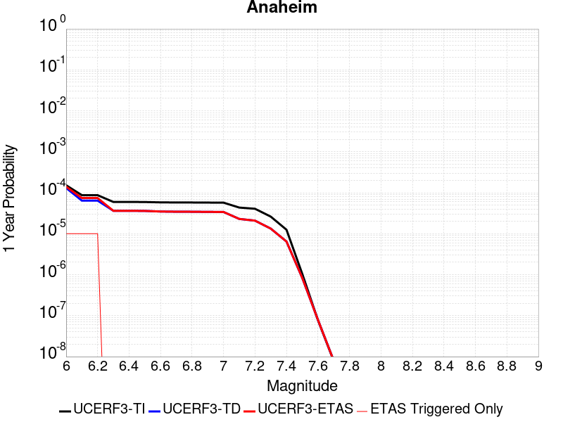 |  |

| Magnitude | 1 wk TI Prob | 1 wk TD Prob | 1 wk ETAS Prob | 1 wk ETAS/TD Gain | 1 wk ETAS Triggered Only | 1 mo TI Prob | 1 mo TD Prob | 1 mo ETAS Prob | 1 mo ETAS/TD Gain | 1 mo ETAS Triggered Only | 1 yr TI Prob | 1 yr TD Prob | 1 yr ETAS Prob | 1 yr ETAS/TD Gain | 1 yr ETAS Triggered Only | 10 yr TI Prob | 10 yr TD Prob | 10 yr ETAS Prob | 10 yr ETAS/TD Gain | 10 yr ETAS Triggered Only |
|-----|-----|-----|-----|-----|-----|-----|-----|-----|-----|-----|-----|-----|-----|-----|-----|-----|-----|-----|-----|-----|
| 6.0 | 2.9254998E-6 | 2.5122863E-6 | 2.5122863E-6 | 1.0 | 0.0 | 1.25377965E-5 | 1.0766909E-5 | 6.5238484E-5 | 6.0591655 | 5.4472166E-5 | 1.5263697E-4 | 1.3108159E-4 | 1.8554661E-4 | 1.4155048 | 5.4472166E-5 | 0.0015253217 | 0.0013102728 | 0.0013646737 | 1.0415187 | 5.4472166E-5 |
| 6.1 | 1.6729715E-6 | 1.2337348E-6 | 1.2337348E-6 | 1.0 | 0.0 | 7.1698582E-6 | 5.287426E-6 | 5.9759303E-5 | 11.302154 | 5.4472166E-5 | 8.7289525E-5 | 6.437293E-5 | 1.1884159E-4 | 1.8461423 | 5.4472166E-5 | 8.7255245E-4 | 6.435838E-4 | 6.980209E-4 | 1.0845844 | 5.4472166E-5 |
| 6.2 | 1.6729715E-6 | 1.2337348E-6 | 1.2337348E-6 | 1.0 | 0.0 | 7.1698582E-6 | 5.287426E-6 | 5.9759303E-5 | 11.302154 | 5.4472166E-5 | 8.7289525E-5 | 6.437293E-5 | 1.1884159E-4 | 1.8461423 | 5.4472166E-5 | 8.7255245E-4 | 6.435838E-4 | 6.980209E-4 | 1.0845844 | 5.4472166E-5 |
| 6.3 | 1.1444064E-6 | 6.9596666E-7 | 6.9596666E-7 | 1.0 | 0.0 | 4.9045893E-6 | 2.9827113E-6 | 2.9827113E-6 | 1.0 | 0.0 | 5.971174E-5 | 3.631396E-5 | 3.631396E-5 | 1.0 | 0.0 | 5.96957E-4 | 3.6308577E-4 | 3.6308577E-4 | 1.0 | 0.0 |
| 6.4 | 1.1444064E-6 | 6.9596666E-7 | 6.9596666E-7 | 1.0 | 0.0 | 4.9045893E-6 | 2.9827113E-6 | 2.9827113E-6 | 1.0 | 0.0 | 5.971174E-5 | 3.631396E-5 | 3.631396E-5 | 1.0 | 0.0 | 5.96957E-4 | 3.6308577E-4 | 3.6308577E-4 | 1.0 | 0.0 |
| 6.5 | 1.1385318E-6 | 6.9003505E-7 | 6.9003505E-7 | 1.0 | 0.0 | 4.879413E-6 | 2.95729E-6 | 2.95729E-6 | 1.0 | 0.0 | 5.9405233E-5 | 3.6004465E-5 | 3.6004465E-5 | 1.0 | 0.0 | 5.938936E-4 | 3.5999183E-4 | 3.5999183E-4 | 1.0 | 0.0 |
| 6.6 | 1.1165511E-6 | 6.678222E-7 | 6.678222E-7 | 1.0 | 0.0 | 4.78521E-6 | 2.862092E-6 | 2.862092E-6 | 1.0 | 0.0 | 5.8258374E-5 | 3.484547E-5 | 3.484547E-5 | 1.0 | 0.0 | 5.8243104E-4 | 3.484055E-4 | 3.484055E-4 | 1.0 | 0.0 |
| 6.7 | 1.1098243E-6 | 6.610416E-7 | 6.610416E-7 | 1.0 | 0.0 | 4.7563813E-6 | 2.8330326E-6 | 2.8330326E-6 | 1.0 | 0.0 | 5.7907404E-5 | 3.449168E-5 | 3.449168E-5 | 1.0 | 0.0 | 5.7892315E-4 | 3.4486872E-4 | 3.4486872E-4 | 1.0 | 0.0 |
| 6.8 | 1.1077587E-6 | 6.589619E-7 | 6.589619E-7 | 1.0 | 0.0 | 4.7475287E-6 | 2.8241195E-6 | 2.8241195E-6 | 1.0 | 0.0 | 5.779963E-5 | 3.438317E-5 | 3.438317E-5 | 1.0 | 0.0 | 5.77846E-4 | 3.4378393E-4 | 3.4378393E-4 | 1.0 | 0.0 |
| 6.9 | 1.1024468E-6 | 6.5361957E-7 | 6.5361957E-7 | 1.0 | 0.0 | 4.7247636E-6 | 2.8012241E-6 | 2.8012241E-6 | 1.0 | 0.0 | 5.752248E-5 | 3.4104425E-5 | 3.4104425E-5 | 1.0 | 0.0 | 5.750759E-4 | 3.4099736E-4 | 3.4099736E-4 | 1.0 | 0.0 |
| 7.0 | 1.0993066E-6 | 6.510303E-7 | 6.510303E-7 | 1.0 | 0.0 | 4.7113053E-6 | 2.7901272E-6 | 2.7901272E-6 | 1.0 | 0.0 | 5.7358633E-5 | 3.3969325E-5 | 3.3969325E-5 | 1.0 | 0.0 | 5.734383E-4 | 3.3964674E-4 | 3.3964674E-4 | 1.0 | 0.0 |
| 7.1 | 8.334877E-7 | 4.4049145E-7 | 4.4049145E-7 | 1.0 | 0.0 | 3.5720855E-6 | 1.8878193E-6 | 1.8878193E-6 | 1.0 | 0.0 | 4.348927E-5 | 2.298398E-5 | 2.298398E-5 | 1.0 | 0.0 | 4.3480762E-4 | 2.2981827E-4 | 2.2981827E-4 | 1.0 | 0.0 |
| 7.2 | 7.794411E-7 | 3.997645E-7 | 3.997645E-7 | 1.0 | 0.0 | 3.3404576E-6 | 1.7132754E-6 | 1.7132754E-6 | 1.0 | 0.0 | 4.0669314E-5 | 2.0858948E-5 | 2.0858948E-5 | 1.0 | 0.0 | 4.066187E-4 | 2.0857195E-4 | 2.0857195E-4 | 1.0 | 0.0 |
| 7.3 | 5.01704E-7 | 2.5573388E-7 | 2.5573388E-7 | 1.0 | 0.0 | 2.150158E-6 | 1.0960019E-6 | 1.0960019E-6 | 1.0 | 0.0 | 2.617786E-5 | 1.3343754E-5 | 1.3343754E-5 | 1.0 | 0.0 | 2.6174777E-4 | 1.3343077E-4 | 1.3343077E-4 | 1.0 | 0.0 |
| 7.4 | 2.4008182E-7 | 1.2367859E-7 | 1.2367859E-7 | 1.0 | 0.0 | 1.0289217E-6 | 5.30051E-7 | 5.30051E-7 | 1.0 | 0.0 | 1.252705E-5 | 6.4533597E-6 | 6.4533597E-6 | 1.0 | 0.0 | 1.2526344E-4 | 6.453248E-5 | 6.453248E-5 | 1.0 | 0.0 |
| 7.5 | 2.0263876E-8 | 1.6120866E-8 | 1.6120866E-8 | 1.0 | 0.0 | 8.684518E-8 | 6.908943E-8 | 6.908943E-8 | 1.0 | 0.0 | 1.0573395E-6 | 8.4116357E-7 | 8.4116357E-7 | 1.0 | 0.0 | 1.0573345E-5 | 8.411613E-6 | 8.411613E-6 | 1.0 | 0.0 |
| 7.6 | 1.4871431E-9 | 1.508418E-9 | 1.508418E-9 | 1.0 | 0.0 | 6.37347E-9 | 6.4646484E-9 | 6.4646484E-9 | 1.0 | 0.0 | 7.7596994E-8 | 7.870709E-8 | 7.870709E-8 | 1.0 | 0.0 | 7.759697E-7 | 7.8707063E-7 | 7.8707063E-7 | 1.0 | 0.0 |
| 7.7 | 1.5093293E-10 | 1.5333512E-10 | 1.5333512E-10 | 1.0 | 0.0 | 6.4685546E-10 | 6.571509E-10 | 6.571509E-10 | 1.0 | 0.0 | 7.875465E-9 | 8.0008125E-9 | 8.0008125E-9 | 1.0 | 0.0 | 7.8754645E-8 | 8.000812E-8 | 8.000812E-8 | 1.0 | 0.0 |

## Raymond
*[(top)](#table-of-contents)*

| 1 Week | 1 Month | 1 Year | 10 Year |
|-----|-----|-----|-----|
|  |  |  |  |

| Magnitude | 1 wk TI Prob | 1 wk TD Prob | 1 wk ETAS Prob | 1 wk ETAS/TD Gain | 1 wk ETAS Triggered Only | 1 mo TI Prob | 1 mo TD Prob | 1 mo ETAS Prob | 1 mo ETAS/TD Gain | 1 mo ETAS Triggered Only | 1 yr TI Prob | 1 yr TD Prob | 1 yr ETAS Prob | 1 yr ETAS/TD Gain | 1 yr ETAS Triggered Only | 10 yr TI Prob | 10 yr TD Prob | 10 yr ETAS Prob | 10 yr ETAS/TD Gain | 10 yr ETAS Triggered Only |
|-----|-----|-----|-----|-----|-----|-----|-----|-----|-----|-----|-----|-----|-----|-----|-----|-----|-----|-----|-----|-----|
| 6.0 | 1.5157413E-5 | 1.5810128E-5 | 1.5810128E-5 | 1.0 | 0.0 | 6.4958724E-5 | 6.7756075E-5 | 6.7756075E-5 | 1.0 | 0.0 | 7.905855E-4 | 8.2464307E-4 | 8.2464307E-4 | 1.0 | 0.0 | 0.007877788 | 0.008218348 | 0.008272373 | 1.0065737 | 5.4472166E-5 |
| 6.1 | 1.5157413E-5 | 1.5810128E-5 | 1.5810128E-5 | 1.0 | 0.0 | 6.4958724E-5 | 6.7756075E-5 | 6.7756075E-5 | 1.0 | 0.0 | 7.905855E-4 | 8.2464307E-4 | 8.2464307E-4 | 1.0 | 0.0 | 0.007877788 | 0.008218348 | 0.008272373 | 1.0065737 | 5.4472166E-5 |
| 6.2 | 1.5157413E-5 | 1.5810128E-5 | 1.5810128E-5 | 1.0 | 0.0 | 6.4958724E-5 | 6.7756075E-5 | 6.7756075E-5 | 1.0 | 0.0 | 7.905855E-4 | 8.2464307E-4 | 8.2464307E-4 | 1.0 | 0.0 | 0.007877788 | 0.008218348 | 0.008272373 | 1.0065737 | 5.4472166E-5 |
| 6.3 | 1.5157413E-5 | 1.5810128E-5 | 1.5810128E-5 | 1.0 | 0.0 | 6.4958724E-5 | 6.7756075E-5 | 6.7756075E-5 | 1.0 | 0.0 | 7.905855E-4 | 8.2464307E-4 | 8.2464307E-4 | 1.0 | 0.0 | 0.007877788 | 0.008218348 | 0.008272373 | 1.0065737 | 5.4472166E-5 |
| 6.4 | 1.3941944E-5 | 1.445469E-5 | 1.445469E-5 | 1.0 | 0.0 | 5.9749822E-5 | 6.1947336E-5 | 6.1947336E-5 | 1.0 | 0.0 | 7.2721124E-4 | 7.5397117E-4 | 7.5397117E-4 | 1.0 | 0.0 | 0.007248361 | 0.0075164647 | 0.0075705275 | 1.0071926 | 5.4472166E-5 |
| 6.5 | 1.3941944E-5 | 1.445469E-5 | 1.445469E-5 | 1.0 | 0.0 | 5.9749822E-5 | 6.1947336E-5 | 6.1947336E-5 | 1.0 | 0.0 | 7.2721124E-4 | 7.5397117E-4 | 7.5397117E-4 | 1.0 | 0.0 | 0.007248361 | 0.0075164647 | 0.0075705275 | 1.0071926 | 5.4472166E-5 |
| 6.6 | 1.0542609E-5 | 1.0671113E-5 | 1.0671113E-5 | 1.0 | 0.0 | 4.5181827E-5 | 4.573257E-5 | 4.573257E-5 | 1.0 | 0.0 | 5.499499E-4 | 5.5665727E-4 | 5.5665727E-4 | 1.0 | 0.0 | 0.005485909 | 0.00555319 | 0.00555319 | 1.0 | 0.0 |
| 6.7 | 1.0542609E-5 | 1.0671113E-5 | 1.0671113E-5 | 1.0 | 0.0 | 4.5181827E-5 | 4.573257E-5 | 4.573257E-5 | 1.0 | 0.0 | 5.499499E-4 | 5.5665727E-4 | 5.5665727E-4 | 1.0 | 0.0 | 0.005485909 | 0.00555319 | 0.00555319 | 1.0 | 0.0 |
| 6.8 | 1.0079132E-5 | 1.0176646E-5 | 1.0176646E-5 | 1.0 | 0.0 | 4.3195567E-5 | 4.3613498E-5 | 4.3613498E-5 | 1.0 | 0.0 | 5.257791E-4 | 5.3087034E-4 | 5.3087034E-4 | 1.0 | 0.0 | 0.0052453685 | 0.005296571 | 0.005296571 | 1.0 | 0.0 |
| 6.9 | 7.721598E-6 | 7.5489047E-6 | 7.5489047E-6 | 1.0 | 0.0 | 3.3092143E-5 | 3.2352054E-5 | 3.2352054E-5 | 1.0 | 0.0 | 4.0282236E-4 | 3.9381627E-4 | 3.9381627E-4 | 1.0 | 0.0 | 0.0040209293 | 0.0039313175 | 0.0039313175 | 1.0 | 0.0 |
| 7.0 | 7.137566E-6 | 6.9113057E-6 | 6.9113057E-6 | 1.0 | 0.0 | 3.058921E-5 | 2.961955E-5 | 2.961955E-5 | 1.0 | 0.0 | 3.7236E-4 | 3.6055944E-4 | 3.6055944E-4 | 1.0 | 0.0 | 0.0037173668 | 0.0035998628 | 0.0035998628 | 1.0 | 0.0 |
| 7.1 | 5.654976E-6 | 5.29954E-6 | 5.29954E-6 | 1.0 | 0.0 | 2.4235387E-5 | 2.2712118E-5 | 2.2712118E-5 | 1.0 | 0.0 | 2.9502588E-4 | 2.7648517E-4 | 2.7648517E-4 | 1.0 | 0.0 | 0.0029463451 | 0.002761443 | 0.002761443 | 1.0 | 0.0 |
| 7.2 | 4.9358455E-6 | 4.5266574E-6 | 4.5266574E-6 | 1.0 | 0.0 | 2.1153453E-5 | 1.9399817E-5 | 1.9399817E-5 | 1.0 | 0.0 | 2.5751285E-4 | 2.3616731E-4 | 2.3616731E-4 | 1.0 | 0.0 | 0.0025721465 | 0.0023591854 | 0.0023591854 | 1.0 | 0.0 |
| 7.3 | 4.2368597E-6 | 3.8056164E-6 | 3.8056164E-6 | 1.0 | 0.0 | 1.8157843E-5 | 1.6309683E-5 | 1.6309683E-5 | 1.0 | 0.0 | 2.2104931E-4 | 1.9855241E-4 | 1.9855241E-4 | 1.0 | 0.0 | 0.0022082955 | 0.0019837688 | 0.0019837688 | 1.0 | 0.0 |
| 7.4 | 3.4999923E-6 | 3.043744E-6 | 3.043744E-6 | 1.0 | 0.0 | 1.49998805E-5 | 1.3044552E-5 | 1.3044552E-5 | 1.0 | 0.0 | 1.8260824E-4 | 1.5880594E-4 | 1.5880594E-4 | 1.0 | 0.0 | 0.0018245826 | 0.0015869403 | 0.0015869403 | 1.0 | 0.0 |
| 7.5 | 2.738017E-6 | 2.3020468E-6 | 2.3020468E-6 | 1.0 | 0.0 | 1.1734306E-5 | 9.865878E-6 | 9.865878E-6 | 1.0 | 0.0 | 1.428558E-4 | 1.2011051E-4 | 1.2011051E-4 | 1.0 | 0.0 | 0.0014276401 | 0.0012004703 | 0.0012004703 | 1.0 | 0.0 |
| 7.6 | 1.8186392E-6 | 1.442312E-6 | 1.442312E-6 | 1.0 | 0.0 | 7.794145E-6 | 6.181323E-6 | 6.181323E-6 | 1.0 | 0.0 | 9.488958E-5 | 7.5255055E-5 | 7.5255055E-5 | 1.0 | 0.0 | 9.4849075E-4 | 7.523072E-4 | 7.523072E-4 | 1.0 | 0.0 |
| 7.7 | 1.0660348E-6 | 7.6438056E-7 | 7.6438056E-7 | 1.0 | 0.0 | 4.5687125E-6 | 3.2759126E-6 | 3.2759126E-6 | 1.0 | 0.0 | 5.5622655E-5 | 3.9883522E-5 | 3.9883522E-5 | 1.0 | 0.0 | 5.5608735E-4 | 3.9877277E-4 | 3.9877277E-4 | 1.0 | 0.0 |
| 7.8 | 6.913602E-7 | 4.3204133E-7 | 4.3204133E-7 | 1.0 | 0.0 | 2.962969E-6 | 1.8516045E-6 | 1.8516045E-6 | 1.0 | 0.0 | 3.607355E-5 | 2.2543056E-5 | 2.2543056E-5 | 1.0 | 0.0 | 3.6067693E-4 | 2.2541556E-4 | 2.2541556E-4 | 1.0 | 0.0 |
| 7.9 | 7.425201E-8 | 5.3222113E-8 | 5.3222113E-8 | 1.0 | 0.0 | 3.1822285E-7 | 2.2809476E-7 | 2.2809476E-7 | 1.0 | 0.0 | 3.874356E-6 | 2.7770516E-6 | 2.7770516E-6 | 1.0 | 0.0 | 3.8742884E-5 | 2.7770298E-5 | 2.7770298E-5 | 1.0 | 0.0 |

