# Parent Section Magnitude-Probability Distributions

Only fault sections with at least one triggered aftershock are plotted. Sections are sorted by total supraseismogenic trigger rate (decreasing)

## Table Of Contents

* [Garlock (Central)](#garlock-central)
* [Tank Canyon](#tank-canyon)
* [Little Lake](#little-lake)
* [Airport Lake](#airport-lake)
* [Owl Lake](#owl-lake)
* [Panamint Valley](#panamint-valley)
* [Garlock (East)](#garlock-east)
* [Hunter Mountain-Saline Valley](#hunter-mountain-saline-valley)
* [Ash Hill](#ash-hill)
* [Blackwater](#blackwater)
* [Garlock (West)](#garlock-west)
* [McLean Lake](#mclean-lake)
* [Goldstone Lake](#goldstone-lake)
* [Gravel Hills-Harper Lk](#gravel-hills-harper-lk)
* [Death Valley (So)](#death-valley-so)
* [So Sierra Nevada](#so-sierra-nevada)
* [Coyote Canyon](#coyote-canyon)
* [San Andreas (Mojave S)](#san-andreas-mojave-s)
* [Nelson Lake](#nelson-lake)
* [San Andreas (Mojave N)](#san-andreas-mojave-n)
* [Lenwood-Lockhart-Old Woman Springs](#lenwood-lockhart-old-woman-springs)
* [Towne Pass](#towne-pass)
* [Bicycle Lake](#bicycle-lake)
* [Paradise](#paradise)
* [San Andreas (San Bernardino N)](#san-andreas-san-bernardino-n)
* [Garlic Springs](#garlic-springs)
* [Death Valley (Black Mtns Frontal)](#death-valley-black-mtns-frontal)
* [Helendale-So Lockhart](#helendale-so-lockhart)
* [San Andreas (San Bernardino S)](#san-andreas-san-bernardino-s)
* [Coyote Lake](#coyote-lake)
* [Death Valley (No)](#death-valley-no)
* [San Andreas (Big Bend)](#san-andreas-big-bend)
* [San Andreas (Parkfield)](#san-andreas-parkfield)
* [San Andreas (San Gorgonio Pass-Garnet HIll)](#san-andreas-san-gorgonio-pass-garnet-hill)
* [Elsinore (Glen Ivy) rev](#elsinore-glen-ivy-rev)
* [Sierra Nevada  (No Extension)](#sierra-nevada--no-extension)
* [Red Pass](#red-pass)
* [Death Valley (Fish Lake Valley)](#death-valley-fish-lake-valley)
* [Cady](#cady)
* [San Andreas (Carrizo) rev](#san-andreas-carrizo-rev)
* [San Andreas (Cholame) rev](#san-andreas-cholame-rev)
* [Scodie Lineament](#scodie-lineament)
* [San Jacinto (San Bernardino)](#san-jacinto-san-bernardino)
* [Lake Isabella (Seismicity)](#lake-isabella-seismicity)
* [Ludlow](#ludlow)
* [San Andreas (Coachella) rev](#san-andreas-coachella-rev)
* [Manix-Afton Hills](#manix-afton-hills)
* [Baker](#baker)
* [San Andreas (Creeping Section) 2011 CFM](#san-andreas-creeping-section-2011-cfm)
* [San Jacinto (San Jacinto Valley) rev](#san-jacinto-san-jacinto-valley-rev)
* [San Jacinto (Stepovers Combined)](#san-jacinto-stepovers-combined)
* [White Wolf (Extension)](#white-wolf-extension)
* [San Jacinto (Anza) rev](#san-jacinto-anza-rev)
* [North Channel](#north-channel)
* [Calico-Hidalgo](#calico-hidalgo)
* [San Andreas (North Branch Mill Creek)](#san-andreas-north-branch-mill-creek)
* [Mission Ridge-Arroyo Parida-Santa Ana](#mission-ridge-arroyo-parida-santa-ana)
* [Santa Ynez (East)](#santa-ynez-east)
* [Imperial](#imperial)
* [Santa Ynez (West)](#santa-ynez-west)
* [Owens Valley](#owens-valley)
* [Oak Ridge (Offshore) west extension](#oak-ridge-offshore-west-extension)
* [Tin Mountain](#tin-mountain)
* [White Mountains](#white-mountains)
* [Kern Canyon (North Kern) 2011](#kern-canyon-north-kern-2011)
* [Dry Mountain](#dry-mountain)
* [Cleghorn Lake](#cleghorn-lake)
* [Cleghorn Pass](#cleghorn-pass)
* [Oak Ridge (Offshore)](#oak-ridge-offshore)
* [Red Mountain](#red-mountain)
* [Santa Cruz Island](#santa-cruz-island)
* [Deep Springs](#deep-springs)
* [Pinto Mtn](#pinto-mtn)
* [San Jacinto (Clark) rev](#san-jacinto-clark-rev)
* [Santa Susana alt 2](#santa-susana-alt-2)
* [Independence rev 2011](#independence-rev-2011)
* [Great Valley 09 (Laguna Seca)](#great-valley-09-laguna-seca)
* [Big Pine (Central)](#big-pine-central)
* [San Jacinto (Lytle Creek connector)](#san-jacinto-lytle-creek-connector)
* [Pleito](#pleito)
* [Ortigalita (North)](#ortigalita-north)
* [Oceanic - West Huasna](#oceanic---west-huasna)
* [Brawley (Seismic Zone) alt 2](#brawley-seismic-zone-alt-2)
* [Santa Rosa Island](#santa-rosa-island)
* [Pisgah-Bullion Mtn-Mesquite Lk](#pisgah-bullion-mtn-mesquite-lk)
* [Camp Rock 2011](#camp-rock-2011)
* [San Pedro Basin](#san-pedro-basin)
* [Oak Ridge (Onshore)](#oak-ridge-onshore)
* [San Jacinto (Coyote Creek)](#san-jacinto-coyote-creek)
* [Blue Cut](#blue-cut)
* [San Clemente](#san-clemente)
* [Big Pine (East)](#big-pine-east)
* [Pine Mtn](#pine-mtn)
* [Channel Islands Thrust](#channel-islands-thrust)
* [Lost Hills](#lost-hills)
* [Calaveras (So) 2011 CFM](#calaveras-so-2011-cfm)
* [Rose Canyon](#rose-canyon)
* [Hosgri](#hosgri)
* [Bullion Mountains](#bullion-mountains)
* [San Diego Trough north alt2](#san-diego-trough-north-alt2)
* [Chino alt 2](#chino-alt-2)
* [Ventura-Pitas Point](#ventura-pitas-point)
* [Calaveras (So) - Paicines extension 2011 CFM](#calaveras-so---paicines-extension-2011-cfm)
* [Mono Lake 2011 CFM](#mono-lake-2011-cfm)
* [San Gabriel](#san-gabriel)
* [Kern Canyon (South Kern) 2011](#kern-canyon-south-kern-2011)
* [Mission Creek](#mission-creek)
* [Santa Cruz Catalina Ridge alt2](#santa-cruz-catalina-ridge-alt2)
* [San Jacinto (Borrego)](#san-jacinto-borrego)
* [Rinconada 2011 CFM](#rinconada-2011-cfm)
* [Sheephole](#sheephole)
* [Santa Ynez River](#santa-ynez-river)
* [Cleghorn](#cleghorn)
* [San Gabriel (Extension)](#san-gabriel-extension)
* [Elysian Park (Upper)](#elysian-park-upper)
* [Calaveras (Central) 2011 CFM](#calaveras-central-2011-cfm)
* [Greenville (No) 2011 CFM](#greenville-no-2011-cfm)
* [Northridge](#northridge)
* [San Juan](#san-juan)
* [Kern Canyon (Lake Isabella) 2011](#kern-canyon-lake-isabella-2011)
* [East Huasna 2011 CFM](#east-huasna-2011-cfm)
* [Emerson-Copper Mtn 2011](#emerson-copper-mtn-2011)
* [Puente Hills (LA)](#puente-hills-la)
* [Los Osos 2011](#los-osos-2011)
* [Santa Susana East (connector)](#santa-susana-east-connector)
* [Pitas Point (Upper)](#pitas-point-upper)
* [San Cayetano](#san-cayetano)
* [Simi-Santa Rosa](#simi-santa-rosa)
* [Palos Verdes](#palos-verdes)
* [Hollywood](#hollywood)
* [Raymond](#raymond)
* [San Gregorio (North) 2011 CFM](#san-gregorio-north-2011-cfm)
* [Los Alamos extension](#los-alamos-extension)
* [Newport-Inglewood (Offshore)](#newport-inglewood-offshore)
* [Channel Islands Western Deep Ramp](#channel-islands-western-deep-ramp)
* [Honey Lake 2011 CFM](#honey-lake-2011-cfm)
* [Los Alamos 2011 CFM](#los-alamos-2011-cfm)
* [Johnson Valley (No) 2011 rev](#johnson-valley-no-2011-rev)
* [Great Valley 07 (Orestimba)](#great-valley-07-orestimba)
* [Thirty Mile Bank](#thirty-mile-bank)
* [Hartley Springs 2011 CFM](#hartley-springs-2011-cfm)
* [Ortigalita (South)](#ortigalita-south)
* [Casmalia 2011 CFM](#casmalia-2011-cfm)
* [Hayward (So) 2011 CFM](#hayward-so-2011-cfm)
* [Elsinore (Stepovers Combined)](#elsinore-stepovers-combined)
* [San Luis Range (So Margin)](#san-luis-range-so-margin)
* [Newport-Inglewood alt 2](#newport-inglewood-alt-2)
* [White Wolf](#white-wolf)
* [San Andreas (Santa Cruz Mts) 2011 CFM](#san-andreas-santa-cruz-mts-2011-cfm)
* [Owens Valley Keough Hot Springs](#owens-valley-keough-hot-springs)
* [Verdugo](#verdugo)
* [Cerro Prieto](#cerro-prieto)
* [Burnt Mtn](#burnt-mtn)
* [Whittier alt 2](#whittier-alt-2)
* [Quien Sabe 2011 CFM](#quien-sabe-2011-cfm)
* [Greenville (So) 2011 CFM](#greenville-so-2011-cfm)
* [Jess Valley](#jess-valley)
* [Fish Slough 2011 CFM](#fish-slough-2011-cfm)
* [Lions Head 2011 CFM](#lions-head-2011-cfm)
* [Eaton Roughs 2011 CFM](#eaton-roughs-2011-cfm)
* [Hunting Creek - Berryessa 2011 CFM](#hunting-creek---berryessa-2011-cfm)
* [Gillem - Big Crack 2011 CFM](#gillem---big-crack-2011-cfm)
* [Great Valley 03a Dunnigan Hills](#great-valley-03a-dunnigan-hills)
* [La Panza 2011](#la-panza-2011)
* [San Diego Trough south](#san-diego-trough-south)
* [Anacapa-Dume alt 2](#anacapa-dume-alt-2)
* [San Andreas (Peninsula) 2011 CFM](#san-andreas-peninsula-2011-cfm)
* [Sisar](#sisar)
* [Elsinore (Coyote Mountains)](#elsinore-coyote-mountains)
* [Monterey Bay-Tularcitos](#monterey-bay-tularcitos)
* [Silver Creek 2011 CFM](#silver-creek-2011-cfm)
* [Robinson Creek](#robinson-creek)
* [Cedar Mtn-Mahogany Mtn](#cedar-mtn-mahogany-mtn)
* [Elsinore (Julian)](#elsinore-julian)
* [San Andreas (Offshore) 2011 CFM](#san-andreas-offshore-2011-cfm)
* [Hosgri (Extension)](#hosgri-extension)
* [Cucamonga](#cucamonga)
* [Fontana (Seismicity)](#fontana-seismicity)
* [North Frontal  (East)](#north-frontal--east)
* [Clamshell-Sawpit](#clamshell-sawpit)
* [Rodgers Creek - Healdsburg 2011 CFM](#rodgers-creek---healdsburg-2011-cfm)
* [Hayward (So) extension 2011 CFM](#hayward-so-extension-2011-cfm)
* [Sierra Madre](#sierra-madre)
* [San Luis Range - Pecho 2011 CFM](#san-luis-range---pecho-2011-cfm)
* [Compton](#compton)
* [Round Valley](#round-valley)
* [Reliz 2011 CFM](#reliz-2011-cfm)
* [Calaveras (No) 2011 CFM](#calaveras-no-2011-cfm)
* [San Jacinto (Superstition Mtn)](#san-jacinto-superstition-mtn)
* [Hat Creek-McArthur-Mayfield](#hat-creek-mcarthur-mayfield)
* [Hector Mine](#hector-mine)
* [North Frontal  (West)](#north-frontal--west)
* [Kickapoo](#kickapoo)
* [North Tahoe 2011 CFM](#north-tahoe-2011-cfm)
* [Hayward (No) 2011 CFM](#hayward-no-2011-cfm)
* [Homestead Valley 2011](#homestead-valley-2011)
* [Breckenridge 2011](#breckenridge-2011)
* [Fitzhugh Creek](#fitzhugh-creek)
* [Coronado Bank alt2](#coronado-bank-alt2)
* [Richfield](#richfield)
* [Likely 2011 CFM](#likely-2011-cfm)
* [Almanor 2011 CFM](#almanor-2011-cfm)
* [Great Valley 11](#great-valley-11)
* [San Gorgonio Pass](#san-gorgonio-pass)
* [Point Reyes 2011 CFM](#point-reyes-2011-cfm)
* [Elsinore (Temecula) rev](#elsinore-temecula-rev)
* [Sierra Madre (San Fernando)](#sierra-madre-san-fernando)
* [Earthquake Valley (So Extension)](#earthquake-valley-so-extension)
* [Morales (East)](#morales-east)
* [Clayton](#clayton)
* [Bartlett Springs 2011 CFM](#bartlett-springs-2011-cfm)
* [Monte Vista - Shannon 2011 CFM](#monte-vista---shannon-2011-cfm)
* [San Andreas (North Coast) 2011 CFM](#san-andreas-north-coast-2011-cfm)
* [Shoreline](#shoreline)
* [San Luis Bay 2011 CFM](#san-luis-bay-2011-cfm)
* [Sargent 2011 CFM](#sargent-2011-cfm)
* [Great Valley 10 (Panoche)](#great-valley-10-panoche)

## Garlock (Central)
*[(top)](#table-of-contents)*

| 1 Week | 1 Month | 1 Year | 10 Year |
|-----|-----|-----|-----|
| 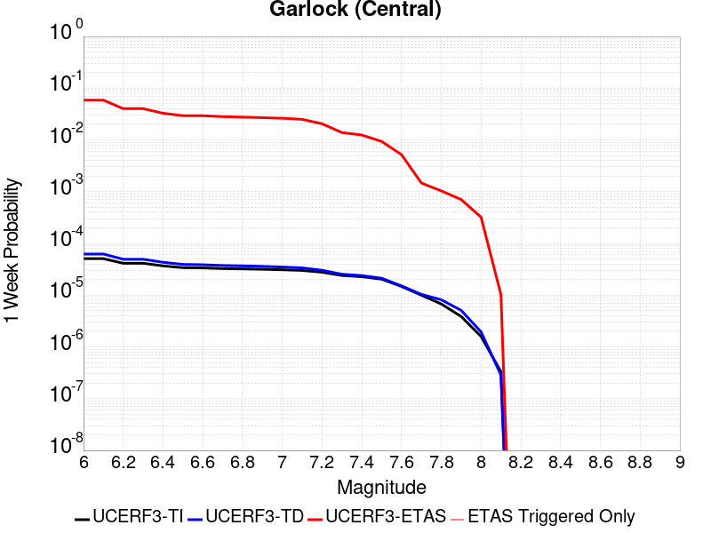 |  | 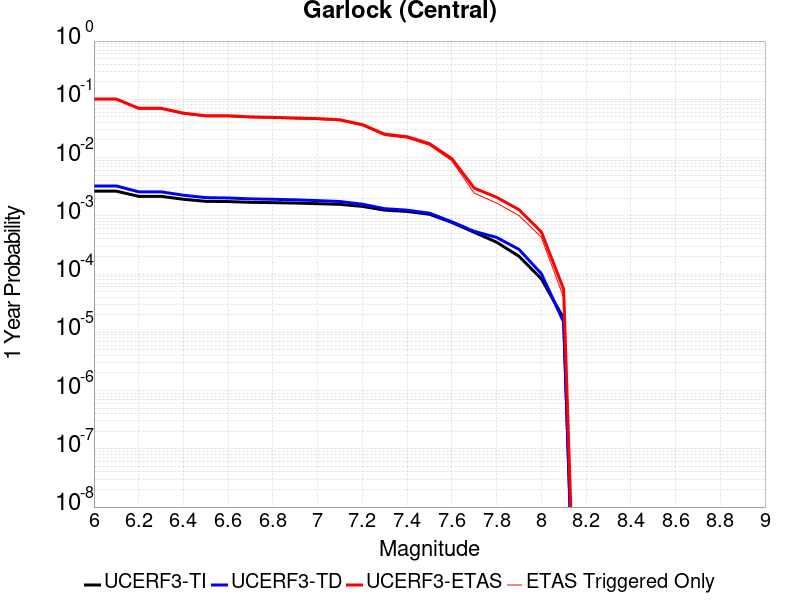 |  |

| Magnitude | 1 wk TI Prob | 1 wk TD Prob | 1 wk ETAS Prob | 1 wk ETAS/TD Gain | 1 wk ETAS Triggered Only | 1 mo TI Prob | 1 mo TD Prob | 1 mo ETAS Prob | 1 mo ETAS/TD Gain | 1 mo ETAS Triggered Only | 1 yr TI Prob | 1 yr TD Prob | 1 yr ETAS Prob | 1 yr ETAS/TD Gain | 1 yr ETAS Triggered Only | 10 yr TI Prob | 10 yr TD Prob | 10 yr ETAS Prob | 10 yr ETAS/TD Gain | 10 yr ETAS Triggered Only |
|-----|-----|-----|-----|-----|-----|-----|-----|-----|-----|-----|-----|-----|-----|-----|-----|-----|-----|-----|-----|-----|
| 6.0 | 5.0826584E-5 | 6.252138E-5 | 0.05891884 | 942.3791 | 0.05886 | 2.1781003E-4 | 2.679215E-4 | 0.07282848 | 271.82767 | 0.07258 | 0.0026486123 | 0.0032571093 | 0.101157196 | 31.057352 | 0.09822 | 0.026172658 | 0.032187037 | 0.14875042 | 4.6214395 | 0.12044 |
| 6.1 | 5.0826584E-5 | 6.252138E-5 | 0.05891884 | 942.3791 | 0.05886 | 2.1781003E-4 | 2.679215E-4 | 0.07282848 | 271.82767 | 0.07258 | 0.0026486123 | 0.0032571093 | 0.101157196 | 31.057352 | 0.09822 | 0.026172658 | 0.032187037 | 0.14875042 | 4.6214395 | 0.12044 |
| 6.2 | 4.1409123E-5 | 4.9525803E-5 | 0.040307533 | 813.8693 | 0.04026 | 1.774556E-4 | 2.1223634E-4 | 0.050131638 | 236.20668 | 0.04993 | 0.002158381 | 0.0025809433 | 0.07023588 | 27.21326 | 0.06783 | 0.021375375 | 0.025603008 | 0.10722824 | 4.1881113 | 0.08377 |
| 6.3 | 4.1409123E-5 | 4.9525803E-5 | 0.040307533 | 813.8693 | 0.04026 | 1.774556E-4 | 2.1223634E-4 | 0.050131638 | 236.20668 | 0.04993 | 0.002158381 | 0.0025809433 | 0.07023588 | 27.21326 | 0.06783 | 0.021375375 | 0.025603008 | 0.10722824 | 4.1881113 | 0.08377 |
| 6.4 | 3.6905003E-5 | 4.328594E-5 | 0.032851867 | 758.95 | 0.03281 | 1.5815471E-4 | 1.8549811E-4 | 0.04109791 | 221.55432 | 0.04092 | 0.0019238329 | 0.0022561236 | 0.057880346 | 25.654776 | 0.05575 | 0.01907263 | 0.022426065 | 0.08988844 | 4.008213 | 0.06901 |
| 6.5 | 3.4024517E-5 | 3.9344875E-5 | 0.029488185 | 749.47974 | 0.02945 | 1.4581121E-4 | 1.6861012E-4 | 0.036972404 | 219.2775 | 0.03681 | 0.0017738059 | 0.0020509155 | 0.052207835 | 25.455868 | 0.05026 | 0.017597139 | 0.020413363 | 0.081519976 | 3.9934614 | 0.06238 |
| 6.6 | 3.368409E-5 | 3.8815648E-5 | 0.029447675 | 758.65466 | 0.02941 | 1.443524E-4 | 1.6634229E-4 | 0.036930226 | 222.01346 | 0.03677 | 0.0017560736 | 0.0020233565 | 0.052101824 | 25.750196 | 0.05018 | 0.017422613 | 0.020143013 | 0.08113911 | 4.0281515 | 0.06225 |
| 6.7 | 3.2696247E-5 | 3.745909E-5 | 0.028216403 | 753.2592 | 0.02818 | 1.4011924E-4 | 1.6052919E-4 | 0.03534488 | 220.17728 | 0.03519 | 0.0017046168 | 0.0019527108 | 0.050008688 | 25.609879 | 0.04815 | 0.016916003 | 0.019449193 | 0.078076325 | 4.014374 | 0.05979 |
| 6.8 | 3.2279542E-5 | 3.686016E-5 | 0.027625844 | 749.477 | 0.02759 | 1.3833355E-4 | 1.5796267E-4 | 0.034622516 | 219.18164 | 0.03447 | 0.0016829098 | 0.0019215189 | 0.049070746 | 25.537477 | 0.04724 | 0.01670222 | 0.019142492 | 0.07661093 | 4.00214 | 0.05859 |
| 6.9 | 3.1748157E-5 | 3.6075005E-5 | 0.026975103 | 747.7505 | 0.02694 | 1.3605643E-4 | 1.5459812E-4 | 0.033809394 | 218.69215 | 0.03366 | 0.0016552283 | 0.001880627 | 0.047774155 | 25.403313 | 0.04598 | 0.016429536 | 0.018740224 | 0.07473091 | 3.9877276 | 0.05706 |
| 7.0 | 3.0997133E-5 | 3.49907E-5 | 0.026304072 | 751.7447 | 0.02627 | 1.3283809E-4 | 1.4995162E-4 | 0.033055015 | 220.43787 | 0.03291 | 0.0016161038 | 0.001824152 | 0.046652228 | 25.574749 | 0.04491 | 0.016044013 | 0.018184511 | 0.07280291 | 4.003567 | 0.05563 |
| 7.1 | 3.0141593E-5 | 3.374135E-5 | 0.025032898 | 741.90564 | 0.025 | 1.2917187E-4 | 1.4459789E-4 | 0.031480066 | 217.70766 | 0.03134 | 0.0015715328 | 0.0017590772 | 0.04452372 | 25.310839 | 0.04284 | 0.015604655 | 0.017543856 | 0.06969263 | 3.9724808 | 0.05308 |
| 7.2 | 2.7814413E-5 | 3.03356E-5 | 0.020579712 | 678.40137 | 0.02055 | 1.19199176E-4 | 1.3000333E-4 | 0.025806665 | 198.50772 | 0.02568 | 0.0014502838 | 0.001581659 | 0.03678589 | 23.257788 | 0.03526 | 0.014408553 | 0.015795073 | 0.05880483 | 3.7229855 | 0.0437 |
| 7.3 | 2.402337E-5 | 2.5417843E-5 | 0.013905065 | 547.0592 | 0.01388 | 1.0295323E-4 | 1.0892913E-4 | 0.017517032 | 160.81128 | 0.01741 | 0.0012527348 | 0.0013254174 | 0.025173767 | 18.993086 | 0.02388 | 0.012456963 | 0.0132569745 | 0.042474438 | 3.2039313 | 0.02961 |
| 7.4 | 2.2769042E-5 | 2.3974066E-5 | 0.012463676 | 519.8816 | 0.01244 | 9.7577955E-5 | 1.02742015E-4 | 0.015731135 | 153.11298 | 0.01563 | 0.0011873641 | 0.0012501781 | 0.022803199 | 18.23996 | 0.02158 | 0.0118104 | 0.012511011 | 0.038797967 | 3.1011057 | 0.02662 |
| 7.5 | 2.0420326E-5 | 2.1256521E-5 | 0.009371058 | 440.85565 | 0.00935 | 8.7512744E-5 | 9.109625E-5 | 0.011860024 | 130.19223 | 0.01177 | 0.0010649469 | 0.0011085419 | 0.017360507 | 15.660667 | 0.01627 | 0.0105985785 | 0.011103947 | 0.031129092 | 2.803426 | 0.02025 |
| 7.6 | 1.4753501E-5 | 1.5132053E-5 | 0.0051950538 | 343.3145 | 0.00518 | 6.322776E-5 | 6.485008E-5 | 0.0065644286 | 101.22468 | 0.0065 | 7.6952606E-4 | 7.8926975E-4 | 0.009592316 | 12.153406 | 0.00881 | 0.0076686675 | 0.007936253 | 0.018878715 | 2.3787947 | 0.01103 |
| 7.7 | 9.9946255E-6 | 1.0367413E-5 | 0.0014703523 | 141.82442 | 0.00146 | 4.2833406E-5 | 4.4431017E-5 | 0.0017943532 | 40.38515 | 0.00175 | 5.2137196E-4 | 5.4081366E-4 | 0.0029894887 | 5.527761 | 0.00245 | 0.005201504 | 0.0054644533 | 0.008637022 | 1.580583 | 0.00319 |
| 7.8 | 6.764146E-6 | 8.1679345E-6 | 0.0010381595 | 127.101845 | 0.00103 | 2.8988876E-5 | 3.5004963E-5 | 0.0012649619 | 36.136642 | 0.00123 | 3.528824E-4 | 4.2610223E-4 | 0.002085395 | 4.894119 | 0.00166 | 0.0035232254 | 0.0043103355 | 0.006441111 | 1.4943411 | 0.00214 |
| 7.9 | 3.879876E-6 | 5.093653E-6 | 7.0509006E-4 | 138.42525 | 7.0E-4 | 1.6627935E-5 | 2.1829757E-5 | 8.118125E-4 | 37.188343 | 7.9E-4 | 2.024263E-4 | 2.6574498E-4 | 0.0012754765 | 4.7996264 | 0.00101 | 0.00202242 | 0.0026879057 | 0.003954492 | 1.4712168 | 0.00127 |
| 8.0 | 1.5950359E-6 | 1.9546783E-6 | 3.2195405E-4 | 164.70949 | 3.2E-4 | 6.83585E-6 | 8.377166E-6 | 3.5837424E-4 | 42.779892 | 3.5E-4 | 8.322329E-5 | 1.0198724E-4 | 5.319434E-4 | 5.2157836 | 4.3E-4 | 8.3192135E-4 | 0.0010318194 | 0.0015612725 | 1.5131258 | 5.3E-4 |
| 8.1 | 3.3286665E-7 | 2.870681E-7 | 1.0287065E-5 | 35.83493 | 1.0E-5 | 1.4265705E-6 | 1.2302913E-6 | 1.1230279E-5 | 9.128146 | 1.0E-5 | 1.7368358E-5 | 1.49787065E-5 | 5.4978107E-5 | 3.6704175 | 4.0E-5 | 1.7367E-4 | 1.5147903E-4 | 2.3146691E-4 | 1.5280459 | 8.0E-5 |

## Tank Canyon
*[(top)](#table-of-contents)*

| 1 Week | 1 Month | 1 Year | 10 Year |
|-----|-----|-----|-----|
|  |  |  | 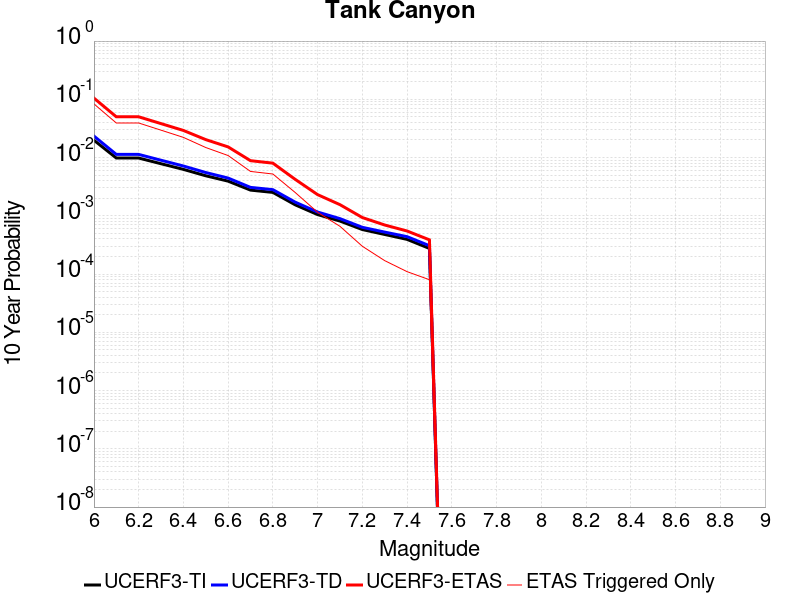 |

| Magnitude | 1 wk TI Prob | 1 wk TD Prob | 1 wk ETAS Prob | 1 wk ETAS/TD Gain | 1 wk ETAS Triggered Only | 1 mo TI Prob | 1 mo TD Prob | 1 mo ETAS Prob | 1 mo ETAS/TD Gain | 1 mo ETAS Triggered Only | 1 yr TI Prob | 1 yr TD Prob | 1 yr ETAS Prob | 1 yr ETAS/TD Gain | 1 yr ETAS Triggered Only | 10 yr TI Prob | 10 yr TD Prob | 10 yr ETAS Prob | 10 yr ETAS/TD Gain | 10 yr ETAS Triggered Only |
|-----|-----|-----|-----|-----|-----|-----|-----|-----|-----|-----|-----|-----|-----|-----|-----|-----|-----|-----|-----|-----|
| 6.0 | 3.8417336E-5 | 4.5261673E-5 | 0.030753871 | 679.4683 | 0.03071 | 1.6463533E-4 | 1.9396625E-4 | 0.04078609 | 210.27415 | 0.0406 | 0.0020025924 | 0.0023593493 | 0.063594535 | 26.954268 | 0.06138 | 0.019846417 | 0.023379594 | 0.104839504 | 4.484231 | 0.08341 |
| 6.1 | 1.8901083E-5 | 2.1815771E-5 | 0.013901513 | 637.2231 | 0.01388 | 8.100212E-5 | 9.349306E-5 | 0.018351786 | 196.29036 | 0.01826 | 9.857547E-4 | 0.0011377254 | 0.029475449 | 25.907347 | 0.02837 | 0.009813935 | 0.011323287 | 0.050099187 | 4.4244385 | 0.03922 |
| 6.2 | 1.8901083E-5 | 2.1815771E-5 | 0.013901513 | 637.2231 | 0.01388 | 8.100212E-5 | 9.349306E-5 | 0.018351786 | 196.29036 | 0.01826 | 9.857547E-4 | 0.0011377254 | 0.029475449 | 25.907347 | 0.02837 | 0.009813935 | 0.011323287 | 0.050099187 | 4.4244385 | 0.03922 |
| 6.3 | 1.5076492E-5 | 1.7305565E-5 | 0.0105071245 | 607.1529 | 0.01049 | 6.461194E-5 | 7.416477E-5 | 0.01389314 | 187.32803 | 0.01382 | 7.863664E-4 | 9.0261054E-4 | 0.02213343 | 24.521572 | 0.02125 | 0.007835896 | 0.00899237 | 0.038256824 | 4.254365 | 0.02953 |
| 6.4 | 1.2048824E-5 | 1.3767486E-5 | 0.007633663 | 554.47034 | 0.00762 | 5.1636795E-5 | 5.9002297E-5 | 0.010408391 | 176.40656 | 0.01035 | 6.2849664E-4 | 7.181373E-4 | 0.016636698 | 23.166458 | 0.01593 | 0.0062672207 | 0.0071602617 | 0.029201305 | 4.078245 | 0.0222 |
| 6.5 | 9.349992E-6 | 1.0631932E-5 | 0.005180577 | 487.2658 | 0.00517 | 4.007078E-5 | 4.5564713E-5 | 0.0070252465 | 154.18173 | 0.00698 | 4.8775252E-4 | 5.546244E-4 | 0.011368623 | 20.497877 | 0.01082 | 0.0048668333 | 0.0055339076 | 0.020321619 | 3.6722004 | 0.01487 |
| 6.6 | 7.5575967E-6 | 8.533825E-6 | 0.0036885024 | 432.22147 | 0.00368 | 3.2389296E-5 | 3.6573096E-5 | 0.0050363904 | 137.70752 | 0.005 | 3.9426834E-4 | 4.4519908E-4 | 0.008281709 | 18.602259 | 0.00784 | 0.0039356956 | 0.0044443146 | 0.0152261825 | 3.4259913 | 0.01083 |
| 6.7 | 5.301251E-6 | 5.902919E-6 | 0.0020858906 | 353.36597 | 0.00208 | 2.271945E-5 | 2.529801E-5 | 0.002795228 | 110.49201 | 0.00277 | 2.765742E-4 | 3.0796524E-4 | 0.0044566873 | 14.471397 | 0.00415 | 0.0027623023 | 0.0030759263 | 0.008838148 | 2.8733287 | 0.00578 |
| 6.8 | 4.8406114E-6 | 5.3940585E-6 | 0.0018953838 | 351.38364 | 0.00189 | 2.0745312E-5 | 2.3117218E-5 | 0.002533059 | 109.57457 | 0.00251 | 2.525449E-4 | 2.8142115E-4 | 0.0040203687 | 14.285951 | 0.00374 | 0.002522581 | 0.0028111762 | 0.008016502 | 2.851654 | 0.00522 |
| 6.9 | 2.959106E-6 | 3.288876E-6 | 9.332858E-4 | 283.77045 | 9.3E-4 | 1.2681822E-5 | 1.4095115E-5 | 0.0012140782 | 86.13468 | 0.0012 | 1.5439025E-4 | 1.7159584E-4 | 0.00201128 | 11.721031 | 0.00184 | 0.0015428303 | 0.0017147639 | 0.00422046 | 2.4612484 | 0.00251 |
| 7.0 | 2.0122975E-6 | 2.2261288E-6 | 4.3222518E-4 | 194.15999 | 4.3E-4 | 8.624103E-6 | 9.540521E-6 | 5.395355E-4 | 56.55199 | 5.3E-4 | 1.0499341E-4 | 1.1615031E-4 | 9.2605624E-4 | 7.9729123 | 8.1E-4 | 0.0010494381 | 0.0011609606 | 0.0023096255 | 1.989409 | 0.00115 |
| 7.1 | 1.5578836E-6 | 1.7139738E-6 | 2.5171356E-4 | 146.85962 | 2.5E-4 | 6.6766265E-6 | 7.345584E-6 | 3.2734324E-4 | 44.563267 | 3.2E-4 | 8.1284896E-5 | 8.9429355E-5 | 5.593873E-4 | 6.255075 | 4.7E-4 | 8.125517E-4 | 8.939863E-4 | 0.0015533963 | 1.7376063 | 6.6E-4 |
| 7.2 | 1.1140054E-6 | 1.2159926E-6 | 1.4121582E-4 | 116.13214 | 1.4E-4 | 4.7743E-6 | 5.211389E-6 | 1.752105E-4 | 33.620693 | 1.7E-4 | 5.8125555E-5 | 6.344728E-5 | 2.934327E-4 | 4.6248264 | 2.3E-4 | 5.8110355E-4 | 6.3433795E-4 | 9.341476E-4 | 1.4726341 | 3.0E-4 |
| 7.3 | 9.1700525E-7 | 1.0071194E-6 | 9.100703E-5 | 90.363686 | 9.0E-5 | 3.9300166E-6 | 4.3162217E-6 | 1.1431575E-4 | 26.485142 | 1.1E-4 | 4.78469E-5 | 5.2549192E-5 | 1.9254183E-4 | 3.6640303 | 1.4E-4 | 4.78366E-4 | 5.254128E-4 | 6.953235E-4 | 1.3233851 | 1.7E-4 |
| 7.4 | 7.549674E-7 | 8.4032797E-7 | 8.084026E-5 | 96.20084 | 8.0E-5 | 3.2355706E-6 | 3.6014033E-6 | 8.360112E-5 | 23.213484 | 8.0E-5 | 3.939236E-5 | 4.384666E-5 | 1.3384271E-4 | 3.052518 | 9.0E-5 | 3.9385378E-4 | 4.3842493E-4 | 5.483767E-4 | 1.2507881 | 1.1E-4 |
| 7.5 | 5.2776846E-7 | 5.880617E-7 | 6.0588027E-5 | 103.03005 | 6.0E-5 | 2.2618628E-6 | 2.5202644E-6 | 6.2520114E-5 | 24.806967 | 6.0E-5 | 2.7537832E-5 | 3.068422E-5 | 1.0068207E-4 | 3.281233 | 7.0E-5 | 2.7534418E-4 | 3.0684218E-4 | 3.8681764E-4 | 1.2606404 | 8.0E-5 |

## Little Lake
*[(top)](#table-of-contents)*

| 1 Week | 1 Month | 1 Year | 10 Year |
|-----|-----|-----|-----|
|  |  |  |  |

| Magnitude | 1 wk TI Prob | 1 wk TD Prob | 1 wk ETAS Prob | 1 wk ETAS/TD Gain | 1 wk ETAS Triggered Only | 1 mo TI Prob | 1 mo TD Prob | 1 mo ETAS Prob | 1 mo ETAS/TD Gain | 1 mo ETAS Triggered Only | 1 yr TI Prob | 1 yr TD Prob | 1 yr ETAS Prob | 1 yr ETAS/TD Gain | 1 yr ETAS Triggered Only | 10 yr TI Prob | 10 yr TD Prob | 10 yr ETAS Prob | 10 yr ETAS/TD Gain | 10 yr ETAS Triggered Only |
|-----|-----|-----|-----|-----|-----|-----|-----|-----|-----|-----|-----|-----|-----|-----|-----|-----|-----|-----|-----|-----|
| 6.0 | 2.646522E-5 | 2.8911621E-5 | 0.030468032 | 1053.8334 | 0.03044 | 1.13417445E-4 | 1.2390167E-4 | 0.037489273 | 302.57278 | 0.03737 | 0.0013799827 | 0.0015075662 | 0.050893 | 33.75839 | 0.04946 | 0.013714445 | 0.014984186 | 0.0749421 | 5.001413 | 0.06087 |
| 6.1 | 2.646522E-5 | 2.8911621E-5 | 0.030468032 | 1053.8334 | 0.03044 | 1.13417445E-4 | 1.2390167E-4 | 0.037489273 | 302.57278 | 0.03737 | 0.0013799827 | 0.0015075662 | 0.050893 | 33.75839 | 0.04946 | 0.013714445 | 0.014984186 | 0.0749421 | 5.001413 | 0.06087 |
| 6.2 | 2.646522E-5 | 2.8911621E-5 | 0.030468032 | 1053.8334 | 0.03044 | 1.13417445E-4 | 1.2390167E-4 | 0.037489273 | 302.57278 | 0.03737 | 0.0013799827 | 0.0015075662 | 0.050893 | 33.75839 | 0.04946 | 0.013714445 | 0.014984186 | 0.0749421 | 5.001413 | 0.06087 |
| 6.3 | 1.5260941E-5 | 1.6438622E-5 | 0.022046076 | 1341.1146 | 0.02203 | 6.54024E-5 | 7.0449496E-5 | 0.02716854 | 385.6456 | 0.0271 | 7.9598324E-4 | 8.574148E-4 | 0.036436882 | 42.496216 | 0.03561 | 0.007931381 | 0.008544031 | 0.051384844 | 6.014122 | 0.04321 |
| 6.4 | 1.5260941E-5 | 1.6438622E-5 | 0.022046076 | 1341.1146 | 0.02203 | 6.54024E-5 | 7.0449496E-5 | 0.02716854 | 385.6456 | 0.0271 | 7.9598324E-4 | 8.574148E-4 | 0.036436882 | 42.496216 | 0.03561 | 0.007931381 | 0.008544031 | 0.051384844 | 6.014122 | 0.04321 |
| 6.5 | 1.3226277E-5 | 1.4189825E-5 | 0.020723896 | 1460.4757 | 0.02071 | 5.6682813E-5 | 6.0812272E-5 | 0.025469268 | 418.81787 | 0.02541 | 6.898947E-4 | 7.40165E-4 | 0.03402551 | 45.97017 | 0.03331 | 0.0068775686 | 0.0073796874 | 0.047491476 | 6.435432 | 0.04041 |
| 6.6 | 9.704212E-6 | 1.0301468E-5 | 0.017770119 | 1725.0083 | 0.01776 | 4.1588817E-5 | 4.4148488E-5 | 0.021933181 | 496.8048 | 0.02189 | 5.062262E-4 | 5.373906E-4 | 0.029191984 | 54.321724 | 0.02867 | 0.005050746 | 0.0053624245 | 0.040025543 | 7.4640756 | 0.03485 |
| 6.7 | 7.759887E-6 | 8.16405E-6 | 0.015728036 | 1926.4991 | 0.01572 | 3.3256234E-5 | 3.498839E-5 | 0.019344313 | 552.87805 | 0.01931 | 4.048194E-4 | 4.2591308E-4 | 0.02554521 | 59.97752 | 0.02513 | 0.0040408275 | 0.004252219 | 0.034512993 | 8.1164665 | 0.03039 |
| 6.8 | 6.4022415E-6 | 6.6858706E-6 | 0.012386603 | 1852.6538 | 0.01238 | 2.7437889E-5 | 2.8653481E-5 | 0.015278216 | 533.2063 | 0.01525 | 3.340051E-4 | 3.4881211E-4 | 0.02010192 | 57.62965 | 0.01976 | 0.0033350352 | 0.0034838056 | 0.027360333 | 7.8535767 | 0.02396 |
| 6.9 | 3.1920126E-6 | 3.168028E-6 | 0.008003143 | 2526.2224 | 0.008 | 1.3679983E-5 | 1.35772E-5 | 0.009793445 | 721.3155 | 0.00978 | 1.6654107E-4 | 1.6529136E-4 | 0.012763209 | 77.21643 | 0.0126 | 0.0016641631 | 0.0016518303 | 0.016766822 | 10.150451 | 0.01514 |
| 7.0 | 2.3569344E-6 | 2.2861439E-6 | 0.0051622745 | 2258.0706 | 0.00516 | 1.0101108E-5 | 9.797729E-6 | 0.006209737 | 633.7935 | 0.0062 | 1.2297404E-4 | 1.19281845E-4 | 0.007958347 | 66.71884 | 0.00784 | 0.0012290602 | 0.0011922788 | 0.010571083 | 8.866284 | 0.00939 |
| 7.1 | 1.3140507E-6 | 1.1853491E-6 | 0.0023611826 | 1991.9722 | 0.00236 | 5.6316335E-6 | 5.0800613E-6 | 0.0029050654 | 571.8563 | 0.0029 | 6.8562986E-5 | 6.184864E-5 | 0.003741621 | 60.496418 | 0.00368 | 6.854183E-4 | 6.183774E-4 | 0.0049656876 | 8.030189 | 0.00435 |
| 7.2 | 5.223632E-7 | 3.4799726E-7 | 1.6034795E-4 | 460.77356 | 1.6E-4 | 2.2386978E-6 | 1.491416E-6 | 1.8149115E-4 | 121.69049 | 1.8E-4 | 2.7255805E-5 | 1.8157843E-5 | 2.681533E-4 | 14.767904 | 2.5E-4 | 2.725246E-4 | 1.815641E-4 | 4.415169E-4 | 2.4317412 | 2.6E-4 |
| 7.3 | 4.4451892E-7 | 2.69123E-7 | 1.5026909E-4 | 558.3658 | 1.5E-4 | 1.9050797E-6 | 1.1533839E-6 | 1.711532E-4 | 148.39221 | 1.7E-4 | 2.3194098E-5 | 1.4042359E-5 | 2.4403913E-4 | 17.378784 | 2.3E-4 | 2.3191677E-4 | 1.4041482E-4 | 3.7038254E-4 | 2.6377738 | 2.3E-4 |
| 7.4 | 3.9209453E-7 | 2.2290547E-7 | 9.0222886E-5 | 404.75848 | 9.0E-5 | 1.6804041E-6 | 9.553088E-7 | 1.109552E-4 | 116.1459 | 1.1E-4 | 2.0458729E-5 | 1.1630824E-5 | 1.7162897E-4 | 14.75639 | 1.6E-4 | 2.0456845E-4 | 1.1630224E-4 | 2.7628362E-4 | 2.3755658 | 1.6E-4 |
| 7.5 | 2.83946E-7 | 1.52865E-7 | 7.0152855E-5 | 458.92035 | 7.0E-5 | 1.216911E-6 | 6.551355E-7 | 9.065508E-5 | 138.37607 | 9.0E-5 | 1.481579E-5 | 7.976247E-6 | 1.2797529E-4 | 16.04455 | 1.2E-4 | 1.4814801E-4 | 7.975966E-5 | 1.9975008E-4 | 2.5044 | 1.2E-4 |
| 7.6 | 1.2411988E-7 | 7.637477E-8 | 1.0076374E-5 | 131.93329 | 1.0E-5 | 5.3194225E-7 | 3.2732038E-7 | 1.0327317E-5 | 31.551096 | 1.0E-5 | 6.4763776E-6 | 3.985119E-6 | 2.398504E-5 | 6.018651 | 2.0E-5 | 6.476189E-5 | 3.9850507E-5 | 5.9849714E-5 | 1.5018556 | 2.0E-5 |

## Airport Lake
*[(top)](#table-of-contents)*

| 1 Week | 1 Month | 1 Year | 10 Year |
|-----|-----|-----|-----|
|  |  |  |  |

| Magnitude | 1 wk TI Prob | 1 wk TD Prob | 1 wk ETAS Prob | 1 wk ETAS/TD Gain | 1 wk ETAS Triggered Only | 1 mo TI Prob | 1 mo TD Prob | 1 mo ETAS Prob | 1 mo ETAS/TD Gain | 1 mo ETAS Triggered Only | 1 yr TI Prob | 1 yr TD Prob | 1 yr ETAS Prob | 1 yr ETAS/TD Gain | 1 yr ETAS Triggered Only | 10 yr TI Prob | 10 yr TD Prob | 10 yr ETAS Prob | 10 yr ETAS/TD Gain | 10 yr ETAS Triggered Only |
|-----|-----|-----|-----|-----|-----|-----|-----|-----|-----|-----|-----|-----|-----|-----|-----|-----|-----|-----|-----|-----|
| 6.0 | 1.2712673E-5 | 1.3469629E-5 | 0.030803055 | 2286.8525 | 0.03079 | 5.448175E-5 | 5.772587E-5 | 0.036985595 | 640.71094 | 0.03693 | 6.631134E-4 | 7.0261466E-4 | 0.047679584 | 67.86022 | 0.04701 | 0.0066113817 | 0.007006786 | 0.06297188 | 8.987271 | 0.05636 |
| 6.1 | 1.2712673E-5 | 1.3469629E-5 | 0.030803055 | 2286.8525 | 0.03079 | 5.448175E-5 | 5.772587E-5 | 0.036985595 | 640.71094 | 0.03693 | 6.631134E-4 | 7.0261466E-4 | 0.047679584 | 67.86022 | 0.04701 | 0.0066113817 | 0.007006786 | 0.06297188 | 8.987271 | 0.05636 |
| 6.2 | 1.2712673E-5 | 1.3469629E-5 | 0.030803055 | 2286.8525 | 0.03079 | 5.448175E-5 | 5.772587E-5 | 0.036985595 | 640.71094 | 0.03693 | 6.631134E-4 | 7.0261466E-4 | 0.047679584 | 67.86022 | 0.04701 | 0.0066113817 | 0.007006786 | 0.06297188 | 8.987271 | 0.05636 |
| 6.3 | 1.2712673E-5 | 1.3469629E-5 | 0.030803055 | 2286.8525 | 0.03079 | 5.448175E-5 | 5.772587E-5 | 0.036985595 | 640.71094 | 0.03693 | 6.631134E-4 | 7.0261466E-4 | 0.047679584 | 67.86022 | 0.04701 | 0.0066113817 | 0.007006786 | 0.06297188 | 8.987271 | 0.05636 |
| 6.4 | 1.2712673E-5 | 1.3469629E-5 | 0.030803055 | 2286.8525 | 0.03079 | 5.448175E-5 | 5.772587E-5 | 0.036985595 | 640.71094 | 0.03693 | 6.631134E-4 | 7.0261466E-4 | 0.047679584 | 67.86022 | 0.04701 | 0.0066113817 | 0.007006786 | 0.06297188 | 8.987271 | 0.05636 |
| 6.5 | 7.3682218E-6 | 7.794151E-6 | 0.022947615 | 2944.2095 | 0.02294 | 3.157771E-5 | 3.3403114E-5 | 0.027822474 | 832.9306 | 0.02779 | 3.843908E-4 | 4.0661308E-4 | 0.035982143 | 88.49234 | 0.03559 | 0.0038372658 | 0.004059291 | 0.046625797 | 11.486192 | 0.04274 |
| 6.6 | 7.3682218E-6 | 7.794151E-6 | 0.022947615 | 2944.2095 | 0.02294 | 3.157771E-5 | 3.3403114E-5 | 0.027822474 | 832.9306 | 0.02779 | 3.843908E-4 | 4.0661308E-4 | 0.035982143 | 88.49234 | 0.03559 | 0.0038372658 | 0.004059291 | 0.046625797 | 11.486192 | 0.04274 |
| 6.7 | 5.6659146E-6 | 5.994652E-6 | 0.01916588 | 3197.163 | 0.01916 | 2.4282266E-5 | 2.5691135E-5 | 0.023225095 | 904.012 | 0.0232 | 2.955965E-4 | 3.1274886E-4 | 0.030093431 | 96.22236 | 0.02979 | 0.002952036 | 0.0031234988 | 0.03879174 | 12.419323 | 0.03578 |
| 6.8 | 4.1360354E-6 | 4.375241E-6 | 0.014684311 | 3356.229 | 0.01468 | 1.7725744E-5 | 1.8750914E-5 | 0.017908415 | 955.0689 | 0.01789 | 2.1578958E-4 | 2.2827143E-4 | 0.023073055 | 101.07728 | 0.02285 | 0.0021558015 | 0.0022806604 | 0.02961817 | 12.986664 | 0.0274 |
| 6.9 | 3.024769E-6 | 3.1998277E-6 | 0.010733166 | 3354.2947 | 0.01073 | 1.2963232E-5 | 1.3713488E-5 | 0.013143534 | 958.43835 | 0.01313 | 1.5781591E-4 | 1.6695131E-4 | 0.016834168 | 100.832794 | 0.01667 | 0.0015770389 | 0.0016684929 | 0.02159519 | 12.942932 | 0.01996 |
| 7.0 | 1.4616013E-6 | 1.5492518E-6 | 0.004841542 | 3125.0837 | 0.00484 | 6.2639906E-6 | 6.639639E-6 | 0.005796601 | 873.02954 | 0.00579 | 7.6261415E-5 | 8.08356E-5 | 0.007390245 | 91.42314 | 0.00731 | 7.623525E-4 | 8.08159E-4 | 0.009601047 | 11.880146 | 0.0088 |
| 7.1 | 6.7076405E-7 | 7.1160497E-7 | 0.00216071 | 3036.39 | 0.00216 | 2.8747E-6 | 3.0497356E-6 | 0.0026330417 | 863.36725 | 0.00263 | 3.499891E-5 | 3.713053E-5 | 0.0033770066 | 90.94959 | 0.00334 | 3.4993398E-4 | 3.713053E-4 | 0.0043598237 | 11.741884 | 0.00399 |

## Owl Lake
*[(top)](#table-of-contents)*

| 1 Week | 1 Month | 1 Year | 10 Year |
|-----|-----|-----|-----|
|  | 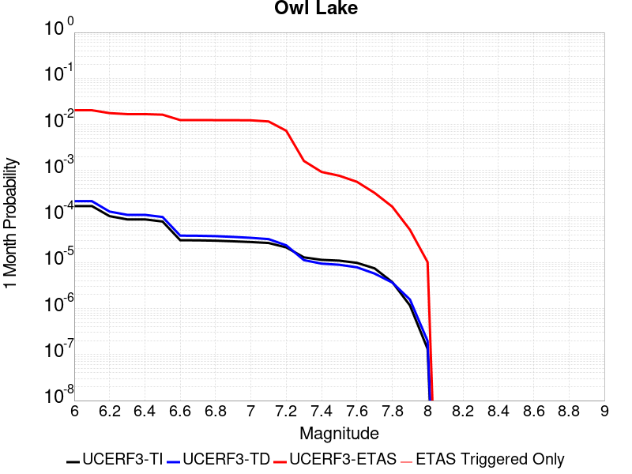 | 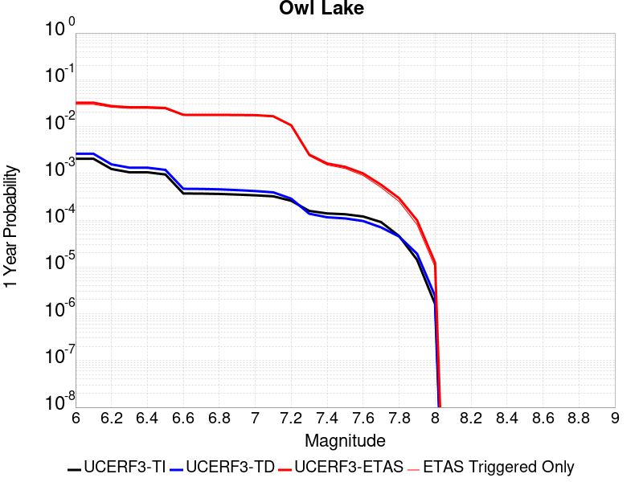 |  |

| Magnitude | 1 wk TI Prob | 1 wk TD Prob | 1 wk ETAS Prob | 1 wk ETAS/TD Gain | 1 wk ETAS Triggered Only | 1 mo TI Prob | 1 mo TD Prob | 1 mo ETAS Prob | 1 mo ETAS/TD Gain | 1 mo ETAS Triggered Only | 1 yr TI Prob | 1 yr TD Prob | 1 yr ETAS Prob | 1 yr ETAS/TD Gain | 1 yr ETAS Triggered Only | 10 yr TI Prob | 10 yr TD Prob | 10 yr ETAS Prob | 10 yr ETAS/TD Gain | 10 yr ETAS Triggered Only |
|-----|-----|-----|-----|-----|-----|-----|-----|-----|-----|-----|-----|-----|-----|-----|-----|-----|-----|-----|-----|-----|
| 6.0 | 3.937419E-5 | 5.0312025E-5 | 0.015439537 | 306.8757 | 0.01539 | 1.6873561E-4 | 2.1560861E-4 | 0.02038126 | 94.52897 | 0.02017 | 0.0020524203 | 0.0026224891 | 0.03237426 | 12.34486 | 0.02983 | 0.020335678 | 0.02598633 | 0.06420663 | 2.4707847 | 0.03924 |
| 6.1 | 3.937419E-5 | 5.0312025E-5 | 0.015439537 | 306.8757 | 0.01539 | 1.6873561E-4 | 2.1560861E-4 | 0.02038126 | 94.52897 | 0.02017 | 0.0020524203 | 0.0026224891 | 0.03237426 | 12.34486 | 0.02983 | 0.020335678 | 0.02598633 | 0.06420663 | 2.4707847 | 0.03924 |
| 6.2 | 2.3752445E-5 | 2.9859928E-5 | 0.013479458 | 451.423 | 0.01345 | 1.0179222E-4 | 1.2796633E-4 | 0.017645724 | 137.8935 | 0.01752 | 0.0012386157 | 0.0015571394 | 0.02741681 | 17.607164 | 0.0259 | 0.012317346 | 0.01550415 | 0.048711196 | 3.1418166 | 0.03373 |
| 6.3 | 2.0207828E-5 | 2.5372197E-5 | 0.012865046 | 507.0529 | 0.01284 | 8.66021E-5 | 1.0873486E-4 | 0.016786922 | 154.38399 | 0.01668 | 0.0010538705 | 0.0013232905 | 0.02585079 | 19.535234 | 0.02456 | 0.010488866 | 0.01319495 | 0.044713505 | 3.3886828 | 0.03194 |
| 6.4 | 2.0207828E-5 | 2.5372197E-5 | 0.012865046 | 507.0529 | 0.01284 | 8.66021E-5 | 1.0873486E-4 | 0.016786922 | 154.38399 | 0.01668 | 0.0010538705 | 0.0013232905 | 0.02585079 | 19.535234 | 0.02456 | 0.010488866 | 0.01319495 | 0.044713505 | 3.3886828 | 0.03194 |
| 6.5 | 1.8147195E-5 | 2.2759383E-5 | 0.012552475 | 551.5296 | 0.01253 | 7.777137E-5 | 9.753793E-5 | 0.016325954 | 167.38057 | 0.01623 | 9.464551E-4 | 0.0011871188 | 0.024968853 | 21.033154 | 0.02381 | 0.009424343 | 0.011848203 | 0.04222399 | 3.5637462 | 0.03074 |
| 6.6 | 7.12161E-6 | 8.9666355E-6 | 0.009888878 | 1102.8528 | 0.00988 | 3.0520827E-5 | 3.842791E-5 | 0.012447951 | 323.92996 | 0.01241 | 3.715277E-4 | 4.6776602E-4 | 0.017829642 | 38.11658 | 0.01737 | 0.0037090718 | 0.0046859495 | 0.026343983 | 5.621909 | 0.02176 |
| 6.7 | 7.078763E-6 | 8.90229E-6 | 0.009878814 | 1109.6936 | 0.00987 | 3.0337203E-5 | 3.815215E-5 | 0.012437679 | 326.00204 | 0.0124 | 3.6929283E-4 | 4.644101E-4 | 0.017806353 | 38.341873 | 0.01735 | 0.0036867976 | 0.0046525425 | 0.026261536 | 5.6445556 | 0.02171 |
| 6.8 | 6.9623716E-6 | 8.736339E-6 | 0.00986865 | 1129.6094 | 0.00986 | 2.9838395E-5 | 3.7440954E-5 | 0.012426977 | 331.90866 | 0.01239 | 3.632219E-4 | 4.5575493E-4 | 0.017787851 | 39.029427 | 0.01734 | 0.003626288 | 0.0045662555 | 0.026137305 | 5.7240124 | 0.02167 |
| 6.9 | 6.7451315E-6 | 8.410277E-6 | 0.009858327 | 1172.1763 | 0.00985 | 2.8907385E-5 | 3.6043584E-5 | 0.012405598 | 344.18326 | 0.01237 | 3.5189057E-4 | 4.387489E-4 | 0.017711168 | 40.367435 | 0.01728 | 0.0035133387 | 0.0043966905 | 0.025861898 | 5.8821282 | 0.02156 |
| 7.0 | 6.5026193E-6 | 8.02828E-6 | 0.00977795 | 1217.9384 | 0.00977 | 2.786807E-5 | 3.4406497E-5 | 0.012303985 | 357.60645 | 0.01227 | 3.3924094E-4 | 4.1882508E-4 | 0.017551646 | 41.906864 | 0.01714 | 0.003387235 | 0.0041980306 | 0.025438488 | 6.0596237 | 0.02133 |
| 7.1 | 6.2010863E-6 | 7.532508E-6 | 0.009267462 | 1230.329 | 0.00926 | 2.6575814E-5 | 3.2281812E-5 | 0.011631907 | 360.32385 | 0.0116 | 3.2351248E-4 | 3.929666E-4 | 0.016626585 | 42.310425 | 0.01624 | 0.003230419 | 0.0039402093 | 0.024070578 | 6.108959 | 0.02021 |
| 7.2 | 4.971571E-6 | 5.5204814E-6 | 0.005845488 | 1058.8729 | 0.00584 | 2.1306558E-5 | 2.3659019E-5 | 0.0073034866 | 308.6978 | 0.00728 | 2.5937645E-4 | 2.8801517E-4 | 0.010645031 | 36.959965 | 0.01036 | 0.0025907394 | 0.0028929906 | 0.0157457 | 5.442707 | 0.01289 |
| 7.3 | 3.0203823E-6 | 2.6337905E-6 | 0.0013026304 | 494.5839 | 0.0013 | 1.2944432E-5 | 1.1287626E-5 | 0.0016112695 | 142.74655 | 0.0016 | 1.5758706E-4 | 1.3741833E-4 | 0.0025170913 | 18.316998 | 0.00238 | 0.0015747536 | 0.0013829009 | 0.0044186967 | 3.1952374 | 0.00304 |
| 7.4 | 2.6678804E-6 | 2.2078327E-6 | 7.522062E-4 | 340.69888 | 7.5E-4 | 1.1433723E-5 | 9.462106E-6 | 9.294534E-4 | 98.22901 | 9.2E-4 | 1.3919668E-4 | 1.1519515E-4 | 0.0016250212 | 14.10668 | 0.00151 | 0.0013910952 | 0.0011598543 | 0.003067639 | 2.6448486 | 0.00191 |
| 7.5 | 2.5635838E-6 | 2.0872842E-6 | 6.3208595E-4 | 302.827 | 6.3E-4 | 1.09867415E-5 | 8.945473E-6 | 7.689387E-4 | 85.95841 | 7.6E-4 | 1.3375537E-4 | 1.08905784E-4 | 0.0013787674 | 12.660186 | 0.00127 | 0.001336749 | 0.0010968362 | 0.0027250485 | 2.4844625 | 0.00163 |
| 7.6 | 2.2958475E-6 | 1.8364165E-6 | 4.518356E-4 | 246.042 | 4.5E-4 | 9.839309E-6 | 7.870332E-6 | 5.678659E-4 | 72.15272 | 5.6E-4 | 1.19787E-4 | 9.581717E-5 | 9.95731E-4 | 10.391989 | 9.0E-4 | 0.0011972245 | 9.6580817E-4 | 0.0021346782 | 2.2102506 | 0.00117 |
| 7.7 | 1.7425335E-6 | 1.341543E-6 | 2.613412E-4 | 194.80643 | 2.6E-4 | 7.4679797E-6 | 5.7494576E-6 | 3.2574762E-4 | 56.657104 | 3.2E-4 | 9.091886E-5 | 6.999744E-5 | 5.6996243E-4 | 8.142618 | 5.0E-4 | 9.088167E-4 | 7.075374E-4 | 0.0013670704 | 1.9321529 | 6.6E-4 |
| 7.8 | 8.766647E-7 | 8.5629677E-7 | 1.108562E-4 | 129.46002 | 1.1E-4 | 3.7571292E-6 | 3.6698384E-6 | 1.6366925E-4 | 44.59849 | 1.6E-4 | 4.5742087E-5 | 4.4679386E-5 | 2.9466822E-4 | 6.5951715 | 2.5E-4 | 4.5732674E-4 | 4.5237513E-4 | 7.8222586E-4 | 1.729153 | 3.3E-4 |
| 7.9 | 2.7260427E-7 | 3.6664517E-7 | 3.0366635E-5 | 82.82295 | 3.0E-5 | 1.1683035E-6 | 1.5713355E-6 | 5.1571256E-5 | 32.820015 | 5.0E-5 | 1.4224002E-5 | 1.9130852E-5 | 9.912932E-5 | 5.1816473 | 8.0E-5 | 1.4223091E-4 | 1.9315946E-4 | 2.831421E-4 | 1.4658463 | 9.0E-5 |
| 8.0 | 3.0939944E-8 | 4.5944844E-8 | 4.5944844E-8 | 1.0 | 0.0 | 1.3259975E-7 | 1.9690647E-7 | 1.0196904E-5 | 51.785522 | 1.0E-5 | 1.6144007E-6 | 2.3973346E-6 | 1.23973105E-5 | 5.1712894 | 1.0E-5 | 1.614389E-5 | 2.4388228E-5 | 3.4387984E-5 | 1.4100239 | 1.0E-5 |

## Panamint Valley
*[(top)](#table-of-contents)*

| 1 Week | 1 Month | 1 Year | 10 Year |
|-----|-----|-----|-----|
| 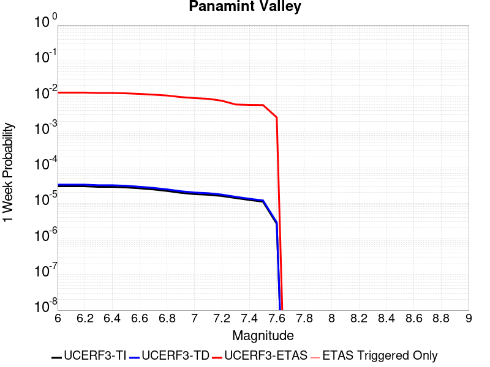 |  |  |  |

| Magnitude | 1 wk TI Prob | 1 wk TD Prob | 1 wk ETAS Prob | 1 wk ETAS/TD Gain | 1 wk ETAS Triggered Only | 1 mo TI Prob | 1 mo TD Prob | 1 mo ETAS Prob | 1 mo ETAS/TD Gain | 1 mo ETAS Triggered Only | 1 yr TI Prob | 1 yr TD Prob | 1 yr ETAS Prob | 1 yr ETAS/TD Gain | 1 yr ETAS Triggered Only | 10 yr TI Prob | 10 yr TD Prob | 10 yr ETAS Prob | 10 yr ETAS/TD Gain | 10 yr ETAS Triggered Only |
|-----|-----|-----|-----|-----|-----|-----|-----|-----|-----|-----|-----|-----|-----|-----|-----|-----|-----|-----|-----|-----|
| 6.0 | 2.9956876E-5 | 3.327513E-5 | 0.012762851 | 383.5553 | 0.01273 | 1.283803E-4 | 1.4260005E-4 | 0.016800225 | 117.81359 | 0.01666 | 0.0015619093 | 0.0017348006 | 0.02571313 | 14.821952 | 0.02402 | 0.015509769 | 0.017218068 | 0.04881451 | 2.8350744 | 0.03215 |
| 6.1 | 2.9956876E-5 | 3.327513E-5 | 0.012762851 | 383.5553 | 0.01273 | 1.283803E-4 | 1.4260005E-4 | 0.016800225 | 117.81359 | 0.01666 | 0.0015619093 | 0.0017348006 | 0.02571313 | 14.821952 | 0.02402 | 0.015509769 | 0.017218068 | 0.04881451 | 2.8350744 | 0.03215 |
| 6.2 | 2.9956876E-5 | 3.327513E-5 | 0.012762851 | 383.5553 | 0.01273 | 1.283803E-4 | 1.4260005E-4 | 0.016800225 | 117.81359 | 0.01666 | 0.0015619093 | 0.0017348006 | 0.02571313 | 14.821952 | 0.02402 | 0.015509769 | 0.017218068 | 0.04881451 | 2.8350744 | 0.03215 |
| 6.3 | 2.8839793E-5 | 3.200417E-5 | 0.012431608 | 388.43713 | 0.0124 | 1.2359326E-4 | 1.3715366E-4 | 0.016404923 | 119.6098 | 0.01627 | 0.0015037091 | 0.0016685936 | 0.024969649 | 14.964487 | 0.02334 | 0.014935747 | 0.016566005 | 0.047131132 | 2.8450513 | 0.03108 |
| 6.4 | 2.8839793E-5 | 3.200417E-5 | 0.012431608 | 388.43713 | 0.0124 | 1.2359326E-4 | 1.3715366E-4 | 0.016404923 | 119.6098 | 0.01627 | 0.0015037091 | 0.0016685936 | 0.024969649 | 14.964487 | 0.02334 | 0.014935747 | 0.016566005 | 0.047131132 | 2.8450513 | 0.03108 |
| 6.5 | 2.7883667E-5 | 3.091528E-5 | 0.01217054 | 393.67398 | 0.01214 | 1.19495955E-4 | 1.3248746E-4 | 0.016050378 | 121.14639 | 0.01592 | 0.0014538922 | 0.001611868 | 0.024365133 | 15.116085 | 0.02279 | 0.014444169 | 0.016007043 | 0.04577283 | 2.859543 | 0.03025 |
| 6.6 | 2.6249763E-5 | 2.8999544E-5 | 0.011718661 | 404.09808 | 0.01169 | 1.1249414E-4 | 1.2427798E-4 | 0.015442374 | 124.256714 | 0.01532 | 0.0013687556 | 0.0015120597 | 0.023179248 | 15.329585 | 0.0217 | 0.013603556 | 0.015022793 | 0.043212842 | 2.876485 | 0.02862 |
| 6.7 | 2.4451578E-5 | 2.6918427E-5 | 0.011156619 | 414.46027 | 0.01113 | 1.0478827E-4 | 1.15359726E-4 | 0.014663681 | 127.112656 | 0.01455 | 0.0012750505 | 0.0014036233 | 0.021824919 | 15.548986 | 0.02045 | 0.012677594 | 0.013952394 | 0.040417913 | 2.8968441 | 0.02684 |
| 6.8 | 2.2171069E-5 | 2.4529638E-5 | 0.010564271 | 430.67377 | 0.01054 | 9.5015406E-5 | 1.051229E-4 | 0.013823681 | 131.50018 | 0.01372 | 0.0011561986 | 0.00127914 | 0.020234862 | 15.819114 | 0.01898 | 0.011502015 | 0.012722193 | 0.03705859 | 2.912909 | 0.02465 |
| 6.9 | 1.965535E-5 | 2.1745112E-5 | 0.009551538 | 439.24985 | 0.00953 | 8.4234496E-5 | 9.31901E-5 | 0.01243204 | 133.40515 | 0.01234 | 0.0010250724 | 0.0011340149 | 0.01800486 | 15.877093 | 0.01689 | 0.010203568 | 0.011286204 | 0.032741293 | 2.9010015 | 0.0217 |
| 7.0 | 1.8062938E-5 | 1.9991347E-5 | 0.008929813 | 446.68393 | 0.00891 | 7.7410295E-5 | 8.5674474E-5 | 0.011584689 | 135.21751 | 0.0115 | 9.420628E-4 | 0.0010426027 | 0.01657639 | 15.899048 | 0.01555 | 0.009380791 | 0.010380901 | 0.03005453 | 2.8951752 | 0.01988 |
| 7.1 | 1.7327293E-5 | 1.9149431E-5 | 0.008548986 | 446.43552 | 0.00853 | 7.425772E-5 | 8.206649E-5 | 0.011141159 | 135.7577 | 0.01106 | 9.0371264E-4 | 9.987166E-4 | 0.015913805 | 15.934256 | 0.01493 | 0.009000463 | 0.009946025 | 0.028786752 | 2.8942971 | 0.01903 |
| 7.2 | 1.6001062E-5 | 1.7480697E-5 | 0.007537349 | 431.18127 | 0.00752 | 6.8574176E-5 | 7.49152E-5 | 0.009794187 | 130.73697 | 0.00972 | 8.345708E-4 | 9.1172557E-4 | 0.014039746 | 15.399092 | 0.01314 | 0.008314434 | 0.009083312 | 0.025691075 | 2.828382 | 0.01676 |
| 7.3 | 1.4037781E-5 | 1.5185516E-5 | 0.005915096 | 389.52222 | 0.0059 | 6.0160528E-5 | 6.5079235E-5 | 0.007814575 | 120.07785 | 0.00775 | 7.322083E-4 | 7.9206517E-4 | 0.011413646 | 14.409983 | 0.01063 | 0.007298004 | 0.007894323 | 0.021327434 | 2.7016165 | 0.01354 |
| 7.4 | 1.2384787E-5 | 1.3388441E-5 | 0.0057633114 | 430.46918 | 0.00575 | 5.307658E-5 | 5.737785E-5 | 0.007566947 | 131.87924 | 0.00751 | 6.4601575E-4 | 6.983645E-4 | 0.010931213 | 15.65259 | 0.01024 | 0.0064414097 | 0.0069634165 | 0.019912614 | 2.859604 | 0.01304 |
| 7.5 | 1.1075658E-5 | 1.1993653E-5 | 0.0057019256 | 475.4119 | 0.00569 | 4.746624E-5 | 5.140043E-5 | 0.00745102 | 144.96027 | 0.0074 | 5.7774823E-4 | 6.256335E-4 | 0.010709321 | 17.117563 | 0.01009 | 0.005762485 | 0.006240416 | 0.0189506 | 3.036753 | 0.01279 |
| 7.6 | 2.6584066E-6 | 2.9012704E-6 | 0.0025728939 | 886.8163 | 0.00257 | 1.1393121E-5 | 1.2433989E-5 | 0.0032823933 | 263.98557 | 0.00327 | 1.3870242E-4 | 1.5137887E-4 | 0.00450072 | 29.731497 | 0.00435 | 0.0013861589 | 0.0015135558 | 0.006915367 | 4.5689545 | 0.00541 |

## Garlock (East)
*[(top)](#table-of-contents)*

| 1 Week | 1 Month | 1 Year | 10 Year |
|-----|-----|-----|-----|
|  |  |  | 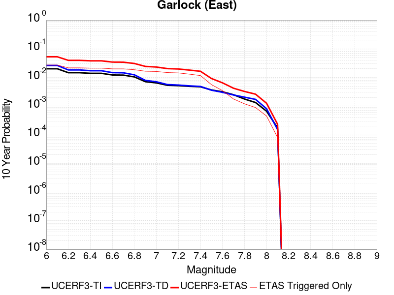 |

| Magnitude | 1 wk TI Prob | 1 wk TD Prob | 1 wk ETAS Prob | 1 wk ETAS/TD Gain | 1 wk ETAS Triggered Only | 1 mo TI Prob | 1 mo TD Prob | 1 mo ETAS Prob | 1 mo ETAS/TD Gain | 1 mo ETAS Triggered Only | 1 yr TI Prob | 1 yr TD Prob | 1 yr ETAS Prob | 1 yr ETAS/TD Gain | 1 yr ETAS Triggered Only | 10 yr TI Prob | 10 yr TD Prob | 10 yr ETAS Prob | 10 yr ETAS/TD Gain | 10 yr ETAS Triggered Only |
|-----|-----|-----|-----|-----|-----|-----|-----|-----|-----|-----|-----|-----|-----|-----|-----|-----|-----|-----|-----|-----|
| 6.0 | 3.900985E-5 | 5.0928305E-5 | 0.010060418 | 197.54082 | 0.01001 | 1.6717437E-4 | 2.1824677E-4 | 0.013565334 | 62.155937 | 0.01335 | 0.0020334478 | 0.002654072 | 0.022780513 | 8.583231 | 0.02018 | 0.020149412 | 0.026276555 | 0.05274236 | 2.0072021 | 0.02718 |
| 6.1 | 3.900985E-5 | 5.0928305E-5 | 0.010060418 | 197.54082 | 0.01001 | 1.6717437E-4 | 2.1824677E-4 | 0.013565334 | 62.155937 | 0.01335 | 0.0020334478 | 0.002654072 | 0.022780513 | 8.583231 | 0.02018 | 0.020149412 | 0.026276555 | 0.05274236 | 2.0072021 | 0.02718 |
| 6.2 | 2.8371243E-5 | 3.539552E-5 | 0.008695089 | 245.65508 | 0.00866 | 1.2158538E-4 | 1.5168646E-4 | 0.011429976 | 75.35264 | 0.01128 | 0.0014792967 | 0.0018452546 | 0.018314809 | 9.925356 | 0.0165 | 0.01469488 | 0.018345732 | 0.039608363 | 2.158996 | 0.02166 |
| 6.3 | 2.8371243E-5 | 3.539552E-5 | 0.008695089 | 245.65508 | 0.00866 | 1.2158538E-4 | 1.5168646E-4 | 0.011429976 | 75.35264 | 0.01128 | 0.0014792967 | 0.0018452546 | 0.018314809 | 9.925356 | 0.0165 | 0.01469488 | 0.018345732 | 0.039608363 | 2.158996 | 0.02166 |
| 6.4 | 2.6927255E-5 | 3.31964E-5 | 0.008592912 | 258.85074 | 0.00856 | 1.15397415E-4 | 1.4226271E-4 | 0.011260681 | 79.15413 | 0.01112 | 0.001404058 | 0.0017307049 | 0.017962564 | 10.378756 | 0.01626 | 0.013952199 | 0.017218823 | 0.038112752 | 2.2134352 | 0.02126 |
| 6.5 | 2.6927255E-5 | 3.31964E-5 | 0.008592912 | 258.85074 | 0.00856 | 1.15397415E-4 | 1.4226271E-4 | 0.011260681 | 79.15413 | 0.01112 | 0.001404058 | 0.0017307049 | 0.017962564 | 10.378756 | 0.01626 | 0.013952199 | 0.017218823 | 0.038112752 | 2.2134352 | 0.02126 |
| 6.6 | 2.3584167E-5 | 2.8411778E-5 | 0.008218179 | 289.25256 | 0.00819 | 1.0107109E-4 | 1.21759214E-4 | 0.010740466 | 88.2107 | 0.01062 | 0.0012298458 | 0.0014814347 | 0.016948488 | 11.44059 | 0.01549 | 0.012230618 | 0.014761468 | 0.03443668 | 2.3328764 | 0.01997 |
| 6.7 | 2.3281564E-5 | 2.79834E-5 | 0.008217754 | 293.6653 | 0.00819 | 9.977431E-5 | 1.1992348E-4 | 0.010728651 | 89.46247 | 0.01061 | 0.0012140753 | 0.0014591148 | 0.016906543 | 11.586848 | 0.01547 | 0.012074638 | 0.014541207 | 0.03416169 | 2.3493023 | 0.01991 |
| 6.8 | 2.0156875E-5 | 2.3744618E-5 | 0.007903557 | 332.8568 | 0.00788 | 8.638374E-5 | 1.0175879E-4 | 0.010240727 | 100.63727 | 0.01014 | 0.0010512145 | 0.0012382291 | 0.015780201 | 12.744168 | 0.01456 | 0.010462558 | 0.012356608 | 0.03076628 | 2.4898646 | 0.01864 |
| 6.9 | 1.36900535E-5 | 1.5134556E-5 | 0.0074350224 | 491.26135 | 0.00742 | 5.867034E-5 | 6.4860804E-5 | 0.009424253 | 145.29967 | 0.00936 | 7.1407727E-4 | 7.894005E-4 | 0.0138590755 | 17.556458 | 0.01308 | 0.0071178703 | 0.0079056285 | 0.02431487 | 3.0756402 | 0.01654 |
| 7.0 | 1.2427417E-5 | 1.3516969E-5 | 0.0073834173 | 546.2332 | 0.00737 | 5.325927E-5 | 5.7928617E-5 | 0.009307393 | 160.67003 | 0.00925 | 6.482387E-4 | 7.0505857E-4 | 0.01351602 | 19.170067 | 0.01282 | 0.00646351 | 0.0070676557 | 0.023123372 | 3.2717173 | 0.01617 |
| 7.1 | 1.024484E-5 | 1.0774941E-5 | 0.0070206993 | 651.5766 | 0.00701 | 4.390572E-5 | 4.617752E-5 | 0.008785774 | 190.26085 | 0.00874 | 5.34421E-4 | 5.620696E-4 | 0.01254533 | 22.31989 | 0.01199 | 0.005331376 | 0.0056455294 | 0.02040175 | 3.6137886 | 0.01484 |
| 7.2 | 9.927708E-6 | 1.0354896E-5 | 0.0068302844 | 659.6188 | 0.00682 | 4.2546624E-5 | 4.437739E-5 | 0.008563999 | 192.98114 | 0.00852 | 5.17882E-4 | 5.4016407E-4 | 0.012193866 | 22.574373 | 0.01166 | 0.0051667676 | 0.00542751 | 0.0197593 | 3.6405828 | 0.01441 |
| 7.3 | 9.412145E-6 | 9.709469E-6 | 0.006239649 | 642.63544 | 0.00623 | 4.033714E-5 | 4.1611365E-5 | 0.007811288 | 187.72006 | 0.00777 | 4.90994E-4 | 5.0650386E-4 | 0.011081145 | 21.877712 | 0.01058 | 0.004899106 | 0.005091801 | 0.018075353 | 3.5498939 | 0.01305 |
| 7.4 | 9.070362E-6 | 9.247945E-6 | 0.0055491966 | 600.0465 | 0.00554 | 3.8872397E-5 | 3.9633465E-5 | 0.006959359 | 175.593 | 0.00692 | 4.7316865E-4 | 4.8243374E-4 | 0.00995786 | 20.640888 | 0.00948 | 0.0047216243 | 0.0048511713 | 0.016444655 | 3.389832 | 0.01165 |
| 7.5 | 7.0302704E-6 | 6.8392706E-6 | 0.0026168213 | 382.61703 | 0.00261 | 3.0129382E-5 | 2.9310833E-5 | 0.0032892153 | 112.218414 | 0.00326 | 3.6676347E-4 | 3.568016E-4 | 0.004805214 | 13.467466 | 0.00445 | 0.0036615874 | 0.0035940479 | 0.0091838855 | 2.555304 | 0.00561 |
| 7.6 | 6.0709417E-6 | 5.7619636E-6 | 0.0016657524 | 289.09457 | 0.00166 | 2.601806E-5 | 2.4693896E-5 | 0.002084643 | 84.419365 | 0.00206 | 3.1672386E-4 | 3.0060695E-4 | 0.0030297863 | 10.0788965 | 0.00273 | 0.0031627282 | 0.0030321728 | 0.0064916513 | 2.140924 | 0.00347 |
| 7.7 | 4.7861286E-6 | 4.6308946E-6 | 8.246271E-4 | 178.0708 | 8.2E-4 | 2.0511818E-5 | 1.984654E-5 | 9.898273E-4 | 49.874046 | 9.7E-4 | 2.4970277E-4 | 2.4160495E-4 | 0.001561286 | 6.462144 | 0.00132 | 0.0024942236 | 0.0024427862 | 0.004208463 | 1.7228124 | 0.00177 |
| 7.8 | 3.3885092E-6 | 3.879594E-6 | 5.938773E-4 | 153.07718 | 5.9E-4 | 1.4522101E-5 | 1.6626725E-5 | 6.9661543E-4 | 41.89733 | 6.8E-4 | 1.7679224E-4 | 2.0241165E-4 | 0.0010922315 | 5.39609 | 8.9E-4 | 0.0017665165 | 0.0020492573 | 0.0032467982 | 1.584378 | 0.0012 |
| 7.9 | 2.5569084E-6 | 3.2503538E-6 | 5.032487E-4 | 154.8289 | 5.0E-4 | 1.0958133E-5 | 1.3930014E-5 | 5.539225E-4 | 39.764675 | 5.4E-4 | 1.334071E-4 | 1.6958477E-4 | 8.4946945E-4 | 5.009114 | 6.8E-4 | 0.0013332705 | 0.0017169984 | 0.0026054701 | 1.5174564 | 8.9E-4 |
| 8.0 | 1.2735545E-6 | 1.528923E-6 | 2.8152848E-4 | 184.13516 | 2.8E-4 | 5.458079E-6 | 6.552511E-6 | 2.965506E-4 | 45.257553 | 2.9E-4 | 6.6450084E-5 | 7.977393E-5 | 4.497444E-4 | 5.6377373 | 3.7E-4 | 6.643022E-4 | 8.072034E-4 | 0.0012568402 | 1.5570303 | 4.5E-4 |
| 8.1 | 3.3286665E-7 | 2.870681E-7 | 1.0287065E-5 | 35.83493 | 1.0E-5 | 1.4265705E-6 | 1.2302913E-6 | 1.1230279E-5 | 9.128146 | 1.0E-5 | 1.7368358E-5 | 1.49787065E-5 | 5.4978107E-5 | 3.6704175 | 4.0E-5 | 1.7367E-4 | 1.5147903E-4 | 2.3146691E-4 | 1.5280459 | 8.0E-5 |

## Hunter Mountain-Saline Valley
*[(top)](#table-of-contents)*

| 1 Week | 1 Month | 1 Year | 10 Year |
|-----|-----|-----|-----|
|  |  | 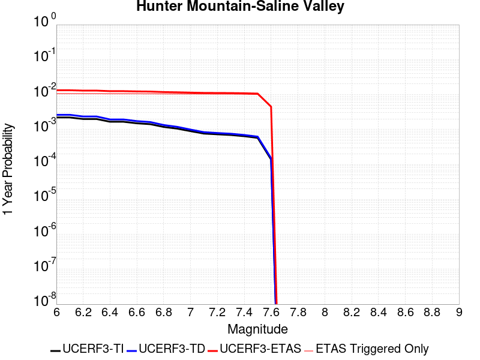 |  |

| Magnitude | 1 wk TI Prob | 1 wk TD Prob | 1 wk ETAS Prob | 1 wk ETAS/TD Gain | 1 wk ETAS Triggered Only | 1 mo TI Prob | 1 mo TD Prob | 1 mo ETAS Prob | 1 mo ETAS/TD Gain | 1 mo ETAS Triggered Only | 1 yr TI Prob | 1 yr TD Prob | 1 yr ETAS Prob | 1 yr ETAS/TD Gain | 1 yr ETAS Triggered Only | 10 yr TI Prob | 10 yr TD Prob | 10 yr ETAS Prob | 10 yr ETAS/TD Gain | 10 yr ETAS Triggered Only |
|-----|-----|-----|-----|-----|-----|-----|-----|-----|-----|-----|-----|-----|-----|-----|-----|-----|-----|-----|-----|-----|
| 6.0 | 4.234141E-5 | 5.0496274E-5 | 0.005980197 | 118.42848 | 0.00593 | 1.8145057E-4 | 2.1639558E-4 | 0.007994712 | 36.944897 | 0.00778 | 0.0022069223 | 0.002631541 | 0.013263489 | 5.0401983 | 0.01066 | 0.021851335 | 0.026019942 | 0.03931477 | 1.5109476 | 0.01365 |
| 6.1 | 4.234141E-5 | 5.0496274E-5 | 0.005980197 | 118.42848 | 0.00593 | 1.8145057E-4 | 2.1639558E-4 | 0.007994712 | 36.944897 | 0.00778 | 0.0022069223 | 0.002631541 | 0.013263489 | 5.0401983 | 0.01066 | 0.021851335 | 0.026019942 | 0.03931477 | 1.5109476 | 0.01365 |
| 6.2 | 3.8210994E-5 | 4.5182293E-5 | 0.005964915 | 132.01886 | 0.00592 | 1.6375112E-4 | 1.9362479E-4 | 0.007962121 | 41.12139 | 0.00777 | 0.0019918466 | 0.0023549402 | 0.012959907 | 5.5032854 | 0.01063 | 0.019740876 | 0.023313407 | 0.03657681 | 1.5689175 | 0.01358 |
| 6.3 | 3.8210994E-5 | 4.5182293E-5 | 0.005964915 | 132.01886 | 0.00592 | 1.6375112E-4 | 1.9362479E-4 | 0.007962121 | 41.12139 | 0.00777 | 0.0019918466 | 0.0023549402 | 0.012959907 | 5.5032854 | 0.01063 | 0.019740876 | 0.023313407 | 0.03657681 | 1.5689175 | 0.01358 |
| 6.4 | 3.193382E-5 | 3.7156406E-5 | 0.0059269373 | 159.51321 | 0.00589 | 1.3685206E-4 | 1.592324E-4 | 0.007898 | 49.600456 | 0.00774 | 0.0016649003 | 0.0019369988 | 0.012506486 | 6.4566307 | 0.01059 | 0.01652482 | 0.019208666 | 0.032468963 | 1.690329 | 0.01352 |
| 6.5 | 3.193382E-5 | 3.7156406E-5 | 0.0059269373 | 159.51321 | 0.00589 | 1.3685206E-4 | 1.592324E-4 | 0.007898 | 49.600456 | 0.00774 | 0.0016649003 | 0.0019369988 | 0.012506486 | 6.4566307 | 0.01059 | 0.01652482 | 0.019208666 | 0.032468963 | 1.690329 | 0.01352 |
| 6.6 | 2.8811966E-5 | 3.3271175E-5 | 0.005903076 | 177.42313 | 0.00587 | 1.2347402E-4 | 1.4258327E-4 | 0.007861483 | 55.136078 | 0.00772 | 0.0015022594 | 0.0017346264 | 0.012286291 | 7.082961 | 0.01057 | 0.0149214445 | 0.017217314 | 0.030465225 | 1.7694528 | 0.01348 |
| 6.7 | 2.7203554E-5 | 3.1284006E-5 | 0.005881101 | 187.99066 | 0.00585 | 1.1658145E-4 | 1.3406773E-4 | 0.007823037 | 58.35138 | 0.00769 | 0.0014184549 | 0.0016311066 | 0.012153915 | 7.4513307 | 0.01054 | 0.01409435 | 0.01619748 | 0.029419785 | 1.8163188 | 0.01344 |
| 6.8 | 2.2662136E-5 | 2.5708876E-5 | 0.0058355597 | 226.98618 | 0.00581 | 9.7119824E-5 | 1.1017647E-4 | 0.007749335 | 70.335655 | 0.00764 | 0.0011817924 | 0.0013406135 | 0.01178659 | 8.791938 | 0.01046 | 0.011755273 | 0.013329841 | 0.026501888 | 1.9881623 | 0.01335 |
| 6.9 | 2.0309753E-5 | 2.2851995E-5 | 0.0058127195 | 254.36378 | 0.00579 | 8.70389E-5 | 9.7933626E-5 | 0.0077071884 | 78.69808 | 0.00761 | 0.0010591834 | 0.0011917218 | 0.011599304 | 9.7332325 | 0.01042 | 0.010541491 | 0.011857 | 0.024999302 | 2.1084003 | 0.0133 |
| 7.0 | 1.717535E-5 | 1.905427E-5 | 0.0057989443 | 304.3383 | 0.00578 | 7.360657E-5 | 8.165871E-5 | 0.00766104 | 93.81779 | 0.00758 | 8.9579145E-4 | 9.937608E-4 | 0.011363446 | 11.434791 | 0.01038 | 0.0089218905 | 0.009895547 | 0.023014432 | 2.325736 | 0.01325 |
| 7.1 | 1.4659091E-5 | 1.604463E-5 | 0.0057559526 | 358.74634 | 0.00574 | 6.2823165E-5 | 6.876097E-5 | 0.0076082423 | 110.64769 | 0.00754 | 7.646036E-4 | 8.368573E-4 | 0.01113823 | 13.309592 | 0.01031 | 0.007619782 | 0.008338871 | 0.021389132 | 2.5649912 | 0.01316 |
| 7.2 | 1.394384E-5 | 1.52010025E-5 | 0.005755114 | 378.60092 | 0.00574 | 5.9757942E-5 | 6.514561E-5 | 0.0075946553 | 116.579704 | 0.00753 | 7.273101E-4 | 7.9287274E-4 | 0.011074714 | 13.967833 | 0.01029 | 0.0072493427 | 0.007902207 | 0.02091853 | 2.6471758 | 0.01312 |
| 7.3 | 1.3338418E-5 | 1.44958185E-5 | 0.0057444125 | 396.28067 | 0.00573 | 5.7163397E-5 | 6.212353E-5 | 0.007571657 | 121.88066 | 0.00751 | 6.957421E-4 | 7.56105E-4 | 0.01101834 | 14.5725 | 0.01027 | 0.006935679 | 0.007537064 | 0.020538328 | 2.7249773 | 0.0131 |
| 7.4 | 1.23411855E-5 | 1.3352063E-5 | 0.0057232757 | 428.64352 | 0.00571 | 5.288972E-5 | 5.722195E-5 | 0.0075267944 | 131.53683 | 0.00747 | 6.437421E-4 | 6.9646764E-4 | 0.01087937 | 15.620784 | 0.01019 | 0.006418805 | 0.0069445455 | 0.019844336 | 2.8575428 | 0.01299 |
| 7.5 | 1.1032056E-5 | 1.1957275E-5 | 0.00566189 | 473.51004 | 0.00565 | 4.7279384E-5 | 5.124453E-5 | 0.007410867 | 144.61772 | 0.00736 | 5.7547446E-4 | 6.2373653E-4 | 0.010657474 | 17.0865 | 0.01004 | 0.005739865 | 0.006221531 | 0.018882269 | 3.0349874 | 0.01274 |
| 7.6 | 2.6518558E-6 | 2.8957193E-6 | 0.0025728883 | 888.5144 | 0.00257 | 1.1365047E-5 | 1.2410198E-5 | 0.0032823696 | 264.48972 | 0.00327 | 1.3836066E-4 | 1.5108926E-4 | 0.004500432 | 29.786577 | 0.00435 | 0.0013827455 | 0.0015106616 | 0.006912489 | 4.575803 | 0.00541 |

## Ash Hill
*[(top)](#table-of-contents)*

| 1 Week | 1 Month | 1 Year | 10 Year |
|-----|-----|-----|-----|
| 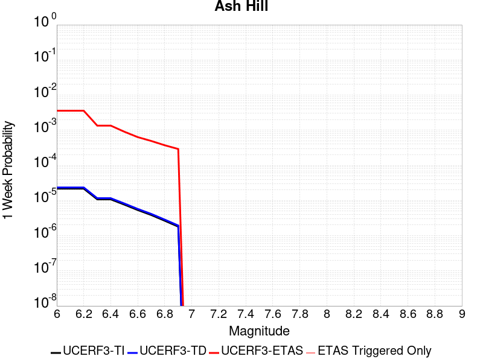 | 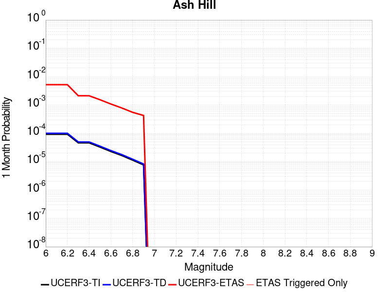 |  | 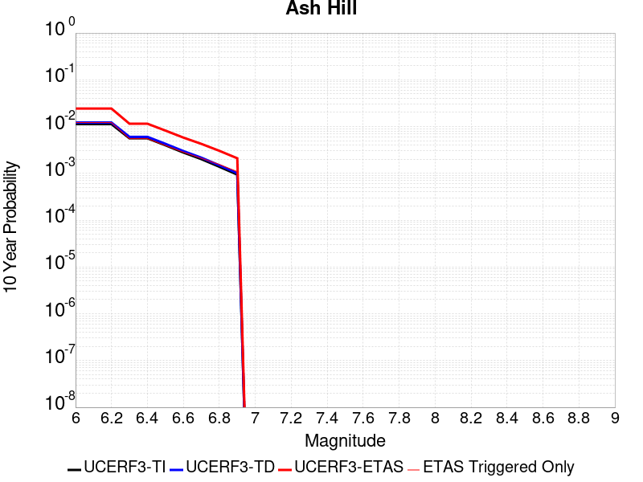 |

| Magnitude | 1 wk TI Prob | 1 wk TD Prob | 1 wk ETAS Prob | 1 wk ETAS/TD Gain | 1 wk ETAS Triggered Only | 1 mo TI Prob | 1 mo TD Prob | 1 mo ETAS Prob | 1 mo ETAS/TD Gain | 1 mo ETAS Triggered Only | 1 yr TI Prob | 1 yr TD Prob | 1 yr ETAS Prob | 1 yr ETAS/TD Gain | 1 yr ETAS Triggered Only | 10 yr TI Prob | 10 yr TD Prob | 10 yr ETAS Prob | 10 yr ETAS/TD Gain | 10 yr ETAS Triggered Only |
|-----|-----|-----|-----|-----|-----|-----|-----|-----|-----|-----|-----|-----|-----|-----|-----|-----|-----|-----|-----|-----|
| 6.0 | 2.1759066E-5 | 2.3490276E-5 | 0.0035834066 | 152.54851 | 0.00356 | 9.324981E-5 | 1.0066918E-4 | 0.0052101547 | 51.755215 | 0.00511 | 0.001134725 | 0.0012250383 | 0.009654699 | 7.8811407 | 0.00844 | 0.011289483 | 0.012190861 | 0.024232253 | 1.9877393 | 0.01219 |
| 6.1 | 2.1759066E-5 | 2.3490276E-5 | 0.0035834066 | 152.54851 | 0.00356 | 9.324981E-5 | 1.0066918E-4 | 0.0052101547 | 51.755215 | 0.00511 | 0.001134725 | 0.0012250383 | 0.009654699 | 7.8811407 | 0.00844 | 0.011289483 | 0.012190861 | 0.024232253 | 1.9877393 | 0.01219 |
| 6.2 | 2.1759066E-5 | 2.3490276E-5 | 0.0035834066 | 152.54851 | 0.00356 | 9.324981E-5 | 1.0066918E-4 | 0.0052101547 | 51.755215 | 0.00511 | 0.001134725 | 0.0012250383 | 0.009654699 | 7.8811407 | 0.00844 | 0.011289483 | 0.012190861 | 0.024232253 | 1.9877393 | 0.01219 |
| 6.3 | 1.07993665E-5 | 1.1606073E-5 | 0.0013515905 | 116.45546 | 0.00134 | 4.628218E-5 | 4.9739447E-5 | 0.0021196364 | 42.6148 | 0.00207 | 5.6333985E-4 | 6.0542446E-4 | 0.0041432814 | 6.843597 | 0.00354 | 0.005619139 | 0.0060392395 | 0.011515964 | 1.9068565 | 0.00551 |
| 6.4 | 1.07993665E-5 | 1.1606073E-5 | 0.0013515905 | 116.45546 | 0.00134 | 4.628218E-5 | 4.9739447E-5 | 0.0021196364 | 42.6148 | 0.00207 | 5.6333985E-4 | 6.0542446E-4 | 0.0041432814 | 6.843597 | 0.00354 | 0.005619139 | 0.0060392395 | 0.011515964 | 1.9068565 | 0.00551 |
| 6.5 | 7.661776E-6 | 8.2269535E-6 | 9.0821955E-4 | 110.395615 | 9.0E-4 | 3.283577E-5 | 3.5257952E-5 | 0.001535205 | 43.542095 | 0.0015 | 3.9970217E-4 | 4.291911E-4 | 0.0029481095 | 6.8689904 | 0.00252 | 0.00398984 | 0.0042846175 | 0.008217693 | 1.9179527 | 0.00395 |
| 6.6 | 5.3560434E-6 | 5.750693E-6 | 6.357471E-4 | 110.55138 | 6.3E-4 | 2.295427E-5 | 2.4645637E-5 | 0.0010846196 | 44.008583 | 0.00106 | 2.794324E-4 | 3.0002667E-4 | 0.0020794927 | 6.931026 | 0.00178 | 0.0027908129 | 0.0029969395 | 0.0058184583 | 1.9414667 | 0.00283 |
| 6.7 | 3.8637977E-6 | 4.1500107E-6 | 4.94148E-4 | 119.07149 | 4.9E-4 | 1.6559028E-5 | 1.7785675E-5 | 7.87772E-4 | 44.2925 | 7.7E-4 | 2.015875E-4 | 2.1652525E-4 | 0.0014862503 | 6.8640966 | 0.00127 | 0.0020140475 | 0.002163749 | 0.0042691836 | 1.9730493 | 0.00211 |
| 6.8 | 2.6547373E-6 | 2.8538261E-6 | 3.7285278E-4 | 130.65013 | 3.7E-4 | 1.1377397E-5 | 1.2230656E-5 | 5.5222405E-4 | 45.150814 | 5.4E-4 | 1.38511E-4 | 1.4890329E-4 | 0.0010687663 | 7.177587 | 9.2E-4 | 0.001384247 | 0.0014885473 | 0.00303624 | 2.0397336 | 0.00155 |
| 6.9 | 1.8040815E-6 | 1.9400263E-6 | 2.9193948E-4 | 150.48222 | 2.9E-4 | 7.731755E-6 | 8.314398E-6 | 4.2831092E-4 | 51.514362 | 4.2E-4 | 9.413005E-5 | 1.012278E-4 | 7.31164E-4 | 7.222957 | 6.3E-4 | 9.409019E-4 | 0.001012278 | 0.0021011746 | 2.0756893 | 0.00109 |

## Blackwater
*[(top)](#table-of-contents)*

| 1 Week | 1 Month | 1 Year | 10 Year |
|-----|-----|-----|-----|
|  |  |  |  |

| Magnitude | 1 wk TI Prob | 1 wk TD Prob | 1 wk ETAS Prob | 1 wk ETAS/TD Gain | 1 wk ETAS Triggered Only | 1 mo TI Prob | 1 mo TD Prob | 1 mo ETAS Prob | 1 mo ETAS/TD Gain | 1 mo ETAS Triggered Only | 1 yr TI Prob | 1 yr TD Prob | 1 yr ETAS Prob | 1 yr ETAS/TD Gain | 1 yr ETAS Triggered Only | 10 yr TI Prob | 10 yr TD Prob | 10 yr ETAS Prob | 10 yr ETAS/TD Gain | 10 yr ETAS Triggered Only |
|-----|-----|-----|-----|-----|-----|-----|-----|-----|-----|-----|-----|-----|-----|-----|-----|-----|-----|-----|-----|-----|
| 6.0 | 2.8146724E-5 | 3.0270756E-5 | 0.0035701636 | 117.94101 | 0.00354 | 1.20623234E-4 | 1.2972597E-4 | 0.0049590995 | 38.227497 | 0.00483 | 0.0014675985 | 0.0015783788 | 0.009455926 | 5.99091 | 0.00789 | 0.0145794405 | 0.015682744 | 0.026776 | 1.7073542 | 0.01127 |
| 6.1 | 2.8146724E-5 | 3.0270756E-5 | 0.0035701636 | 117.94101 | 0.00354 | 1.20623234E-4 | 1.2972597E-4 | 0.0049590995 | 38.227497 | 0.00483 | 0.0014675985 | 0.0015783788 | 0.009455926 | 5.99091 | 0.00789 | 0.0145794405 | 0.015682744 | 0.026776 | 1.7073542 | 0.01127 |
| 6.2 | 1.2373714E-5 | 1.3229681E-5 | 0.0016132086 | 121.938576 | 0.0016 | 5.302912E-5 | 5.6697463E-5 | 0.0021965762 | 38.742054 | 0.00214 | 6.4543827E-4 | 6.900837E-4 | 0.0042076544 | 6.0973105 | 0.00352 | 0.0064356686 | 0.006880494 | 0.011736848 | 1.7058148 | 0.00489 |
| 6.3 | 1.2373714E-5 | 1.3229681E-5 | 0.0016132086 | 121.938576 | 0.0016 | 5.302912E-5 | 5.6697463E-5 | 0.0021965762 | 38.742054 | 0.00214 | 6.4543827E-4 | 6.900837E-4 | 0.0042076544 | 6.0973105 | 0.00352 | 0.0064356686 | 0.006880494 | 0.011736848 | 1.7058148 | 0.00489 |
| 6.4 | 8.526547E-6 | 9.099042E-6 | 0.0010790894 | 118.593735 | 0.00107 | 3.6541835E-5 | 3.8995335E-5 | 0.0014189415 | 36.387466 | 0.00138 | 4.4480604E-4 | 4.746696E-4 | 0.0028035636 | 5.9063478 | 0.00233 | 0.004439167 | 0.004737039 | 0.00788207 | 1.6639234 | 0.00316 |
| 6.5 | 6.2812524E-6 | 6.6967214E-6 | 7.566917E-4 | 112.994354 | 7.5E-4 | 2.6919375E-5 | 2.8699935E-5 | 9.786726E-4 | 34.10017 | 9.5E-4 | 3.276941E-4 | 3.4936864E-4 | 0.0019388131 | 5.549477 | 0.00159 | 0.003272113 | 0.0034884878 | 0.0056608827 | 1.6227326 | 0.00218 |
| 6.6 | 6.2812524E-6 | 6.6967214E-6 | 7.566917E-4 | 112.994354 | 7.5E-4 | 2.6919375E-5 | 2.8699935E-5 | 9.786726E-4 | 34.10017 | 9.5E-4 | 3.276941E-4 | 3.4936864E-4 | 0.0019388131 | 5.549477 | 0.00159 | 0.003272113 | 0.0034884878 | 0.0056608827 | 1.6227326 | 0.00218 |
| 6.7 | 3.149943E-6 | 3.3576566E-6 | 2.8335673E-4 | 84.39121 | 2.8E-4 | 1.3499686E-5 | 1.4389884E-5 | 3.54385E-4 | 24.627369 | 3.4E-4 | 1.6434627E-4 | 1.7518394E-4 | 7.5508235E-4 | 4.3102255 | 5.8E-4 | 0.0016422479 | 0.0017505756 | 0.0025691402 | 1.4675974 | 8.2E-4 |
| 6.8 | 2.3443392E-6 | 2.49995E-6 | 2.3249937E-4 | 93.00161 | 2.3E-4 | 1.0047129E-5 | 1.0714032E-5 | 2.8071113E-4 | 26.200325 | 2.7E-4 | 1.2231694E-4 | 1.3043649E-4 | 5.703791E-4 | 4.3728495 | 4.4E-4 | 0.0012224963 | 0.0013036921 | 0.0019328708 | 1.482613 | 6.3E-4 |
| 6.9 | 9.4696964E-7 | 1.0113779E-6 | 9.101129E-5 | 89.98742 | 9.0E-5 | 4.058435E-6 | 4.334472E-6 | 1.0433404E-4 | 24.070759 | 1.0E-4 | 4.9410326E-5 | 5.2771393E-5 | 2.5276083E-4 | 4.789732 | 2.0E-4 | 4.939934E-4 | 5.276347E-4 | 8.274764E-4 | 1.5682752 | 3.0E-4 |
| 7.0 | 4.5862407E-7 | 4.9011396E-7 | 1.0490109E-5 | 21.403408 | 1.0E-5 | 1.9655301E-6 | 2.1004885E-6 | 2.2100447E-5 | 10.521575 | 2.0E-5 | 2.3930068E-5 | 2.5573447E-5 | 8.557191E-5 | 3.3461235 | 6.0E-5 | 2.3927492E-4 | 2.5573449E-4 | 3.8570122E-4 | 1.5082097 | 1.3E-4 |

## Garlock (West)
*[(top)](#table-of-contents)*

| 1 Week | 1 Month | 1 Year | 10 Year |
|-----|-----|-----|-----|
| 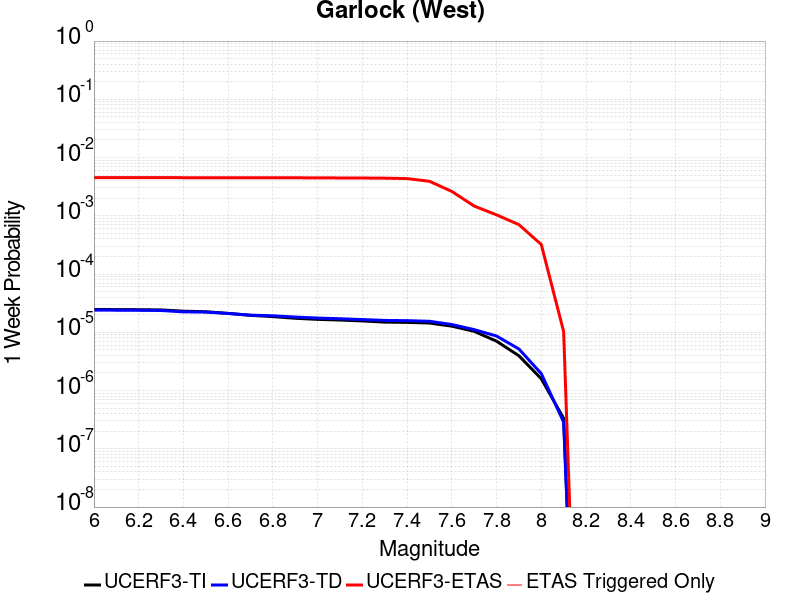 |  |  |  |

| Magnitude | 1 wk TI Prob | 1 wk TD Prob | 1 wk ETAS Prob | 1 wk ETAS/TD Gain | 1 wk ETAS Triggered Only | 1 mo TI Prob | 1 mo TD Prob | 1 mo ETAS Prob | 1 mo ETAS/TD Gain | 1 mo ETAS Triggered Only | 1 yr TI Prob | 1 yr TD Prob | 1 yr ETAS Prob | 1 yr ETAS/TD Gain | 1 yr ETAS Triggered Only | 10 yr TI Prob | 10 yr TD Prob | 10 yr ETAS Prob | 10 yr ETAS/TD Gain | 10 yr ETAS Triggered Only |
|-----|-----|-----|-----|-----|-----|-----|-----|-----|-----|-----|-----|-----|-----|-----|-----|-----|-----|-----|-----|-----|
| 6.0 | 2.4649089E-5 | 2.4059651E-5 | 0.004533951 | 188.44624 | 0.00451 | 1.0563468E-4 | 1.0310874E-4 | 0.0056725345 | 55.01507 | 0.00557 | 0.0012853434 | 0.0012546289 | 0.009144717 | 7.2887826 | 0.0079 | 0.012779343 | 0.0125544425 | 0.022330154 | 1.7786655 | 0.0099 |
| 6.1 | 2.4557346E-5 | 2.3972927E-5 | 0.004533865 | 189.12437 | 0.00451 | 1.05241525E-4 | 1.0273708E-4 | 0.0056721647 | 55.21049 | 0.00557 | 0.0012805624 | 0.0012501092 | 0.0091402335 | 7.3115478 | 0.0079 | 0.012732083 | 0.012509756 | 0.022285908 | 1.7814823 | 0.0099 |
| 6.2 | 2.4446426E-5 | 2.3873909E-5 | 0.0045337663 | 189.90465 | 0.00451 | 1.04766186E-4 | 1.02312755E-4 | 0.005671743 | 55.435345 | 0.00557 | 0.0012747819 | 0.001244949 | 0.009135114 | 7.337742 | 0.0079 | 0.012674939 | 0.012458731 | 0.02223539 | 1.7847234 | 0.0099 |
| 6.3 | 2.4239502E-5 | 2.3696659E-5 | 0.00453359 | 191.31767 | 0.00451 | 1.0387944E-4 | 1.01553174E-4 | 0.0056709875 | 55.84254 | 0.00557 | 0.0012639983 | 0.0012357116 | 0.00912595 | 7.3851776 | 0.0079 | 0.012568329 | 0.012367391 | 0.022144953 | 1.7905922 | 0.0099 |
| 6.4 | 2.3057506E-5 | 2.2433085E-5 | 0.0045123324 | 201.14632 | 0.00449 | 9.881414E-5 | 9.613826E-5 | 0.0056356057 | 58.6198 | 0.00554 | 0.0012023982 | 0.0011698575 | 0.009010674 | 7.702369 | 0.00785 | 0.011959131 | 0.011715961 | 0.021430794 | 1.8291963 | 0.00983 |
| 6.5 | 2.2550017E-5 | 2.2249043E-5 | 0.0045121494 | 202.80194 | 0.00449 | 9.663935E-5 | 9.534958E-5 | 0.0056348215 | 59.09645 | 0.00554 | 0.0011759489 | 0.0011602654 | 0.009001157 | 7.7578435 | 0.00785 | 0.011697455 | 0.011621049 | 0.021336813 | 1.836049 | 0.00983 |
| 6.6 | 2.1147518E-5 | 2.1046657E-5 | 0.0045009525 | 213.85593 | 0.00448 | 9.062907E-5 | 9.019685E-5 | 0.005619698 | 62.304813 | 0.00553 | 0.0011028503 | 0.0010975956 | 0.008899024 | 8.107743 | 0.00781 | 0.010973931 | 0.011000695 | 0.020673107 | 1.8792548 | 0.00978 |
| 6.7 | 1.9559262E-5 | 1.9708174E-5 | 0.00449962 | 228.31238 | 0.00448 | 8.382271E-5 | 8.446087E-5 | 0.005613994 | 66.468575 | 0.00553 | 0.0010200638 | 0.0010278275 | 0.0088298 | 8.590741 | 0.00781 | 0.010153941 | 0.010309658 | 0.01998883 | 1.938845 | 0.00978 |
| 6.8 | 1.8594048E-5 | 1.9226303E-5 | 0.00449914 | 234.00963 | 0.00448 | 7.9686346E-5 | 8.239585E-5 | 0.0056119403 | 68.1095 | 0.00553 | 9.6974935E-4 | 0.0010027093 | 0.008804878 | 8.781088 | 0.00781 | 0.009655285 | 0.010060769 | 0.019742373 | 1.9623127 | 0.00978 |
| 6.9 | 1.7416709E-5 | 1.8286239E-5 | 0.004498204 | 245.98848 | 0.00448 | 7.4640906E-5 | 7.836725E-5 | 0.0056079337 | 71.55966 | 0.00553 | 9.0837415E-4 | 9.537049E-4 | 0.008756257 | 9.181306 | 0.00781 | 0.0090467 | 0.00957499 | 0.019261345 | 2.011631 | 0.00978 |
| 7.0 | 1.6681082E-5 | 1.757777E-5 | 0.0044774995 | 254.7251 | 0.00446 | 7.148839E-5 | 7.533113E-5 | 0.005584916 | 74.13822 | 0.00551 | 8.7002356E-4 | 9.167719E-4 | 0.008689639 | 9.4785185 | 0.00778 | 0.008666253 | 0.009208627 | 0.018868843 | 2.0490398 | 0.00975 |
| 7.1 | 1.6241951E-5 | 1.7101085E-5 | 0.004467025 | 261.21295 | 0.00445 | 6.96065E-5 | 7.328831E-5 | 0.0055728853 | 76.04057 | 0.0055 | 8.471297E-4 | 8.919211E-4 | 0.008654991 | 9.703763 | 0.00777 | 0.008439076 | 0.008962049 | 0.018604849 | 2.0759592 | 0.00973 |
| 7.2 | 1.5679347E-5 | 1.6547265E-5 | 0.004456474 | 269.31784 | 0.00444 | 6.719547E-5 | 7.091493E-5 | 0.0055605257 | 78.41122 | 0.00549 | 8.177978E-4 | 8.630484E-4 | 0.008606359 | 9.972048 | 0.00775 | 0.0081479475 | 0.00867553 | 0.01830129 | 2.10953 | 0.00971 |
| 7.3 | 1.4967611E-5 | 1.6008269E-5 | 0.004425938 | 276.4782 | 0.00441 | 6.414532E-5 | 6.860507E-5 | 0.005518231 | 80.43474 | 0.00545 | 7.806895E-4 | 8.349477E-4 | 0.008508535 | 10.190501 | 0.00768 | 0.0077795256 | 0.008396211 | 0.01793544 | 2.1361349 | 0.00962 |
| 7.4 | 1.4806228E-5 | 1.5853655E-5 | 0.004355785 | 274.74957 | 0.00434 | 6.345372E-5 | 6.794247E-5 | 0.005417579 | 79.73774 | 0.00535 | 7.722752E-4 | 8.268867E-4 | 0.0083706435 | 10.123085 | 0.00755 | 0.0076959687 | 0.008315895 | 0.017647643 | 2.1221578 | 0.00941 |
| 7.5 | 1.4436933E-5 | 1.5464893E-5 | 0.0039154044 | 253.18018 | 0.0039 | 6.1871106E-5 | 6.6276436E-5 | 0.0048959563 | 73.87175 | 0.00483 | 7.530203E-4 | 8.066179E-4 | 0.0076810685 | 9.522561 | 0.00688 | 0.0075047375 | 0.008114159 | 0.016674133 | 2.0549428 | 0.00863 |
| 7.6 | 1.2752497E-5 | 1.3606842E-5 | 0.0026235713 | 192.81265 | 0.00261 | 5.4652413E-5 | 5.8313737E-5 | 0.0032881254 | 56.386806 | 0.00323 | 6.6519E-4 | 7.0973905E-4 | 0.0051665734 | 7.2795396 | 0.00446 | 0.0066320235 | 0.0071503664 | 0.01274011 | 1.7817422 | 0.00563 |
| 7.7 | 1.0392202E-5 | 1.1130763E-5 | 0.0014711145 | 132.16655 | 0.00146 | 4.453725E-5 | 4.77024E-5 | 0.0017976189 | 37.684036 | 0.00175 | 5.421061E-4 | 5.806223E-4 | 0.0030291998 | 5.2171607 | 0.00245 | 0.0054078554 | 0.0058661615 | 0.009037449 | 1.5406069 | 0.00319 |
| 7.8 | 7.0438796E-6 | 8.633492E-6 | 0.0010386246 | 120.301796 | 0.00103 | 3.0187706E-5 | 3.7000158E-5 | 0.0012669547 | 34.24187 | 0.00123 | 3.6747332E-4 | 4.5038393E-4 | 0.0021096363 | 4.6840844 | 0.00166 | 0.0036686626 | 0.004556217 | 0.006686467 | 1.4675479 | 0.00214 |
| 7.9 | 3.9575416E-6 | 5.1751344E-6 | 7.051715E-4 | 136.26149 | 7.0E-4 | 1.6960781E-5 | 2.217896E-5 | 8.121614E-4 | 36.618553 | 7.9E-4 | 2.0647795E-4 | 2.6999545E-4 | 0.0012797228 | 4.739794 | 0.00101 | 0.002062862 | 0.0027316976 | 0.0039982283 | 1.4636424 | 0.00127 |
| 8.0 | 1.5950359E-6 | 1.9546783E-6 | 3.2195405E-4 | 164.70949 | 3.2E-4 | 6.83585E-6 | 8.377166E-6 | 3.5837424E-4 | 42.779892 | 3.5E-4 | 8.322329E-5 | 1.0198724E-4 | 5.319434E-4 | 5.2157836 | 4.3E-4 | 8.3192135E-4 | 0.0010318194 | 0.0015612725 | 1.5131258 | 5.3E-4 |
| 8.1 | 3.3286665E-7 | 2.870681E-7 | 1.0287065E-5 | 35.83493 | 1.0E-5 | 1.4265705E-6 | 1.2302913E-6 | 1.1230279E-5 | 9.128146 | 1.0E-5 | 1.7368358E-5 | 1.49787065E-5 | 5.4978107E-5 | 3.6704175 | 4.0E-5 | 1.7367E-4 | 1.5147903E-4 | 2.3146691E-4 | 1.5280459 | 8.0E-5 |

## McLean Lake
*[(top)](#table-of-contents)*

| 1 Week | 1 Month | 1 Year | 10 Year |
|-----|-----|-----|-----|
| 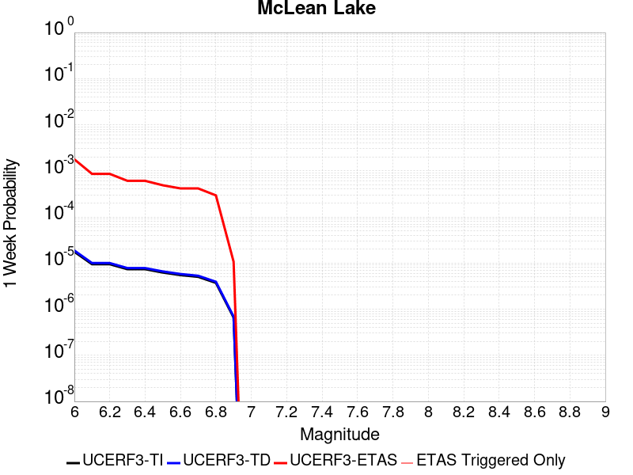 |  |  |  |

| Magnitude | 1 wk TI Prob | 1 wk TD Prob | 1 wk ETAS Prob | 1 wk ETAS/TD Gain | 1 wk ETAS Triggered Only | 1 mo TI Prob | 1 mo TD Prob | 1 mo ETAS Prob | 1 mo ETAS/TD Gain | 1 mo ETAS Triggered Only | 1 yr TI Prob | 1 yr TD Prob | 1 yr ETAS Prob | 1 yr ETAS/TD Gain | 1 yr ETAS Triggered Only | 10 yr TI Prob | 10 yr TD Prob | 10 yr ETAS Prob | 10 yr ETAS/TD Gain | 10 yr ETAS Triggered Only |
|-----|-----|-----|-----|-----|-----|-----|-----|-----|-----|-----|-----|-----|-----|-----|-----|-----|-----|-----|-----|-----|
| 6.0 | 1.7590342E-5 | 1.8735907E-5 | 0.001778703 | 94.93551 | 0.00176 | 7.5385E-5 | 8.0294536E-5 | 0.0028400728 | 35.37069 | 0.00276 | 9.174259E-4 | 9.771937E-4 | 0.0063419463 | 6.489958 | 0.00537 | 0.009136477 | 0.009733575 | 0.018022105 | 1.8515402 | 0.00837 |
| 6.1 | 9.453936E-6 | 1.0005926E-5 | 8.599974E-4 | 85.948814 | 8.5E-4 | 4.051624E-5 | 4.288188E-5 | 0.0014028236 | 32.71367 | 0.00136 | 4.9317355E-4 | 5.2197E-4 | 0.003300519 | 6.323197 | 0.00278 | 0.0049208053 | 0.005208253 | 0.009674868 | 1.8576033 | 0.00449 |
| 6.2 | 9.453936E-6 | 1.0005926E-5 | 8.599974E-4 | 85.948814 | 8.5E-4 | 4.051624E-5 | 4.288188E-5 | 0.0014028236 | 32.71367 | 0.00136 | 4.9317355E-4 | 5.2197E-4 | 0.003300519 | 6.323197 | 0.00278 | 0.0049208053 | 0.005208253 | 0.009674868 | 1.8576033 | 0.00449 |
| 6.3 | 7.3750607E-6 | 7.790684E-6 | 6.07786E-4 | 78.01446 | 6.0E-4 | 3.160702E-5 | 3.3388253E-5 | 0.0010233552 | 30.650156 | 9.9E-4 | 3.8474752E-4 | 4.064321E-4 | 0.002615534 | 6.4353523 | 0.00221 | 0.0038408206 | 0.004057478 | 0.007503439 | 1.8492864 | 0.00346 |
| 6.4 | 7.3750607E-6 | 7.790684E-6 | 6.07786E-4 | 78.01446 | 6.0E-4 | 3.160702E-5 | 3.3388253E-5 | 0.0010233552 | 30.650156 | 9.9E-4 | 3.8474752E-4 | 4.064321E-4 | 0.002615534 | 6.4353523 | 0.00221 | 0.0038408206 | 0.004057478 | 0.007503439 | 1.8492864 | 0.00346 |
| 6.5 | 6.2379318E-6 | 6.5847507E-6 | 4.865816E-4 | 73.89522 | 4.8E-4 | 2.6733718E-5 | 2.8220084E-5 | 8.5819664E-4 | 30.410847 | 8.3E-4 | 3.254344E-4 | 3.435307E-4 | 0.0022128883 | 6.4416027 | 0.00187 | 0.0032495824 | 0.0034305237 | 0.006290678 | 1.833737 | 0.00287 |
| 6.6 | 5.4904262E-6 | 5.79482E-6 | 4.1579246E-4 | 71.75243 | 4.1E-4 | 2.3530185E-5 | 2.4834735E-5 | 7.6481636E-4 | 30.796236 | 7.4E-4 | 2.8644234E-4 | 3.0232605E-4 | 0.0019918152 | 6.588301 | 0.00169 | 0.002860734 | 0.0030196507 | 0.00559186 | 1.8518234 | 0.00258 |
| 6.7 | 5.0288727E-6 | 5.3073427E-6 | 4.1530517E-4 | 78.25105 | 4.1E-4 | 2.1552134E-5 | 2.2745584E-5 | 7.5272896E-4 | 33.09341 | 7.3E-4 | 2.6236565E-4 | 2.768973E-4 | 0.0018864515 | 6.81282 | 0.00161 | 0.002620561 | 0.0027660162 | 0.005199267 | 1.8796952 | 0.00244 |
| 6.8 | 3.7259288E-6 | 3.9315482E-6 | 2.939304E-4 | 74.762 | 2.9E-4 | 1.5968168E-5 | 1.684941E-5 | 5.268408E-4 | 31.267612 | 5.1E-4 | 1.943951E-4 | 2.0512682E-4 | 0.001334895 | 6.507657 | 0.00113 | 0.0019422513 | 0.0020498233 | 0.003836154 | 1.871456 | 0.00179 |
| 6.9 | 6.607022E-7 | 6.909737E-7 | 1.06909665E-5 | 15.472321 | 1.0E-5 | 2.8315776E-6 | 2.9613143E-6 | 3.2961227E-5 | 11.130607 | 3.0E-5 | 3.4473913E-5 | 3.605371E-5 | 1.360501E-4 | 3.7735398 | 1.0E-4 | 3.4468566E-4 | 3.6050825E-4 | 5.704326E-4 | 1.5823009 | 2.1E-4 |

## Goldstone Lake
*[(top)](#table-of-contents)*

| 1 Week | 1 Month | 1 Year | 10 Year |
|-----|-----|-----|-----|
|  |  |  |  |

| Magnitude | 1 wk TI Prob | 1 wk TD Prob | 1 wk ETAS Prob | 1 wk ETAS/TD Gain | 1 wk ETAS Triggered Only | 1 mo TI Prob | 1 mo TD Prob | 1 mo ETAS Prob | 1 mo ETAS/TD Gain | 1 mo ETAS Triggered Only | 1 yr TI Prob | 1 yr TD Prob | 1 yr ETAS Prob | 1 yr ETAS/TD Gain | 1 yr ETAS Triggered Only | 10 yr TI Prob | 10 yr TD Prob | 10 yr ETAS Prob | 10 yr ETAS/TD Gain | 10 yr ETAS Triggered Only |
|-----|-----|-----|-----|-----|-----|-----|-----|-----|-----|-----|-----|-----|-----|-----|-----|-----|-----|-----|-----|-----|
| 6.0 | 2.5704558E-5 | 2.9173032E-5 | 0.0014591314 | 50.016445 | 0.00143 | 1.10157736E-4 | 1.2502226E-4 | 0.0022447573 | 17.95486 | 0.00212 | 0.0013403452 | 0.0015212563 | 0.005515171 | 3.6254056 | 0.004 | 0.013322897 | 0.015125626 | 0.021350032 | 1.4115139 | 0.00632 |
| 6.1 | 2.5704558E-5 | 2.9173032E-5 | 0.0014591314 | 50.016445 | 0.00143 | 1.10157736E-4 | 1.2502226E-4 | 0.0022447573 | 17.95486 | 0.00212 | 0.0013403452 | 0.0015212563 | 0.005515171 | 3.6254056 | 0.004 | 0.013322897 | 0.015125626 | 0.021350032 | 1.4115139 | 0.00632 |
| 6.2 | 1.4846628E-5 | 1.679876E-5 | 8.5678464E-4 | 51.00285 | 8.4E-4 | 6.362685E-5 | 7.199324E-5 | 0.0013718996 | 19.05595 | 0.0013 | 7.743816E-4 | 8.7626086E-4 | 0.0031842368 | 3.6338913 | 0.00231 | 0.0077168867 | 0.008737468 | 0.012246537 | 1.4016117 | 0.00354 |
| 6.3 | 1.4846628E-5 | 1.679876E-5 | 8.5678464E-4 | 51.00285 | 8.4E-4 | 6.362685E-5 | 7.199324E-5 | 0.0013718996 | 19.05595 | 0.0013 | 7.743816E-4 | 8.7626086E-4 | 0.0031842368 | 3.6338913 | 0.00231 | 0.0077168867 | 0.008737468 | 0.012246537 | 1.4016117 | 0.00354 |
| 6.4 | 1.3733805E-5 | 1.5537504E-5 | 7.6552585E-4 | 49.269554 | 7.5E-4 | 5.8857833E-5 | 6.658814E-5 | 0.0012265109 | 18.419361 | 0.00116 | 7.163585E-4 | 8.105038E-4 | 0.0029088017 | 3.588881 | 0.0021 | 0.0071405363 | 0.008084793 | 0.011328355 | 1.401193 | 0.00327 |
| 6.5 | 1.3733805E-5 | 1.5537504E-5 | 7.6552585E-4 | 49.269554 | 7.5E-4 | 5.8857833E-5 | 6.658814E-5 | 0.0012265109 | 18.419361 | 0.00116 | 7.163585E-4 | 8.105038E-4 | 0.0029088017 | 3.588881 | 0.0021 | 0.0071405363 | 0.008084793 | 0.011328355 | 1.401193 | 0.00327 |
| 6.6 | 1.148497E-5 | 1.3008381E-5 | 6.2300044E-4 | 47.892235 | 6.1E-4 | 4.922037E-5 | 5.574953E-5 | 9.7569823E-4 | 17.501461 | 9.2E-4 | 5.990932E-4 | 6.7863084E-4 | 0.0023874703 | 3.5180695 | 0.00171 | 0.005974807 | 0.0067745815 | 0.009486087 | 1.400247 | 0.00273 |
| 6.7 | 8.27496E-6 | 9.379087E-6 | 4.3937506E-4 | 46.846252 | 4.3E-4 | 3.5463636E-5 | 4.019594E-5 | 6.7017064E-4 | 16.672594 | 6.3E-4 | 4.316842E-4 | 4.8936E-4 | 0.0016387972 | 3.348858 | 0.00115 | 0.004308466 | 0.004891092 | 0.00679175 | 1.3885958 | 0.00191 |
| 6.8 | 8.861721E-7 | 1.0143011E-6 | 2.101428E-5 | 20.717989 | 2.0E-5 | 3.7978746E-6 | 4.346998E-6 | 3.4346867E-5 | 7.901284 | 3.0E-5 | 4.6238143E-5 | 5.2923504E-5 | 1.0292086E-4 | 1.9447098 | 5.0E-5 | 4.6228524E-4 | 5.2911765E-4 | 6.090753E-4 | 1.1511151 | 8.0E-5 |
| 6.9 | 6.626932E-7 | 7.7262763E-7 | 1.077262E-5 | 13.942835 | 1.0E-5 | 2.8401107E-6 | 3.3112574E-6 | 1.3311224E-5 | 4.019991 | 1.0E-5 | 3.45778E-5 | 4.031386E-5 | 6.0313054E-5 | 1.4960873 | 2.0E-5 | 3.457242E-4 | 4.0307004E-4 | 4.2306198E-4 | 1.0495992 | 2.0E-5 |
| 7.0 | 5.9238477E-7 | 6.970855E-7 | 1.0697078E-5 | 15.345432 | 1.0E-5 | 2.5387894E-6 | 2.9875062E-6 | 1.2987476E-5 | 4.3472633 | 1.0E-5 | 3.0909323E-5 | 3.637232E-5 | 5.637159E-5 | 1.5498487 | 2.0E-5 | 3.0905023E-4 | 3.6366752E-4 | 3.8366026E-4 | 1.0549753 | 2.0E-5 |
| 7.1 | 5.140832E-7 | 6.133599E-7 | 1.0613354E-5 | 17.303633 | 1.0E-5 | 2.2032118E-6 | 2.6286828E-6 | 1.2628657E-5 | 4.804177 | 1.0E-5 | 2.6823775E-5 | 3.2003776E-5 | 5.200314E-5 | 1.6249062 | 2.0E-5 | 2.6820536E-4 | 3.1999513E-4 | 3.3998874E-4 | 1.0624809 | 2.0E-5 |
| 7.2 | 4.8981843E-7 | 5.8729745E-7 | 1.0587291E-5 | 18.027136 | 1.0E-5 | 2.0992202E-6 | 2.516987E-6 | 1.2516962E-5 | 4.9729943 | 1.0E-5 | 2.5557705E-5 | 3.0643918E-5 | 5.0643306E-5 | 1.6526381 | 2.0E-5 | 2.5554767E-4 | 3.064003E-4 | 3.2639416E-4 | 1.0652541 | 2.0E-5 |
| 7.3 | 4.5057212E-7 | 5.4121097E-7 | 5.4121097E-7 | 1.0 | 0.0 | 1.9310219E-6 | 2.3194737E-6 | 2.3194737E-6 | 1.0 | 0.0 | 2.3509938E-5 | 2.823926E-5 | 3.8238977E-5 | 1.3541069 | 1.0E-5 | 2.3507452E-4 | 2.8235998E-4 | 2.9235714E-4 | 1.0354058 | 1.0E-5 |
| 7.4 | 3.9874527E-7 | 4.758102E-7 | 4.758102E-7 | 1.0 | 0.0 | 1.7089072E-6 | 2.0391851E-6 | 2.0391851E-6 | 1.0 | 0.0 | 2.0805746E-5 | 2.4826828E-5 | 3.4826582E-5 | 1.40278 | 1.0E-5 | 2.0803799E-4 | 2.4824368E-4 | 2.582412E-4 | 1.040273 | 1.0E-5 |
| 7.5 | 3.3092502E-7 | 3.9318246E-7 | 3.9318246E-7 | 1.0 | 0.0 | 1.4182493E-6 | 1.6850668E-6 | 1.6850668E-6 | 1.0 | 0.0 | 1.726705E-5 | 2.0515525E-5 | 3.0515319E-5 | 1.4874258 | 1.0E-5 | 1.7265708E-4 | 2.0513921E-4 | 2.1513716E-4 | 1.0487374 | 1.0E-5 |
| 7.6 | 1.5600239E-7 | 1.8435549E-7 | 1.8435549E-7 | 1.0 | 0.0 | 6.6858144E-7 | 7.900948E-7 | 7.900948E-7 | 1.0 | 0.0 | 8.1399485E-6 | 9.619376E-6 | 9.619376E-6 | 1.0 | 0.0 | 8.139651E-5 | 9.6191005E-5 | 9.6191005E-5 | 1.0 | 0.0 |

## Gravel Hills-Harper Lk
*[(top)](#table-of-contents)*

| 1 Week | 1 Month | 1 Year | 10 Year |
|-----|-----|-----|-----|
| 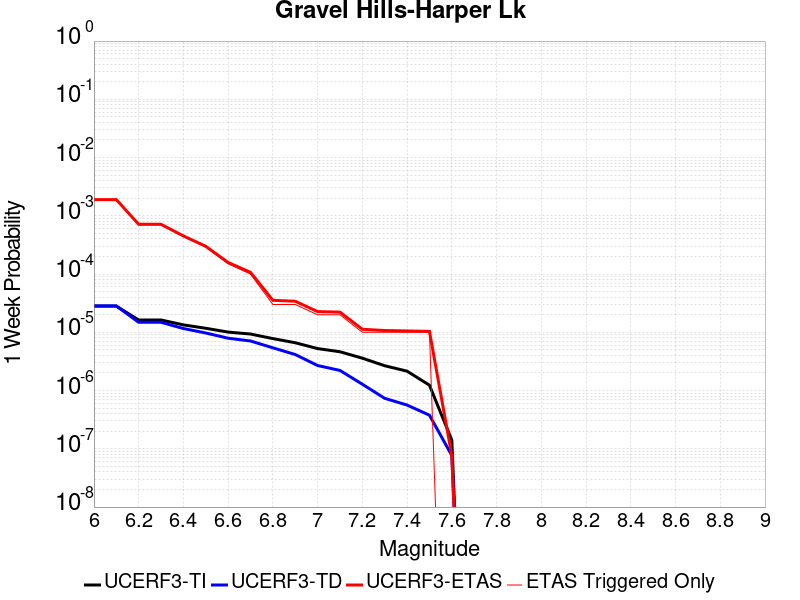 | 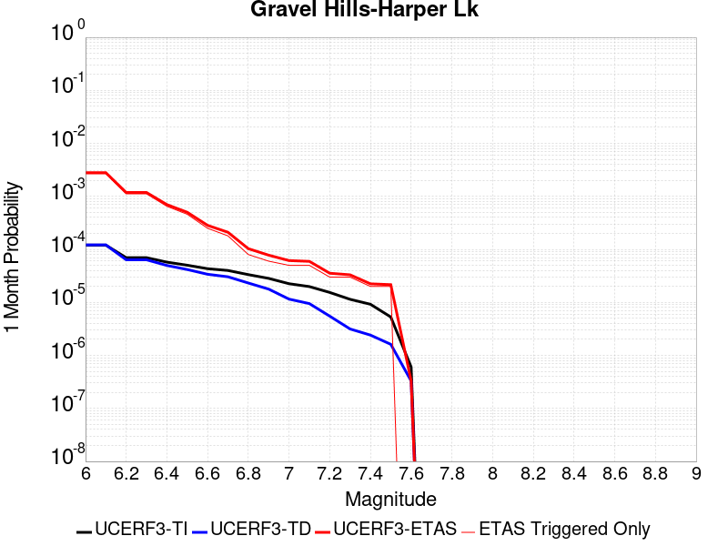 |  | 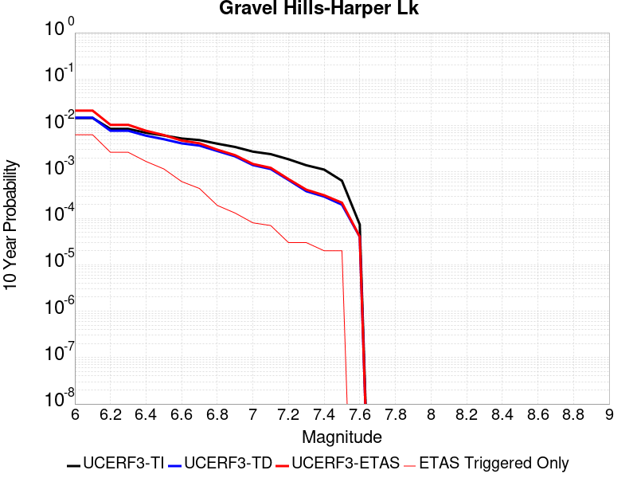 |

| Magnitude | 1 wk TI Prob | 1 wk TD Prob | 1 wk ETAS Prob | 1 wk ETAS/TD Gain | 1 wk ETAS Triggered Only | 1 mo TI Prob | 1 mo TD Prob | 1 mo ETAS Prob | 1 mo ETAS/TD Gain | 1 mo ETAS Triggered Only | 1 yr TI Prob | 1 yr TD Prob | 1 yr ETAS Prob | 1 yr ETAS/TD Gain | 1 yr ETAS Triggered Only | 10 yr TI Prob | 10 yr TD Prob | 10 yr ETAS Prob | 10 yr ETAS/TD Gain | 10 yr ETAS Triggered Only |
|-----|-----|-----|-----|-----|-----|-----|-----|-----|-----|-----|-----|-----|-----|-----|-----|-----|-----|-----|-----|-----|
| 6.0 | 2.8095026E-5 | 2.8371654E-5 | 0.0018983186 | 66.90898 | 0.00187 | 1.20401695E-4 | 1.2158797E-4 | 0.002801262 | 23.038975 | 0.00268 | 0.0014649049 | 0.0014794751 | 0.005763128 | 3.895387 | 0.00429 | 0.014552858 | 0.014710881 | 0.020937908 | 1.423294 | 0.00632 |
| 6.1 | 2.8095026E-5 | 2.8371654E-5 | 0.0018983186 | 66.90898 | 0.00187 | 1.20401695E-4 | 1.2158797E-4 | 0.002801262 | 23.038975 | 0.00268 | 0.0014649049 | 0.0014794751 | 0.005763128 | 3.895387 | 0.00429 | 0.014552858 | 0.014710881 | 0.020937908 | 1.423294 | 0.00632 |
| 6.2 | 1.628833E-5 | 1.4851136E-5 | 7.148407E-4 | 48.13374 | 7.0E-4 | 6.980526E-5 | 6.3646265E-5 | 0.001183575 | 18.596144 | 0.00112 | 8.495477E-4 | 7.746331E-4 | 0.0025232774 | 3.257384 | 0.00175 | 0.008463073 | 0.00772088 | 0.01035042 | 1.3405751 | 0.00265 |
| 6.3 | 1.628833E-5 | 1.4851136E-5 | 7.148407E-4 | 48.13374 | 7.0E-4 | 6.980526E-5 | 6.3646265E-5 | 0.001183575 | 18.596144 | 0.00112 | 8.495477E-4 | 7.746331E-4 | 0.0025232774 | 3.257384 | 0.00175 | 0.008463073 | 0.00772088 | 0.01035042 | 1.3405751 | 0.00265 |
| 6.4 | 1.3412165E-5 | 1.1610878E-5 | 4.5160577E-4 | 38.895058 | 4.4E-4 | 5.747944E-5 | 4.9759998E-5 | 6.997277E-4 | 14.062051 | 6.5E-4 | 6.9958746E-4 | 6.056673E-4 | 0.0017050011 | 2.8150787 | 0.0011 | 0.0069738915 | 0.006040945 | 0.0077107963 | 1.2764221 | 0.00168 |
| 6.5 | 1.1731356E-5 | 9.734151E-6 | 2.9973133E-4 | 30.791727 | 2.9E-4 | 5.027627E-5 | 4.171715E-5 | 5.0169794E-4 | 12.026179 | 4.6E-4 | 6.119417E-4 | 5.0779304E-4 | 0.0012574121 | 2.4762297 | 7.5E-4 | 0.0061025927 | 0.005066838 | 0.0062209605 | 1.2277796 | 0.00116 |
| 6.6 | 1.0087717E-5 | 7.918769E-6 | 1.5791759E-4 | 19.942188 | 1.5E-4 | 4.3232358E-5 | 3.3937158E-5 | 2.8392868E-4 | 8.366306 | 2.5E-4 | 5.262268E-4 | 4.1310955E-4 | 8.0294843E-4 | 1.9436696 | 3.9E-4 | 0.0052498244 | 0.004123716 | 0.0047411597 | 1.1497298 | 6.2E-4 |
| 6.7 | 9.339846E-6 | 7.0980955E-6 | 1.0709739E-4 | 15.088185 | 1.0E-4 | 4.0027295E-5 | 3.042007E-5 | 2.104146E-4 | 6.916966 | 1.8E-4 | 4.8722335E-4 | 3.70304E-4 | 6.40204E-4 | 1.7288606 | 2.7E-4 | 0.004861565 | 0.0036971292 | 0.0041355025 | 1.1185713 | 4.4E-4 |
| 6.8 | 7.801486E-6 | 5.4173984E-6 | 3.5417237E-5 | 6.5376835 | 3.0E-5 | 3.3434513E-5 | 2.3217224E-5 | 1.0321537E-4 | 4.4456377 | 8.0E-5 | 4.0698916E-4 | 2.826347E-4 | 3.8260643E-4 | 1.3537136 | 1.0E-4 | 0.004062446 | 0.0028229174 | 0.003012381 | 1.0671163 | 1.9E-4 |
| 6.9 | 6.622742E-6 | 4.1572243E-6 | 3.41571E-5 | 8.216323 | 3.0E-5 | 2.8382872E-5 | 1.7816561E-5 | 7.781549E-5 | 4.3675933 | 6.0E-5 | 3.4550668E-4 | 2.1689625E-4 | 2.8688106E-4 | 1.322665 | 7.0E-5 | 0.0034496998 | 0.002166965 | 0.0022966831 | 1.0598618 | 1.3E-4 |
| 7.0 | 5.2559594E-6 | 2.691647E-6 | 2.2691593E-5 | 8.430374 | 2.0E-5 | 2.2525346E-5 | 1.15355815E-5 | 6.153501E-5 | 5.3343654 | 5.0E-5 | 2.7421158E-4 | 1.4043694E-4 | 1.9042991E-4 | 1.3559817 | 5.0E-5 | 0.0027387347 | 0.0014035102 | 0.001483398 | 1.0569199 | 8.0E-5 |
| 7.1 | 4.6375726E-6 | 2.2151544E-6 | 2.221511E-5 | 10.028696 | 2.0E-5 | 1.987516E-5 | 9.493486E-6 | 5.949301E-5 | 6.2667193 | 5.0E-5 | 2.4195321E-4 | 1.1557731E-4 | 1.6557153E-4 | 1.4325608 | 5.0E-5 | 0.0024168994 | 0.0011551974 | 0.0012251165 | 1.0605257 | 7.0E-5 |
| 7.2 | 3.597001E-6 | 1.2842055E-6 | 1.1284193E-5 | 8.786906 | 1.0E-5 | 1.5415628E-5 | 5.5037267E-6 | 3.5503563E-5 | 6.4508224 | 3.0E-5 | 1.8766911E-4 | 6.7005894E-5 | 9.700388E-5 | 1.4476918 | 3.0E-5 | 0.001875107 | 6.6986517E-4 | 6.998451E-4 | 1.0447551 | 3.0E-5 |
| 7.3 | 2.668142E-6 | 7.3586256E-7 | 1.07358555E-5 | 14.589484 | 1.0E-5 | 1.1434844E-5 | 3.153693E-6 | 3.31536E-5 | 10.512628 | 3.0E-5 | 1.3921033E-4 | 3.8395556E-5 | 6.83944E-5 | 1.7813104 | 3.0E-5 | 0.0013912315 | 3.8389137E-4 | 4.1387984E-4 | 1.0781171 | 3.0E-5 |
| 7.4 | 2.1519238E-6 | 5.639486E-7 | 1.0563943E-5 | 18.732101 | 1.0E-5 | 9.222498E-6 | 2.4169203E-6 | 2.2416873E-5 | 9.274973 | 2.0E-5 | 1.1227813E-4 | 2.9425615E-5 | 4.9425027E-5 | 1.67966 | 2.0E-5 | 0.0011222142 | 2.9421784E-4 | 3.1421194E-4 | 1.0679568 | 2.0E-5 |
| 7.5 | 1.2376645E-6 | 3.7789232E-7 | 1.0377888E-5 | 27.462555 | 1.0E-5 | 5.3042654E-6 | 1.6195374E-6 | 2.1619506E-5 | 13.349185 | 2.0E-5 | 6.457752E-5 | 1.9717696E-5 | 3.9717303E-5 | 2.0142972 | 2.0E-5 | 6.4558757E-4 | 1.9716001E-4 | 2.1715608E-4 | 1.1014204 | 2.0E-5 |
| 7.6 | 1.4118889E-7 | 7.687433E-8 | 7.687433E-8 | 1.0 | 0.0 | 6.050951E-7 | 3.294614E-7 | 3.294614E-7 | 1.0 | 0.0 | 7.367008E-6 | 4.0111872E-6 | 4.0111872E-6 | 1.0 | 0.0 | 7.366764E-5 | 4.011134E-5 | 4.011134E-5 | 1.0 | 0.0 |

## Death Valley (So)
*[(top)](#table-of-contents)*

| 1 Week | 1 Month | 1 Year | 10 Year |
|-----|-----|-----|-----|
| 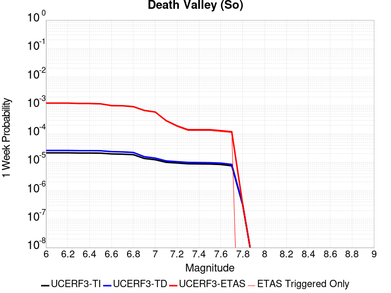 |  |  |  |

| Magnitude | 1 wk TI Prob | 1 wk TD Prob | 1 wk ETAS Prob | 1 wk ETAS/TD Gain | 1 wk ETAS Triggered Only | 1 mo TI Prob | 1 mo TD Prob | 1 mo ETAS Prob | 1 mo ETAS/TD Gain | 1 mo ETAS Triggered Only | 1 yr TI Prob | 1 yr TD Prob | 1 yr ETAS Prob | 1 yr ETAS/TD Gain | 1 yr ETAS Triggered Only | 10 yr TI Prob | 10 yr TD Prob | 10 yr ETAS Prob | 10 yr ETAS/TD Gain | 10 yr ETAS Triggered Only |
|-----|-----|-----|-----|-----|-----|-----|-----|-----|-----|-----|-----|-----|-----|-----|-----|-----|-----|-----|-----|-----|
| 6.0 | 2.1487655E-5 | 2.603082E-5 | 0.0012060001 | 46.3297 | 0.00118 | 9.2086695E-5 | 1.1155599E-4 | 0.002021343 | 18.119537 | 0.00191 | 0.0011205788 | 0.0013573661 | 0.0046429005 | 3.4205217 | 0.00329 | 0.01114945 | 0.013494512 | 0.01852569 | 1.3728315 | 0.0051 |
| 6.1 | 2.1487655E-5 | 2.603082E-5 | 0.0012060001 | 46.3297 | 0.00118 | 9.2086695E-5 | 1.1155599E-4 | 0.002021343 | 18.119537 | 0.00191 | 0.0011205788 | 0.0013573661 | 0.0046429005 | 3.4205217 | 0.00329 | 0.01114945 | 0.013494512 | 0.01852569 | 1.3728315 | 0.0051 |
| 6.2 | 2.1487655E-5 | 2.603082E-5 | 0.0012060001 | 46.3297 | 0.00118 | 9.2086695E-5 | 1.1155599E-4 | 0.002021343 | 18.119537 | 0.00191 | 0.0011205788 | 0.0013573661 | 0.0046429005 | 3.4205217 | 0.00329 | 0.01114945 | 0.013494512 | 0.01852569 | 1.3728315 | 0.0051 |
| 6.3 | 2.116024E-5 | 2.5661122E-5 | 0.0011656319 | 45.42404 | 0.00114 | 9.068359E-5 | 1.099717E-4 | 0.0019497693 | 17.729736 | 0.00184 | 0.0011035135 | 0.0013381012 | 0.0045138462 | 3.3733218 | 0.00318 | 0.010980497 | 0.013304181 | 0.018168591 | 1.3656301 | 0.00493 |
| 6.4 | 2.116024E-5 | 2.5661122E-5 | 0.0011656319 | 45.42404 | 0.00114 | 9.068359E-5 | 1.099717E-4 | 0.0019497693 | 17.729736 | 0.00184 | 0.0011035135 | 0.0013381012 | 0.0045138462 | 3.3733218 | 0.00318 | 0.010980497 | 0.013304181 | 0.018168591 | 1.3656301 | 0.00493 |
| 6.5 | 2.0931408E-5 | 2.5403713E-5 | 0.0011353755 | 44.693287 | 0.00111 | 8.9702946E-5 | 1.0886862E-4 | 0.0018986737 | 17.440046 | 0.00179 | 0.0010915862 | 0.0013246875 | 0.0044105942 | 3.3295355 | 0.00309 | 0.010862397 | 0.013171641 | 0.017928153 | 1.3611177 | 0.00482 |
| 6.6 | 1.9688681E-5 | 2.3659028E-5 | 9.836364E-4 | 41.57552 | 9.6E-4 | 8.437733E-5 | 1.01391975E-4 | 0.0016812318 | 16.581507 | 0.00158 | 0.0010268098 | 0.0012337633 | 0.0039803702 | 3.2262027 | 0.00275 | 0.010220783 | 0.012272537 | 0.016529642 | 1.3468807 | 0.00431 |
| 6.7 | 1.9287212E-5 | 2.3155615E-5 | 9.731336E-4 | 42.025814 | 9.5E-4 | 8.265686E-5 | 9.923466E-5 | 0.0016490809 | 16.617992 | 0.00155 | 0.0010058826 | 0.0012075274 | 0.0038942792 | 3.2250028 | 0.00269 | 0.010013417 | 0.012013041 | 0.016142827 | 1.3437752 | 0.00418 |
| 6.8 | 1.8495908E-5 | 2.2108836E-5 | 9.020894E-4 | 40.80221 | 8.8E-4 | 7.9265774E-5 | 9.474879E-5 | 0.0015146142 | 15.985579 | 0.00142 | 9.646335E-4 | 0.0011529707 | 0.0036401 | 3.1571486 | 0.00249 | 0.009604569 | 0.011473059 | 0.015357969 | 1.3386116 | 0.00393 |
| 6.9 | 1.36319E-5 | 1.5694455E-5 | 6.6568423E-4 | 42.41525 | 6.5E-4 | 5.8421123E-5 | 6.726026E-5 | 0.0010771924 | 16.015287 | 0.00101 | 7.1104505E-4 | 8.1859325E-4 | 0.0025671606 | 3.1360638 | 0.00175 | 0.007087742 | 0.008156887 | 0.010904293 | 1.3368204 | 0.00277 |
| 7.0 | 1.22768615E-5 | 1.3991372E-5 | 5.839834E-4 | 41.738823 | 5.7E-4 | 5.2614057E-5 | 5.9961683E-5 | 9.099107E-4 | 15.17487 | 8.5E-4 | 6.403879E-4 | 7.2979584E-4 | 0.002168745 | 2.9717145 | 0.00144 | 0.006385456 | 0.0072748666 | 0.009577989 | 1.3165863 | 0.00232 |
| 7.1 | 9.98783E-6 | 1.1155308E-5 | 2.911522E-4 | 26.099878 | 2.8E-4 | 4.2804284E-5 | 4.780761E-5 | 4.4778848E-4 | 9.366468 | 4.0E-4 | 5.2101753E-4 | 5.819065E-4 | 0.0012215341 | 2.099193 | 6.4E-4 | 0.0051979767 | 0.005804292 | 0.006778604 | 1.1678606 | 9.8E-4 |
| 7.2 | 9.416329E-6 | 1.0482713E-5 | 1.9048083E-4 | 18.170948 | 1.8E-4 | 4.035507E-5 | 4.4925164E-5 | 3.2491257E-4 | 7.2323074 | 2.8E-4 | 4.9121224E-4 | 5.468308E-4 | 9.965848E-4 | 1.8224735 | 4.5E-4 | 0.0049012783 | 0.0054552904 | 0.0061514718 | 1.1276158 | 7.0E-4 |
| 7.3 | 8.866168E-6 | 9.878421E-6 | 1.3987714E-4 | 14.159867 | 1.3E-4 | 3.799731E-5 | 4.233543E-5 | 2.4232696E-4 | 5.7239757 | 2.0E-4 | 4.6251903E-4 | 5.153162E-4 | 8.351513E-4 | 1.620658 | 3.2E-4 | 0.0046155755 | 0.0051416415 | 0.0056291223 | 1.0948102 | 4.9E-4 |
| 7.4 | 8.771322E-6 | 9.777832E-6 | 1.3977656E-4 | 14.295251 | 1.3E-4 | 3.759084E-5 | 4.1904346E-5 | 2.4189596E-4 | 5.7725744 | 2.0E-4 | 4.5757234E-4 | 5.100702E-4 | 8.1991206E-4 | 1.6074495 | 3.1E-4 | 0.0045663132 | 0.0050894236 | 0.0055570314 | 1.0918784 | 4.7E-4 |
| 7.5 | 8.668393E-6 | 9.668455E-6 | 1.396672E-4 | 14.445658 | 1.3E-4 | 3.7149726E-5 | 4.1435604E-5 | 2.4142732E-4 | 5.826567 | 2.0E-4 | 4.5220403E-4 | 5.043659E-4 | 8.042146E-4 | 1.5945063 | 3.0E-4 | 0.0045128493 | 0.0050326404 | 0.0054803756 | 1.0889663 | 4.5E-4 |
| 7.6 | 8.355129E-6 | 9.324462E-6 | 1.2932334E-4 | 13.869255 | 1.2E-4 | 3.5807203E-5 | 3.9961393E-5 | 2.099546E-4 | 5.2539363 | 1.7E-4 | 4.3586548E-4 | 4.8642556E-4 | 7.462991E-4 | 1.5342515 | 2.6E-4 | 0.004350116 | 0.0048540346 | 0.0052222386 | 1.0758553 | 3.7E-4 |
| 7.7 | 7.5284247E-6 | 8.407142E-6 | 1.1840622E-4 | 14.084003 | 1.1E-4 | 3.226428E-5 | 3.6030135E-5 | 1.9602437E-4 | 5.4405675 | 1.6E-4 | 3.927468E-4 | 4.3858265E-4 | 6.4849056E-4 | 1.4786052 | 2.1E-4 | 0.0039205337 | 0.0043775784 | 0.004676265 | 1.068231 | 3.0E-4 |
| 7.8 | 3.1694145E-7 | 3.333711E-7 | 3.333711E-7 | 1.0 | 0.0 | 1.3583199E-6 | 1.4287325E-6 | 1.4287325E-6 | 1.0 | 0.0 | 1.6537419E-5 | 1.7394683E-5 | 1.7394683E-5 | 1.0 | 0.0 | 1.6536188E-4 | 1.7393359E-4 | 1.8393186E-4 | 1.0574832 | 1.0E-5 |
| 7.9 | 1.8610457E-9 | 1.9363102E-9 | 1.9363102E-9 | 1.0 | 0.0 | 7.97591E-9 | 8.298473E-9 | 8.298473E-9 | 1.0 | 0.0 | 9.71067E-8 | 1.01033905E-7 | 1.01033905E-7 | 1.0 | 0.0 | 9.710666E-7 | 1.0103391E-6 | 1.0103391E-6 | 1.0 | 0.0 |

## So Sierra Nevada
*[(top)](#table-of-contents)*

| 1 Week | 1 Month | 1 Year | 10 Year |
|-----|-----|-----|-----|
|  |  |  | 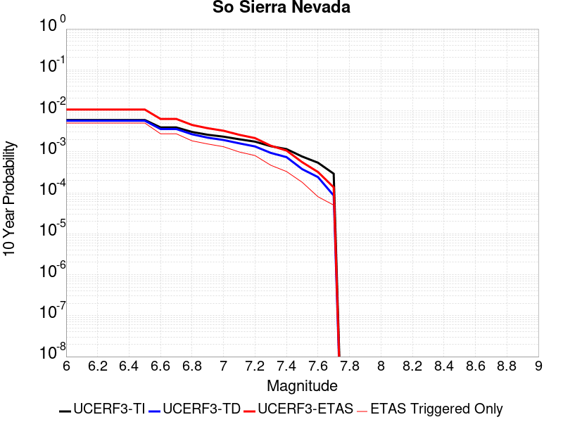 |

| Magnitude | 1 wk TI Prob | 1 wk TD Prob | 1 wk ETAS Prob | 1 wk ETAS/TD Gain | 1 wk ETAS Triggered Only | 1 mo TI Prob | 1 mo TD Prob | 1 mo ETAS Prob | 1 mo ETAS/TD Gain | 1 mo ETAS Triggered Only | 1 yr TI Prob | 1 yr TD Prob | 1 yr ETAS Prob | 1 yr ETAS/TD Gain | 1 yr ETAS Triggered Only | 10 yr TI Prob | 10 yr TD Prob | 10 yr ETAS Prob | 10 yr ETAS/TD Gain | 10 yr ETAS Triggered Only |
|-----|-----|-----|-----|-----|-----|-----|-----|-----|-----|-----|-----|-----|-----|-----|-----|-----|-----|-----|-----|-----|
| 6.0 | 1.1489244E-5 | 1.101302E-5 | 0.0016909945 | 153.54503 | 0.00168 | 4.9238686E-5 | 4.7197875E-5 | 0.0023170908 | 49.093117 | 0.00227 | 5.993161E-4 | 5.744944E-4 | 0.0042323917 | 7.367159 | 0.00366 | 0.0059770234 | 0.0057312725 | 0.010732444 | 1.872611 | 0.00503 |
| 6.1 | 1.1489244E-5 | 1.101302E-5 | 0.0016909945 | 153.54503 | 0.00168 | 4.9238686E-5 | 4.7197875E-5 | 0.0023170908 | 49.093117 | 0.00227 | 5.993161E-4 | 5.744944E-4 | 0.0042323917 | 7.367159 | 0.00366 | 0.0059770234 | 0.0057312725 | 0.010732444 | 1.872611 | 0.00503 |
| 6.2 | 1.1489244E-5 | 1.101302E-5 | 0.0016909945 | 153.54503 | 0.00168 | 4.9238686E-5 | 4.7197875E-5 | 0.0023170908 | 49.093117 | 0.00227 | 5.993161E-4 | 5.744944E-4 | 0.0042323917 | 7.367159 | 0.00366 | 0.0059770234 | 0.0057312725 | 0.010732444 | 1.872611 | 0.00503 |
| 6.3 | 1.1489244E-5 | 1.101302E-5 | 0.0016909945 | 153.54503 | 0.00168 | 4.9238686E-5 | 4.7197875E-5 | 0.0023170908 | 49.093117 | 0.00227 | 5.993161E-4 | 5.744944E-4 | 0.0042323917 | 7.367159 | 0.00366 | 0.0059770234 | 0.0057312725 | 0.010732444 | 1.872611 | 0.00503 |
| 6.4 | 1.1489244E-5 | 1.101302E-5 | 0.0016909945 | 153.54503 | 0.00168 | 4.9238686E-5 | 4.7197875E-5 | 0.0023170908 | 49.093117 | 0.00227 | 5.993161E-4 | 5.744944E-4 | 0.0042323917 | 7.367159 | 0.00366 | 0.0059770234 | 0.0057312725 | 0.010732444 | 1.872611 | 0.00503 |
| 6.5 | 1.1489244E-5 | 1.101302E-5 | 0.0016909945 | 153.54503 | 0.00168 | 4.9238686E-5 | 4.7197875E-5 | 0.0023170908 | 49.093117 | 0.00227 | 5.993161E-4 | 5.744944E-4 | 0.0042323917 | 7.367159 | 0.00366 | 0.0059770234 | 0.0057312725 | 0.010732444 | 1.872611 | 0.00503 |
| 6.6 | 7.550903E-6 | 6.9009247E-6 | 0.001006894 | 145.90712 | 0.001 | 3.236061E-5 | 2.957507E-5 | 0.0013795352 | 46.645203 | 0.00135 | 3.939192E-4 | 3.6001974E-4 | 0.0023592997 | 6.553251 | 0.002 | 0.0039322167 | 0.0035946383 | 0.0063347532 | 1.7622783 | 0.00275 |
| 6.7 | 7.550903E-6 | 6.9009247E-6 | 0.001006894 | 145.90712 | 0.001 | 3.236061E-5 | 2.957507E-5 | 0.0013795352 | 46.645203 | 0.00135 | 3.939192E-4 | 3.6001974E-4 | 0.0023592997 | 6.553251 | 0.002 | 0.0039322167 | 0.0035946383 | 0.0063347532 | 1.7622783 | 0.00275 |
| 6.8 | 5.8534742E-6 | 5.1335523E-6 | 7.0512993E-4 | 137.35712 | 7.0E-4 | 2.5086076E-5 | 2.200076E-5 | 9.7197987E-4 | 44.17938 | 9.5E-4 | 3.0538018E-4 | 2.678274E-4 | 0.0016774498 | 6.263175 | 0.00141 | 0.0030496086 | 0.0026751522 | 0.004520203 | 1.6896995 | 0.00185 |
| 6.9 | 4.9967352E-6 | 4.243218E-6 | 5.8424077E-4 | 137.68814 | 5.8E-4 | 2.1414404E-5 | 1.8185096E-5 | 8.281704E-4 | 45.54116 | 8.1E-4 | 2.6068918E-4 | 2.2138175E-4 | 0.0013911227 | 6.2838182 | 0.00117 | 0.0026038357 | 0.0022116823 | 0.003758254 | 1.6992741 | 0.00155 |
| 7.0 | 4.489943E-6 | 3.7182144E-6 | 5.0371635E-4 | 135.47264 | 5.0E-4 | 1.924247E-5 | 1.5935111E-5 | 7.1592396E-4 | 44.927452 | 7.0E-4 | 2.3425189E-4 | 1.9399333E-4 | 0.0012137955 | 6.2568927 | 0.00102 | 0.002340051 | 0.0019383015 | 0.0032657236 | 1.6848377 | 0.00133 |
| 7.1 | 3.8780595E-6 | 3.0838553E-6 | 3.6308274E-4 | 117.73663 | 3.6E-4 | 1.662015E-5 | 1.3216459E-5 | 5.4320943E-4 | 41.100983 | 5.3E-4 | 2.0233153E-4 | 1.6089906E-4 | 9.307752E-4 | 5.784839 | 7.7E-4 | 0.002021474 | 0.0016078798 | 0.002596288 | 1.6147277 | 9.9E-4 |
| 7.2 | 3.395662E-6 | 2.588619E-6 | 3.225878E-4 | 124.61772 | 3.2E-4 | 1.4552756E-5 | 1.1094037E-5 | 4.210895E-4 | 37.956383 | 4.1E-4 | 1.7716539E-4 | 1.3506202E-4 | 7.749756E-4 | 5.737924 | 6.4E-4 | 0.0017702422 | 0.0013498475 | 0.002158754 | 1.5992578 | 8.1E-4 |
| 7.3 | 2.6238572E-6 | 1.8016347E-6 | 2.0180127E-4 | 112.0101 | 2.0E-4 | 1.1245053E-5 | 7.72127E-6 | 2.5771934E-4 | 33.377842 | 2.5E-4 | 1.3689992E-4 | 9.400268E-5 | 4.9396505E-4 | 5.254798 | 4.0E-4 | 0.0013681562 | 9.396561E-4 | 0.0014092145 | 1.499713 | 4.7E-4 |
| 7.4 | 2.231789E-6 | 1.4218036E-6 | 1.0142166E-4 | 71.3331 | 1.0E-4 | 9.564776E-6 | 6.0934312E-6 | 1.5609252E-4 | 25.616522 | 1.5E-4 | 1.1644491E-4 | 7.418524E-5 | 3.5416448E-4 | 4.7740555 | 2.8E-4 | 0.0011638391 | 7.4162864E-4 | 0.0010713838 | 1.4446367 | 3.3E-4 |
| 7.5 | 1.4668605E-6 | 7.22489E-7 | 8.072243E-5 | 111.72825 | 8.0E-5 | 6.2865297E-6 | 3.0963777E-6 | 1.0309607E-4 | 33.2957 | 1.0E-4 | 7.653581E-5 | 3.769775E-5 | 1.876921E-4 | 4.978867 | 1.5E-4 | 7.6509453E-4 | 3.7691396E-4 | 5.568461E-4 | 1.4773825 | 1.8E-4 |
| 7.6 | 1.0382483E-6 | 4.625216E-7 | 2.0462512E-5 | 44.241203 | 2.0E-5 | 4.449628E-6 | 1.982234E-6 | 2.1982194E-5 | 11.089606 | 2.0E-5 | 5.4172873E-5 | 2.4133433E-5 | 7.413223E-5 | 3.0717647 | 5.0E-5 | 5.415967E-4 | 2.4130839E-4 | 3.212891E-4 | 1.3314459 | 8.0E-5 |
| 7.7 | 5.5865365E-7 | 1.6401302E-7 | 1.0164012E-5 | 61.970757 | 1.0E-5 | 2.3942277E-6 | 7.0291276E-7 | 1.07029055E-5 | 15.226506 | 1.0E-5 | 2.9149332E-5 | 8.55793E-6 | 3.8557675E-5 | 4.5054903 | 3.0E-5 | 2.9145507E-4 | 8.557614E-5 | 1.3557186E-4 | 1.584225 | 5.0E-5 |

## Coyote Canyon
*[(top)](#table-of-contents)*

| 1 Week | 1 Month | 1 Year | 10 Year |
|-----|-----|-----|-----|
|  |  |  |  |

| Magnitude | 1 wk TI Prob | 1 wk TD Prob | 1 wk ETAS Prob | 1 wk ETAS/TD Gain | 1 wk ETAS Triggered Only | 1 mo TI Prob | 1 mo TD Prob | 1 mo ETAS Prob | 1 mo ETAS/TD Gain | 1 mo ETAS Triggered Only | 1 yr TI Prob | 1 yr TD Prob | 1 yr ETAS Prob | 1 yr ETAS/TD Gain | 1 yr ETAS Triggered Only | 10 yr TI Prob | 10 yr TD Prob | 10 yr ETAS Prob | 10 yr ETAS/TD Gain | 10 yr ETAS Triggered Only |
|-----|-----|-----|-----|-----|-----|-----|-----|-----|-----|-----|-----|-----|-----|-----|-----|-----|-----|-----|-----|-----|
| 6.0 | 3.343805E-5 | 3.8189948E-5 | 9.2815596E-4 | 24.303673 | 8.9E-4 | 1.4329806E-4 | 1.636621E-4 | 0.0016934117 | 10.347 | 0.00153 | 0.0017432576 | 0.0019909712 | 0.0047055557 | 2.3634474 | 0.00272 | 0.017296458 | 0.019752184 | 0.02396725 | 1.2133975 | 0.0043 |
| 6.1 | 3.343805E-5 | 3.8189948E-5 | 9.2815596E-4 | 24.303673 | 8.9E-4 | 1.4329806E-4 | 1.636621E-4 | 0.0016934117 | 10.347 | 0.00153 | 0.0017432576 | 0.0019909712 | 0.0047055557 | 2.3634474 | 0.00272 | 0.017296458 | 0.019752184 | 0.02396725 | 1.2133975 | 0.0043 |
| 6.2 | 1.8832037E-5 | 2.1413021E-5 | 4.8140317E-4 | 22.481794 | 4.6E-4 | 8.070623E-5 | 9.176735E-5 | 8.916939E-4 | 9.716897 | 8.0E-4 | 9.821554E-4 | 0.0011167814 | 0.0026051174 | 2.3327012 | 0.00149 | 0.009778259 | 0.01112027 | 0.013434249 | 1.2080865 | 0.00234 |
| 6.3 | 1.8832037E-5 | 2.1413021E-5 | 4.8140317E-4 | 22.481794 | 4.6E-4 | 8.070623E-5 | 9.176735E-5 | 8.916939E-4 | 9.716897 | 8.0E-4 | 9.821554E-4 | 0.0011167814 | 0.0026051174 | 2.3327012 | 0.00149 | 0.009778259 | 0.01112027 | 0.013434249 | 1.2080865 | 0.00234 |
| 6.4 | 1.6844657E-5 | 1.9139026E-5 | 4.591306E-4 | 23.989235 | 4.4E-4 | 7.218939E-5 | 8.2022285E-5 | 8.3196076E-4 | 10.143106 | 7.5E-4 | 8.785514E-4 | 9.98247E-4 | 0.0023868594 | 2.391051 | 0.00139 | 0.0087508615 | 0.009945833 | 0.012104151 | 1.2170073 | 0.00218 |
| 6.5 | 1.404799E-5 | 1.5950454E-5 | 4.0594424E-4 | 25.450325 | 3.9E-4 | 6.020428E-5 | 6.835771E-5 | 7.383119E-4 | 10.800712 | 6.7E-4 | 7.3274056E-4 | 8.3201047E-4 | 0.002060987 | 2.4771168 | 0.00123 | 0.007303292 | 0.008296155 | 0.010200227 | 1.2295125 | 0.00192 |
| 6.6 | 1.0775264E-5 | 1.2236732E-5 | 3.1223305E-4 | 25.51605 | 3.0E-4 | 4.6178888E-5 | 5.2442454E-5 | 5.724152E-4 | 10.915111 | 5.2E-4 | 5.620829E-4 | 6.3836604E-4 | 0.0016377277 | 2.5654993 | 0.001 | 0.005606633 | 0.0063718185 | 0.007951687 | 1.2479463 | 0.00159 |
| 6.7 | 8.79852E-6 | 9.996745E-6 | 2.6999414E-4 | 27.008207 | 2.6E-4 | 3.7707396E-5 | 4.284285E-5 | 5.0282315E-4 | 11.736454 | 4.6E-4 | 4.5899083E-4 | 5.215514E-4 | 0.0014010924 | 2.6863937 | 8.8E-4 | 0.0045804395 | 0.0052096015 | 0.006532673 | 1.2539679 | 0.00133 |

## San Andreas (Mojave S)
*[(top)](#table-of-contents)*

| 1 Week | 1 Month | 1 Year | 10 Year |
|-----|-----|-----|-----|
|  |  |  |  |

| Magnitude | 1 wk TI Prob | 1 wk TD Prob | 1 wk ETAS Prob | 1 wk ETAS/TD Gain | 1 wk ETAS Triggered Only | 1 mo TI Prob | 1 mo TD Prob | 1 mo ETAS Prob | 1 mo ETAS/TD Gain | 1 mo ETAS Triggered Only | 1 yr TI Prob | 1 yr TD Prob | 1 yr ETAS Prob | 1 yr ETAS/TD Gain | 1 yr ETAS Triggered Only | 10 yr TI Prob | 10 yr TD Prob | 10 yr ETAS Prob | 10 yr ETAS/TD Gain | 10 yr ETAS Triggered Only |
|-----|-----|-----|-----|-----|-----|-----|-----|-----|-----|-----|-----|-----|-----|-----|-----|-----|-----|-----|-----|-----|
| 6.0 | 2.9568913E-4 | 6.4089487E-4 | 0.0023597926 | 3.6820273 | 0.00172 | 0.0012666236 | 0.002743908 | 0.004888009 | 1.7814039 | 0.00215 | 0.0153124705 | 0.032917958 | 0.0358869 | 1.0901922 | 0.00307 | 0.14299299 | 0.27505466 | 0.27801245 | 1.0107534 | 0.00408 |
| 6.1 | 2.9568913E-4 | 6.4089487E-4 | 0.0023597926 | 3.6820273 | 0.00172 | 0.0012666236 | 0.002743908 | 0.004888009 | 1.7814039 | 0.00215 | 0.0153124705 | 0.032917958 | 0.0358869 | 1.0901922 | 0.00307 | 0.14299299 | 0.27505466 | 0.27801245 | 1.0107534 | 0.00408 |
| 6.2 | 2.9568913E-4 | 6.4089487E-4 | 0.0023597926 | 3.6820273 | 0.00172 | 0.0012666236 | 0.002743908 | 0.004888009 | 1.7814039 | 0.00215 | 0.0153124705 | 0.032917958 | 0.0358869 | 1.0901922 | 0.00307 | 0.14299299 | 0.27505466 | 0.27801245 | 1.0107534 | 0.00408 |
| 6.3 | 2.9568913E-4 | 6.4089487E-4 | 0.0023597926 | 3.6820273 | 0.00172 | 0.0012666236 | 0.002743908 | 0.004888009 | 1.7814039 | 0.00215 | 0.0153124705 | 0.032917958 | 0.0358869 | 1.0901922 | 0.00307 | 0.14299299 | 0.27505466 | 0.27801245 | 1.0107534 | 0.00408 |
| 6.4 | 1.9673644E-4 | 4.267467E-4 | 0.0018961194 | 4.4431963 | 0.00147 | 8.4288366E-4 | 0.0018276589 | 0.0036443325 | 1.9939895 | 0.00182 | 0.010213916 | 0.022030475 | 0.024592753 | 1.1163062 | 0.00262 | 0.09757019 | 0.19523735 | 0.19809426 | 1.0146329 | 0.00355 |
| 6.5 | 1.3062257E-4 | 2.8979467E-4 | 0.0016494006 | 5.691618 | 0.00136 | 5.596909E-4 | 0.0012413886 | 0.0028793528 | 2.319461 | 0.00164 | 0.006792967 | 0.015009978 | 0.017295154 | 1.1522439 | 0.00232 | 0.06589034 | 0.13917707 | 0.14186282 | 1.0192975 | 0.00312 |
| 6.6 | 1.3062257E-4 | 2.8979467E-4 | 0.0016494006 | 5.691618 | 0.00136 | 5.596909E-4 | 0.0012413886 | 0.0028793528 | 2.319461 | 0.00164 | 0.006792967 | 0.015009978 | 0.017295154 | 1.1522439 | 0.00232 | 0.06589034 | 0.13917707 | 0.14186282 | 1.0192975 | 0.00312 |
| 6.7 | 1.10434674E-4 | 2.4762243E-4 | 0.001557298 | 6.289002 | 0.00131 | 4.732056E-4 | 0.0010608081 | 0.0026291425 | 2.4784338 | 0.00157 | 0.00574607 | 0.01283917 | 0.01505041 | 1.1722261 | 0.00224 | 0.055997457 | 0.121185824 | 0.123831056 | 1.0218279 | 0.00301 |
| 6.8 | 1.08604E-4 | 2.4263085E-4 | 0.001552313 | 6.3978386 | 0.00131 | 4.6536268E-4 | 0.0010394326 | 0.0026078008 | 2.5088694 | 0.00157 | 0.0056510814 | 0.01258195 | 0.014783892 | 1.175008 | 0.00223 | 0.055095196 | 0.11906218 | 0.12170499 | 1.0221969 | 0.003 |
| 6.9 | 1.0624965E-4 | 2.3625128E-4 | 0.0015259465 | 6.458998 | 0.00129 | 4.552762E-4 | 0.0010121131 | 0.0025605443 | 2.5298996 | 0.00155 | 0.0055289087 | 0.012253117 | 0.014436037 | 1.1781523 | 0.00221 | 0.053933576 | 0.11632266 | 0.11896485 | 1.0227144 | 0.00299 |
| 7.0 | 1.0382748E-4 | 2.2989688E-4 | 0.0015196003 | 6.6099215 | 0.00129 | 4.4489902E-4 | 9.849007E-4 | 0.0025333741 | 2.5722127 | 0.00155 | 0.0054032006 | 0.011925476 | 0.014109121 | 1.1831075 | 0.00221 | 0.052737 | 0.11356046 | 0.116210915 | 1.0233396 | 0.00299 |
| 7.1 | 1.0108296E-4 | 2.2271411E-4 | 0.0015124268 | 6.790889 | 0.00129 | 4.3314075E-4 | 9.5414027E-4 | 0.0025026614 | 2.6229491 | 0.00155 | 0.0052607446 | 0.011554995 | 0.013739458 | 1.1890492 | 0.00221 | 0.051379364 | 0.11041715 | 0.11305031 | 1.0238475 | 0.00296 |
| 7.2 | 9.842224E-5 | 2.1583316E-4 | 0.0015055548 | 6.9755487 | 0.00129 | 4.2174142E-4 | 9.246717E-4 | 0.0024732384 | 2.6747205 | 0.00155 | 0.005122619 | 0.011199959 | 0.013375319 | 1.1942292 | 0.0022 | 0.050061326 | 0.107381746 | 0.109997116 | 1.0243559 | 0.00293 |
| 7.3 | 9.2784096E-5 | 1.970025E-4 | 0.0014767504 | 7.496099 | 0.00128 | 3.975855E-4 | 8.4402337E-4 | 0.0023827236 | 2.823054 | 0.00154 | 0.0048298645 | 0.010227685 | 0.012385389 | 1.210967 | 0.00218 | 0.04726231 | 0.099069975 | 0.10168267 | 1.0263722 | 0.0029 |
| 7.4 | 9.042319E-5 | 1.894192E-4 | 0.0014691767 | 7.7562184 | 0.00128 | 3.8747038E-4 | 8.1154413E-4 | 0.0023502943 | 2.8960772 | 0.00154 | 0.004707252 | 0.009835889 | 0.011994447 | 1.2194573 | 0.00218 | 0.046087816 | 0.095671214 | 0.09828472 | 1.0273176 | 0.00289 |
| 7.5 | 8.770072E-5 | 1.8088314E-4 | 0.0014606516 | 8.075111 | 0.00128 | 3.7580606E-4 | 7.7498326E-4 | 0.0023137897 | 2.9855998 | 0.00154 | 0.0045658434 | 0.009394687 | 0.011554206 | 1.229866 | 0.00218 | 0.044731654 | 0.091792226 | 0.094416946 | 1.0285941 | 0.00289 |
| 7.6 | 8.5641805E-5 | 1.7537347E-4 | 0.001455149 | 8.29743 | 0.00128 | 3.669847E-4 | 7.513841E-4 | 0.0022802346 | 3.034712 | 0.00153 | 0.004458888 | 0.009109805 | 0.011250129 | 1.2349471 | 0.00216 | 0.04370476 | 0.08922946 | 0.09183426 | 1.0291922 | 0.00286 |
| 7.7 | 8.377801E-5 | 1.7091612E-4 | 0.0014506973 | 8.487774 | 0.00128 | 3.5899918E-4 | 7.322921E-4 | 0.0022611716 | 3.0878003 | 0.00153 | 0.0043620584 | 0.00887928 | 0.0110201 | 1.2411029 | 0.00216 | 0.042774227 | 0.08712943 | 0.089731105 | 1.0298599 | 0.00285 |
| 7.8 | 7.481354E-5 | 1.5212737E-4 | 0.0012019676 | 7.901061 | 0.00105 | 3.2059004E-4 | 6.5181154E-4 | 0.0019109903 | 2.931814 | 0.00126 | 0.0038961996 | 0.007906978 | 0.009662983 | 1.2220829 | 0.00177 | 0.03828593 | 0.07799765 | 0.08016435 | 1.0277791 | 0.00235 |
| 7.9 | 5.2235562E-5 | 9.898955E-5 | 8.0891926E-4 | 8.171764 | 7.1E-4 | 2.2384748E-4 | 4.2417197E-4 | 0.0012338284 | 2.908793 | 8.1E-4 | 0.002721937 | 0.005152076 | 0.0062165633 | 1.2066133 | 0.00107 | 0.026888376 | 0.051658686 | 0.052986365 | 1.0257009 | 0.0014 |
| 8.0 | 3.356928E-5 | 5.4085504E-5 | 3.8406765E-4 | 7.10112 | 3.3E-4 | 1.4386041E-4 | 2.3177444E-4 | 6.016887E-4 | 2.5960097 | 3.7E-4 | 0.0017500932 | 0.002818204 | 0.0032868795 | 1.1663029 | 4.7E-4 | 0.017363746 | 0.028797068 | 0.029379789 | 1.0202354 | 6.0E-4 |
| 8.1 | 1.8491019E-5 | 1.890826E-5 | 2.890807E-5 | 1.5288594 | 1.0E-5 | 7.924481E-5 | 8.1032886E-5 | 9.1032074E-5 | 1.1233966 | 1.0E-5 | 9.6437853E-4 | 9.861294E-4 | 0.00102609 | 1.0405226 | 4.0E-5 | 0.009602042 | 0.010580973 | 0.01067002 | 1.0084158 | 9.0E-5 |
| 8.2 | 8.450673E-6 | 5.448848E-6 | 5.448848E-6 | 1.0 | 0.0 | 3.6216665E-5 | 2.3351995E-5 | 2.3351995E-5 | 1.0 | 0.0 | 4.4084867E-4 | 2.8427353E-4 | 2.8427353E-4 | 1.0 | 0.0 | 0.0043997513 | 0.0032303126 | 0.0032402803 | 1.0030857 | 1.0E-5 |
| 8.3 | 2.0399948E-6 | 7.951945E-7 | 7.951945E-7 | 1.0 | 0.0 | 8.742806E-6 | 3.4079721E-6 | 3.4079721E-6 | 1.0 | 0.0 | 1.0643846E-4 | 4.1491287E-5 | 4.1491287E-5 | 1.0 | 0.0 | 0.0010638749 | 4.8670862E-4 | 4.8670862E-4 | 1.0 | 0.0 |

## Nelson Lake
*[(top)](#table-of-contents)*

| 1 Week | 1 Month | 1 Year | 10 Year |
|-----|-----|-----|-----|
| 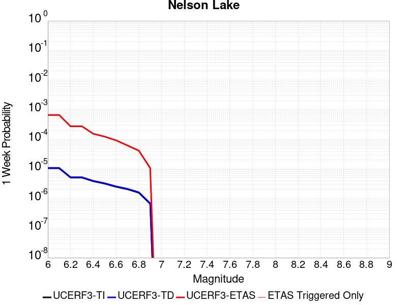 | 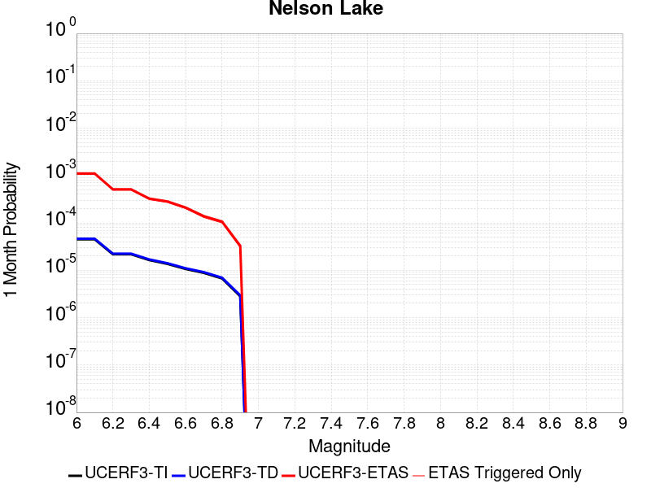 |  | 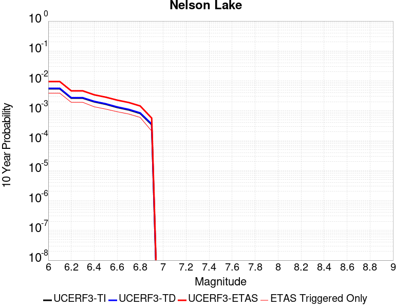 |

| Magnitude | 1 wk TI Prob | 1 wk TD Prob | 1 wk ETAS Prob | 1 wk ETAS/TD Gain | 1 wk ETAS Triggered Only | 1 mo TI Prob | 1 mo TD Prob | 1 mo ETAS Prob | 1 mo ETAS/TD Gain | 1 mo ETAS Triggered Only | 1 yr TI Prob | 1 yr TD Prob | 1 yr ETAS Prob | 1 yr ETAS/TD Gain | 1 yr ETAS Triggered Only | 10 yr TI Prob | 10 yr TD Prob | 10 yr ETAS Prob | 10 yr ETAS/TD Gain | 10 yr ETAS Triggered Only |
|-----|-----|-----|-----|-----|-----|-----|-----|-----|-----|-----|-----|-----|-----|-----|-----|-----|-----|-----|-----|-----|
| 6.0 | 1.0512636E-5 | 1.08296E-5 | 6.6082255E-4 | 61.020035 | 6.5E-4 | 4.5053377E-5 | 4.6411806E-5 | 0.0011063626 | 23.837955 | 0.00106 | 5.4838683E-4 | 5.6492846E-4 | 0.0027836743 | 4.927481 | 0.00222 | 0.005470355 | 0.0056360406 | 0.009504116 | 1.6863109 | 0.00389 |
| 6.1 | 1.0512636E-5 | 1.08296E-5 | 6.6082255E-4 | 61.020035 | 6.5E-4 | 4.5053377E-5 | 4.6411806E-5 | 0.0011063626 | 23.837955 | 0.00106 | 5.4838683E-4 | 5.6492846E-4 | 0.0027836743 | 4.927481 | 0.00222 | 0.005470355 | 0.0056360406 | 0.009504116 | 1.6863109 | 0.00389 |
| 6.2 | 5.0821072E-6 | 5.2432174E-6 | 2.752418E-4 | 52.49483 | 2.7E-4 | 2.1780277E-5 | 2.2470746E-5 | 5.124597E-4 | 22.80564 | 4.9E-4 | 2.6514262E-4 | 2.735485E-4 | 0.0013832449 | 5.056671 | 0.00111 | 0.0026482649 | 0.0027322697 | 0.004647024 | 1.7007924 | 0.00192 |
| 6.3 | 5.0821072E-6 | 5.2432174E-6 | 2.752418E-4 | 52.49483 | 2.7E-4 | 2.1780277E-5 | 2.2470746E-5 | 5.124597E-4 | 22.80564 | 4.9E-4 | 2.6514262E-4 | 2.735485E-4 | 0.0013832449 | 5.056671 | 0.00111 | 0.0026482649 | 0.0027322697 | 0.004647024 | 1.7007924 | 0.00192 |
| 6.4 | 3.833157E-6 | 3.960016E-6 | 1.5395942E-4 | 38.878487 | 1.5E-4 | 1.642771E-5 | 1.6971391E-5 | 3.2696614E-4 | 19.265722 | 3.1E-4 | 1.9998902E-4 | 2.066081E-4 | 0.0010164408 | 4.919656 | 8.1E-4 | 0.0019980913 | 0.0020642604 | 0.003421453 | 1.6574717 | 0.00136 |
| 6.5 | 3.179793E-6 | 3.2883174E-6 | 1.2328793E-4 | 37.492706 | 1.2E-4 | 1.3627614E-5 | 1.4092718E-5 | 2.8408892E-4 | 20.158562 | 2.7E-4 | 1.6590356E-4 | 1.7156621E-4 | 8.714461E-4 | 5.0793576 | 7.0E-4 | 0.0016577976 | 0.0017144248 | 0.0028524704 | 1.6638061 | 0.00114 |
| 6.6 | 2.484688E-6 | 2.57368E-6 | 9.257345E-5 | 35.969296 | 9.0E-5 | 1.0648619E-5 | 1.1030014E-5 | 2.1102781E-4 | 19.132143 | 2.0E-4 | 1.2963923E-4 | 1.3428286E-4 | 6.942077E-4 | 5.169741 | 5.6E-4 | 0.0012956362 | 0.0013420876 | 0.0022708396 | 1.6920203 | 9.3E-4 |
| 6.7 | 2.055855E-6 | 2.1326855E-6 | 6.213256E-5 | 29.133484 | 6.0E-5 | 8.810777E-6 | 9.1400525E-6 | 1.3913887E-4 | 15.222983 | 1.3E-4 | 1.07265936E-4 | 1.11275105E-4 | 5.712239E-4 | 5.1334386 | 4.6E-4 | 0.0010721417 | 0.0011122581 | 0.0018913904 | 1.7004961 | 7.8E-4 |
| 6.8 | 1.5654894E-6 | 1.6273096E-6 | 4.1627245E-5 | 25.580408 | 4.0E-5 | 6.709223E-6 | 6.9741686E-6 | 1.0697347E-4 | 15.338527 | 1.0E-4 | 8.168173E-5 | 8.4907755E-5 | 4.5487634E-4 | 5.3573003 | 3.7E-4 | 8.165171E-4 | 8.48808E-4 | 0.0014482987 | 1.7062737 | 6.0E-4 |
| 6.9 | 6.607022E-7 | 6.909737E-7 | 1.06909665E-5 | 15.472321 | 1.0E-5 | 2.8315776E-6 | 2.9613143E-6 | 3.2961227E-5 | 11.130607 | 3.0E-5 | 3.4473913E-5 | 3.605371E-5 | 1.360501E-4 | 3.7735398 | 1.0E-4 | 3.4468566E-4 | 3.6050825E-4 | 5.704326E-4 | 1.5823009 | 2.1E-4 |

## San Andreas (Mojave N)
*[(top)](#table-of-contents)*

| 1 Week | 1 Month | 1 Year | 10 Year |
|-----|-----|-----|-----|
| 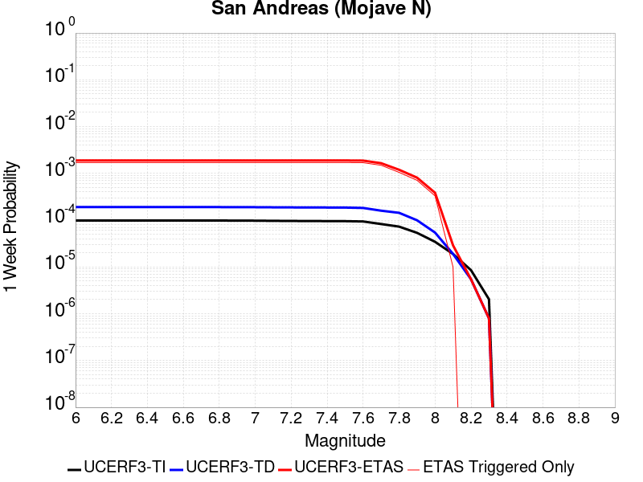 | 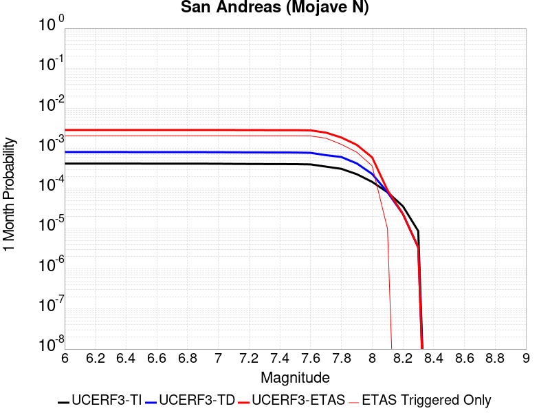 | 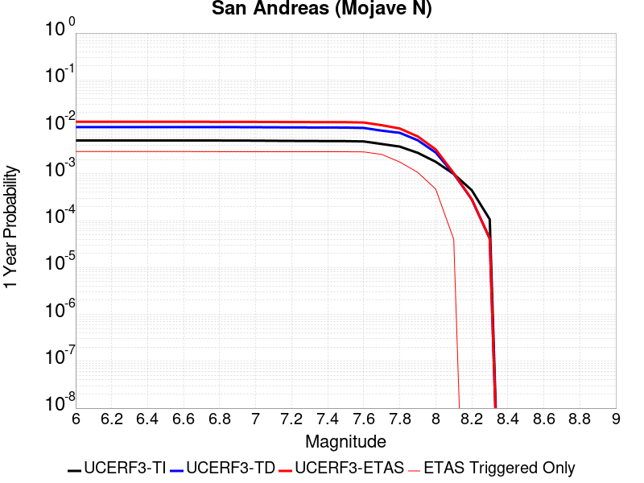 |  |

| Magnitude | 1 wk TI Prob | 1 wk TD Prob | 1 wk ETAS Prob | 1 wk ETAS/TD Gain | 1 wk ETAS Triggered Only | 1 mo TI Prob | 1 mo TD Prob | 1 mo ETAS Prob | 1 mo ETAS/TD Gain | 1 mo ETAS Triggered Only | 1 yr TI Prob | 1 yr TD Prob | 1 yr ETAS Prob | 1 yr ETAS/TD Gain | 1 yr ETAS Triggered Only | 10 yr TI Prob | 10 yr TD Prob | 10 yr ETAS Prob | 10 yr ETAS/TD Gain | 10 yr ETAS Triggered Only |
|-----|-----|-----|-----|-----|-----|-----|-----|-----|-----|-----|-----|-----|-----|-----|-----|-----|-----|-----|-----|-----|
| 6.0 | 9.8453354E-5 | 1.9063153E-4 | 0.0018903074 | 9.916027 | 0.0017 | 4.218747E-4 | 8.1673666E-4 | 0.0029050296 | 3.5568745 | 0.00209 | 0.005124234 | 0.009898547 | 0.012839148 | 1.2970741 | 0.00297 | 0.050076745 | 0.09685607 | 0.10036027 | 1.0361794 | 0.00388 |
| 6.1 | 9.8453354E-5 | 1.9063153E-4 | 0.0018903074 | 9.916027 | 0.0017 | 4.218747E-4 | 8.1673666E-4 | 0.0029050296 | 3.5568745 | 0.00209 | 0.005124234 | 0.009898547 | 0.012839148 | 1.2970741 | 0.00297 | 0.050076745 | 0.09685607 | 0.10036027 | 1.0361794 | 0.00388 |
| 6.2 | 9.8453354E-5 | 1.9063153E-4 | 0.0018903074 | 9.916027 | 0.0017 | 4.218747E-4 | 8.1673666E-4 | 0.0029050296 | 3.5568745 | 0.00209 | 0.005124234 | 0.009898547 | 0.012839148 | 1.2970741 | 0.00297 | 0.050076745 | 0.09685607 | 0.10036027 | 1.0361794 | 0.00388 |
| 6.3 | 9.8453354E-5 | 1.9063153E-4 | 0.0018903074 | 9.916027 | 0.0017 | 4.218747E-4 | 8.1673666E-4 | 0.0029050296 | 3.5568745 | 0.00209 | 0.005124234 | 0.009898547 | 0.012839148 | 1.2970741 | 0.00297 | 0.050076745 | 0.09685607 | 0.10036027 | 1.0361794 | 0.00388 |
| 6.4 | 9.8453354E-5 | 1.9063153E-4 | 0.0018903074 | 9.916027 | 0.0017 | 4.218747E-4 | 8.1673666E-4 | 0.0029050296 | 3.5568745 | 0.00209 | 0.005124234 | 0.009898547 | 0.012839148 | 1.2970741 | 0.00297 | 0.050076745 | 0.09685607 | 0.10036027 | 1.0361794 | 0.00388 |
| 6.5 | 9.828623E-5 | 1.9035982E-4 | 0.0018900362 | 9.928757 | 0.0017 | 4.211587E-4 | 8.1557286E-4 | 0.0029038682 | 3.560526 | 0.00209 | 0.005115558 | 0.009884506 | 0.012825149 | 1.2975003 | 0.00297 | 0.0499939 | 0.096729346 | 0.10023404 | 1.0362319 | 0.00388 |
| 6.6 | 9.828623E-5 | 1.9035982E-4 | 0.0018900362 | 9.928757 | 0.0017 | 4.211587E-4 | 8.1557286E-4 | 0.0029038682 | 3.560526 | 0.00209 | 0.005115558 | 0.009884506 | 0.012825149 | 1.2975003 | 0.00297 | 0.0499939 | 0.096729346 | 0.10023404 | 1.0362319 | 0.00388 |
| 6.7 | 9.822385E-5 | 1.9025848E-4 | 0.001889935 | 9.933514 | 0.0017 | 4.2089142E-4 | 8.151388E-4 | 0.0029034351 | 3.5618906 | 0.00209 | 0.0051123193 | 0.00987927 | 0.012810027 | 1.2966573 | 0.00296 | 0.04996297 | 0.09668207 | 0.10017791 | 1.0361581 | 0.00387 |
| 6.8 | 9.8135715E-5 | 1.9010965E-4 | 0.0018897865 | 9.940508 | 0.0017 | 4.2051385E-4 | 8.1450137E-4 | 0.002902799 | 3.5638971 | 0.00209 | 0.0051077437 | 0.00987158 | 0.012792459 | 1.2958877 | 0.00295 | 0.049919277 | 0.09661176 | 0.10009883 | 1.0360937 | 0.00386 |
| 6.9 | 9.79354E-5 | 1.8980251E-4 | 0.0018894798 | 9.954978 | 0.0017 | 4.1965564E-4 | 8.131859E-4 | 0.0029014864 | 3.568048 | 0.00209 | 0.005097344 | 0.009855708 | 0.012776634 | 1.296369 | 0.00295 | 0.04981996 | 0.0964666 | 0.09995424 | 1.0361538 | 0.00386 |
| 7.0 | 9.7523975E-5 | 1.8917056E-4 | 0.001888849 | 9.984899 | 0.0017 | 4.1789294E-4 | 8.104793E-4 | 0.0028987853 | 3.576631 | 0.00209 | 0.0050759832 | 0.009823053 | 0.012744075 | 1.297364 | 0.00295 | 0.04961594 | 0.09616813 | 0.09965692 | 1.036278 | 0.00386 |
| 7.1 | 9.6790536E-5 | 1.8813077E-4 | 0.001887811 | 10.034568 | 0.0017 | 4.1475063E-4 | 8.0602575E-4 | 0.0028943412 | 3.5908792 | 0.00209 | 0.0050379033 | 0.009769319 | 0.012690499 | 1.2990158 | 0.00295 | 0.049252123 | 0.09567702 | 0.099167705 | 1.0364841 | 0.00386 |
| 7.2 | 9.625548E-5 | 1.8735786E-4 | 0.0018870394 | 10.071845 | 0.0017 | 4.1245823E-4 | 8.027153E-4 | 0.0028810457 | 3.589125 | 0.00208 | 0.005010122 | 0.009729375 | 0.0126407705 | 1.2992377 | 0.00294 | 0.04898662 | 0.09531156 | 0.09879461 | 1.0365438 | 0.00385 |
| 7.3 | 9.586802E-5 | 1.8685391E-4 | 0.0018865363 | 10.096316 | 0.0017 | 4.1079824E-4 | 8.005569E-4 | 0.0028788918 | 3.5961113 | 0.00208 | 0.0049900045 | 0.009703331 | 0.012614802 | 1.3000487 | 0.00294 | 0.048794318 | 0.09507076 | 0.09855473 | 1.0366461 | 0.00385 |
| 7.4 | 9.555528E-5 | 1.863404E-4 | 0.0018860237 | 10.121388 | 0.0017 | 4.0945833E-4 | 7.983575E-4 | 0.0028766969 | 3.603269 | 0.00208 | 0.004973766 | 0.009676791 | 0.012588342 | 1.3008797 | 0.00294 | 0.04863907 | 0.09482884 | 0.09831375 | 1.0367495 | 0.00385 |
| 7.5 | 9.5249416E-5 | 1.8581074E-4 | 0.0018854949 | 10.147394 | 0.0017 | 4.081479E-4 | 7.960889E-4 | 0.002874433 | 3.6106937 | 0.00208 | 0.004957884 | 0.0096494155 | 0.0125610465 | 1.3017417 | 0.00294 | 0.04848721 | 0.09457903 | 0.09806491 | 1.0368567 | 0.00385 |
| 7.6 | 9.37891E-5 | 1.8233078E-4 | 0.0018720226 | 10.267178 | 0.00169 | 4.0189136E-4 | 7.811838E-4 | 0.0028395746 | 3.6349635 | 0.00206 | 0.004882055 | 0.009469537 | 0.012361886 | 1.3054372 | 0.00292 | 0.04776184 | 0.09295448 | 0.096437536 | 1.0374706 | 0.00384 |
| 7.7 | 8.263789E-5 | 1.5940877E-4 | 0.0016491712 | 10.345549 | 0.00149 | 3.5411428E-4 | 6.830016E-4 | 0.0024917654 | 3.648257 | 0.00181 | 0.004302821 | 0.008283895 | 0.010842523 | 1.3088677 | 0.00258 | 0.04220456 | 0.0819642 | 0.085094705 | 1.0381936 | 0.00341 |
| 7.8 | 7.278568E-5 | 1.4349923E-4 | 0.0011933486 | 8.316063 | 0.00105 | 3.1190136E-4 | 6.148518E-4 | 0.0018840709 | 3.0642686 | 0.00127 | 0.0037907881 | 0.007460166 | 0.009226887 | 1.2368206 | 0.00178 | 0.037267722 | 0.073981725 | 0.07617638 | 1.029665 | 0.00237 |
| 7.9 | 5.3563504E-5 | 9.9403216E-5 | 8.0933265E-4 | 8.141916 | 7.1E-4 | 2.2953768E-4 | 4.2594425E-4 | 0.0012355993 | 2.9008474 | 8.1E-4 | 0.0027910399 | 0.005173551 | 0.0062380154 | 1.2057512 | 0.00107 | 0.027562449 | 0.051900115 | 0.053227454 | 1.0255749 | 0.0014 |
| 8.0 | 3.4476874E-5 | 5.4281732E-5 | 3.842638E-4 | 7.079063 | 3.3E-4 | 1.4774967E-4 | 2.3261526E-4 | 6.025292E-4 | 2.5902393 | 3.7E-4 | 0.0017973679 | 0.0028284146 | 0.0032970854 | 1.1657008 | 4.7E-4 | 0.017829001 | 0.02891862 | 0.029501269 | 1.0201479 | 6.0E-4 |
| 8.1 | 1.8952158E-5 | 1.900126E-5 | 2.900107E-5 | 1.5262709 | 1.0E-5 | 8.1221006E-5 | 8.143143E-5 | 9.1430615E-5 | 1.1227927 | 1.0E-5 | 9.884171E-4 | 9.909773E-4 | 0.0010309377 | 1.0403242 | 4.0E-5 | 0.009840323 | 0.010639307 | 0.01072835 | 1.0083692 | 9.0E-5 |
| 8.2 | 8.539297E-6 | 5.4609054E-6 | 5.4609054E-6 | 1.0 | 0.0 | 3.6596473E-5 | 2.340367E-5 | 2.340367E-5 | 1.0 | 0.0 | 4.4547097E-4 | 2.849025E-4 | 2.849025E-4 | 1.0 | 0.0 | 0.0044457903 | 0.0032370395 | 0.0032470073 | 1.0030793 | 1.0E-5 |
| 8.3 | 2.0399948E-6 | 7.951945E-7 | 7.951945E-7 | 1.0 | 0.0 | 8.742806E-6 | 3.4079721E-6 | 3.4079721E-6 | 1.0 | 0.0 | 1.0643846E-4 | 4.1491287E-5 | 4.1491287E-5 | 1.0 | 0.0 | 0.0010638749 | 4.8670862E-4 | 4.8670862E-4 | 1.0 | 0.0 |

## Lenwood-Lockhart-Old Woman Springs
*[(top)](#table-of-contents)*

| 1 Week | 1 Month | 1 Year | 10 Year |
|-----|-----|-----|-----|
| 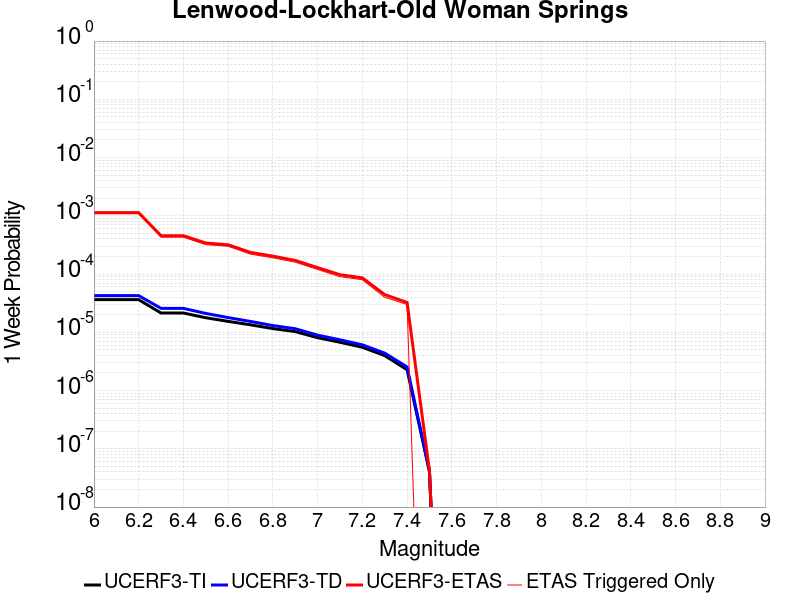 |  |  |  |

| Magnitude | 1 wk TI Prob | 1 wk TD Prob | 1 wk ETAS Prob | 1 wk ETAS/TD Gain | 1 wk ETAS Triggered Only | 1 mo TI Prob | 1 mo TD Prob | 1 mo ETAS Prob | 1 mo ETAS/TD Gain | 1 mo ETAS Triggered Only | 1 yr TI Prob | 1 yr TD Prob | 1 yr ETAS Prob | 1 yr ETAS/TD Gain | 1 yr ETAS Triggered Only | 10 yr TI Prob | 10 yr TD Prob | 10 yr ETAS Prob | 10 yr ETAS/TD Gain | 10 yr ETAS Triggered Only |
|-----|-----|-----|-----|-----|-----|-----|-----|-----|-----|-----|-----|-----|-----|-----|-----|-----|-----|-----|-----|-----|
| 6.0 | 3.6352707E-5 | 4.264702E-5 | 0.0011326006 | 26.557554 | 0.00109 | 1.5578802E-4 | 1.82761E-4 | 0.0016724886 | 9.151234 | 0.00149 | 0.0018950689 | 0.002222997 | 0.0045577954 | 2.050293 | 0.00234 | 0.018789895 | 0.022023601 | 0.025309604 | 1.1492037 | 0.00336 |
| 6.1 | 3.6352707E-5 | 4.264702E-5 | 0.0011326006 | 26.557554 | 0.00109 | 1.5578802E-4 | 1.82761E-4 | 0.0016724886 | 9.151234 | 0.00149 | 0.0018950689 | 0.002222997 | 0.0045577954 | 2.050293 | 0.00234 | 0.018789895 | 0.022023601 | 0.025309604 | 1.1492037 | 0.00336 |
| 6.2 | 3.6352707E-5 | 4.264702E-5 | 0.0011326006 | 26.557554 | 0.00109 | 1.5578802E-4 | 1.82761E-4 | 0.0016724886 | 9.151234 | 0.00149 | 0.0018950689 | 0.002222997 | 0.0045577954 | 2.050293 | 0.00234 | 0.018789895 | 0.022023601 | 0.025309604 | 1.1492037 | 0.00336 |
| 6.3 | 2.1449865E-5 | 2.5768051E-5 | 4.5575696E-4 | 17.686901 | 4.3E-4 | 9.1924754E-5 | 1.1042995E-4 | 7.603582E-4 | 6.8854346 | 6.5E-4 | 0.0011186092 | 0.0013436759 | 0.0022923995 | 1.7060657 | 9.5E-4 | 0.011129951 | 0.0133577995 | 0.014778565 | 1.1063622 | 0.00144 |
| 6.4 | 2.1449865E-5 | 2.5768051E-5 | 4.5575696E-4 | 17.686901 | 4.3E-4 | 9.1924754E-5 | 1.1042995E-4 | 7.603582E-4 | 6.8854346 | 6.5E-4 | 0.0011186092 | 0.0013436759 | 0.0022923995 | 1.7060657 | 9.5E-4 | 0.011129951 | 0.0133577995 | 0.014778565 | 1.1063622 | 0.00144 |
| 6.5 | 1.7787735E-5 | 2.110152E-5 | 3.4109477E-4 | 16.164465 | 3.2E-4 | 7.623093E-5 | 9.043202E-5 | 6.003859E-4 | 6.6390853 | 5.1E-4 | 9.277163E-4 | 0.001100466 | 0.0018895967 | 1.7170877 | 7.9E-4 | 0.009238529 | 0.01095152 | 0.012128487 | 1.1074708 | 0.00119 |
| 6.6 | 1.5416557E-5 | 1.7886372E-5 | 3.17881E-4 | 17.772247 | 3.0E-4 | 6.606929E-5 | 7.665367E-5 | 5.1661994E-4 | 6.7396636 | 4.4E-4 | 8.040967E-4 | 9.3286665E-4 | 0.001592251 | 1.7068366 | 6.6E-4 | 0.008011933 | 0.009290367 | 0.010300891 | 1.1087711 | 0.00102 |
| 6.7 | 1.3449048E-5 | 1.5365473E-5 | 2.353621E-4 | 15.317595 | 2.2E-4 | 5.7637506E-5 | 6.58504E-5 | 4.1582735E-4 | 6.314728 | 3.5E-4 | 7.0151064E-4 | 8.0143934E-4 | 0.0013609906 | 1.6981828 | 5.6E-4 | 0.0069930027 | 0.0079861 | 0.0088094715 | 1.1031005 | 8.3E-4 |
| 6.8 | 1.1583297E-5 | 1.3063565E-5 | 2.0306108E-4 | 15.544078 | 1.9E-4 | 4.964176E-5 | 5.598553E-5 | 3.4596928E-4 | 6.17962 | 2.9E-4 | 6.042208E-4 | 6.814146E-4 | 0.001131108 | 1.6599408 | 4.5E-4 | 0.0060258056 | 0.0067936764 | 0.0074491925 | 1.0964892 | 6.6E-4 |
| 6.9 | 1.02897475E-5 | 1.1522169E-5 | 1.7152033E-4 | 14.886114 | 1.6E-4 | 4.409817E-5 | 4.937981E-5 | 2.9936747E-4 | 6.062548 | 2.5E-4 | 5.36763E-4 | 6.0103665E-4 | 9.908022E-4 | 1.6484889 | 3.9E-4 | 0.0053546834 | 0.0059944596 | 0.0065411627 | 1.0912014 | 5.5E-4 |
| 7.0 | 8.090317E-6 | 8.9470295E-6 | 1.2894596E-4 | 14.412152 | 1.2E-4 | 3.4672325E-5 | 3.834386E-5 | 2.1833697E-4 | 5.694183 | 1.8E-4 | 4.220538E-4 | 4.6673857E-4 | 7.466079E-4 | 1.5996276 | 2.8E-4 | 0.0042125313 | 0.0046577975 | 0.0050658877 | 1.0876144 | 4.1E-4 |
| 7.1 | 6.748474E-6 | 7.435662E-6 | 9.743499E-5 | 13.103742 | 9.0E-5 | 2.892171E-5 | 3.1866744E-5 | 1.618626E-4 | 5.079358 | 1.3E-4 | 3.5206493E-4 | 3.8791035E-4 | 5.8783276E-4 | 1.515383 | 2.0E-4 | 0.0035150768 | 0.0038725152 | 0.0041713533 | 1.0771691 | 3.0E-4 |
| 7.2 | 5.541492E-6 | 6.0961083E-6 | 8.609562E-5 | 14.123047 | 8.0E-5 | 2.3749035E-5 | 2.6125925E-5 | 1.461228E-4 | 5.5930185 | 1.2E-4 | 2.8910613E-4 | 3.1803834E-4 | 4.979811E-4 | 1.5657895 | 1.8E-4 | 0.0028873032 | 0.0031759944 | 0.0034351686 | 1.0816041 | 2.6E-4 |
| 7.3 | 3.984858E-6 | 4.3930268E-6 | 4.439285E-5 | 10.1053 | 4.0E-5 | 1.7077851E-5 | 1.882713E-5 | 8.8825815E-5 | 4.717969 | 7.0E-5 | 2.07903E-4 | 2.2919764E-4 | 3.3917243E-4 | 1.4798251 | 1.1E-4 | 0.002077086 | 0.0022897564 | 0.002439413 | 1.0653591 | 1.5E-4 |
| 7.4 | 2.279998E-6 | 2.542043E-6 | 3.2541968E-5 | 12.801501 | 3.0E-5 | 9.771384E-6 | 1.0894431E-5 | 6.0893886E-5 | 5.5894504 | 5.0E-5 | 1.189601E-4 | 1.3263291E-4 | 2.0262362E-4 | 1.5277025 | 7.0E-5 | 0.0011889644 | 0.0013256627 | 0.0014155434 | 1.0678005 | 9.0E-5 |
| 7.5 | 4.0593385E-8 | 4.2357865E-8 | 4.2357865E-8 | 1.0 | 0.0 | 1.7397163E-7 | 1.8153371E-7 | 1.8153371E-7 | 1.0 | 0.0 | 2.1181027E-6 | 2.210171E-6 | 2.210171E-6 | 1.0 | 0.0 | 2.1180824E-5 | 2.2101538E-5 | 2.2101538E-5 | 1.0 | 0.0 |

## Towne Pass
*[(top)](#table-of-contents)*

| 1 Week | 1 Month | 1 Year | 10 Year |
|-----|-----|-----|-----|
|  |  |  |  |

| Magnitude | 1 wk TI Prob | 1 wk TD Prob | 1 wk ETAS Prob | 1 wk ETAS/TD Gain | 1 wk ETAS Triggered Only | 1 mo TI Prob | 1 mo TD Prob | 1 mo ETAS Prob | 1 mo ETAS/TD Gain | 1 mo ETAS Triggered Only | 1 yr TI Prob | 1 yr TD Prob | 1 yr ETAS Prob | 1 yr ETAS/TD Gain | 1 yr ETAS Triggered Only | 10 yr TI Prob | 10 yr TD Prob | 10 yr ETAS Prob | 10 yr ETAS/TD Gain | 10 yr ETAS Triggered Only |
|-----|-----|-----|-----|-----|-----|-----|-----|-----|-----|-----|-----|-----|-----|-----|-----|-----|-----|-----|-----|-----|
| 6.0 | 3.862778E-6 | 3.905668E-6 | 6.83903E-4 | 175.10526 | 6.8E-4 | 1.6554659E-5 | 1.6738495E-5 | 0.0011567194 | 69.10534 | 0.00114 | 2.0153433E-4 | 2.0377642E-4 | 0.0022633567 | 11.107059 | 0.00206 | 0.0020135166 | 0.002036318 | 0.0053495574 | 2.6270738 | 0.00332 |
| 6.1 | 3.862778E-6 | 3.905668E-6 | 6.83903E-4 | 175.10526 | 6.8E-4 | 1.6554659E-5 | 1.6738495E-5 | 0.0011567194 | 69.10534 | 0.00114 | 2.0153433E-4 | 2.0377642E-4 | 0.0022633567 | 11.107059 | 0.00206 | 0.0020135166 | 0.002036318 | 0.0053495574 | 2.6270738 | 0.00332 |
| 6.2 | 3.862778E-6 | 3.905668E-6 | 6.83903E-4 | 175.10526 | 6.8E-4 | 1.6554659E-5 | 1.6738495E-5 | 0.0011567194 | 69.10534 | 0.00114 | 2.0153433E-4 | 2.0377642E-4 | 0.0022633567 | 11.107059 | 0.00206 | 0.0020135166 | 0.002036318 | 0.0053495574 | 2.6270738 | 0.00332 |
| 6.3 | 3.862778E-6 | 3.905668E-6 | 6.83903E-4 | 175.10526 | 6.8E-4 | 1.6554659E-5 | 1.6738495E-5 | 0.0011567194 | 69.10534 | 0.00114 | 2.0153433E-4 | 2.0377642E-4 | 0.0022633567 | 11.107059 | 0.00206 | 0.0020135166 | 0.002036318 | 0.0053495574 | 2.6270738 | 0.00332 |
| 6.4 | 3.862778E-6 | 3.905668E-6 | 6.83903E-4 | 175.10526 | 6.8E-4 | 1.6554659E-5 | 1.6738495E-5 | 0.0011567194 | 69.10534 | 0.00114 | 2.0153433E-4 | 2.0377642E-4 | 0.0022633567 | 11.107059 | 0.00206 | 0.0020135166 | 0.002036318 | 0.0053495574 | 2.6270738 | 0.00332 |
| 6.5 | 1.2310948E-6 | 1.2374173E-6 | 1.4123725E-4 | 114.138725 | 1.4E-4 | 5.2761097E-6 | 5.303207E-6 | 2.0530215E-4 | 38.712826 | 2.0E-4 | 6.4234744E-5 | 6.4564774E-5 | 4.3454088E-4 | 6.7303095 | 3.7E-4 | 6.4216176E-4 | 6.454734E-4 | 0.0011351572 | 1.7586427 | 4.9E-4 |
| 6.6 | 1.2310948E-6 | 1.2374173E-6 | 1.4123725E-4 | 114.138725 | 1.4E-4 | 5.2761097E-6 | 5.303207E-6 | 2.0530215E-4 | 38.712826 | 2.0E-4 | 6.4234744E-5 | 6.4564774E-5 | 4.3454088E-4 | 6.7303095 | 3.7E-4 | 6.4216176E-4 | 6.454734E-4 | 0.0011351572 | 1.7586427 | 4.9E-4 |
| 6.7 | 8.2608625E-7 | 8.2765416E-7 | 9.0827576E-5 | 109.74098 | 9.0E-5 | 3.5403648E-6 | 3.5470848E-6 | 1.5354656E-4 | 43.288097 | 1.5E-4 | 4.310309E-5 | 4.3184955E-5 | 3.0317373E-4 | 7.020355 | 2.6E-4 | 4.3094732E-4 | 4.317709E-4 | 7.9161546E-4 | 1.8334155 | 3.6E-4 |
| 6.8 | 6.134157E-7 | 6.1251154E-7 | 7.061247E-5 | 115.28349 | 7.0E-5 | 2.6289217E-6 | 2.625047E-6 | 1.2262473E-4 | 46.71335 | 1.2E-4 | 3.200665E-5 | 3.195951E-5 | 2.2195344E-4 | 6.9448323 | 1.9E-4 | 3.2002042E-4 | 3.195523E-4 | 5.6947244E-4 | 1.7820946 | 2.5E-4 |
| 6.9 | 4.983149E-7 | 4.960168E-7 | 4.0495997E-5 | 81.64239 | 4.0E-5 | 2.1356334E-6 | 2.1257847E-6 | 8.212562E-5 | 38.633083 | 8.0E-5 | 2.6001027E-5 | 2.5881147E-5 | 1.5587779E-4 | 6.022831 | 1.3E-4 | 2.5997986E-4 | 2.587839E-4 | 4.3873733E-4 | 1.695381 | 1.8E-4 |
| 7.0 | 3.3563703E-7 | 3.3103365E-7 | 3.3103365E-7 | 1.0 | 0.0 | 1.4384436E-6 | 1.418715E-6 | 2.1418686E-5 | 15.097244 | 2.0E-5 | 1.7512912E-5 | 1.7272723E-5 | 6.727186E-5 | 3.8946874 | 5.0E-5 | 1.751153E-4 | 1.7271447E-4 | 2.327041E-4 | 1.3473341 | 6.0E-5 |
| 7.1 | 2.8550565E-7 | 2.7970515E-7 | 2.7970515E-7 | 1.0 | 0.0 | 1.2235951E-6 | 1.1987358E-6 | 2.1198712E-5 | 17.684223 | 2.0E-5 | 1.4897168E-5 | 1.4594516E-5 | 6.459378E-5 | 4.4258943 | 5.0E-5 | 1.4896168E-4 | 1.4593614E-4 | 2.0592738E-4 | 1.4110787 | 6.0E-5 |
| 7.2 | 2.1828546E-7 | 2.1099898E-7 | 2.1099898E-7 | 1.0 | 0.0 | 9.355088E-7 | 9.04281E-7 | 2.0904263E-5 | 23.116999 | 2.0E-5 | 1.138976E-5 | 1.1009571E-5 | 6.100902E-5 | 5.5414534 | 5.0E-5 | 1.13891765E-4 | 1.1009067E-4 | 1.7008407E-4 | 1.5449454 | 6.0E-5 |
| 7.3 | 1.2241175E-7 | 1.16892E-7 | 1.16892E-7 | 1.0 | 0.0 | 5.2462167E-7 | 5.009656E-7 | 1.050096E-5 | 20.96144 | 1.0E-5 | 6.38725E-6 | 6.0992415E-6 | 4.6098998E-5 | 7.558152 | 4.0E-5 | 6.387066E-5 | 6.0990962E-5 | 1.1098791E-4 | 1.8197436 | 5.0E-5 |

## Bicycle Lake
*[(top)](#table-of-contents)*

| 1 Week | 1 Month | 1 Year | 10 Year |
|-----|-----|-----|-----|
| 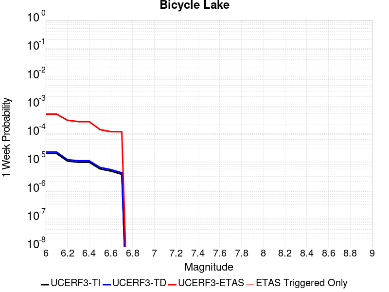 | 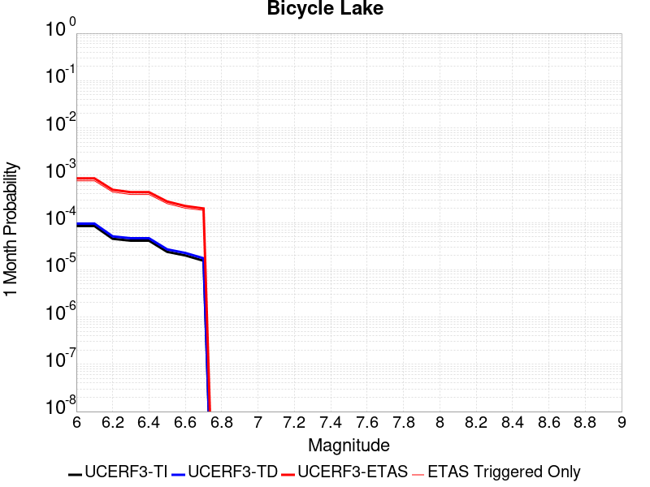 |  |  |

| Magnitude | 1 wk TI Prob | 1 wk TD Prob | 1 wk ETAS Prob | 1 wk ETAS/TD Gain | 1 wk ETAS Triggered Only | 1 mo TI Prob | 1 mo TD Prob | 1 mo ETAS Prob | 1 mo ETAS/TD Gain | 1 mo ETAS Triggered Only | 1 yr TI Prob | 1 yr TD Prob | 1 yr ETAS Prob | 1 yr ETAS/TD Gain | 1 yr ETAS Triggered Only | 10 yr TI Prob | 10 yr TD Prob | 10 yr ETAS Prob | 10 yr ETAS/TD Gain | 10 yr ETAS Triggered Only |
|-----|-----|-----|-----|-----|-----|-----|-----|-----|-----|-----|-----|-----|-----|-----|-----|-----|-----|-----|-----|-----|
| 6.0 | 1.9566081E-5 | 2.2013346E-5 | 4.8200323E-4 | 21.895954 | 4.6E-4 | 8.385194E-5 | 9.434019E-5 | 8.542685E-4 | 9.055191 | 7.6E-4 | 0.0010204192 | 0.0011481101 | 0.0024665946 | 2.1483955 | 0.00132 | 0.010157462 | 0.011433977 | 0.013678022 | 1.196261 | 0.00227 |
| 6.1 | 1.9566081E-5 | 2.2013346E-5 | 4.8200323E-4 | 21.895954 | 4.6E-4 | 8.385194E-5 | 9.434019E-5 | 8.542685E-4 | 9.055191 | 7.6E-4 | 0.0010204192 | 0.0011481101 | 0.0024665946 | 2.1483955 | 0.00132 | 0.010157462 | 0.011433977 | 0.013678022 | 1.196261 | 0.00227 |
| 6.2 | 1.0538504E-5 | 1.1846149E-5 | 2.9184282E-4 | 24.636093 | 2.8E-4 | 4.5164237E-5 | 5.0768496E-5 | 4.9074617E-4 | 9.666352 | 4.4E-4 | 5.4973585E-4 | 6.1797997E-4 | 0.0014274794 | 2.309912 | 8.1E-4 | 0.0054837787 | 0.006167412 | 0.007509086 | 1.2175425 | 0.00135 |
| 6.3 | 9.607672E-6 | 1.0801025E-5 | 2.6079832E-4 | 24.145702 | 2.5E-4 | 4.1175088E-5 | 4.6289555E-5 | 4.362715E-4 | 9.424836 | 3.9E-4 | 5.0119136E-4 | 5.6347763E-4 | 0.0013230494 | 2.348007 | 7.6E-4 | 0.005000625 | 0.0056252005 | 0.0068383375 | 1.2156612 | 0.00122 |
| 6.4 | 9.607672E-6 | 1.0801025E-5 | 2.6079832E-4 | 24.145702 | 2.5E-4 | 4.1175088E-5 | 4.6289555E-5 | 4.362715E-4 | 9.424836 | 3.9E-4 | 5.0119136E-4 | 5.6347763E-4 | 0.0013230494 | 2.348007 | 7.6E-4 | 0.005000625 | 0.0056252005 | 0.0068383375 | 1.2156612 | 0.00122 |
| 6.5 | 5.57507E-6 | 6.2878917E-6 | 1.3628707E-4 | 21.674526 | 1.3E-4 | 2.3892939E-5 | 2.6947957E-5 | 2.7694122E-4 | 10.276891 | 2.5E-4 | 2.908577E-4 | 3.2806493E-4 | 8.0790743E-4 | 2.462645 | 4.8E-4 | 0.002904773 | 0.0032780543 | 0.003995694 | 1.2189225 | 7.2E-4 |
| 6.6 | 4.6786554E-6 | 5.2781566E-6 | 1.1527757E-4 | 21.840498 | 1.1E-4 | 2.0051228E-5 | 2.2620598E-5 | 2.2261607E-4 | 9.841299 | 2.0E-4 | 2.4409634E-4 | 2.753927E-4 | 6.5528805E-4 | 2.3794677 | 3.8E-4 | 0.002438284 | 0.0027526445 | 0.0033410203 | 1.2137493 | 5.9E-4 |
| 6.7 | 3.6104775E-6 | 4.074424E-6 | 1.1407398E-4 | 27.997572 | 1.1E-4 | 1.5473384E-5 | 1.7461816E-5 | 1.9745868E-4 | 11.308025 | 1.8E-4 | 1.8837216E-4 | 2.1259762E-4 | 5.425275E-4 | 2.551898 | 3.3E-4 | 0.0018821256 | 0.0021259761 | 0.0026049558 | 1.2252986 | 4.8E-4 |

## Paradise
*[(top)](#table-of-contents)*

| 1 Week | 1 Month | 1 Year | 10 Year |
|-----|-----|-----|-----|
|  |  |  |  |

| Magnitude | 1 wk TI Prob | 1 wk TD Prob | 1 wk ETAS Prob | 1 wk ETAS/TD Gain | 1 wk ETAS Triggered Only | 1 mo TI Prob | 1 mo TD Prob | 1 mo ETAS Prob | 1 mo ETAS/TD Gain | 1 mo ETAS Triggered Only | 1 yr TI Prob | 1 yr TD Prob | 1 yr ETAS Prob | 1 yr ETAS/TD Gain | 1 yr ETAS Triggered Only | 10 yr TI Prob | 10 yr TD Prob | 10 yr ETAS Prob | 10 yr ETAS/TD Gain | 10 yr ETAS Triggered Only |
|-----|-----|-----|-----|-----|-----|-----|-----|-----|-----|-----|-----|-----|-----|-----|-----|-----|-----|-----|-----|-----|
| 6.0 | 1.4167362E-5 | 1.594289E-5 | 4.359362E-4 | 27.343615 | 4.2E-4 | 6.0715854E-5 | 6.832498E-5 | 7.282799E-4 | 10.659058 | 6.6E-4 | 7.3896477E-4 | 8.315575E-4 | 0.0021005014 | 2.5259845 | 0.00127 | 0.007365123 | 0.00828632 | 0.010339167 | 1.2477393 | 0.00207 |
| 6.1 | 1.4167362E-5 | 1.594289E-5 | 4.359362E-4 | 27.343615 | 4.2E-4 | 6.0715854E-5 | 6.832498E-5 | 7.282799E-4 | 10.659058 | 6.6E-4 | 7.3896477E-4 | 8.315575E-4 | 0.0021005014 | 2.5259845 | 0.00127 | 0.007365123 | 0.00828632 | 0.010339167 | 1.2477393 | 0.00207 |
| 6.2 | 1.4167362E-5 | 1.594289E-5 | 4.359362E-4 | 27.343615 | 4.2E-4 | 6.0715854E-5 | 6.832498E-5 | 7.282799E-4 | 10.659058 | 6.6E-4 | 7.3896477E-4 | 8.315575E-4 | 0.0021005014 | 2.5259845 | 0.00127 | 0.007365123 | 0.00828632 | 0.010339167 | 1.2477393 | 0.00207 |
| 6.3 | 1.0338487E-5 | 1.1802322E-5 | 2.2179984E-4 | 18.792898 | 2.1E-4 | 4.430705E-5 | 5.058043E-5 | 4.2056173E-4 | 8.314713 | 3.7E-4 | 5.393048E-4 | 6.156483E-4 | 0.0012652482 | 2.0551476 | 6.5E-4 | 0.0053799786 | 0.0061399974 | 0.007104042 | 1.1570106 | 9.7E-4 |
| 6.4 | 1.0338487E-5 | 1.1802322E-5 | 2.2179984E-4 | 18.792898 | 2.1E-4 | 4.430705E-5 | 5.058043E-5 | 4.2056173E-4 | 8.314713 | 3.7E-4 | 5.393048E-4 | 6.156483E-4 | 0.0012652482 | 2.0551476 | 6.5E-4 | 0.0053799786 | 0.0061399974 | 0.007104042 | 1.1570106 | 9.7E-4 |
| 6.5 | 9.217692E-6 | 1.0598018E-5 | 1.6059642E-4 | 15.15344 | 1.5E-4 | 3.9503797E-5 | 4.541931E-5 | 3.2540658E-4 | 7.164499 | 2.8E-4 | 4.8085258E-4 | 5.528445E-4 | 0.0010425736 | 1.8858352 | 4.9E-4 | 0.0047981343 | 0.0055151675 | 0.0062311967 | 1.129829 | 7.2E-4 |
| 6.6 | 7.826606E-6 | 9.091252E-6 | 5.90908E-5 | 6.499743 | 5.0E-5 | 3.3542165E-5 | 3.8961945E-5 | 1.4895765E-4 | 3.8231578 | 1.1E-4 | 4.0829935E-4 | 4.7426214E-4 | 7.0415303E-4 | 1.4847338 | 2.3E-4 | 0.0040754997 | 0.0047328756 | 0.0051210294 | 1.0820123 | 3.9E-4 |
| 6.7 | 7.029711E-6 | 8.234141E-6 | 4.823381E-5 | 5.857783 | 4.0E-5 | 3.0126985E-5 | 3.528872E-5 | 1.152859E-4 | 3.2669334 | 8.0E-5 | 3.667343E-4 | 4.2955883E-4 | 5.694987E-4 | 1.3257757 | 1.4E-4 | 0.0036612968 | 0.0042876243 | 0.004526595 | 1.0557351 | 2.4E-4 |
| 6.8 | 6.509183E-6 | 7.661324E-6 | 4.766102E-5 | 6.2209897 | 4.0E-5 | 2.78962E-5 | 3.283385E-5 | 1.1283122E-4 | 3.4364297 | 8.0E-5 | 3.395833E-4 | 3.9968206E-4 | 5.396261E-4 | 1.3501384 | 1.4E-4 | 0.0033906484 | 0.003989959 | 0.004209081 | 1.0549184 | 2.2E-4 |
| 6.9 | 5.8838923E-6 | 6.9767852E-6 | 1.6976715E-5 | 2.4333148 | 1.0E-5 | 2.5216437E-5 | 2.9900184E-5 | 5.9899285E-5 | 2.0033083 | 3.0E-5 | 3.0696686E-4 | 3.6397701E-4 | 4.439479E-4 | 1.219714 | 8.0E-5 | 0.0030654317 | 0.0036341178 | 0.0037536817 | 1.0329005 | 1.2E-4 |
| 7.0 | 4.0287687E-6 | 4.9809782E-6 | 1.4980928E-5 | 3.0076277 | 1.0E-5 | 1.7266037E-5 | 2.1346883E-5 | 3.134667E-5 | 1.4684424 | 1.0E-5 | 2.1019373E-4 | 2.5986877E-4 | 2.9985837E-4 | 1.1538838 | 4.0E-5 | 0.00209995 | 0.002595793 | 0.0026456632 | 1.0192119 | 5.0E-5 |
| 7.1 | 3.6822953E-6 | 4.5582733E-6 | 1.4558228E-5 | 3.193803 | 1.0E-5 | 1.578117E-5 | 1.9535319E-5 | 2.9535124E-5 | 1.5118834 | 1.0E-5 | 1.921188E-4 | 2.3781798E-4 | 2.7780846E-4 | 1.1681559 | 4.0E-5 | 0.0019195279 | 0.0023757766 | 0.002425658 | 1.0209957 | 5.0E-5 |
| 7.2 | 3.2577097E-6 | 4.004522E-6 | 1.4004482E-5 | 3.497167 | 1.0E-5 | 1.3961539E-5 | 1.7162132E-5 | 2.716196E-5 | 1.5826682 | 1.0E-5 | 1.6996848E-4 | 2.0893032E-4 | 2.3892405E-4 | 1.1435585 | 3.0E-5 | 0.0016983853 | 0.0020874776 | 0.002127394 | 1.0191219 | 4.0E-5 |
| 7.3 | 2.8181282E-6 | 3.435666E-6 | 3.435666E-6 | 1.0 | 0.0 | 1.2077636E-5 | 1.4724208E-5 | 1.4724208E-5 | 1.0 | 0.0 | 1.470353E-4 | 1.7925387E-4 | 1.9925028E-4 | 1.1115535 | 2.0E-5 | 0.0014693805 | 0.0017912281 | 0.0018211744 | 1.0167183 | 3.0E-5 |
| 7.4 | 2.2725626E-6 | 2.7456192E-6 | 2.7456192E-6 | 1.0 | 0.0 | 9.739518E-6 | 1.1766893E-5 | 1.1766893E-5 | 1.0 | 0.0 | 1.1857218E-4 | 1.4325386E-4 | 1.63251E-4 | 1.1395923 | 2.0E-5 | 0.0011850893 | 0.0014317475 | 0.0014617045 | 1.0209234 | 3.0E-5 |
| 7.5 | 1.1167768E-6 | 1.3359448E-6 | 1.3359448E-6 | 1.0 | 0.0 | 4.786178E-6 | 5.7254715E-6 | 5.7254715E-6 | 1.0 | 0.0 | 5.8270158E-5 | 6.9706526E-5 | 8.970513E-5 | 1.2868972 | 2.0E-5 | 5.825488E-4 | 6.969584E-4 | 7.1694446E-4 | 1.0286762 | 2.0E-5 |
| 7.6 | 1.5600239E-7 | 1.8435549E-7 | 1.8435549E-7 | 1.0 | 0.0 | 6.6858144E-7 | 7.900948E-7 | 7.900948E-7 | 1.0 | 0.0 | 8.1399485E-6 | 9.619376E-6 | 9.619376E-6 | 1.0 | 0.0 | 8.139651E-5 | 9.6191005E-5 | 9.6191005E-5 | 1.0 | 0.0 |

## San Andreas (San Bernardino N)
*[(top)](#table-of-contents)*

| 1 Week | 1 Month | 1 Year | 10 Year |
|-----|-----|-----|-----|
|  |  |  | 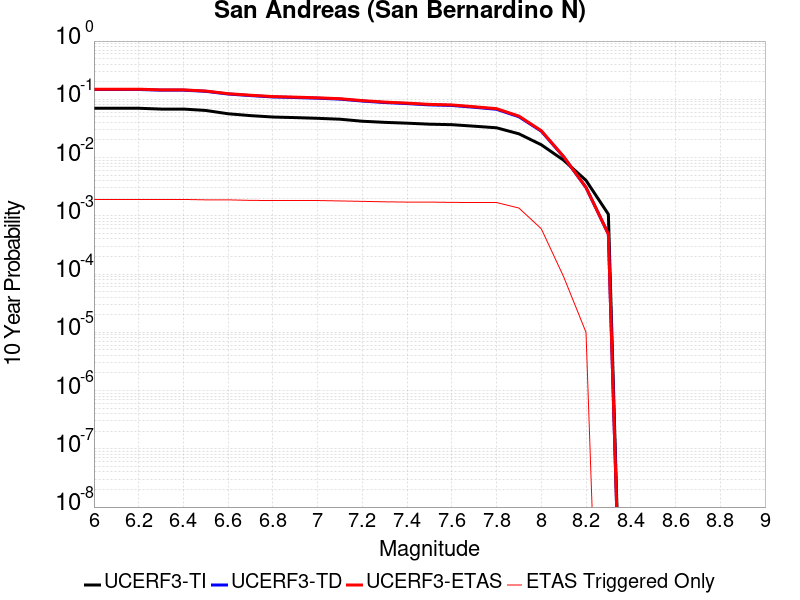 |

| Magnitude | 1 wk TI Prob | 1 wk TD Prob | 1 wk ETAS Prob | 1 wk ETAS/TD Gain | 1 wk ETAS Triggered Only | 1 mo TI Prob | 1 mo TD Prob | 1 mo ETAS Prob | 1 mo ETAS/TD Gain | 1 mo ETAS Triggered Only | 1 yr TI Prob | 1 yr TD Prob | 1 yr ETAS Prob | 1 yr ETAS/TD Gain | 1 yr ETAS Triggered Only | 10 yr TI Prob | 10 yr TD Prob | 10 yr ETAS Prob | 10 yr ETAS/TD Gain | 10 yr ETAS Triggered Only |
|-----|-----|-----|-----|-----|-----|-----|-----|-----|-----|-----|-----|-----|-----|-----|-----|-----|-----|-----|-----|-----|
| 6.0 | 1.3950518E-4 | 3.0961816E-4 | 0.0011893457 | 3.8413305 | 8.8E-4 | 5.977423E-4 | 0.001326265 | 0.0023848591 | 1.7981769 | 0.00106 | 0.007253256 | 0.016029004 | 0.017475441 | 1.0902388 | 0.00147 | 0.07021034 | 0.14752682 | 0.14915504 | 1.0110368 | 0.00191 |
| 6.1 | 1.3950518E-4 | 3.0961816E-4 | 0.0011893457 | 3.8413305 | 8.8E-4 | 5.977423E-4 | 0.001326265 | 0.0023848591 | 1.7981769 | 0.00106 | 0.007253256 | 0.016029004 | 0.017475441 | 1.0902388 | 0.00147 | 0.07021034 | 0.14752682 | 0.14915504 | 1.0110368 | 0.00191 |
| 6.2 | 1.3950518E-4 | 3.0961816E-4 | 0.0011893457 | 3.8413305 | 8.8E-4 | 5.977423E-4 | 0.001326265 | 0.0023848591 | 1.7981769 | 0.00106 | 0.007253256 | 0.016029004 | 0.017475441 | 1.0902388 | 0.00147 | 0.07021034 | 0.14752682 | 0.14915504 | 1.0110368 | 0.00191 |
| 6.3 | 1.3493584E-4 | 3.004277E-4 | 0.0011801634 | 3.9282775 | 8.8E-4 | 5.7816826E-4 | 0.0012869166 | 0.0023455524 | 1.8226143 | 0.00106 | 0.007016503 | 0.015556847 | 0.017003978 | 1.0930221 | 0.00147 | 0.067990564 | 0.1435693 | 0.1452051 | 1.0113937 | 0.00191 |
| 6.4 | 1.3493584E-4 | 3.004277E-4 | 0.0011801634 | 3.9282775 | 8.8E-4 | 5.7816826E-4 | 0.0012869166 | 0.0023455524 | 1.8226143 | 0.00106 | 0.007016503 | 0.015556847 | 0.017003978 | 1.0930221 | 0.00147 | 0.067990564 | 0.1435693 | 0.1452051 | 1.0113937 | 0.00191 |
| 6.5 | 1.2749722E-4 | 2.8552677E-4 | 0.0011552784 | 4.0461297 | 8.7E-4 | 5.463022E-4 | 0.0012231164 | 0.0022518567 | 1.8410811 | 0.00103 | 0.006630964 | 0.014790824 | 0.016209526 | 1.0959177 | 0.00144 | 0.06436559 | 0.13710465 | 0.13872689 | 1.0118321 | 0.00188 |
| 6.6 | 1.1138843E-4 | 2.5413063E-4 | 0.0011239095 | 4.4225664 | 8.7E-4 | 4.772916E-4 | 0.0010886787 | 0.0021175572 | 1.945071 | 0.00103 | 0.0057955533 | 0.013174689 | 0.014595718 | 1.1078604 | 0.00144 | 0.05646718 | 0.12323378 | 0.1248821 | 1.0133755 | 0.00188 |
| 6.7 | 1.0328056E-4 | 2.3746438E-4 | 0.0010972602 | 4.6207356 | 8.6E-4 | 4.4255587E-4 | 0.0010173089 | 0.0020362712 | 2.0016253 | 0.00102 | 0.005374814 | 0.012315806 | 0.013728194 | 1.114681 | 0.00143 | 0.05246661 | 0.11590212 | 0.11752886 | 1.0140355 | 0.00184 |
| 6.8 | 9.760662E-5 | 2.2384703E-4 | 0.0010836545 | 4.841049 | 8.6E-4 | 4.1824701E-4 | 9.589924E-4 | 0.0019780144 | 2.0625963 | 0.00102 | 0.005080274 | 0.011613503 | 0.013026896 | 1.1217026 | 0.00143 | 0.049656924 | 0.10981335 | 0.11144239 | 1.0148346 | 0.00183 |
| 6.9 | 9.533188E-5 | 2.182905E-4 | 0.001068105 | 4.893044 | 8.5E-4 | 4.0850122E-4 | 9.3519595E-4 | 0.0019442514 | 2.0789776 | 0.00101 | 0.004962166 | 0.011326824 | 0.01273074 | 1.1239461 | 0.00142 | 0.048528157 | 0.10735504 | 0.10898859 | 1.0152162 | 0.00183 |
| 7.0 | 9.260973E-5 | 2.1185986E-4 | 0.0010616798 | 5.0112357 | 8.5E-4 | 3.9683847E-4 | 9.076556E-4 | 0.0019167388 | 2.111747 | 0.00101 | 0.0048208097 | 0.010994949 | 0.012399336 | 1.1277303 | 0.00142 | 0.04717562 | 0.10446462 | 0.10610345 | 1.015688 | 0.00183 |
| 7.1 | 8.930165E-5 | 2.0362125E-4 | 0.0010534482 | 5.173567 | 8.5E-4 | 3.826652E-4 | 8.7237125E-4 | 0.0018714989 | 2.1453009 | 0.001 | 0.0046490002 | 0.010569603 | 0.0119647 | 1.1319914 | 0.00141 | 0.04552937 | 0.10078699 | 0.10240558 | 1.0160594 | 0.0018 |
| 7.2 | 8.2281964E-5 | 1.8731722E-4 | 0.001037158 | 5.5369067 | 8.5E-4 | 3.5258933E-4 | 8.0254127E-4 | 0.0017917467 | 2.2325914 | 9.9E-4 | 0.004284328 | 0.00972728 | 0.011103759 | 1.1415071 | 0.00139 | 0.04202665 | 0.09336447 | 0.09496922 | 1.017188 | 0.00177 |
| 7.3 | 7.866495E-5 | 1.7544544E-4 | 0.0010152981 | 5.786973 | 8.4E-4 | 3.3709194E-4 | 7.5169245E-4 | 0.0017309558 | 2.3027446 | 9.8E-4 | 0.004096373 | 0.009113535 | 0.01047105 | 1.1489558 | 0.00137 | 0.040216807 | 0.08803339 | 0.08962022 | 1.0180253 | 0.00174 |
| 7.4 | 7.613132E-5 | 1.6753805E-4 | 0.0010073973 | 6.012946 | 8.4E-4 | 3.2623627E-4 | 7.1782275E-4 | 0.0016971192 | 2.3642595 | 9.8E-4 | 0.003964694 | 0.008704542 | 0.010052703 | 1.1548803 | 0.00136 | 0.038947023 | 0.08443738 | 0.08601214 | 1.0186502 | 0.00172 |
| 7.5 | 7.3063995E-5 | 1.5852411E-4 | 9.98391E-4 | 6.2980385 | 8.4E-4 | 3.130938E-4 | 6.792122E-4 | 0.0016585466 | 2.441868 | 9.8E-4 | 0.0038052555 | 0.008238112 | 0.009586908 | 1.1637263 | 0.00136 | 0.037407525 | 0.08028219 | 0.0818641 | 1.0197045 | 0.00172 |
| 7.6 | 7.161479E-5 | 1.5471411E-4 | 9.945842E-4 | 6.428529 | 8.4E-4 | 3.0688444E-4 | 6.6289207E-4 | 0.0016422424 | 2.4773903 | 9.8E-4 | 0.0037299178 | 0.008040898 | 0.009380043 | 1.1665417 | 0.00135 | 0.036679313 | 0.07849723 | 0.08006379 | 1.0199568 | 0.0017 |
| 7.7 | 6.739116E-5 | 1.4317152E-4 | 9.830513E-4 | 6.866248 | 8.4E-4 | 2.887873E-4 | 6.13448E-4 | 0.0015928468 | 2.5965474 | 9.8E-4 | 0.0035103175 | 0.0074431906 | 0.008783142 | 1.1800238 | 0.00135 | 0.03455383 | 0.07303767 | 0.074604236 | 1.0214487 | 0.00169 |
| 7.8 | 6.318867E-5 | 1.314959E-4 | 9.7138545E-4 | 7.3871922 | 8.4E-4 | 2.707805E-4 | 5.634321E-4 | 0.00154288 | 2.73836 | 9.8E-4 | 0.0032917692 | 0.006838239 | 0.008179007 | 1.1960692 | 0.00135 | 0.032434337 | 0.06747445 | 0.06905042 | 1.0233566 | 0.00169 |
| 7.9 | 4.963193E-5 | 9.638961E-5 | 8.0632116E-4 | 8.36523 | 7.1E-4 | 2.1269092E-4 | 4.1303295E-4 | 0.0012226984 | 2.9602926 | 8.1E-4 | 0.002586437 | 0.005017091 | 0.0060817227 | 1.212201 | 0.00107 | 0.0255654 | 0.05022975 | 0.05152144 | 1.0257156 | 0.00136 |
| 8.0 | 3.2058884E-5 | 5.339202E-5 | 3.833744E-4 | 7.180369 | 3.3E-4 | 1.3738798E-4 | 2.2880289E-4 | 5.9871824E-4 | 2.6167424 | 3.7E-4 | 0.0016714152 | 0.0027821185 | 0.0032508108 | 1.168466 | 4.7E-4 | 0.016588997 | 0.02836735 | 0.02895033 | 1.0205511 | 6.0E-4 |
| 8.1 | 1.7341661E-5 | 1.8483737E-5 | 2.8483553E-5 | 1.5410061 | 1.0E-5 | 7.431929E-5 | 7.921361E-5 | 8.921282E-5 | 1.126231 | 1.0E-5 | 9.044617E-4 | 9.639996E-4 | 0.0010039611 | 1.0414538 | 4.0E-5 | 0.0090078935 | 0.010302942 | 0.010392015 | 1.0086454 | 9.0E-5 |
| 8.2 | 7.791044E-6 | 5.187585E-6 | 5.187585E-6 | 1.0 | 0.0 | 3.338976E-5 | 2.2232318E-5 | 2.2232318E-5 | 1.0 | 0.0 | 4.0644448E-4 | 2.706449E-4 | 2.706449E-4 | 1.0 | 0.0 | 0.004057019 | 0.0030592203 | 0.0030691896 | 1.0032588 | 1.0E-5 |
| 8.3 | 2.0399948E-6 | 7.951945E-7 | 7.951945E-7 | 1.0 | 0.0 | 8.742806E-6 | 3.4079721E-6 | 3.4079721E-6 | 1.0 | 0.0 | 1.0643846E-4 | 4.1491287E-5 | 4.1491287E-5 | 1.0 | 0.0 | 0.0010638749 | 4.8670862E-4 | 4.8670862E-4 | 1.0 | 0.0 |

## Garlic Springs
*[(top)](#table-of-contents)*

| 1 Week | 1 Month | 1 Year | 10 Year |
|-----|-----|-----|-----|
|  |  |  |  |

| Magnitude | 1 wk TI Prob | 1 wk TD Prob | 1 wk ETAS Prob | 1 wk ETAS/TD Gain | 1 wk ETAS Triggered Only | 1 mo TI Prob | 1 mo TD Prob | 1 mo ETAS Prob | 1 mo ETAS/TD Gain | 1 mo ETAS Triggered Only | 1 yr TI Prob | 1 yr TD Prob | 1 yr ETAS Prob | 1 yr ETAS/TD Gain | 1 yr ETAS Triggered Only | 10 yr TI Prob | 10 yr TD Prob | 10 yr ETAS Prob | 10 yr ETAS/TD Gain | 10 yr ETAS Triggered Only |
|-----|-----|-----|-----|-----|-----|-----|-----|-----|-----|-----|-----|-----|-----|-----|-----|-----|-----|-----|-----|-----|
| 6.0 | 1.384928E-5 | 1.531553E-5 | 2.9531124E-4 | 19.281815 | 2.8E-4 | 5.9352704E-5 | 6.563687E-5 | 4.9560866E-4 | 7.5507655 | 4.3E-4 | 7.223796E-4 | 7.9893094E-4 | 0.0016682359 | 2.0880852 | 8.7E-4 | 0.0072003584 | 0.007969917 | 0.009457963 | 1.1867077 | 0.0015 |
| 6.1 | 1.10442625E-5 | 1.2194862E-5 | 2.1219242E-4 | 17.400148 | 2.0E-4 | 4.7331694E-5 | 5.2263134E-5 | 3.722464E-4 | 7.122543 | 3.2E-4 | 5.76111E-4 | 6.362041E-4 | 0.0013057778 | 2.0524511 | 6.7E-4 | 0.0057461974 | 0.006352282 | 0.007494977 | 1.1798873 | 0.00115 |
| 6.2 | 1.10442625E-5 | 1.2194862E-5 | 2.1219242E-4 | 17.400148 | 2.0E-4 | 4.7331694E-5 | 5.2263134E-5 | 3.722464E-4 | 7.122543 | 3.2E-4 | 5.76111E-4 | 6.362041E-4 | 0.0013057778 | 2.0524511 | 6.7E-4 | 0.0057461974 | 0.006352282 | 0.007494977 | 1.1798873 | 0.00115 |
| 6.3 | 4.7583235E-6 | 5.2367127E-6 | 6.5236396E-5 | 12.457509 | 6.0E-5 | 2.0392656E-5 | 2.2443008E-5 | 1.1244099E-4 | 5.010068 | 9.0E-5 | 2.482523E-4 | 2.732351E-4 | 5.031723E-4 | 1.8415359 | 2.3E-4 | 0.0024797514 | 0.0027315174 | 0.0031503702 | 1.1533407 | 4.2E-4 |
| 6.4 | 4.7583235E-6 | 5.2367127E-6 | 6.5236396E-5 | 12.457509 | 6.0E-5 | 2.0392656E-5 | 2.2443008E-5 | 1.1244099E-4 | 5.010068 | 9.0E-5 | 2.482523E-4 | 2.732351E-4 | 5.031723E-4 | 1.8415359 | 2.3E-4 | 0.0024797514 | 0.0027315174 | 0.0031503702 | 1.1533407 | 4.2E-4 |
| 6.5 | 4.7583235E-6 | 5.2367127E-6 | 6.5236396E-5 | 12.457509 | 6.0E-5 | 2.0392656E-5 | 2.2443008E-5 | 1.1244099E-4 | 5.010068 | 9.0E-5 | 2.482523E-4 | 2.732351E-4 | 5.031723E-4 | 1.8415359 | 2.3E-4 | 0.0024797514 | 0.0027315174 | 0.0031503702 | 1.1533407 | 4.2E-4 |
| 6.6 | 4.741348E-6 | 5.218E-6 | 6.521769E-5 | 12.498599 | 6.0E-5 | 2.0319907E-5 | 2.236281E-5 | 1.12360794E-4 | 5.024449 | 9.0E-5 | 2.4736678E-4 | 2.7225894E-4 | 5.021963E-4 | 1.844554 | 2.3E-4 | 0.002470916 | 0.0027217797 | 0.0031406365 | 1.1538908 | 4.2E-4 |
| 6.7 | 4.081021E-6 | 4.4893595E-6 | 3.4489225E-5 | 7.682438 | 3.0E-5 | 1.7489972E-5 | 1.9240113E-5 | 6.923915E-5 | 3.5986874 | 5.0E-5 | 2.1291962E-4 | 2.3424836E-4 | 4.0420855E-4 | 1.7255554 | 1.7E-4 | 0.0021271573 | 0.0023424837 | 0.0026816872 | 1.1448051 | 3.4E-4 |

## Death Valley (Black Mtns Frontal)
*[(top)](#table-of-contents)*

| 1 Week | 1 Month | 1 Year | 10 Year |
|-----|-----|-----|-----|
|  |  |  |  |

| Magnitude | 1 wk TI Prob | 1 wk TD Prob | 1 wk ETAS Prob | 1 wk ETAS/TD Gain | 1 wk ETAS Triggered Only | 1 mo TI Prob | 1 mo TD Prob | 1 mo ETAS Prob | 1 mo ETAS/TD Gain | 1 mo ETAS Triggered Only | 1 yr TI Prob | 1 yr TD Prob | 1 yr ETAS Prob | 1 yr ETAS/TD Gain | 1 yr ETAS Triggered Only | 10 yr TI Prob | 10 yr TD Prob | 10 yr ETAS Prob | 10 yr ETAS/TD Gain | 10 yr ETAS Triggered Only |
|-----|-----|-----|-----|-----|-----|-----|-----|-----|-----|-----|-----|-----|-----|-----|-----|-----|-----|-----|-----|-----|
| 6.0 | 1.6869457E-5 | 1.8848257E-5 | 3.188426E-4 | 16.91629 | 3.0E-4 | 7.229567E-5 | 8.077579E-5 | 5.107411E-4 | 6.322947 | 4.3E-4 | 8.798443E-4 | 9.83009E-4 | 0.0017722325 | 1.8028649 | 7.9E-4 | 0.008763689 | 0.009787453 | 0.010955904 | 1.1193825 | 0.00118 |
| 6.1 | 1.6869457E-5 | 1.8848257E-5 | 3.188426E-4 | 16.91629 | 3.0E-4 | 7.229567E-5 | 8.077579E-5 | 5.107411E-4 | 6.322947 | 4.3E-4 | 8.798443E-4 | 9.83009E-4 | 0.0017722325 | 1.8028649 | 7.9E-4 | 0.008763689 | 0.009787453 | 0.010955904 | 1.1193825 | 0.00118 |
| 6.2 | 1.6869457E-5 | 1.8848257E-5 | 3.188426E-4 | 16.91629 | 3.0E-4 | 7.229567E-5 | 8.077579E-5 | 5.107411E-4 | 6.322947 | 4.3E-4 | 8.798443E-4 | 9.83009E-4 | 0.0017722325 | 1.8028649 | 7.9E-4 | 0.008763689 | 0.009787453 | 0.010955904 | 1.1193825 | 0.00118 |
| 6.3 | 1.6869457E-5 | 1.8848257E-5 | 3.188426E-4 | 16.91629 | 3.0E-4 | 7.229567E-5 | 8.077579E-5 | 5.107411E-4 | 6.322947 | 4.3E-4 | 8.798443E-4 | 9.83009E-4 | 0.0017722325 | 1.8028649 | 7.9E-4 | 0.008763689 | 0.009787453 | 0.010955904 | 1.1193825 | 0.00118 |
| 6.4 | 1.5727011E-5 | 1.7569457E-5 | 2.9756455E-4 | 16.936468 | 2.8E-4 | 6.7399735E-5 | 7.529553E-5 | 4.752654E-4 | 6.3120003 | 4.0E-4 | 8.202828E-4 | 9.163436E-4 | 0.001625693 | 1.7741085 | 7.1E-4 | 0.008172615 | 0.009126336 | 0.010176662 | 1.1150874 | 0.00106 |
| 6.5 | 1.5727011E-5 | 1.7569457E-5 | 2.9756455E-4 | 16.936468 | 2.8E-4 | 6.7399735E-5 | 7.529553E-5 | 4.752654E-4 | 6.3120003 | 4.0E-4 | 8.202828E-4 | 9.163436E-4 | 0.001625693 | 1.7741085 | 7.1E-4 | 0.008172615 | 0.009126336 | 0.010176662 | 1.1150874 | 0.00106 |
| 6.6 | 1.5176593E-5 | 1.6954093E-5 | 2.769497E-4 | 16.33527 | 2.6E-4 | 6.504092E-5 | 7.2658404E-5 | 4.526308E-4 | 6.2295723 | 3.8E-4 | 7.915855E-4 | 8.8426284E-4 | 0.001533688 | 1.7344255 | 6.5E-4 | 0.007887716 | 0.008808089 | 0.009789369 | 1.1114067 | 9.9E-4 |
| 6.7 | 1.47211595E-5 | 1.6446427E-5 | 2.7644215E-4 | 16.808645 | 2.6E-4 | 6.308916E-5 | 7.048281E-5 | 4.4045673E-4 | 6.249137 | 3.7E-4 | 7.678398E-4 | 8.57796E-4 | 0.0014872556 | 1.7338103 | 6.3E-4 | 0.007651921 | 0.008545473 | 0.009487355 | 1.11022 | 9.5E-4 |
| 6.8 | 1.43151165E-5 | 1.5994037E-5 | 2.559902E-4 | 16.005352 | 2.4E-4 | 6.1349056E-5 | 6.8544105E-5 | 4.1852013E-4 | 6.1058517 | 3.5E-4 | 7.466688E-4 | 8.342104E-4 | 0.0014137266 | 1.6946882 | 5.8E-4 | 0.0074416497 | 0.008311395 | 0.009174163 | 1.1038055 | 8.7E-4 |
| 6.9 | 1.3881271E-5 | 1.5510806E-5 | 2.555071E-4 | 16.472843 | 2.4E-4 | 5.9489805E-5 | 6.647322E-5 | 4.0645062E-4 | 6.1145015 | 3.4E-4 | 7.2404766E-4 | 8.0901635E-4 | 0.0013485794 | 1.6669372 | 5.4E-4 | 0.007216931 | 0.008061296 | 0.008854847 | 1.0984396 | 8.0E-4 |
| 7.0 | 1.3623189E-5 | 1.522394E-5 | 2.2522075E-4 | 14.793854 | 2.1E-4 | 5.838379E-5 | 6.5243854E-5 | 3.7522364E-4 | 5.7510953 | 3.1E-4 | 7.105908E-4 | 7.940598E-4 | 0.0013036549 | 1.641759 | 5.1E-4 | 0.007083229 | 0.007912804 | 0.008666791 | 1.0952868 | 7.6E-4 |
| 7.1 | 1.3397499E-5 | 1.4973161E-5 | 2.1497016E-4 | 14.357033 | 2.0E-4 | 5.741659E-5 | 6.4169144E-5 | 3.641499E-4 | 5.6748443 | 3.0E-4 | 6.988227E-4 | 7.809846E-4 | 0.0012805942 | 1.6397175 | 5.0E-4 | 0.0069662924 | 0.0077829757 | 0.008527138 | 1.0956142 | 7.5E-4 |
| 7.2 | 1.3035456E-5 | 1.45710355E-5 | 2.0456826E-4 | 14.039377 | 1.9E-4 | 5.586504E-5 | 6.244583E-5 | 3.3242896E-4 | 5.3234773 | 2.7E-4 | 6.799446E-4 | 7.6001807E-4 | 0.001209676 | 1.5916412 | 4.5E-4 | 0.0067786793 | 0.0075747576 | 0.008259531 | 1.090402 | 6.9E-4 |
| 7.3 | 1.2757113E-5 | 1.4262481E-5 | 1.8426006E-4 | 12.919214 | 1.7E-4 | 5.4672197E-5 | 6.1123515E-5 | 3.0110884E-4 | 4.9262357 | 2.4E-4 | 6.654307E-4 | 7.4393E-4 | 0.0011336398 | 1.5238528 | 3.9E-4 | 0.0066344165 | 0.0074149612 | 0.008010512 | 1.0803175 | 6.0E-4 |
| 7.4 | 1.2590625E-5 | 1.4078118E-5 | 1.8407572E-4 | 13.075308 | 1.7E-4 | 5.3958705E-5 | 6.0333427E-5 | 3.0031893E-4 | 4.9776545 | 2.4E-4 | 6.5674924E-4 | 7.343172E-4 | 0.0011040454 | 1.5034995 | 3.7E-4 | 0.006548117 | 0.00731947 | 0.007895225 | 1.0786607 | 5.8E-4 |
| 7.5 | 1.2308291E-5 | 1.3767555E-5 | 1.7376535E-4 | 12.621366 | 1.6E-4 | 5.2748754E-5 | 5.9002505E-5 | 2.8898893E-4 | 4.8979096 | 2.3E-4 | 6.4202683E-4 | 7.18124E-4 | 0.0010678726 | 1.487031 | 3.5E-4 | 0.006401751 | 0.0071585933 | 0.007704656 | 1.0762807 | 5.5E-4 |
| 7.6 | 1.1200387E-5 | 1.2530568E-5 | 1.4252894E-4 | 11.3745 | 1.3E-4 | 4.8000777E-5 | 5.3701355E-5 | 2.336917E-4 | 4.351691 | 1.8E-4 | 5.8425276E-4 | 6.536231E-4 | 9.3344005E-4 | 1.4281014 | 2.8E-4 | 0.005827191 | 0.006517548 | 0.006934811 | 1.0640215 | 4.2E-4 |
| 7.7 | 9.142378E-6 | 1.0226757E-5 | 1.2022563E-4 | 11.755988 | 1.1E-4 | 3.918103E-5 | 4.3828248E-5 | 2.0382124E-4 | 4.6504536 | 1.6E-4 | 4.7692464E-4 | 5.334832E-4 | 7.5336586E-4 | 1.4121641 | 2.2E-4 | 0.004759024 | 0.0053225285 | 0.0056308787 | 1.057933 | 3.1E-4 |
| 7.8 | 3.1694145E-7 | 3.333711E-7 | 3.333711E-7 | 1.0 | 0.0 | 1.3583199E-6 | 1.4287325E-6 | 1.4287325E-6 | 1.0 | 0.0 | 1.6537419E-5 | 1.7394683E-5 | 1.7394683E-5 | 1.0 | 0.0 | 1.6536188E-4 | 1.7393359E-4 | 1.8393186E-4 | 1.0574832 | 1.0E-5 |
| 7.9 | 1.8610457E-9 | 1.9363102E-9 | 1.9363102E-9 | 1.0 | 0.0 | 7.97591E-9 | 8.298473E-9 | 8.298473E-9 | 1.0 | 0.0 | 9.71067E-8 | 1.01033905E-7 | 1.01033905E-7 | 1.0 | 0.0 | 9.710666E-7 | 1.0103391E-6 | 1.0103391E-6 | 1.0 | 0.0 |

## Helendale-So Lockhart
*[(top)](#table-of-contents)*

| 1 Week | 1 Month | 1 Year | 10 Year |
|-----|-----|-----|-----|
|  |  |  | 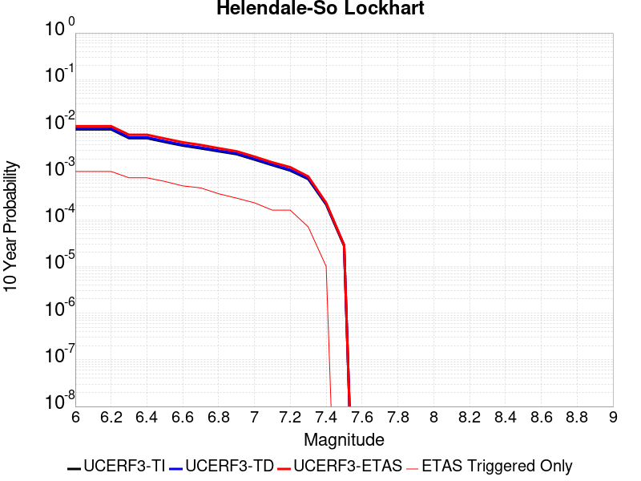 |

| Magnitude | 1 wk TI Prob | 1 wk TD Prob | 1 wk ETAS Prob | 1 wk ETAS/TD Gain | 1 wk ETAS Triggered Only | 1 mo TI Prob | 1 mo TD Prob | 1 mo ETAS Prob | 1 mo ETAS/TD Gain | 1 mo ETAS Triggered Only | 1 yr TI Prob | 1 yr TD Prob | 1 yr ETAS Prob | 1 yr ETAS/TD Gain | 1 yr ETAS Triggered Only | 10 yr TI Prob | 10 yr TD Prob | 10 yr ETAS Prob | 10 yr ETAS/TD Gain | 10 yr ETAS Triggered Only |
|-----|-----|-----|-----|-----|-----|-----|-----|-----|-----|-----|-----|-----|-----|-----|-----|-----|-----|-----|-----|-----|
| 6.0 | 1.6573504E-5 | 1.7329263E-5 | 2.973244E-4 | 17.15736 | 2.8E-4 | 7.102737E-5 | 7.426625E-5 | 4.642373E-4 | 6.2509856 | 3.9E-4 | 8.644151E-4 | 9.0383383E-4 | 0.001633174 | 1.8069406 | 7.3E-4 | 0.008610603 | 0.009003351 | 0.010073628 | 1.1188754 | 0.00108 |
| 6.1 | 1.6573504E-5 | 1.7329263E-5 | 2.973244E-4 | 17.15736 | 2.8E-4 | 7.102737E-5 | 7.426625E-5 | 4.642373E-4 | 6.2509856 | 3.9E-4 | 8.644151E-4 | 9.0383383E-4 | 0.001633174 | 1.8069406 | 7.3E-4 | 0.008610603 | 0.009003351 | 0.010073628 | 1.1188754 | 0.00108 |
| 6.2 | 1.6573504E-5 | 1.7329263E-5 | 2.973244E-4 | 17.15736 | 2.8E-4 | 7.102737E-5 | 7.426625E-5 | 4.642373E-4 | 6.2509856 | 3.9E-4 | 8.644151E-4 | 9.0383383E-4 | 0.001633174 | 1.8069406 | 7.3E-4 | 0.008610603 | 0.009003351 | 0.010073628 | 1.1188754 | 0.00108 |
| 6.3 | 1.0703472E-5 | 1.1165021E-5 | 2.4116246E-4 | 21.599821 | 2.3E-4 | 4.5871217E-5 | 4.784923E-5 | 3.7783344E-4 | 7.8963327 | 3.3E-4 | 5.5833894E-4 | 5.824115E-4 | 0.0011320912 | 1.9437995 | 5.5E-4 | 0.0055693816 | 0.005809152 | 0.006594563 | 1.1352023 | 7.9E-4 |
| 6.4 | 1.0703472E-5 | 1.1165021E-5 | 2.4116246E-4 | 21.599821 | 2.3E-4 | 4.5871217E-5 | 4.784923E-5 | 3.7783344E-4 | 7.8963327 | 3.3E-4 | 5.5833894E-4 | 5.824115E-4 | 0.0011320912 | 1.9437995 | 5.5E-4 | 0.0055693816 | 0.005809152 | 0.006594563 | 1.1352023 | 7.9E-4 |
| 6.5 | 8.853983E-6 | 9.232243E-6 | 1.9923049E-4 | 21.579855 | 1.9E-4 | 3.794509E-5 | 3.9566166E-5 | 3.295547E-4 | 8.329205 | 2.9E-4 | 4.6188352E-4 | 4.816132E-4 | 9.513869E-4 | 1.9754168 | 4.7E-4 | 0.0046092467 | 0.0048058648 | 0.005462693 | 1.1366723 | 6.6E-4 |
| 6.6 | 7.4140758E-6 | 7.729643E-6 | 1.677284E-4 | 21.699375 | 1.6E-4 | 3.1774223E-5 | 3.3126624E-5 | 2.7311867E-4 | 8.244688 | 2.4E-4 | 3.8678249E-4 | 4.03243E-4 | 7.6309784E-4 | 1.8924019 | 3.6E-4 | 0.0038611 | 0.004025219 | 0.0045530857 | 1.1311399 | 5.3E-4 |
| 6.7 | 6.4685305E-6 | 6.743882E-6 | 1.3674301E-4 | 20.276602 | 1.3E-4 | 2.7721979E-5 | 2.8902035E-5 | 2.2889626E-4 | 7.919728 | 2.0E-4 | 3.374628E-4 | 3.5182622E-4 | 6.717136E-4 | 1.90922 | 3.2E-4 | 0.003369508 | 0.0035127727 | 0.0039910865 | 1.1361642 | 4.8E-4 |
| 6.8 | 5.595365E-6 | 5.8284336E-6 | 1.15827796E-4 | 19.872885 | 1.1E-4 | 2.3979916E-5 | 2.4978764E-5 | 1.8497476E-4 | 7.4052806 | 1.6E-4 | 2.9191634E-4 | 3.040746E-4 | 5.4400164E-4 | 1.78904 | 2.4E-4 | 0.0029153319 | 0.003036645 | 0.0033955518 | 1.1181918 | 3.6E-4 |
| 6.9 | 4.8553084E-6 | 5.0539793E-6 | 8.505357E-5 | 16.829031 | 8.0E-5 | 2.0808298E-5 | 2.1659733E-5 | 1.4165713E-4 | 6.5401144 | 1.2E-4 | 2.533116E-4 | 2.6367579E-4 | 4.536257E-4 | 1.7203919 | 1.9E-4 | 0.0025302302 | 0.0026336755 | 0.0029229117 | 1.1098223 | 2.9E-4 |
| 7.0 | 3.7137843E-6 | 3.864019E-6 | 6.386379E-5 | 16.527813 | 6.0E-5 | 1.591612E-5 | 1.655998E-5 | 9.655865E-5 | 5.830844 | 8.0E-5 | 1.9376155E-4 | 2.015994E-4 | 3.4157117E-4 | 1.6943065 | 1.4E-4 | 0.0019359268 | 0.0020141953 | 0.002243732 | 1.1139596 | 2.3E-4 |
| 7.1 | 2.821597E-6 | 2.9333992E-6 | 5.2933254E-5 | 18.045021 | 5.0E-5 | 1.2092502E-5 | 1.25716515E-5 | 8.257077E-5 | 6.568013 | 7.0E-5 | 1.4721627E-4 | 1.5304932E-4 | 2.5303403E-4 | 1.6532842 | 1.0E-4 | 0.0014711878 | 0.0015294603 | 0.0016892157 | 1.104452 | 1.6E-4 |
| 7.2 | 2.1605615E-6 | 2.2457482E-6 | 5.2245636E-5 | 23.264244 | 5.0E-5 | 9.259516E-6 | 9.624601E-6 | 7.9623926E-5 | 8.272959 | 7.0E-5 | 1.1272878E-4 | 1.1717339E-4 | 2.1716168E-4 | 1.8533361 | 1.0E-4 | 0.0011267161 | 0.0011711337 | 0.0013309463 | 1.1364597 | 1.6E-4 |
| 7.3 | 1.4218666E-6 | 1.4784132E-6 | 1.1478399E-5 | 7.763999 | 1.0E-5 | 6.0937E-6 | 6.336042E-6 | 2.6335916E-5 | 4.1565247 | 2.0E-5 | 7.418827E-5 | 7.713872E-5 | 1.17135634E-4 | 1.5185063 | 4.0E-5 | 7.4163504E-4 | 7.711334E-4 | 8.410794E-4 | 1.0907055 | 7.0E-5 |
| 7.4 | 4.0413232E-7 | 4.2095965E-7 | 4.2095965E-7 | 1.0 | 0.0 | 1.7319945E-6 | 1.8041118E-6 | 1.8041118E-6 | 1.0 | 0.0 | 2.108683E-5 | 2.1964881E-5 | 3.196466E-5 | 1.4552622 | 1.0E-5 | 2.1084827E-4 | 2.1963127E-4 | 2.2962908E-4 | 1.0455209 | 1.0E-5 |
| 7.5 | 5.261701E-8 | 5.487665E-8 | 5.487665E-8 | 1.0 | 0.0 | 2.2550145E-7 | 2.3518562E-7 | 2.3518562E-7 | 1.0 | 0.0 | 2.7454769E-6 | 2.863382E-6 | 2.863382E-6 | 1.0 | 0.0 | 2.7454429E-5 | 2.8633516E-5 | 2.8633516E-5 | 1.0 | 0.0 |

## San Andreas (San Bernardino S)
*[(top)](#table-of-contents)*

| 1 Week | 1 Month | 1 Year | 10 Year |
|-----|-----|-----|-----|
| 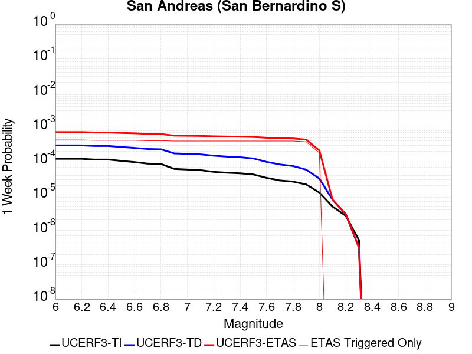 |  |  | 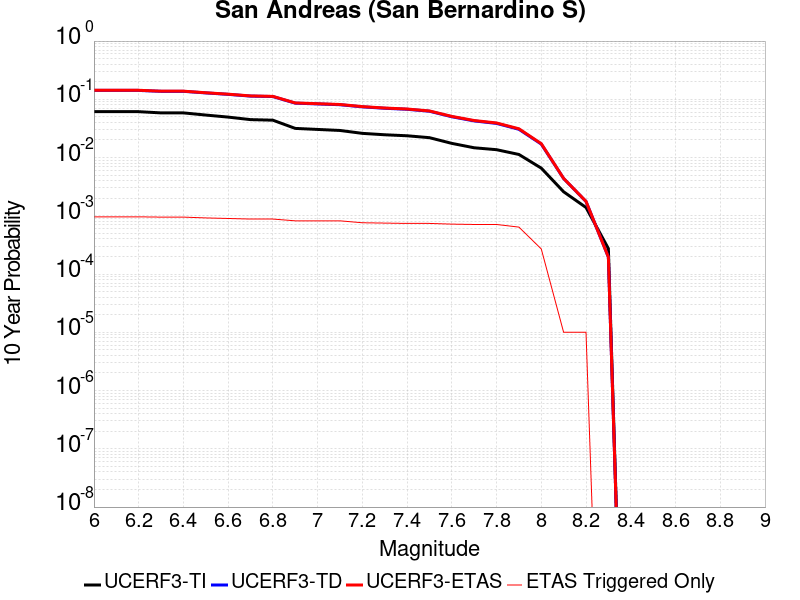 |

| Magnitude | 1 wk TI Prob | 1 wk TD Prob | 1 wk ETAS Prob | 1 wk ETAS/TD Gain | 1 wk ETAS Triggered Only | 1 mo TI Prob | 1 mo TD Prob | 1 mo ETAS Prob | 1 mo ETAS/TD Gain | 1 mo ETAS Triggered Only | 1 yr TI Prob | 1 yr TD Prob | 1 yr ETAS Prob | 1 yr ETAS/TD Gain | 1 yr ETAS Triggered Only | 10 yr TI Prob | 10 yr TD Prob | 10 yr ETAS Prob | 10 yr ETAS/TD Gain | 10 yr ETAS Triggered Only |
|-----|-----|-----|-----|-----|-----|-----|-----|-----|-----|-----|-----|-----|-----|-----|-----|-----|-----|-----|-----|-----|
| 6.0 | 1.2128924E-4 | 2.984743E-4 | 7.28346E-4 | 2.44023 | 4.3E-4 | 5.1970745E-4 | 0.0012785734 | 0.0018078957 | 1.4139946 | 5.3E-4 | 0.0063090967 | 0.015460253 | 0.016198657 | 1.0477614 | 7.5E-4 | 0.06132956 | 0.14207658 | 0.14290018 | 1.0057969 | 9.6E-4 |
| 6.1 | 1.2128924E-4 | 2.984743E-4 | 7.28346E-4 | 2.44023 | 4.3E-4 | 5.1970745E-4 | 0.0012785734 | 0.0018078957 | 1.4139946 | 5.3E-4 | 0.0063090967 | 0.015460253 | 0.016198657 | 1.0477614 | 7.5E-4 | 0.06132956 | 0.14207658 | 0.14290018 | 1.0057969 | 9.6E-4 |
| 6.2 | 1.2128924E-4 | 2.984743E-4 | 7.28346E-4 | 2.44023 | 4.3E-4 | 5.1970745E-4 | 0.0012785734 | 0.0018078957 | 1.4139946 | 5.3E-4 | 0.0063090967 | 0.015460253 | 0.016198657 | 1.0477614 | 7.5E-4 | 0.06132956 | 0.14207658 | 0.14290018 | 1.0057969 | 9.6E-4 |
| 6.3 | 1.15478055E-4 | 2.8722596E-4 | 7.071053E-4 | 2.4618433 | 4.2E-4 | 4.9481203E-4 | 0.0012304122 | 0.0017497723 | 1.4221026 | 5.2E-4 | 0.006007709 | 0.014881999 | 0.015601136 | 1.0483226 | 7.3E-4 | 0.058478672 | 0.13715833 | 0.13797803 | 1.0059763 | 9.5E-4 |
| 6.4 | 1.15478055E-4 | 2.8722596E-4 | 7.071053E-4 | 2.4618433 | 4.2E-4 | 4.9481203E-4 | 0.0012304122 | 0.0017497723 | 1.4221026 | 5.2E-4 | 0.006007709 | 0.014881999 | 0.015601136 | 1.0483226 | 7.3E-4 | 0.058478672 | 0.13715833 | 0.13797803 | 1.0059763 | 9.5E-4 |
| 6.5 | 1.0570468E-4 | 2.6829858E-4 | 6.881859E-4 | 2.565 | 4.2E-4 | 4.529414E-4 | 0.001149368 | 0.0016587818 | 1.4432122 | 5.1E-4 | 0.0055006268 | 0.013908182 | 0.014598447 | 1.04963 | 7.0E-4 | 0.053664487 | 0.12881501 | 0.1296165 | 1.006222 | 9.2E-4 |
| 6.6 | 9.732296E-5 | 2.524269E-4 | 6.723209E-4 | 2.663428 | 4.2E-4 | 4.1703173E-4 | 0.0010814037 | 0.0015908522 | 1.4710993 | 5.1E-4 | 0.005065547 | 0.013090827 | 0.013771794 | 1.0520186 | 6.9E-4 | 0.049516242 | 0.12172854 | 0.12251899 | 1.0064934 | 9.0E-4 |
| 6.7 | 8.784269E-5 | 2.3436824E-4 | 6.4427214E-4 | 2.7489738 | 4.1E-4 | 3.7641433E-4 | 0.0010040704 | 0.0015035684 | 1.497473 | 5.0E-4 | 0.004573218 | 0.012160027 | 0.01282188 | 1.0544286 | 6.7E-4 | 0.044802424 | 0.11359954 | 0.11437958 | 1.0068665 | 8.8E-4 |
| 6.8 | 8.587587E-5 | 2.2994097E-4 | 6.398467E-4 | 2.7826564 | 4.1E-4 | 3.6798752E-4 | 9.851108E-4 | 0.0014846182 | 1.5070572 | 5.0E-4 | 0.0044710473 | 0.011931738 | 0.012593743 | 1.0554827 | 6.7E-4 | 0.043821555 | 0.111599036 | 0.112380825 | 1.0070053 | 8.8E-4 |
| 6.9 | 6.167149E-5 | 1.7448206E-4 | 5.744123E-4 | 3.2920992 | 4.0E-4 | 2.642796E-4 | 7.4756687E-4 | 0.0012272081 | 1.641603 | 4.8E-4 | 0.003212857 | 0.009063861 | 0.00970797 | 1.0710634 | 6.5E-4 | 0.03166802 | 0.08586255 | 0.08661214 | 1.0087302 | 8.2E-4 |
| 7.0 | 5.9163493E-5 | 1.6908583E-4 | 5.690182E-4 | 3.3652625 | 4.0E-4 | 2.535332E-4 | 7.244532E-4 | 0.0012041054 | 1.6620888 | 4.8E-4 | 0.0030823974 | 0.008784753 | 0.009429043 | 1.0733418 | 6.5E-4 | 0.030399917 | 0.08333165 | 0.08408332 | 1.0090202 | 8.2E-4 |
| 7.1 | 5.6776677E-5 | 1.6350379E-4 | 5.634384E-4 | 3.4460266 | 4.0E-4 | 2.4330591E-4 | 7.005431E-4 | 0.0011802069 | 1.6847026 | 4.8E-4 | 0.0029582258 | 0.008495951 | 0.009140428 | 1.075857 | 6.5E-4 | 0.029191548 | 0.08074 | 0.081493795 | 1.0093361 | 8.2E-4 |
| 7.2 | 5.0548475E-5 | 1.49632E-4 | 5.4957217E-4 | 3.6728249 | 4.0E-4 | 2.1661833E-4 | 6.4112287E-4 | 0.0011008279 | 1.7170312 | 4.6E-4 | 0.0026341383 | 0.0077778487 | 0.008383105 | 1.0778178 | 6.1E-4 | 0.026031327 | 0.0742325 | 0.07493608 | 1.0094781 | 7.6E-4 |
| 7.3 | 4.7773814E-5 | 1.4084415E-4 | 5.407878E-4 | 3.8396187 | 4.0E-4 | 2.0472884E-4 | 6.0347846E-4 | 0.0010632009 | 1.7617875 | 4.6E-4 | 0.0024897244 | 0.007322693 | 0.007928226 | 1.0826927 | 6.1E-4 | 0.024620146 | 0.07017534 | 0.07087271 | 1.0099375 | 7.5E-4 |
| 7.4 | 4.5903675E-5 | 1.349608E-4 | 5.349068E-4 | 3.9634235 | 4.0E-4 | 1.9671519E-4 | 5.782756E-4 | 0.0010380095 | 1.7950084 | 4.6E-4 | 0.0023923768 | 0.007017865 | 0.0076136542 | 1.0848961 | 6.0E-4 | 0.023667848 | 0.06744382 | 0.068133906 | 1.0102321 | 7.4E-4 |
| 7.5 | 4.2532432E-5 | 1.243164E-4 | 5.242667E-4 | 4.2171965 | 4.0E-4 | 1.8226913E-4 | 5.3267606E-4 | 9.924311E-4 | 1.8631042 | 4.6E-4 | 0.0022168679 | 0.006466122 | 0.007062242 | 1.0921913 | 6.0E-4 | 0.02194883 | 0.062444918 | 0.06313871 | 1.0111104 | 7.4E-4 |
| 7.6 | 3.3875946E-5 | 9.884467E-5 | 4.9880514E-4 | 5.0463533 | 4.0E-4 | 1.4517455E-4 | 4.2355136E-4 | 8.833565E-4 | 2.085595 | 4.6E-4 | 0.0017660671 | 0.005144574 | 0.005731539 | 1.1140939 | 5.9E-4 | 0.017520975 | 0.05019973 | 0.050883584 | 1.0136228 | 7.2E-4 |
| 7.7 | 2.8423432E-5 | 8.316857E-5 | 4.831353E-4 | 5.809109 | 4.0E-4 | 1.21809026E-4 | 3.5638807E-4 | 8.1622414E-4 | 2.290268 | 4.6E-4 | 0.0014820159 | 0.0043304004 | 0.0049178456 | 1.135656 | 5.9E-4 | 0.014721712 | 0.04257181 | 0.043251585 | 1.0159677 | 7.1E-4 |
| 7.8 | 2.6341304E-5 | 7.4933065E-5 | 4.749031E-4 | 6.3376975 | 4.0E-4 | 1.1288642E-4 | 3.211022E-4 | 7.809545E-4 | 2.4321058 | 4.6E-4 | 0.0013735256 | 0.0039024178 | 0.004490115 | 1.1505983 | 5.9E-4 | 0.013650671 | 0.038580593 | 0.0392632 | 1.017693 | 7.1E-4 |
| 7.9 | 2.1784474E-5 | 5.8717764E-5 | 4.3869545E-4 | 7.4712563 | 3.8E-4 | 9.3358685E-5 | 2.516233E-4 | 6.715176E-4 | 2.6687417 | 4.2E-4 | 0.0011360493 | 0.0030592133 | 0.0035975615 | 1.1759759 | 5.4E-4 | 0.011302591 | 0.030576315 | 0.031196747 | 1.0202912 | 6.4E-4 |
| 8.0 | 1.2662067E-5 | 3.238971E-5 | 2.1238388E-4 | 6.5571404 | 1.8E-4 | 5.426487E-5 | 1.3880567E-4 | 3.387779E-4 | 2.4406633 | 2.0E-4 | 6.604745E-4 | 0.0016886501 | 0.0019182618 | 1.1359735 | 2.3E-4 | 0.0065851496 | 0.017044853 | 0.01731025 | 1.0155705 | 2.7E-4 |
| 8.1 | 4.9599803E-6 | 7.786676E-6 | 7.786676E-6 | 1.0 | 0.0 | 2.1256885E-5 | 3.3371045E-5 | 3.3371045E-5 | 1.0 | 0.0 | 2.5877185E-4 | 4.0621683E-4 | 4.0621683E-4 | 1.0 | 0.0 | 0.0025847072 | 0.004366745 | 0.004376701 | 1.00228 | 1.0E-5 |
| 8.2 | 2.6658215E-6 | 2.9978357E-6 | 2.9978357E-6 | 1.0 | 0.0 | 1.1424899E-5 | 1.2847804E-5 | 1.2847804E-5 | 1.0 | 0.0 | 1.3908927E-4 | 1.5641082E-4 | 1.5641082E-4 | 1.0 | 0.0 | 0.0013900225 | 0.0017606685 | 0.0017706509 | 1.0056697 | 1.0E-5 |
| 8.3 | 5.252919E-7 | 3.1557792E-7 | 3.1557792E-7 | 1.0 | 0.0 | 2.251249E-6 | 1.3524761E-6 | 1.3524761E-6 | 1.0 | 0.0 | 2.7408612E-5 | 1.6466283E-5 | 1.6466283E-5 | 1.0 | 0.0 | 2.7405232E-4 | 1.9592664E-4 | 1.9592664E-4 | 1.0 | 0.0 |

## Coyote Lake
*[(top)](#table-of-contents)*

| 1 Week | 1 Month | 1 Year | 10 Year |
|-----|-----|-----|-----|
|  |  |  |  |

| Magnitude | 1 wk TI Prob | 1 wk TD Prob | 1 wk ETAS Prob | 1 wk ETAS/TD Gain | 1 wk ETAS Triggered Only | 1 mo TI Prob | 1 mo TD Prob | 1 mo ETAS Prob | 1 mo ETAS/TD Gain | 1 mo ETAS Triggered Only | 1 yr TI Prob | 1 yr TD Prob | 1 yr ETAS Prob | 1 yr ETAS/TD Gain | 1 yr ETAS Triggered Only | 10 yr TI Prob | 10 yr TD Prob | 10 yr ETAS Prob | 10 yr ETAS/TD Gain | 10 yr ETAS Triggered Only |
|-----|-----|-----|-----|-----|-----|-----|-----|-----|-----|-----|-----|-----|-----|-----|-----|-----|-----|-----|-----|-----|
| 6.0 | 1.9376961E-5 | 2.1174437E-5 | 1.6117147E-4 | 7.611606 | 1.4E-4 | 8.304147E-5 | 9.07448E-5 | 3.30723E-4 | 3.6445396 | 2.4E-4 | 0.001010561 | 0.0011043238 | 0.0015738048 | 1.4251298 | 4.7E-4 | 0.010059778 | 0.010994924 | 0.011786128 | 1.0719608 | 8.0E-4 |
| 6.1 | 1.9376961E-5 | 2.1174437E-5 | 1.6117147E-4 | 7.611606 | 1.4E-4 | 8.304147E-5 | 9.07448E-5 | 3.30723E-4 | 3.6445396 | 2.4E-4 | 0.001010561 | 0.0011043238 | 0.0015738048 | 1.4251298 | 4.7E-4 | 0.010059778 | 0.010994924 | 0.011786128 | 1.0719608 | 8.0E-4 |
| 6.2 | 1.9376961E-5 | 2.1174437E-5 | 1.6117147E-4 | 7.611606 | 1.4E-4 | 8.304147E-5 | 9.07448E-5 | 3.30723E-4 | 3.6445396 | 2.4E-4 | 0.001010561 | 0.0011043238 | 0.0015738048 | 1.4251298 | 4.7E-4 | 0.010059778 | 0.010994924 | 0.011786128 | 1.0719608 | 8.0E-4 |
| 6.3 | 1.5812224E-5 | 1.728082E-5 | 1.3727875E-4 | 7.9439955 | 1.2E-4 | 6.7764915E-5 | 7.405888E-5 | 2.8404334E-4 | 3.8353715 | 2.1E-4 | 8.247255E-4 | 9.013529E-4 | 0.0013109833 | 1.4544618 | 4.1E-4 | 0.0082167145 | 0.008982804 | 0.009656696 | 1.0750202 | 6.8E-4 |
| 6.4 | 1.5812224E-5 | 1.728082E-5 | 1.3727875E-4 | 7.9439955 | 1.2E-4 | 6.7764915E-5 | 7.405888E-5 | 2.8404334E-4 | 3.8353715 | 2.1E-4 | 8.247255E-4 | 9.013529E-4 | 0.0013109833 | 1.4544618 | 4.1E-4 | 0.0082167145 | 0.008982804 | 0.009656696 | 1.0750202 | 6.8E-4 |
| 6.5 | 1.4830592E-5 | 1.6210082E-5 | 1.262083E-4 | 7.78579 | 1.1E-4 | 6.355813E-5 | 6.947026E-5 | 2.6945636E-4 | 3.8787298 | 2.0E-4 | 7.735455E-4 | 8.455305E-4 | 0.0012451923 | 1.4726758 | 4.0E-4 | 0.0077085835 | 0.0084288865 | 0.009073407 | 1.0764657 | 6.5E-4 |
| 6.6 | 1.3605264E-5 | 1.4875127E-5 | 1.1487364E-4 | 7.722532 | 1.0E-4 | 5.8306974E-5 | 6.374931E-5 | 2.3373846E-4 | 3.6665256 | 1.7E-4 | 7.0965616E-4 | 7.759286E-4 | 0.0011356493 | 1.4636002 | 3.6E-4 | 0.007073942 | 0.0077378224 | 0.008343102 | 1.0782236 | 6.1E-4 |
| 6.7 | 1.2944943E-5 | 1.4146493E-5 | 8.4145504E-5 | 5.9481525 | 7.0E-5 | 5.5477147E-5 | 6.062674E-5 | 1.9061886E-4 | 3.1441383 | 1.3E-4 | 6.7522493E-4 | 7.3793717E-4 | 0.0010377158 | 1.4062387 | 3.0E-4 | 0.0067317695 | 0.007360434 | 0.007886533 | 1.0714766 | 5.3E-4 |
| 6.8 | 5.1829566E-6 | 5.651501E-6 | 2.5651389E-5 | 4.538863 | 2.0E-5 | 2.2212482E-5 | 2.4220624E-5 | 6.4219654E-5 | 2.6514452 | 4.0E-5 | 2.704034E-4 | 2.9486945E-4 | 3.7484587E-4 | 1.2712265 | 8.0E-5 | 0.002700746 | 0.0029470623 | 0.003056738 | 1.0372154 | 1.1E-4 |
| 6.9 | 3.841255E-6 | 4.188223E-6 | 2.4188139E-5 | 5.7752748 | 2.0E-5 | 1.6462416E-5 | 1.7949527E-5 | 4.794899E-5 | 2.671323 | 3.0E-5 | 2.004115E-4 | 2.185355E-4 | 2.885202E-4 | 1.3202441 | 7.0E-5 | 0.0020023084 | 0.002185355 | 0.0022751584 | 1.0410932 | 9.0E-5 |

## Death Valley (No)
*[(top)](#table-of-contents)*

| 1 Week | 1 Month | 1 Year | 10 Year |
|-----|-----|-----|-----|
|  |  |  |  |

| Magnitude | 1 wk TI Prob | 1 wk TD Prob | 1 wk ETAS Prob | 1 wk ETAS/TD Gain | 1 wk ETAS Triggered Only | 1 mo TI Prob | 1 mo TD Prob | 1 mo ETAS Prob | 1 mo ETAS/TD Gain | 1 mo ETAS Triggered Only | 1 yr TI Prob | 1 yr TD Prob | 1 yr ETAS Prob | 1 yr ETAS/TD Gain | 1 yr ETAS Triggered Only | 10 yr TI Prob | 10 yr TD Prob | 10 yr ETAS Prob | 10 yr ETAS/TD Gain | 10 yr ETAS Triggered Only |
|-----|-----|-----|-----|-----|-----|-----|-----|-----|-----|-----|-----|-----|-----|-----|-----|-----|-----|-----|-----|-----|
| 6.0 | 1.9666375E-5 | 2.201149E-5 | 2.5200643E-4 | 11.448857 | 2.3E-4 | 8.428174E-5 | 9.433159E-5 | 4.143014E-4 | 4.3919687 | 3.2E-4 | 0.001025647 | 0.0011478887 | 0.0016073607 | 1.4002757 | 4.6E-4 | 0.010209262 | 0.01142043 | 0.01210255 | 1.059728 | 6.9E-4 |
| 6.1 | 1.9666375E-5 | 2.201149E-5 | 2.5200643E-4 | 11.448857 | 2.3E-4 | 8.428174E-5 | 9.433159E-5 | 4.143014E-4 | 4.3919687 | 3.2E-4 | 0.001025647 | 0.0011478887 | 0.0016073607 | 1.4002757 | 4.6E-4 | 0.010209262 | 0.01142043 | 0.01210255 | 1.059728 | 6.9E-4 |
| 6.2 | 1.9666375E-5 | 2.201149E-5 | 2.5200643E-4 | 11.448857 | 2.3E-4 | 8.428174E-5 | 9.433159E-5 | 4.143014E-4 | 4.3919687 | 3.2E-4 | 0.001025647 | 0.0011478887 | 0.0016073607 | 1.4002757 | 4.6E-4 | 0.010209262 | 0.01142043 | 0.01210255 | 1.059728 | 6.9E-4 |
| 6.3 | 1.8963758E-5 | 2.121635E-5 | 2.3121189E-4 | 10.897817 | 2.1E-4 | 8.1270715E-5 | 9.0924084E-5 | 3.908968E-4 | 4.2991557 | 3.0E-4 | 9.890217E-4 | 0.0011064451 | 0.0015459583 | 1.39723 | 4.4E-4 | 0.009846316 | 0.0110101625 | 0.011662896 | 1.0592846 | 6.6E-4 |
| 6.4 | 1.8963758E-5 | 2.121635E-5 | 2.3121189E-4 | 10.897817 | 2.1E-4 | 8.1270715E-5 | 9.0924084E-5 | 3.908968E-4 | 4.2991557 | 3.0E-4 | 9.890217E-4 | 0.0011064451 | 0.0015459583 | 1.39723 | 4.4E-4 | 0.009846316 | 0.0110101625 | 0.011662896 | 1.0592846 | 6.6E-4 |
| 6.5 | 1.837566E-5 | 2.0550387E-5 | 2.2054628E-4 | 10.7319765 | 2.0E-4 | 7.8750454E-5 | 8.807015E-5 | 3.780446E-4 | 4.2925396 | 2.9E-4 | 9.58365E-4 | 0.0010717331 | 0.0015012722 | 1.4007893 | 4.3E-4 | 0.009542424 | 0.010666417 | 0.011309484 | 1.0602889 | 6.5E-4 |
| 6.6 | 1.7677314E-5 | 1.9759344E-5 | 2.197554E-4 | 11.121593 | 2.0E-4 | 7.5757715E-5 | 8.4680185E-5 | 3.7465562E-4 | 4.42436 | 2.9E-4 | 9.219599E-4 | 0.0010304998 | 0.0014600566 | 1.4168433 | 4.3E-4 | 0.009181442 | 0.010257945 | 0.010901278 | 1.0627155 | 6.5E-4 |
| 6.7 | 1.6930437E-5 | 1.8919221E-5 | 2.1891543E-4 | 11.571059 | 2.0E-4 | 7.2557E-5 | 8.107989E-5 | 3.610572E-4 | 4.453104 | 2.8E-4 | 8.830234E-4 | 9.867066E-4 | 0.0014062922 | 1.4252385 | 4.2E-4 | 0.008795229 | 0.009823953 | 0.010447764 | 1.063499 | 6.3E-4 |
| 6.8 | 1.6509084E-5 | 1.8456518E-5 | 2.1845283E-4 | 11.83608 | 2.0E-4 | 7.0751295E-5 | 7.9097E-5 | 3.5907485E-4 | 4.539677 | 2.8E-4 | 8.6105656E-4 | 9.6258643E-4 | 0.0013821821 | 1.4359045 | 4.2E-4 | 0.008577279 | 0.009584854 | 0.010208816 | 1.0650986 | 6.3E-4 |
| 6.9 | 1.6131218E-5 | 1.8047274E-5 | 2.1804367E-4 | 12.081805 | 2.0E-4 | 6.913196E-5 | 7.7343204E-5 | 3.5732155E-4 | 4.6199474 | 2.8E-4 | 8.413565E-4 | 9.412526E-4 | 0.0013508667 | 1.4351797 | 4.1E-4 | 0.008381782 | 0.009373335 | 0.009987524 | 1.065525 | 6.2E-4 |
| 7.0 | 1.5827703E-5 | 1.7720036E-5 | 2.1771649E-4 | 12.286459 | 2.0E-4 | 6.783125E-5 | 7.5940836E-5 | 3.5591956E-4 | 4.686801 | 2.8E-4 | 8.2553254E-4 | 9.2419336E-4 | 0.0013338145 | 1.4432201 | 4.1E-4 | 0.008224725 | 0.009204168 | 0.009818462 | 1.0667408 | 6.2E-4 |
| 7.1 | 1.5527876E-5 | 1.7390008E-5 | 2.1738654E-4 | 12.500657 | 2.0E-4 | 6.654634E-5 | 7.452651E-5 | 3.5450564E-4 | 4.7567725 | 2.8E-4 | 8.099005E-4 | 9.0698845E-4 | 0.0013166165 | 1.4516355 | 4.1E-4 | 0.008069552 | 0.009033531 | 0.00964793 | 1.0680132 | 6.2E-4 |
| 7.2 | 1.5237602E-5 | 1.7063998E-5 | 2.1706059E-4 | 12.720383 | 2.0E-4 | 6.5302374E-5 | 7.31294E-5 | 3.5310892E-4 | 4.8285494 | 2.8E-4 | 7.9476635E-4 | 8.8999263E-4 | 0.0012996277 | 1.460268 | 4.1E-4 | 0.007919299 | 0.008864941 | 0.0094794445 | 1.0693184 | 6.2E-4 |
| 7.3 | 1.4283242E-5 | 1.5987647E-5 | 2.1598444E-4 | 13.509459 | 2.0E-4 | 6.121246E-5 | 6.851672E-5 | 3.4849753E-4 | 5.0863137 | 2.8E-4 | 7.4500684E-4 | 8.3387736E-4 | 0.0012435354 | 1.491269 | 4.1E-4 | 0.0074251415 | 0.0083081 | 0.008913032 | 1.0728123 | 6.1E-4 |
| 7.4 | 1.3826613E-5 | 1.547491E-5 | 2.1547181E-4 | 13.923946 | 2.0E-4 | 5.9255566E-5 | 6.6319386E-5 | 3.4630083E-4 | 5.221713 | 2.8E-4 | 7.211977E-4 | 8.0714497E-4 | 0.0012068221 | 1.4951739 | 4.0E-4 | 0.0071886163 | 0.008042741 | 0.008637914 | 1.0740014 | 6.0E-4 |
| 7.5 | 1.3189405E-5 | 1.47670235E-5 | 2.0476422E-4 | 13.866317 | 1.9E-4 | 5.6524797E-5 | 6.328574E-5 | 3.3326866E-4 | 5.266094 | 2.7E-4 | 6.879721E-4 | 7.7023706E-4 | 0.0011499444 | 1.4929746 | 3.8E-4 | 0.006858461 | 0.0076762713 | 0.008251819 | 1.0749775 | 5.8E-4 |
| 7.6 | 1.1181E-5 | 1.2510695E-5 | 1.4250907E-4 | 11.390979 | 1.3E-4 | 4.7917692E-5 | 5.3616193E-5 | 2.3360654E-4 | 4.3570147 | 1.8E-4 | 5.8324175E-4 | 6.5258687E-4 | 9.224107E-4 | 1.413468 | 2.7E-4 | 0.0058171335 | 0.0065072468 | 0.006914579 | 1.0625967 | 4.1E-4 |
| 7.7 | 9.142378E-6 | 1.0226757E-5 | 1.2022563E-4 | 11.755988 | 1.1E-4 | 3.918103E-5 | 4.3828248E-5 | 2.0382124E-4 | 4.6504536 | 1.6E-4 | 4.7692464E-4 | 5.334832E-4 | 7.5336586E-4 | 1.4121641 | 2.2E-4 | 0.004759024 | 0.0053225285 | 0.0056308787 | 1.057933 | 3.1E-4 |
| 7.8 | 3.1694145E-7 | 3.333711E-7 | 3.333711E-7 | 1.0 | 0.0 | 1.3583199E-6 | 1.4287325E-6 | 1.4287325E-6 | 1.0 | 0.0 | 1.6537419E-5 | 1.7394683E-5 | 1.7394683E-5 | 1.0 | 0.0 | 1.6536188E-4 | 1.7393359E-4 | 1.8393186E-4 | 1.0574832 | 1.0E-5 |
| 7.9 | 1.8610457E-9 | 1.9363102E-9 | 1.9363102E-9 | 1.0 | 0.0 | 7.97591E-9 | 8.298473E-9 | 8.298473E-9 | 1.0 | 0.0 | 9.71067E-8 | 1.01033905E-7 | 1.01033905E-7 | 1.0 | 0.0 | 9.710666E-7 | 1.0103391E-6 | 1.0103391E-6 | 1.0 | 0.0 |

## San Andreas (Big Bend)
*[(top)](#table-of-contents)*

| 1 Week | 1 Month | 1 Year | 10 Year |
|-----|-----|-----|-----|
|  | 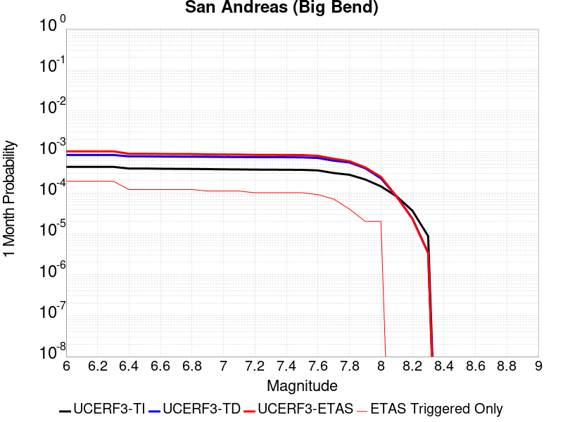 |  |  |

| Magnitude | 1 wk TI Prob | 1 wk TD Prob | 1 wk ETAS Prob | 1 wk ETAS/TD Gain | 1 wk ETAS Triggered Only | 1 mo TI Prob | 1 mo TD Prob | 1 mo ETAS Prob | 1 mo ETAS/TD Gain | 1 mo ETAS Triggered Only | 1 yr TI Prob | 1 yr TD Prob | 1 yr ETAS Prob | 1 yr ETAS/TD Gain | 1 yr ETAS Triggered Only | 10 yr TI Prob | 10 yr TD Prob | 10 yr ETAS Prob | 10 yr ETAS/TD Gain | 10 yr ETAS Triggered Only |
|-----|-----|-----|-----|-----|-----|-----|-----|-----|-----|-----|-----|-----|-----|-----|-----|-----|-----|-----|-----|-----|
| 6.0 | 9.996636E-5 | 1.9473635E-4 | 3.2471103E-4 | 1.6674392 | 1.3E-4 | 4.283569E-4 | 8.3431817E-4 | 0.0010241596 | 1.2275409 | 1.9E-4 | 0.005202781 | 0.010110749 | 0.010486906 | 1.0372038 | 3.8E-4 | 0.050826456 | 0.09880521 | 0.099381976 | 1.0058374 | 6.4E-4 |
| 6.1 | 9.996636E-5 | 1.9473635E-4 | 3.2471103E-4 | 1.6674392 | 1.3E-4 | 4.283569E-4 | 8.3431817E-4 | 0.0010241596 | 1.2275409 | 1.9E-4 | 0.005202781 | 0.010110749 | 0.010486906 | 1.0372038 | 3.8E-4 | 0.050826456 | 0.09880521 | 0.099381976 | 1.0058374 | 6.4E-4 |
| 6.2 | 9.996636E-5 | 1.9473635E-4 | 3.2471103E-4 | 1.6674392 | 1.3E-4 | 4.283569E-4 | 8.3431817E-4 | 0.0010241596 | 1.2275409 | 1.9E-4 | 0.005202781 | 0.010110749 | 0.010486906 | 1.0372038 | 3.8E-4 | 0.050826456 | 0.09880521 | 0.099381976 | 1.0058374 | 6.4E-4 |
| 6.3 | 9.996636E-5 | 1.9473635E-4 | 3.2471103E-4 | 1.6674392 | 1.3E-4 | 4.283569E-4 | 8.3431817E-4 | 0.0010241596 | 1.2275409 | 1.9E-4 | 0.005202781 | 0.010110749 | 0.010486906 | 1.0372038 | 3.8E-4 | 0.050826456 | 0.09880521 | 0.099381976 | 1.0058374 | 6.4E-4 |
| 6.4 | 9.1149064E-5 | 1.8062457E-4 | 2.4061374E-4 | 1.3321208 | 6.0E-5 | 3.9058036E-4 | 7.738758E-4 | 8.9378294E-4 | 1.1549436 | 1.2E-4 | 0.004744952 | 0.009381341 | 0.009609183 | 1.0242867 | 2.3E-4 | 0.046449076 | 0.09219132 | 0.09255444 | 1.0039388 | 4.0E-4 |
| 6.5 | 9.1149064E-5 | 1.8062457E-4 | 2.4061374E-4 | 1.3321208 | 6.0E-5 | 3.9058036E-4 | 7.738758E-4 | 8.9378294E-4 | 1.1549436 | 1.2E-4 | 0.004744952 | 0.009381341 | 0.009609183 | 1.0242867 | 2.3E-4 | 0.046449076 | 0.09219132 | 0.09255444 | 1.0039388 | 4.0E-4 |
| 6.6 | 8.998722E-5 | 1.787952E-4 | 2.3878447E-4 | 1.3355194 | 6.0E-5 | 3.856025E-4 | 7.660403E-4 | 8.8594836E-4 | 1.1565297 | 1.2E-4 | 0.0046846084 | 0.0092867585 | 0.009514622 | 1.0245365 | 2.3E-4 | 0.045870773 | 0.09132991 | 0.09169338 | 1.0039797 | 4.0E-4 |
| 6.7 | 8.9371715E-5 | 1.7790927E-4 | 2.378986E-4 | 1.3371905 | 6.0E-5 | 3.829654E-4 | 7.622457E-4 | 8.8215416E-4 | 1.1573095 | 1.2E-4 | 0.00465264 | 0.00924095 | 0.0094688255 | 1.0246592 | 2.3E-4 | 0.045564268 | 0.090909585 | 0.091264136 | 1.0038999 | 3.9E-4 |
| 6.8 | 8.9002955E-5 | 1.7737912E-4 | 2.3736848E-4 | 1.3381985 | 6.0E-5 | 3.8138544E-4 | 7.5997494E-4 | 8.798837E-4 | 1.1577799 | 1.2E-4 | 0.004633486 | 0.009213539 | 0.009431511 | 1.0236579 | 2.2E-4 | 0.045380585 | 0.09065715 | 0.0910027 | 1.0038116 | 3.8E-4 |
| 6.9 | 8.812639E-5 | 1.7623144E-4 | 2.2622262E-4 | 1.2836678 | 5.0E-5 | 3.7762985E-4 | 7.550591E-4 | 8.649761E-4 | 1.145574 | 1.1E-4 | 0.004587955 | 0.009154192 | 0.00936227 | 1.0227304 | 2.1E-4 | 0.044943828 | 0.09011165 | 0.09044831 | 1.003736 | 3.7E-4 |
| 7.0 | 8.706045E-5 | 1.7476521E-4 | 2.2475647E-4 | 1.2860482 | 5.0E-5 | 3.7306285E-4 | 7.487789E-4 | 8.586965E-4 | 1.1467959 | 1.1E-4 | 0.0045325845 | 0.00907837 | 0.009276555 | 1.0218304 | 2.0E-4 | 0.044412434 | 0.089414164 | 0.08974198 | 1.0036662 | 3.6E-4 |
| 7.1 | 8.644944E-5 | 1.7385236E-4 | 2.2384367E-4 | 1.2875503 | 5.0E-5 | 3.70445E-4 | 7.4486894E-4 | 8.54787E-4 | 1.147567 | 1.1E-4 | 0.004500844 | 0.009031163 | 0.009229356 | 1.0219456 | 2.0E-4 | 0.044107705 | 0.088979706 | 0.08930767 | 1.0036858 | 3.6E-4 |
| 7.2 | 8.5702006E-5 | 1.7278628E-4 | 2.2277764E-4 | 1.2893248 | 5.0E-5 | 3.672426E-4 | 7.4030267E-4 | 8.4022863E-4 | 1.1349798 | 1.0E-4 | 0.0044620153 | 0.008976027 | 0.009164322 | 1.0209775 | 1.9E-4 | 0.0437348 | 0.08847245 | 0.08878236 | 1.003503 | 3.4E-4 |
| 7.3 | 8.529E-5 | 1.7215637E-4 | 2.2214776E-4 | 1.2903836 | 5.0E-5 | 3.6547735E-4 | 7.3760457E-4 | 8.375308E-4 | 1.135474 | 1.0E-4 | 0.004440611 | 0.008943449 | 0.009131749 | 1.0210546 | 1.9E-4 | 0.043529183 | 0.08816905 | 0.08847907 | 1.0035162 | 3.4E-4 |
| 7.4 | 8.503429E-5 | 1.7177657E-4 | 2.2176799E-4 | 1.2910258 | 5.0E-5 | 3.643818E-4 | 7.359777E-4 | 8.3590415E-4 | 1.1357737 | 1.0E-4 | 0.004427327 | 0.008923804 | 0.0091121085 | 1.0211014 | 1.9E-4 | 0.043401547 | 0.087986104 | 0.08829619 | 1.0035243 | 3.4E-4 |
| 7.5 | 8.437471E-5 | 1.7044101E-4 | 2.204325E-4 | 1.2933066 | 5.0E-5 | 3.6155578E-4 | 7.3025713E-4 | 8.3018414E-4 | 1.1368381 | 1.0E-4 | 0.0043930598 | 0.0088547245 | 0.009043042 | 1.0212674 | 1.9E-4 | 0.04307224 | 0.087347955 | 0.08765826 | 1.0035524 | 3.4E-4 |
| 7.6 | 8.200506E-5 | 1.6502368E-4 | 2.1501543E-4 | 1.3029368 | 5.0E-5 | 3.514029E-4 | 7.0705276E-4 | 7.9698913E-4 | 1.1271989 | 9.0E-5 | 0.0042699403 | 0.008574469 | 0.008752925 | 1.0208125 | 1.8E-4 | 0.04188822 | 0.08477549 | 0.08507752 | 1.0035627 | 3.3E-4 |
| 7.7 | 7.067656E-5 | 1.4131743E-4 | 1.8131179E-4 | 1.2830107 | 4.0E-5 | 3.0286436E-4 | 6.055056E-4 | 6.7546323E-4 | 1.1155359 | 7.0E-5 | 0.00368114 | 0.0073471507 | 0.0074960487 | 1.020266 | 1.5E-4 | 0.036207564 | 0.07329905 | 0.073530726 | 1.0031607 | 2.5E-4 |
| 7.8 | 6.4144915E-5 | 1.280608E-4 | 1.4805824E-4 | 1.1561558 | 2.0E-5 | 2.7487782E-4 | 5.4871663E-4 | 5.8869465E-4 | 1.0728574 | 4.0E-5 | 0.0033415023 | 0.0066601895 | 0.0067793904 | 1.0178975 | 1.2E-4 | 0.03291702 | 0.06653656 | 0.06674192 | 1.0030864 | 2.2E-4 |
| 7.9 | 4.9276125E-5 | 9.253257E-5 | 1.02531645E-4 | 1.10806 | 1.0E-5 | 2.1116629E-4 | 3.965079E-4 | 4.1649997E-4 | 1.0504204 | 2.0E-5 | 0.0025679183 | 0.004816807 | 0.004876518 | 1.0123963 | 6.0E-5 | 0.025384467 | 0.04848302 | 0.04860672 | 1.0025513 | 1.3E-4 |
| 8.0 | 3.3424498E-5 | 5.2406504E-5 | 6.240598E-5 | 1.190806 | 1.0E-5 | 1.4323997E-4 | 2.2457997E-4 | 2.445755E-4 | 1.0890352 | 2.0E-5 | 0.0017425516 | 0.0027308345 | 0.0027707254 | 1.0146075 | 4.0E-5 | 0.017289506 | 0.027979473 | 0.028047515 | 1.0024319 | 7.0E-5 |
| 8.1 | 1.9003106E-5 | 1.8820214E-5 | 1.8820214E-5 | 1.0 | 0.0 | 8.1439335E-5 | 8.065557E-5 | 8.065557E-5 | 1.0 | 0.0 | 9.910729E-4 | 9.815397E-4 | 9.815397E-4 | 1.0 | 0.0 | 0.009866646 | 0.01056171 | 0.010571605 | 1.0009369 | 1.0E-5 |
| 8.2 | 8.539297E-6 | 5.4609054E-6 | 5.4609054E-6 | 1.0 | 0.0 | 3.6596473E-5 | 2.340367E-5 | 2.340367E-5 | 1.0 | 0.0 | 4.4547097E-4 | 2.849025E-4 | 2.849025E-4 | 1.0 | 0.0 | 0.0044457903 | 0.0032370395 | 0.0032470073 | 1.0030793 | 1.0E-5 |
| 8.3 | 2.0399948E-6 | 7.951945E-7 | 7.951945E-7 | 1.0 | 0.0 | 8.742806E-6 | 3.4079721E-6 | 3.4079721E-6 | 1.0 | 0.0 | 1.0643846E-4 | 4.1491287E-5 | 4.1491287E-5 | 1.0 | 0.0 | 0.0010638749 | 4.8670862E-4 | 4.8670862E-4 | 1.0 | 0.0 |

## San Andreas (Parkfield)
*[(top)](#table-of-contents)*

| 1 Week | 1 Month | 1 Year | 10 Year |
|-----|-----|-----|-----|
|  |  | 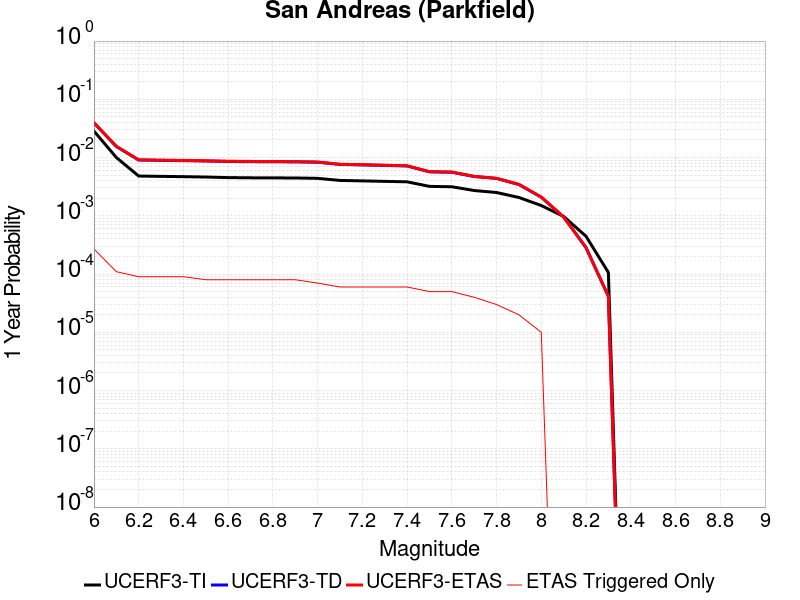 |  |

| Magnitude | 1 wk TI Prob | 1 wk TD Prob | 1 wk ETAS Prob | 1 wk ETAS/TD Gain | 1 wk ETAS Triggered Only | 1 mo TI Prob | 1 mo TD Prob | 1 mo ETAS Prob | 1 mo ETAS/TD Gain | 1 mo ETAS Triggered Only | 1 yr TI Prob | 1 yr TD Prob | 1 yr ETAS Prob | 1 yr ETAS/TD Gain | 1 yr ETAS Triggered Only | 10 yr TI Prob | 10 yr TD Prob | 10 yr ETAS Prob | 10 yr ETAS/TD Gain | 10 yr ETAS Triggered Only |
|-----|-----|-----|-----|-----|-----|-----|-----|-----|-----|-----|-----|-----|-----|-----|-----|-----|-----|-----|-----|-----|
| 6.0 | 5.538215E-4 | 7.6375884E-4 | 8.836672E-4 | 1.1569977 | 1.2E-4 | 0.0023713622 | 0.0032696985 | 0.0034491098 | 1.054871 | 1.8E-4 | 0.02849185 | 0.039503258 | 0.039762594 | 1.0065649 | 2.7E-4 | 0.2510299 | 0.33356768 | 0.3339009 | 1.000999 | 5.0E-4 |
| 6.1 | 1.9321906E-4 | 2.9717956E-4 | 3.4716472E-4 | 1.1681985 | 5.0E-5 | 8.278189E-4 | 0.001273102 | 0.0013430129 | 1.0549138 | 7.0E-5 | 0.010032207 | 0.015495966 | 0.015604261 | 1.0069886 | 1.1E-4 | 0.0959121 | 0.14778312 | 0.14798765 | 1.001384 | 2.4E-4 |
| 6.2 | 9.258204E-5 | 1.7463099E-4 | 2.14624E-4 | 1.2290144 | 4.0E-5 | 3.9671984E-4 | 7.482048E-4 | 8.0815994E-4 | 1.0801319 | 6.0E-5 | 0.0048193717 | 0.009071516 | 0.009160699 | 1.0098312 | 9.0E-5 | 0.04716185 | 0.08843112 | 0.088613436 | 1.0020616 | 2.0E-4 |
| 6.3 | 9.1332906E-5 | 1.7210803E-4 | 2.1210115E-4 | 1.2323722 | 4.0E-5 | 3.9136803E-4 | 7.373983E-4 | 7.9735403E-4 | 1.0813072 | 6.0E-5 | 0.0047544995 | 0.008941034 | 0.0090302285 | 1.0099759 | 9.0E-5 | 0.04654055 | 0.08730271 | 0.08748525 | 1.0020909 | 2.0E-4 |
| 6.4 | 9.0284164E-5 | 1.7035678E-4 | 2.1034997E-4 | 1.2347614 | 4.0E-5 | 3.8687474E-4 | 7.298972E-4 | 7.898534E-4 | 1.0821433 | 6.0E-5 | 0.0047000316 | 0.008850453 | 0.008939657 | 1.010079 | 9.0E-5 | 0.046018608 | 0.086493276 | 0.08667598 | 1.0021123 | 2.0E-4 |
| 6.5 | 8.894716E-5 | 1.6805159E-4 | 2.0804486E-4 | 1.2379822 | 4.0E-5 | 3.8114644E-4 | 7.200232E-4 | 7.7998E-4 | 1.0832707 | 6.0E-5 | 0.004630588 | 0.008731216 | 0.008810518 | 1.0090826 | 8.0E-5 | 0.045352794 | 0.085426174 | 0.085599944 | 1.0020342 | 1.9E-4 |
| 6.6 | 8.699407E-5 | 1.6486876E-4 | 2.0486217E-4 | 1.2425772 | 4.0E-5 | 3.7277845E-4 | 7.0639E-4 | 7.663476E-4 | 1.0848789 | 6.0E-5 | 0.0045291362 | 0.008566562 | 0.008645877 | 1.0092586 | 8.0E-5 | 0.044379335 | 0.083948635 | 0.08411352 | 1.0019642 | 1.8E-4 |
| 6.7 | 8.627864E-5 | 1.6360274E-4 | 2.0359621E-4 | 1.2444546 | 4.0E-5 | 3.697132E-4 | 7.0096715E-4 | 7.609251E-4 | 1.085536 | 6.0E-5 | 0.0044919713 | 0.008501087 | 0.008580408 | 1.0093305 | 8.0E-5 | 0.044022504 | 0.08337253 | 0.08353753 | 1.001979 | 1.8E-4 |
| 6.8 | 8.598252E-5 | 1.6303766E-4 | 2.0303114E-4 | 1.2453021 | 4.0E-5 | 3.6844448E-4 | 6.9854665E-4 | 7.585047E-4 | 1.0858326 | 6.0E-5 | 0.004476588 | 0.008471856 | 0.008551178 | 1.009363 | 8.0E-5 | 0.04387477 | 0.083108984 | 0.08327402 | 1.0019858 | 1.8E-4 |
| 6.9 | 8.567554E-5 | 1.6244817E-4 | 2.0244168E-4 | 1.2461923 | 4.0E-5 | 3.6712922E-4 | 6.960216E-4 | 7.5597985E-4 | 1.0861442 | 6.0E-5 | 0.0044606407 | 0.008441351 | 0.008520676 | 1.0093971 | 8.0E-5 | 0.043721594 | 0.08283364 | 0.08299873 | 1.0019931 | 1.8E-4 |
| 7.0 | 8.446282E-5 | 1.6007053E-4 | 1.9006572E-4 | 1.1873873 | 3.0E-5 | 3.6193331E-4 | 6.858371E-4 | 7.358028E-4 | 1.0728536 | 5.0E-5 | 0.0043976377 | 0.008318309 | 0.008387726 | 1.0083451 | 7.0E-5 | 0.043116238 | 0.08171864 | 0.08187474 | 1.0019103 | 1.7E-4 |
| 7.1 | 7.777257E-5 | 1.4656787E-4 | 1.6656493E-4 | 1.1364355 | 2.0E-5 | 3.3326843E-4 | 6.2799733E-4 | 6.6797226E-4 | 1.0636545 | 4.0E-5 | 0.004049996 | 0.0076192063 | 0.0076787495 | 1.0078149 | 6.0E-5 | 0.039769765 | 0.07537607 | 0.07550552 | 1.0017173 | 1.4E-4 |
| 7.2 | 7.638472E-5 | 1.438956E-4 | 1.638927E-4 | 1.1389697 | 2.0E-5 | 3.2732202E-4 | 6.165502E-4 | 6.5652555E-4 | 1.0648371 | 4.0E-5 | 0.003977865 | 0.0074808025 | 0.0075403536 | 1.0079606 | 6.0E-5 | 0.0390741 | 0.07412405 | 0.07425368 | 1.0017487 | 1.4E-4 |
| 7.3 | 7.498351E-5 | 1.4094303E-4 | 1.609402E-4 | 1.1418813 | 2.0E-5 | 3.213183E-4 | 6.0390227E-4 | 6.438781E-4 | 1.0661958 | 4.0E-5 | 0.0039050344 | 0.0073278593 | 0.007387419 | 1.0081279 | 6.0E-5 | 0.038371224 | 0.07271522 | 0.07284504 | 1.0017853 | 1.4E-4 |
| 7.4 | 7.360815E-5 | 1.3791432E-4 | 1.5791156E-4 | 1.1449976 | 2.0E-5 | 3.1542536E-4 | 5.909281E-4 | 6.3090445E-4 | 1.0676501 | 4.0E-5 | 0.0038335426 | 0.007170948 | 0.007230518 | 1.0083071 | 6.0E-5 | 0.03768082 | 0.07126175 | 0.07139177 | 1.0018246 | 1.4E-4 |
| 7.5 | 6.147755E-5 | 1.092426E-4 | 1.19241515E-4 | 1.0915294 | 1.0E-5 | 2.634486E-4 | 4.6809867E-4 | 4.9808464E-4 | 1.064059 | 3.0E-5 | 0.0032027694 | 0.005684236 | 0.005733952 | 1.0087463 | 5.0E-5 | 0.031570017 | 0.0573704 | 0.05749294 | 1.002136 | 1.3E-4 |
| 7.6 | 6.052337E-5 | 1.0749849E-4 | 1.1749742E-4 | 1.0930146 | 1.0E-5 | 2.5936007E-4 | 4.6062656E-4 | 4.9061276E-4 | 1.0650986 | 3.0E-5 | 0.0031531367 | 0.005593734 | 0.0056434544 | 1.0088886 | 5.0E-5 | 0.031087708 | 0.05651324 | 0.05663589 | 1.0021703 | 1.3E-4 |
| 7.7 | 5.2179283E-5 | 9.075244E-5 | 1.00751524E-4 | 1.1101799 | 1.0E-5 | 2.2360633E-4 | 3.8888105E-4 | 4.0887328E-4 | 1.0514096 | 2.0E-5 | 0.0027190084 | 0.004724358 | 0.004764169 | 1.0084268 | 4.0E-5 | 0.026859798 | 0.048152827 | 0.04824801 | 1.0019767 | 1.0E-4 |
| 7.8 | 4.8208694E-5 | 8.4094485E-5 | 8.4094485E-5 | 1.0 | 0.0 | 2.0659232E-4 | 3.6035516E-4 | 3.7035157E-4 | 1.0277404 | 1.0E-5 | 0.00251236 | 0.004378506 | 0.0044083744 | 1.0068216 | 3.0E-5 | 0.024841458 | 0.044631395 | 0.04471738 | 1.0019265 | 9.0E-5 |
| 7.9 | 3.960235E-5 | 6.616395E-5 | 6.616395E-5 | 1.0 | 0.0 | 1.6971333E-4 | 2.8352896E-4 | 2.8352896E-4 | 1.0 | 0.0 | 0.0020643014 | 0.0034465047 | 0.003466436 | 1.005783 | 2.0E-5 | 0.020452306 | 0.035236813 | 0.0352947 | 1.0016428 | 6.0E-5 |
| 8.0 | 2.8799954E-5 | 4.0049184E-5 | 4.0049184E-5 | 1.0 | 0.0 | 1.2342253E-4 | 1.7162807E-4 | 1.7162807E-4 | 1.0 | 0.0 | 0.0015016336 | 0.0020875703 | 0.0020975494 | 1.0047803 | 1.0E-5 | 0.01491527 | 0.021664685 | 0.021703817 | 1.0018064 | 4.0E-5 |
| 8.1 | 1.8700975E-5 | 1.8290246E-5 | 1.8290246E-5 | 1.0 | 0.0 | 8.014458E-5 | 7.8384415E-5 | 7.8384415E-5 | 1.0 | 0.0 | 9.753234E-4 | 9.539129E-4 | 9.539129E-4 | 1.0 | 0.0 | 0.009710538 | 0.010278432 | 0.010288329 | 1.0009629 | 1.0E-5 |
| 8.2 | 8.539297E-6 | 5.4609054E-6 | 5.4609054E-6 | 1.0 | 0.0 | 3.6596473E-5 | 2.340367E-5 | 2.340367E-5 | 1.0 | 0.0 | 4.4547097E-4 | 2.849025E-4 | 2.849025E-4 | 1.0 | 0.0 | 0.0044457903 | 0.0032370395 | 0.0032470073 | 1.0030793 | 1.0E-5 |
| 8.3 | 2.0399948E-6 | 7.951945E-7 | 7.951945E-7 | 1.0 | 0.0 | 8.742806E-6 | 3.4079721E-6 | 3.4079721E-6 | 1.0 | 0.0 | 1.0643846E-4 | 4.1491287E-5 | 4.1491287E-5 | 1.0 | 0.0 | 0.0010638749 | 4.8670862E-4 | 4.8670862E-4 | 1.0 | 0.0 |

## San Andreas (San Gorgonio Pass-Garnet HIll)
*[(top)](#table-of-contents)*

| 1 Week | 1 Month | 1 Year | 10 Year |
|-----|-----|-----|-----|
|  |  |  |  |

| Magnitude | 1 wk TI Prob | 1 wk TD Prob | 1 wk ETAS Prob | 1 wk ETAS/TD Gain | 1 wk ETAS Triggered Only | 1 mo TI Prob | 1 mo TD Prob | 1 mo ETAS Prob | 1 mo ETAS/TD Gain | 1 mo ETAS Triggered Only | 1 yr TI Prob | 1 yr TD Prob | 1 yr ETAS Prob | 1 yr ETAS/TD Gain | 1 yr ETAS Triggered Only | 10 yr TI Prob | 10 yr TD Prob | 10 yr ETAS Prob | 10 yr ETAS/TD Gain | 10 yr ETAS Triggered Only |
|-----|-----|-----|-----|-----|-----|-----|-----|-----|-----|-----|-----|-----|-----|-----|-----|-----|-----|-----|-----|-----|
| 6.0 | 8.337304E-5 | 2.4531933E-4 | 4.95258E-4 | 2.0188298 | 2.5E-4 | 3.5726407E-4 | 0.0010509478 | 0.0013506326 | 1.2851566 | 3.0E-4 | 0.004341018 | 0.012719961 | 0.013114873 | 1.0310466 | 4.0E-4 | 0.04257192 | 0.11734846 | 0.11779862 | 1.003836 | 5.1E-4 |
| 6.1 | 8.337304E-5 | 2.4531933E-4 | 4.95258E-4 | 2.0188298 | 2.5E-4 | 3.5726407E-4 | 0.0010509478 | 0.0013506326 | 1.2851566 | 3.0E-4 | 0.004341018 | 0.012719961 | 0.013114873 | 1.0310466 | 4.0E-4 | 0.04257192 | 0.11734846 | 0.11779862 | 1.003836 | 5.1E-4 |
| 6.2 | 8.337304E-5 | 2.4531933E-4 | 4.95258E-4 | 2.0188298 | 2.5E-4 | 3.5726407E-4 | 0.0010509478 | 0.0013506326 | 1.2851566 | 3.0E-4 | 0.004341018 | 0.012719961 | 0.013114873 | 1.0310466 | 4.0E-4 | 0.04257192 | 0.11734846 | 0.11779862 | 1.003836 | 5.1E-4 |
| 6.3 | 8.337304E-5 | 2.4531933E-4 | 4.95258E-4 | 2.0188298 | 2.5E-4 | 3.5726407E-4 | 0.0010509478 | 0.0013506326 | 1.2851566 | 3.0E-4 | 0.004341018 | 0.012719961 | 0.013114873 | 1.0310466 | 4.0E-4 | 0.04257192 | 0.11734846 | 0.11779862 | 1.003836 | 5.1E-4 |
| 6.4 | 8.1110426E-5 | 2.4140721E-4 | 4.913469E-4 | 2.0353446 | 2.5E-4 | 3.4756982E-4 | 0.001034195 | 0.0013238951 | 1.2801213 | 2.9E-4 | 0.004223454 | 0.0125189945 | 0.0128942365 | 1.0299739 | 3.8E-4 | 0.041440822 | 0.115575895 | 0.116009265 | 1.0037496 | 4.9E-4 |
| 6.5 | 8.1110426E-5 | 2.4140721E-4 | 4.913469E-4 | 2.0353446 | 2.5E-4 | 3.4756982E-4 | 0.001034195 | 0.0013238951 | 1.2801213 | 2.9E-4 | 0.004223454 | 0.0125189945 | 0.0128942365 | 1.0299739 | 3.8E-4 | 0.041440822 | 0.115575895 | 0.116009265 | 1.0037496 | 4.9E-4 |
| 6.6 | 7.64762E-5 | 2.3345479E-4 | 4.8339643E-4 | 2.0706213 | 2.5E-4 | 3.27714E-4 | 0.0010001395 | 0.0012898495 | 1.2896695 | 2.9E-4 | 0.00398262 | 0.012109354 | 0.012484753 | 1.0310007 | 3.8E-4 | 0.03911997 | 0.11194968 | 0.112375945 | 1.0038077 | 4.8E-4 |
| 6.7 | 7.455442E-5 | 2.2996368E-4 | 4.799062E-4 | 2.086878 | 2.5E-4 | 3.194798E-4 | 9.85189E-4 | 0.0012749033 | 1.2940698 | 2.9E-4 | 0.0038827306 | 0.011929331 | 0.012304799 | 1.0314742 | 3.8E-4 | 0.03815588 | 0.1103516 | 0.11077863 | 1.0038698 | 4.8E-4 |
| 6.8 | 7.3898445E-5 | 2.2847112E-4 | 4.78414E-4 | 2.0939803 | 2.5E-4 | 3.1666917E-4 | 9.787971E-4 | 0.0012685133 | 1.295992 | 2.9E-4 | 0.0038486326 | 0.011852359 | 0.012227856 | 1.0316812 | 3.8E-4 | 0.037826583 | 0.10967306 | 0.11010042 | 1.0038966 | 4.8E-4 |
| 6.9 | 7.296211E-5 | 2.2620789E-4 | 4.7615133E-4 | 2.104928 | 2.5E-4 | 3.1265727E-4 | 9.6910476E-4 | 0.0012588238 | 1.2989552 | 2.9E-4 | 0.0037999593 | 0.011735632 | 0.012111173 | 1.0320001 | 3.8E-4 | 0.037356347 | 0.10864955 | 0.1090774 | 1.0039378 | 4.8E-4 |
| 7.0 | 7.128016E-5 | 2.2217566E-4 | 4.7212013E-4 | 2.1249857 | 2.5E-4 | 3.0545064E-4 | 9.518365E-4 | 0.0012415604 | 1.3043841 | 2.9E-4 | 0.0037125212 | 0.011527633 | 0.011903252 | 1.0325843 | 3.8E-4 | 0.036511086 | 0.10681962 | 0.10724834 | 1.0040135 | 4.8E-4 |
| 7.1 | 7.0489245E-5 | 2.2038835E-4 | 4.7033324E-4 | 2.1341112 | 2.5E-4 | 3.020618E-4 | 9.4418216E-4 | 0.0012339083 | 1.3068541 | 2.9E-4 | 0.0036714016 | 0.011435424 | 0.0118110785 | 1.03285 | 3.8E-4 | 0.03611335 | 0.10600301 | 0.10643213 | 1.0040482 | 4.8E-4 |
| 7.2 | 6.8604844E-5 | 2.1616858E-4 | 4.6611455E-4 | 2.1562548 | 2.5E-4 | 2.9398763E-4 | 9.2611037E-4 | 0.0012058511 | 1.3020598 | 2.8E-4 | 0.0035734256 | 0.011217684 | 0.011583533 | 1.0326136 | 3.7E-4 | 0.035165075 | 0.10407514 | 0.104496226 | 1.004046 | 4.7E-4 |
| 7.3 | 6.5814595E-5 | 2.0623546E-4 | 4.561839E-4 | 2.2119567 | 2.5E-4 | 2.8203207E-4 | 8.835693E-4 | 0.0011633219 | 1.3166164 | 2.8E-4 | 0.0034283344 | 0.010704944 | 0.0110709835 | 1.0341935 | 3.7E-4 | 0.033759244 | 0.09965391 | 0.10006806 | 1.004156 | 4.6E-4 |
| 7.4 | 4.9905342E-5 | 1.5002857E-4 | 3.9999106E-4 | 2.6660993 | 2.5E-4 | 2.138625E-4 | 6.4282207E-4 | 9.2264207E-4 | 1.4352993 | 2.8E-4 | 0.0026006668 | 0.007798473 | 0.008155665 | 1.0458028 | 3.6E-4 | 0.025704414 | 0.07416805 | 0.07458468 | 1.0056173 | 4.5E-4 |
| 7.5 | 3.8465456E-5 | 1.1321953E-4 | 3.5319236E-4 | 3.1195357 | 2.4E-4 | 1.6484153E-4 | 4.8513667E-4 | 7.550057E-4 | 1.5562742 | 2.7E-4 | 0.0020050982 | 0.005890616 | 0.0062385546 | 1.0590665 | 3.5E-4 | 0.019871028 | 0.056816567 | 0.057231568 | 1.0073042 | 4.4E-4 |
| 7.6 | 2.9410032E-5 | 8.663043E-5 | 3.2660965E-4 | 3.770149 | 2.4E-4 | 1.260369E-4 | 3.712206E-4 | 6.4112036E-4 | 1.7270603 | 2.7E-4 | 0.0015334191 | 0.004510274 | 0.0048487405 | 1.0750434 | 3.4E-4 | 0.015228811 | 0.043936256 | 0.04434736 | 1.0093569 | 4.3E-4 |
| 7.7 | 2.158289E-5 | 6.605418E-5 | 3.0603833E-4 | 4.633141 | 2.4E-4 | 9.249482E-5 | 2.8305865E-4 | 5.529822E-4 | 1.9535959 | 2.7E-4 | 0.0011255426 | 0.0034407983 | 0.0037796283 | 1.0984743 | 3.4E-4 | 0.011198589 | 0.033784717 | 0.03420019 | 1.0122976 | 4.3E-4 |
| 7.8 | 1.9310322E-5 | 5.769981E-5 | 2.9768597E-4 | 5.159219 | 2.4E-4 | 8.27559E-5 | 2.472615E-4 | 5.1719474E-4 | 2.0916915 | 2.7E-4 | 0.0010070873 | 0.0030062564 | 0.0033452343 | 1.1127574 | 3.4E-4 | 0.010025355 | 0.029700464 | 0.030117692 | 1.0140479 | 4.3E-4 |
| 7.9 | 1.5560008E-5 | 4.3278724E-5 | 2.8326834E-4 | 6.54521 | 2.4E-4 | 6.668404E-5 | 1.8546707E-4 | 4.55417E-4 | 2.455514 | 2.7E-4 | 8.115758E-4 | 0.0022557247 | 0.0025849803 | 1.1459645 | 3.3E-4 | 0.008086183 | 0.022558182 | 0.02294916 | 1.017332 | 4.0E-4 |
| 8.0 | 1.1685418E-5 | 3.118253E-5 | 2.1117691E-4 | 6.7722826 | 1.8E-4 | 5.00794E-5 | 1.3363258E-4 | 3.3360586E-4 | 2.496441 | 2.0E-4 | 6.0954614E-4 | 0.0016257637 | 0.0018553898 | 1.141242 | 2.3E-4 | 0.0060787685 | 0.016365485 | 0.016631067 | 1.0162281 | 2.7E-4 |
| 8.1 | 4.38742E-6 | 7.3354922E-6 | 7.3354922E-6 | 1.0 | 0.0 | 1.8803094E-5 | 3.1437445E-5 | 3.1437445E-5 | 1.0 | 0.0 | 2.2890362E-4 | 3.826838E-4 | 3.826838E-4 | 1.0 | 0.0 | 0.0022866798 | 0.004098616 | 0.0041085747 | 1.0024298 | 1.0E-5 |
| 8.2 | 2.4019173E-6 | 2.822962E-6 | 2.822962E-6 | 1.0 | 0.0 | 1.029389E-5 | 1.2098353E-5 | 1.2098353E-5 | 1.0 | 0.0 | 1.253209E-4 | 1.4728753E-4 | 1.4728753E-4 | 1.0 | 0.0 | 0.0012525026 | 0.0016525292 | 0.0016625128 | 1.0060413 | 1.0E-5 |
| 8.3 | 5.179007E-7 | 3.1123733E-7 | 3.1123733E-7 | 1.0 | 0.0 | 2.2195725E-6 | 1.3338737E-6 | 1.3338737E-6 | 1.0 | 0.0 | 2.702296E-5 | 1.6239803E-5 | 1.6239803E-5 | 1.0 | 0.0 | 2.7019673E-4 | 1.9319786E-4 | 1.9319786E-4 | 1.0 | 0.0 |

## Elsinore (Glen Ivy) rev
*[(top)](#table-of-contents)*

| 1 Week | 1 Month | 1 Year | 10 Year |
|-----|-----|-----|-----|
| 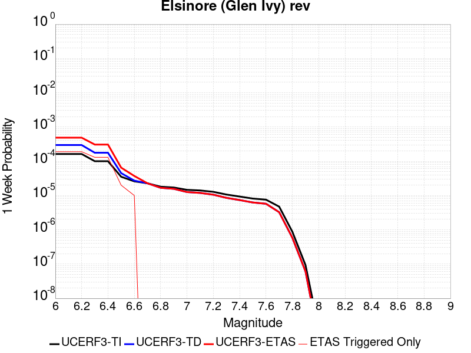 |  | 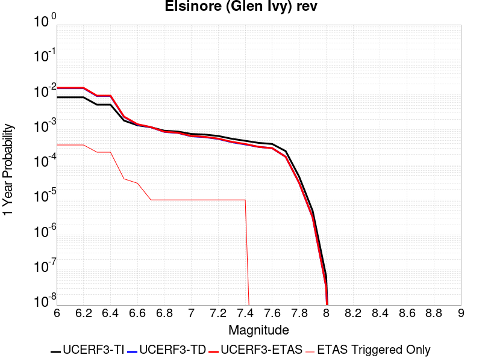 |  |

| Magnitude | 1 wk TI Prob | 1 wk TD Prob | 1 wk ETAS Prob | 1 wk ETAS/TD Gain | 1 wk ETAS Triggered Only | 1 mo TI Prob | 1 mo TD Prob | 1 mo ETAS Prob | 1 mo ETAS/TD Gain | 1 mo ETAS Triggered Only | 1 yr TI Prob | 1 yr TD Prob | 1 yr ETAS Prob | 1 yr ETAS/TD Gain | 1 yr ETAS Triggered Only | 10 yr TI Prob | 10 yr TD Prob | 10 yr ETAS Prob | 10 yr ETAS/TD Gain | 10 yr ETAS Triggered Only |
|-----|-----|-----|-----|-----|-----|-----|-----|-----|-----|-----|-----|-----|-----|-----|-----|-----|-----|-----|-----|-----|
| 6.0 | 1.6275591E-4 | 2.971415E-4 | 4.8708502E-4 | 1.6392361 | 1.9E-4 | 6.9733884E-4 | 0.0012730022 | 0.0015027095 | 1.1804452 | 2.3E-4 | 0.008457098 | 0.015406697 | 0.015770996 | 1.0236455 | 3.7E-4 | 0.08142399 | 0.14110151 | 0.14147083 | 1.0026175 | 4.3E-4 |
| 6.1 | 1.6275591E-4 | 2.971415E-4 | 4.8708502E-4 | 1.6392361 | 1.9E-4 | 6.9733884E-4 | 0.0012730022 | 0.0015027095 | 1.1804452 | 2.3E-4 | 0.008457098 | 0.015406697 | 0.015770996 | 1.0236455 | 3.7E-4 | 0.08142399 | 0.14110151 | 0.14147083 | 1.0026175 | 4.3E-4 |
| 6.2 | 1.6275591E-4 | 2.971415E-4 | 4.8708502E-4 | 1.6392361 | 1.9E-4 | 6.9733884E-4 | 0.0012730022 | 0.0015027095 | 1.1804452 | 2.3E-4 | 0.008457098 | 0.015406697 | 0.015770996 | 1.0236455 | 3.7E-4 | 0.08142399 | 0.14110151 | 0.14147083 | 1.0026175 | 4.3E-4 |
| 6.3 | 1.00125304E-4 | 1.7666782E-4 | 3.0664486E-4 | 1.7357143 | 1.3E-4 | 4.2903787E-4 | 7.57047E-4 | 9.1692584E-4 | 1.2111875 | 1.6E-4 | 0.005211032 | 0.009199171 | 0.009427056 | 1.0247723 | 2.3E-4 | 0.05090518 | 0.086784534 | 0.0870311 | 1.0028411 | 2.7E-4 |
| 6.4 | 1.00125304E-4 | 1.7666782E-4 | 3.0664486E-4 | 1.7357143 | 1.3E-4 | 4.2903787E-4 | 7.57047E-4 | 9.1692584E-4 | 1.2111875 | 1.6E-4 | 0.005211032 | 0.009199171 | 0.009427056 | 1.0247723 | 2.3E-4 | 0.05090518 | 0.086784534 | 0.0870311 | 1.0028411 | 2.7E-4 |
| 6.5 | 3.5283567E-5 | 4.5013236E-5 | 6.501233E-5 | 1.4442937 | 2.0E-5 | 1.5120652E-4 | 1.9290208E-4 | 2.1289822E-4 | 1.1036595 | 2.0E-5 | 0.0018393848 | 0.0023464912 | 0.0023863972 | 1.0170068 | 4.0E-5 | 0.018242342 | 0.023002451 | 0.023051303 | 1.0021237 | 5.0E-5 |
| 6.6 | 2.5877804E-5 | 2.7168971E-5 | 3.71687E-5 | 1.3680569 | 1.0E-5 | 1.1090015E-4 | 1.1643348E-4 | 1.2643232E-4 | 1.085876 | 1.0E-5 | 0.001349373 | 0.0014166975 | 0.001446655 | 1.021146 | 3.0E-5 | 0.013412088 | 0.014083613 | 0.01412305 | 1.0028002 | 4.0E-5 |
| 6.7 | 2.2711587E-5 | 2.2737577E-5 | 2.2737577E-5 | 1.0 | 0.0 | 9.733174E-5 | 9.744327E-5 | 9.744327E-5 | 1.0 | 0.0 | 0.0011843697 | 0.0011857523 | 0.0011957404 | 1.0084234 | 1.0E-5 | 0.011780773 | 0.011800807 | 0.0118205715 | 1.0016748 | 2.0E-5 |
| 6.8 | 1.8062692E-5 | 1.6788103E-5 | 1.6788103E-5 | 1.0 | 0.0 | 7.740924E-5 | 7.194706E-5 | 7.194706E-5 | 1.0 | 0.0 | 9.4205E-4 | 8.756104E-4 | 8.856016E-4 | 1.0114106 | 1.0E-5 | 0.009380665 | 0.0087244995 | 0.008744325 | 1.0022724 | 2.0E-5 |
| 6.9 | 1.7132816E-5 | 1.5671032E-5 | 1.5671032E-5 | 1.0 | 0.0 | 7.3424286E-5 | 6.715987E-5 | 6.715987E-5 | 1.0 | 0.0 | 8.9357403E-4 | 8.173708E-4 | 8.273626E-4 | 1.0122243 | 1.0E-5 | 0.008899895 | 0.008146359 | 0.008156276 | 1.0012175 | 1.0E-5 |
| 7.0 | 1.4638881E-5 | 1.2607838E-5 | 1.2607838E-5 | 1.0 | 0.0 | 6.273655E-5 | 5.4032484E-5 | 5.4032484E-5 | 1.0 | 0.0 | 7.635498E-4 | 6.576491E-4 | 6.6764257E-4 | 1.0151957 | 1.0E-5 | 0.0076093166 | 0.006559207 | 0.0065691415 | 1.0015146 | 1.0E-5 |
| 7.1 | 1.4052798E-5 | 1.1906452E-5 | 1.1906452E-5 | 1.0 | 0.0 | 6.0224887E-5 | 5.1026662E-5 | 5.1026662E-5 | 1.0 | 0.0 | 7.329913E-4 | 6.210746E-4 | 6.3106837E-4 | 1.0160911 | 1.0E-5 | 0.0073057828 | 0.0061951308 | 0.006205069 | 1.0016042 | 1.0E-5 |
| 7.2 | 1.2804514E-5 | 1.056878E-5 | 1.056878E-5 | 1.0 | 0.0 | 5.4875334E-5 | 4.5293997E-5 | 4.5293997E-5 | 1.0 | 0.0 | 6.6790235E-4 | 5.513166E-4 | 5.613111E-4 | 1.0181284 | 1.0E-5 | 0.0066589853 | 0.0055004447 | 0.0055103893 | 1.001808 | 1.0E-5 |
| 7.3 | 1.0663969E-5 | 8.533451E-6 | 8.533451E-6 | 1.0 | 0.0 | 4.5701927E-5 | 3.657143E-5 | 3.657143E-5 | 1.0 | 0.0 | 5.5627886E-4 | 4.4516753E-4 | 4.551631E-4 | 1.0224534 | 1.0E-5 | 0.005548884 | 0.0044430443 | 0.0044529997 | 1.0022407 | 1.0E-5 |
| 7.4 | 9.330863E-6 | 7.367177E-6 | 7.367177E-6 | 1.0 | 0.0 | 3.99888E-5 | 3.157324E-5 | 3.157324E-5 | 1.0 | 0.0 | 4.8675487E-4 | 3.843376E-4 | 3.9433374E-4 | 1.0260088 | 1.0E-5 | 0.004856901 | 0.0038368502 | 0.0038468118 | 1.0025963 | 1.0E-5 |
| 7.5 | 8.1369935E-6 | 6.2597874E-6 | 6.2597874E-6 | 1.0 | 0.0 | 3.4872366E-5 | 2.682739E-5 | 2.682739E-5 | 1.0 | 0.0 | 4.2448833E-4 | 3.265756E-4 | 3.265756E-4 | 1.0 | 0.0 | 0.004236784 | 0.003261066 | 0.003261066 | 1.0 | 0.0 |
| 7.6 | 7.5711787E-6 | 5.744324E-6 | 5.744324E-6 | 1.0 | 0.0 | 3.2447504E-5 | 2.4618304E-5 | 2.4618304E-5 | 1.0 | 0.0 | 3.9497676E-4 | 2.9968767E-4 | 2.9968767E-4 | 1.0 | 0.0 | 0.0039427546 | 0.0029929408 | 0.0029929408 | 1.0 | 0.0 |
| 7.7 | 4.7345966E-6 | 3.260476E-6 | 3.260476E-6 | 1.0 | 0.0 | 2.029097E-5 | 1.3973397E-5 | 1.3973397E-5 | 1.0 | 0.0 | 2.4701457E-4 | 1.7011337E-4 | 1.7011337E-4 | 1.0 | 0.0 | 0.0024674018 | 0.001699885 | 0.001699885 | 1.0 | 0.0 |
| 7.8 | 8.796875E-7 | 5.878622E-7 | 5.878622E-7 | 1.0 | 0.0 | 3.7700838E-6 | 2.519407E-6 | 2.519407E-6 | 1.0 | 0.0 | 4.5899804E-5 | 3.0673364E-5 | 3.0673364E-5 | 1.0 | 0.0 | 4.5890323E-4 | 3.0669285E-4 | 3.0669285E-4 | 1.0 | 0.0 |
| 7.9 | 9.339275E-8 | 6.106284E-8 | 6.106284E-8 | 1.0 | 0.0 | 4.0025458E-7 | 2.6169786E-7 | 2.6169786E-7 | 1.0 | 0.0 | 4.8730885E-6 | 3.1861669E-6 | 3.1861669E-6 | 1.0 | 0.0 | 4.8729817E-5 | 3.1861222E-5 | 3.1861222E-5 | 1.0 | 0.0 |
| 8.0 | 1.2971227E-9 | 6.43537E-10 | 6.43537E-10 | 1.0 | 0.0 | 5.5590976E-9 | 2.7580156E-9 | 2.7580156E-9 | 1.0 | 0.0 | 6.768201E-8 | 3.357884E-8 | 3.357884E-8 | 1.0 | 0.0 | 6.7681987E-7 | 3.3578837E-7 | 3.3578837E-7 | 1.0 | 0.0 |

## Sierra Nevada  (No Extension)
*[(top)](#table-of-contents)*

| 1 Week | 1 Month | 1 Year | 10 Year |
|-----|-----|-----|-----|
|  |  | 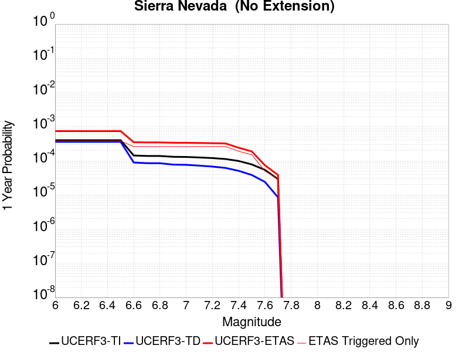 |  |

| Magnitude | 1 wk TI Prob | 1 wk TD Prob | 1 wk ETAS Prob | 1 wk ETAS/TD Gain | 1 wk ETAS Triggered Only | 1 mo TI Prob | 1 mo TD Prob | 1 mo ETAS Prob | 1 mo ETAS/TD Gain | 1 mo ETAS Triggered Only | 1 yr TI Prob | 1 yr TD Prob | 1 yr ETAS Prob | 1 yr ETAS/TD Gain | 1 yr ETAS Triggered Only | 10 yr TI Prob | 10 yr TD Prob | 10 yr ETAS Prob | 10 yr ETAS/TD Gain | 10 yr ETAS Triggered Only |
|-----|-----|-----|-----|-----|-----|-----|-----|-----|-----|-----|-----|-----|-----|-----|-----|-----|-----|-----|-----|-----|
| 6.0 | 7.681013E-6 | 6.8903387E-6 | 2.0688896E-4 | 30.02595 | 2.0E-4 | 3.291821E-5 | 2.9529878E-5 | 2.695228E-4 | 9.127122 | 2.4E-4 | 4.0070552E-4 | 3.595004E-4 | 7.393638E-4 | 2.0566425 | 3.8E-4 | 0.0039998377 | 0.0035924702 | 0.0040607816 | 1.1303592 | 4.7E-4 |
| 6.1 | 7.681013E-6 | 6.8903387E-6 | 2.0688896E-4 | 30.02595 | 2.0E-4 | 3.291821E-5 | 2.9529878E-5 | 2.695228E-4 | 9.127122 | 2.4E-4 | 4.0070552E-4 | 3.595004E-4 | 7.393638E-4 | 2.0566425 | 3.8E-4 | 0.0039998377 | 0.0035924702 | 0.0040607816 | 1.1303592 | 4.7E-4 |
| 6.2 | 7.681013E-6 | 6.8903387E-6 | 2.0688896E-4 | 30.02595 | 2.0E-4 | 3.291821E-5 | 2.9529878E-5 | 2.695228E-4 | 9.127122 | 2.4E-4 | 4.0070552E-4 | 3.595004E-4 | 7.393638E-4 | 2.0566425 | 3.8E-4 | 0.0039998377 | 0.0035924702 | 0.0040607816 | 1.1303592 | 4.7E-4 |
| 6.3 | 7.681013E-6 | 6.8903387E-6 | 2.0688896E-4 | 30.02595 | 2.0E-4 | 3.291821E-5 | 2.9529878E-5 | 2.695228E-4 | 9.127122 | 2.4E-4 | 4.0070552E-4 | 3.595004E-4 | 7.393638E-4 | 2.0566425 | 3.8E-4 | 0.0039998377 | 0.0035924702 | 0.0040607816 | 1.1303592 | 4.7E-4 |
| 6.4 | 7.681013E-6 | 6.8903387E-6 | 2.0688896E-4 | 30.02595 | 2.0E-4 | 3.291821E-5 | 2.9529878E-5 | 2.695228E-4 | 9.127122 | 2.4E-4 | 4.0070552E-4 | 3.595004E-4 | 7.393638E-4 | 2.0566425 | 3.8E-4 | 0.0039998377 | 0.0035924702 | 0.0040607816 | 1.1303592 | 4.7E-4 |
| 6.5 | 7.681013E-6 | 6.8903387E-6 | 2.0688896E-4 | 30.02595 | 2.0E-4 | 3.291821E-5 | 2.9529878E-5 | 2.695228E-4 | 9.127122 | 2.4E-4 | 4.0070552E-4 | 3.595004E-4 | 7.393638E-4 | 2.0566425 | 3.8E-4 | 0.0039998377 | 0.0035924702 | 0.0040607816 | 1.1303592 | 4.7E-4 |
| 6.6 | 2.7332817E-6 | 1.7089178E-6 | 1.6170864E-4 | 94.62634 | 1.6E-4 | 1.1714012E-5 | 7.323913E-6 | 1.873226E-4 | 25.576845 | 1.8E-4 | 1.4260875E-4 | 8.9165034E-5 | 3.4914186E-4 | 3.9156814 | 2.6E-4 | 0.0014251727 | 8.912966E-4 | 0.0011810381 | 1.3250787 | 2.9E-4 |
| 6.7 | 2.6557523E-6 | 1.6289872E-6 | 1.6162873E-4 | 99.22038 | 1.6E-4 | 1.1381746E-5 | 6.981355E-6 | 1.869801E-4 | 26.78278 | 1.8E-4 | 1.3856393E-4 | 8.499472E-5 | 3.4497262E-4 | 4.0587535 | 2.6E-4 | 0.0013847757 | 8.496254E-4 | 0.001139379 | 1.3410369 | 2.9E-4 |
| 6.8 | 2.6483924E-6 | 1.6242412E-6 | 1.6162398E-4 | 99.50737 | 1.6E-4 | 1.1350204E-5 | 6.9610155E-6 | 1.8695976E-4 | 26.858116 | 1.8E-4 | 1.3817997E-4 | 8.47471E-5 | 3.4472506E-4 | 4.0676913 | 2.6E-4 | 0.0013809407 | 8.4715115E-4 | 0.0011369055 | 1.3420337 | 2.9E-4 |
| 6.9 | 2.505623E-6 | 1.4836677E-6 | 1.6148343E-4 | 108.840706 | 1.6E-4 | 1.0738339E-5 | 6.3585603E-6 | 1.8635741E-4 | 29.308115 | 1.8E-4 | 1.3073144E-4 | 7.741274E-5 | 3.3739262E-4 | 4.3583603 | 2.6E-4 | 0.0013065456 | 7.7385985E-4 | 0.0010636355 | 1.3744549 | 2.9E-4 |
| 7.0 | 2.4794133E-6 | 1.4595936E-6 | 1.6145936E-4 | 110.61939 | 1.6E-4 | 1.0626014E-5 | 6.2553863E-6 | 1.8625426E-4 | 29.77502 | 1.8E-4 | 1.2936404E-4 | 7.6156684E-5 | 3.3613687E-4 | 4.413754 | 2.6E-4 | 0.0012928875 | 7.6130795E-4 | 0.0010510872 | 1.3806334 | 2.9E-4 |
| 7.1 | 2.3966231E-6 | 1.3823322E-6 | 1.6138211E-4 | 116.746254 | 1.6E-4 | 1.0271201E-5 | 5.9242675E-6 | 1.859232E-4 | 31.383322 | 1.8E-4 | 1.250447E-4 | 7.2125586E-5 | 3.3210684E-4 | 4.604563 | 2.6E-4 | 0.0012497436 | 7.2102353E-4 | 0.0010108144 | 1.401916 | 2.9E-4 |
| 7.2 | 2.2992451E-6 | 1.2974776E-6 | 1.6129727E-4 | 124.31603 | 1.6E-4 | 9.85387E-6 | 5.5606065E-6 | 1.855596E-4 | 33.370388 | 1.8E-4 | 1.1996427E-4 | 6.7698296E-5 | 3.276807E-4 | 4.840309 | 2.6E-4 | 0.0011989953 | 6.7677826E-4 | 9.6658204E-4 | 1.4282107 | 2.9E-4 |
| 7.3 | 2.1572107E-6 | 1.1829136E-6 | 1.6118272E-4 | 136.25908 | 1.6E-4 | 9.245156E-6 | 5.06962E-6 | 1.8506871E-4 | 36.50544 | 1.8E-4 | 1.12553964E-4 | 6.1720886E-5 | 3.2170484E-4 | 5.2122526 | 2.6E-4 | 0.0011249697 | 6.170387E-4 | 9.0685976E-4 | 1.4696968 | 2.9E-4 |
| 7.4 | 1.8911298E-6 | 9.740152E-7 | 1.0097392E-4 | 103.66771 | 1.0E-4 | 8.1048165E-6 | 4.1743438E-6 | 1.2417385E-4 | 29.746912 | 1.2E-4 | 9.867168E-5 | 5.0821458E-5 | 2.408118E-4 | 4.738388 | 1.9E-4 | 9.862788E-4 | 5.080991E-4 | 7.2798727E-4 | 1.4327664 | 2.2E-4 |
| 7.5 | 1.4998001E-6 | 7.3661374E-7 | 8.073656E-5 | 109.60501 | 8.0E-5 | 6.427699E-6 | 3.156912E-6 | 1.031566E-4 | 32.676422 | 1.0E-4 | 7.825442E-5 | 3.8434733E-5 | 1.8842897E-4 | 4.9025702 | 1.5E-4 | 7.8226876E-4 | 3.8428127E-4 | 5.642121E-4 | 1.4682269 | 1.8E-4 |
| 7.6 | 1.0382483E-6 | 4.625216E-7 | 2.0462512E-5 | 44.241203 | 2.0E-5 | 4.449628E-6 | 1.982234E-6 | 2.1982194E-5 | 11.089606 | 2.0E-5 | 5.4172873E-5 | 2.4133433E-5 | 7.413223E-5 | 3.0717647 | 5.0E-5 | 5.415967E-4 | 2.4130839E-4 | 3.212891E-4 | 1.3314459 | 8.0E-5 |
| 7.7 | 5.5865365E-7 | 1.6401302E-7 | 1.0164012E-5 | 61.970757 | 1.0E-5 | 2.3942277E-6 | 7.0291276E-7 | 1.07029055E-5 | 15.226506 | 1.0E-5 | 2.9149332E-5 | 8.55793E-6 | 3.8557675E-5 | 4.5054903 | 3.0E-5 | 2.9145507E-4 | 8.557614E-5 | 1.3557186E-4 | 1.584225 | 5.0E-5 |

## Red Pass
*[(top)](#table-of-contents)*

| 1 Week | 1 Month | 1 Year | 10 Year |
|-----|-----|-----|-----|
|  | 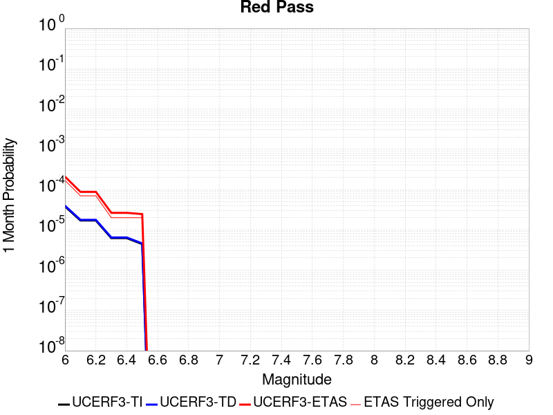 |  | 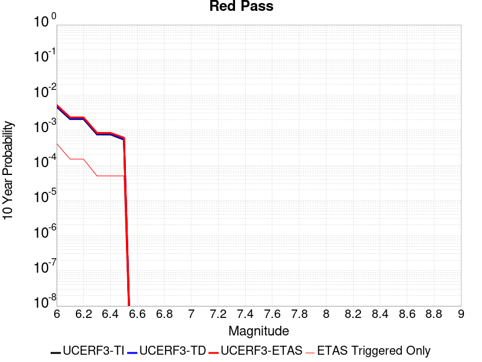 |

| Magnitude | 1 wk TI Prob | 1 wk TD Prob | 1 wk ETAS Prob | 1 wk ETAS/TD Gain | 1 wk ETAS Triggered Only | 1 mo TI Prob | 1 mo TD Prob | 1 mo ETAS Prob | 1 mo ETAS/TD Gain | 1 mo ETAS Triggered Only | 1 yr TI Prob | 1 yr TD Prob | 1 yr ETAS Prob | 1 yr ETAS/TD Gain | 1 yr ETAS Triggered Only | 10 yr TI Prob | 10 yr TD Prob | 10 yr ETAS Prob | 10 yr ETAS/TD Gain | 10 yr ETAS Triggered Only |
|-----|-----|-----|-----|-----|-----|-----|-----|-----|-----|-----|-----|-----|-----|-----|-----|-----|-----|-----|-----|-----|
| 6.0 | 8.9326595E-6 | 9.275556E-6 | 1.2927444E-4 | 13.937109 | 1.2E-4 | 3.8282265E-5 | 3.9751896E-5 | 2.0974514E-4 | 5.2763553 | 1.7E-4 | 4.659869E-4 | 4.838929E-4 | 7.3377194E-4 | 1.5163933 | 2.5E-4 | 0.00465011 | 0.0048304596 | 0.0052484307 | 1.0865283 | 4.2E-4 |
| 6.1 | 3.988903E-6 | 4.1373933E-6 | 5.413719E-5 | 13.084853 | 5.0E-5 | 1.7095186E-5 | 1.7731598E-5 | 8.7730354E-5 | 4.947685 | 7.0E-5 | 2.0811401E-4 | 2.1586662E-4 | 3.058472E-4 | 1.4168341 | 9.0E-5 | 0.002079192 | 0.0021571382 | 0.0023068148 | 1.0693866 | 1.5E-4 |
| 6.2 | 3.988903E-6 | 4.1373933E-6 | 5.413719E-5 | 13.084853 | 5.0E-5 | 1.7095186E-5 | 1.7731598E-5 | 8.7730354E-5 | 4.947685 | 7.0E-5 | 2.0811401E-4 | 2.1586662E-4 | 3.058472E-4 | 1.4168341 | 9.0E-5 | 0.002079192 | 0.0021571382 | 0.0023068148 | 1.0693866 | 1.5E-4 |
| 6.3 | 1.4533539E-6 | 1.5083419E-6 | 2.1508311E-5 | 14.259573 | 2.0E-5 | 6.2286445E-6 | 6.4643154E-6 | 2.6464186E-5 | 4.0938883 | 2.0E-5 | 7.583111E-5 | 7.8701756E-5 | 1.08699394E-4 | 1.381156 | 3.0E-5 | 7.580524E-4 | 7.868914E-4 | 8.36852E-4 | 1.0634912 | 5.0E-5 |
| 6.4 | 1.4533539E-6 | 1.5083419E-6 | 2.1508311E-5 | 14.259573 | 2.0E-5 | 6.2286445E-6 | 6.4643154E-6 | 2.6464186E-5 | 4.0938883 | 2.0E-5 | 7.583111E-5 | 7.8701756E-5 | 1.08699394E-4 | 1.381156 | 3.0E-5 | 7.580524E-4 | 7.868914E-4 | 8.36852E-4 | 1.0634912 | 5.0E-5 |
| 6.5 | 1.0333458E-6 | 1.0724643E-6 | 2.1072443E-5 | 19.648619 | 2.0E-5 | 4.4286176E-6 | 4.5962756E-6 | 2.4596184E-5 | 5.351329 | 2.0E-5 | 5.3917087E-5 | 5.595966E-5 | 8.595798E-5 | 1.5360705 | 3.0E-5 | 5.390401E-4 | 5.595966E-4 | 6.095686E-4 | 1.0893 | 5.0E-5 |

## Death Valley (Fish Lake Valley)
*[(top)](#table-of-contents)*

| 1 Week | 1 Month | 1 Year | 10 Year |
|-----|-----|-----|-----|
|  |  | 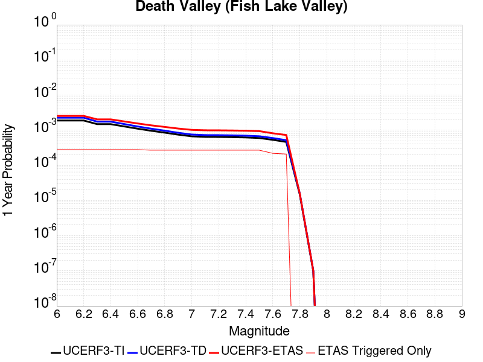 |  |

| Magnitude | 1 wk TI Prob | 1 wk TD Prob | 1 wk ETAS Prob | 1 wk ETAS/TD Gain | 1 wk ETAS Triggered Only | 1 mo TI Prob | 1 mo TD Prob | 1 mo ETAS Prob | 1 mo ETAS/TD Gain | 1 mo ETAS Triggered Only | 1 yr TI Prob | 1 yr TD Prob | 1 yr ETAS Prob | 1 yr ETAS/TD Gain | 1 yr ETAS Triggered Only | 10 yr TI Prob | 10 yr TD Prob | 10 yr ETAS Prob | 10 yr ETAS/TD Gain | 10 yr ETAS Triggered Only |
|-----|-----|-----|-----|-----|-----|-----|-----|-----|-----|-----|-----|-----|-----|-----|-----|-----|-----|-----|-----|-----|
| 6.0 | 3.6196117E-5 | 4.35479E-5 | 1.9354137E-4 | 4.4443326 | 1.5E-4 | 1.55117E-4 | 1.8662088E-4 | 3.965817E-4 | 2.125066 | 2.1E-4 | 0.0018869134 | 0.002269933 | 0.0025492974 | 1.1230717 | 2.8E-4 | 0.018709717 | 0.022485858 | 0.02288664 | 1.0178237 | 4.1E-4 |
| 6.1 | 3.6196117E-5 | 4.35479E-5 | 1.9354137E-4 | 4.4443326 | 1.5E-4 | 1.55117E-4 | 1.8662088E-4 | 3.965817E-4 | 2.125066 | 2.1E-4 | 0.0018869134 | 0.002269933 | 0.0025492974 | 1.1230717 | 2.8E-4 | 0.018709717 | 0.022485858 | 0.02288664 | 1.0178237 | 4.1E-4 |
| 6.2 | 3.6196117E-5 | 4.35479E-5 | 1.9354137E-4 | 4.4443326 | 1.5E-4 | 1.55117E-4 | 1.8662088E-4 | 3.965817E-4 | 2.125066 | 2.1E-4 | 0.0018869134 | 0.002269933 | 0.0025492974 | 1.1230717 | 2.8E-4 | 0.018709717 | 0.022485858 | 0.02288664 | 1.0178237 | 4.1E-4 |
| 6.3 | 2.8488079E-5 | 3.363853E-5 | 1.8363348E-4 | 5.459022 | 1.5E-4 | 1.2208604E-4 | 1.4415687E-4 | 3.541266E-4 | 2.4565363 | 2.1E-4 | 0.0014853841 | 0.0017537728 | 0.0020332818 | 1.1593758 | 2.8E-4 | 0.014754947 | 0.017407097 | 0.01780996 | 1.0231436 | 4.1E-4 |
| 6.4 | 2.8488079E-5 | 3.363853E-5 | 1.8363348E-4 | 5.459022 | 1.5E-4 | 1.2208604E-4 | 1.4415687E-4 | 3.541266E-4 | 2.4565363 | 2.1E-4 | 0.0014853841 | 0.0017537728 | 0.0020332818 | 1.1593758 | 2.8E-4 | 0.014754947 | 0.017407097 | 0.01780996 | 1.0231436 | 4.1E-4 |
| 6.5 | 2.4580631E-5 | 2.869781E-5 | 1.786935E-4 | 6.22673 | 1.5E-4 | 1.0534131E-4 | 1.2298436E-4 | 3.3295853E-4 | 2.7073243 | 2.1E-4 | 0.0012817758 | 0.0014963538 | 0.0017759348 | 1.1868415 | 2.8E-4 | 0.0127440775 | 0.014868082 | 0.015271986 | 1.0271659 | 4.1E-4 |
| 6.6 | 2.115977E-5 | 2.444301E-5 | 1.7443934E-4 | 7.1365733 | 1.5E-4 | 9.068158E-5 | 1.0475174E-4 | 3.1472975E-4 | 3.00453 | 2.1E-4 | 0.001103489 | 0.0012746397 | 0.0015542828 | 1.2193899 | 2.8E-4 | 0.010980255 | 0.012676688 | 0.01308149 | 1.0319328 | 4.1E-4 |
| 6.7 | 1.849472E-5 | 2.1181226E-5 | 1.7117805E-4 | 8.081593 | 1.5E-4 | 7.926068E-5 | 9.0773654E-5 | 3.007546E-4 | 3.3132367 | 2.1E-4 | 9.645715E-4 | 0.0011046316 | 0.0013743333 | 1.2441554 | 2.7E-4 | 0.009603955 | 0.010993773 | 0.011389376 | 1.0359843 | 4.0E-4 |
| 6.8 | 1.6351334E-5 | 1.858738E-5 | 1.685846E-4 | 9.069841 | 1.5E-4 | 7.0075264E-5 | 7.965785E-5 | 2.8964112E-4 | 3.636065 | 2.1E-4 | 8.5283234E-4 | 9.694179E-4 | 0.0012391561 | 1.2782477 | 2.7E-4 | 0.008495668 | 0.00965347 | 0.010049609 | 1.0410359 | 4.0E-4 |
| 6.9 | 1.4341599E-5 | 1.6184904E-5 | 1.6618248E-4 | 10.267746 | 1.5E-4 | 6.1462546E-5 | 6.9362075E-5 | 2.793475E-4 | 4.027381 | 2.1E-4 | 7.480496E-4 | 8.4416446E-4 | 0.0011139365 | 1.3195729 | 2.7E-4 | 0.007455365 | 0.008410468 | 0.008807103 | 1.0471598 | 4.0E-4 |
| 7.0 | 1.2851966E-5 | 1.4429115E-5 | 1.6442695E-4 | 11.395498 | 1.5E-4 | 5.5078694E-5 | 6.183763E-5 | 2.7182465E-4 | 4.3957806 | 2.1E-4 | 6.7037676E-4 | 7.526187E-4 | 0.0010224155 | 1.3584774 | 2.7E-4 | 0.0066835806 | 0.0075012986 | 0.007898298 | 1.0529242 | 4.0E-4 |
| 7.1 | 1.24054795E-5 | 1.3912738E-5 | 1.6391065E-4 | 11.781337 | 1.5E-4 | 5.316526E-5 | 5.9624686E-5 | 2.6961215E-4 | 4.521821 | 2.1E-4 | 6.4709474E-4 | 7.256942E-4 | 9.954983E-4 | 1.3717875 | 2.7E-4 | 0.006452137 | 0.0072338157 | 0.0076309224 | 1.0548959 | 4.0E-4 |
| 7.2 | 1.2338555E-5 | 1.3837147E-5 | 1.6383507E-4 | 11.840236 | 1.5E-4 | 5.287845E-5 | 5.930074E-5 | 2.6928828E-4 | 4.5410614 | 2.1E-4 | 6.4360496E-4 | 7.217527E-4 | 9.915578E-4 | 1.3738194 | 2.7E-4 | 0.006417441 | 0.0071946573 | 0.0075917793 | 1.0551968 | 4.0E-4 |
| 7.3 | 1.2167435E-5 | 1.3646547E-5 | 1.636445E-4 | 11.991642 | 1.5E-4 | 5.2145107E-5 | 5.8483918E-5 | 2.6847163E-4 | 4.590521 | 2.1E-4 | 6.346817E-4 | 7.118145E-4 | 9.816223E-4 | 1.3790423 | 2.7E-4 | 0.006328721 | 0.007095914 | 0.0074930754 | 1.0559704 | 4.0E-4 |
| 7.4 | 1.1937304E-5 | 1.3389129E-5 | 1.6338711E-4 | 12.202969 | 1.5E-4 | 5.1158873E-5 | 5.738075E-5 | 2.673687E-4 | 4.659554 | 2.1E-4 | 6.226812E-4 | 6.983921E-4 | 9.6820353E-4 | 1.3863323 | 2.7E-4 | 0.0062093935 | 0.0069625387 | 0.007359754 | 1.0570503 | 4.0E-4 |
| 7.5 | 1.1483521E-5 | 1.2886512E-5 | 1.6288458E-4 | 12.639927 | 1.5E-4 | 4.9214163E-5 | 5.522677E-5 | 2.6521517E-4 | 4.802294 | 2.1E-4 | 5.9901766E-4 | 6.721839E-4 | 9.420024E-4 | 1.4014058 | 2.7E-4 | 0.0059740553 | 0.006702068 | 0.007099387 | 1.059283 | 4.0E-4 |
| 7.6 | 1.0223737E-5 | 1.1466811E-5 | 1.3146544E-4 | 11.464865 | 1.2E-4 | 4.381528E-5 | 4.9142578E-5 | 2.1913422E-4 | 4.4591517 | 1.7E-4 | 5.333205E-4 | 5.981517E-4 | 8.1802014E-4 | 1.3675797 | 2.2E-4 | 0.0053204233 | 0.0059659383 | 0.00630391 | 1.0566502 | 3.4E-4 |
| 7.7 | 8.890573E-6 | 9.966404E-6 | 1.19965305E-4 | 12.03697 | 1.1E-4 | 3.8101898E-5 | 4.2712487E-5 | 2.0270565E-4 | 4.745817 | 1.6E-4 | 4.6379183E-4 | 5.199054E-4 | 7.2979624E-4 | 1.4037097 | 2.1E-4 | 0.004628251 | 0.0051873922 | 0.0054858364 | 1.0575325 | 3.0E-4 |
| 7.8 | 2.8438137E-7 | 2.9968996E-7 | 2.9968996E-7 | 1.0 | 0.0 | 1.2187767E-6 | 1.2843849E-6 | 1.2843849E-6 | 1.0 | 0.0 | 1.4838505E-5 | 1.5637277E-5 | 1.5637277E-5 | 1.0 | 0.0 | 1.4837515E-4 | 1.5636209E-4 | 1.6636052E-4 | 1.0639441 | 1.0E-5 |
| 7.9 | 1.8610457E-9 | 1.9363102E-9 | 1.9363102E-9 | 1.0 | 0.0 | 7.97591E-9 | 8.298473E-9 | 8.298473E-9 | 1.0 | 0.0 | 9.71067E-8 | 1.01033905E-7 | 1.01033905E-7 | 1.0 | 0.0 | 9.710666E-7 | 1.0103391E-6 | 1.0103391E-6 | 1.0 | 0.0 |

## Cady
*[(top)](#table-of-contents)*

| 1 Week | 1 Month | 1 Year | 10 Year |
|-----|-----|-----|-----|
|  | 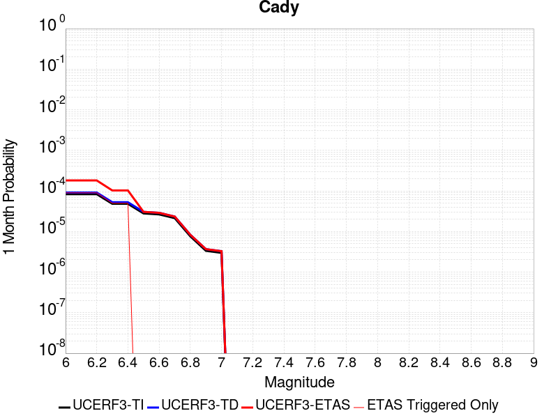 |  |  |

| Magnitude | 1 wk TI Prob | 1 wk TD Prob | 1 wk ETAS Prob | 1 wk ETAS/TD Gain | 1 wk ETAS Triggered Only | 1 mo TI Prob | 1 mo TD Prob | 1 mo ETAS Prob | 1 mo ETAS/TD Gain | 1 mo ETAS Triggered Only | 1 yr TI Prob | 1 yr TD Prob | 1 yr ETAS Prob | 1 yr ETAS/TD Gain | 1 yr ETAS Triggered Only | 10 yr TI Prob | 10 yr TD Prob | 10 yr ETAS Prob | 10 yr ETAS/TD Gain | 10 yr ETAS Triggered Only |
|-----|-----|-----|-----|-----|-----|-----|-----|-----|-----|-----|-----|-----|-----|-----|-----|-----|-----|-----|-----|-----|
| 6.0 | 1.9419978E-5 | 2.1319294E-5 | 1.01317586E-4 | 4.7523894 | 8.0E-5 | 8.322582E-5 | 9.136567E-5 | 1.8135745E-4 | 1.9849627 | 9.0E-5 | 0.0010128033 | 0.001111892 | 0.0012717142 | 1.1437389 | 1.6E-4 | 0.010081998 | 0.0110714985 | 0.011437402 | 1.0330491 | 3.7E-4 |
| 6.1 | 1.9419978E-5 | 2.1319294E-5 | 1.01317586E-4 | 4.7523894 | 8.0E-5 | 8.322582E-5 | 9.136567E-5 | 1.8135745E-4 | 1.9849627 | 9.0E-5 | 0.0010128033 | 0.001111892 | 0.0012717142 | 1.1437389 | 1.6E-4 | 0.010081998 | 0.0110714985 | 0.011437402 | 1.0330491 | 3.7E-4 |
| 6.2 | 1.9419978E-5 | 2.1319294E-5 | 1.01317586E-4 | 4.7523894 | 8.0E-5 | 8.322582E-5 | 9.136567E-5 | 1.8135745E-4 | 1.9849627 | 9.0E-5 | 0.0010128033 | 0.001111892 | 0.0012717142 | 1.1437389 | 1.6E-4 | 0.010081998 | 0.0110714985 | 0.011437402 | 1.0330491 | 3.7E-4 |
| 6.3 | 1.12373855E-5 | 1.2300435E-5 | 5.2299943E-5 | 4.251878 | 4.0E-5 | 4.8159334E-5 | 5.2715255E-5 | 1.0271262E-4 | 1.9484421 | 5.0E-5 | 5.8618217E-4 | 6.416498E-4 | 7.415857E-4 | 1.1557482 | 1.0E-4 | 0.005846383 | 0.006400989 | 0.0066493885 | 1.0388064 | 2.5E-4 |
| 6.4 | 1.12373855E-5 | 1.2300435E-5 | 5.2299943E-5 | 4.251878 | 4.0E-5 | 4.8159334E-5 | 5.2715255E-5 | 1.0271262E-4 | 1.9484421 | 5.0E-5 | 5.8618217E-4 | 6.416498E-4 | 7.415857E-4 | 1.1557482 | 1.0E-4 | 0.005846383 | 0.006400989 | 0.0066493885 | 1.0388064 | 2.5E-4 |
| 6.5 | 6.5086356E-6 | 7.112245E-6 | 7.112245E-6 | 1.0 | 0.0 | 2.7893855E-5 | 3.048077E-5 | 3.048077E-5 | 1.0 | 0.0 | 3.3955477E-4 | 3.710539E-4 | 4.0104275E-4 | 1.0808208 | 3.0E-5 | 0.0033903639 | 0.0037056908 | 0.0037953574 | 1.024197 | 9.0E-5 |
| 6.6 | 6.157966E-6 | 6.736431E-6 | 6.736431E-6 | 1.0 | 0.0 | 2.6391015E-5 | 2.8870174E-5 | 2.8870174E-5 | 1.0 | 0.0 | 3.2126324E-4 | 3.5145122E-4 | 3.8144068E-4 | 1.0853304 | 3.0E-5 | 0.0032079918 | 0.0035102835 | 0.0035999676 | 1.0255489 | 9.0E-5 |
| 6.7 | 4.986104E-6 | 5.449096E-6 | 5.449096E-6 | 1.0 | 0.0 | 2.1368842E-5 | 2.335313E-5 | 2.335313E-5 | 1.0 | 0.0 | 2.601346E-4 | 2.8429972E-4 | 3.142912E-4 | 1.1054925 | 3.0E-5 | 0.002598303 | 0.0028405834 | 0.0029203563 | 1.0280832 | 8.0E-5 |
| 6.8 | 1.7762113E-6 | 1.9366814E-6 | 1.9366814E-6 | 1.0 | 0.0 | 7.6123124E-6 | 8.300045E-6 | 8.300045E-6 | 1.0 | 0.0 | 9.267596E-5 | 1.0104986E-4 | 1.2104784E-4 | 1.1979021 | 2.0E-5 | 9.263732E-4 | 0.001010186 | 0.0010501456 | 1.0395566 | 4.0E-5 |
| 6.9 | 7.8065113E-7 | 8.5781903E-7 | 8.5781903E-7 | 1.0 | 0.0 | 3.3456433E-6 | 3.676364E-6 | 3.676364E-6 | 1.0 | 0.0 | 4.0732448E-5 | 4.475915E-5 | 5.47587E-5 | 1.223408 | 1.0E-5 | 4.072498E-4 | 4.4753432E-4 | 4.5752985E-4 | 1.0223347 | 1.0E-5 |
| 7.0 | 6.9503994E-7 | 7.638516E-7 | 7.638516E-7 | 1.0 | 0.0 | 2.9787393E-6 | 3.2736473E-6 | 3.2736473E-6 | 1.0 | 0.0 | 3.626555E-5 | 3.9856255E-5 | 4.985586E-5 | 1.2508917 | 1.0E-5 | 3.625963E-4 | 3.9852335E-4 | 4.0851938E-4 | 1.0250826 | 1.0E-5 |

## San Andreas (Carrizo) rev
*[(top)](#table-of-contents)*

| 1 Week | 1 Month | 1 Year | 10 Year |
|-----|-----|-----|-----|
| 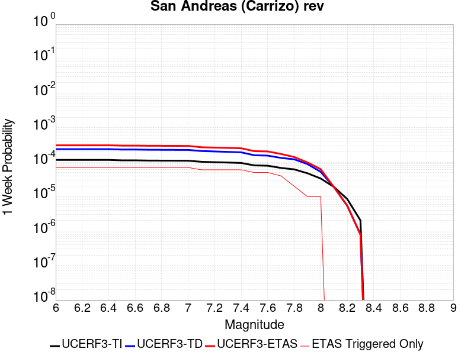 |  |  |  |

| Magnitude | 1 wk TI Prob | 1 wk TD Prob | 1 wk ETAS Prob | 1 wk ETAS/TD Gain | 1 wk ETAS Triggered Only | 1 mo TI Prob | 1 mo TD Prob | 1 mo ETAS Prob | 1 mo ETAS/TD Gain | 1 mo ETAS Triggered Only | 1 yr TI Prob | 1 yr TD Prob | 1 yr ETAS Prob | 1 yr ETAS/TD Gain | 1 yr ETAS Triggered Only | 10 yr TI Prob | 10 yr TD Prob | 10 yr ETAS Prob | 10 yr ETAS/TD Gain | 10 yr ETAS Triggered Only |
|-----|-----|-----|-----|-----|-----|-----|-----|-----|-----|-----|-----|-----|-----|-----|-----|-----|-----|-----|-----|-----|
| 6.0 | 1.1621781E-4 | 2.382836E-4 | 3.082669E-4 | 1.2936976 | 7.0E-5 | 4.9798127E-4 | 0.0010208173 | 0.001130705 | 1.1076468 | 1.1E-4 | 0.00604608 | 0.012358082 | 0.01255561 | 1.0159837 | 2.0E-4 | 0.058842067 | 0.11858058 | 0.118924335 | 1.0028989 | 3.9E-4 |
| 6.1 | 1.1621781E-4 | 2.382836E-4 | 3.082669E-4 | 1.2936976 | 7.0E-5 | 4.9798127E-4 | 0.0010208173 | 0.001130705 | 1.1076468 | 1.1E-4 | 0.00604608 | 0.012358082 | 0.01255561 | 1.0159837 | 2.0E-4 | 0.058842067 | 0.11858058 | 0.118924335 | 1.0028989 | 3.9E-4 |
| 6.2 | 1.1621781E-4 | 2.382836E-4 | 3.082669E-4 | 1.2936976 | 7.0E-5 | 4.9798127E-4 | 0.0010208173 | 0.001130705 | 1.1076468 | 1.1E-4 | 0.00604608 | 0.012358082 | 0.01255561 | 1.0159837 | 2.0E-4 | 0.058842067 | 0.11858058 | 0.118924335 | 1.0028989 | 3.9E-4 |
| 6.3 | 1.1621781E-4 | 2.382836E-4 | 3.082669E-4 | 1.2936976 | 7.0E-5 | 4.9798127E-4 | 0.0010208173 | 0.001130705 | 1.1076468 | 1.1E-4 | 0.00604608 | 0.012358082 | 0.01255561 | 1.0159837 | 2.0E-4 | 0.058842067 | 0.11858058 | 0.118924335 | 1.0028989 | 3.9E-4 |
| 6.4 | 1.1621781E-4 | 2.382836E-4 | 3.082669E-4 | 1.2936976 | 7.0E-5 | 4.9798127E-4 | 0.0010208173 | 0.001130705 | 1.1076468 | 1.1E-4 | 0.00604608 | 0.012358082 | 0.01255561 | 1.0159837 | 2.0E-4 | 0.058842067 | 0.11858058 | 0.118924335 | 1.0028989 | 3.9E-4 |
| 6.5 | 1.1291474E-4 | 2.3207153E-4 | 3.020553E-4 | 1.3015611 | 7.0E-5 | 4.8383055E-4 | 9.942147E-4 | 0.0011041053 | 1.1105301 | 1.1E-4 | 0.0058747386 | 0.012037809 | 0.012235401 | 1.0164143 | 2.0E-4 | 0.0572184 | 0.11580698 | 0.11614297 | 1.0029013 | 3.8E-4 |
| 6.6 | 1.1291474E-4 | 2.3207153E-4 | 3.020553E-4 | 1.3015611 | 7.0E-5 | 4.8383055E-4 | 9.942147E-4 | 0.0011041053 | 1.1105301 | 1.1E-4 | 0.0058747386 | 0.012037809 | 0.012235401 | 1.0164143 | 2.0E-4 | 0.0572184 | 0.11580698 | 0.11614297 | 1.0029013 | 3.8E-4 |
| 6.7 | 1.1131116E-4 | 2.2905605E-4 | 2.9904002E-4 | 1.3055321 | 7.0E-5 | 4.769606E-4 | 9.81301E-4 | 0.001091193 | 1.111986 | 1.1E-4 | 0.0057915444 | 0.011882306 | 0.01207993 | 1.0166317 | 2.0E-4 | 0.05642913 | 0.1144576 | 0.114785254 | 1.0028627 | 3.7E-4 |
| 6.8 | 1.1085265E-4 | 2.280929E-4 | 2.9807692E-4 | 1.3068225 | 7.0E-5 | 4.7499625E-4 | 9.771762E-4 | 0.0010870687 | 1.1124593 | 1.1E-4 | 0.0057677557 | 0.011832635 | 0.012030268 | 1.0167024 | 2.0E-4 | 0.056203336 | 0.11402346 | 0.11435127 | 1.002875 | 3.7E-4 |
| 6.9 | 1.1037759E-4 | 2.2708948E-4 | 2.9707357E-4 | 1.3081785 | 7.0E-5 | 4.7296102E-4 | 9.7287906E-4 | 0.001082772 | 1.1129565 | 1.1E-4 | 0.0057431078 | 0.011780884 | 0.011968645 | 1.0159378 | 1.9E-4 | 0.05596933 | 0.11357078 | 0.113889895 | 1.0028099 | 3.6E-4 |
| 7.0 | 1.0991247E-4 | 2.261366E-4 | 2.9612076E-4 | 1.3094774 | 7.0E-5 | 4.709684E-4 | 9.687983E-4 | 0.0010786918 | 1.1134328 | 1.1E-4 | 0.0057189753 | 0.011731737 | 0.011919508 | 1.0160054 | 1.9E-4 | 0.055740174 | 0.1131389 | 0.113458164 | 1.0028219 | 3.6E-4 |
| 7.1 | 1.0257383E-4 | 2.1052602E-4 | 2.7051338E-4 | 1.2849404 | 6.0E-5 | 4.3952806E-4 | 9.0194325E-4 | 0.001001853 | 1.1107718 | 1.0E-4 | 0.005338132 | 0.010926143 | 0.011104176 | 1.0162942 | 1.8E-4 | 0.052117098 | 0.10605285 | 0.10634786 | 1.0027816 | 3.3E-4 |
| 7.2 | 9.967308E-5 | 2.0445444E-4 | 2.6444218E-4 | 1.2934039 | 6.0E-5 | 4.271004E-4 | 8.7593985E-4 | 9.7585225E-4 | 1.1140631 | 1.0E-4 | 0.005187556 | 0.010612677 | 0.010790766 | 1.0167809 | 1.8E-4 | 0.050681178 | 0.1032785 | 0.103565454 | 1.0027784 | 3.2E-4 |
| 7.3 | 9.74259E-5 | 1.9896508E-4 | 2.5895314E-4 | 1.3015004 | 6.0E-5 | 4.1747277E-4 | 8.5242966E-4 | 9.523444E-4 | 1.1172117 | 1.0E-4 | 0.005070891 | 0.010329189 | 0.010507329 | 1.0172464 | 1.8E-4 | 0.049567297 | 0.10073698 | 0.10102475 | 1.0028566 | 3.2E-4 |
| 7.4 | 9.475861E-5 | 1.924723E-4 | 2.5246074E-4 | 1.3116732 | 6.0E-5 | 4.060451E-4 | 8.2462124E-4 | 9.245388E-4 | 1.1211678 | 1.0E-4 | 0.0049323984 | 0.009993769 | 0.01017197 | 1.0178312 | 1.8E-4 | 0.048243478 | 0.09771931 | 0.098008044 | 1.0029547 | 3.2E-4 |
| 7.5 | 8.041468E-5 | 1.5826694E-4 | 2.0825902E-4 | 1.315872 | 5.0E-5 | 3.445888E-4 | 6.781107E-4 | 7.680496E-4 | 1.1326317 | 9.0E-5 | 0.0041873003 | 0.008224816 | 0.008393418 | 1.0204991 | 1.7E-4 | 0.041092742 | 0.08159853 | 0.08188323 | 1.0034891 | 3.1E-4 |
| 7.6 | 7.885749E-5 | 1.5488187E-4 | 2.0487412E-4 | 1.3227767 | 5.0E-5 | 3.379169E-4 | 6.636107E-4 | 7.5355096E-4 | 1.1355317 | 9.0E-5 | 0.004106379 | 0.008049597 | 0.008218229 | 1.0209491 | 1.7E-4 | 0.040313236 | 0.07997315 | 0.08025836 | 1.0035663 | 3.1E-4 |
| 7.7 | 6.800855E-5 | 1.3264013E-4 | 1.7263483E-4 | 1.3015279 | 4.0E-5 | 2.9143263E-4 | 5.683339E-4 | 6.382941E-4 | 1.1230971 | 7.0E-5 | 0.0035424205 | 0.0068975445 | 0.007036579 | 1.0201571 | 1.4E-4 | 0.034864813 | 0.0691323 | 0.069355704 | 1.0032316 | 2.4E-4 |
| 7.8 | 6.1754414E-5 | 1.2094253E-4 | 1.4094012E-4 | 1.1653478 | 2.0E-5 | 2.6463493E-4 | 5.182222E-4 | 5.5820146E-4 | 1.077147 | 4.0E-5 | 0.0032171702 | 0.006291127 | 0.006400435 | 1.017375 | 1.1E-4 | 0.031709917 | 0.063095815 | 0.06329256 | 1.0031183 | 2.1E-4 |
| 7.9 | 4.7614627E-5 | 8.8067194E-5 | 9.806631E-5 | 1.1135397 | 1.0E-5 | 2.0404674E-4 | 3.7737624E-4 | 3.973687E-4 | 1.0529776 | 2.0E-5 | 0.0024814385 | 0.0045848843 | 0.004644609 | 1.0130265 | 6.0E-5 | 0.024539122 | 0.046277527 | 0.046401512 | 1.0026791 | 1.3E-4 |
| 8.0 | 3.3537188E-5 | 5.231754E-5 | 6.231702E-5 | 1.1911305 | 1.0E-5 | 1.4372288E-4 | 2.2419877E-4 | 2.441943E-4 | 1.0891865 | 2.0E-5 | 0.0017484216 | 0.002726205 | 0.002766096 | 1.0146325 | 4.0E-5 | 0.017347291 | 0.027939156 | 0.0280072 | 1.0024354 | 7.0E-5 |
| 8.1 | 1.9087625E-5 | 1.8833278E-5 | 1.8833278E-5 | 1.0 | 0.0 | 8.180155E-5 | 8.071156E-5 | 8.071156E-5 | 1.0 | 0.0 | 9.954787E-4 | 9.822208E-4 | 9.822208E-4 | 1.0 | 0.0 | 0.009910312 | 0.010570736 | 0.010580629 | 1.000936 | 1.0E-5 |
| 8.2 | 8.539297E-6 | 5.4609054E-6 | 5.4609054E-6 | 1.0 | 0.0 | 3.6596473E-5 | 2.340367E-5 | 2.340367E-5 | 1.0 | 0.0 | 4.4547097E-4 | 2.849025E-4 | 2.849025E-4 | 1.0 | 0.0 | 0.0044457903 | 0.0032370395 | 0.0032470073 | 1.0030793 | 1.0E-5 |
| 8.3 | 2.0399948E-6 | 7.951945E-7 | 7.951945E-7 | 1.0 | 0.0 | 8.742806E-6 | 3.4079721E-6 | 3.4079721E-6 | 1.0 | 0.0 | 1.0643846E-4 | 4.1491287E-5 | 4.1491287E-5 | 1.0 | 0.0 | 0.0010638749 | 4.8670862E-4 | 4.8670862E-4 | 1.0 | 0.0 |

## San Andreas (Cholame) rev
*[(top)](#table-of-contents)*

| 1 Week | 1 Month | 1 Year | 10 Year |
|-----|-----|-----|-----|
|  |  |  |  |

| Magnitude | 1 wk TI Prob | 1 wk TD Prob | 1 wk ETAS Prob | 1 wk ETAS/TD Gain | 1 wk ETAS Triggered Only | 1 mo TI Prob | 1 mo TD Prob | 1 mo ETAS Prob | 1 mo ETAS/TD Gain | 1 mo ETAS Triggered Only | 1 yr TI Prob | 1 yr TD Prob | 1 yr ETAS Prob | 1 yr ETAS/TD Gain | 1 yr ETAS Triggered Only | 10 yr TI Prob | 10 yr TD Prob | 10 yr ETAS Prob | 10 yr ETAS/TD Gain | 10 yr ETAS Triggered Only |
|-----|-----|-----|-----|-----|-----|-----|-----|-----|-----|-----|-----|-----|-----|-----|-----|-----|-----|-----|-----|-----|
| 6.0 | 1.1999182E-4 | 2.4138062E-4 | 3.2136132E-4 | 1.3313468 | 8.0E-5 | 5.141493E-4 | 0.0010340796 | 0.0011439658 | 1.1062648 | 1.1E-4 | 0.006241816 | 0.012517662 | 0.012695408 | 1.0141997 | 1.8E-4 | 0.06069381 | 0.11984689 | 0.120181344 | 1.0027907 | 3.8E-4 |
| 6.1 | 1.1999182E-4 | 2.4138062E-4 | 3.2136132E-4 | 1.3313468 | 8.0E-5 | 5.141493E-4 | 0.0010340796 | 0.0011439658 | 1.1062648 | 1.1E-4 | 0.006241816 | 0.012517662 | 0.012695408 | 1.0141997 | 1.8E-4 | 0.06069381 | 0.11984689 | 0.120181344 | 1.0027907 | 3.8E-4 |
| 6.2 | 1.1915953E-4 | 2.3986005E-4 | 3.1984085E-4 | 1.3334478 | 8.0E-5 | 5.1058375E-4 | 0.001027568 | 0.001137455 | 1.1069388 | 1.1E-4 | 0.006198653 | 0.012439292 | 0.0126170525 | 1.0142903 | 1.8E-4 | 0.060285755 | 0.1191664 | 0.119501114 | 1.0028088 | 3.8E-4 |
| 6.3 | 1.1861246E-4 | 2.3884512E-4 | 3.1882603E-4 | 1.3348651 | 8.0E-5 | 5.0824E-4 | 0.0010232216 | 0.0011331091 | 1.1073936 | 1.1E-4 | 0.0061702807 | 0.012386979 | 0.0125647485 | 1.0143514 | 1.8E-4 | 0.060017437 | 0.11871315 | 0.11903922 | 1.0027467 | 3.7E-4 |
| 6.4 | 1.1665568E-4 | 2.3540047E-4 | 3.1538165E-4 | 1.3397664 | 8.0E-5 | 4.998571E-4 | 0.0010084704 | 0.0011183595 | 1.1089661 | 1.1E-4 | 0.006068792 | 0.012209407 | 0.01238721 | 1.0145627 | 1.8E-4 | 0.059057098 | 0.117164835 | 0.11749148 | 1.002788 | 3.7E-4 |
| 6.5 | 1.15508694E-4 | 2.3347251E-4 | 3.1345384E-4 | 1.3425728 | 8.0E-5 | 4.949433E-4 | 0.001000214 | 0.001110104 | 1.1098665 | 1.1E-4 | 0.006009298 | 0.012110005 | 0.012277947 | 1.013868 | 1.7E-4 | 0.058493726 | 0.11629488 | 0.11661302 | 1.0027356 | 3.6E-4 |
| 6.6 | 1.1190415E-4 | 2.2712686E-4 | 3.0710868E-4 | 1.352146 | 8.0E-5 | 4.7950103E-4 | 9.7303896E-4 | 0.0010829319 | 1.1129379 | 1.1E-4 | 0.0058223093 | 0.011782772 | 0.0119507685 | 1.0142578 | 1.7E-4 | 0.056721073 | 0.113441244 | 0.11375154 | 1.0027353 | 3.5E-4 |
| 6.7 | 1.1107517E-4 | 2.2565239E-4 | 3.0563434E-4 | 1.3544476 | 8.0E-5 | 4.7594958E-4 | 9.667245E-4 | 0.0010766181 | 1.1136763 | 1.1E-4 | 0.005779301 | 0.011706722 | 0.011874732 | 1.0143516 | 1.7E-4 | 0.056312922 | 0.11277759 | 0.113070376 | 1.0025961 | 3.3E-4 |
| 6.8 | 1.1053367E-4 | 2.245424E-4 | 3.0452444E-4 | 1.3562002 | 8.0E-5 | 4.736297E-4 | 9.619708E-4 | 0.0010718651 | 1.1142386 | 1.1E-4 | 0.005751206 | 0.011649467 | 0.011817487 | 1.0144229 | 1.7E-4 | 0.05604622 | 0.11227506 | 0.112568006 | 1.0026093 | 3.3E-4 |
| 6.9 | 1.0984901E-4 | 2.2311287E-4 | 3.0309503E-4 | 1.3584828 | 8.0E-5 | 4.7069654E-4 | 9.558489E-4 | 0.0010657437 | 1.1149709 | 1.1E-4 | 0.005715682 | 0.011575727 | 0.011733875 | 1.013662 | 1.6E-4 | 0.055708904 | 0.11162868 | 0.11191296 | 1.0025467 | 3.2E-4 |
| 7.0 | 1.0819352E-4 | 2.197436E-4 | 2.8972822E-4 | 1.3184831 | 7.0E-5 | 4.636041E-4 | 9.4141957E-4 | 0.0010413254 | 1.1061226 | 1.0E-4 | 0.005629782 | 0.011401902 | 0.011550192 | 1.0130057 | 1.5E-4 | 0.05489277 | 0.11009875 | 0.11037462 | 1.0025057 | 3.1E-4 |
| 7.1 | 9.866312E-5 | 2.0006293E-4 | 2.6005093E-4 | 1.2998456 | 6.0E-5 | 4.227734E-4 | 8.571317E-4 | 9.4705453E-4 | 1.1049113 | 9.0E-5 | 0.0051351245 | 0.010385898 | 0.010524443 | 1.0133398 | 1.4E-4 | 0.050180722 | 0.10110939 | 0.10135209 | 1.0024004 | 2.7E-4 |
| 7.2 | 9.628735E-5 | 1.9502961E-4 | 2.5501792E-4 | 1.3075856 | 6.0E-5 | 4.1259482E-4 | 8.355743E-4 | 9.254991E-4 | 1.1076204 | 9.0E-5 | 0.0050117774 | 0.010125904 | 0.010264487 | 1.013686 | 1.4E-4 | 0.049002443 | 0.098802656 | 0.099045984 | 1.0024627 | 2.7E-4 |
| 7.3 | 9.393365E-5 | 1.8916842E-4 | 2.4915708E-4 | 1.3171177 | 6.0E-5 | 4.0251066E-4 | 8.104707E-4 | 9.003978E-4 | 1.1109565 | 9.0E-5 | 0.004889561 | 0.009823065 | 0.00996169 | 1.0141121 | 1.4E-4 | 0.047833666 | 0.09608551 | 0.09632957 | 1.00254 | 2.7E-4 |
| 7.4 | 9.1279E-5 | 1.8269157E-4 | 2.4268062E-4 | 1.3283623 | 6.0E-5 | 3.9113706E-4 | 7.827297E-4 | 8.7265926E-4 | 1.1148922 | 9.0E-5 | 0.0047517 | 0.009488301 | 0.009626973 | 1.014615 | 1.4E-4 | 0.04651373 | 0.093061 | 0.09330587 | 1.0026313 | 2.7E-4 |
| 7.5 | 7.699902E-5 | 1.4861801E-4 | 1.9861058E-4 | 1.336383 | 5.0E-5 | 3.2995405E-4 | 6.3677895E-4 | 7.1672804E-4 | 1.1255523 | 8.0E-5 | 0.0040097926 | 0.007725287 | 0.007854283 | 1.0166979 | 1.3E-4 | 0.03938208 | 0.07692189 | 0.077161886 | 1.0031201 | 2.6E-4 |
| 7.6 | 7.547699E-5 | 1.4531252E-4 | 1.9530526E-4 | 1.344036 | 5.0E-5 | 3.2343273E-4 | 6.226194E-4 | 7.025696E-4 | 1.1284094 | 8.0E-5 | 0.003930685 | 0.007554103 | 0.007683121 | 1.0170792 | 1.3E-4 | 0.038618825 | 0.075327024 | 0.07556744 | 1.0031916 | 2.6E-4 |
| 7.7 | 6.464372E-5 | 1.2314561E-4 | 1.6314068E-4 | 1.3247787 | 4.0E-5 | 2.770151E-4 | 5.276602E-4 | 5.876285E-4 | 1.1136495 | 6.0E-5 | 0.0033674436 | 0.0064053657 | 0.006504725 | 1.0155119 | 1.0E-4 | 0.033168703 | 0.06446842 | 0.06464618 | 1.0027572 | 1.9E-4 |
| 7.8 | 5.88608E-5 | 1.1283886E-4 | 1.328366E-4 | 1.1772239 | 2.0E-5 | 2.5223618E-4 | 4.8350552E-4 | 5.13491E-4 | 1.0620168 | 3.0E-5 | 0.003066651 | 0.0058708107 | 0.0059403996 | 1.0118533 | 7.0E-5 | 0.030246759 | 0.059100486 | 0.05925103 | 1.0025473 | 1.6E-4 |
| 7.9 | 4.583298E-5 | 8.306183E-5 | 9.3061004E-5 | 1.1203822 | 1.0E-5 | 1.9641228E-4 | 3.5593074E-4 | 3.6592718E-4 | 1.0280854 | 1.0E-5 | 0.002388697 | 0.0043248525 | 0.004354723 | 1.0069066 | 3.0E-5 | 0.023631833 | 0.04378328 | 0.04386934 | 1.0019655 | 9.0E-5 |
| 8.0 | 3.2859887E-5 | 5.063891E-5 | 6.0638406E-5 | 1.1974666 | 1.0E-5 | 1.4082048E-4 | 2.1700587E-4 | 2.270037E-4 | 1.0460716 | 1.0E-5 | 0.001713141 | 0.002638847 | 0.0026587942 | 1.0075591 | 2.0E-5 | 0.016999943 | 0.027082888 | 0.027131533 | 1.0017961 | 5.0E-5 |
| 8.1 | 1.9090543E-5 | 1.8833534E-5 | 1.8833534E-5 | 1.0 | 0.0 | 8.181405E-5 | 8.071265E-5 | 8.071265E-5 | 1.0 | 0.0 | 9.956307E-4 | 9.82234E-4 | 9.82234E-4 | 1.0 | 0.0 | 0.009911818 | 0.010570908 | 0.010580802 | 1.000936 | 1.0E-5 |
| 8.2 | 8.539297E-6 | 5.4609054E-6 | 5.4609054E-6 | 1.0 | 0.0 | 3.6596473E-5 | 2.340367E-5 | 2.340367E-5 | 1.0 | 0.0 | 4.4547097E-4 | 2.849025E-4 | 2.849025E-4 | 1.0 | 0.0 | 0.0044457903 | 0.0032370395 | 0.0032470073 | 1.0030793 | 1.0E-5 |
| 8.3 | 2.0399948E-6 | 7.951945E-7 | 7.951945E-7 | 1.0 | 0.0 | 8.742806E-6 | 3.4079721E-6 | 3.4079721E-6 | 1.0 | 0.0 | 1.0643846E-4 | 4.1491287E-5 | 4.1491287E-5 | 1.0 | 0.0 | 0.0010638749 | 4.8670862E-4 | 4.8670862E-4 | 1.0 | 0.0 |

## Scodie Lineament
*[(top)](#table-of-contents)*

| 1 Week | 1 Month | 1 Year | 10 Year |
|-----|-----|-----|-----|
|  | 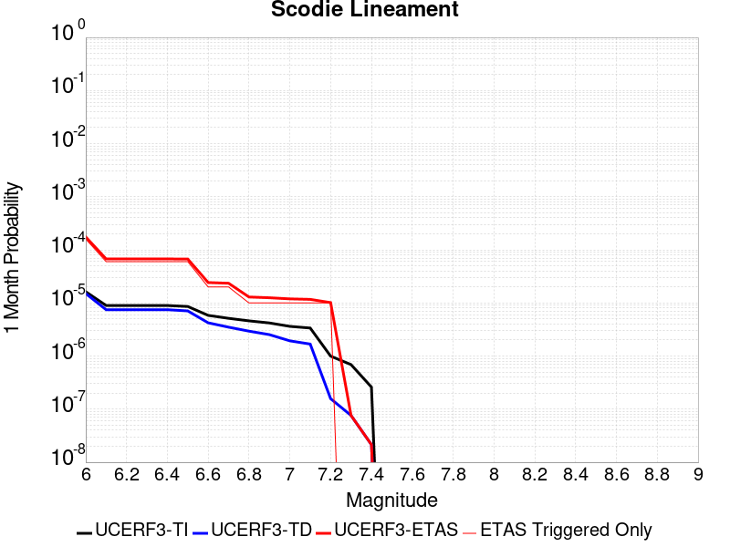 |  | 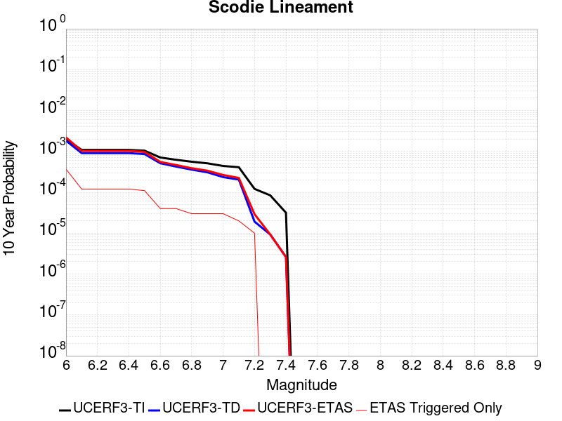 |

| Magnitude | 1 wk TI Prob | 1 wk TD Prob | 1 wk ETAS Prob | 1 wk ETAS/TD Gain | 1 wk ETAS Triggered Only | 1 mo TI Prob | 1 mo TD Prob | 1 mo ETAS Prob | 1 mo ETAS/TD Gain | 1 mo ETAS Triggered Only | 1 yr TI Prob | 1 yr TD Prob | 1 yr ETAS Prob | 1 yr ETAS/TD Gain | 1 yr ETAS Triggered Only | 10 yr TI Prob | 10 yr TD Prob | 10 yr ETAS Prob | 10 yr ETAS/TD Gain | 10 yr ETAS Triggered Only |
|-----|-----|-----|-----|-----|-----|-----|-----|-----|-----|-----|-----|-----|-----|-----|-----|-----|-----|-----|-----|-----|
| 6.0 | 3.8045596E-6 | 3.5124233E-6 | 1.0351207E-4 | 29.470274 | 1.0E-4 | 1.6305154E-5 | 1.5053181E-5 | 1.7505078E-4 | 11.628822 | 1.6E-4 | 1.9849716E-4 | 1.8326161E-4 | 4.5321212E-4 | 2.4730337 | 2.7E-4 | 0.0019831995 | 0.0018315508 | 0.002200873 | 1.2016445 | 3.7E-4 |
| 6.1 | 2.088641E-6 | 1.742396E-6 | 2.174236E-5 | 12.478428 | 2.0E-5 | 8.951288E-6 | 7.467393E-6 | 6.746694E-5 | 9.034872 | 6.0E-5 | 1.08976485E-4 | 9.0912356E-5 | 1.9090326E-4 | 2.0998604 | 1.0E-4 | 0.0010892305 | 9.088137E-4 | 0.0010287046 | 1.1319202 | 1.2E-4 |
| 6.2 | 2.088641E-6 | 1.742396E-6 | 2.174236E-5 | 12.478428 | 2.0E-5 | 8.951288E-6 | 7.467393E-6 | 6.746694E-5 | 9.034872 | 6.0E-5 | 1.08976485E-4 | 9.0912356E-5 | 1.9090326E-4 | 2.0998604 | 1.0E-4 | 0.0010892305 | 9.088137E-4 | 0.0010287046 | 1.1319202 | 1.2E-4 |
| 6.3 | 2.088641E-6 | 1.742396E-6 | 2.174236E-5 | 12.478428 | 2.0E-5 | 8.951288E-6 | 7.467393E-6 | 6.746694E-5 | 9.034872 | 6.0E-5 | 1.08976485E-4 | 9.0912356E-5 | 1.9090326E-4 | 2.0998604 | 1.0E-4 | 0.0010892305 | 9.088137E-4 | 0.0010287046 | 1.1319202 | 1.2E-4 |
| 6.4 | 2.088641E-6 | 1.742396E-6 | 2.174236E-5 | 12.478428 | 2.0E-5 | 8.951288E-6 | 7.467393E-6 | 6.746694E-5 | 9.034872 | 6.0E-5 | 1.08976485E-4 | 9.0912356E-5 | 1.9090326E-4 | 2.0998604 | 1.0E-4 | 0.0010892305 | 9.088137E-4 | 0.0010287046 | 1.1319202 | 1.2E-4 |
| 6.5 | 2.0019552E-6 | 1.652053E-6 | 2.165202E-5 | 13.10613 | 2.0E-5 | 8.57978E-6 | 7.0802116E-6 | 6.707979E-5 | 9.474263 | 6.0E-5 | 1.04453815E-4 | 8.6198794E-5 | 1.7619104E-4 | 2.0440083 | 9.0E-5 | 0.0010440473 | 8.6171523E-4 | 9.716205E-4 | 1.1275424 | 1.1E-4 |
| 6.6 | 1.3619391E-6 | 9.862732E-7 | 1.0986263E-5 | 11.139169 | 1.0E-5 | 5.8368687E-6 | 4.226879E-6 | 2.4226794E-5 | 5.7316036 | 2.0E-5 | 7.106156E-5 | 5.146114E-5 | 8.145959E-5 | 1.5829341 | 3.0E-5 | 7.103884E-4 | 5.145023E-4 | 5.5448175E-4 | 1.077705 | 4.0E-5 |
| 6.7 | 1.1984642E-6 | 8.165374E-7 | 1.08165295E-5 | 13.246827 | 1.0E-5 | 5.136265E-6 | 3.4994416E-6 | 2.3499371E-5 | 6.7151775 | 2.0E-5 | 6.2532235E-5 | 4.260495E-5 | 7.260367E-5 | 1.7041136 | 3.0E-5 | 6.251464E-4 | 4.2597557E-4 | 4.6595852E-4 | 1.093862 | 4.0E-5 |
| 6.8 | 1.0734544E-6 | 6.8694516E-7 | 6.8694516E-7 | 1.0 | 0.0 | 4.600511E-6 | 2.9440478E-6 | 1.2944019E-5 | 4.396674 | 1.0E-5 | 5.600978E-5 | 3.5843255E-5 | 5.5842538E-5 | 1.557965 | 2.0E-5 | 5.5995665E-4 | 3.5838122E-4 | 3.8837048E-4 | 1.0836798 | 3.0E-5 |
| 6.9 | 9.805461E-7 | 5.9079764E-7 | 5.9079764E-7 | 1.0 | 0.0 | 4.2023335E-6 | 2.5319878E-6 | 1.2531963E-5 | 4.949456 | 1.0E-5 | 5.116221E-5 | 3.0826577E-5 | 5.0825958E-5 | 1.6487708 | 2.0E-5 | 5.115043E-4 | 3.082289E-4 | 3.3821966E-4 | 1.0973003 | 3.0E-5 |
| 7.0 | 8.4579455E-7 | 4.515376E-7 | 4.515376E-7 | 1.0 | 0.0 | 3.6248287E-6 | 1.93516E-6 | 1.1935141E-5 | 6.1675215 | 1.0E-5 | 4.4131397E-5 | 2.3560364E-5 | 4.3559892E-5 | 1.8488634 | 2.0E-5 | 4.4122632E-4 | 2.3558305E-4 | 2.65576E-4 | 1.1273136 | 3.0E-5 |
| 7.1 | 7.868234E-7 | 3.9229954E-7 | 3.9229954E-7 | 1.0 | 0.0 | 3.372096E-6 | 1.6812828E-6 | 1.1681266E-5 | 6.9478292 | 1.0E-5 | 4.1054496E-5 | 2.0469468E-5 | 3.0469262E-5 | 1.4885225 | 1.0E-5 | 4.1046913E-4 | 2.0467985E-4 | 2.2467575E-4 | 1.0976936 | 2.0E-5 |
| 7.2 | 2.3247996E-7 | 3.6753566E-8 | 3.6753566E-8 | 1.0 | 0.0 | 9.963424E-7 | 1.5751526E-7 | 1.0157513E-5 | 64.4859 | 1.0E-5 | 1.21304E-5 | 1.9177469E-6 | 1.19177275E-5 | 6.2144427 | 1.0E-5 | 1.2129738E-4 | 1.9177312E-5 | 2.9177121E-5 | 1.5214394 | 1.0E-5 |
| 7.3 | 1.6113793E-7 | 1.7774124E-8 | 1.7774124E-8 | 1.0 | 0.0 | 6.90591E-7 | 7.6174814E-8 | 7.6174814E-8 | 1.0 | 0.0 | 8.407913E-6 | 9.27428E-7 | 9.27428E-7 | 1.0 | 0.0 | 8.4075946E-5 | 9.274245E-6 | 9.274245E-6 | 1.0 | 0.0 |
| 7.4 | 6.073129E-8 | 4.9982387E-9 | 4.9982387E-9 | 1.0 | 0.0 | 2.6027692E-7 | 2.1421023E-8 | 2.1421023E-8 | 1.0 | 0.0 | 3.168867E-6 | 2.6080093E-7 | 2.6080093E-7 | 1.0 | 0.0 | 3.1688218E-5 | 2.6080077E-6 | 2.6080077E-6 | 1.0 | 0.0 |

## San Jacinto (San Bernardino)
*[(top)](#table-of-contents)*

| 1 Week | 1 Month | 1 Year | 10 Year |
|-----|-----|-----|-----|
|  |  |  |  |

| Magnitude | 1 wk TI Prob | 1 wk TD Prob | 1 wk ETAS Prob | 1 wk ETAS/TD Gain | 1 wk ETAS Triggered Only | 1 mo TI Prob | 1 mo TD Prob | 1 mo ETAS Prob | 1 mo ETAS/TD Gain | 1 mo ETAS Triggered Only | 1 yr TI Prob | 1 yr TD Prob | 1 yr ETAS Prob | 1 yr ETAS/TD Gain | 1 yr ETAS Triggered Only | 10 yr TI Prob | 10 yr TD Prob | 10 yr ETAS Prob | 10 yr ETAS/TD Gain | 10 yr ETAS Triggered Only |
|-----|-----|-----|-----|-----|-----|-----|-----|-----|-----|-----|-----|-----|-----|-----|-----|-----|-----|-----|-----|-----|
| 6.0 | 3.402057E-5 | 3.440952E-5 | 1.744047E-4 | 5.0685015 | 1.4E-4 | 1.457943E-4 | 1.4746105E-4 | 2.9743894E-4 | 2.017068 | 1.5E-4 | 0.0017736002 | 0.0017938616 | 0.002033431 | 1.1335496 | 2.4E-4 | 0.017595116 | 0.018530214 | 0.018863915 | 1.0180085 | 3.4E-4 |
| 6.1 | 3.402057E-5 | 3.440952E-5 | 1.744047E-4 | 5.0685015 | 1.4E-4 | 1.457943E-4 | 1.4746105E-4 | 2.9743894E-4 | 2.017068 | 1.5E-4 | 0.0017736002 | 0.0017938616 | 0.002033431 | 1.1335496 | 2.4E-4 | 0.017595116 | 0.018530214 | 0.018863915 | 1.0180085 | 3.4E-4 |
| 6.2 | 3.402057E-5 | 3.440952E-5 | 1.744047E-4 | 5.0685015 | 1.4E-4 | 1.457943E-4 | 1.4746105E-4 | 2.9743894E-4 | 2.017068 | 1.5E-4 | 0.0017736002 | 0.0017938616 | 0.002033431 | 1.1335496 | 2.4E-4 | 0.017595116 | 0.018530214 | 0.018863915 | 1.0180085 | 3.4E-4 |
| 6.3 | 3.402057E-5 | 3.440952E-5 | 1.744047E-4 | 5.0685015 | 1.4E-4 | 1.457943E-4 | 1.4746105E-4 | 2.9743894E-4 | 2.017068 | 1.5E-4 | 0.0017736002 | 0.0017938616 | 0.002033431 | 1.1335496 | 2.4E-4 | 0.017595116 | 0.018530214 | 0.018863915 | 1.0180085 | 3.4E-4 |
| 6.4 | 3.3941633E-5 | 3.4310422E-5 | 1.7430562E-4 | 5.0802526 | 1.4E-4 | 1.4545603E-4 | 1.470364E-4 | 2.9701434E-4 | 2.0200057 | 1.5E-4 | 0.0017694886 | 0.0017887 | 0.0020282706 | 1.1339357 | 2.4E-4 | 0.01755465 | 0.01847947 | 0.018813187 | 1.0180588 | 3.4E-4 |
| 6.5 | 3.33728E-5 | 3.3602002E-5 | 1.7359729E-4 | 5.1662784 | 1.4E-4 | 1.4301843E-4 | 1.4400063E-4 | 2.9397904E-4 | 2.041512 | 1.5E-4 | 0.0017398586 | 0.0017517991 | 0.0019913788 | 1.136762 | 2.4E-4 | 0.017262997 | 0.01811655 | 0.01845039 | 1.0184274 | 3.4E-4 |
| 6.6 | 3.3320426E-5 | 3.353611E-5 | 1.7353141E-4 | 5.174464 | 1.4E-4 | 1.4279402E-4 | 1.4371828E-4 | 2.9369674E-4 | 2.0435586 | 1.5E-4 | 0.0017371306 | 0.0017483671 | 0.0019879474 | 1.137031 | 2.4E-4 | 0.01723614 | 0.018082798 | 0.018416649 | 1.0184624 | 3.4E-4 |
| 6.7 | 3.3314896E-5 | 3.352629E-5 | 1.7352159E-4 | 5.175688 | 1.4E-4 | 1.4277032E-4 | 1.4367618E-4 | 2.9365462E-4 | 2.0438643 | 1.5E-4 | 0.0017368427 | 0.0017478553 | 0.0019874359 | 1.1370711 | 2.4E-4 | 0.017233305 | 0.018077789 | 0.018411642 | 1.0184677 | 3.4E-4 |
| 6.8 | 3.3233475E-5 | 3.3421456E-5 | 1.7341677E-4 | 5.188786 | 1.4E-4 | 1.424214E-4 | 1.4322695E-4 | 2.9320546E-4 | 2.047139 | 1.5E-4 | 0.0017326013 | 0.0017423946 | 0.0019819764 | 1.1375015 | 2.4E-4 | 0.01719155 | 0.01802408 | 0.018357951 | 1.0185237 | 3.4E-4 |
| 6.9 | 3.3193064E-5 | 3.33628E-5 | 1.7335813E-4 | 5.1961503 | 1.4E-4 | 1.4224823E-4 | 1.4297561E-4 | 2.9295415E-4 | 2.04898 | 1.5E-4 | 0.0017304964 | 0.0017393394 | 0.001978922 | 1.1377435 | 2.4E-4 | 0.017170826 | 0.017994128 | 0.018328011 | 1.018555 | 3.4E-4 |
| 7.0 | 3.315477E-5 | 3.3301247E-5 | 1.7329659E-4 | 5.2039065 | 1.4E-4 | 1.4208413E-4 | 1.4271183E-4 | 2.926904E-4 | 2.050919 | 1.5E-4 | 0.0017285016 | 0.0017361331 | 0.0019757163 | 1.1379982 | 2.4E-4 | 0.017151188 | 0.017962737 | 0.01829663 | 1.0185881 | 3.4E-4 |
| 7.1 | 3.308232E-5 | 3.3171575E-5 | 1.7316693E-4 | 5.220341 | 1.4E-4 | 1.4177368E-4 | 1.4215615E-4 | 2.9213482E-4 | 2.0550277 | 1.5E-4 | 0.0017247278 | 0.0017293784 | 0.0019689633 | 1.1385382 | 2.4E-4 | 0.01711403 | 0.017896736 | 0.01823065 | 1.0186579 | 3.4E-4 |
| 7.2 | 3.2980828E-5 | 3.3030683E-5 | 1.7302606E-4 | 5.2383432 | 1.4E-4 | 1.4133875E-4 | 1.415524E-4 | 2.9153118E-4 | 2.0595284 | 1.5E-4 | 0.001719441 | 0.0017220394 | 0.001961626 | 1.1391296 | 2.4E-4 | 0.017061977 | 0.017824812 | 0.01815875 | 1.0187346 | 3.4E-4 |
| 7.3 | 3.289099E-5 | 3.2873948E-5 | 1.7286935E-4 | 5.258551 | 1.4E-4 | 1.4095377E-4 | 1.4088074E-4 | 2.908596E-4 | 2.0645802 | 1.5E-4 | 0.0017147611 | 0.001713875 | 0.0019534635 | 1.1397935 | 2.4E-4 | 0.017015897 | 0.017745057 | 0.018079024 | 1.0188203 | 3.4E-4 |
| 7.4 | 3.2844455E-5 | 3.278645E-5 | 1.7278186E-4 | 5.2699165 | 1.4E-4 | 1.4075435E-4 | 1.405058E-4 | 2.9048472E-4 | 2.0674217 | 1.5E-4 | 0.0017123371 | 0.0017093171 | 0.0019489068 | 1.140167 | 2.4E-4 | 0.016992027 | 0.017700594 | 0.018034577 | 1.0188684 | 3.4E-4 |
| 7.5 | 3.274421E-5 | 3.2650994E-5 | 1.7264643E-4 | 5.2876315 | 1.4E-4 | 1.4032479E-4 | 1.3992534E-4 | 2.8990433E-4 | 2.0718503 | 1.5E-4 | 0.0017071153 | 0.0017022609 | 0.0019418524 | 1.140749 | 2.4E-4 | 0.016940609 | 0.017631203 | 0.017965209 | 1.018944 | 3.4E-4 |
| 7.6 | 3.248836E-5 | 3.241112E-5 | 1.7240658E-4 | 5.319365 | 1.4E-4 | 1.3922839E-4 | 1.3889742E-4 | 2.888766E-4 | 2.0797837 | 1.5E-4 | 0.0016937876 | 0.0016897656 | 0.0019293601 | 1.1417916 | 2.4E-4 | 0.016809355 | 0.017507005 | 0.017841054 | 1.0190808 | 3.4E-4 |
| 7.7 | 3.0551753E-5 | 3.1119624E-5 | 1.7111527E-4 | 5.498629 | 1.4E-4 | 1.3092952E-4 | 1.33363E-4 | 2.83343E-4 | 2.1245997 | 1.5E-4 | 0.0015929012 | 0.0016224864 | 0.001862097 | 1.1476811 | 2.4E-4 | 0.015815316 | 0.016834596 | 0.017168872 | 1.0198565 | 3.4E-4 |
| 7.8 | 2.6160822E-5 | 2.8233839E-5 | 1.6822989E-4 | 5.958449 | 1.4E-4 | 1.1211299E-4 | 1.2099656E-4 | 2.709784E-4 | 2.2395546 | 1.5E-4 | 0.001364121 | 0.0014721385 | 0.0017117852 | 1.1627882 | 2.4E-4 | 0.013557776 | 0.015322595 | 0.015657386 | 1.0218494 | 3.4E-4 |
| 7.9 | 2.041141E-5 | 2.2110258E-5 | 1.5210739E-4 | 6.8794937 | 1.3E-4 | 8.747454E-5 | 9.475482E-5 | 2.3474154E-4 | 2.4773574 | 1.4E-4 | 0.001064482 | 0.0011530301 | 0.0013727763 | 1.1905816 | 2.2E-4 | 0.010593975 | 0.012102578 | 0.012418705 | 1.0261207 | 3.2E-4 |
| 8.0 | 1.51553E-5 | 1.487384E-5 | 1.1487235E-4 | 7.7231135 | 1.0E-4 | 6.4949665E-5 | 6.374347E-5 | 1.7373647E-4 | 2.7255569 | 1.1E-4 | 7.904753E-4 | 7.75801E-4 | 9.556614E-4 | 1.2318382 | 1.8E-4 | 0.007876694 | 0.008247131 | 0.008504986 | 1.0312661 | 2.6E-4 |
| 8.1 | 9.847068E-6 | 7.885033E-6 | 1.7884953E-5 | 2.2682157 | 1.0E-5 | 4.2201038E-5 | 3.3792563E-5 | 4.3792224E-5 | 1.2959131 | 1.0E-5 | 5.136765E-4 | 4.1134722E-4 | 4.5133076E-4 | 1.0972015 | 4.0E-5 | 0.0051249075 | 0.0044371192 | 0.0045068087 | 1.015706 | 7.0E-5 |
| 8.2 | 3.9660817E-6 | 1.439068E-6 | 1.439068E-6 | 1.0 | 0.0 | 1.6997383E-5 | 6.1674195E-6 | 6.1674195E-6 | 1.0 | 0.0 | 2.0692349E-4 | 7.508577E-5 | 7.508577E-5 | 1.0 | 0.0 | 0.002067309 | 8.749206E-4 | 8.749206E-4 | 1.0 | 0.0 |
| 8.3 | 1.258898E-6 | 3.4233418E-7 | 3.4233418E-7 | 1.0 | 0.0 | 5.395266E-6 | 1.4671457E-6 | 1.4671457E-6 | 1.0 | 0.0 | 6.568538E-5 | 1.7862356E-5 | 1.7862356E-5 | 1.0 | 0.0 | 6.566597E-4 | 2.1581895E-4 | 2.1581895E-4 | 1.0 | 0.0 |

## Lake Isabella (Seismicity)
*[(top)](#table-of-contents)*

| 1 Week | 1 Month | 1 Year | 10 Year |
|-----|-----|-----|-----|
|  |  | 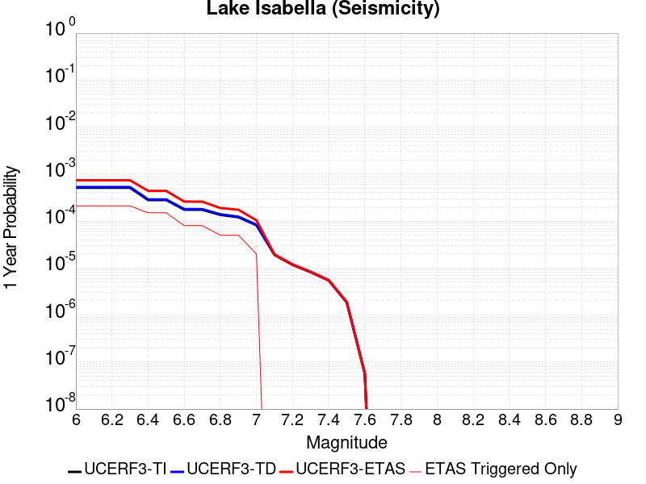 |  |

| Magnitude | 1 wk TI Prob | 1 wk TD Prob | 1 wk ETAS Prob | 1 wk ETAS/TD Gain | 1 wk ETAS Triggered Only | 1 mo TI Prob | 1 mo TD Prob | 1 mo ETAS Prob | 1 mo ETAS/TD Gain | 1 mo ETAS Triggered Only | 1 yr TI Prob | 1 yr TD Prob | 1 yr ETAS Prob | 1 yr ETAS/TD Gain | 1 yr ETAS Triggered Only | 10 yr TI Prob | 10 yr TD Prob | 10 yr ETAS Prob | 10 yr ETAS/TD Gain | 10 yr ETAS Triggered Only |
|-----|-----|-----|-----|-----|-----|-----|-----|-----|-----|-----|-----|-----|-----|-----|-----|-----|-----|-----|-----|-----|
| 6.0 | 9.816225E-6 | 1.0143872E-5 | 1.2014276E-4 | 11.843876 | 1.1E-4 | 4.206886E-5 | 4.347309E-5 | 1.9346656E-4 | 4.45026 | 1.5E-4 | 5.12068E-4 | 5.291702E-4 | 7.390591E-4 | 1.3966377 | 2.1E-4 | 0.0051088966 | 0.005280475 | 0.0055987854 | 1.0602806 | 3.2E-4 |
| 6.1 | 9.816225E-6 | 1.0143872E-5 | 1.2014276E-4 | 11.843876 | 1.1E-4 | 4.206886E-5 | 4.347309E-5 | 1.9346656E-4 | 4.45026 | 1.5E-4 | 5.12068E-4 | 5.291702E-4 | 7.390591E-4 | 1.3966377 | 2.1E-4 | 0.0051088966 | 0.005280475 | 0.0055987854 | 1.0602806 | 3.2E-4 |
| 6.2 | 9.816225E-6 | 1.0143872E-5 | 1.2014276E-4 | 11.843876 | 1.1E-4 | 4.206886E-5 | 4.347309E-5 | 1.9346656E-4 | 4.45026 | 1.5E-4 | 5.12068E-4 | 5.291702E-4 | 7.390591E-4 | 1.3966377 | 2.1E-4 | 0.0051088966 | 0.005280475 | 0.0055987854 | 1.0602806 | 3.2E-4 |
| 6.3 | 9.816225E-6 | 1.0143872E-5 | 1.2014276E-4 | 11.843876 | 1.1E-4 | 4.206886E-5 | 4.347309E-5 | 1.9346656E-4 | 4.45026 | 1.5E-4 | 5.12068E-4 | 5.291702E-4 | 7.390591E-4 | 1.3966377 | 2.1E-4 | 0.0051088966 | 0.005280475 | 0.0055987854 | 1.0602806 | 3.2E-4 |
| 6.4 | 5.377895E-6 | 5.544063E-6 | 9.554356E-5 | 17.233492 | 9.0E-5 | 2.3047918E-5 | 2.3760074E-5 | 1.4375722E-4 | 6.0503693 | 1.2E-4 | 2.8057228E-4 | 2.892443E-4 | 4.392009E-4 | 1.5184427 | 1.5E-4 | 0.002802183 | 0.002889051 | 0.0031084155 | 1.0759295 | 2.2E-4 |
| 6.5 | 5.377895E-6 | 5.544063E-6 | 9.554356E-5 | 17.233492 | 9.0E-5 | 2.3047918E-5 | 2.3760074E-5 | 1.4375722E-4 | 6.0503693 | 1.2E-4 | 2.8057228E-4 | 2.892443E-4 | 4.392009E-4 | 1.5184427 | 1.5E-4 | 0.002802183 | 0.002889051 | 0.0031084155 | 1.0759295 | 2.2E-4 |
| 6.6 | 3.3513732E-6 | 3.4489012E-6 | 6.344869E-5 | 18.396786 | 6.0E-5 | 1.43629495E-5 | 1.478093E-5 | 7.4780044E-5 | 5.0592246 | 6.0E-5 | 1.7485487E-4 | 1.7994437E-4 | 2.5992998E-4 | 1.4445019 | 8.0E-5 | 0.0017471735 | 0.0017981257 | 0.0019278919 | 1.0721675 | 1.3E-4 |
| 6.7 | 3.3341476E-6 | 3.4314182E-6 | 6.343121E-5 | 18.485422 | 6.0E-5 | 1.4289126E-5 | 1.4706004E-5 | 7.470512E-5 | 5.0799065 | 6.0E-5 | 1.7395621E-4 | 1.7903229E-4 | 2.5901798E-4 | 1.4467667 | 8.0E-5 | 0.001738201 | 0.0017890196 | 0.001918787 | 1.0725355 | 1.3E-4 |
| 6.8 | 2.5965799E-6 | 2.671071E-6 | 3.2670992E-5 | 12.2314205 | 3.0E-5 | 1.1128152E-5 | 1.1447402E-5 | 4.144706E-5 | 3.620652 | 3.0E-5 | 1.3547683E-4 | 1.3936435E-4 | 1.8935738E-4 | 1.3587219 | 5.0E-5 | 0.0013539427 | 0.0013928815 | 0.0014827561 | 1.0645243 | 9.0E-5 |
| 6.9 | 2.313924E-6 | 2.3803325E-6 | 3.238026E-5 | 13.603251 | 3.0E-5 | 9.916779E-6 | 1.0201392E-5 | 4.0201085E-5 | 3.9407454 | 3.0E-5 | 1.20730096E-4 | 1.2419597E-4 | 1.7418976E-4 | 1.4025395 | 5.0E-5 | 0.0012066453 | 0.0012413745 | 0.0013212753 | 1.0643647 | 8.0E-5 |
| 7.0 | 1.5640155E-6 | 1.6081271E-6 | 2.1608095E-5 | 13.436808 | 2.0E-5 | 6.702907E-6 | 6.89196E-6 | 2.6891821E-5 | 3.9019122 | 2.0E-5 | 8.1604834E-5 | 8.390718E-5 | 1.039055E-4 | 1.2383386 | 2.0E-5 | 8.157487E-4 | 8.388334E-4 | 8.8879146E-4 | 1.0595566 | 5.0E-5 |
| 7.1 | 3.6509945E-7 | 3.7240292E-7 | 3.7240292E-7 | 1.0 | 0.0 | 1.564711E-6 | 1.5960115E-6 | 1.5960115E-6 | 1.0 | 0.0 | 1.905019E-5 | 1.943127E-5 | 1.943127E-5 | 1.0 | 0.0 | 1.9048557E-4 | 1.9429601E-4 | 1.9429601E-4 | 1.0 | 0.0 |
| 7.2 | 2.2385696E-7 | 2.2812584E-7 | 2.2812584E-7 | 1.0 | 0.0 | 9.593866E-7 | 9.776818E-7 | 9.776818E-7 | 1.0 | 0.0 | 1.16804695E-5 | 1.1903212E-5 | 1.1903212E-5 | 1.0 | 0.0 | 1.16798554E-4 | 1.1902585E-4 | 1.1902585E-4 | 1.0 | 0.0 |
| 7.3 | 1.5670672E-7 | 1.5967795E-7 | 1.5967795E-7 | 1.0 | 0.0 | 6.7160005E-7 | 6.843339E-7 | 6.843339E-7 | 1.0 | 0.0 | 8.1767E-6 | 8.331734E-6 | 8.331734E-6 | 1.0 | 0.0 | 8.176399E-5 | 8.331428E-5 | 8.331428E-5 | 1.0 | 0.0 |
| 7.4 | 1.0414827E-7 | 1.06125455E-7 | 1.06125455E-7 | 1.0 | 0.0 | 4.4634967E-7 | 4.548233E-7 | 4.548233E-7 | 1.0 | 0.0 | 5.4342936E-6 | 5.53746E-6 | 5.53746E-6 | 1.0 | 0.0 | 5.4341606E-5 | 5.5373253E-5 | 5.5373253E-5 | 1.0 | 0.0 |
| 7.5 | 3.5529023E-8 | 3.6205932E-8 | 3.6205932E-8 | 1.0 | 0.0 | 1.5226723E-7 | 1.5516828E-7 | 1.5516828E-7 | 1.0 | 0.0 | 1.8538519E-6 | 1.8891723E-6 | 1.8891723E-6 | 1.0 | 0.0 | 1.8538365E-5 | 1.8891571E-5 | 1.8891571E-5 | 1.0 | 0.0 |
| 7.6 | 1.0796107E-9 | 1.0989505E-9 | 1.0989505E-9 | 1.0 | 0.0 | 4.6269033E-9 | 4.7097877E-9 | 4.7097877E-9 | 1.0 | 0.0 | 5.6332546E-8 | 5.7341666E-8 | 5.7341666E-8 | 1.0 | 0.0 | 5.6332533E-7 | 5.734166E-7 | 5.734166E-7 | 1.0 | 0.0 |

## Ludlow
*[(top)](#table-of-contents)*

| 1 Week | 1 Month | 1 Year | 10 Year |
|-----|-----|-----|-----|
|  | 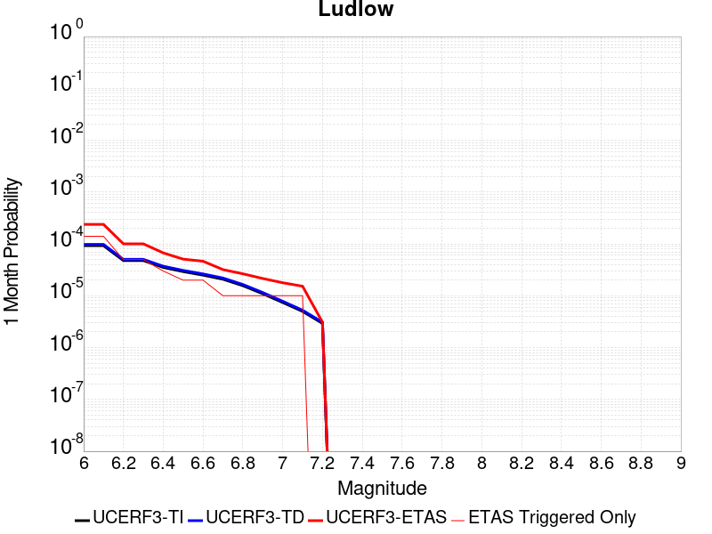 |  | 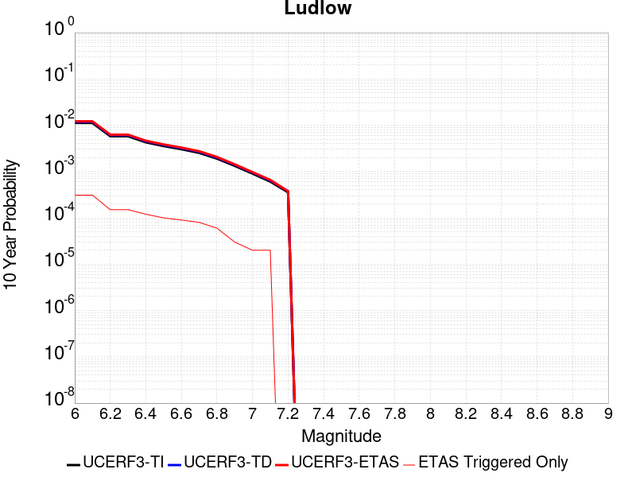 |

| Magnitude | 1 wk TI Prob | 1 wk TD Prob | 1 wk ETAS Prob | 1 wk ETAS/TD Gain | 1 wk ETAS Triggered Only | 1 mo TI Prob | 1 mo TD Prob | 1 mo ETAS Prob | 1 mo ETAS/TD Gain | 1 mo ETAS Triggered Only | 1 yr TI Prob | 1 yr TD Prob | 1 yr ETAS Prob | 1 yr ETAS/TD Gain | 1 yr ETAS Triggered Only | 10 yr TI Prob | 10 yr TD Prob | 10 yr ETAS Prob | 10 yr ETAS/TD Gain | 10 yr ETAS Triggered Only |
|-----|-----|-----|-----|-----|-----|-----|-----|-----|-----|-----|-----|-----|-----|-----|-----|-----|-----|-----|-----|-----|
| 6.0 | 2.160891E-5 | 2.282967E-5 | 1.1282761E-4 | 4.942148 | 9.0E-5 | 9.260633E-5 | 9.783801E-5 | 2.3782431E-4 | 2.4307966 | 1.4E-4 | 0.0011268988 | 0.0011905683 | 0.0014003182 | 1.1761763 | 2.1E-4 | 0.011212015 | 0.01184613 | 0.012152458 | 1.0258589 | 3.1E-4 |
| 6.1 | 2.160891E-5 | 2.282967E-5 | 1.1282761E-4 | 4.942148 | 9.0E-5 | 9.260633E-5 | 9.783801E-5 | 2.3782431E-4 | 2.4307966 | 1.4E-4 | 0.0011268988 | 0.0011905683 | 0.0014003182 | 1.1761763 | 2.1E-4 | 0.011212015 | 0.01184613 | 0.012152458 | 1.0258589 | 3.1E-4 |
| 6.2 | 1.1137236E-5 | 1.1743854E-5 | 3.1743617E-5 | 2.7029984 | 2.0E-5 | 4.7730136E-5 | 5.0329854E-5 | 1.00327336E-4 | 1.9933962 | 5.0E-5 | 5.8095943E-4 | 6.1259815E-4 | 7.02543E-4 | 1.1468252 | 9.0E-5 | 0.0057944297 | 0.006109556 | 0.0062586395 | 1.0244017 | 1.5E-4 |
| 6.3 | 1.1137236E-5 | 1.1743854E-5 | 3.1743617E-5 | 2.7029984 | 2.0E-5 | 4.7730136E-5 | 5.0329854E-5 | 1.00327336E-4 | 1.9933962 | 5.0E-5 | 5.8095943E-4 | 6.1259815E-4 | 7.02543E-4 | 1.1468252 | 9.0E-5 | 0.0057944297 | 0.006109556 | 0.0062586395 | 1.0244017 | 1.5E-4 |
| 6.4 | 8.221337E-6 | 8.666666E-6 | 1.866658E-5 | 2.1538363 | 1.0E-5 | 3.523383E-5 | 3.7142338E-5 | 6.714122E-5 | 1.8076737 | 3.0E-5 | 4.288874E-4 | 4.5211572E-4 | 5.2208407E-4 | 1.1547576 | 7.0E-5 | 0.004280606 | 0.0045121294 | 0.004631588 | 1.026475 | 1.2E-4 |
| 6.5 | 6.828591E-6 | 7.198153E-6 | 1.7198081E-5 | 2.3892353 | 1.0E-5 | 2.926506E-5 | 3.084887E-5 | 5.084825E-5 | 1.648302 | 2.0E-5 | 3.5624387E-4 | 3.7552134E-4 | 4.354988E-4 | 1.1597179 | 6.0E-5 | 0.003556733 | 0.0037489794 | 0.0038486044 | 1.0265739 | 1.0E-4 |
| 6.6 | 5.8328783E-6 | 6.149642E-6 | 1.6149581E-5 | 2.6261008 | 1.0E-5 | 2.499781E-5 | 2.6355347E-5 | 4.635482E-5 | 1.7588392 | 2.0E-5 | 3.0430584E-4 | 3.2082992E-4 | 3.7081388E-4 | 1.1557958 | 5.0E-5 | 0.0030388946 | 0.0032037518 | 0.0032934635 | 1.028002 | 9.0E-5 |
| 6.7 | 4.8614647E-6 | 5.1246393E-6 | 5.1246393E-6 | 1.0 | 0.0 | 2.0834683E-5 | 2.1962558E-5 | 3.196234E-5 | 1.4553103 | 1.0E-5 | 2.5363272E-4 | 2.6736196E-4 | 3.0735126E-4 | 1.1495699 | 4.0E-5 | 0.0025334344 | 0.002670467 | 0.0027502533 | 1.0298773 | 8.0E-5 |
| 6.8 | 3.6530398E-6 | 3.8510625E-6 | 3.8510625E-6 | 1.0 | 0.0 | 1.565579E-5 | 1.6504453E-5 | 2.6504287E-5 | 1.6058872 | 1.0E-5 | 1.9059259E-4 | 2.0092363E-4 | 2.409156E-4 | 1.1990407 | 4.0E-5 | 0.001904292 | 0.0020074656 | 0.0020673452 | 1.0298284 | 6.0E-5 |
| 6.9 | 2.5515399E-6 | 2.6897744E-6 | 2.6897744E-6 | 1.0 | 0.0 | 1.0935125E-5 | 1.1527555E-5 | 2.152744E-5 | 1.8674766 | 1.0E-5 | 1.33127E-4 | 1.4033925E-4 | 1.7033504E-4 | 1.2137377 | 3.0E-5 | 0.0013304729 | 0.0014025362 | 0.0014324941 | 1.0213598 | 3.0E-5 |
| 7.0 | 1.7333412E-6 | 1.8273828E-6 | 1.8273828E-6 | 1.0 | 0.0 | 7.4285836E-6 | 7.831618E-6 | 1.783154E-5 | 2.2768655 | 1.0E-5 | 9.043925E-5 | 9.5345975E-5 | 1.1534406E-4 | 1.2097424 | 2.0E-5 | 9.040245E-4 | 9.530699E-4 | 9.7305083E-4 | 1.0209649 | 2.0E-5 |
| 7.1 | 1.1649183E-6 | 1.2274907E-6 | 1.2274907E-6 | 1.0 | 0.0 | 4.9924975E-6 | 5.2606642E-6 | 1.5260612E-5 | 2.9008906 | 1.0E-5 | 6.0781964E-5 | 6.4046835E-5 | 8.4045554E-5 | 1.3122514 | 2.0E-5 | 6.076534E-4 | 6.402962E-4 | 6.602834E-4 | 1.0312155 | 2.0E-5 |
| 7.2 | 6.8377943E-7 | 7.195401E-7 | 7.195401E-7 | 1.0 | 0.0 | 2.93048E-6 | 3.0837402E-6 | 3.0837402E-6 | 1.0 | 0.0 | 3.5678007E-5 | 3.7543985E-5 | 3.7543985E-5 | 1.0 | 0.0 | 3.567228E-4 | 3.753856E-4 | 3.753856E-4 | 1.0 | 0.0 |

## San Andreas (Coachella) rev
*[(top)](#table-of-contents)*

| 1 Week | 1 Month | 1 Year | 10 Year |
|-----|-----|-----|-----|
|  |  |  |  |

| Magnitude | 1 wk TI Prob | 1 wk TD Prob | 1 wk ETAS Prob | 1 wk ETAS/TD Gain | 1 wk ETAS Triggered Only | 1 mo TI Prob | 1 mo TD Prob | 1 mo ETAS Prob | 1 mo ETAS/TD Gain | 1 mo ETAS Triggered Only | 1 yr TI Prob | 1 yr TD Prob | 1 yr ETAS Prob | 1 yr ETAS/TD Gain | 1 yr ETAS Triggered Only | 10 yr TI Prob | 10 yr TD Prob | 10 yr ETAS Prob | 10 yr ETAS/TD Gain | 10 yr ETAS Triggered Only |
|-----|-----|-----|-----|-----|-----|-----|-----|-----|-----|-----|-----|-----|-----|-----|-----|-----|-----|-----|-----|-----|
| 6.0 | 1.1854714E-4 | 3.4214937E-4 | 5.020946E-4 | 1.467472 | 1.6E-4 | 5.079602E-4 | 0.001465535 | 0.0016452712 | 1.122642 | 1.8E-4 | 0.0061668935 | 0.017698292 | 0.017904576 | 1.0116556 | 2.1E-4 | 0.0599854 | 0.15847276 | 0.15872522 | 1.0015931 | 3.0E-4 |
| 6.1 | 1.1854714E-4 | 3.4214937E-4 | 5.020946E-4 | 1.467472 | 1.6E-4 | 5.079602E-4 | 0.001465535 | 0.0016452712 | 1.122642 | 1.8E-4 | 0.0061668935 | 0.017698292 | 0.017904576 | 1.0116556 | 2.1E-4 | 0.0599854 | 0.15847276 | 0.15872522 | 1.0015931 | 3.0E-4 |
| 6.2 | 1.13762944E-4 | 3.3163183E-4 | 4.915788E-4 | 1.4823028 | 1.6E-4 | 4.8746433E-4 | 0.0014205095 | 0.0016002539 | 1.126535 | 1.8E-4 | 0.0059187403 | 0.01715887 | 0.017365268 | 1.0120286 | 2.1E-4 | 0.05763561 | 0.1540141 | 0.15426789 | 1.0016478 | 3.0E-4 |
| 6.3 | 1.13544E-4 | 3.3114312E-4 | 4.910901E-4 | 1.4830147 | 1.6E-4 | 4.865264E-4 | 0.0014184174 | 0.0015981621 | 1.126722 | 1.8E-4 | 0.005907383 | 0.017133798 | 0.017340202 | 1.0120465 | 2.1E-4 | 0.057527937 | 0.15380971 | 0.15406357 | 1.0016505 | 3.0E-4 |
| 6.4 | 1.09871966E-4 | 3.230243E-4 | 4.829726E-4 | 1.4951588 | 1.6E-4 | 4.7079485E-4 | 0.0013836597 | 0.0015634106 | 1.1299098 | 1.8E-4 | 0.0057168733 | 0.016717194 | 0.016923683 | 1.0123519 | 2.1E-4 | 0.055720214 | 0.15037732 | 0.15062371 | 1.0016385 | 2.9E-4 |
| 6.5 | 1.0854412E-4 | 3.2009376E-4 | 4.8004257E-4 | 1.4996935 | 1.6E-4 | 4.6510613E-4 | 0.0013711136 | 0.0015508668 | 1.1311002 | 1.8E-4 | 0.0056479746 | 0.01656678 | 0.0167733 | 1.012466 | 2.1E-4 | 0.05506567 | 0.14913206 | 0.14937882 | 1.0016546 | 2.9E-4 |
| 6.6 | 1.0710313E-4 | 3.1703574E-4 | 4.76985E-4 | 1.5045149 | 1.6E-4 | 4.5893266E-4 | 0.0013580215 | 0.001537777 | 1.1323658 | 1.8E-4 | 0.0055731996 | 0.016409794 | 0.016616348 | 1.0125872 | 2.1E-4 | 0.054354843 | 0.14782797 | 0.1480751 | 1.0016718 | 2.9E-4 |
| 6.7 | 1.0632246E-4 | 3.153635E-4 | 4.7531302E-4 | 1.5071911 | 1.6E-4 | 4.555881E-4 | 0.0013508621 | 0.001530619 | 1.1330682 | 1.8E-4 | 0.005532687 | 0.016323937 | 0.01653051 | 1.0126545 | 2.1E-4 | 0.05396952 | 0.1471143 | 0.14736164 | 1.0016812 | 2.9E-4 |
| 6.8 | 1.0560119E-4 | 3.1344662E-4 | 4.7339647E-4 | 1.5102937 | 1.6E-4 | 4.52498E-4 | 0.0013426555 | 0.0015224138 | 1.1338826 | 1.8E-4 | 0.005495256 | 0.016225515 | 0.016432108 | 1.0127326 | 2.1E-4 | 0.053613376 | 0.14629708 | 0.14654465 | 1.0016923 | 2.9E-4 |
| 6.9 | 1.0201819E-4 | 3.0439065E-4 | 4.6434195E-4 | 1.5254803 | 1.6E-4 | 4.3714754E-4 | 0.0013038835 | 0.0014836488 | 1.1378691 | 1.8E-4 | 0.0053092903 | 0.015760388 | 0.01596708 | 1.0131146 | 2.1E-4 | 0.051842213 | 0.14244203 | 0.14269072 | 1.0017459 | 2.9E-4 |
| 7.0 | 8.4153144E-5 | 2.600935E-4 | 4.200519E-4 | 1.6150033 | 1.6E-4 | 3.6060647E-4 | 0.0011142137 | 0.0012940132 | 1.1613688 | 1.8E-4 | 0.0043815486 | 0.013482024 | 0.013689193 | 1.0153663 | 2.1E-4 | 0.042961594 | 0.12328741 | 0.12354165 | 1.0020622 | 2.9E-4 |
| 7.1 | 8.15236E-5 | 2.5313106E-4 | 4.1309057E-4 | 1.6319237 | 1.6E-4 | 3.4934006E-4 | 0.0010843998 | 0.0012642046 | 1.1658105 | 1.8E-4 | 0.004244923 | 0.013123466 | 0.01333071 | 1.0157919 | 2.1E-4 | 0.04164747 | 0.12023389 | 0.12048903 | 1.0021219 | 2.9E-4 |
| 7.2 | 7.4344665E-5 | 2.3365377E-4 | 3.9361638E-4 | 1.6846138 | 1.6E-4 | 3.1858106E-4 | 0.0010009923 | 0.0011808121 | 1.1796416 | 1.8E-4 | 0.0038718276 | 0.012119723 | 0.012327177 | 1.0171171 | 2.1E-4 | 0.038050596 | 0.11170447 | 0.11196208 | 1.0023061 | 2.9E-4 |
| 7.3 | 6.8007364E-5 | 2.100525E-4 | 3.7001888E-4 | 1.7615544 | 1.6E-4 | 2.9142757E-4 | 8.999172E-4 | 0.0010797553 | 1.1998384 | 1.8E-4 | 0.0035423585 | 0.010902066 | 0.011109776 | 1.0190524 | 2.1E-4 | 0.034864213 | 0.10132341 | 0.101584025 | 1.0025722 | 2.9E-4 |
| 7.4 | 5.036096E-5 | 1.4755785E-4 | 3.0753424E-4 | 2.0841606 | 1.6E-4 | 2.1581483E-4 | 6.322384E-4 | 8.1212464E-4 | 1.2845228 | 1.8E-4 | 0.0026243792 | 0.007670532 | 0.007878921 | 1.0271676 | 2.1E-4 | 0.02593602 | 0.07296507 | 0.07322464 | 1.0035574 | 2.8E-4 |
| 7.5 | 3.9626622E-5 | 1.1347998E-4 | 2.7346183E-4 | 2.4097803 | 1.6E-4 | 1.6981733E-4 | 4.8625248E-4 | 6.6616497E-4 | 1.3699981 | 1.8E-4 | 0.0020655652 | 0.0059041297 | 0.00611289 | 1.0353583 | 2.1E-4 | 0.02046471 | 0.056849003 | 0.057113085 | 1.0046453 | 2.8E-4 |
| 7.6 | 3.049247E-5 | 8.717372E-5 | 2.4715977E-4 | 2.8352554 | 1.6E-4 | 1.3067547E-4 | 3.7354833E-4 | 5.534811E-4 | 1.4816854 | 1.8E-4 | 0.0015898128 | 0.004538499 | 0.004747546 | 1.0460608 | 2.1E-4 | 0.01578487 | 0.044088718 | 0.044356372 | 1.0060709 | 2.8E-4 |
| 7.7 | 2.0268619E-5 | 6.221344E-5 | 2.2220348E-4 | 3.5716317 | 1.6E-4 | 8.6862616E-5 | 2.666018E-4 | 4.465538E-4 | 1.6749842 | 1.8E-4 | 0.0010570392 | 0.0032410505 | 0.0034503697 | 1.0645838 | 2.1E-4 | 0.010520253 | 0.031725027 | 0.031996142 | 1.0085459 | 2.8E-4 |
| 7.8 | 1.8208906E-5 | 5.4605793E-5 | 2.1459705E-4 | 3.929932 | 1.6E-4 | 7.803583E-5 | 2.3400385E-4 | 4.1396174E-4 | 1.7690381 | 1.8E-4 | 9.496721E-4 | 0.002845278 | 0.0030546805 | 1.0735965 | 2.1E-4 | 0.009456239 | 0.028014725 | 0.028286882 | 1.0097147 | 2.8E-4 |
| 7.9 | 1.4513317E-5 | 4.0223807E-5 | 2.0021737E-4 | 4.977584 | 1.6E-4 | 6.219845E-5 | 1.7237637E-4 | 3.5234535E-4 | 2.0440466 | 1.8E-4 | 7.5700297E-4 | 0.0020966635 | 0.0022962443 | 1.0951897 | 2.0E-4 | 0.0075442945 | 0.020892484 | 0.021137262 | 1.011716 | 2.5E-4 |
| 8.0 | 1.23757245E-5 | 3.269232E-5 | 1.9268709E-4 | 5.893956 | 1.6E-4 | 5.3037744E-5 | 1.401024E-4 | 3.200772E-4 | 2.2845945 | 1.8E-4 | 6.4554316E-4 | 0.0017044134 | 0.0019040725 | 1.1171424 | 2.0E-4 | 0.006436711 | 0.017084355 | 0.017320253 | 1.0138079 | 2.4E-4 |
| 8.1 | 5.2156556E-6 | 9.0263675E-6 | 9.0263675E-6 | 1.0 | 0.0 | 2.2352619E-5 | 3.868386E-5 | 3.868386E-5 | 1.0 | 0.0 | 2.7210914E-4 | 4.708743E-4 | 4.708743E-4 | 1.0 | 0.0 | 0.0027177618 | 0.0049436176 | 0.004963519 | 1.0040256 | 2.0E-5 |
| 8.2 | 2.5238028E-6 | 2.9900607E-6 | 2.9900607E-6 | 1.0 | 0.0 | 1.0816252E-5 | 1.2814483E-5 | 1.2814483E-5 | 1.0 | 0.0 | 1.3167992E-4 | 1.5600519E-4 | 1.5600519E-4 | 1.0 | 0.0 | 0.0013160191 | 0.0017141779 | 0.0017241607 | 1.0058237 | 1.0E-5 |
| 8.3 | 2.0380091E-7 | 1.2224764E-7 | 1.2224764E-7 | 1.0 | 0.0 | 8.7343216E-7 | 5.2391835E-7 | 5.2391835E-7 | 1.0 | 0.0 | 1.0633985E-5 | 6.378688E-6 | 6.378688E-6 | 1.0 | 0.0 | 1.0633476E-4 | 6.70025E-5 | 6.70025E-5 | 1.0 | 0.0 |

## Manix-Afton Hills
*[(top)](#table-of-contents)*

| 1 Week | 1 Month | 1 Year | 10 Year |
|-----|-----|-----|-----|
|  |  |  | 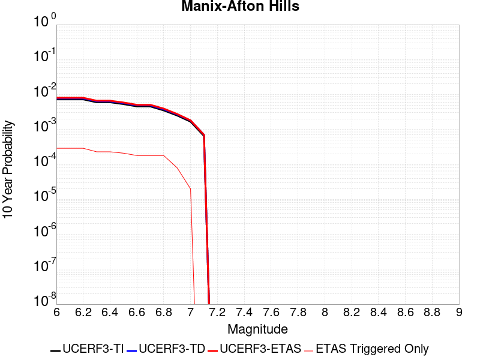 |

| Magnitude | 1 wk TI Prob | 1 wk TD Prob | 1 wk ETAS Prob | 1 wk ETAS/TD Gain | 1 wk ETAS Triggered Only | 1 mo TI Prob | 1 mo TD Prob | 1 mo ETAS Prob | 1 mo ETAS/TD Gain | 1 mo ETAS Triggered Only | 1 yr TI Prob | 1 yr TD Prob | 1 yr ETAS Prob | 1 yr ETAS/TD Gain | 1 yr ETAS Triggered Only | 10 yr TI Prob | 10 yr TD Prob | 10 yr ETAS Prob | 10 yr ETAS/TD Gain | 10 yr ETAS Triggered Only |
|-----|-----|-----|-----|-----|-----|-----|-----|-----|-----|-----|-----|-----|-----|-----|-----|-----|-----|-----|-----|-----|
| 6.0 | 1.401565E-5 | 1.496377E-5 | 1.1496228E-4 | 7.6827083 | 1.0E-4 | 6.0065686E-5 | 6.412895E-5 | 1.8412127E-4 | 2.8711097 | 1.2E-4 | 7.3105434E-4 | 7.805064E-4 | 9.703581E-4 | 1.2432417 | 1.9E-4 | 0.0072865407 | 0.007779273 | 0.008067017 | 1.0369885 | 2.9E-4 |
| 6.1 | 1.401565E-5 | 1.496377E-5 | 1.1496228E-4 | 7.6827083 | 1.0E-4 | 6.0065686E-5 | 6.412895E-5 | 1.8412127E-4 | 2.8711097 | 1.2E-4 | 7.3105434E-4 | 7.805064E-4 | 9.703581E-4 | 1.2432417 | 1.9E-4 | 0.0072865407 | 0.007779273 | 0.008067017 | 1.0369885 | 2.9E-4 |
| 6.2 | 1.401565E-5 | 1.496377E-5 | 1.1496228E-4 | 7.6827083 | 1.0E-4 | 6.0065686E-5 | 6.412895E-5 | 1.8412127E-4 | 2.8711097 | 1.2E-4 | 7.3105434E-4 | 7.805064E-4 | 9.703581E-4 | 1.2432417 | 1.9E-4 | 0.0072865407 | 0.007779273 | 0.008067017 | 1.0369885 | 2.9E-4 |
| 6.3 | 1.1567568E-5 | 1.2350158E-5 | 8.2349296E-5 | 6.667874 | 7.0E-5 | 4.957435E-5 | 5.292823E-5 | 1.3292399E-4 | 2.5114007 | 8.0E-5 | 6.034006E-4 | 6.4422097E-4 | 7.8413077E-4 | 1.2171768 | 1.4E-4 | 0.006017648 | 0.0064245695 | 0.006653092 | 1.03557 | 2.3E-4 |
| 6.4 | 1.1567568E-5 | 1.2350158E-5 | 8.2349296E-5 | 6.667874 | 7.0E-5 | 4.957435E-5 | 5.292823E-5 | 1.3292399E-4 | 2.5114007 | 8.0E-5 | 6.034006E-4 | 6.4422097E-4 | 7.8413077E-4 | 1.2171768 | 1.4E-4 | 0.006017648 | 0.0064245695 | 0.006653092 | 1.03557 | 2.3E-4 |
| 6.5 | 1.0253583E-5 | 1.0953696E-5 | 7.0953036E-5 | 6.4775434 | 6.0E-5 | 4.3943186E-5 | 4.6943616E-5 | 1.1694033E-4 | 2.4910805 | 7.0E-5 | 5.3487695E-4 | 5.713978E-4 | 6.913292E-4 | 1.2098913 | 1.2E-4 | 0.005335914 | 0.0057001947 | 0.0059089977 | 1.0366309 | 2.1E-4 |
| 6.6 | 8.804593E-6 | 9.413327E-6 | 6.941276E-5 | 7.3738823 | 6.0E-5 | 3.7733425E-5 | 4.034225E-5 | 1.10339424E-4 | 2.7350836 | 7.0E-5 | 4.593076E-4 | 4.910644E-4 | 6.010104E-4 | 1.2238932 | 1.1E-4 | 0.0045835944 | 0.0049006063 | 0.005079724 | 1.0365502 | 1.8E-4 |
| 6.7 | 8.798674E-6 | 9.406866E-6 | 6.9406306E-5 | 7.3782597 | 6.0E-5 | 3.7708054E-5 | 4.0314564E-5 | 1.1031174E-4 | 2.7362752 | 7.0E-5 | 4.5899887E-4 | 4.907275E-4 | 6.006735E-4 | 1.2240471 | 1.1E-4 | 0.0045805196 | 0.0048972517 | 0.00507637 | 1.0365753 | 1.8E-4 |
| 6.8 | 6.764089E-6 | 7.241003E-6 | 6.7240566E-5 | 9.286085 | 6.0E-5 | 2.898863E-5 | 3.103254E-5 | 1.0103037E-4 | 3.2556267 | 7.0E-5 | 3.528794E-4 | 3.77763E-4 | 4.8772147E-4 | 1.2910779 | 1.1E-4 | 0.0035231959 | 0.003771931 | 0.003951252 | 1.0475409 | 1.8E-4 |
| 6.9 | 4.83182E-6 | 5.168268E-6 | 3.5168112E-5 | 6.804622 | 3.0E-5 | 2.0707635E-5 | 2.2149565E-5 | 5.21489E-5 | 2.3543985 | 3.0E-5 | 2.520863E-4 | 2.69643E-4 | 3.196295E-4 | 1.1853803 | 5.0E-5 | 0.0025180054 | 0.0026936904 | 0.0027734747 | 1.029619 | 8.0E-5 |
| 7.0 | 3.2182302E-6 | 3.4549348E-6 | 3.4549348E-6 | 1.0 | 0.0 | 1.3792342E-5 | 1.4806798E-5 | 1.4806798E-5 | 1.0 | 0.0 | 1.6790883E-4 | 1.8026115E-4 | 1.9025935E-4 | 1.0554651 | 1.0E-5 | 0.0016778201 | 0.0018014727 | 0.0018214367 | 1.011082 | 2.0E-5 |
| 7.1 | 1.2561367E-6 | 1.346206E-6 | 1.346206E-6 | 1.0 | 0.0 | 5.3834315E-6 | 5.7694497E-6 | 5.7694497E-6 | 1.0 | 0.0 | 6.554131E-5 | 7.024227E-5 | 7.024227E-5 | 1.0 | 0.0 | 6.5521983E-4 | 7.023465E-4 | 7.023465E-4 | 1.0 | 0.0 |

## Baker
*[(top)](#table-of-contents)*

| 1 Week | 1 Month | 1 Year | 10 Year |
|-----|-----|-----|-----|
|  |  |  |  |

| Magnitude | 1 wk TI Prob | 1 wk TD Prob | 1 wk ETAS Prob | 1 wk ETAS/TD Gain | 1 wk ETAS Triggered Only | 1 mo TI Prob | 1 mo TD Prob | 1 mo ETAS Prob | 1 mo ETAS/TD Gain | 1 mo ETAS Triggered Only | 1 yr TI Prob | 1 yr TD Prob | 1 yr ETAS Prob | 1 yr ETAS/TD Gain | 1 yr ETAS Triggered Only | 10 yr TI Prob | 10 yr TD Prob | 10 yr ETAS Prob | 10 yr ETAS/TD Gain | 10 yr ETAS Triggered Only |
|-----|-----|-----|-----|-----|-----|-----|-----|-----|-----|-----|-----|-----|-----|-----|-----|-----|-----|-----|-----|-----|
| 6.0 | 4.9871765E-6 | 5.0982776E-6 | 3.5098124E-5 | 6.8843102 | 3.0E-5 | 2.1373438E-5 | 2.1849593E-5 | 8.184828E-5 | 3.7459867 | 6.0E-5 | 2.6019054E-4 | 2.65989E-4 | 4.5593845E-4 | 1.7141253 | 1.9E-4 | 0.002598861 | 0.00265697 | 0.0029362259 | 1.1051033 | 2.8E-4 |
| 6.1 | 4.9871765E-6 | 5.0982776E-6 | 3.5098124E-5 | 6.8843102 | 3.0E-5 | 2.1373438E-5 | 2.1849593E-5 | 8.184828E-5 | 3.7459867 | 6.0E-5 | 2.6019054E-4 | 2.65989E-4 | 4.5593845E-4 | 1.7141253 | 1.9E-4 | 0.002598861 | 0.00265697 | 0.0029362259 | 1.1051033 | 2.8E-4 |
| 6.2 | 4.9871765E-6 | 5.0982776E-6 | 3.5098124E-5 | 6.8843102 | 3.0E-5 | 2.1373438E-5 | 2.1849593E-5 | 8.184828E-5 | 3.7459867 | 6.0E-5 | 2.6019054E-4 | 2.65989E-4 | 4.5593845E-4 | 1.7141253 | 1.9E-4 | 0.002598861 | 0.00265697 | 0.0029362259 | 1.1051033 | 2.8E-4 |
| 6.3 | 3.0142169E-6 | 3.085558E-6 | 1.3085527E-5 | 4.240895 | 1.0E-5 | 1.2918008E-5 | 1.32237565E-5 | 4.322336E-5 | 3.2686143 | 3.0E-5 | 1.572654E-4 | 1.6098775E-4 | 2.4097487E-4 | 1.4968522 | 8.0E-5 | 0.0015715414 | 0.0016087524 | 0.0017485272 | 1.0868839 | 1.4E-4 |
| 6.4 | 3.0142169E-6 | 3.085558E-6 | 1.3085527E-5 | 4.240895 | 1.0E-5 | 1.2918008E-5 | 1.32237565E-5 | 4.322336E-5 | 3.2686143 | 3.0E-5 | 1.572654E-4 | 1.6098775E-4 | 2.4097487E-4 | 1.4968522 | 8.0E-5 | 0.0015715414 | 0.0016087524 | 0.0017485272 | 1.0868839 | 1.4E-4 |
| 6.5 | 2.5353388E-6 | 2.5978502E-6 | 1.2597824E-5 | 4.8493266 | 1.0E-5 | 1.0865693E-5 | 1.1133598E-5 | 3.1133375E-5 | 2.7963445 | 2.0E-5 | 1.3228178E-4 | 1.355434E-4 | 2.0553391E-4 | 1.5163697 | 7.0E-5 | 0.0013220307 | 0.0013546358 | 0.0014844596 | 1.0958368 | 1.3E-4 |
| 6.6 | 2.1369149E-6 | 2.1923192E-6 | 1.2192298E-5 | 5.5613694 | 1.0E-5 | 9.158174E-6 | 9.395621E-6 | 2.9395433E-5 | 3.128631 | 2.0E-5 | 1.1149507E-4 | 1.14385875E-4 | 1.8437786E-4 | 1.6118937 | 7.0E-5 | 0.0011143915 | 0.0011432887 | 0.0012731401 | 1.113577 | 1.3E-4 |
| 6.7 | 1.875709E-6 | 1.9267115E-6 | 1.1926692E-5 | 6.190181 | 1.0E-5 | 8.038728E-6 | 8.25731E-6 | 1.8257228E-5 | 2.211038 | 1.0E-5 | 9.7867116E-5 | 1.00528254E-4 | 1.6052222E-4 | 1.5967871 | 6.0E-5 | 9.782403E-4 | 0.0010048427 | 0.0011247221 | 1.1193017 | 1.2E-4 |
| 6.8 | 1.699177E-6 | 1.7473235E-6 | 1.1747306E-5 | 6.7230287 | 1.0E-5 | 7.282167E-6 | 7.4885083E-6 | 1.7488434E-5 | 2.3353693 | 1.0E-5 | 8.865678E-5 | 9.116891E-5 | 1.5116345E-4 | 1.6580591 | 6.0E-5 | 8.8621414E-4 | 9.1132836E-4 | 0.0010212281 | 1.120593 | 1.1E-4 |
| 6.9 | 1.5051384E-6 | 1.5500759E-6 | 1.1550061E-5 | 7.451287 | 1.0E-5 | 6.4505766E-6 | 6.643166E-6 | 1.66431E-5 | 2.5052962 | 1.0E-5 | 7.853294E-5 | 8.087765E-5 | 1.408728E-4 | 1.7418013 | 6.0E-5 | 7.8505196E-4 | 8.084928E-4 | 9.184039E-4 | 1.1359457 | 1.1E-4 |
| 7.0 | 1.1039745E-6 | 1.142773E-6 | 1.1142762E-5 | 9.750634 | 1.0E-5 | 4.7313106E-6 | 4.8975894E-6 | 1.48975405E-5 | 3.0418108 | 1.0E-5 | 5.7602185E-5 | 5.9626538E-5 | 1.19622964E-4 | 2.0062034 | 6.0E-5 | 5.7587255E-4 | 5.961072E-4 | 7.0604164E-4 | 1.1844206 | 1.1E-4 |
| 7.1 | 9.837552E-7 | 1.0208984E-6 | 1.0208984E-6 | 1.0 | 0.0 | 4.2160864E-6 | 4.3752716E-6 | 4.3752716E-6 | 1.0 | 0.0 | 5.1329644E-5 | 5.3267635E-5 | 1.03264974E-4 | 1.9386063 | 5.0E-5 | 5.131779E-4 | 5.3254946E-4 | 6.324962E-4 | 1.187676 | 1.0E-4 |
| 7.2 | 9.4413525E-7 | 9.8069E-7 | 9.8069E-7 | 1.0 | 0.0 | 4.046288E-6 | 4.20295E-6 | 4.20295E-6 | 1.0 | 0.0 | 4.926244E-5 | 5.116972E-5 | 1.0116716E-4 | 1.9770904 | 5.0E-5 | 4.925152E-4 | 5.115802E-4 | 6.0153415E-4 | 1.1758355 | 9.0E-5 |
| 7.3 | 8.7236936E-7 | 9.0776155E-7 | 9.0776155E-7 | 1.0 | 0.0 | 3.7387204E-6 | 3.890401E-6 | 3.890401E-6 | 1.0 | 0.0 | 4.551797E-5 | 4.7364607E-5 | 8.7362714E-5 | 1.8444724 | 4.0E-5 | 4.5508647E-4 | 4.7354584E-4 | 5.5350794E-4 | 1.1688583 | 8.0E-5 |
| 7.4 | 8.1957796E-7 | 8.5384505E-7 | 8.5384505E-7 | 1.0 | 0.0 | 3.5124724E-6 | 3.6593308E-6 | 3.6593308E-6 | 1.0 | 0.0 | 4.276351E-5 | 4.455145E-5 | 7.455011E-5 | 1.6733488 | 3.0E-5 | 4.2755282E-4 | 4.4542583E-4 | 5.0539913E-4 | 1.1346426 | 6.0E-5 |
| 7.5 | 7.6149445E-7 | 7.943583E-7 | 7.943583E-7 | 1.0 | 0.0 | 3.2635435E-6 | 3.4043883E-6 | 3.4043883E-6 | 1.0 | 0.0 | 3.9732917E-5 | 4.1447645E-5 | 7.1446404E-5 | 1.7237747 | 3.0E-5 | 3.9725815E-4 | 4.143998E-4 | 4.643791E-4 | 1.1206064 | 5.0E-5 |
| 7.6 | 7.013777E-7 | 7.3258565E-7 | 7.3258565E-7 | 1.0 | 0.0 | 3.005901E-6 | 3.139649E-6 | 3.139649E-6 | 1.0 | 0.0 | 3.659623E-5 | 3.8224563E-5 | 6.822342E-5 | 1.7848057 | 3.0E-5 | 3.6590203E-4 | 3.821805E-4 | 4.3216138E-4 | 1.1307782 | 5.0E-5 |
| 7.7 | 6.151541E-7 | 6.4350814E-7 | 6.4350814E-7 | 1.0 | 0.0 | 2.6363718E-6 | 2.7578892E-6 | 2.7578892E-6 | 1.0 | 0.0 | 3.2097356E-5 | 3.357679E-5 | 4.3576456E-5 | 1.2978147 | 1.0E-5 | 3.209272E-4 | 3.3571778E-4 | 3.657077E-4 | 1.0893308 | 3.0E-5 |
| 7.8 | 3.1694145E-7 | 3.333711E-7 | 3.333711E-7 | 1.0 | 0.0 | 1.3583199E-6 | 1.4287325E-6 | 1.4287325E-6 | 1.0 | 0.0 | 1.6537419E-5 | 1.7394683E-5 | 1.7394683E-5 | 1.0 | 0.0 | 1.6536188E-4 | 1.7393359E-4 | 1.8393186E-4 | 1.0574832 | 1.0E-5 |
| 7.9 | 1.8610457E-9 | 1.9363102E-9 | 1.9363102E-9 | 1.0 | 0.0 | 7.97591E-9 | 8.298473E-9 | 8.298473E-9 | 1.0 | 0.0 | 9.71067E-8 | 1.01033905E-7 | 1.01033905E-7 | 1.0 | 0.0 | 9.710666E-7 | 1.0103391E-6 | 1.0103391E-6 | 1.0 | 0.0 |

## San Andreas (Creeping Section) 2011 CFM
*[(top)](#table-of-contents)*

| 1 Week | 1 Month | 1 Year | 10 Year |
|-----|-----|-----|-----|
| 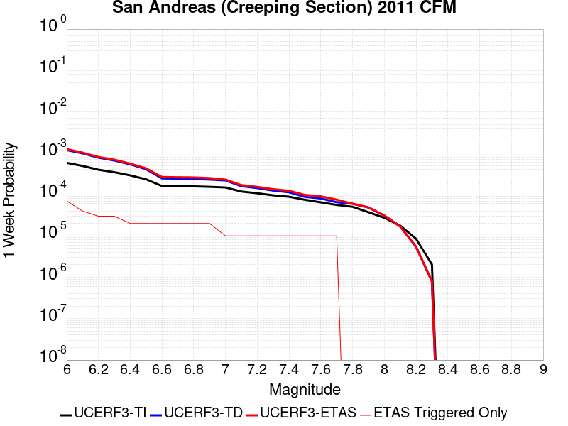 |  |  |  |

| Magnitude | 1 wk TI Prob | 1 wk TD Prob | 1 wk ETAS Prob | 1 wk ETAS/TD Gain | 1 wk ETAS Triggered Only | 1 mo TI Prob | 1 mo TD Prob | 1 mo ETAS Prob | 1 mo ETAS/TD Gain | 1 mo ETAS Triggered Only | 1 yr TI Prob | 1 yr TD Prob | 1 yr ETAS Prob | 1 yr ETAS/TD Gain | 1 yr ETAS Triggered Only | 10 yr TI Prob | 10 yr TD Prob | 10 yr ETAS Prob | 10 yr ETAS/TD Gain | 10 yr ETAS Triggered Only |
|-----|-----|-----|-----|-----|-----|-----|-----|-----|-----|-----|-----|-----|-----|-----|-----|-----|-----|-----|-----|-----|
| 6.0 | 5.853421E-4 | 0.0011901009 | 0.0012600175 | 1.0587486 | 7.0E-5 | 0.0025061977 | 0.005084779 | 0.005174321 | 1.0176098 | 9.0E-5 | 0.030089283 | 0.059372738 | 0.059485614 | 1.0019011 | 1.2E-4 | 0.26325434 | 0.41665462 | 0.4167888 | 1.000322 | 2.3E-4 |
| 6.1 | 4.92739E-4 | 9.913909E-4 | 0.0010313512 | 1.0403074 | 4.0E-5 | 0.00211003 | 0.0042368625 | 0.0042966083 | 1.0141014 | 6.0E-5 | 0.025388896 | 0.049756642 | 0.04983266 | 1.0015278 | 8.0E-5 | 0.22676136 | 0.36494574 | 0.36506003 | 1.0003133 | 1.8E-4 |
| 6.2 | 3.9895924E-4 | 7.812319E-4 | 8.112085E-4 | 1.0383708 | 3.0E-5 | 0.001708705 | 0.0033420445 | 0.0033918775 | 1.0149109 | 5.0E-5 | 0.020606011 | 0.039483637 | 0.039541267 | 1.0014596 | 6.0E-5 | 0.18796577 | 0.3045995 | 0.30471078 | 1.0003653 | 1.6E-4 |
| 6.3 | 3.4779336E-4 | 6.665409E-4 | 6.965209E-4 | 1.0449785 | 3.0E-5 | 0.0014896916 | 0.0028522285 | 0.0029020857 | 1.0174801 | 5.0E-5 | 0.01798679 | 0.033820502 | 0.033878475 | 1.0017141 | 6.0E-5 | 0.16598606 | 0.26924798 | 0.2693576 | 1.0004071 | 1.5E-4 |
| 6.4 | 2.9161308E-4 | 5.3953176E-4 | 5.5952097E-4 | 1.0370492 | 2.0E-5 | 0.0012491718 | 0.0023094858 | 0.0023493934 | 1.0172799 | 4.0E-5 | 0.015102962 | 0.02752065 | 0.027569272 | 1.0017668 | 5.0E-5 | 0.14116782 | 0.22821897 | 0.22832702 | 1.0004735 | 1.4E-4 |
| 6.5 | 2.3428557E-4 | 4.1093488E-4 | 4.3092665E-4 | 1.0486495 | 2.0E-5 | 0.0010036946 | 0.0017599959 | 0.0017999255 | 1.0226873 | 4.0E-5 | 0.012151684 | 0.021081703 | 0.021130648 | 1.0023217 | 5.0E-5 | 0.11508279 | 0.18330969 | 0.18342403 | 1.0006237 | 1.4E-4 |
| 6.6 | 1.611228E-4 | 2.464489E-4 | 2.66444E-4 | 1.0811328 | 2.0E-5 | 6.9034356E-4 | 0.0010557788 | 0.0010957365 | 1.0378467 | 4.0E-5 | 0.008372588 | 0.012776662 | 0.012826023 | 1.0038633 | 5.0E-5 | 0.08064078 | 0.12147154 | 0.12158575 | 1.0009402 | 1.3E-4 |
| 6.7 | 1.5919778E-4 | 2.4260646E-4 | 2.626016E-4 | 1.0824181 | 2.0E-5 | 6.8209774E-4 | 0.0010393243 | 0.0010792827 | 1.0384465 | 4.0E-5 | 0.008272963 | 0.012579099 | 0.012628471 | 1.0039248 | 5.0E-5 | 0.07971671 | 0.11982559 | 0.11994001 | 1.0009549 | 1.3E-4 |
| 6.8 | 1.581269E-4 | 2.402594E-4 | 2.602546E-4 | 1.0832233 | 2.0E-5 | 6.775107E-4 | 0.0010292738 | 0.0010692326 | 1.0388223 | 4.0E-5 | 0.008217538 | 0.012458333 | 0.01250771 | 1.0039634 | 5.0E-5 | 0.079202265 | 0.11879754 | 0.1189121 | 1.0009643 | 1.3E-4 |
| 6.9 | 1.5403044E-4 | 2.3082056E-4 | 2.5081594E-4 | 1.0866274 | 2.0E-5 | 6.599634E-4 | 9.888572E-4 | 0.0010288176 | 1.0404108 | 4.0E-5 | 0.0080054905 | 0.01197337 | 0.012022771 | 1.004126 | 5.0E-5 | 0.07723167 | 0.11462481 | 0.11473991 | 1.0010041 | 1.3E-4 |
| 7.0 | 1.4882197E-4 | 2.2025844E-4 | 2.3025624E-4 | 1.0453912 | 1.0E-5 | 6.376525E-4 | 9.436251E-4 | 9.735968E-4 | 1.0317622 | 3.0E-5 | 0.007735819 | 0.011428583 | 0.011468126 | 1.00346 | 4.0E-5 | 0.07472007 | 0.10985688 | 0.1099637 | 1.0009723 | 1.2E-4 |
| 7.1 | 1.185287E-4 | 1.5960343E-4 | 1.6960183E-4 | 1.0626453 | 1.0E-5 | 5.078812E-4 | 6.8383606E-4 | 7.1381556E-4 | 1.0438402 | 3.0E-5 | 0.0061659366 | 0.008294098 | 0.008333767 | 1.0047827 | 4.0E-5 | 0.05997635 | 0.082361445 | 0.082462385 | 1.0012256 | 1.1E-4 |
| 7.2 | 1.0768486E-4 | 1.4367518E-4 | 1.5367374E-4 | 1.0695914 | 1.0E-5 | 4.6142488E-4 | 6.156061E-4 | 6.455876E-4 | 1.0487025 | 3.0E-5 | 0.0056033866 | 0.0074693933 | 0.007509094 | 1.0053152 | 4.0E-5 | 0.054641865 | 0.07470068 | 0.074802466 | 1.0013626 | 1.1E-4 |
| 7.3 | 9.5955525E-5 | 1.2513106E-4 | 1.3512981E-4 | 1.0799062 | 1.0E-5 | 4.1117313E-4 | 5.361663E-4 | 5.661502E-4 | 1.0559227 | 3.0E-5 | 0.004994548 | 0.0065083997 | 0.0065481393 | 1.0061059 | 4.0E-5 | 0.04883775 | 0.065370224 | 0.065473035 | 1.0015727 | 1.1E-4 |
| 7.4 | 8.8811576E-5 | 1.1367388E-4 | 1.2367274E-4 | 1.087961 | 1.0E-5 | 3.805655E-4 | 4.8708328E-4 | 5.1706866E-4 | 1.0615611 | 3.0E-5 | 0.0046235453 | 0.005914214 | 0.0059539774 | 1.0067234 | 4.0E-5 | 0.045285244 | 0.059667345 | 0.05977078 | 1.0017335 | 1.1E-4 |
| 7.5 | 7.4944306E-5 | 8.811736E-5 | 9.8116485E-5 | 1.113475 | 1.0E-5 | 3.2115032E-4 | 3.7759126E-4 | 4.0757994E-4 | 1.079421 | 3.0E-5 | 0.0039029967 | 0.0045875013 | 0.0046273177 | 1.0086794 | 4.0E-5 | 0.03835155 | 0.047024798 | 0.047129624 | 1.0022292 | 1.1E-4 |
| 7.6 | 6.4923515E-5 | 8.0591395E-5 | 9.059059E-5 | 1.1240727 | 1.0E-5 | 2.7821396E-4 | 3.4534605E-4 | 3.753357E-4 | 1.0868394 | 3.0E-5 | 0.0033819943 | 0.0041964976 | 0.00423633 | 1.0094918 | 4.0E-5 | 0.033309855 | 0.04299088 | 0.04309615 | 1.0024487 | 1.1E-4 |
| 7.7 | 5.6169425E-5 | 6.5352266E-5 | 7.5351614E-5 | 1.1530069 | 1.0E-5 | 2.407039E-4 | 2.8005108E-4 | 3.000455E-4 | 1.0713955 | 2.0E-5 | 0.0029266318 | 0.0034042955 | 0.0034341933 | 1.0087824 | 3.0E-5 | 0.028883878 | 0.035245374 | 0.035322554 | 1.0021898 | 8.0E-5 |
| 7.8 | 5.0721486E-5 | 6.00399E-5 | 6.00399E-5 | 1.0 | 0.0 | 2.1735969E-4 | 2.5728848E-4 | 2.672859E-4 | 1.0388569 | 1.0E-5 | 0.0026431426 | 0.003127991 | 0.0031479285 | 1.0063739 | 2.0E-5 | 0.026119253 | 0.032383937 | 0.03245167 | 1.0020915 | 7.0E-5 |
| 7.9 | 3.7414946E-5 | 4.8848142E-5 | 4.8848142E-5 | 1.0 | 0.0 | 1.603399E-4 | 2.093324E-4 | 2.093324E-4 | 1.0 | 0.0 | 0.0019503904 | 0.002545645 | 0.0025556195 | 1.0039183 | 1.0E-5 | 0.01933361 | 0.026395475 | 0.026444156 | 1.0018443 | 5.0E-5 |
| 8.0 | 2.7491367E-5 | 3.1045452E-5 | 3.1045452E-5 | 1.0 | 0.0 | 1.1781482E-4 | 1.3304516E-4 | 1.3304516E-4 | 1.0 | 0.0 | 0.0014334517 | 0.0016186221 | 0.0016286059 | 1.0061681 | 1.0E-5 | 0.014242403 | 0.017014427 | 0.017053746 | 1.002311 | 4.0E-5 |
| 8.1 | 1.7745691E-5 | 1.6978047E-5 | 1.6978047E-5 | 1.0 | 0.0 | 7.605075E-5 | 7.2761024E-5 | 7.2761024E-5 | 1.0 | 0.0 | 9.255245E-4 | 8.855059E-4 | 8.855059E-4 | 1.0 | 0.0 | 0.009216793 | 0.009570986 | 0.009580891 | 1.0010349 | 1.0E-5 |
| 8.2 | 8.539297E-6 | 5.4609054E-6 | 5.4609054E-6 | 1.0 | 0.0 | 3.6596473E-5 | 2.340367E-5 | 2.340367E-5 | 1.0 | 0.0 | 4.4547097E-4 | 2.849025E-4 | 2.849025E-4 | 1.0 | 0.0 | 0.0044457903 | 0.0032370395 | 0.0032470073 | 1.0030793 | 1.0E-5 |
| 8.3 | 2.0399948E-6 | 7.951945E-7 | 7.951945E-7 | 1.0 | 0.0 | 8.742806E-6 | 3.4079721E-6 | 3.4079721E-6 | 1.0 | 0.0 | 1.0643846E-4 | 4.1491287E-5 | 4.1491287E-5 | 1.0 | 0.0 | 0.0010638749 | 4.8670862E-4 | 4.8670862E-4 | 1.0 | 0.0 |

## San Jacinto (San Jacinto Valley) rev
*[(top)](#table-of-contents)*

| 1 Week | 1 Month | 1 Year | 10 Year |
|-----|-----|-----|-----|
| 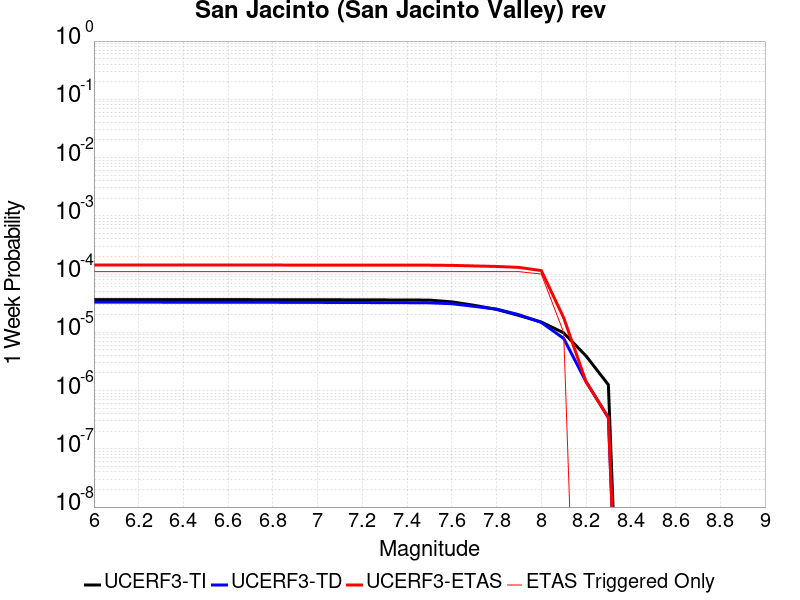 |  |  |  |

| Magnitude | 1 wk TI Prob | 1 wk TD Prob | 1 wk ETAS Prob | 1 wk ETAS/TD Gain | 1 wk ETAS Triggered Only | 1 mo TI Prob | 1 mo TD Prob | 1 mo ETAS Prob | 1 mo ETAS/TD Gain | 1 mo ETAS Triggered Only | 1 yr TI Prob | 1 yr TD Prob | 1 yr ETAS Prob | 1 yr ETAS/TD Gain | 1 yr ETAS Triggered Only | 10 yr TI Prob | 10 yr TD Prob | 10 yr ETAS Prob | 10 yr ETAS/TD Gain | 10 yr ETAS Triggered Only |
|-----|-----|-----|-----|-----|-----|-----|-----|-----|-----|-----|-----|-----|-----|-----|-----|-----|-----|-----|-----|-----|
| 6.0 | 3.640597E-5 | 3.2902928E-5 | 1.4289931E-4 | 4.3430576 | 1.1E-4 | 1.5601626E-4 | 1.4100494E-4 | 2.6098802E-4 | 1.850914 | 1.2E-4 | 0.001897843 | 0.0017153855 | 0.0019150424 | 1.1163919 | 2.0E-4 | 0.018817166 | 0.017736929 | 0.018021785 | 1.0160601 | 2.9E-4 |
| 6.1 | 3.640597E-5 | 3.2902928E-5 | 1.4289931E-4 | 4.3430576 | 1.1E-4 | 1.5601626E-4 | 1.4100494E-4 | 2.6098802E-4 | 1.850914 | 1.2E-4 | 0.001897843 | 0.0017153855 | 0.0019150424 | 1.1163919 | 2.0E-4 | 0.018817166 | 0.017736929 | 0.018021785 | 1.0160601 | 2.9E-4 |
| 6.2 | 3.640597E-5 | 3.2902928E-5 | 1.4289931E-4 | 4.3430576 | 1.1E-4 | 1.5601626E-4 | 1.4100494E-4 | 2.6098802E-4 | 1.850914 | 1.2E-4 | 0.001897843 | 0.0017153855 | 0.0019150424 | 1.1163919 | 2.0E-4 | 0.018817166 | 0.017736929 | 0.018021785 | 1.0160601 | 2.9E-4 |
| 6.3 | 3.640597E-5 | 3.2902928E-5 | 1.4289931E-4 | 4.3430576 | 1.1E-4 | 1.5601626E-4 | 1.4100494E-4 | 2.6098802E-4 | 1.850914 | 1.2E-4 | 0.001897843 | 0.0017153855 | 0.0019150424 | 1.1163919 | 2.0E-4 | 0.018817166 | 0.017736929 | 0.018021785 | 1.0160601 | 2.9E-4 |
| 6.4 | 3.6350164E-5 | 3.2826898E-5 | 1.428233E-4 | 4.3508005 | 1.1E-4 | 1.5577712E-4 | 1.4067914E-4 | 2.6066226E-4 | 1.8528849 | 1.2E-4 | 0.0018949364 | 0.001711425 | 0.0019110828 | 1.1166617 | 2.0E-4 | 0.018788593 | 0.017698 | 0.017982868 | 1.016096 | 2.9E-4 |
| 6.5 | 3.6350164E-5 | 3.2826898E-5 | 1.428233E-4 | 4.3508005 | 1.1E-4 | 1.5577712E-4 | 1.4067914E-4 | 2.6066226E-4 | 1.8528849 | 1.2E-4 | 0.0018949364 | 0.001711425 | 0.0019110828 | 1.1166617 | 2.0E-4 | 0.018788593 | 0.017698 | 0.017982868 | 1.016096 | 2.9E-4 |
| 6.6 | 3.6325582E-5 | 3.279348E-5 | 1.4278987E-4 | 4.3542156 | 1.1E-4 | 1.5567178E-4 | 1.4053592E-4 | 2.6051907E-4 | 1.8537542 | 1.2E-4 | 0.0018936562 | 0.0017096841 | 0.0019093421 | 1.1167806 | 2.0E-4 | 0.018776007 | 0.017680887 | 0.01796576 | 1.0161119 | 2.9E-4 |
| 6.7 | 3.6315192E-5 | 3.2779066E-5 | 1.4277546E-4 | 4.3556905 | 1.1E-4 | 1.5562726E-4 | 1.4047416E-4 | 2.604573E-4 | 1.8541297 | 1.2E-4 | 0.0018931151 | 0.0017089335 | 0.0019085917 | 1.116832 | 2.0E-4 | 0.018770687 | 0.017673513 | 0.017958388 | 1.0161188 | 2.9E-4 |
| 6.8 | 3.6293033E-5 | 3.2748678E-5 | 1.4274508E-4 | 4.358804 | 1.1E-4 | 1.555323E-4 | 1.4034394E-4 | 2.603271E-4 | 1.8549222 | 1.2E-4 | 0.001891961 | 0.0017073506 | 0.001907009 | 1.1169406 | 2.0E-4 | 0.018759342 | 0.01765794 | 0.01794282 | 1.0161332 | 2.9E-4 |
| 6.9 | 3.6264988E-5 | 3.2710144E-5 | 1.4270654E-4 | 4.3627615 | 1.1E-4 | 1.5541211E-4 | 1.401788E-4 | 2.60162E-4 | 1.8559295 | 1.2E-4 | 0.0018905003 | 0.0017053433 | 0.0019050022 | 1.1170784 | 2.0E-4 | 0.01874498 | 0.017638192 | 0.017923076 | 1.0161515 | 2.9E-4 |
| 7.0 | 3.617651E-5 | 3.2588607E-5 | 1.4258502E-4 | 4.375303 | 1.1E-4 | 1.5503296E-4 | 1.3965799E-4 | 2.5964124E-4 | 1.8591219 | 1.2E-4 | 0.0018858921 | 0.0016990124 | 0.0018986725 | 1.1175154 | 2.0E-4 | 0.018699678 | 0.017575903 | 0.017860806 | 1.0162098 | 2.9E-4 |
| 7.1 | 3.614045E-5 | 3.254258E-5 | 1.4253901E-4 | 4.380077 | 1.1E-4 | 1.5487843E-4 | 1.3946077E-4 | 2.5944403E-4 | 1.8603371 | 1.2E-4 | 0.001884014 | 0.0016966149 | 0.0018962756 | 1.1176817 | 2.0E-4 | 0.018681211 | 0.017552303 | 0.017837213 | 1.016232 | 2.9E-4 |
| 7.2 | 3.6082904E-5 | 3.246794E-5 | 1.4246437E-4 | 4.387848 | 1.1E-4 | 1.5463185E-4 | 1.391409E-4 | 2.591242E-4 | 1.8623152 | 1.2E-4 | 0.001881017 | 0.0016927266 | 0.0018923881 | 1.1179526 | 2.0E-4 | 0.018651746 | 0.017514009 | 0.01779893 | 1.0162681 | 2.9E-4 |
| 7.3 | 3.5962254E-5 | 3.2325526E-5 | 1.4232197E-4 | 4.402774 | 1.1E-4 | 1.5411484E-4 | 1.3853062E-4 | 2.58514E-4 | 1.8661145 | 1.2E-4 | 0.0018747333 | 0.0016853081 | 0.0018849709 | 1.1184727 | 2.0E-4 | 0.018589962 | 0.017440641 | 0.017725583 | 1.0163379 | 2.9E-4 |
| 7.4 | 3.5914763E-5 | 3.2267497E-5 | 1.4226395E-4 | 4.408893 | 1.1E-4 | 1.5391133E-4 | 1.3828196E-4 | 2.5826535E-4 | 1.8676722 | 1.2E-4 | 0.0018722598 | 0.0016822852 | 0.0018819488 | 1.118686 | 2.0E-4 | 0.018565642 | 0.017410742 | 0.017695693 | 1.0163664 | 2.9E-4 |
| 7.5 | 3.5704943E-5 | 3.2087602E-5 | 1.4208407E-4 | 4.428005 | 1.1E-4 | 1.5301221E-4 | 1.3751106E-4 | 2.5749457E-4 | 1.8725371 | 1.2E-4 | 0.0018613318 | 0.001672914 | 0.0018725795 | 1.1193519 | 2.0E-4 | 0.018458184 | 0.017317224 | 0.017602202 | 1.0164564 | 2.9E-4 |
| 7.6 | 3.3342625E-5 | 3.095258E-5 | 1.4094917E-4 | 4.5537133 | 1.1E-4 | 1.4288914E-4 | 1.3264717E-4 | 2.5263126E-4 | 1.9045355 | 1.2E-4 | 0.001738287 | 0.0016137852 | 0.0018134625 | 1.1237322 | 2.0E-4 | 0.017247524 | 0.016717803 | 0.017002953 | 1.0170568 | 2.9E-4 |
| 7.7 | 2.9089113E-5 | 2.7875963E-5 | 1.3787289E-4 | 4.945942 | 1.1E-4 | 1.2466166E-4 | 1.1946295E-4 | 2.3944861E-4 | 2.0043755 | 1.2E-4 | 0.0015166991 | 0.001453492 | 0.0016532013 | 1.1373997 | 2.0E-4 | 0.015063891 | 0.015114941 | 0.015400557 | 1.0188963 | 2.9E-4 |
| 7.8 | 2.4730354E-5 | 2.506085E-5 | 1.3505809E-4 | 5.3892064 | 1.1E-4 | 1.0598292E-4 | 1.07399224E-4 | 2.2738634E-4 | 2.1172066 | 1.2E-4 | 0.0012895783 | 0.001306802 | 0.0015065406 | 1.1528454 | 2.0E-4 | 0.012821204 | 0.013637713 | 0.013923759 | 1.0209745 | 2.9E-4 |
| 7.9 | 1.9452556E-5 | 2.0082793E-5 | 1.3008059E-4 | 6.477216 | 1.1E-4 | 8.3365434E-5 | 8.606628E-5 | 2.0605595E-4 | 2.3941543 | 1.2E-4 | 0.0010145014 | 0.0010473538 | 0.0012471444 | 1.1907574 | 2.0E-4 | 0.010098825 | 0.011019412 | 0.011306217 | 1.0260272 | 2.9E-4 |
| 8.0 | 1.5045218E-5 | 1.4775532E-5 | 1.14774055E-4 | 7.767846 | 1.0E-4 | 6.4477914E-5 | 6.332217E-5 | 1.733152E-4 | 2.7370381 | 1.1E-4 | 7.8473584E-4 | 7.706753E-4 | 9.5053663E-4 | 1.2333814 | 1.8E-4 | 0.007819705 | 0.008189898 | 0.008447769 | 1.0314864 | 2.6E-4 |
| 8.1 | 9.791738E-6 | 7.860459E-6 | 1.786038E-5 | 2.2721803 | 1.0E-5 | 4.196392E-5 | 3.368725E-5 | 4.3686912E-5 | 1.2968382 | 1.0E-5 | 5.107909E-4 | 4.1006552E-4 | 4.5004912E-4 | 1.0975053 | 4.0E-5 | 0.0050961846 | 0.0044215373 | 0.0044912277 | 1.0157616 | 7.0E-5 |
| 8.2 | 3.9342767E-6 | 1.426971E-6 | 1.426971E-6 | 1.0 | 0.0 | 1.6861077E-5 | 6.1155756E-6 | 6.1155756E-6 | 1.0 | 0.0 | 2.0526428E-4 | 7.445461E-5 | 7.445461E-5 | 1.0 | 0.0 | 0.0020507479 | 8.671261E-4 | 8.671261E-4 | 1.0 | 0.0 |
| 8.3 | 1.258898E-6 | 3.4233418E-7 | 3.4233418E-7 | 1.0 | 0.0 | 5.395266E-6 | 1.4671457E-6 | 1.4671457E-6 | 1.0 | 0.0 | 6.568538E-5 | 1.7862356E-5 | 1.7862356E-5 | 1.0 | 0.0 | 6.566597E-4 | 2.1581895E-4 | 2.1581895E-4 | 1.0 | 0.0 |

## San Jacinto (Stepovers Combined)
*[(top)](#table-of-contents)*

| 1 Week | 1 Month | 1 Year | 10 Year |
|-----|-----|-----|-----|
|  |  |  | 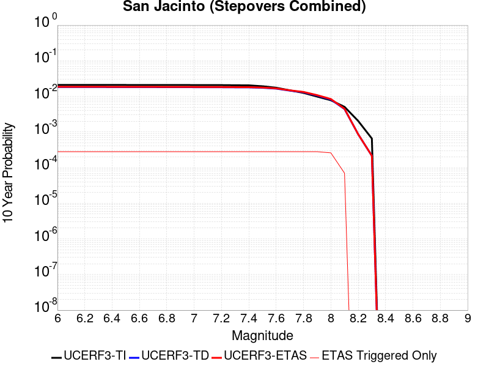 |

| Magnitude | 1 wk TI Prob | 1 wk TD Prob | 1 wk ETAS Prob | 1 wk ETAS/TD Gain | 1 wk ETAS Triggered Only | 1 mo TI Prob | 1 mo TD Prob | 1 mo ETAS Prob | 1 mo ETAS/TD Gain | 1 mo ETAS Triggered Only | 1 yr TI Prob | 1 yr TD Prob | 1 yr ETAS Prob | 1 yr ETAS/TD Gain | 1 yr ETAS Triggered Only | 10 yr TI Prob | 10 yr TD Prob | 10 yr ETAS Prob | 10 yr ETAS/TD Gain | 10 yr ETAS Triggered Only |
|-----|-----|-----|-----|-----|-----|-----|-----|-----|-----|-----|-----|-----|-----|-----|-----|-----|-----|-----|-----|-----|
| 6.0 | 4.0558618E-5 | 3.4016877E-5 | 1.4401313E-4 | 4.2335787 | 1.1E-4 | 1.7381107E-4 | 1.457785E-4 | 2.65761E-4 | 1.8230467 | 1.2E-4 | 0.002114096 | 0.0017734093 | 0.0019730546 | 1.1125771 | 2.0E-4 | 0.020940965 | 0.018321088 | 0.018595958 | 1.015003 | 2.8E-4 |
| 6.1 | 4.0558618E-5 | 3.4016877E-5 | 1.4401313E-4 | 4.2335787 | 1.1E-4 | 1.7381107E-4 | 1.457785E-4 | 2.65761E-4 | 1.8230467 | 1.2E-4 | 0.002114096 | 0.0017734093 | 0.0019730546 | 1.1125771 | 2.0E-4 | 0.020940965 | 0.018321088 | 0.018595958 | 1.015003 | 2.8E-4 |
| 6.2 | 4.0558618E-5 | 3.4016877E-5 | 1.4401313E-4 | 4.2335787 | 1.1E-4 | 1.7381107E-4 | 1.457785E-4 | 2.65761E-4 | 1.8230467 | 1.2E-4 | 0.002114096 | 0.0017734093 | 0.0019730546 | 1.1125771 | 2.0E-4 | 0.020940965 | 0.018321088 | 0.018595958 | 1.015003 | 2.8E-4 |
| 6.3 | 4.0558618E-5 | 3.4016877E-5 | 1.4401313E-4 | 4.2335787 | 1.1E-4 | 1.7381107E-4 | 1.457785E-4 | 2.65761E-4 | 1.8230467 | 1.2E-4 | 0.002114096 | 0.0017734093 | 0.0019730546 | 1.1125771 | 2.0E-4 | 0.020940965 | 0.018321088 | 0.018595958 | 1.015003 | 2.8E-4 |
| 6.4 | 4.04421E-5 | 3.385234E-5 | 1.4384862E-4 | 4.249296 | 1.1E-4 | 1.7331177E-4 | 1.450734E-4 | 2.65056E-4 | 1.8270475 | 1.2E-4 | 0.0021080286 | 0.0017648406 | 0.0019644876 | 1.1131247 | 2.0E-4 | 0.020881437 | 0.01823697 | 0.018511863 | 1.0150734 | 2.8E-4 |
| 6.5 | 4.04421E-5 | 3.385234E-5 | 1.4384862E-4 | 4.249296 | 1.1E-4 | 1.7331177E-4 | 1.450734E-4 | 2.65056E-4 | 1.8270475 | 1.2E-4 | 0.0021080286 | 0.0017648406 | 0.0019644876 | 1.1131247 | 2.0E-4 | 0.020881437 | 0.01823697 | 0.018511863 | 1.0150734 | 2.8E-4 |
| 6.6 | 4.0395822E-5 | 3.3786953E-5 | 1.4378324E-4 | 4.2555842 | 1.1E-4 | 1.7311345E-4 | 1.4479322E-4 | 2.6477585E-4 | 1.8286481 | 1.2E-4 | 0.0021056188 | 0.0017614348 | 0.0019610825 | 1.1133438 | 2.0E-4 | 0.02085779 | 0.018203536 | 0.018478438 | 1.0151017 | 2.8E-4 |
| 6.7 | 4.037292E-5 | 3.375488E-5 | 1.4375117E-4 | 4.258678 | 1.1E-4 | 1.7301533E-4 | 1.4465577E-4 | 2.6463842E-4 | 1.8294356 | 1.2E-4 | 0.0021044265 | 0.0017597643 | 0.0019594124 | 1.1134516 | 2.0E-4 | 0.020846091 | 0.018187135 | 0.018462043 | 1.0151155 | 2.8E-4 |
| 6.8 | 4.0351813E-5 | 3.372794E-5 | 1.4372423E-4 | 4.261281 | 1.1E-4 | 1.7292488E-4 | 1.4454033E-4 | 2.64523E-4 | 1.8300982 | 1.2E-4 | 0.0021033273 | 0.001758361 | 0.0019580093 | 1.1135423 | 2.0E-4 | 0.020835306 | 0.018173307 | 0.018448219 | 1.0151272 | 2.8E-4 |
| 6.9 | 4.0321644E-5 | 3.369075E-5 | 1.4368705E-4 | 4.264881 | 1.1E-4 | 1.727956E-4 | 1.4438096E-4 | 2.6436363E-4 | 1.8310145 | 1.2E-4 | 0.0021017564 | 0.0017564239 | 0.0019560724 | 1.1136677 | 2.0E-4 | 0.020819891 | 0.018154196 | 0.018429114 | 1.0151434 | 2.8E-4 |
| 7.0 | 4.0206167E-5 | 3.35584E-5 | 1.4355472E-4 | 4.2777576 | 1.1E-4 | 1.7230076E-4 | 1.4381381E-4 | 2.6379657E-4 | 1.8342922 | 1.2E-4 | 0.0020957433 | 0.0017495302 | 0.0019491803 | 1.1141164 | 2.0E-4 | 0.020760886 | 0.018086048 | 0.018360984 | 1.0152016 | 2.8E-4 |
| 7.1 | 4.0182284E-5 | 3.3534176E-5 | 1.4353049E-4 | 4.2801256 | 1.1E-4 | 1.7219842E-4 | 1.4371E-4 | 2.6369275E-4 | 1.834895 | 1.2E-4 | 0.0020944998 | 0.0017482681 | 0.0019479186 | 1.1141989 | 2.0E-4 | 0.020748684 | 0.018073512 | 0.018348452 | 1.0152123 | 2.8E-4 |
| 7.2 | 4.007387E-5 | 3.3415585E-5 | 1.434119E-4 | 4.291767 | 1.1E-4 | 1.7173386E-4 | 1.432018E-4 | 2.6318463E-4 | 1.8378583 | 1.2E-4 | 0.0020888546 | 0.0017420909 | 0.0019417425 | 1.1146046 | 2.0E-4 | 0.020693285 | 0.018012261 | 0.018287217 | 1.015265 | 2.8E-4 |
| 7.3 | 3.9727853E-5 | 3.3222375E-5 | 1.4321873E-4 | 4.3109117 | 1.1E-4 | 1.702511E-4 | 1.4237386E-4 | 2.6235677E-4 | 1.8427314 | 1.2E-4 | 0.0020708365 | 0.0017320267 | 0.0019316802 | 1.1152717 | 2.0E-4 | 0.020516451 | 0.017910104 | 0.01818509 | 1.0153537 | 2.8E-4 |
| 7.4 | 3.9503255E-5 | 3.3103443E-5 | 1.430998E-4 | 4.3228073 | 1.1E-4 | 1.6928867E-4 | 1.418642E-4 | 2.618472E-4 | 1.8457594 | 1.2E-4 | 0.0020591412 | 0.0017258315 | 0.0019254864 | 1.1156862 | 2.0E-4 | 0.020401653 | 0.01784709 | 0.018122092 | 1.0154089 | 2.8E-4 |
| 7.5 | 3.715739E-5 | 3.2326447E-5 | 1.4232288E-4 | 4.4026766 | 1.1E-4 | 1.5923625E-4 | 1.3853457E-4 | 2.5851795E-4 | 1.8660898 | 1.2E-4 | 0.0019369774 | 0.0016853565 | 0.0018850195 | 1.1184692 | 2.0E-4 | 0.019201808 | 0.017432412 | 0.017707532 | 1.015782 | 2.8E-4 |
| 7.6 | 3.3862496E-5 | 3.0564748E-5 | 1.4056139E-4 | 4.5988073 | 1.1E-4 | 1.4511691E-4 | 1.3098522E-4 | 2.509695E-4 | 1.916014 | 1.2E-4 | 0.0017653665 | 0.001593581 | 0.0017932623 | 1.1253035 | 2.0E-4 | 0.01751408 | 0.016505897 | 0.016781276 | 1.0166836 | 2.8E-4 |
| 7.7 | 2.8499282E-5 | 2.6716445E-5 | 1.3671351E-4 | 5.117204 | 1.1E-4 | 1.2213406E-4 | 1.14494025E-4 | 2.3448029E-4 | 2.0479696 | 1.2E-4 | 0.0014859679 | 0.0013930744 | 0.0015927958 | 1.1433673 | 2.0E-4 | 0.014760707 | 0.014499366 | 0.014775307 | 1.0190312 | 2.8E-4 |
| 7.8 | 2.4160707E-5 | 2.3931063E-5 | 1.3392844E-4 | 5.5964265 | 1.1E-4 | 1.0354178E-4 | 1.0255767E-4 | 2.2254536E-4 | 2.1699533 | 1.2E-4 | 0.0012598921 | 0.0012479252 | 0.0014476756 | 1.160066 | 2.0E-4 | 0.01252773 | 0.013036837 | 0.013313186 | 1.0211976 | 2.8E-4 |
| 7.9 | 1.8988483E-5 | 1.9178035E-5 | 1.2917593E-4 | 6.7356186 | 1.1E-4 | 8.1376675E-5 | 8.218899E-5 | 2.0217913E-4 | 2.4599297 | 1.2E-4 | 9.903106E-4 | 0.0010001922 | 0.0011999921 | 1.1997615 | 2.0E-4 | 0.009859091 | 0.010536586 | 0.010813636 | 1.0262941 | 2.8E-4 |
| 8.0 | 1.4987103E-5 | 1.4721306E-5 | 1.14719835E-4 | 7.7927756 | 1.0E-4 | 6.4228865E-5 | 6.3089785E-5 | 1.7308285E-4 | 2.7434368 | 1.1E-4 | 7.8170584E-4 | 7.6784805E-4 | 9.4770984E-4 | 1.2342414 | 1.8E-4 | 0.0077896174 | 0.0081594065 | 0.008417285 | 1.031605 | 2.6E-4 |
| 8.1 | 9.759733E-6 | 7.845961E-6 | 1.7845881E-5 | 2.2745311 | 1.0E-5 | 4.182676E-5 | 3.3625114E-5 | 4.3624776E-5 | 1.2973868 | 1.0E-5 | 5.091218E-4 | 4.0930932E-4 | 4.4929294E-4 | 1.0976856 | 4.0E-5 | 0.0050795693 | 0.0044127717 | 0.0044824625 | 1.0157931 | 7.0E-5 |
| 8.2 | 3.915394E-6 | 1.4203283E-6 | 1.4203283E-6 | 1.0 | 0.0 | 1.6780152E-5 | 6.087107E-6 | 6.087107E-6 | 1.0 | 0.0 | 2.0427919E-4 | 7.410803E-5 | 7.410803E-5 | 1.0 | 0.0 | 0.002040915 | 8.630233E-4 | 8.630233E-4 | 1.0 | 0.0 |
| 8.3 | 1.256767E-6 | 3.4151785E-7 | 3.4151785E-7 | 1.0 | 0.0 | 5.386133E-6 | 1.4636472E-6 | 1.4636472E-6 | 1.0 | 0.0 | 6.55742E-5 | 1.7819762E-5 | 1.7819762E-5 | 1.0 | 0.0 | 6.5554853E-4 | 2.1533205E-4 | 2.1533205E-4 | 1.0 | 0.0 |

## White Wolf (Extension)
*[(top)](#table-of-contents)*

| 1 Week | 1 Month | 1 Year | 10 Year |
|-----|-----|-----|-----|
| 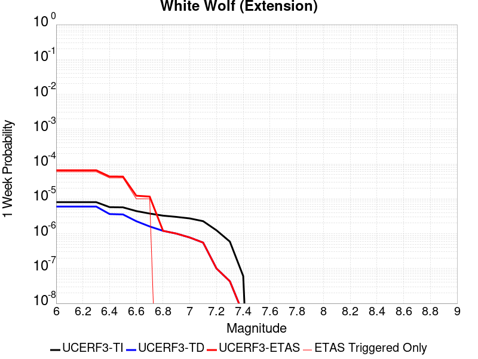 |  |  |  |

| Magnitude | 1 wk TI Prob | 1 wk TD Prob | 1 wk ETAS Prob | 1 wk ETAS/TD Gain | 1 wk ETAS Triggered Only | 1 mo TI Prob | 1 mo TD Prob | 1 mo ETAS Prob | 1 mo ETAS/TD Gain | 1 mo ETAS Triggered Only | 1 yr TI Prob | 1 yr TD Prob | 1 yr ETAS Prob | 1 yr ETAS/TD Gain | 1 yr ETAS Triggered Only | 10 yr TI Prob | 10 yr TD Prob | 10 yr ETAS Prob | 10 yr ETAS/TD Gain | 10 yr ETAS Triggered Only |
|-----|-----|-----|-----|-----|-----|-----|-----|-----|-----|-----|-----|-----|-----|-----|-----|-----|-----|-----|-----|-----|
| 6.0 | 8.027098E-6 | 5.9999707E-6 | 6.599961E-5 | 10.999989 | 6.0E-5 | 3.4401397E-5 | 2.5713938E-5 | 1.4571086E-4 | 5.66661 | 1.2E-4 | 4.187565E-4 | 3.1302788E-4 | 4.9297157E-4 | 1.5748487 | 1.8E-4 | 0.004179683 | 0.0031264268 | 0.003385614 | 1.0829021 | 2.6E-4 |
| 6.1 | 8.027098E-6 | 5.9999707E-6 | 6.599961E-5 | 10.999989 | 6.0E-5 | 3.4401397E-5 | 2.5713938E-5 | 1.4571086E-4 | 5.66661 | 1.2E-4 | 4.187565E-4 | 3.1302788E-4 | 4.9297157E-4 | 1.5748487 | 1.8E-4 | 0.004179683 | 0.0031264268 | 0.003385614 | 1.0829021 | 2.6E-4 |
| 6.2 | 8.027098E-6 | 5.9999707E-6 | 6.599961E-5 | 10.999989 | 6.0E-5 | 3.4401397E-5 | 2.5713938E-5 | 1.4571086E-4 | 5.66661 | 1.2E-4 | 4.187565E-4 | 3.1302788E-4 | 4.9297157E-4 | 1.5748487 | 1.8E-4 | 0.004179683 | 0.0031264268 | 0.003385614 | 1.0829021 | 2.6E-4 |
| 6.3 | 8.027098E-6 | 5.9999707E-6 | 6.599961E-5 | 10.999989 | 6.0E-5 | 3.4401397E-5 | 2.5713938E-5 | 1.4571086E-4 | 5.66661 | 1.2E-4 | 4.187565E-4 | 3.1302788E-4 | 4.9297157E-4 | 1.5748487 | 1.8E-4 | 0.004179683 | 0.0031264268 | 0.003385614 | 1.0829021 | 2.6E-4 |
| 6.4 | 5.780459E-6 | 3.6565268E-6 | 4.365638E-5 | 11.939303 | 4.0E-5 | 2.477316E-5 | 1.5670741E-5 | 1.0566933E-4 | 6.7430973 | 9.0E-5 | 3.0157148E-4 | 1.9077575E-4 | 3.2075096E-4 | 1.6812984 | 1.3E-4 | 0.0030116257 | 0.0019062362 | 0.002075912 | 1.089011 | 1.7E-4 |
| 6.5 | 5.693774E-6 | 3.566184E-6 | 4.356604E-5 | 12.216432 | 4.0E-5 | 2.440166E-5 | 1.5283562E-5 | 1.0528219E-4 | 6.8885894 | 9.0E-5 | 2.970497E-4 | 1.8606267E-4 | 3.0604034E-4 | 1.644824 | 1.2E-4 | 0.0029665292 | 0.0018591847 | 0.0020188873 | 1.0858992 | 1.6E-4 |
| 6.6 | 4.457246E-6 | 2.2810734E-6 | 1.2281051E-5 | 5.383891 | 1.0E-5 | 1.9102343E-5 | 9.775994E-6 | 3.97757E-5 | 4.0687118 | 3.0E-5 | 2.3254621E-4 | 1.1901659E-4 | 1.5901183E-4 | 1.3360476 | 4.0E-5 | 0.00232303 | 0.0011895647 | 0.0012494933 | 1.0503786 | 6.0E-5 |
| 6.7 | 3.7808209E-6 | 1.6119072E-6 | 1.1611891E-5 | 7.2038207 | 1.0E-5 | 1.6203418E-5 | 6.9081566E-6 | 2.690802E-5 | 3.8951082 | 2.0E-5 | 1.9725875E-4 | 8.410373E-5 | 1.141012E-4 | 1.3566724 | 3.0E-5 | 0.0019708374 | 8.4073556E-4 | 8.906935E-4 | 1.0594218 | 5.0E-5 |
| 6.8 | 3.2931252E-6 | 1.20701E-6 | 1.20701E-6 | 1.0 | 0.0 | 1.4113317E-5 | 5.17289E-6 | 1.5172838E-5 | 2.9331453 | 1.0E-5 | 1.718161E-4 | 6.297821E-5 | 8.297695E-5 | 1.3175502 | 2.0E-5 | 0.0017168331 | 6.2961236E-4 | 6.595935E-4 | 1.0476184 | 3.0E-5 |
| 6.9 | 3.0317756E-6 | 1.0061984E-6 | 1.0061984E-6 | 1.0 | 0.0 | 1.2993259E-5 | 4.3122727E-6 | 1.431223E-5 | 3.3189528 | 1.0E-5 | 1.5818144E-4 | 5.250073E-5 | 7.249968E-5 | 1.3809271 | 2.0E-5 | 0.001580689 | 5.248908E-4 | 5.5487506E-4 | 1.0571247 | 3.0E-5 |
| 7.0 | 2.7402446E-6 | 7.76733E-7 | 7.76733E-7 | 1.0 | 0.0 | 1.1743852E-5 | 3.3288516E-6 | 1.3328819E-5 | 4.004029 | 1.0E-5 | 1.4297203E-4 | 4.052807E-5 | 6.052726E-5 | 1.4934652 | 2.0E-5 | 0.0014288008 | 4.0521234E-4 | 4.352002E-4 | 1.0740052 | 3.0E-5 |
| 7.1 | 2.284625E-6 | 5.5468155E-7 | 5.5468155E-7 | 1.0 | 0.0 | 9.7912125E-6 | 2.3772047E-6 | 1.2377181E-5 | 5.206611 | 1.0E-5 | 1.192015E-4 | 2.8942128E-5 | 3.894184E-5 | 1.3455071 | 1.0E-5 | 0.0011913758 | 2.8938797E-4 | 3.093822E-4 | 1.0690913 | 2.0E-5 |
| 7.2 | 1.2493534E-6 | 1.0025979E-7 | 1.0025979E-7 | 1.0 | 0.0 | 5.354361E-6 | 4.2968475E-7 | 1.04296805E-5 | 24.272865 | 1.0E-5 | 6.518739E-5 | 5.2314003E-6 | 1.5231348E-5 | 2.911524 | 1.0E-5 | 6.516827E-4 | 5.2312855E-5 | 6.231233E-5 | 1.1911476 | 1.0E-5 |
| 7.3 | 5.926325E-7 | 4.3150536E-8 | 4.3150536E-8 | 1.0 | 0.0 | 2.539851E-6 | 1.8493085E-7 | 1.8493085E-7 | 1.0 | 0.0 | 3.0922245E-5 | 2.251531E-6 | 2.251531E-6 | 1.0 | 0.0 | 3.0917945E-4 | 2.2515107E-5 | 2.2515107E-5 | 1.0 | 0.0 |
| 7.4 | 6.073129E-8 | 4.9982387E-9 | 4.9982387E-9 | 1.0 | 0.0 | 2.6027692E-7 | 2.1421023E-8 | 2.1421023E-8 | 1.0 | 0.0 | 3.168867E-6 | 2.6080093E-7 | 2.6080093E-7 | 1.0 | 0.0 | 3.1688218E-5 | 2.6080077E-6 | 2.6080077E-6 | 1.0 | 0.0 |

## San Jacinto (Anza) rev
*[(top)](#table-of-contents)*

| 1 Week | 1 Month | 1 Year | 10 Year |
|-----|-----|-----|-----|
|  |  |  |  |

| Magnitude | 1 wk TI Prob | 1 wk TD Prob | 1 wk ETAS Prob | 1 wk ETAS/TD Gain | 1 wk ETAS Triggered Only | 1 mo TI Prob | 1 mo TD Prob | 1 mo ETAS Prob | 1 mo ETAS/TD Gain | 1 mo ETAS Triggered Only | 1 yr TI Prob | 1 yr TD Prob | 1 yr ETAS Prob | 1 yr ETAS/TD Gain | 1 yr ETAS Triggered Only | 10 yr TI Prob | 10 yr TD Prob | 10 yr ETAS Prob | 10 yr ETAS/TD Gain | 10 yr ETAS Triggered Only |
|-----|-----|-----|-----|-----|-----|-----|-----|-----|-----|-----|-----|-----|-----|-----|-----|-----|-----|-----|-----|-----|
| 6.0 | 6.238666E-5 | 4.1062904E-5 | 1.2105962E-4 | 2.9481504 | 8.0E-5 | 2.6734397E-4 | 1.7597206E-4 | 2.6595622E-4 | 1.5113548 | 9.0E-5 | 0.0032500552 | 0.0021403648 | 0.0023000224 | 1.0745937 | 1.6E-4 | 0.03202932 | 0.022110546 | 0.02234524 | 1.0106145 | 2.4E-4 |
| 6.1 | 6.238666E-5 | 4.1062904E-5 | 1.2105962E-4 | 2.9481504 | 8.0E-5 | 2.6734397E-4 | 1.7597206E-4 | 2.6595622E-4 | 1.5113548 | 9.0E-5 | 0.0032500552 | 0.0021403648 | 0.0023000224 | 1.0745937 | 1.6E-4 | 0.03202932 | 0.022110546 | 0.02234524 | 1.0106145 | 2.4E-4 |
| 6.2 | 6.238666E-5 | 4.1062904E-5 | 1.2105962E-4 | 2.9481504 | 8.0E-5 | 2.6734397E-4 | 1.7597206E-4 | 2.6595622E-4 | 1.5113548 | 9.0E-5 | 0.0032500552 | 0.0021403648 | 0.0023000224 | 1.0745937 | 1.6E-4 | 0.03202932 | 0.022110546 | 0.02234524 | 1.0106145 | 2.4E-4 |
| 6.3 | 6.238666E-5 | 4.1062904E-5 | 1.2105962E-4 | 2.9481504 | 8.0E-5 | 2.6734397E-4 | 1.7597206E-4 | 2.6595622E-4 | 1.5113548 | 9.0E-5 | 0.0032500552 | 0.0021403648 | 0.0023000224 | 1.0745937 | 1.6E-4 | 0.03202932 | 0.022110546 | 0.02234524 | 1.0106145 | 2.4E-4 |
| 6.4 | 6.238666E-5 | 4.1062904E-5 | 1.2105962E-4 | 2.9481504 | 8.0E-5 | 2.6734397E-4 | 1.7597206E-4 | 2.6595622E-4 | 1.5113548 | 9.0E-5 | 0.0032500552 | 0.0021403648 | 0.0023000224 | 1.0745937 | 1.6E-4 | 0.03202932 | 0.022110546 | 0.02234524 | 1.0106145 | 2.4E-4 |
| 6.5 | 5.792322E-5 | 3.8203827E-5 | 1.1820077E-4 | 3.093951 | 8.0E-5 | 2.4821874E-4 | 1.6372044E-4 | 2.5370572E-4 | 1.5496275 | 9.0E-5 | 0.0030178754 | 0.0019914792 | 0.0021511605 | 1.0801823 | 1.6E-4 | 0.029772192 | 0.020595143 | 0.020830201 | 1.0114132 | 2.4E-4 |
| 6.6 | 5.792322E-5 | 3.8203827E-5 | 1.1820077E-4 | 3.093951 | 8.0E-5 | 2.4821874E-4 | 1.6372044E-4 | 2.5370572E-4 | 1.5496275 | 9.0E-5 | 0.0030178754 | 0.0019914792 | 0.0021511605 | 1.0801823 | 1.6E-4 | 0.029772192 | 0.020595143 | 0.020830201 | 1.0114132 | 2.4E-4 |
| 6.7 | 5.691238E-5 | 3.761616E-5 | 1.1761315E-4 | 3.1266656 | 8.0E-5 | 2.438874E-4 | 1.6120217E-4 | 2.5118765E-4 | 1.5582151 | 9.0E-5 | 0.0029652861 | 0.0019608748 | 0.002120561 | 1.0814363 | 1.6E-4 | 0.029260293 | 0.020281088 | 0.02051622 | 1.0115937 | 2.4E-4 |
| 6.8 | 5.6776622E-5 | 3.7497597E-5 | 1.174946E-4 | 3.13339 | 8.0E-5 | 2.433057E-4 | 1.6069412E-4 | 2.5067964E-4 | 1.5599803 | 9.0E-5 | 0.002958223 | 0.0019547003 | 0.0021143875 | 1.081694 | 1.6E-4 | 0.029191522 | 0.02021885 | 0.020453997 | 1.01163 | 2.4E-4 |
| 6.9 | 5.605428E-5 | 3.72228E-5 | 1.1721982E-4 | 3.1491406 | 8.0E-5 | 2.402105E-4 | 1.5951655E-4 | 2.495022E-4 | 1.5641148 | 9.0E-5 | 0.0029206409 | 0.0019403889 | 0.0021000784 | 1.0822977 | 1.6E-4 | 0.028825527 | 0.020069174 | 0.020304358 | 1.0117186 | 2.4E-4 |
| 7.0 | 5.4274995E-5 | 3.6179074E-5 | 1.1617618E-4 | 3.211143 | 8.0E-5 | 2.3258638E-4 | 1.5504398E-4 | 2.4503004E-4 | 1.5803905 | 9.0E-5 | 0.002828062 | 0.0018860307 | 0.002045729 | 1.0846742 | 1.6E-4 | 0.027923414 | 0.019510496 | 0.019745814 | 1.0120611 | 2.4E-4 |
| 7.1 | 5.1376865E-5 | 3.4819746E-5 | 1.1481696E-4 | 3.297467 | 8.0E-5 | 2.2016797E-4 | 1.4921896E-4 | 2.3920553E-4 | 1.6030505 | 9.0E-5 | 0.00267725 | 0.001815231 | 0.0019749405 | 1.087983 | 1.6E-4 | 0.026452247 | 0.018778238 | 0.01901373 | 1.0125407 | 2.4E-4 |
| 7.2 | 4.794116E-5 | 3.3347267E-5 | 1.133446E-4 | 3.3989172 | 8.0E-5 | 2.0544595E-4 | 1.4290905E-4 | 2.3289619E-4 | 1.6296812 | 9.0E-5 | 0.002498435 | 0.0017385324 | 0.0018982543 | 1.0918716 | 1.6E-4 | 0.024705315 | 0.01798672 | 0.018222403 | 1.0131031 | 2.4E-4 |
| 7.3 | 4.2263673E-5 | 3.2665685E-5 | 1.12663074E-4 | 3.4489732 | 8.0E-5 | 1.8111744E-4 | 1.399883E-4 | 2.299757E-4 | 1.6428208 | 9.0E-5 | 0.0022028747 | 0.0017030285 | 0.001862756 | 1.0937903 | 1.6E-4 | 0.021811655 | 0.017614052 | 0.017849823 | 1.0133855 | 2.4E-4 |
| 7.4 | 4.0505438E-5 | 3.238897E-5 | 1.1238638E-4 | 3.4698966 | 8.0E-5 | 1.7358318E-4 | 1.3880251E-4 | 2.2879001E-4 | 1.6483133 | 9.0E-5 | 0.0021113267 | 0.0016886139 | 0.0018483438 | 1.0945922 | 1.6E-4 | 0.020913795 | 0.017464064 | 0.017699873 | 1.0135025 | 2.4E-4 |
| 7.5 | 3.7239548E-5 | 3.1105257E-5 | 1.1110277E-4 | 3.5718324 | 8.0E-5 | 1.595883E-4 | 1.3330145E-4 | 2.2328945E-4 | 1.6750715 | 9.0E-5 | 0.0019412559 | 0.0016217402 | 0.0017814806 | 1.0984994 | 1.6E-4 | 0.019243853 | 0.016783753 | 0.017019724 | 1.0140595 | 2.4E-4 |
| 7.6 | 3.291315E-5 | 2.8802142E-5 | 1.0879984E-4 | 3.7774913 | 8.0E-5 | 1.4104873E-4 | 1.2343192E-4 | 2.1342082E-4 | 1.7290568 | 9.0E-5 | 0.0017159156 | 0.0015017503 | 0.00166151 | 1.1063824 | 1.6E-4 | 0.017027264 | 0.015572093 | 0.015808355 | 1.0151722 | 2.4E-4 |
| 7.7 | 2.756345E-5 | 2.497483E-5 | 1.0497283E-4 | 4.203145 | 8.0E-5 | 1.18123724E-4 | 1.070306E-4 | 1.9702097E-4 | 1.840791 | 9.0E-5 | 0.0014372076 | 0.0013023196 | 0.0014621111 | 1.1226977 | 1.6E-4 | 0.01427948 | 0.013574455 | 0.013811197 | 1.0174403 | 2.4E-4 |
| 7.8 | 2.3289298E-5 | 2.2267013E-5 | 1.0226523E-4 | 4.5926785 | 8.0E-5 | 9.980746E-5 | 9.542657E-5 | 1.8541799E-4 | 1.9430436 | 9.0E-5 | 0.0012144784 | 0.0011612 | 0.0013210141 | 1.1376286 | 1.6E-4 | 0.012078625 | 0.012151004 | 0.012388088 | 1.0195115 | 2.4E-4 |
| 7.9 | 1.8218703E-5 | 1.7688923E-5 | 9.768751E-5 | 5.5225244 | 8.0E-5 | 7.807782E-5 | 7.5807475E-5 | 1.6580065E-4 | 2.187128 | 9.0E-5 | 9.5018285E-4 | 9.2256576E-4 | 0.0010824181 | 1.1732694 | 1.6E-4 | 0.009461303 | 0.009741257 | 0.009978919 | 1.0243975 | 2.4E-4 |
| 8.0 | 1.4859922E-5 | 1.4580701E-5 | 9.457953E-5 | 6.4866247 | 8.0E-5 | 6.368382E-5 | 6.248723E-5 | 1.524816E-4 | 2.4402044 | 9.0E-5 | 7.7507476E-4 | 7.6051697E-4 | 9.104029E-4 | 1.1970843 | 1.5E-4 | 0.00772377 | 0.008082788 | 0.00831093 | 1.0282255 | 2.3E-4 |
| 8.1 | 9.709912E-6 | 7.8172425E-6 | 1.7817165E-5 | 2.2792134 | 1.0E-5 | 4.1613243E-5 | 3.350204E-5 | 4.3501706E-5 | 1.2984793 | 1.0E-5 | 5.065235E-4 | 4.0781146E-4 | 4.4779514E-4 | 1.0980445 | 4.0E-5 | 0.0050537046 | 0.004395793 | 0.0044654855 | 1.0158544 | 7.0E-5 |
| 8.2 | 3.893307E-6 | 1.4119304E-6 | 1.4119304E-6 | 1.0 | 0.0 | 1.6685495E-5 | 6.051116E-6 | 6.051116E-6 | 1.0 | 0.0 | 2.0312695E-4 | 7.366987E-5 | 7.366987E-5 | 1.0 | 0.0 | 0.0020294138 | 8.5781823E-4 | 8.5781823E-4 | 1.0 | 0.0 |
| 8.3 | 1.256767E-6 | 3.4151785E-7 | 3.4151785E-7 | 1.0 | 0.0 | 5.386133E-6 | 1.4636472E-6 | 1.4636472E-6 | 1.0 | 0.0 | 6.55742E-5 | 1.7819762E-5 | 1.7819762E-5 | 1.0 | 0.0 | 6.5554853E-4 | 2.1533205E-4 | 2.1533205E-4 | 1.0 | 0.0 |

## North Channel
*[(top)](#table-of-contents)*

| 1 Week | 1 Month | 1 Year | 10 Year |
|-----|-----|-----|-----|
|  | 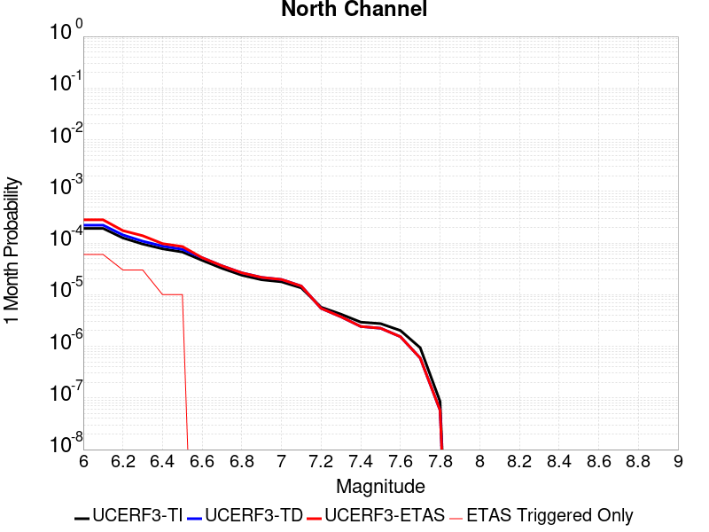 |  |  |

| Magnitude | 1 wk TI Prob | 1 wk TD Prob | 1 wk ETAS Prob | 1 wk ETAS/TD Gain | 1 wk ETAS Triggered Only | 1 mo TI Prob | 1 mo TD Prob | 1 mo ETAS Prob | 1 mo ETAS/TD Gain | 1 mo ETAS Triggered Only | 1 yr TI Prob | 1 yr TD Prob | 1 yr ETAS Prob | 1 yr ETAS/TD Gain | 1 yr ETAS Triggered Only | 10 yr TI Prob | 10 yr TD Prob | 10 yr ETAS Prob | 10 yr ETAS/TD Gain | 10 yr ETAS Triggered Only |
|-----|-----|-----|-----|-----|-----|-----|-----|-----|-----|-----|-----|-----|-----|-----|-----|-----|-----|-----|-----|-----|
| 6.0 | 4.4784803E-5 | 5.1681258E-5 | 9.167919E-5 | 1.773935 | 4.0E-5 | 1.9192076E-4 | 2.2147306E-4 | 2.8145977E-4 | 1.2708533 | 6.0E-5 | 0.0023341312 | 0.002693235 | 0.0027530733 | 1.022218 | 6.0E-5 | 0.023097662 | 0.026621085 | 0.02678656 | 1.0062159 | 1.7E-4 |
| 6.1 | 4.4784803E-5 | 5.1681258E-5 | 9.167919E-5 | 1.773935 | 4.0E-5 | 1.9192076E-4 | 2.2147306E-4 | 2.8145977E-4 | 1.2708533 | 6.0E-5 | 0.0023341312 | 0.002693235 | 0.0027530733 | 1.022218 | 6.0E-5 | 0.023097662 | 0.026621085 | 0.026767092 | 1.0054846 | 1.5E-4 |
| 6.2 | 2.9239323E-5 | 3.3454602E-5 | 6.34536E-5 | 1.8967075 | 3.0E-5 | 1.2530536E-4 | 1.4336924E-4 | 1.7336494E-4 | 1.2092199 | 3.0E-5 | 0.0015245251 | 0.0017441667 | 0.0017741143 | 1.0171702 | 3.0E-5 | 0.015141088 | 0.017309574 | 0.017407844 | 1.0056771 | 1.0E-4 |
| 6.3 | 2.2282084E-5 | 2.5258823E-5 | 5.5258068E-5 | 2.1876738 | 3.0E-5 | 9.5491145E-5 | 1.0824774E-4 | 1.3824449E-4 | 1.277112 | 3.0E-5 | 0.0011619846 | 0.0013171415 | 0.001347102 | 1.0227466 | 3.0E-5 | 0.011559275 | 0.013095759 | 0.013174711 | 1.0060289 | 8.0E-5 |
| 6.4 | 1.8016528E-5 | 2.0329517E-5 | 3.0329313E-5 | 1.4918857 | 1.0E-5 | 7.72114E-5 | 8.712368E-5 | 9.712281E-5 | 1.1147693 | 1.0E-5 | 9.3964336E-4 | 0.0010602309 | 0.0010702204 | 1.009422 | 1.0E-5 | 0.009356801 | 0.010553452 | 0.010602925 | 1.0046878 | 5.0E-5 |
| 6.5 | 1.563319E-5 | 1.7593578E-5 | 2.7593402E-5 | 1.5683792 | 1.0E-5 | 6.6997665E-5 | 7.539895E-5 | 8.53982E-5 | 1.1326178 | 1.0E-5 | 8.1539125E-4 | 9.176096E-4 | 9.276005E-4 | 1.0108879 | 1.0E-5 | 0.008124059 | 0.009139665 | 0.009189209 | 1.0054207 | 5.0E-5 |
| 6.6 | 1.0763303E-5 | 1.2108986E-5 | 1.2108986E-5 | 1.0 | 0.0 | 4.612763E-5 | 5.189466E-5 | 5.189466E-5 | 1.0 | 0.0 | 5.6145916E-4 | 6.316414E-4 | 6.316414E-4 | 1.0 | 0.0 | 0.0056004273 | 0.006299181 | 0.006319055 | 1.003155 | 2.0E-5 |
| 6.7 | 7.5493017E-6 | 8.432285E-6 | 8.432285E-6 | 1.0 | 0.0 | 3.235375E-5 | 3.613789E-5 | 3.613789E-5 | 1.0 | 0.0 | 3.9383568E-4 | 4.398947E-4 | 4.398947E-4 | 1.0 | 0.0 | 0.0039313845 | 0.004390712 | 0.0044006677 | 1.0022675 | 1.0E-5 |
| 6.8 | 5.547737E-6 | 6.1672436E-6 | 6.1672436E-6 | 1.0 | 0.0 | 2.3775801E-5 | 2.6430791E-5 | 2.6430791E-5 | 1.0 | 0.0 | 2.8943192E-4 | 3.2175018E-4 | 3.2175018E-4 | 1.0 | 0.0 | 0.0028905524 | 0.0032131237 | 0.0032230916 | 1.0031022 | 1.0E-5 |
| 6.9 | 4.5301035E-6 | 5.0313593E-6 | 5.0313593E-6 | 1.0 | 0.0 | 1.9414585E-5 | 2.1562806E-5 | 2.1562806E-5 | 1.0 | 0.0 | 2.3634694E-4 | 2.6249824E-4 | 2.6249824E-4 | 1.0 | 0.0 | 0.0023609572 | 0.0026221483 | 0.002632122 | 1.0038036 | 1.0E-5 |
| 7.0 | 4.136622E-6 | 4.5884035E-6 | 4.5884035E-6 | 1.0 | 0.0 | 1.7728258E-5 | 1.9664454E-5 | 1.9664454E-5 | 1.0 | 0.0 | 2.1582017E-4 | 2.3939111E-4 | 2.3939111E-4 | 1.0 | 0.0 | 0.002156107 | 0.0023915968 | 0.002401573 | 1.0041713 | 1.0E-5 |
| 7.1 | 3.1511863E-6 | 3.4236803E-6 | 3.4236803E-6 | 1.0 | 0.0 | 1.3505014E-5 | 1.4672844E-5 | 1.4672844E-5 | 1.0 | 0.0 | 1.6441115E-4 | 1.786293E-4 | 1.786293E-4 | 1.0 | 0.0 | 0.0016428955 | 0.0017850602 | 0.0017850602 | 1.0 | 0.0 |
| 7.2 | 1.332509E-6 | 1.2651429E-6 | 1.2651429E-6 | 1.0 | 0.0 | 5.7107404E-6 | 5.4220304E-6 | 5.4220304E-6 | 1.0 | 0.0 | 6.9526046E-5 | 6.601126E-5 | 6.601126E-5 | 1.0 | 0.0 | 6.9504295E-4 | 6.5992016E-4 | 6.5992016E-4 | 1.0 | 0.0 |
| 7.3 | 9.772058E-7 | 8.699827E-7 | 8.699827E-7 | 1.0 | 0.0 | 4.188018E-6 | 3.7284922E-6 | 3.7284922E-6 | 1.0 | 0.0 | 5.098793E-5 | 4.5393463E-5 | 4.5393463E-5 | 1.0 | 0.0 | 5.097623E-4 | 4.5384365E-4 | 4.5384365E-4 | 1.0 | 0.0 |
| 7.4 | 6.844366E-7 | 5.645893E-7 | 5.645893E-7 | 1.0 | 0.0 | 2.9332964E-6 | 2.4196663E-6 | 2.4196663E-6 | 1.0 | 0.0 | 3.57123E-5 | 2.945904E-5 | 2.945904E-5 | 1.0 | 0.0 | 3.570656E-4 | 2.9455166E-4 | 2.9455166E-4 | 1.0 | 0.0 |
| 7.5 | 6.411496E-7 | 5.2204877E-7 | 5.2204877E-7 | 1.0 | 0.0 | 2.747781E-6 | 2.23735E-6 | 2.23735E-6 | 1.0 | 0.0 | 3.345372E-5 | 2.7239399E-5 | 2.7239399E-5 | 1.0 | 0.0 | 3.3448686E-4 | 2.723609E-4 | 2.723609E-4 | 1.0 | 0.0 |
| 7.6 | 4.7170897E-7 | 3.579028E-7 | 3.579028E-7 | 1.0 | 0.0 | 2.0216085E-6 | 1.5338682E-6 | 1.5338682E-6 | 1.0 | 0.0 | 2.4612804E-5 | 1.8674687E-5 | 1.8674687E-5 | 1.0 | 0.0 | 2.4610077E-4 | 1.8673137E-4 | 1.8673137E-4 | 1.0 | 0.0 |
| 7.7 | 2.1849833E-7 | 1.3804248E-7 | 1.3804248E-7 | 1.0 | 0.0 | 9.3642103E-7 | 5.916105E-7 | 5.916105E-7 | 1.0 | 0.0 | 1.1400866E-5 | 7.202835E-6 | 7.202835E-6 | 1.0 | 0.0 | 1.1400282E-4 | 7.202612E-5 | 7.202612E-5 | 1.0 | 0.0 |
| 7.8 | 1.997118E-8 | 1.34998785E-8 | 1.34998785E-8 | 1.0 | 0.0 | 8.559077E-8 | 5.785662E-8 | 5.785662E-8 | 1.0 | 0.0 | 1.0420672E-6 | 7.0440416E-7 | 7.0440416E-7 | 1.0 | 0.0 | 1.0420623E-5 | 7.044022E-6 | 7.044022E-6 | 1.0 | 0.0 |

## Calico-Hidalgo
*[(top)](#table-of-contents)*

| 1 Week | 1 Month | 1 Year | 10 Year |
|-----|-----|-----|-----|
|  | 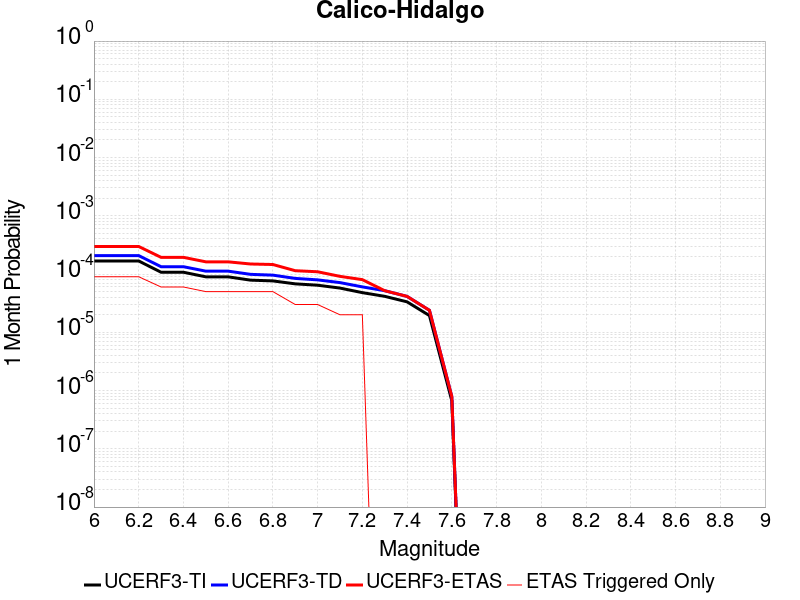 |  |  |

| Magnitude | 1 wk TI Prob | 1 wk TD Prob | 1 wk ETAS Prob | 1 wk ETAS/TD Gain | 1 wk ETAS Triggered Only | 1 mo TI Prob | 1 mo TD Prob | 1 mo ETAS Prob | 1 mo ETAS/TD Gain | 1 mo ETAS Triggered Only | 1 yr TI Prob | 1 yr TD Prob | 1 yr ETAS Prob | 1 yr ETAS/TD Gain | 1 yr ETAS Triggered Only | 10 yr TI Prob | 10 yr TD Prob | 10 yr ETAS Prob | 10 yr ETAS/TD Gain | 10 yr ETAS Triggered Only |
|-----|-----|-----|-----|-----|-----|-----|-----|-----|-----|-----|-----|-----|-----|-----|-----|-----|-----|-----|-----|-----|
| 6.0 | 3.916391E-5 | 4.846162E-5 | 1.2845774E-4 | 2.6507108 | 8.0E-5 | 1.6783454E-4 | 2.0767783E-4 | 2.9765913E-4 | 1.4332736 | 9.0E-5 | 0.0020414705 | 0.0025258237 | 0.002705369 | 1.0710839 | 1.8E-4 | 0.02022818 | 0.025001952 | 0.025206704 | 1.0081893 | 2.1E-4 |
| 6.1 | 3.916391E-5 | 4.846162E-5 | 1.2845774E-4 | 2.6507108 | 8.0E-5 | 1.6783454E-4 | 2.0767783E-4 | 2.9765913E-4 | 1.4332736 | 9.0E-5 | 0.0020414705 | 0.0025258237 | 0.002705369 | 1.0710839 | 1.8E-4 | 0.02022818 | 0.025001952 | 0.025206704 | 1.0081893 | 2.1E-4 |
| 6.2 | 3.916391E-5 | 4.846162E-5 | 1.2845774E-4 | 2.6507108 | 8.0E-5 | 1.6783454E-4 | 2.0767783E-4 | 2.9765913E-4 | 1.4332736 | 9.0E-5 | 0.0020414705 | 0.0025258237 | 0.002705369 | 1.0710839 | 1.8E-4 | 0.02022818 | 0.025001952 | 0.025206704 | 1.0081893 | 2.1E-4 |
| 6.3 | 2.5080448E-5 | 3.1209194E-5 | 9.120732E-5 | 2.9224503 | 6.0E-5 | 1.074832E-4 | 1.3374703E-4 | 1.93739E-4 | 1.4485481 | 6.0E-5 | 0.0013078224 | 0.0016271874 | 0.0017569759 | 1.0797625 | 1.3E-4 | 0.013001524 | 0.01615658 | 0.016294317 | 1.0085253 | 1.4E-4 |
| 6.4 | 2.5080448E-5 | 3.1209194E-5 | 9.120732E-5 | 2.9224503 | 6.0E-5 | 1.074832E-4 | 1.3374703E-4 | 1.93739E-4 | 1.4485481 | 6.0E-5 | 0.0013078224 | 0.0016271874 | 0.0017569759 | 1.0797625 | 1.3E-4 | 0.013001524 | 0.01615658 | 0.016294317 | 1.0085253 | 1.4E-4 |
| 6.5 | 2.0924435E-5 | 2.6196349E-5 | 7.6195036E-5 | 2.908613 | 5.0E-5 | 8.967307E-5 | 1.12265334E-4 | 1.6225972E-4 | 1.4453235 | 5.0E-5 | 0.0010912227 | 0.0013659907 | 0.0014758406 | 1.0804176 | 1.1E-4 | 0.010858798 | 0.013577947 | 0.0136963185 | 1.0087179 | 1.2E-4 |
| 6.6 | 2.0902167E-5 | 2.6172447E-5 | 7.617114E-5 | 2.910356 | 5.0E-5 | 8.957764E-5 | 1.121629E-4 | 1.621573E-4 | 1.4457302 | 5.0E-5 | 0.0010900621 | 0.0013647453 | 0.0014745952 | 1.0804911 | 1.1E-4 | 0.010847305 | 0.013565645 | 0.013684017 | 1.0087259 | 1.2E-4 |
| 6.7 | 1.8346258E-5 | 2.3072882E-5 | 7.307173E-5 | 3.166996 | 5.0E-5 | 7.862446E-5 | 9.888012E-5 | 1.4887517E-4 | 1.5056129 | 5.0E-5 | 9.568323E-4 | 0.0012032149 | 0.0013130825 | 1.0913117 | 1.1E-4 | 0.009527229 | 0.0119686015 | 0.012087164 | 1.0099063 | 1.2E-4 |
| 6.8 | 1.780268E-5 | 2.2367933E-5 | 7.236681E-5 | 3.235293 | 5.0E-5 | 7.6294964E-5 | 9.585912E-5 | 1.4585433E-4 | 1.5215487 | 5.0E-5 | 9.284953E-4 | 0.0011664742 | 0.0012763458 | 1.0941913 | 1.1E-4 | 0.009246254 | 0.011605083 | 0.011723691 | 1.0102203 | 1.2E-4 |
| 6.9 | 1.5844284E-5 | 1.9648549E-5 | 4.964796E-5 | 2.5268004 | 3.0E-5 | 6.790231E-5 | 8.420542E-5 | 1.142029E-4 | 1.3562416 | 3.0E-5 | 8.26397E-4 | 0.0010247319 | 0.0011146397 | 1.0877378 | 9.0E-5 | 0.008233306 | 0.010201468 | 0.010300448 | 1.0097026 | 1.0E-4 |
| 7.0 | 1.5015954E-5 | 1.8550276E-5 | 4.854972E-5 | 2.6171966 | 3.0E-5 | 6.43525E-5 | 7.949884E-5 | 1.0949645E-4 | 1.377334 | 3.0E-5 | 7.8321004E-4 | 9.674814E-4 | 0.001047404 | 1.0826089 | 8.0E-5 | 0.007804554 | 0.00963406 | 0.009723192 | 1.0092518 | 9.0E-5 |
| 7.1 | 1.341035E-5 | 1.6645796E-5 | 3.6645462E-5 | 2.2014844 | 2.0E-5 | 5.7471665E-5 | 7.133725E-5 | 9.133582E-5 | 1.2803384 | 2.0E-5 | 6.9949287E-4 | 8.6819736E-4 | 9.1815396E-4 | 1.0575405 | 5.0E-5 | 0.0069729513 | 0.008649348 | 0.008708829 | 1.006877 | 6.0E-5 |
| 7.2 | 1.1195578E-5 | 1.4056315E-5 | 3.4056033E-5 | 2.422828 | 2.0E-5 | 4.7980167E-5 | 6.024002E-5 | 8.023882E-5 | 1.3319852 | 2.0E-5 | 5.8400194E-4 | 7.331864E-4 | 7.7315705E-4 | 1.0545164 | 4.0E-5 | 0.005824696 | 0.0073087844 | 0.007358419 | 1.0067911 | 5.0E-5 |
| 7.3 | 9.675513E-6 | 1.2087973E-5 | 1.2087973E-5 | 1.0 | 0.0 | 4.1465824E-5 | 5.180463E-5 | 5.180463E-5 | 1.0 | 0.0 | 5.0472945E-4 | 6.3054945E-4 | 6.5053685E-4 | 1.0316983 | 2.0E-5 | 0.005035846 | 0.0062886714 | 0.006318483 | 1.0047405 | 3.0E-5 |
| 7.4 | 7.780715E-6 | 9.64818E-6 | 9.64818E-6 | 1.0 | 0.0 | 3.3345495E-5 | 4.1348736E-5 | 4.1348736E-5 | 1.0 | 0.0 | 4.059058E-4 | 5.0331384E-4 | 5.2330375E-4 | 1.0397166 | 2.0E-5 | 0.004051652 | 0.0050226566 | 0.005052506 | 1.005943 | 3.0E-5 |
| 7.5 | 4.5214815E-6 | 5.5698943E-6 | 5.5698943E-6 | 1.0 | 0.0 | 1.9377634E-5 | 2.3870798E-5 | 2.3870798E-5 | 1.0 | 0.0 | 2.3589715E-4 | 2.9059555E-4 | 3.1058973E-4 | 1.0688041 | 2.0E-5 | 0.002356469 | 0.0029028764 | 0.0029228183 | 1.0068697 | 2.0E-5 |
| 7.6 | 1.5600239E-7 | 1.8435549E-7 | 1.8435549E-7 | 1.0 | 0.0 | 6.6858144E-7 | 7.900948E-7 | 7.900948E-7 | 1.0 | 0.0 | 8.1399485E-6 | 9.619376E-6 | 9.619376E-6 | 1.0 | 0.0 | 8.139651E-5 | 9.6191005E-5 | 9.6191005E-5 | 1.0 | 0.0 |

## San Andreas (North Branch Mill Creek)
*[(top)](#table-of-contents)*

| 1 Week | 1 Month | 1 Year | 10 Year |
|-----|-----|-----|-----|
|  |  |  |  |

| Magnitude | 1 wk TI Prob | 1 wk TD Prob | 1 wk ETAS Prob | 1 wk ETAS/TD Gain | 1 wk ETAS Triggered Only | 1 mo TI Prob | 1 mo TD Prob | 1 mo ETAS Prob | 1 mo ETAS/TD Gain | 1 mo ETAS Triggered Only | 1 yr TI Prob | 1 yr TD Prob | 1 yr ETAS Prob | 1 yr ETAS/TD Gain | 1 yr ETAS Triggered Only | 10 yr TI Prob | 10 yr TD Prob | 10 yr ETAS Prob | 10 yr ETAS/TD Gain | 10 yr ETAS Triggered Only |
|-----|-----|-----|-----|-----|-----|-----|-----|-----|-----|-----|-----|-----|-----|-----|-----|-----|-----|-----|-----|-----|
| 6.0 | 1.3663894E-5 | 2.6208549E-5 | 1.2620592E-4 | 4.8154488 | 1.0E-4 | 5.855823E-5 | 1.12317546E-4 | 2.5230183E-4 | 2.246326 | 1.4E-4 | 7.127132E-4 | 0.0013666138 | 0.0015363814 | 1.124225 | 1.7E-4 | 0.007104317 | 0.01362159 | 0.013838593 | 1.0159308 | 2.2E-4 |
| 6.1 | 1.3663894E-5 | 2.6208549E-5 | 1.2620592E-4 | 4.8154488 | 1.0E-4 | 5.855823E-5 | 1.12317546E-4 | 2.5230183E-4 | 2.246326 | 1.4E-4 | 7.127132E-4 | 0.0013666138 | 0.0015363814 | 1.124225 | 1.7E-4 | 0.007104317 | 0.01362159 | 0.013838593 | 1.0159308 | 2.2E-4 |
| 6.2 | 1.3663894E-5 | 2.6208549E-5 | 1.2620592E-4 | 4.8154488 | 1.0E-4 | 5.855823E-5 | 1.12317546E-4 | 2.5230183E-4 | 2.246326 | 1.4E-4 | 7.127132E-4 | 0.0013666138 | 0.0015363814 | 1.124225 | 1.7E-4 | 0.007104317 | 0.01362159 | 0.013838593 | 1.0159308 | 2.2E-4 |
| 6.3 | 1.3663894E-5 | 2.6208549E-5 | 1.2620592E-4 | 4.8154488 | 1.0E-4 | 5.855823E-5 | 1.12317546E-4 | 2.5230183E-4 | 2.246326 | 1.4E-4 | 7.127132E-4 | 0.0013666138 | 0.0015363814 | 1.124225 | 1.7E-4 | 0.007104317 | 0.01362159 | 0.013838593 | 1.0159308 | 2.2E-4 |
| 6.4 | 1.3663894E-5 | 2.6208549E-5 | 1.2620592E-4 | 4.8154488 | 1.0E-4 | 5.855823E-5 | 1.12317546E-4 | 2.5230183E-4 | 2.246326 | 1.4E-4 | 7.127132E-4 | 0.0013666138 | 0.0015363814 | 1.124225 | 1.7E-4 | 0.007104317 | 0.01362159 | 0.013838593 | 1.0159308 | 2.2E-4 |
| 6.5 | 1.3663894E-5 | 2.6208549E-5 | 1.2620592E-4 | 4.8154488 | 1.0E-4 | 5.855823E-5 | 1.12317546E-4 | 2.5230183E-4 | 2.246326 | 1.4E-4 | 7.127132E-4 | 0.0013666138 | 0.0015363814 | 1.124225 | 1.7E-4 | 0.007104317 | 0.01362159 | 0.013838593 | 1.0159308 | 2.2E-4 |
| 6.6 | 1.3449214E-5 | 2.5993035E-5 | 1.2599044E-4 | 4.8470845 | 1.0E-4 | 5.7638215E-5 | 1.11393994E-4 | 2.513784E-4 | 2.2566602 | 1.4E-4 | 7.015193E-4 | 0.0013553835 | 0.0015251532 | 1.1252557 | 1.7E-4 | 0.006993089 | 0.013510658 | 0.013727686 | 1.0160635 | 2.2E-4 |
| 6.7 | 1.3413387E-5 | 2.5956322E-5 | 1.2595372E-4 | 4.852526 | 1.0E-4 | 5.7484678E-5 | 1.11236666E-4 | 2.512211E-4 | 2.2584379 | 1.4E-4 | 6.996512E-4 | 0.0013534705 | 0.0015232404 | 1.1254331 | 1.7E-4 | 0.006974525 | 0.01349176 | 0.013708792 | 1.0160862 | 2.2E-4 |
| 6.8 | 1.3316527E-5 | 2.5856161E-5 | 1.2585358E-4 | 4.86745 | 1.0E-4 | 5.7069577E-5 | 1.1080744E-4 | 2.5079193E-4 | 2.263313 | 1.4E-4 | 6.9460063E-4 | 0.0013482511 | 0.0015180219 | 1.1259192 | 1.7E-4 | 0.006924335 | 0.013440199 | 0.013657242 | 1.0161488 | 2.2E-4 |
| 6.9 | 1.3272914E-5 | 2.5808553E-5 | 1.2580598E-4 | 4.8745847 | 1.0E-4 | 5.6882676E-5 | 1.10603425E-4 | 2.5058794E-4 | 2.2656436 | 1.4E-4 | 6.923265E-4 | 0.0013457703 | 0.0015155415 | 1.1261517 | 1.7E-4 | 0.006901736 | 0.0134156905 | 0.013632739 | 1.0161787 | 2.2E-4 |
| 7.0 | 1.2963957E-5 | 2.5319732E-5 | 1.253172E-4 | 4.949389 | 1.0E-4 | 5.555863E-5 | 1.08508655E-4 | 2.4849345E-4 | 2.2900796 | 1.4E-4 | 6.762164E-4 | 0.0013202975 | 0.001490073 | 1.1285889 | 1.7E-4 | 0.006741624 | 0.013163991 | 0.013381095 | 1.0164922 | 2.2E-4 |
| 7.1 | 1.2902424E-5 | 2.5245896E-5 | 1.2524337E-4 | 4.96094 | 1.0E-4 | 5.529493E-5 | 1.0819224E-4 | 2.481771E-4 | 2.293853 | 1.4E-4 | 6.730078E-4 | 0.0013164498 | 0.001486226 | 1.1289651 | 1.7E-4 | 0.0067097326 | 0.01312597 | 0.013343082 | 1.0165406 | 2.2E-4 |
| 7.2 | 1.2469293E-5 | 2.467374E-5 | 1.2467128E-4 | 5.052792 | 1.0E-4 | 5.3438733E-5 | 1.0574034E-4 | 2.4572553E-4 | 2.323858 | 1.4E-4 | 6.5042236E-4 | 0.0012866334 | 0.0014564147 | 1.1319578 | 1.7E-4 | 0.006485219 | 0.012831285 | 0.013048462 | 1.0169256 | 2.2E-4 |
| 7.3 | 1.2350464E-5 | 2.4467421E-5 | 1.2446498E-4 | 5.0869675 | 1.0E-4 | 5.292949E-5 | 1.0485619E-4 | 2.448415E-4 | 2.335022 | 1.4E-4 | 6.44226E-4 | 0.0012758815 | 0.0014456647 | 1.1330712 | 1.7E-4 | 0.0064236154 | 0.012725143 | 0.012942343 | 1.0170686 | 2.2E-4 |
| 7.4 | 1.1652573E-5 | 2.2930653E-5 | 1.2292837E-4 | 5.3608747 | 1.0E-4 | 4.9938644E-5 | 9.8270546E-5 | 2.3825679E-4 | 2.4244983 | 1.4E-4 | 6.078334E-4 | 0.0011957916 | 0.0013655883 | 1.1419952 | 1.7E-4 | 0.006061735 | 0.011935827 | 0.012153202 | 1.018212 | 2.2E-4 |
| 7.5 | 1.0815721E-5 | 2.0911755E-5 | 1.20909666E-4 | 5.7818995 | 1.0E-4 | 4.6352267E-5 | 8.961875E-5 | 2.296062E-4 | 2.5620332 | 1.4E-4 | 5.641927E-4 | 0.0010905651 | 0.0012603798 | 1.1557125 | 1.7E-4 | 0.0056276247 | 0.010896005 | 0.011113608 | 1.0199709 | 2.2E-4 |
| 7.6 | 1.0247723E-5 | 1.984723E-5 | 1.19845245E-4 | 6.0383863 | 1.0E-4 | 4.3918077E-5 | 8.50568E-5 | 2.2504489E-4 | 2.645819 | 1.4E-4 | 5.345714E-4 | 0.0010350776 | 0.0012049017 | 1.1640689 | 1.7E-4 | 0.0053328727 | 0.010346441 | 0.010564164 | 1.0210433 | 2.2E-4 |
| 7.7 | 6.91508E-6 | 1.366324E-5 | 1.13661874E-4 | 8.318809 | 1.0E-4 | 2.9635721E-5 | 5.855543E-5 | 1.9854723E-4 | 3.3907568 | 1.4E-4 | 3.6075516E-4 | 7.126795E-4 | 8.825584E-4 | 1.2383664 | 1.7E-4 | 0.0036017008 | 0.0071476107 | 0.007366038 | 1.0305595 | 2.2E-4 |
| 7.8 | 5.995599E-6 | 1.1697237E-5 | 1.1169607E-4 | 9.548927 | 1.0E-4 | 2.5695172E-5 | 5.0130053E-5 | 1.9012303E-4 | 3.792596 | 1.4E-4 | 3.1279383E-4 | 6.1016256E-4 | 7.8005885E-4 | 1.2784443 | 1.7E-4 | 0.003123539 | 0.006128156 | 0.006346808 | 1.0356798 | 2.2E-4 |
| 7.9 | 4.6251585E-6 | 8.204651E-6 | 1.0820383E-4 | 13.188109 | 1.0E-4 | 1.9821957E-5 | 3.5162317E-5 | 1.7515739E-4 | 4.9813952 | 1.4E-4 | 2.4130559E-4 | 4.2801717E-4 | 5.8794866E-4 | 1.3736567 | 1.6E-4 | 0.0024104374 | 0.0043127914 | 0.0045218854 | 1.0484824 | 2.1E-4 |
| 8.0 | 3.0315334E-6 | 4.9185883E-6 | 5.4918342E-5 | 11.165469 | 5.0E-5 | 1.2992222E-5 | 2.1079493E-5 | 8.107823E-5 | 3.8463082 | 6.0E-5 | 1.5816881E-4 | 2.5661263E-4 | 3.1659723E-4 | 1.2337555 | 6.0E-5 | 0.0015805629 | 0.0025884812 | 0.0026582999 | 1.0269729 | 7.0E-5 |
| 8.1 | 1.7614171E-6 | 2.3480786E-6 | 2.3480786E-6 | 1.0 | 0.0 | 7.548909E-6 | 1.0063155E-5 | 1.0063155E-5 | 1.0 | 0.0 | 9.190408E-5 | 1.2251204E-4 | 1.2251204E-4 | 1.0 | 0.0 | 9.1866084E-4 | 0.0012422171 | 0.0012522048 | 1.0080401 | 1.0E-5 |
| 8.2 | 7.821359E-7 | 5.4269566E-7 | 5.4269566E-7 | 1.0 | 0.0 | 3.3520066E-6 | 2.3258365E-6 | 2.3258365E-6 | 1.0 | 0.0 | 4.0809915E-5 | 2.8316692E-5 | 2.8316692E-5 | 1.0 | 0.0 | 4.080242E-4 | 2.934623E-4 | 2.934623E-4 | 1.0 | 0.0 |
| 8.3 | 2.5580607E-7 | 1.372826E-7 | 1.372826E-7 | 1.0 | 0.0 | 1.0963113E-6 | 5.883539E-7 | 5.883539E-7 | 1.0 | 0.0 | 1.3347508E-5 | 7.1631853E-6 | 7.1631853E-6 | 1.0 | 0.0 | 1.3346707E-4 | 7.503622E-5 | 7.503622E-5 | 1.0 | 0.0 |

## Mission Ridge-Arroyo Parida-Santa Ana
*[(top)](#table-of-contents)*

| 1 Week | 1 Month | 1 Year | 10 Year |
|-----|-----|-----|-----|
|  |  |  |  |

| Magnitude | 1 wk TI Prob | 1 wk TD Prob | 1 wk ETAS Prob | 1 wk ETAS/TD Gain | 1 wk ETAS Triggered Only | 1 mo TI Prob | 1 mo TD Prob | 1 mo ETAS Prob | 1 mo ETAS/TD Gain | 1 mo ETAS Triggered Only | 1 yr TI Prob | 1 yr TD Prob | 1 yr ETAS Prob | 1 yr ETAS/TD Gain | 1 yr ETAS Triggered Only | 10 yr TI Prob | 10 yr TD Prob | 10 yr ETAS Prob | 10 yr ETAS/TD Gain | 10 yr ETAS Triggered Only |
|-----|-----|-----|-----|-----|-----|-----|-----|-----|-----|-----|-----|-----|-----|-----|-----|-----|-----|-----|-----|-----|
| 6.0 | 3.8040394E-5 | 4.118545E-5 | 1.0118298E-4 | 2.4567652 | 6.0E-5 | 1.6302007E-4 | 1.7649842E-4 | 2.4648607E-4 | 1.3965341 | 7.0E-5 | 0.0019829625 | 0.002146978 | 0.002246763 | 1.0464771 | 1.0E-4 | 0.019653613 | 0.0212856 | 0.021461768 | 1.0082765 | 1.8E-4 |
| 6.1 | 2.50597E-5 | 2.5717376E-5 | 4.571686E-5 | 1.7776643 | 2.0E-5 | 1.0739429E-4 | 1.1021285E-4 | 1.4020955E-4 | 1.2721705 | 3.0E-5 | 0.0013067413 | 0.0013410482 | 0.0013809946 | 1.0297874 | 4.0E-5 | 0.012990839 | 0.0133334445 | 0.013422244 | 1.00666 | 9.0E-5 |
| 6.2 | 2.04906E-5 | 2.033794E-5 | 4.0337534E-5 | 1.9833637 | 2.0E-5 | 8.7813896E-5 | 8.715979E-5 | 1.1715718E-4 | 1.3441654 | 3.0E-5 | 0.0010686098 | 0.0010606721 | 0.0011006297 | 1.0376719 | 4.0E-5 | 0.010634857 | 0.010558506 | 0.0106376605 | 1.0074968 | 8.0E-5 |
| 6.3 | 1.7044817E-5 | 1.6245278E-5 | 3.6244954E-5 | 2.231107 | 2.0E-5 | 7.3047166E-5 | 6.9620786E-5 | 9.96187E-5 | 1.4308758 | 3.0E-5 | 8.8898634E-4 | 8.4730843E-4 | 8.77283E-4 | 1.0353762 | 3.0E-5 | 0.0088543845 | 0.008441877 | 0.008491455 | 1.0058728 | 5.0E-5 |
| 6.4 | 1.6678656E-5 | 1.5842661E-5 | 3.5842346E-5 | 2.2623942 | 2.0E-5 | 7.1477996E-5 | 6.789538E-5 | 9.789334E-5 | 1.4418263 | 3.0E-5 | 8.6989714E-4 | 8.2631764E-4 | 8.5629284E-4 | 1.0362756 | 3.0E-5 | 0.008664998 | 0.008233541 | 0.008283129 | 1.0060227 | 5.0E-5 |
| 6.5 | 1.5474263E-5 | 1.4504497E-5 | 3.4504206E-5 | 2.3788626 | 2.0E-5 | 6.631658E-5 | 6.2160674E-5 | 9.215881E-5 | 1.4825902 | 3.0E-5 | 8.071053E-4 | 7.565479E-4 | 7.865252E-4 | 1.0396239 | 3.0E-5 | 0.008041802 | 0.007540757 | 0.0075705308 | 1.0039483 | 3.0E-5 |
| 6.6 | 1.4182203E-5 | 1.3073244E-5 | 2.3073113E-5 | 1.764911 | 1.0E-5 | 6.0779454E-5 | 5.602701E-5 | 7.602589E-5 | 1.3569506 | 2.0E-5 | 7.397386E-4 | 6.819194E-4 | 7.0190575E-4 | 1.029309 | 2.0E-5 | 0.0073728096 | 0.006799245 | 0.006819109 | 1.0029215 | 2.0E-5 |
| 6.7 | 1.3270211E-5 | 1.2065273E-5 | 2.2065153E-5 | 1.828815 | 1.0E-5 | 5.687109E-5 | 5.170731E-5 | 7.170628E-5 | 1.3867725 | 2.0E-5 | 6.9218554E-4 | 6.293585E-4 | 6.493459E-4 | 1.0317584 | 2.0E-5 | 0.0069003347 | 0.0062767095 | 0.006296584 | 1.0031664 | 2.0E-5 |
| 6.8 | 1.2503908E-5 | 1.1219787E-5 | 2.1219674E-5 | 1.8912725 | 1.0E-5 | 5.3587075E-5 | 4.8083937E-5 | 6.8082976E-5 | 1.4159193 | 2.0E-5 | 6.522273E-4 | 5.8526837E-4 | 6.052567E-4 | 1.0341524 | 2.0E-5 | 0.0065031634 | 0.005838203 | 0.0058580856 | 1.0034057 | 2.0E-5 |
| 6.9 | 1.173025E-5 | 1.0338202E-5 | 2.0338099E-5 | 1.9672762 | 1.0E-5 | 5.027153E-5 | 4.4305845E-5 | 5.43054E-5 | 1.2256938 | 1.0E-5 | 6.11884E-4 | 5.392937E-4 | 5.492883E-4 | 1.0185328 | 1.0E-5 | 0.006102019 | 0.0053807576 | 0.0053907037 | 1.0018485 | 1.0E-5 |
| 7.0 | 1.1343447E-5 | 9.899544E-6 | 1.9899444E-5 | 2.0101376 | 1.0E-5 | 4.861387E-5 | 4.2425945E-5 | 5.2425523E-5 | 1.2356948 | 1.0E-5 | 5.917131E-4 | 5.1641697E-4 | 5.264118E-4 | 1.0193542 | 1.0E-5 | 0.0059014005 | 0.0051530725 | 0.005163021 | 1.0019306 | 1.0E-5 |
| 7.1 | 1.063692E-5 | 9.087485E-6 | 1.9087394E-5 | 2.1004045 | 1.0E-5 | 4.5586003E-5 | 3.89458E-5 | 4.894541E-5 | 1.2567571 | 1.0E-5 | 5.5486825E-4 | 4.7406534E-4 | 4.840606E-4 | 1.0210842 | 1.0E-5 | 0.005534848 | 0.0047314307 | 0.0047413833 | 1.0021036 | 1.0E-5 |
| 7.2 | 7.993961E-6 | 6.1009964E-6 | 1.6100936E-5 | 2.6390667 | 1.0E-5 | 3.425938E-5 | 2.6146867E-5 | 3.6146605E-5 | 1.382445 | 1.0E-5 | 4.1702815E-4 | 3.182921E-4 | 3.282889E-4 | 1.0314077 | 1.0E-5 | 0.004162464 | 0.0031789592 | 0.0031889274 | 1.0031357 | 1.0E-5 |
| 7.3 | 7.0939395E-6 | 5.418581E-6 | 1.5418527E-5 | 2.8454916 | 1.0E-5 | 3.0402245E-5 | 2.3222286E-5 | 3.3222055E-5 | 1.4306108 | 1.0E-5 | 3.7008445E-4 | 2.8269502E-4 | 2.926922E-4 | 1.0353638 | 1.0E-5 | 0.0036946873 | 0.00282394 | 0.002833912 | 1.0035311 | 1.0E-5 |
| 7.4 | 6.655877E-6 | 5.06346E-6 | 1.506341E-5 | 2.974924 | 1.0E-5 | 2.8524875E-5 | 2.1700364E-5 | 3.1700147E-5 | 1.4608117 | 1.0E-5 | 3.47235E-4 | 2.641703E-4 | 2.7416763E-4 | 1.0378444 | 1.0E-5 | 0.0034669293 | 0.002639143 | 0.0026491166 | 1.003779 | 1.0E-5 |
| 7.5 | 4.8970833E-6 | 3.5922374E-6 | 1.3592201E-5 | 3.7837706 | 1.0E-5 | 2.0987332E-5 | 1.5395211E-5 | 2.5395058E-5 | 1.6495426 | 1.0E-5 | 2.554908E-4 | 1.8742066E-4 | 1.9741879E-4 | 1.0533459 | 1.0E-5 | 0.0025519726 | 0.0018726791 | 0.0018826603 | 1.00533 | 1.0E-5 |
| 7.6 | 3.1384584E-6 | 2.2749582E-6 | 1.2274935E-5 | 5.395675 | 1.0E-5 | 1.3450467E-5 | 9.749784E-6 | 1.9749687E-5 | 2.0256536 | 1.0E-5 | 1.6374713E-4 | 1.1869721E-4 | 1.2869602E-4 | 1.0842379 | 1.0E-5 | 0.0016362652 | 0.0011863427 | 0.0011963309 | 1.0084193 | 1.0E-5 |
| 7.7 | 1.7630501E-6 | 1.2272292E-6 | 1.2272292E-6 | 1.0 | 0.0 | 7.5559074E-6 | 5.2595433E-6 | 5.2595433E-6 | 1.0 | 0.0 | 9.198929E-5 | 6.403309E-5 | 6.403309E-5 | 1.0 | 0.0 | 9.195122E-4 | 6.4015E-4 | 6.4015E-4 | 1.0 | 0.0 |
| 7.8 | 3.0500584E-7 | 1.9752535E-7 | 1.9752535E-7 | 1.0 | 0.0 | 1.3071673E-6 | 8.465369E-7 | 8.465369E-7 | 1.0 | 0.0 | 1.5914646E-5 | 1.03065395E-5 | 1.03065395E-5 | 1.0 | 0.0 | 1.5913506E-4 | 1.0306072E-4 | 1.0306072E-4 | 1.0 | 0.0 |
| 7.9 | 1.052133E-8 | 5.758232E-9 | 5.758232E-9 | 1.0 | 0.0 | 4.509141E-8 | 2.4678139E-8 | 2.4678139E-8 | 1.0 | 0.0 | 5.489878E-7 | 3.004563E-7 | 3.004563E-7 | 1.0 | 0.0 | 5.4898646E-6 | 3.004559E-6 | 3.004559E-6 | 1.0 | 0.0 |
| 8.0 | 3.5749022E-9 | 1.6253644E-9 | 1.6253644E-9 | 1.0 | 0.0 | 1.5321008E-8 | 6.965847E-9 | 6.965847E-9 | 1.0 | 0.0 | 1.8653327E-7 | 8.480919E-8 | 8.480919E-8 | 1.0 | 0.0 | 1.8653311E-6 | 8.480916E-7 | 8.480916E-7 | 1.0 | 0.0 |

## Santa Ynez (East)
*[(top)](#table-of-contents)*

| 1 Week | 1 Month | 1 Year | 10 Year |
|-----|-----|-----|-----|
|  |  |  | 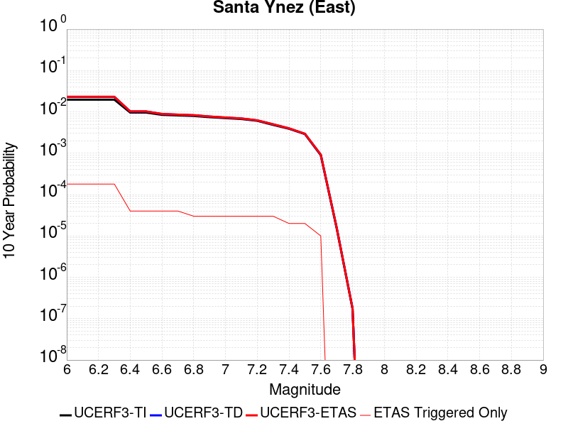 |

| Magnitude | 1 wk TI Prob | 1 wk TD Prob | 1 wk ETAS Prob | 1 wk ETAS/TD Gain | 1 wk ETAS Triggered Only | 1 mo TI Prob | 1 mo TD Prob | 1 mo ETAS Prob | 1 mo ETAS/TD Gain | 1 mo ETAS Triggered Only | 1 yr TI Prob | 1 yr TD Prob | 1 yr ETAS Prob | 1 yr ETAS/TD Gain | 1 yr ETAS Triggered Only | 10 yr TI Prob | 10 yr TD Prob | 10 yr ETAS Prob | 10 yr ETAS/TD Gain | 10 yr ETAS Triggered Only |
|-----|-----|-----|-----|-----|-----|-----|-----|-----|-----|-----|-----|-----|-----|-----|-----|-----|-----|-----|-----|-----|
| 6.0 | 3.8245707E-5 | 4.4435008E-5 | 1.0443234E-4 | 2.3502266 | 6.0E-5 | 1.6389988E-4 | 1.9042612E-4 | 2.6041278E-4 | 1.3675267 | 7.0E-5 | 0.0019936545 | 0.002316729 | 0.002436451 | 1.0516772 | 1.2E-4 | 0.019758634 | 0.022998873 | 0.023174735 | 1.0076464 | 1.8E-4 |
| 6.1 | 3.8245707E-5 | 4.4435008E-5 | 1.0443234E-4 | 2.3502266 | 6.0E-5 | 1.6389988E-4 | 1.9042612E-4 | 2.6041278E-4 | 1.3675267 | 7.0E-5 | 0.0019936545 | 0.002316729 | 0.002436451 | 1.0516772 | 1.2E-4 | 0.019758634 | 0.022998873 | 0.023174735 | 1.0076464 | 1.8E-4 |
| 6.2 | 3.8245707E-5 | 4.4435008E-5 | 1.0443234E-4 | 2.3502266 | 6.0E-5 | 1.6389988E-4 | 1.9042612E-4 | 2.6041278E-4 | 1.3675267 | 7.0E-5 | 0.0019936545 | 0.002316729 | 0.002436451 | 1.0516772 | 1.2E-4 | 0.019758634 | 0.022998873 | 0.023174735 | 1.0076464 | 1.8E-4 |
| 6.3 | 3.8245707E-5 | 4.4435008E-5 | 1.0443234E-4 | 2.3502266 | 6.0E-5 | 1.6389988E-4 | 1.9042612E-4 | 2.6041278E-4 | 1.3675267 | 7.0E-5 | 0.0019936545 | 0.002316729 | 0.002436451 | 1.0516772 | 1.2E-4 | 0.019758634 | 0.022998873 | 0.023174735 | 1.0076464 | 1.8E-4 |
| 6.4 | 1.8548286E-5 | 1.9685753E-5 | 2.9685556E-5 | 1.5079715 | 1.0E-5 | 7.949023E-5 | 8.4364845E-5 | 9.4364E-5 | 1.1185228 | 1.0E-5 | 9.673638E-4 | 0.0010266681 | 0.0010466477 | 1.0194604 | 2.0E-5 | 0.009631637 | 0.010220364 | 0.010259955 | 1.0038737 | 4.0E-5 |
| 6.5 | 1.8548286E-5 | 1.9685753E-5 | 2.9685556E-5 | 1.5079715 | 1.0E-5 | 7.949023E-5 | 8.4364845E-5 | 9.4364E-5 | 1.1185228 | 1.0E-5 | 9.673638E-4 | 0.0010266681 | 0.0010466477 | 1.0194604 | 2.0E-5 | 0.009631637 | 0.010220364 | 0.010259955 | 1.0038737 | 4.0E-5 |
| 6.6 | 1.6323698E-5 | 1.7077904E-5 | 2.7077735E-5 | 1.585542 | 1.0E-5 | 6.9956826E-5 | 7.318898E-5 | 8.318825E-5 | 1.1366225 | 1.0E-5 | 8.513916E-4 | 8.907148E-4 | 9.10697E-4 | 1.0224339 | 2.0E-5 | 0.00848137 | 0.008871846 | 0.00891149 | 1.0044687 | 4.0E-5 |
| 6.7 | 1.5781683E-5 | 1.6464199E-5 | 2.6464035E-5 | 1.6073685 | 1.0E-5 | 6.763403E-5 | 7.055896E-5 | 8.055825E-5 | 1.1417154 | 1.0E-5 | 8.231332E-4 | 8.5871964E-4 | 8.787025E-4 | 1.0232705 | 2.0E-5 | 0.008200909 | 0.008554374 | 0.008594032 | 1.0046359 | 4.0E-5 |
| 6.8 | 1.5318497E-5 | 1.5945214E-5 | 1.5945214E-5 | 1.0 | 0.0 | 6.564905E-5 | 6.833486E-5 | 6.833486E-5 | 1.0 | 0.0 | 7.989841E-4 | 8.3166215E-4 | 8.4165385E-4 | 1.0120142 | 1.0E-5 | 0.007961175 | 0.00828584 | 0.008315591 | 1.0035906 | 3.0E-5 |
| 6.9 | 1.4318677E-5 | 1.4825183E-5 | 1.4825183E-5 | 1.0 | 0.0 | 6.136431E-5 | 6.3534964E-5 | 6.3534964E-5 | 1.0 | 0.0 | 7.468544E-4 | 7.7326613E-4 | 7.832584E-4 | 1.0129222 | 1.0E-5 | 0.0074434937 | 0.007706052 | 0.007735821 | 1.0038631 | 3.0E-5 |
| 7.0 | 1.356927E-5 | 1.3993177E-5 | 1.3993177E-5 | 1.0 | 0.0 | 5.8152717E-5 | 5.9969396E-5 | 5.9969396E-5 | 1.0 | 0.0 | 7.077793E-4 | 7.298852E-4 | 7.3987787E-4 | 1.0136908 | 1.0E-5 | 0.007055293 | 0.007275158 | 0.00730494 | 1.0040936 | 3.0E-5 |
| 7.1 | 1.2933621E-5 | 1.3298559E-5 | 1.3298559E-5 | 1.0 | 0.0 | 5.5428627E-5 | 5.6992594E-5 | 5.6992594E-5 | 1.0 | 0.0 | 6.7463453E-4 | 6.936663E-4 | 7.036593E-4 | 1.0144062 | 1.0E-5 | 0.0067259013 | 0.00691528 | 0.0069450727 | 1.0043082 | 3.0E-5 |
| 7.2 | 1.16857955E-5 | 1.1945053E-5 | 1.1945053E-5 | 1.0 | 0.0 | 5.008102E-5 | 5.119209E-5 | 5.119209E-5 | 1.0 | 0.0 | 6.095658E-4 | 6.230878E-4 | 6.3308154E-4 | 1.0160391 | 1.0E-5 | 0.0060789646 | 0.006213661 | 0.0062434743 | 1.004798 | 3.0E-5 |
| 7.3 | 9.301218E-6 | 9.5755095E-6 | 9.5755095E-6 | 1.0 | 0.0 | 3.9861752E-5 | 4.1037263E-5 | 4.1037263E-5 | 1.0 | 0.0 | 4.8520876E-4 | 4.995161E-4 | 5.095111E-4 | 1.0200094 | 1.0E-5 | 0.004841507 | 0.004984138 | 0.0050139884 | 1.0059891 | 3.0E-5 |
| 7.4 | 7.4968148E-6 | 7.641537E-6 | 7.641537E-6 | 1.0 | 0.0 | 3.212881E-5 | 3.2749045E-5 | 3.2749045E-5 | 1.0 | 0.0 | 3.9109806E-4 | 3.9864847E-4 | 4.0864447E-4 | 1.0250747 | 1.0E-5 | 0.0039041045 | 0.0039795144 | 0.003999435 | 1.0050057 | 2.0E-5 |
| 7.5 | 5.5812507E-6 | 5.6370063E-6 | 5.6370063E-6 | 1.0 | 0.0 | 2.3919427E-5 | 2.4158382E-5 | 2.4158382E-5 | 1.0 | 0.0 | 2.911801E-4 | 2.9409013E-4 | 3.0408718E-4 | 1.0339931 | 1.0E-5 | 0.0029079886 | 0.0029371607 | 0.002957102 | 1.0067893 | 2.0E-5 |
| 7.6 | 1.7182125E-6 | 1.7557869E-6 | 1.7557869E-6 | 1.0 | 0.0 | 7.363747E-6 | 7.5247826E-6 | 7.5247826E-6 | 1.0 | 0.0 | 8.964993E-5 | 9.161094E-5 | 1.0161002E-4 | 1.1091473 | 1.0E-5 | 8.9613773E-4 | 9.157871E-4 | 9.25778E-4 | 1.0109096 | 1.0E-5 |
| 7.7 | 2.9558766E-8 | 3.0451247E-8 | 3.0451247E-8 | 1.0 | 0.0 | 1.2668042E-7 | 1.3050533E-7 | 1.3050533E-7 | 1.0 | 0.0 | 1.542333E-6 | 1.5889015E-6 | 1.5889015E-6 | 1.0 | 0.0 | 1.5423222E-5 | 1.5888912E-5 | 1.5888912E-5 | 1.0 | 0.0 |
| 7.8 | 3.3286873E-10 | 3.3913217E-10 | 3.3913217E-10 | 1.0 | 0.0 | 1.4265804E-9 | 1.4534237E-9 | 1.4534237E-9 | 1.0 | 0.0 | 1.7368617E-8 | 1.7695433E-8 | 1.7695433E-8 | 1.0 | 0.0 | 1.7368615E-7 | 1.7695432E-7 | 1.7695432E-7 | 1.0 | 0.0 |

## Imperial
*[(top)](#table-of-contents)*

| 1 Week | 1 Month | 1 Year | 10 Year |
|-----|-----|-----|-----|
|  |  | 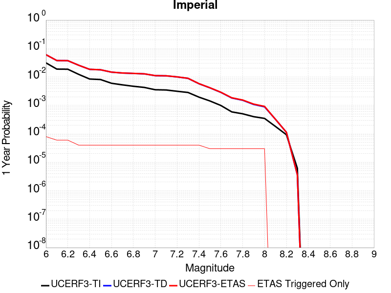 |  |

| Magnitude | 1 wk TI Prob | 1 wk TD Prob | 1 wk ETAS Prob | 1 wk ETAS/TD Gain | 1 wk ETAS Triggered Only | 1 mo TI Prob | 1 mo TD Prob | 1 mo ETAS Prob | 1 mo ETAS/TD Gain | 1 mo ETAS Triggered Only | 1 yr TI Prob | 1 yr TD Prob | 1 yr ETAS Prob | 1 yr ETAS/TD Gain | 1 yr ETAS Triggered Only | 10 yr TI Prob | 10 yr TD Prob | 10 yr ETAS Prob | 10 yr ETAS/TD Gain | 10 yr ETAS Triggered Only |
|-----|-----|-----|-----|-----|-----|-----|-----|-----|-----|-----|-----|-----|-----|-----|-----|-----|-----|-----|-----|-----|
| 6.0 | 6.095401E-4 | 0.0012024462 | 0.0012324101 | 1.0249192 | 3.0E-5 | 0.0026097 | 0.0051451195 | 0.005194862 | 1.009668 | 5.0E-5 | 0.031313866 | 0.060872305 | 0.060947433 | 1.0012342 | 8.0E-5 | 0.27250364 | 0.44657496 | 0.4466469 | 1.000161 | 1.3E-4 |
| 6.1 | 3.6457935E-4 | 7.347388E-4 | 7.547241E-4 | 1.0272006 | 2.0E-5 | 0.0015615473 | 0.003145499 | 0.0031754046 | 1.0095074 | 3.0E-5 | 0.018846832 | 0.03759747 | 0.037655212 | 1.0015359 | 6.0E-5 | 0.17326161 | 0.30358467 | 0.3036543 | 1.0002294 | 1.0E-4 |
| 6.2 | 3.6142807E-4 | 7.2885456E-4 | 7.4884E-4 | 1.0274203 | 2.0E-5 | 0.001548058 | 0.0031203413 | 0.0031502477 | 1.0095843 | 3.0E-5 | 0.01868543 | 0.037302468 | 0.037360232 | 1.0015485 | 6.0E-5 | 0.17190062 | 0.30162552 | 0.30169538 | 1.0002315 | 1.0E-4 |
| 6.3 | 2.3750364E-4 | 4.999698E-4 | 5.1995984E-4 | 1.0399824 | 2.0E-5 | 0.0010174756 | 0.0021410456 | 0.0021709814 | 1.0139818 | 3.0E-5 | 0.012317582 | 0.025748862 | 0.025787832 | 1.0015135 | 4.0E-5 | 0.11656779 | 0.2211939 | 0.22124062 | 1.0002112 | 6.0E-5 |
| 6.4 | 1.6264517E-4 | 3.574937E-4 | 3.7748655E-4 | 1.055925 | 2.0E-5 | 6.968645E-4 | 0.0015312331 | 0.0015611872 | 1.019562 | 3.0E-5 | 0.008451368 | 0.018486204 | 0.018525464 | 1.0021238 | 4.0E-5 | 0.0813709 | 0.16625753 | 0.16630755 | 1.0003009 | 6.0E-5 |
| 6.5 | 1.558044E-4 | 3.4478892E-4 | 3.64782E-4 | 1.0579865 | 2.0E-5 | 6.6756224E-4 | 0.0014768462 | 0.0015068019 | 1.0202836 | 3.0E-5 | 0.008097323 | 0.017835662 | 0.017874947 | 1.0022027 | 4.0E-5 | 0.07808555 | 0.16108575 | 0.16113609 | 1.0003124 | 6.0E-5 |
| 6.6 | 1.15168164E-4 | 2.8422792E-4 | 3.0422225E-4 | 1.0703461 | 2.0E-5 | 4.934845E-4 | 0.0012175564 | 0.0012475199 | 1.0246096 | 3.0E-5 | 0.0059916344 | 0.01472431 | 0.01476372 | 1.0026766 | 4.0E-5 | 0.058326405 | 0.1345665 | 0.13461842 | 1.0003859 | 6.0E-5 |
| 6.7 | 1.0120087E-4 | 2.6477632E-4 | 2.8477103E-4 | 1.0755155 | 2.0E-5 | 4.336459E-4 | 0.0011342665 | 0.0011642325 | 1.0264188 | 3.0E-5 | 0.0052668652 | 0.013723276 | 0.013762726 | 1.0028747 | 4.0E-5 | 0.05143773 | 0.1256686 | 0.12572105 | 1.0004175 | 6.0E-5 |
| 6.8 | 9.034936E-5 | 2.5621417E-4 | 2.7620906E-4 | 1.0780396 | 2.0E-5 | 3.8715405E-4 | 0.0010976029 | 0.0011275699 | 1.0273023 | 3.0E-5 | 0.0047034174 | 0.013282403 | 0.013321872 | 1.0029715 | 4.0E-5 | 0.046051063 | 0.121210374 | 0.1212631 | 1.000435 | 6.0E-5 |
| 6.9 | 8.220928E-5 | 2.4731937E-4 | 2.6731443E-4 | 1.0808471 | 2.0E-5 | 3.522779E-4 | 0.0010595138 | 0.001089482 | 1.0282849 | 3.0E-5 | 0.004280551 | 0.012824215 | 0.012863702 | 1.003079 | 4.0E-5 | 0.04199031 | 0.11706498 | 0.11711796 | 1.0004525 | 6.0E-5 |
| 7.0 | 6.8112255E-5 | 2.1397608E-4 | 2.3397179E-4 | 1.0934484 | 2.0E-5 | 2.91877E-4 | 9.1672136E-4 | 9.466939E-4 | 1.0326953 | 3.0E-5 | 0.0035478126 | 0.011104688 | 0.011144243 | 1.0035621 | 4.0E-5 | 0.034917038 | 0.102240056 | 0.10229392 | 1.0005269 | 6.0E-5 |
| 7.1 | 6.681613E-5 | 2.108479E-4 | 2.3084367E-4 | 1.0948352 | 2.0E-5 | 2.8632343E-4 | 9.033242E-4 | 9.3329715E-4 | 1.0331807 | 3.0E-5 | 0.0034804163 | 0.0109432265 | 0.010982789 | 1.0036153 | 4.0E-5 | 0.03426409 | 0.100827366 | 0.100881316 | 1.0005351 | 6.0E-5 |
| 7.2 | 6.0200153E-5 | 1.9287944E-4 | 2.1287557E-4 | 1.1036717 | 2.0E-5 | 2.5797516E-4 | 8.2636747E-4 | 8.5634267E-4 | 1.0362735 | 3.0E-5 | 0.003136324 | 0.010015267 | 0.010054867 | 1.0039539 | 4.0E-5 | 0.03092428 | 0.09279866 | 0.09285309 | 1.0005865 | 6.0E-5 |
| 7.3 | 5.4577176E-5 | 1.7176592E-4 | 1.9176249E-4 | 1.1164175 | 2.0E-5 | 2.3388122E-4 | 7.3593477E-4 | 7.659127E-4 | 1.0407345 | 3.0E-5 | 0.0028437856 | 0.008923747 | 0.008963389 | 1.0044425 | 4.0E-5 | 0.028076682 | 0.0833447 | 0.0833997 | 1.00066 | 6.0E-5 |
| 7.4 | 3.7430393E-5 | 1.1099206E-4 | 1.3098985E-4 | 1.180173 | 2.0E-5 | 1.604061E-4 | 4.7559445E-4 | 5.0558016E-4 | 1.063049 | 3.0E-5 | 0.0019511948 | 0.005775159 | 0.005814928 | 1.0068862 | 4.0E-5 | 0.019341515 | 0.055237316 | 0.055284552 | 1.0008552 | 5.0E-5 |
| 7.5 | 2.747316E-5 | 7.953734E-5 | 8.9536545E-5 | 1.1257172 | 1.0E-5 | 1.17736796E-4 | 3.4083013E-4 | 3.608233E-4 | 1.0586603 | 2.0E-5 | 0.0014325029 | 0.0041417736 | 0.0041716495 | 1.0072132 | 3.0E-5 | 0.014233038 | 0.04008574 | 0.040124137 | 1.0009578 | 4.0E-5 |
| 7.6 | 1.9053488E-5 | 5.512138E-5 | 6.512083E-5 | 1.1814078 | 1.0E-5 | 8.165526E-5 | 2.3621325E-4 | 2.5620853E-4 | 1.0846492 | 2.0E-5 | 9.936993E-4 | 0.0028721287 | 0.0029020426 | 1.0104152 | 3.0E-5 | 0.009892675 | 0.028043358 | 0.028082237 | 1.0013864 | 4.0E-5 |
| 7.7 | 1.133027E-5 | 3.492149E-5 | 4.492114E-5 | 1.2863467 | 1.0E-5 | 4.85574E-5 | 1.4965497E-4 | 1.6965196E-4 | 1.1336207 | 2.0E-5 | 5.91026E-4 | 0.0018205298 | 0.0018504752 | 1.0164487 | 3.0E-5 | 0.0058945655 | 0.017907703 | 0.017946988 | 1.0021937 | 4.0E-5 |
| 7.8 | 9.701698E-6 | 2.903702E-5 | 3.903673E-5 | 1.344378 | 1.0E-5 | 4.1578045E-5 | 1.2443845E-4 | 1.4443597E-4 | 1.160702 | 2.0E-5 | 5.060951E-4 | 0.0015139877 | 0.0015439423 | 1.0197852 | 3.0E-5 | 0.0050494405 | 0.0149980085 | 0.015037409 | 1.002627 | 4.0E-5 |
| 7.9 | 7.691878E-6 | 2.0706826E-5 | 3.070662E-5 | 1.4829226 | 1.0E-5 | 3.2964774E-5 | 8.8740526E-5 | 1.0873875E-4 | 1.2253562 | 2.0E-5 | 4.0127223E-4 | 0.0010798813 | 0.001109849 | 1.0277508 | 3.0E-5 | 0.0040054843 | 0.01085143 | 0.010890996 | 1.0036461 | 4.0E-5 |
| 8.0 | 6.682253E-6 | 1.7085742E-5 | 2.708557E-5 | 1.5852734 | 1.0E-5 | 2.8637913E-5 | 7.322255E-5 | 9.322109E-5 | 1.2731199 | 2.0E-5 | 3.486108E-4 | 8.9112076E-4 | 9.2109403E-4 | 1.0336355 | 3.0E-5 | 0.0034806442 | 0.00900623 | 0.00904587 | 1.0044013 | 4.0E-5 |
| 8.1 | 3.4791678E-6 | 6.1975825E-6 | 6.1975825E-6 | 1.0 | 0.0 | 1.4910634E-5 | 2.6560798E-5 | 2.6560798E-5 | 1.0 | 0.0 | 1.8152184E-4 | 3.2332982E-4 | 3.2332982E-4 | 1.0 | 0.0 | 0.0018137364 | 0.003389625 | 0.003389625 | 1.0 | 0.0 |
| 8.2 | 1.7836003E-6 | 2.1712212E-6 | 2.1712212E-6 | 1.0 | 0.0 | 7.643979E-6 | 9.3052E-6 | 9.3052E-6 | 1.0 | 0.0 | 9.306147E-5 | 1.1328496E-4 | 1.1328496E-4 | 1.0 | 0.0 | 9.3022507E-4 | 0.0012456811 | 0.0012456811 | 1.0 | 0.0 |
| 8.3 | 1.18633295E-7 | 7.05463E-8 | 7.05463E-8 | 1.0 | 0.0 | 5.084283E-7 | 3.0234125E-7 | 3.0234125E-7 | 1.0 | 0.0 | 6.190097E-6 | 3.6809988E-6 | 3.6809988E-6 | 1.0 | 0.0 | 6.189925E-5 | 3.8430087E-5 | 3.8430087E-5 | 1.0 | 0.0 |

## Santa Ynez (West)
*[(top)](#table-of-contents)*

| 1 Week | 1 Month | 1 Year | 10 Year |
|-----|-----|-----|-----|
|  |  |  |  |

| Magnitude | 1 wk TI Prob | 1 wk TD Prob | 1 wk ETAS Prob | 1 wk ETAS/TD Gain | 1 wk ETAS Triggered Only | 1 mo TI Prob | 1 mo TD Prob | 1 mo ETAS Prob | 1 mo ETAS/TD Gain | 1 mo ETAS Triggered Only | 1 yr TI Prob | 1 yr TD Prob | 1 yr ETAS Prob | 1 yr ETAS/TD Gain | 1 yr ETAS Triggered Only | 10 yr TI Prob | 10 yr TD Prob | 10 yr ETAS Prob | 10 yr ETAS/TD Gain | 10 yr ETAS Triggered Only |
|-----|-----|-----|-----|-----|-----|-----|-----|-----|-----|-----|-----|-----|-----|-----|-----|-----|-----|-----|-----|-----|
| 6.0 | 4.762692E-5 | 5.5856883E-5 | 7.5855765E-5 | 1.358038 | 2.0E-5 | 2.040994E-4 | 2.3936595E-4 | 2.7935638E-4 | 1.1670681 | 4.0E-5 | 0.0024820783 | 0.0029106108 | 0.0029704361 | 1.0205542 | 6.0E-5 | 0.024545377 | 0.028747525 | 0.028873788 | 1.0043921 | 1.3E-4 |
| 6.1 | 4.762692E-5 | 5.5856883E-5 | 6.585632E-5 | 1.179019 | 1.0E-5 | 2.040994E-4 | 2.3936595E-4 | 2.6935877E-4 | 1.1253011 | 3.0E-5 | 0.0024820783 | 0.0029106108 | 0.0029504944 | 1.0137029 | 4.0E-5 | 0.024545377 | 0.028747525 | 0.028854363 | 1.0037165 | 1.1E-4 |
| 6.2 | 3.349533E-5 | 3.831273E-5 | 4.8312348E-5 | 1.2609998 | 1.0E-5 | 1.4354351E-4 | 1.6418735E-4 | 1.8418407E-4 | 1.1217921 | 2.0E-5 | 0.0017462412 | 0.0019971929 | 0.002027133 | 1.014991 | 3.0E-5 | 0.017325828 | 0.019797629 | 0.019885845 | 1.004456 | 9.0E-5 |
| 6.3 | 3.349533E-5 | 3.831273E-5 | 4.8312348E-5 | 1.2609998 | 1.0E-5 | 1.4354351E-4 | 1.6418735E-4 | 1.8418407E-4 | 1.1217921 | 2.0E-5 | 0.0017462412 | 0.0019971929 | 0.002027133 | 1.014991 | 3.0E-5 | 0.017325828 | 0.019797629 | 0.019885845 | 1.004456 | 9.0E-5 |
| 6.4 | 2.9243412E-5 | 3.314391E-5 | 4.314358E-5 | 1.3017045 | 1.0E-5 | 1.2532288E-4 | 1.420378E-4 | 1.6203496E-4 | 1.1407876 | 2.0E-5 | 0.0015247382 | 0.0017279699 | 0.0017579179 | 1.0173314 | 3.0E-5 | 0.015143189 | 0.017149108 | 0.017237565 | 1.0051581 | 9.0E-5 |
| 6.5 | 2.6304788E-5 | 2.9574016E-5 | 3.957372E-5 | 1.3381246 | 1.0E-5 | 1.1272993E-4 | 1.2673977E-4 | 1.4673725E-4 | 1.1577836 | 2.0E-5 | 0.0013716228 | 0.001541988 | 0.0015719417 | 1.0194254 | 3.0E-5 | 0.013631876 | 0.015315837 | 0.015404459 | 1.0057863 | 9.0E-5 |
| 6.6 | 2.1410759E-5 | 2.3704608E-5 | 2.3704608E-5 | 1.0 | 0.0 | 9.175717E-5 | 1.01587306E-4 | 1.1158629E-4 | 1.0984275 | 1.0E-5 | 0.0011165709 | 0.00123614 | 0.0012561154 | 1.0161594 | 2.0E-5 | 0.011109773 | 0.012294435 | 0.0123635745 | 1.0056236 | 7.0E-5 |
| 6.7 | 1.9212099E-5 | 2.112762E-5 | 2.112762E-5 | 1.0 | 0.0 | 8.233497E-5 | 9.054388E-5 | 1.0054297E-4 | 1.1104337 | 1.0E-5 | 0.0010019672 | 0.001101828 | 0.0011218059 | 1.0181316 | 2.0E-5 | 0.009974616 | 0.0109651415 | 0.011034374 | 1.0063139 | 7.0E-5 |
| 6.8 | 1.6872646E-5 | 1.8377103E-5 | 1.8377103E-5 | 1.0 | 0.0 | 7.230933E-5 | 7.87567E-5 | 8.875591E-5 | 1.1269634 | 1.0E-5 | 8.800105E-4 | 9.584529E-4 | 9.784338E-4 | 1.020847 | 2.0E-5 | 0.008765338 | 0.009544454 | 0.00960388 | 1.0062264 | 6.0E-5 |
| 6.9 | 1.2830199E-5 | 1.3608595E-5 | 1.3608595E-5 | 1.0 | 0.0 | 5.498541E-5 | 5.8321257E-5 | 6.8320674E-5 | 1.1714541 | 1.0E-5 | 6.692417E-4 | 7.098327E-4 | 7.2981854E-4 | 1.0281557 | 2.0E-5 | 0.006672298 | 0.007075962 | 0.007125608 | 1.0070162 | 5.0E-5 |
| 7.0 | 1.1221824E-5 | 1.1770891E-5 | 1.1770891E-5 | 1.0 | 0.0 | 4.8092643E-5 | 5.044571E-5 | 5.044571E-5 | 1.0 | 0.0 | 5.8537064E-4 | 6.1400526E-4 | 6.239991E-4 | 1.0162765 | 1.0E-5 | 0.005838311 | 0.006123292 | 0.0061630467 | 1.0064924 | 4.0E-5 |
| 7.1 | 9.870599E-6 | 1.0246601E-5 | 1.0246601E-5 | 1.0 | 0.0 | 4.230188E-5 | 4.391327E-5 | 4.391327E-5 | 1.0 | 0.0 | 5.149037E-4 | 5.3451414E-4 | 5.445088E-4 | 1.0186986 | 1.0E-5 | 0.0051371222 | 0.00533242 | 0.00536226 | 1.0055959 | 3.0E-5 |
| 7.2 | 8.660595E-6 | 8.946415E-6 | 8.946415E-6 | 1.0 | 0.0 | 3.7116308E-5 | 3.834122E-5 | 3.834122E-5 | 1.0 | 0.0 | 4.5179736E-4 | 4.667055E-4 | 4.7670084E-4 | 1.0214168 | 1.0E-5 | 0.0045087994 | 0.0046573756 | 0.004687236 | 1.0064114 | 3.0E-5 |
| 7.3 | 6.791402E-6 | 6.8898794E-6 | 6.8898794E-6 | 1.0 | 0.0 | 2.9105684E-5 | 2.9527726E-5 | 2.9527726E-5 | 1.0 | 0.0 | 3.5430407E-4 | 3.594416E-4 | 3.6943797E-4 | 1.0278109 | 1.0E-5 | 0.0035373971 | 0.0035886883 | 0.0036185808 | 1.0083296 | 3.0E-5 |
| 7.4 | 5.1261522E-6 | 5.0800377E-6 | 5.0800377E-6 | 1.0 | 0.0 | 2.196904E-5 | 2.1771411E-5 | 2.1771411E-5 | 1.0 | 0.0 | 2.6744022E-4 | 2.6503537E-4 | 2.750327E-4 | 1.0377208 | 1.0E-5 | 0.0026711859 | 0.0026472597 | 0.0026572333 | 1.0037675 | 1.0E-5 |
| 7.5 | 3.3788167E-6 | 3.2495916E-6 | 3.2495916E-6 | 1.0 | 0.0 | 1.4480562E-5 | 1.39267495E-5 | 1.39267495E-5 | 1.0 | 0.0 | 1.7628659E-4 | 1.6954538E-4 | 1.795437E-4 | 1.0589713 | 1.0E-5 | 0.001761468 | 0.0016942009 | 0.001704184 | 1.0058925 | 1.0E-5 |
| 7.6 | 7.5784953E-7 | 7.533399E-7 | 7.533399E-7 | 1.0 | 0.0 | 3.2479225E-6 | 3.228596E-6 | 3.228596E-6 | 1.0 | 0.0 | 3.9542738E-5 | 3.9307466E-5 | 4.9307073E-5 | 1.2543947 | 1.0E-5 | 3.9535703E-4 | 3.9300707E-4 | 4.0300316E-4 | 1.0254349 | 1.0E-5 |
| 7.7 | 9.9652944E-8 | 1.0309665E-7 | 1.0309665E-7 | 1.0 | 0.0 | 4.27084E-7 | 4.4184273E-7 | 4.4184273E-7 | 1.0 | 0.0 | 5.199735E-6 | 5.379422E-6 | 5.379422E-6 | 1.0 | 0.0 | 5.1996136E-5 | 5.3792948E-5 | 5.3792948E-5 | 1.0 | 0.0 |
| 7.8 | 3.3286873E-10 | 3.3913217E-10 | 3.3913217E-10 | 1.0 | 0.0 | 1.4265804E-9 | 1.4534237E-9 | 1.4534237E-9 | 1.0 | 0.0 | 1.7368617E-8 | 1.7695433E-8 | 1.7695433E-8 | 1.0 | 0.0 | 1.7368615E-7 | 1.7695432E-7 | 1.7695432E-7 | 1.0 | 0.0 |

## Owens Valley
*[(top)](#table-of-contents)*

| 1 Week | 1 Month | 1 Year | 10 Year |
|-----|-----|-----|-----|
|  |  |  | 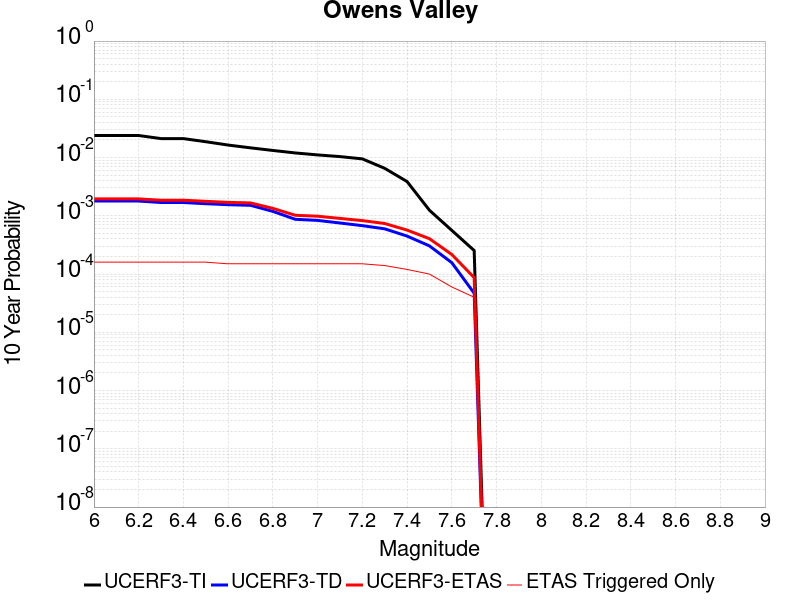 |

| Magnitude | 1 wk TI Prob | 1 wk TD Prob | 1 wk ETAS Prob | 1 wk ETAS/TD Gain | 1 wk ETAS Triggered Only | 1 mo TI Prob | 1 mo TD Prob | 1 mo ETAS Prob | 1 mo ETAS/TD Gain | 1 mo ETAS Triggered Only | 1 yr TI Prob | 1 yr TD Prob | 1 yr ETAS Prob | 1 yr ETAS/TD Gain | 1 yr ETAS Triggered Only | 10 yr TI Prob | 10 yr TD Prob | 10 yr ETAS Prob | 10 yr ETAS/TD Gain | 10 yr ETAS Triggered Only |
|-----|-----|-----|-----|-----|-----|-----|-----|-----|-----|-----|-----|-----|-----|-----|-----|-----|-----|-----|-----|-----|
| 6.0 | 4.6369987E-5 | 3.3994456E-6 | 9.339914E-5 | 27.474813 | 9.0E-5 | 1.9871337E-4 | 1.4568976E-5 | 1.1456752E-4 | 7.8638 | 1.0E-4 | 0.002416651 | 1.7736366E-4 | 2.9734237E-4 | 1.676456 | 1.2E-4 | 0.023905387 | 0.0017921337 | 0.0019518469 | 1.0891191 | 1.6E-4 |
| 6.1 | 4.6369987E-5 | 3.3994456E-6 | 9.339914E-5 | 27.474813 | 9.0E-5 | 1.9871337E-4 | 1.4568976E-5 | 1.1456752E-4 | 7.8638 | 1.0E-4 | 0.002416651 | 1.7736366E-4 | 2.9734237E-4 | 1.676456 | 1.2E-4 | 0.023905387 | 0.0017921337 | 0.0019518469 | 1.0891191 | 1.6E-4 |
| 6.2 | 4.6369987E-5 | 3.3994456E-6 | 9.339914E-5 | 27.474813 | 9.0E-5 | 1.9871337E-4 | 1.4568976E-5 | 1.1456752E-4 | 7.8638 | 1.0E-4 | 0.002416651 | 1.7736366E-4 | 2.9734237E-4 | 1.676456 | 1.2E-4 | 0.023905387 | 0.0017921337 | 0.0019518469 | 1.0891191 | 1.6E-4 |
| 6.3 | 4.0994822E-5 | 3.2248163E-6 | 9.3224524E-5 | 28.908478 | 9.0E-5 | 1.7568027E-4 | 1.3820572E-5 | 1.1381919E-4 | 8.235491 | 1.0E-4 | 0.0021368088 | 1.6825326E-4 | 2.8823307E-4 | 1.7130905 | 1.2E-4 | 0.021163788 | 0.0016940391 | 0.0018537681 | 1.0942888 | 1.6E-4 |
| 6.4 | 4.0994822E-5 | 3.2248163E-6 | 9.3224524E-5 | 28.908478 | 9.0E-5 | 1.7568027E-4 | 1.3820572E-5 | 1.1381919E-4 | 8.235491 | 1.0E-4 | 0.0021368088 | 1.6825326E-4 | 2.8823307E-4 | 1.7130905 | 1.2E-4 | 0.021163788 | 0.0016940391 | 0.0018537681 | 1.0942888 | 1.6E-4 |
| 6.5 | 3.61894E-5 | 3.0843219E-6 | 9.308405E-5 | 30.179743 | 9.0E-5 | 1.5508822E-4 | 1.321846E-5 | 1.1321714E-4 | 8.565078 | 1.0E-4 | 0.0018865636 | 1.6092362E-4 | 2.8090432E-4 | 1.7455753 | 1.2E-4 | 0.018706279 | 0.0016150996 | 0.0017748412 | 1.0989051 | 1.6E-4 |
| 6.6 | 3.1682346E-5 | 2.9728637E-6 | 9.2972594E-5 | 31.27375 | 9.0E-5 | 1.3577442E-4 | 1.2740787E-5 | 1.0273964E-4 | 8.063838 | 9.0E-5 | 0.0016518 | 1.5510878E-4 | 2.6509172E-4 | 1.7090697 | 1.1E-4 | 0.016395759 | 0.0015526107 | 0.0017023777 | 1.0964614 | 1.5E-4 |
| 6.7 | 2.8352591E-5 | 2.9039327E-6 | 9.290367E-5 | 31.992363 | 9.0E-5 | 1.2150544E-4 | 1.2445371E-5 | 1.0244425E-4 | 8.231514 | 9.0E-5 | 0.0014783249 | 1.515126E-4 | 2.6149594E-4 | 1.7259022 | 1.1E-4 | 0.01468529 | 0.001514495 | 0.0016642677 | 1.0988929 | 1.5E-4 |
| 6.8 | 2.555583E-5 | 2.2850545E-6 | 9.228485E-5 | 40.38628 | 9.0E-5 | 1.09520384E-4 | 9.793056E-6 | 9.9792174E-5 | 10.190096 | 9.0E-5 | 0.001332595 | 1.19224234E-4 | 2.2921112E-4 | 1.9225212 | 1.1E-4 | 0.013246322 | 0.0011918884 | 0.0013417095 | 1.1257007 | 1.5E-4 |
| 6.9 | 2.314584E-5 | 1.6716021E-6 | 9.167145E-5 | 54.840473 | 9.0E-5 | 9.9192686E-5 | 7.1639897E-6 | 9.716334E-5 | 13.562742 | 9.0E-5 | 0.0012070019 | 8.7218104E-5 | 1.9720852E-4 | 2.261096 | 1.1E-4 | 0.012004671 | 8.7206333E-4 | 0.0010219326 | 1.1718558 | 1.5E-4 |
| 7.0 | 2.1396356E-5 | 1.5993828E-6 | 9.159924E-5 | 57.271618 | 9.0E-5 | 9.1695445E-5 | 6.8544796E-6 | 9.6853866E-5 | 14.13001 | 9.0E-5 | 0.0011158203 | 8.345011E-5 | 1.9344094E-4 | 2.3180428 | 1.1E-4 | 0.011102341 | 8.343689E-4 | 9.842437E-4 | 1.1796266 | 1.5E-4 |
| 7.1 | 2.00091E-5 | 1.4423706E-6 | 9.144224E-5 | 63.39719 | 9.0E-5 | 8.5750464E-5 | 6.1815736E-6 | 9.6181015E-5 | 15.559309 | 9.0E-5 | 0.0010435118 | 7.5258075E-5 | 1.852498E-4 | 2.4615273 | 1.1E-4 | 0.010386253 | 7.524932E-4 | 9.023803E-4 | 1.1991874 | 1.5E-4 |
| 7.2 | 1.828607E-5 | 1.2994791E-6 | 9.1299364E-5 | 70.25843 | 9.0E-5 | 7.836652E-5 | 5.569184E-6 | 9.5568685E-5 | 17.160267 | 9.0E-5 | 9.5369463E-4 | 6.780271E-5 | 1.7779526E-4 | 2.622244 | 1.1E-4 | 0.009496122 | 6.7795994E-4 | 8.278582E-4 | 1.221102 | 1.5E-4 |
| 7.3 | 1.2564503E-5 | 1.1456798E-6 | 9.114558E-5 | 79.555885 | 9.0E-5 | 5.3846758E-5 | 4.910047E-6 | 9.490961E-5 | 19.329672 | 9.0E-5 | 6.5538706E-4 | 5.9778195E-5 | 1.6977162E-4 | 2.840026 | 1.1E-4 | 0.0065345755 | 5.977535E-4 | 7.376698E-4 | 1.2340703 | 1.4E-4 |
| 7.4 | 7.433017E-6 | 8.6010164E-7 | 7.086004E-5 | 82.38566 | 7.0E-5 | 3.1855398E-5 | 3.6861445E-6 | 7.3685886E-5 | 19.989962 | 7.0E-5 | 3.8777044E-4 | 4.4877892E-5 | 1.3487386E-4 | 3.0053518 | 9.0E-5 | 0.003870945 | 4.4877434E-4 | 5.687205E-4 | 1.267275 | 1.2E-4 |
| 7.5 | 2.3911468E-6 | 5.841356E-7 | 6.05841E-5 | 103.71581 | 6.0E-5 | 1.0247732E-5 | 2.503436E-6 | 6.2503284E-5 | 24.967 | 6.0E-5 | 1.24759E-4 | 3.047891E-5 | 1.10476474E-4 | 3.6246858 | 8.0E-5 | 0.0012468897 | 3.0474758E-4 | 4.047171E-4 | 1.3280405 | 1.0E-4 |
| 7.6 | 1.0773325E-6 | 3.006858E-7 | 2.030068E-5 | 67.514595 | 2.0E-5 | 4.6171313E-6 | 1.2886528E-6 | 2.1288626E-5 | 16.520065 | 2.0E-5 | 5.6212124E-5 | 1.5689237E-5 | 5.5688608E-5 | 3.5494785 | 4.0E-5 | 5.619791E-4 | 1.5688146E-4 | 2.1687204E-4 | 1.3823944 | 6.0E-5 |
| 7.7 | 4.861246E-7 | 8.986402E-8 | 1.0089863E-5 | 112.279236 | 1.0E-5 | 2.0833893E-6 | 3.8513144E-7 | 1.0385128E-5 | 26.96515 | 1.0E-5 | 2.536497E-5 | 4.688966E-6 | 3.4688826E-5 | 7.397969 | 3.0E-5 | 2.5362076E-4 | 4.6888737E-5 | 8.688686E-5 | 1.8530433 | 4.0E-5 |

## Oak Ridge (Offshore) west extension
*[(top)](#table-of-contents)*

| 1 Week | 1 Month | 1 Year | 10 Year |
|-----|-----|-----|-----|
|  |  |  | 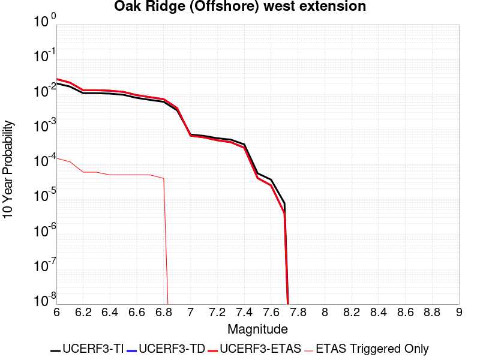 |

| Magnitude | 1 wk TI Prob | 1 wk TD Prob | 1 wk ETAS Prob | 1 wk ETAS/TD Gain | 1 wk ETAS Triggered Only | 1 mo TI Prob | 1 mo TD Prob | 1 mo ETAS Prob | 1 mo ETAS/TD Gain | 1 mo ETAS Triggered Only | 1 yr TI Prob | 1 yr TD Prob | 1 yr ETAS Prob | 1 yr ETAS/TD Gain | 1 yr ETAS Triggered Only | 10 yr TI Prob | 10 yr TD Prob | 10 yr ETAS Prob | 10 yr ETAS/TD Gain | 10 yr ETAS Triggered Only |
|-----|-----|-----|-----|-----|-----|-----|-----|-----|-----|-----|-----|-----|-----|-----|-----|-----|-----|-----|-----|-----|
| 6.0 | 4.0339008E-5 | 5.3712534E-5 | 1.0370985E-4 | 1.9308314 | 5.0E-5 | 1.7287002E-4 | 2.3017863E-4 | 3.0016253E-4 | 1.3040416 | 7.0E-5 | 0.0021026607 | 0.0027983864 | 0.0028781625 | 1.028508 | 8.0E-5 | 0.020828765 | 0.027633607 | 0.027779464 | 1.0052782 | 1.5E-4 |
| 6.1 | 3.2791162E-5 | 4.2552565E-5 | 8.255086E-5 | 1.9399738 | 4.0E-5 | 1.4052597E-4 | 1.8235775E-4 | 2.4234681E-4 | 1.3289636 | 6.0E-5 | 0.001709561 | 0.002218142 | 0.0022879867 | 1.031488 | 7.0E-5 | 0.01696469 | 0.021974014 | 0.022091378 | 1.005341 | 1.2E-4 |
| 6.2 | 2.1115731E-5 | 2.5545494E-5 | 4.5544984E-5 | 1.782897 | 2.0E-5 | 9.049285E-5 | 1.0947641E-4 | 1.3947312E-4 | 1.2740016 | 3.0E-5 | 0.0011011936 | 0.0013321117 | 0.0013720583 | 1.0299875 | 4.0E-5 | 0.010957527 | 0.0132463705 | 0.013305576 | 1.0044695 | 6.0E-5 |
| 6.3 | 2.1115731E-5 | 2.5545494E-5 | 4.5544984E-5 | 1.782897 | 2.0E-5 | 9.049285E-5 | 1.0947641E-4 | 1.3947312E-4 | 1.2740016 | 3.0E-5 | 0.0011011936 | 0.0013321117 | 0.0013720583 | 1.0299875 | 4.0E-5 | 0.010957527 | 0.0132463705 | 0.013305576 | 1.0044695 | 6.0E-5 |
| 6.4 | 2.0495294E-5 | 2.4782214E-5 | 4.478172E-5 | 1.8070104 | 2.0E-5 | 8.7834014E-5 | 1.0620548E-4 | 1.3620229E-4 | 1.2824413 | 3.0E-5 | 0.0010688545 | 0.001292336 | 0.0013322843 | 1.0309117 | 4.0E-5 | 0.0106372805 | 0.012853291 | 0.012902648 | 1.0038401 | 5.0E-5 |
| 6.5 | 1.892671E-5 | 2.283362E-5 | 4.2833162E-5 | 1.8758814 | 2.0E-5 | 8.1111946E-5 | 9.785501E-5 | 1.2785206E-4 | 1.3065461 | 3.0E-5 | 9.870905E-4 | 0.0011907847 | 0.0012307371 | 1.0335513 | 4.0E-5 | 0.009827175 | 0.011849049 | 0.011898456 | 1.0041697 | 5.0E-5 |
| 6.6 | 1.5413076E-5 | 1.8408637E-5 | 3.840827E-5 | 2.0864265 | 2.0E-5 | 6.605436E-5 | 7.8892015E-5 | 1.08889646E-4 | 1.3802366 | 3.0E-5 | 8.039151E-4 | 9.601271E-4 | 0.0010000886 | 1.0416212 | 4.0E-5 | 0.00801013 | 0.009563971 | 0.0096134925 | 1.005178 | 5.0E-5 |
| 6.7 | 1.3495462E-5 | 1.6054906E-5 | 3.6054586E-5 | 2.2457051 | 2.0E-5 | 5.783641E-5 | 6.880516E-5 | 9.8803095E-5 | 1.4359838 | 3.0E-5 | 7.039308E-4 | 8.3742203E-4 | 8.773886E-4 | 1.0477257 | 4.0E-5 | 0.0070170513 | 0.008346749 | 0.008396331 | 1.0059403 | 5.0E-5 |
| 6.8 | 1.1905698E-5 | 1.4102518E-5 | 3.4102235E-5 | 2.4181664 | 2.0E-5 | 5.102342E-5 | 6.043819E-5 | 8.043698E-5 | 1.3308966 | 2.0E-5 | 6.210331E-4 | 7.356262E-4 | 7.6560414E-4 | 1.0407516 | 3.0E-5 | 0.006193004 | 0.0073358263 | 0.007375533 | 1.0054127 | 4.0E-5 |
| 6.9 | 6.7565466E-6 | 7.847937E-6 | 7.847937E-6 | 1.0 | 0.0 | 2.8956307E-5 | 3.3633765E-5 | 3.3633765E-5 | 1.0 | 0.0 | 3.52486E-4 | 4.0944686E-4 | 4.0944686E-4 | 1.0 | 0.0 | 0.0035192743 | 0.004090129 | 0.004090129 | 1.0 | 0.0 |
| 7.0 | 1.3720168E-6 | 1.2717392E-6 | 1.2717392E-6 | 1.0 | 0.0 | 5.880059E-6 | 5.4503E-6 | 5.4503E-6 | 1.0 | 0.0 | 7.158736E-5 | 6.635547E-5 | 6.635547E-5 | 1.0 | 0.0 | 7.1564305E-4 | 6.633655E-4 | 6.633655E-4 | 1.0 | 0.0 |
| 7.1 | 1.2570082E-6 | 1.1402601E-6 | 1.1402601E-6 | 1.0 | 0.0 | 5.3871668E-6 | 4.88682E-6 | 4.88682E-6 | 1.0 | 0.0 | 6.5586784E-5 | 5.9495498E-5 | 5.9495498E-5 | 1.0 | 0.0 | 6.556743E-4 | 5.948044E-4 | 5.948044E-4 | 1.0 | 0.0 |
| 7.2 | 1.0786175E-6 | 9.3998653E-7 | 9.3998653E-7 | 1.0 | 0.0 | 4.6226382E-6 | 4.028508E-6 | 4.028508E-6 | 1.0 | 0.0 | 5.627917E-5 | 4.9046062E-5 | 4.9046062E-5 | 1.0 | 0.0 | 5.6264916E-4 | 4.903603E-4 | 4.903603E-4 | 1.0 | 0.0 |
| 7.3 | 9.804143E-7 | 8.2975623E-7 | 8.2975623E-7 | 1.0 | 0.0 | 4.2017687E-6 | 3.5560938E-6 | 3.5560938E-6 | 1.0 | 0.0 | 5.1155333E-5 | 4.329465E-5 | 4.329465E-5 | 1.0 | 0.0 | 5.114356E-4 | 4.3286907E-4 | 4.3286907E-4 | 1.0 | 0.0 |
| 7.4 | 7.179881E-7 | 5.7630155E-7 | 5.7630155E-7 | 1.0 | 0.0 | 3.0770882E-6 | 2.4698618E-6 | 2.4698618E-6 | 1.0 | 0.0 | 3.7462905E-5 | 3.00702E-5 | 3.00702E-5 | 1.0 | 0.0 | 3.745659E-4 | 3.0066603E-4 | 3.0066603E-4 | 1.0 | 0.0 |
| 7.5 | 1.0678113E-7 | 7.81099E-8 | 7.81099E-8 | 1.0 | 0.0 | 4.5763335E-7 | 3.347567E-7 | 3.347567E-7 | 1.0 | 0.0 | 5.571672E-6 | 4.0756554E-6 | 4.0756554E-6 | 1.0 | 0.0 | 5.571532E-5 | 4.075583E-5 | 4.075583E-5 | 1.0 | 0.0 |
| 7.6 | 7.012466E-8 | 4.8016663E-8 | 4.8016663E-8 | 1.0 | 0.0 | 3.0053423E-7 | 2.0578568E-7 | 2.0578568E-7 | 1.0 | 0.0 | 3.6589981E-6 | 2.5054378E-6 | 2.5054378E-6 | 1.0 | 0.0 | 3.658938E-5 | 2.5054109E-5 | 2.5054109E-5 | 1.0 | 0.0 |
| 7.7 | 1.491428E-8 | 7.649176E-9 | 7.649176E-9 | 1.0 | 0.0 | 6.391834E-8 | 3.2782186E-8 | 3.2782186E-8 | 1.0 | 0.0 | 7.782055E-7 | 3.9912305E-7 | 3.9912305E-7 | 1.0 | 0.0 | 7.782028E-6 | 3.9912247E-6 | 3.9912247E-6 | 1.0 | 0.0 |

## Tin Mountain
*[(top)](#table-of-contents)*

| 1 Week | 1 Month | 1 Year | 10 Year |
|-----|-----|-----|-----|
| 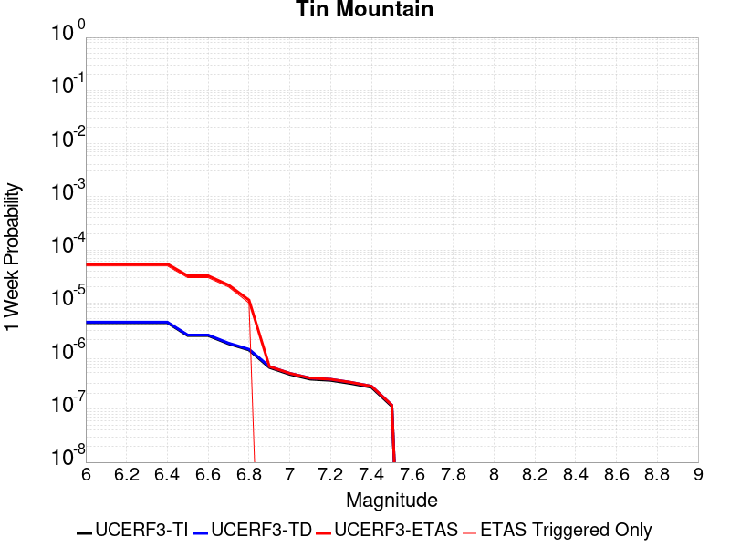 |  | 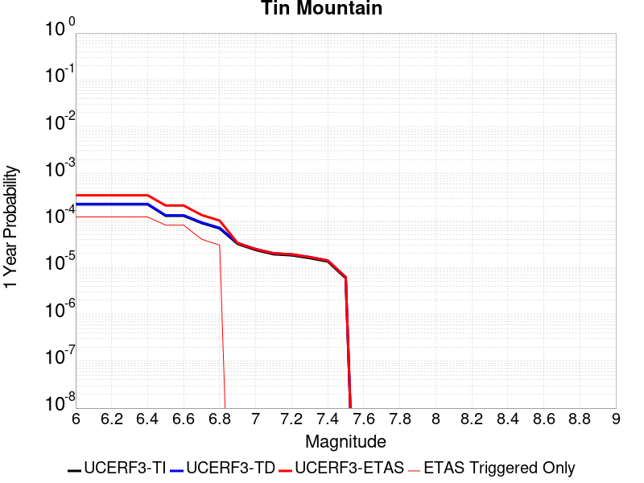 |  |

| Magnitude | 1 wk TI Prob | 1 wk TD Prob | 1 wk ETAS Prob | 1 wk ETAS/TD Gain | 1 wk ETAS Triggered Only | 1 mo TI Prob | 1 mo TD Prob | 1 mo ETAS Prob | 1 mo ETAS/TD Gain | 1 mo ETAS Triggered Only | 1 yr TI Prob | 1 yr TD Prob | 1 yr ETAS Prob | 1 yr ETAS/TD Gain | 1 yr ETAS Triggered Only | 10 yr TI Prob | 10 yr TD Prob | 10 yr ETAS Prob | 10 yr ETAS/TD Gain | 10 yr ETAS Triggered Only |
|-----|-----|-----|-----|-----|-----|-----|-----|-----|-----|-----|-----|-----|-----|-----|-----|-----|-----|-----|-----|-----|
| 6.0 | 4.2481693E-6 | 4.3519212E-6 | 5.4351705E-5 | 12.489129 | 5.0E-5 | 1.8206314E-5 | 1.865098E-5 | 6.865005E-5 | 3.6807742 | 5.0E-5 | 2.2163932E-4 | 2.2705605E-4 | 3.470288E-4 | 1.5283839 | 1.2E-4 | 0.0022141838 | 0.0022686364 | 0.0024282734 | 1.070367 | 1.6E-4 |
| 6.1 | 4.2481693E-6 | 4.3519212E-6 | 5.4351705E-5 | 12.489129 | 5.0E-5 | 1.8206314E-5 | 1.865098E-5 | 6.865005E-5 | 3.6807742 | 5.0E-5 | 2.2163932E-4 | 2.2705605E-4 | 3.470288E-4 | 1.5283839 | 1.2E-4 | 0.0022141838 | 0.0022686364 | 0.0024282734 | 1.070367 | 1.6E-4 |
| 6.2 | 4.2481693E-6 | 4.3519212E-6 | 5.4351705E-5 | 12.489129 | 5.0E-5 | 1.8206314E-5 | 1.865098E-5 | 6.865005E-5 | 3.6807742 | 5.0E-5 | 2.2163932E-4 | 2.2705605E-4 | 3.470288E-4 | 1.5283839 | 1.2E-4 | 0.0022141838 | 0.0022686364 | 0.0024282734 | 1.070367 | 1.6E-4 |
| 6.3 | 4.2481693E-6 | 4.3519212E-6 | 5.4351705E-5 | 12.489129 | 5.0E-5 | 1.8206314E-5 | 1.865098E-5 | 6.865005E-5 | 3.6807742 | 5.0E-5 | 2.2163932E-4 | 2.2705605E-4 | 3.470288E-4 | 1.5283839 | 1.2E-4 | 0.0022141838 | 0.0022686364 | 0.0024282734 | 1.070367 | 1.6E-4 |
| 6.4 | 4.2481693E-6 | 4.3519212E-6 | 5.4351705E-5 | 12.489129 | 5.0E-5 | 1.8206314E-5 | 1.865098E-5 | 6.865005E-5 | 3.6807742 | 5.0E-5 | 2.2163932E-4 | 2.2705605E-4 | 3.470288E-4 | 1.5283839 | 1.2E-4 | 0.0022141838 | 0.0022686364 | 0.0024282734 | 1.070367 | 1.6E-4 |
| 6.5 | 2.4271333E-6 | 2.4894562E-6 | 3.248938E-5 | 13.050795 | 3.0E-5 | 1.0401959E-5 | 1.0669059E-5 | 4.066874E-5 | 3.8118393 | 3.0E-5 | 1.2663649E-4 | 1.298889E-4 | 2.098785E-4 | 1.615831 | 8.0E-5 | 0.0012656434 | 0.0012982127 | 0.0014080699 | 1.0846219 | 1.1E-4 |
| 6.6 | 2.4271333E-6 | 2.4894562E-6 | 3.248938E-5 | 13.050795 | 3.0E-5 | 1.0401959E-5 | 1.0669059E-5 | 4.066874E-5 | 3.8118393 | 3.0E-5 | 1.2663649E-4 | 1.298889E-4 | 2.098785E-4 | 1.615831 | 8.0E-5 | 0.0012656434 | 0.0012982127 | 0.0014080699 | 1.0846219 | 1.1E-4 |
| 6.7 | 1.7039238E-6 | 1.7515704E-6 | 2.1751535E-5 | 12.418304 | 2.0E-5 | 7.30251E-6 | 7.5067114E-6 | 2.7506561E-5 | 3.6642625 | 2.0E-5 | 8.890443E-5 | 9.1390866E-5 | 1.3138722E-4 | 1.4376405 | 4.0E-5 | 8.886887E-4 | 9.1358094E-4 | 9.735261E-4 | 1.0656157 | 6.0E-5 |
| 6.8 | 1.3023692E-6 | 1.3416396E-6 | 1.1341626E-5 | 8.453556 | 1.0E-5 | 5.5815703E-6 | 5.7498737E-6 | 1.5749816E-5 | 2.7391586 | 1.0E-5 | 6.79535E-5 | 7.000287E-5 | 1.0000077E-4 | 1.4285239 | 3.0E-5 | 6.7932723E-4 | 6.9984794E-4 | 7.3981995E-4 | 1.0571153 | 4.0E-5 |
| 6.9 | 6.0932183E-7 | 6.3460664E-7 | 6.3460664E-7 | 1.0 | 0.0 | 2.6113767E-6 | 2.7197402E-6 | 2.7197402E-6 | 1.0 | 0.0 | 3.1793046E-5 | 3.3112367E-5 | 3.3112367E-5 | 1.0 | 0.0 | 3.17885E-4 | 3.3107764E-4 | 3.3107764E-4 | 1.0 | 0.0 |
| 7.0 | 4.529502E-7 | 4.7329556E-7 | 4.7329556E-7 | 1.0 | 0.0 | 1.9412137E-6 | 2.028408E-6 | 2.028408E-6 | 1.0 | 0.0 | 2.363402E-5 | 2.4695617E-5 | 2.4695617E-5 | 1.0 | 0.0 | 2.3631507E-4 | 2.4693136E-4 | 2.4693136E-4 | 1.0 | 0.0 |
| 7.1 | 3.6732627E-7 | 3.8504209E-7 | 3.8504209E-7 | 1.0 | 0.0 | 1.5742545E-6 | 1.6501793E-6 | 1.6501793E-6 | 1.0 | 0.0 | 1.916638E-5 | 2.0090773E-5 | 2.0090773E-5 | 1.0 | 0.0 | 1.9164727E-4 | 2.0089185E-4 | 2.0089185E-4 | 1.0 | 0.0 |
| 7.2 | 3.4854705E-7 | 3.6560428E-7 | 3.6560428E-7 | 1.0 | 0.0 | 1.4937723E-6 | 1.5668747E-6 | 1.5668747E-6 | 1.0 | 0.0 | 1.8186525E-5 | 1.9076555E-5 | 1.9076555E-5 | 1.0 | 0.0 | 1.8185037E-4 | 1.9075144E-4 | 1.9075144E-4 | 1.0 | 0.0 |
| 7.3 | 3.0436027E-7 | 3.1950663E-7 | 3.1950663E-7 | 1.0 | 0.0 | 1.3044005E-6 | 1.3693135E-6 | 1.3693135E-6 | 1.0 | 0.0 | 1.588096E-5 | 1.6671287E-5 | 1.6671287E-5 | 1.0 | 0.0 | 1.5879826E-4 | 1.6670256E-4 | 1.6670256E-4 | 1.0 | 0.0 |
| 7.4 | 2.5797166E-7 | 2.7079676E-7 | 2.7079676E-7 | 1.0 | 0.0 | 1.1055923E-6 | 1.1605572E-6 | 1.1605572E-6 | 1.0 | 0.0 | 1.3460503E-5 | 1.4129714E-5 | 1.4129714E-5 | 1.0 | 0.0 | 1.3459688E-4 | 1.4129035E-4 | 1.4129035E-4 | 1.0 | 0.0 |
| 7.5 | 1.1361439E-7 | 1.19114446E-7 | 1.19114446E-7 | 1.0 | 0.0 | 4.8691874E-7 | 5.1049045E-7 | 5.1049045E-7 | 1.0 | 0.0 | 5.9282193E-6 | 6.2152217E-6 | 6.2152217E-6 | 1.0 | 0.0 | 5.9280614E-5 | 6.215221E-5 | 6.215221E-5 | 1.0 | 0.0 |

## White Mountains
*[(top)](#table-of-contents)*

| 1 Week | 1 Month | 1 Year | 10 Year |
|-----|-----|-----|-----|
|  |  |  |  |

| Magnitude | 1 wk TI Prob | 1 wk TD Prob | 1 wk ETAS Prob | 1 wk ETAS/TD Gain | 1 wk ETAS Triggered Only | 1 mo TI Prob | 1 mo TD Prob | 1 mo ETAS Prob | 1 mo ETAS/TD Gain | 1 mo ETAS Triggered Only | 1 yr TI Prob | 1 yr TD Prob | 1 yr ETAS Prob | 1 yr ETAS/TD Gain | 1 yr ETAS Triggered Only | 10 yr TI Prob | 10 yr TD Prob | 10 yr ETAS Prob | 10 yr ETAS/TD Gain | 10 yr ETAS Triggered Only |
|-----|-----|-----|-----|-----|-----|-----|-----|-----|-----|-----|-----|-----|-----|-----|-----|-----|-----|-----|-----|-----|
| 6.0 | 3.4739183E-5 | 3.3476324E-5 | 8.3474646E-5 | 2.493543 | 5.0E-5 | 1.4887372E-4 | 1.434627E-4 | 2.0345411E-4 | 1.4181671 | 6.0E-5 | 0.0018110304 | 0.0017453735 | 0.001865164 | 1.0686332 | 1.2E-4 | 0.017963422 | 0.017328354 | 0.017475754 | 1.0085063 | 1.5E-4 |
| 6.1 | 3.4739183E-5 | 3.3476324E-5 | 8.3474646E-5 | 2.493543 | 5.0E-5 | 1.4887372E-4 | 1.434627E-4 | 2.0345411E-4 | 1.4181671 | 6.0E-5 | 0.0018110304 | 0.0017453735 | 0.001865164 | 1.0686332 | 1.2E-4 | 0.017963422 | 0.017328354 | 0.017475754 | 1.0085063 | 1.5E-4 |
| 6.2 | 3.4739183E-5 | 3.3476324E-5 | 8.3474646E-5 | 2.493543 | 5.0E-5 | 1.4887372E-4 | 1.434627E-4 | 2.0345411E-4 | 1.4181671 | 6.0E-5 | 0.0018110304 | 0.0017453735 | 0.001865164 | 1.0686332 | 1.2E-4 | 0.017963422 | 0.017328354 | 0.017475754 | 1.0085063 | 1.5E-4 |
| 6.3 | 1.846527E-5 | 1.6526576E-5 | 2.652641E-5 | 1.6050761 | 1.0E-5 | 7.913447E-5 | 7.082635E-5 | 8.082564E-5 | 1.1411804 | 1.0E-5 | 9.630363E-4 | 8.619851E-4 | 8.919592E-4 | 1.0347733 | 3.0E-5 | 0.009588735 | 0.008587998 | 0.008627655 | 1.0046177 | 4.0E-5 |
| 6.4 | 1.846527E-5 | 1.6526576E-5 | 2.652641E-5 | 1.6050761 | 1.0E-5 | 7.913447E-5 | 7.082635E-5 | 8.082564E-5 | 1.1411804 | 1.0E-5 | 9.630363E-4 | 8.619851E-4 | 8.919592E-4 | 1.0347733 | 3.0E-5 | 0.009588735 | 0.008587998 | 0.008627655 | 1.0046177 | 4.0E-5 |
| 6.5 | 1.3796858E-5 | 1.1687487E-5 | 2.168737E-5 | 1.855606 | 1.0E-5 | 5.912805E-5 | 5.008831E-5 | 6.008781E-5 | 1.1996374 | 1.0E-5 | 7.196462E-4 | 6.096619E-4 | 6.396436E-4 | 1.0491776 | 3.0E-5 | 0.007173202 | 0.006080638 | 0.006110456 | 1.0049037 | 3.0E-5 |
| 6.6 | 1.103651E-5 | 8.806189E-6 | 1.88061E-5 | 2.135555 | 1.0E-5 | 4.7298472E-5 | 3.7740287E-5 | 4.773991E-5 | 1.2649589 | 1.0E-5 | 5.757067E-4 | 4.593956E-4 | 4.8938184E-4 | 1.0652732 | 3.0E-5 | 0.0057421755 | 0.004584909 | 0.0046147713 | 1.0065132 | 3.0E-5 |
| 6.7 | 9.179032E-6 | 6.8783966E-6 | 1.6878328E-5 | 2.4538171 | 1.0E-5 | 3.9338116E-5 | 2.9478528E-5 | 3.9478233E-5 | 1.3392199 | 1.0E-5 | 4.788363E-4 | 3.588452E-4 | 3.78838E-4 | 1.0557144 | 2.0E-5 | 0.0047780583 | 0.0035829789 | 0.0036029073 | 1.005562 | 2.0E-5 |
| 6.8 | 7.3331007E-6 | 4.9436194E-6 | 4.9436194E-6 | 1.0 | 0.0 | 3.1427197E-5 | 2.1186774E-5 | 2.1186774E-5 | 1.0 | 0.0 | 3.825589E-4 | 2.5791954E-4 | 2.6791694E-4 | 1.0387617 | 1.0E-5 | 0.00381901 | 0.002576311 | 0.0025862851 | 1.0038716 | 1.0E-5 |
| 6.9 | 6.270693E-6 | 3.8523663E-6 | 3.8523663E-6 | 1.0 | 0.0 | 2.6874122E-5 | 1.651004E-5 | 1.651004E-5 | 1.0 | 0.0 | 3.2714332E-4 | 2.009917E-4 | 2.1098969E-4 | 1.0497433 | 1.0E-5 | 0.0032666214 | 0.0020081496 | 0.0020181297 | 1.0049697 | 1.0E-5 |
| 7.0 | 4.974064E-6 | 2.6473815E-6 | 2.6473815E-6 | 1.0 | 0.0 | 2.1317242E-5 | 1.1345873E-5 | 1.1345873E-5 | 1.0 | 0.0 | 2.5950652E-4 | 1.3812749E-4 | 1.3812749E-4 | 1.0 | 0.0 | 0.002592037 | 0.0013804398 | 0.0013804398 | 1.0 | 0.0 |
| 7.1 | 4.0173545E-6 | 1.8613712E-6 | 1.8613712E-6 | 1.0 | 0.0 | 1.721712E-5 | 7.977282E-6 | 7.977282E-6 | 1.0 | 0.0 | 2.0959828E-4 | 9.7119184E-5 | 9.7119184E-5 | 1.0 | 0.0 | 0.0020940069 | 9.707786E-4 | 9.707786E-4 | 1.0 | 0.0 |
| 7.2 | 3.3234803E-6 | 1.2602545E-6 | 1.2602545E-6 | 1.0 | 0.0 | 1.424341E-5 | 5.40108E-6 | 5.40108E-6 | 1.0 | 0.0 | 1.733997E-4 | 6.575625E-5 | 6.575625E-5 | 1.0 | 0.0 | 0.0017326447 | 6.5737637E-4 | 6.5737637E-4 | 1.0 | 0.0 |
| 7.3 | 2.4484186E-6 | 5.9236544E-7 | 5.9236544E-7 | 1.0 | 0.0 | 1.04931805E-5 | 2.5387067E-6 | 2.5387067E-6 | 1.0 | 0.0 | 1.2774699E-4 | 3.0908344E-5 | 3.0908344E-5 | 1.0 | 0.0 | 0.0012767357 | 3.0904307E-4 | 3.0904307E-4 | 1.0 | 0.0 |
| 7.4 | 1.9662402E-6 | 3.2051634E-7 | 3.2051634E-7 | 1.0 | 0.0 | 8.426717E-6 | 1.3736407E-6 | 1.3736407E-6 | 1.0 | 0.0 | 1.0259045E-4 | 1.6723949E-5 | 1.6723949E-5 | 1.0 | 0.0 | 0.001025431 | 1.6722703E-4 | 1.6722703E-4 | 1.0 | 0.0 |
| 7.5 | 1.1664296E-6 | 1.8003612E-7 | 1.8003612E-7 | 1.0 | 0.0 | 4.998974E-6 | 7.7158313E-7 | 7.7158313E-7 | 1.0 | 0.0 | 6.086081E-5 | 9.393985E-6 | 9.393985E-6 | 1.0 | 0.0 | 6.084414E-4 | 9.393596E-5 | 9.393596E-5 | 1.0 | 0.0 |
| 7.6 | 2.429246E-7 | 4.644682E-8 | 4.644682E-8 | 1.0 | 0.0 | 1.0411051E-6 | 1.990578E-7 | 1.990578E-7 | 1.0 | 0.0 | 1.267538E-5 | 2.4235262E-6 | 2.4235262E-6 | 1.0 | 0.0 | 1.2674657E-4 | 2.423503E-5 | 2.423503E-5 | 1.0 | 0.0 |

## Kern Canyon (North Kern) 2011
*[(top)](#table-of-contents)*

| 1 Week | 1 Month | 1 Year | 10 Year |
|-----|-----|-----|-----|
|  |  |  |  |

| Magnitude | 1 wk TI Prob | 1 wk TD Prob | 1 wk ETAS Prob | 1 wk ETAS/TD Gain | 1 wk ETAS Triggered Only | 1 mo TI Prob | 1 mo TD Prob | 1 mo ETAS Prob | 1 mo ETAS/TD Gain | 1 mo ETAS Triggered Only | 1 yr TI Prob | 1 yr TD Prob | 1 yr ETAS Prob | 1 yr ETAS/TD Gain | 1 yr ETAS Triggered Only | 10 yr TI Prob | 10 yr TD Prob | 10 yr ETAS Prob | 10 yr ETAS/TD Gain | 10 yr ETAS Triggered Only |
|-----|-----|-----|-----|-----|-----|-----|-----|-----|-----|-----|-----|-----|-----|-----|-----|-----|-----|-----|-----|-----|
| 6.0 | 6.5092854E-6 | 6.638333E-6 | 5.6638E-5 | 8.531961 | 5.0E-5 | 2.789664E-5 | 2.8449733E-5 | 8.8448025E-5 | 3.108923 | 6.0E-5 | 3.3958865E-4 | 3.4632816E-4 | 4.662866E-4 | 1.3463721 | 1.2E-4 | 0.0033907017 | 0.003458646 | 0.0036081271 | 1.0432196 | 1.5E-4 |
| 6.1 | 6.5092854E-6 | 6.638333E-6 | 5.6638E-5 | 8.531961 | 5.0E-5 | 2.789664E-5 | 2.8449733E-5 | 8.8448025E-5 | 3.108923 | 6.0E-5 | 3.3958865E-4 | 3.4632816E-4 | 4.662866E-4 | 1.3463721 | 1.2E-4 | 0.0033907017 | 0.003458646 | 0.0036081271 | 1.0432196 | 1.5E-4 |
| 6.2 | 6.5092854E-6 | 6.638333E-6 | 5.6638E-5 | 8.531961 | 5.0E-5 | 2.789664E-5 | 2.8449733E-5 | 8.8448025E-5 | 3.108923 | 6.0E-5 | 3.3958865E-4 | 3.4632816E-4 | 4.662866E-4 | 1.3463721 | 1.2E-4 | 0.0033907017 | 0.003458646 | 0.0036081271 | 1.0432196 | 1.5E-4 |
| 6.3 | 6.5092854E-6 | 6.638333E-6 | 5.6638E-5 | 8.531961 | 5.0E-5 | 2.789664E-5 | 2.8449733E-5 | 8.8448025E-5 | 3.108923 | 6.0E-5 | 3.3958865E-4 | 3.4632816E-4 | 4.662866E-4 | 1.3463721 | 1.2E-4 | 0.0033907017 | 0.003458646 | 0.0036081271 | 1.0432196 | 1.5E-4 |
| 6.4 | 6.5092854E-6 | 6.638333E-6 | 5.6638E-5 | 8.531961 | 5.0E-5 | 2.789664E-5 | 2.8449733E-5 | 8.8448025E-5 | 3.108923 | 6.0E-5 | 3.3958865E-4 | 3.4632816E-4 | 4.662866E-4 | 1.3463721 | 1.2E-4 | 0.0033907017 | 0.003458646 | 0.0036081271 | 1.0432196 | 1.5E-4 |
| 6.5 | 3.192535E-6 | 3.2344017E-6 | 4.323427E-5 | 13.367008 | 4.0E-5 | 1.3682221E-5 | 1.3861652E-5 | 5.38611E-5 | 3.885619 | 4.0E-5 | 1.6656831E-4 | 1.6875334E-4 | 2.4873982E-4 | 1.4739847 | 8.0E-5 | 0.001664435 | 0.0016863294 | 0.0017861607 | 1.0592004 | 1.0E-4 |
| 6.6 | 3.192535E-6 | 3.2344017E-6 | 4.323427E-5 | 13.367008 | 4.0E-5 | 1.3682221E-5 | 1.3861652E-5 | 5.38611E-5 | 3.885619 | 4.0E-5 | 1.6656831E-4 | 1.6875334E-4 | 2.4873982E-4 | 1.4739847 | 8.0E-5 | 0.001664435 | 0.0016863294 | 0.0017861607 | 1.0592004 | 1.0E-4 |
| 6.7 | 2.1814042E-6 | 2.1993146E-6 | 4.2199226E-5 | 19.187445 | 4.0E-5 | 9.348842E-6 | 9.425601E-6 | 4.9425224E-5 | 5.2437215 | 4.0E-5 | 1.138162E-4 | 1.1475084E-4 | 1.7474395E-4 | 1.522812 | 6.0E-5 | 0.0011375792 | 0.0011469348 | 0.0012168544 | 1.0609622 | 7.0E-5 |
| 6.8 | 1.7200465E-6 | 1.727942E-6 | 3.172789E-5 | 18.361664 | 3.0E-5 | 7.371607E-6 | 7.4054456E-6 | 3.740522E-5 | 5.051043 | 3.0E-5 | 8.974562E-5 | 9.0157664E-5 | 1.4015315E-4 | 1.5545341 | 5.0E-5 | 8.9709385E-4 | 9.012202E-4 | 9.611661E-4 | 1.0665164 | 6.0E-5 |
| 6.9 | 1.3707139E-6 | 1.3716028E-6 | 3.137156E-5 | 22.87219 | 3.0E-5 | 5.874475E-6 | 5.878285E-6 | 3.5878107E-5 | 6.1034994 | 3.0E-5 | 7.151938E-5 | 7.156582E-5 | 1.2156223E-4 | 1.6986076 | 5.0E-5 | 7.149637E-4 | 7.154323E-4 | 7.6539646E-4 | 1.0698378 | 5.0E-5 |
| 7.0 | 1.1481411E-6 | 1.1448174E-6 | 3.1144784E-5 | 27.205023 | 3.0E-5 | 4.9205955E-6 | 4.906351E-6 | 3.4906203E-5 | 7.1144934 | 3.0E-5 | 5.9906604E-5 | 5.973322E-5 | 1.0973023E-4 | 1.8370051 | 5.0E-5 | 5.9890456E-4 | 5.971747E-4 | 6.471448E-4 | 1.0836776 | 5.0E-5 |
| 7.1 | 9.564358E-7 | 9.496114E-7 | 1.0949602E-5 | 11.530614 | 1.0E-5 | 4.099004E-6 | 4.069757E-6 | 1.4069716E-5 | 3.4571393 | 1.0E-5 | 4.9904233E-5 | 4.954818E-5 | 6.954719E-5 | 1.4036275 | 2.0E-5 | 4.989303E-4 | 4.953733E-4 | 5.1536335E-4 | 1.0403535 | 2.0E-5 |
| 7.2 | 7.124112E-7 | 7.011661E-7 | 1.0701159E-5 | 15.261947 | 1.0E-5 | 3.0531871E-6 | 3.004994E-6 | 1.3004964E-5 | 4.3277836 | 1.0E-5 | 3.7171918E-5 | 3.65852E-5 | 5.6584468E-5 | 1.5466492 | 2.0E-5 | 3.7165702E-4 | 3.6579283E-4 | 3.857855E-4 | 1.0546558 | 2.0E-5 |
| 7.3 | 5.174893E-7 | 5.0268073E-7 | 1.0502676E-5 | 20.893333 | 1.0E-5 | 2.2178094E-6 | 2.1543442E-6 | 1.2154323E-5 | 5.6417737 | 1.0E-5 | 2.7001495E-5 | 2.622883E-5 | 4.6228306E-5 | 1.7624997 | 2.0E-5 | 2.6998215E-4 | 2.6225788E-4 | 2.8225261E-4 | 1.0762408 | 2.0E-5 |
| 7.4 | 3.510596E-7 | 3.332106E-7 | 1.0333208E-5 | 31.01104 | 1.0E-5 | 1.5045404E-6 | 1.4280447E-6 | 1.142803E-5 | 8.002572 | 1.0E-5 | 1.8317625E-5 | 1.7386308E-5 | 3.7385962E-5 | 2.1503105 | 2.0E-5 | 1.8316114E-4 | 1.7384975E-4 | 1.9384627E-4 | 1.1150218 | 2.0E-5 |
| 7.5 | 1.6051936E-7 | 1.3998098E-7 | 1.0139979E-5 | 72.43826 | 1.0E-5 | 6.879399E-7 | 5.999184E-7 | 1.05999125E-5 | 17.668924 | 1.0E-5 | 8.375636E-6 | 7.3039832E-6 | 1.730391E-5 | 2.369106 | 1.0E-5 | 8.3753206E-5 | 7.303753E-5 | 8.30368E-5 | 1.1369059 | 1.0E-5 |
| 7.6 | 2.9996215E-8 | 2.0812486E-8 | 2.0812486E-8 | 1.0 | 0.0 | 1.285552E-7 | 8.919636E-8 | 8.919636E-8 | 1.0 | 0.0 | 1.5651584E-6 | 1.0859653E-6 | 1.0859653E-6 | 1.0 | 0.0 | 1.5651474E-5 | 1.0859609E-5 | 1.0859609E-5 | 1.0 | 0.0 |

## Dry Mountain
*[(top)](#table-of-contents)*

| 1 Week | 1 Month | 1 Year | 10 Year |
|-----|-----|-----|-----|
|  | 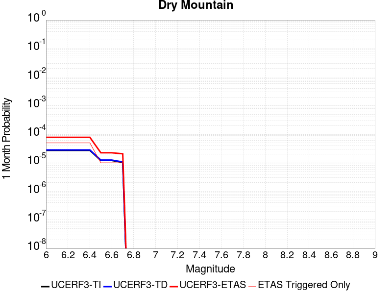 | 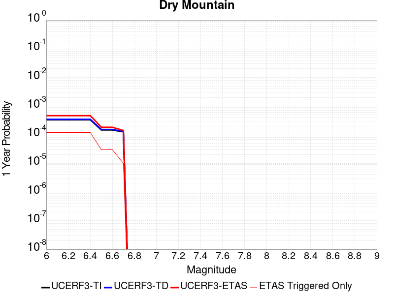 |  |

| Magnitude | 1 wk TI Prob | 1 wk TD Prob | 1 wk ETAS Prob | 1 wk ETAS/TD Gain | 1 wk ETAS Triggered Only | 1 mo TI Prob | 1 mo TD Prob | 1 mo ETAS Prob | 1 mo ETAS/TD Gain | 1 mo ETAS Triggered Only | 1 yr TI Prob | 1 yr TD Prob | 1 yr ETAS Prob | 1 yr ETAS/TD Gain | 1 yr ETAS Triggered Only | 10 yr TI Prob | 10 yr TD Prob | 10 yr ETAS Prob | 10 yr ETAS/TD Gain | 10 yr ETAS Triggered Only |
|-----|-----|-----|-----|-----|-----|-----|-----|-----|-----|-----|-----|-----|-----|-----|-----|-----|-----|-----|-----|-----|
| 6.0 | 6.384001E-6 | 6.6083558E-6 | 2.6608224E-5 | 4.0264516 | 2.0E-5 | 2.7359718E-5 | 2.8321308E-5 | 7.831989E-5 | 2.7654052 | 5.0E-5 | 3.3305364E-4 | 3.4477343E-4 | 4.6473206E-4 | 1.3479346 | 1.2E-4 | 0.0033255492 | 0.0034439613 | 0.0035934446 | 1.0434045 | 1.5E-4 |
| 6.1 | 6.384001E-6 | 6.6083558E-6 | 2.6608224E-5 | 4.0264516 | 2.0E-5 | 2.7359718E-5 | 2.8321308E-5 | 7.831989E-5 | 2.7654052 | 5.0E-5 | 3.3305364E-4 | 3.4477343E-4 | 4.6473206E-4 | 1.3479346 | 1.2E-4 | 0.0033255492 | 0.0034439613 | 0.0035934446 | 1.0434045 | 1.5E-4 |
| 6.2 | 6.384001E-6 | 6.6083558E-6 | 2.6608224E-5 | 4.0264516 | 2.0E-5 | 2.7359718E-5 | 2.8321308E-5 | 7.831989E-5 | 2.7654052 | 5.0E-5 | 3.3305364E-4 | 3.4477343E-4 | 4.6473206E-4 | 1.3479346 | 1.2E-4 | 0.0033255492 | 0.0034439613 | 0.0035934446 | 1.0434045 | 1.5E-4 |
| 6.3 | 6.384001E-6 | 6.6083558E-6 | 2.6608224E-5 | 4.0264516 | 2.0E-5 | 2.7359718E-5 | 2.8321308E-5 | 7.831989E-5 | 2.7654052 | 5.0E-5 | 3.3305364E-4 | 3.4477343E-4 | 4.6473206E-4 | 1.3479346 | 1.2E-4 | 0.0033255492 | 0.0034439613 | 0.0035934446 | 1.0434045 | 1.5E-4 |
| 6.4 | 6.384001E-6 | 6.6083558E-6 | 2.6608224E-5 | 4.0264516 | 2.0E-5 | 2.7359718E-5 | 2.8321308E-5 | 7.831989E-5 | 2.7654052 | 5.0E-5 | 3.3305364E-4 | 3.4477343E-4 | 4.6473206E-4 | 1.3479346 | 1.2E-4 | 0.0033255492 | 0.0034439613 | 0.0035934446 | 1.0434045 | 1.5E-4 |
| 6.5 | 2.8187012E-6 | 2.917799E-6 | 1.291777E-5 | 4.427231 | 1.0E-5 | 1.2080091E-5 | 1.2504838E-5 | 2.2504713E-5 | 1.7996805 | 1.0E-5 | 1.4706519E-4 | 1.5224372E-4 | 1.8223915E-4 | 1.1970224 | 3.0E-5 | 0.0014696791 | 0.0015221738 | 0.0015521281 | 1.0196787 | 3.0E-5 |
| 6.6 | 2.8187012E-6 | 2.917799E-6 | 1.291777E-5 | 4.427231 | 1.0E-5 | 1.2080091E-5 | 1.2504838E-5 | 2.2504713E-5 | 1.7996805 | 1.0E-5 | 1.4706519E-4 | 1.5224372E-4 | 1.8223915E-4 | 1.1970224 | 3.0E-5 | 0.0014696791 | 0.0015221738 | 0.0015521281 | 1.0196787 | 3.0E-5 |
| 6.7 | 2.4208002E-6 | 2.5057766E-6 | 1.2505751E-5 | 4.990769 | 1.0E-5 | 1.0374817E-5 | 1.0739042E-5 | 2.0738935E-5 | 1.9311718 | 1.0E-5 | 1.2630607E-4 | 1.3074784E-4 | 1.4074653E-4 | 1.0764731 | 1.0E-5 | 0.001262343 | 0.0013074784 | 0.0013174653 | 1.0076383 | 1.0E-5 |

## Cleghorn Lake
*[(top)](#table-of-contents)*

| 1 Week | 1 Month | 1 Year | 10 Year |
|-----|-----|-----|-----|
|  | 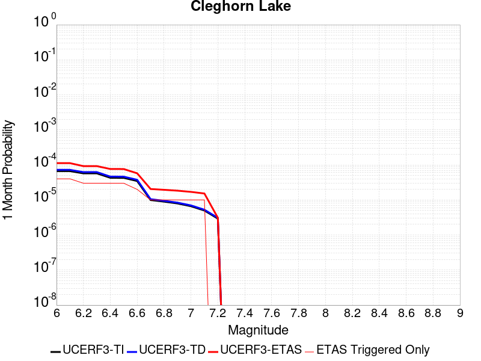 |  |  |

| Magnitude | 1 wk TI Prob | 1 wk TD Prob | 1 wk ETAS Prob | 1 wk ETAS/TD Gain | 1 wk ETAS Triggered Only | 1 mo TI Prob | 1 mo TD Prob | 1 mo ETAS Prob | 1 mo ETAS/TD Gain | 1 mo ETAS Triggered Only | 1 yr TI Prob | 1 yr TD Prob | 1 yr ETAS Prob | 1 yr ETAS/TD Gain | 1 yr ETAS Triggered Only | 10 yr TI Prob | 10 yr TD Prob | 10 yr ETAS Prob | 10 yr ETAS/TD Gain | 10 yr ETAS Triggered Only |
|-----|-----|-----|-----|-----|-----|-----|-----|-----|-----|-----|-----|-----|-----|-----|-----|-----|-----|-----|-----|-----|
| 6.0 | 1.5498938E-5 | 1.6857093E-5 | 4.6856585E-5 | 2.7796364 | 3.0E-5 | 6.6422326E-5 | 7.2243005E-5 | 1.12240115E-4 | 1.5536468 | 4.0E-5 | 8.083918E-4 | 8.7926176E-4 | 9.791738E-4 | 1.1136317 | 1.0E-4 | 0.008054574 | 0.008763568 | 0.008882516 | 1.013573 | 1.2E-4 |
| 6.1 | 1.5498938E-5 | 1.6857093E-5 | 4.6856585E-5 | 2.7796364 | 3.0E-5 | 6.6422326E-5 | 7.2243005E-5 | 1.12240115E-4 | 1.5536468 | 4.0E-5 | 8.083918E-4 | 8.7926176E-4 | 9.791738E-4 | 1.1136317 | 1.0E-4 | 0.008054574 | 0.008763568 | 0.008882516 | 1.013573 | 1.2E-4 |
| 6.2 | 1.3374407E-5 | 1.4526966E-5 | 3.4526674E-5 | 2.37673 | 2.0E-5 | 5.731763E-5 | 6.225725E-5 | 9.225538E-5 | 1.4818416 | 3.0E-5 | 6.976187E-4 | 7.5777306E-4 | 8.477049E-4 | 1.118679 | 9.0E-5 | 0.006954327 | 0.007557279 | 0.0076664477 | 1.0144455 | 1.1E-4 |
| 6.3 | 1.3374407E-5 | 1.4526966E-5 | 3.4526674E-5 | 2.37673 | 2.0E-5 | 5.731763E-5 | 6.225725E-5 | 9.225538E-5 | 1.4818416 | 3.0E-5 | 6.976187E-4 | 7.5777306E-4 | 8.477049E-4 | 1.118679 | 9.0E-5 | 0.006954327 | 0.007557279 | 0.0076664477 | 1.0144455 | 1.1E-4 |
| 6.4 | 1.0004383E-5 | 1.0825461E-5 | 3.0825246E-5 | 2.8474765 | 2.0E-5 | 4.287522E-5 | 4.6394267E-5 | 7.639288E-5 | 1.6466016 | 3.0E-5 | 5.218808E-4 | 5.647501E-4 | 6.247162E-4 | 1.1061817 | 6.0E-5 | 0.0052065686 | 0.005637695 | 0.0057073003 | 1.0123464 | 7.0E-5 |
| 6.5 | 9.9503395E-6 | 1.0768027E-5 | 3.0767813E-5 | 2.8573306 | 2.0E-5 | 4.2643616E-5 | 4.6148132E-5 | 7.6146745E-5 | 1.6500505 | 3.0E-5 | 5.1906233E-4 | 5.617549E-4 | 6.217212E-4 | 1.1067481 | 6.0E-5 | 0.005178516 | 0.0056078946 | 0.005677502 | 1.0124124 | 7.0E-5 |
| 6.6 | 8.091008E-6 | 8.770708E-6 | 1.8770621E-5 | 2.1401489 | 1.0E-5 | 3.4675286E-5 | 3.758846E-5 | 5.7587706E-5 | 1.5320582 | 2.0E-5 | 4.2208983E-4 | 4.5758803E-4 | 5.0756516E-4 | 1.1092186 | 5.0E-5 | 0.00421289 | 0.0045708376 | 0.0046305633 | 1.0130666 | 6.0E-5 |
| 6.7 | 2.318209E-6 | 2.450581E-6 | 2.450581E-6 | 1.0 | 0.0 | 9.935144E-6 | 1.0502448E-5 | 2.0502344E-5 | 1.9521489 | 1.0E-5 | 1.2095366E-4 | 1.2786001E-4 | 1.4785746E-4 | 1.156401 | 2.0E-5 | 0.0012088785 | 0.0012778844 | 0.0012978588 | 1.0156308 | 2.0E-5 |
| 6.8 | 2.0880166E-6 | 2.2052297E-6 | 2.2052297E-6 | 1.0 | 0.0 | 8.948612E-6 | 9.450951E-6 | 1.9450858E-5 | 2.0580845 | 1.0E-5 | 1.089439E-4 | 1.1505945E-4 | 1.3505714E-4 | 1.1738032 | 2.0E-5 | 0.0010889051 | 0.0011500169 | 0.0011699939 | 1.017371 | 2.0E-5 |
| 6.9 | 1.852163E-6 | 1.9539004E-6 | 1.9539004E-6 | 1.0 | 0.0 | 7.937818E-6 | 8.373833E-6 | 1.837375E-5 | 2.1941862 | 1.0E-5 | 9.663864E-5 | 1.0194682E-4 | 1.2194478E-4 | 1.1961607 | 2.0E-5 | 9.6596626E-4 | 0.0010190175 | 0.0010389971 | 1.0196067 | 2.0E-5 |
| 7.0 | 1.5455829E-6 | 1.6296744E-6 | 1.6296744E-6 | 1.0 | 0.0 | 6.62391E-6 | 6.984301E-6 | 1.6984231E-5 | 2.4317725 | 1.0E-5 | 8.064312E-5 | 8.503069E-5 | 1.05028994E-4 | 1.2351892 | 2.0E-5 | 8.0613856E-4 | 8.49996E-4 | 8.6997903E-4 | 1.0235095 | 2.0E-5 |
| 7.1 | 1.1649183E-6 | 1.2274907E-6 | 1.2274907E-6 | 1.0 | 0.0 | 4.9924975E-6 | 5.2606642E-6 | 1.5260612E-5 | 2.9008906 | 1.0E-5 | 6.0781964E-5 | 6.4046835E-5 | 8.4045554E-5 | 1.3122514 | 2.0E-5 | 6.076534E-4 | 6.402962E-4 | 6.602834E-4 | 1.0312155 | 2.0E-5 |
| 7.2 | 6.8377943E-7 | 7.195401E-7 | 7.195401E-7 | 1.0 | 0.0 | 2.93048E-6 | 3.0837402E-6 | 3.0837402E-6 | 1.0 | 0.0 | 3.5678007E-5 | 3.7543985E-5 | 3.7543985E-5 | 1.0 | 0.0 | 3.567228E-4 | 3.753856E-4 | 3.753856E-4 | 1.0 | 0.0 |

## Cleghorn Pass
*[(top)](#table-of-contents)*

| 1 Week | 1 Month | 1 Year | 10 Year |
|-----|-----|-----|-----|
| 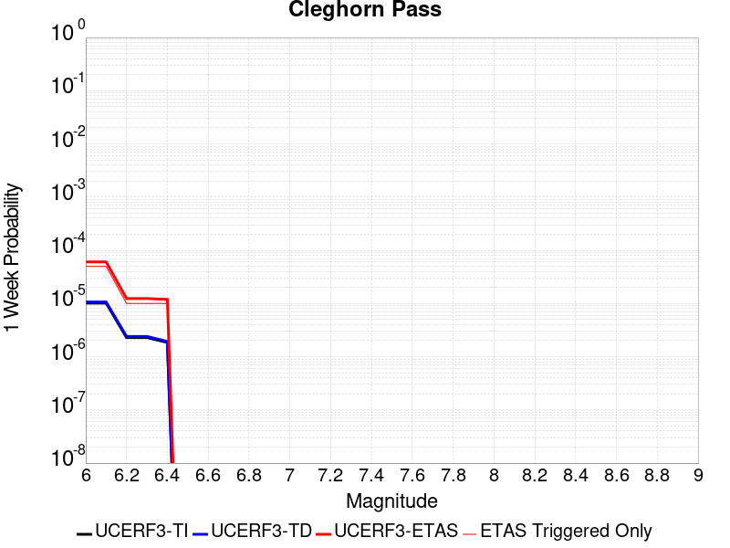 |  | 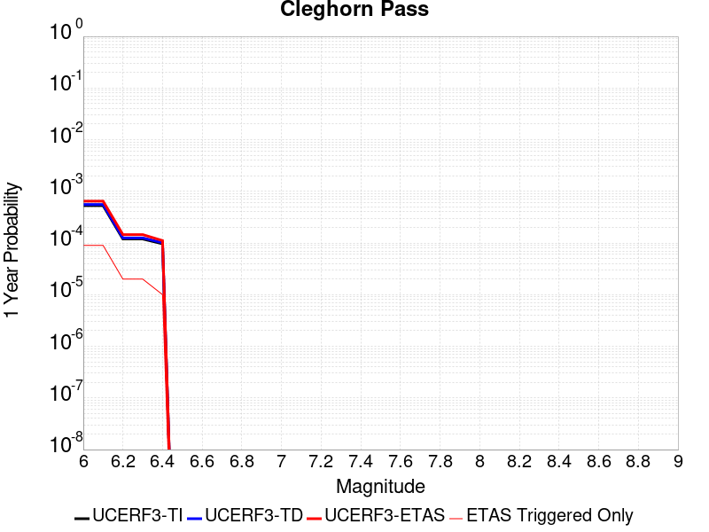 |  |

| Magnitude | 1 wk TI Prob | 1 wk TD Prob | 1 wk ETAS Prob | 1 wk ETAS/TD Gain | 1 wk ETAS Triggered Only | 1 mo TI Prob | 1 mo TD Prob | 1 mo ETAS Prob | 1 mo ETAS/TD Gain | 1 mo ETAS Triggered Only | 1 yr TI Prob | 1 yr TD Prob | 1 yr ETAS Prob | 1 yr ETAS/TD Gain | 1 yr ETAS Triggered Only | 10 yr TI Prob | 10 yr TD Prob | 10 yr ETAS Prob | 10 yr ETAS/TD Gain | 10 yr ETAS Triggered Only |
|-----|-----|-----|-----|-----|-----|-----|-----|-----|-----|-----|-----|-----|-----|-----|-----|-----|-----|-----|-----|-----|
| 6.0 | 1.0181528E-5 | 1.067471E-5 | 6.0674178E-5 | 5.683918 | 5.0E-5 | 4.3634387E-5 | 4.5748224E-5 | 1.15745024E-4 | 2.530044 | 7.0E-5 | 5.311192E-4 | 5.568896E-4 | 6.4683944E-4 | 1.1615219 | 9.0E-5 | 0.005298516 | 0.0055595795 | 0.005688857 | 1.0232531 | 1.3E-4 |
| 6.1 | 1.0181528E-5 | 1.067471E-5 | 6.0674178E-5 | 5.683918 | 5.0E-5 | 4.3634387E-5 | 4.5748224E-5 | 1.15745024E-4 | 2.530044 | 7.0E-5 | 5.311192E-4 | 5.568896E-4 | 6.4683944E-4 | 1.1615219 | 9.0E-5 | 0.005298516 | 0.0055595795 | 0.005688857 | 1.0232531 | 1.3E-4 |
| 6.2 | 2.2925276E-6 | 2.4036651E-6 | 1.2403641E-5 | 5.160303 | 1.0E-5 | 9.825081E-6 | 1.0301409E-5 | 2.0301306E-5 | 1.970731 | 1.0E-5 | 1.19613804E-4 | 1.2541727E-4 | 1.4541476E-4 | 1.1594477 | 2.0E-5 | 0.0011954944 | 0.0012539396 | 0.001283902 | 1.0238945 | 3.0E-5 |
| 6.3 | 2.2925276E-6 | 2.4036651E-6 | 1.2403641E-5 | 5.160303 | 1.0E-5 | 9.825081E-6 | 1.0301409E-5 | 2.0301306E-5 | 1.970731 | 1.0E-5 | 1.19613804E-4 | 1.2541727E-4 | 1.4541476E-4 | 1.1594477 | 2.0E-5 | 0.0011954944 | 0.0012539396 | 0.001283902 | 1.0238945 | 3.0E-5 |
| 6.4 | 1.85127E-6 | 1.9408885E-6 | 1.1940869E-5 | 6.1522694 | 1.0E-5 | 7.93399E-6 | 8.318094E-6 | 1.8318011E-5 | 2.2021885 | 1.0E-5 | 9.659205E-5 | 1.0127279E-4 | 1.1127178E-4 | 1.0987332 | 1.0E-5 | 9.655007E-4 | 0.0010127279 | 0.0010327076 | 1.0197287 | 2.0E-5 |

## Oak Ridge (Offshore)
*[(top)](#table-of-contents)*

| 1 Week | 1 Month | 1 Year | 10 Year |
|-----|-----|-----|-----|
|  | 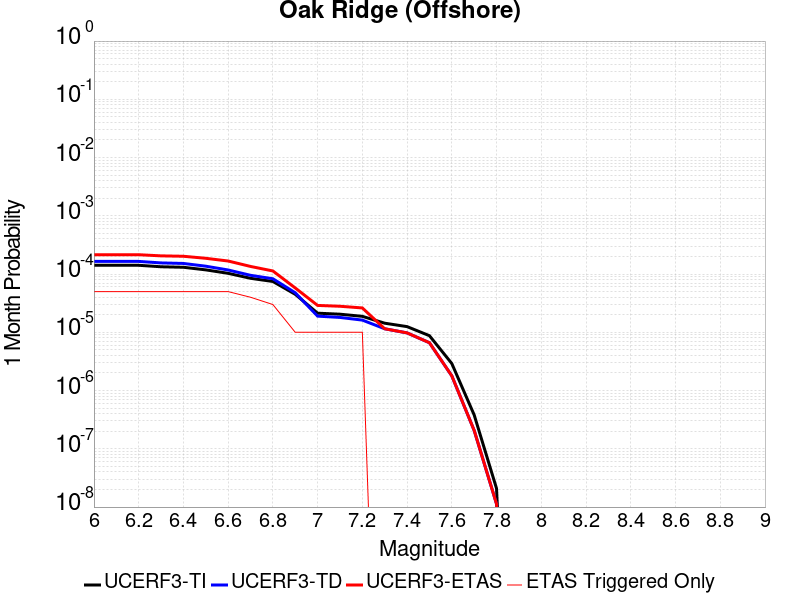 | 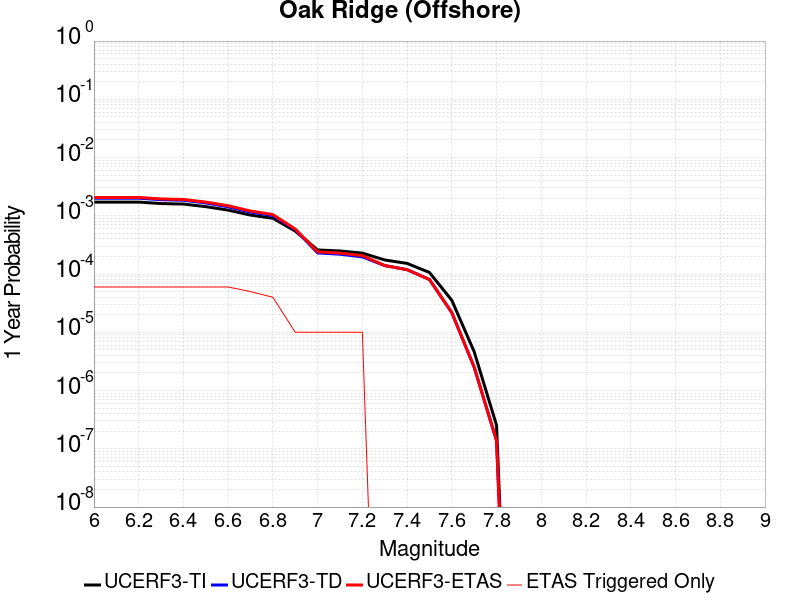 | 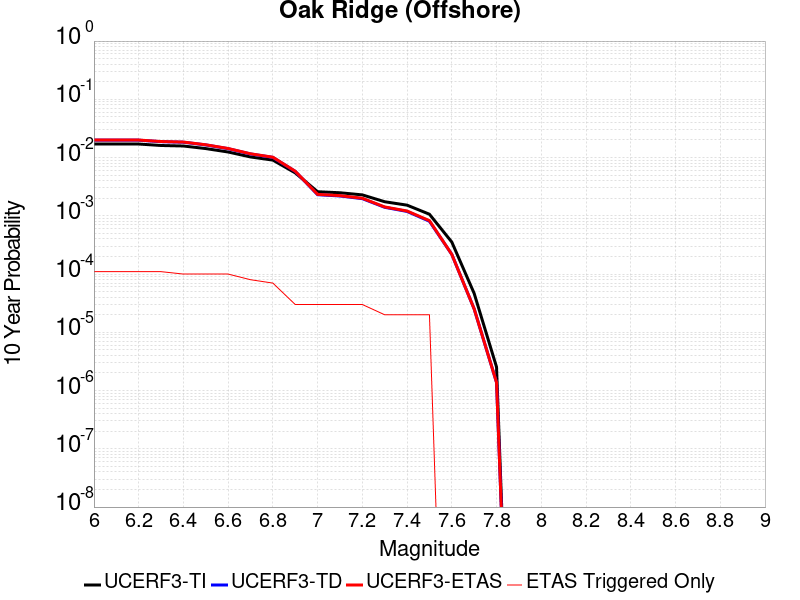 |

| Magnitude | 1 wk TI Prob | 1 wk TD Prob | 1 wk ETAS Prob | 1 wk ETAS/TD Gain | 1 wk ETAS Triggered Only | 1 mo TI Prob | 1 mo TD Prob | 1 mo ETAS Prob | 1 mo ETAS/TD Gain | 1 mo ETAS Triggered Only | 1 yr TI Prob | 1 yr TD Prob | 1 yr ETAS Prob | 1 yr ETAS/TD Gain | 1 yr ETAS Triggered Only | 10 yr TI Prob | 10 yr TD Prob | 10 yr ETAS Prob | 10 yr ETAS/TD Gain | 10 yr ETAS Triggered Only |
|-----|-----|-----|-----|-----|-----|-----|-----|-----|-----|-----|-----|-----|-----|-----|-----|-----|-----|-----|-----|-----|
| 6.0 | 3.3001907E-5 | 3.8478283E-5 | 6.847713E-5 | 1.7796305 | 3.0E-5 | 1.4142907E-4 | 1.6489692E-4 | 2.1488867E-4 | 1.3031697 | 5.0E-5 | 0.001720539 | 0.0020058397 | 0.0020657193 | 1.0298526 | 6.0E-5 | 0.017072788 | 0.019884681 | 0.019992495 | 1.0054219 | 1.1E-4 |
| 6.1 | 3.3001907E-5 | 3.8478283E-5 | 6.847713E-5 | 1.7796305 | 3.0E-5 | 1.4142907E-4 | 1.6489692E-4 | 2.1488867E-4 | 1.3031697 | 5.0E-5 | 0.001720539 | 0.0020058397 | 0.0020657193 | 1.0298526 | 6.0E-5 | 0.017072788 | 0.019884681 | 0.019992495 | 1.0054219 | 1.1E-4 |
| 6.2 | 3.3001907E-5 | 3.8478283E-5 | 6.847713E-5 | 1.7796305 | 3.0E-5 | 1.4142907E-4 | 1.6489692E-4 | 2.1488867E-4 | 1.3031697 | 5.0E-5 | 0.001720539 | 0.0020058397 | 0.0020657193 | 1.0298526 | 6.0E-5 | 0.017072788 | 0.019884681 | 0.019992495 | 1.0054219 | 1.1E-4 |
| 6.3 | 3.1140196E-5 | 3.6251706E-5 | 6.625062E-5 | 1.8275173 | 3.0E-5 | 1.3345115E-4 | 1.5535559E-4 | 2.0534782E-4 | 1.3217922 | 5.0E-5 | 0.0016235567 | 0.0018898771 | 0.0019497637 | 1.0316881 | 6.0E-5 | 0.016117463 | 0.018744804 | 0.018852742 | 1.0057583 | 1.1E-4 |
| 6.4 | 3.0519765E-5 | 3.5488436E-5 | 6.548737E-5 | 1.8453158 | 3.0E-5 | 1.3079242E-4 | 1.5208482E-4 | 2.0207721E-4 | 1.3287139 | 5.0E-5 | 0.0015912346 | 0.0018501238 | 0.0019100128 | 1.0323702 | 6.0E-5 | 0.015798887 | 0.018353915 | 0.018452078 | 1.0053484 | 1.0E-4 |
| 6.5 | 2.7539367E-5 | 3.1841344E-5 | 6.184039E-5 | 1.9421413 | 3.0E-5 | 1.1802052E-4 | 1.3645612E-4 | 1.864493E-4 | 1.3663682 | 5.0E-5 | 0.0014359527 | 0.0016601491 | 0.0017200495 | 1.0360813 | 6.0E-5 | 0.014267093 | 0.016483804 | 0.016582156 | 1.0059665 | 1.0E-4 |
| 6.6 | 2.4025763E-5 | 2.74164E-5 | 5.741558E-5 | 2.0942056 | 3.0E-5 | 1.0296349E-4 | 1.17493866E-4 | 1.6748799E-4 | 1.4255041 | 5.0E-5 | 0.0012528596 | 0.0014295998 | 0.0014895141 | 1.0419098 | 6.0E-5 | 0.012458197 | 0.014209445 | 0.014308023 | 1.0069376 | 1.0E-4 |
| 6.7 | 1.9733052E-5 | 2.2216427E-5 | 5.221576E-5 | 2.3503222 | 3.0E-5 | 8.456748E-5 | 9.521004E-5 | 1.3520622E-4 | 1.4200838 | 4.0E-5 | 0.0010291227 | 0.0011586114 | 0.0012085534 | 1.0431051 | 5.0E-5 | 0.010243698 | 0.011530324 | 0.011609402 | 1.0068582 | 8.0E-5 |
| 6.8 | 1.7407981E-5 | 1.938051E-5 | 4.9379927E-5 | 2.547917 | 3.0E-5 | 7.460351E-5 | 8.3056926E-5 | 1.1305443E-4 | 1.361168 | 3.0E-5 | 9.0791914E-4 | 0.0010107921 | 0.0010507517 | 1.0395329 | 4.0E-5 | 0.009042187 | 0.010066265 | 0.01013556 | 1.006884 | 7.0E-5 |
| 6.9 | 1.0484359E-5 | 1.1136617E-5 | 2.1136506E-5 | 1.8979287 | 1.0E-5 | 4.4932196E-5 | 4.7727677E-5 | 5.7727197E-5 | 1.209512 | 1.0E-5 | 5.4691214E-4 | 5.809632E-4 | 5.909574E-4 | 1.0172027 | 1.0E-5 | 0.005455681 | 0.005797755 | 0.005827581 | 1.0051444 | 3.0E-5 |
| 7.0 | 4.9704186E-6 | 4.4216818E-6 | 1.4421637E-5 | 3.261573 | 1.0E-5 | 2.130162E-5 | 1.8949933E-5 | 2.8949744E-5 | 1.5276964 | 1.0E-5 | 2.5931635E-4 | 2.3069208E-4 | 2.4068977E-4 | 1.0433378 | 1.0E-5 | 0.0025901396 | 0.0023046322 | 0.002334563 | 1.0129873 | 3.0E-5 |
| 7.1 | 4.7746157E-6 | 4.201617E-6 | 1.4201574E-5 | 3.3800263 | 1.0E-5 | 2.0462478E-5 | 1.800681E-5 | 2.800663E-5 | 1.5553354 | 1.0E-5 | 2.491022E-4 | 2.1921191E-4 | 2.2920973E-4 | 1.0456079 | 1.0E-5 | 0.0024882313 | 0.0021900623 | 0.0022199966 | 1.0136683 | 3.0E-5 |
| 7.2 | 4.387391E-6 | 3.78063E-6 | 1.3780592E-5 | 3.6450517 | 1.0E-5 | 1.8802968E-5 | 1.6202606E-5 | 2.6202444E-5 | 1.6171746 | 1.0E-5 | 2.2890209E-4 | 1.9724992E-4 | 2.0724794E-4 | 1.0506871 | 1.0E-5 | 0.0022866647 | 0.001970852 | 0.0020007929 | 1.0151918 | 3.0E-5 |
| 7.3 | 3.345927E-6 | 2.6842329E-6 | 2.6842329E-6 | 1.0 | 0.0 | 1.4339608E-5 | 1.1503808E-5 | 1.1503808E-5 | 1.0 | 0.0 | 1.7457074E-4 | 1.4005053E-4 | 1.4005053E-4 | 1.0 | 0.0 | 0.0017443367 | 0.001399688 | 0.0014196599 | 1.0142689 | 2.0E-5 |
| 7.4 | 2.9217588E-6 | 2.2799668E-6 | 2.2799668E-6 | 1.0 | 0.0 | 1.2521764E-5 | 9.771254E-6 | 9.771254E-6 | 1.0 | 0.0 | 1.524418E-4 | 1.1895915E-4 | 1.1895915E-4 | 1.0 | 0.0 | 0.0015233727 | 0.0011890174 | 0.0012089936 | 1.0168006 | 2.0E-5 |
| 7.5 | 2.041874E-6 | 1.5457747E-6 | 1.5457747E-6 | 1.0 | 0.0 | 8.75086E-6 | 6.624735E-6 | 6.624735E-6 | 1.0 | 0.0 | 1.0653651E-4 | 8.065374E-5 | 8.065374E-5 | 1.0 | 0.0 | 0.0010648544 | 8.063017E-4 | 8.2628557E-4 | 1.0247846 | 2.0E-5 |
| 7.6 | 6.791087E-7 | 4.1712414E-7 | 4.1712414E-7 | 1.0 | 0.0 | 2.9104626E-6 | 1.7876738E-6 | 1.7876738E-6 | 1.0 | 0.0 | 3.5434306E-5 | 2.1764734E-5 | 2.1764734E-5 | 1.0 | 0.0 | 3.5428657E-4 | 2.1762827E-4 | 2.1762827E-4 | 1.0 | 0.0 |
| 7.7 | 8.9133664E-8 | 4.8276565E-8 | 4.8276565E-8 | 1.0 | 0.0 | 3.8200136E-7 | 2.0689954E-7 | 2.0689954E-7 | 1.0 | 0.0 | 4.6508567E-6 | 2.5189993E-6 | 2.5189993E-6 | 1.0 | 0.0 | 4.650759E-5 | 2.5189718E-5 | 2.5189718E-5 | 1.0 | 0.0 |
| 7.8 | 4.8591318E-9 | 2.641984E-9 | 2.641984E-9 | 1.0 | 0.0 | 2.0824851E-8 | 1.1322789E-8 | 1.1322789E-8 | 1.0 | 0.0 | 2.5354254E-7 | 1.3785495E-7 | 1.3785495E-7 | 1.0 | 0.0 | 2.5354225E-6 | 1.3785495E-6 | 1.3785495E-6 | 1.0 | 0.0 |

## Red Mountain
*[(top)](#table-of-contents)*

| 1 Week | 1 Month | 1 Year | 10 Year |
|-----|-----|-----|-----|
|  | 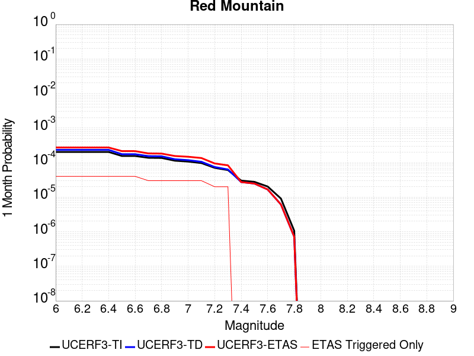 |  | 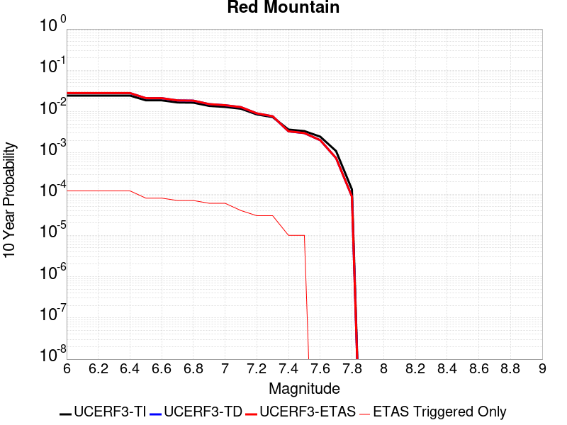 |

| Magnitude | 1 wk TI Prob | 1 wk TD Prob | 1 wk ETAS Prob | 1 wk ETAS/TD Gain | 1 wk ETAS Triggered Only | 1 mo TI Prob | 1 mo TD Prob | 1 mo ETAS Prob | 1 mo ETAS/TD Gain | 1 mo ETAS Triggered Only | 1 yr TI Prob | 1 yr TD Prob | 1 yr ETAS Prob | 1 yr ETAS/TD Gain | 1 yr ETAS Triggered Only | 10 yr TI Prob | 10 yr TD Prob | 10 yr ETAS Prob | 10 yr ETAS/TD Gain | 10 yr ETAS Triggered Only |
|-----|-----|-----|-----|-----|-----|-----|-----|-----|-----|-----|-----|-----|-----|-----|-----|-----|-----|-----|-----|-----|
| 6.0 | 4.7443602E-5 | 5.4448774E-5 | 9.4446594E-5 | 1.7345954 | 4.0E-5 | 2.0331387E-4 | 2.3333199E-4 | 2.7332266E-4 | 1.1713896 | 4.0E-5 | 0.0024725364 | 0.0028372952 | 0.0028871533 | 1.0175724 | 5.0E-5 | 0.024452066 | 0.028030451 | 0.028147088 | 1.004161 | 1.2E-4 |
| 6.1 | 4.7443602E-5 | 5.4448774E-5 | 9.4446594E-5 | 1.7345954 | 4.0E-5 | 2.0331387E-4 | 2.3333199E-4 | 2.7332266E-4 | 1.1713896 | 4.0E-5 | 0.0024725364 | 0.0028372952 | 0.0028871533 | 1.0175724 | 5.0E-5 | 0.024452066 | 0.028030451 | 0.028147088 | 1.004161 | 1.2E-4 |
| 6.2 | 4.7443602E-5 | 5.4448774E-5 | 9.4446594E-5 | 1.7345954 | 4.0E-5 | 2.0331387E-4 | 2.3333199E-4 | 2.7332266E-4 | 1.1713896 | 4.0E-5 | 0.0024725364 | 0.0028372952 | 0.0028871533 | 1.0175724 | 5.0E-5 | 0.024452066 | 0.028030451 | 0.028147088 | 1.004161 | 1.2E-4 |
| 6.3 | 4.7443602E-5 | 5.4448774E-5 | 9.4446594E-5 | 1.7345954 | 4.0E-5 | 2.0331387E-4 | 2.3333199E-4 | 2.7332266E-4 | 1.1713896 | 4.0E-5 | 0.0024725364 | 0.0028372952 | 0.0028871533 | 1.0175724 | 5.0E-5 | 0.024452066 | 0.028030451 | 0.028147088 | 1.004161 | 1.2E-4 |
| 6.4 | 4.7443602E-5 | 5.4448774E-5 | 9.4446594E-5 | 1.7345954 | 4.0E-5 | 2.0331387E-4 | 2.3333199E-4 | 2.7332266E-4 | 1.1713896 | 4.0E-5 | 0.0024725364 | 0.0028372952 | 0.0028871533 | 1.0175724 | 5.0E-5 | 0.024452066 | 0.028030451 | 0.028147088 | 1.004161 | 1.2E-4 |
| 6.5 | 3.6278987E-5 | 4.0886203E-5 | 8.0884565E-5 | 1.9782851 | 4.0E-5 | 1.5547211E-4 | 1.7521523E-4 | 2.1520822E-4 | 1.2282506 | 4.0E-5 | 0.0018912294 | 0.0021312314 | 0.0021711462 | 1.0187285 | 4.0E-5 | 0.01875215 | 0.02111607 | 0.021194382 | 1.0037086 | 8.0E-5 |
| 6.6 | 3.62529E-5 | 4.085577E-5 | 8.085414E-5 | 1.9790138 | 4.0E-5 | 1.553603E-4 | 1.7508483E-4 | 2.1507783E-4 | 1.2284207 | 4.0E-5 | 0.0018898707 | 0.002129647 | 0.0021695618 | 1.0187424 | 4.0E-5 | 0.018738791 | 0.021100527 | 0.02117884 | 1.0037113 | 8.0E-5 |
| 6.7 | 3.2177904E-5 | 3.5965208E-5 | 6.596413E-5 | 1.8341095 | 3.0E-5 | 1.3789801E-4 | 1.5412783E-4 | 1.8412322E-4 | 1.1946136 | 3.0E-5 | 0.0016776153 | 0.0018749523 | 0.0019048961 | 1.0159703 | 3.0E-5 | 0.01665007 | 0.018598013 | 0.01866671 | 1.0036938 | 7.0E-5 |
| 6.8 | 3.1786596E-5 | 3.5513774E-5 | 6.551271E-5 | 1.8447127 | 3.0E-5 | 1.3622116E-4 | 1.5219334E-4 | 1.8218879E-4 | 1.1970876 | 3.0E-5 | 0.0016572308 | 0.0018514402 | 0.0018813846 | 1.0161736 | 3.0E-5 | 0.016449263 | 0.018366802 | 0.018435517 | 1.0037413 | 7.0E-5 |
| 6.9 | 2.6473506E-5 | 2.9196757E-5 | 5.919588E-5 | 2.0274813 | 3.0E-5 | 1.1345295E-4 | 1.2512322E-4 | 1.5511946E-4 | 1.2397337 | 3.0E-5 | 0.0013804144 | 0.0015223558 | 0.0015523101 | 1.0196763 | 3.0E-5 | 0.013718709 | 0.01512407 | 0.015183163 | 1.0039072 | 6.0E-5 |
| 7.0 | 2.4996663E-5 | 2.746969E-5 | 5.7468867E-5 | 2.0920827 | 3.0E-5 | 1.0712416E-4 | 1.17722186E-4 | 1.4771865E-4 | 1.2548072 | 3.0E-5 | 0.0013034563 | 0.0014323697 | 0.0014623267 | 1.0209143 | 3.0E-5 | 0.012958372 | 0.0142360395 | 0.014295186 | 1.0041547 | 6.0E-5 |
| 7.1 | 2.2619372E-5 | 2.4657105E-5 | 5.4656368E-5 | 2.2166579 | 3.0E-5 | 9.6936565E-5 | 1.0566927E-4 | 1.3566611E-4 | 1.2838746 | 3.0E-5 | 0.0011795636 | 0.0012858069 | 0.0013157683 | 1.0233016 | 3.0E-5 | 0.011733221 | 0.012788083 | 0.0128275715 | 1.0030879 | 4.0E-5 |
| 7.2 | 1.6455124E-5 | 1.7404347E-5 | 3.7404E-5 | 2.1491182 | 2.0E-5 | 7.052005E-5 | 7.458813E-5 | 9.458664E-5 | 1.2681192 | 2.0E-5 | 8.582434E-4 | 9.0776884E-4 | 9.277507E-4 | 1.022012 | 2.0E-5 | 0.008549363 | 0.009044269 | 0.009073998 | 1.0032871 | 3.0E-5 |
| 7.3 | 1.4164417E-5 | 1.4774086E-5 | 3.477379E-5 | 2.3537016 | 2.0E-5 | 6.070323E-5 | 6.3316176E-5 | 8.331491E-5 | 1.315855 | 2.0E-5 | 7.388112E-4 | 7.7063777E-4 | 7.906223E-4 | 1.0259326 | 2.0E-5 | 0.0073635974 | 0.007683213 | 0.007712982 | 1.0038747 | 3.0E-5 |
| 7.4 | 7.045373E-6 | 6.3833163E-6 | 6.3833163E-6 | 1.0 | 0.0 | 3.0194105E-5 | 2.735679E-5 | 2.735679E-5 | 1.0 | 0.0 | 3.6755123E-4 | 3.330193E-4 | 3.330193E-4 | 1.0 | 0.0 | 0.003669439 | 0.0033253327 | 0.0033352994 | 1.0029972 | 1.0E-5 |
| 7.5 | 6.4767605E-6 | 5.7745997E-6 | 5.7745997E-6 | 1.0 | 0.0 | 2.775725E-5 | 2.4748057E-5 | 2.4748057E-5 | 1.0 | 0.0 | 3.3789212E-4 | 3.012672E-4 | 3.012672E-4 | 1.0 | 0.0 | 0.003373788 | 0.0030087144 | 0.0030186845 | 1.0033137 | 1.0E-5 |
| 7.6 | 4.741415E-6 | 3.894826E-6 | 3.894826E-6 | 1.0 | 0.0 | 2.0320193E-5 | 1.6692009E-5 | 1.6692009E-5 | 1.0 | 0.0 | 2.4737025E-4 | 2.0320695E-4 | 2.0320695E-4 | 1.0 | 0.0 | 0.0024709508 | 0.0020302804 | 0.0020302804 | 1.0 | 0.0 |
| 7.7 | 2.1222895E-6 | 1.4322148E-6 | 1.4322148E-6 | 1.0 | 0.0 | 9.0954945E-6 | 6.1380497E-6 | 6.1380497E-6 | 1.0 | 0.0 | 1.1073202E-4 | 7.472828E-5 | 7.472828E-5 | 1.0 | 0.0 | 0.0011067686 | 7.4704085E-4 | 7.4704085E-4 | 1.0 | 0.0 |
| 7.8 | 2.4988884E-7 | 1.6778218E-7 | 1.6778218E-7 | 1.0 | 0.0 | 1.0709517E-6 | 7.190663E-7 | 7.190663E-7 | 1.0 | 0.0 | 1.3038759E-5 | 8.754598E-6 | 8.754598E-6 | 1.0 | 0.0 | 1.3037994E-4 | 8.754264E-5 | 8.754264E-5 | 1.0 | 0.0 |

## Santa Cruz Island
*[(top)](#table-of-contents)*

| 1 Week | 1 Month | 1 Year | 10 Year |
|-----|-----|-----|-----|
|  |  |  |  |

| Magnitude | 1 wk TI Prob | 1 wk TD Prob | 1 wk ETAS Prob | 1 wk ETAS/TD Gain | 1 wk ETAS Triggered Only | 1 mo TI Prob | 1 mo TD Prob | 1 mo ETAS Prob | 1 mo ETAS/TD Gain | 1 mo ETAS Triggered Only | 1 yr TI Prob | 1 yr TD Prob | 1 yr ETAS Prob | 1 yr ETAS/TD Gain | 1 yr ETAS Triggered Only | 10 yr TI Prob | 10 yr TD Prob | 10 yr ETAS Prob | 10 yr ETAS/TD Gain | 10 yr ETAS Triggered Only |
|-----|-----|-----|-----|-----|-----|-----|-----|-----|-----|-----|-----|-----|-----|-----|-----|-----|-----|-----|-----|-----|
| 6.0 | 2.8690172E-5 | 3.0952928E-5 | 7.095169E-5 | 2.292245 | 4.0E-5 | 1.2295209E-4 | 1.3264941E-4 | 1.8264278E-4 | 1.3768834 | 5.0E-5 | 0.0014959137 | 0.0016139428 | 0.0016838297 | 1.043302 | 7.0E-5 | 0.014858838 | 0.016035562 | 0.016143799 | 1.0067497 | 1.1E-4 |
| 6.1 | 2.8690172E-5 | 3.0952928E-5 | 7.095169E-5 | 2.292245 | 4.0E-5 | 1.2295209E-4 | 1.3264941E-4 | 1.8264278E-4 | 1.3768834 | 5.0E-5 | 0.0014959137 | 0.0016139428 | 0.0016838297 | 1.043302 | 7.0E-5 | 0.014858838 | 0.016035562 | 0.016143799 | 1.0067497 | 1.1E-4 |
| 6.2 | 2.8690172E-5 | 3.0952928E-5 | 7.095169E-5 | 2.292245 | 4.0E-5 | 1.2295209E-4 | 1.3264941E-4 | 1.8264278E-4 | 1.3768834 | 5.0E-5 | 0.0014959137 | 0.0016139428 | 0.0016838297 | 1.043302 | 7.0E-5 | 0.014858838 | 0.016035562 | 0.016143799 | 1.0067497 | 1.1E-4 |
| 6.3 | 1.7104674E-5 | 1.8205603E-5 | 4.8205056E-5 | 2.6478143 | 3.0E-5 | 7.330369E-5 | 7.8021825E-5 | 1.1801871E-4 | 1.512637 | 4.0E-5 | 8.9210697E-4 | 9.495284E-4 | 9.894904E-4 | 1.0420861 | 4.0E-5 | 0.008885341 | 0.0094574075 | 0.009526745 | 1.0073316 | 7.0E-5 |
| 6.4 | 1.7104674E-5 | 1.8205603E-5 | 4.8205056E-5 | 2.6478143 | 3.0E-5 | 7.330369E-5 | 7.8021825E-5 | 1.1801871E-4 | 1.512637 | 4.0E-5 | 8.9210697E-4 | 9.495284E-4 | 9.894904E-4 | 1.0420861 | 4.0E-5 | 0.008885341 | 0.0094574075 | 0.009526745 | 1.0073316 | 7.0E-5 |
| 6.5 | 1.2001291E-5 | 1.2662695E-5 | 2.2662569E-5 | 1.7897114 | 1.0E-5 | 5.143309E-5 | 5.426758E-5 | 7.42665E-5 | 1.3685242 | 2.0E-5 | 6.260179E-4 | 6.605108E-4 | 6.90491E-4 | 1.0453894 | 3.0E-5 | 0.0062425733 | 0.006585833 | 0.0066156355 | 1.0045252 | 3.0E-5 |
| 6.6 | 1.0159658E-5 | 1.0676824E-5 | 2.0676716E-5 | 1.9365982 | 1.0E-5 | 4.3540666E-5 | 4.575702E-5 | 6.57561E-5 | 1.4370714 | 2.0E-5 | 5.2997866E-4 | 5.569508E-4 | 5.8693415E-4 | 1.0538347 | 3.0E-5 | 0.005287165 | 0.005555717 | 0.0055855503 | 1.0053699 | 3.0E-5 |
| 6.7 | 8.55479E-6 | 8.959629E-6 | 1.895954E-5 | 2.1161077 | 1.0E-5 | 3.666287E-5 | 3.8397844E-5 | 5.8397076E-5 | 1.5208426 | 2.0E-5 | 4.46279E-4 | 4.6739384E-4 | 4.8738447E-4 | 1.0427705 | 2.0E-5 | 0.0044538383 | 0.0046641557 | 0.004684062 | 1.004268 | 2.0E-5 |
| 6.8 | 8.172161E-6 | 8.552646E-6 | 1.855256E-5 | 2.1692188 | 1.0E-5 | 3.5023077E-5 | 3.6653684E-5 | 5.6652952E-5 | 1.5456277 | 2.0E-5 | 4.263225E-4 | 4.4616754E-4 | 4.661586E-4 | 1.0448062 | 2.0E-5 | 0.0042550554 | 0.004452759 | 0.0044726697 | 1.0044715 | 2.0E-5 |
| 6.9 | 7.79527E-6 | 8.152335E-6 | 1.8152254E-5 | 2.2266324 | 1.0E-5 | 3.3407872E-5 | 3.493811E-5 | 5.4937413E-5 | 1.5724208 | 2.0E-5 | 4.0666494E-4 | 4.2528877E-4 | 4.4528025E-4 | 1.0470068 | 2.0E-5 | 0.0040592155 | 0.0042447858 | 0.004264701 | 1.0046917 | 2.0E-5 |
| 7.0 | 7.168997E-6 | 7.4801874E-6 | 1.7480113E-5 | 2.336855 | 1.0E-5 | 3.072391E-5 | 3.2057553E-5 | 5.2056912E-5 | 1.623858 | 2.0E-5 | 3.739994E-4 | 3.9023103E-4 | 4.1022323E-4 | 1.0512317 | 2.0E-5 | 0.003733706 | 0.003895487 | 0.003915409 | 1.0051142 | 2.0E-5 |
| 7.1 | 6.7616434E-6 | 7.04446E-6 | 1.704439E-5 | 2.4195452 | 1.0E-5 | 2.897815E-5 | 3.0190195E-5 | 4.0189894E-5 | 1.3312234 | 1.0E-5 | 3.5275184E-4 | 3.6750385E-4 | 3.7750017E-4 | 1.0272006 | 1.0E-5 | 0.0035219244 | 0.0036689874 | 0.0036789507 | 1.0027156 | 1.0E-5 |
| 7.2 | 6.1446435E-6 | 6.394016E-6 | 1.6393953E-5 | 2.5639522 | 1.0E-5 | 2.6333923E-5 | 2.740264E-5 | 3.7402366E-5 | 1.3649184 | 1.0E-5 | 3.2056833E-4 | 3.335762E-4 | 3.4357287E-4 | 1.0299681 | 1.0E-5 | 0.0032010628 | 0.003330773 | 0.0033407398 | 1.0029923 | 1.0E-5 |
| 7.3 | 5.2643195E-6 | 5.4600796E-6 | 1.5460026E-5 | 2.831465 | 1.0E-5 | 2.2561175E-5 | 2.3400133E-5 | 3.3399898E-5 | 1.427338 | 1.0E-5 | 2.7464767E-4 | 2.8485944E-4 | 2.948566E-4 | 1.035095 | 1.0E-5 | 0.002743085 | 0.0028449544 | 0.002854926 | 1.003505 | 1.0E-5 |
| 7.4 | 4.1032295E-6 | 4.2278334E-6 | 1.4227791E-5 | 3.3652678 | 1.0E-5 | 1.7585151E-5 | 1.811916E-5 | 2.8118979E-5 | 1.5518919 | 1.0E-5 | 2.1407817E-4 | 2.205785E-4 | 2.3057629E-4 | 1.0453253 | 1.0E-5 | 0.0021387206 | 0.0022036016 | 0.0022135796 | 1.004528 | 1.0E-5 |
| 7.5 | 2.596691E-6 | 2.6297264E-6 | 2.6297264E-6 | 1.0 | 0.0 | 1.1128628E-5 | 1.1270208E-5 | 1.1270208E-5 | 1.0 | 0.0 | 1.3548262E-4 | 1.3720617E-4 | 1.3720617E-4 | 1.0 | 0.0 | 0.0013540005 | 0.0013712179 | 0.0013712179 | 1.0 | 0.0 |
| 7.6 | 9.1878456E-7 | 8.517224E-7 | 8.517224E-7 | 1.0 | 0.0 | 3.9376423E-6 | 3.6502336E-6 | 3.6502336E-6 | 1.0 | 0.0 | 4.793974E-5 | 4.444069E-5 | 4.444069E-5 | 1.0 | 0.0 | 4.79294E-4 | 4.4431823E-4 | 4.4431823E-4 | 1.0 | 0.0 |
| 7.7 | 4.1904846E-7 | 3.3836918E-7 | 3.3836918E-7 | 1.0 | 0.0 | 1.7959208E-6 | 1.4501528E-6 | 1.4501528E-6 | 1.0 | 0.0 | 2.1865117E-5 | 1.7655468E-5 | 1.7655468E-5 | 1.0 | 0.0 | 2.1862965E-4 | 1.7654072E-4 | 1.7654072E-4 | 1.0 | 0.0 |
| 7.8 | 6.0191276E-8 | 3.3428886E-8 | 3.3428886E-8 | 1.0 | 0.0 | 2.579626E-7 | 1.4326665E-7 | 1.4326665E-7 | 1.0 | 0.0 | 3.14069E-6 | 1.7442702E-6 | 1.7442702E-6 | 1.0 | 0.0 | 3.1406456E-5 | 1.744258E-5 | 1.744258E-5 | 1.0 | 0.0 |

## Deep Springs
*[(top)](#table-of-contents)*

| 1 Week | 1 Month | 1 Year | 10 Year |
|-----|-----|-----|-----|
| 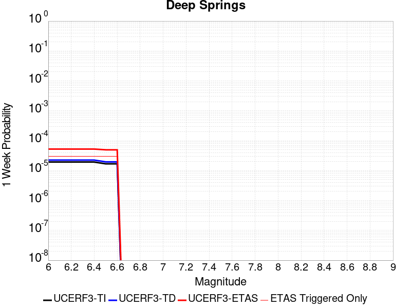 | 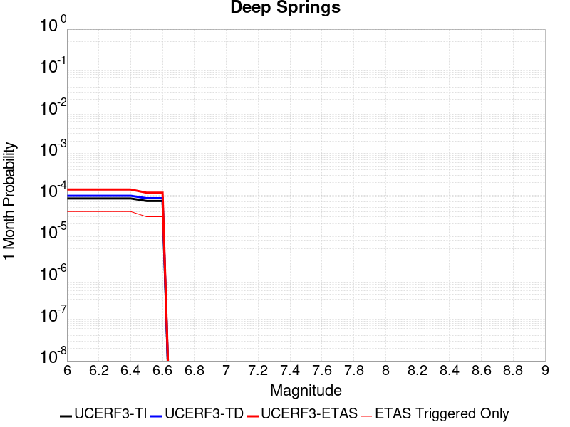 |  |  |

| Magnitude | 1 wk TI Prob | 1 wk TD Prob | 1 wk ETAS Prob | 1 wk ETAS/TD Gain | 1 wk ETAS Triggered Only | 1 mo TI Prob | 1 mo TD Prob | 1 mo ETAS Prob | 1 mo ETAS/TD Gain | 1 mo ETAS Triggered Only | 1 yr TI Prob | 1 yr TD Prob | 1 yr ETAS Prob | 1 yr ETAS/TD Gain | 1 yr ETAS Triggered Only | 10 yr TI Prob | 10 yr TD Prob | 10 yr ETAS Prob | 10 yr ETAS/TD Gain | 10 yr ETAS Triggered Only |
|-----|-----|-----|-----|-----|-----|-----|-----|-----|-----|-----|-----|-----|-----|-----|-----|-----|-----|-----|-----|-----|
| 6.0 | 1.9297568E-5 | 2.2422604E-5 | 5.2421932E-5 | 2.3379056 | 3.0E-5 | 8.270124E-5 | 9.609605E-5 | 1.360922E-4 | 1.4162102 | 4.0E-5 | 0.0010064224 | 0.0011698237 | 0.0012397418 | 1.0597681 | 7.0E-5 | 0.010018767 | 0.011683943 | 0.011812424 | 1.0109963 | 1.3E-4 |
| 6.1 | 1.9297568E-5 | 2.2422604E-5 | 5.2421932E-5 | 2.3379056 | 3.0E-5 | 8.270124E-5 | 9.609605E-5 | 1.360922E-4 | 1.4162102 | 4.0E-5 | 0.0010064224 | 0.0011698237 | 0.0012397418 | 1.0597681 | 7.0E-5 | 0.010018767 | 0.011683943 | 0.011812424 | 1.0109963 | 1.3E-4 |
| 6.2 | 1.9297568E-5 | 2.2422604E-5 | 5.2421932E-5 | 2.3379056 | 3.0E-5 | 8.270124E-5 | 9.609605E-5 | 1.360922E-4 | 1.4162102 | 4.0E-5 | 0.0010064224 | 0.0011698237 | 0.0012397418 | 1.0597681 | 7.0E-5 | 0.010018767 | 0.011683943 | 0.011812424 | 1.0109963 | 1.3E-4 |
| 6.3 | 1.9297568E-5 | 2.2422604E-5 | 5.2421932E-5 | 2.3379056 | 3.0E-5 | 8.270124E-5 | 9.609605E-5 | 1.360922E-4 | 1.4162102 | 4.0E-5 | 0.0010064224 | 0.0011698237 | 0.0012397418 | 1.0597681 | 7.0E-5 | 0.010018767 | 0.011683943 | 0.011812424 | 1.0109963 | 1.3E-4 |
| 6.4 | 1.9297568E-5 | 2.2422604E-5 | 5.2421932E-5 | 2.3379056 | 3.0E-5 | 8.270124E-5 | 9.609605E-5 | 1.360922E-4 | 1.4162102 | 4.0E-5 | 0.0010064224 | 0.0011698237 | 0.0012397418 | 1.0597681 | 7.0E-5 | 0.010018767 | 0.011683943 | 0.011812424 | 1.0109963 | 1.3E-4 |
| 6.5 | 1.6828913E-5 | 1.954974E-5 | 4.9549155E-5 | 2.5345173 | 3.0E-5 | 7.2121926E-5 | 8.37846E-5 | 1.1378209E-4 | 1.358031 | 3.0E-5 | 8.7773066E-4 | 0.0010200773 | 0.0010700262 | 1.0489659 | 5.0E-5 | 0.008742719 | 0.010200744 | 0.010299724 | 1.0097032 | 1.0E-4 |
| 6.6 | 1.6828913E-5 | 1.954974E-5 | 4.9549155E-5 | 2.5345173 | 3.0E-5 | 7.2121926E-5 | 8.37846E-5 | 1.1378209E-4 | 1.358031 | 3.0E-5 | 8.7773066E-4 | 0.0010200773 | 0.0010700262 | 1.0489659 | 5.0E-5 | 0.008742719 | 0.010200744 | 0.010299724 | 1.0097032 | 1.0E-4 |

## Pinto Mtn
*[(top)](#table-of-contents)*

| 1 Week | 1 Month | 1 Year | 10 Year |
|-----|-----|-----|-----|
|  |  |  |  |

| Magnitude | 1 wk TI Prob | 1 wk TD Prob | 1 wk ETAS Prob | 1 wk ETAS/TD Gain | 1 wk ETAS Triggered Only | 1 mo TI Prob | 1 mo TD Prob | 1 mo ETAS Prob | 1 mo ETAS/TD Gain | 1 mo ETAS Triggered Only | 1 yr TI Prob | 1 yr TD Prob | 1 yr ETAS Prob | 1 yr ETAS/TD Gain | 1 yr ETAS Triggered Only | 10 yr TI Prob | 10 yr TD Prob | 10 yr ETAS Prob | 10 yr ETAS/TD Gain | 10 yr ETAS Triggered Only |
|-----|-----|-----|-----|-----|-----|-----|-----|-----|-----|-----|-----|-----|-----|-----|-----|-----|-----|-----|-----|-----|
| 6.0 | 4.430625E-5 | 4.8606078E-5 | 7.860462E-5 | 1.6171768 | 3.0E-5 | 1.898701E-4 | 2.08296E-4 | 2.4828766E-4 | 1.1919944 | 4.0E-5 | 0.0023092176 | 0.0025332074 | 0.00260303 | 1.027563 | 7.0E-5 | 0.022853687 | 0.025059845 | 0.025176838 | 1.0046686 | 1.2E-4 |
| 6.1 | 4.430625E-5 | 4.8606078E-5 | 7.860462E-5 | 1.6171768 | 3.0E-5 | 1.898701E-4 | 2.08296E-4 | 2.4828766E-4 | 1.1919944 | 4.0E-5 | 0.0023092176 | 0.0025332074 | 0.00260303 | 1.027563 | 7.0E-5 | 0.022853687 | 0.025059845 | 0.025176838 | 1.0046686 | 1.2E-4 |
| 6.2 | 4.430625E-5 | 4.8606078E-5 | 7.860462E-5 | 1.6171768 | 3.0E-5 | 1.898701E-4 | 2.08296E-4 | 2.4828766E-4 | 1.1919944 | 4.0E-5 | 0.0023092176 | 0.0025332074 | 0.00260303 | 1.027563 | 7.0E-5 | 0.022853687 | 0.025059845 | 0.025176838 | 1.0046686 | 1.2E-4 |
| 6.3 | 4.430625E-5 | 4.8606078E-5 | 7.860462E-5 | 1.6171768 | 3.0E-5 | 1.898701E-4 | 2.08296E-4 | 2.4828766E-4 | 1.1919944 | 4.0E-5 | 0.0023092176 | 0.0025332074 | 0.00260303 | 1.027563 | 7.0E-5 | 0.022853687 | 0.025059845 | 0.025176838 | 1.0046686 | 1.2E-4 |
| 6.4 | 3.89426E-5 | 4.22357E-5 | 7.2234434E-5 | 1.7102696 | 3.0E-5 | 1.6688618E-4 | 1.8099824E-4 | 2.20991E-4 | 1.2209567 | 4.0E-5 | 0.0020299456 | 0.0022015406 | 0.0022713866 | 1.0317259 | 7.0E-5 | 0.020115025 | 0.021809548 | 0.021907367 | 1.0044851 | 1.0E-4 |
| 6.5 | 3.89426E-5 | 4.22357E-5 | 7.2234434E-5 | 1.7102696 | 3.0E-5 | 1.6688618E-4 | 1.8099824E-4 | 2.20991E-4 | 1.2209567 | 4.0E-5 | 0.0020299456 | 0.0022015406 | 0.0022713866 | 1.0317259 | 7.0E-5 | 0.020115025 | 0.021809548 | 0.021907367 | 1.0044851 | 1.0E-4 |
| 6.6 | 3.0631956E-5 | 3.2421405E-5 | 5.2420757E-5 | 1.6168563 | 2.0E-5 | 1.312732E-4 | 1.3894172E-4 | 1.6893755E-4 | 1.2158879 | 3.0E-5 | 0.0015970794 | 0.0016903444 | 0.0017302769 | 1.0236238 | 4.0E-5 | 0.015856503 | 0.016779473 | 0.016828634 | 1.0029298 | 5.0E-5 |
| 6.7 | 3.0181202E-5 | 3.19135E-5 | 5.1912863E-5 | 1.626674 | 2.0E-5 | 1.2934158E-4 | 1.3676521E-4 | 1.667611E-4 | 1.219324 | 3.0E-5 | 0.0015735963 | 0.0016638861 | 0.0017038196 | 1.024 | 4.0E-5 | 0.015625 | 0.016518846 | 0.01656802 | 1.0029769 | 5.0E-5 |
| 6.8 | 2.4808322E-5 | 2.5701811E-5 | 3.5701552E-5 | 1.3890676 | 1.0E-5 | 1.0631705E-4 | 1.1014611E-4 | 1.301439E-4 | 1.1815569 | 2.0E-5 | 0.0012936414 | 0.0013402295 | 0.0013701894 | 1.0223542 | 3.0E-5 | 0.012861365 | 0.013324241 | 0.013363709 | 1.002962 | 4.0E-5 |
| 6.9 | 2.342807E-5 | 2.4159675E-5 | 3.4159435E-5 | 1.4139029 | 1.0E-5 | 1.00402154E-4 | 1.03537495E-4 | 1.2353543E-4 | 1.1931467 | 2.0E-5 | 0.0012217107 | 0.0012598648 | 0.0012898269 | 1.0237821 | 3.0E-5 | 0.012150159 | 0.012529855 | 0.012569354 | 1.0031524 | 4.0E-5 |
| 7.0 | 2.2082606E-5 | 2.2737311E-5 | 3.2737084E-5 | 1.4397957 | 1.0E-5 | 9.463631E-5 | 9.744212E-5 | 1.1744017E-4 | 1.20523 | 2.0E-5 | 0.0011515879 | 0.0011857364 | 0.0012157009 | 1.0252707 | 3.0E-5 | 0.011456386 | 0.011796658 | 0.011836186 | 1.0033507 | 4.0E-5 |
| 7.1 | 2.0891754E-5 | 2.1481183E-5 | 3.1480966E-5 | 1.4655137 | 1.0E-5 | 8.953301E-5 | 9.20591E-5 | 1.12057256E-4 | 1.2172318 | 2.0E-5 | 0.0010895192 | 0.0011202672 | 0.0011502337 | 1.0267494 | 3.0E-5 | 0.01084193 | 0.011148707 | 0.011188261 | 1.0035479 | 4.0E-5 |
| 7.2 | 1.9114357E-5 | 1.9904413E-5 | 2.9904215E-5 | 1.5023911 | 1.0E-5 | 8.19161E-5 | 8.5301974E-5 | 1.0530027E-4 | 1.2344412 | 2.0E-5 | 9.968722E-4 | 0.0010380807 | 0.0010680495 | 1.0288695 | 3.0E-5 | 0.009924121 | 0.010334772 | 0.010374358 | 1.0038304 | 4.0E-5 |
| 7.3 | 1.2684815E-5 | 1.4952358E-5 | 2.4952207E-5 | 1.6687809 | 1.0E-5 | 5.436236E-5 | 6.4080035E-5 | 7.407939E-5 | 1.1560448 | 1.0E-5 | 6.6166074E-4 | 7.799085E-4 | 7.899007E-4 | 1.012812 | 1.0E-5 | 0.0065969415 | 0.0077730753 | 0.0077829976 | 1.0012765 | 1.0E-5 |
| 7.4 | 8.738702E-6 | 1.1831727E-5 | 2.1831609E-5 | 1.8451751 | 1.0E-5 | 3.745104E-5 | 5.0706472E-5 | 6.0705966E-5 | 1.1972035 | 1.0E-5 | 4.55871E-4 | 6.1718666E-4 | 6.271805E-4 | 1.0161926 | 1.0E-5 | 0.0045493697 | 0.006155753 | 0.006165691 | 1.0016145 | 1.0E-5 |
| 7.5 | 6.496013E-6 | 9.057506E-6 | 1.9057416E-5 | 2.1040466 | 1.0E-5 | 2.7839758E-5 | 3.8817354E-5 | 4.8816964E-5 | 1.2576067 | 1.0E-5 | 3.3889635E-4 | 4.7250732E-4 | 4.825026E-4 | 1.0211537 | 1.0E-5 | 0.0033838 | 0.004715874 | 0.0047258264 | 1.0021105 | 1.0E-5 |
| 7.6 | 2.587783E-6 | 4.4500657E-6 | 4.4500657E-6 | 1.0 | 0.0 | 1.1090452E-5 | 1.9071584E-5 | 1.9071584E-5 | 1.0 | 0.0 | 1.3501788E-4 | 2.3217413E-4 | 2.3217413E-4 | 1.0 | 0.0 | 0.0013493588 | 0.0023195462 | 0.0023195462 | 1.0 | 0.0 |

## San Jacinto (Clark) rev
*[(top)](#table-of-contents)*

| 1 Week | 1 Month | 1 Year | 10 Year |
|-----|-----|-----|-----|
|  | 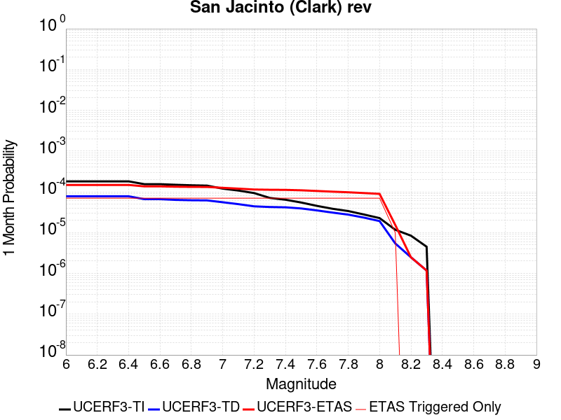 |  | 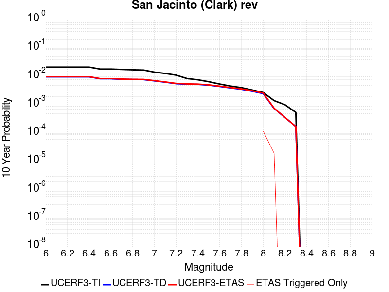 |

| Magnitude | 1 wk TI Prob | 1 wk TD Prob | 1 wk ETAS Prob | 1 wk ETAS/TD Gain | 1 wk ETAS Triggered Only | 1 mo TI Prob | 1 mo TD Prob | 1 mo ETAS Prob | 1 mo ETAS/TD Gain | 1 mo ETAS Triggered Only | 1 yr TI Prob | 1 yr TD Prob | 1 yr ETAS Prob | 1 yr ETAS/TD Gain | 1 yr ETAS Triggered Only | 10 yr TI Prob | 10 yr TD Prob | 10 yr ETAS Prob | 10 yr ETAS/TD Gain | 10 yr ETAS Triggered Only |
|-----|-----|-----|-----|-----|-----|-----|-----|-----|-----|-----|-----|-----|-----|-----|-----|-----|-----|-----|-----|-----|
| 6.0 | 4.2198782E-5 | 1.8139182E-5 | 7.8138095E-5 | 4.3076963 | 6.0E-5 | 1.8083939E-4 | 7.773707E-5 | 1.4773163E-4 | 1.9004014 | 7.0E-5 | 0.0021994961 | 9.460433E-4 | 0.0010359582 | 1.0950431 | 9.0E-5 | 0.021778533 | 0.009888399 | 0.010007213 | 1.0120155 | 1.2E-4 |
| 6.1 | 4.2198782E-5 | 1.8139182E-5 | 7.8138095E-5 | 4.3076963 | 6.0E-5 | 1.8083939E-4 | 7.773707E-5 | 1.4773163E-4 | 1.9004014 | 7.0E-5 | 0.0021994961 | 9.460433E-4 | 0.0010359582 | 1.0950431 | 9.0E-5 | 0.021778533 | 0.009888399 | 0.010007213 | 1.0120155 | 1.2E-4 |
| 6.2 | 4.2198782E-5 | 1.8139182E-5 | 7.8138095E-5 | 4.3076963 | 6.0E-5 | 1.8083939E-4 | 7.773707E-5 | 1.4773163E-4 | 1.9004014 | 7.0E-5 | 0.0021994961 | 9.460433E-4 | 0.0010359582 | 1.0950431 | 9.0E-5 | 0.021778533 | 0.009888399 | 0.010007213 | 1.0120155 | 1.2E-4 |
| 6.3 | 4.2198782E-5 | 1.8139182E-5 | 7.8138095E-5 | 4.3076963 | 6.0E-5 | 1.8083939E-4 | 7.773707E-5 | 1.4773163E-4 | 1.9004014 | 7.0E-5 | 0.0021994961 | 9.460433E-4 | 0.0010359582 | 1.0950431 | 9.0E-5 | 0.021778533 | 0.009888399 | 0.010007213 | 1.0120155 | 1.2E-4 |
| 6.4 | 4.2198782E-5 | 1.8139182E-5 | 7.8138095E-5 | 4.3076963 | 6.0E-5 | 1.8083939E-4 | 7.773707E-5 | 1.4773163E-4 | 1.9004014 | 7.0E-5 | 0.0021994961 | 9.460433E-4 | 0.0010359582 | 1.0950431 | 9.0E-5 | 0.021778533 | 0.009888399 | 0.010007213 | 1.0120155 | 1.2E-4 |
| 6.5 | 3.6015448E-5 | 1.5442558E-5 | 7.544163E-5 | 4.8853064 | 6.0E-5 | 1.5434278E-4 | 6.6180735E-5 | 1.361761E-4 | 2.0576396 | 7.0E-5 | 0.0018775037 | 8.054556E-4 | 8.953831E-4 | 1.111648 | 9.0E-5 | 0.018617202 | 0.008457547 | 0.008576532 | 1.0140685 | 1.2E-4 |
| 6.6 | 3.6015448E-5 | 1.5442558E-5 | 7.544163E-5 | 4.8853064 | 6.0E-5 | 1.5434278E-4 | 6.6180735E-5 | 1.361761E-4 | 2.0576396 | 7.0E-5 | 0.0018775037 | 8.054556E-4 | 8.953831E-4 | 1.111648 | 9.0E-5 | 0.018617202 | 0.008457547 | 0.008576532 | 1.0140685 | 1.2E-4 |
| 6.7 | 3.478088E-5 | 1.4802129E-5 | 7.480124E-5 | 5.053411 | 6.0E-5 | 1.4905239E-4 | 6.343617E-5 | 1.3343173E-4 | 2.1034014 | 7.0E-5 | 0.0018132022 | 7.720645E-4 | 8.6199504E-4 | 1.1164806 | 9.0E-5 | 0.017984789 | 0.008117802 | 0.008236828 | 1.0146624 | 1.2E-4 |
| 6.8 | 3.381009E-5 | 1.4514186E-5 | 7.4513315E-5 | 5.1338267 | 6.0E-5 | 1.4489234E-4 | 6.220218E-5 | 1.3219783E-4 | 2.1252923 | 7.0E-5 | 0.0017626368 | 7.570512E-4 | 8.469831E-4 | 1.1187923 | 9.0E-5 | 0.017487213 | 0.007962431 | 0.008081475 | 1.0149508 | 1.2E-4 |
| 6.9 | 3.3156077E-5 | 1.4389146E-5 | 7.4388285E-5 | 5.1697497 | 6.0E-5 | 1.4208973E-4 | 6.1666324E-5 | 1.31662E-4 | 2.1350715 | 7.0E-5 | 0.0017285697 | 7.505317E-4 | 8.404641E-4 | 1.119825 | 9.0E-5 | 0.017151857 | 0.007894655 | 0.008013708 | 1.0150802 | 1.2E-4 |
| 7.0 | 2.7951759E-5 | 1.2972579E-5 | 7.29718E-5 | 5.6250806 | 6.0E-5 | 1.1978775E-4 | 5.559559E-5 | 1.255917E-4 | 2.2590227 | 7.0E-5 | 0.0014574401 | 6.76668E-4 | 7.666071E-4 | 1.1329147 | 9.0E-5 | 0.014479186 | 0.0071261376 | 0.0072452826 | 1.0167195 | 1.2E-4 |
| 7.1 | 2.5090781E-5 | 1.1646113E-5 | 7.1645416E-5 | 6.151873 | 6.0E-5 | 1.0752749E-4 | 4.991097E-5 | 1.19907476E-4 | 2.4024272 | 7.0E-5 | 0.001308361 | 6.0749805E-4 | 6.974434E-4 | 1.1480587 | 9.0E-5 | 0.013006846 | 0.006401984 | 0.0065212157 | 1.0186242 | 1.2E-4 |
| 7.2 | 2.1777652E-5 | 1.0294948E-5 | 7.029433E-5 | 6.8280416 | 6.0E-5 | 9.332946E-5 | 4.412046E-5 | 1.1411737E-4 | 2.5864954 | 7.0E-5 | 0.0011356937 | 5.370351E-4 | 6.269868E-4 | 1.1674968 | 9.0E-5 | 0.011299073 | 0.0056641805 | 0.005783501 | 1.0210657 | 1.2E-4 |
| 7.3 | 1.6553082E-5 | 9.915853E-6 | 6.991526E-5 | 7.0508566 | 6.0E-5 | 7.093985E-5 | 4.2495827E-5 | 1.1249285E-4 | 2.6471505 | 7.0E-5 | 8.633504E-4 | 5.172647E-4 | 6.072182E-4 | 1.1739022 | 9.0E-5 | 0.008600039 | 0.0054463684 | 0.005565715 | 1.021913 | 1.2E-4 |
| 7.4 | 1.494711E-5 | 9.743887E-6 | 6.97433E-5 | 7.157647 | 6.0E-5 | 6.4057465E-5 | 4.175885E-5 | 1.1175593E-4 | 2.6762214 | 7.0E-5 | 7.796206E-4 | 5.0829625E-4 | 5.982505E-4 | 1.1769722 | 9.0E-5 | 0.0077689113 | 0.0053497027 | 0.0054690605 | 1.0223112 | 1.2E-4 |
| 7.5 | 1.2777293E-5 | 9.136501E-6 | 6.913595E-5 | 7.5670056 | 6.0E-5 | 5.475868E-5 | 3.915585E-5 | 1.0915311E-4 | 2.7876577 | 7.0E-5 | 6.6648296E-4 | 4.7661885E-4 | 5.6657597E-4 | 1.1887401 | 9.0E-5 | 0.006644876 | 0.0050185095 | 0.0051379073 | 1.0237914 | 1.2E-4 |
| 7.6 | 1.0578197E-5 | 8.18417E-6 | 6.8183675E-5 | 8.331166 | 6.0E-5 | 4.5334345E-5 | 3.5074543E-5 | 1.0507209E-4 | 2.9956794 | 7.0E-5 | 5.5180583E-4 | 4.2694923E-4 | 5.169108E-4 | 1.2107079 | 9.0E-5 | 0.0055043767 | 0.004506976 | 0.0046264348 | 1.0265054 | 1.2E-4 |
| 7.7 | 8.971238E-6 | 7.2318053E-6 | 6.723137E-5 | 9.296623 | 6.0E-5 | 3.8447593E-5 | 3.0993084E-5 | 1.0099092E-4 | 3.2584984 | 7.0E-5 | 4.679989E-4 | 3.7727566E-4 | 4.6724168E-4 | 1.2384623 | 9.0E-5 | 0.004670145 | 0.0040030642 | 0.004122584 | 1.029857 | 1.2E-4 |
| 7.8 | 7.892928E-6 | 6.4507544E-6 | 6.645037E-5 | 10.301178 | 6.0E-5 | 3.3826396E-5 | 2.7645798E-5 | 9.764386E-5 | 3.5319602 | 7.0E-5 | 4.1175855E-4 | 3.3653577E-4 | 4.2650546E-4 | 1.2673407 | 9.0E-5 | 0.0041099642 | 0.0035855586 | 0.0037051283 | 1.0333476 | 1.2E-4 |
| 7.9 | 6.496709E-6 | 5.4504394E-6 | 6.545011E-5 | 12.008226 | 6.0E-5 | 2.7842741E-5 | 2.3358818E-5 | 9.335719E-5 | 3.996657 | 7.0E-5 | 3.3893264E-4 | 2.8435665E-4 | 3.7433105E-4 | 1.316414 | 9.0E-5 | 0.0033841617 | 0.0030516372 | 0.003171271 | 1.0392032 | 1.2E-4 |
| 8.0 | 5.300985E-6 | 4.476464E-6 | 6.44762E-5 | 14.403378 | 6.0E-5 | 2.2718308E-5 | 1.9184703E-5 | 8.918336E-5 | 4.64867 | 7.0E-5 | 2.7656028E-4 | 2.3354885E-4 | 3.2352784E-4 | 1.3852683 | 9.0E-5 | 0.0027621635 | 0.0025249799 | 0.002644677 | 1.0474051 | 1.2E-4 |
| 8.1 | 2.7454237E-6 | 1.2682174E-6 | 1.1268205E-5 | 8.885074 | 1.0E-5 | 1.1766048E-5 | 5.4352063E-6 | 1.5435151E-5 | 2.8398466 | 1.0E-5 | 1.4324223E-4 | 6.617163E-5 | 7.6170974E-5 | 1.1511122 | 1.0E-5 | 0.0014314993 | 7.539459E-4 | 7.739308E-4 | 1.0265071 | 2.0E-5 |
| 8.2 | 1.9637637E-6 | 5.800016E-7 | 5.800016E-7 | 1.0 | 0.0 | 8.416104E-6 | 2.4857188E-6 | 2.4857188E-6 | 1.0 | 0.0 | 1.0246124E-4 | 3.0263212E-5 | 3.0263212E-5 | 1.0 | 0.0 | 0.0010241402 | 3.6320847E-4 | 3.6320847E-4 | 1.0 | 0.0 |
| 8.3 | 1.0515927E-6 | 2.7448962E-7 | 2.7448962E-7 | 1.0 | 0.0 | 4.506818E-6 | 1.1763835E-6 | 1.1763835E-6 | 1.0 | 0.0 | 5.4869128E-5 | 1.4322379E-5 | 1.4322379E-5 | 1.0 | 0.0 | 5.485558E-4 | 1.7447388E-4 | 1.7447388E-4 | 1.0 | 0.0 |

## Santa Susana alt 2
*[(top)](#table-of-contents)*

| 1 Week | 1 Month | 1 Year | 10 Year |
|-----|-----|-----|-----|
| 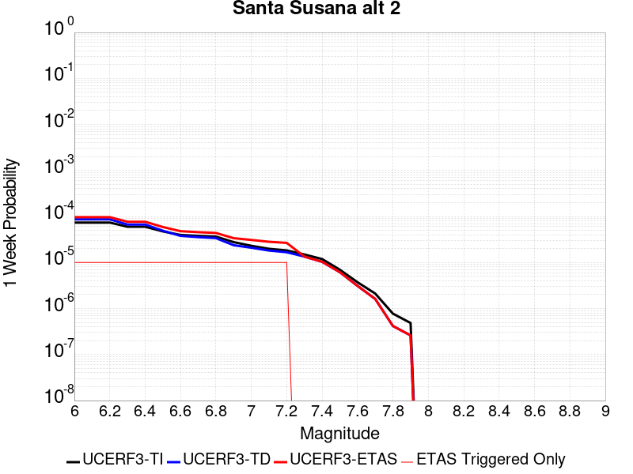 |  |  | 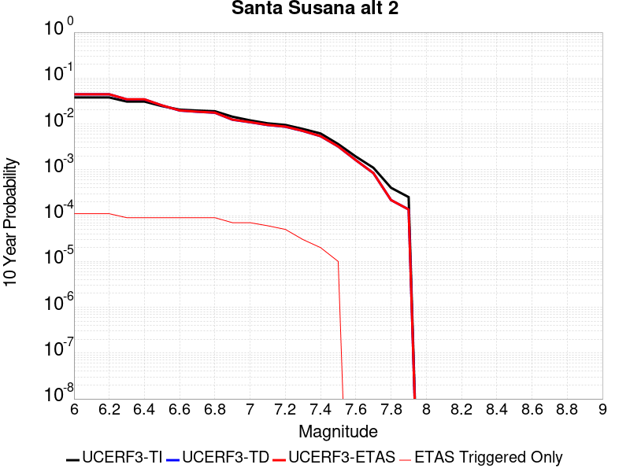 |

| Magnitude | 1 wk TI Prob | 1 wk TD Prob | 1 wk ETAS Prob | 1 wk ETAS/TD Gain | 1 wk ETAS Triggered Only | 1 mo TI Prob | 1 mo TD Prob | 1 mo ETAS Prob | 1 mo ETAS/TD Gain | 1 mo ETAS Triggered Only | 1 yr TI Prob | 1 yr TD Prob | 1 yr ETAS Prob | 1 yr ETAS/TD Gain | 1 yr ETAS Triggered Only | 10 yr TI Prob | 10 yr TD Prob | 10 yr ETAS Prob | 10 yr ETAS/TD Gain | 10 yr ETAS Triggered Only |
|-----|-----|-----|-----|-----|-----|-----|-----|-----|-----|-----|-----|-----|-----|-----|-----|-----|-----|-----|-----|-----|
| 6.0 | 7.393802E-5 | 8.6854496E-5 | 9.6853626E-5 | 1.1151251 | 1.0E-5 | 3.1683876E-4 | 3.7218572E-4 | 4.1217083E-4 | 1.1074332 | 4.0E-5 | 0.00385069 | 0.004522686 | 0.004602324 | 1.0176086 | 8.0E-5 | 0.037846453 | 0.0443463 | 0.044451423 | 1.0023705 | 1.1E-4 |
| 6.1 | 7.393802E-5 | 8.6854496E-5 | 9.6853626E-5 | 1.1151251 | 1.0E-5 | 3.1683876E-4 | 3.7218572E-4 | 4.1217083E-4 | 1.1074332 | 4.0E-5 | 0.00385069 | 0.004522686 | 0.004602324 | 1.0176086 | 8.0E-5 | 0.037846453 | 0.0443463 | 0.044451423 | 1.0023705 | 1.1E-4 |
| 6.2 | 7.393802E-5 | 8.6854496E-5 | 9.6853626E-5 | 1.1151251 | 1.0E-5 | 3.1683876E-4 | 3.7218572E-4 | 4.1217083E-4 | 1.1074332 | 4.0E-5 | 0.00385069 | 0.004522686 | 0.004602324 | 1.0176086 | 8.0E-5 | 0.037846453 | 0.0443463 | 0.044451423 | 1.0023705 | 1.1E-4 |
| 6.3 | 5.9940696E-5 | 6.693493E-5 | 7.6934266E-5 | 1.1493888 | 1.0E-5 | 2.568634E-4 | 2.868351E-4 | 3.2682365E-4 | 1.139413 | 4.0E-5 | 0.0031228275 | 0.0034869004 | 0.0035566564 | 1.0200051 | 7.0E-5 | 0.030793067 | 0.0343326 | 0.03441951 | 1.0025314 | 9.0E-5 |
| 6.4 | 5.9940696E-5 | 6.693493E-5 | 7.6934266E-5 | 1.1493888 | 1.0E-5 | 2.568634E-4 | 2.868351E-4 | 3.2682365E-4 | 1.139413 | 4.0E-5 | 0.0031228275 | 0.0034869004 | 0.0035566564 | 1.0200051 | 7.0E-5 | 0.030793067 | 0.0343326 | 0.03441951 | 1.0025314 | 9.0E-5 |
| 6.5 | 4.7483547E-5 | 4.9140188E-5 | 5.9139697E-5 | 1.2034894 | 1.0E-5 | 2.0348503E-4 | 2.1058477E-4 | 2.5057636E-4 | 1.1899073 | 4.0E-5 | 0.0024746156 | 0.002560833 | 0.0026306538 | 1.0272648 | 7.0E-5 | 0.024472399 | 0.025315883 | 0.025403604 | 1.003465 | 9.0E-5 |
| 6.6 | 3.977197E-5 | 3.795379E-5 | 4.7953406E-5 | 1.2634683 | 1.0E-5 | 1.7044017E-4 | 1.6264936E-4 | 2.0264286E-4 | 1.2458878 | 4.0E-5 | 0.002073134 | 0.0019784505 | 0.002048312 | 1.0353112 | 7.0E-5 | 0.020539 | 0.019616747 | 0.019704983 | 1.0044979 | 9.0E-5 |
| 6.7 | 3.797187E-5 | 3.5639005E-5 | 4.5638648E-5 | 1.2805815 | 1.0E-5 | 1.6272643E-4 | 1.5273005E-4 | 1.9272394E-4 | 1.26186 | 4.0E-5 | 0.001979394 | 0.0018579346 | 0.0019278046 | 1.0376062 | 7.0E-5 | 0.019618558 | 0.018434098 | 0.018522438 | 1.0047922 | 9.0E-5 |
| 6.8 | 3.6628822E-5 | 3.39326E-5 | 4.393226E-5 | 1.2946918 | 1.0E-5 | 1.5697122E-4 | 1.4541771E-4 | 1.8541189E-4 | 1.2750297 | 4.0E-5 | 0.0019094493 | 0.0017690536 | 0.0018389298 | 1.0394992 | 7.0E-5 | 0.018931257 | 0.017559867 | 0.017648287 | 1.0050353 | 9.0E-5 |
| 6.9 | 2.7767037E-5 | 2.3815735E-5 | 3.3815497E-5 | 1.4198805 | 1.0E-5 | 1.1899616E-4 | 1.02063525E-4 | 1.4205945E-4 | 1.3918728 | 4.0E-5 | 0.0014478153 | 0.0012419296 | 0.0013118426 | 1.056294 | 7.0E-5 | 0.01438419 | 0.012354787 | 0.012423922 | 1.0055958 | 7.0E-5 |
| 7.0 | 2.3095336E-5 | 2.0975835E-5 | 3.0975625E-5 | 1.476729 | 1.0E-5 | 9.8976256E-5 | 8.98934E-5 | 1.298898E-4 | 1.4449315 | 4.0E-5 | 0.0012043697 | 0.0010939147 | 0.0011638381 | 1.0639204 | 7.0E-5 | 0.011978633 | 0.010889853 | 0.010959091 | 1.006358 | 7.0E-5 |
| 7.1 | 1.9867008E-5 | 1.822483E-5 | 2.8224647E-5 | 1.548692 | 1.0E-5 | 8.514154E-5 | 7.810412E-5 | 1.18101E-4 | 1.5120969 | 4.0E-5 | 0.0010361052 | 9.505117E-4 | 0.0010104547 | 1.0630639 | 6.0E-5 | 0.010312878 | 0.009467249 | 0.00952668 | 1.0062777 | 6.0E-5 |
| 7.2 | 1.8344595E-5 | 1.673537E-5 | 2.6735204E-5 | 1.5975268 | 1.0E-5 | 7.8617326E-5 | 7.172109E-5 | 1.11718226E-4 | 1.557676 | 4.0E-5 | 9.567456E-4 | 8.7286293E-4 | 9.2281925E-4 | 1.0572327 | 5.0E-5 | 0.009526369 | 0.008697048 | 0.008746613 | 1.005699 | 5.0E-5 |
| 7.3 | 1.4961493E-5 | 1.3470387E-5 | 1.3470387E-5 | 1.0 | 0.0 | 6.411911E-5 | 5.7728987E-5 | 7.772783E-5 | 1.3464264 | 2.0E-5 | 7.8037055E-4 | 7.0263E-4 | 7.326089E-4 | 1.0426667 | 3.0E-5 | 0.007776358 | 0.0070063644 | 0.007036154 | 1.0042518 | 3.0E-5 |
| 7.4 | 1.190762E-5 | 1.0377189E-5 | 1.0377189E-5 | 1.0 | 0.0 | 5.103166E-5 | 4.4472923E-5 | 5.4472475E-5 | 1.2248459 | 1.0E-5 | 6.211333E-4 | 5.413254E-4 | 5.613146E-4 | 1.0369264 | 2.0E-5 | 0.0061940006 | 0.0054015946 | 0.005421486 | 1.0036826 | 2.0E-5 |
| 7.5 | 6.989319E-6 | 6.18261E-6 | 6.18261E-6 | 1.0 | 0.0 | 2.995388E-5 | 2.6496635E-5 | 3.649637E-5 | 1.3773965 | 1.0E-5 | 3.6462746E-4 | 3.2254928E-4 | 3.3254604E-4 | 1.030993 | 1.0E-5 | 0.0036402976 | 0.003220909 | 0.003230877 | 1.0030947 | 1.0E-5 |
| 7.6 | 3.729969E-6 | 3.1133645E-6 | 3.1133645E-6 | 1.0 | 0.0 | 1.5985484E-5 | 1.3342923E-5 | 1.3342923E-5 | 1.0 | 0.0 | 1.9460588E-4 | 1.6243807E-4 | 1.6243807E-4 | 1.0 | 0.0 | 0.0019443556 | 0.0016232032 | 0.0016232032 | 1.0 | 0.0 |
| 7.7 | 2.1200456E-6 | 1.619807E-6 | 1.619807E-6 | 1.0 | 0.0 | 9.085878E-6 | 6.942012E-6 | 6.942012E-6 | 1.0 | 0.0 | 1.1061495E-4 | 8.4515785E-5 | 8.4515785E-5 | 1.0 | 0.0 | 0.0011055991 | 8.448432E-4 | 8.448432E-4 | 1.0 | 0.0 |
| 7.8 | 7.7581154E-7 | 4.1835685E-7 | 4.1835685E-7 | 1.0 | 0.0 | 3.3249023E-6 | 1.7929566E-6 | 1.7929566E-6 | 1.0 | 0.0 | 4.0479936E-5 | 2.182903E-5 | 2.182903E-5 | 1.0 | 0.0 | 4.047256E-4 | 2.1826905E-4 | 2.1826905E-4 | 1.0 | 0.0 |
| 7.9 | 4.853026E-7 | 2.6069523E-7 | 2.6069523E-7 | 1.0 | 0.0 | 2.0798666E-6 | 1.1172648E-6 | 1.1172648E-6 | 1.0 | 0.0 | 2.5322082E-5 | 1.3602616E-5 | 1.3602616E-5 | 1.0 | 0.0 | 2.5319197E-4 | 1.3601799E-4 | 1.3601799E-4 | 1.0 | 0.0 |

## Independence rev 2011
*[(top)](#table-of-contents)*

| 1 Week | 1 Month | 1 Year | 10 Year |
|-----|-----|-----|-----|
|  |  |  |  |

| Magnitude | 1 wk TI Prob | 1 wk TD Prob | 1 wk ETAS Prob | 1 wk ETAS/TD Gain | 1 wk ETAS Triggered Only | 1 mo TI Prob | 1 mo TD Prob | 1 mo ETAS Prob | 1 mo ETAS/TD Gain | 1 mo ETAS Triggered Only | 1 yr TI Prob | 1 yr TD Prob | 1 yr ETAS Prob | 1 yr ETAS/TD Gain | 1 yr ETAS Triggered Only | 10 yr TI Prob | 10 yr TD Prob | 10 yr ETAS Prob | 10 yr ETAS/TD Gain | 10 yr ETAS Triggered Only |
|-----|-----|-----|-----|-----|-----|-----|-----|-----|-----|-----|-----|-----|-----|-----|-----|-----|-----|-----|-----|-----|
| 6.0 | 4.8922966E-6 | 4.7848484E-6 | 3.4784705E-5 | 7.269761 | 3.0E-5 | 2.0966818E-5 | 2.0506352E-5 | 7.0505324E-5 | 3.4382188 | 5.0E-5 | 2.552411E-4 | 2.496399E-4 | 3.3961746E-4 | 1.3604293 | 9.0E-5 | 0.0025494813 | 0.0024939566 | 0.0026136574 | 1.0479963 | 1.2E-4 |
| 6.1 | 4.8922966E-6 | 4.7848484E-6 | 3.4784705E-5 | 7.269761 | 3.0E-5 | 2.0966818E-5 | 2.0506352E-5 | 7.0505324E-5 | 3.4382188 | 5.0E-5 | 2.552411E-4 | 2.496399E-4 | 3.3961746E-4 | 1.3604293 | 9.0E-5 | 0.0025494813 | 0.0024939566 | 0.0026136574 | 1.0479963 | 1.2E-4 |
| 6.2 | 4.8922966E-6 | 4.7848484E-6 | 3.4784705E-5 | 7.269761 | 3.0E-5 | 2.0966818E-5 | 2.0506352E-5 | 7.0505324E-5 | 3.4382188 | 5.0E-5 | 2.552411E-4 | 2.496399E-4 | 3.3961746E-4 | 1.3604293 | 9.0E-5 | 0.0025494813 | 0.0024939566 | 0.0026136574 | 1.0479963 | 1.2E-4 |
| 6.3 | 4.8922966E-6 | 4.7848484E-6 | 3.4784705E-5 | 7.269761 | 3.0E-5 | 2.0966818E-5 | 2.0506352E-5 | 7.0505324E-5 | 3.4382188 | 5.0E-5 | 2.552411E-4 | 2.496399E-4 | 3.3961746E-4 | 1.3604293 | 9.0E-5 | 0.0025494813 | 0.0024939566 | 0.0026136574 | 1.0479963 | 1.2E-4 |
| 6.4 | 4.8922966E-6 | 4.7848484E-6 | 3.4784705E-5 | 7.269761 | 3.0E-5 | 2.0966818E-5 | 2.0506352E-5 | 7.0505324E-5 | 3.4382188 | 5.0E-5 | 2.552411E-4 | 2.496399E-4 | 3.3961746E-4 | 1.3604293 | 9.0E-5 | 0.0025494813 | 0.0024939566 | 0.0026136574 | 1.0479963 | 1.2E-4 |
| 6.5 | 4.8922966E-6 | 4.7848484E-6 | 3.4784705E-5 | 7.269761 | 3.0E-5 | 2.0966818E-5 | 2.0506352E-5 | 7.0505324E-5 | 3.4382188 | 5.0E-5 | 2.552411E-4 | 2.496399E-4 | 3.3961746E-4 | 1.3604293 | 9.0E-5 | 0.0025494813 | 0.0024939566 | 0.0026136574 | 1.0479963 | 1.2E-4 |
| 6.6 | 2.919933E-6 | 2.7684002E-6 | 2.2768345E-5 | 8.224369 | 2.0E-5 | 1.2513939E-5 | 1.1864521E-5 | 5.1864048E-5 | 4.371356 | 4.0E-5 | 1.5234655E-4 | 1.4444154E-4 | 2.2442998E-4 | 1.5537773 | 8.0E-5 | 0.0015224215 | 0.0014435321 | 0.0015433878 | 1.0691745 | 1.0E-4 |
| 6.7 | 2.919933E-6 | 2.7684002E-6 | 2.2768345E-5 | 8.224369 | 2.0E-5 | 1.2513939E-5 | 1.1864521E-5 | 5.1864048E-5 | 4.371356 | 4.0E-5 | 1.5234655E-4 | 1.4444154E-4 | 2.2442998E-4 | 1.5537773 | 8.0E-5 | 0.0015224215 | 0.0014435321 | 0.0015433878 | 1.0691745 | 1.0E-4 |
| 6.8 | 2.1577478E-6 | 1.9990196E-6 | 2.199898E-5 | 11.004885 | 2.0E-5 | 9.2474575E-6 | 8.567199E-6 | 4.8566857E-5 | 5.6689305 | 4.0E-5 | 1.12581976E-4 | 1.0430081E-4 | 1.8429247E-4 | 1.7669322 | 8.0E-5 | 0.0011252495 | 0.0010425339 | 0.0011424297 | 1.0958202 | 1.0E-4 |
| 6.9 | 2.057896E-6 | 1.9033754E-6 | 2.1903337E-5 | 11.507628 | 2.0E-5 | 8.819525E-6 | 8.157298E-6 | 4.8156973E-5 | 5.9035444 | 4.0E-5 | 1.0737242E-4 | 9.9310724E-5 | 1.7930278E-4 | 1.8054725 | 8.0E-5 | 0.0010732055 | 9.926778E-4 | 0.0010925785 | 1.1006377 | 1.0E-4 |
| 7.0 | 1.6461934E-6 | 1.5127675E-6 | 2.1512737E-5 | 14.220782 | 2.0E-5 | 7.0550955E-6 | 6.483274E-6 | 4.6483015E-5 | 7.1696825 | 4.0E-5 | 8.58924E-5 | 7.893106E-5 | 1.5892474E-4 | 2.0134628 | 8.0E-5 | 8.585921E-4 | 7.8903645E-4 | 8.889576E-4 | 1.1266369 | 1.0E-4 |
| 7.1 | 1.362663E-6 | 1.2436152E-6 | 2.124359E-5 | 17.082125 | 2.0E-5 | 5.8399714E-6 | 5.3297686E-6 | 4.5329554E-5 | 8.504976 | 4.0E-5 | 7.109933E-5 | 6.488804E-5 | 1.4488284E-4 | 2.232813 | 8.0E-5 | 7.107659E-4 | 6.486945E-4 | 7.486296E-4 | 1.1540557 | 1.0E-4 |
| 7.2 | 1.1253321E-6 | 1.016886E-6 | 2.1016866E-5 | 20.667868 | 2.0E-5 | 4.822843E-6 | 4.358076E-6 | 4.43579E-5 | 10.178323 | 4.0E-5 | 5.871653E-5 | 5.3058306E-5 | 1.3305405E-4 | 2.5076952 | 8.0E-5 | 5.870102E-4 | 5.304586E-4 | 6.3040556E-4 | 1.1884161 | 1.0E-4 |
| 7.3 | 8.5480673E-7 | 7.738683E-7 | 2.0773852E-5 | 26.84417 | 2.0E-5 | 3.6634524E-6 | 3.3165743E-6 | 4.3316442E-5 | 13.060597 | 4.0E-5 | 4.460162E-5 | 4.0378556E-5 | 1.2037533E-4 | 2.9811697 | 8.0E-5 | 4.4592668E-4 | 4.037135E-4 | 4.9367716E-4 | 1.2228404 | 9.0E-5 |
| 7.4 | 5.6690715E-7 | 5.269545E-7 | 2.0526944E-5 | 38.95392 | 2.0E-5 | 2.4295998E-6 | 2.2583745E-6 | 4.2258285E-5 | 18.711813 | 4.0E-5 | 2.9579976E-5 | 2.7495369E-5 | 1.0749317E-4 | 3.9095008 | 8.0E-5 | 2.957604E-4 | 2.749202E-4 | 3.6489544E-4 | 1.3272778 | 9.0E-5 |
| 7.5 | 3.9182288E-7 | 3.7284315E-7 | 2.0372836E-5 | 54.641838 | 2.0E-5 | 1.6792399E-6 | 1.5978983E-6 | 4.1597836E-5 | 26.032843 | 4.0E-5 | 2.0444553E-5 | 1.945424E-5 | 8.945288E-5 | 4.5981174 | 7.0E-5 | 2.0442673E-4 | 1.9452558E-4 | 2.7451E-4 | 1.4111769 | 8.0E-5 |
| 7.6 | 2.5212753E-7 | 2.461098E-7 | 2.461098E-7 | 1.0 | 0.0 | 1.0805461E-6 | 1.0547559E-6 | 1.0547559E-6 | 1.0 | 0.0 | 1.315557E-5 | 1.2841579E-5 | 2.284145E-5 | 1.7787105 | 1.0E-5 | 1.315479E-4 | 1.284085E-4 | 1.4840593E-4 | 1.1557329 | 2.0E-5 |
| 7.7 | 7.5795654E-8 | 7.640392E-8 | 7.640392E-8 | 1.0 | 0.0 | 3.2483848E-7 | 3.2744535E-7 | 3.2744535E-7 | 1.0 | 0.0 | 3.9549013E-6 | 3.9866404E-6 | 3.9866404E-6 | 1.0 | 0.0 | 3.9548308E-5 | 3.9865754E-5 | 4.9865354E-5 | 1.2508318 | 1.0E-5 |

## Great Valley 09 (Laguna Seca)
*[(top)](#table-of-contents)*

| 1 Week | 1 Month | 1 Year | 10 Year |
|-----|-----|-----|-----|
|  |  |  | 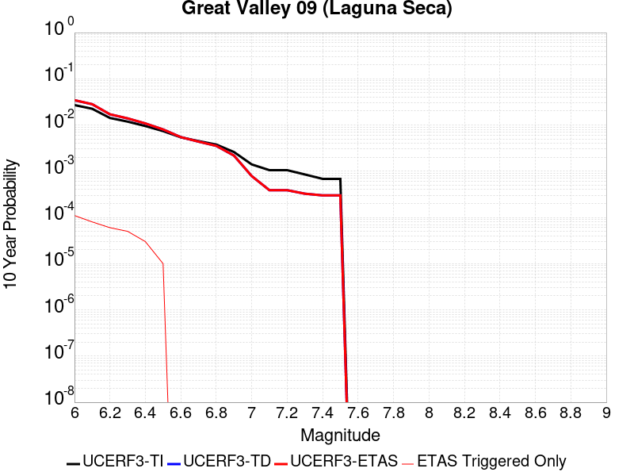 |

| Magnitude | 1 wk TI Prob | 1 wk TD Prob | 1 wk ETAS Prob | 1 wk ETAS/TD Gain | 1 wk ETAS Triggered Only | 1 mo TI Prob | 1 mo TD Prob | 1 mo ETAS Prob | 1 mo ETAS/TD Gain | 1 mo ETAS Triggered Only | 1 yr TI Prob | 1 yr TD Prob | 1 yr ETAS Prob | 1 yr ETAS/TD Gain | 1 yr ETAS Triggered Only | 10 yr TI Prob | 10 yr TD Prob | 10 yr ETAS Prob | 10 yr ETAS/TD Gain | 10 yr ETAS Triggered Only |
|-----|-----|-----|-----|-----|-----|-----|-----|-----|-----|-----|-----|-----|-----|-----|-----|-----|-----|-----|-----|-----|
| 6.0 | 5.245777E-5 | 6.699524E-5 | 1.06992564E-4 | 1.5970173 | 4.0E-5 | 2.2479963E-4 | 2.8709273E-4 | 3.2708122E-4 | 1.1392878 | 4.0E-5 | 0.0027335004 | 0.0034896403 | 0.0035494308 | 1.0171337 | 6.0E-5 | 0.027001202 | 0.034355957 | 0.03446218 | 1.0030918 | 1.1E-4 |
| 6.1 | 4.3549062E-5 | 5.4753404E-5 | 8.4751766E-5 | 1.5478811 | 3.0E-5 | 1.8662548E-4 | 2.3463757E-4 | 2.6463054E-4 | 1.1278268 | 3.0E-5 | 0.0022697973 | 0.0028529533 | 0.0028928393 | 1.0139805 | 4.0E-5 | 0.022467531 | 0.028166879 | 0.028244626 | 1.0027602 | 8.0E-5 |
| 6.2 | 2.741784E-5 | 3.287367E-5 | 4.287334E-5 | 1.3041848 | 1.0E-5 | 1.1749974E-4 | 1.4087993E-4 | 1.5087852E-4 | 1.0709724 | 1.0E-5 | 0.0014296204 | 0.001713839 | 0.0017338048 | 1.0116497 | 2.0E-5 | 0.014204582 | 0.017005328 | 0.017064309 | 1.0034683 | 6.0E-5 |
| 6.3 | 2.2816139E-5 | 2.6771944E-5 | 3.677168E-5 | 1.3735154 | 1.0E-5 | 9.777979E-5 | 1.14732116E-4 | 1.2473097E-4 | 1.0871495 | 1.0E-5 | 0.0011898187 | 0.0013959229 | 0.001415895 | 1.0143074 | 2.0E-5 | 0.011834684 | 0.013870756 | 0.013920063 | 1.0035547 | 5.0E-5 |
| 6.4 | 1.8295765E-5 | 2.077719E-5 | 2.077719E-5 | 1.0 | 0.0 | 7.840806E-5 | 8.9042245E-5 | 8.9042245E-5 | 1.0 | 0.0 | 9.5420005E-4 | 0.0010835556 | 0.0010935449 | 1.0092189 | 1.0E-5 | 0.009501132 | 0.010782883 | 0.010812559 | 1.0027522 | 3.0E-5 |
| 6.5 | 1.4199205E-5 | 1.5408294E-5 | 1.5408294E-5 | 1.0 | 0.0 | 6.0852315E-5 | 6.6034E-5 | 6.6034E-5 | 1.0 | 0.0 | 7.406251E-4 | 8.03689E-4 | 8.03689E-4 | 1.0 | 0.0 | 0.0073816157 | 0.008008632 | 0.008018551 | 1.0012387 | 1.0E-5 |
| 6.6 | 1.0400845E-5 | 1.0509466E-5 | 1.0509466E-5 | 1.0 | 0.0 | 4.4574288E-5 | 4.5039807E-5 | 4.5039807E-5 | 1.0 | 0.0 | 5.425568E-4 | 5.4822466E-4 | 5.4822466E-4 | 1.0 | 0.0 | 0.0054123406 | 0.0054690107 | 0.0054690107 | 1.0 | 0.0 |
| 6.7 | 8.619926E-6 | 8.384244E-6 | 8.384244E-6 | 1.0 | 0.0 | 3.6942016E-5 | 3.5931993E-5 | 3.5931993E-5 | 1.0 | 0.0 | 4.4967624E-4 | 4.3738587E-4 | 4.3738587E-4 | 1.0 | 0.0 | 0.0044876738 | 0.004365426 | 0.004365426 | 1.0 | 0.0 |
| 6.8 | 7.250376E-6 | 6.7959054E-6 | 6.7959054E-6 | 1.0 | 0.0 | 3.107267E-5 | 2.9124993E-5 | 2.9124993E-5 | 1.0 | 0.0 | 3.782441E-4 | 3.5454048E-4 | 3.5454048E-4 | 1.0 | 0.0 | 0.0037760092 | 0.003539889 | 0.003539889 | 1.0 | 0.0 |
| 6.9 | 4.991332E-6 | 4.1814687E-6 | 4.1814687E-6 | 1.0 | 0.0 | 2.1391248E-5 | 1.7920462E-5 | 1.7920462E-5 | 1.0 | 0.0 | 2.604073E-4 | 2.1816055E-4 | 2.1816055E-4 | 1.0 | 0.0 | 0.0026010238 | 0.0021795423 | 0.0021795423 | 1.0 | 0.0 |
| 7.0 | 2.6915934E-6 | 1.5055822E-6 | 1.5055822E-6 | 1.0 | 0.0 | 1.153535E-5 | 6.4524797E-6 | 6.4524797E-6 | 1.0 | 0.0 | 1.4043383E-4 | 7.855619E-5 | 7.855619E-5 | 1.0 | 0.0 | 0.0014034511 | 7.852927E-4 | 7.852927E-4 | 1.0 | 0.0 |
| 7.1 | 2.020716E-6 | 7.4461417E-7 | 7.4461417E-7 | 1.0 | 0.0 | 8.660182E-6 | 3.1912E-6 | 3.1912E-6 | 1.0 | 0.0 | 1.0543262E-4 | 3.8852206E-5 | 3.8852206E-5 | 1.0 | 0.0 | 0.0010538261 | 3.8845793E-4 | 3.8845793E-4 | 1.0 | 0.0 |
| 7.2 | 2.020716E-6 | 7.4461417E-7 | 7.4461417E-7 | 1.0 | 0.0 | 8.660182E-6 | 3.1912E-6 | 3.1912E-6 | 1.0 | 0.0 | 1.0543262E-4 | 3.8852206E-5 | 3.8852206E-5 | 1.0 | 0.0 | 0.0010538261 | 3.8845793E-4 | 3.8845793E-4 | 1.0 | 0.0 |
| 7.3 | 1.6312077E-6 | 6.251236E-7 | 6.251236E-7 | 1.0 | 0.0 | 6.9908715E-6 | 2.6790985E-6 | 2.6790985E-6 | 1.0 | 0.0 | 8.5110536E-5 | 3.2617576E-5 | 3.2617576E-5 | 1.0 | 0.0 | 8.5077947E-4 | 3.261315E-4 | 3.261315E-4 | 1.0 | 0.0 |
| 7.4 | 1.3087774E-6 | 5.746913E-7 | 5.746913E-7 | 1.0 | 0.0 | 5.609034E-6 | 2.4629605E-6 | 2.4629605E-6 | 1.0 | 0.0 | 6.828785E-5 | 2.9986168E-5 | 2.9986168E-5 | 1.0 | 0.0 | 6.826687E-4 | 2.9982484E-4 | 2.9982484E-4 | 1.0 | 0.0 |
| 7.5 | 1.3087774E-6 | 5.746913E-7 | 5.746913E-7 | 1.0 | 0.0 | 5.609034E-6 | 2.4629605E-6 | 2.4629605E-6 | 1.0 | 0.0 | 6.828785E-5 | 2.9986168E-5 | 2.9986168E-5 | 1.0 | 0.0 | 6.826687E-4 | 2.9982484E-4 | 2.9982484E-4 | 1.0 | 0.0 |

## Big Pine (Central)
*[(top)](#table-of-contents)*

| 1 Week | 1 Month | 1 Year | 10 Year |
|-----|-----|-----|-----|
| 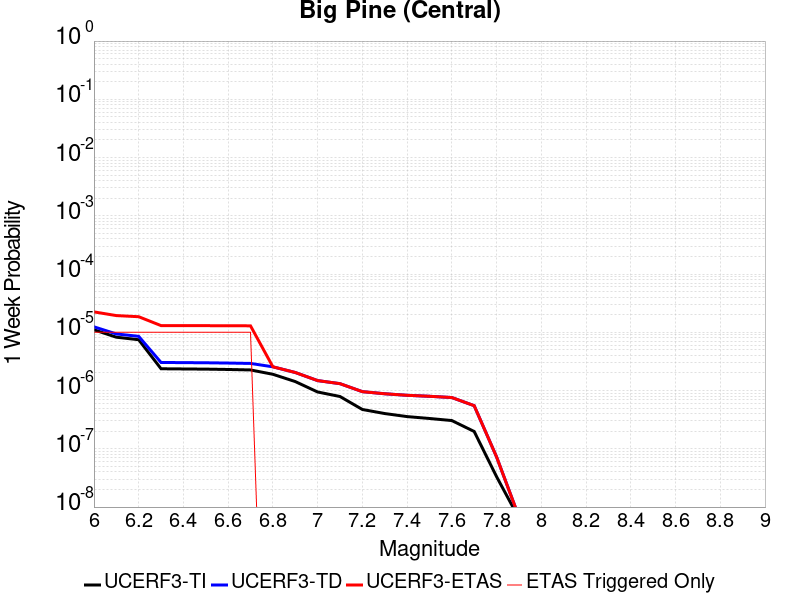 |  |  |  |

| Magnitude | 1 wk TI Prob | 1 wk TD Prob | 1 wk ETAS Prob | 1 wk ETAS/TD Gain | 1 wk ETAS Triggered Only | 1 mo TI Prob | 1 mo TD Prob | 1 mo ETAS Prob | 1 mo ETAS/TD Gain | 1 mo ETAS Triggered Only | 1 yr TI Prob | 1 yr TD Prob | 1 yr ETAS Prob | 1 yr ETAS/TD Gain | 1 yr ETAS Triggered Only | 10 yr TI Prob | 10 yr TD Prob | 10 yr ETAS Prob | 10 yr ETAS/TD Gain | 10 yr ETAS Triggered Only |
|-----|-----|-----|-----|-----|-----|-----|-----|-----|-----|-----|-----|-----|-----|-----|-----|-----|-----|-----|-----|-----|
| 6.0 | 1.106985E-5 | 1.2424107E-5 | 2.2423983E-5 | 1.8048768 | 1.0E-5 | 4.7441354E-5 | 5.3245276E-5 | 9.324315E-5 | 1.7512003 | 4.0E-5 | 5.774454E-4 | 6.4810197E-4 | 7.1805663E-4 | 1.1079377 | 7.0E-5 | 0.005759472 | 0.006467233 | 0.006566586 | 1.0153626 | 1.0E-4 |
| 6.1 | 8.246768E-6 | 9.376822E-6 | 1.9376728E-5 | 2.0664494 | 1.0E-5 | 3.534281E-5 | 4.0185918E-5 | 6.0185113E-5 | 1.4976667 | 2.0E-5 | 4.3021378E-4 | 4.891813E-4 | 5.3915684E-4 | 1.1021616 | 5.0E-5 | 0.0042938185 | 0.004885566 | 0.004965175 | 1.0162947 | 8.0E-5 |
| 6.2 | 7.4601694E-6 | 8.526675E-6 | 1.8526589E-5 | 2.1727803 | 1.0E-5 | 3.1971762E-5 | 3.654253E-5 | 5.6541798E-5 | 1.5472875 | 2.0E-5 | 3.891867E-4 | 4.4484143E-4 | 4.948192E-4 | 1.1123496 | 5.0E-5 | 0.003885058 | 0.0044439654 | 0.0045236098 | 1.0179219 | 8.0E-5 |
| 6.3 | 2.3674888E-6 | 3.0370275E-6 | 1.3036997E-5 | 4.2926836 | 1.0E-5 | 1.0146341E-5 | 1.3015769E-5 | 3.301551E-5 | 2.5365777 | 2.0E-5 | 1.235247E-4 | 1.5845589E-4 | 1.8845113E-4 | 1.1892972 | 3.0E-5 | 0.0012345606 | 0.0015852856 | 0.001615238 | 1.0188941 | 3.0E-5 |
| 6.4 | 2.3493242E-6 | 3.0176316E-6 | 1.3017601E-5 | 4.313847 | 1.0E-5 | 1.0068494E-5 | 1.2932645E-5 | 3.293239E-5 | 2.546454 | 2.0E-5 | 1.2257701E-4 | 1.5744401E-4 | 1.8743928E-4 | 1.190514 | 3.0E-5 | 0.0012250942 | 0.0015751811 | 0.0016051339 | 1.0190154 | 3.0E-5 |
| 6.5 | 2.3329653E-6 | 3.0001459E-6 | 1.3000115E-5 | 4.3331614 | 1.0E-5 | 9.9983845E-6 | 1.2857707E-5 | 3.285745E-5 | 2.5554674 | 2.0E-5 | 1.21723526E-4 | 1.5653175E-4 | 1.8652706E-4 | 1.1916244 | 3.0E-5 | 0.0012165688 | 0.0015660715 | 0.0015960245 | 1.0191262 | 3.0E-5 |
| 6.6 | 2.301073E-6 | 2.9661376E-6 | 1.29661075E-5 | 4.371378 | 1.0E-5 | 9.861704E-6 | 1.2711958E-5 | 3.2711705E-5 | 2.5733018 | 2.0E-5 | 1.2005962E-4 | 1.5475752E-4 | 1.8475288E-4 | 1.1938217 | 3.0E-5 | 0.0011999478 | 0.001548354 | 0.0015783076 | 1.0193454 | 3.0E-5 |
| 6.7 | 2.259457E-6 | 2.9220366E-6 | 1.2922007E-5 | 4.4222608 | 1.0E-5 | 9.683352E-6 | 1.2522956E-5 | 3.2522705E-5 | 2.597047 | 2.0E-5 | 1.1788843E-4 | 1.5245675E-4 | 1.8245218E-4 | 1.1967471 | 3.0E-5 | 0.001178259 | 0.001525378 | 0.0015553322 | 1.0196372 | 3.0E-5 |
| 6.8 | 1.903419E-6 | 2.5574104E-6 | 2.5574104E-6 | 1.0 | 0.0 | 8.157484E-6 | 1.0960286E-5 | 2.0960177E-5 | 1.912375 | 1.0E-5 | 9.931285E-5 | 1.3343366E-4 | 1.53431E-4 | 1.1498672 | 2.0E-5 | 9.926847E-4 | 0.0013353853 | 0.0013553586 | 1.014957 | 2.0E-5 |
| 6.9 | 1.4274253E-6 | 2.04357E-6 | 2.04357E-6 | 1.0 | 0.0 | 6.117523E-6 | 8.758129E-6 | 1.875804E-5 | 2.1417863 | 1.0E-5 | 7.4478296E-5 | 1.06625215E-4 | 1.2662308E-4 | 1.1875529 | 2.0E-5 | 7.445334E-4 | 0.0010675769 | 0.0010875555 | 1.0187141 | 2.0E-5 |
| 7.0 | 9.454876E-7 | 1.4828685E-6 | 1.4828685E-6 | 1.0 | 0.0 | 4.0520836E-6 | 6.3551356E-6 | 1.6355072E-5 | 2.5735204 | 1.0E-5 | 4.9332997E-5 | 7.737112E-5 | 8.737035E-5 | 1.1292372 | 1.0E-5 | 4.9322046E-4 | 7.752668E-4 | 7.8525906E-4 | 1.0128888 | 1.0E-5 |
| 7.1 | 7.907416E-7 | 1.3135829E-6 | 1.3135829E-6 | 1.0 | 0.0 | 3.3888882E-6 | 5.629629E-6 | 1.5629572E-5 | 2.776306 | 1.0E-5 | 4.1258932E-5 | 6.853866E-5 | 7.8537974E-5 | 1.1458931 | 1.0E-5 | 4.1251272E-4 | 6.869999E-4 | 6.96993E-4 | 1.014546 | 1.0E-5 |
| 7.2 | 4.7349388E-7 | 9.580262E-7 | 9.580262E-7 | 1.0 | 0.0 | 2.029258E-6 | 4.1058206E-6 | 4.1058206E-6 | 1.0 | 0.0 | 2.4705936E-5 | 4.9987248E-5 | 4.9987248E-5 | 1.0 | 0.0 | 2.470319E-4 | 5.0157966E-4 | 5.0157966E-4 | 1.0 | 0.0 |
| 7.3 | 4.0317434E-7 | 8.8120305E-7 | 8.8120305E-7 | 1.0 | 0.0 | 1.727889E-6 | 3.7765792E-6 | 3.7765792E-6 | 1.0 | 0.0 | 2.1036845E-5 | 4.597891E-5 | 4.597891E-5 | 1.0 | 0.0 | 2.1034853E-4 | 4.6151347E-4 | 4.6151347E-4 | 1.0 | 0.0 |
| 7.4 | 3.5741223E-7 | 8.2903904E-7 | 8.2903904E-7 | 1.0 | 0.0 | 1.5317659E-6 | 3.55302E-6 | 3.55302E-6 | 1.0 | 0.0 | 1.8649089E-5 | 4.3257183E-5 | 4.3257183E-5 | 1.0 | 0.0 | 1.8647524E-4 | 4.3429475E-4 | 4.3429475E-4 | 1.0 | 0.0 |
| 7.5 | 3.3163084E-7 | 7.97491E-7 | 7.97491E-7 | 1.0 | 0.0 | 1.4212742E-6 | 3.4178142E-6 | 3.4178142E-6 | 1.0 | 0.0 | 1.7303877E-5 | 4.161112E-5 | 4.161112E-5 | 1.0 | 0.0 | 1.7302528E-4 | 4.178106E-4 | 4.178106E-4 | 1.0 | 0.0 |
| 7.6 | 3.0565946E-7 | 7.589729E-7 | 7.589729E-7 | 1.0 | 0.0 | 1.3099684E-6 | 3.252737E-6 | 3.252737E-6 | 1.0 | 0.0 | 1.5948748E-5 | 3.9601382E-5 | 3.9601382E-5 | 1.0 | 0.0 | 1.5947604E-4 | 3.9768722E-4 | 3.9768722E-4 | 1.0 | 0.0 |
| 7.7 | 1.984531E-7 | 5.502309E-7 | 5.502309E-7 | 1.0 | 0.0 | 8.50513E-7 | 2.3581304E-6 | 2.3581304E-6 | 1.0 | 0.0 | 1.0354946E-5 | 2.8709872E-5 | 2.8709872E-5 | 1.0 | 0.0 | 1.0354464E-4 | 2.888031E-4 | 2.888031E-4 | 1.0 | 0.0 |
| 7.8 | 3.332281E-8 | 7.2836E-8 | 7.2836E-8 | 1.0 | 0.0 | 1.4281204E-7 | 3.1215427E-7 | 3.1215427E-7 | 1.0 | 0.0 | 1.7387351E-6 | 3.800472E-6 | 3.800472E-6 | 1.0 | 0.0 | 1.7387216E-5 | 3.831497E-5 | 3.831497E-5 | 1.0 | 0.0 |
| 7.9 | 6.4303527E-9 | 6.8157977E-9 | 6.8157977E-9 | 1.0 | 0.0 | 2.7558654E-8 | 2.9210561E-8 | 2.9210561E-8 | 1.0 | 0.0 | 3.3552655E-7 | 3.5563855E-7 | 3.5563855E-7 | 1.0 | 0.0 | 3.3552606E-6 | 3.6306308E-6 | 3.6306308E-6 | 1.0 | 0.0 |

## San Jacinto (Lytle Creek connector)
*[(top)](#table-of-contents)*

| 1 Week | 1 Month | 1 Year | 10 Year |
|-----|-----|-----|-----|
|  |  |  |  |

| Magnitude | 1 wk TI Prob | 1 wk TD Prob | 1 wk ETAS Prob | 1 wk ETAS/TD Gain | 1 wk ETAS Triggered Only | 1 mo TI Prob | 1 mo TD Prob | 1 mo ETAS Prob | 1 mo ETAS/TD Gain | 1 mo ETAS Triggered Only | 1 yr TI Prob | 1 yr TD Prob | 1 yr ETAS Prob | 1 yr ETAS/TD Gain | 1 yr ETAS Triggered Only | 10 yr TI Prob | 10 yr TD Prob | 10 yr ETAS Prob | 10 yr ETAS/TD Gain | 10 yr ETAS Triggered Only |
|-----|-----|-----|-----|-----|-----|-----|-----|-----|-----|-----|-----|-----|-----|-----|-----|-----|-----|-----|-----|-----|
| 6.0 | 6.7026162E-6 | 6.3572706E-6 | 3.635708E-5 | 5.7189765 | 3.0E-5 | 2.8725182E-5 | 2.724516E-5 | 6.724407E-5 | 2.4681106 | 4.0E-5 | 3.4967298E-4 | 3.3165942E-4 | 4.1163288E-4 | 1.2411313 | 8.0E-5 | 0.0034912326 | 0.003390434 | 0.0035000609 | 1.0323342 | 1.1E-4 |
| 6.1 | 6.7026162E-6 | 6.3572706E-6 | 3.635708E-5 | 5.7189765 | 3.0E-5 | 2.8725182E-5 | 2.724516E-5 | 6.724407E-5 | 2.4681106 | 4.0E-5 | 3.4967298E-4 | 3.3165942E-4 | 4.1163288E-4 | 1.2411313 | 8.0E-5 | 0.0034912326 | 0.003390434 | 0.0035000609 | 1.0323342 | 1.1E-4 |
| 6.2 | 6.7026162E-6 | 6.3572706E-6 | 3.635708E-5 | 5.7189765 | 3.0E-5 | 2.8725182E-5 | 2.724516E-5 | 6.724407E-5 | 2.4681106 | 4.0E-5 | 3.4967298E-4 | 3.3165942E-4 | 4.1163288E-4 | 1.2411313 | 8.0E-5 | 0.0034912326 | 0.003390434 | 0.0035000609 | 1.0323342 | 1.1E-4 |
| 6.3 | 6.7026162E-6 | 6.3572706E-6 | 3.635708E-5 | 5.7189765 | 3.0E-5 | 2.8725182E-5 | 2.724516E-5 | 6.724407E-5 | 2.4681106 | 4.0E-5 | 3.4967298E-4 | 3.3165942E-4 | 4.1163288E-4 | 1.2411313 | 8.0E-5 | 0.0034912326 | 0.003390434 | 0.0035000609 | 1.0323342 | 1.1E-4 |
| 6.4 | 6.7026162E-6 | 6.3572706E-6 | 3.635708E-5 | 5.7189765 | 3.0E-5 | 2.8725182E-5 | 2.724516E-5 | 6.724407E-5 | 2.4681106 | 4.0E-5 | 3.4967298E-4 | 3.3165942E-4 | 4.1163288E-4 | 1.2411313 | 8.0E-5 | 0.0034912326 | 0.003390434 | 0.0035000609 | 1.0323342 | 1.1E-4 |
| 6.5 | 6.680755E-6 | 6.334267E-6 | 3.6334077E-5 | 5.736114 | 3.0E-5 | 2.8631493E-5 | 2.7146574E-5 | 6.714549E-5 | 2.4734423 | 4.0E-5 | 3.485327E-4 | 3.304595E-4 | 4.1043307E-4 | 1.2420071 | 8.0E-5 | 0.0034798654 | 0.0033784714 | 0.0034880997 | 1.0324491 | 1.1E-4 |
| 6.6 | 6.680755E-6 | 6.334267E-6 | 3.6334077E-5 | 5.736114 | 3.0E-5 | 2.8631493E-5 | 2.7146574E-5 | 6.714549E-5 | 2.4734423 | 4.0E-5 | 3.485327E-4 | 3.304595E-4 | 4.1043307E-4 | 1.2420071 | 8.0E-5 | 0.0034798654 | 0.0033784714 | 0.0034880997 | 1.0324491 | 1.1E-4 |
| 6.7 | 6.56284E-6 | 6.209125E-6 | 3.6208938E-5 | 5.8315687 | 3.0E-5 | 2.8126155E-5 | 2.6610263E-5 | 6.66092E-5 | 2.5031395 | 4.0E-5 | 3.4238212E-4 | 3.2393186E-4 | 4.0390593E-4 | 1.2468855 | 8.0E-5 | 0.0034185508 | 0.00331339 | 0.0034230256 | 1.0330887 | 1.1E-4 |
| 6.8 | 6.558111E-6 | 6.203323E-6 | 3.620314E-5 | 5.836087 | 3.0E-5 | 2.8105887E-5 | 2.6585401E-5 | 6.658434E-5 | 2.5045452 | 4.0E-5 | 3.4213543E-4 | 3.2362924E-4 | 4.0360336E-4 | 1.2471164 | 8.0E-5 | 0.0034160917 | 0.003310373 | 0.0034200088 | 1.0331188 | 1.1E-4 |
| 6.9 | 6.5531212E-6 | 6.195585E-6 | 3.61954E-5 | 5.842128 | 3.0E-5 | 2.8084503E-5 | 2.6552236E-5 | 6.6551176E-5 | 2.5064244 | 4.0E-5 | 3.418752E-4 | 3.232256E-4 | 4.0319972E-4 | 1.2474252 | 8.0E-5 | 0.003413497 | 0.0033063486 | 0.0034159848 | 1.0331594 | 1.1E-4 |
| 7.0 | 6.548219E-6 | 6.1867318E-6 | 3.6186546E-5 | 5.849057 | 3.0E-5 | 2.8063494E-5 | 2.6514295E-5 | 6.651323E-5 | 2.5085802 | 4.0E-5 | 3.4161948E-4 | 3.2276378E-4 | 4.0273796E-4 | 1.2477793 | 8.0E-5 | 0.003410948 | 0.0033017443 | 0.003411381 | 1.0332057 | 1.1E-4 |
| 7.1 | 6.5395907E-6 | 6.173198E-6 | 3.6173013E-5 | 5.859688 | 3.0E-5 | 2.8026518E-5 | 2.6456293E-5 | 6.6455235E-5 | 2.5118876 | 4.0E-5 | 3.4116942E-4 | 3.2205784E-4 | 4.0203208E-4 | 1.2483226 | 8.0E-5 | 0.003406461 | 0.0032947068 | 0.0034043444 | 1.0332769 | 1.1E-4 |
| 7.2 | 6.527415E-6 | 6.153388E-6 | 3.6153204E-5 | 5.875333 | 3.0E-5 | 2.7974334E-5 | 2.6371396E-5 | 6.637034E-5 | 2.5167549 | 4.0E-5 | 3.405343E-4 | 3.210245E-4 | 4.0099883E-4 | 1.2491221 | 8.0E-5 | 0.0034001293 | 0.0032844099 | 0.0033940484 | 1.0333816 | 1.1E-4 |
| 7.3 | 6.515857E-6 | 6.1328396E-6 | 3.6132657E-5 | 5.8916683 | 3.0E-5 | 2.7924803E-5 | 2.6283333E-5 | 6.628228E-5 | 2.521837 | 4.0E-5 | 3.3993143E-4 | 3.1995267E-4 | 3.9992706E-4 | 1.249957 | 8.0E-5 | 0.0033941192 | 0.0032737337 | 0.0033833736 | 1.0334908 | 1.1E-4 |
| 7.4 | 6.5025133E-6 | 6.1105584E-6 | 3.6110374E-5 | 5.909505 | 3.0E-5 | 2.7867618E-5 | 2.6187845E-5 | 6.6186796E-5 | 2.5273862 | 4.0E-5 | 3.392354E-4 | 3.1879044E-4 | 3.9876494E-4 | 1.2508686 | 8.0E-5 | 0.0033871802 | 0.0032621606 | 0.0033718017 | 1.03361 | 1.1E-4 |
| 7.5 | 6.4861483E-6 | 6.0864377E-6 | 3.6086254E-5 | 5.9289613 | 3.0E-5 | 2.7797483E-5 | 2.6084474E-5 | 6.608343E-5 | 2.5334394 | 4.0E-5 | 3.383818E-4 | 3.1753225E-4 | 3.9750684E-4 | 1.2518629 | 8.0E-5 | 0.00337867 | 0.003249625 | 0.0033592677 | 1.03374 | 1.1E-4 |
| 7.6 | 6.460195E-6 | 6.055129E-6 | 3.6054946E-5 | 5.9544477 | 3.0E-5 | 2.7686256E-5 | 2.5950294E-5 | 6.594926E-5 | 2.5413682 | 4.0E-5 | 3.3702803E-4 | 3.158991E-4 | 3.9587382E-4 | 1.2531654 | 8.0E-5 | 0.0033651735 | 0.0032333336 | 0.003342978 | 1.0339106 | 1.1E-4 |
| 7.7 | 6.1986834E-6 | 5.8886812E-6 | 3.5888504E-5 | 6.094489 | 3.0E-5 | 2.6565514E-5 | 2.5236963E-5 | 6.523595E-5 | 2.5849369 | 4.0E-5 | 3.2338715E-4 | 3.0721675E-4 | 3.8719218E-4 | 1.2603225 | 8.0E-5 | 0.0032291694 | 0.00314636 | 0.0032560138 | 1.0348511 | 1.1E-4 |
| 7.8 | 5.458971E-6 | 5.419901E-6 | 3.5419736E-5 | 6.5351267 | 3.0E-5 | 2.339538E-5 | 2.3227938E-5 | 6.322701E-5 | 2.7220242 | 4.0E-5 | 2.8480153E-4 | 2.827635E-4 | 3.627409E-4 | 1.2828419 | 8.0E-5 | 0.0028443679 | 0.0029005033 | 0.0030101843 | 1.0378145 | 1.1E-4 |
| 7.9 | 3.901783E-6 | 3.8652147E-6 | 3.3865097E-5 | 8.761505 | 3.0E-5 | 1.672182E-5 | 1.6565102E-5 | 5.6564437E-5 | 3.414675 | 4.0E-5 | 2.0356914E-4 | 2.0166147E-4 | 2.8164533E-4 | 1.3966244 | 8.0E-5 | 0.0020338276 | 0.0020817986 | 0.0021915697 | 1.0527289 | 1.1E-4 |
| 8.0 | 2.5058332E-6 | 2.3196835E-6 | 2.2319637E-5 | 9.621845 | 2.0E-5 | 1.0739242E-5 | 9.941464E-6 | 3.9941166E-5 | 4.0176344 | 3.0E-5 | 1.3074242E-4 | 1.21030615E-4 | 1.9102215E-4 | 1.5782961 | 7.0E-5 | 0.0013066552 | 0.001262837 | 0.0013627107 | 1.0790868 | 1.0E-4 |
| 8.1 | 1.5041571E-6 | 1.1145816E-6 | 1.111457E-5 | 9.971967 | 1.0E-5 | 6.4463716E-6 | 4.7767694E-6 | 1.4776721E-5 | 3.093455 | 1.0E-5 | 7.8481746E-5 | 5.815563E-5 | 9.815331E-5 | 1.6877695 | 4.0E-5 | 7.845404E-4 | 6.132371E-4 | 6.732003E-4 | 1.0977814 | 6.0E-5 |
| 8.2 | 5.6128084E-7 | 1.910221E-7 | 1.910221E-7 | 1.0 | 0.0 | 2.405487E-6 | 8.1866585E-7 | 8.1866585E-7 | 1.0 | 0.0 | 2.9286412E-5 | 9.967211E-6 | 9.967211E-6 | 1.0 | 0.0 | 2.928255E-4 | 1.1245704E-4 | 1.1245704E-4 | 1.0 | 0.0 |
| 8.3 | 1.773209E-7 | 4.5571984E-8 | 4.5571984E-8 | 1.0 | 0.0 | 7.599465E-7 | 1.9530847E-7 | 1.9530847E-7 | 1.0 | 0.0 | 9.25231E-6 | 2.3778782E-6 | 2.3778782E-6 | 1.0 | 0.0 | 9.251924E-5 | 2.757576E-5 | 2.757576E-5 | 1.0 | 0.0 |

## Pleito
*[(top)](#table-of-contents)*

| 1 Week | 1 Month | 1 Year | 10 Year |
|-----|-----|-----|-----|
|  |  | 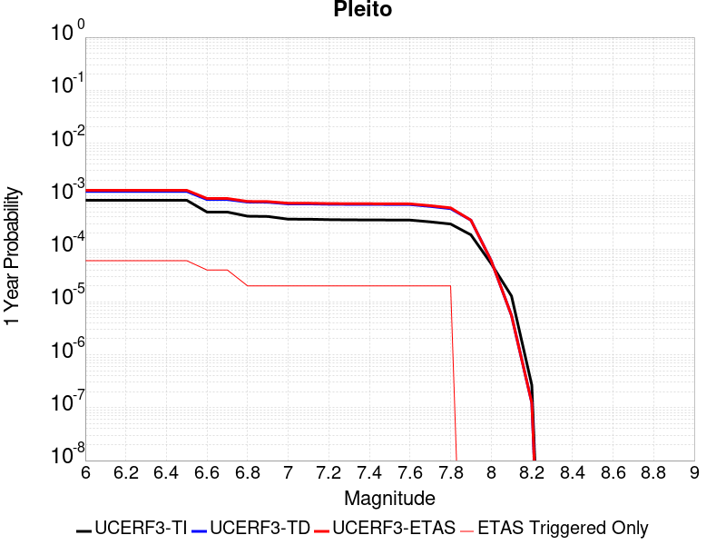 |  |

| Magnitude | 1 wk TI Prob | 1 wk TD Prob | 1 wk ETAS Prob | 1 wk ETAS/TD Gain | 1 wk ETAS Triggered Only | 1 mo TI Prob | 1 mo TD Prob | 1 mo ETAS Prob | 1 mo ETAS/TD Gain | 1 mo ETAS Triggered Only | 1 yr TI Prob | 1 yr TD Prob | 1 yr ETAS Prob | 1 yr ETAS/TD Gain | 1 yr ETAS Triggered Only | 10 yr TI Prob | 10 yr TD Prob | 10 yr ETAS Prob | 10 yr ETAS/TD Gain | 10 yr ETAS Triggered Only |
|-----|-----|-----|-----|-----|-----|-----|-----|-----|-----|-----|-----|-----|-----|-----|-----|-----|-----|-----|-----|-----|
| 6.0 | 1.5936967E-5 | 2.3470573E-5 | 2.3470573E-5 | 1.0 | 0.0 | 6.8299494E-5 | 1.0058464E-4 | 1.0058464E-4 | 1.0 | 0.0 | 8.312291E-4 | 0.0012239923 | 0.0012839189 | 1.04896 | 6.0E-5 | 0.008281267 | 0.0122801615 | 0.012378933 | 1.0080432 | 1.0E-4 |
| 6.1 | 1.5936967E-5 | 2.3470573E-5 | 2.3470573E-5 | 1.0 | 0.0 | 6.8299494E-5 | 1.0058464E-4 | 1.0058464E-4 | 1.0 | 0.0 | 8.312291E-4 | 0.0012239923 | 0.0012839189 | 1.04896 | 6.0E-5 | 0.008281267 | 0.0122801615 | 0.012378933 | 1.0080432 | 1.0E-4 |
| 6.2 | 1.5936967E-5 | 2.3470573E-5 | 2.3470573E-5 | 1.0 | 0.0 | 6.8299494E-5 | 1.0058464E-4 | 1.0058464E-4 | 1.0 | 0.0 | 8.312291E-4 | 0.0012239923 | 0.0012839189 | 1.04896 | 6.0E-5 | 0.008281267 | 0.0122801615 | 0.012378933 | 1.0080432 | 1.0E-4 |
| 6.3 | 1.5936967E-5 | 2.3470573E-5 | 2.3470573E-5 | 1.0 | 0.0 | 6.8299494E-5 | 1.0058464E-4 | 1.0058464E-4 | 1.0 | 0.0 | 8.312291E-4 | 0.0012239923 | 0.0012839189 | 1.04896 | 6.0E-5 | 0.008281267 | 0.0122801615 | 0.012378933 | 1.0080432 | 1.0E-4 |
| 6.4 | 1.5936967E-5 | 2.3470573E-5 | 2.3470573E-5 | 1.0 | 0.0 | 6.8299494E-5 | 1.0058464E-4 | 1.0058464E-4 | 1.0 | 0.0 | 8.312291E-4 | 0.0012239923 | 0.0012839189 | 1.04896 | 6.0E-5 | 0.008281267 | 0.0122801615 | 0.012378933 | 1.0080432 | 1.0E-4 |
| 6.5 | 1.5936967E-5 | 2.3470573E-5 | 2.3470573E-5 | 1.0 | 0.0 | 6.8299494E-5 | 1.0058464E-4 | 1.0058464E-4 | 1.0 | 0.0 | 8.312291E-4 | 0.0012239923 | 0.0012839189 | 1.04896 | 6.0E-5 | 0.008281267 | 0.0122801615 | 0.012378933 | 1.0080432 | 1.0E-4 |
| 6.6 | 9.537557E-6 | 1.645987E-5 | 1.645987E-5 | 1.0 | 0.0 | 4.0874602E-5 | 7.0540416E-5 | 7.0540416E-5 | 1.0 | 0.0 | 4.9753464E-4 | 8.5849455E-4 | 8.9846016E-4 | 1.0465531 | 4.0E-5 | 0.004964222 | 0.008653935 | 0.008703502 | 1.0057278 | 5.0E-5 |
| 6.7 | 9.537557E-6 | 1.645987E-5 | 1.645987E-5 | 1.0 | 0.0 | 4.0874602E-5 | 7.0540416E-5 | 7.0540416E-5 | 1.0 | 0.0 | 4.9753464E-4 | 8.5849455E-4 | 8.9846016E-4 | 1.0465531 | 4.0E-5 | 0.004964222 | 0.008653935 | 0.008703502 | 1.0057278 | 5.0E-5 |
| 6.8 | 7.962081E-6 | 1.4762597E-5 | 1.4762597E-5 | 1.0 | 0.0 | 3.4122757E-5 | 6.326674E-5 | 6.326674E-5 | 1.0 | 0.0 | 4.153654E-4 | 7.700015E-4 | 7.899861E-4 | 1.025954 | 2.0E-5 | 0.0041458984 | 0.007775339 | 0.0078051053 | 1.0038284 | 3.0E-5 |
| 6.9 | 7.871367E-6 | 1.4663026E-5 | 1.4663026E-5 | 1.0 | 0.0 | 3.3733995E-5 | 6.284004E-5 | 6.284004E-5 | 1.0 | 0.0 | 4.10634E-4 | 7.6481E-4 | 7.847947E-4 | 1.0261303 | 2.0E-5 | 0.0040987604 | 0.0077237855 | 0.007753554 | 1.0038542 | 3.0E-5 |
| 7.0 | 7.000318E-6 | 1.362577E-5 | 1.362577E-5 | 1.0 | 0.0 | 3.0001018E-5 | 5.8394853E-5 | 5.8394853E-5 | 1.0 | 0.0 | 3.6520115E-4 | 7.107259E-4 | 7.307117E-4 | 1.0281203 | 2.0E-5 | 0.0036460157 | 0.007186203 | 0.0072159874 | 1.0041447 | 3.0E-5 |
| 7.1 | 6.9893176E-6 | 1.3612472E-5 | 1.3612472E-5 | 1.0 | 0.0 | 2.9953873E-5 | 5.833786E-5 | 5.833786E-5 | 1.0 | 0.0 | 3.6462737E-4 | 7.100325E-4 | 7.3001825E-4 | 1.0281477 | 2.0E-5 | 0.0036402966 | 0.0071793133 | 0.007209098 | 1.0041487 | 3.0E-5 |
| 7.2 | 6.859009E-6 | 1.3421771E-5 | 1.3421771E-5 | 1.0 | 0.0 | 2.9395422E-5 | 5.752061E-5 | 5.752061E-5 | 1.0 | 0.0 | 3.578305E-4 | 7.0008886E-4 | 7.2007487E-4 | 1.0285478 | 2.0E-5 | 0.0035725483 | 0.0070803356 | 0.0071001938 | 1.0028048 | 2.0E-5 |
| 7.3 | 6.799595E-6 | 1.3347941E-5 | 1.3347941E-5 | 1.0 | 0.0 | 2.9140798E-5 | 5.7204208E-5 | 5.7204208E-5 | 1.0 | 0.0 | 3.5473146E-4 | 6.962391E-4 | 7.162252E-4 | 1.0287057 | 2.0E-5 | 0.0035416572 | 0.007041845 | 0.007061704 | 1.0028201 | 2.0E-5 |
| 7.4 | 6.778781E-6 | 1.3321727E-5 | 1.3321727E-5 | 1.0 | 0.0 | 2.9051596E-5 | 5.7091867E-5 | 5.7091867E-5 | 1.0 | 0.0 | 3.5364577E-4 | 6.948723E-4 | 7.1485835E-4 | 1.0287622 | 2.0E-5 | 0.003530835 | 0.0070281676 | 0.0070480267 | 1.0028257 | 2.0E-5 |
| 7.5 | 6.7517412E-6 | 1.3290022E-5 | 1.3290022E-5 | 1.0 | 0.0 | 2.8935714E-5 | 5.6955996E-5 | 5.6955996E-5 | 1.0 | 0.0 | 3.5223537E-4 | 6.932191E-4 | 7.132052E-4 | 1.0288309 | 2.0E-5 | 0.0035167758 | 0.0070116958 | 0.0070315558 | 1.0028324 | 2.0E-5 |
| 7.6 | 6.727488E-6 | 1.3245385E-5 | 1.3245385E-5 | 1.0 | 0.0 | 2.8831773E-5 | 5.6764704E-5 | 5.6764704E-5 | 1.0 | 0.0 | 3.509703E-4 | 6.908915E-4 | 7.108777E-4 | 1.0289282 | 2.0E-5 | 0.003504165 | 0.006988508 | 0.0070083686 | 1.0028418 | 2.0E-5 |
| 7.7 | 6.227353E-6 | 1.2206034E-5 | 1.2206034E-5 | 1.0 | 0.0 | 2.6688382E-5 | 5.2310523E-5 | 5.2310523E-5 | 1.0 | 0.0 | 3.248826E-4 | 6.3669484E-4 | 6.5668207E-4 | 1.0313922 | 2.0E-5 | 0.0032440803 | 0.0064491397 | 0.006469011 | 1.0030812 | 2.0E-5 |
| 7.8 | 5.6713584E-6 | 1.107499E-5 | 1.107499E-5 | 1.0 | 0.0 | 2.4305595E-5 | 4.746338E-5 | 4.746338E-5 | 1.0 | 0.0 | 2.9588043E-4 | 5.7771365E-4 | 5.977021E-4 | 1.0345992 | 2.0E-5 | 0.002954868 | 0.00585467 | 0.0058745528 | 1.003396 | 2.0E-5 |
| 7.9 | 3.5414275E-6 | 6.704432E-6 | 6.704432E-6 | 1.0 | 0.0 | 1.5177458E-5 | 2.8732964E-5 | 2.8732964E-5 | 1.0 | 0.0 | 1.8476989E-4 | 3.4976783E-4 | 3.4976783E-4 | 1.0 | 0.0 | 0.0018461633 | 0.0035507486 | 0.0035507486 | 1.0 | 0.0 |
| 8.0 | 1.0083941E-6 | 1.1476112E-6 | 1.1476112E-6 | 1.0 | 0.0 | 4.321682E-6 | 4.9183245E-6 | 4.9183245E-6 | 1.0 | 0.0 | 5.2615203E-5 | 5.9878963E-5 | 5.9878963E-5 | 1.0 | 0.0 | 5.2602746E-4 | 6.1994075E-4 | 6.1994075E-4 | 1.0 | 0.0 |
| 8.1 | 2.4698755E-7 | 1.0606881E-7 | 1.0606881E-7 | 1.0 | 0.0 | 1.0585176E-6 | 4.5458052E-7 | 4.5458052E-7 | 1.0 | 0.0 | 1.2887375E-5 | 5.534504E-6 | 5.534504E-6 | 1.0 | 0.0 | 1.2886629E-4 | 6.1592036E-5 | 6.1592036E-5 | 1.0 | 0.0 |
| 8.2 | 5.113086E-9 | 2.3577902E-9 | 2.3577902E-9 | 1.0 | 0.0 | 2.1913227E-8 | 1.0104816E-8 | 1.0104816E-8 | 1.0 | 0.0 | 2.667935E-7 | 1.2302613E-7 | 1.2302613E-7 | 1.0 | 0.0 | 2.6679318E-6 | 1.3961013E-6 | 1.3961013E-6 | 1.0 | 0.0 |

## Ortigalita (North)
*[(top)](#table-of-contents)*

| 1 Week | 1 Month | 1 Year | 10 Year |
|-----|-----|-----|-----|
|  |  |  |  |

| Magnitude | 1 wk TI Prob | 1 wk TD Prob | 1 wk ETAS Prob | 1 wk ETAS/TD Gain | 1 wk ETAS Triggered Only | 1 mo TI Prob | 1 mo TD Prob | 1 mo ETAS Prob | 1 mo ETAS/TD Gain | 1 mo ETAS Triggered Only | 1 yr TI Prob | 1 yr TD Prob | 1 yr ETAS Prob | 1 yr ETAS/TD Gain | 1 yr ETAS Triggered Only | 10 yr TI Prob | 10 yr TD Prob | 10 yr ETAS Prob | 10 yr ETAS/TD Gain | 10 yr ETAS Triggered Only |
|-----|-----|-----|-----|-----|-----|-----|-----|-----|-----|-----|-----|-----|-----|-----|-----|-----|-----|-----|-----|-----|
| 6.0 | 8.1270606E-5 | 1.11406865E-4 | 1.3140464E-4 | 1.1795021 | 2.0E-5 | 3.482561E-4 | 4.7738387E-4 | 4.9737433E-4 | 1.041875 | 2.0E-5 | 0.004231777 | 0.005796835 | 0.005846545 | 1.0085754 | 5.0E-5 | 0.041520942 | 0.056603976 | 0.056688882 | 1.0015 | 9.0E-5 |
| 6.1 | 4.6570323E-5 | 6.081238E-5 | 7.081177E-5 | 1.1644301 | 1.0E-5 | 1.9957183E-4 | 2.6060094E-4 | 2.7059834E-4 | 1.0383629 | 1.0E-5 | 0.0024270795 | 0.0031685568 | 0.0031884934 | 1.006292 | 2.0E-5 | 0.024007421 | 0.031257723 | 0.03130616 | 1.0015496 | 5.0E-5 |
| 6.2 | 4.6570323E-5 | 6.081238E-5 | 7.081177E-5 | 1.1644301 | 1.0E-5 | 1.9957183E-4 | 2.6060094E-4 | 2.7059834E-4 | 1.0383629 | 1.0E-5 | 0.0024270795 | 0.0031685568 | 0.0031884934 | 1.006292 | 2.0E-5 | 0.024007421 | 0.031257723 | 0.03130616 | 1.0015496 | 5.0E-5 |
| 6.3 | 3.3139735E-5 | 4.2154268E-5 | 5.2153846E-5 | 1.2372139 | 1.0E-5 | 1.4201971E-4 | 1.8064992E-4 | 1.9064812E-4 | 1.0553457 | 1.0E-5 | 0.0017277185 | 0.002197338 | 0.0022172942 | 1.009082 | 2.0E-5 | 0.017143477 | 0.02177265 | 0.021811778 | 1.0017972 | 4.0E-5 |
| 6.4 | 2.6658954E-5 | 3.344077E-5 | 4.3440436E-5 | 1.2990261 | 1.0E-5 | 1.1424766E-4 | 1.4331068E-4 | 1.5330924E-4 | 1.0697684 | 1.0E-5 | 0.0013900776 | 0.0017435518 | 0.0017535344 | 1.0057254 | 1.0E-5 | 0.013814144 | 0.017312845 | 0.0173325 | 1.0011352 | 2.0E-5 |
| 6.5 | 2.6634178E-5 | 3.3411197E-5 | 4.3410862E-5 | 1.2992909 | 1.0E-5 | 1.14141476E-4 | 1.4318393E-4 | 1.5318251E-4 | 1.0698302 | 1.0E-5 | 0.0013887866 | 0.0017420113 | 0.0017519939 | 1.0057305 | 1.0E-5 | 0.013801393 | 0.01729768 | 0.017317334 | 1.0011362 | 2.0E-5 |
| 6.6 | 2.1948426E-5 | 2.7234104E-5 | 3.7233833E-5 | 1.3671767 | 1.0E-5 | 9.4061295E-5 | 1.16713236E-4 | 1.2671207E-4 | 1.0856701 | 1.0E-5 | 0.0011445946 | 0.0014201968 | 0.0014301827 | 1.0070313 | 1.0E-5 | 0.011387171 | 0.014125252 | 0.01414497 | 1.001396 | 2.0E-5 |
| 6.7 | 1.9332554E-5 | 2.405838E-5 | 3.405814E-5 | 1.4156456 | 1.0E-5 | 8.285117E-5 | 1.0310412E-4 | 1.1310309E-4 | 1.0969794 | 1.0E-5 | 0.0010082462 | 0.0012547063 | 0.0012646938 | 1.00796 | 1.0E-5 | 0.010036839 | 0.012490487 | 0.012510237 | 1.0015812 | 2.0E-5 |
| 6.8 | 8.434632E-6 | 9.999189E-6 | 9.999189E-6 | 1.0 | 0.0 | 3.614792E-5 | 4.2852993E-5 | 4.2852993E-5 | 1.0 | 0.0 | 4.4001208E-4 | 5.216151E-4 | 5.216151E-4 | 1.0 | 0.0 | 0.0043914183 | 0.005204392 | 0.00521434 | 1.0019114 | 1.0E-5 |
| 6.9 | 7.2304742E-6 | 8.560299E-6 | 8.560299E-6 | 1.0 | 0.0 | 3.098738E-5 | 3.6686502E-5 | 3.6686502E-5 | 1.0 | 0.0 | 3.7720602E-4 | 4.465709E-4 | 4.465709E-4 | 1.0 | 0.0 | 0.0037656638 | 0.004457165 | 0.0044671204 | 1.0022336 | 1.0E-5 |
| 7.0 | 4.9774862E-6 | 5.899878E-6 | 5.899878E-6 | 1.0 | 0.0 | 2.133191E-5 | 2.5284966E-5 | 2.5284966E-5 | 1.0 | 0.0 | 2.5968504E-4 | 3.0780444E-4 | 3.0780444E-4 | 1.0 | 0.0 | 0.002593818 | 0.0030741233 | 0.0030741233 | 1.0 | 0.0 |
| 7.1 | 1.9991749E-6 | 2.375295E-6 | 2.375295E-6 | 1.0 | 0.0 | 8.567864E-6 | 1.0179806E-5 | 1.0179806E-5 | 1.0 | 0.0 | 1.0430875E-4 | 1.2393385E-4 | 1.2393385E-4 | 1.0 | 0.0 | 0.001042598 | 0.001238819 | 0.001238819 | 1.0 | 0.0 |

## Oceanic - West Huasna
*[(top)](#table-of-contents)*

| 1 Week | 1 Month | 1 Year | 10 Year |
|-----|-----|-----|-----|
| 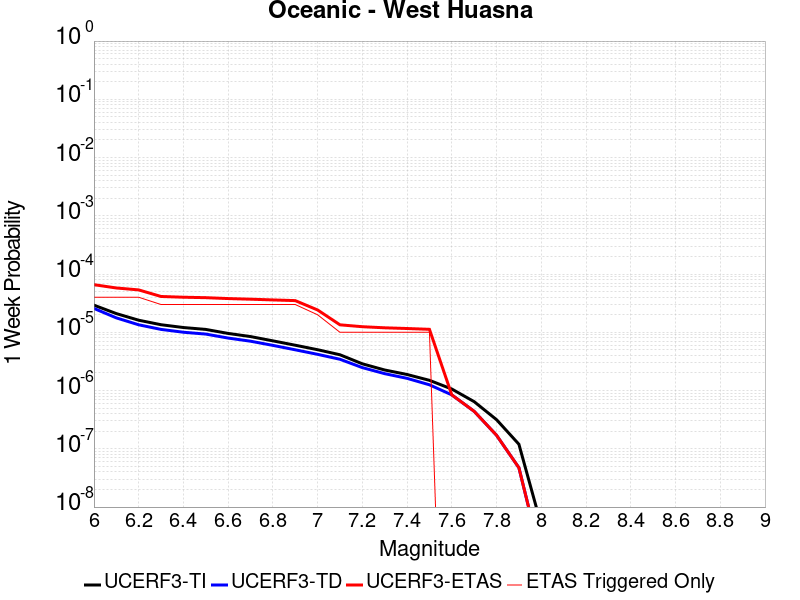 | 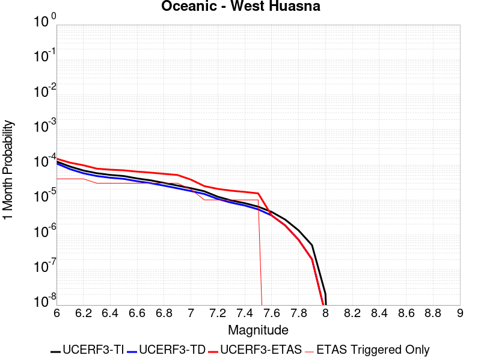 |  | 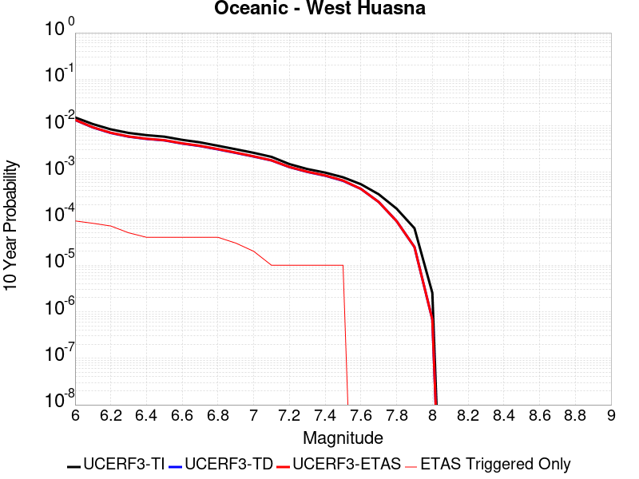 |

| Magnitude | 1 wk TI Prob | 1 wk TD Prob | 1 wk ETAS Prob | 1 wk ETAS/TD Gain | 1 wk ETAS Triggered Only | 1 mo TI Prob | 1 mo TD Prob | 1 mo ETAS Prob | 1 mo ETAS/TD Gain | 1 mo ETAS Triggered Only | 1 yr TI Prob | 1 yr TD Prob | 1 yr ETAS Prob | 1 yr ETAS/TD Gain | 1 yr ETAS Triggered Only | 10 yr TI Prob | 10 yr TD Prob | 10 yr ETAS Prob | 10 yr ETAS/TD Gain | 10 yr ETAS Triggered Only |
|-----|-----|-----|-----|-----|-----|-----|-----|-----|-----|-----|-----|-----|-----|-----|-----|-----|-----|-----|-----|-----|
| 6.0 | 2.9250989E-5 | 2.5717825E-5 | 6.57168E-5 | 2.5553014 | 4.0E-5 | 1.2535535E-4 | 1.102148E-4 | 1.502104E-4 | 1.3628876 | 4.0E-5 | 0.0015251329 | 0.001341076 | 0.0014209687 | 1.0595737 | 8.0E-5 | 0.0151470825 | 0.013333684 | 0.013422484 | 1.0066599 | 9.0E-5 |
| 6.1 | 2.0967032E-5 | 1.7699278E-5 | 5.769857E-5 | 3.2599392 | 4.0E-5 | 8.985562E-5 | 7.58519E-5 | 1.1584887E-4 | 1.5273033 | 4.0E-5 | 0.001093443 | 9.2311663E-4 | 9.93052E-4 | 1.0757601 | 7.0E-5 | 0.010880784 | 0.00919399 | 0.009273254 | 1.0086213 | 8.0E-5 |
| 6.2 | 1.6133132E-5 | 1.3464097E-5 | 5.346356E-5 | 3.9708238 | 4.0E-5 | 6.9140166E-5 | 5.7702015E-5 | 9.769971E-5 | 1.6931767 | 4.0E-5 | 8.4145635E-4 | 7.0229877E-4 | 7.622566E-4 | 1.0853738 | 6.0E-5 | 0.008382773 | 0.007001151 | 0.0070706606 | 1.0099283 | 7.0E-5 |
| 6.3 | 1.3495679E-5 | 1.1217386E-5 | 4.121705E-5 | 3.6743898 | 3.0E-5 | 5.7837344E-5 | 4.807363E-5 | 7.807219E-5 | 1.6240127 | 3.0E-5 | 7.0394215E-4 | 5.851404E-4 | 6.2511704E-4 | 1.0683197 | 4.0E-5 | 0.007017164 | 0.005836138 | 0.005885846 | 1.0085173 | 5.0E-5 |
| 6.4 | 1.208063E-5 | 1.0031078E-5 | 4.0030776E-5 | 3.9906754 | 3.0E-5 | 5.1773102E-5 | 4.298963E-5 | 7.298834E-5 | 1.6978127 | 3.0E-5 | 6.301552E-4 | 5.2327366E-4 | 5.53258E-4 | 1.0573014 | 3.0E-5 | 0.0062837126 | 0.005220499 | 0.0052602896 | 1.0076221 | 4.0E-5 |
| 6.5 | 1.1213714E-5 | 9.323995E-6 | 3.9323717E-5 | 4.217475 | 3.0E-5 | 4.805789E-5 | 3.995937E-5 | 6.995817E-5 | 1.7507325 | 3.0E-5 | 5.849477E-4 | 4.8639727E-4 | 5.163827E-4 | 1.061648 | 3.0E-5 | 0.005834104 | 0.0048533976 | 0.0048932037 | 1.0082016 | 4.0E-5 |
| 6.6 | 9.567589E-6 | 7.966662E-6 | 3.7966423E-5 | 4.765662 | 3.0E-5 | 4.1003306E-5 | 3.4142395E-5 | 6.414137E-5 | 1.8786429 | 3.0E-5 | 4.991009E-4 | 4.1560465E-4 | 4.455922E-4 | 1.0721539 | 3.0E-5 | 0.0049798144 | 0.0041483147 | 0.004188149 | 1.0096024 | 4.0E-5 |
| 6.7 | 8.453213E-6 | 7.037788E-6 | 3.703758E-5 | 5.262673 | 3.0E-5 | 3.6227553E-5 | 3.01616E-5 | 6.0160695E-5 | 1.9946122 | 3.0E-5 | 4.409812E-4 | 3.671558E-4 | 3.971448E-4 | 1.0816792 | 3.0E-5 | 0.0044010715 | 0.0036655208 | 0.0037053742 | 1.0108725 | 4.0E-5 |
| 6.8 | 7.136067E-6 | 5.9661006E-6 | 3.596592E-5 | 6.02838 | 3.0E-5 | 3.0582785E-5 | 2.5568754E-5 | 5.5567987E-5 | 2.1732771 | 3.0E-5 | 3.722818E-4 | 3.1125525E-4 | 3.412459E-4 | 1.0963539 | 3.0E-5 | 0.0037165873 | 0.0031082144 | 0.00314809 | 1.0128292 | 4.0E-5 |
| 6.9 | 6.0027714E-6 | 5.0090025E-6 | 3.5008852E-5 | 6.9891863 | 3.0E-5 | 2.5725909E-5 | 2.1466978E-5 | 5.1466333E-5 | 2.3974652 | 3.0E-5 | 3.1316793E-4 | 2.613292E-4 | 2.9132134E-4 | 1.1147678 | 3.0E-5 | 0.0031272697 | 0.0026102343 | 0.002640156 | 1.0114632 | 3.0E-5 |
| 7.0 | 5.0287063E-6 | 4.186607E-6 | 2.4186524E-5 | 5.777118 | 2.0E-5 | 2.1551421E-5 | 1.7942477E-5 | 3.7942118E-5 | 2.1146533 | 2.0E-5 | 2.6235695E-4 | 2.1842784E-4 | 2.3842347E-4 | 1.0915434 | 2.0E-5 | 0.0026204742 | 0.002182144 | 0.0022021004 | 1.0091453 | 2.0E-5 |
| 7.1 | 4.116017E-6 | 3.445556E-6 | 1.3445521E-5 | 3.9022791 | 1.0E-5 | 1.7639954E-5 | 1.4766586E-5 | 2.4766437E-5 | 1.6771946 | 1.0E-5 | 2.1474526E-4 | 1.7976841E-4 | 1.8976661E-4 | 1.0556171 | 1.0E-5 | 0.0021453786 | 0.0017962406 | 0.0018062227 | 1.0055572 | 1.0E-5 |
| 7.2 | 2.8786815E-6 | 2.4774074E-6 | 1.2477382E-5 | 5.036468 | 1.0E-5 | 1.2337147E-5 | 1.0617417E-5 | 2.061731E-5 | 1.9418386 | 1.0E-5 | 1.5019442E-4 | 1.292594E-4 | 1.392581E-4 | 1.0773538 | 1.0E-5 | 0.0015009295 | 0.0012918477 | 0.0013018347 | 1.0077308 | 1.0E-5 |
| 7.3 | 2.2536303E-6 | 1.9505462E-6 | 1.1950527E-5 | 6.126759 | 1.0E-5 | 9.658381E-6 | 8.359457E-6 | 1.8359373E-5 | 2.19624 | 1.0E-5 | 1.1758444E-4 | 1.0177164E-4 | 1.1177062E-4 | 1.0982492 | 1.0E-5 | 0.0011752223 | 0.0010172554 | 0.0010272452 | 1.0098203 | 1.0E-5 |
| 7.4 | 1.8872217E-6 | 1.6210331E-6 | 1.1621017E-5 | 7.1688957 | 1.0E-5 | 8.088068E-6 | 6.9472662E-6 | 1.6947197E-5 | 2.4394052 | 1.0E-5 | 9.846778E-5 | 8.457968E-5 | 9.457884E-5 | 1.1182218 | 1.0E-5 | 9.842416E-4 | 8.4547984E-4 | 8.554714E-4 | 1.0118176 | 1.0E-5 |
| 7.5 | 1.4985206E-6 | 1.2557459E-6 | 1.1255734E-5 | 8.963384 | 1.0E-5 | 6.4222154E-6 | 5.381757E-6 | 1.5381704E-5 | 2.8581192 | 1.0E-5 | 7.8187666E-5 | 6.552093E-5 | 7.552027E-5 | 1.152613 | 1.0E-5 | 7.8160164E-4 | 6.550209E-4 | 6.650144E-4 | 1.0152566 | 1.0E-5 |
| 7.6 | 1.06243E-6 | 8.429909E-7 | 8.429909E-7 | 1.0 | 0.0 | 4.553264E-6 | 3.612813E-6 | 3.612813E-6 | 1.0 | 0.0 | 5.5434575E-5 | 4.3985114E-5 | 4.3985114E-5 | 1.0 | 0.0 | 5.542075E-4 | 4.3976877E-4 | 4.3976877E-4 | 1.0 | 0.0 |
| 7.7 | 6.4479644E-7 | 4.4005319E-7 | 4.4005319E-7 | 1.0 | 0.0 | 2.7634103E-6 | 1.8859408E-6 | 1.8859408E-6 | 1.0 | 0.0 | 3.3644E-5 | 2.2961089E-5 | 2.2961089E-5 | 1.0 | 0.0 | 3.363891E-4 | 2.2959178E-4 | 2.2959178E-4 | 1.0 | 0.0 |
| 7.8 | 3.1651285E-7 | 1.7078908E-7 | 1.7078908E-7 | 1.0 | 0.0 | 1.3564829E-6 | 7.31953E-7 | 7.31953E-7 | 1.0 | 0.0 | 1.6515054E-5 | 8.911491E-6 | 8.911491E-6 | 1.0 | 0.0 | 1.6513828E-4 | 8.911592E-5 | 8.911592E-5 | 1.0 | 0.0 |
| 7.9 | 1.197753E-7 | 4.73458E-8 | 4.73458E-8 | 1.0 | 0.0 | 5.133226E-7 | 2.0291056E-7 | 2.0291056E-7 | 1.0 | 0.0 | 6.2496847E-6 | 2.4704332E-6 | 2.4704332E-6 | 1.0 | 0.0 | 6.249509E-5 | 2.4708632E-5 | 2.4708632E-5 | 1.0 | 0.0 |
| 8.0 | 4.893176E-9 | 1.3035258E-9 | 1.3035258E-9 | 1.0 | 0.0 | 2.0970754E-8 | 5.5865397E-9 | 5.5865397E-9 | 1.0 | 0.0 | 2.553189E-7 | 6.8016114E-8 | 6.8016114E-8 | 1.0 | 0.0 | 2.553186E-6 | 6.837064E-7 | 6.837064E-7 | 1.0 | 0.0 |

## Brawley (Seismic Zone) alt 2
*[(top)](#table-of-contents)*

| 1 Week | 1 Month | 1 Year | 10 Year |
|-----|-----|-----|-----|
|  | 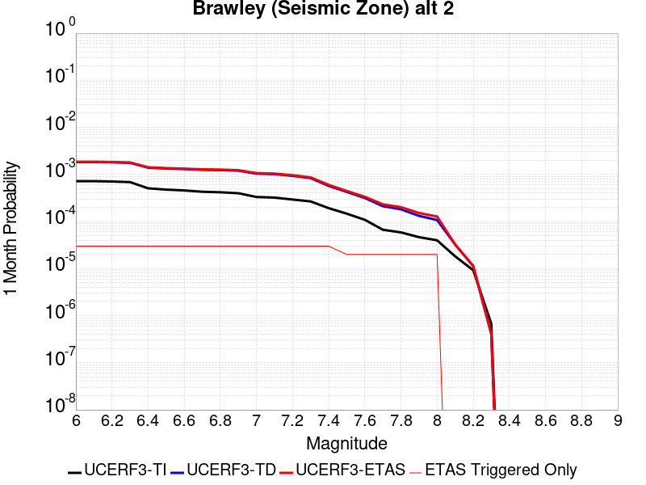 |  | 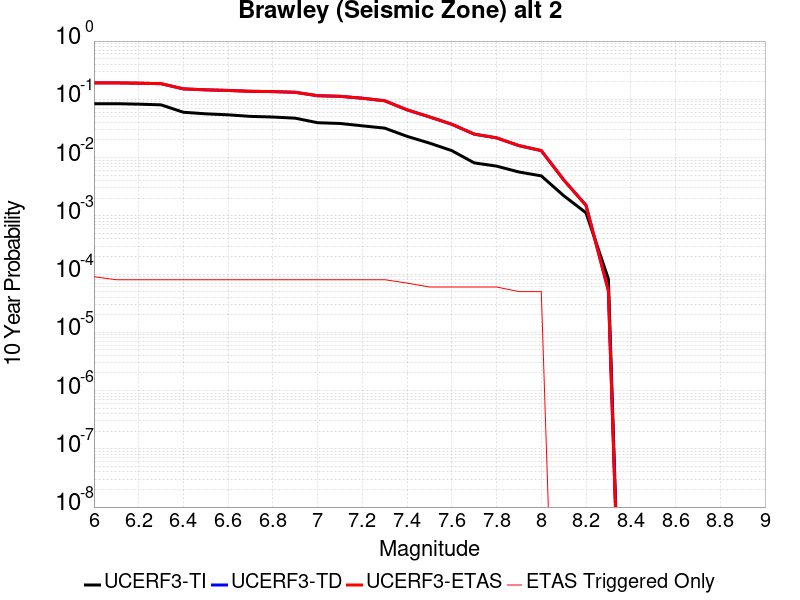 |

| Magnitude | 1 wk TI Prob | 1 wk TD Prob | 1 wk ETAS Prob | 1 wk ETAS/TD Gain | 1 wk ETAS Triggered Only | 1 mo TI Prob | 1 mo TD Prob | 1 mo ETAS Prob | 1 mo ETAS/TD Gain | 1 mo ETAS Triggered Only | 1 yr TI Prob | 1 yr TD Prob | 1 yr ETAS Prob | 1 yr ETAS/TD Gain | 1 yr ETAS Triggered Only | 10 yr TI Prob | 10 yr TD Prob | 10 yr ETAS Prob | 10 yr ETAS/TD Gain | 10 yr ETAS Triggered Only |
|-----|-----|-----|-----|-----|-----|-----|-----|-----|-----|-----|-----|-----|-----|-----|-----|-----|-----|-----|-----|-----|
| 6.0 | 1.6829208E-4 | 4.2759682E-4 | 4.4758827E-4 | 1.046753 | 2.0E-5 | 7.210524E-4 | 0.0018313134 | 0.0018612584 | 1.0163517 | 3.0E-5 | 0.008743531 | 0.02206265 | 0.022111548 | 1.0022162 | 5.0E-5 | 0.08407409 | 0.19138719 | 0.19145995 | 1.0003803 | 9.0E-5 |
| 6.1 | 1.6829208E-4 | 4.2759682E-4 | 4.4758827E-4 | 1.046753 | 2.0E-5 | 7.210524E-4 | 0.0018313134 | 0.0018612584 | 1.0163517 | 3.0E-5 | 0.008743531 | 0.02206265 | 0.022111548 | 1.0022162 | 5.0E-5 | 0.08407409 | 0.19138719 | 0.19145188 | 1.000338 | 8.0E-5 |
| 6.2 | 1.6508595E-4 | 4.2158982E-4 | 4.415814E-4 | 1.0474194 | 2.0E-5 | 7.0731936E-4 | 0.0018056048 | 0.0018355505 | 1.0165849 | 3.0E-5 | 0.008577661 | 0.021756712 | 0.021805624 | 1.0022482 | 5.0E-5 | 0.08254028 | 0.18906371 | 0.1891286 | 1.0003431 | 8.0E-5 |
| 6.3 | 1.604895E-4 | 4.1228163E-4 | 4.322734E-4 | 1.0484905 | 2.0E-5 | 6.876308E-4 | 0.001765767 | 0.001795714 | 1.0169598 | 3.0E-5 | 0.008339814 | 0.021282578 | 0.021331513 | 1.0022993 | 5.0E-5 | 0.080336876 | 0.18550485 | 0.18557002 | 1.0003513 | 8.0E-5 |
| 6.4 | 1.1847129E-4 | 3.2509418E-4 | 3.4508767E-4 | 1.0615007 | 2.0E-5 | 5.076353E-4 | 0.0013925224 | 0.0014224806 | 1.0215136 | 3.0E-5 | 0.0061629596 | 0.016822938 | 0.016872097 | 1.0029222 | 5.0E-5 | 0.05994819 | 0.15103635 | 0.15110427 | 1.0004497 | 8.0E-5 |
| 6.5 | 1.1117118E-4 | 3.113645E-4 | 3.313583E-4 | 1.0642134 | 2.0E-5 | 4.7636093E-4 | 0.0013337418 | 0.0013637018 | 1.0224631 | 3.0E-5 | 0.0057842825 | 0.016118683 | 0.016167877 | 1.003052 | 5.0E-5 | 0.056360207 | 0.1453379 | 0.14540626 | 1.0004704 | 8.0E-5 |
| 6.6 | 1.0672738E-4 | 3.0345627E-4 | 3.2345022E-4 | 1.0658873 | 2.0E-5 | 4.5732284E-4 | 0.0012998835 | 0.0013298445 | 1.023049 | 3.0E-5 | 0.0055537 | 0.015712472 | 0.015761686 | 1.0031322 | 5.0E-5 | 0.054169398 | 0.14196438 | 0.14203303 | 1.0004835 | 8.0E-5 |
| 6.7 | 1.0012411E-4 | 2.9257502E-4 | 3.1256914E-4 | 1.0683385 | 2.0E-5 | 4.2903275E-4 | 0.0012532946 | 0.001283257 | 1.023907 | 3.0E-5 | 0.00521097 | 0.015153222 | 0.015202465 | 1.0032496 | 5.0E-5 | 0.050904587 | 0.13720685 | 0.13727587 | 1.0005031 | 8.0E-5 |
| 6.8 | 9.761971E-5 | 2.8908355E-4 | 3.0907776E-4 | 1.0691642 | 2.0E-5 | 4.183031E-4 | 0.0012383455 | 0.0012683084 | 1.0241959 | 3.0E-5 | 0.0050809537 | 0.01497373 | 0.015022981 | 1.0032892 | 5.0E-5 | 0.049663413 | 0.13559218 | 0.13566132 | 1.00051 | 8.0E-5 |
| 6.9 | 9.313406E-5 | 2.805503E-4 | 3.005447E-4 | 1.0712684 | 2.0E-5 | 3.990849E-4 | 0.0012018086 | 0.0012317726 | 1.0249324 | 3.0E-5 | 0.004848039 | 0.014534909 | 0.014584183 | 1.00339 | 5.0E-5 | 0.04743629 | 0.13184099 | 0.13191044 | 1.0005268 | 8.0E-5 |
| 7.0 | 7.7511104E-5 | 2.426135E-4 | 2.6260866E-4 | 1.0824157 | 2.0E-5 | 3.3214813E-4 | 0.0010393612 | 0.0010693301 | 1.0288339 | 3.0E-5 | 0.004036407 | 0.012581601 | 0.012630972 | 1.003924 | 5.0E-5 | 0.039638743 | 0.11526588 | 0.11533666 | 1.000614 | 8.0E-5 |
| 7.1 | 7.52369E-5 | 2.365628E-4 | 2.5655807E-4 | 1.0845242 | 2.0E-5 | 3.2240403E-4 | 0.0010134501 | 0.0010434196 | 1.0295719 | 3.0E-5 | 0.0039182054 | 0.012269724 | 0.01231911 | 1.0040251 | 5.0E-5 | 0.038498368 | 0.1125938 | 0.11266479 | 1.0006305 | 8.0E-5 |
| 7.2 | 6.839887E-5 | 2.179553E-4 | 2.3795094E-4 | 1.0917419 | 2.0E-5 | 2.9310508E-4 | 9.33763E-4 | 9.63735E-4 | 1.032098 | 3.0E-5 | 0.0035627158 | 0.011310011 | 0.011359446 | 1.0043708 | 5.0E-5 | 0.035061367 | 0.10438512 | 0.104456775 | 1.0006864 | 8.0E-5 |
| 7.3 | 6.234534E-5 | 1.9513835E-4 | 2.1513445E-4 | 1.1024714 | 2.0E-5 | 2.6716694E-4 | 8.36042E-4 | 8.660169E-4 | 1.0358534 | 3.0E-5 | 0.0032479062 | 0.010131895 | 0.010181388 | 1.004885 | 5.0E-5 | 0.03200845 | 0.09428433 | 0.09435679 | 1.0007685 | 8.0E-5 |
| 7.4 | 4.486586E-5 | 1.3309474E-4 | 1.5309209E-4 | 1.1502489 | 2.0E-5 | 1.922681E-4 | 5.702823E-4 | 6.0026516E-4 | 1.0525756 | 3.0E-5 | 0.0023383508 | 0.0069212685 | 0.0069709225 | 1.0071741 | 5.0E-5 | 0.023138981 | 0.06592038 | 0.06598577 | 1.000992 | 7.0E-5 |
| 7.5 | 3.4260403E-5 | 9.937024E-5 | 1.0936925E-4 | 1.1006237 | 1.0E-5 | 1.4682204E-4 | 4.258033E-4 | 4.4579478E-4 | 1.0469501 | 2.0E-5 | 0.0017860925 | 0.0051719025 | 0.0052116956 | 1.0076941 | 4.0E-5 | 0.017718052 | 0.049853694 | 0.0499107 | 1.0011436 | 6.0E-5 |
| 7.6 | 2.5372317E-5 | 7.360454E-5 | 8.360381E-5 | 1.1358511 | 1.0E-5 | 1.0873397E-4 | 3.1541006E-4 | 3.3540375E-4 | 1.0633895 | 2.0E-5 | 0.0013230321 | 0.003833385 | 0.0038732316 | 1.0103947 | 4.0E-5 | 0.013151829 | 0.0372659 | 0.037323665 | 1.0015501 | 6.0E-5 |
| 7.7 | 1.560691E-5 | 4.9472867E-5 | 5.947237E-5 | 1.202121 | 1.0E-5 | 6.688505E-5 | 2.1200936E-4 | 2.3200511E-4 | 1.0943154 | 2.0E-5 | 8.1402116E-4 | 0.0025781624 | 0.0026180593 | 1.0154749 | 4.0E-5 | 0.008110458 | 0.025232445 | 0.02529093 | 1.0023179 | 6.0E-5 |
| 7.8 | 1.37135075E-5 | 4.23946E-5 | 5.2394174E-5 | 1.235869 | 1.0E-5 | 5.8770853E-5 | 1.8167851E-4 | 2.0167488E-4 | 1.1100646 | 2.0E-5 | 7.153002E-4 | 0.0022096948 | 0.0022496064 | 1.018062 | 4.0E-5 | 0.007130021 | 0.021762371 | 0.021821065 | 1.0026971 | 6.0E-5 |
| 7.9 | 1.0865399E-5 | 3.0818E-5 | 4.0817693E-5 | 1.3244756 | 1.0E-5 | 4.6565165E-5 | 1.3207046E-4 | 1.5206782E-4 | 1.1514143 | 2.0E-5 | 5.667834E-4 | 0.0016067732 | 0.0016467089 | 1.0248547 | 4.0E-5 | 0.0056534 | 0.016018078 | 0.016067278 | 1.0030714 | 5.0E-5 |
| 8.0 | 9.314509E-6 | 2.5142395E-5 | 3.5142144E-5 | 1.3977246 | 1.0E-5 | 3.9918716E-5 | 1.07748674E-4 | 1.2774652E-4 | 1.1855972 | 2.0E-5 | 4.8590195E-4 | 0.0013110517 | 0.0013509992 | 1.0304699 | 4.0E-5 | 0.004848409 | 0.013145752 | 0.013195096 | 1.0037535 | 5.0E-5 |
| 8.1 | 4.2601296E-6 | 7.5912826E-6 | 7.5912826E-6 | 1.0 | 0.0 | 1.8257571E-5 | 3.2533662E-5 | 3.2533662E-5 | 1.0 | 0.0 | 2.2226326E-4 | 3.9602545E-4 | 3.9602545E-4 | 1.0 | 0.0 | 0.0022204109 | 0.00414718 | 0.00414718 | 1.0 | 0.0 |
| 8.2 | 2.16243E-6 | 2.6440807E-6 | 2.6440807E-6 | 1.0 | 0.0 | 9.267525E-6 | 1.1331726E-5 | 1.1331726E-5 | 1.0 | 0.0 | 1.1282627E-4 | 1.3795505E-4 | 1.3795505E-4 | 1.0 | 0.0 | 0.00112769 | 0.0015124289 | 0.0015124289 | 1.0 | 0.0 |
| 8.3 | 1.5844111E-7 | 9.580025E-8 | 9.580025E-8 | 1.0 | 0.0 | 6.790332E-7 | 4.1057243E-7 | 4.1057243E-7 | 1.0 | 0.0 | 8.267198E-6 | 4.9987084E-6 | 4.9987084E-6 | 1.0 | 0.0 | 8.26689E-5 | 5.2187042E-5 | 5.2187042E-5 | 1.0 | 0.0 |

## Santa Rosa Island
*[(top)](#table-of-contents)*

| 1 Week | 1 Month | 1 Year | 10 Year |
|-----|-----|-----|-----|
|  |  |  |  |

| Magnitude | 1 wk TI Prob | 1 wk TD Prob | 1 wk ETAS Prob | 1 wk ETAS/TD Gain | 1 wk ETAS Triggered Only | 1 mo TI Prob | 1 mo TD Prob | 1 mo ETAS Prob | 1 mo ETAS/TD Gain | 1 mo ETAS Triggered Only | 1 yr TI Prob | 1 yr TD Prob | 1 yr ETAS Prob | 1 yr ETAS/TD Gain | 1 yr ETAS Triggered Only | 10 yr TI Prob | 10 yr TD Prob | 10 yr ETAS Prob | 10 yr ETAS/TD Gain | 10 yr ETAS Triggered Only |
|-----|-----|-----|-----|-----|-----|-----|-----|-----|-----|-----|-----|-----|-----|-----|-----|-----|-----|-----|-----|-----|
| 6.0 | 3.224527E-5 | 3.6182922E-5 | 6.618184E-5 | 1.8290904 | 3.0E-5 | 1.3818669E-4 | 1.5506103E-4 | 2.0505328E-4 | 1.3224037 | 5.0E-5 | 0.0016811244 | 0.0018863371 | 0.0019562051 | 1.0370389 | 7.0E-5 | 0.016684635 | 0.01871406 | 0.018802375 | 1.0047193 | 9.0E-5 |
| 6.1 | 1.9804382E-5 | 2.2031196E-5 | 4.2030755E-5 | 1.9077836 | 2.0E-5 | 8.487316E-5 | 9.441612E-5 | 1.1441424E-4 | 1.2118082 | 2.0E-5 | 0.0010328408 | 0.0011489335 | 0.0011788991 | 1.0260812 | 3.0E-5 | 0.0102805365 | 0.011432399 | 0.011462056 | 1.0025941 | 3.0E-5 |
| 6.2 | 1.9804382E-5 | 2.2031196E-5 | 4.2030755E-5 | 1.9077836 | 2.0E-5 | 8.487316E-5 | 9.441612E-5 | 1.1441424E-4 | 1.2118082 | 2.0E-5 | 0.0010328408 | 0.0011489335 | 0.0011788991 | 1.0260812 | 3.0E-5 | 0.0102805365 | 0.011432399 | 0.011462056 | 1.0025941 | 3.0E-5 |
| 6.3 | 1.5242747E-5 | 1.6877397E-5 | 2.6877227E-5 | 1.5924984 | 1.0E-5 | 6.532442E-5 | 7.232976E-5 | 8.232904E-5 | 1.1382457 | 1.0E-5 | 7.9503463E-4 | 8.8027125E-4 | 9.0025365E-4 | 1.0227003 | 2.0E-5 | 0.007921963 | 0.008769113 | 0.008788938 | 1.0022607 | 2.0E-5 |
| 6.4 | 1.2967521E-5 | 1.4321713E-5 | 2.4321569E-5 | 1.6982305 | 1.0E-5 | 5.5573906E-5 | 6.137738E-5 | 7.1376766E-5 | 1.1629164 | 1.0E-5 | 6.7640224E-4 | 7.470229E-4 | 7.67008E-4 | 1.026753 | 2.0E-5 | 0.006743471 | 0.007446099 | 0.00746595 | 1.002666 | 2.0E-5 |
| 6.5 | 9.47559E-6 | 1.04166775E-5 | 1.04166775E-5 | 1.0 | 0.0 | 4.060904E-5 | 4.4642173E-5 | 4.4642173E-5 | 1.0 | 0.0 | 4.943029E-4 | 5.433891E-4 | 5.5338367E-4 | 1.018393 | 1.0E-5 | 0.0049320483 | 0.005421227 | 0.005431173 | 1.0018346 | 1.0E-5 |
| 6.6 | 7.920824E-6 | 8.6852815E-6 | 8.6852815E-6 | 1.0 | 0.0 | 3.3945944E-5 | 3.7222133E-5 | 3.7222133E-5 | 1.0 | 0.0 | 4.132135E-4 | 4.530902E-4 | 4.6308566E-4 | 1.0220606 | 1.0E-5 | 0.00412446 | 0.0045221616 | 0.0045321165 | 1.0022013 | 1.0E-5 |
| 6.7 | 5.933505E-6 | 6.474955E-6 | 6.474955E-6 | 1.0 | 0.0 | 2.5429059E-5 | 2.7749535E-5 | 2.7749535E-5 | 1.0 | 0.0 | 3.095548E-4 | 3.378022E-4 | 3.378022E-4 | 1.0 | 0.0 | 0.0030912396 | 0.003373282 | 0.003373282 | 1.0 | 0.0 |
| 6.8 | 3.99483E-6 | 4.315427E-6 | 4.315427E-6 | 1.0 | 0.0 | 1.7120587E-5 | 1.8494573E-5 | 1.8494573E-5 | 1.0 | 0.0 | 2.0842321E-4 | 2.2515128E-4 | 2.2515128E-4 | 1.0 | 0.0 | 0.0020822783 | 0.0022495377 | 0.0022495377 | 1.0 | 0.0 |
| 6.9 | 2.5307572E-6 | 2.6816358E-6 | 2.6816358E-6 | 1.0 | 0.0 | 1.0846057E-5 | 1.1492675E-5 | 1.1492675E-5 | 1.0 | 0.0 | 1.3204275E-4 | 1.3991437E-4 | 1.3991437E-4 | 1.0 | 0.0 | 0.0013196432 | 0.0013982662 | 0.0013982662 | 1.0 | 0.0 |
| 7.0 | 2.3520363E-6 | 2.485025E-6 | 2.485025E-6 | 1.0 | 0.0 | 1.0080117E-5 | 1.0650064E-5 | 1.0650064E-5 | 1.0 | 0.0 | 1.2271851E-4 | 1.2965684E-4 | 1.2965684E-4 | 1.0 | 0.0 | 0.0012265076 | 0.0012958142 | 0.0012958142 | 1.0 | 0.0 |
| 7.1 | 2.232834E-6 | 2.35507E-6 | 2.35507E-6 | 1.0 | 0.0 | 9.569254E-6 | 1.0093117E-5 | 1.0093117E-5 | 1.0 | 0.0 | 1.1649943E-4 | 1.228768E-4 | 1.228768E-4 | 1.0 | 0.0 | 0.0011643837 | 0.0012280905 | 0.0012280905 | 1.0 | 0.0 |
| 7.2 | 2.1285375E-6 | 2.2429028E-6 | 2.2429028E-6 | 1.0 | 0.0 | 9.122272E-6 | 9.612405E-6 | 9.612405E-6 | 1.0 | 0.0 | 1.11058E-4 | 1.1702476E-4 | 1.1702476E-4 | 1.0 | 0.0 | 0.0011100251 | 0.0011696332 | 0.0011696332 | 1.0 | 0.0 |
| 7.3 | 1.904573E-6 | 2.0025086E-6 | 2.0025086E-6 | 1.0 | 0.0 | 8.16243E-6 | 8.582152E-6 | 8.582152E-6 | 1.0 | 0.0 | 9.937306E-5 | 1.044827E-4 | 1.044827E-4 | 1.0 | 0.0 | 9.932863E-4 | 0.0010443374 | 0.0010443374 | 1.0 | 0.0 |
| 7.4 | 1.6512805E-6 | 1.7325034E-6 | 1.7325034E-6 | 1.0 | 0.0 | 7.0768974E-6 | 7.424994E-6 | 7.424994E-6 | 1.0 | 0.0 | 8.615782E-5 | 9.039556E-5 | 9.039556E-5 | 1.0 | 0.0 | 8.612442E-4 | 9.0358936E-4 | 9.0358936E-4 | 1.0 | 0.0 |
| 7.5 | 1.1151728E-6 | 1.1620507E-6 | 1.1620507E-6 | 1.0 | 0.0 | 4.7793033E-6 | 4.9802074E-6 | 4.9802074E-6 | 1.0 | 0.0 | 5.8186466E-5 | 6.063235E-5 | 6.063235E-5 | 1.0 | 0.0 | 5.8171235E-4 | 6.0615904E-4 | 6.0615904E-4 | 1.0 | 0.0 |
| 7.6 | 3.313149E-7 | 3.2704511E-7 | 3.2704511E-7 | 1.0 | 0.0 | 1.4199203E-6 | 1.4016211E-6 | 1.4016211E-6 | 1.0 | 0.0 | 1.7287392E-5 | 1.7064605E-5 | 1.7064605E-5 | 1.0 | 0.0 | 1.7286047E-4 | 1.7063301E-4 | 1.7063301E-4 | 1.0 | 0.0 |
| 7.7 | 1.4811222E-7 | 1.3524239E-7 | 1.3524239E-7 | 1.0 | 0.0 | 6.347665E-7 | 5.7961006E-7 | 5.7961006E-7 | 1.0 | 0.0 | 7.728255E-6 | 7.05673E-6 | 7.05673E-6 | 1.0 | 0.0 | 7.727986E-5 | 7.0565075E-5 | 7.0565075E-5 | 1.0 | 0.0 |
| 7.8 | 2.3355902E-8 | 1.3240184E-8 | 1.3240184E-8 | 1.0 | 0.0 | 1.0009671E-7 | 5.6743644E-8 | 5.6743644E-8 | 1.0 | 0.0 | 1.2186769E-6 | 6.9085365E-7 | 6.9085365E-7 | 1.0 | 0.0 | 1.21867015E-5 | 6.9085163E-6 | 6.9085163E-6 | 1.0 | 0.0 |

## Pisgah-Bullion Mtn-Mesquite Lk
*[(top)](#table-of-contents)*

| 1 Week | 1 Month | 1 Year | 10 Year |
|-----|-----|-----|-----|
| 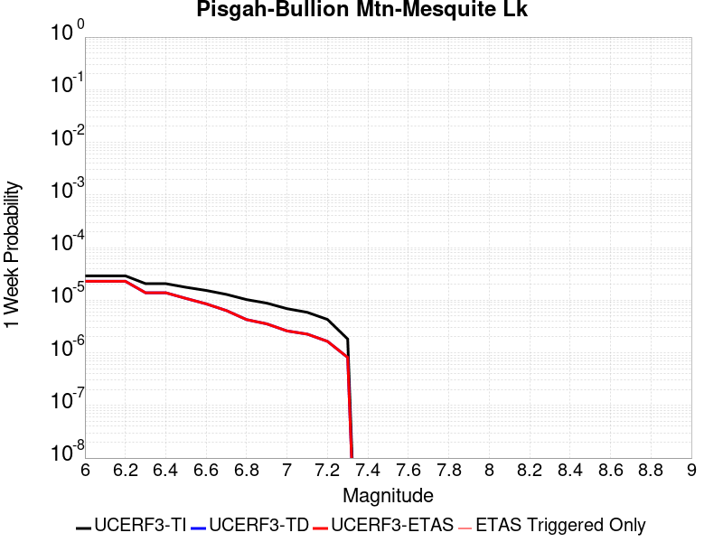 |  |  |  |

| Magnitude | 1 wk TI Prob | 1 wk TD Prob | 1 wk ETAS Prob | 1 wk ETAS/TD Gain | 1 wk ETAS Triggered Only | 1 mo TI Prob | 1 mo TD Prob | 1 mo ETAS Prob | 1 mo ETAS/TD Gain | 1 mo ETAS Triggered Only | 1 yr TI Prob | 1 yr TD Prob | 1 yr ETAS Prob | 1 yr ETAS/TD Gain | 1 yr ETAS Triggered Only | 10 yr TI Prob | 10 yr TD Prob | 10 yr ETAS Prob | 10 yr ETAS/TD Gain | 10 yr ETAS Triggered Only |
|-----|-----|-----|-----|-----|-----|-----|-----|-----|-----|-----|-----|-----|-----|-----|-----|-----|-----|-----|-----|-----|
| 6.0 | 2.9044857E-5 | 2.2903789E-5 | 2.2903789E-5 | 1.0 | 0.0 | 1.2447202E-4 | 9.815588E-5 | 1.081549E-4 | 1.1018687 | 1.0E-5 | 0.0015143933 | 0.0011944764 | 0.0012544047 | 1.0501713 | 6.0E-5 | 0.0150411455 | 0.011888904 | 0.011977834 | 1.00748 | 9.0E-5 |
| 6.1 | 2.9044857E-5 | 2.2903789E-5 | 2.2903789E-5 | 1.0 | 0.0 | 1.2447202E-4 | 9.815588E-5 | 1.081549E-4 | 1.1018687 | 1.0E-5 | 0.0015143933 | 0.0011944764 | 0.0012544047 | 1.0501713 | 6.0E-5 | 0.0150411455 | 0.011888904 | 0.011977834 | 1.00748 | 9.0E-5 |
| 6.2 | 2.9044857E-5 | 2.2903789E-5 | 2.2903789E-5 | 1.0 | 0.0 | 1.2447202E-4 | 9.815588E-5 | 1.081549E-4 | 1.1018687 | 1.0E-5 | 0.0015143933 | 0.0011944764 | 0.0012544047 | 1.0501713 | 6.0E-5 | 0.0150411455 | 0.011888904 | 0.011977834 | 1.00748 | 9.0E-5 |
| 6.3 | 2.0617801E-5 | 1.3842765E-5 | 1.3842765E-5 | 1.0 | 0.0 | 8.835902E-5 | 5.932488E-5 | 6.9324284E-5 | 1.1685534 | 1.0E-5 | 0.0010752401 | 7.2205794E-4 | 7.520362E-4 | 1.041518 | 3.0E-5 | 0.010700523 | 0.007198807 | 0.007238519 | 1.0055165 | 4.0E-5 |
| 6.4 | 2.0617801E-5 | 1.3842765E-5 | 1.3842765E-5 | 1.0 | 0.0 | 8.835902E-5 | 5.932488E-5 | 6.9324284E-5 | 1.1685534 | 1.0E-5 | 0.0010752401 | 7.2205794E-4 | 7.520362E-4 | 1.041518 | 3.0E-5 | 0.010700523 | 0.007198807 | 0.007238519 | 1.0055165 | 4.0E-5 |
| 6.5 | 1.758017E-5 | 1.0797148E-5 | 1.0797148E-5 | 1.0 | 0.0 | 7.534141E-5 | 4.6272733E-5 | 4.6272733E-5 | 1.0 | 0.0 | 9.168957E-4 | 5.632358E-4 | 5.8322446E-4 | 1.0354891 | 2.0E-5 | 0.009131217 | 0.0056191627 | 0.005648994 | 1.0053089 | 3.0E-5 |
| 6.6 | 1.5310006E-5 | 8.517907E-6 | 8.517907E-6 | 1.0 | 0.0 | 6.5612665E-5 | 3.650485E-5 | 3.650485E-5 | 1.0 | 0.0 | 7.985414E-4 | 4.4436334E-4 | 4.6435447E-4 | 1.0449882 | 2.0E-5 | 0.00795678 | 0.0044354857 | 0.004455397 | 1.0044891 | 2.0E-5 |
| 6.7 | 1.2880038E-5 | 6.348786E-6 | 6.348786E-6 | 1.0 | 0.0 | 5.5198994E-5 | 2.7208824E-5 | 2.7208824E-5 | 1.0 | 0.0 | 6.718405E-4 | 3.3122153E-4 | 3.4121823E-4 | 1.0301813 | 1.0E-5 | 0.00669813 | 0.003307719 | 0.003317686 | 1.0030133 | 1.0E-5 |
| 6.8 | 1.0257794E-5 | 4.2711085E-6 | 4.2711085E-6 | 1.0 | 0.0 | 4.3961234E-5 | 1.8304627E-5 | 1.8304627E-5 | 1.0 | 0.0 | 5.3509657E-4 | 2.2283687E-4 | 2.3283465E-4 | 1.0448658 | 1.0E-5 | 0.0053380993 | 0.0022262165 | 0.0022361942 | 1.0044819 | 1.0E-5 |
| 6.9 | 8.783108E-6 | 3.5463972E-6 | 3.5463972E-6 | 1.0 | 0.0 | 3.7641348E-5 | 1.519876E-5 | 1.519876E-5 | 1.0 | 0.0 | 4.5818702E-4 | 1.8502974E-4 | 1.950279E-4 | 1.0540353 | 1.0E-5 | 0.004572435 | 0.0018488116 | 0.0018587931 | 1.0053989 | 1.0E-5 |
| 7.0 | 6.89427E-6 | 2.6047423E-6 | 2.6047423E-6 | 1.0 | 0.0 | 2.9546538E-5 | 1.1163135E-5 | 1.1163135E-5 | 1.0 | 0.0 | 3.596697E-4 | 1.3590301E-4 | 1.4590165E-4 | 1.0735719 | 1.0E-5 | 0.0035908814 | 0.0013582299 | 0.0013682164 | 1.0073525 | 1.0E-5 |
| 7.1 | 5.878841E-6 | 2.2653637E-6 | 2.2653637E-6 | 1.0 | 0.0 | 2.519479E-5 | 9.708668E-6 | 9.708668E-6 | 1.0 | 0.0 | 3.0670338E-4 | 1.18196906E-4 | 1.2819572E-4 | 1.0845946 | 1.0E-5 | 0.0030628045 | 0.0011813694 | 0.0011913576 | 1.0084548 | 1.0E-5 |
| 7.2 | 4.3056375E-6 | 1.6506793E-6 | 1.6506793E-6 | 1.0 | 0.0 | 1.8452602E-5 | 7.074322E-6 | 7.074322E-6 | 1.0 | 0.0 | 2.2463726E-4 | 8.61267E-5 | 9.612584E-5 | 1.116098 | 1.0E-5 | 0.002244103 | 8.6095615E-4 | 8.7094755E-4 | 1.011605 | 1.0E-5 |
| 7.3 | 1.8276363E-6 | 8.173511E-7 | 8.173511E-7 | 1.0 | 0.0 | 7.832704E-6 | 3.5029295E-6 | 3.5029295E-6 | 1.0 | 0.0 | 9.535899E-5 | 4.2647473E-5 | 4.2647473E-5 | 1.0 | 0.0 | 9.5318083E-4 | 4.2640677E-4 | 4.2640677E-4 | 1.0 | 0.0 |

## Camp Rock 2011
*[(top)](#table-of-contents)*

| 1 Week | 1 Month | 1 Year | 10 Year |
|-----|-----|-----|-----|
| 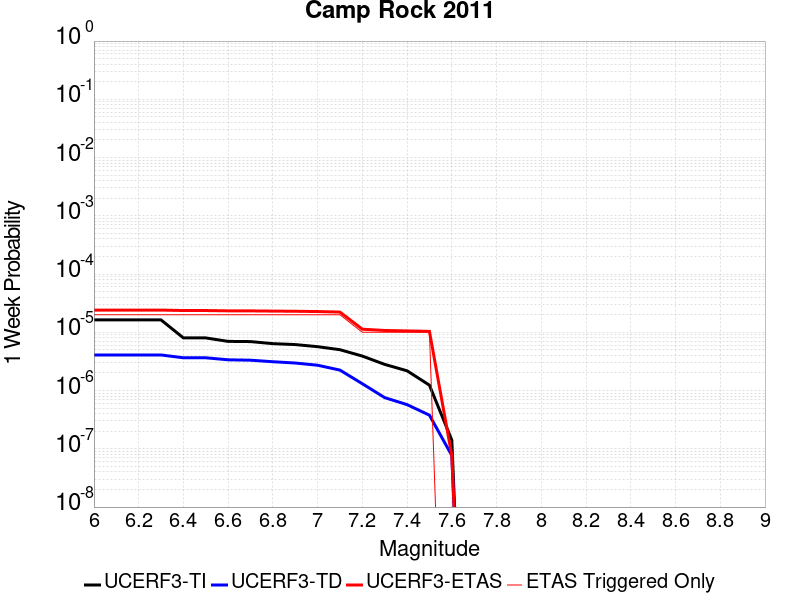 |  |  |  |

| Magnitude | 1 wk TI Prob | 1 wk TD Prob | 1 wk ETAS Prob | 1 wk ETAS/TD Gain | 1 wk ETAS Triggered Only | 1 mo TI Prob | 1 mo TD Prob | 1 mo ETAS Prob | 1 mo ETAS/TD Gain | 1 mo ETAS Triggered Only | 1 yr TI Prob | 1 yr TD Prob | 1 yr ETAS Prob | 1 yr ETAS/TD Gain | 1 yr ETAS Triggered Only | 10 yr TI Prob | 10 yr TD Prob | 10 yr ETAS Prob | 10 yr ETAS/TD Gain | 10 yr ETAS Triggered Only |
|-----|-----|-----|-----|-----|-----|-----|-----|-----|-----|-----|-----|-----|-----|-----|-----|-----|-----|-----|-----|-----|
| 6.0 | 1.6321868E-5 | 4.0844743E-6 | 2.4084393E-5 | 5.8965707 | 2.0E-5 | 6.994899E-5 | 1.7504775E-5 | 7.7503726E-5 | 4.427576 | 6.0E-5 | 8.512962E-4 | 2.1310027E-4 | 2.7308747E-4 | 1.2814976 | 6.0E-5 | 0.008480424 | 0.0021290053 | 0.0022188136 | 1.0421833 | 9.0E-5 |
| 6.1 | 1.6321868E-5 | 4.0844743E-6 | 2.4084393E-5 | 5.8965707 | 2.0E-5 | 6.994899E-5 | 1.7504775E-5 | 7.7503726E-5 | 4.427576 | 6.0E-5 | 8.512962E-4 | 2.1310027E-4 | 2.7308747E-4 | 1.2814976 | 6.0E-5 | 0.008480424 | 0.0021290053 | 0.0022188136 | 1.0421833 | 9.0E-5 |
| 6.2 | 1.6321868E-5 | 4.0844743E-6 | 2.4084393E-5 | 5.8965707 | 2.0E-5 | 6.994899E-5 | 1.7504775E-5 | 7.7503726E-5 | 4.427576 | 6.0E-5 | 8.512962E-4 | 2.1310027E-4 | 2.7308747E-4 | 1.2814976 | 6.0E-5 | 0.008480424 | 0.0021290053 | 0.0022188136 | 1.0421833 | 9.0E-5 |
| 6.3 | 1.6321868E-5 | 4.0844743E-6 | 2.4084393E-5 | 5.8965707 | 2.0E-5 | 6.994899E-5 | 1.7504775E-5 | 7.7503726E-5 | 4.427576 | 6.0E-5 | 8.512962E-4 | 2.1310027E-4 | 2.7308747E-4 | 1.2814976 | 6.0E-5 | 0.008480424 | 0.0021290053 | 0.0022188136 | 1.0421833 | 9.0E-5 |
| 6.4 | 8.015038E-6 | 3.6537967E-6 | 2.3653723E-5 | 6.473738 | 2.0E-5 | 3.434971E-5 | 1.5659036E-5 | 7.56581E-5 | 4.8315935 | 6.0E-5 | 4.1812743E-4 | 1.9063246E-4 | 2.5062103E-4 | 1.3146818 | 6.0E-5 | 0.0041734157 | 0.0019047256 | 0.0019945542 | 1.0471609 | 9.0E-5 |
| 6.5 | 8.015038E-6 | 3.6537967E-6 | 2.3653723E-5 | 6.473738 | 2.0E-5 | 3.434971E-5 | 1.5659036E-5 | 7.56581E-5 | 4.8315935 | 6.0E-5 | 4.1812743E-4 | 1.9063246E-4 | 2.5062103E-4 | 1.3146818 | 6.0E-5 | 0.0041734157 | 0.0019047256 | 0.0019945542 | 1.0471609 | 9.0E-5 |
| 6.6 | 6.9844696E-6 | 3.3734577E-6 | 2.337339E-5 | 6.928615 | 2.0E-5 | 2.9933099E-5 | 1.4457598E-5 | 7.445673E-5 | 5.150007 | 6.0E-5 | 3.6437451E-4 | 1.7600736E-4 | 2.359968E-4 | 1.3408349 | 6.0E-5 | 0.0036377765 | 0.0017587121 | 0.0018485538 | 1.0510838 | 9.0E-5 |
| 6.7 | 6.932096E-6 | 3.3213387E-6 | 2.3321272E-5 | 7.021648 | 2.0E-5 | 2.9708644E-5 | 1.4234233E-5 | 7.423338E-5 | 5.2151303 | 6.0E-5 | 3.616427E-4 | 1.7328832E-4 | 2.3327793E-4 | 1.3461838 | 6.0E-5 | 0.0036105474 | 0.0017315642 | 0.0018214083 | 1.0518861 | 9.0E-5 |
| 6.8 | 6.3862894E-6 | 3.1250715E-6 | 2.3125009E-5 | 7.399833 | 2.0E-5 | 2.7369526E-5 | 1.3393097E-5 | 6.339243E-5 | 4.7332163 | 5.0E-5 | 3.3317303E-4 | 1.6304906E-4 | 2.1304091E-4 | 1.3066062 | 5.0E-5 | 0.0033267394 | 0.001629325 | 0.0017091946 | 1.04902 | 8.0E-5 |
| 6.9 | 6.158623E-6 | 2.9704597E-6 | 2.29704E-5 | 7.7329445 | 2.0E-5 | 2.6393831E-5 | 1.2730482E-5 | 6.272984E-5 | 4.9275312 | 5.0E-5 | 3.212975E-4 | 1.5498289E-4 | 2.0497515E-4 | 1.3225663 | 5.0E-5 | 0.0032083336 | 0.0015487781 | 0.0016286542 | 1.0515736 | 8.0E-5 |
| 7.0 | 5.668964E-6 | 2.7216142E-6 | 2.272156E-5 | 8.34856 | 2.0E-5 | 2.4295334E-5 | 1.166401E-5 | 6.166343E-5 | 5.28664 | 5.0E-5 | 2.9575554E-4 | 1.4200035E-4 | 1.9199325E-4 | 1.3520617 | 5.0E-5 | 0.0029536223 | 0.0014191247 | 0.0014990111 | 1.0562928 | 8.0E-5 |
| 7.1 | 5.025827E-6 | 2.2446181E-6 | 2.2244572E-5 | 9.910182 | 2.0E-5 | 2.153908E-5 | 9.619758E-6 | 5.9619277E-5 | 6.197586 | 5.0E-5 | 2.6220674E-4 | 1.1711451E-4 | 1.6710866E-4 | 1.4268826 | 5.0E-5 | 0.0026189757 | 0.0011705533 | 0.0012404713 | 1.0597308 | 7.0E-5 |
| 7.2 | 3.90736E-6 | 1.3093719E-6 | 1.1309358E-5 | 8.637239 | 1.0E-5 | 1.6745722E-5 | 5.6115823E-6 | 3.5611414E-5 | 6.346056 | 3.0E-5 | 2.0386008E-4 | 6.831896E-5 | 9.831691E-5 | 1.4390868 | 3.0E-5 | 0.0020367317 | 6.829878E-4 | 7.129673E-4 | 1.0438946 | 3.0E-5 |
| 7.3 | 2.8136153E-6 | 7.5609245E-7 | 1.07560845E-5 | 14.225885 | 1.0E-5 | 1.2058295E-5 | 3.2403923E-6 | 3.3240296E-5 | 10.258108 | 3.0E-5 | 1.4679985E-4 | 3.9451086E-5 | 6.94499E-5 | 1.7604054 | 3.0E-5 | 0.0014670292 | 3.9444296E-4 | 4.244311E-4 | 1.0760267 | 3.0E-5 |
| 7.4 | 2.1845249E-6 | 5.736439E-7 | 1.0573638E-5 | 18.432407 | 1.0E-5 | 9.362217E-6 | 2.4584715E-6 | 2.2458422E-5 | 9.135116 | 2.0E-5 | 1.1397902E-4 | 2.9931487E-5 | 4.9930888E-5 | 1.6681726 | 2.0E-5 | 0.0011392058 | 2.992752E-4 | 3.1926922E-4 | 1.0668081 | 2.0E-5 |
| 7.5 | 1.2376645E-6 | 3.7789232E-7 | 1.0377888E-5 | 27.462555 | 1.0E-5 | 5.3042654E-6 | 1.6195374E-6 | 2.1619506E-5 | 13.349185 | 2.0E-5 | 6.457752E-5 | 1.9717696E-5 | 3.9717303E-5 | 2.0142972 | 2.0E-5 | 6.4558757E-4 | 1.9716001E-4 | 2.1715608E-4 | 1.1014204 | 2.0E-5 |
| 7.6 | 1.4118889E-7 | 7.687433E-8 | 7.687433E-8 | 1.0 | 0.0 | 6.050951E-7 | 3.294614E-7 | 3.294614E-7 | 1.0 | 0.0 | 7.367008E-6 | 4.0111872E-6 | 4.0111872E-6 | 1.0 | 0.0 | 7.366764E-5 | 4.011134E-5 | 4.011134E-5 | 1.0 | 0.0 |

## San Pedro Basin
*[(top)](#table-of-contents)*

| 1 Week | 1 Month | 1 Year | 10 Year |
|-----|-----|-----|-----|
|  | 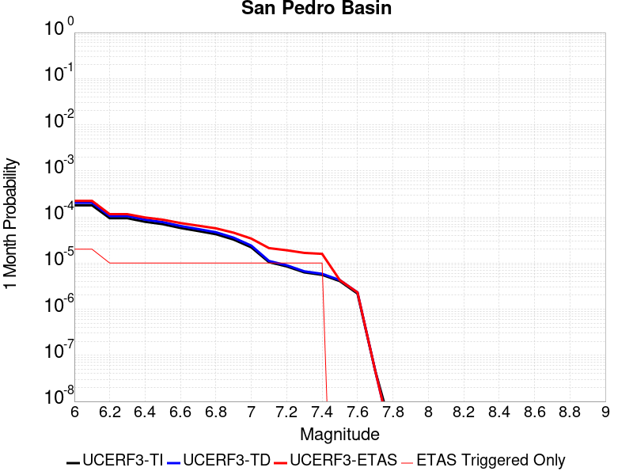 |  |  |

| Magnitude | 1 wk TI Prob | 1 wk TD Prob | 1 wk ETAS Prob | 1 wk ETAS/TD Gain | 1 wk ETAS Triggered Only | 1 mo TI Prob | 1 mo TD Prob | 1 mo ETAS Prob | 1 mo ETAS/TD Gain | 1 mo ETAS Triggered Only | 1 yr TI Prob | 1 yr TD Prob | 1 yr ETAS Prob | 1 yr ETAS/TD Gain | 1 yr ETAS Triggered Only | 10 yr TI Prob | 10 yr TD Prob | 10 yr ETAS Prob | 10 yr ETAS/TD Gain | 10 yr ETAS Triggered Only |
|-----|-----|-----|-----|-----|-----|-----|-----|-----|-----|-----|-----|-----|-----|-----|-----|-----|-----|-----|-----|-----|
| 6.0 | 4.175223E-5 | 4.745922E-5 | 6.745827E-5 | 1.4213945 | 2.0E-5 | 1.7892585E-4 | 2.0338224E-4 | 2.2337817E-4 | 1.098317 | 2.0E-5 | 0.0021762457 | 0.002473621 | 0.0024935715 | 1.0080653 | 2.0E-5 | 0.021550568 | 0.024487048 | 0.024574844 | 1.0035855 | 9.0E-5 |
| 6.1 | 4.175223E-5 | 4.745922E-5 | 6.745827E-5 | 1.4213945 | 2.0E-5 | 1.7892585E-4 | 2.0338224E-4 | 2.2337817E-4 | 1.098317 | 2.0E-5 | 0.0021762457 | 0.002473621 | 0.0024935715 | 1.0080653 | 2.0E-5 | 0.021550568 | 0.024487048 | 0.024574844 | 1.0035855 | 9.0E-5 |
| 6.2 | 2.1914722E-5 | 2.4474124E-5 | 3.447388E-5 | 1.4085848 | 1.0E-5 | 9.391686E-5 | 1.0488505E-4 | 1.1488401E-4 | 1.0953325 | 1.0E-5 | 0.0011428379 | 0.0012762577 | 0.0012862448 | 1.0078254 | 1.0E-5 | 0.011369784 | 0.012692453 | 0.012731946 | 1.0031115 | 4.0E-5 |
| 6.3 | 2.1914722E-5 | 2.4474124E-5 | 3.447388E-5 | 1.4085848 | 1.0E-5 | 9.391686E-5 | 1.0488505E-4 | 1.1488401E-4 | 1.0953325 | 1.0E-5 | 0.0011428379 | 0.0012762577 | 0.0012862448 | 1.0078254 | 1.0E-5 | 0.011369784 | 0.012692453 | 0.012731946 | 1.0031115 | 4.0E-5 |
| 6.4 | 1.8341176E-5 | 2.0389947E-5 | 3.0389743E-5 | 1.4904277 | 1.0E-5 | 7.860267E-5 | 8.7382694E-5 | 9.738182E-5 | 1.1144291 | 1.0E-5 | 9.5656735E-4 | 0.001063388 | 0.0010733773 | 1.0093939 | 1.0E-5 | 0.009524602 | 0.010585369 | 0.010624945 | 1.0037388 | 4.0E-5 |
| 6.5 | 1.6269927E-5 | 1.8035462E-5 | 2.8035282E-5 | 1.5544533 | 1.0E-5 | 6.972639E-5 | 7.729266E-5 | 8.729189E-5 | 1.1293684 | 1.0E-5 | 8.485882E-4 | 9.40652E-4 | 9.5064257E-4 | 1.010621 | 1.0E-5 | 0.008453551 | 0.009368765 | 0.009398484 | 1.0031722 | 3.0E-5 |
| 6.6 | 1.3451532E-5 | 1.48711815E-5 | 2.4871033E-5 | 1.6724316 | 1.0E-5 | 5.764815E-5 | 6.373217E-5 | 7.3731535E-5 | 1.1568966 | 1.0E-5 | 7.016402E-4 | 7.756794E-4 | 7.8567164E-4 | 1.0128819 | 1.0E-5 | 0.00699429 | 0.007731382 | 0.0077611497 | 1.0038503 | 3.0E-5 |
| 6.7 | 1.1557235E-5 | 1.2758967E-5 | 2.2758839E-5 | 1.7837524 | 1.0E-5 | 4.9530063E-5 | 5.4680226E-5 | 6.467968E-5 | 1.1828715 | 1.0E-5 | 6.028617E-4 | 6.655435E-4 | 6.755368E-4 | 1.0150154 | 1.0E-5 | 0.006012288 | 0.0066370084 | 0.0066668093 | 1.0044901 | 3.0E-5 |
| 6.8 | 9.86404E-6 | 1.0891514E-5 | 2.0891404E-5 | 1.918136 | 1.0E-5 | 4.2273776E-5 | 4.667716E-5 | 5.6676694E-5 | 1.2142276 | 1.0E-5 | 5.1456166E-4 | 5.6816026E-4 | 5.781546E-4 | 1.0175906 | 1.0E-5 | 0.0051337183 | 0.0056684655 | 0.005688352 | 1.0035083 | 2.0E-5 |
| 6.9 | 7.549739E-6 | 8.303569E-6 | 1.8303486E-5 | 2.2042913 | 1.0E-5 | 3.2355623E-5 | 3.5586305E-5 | 4.558595E-5 | 1.2809969 | 1.0E-5 | 3.938585E-4 | 4.33189E-4 | 4.4318466E-4 | 1.0230746 | 1.0E-5 | 0.003931612 | 0.0043246155 | 0.004344529 | 1.0046047 | 2.0E-5 |
| 7.0 | 5.1136267E-6 | 5.5852706E-6 | 1.5585214E-5 | 2.7904136 | 1.0E-5 | 2.1915359E-5 | 2.393671E-5 | 3.393647E-5 | 1.4177583 | 1.0E-5 | 2.667868E-4 | 2.9140033E-4 | 3.013974E-4 | 1.034307 | 1.0E-5 | 0.0026646676 | 0.00291115 | 0.002931092 | 1.0068501 | 2.0E-5 |
| 7.1 | 2.442557E-6 | 2.5924621E-6 | 1.2592436E-5 | 4.857327 | 1.0E-5 | 1.0468059E-5 | 1.11105055E-5 | 2.1110394E-5 | 1.9000391 | 1.0E-5 | 1.2744116E-4 | 1.3526213E-4 | 1.4526078E-4 | 1.0739205 | 1.0E-5 | 0.0012736811 | 0.0013518106 | 0.0013717836 | 1.0147749 | 2.0E-5 |
| 7.2 | 1.9759852E-6 | 2.0915452E-6 | 1.2091525E-5 | 5.781144 | 1.0E-5 | 8.468481E-6 | 8.963735E-6 | 1.8963645E-5 | 2.1155963 | 1.0E-5 | 1.0309887E-4 | 1.091281E-4 | 1.19127006E-4 | 1.0916255 | 1.0E-5 | 0.0010305105 | 0.001090754 | 0.0011107323 | 1.0183159 | 2.0E-5 |
| 7.3 | 1.464532E-6 | 1.5442099E-6 | 1.1544194E-5 | 7.4757934 | 1.0E-5 | 6.2765507E-6 | 6.618026E-6 | 1.661796E-5 | 2.5110147 | 1.0E-5 | 7.6414326E-5 | 8.057151E-5 | 9.0570706E-5 | 1.1241033 | 1.0E-5 | 7.6388055E-4 | 8.054255E-4 | 8.1541744E-4 | 1.0124058 | 1.0E-5 |
| 7.4 | 1.2959829E-6 | 1.366423E-6 | 1.1366409E-5 | 8.318368 | 1.0E-5 | 5.5542005E-6 | 5.8560854E-6 | 1.5856027E-5 | 2.7076154 | 1.0E-5 | 6.762029E-5 | 7.129553E-5 | 8.129482E-5 | 1.1402513 | 1.0E-5 | 6.7599723E-4 | 7.127289E-4 | 7.2272174E-4 | 1.0140206 | 1.0E-5 |
| 7.5 | 9.476035E-7 | 9.978876E-7 | 9.978876E-7 | 1.0 | 0.0 | 4.0611512E-6 | 4.276654E-6 | 4.276654E-6 | 1.0 | 0.0 | 4.9443395E-5 | 5.2067044E-5 | 5.2067044E-5 | 1.0 | 0.0 | 4.9432396E-4 | 5.2055035E-4 | 5.2055035E-4 | 1.0 | 0.0 |
| 7.6 | 5.087787E-7 | 5.3933314E-7 | 5.3933314E-7 | 1.0 | 0.0 | 2.1804783E-6 | 2.3114258E-6 | 2.3114258E-6 | 1.0 | 0.0 | 2.6547E-5 | 2.814126E-5 | 2.814126E-5 | 1.0 | 0.0 | 2.6543828E-4 | 2.813784E-4 | 2.813784E-4 | 1.0 | 0.0 |
| 7.7 | 1.09097575E-8 | 1.0871489E-8 | 1.0871489E-8 | 1.0 | 0.0 | 4.6756103E-8 | 4.6592092E-8 | 4.6592092E-8 | 1.0 | 0.0 | 5.692554E-7 | 5.672586E-7 | 5.672586E-7 | 1.0 | 0.0 | 5.6925396E-6 | 5.672573E-6 | 5.672573E-6 | 1.0 | 0.0 |
| 7.8 | 4.505416E-10 | 2.623286E-10 | 2.623286E-10 | 1.0 | 0.0 | 1.9308923E-9 | 1.1242655E-9 | 1.1242655E-9 | 1.0 | 0.0 | 2.3508615E-8 | 1.3687932E-8 | 1.3687932E-8 | 1.0 | 0.0 | 2.3508613E-7 | 1.3687932E-7 | 1.3687932E-7 | 1.0 | 0.0 |

## Oak Ridge (Onshore)
*[(top)](#table-of-contents)*

| 1 Week | 1 Month | 1 Year | 10 Year |
|-----|-----|-----|-----|
|  |  | 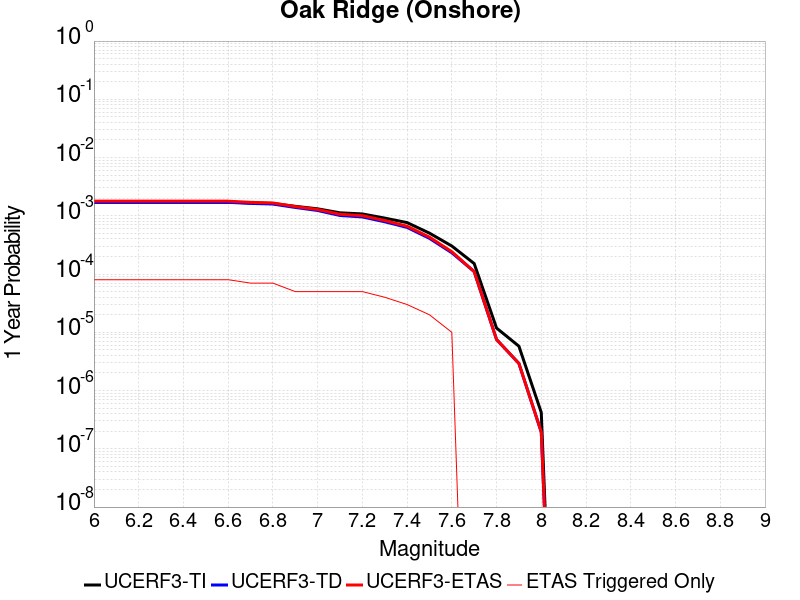 | 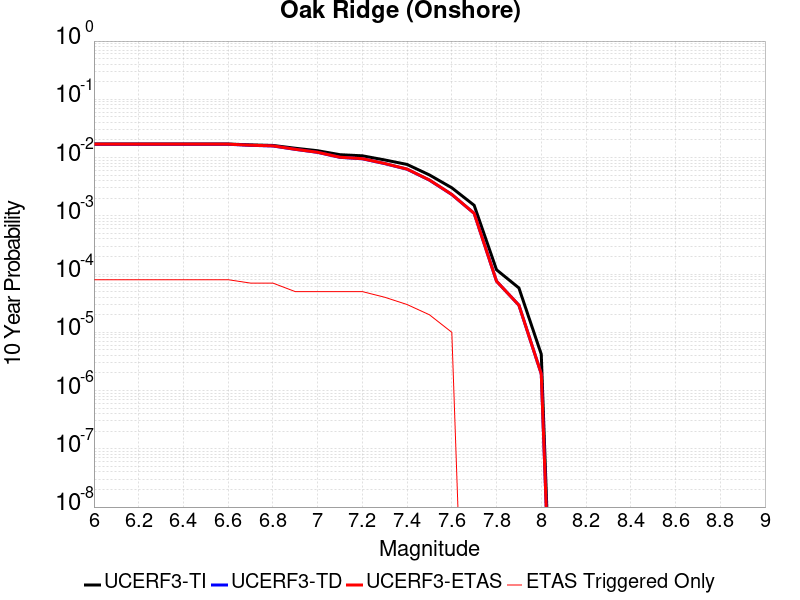 |

| Magnitude | 1 wk TI Prob | 1 wk TD Prob | 1 wk ETAS Prob | 1 wk ETAS/TD Gain | 1 wk ETAS Triggered Only | 1 mo TI Prob | 1 mo TD Prob | 1 mo ETAS Prob | 1 mo ETAS/TD Gain | 1 mo ETAS Triggered Only | 1 yr TI Prob | 1 yr TD Prob | 1 yr ETAS Prob | 1 yr ETAS/TD Gain | 1 yr ETAS Triggered Only | 10 yr TI Prob | 10 yr TD Prob | 10 yr ETAS Prob | 10 yr ETAS/TD Gain | 10 yr ETAS Triggered Only |
|-----|-----|-----|-----|-----|-----|-----|-----|-----|-----|-----|-----|-----|-----|-----|-----|-----|-----|-----|-----|-----|
| 6.0 | 3.303067E-5 | 3.2665655E-5 | 7.266435E-5 | 2.2244875 | 4.0E-5 | 1.4155233E-4 | 1.3998839E-4 | 2.0997859E-4 | 1.4999714 | 7.0E-5 | 0.0017220371 | 0.001703068 | 0.0017829317 | 1.0468941 | 8.0E-5 | 0.017087538 | 0.016906595 | 0.016985241 | 1.0046519 | 8.0E-5 |
| 6.1 | 3.303067E-5 | 3.2665655E-5 | 7.266435E-5 | 2.2244875 | 4.0E-5 | 1.4155233E-4 | 1.3998839E-4 | 2.0997859E-4 | 1.4999714 | 7.0E-5 | 0.0017220371 | 0.001703068 | 0.0017829317 | 1.0468941 | 8.0E-5 | 0.017087538 | 0.016906595 | 0.016985241 | 1.0046519 | 8.0E-5 |
| 6.2 | 3.303067E-5 | 3.2665655E-5 | 7.266435E-5 | 2.2244875 | 4.0E-5 | 1.4155233E-4 | 1.3998839E-4 | 2.0997859E-4 | 1.4999714 | 7.0E-5 | 0.0017220371 | 0.001703068 | 0.0017829317 | 1.0468941 | 8.0E-5 | 0.017087538 | 0.016906595 | 0.016985241 | 1.0046519 | 8.0E-5 |
| 6.3 | 3.303067E-5 | 3.2665655E-5 | 7.266435E-5 | 2.2244875 | 4.0E-5 | 1.4155233E-4 | 1.3998839E-4 | 2.0997859E-4 | 1.4999714 | 7.0E-5 | 0.0017220371 | 0.001703068 | 0.0017829317 | 1.0468941 | 8.0E-5 | 0.017087538 | 0.016906595 | 0.016985241 | 1.0046519 | 8.0E-5 |
| 6.4 | 3.303067E-5 | 3.2665655E-5 | 7.266435E-5 | 2.2244875 | 4.0E-5 | 1.4155233E-4 | 1.3998839E-4 | 2.0997859E-4 | 1.4999714 | 7.0E-5 | 0.0017220371 | 0.001703068 | 0.0017829317 | 1.0468941 | 8.0E-5 | 0.017087538 | 0.016906595 | 0.016985241 | 1.0046519 | 8.0E-5 |
| 6.5 | 3.303067E-5 | 3.2665655E-5 | 7.266435E-5 | 2.2244875 | 4.0E-5 | 1.4155233E-4 | 1.3998839E-4 | 2.0997859E-4 | 1.4999714 | 7.0E-5 | 0.0017220371 | 0.001703068 | 0.0017829317 | 1.0468941 | 8.0E-5 | 0.017087538 | 0.016906595 | 0.016985241 | 1.0046519 | 8.0E-5 |
| 6.6 | 3.303067E-5 | 3.2665655E-5 | 7.266435E-5 | 2.2244875 | 4.0E-5 | 1.4155233E-4 | 1.3998839E-4 | 2.0997859E-4 | 1.4999714 | 7.0E-5 | 0.0017220371 | 0.001703068 | 0.0017829317 | 1.0468941 | 8.0E-5 | 0.017087538 | 0.016906595 | 0.016985241 | 1.0046519 | 8.0E-5 |
| 6.7 | 3.190748E-5 | 3.13363E-5 | 6.133536E-5 | 1.9573262 | 3.0E-5 | 1.3673917E-4 | 1.3429174E-4 | 1.9428368E-4 | 1.4467285 | 6.0E-5 | 0.0016635279 | 0.0016338157 | 0.0017037013 | 1.0427744 | 7.0E-5 | 0.0165113 | 0.01622424 | 0.016293105 | 1.0042446 | 7.0E-5 |
| 6.8 | 3.12131E-5 | 3.0533443E-5 | 6.053253E-5 | 1.9824991 | 3.0E-5 | 1.3376358E-4 | 1.3085127E-4 | 1.9084342E-4 | 1.4584758 | 6.0E-5 | 0.0016273549 | 0.0015919893 | 0.0016618778 | 1.0439001 | 7.0E-5 | 0.01615489 | 0.015811933 | 0.015880827 | 1.004357 | 7.0E-5 |
| 6.9 | 2.791605E-5 | 2.6686967E-5 | 3.66867E-5 | 1.3747047 | 1.0E-5 | 1.1963473E-4 | 1.1436784E-4 | 1.5436327E-4 | 1.3497087 | 4.0E-5 | 0.0014555797 | 0.0013915634 | 0.0014414939 | 1.0358808 | 5.0E-5 | 0.0144608235 | 0.013833011 | 0.013882319 | 1.0035646 | 5.0E-5 |
| 7.0 | 2.527992E-5 | 2.3670056E-5 | 3.3669818E-5 | 1.4224647 | 1.0E-5 | 1.0833802E-4 | 1.01439255E-4 | 1.414352E-4 | 1.3942846 | 4.0E-5 | 0.0013182173 | 0.001234342 | 0.0012842802 | 1.0404574 | 5.0E-5 | 0.01310425 | 0.012278725 | 0.012328112 | 1.0040221 | 5.0E-5 |
| 7.1 | 2.1592812E-5 | 1.9421916E-5 | 2.9421723E-5 | 1.5148723 | 1.0E-5 | 9.253734E-5 | 8.3234176E-5 | 1.2323084E-4 | 1.4805318 | 4.0E-5 | 0.0011260597 | 0.0010129139 | 0.0010628632 | 1.0493126 | 5.0E-5 | 0.011203708 | 0.010085781 | 0.010135277 | 1.0049075 | 5.0E-5 |
| 7.2 | 2.0654974E-5 | 1.8339751E-5 | 2.8339568E-5 | 1.5452536 | 1.0E-5 | 8.851831E-5 | 7.859662E-5 | 1.18593474E-4 | 1.5088878 | 4.0E-5 | 0.0010771776 | 9.5650216E-4 | 0.0010064543 | 1.0522238 | 5.0E-5 | 0.010719712 | 0.009526589 | 0.009576113 | 1.0051985 | 5.0E-5 |
| 7.3 | 1.7522105E-5 | 1.5144796E-5 | 2.5144644E-5 | 1.6602829 | 1.0E-5 | 7.5092576E-5 | 6.4904685E-5 | 9.490274E-5 | 1.4621862 | 3.0E-5 | 9.138686E-4 | 7.899344E-4 | 8.2990277E-4 | 1.0505971 | 4.0E-5 | 0.009101195 | 0.007873569 | 0.007913254 | 1.0050403 | 4.0E-5 |
| 7.4 | 1.4656553E-5 | 1.2121773E-5 | 2.212165E-5 | 1.8249519 | 1.0E-5 | 6.281228E-5 | 5.194943E-5 | 7.1948394E-5 | 1.3849698 | 2.0E-5 | 7.644712E-4 | 6.3230295E-4 | 6.6228403E-4 | 1.0474156 | 3.0E-5 | 0.007618467 | 0.006306584 | 0.006336395 | 1.0047269 | 3.0E-5 |
| 7.5 | 9.665176E-6 | 7.868476E-6 | 1.7868397E-5 | 2.2708843 | 1.0E-5 | 4.1421525E-5 | 3.3721608E-5 | 5.372093E-5 | 1.5930716 | 2.0E-5 | 5.0419034E-4 | 4.104838E-4 | 4.304756E-4 | 1.048703 | 2.0E-5 | 0.0050304793 | 0.004097367 | 0.0041172854 | 1.0048612 | 2.0E-5 |
| 7.6 | 5.809651E-6 | 4.446691E-6 | 1.4446647E-5 | 3.2488534 | 1.0E-5 | 2.4898269E-5 | 1.9057108E-5 | 2.9056917E-5 | 1.5247285 | 1.0E-5 | 3.0309425E-4 | 2.3199577E-4 | 2.4199346E-4 | 1.0430943 | 1.0E-5 | 0.0030268119 | 0.0023175552 | 0.002327532 | 1.0043049 | 1.0E-5 |
| 7.7 | 2.902288E-6 | 2.1122123E-6 | 2.1122123E-6 | 1.0 | 0.0 | 1.2438319E-5 | 9.052307E-6 | 9.052307E-6 | 1.0 | 0.0 | 1.5142601E-4 | 1.102064E-4 | 1.102064E-4 | 1.0 | 0.0 | 0.0015132286 | 0.0011015302 | 0.0011015302 | 1.0 | 0.0 |
| 7.8 | 2.2687361E-7 | 1.4441626E-7 | 1.4441626E-7 | 1.0 | 0.0 | 9.723151E-7 | 6.189267E-7 | 6.189267E-7 | 1.0 | 0.0 | 1.1837872E-5 | 7.5354073E-6 | 7.5354073E-6 | 1.0 | 0.0 | 1.1837241E-4 | 7.5351585E-5 | 7.5351585E-5 | 1.0 | 0.0 |
| 7.9 | 1.10667024E-7 | 5.5999948E-8 | 5.5999948E-8 | 1.0 | 0.0 | 4.7428716E-7 | 2.3999976E-7 | 2.3999976E-7 | 1.0 | 0.0 | 5.774431E-6 | 2.9219937E-6 | 2.9219937E-6 | 1.0 | 0.0 | 5.7742807E-5 | 2.9219596E-5 | 2.9219596E-5 | 1.0 | 0.0 |
| 8.0 | 8.057798E-9 | 3.7059986E-9 | 3.7059986E-9 | 1.0 | 0.0 | 3.453342E-8 | 1.588285E-8 | 1.588285E-8 | 1.0 | 0.0 | 4.204443E-7 | 1.9337371E-7 | 1.9337371E-7 | 1.0 | 0.0 | 4.2044353E-6 | 1.933736E-6 | 1.933736E-6 | 1.0 | 0.0 |

## San Jacinto (Coyote Creek)
*[(top)](#table-of-contents)*

| 1 Week | 1 Month | 1 Year | 10 Year |
|-----|-----|-----|-----|
|  |  |  |  |

| Magnitude | 1 wk TI Prob | 1 wk TD Prob | 1 wk ETAS Prob | 1 wk ETAS/TD Gain | 1 wk ETAS Triggered Only | 1 mo TI Prob | 1 mo TD Prob | 1 mo ETAS Prob | 1 mo ETAS/TD Gain | 1 mo ETAS Triggered Only | 1 yr TI Prob | 1 yr TD Prob | 1 yr ETAS Prob | 1 yr ETAS/TD Gain | 1 yr ETAS Triggered Only | 10 yr TI Prob | 10 yr TD Prob | 10 yr ETAS Prob | 10 yr ETAS/TD Gain | 10 yr ETAS Triggered Only |
|-----|-----|-----|-----|-----|-----|-----|-----|-----|-----|-----|-----|-----|-----|-----|-----|-----|-----|-----|-----|-----|
| 6.0 | 2.8801875E-5 | 2.4142017E-5 | 4.4141536E-5 | 1.8284112 | 2.0E-5 | 1.2343077E-4 | 1.034617E-4 | 1.2345963E-4 | 1.1932882 | 2.0E-5 | 0.0015017337 | 0.0012589215 | 0.0013188459 | 1.0475998 | 6.0E-5 | 0.014916257 | 0.012927139 | 0.013015976 | 1.006872 | 9.0E-5 |
| 6.1 | 2.8801875E-5 | 2.4142017E-5 | 4.4141536E-5 | 1.8284112 | 2.0E-5 | 1.2343077E-4 | 1.034617E-4 | 1.2345963E-4 | 1.1932882 | 2.0E-5 | 0.0015017337 | 0.0012589215 | 0.0013188459 | 1.0475998 | 6.0E-5 | 0.014916257 | 0.012927139 | 0.013015976 | 1.006872 | 9.0E-5 |
| 6.2 | 2.8801875E-5 | 2.4142017E-5 | 4.4141536E-5 | 1.8284112 | 2.0E-5 | 1.2343077E-4 | 1.034617E-4 | 1.2345963E-4 | 1.1932882 | 2.0E-5 | 0.0015017337 | 0.0012589215 | 0.0013188459 | 1.0475998 | 6.0E-5 | 0.014916257 | 0.012927139 | 0.013015976 | 1.006872 | 9.0E-5 |
| 6.3 | 2.8801875E-5 | 2.4142017E-5 | 4.4141536E-5 | 1.8284112 | 2.0E-5 | 1.2343077E-4 | 1.034617E-4 | 1.2345963E-4 | 1.1932882 | 2.0E-5 | 0.0015017337 | 0.0012589215 | 0.0013188459 | 1.0475998 | 6.0E-5 | 0.014916257 | 0.012927139 | 0.013015976 | 1.006872 | 9.0E-5 |
| 6.4 | 2.8801875E-5 | 2.4142017E-5 | 4.4141536E-5 | 1.8284112 | 2.0E-5 | 1.2343077E-4 | 1.034617E-4 | 1.2345963E-4 | 1.1932882 | 2.0E-5 | 0.0015017337 | 0.0012589215 | 0.0013188459 | 1.0475998 | 6.0E-5 | 0.014916257 | 0.012927139 | 0.013015976 | 1.006872 | 9.0E-5 |
| 6.5 | 2.8686647E-5 | 2.3997507E-5 | 4.3997028E-5 | 1.8333999 | 2.0E-5 | 1.2293698E-4 | 1.0284242E-4 | 1.2284037E-4 | 1.1944523 | 2.0E-5 | 0.00149573 | 0.0012513906 | 0.0013113155 | 1.0478866 | 6.0E-5 | 0.014857027 | 0.012852716 | 0.012941559 | 1.0069125 | 9.0E-5 |
| 6.6 | 2.8686647E-5 | 2.3997507E-5 | 4.3997028E-5 | 1.8333999 | 2.0E-5 | 1.2293698E-4 | 1.0284242E-4 | 1.2284037E-4 | 1.1944523 | 2.0E-5 | 0.00149573 | 0.0012513906 | 0.0013113155 | 1.0478866 | 6.0E-5 | 0.014857027 | 0.012852716 | 0.012941559 | 1.0069125 | 9.0E-5 |
| 6.7 | 2.8614546E-5 | 2.3913399E-5 | 4.3912918E-5 | 1.8363312 | 2.0E-5 | 1.22628E-4 | 1.0248199E-4 | 1.2247993E-4 | 1.1951363 | 2.0E-5 | 0.0014919734 | 0.0012470073 | 0.0013069324 | 1.0480552 | 6.0E-5 | 0.014819962 | 0.012809374 | 0.012898222 | 1.0069361 | 9.0E-5 |
| 6.8 | 2.8500443E-5 | 2.3837512E-5 | 4.3837037E-5 | 1.8389937 | 2.0E-5 | 1.2213904E-4 | 1.0215679E-4 | 1.2215474E-4 | 1.1957575 | 2.0E-5 | 0.0014860283 | 0.0012430524 | 0.0013029779 | 1.0482082 | 6.0E-5 | 0.014761304 | 0.012770093 | 0.012858943 | 1.0069578 | 9.0E-5 |
| 6.9 | 2.8398292E-5 | 2.3755478E-5 | 4.3755E-5 | 1.841891 | 2.0E-5 | 1.2170129E-4 | 1.01805235E-4 | 1.218032E-4 | 1.1964335 | 2.0E-5 | 0.001480706 | 0.0012387772 | 0.0012987029 | 1.0483749 | 6.0E-5 | 0.014708786 | 0.012727562 | 0.012816417 | 1.0069813 | 9.0E-5 |
| 7.0 | 2.7975118E-5 | 2.3327535E-5 | 4.332707E-5 | 1.8573359 | 2.0E-5 | 1.1988785E-4 | 9.997134E-5 | 1.1996934E-4 | 1.2000374 | 2.0E-5 | 0.0014586572 | 0.0012164746 | 0.0012764016 | 1.0492629 | 6.0E-5 | 0.014491199 | 0.012506589 | 0.012595464 | 1.0071062 | 9.0E-5 |
| 7.1 | 2.7603435E-5 | 2.2999497E-5 | 4.2999036E-5 | 1.8695642 | 2.0E-5 | 1.1829507E-4 | 9.8565564E-5 | 1.1856359E-4 | 1.2028906 | 2.0E-5 | 0.0014392909 | 0.0011993783 | 0.0012593062 | 1.049966 | 6.0E-5 | 0.0143000465 | 0.01233621 | 0.0124251 | 1.0072056 | 9.0E-5 |
| 7.2 | 2.6859294E-5 | 2.2394745E-5 | 4.2394295E-5 | 1.8930467 | 2.0E-5 | 1.1510618E-4 | 9.5973955E-5 | 1.1597204E-4 | 1.2083699 | 2.0E-5 | 0.0014005168 | 0.0011678595 | 0.0012277896 | 1.051316 | 6.0E-5 | 0.013917232 | 0.012021441 | 0.012110359 | 1.0073966 | 9.0E-5 |
| 7.3 | 2.465702E-5 | 2.1026055E-5 | 4.1025633E-5 | 1.9511808 | 2.0E-5 | 1.0566866E-4 | 9.0108566E-5 | 1.1010676E-4 | 1.2219344 | 2.0E-5 | 0.0012857567 | 0.0010965222 | 0.0011564564 | 1.0546584 | 6.0E-5 | 0.012783429 | 0.0113066025 | 0.011395585 | 1.00787 | 9.0E-5 |
| 7.4 | 2.4130479E-5 | 2.0698752E-5 | 4.0698338E-5 | 1.9662218 | 2.0E-5 | 1.0341224E-4 | 8.8705936E-5 | 1.0870416E-4 | 1.2254441 | 2.0E-5 | 0.0012583168 | 0.0010794622 | 0.0011393975 | 1.0555233 | 6.0E-5 | 0.012512155 | 0.011135619 | 0.011224617 | 1.0079921 | 9.0E-5 |
| 7.5 | 2.3086503E-5 | 2.0074305E-5 | 4.0073905E-5 | 1.9962785 | 2.0E-5 | 9.89384E-5 | 8.602991E-5 | 1.06028194E-4 | 1.2324573 | 2.0E-5 | 0.0012039093 | 0.0010469134 | 0.0011068506 | 1.0572513 | 6.0E-5 | 0.01197408 | 0.01080727 | 0.010896298 | 1.0082377 | 9.0E-5 |
| 7.6 | 2.098327E-5 | 1.875716E-5 | 3.8756785E-5 | 2.0662396 | 2.0E-5 | 8.99252E-5 | 8.038536E-5 | 1.0038375E-4 | 1.2487816 | 2.0E-5 | 0.0010942894 | 9.782546E-4 | 0.0010381959 | 1.0612737 | 6.0E-5 | 0.010889164 | 0.010114619 | 0.010203709 | 1.008808 | 9.0E-5 |
| 7.7 | 1.7271595E-5 | 1.593049E-5 | 3.593017E-5 | 2.2554343 | 2.0E-5 | 7.401902E-5 | 6.8271744E-5 | 8.827038E-5 | 1.2929269 | 2.0E-5 | 9.0080895E-4 | 8.308923E-4 | 8.9084246E-4 | 1.0721515 | 6.0E-5 | 0.008971662 | 0.008632809 | 0.0087220315 | 1.0103353 | 9.0E-5 |
| 7.8 | 1.4148871E-5 | 1.4074532E-5 | 3.407425E-5 | 2.4209864 | 2.0E-5 | 6.063661E-5 | 6.0318034E-5 | 8.031683E-5 | 1.3315558 | 2.0E-5 | 7.380007E-4 | 7.341252E-4 | 7.9408113E-4 | 1.0816699 | 6.0E-5 | 0.0073555456 | 0.0076553114 | 0.0077446224 | 1.0116665 | 9.0E-5 |
| 7.9 | 1.0722926E-5 | 1.0781387E-5 | 3.078117E-5 | 2.8550289 | 2.0E-5 | 4.5954588E-5 | 4.620513E-5 | 6.620421E-5 | 1.4328324 | 2.0E-5 | 5.5935344E-4 | 5.624027E-4 | 6.22369E-4 | 1.1066251 | 6.0E-5 | 0.0055794762 | 0.0059186863 | 0.0060081533 | 1.0151161 | 9.0E-5 |
| 8.0 | 8.799301E-6 | 9.03057E-6 | 2.903039E-5 | 3.2146795 | 2.0E-5 | 3.7710746E-5 | 3.8701874E-5 | 5.8701098E-5 | 1.5167508 | 2.0E-5 | 4.590316E-4 | 4.710939E-4 | 5.310656E-4 | 1.1273031 | 6.0E-5 | 0.0045808456 | 0.004986563 | 0.0050761146 | 1.0179585 | 9.0E-5 |
| 8.1 | 6.8041386E-6 | 6.4507326E-6 | 6.4507326E-6 | 1.0 | 0.0 | 2.9160268E-5 | 2.7645705E-5 | 2.7645705E-5 | 1.0 | 0.0 | 3.5496842E-4 | 3.3653493E-4 | 3.6652482E-4 | 1.0891138 | 3.0E-5 | 0.0035440195 | 0.0035870373 | 0.003636858 | 1.0138891 | 5.0E-5 |
| 8.2 | 1.8495697E-6 | 8.0121237E-7 | 8.0121237E-7 | 1.0 | 0.0 | 7.926703E-6 | 3.433763E-6 | 3.433763E-6 | 1.0 | 0.0 | 9.650333E-5 | 4.1805277E-5 | 4.1805277E-5 | 1.0 | 0.0 | 9.646144E-4 | 4.7587545E-4 | 4.7587545E-4 | 1.0 | 0.0 |
| 8.3 | 2.0067954E-7 | 6.574213E-8 | 6.574213E-8 | 1.0 | 0.0 | 8.6005485E-7 | 2.8175197E-7 | 2.8175197E-7 | 1.0 | 0.0 | 1.0471118E-5 | 3.430325E-6 | 3.430325E-6 | 1.0 | 0.0 | 1.0470625E-4 | 4.007911E-5 | 4.007911E-5 | 1.0 | 0.0 |

## Blue Cut
*[(top)](#table-of-contents)*

| 1 Week | 1 Month | 1 Year | 10 Year |
|-----|-----|-----|-----|
| 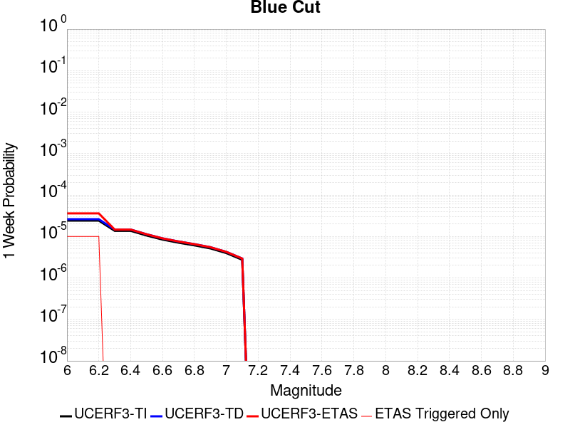 | 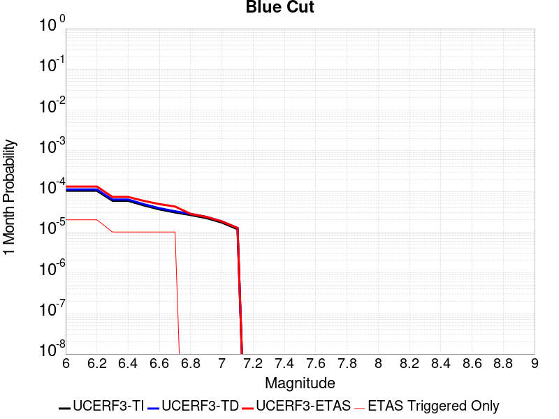 |  |  |

| Magnitude | 1 wk TI Prob | 1 wk TD Prob | 1 wk ETAS Prob | 1 wk ETAS/TD Gain | 1 wk ETAS Triggered Only | 1 mo TI Prob | 1 mo TD Prob | 1 mo ETAS Prob | 1 mo ETAS/TD Gain | 1 mo ETAS Triggered Only | 1 yr TI Prob | 1 yr TD Prob | 1 yr ETAS Prob | 1 yr ETAS/TD Gain | 1 yr ETAS Triggered Only | 10 yr TI Prob | 10 yr TD Prob | 10 yr ETAS Prob | 10 yr ETAS/TD Gain | 10 yr ETAS Triggered Only |
|-----|-----|-----|-----|-----|-----|-----|-----|-----|-----|-----|-----|-----|-----|-----|-----|-----|-----|-----|-----|-----|
| 6.0 | 2.4176064E-5 | 2.6081825E-5 | 3.6081565E-5 | 1.3833988 | 1.0E-5 | 1.03607585E-4 | 1.11774854E-4 | 1.3177261E-4 | 1.1789111 | 2.0E-5 | 0.0012606924 | 0.0013600785 | 0.0014199968 | 1.0440551 | 6.0E-5 | 0.012535643 | 0.013524555 | 0.013613338 | 1.0065646 | 9.0E-5 |
| 6.1 | 2.4176064E-5 | 2.6081825E-5 | 3.6081565E-5 | 1.3833988 | 1.0E-5 | 1.03607585E-4 | 1.11774854E-4 | 1.3177261E-4 | 1.1789111 | 2.0E-5 | 0.0012606924 | 0.0013600785 | 0.0014199968 | 1.0440551 | 6.0E-5 | 0.012535643 | 0.013524555 | 0.013613338 | 1.0065646 | 9.0E-5 |
| 6.2 | 2.4176064E-5 | 2.6081825E-5 | 3.6081565E-5 | 1.3833988 | 1.0E-5 | 1.03607585E-4 | 1.11774854E-4 | 1.3177261E-4 | 1.1789111 | 2.0E-5 | 0.0012606924 | 0.0013600785 | 0.0014199968 | 1.0440551 | 6.0E-5 | 0.012535643 | 0.013524555 | 0.013613338 | 1.0065646 | 9.0E-5 |
| 6.3 | 1.3700933E-5 | 1.4689222E-5 | 1.4689222E-5 | 1.0 | 0.0 | 5.871696E-5 | 6.295237E-5 | 7.295174E-5 | 1.1588403 | 1.0E-5 | 7.146445E-4 | 7.661903E-4 | 7.961673E-4 | 1.0391247 | 3.0E-5 | 0.0071235066 | 0.007636972 | 0.0076766666 | 1.0051976 | 4.0E-5 |
| 6.4 | 1.3700933E-5 | 1.4689222E-5 | 1.4689222E-5 | 1.0 | 0.0 | 5.871696E-5 | 6.295237E-5 | 7.295174E-5 | 1.1588403 | 1.0E-5 | 7.146445E-4 | 7.661903E-4 | 7.961673E-4 | 1.0391247 | 3.0E-5 | 0.0071235066 | 0.007636972 | 0.0076766666 | 1.0051976 | 4.0E-5 |
| 6.5 | 1.0571009E-5 | 1.1310083E-5 | 1.1310083E-5 | 1.0 | 0.0 | 4.530354E-5 | 4.847094E-5 | 5.8470454E-5 | 1.2062992 | 1.0E-5 | 5.51431E-4 | 5.8998406E-4 | 6.1996636E-4 | 1.0508188 | 3.0E-5 | 0.0055006463 | 0.005885195 | 0.0059249597 | 1.0067567 | 4.0E-5 |
| 6.6 | 8.432193E-6 | 9.010241E-6 | 9.010241E-6 | 1.0 | 0.0 | 3.613747E-5 | 3.8614795E-5 | 4.861441E-5 | 1.2589581 | 1.0E-5 | 4.3988484E-4 | 4.7004173E-4 | 4.8003704E-4 | 1.0212647 | 1.0E-5 | 0.0043901512 | 0.004691275 | 0.004711181 | 1.0042433 | 2.0E-5 |
| 6.7 | 7.0979586E-6 | 7.5808057E-6 | 7.5808057E-6 | 1.0 | 0.0 | 3.0419467E-5 | 3.2488802E-5 | 4.248848E-5 | 1.3077884 | 1.0E-5 | 3.702941E-4 | 3.9548666E-4 | 4.0548271E-4 | 1.0252753 | 1.0E-5 | 0.0036967767 | 0.003948548 | 0.003968469 | 1.0050452 | 2.0E-5 |
| 6.8 | 6.117205E-6 | 6.532318E-6 | 6.532318E-6 | 1.0 | 0.0 | 2.6216328E-5 | 2.7995387E-5 | 2.7995387E-5 | 1.0 | 0.0 | 3.1913706E-4 | 3.4079739E-4 | 3.4079739E-4 | 1.0 | 0.0 | 0.0031867912 | 0.0034034234 | 0.0034133892 | 1.0029283 | 1.0E-5 |
| 6.9 | 5.165005E-6 | 5.515969E-6 | 5.515969E-6 | 1.0 | 0.0 | 2.2135548E-5 | 2.363969E-5 | 2.363969E-5 | 1.0 | 0.0 | 2.6946695E-4 | 2.8778167E-4 | 2.8778167E-4 | 1.0 | 0.0 | 0.0026914044 | 0.0028747257 | 0.002884697 | 1.0034686 | 1.0E-5 |
| 7.0 | 3.9892893E-6 | 4.262613E-6 | 4.262613E-6 | 1.0 | 0.0 | 1.7096843E-5 | 1.8268249E-5 | 1.8268249E-5 | 1.0 | 0.0 | 2.0813418E-4 | 2.223994E-4 | 2.223994E-4 | 1.0 | 0.0 | 0.0020793935 | 0.0022223745 | 0.0022323523 | 1.0044897 | 1.0E-5 |
| 7.1 | 2.7477456E-6 | 2.9384635E-6 | 2.9384635E-6 | 1.0 | 0.0 | 1.1775999E-5 | 1.2593387E-5 | 1.2593387E-5 | 1.0 | 0.0 | 1.4336336E-4 | 1.5331943E-4 | 1.5331943E-4 | 1.0 | 0.0 | 0.001432709 | 0.0015326998 | 0.0015426844 | 1.0065144 | 1.0E-5 |

## San Clemente
*[(top)](#table-of-contents)*

| 1 Week | 1 Month | 1 Year | 10 Year |
|-----|-----|-----|-----|
|  | 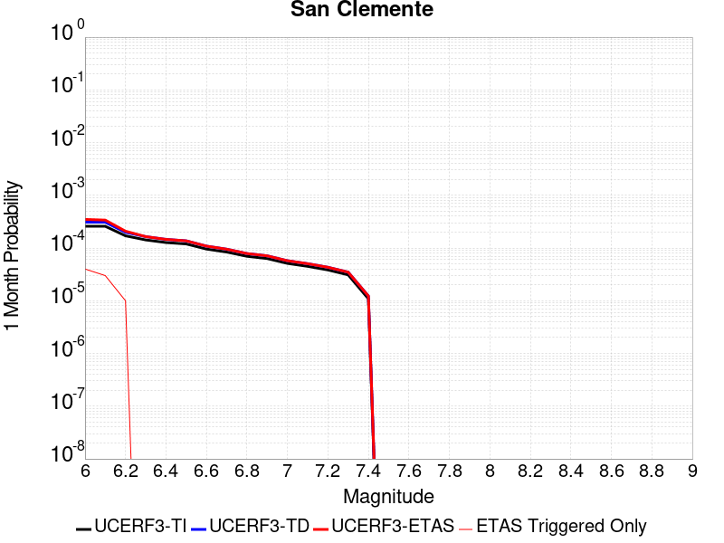 | 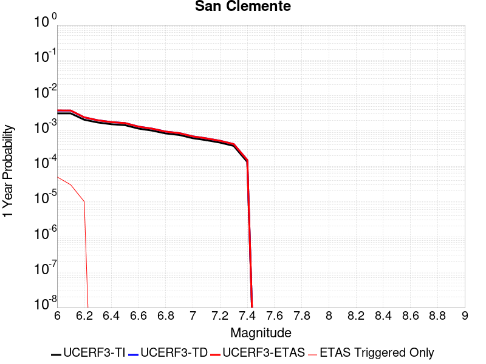 | 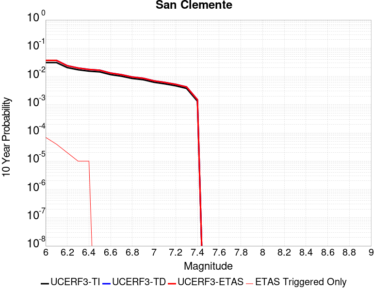 |

| Magnitude | 1 wk TI Prob | 1 wk TD Prob | 1 wk ETAS Prob | 1 wk ETAS/TD Gain | 1 wk ETAS Triggered Only | 1 mo TI Prob | 1 mo TD Prob | 1 mo ETAS Prob | 1 mo ETAS/TD Gain | 1 mo ETAS Triggered Only | 1 yr TI Prob | 1 yr TD Prob | 1 yr ETAS Prob | 1 yr ETAS/TD Gain | 1 yr ETAS Triggered Only | 10 yr TI Prob | 10 yr TD Prob | 10 yr ETAS Prob | 10 yr ETAS/TD Gain | 10 yr ETAS Triggered Only |
|-----|-----|-----|-----|-----|-----|-----|-----|-----|-----|-----|-----|-----|-----|-----|-----|-----|-----|-----|-----|-----|
| 6.0 | 6.034143E-5 | 7.207375E-5 | 9.207231E-5 | 1.2774736 | 2.0E-5 | 2.585805E-4 | 3.088529E-4 | 3.4884055E-4 | 1.1294715 | 4.0E-5 | 0.0031436728 | 0.003754067 | 0.0038038793 | 1.013269 | 5.0E-5 | 0.030995715 | 0.036943004 | 0.037010416 | 1.0018249 | 7.0E-5 |
| 6.1 | 6.034143E-5 | 7.207375E-5 | 8.207303E-5 | 1.1387367 | 1.0E-5 | 2.585805E-4 | 3.088529E-4 | 3.3884365E-4 | 1.0971036 | 3.0E-5 | 0.0031436728 | 0.003754067 | 0.0037839543 | 1.0079614 | 3.0E-5 | 0.030995715 | 0.036943004 | 0.036981527 | 1.0010427 | 4.0E-5 |
| 6.2 | 3.9792965E-5 | 4.6367695E-5 | 4.6367695E-5 | 1.0 | 0.0 | 1.7053014E-4 | 1.987039E-4 | 2.0870191E-4 | 1.0503161 | 1.0E-5 | 0.0020742272 | 0.002416584 | 0.0024265598 | 1.0041281 | 1.0E-5 | 0.020549731 | 0.023910102 | 0.023929624 | 1.0008165 | 2.0E-5 |
| 6.3 | 3.3245466E-5 | 3.8356622E-5 | 3.8356622E-5 | 1.0 | 0.0 | 1.4247278E-4 | 1.6437535E-4 | 1.6437535E-4 | 1.0 | 0.0 | 0.001733226 | 0.0019994657 | 0.0019994657 | 1.0 | 0.0 | 0.017197698 | 0.01981882 | 0.019828621 | 1.0004946 | 1.0E-5 |
| 6.4 | 2.9667559E-5 | 3.4050103E-5 | 3.4050103E-5 | 1.0 | 0.0 | 1.2714048E-4 | 1.45921E-4 | 1.45921E-4 | 1.0 | 0.0 | 0.0015468362 | 0.0017751658 | 0.0017751658 | 1.0 | 0.0 | 0.015361133 | 0.017612997 | 0.017622821 | 1.0005578 | 1.0E-5 |
| 6.5 | 2.7897115E-5 | 3.1955304E-5 | 3.1955304E-5 | 1.0 | 0.0 | 1.1955358E-4 | 1.3694426E-4 | 1.3694426E-4 | 1.0 | 0.0 | 0.0014545929 | 0.001666046 | 0.001666046 | 1.0 | 0.0 | 0.014451085 | 0.016538467 | 0.016538467 | 1.0 | 0.0 |
| 6.6 | 2.2295419E-5 | 2.5335687E-5 | 2.5335687E-5 | 1.0 | 0.0 | 9.55483E-5 | 1.0857707E-4 | 1.0857707E-4 | 1.0 | 0.0 | 0.0011626796 | 0.0013211373 | 0.0013211373 | 1.0 | 0.0 | 0.011566153 | 0.013134385 | 0.013134385 | 1.0 | 0.0 |
| 6.7 | 1.9590509E-5 | 2.2185315E-5 | 2.2185315E-5 | 1.0 | 0.0 | 8.395662E-5 | 9.507651E-5 | 9.507651E-5 | 1.0 | 0.0 | 0.0010216924 | 0.0011569514 | 0.0011569514 | 1.0 | 0.0 | 0.010170079 | 0.011510396 | 0.011510396 | 1.0 | 0.0 |
| 6.8 | 1.6257263E-5 | 1.8337483E-5 | 1.8337483E-5 | 1.0 | 0.0 | 6.9672125E-5 | 7.858688E-5 | 7.858688E-5 | 1.0 | 0.0 | 8.47928E-4 | 9.5638284E-4 | 9.5638284E-4 | 1.0 | 0.0 | 0.008446999 | 0.009523506 | 0.009523506 | 1.0 | 0.0 |
| 6.9 | 1.4725595E-5 | 1.6584168E-5 | 1.6584168E-5 | 1.0 | 0.0 | 6.3108164E-5 | 7.107311E-5 | 7.107311E-5 | 1.0 | 0.0 | 7.6807104E-4 | 8.6497853E-4 | 8.6497853E-4 | 1.0 | 0.0 | 0.007654218 | 0.008616871 | 0.008616871 | 1.0 | 0.0 |
| 7.0 | 1.1924664E-5 | 1.3402839E-5 | 1.3402839E-5 | 1.0 | 0.0 | 5.1104704E-5 | 5.7439505E-5 | 5.7439505E-5 | 1.0 | 0.0 | 6.2202214E-4 | 6.9910736E-4 | 6.9910736E-4 | 1.0 | 0.0 | 0.006202839 | 0.006969686 | 0.006969686 | 1.0 | 0.0 |
| 7.1 | 1.0478149E-5 | 1.1771301E-5 | 1.1771301E-5 | 1.0 | 0.0 | 4.490558E-5 | 5.044749E-5 | 5.044749E-5 | 1.0 | 0.0 | 5.465883E-4 | 6.1403064E-4 | 6.1403064E-4 | 1.0 | 0.0 | 0.0054524583 | 0.0061239093 | 0.0061239093 | 1.0 | 0.0 |
| 7.2 | 8.954729E-6 | 1.0062444E-5 | 1.0062444E-5 | 1.0 | 0.0 | 3.8376846E-5 | 4.3124077E-5 | 4.3124077E-5 | 1.0 | 0.0 | 4.6713793E-4 | 5.2491453E-4 | 5.2491453E-4 | 1.0 | 0.0 | 0.0046615717 | 0.005237292 | 0.005237292 | 1.0 | 0.0 |
| 7.3 | 7.2278913E-6 | 8.130091E-6 | 8.130091E-6 | 1.0 | 0.0 | 3.097631E-5 | 3.4842815E-5 | 3.4842815E-5 | 1.0 | 0.0 | 3.770713E-4 | 4.2413396E-4 | 4.2413396E-4 | 1.0 | 0.0 | 0.0037643213 | 0.0042337677 | 0.0042337677 | 1.0 | 0.0 |
| 7.4 | 2.5419747E-6 | 2.8676761E-6 | 2.8676761E-6 | 1.0 | 0.0 | 1.0894132E-5 | 1.2290003E-5 | 1.2290003E-5 | 1.0 | 0.0 | 1.3262799E-4 | 1.4962416E-4 | 1.4962416E-4 | 1.0 | 0.0 | 0.0013254886 | 0.0014955922 | 0.0014955922 | 1.0 | 0.0 |

## Big Pine (East)
*[(top)](#table-of-contents)*

| 1 Week | 1 Month | 1 Year | 10 Year |
|-----|-----|-----|-----|
|  |  |  |  |

| Magnitude | 1 wk TI Prob | 1 wk TD Prob | 1 wk ETAS Prob | 1 wk ETAS/TD Gain | 1 wk ETAS Triggered Only | 1 mo TI Prob | 1 mo TD Prob | 1 mo ETAS Prob | 1 mo ETAS/TD Gain | 1 mo ETAS Triggered Only | 1 yr TI Prob | 1 yr TD Prob | 1 yr ETAS Prob | 1 yr ETAS/TD Gain | 1 yr ETAS Triggered Only | 10 yr TI Prob | 10 yr TD Prob | 10 yr ETAS Prob | 10 yr ETAS/TD Gain | 10 yr ETAS Triggered Only |
|-----|-----|-----|-----|-----|-----|-----|-----|-----|-----|-----|-----|-----|-----|-----|-----|-----|-----|-----|-----|-----|
| 6.0 | 9.8008995E-6 | 1.2712943E-5 | 5.2712436E-5 | 4.1463594 | 4.0E-5 | 4.200318E-5 | 5.4483018E-5 | 1.0448029E-4 | 1.9176672 | 5.0E-5 | 5.112687E-4 | 6.63149E-4 | 7.2310923E-4 | 1.0904174 | 6.0E-5 | 0.00510094 | 0.006617271 | 0.0066967416 | 1.0120096 | 8.0E-5 |
| 6.1 | 9.8008995E-6 | 1.2712943E-5 | 5.2712436E-5 | 4.1463594 | 4.0E-5 | 4.200318E-5 | 5.4483018E-5 | 1.0448029E-4 | 1.9176672 | 5.0E-5 | 5.112687E-4 | 6.63149E-4 | 7.2310923E-4 | 1.0904174 | 6.0E-5 | 0.00510094 | 0.006617271 | 0.0066967416 | 1.0120096 | 8.0E-5 |
| 6.2 | 9.8008995E-6 | 1.2712943E-5 | 5.2712436E-5 | 4.1463594 | 4.0E-5 | 4.200318E-5 | 5.4483018E-5 | 1.0448029E-4 | 1.9176672 | 5.0E-5 | 5.112687E-4 | 6.63149E-4 | 7.2310923E-4 | 1.0904174 | 6.0E-5 | 0.00510094 | 0.006617271 | 0.0066967416 | 1.0120096 | 8.0E-5 |
| 6.3 | 5.7497964E-6 | 8.4139465E-6 | 2.8413779E-5 | 3.3769858 | 2.0E-5 | 2.4641753E-5 | 3.605929E-5 | 6.605821E-5 | 1.8319331 | 3.0E-5 | 2.9997202E-4 | 4.3893684E-4 | 4.7891928E-4 | 1.0910892 | 4.0E-5 | 0.0029956743 | 0.0043846187 | 0.0044344 | 1.0113535 | 5.0E-5 |
| 6.4 | 5.731632E-6 | 8.394551E-6 | 2.8394383E-5 | 3.382478 | 2.0E-5 | 2.4563906E-5 | 3.597617E-5 | 6.597509E-5 | 1.8338554 | 3.0E-5 | 2.990245E-4 | 4.3792525E-4 | 4.779077E-4 | 1.0912998 | 4.0E-5 | 0.0029862246 | 0.0043745427 | 0.004424324 | 1.0113797 | 5.0E-5 |
| 6.5 | 5.0605718E-6 | 7.6846645E-6 | 2.7684511E-5 | 3.602566 | 2.0E-5 | 2.1687983E-5 | 3.2933876E-5 | 6.2932886E-5 | 1.9108862 | 3.0E-5 | 2.640192E-4 | 4.0089915E-4 | 4.408831E-4 | 1.0997357 | 4.0E-5 | 0.0026370576 | 0.0040056347 | 0.0040554344 | 1.0124325 | 5.0E-5 |
| 6.6 | 4.4132194E-6 | 7.0017695E-6 | 2.700163E-5 | 3.8564007 | 2.0E-5 | 1.891366E-5 | 3.0007252E-5 | 6.000635E-5 | 1.9997283 | 3.0E-5 | 2.3024948E-4 | 3.652795E-4 | 4.0526487E-4 | 1.1094652 | 4.0E-5 | 0.0023001106 | 0.003650614 | 0.0037004317 | 1.0136464 | 5.0E-5 |
| 6.7 | 3.7560496E-6 | 6.0715765E-6 | 2.6071455E-5 | 4.2940173 | 2.0E-5 | 1.6097256E-5 | 2.602079E-5 | 5.602001E-5 | 2.1528943 | 3.0E-5 | 1.9596648E-4 | 3.1675855E-4 | 3.5674588E-4 | 1.1262392 | 4.0E-5 | 0.0019579376 | 0.0031667976 | 0.003206671 | 1.012591 | 4.0E-5 |
| 6.8 | 3.5159371E-6 | 5.77006E-6 | 1.5770001E-5 | 2.7330742 | 1.0E-5 | 1.5068214E-5 | 2.4728603E-5 | 4.472811E-5 | 1.80876 | 2.0E-5 | 1.8344008E-4 | 3.010305E-4 | 3.3102147E-4 | 1.0996277 | 3.0E-5 | 0.0018328872 | 0.003009946 | 0.0030398557 | 1.0099369 | 3.0E-5 |
| 6.9 | 2.8222737E-6 | 4.908916E-6 | 4.908916E-6 | 1.0 | 0.0 | 1.2095403E-5 | 2.1038044E-5 | 3.1037835E-5 | 1.4753194 | 1.0E-5 | 1.4725157E-4 | 2.5610882E-4 | 2.761037E-4 | 1.0780718 | 2.0E-5 | 0.0014715404 | 0.0025617932 | 0.002581742 | 1.007787 | 2.0E-5 |
| 7.0 | 2.215881E-6 | 4.1041003E-6 | 4.1041003E-6 | 1.0 | 0.0 | 9.496598E-6 | 1.7588885E-5 | 2.7588709E-5 | 1.5685309 | 1.0E-5 | 1.1561495E-4 | 2.1412417E-4 | 2.2412202E-4 | 1.0466919 | 1.0E-5 | 0.0011555481 | 0.0021428051 | 0.0021527838 | 1.0046568 | 1.0E-5 |
| 7.1 | 1.720545E-6 | 3.3939148E-6 | 3.3939148E-6 | 1.0 | 0.0 | 7.3737438E-6 | 1.454527E-5 | 2.4545125E-5 | 1.6874987 | 1.0E-5 | 8.977163E-5 | 1.7707459E-4 | 1.8707282E-4 | 1.0564634 | 1.0E-5 | 8.9735375E-4 | 0.0017729228 | 0.0017829052 | 1.0056304 | 1.0E-5 |
| 7.2 | 1.295668E-6 | 2.8571042E-6 | 2.8571042E-6 | 1.0 | 0.0 | 5.552851E-6 | 1.2244675E-5 | 1.2244675E-5 | 1.0 | 0.0 | 6.760386E-5 | 1.4906895E-4 | 1.4906895E-4 | 1.0 | 0.0 | 6.7583297E-4 | 0.0014932519 | 0.0014932519 | 1.0 | 0.0 |
| 7.3 | 1.1518136E-6 | 2.6741013E-6 | 2.6741013E-6 | 1.0 | 0.0 | 4.936335E-6 | 1.1460385E-5 | 1.1460385E-5 | 1.0 | 0.0 | 6.0098217E-5 | 1.3952146E-4 | 1.3952146E-4 | 1.0 | 0.0 | 6.0081965E-4 | 0.0013977255 | 0.0013977255 | 1.0 | 0.0 |
| 7.4 | 1.0497845E-6 | 2.5429345E-6 | 2.5429345E-6 | 1.0 | 0.0 | 4.499069E-6 | 1.0898246E-5 | 1.0898246E-5 | 1.0 | 0.0 | 5.4774784E-5 | 1.3267828E-4 | 1.3267828E-4 | 1.0 | 0.0 | 5.4761284E-4 | 0.0013291561 | 0.0013291561 | 1.0 | 0.0 |
| 7.5 | 9.851914E-7 | 2.452171E-6 | 2.452171E-6 | 1.0 | 0.0 | 4.222242E-6 | 1.0509263E-5 | 1.0509263E-5 | 1.0 | 0.0 | 5.1404582E-5 | 1.2794297E-4 | 1.2794297E-4 | 1.0 | 0.0 | 5.139269E-4 | 0.0012816188 | 0.0012816188 | 1.0 | 0.0 |
| 7.6 | 7.929028E-7 | 2.0402508E-6 | 2.0402508E-6 | 1.0 | 0.0 | 3.3981505E-6 | 8.743904E-6 | 8.743904E-6 | 1.0 | 0.0 | 4.13717E-5 | 1.0645199E-4 | 1.0645199E-4 | 1.0 | 0.0 | 4.1363997E-4 | 0.0010669014 | 0.0010669014 | 1.0 | 0.0 |
| 7.7 | 4.400834E-7 | 1.215829E-6 | 1.215829E-6 | 1.0 | 0.0 | 1.8860703E-6 | 5.2106857E-6 | 5.2106857E-6 | 1.0 | 0.0 | 2.2962664E-5 | 6.3438296E-5 | 6.3438296E-5 | 1.0 | 0.0 | 2.2960291E-4 | 6.37983E-4 | 6.37983E-4 | 1.0 | 0.0 |
| 7.8 | 8.7668944E-8 | 1.830417E-7 | 1.830417E-7 | 1.0 | 0.0 | 3.75724E-7 | 7.8446425E-7 | 7.8446425E-7 | 1.0 | 0.0 | 4.57443E-6 | 9.550812E-6 | 9.550812E-6 | 1.0 | 0.0 | 4.5743356E-5 | 9.6343465E-5 | 9.6343465E-5 | 1.0 | 0.0 |
| 7.9 | 2.4872758E-8 | 3.1759047E-8 | 3.1759047E-8 | 1.0 | 0.0 | 1.0659753E-7 | 1.3611019E-7 | 1.3611019E-7 | 1.0 | 0.0 | 1.2978242E-6 | 1.6571404E-6 | 1.6571404E-6 | 1.0 | 0.0 | 1.2978166E-5 | 1.6864971E-5 | 1.6864971E-5 | 1.0 | 0.0 |

## Pine Mtn
*[(top)](#table-of-contents)*

| 1 Week | 1 Month | 1 Year | 10 Year |
|-----|-----|-----|-----|
| 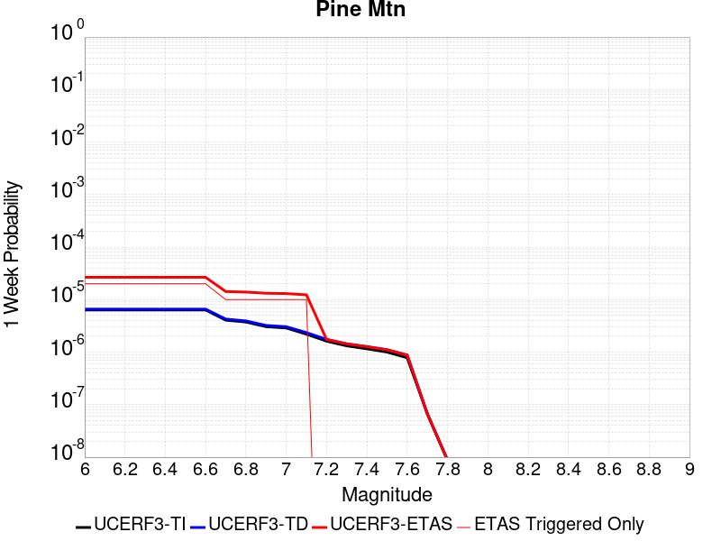 |  |  |  |

| Magnitude | 1 wk TI Prob | 1 wk TD Prob | 1 wk ETAS Prob | 1 wk ETAS/TD Gain | 1 wk ETAS Triggered Only | 1 mo TI Prob | 1 mo TD Prob | 1 mo ETAS Prob | 1 mo ETAS/TD Gain | 1 mo ETAS Triggered Only | 1 yr TI Prob | 1 yr TD Prob | 1 yr ETAS Prob | 1 yr ETAS/TD Gain | 1 yr ETAS Triggered Only | 10 yr TI Prob | 10 yr TD Prob | 10 yr ETAS Prob | 10 yr ETAS/TD Gain | 10 yr ETAS Triggered Only |
|-----|-----|-----|-----|-----|-----|-----|-----|-----|-----|-----|-----|-----|-----|-----|-----|-----|-----|-----|-----|-----|
| 6.0 | 6.355272E-6 | 6.602304E-6 | 2.6602173E-5 | 4.0292253 | 2.0E-5 | 2.7236596E-5 | 2.8295317E-5 | 5.8294467E-5 | 2.0602162 | 3.0E-5 | 3.315551E-4 | 3.4444706E-4 | 4.044264E-4 | 1.1741322 | 6.0E-5 | 0.0033106084 | 0.0034397293 | 0.003519454 | 1.0231776 | 8.0E-5 |
| 6.1 | 6.355272E-6 | 6.602304E-6 | 2.6602173E-5 | 4.0292253 | 2.0E-5 | 2.7236596E-5 | 2.8295317E-5 | 5.8294467E-5 | 2.0602162 | 3.0E-5 | 3.315551E-4 | 3.4444706E-4 | 4.044264E-4 | 1.1741322 | 6.0E-5 | 0.0033106084 | 0.0034397293 | 0.003519454 | 1.0231776 | 8.0E-5 |
| 6.2 | 6.355272E-6 | 6.602304E-6 | 2.6602173E-5 | 4.0292253 | 2.0E-5 | 2.7236596E-5 | 2.8295317E-5 | 5.8294467E-5 | 2.0602162 | 3.0E-5 | 3.315551E-4 | 3.4444706E-4 | 4.044264E-4 | 1.1741322 | 6.0E-5 | 0.0033106084 | 0.0034397293 | 0.003519454 | 1.0231776 | 8.0E-5 |
| 6.3 | 6.355272E-6 | 6.602304E-6 | 2.6602173E-5 | 4.0292253 | 2.0E-5 | 2.7236596E-5 | 2.8295317E-5 | 5.8294467E-5 | 2.0602162 | 3.0E-5 | 3.315551E-4 | 3.4444706E-4 | 4.044264E-4 | 1.1741322 | 6.0E-5 | 0.0033106084 | 0.0034397293 | 0.003519454 | 1.0231776 | 8.0E-5 |
| 6.4 | 6.355272E-6 | 6.602304E-6 | 2.6602173E-5 | 4.0292253 | 2.0E-5 | 2.7236596E-5 | 2.8295317E-5 | 5.8294467E-5 | 2.0602162 | 3.0E-5 | 3.315551E-4 | 3.4444706E-4 | 4.044264E-4 | 1.1741322 | 6.0E-5 | 0.0033106084 | 0.0034397293 | 0.003519454 | 1.0231776 | 8.0E-5 |
| 6.5 | 6.355272E-6 | 6.602304E-6 | 2.6602173E-5 | 4.0292253 | 2.0E-5 | 2.7236596E-5 | 2.8295317E-5 | 5.8294467E-5 | 2.0602162 | 3.0E-5 | 3.315551E-4 | 3.4444706E-4 | 4.044264E-4 | 1.1741322 | 6.0E-5 | 0.0033106084 | 0.0034397293 | 0.003519454 | 1.0231776 | 8.0E-5 |
| 6.6 | 6.355272E-6 | 6.602304E-6 | 2.6602173E-5 | 4.0292253 | 2.0E-5 | 2.7236596E-5 | 2.8295317E-5 | 5.8294467E-5 | 2.0602162 | 3.0E-5 | 3.315551E-4 | 3.4444706E-4 | 4.044264E-4 | 1.1741322 | 6.0E-5 | 0.0033106084 | 0.0034397293 | 0.003519454 | 1.0231776 | 8.0E-5 |
| 6.7 | 4.0693135E-6 | 4.262387E-6 | 1.4262345E-5 | 3.3460932 | 1.0E-5 | 1.7439797E-5 | 1.8267248E-5 | 3.8266884E-5 | 2.0948355 | 2.0E-5 | 2.1230885E-4 | 2.2238171E-4 | 2.5237503E-4 | 1.1348732 | 3.0E-5 | 0.0021210613 | 0.002221657 | 0.002261568 | 1.0179646 | 4.0E-5 |
| 6.8 | 3.7492343E-6 | 3.9358247E-6 | 1.3935785E-5 | 3.5407534 | 1.0E-5 | 1.6068048E-5 | 1.6867714E-5 | 3.686738E-5 | 2.185677 | 2.0E-5 | 1.9561092E-4 | 2.0534567E-4 | 2.3533951E-4 | 1.1460651 | 3.0E-5 | 0.0019543883 | 0.0020516175 | 0.0020915354 | 1.0194569 | 4.0E-5 |
| 6.9 | 3.057504E-6 | 3.2290054E-6 | 1.3228973E-5 | 4.096919 | 1.0E-5 | 1.3103523E-5 | 1.3838523E-5 | 3.3838245E-5 | 2.445221 | 2.0E-5 | 1.5952371E-4 | 1.6847144E-4 | 1.9846638E-4 | 1.1780417 | 3.0E-5 | 0.0015940925 | 0.0016834808 | 0.0017234135 | 1.0237203 | 4.0E-5 |
| 7.0 | 2.8852844E-6 | 3.05395E-6 | 1.3053919E-5 | 4.274438 | 1.0E-5 | 1.2365445E-5 | 1.3088294E-5 | 3.3088032E-5 | 2.528063 | 2.0E-5 | 1.505389E-4 | 1.5933876E-4 | 1.8933398E-4 | 1.1882482 | 3.0E-5 | 0.0015043695 | 0.0015922881 | 0.0016322244 | 1.025081 | 4.0E-5 |
| 7.1 | 2.2029894E-6 | 2.3582058E-6 | 1.2358182E-5 | 5.240502 | 1.0E-5 | 9.44135E-6 | 1.010656E-5 | 2.0106458E-5 | 1.9894464 | 1.0E-5 | 1.1494237E-4 | 1.2304072E-4 | 1.4303827E-4 | 1.1625278 | 2.0E-5 | 0.0011488294 | 0.0012297569 | 0.0012497322 | 1.0162433 | 2.0E-5 |
| 7.2 | 1.6192422E-6 | 1.7491075E-6 | 1.7491075E-6 | 1.0 | 0.0 | 6.939591E-6 | 7.496155E-6 | 7.496155E-6 | 1.0 | 0.0 | 8.4486244E-5 | 9.12621E-5 | 1.012612E-4 | 1.1095645 | 1.0E-5 | 8.445413E-4 | 9.1227045E-4 | 9.2226133E-4 | 1.0109516 | 1.0E-5 |
| 7.3 | 1.3188192E-6 | 1.440421E-6 | 1.440421E-6 | 1.0 | 0.0 | 5.65207E-6 | 6.1732194E-6 | 6.1732194E-6 | 1.0 | 0.0 | 6.881178E-5 | 7.515658E-5 | 7.515658E-5 | 1.0 | 0.0 | 6.879047E-4 | 7.5133395E-4 | 7.5133395E-4 | 1.0 | 0.0 |
| 7.4 | 1.158252E-6 | 1.2733301E-6 | 1.2733301E-6 | 1.0 | 0.0 | 4.9639275E-6 | 5.4571187E-6 | 5.4571187E-6 | 1.0 | 0.0 | 6.043414E-5 | 6.643862E-5 | 6.643862E-5 | 1.0 | 0.0 | 6.0417707E-4 | 6.642096E-4 | 6.642096E-4 | 1.0 | 0.0 |
| 7.5 | 1.0027939E-6 | 1.1118749E-6 | 1.1118749E-6 | 1.0 | 0.0 | 4.2976812E-6 | 4.765171E-6 | 4.765171E-6 | 1.0 | 0.0 | 5.2323012E-5 | 5.8014633E-5 | 5.8014633E-5 | 1.0 | 0.0 | 5.2310695E-4 | 5.800168E-4 | 5.800168E-4 | 1.0 | 0.0 |
| 7.6 | 7.8252765E-7 | 8.803206E-7 | 8.803206E-7 | 1.0 | 0.0 | 3.3536855E-6 | 3.7727984E-6 | 3.7727984E-6 | 1.0 | 0.0 | 4.0830357E-5 | 4.5933073E-5 | 4.5933073E-5 | 1.0 | 0.0 | 4.0822854E-4 | 4.592573E-4 | 4.592573E-4 | 1.0 | 0.0 |
| 7.7 | 6.6579446E-8 | 6.7286315E-8 | 6.7286315E-8 | 1.0 | 0.0 | 2.8534046E-7 | 2.8836988E-7 | 2.8836988E-7 | 1.0 | 0.0 | 3.4740146E-6 | 3.5108978E-6 | 3.5108978E-6 | 1.0 | 0.0 | 3.47396E-5 | 3.510844E-5 | 3.510844E-5 | 1.0 | 0.0 |
| 7.8 | 8.746529E-9 | 8.806883E-9 | 8.806883E-9 | 1.0 | 0.0 | 3.7485123E-8 | 3.7743785E-8 | 3.7743785E-8 | 1.0 | 0.0 | 4.563813E-7 | 4.595305E-7 | 4.595305E-7 | 1.0 | 0.0 | 4.5638035E-6 | 4.595298E-6 | 4.595298E-6 | 1.0 | 0.0 |

## Channel Islands Thrust
*[(top)](#table-of-contents)*

| 1 Week | 1 Month | 1 Year | 10 Year |
|-----|-----|-----|-----|
|  | 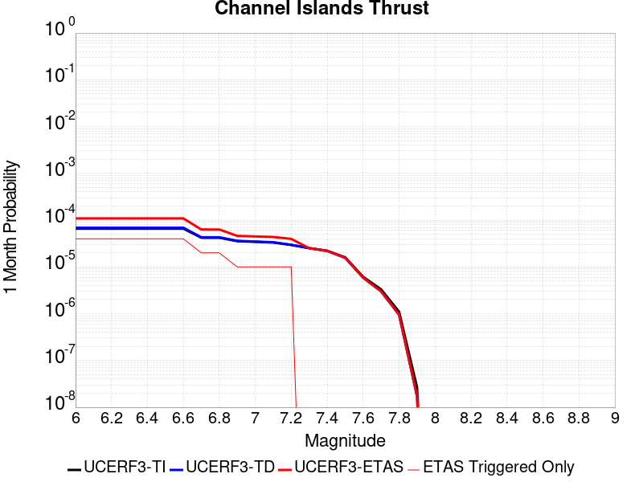 |  |  |

| Magnitude | 1 wk TI Prob | 1 wk TD Prob | 1 wk ETAS Prob | 1 wk ETAS/TD Gain | 1 wk ETAS Triggered Only | 1 mo TI Prob | 1 mo TD Prob | 1 mo ETAS Prob | 1 mo ETAS/TD Gain | 1 mo ETAS Triggered Only | 1 yr TI Prob | 1 yr TD Prob | 1 yr ETAS Prob | 1 yr ETAS/TD Gain | 1 yr ETAS Triggered Only | 10 yr TI Prob | 10 yr TD Prob | 10 yr ETAS Prob | 10 yr ETAS/TD Gain | 10 yr ETAS Triggered Only |
|-----|-----|-----|-----|-----|-----|-----|-----|-----|-----|-----|-----|-----|-----|-----|-----|-----|-----|-----|-----|-----|
| 6.0 | 1.539326E-5 | 1.6073593E-5 | 4.607311E-5 | 2.8663855 | 3.0E-5 | 6.596944E-5 | 6.888521E-5 | 1.0888246E-4 | 1.5806361 | 4.0E-5 | 8.0288196E-4 | 8.3839067E-4 | 8.7835715E-4 | 1.0476705 | 4.0E-5 | 0.007999874 | 0.008355854 | 0.008425269 | 1.0083073 | 7.0E-5 |
| 6.1 | 1.539326E-5 | 1.6073593E-5 | 4.607311E-5 | 2.8663855 | 3.0E-5 | 6.596944E-5 | 6.888521E-5 | 1.0888246E-4 | 1.5806361 | 4.0E-5 | 8.0288196E-4 | 8.3839067E-4 | 8.7835715E-4 | 1.0476705 | 4.0E-5 | 0.007999874 | 0.008355854 | 0.008425269 | 1.0083073 | 7.0E-5 |
| 6.2 | 1.539326E-5 | 1.6073593E-5 | 4.607311E-5 | 2.8663855 | 3.0E-5 | 6.596944E-5 | 6.888521E-5 | 1.0888246E-4 | 1.5806361 | 4.0E-5 | 8.0288196E-4 | 8.3839067E-4 | 8.7835715E-4 | 1.0476705 | 4.0E-5 | 0.007999874 | 0.008355854 | 0.008425269 | 1.0083073 | 7.0E-5 |
| 6.3 | 1.539326E-5 | 1.6073593E-5 | 4.607311E-5 | 2.8663855 | 3.0E-5 | 6.596944E-5 | 6.888521E-5 | 1.0888246E-4 | 1.5806361 | 4.0E-5 | 8.0288196E-4 | 8.3839067E-4 | 8.7835715E-4 | 1.0476705 | 4.0E-5 | 0.007999874 | 0.008355854 | 0.008425269 | 1.0083073 | 7.0E-5 |
| 6.4 | 1.539326E-5 | 1.6073593E-5 | 4.607311E-5 | 2.8663855 | 3.0E-5 | 6.596944E-5 | 6.888521E-5 | 1.0888246E-4 | 1.5806361 | 4.0E-5 | 8.0288196E-4 | 8.3839067E-4 | 8.7835715E-4 | 1.0476705 | 4.0E-5 | 0.007999874 | 0.008355854 | 0.008425269 | 1.0083073 | 7.0E-5 |
| 6.5 | 1.539326E-5 | 1.6073593E-5 | 4.607311E-5 | 2.8663855 | 3.0E-5 | 6.596944E-5 | 6.888521E-5 | 1.0888246E-4 | 1.5806361 | 4.0E-5 | 8.0288196E-4 | 8.3839067E-4 | 8.7835715E-4 | 1.0476705 | 4.0E-5 | 0.007999874 | 0.008355854 | 0.008425269 | 1.0083073 | 7.0E-5 |
| 6.6 | 1.539326E-5 | 1.6073593E-5 | 4.607311E-5 | 2.8663855 | 3.0E-5 | 6.596944E-5 | 6.888521E-5 | 1.0888246E-4 | 1.5806361 | 4.0E-5 | 8.0288196E-4 | 8.3839067E-4 | 8.7835715E-4 | 1.0476705 | 4.0E-5 | 0.007999874 | 0.008355854 | 0.008425269 | 1.0083073 | 7.0E-5 |
| 6.7 | 9.828265E-6 | 1.0074063E-5 | 3.0073861E-5 | 2.9852765 | 2.0E-5 | 4.2120457E-5 | 4.3173855E-5 | 6.317299E-5 | 1.4632233 | 2.0E-5 | 5.126959E-4 | 5.255179E-4 | 5.455074E-4 | 1.0380377 | 2.0E-5 | 0.0051151463 | 0.005243063 | 0.0052928007 | 1.0094864 | 5.0E-5 |
| 6.8 | 9.818887E-6 | 1.0064138E-5 | 3.0063937E-5 | 2.987234 | 2.0E-5 | 4.2080264E-5 | 4.3131324E-5 | 6.3130465E-5 | 1.4636801 | 2.0E-5 | 5.1220675E-4 | 5.2500033E-4 | 5.4498983E-4 | 1.0380752 | 2.0E-5 | 0.005110278 | 0.0052379114 | 0.0052876496 | 1.0094957 | 5.0E-5 |
| 6.9 | 8.293576E-6 | 8.431596E-6 | 1.8431512E-5 | 2.186005 | 1.0E-5 | 3.5543413E-5 | 3.613492E-5 | 4.613456E-5 | 1.2767307 | 1.0E-5 | 4.3265513E-4 | 4.3985498E-4 | 4.4985057E-4 | 1.0227247 | 1.0E-5 | 0.004318137 | 0.0043899664 | 0.004429791 | 1.0090717 | 4.0E-5 |
| 7.0 | 8.017998E-6 | 8.140668E-6 | 1.8140587E-5 | 2.2283905 | 1.0E-5 | 3.4362398E-5 | 3.4888115E-5 | 4.4887765E-5 | 1.2866206 | 1.0E-5 | 4.1828185E-4 | 4.2468111E-4 | 4.3467688E-4 | 1.023537 | 1.0E-5 | 0.0041749543 | 0.004238814 | 0.004278645 | 1.0093966 | 4.0E-5 |
| 7.1 | 7.766459E-6 | 7.875932E-6 | 1.7875853E-5 | 2.269681 | 1.0E-5 | 3.32844E-5 | 3.3753564E-5 | 4.3753225E-5 | 1.296255 | 1.0E-5 | 4.0516222E-4 | 4.1087324E-4 | 4.2086915E-4 | 1.0243284 | 1.0E-5 | 0.004044243 | 0.0041012526 | 0.0041410886 | 1.0097132 | 4.0E-5 |
| 7.2 | 6.8868976E-6 | 6.9466823E-6 | 1.6946613E-5 | 2.439526 | 1.0E-5 | 2.951494E-5 | 2.9771163E-5 | 3.9770865E-5 | 1.3358855 | 1.0E-5 | 3.5928516E-4 | 3.6240462E-4 | 3.72401E-4 | 1.0275835 | 1.0E-5 | 0.0035870483 | 0.0036182392 | 0.0036580944 | 1.011015 | 4.0E-5 |
| 7.3 | 5.889687E-6 | 5.889097E-6 | 5.889097E-6 | 1.0 | 0.0 | 2.5241272E-5 | 2.5238747E-5 | 2.5238747E-5 | 1.0 | 0.0 | 3.0726913E-4 | 3.0723913E-4 | 3.0723913E-4 | 1.0 | 0.0 | 0.0030684462 | 0.0030682175 | 0.0030981256 | 1.0097476 | 3.0E-5 |
| 7.4 | 5.173477E-6 | 5.136928E-6 | 5.136928E-6 | 1.0 | 0.0 | 2.2171856E-5 | 2.2015223E-5 | 2.2015223E-5 | 1.0 | 0.0 | 2.699089E-4 | 2.680031E-4 | 2.680031E-4 | 1.0 | 0.0 | 0.002695813 | 0.00267687 | 0.0026968163 | 1.0074514 | 2.0E-5 |
| 7.5 | 3.7516095E-6 | 3.6572455E-6 | 3.6572455E-6 | 1.0 | 0.0 | 1.6078227E-5 | 1.5673819E-5 | 1.5673819E-5 | 1.0 | 0.0 | 1.9573483E-4 | 1.9081269E-4 | 1.9081269E-4 | 1.0 | 0.0 | 0.0019556251 | 0.001906554 | 0.0019265158 | 1.0104702 | 2.0E-5 |
| 7.6 | 1.4342953E-6 | 1.3753564E-6 | 1.3753564E-6 | 1.0 | 0.0 | 6.146965E-6 | 5.8943715E-6 | 5.8943715E-6 | 1.0 | 0.0 | 7.483673E-5 | 7.1761635E-5 | 7.1761635E-5 | 1.0 | 0.0 | 7.4811536E-4 | 7.173875E-4 | 7.173875E-4 | 1.0 | 0.0 |
| 7.7 | 7.7341116E-7 | 7.0268425E-7 | 7.0268425E-7 | 1.0 | 0.0 | 3.314615E-6 | 3.0115004E-6 | 3.0115004E-6 | 1.0 | 0.0 | 4.035469E-5 | 3.6664416E-5 | 3.6664416E-5 | 1.0 | 0.0 | 4.0347362E-4 | 3.6658515E-4 | 3.6658515E-4 | 1.0 | 0.0 |
| 7.8 | 2.5716753E-7 | 2.2206052E-7 | 2.2206052E-7 | 1.0 | 0.0 | 1.102146E-6 | 9.5168764E-7 | 9.5168764E-7 | 1.0 | 0.0 | 1.3418546E-5 | 1.1586745E-5 | 1.1586745E-5 | 1.0 | 0.0 | 1.3417735E-4 | 1.1586238E-4 | 1.1586238E-4 | 1.0 | 0.0 |
| 7.9 | 6.2171326E-9 | 3.983744E-9 | 3.983744E-9 | 1.0 | 0.0 | 2.6644855E-8 | 1.7073189E-8 | 1.7073189E-8 | 1.0 | 0.0 | 3.2440104E-7 | 2.0786607E-7 | 2.0786607E-7 | 1.0 | 0.0 | 3.2440057E-6 | 2.0786597E-6 | 2.0786597E-6 | 1.0 | 0.0 |

## Lost Hills
*[(top)](#table-of-contents)*

| 1 Week | 1 Month | 1 Year | 10 Year |
|-----|-----|-----|-----|
|  |  |  |  |

| Magnitude | 1 wk TI Prob | 1 wk TD Prob | 1 wk ETAS Prob | 1 wk ETAS/TD Gain | 1 wk ETAS Triggered Only | 1 mo TI Prob | 1 mo TD Prob | 1 mo ETAS Prob | 1 mo ETAS/TD Gain | 1 mo ETAS Triggered Only | 1 yr TI Prob | 1 yr TD Prob | 1 yr ETAS Prob | 1 yr ETAS/TD Gain | 1 yr ETAS Triggered Only | 10 yr TI Prob | 10 yr TD Prob | 10 yr ETAS Prob | 10 yr ETAS/TD Gain | 10 yr ETAS Triggered Only |
|-----|-----|-----|-----|-----|-----|-----|-----|-----|-----|-----|-----|-----|-----|-----|-----|-----|-----|-----|-----|-----|
| 6.0 | 1.9937297E-5 | 2.222778E-5 | 5.222711E-5 | 2.3496325 | 3.0E-5 | 8.5442756E-5 | 9.525922E-5 | 1.4525447E-4 | 1.5248336 | 5.0E-5 | 0.001039769 | 0.0011593044 | 0.0012292233 | 1.0603111 | 7.0E-5 | 0.010349175 | 0.011546411 | 0.011615602 | 1.0059925 | 7.0E-5 |
| 6.1 | 1.9937297E-5 | 2.222778E-5 | 5.222711E-5 | 2.3496325 | 3.0E-5 | 8.5442756E-5 | 9.525922E-5 | 1.4525447E-4 | 1.5248336 | 5.0E-5 | 0.001039769 | 0.0011593044 | 0.0012292233 | 1.0603111 | 7.0E-5 | 0.010349175 | 0.011546411 | 0.011615602 | 1.0059925 | 7.0E-5 |
| 6.2 | 1.9937297E-5 | 2.222778E-5 | 5.222711E-5 | 2.3496325 | 3.0E-5 | 8.5442756E-5 | 9.525922E-5 | 1.4525447E-4 | 1.5248336 | 5.0E-5 | 0.001039769 | 0.0011593044 | 0.0012292233 | 1.0603111 | 7.0E-5 | 0.010349175 | 0.011546411 | 0.011615602 | 1.0059925 | 7.0E-5 |
| 6.3 | 1.9937297E-5 | 2.222778E-5 | 5.222711E-5 | 2.3496325 | 3.0E-5 | 8.5442756E-5 | 9.525922E-5 | 1.4525447E-4 | 1.5248336 | 5.0E-5 | 0.001039769 | 0.0011593044 | 0.0012292233 | 1.0603111 | 7.0E-5 | 0.010349175 | 0.011546411 | 0.011615602 | 1.0059925 | 7.0E-5 |
| 6.4 | 1.19061515E-5 | 1.3253613E-5 | 3.325335E-5 | 2.5090024 | 2.0E-5 | 5.1025367E-5 | 5.6800487E-5 | 8.6798784E-5 | 1.5281345 | 3.0E-5 | 6.2105677E-4 | 6.9141935E-4 | 7.313917E-4 | 1.057812 | 4.0E-5 | 0.0061932392 | 0.006901795 | 0.0069415187 | 1.0057555 | 4.0E-5 |
| 6.5 | 1.19061515E-5 | 1.3253613E-5 | 3.325335E-5 | 2.5090024 | 2.0E-5 | 5.1025367E-5 | 5.6800487E-5 | 8.6798784E-5 | 1.5281345 | 3.0E-5 | 6.2105677E-4 | 6.9141935E-4 | 7.313917E-4 | 1.057812 | 4.0E-5 | 0.0061932392 | 0.006901795 | 0.0069415187 | 1.0057555 | 4.0E-5 |
| 6.6 | 8.862005E-6 | 9.870419E-6 | 1.987032E-5 | 2.0131183 | 1.0E-5 | 3.797947E-5 | 4.230159E-5 | 6.230074E-5 | 1.4727755 | 2.0E-5 | 4.6230195E-4 | 5.1498605E-4 | 5.449706E-4 | 1.058224 | 3.0E-5 | 0.0046134135 | 0.0051463456 | 0.005176191 | 1.0057994 | 3.0E-5 |
| 6.7 | 7.368126E-6 | 8.206504E-6 | 1.8206423E-5 | 2.2185357 | 1.0E-5 | 3.15773E-5 | 3.5170735E-5 | 5.517003E-5 | 1.5686346 | 2.0E-5 | 3.8438578E-4 | 4.2820367E-4 | 4.5819083E-4 | 1.0700301 | 3.0E-5 | 0.003837216 | 0.004282037 | 0.0043119085 | 1.006976 | 3.0E-5 |

## Calaveras (So) 2011 CFM
*[(top)](#table-of-contents)*

| 1 Week | 1 Month | 1 Year | 10 Year |
|-----|-----|-----|-----|
| 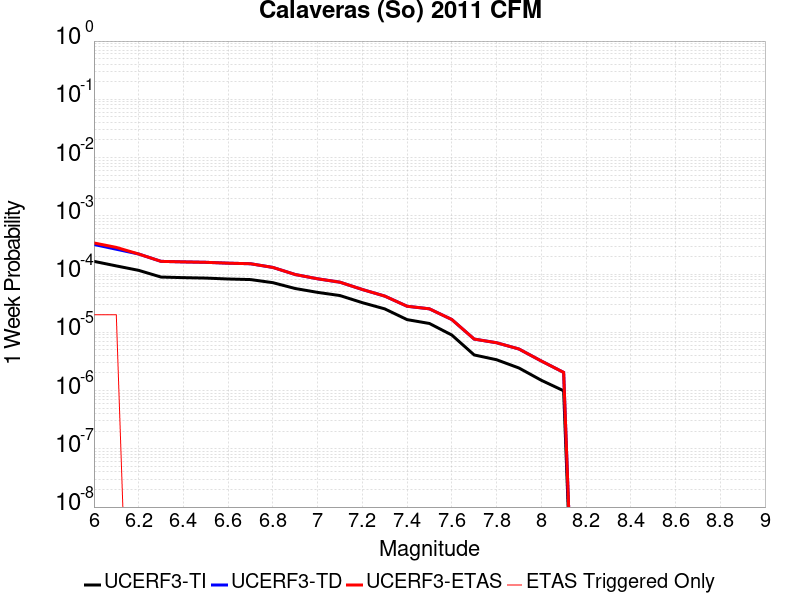 | 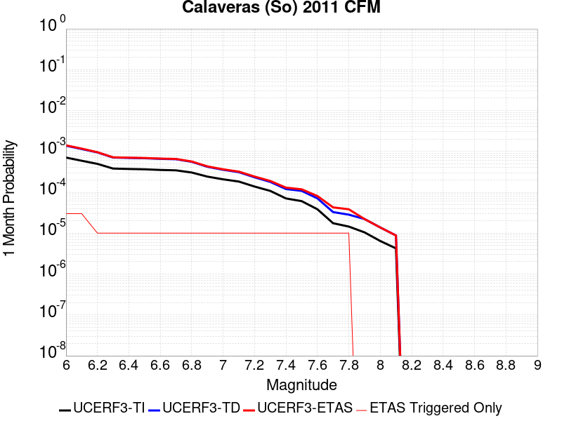 |  |  |

| Magnitude | 1 wk TI Prob | 1 wk TD Prob | 1 wk ETAS Prob | 1 wk ETAS/TD Gain | 1 wk ETAS Triggered Only | 1 mo TI Prob | 1 mo TD Prob | 1 mo ETAS Prob | 1 mo ETAS/TD Gain | 1 mo ETAS Triggered Only | 1 yr TI Prob | 1 yr TD Prob | 1 yr ETAS Prob | 1 yr ETAS/TD Gain | 1 yr ETAS Triggered Only | 10 yr TI Prob | 10 yr TD Prob | 10 yr ETAS Prob | 10 yr ETAS/TD Gain | 10 yr ETAS Triggered Only |
|-----|-----|-----|-----|-----|-----|-----|-----|-----|-----|-----|-----|-----|-----|-----|-----|-----|-----|-----|-----|-----|
| 6.0 | 1.6525469E-4 | 3.2194593E-4 | 3.4193948E-4 | 1.0621022 | 2.0E-5 | 7.080421E-4 | 0.0013790649 | 0.0014090234 | 1.0217239 | 3.0E-5 | 0.008586391 | 0.016620971 | 0.016660307 | 1.0023665 | 4.0E-5 | 0.08262107 | 0.15053278 | 0.15059225 | 1.000395 | 7.0E-5 |
| 6.1 | 1.3798552E-4 | 2.6675427E-4 | 2.8674895E-4 | 1.0749553 | 2.0E-5 | 5.912325E-4 | 0.0011427482 | 0.0011727139 | 1.0262225 | 3.0E-5 | 0.0071745235 | 0.013792339 | 0.013831787 | 1.0028602 | 4.0E-5 | 0.06947268 | 0.12670378 | 0.12676492 | 1.0004824 | 7.0E-5 |
| 6.2 | 1.1575988E-4 | 2.2081971E-4 | 2.2081971E-4 | 1.0 | 0.0 | 4.9601943E-4 | 9.460394E-4 | 9.560299E-4 | 1.0105604 | 1.0E-5 | 0.0060223276 | 0.011437113 | 0.011456884 | 1.0017287 | 2.0E-5 | 0.058617134 | 0.10660601 | 0.10665067 | 1.000419 | 5.0E-5 |
| 6.3 | 8.8842135E-5 | 1.6517991E-4 | 1.6517991E-4 | 1.0 | 0.0 | 3.806964E-4 | 7.077164E-4 | 7.177093E-4 | 1.01412 | 1.0E-5 | 0.0046251323 | 0.008573476 | 0.00858339 | 1.0011563 | 1.0E-5 | 0.04530047 | 0.08172775 | 0.08176448 | 1.0004494 | 4.0E-5 |
| 6.4 | 8.6804044E-5 | 1.6181667E-4 | 1.6181667E-4 | 1.0 | 0.0 | 3.7196427E-4 | 6.933103E-4 | 7.033034E-4 | 1.0144136 | 1.0E-5 | 0.0045192647 | 0.008399442 | 0.008409358 | 1.0011805 | 1.0E-5 | 0.044284567 | 0.08014 | 0.08017679 | 1.0004591 | 4.0E-5 |
| 6.5 | 8.5282685E-5 | 1.5913884E-4 | 1.5913884E-4 | 1.0 | 0.0 | 3.6544603E-4 | 6.818399E-4 | 6.918331E-4 | 1.0146562 | 1.0E-5 | 0.0044402312 | 0.008260915 | 0.008270833 | 1.0012006 | 1.0E-5 | 0.043525536 | 0.07888295 | 0.07891979 | 1.0004671 | 4.0E-5 |
| 6.6 | 8.225166E-5 | 1.5378451E-4 | 1.5378451E-4 | 1.0 | 0.0 | 3.524595E-4 | 6.589045E-4 | 6.6889793E-4 | 1.0151668 | 1.0E-5 | 0.0042827534 | 0.007984734 | 0.007994655 | 1.0012424 | 1.0E-5 | 0.0420115 | 0.07637536 | 0.0764123 | 1.0004838 | 4.0E-5 |
| 6.7 | 8.041567E-5 | 1.5043648E-4 | 1.5043648E-4 | 1.0 | 0.0 | 3.4459308E-4 | 6.4456405E-4 | 6.545576E-4 | 1.0155044 | 1.0E-5 | 0.004187352 | 0.0078118336 | 0.0078217555 | 1.00127 | 1.0E-5 | 0.04109324 | 0.074806795 | 0.0748438 | 1.0004947 | 4.0E-5 |
| 6.8 | 7.114949E-5 | 1.2996719E-4 | 1.2996719E-4 | 1.0 | 0.0 | 3.0489074E-4 | 5.568792E-4 | 5.6687364E-4 | 1.0179472 | 1.0E-5 | 0.0037057274 | 0.006754201 | 0.0067641335 | 1.0014706 | 1.0E-5 | 0.036445383 | 0.065175526 | 0.06521292 | 1.0005738 | 4.0E-5 |
| 6.9 | 5.647474E-5 | 9.822624E-5 | 9.822624E-5 | 1.0 | 0.0 | 2.4201213E-4 | 4.209015E-4 | 4.3089726E-4 | 1.0237485 | 1.0E-5 | 0.0029425167 | 0.0051125106 | 0.0051224595 | 1.001946 | 1.0E-5 | 0.02903858 | 0.050021492 | 0.05004999 | 1.0005697 | 3.0E-5 |
| 7.0 | 4.8474198E-5 | 8.291263E-5 | 8.291263E-5 | 1.0 | 0.0 | 2.0773002E-4 | 3.552918E-4 | 3.6528823E-4 | 1.0281359 | 1.0E-5 | 0.0025261794 | 0.00431716 | 0.004327117 | 1.0023063 | 1.0E-5 | 0.02497655 | 0.042507187 | 0.042535912 | 1.0006758 | 3.0E-5 |
| 7.1 | 4.2747037E-5 | 7.249923E-5 | 7.249923E-5 | 1.0 | 0.0 | 1.8318872E-4 | 3.1067428E-4 | 3.2067116E-4 | 1.032178 | 1.0E-5 | 0.0022280412 | 0.0037759547 | 0.003785917 | 1.0026383 | 1.0E-5 | 0.022058345 | 0.03734711 | 0.037375994 | 1.0007733 | 3.0E-5 |
| 7.2 | 3.2276734E-5 | 5.4322863E-5 | 5.4322863E-5 | 1.0 | 0.0 | 1.3832153E-4 | 2.3279164E-4 | 2.4278932E-4 | 1.0429468 | 1.0E-5 | 0.0016827637 | 0.0028305796 | 0.0028405513 | 1.0035229 | 1.0E-5 | 0.01670078 | 0.028246105 | 0.028275257 | 1.0010321 | 3.0E-5 |
| 7.3 | 2.5260142E-5 | 4.1903706E-5 | 4.1903706E-5 | 1.0 | 0.0 | 1.0825326E-4 | 1.7957506E-4 | 1.8957326E-4 | 1.055677 | 1.0E-5 | 0.0013171865 | 0.0021841535 | 0.0021941317 | 1.0045685 | 1.0E-5 | 0.013094065 | 0.021899203 | 0.021928545 | 1.0013399 | 3.0E-5 |
| 7.4 | 1.6515445E-5 | 2.8031473E-5 | 2.8031473E-5 | 1.0 | 0.0 | 7.0778566E-5 | 1.2012936E-4 | 1.3012816E-4 | 1.0832336 | 1.0E-5 | 8.613883E-4 | 0.0014615962 | 0.0014715815 | 1.0068319 | 1.0E-5 | 0.00858057 | 0.01473956 | 0.014769117 | 1.0020053 | 3.0E-5 |
| 7.5 | 1.4177608E-5 | 2.5289824E-5 | 2.5289824E-5 | 1.0 | 0.0 | 6.075976E-5 | 1.0838047E-4 | 1.1837939E-4 | 1.0922575 | 1.0E-5 | 7.39499E-4 | 0.0013187359 | 0.0013287227 | 1.007573 | 1.0E-5 | 0.0073704296 | 0.01332465 | 0.01335425 | 1.0022215 | 3.0E-5 |
| 7.6 | 8.981956E-6 | 1.6585482E-5 | 1.6585482E-5 | 1.0 | 0.0 | 3.849353E-5 | 7.1078706E-5 | 8.1078E-5 | 1.1406791 | 1.0E-5 | 4.6855793E-4 | 8.6504105E-4 | 8.750324E-4 | 1.0115502 | 1.0E-5 | 0.004675712 | 0.008806993 | 0.0088367285 | 1.0033764 | 3.0E-5 |
| 7.7 | 4.0880122E-6 | 7.650753E-6 | 7.650753E-6 | 1.0 | 0.0 | 1.7519935E-5 | 3.278853E-5 | 4.27882E-5 | 1.3049747 | 1.0E-5 | 2.1328434E-4 | 3.9912728E-4 | 4.0912328E-4 | 1.0250447 | 1.0E-5 | 0.0021307974 | 0.004141424 | 0.0041712997 | 1.0072138 | 3.0E-5 |
| 7.8 | 3.3825577E-6 | 6.622194E-6 | 6.622194E-6 | 1.0 | 0.0 | 1.4496595E-5 | 2.8380522E-5 | 3.838024E-5 | 1.3523443 | 1.0E-5 | 1.7648176E-4 | 3.4547813E-4 | 3.5547468E-4 | 1.0289354 | 1.0E-5 | 0.0017634167 | 0.0035826908 | 0.0036125833 | 1.0083436 | 3.0E-5 |
| 7.9 | 2.4417336E-6 | 5.172701E-6 | 5.172701E-6 | 1.0 | 0.0 | 1.04645305E-5 | 2.2168531E-5 | 2.2168531E-5 | 1.0 | 0.0 | 1.2739822E-4 | 2.698685E-4 | 2.698685E-4 | 1.0 | 0.0 | 0.0012732521 | 0.0027820396 | 0.0027920117 | 1.0035845 | 1.0E-5 |
| 8.0 | 1.502616E-6 | 3.220102E-6 | 3.220102E-6 | 1.0 | 0.0 | 6.439767E-6 | 1.3800363E-5 | 1.3800363E-5 | 1.0 | 0.0 | 7.840134E-5 | 1.680065E-4 | 1.680065E-4 | 1.0 | 0.0 | 7.837369E-4 | 0.0017203419 | 0.0017203419 | 1.0 | 0.0 |
| 8.1 | 9.91034E-7 | 2.0495127E-6 | 2.0495127E-6 | 1.0 | 0.0 | 4.2472816E-6 | 8.783596E-6 | 8.783596E-6 | 1.0 | 0.0 | 5.1709427E-5 | 1.0693506E-4 | 1.0693506E-4 | 1.0 | 0.0 | 5.1697396E-4 | 0.0010931749 | 0.0010931749 | 1.0 | 0.0 |

## Rose Canyon
*[(top)](#table-of-contents)*

| 1 Week | 1 Month | 1 Year | 10 Year |
|-----|-----|-----|-----|
|  |  | 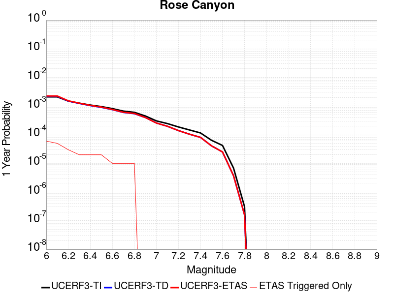 |  |

| Magnitude | 1 wk TI Prob | 1 wk TD Prob | 1 wk ETAS Prob | 1 wk ETAS/TD Gain | 1 wk ETAS Triggered Only | 1 mo TI Prob | 1 mo TD Prob | 1 mo ETAS Prob | 1 mo ETAS/TD Gain | 1 mo ETAS Triggered Only | 1 yr TI Prob | 1 yr TD Prob | 1 yr ETAS Prob | 1 yr ETAS/TD Gain | 1 yr ETAS Triggered Only | 10 yr TI Prob | 10 yr TD Prob | 10 yr ETAS Prob | 10 yr ETAS/TD Gain | 10 yr ETAS Triggered Only |
|-----|-----|-----|-----|-----|-----|-----|-----|-----|-----|-----|-----|-----|-----|-----|-----|-----|-----|-----|-----|-----|
| 6.0 | 4.02871E-5 | 4.226025E-5 | 5.2259827E-5 | 1.236619 | 1.0E-5 | 1.7264757E-4 | 1.8110358E-4 | 2.1109814E-4 | 1.165621 | 3.0E-5 | 0.0020999578 | 0.0022028263 | 0.002262694 | 1.0271777 | 6.0E-5 | 0.020802243 | 0.021830795 | 0.021899266 | 1.0031365 | 7.0E-5 |
| 6.1 | 4.02871E-5 | 4.226025E-5 | 5.2259827E-5 | 1.236619 | 1.0E-5 | 1.7264757E-4 | 1.8110358E-4 | 2.1109814E-4 | 1.165621 | 3.0E-5 | 0.0020999578 | 0.0022028263 | 0.002252716 | 1.0226481 | 5.0E-5 | 0.020802243 | 0.021830795 | 0.021879703 | 1.0022403 | 5.0E-5 |
| 6.2 | 2.870627E-5 | 2.87861E-5 | 2.87861E-5 | 1.0 | 0.0 | 1.2302108E-4 | 1.2336334E-4 | 1.333621E-4 | 1.0810513 | 1.0E-5 | 0.0014967525 | 0.0015009261 | 0.0015308812 | 1.0199577 | 3.0E-5 | 0.014867114 | 0.014917966 | 0.014947519 | 1.001981 | 3.0E-5 |
| 6.3 | 2.4322904E-5 | 2.3756375E-5 | 2.3756375E-5 | 1.0 | 0.0 | 1.0423685E-4 | 1.0180915E-4 | 1.0180915E-4 | 1.0 | 0.0 | 0.0012683448 | 0.0012388368 | 0.0012588119 | 1.0161241 | 2.0E-5 | 0.012611301 | 0.012327498 | 0.012347251 | 1.0016024 | 2.0E-5 |
| 6.4 | 2.0855947E-5 | 1.9956446E-5 | 1.9956446E-5 | 1.0 | 0.0 | 8.9379566E-5 | 8.552488E-5 | 8.552488E-5 | 1.0 | 0.0 | 0.0010876529 | 0.0010407792 | 0.0010607584 | 1.0191964 | 2.0E-5 | 0.010823448 | 0.010365448 | 0.01038524 | 1.0019095 | 2.0E-5 |
| 6.5 | 1.8447192E-5 | 1.734743E-5 | 1.734743E-5 | 1.0 | 0.0 | 7.9057E-5 | 7.434405E-5 | 7.434405E-5 | 1.0 | 0.0 | 9.620939E-4 | 9.0477045E-4 | 9.247524E-4 | 1.0220851 | 2.0E-5 | 0.009579392 | 0.009015551 | 0.00903537 | 1.0021983 | 2.0E-5 |
| 6.6 | 1.5681402E-5 | 1.4423311E-5 | 1.4423311E-5 | 1.0 | 0.0 | 6.720427E-5 | 6.181275E-5 | 6.181275E-5 | 1.0 | 0.0 | 8.179049E-4 | 7.523159E-4 | 7.623084E-4 | 1.0132823 | 1.0E-5 | 0.008149011 | 0.007500476 | 0.0075104013 | 1.0013232 | 1.0E-5 |
| 6.7 | 1.2825906E-5 | 1.1513417E-5 | 1.1513417E-5 | 1.0 | 0.0 | 5.496701E-5 | 4.9342307E-5 | 4.9342307E-5 | 1.0 | 0.0 | 6.690179E-4 | 6.0058135E-4 | 6.105754E-4 | 1.0166405 | 1.0E-5 | 0.006670073 | 0.0059910617 | 0.006001002 | 1.0016592 | 1.0E-5 |
| 6.8 | 1.1619176E-5 | 1.0427946E-5 | 1.0427946E-5 | 1.0 | 0.0 | 4.979552E-5 | 4.4690456E-5 | 4.4690456E-5 | 1.0 | 0.0 | 6.0609175E-4 | 5.4397463E-4 | 5.5396924E-4 | 1.0183733 | 1.0E-5 | 0.006044414 | 0.005427591 | 0.0054375366 | 1.0018325 | 1.0E-5 |
| 6.9 | 8.650105E-6 | 7.641816E-6 | 7.641816E-6 | 1.0 | 0.0 | 3.707135E-5 | 3.275025E-5 | 3.275025E-5 | 1.0 | 0.0 | 4.5125023E-4 | 3.9866418E-4 | 3.9866418E-4 | 1.0 | 0.0 | 0.0045033502 | 0.0039800107 | 0.0039800107 | 1.0 | 0.0 |
| 7.0 | 5.837778E-6 | 4.920079E-6 | 4.920079E-6 | 1.0 | 0.0 | 2.501881E-5 | 2.1085883E-5 | 2.1085883E-5 | 1.0 | 0.0 | 3.0456143E-4 | 2.5669055E-4 | 2.5669055E-4 | 1.0 | 0.0 | 0.0030414436 | 0.0025639574 | 0.0025639574 | 1.0 | 0.0 |
| 7.1 | 4.7008325E-6 | 3.7862403E-6 | 3.7862403E-6 | 1.0 | 0.0 | 2.014627E-5 | 1.6226644E-5 | 1.6226644E-5 | 1.0 | 0.0 | 2.4525324E-4 | 1.9754158E-4 | 1.9754158E-4 | 1.0 | 0.0 | 0.0024498273 | 0.001973671 | 0.001973671 | 1.0 | 0.0 |
| 7.2 | 3.5867215E-6 | 2.6804305E-6 | 2.6804305E-6 | 1.0 | 0.0 | 1.5371574E-5 | 1.1487508E-5 | 1.1487508E-5 | 1.0 | 0.0 | 1.8713283E-4 | 1.3985152E-4 | 1.3985152E-4 | 1.0 | 0.0 | 0.0018697532 | 0.0013976421 | 0.0013976421 | 1.0 | 0.0 |
| 7.3 | 2.8182758E-6 | 2.0037592E-6 | 2.0037592E-6 | 1.0 | 0.0 | 1.2078269E-5 | 8.587511E-6 | 8.587511E-6 | 1.0 | 0.0 | 1.47043E-4 | 1.0454797E-4 | 1.0454797E-4 | 1.0 | 0.0 | 0.0014694574 | 0.0010449924 | 0.0010449924 | 1.0 | 0.0 |
| 7.4 | 2.2163404E-6 | 1.5507462E-6 | 1.5507462E-6 | 1.0 | 0.0 | 9.498567E-6 | 6.646039E-6 | 6.646039E-6 | 1.0 | 0.0 | 1.1563892E-4 | 8.0912556E-5 | 8.0912556E-5 | 1.0 | 0.0 | 0.0011557876 | 8.0883503E-4 | 8.0883503E-4 | 1.0 | 0.0 |
| 7.5 | 1.2291069E-6 | 7.861935E-7 | 7.861935E-7 | 1.0 | 0.0 | 5.2675905E-6 | 3.3693964E-6 | 3.3693964E-6 | 1.0 | 0.0 | 6.4131025E-5 | 4.1021653E-5 | 4.1021653E-5 | 1.0 | 0.0 | 6.4112525E-4 | 4.1014308E-4 | 4.1014308E-4 | 1.0 | 0.0 |
| 7.6 | 8.090151E-7 | 4.801241E-7 | 4.801241E-7 | 1.0 | 0.0 | 3.467203E-6 | 2.057673E-6 | 2.057673E-6 | 1.0 | 0.0 | 4.2212378E-5 | 2.5051891E-5 | 2.5051891E-5 | 1.0 | 0.0 | 4.220436E-4 | 2.5049166E-4 | 2.5049166E-4 | 1.0 | 0.0 |
| 7.7 | 1.3161463E-7 | 7.1155945E-8 | 7.1155945E-8 | 1.0 | 0.0 | 5.6406253E-7 | 3.0495403E-7 | 3.0495403E-7 | 1.0 | 0.0 | 6.86744E-6 | 3.712809E-6 | 3.712809E-6 | 1.0 | 0.0 | 6.867228E-5 | 3.7127484E-5 | 3.7127484E-5 | 1.0 | 0.0 |
| 7.8 | 5.8938565E-9 | 3.0586826E-9 | 3.0586826E-9 | 1.0 | 0.0 | 2.5259386E-8 | 1.31086395E-8 | 1.31086395E-8 | 1.0 | 0.0 | 3.0753299E-7 | 1.5959769E-7 | 1.5959769E-7 | 1.0 | 0.0 | 3.0753256E-6 | 1.5959762E-6 | 1.5959762E-6 | 1.0 | 0.0 |

## Hosgri
*[(top)](#table-of-contents)*

| 1 Week | 1 Month | 1 Year | 10 Year |
|-----|-----|-----|-----|
| 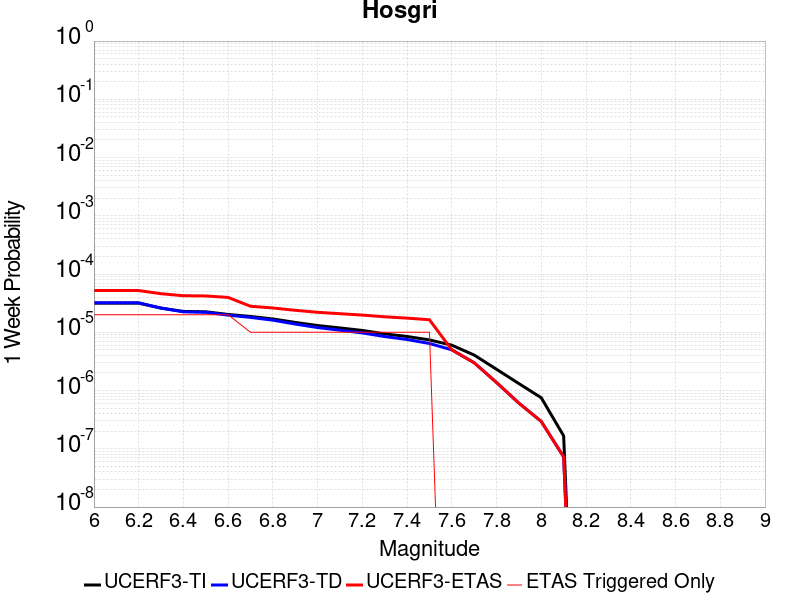 |  |  |  |

| Magnitude | 1 wk TI Prob | 1 wk TD Prob | 1 wk ETAS Prob | 1 wk ETAS/TD Gain | 1 wk ETAS Triggered Only | 1 mo TI Prob | 1 mo TD Prob | 1 mo ETAS Prob | 1 mo ETAS/TD Gain | 1 mo ETAS Triggered Only | 1 yr TI Prob | 1 yr TD Prob | 1 yr ETAS Prob | 1 yr ETAS/TD Gain | 1 yr ETAS Triggered Only | 10 yr TI Prob | 10 yr TD Prob | 10 yr ETAS Prob | 10 yr ETAS/TD Gain | 10 yr ETAS Triggered Only |
|-----|-----|-----|-----|-----|-----|-----|-----|-----|-----|-----|-----|-----|-----|-----|-----|-----|-----|-----|-----|-----|
| 6.0 | 3.1638054E-5 | 3.2114367E-5 | 5.2113723E-5 | 1.6227542 | 2.0E-5 | 1.3558462E-4 | 1.3762589E-4 | 1.6762177E-4 | 1.2179523 | 3.0E-5 | 0.0016494928 | 0.0016743351 | 0.0017142681 | 1.0238501 | 4.0E-5 | 0.016373027 | 0.016621416 | 0.01668042 | 1.0035498 | 6.0E-5 |
| 6.1 | 3.1638054E-5 | 3.2114367E-5 | 5.2113723E-5 | 1.6227542 | 2.0E-5 | 1.3558462E-4 | 1.3762589E-4 | 1.6762177E-4 | 1.2179523 | 3.0E-5 | 0.0016494928 | 0.0016743351 | 0.0017142681 | 1.0238501 | 4.0E-5 | 0.016373027 | 0.016621416 | 0.01668042 | 1.0035498 | 6.0E-5 |
| 6.2 | 3.1638054E-5 | 3.2114367E-5 | 5.2113723E-5 | 1.6227542 | 2.0E-5 | 1.3558462E-4 | 1.3762589E-4 | 1.6762177E-4 | 1.2179523 | 3.0E-5 | 0.0016494928 | 0.0016743351 | 0.0017142681 | 1.0238501 | 4.0E-5 | 0.016373027 | 0.016621416 | 0.01668042 | 1.0035498 | 6.0E-5 |
| 6.3 | 2.6084575E-5 | 2.5991103E-5 | 4.5990582E-5 | 1.769474 | 2.0E-5 | 1.1178624E-4 | 1.11385736E-4 | 1.3138351E-4 | 1.1795362 | 2.0E-5 | 0.0013601477 | 0.0013552862 | 0.0013852456 | 1.0221056 | 3.0E-5 | 0.013518529 | 0.013472308 | 0.013521635 | 1.0036613 | 5.0E-5 |
| 6.4 | 2.2849106E-5 | 2.2450364E-5 | 4.2449916E-5 | 1.8908342 | 2.0E-5 | 9.792107E-5 | 9.6212316E-5 | 1.16210394E-4 | 1.2078536 | 2.0E-5 | 0.0011915369 | 0.0011707591 | 0.0011907356 | 1.0170629 | 2.0E-5 | 0.011851682 | 0.011647432 | 0.011677083 | 1.0025457 | 3.0E-5 |
| 6.5 | 2.2505961E-5 | 2.209298E-5 | 4.209254E-5 | 1.905245 | 2.0E-5 | 9.645055E-5 | 9.4680785E-5 | 1.14678885E-4 | 1.2112161 | 2.0E-5 | 0.0011736528 | 0.0011521324 | 0.0011721094 | 1.0173391 | 2.0E-5 | 0.011674736 | 0.0114631 | 0.011492756 | 1.0025871 | 3.0E-5 |
| 6.6 | 2.0274381E-5 | 1.969231E-5 | 3.9691917E-5 | 2.015605 | 2.0E-5 | 8.688731E-5 | 8.43929E-5 | 1.0439121E-4 | 1.2369667 | 2.0E-5 | 0.0010573396 | 0.0010270017 | 0.0010469811 | 1.0194541 | 2.0E-5 | 0.010523229 | 0.0102239065 | 0.0102536 | 1.0029043 | 3.0E-5 |
| 6.7 | 1.8711693E-5 | 1.8025745E-5 | 2.8025564E-5 | 1.5547521 | 1.0E-5 | 8.0190504E-5 | 7.7250916E-5 | 8.725014E-5 | 1.1294383 | 1.0E-5 | 9.7588205E-4 | 9.4012613E-4 | 9.501168E-4 | 1.0106269 | 1.0E-5 | 0.009716077 | 0.009362779 | 0.009382592 | 1.0021161 | 2.0E-5 |
| 6.8 | 1.6960548E-5 | 1.6163001E-5 | 2.616284E-5 | 1.618687 | 1.0E-5 | 7.268604E-5 | 6.926817E-5 | 7.9267484E-5 | 1.1443565 | 1.0E-5 | 8.845932E-4 | 8.4301503E-4 | 8.530066E-4 | 1.0118521 | 1.0E-5 | 0.008810802 | 0.008399357 | 0.008409273 | 1.0011805 | 1.0E-5 |
| 6.9 | 1.4787156E-5 | 1.3865958E-5 | 2.386582E-5 | 1.7211807 | 1.0E-5 | 6.337199E-5 | 5.9424183E-5 | 6.9423586E-5 | 1.1682717 | 1.0E-5 | 7.712808E-4 | 7.232498E-4 | 7.332426E-4 | 1.0138165 | 1.0E-5 | 0.007686094 | 0.007210043 | 0.0072199707 | 1.001377 | 1.0E-5 |
| 7.0 | 1.30673025E-5 | 1.2066697E-5 | 2.2066577E-5 | 1.8287171 | 1.0E-5 | 5.600152E-5 | 5.1713396E-5 | 6.1712875E-5 | 1.1933635 | 1.0E-5 | 6.8160525E-4 | 6.294288E-4 | 6.394225E-4 | 1.0158774 | 1.0E-5 | 0.0067951838 | 0.006277486 | 0.0062874234 | 1.001583 | 1.0E-5 |
| 7.1 | 1.1889126E-5 | 1.0867769E-5 | 2.086766E-5 | 1.920142 | 1.0E-5 | 5.09524E-5 | 4.6575322E-5 | 5.6574856E-5 | 1.2146959 | 1.0E-5 | 6.201689E-4 | 5.6690705E-4 | 5.769014E-4 | 1.0176296 | 1.0E-5 | 0.0061844103 | 0.0056556235 | 0.0056655672 | 1.0017581 | 1.0E-5 |
| 7.2 | 1.0774642E-5 | 9.768633E-6 | 1.9768535E-5 | 2.0236747 | 1.0E-5 | 4.617622E-5 | 4.18649E-5 | 5.186448E-5 | 1.2388536 | 1.0E-5 | 5.6205044E-4 | 5.09586E-4 | 5.195809E-4 | 1.0196137 | 1.0E-5 | 0.0056063104 | 0.005085183 | 0.0050951317 | 1.0019565 | 1.0E-5 |
| 7.3 | 9.415895E-6 | 8.457149E-6 | 1.8457065E-5 | 2.1824214 | 1.0E-5 | 4.035321E-5 | 3.6244423E-5 | 4.624406E-5 | 1.2758945 | 1.0E-5 | 4.911896E-4 | 4.411865E-4 | 4.511821E-4 | 1.0226562 | 1.0E-5 | 0.004901053 | 0.004404106 | 0.0044140625 | 1.0022606 | 1.0E-5 |
| 7.4 | 8.480416E-6 | 7.5253333E-6 | 1.7525259E-5 | 2.3288348 | 1.0E-5 | 3.6344136E-5 | 3.225103E-5 | 4.2250707E-5 | 1.3100576 | 1.0E-5 | 4.424E-4 | 3.9258559E-4 | 4.0258165E-4 | 1.0254622 | 1.0E-5 | 0.004415203 | 0.0039199176 | 0.003929878 | 1.0025411 | 1.0E-5 |
| 7.5 | 7.4056197E-6 | 6.431661E-6 | 1.6431597E-5 | 2.5547984 | 1.0E-5 | 3.1737985E-5 | 2.756397E-5 | 3.7563696E-5 | 1.3627825 | 1.0E-5 | 3.8634145E-4 | 3.355397E-4 | 3.4553633E-4 | 1.0297928 | 1.0E-5 | 0.0038567046 | 0.0033513252 | 0.0033612917 | 1.0029739 | 1.0E-5 |
| 7.6 | 6.0101156E-6 | 5.0022477E-6 | 5.0022477E-6 | 1.0 | 0.0 | 2.5757383E-5 | 2.1438029E-5 | 2.1438029E-5 | 1.0 | 0.0 | 3.1355102E-4 | 2.6097675E-4 | 2.6097675E-4 | 1.0 | 0.0 | 0.0031310897 | 0.002607695 | 0.002607695 | 1.0 | 0.0 |
| 7.7 | 4.0703303E-6 | 3.0034844E-6 | 3.0034844E-6 | 1.0 | 0.0 | 1.7444156E-5 | 1.2872012E-5 | 1.2872012E-5 | 1.0 | 0.0 | 2.123619E-4 | 1.5670549E-4 | 1.5670549E-4 | 1.0 | 0.0 | 0.0021215908 | 0.0015669402 | 0.0015669402 | 1.0 | 0.0 |
| 7.8 | 2.318548E-6 | 1.3739375E-6 | 1.3739375E-6 | 1.0 | 0.0 | 9.936596E-6 | 5.88829E-6 | 5.88829E-6 | 1.0 | 0.0 | 1.20971345E-4 | 7.168757E-5 | 7.168757E-5 | 1.0 | 0.0 | 0.0012090551 | 7.176256E-4 | 7.176256E-4 | 1.0 | 0.0 |
| 7.9 | 1.3165366E-6 | 6.0840154E-7 | 6.0840154E-7 | 1.0 | 0.0 | 5.6422873E-6 | 2.6074324E-6 | 2.6074324E-6 | 1.0 | 0.0 | 6.869269E-5 | 3.174503E-5 | 3.174503E-5 | 1.0 | 0.0 | 6.8671454E-4 | 3.1830955E-4 | 3.1830955E-4 | 1.0 | 0.0 |
| 8.0 | 7.5241275E-7 | 2.9475657E-7 | 2.9475657E-7 | 1.0 | 0.0 | 3.224622E-6 | 1.2632418E-6 | 1.2632418E-6 | 1.0 | 0.0 | 3.9259066E-5 | 1.5379861E-5 | 1.5379861E-5 | 1.0 | 0.0 | 3.9252132E-4 | 1.545608E-4 | 1.545608E-4 | 1.0 | 0.0 |
| 8.1 | 1.6670903E-7 | 7.270615E-8 | 7.270615E-8 | 1.0 | 0.0 | 7.1446703E-7 | 3.1159774E-7 | 3.1159774E-7 | 1.0 | 0.0 | 8.698602E-6 | 3.7936961E-6 | 3.7936961E-6 | 1.0 | 0.0 | 8.698261E-5 | 3.7998685E-5 | 3.7998685E-5 | 1.0 | 0.0 |

## Bullion Mountains
*[(top)](#table-of-contents)*

| 1 Week | 1 Month | 1 Year | 10 Year |
|-----|-----|-----|-----|
|  |  |  |  |

| Magnitude | 1 wk TI Prob | 1 wk TD Prob | 1 wk ETAS Prob | 1 wk ETAS/TD Gain | 1 wk ETAS Triggered Only | 1 mo TI Prob | 1 mo TD Prob | 1 mo ETAS Prob | 1 mo ETAS/TD Gain | 1 mo ETAS Triggered Only | 1 yr TI Prob | 1 yr TD Prob | 1 yr ETAS Prob | 1 yr ETAS/TD Gain | 1 yr ETAS Triggered Only | 10 yr TI Prob | 10 yr TD Prob | 10 yr ETAS Prob | 10 yr ETAS/TD Gain | 10 yr ETAS Triggered Only |
|-----|-----|-----|-----|-----|-----|-----|-----|-----|-----|-----|-----|-----|-----|-----|-----|-----|-----|-----|-----|-----|
| 6.0 | 1.710495E-5 | 1.5472953E-5 | 4.5472487E-5 | 2.9388373 | 3.0E-5 | 7.3304866E-5 | 6.631121E-5 | 9.630922E-5 | 1.4523822 | 3.0E-5 | 8.921213E-4 | 8.0708193E-4 | 8.4704964E-4 | 1.0495212 | 4.0E-5 | 0.008885483 | 0.008045672 | 0.00810519 | 1.0073974 | 6.0E-5 |
| 6.1 | 1.710495E-5 | 1.5472953E-5 | 4.5472487E-5 | 2.9388373 | 3.0E-5 | 7.3304866E-5 | 6.631121E-5 | 9.630922E-5 | 1.4523822 | 3.0E-5 | 8.921213E-4 | 8.0708193E-4 | 8.4704964E-4 | 1.0495212 | 4.0E-5 | 0.008885483 | 0.008045672 | 0.00810519 | 1.0073974 | 6.0E-5 |
| 6.2 | 1.710495E-5 | 1.5472953E-5 | 4.5472487E-5 | 2.9388373 | 3.0E-5 | 7.3304866E-5 | 6.631121E-5 | 9.630922E-5 | 1.4523822 | 3.0E-5 | 8.921213E-4 | 8.0708193E-4 | 8.4704964E-4 | 1.0495212 | 4.0E-5 | 0.008885483 | 0.008045672 | 0.00810519 | 1.0073974 | 6.0E-5 |
| 6.3 | 1.3475735E-5 | 1.1438071E-5 | 4.143773E-5 | 3.6227899 | 3.0E-5 | 5.775187E-5 | 4.901956E-5 | 7.901809E-5 | 1.6119705 | 3.0E-5 | 7.0290215E-4 | 5.9668155E-4 | 6.266637E-4 | 1.050248 | 3.0E-5 | 0.00700683 | 0.0059539294 | 0.0059936913 | 1.0066782 | 4.0E-5 |
| 6.4 | 1.3475735E-5 | 1.1438071E-5 | 4.143773E-5 | 3.6227899 | 3.0E-5 | 5.775187E-5 | 4.901956E-5 | 7.901809E-5 | 1.6119705 | 3.0E-5 | 7.0290215E-4 | 5.9668155E-4 | 6.266637E-4 | 1.050248 | 3.0E-5 | 0.00700683 | 0.0059539294 | 0.0059936913 | 1.0066782 | 4.0E-5 |
| 6.5 | 1.17226255E-5 | 9.493177E-6 | 3.949289E-5 | 4.160135 | 3.0E-5 | 5.0238854E-5 | 4.0684572E-5 | 7.068335E-5 | 1.7373502 | 3.0E-5 | 6.114864E-4 | 4.952515E-4 | 5.2523665E-4 | 1.0605453 | 3.0E-5 | 0.006098065 | 0.00494437 | 0.004984172 | 1.00805 | 4.0E-5 |
| 6.6 | 1.0689464E-5 | 8.347462E-6 | 1.8347379E-5 | 2.1979587 | 1.0E-5 | 4.5811183E-5 | 3.5774512E-5 | 4.577415E-5 | 1.2795186 | 1.0E-5 | 5.5760844E-4 | 4.3549607E-4 | 4.4549172E-4 | 1.0229523 | 1.0E-5 | 0.005562113 | 0.0043492205 | 0.0043691336 | 1.0045785 | 2.0E-5 |
| 6.7 | 9.44488E-6 | 7.0298724E-6 | 1.7029803E-5 | 2.4224908 | 1.0E-5 | 4.0477426E-5 | 3.0127829E-5 | 4.012753E-5 | 1.3319091 | 1.0E-5 | 4.9270125E-4 | 3.6677174E-4 | 3.7676806E-4 | 1.0272549 | 1.0E-5 | 0.0049161026 | 0.0036643264 | 0.0036842532 | 1.005438 | 2.0E-5 |
| 6.8 | 5.3499584E-6 | 2.6825226E-6 | 2.6825226E-6 | 1.0 | 0.0 | 2.2928192E-5 | 1.1496497E-5 | 1.1496497E-5 | 1.0 | 0.0 | 2.79115E-4 | 1.399648E-4 | 1.399648E-4 | 1.0 | 0.0 | 0.0027876466 | 0.0013991533 | 0.0014091393 | 1.0071372 | 1.0E-5 |
| 6.9 | 4.6428836E-6 | 2.449117E-6 | 2.449117E-6 | 1.0 | 0.0 | 1.989792E-5 | 1.04961955E-5 | 1.04961955E-5 | 1.0 | 0.0 | 2.4223025E-4 | 1.277876E-4 | 1.277876E-4 | 1.0 | 0.0 | 0.0024196638 | 0.0012775257 | 0.001287513 | 1.0078176 | 1.0E-5 |
| 7.0 | 3.2678545E-6 | 1.6271807E-6 | 1.6271807E-6 | 1.0 | 0.0 | 1.4005016E-5 | 6.973632E-6 | 6.973632E-6 | 1.0 | 0.0 | 1.7049772E-4 | 8.490397E-5 | 8.490397E-5 | 1.0 | 0.0 | 0.0017036697 | 8.490397E-4 | 8.590312E-4 | 1.011768 | 1.0E-5 |

## San Diego Trough north alt2
*[(top)](#table-of-contents)*

| 1 Week | 1 Month | 1 Year | 10 Year |
|-----|-----|-----|-----|
| 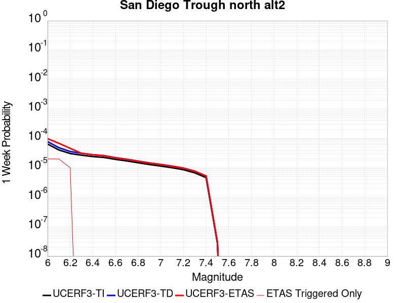 |  | 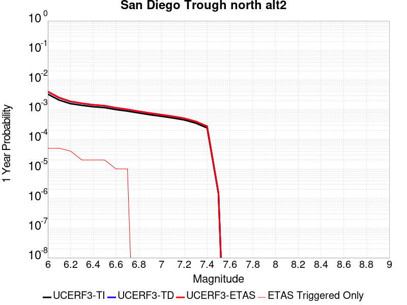 |  |

| Magnitude | 1 wk TI Prob | 1 wk TD Prob | 1 wk ETAS Prob | 1 wk ETAS/TD Gain | 1 wk ETAS Triggered Only | 1 mo TI Prob | 1 mo TD Prob | 1 mo ETAS Prob | 1 mo ETAS/TD Gain | 1 mo ETAS Triggered Only | 1 yr TI Prob | 1 yr TD Prob | 1 yr ETAS Prob | 1 yr ETAS/TD Gain | 1 yr ETAS Triggered Only | 10 yr TI Prob | 10 yr TD Prob | 10 yr ETAS Prob | 10 yr ETAS/TD Gain | 10 yr ETAS Triggered Only |
|-----|-----|-----|-----|-----|-----|-----|-----|-----|-----|-----|-----|-----|-----|-----|-----|-----|-----|-----|-----|-----|
| 6.0 | 6.4437045E-5 | 7.801282E-5 | 9.801125E-5 | 1.2563481 | 2.0E-5 | 2.7612955E-4 | 3.3430028E-4 | 3.6429026E-4 | 1.0897096 | 3.0E-5 | 0.003356695 | 0.0040629106 | 0.0041127075 | 1.0122565 | 5.0E-5 | 0.03306443 | 0.03992818 | 0.039985783 | 1.0014427 | 6.0E-5 |
| 6.1 | 4.050833E-5 | 4.8373608E-5 | 6.837264E-5 | 1.4134285 | 2.0E-5 | 1.7359557E-4 | 2.072997E-4 | 2.3729348E-4 | 1.144688 | 3.0E-5 | 0.0021114773 | 0.0025210362 | 0.0025709101 | 1.0197831 | 5.0E-5 | 0.020915272 | 0.024935748 | 0.024984501 | 1.0019552 | 5.0E-5 |
| 6.2 | 3.0662315E-5 | 3.5910234E-5 | 4.5909874E-5 | 1.2784622 | 1.0E-5 | 1.3140331E-4 | 1.5389208E-4 | 1.73889E-4 | 1.1299412 | 2.0E-5 | 0.0015986612 | 0.0018720304 | 0.0019119555 | 1.0213271 | 4.0E-5 | 0.015872093 | 0.018566024 | 0.01860528 | 1.0021144 | 4.0E-5 |
| 6.3 | 2.6879741E-5 | 3.1218984E-5 | 3.1218984E-5 | 1.0 | 0.0 | 1.15193805E-4 | 1.3378885E-4 | 1.3378885E-4 | 1.0 | 0.0 | 0.0014015823 | 0.0016276721 | 0.0016476396 | 1.0122675 | 2.0E-5 | 0.013927752 | 0.016159827 | 0.016179504 | 1.0012176 | 2.0E-5 |
| 6.4 | 2.4086274E-5 | 2.7784492E-5 | 2.7784492E-5 | 1.0 | 0.0 | 1.032228E-4 | 1.1907104E-4 | 1.1907104E-4 | 1.0 | 0.0 | 0.001256013 | 0.0014487403 | 0.0014687113 | 1.0137851 | 2.0E-5 | 0.012489377 | 0.014394542 | 0.014414255 | 1.0013694 | 2.0E-5 |
| 6.5 | 2.2542843E-5 | 2.5924335E-5 | 2.5924335E-5 | 1.0 | 0.0 | 9.66086E-5 | 1.1109963E-4 | 1.1109963E-4 | 1.0 | 0.0 | 0.0011755751 | 0.0013518113 | 0.0013717843 | 1.0147749 | 2.0E-5 | 0.011693756 | 0.013437296 | 0.013457028 | 1.0014684 | 2.0E-5 |
| 6.6 | 1.932415E-5 | 2.2071035E-5 | 2.2071035E-5 | 1.0 | 0.0 | 8.281515E-5 | 9.458676E-5 | 9.458676E-5 | 1.0 | 0.0 | 0.0010078081 | 0.0011509919 | 0.0011609803 | 1.0086782 | 1.0E-5 | 0.010032498 | 0.011451098 | 0.011460984 | 1.0008633 | 1.0E-5 |
| 6.7 | 1.7176244E-5 | 1.9534775E-5 | 1.9534775E-5 | 1.0 | 0.0 | 7.361039E-5 | 8.37178E-5 | 8.37178E-5 | 1.0 | 0.0 | 8.95838E-4 | 0.0010187915 | 0.0010287813 | 1.0098056 | 1.0E-5 | 0.008922352 | 0.010141713 | 0.010151612 | 1.0009761 | 1.0E-5 |
| 6.8 | 1.4864051E-5 | 1.6862097E-5 | 1.6862097E-5 | 1.0 | 0.0 | 6.370152E-5 | 7.226414E-5 | 7.226414E-5 | 1.0 | 0.0 | 7.7529E-4 | 8.7946345E-4 | 8.7946345E-4 | 1.0 | 0.0 | 0.0077259075 | 0.00876017 | 0.00876017 | 1.0 | 0.0 |
| 6.9 | 1.2928861E-5 | 1.4659578E-5 | 1.4659578E-5 | 1.0 | 0.0 | 5.5408225E-5 | 6.282526E-5 | 6.282526E-5 | 1.0 | 0.0 | 6.7438633E-4 | 7.64631E-4 | 7.64631E-4 | 1.0 | 0.0 | 0.006723434 | 0.007620242 | 0.007620242 | 1.0 | 0.0 |
| 7.0 | 1.145839E-5 | 1.2991455E-5 | 1.2991455E-5 | 1.0 | 0.0 | 4.910646E-5 | 5.5676483E-5 | 5.5676483E-5 | 1.0 | 0.0 | 5.9770717E-4 | 6.776519E-4 | 6.776519E-4 | 1.0 | 0.0 | 0.0059610205 | 0.006756045 | 0.006756045 | 1.0 | 0.0 |
| 7.1 | 1.00636535E-5 | 1.141201E-5 | 1.141201E-5 | 1.0 | 0.0 | 4.3129232E-5 | 4.8907707E-5 | 4.8907707E-5 | 1.0 | 0.0 | 5.2497187E-4 | 5.9529E-4 | 5.9529E-4 | 1.0 | 0.0 | 0.0052373344 | 0.005937111 | 0.005937111 | 1.0 | 0.0 |
| 7.2 | 8.6373375E-6 | 9.8008795E-6 | 9.8008795E-6 | 1.0 | 0.0 | 3.7016634E-5 | 4.20031E-5 | 4.20031E-5 | 1.0 | 0.0 | 4.5058434E-4 | 5.112686E-4 | 5.112686E-4 | 1.0 | 0.0 | 0.004496718 | 0.005101027 | 0.005101027 | 1.0 | 0.0 |
| 7.3 | 6.764623E-6 | 7.679779E-6 | 7.679779E-6 | 1.0 | 0.0 | 2.8990919E-5 | 3.2912925E-5 | 3.2912925E-5 | 1.0 | 0.0 | 3.5290726E-4 | 4.00642E-4 | 4.00642E-4 | 1.0 | 0.0 | 0.0035234734 | 0.003999282 | 0.003999282 | 1.0 | 0.0 |
| 7.4 | 4.642763E-6 | 5.296736E-6 | 5.296736E-6 | 1.0 | 0.0 | 1.9897405E-5 | 2.2700106E-5 | 2.2700106E-5 | 1.0 | 0.0 | 2.4222398E-4 | 2.7633947E-4 | 2.7633947E-4 | 1.0 | 0.0 | 0.0024196012 | 0.002760033 | 0.002760033 | 1.0 | 0.0 |
| 7.5 | 2.7597395E-8 | 2.945038E-8 | 2.945038E-8 | 1.0 | 0.0 | 1.1827454E-7 | 1.2621591E-7 | 1.2621591E-7 | 1.0 | 0.0 | 1.4399916E-6 | 1.5366787E-6 | 1.5366787E-6 | 1.0 | 0.0 | 1.4399822E-5 | 1.5366788E-5 | 1.5366788E-5 | 1.0 | 0.0 |

## Chino alt 2
*[(top)](#table-of-contents)*

| 1 Week | 1 Month | 1 Year | 10 Year |
|-----|-----|-----|-----|
| 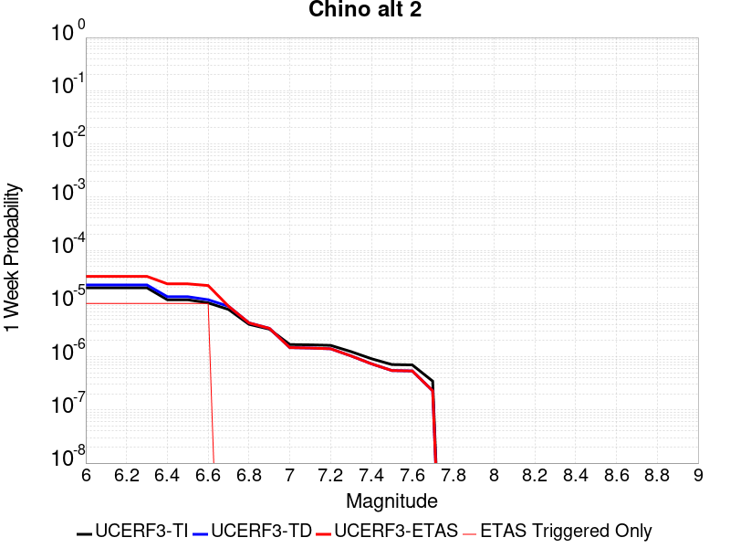 | 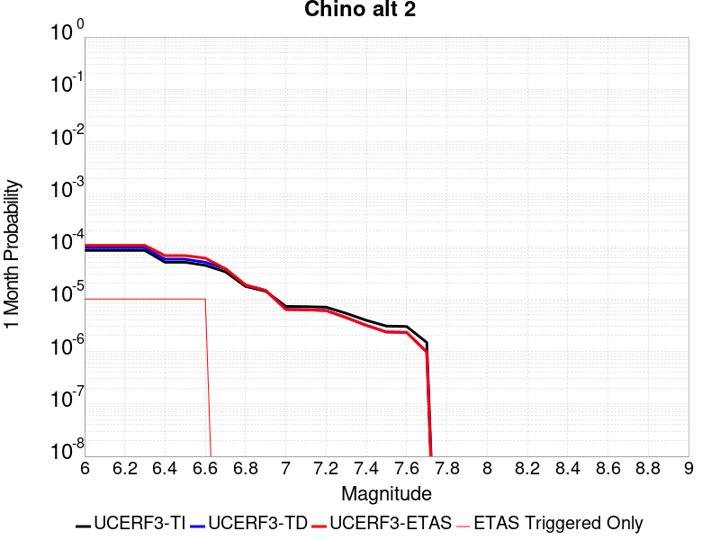 | 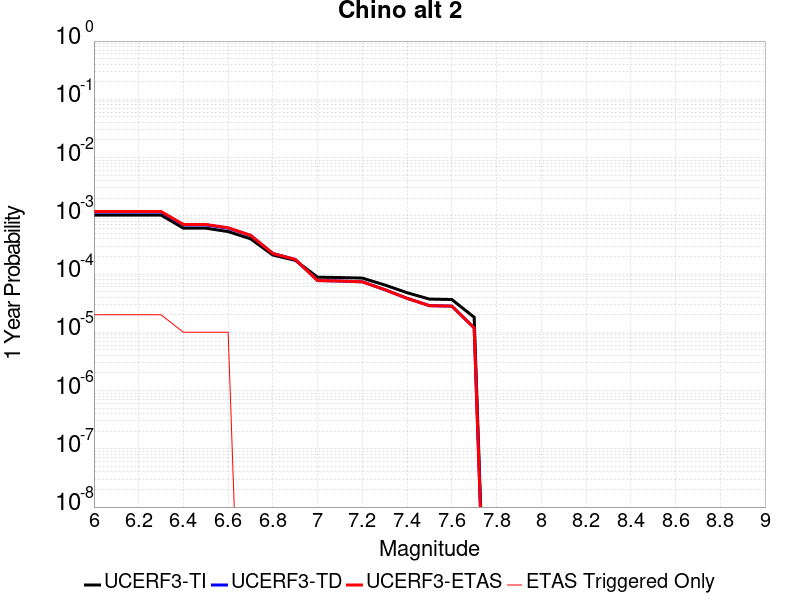 | 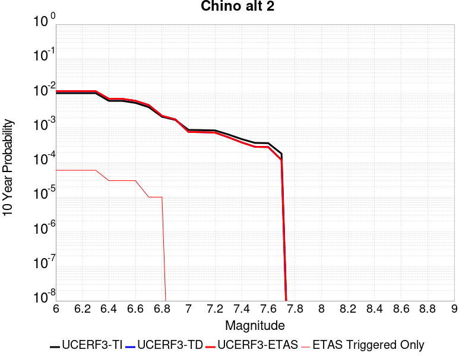 |

| Magnitude | 1 wk TI Prob | 1 wk TD Prob | 1 wk ETAS Prob | 1 wk ETAS/TD Gain | 1 wk ETAS Triggered Only | 1 mo TI Prob | 1 mo TD Prob | 1 mo ETAS Prob | 1 mo ETAS/TD Gain | 1 mo ETAS Triggered Only | 1 yr TI Prob | 1 yr TD Prob | 1 yr ETAS Prob | 1 yr ETAS/TD Gain | 1 yr ETAS Triggered Only | 10 yr TI Prob | 10 yr TD Prob | 10 yr ETAS Prob | 10 yr ETAS/TD Gain | 10 yr ETAS Triggered Only |
|-----|-----|-----|-----|-----|-----|-----|-----|-----|-----|-----|-----|-----|-----|-----|-----|-----|-----|-----|-----|-----|
| 6.0 | 1.9731848E-5 | 2.233357E-5 | 3.2333348E-5 | 1.4477464 | 1.0E-5 | 8.456232E-5 | 9.571241E-5 | 1.0571145E-4 | 1.1044697 | 1.0E-5 | 0.0010290599 | 0.0011647845 | 0.0011847613 | 1.0171505 | 2.0E-5 | 0.010243076 | 0.011598916 | 0.01165822 | 1.0051129 | 6.0E-5 |
| 6.1 | 1.9731848E-5 | 2.233357E-5 | 3.2333348E-5 | 1.4477464 | 1.0E-5 | 8.456232E-5 | 9.571241E-5 | 1.0571145E-4 | 1.1044697 | 1.0E-5 | 0.0010290599 | 0.0011647845 | 0.0011847613 | 1.0171505 | 2.0E-5 | 0.010243076 | 0.011598916 | 0.01165822 | 1.0051129 | 6.0E-5 |
| 6.2 | 1.9731848E-5 | 2.233357E-5 | 3.2333348E-5 | 1.4477464 | 1.0E-5 | 8.456232E-5 | 9.571241E-5 | 1.0571145E-4 | 1.1044697 | 1.0E-5 | 0.0010290599 | 0.0011647845 | 0.0011847613 | 1.0171505 | 2.0E-5 | 0.010243076 | 0.011598916 | 0.01165822 | 1.0051129 | 6.0E-5 |
| 6.3 | 1.9731848E-5 | 2.233357E-5 | 3.2333348E-5 | 1.4477464 | 1.0E-5 | 8.456232E-5 | 9.571241E-5 | 1.0571145E-4 | 1.1044697 | 1.0E-5 | 0.0010290599 | 0.0011647845 | 0.0011847613 | 1.0171505 | 2.0E-5 | 0.010243076 | 0.011598916 | 0.01165822 | 1.0051129 | 6.0E-5 |
| 6.4 | 1.1759944E-5 | 1.3416635E-5 | 2.34165E-5 | 1.7453334 | 1.0E-5 | 5.0398787E-5 | 5.749878E-5 | 6.74982E-5 | 1.1739067 | 1.0E-5 | 6.1343244E-4 | 6.9985515E-4 | 7.0984813E-4 | 1.0142787 | 1.0E-5 | 0.006117419 | 0.0069810534 | 0.007010844 | 1.0042673 | 3.0E-5 |
| 6.5 | 1.1759944E-5 | 1.3416635E-5 | 2.34165E-5 | 1.7453334 | 1.0E-5 | 5.0398787E-5 | 5.749878E-5 | 6.74982E-5 | 1.1739067 | 1.0E-5 | 6.1343244E-4 | 6.9985515E-4 | 7.0984813E-4 | 1.0142787 | 1.0E-5 | 0.006117419 | 0.0069810534 | 0.007010844 | 1.0042673 | 3.0E-5 |
| 6.6 | 1.0276421E-5 | 1.176125E-5 | 2.1761132E-5 | 1.8502398 | 1.0E-5 | 4.4041062E-5 | 5.040455E-5 | 6.0404047E-5 | 1.1983848 | 1.0E-5 | 5.36068E-4 | 6.135318E-4 | 6.2352564E-4 | 1.0162891 | 1.0E-5 | 0.005347767 | 0.0061226026 | 0.006152419 | 1.0048698 | 3.0E-5 |
| 6.7 | 7.72884E-6 | 8.86307E-6 | 8.86307E-6 | 1.0 | 0.0 | 3.312318E-5 | 3.798416E-5 | 3.798416E-5 | 1.0 | 0.0 | 4.0320007E-4 | 4.62381E-4 | 4.62381E-4 | 1.0 | 0.0 | 0.004024693 | 0.0046176794 | 0.0046276334 | 1.0021555 | 1.0E-5 |
| 6.8 | 4.0643645E-6 | 4.3198675E-6 | 4.3198675E-6 | 1.0 | 0.0 | 1.7418588E-5 | 1.851361E-5 | 1.851361E-5 | 1.0 | 0.0 | 2.1205067E-4 | 2.253843E-4 | 2.253843E-4 | 1.0 | 0.0 | 0.0021184843 | 0.0022523634 | 0.0022623409 | 1.0044298 | 1.0E-5 |
| 6.9 | 3.2989187E-6 | 3.4102065E-6 | 3.4102065E-6 | 1.0 | 0.0 | 1.4138147E-5 | 1.4615109E-5 | 1.4615109E-5 | 1.0 | 0.0 | 1.7211834E-4 | 1.7792803E-4 | 1.7792803E-4 | 1.0 | 0.0 | 0.0017198509 | 0.0017785522 | 0.0017785522 | 1.0 | 0.0 |
| 7.0 | 1.6940855E-6 | 1.4836312E-6 | 1.4836312E-6 | 1.0 | 0.0 | 7.2603466E-6 | 6.3584052E-6 | 6.3584052E-6 | 1.0 | 0.0 | 8.8391134E-5 | 7.741103E-5 | 7.741103E-5 | 1.0 | 0.0 | 8.835598E-4 | 7.741453E-4 | 7.741453E-4 | 1.0 | 0.0 |
| 7.1 | 1.6710651E-6 | 1.4558033E-6 | 1.4558033E-6 | 1.0 | 0.0 | 7.161688E-6 | 6.239143E-6 | 6.239143E-6 | 1.0 | 0.0 | 8.719006E-5 | 7.595911E-5 | 7.595911E-5 | 1.0 | 0.0 | 8.715586E-4 | 7.596338E-4 | 7.596338E-4 | 1.0 | 0.0 |
| 7.2 | 1.6332971E-6 | 1.4108987E-6 | 1.4108987E-6 | 1.0 | 0.0 | 6.999826E-6 | 6.0466955E-6 | 6.0466955E-6 | 1.0 | 0.0 | 8.5219544E-5 | 7.3616226E-5 | 7.3616226E-5 | 1.0 | 0.0 | 8.518687E-4 | 7.3621556E-4 | 7.3621556E-4 | 1.0 | 0.0 |
| 7.3 | 1.2458262E-6 | 1.0349166E-6 | 1.0349166E-6 | 1.0 | 0.0 | 5.339244E-6 | 4.43535E-6 | 4.43535E-6 | 1.0 | 0.0 | 6.5003354E-5 | 5.3999196E-5 | 5.3999196E-5 | 1.0 | 0.0 | 6.498435E-4 | 5.3997955E-4 | 5.3997955E-4 | 1.0 | 0.0 |
| 7.4 | 9.168847E-7 | 7.351196E-7 | 7.351196E-7 | 1.0 | 0.0 | 3.9294996E-6 | 3.1505094E-6 | 3.1505094E-6 | 1.0 | 0.0 | 4.784061E-5 | 3.835686E-5 | 3.835686E-5 | 1.0 | 0.0 | 4.7830312E-4 | 3.8351034E-4 | 3.8351034E-4 | 1.0 | 0.0 |
| 7.5 | 7.1248166E-7 | 5.498202E-7 | 5.498202E-7 | 1.0 | 0.0 | 3.0534893E-6 | 2.3563705E-6 | 2.3563705E-6 | 1.0 | 0.0 | 3.71756E-5 | 2.8688499E-5 | 2.8688499E-5 | 1.0 | 0.0 | 3.716938E-4 | 2.8685428E-4 | 2.8685428E-4 | 1.0 | 0.0 |
| 7.6 | 7.0076635E-7 | 5.399695E-7 | 5.399695E-7 | 1.0 | 0.0 | 3.0032809E-6 | 2.3141533E-6 | 2.3141533E-6 | 1.0 | 0.0 | 3.6564332E-5 | 2.8174518E-5 | 2.8174518E-5 | 1.0 | 0.0 | 3.6558317E-4 | 2.817158E-4 | 2.817158E-4 | 1.0 | 0.0 |
| 7.7 | 3.4740066E-7 | 2.2849086E-7 | 2.2849086E-7 | 1.0 | 0.0 | 1.4888591E-6 | 9.792465E-7 | 9.792465E-7 | 1.0 | 0.0 | 1.812671E-5 | 1.1922307E-5 | 1.1922307E-5 | 1.0 | 0.0 | 1.812523E-4 | 1.19221164E-4 | 1.19221164E-4 | 1.0 | 0.0 |

## Ventura-Pitas Point
*[(top)](#table-of-contents)*

| 1 Week | 1 Month | 1 Year | 10 Year |
|-----|-----|-----|-----|
| 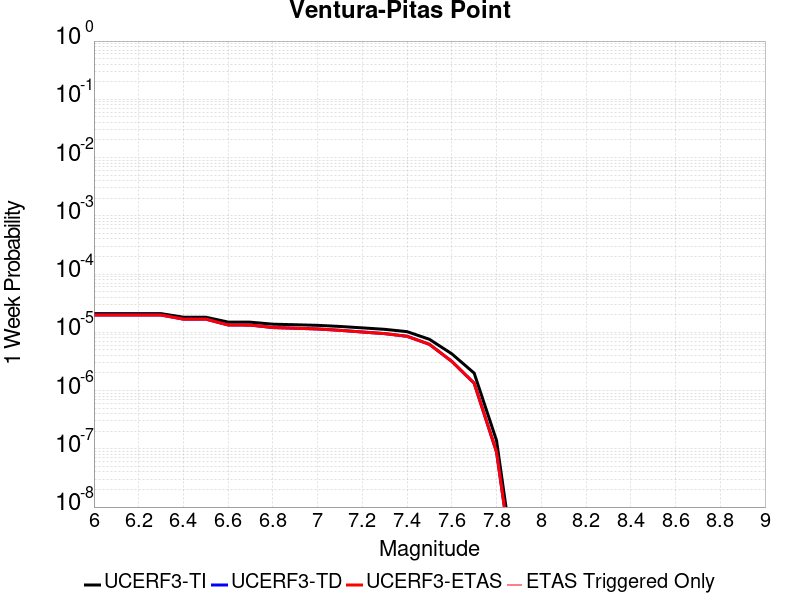 | 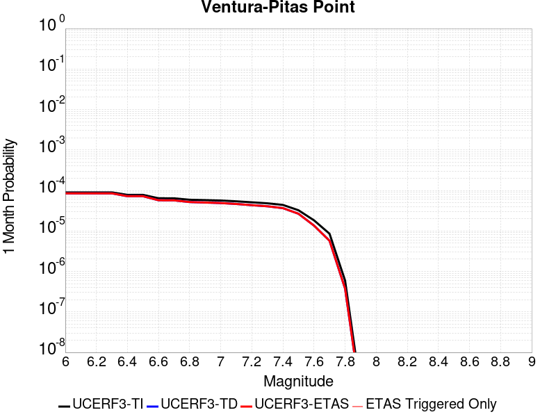 |  |  |

| Magnitude | 1 wk TI Prob | 1 wk TD Prob | 1 wk ETAS Prob | 1 wk ETAS/TD Gain | 1 wk ETAS Triggered Only | 1 mo TI Prob | 1 mo TD Prob | 1 mo ETAS Prob | 1 mo ETAS/TD Gain | 1 mo ETAS Triggered Only | 1 yr TI Prob | 1 yr TD Prob | 1 yr ETAS Prob | 1 yr ETAS/TD Gain | 1 yr ETAS Triggered Only | 10 yr TI Prob | 10 yr TD Prob | 10 yr ETAS Prob | 10 yr ETAS/TD Gain | 10 yr ETAS Triggered Only |
|-----|-----|-----|-----|-----|-----|-----|-----|-----|-----|-----|-----|-----|-----|-----|-----|-----|-----|-----|-----|-----|
| 6.0 | 2.0922074E-5 | 1.9801364E-5 | 1.9801364E-5 | 1.0 | 0.0 | 8.966295E-5 | 8.48603E-5 | 8.48603E-5 | 1.0 | 0.0 | 0.0010910997 | 0.0010326972 | 0.0010526766 | 1.0193467 | 2.0E-5 | 0.01085758 | 0.010280419 | 0.010339802 | 1.0057763 | 6.0E-5 |
| 6.1 | 2.0922074E-5 | 1.9801364E-5 | 1.9801364E-5 | 1.0 | 0.0 | 8.966295E-5 | 8.48603E-5 | 8.48603E-5 | 1.0 | 0.0 | 0.0010910997 | 0.0010326972 | 0.0010526766 | 1.0193467 | 2.0E-5 | 0.01085758 | 0.010280419 | 0.010339802 | 1.0057763 | 6.0E-5 |
| 6.2 | 2.0922074E-5 | 1.9801364E-5 | 1.9801364E-5 | 1.0 | 0.0 | 8.966295E-5 | 8.48603E-5 | 8.48603E-5 | 1.0 | 0.0 | 0.0010910997 | 0.0010326972 | 0.0010526766 | 1.0193467 | 2.0E-5 | 0.01085758 | 0.010280419 | 0.010339802 | 1.0057763 | 6.0E-5 |
| 6.3 | 2.0922074E-5 | 1.9801364E-5 | 1.9801364E-5 | 1.0 | 0.0 | 8.966295E-5 | 8.48603E-5 | 8.48603E-5 | 1.0 | 0.0 | 0.0010910997 | 0.0010326972 | 0.0010526766 | 1.0193467 | 2.0E-5 | 0.01085758 | 0.010280419 | 0.010339802 | 1.0057763 | 6.0E-5 |
| 6.4 | 1.8176193E-5 | 1.6841102E-5 | 1.6841102E-5 | 1.0 | 0.0 | 7.7895646E-5 | 7.217421E-5 | 7.217421E-5 | 1.0 | 0.0 | 9.479668E-4 | 8.783762E-4 | 8.883674E-4 | 1.0113746 | 1.0E-5 | 0.0094393315 | 0.008750107 | 0.008799669 | 1.0056642 | 5.0E-5 |
| 6.5 | 1.8176193E-5 | 1.6841102E-5 | 1.6841102E-5 | 1.0 | 0.0 | 7.7895646E-5 | 7.217421E-5 | 7.217421E-5 | 1.0 | 0.0 | 9.479668E-4 | 8.783762E-4 | 8.883674E-4 | 1.0113746 | 1.0E-5 | 0.0094393315 | 0.008750107 | 0.008799669 | 1.0056642 | 5.0E-5 |
| 6.6 | 1.4981724E-5 | 1.3366736E-5 | 1.3366736E-5 | 1.0 | 0.0 | 6.420581E-5 | 5.728477E-5 | 5.728477E-5 | 1.0 | 0.0 | 7.8142533E-4 | 6.97222E-4 | 7.0721505E-4 | 1.0143327 | 1.0E-5 | 0.0077868323 | 0.0069507533 | 0.006990475 | 1.0057148 | 4.0E-5 |
| 6.7 | 1.4920905E-5 | 1.3300593E-5 | 1.3300593E-5 | 1.0 | 0.0 | 6.394517E-5 | 5.7001314E-5 | 5.7001314E-5 | 1.0 | 0.0 | 7.7825435E-4 | 6.9377315E-4 | 7.037662E-4 | 1.0144039 | 1.0E-5 | 0.0077553443 | 0.0069164797 | 0.006956203 | 1.0057433 | 4.0E-5 |
| 6.8 | 1.378433E-5 | 1.207428E-5 | 1.207428E-5 | 1.0 | 0.0 | 5.9074362E-5 | 5.1745898E-5 | 5.1745898E-5 | 1.0 | 0.0 | 7.18993E-4 | 6.2982616E-4 | 6.398199E-4 | 1.0158674 | 1.0E-5 | 0.0071667116 | 0.006280701 | 0.0063204495 | 1.0063287 | 4.0E-5 |
| 6.9 | 1.3488511E-5 | 1.17510335E-5 | 1.17510335E-5 | 1.0 | 0.0 | 5.7806625E-5 | 5.036061E-5 | 5.036061E-5 | 1.0 | 0.0 | 7.0356834E-4 | 6.129699E-4 | 6.229638E-4 | 1.016304 | 1.0E-5 | 0.00701345 | 0.006113078 | 0.0061528333 | 1.0065033 | 4.0E-5 |
| 7.0 | 1.3170863E-5 | 1.141024E-5 | 1.141024E-5 | 1.0 | 0.0 | 5.6445333E-5 | 4.8900125E-5 | 4.8900125E-5 | 1.0 | 0.0 | 6.8700523E-4 | 5.9519836E-4 | 6.0519244E-4 | 1.0167911 | 1.0E-5 | 0.006848852 | 0.0059363255 | 0.005976088 | 1.0066981 | 4.0E-5 |
| 7.1 | 1.26033765E-5 | 1.0821514E-5 | 1.0821514E-5 | 1.0 | 0.0 | 5.401335E-5 | 4.6377103E-5 | 4.6377103E-5 | 1.0 | 0.0 | 6.574141E-4 | 5.6449685E-4 | 5.744912E-4 | 1.0177048 | 1.0E-5 | 0.0065547265 | 0.0056309053 | 0.0056706797 | 1.0070636 | 4.0E-5 |
| 7.2 | 1.1915687E-5 | 1.0121101E-5 | 1.0121101E-5 | 1.0 | 0.0 | 5.106623E-5 | 4.3375436E-5 | 4.3375436E-5 | 1.0 | 0.0 | 6.21554E-4 | 5.2796985E-4 | 5.379646E-4 | 1.0189304 | 1.0E-5 | 0.0061981836 | 0.0052674236 | 0.0052972655 | 1.0056654 | 3.0E-5 |
| 7.3 | 1.1250162E-5 | 9.495665E-6 | 9.495665E-6 | 1.0 | 0.0 | 4.8214086E-5 | 4.0695082E-5 | 4.0695082E-5 | 1.0 | 0.0 | 5.868484E-4 | 4.9535185E-4 | 5.053469E-4 | 1.0201777 | 1.0E-5 | 0.005853011 | 0.0049427403 | 0.004972592 | 1.0060395 | 3.0E-5 |
| 7.4 | 1.0265625E-5 | 8.548229E-6 | 8.548229E-6 | 1.0 | 0.0 | 4.3994794E-5 | 3.6634763E-5 | 3.6634763E-5 | 1.0 | 0.0 | 5.3550495E-4 | 4.459388E-4 | 4.5593432E-4 | 1.0224146 | 1.0E-5 | 0.0053421636 | 0.004450694 | 0.004480561 | 1.0067105 | 3.0E-5 |
| 7.5 | 7.580305E-6 | 6.216667E-6 | 6.216667E-6 | 1.0 | 0.0 | 3.2486616E-5 | 2.664259E-5 | 2.664259E-5 | 1.0 | 0.0 | 3.9545278E-4 | 3.2432633E-4 | 3.2432633E-4 | 1.0 | 0.0 | 0.003947498 | 0.0032386396 | 0.0032585748 | 1.0061555 | 2.0E-5 |
| 7.6 | 4.271409E-6 | 3.1670359E-6 | 3.1670359E-6 | 1.0 | 0.0 | 1.8305911E-5 | 1.35729415E-5 | 1.35729415E-5 | 1.0 | 0.0 | 2.2285167E-4 | 1.6523818E-4 | 1.6523818E-4 | 1.0 | 0.0 | 0.0022262833 | 0.0016511687 | 0.0016511687 | 1.0 | 0.0 |
| 7.7 | 1.9916663E-6 | 1.3354962E-6 | 1.3354962E-6 | 1.0 | 0.0 | 8.535685E-6 | 5.7235434E-6 | 5.7235434E-6 | 1.0 | 0.0 | 1.0391701E-4 | 6.968199E-5 | 6.968199E-5 | 1.0 | 0.0 | 0.0010386843 | 6.966091E-4 | 6.966091E-4 | 1.0 | 0.0 |
| 7.8 | 1.3864351E-7 | 8.787996E-8 | 8.787996E-8 | 1.0 | 0.0 | 5.9418636E-7 | 3.7662835E-7 | 3.7662835E-7 | 1.0 | 0.0 | 7.234195E-6 | 4.5854404E-6 | 4.5854404E-6 | 1.0 | 0.0 | 7.233959E-5 | 4.585347E-5 | 4.585347E-5 | 1.0 | 0.0 |
| 7.9 | 2.758942E-10 | 1.7720259E-10 | 1.7720259E-10 | 1.0 | 0.0 | 1.1824035E-9 | 7.5943973E-10 | 7.5943973E-10 | 1.0 | 0.0 | 1.4395763E-8 | 9.246178E-9 | 9.246178E-9 | 1.0 | 0.0 | 1.4395762E-7 | 9.246178E-8 | 9.246178E-8 | 1.0 | 0.0 |

## Calaveras (So) - Paicines extension 2011 CFM
*[(top)](#table-of-contents)*

| 1 Week | 1 Month | 1 Year | 10 Year |
|-----|-----|-----|-----|
|  |  |  |  |

| Magnitude | 1 wk TI Prob | 1 wk TD Prob | 1 wk ETAS Prob | 1 wk ETAS/TD Gain | 1 wk ETAS Triggered Only | 1 mo TI Prob | 1 mo TD Prob | 1 mo ETAS Prob | 1 mo ETAS/TD Gain | 1 mo ETAS Triggered Only | 1 yr TI Prob | 1 yr TD Prob | 1 yr ETAS Prob | 1 yr ETAS/TD Gain | 1 yr ETAS Triggered Only | 10 yr TI Prob | 10 yr TD Prob | 10 yr ETAS Prob | 10 yr ETAS/TD Gain | 10 yr ETAS Triggered Only |
|-----|-----|-----|-----|-----|-----|-----|-----|-----|-----|-----|-----|-----|-----|-----|-----|-----|-----|-----|-----|-----|
| 6.0 | 1.5447703E-4 | 3.1186777E-4 | 3.1186777E-4 | 1.0 | 0.0 | 6.6187646E-4 | 0.0013354555 | 0.001345442 | 1.0074781 | 1.0E-5 | 0.008028611 | 0.016036978 | 0.016056657 | 1.0012271 | 2.0E-5 | 0.07744671 | 0.14137083 | 0.14142235 | 1.0003644 | 6.0E-5 |
| 6.1 | 1.5299358E-4 | 3.0898987E-4 | 3.0898987E-4 | 1.0 | 0.0 | 6.55522E-4 | 0.0013231346 | 0.0013331214 | 1.0075479 | 1.0E-5 | 0.007951813 | 0.015889473 | 0.015909156 | 1.0012387 | 2.0E-5 | 0.076732226 | 0.14012377 | 0.14017536 | 1.0003682 | 6.0E-5 |
| 6.2 | 1.2984498E-4 | 2.590005E-4 | 2.590005E-4 | 1.0 | 0.0 | 5.5635977E-4 | 0.0011091129 | 0.0011191018 | 1.0090063 | 1.0E-5 | 0.006752663 | 0.0133443745 | 0.013364107 | 1.0014788 | 2.0E-5 | 0.06551121 | 0.11991723 | 0.11996123 | 1.0003669 | 5.0E-5 |
| 6.3 | 1.18695454E-4 | 2.3426308E-4 | 2.3426308E-4 | 1.0 | 0.0 | 5.085956E-4 | 0.0010036031 | 0.001013593 | 1.0099541 | 1.0E-5 | 0.0061745853 | 0.012088315 | 0.012108073 | 1.0016345 | 2.0E-5 | 0.06005815 | 0.109987095 | 0.11003159 | 1.0004046 | 5.0E-5 |
| 6.4 | 1.0864602E-4 | 2.1236615E-4 | 2.1236615E-4 | 1.0 | 0.0 | 4.655427E-4 | 9.0982596E-4 | 9.1981684E-4 | 1.0109811 | 1.0E-5 | 0.0056532617 | 0.010975226 | 0.010995006 | 1.0018023 | 2.0E-5 | 0.055115912 | 0.10103892 | 0.10108387 | 1.0004449 | 5.0E-5 |
| 6.5 | 9.741868E-5 | 1.8946566E-4 | 1.8946566E-4 | 1.0 | 0.0 | 4.174418E-4 | 8.117447E-4 | 8.217366E-4 | 1.0123092 | 1.0E-5 | 0.0050705164 | 0.00980005 | 0.009819854 | 1.0020208 | 2.0E-5 | 0.049563713 | 0.091037944 | 0.09108339 | 1.0004992 | 5.0E-5 |
| 6.6 | 8.061093E-5 | 1.520833E-4 | 1.520833E-4 | 1.0 | 0.0 | 3.4542967E-4 | 6.516172E-4 | 6.616107E-4 | 1.0153364 | 1.0E-5 | 0.0041974983 | 0.007896518 | 0.00790644 | 1.0012563 | 1.0E-5 | 0.041190937 | 0.07543944 | 0.07547642 | 1.0004902 | 4.0E-5 |
| 6.7 | 7.810772E-5 | 1.472697E-4 | 1.472697E-4 | 1.0 | 0.0 | 3.347044E-4 | 6.3099875E-4 | 6.409924E-4 | 1.0158379 | 1.0E-5 | 0.004067414 | 0.0076478207 | 0.007657744 | 1.0012976 | 1.0E-5 | 0.039937682 | 0.07318741 | 0.073224485 | 1.0005065 | 4.0E-5 |
| 6.8 | 6.9196314E-5 | 1.2722492E-4 | 1.2722492E-4 | 1.0 | 0.0 | 2.9652193E-4 | 5.451317E-4 | 5.5512623E-4 | 1.0183342 | 1.0E-5 | 0.003604179 | 0.006612062 | 0.006621996 | 1.0015024 | 1.0E-5 | 0.03546282 | 0.06375471 | 0.06379216 | 1.0005875 | 4.0E-5 |
| 6.9 | 5.6662087E-5 | 9.9225224E-5 | 9.9225224E-5 | 1.0 | 0.0 | 2.4281492E-4 | 4.2518156E-4 | 4.351773E-4 | 1.0235094 | 1.0E-5 | 0.002952264 | 0.0051643928 | 0.005174341 | 1.0019263 | 1.0E-5 | 0.029133499 | 0.050422657 | 0.050451145 | 1.0005649 | 3.0E-5 |
| 7.0 | 4.9156344E-5 | 8.454822E-5 | 8.454822E-5 | 1.0 | 0.0 | 2.1065303E-4 | 3.6229962E-4 | 3.72296E-4 | 1.0275915 | 1.0E-5 | 0.002561684 | 0.0044021574 | 0.004412113 | 1.0022616 | 1.0E-5 | 0.02532355 | 0.043234468 | 0.04326317 | 1.0006639 | 3.0E-5 |
| 7.1 | 4.2463944E-5 | 7.06639E-5 | 7.06639E-5 | 1.0 | 0.0 | 1.8197563E-4 | 3.0281043E-4 | 3.128074E-4 | 1.0330139 | 1.0E-5 | 0.002213302 | 0.0036805365 | 0.0036904998 | 1.002707 | 1.0E-5 | 0.021913873 | 0.03650776 | 0.036536664 | 1.0007918 | 3.0E-5 |
| 7.2 | 3.452826E-5 | 5.598642E-5 | 5.598642E-5 | 1.0 | 0.0 | 1.4796985E-4 | 2.3991987E-4 | 2.4991747E-4 | 1.0416706 | 1.0E-5 | 0.0018000443 | 0.0029171382 | 0.002927109 | 1.003418 | 1.0E-5 | 0.017855333 | 0.029193072 | 0.029222196 | 1.0009977 | 3.0E-5 |
| 7.3 | 2.716458E-5 | 4.2779186E-5 | 4.2779186E-5 | 1.0 | 0.0 | 1.16414434E-4 | 1.8332659E-4 | 1.9332475E-4 | 1.0545374 | 1.0E-5 | 0.0014164242 | 0.0022297357 | 0.0022397134 | 1.0044749 | 1.0E-5 | 0.0140743 | 0.02243685 | 0.022466177 | 1.0013071 | 3.0E-5 |
| 7.4 | 1.847898E-5 | 2.8944749E-5 | 2.8944749E-5 | 1.0 | 0.0 | 7.9193225E-5 | 1.2404304E-4 | 1.340418E-4 | 1.0806072 | 1.0E-5 | 9.63751E-4 | 0.0015091801 | 0.001519165 | 1.0066161 | 1.0E-5 | 0.009595821 | 0.015287548 | 0.01531709 | 1.0019324 | 3.0E-5 |
| 7.5 | 1.5951407E-5 | 2.6125646E-5 | 2.6125646E-5 | 1.0 | 0.0 | 6.836138E-5 | 1.1196226E-4 | 1.21961144E-4 | 1.0893058 | 1.0E-5 | 8.31982E-4 | 0.0013622903 | 0.0013722768 | 1.0073305 | 1.0E-5 | 0.00828874 | 0.013821284 | 0.01385087 | 1.0021405 | 3.0E-5 |
| 7.6 | 1.13223205E-5 | 1.9308738E-5 | 1.9308738E-5 | 1.0 | 0.0 | 4.8523325E-5 | 8.274912E-5 | 9.274829E-5 | 1.1208372 | 1.0E-5 | 5.9061137E-4 | 0.0010070063 | 0.0010169962 | 1.0099205 | 1.0E-5 | 0.005890441 | 0.010259917 | 0.010289609 | 1.002894 | 3.0E-5 |
| 7.7 | 6.2892655E-6 | 1.0302986E-5 | 1.0302986E-5 | 1.0 | 0.0 | 2.6953716E-5 | 4.415491E-5 | 5.4154465E-5 | 1.2264653 | 1.0E-5 | 3.2811207E-4 | 5.374535E-4 | 5.474481E-4 | 1.0185963 | 1.0E-5 | 0.0032762804 | 0.0055593117 | 0.0055891452 | 1.0053663 | 3.0E-5 |
| 7.8 | 5.263994E-6 | 9.1940965E-6 | 9.1940965E-6 | 1.0 | 0.0 | 2.255978E-5 | 3.9402676E-5 | 4.9402282E-5 | 1.2537799 | 1.0E-5 | 2.746307E-4 | 4.7962207E-4 | 4.896173E-4 | 1.0208397 | 1.0E-5 | 0.0027429154 | 0.0049555153 | 0.004985367 | 1.0060239 | 3.0E-5 |
| 7.9 | 3.3676442E-6 | 7.311961E-6 | 7.311961E-6 | 1.0 | 0.0 | 1.4432681E-5 | 3.13366E-5 | 3.13366E-5 | 1.0 | 0.0 | 1.7570372E-4 | 3.8145637E-4 | 3.8145637E-4 | 1.0 | 0.0 | 0.0017556486 | 0.0039162524 | 0.0039262134 | 1.0025434 | 1.0E-5 |
| 8.0 | 2.0105401E-6 | 4.333763E-6 | 4.333763E-6 | 1.0 | 0.0 | 8.616573E-6 | 1.8573139E-5 | 1.8573139E-5 | 1.0 | 0.0 | 1.0490172E-4 | 2.2610456E-4 | 2.2610456E-4 | 1.0 | 0.0 | 0.0010485222 | 0.0023102602 | 0.0023102602 | 1.0 | 0.0 |
| 8.1 | 1.2019887E-6 | 2.3611485E-6 | 2.3611485E-6 | 1.0 | 0.0 | 5.15137E-6 | 1.0119169E-5 | 1.0119169E-5 | 1.0 | 0.0 | 6.271612E-5 | 1.2319394E-4 | 1.2319394E-4 | 1.0 | 0.0 | 6.269842E-4 | 0.0012616334 | 0.0012616334 | 1.0 | 0.0 |

## Mono Lake 2011 CFM
*[(top)](#table-of-contents)*

| 1 Week | 1 Month | 1 Year | 10 Year |
|-----|-----|-----|-----|
|  |  | 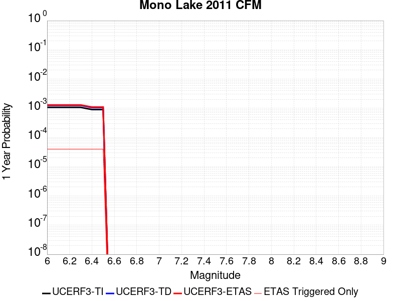 |  |

| Magnitude | 1 wk TI Prob | 1 wk TD Prob | 1 wk ETAS Prob | 1 wk ETAS/TD Gain | 1 wk ETAS Triggered Only | 1 mo TI Prob | 1 mo TD Prob | 1 mo ETAS Prob | 1 mo ETAS/TD Gain | 1 mo ETAS Triggered Only | 1 yr TI Prob | 1 yr TD Prob | 1 yr ETAS Prob | 1 yr ETAS/TD Gain | 1 yr ETAS Triggered Only | 10 yr TI Prob | 10 yr TD Prob | 10 yr ETAS Prob | 10 yr ETAS/TD Gain | 10 yr ETAS Triggered Only |
|-----|-----|-----|-----|-----|-----|-----|-----|-----|-----|-----|-----|-----|-----|-----|-----|-----|-----|-----|-----|-----|
| 6.0 | 2.0554013E-5 | 2.4095883E-5 | 4.4095403E-5 | 1.8299973 | 2.0E-5 | 8.808565E-5 | 1.0326694E-4 | 1.2326488E-4 | 1.1936529 | 2.0E-5 | 0.0010719151 | 0.001257074 | 0.0012970236 | 1.0317799 | 4.0E-5 | 0.010667594 | 0.012550999 | 0.012610246 | 1.0047204 | 6.0E-5 |
| 6.1 | 2.0554013E-5 | 2.4095883E-5 | 4.4095403E-5 | 1.8299973 | 2.0E-5 | 8.808565E-5 | 1.0326694E-4 | 1.2326488E-4 | 1.1936529 | 2.0E-5 | 0.0010719151 | 0.001257074 | 0.0012970236 | 1.0317799 | 4.0E-5 | 0.010667594 | 0.012550999 | 0.012610246 | 1.0047204 | 6.0E-5 |
| 6.2 | 2.0554013E-5 | 2.4095883E-5 | 4.4095403E-5 | 1.8299973 | 2.0E-5 | 8.808565E-5 | 1.0326694E-4 | 1.2326488E-4 | 1.1936529 | 2.0E-5 | 0.0010719151 | 0.001257074 | 0.0012970236 | 1.0317799 | 4.0E-5 | 0.010667594 | 0.012550999 | 0.012610246 | 1.0047204 | 6.0E-5 |
| 6.3 | 2.0554013E-5 | 2.4095883E-5 | 4.4095403E-5 | 1.8299973 | 2.0E-5 | 8.808565E-5 | 1.0326694E-4 | 1.2326488E-4 | 1.1936529 | 2.0E-5 | 0.0010719151 | 0.001257074 | 0.0012970236 | 1.0317799 | 4.0E-5 | 0.010667594 | 0.012550999 | 0.012610246 | 1.0047204 | 6.0E-5 |
| 6.4 | 1.7333385E-5 | 2.0312411E-5 | 4.0312003E-5 | 1.9845997 | 2.0E-5 | 7.428382E-5 | 8.705319E-5 | 1.0705145E-4 | 1.2297246 | 2.0E-5 | 9.0403017E-4 | 0.0010598726 | 0.0010998301 | 1.0377004 | 4.0E-5 | 0.009003613 | 0.01059868 | 0.01064815 | 1.0046675 | 5.0E-5 |
| 6.5 | 1.7333385E-5 | 2.0312411E-5 | 4.0312003E-5 | 1.9845997 | 2.0E-5 | 7.428382E-5 | 8.705319E-5 | 1.0705145E-4 | 1.2297246 | 2.0E-5 | 9.0403017E-4 | 0.0010598726 | 0.0010998301 | 1.0377004 | 4.0E-5 | 0.009003613 | 0.01059868 | 0.01064815 | 1.0046675 | 5.0E-5 |

## San Gabriel
*[(top)](#table-of-contents)*

| 1 Week | 1 Month | 1 Year | 10 Year |
|-----|-----|-----|-----|
|  |  | 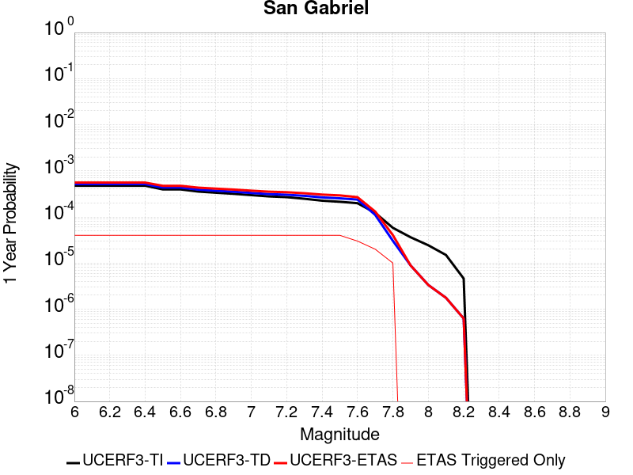 | 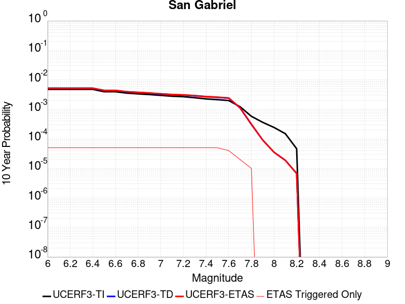 |

| Magnitude | 1 wk TI Prob | 1 wk TD Prob | 1 wk ETAS Prob | 1 wk ETAS/TD Gain | 1 wk ETAS Triggered Only | 1 mo TI Prob | 1 mo TD Prob | 1 mo ETAS Prob | 1 mo ETAS/TD Gain | 1 mo ETAS Triggered Only | 1 yr TI Prob | 1 yr TD Prob | 1 yr ETAS Prob | 1 yr ETAS/TD Gain | 1 yr ETAS Triggered Only | 10 yr TI Prob | 10 yr TD Prob | 10 yr ETAS Prob | 10 yr ETAS/TD Gain | 10 yr ETAS Triggered Only |
|-----|-----|-----|-----|-----|-----|-----|-----|-----|-----|-----|-----|-----|-----|-----|-----|-----|-----|-----|-----|-----|
| 6.0 | 9.133094E-6 | 9.903557E-6 | 2.9903358E-5 | 3.0194564 | 2.0E-5 | 3.9141243E-5 | 4.2443135E-5 | 8.244144E-5 | 1.9423975 | 4.0E-5 | 4.7644044E-4 | 5.1662425E-4 | 5.566036E-4 | 1.0773857 | 4.0E-5 | 0.0047542024 | 0.005164565 | 0.005214307 | 1.0096314 | 5.0E-5 |
| 6.1 | 9.133094E-6 | 9.903557E-6 | 2.9903358E-5 | 3.0194564 | 2.0E-5 | 3.9141243E-5 | 4.2443135E-5 | 8.244144E-5 | 1.9423975 | 4.0E-5 | 4.7644044E-4 | 5.1662425E-4 | 5.566036E-4 | 1.0773857 | 4.0E-5 | 0.0047542024 | 0.005164565 | 0.005214307 | 1.0096314 | 5.0E-5 |
| 6.2 | 9.133094E-6 | 9.903557E-6 | 2.9903358E-5 | 3.0194564 | 2.0E-5 | 3.9141243E-5 | 4.2443135E-5 | 8.244144E-5 | 1.9423975 | 4.0E-5 | 4.7644044E-4 | 5.1662425E-4 | 5.566036E-4 | 1.0773857 | 4.0E-5 | 0.0047542024 | 0.005164565 | 0.005214307 | 1.0096314 | 5.0E-5 |
| 6.3 | 9.133094E-6 | 9.903557E-6 | 2.9903358E-5 | 3.0194564 | 2.0E-5 | 3.9141243E-5 | 4.2443135E-5 | 8.244144E-5 | 1.9423975 | 4.0E-5 | 4.7644044E-4 | 5.1662425E-4 | 5.566036E-4 | 1.0773857 | 4.0E-5 | 0.0047542024 | 0.005164565 | 0.005214307 | 1.0096314 | 5.0E-5 |
| 6.4 | 9.133094E-6 | 9.903557E-6 | 2.9903358E-5 | 3.0194564 | 2.0E-5 | 3.9141243E-5 | 4.2443135E-5 | 8.244144E-5 | 1.9423975 | 4.0E-5 | 4.7644044E-4 | 5.1662425E-4 | 5.566036E-4 | 1.0773857 | 4.0E-5 | 0.0047542024 | 0.005164565 | 0.005214307 | 1.0096314 | 5.0E-5 |
| 6.5 | 7.5898747E-6 | 8.318106E-6 | 2.831794E-5 | 3.4043736 | 2.0E-5 | 3.2527627E-5 | 3.5648543E-5 | 7.564711E-5 | 2.1220255 | 4.0E-5 | 3.959519E-4 | 4.3393558E-4 | 4.7391822E-4 | 1.0921396 | 4.0E-5 | 0.0039524715 | 0.0043411586 | 0.0043909415 | 1.0114677 | 5.0E-5 |
| 6.6 | 7.5898747E-6 | 8.318106E-6 | 2.831794E-5 | 3.4043736 | 2.0E-5 | 3.2527627E-5 | 3.5648543E-5 | 7.564711E-5 | 2.1220255 | 4.0E-5 | 3.959519E-4 | 4.3393558E-4 | 4.7391822E-4 | 1.0921396 | 4.0E-5 | 0.0039524715 | 0.0043411586 | 0.0043909415 | 1.0114677 | 5.0E-5 |
| 6.7 | 6.817426E-6 | 7.519949E-6 | 2.7519798E-5 | 3.6595726 | 2.0E-5 | 2.9217212E-5 | 3.222796E-5 | 7.222667E-5 | 2.2411184 | 4.0E-5 | 3.556615E-4 | 3.923056E-4 | 4.322899E-4 | 1.1019213 | 4.0E-5 | 0.003550928 | 0.0039263917 | 0.0039761956 | 1.0126843 | 5.0E-5 |
| 6.8 | 6.43071E-6 | 7.1192662E-6 | 2.7119124E-5 | 3.8092582 | 2.0E-5 | 2.7559894E-5 | 3.0510788E-5 | 7.0509566E-5 | 2.3109717 | 4.0E-5 | 3.3549004E-4 | 3.7140632E-4 | 4.1139146E-4 | 1.1076587 | 4.0E-5 | 0.0033498402 | 0.0037181133 | 0.0037679274 | 1.0133977 | 5.0E-5 |
| 6.9 | 6.092461E-6 | 6.7680357E-6 | 2.67679E-5 | 3.9550471 | 2.0E-5 | 2.6110285E-5 | 2.9005549E-5 | 6.900439E-5 | 2.3790064 | 4.0E-5 | 3.1784637E-4 | 3.530861E-4 | 3.9307197E-4 | 1.1132468 | 4.0E-5 | 0.0031739213 | 0.0035355063 | 0.0035853295 | 1.0140922 | 5.0E-5 |
| 7.0 | 5.708752E-6 | 6.357806E-6 | 2.6357679E-5 | 4.1457195 | 2.0E-5 | 2.446585E-5 | 2.7247457E-5 | 6.7246365E-5 | 2.4679868 | 4.0E-5 | 2.97831E-4 | 3.31688E-4 | 3.7167475E-4 | 1.1205553 | 4.0E-5 | 0.0029743216 | 0.003322181 | 0.003372015 | 1.0150003 | 5.0E-5 |
| 7.1 | 5.3475555E-6 | 6.005609E-6 | 2.600549E-5 | 4.3302 | 2.0E-5 | 2.2917895E-5 | 2.5738074E-5 | 6.573705E-5 | 2.5540779 | 4.0E-5 | 2.7898964E-4 | 3.1331665E-4 | 3.5330412E-4 | 1.1276264 | 4.0E-5 | 0.0027863965 | 0.0031389964 | 0.0031888394 | 1.0158787 | 5.0E-5 |
| 7.2 | 5.1555858E-6 | 5.8237824E-6 | 2.5823665E-5 | 4.434174 | 2.0E-5 | 2.209518E-5 | 2.4958832E-5 | 6.4957836E-5 | 2.6025991 | 4.0E-5 | 2.6897562E-4 | 3.0383206E-4 | 3.438199E-4 | 1.1316117 | 4.0E-5 | 0.0026865029 | 0.0030444143 | 0.0030942622 | 1.0163735 | 5.0E-5 |
| 7.3 | 4.757207E-6 | 5.5017867E-6 | 2.5501677E-5 | 4.635163 | 2.0E-5 | 2.0387872E-5 | 2.3578878E-5 | 6.3577936E-5 | 2.6963937 | 4.0E-5 | 2.4819406E-4 | 2.8703565E-4 | 3.2702417E-4 | 1.1393155 | 4.0E-5 | 0.0024791704 | 0.0028768976 | 0.0029267536 | 1.0173298 | 5.0E-5 |
| 7.4 | 4.324435E-6 | 5.089987E-6 | 2.5089885E-5 | 4.929263 | 2.0E-5 | 1.8533161E-5 | 2.1814052E-5 | 6.181318E-5 | 2.8336403 | 4.0E-5 | 2.2561787E-4 | 2.6555432E-4 | 3.0554368E-4 | 1.1505883 | 4.0E-5 | 0.0022538896 | 0.0026626152 | 0.002712482 | 1.0187285 | 5.0E-5 |
| 7.5 | 4.092089E-6 | 4.8582992E-6 | 2.4858202E-5 | 5.1166472 | 2.0E-5 | 1.7537406E-5 | 2.0821119E-5 | 6.0820286E-5 | 2.9210863 | 4.0E-5 | 2.13497E-4 | 2.5346823E-4 | 2.9345808E-4 | 1.1577708 | 4.0E-5 | 0.0021329198 | 0.0025420357 | 0.0025919084 | 1.0196192 | 5.0E-5 |
| 7.6 | 3.8123899E-6 | 4.572175E-6 | 2.4572084E-5 | 5.374266 | 2.0E-5 | 1.6338712E-5 | 1.959489E-5 | 4.9594302E-5 | 2.5309813 | 3.0E-5 | 1.9890566E-4 | 2.3854227E-4 | 2.685351E-4 | 1.1257339 | 3.0E-5 | 0.001987277 | 0.0023930962 | 0.0024330004 | 1.0166748 | 4.0E-5 |
| 7.7 | 2.3524162E-6 | 2.126497E-6 | 1.2126476E-5 | 5.7025595 | 1.0E-5 | 1.0081745E-5 | 9.113527E-6 | 2.9113346E-5 | 3.19452 | 2.0E-5 | 1.2273833E-4 | 1.1095157E-4 | 1.3094935E-4 | 1.1802388 | 2.0E-5 | 0.0012267056 | 0.001115969 | 0.0011359467 | 1.0179017 | 2.0E-5 |
| 7.8 | 1.1142665E-6 | 5.8172134E-7 | 5.8172134E-7 | 1.0 | 0.0 | 4.7754193E-6 | 2.493089E-6 | 1.2493064E-5 | 5.0110784 | 1.0E-5 | 5.8139176E-5 | 3.0352936E-5 | 4.0352632E-5 | 1.3294474 | 1.0E-5 | 5.812397E-4 | 3.076078E-4 | 3.1760472E-4 | 1.032499 | 1.0E-5 |
| 7.9 | 6.962363E-7 | 1.7057992E-7 | 1.7057992E-7 | 1.0 | 0.0 | 2.9838666E-6 | 7.3105656E-7 | 7.3105656E-7 | 1.0 | 0.0 | 3.632797E-5 | 8.900577E-6 | 8.900577E-6 | 1.0 | 0.0 | 3.6322032E-4 | 9.1536174E-5 | 9.1536174E-5 | 1.0 | 0.0 |
| 8.0 | 4.6661077E-7 | 6.431498E-8 | 6.431498E-8 | 1.0 | 0.0 | 1.999759E-6 | 2.7563559E-7 | 2.7563559E-7 | 1.0 | 0.0 | 2.4346793E-5 | 3.355858E-6 | 3.355858E-6 | 1.0 | 0.0 | 2.4344125E-4 | 3.524993E-5 | 3.524993E-5 | 1.0 | 0.0 |
| 8.1 | 2.8688657E-7 | 3.3878806E-8 | 3.3878806E-8 | 1.0 | 0.0 | 1.2295133E-6 | 1.4519487E-7 | 1.4519487E-7 | 1.0 | 0.0 | 1.4969221E-5 | 1.7677461E-6 | 1.7677461E-6 | 1.0 | 0.0 | 1.4968214E-4 | 1.8731258E-5 | 1.8731258E-5 | 1.0 | 0.0 |
| 8.2 | 8.862517E-8 | 1.20579315E-8 | 1.20579315E-8 | 1.0 | 0.0 | 3.798221E-7 | 5.167685E-8 | 5.167685E-8 | 1.0 | 0.0 | 4.6243244E-6 | 6.291654E-7 | 6.291654E-7 | 1.0 | 0.0 | 4.624228E-5 | 6.7486517E-6 | 6.7486517E-6 | 1.0 | 0.0 |

## Kern Canyon (South Kern) 2011
*[(top)](#table-of-contents)*

| 1 Week | 1 Month | 1 Year | 10 Year |
|-----|-----|-----|-----|
|  |  | 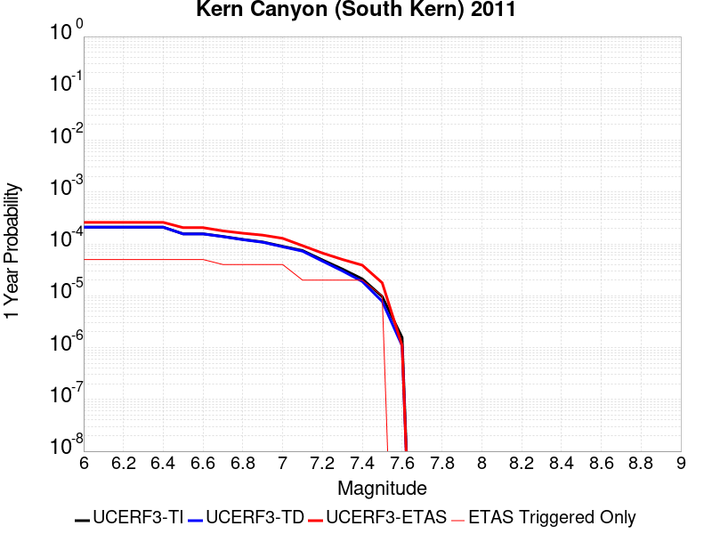 |  |

| Magnitude | 1 wk TI Prob | 1 wk TD Prob | 1 wk ETAS Prob | 1 wk ETAS/TD Gain | 1 wk ETAS Triggered Only | 1 mo TI Prob | 1 mo TD Prob | 1 mo ETAS Prob | 1 mo ETAS/TD Gain | 1 mo ETAS Triggered Only | 1 yr TI Prob | 1 yr TD Prob | 1 yr ETAS Prob | 1 yr ETAS/TD Gain | 1 yr ETAS Triggered Only | 10 yr TI Prob | 10 yr TD Prob | 10 yr ETAS Prob | 10 yr ETAS/TD Gain | 10 yr ETAS Triggered Only |
|-----|-----|-----|-----|-----|-----|-----|-----|-----|-----|-----|-----|-----|-----|-----|-----|-----|-----|-----|-----|-----|
| 6.0 | 4.0224363E-6 | 4.0304362E-6 | 2.4030356E-5 | 5.962222 | 2.0E-5 | 1.7238899E-5 | 1.7273185E-5 | 3.727284E-5 | 2.157844 | 2.0E-5 | 2.0986337E-4 | 2.1028132E-4 | 2.602708E-4 | 1.2377267 | 5.0E-5 | 0.002096653 | 0.0021008805 | 0.0021507754 | 1.0237496 | 5.0E-5 |
| 6.1 | 4.0224363E-6 | 4.0304362E-6 | 2.4030356E-5 | 5.962222 | 2.0E-5 | 1.7238899E-5 | 1.7273185E-5 | 3.727284E-5 | 2.157844 | 2.0E-5 | 2.0986337E-4 | 2.1028132E-4 | 2.602708E-4 | 1.2377267 | 5.0E-5 | 0.002096653 | 0.0021008805 | 0.0021507754 | 1.0237496 | 5.0E-5 |
| 6.2 | 4.0224363E-6 | 4.0304362E-6 | 2.4030356E-5 | 5.962222 | 2.0E-5 | 1.7238899E-5 | 1.7273185E-5 | 3.727284E-5 | 2.157844 | 2.0E-5 | 2.0986337E-4 | 2.1028132E-4 | 2.602708E-4 | 1.2377267 | 5.0E-5 | 0.002096653 | 0.0021008805 | 0.0021507754 | 1.0237496 | 5.0E-5 |
| 6.3 | 4.0224363E-6 | 4.0304362E-6 | 2.4030356E-5 | 5.962222 | 2.0E-5 | 1.7238899E-5 | 1.7273185E-5 | 3.727284E-5 | 2.157844 | 2.0E-5 | 2.0986337E-4 | 2.1028132E-4 | 2.602708E-4 | 1.2377267 | 5.0E-5 | 0.002096653 | 0.0021008805 | 0.0021507754 | 1.0237496 | 5.0E-5 |
| 6.4 | 4.0224363E-6 | 4.0304362E-6 | 2.4030356E-5 | 5.962222 | 2.0E-5 | 1.7238899E-5 | 1.7273185E-5 | 3.727284E-5 | 2.157844 | 2.0E-5 | 2.0986337E-4 | 2.1028132E-4 | 2.602708E-4 | 1.2377267 | 5.0E-5 | 0.002096653 | 0.0021008805 | 0.0021507754 | 1.0237496 | 5.0E-5 |
| 6.5 | 2.9993323E-6 | 2.9887663E-6 | 2.2988706E-5 | 7.6917043 | 2.0E-5 | 1.2854218E-5 | 1.2808936E-5 | 3.280868E-5 | 2.56139 | 2.0E-5 | 1.5648887E-4 | 1.559378E-4 | 2.0593E-4 | 1.3205907 | 5.0E-5 | 0.0015637871 | 0.0015582993 | 0.0016082214 | 1.0320363 | 5.0E-5 |
| 6.6 | 2.9993323E-6 | 2.9887663E-6 | 2.2988706E-5 | 7.6917043 | 2.0E-5 | 1.2854218E-5 | 1.2808936E-5 | 3.280868E-5 | 2.56139 | 2.0E-5 | 1.5648887E-4 | 1.559378E-4 | 2.0593E-4 | 1.3205907 | 5.0E-5 | 0.0015637871 | 0.0015582993 | 0.0016082214 | 1.0320363 | 5.0E-5 |
| 6.7 | 2.6667883E-6 | 2.650217E-6 | 2.2650163E-5 | 8.546532 | 2.0E-5 | 1.1429042E-5 | 1.13580245E-5 | 3.13578E-5 | 2.7608495 | 2.0E-5 | 1.3913971E-4 | 1.3827528E-4 | 1.7826975E-4 | 1.289238 | 4.0E-5 | 0.0013905262 | 0.0013819031 | 0.0014218477 | 1.0289056 | 4.0E-5 |
| 6.8 | 2.3372E-6 | 2.3148164E-6 | 2.231477E-5 | 9.639975 | 2.0E-5 | 1.0016533E-5 | 9.920604E-6 | 2.9920406E-5 | 3.0159862 | 2.0E-5 | 1.2194447E-4 | 1.20776735E-4 | 1.607719E-4 | 1.3311496 | 4.0E-5 | 0.0012187756 | 0.0012071185 | 0.0012470701 | 1.0330968 | 4.0E-5 |
| 6.9 | 2.0894097E-6 | 2.062706E-6 | 2.2062664E-5 | 10.695981 | 2.0E-5 | 8.954582E-6 | 8.840139E-6 | 2.8839962E-5 | 3.2623878 | 2.0E-5 | 1.09016575E-4 | 1.0762344E-4 | 1.4761914E-4 | 1.3716263 | 4.0E-5 | 0.0010896311 | 0.0010757189 | 0.0011156759 | 1.0371444 | 4.0E-5 |
| 7.0 | 1.7214223E-6 | 1.6881573E-6 | 2.1688124E-5 | 12.847217 | 2.0E-5 | 7.377503E-6 | 7.2349403E-6 | 2.7234795E-5 | 3.7643428 | 2.0E-5 | 8.9817404E-5 | 8.808188E-5 | 1.2807835E-4 | 1.454083 | 4.0E-5 | 8.978111E-4 | 8.804735E-4 | 9.204383E-4 | 1.0453901 | 4.0E-5 |
| 7.1 | 1.4264762E-6 | 1.3877684E-6 | 1.1387754E-5 | 8.205803 | 1.0E-5 | 6.113455E-6 | 5.9475656E-6 | 1.5947506E-5 | 2.6813502 | 1.0E-5 | 7.4428775E-5 | 7.240923E-5 | 9.240778E-5 | 1.2761879 | 2.0E-5 | 7.440385E-4 | 7.2385906E-4 | 7.438446E-4 | 1.0276097 | 2.0E-5 |
| 7.2 | 9.397715E-7 | 8.9210437E-7 | 1.0892096E-5 | 12.209441 | 1.0E-5 | 4.027586E-6 | 3.823299E-6 | 1.3823261E-5 | 3.6155324 | 1.0E-5 | 4.9034756E-5 | 4.6547684E-5 | 6.654675E-5 | 1.429647 | 2.0E-5 | 4.9023936E-4 | 4.653806E-4 | 4.853713E-4 | 1.0429556 | 2.0E-5 |
| 7.3 | 6.2755765E-7 | 5.775016E-7 | 1.0577496E-5 | 18.315958 | 1.0E-5 | 2.68953E-6 | 2.4750047E-6 | 1.247498E-5 | 5.040386 | 1.0E-5 | 3.2744534E-5 | 3.0132771E-5 | 5.013217E-5 | 1.6637092 | 2.0E-5 | 3.273971E-4 | 3.0128742E-4 | 3.2128138E-4 | 1.0663618 | 2.0E-5 |
| 7.4 | 4.052877E-7 | 3.6176584E-7 | 1.0361762E-5 | 28.64218 | 1.0E-5 | 1.736946E-6 | 1.5504241E-6 | 1.1550409E-5 | 7.4498377 | 1.0E-5 | 2.1147114E-5 | 1.8876253E-5 | 3.8875874E-5 | 2.0595124 | 2.0E-5 | 2.1145101E-4 | 1.8874678E-4 | 2.08743E-4 | 1.1059421 | 2.0E-5 |
| 7.5 | 1.8504771E-7 | 1.4893946E-7 | 1.0148938E-5 | 68.14136 | 1.0E-5 | 7.9306136E-7 | 6.3831186E-7 | 1.0638306E-5 | 16.666313 | 1.0E-5 | 9.6554795E-6 | 7.77142E-6 | 1.7771343E-5 | 2.286756 | 1.0E-5 | 9.65506E-5 | 7.7711586E-5 | 8.771081E-5 | 1.1286709 | 1.0E-5 |
| 7.6 | 2.9996215E-8 | 2.0812486E-8 | 2.0812486E-8 | 1.0 | 0.0 | 1.285552E-7 | 8.919636E-8 | 8.919636E-8 | 1.0 | 0.0 | 1.5651584E-6 | 1.0859653E-6 | 1.0859653E-6 | 1.0 | 0.0 | 1.5651474E-5 | 1.0859609E-5 | 1.0859609E-5 | 1.0 | 0.0 |

## Mission Creek
*[(top)](#table-of-contents)*

| 1 Week | 1 Month | 1 Year | 10 Year |
|-----|-----|-----|-----|
|  |  |  | 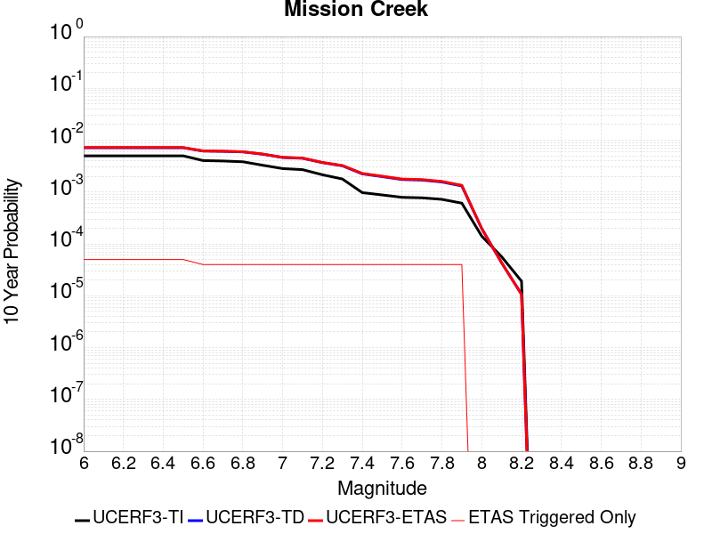 |

| Magnitude | 1 wk TI Prob | 1 wk TD Prob | 1 wk ETAS Prob | 1 wk ETAS/TD Gain | 1 wk ETAS Triggered Only | 1 mo TI Prob | 1 mo TD Prob | 1 mo ETAS Prob | 1 mo ETAS/TD Gain | 1 mo ETAS Triggered Only | 1 yr TI Prob | 1 yr TD Prob | 1 yr ETAS Prob | 1 yr ETAS/TD Gain | 1 yr ETAS Triggered Only | 10 yr TI Prob | 10 yr TD Prob | 10 yr ETAS Prob | 10 yr ETAS/TD Gain | 10 yr ETAS Triggered Only |
|-----|-----|-----|-----|-----|-----|-----|-----|-----|-----|-----|-----|-----|-----|-----|-----|-----|-----|-----|-----|-----|
| 6.0 | 9.612233E-6 | 1.3759111E-5 | 4.3758697E-5 | 3.1803434 | 3.0E-5 | 4.1194635E-5 | 5.8966343E-5 | 8.8964574E-5 | 1.5087348 | 3.0E-5 | 5.0142925E-4 | 7.1768847E-4 | 7.576598E-4 | 1.0556945 | 4.0E-5 | 0.005002993 | 0.007174896 | 0.007224537 | 1.0069188 | 5.0E-5 |
| 6.1 | 9.612233E-6 | 1.3759111E-5 | 4.3758697E-5 | 3.1803434 | 3.0E-5 | 4.1194635E-5 | 5.8966343E-5 | 8.8964574E-5 | 1.5087348 | 3.0E-5 | 5.0142925E-4 | 7.1768847E-4 | 7.576598E-4 | 1.0556945 | 4.0E-5 | 0.005002993 | 0.007174896 | 0.007224537 | 1.0069188 | 5.0E-5 |
| 6.2 | 9.612233E-6 | 1.3759111E-5 | 4.3758697E-5 | 3.1803434 | 3.0E-5 | 4.1194635E-5 | 5.8966343E-5 | 8.8964574E-5 | 1.5087348 | 3.0E-5 | 5.0142925E-4 | 7.1768847E-4 | 7.576598E-4 | 1.0556945 | 4.0E-5 | 0.005002993 | 0.007174896 | 0.007224537 | 1.0069188 | 5.0E-5 |
| 6.3 | 9.612233E-6 | 1.3759111E-5 | 4.3758697E-5 | 3.1803434 | 3.0E-5 | 4.1194635E-5 | 5.8966343E-5 | 8.8964574E-5 | 1.5087348 | 3.0E-5 | 5.0142925E-4 | 7.1768847E-4 | 7.576598E-4 | 1.0556945 | 4.0E-5 | 0.005002993 | 0.007174896 | 0.007224537 | 1.0069188 | 5.0E-5 |
| 6.4 | 9.612233E-6 | 1.3759111E-5 | 4.3758697E-5 | 3.1803434 | 3.0E-5 | 4.1194635E-5 | 5.8966343E-5 | 8.8964574E-5 | 1.5087348 | 3.0E-5 | 5.0142925E-4 | 7.1768847E-4 | 7.576598E-4 | 1.0556945 | 4.0E-5 | 0.005002993 | 0.007174896 | 0.007224537 | 1.0069188 | 5.0E-5 |
| 6.5 | 9.612233E-6 | 1.3759111E-5 | 4.3758697E-5 | 3.1803434 | 3.0E-5 | 4.1194635E-5 | 5.8966343E-5 | 8.8964574E-5 | 1.5087348 | 3.0E-5 | 5.0142925E-4 | 7.1768847E-4 | 7.576598E-4 | 1.0556945 | 4.0E-5 | 0.005002993 | 0.007174896 | 0.007224537 | 1.0069188 | 5.0E-5 |
| 6.6 | 7.7857785E-6 | 1.1849422E-5 | 4.1849067E-5 | 3.531739 | 3.0E-5 | 3.3367192E-5 | 5.0782288E-5 | 8.078077E-5 | 1.5907272 | 3.0E-5 | 4.0616986E-4 | 6.1810564E-4 | 6.580809E-4 | 1.0646739 | 4.0E-5 | 0.004054283 | 0.006184757 | 0.00622451 | 1.0064275 | 4.0E-5 |
| 6.7 | 7.6369E-6 | 1.1693292E-5 | 4.1692943E-5 | 3.5655434 | 3.0E-5 | 3.2729156E-5 | 5.0113187E-5 | 8.0111684E-5 | 1.5986148 | 3.0E-5 | 3.9840463E-4 | 6.099639E-4 | 6.4993947E-4 | 1.0655377 | 4.0E-5 | 0.0039769113 | 0.0061037885 | 0.0061435443 | 1.0065134 | 4.0E-5 |
| 6.8 | 7.3792326E-6 | 1.1410626E-5 | 4.1410283E-5 | 3.6290984 | 3.0E-5 | 3.16249E-5 | 4.8901802E-5 | 7.890034E-5 | 1.6134443 | 3.0E-5 | 3.8496513E-4 | 5.952234E-4 | 6.3519954E-4 | 1.0671617 | 4.0E-5 | 0.0038429892 | 0.005957176 | 0.0059969374 | 1.0066746 | 4.0E-5 |
| 6.9 | 6.320771E-6 | 1.0282549E-5 | 4.028224E-5 | 3.9175346 | 3.0E-5 | 2.7088736E-5 | 4.4067354E-5 | 7.406603E-5 | 1.6807461 | 3.0E-5 | 3.2975545E-4 | 5.363937E-4 | 5.763723E-4 | 1.074532 | 4.0E-5 | 0.0032926656 | 0.0053718043 | 0.0054115895 | 1.0074062 | 4.0E-5 |
| 7.0 | 5.448338E-6 | 8.875169E-6 | 3.8874903E-5 | 4.3801875 | 3.0E-5 | 2.3349812E-5 | 3.803591E-5 | 6.8034766E-5 | 1.7886983 | 3.0E-5 | 2.8424687E-4 | 4.6299305E-4 | 5.0297455E-4 | 1.0863544 | 4.0E-5 | 0.0028388356 | 0.0046409583 | 0.004680773 | 1.0085789 | 4.0E-5 |
| 7.1 | 5.197154E-6 | 8.575823E-6 | 3.8575567E-5 | 4.4981766 | 3.0E-5 | 2.2273327E-5 | 3.6753034E-5 | 6.675193E-5 | 1.8162292 | 3.0E-5 | 2.71144E-4 | 4.473805E-4 | 4.873626E-4 | 1.0893693 | 4.0E-5 | 0.0027081342 | 0.0044854684 | 0.004525289 | 1.0088776 | 4.0E-5 |
| 7.2 | 4.1353956E-6 | 7.0518763E-6 | 3.7051665E-5 | 5.254157 | 3.0E-5 | 1.7723003E-5 | 3.0221996E-5 | 6.022109E-5 | 1.9926245 | 3.0E-5 | 2.157562E-4 | 3.6789416E-4 | 4.0787944E-4 | 1.1086869 | 4.0E-5 | 0.0021554683 | 0.0036934633 | 0.0037333155 | 1.01079 | 4.0E-5 |
| 7.3 | 3.4291004E-6 | 6.127178E-6 | 3.6126996E-5 | 5.8961883 | 3.0E-5 | 1.4696062E-5 | 2.6259087E-5 | 5.62583E-5 | 2.1424317 | 3.0E-5 | 1.7890986E-4 | 3.1966058E-4 | 3.596478E-4 | 1.1250927 | 4.0E-5 | 0.0017876589 | 0.0032125898 | 0.003252461 | 1.012411 | 4.0E-5 |
| 7.4 | 1.8702582E-6 | 4.2709203E-6 | 3.4270794E-5 | 8.024218 | 3.0E-5 | 8.015368E-6 | 1.8303816E-5 | 4.8303267E-5 | 2.6389725 | 3.0E-5 | 9.758273E-5 | 2.2282633E-4 | 2.6281743E-4 | 1.179472 | 4.0E-5 | 9.753989E-4 | 0.0022463822 | 0.0022862924 | 1.0177664 | 4.0E-5 |
| 7.5 | 1.6879382E-6 | 3.7678442E-6 | 3.376773E-5 | 8.962083 | 3.0E-5 | 7.2340003E-6 | 1.6147804E-5 | 4.614732E-5 | 2.8578076 | 3.0E-5 | 8.8070396E-5 | 1.965819E-4 | 2.3657402E-4 | 1.2034376 | 4.0E-5 | 8.80355E-4 | 0.001984777 | 0.0020246976 | 1.0201133 | 4.0E-5 |
| 7.6 | 1.5171546E-6 | 3.3059637E-6 | 3.3305863E-5 | 10.07448 | 3.0E-5 | 6.502075E-6 | 1.4168339E-5 | 4.4167915E-5 | 3.117367 | 3.0E-5 | 7.915989E-5 | 1.7248593E-4 | 2.1247903E-4 | 1.231863 | 4.0E-5 | 7.9131697E-4 | 0.0017444381 | 0.0017843683 | 1.02289 | 4.0E-5 |
| 7.7 | 1.4861972E-6 | 3.2283826E-6 | 3.3228287E-5 | 10.292549 | 3.0E-5 | 6.369401E-6 | 1.3835853E-5 | 4.3835436E-5 | 3.1682498 | 3.0E-5 | 7.75447E-5 | 1.6843855E-4 | 2.0843181E-4 | 1.2374353 | 4.0E-5 | 7.7517645E-4 | 0.0017040876 | 0.0017440194 | 1.023433 | 4.0E-5 |
| 7.8 | 1.3870366E-6 | 2.9612652E-6 | 3.2961176E-5 | 11.1307745 | 3.0E-5 | 5.944429E-6 | 1.2691075E-5 | 4.2690695E-5 | 3.3638358 | 3.0E-5 | 7.237102E-5 | 1.5450295E-4 | 1.9449677E-4 | 1.2588547 | 4.0E-5 | 7.2347454E-4 | 0.0015643805 | 0.0016043178 | 1.0255293 | 4.0E-5 |
| 7.9 | 1.171949E-6 | 2.4795995E-6 | 3.2479526E-5 | 13.098698 | 3.0E-5 | 5.0226286E-6 | 1.0626813E-5 | 4.062649E-5 | 3.8230178 | 3.0E-5 | 6.1148785E-5 | 1.293738E-4 | 1.6936864E-4 | 1.3091416 | 4.0E-5 | 6.113196E-4 | 0.0013117074 | 0.001351655 | 1.0304546 | 4.0E-5 |
| 8.0 | 2.7064573E-7 | 3.6727752E-7 | 3.6727752E-7 | 1.0 | 0.0 | 1.1599097E-6 | 1.5740457E-6 | 1.5740457E-6 | 1.0 | 0.0 | 1.412181E-5 | 1.916384E-5 | 1.916384E-5 | 1.0 | 0.0 | 1.4120912E-4 | 1.9769512E-4 | 1.9769512E-4 | 1.0 | 0.0 |
| 8.1 | 1.0843693E-7 | 7.618908E-8 | 7.618908E-8 | 1.0 | 0.0 | 4.6472962E-7 | 3.2652457E-7 | 3.2652457E-7 | 1.0 | 0.0 | 5.6580684E-6 | 3.9754295E-6 | 3.9754295E-6 | 1.0 | 0.0 | 5.6579243E-5 | 4.3248405E-5 | 4.3248405E-5 | 1.0 | 0.0 |
| 8.2 | 3.6574573E-8 | 1.8319584E-8 | 1.8319584E-8 | 1.0 | 0.0 | 1.5674816E-7 | 7.85125E-8 | 7.85125E-8 | 1.0 | 0.0 | 1.9084073E-6 | 9.558893E-7 | 9.558893E-7 | 1.0 | 0.0 | 1.908391E-5 | 1.0637074E-5 | 1.0637074E-5 | 1.0 | 0.0 |

## Santa Cruz Catalina Ridge alt2
*[(top)](#table-of-contents)*

| 1 Week | 1 Month | 1 Year | 10 Year |
|-----|-----|-----|-----|
|  | 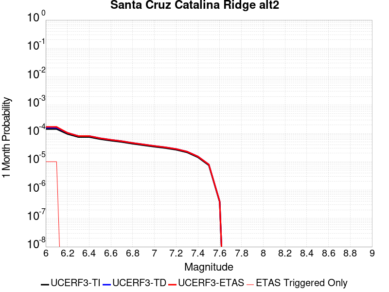 |  |  |

| Magnitude | 1 wk TI Prob | 1 wk TD Prob | 1 wk ETAS Prob | 1 wk ETAS/TD Gain | 1 wk ETAS Triggered Only | 1 mo TI Prob | 1 mo TD Prob | 1 mo ETAS Prob | 1 mo ETAS/TD Gain | 1 mo ETAS Triggered Only | 1 yr TI Prob | 1 yr TD Prob | 1 yr ETAS Prob | 1 yr ETAS/TD Gain | 1 yr ETAS Triggered Only | 10 yr TI Prob | 10 yr TD Prob | 10 yr ETAS Prob | 10 yr ETAS/TD Gain | 10 yr ETAS Triggered Only |
|-----|-----|-----|-----|-----|-----|-----|-----|-----|-----|-----|-----|-----|-----|-----|-----|-----|-----|-----|-----|-----|
| 6.0 | 3.32931E-5 | 3.7089216E-5 | 4.7088844E-5 | 1.2696102 | 1.0E-5 | 1.4267692E-4 | 1.5894491E-4 | 1.6894331E-4 | 1.0629048 | 1.0E-5 | 0.0017357073 | 0.001933581 | 0.0019735035 | 1.020647 | 4.0E-5 | 0.017222127 | 0.019182347 | 0.019231388 | 1.0025566 | 5.0E-5 |
| 6.1 | 3.32931E-5 | 3.7089216E-5 | 4.7088844E-5 | 1.2696102 | 1.0E-5 | 1.4267692E-4 | 1.5894491E-4 | 1.6894331E-4 | 1.0629048 | 1.0E-5 | 0.0017357073 | 0.001933581 | 0.0019735035 | 1.020647 | 4.0E-5 | 0.017222127 | 0.019182347 | 0.019231388 | 1.0025566 | 5.0E-5 |
| 6.2 | 2.2271399E-5 | 2.4403007E-5 | 2.4403007E-5 | 1.0 | 0.0 | 9.544536E-5 | 1.0458035E-4 | 1.0458035E-4 | 1.0 | 0.0 | 0.0011614277 | 0.0012725628 | 0.00128255 | 1.0078481 | 1.0E-5 | 0.011553764 | 0.01265695 | 0.012676697 | 1.0015602 | 2.0E-5 |
| 6.3 | 1.739944E-5 | 1.8820723E-5 | 1.8820723E-5 | 1.0 | 0.0 | 7.4566895E-5 | 8.065782E-5 | 8.065782E-5 | 1.0 | 0.0 | 9.0747385E-4 | 9.815792E-4 | 9.815792E-4 | 1.0 | 0.0 | 0.00903777 | 0.009773781 | 0.009783682 | 1.0010132 | 1.0E-5 |
| 6.4 | 1.739944E-5 | 1.8820723E-5 | 1.8820723E-5 | 1.0 | 0.0 | 7.4566895E-5 | 8.065782E-5 | 8.065782E-5 | 1.0 | 0.0 | 9.0747385E-4 | 9.815792E-4 | 9.815792E-4 | 1.0 | 0.0 | 0.00903777 | 0.009773781 | 0.009783682 | 1.0010132 | 1.0E-5 |
| 6.5 | 1.4660171E-5 | 1.5740365E-5 | 1.5740365E-5 | 1.0 | 0.0 | 6.282779E-5 | 6.745698E-5 | 6.745698E-5 | 1.0 | 0.0 | 7.646599E-4 | 8.2098384E-4 | 8.2098384E-4 | 1.0 | 0.0 | 0.0076203407 | 0.008180015 | 0.008189933 | 1.0012125 | 1.0E-5 |
| 6.6 | 1.2929104E-5 | 1.3841803E-5 | 1.3841803E-5 | 1.0 | 0.0 | 5.540927E-5 | 5.932068E-5 | 5.932068E-5 | 1.0 | 0.0 | 6.74399E-4 | 7.2199275E-4 | 7.2199275E-4 | 1.0 | 0.0 | 0.0067235604 | 0.0071967896 | 0.007206718 | 1.0013795 | 1.0E-5 |
| 6.7 | 1.158484E-5 | 1.237705E-5 | 1.237705E-5 | 1.0 | 0.0 | 4.964837E-5 | 5.304343E-5 | 5.304343E-5 | 1.0 | 0.0 | 6.043012E-4 | 6.456142E-4 | 6.456142E-4 | 1.0 | 0.0 | 0.0060266056 | 0.006437592 | 0.006447528 | 1.0015434 | 1.0E-5 |
| 6.8 | 1.005722E-5 | 1.0722098E-5 | 1.0722098E-5 | 1.0 | 0.0 | 4.3101656E-5 | 4.595104E-5 | 4.595104E-5 | 1.0 | 0.0 | 5.246363E-4 | 5.5931136E-4 | 5.5931136E-4 | 1.0 | 0.0 | 0.005233994 | 0.0055791605 | 0.0055891047 | 1.0017824 | 1.0E-5 |
| 6.9 | 8.904849E-6 | 9.483783E-6 | 9.483783E-6 | 1.0 | 0.0 | 3.8163078E-5 | 4.0644158E-5 | 4.0644158E-5 | 1.0 | 0.0 | 4.6453642E-4 | 4.9473095E-4 | 4.9473095E-4 | 1.0 | 0.0 | 0.0046356656 | 0.0049363794 | 0.00494633 | 1.0020158 | 1.0E-5 |
| 7.0 | 7.89401E-6 | 8.401225E-6 | 8.401225E-6 | 1.0 | 0.0 | 3.3831035E-5 | 3.600476E-5 | 3.600476E-5 | 1.0 | 0.0 | 4.1181498E-4 | 4.3827022E-4 | 4.3827022E-4 | 1.0 | 0.0 | 0.0041105268 | 0.0043741143 | 0.0043840706 | 1.0022762 | 1.0E-5 |
| 7.1 | 7.0872798E-6 | 7.5393395E-6 | 7.5393395E-6 | 1.0 | 0.0 | 3.0373703E-5 | 3.2311058E-5 | 3.2311058E-5 | 1.0 | 0.0 | 3.6973707E-4 | 3.9331647E-4 | 3.9331647E-4 | 1.0 | 0.0 | 0.003691225 | 0.003926248 | 0.0039362083 | 1.002537 | 1.0E-5 |
| 7.2 | 6.169431E-6 | 6.559833E-6 | 6.559833E-6 | 1.0 | 0.0 | 2.644015E-5 | 2.8113267E-5 | 2.8113267E-5 | 1.0 | 0.0 | 3.2186127E-4 | 3.422256E-4 | 3.422256E-4 | 1.0 | 0.0 | 0.003213955 | 0.0034170223 | 0.0034269881 | 1.0029166 | 1.0E-5 |
| 7.3 | 4.9913488E-6 | 5.3073363E-6 | 5.3073363E-6 | 1.0 | 0.0 | 2.1391319E-5 | 2.274553E-5 | 2.274553E-5 | 1.0 | 0.0 | 2.6040818E-4 | 2.7689186E-4 | 2.7689186E-4 | 1.0 | 0.0 | 0.0026010324 | 0.002765495 | 0.0027754672 | 1.003606 | 1.0E-5 |
| 7.4 | 3.349592E-6 | 3.5610847E-6 | 3.5610847E-6 | 1.0 | 0.0 | 1.4355315E-5 | 1.5261703E-5 | 1.5261703E-5 | 1.0 | 0.0 | 1.7476194E-4 | 1.8579552E-4 | 1.8579552E-4 | 1.0 | 0.0 | 0.0017462457 | 0.0018564158 | 0.0018564158 | 1.0 | 0.0 |
| 7.5 | 1.7527058E-6 | 1.8630196E-6 | 1.8630196E-6 | 1.0 | 0.0 | 7.5115745E-6 | 7.984346E-6 | 7.984346E-6 | 1.0 | 0.0 | 9.144958E-5 | 9.7205164E-5 | 9.7205164E-5 | 1.0 | 0.0 | 9.1411953E-4 | 9.716353E-4 | 9.716353E-4 | 1.0 | 0.0 |
| 7.6 | 8.878861E-8 | 9.2756046E-8 | 9.2756046E-8 | 1.0 | 0.0 | 3.8052255E-7 | 3.9752584E-7 | 3.9752584E-7 | 1.0 | 0.0 | 4.6328523E-6 | 4.839868E-6 | 4.839868E-6 | 1.0 | 0.0 | 4.6327557E-5 | 4.8397764E-5 | 4.8397764E-5 | 1.0 | 0.0 |

## San Jacinto (Borrego)
*[(top)](#table-of-contents)*

| 1 Week | 1 Month | 1 Year | 10 Year |
|-----|-----|-----|-----|
|  |  |  | 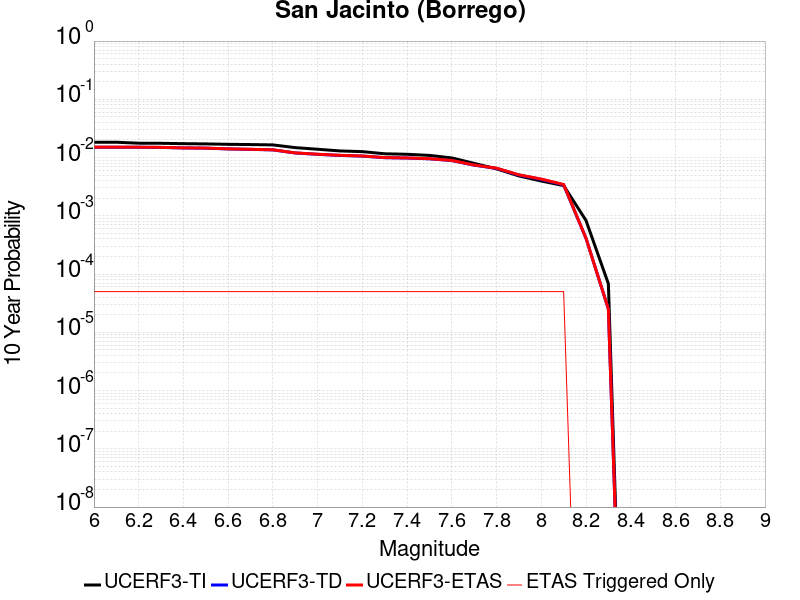 |

| Magnitude | 1 wk TI Prob | 1 wk TD Prob | 1 wk ETAS Prob | 1 wk ETAS/TD Gain | 1 wk ETAS Triggered Only | 1 mo TI Prob | 1 mo TD Prob | 1 mo ETAS Prob | 1 mo ETAS/TD Gain | 1 mo ETAS Triggered Only | 1 yr TI Prob | 1 yr TD Prob | 1 yr ETAS Prob | 1 yr ETAS/TD Gain | 1 yr ETAS Triggered Only | 10 yr TI Prob | 10 yr TD Prob | 10 yr ETAS Prob | 10 yr ETAS/TD Gain | 10 yr ETAS Triggered Only |
|-----|-----|-----|-----|-----|-----|-----|-----|-----|-----|-----|-----|-----|-----|-----|-----|-----|-----|-----|-----|-----|
| 6.0 | 3.54755E-5 | 2.8240373E-5 | 2.8240373E-5 | 1.0 | 0.0 | 1.52029E-4 | 1.21024605E-4 | 1.21024605E-4 | 1.0 | 0.0 | 0.0018493815 | 0.0014724882 | 0.0015024439 | 1.0203437 | 3.0E-5 | 0.018340662 | 0.0150300125 | 0.015079262 | 1.0032767 | 5.0E-5 |
| 6.1 | 3.544998E-5 | 2.8240373E-5 | 2.8240373E-5 | 1.0 | 0.0 | 1.5191962E-4 | 1.21024605E-4 | 1.21024605E-4 | 1.0 | 0.0 | 0.0018480523 | 0.0014724882 | 0.0015024439 | 1.0203437 | 3.0E-5 | 0.018327588 | 0.0150300125 | 0.015079261 | 1.0032767 | 5.0E-5 |
| 6.2 | 3.4132765E-5 | 2.8240373E-5 | 2.8240373E-5 | 1.0 | 0.0 | 1.4627507E-4 | 1.21024605E-4 | 1.21024605E-4 | 1.0 | 0.0 | 0.0017794442 | 0.0014724882 | 0.0015024439 | 1.0203437 | 3.0E-5 | 0.017652627 | 0.0150300125 | 0.015079261 | 1.0032767 | 5.0E-5 |
| 6.3 | 3.3986922E-5 | 2.8050206E-5 | 2.8050206E-5 | 1.0 | 0.0 | 1.456501E-4 | 1.2020968E-4 | 1.2020968E-4 | 1.0 | 0.0 | 0.0017718476 | 0.0014625798 | 0.0014925359 | 1.0204817 | 3.0E-5 | 0.017577868 | 0.014932778 | 0.014982031 | 1.0032983 | 5.0E-5 |
| 6.4 | 3.349493E-5 | 2.7439286E-5 | 2.7439286E-5 | 1.0 | 0.0 | 1.435418E-4 | 1.1759169E-4 | 1.1759169E-4 | 1.0 | 0.0 | 0.0017462203 | 0.0014307476 | 0.0014607046 | 1.020938 | 3.0E-5 | 0.017325623 | 0.014618708 | 0.014667977 | 1.0033703 | 5.0E-5 |
| 6.5 | 3.3171436E-5 | 2.720173E-5 | 2.720173E-5 | 1.0 | 0.0 | 1.4215555E-4 | 1.1657368E-4 | 1.1657368E-4 | 1.0 | 0.0 | 0.0017293699 | 0.0014183695 | 0.001448327 | 1.021121 | 3.0E-5 | 0.017159734 | 0.01449692 | 0.014546195 | 1.003399 | 5.0E-5 |
| 6.6 | 3.2617063E-5 | 2.6354177E-5 | 2.6354177E-5 | 1.0 | 0.0 | 1.3977992E-4 | 1.1294163E-4 | 1.1294163E-4 | 1.0 | 0.0 | 0.001700492 | 0.0013742051 | 0.0014041639 | 1.0218008 | 3.0E-5 | 0.016875383 | 0.014063281 | 0.014112578 | 1.0035053 | 5.0E-5 |
| 6.7 | 3.2307405E-5 | 2.5879724E-5 | 2.5879724E-5 | 1.0 | 0.0 | 1.3845296E-4 | 1.1090843E-4 | 1.1090843E-4 | 1.0 | 0.0 | 0.0016843614 | 0.0013494818 | 0.0013794412 | 1.0222007 | 3.0E-5 | 0.016716518 | 0.013819869 | 0.013869178 | 1.0035679 | 5.0E-5 |
| 6.8 | 3.1874024E-5 | 2.5353242E-5 | 2.5353242E-5 | 1.0 | 0.0 | 1.365958E-4 | 1.0865227E-4 | 1.0865227E-4 | 1.0 | 0.0 | 0.0016617852 | 0.0013220465 | 0.0013520068 | 1.022662 | 3.0E-5 | 0.016494133 | 0.013547349 | 0.013596672 | 1.0036408 | 5.0E-5 |
| 6.9 | 2.859247E-5 | 2.237498E-5 | 2.237498E-5 | 1.0 | 0.0 | 1.225334E-4 | 9.588927E-5 | 9.588927E-5 | 1.0 | 0.0 | 0.0014908232 | 0.0011668309 | 0.001196796 | 1.0256807 | 3.0E-5 | 0.014808614 | 0.011987508 | 0.012036909 | 1.0041211 | 5.0E-5 |
| 7.0 | 2.680119E-5 | 2.1195388E-5 | 2.1195388E-5 | 1.0 | 0.0 | 1.1485718E-4 | 9.083423E-5 | 9.083423E-5 | 1.0 | 0.0 | 0.0013974891 | 0.0011053493 | 0.0011353162 | 1.0271107 | 3.0E-5 | 0.013887334 | 0.011365445 | 0.011414877 | 1.0043494 | 5.0E-5 |
| 7.1 | 2.5071866E-5 | 2.0281635E-5 | 2.0281635E-5 | 1.0 | 0.0 | 1.0744643E-4 | 8.691842E-5 | 8.691842E-5 | 1.0 | 0.0 | 0.0013073753 | 0.0010577211 | 0.0010876893 | 1.0283328 | 3.0E-5 | 0.012997105 | 0.010882799 | 0.010932255 | 1.0045444 | 5.0E-5 |
| 7.2 | 2.4382698E-5 | 1.9734003E-5 | 1.9734003E-5 | 1.0 | 0.0 | 1.0449309E-4 | 8.457158E-5 | 8.457158E-5 | 1.0 | 0.0 | 0.0012714609 | 0.0010291755 | 0.0010591446 | 1.0291195 | 3.0E-5 | 0.012642108 | 0.010597294 | 0.010646764 | 1.0046682 | 5.0E-5 |
| 7.3 | 2.2385331E-5 | 1.8494078E-5 | 1.8494078E-5 | 1.0 | 0.0 | 9.59336E-5 | 7.9257945E-5 | 7.9257945E-5 | 1.0 | 0.0 | 0.0011673658 | 9.645408E-4 | 9.945119E-4 | 1.0310729 | 3.0E-5 | 0.011612525 | 0.00994924 | 0.0099987425 | 1.0049756 | 5.0E-5 |
| 7.4 | 2.1940952E-5 | 1.8226177E-5 | 1.8226177E-5 | 1.0 | 0.0 | 9.402926E-5 | 7.8109864E-5 | 7.8109864E-5 | 1.0 | 0.0 | 0.001144205 | 9.505752E-4 | 9.805467E-4 | 1.0315298 | 3.0E-5 | 0.011383315 | 0.009809186 | 0.009858696 | 1.0050473 | 5.0E-5 |
| 7.5 | 2.099601E-5 | 1.7686103E-5 | 1.7686103E-5 | 1.0 | 0.0 | 8.9979796E-5 | 7.57954E-5 | 7.57954E-5 | 1.0 | 0.0 | 0.0010949534 | 9.224207E-4 | 9.5239305E-4 | 1.0324931 | 3.0E-5 | 0.01089574 | 0.009524507 | 0.0095740305 | 1.0051997 | 5.0E-5 |
| 7.6 | 1.8987037E-5 | 1.6457987E-5 | 1.6457987E-5 | 1.0 | 0.0 | 8.1370476E-5 | 7.053233E-5 | 7.053233E-5 | 1.0 | 0.0 | 9.902352E-4 | 8.58395E-4 | 8.883693E-4 | 1.0349189 | 3.0E-5 | 0.009858344 | 0.0088774 | 0.008926956 | 1.0055823 | 5.0E-5 |
| 7.7 | 1.5295123E-5 | 1.3653587E-5 | 1.3653587E-5 | 1.0 | 0.0 | 6.5548884E-5 | 5.8514066E-5 | 5.8514066E-5 | 1.0 | 0.0 | 7.977654E-4 | 7.1217667E-4 | 7.421553E-4 | 1.0420943 | 3.0E-5 | 0.007949076 | 0.007405331 | 0.0074549606 | 1.006702 | 5.0E-5 |
| 7.8 | 1.2315895E-5 | 1.1978458E-5 | 1.1978458E-5 | 1.0 | 0.0 | 5.278134E-5 | 5.1335242E-5 | 5.1335242E-5 | 1.0 | 0.0 | 6.4242334E-4 | 6.2482787E-4 | 6.548091E-4 | 1.0479832 | 3.0E-5 | 0.006405693 | 0.0065216166 | 0.0065712905 | 1.0076168 | 5.0E-5 |
| 7.9 | 9.285803E-6 | 9.115589E-6 | 9.115589E-6 | 1.0 | 0.0 | 3.979569E-5 | 3.9066228E-5 | 3.9066228E-5 | 1.0 | 0.0 | 4.844048E-4 | 4.7552798E-4 | 5.0551374E-4 | 1.0630578 | 3.0E-5 | 0.0048335027 | 0.0050102673 | 0.0050600166 | 1.0099295 | 5.0E-5 |
| 8.0 | 7.5996545E-6 | 7.640094E-6 | 7.640094E-6 | 1.0 | 0.0 | 3.2569544E-5 | 3.274285E-5 | 3.274285E-5 | 1.0 | 0.0 | 3.96462E-4 | 3.9857172E-4 | 4.2855978E-4 | 1.0752387 | 3.0E-5 | 0.0039575547 | 0.004224606 | 0.0042743944 | 1.0117854 | 5.0E-5 |
| 8.1 | 6.3341226E-6 | 6.119455E-6 | 6.119455E-6 | 1.0 | 0.0 | 2.7145958E-5 | 2.6225975E-5 | 2.6225975E-5 | 1.0 | 0.0 | 3.304519E-4 | 3.192549E-4 | 3.4924533E-4 | 1.0939388 | 3.0E-5 | 0.0032996095 | 0.0033981602 | 0.0034479904 | 1.0146638 | 5.0E-5 |
| 8.2 | 1.5940274E-6 | 6.939606E-7 | 6.939606E-7 | 1.0 | 0.0 | 6.831528E-6 | 2.9741134E-6 | 2.9741134E-6 | 1.0 | 0.0 | 8.317068E-5 | 3.6209247E-5 | 3.6209247E-5 | 1.0 | 0.0 | 8.313956E-4 | 4.1133462E-4 | 4.1133462E-4 | 1.0 | 0.0 |
| 8.3 | 1.3054681E-7 | 4.1434173E-8 | 4.1434173E-8 | 1.0 | 0.0 | 5.5948624E-7 | 1.7757502E-7 | 1.7757502E-7 | 1.0 | 0.0 | 6.8117233E-6 | 2.161974E-6 | 2.161974E-6 | 1.0 | 0.0 | 6.811515E-5 | 2.5158211E-5 | 2.5158211E-5 | 1.0 | 0.0 |

## Rinconada 2011 CFM
*[(top)](#table-of-contents)*

| 1 Week | 1 Month | 1 Year | 10 Year |
|-----|-----|-----|-----|
| 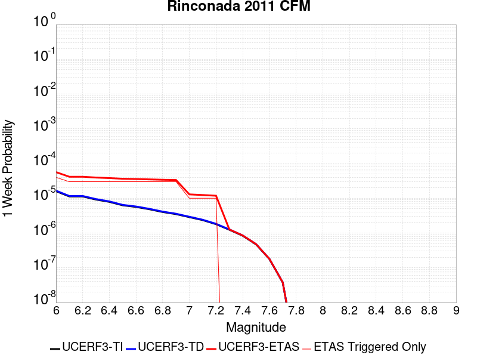 |  |  |  |

| Magnitude | 1 wk TI Prob | 1 wk TD Prob | 1 wk ETAS Prob | 1 wk ETAS/TD Gain | 1 wk ETAS Triggered Only | 1 mo TI Prob | 1 mo TD Prob | 1 mo ETAS Prob | 1 mo ETAS/TD Gain | 1 mo ETAS Triggered Only | 1 yr TI Prob | 1 yr TD Prob | 1 yr ETAS Prob | 1 yr ETAS/TD Gain | 1 yr ETAS Triggered Only | 10 yr TI Prob | 10 yr TD Prob | 10 yr ETAS Prob | 10 yr ETAS/TD Gain | 10 yr ETAS Triggered Only |
|-----|-----|-----|-----|-----|-----|-----|-----|-----|-----|-----|-----|-----|-----|-----|-----|-----|-----|-----|-----|-----|
| 6.0 | 1.6018197E-5 | 1.6542925E-5 | 5.6542263E-5 | 3.4179122 | 4.0E-5 | 6.864761E-5 | 7.089634E-5 | 1.1089351E-4 | 1.564164 | 4.0E-5 | 8.3546416E-4 | 8.628251E-4 | 9.027906E-4 | 1.0463194 | 4.0E-5 | 0.008323302 | 0.008595209 | 0.008644779 | 1.0057672 | 5.0E-5 |
| 6.1 | 1.1289476E-5 | 1.1645464E-5 | 4.1645115E-5 | 3.5760803 | 3.0E-5 | 4.8382568E-5 | 4.990818E-5 | 7.9906684E-5 | 1.6010739 | 3.0E-5 | 5.8889855E-4 | 6.074636E-4 | 6.3744537E-4 | 1.0493556 | 3.0E-5 | 0.005873404 | 0.0060581476 | 0.0060979053 | 1.0065627 | 4.0E-5 |
| 6.2 | 1.1289476E-5 | 1.1645464E-5 | 4.1645115E-5 | 3.5760803 | 3.0E-5 | 4.8382568E-5 | 4.990818E-5 | 7.9906684E-5 | 1.6010739 | 3.0E-5 | 5.8889855E-4 | 6.074636E-4 | 6.3744537E-4 | 1.0493556 | 3.0E-5 | 0.005873404 | 0.0060581476 | 0.0060979053 | 1.0065627 | 4.0E-5 |
| 6.3 | 9.190557E-6 | 9.472582E-6 | 3.94723E-5 | 4.167005 | 3.0E-5 | 3.9387505E-5 | 4.059615E-5 | 7.059493E-5 | 1.7389563 | 3.0E-5 | 4.7943735E-4 | 4.941464E-4 | 5.241316E-4 | 1.0606807 | 3.0E-5 | 0.004784043 | 0.0049305307 | 0.0049703335 | 1.0080727 | 4.0E-5 |
| 6.4 | 7.89081E-6 | 8.1271255E-6 | 3.812688E-5 | 4.6913123 | 3.0E-5 | 3.381732E-5 | 3.483007E-5 | 6.482903E-5 | 1.8612946 | 3.0E-5 | 4.1164807E-4 | 4.2397383E-4 | 4.5396114E-4 | 1.0707291 | 3.0E-5 | 0.0041088634 | 0.004231681 | 0.004271512 | 1.0094125 | 4.0E-5 |
| 6.5 | 6.2819627E-6 | 6.463113E-6 | 3.646292E-5 | 5.641696 | 3.0E-5 | 2.692242E-5 | 2.7698763E-5 | 5.7697933E-5 | 2.083051 | 3.0E-5 | 3.2773116E-4 | 3.3718036E-4 | 3.6717023E-4 | 1.0889431 | 3.0E-5 | 0.0032724824 | 0.003366701 | 0.0034065666 | 1.011841 | 4.0E-5 |
| 6.6 | 5.644062E-6 | 5.804394E-6 | 3.580422E-5 | 6.1684685 | 3.0E-5 | 2.4188614E-5 | 2.4875737E-5 | 5.487499E-5 | 2.2059646 | 3.0E-5 | 2.9445658E-4 | 3.0282006E-4 | 3.3281097E-4 | 1.0990387 | 3.0E-5 | 0.002940667 | 0.003024084 | 0.003063963 | 1.0131872 | 4.0E-5 |
| 6.7 | 4.8385828E-6 | 4.972199E-6 | 3.497205E-5 | 7.033518 | 3.0E-5 | 2.073662E-5 | 2.130925E-5 | 5.1308612E-5 | 2.4078093 | 3.0E-5 | 2.524391E-4 | 2.5940928E-4 | 2.894015E-4 | 1.1156174 | 3.0E-5 | 0.0025215251 | 0.002591071 | 0.0026209932 | 1.0115483 | 3.0E-5 |
| 6.8 | 4.0271148E-6 | 4.1335984E-6 | 3.4133474E-5 | 8.257569 | 3.0E-5 | 1.7258948E-5 | 1.7715302E-5 | 4.771477E-5 | 2.6934214 | 3.0E-5 | 2.1010744E-4 | 2.1566247E-4 | 2.45656E-4 | 1.1390762 | 3.0E-5 | 0.0020990889 | 0.0021545356 | 0.0021844709 | 1.0138941 | 3.0E-5 |
| 6.9 | 3.50027E-6 | 3.589503E-6 | 3.3589396E-5 | 9.357674 | 3.0E-5 | 1.500107E-5 | 1.5383494E-5 | 4.5383033E-5 | 2.9501123 | 3.0E-5 | 1.8262272E-4 | 1.8727795E-4 | 2.1727233E-4 | 1.1601597 | 3.0E-5 | 0.0018247272 | 0.0018712039 | 0.0019011478 | 1.0160024 | 3.0E-5 |
| 7.0 | 2.8711258E-6 | 2.9404791E-6 | 1.294045E-5 | 4.4007964 | 1.0E-5 | 1.2304767E-5 | 1.2601992E-5 | 2.2601867E-5 | 1.7935153 | 1.0E-5 | 1.4980024E-4 | 1.5341847E-4 | 1.6341693E-4 | 1.0651712 | 1.0E-5 | 0.001496993 | 0.0015331273 | 0.001543112 | 1.0065126 | 1.0E-5 |
| 7.1 | 2.3565258E-6 | 2.4103392E-6 | 1.2410315E-5 | 5.1487837 | 1.0E-5 | 1.00993575E-5 | 1.0329984E-5 | 2.032988E-5 | 1.9680457 | 1.0E-5 | 1.2295274E-4 | 1.2576031E-4 | 1.3575905E-4 | 1.0795064 | 1.0E-5 | 0.0012288473 | 0.0012568926 | 0.0012668801 | 1.0079461 | 1.0E-5 |
| 7.2 | 1.8008103E-6 | 1.839243E-6 | 1.18392245E-5 | 6.4370093 | 1.0E-5 | 7.717736E-6 | 7.882447E-6 | 1.7882368E-5 | 2.2686317 | 1.0E-5 | 9.3959374E-5 | 9.596457E-5 | 1.05963605E-4 | 1.1041951 | 1.0E-5 | 9.391966E-4 | 9.5923204E-4 | 9.6922246E-4 | 1.010415 | 1.0E-5 |
| 7.3 | 1.2433001E-6 | 1.2679034E-6 | 1.2679034E-6 | 1.0 | 0.0 | 5.328418E-6 | 5.43386E-6 | 5.43386E-6 | 1.0 | 0.0 | 6.487156E-5 | 6.615524E-5 | 6.615524E-5 | 1.0 | 0.0 | 6.4852624E-4 | 6.613558E-4 | 6.613558E-4 | 1.0 | 0.0 |
| 7.4 | 8.363252E-7 | 8.519691E-7 | 8.519691E-7 | 1.0 | 0.0 | 3.584246E-6 | 3.6512909E-6 | 3.6512909E-6 | 1.0 | 0.0 | 4.3637323E-5 | 4.445356E-5 | 4.445356E-5 | 1.0 | 0.0 | 4.3628755E-4 | 4.4444684E-4 | 4.4444684E-4 | 1.0 | 0.0 |
| 7.5 | 4.7180393E-7 | 4.796742E-7 | 4.796742E-7 | 1.0 | 0.0 | 2.0220152E-6 | 2.055745E-6 | 2.055745E-6 | 1.0 | 0.0 | 2.4617757E-5 | 2.5028407E-5 | 2.5028407E-5 | 1.0 | 0.0 | 2.461503E-4 | 2.5025595E-4 | 2.5025595E-4 | 1.0 | 0.0 |
| 7.6 | 1.7944092E-7 | 1.8112269E-7 | 1.8112269E-7 | 1.0 | 0.0 | 7.690323E-7 | 7.762398E-7 | 7.762398E-7 | 1.0 | 0.0 | 9.362928E-6 | 9.450679E-6 | 9.450679E-6 | 1.0 | 0.0 | 9.362533E-5 | 9.4502786E-5 | 9.4502786E-5 | 1.0 | 0.0 |
| 7.7 | 3.7728203E-8 | 3.8032987E-8 | 3.8032987E-8 | 1.0 | 0.0 | 1.6169228E-7 | 1.629985E-7 | 1.629985E-7 | 1.0 | 0.0 | 1.9686017E-6 | 1.984505E-6 | 1.984505E-6 | 1.0 | 0.0 | 1.9685844E-5 | 1.9844876E-5 | 1.9844876E-5 | 1.0 | 0.0 |
| 7.8 | 3.012327E-10 | 3.0578995E-10 | 3.0578995E-10 | 1.0 | 0.0 | 1.2909972E-9 | 1.3105286E-9 | 1.3105286E-9 | 1.0 | 0.0 | 1.5717891E-8 | 1.5955688E-8 | 1.5955688E-8 | 1.0 | 0.0 | 1.5717889E-7 | 1.5955686E-7 | 1.5955686E-7 | 1.0 | 0.0 |

## Sheephole
*[(top)](#table-of-contents)*

| 1 Week | 1 Month | 1 Year | 10 Year |
|-----|-----|-----|-----|
| 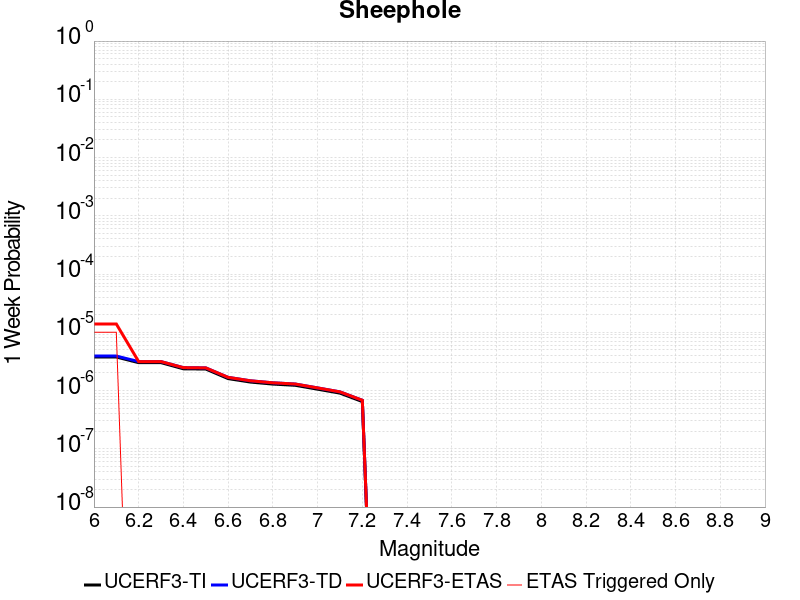 |  |  |  |

| Magnitude | 1 wk TI Prob | 1 wk TD Prob | 1 wk ETAS Prob | 1 wk ETAS/TD Gain | 1 wk ETAS Triggered Only | 1 mo TI Prob | 1 mo TD Prob | 1 mo ETAS Prob | 1 mo ETAS/TD Gain | 1 mo ETAS Triggered Only | 1 yr TI Prob | 1 yr TD Prob | 1 yr ETAS Prob | 1 yr ETAS/TD Gain | 1 yr ETAS Triggered Only | 10 yr TI Prob | 10 yr TD Prob | 10 yr ETAS Prob | 10 yr ETAS/TD Gain | 10 yr ETAS Triggered Only |
|-----|-----|-----|-----|-----|-----|-----|-----|-----|-----|-----|-----|-----|-----|-----|-----|-----|-----|-----|-----|-----|
| 6.0 | 3.768936E-6 | 3.917435E-6 | 1.3917396E-5 | 3.5526807 | 1.0E-5 | 1.6152484E-5 | 1.6788912E-5 | 3.6788577E-5 | 2.1912425 | 2.0E-5 | 1.9663874E-4 | 2.0438802E-4 | 2.4437986E-4 | 1.1956662 | 4.0E-5 | 0.0019646483 | 0.0020422167 | 0.0020921144 | 1.0244333 | 5.0E-5 |
| 6.1 | 3.768936E-6 | 3.917435E-6 | 1.3917396E-5 | 3.5526807 | 1.0E-5 | 1.6152484E-5 | 1.6788912E-5 | 3.6788577E-5 | 2.1912425 | 2.0E-5 | 1.9663874E-4 | 2.0438802E-4 | 2.4437986E-4 | 1.1956662 | 4.0E-5 | 0.0019646483 | 0.0020422167 | 0.0020921144 | 1.0244333 | 5.0E-5 |
| 6.2 | 3.0142862E-6 | 3.1418922E-6 | 3.1418922E-6 | 1.0 | 0.0 | 1.2918306E-5 | 1.3465191E-5 | 1.3465191E-5 | 1.0 | 0.0 | 1.5726902E-4 | 1.6392786E-4 | 1.839246E-4 | 1.1219848 | 2.0E-5 | 0.0015715776 | 0.001638217 | 0.0016681679 | 1.0182827 | 3.0E-5 |
| 6.3 | 3.0142862E-6 | 3.1418922E-6 | 3.1418922E-6 | 1.0 | 0.0 | 1.2918306E-5 | 1.3465191E-5 | 1.3465191E-5 | 1.0 | 0.0 | 1.5726902E-4 | 1.6392786E-4 | 1.839246E-4 | 1.1219848 | 2.0E-5 | 0.0015715776 | 0.001638217 | 0.0016681679 | 1.0182827 | 3.0E-5 |
| 6.4 | 2.36302E-6 | 2.4735853E-6 | 2.4735853E-6 | 1.0 | 0.0 | 1.012719E-5 | 1.0601042E-5 | 1.0601042E-5 | 1.0 | 0.0 | 1.2329155E-4 | 1.29061E-4 | 1.390597E-4 | 1.0774728 | 1.0E-5 | 0.0012322317 | 0.001289953 | 0.00129994 | 1.0077422 | 1.0E-5 |
| 6.5 | 2.3419884E-6 | 2.45165E-6 | 2.45165E-6 | 1.0 | 0.0 | 1.0037055E-5 | 1.0507034E-5 | 1.0507034E-5 | 1.0 | 0.0 | 1.221943E-4 | 1.2791657E-4 | 1.2791657E-4 | 1.0 | 0.0 | 0.0012212712 | 0.0012785221 | 0.0012785221 | 1.0 | 0.0 |
| 6.6 | 1.6040266E-6 | 1.6853515E-6 | 1.6853515E-6 | 1.0 | 0.0 | 6.8743816E-6 | 7.2229163E-6 | 7.2229163E-6 | 1.0 | 0.0 | 8.369238E-5 | 8.793567E-5 | 8.793567E-5 | 1.0 | 0.0 | 8.3660864E-4 | 8.790293E-4 | 8.790293E-4 | 1.0 | 0.0 |
| 6.7 | 1.3983845E-6 | 1.4707202E-6 | 1.4707202E-6 | 1.0 | 0.0 | 5.9930626E-6 | 6.3030725E-6 | 6.3030725E-6 | 1.0 | 0.0 | 7.296309E-5 | 7.6737364E-5 | 7.6737364E-5 | 1.0 | 0.0 | 7.293914E-4 | 7.671245E-4 | 7.671245E-4 | 1.0 | 0.0 |
| 6.8 | 1.2918224E-6 | 1.3588254E-6 | 1.3588254E-6 | 1.0 | 0.0 | 5.53637E-6 | 5.823525E-6 | 5.823525E-6 | 1.0 | 0.0 | 6.740322E-5 | 7.089927E-5 | 7.089927E-5 | 1.0 | 0.0 | 6.738278E-4 | 7.087816E-4 | 7.087816E-4 | 1.0 | 0.0 |
| 6.9 | 1.2311391E-6 | 1.2950437E-6 | 1.2950437E-6 | 1.0 | 0.0 | 5.2763E-6 | 5.5501764E-6 | 5.5501764E-6 | 1.0 | 0.0 | 6.423706E-5 | 6.7571455E-5 | 6.7571455E-5 | 1.0 | 0.0 | 6.421849E-4 | 6.7552377E-4 | 6.7552377E-4 | 1.0 | 0.0 |
| 7.0 | 1.0556842E-6 | 1.1103633E-6 | 1.1103633E-6 | 1.0 | 0.0 | 4.524353E-6 | 4.758692E-6 | 4.758692E-6 | 1.0 | 0.0 | 5.50826E-5 | 5.7935664E-5 | 5.7935664E-5 | 1.0 | 0.0 | 5.506895E-4 | 5.7921815E-4 | 5.7921815E-4 | 1.0 | 0.0 |
| 7.1 | 9.030923E-7 | 9.497859E-7 | 9.497859E-7 | 1.0 | 0.0 | 3.8703897E-6 | 4.0705054E-6 | 4.0705054E-6 | 1.0 | 0.0 | 4.712098E-5 | 4.955739E-5 | 4.955739E-5 | 1.0 | 0.0 | 4.7110987E-4 | 4.954748E-4 | 4.954748E-4 | 1.0 | 0.0 |
| 7.2 | 6.4758467E-7 | 6.8110114E-7 | 6.8110114E-7 | 1.0 | 0.0 | 2.77536E-6 | 2.9190023E-6 | 2.9190023E-6 | 1.0 | 0.0 | 3.378948E-5 | 3.5538364E-5 | 3.5538364E-5 | 1.0 | 0.0 | 3.3784343E-4 | 3.5533583E-4 | 3.5533583E-4 | 1.0 | 0.0 |

## Santa Ynez River
*[(top)](#table-of-contents)*

| 1 Week | 1 Month | 1 Year | 10 Year |
|-----|-----|-----|-----|
|  | 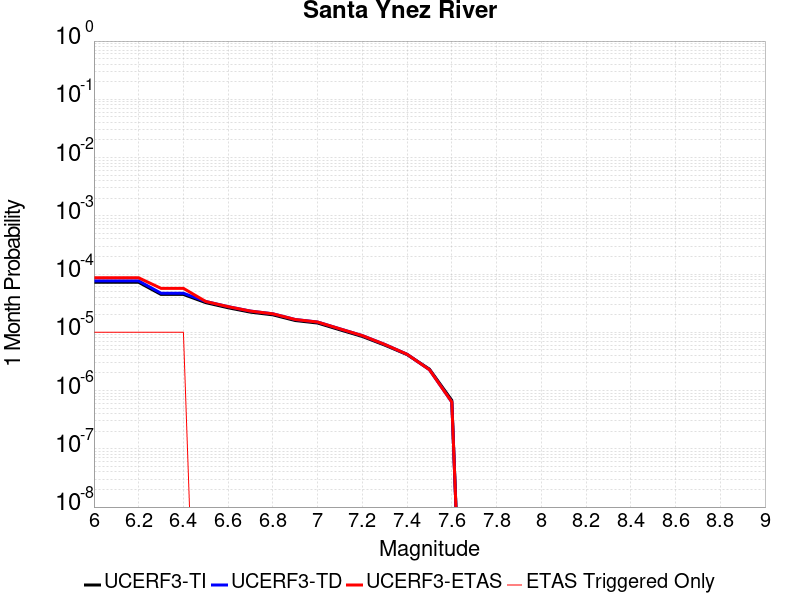 |  |  |

| Magnitude | 1 wk TI Prob | 1 wk TD Prob | 1 wk ETAS Prob | 1 wk ETAS/TD Gain | 1 wk ETAS Triggered Only | 1 mo TI Prob | 1 mo TD Prob | 1 mo ETAS Prob | 1 mo ETAS/TD Gain | 1 mo ETAS Triggered Only | 1 yr TI Prob | 1 yr TD Prob | 1 yr ETAS Prob | 1 yr ETAS/TD Gain | 1 yr ETAS Triggered Only | 10 yr TI Prob | 10 yr TD Prob | 10 yr ETAS Prob | 10 yr ETAS/TD Gain | 10 yr ETAS Triggered Only |
|-----|-----|-----|-----|-----|-----|-----|-----|-----|-----|-----|-----|-----|-----|-----|-----|-----|-----|-----|-----|-----|
| 6.0 | 1.6847243E-5 | 1.7790595E-5 | 2.7790418E-5 | 1.5620847 | 1.0E-5 | 7.220048E-5 | 7.6243385E-5 | 8.624262E-5 | 1.1311489 | 1.0E-5 | 8.7868626E-4 | 9.2790334E-4 | 9.578755E-4 | 1.032301 | 3.0E-5 | 0.0087522 | 0.009243845 | 0.009293383 | 1.005359 | 5.0E-5 |
| 6.1 | 1.6847243E-5 | 1.7790595E-5 | 2.7790418E-5 | 1.5620847 | 1.0E-5 | 7.220048E-5 | 7.6243385E-5 | 8.624262E-5 | 1.1311489 | 1.0E-5 | 8.7868626E-4 | 9.2790334E-4 | 9.578755E-4 | 1.032301 | 3.0E-5 | 0.0087522 | 0.009243845 | 0.009293383 | 1.005359 | 5.0E-5 |
| 6.2 | 1.6847243E-5 | 1.7790595E-5 | 2.7790418E-5 | 1.5620847 | 1.0E-5 | 7.220048E-5 | 7.6243385E-5 | 8.624262E-5 | 1.1311489 | 1.0E-5 | 8.7868626E-4 | 9.2790334E-4 | 9.578755E-4 | 1.032301 | 3.0E-5 | 0.0087522 | 0.009243845 | 0.009293383 | 1.005359 | 5.0E-5 |
| 6.3 | 1.0428216E-5 | 1.0935909E-5 | 2.0935799E-5 | 1.9144088 | 1.0E-5 | 4.4691587E-5 | 4.6867375E-5 | 5.6866906E-5 | 1.213358 | 1.0E-5 | 5.4398424E-4 | 5.7046715E-4 | 5.8046146E-4 | 1.0175195 | 1.0E-5 | 0.005426545 | 0.0056906617 | 0.005710548 | 1.0034945 | 2.0E-5 |
| 6.4 | 1.0428216E-5 | 1.0935909E-5 | 2.0935799E-5 | 1.9144088 | 1.0E-5 | 4.4691587E-5 | 4.6867375E-5 | 5.6866906E-5 | 1.213358 | 1.0E-5 | 5.4398424E-4 | 5.7046715E-4 | 5.8046146E-4 | 1.0175195 | 1.0E-5 | 0.005426545 | 0.0056906617 | 0.005710548 | 1.0034945 | 2.0E-5 |
| 6.5 | 7.5400562E-6 | 7.887393E-6 | 7.887393E-6 | 1.0 | 0.0 | 3.2314125E-5 | 3.3802688E-5 | 3.3802688E-5 | 1.0 | 0.0 | 3.9335346E-4 | 4.1147196E-4 | 4.1147196E-4 | 1.0 | 0.0 | 0.0039265794 | 0.0041073025 | 0.0041073025 | 1.0 | 0.0 |
| 6.6 | 6.1556348E-6 | 6.4285327E-6 | 6.4285327E-6 | 1.0 | 0.0 | 2.6381025E-5 | 2.7550568E-5 | 2.7550568E-5 | 1.0 | 0.0 | 3.2114165E-4 | 3.3537758E-4 | 3.3537758E-4 | 1.0 | 0.0 | 0.0032067795 | 0.0033488201 | 0.0033488201 | 1.0 | 0.0 |
| 6.7 | 5.1750317E-6 | 5.3970934E-6 | 5.3970934E-6 | 1.0 | 0.0 | 2.217852E-5 | 2.3130198E-5 | 2.3130198E-5 | 1.0 | 0.0 | 2.6999E-4 | 2.8157432E-4 | 2.8157432E-4 | 1.0 | 0.0 | 0.0026966222 | 0.002812233 | 0.002812233 | 1.0 | 0.0 |
| 6.8 | 4.6528958E-6 | 4.848324E-6 | 4.848324E-6 | 1.0 | 0.0 | 1.994083E-5 | 2.0778367E-5 | 2.0778367E-5 | 1.0 | 0.0 | 2.4275255E-4 | 2.529477E-4 | 2.529477E-4 | 1.0 | 0.0 | 0.0024248755 | 0.0025266435 | 0.0025266435 | 1.0 | 0.0 |
| 6.9 | 3.718516E-6 | 3.87016E-6 | 3.87016E-6 | 1.0 | 0.0 | 1.5936399E-5 | 1.6586295E-5 | 1.6586295E-5 | 1.0 | 0.0 | 1.9400839E-4 | 2.0191965E-4 | 2.0191965E-4 | 1.0 | 0.0 | 0.001938391 | 0.0020173846 | 0.0020173846 | 1.0 | 0.0 |
| 7.0 | 3.366951E-6 | 3.5026646E-6 | 3.5026646E-6 | 1.0 | 0.0 | 1.442971E-5 | 1.5011335E-5 | 1.5011335E-5 | 1.0 | 0.0 | 1.7566756E-4 | 1.8274787E-4 | 1.8274787E-4 | 1.0 | 0.0 | 0.0017552876 | 0.0018259957 | 0.0018259957 | 1.0 | 0.0 |
| 7.1 | 2.5741986E-6 | 2.673819E-6 | 2.673819E-6 | 1.0 | 0.0 | 1.10322335E-5 | 1.1459174E-5 | 1.1459174E-5 | 1.0 | 0.0 | 1.3430916E-4 | 1.3950659E-4 | 1.3950659E-4 | 1.0 | 0.0 | 0.0013422801 | 0.0013941987 | 0.0013941987 | 1.0 | 0.0 |
| 7.2 | 1.9796923E-6 | 2.0482507E-6 | 2.0482507E-6 | 1.0 | 0.0 | 8.484369E-6 | 8.778188E-6 | 8.778188E-6 | 1.0 | 0.0 | 1.0329229E-4 | 1.06869265E-4 | 1.06869265E-4 | 1.0 | 0.0 | 0.0010324429 | 0.0010681846 | 0.0010681846 | 1.0 | 0.0 |
| 7.3 | 1.4077615E-6 | 1.4465229E-6 | 1.4465229E-6 | 1.0 | 0.0 | 6.0332495E-6 | 6.199369E-6 | 6.199369E-6 | 1.0 | 0.0 | 7.3452335E-5 | 7.547473E-5 | 7.547473E-5 | 1.0 | 0.0 | 7.342806E-4 | 7.5449346E-4 | 7.5449346E-4 | 1.0 | 0.0 |
| 7.4 | 9.68252E-7 | 9.79483E-7 | 9.79483E-7 | 1.0 | 0.0 | 4.149645E-6 | 4.197778E-6 | 4.197778E-6 | 1.0 | 0.0 | 5.0520757E-5 | 5.1106766E-5 | 5.1106766E-5 | 1.0 | 0.0 | 5.050927E-4 | 5.1095185E-4 | 5.1095185E-4 | 1.0 | 0.0 |
| 7.5 | 5.440934E-7 | 5.3180406E-7 | 5.3180406E-7 | 1.0 | 0.0 | 2.3318269E-6 | 2.2791583E-6 | 2.2791583E-6 | 1.0 | 0.0 | 2.838962E-5 | 2.7748409E-5 | 2.7748409E-5 | 1.0 | 0.0 | 2.8385993E-4 | 2.774505E-4 | 2.774505E-4 | 1.0 | 0.0 |
| 7.6 | 1.5848151E-7 | 1.4845983E-7 | 1.4845983E-7 | 1.0 | 0.0 | 6.7920627E-7 | 6.3625635E-7 | 6.3625635E-7 | 1.0 | 0.0 | 8.269305E-6 | 7.746397E-6 | 7.746397E-6 | 1.0 | 0.0 | 8.268997E-5 | 7.74617E-5 | 7.74617E-5 | 1.0 | 0.0 |

## Cleghorn
*[(top)](#table-of-contents)*

| 1 Week | 1 Month | 1 Year | 10 Year |
|-----|-----|-----|-----|
|  |  |  |  |

| Magnitude | 1 wk TI Prob | 1 wk TD Prob | 1 wk ETAS Prob | 1 wk ETAS/TD Gain | 1 wk ETAS Triggered Only | 1 mo TI Prob | 1 mo TD Prob | 1 mo ETAS Prob | 1 mo ETAS/TD Gain | 1 mo ETAS Triggered Only | 1 yr TI Prob | 1 yr TD Prob | 1 yr ETAS Prob | 1 yr ETAS/TD Gain | 1 yr ETAS Triggered Only | 10 yr TI Prob | 10 yr TD Prob | 10 yr ETAS Prob | 10 yr ETAS/TD Gain | 10 yr ETAS Triggered Only |
|-----|-----|-----|-----|-----|-----|-----|-----|-----|-----|-----|-----|-----|-----|-----|-----|-----|-----|-----|-----|-----|
| 6.0 | 7.903754E-6 | 1.00139905E-5 | 3.0013789E-5 | 2.997186 | 2.0E-5 | 3.387279E-5 | 4.2916447E-5 | 6.291559E-5 | 1.4660019 | 2.0E-5 | 4.123232E-4 | 5.2239164E-4 | 5.423812E-4 | 1.0382655 | 2.0E-5 | 0.00411559 | 0.0052300333 | 0.005279772 | 1.0095102 | 5.0E-5 |
| 6.1 | 7.903754E-6 | 1.00139905E-5 | 3.0013789E-5 | 2.997186 | 2.0E-5 | 3.387279E-5 | 4.2916447E-5 | 6.291559E-5 | 1.4660019 | 2.0E-5 | 4.123232E-4 | 5.2239164E-4 | 5.423812E-4 | 1.0382655 | 2.0E-5 | 0.00411559 | 0.0052300333 | 0.005279772 | 1.0095102 | 5.0E-5 |
| 6.2 | 7.903754E-6 | 1.00139905E-5 | 3.0013789E-5 | 2.997186 | 2.0E-5 | 3.387279E-5 | 4.2916447E-5 | 6.291559E-5 | 1.4660019 | 2.0E-5 | 4.123232E-4 | 5.2239164E-4 | 5.423812E-4 | 1.0382655 | 2.0E-5 | 0.00411559 | 0.0052300333 | 0.005279772 | 1.0095102 | 5.0E-5 |
| 6.3 | 7.903754E-6 | 1.00139905E-5 | 3.0013789E-5 | 2.997186 | 2.0E-5 | 3.387279E-5 | 4.2916447E-5 | 6.291559E-5 | 1.4660019 | 2.0E-5 | 4.123232E-4 | 5.2239164E-4 | 5.423812E-4 | 1.0382655 | 2.0E-5 | 0.00411559 | 0.0052300333 | 0.005279772 | 1.0095102 | 5.0E-5 |
| 6.4 | 4.7096414E-6 | 6.675275E-6 | 6.675275E-6 | 1.0 | 0.0 | 2.0184021E-5 | 2.8608016E-5 | 2.8608016E-5 | 1.0 | 0.0 | 2.4571276E-4 | 3.482483E-4 | 3.482483E-4 | 1.0 | 0.0 | 0.0024544124 | 0.0034946753 | 0.0035146053 | 1.005703 | 2.0E-5 |
| 6.5 | 4.7096414E-6 | 6.675275E-6 | 6.675275E-6 | 1.0 | 0.0 | 2.0184021E-5 | 2.8608016E-5 | 2.8608016E-5 | 1.0 | 0.0 | 2.4571276E-4 | 3.482483E-4 | 3.482483E-4 | 1.0 | 0.0 | 0.0024544124 | 0.0034946753 | 0.0035146053 | 1.005703 | 2.0E-5 |
| 6.6 | 4.3584864E-6 | 6.308592E-6 | 6.308592E-6 | 1.0 | 0.0 | 1.8679095E-5 | 2.703655E-5 | 2.703655E-5 | 1.0 | 0.0 | 2.2739424E-4 | 3.2912154E-4 | 3.2912154E-4 | 1.0 | 0.0 | 0.0022716168 | 0.003303983 | 0.0033239168 | 1.0060333 | 2.0E-5 |
| 6.7 | 3.5585072E-6 | 5.4731217E-6 | 5.4731217E-6 | 1.0 | 0.0 | 1.5250655E-5 | 2.3456027E-5 | 2.3456027E-5 | 1.0 | 0.0 | 1.8566092E-4 | 2.855401E-4 | 2.855401E-4 | 1.0 | 0.0 | 0.0018550587 | 0.0028692957 | 0.0028892383 | 1.0069504 | 2.0E-5 |
| 6.8 | 3.496631E-6 | 5.4068105E-6 | 5.4068105E-6 | 1.0 | 0.0 | 1.4985475E-5 | 2.317184E-5 | 2.317184E-5 | 1.0 | 0.0 | 1.8243288E-4 | 2.8208102E-4 | 2.8208102E-4 | 1.0 | 0.0 | 0.0018228319 | 0.0028347932 | 0.0028547365 | 1.0070351 | 2.0E-5 |
| 6.9 | 3.199018E-6 | 5.0607123E-6 | 5.0607123E-6 | 1.0 | 0.0 | 1.3710005E-5 | 2.168859E-5 | 2.168859E-5 | 1.0 | 0.0 | 1.6690652E-4 | 2.640269E-4 | 2.640269E-4 | 1.0 | 0.0 | 0.0016678122 | 0.0026546924 | 0.0026746392 | 1.0075139 | 2.0E-5 |
| 7.0 | 2.981958E-6 | 4.7267254E-6 | 4.7267254E-6 | 1.0 | 0.0 | 1.27797575E-5 | 2.025724E-5 | 2.025724E-5 | 1.0 | 0.0 | 1.5558244E-4 | 2.4660426E-4 | 2.4660426E-4 | 1.0 | 0.0 | 0.0015547356 | 0.0024808652 | 0.0025008155 | 1.0080417 | 2.0E-5 |
| 7.1 | 2.7250474E-6 | 4.378854E-6 | 4.378854E-6 | 1.0 | 0.0 | 1.1678722E-5 | 1.8766385E-5 | 1.8766385E-5 | 1.0 | 0.0 | 1.4217917E-4 | 2.2845705E-4 | 2.2845705E-4 | 1.0 | 0.0 | 0.0014208823 | 0.0022997877 | 0.0022997877 | 1.0 | 0.0 |
| 7.2 | 2.449613E-6 | 3.9488555E-6 | 3.9488555E-6 | 1.0 | 0.0 | 1.0498299E-5 | 1.6923557E-5 | 1.6923557E-5 | 1.0 | 0.0 | 1.278093E-4 | 2.0602506E-4 | 2.0602506E-4 | 1.0 | 0.0 | 0.0012773582 | 0.0020759413 | 0.0020759413 | 1.0 | 0.0 |
| 7.3 | 2.1171097E-6 | 3.3669814E-6 | 3.3669814E-6 | 1.0 | 0.0 | 9.073296E-6 | 1.4429842E-5 | 1.4429842E-5 | 1.0 | 0.0 | 1.1046178E-4 | 1.7566932E-4 | 1.7566932E-4 | 1.0 | 0.0 | 0.0011040688 | 0.0017729729 | 0.0017729729 | 1.0 | 0.0 |
| 7.4 | 1.8537027E-6 | 2.9361618E-6 | 2.9361618E-6 | 1.0 | 0.0 | 7.944416E-6 | 1.258349E-5 | 1.258349E-5 | 1.0 | 0.0 | 9.671897E-5 | 1.5319337E-4 | 1.5319337E-4 | 1.0 | 0.0 | 9.667688E-4 | 0.0015486615 | 0.0015486615 | 1.0 | 0.0 |
| 7.5 | 1.507545E-6 | 2.5185045E-6 | 2.5185045E-6 | 1.0 | 0.0 | 6.460891E-6 | 1.0793547E-5 | 1.0793547E-5 | 1.0 | 0.0 | 7.8658515E-5 | 1.3140359E-4 | 1.3140359E-4 | 1.0 | 0.0 | 7.8630674E-4 | 0.0013310832 | 0.0013310832 | 1.0 | 0.0 |
| 7.6 | 1.0962972E-6 | 2.0772393E-6 | 2.0772393E-6 | 1.0 | 0.0 | 4.6984082E-6 | 8.902424E-6 | 8.902424E-6 | 1.0 | 0.0 | 5.7201618E-5 | 1.0838167E-4 | 1.0838167E-4 | 1.0 | 0.0 | 5.7186896E-4 | 0.0011011397 | 0.0011011397 | 1.0 | 0.0 |
| 7.7 | 8.4726145E-7 | 1.7987127E-6 | 1.7987127E-6 | 1.0 | 0.0 | 3.6311155E-6 | 7.708746E-6 | 7.708746E-6 | 1.0 | 0.0 | 4.4207933E-5 | 9.384997E-5 | 9.384997E-5 | 1.0 | 0.0 | 4.419914E-4 | 9.559899E-4 | 9.559899E-4 | 1.0 | 0.0 |
| 7.8 | 7.228959E-7 | 1.6716117E-6 | 1.6716117E-6 | 1.0 | 0.0 | 3.0981216E-6 | 7.1640306E-6 | 7.1640306E-6 | 1.0 | 0.0 | 3.771898E-5 | 8.7218614E-5 | 8.7218614E-5 | 1.0 | 0.0 | 3.7712578E-4 | 8.894255E-4 | 8.894255E-4 | 1.0 | 0.0 |
| 7.9 | 3.9460394E-7 | 8.2236784E-7 | 8.2236784E-7 | 1.0 | 0.0 | 1.6911587E-6 | 3.524429E-6 | 3.524429E-6 | 1.0 | 0.0 | 2.0589661E-5 | 4.290909E-5 | 4.290909E-5 | 1.0 | 0.0 | 2.0587754E-4 | 4.397734E-4 | 4.397734E-4 | 1.0 | 0.0 |
| 8.0 | 7.629066E-8 | 6.0793816E-8 | 6.0793816E-8 | 1.0 | 0.0 | 3.2695993E-7 | 2.6054488E-7 | 2.6054488E-7 | 1.0 | 0.0 | 3.98073E-6 | 3.1721295E-6 | 3.1721295E-6 | 1.0 | 0.0 | 3.9806586E-5 | 3.4440727E-5 | 3.4440727E-5 | 1.0 | 0.0 |
| 8.1 | 3.638453E-8 | 1.4707217E-8 | 1.4707217E-8 | 1.0 | 0.0 | 1.559337E-7 | 6.303093E-8 | 6.303093E-8 | 1.0 | 0.0 | 1.8984912E-6 | 7.674013E-7 | 7.674013E-7 | 1.0 | 0.0 | 1.8984749E-5 | 8.822486E-6 | 8.822486E-6 | 1.0 | 0.0 |
| 8.2 | 1.2886721E-8 | 3.7677705E-9 | 3.7677705E-9 | 1.0 | 0.0 | 5.5228803E-8 | 1.6147588E-8 | 1.6147588E-8 | 1.0 | 0.0 | 6.7241047E-7 | 1.9659687E-7 | 1.9659687E-7 | 1.0 | 0.0 | 6.7240844E-6 | 2.329743E-6 | 2.329743E-6 | 1.0 | 0.0 |

## San Gabriel (Extension)
*[(top)](#table-of-contents)*

| 1 Week | 1 Month | 1 Year | 10 Year |
|-----|-----|-----|-----|
|  |  |  |  |

| Magnitude | 1 wk TI Prob | 1 wk TD Prob | 1 wk ETAS Prob | 1 wk ETAS/TD Gain | 1 wk ETAS Triggered Only | 1 mo TI Prob | 1 mo TD Prob | 1 mo ETAS Prob | 1 mo ETAS/TD Gain | 1 mo ETAS Triggered Only | 1 yr TI Prob | 1 yr TD Prob | 1 yr ETAS Prob | 1 yr ETAS/TD Gain | 1 yr ETAS Triggered Only | 10 yr TI Prob | 10 yr TD Prob | 10 yr ETAS Prob | 10 yr ETAS/TD Gain | 10 yr ETAS Triggered Only |
|-----|-----|-----|-----|-----|-----|-----|-----|-----|-----|-----|-----|-----|-----|-----|-----|-----|-----|-----|-----|-----|
| 6.0 | 6.5385725E-6 | 6.696888E-6 | 1.669682E-5 | 2.4932208 | 1.0E-5 | 2.8022154E-5 | 2.8700648E-5 | 4.8700073E-5 | 1.6968284 | 2.0E-5 | 3.411163E-4 | 3.4937714E-4 | 3.6937016E-4 | 1.0572248 | 2.0E-5 | 0.0034059316 | 0.003488561 | 0.0035284213 | 1.0114261 | 4.0E-5 |
| 6.1 | 6.5385725E-6 | 6.696888E-6 | 1.669682E-5 | 2.4932208 | 1.0E-5 | 2.8022154E-5 | 2.8700648E-5 | 4.8700073E-5 | 1.6968284 | 2.0E-5 | 3.411163E-4 | 3.4937714E-4 | 3.6937016E-4 | 1.0572248 | 2.0E-5 | 0.0034059316 | 0.003488561 | 0.0035284213 | 1.0114261 | 4.0E-5 |
| 6.2 | 6.5385725E-6 | 6.696888E-6 | 1.669682E-5 | 2.4932208 | 1.0E-5 | 2.8022154E-5 | 2.8700648E-5 | 4.8700073E-5 | 1.6968284 | 2.0E-5 | 3.411163E-4 | 3.4937714E-4 | 3.6937016E-4 | 1.0572248 | 2.0E-5 | 0.0034059316 | 0.003488561 | 0.0035284213 | 1.0114261 | 4.0E-5 |
| 6.3 | 6.5385725E-6 | 6.696888E-6 | 1.669682E-5 | 2.4932208 | 1.0E-5 | 2.8022154E-5 | 2.8700648E-5 | 4.8700073E-5 | 1.6968284 | 2.0E-5 | 3.411163E-4 | 3.4937714E-4 | 3.6937016E-4 | 1.0572248 | 2.0E-5 | 0.0034059316 | 0.003488561 | 0.0035284213 | 1.0114261 | 4.0E-5 |
| 6.4 | 6.5385725E-6 | 6.696888E-6 | 1.669682E-5 | 2.4932208 | 1.0E-5 | 2.8022154E-5 | 2.8700648E-5 | 4.8700073E-5 | 1.6968284 | 2.0E-5 | 3.411163E-4 | 3.4937714E-4 | 3.6937016E-4 | 1.0572248 | 2.0E-5 | 0.0034059316 | 0.003488561 | 0.0035284213 | 1.0114261 | 4.0E-5 |
| 6.5 | 5.3576828E-6 | 5.4763186E-6 | 1.5476264E-5 | 2.826034 | 1.0E-5 | 2.2961294E-5 | 2.3469738E-5 | 4.346927E-5 | 1.8521411 | 2.0E-5 | 2.795179E-4 | 2.8570872E-4 | 3.0570303E-4 | 1.0699813 | 2.0E-5 | 0.0027916657 | 0.0028536317 | 0.0028835463 | 1.0104829 | 3.0E-5 |
| 6.6 | 5.3576828E-6 | 5.4763186E-6 | 1.5476264E-5 | 2.826034 | 1.0E-5 | 2.2961294E-5 | 2.3469738E-5 | 4.346927E-5 | 1.8521411 | 2.0E-5 | 2.795179E-4 | 2.8570872E-4 | 3.0570303E-4 | 1.0699813 | 2.0E-5 | 0.0027916657 | 0.0028536317 | 0.0028835463 | 1.0104829 | 3.0E-5 |
| 6.7 | 4.587821E-6 | 4.680659E-6 | 1.4680612E-5 | 3.1364412 | 1.0E-5 | 1.966194E-5 | 2.0059824E-5 | 4.005942E-5 | 1.9969977 | 2.0E-5 | 2.3935783E-4 | 2.4420276E-4 | 2.6419788E-4 | 1.0818791 | 2.0E-5 | 0.002391002 | 0.002439527 | 0.0024594783 | 1.0081784 | 2.0E-5 |
| 6.8 | 4.383861E-6 | 4.4699327E-6 | 1.4469888E-5 | 3.23716 | 1.0E-5 | 1.878784E-5 | 1.9156725E-5 | 3.915634E-5 | 2.044 | 2.0E-5 | 2.2871794E-4 | 2.3320992E-4 | 2.5320527E-4 | 1.0857396 | 2.0E-5 | 0.0022848267 | 0.0023298326 | 0.002349786 | 1.0085644 | 2.0E-5 |
| 6.9 | 4.0418536E-6 | 4.1165213E-6 | 4.1165213E-6 | 1.0 | 0.0 | 1.7322114E-5 | 1.7642124E-5 | 2.7641947E-5 | 1.5668151 | 1.0E-5 | 2.1087634E-4 | 2.1477339E-4 | 2.2477124E-4 | 1.0465508 | 1.0E-5 | 0.0021067634 | 0.002145832 | 0.0021558104 | 1.0046502 | 1.0E-5 |
| 7.0 | 3.764101E-6 | 3.8296E-6 | 3.8296E-6 | 1.0 | 0.0 | 1.6131762E-5 | 1.6412476E-5 | 2.6412312E-5 | 1.6092826 | 1.0E-5 | 1.9638649E-4 | 1.9980523E-4 | 2.0980324E-4 | 1.0500387 | 1.0E-5 | 0.0019621304 | 0.0019964257 | 0.0020064057 | 1.0049989 | 1.0E-5 |
| 7.1 | 3.5754913E-6 | 3.6325823E-6 | 3.6325823E-6 | 1.0 | 0.0 | 1.5323443E-5 | 1.5568126E-5 | 2.5567972E-5 | 1.642328 | 1.0E-5 | 1.8654695E-4 | 1.895271E-4 | 1.9952521E-4 | 1.0527529 | 1.0E-5 | 0.0018639044 | 0.0018938228 | 0.0019038039 | 1.0052704 | 1.0E-5 |
| 7.2 | 2.4138994E-6 | 2.4265478E-6 | 2.4265478E-6 | 1.0 | 0.0 | 1.0345242E-5 | 1.039945E-5 | 2.0399346E-5 | 1.9615793 | 1.0E-5 | 1.2594604E-4 | 1.2660609E-4 | 1.3660482E-4 | 1.0789752 | 1.0E-5 | 0.0012587468 | 0.0012653595 | 0.0012753467 | 1.0078928 | 1.0E-5 |
| 7.3 | 2.1605392E-6 | 2.15898E-6 | 2.15898E-6 | 1.0 | 0.0 | 9.259421E-6 | 9.252738E-6 | 1.9252646E-5 | 2.0807512 | 1.0E-5 | 1.1272762E-4 | 1.12646376E-4 | 1.2264524E-4 | 1.0887634 | 1.0E-5 | 0.0011267045 | 0.0011259099 | 0.0011358986 | 1.0088717 | 1.0E-5 |
| 7.4 | 1.990982E-6 | 1.9769104E-6 | 1.9769104E-6 | 1.0 | 0.0 | 8.532752E-6 | 8.472446E-6 | 1.8472361E-5 | 2.1802866 | 1.0E-5 | 1.038813E-4 | 1.0314726E-4 | 1.1314623E-4 | 1.0969387 | 1.0E-5 | 0.0010383275 | 0.0010310106 | 0.0010410004 | 1.0096892 | 1.0E-5 |
| 7.5 | 1.6108654E-6 | 1.50053E-6 | 1.50053E-6 | 1.0 | 0.0 | 6.9036905E-6 | 6.4308274E-6 | 1.6430762E-5 | 2.5549998 | 1.0E-5 | 8.404919E-5 | 7.829256E-5 | 8.829178E-5 | 1.1277161 | 1.0E-5 | 8.401741E-4 | 7.8266097E-4 | 7.926531E-4 | 1.012767 | 1.0E-5 |
| 7.6 | 1.3520983E-6 | 1.1955866E-6 | 1.1955866E-6 | 1.0 | 0.0 | 5.7946936E-6 | 5.1239326E-6 | 5.1239326E-6 | 1.0 | 0.0 | 7.0548114E-5 | 6.238213E-5 | 6.238213E-5 | 1.0 | 0.0 | 7.052572E-4 | 6.23656E-4 | 6.23656E-4 | 1.0 | 0.0 |
| 7.7 | 9.4020527E-7 | 7.401047E-7 | 7.401047E-7 | 1.0 | 0.0 | 4.029445E-6 | 3.1718737E-6 | 3.1718737E-6 | 1.0 | 0.0 | 4.9057388E-5 | 3.8616898E-5 | 3.8616898E-5 | 1.0 | 0.0 | 4.904656E-4 | 3.8611144E-4 | 3.8611144E-4 | 1.0 | 0.0 |
| 7.8 | 5.225058E-7 | 3.625369E-7 | 3.625369E-7 | 1.0 | 0.0 | 2.2393085E-6 | 1.5537286E-6 | 1.5537286E-6 | 1.0 | 0.0 | 2.7263239E-5 | 1.8916482E-5 | 1.8916482E-5 | 1.0 | 0.0 | 2.7259896E-4 | 1.8915434E-4 | 1.8915434E-4 | 1.0 | 0.0 |
| 7.9 | 9.502823E-8 | 4.1848836E-8 | 4.1848836E-8 | 1.0 | 0.0 | 4.0726377E-7 | 1.7935214E-7 | 1.7935214E-7 | 1.0 | 0.0 | 4.958425E-6 | 2.1836101E-6 | 2.1836101E-6 | 1.0 | 0.0 | 4.9583145E-5 | 2.183727E-5 | 2.183727E-5 | 1.0 | 0.0 |
| 8.0 | 6.412336E-8 | 1.48375126E-8 | 1.48375126E-8 | 1.0 | 0.0 | 2.7481437E-7 | 6.358934E-8 | 6.358934E-8 | 1.0 | 0.0 | 3.3458598E-6 | 7.741999E-7 | 7.741999E-7 | 1.0 | 0.0 | 3.3458095E-5 | 7.743354E-6 | 7.743354E-6 | 1.0 | 0.0 |
| 8.1 | 4.940922E-8 | 8.418901E-9 | 8.418901E-9 | 1.0 | 0.0 | 2.1175377E-7 | 3.6081005E-8 | 3.6081005E-8 | 1.0 | 0.0 | 2.5780992E-6 | 4.3928614E-7 | 4.3928614E-7 | 1.0 | 0.0 | 2.5780693E-5 | 4.3942346E-6 | 4.3942346E-6 | 1.0 | 0.0 |
| 8.2 | 7.875882E-9 | 1.0283521E-9 | 1.0283521E-9 | 1.0 | 0.0 | 3.375378E-8 | 4.407222E-9 | 4.407222E-9 | 1.0 | 0.0 | 4.109522E-7 | 5.3657928E-8 | 5.3657928E-8 | 1.0 | 0.0 | 4.1095145E-6 | 5.3678605E-7 | 5.3678605E-7 | 1.0 | 0.0 |

## Elysian Park (Upper)
*[(top)](#table-of-contents)*

| 1 Week | 1 Month | 1 Year | 10 Year |
|-----|-----|-----|-----|
| 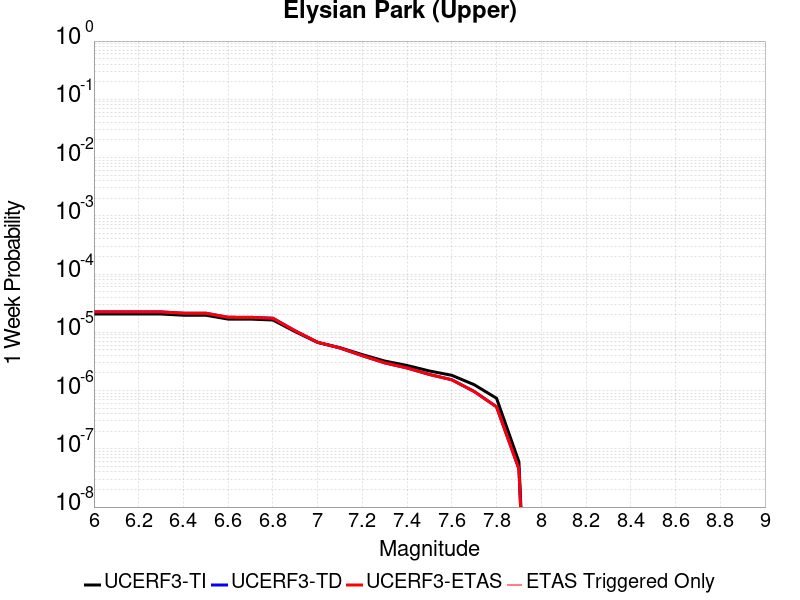 |  |  |  |

| Magnitude | 1 wk TI Prob | 1 wk TD Prob | 1 wk ETAS Prob | 1 wk ETAS/TD Gain | 1 wk ETAS Triggered Only | 1 mo TI Prob | 1 mo TD Prob | 1 mo ETAS Prob | 1 mo ETAS/TD Gain | 1 mo ETAS Triggered Only | 1 yr TI Prob | 1 yr TD Prob | 1 yr ETAS Prob | 1 yr ETAS/TD Gain | 1 yr ETAS Triggered Only | 10 yr TI Prob | 10 yr TD Prob | 10 yr ETAS Prob | 10 yr ETAS/TD Gain | 10 yr ETAS Triggered Only |
|-----|-----|-----|-----|-----|-----|-----|-----|-----|-----|-----|-----|-----|-----|-----|-----|-----|-----|-----|-----|-----|
| 6.0 | 2.0616073E-5 | 2.2394519E-5 | 2.2394519E-5 | 1.0 | 0.0 | 8.8351604E-5 | 9.597333E-5 | 1.15971416E-4 | 1.2083713 | 2.0E-5 | 0.0010751499 | 0.0011679113 | 0.0012078646 | 1.0342091 | 4.0E-5 | 0.010699631 | 0.01162399 | 0.011663524 | 1.0034012 | 4.0E-5 |
| 6.1 | 2.0616073E-5 | 2.2394519E-5 | 2.2394519E-5 | 1.0 | 0.0 | 8.8351604E-5 | 9.597333E-5 | 1.15971416E-4 | 1.2083713 | 2.0E-5 | 0.0010751499 | 0.0011679113 | 0.0012078646 | 1.0342091 | 4.0E-5 | 0.010699631 | 0.01162399 | 0.011663524 | 1.0034012 | 4.0E-5 |
| 6.2 | 2.0616073E-5 | 2.2394519E-5 | 2.2394519E-5 | 1.0 | 0.0 | 8.8351604E-5 | 9.597333E-5 | 1.15971416E-4 | 1.2083713 | 2.0E-5 | 0.0010751499 | 0.0011679113 | 0.0012078646 | 1.0342091 | 4.0E-5 | 0.010699631 | 0.01162399 | 0.011663524 | 1.0034012 | 4.0E-5 |
| 6.3 | 2.0616073E-5 | 2.2394519E-5 | 2.2394519E-5 | 1.0 | 0.0 | 8.8351604E-5 | 9.597333E-5 | 1.15971416E-4 | 1.2083713 | 2.0E-5 | 0.0010751499 | 0.0011679113 | 0.0012078646 | 1.0342091 | 4.0E-5 | 0.010699631 | 0.01162399 | 0.011663524 | 1.0034012 | 4.0E-5 |
| 6.4 | 1.9648705E-5 | 2.1280426E-5 | 2.1280426E-5 | 1.0 | 0.0 | 8.420602E-5 | 9.1198985E-5 | 1.1119716E-4 | 1.2192807 | 2.0E-5 | 0.0010247261 | 0.001109843 | 0.0011398097 | 1.0270009 | 3.0E-5 | 0.010200137 | 0.011049092 | 0.01107876 | 1.0026852 | 3.0E-5 |
| 6.5 | 1.9648705E-5 | 2.1280426E-5 | 2.1280426E-5 | 1.0 | 0.0 | 8.420602E-5 | 9.1198985E-5 | 1.1119716E-4 | 1.2192807 | 2.0E-5 | 0.0010247261 | 0.001109843 | 0.0011398097 | 1.0270009 | 3.0E-5 | 0.010200137 | 0.011049092 | 0.01107876 | 1.0026852 | 3.0E-5 |
| 6.6 | 1.6864484E-5 | 1.8097664E-5 | 1.8097664E-5 | 1.0 | 0.0 | 7.227436E-5 | 7.755938E-5 | 9.755783E-5 | 1.257847 | 2.0E-5 | 8.7958504E-4 | 9.439247E-4 | 9.738964E-4 | 1.0317522 | 3.0E-5 | 0.008761116 | 0.009403959 | 0.009433677 | 1.0031601 | 3.0E-5 |
| 6.7 | 1.6851194E-5 | 1.8083028E-5 | 1.8083028E-5 | 1.0 | 0.0 | 7.22174E-5 | 7.749666E-5 | 9.749511E-5 | 1.2580556 | 2.0E-5 | 8.7889214E-4 | 9.431618E-4 | 9.731335E-4 | 1.0317779 | 3.0E-5 | 0.008754243 | 0.009396395 | 0.009426112 | 1.0031627 | 3.0E-5 |
| 6.8 | 1.627159E-5 | 1.7432985E-5 | 1.7432985E-5 | 1.0 | 0.0 | 6.973352E-5 | 7.471092E-5 | 9.470943E-5 | 1.2676785 | 2.0E-5 | 8.486749E-4 | 9.09274E-4 | 9.3924673E-4 | 1.0329634 | 3.0E-5 | 0.008454411 | 0.009060311 | 0.009090039 | 1.0032811 | 3.0E-5 |
| 6.9 | 1.0252559E-5 | 1.0585707E-5 | 1.0585707E-5 | 1.0 | 0.0 | 4.39388E-5 | 4.5366593E-5 | 5.536614E-5 | 1.2204165 | 1.0E-5 | 5.348236E-4 | 5.5221026E-4 | 5.7219923E-4 | 1.0361981 | 2.0E-5 | 0.005335382 | 0.005509572 | 0.0055294624 | 1.00361 | 2.0E-5 |
| 7.0 | 6.695525E-6 | 6.750616E-6 | 6.750616E-6 | 1.0 | 0.0 | 2.869479E-5 | 2.8930901E-5 | 2.8930901E-5 | 1.0 | 0.0 | 3.4930307E-4 | 3.5217864E-4 | 3.6217514E-4 | 1.0283847 | 1.0E-5 | 0.0034875453 | 0.0035163919 | 0.0035263568 | 1.0028338 | 1.0E-5 |
| 7.1 | 5.446539E-6 | 5.3760064E-6 | 5.3760064E-6 | 1.0 | 0.0 | 2.3342101E-5 | 2.303983E-5 | 2.303983E-5 | 1.0 | 0.0 | 2.84153E-4 | 2.8047478E-4 | 2.9047197E-4 | 1.0356438 | 1.0E-5 | 0.0028378996 | 0.0028013038 | 0.002811276 | 1.0035597 | 1.0E-5 |
| 7.2 | 4.138953E-6 | 3.9724823E-6 | 3.9724823E-6 | 1.0 | 0.0 | 1.773825E-5 | 1.7024815E-5 | 1.7024815E-5 | 1.0 | 0.0 | 2.1594179E-4 | 2.0725759E-4 | 2.0725759E-4 | 1.0 | 0.0 | 0.0021573207 | 0.002070662 | 0.002070662 | 1.0 | 0.0 |
| 7.3 | 3.2120931E-6 | 2.9880375E-6 | 2.9880375E-6 | 1.0 | 0.0 | 1.3766041E-5 | 1.2805813E-5 | 1.2805813E-5 | 1.0 | 0.0 | 1.6758866E-4 | 1.558997E-4 | 1.558997E-4 | 1.0 | 0.0 | 0.0016746233 | 0.0015579126 | 0.0015579126 | 1.0 | 0.0 |
| 7.4 | 2.696463E-6 | 2.4431376E-6 | 2.4431376E-6 | 1.0 | 0.0 | 1.155622E-5 | 1.0470549E-5 | 1.0470549E-5 | 1.0 | 0.0 | 1.4068789E-4 | 1.2747152E-4 | 1.2747152E-4 | 1.0 | 0.0 | 0.0014059885 | 0.0012739891 | 0.0012739891 | 1.0 | 0.0 |
| 7.5 | 2.1687858E-6 | 1.8878748E-6 | 1.8878748E-6 | 1.0 | 0.0 | 9.294764E-6 | 8.090867E-6 | 8.090867E-6 | 1.0 | 0.0 | 1.13157876E-4 | 9.850189E-5 | 9.850189E-5 | 1.0 | 0.0 | 0.0011310027 | 9.845863E-4 | 9.845863E-4 | 1.0 | 0.0 |
| 7.6 | 1.8269673E-6 | 1.5307686E-6 | 1.5307686E-6 | 1.0 | 0.0 | 7.829836E-6 | 6.560421E-6 | 6.560421E-6 | 1.0 | 0.0 | 9.532409E-5 | 7.987023E-5 | 7.987023E-5 | 1.0 | 0.0 | 9.5283205E-4 | 7.98419E-4 | 7.98419E-4 | 1.0 | 0.0 |
| 7.7 | 1.260479E-6 | 9.639105E-7 | 9.639105E-7 | 1.0 | 0.0 | 5.402042E-6 | 4.131038E-6 | 4.131038E-6 | 1.0 | 0.0 | 6.5767876E-5 | 5.0294253E-5 | 5.0294253E-5 | 1.0 | 0.0 | 6.5748417E-4 | 5.0283084E-4 | 5.0283084E-4 | 1.0 | 0.0 |
| 7.8 | 7.381192E-7 | 5.2631856E-7 | 5.2631856E-7 | 1.0 | 0.0 | 3.163364E-6 | 2.2556492E-6 | 2.2556492E-6 | 1.0 | 0.0 | 3.8513277E-5 | 2.7462196E-5 | 2.7462196E-5 | 1.0 | 0.0 | 3.8506603E-4 | 2.7458955E-4 | 2.7458955E-4 | 1.0 | 0.0 |
| 7.9 | 5.9922584E-8 | 4.5203215E-8 | 4.5203215E-8 | 1.0 | 0.0 | 2.5681106E-7 | 1.9372806E-7 | 1.9372806E-7 | 1.0 | 0.0 | 3.12667E-6 | 2.3586367E-6 | 2.3586367E-6 | 1.0 | 0.0 | 3.126626E-5 | 2.3586126E-5 | 2.3586126E-5 | 1.0 | 0.0 |

## Calaveras (Central) 2011 CFM
*[(top)](#table-of-contents)*

| 1 Week | 1 Month | 1 Year | 10 Year |
|-----|-----|-----|-----|
|  |  |  |  |

| Magnitude | 1 wk TI Prob | 1 wk TD Prob | 1 wk ETAS Prob | 1 wk ETAS/TD Gain | 1 wk ETAS Triggered Only | 1 mo TI Prob | 1 mo TD Prob | 1 mo ETAS Prob | 1 mo ETAS/TD Gain | 1 mo ETAS Triggered Only | 1 yr TI Prob | 1 yr TD Prob | 1 yr ETAS Prob | 1 yr ETAS/TD Gain | 1 yr ETAS Triggered Only | 10 yr TI Prob | 10 yr TD Prob | 10 yr ETAS Prob | 10 yr ETAS/TD Gain | 10 yr ETAS Triggered Only |
|-----|-----|-----|-----|-----|-----|-----|-----|-----|-----|-----|-----|-----|-----|-----|-----|-----|-----|-----|-----|-----|
| 6.0 | 1.4989184E-4 | 2.4668325E-4 | 2.4668325E-4 | 1.0 | 0.0 | 6.4223545E-4 | 0.0010562318 | 0.0010662213 | 1.0094576 | 1.0E-5 | 0.0077912183 | 0.012780834 | 0.012790706 | 1.0007725 | 1.0E-5 | 0.07523653 | 0.119903505 | 0.11992991 | 1.0002202 | 3.0E-5 |
| 6.1 | 1.4382103E-4 | 2.3575606E-4 | 2.3575606E-4 | 1.0 | 0.0 | 6.1623025E-4 | 0.0010094374 | 0.0010194272 | 1.0098965 | 1.0E-5 | 0.0074768243 | 0.0122182295 | 0.012228107 | 1.0008085 | 1.0E-5 | 0.07230212 | 0.115014106 | 0.11504065 | 1.0002308 | 3.0E-5 |
| 6.2 | 1.4080507E-4 | 2.3487805E-4 | 2.3487805E-4 | 1.0 | 0.0 | 6.0331076E-4 | 0.0010056774 | 0.0010156673 | 1.0099336 | 1.0E-5 | 0.0073205982 | 0.012173032 | 0.012182911 | 1.0008115 | 1.0E-5 | 0.07084086 | 0.114565246 | 0.11459181 | 1.0002319 | 3.0E-5 |
| 6.3 | 1.3181973E-4 | 2.26453E-4 | 2.26453E-4 | 1.0 | 0.0 | 5.648194E-4 | 9.6959725E-4 | 9.795876E-4 | 1.0103036 | 1.0E-5 | 0.006855015 | 0.011739847 | 0.01174973 | 1.0008419 | 1.0E-5 | 0.06647374 | 0.110688195 | 0.110714875 | 1.000241 | 3.0E-5 |
| 6.4 | 1.2675441E-4 | 2.2061364E-4 | 2.2061364E-4 | 1.0 | 0.0 | 5.431201E-4 | 9.4458973E-4 | 9.5458026E-4 | 1.0105766 | 1.0E-5 | 0.006592457 | 0.011438634 | 0.01144852 | 1.0008643 | 1.0E-5 | 0.064002834 | 0.10794179 | 0.107968554 | 1.000248 | 3.0E-5 |
| 6.5 | 1.07906526E-4 | 1.8750475E-4 | 1.8750475E-4 | 1.0 | 0.0 | 4.6237456E-4 | 8.0334576E-4 | 8.1333774E-4 | 1.0124379 | 1.0E-5 | 0.0056148893 | 0.009736791 | 0.009746694 | 1.001017 | 1.0E-5 | 0.054751217 | 0.09272721 | 0.09275442 | 1.0002935 | 3.0E-5 |
| 6.6 | 1.04110804E-4 | 1.8182663E-4 | 1.8182663E-4 | 1.0 | 0.0 | 4.4611286E-4 | 7.790257E-4 | 7.890179E-4 | 1.0128266 | 1.0E-5 | 0.0054179057 | 0.009443332 | 0.009453238 | 1.0010489 | 1.0E-5 | 0.052877046 | 0.090053804 | 0.090081096 | 1.0003031 | 3.0E-5 |
| 6.7 | 9.896317E-5 | 1.7421709E-4 | 1.7421709E-4 | 1.0 | 0.0 | 4.2405893E-4 | 7.464324E-4 | 7.564249E-4 | 1.0133871 | 1.0E-5 | 0.005150702 | 0.0090499185 | 0.009059829 | 1.0010949 | 1.0E-5 | 0.050329432 | 0.08645777 | 0.08648517 | 1.000317 | 3.0E-5 |
| 6.8 | 9.3441544E-5 | 1.6337937E-4 | 1.6337937E-4 | 1.0 | 0.0 | 4.004023E-4 | 7.0001074E-4 | 7.100037E-4 | 1.0142756 | 1.0E-5 | 0.0048640063 | 0.008489322 | 0.008499237 | 1.0011679 | 1.0E-5 | 0.04758912 | 0.0813856 | 0.08141316 | 1.0003387 | 3.0E-5 |
| 6.9 | 7.323723E-5 | 1.2339014E-4 | 1.2339014E-4 | 1.0 | 0.0 | 3.138361E-4 | 5.287083E-4 | 5.38703E-4 | 1.018904 | 1.0E-5 | 0.0038142612 | 0.006418136 | 0.0064280718 | 1.001548 | 1.0E-5 | 0.03749454 | 0.062384315 | 0.062412445 | 1.0004508 | 3.0E-5 |
| 7.0 | 5.756587E-5 | 9.504402E-5 | 9.504402E-5 | 1.0 | 0.0 | 2.4668756E-4 | 4.0726826E-4 | 4.172642E-4 | 1.0245439 | 1.0E-5 | 0.0029992845 | 0.004947285 | 0.0049572354 | 1.0020113 | 1.0E-5 | 0.02959126 | 0.04854811 | 0.048576653 | 1.0005879 | 3.0E-5 |
| 7.1 | 4.8936774E-5 | 8.025518E-5 | 8.025518E-5 | 1.0 | 0.0 | 2.0971216E-4 | 3.4390573E-4 | 3.539023E-4 | 1.0290678 | 1.0E-5 | 0.002550256 | 0.004179071 | 0.0041890293 | 1.0023829 | 1.0E-5 | 0.025211869 | 0.04123748 | 0.041266244 | 1.0006975 | 3.0E-5 |
| 7.2 | 3.6578476E-5 | 5.9836933E-5 | 5.9836933E-5 | 1.0 | 0.0 | 1.5675547E-4 | 2.5641895E-4 | 2.6641638E-4 | 1.0389887 | 1.0E-5 | 0.0019068272 | 0.0031174573 | 0.003127426 | 1.0031978 | 1.0E-5 | 0.018905481 | 0.031039756 | 0.031068824 | 1.0009365 | 3.0E-5 |
| 7.3 | 2.7765942E-5 | 4.5597928E-5 | 4.5597928E-5 | 1.0 | 0.0 | 1.1899146E-4 | 1.9540517E-4 | 2.0540321E-4 | 1.0511657 | 1.0E-5 | 0.0014477583 | 0.0023764821 | 0.0023864585 | 1.004198 | 1.0E-5 | 0.014383625 | 0.023782235 | 0.023811521 | 1.0012314 | 3.0E-5 |
| 7.4 | 1.8502888E-5 | 3.11602E-5 | 3.11602E-5 | 1.0 | 0.0 | 7.929568E-5 | 1.335369E-4 | 1.4353557E-4 | 1.0748757 | 1.0E-5 | 9.649973E-4 | 0.0016246022 | 0.001634586 | 1.0061454 | 1.0E-5 | 0.009608176 | 0.01634503 | 0.01637454 | 1.0018054 | 3.0E-5 |
| 7.5 | 1.5345748E-5 | 2.7021058E-5 | 2.7021058E-5 | 1.0 | 0.0 | 6.576583E-5 | 1.1579941E-4 | 1.2579825E-4 | 1.0863463 | 1.0E-5 | 8.004049E-4 | 0.0014089488 | 0.0014189348 | 1.0070875 | 1.0E-5 | 0.007975281 | 0.014209109 | 0.0142386835 | 1.0020813 | 3.0E-5 |
| 7.6 | 8.386176E-6 | 1.5290687E-5 | 1.5290687E-5 | 1.0 | 0.0 | 3.594026E-5 | 6.552988E-5 | 7.552923E-5 | 1.1525922 | 1.0E-5 | 4.374848E-4 | 7.975356E-4 | 8.075276E-4 | 1.0125287 | 1.0E-5 | 0.004366245 | 0.008115043 | 0.008144799 | 1.0036669 | 3.0E-5 |
| 7.7 | 3.4860175E-6 | 6.357355E-6 | 6.357355E-6 | 1.0 | 0.0 | 1.4939989E-5 | 2.7245522E-5 | 3.724525E-5 | 1.3670228 | 1.0E-5 | 1.818792E-4 | 3.316638E-4 | 3.416605E-4 | 1.030141 | 1.0E-5 | 0.001817304 | 0.0034468474 | 0.003476744 | 1.0086735 | 3.0E-5 |
| 7.8 | 2.7986223E-6 | 5.374811E-6 | 5.374811E-6 | 1.0 | 0.0 | 1.19940405E-5 | 2.30347E-5 | 3.303447E-5 | 1.4341177 | 1.0E-5 | 1.4601766E-4 | 2.8041142E-4 | 2.904086E-4 | 1.0356519 | 1.0E-5 | 0.0014592175 | 0.0029133647 | 0.0029432771 | 1.0102674 | 3.0E-5 |
| 7.9 | 1.9930783E-6 | 4.178249E-6 | 4.178249E-6 | 1.0 | 0.0 | 8.541737E-6 | 1.790666E-5 | 1.790666E-5 | 1.0 | 0.0 | 1.0399068E-4 | 2.1799181E-4 | 2.1799181E-4 | 1.0 | 0.0 | 0.0010394203 | 0.0022517683 | 0.0022617457 | 1.004431 | 1.0E-5 |
| 8.0 | 1.2089354E-6 | 2.6324474E-6 | 2.6324474E-6 | 1.0 | 0.0 | 5.1811417E-6 | 1.1281868E-5 | 1.1281868E-5 | 1.0 | 0.0 | 6.307857E-5 | 1.3734812E-4 | 1.3734812E-4 | 1.0 | 0.0 | 6.306067E-4 | 0.0014067559 | 0.0014067559 | 1.0 | 0.0 |
| 8.1 | 8.0059846E-7 | 1.7045737E-6 | 1.7045737E-6 | 1.0 | 0.0 | 3.4311317E-6 | 7.305295E-6 | 7.305295E-6 | 1.0 | 0.0 | 4.177323E-5 | 8.893837E-5 | 8.893837E-5 | 1.0 | 0.0 | 4.1765376E-4 | 9.085916E-4 | 9.085916E-4 | 1.0 | 0.0 |

## Greenville (No) 2011 CFM
*[(top)](#table-of-contents)*

| 1 Week | 1 Month | 1 Year | 10 Year |
|-----|-----|-----|-----|
|  |  |  |  |

| Magnitude | 1 wk TI Prob | 1 wk TD Prob | 1 wk ETAS Prob | 1 wk ETAS/TD Gain | 1 wk ETAS Triggered Only | 1 mo TI Prob | 1 mo TD Prob | 1 mo ETAS Prob | 1 mo ETAS/TD Gain | 1 mo ETAS Triggered Only | 1 yr TI Prob | 1 yr TD Prob | 1 yr ETAS Prob | 1 yr ETAS/TD Gain | 1 yr ETAS Triggered Only | 10 yr TI Prob | 10 yr TD Prob | 10 yr ETAS Prob | 10 yr ETAS/TD Gain | 10 yr ETAS Triggered Only |
|-----|-----|-----|-----|-----|-----|-----|-----|-----|-----|-----|-----|-----|-----|-----|-----|-----|-----|-----|-----|-----|
| 6.0 | 5.2156745E-5 | 6.6992056E-5 | 7.699138E-5 | 1.1492615 | 1.0E-5 | 2.2350975E-4 | 2.8707914E-4 | 2.9707624E-4 | 1.0348237 | 1.0E-5 | 0.0027178354 | 0.0034897912 | 0.0035196866 | 1.0085665 | 3.0E-5 | 0.026848353 | 0.034375615 | 0.034414243 | 1.0011237 | 4.0E-5 |
| 6.1 | 5.2156745E-5 | 6.6992056E-5 | 7.699138E-5 | 1.1492615 | 1.0E-5 | 2.2350975E-4 | 2.8707914E-4 | 2.9707624E-4 | 1.0348237 | 1.0E-5 | 0.0027178354 | 0.0034897912 | 0.0035196866 | 1.0085665 | 3.0E-5 | 0.026848353 | 0.034375615 | 0.034414243 | 1.0011237 | 4.0E-5 |
| 6.2 | 5.2156745E-5 | 6.6992056E-5 | 7.699138E-5 | 1.1492615 | 1.0E-5 | 2.2350975E-4 | 2.8707914E-4 | 2.9707624E-4 | 1.0348237 | 1.0E-5 | 0.0027178354 | 0.0034897912 | 0.0035196866 | 1.0085665 | 3.0E-5 | 0.026848353 | 0.034375615 | 0.034414243 | 1.0011237 | 4.0E-5 |
| 6.3 | 3.936404E-5 | 4.9578604E-5 | 5.957811E-5 | 1.20169 | 1.0E-5 | 1.6869212E-4 | 2.1246294E-4 | 2.2246082E-4 | 1.047057 | 1.0E-5 | 0.0020518918 | 0.0025837487 | 0.0026036971 | 1.0077207 | 2.0E-5 | 0.020330489 | 0.025545793 | 0.025575025 | 1.0011444 | 3.0E-5 |
| 6.4 | 3.601E-5 | 4.5091914E-5 | 5.5091463E-5 | 1.2217592 | 1.0E-5 | 1.5431944E-4 | 1.9323718E-4 | 2.0323525E-4 | 1.0517399 | 1.0E-5 | 0.00187722 | 0.0023501927 | 0.0023701456 | 1.00849 | 2.0E-5 | 0.018614413 | 0.023261907 | 0.023291208 | 1.0012597 | 3.0E-5 |
| 6.5 | 3.5960467E-5 | 4.5029607E-5 | 5.5029155E-5 | 1.2220662 | 1.0E-5 | 1.5410718E-4 | 1.9297018E-4 | 2.0296825E-4 | 1.0518115 | 1.0E-5 | 0.0018746402 | 0.002346949 | 0.002366902 | 1.0085016 | 2.0E-5 | 0.018589048 | 0.023230152 | 0.023259455 | 1.0012615 | 3.0E-5 |
| 6.6 | 3.525907E-5 | 4.4114146E-5 | 5.4113705E-5 | 1.2266747 | 1.0E-5 | 1.5110154E-4 | 1.8904735E-4 | 1.9904546E-4 | 1.0528868 | 1.0E-5 | 0.0018381089 | 0.0022992902 | 0.0023192442 | 1.0086783 | 2.0E-5 | 0.018229794 | 0.022763629 | 0.022783173 | 1.0008585 | 2.0E-5 |
| 6.7 | 3.3018805E-5 | 4.132505E-5 | 5.1324634E-5 | 1.241974 | 1.0E-5 | 1.4150148E-4 | 1.7709575E-4 | 1.8709397E-4 | 1.0564567 | 1.0E-5 | 0.0017214192 | 0.0021540837 | 0.0021740405 | 1.0092647 | 2.0E-5 | 0.017081454 | 0.021340653 | 0.021360228 | 1.0009172 | 2.0E-5 |
| 6.8 | 2.5731997E-5 | 3.182428E-5 | 4.182396E-5 | 1.3142155 | 1.0E-5 | 1.1027533E-4 | 1.3638285E-4 | 1.4638148E-4 | 1.073313 | 1.0E-5 | 0.0013417752 | 0.0016592324 | 0.0016791992 | 1.0120338 | 2.0E-5 | 0.0133370245 | 0.016472587 | 0.016492259 | 1.0011941 | 2.0E-5 |
| 6.9 | 2.0148882E-5 | 2.4817273E-5 | 3.4817025E-5 | 1.4029351 | 1.0E-5 | 8.634949E-5 | 1.0635555E-4 | 1.1635449E-4 | 1.0940143 | 1.0E-5 | 0.001050798 | 0.0012941349 | 0.001314109 | 1.0154344 | 2.0E-5 | 0.010458431 | 0.012868811 | 0.0128885545 | 1.0015341 | 2.0E-5 |
| 7.0 | 1.52499615E-5 | 1.8733776E-5 | 1.8733776E-5 | 1.0 | 0.0 | 6.535534E-5 | 8.028525E-5 | 8.028525E-5 | 1.0 | 0.0 | 7.954108E-4 | 9.770546E-4 | 9.770546E-4 | 1.0 | 0.0 | 0.007925698 | 0.009729729 | 0.009729729 | 1.0 | 0.0 |
| 7.1 | 9.693974E-6 | 1.1676564E-5 | 1.1676564E-5 | 1.0 | 0.0 | 4.1544943E-5 | 5.0041468E-5 | 5.0041468E-5 | 1.0 | 0.0 | 5.0569227E-4 | 6.0908636E-4 | 6.0908636E-4 | 1.0 | 0.0 | 0.0050454307 | 0.0060745096 | 0.0060745096 | 1.0 | 0.0 |
| 7.2 | 6.185964E-6 | 7.5017315E-6 | 7.5017315E-6 | 1.0 | 0.0 | 2.6511005E-5 | 3.2149885E-5 | 3.2149885E-5 | 1.0 | 0.0 | 3.2272367E-4 | 3.9135502E-4 | 3.9135502E-4 | 1.0 | 0.0 | 0.003222554 | 0.003906832 | 0.003906832 | 1.0 | 0.0 |
| 7.3 | 3.905068E-6 | 4.7139415E-6 | 4.7139415E-6 | 1.0 | 0.0 | 1.6735898E-5 | 2.020245E-5 | 2.020245E-5 | 1.0 | 0.0 | 2.037405E-4 | 2.459372E-4 | 2.459372E-4 | 1.0 | 0.0 | 0.0020355382 | 0.0024567293 | 0.0024567293 | 1.0 | 0.0 |
| 7.4 | 2.8243321E-6 | 3.4701013E-6 | 3.4701013E-6 | 1.0 | 0.0 | 1.2104225E-5 | 1.4871779E-5 | 1.4871779E-5 | 1.0 | 0.0 | 1.4735897E-4 | 1.8104892E-4 | 1.8104892E-4 | 1.0 | 0.0 | 0.0014726128 | 0.0018090665 | 0.0018090665 | 1.0 | 0.0 |
| 7.5 | 2.4885821E-6 | 3.0706208E-6 | 3.0706208E-6 | 1.0 | 0.0 | 1.0665309E-5 | 1.3159737E-5 | 1.3159737E-5 | 1.0 | 0.0 | 1.298424E-4 | 1.6020807E-4 | 1.6020807E-4 | 1.0 | 0.0 | 0.0012976655 | 0.0016009702 | 0.0016009702 | 1.0 | 0.0 |
| 7.6 | 1.9102797E-6 | 2.3787416E-6 | 2.3787416E-6 | 1.0 | 0.0 | 8.1868875E-6 | 1.0194567E-5 | 1.0194567E-5 | 1.0 | 0.0 | 9.96708E-5 | 1.2411183E-4 | 1.2411183E-4 | 1.0 | 0.0 | 9.96261E-4 | 0.0012404576 | 0.0012404576 | 1.0 | 0.0 |
| 7.7 | 4.3868803E-7 | 5.737495E-7 | 5.737495E-7 | 1.0 | 0.0 | 1.8800903E-6 | 2.4589242E-6 | 2.4589242E-6 | 1.0 | 0.0 | 2.2889859E-5 | 2.9937E-5 | 2.9937E-5 | 1.0 | 0.0 | 2.2887501E-4 | 2.9933182E-4 | 2.9933182E-4 | 1.0 | 0.0 |

## Northridge
*[(top)](#table-of-contents)*

| 1 Week | 1 Month | 1 Year | 10 Year |
|-----|-----|-----|-----|
|  | 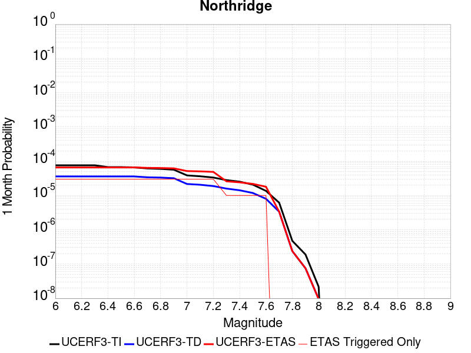 |  |  |

| Magnitude | 1 wk TI Prob | 1 wk TD Prob | 1 wk ETAS Prob | 1 wk ETAS/TD Gain | 1 wk ETAS Triggered Only | 1 mo TI Prob | 1 mo TD Prob | 1 mo ETAS Prob | 1 mo ETAS/TD Gain | 1 mo ETAS Triggered Only | 1 yr TI Prob | 1 yr TD Prob | 1 yr ETAS Prob | 1 yr ETAS/TD Gain | 1 yr ETAS Triggered Only | 10 yr TI Prob | 10 yr TD Prob | 10 yr ETAS Prob | 10 yr ETAS/TD Gain | 10 yr ETAS Triggered Only |
|-----|-----|-----|-----|-----|-----|-----|-----|-----|-----|-----|-----|-----|-----|-----|-----|-----|-----|-----|-----|-----|
| 6.0 | 1.775292E-5 | 8.395395E-6 | 2.8395227E-5 | 3.3822386 | 2.0E-5 | 7.608173E-5 | 3.597978E-5 | 6.5978704E-5 | 1.8337716 | 3.0E-5 | 9.2590135E-4 | 4.379687E-4 | 4.779512E-4 | 1.0912907 | 4.0E-5 | 0.00922053 | 0.0043713627 | 0.004411188 | 1.0091105 | 4.0E-5 |
| 6.1 | 1.775292E-5 | 8.395395E-6 | 2.8395227E-5 | 3.3822386 | 2.0E-5 | 7.608173E-5 | 3.597978E-5 | 6.5978704E-5 | 1.8337716 | 3.0E-5 | 9.2590135E-4 | 4.379687E-4 | 4.779512E-4 | 1.0912907 | 4.0E-5 | 0.00922053 | 0.0043713627 | 0.004411188 | 1.0091105 | 4.0E-5 |
| 6.2 | 1.775292E-5 | 8.395395E-6 | 2.8395227E-5 | 3.3822386 | 2.0E-5 | 7.608173E-5 | 3.597978E-5 | 6.5978704E-5 | 1.8337716 | 3.0E-5 | 9.2590135E-4 | 4.379687E-4 | 4.779512E-4 | 1.0912907 | 4.0E-5 | 0.00922053 | 0.0043713627 | 0.004411188 | 1.0091105 | 4.0E-5 |
| 6.3 | 1.775292E-5 | 8.395395E-6 | 2.8395227E-5 | 3.3822386 | 2.0E-5 | 7.608173E-5 | 3.597978E-5 | 6.5978704E-5 | 1.8337716 | 3.0E-5 | 9.2590135E-4 | 4.379687E-4 | 4.779512E-4 | 1.0912907 | 4.0E-5 | 0.00922053 | 0.0043713627 | 0.004411188 | 1.0091105 | 4.0E-5 |
| 6.4 | 1.574804E-5 | 8.395395E-6 | 2.8395227E-5 | 3.3822386 | 2.0E-5 | 6.748986E-5 | 3.597978E-5 | 6.5978704E-5 | 1.8337716 | 3.0E-5 | 8.2137925E-4 | 4.379687E-4 | 4.779512E-4 | 1.0912907 | 4.0E-5 | 0.008183499 | 0.0043713627 | 0.004411188 | 1.0091105 | 4.0E-5 |
| 6.5 | 1.574804E-5 | 8.395395E-6 | 2.8395227E-5 | 3.3822386 | 2.0E-5 | 6.748986E-5 | 3.597978E-5 | 6.5978704E-5 | 1.8337716 | 3.0E-5 | 8.2137925E-4 | 4.379687E-4 | 4.779512E-4 | 1.0912907 | 4.0E-5 | 0.008183499 | 0.0043713627 | 0.004411188 | 1.0091105 | 4.0E-5 |
| 6.6 | 1.54266E-5 | 8.395395E-6 | 2.8395227E-5 | 3.3822386 | 2.0E-5 | 6.611232E-5 | 3.597978E-5 | 6.5978704E-5 | 1.8337716 | 3.0E-5 | 8.046202E-4 | 4.379687E-4 | 4.779512E-4 | 1.0912907 | 4.0E-5 | 0.008017131 | 0.0043713627 | 0.004411188 | 1.0091105 | 4.0E-5 |
| 6.7 | 1.4377601E-5 | 7.925329E-6 | 2.7925169E-5 | 3.5235348 | 2.0E-5 | 6.161683E-5 | 3.3965265E-5 | 6.3964246E-5 | 1.8832253 | 3.0E-5 | 7.499267E-4 | 4.1345131E-4 | 4.534348E-4 | 1.0967066 | 4.0E-5 | 0.00747401 | 0.004127105 | 0.0041669398 | 1.009652 | 4.0E-5 |
| 6.8 | 1.39434605E-5 | 7.793359E-6 | 2.7793203E-5 | 3.5662675 | 2.0E-5 | 5.975632E-5 | 3.3399698E-5 | 6.339869E-5 | 1.8981817 | 3.0E-5 | 7.272903E-4 | 4.065681E-4 | 4.4655186E-4 | 1.0983444 | 4.0E-5 | 0.0072491462 | 0.0040585254 | 0.004098363 | 1.0098158 | 4.0E-5 |
| 6.9 | 1.3215156E-5 | 7.456745E-6 | 2.7456595E-5 | 3.6821153 | 2.0E-5 | 5.6635155E-5 | 3.19571E-5 | 6.195615E-5 | 1.9387285 | 3.0E-5 | 6.8931485E-4 | 3.8901088E-4 | 4.2899532E-4 | 1.1027849 | 4.0E-5 | 0.006871806 | 0.0038835767 | 0.0039234213 | 1.0102597 | 4.0E-5 |
| 7.0 | 9.018273E-6 | 5.0636686E-6 | 2.5063568E-5 | 4.9496856 | 2.0E-5 | 3.8649167E-5 | 2.1701258E-5 | 5.170061E-5 | 2.3823783 | 3.0E-5 | 4.70452E-4 | 2.6418103E-4 | 3.0417048E-4 | 1.1513714 | 4.0E-5 | 0.004694573 | 0.0026387095 | 0.002678604 | 1.015119 | 4.0E-5 |
| 7.1 | 8.492022E-6 | 4.8064207E-6 | 2.4806324E-5 | 5.1610804 | 2.0E-5 | 3.639387E-5 | 2.0598785E-5 | 5.0598166E-5 | 2.4563665 | 3.0E-5 | 4.430053E-4 | 2.507616E-4 | 2.9075157E-4 | 1.159474 | 4.0E-5 | 0.004421232 | 0.0025048251 | 0.002544725 | 1.0159292 | 4.0E-5 |
| 7.2 | 7.806354E-6 | 4.4014996E-6 | 2.4401412E-5 | 5.5438857 | 2.0E-5 | 3.3455373E-5 | 1.8863435E-5 | 4.886287E-5 | 2.5903485 | 3.0E-5 | 4.0724306E-4 | 2.2963836E-4 | 2.5963146E-4 | 1.1306102 | 3.0E-5 | 0.004064976 | 0.0022940477 | 0.002323979 | 1.0130473 | 3.0E-5 |
| 7.3 | 6.55405E-6 | 3.7132593E-6 | 1.3713222E-5 | 3.6930418 | 1.0E-5 | 2.8088481E-5 | 1.5913873E-5 | 2.5913712E-5 | 1.6283726 | 1.0E-5 | 3.419236E-4 | 1.937343E-4 | 2.0373237E-4 | 1.0516071 | 1.0E-5 | 0.0034139797 | 0.0019356805 | 0.0019456611 | 1.0051562 | 1.0E-5 |
| 7.4 | 5.903922E-6 | 3.3148058E-6 | 1.3314772E-5 | 4.016758 | 1.0E-5 | 2.5302277E-5 | 1.4206234E-5 | 2.420609E-5 | 1.7039063 | 1.0E-5 | 3.080117E-4 | 1.7294729E-4 | 1.8294556E-4 | 1.0578111 | 1.0E-5 | 0.0030758511 | 0.0017281502 | 0.0017381329 | 1.0057765 | 1.0E-5 |
| 7.5 | 4.848178E-6 | 2.7639844E-6 | 1.2763957E-5 | 4.6179557 | 1.0E-5 | 2.077774E-5 | 1.1845594E-5 | 2.1845475E-5 | 1.8441857 | 1.0E-5 | 2.5293962E-4 | 1.4421066E-4 | 1.5420922E-4 | 1.069333 | 1.0E-5 | 0.0025265191 | 0.0014411812 | 0.0014511667 | 1.0069288 | 1.0E-5 |
| 7.6 | 3.1806076E-6 | 1.8692037E-6 | 1.1869185E-5 | 6.3498616 | 1.0E-5 | 1.3631104E-5 | 8.010849E-6 | 1.8010769E-5 | 2.2482972 | 1.0E-5 | 1.6594605E-4 | 9.752781E-5 | 1.0752684E-4 | 1.1025249 | 1.0E-5 | 0.0016582218 | 9.748591E-4 | 9.848493E-4 | 1.010248 | 1.0E-5 |
| 7.7 | 1.4410269E-6 | 7.849864E-7 | 7.849864E-7 | 1.0 | 0.0 | 6.175815E-6 | 3.3642234E-6 | 3.3642234E-6 | 1.0 | 0.0 | 7.5187956E-5 | 4.0958712E-5 | 4.0958712E-5 | 1.0 | 0.0 | 7.516252E-4 | 4.0951758E-4 | 4.0951758E-4 | 1.0 | 0.0 |
| 7.8 | 1.1054904E-7 | 5.5594732E-8 | 5.5594732E-8 | 1.0 | 0.0 | 4.737815E-7 | 2.3826311E-7 | 2.3826311E-7 | 1.0 | 0.0 | 5.7682746E-6 | 2.9008495E-6 | 2.9008495E-6 | 1.0 | 0.0 | 5.768125E-5 | 2.9008126E-5 | 2.9008126E-5 | 1.0 | 0.0 |
| 7.9 | 4.4305736E-8 | 1.755824E-8 | 1.755824E-8 | 1.0 | 0.0 | 1.8988172E-7 | 7.5249595E-8 | 7.5249595E-8 | 1.0 | 0.0 | 2.3118073E-6 | 9.161635E-7 | 9.161635E-7 | 1.0 | 0.0 | 2.3117833E-5 | 9.161599E-6 | 9.161599E-6 | 1.0 | 0.0 |
| 8.0 | 5.0364406E-9 | 2.214379E-9 | 2.214379E-9 | 1.0 | 0.0 | 2.1584746E-8 | 9.490196E-9 | 9.490196E-9 | 1.0 | 0.0 | 2.6279426E-7 | 1.1554314E-7 | 1.1554314E-7 | 1.0 | 0.0 | 2.6279395E-6 | 1.1554314E-6 | 1.1554314E-6 | 1.0 | 0.0 |

## San Juan
*[(top)](#table-of-contents)*

| 1 Week | 1 Month | 1 Year | 10 Year |
|-----|-----|-----|-----|
|  |  |  | 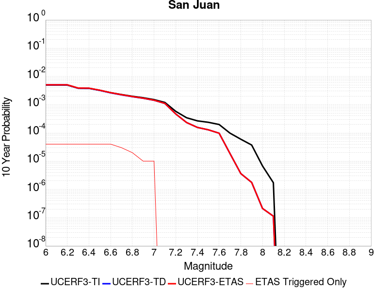 |

| Magnitude | 1 wk TI Prob | 1 wk TD Prob | 1 wk ETAS Prob | 1 wk ETAS/TD Gain | 1 wk ETAS Triggered Only | 1 mo TI Prob | 1 mo TD Prob | 1 mo ETAS Prob | 1 mo ETAS/TD Gain | 1 mo ETAS Triggered Only | 1 yr TI Prob | 1 yr TD Prob | 1 yr ETAS Prob | 1 yr ETAS/TD Gain | 1 yr ETAS Triggered Only | 10 yr TI Prob | 10 yr TD Prob | 10 yr ETAS Prob | 10 yr ETAS/TD Gain | 10 yr ETAS Triggered Only |
|-----|-----|-----|-----|-----|-----|-----|-----|-----|-----|-----|-----|-----|-----|-----|-----|-----|-----|-----|-----|-----|
| 6.0 | 9.4981615E-6 | 9.6243875E-6 | 9.6243875E-6 | 1.0 | 0.0 | 4.070577E-5 | 4.1246753E-5 | 4.1246753E-5 | 1.0 | 0.0 | 4.954801E-4 | 5.0206843E-4 | 5.1206345E-4 | 1.0199076 | 1.0E-5 | 0.0049437676 | 0.005009915 | 0.005049715 | 1.0079442 | 4.0E-5 |
| 6.1 | 9.4981615E-6 | 9.6243875E-6 | 9.6243875E-6 | 1.0 | 0.0 | 4.070577E-5 | 4.1246753E-5 | 4.1246753E-5 | 1.0 | 0.0 | 4.954801E-4 | 5.0206843E-4 | 5.1206345E-4 | 1.0199076 | 1.0E-5 | 0.0049437676 | 0.005009915 | 0.005049715 | 1.0079442 | 4.0E-5 |
| 6.2 | 9.4981615E-6 | 9.6243875E-6 | 9.6243875E-6 | 1.0 | 0.0 | 4.070577E-5 | 4.1246753E-5 | 4.1246753E-5 | 1.0 | 0.0 | 4.954801E-4 | 5.0206843E-4 | 5.1206345E-4 | 1.0199076 | 1.0E-5 | 0.0049437676 | 0.005009915 | 0.005049715 | 1.0079442 | 4.0E-5 |
| 6.3 | 7.3407414E-6 | 7.3775423E-6 | 7.3775423E-6 | 1.0 | 0.0 | 3.145994E-5 | 3.1617667E-5 | 3.1617667E-5 | 1.0 | 0.0 | 3.8295746E-4 | 3.8487918E-4 | 3.9487533E-4 | 1.0259721 | 1.0E-5 | 0.0038229816 | 0.0038424104 | 0.0038822568 | 1.0103701 | 4.0E-5 |
| 6.4 | 7.255887E-6 | 7.286204E-6 | 7.286204E-6 | 1.0 | 0.0 | 3.109629E-5 | 3.1226227E-5 | 3.1226227E-5 | 1.0 | 0.0 | 3.7853152E-4 | 3.8011503E-4 | 3.9011124E-4 | 1.0262978 | 1.0E-5 | 0.003778874 | 0.003794932 | 0.0038347803 | 1.0105004 | 4.0E-5 |
| 6.5 | 6.1742335E-6 | 6.1621827E-6 | 6.1621827E-6 | 1.0 | 0.0 | 2.6460733E-5 | 2.6409094E-5 | 2.6409094E-5 | 1.0 | 0.0 | 3.221118E-4 | 3.2148475E-4 | 3.3148154E-4 | 1.0310956 | 1.0E-5 | 0.003216453 | 0.0032104189 | 0.0032502904 | 1.0124195 | 4.0E-5 |
| 6.6 | 5.1036386E-6 | 5.024536E-6 | 5.024536E-6 | 1.0 | 0.0 | 2.1872553E-5 | 2.1533555E-5 | 2.1533555E-5 | 1.0 | 0.0 | 2.662658E-4 | 2.6214056E-4 | 2.7213793E-4 | 1.0381374 | 1.0E-5 | 0.0026594698 | 0.0026184937 | 0.0026583888 | 1.0152359 | 4.0E-5 |
| 6.7 | 4.3777836E-6 | 4.2679026E-6 | 4.2679026E-6 | 1.0 | 0.0 | 1.8761795E-5 | 1.8290888E-5 | 1.8290888E-5 | 1.0 | 0.0 | 2.2840092E-4 | 2.2266965E-4 | 2.2266965E-4 | 1.0 | 0.0 | 0.002281663 | 0.0022246253 | 0.0022545587 | 1.0134554 | 3.0E-5 |
| 6.8 | 3.805736E-6 | 3.6788024E-6 | 3.6788024E-6 | 1.0 | 0.0 | 1.6310196E-5 | 1.5766205E-5 | 1.5766205E-5 | 1.0 | 0.0 | 1.9855853E-4 | 1.919374E-4 | 1.919374E-4 | 1.0 | 0.0 | 0.001983812 | 0.001917867 | 0.0019378286 | 1.0104083 | 2.0E-5 |
| 6.9 | 3.3738422E-6 | 3.233654E-6 | 3.233654E-6 | 1.0 | 0.0 | 1.4459243E-5 | 1.3858447E-5 | 1.3858447E-5 | 1.0 | 0.0 | 1.7602707E-4 | 1.6871424E-4 | 1.6871424E-4 | 1.0 | 0.0 | 0.001758877 | 0.0016860062 | 0.0016959893 | 1.0059211 | 1.0E-5 |
| 7.0 | 2.8968698E-6 | 2.742578E-6 | 2.742578E-6 | 1.0 | 0.0 | 1.2415097E-5 | 1.1753857E-5 | 1.1753857E-5 | 1.0 | 0.0 | 1.5114332E-4 | 1.4309447E-4 | 1.4309447E-4 | 1.0 | 0.0 | 0.0015104057 | 0.0014301642 | 0.0014401498 | 1.0069822 | 1.0E-5 |
| 7.1 | 2.2981242E-6 | 2.1244923E-6 | 2.1244923E-6 | 1.0 | 0.0 | 9.849066E-6 | 9.104939E-6 | 9.104939E-6 | 1.0 | 0.0 | 1.1990578E-4 | 1.1084762E-4 | 1.1084762E-4 | 1.0 | 0.0 | 0.001198411 | 0.00110806 | 0.00110806 | 1.0 | 0.0 |
| 7.2 | 1.1131593E-6 | 9.0076236E-7 | 9.0076236E-7 | 1.0 | 0.0 | 4.770674E-6 | 3.8604044E-6 | 3.8604044E-6 | 1.0 | 0.0 | 5.808141E-5 | 4.6999427E-5 | 4.6999427E-5 | 1.0 | 0.0 | 5.8066234E-4 | 4.6997113E-4 | 4.6997113E-4 | 1.0 | 0.0 |
| 7.3 | 6.602937E-7 | 4.4724823E-7 | 4.4724823E-7 | 1.0 | 0.0 | 2.829827E-6 | 1.9167767E-6 | 1.9167767E-6 | 1.0 | 0.0 | 3.44526E-5 | 2.3336506E-5 | 2.3336506E-5 | 1.0 | 0.0 | 3.444726E-4 | 2.3338574E-4 | 2.3338574E-4 | 1.0 | 0.0 |
| 7.4 | 5.117894E-7 | 2.996913E-7 | 2.996913E-7 | 1.0 | 0.0 | 2.1933813E-6 | 1.2843906E-6 | 1.2843906E-6 | 1.0 | 0.0 | 2.6704089E-5 | 1.5637343E-5 | 1.5637343E-5 | 1.0 | 0.0 | 2.670088E-4 | 1.5640476E-4 | 1.5640476E-4 | 1.0 | 0.0 |
| 7.5 | 4.5585242E-7 | 2.4715453E-7 | 2.4715453E-7 | 1.0 | 0.0 | 1.9536517E-6 | 1.0592332E-6 | 1.0592332E-6 | 1.0 | 0.0 | 2.3785451E-5 | 1.2896089E-5 | 1.2896089E-5 | 1.0 | 0.0 | 2.3782905E-4 | 1.2899052E-4 | 1.2899052E-4 | 1.0 | 0.0 |
| 7.6 | 3.8045806E-7 | 1.8727846E-7 | 1.8727846E-7 | 1.0 | 0.0 | 1.6305336E-6 | 8.0262174E-7 | 8.0262174E-7 | 1.0 | 0.0 | 1.9851565E-5 | 9.771876E-6 | 9.771876E-6 | 1.0 | 0.0 | 1.9849792E-4 | 9.77435E-5 | 9.77435E-5 | 1.0 | 0.0 |
| 7.7 | 1.884214E-7 | 3.5781134E-8 | 3.5781134E-8 | 1.0 | 0.0 | 8.0752E-7 | 1.5334768E-7 | 1.5334768E-7 | 1.0 | 0.0 | 9.831511E-6 | 1.8670064E-6 | 1.8670064E-6 | 1.0 | 0.0 | 9.831077E-5 | 1.8683819E-5 | 1.8683819E-5 | 1.0 | 0.0 |
| 7.8 | 1.1464213E-7 | 6.9440214E-9 | 6.9440214E-9 | 1.0 | 0.0 | 4.913233E-7 | 2.9760075E-8 | 2.9760075E-8 | 1.0 | 0.0 | 5.981845E-6 | 3.6232888E-7 | 3.6232888E-7 | 1.0 | 0.0 | 5.9816837E-5 | 3.6344113E-6 | 3.6344113E-6 | 1.0 | 0.0 |
| 7.9 | 7.138485E-8 | 3.3731107E-9 | 3.3731107E-9 | 1.0 | 0.0 | 3.0593503E-7 | 1.4456178E-8 | 1.4456178E-8 | 1.0 | 0.0 | 3.7247526E-6 | 1.7600394E-7 | 1.7600394E-7 | 1.0 | 0.0 | 3.72469E-5 | 1.7700071E-6 | 1.7700071E-6 | 1.0 | 0.0 |
| 8.0 | 1.2982139E-8 | 3.919275E-10 | 3.919275E-10 | 1.0 | 0.0 | 5.5637738E-8 | 1.6796831E-9 | 1.6796831E-9 | 1.0 | 0.0 | 6.7738927E-7 | 2.0450138E-8 | 2.0450138E-8 | 1.0 | 0.0 | 6.773872E-6 | 2.1215159E-7 | 2.1215159E-7 | 1.0 | 0.0 |
| 8.1 | 3.3089504E-9 | 2.1053248E-10 | 2.1053248E-10 | 1.0 | 0.0 | 1.4181216E-8 | 9.022797E-10 | 9.022797E-10 | 1.0 | 0.0 | 1.726563E-7 | 1.0985257E-8 | 1.0985257E-8 | 1.0 | 0.0 | 1.7265615E-6 | 1.13076304E-7 | 1.13076304E-7 | 1.0 | 0.0 |

## Kern Canyon (Lake Isabella) 2011
*[(top)](#table-of-contents)*

| 1 Week | 1 Month | 1 Year | 10 Year |
|-----|-----|-----|-----|
|  |  | 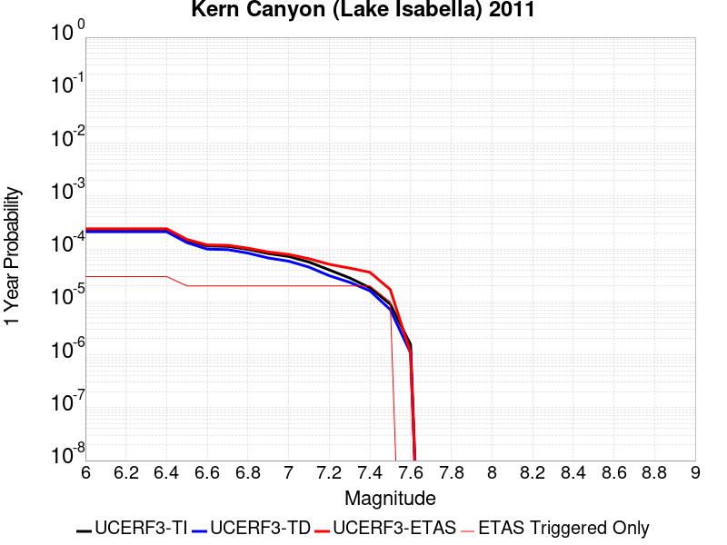 |  |

| Magnitude | 1 wk TI Prob | 1 wk TD Prob | 1 wk ETAS Prob | 1 wk ETAS/TD Gain | 1 wk ETAS Triggered Only | 1 mo TI Prob | 1 mo TD Prob | 1 mo ETAS Prob | 1 mo ETAS/TD Gain | 1 mo ETAS Triggered Only | 1 yr TI Prob | 1 yr TD Prob | 1 yr ETAS Prob | 1 yr ETAS/TD Gain | 1 yr ETAS Triggered Only | 10 yr TI Prob | 10 yr TD Prob | 10 yr ETAS Prob | 10 yr ETAS/TD Gain | 10 yr ETAS Triggered Only |
|-----|-----|-----|-----|-----|-----|-----|-----|-----|-----|-----|-----|-----|-----|-----|-----|-----|-----|-----|-----|-----|
| 6.0 | 4.276404E-6 | 4.041894E-6 | 2.4041814E-5 | 5.9481554 | 2.0E-5 | 1.8327319E-5 | 1.73223E-5 | 3.7321952E-5 | 2.154561 | 2.0E-5 | 2.2311225E-4 | 2.1088055E-4 | 2.4087421E-4 | 1.1422306 | 3.0E-5 | 0.0022288838 | 0.0021069979 | 0.0021469137 | 1.0189444 | 4.0E-5 |
| 6.1 | 4.276404E-6 | 4.041894E-6 | 2.4041814E-5 | 5.9481554 | 2.0E-5 | 1.8327319E-5 | 1.73223E-5 | 3.7321952E-5 | 2.154561 | 2.0E-5 | 2.2311225E-4 | 2.1088055E-4 | 2.4087421E-4 | 1.1422306 | 3.0E-5 | 0.0022288838 | 0.0021069979 | 0.0021469137 | 1.0189444 | 4.0E-5 |
| 6.2 | 4.276404E-6 | 4.041894E-6 | 2.4041814E-5 | 5.9481554 | 2.0E-5 | 1.8327319E-5 | 1.73223E-5 | 3.7321952E-5 | 2.154561 | 2.0E-5 | 2.2311225E-4 | 2.1088055E-4 | 2.4087421E-4 | 1.1422306 | 3.0E-5 | 0.0022288838 | 0.0021069979 | 0.0021469137 | 1.0189444 | 4.0E-5 |
| 6.3 | 4.276404E-6 | 4.041894E-6 | 2.4041814E-5 | 5.9481554 | 2.0E-5 | 1.8327319E-5 | 1.73223E-5 | 3.7321952E-5 | 2.154561 | 2.0E-5 | 2.2311225E-4 | 2.1088055E-4 | 2.4087421E-4 | 1.1422306 | 3.0E-5 | 0.0022288838 | 0.0021069979 | 0.0021469137 | 1.0189444 | 4.0E-5 |
| 6.4 | 4.276404E-6 | 4.041894E-6 | 2.4041814E-5 | 5.9481554 | 2.0E-5 | 1.8327319E-5 | 1.73223E-5 | 3.7321952E-5 | 2.154561 | 2.0E-5 | 2.2311225E-4 | 2.1088055E-4 | 2.4087421E-4 | 1.1422306 | 3.0E-5 | 0.0022288838 | 0.0021069979 | 0.0021469137 | 1.0189444 | 4.0E-5 |
| 6.5 | 2.7834642E-6 | 2.5171992E-6 | 1.2517174E-5 | 4.9726596 | 1.0E-5 | 1.1929078E-5 | 1.0787954E-5 | 2.0787846E-5 | 1.9269499 | 1.0E-5 | 1.4522683E-4 | 1.3133576E-4 | 1.5133314E-4 | 1.1522615 | 2.0E-5 | 0.0014513197 | 0.0013126148 | 0.0013425754 | 1.0228251 | 3.0E-5 |
| 6.6 | 2.1801118E-6 | 1.9017099E-6 | 1.190169E-5 | 6.2584157 | 1.0E-5 | 9.343303E-6 | 8.15016E-6 | 1.8150078E-5 | 2.2269597 | 1.0E-5 | 1.1374877E-4 | 9.922376E-5 | 1.19221775E-4 | 1.2015446 | 2.0E-5 | 0.0011369056 | 9.918024E-4 | 0.0010117826 | 1.0201453 | 2.0E-5 |
| 6.7 | 2.1411283E-6 | 1.8622139E-6 | 1.1862196E-5 | 6.369942 | 1.0E-5 | 9.176232E-6 | 7.980892E-6 | 1.7980812E-5 | 2.2529826 | 1.0E-5 | 1.1171489E-4 | 9.7163116E-5 | 1.1716117E-4 | 1.2058195 | 2.0E-5 | 0.0011165875 | 9.71214E-4 | 9.911945E-4 | 1.0205728 | 2.0E-5 |
| 6.8 | 1.8827939E-6 | 1.5990984E-6 | 1.1599082E-5 | 7.2535143 | 1.0E-5 | 8.069092E-6 | 6.853261E-6 | 1.6853191E-5 | 2.4591494 | 1.0E-5 | 9.823676E-5 | 8.3435305E-5 | 1.0343364E-4 | 1.2396867 | 2.0E-5 | 9.819334E-4 | 8.3404494E-4 | 8.540283E-4 | 1.0239595 | 2.0E-5 |
| 6.9 | 1.5665586E-6 | 1.2936007E-6 | 1.1293588E-5 | 8.730351 | 1.0E-5 | 6.713805E-6 | 5.543991E-6 | 1.5543936E-5 | 2.8037448 | 1.0E-5 | 8.173751E-5 | 6.7496025E-5 | 8.749468E-5 | 1.2962937 | 2.0E-5 | 8.170745E-4 | 6.747579E-4 | 6.9474435E-4 | 1.0296203 | 2.0E-5 |
| 7.0 | 1.383846E-6 | 1.125403E-6 | 1.1125392E-5 | 9.885695 | 1.0E-5 | 5.9307554E-6 | 4.823147E-6 | 1.4823098E-5 | 3.0733252 | 1.0E-5 | 7.220455E-5 | 5.8720252E-5 | 7.871907E-5 | 1.340578 | 2.0E-5 | 7.2181097E-4 | 5.8704935E-4 | 6.070376E-4 | 1.0340487 | 2.0E-5 |
| 7.1 | 1.083895E-6 | 8.6945136E-7 | 1.0869443E-5 | 12.501496 | 1.0E-5 | 4.645256E-6 | 3.7262148E-6 | 1.3726178E-5 | 3.6836784 | 1.0E-5 | 5.6554523E-5 | 4.5365734E-5 | 6.5364824E-5 | 1.4408413 | 2.0E-5 | 5.6540134E-4 | 4.5356597E-4 | 4.735569E-4 | 1.044075 | 2.0E-5 |
| 7.2 | 7.6944247E-7 | 5.9841324E-7 | 1.0598407E-5 | 17.71085 | 1.0E-5 | 3.2976063E-6 | 2.5646257E-6 | 1.25646E-5 | 4.8991947 | 1.0E-5 | 4.0147617E-5 | 3.1223877E-5 | 5.122325E-5 | 1.6405154 | 2.0E-5 | 4.0140364E-4 | 3.121955E-4 | 3.3218926E-4 | 1.0640424 | 2.0E-5 |
| 7.3 | 5.4270726E-7 | 4.4911025E-7 | 1.04491055E-5 | 23.266237 | 1.0E-5 | 2.325886E-6 | 1.9247568E-6 | 1.1924738E-5 | 6.1954513 | 1.0E-5 | 2.8317294E-5 | 2.3433666E-5 | 4.34332E-5 | 1.8534529 | 2.0E-5 | 2.8313688E-4 | 2.3431238E-4 | 2.543077E-4 | 1.0853361 | 2.0E-5 |
| 7.4 | 3.5452044E-7 | 3.1000187E-7 | 1.0309999E-5 | 33.25786 | 1.0E-5 | 1.5193724E-6 | 1.3285788E-6 | 1.1328565E-5 | 8.52683 | 1.0E-5 | 1.8498202E-5 | 1.6175329E-5 | 3.6175006E-5 | 2.236431 | 2.0E-5 | 1.8496662E-4 | 1.6174177E-4 | 1.8173855E-4 | 1.1236339 | 2.0E-5 |
| 7.5 | 1.7308463E-7 | 1.3673852E-7 | 1.0136737E-5 | 74.13227 | 1.0E-5 | 7.4179104E-7 | 5.860221E-7 | 1.0586016E-5 | 18.064192 | 1.0E-5 | 9.031269E-6 | 7.1347968E-6 | 1.7134726E-5 | 2.4015715 | 1.0E-5 | 9.030902E-5 | 7.134578E-5 | 8.134506E-5 | 1.1401525 | 1.0E-5 |
| 7.6 | 2.9996215E-8 | 2.0812486E-8 | 2.0812486E-8 | 1.0 | 0.0 | 1.285552E-7 | 8.919636E-8 | 8.919636E-8 | 1.0 | 0.0 | 1.5651584E-6 | 1.0859653E-6 | 1.0859653E-6 | 1.0 | 0.0 | 1.5651474E-5 | 1.0859609E-5 | 1.0859609E-5 | 1.0 | 0.0 |

## East Huasna 2011 CFM
*[(top)](#table-of-contents)*

| 1 Week | 1 Month | 1 Year | 10 Year |
|-----|-----|-----|-----|
| 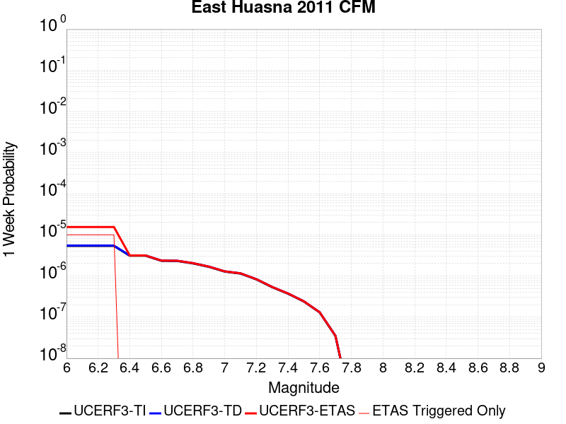 |  | 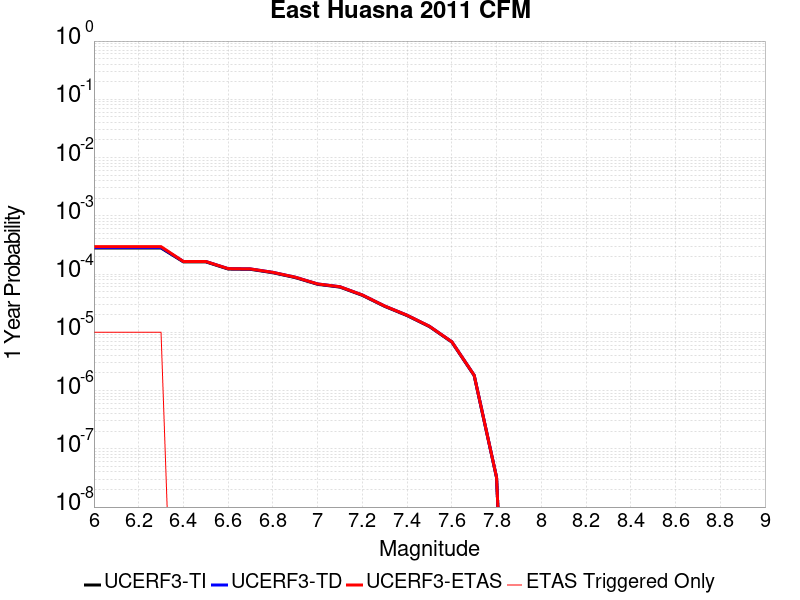 |  |

| Magnitude | 1 wk TI Prob | 1 wk TD Prob | 1 wk ETAS Prob | 1 wk ETAS/TD Gain | 1 wk ETAS Triggered Only | 1 mo TI Prob | 1 mo TD Prob | 1 mo ETAS Prob | 1 mo ETAS/TD Gain | 1 mo ETAS Triggered Only | 1 yr TI Prob | 1 yr TD Prob | 1 yr ETAS Prob | 1 yr ETAS/TD Gain | 1 yr ETAS Triggered Only | 10 yr TI Prob | 10 yr TD Prob | 10 yr ETAS Prob | 10 yr ETAS/TD Gain | 10 yr ETAS Triggered Only |
|-----|-----|-----|-----|-----|-----|-----|-----|-----|-----|-----|-----|-----|-----|-----|-----|-----|-----|-----|-----|-----|
| 6.0 | 5.3724816E-6 | 5.473069E-6 | 1.5473015E-5 | 2.8271184 | 1.0E-5 | 2.3024719E-5 | 2.3455825E-5 | 3.3455588E-5 | 1.4263233 | 1.0E-5 | 2.8028988E-4 | 2.8554152E-4 | 2.955387E-4 | 1.0350112 | 1.0E-5 | 0.0027993661 | 0.0028521693 | 0.002892055 | 1.0139844 | 4.0E-5 |
| 6.1 | 5.3724816E-6 | 5.473069E-6 | 1.5473015E-5 | 2.8271184 | 1.0E-5 | 2.3024719E-5 | 2.3455825E-5 | 3.3455588E-5 | 1.4263233 | 1.0E-5 | 2.8028988E-4 | 2.8554152E-4 | 2.955387E-4 | 1.0350112 | 1.0E-5 | 0.0027993661 | 0.0028521693 | 0.002892055 | 1.0139844 | 4.0E-5 |
| 6.2 | 5.3724816E-6 | 5.473069E-6 | 1.5473015E-5 | 2.8271184 | 1.0E-5 | 2.3024719E-5 | 2.3455825E-5 | 3.3455588E-5 | 1.4263233 | 1.0E-5 | 2.8028988E-4 | 2.8554152E-4 | 2.955387E-4 | 1.0350112 | 1.0E-5 | 0.0027993661 | 0.0028521693 | 0.002892055 | 1.0139844 | 4.0E-5 |
| 6.3 | 5.3724816E-6 | 5.473069E-6 | 1.5473015E-5 | 2.8271184 | 1.0E-5 | 2.3024719E-5 | 2.3455825E-5 | 3.3455588E-5 | 1.4263233 | 1.0E-5 | 2.8028988E-4 | 2.8554152E-4 | 2.955387E-4 | 1.0350112 | 1.0E-5 | 0.0027993661 | 0.0028521693 | 0.002892055 | 1.0139844 | 4.0E-5 |
| 6.4 | 3.1041432E-6 | 3.154191E-6 | 3.154191E-6 | 1.0 | 0.0 | 1.3303403E-5 | 1.3517893E-5 | 1.3517893E-5 | 1.0 | 0.0 | 1.619569E-4 | 1.6456835E-4 | 1.6456835E-4 | 1.0 | 0.0 | 0.001618389 | 0.0016445065 | 0.0016544901 | 1.0060709 | 1.0E-5 |
| 6.5 | 3.1041432E-6 | 3.154191E-6 | 3.154191E-6 | 1.0 | 0.0 | 1.3303403E-5 | 1.3517893E-5 | 1.3517893E-5 | 1.0 | 0.0 | 1.619569E-4 | 1.6456835E-4 | 1.6456835E-4 | 1.0 | 0.0 | 0.001618389 | 0.0016445065 | 0.0016544901 | 1.0060709 | 1.0E-5 |
| 6.6 | 2.3388675E-6 | 2.3749615E-6 | 2.3749615E-6 | 1.0 | 0.0 | 1.0023679E-5 | 1.0178367E-5 | 1.0178367E-5 | 1.0 | 0.0 | 1.2203146E-4 | 1.2391471E-4 | 1.2391471E-4 | 1.0 | 0.0 | 0.0012196447 | 0.0012384695 | 0.0012384695 | 1.0 | 0.0 |
| 6.7 | 2.3116197E-6 | 2.3472292E-6 | 2.3472292E-6 | 1.0 | 0.0 | 9.906904E-6 | 1.0059515E-5 | 1.0059515E-5 | 1.0 | 0.0 | 1.2060988E-4 | 1.2246784E-4 | 1.2246784E-4 | 1.0 | 0.0 | 0.0012054445 | 0.0012240169 | 0.0012240169 | 1.0 | 0.0 |
| 6.8 | 2.0203172E-6 | 2.051027E-6 | 2.051027E-6 | 1.0 | 0.0 | 8.658473E-6 | 8.790086E-6 | 8.790086E-6 | 1.0 | 0.0 | 1.0541182E-4 | 1.07014144E-4 | 1.07014144E-4 | 1.0 | 0.0 | 0.0010536183 | 0.001069636 | 0.001069636 | 1.0 | 0.0 |
| 6.9 | 1.6676634E-6 | 1.6926896E-6 | 1.6926896E-6 | 1.0 | 0.0 | 7.147109E-6 | 7.254364E-6 | 7.254364E-6 | 1.0 | 0.0 | 8.701258E-5 | 8.831835E-5 | 8.831835E-5 | 1.0 | 0.0 | 8.697852E-4 | 8.8283763E-4 | 8.8283763E-4 | 1.0 | 0.0 |
| 7.0 | 1.2786935E-6 | 1.2979492E-6 | 1.2979492E-6 | 1.0 | 0.0 | 5.4801035E-6 | 5.562628E-6 | 5.562628E-6 | 1.0 | 0.0 | 6.671822E-5 | 6.772291E-5 | 6.772291E-5 | 1.0 | 0.0 | 6.6698185E-4 | 6.770251E-4 | 6.770251E-4 | 1.0 | 0.0 |
| 7.1 | 1.1438449E-6 | 1.1609362E-6 | 1.1609362E-6 | 1.0 | 0.0 | 4.9021833E-6 | 4.9754317E-6 | 4.9754317E-6 | 1.0 | 0.0 | 5.9682447E-5 | 6.0574217E-5 | 6.0574217E-5 | 1.0 | 0.0 | 5.966642E-4 | 6.055792E-4 | 6.055792E-4 | 1.0 | 0.0 |
| 7.2 | 8.2663837E-7 | 8.3867377E-7 | 8.3867377E-7 | 1.0 | 0.0 | 3.542731E-6 | 3.5943112E-6 | 3.5943112E-6 | 1.0 | 0.0 | 4.3131895E-5 | 4.375987E-5 | 4.375987E-5 | 1.0 | 0.0 | 4.3123527E-4 | 4.3751308E-4 | 4.3751308E-4 | 1.0 | 0.0 |
| 7.3 | 5.3435645E-7 | 5.416944E-7 | 5.416944E-7 | 1.0 | 0.0 | 2.290097E-6 | 2.3215455E-6 | 2.3215455E-6 | 1.0 | 0.0 | 2.7881573E-5 | 2.8264449E-5 | 2.8264449E-5 | 1.0 | 0.0 | 2.7878076E-4 | 2.8260867E-4 | 2.8260867E-4 | 1.0 | 0.0 |
| 7.4 | 3.7156173E-7 | 3.768427E-7 | 3.768427E-7 | 1.0 | 0.0 | 1.5924064E-6 | 1.6150391E-6 | 1.6150391E-6 | 1.0 | 0.0 | 1.9387377E-5 | 1.9662924E-5 | 1.9662924E-5 | 1.0 | 0.0 | 1.9385685E-4 | 1.966119E-4 | 1.966119E-4 | 1.0 | 0.0 |
| 7.5 | 2.402112E-7 | 2.4330706E-7 | 2.4330706E-7 | 1.0 | 0.0 | 1.0294762E-6 | 1.0427441E-6 | 1.0427441E-6 | 1.0 | 0.0 | 1.25338E-5 | 1.26953355E-5 | 1.26953355E-5 | 1.0 | 0.0 | 1.2533093E-4 | 1.2694612E-4 | 1.2694612E-4 | 1.0 | 0.0 |
| 7.6 | 1.3044595E-7 | 1.3205553E-7 | 1.3205553E-7 | 1.0 | 0.0 | 5.5905394E-7 | 5.659521E-7 | 5.659521E-7 | 1.0 | 0.0 | 6.8064605E-6 | 6.8904455E-6 | 6.8904455E-6 | 1.0 | 0.0 | 6.806252E-5 | 6.890233E-5 | 6.890233E-5 | 1.0 | 0.0 |
| 7.7 | 3.4731823E-8 | 3.509054E-8 | 3.509054E-8 | 1.0 | 0.0 | 1.4885066E-7 | 1.5038802E-7 | 1.5038802E-7 | 1.0 | 0.0 | 1.8122552E-6 | 1.8309726E-6 | 1.8309726E-6 | 1.0 | 0.0 | 1.8122404E-5 | 1.8309578E-5 | 1.8309578E-5 | 1.0 | 0.0 |
| 7.8 | 6.1620986E-10 | 6.234224E-10 | 6.234224E-10 | 1.0 | 0.0 | 2.6408993E-9 | 2.6718108E-9 | 2.6718108E-9 | 1.0 | 0.0 | 3.2152947E-8 | 3.2529297E-8 | 3.2529297E-8 | 1.0 | 0.0 | 3.2152943E-7 | 3.2529294E-7 | 3.2529294E-7 | 1.0 | 0.0 |

## Emerson-Copper Mtn 2011
*[(top)](#table-of-contents)*

| 1 Week | 1 Month | 1 Year | 10 Year |
|-----|-----|-----|-----|
| 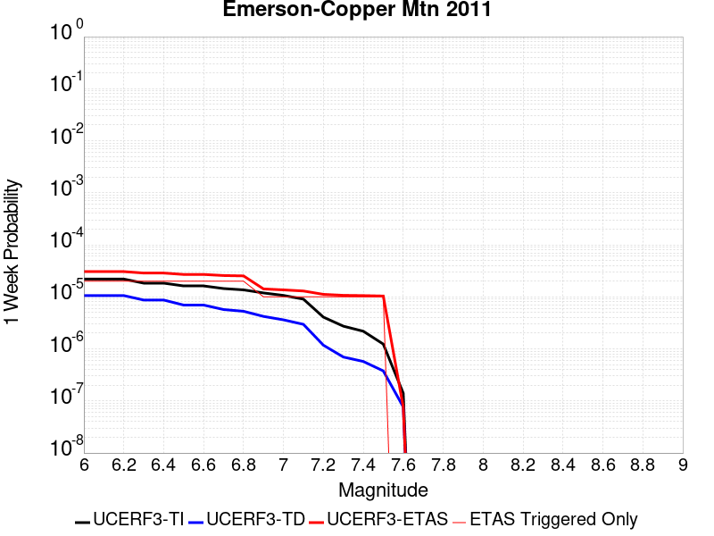 |  |  |  |

| Magnitude | 1 wk TI Prob | 1 wk TD Prob | 1 wk ETAS Prob | 1 wk ETAS/TD Gain | 1 wk ETAS Triggered Only | 1 mo TI Prob | 1 mo TD Prob | 1 mo ETAS Prob | 1 mo ETAS/TD Gain | 1 mo ETAS Triggered Only | 1 yr TI Prob | 1 yr TD Prob | 1 yr ETAS Prob | 1 yr ETAS/TD Gain | 1 yr ETAS Triggered Only | 10 yr TI Prob | 10 yr TD Prob | 10 yr ETAS Prob | 10 yr ETAS/TD Gain | 10 yr ETAS Triggered Only |
|-----|-----|-----|-----|-----|-----|-----|-----|-----|-----|-----|-----|-----|-----|-----|-----|-----|-----|-----|-----|-----|
| 6.0 | 2.197286E-5 | 1.0591734E-5 | 3.0591524E-5 | 2.8882449 | 2.0E-5 | 9.4166004E-5 | 4.5392408E-5 | 7.539105E-5 | 1.6608734 | 3.0E-5 | 0.0011458681 | 5.5252167E-4 | 5.825051E-4 | 1.0542666 | 3.0E-5 | 0.011399775 | 0.005512401 | 0.0055521806 | 1.0072163 | 4.0E-5 |
| 6.1 | 2.197286E-5 | 1.0591734E-5 | 3.0591524E-5 | 2.8882449 | 2.0E-5 | 9.4166004E-5 | 4.5392408E-5 | 7.539105E-5 | 1.6608734 | 3.0E-5 | 0.0011458681 | 5.5252167E-4 | 5.825051E-4 | 1.0542666 | 3.0E-5 | 0.011399775 | 0.005512401 | 0.0055521806 | 1.0072163 | 4.0E-5 |
| 6.2 | 2.197286E-5 | 1.0591734E-5 | 3.0591524E-5 | 2.8882449 | 2.0E-5 | 9.4166004E-5 | 4.5392408E-5 | 7.539105E-5 | 1.6608734 | 3.0E-5 | 0.0011458681 | 5.5252167E-4 | 5.825051E-4 | 1.0542666 | 3.0E-5 | 0.011399775 | 0.005512401 | 0.0055521806 | 1.0072163 | 4.0E-5 |
| 6.3 | 1.8353327E-5 | 8.688573E-6 | 2.8688399E-5 | 3.301854 | 2.0E-5 | 7.865474E-5 | 3.7236245E-5 | 6.723513E-5 | 1.8056366 | 3.0E-5 | 9.572007E-4 | 4.5326335E-4 | 4.8324975E-4 | 1.0661567 | 3.0E-5 | 0.009530881 | 0.0045240205 | 0.004563839 | 1.0088017 | 4.0E-5 |
| 6.4 | 1.8353327E-5 | 8.688573E-6 | 2.8688399E-5 | 3.301854 | 2.0E-5 | 7.865474E-5 | 3.7236245E-5 | 6.723513E-5 | 1.8056366 | 3.0E-5 | 9.572007E-4 | 4.5326335E-4 | 4.8324975E-4 | 1.0661567 | 3.0E-5 | 0.009530881 | 0.0045240205 | 0.004563839 | 1.0088017 | 4.0E-5 |
| 6.5 | 1.6230064E-5 | 6.9603016E-6 | 2.6960162E-5 | 3.8734186 | 2.0E-5 | 6.9555565E-5 | 2.9829547E-5 | 5.9828653E-5 | 2.0056841 | 3.0E-5 | 8.4650994E-4 | 3.631183E-4 | 3.931074E-4 | 1.0825877 | 3.0E-5 | 0.008432927 | 0.0036256548 | 0.0036655099 | 1.0109925 | 4.0E-5 |
| 6.6 | 1.6230064E-5 | 6.9603016E-6 | 2.6960162E-5 | 3.8734186 | 2.0E-5 | 6.9555565E-5 | 2.9829547E-5 | 5.9828653E-5 | 2.0056841 | 3.0E-5 | 8.4650994E-4 | 3.631183E-4 | 3.931074E-4 | 1.0825877 | 3.0E-5 | 0.008432927 | 0.0036256548 | 0.0036655099 | 1.0109925 | 4.0E-5 |
| 6.7 | 1.4444222E-5 | 5.7067127E-6 | 2.5706599E-5 | 4.504625 | 2.0E-5 | 6.190234E-5 | 2.445713E-5 | 5.4456395E-5 | 2.2266061 | 3.0E-5 | 7.534004E-4 | 2.9772802E-4 | 3.2771908E-4 | 1.1007332 | 3.0E-5 | 0.007508512 | 0.0029736056 | 0.0030134867 | 1.0134116 | 4.0E-5 |
| 6.8 | 1.3629452E-5 | 5.2855826E-6 | 2.5285477E-5 | 4.783858 | 2.0E-5 | 5.841063E-5 | 2.2652319E-5 | 5.2651638E-5 | 2.3243377 | 3.0E-5 | 7.109174E-4 | 2.7576016E-4 | 3.057519E-4 | 1.1087602 | 3.0E-5 | 0.0070864735 | 0.0027544857 | 0.0027943756 | 1.0144818 | 4.0E-5 |
| 6.9 | 1.19010965E-5 | 4.2112006E-6 | 1.42111585E-5 | 3.3746097 | 1.0E-5 | 5.1003703E-5 | 1.8047893E-5 | 3.8047532E-5 | 2.1081426 | 2.0E-5 | 6.2079314E-4 | 2.1971349E-4 | 2.397091E-4 | 1.0910076 | 2.0E-5 | 0.006190618 | 0.0021952146 | 0.0022151708 | 1.0090908 | 2.0E-5 |
| 7.0 | 1.065814E-5 | 3.6182178E-6 | 1.3618182E-5 | 3.7637818 | 1.0E-5 | 4.5676945E-5 | 1.5506568E-5 | 3.550626E-5 | 2.289756 | 2.0E-5 | 5.559749E-4 | 1.8877849E-4 | 2.0877471E-4 | 1.1059242 | 2.0E-5 | 0.0055458597 | 0.0018864147 | 0.0019063769 | 1.0105821 | 2.0E-5 |
| 7.1 | 9.044577E-6 | 2.965185E-6 | 1.2965155E-5 | 4.372461 | 1.0E-5 | 3.8761897E-5 | 1.27078865E-5 | 3.2707634E-5 | 2.5738058 | 2.0E-5 | 4.718239E-4 | 1.5470979E-4 | 1.747067E-4 | 1.1292543 | 2.0E-5 | 0.0047082338 | 0.0015462432 | 0.0015662123 | 1.0129145 | 2.0E-5 |
| 7.2 | 4.0793743E-6 | 1.17871E-6 | 1.11786985E-5 | 9.483841 | 1.0E-5 | 1.7482917E-5 | 5.051605E-6 | 2.5051504E-5 | 4.9591174 | 2.0E-5 | 2.1283372E-4 | 6.1501625E-5 | 8.1500395E-5 | 1.3251747 | 2.0E-5 | 0.0021263 | 6.148528E-4 | 6.348405E-4 | 1.0325081 | 2.0E-5 |
| 7.3 | 2.7348851E-6 | 6.9796977E-7 | 1.0697962E-5 | 15.327258 | 1.0E-5 | 1.1720884E-5 | 2.9912958E-6 | 2.2991237E-5 | 7.6860456 | 2.0E-5 | 1.4269241E-4 | 3.6418427E-5 | 5.64177E-5 | 1.5491525 | 2.0E-5 | 0.0014260082 | 3.641256E-4 | 3.841183E-4 | 1.0549061 | 2.0E-5 |
| 7.4 | 2.1845249E-6 | 5.736439E-7 | 1.0573638E-5 | 18.432407 | 1.0E-5 | 9.362217E-6 | 2.4584715E-6 | 2.2458422E-5 | 9.135116 | 2.0E-5 | 1.1397902E-4 | 2.9931487E-5 | 4.9930888E-5 | 1.6681726 | 2.0E-5 | 0.0011392058 | 2.992752E-4 | 3.1926922E-4 | 1.0668081 | 2.0E-5 |
| 7.5 | 1.2376645E-6 | 3.7789232E-7 | 1.0377888E-5 | 27.462555 | 1.0E-5 | 5.3042654E-6 | 1.6195374E-6 | 2.1619506E-5 | 13.349185 | 2.0E-5 | 6.457752E-5 | 1.9717696E-5 | 3.9717303E-5 | 2.0142972 | 2.0E-5 | 6.4558757E-4 | 1.9716001E-4 | 2.1715608E-4 | 1.1014204 | 2.0E-5 |
| 7.6 | 1.4118889E-7 | 7.687433E-8 | 7.687433E-8 | 1.0 | 0.0 | 6.050951E-7 | 3.294614E-7 | 3.294614E-7 | 1.0 | 0.0 | 7.367008E-6 | 4.0111872E-6 | 4.0111872E-6 | 1.0 | 0.0 | 7.366764E-5 | 4.011134E-5 | 4.011134E-5 | 1.0 | 0.0 |

## Puente Hills (LA)
*[(top)](#table-of-contents)*

| 1 Week | 1 Month | 1 Year | 10 Year |
|-----|-----|-----|-----|
|  |  |  |  |

| Magnitude | 1 wk TI Prob | 1 wk TD Prob | 1 wk ETAS Prob | 1 wk ETAS/TD Gain | 1 wk ETAS Triggered Only | 1 mo TI Prob | 1 mo TD Prob | 1 mo ETAS Prob | 1 mo ETAS/TD Gain | 1 mo ETAS Triggered Only | 1 yr TI Prob | 1 yr TD Prob | 1 yr ETAS Prob | 1 yr ETAS/TD Gain | 1 yr ETAS Triggered Only | 10 yr TI Prob | 10 yr TD Prob | 10 yr ETAS Prob | 10 yr ETAS/TD Gain | 10 yr ETAS Triggered Only |
|-----|-----|-----|-----|-----|-----|-----|-----|-----|-----|-----|-----|-----|-----|-----|-----|-----|-----|-----|-----|-----|
| 6.0 | 6.9051043E-6 | 7.29696E-6 | 7.29696E-6 | 1.0 | 0.0 | 2.959297E-5 | 3.1272382E-5 | 5.1271756E-5 | 1.639522 | 2.0E-5 | 3.6023482E-4 | 3.8068718E-4 | 4.1067577E-4 | 1.0787748 | 3.0E-5 | 0.0035965142 | 0.003801576 | 0.003841424 | 1.010482 | 4.0E-5 |
| 6.1 | 6.9051043E-6 | 7.29696E-6 | 7.29696E-6 | 1.0 | 0.0 | 2.959297E-5 | 3.1272382E-5 | 5.1271756E-5 | 1.639522 | 2.0E-5 | 3.6023482E-4 | 3.8068718E-4 | 4.1067577E-4 | 1.0787748 | 3.0E-5 | 0.0035965142 | 0.003801576 | 0.003841424 | 1.010482 | 4.0E-5 |
| 6.2 | 6.9051043E-6 | 7.29696E-6 | 7.29696E-6 | 1.0 | 0.0 | 2.959297E-5 | 3.1272382E-5 | 5.1271756E-5 | 1.639522 | 2.0E-5 | 3.6023482E-4 | 3.8068718E-4 | 4.1067577E-4 | 1.0787748 | 3.0E-5 | 0.0035965142 | 0.003801576 | 0.003841424 | 1.010482 | 4.0E-5 |
| 6.3 | 6.9051043E-6 | 7.29696E-6 | 7.29696E-6 | 1.0 | 0.0 | 2.959297E-5 | 3.1272382E-5 | 5.1271756E-5 | 1.639522 | 2.0E-5 | 3.6023482E-4 | 3.8068718E-4 | 4.1067577E-4 | 1.0787748 | 3.0E-5 | 0.0035965142 | 0.003801576 | 0.003841424 | 1.010482 | 4.0E-5 |
| 6.4 | 6.9051043E-6 | 7.29696E-6 | 7.29696E-6 | 1.0 | 0.0 | 2.959297E-5 | 3.1272382E-5 | 5.1271756E-5 | 1.639522 | 2.0E-5 | 3.6023482E-4 | 3.8068718E-4 | 4.1067577E-4 | 1.0787748 | 3.0E-5 | 0.0035965142 | 0.003801576 | 0.003841424 | 1.010482 | 4.0E-5 |
| 6.5 | 6.9051043E-6 | 7.29696E-6 | 7.29696E-6 | 1.0 | 0.0 | 2.959297E-5 | 3.1272382E-5 | 5.1271756E-5 | 1.639522 | 2.0E-5 | 3.6023482E-4 | 3.8068718E-4 | 4.1067577E-4 | 1.0787748 | 3.0E-5 | 0.0035965142 | 0.003801576 | 0.003841424 | 1.010482 | 4.0E-5 |
| 6.6 | 6.9051043E-6 | 7.29696E-6 | 7.29696E-6 | 1.0 | 0.0 | 2.959297E-5 | 3.1272382E-5 | 5.1271756E-5 | 1.639522 | 2.0E-5 | 3.6023482E-4 | 3.8068718E-4 | 4.1067577E-4 | 1.0787748 | 3.0E-5 | 0.0035965142 | 0.003801576 | 0.003841424 | 1.010482 | 4.0E-5 |
| 6.7 | 6.9051043E-6 | 7.29696E-6 | 7.29696E-6 | 1.0 | 0.0 | 2.959297E-5 | 3.1272382E-5 | 5.1271756E-5 | 1.639522 | 2.0E-5 | 3.6023482E-4 | 3.8068718E-4 | 4.1067577E-4 | 1.0787748 | 3.0E-5 | 0.0035965142 | 0.003801576 | 0.003841424 | 1.010482 | 4.0E-5 |
| 6.8 | 6.9051043E-6 | 7.29696E-6 | 7.29696E-6 | 1.0 | 0.0 | 2.959297E-5 | 3.1272382E-5 | 5.1271756E-5 | 1.639522 | 2.0E-5 | 3.6023482E-4 | 3.8068718E-4 | 4.1067577E-4 | 1.0787748 | 3.0E-5 | 0.0035965142 | 0.003801576 | 0.003841424 | 1.010482 | 4.0E-5 |
| 6.9 | 5.9435574E-6 | 6.282599E-6 | 6.282599E-6 | 1.0 | 0.0 | 2.547214E-5 | 2.6925209E-5 | 3.692494E-5 | 1.3713892 | 1.0E-5 | 3.1007917E-4 | 3.2777627E-4 | 3.4776973E-4 | 1.0609972 | 2.0E-5 | 0.0030964685 | 0.0032740263 | 0.0032939608 | 1.0060887 | 2.0E-5 |
| 7.0 | 3.0500426E-6 | 3.2026705E-6 | 3.2026705E-6 | 1.0 | 0.0 | 1.3071545E-5 | 1.3725666E-5 | 1.3725666E-5 | 1.0 | 0.0 | 1.5913445E-4 | 1.6709846E-4 | 1.770968E-4 | 1.059835 | 1.0E-5 | 0.0015902054 | 0.0016698559 | 0.0016798392 | 1.0059786 | 1.0E-5 |
| 7.1 | 2.2366087E-6 | 2.3349544E-6 | 2.3349544E-6 | 1.0 | 0.0 | 9.58543E-6 | 1.0006914E-5 | 1.0006914E-5 | 1.0 | 0.0 | 1.1669636E-4 | 1.2182811E-4 | 1.3182689E-4 | 1.0820729 | 1.0E-5 | 0.001166351 | 0.0012176866 | 0.0012276743 | 1.0082023 | 1.0E-5 |
| 7.2 | 1.4126729E-6 | 1.4483554E-6 | 1.4483554E-6 | 1.0 | 0.0 | 6.054298E-6 | 6.207223E-6 | 6.207223E-6 | 1.0 | 0.0 | 7.370859E-5 | 7.557036E-5 | 7.557036E-5 | 1.0 | 0.0 | 7.368414E-4 | 7.554507E-4 | 7.554507E-4 | 1.0 | 0.0 |
| 7.3 | 1.3054571E-6 | 1.338587E-6 | 1.338587E-6 | 1.0 | 0.0 | 5.594804E-6 | 5.736789E-6 | 5.736789E-6 | 1.0 | 0.0 | 6.811461E-5 | 6.9843205E-5 | 6.9843205E-5 | 1.0 | 0.0 | 6.809374E-4 | 6.982165E-4 | 6.982165E-4 | 1.0 | 0.0 |
| 7.4 | 1.1311856E-6 | 1.1559703E-6 | 1.1559703E-6 | 1.0 | 0.0 | 4.847929E-6 | 4.954149E-6 | 4.954149E-6 | 1.0 | 0.0 | 5.902194E-5 | 6.031513E-5 | 6.031513E-5 | 1.0 | 0.0 | 5.9006264E-4 | 6.029909E-4 | 6.029909E-4 | 1.0 | 0.0 |
| 7.5 | 8.5012414E-7 | 8.619463E-7 | 8.619463E-7 | 1.0 | 0.0 | 3.643384E-6 | 3.6940507E-6 | 3.6940507E-6 | 1.0 | 0.0 | 4.4357297E-5 | 4.4974167E-5 | 4.4974167E-5 | 1.0 | 0.0 | 4.4348446E-4 | 4.4965337E-4 | 4.4965337E-4 | 1.0 | 0.0 |
| 7.6 | 7.028022E-7 | 7.078943E-7 | 7.078943E-7 | 1.0 | 0.0 | 3.0120061E-6 | 3.0338292E-6 | 3.0338292E-6 | 1.0 | 0.0 | 3.6670557E-5 | 3.693627E-5 | 3.693627E-5 | 1.0 | 0.0 | 3.6664505E-4 | 3.6930395E-4 | 3.6930395E-4 | 1.0 | 0.0 |
| 7.7 | 3.1437048E-7 | 3.2069173E-7 | 3.2069173E-7 | 1.0 | 0.0 | 1.3473015E-6 | 1.3743925E-6 | 1.3743925E-6 | 1.0 | 0.0 | 1.6403272E-5 | 1.673311E-5 | 1.673311E-5 | 1.0 | 0.0 | 1.640206E-4 | 1.6731965E-4 | 1.6731965E-4 | 1.0 | 0.0 |
| 7.8 | 1.1591451E-7 | 1.18721275E-7 | 1.18721275E-7 | 1.0 | 0.0 | 4.967764E-7 | 5.088054E-7 | 5.088054E-7 | 1.0 | 0.0 | 6.0482357E-6 | 6.194697E-6 | 6.194697E-6 | 1.0 | 0.0 | 6.048071E-5 | 6.194612E-5 | 6.194612E-5 | 1.0 | 0.0 |

## Los Osos 2011
*[(top)](#table-of-contents)*

| 1 Week | 1 Month | 1 Year | 10 Year |
|-----|-----|-----|-----|
| 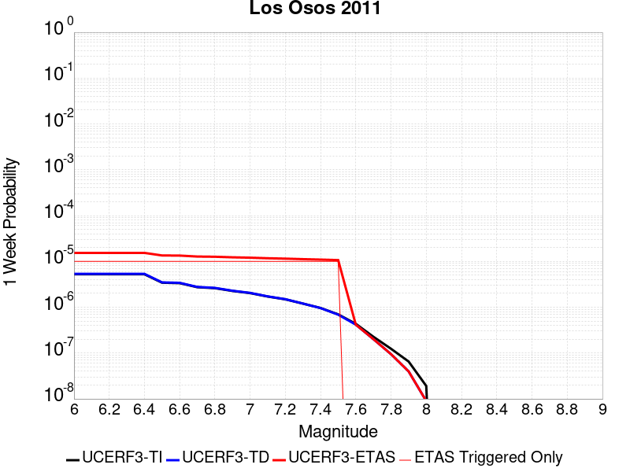 |  |  |  |

| Magnitude | 1 wk TI Prob | 1 wk TD Prob | 1 wk ETAS Prob | 1 wk ETAS/TD Gain | 1 wk ETAS Triggered Only | 1 mo TI Prob | 1 mo TD Prob | 1 mo ETAS Prob | 1 mo ETAS/TD Gain | 1 mo ETAS Triggered Only | 1 yr TI Prob | 1 yr TD Prob | 1 yr ETAS Prob | 1 yr ETAS/TD Gain | 1 yr ETAS Triggered Only | 10 yr TI Prob | 10 yr TD Prob | 10 yr ETAS Prob | 10 yr ETAS/TD Gain | 10 yr ETAS Triggered Only |
|-----|-----|-----|-----|-----|-----|-----|-----|-----|-----|-----|-----|-----|-----|-----|-----|-----|-----|-----|-----|-----|
| 6.0 | 5.2449996E-6 | 5.352125E-6 | 1.535207E-5 | 2.8684068 | 1.0E-5 | 2.2478376E-5 | 2.2937495E-5 | 3.2937267E-5 | 1.4359574 | 1.0E-5 | 2.7363986E-4 | 2.7923158E-4 | 3.0922322E-4 | 1.1074077 | 3.0E-5 | 0.0027330315 | 0.0027891404 | 0.0028290288 | 1.0143013 | 4.0E-5 |
| 6.1 | 5.2449996E-6 | 5.352125E-6 | 1.535207E-5 | 2.8684068 | 1.0E-5 | 2.2478376E-5 | 2.2937495E-5 | 3.2937267E-5 | 1.4359574 | 1.0E-5 | 2.7363986E-4 | 2.7923158E-4 | 3.0922322E-4 | 1.1074077 | 3.0E-5 | 0.0027330315 | 0.0027891404 | 0.0028290288 | 1.0143013 | 4.0E-5 |
| 6.2 | 5.2449996E-6 | 5.352125E-6 | 1.535207E-5 | 2.8684068 | 1.0E-5 | 2.2478376E-5 | 2.2937495E-5 | 3.2937267E-5 | 1.4359574 | 1.0E-5 | 2.7363986E-4 | 2.7923158E-4 | 3.0922322E-4 | 1.1074077 | 3.0E-5 | 0.0027330315 | 0.0027891404 | 0.0028290288 | 1.0143013 | 4.0E-5 |
| 6.3 | 5.2449996E-6 | 5.352125E-6 | 1.535207E-5 | 2.8684068 | 1.0E-5 | 2.2478376E-5 | 2.2937495E-5 | 3.2937267E-5 | 1.4359574 | 1.0E-5 | 2.7363986E-4 | 2.7923158E-4 | 3.0922322E-4 | 1.1074077 | 3.0E-5 | 0.0027330315 | 0.0027891404 | 0.0028290288 | 1.0143013 | 4.0E-5 |
| 6.4 | 5.2449996E-6 | 5.352125E-6 | 1.535207E-5 | 2.8684068 | 1.0E-5 | 2.2478376E-5 | 2.2937495E-5 | 3.2937267E-5 | 1.4359574 | 1.0E-5 | 2.7363986E-4 | 2.7923158E-4 | 3.0922322E-4 | 1.1074077 | 3.0E-5 | 0.0027330315 | 0.0027891404 | 0.0028290288 | 1.0143013 | 4.0E-5 |
| 6.5 | 3.432672E-6 | 3.4906834E-6 | 1.3490649E-5 | 3.8647585 | 1.0E-5 | 1.4711369E-5 | 1.4959987E-5 | 2.4959838E-5 | 1.6684397 | 1.0E-5 | 1.7909618E-4 | 1.821228E-4 | 1.9212099E-4 | 1.054898 | 1.0E-5 | 0.0017895192 | 0.0018197555 | 0.0018397191 | 1.0109705 | 2.0E-5 |
| 6.6 | 3.3566741E-6 | 3.4122486E-6 | 1.3412215E-5 | 3.930609 | 1.0E-5 | 1.4385668E-5 | 1.4623842E-5 | 2.4623696E-5 | 1.6838049 | 1.0E-5 | 1.7513143E-4 | 1.7803091E-4 | 1.8802912E-4 | 1.05616 | 1.0E-5 | 0.0017499346 | 0.001778902 | 0.0017988664 | 1.0112228 | 2.0E-5 |
| 6.7 | 2.7352964E-6 | 2.776097E-6 | 1.27760695E-5 | 4.6021695 | 1.0E-5 | 1.1722646E-5 | 1.1897505E-5 | 2.1897386E-5 | 1.8405024 | 1.0E-5 | 1.4271388E-4 | 1.4484255E-4 | 1.548411E-4 | 1.0690305 | 1.0E-5 | 0.0014262225 | 0.0014474862 | 0.0014674573 | 1.013797 | 2.0E-5 |
| 6.8 | 2.607607E-6 | 2.6445073E-6 | 1.2644481E-5 | 4.781413 | 1.0E-5 | 1.1175411E-5 | 1.1333554E-5 | 2.133344E-5 | 1.8823258 | 1.0E-5 | 1.3605213E-4 | 1.3797732E-4 | 1.4797594E-4 | 1.0724657 | 1.0E-5 | 0.0013596887 | 0.0013789209 | 0.0013988933 | 1.014484 | 2.0E-5 |
| 6.9 | 2.2654613E-6 | 2.29307E-6 | 1.2293047E-5 | 5.3609557 | 1.0E-5 | 9.709084E-6 | 9.827406E-6 | 1.9827308E-5 | 2.0175526 | 1.0E-5 | 1.18201686E-4 | 1.1964212E-4 | 1.2964092E-4 | 1.0835726 | 1.0E-5 | 0.0011813883 | 0.0011957793 | 0.0012057674 | 1.0083528 | 1.0E-5 |
| 7.0 | 2.0346274E-6 | 2.0568777E-6 | 1.20568575E-5 | 5.861727 | 1.0E-5 | 8.719802E-6 | 8.815161E-6 | 1.8815073E-5 | 2.1343992 | 1.0E-5 | 1.0615842E-4 | 1.0731931E-4 | 1.1731824E-4 | 1.0931699 | 1.0E-5 | 0.0010610772 | 0.0010726765 | 0.0010826658 | 1.0093125 | 1.0E-5 |
| 7.1 | 1.7113405E-6 | 1.7263078E-6 | 1.1726291E-5 | 6.7927 | 1.0E-5 | 7.334296E-6 | 7.398441E-6 | 1.7398368E-5 | 2.3516262 | 1.0E-5 | 8.9291396E-5 | 9.007231E-5 | 1.00071404E-4 | 1.1110119 | 1.0E-5 | 8.925552E-4 | 9.0035895E-4 | 9.1034995E-4 | 1.0110967 | 1.0E-5 |
| 7.2 | 1.4882702E-6 | 1.4981579E-6 | 1.1498143E-5 | 7.6748543 | 1.0E-5 | 6.378285E-6 | 6.4206606E-6 | 1.6420596E-5 | 2.5574622 | 1.0E-5 | 7.7652854E-5 | 7.816874E-5 | 8.8167966E-5 | 1.1279184 | 1.0E-5 | 7.7625725E-4 | 7.8141317E-4 | 7.914053E-4 | 1.0127873 | 1.0E-5 |
| 7.3 | 1.2003195E-6 | 1.2033735E-6 | 1.1203361E-5 | 9.309962 | 1.0E-5 | 5.144216E-6 | 5.1573047E-6 | 1.5157253E-5 | 2.9389873 | 1.0E-5 | 6.262903E-5 | 6.278838E-5 | 7.2787756E-5 | 1.1592551 | 1.0E-5 | 6.2611385E-4 | 6.277068E-4 | 6.3770055E-4 | 1.015921 | 1.0E-5 |
| 7.4 | 9.624979E-7 | 9.593477E-7 | 1.0959338E-5 | 11.4237385 | 1.0E-5 | 4.1249846E-6 | 4.111484E-6 | 1.4111443E-5 | 3.4322019 | 1.0E-5 | 5.022053E-5 | 5.005617E-5 | 6.005567E-5 | 1.1997656 | 1.0E-5 | 5.0209183E-4 | 5.004492E-4 | 5.104442E-4 | 1.0199721 | 1.0E-5 |
| 7.5 | 6.991829E-7 | 6.8895923E-7 | 1.0688952E-5 | 15.514637 | 1.0E-5 | 2.996495E-6 | 2.9526789E-6 | 1.295265E-5 | 4.386745 | 1.0E-5 | 3.6481713E-5 | 3.5948276E-5 | 4.5947916E-5 | 1.2781675 | 1.0E-5 | 3.6475726E-4 | 3.5942477E-4 | 3.6942118E-4 | 1.0278122 | 1.0E-5 |
| 7.6 | 4.349932E-7 | 4.1701338E-7 | 4.1701338E-7 | 1.0 | 0.0 | 1.8642553E-6 | 1.7871989E-6 | 1.7871989E-6 | 1.0 | 0.0 | 2.2697071E-5 | 2.1758931E-5 | 2.1758931E-5 | 1.0 | 0.0 | 2.2694754E-4 | 2.175681E-4 | 2.175681E-4 | 1.0 | 0.0 |
| 7.7 | 2.2682389E-7 | 2.0145667E-7 | 2.0145667E-7 | 1.0 | 0.0 | 9.72102E-7 | 8.633855E-7 | 8.633855E-7 | 1.0 | 0.0 | 1.1835277E-5 | 1.0511668E-5 | 1.0511668E-5 | 1.0 | 0.0 | 1.1834647E-4 | 1.0511174E-4 | 1.0511174E-4 | 1.0 | 0.0 |
| 7.8 | 1.2406012E-7 | 9.4620866E-8 | 9.4620866E-8 | 1.0 | 0.0 | 5.316861E-7 | 4.0551794E-7 | 4.0551794E-7 | 1.0 | 0.0 | 6.4732594E-6 | 4.9371697E-6 | 4.9371697E-6 | 1.0 | 0.0 | 6.473071E-5 | 4.9370614E-5 | 4.9370614E-5 | 1.0 | 0.0 |
| 7.9 | 6.5311845E-8 | 3.9773266E-8 | 3.9773266E-8 | 1.0 | 0.0 | 2.7990788E-7 | 1.7045684E-7 | 1.7045684E-7 | 1.0 | 0.0 | 3.407873E-6 | 2.07531E-6 | 2.07531E-6 | 1.0 | 0.0 | 3.4078206E-5 | 2.0752908E-5 | 2.0752908E-5 | 1.0 | 0.0 |
| 8.0 | 1.915169E-8 | 8.978289E-9 | 8.978289E-9 | 1.0 | 0.0 | 8.207867E-8 | 3.8478383E-8 | 3.8478383E-8 | 1.0 | 0.0 | 9.993073E-7 | 4.6847418E-7 | 4.6847418E-7 | 1.0 | 0.0 | 9.9930285E-6 | 4.6847326E-6 | 4.6847326E-6 | 1.0 | 0.0 |

## Santa Susana East (connector)
*[(top)](#table-of-contents)*

| 1 Week | 1 Month | 1 Year | 10 Year |
|-----|-----|-----|-----|
|  |  |  |  |

| Magnitude | 1 wk TI Prob | 1 wk TD Prob | 1 wk ETAS Prob | 1 wk ETAS/TD Gain | 1 wk ETAS Triggered Only | 1 mo TI Prob | 1 mo TD Prob | 1 mo ETAS Prob | 1 mo ETAS/TD Gain | 1 mo ETAS Triggered Only | 1 yr TI Prob | 1 yr TD Prob | 1 yr ETAS Prob | 1 yr ETAS/TD Gain | 1 yr ETAS Triggered Only | 10 yr TI Prob | 10 yr TD Prob | 10 yr ETAS Prob | 10 yr ETAS/TD Gain | 10 yr ETAS Triggered Only |
|-----|-----|-----|-----|-----|-----|-----|-----|-----|-----|-----|-----|-----|-----|-----|-----|-----|-----|-----|-----|-----|
| 6.0 | 4.1239848E-5 | 5.2633248E-5 | 6.2632724E-5 | 1.189984 | 1.0E-5 | 1.7673023E-4 | 2.255582E-4 | 2.3555594E-4 | 1.0443244 | 1.0E-5 | 0.002149567 | 0.002743811 | 0.002763756 | 1.0072691 | 2.0E-5 | 0.02128893 | 0.027168006 | 0.02720692 | 1.0014323 | 4.0E-5 |
| 6.1 | 4.1239848E-5 | 5.2633248E-5 | 6.2632724E-5 | 1.189984 | 1.0E-5 | 1.7673023E-4 | 2.255582E-4 | 2.3555594E-4 | 1.0443244 | 1.0E-5 | 0.002149567 | 0.002743811 | 0.002763756 | 1.0072691 | 2.0E-5 | 0.02128893 | 0.027168006 | 0.02720692 | 1.0014323 | 4.0E-5 |
| 6.2 | 4.1239848E-5 | 5.2633248E-5 | 6.2632724E-5 | 1.189984 | 1.0E-5 | 1.7673023E-4 | 2.255582E-4 | 2.3555594E-4 | 1.0443244 | 1.0E-5 | 0.002149567 | 0.002743811 | 0.002763756 | 1.0072691 | 2.0E-5 | 0.02128893 | 0.027168006 | 0.02720692 | 1.0014323 | 4.0E-5 |
| 6.3 | 2.1251773E-5 | 2.3957917E-5 | 2.3957917E-5 | 1.0 | 0.0 | 9.107585E-5 | 1.02673584E-4 | 1.02673584E-4 | 1.0 | 0.0 | 0.0011082843 | 0.0012494067 | 0.0012593942 | 1.0079938 | 1.0E-5 | 0.011027734 | 0.012424902 | 0.012444654 | 1.0015897 | 2.0E-5 |
| 6.4 | 2.1251773E-5 | 2.3957917E-5 | 2.3957917E-5 | 1.0 | 0.0 | 9.107585E-5 | 1.02673584E-4 | 1.02673584E-4 | 1.0 | 0.0 | 0.0011082843 | 0.0012494067 | 0.0012593942 | 1.0079938 | 1.0E-5 | 0.011027734 | 0.012424902 | 0.012444654 | 1.0015897 | 2.0E-5 |
| 6.5 | 2.1251773E-5 | 2.3957917E-5 | 2.3957917E-5 | 1.0 | 0.0 | 9.107585E-5 | 1.02673584E-4 | 1.02673584E-4 | 1.0 | 0.0 | 0.0011082843 | 0.0012494067 | 0.0012593942 | 1.0079938 | 1.0E-5 | 0.011027734 | 0.012424902 | 0.012444654 | 1.0015897 | 2.0E-5 |
| 6.6 | 1.528232E-5 | 1.5274467E-5 | 1.5274467E-5 | 1.0 | 0.0 | 6.549401E-5 | 6.546066E-5 | 6.546066E-5 | 1.0 | 0.0 | 7.970978E-4 | 7.9667073E-4 | 8.066628E-4 | 1.0125422 | 1.0E-5 | 0.007942447 | 0.0079435315 | 0.007963372 | 1.0024978 | 2.0E-5 |
| 6.7 | 1.4362013E-5 | 1.4078962E-5 | 1.4078962E-5 | 1.0 | 0.0 | 6.155003E-5 | 6.033731E-5 | 6.033731E-5 | 1.0 | 0.0 | 7.4911397E-4 | 7.343776E-4 | 7.443702E-4 | 1.013607 | 1.0E-5 | 0.0074659376 | 0.007326018 | 0.0073458715 | 1.00271 | 2.0E-5 |
| 6.8 | 1.3187731E-5 | 1.2971102E-5 | 1.2971102E-5 | 1.0 | 0.0 | 5.6517623E-5 | 5.5589542E-5 | 5.5589542E-5 | 1.0 | 0.0 | 6.878848E-4 | 6.7660975E-4 | 6.8660296E-4 | 1.0147696 | 1.0E-5 | 0.0068575935 | 0.006752108 | 0.0067719733 | 1.0029421 | 2.0E-5 |
| 6.9 | 6.5955E-6 | 5.585678E-6 | 5.585678E-6 | 1.0 | 0.0 | 2.8266122E-5 | 2.3938424E-5 | 2.3938424E-5 | 1.0 | 0.0 | 3.4408568E-4 | 2.9141558E-4 | 3.0141269E-4 | 1.0343052 | 1.0E-5 | 0.003435534 | 0.0029123563 | 0.0029223273 | 1.0034237 | 1.0E-5 |
| 7.0 | 6.0390425E-6 | 5.2975606E-6 | 5.2975606E-6 | 1.0 | 0.0 | 2.5881354E-5 | 2.2703658E-5 | 2.2703658E-5 | 1.0 | 0.0 | 3.1505994E-4 | 2.763862E-4 | 2.8638344E-4 | 1.0361712 | 1.0E-5 | 0.0031461362 | 0.0027624036 | 0.002772376 | 1.00361 | 1.0E-5 |
| 7.1 | 3.4238094E-6 | 3.1058494E-6 | 3.1058494E-6 | 1.0 | 0.0 | 1.4673386E-5 | 1.3310721E-5 | 1.3310721E-5 | 1.0 | 0.0 | 1.7863384E-4 | 1.6204707E-4 | 1.6204707E-4 | 1.0 | 0.0 | 0.0017849031 | 0.0016195426 | 0.0016195426 | 1.0 | 0.0 |
| 7.2 | 2.6165528E-6 | 2.3115222E-6 | 2.3115222E-6 | 1.0 | 0.0 | 1.12137495E-5 | 9.906491E-6 | 9.906491E-6 | 1.0 | 0.0 | 1.3651885E-4 | 1.2060572E-4 | 1.2060572E-4 | 1.0 | 0.0 | 0.0013643501 | 0.0012056351 | 0.0012056351 | 1.0 | 0.0 |
| 7.3 | 1.2445802E-6 | 1.0841399E-6 | 1.0841399E-6 | 1.0 | 0.0 | 5.333904E-6 | 4.646307E-6 | 4.646307E-6 | 1.0 | 0.0 | 6.4938344E-5 | 5.656756E-5 | 5.656756E-5 | 1.0 | 0.0 | 6.491937E-4 | 5.6555535E-4 | 5.6555535E-4 | 1.0 | 0.0 |
| 7.4 | 1.0212773E-6 | 9.3544867E-7 | 9.3544867E-7 | 1.0 | 0.0 | 4.3768955E-6 | 4.009061E-6 | 4.009061E-6 | 1.0 | 0.0 | 5.32874E-5 | 4.8809463E-5 | 4.8809463E-5 | 1.0 | 0.0 | 5.3274626E-4 | 4.8801108E-4 | 4.8801108E-4 | 1.0 | 0.0 |
| 7.5 | 7.268726E-7 | 6.9907594E-7 | 6.9907594E-7 | 1.0 | 0.0 | 3.1151646E-6 | 2.9960377E-6 | 2.9960377E-6 | 1.0 | 0.0 | 3.7926467E-5 | 3.6476384E-5 | 3.6476384E-5 | 1.0 | 0.0 | 3.7919998E-4 | 3.6472717E-4 | 3.6472717E-4 | 1.0 | 0.0 |
| 7.6 | 1.1368812E-7 | 8.083895E-8 | 8.083895E-8 | 1.0 | 0.0 | 4.8723473E-7 | 3.4645262E-7 | 3.4645262E-7 | 1.0 | 0.0 | 5.9320664E-6 | 4.218053E-6 | 4.218053E-6 | 1.0 | 0.0 | 5.931908E-5 | 4.21798E-5 | 4.21798E-5 | 1.0 | 0.0 |
| 7.7 | 7.340634E-8 | 4.5360323E-8 | 4.5360323E-8 | 1.0 | 0.0 | 3.1459857E-7 | 1.9440138E-7 | 1.9440138E-7 | 1.0 | 0.0 | 3.8302305E-6 | 2.366835E-6 | 2.366835E-6 | 1.0 | 0.0 | 3.8301645E-5 | 2.3668155E-5 | 2.3668155E-5 | 1.0 | 0.0 |
| 7.8 | 3.5434113E-8 | 1.5423188E-8 | 1.5423188E-8 | 1.0 | 0.0 | 1.5186048E-7 | 6.6099375E-8 | 6.6099375E-8 | 1.0 | 0.0 | 1.8488996E-6 | 8.047596E-7 | 8.047596E-7 | 1.0 | 0.0 | 1.8488843E-5 | 8.04757E-6 | 8.04757E-6 | 1.0 | 0.0 |

## Pitas Point (Upper)
*[(top)](#table-of-contents)*

| 1 Week | 1 Month | 1 Year | 10 Year |
|-----|-----|-----|-----|
| 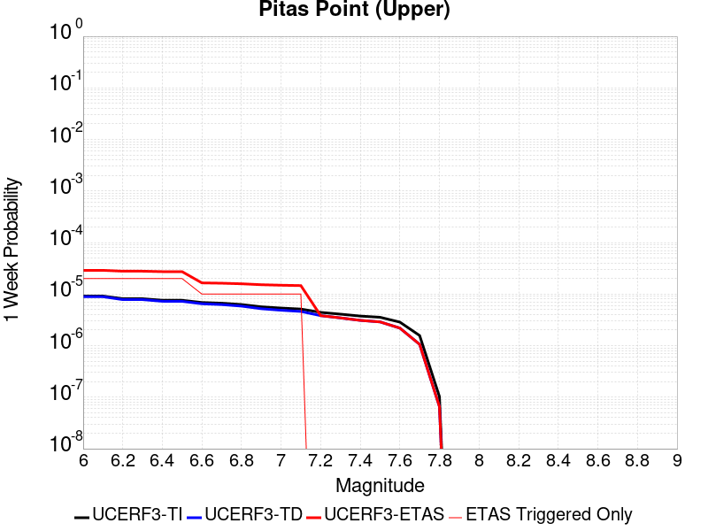 |  |  |  |

| Magnitude | 1 wk TI Prob | 1 wk TD Prob | 1 wk ETAS Prob | 1 wk ETAS/TD Gain | 1 wk ETAS Triggered Only | 1 mo TI Prob | 1 mo TD Prob | 1 mo ETAS Prob | 1 mo ETAS/TD Gain | 1 mo ETAS Triggered Only | 1 yr TI Prob | 1 yr TD Prob | 1 yr ETAS Prob | 1 yr ETAS/TD Gain | 1 yr ETAS Triggered Only | 10 yr TI Prob | 10 yr TD Prob | 10 yr ETAS Prob | 10 yr ETAS/TD Gain | 10 yr ETAS Triggered Only |
|-----|-----|-----|-----|-----|-----|-----|-----|-----|-----|-----|-----|-----|-----|-----|-----|-----|-----|-----|-----|-----|
| 6.0 | 9.161787E-6 | 8.896424E-6 | 2.8896247E-5 | 3.2480743 | 2.0E-5 | 3.926421E-5 | 3.812699E-5 | 5.8126225E-5 | 1.5245428 | 2.0E-5 | 4.779369E-4 | 4.6409928E-4 | 4.8409E-4 | 1.0430743 | 2.0E-5 | 0.004769103 | 0.004631517 | 0.0046713315 | 1.0085964 | 4.0E-5 |
| 6.1 | 9.161787E-6 | 8.896424E-6 | 2.8896247E-5 | 3.2480743 | 2.0E-5 | 3.926421E-5 | 3.812699E-5 | 5.8126225E-5 | 1.5245428 | 2.0E-5 | 4.779369E-4 | 4.6409928E-4 | 4.8409E-4 | 1.0430743 | 2.0E-5 | 0.004769103 | 0.004631517 | 0.0046713315 | 1.0085964 | 4.0E-5 |
| 6.2 | 8.134932E-6 | 7.816386E-6 | 2.781623E-5 | 3.5587075 | 2.0E-5 | 3.486353E-5 | 3.349837E-5 | 5.34977E-5 | 1.597024 | 2.0E-5 | 4.2438076E-4 | 4.0776771E-4 | 4.2775954E-4 | 1.0490276 | 2.0E-5 | 0.0042357123 | 0.0040703346 | 0.004110172 | 1.0097872 | 4.0E-5 |
| 6.3 | 8.134932E-6 | 7.816386E-6 | 2.781623E-5 | 3.5587075 | 2.0E-5 | 3.486353E-5 | 3.349837E-5 | 5.34977E-5 | 1.597024 | 2.0E-5 | 4.2438076E-4 | 4.0776771E-4 | 4.2775954E-4 | 1.0490276 | 2.0E-5 | 0.0042357123 | 0.0040703346 | 0.004110172 | 1.0097872 | 4.0E-5 |
| 6.4 | 7.600175E-6 | 7.253677E-6 | 2.725353E-5 | 3.7572024 | 2.0E-5 | 3.2571774E-5 | 3.108682E-5 | 5.10862E-5 | 1.6433394 | 2.0E-5 | 3.9648917E-4 | 3.7841743E-4 | 3.9840984E-4 | 1.0528316 | 2.0E-5 | 0.003957825 | 0.0037778448 | 0.0038077314 | 1.0079111 | 3.0E-5 |
| 6.5 | 7.58533E-6 | 7.23791E-6 | 2.7237766E-5 | 3.7632086 | 2.0E-5 | 3.2508153E-5 | 3.101925E-5 | 5.101863E-5 | 1.6447409 | 2.0E-5 | 3.9571486E-4 | 3.7759505E-4 | 3.975875E-4 | 1.0529468 | 2.0E-5 | 0.0039501097 | 0.0037696487 | 0.0037995358 | 1.0079283 | 3.0E-5 |
| 6.6 | 6.872116E-6 | 6.487785E-6 | 1.648772E-5 | 2.5413482 | 1.0E-5 | 2.9451594E-5 | 2.7804499E-5 | 3.780422E-5 | 1.359644 | 1.0E-5 | 3.5851414E-4 | 3.3846768E-4 | 3.4846432E-4 | 1.0295349 | 1.0E-5 | 0.003579363 | 0.0033795752 | 0.0033995078 | 1.0058979 | 2.0E-5 |
| 6.7 | 6.6613775E-6 | 6.2610666E-6 | 1.6261003E-5 | 2.597162 | 1.0E-5 | 2.8548448E-5 | 2.683287E-5 | 3.68326E-5 | 1.3726673 | 1.0E-5 | 3.475219E-4 | 3.266417E-4 | 3.3663842E-4 | 1.0306046 | 1.0E-5 | 0.0034697894 | 0.0032616674 | 0.0032816022 | 1.0061119 | 2.0E-5 |
| 6.8 | 6.2701297E-6 | 5.8443097E-6 | 1.584425E-5 | 2.711056 | 1.0E-5 | 2.6871709E-5 | 2.5046804E-5 | 3.5046553E-5 | 1.3992425 | 1.0E-5 | 3.2711393E-4 | 3.049026E-4 | 3.1489957E-4 | 1.0327873 | 1.0E-5 | 0.0032663282 | 0.0030448914 | 0.0030648306 | 1.0065484 | 2.0E-5 |
| 6.9 | 5.6699564E-6 | 5.2000278E-6 | 1.5199976E-5 | 2.9230566 | 1.0E-5 | 2.4299587E-5 | 2.2285645E-5 | 3.228542E-5 | 1.4487094 | 1.0E-5 | 2.9580732E-4 | 2.7129435E-4 | 2.8129164E-4 | 1.0368503 | 1.0E-5 | 0.0029541387 | 0.0027096728 | 0.0027296187 | 1.0073609 | 2.0E-5 |
| 7.0 | 5.359012E-6 | 4.8632355E-6 | 1.4863187E-5 | 3.0562341 | 1.0E-5 | 2.2966991E-5 | 2.0842273E-5 | 3.0842064E-5 | 1.4797841 | 1.0E-5 | 2.7958723E-4 | 2.5372554E-4 | 2.63723E-4 | 1.0394027 | 1.0E-5 | 0.0027923575 | 0.0025343979 | 0.002554347 | 1.0078714 | 2.0E-5 |
| 7.1 | 5.1262573E-6 | 4.609358E-6 | 1.4609312E-5 | 3.1694896 | 1.0E-5 | 2.196949E-5 | 1.9754243E-5 | 2.9754045E-5 | 1.5062103 | 1.0E-5 | 2.674457E-4 | 2.4048174E-4 | 2.5047932E-4 | 1.0415732 | 1.0E-5 | 0.0026712406 | 0.0024022532 | 0.0024222052 | 1.0083055 | 2.0E-5 |
| 7.2 | 4.4176686E-6 | 3.822475E-6 | 3.822475E-6 | 1.0 | 0.0 | 1.8932727E-5 | 1.6381933E-5 | 1.6381933E-5 | 1.0 | 0.0 | 2.3048157E-4 | 1.9943198E-4 | 1.9943198E-4 | 1.0 | 0.0 | 0.0023024266 | 0.001992549 | 0.001992549 | 1.0 | 0.0 |
| 7.3 | 4.080208E-6 | 3.4534637E-6 | 3.4534637E-6 | 1.0 | 0.0 | 1.7486489E-5 | 1.4800476E-5 | 1.4800476E-5 | 1.0 | 0.0 | 2.1287719E-4 | 1.8018106E-4 | 1.8018106E-4 | 1.0 | 0.0 | 0.0021267338 | 0.0018003664 | 0.0018003664 | 1.0 | 0.0 |
| 7.4 | 3.7475234E-6 | 3.0920112E-6 | 3.0920112E-6 | 1.0 | 0.0 | 1.6060716E-5 | 1.3251411E-5 | 1.3251411E-5 | 1.0 | 0.0 | 1.9552166E-4 | 1.6132413E-4 | 1.6132413E-4 | 1.0 | 0.0 | 0.0019534973 | 0.0016120852 | 0.0016120852 | 1.0 | 0.0 |
| 7.5 | 3.5524706E-6 | 2.8882648E-6 | 2.8882648E-6 | 1.0 | 0.0 | 1.5224785E-5 | 1.2378219E-5 | 1.2378219E-5 | 1.0 | 0.0 | 1.8534598E-4 | 1.5069454E-4 | 1.5069454E-4 | 1.0 | 0.0 | 0.0018519148 | 0.0015059382 | 0.0015059382 | 1.0 | 0.0 |
| 7.6 | 2.8636132E-6 | 2.1914957E-6 | 2.1914957E-6 | 1.0 | 0.0 | 1.22725705E-5 | 9.392092E-6 | 9.392092E-6 | 1.0 | 0.0 | 1.494083E-4 | 1.1434284E-4 | 1.1434284E-4 | 1.0 | 0.0 | 0.0014930789 | 0.0011428524 | 0.0011428524 | 1.0 | 0.0 |
| 7.7 | 1.5698622E-6 | 1.0590062E-6 | 1.0590062E-6 | 1.0 | 0.0 | 6.7279634E-6 | 4.5385905E-6 | 4.5385905E-6 | 1.0 | 0.0 | 8.190988E-5 | 5.5256012E-5 | 5.5256012E-5 | 1.0 | 0.0 | 8.187969E-4 | 5.5243E-4 | 5.5243E-4 | 1.0 | 0.0 |
| 7.8 | 1.0294625E-7 | 6.581088E-8 | 6.581088E-8 | 1.0 | 0.0 | 4.4119815E-7 | 2.820466E-7 | 2.820466E-7 | 1.0 | 0.0 | 5.3715744E-6 | 3.433912E-6 | 3.433912E-6 | 1.0 | 0.0 | 5.3714444E-5 | 3.43386E-5 | 3.43386E-5 | 1.0 | 0.0 |

## San Cayetano
*[(top)](#table-of-contents)*

| 1 Week | 1 Month | 1 Year | 10 Year |
|-----|-----|-----|-----|
|  |  |  |  |

| Magnitude | 1 wk TI Prob | 1 wk TD Prob | 1 wk ETAS Prob | 1 wk ETAS/TD Gain | 1 wk ETAS Triggered Only | 1 mo TI Prob | 1 mo TD Prob | 1 mo ETAS Prob | 1 mo ETAS/TD Gain | 1 mo ETAS Triggered Only | 1 yr TI Prob | 1 yr TD Prob | 1 yr ETAS Prob | 1 yr ETAS/TD Gain | 1 yr ETAS Triggered Only | 10 yr TI Prob | 10 yr TD Prob | 10 yr ETAS Prob | 10 yr ETAS/TD Gain | 10 yr ETAS Triggered Only |
|-----|-----|-----|-----|-----|-----|-----|-----|-----|-----|-----|-----|-----|-----|-----|-----|-----|-----|-----|-----|-----|
| 6.0 | 2.5104582E-5 | 2.0053772E-5 | 2.0053772E-5 | 1.0 | 0.0 | 1.0758663E-4 | 8.594193E-5 | 8.594193E-5 | 1.0 | 0.0 | 0.00130908 | 0.0010458448 | 0.0010558343 | 1.0095516 | 1.0E-5 | 0.013013953 | 0.010411654 | 0.0104413405 | 1.0028514 | 3.0E-5 |
| 6.1 | 2.5104582E-5 | 2.0053772E-5 | 2.0053772E-5 | 1.0 | 0.0 | 1.0758663E-4 | 8.594193E-5 | 8.594193E-5 | 1.0 | 0.0 | 0.00130908 | 0.0010458448 | 0.0010558343 | 1.0095516 | 1.0E-5 | 0.013013953 | 0.010411654 | 0.0104413405 | 1.0028514 | 3.0E-5 |
| 6.2 | 2.5104582E-5 | 2.0053772E-5 | 2.0053772E-5 | 1.0 | 0.0 | 1.0758663E-4 | 8.594193E-5 | 8.594193E-5 | 1.0 | 0.0 | 0.00130908 | 0.0010458448 | 0.0010558343 | 1.0095516 | 1.0E-5 | 0.013013953 | 0.010411654 | 0.0104413405 | 1.0028514 | 3.0E-5 |
| 6.3 | 2.5104582E-5 | 2.0053772E-5 | 2.0053772E-5 | 1.0 | 0.0 | 1.0758663E-4 | 8.594193E-5 | 8.594193E-5 | 1.0 | 0.0 | 0.00130908 | 0.0010458448 | 0.0010558343 | 1.0095516 | 1.0E-5 | 0.013013953 | 0.010411654 | 0.0104413405 | 1.0028514 | 3.0E-5 |
| 6.4 | 2.5104582E-5 | 2.0053772E-5 | 2.0053772E-5 | 1.0 | 0.0 | 1.0758663E-4 | 8.594193E-5 | 8.594193E-5 | 1.0 | 0.0 | 0.00130908 | 0.0010458448 | 0.0010558343 | 1.0095516 | 1.0E-5 | 0.013013953 | 0.010411654 | 0.0104413405 | 1.0028514 | 3.0E-5 |
| 6.5 | 2.5104582E-5 | 2.0053772E-5 | 2.0053772E-5 | 1.0 | 0.0 | 1.0758663E-4 | 8.594193E-5 | 8.594193E-5 | 1.0 | 0.0 | 0.00130908 | 0.0010458448 | 0.0010558343 | 1.0095516 | 1.0E-5 | 0.013013953 | 0.010411654 | 0.0104413405 | 1.0028514 | 3.0E-5 |
| 6.6 | 2.5104582E-5 | 2.0053772E-5 | 2.0053772E-5 | 1.0 | 0.0 | 1.0758663E-4 | 8.594193E-5 | 8.594193E-5 | 1.0 | 0.0 | 0.00130908 | 0.0010458448 | 0.0010558343 | 1.0095516 | 1.0E-5 | 0.013013953 | 0.010411654 | 0.0104413405 | 1.0028514 | 3.0E-5 |
| 6.7 | 2.5104582E-5 | 2.0053772E-5 | 2.0053772E-5 | 1.0 | 0.0 | 1.0758663E-4 | 8.594193E-5 | 8.594193E-5 | 1.0 | 0.0 | 0.00130908 | 0.0010458448 | 0.0010558343 | 1.0095516 | 1.0E-5 | 0.013013953 | 0.010411654 | 0.0104413405 | 1.0028514 | 3.0E-5 |
| 6.8 | 2.4825002E-5 | 1.9774427E-5 | 1.9774427E-5 | 1.0 | 0.0 | 1.0638853E-4 | 8.474481E-5 | 8.474481E-5 | 1.0 | 0.0 | 0.0012945106 | 0.0010312838 | 0.0010412734 | 1.0096867 | 1.0E-5 | 0.012869957 | 0.010267327 | 0.010297019 | 1.0028919 | 3.0E-5 |
| 6.9 | 2.3924824E-5 | 1.9067304E-5 | 1.9067304E-5 | 1.0 | 0.0 | 1.02530925E-4 | 8.171448E-5 | 8.171448E-5 | 1.0 | 0.0 | 0.0012475991 | 9.944235E-4 | 0.0010044136 | 1.0100461 | 1.0E-5 | 0.012406182 | 0.009902051 | 0.009931753 | 1.0029997 | 3.0E-5 |
| 7.0 | 2.3559305E-5 | 1.8689587E-5 | 1.8689587E-5 | 1.0 | 0.0 | 1.0096454E-4 | 8.009579E-5 | 8.009579E-5 | 1.0 | 0.0 | 0.0012285501 | 9.747338E-4 | 9.84724E-4 | 1.0102493 | 1.0E-5 | 0.012217803 | 0.009706851 | 0.00973656 | 1.0030606 | 3.0E-5 |
| 7.1 | 2.2568007E-5 | 1.7839528E-5 | 1.7839528E-5 | 1.0 | 0.0 | 9.6716445E-5 | 7.6452896E-5 | 7.6452896E-5 | 1.0 | 0.0 | 0.0011768866 | 9.304201E-4 | 9.404108E-4 | 1.0107378 | 1.0E-5 | 0.011706733 | 0.009267391 | 0.009297112 | 1.0032072 | 3.0E-5 |
| 7.2 | 2.1256297E-5 | 1.6650727E-5 | 1.6650727E-5 | 1.0 | 0.0 | 9.109524E-5 | 7.135833E-5 | 7.135833E-5 | 1.0 | 0.0 | 0.0011085201 | 8.684449E-4 | 8.784362E-4 | 1.0115049 | 1.0E-5 | 0.011030068 | 0.008652604 | 0.008682345 | 1.0034372 | 3.0E-5 |
| 7.3 | 1.9222265E-5 | 1.5236521E-5 | 1.5236521E-5 | 1.0 | 0.0 | 8.237853E-5 | 6.529776E-5 | 6.529776E-5 | 1.0 | 0.0 | 0.001002497 | 7.947136E-4 | 8.0470566E-4 | 1.0125731 | 1.0E-5 | 0.009979866 | 0.007920732 | 0.007950494 | 1.0037575 | 3.0E-5 |
| 7.4 | 1.7234015E-5 | 1.3686425E-5 | 1.3686425E-5 | 1.0 | 0.0 | 7.385798E-5 | 5.8654805E-5 | 5.8654805E-5 | 1.0 | 0.0 | 8.9884986E-4 | 7.1389147E-4 | 7.238843E-4 | 1.0139977 | 1.0E-5 | 0.008952228 | 0.0071176323 | 0.007147419 | 1.0041848 | 3.0E-5 |
| 7.5 | 1.1229943E-5 | 8.702322E-6 | 8.702322E-6 | 1.0 | 0.0 | 4.8127436E-5 | 3.729514E-5 | 3.729514E-5 | 1.0 | 0.0 | 5.8579404E-4 | 4.5397523E-4 | 4.5397523E-4 | 1.0 | 0.0 | 0.0058425223 | 0.004530681 | 0.00455059 | 1.0043943 | 2.0E-5 |
| 7.6 | 5.092009E-6 | 3.6748747E-6 | 3.6748747E-6 | 1.0 | 0.0 | 2.1822714E-5 | 1.574937E-5 | 1.574937E-5 | 1.0 | 0.0 | 2.6565915E-4 | 1.9173215E-4 | 1.9173215E-4 | 1.0 | 0.0 | 0.0026534179 | 0.0019157099 | 0.0019157099 | 1.0 | 0.0 |
| 7.7 | 1.7066463E-6 | 9.817219E-7 | 9.817219E-7 | 1.0 | 0.0 | 7.3141778E-6 | 4.2073725E-6 | 4.2073725E-6 | 1.0 | 0.0 | 8.904648E-5 | 5.1223564E-5 | 5.1223564E-5 | 1.0 | 0.0 | 8.9010806E-4 | 5.121185E-4 | 5.121185E-4 | 1.0 | 0.0 |
| 7.8 | 4.874158E-7 | 2.837462E-7 | 2.837462E-7 | 1.0 | 0.0 | 2.088923E-6 | 1.2160546E-6 | 1.2160546E-6 | 1.0 | 0.0 | 2.5432342E-5 | 1.4805364E-5 | 1.4805364E-5 | 1.0 | 0.0 | 2.542943E-4 | 1.480439E-4 | 1.480439E-4 | 1.0 | 0.0 |
| 7.9 | 9.135152E-8 | 4.4522825E-8 | 4.4522825E-8 | 1.0 | 0.0 | 3.9150643E-7 | 1.9081209E-7 | 1.9081209E-7 | 1.0 | 0.0 | 4.7665803E-6 | 2.3231348E-6 | 2.3231348E-6 | 1.0 | 0.0 | 4.7664784E-5 | 2.3231109E-5 | 2.3231109E-5 | 1.0 | 0.0 |
| 8.0 | 3.435275E-8 | 1.5790933E-8 | 1.5790933E-8 | 1.0 | 0.0 | 1.4722607E-7 | 6.767542E-8 | 6.767542E-8 | 1.0 | 0.0 | 1.792476E-6 | 8.2394797E-7 | 8.2394797E-7 | 1.0 | 0.0 | 1.7924616E-5 | 8.239451E-6 | 8.239451E-6 | 1.0 | 0.0 |

## Simi-Santa Rosa
*[(top)](#table-of-contents)*

| 1 Week | 1 Month | 1 Year | 10 Year |
|-----|-----|-----|-----|
| 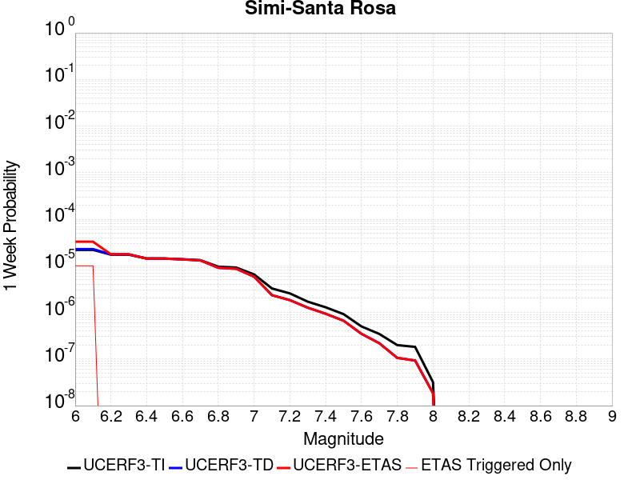 |  |  |  |

| Magnitude | 1 wk TI Prob | 1 wk TD Prob | 1 wk ETAS Prob | 1 wk ETAS/TD Gain | 1 wk ETAS Triggered Only | 1 mo TI Prob | 1 mo TD Prob | 1 mo ETAS Prob | 1 mo ETAS/TD Gain | 1 mo ETAS Triggered Only | 1 yr TI Prob | 1 yr TD Prob | 1 yr ETAS Prob | 1 yr ETAS/TD Gain | 1 yr ETAS Triggered Only | 10 yr TI Prob | 10 yr TD Prob | 10 yr ETAS Prob | 10 yr ETAS/TD Gain | 10 yr ETAS Triggered Only |
|-----|-----|-----|-----|-----|-----|-----|-----|-----|-----|-----|-----|-----|-----|-----|-----|-----|-----|-----|-----|-----|
| 6.0 | 2.202405E-5 | 2.2903065E-5 | 3.2902837E-5 | 1.4366127 | 1.0E-5 | 9.4385374E-5 | 9.815257E-5 | 1.1815061E-4 | 1.2037444 | 2.0E-5 | 0.0011485361 | 0.0011944008 | 0.0012243651 | 1.0250872 | 3.0E-5 | 0.0114261815 | 0.011884719 | 0.011914362 | 1.0024942 | 3.0E-5 |
| 6.1 | 2.202405E-5 | 2.2903065E-5 | 3.2902837E-5 | 1.4366127 | 1.0E-5 | 9.4385374E-5 | 9.815257E-5 | 1.1815061E-4 | 1.2037444 | 2.0E-5 | 0.0011485361 | 0.0011944008 | 0.0012243651 | 1.0250872 | 3.0E-5 | 0.0114261815 | 0.011884719 | 0.011914362 | 1.0024942 | 3.0E-5 |
| 6.2 | 1.7364848E-5 | 1.7670547E-5 | 1.7670547E-5 | 1.0 | 0.0 | 7.4418655E-5 | 7.57289E-5 | 8.572814E-5 | 1.13204 | 1.0E-5 | 9.056705E-4 | 9.216412E-4 | 9.4162277E-4 | 1.0216805 | 2.0E-5 | 0.009019883 | 0.009181385 | 0.009201201 | 1.0021583 | 2.0E-5 |
| 6.3 | 1.7364848E-5 | 1.7670547E-5 | 1.7670547E-5 | 1.0 | 0.0 | 7.4418655E-5 | 7.57289E-5 | 8.572814E-5 | 1.13204 | 1.0E-5 | 9.056705E-4 | 9.216412E-4 | 9.4162277E-4 | 1.0216805 | 2.0E-5 | 0.009019883 | 0.009181385 | 0.009201201 | 1.0021583 | 2.0E-5 |
| 6.4 | 1.4364039E-5 | 1.4307188E-5 | 1.4307188E-5 | 1.0 | 0.0 | 6.155871E-5 | 6.1315215E-5 | 7.13146E-5 | 1.1630816 | 1.0E-5 | 7.492196E-4 | 7.462802E-4 | 7.6626526E-4 | 1.0267795 | 2.0E-5 | 0.007466987 | 0.0074400483 | 0.0074599 | 1.0026681 | 2.0E-5 |
| 6.5 | 1.4364039E-5 | 1.4307188E-5 | 1.4307188E-5 | 1.0 | 0.0 | 6.155871E-5 | 6.1315215E-5 | 7.13146E-5 | 1.1630816 | 1.0E-5 | 7.492196E-4 | 7.462802E-4 | 7.6626526E-4 | 1.0267795 | 2.0E-5 | 0.007466987 | 0.0074400483 | 0.0074599 | 1.0026681 | 2.0E-5 |
| 6.6 | 1.3864833E-5 | 1.37501775E-5 | 1.37501775E-5 | 1.0 | 0.0 | 5.941936E-5 | 5.892813E-5 | 6.892754E-5 | 1.1696882 | 1.0E-5 | 7.2319055E-4 | 7.1723684E-4 | 7.372225E-4 | 1.0278648 | 2.0E-5 | 0.007208416 | 0.0071515064 | 0.0071713636 | 1.0027766 | 2.0E-5 |
| 6.7 | 1.3234368E-5 | 1.3109912E-5 | 1.3109912E-5 | 1.0 | 0.0 | 5.6717487E-5 | 5.6184257E-5 | 6.61837E-5 | 1.1779758 | 1.0E-5 | 6.903166E-4 | 6.838514E-4 | 7.038377E-4 | 1.0292261 | 2.0E-5 | 0.0068817614 | 0.0068197306 | 0.0068395943 | 1.0029126 | 2.0E-5 |
| 6.8 | 9.6017375E-6 | 9.085186E-6 | 9.085186E-6 | 1.0 | 0.0 | 4.1149655E-5 | 3.893602E-5 | 4.893563E-5 | 1.2568216 | 1.0E-5 | 5.0088187E-4 | 4.739584E-4 | 4.9394893E-4 | 1.0421778 | 2.0E-5 | 0.004997544 | 0.004731 | 0.0047509056 | 1.0042075 | 2.0E-5 |
| 6.9 | 9.186346E-6 | 8.67375E-6 | 8.67375E-6 | 1.0 | 0.0 | 3.936946E-5 | 3.717277E-5 | 4.7172398E-5 | 1.2690041 | 1.0E-5 | 4.7921776E-4 | 4.5249978E-4 | 4.7249073E-4 | 1.044179 | 2.0E-5 | 0.0047818567 | 0.0045172884 | 0.004537198 | 1.0044074 | 2.0E-5 |
| 7.0 | 6.5487675E-6 | 5.856668E-6 | 5.856668E-6 | 1.0 | 0.0 | 2.8065844E-5 | 2.5099818E-5 | 3.509957E-5 | 1.3983992 | 1.0E-5 | 3.4164806E-4 | 3.0555707E-4 | 3.2555097E-4 | 1.0654342 | 2.0E-5 | 0.003411233 | 0.0030523157 | 0.0030722546 | 1.0065324 | 2.0E-5 |
| 7.1 | 3.2697785E-6 | 2.3459168E-6 | 2.3459168E-6 | 1.0 | 0.0 | 1.40132615E-5 | 1.005389E-5 | 2.0053789E-5 | 1.9946299 | 1.0E-5 | 1.705981E-4 | 1.2239927E-4 | 1.4239684E-4 | 1.1633797 | 2.0E-5 | 0.0017046719 | 0.0012233229 | 0.0012432985 | 1.0163289 | 2.0E-5 |
| 7.2 | 2.563993E-6 | 1.8380618E-6 | 1.8380618E-6 | 1.0 | 0.0 | 1.0988495E-5 | 7.877384E-6 | 1.7877306E-5 | 2.2694468 | 1.0E-5 | 1.3377672E-4 | 9.590296E-5 | 1.05902E-4 | 1.1042621 | 1.0E-5 | 0.0013369621 | 9.586185E-4 | 9.686089E-4 | 1.0104216 | 1.0E-5 |
| 7.3 | 1.7033454E-6 | 1.2658311E-6 | 1.2658311E-6 | 1.0 | 0.0 | 7.3000315E-6 | 5.424979E-6 | 5.424979E-6 | 1.0 | 0.0 | 8.887426E-5 | 6.604713E-5 | 6.604713E-5 | 1.0 | 0.0 | 8.8838727E-4 | 6.602756E-4 | 6.602756E-4 | 1.0 | 0.0 |
| 7.4 | 1.2895844E-6 | 9.378981E-7 | 9.378981E-7 | 1.0 | 0.0 | 5.5267788E-6 | 4.019557E-6 | 4.019557E-6 | 1.0 | 0.0 | 6.728645E-5 | 4.8937014E-5 | 4.8937014E-5 | 1.0 | 0.0 | 6.726608E-4 | 4.8926275E-4 | 4.8926275E-4 | 1.0 | 0.0 |
| 7.5 | 9.212456E-7 | 6.651988E-7 | 6.651988E-7 | 1.0 | 0.0 | 3.9481897E-6 | 2.850849E-6 | 2.850849E-6 | 1.0 | 0.0 | 4.806815E-5 | 3.4708533E-5 | 3.4708533E-5 | 1.0 | 0.0 | 4.805775E-4 | 3.470314E-4 | 3.470314E-4 | 1.0 | 0.0 |
| 7.6 | 5.012079E-7 | 3.479652E-7 | 3.479652E-7 | 1.0 | 0.0 | 2.148032E-6 | 1.4912786E-6 | 1.4912786E-6 | 1.0 | 0.0 | 2.6151978E-5 | 1.8156166E-5 | 1.8156166E-5 | 1.0 | 0.0 | 2.61489E-4 | 1.8154689E-4 | 1.8154689E-4 | 1.0 | 0.0 |
| 7.7 | 3.4543507E-7 | 2.1831622E-7 | 2.1831622E-7 | 1.0 | 0.0 | 1.4804352E-6 | 9.356406E-7 | 9.356406E-7 | 1.0 | 0.0 | 1.802415E-5 | 1.1391366E-5 | 1.1391366E-5 | 1.0 | 0.0 | 1.8022688E-4 | 1.1390786E-4 | 1.1390786E-4 | 1.0 | 0.0 |
| 7.8 | 1.992327E-7 | 1.06002865E-7 | 1.06002865E-7 | 1.0 | 0.0 | 8.5385415E-7 | 4.5429792E-7 | 4.5429792E-7 | 1.0 | 0.0 | 1.03956245E-5 | 5.5310634E-6 | 5.5310634E-6 | 1.0 | 0.0 | 1.0395139E-4 | 5.5309276E-5 | 5.5309276E-5 | 1.0 | 0.0 |
| 7.9 | 1.8225992E-7 | 9.295657E-8 | 9.295657E-8 | 1.0 | 0.0 | 7.811137E-7 | 3.9838523E-7 | 3.9838523E-7 | 1.0 | 0.0 | 9.510018E-6 | 4.8503293E-6 | 4.8503293E-6 | 1.0 | 0.0 | 9.509611E-5 | 4.8502254E-5 | 4.8502254E-5 | 1.0 | 0.0 |
| 8.0 | 3.1894782E-8 | 1.8480085E-8 | 1.8480085E-8 | 1.0 | 0.0 | 1.3669192E-7 | 7.920036E-8 | 7.920036E-8 | 1.0 | 0.0 | 1.6642229E-6 | 9.64264E-7 | 9.64264E-7 | 1.0 | 0.0 | 1.6642105E-5 | 9.642602E-6 | 9.642602E-6 | 1.0 | 0.0 |

## Palos Verdes
*[(top)](#table-of-contents)*

| 1 Week | 1 Month | 1 Year | 10 Year |
|-----|-----|-----|-----|
|  |  | 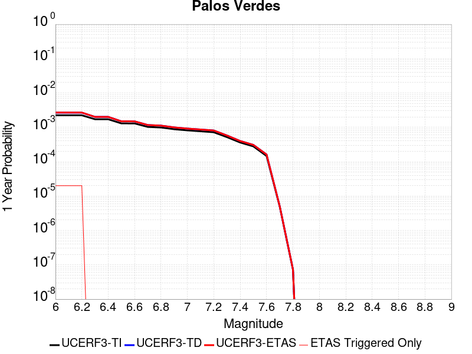 |  |

| Magnitude | 1 wk TI Prob | 1 wk TD Prob | 1 wk ETAS Prob | 1 wk ETAS/TD Gain | 1 wk ETAS Triggered Only | 1 mo TI Prob | 1 mo TD Prob | 1 mo ETAS Prob | 1 mo ETAS/TD Gain | 1 mo ETAS Triggered Only | 1 yr TI Prob | 1 yr TD Prob | 1 yr ETAS Prob | 1 yr ETAS/TD Gain | 1 yr ETAS Triggered Only | 10 yr TI Prob | 10 yr TD Prob | 10 yr ETAS Prob | 10 yr ETAS/TD Gain | 10 yr ETAS Triggered Only |
|-----|-----|-----|-----|-----|-----|-----|-----|-----|-----|-----|-----|-----|-----|-----|-----|-----|-----|-----|-----|-----|
| 6.0 | 4.3028114E-5 | 5.123891E-5 | 5.123891E-5 | 1.0 | 0.0 | 1.8439317E-4 | 2.1957826E-4 | 2.1957826E-4 | 1.0 | 0.0 | 0.0022426753 | 0.0026703237 | 0.0026902703 | 1.0074698 | 2.0E-5 | 0.022201769 | 0.026406173 | 0.02643538 | 1.0011061 | 3.0E-5 |
| 6.1 | 4.3028114E-5 | 5.123891E-5 | 5.123891E-5 | 1.0 | 0.0 | 1.8439317E-4 | 2.1957826E-4 | 2.1957826E-4 | 1.0 | 0.0 | 0.0022426753 | 0.0026703237 | 0.0026902703 | 1.0074698 | 2.0E-5 | 0.022201769 | 0.026406173 | 0.02643538 | 1.0011061 | 3.0E-5 |
| 6.2 | 4.3028114E-5 | 5.123891E-5 | 5.123891E-5 | 1.0 | 0.0 | 1.8439317E-4 | 2.1957826E-4 | 2.1957826E-4 | 1.0 | 0.0 | 0.0022426753 | 0.0026703237 | 0.0026902703 | 1.0074698 | 2.0E-5 | 0.022201769 | 0.026406173 | 0.02643538 | 1.0011061 | 3.0E-5 |
| 6.3 | 3.2937292E-5 | 3.86047E-5 | 3.86047E-5 | 1.0 | 0.0 | 1.4115218E-4 | 1.6543896E-4 | 1.6543896E-4 | 1.0 | 0.0 | 0.0017171731 | 0.0020124742 | 0.0020124742 | 1.0 | 0.0 | 0.017039645 | 0.019955082 | 0.019964883 | 1.0004911 | 1.0E-5 |
| 6.4 | 3.2937292E-5 | 3.86047E-5 | 3.86047E-5 | 1.0 | 0.0 | 1.4115218E-4 | 1.6543896E-4 | 1.6543896E-4 | 1.0 | 0.0 | 0.0017171731 | 0.0020124742 | 0.0020124742 | 1.0 | 0.0 | 0.017039645 | 0.019955082 | 0.019964883 | 1.0004911 | 1.0E-5 |
| 6.5 | 2.4938969E-5 | 2.8653629E-5 | 2.8653629E-5 | 1.0 | 0.0 | 1.0687691E-4 | 1.2279571E-4 | 1.2279571E-4 | 1.0 | 0.0 | 0.0013004496 | 0.0014940528 | 0.0014940528 | 1.0 | 0.0 | 0.012928657 | 0.0148442285 | 0.01485408 | 1.0006636 | 1.0E-5 |
| 6.6 | 2.4896108E-5 | 2.8608347E-5 | 2.8608347E-5 | 1.0 | 0.0 | 1.0669324E-4 | 1.2260166E-4 | 1.2260166E-4 | 1.0 | 0.0 | 0.001298216 | 0.0014916935 | 0.0014916935 | 1.0 | 0.0 | 0.012906581 | 0.01482095 | 0.014830803 | 1.0006647 | 1.0E-5 |
| 6.7 | 1.971501E-5 | 2.2361975E-5 | 2.2361975E-5 | 1.0 | 0.0 | 8.449016E-5 | 9.583361E-5 | 9.583361E-5 | 1.0 | 0.0 | 0.0010281822 | 0.0011661662 | 0.0011661662 | 1.0 | 0.0 | 0.01023438 | 0.011602249 | 0.011602249 | 1.0 | 0.0 |
| 6.8 | 1.8976532E-5 | 2.1494117E-5 | 2.1494117E-5 | 1.0 | 0.0 | 8.132546E-5 | 9.211448E-5 | 9.211448E-5 | 1.0 | 0.0 | 9.896876E-4 | 0.0011209327 | 0.0011209327 | 1.0 | 0.0 | 0.009852916 | 0.011154512 | 0.011154512 | 1.0 | 0.0 |
| 6.9 | 1.6908934E-5 | 1.9065035E-5 | 1.9065035E-5 | 1.0 | 0.0 | 7.246485E-5 | 8.170481E-5 | 8.170481E-5 | 1.0 | 0.0 | 8.819024E-4 | 9.943157E-4 | 9.943157E-4 | 1.0 | 0.0 | 0.008784108 | 0.0099001145 | 0.0099001145 | 1.0 | 0.0 |
| 7.0 | 1.563956E-5 | 1.760178E-5 | 1.760178E-5 | 1.0 | 0.0 | 6.7024965E-5 | 7.5434094E-5 | 7.5434094E-5 | 1.0 | 0.0 | 8.1572344E-4 | 9.1803586E-4 | 9.1803586E-4 | 1.0 | 0.0 | 0.008127356 | 0.009143772 | 0.009143772 | 1.0 | 0.0 |
| 7.1 | 1.47217725E-5 | 1.6552529E-5 | 1.6552529E-5 | 1.0 | 0.0 | 6.3091786E-5 | 7.093755E-5 | 7.093755E-5 | 1.0 | 0.0 | 7.6787174E-4 | 8.6333486E-4 | 8.6333486E-4 | 1.0 | 0.0 | 0.0076522385 | 0.008601095 | 0.008601095 | 1.0 | 0.0 |
| 7.2 | 1.3779998E-5 | 1.5483976E-5 | 1.5483976E-5 | 1.0 | 0.0 | 5.9055794E-5 | 6.635828E-5 | 6.635828E-5 | 1.0 | 0.0 | 7.187671E-4 | 8.0762483E-4 | 8.0762483E-4 | 1.0 | 0.0 | 0.0071644676 | 0.008048153 | 0.008048153 | 1.0 | 0.0 |
| 7.3 | 9.946116E-6 | 1.1079738E-5 | 1.1079738E-5 | 1.0 | 0.0 | 4.2625517E-5 | 4.7483758E-5 | 4.7483758E-5 | 1.0 | 0.0 | 5.188421E-4 | 5.779667E-4 | 5.779667E-4 | 1.0 | 0.0 | 0.0051763235 | 0.0057651754 | 0.0057651754 | 1.0 | 0.0 |
| 7.4 | 6.9437765E-6 | 7.66357E-6 | 7.66357E-6 | 1.0 | 0.0 | 2.9758703E-5 | 3.284346E-5 | 3.284346E-5 | 1.0 | 0.0 | 3.6225197E-4 | 3.997967E-4 | 3.997967E-4 | 1.0 | 0.0 | 0.00361662 | 0.003990872 | 0.003990872 | 1.0 | 0.0 |
| 7.5 | 5.34543E-6 | 5.9024314E-6 | 5.9024314E-6 | 1.0 | 0.0 | 2.2908785E-5 | 2.5295894E-5 | 2.5295894E-5 | 1.0 | 0.0 | 2.7887875E-4 | 3.0793485E-4 | 3.0793485E-4 | 1.0 | 0.0 | 0.0027852904 | 0.0030751699 | 0.0030751699 | 1.0 | 0.0 |
| 7.6 | 2.8082704E-6 | 3.0993328E-6 | 3.0993328E-6 | 1.0 | 0.0 | 1.2035389E-5 | 1.3282792E-5 | 1.3282792E-5 | 1.0 | 0.0 | 1.4652101E-4 | 1.6170672E-4 | 1.6170672E-4 | 1.0 | 0.0 | 0.0014642444 | 0.0016159628 | 0.0016159628 | 1.0 | 0.0 |
| 7.7 | 9.432333E-8 | 9.5619214E-8 | 9.5619214E-8 | 1.0 | 0.0 | 4.042428E-7 | 4.0979657E-7 | 4.0979657E-7 | 1.0 | 0.0 | 4.921645E-6 | 4.989262E-6 | 4.989262E-6 | 1.0 | 0.0 | 4.921536E-5 | 4.9891514E-5 | 4.9891514E-5 | 1.0 | 0.0 |
| 7.8 | 1.3841052E-9 | 1.4078517E-9 | 1.4078517E-9 | 1.0 | 0.0 | 5.9318794E-9 | 6.03365E-9 | 6.03365E-9 | 1.0 | 0.0 | 7.222063E-8 | 7.345969E-8 | 7.345969E-8 | 1.0 | 0.0 | 7.2220604E-7 | 7.345969E-7 | 7.345969E-7 | 1.0 | 0.0 |

## Hollywood
*[(top)](#table-of-contents)*

| 1 Week | 1 Month | 1 Year | 10 Year |
|-----|-----|-----|-----|
|  |  |  |  |

| Magnitude | 1 wk TI Prob | 1 wk TD Prob | 1 wk ETAS Prob | 1 wk ETAS/TD Gain | 1 wk ETAS Triggered Only | 1 mo TI Prob | 1 mo TD Prob | 1 mo ETAS Prob | 1 mo ETAS/TD Gain | 1 mo ETAS Triggered Only | 1 yr TI Prob | 1 yr TD Prob | 1 yr ETAS Prob | 1 yr ETAS/TD Gain | 1 yr ETAS Triggered Only | 10 yr TI Prob | 10 yr TD Prob | 10 yr ETAS Prob | 10 yr ETAS/TD Gain | 10 yr ETAS Triggered Only |
|-----|-----|-----|-----|-----|-----|-----|-----|-----|-----|-----|-----|-----|-----|-----|-----|-----|-----|-----|-----|-----|
| 6.0 | 1.8683088E-5 | 2.0465008E-5 | 3.0464804E-5 | 1.488629 | 1.0E-5 | 8.006791E-5 | 8.7704524E-5 | 1.0770277E-4 | 1.2280184 | 2.0E-5 | 9.743909E-4 | 0.0010673313 | 0.0010972993 | 1.0280775 | 3.0E-5 | 0.009701295 | 0.01062724 | 0.010656921 | 1.002793 | 3.0E-5 |
| 6.1 | 1.8683088E-5 | 2.0465008E-5 | 3.0464804E-5 | 1.488629 | 1.0E-5 | 8.006791E-5 | 8.7704524E-5 | 1.0770277E-4 | 1.2280184 | 2.0E-5 | 9.743909E-4 | 0.0010673313 | 0.0010972993 | 1.0280775 | 3.0E-5 | 0.009701295 | 0.01062724 | 0.010656921 | 1.002793 | 3.0E-5 |
| 6.2 | 1.8683088E-5 | 2.0465008E-5 | 3.0464804E-5 | 1.488629 | 1.0E-5 | 8.006791E-5 | 8.7704524E-5 | 1.0770277E-4 | 1.2280184 | 2.0E-5 | 9.743909E-4 | 0.0010673313 | 0.0010972993 | 1.0280775 | 3.0E-5 | 0.009701295 | 0.01062724 | 0.010656921 | 1.002793 | 3.0E-5 |
| 6.3 | 1.8683088E-5 | 2.0465008E-5 | 3.0464804E-5 | 1.488629 | 1.0E-5 | 8.006791E-5 | 8.7704524E-5 | 1.0770277E-4 | 1.2280184 | 2.0E-5 | 9.743909E-4 | 0.0010673313 | 0.0010972993 | 1.0280775 | 3.0E-5 | 0.009701295 | 0.01062724 | 0.010656921 | 1.002793 | 3.0E-5 |
| 6.4 | 1.6915852E-5 | 1.8437155E-5 | 2.843697E-5 | 1.5423731 | 1.0E-5 | 7.249449E-5 | 7.9014244E-5 | 9.9012665E-5 | 1.253099 | 2.0E-5 | 8.8226306E-4 | 9.6162065E-4 | 9.915918E-4 | 1.0311674 | 3.0E-5 | 0.008787685 | 0.009579258 | 0.00960897 | 1.0031018 | 3.0E-5 |
| 6.5 | 1.6108932E-5 | 1.7573306E-5 | 2.757313E-5 | 1.5690348 | 1.0E-5 | 6.9036454E-5 | 7.531226E-5 | 9.531075E-5 | 1.2655411 | 2.0E-5 | 8.401947E-4 | 9.1658684E-4 | 9.4655936E-4 | 1.0327002 | 3.0E-5 | 0.008370251 | 0.009132623 | 0.009162349 | 1.0032549 | 3.0E-5 |
| 6.6 | 1.5033733E-5 | 1.6344293E-5 | 2.634413E-5 | 1.6118244 | 1.0E-5 | 6.442869E-5 | 7.004534E-5 | 9.004394E-5 | 1.2855093 | 2.0E-5 | 7.84137E-4 | 8.525123E-4 | 8.8248675E-4 | 1.0351601 | 3.0E-5 | 0.007813758 | 0.00849678 | 0.008526525 | 1.0035007 | 3.0E-5 |
| 6.7 | 1.5026466E-5 | 1.6336106E-5 | 2.6335943E-5 | 1.612131 | 1.0E-5 | 6.439755E-5 | 7.0010254E-5 | 9.000885E-5 | 1.2856524 | 2.0E-5 | 7.837581E-4 | 8.520855E-4 | 8.820599E-4 | 1.0351777 | 3.0E-5 | 0.0078099966 | 0.008492544 | 0.00852229 | 1.0035025 | 3.0E-5 |
| 6.8 | 1.4647605E-5 | 1.5907553E-5 | 2.5907393E-5 | 1.6286222 | 1.0E-5 | 6.277394E-5 | 6.817369E-5 | 8.817233E-5 | 1.2933483 | 2.0E-5 | 7.640047E-4 | 8.297424E-4 | 8.5971755E-4 | 1.0361258 | 3.0E-5 | 0.007613834 | 0.008270783 | 0.008300535 | 1.0035973 | 3.0E-5 |
| 6.9 | 9.218918E-6 | 9.724001E-6 | 1.9723904E-5 | 2.0283732 | 1.0E-5 | 3.950905E-5 | 4.167368E-5 | 5.167326E-5 | 1.2399496 | 1.0E-5 | 4.8091653E-4 | 5.072688E-4 | 5.2725873E-4 | 1.0394068 | 2.0E-5 | 0.004798771 | 0.0050620944 | 0.005081993 | 1.0039309 | 2.0E-5 |
| 7.0 | 6.3560346E-6 | 6.497483E-6 | 6.497483E-6 | 1.0 | 0.0 | 2.7239863E-5 | 2.784607E-5 | 2.784607E-5 | 1.0 | 0.0 | 3.3159487E-4 | 3.389753E-4 | 3.4897192E-4 | 1.0294907 | 1.0E-5 | 0.003311005 | 0.0033847957 | 0.0033947618 | 1.0029444 | 1.0E-5 |
| 7.1 | 4.742423E-6 | 4.727539E-6 | 4.727539E-6 | 1.0 | 0.0 | 2.032451E-5 | 2.0260728E-5 | 2.0260728E-5 | 1.0 | 0.0 | 2.474228E-4 | 2.4664725E-4 | 2.566448E-4 | 1.0405338 | 1.0E-5 | 0.0024714752 | 0.0024638162 | 0.0024737914 | 1.0040487 | 1.0E-5 |
| 7.2 | 3.616508E-6 | 3.521073E-6 | 3.521073E-6 | 1.0 | 0.0 | 1.5499229E-5 | 1.5090226E-5 | 1.5090226E-5 | 1.0 | 0.0 | 1.8868675E-4 | 1.837081E-4 | 1.837081E-4 | 1.0 | 0.0 | 0.0018852663 | 0.0018355715 | 0.0018355715 | 1.0 | 0.0 |
| 7.3 | 3.049845E-6 | 2.9174466E-6 | 2.9174466E-6 | 1.0 | 0.0 | 1.30706985E-5 | 1.2503283E-5 | 1.2503283E-5 | 1.0 | 0.0 | 1.5912413E-4 | 1.5221687E-4 | 1.5221687E-4 | 1.0 | 0.0 | 0.0015901024 | 0.0015211308 | 0.0015211308 | 1.0 | 0.0 |
| 7.4 | 2.6402747E-6 | 2.4853991E-6 | 2.4853991E-6 | 1.0 | 0.0 | 1.1315415E-5 | 1.0651667E-5 | 1.0651667E-5 | 1.0 | 0.0 | 1.3775646E-4 | 1.2967637E-4 | 1.2967637E-4 | 1.0 | 0.0 | 0.001376711 | 0.0012960103 | 0.0012960103 | 1.0 | 0.0 |
| 7.5 | 2.174738E-6 | 1.9843012E-6 | 1.9843012E-6 | 1.0 | 0.0 | 9.3202725E-6 | 8.504121E-6 | 8.504121E-6 | 1.0 | 0.0 | 1.1346841E-4 | 1.0353277E-4 | 1.0353277E-4 | 1.0 | 0.0 | 0.0011341049 | 0.0010348477 | 0.0010348477 | 1.0 | 0.0 |
| 7.6 | 1.6876107E-6 | 1.4484111E-6 | 1.4484111E-6 | 1.0 | 0.0 | 7.232597E-6 | 6.2074614E-6 | 6.2074614E-6 | 1.0 | 0.0 | 8.805331E-5 | 7.557324E-5 | 7.557324E-5 | 1.0 | 0.0 | 8.801843E-4 | 7.55477E-4 | 7.55477E-4 | 1.0 | 0.0 |
| 7.7 | 1.2261268E-6 | 9.644895E-7 | 9.644895E-7 | 1.0 | 0.0 | 5.2548185E-6 | 4.1335197E-6 | 4.1335197E-6 | 1.0 | 0.0 | 6.397554E-5 | 5.0324452E-5 | 5.0324452E-5 | 1.0 | 0.0 | 6.395712E-4 | 5.031319E-4 | 5.031319E-4 | 1.0 | 0.0 |
| 7.8 | 7.8914064E-7 | 5.532292E-7 | 5.532292E-7 | 1.0 | 0.0 | 3.382027E-6 | 2.3709802E-6 | 2.3709802E-6 | 1.0 | 0.0 | 4.11754E-5 | 2.8866314E-5 | 2.8866314E-5 | 1.0 | 0.0 | 4.1167773E-4 | 2.8862685E-4 | 2.8862685E-4 | 1.0 | 0.0 |
| 7.9 | 1.3531255E-7 | 9.673103E-8 | 9.673103E-8 | 1.0 | 0.0 | 5.799108E-7 | 4.145615E-7 | 4.145615E-7 | 1.0 | 0.0 | 7.060391E-6 | 5.047276E-6 | 5.047276E-6 | 1.0 | 0.0 | 7.0601665E-5 | 5.047178E-5 | 5.047178E-5 | 1.0 | 0.0 |

## Raymond
*[(top)](#table-of-contents)*

| 1 Week | 1 Month | 1 Year | 10 Year |
|-----|-----|-----|-----|
| 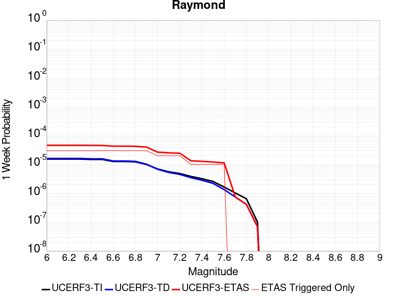 |  |  |  |

| Magnitude | 1 wk TI Prob | 1 wk TD Prob | 1 wk ETAS Prob | 1 wk ETAS/TD Gain | 1 wk ETAS Triggered Only | 1 mo TI Prob | 1 mo TD Prob | 1 mo ETAS Prob | 1 mo ETAS/TD Gain | 1 mo ETAS Triggered Only | 1 yr TI Prob | 1 yr TD Prob | 1 yr ETAS Prob | 1 yr ETAS/TD Gain | 1 yr ETAS Triggered Only | 10 yr TI Prob | 10 yr TD Prob | 10 yr ETAS Prob | 10 yr ETAS/TD Gain | 10 yr ETAS Triggered Only |
|-----|-----|-----|-----|-----|-----|-----|-----|-----|-----|-----|-----|-----|-----|-----|-----|-----|-----|-----|-----|-----|
| 6.0 | 1.5384061E-5 | 1.6210595E-5 | 4.621011E-5 | 2.8506114 | 3.0E-5 | 6.593002E-5 | 6.947225E-5 | 9.947016E-5 | 1.4317971 | 3.0E-5 | 8.024024E-4 | 8.455166E-4 | 8.754913E-4 | 1.0354513 | 3.0E-5 | 0.007995113 | 0.008425044 | 0.00845479 | 1.0035309 | 3.0E-5 |
| 6.1 | 1.5384061E-5 | 1.6210595E-5 | 4.621011E-5 | 2.8506114 | 3.0E-5 | 6.593002E-5 | 6.947225E-5 | 9.947016E-5 | 1.4317971 | 3.0E-5 | 8.024024E-4 | 8.455166E-4 | 8.754913E-4 | 1.0354513 | 3.0E-5 | 0.007995113 | 0.008425044 | 0.00845479 | 1.0035309 | 3.0E-5 |
| 6.2 | 1.5384061E-5 | 1.6210595E-5 | 4.621011E-5 | 2.8506114 | 3.0E-5 | 6.593002E-5 | 6.947225E-5 | 9.947016E-5 | 1.4317971 | 3.0E-5 | 8.024024E-4 | 8.455166E-4 | 8.754913E-4 | 1.0354513 | 3.0E-5 | 0.007995113 | 0.008425044 | 0.00845479 | 1.0035309 | 3.0E-5 |
| 6.3 | 1.5384061E-5 | 1.6210595E-5 | 4.621011E-5 | 2.8506114 | 3.0E-5 | 6.593002E-5 | 6.947225E-5 | 9.947016E-5 | 1.4317971 | 3.0E-5 | 8.024024E-4 | 8.455166E-4 | 8.754913E-4 | 1.0354513 | 3.0E-5 | 0.007995113 | 0.008425044 | 0.00845479 | 1.0035309 | 3.0E-5 |
| 6.4 | 1.4971769E-5 | 1.5749622E-5 | 4.5749148E-5 | 2.9047775 | 3.0E-5 | 6.416314E-5 | 6.7496745E-5 | 9.7494725E-5 | 1.4444358 | 3.0E-5 | 7.809063E-4 | 8.2148315E-4 | 8.514585E-4 | 1.0364894 | 3.0E-5 | 0.0077816783 | 0.008186488 | 0.008216243 | 1.0036346 | 3.0E-5 |
| 6.5 | 1.4971769E-5 | 1.5749622E-5 | 4.5749148E-5 | 2.9047775 | 3.0E-5 | 6.416314E-5 | 6.7496745E-5 | 9.7494725E-5 | 1.4444358 | 3.0E-5 | 7.809063E-4 | 8.2148315E-4 | 8.514585E-4 | 1.0364894 | 3.0E-5 | 0.0077816783 | 0.008186488 | 0.008216243 | 1.0036346 | 3.0E-5 |
| 6.6 | 1.2723392E-5 | 1.3239804E-5 | 4.3239408E-5 | 3.2658646 | 3.0E-5 | 5.452768E-5 | 5.6740853E-5 | 8.673915E-5 | 1.5286896 | 3.0E-5 | 6.636723E-4 | 6.906131E-4 | 7.205924E-4 | 1.0434097 | 3.0E-5 | 0.006616937 | 0.0068859016 | 0.006915695 | 1.0043267 | 3.0E-5 |
| 6.7 | 1.2723392E-5 | 1.3239804E-5 | 4.3239408E-5 | 3.2658646 | 3.0E-5 | 5.452768E-5 | 5.6740853E-5 | 8.673915E-5 | 1.5286896 | 3.0E-5 | 6.636723E-4 | 6.906131E-4 | 7.205924E-4 | 1.0434097 | 3.0E-5 | 0.006616937 | 0.0068859016 | 0.006915695 | 1.0043267 | 3.0E-5 |
| 6.8 | 1.2323526E-5 | 1.28160855E-5 | 4.28157E-5 | 3.3407784 | 3.0E-5 | 5.281404E-5 | 5.4924993E-5 | 8.492334E-5 | 1.5461694 | 3.0E-5 | 6.4282125E-4 | 6.685187E-4 | 6.984987E-4 | 1.0448453 | 3.0E-5 | 0.0064096493 | 0.006666298 | 0.006696098 | 1.0044702 | 3.0E-5 |
| 6.9 | 9.997625E-6 | 1.0217242E-5 | 4.0216935E-5 | 3.9361832 | 3.0E-5 | 4.2846263E-5 | 4.3787495E-5 | 7.3786185E-5 | 1.6850971 | 3.0E-5 | 5.2152836E-4 | 5.329913E-4 | 5.629753E-4 | 1.056256 | 3.0E-5 | 0.005203061 | 0.005318022 | 0.0053478624 | 1.0056112 | 3.0E-5 |
| 7.0 | 6.982725E-6 | 6.82976E-6 | 2.6829623E-5 | 3.9283407 | 2.0E-5 | 2.992562E-5 | 2.9270077E-5 | 4.9269493E-5 | 1.6832716 | 2.0E-5 | 3.642835E-4 | 3.5630606E-4 | 3.7629894E-4 | 1.0561116 | 2.0E-5 | 0.0036368694 | 0.0035574657 | 0.0035773946 | 1.005602 | 2.0E-5 |
| 7.1 | 5.585151E-6 | 5.291056E-6 | 2.529095E-5 | 4.779944 | 2.0E-5 | 2.3936142E-5 | 2.2675758E-5 | 4.2675303E-5 | 1.8819792 | 2.0E-5 | 2.9138353E-4 | 2.760426E-4 | 2.960371E-4 | 1.0724326 | 2.0E-5 | 0.0029100177 | 0.0027570247 | 0.0027769697 | 1.0072342 | 2.0E-5 |
| 7.2 | 4.867573E-6 | 4.5356496E-6 | 2.4535559E-5 | 5.409492 | 2.0E-5 | 2.0860858E-5 | 1.9438354E-5 | 3.9437964E-5 | 2.0288737 | 2.0E-5 | 2.5395135E-4 | 2.3663642E-4 | 2.566317E-4 | 1.0844978 | 2.0E-5 | 0.0025366135 | 0.0023638632 | 0.002383816 | 1.0084407 | 2.0E-5 |
| 7.3 | 3.854203E-6 | 3.4895975E-6 | 1.3489563E-5 | 3.86565 | 1.0E-5 | 1.6517908E-5 | 1.49553325E-5 | 2.4955183E-5 | 1.6686479 | 1.0E-5 | 2.0108698E-4 | 1.8206603E-4 | 1.9206421E-4 | 1.0549151 | 1.0E-5 | 0.0020090512 | 0.0018191771 | 0.0018291589 | 1.005487 | 1.0E-5 |
| 7.4 | 3.2077614E-6 | 2.8415645E-6 | 1.2841536E-5 | 4.519178 | 1.0E-5 | 1.3747476E-5 | 1.2178077E-5 | 2.2177956E-5 | 1.8211377 | 1.0E-5 | 1.6736267E-4 | 1.4825804E-4 | 1.5825655E-4 | 1.0674399 | 1.0E-5 | 0.0016723668 | 0.0014815957 | 0.0014915809 | 1.0067395 | 1.0E-5 |
| 7.5 | 2.5706076E-6 | 2.2113304E-6 | 1.2211308E-5 | 5.522155 | 1.0E-5 | 1.1016843E-5 | 9.477096E-6 | 1.9477002E-5 | 2.0551655 | 1.0E-5 | 1.3412182E-4 | 1.1537756E-4 | 1.253764E-4 | 1.0866619 | 1.0E-5 | 0.0013404089 | 0.0011531798 | 0.0011631682 | 1.0086616 | 1.0E-5 |
| 7.6 | 1.6507241E-6 | 1.3476091E-6 | 1.1347595E-5 | 8.42054 | 1.0E-5 | 7.0745127E-6 | 5.7754546E-6 | 1.5775397E-5 | 2.7314553 | 1.0E-5 | 8.6128784E-5 | 7.03139E-5 | 8.03132E-5 | 1.1422094 | 1.0E-5 | 8.609541E-4 | 7.029183E-4 | 7.1291125E-4 | 1.0142164 | 1.0E-5 |
| 7.7 | 1.0278171E-6 | 7.465041E-7 | 7.465041E-7 | 1.0 | 0.0 | 4.404923E-6 | 3.1992993E-6 | 3.1992993E-6 | 1.0 | 0.0 | 5.3628617E-5 | 3.895078E-5 | 3.895078E-5 | 1.0 | 0.0 | 5.3615676E-4 | 3.894408E-4 | 3.894408E-4 | 1.0 | 0.0 |
| 7.8 | 6.467442E-7 | 4.1350134E-7 | 4.1350134E-7 | 1.0 | 0.0 | 2.7717579E-6 | 1.7721474E-6 | 1.7721474E-6 | 1.0 | 0.0 | 3.374563E-5 | 2.1575686E-5 | 2.1575686E-5 | 1.0 | 0.0 | 3.3740504E-4 | 2.1573708E-4 | 2.1573708E-4 | 1.0 | 0.0 |
| 7.9 | 9.976222E-8 | 6.945312E-8 | 6.945312E-8 | 1.0 | 0.0 | 4.275523E-7 | 2.9765621E-7 | 2.9765621E-7 | 1.0 | 0.0 | 5.205437E-6 | 3.62396E-6 | 3.62396E-6 | 1.0 | 0.0 | 5.205315E-5 | 3.6239166E-5 | 3.6239166E-5 | 1.0 | 0.0 |

## San Gregorio (North) 2011 CFM
*[(top)](#table-of-contents)*

| 1 Week | 1 Month | 1 Year | 10 Year |
|-----|-----|-----|-----|
| 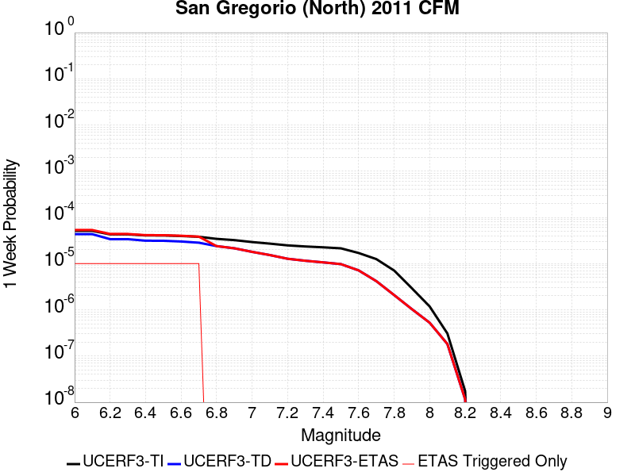 | 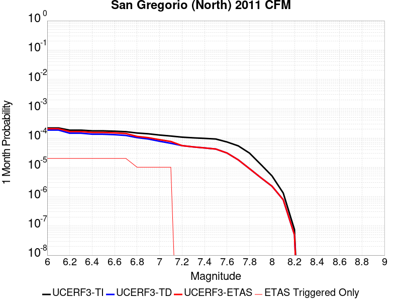 | 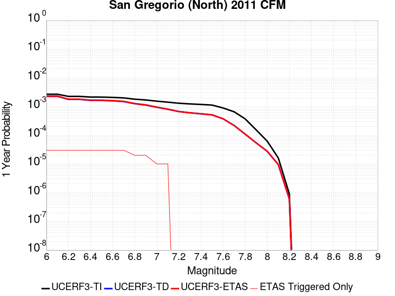 |  |

| Magnitude | 1 wk TI Prob | 1 wk TD Prob | 1 wk ETAS Prob | 1 wk ETAS/TD Gain | 1 wk ETAS Triggered Only | 1 mo TI Prob | 1 mo TD Prob | 1 mo ETAS Prob | 1 mo ETAS/TD Gain | 1 mo ETAS Triggered Only | 1 yr TI Prob | 1 yr TD Prob | 1 yr ETAS Prob | 1 yr ETAS/TD Gain | 1 yr ETAS Triggered Only | 10 yr TI Prob | 10 yr TD Prob | 10 yr ETAS Prob | 10 yr ETAS/TD Gain | 10 yr ETAS Triggered Only |
|-----|-----|-----|-----|-----|-----|-----|-----|-----|-----|-----|-----|-----|-----|-----|-----|-----|-----|-----|-----|-----|
| 6.0 | 5.115442E-5 | 4.3405456E-5 | 5.3405023E-5 | 1.2303758 | 1.0E-5 | 2.1921481E-4 | 1.8601023E-4 | 2.0600652E-4 | 1.1075009 | 2.0E-5 | 0.0026656736 | 0.002262341 | 0.0022922733 | 1.0132306 | 3.0E-5 | 0.026339237 | 0.022470057 | 0.022499382 | 1.0013051 | 3.0E-5 |
| 6.1 | 5.115442E-5 | 4.3405456E-5 | 5.3405023E-5 | 1.2303758 | 1.0E-5 | 2.1921481E-4 | 1.8601023E-4 | 2.0600652E-4 | 1.1075009 | 2.0E-5 | 0.0026656736 | 0.002262341 | 0.0022922733 | 1.0132306 | 3.0E-5 | 0.026339237 | 0.022470057 | 0.022499382 | 1.0013051 | 3.0E-5 |
| 6.2 | 4.3004173E-5 | 3.3859298E-5 | 4.385896E-5 | 1.2953298 | 1.0E-5 | 1.8429058E-4 | 1.4510327E-4 | 1.6510037E-4 | 1.1378129 | 2.0E-5 | 0.0022414287 | 0.0017652117 | 0.0017951587 | 1.0169652 | 3.0E-5 | 0.022189554 | 0.01758731 | 0.017616782 | 1.0016757 | 3.0E-5 |
| 6.3 | 4.3004173E-5 | 3.3859298E-5 | 4.385896E-5 | 1.2953298 | 1.0E-5 | 1.8429058E-4 | 1.4510327E-4 | 1.6510037E-4 | 1.1378129 | 2.0E-5 | 0.0022414287 | 0.0017652117 | 0.0017951587 | 1.0169652 | 3.0E-5 | 0.022189554 | 0.01758731 | 0.017616782 | 1.0016757 | 3.0E-5 |
| 6.4 | 4.0743467E-5 | 3.1356576E-5 | 4.1356263E-5 | 1.3189024 | 1.0E-5 | 1.7460318E-4 | 1.3437847E-4 | 1.5437577E-4 | 1.1488134 | 2.0E-5 | 0.002123721 | 0.0016348409 | 0.0016647918 | 1.0183204 | 3.0E-5 | 0.021035396 | 0.016303042 | 0.016332552 | 1.0018102 | 3.0E-5 |
| 6.5 | 4.0638268E-5 | 3.122993E-5 | 4.1229618E-5 | 1.3201957 | 1.0E-5 | 1.7415237E-4 | 1.3383574E-4 | 1.5383307E-4 | 1.1494169 | 2.0E-5 | 0.0021182431 | 0.0016282431 | 0.0016581943 | 1.0183947 | 3.0E-5 | 0.020981655 | 0.016238037 | 0.01626755 | 1.0018175 | 3.0E-5 |
| 6.6 | 3.960213E-5 | 3.013472E-5 | 4.013442E-5 | 1.3318331 | 1.0E-5 | 1.6971238E-4 | 1.2914247E-4 | 1.4913989E-4 | 1.1548477 | 2.0E-5 | 0.00206429 | 0.0015711868 | 0.0016011397 | 1.0190638 | 3.0E-5 | 0.020452194 | 0.015675295 | 0.015704826 | 1.0018839 | 3.0E-5 |
| 6.7 | 3.810274E-5 | 2.8387583E-5 | 3.83873E-5 | 1.3522567 | 1.0E-5 | 1.6328723E-4 | 1.2165546E-4 | 1.4165303E-4 | 1.1643788 | 2.0E-5 | 0.001986209 | 0.0014801597 | 0.0015101153 | 1.020238 | 3.0E-5 | 0.019685503 | 0.014777047 | 0.014806603 | 1.0020002 | 3.0E-5 |
| 6.8 | 3.4358705E-5 | 2.3947678E-5 | 2.3947678E-5 | 1.0 | 0.0 | 1.4724329E-4 | 1.0262891E-4 | 1.1262788E-4 | 1.0974284 | 1.0E-5 | 0.0017912128 | 0.001248799 | 0.001268774 | 1.0159954 | 2.0E-5 | 0.017768435 | 0.012491002 | 0.012510751 | 1.0015812 | 2.0E-5 |
| 6.9 | 3.227307E-5 | 2.1478578E-5 | 2.1478578E-5 | 1.0 | 0.0 | 1.3830583E-4 | 9.2047834E-5 | 1.0204691E-4 | 1.1086292 | 1.0E-5 | 0.0016825729 | 0.0011201126 | 0.0011400903 | 1.0178354 | 2.0E-5 | 0.0166989 | 0.01121724 | 0.011237016 | 1.001763 | 2.0E-5 |
| 7.0 | 2.9305758E-5 | 1.7977645E-5 | 1.7977645E-5 | 1.0 | 0.0 | 1.2559006E-4 | 7.704479E-5 | 8.704402E-5 | 1.1297846 | 1.0E-5 | 0.0015279865 | 9.3761995E-4 | 9.4761053E-4 | 1.0106553 | 1.0E-5 | 0.015175228 | 0.009408518 | 0.009418423 | 1.0010529 | 1.0E-5 |
| 7.1 | 2.7094107E-5 | 1.533356E-5 | 1.533356E-5 | 1.0 | 0.0 | 1.1611244E-4 | 6.571361E-5 | 7.571295E-5 | 1.1521655 | 1.0E-5 | 0.0014127521 | 7.99771E-4 | 8.0976303E-4 | 1.0124936 | 1.0E-5 | 0.014038045 | 0.008040315 | 0.008050234 | 1.0012337 | 1.0E-5 |
| 7.2 | 2.4822537E-5 | 1.2748598E-5 | 1.2748598E-5 | 1.0 | 0.0 | 1.06377964E-4 | 5.4635704E-5 | 5.4635704E-5 | 1.0 | 0.0 | 0.0012943821 | 6.6498714E-4 | 6.6498714E-4 | 1.0 | 0.0 | 0.012868687 | 0.0067004184 | 0.0067004184 | 1.0 | 0.0 |
| 7.3 | 2.3515338E-5 | 1.1541863E-5 | 1.1541863E-5 | 1.0 | 0.0 | 1.00776124E-4 | 4.9464194E-5 | 4.9464194E-5 | 1.0 | 0.0 | 0.0012262587 | 6.020604E-4 | 6.020604E-4 | 1.0 | 0.0 | 0.012195141 | 0.0060732975 | 0.0060732975 | 1.0 | 0.0 |
| 7.4 | 2.2546557E-5 | 1.0650499E-5 | 1.0650499E-5 | 1.0 | 0.0 | 9.662452E-5 | 4.5644196E-5 | 4.5644196E-5 | 1.0 | 0.0 | 0.0011757687 | 5.555766E-4 | 5.555766E-4 | 1.0 | 0.0 | 0.011695672 | 0.0056097177 | 0.0056097177 | 1.0 | 0.0 |
| 7.5 | 2.14437E-5 | 9.765851E-6 | 9.765851E-6 | 1.0 | 0.0 | 9.1898335E-5 | 4.1852978E-5 | 4.1852978E-5 | 1.0 | 0.0 | 0.0011182879 | 5.09441E-4 | 5.09441E-4 | 1.0 | 0.0 | 0.011126771 | 0.005148682 | 0.005148682 | 1.0 | 0.0 |
| 7.6 | 1.6991435E-5 | 7.1448317E-6 | 7.1448317E-6 | 1.0 | 0.0 | 7.28184E-5 | 3.0620347E-5 | 3.0620347E-5 | 1.0 | 0.0 | 8.8620343E-4 | 3.7273904E-4 | 3.7273904E-4 | 1.0 | 0.0 | 0.008826776 | 0.003779168 | 0.003779168 | 1.0 | 0.0 |
| 7.7 | 1.252326E-5 | 4.1750695E-6 | 4.1750695E-6 | 1.0 | 0.0 | 5.367001E-5 | 1.7893031E-5 | 1.7893031E-5 | 1.0 | 0.0 | 6.5323646E-4 | 2.178259E-4 | 2.178259E-4 | 1.0 | 0.0 | 0.0065131956 | 0.002217538 | 0.002217538 | 1.0 | 0.0 |
| 7.8 | 7.088093E-6 | 2.0895113E-6 | 2.0895113E-6 | 1.0 | 0.0 | 3.0377187E-5 | 8.955018E-6 | 8.955018E-6 | 1.0 | 0.0 | 3.6977947E-4 | 1.0902189E-4 | 1.0902189E-4 | 1.0 | 0.0 | 0.0036916477 | 0.0011172036 | 0.0011172036 | 1.0 | 0.0 |
| 7.9 | 2.9285284E-6 | 1.0360477E-6 | 1.0360477E-6 | 1.0 | 0.0 | 1.2550776E-5 | 4.440197E-6 | 4.440197E-6 | 1.0 | 0.0 | 1.5279498E-4 | 5.4058055E-5 | 5.4058055E-5 | 1.0 | 0.0 | 0.0015268996 | 5.533797E-4 | 5.533797E-4 | 1.0 | 0.0 |
| 8.0 | 1.1846738E-6 | 5.271724E-7 | 5.271724E-7 | 1.0 | 0.0 | 5.0771637E-6 | 2.2593083E-6 | 2.2593083E-6 | 1.0 | 0.0 | 6.1812716E-5 | 2.750673E-5 | 2.750673E-5 | 1.0 | 0.0 | 6.1795523E-4 | 2.8145628E-4 | 2.8145628E-4 | 1.0 | 0.0 |
| 8.1 | 3.0835523E-7 | 1.8237915E-7 | 1.8237915E-7 | 1.0 | 0.0 | 1.3215217E-6 | 7.816247E-7 | 7.816247E-7 | 1.0 | 0.0 | 1.6089409E-5 | 9.5162395E-6 | 9.5162395E-6 | 1.0 | 0.0 | 1.6088242E-4 | 9.86494E-5 | 9.86494E-5 | 1.0 | 0.0 |
| 8.2 | 1.7463787E-8 | 1.1619416E-8 | 1.1619416E-8 | 1.0 | 0.0 | 7.48448E-8 | 4.9797496E-8 | 4.9797496E-8 | 1.0 | 0.0 | 9.11235E-7 | 6.0628435E-7 | 6.0628435E-7 | 1.0 | 0.0 | 9.112313E-6 | 6.5923387E-6 | 6.5923387E-6 | 1.0 | 0.0 |

## Los Alamos extension
*[(top)](#table-of-contents)*

| 1 Week | 1 Month | 1 Year | 10 Year |
|-----|-----|-----|-----|
| 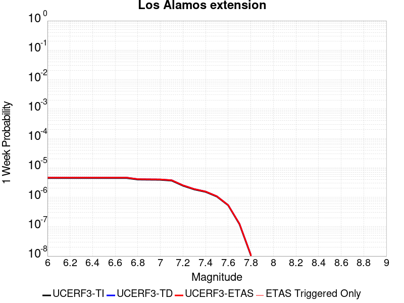 |  | 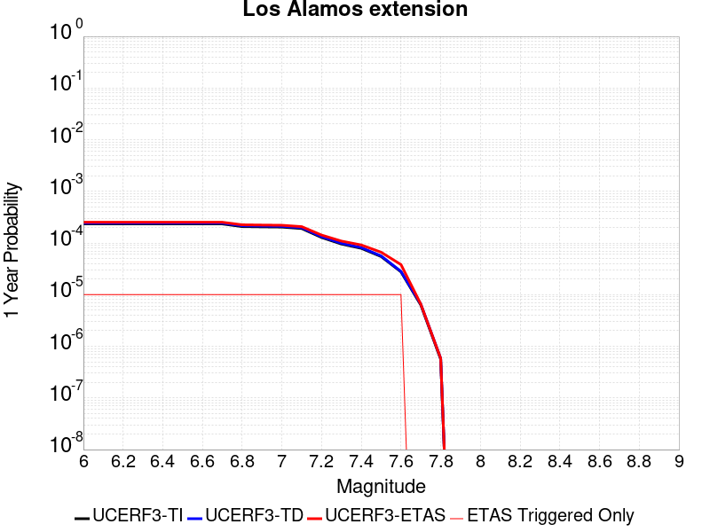 |  |

| Magnitude | 1 wk TI Prob | 1 wk TD Prob | 1 wk ETAS Prob | 1 wk ETAS/TD Gain | 1 wk ETAS Triggered Only | 1 mo TI Prob | 1 mo TD Prob | 1 mo ETAS Prob | 1 mo ETAS/TD Gain | 1 mo ETAS Triggered Only | 1 yr TI Prob | 1 yr TD Prob | 1 yr ETAS Prob | 1 yr ETAS/TD Gain | 1 yr ETAS Triggered Only | 10 yr TI Prob | 10 yr TD Prob | 10 yr ETAS Prob | 10 yr ETAS/TD Gain | 10 yr ETAS Triggered Only |
|-----|-----|-----|-----|-----|-----|-----|-----|-----|-----|-----|-----|-----|-----|-----|-----|-----|-----|-----|-----|-----|
| 6.0 | 4.485803E-6 | 4.6448954E-6 | 4.6448954E-6 | 1.0 | 0.0 | 1.9224728E-5 | 1.9906553E-5 | 1.9906553E-5 | 1.0 | 0.0 | 2.3403592E-4 | 2.4233687E-4 | 2.5233446E-4 | 1.0412549 | 1.0E-5 | 0.002337896 | 0.0024208801 | 0.0024508075 | 1.0123622 | 3.0E-5 |
| 6.1 | 4.485803E-6 | 4.6448954E-6 | 4.6448954E-6 | 1.0 | 0.0 | 1.9224728E-5 | 1.9906553E-5 | 1.9906553E-5 | 1.0 | 0.0 | 2.3403592E-4 | 2.4233687E-4 | 2.5233446E-4 | 1.0412549 | 1.0E-5 | 0.002337896 | 0.0024208801 | 0.0024508075 | 1.0123622 | 3.0E-5 |
| 6.2 | 4.485803E-6 | 4.6448954E-6 | 4.6448954E-6 | 1.0 | 0.0 | 1.9224728E-5 | 1.9906553E-5 | 1.9906553E-5 | 1.0 | 0.0 | 2.3403592E-4 | 2.4233687E-4 | 2.5233446E-4 | 1.0412549 | 1.0E-5 | 0.002337896 | 0.0024208801 | 0.0024508075 | 1.0123622 | 3.0E-5 |
| 6.3 | 4.485803E-6 | 4.6448954E-6 | 4.6448954E-6 | 1.0 | 0.0 | 1.9224728E-5 | 1.9906553E-5 | 1.9906553E-5 | 1.0 | 0.0 | 2.3403592E-4 | 2.4233687E-4 | 2.5233446E-4 | 1.0412549 | 1.0E-5 | 0.002337896 | 0.0024208801 | 0.0024508075 | 1.0123622 | 3.0E-5 |
| 6.4 | 4.485803E-6 | 4.6448954E-6 | 4.6448954E-6 | 1.0 | 0.0 | 1.9224728E-5 | 1.9906553E-5 | 1.9906553E-5 | 1.0 | 0.0 | 2.3403592E-4 | 2.4233687E-4 | 2.5233446E-4 | 1.0412549 | 1.0E-5 | 0.002337896 | 0.0024208801 | 0.0024508075 | 1.0123622 | 3.0E-5 |
| 6.5 | 4.485803E-6 | 4.6448954E-6 | 4.6448954E-6 | 1.0 | 0.0 | 1.9224728E-5 | 1.9906553E-5 | 1.9906553E-5 | 1.0 | 0.0 | 2.3403592E-4 | 2.4233687E-4 | 2.5233446E-4 | 1.0412549 | 1.0E-5 | 0.002337896 | 0.0024208801 | 0.0024508075 | 1.0123622 | 3.0E-5 |
| 6.6 | 4.485803E-6 | 4.6448954E-6 | 4.6448954E-6 | 1.0 | 0.0 | 1.9224728E-5 | 1.9906553E-5 | 1.9906553E-5 | 1.0 | 0.0 | 2.3403592E-4 | 2.4233687E-4 | 2.5233446E-4 | 1.0412549 | 1.0E-5 | 0.002337896 | 0.0024208801 | 0.0024508075 | 1.0123622 | 3.0E-5 |
| 6.7 | 4.485803E-6 | 4.6448954E-6 | 4.6448954E-6 | 1.0 | 0.0 | 1.9224728E-5 | 1.9906553E-5 | 1.9906553E-5 | 1.0 | 0.0 | 2.3403592E-4 | 2.4233687E-4 | 2.5233446E-4 | 1.0412549 | 1.0E-5 | 0.002337896 | 0.0024208801 | 0.0024508075 | 1.0123622 | 3.0E-5 |
| 6.8 | 3.9841784E-6 | 4.1257103E-6 | 4.1257103E-6 | 1.0 | 0.0 | 1.7074939E-5 | 1.7681503E-5 | 1.7681503E-5 | 1.0 | 0.0 | 2.0786756E-4 | 2.1525225E-4 | 2.252501E-4 | 1.0464472 | 1.0E-5 | 0.0020767322 | 0.0021505582 | 0.0021804937 | 1.0139198 | 3.0E-5 |
| 6.9 | 3.935303E-6 | 4.0749924E-6 | 4.0749924E-6 | 1.0 | 0.0 | 1.6865475E-5 | 1.7464143E-5 | 1.7464143E-5 | 1.0 | 0.0 | 2.0531782E-4 | 2.1260642E-4 | 2.226043E-4 | 1.0470253 | 1.0E-5 | 0.0020512822 | 0.0021241507 | 0.002154087 | 1.0140933 | 3.0E-5 |
| 7.0 | 3.8977882E-6 | 4.035903E-6 | 4.035903E-6 | 1.0 | 0.0 | 1.6704698E-5 | 1.729662E-5 | 1.729662E-5 | 1.0 | 0.0 | 2.0336073E-4 | 2.1056722E-4 | 2.2056511E-4 | 1.0474808 | 1.0E-5 | 0.0020317473 | 0.0021037974 | 0.0021337343 | 1.0142299 | 3.0E-5 |
| 7.1 | 3.6540612E-6 | 3.7835723E-6 | 3.7835723E-6 | 1.0 | 0.0 | 1.5660167E-5 | 1.6215216E-5 | 1.6215216E-5 | 1.0 | 0.0 | 1.9064586E-4 | 1.9740354E-4 | 2.0740156E-4 | 1.0506476 | 1.0E-5 | 0.0019048238 | 0.0019723976 | 0.0020023384 | 1.0151799 | 3.0E-5 |
| 7.2 | 2.4522187E-6 | 2.5391319E-6 | 2.5391319E-6 | 1.0 | 0.0 | 1.0509467E-5 | 1.08819495E-5 | 1.08819495E-5 | 1.0 | 0.0 | 1.2794524E-4 | 1.3247978E-4 | 1.4247844E-4 | 1.0754732 | 1.0E-5 | 0.001278716 | 0.0013240175 | 0.001343991 | 1.0150856 | 2.0E-5 |
| 7.3 | 1.8324149E-6 | 1.8954781E-6 | 1.8954781E-6 | 1.0 | 0.0 | 7.853183E-6 | 8.123453E-6 | 8.123453E-6 | 1.0 | 0.0 | 9.560831E-5 | 9.889859E-5 | 1.08897606E-4 | 1.1011037 | 1.0E-5 | 9.556719E-4 | 9.885503E-4 | 0.0010085305 | 1.0202117 | 2.0E-5 |
| 7.4 | 1.512901E-6 | 1.5640613E-6 | 1.5640613E-6 | 1.0 | 0.0 | 6.4838455E-6 | 6.703103E-6 | 6.703103E-6 | 1.0 | 0.0 | 7.8937956E-5 | 8.1607264E-5 | 9.1606445E-5 | 1.1225281 | 1.0E-5 | 7.8909926E-4 | 8.15777E-4 | 8.257688E-4 | 1.0122483 | 1.0E-5 |
| 7.5 | 1.0483443E-6 | 1.0787273E-6 | 1.0787273E-6 | 1.0 | 0.0 | 4.4928966E-6 | 4.6231094E-6 | 4.6231094E-6 | 1.0 | 0.0 | 5.469964E-5 | 5.6284924E-5 | 6.628436E-5 | 1.1776575 | 1.0E-5 | 5.468618E-4 | 5.6270906E-4 | 5.7270343E-4 | 1.0177612 | 1.0E-5 |
| 7.6 | 5.29937E-7 | 5.408525E-7 | 5.408525E-7 | 1.0 | 0.0 | 2.2711567E-6 | 2.3179375E-6 | 2.3179375E-6 | 1.0 | 0.0 | 2.7650982E-5 | 2.8220538E-5 | 3.8220256E-5 | 1.3543419 | 1.0E-5 | 2.7647542E-4 | 2.8217104E-4 | 2.9216823E-4 | 1.0354295 | 1.0E-5 |
| 7.7 | 1.2057951E-7 | 1.2516156E-7 | 1.2516156E-7 | 1.0 | 0.0 | 5.1676926E-7 | 5.3640656E-7 | 5.3640656E-7 | 1.0 | 0.0 | 6.2916474E-6 | 6.530731E-6 | 6.530731E-6 | 1.0 | 0.0 | 6.2914696E-5 | 6.530543E-5 | 6.530543E-5 | 1.0 | 0.0 |
| 7.8 | 1.0760159E-8 | 1.1214587E-8 | 1.1214587E-8 | 1.0 | 0.0 | 4.6114966E-8 | 4.8062514E-8 | 4.8062514E-8 | 1.0 | 0.0 | 5.6144955E-7 | 5.85161E-7 | 5.85161E-7 | 1.0 | 0.0 | 5.614482E-6 | 5.8515966E-6 | 5.8515966E-6 | 1.0 | 0.0 |

## Newport-Inglewood (Offshore)
*[(top)](#table-of-contents)*

| 1 Week | 1 Month | 1 Year | 10 Year |
|-----|-----|-----|-----|
|  | 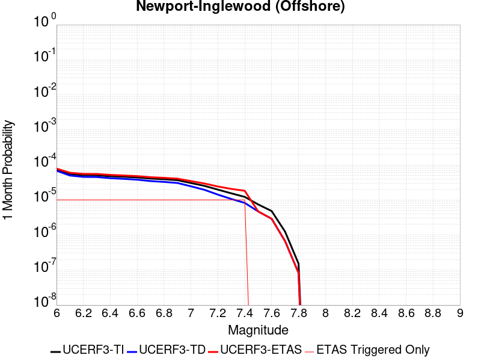 |  |  |

| Magnitude | 1 wk TI Prob | 1 wk TD Prob | 1 wk ETAS Prob | 1 wk ETAS/TD Gain | 1 wk ETAS Triggered Only | 1 mo TI Prob | 1 mo TD Prob | 1 mo ETAS Prob | 1 mo ETAS/TD Gain | 1 mo ETAS Triggered Only | 1 yr TI Prob | 1 yr TD Prob | 1 yr ETAS Prob | 1 yr ETAS/TD Gain | 1 yr ETAS Triggered Only | 10 yr TI Prob | 10 yr TD Prob | 10 yr ETAS Prob | 10 yr ETAS/TD Gain | 10 yr ETAS Triggered Only |
|-----|-----|-----|-----|-----|-----|-----|-----|-----|-----|-----|-----|-----|-----|-----|-----|-----|-----|-----|-----|-----|
| 6.0 | 1.6906091E-5 | 1.5946835E-5 | 2.5946676E-5 | 1.6270736 | 1.0E-5 | 7.245266E-5 | 6.8341826E-5 | 7.834114E-5 | 1.1463133 | 1.0E-5 | 8.8175415E-4 | 8.317504E-4 | 8.517337E-4 | 1.0240257 | 2.0E-5 | 0.008782636 | 0.008287061 | 0.008316812 | 1.0035901 | 3.0E-5 |
| 6.1 | 1.2839089E-5 | 1.1606064E-5 | 2.1605947E-5 | 1.8616085 | 1.0E-5 | 5.5023505E-5 | 4.9739334E-5 | 5.9738835E-5 | 1.2010381 | 1.0E-5 | 6.697053E-4 | 6.0540927E-4 | 6.1540323E-4 | 1.0165077 | 1.0E-5 | 0.006676906 | 0.0060377405 | 0.0060476805 | 1.0016463 | 1.0E-5 |
| 6.2 | 1.1901316E-5 | 1.0605662E-5 | 2.0605556E-5 | 1.9428825 | 1.0E-5 | 5.100464E-5 | 4.5452052E-5 | 5.5451597E-5 | 1.220002 | 1.0E-5 | 6.2080455E-4 | 5.53239E-4 | 5.6323345E-4 | 1.0180653 | 1.0E-5 | 0.0061907317 | 0.005518715 | 0.00552866 | 1.001802 | 1.0E-5 |
| 6.3 | 1.182675E-5 | 1.0524735E-5 | 2.052463E-5 | 1.9501327 | 1.0E-5 | 5.0685085E-5 | 4.5105233E-5 | 5.510478E-5 | 1.2216938 | 1.0E-5 | 6.1691616E-4 | 5.490186E-4 | 5.590131E-4 | 1.0182043 | 1.0E-5 | 0.0061520636 | 0.0054767192 | 0.0054866644 | 1.0018159 | 1.0E-5 |
| 6.4 | 1.1103106E-5 | 9.752746E-6 | 1.9752648E-5 | 2.0253422 | 1.0E-5 | 4.758387E-5 | 4.179682E-5 | 5.17964E-5 | 1.2392427 | 1.0E-5 | 5.791796E-4 | 5.0875806E-4 | 5.18753E-4 | 1.0196457 | 1.0E-5 | 0.0057767243 | 0.005076014 | 0.0050859633 | 1.00196 | 1.0E-5 |
| 6.5 | 1.0696136E-5 | 9.316818E-6 | 1.9316725E-5 | 2.0733178 | 1.0E-5 | 4.5839777E-5 | 3.9928615E-5 | 4.9928214E-5 | 1.2504369 | 1.0E-5 | 5.579564E-4 | 4.8602305E-4 | 4.960182E-4 | 1.0205652 | 1.0E-5 | 0.0055655753 | 0.004849675 | 0.0048596263 | 1.002052 | 1.0E-5 |
| 6.6 | 1.0236845E-5 | 8.832288E-6 | 1.88322E-5 | 2.1321995 | 1.0E-5 | 4.3871456E-5 | 3.7852118E-5 | 4.785174E-5 | 1.264176 | 1.0E-5 | 5.3400407E-4 | 4.6075264E-4 | 4.7074803E-4 | 1.0216936 | 1.0E-5 | 0.0053272266 | 0.0045980406 | 0.0046079946 | 1.0021648 | 1.0E-5 |
| 6.7 | 9.504692E-6 | 8.065639E-6 | 1.8065559E-5 | 2.2398174 | 1.0E-5 | 4.0733757E-5 | 3.4566572E-5 | 4.4566226E-5 | 1.2892869 | 1.0E-5 | 4.958206E-4 | 4.2076723E-4 | 4.3076303E-4 | 1.0237561 | 1.0E-5 | 0.004947158 | 0.0041997633 | 0.0042097215 | 1.0023711 | 1.0E-5 |
| 6.8 | 9.093145E-6 | 7.641211E-6 | 1.7641134E-5 | 2.3086832 | 1.0E-5 | 3.897004E-5 | 3.2747637E-5 | 4.274731E-5 | 1.3053555 | 1.0E-5 | 4.7435693E-4 | 3.9863E-4 | 4.0862605E-4 | 1.0250759 | 1.0E-5 | 0.0047334563 | 0.003979204 | 0.0039891647 | 1.002503 | 1.0E-5 |
| 6.9 | 8.534886E-6 | 7.1019185E-6 | 1.7101847E-5 | 2.40806 | 1.0E-5 | 3.657757E-5 | 3.0436442E-5 | 4.0436138E-5 | 1.3285435 | 1.0E-5 | 4.452409E-4 | 3.7050113E-4 | 3.8049743E-4 | 1.0269805 | 1.0E-5 | 0.004443499 | 0.0036988864 | 0.0037088494 | 1.0026935 | 1.0E-5 |
| 7.0 | 7.0880988E-6 | 5.7149728E-6 | 1.5714915E-5 | 2.7497797 | 1.0E-5 | 3.0377212E-5 | 2.4492512E-5 | 3.4492266E-5 | 1.4082781 | 1.0E-5 | 3.697798E-4 | 2.9815568E-4 | 3.081527E-4 | 1.0335295 | 1.0E-5 | 0.003691651 | 0.0029775754 | 0.0029875457 | 1.0033485 | 1.0E-5 |
| 7.1 | 5.8818114E-6 | 4.540037E-6 | 1.4539992E-5 | 3.202615 | 1.0E-5 | 2.5207519E-5 | 1.9457158E-5 | 2.9456964E-5 | 1.5139397 | 1.0E-5 | 3.0685833E-4 | 2.3686525E-4 | 2.4686288E-4 | 1.0422081 | 1.0E-5 | 0.0030643493 | 0.0023661403 | 0.0023761166 | 1.0042163 | 1.0E-5 |
| 7.2 | 4.5986544E-6 | 3.3114768E-6 | 1.3311444E-5 | 4.0197906 | 1.0E-5 | 1.970837E-5 | 1.4191967E-5 | 2.4191824E-5 | 1.7046139 | 1.0E-5 | 2.39923E-4 | 1.7277357E-4 | 1.8277185E-4 | 1.0578692 | 1.0E-5 | 0.0023966413 | 0.0017264003 | 0.0017363831 | 1.0057824 | 1.0E-5 |
| 7.3 | 3.6003328E-6 | 2.4826554E-6 | 1.248263E-5 | 5.027935 | 1.0E-5 | 1.5429907E-5 | 1.0639908E-5 | 2.0639802E-5 | 1.9398477 | 1.0E-5 | 1.8784292E-4 | 1.2953323E-4 | 1.3953194E-4 | 1.0771903 | 1.0E-5 | 0.0018768421 | 0.0012945823 | 0.0013045693 | 1.0077145 | 1.0E-5 |
| 7.4 | 2.8517995E-6 | 1.9225686E-6 | 1.192255E-5 | 6.2013645 | 1.0E-5 | 1.2221941E-5 | 8.2395545E-6 | 1.8239472E-5 | 2.2136478 | 1.0E-5 | 1.4879197E-4 | 1.00312E-4 | 1.1031099E-4 | 1.099679 | 1.0E-5 | 0.0014869238 | 0.0010026714 | 0.0010126614 | 1.0099634 | 1.0E-5 |
| 7.5 | 1.7355839E-6 | 1.0957937E-6 | 1.0957937E-6 | 1.0 | 0.0 | 7.438195E-6 | 4.6962505E-6 | 4.6962505E-6 | 1.0 | 0.0 | 9.055626E-5 | 5.717537E-5 | 5.717537E-5 | 1.0 | 0.0 | 9.051937E-4 | 5.7160907E-4 | 5.7160907E-4 | 1.0 | 0.0 |
| 7.6 | 1.1254756E-6 | 6.7741223E-7 | 6.7741223E-7 | 1.0 | 0.0 | 4.823458E-6 | 2.9031921E-6 | 2.9031921E-6 | 1.0 | 0.0 | 5.8724014E-5 | 3.53458E-5 | 3.53458E-5 | 1.0 | 0.0 | 5.87085E-4 | 3.5340284E-4 | 3.5340284E-4 | 1.0 | 0.0 |
| 7.7 | 2.899309E-7 | 1.5509184E-7 | 1.5509184E-7 | 1.0 | 0.0 | 1.2425604E-6 | 6.6467913E-7 | 6.6467913E-7 | 1.0 | 0.0 | 1.5128068E-5 | 8.092439E-6 | 8.092439E-6 | 1.0 | 0.0 | 1.5127039E-4 | 8.092151E-5 | 8.092151E-5 | 1.0 | 0.0 |
| 7.8 | 3.554465E-8 | 1.9333955E-8 | 1.9333955E-8 | 1.0 | 0.0 | 1.5233421E-7 | 8.28598E-8 | 8.28598E-8 | 1.0 | 0.0 | 1.8546674E-6 | 1.0088178E-6 | 1.0088178E-6 | 1.0 | 0.0 | 1.854652E-5 | 1.0088152E-5 | 1.0088152E-5 | 1.0 | 0.0 |

## Channel Islands Western Deep Ramp
*[(top)](#table-of-contents)*

| 1 Week | 1 Month | 1 Year | 10 Year |
|-----|-----|-----|-----|
|  |  |  | 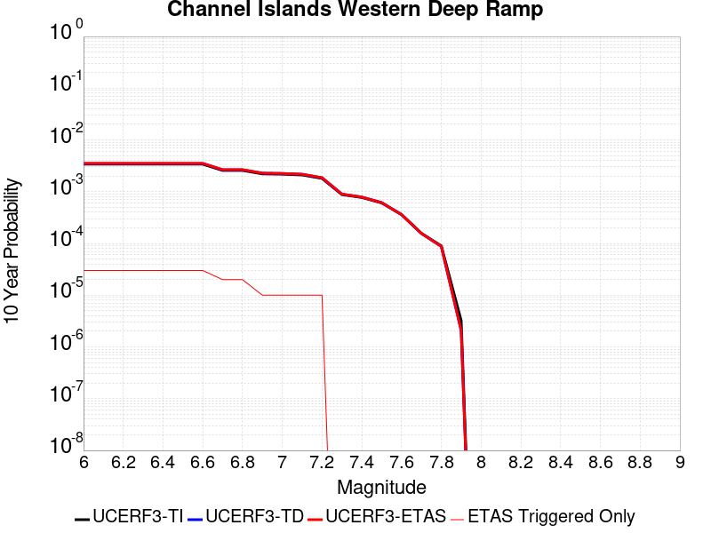 |

| Magnitude | 1 wk TI Prob | 1 wk TD Prob | 1 wk ETAS Prob | 1 wk ETAS/TD Gain | 1 wk ETAS Triggered Only | 1 mo TI Prob | 1 mo TD Prob | 1 mo ETAS Prob | 1 mo ETAS/TD Gain | 1 mo ETAS Triggered Only | 1 yr TI Prob | 1 yr TD Prob | 1 yr ETAS Prob | 1 yr ETAS/TD Gain | 1 yr ETAS Triggered Only | 10 yr TI Prob | 10 yr TD Prob | 10 yr ETAS Prob | 10 yr ETAS/TD Gain | 10 yr ETAS Triggered Only |
|-----|-----|-----|-----|-----|-----|-----|-----|-----|-----|-----|-----|-----|-----|-----|-----|-----|-----|-----|-----|-----|
| 6.0 | 6.539231E-6 | 6.7337187E-6 | 1.6733651E-5 | 2.4850535 | 1.0E-5 | 2.8024975E-5 | 2.8858498E-5 | 3.885821E-5 | 1.3465084 | 1.0E-5 | 3.4115065E-4 | 3.5129968E-4 | 3.7129267E-4 | 1.0569115 | 2.0E-5 | 0.003406274 | 0.003507851 | 0.0035377457 | 1.0085223 | 3.0E-5 |
| 6.1 | 6.539231E-6 | 6.7337187E-6 | 1.6733651E-5 | 2.4850535 | 1.0E-5 | 2.8024975E-5 | 2.8858498E-5 | 3.885821E-5 | 1.3465084 | 1.0E-5 | 3.4115065E-4 | 3.5129968E-4 | 3.7129267E-4 | 1.0569115 | 2.0E-5 | 0.003406274 | 0.003507851 | 0.0035377457 | 1.0085223 | 3.0E-5 |
| 6.2 | 6.539231E-6 | 6.7337187E-6 | 1.6733651E-5 | 2.4850535 | 1.0E-5 | 2.8024975E-5 | 2.8858498E-5 | 3.885821E-5 | 1.3465084 | 1.0E-5 | 3.4115065E-4 | 3.5129968E-4 | 3.7129267E-4 | 1.0569115 | 2.0E-5 | 0.003406274 | 0.003507851 | 0.0035377457 | 1.0085223 | 3.0E-5 |
| 6.3 | 6.539231E-6 | 6.7337187E-6 | 1.6733651E-5 | 2.4850535 | 1.0E-5 | 2.8024975E-5 | 2.8858498E-5 | 3.885821E-5 | 1.3465084 | 1.0E-5 | 3.4115065E-4 | 3.5129968E-4 | 3.7129267E-4 | 1.0569115 | 2.0E-5 | 0.003406274 | 0.003507851 | 0.0035377457 | 1.0085223 | 3.0E-5 |
| 6.4 | 6.539231E-6 | 6.7337187E-6 | 1.6733651E-5 | 2.4850535 | 1.0E-5 | 2.8024975E-5 | 2.8858498E-5 | 3.885821E-5 | 1.3465084 | 1.0E-5 | 3.4115065E-4 | 3.5129968E-4 | 3.7129267E-4 | 1.0569115 | 2.0E-5 | 0.003406274 | 0.003507851 | 0.0035377457 | 1.0085223 | 3.0E-5 |
| 6.5 | 6.539231E-6 | 6.7337187E-6 | 1.6733651E-5 | 2.4850535 | 1.0E-5 | 2.8024975E-5 | 2.8858498E-5 | 3.885821E-5 | 1.3465084 | 1.0E-5 | 3.4115065E-4 | 3.5129968E-4 | 3.7129267E-4 | 1.0569115 | 2.0E-5 | 0.003406274 | 0.003507851 | 0.0035377457 | 1.0085223 | 3.0E-5 |
| 6.6 | 6.539231E-6 | 6.7337187E-6 | 1.6733651E-5 | 2.4850535 | 1.0E-5 | 2.8024975E-5 | 2.8858498E-5 | 3.885821E-5 | 1.3465084 | 1.0E-5 | 3.4115065E-4 | 3.5129968E-4 | 3.7129267E-4 | 1.0569115 | 2.0E-5 | 0.003406274 | 0.003507851 | 0.0035377457 | 1.0085223 | 3.0E-5 |
| 6.7 | 4.940008E-6 | 5.086885E-6 | 1.5086834E-5 | 2.9658296 | 1.0E-5 | 2.117129E-5 | 2.1800766E-5 | 3.1800548E-5 | 1.4586895 | 1.0E-5 | 2.5773E-4 | 2.653944E-4 | 2.7539174E-4 | 1.0376698 | 1.0E-5 | 0.0025743127 | 0.0026510109 | 0.0026709577 | 1.0075243 | 2.0E-5 |
| 6.8 | 4.940008E-6 | 5.086885E-6 | 1.5086834E-5 | 2.9658296 | 1.0E-5 | 2.117129E-5 | 2.1800766E-5 | 3.1800548E-5 | 1.4586895 | 1.0E-5 | 2.5773E-4 | 2.653944E-4 | 2.7539174E-4 | 1.0376698 | 1.0E-5 | 0.0025743127 | 0.0026510109 | 0.0026709577 | 1.0075243 | 2.0E-5 |
| 6.9 | 4.2403617E-6 | 4.366486E-6 | 4.366486E-6 | 1.0 | 0.0 | 1.8172852E-5 | 1.8713386E-5 | 1.8713386E-5 | 1.0 | 0.0 | 2.2123201E-4 | 2.2781357E-4 | 2.2781357E-4 | 1.0 | 0.0 | 0.0022101188 | 0.0022759875 | 0.0022859648 | 1.0043837 | 1.0E-5 |
| 7.0 | 4.1861585E-6 | 4.310273E-6 | 4.310273E-6 | 1.0 | 0.0 | 1.7940556E-5 | 1.847248E-5 | 1.847248E-5 | 1.0 | 0.0 | 2.1840438E-4 | 2.248811E-4 | 2.248811E-4 | 1.0 | 0.0 | 0.0021818986 | 0.0022467226 | 0.0022567 | 1.0044409 | 1.0E-5 |
| 7.1 | 4.042347E-6 | 4.1615226E-6 | 4.1615226E-6 | 1.0 | 0.0 | 1.7324228E-5 | 1.7834986E-5 | 1.7834986E-5 | 1.0 | 0.0 | 2.1090207E-4 | 2.1712121E-4 | 2.1712121E-4 | 1.0 | 0.0 | 0.0021070202 | 0.0021692773 | 0.0021792557 | 1.0045998 | 1.0E-5 |
| 7.2 | 3.46538E-6 | 3.562531E-6 | 3.562531E-6 | 1.0 | 0.0 | 1.4851543E-5 | 1.5267911E-5 | 1.5267911E-5 | 1.0 | 0.0 | 1.8080254E-4 | 1.8587273E-4 | 1.8587273E-4 | 1.0 | 0.0 | 0.001806555 | 0.0018573476 | 0.001867329 | 1.0053741 | 1.0E-5 |
| 7.3 | 1.6847723E-6 | 1.7217925E-6 | 1.7217925E-6 | 1.0 | 0.0 | 7.220433E-6 | 7.37909E-6 | 7.37909E-6 | 1.0 | 0.0 | 8.7905224E-5 | 8.983675E-5 | 8.983675E-5 | 1.0 | 0.0 | 8.787046E-4 | 8.9800736E-4 | 8.9800736E-4 | 1.0 | 0.0 |
| 7.4 | 1.4820981E-6 | 1.5108665E-6 | 1.5108665E-6 | 1.0 | 0.0 | 6.3518337E-6 | 6.475126E-6 | 6.475126E-6 | 1.0 | 0.0 | 7.7330835E-5 | 7.8831836E-5 | 7.8831836E-5 | 1.0 | 0.0 | 7.730393E-4 | 7.880416E-4 | 7.880416E-4 | 1.0 | 0.0 |
| 7.5 | 1.1650184E-6 | 1.1799466E-6 | 1.1799466E-6 | 1.0 | 0.0 | 4.9929263E-6 | 5.0569042E-6 | 5.0569042E-6 | 1.0 | 0.0 | 6.0787184E-5 | 6.15661E-5 | 6.15661E-5 | 1.0 | 0.0 | 6.0770556E-4 | 6.15493E-4 | 6.15493E-4 | 1.0 | 0.0 |
| 7.6 | 6.923528E-7 | 6.9219897E-7 | 6.9219897E-7 | 1.0 | 0.0 | 2.9672228E-6 | 2.9665637E-6 | 2.9665637E-6 | 1.0 | 0.0 | 3.612534E-5 | 3.6117337E-5 | 3.6117337E-5 | 1.0 | 0.0 | 3.611947E-4 | 3.6111686E-4 | 3.6111686E-4 | 1.0 | 0.0 |
| 7.7 | 3.0047943E-7 | 2.9924757E-7 | 2.9924757E-7 | 1.0 | 0.0 | 1.2877684E-6 | 1.282489E-6 | 1.282489E-6 | 1.0 | 0.0 | 1.5678468E-5 | 1.5614205E-5 | 1.5614205E-5 | 1.0 | 0.0 | 1.5677362E-4 | 1.561322E-4 | 1.561322E-4 | 1.0 | 0.0 |
| 7.8 | 1.7224184E-7 | 1.6803618E-7 | 1.6803618E-7 | 1.0 | 0.0 | 7.381791E-7 | 7.201549E-7 | 7.201549E-7 | 1.0 | 0.0 | 8.987294E-6 | 8.76786E-6 | 8.76786E-6 | 1.0 | 0.0 | 8.98693E-5 | 8.767609E-5 | 8.767609E-5 | 1.0 | 0.0 |
| 7.9 | 6.2171326E-9 | 3.983744E-9 | 3.983744E-9 | 1.0 | 0.0 | 2.6644855E-8 | 1.7073189E-8 | 1.7073189E-8 | 1.0 | 0.0 | 3.2440104E-7 | 2.0786607E-7 | 2.0786607E-7 | 1.0 | 0.0 | 3.2440057E-6 | 2.0786597E-6 | 2.0786597E-6 | 1.0 | 0.0 |

## Honey Lake 2011 CFM
*[(top)](#table-of-contents)*

| 1 Week | 1 Month | 1 Year | 10 Year |
|-----|-----|-----|-----|
| 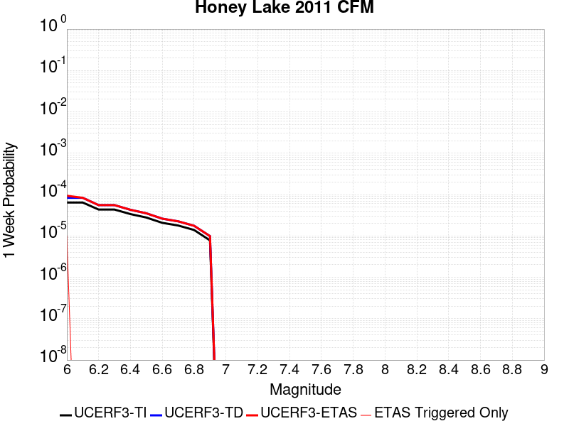 |  |  | 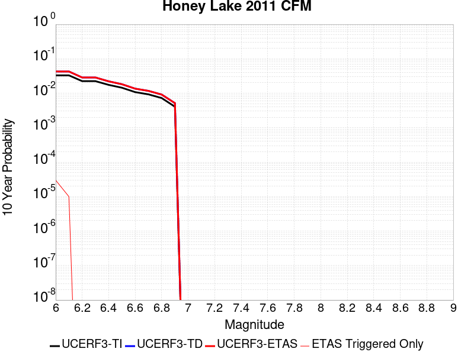 |

| Magnitude | 1 wk TI Prob | 1 wk TD Prob | 1 wk ETAS Prob | 1 wk ETAS/TD Gain | 1 wk ETAS Triggered Only | 1 mo TI Prob | 1 mo TD Prob | 1 mo ETAS Prob | 1 mo ETAS/TD Gain | 1 mo ETAS Triggered Only | 1 yr TI Prob | 1 yr TD Prob | 1 yr ETAS Prob | 1 yr ETAS/TD Gain | 1 yr ETAS Triggered Only | 10 yr TI Prob | 10 yr TD Prob | 10 yr ETAS Prob | 10 yr ETAS/TD Gain | 10 yr ETAS Triggered Only |
|-----|-----|-----|-----|-----|-----|-----|-----|-----|-----|-----|-----|-----|-----|-----|-----|-----|-----|-----|-----|-----|
| 6.0 | 6.430494E-5 | 8.358135E-5 | 9.358051E-5 | 1.1196339 | 1.0E-5 | 2.7556348E-4 | 3.5815997E-4 | 3.681564E-4 | 1.0279105 | 1.0E-5 | 0.0033498246 | 0.0043524574 | 0.0043823267 | 1.0068626 | 3.0E-5 | 0.03299777 | 0.042720772 | 0.04274949 | 1.0006722 | 3.0E-5 |
| 6.1 | 6.430494E-5 | 8.358135E-5 | 8.358135E-5 | 1.0 | 0.0 | 2.7556348E-4 | 3.5815997E-4 | 3.5815997E-4 | 1.0 | 0.0 | 0.0033498246 | 0.0043524574 | 0.0043624137 | 1.0022875 | 1.0E-5 | 0.03299777 | 0.042720772 | 0.042730346 | 1.0002241 | 1.0E-5 |
| 6.2 | 4.343387E-5 | 5.5583267E-5 | 5.5583267E-5 | 1.0 | 0.0 | 1.8613187E-4 | 2.381934E-4 | 2.381934E-4 | 1.0 | 0.0 | 0.0022638002 | 0.0028963177 | 0.0028963177 | 1.0 | 0.0 | 0.022408774 | 0.028601559 | 0.028601559 | 1.0 | 0.0 |
| 6.3 | 4.343387E-5 | 5.5583267E-5 | 5.5583267E-5 | 1.0 | 0.0 | 1.8613187E-4 | 2.381934E-4 | 2.381934E-4 | 1.0 | 0.0 | 0.0022638002 | 0.0028963177 | 0.0028963177 | 1.0 | 0.0 | 0.022408774 | 0.028601559 | 0.028601559 | 1.0 | 0.0 |
| 6.4 | 3.377359E-5 | 4.288898E-5 | 4.288898E-5 | 1.0 | 0.0 | 1.4473592E-4 | 1.8379767E-4 | 1.8379767E-4 | 1.0 | 0.0 | 0.0017607355 | 0.0022355316 | 0.0022355316 | 1.0 | 0.0 | 0.017468499 | 0.022140825 | 0.022140825 | 1.0 | 0.0 |
| 6.5 | 2.7866821E-5 | 3.5245645E-5 | 3.5245645E-5 | 1.0 | 0.0 | 1.1942377E-4 | 1.5104456E-4 | 1.5104456E-4 | 1.0 | 0.0 | 0.0014530146 | 0.0018375041 | 0.0018375041 | 1.0 | 0.0 | 0.014435506 | 0.018231746 | 0.018231746 | 1.0 | 0.0 |
| 6.6 | 2.0745096E-5 | 2.6167058E-5 | 2.6167058E-5 | 1.0 | 0.0 | 8.8904526E-5 | 1.12140144E-4 | 1.12140144E-4 | 1.0 | 0.0 | 0.0010818751 | 0.0013645282 | 0.0013645282 | 1.0 | 0.0 | 0.010766231 | 0.013568949 | 0.013568949 | 1.0 | 0.0 |
| 6.7 | 1.786706E-5 | 2.2539189E-5 | 2.2539189E-5 | 1.0 | 0.0 | 7.657086E-5 | 9.659335E-5 | 9.659335E-5 | 1.0 | 0.0 | 9.318515E-4 | 0.001175461 | 0.001175461 | 1.0 | 0.0 | 0.009279536 | 0.011699486 | 0.011699486 | 1.0 | 0.0 |
| 6.8 | 1.39327985E-5 | 1.7601871E-5 | 1.7601871E-5 | 1.0 | 0.0 | 5.971063E-5 | 7.543478E-5 | 7.543478E-5 | 1.0 | 0.0 | 7.267344E-4 | 9.1809774E-4 | 9.1809774E-4 | 1.0 | 0.0 | 0.0072436235 | 0.009149517 | 0.009149517 | 1.0 | 0.0 |
| 6.9 | 7.799161E-6 | 9.897809E-6 | 9.897809E-6 | 1.0 | 0.0 | 3.3424545E-5 | 4.2418804E-5 | 4.2418804E-5 | 1.0 | 0.0 | 4.0686785E-4 | 5.1638234E-4 | 5.1638234E-4 | 1.0 | 0.0 | 0.0040612374 | 0.005157242 | 0.005157242 | 1.0 | 0.0 |

## Los Alamos 2011 CFM
*[(top)](#table-of-contents)*

| 1 Week | 1 Month | 1 Year | 10 Year |
|-----|-----|-----|-----|
|  | 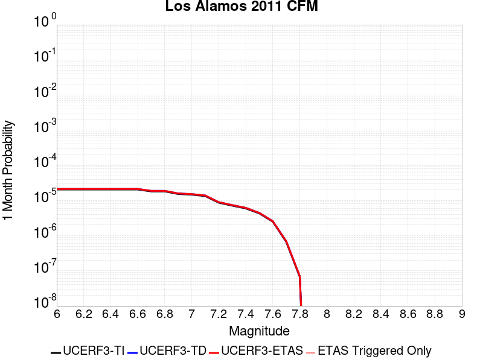 |  |  |

| Magnitude | 1 wk TI Prob | 1 wk TD Prob | 1 wk ETAS Prob | 1 wk ETAS/TD Gain | 1 wk ETAS Triggered Only | 1 mo TI Prob | 1 mo TD Prob | 1 mo ETAS Prob | 1 mo ETAS/TD Gain | 1 mo ETAS Triggered Only | 1 yr TI Prob | 1 yr TD Prob | 1 yr ETAS Prob | 1 yr ETAS/TD Gain | 1 yr ETAS Triggered Only | 10 yr TI Prob | 10 yr TD Prob | 10 yr ETAS Prob | 10 yr ETAS/TD Gain | 10 yr ETAS Triggered Only |
|-----|-----|-----|-----|-----|-----|-----|-----|-----|-----|-----|-----|-----|-----|-----|-----|-----|-----|-----|-----|-----|
| 6.0 | 4.804539E-6 | 4.9645723E-6 | 4.9645723E-6 | 1.0 | 0.0 | 2.059072E-5 | 2.1276575E-5 | 2.1276575E-5 | 1.0 | 0.0 | 2.5066317E-4 | 2.590134E-4 | 2.6901084E-4 | 1.0385981 | 1.0E-5 | 0.0025038063 | 0.0025873033 | 0.0026172257 | 1.0115651 | 3.0E-5 |
| 6.1 | 4.804539E-6 | 4.9645723E-6 | 4.9645723E-6 | 1.0 | 0.0 | 2.059072E-5 | 2.1276575E-5 | 2.1276575E-5 | 1.0 | 0.0 | 2.5066317E-4 | 2.590134E-4 | 2.6901084E-4 | 1.0385981 | 1.0E-5 | 0.0025038063 | 0.0025873033 | 0.0026172257 | 1.0115651 | 3.0E-5 |
| 6.2 | 4.804539E-6 | 4.9645723E-6 | 4.9645723E-6 | 1.0 | 0.0 | 2.059072E-5 | 2.1276575E-5 | 2.1276575E-5 | 1.0 | 0.0 | 2.5066317E-4 | 2.590134E-4 | 2.6901084E-4 | 1.0385981 | 1.0E-5 | 0.0025038063 | 0.0025873033 | 0.0026172257 | 1.0115651 | 3.0E-5 |
| 6.3 | 4.804539E-6 | 4.9645723E-6 | 4.9645723E-6 | 1.0 | 0.0 | 2.059072E-5 | 2.1276575E-5 | 2.1276575E-5 | 1.0 | 0.0 | 2.5066317E-4 | 2.590134E-4 | 2.6901084E-4 | 1.0385981 | 1.0E-5 | 0.0025038063 | 0.0025873033 | 0.0026172257 | 1.0115651 | 3.0E-5 |
| 6.4 | 4.804539E-6 | 4.9645723E-6 | 4.9645723E-6 | 1.0 | 0.0 | 2.059072E-5 | 2.1276575E-5 | 2.1276575E-5 | 1.0 | 0.0 | 2.5066317E-4 | 2.590134E-4 | 2.6901084E-4 | 1.0385981 | 1.0E-5 | 0.0025038063 | 0.0025873033 | 0.0026172257 | 1.0115651 | 3.0E-5 |
| 6.5 | 4.804539E-6 | 4.9645723E-6 | 4.9645723E-6 | 1.0 | 0.0 | 2.059072E-5 | 2.1276575E-5 | 2.1276575E-5 | 1.0 | 0.0 | 2.5066317E-4 | 2.590134E-4 | 2.6901084E-4 | 1.0385981 | 1.0E-5 | 0.0025038063 | 0.0025873033 | 0.0026172257 | 1.0115651 | 3.0E-5 |
| 6.6 | 4.804539E-6 | 4.9645723E-6 | 4.9645723E-6 | 1.0 | 0.0 | 2.059072E-5 | 2.1276575E-5 | 2.1276575E-5 | 1.0 | 0.0 | 2.5066317E-4 | 2.590134E-4 | 2.6901084E-4 | 1.0385981 | 1.0E-5 | 0.0025038063 | 0.0025873033 | 0.0026172257 | 1.0115651 | 3.0E-5 |
| 6.7 | 4.240822E-6 | 4.3809205E-6 | 4.3809205E-6 | 1.0 | 0.0 | 1.8174826E-5 | 1.8775247E-5 | 1.8775247E-5 | 1.0 | 0.0 | 2.2125602E-4 | 2.2856626E-4 | 2.3856397E-4 | 1.043741 | 1.0E-5 | 0.0022103586 | 0.0022834705 | 0.002313402 | 1.0131079 | 3.0E-5 |
| 6.8 | 4.240822E-6 | 4.3809205E-6 | 4.3809205E-6 | 1.0 | 0.0 | 1.8174826E-5 | 1.8775247E-5 | 1.8775247E-5 | 1.0 | 0.0 | 2.2125602E-4 | 2.2856626E-4 | 2.3856397E-4 | 1.043741 | 1.0E-5 | 0.0022103586 | 0.0022834705 | 0.002313402 | 1.0131079 | 3.0E-5 |
| 6.9 | 3.5732896E-6 | 3.691455E-6 | 3.691455E-6 | 1.0 | 0.0 | 1.5314008E-5 | 1.5820433E-5 | 1.5820433E-5 | 1.0 | 0.0 | 1.864321E-4 | 1.9259794E-4 | 2.0259601E-4 | 1.0519116 | 1.0E-5 | 0.0018627577 | 0.0019244287 | 0.001954371 | 1.0155591 | 3.0E-5 |
| 7.0 | 3.427486E-6 | 3.5416856E-6 | 3.5416856E-6 | 1.0 | 0.0 | 1.4689143E-5 | 1.5178571E-5 | 1.5178571E-5 | 1.0 | 0.0 | 1.7882565E-4 | 1.8478461E-4 | 1.9478277E-4 | 1.0541071 | 1.0E-5 | 0.0017868181 | 0.0018464269 | 0.0018763714 | 1.0162176 | 3.0E-5 |
| 7.1 | 3.1209017E-6 | 3.22553E-6 | 3.22553E-6 | 1.0 | 0.0 | 1.3375225E-5 | 1.3823633E-5 | 1.3823633E-5 | 1.0 | 0.0 | 1.6283119E-4 | 1.6829086E-4 | 1.7828919E-4 | 1.0594109 | 1.0E-5 | 0.0016271194 | 0.0016817461 | 0.0017116957 | 1.0178086 | 3.0E-5 |
| 7.2 | 2.0246866E-6 | 2.091678E-6 | 2.091678E-6 | 1.0 | 0.0 | 8.6772E-6 | 8.964304E-6 | 8.964304E-6 | 1.0 | 0.0 | 1.0563978E-4 | 1.09135E-4 | 1.191339E-4 | 1.0916196 | 1.0E-5 | 0.0010558958 | 0.0010908204 | 0.0011107987 | 1.0183148 | 2.0E-5 |
| 7.3 | 1.6666385E-6 | 1.7215739E-6 | 1.7215739E-6 | 1.0 | 0.0 | 7.1427166E-6 | 7.378153E-6 | 7.378153E-6 | 1.0 | 0.0 | 8.695911E-5 | 8.982535E-5 | 9.982446E-5 | 1.1113172 | 1.0E-5 | 8.6925086E-4 | 8.978947E-4 | 9.178767E-4 | 1.0222543 | 2.0E-5 |
| 7.4 | 1.3924353E-6 | 1.4384057E-6 | 1.4384057E-6 | 1.0 | 0.0 | 5.967566E-6 | 6.164581E-6 | 6.164581E-6 | 1.0 | 0.0 | 7.265269E-5 | 7.5051226E-5 | 8.505048E-5 | 1.1332324 | 1.0E-5 | 7.262894E-4 | 7.5026264E-4 | 7.6025515E-4 | 1.0133187 | 1.0E-5 |
| 7.5 | 1.0049606E-6 | 1.0352903E-6 | 1.0352903E-6 | 1.0 | 0.0 | 4.3069667E-6 | 4.436951E-6 | 4.436951E-6 | 1.0 | 0.0 | 5.243606E-5 | 5.401856E-5 | 6.401802E-5 | 1.1851115 | 1.0E-5 | 5.242369E-4 | 5.400565E-4 | 5.500511E-4 | 1.0185065 | 1.0E-5 |
| 7.6 | 5.8649783E-7 | 5.9978964E-7 | 5.9978964E-7 | 1.0 | 0.0 | 2.5135596E-6 | 2.5705247E-6 | 2.5705247E-6 | 1.0 | 0.0 | 3.0602157E-5 | 3.12957E-5 | 4.129539E-5 | 1.3195227 | 1.0E-5 | 3.0597945E-4 | 3.1291446E-4 | 3.2291134E-4 | 1.0319476 | 1.0E-5 |
| 7.7 | 1.5436821E-7 | 1.6044261E-7 | 1.6044261E-7 | 1.0 | 0.0 | 6.615779E-7 | 6.87611E-7 | 6.87611E-7 | 1.0 | 0.0 | 8.054681E-6 | 8.371632E-6 | 8.371632E-6 | 1.0 | 0.0 | 8.054388E-5 | 8.371322E-5 | 8.371322E-5 | 1.0 | 0.0 |
| 7.8 | 1.5614464E-8 | 1.629234E-8 | 1.629234E-8 | 1.0 | 0.0 | 6.6919135E-8 | 6.982431E-8 | 6.982431E-8 | 1.0 | 0.0 | 8.1474013E-7 | 8.5011067E-7 | 8.5011067E-7 | 1.0 | 0.0 | 8.147372E-6 | 8.501078E-6 | 8.501078E-6 | 1.0 | 0.0 |

## Johnson Valley (No) 2011 rev
*[(top)](#table-of-contents)*

| 1 Week | 1 Month | 1 Year | 10 Year |
|-----|-----|-----|-----|
|  |  |  | 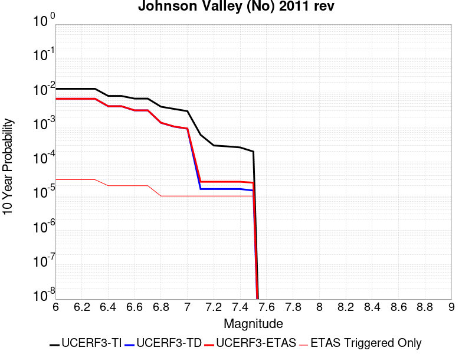 |

| Magnitude | 1 wk TI Prob | 1 wk TD Prob | 1 wk ETAS Prob | 1 wk ETAS/TD Gain | 1 wk ETAS Triggered Only | 1 mo TI Prob | 1 mo TD Prob | 1 mo ETAS Prob | 1 mo ETAS/TD Gain | 1 mo ETAS Triggered Only | 1 yr TI Prob | 1 yr TD Prob | 1 yr ETAS Prob | 1 yr ETAS/TD Gain | 1 yr ETAS Triggered Only | 10 yr TI Prob | 10 yr TD Prob | 10 yr ETAS Prob | 10 yr ETAS/TD Gain | 10 yr ETAS Triggered Only |
|-----|-----|-----|-----|-----|-----|-----|-----|-----|-----|-----|-----|-----|-----|-----|-----|-----|-----|-----|-----|-----|
| 6.0 | 2.5493053E-5 | 1.3013672E-5 | 2.3013543E-5 | 1.7684126 | 1.0E-5 | 1.0925136E-4 | 5.5771914E-5 | 7.57708E-5 | 1.3585835 | 2.0E-5 | 0.0013293236 | 6.788515E-4 | 7.088312E-4 | 1.0441623 | 3.0E-5 | 0.013213999 | 0.0067717205 | 0.0068015177 | 1.0044001 | 3.0E-5 |
| 6.1 | 2.5493053E-5 | 1.3013672E-5 | 2.3013543E-5 | 1.7684126 | 1.0E-5 | 1.0925136E-4 | 5.5771914E-5 | 7.57708E-5 | 1.3585835 | 2.0E-5 | 0.0013293236 | 6.788515E-4 | 7.088312E-4 | 1.0441623 | 3.0E-5 | 0.013213999 | 0.0067717205 | 0.0068015177 | 1.0044001 | 3.0E-5 |
| 6.2 | 2.5493053E-5 | 1.3013672E-5 | 2.3013543E-5 | 1.7684126 | 1.0E-5 | 1.0925136E-4 | 5.5771914E-5 | 7.57708E-5 | 1.3585835 | 2.0E-5 | 0.0013293236 | 6.788515E-4 | 7.088312E-4 | 1.0441623 | 3.0E-5 | 0.013213999 | 0.0067717205 | 0.0068015177 | 1.0044001 | 3.0E-5 |
| 6.3 | 2.5493053E-5 | 1.3013672E-5 | 2.3013543E-5 | 1.7684126 | 1.0E-5 | 1.0925136E-4 | 5.5771914E-5 | 7.57708E-5 | 1.3585835 | 2.0E-5 | 0.0013293236 | 6.788515E-4 | 7.088312E-4 | 1.0441623 | 3.0E-5 | 0.013213999 | 0.0067717205 | 0.0068015177 | 1.0044001 | 3.0E-5 |
| 6.4 | 1.5735213E-5 | 7.867226E-6 | 1.7867147E-5 | 2.2710862 | 1.0E-5 | 6.7434885E-5 | 3.371636E-5 | 5.3715685E-5 | 1.5931638 | 2.0E-5 | 8.2071044E-4 | 4.1043982E-4 | 4.3043162E-4 | 1.0487082 | 2.0E-5 | 0.00817686 | 0.004098828 | 0.004118746 | 1.0048594 | 2.0E-5 |
| 6.5 | 1.5735213E-5 | 7.867226E-6 | 1.7867147E-5 | 2.2710862 | 1.0E-5 | 6.7434885E-5 | 3.371636E-5 | 5.3715685E-5 | 1.5931638 | 2.0E-5 | 8.2071044E-4 | 4.1043982E-4 | 4.3043162E-4 | 1.0487082 | 2.0E-5 | 0.00817686 | 0.004098828 | 0.004118746 | 1.0048594 | 2.0E-5 |
| 6.6 | 1.316768E-5 | 5.9629524E-6 | 1.5962893E-5 | 2.6770115 | 1.0E-5 | 5.643169E-5 | 2.555536E-5 | 4.5554847E-5 | 1.7825947 | 2.0E-5 | 6.868392E-4 | 3.1110976E-4 | 3.3110354E-4 | 1.064266 | 2.0E-5 | 0.006847203 | 0.0031084756 | 0.0031284133 | 1.006414 | 2.0E-5 |
| 6.7 | 1.316768E-5 | 5.9629524E-6 | 1.5962893E-5 | 2.6770115 | 1.0E-5 | 5.643169E-5 | 2.555536E-5 | 4.5554847E-5 | 1.7825947 | 2.0E-5 | 6.868392E-4 | 3.1110976E-4 | 3.3110354E-4 | 1.064266 | 2.0E-5 | 0.006847203 | 0.0031084756 | 0.0031284133 | 1.006414 | 2.0E-5 |
| 6.8 | 7.643953E-6 | 2.5919694E-6 | 2.5919694E-6 | 1.0 | 0.0 | 3.2759388E-5 | 1.1108416E-5 | 2.1108306E-5 | 1.9002084 | 1.0E-5 | 3.9877254E-4 | 1.3524065E-4 | 1.452393E-4 | 1.0739323 | 1.0E-5 | 0.003980577 | 0.0013519833 | 0.0013619697 | 1.0073866 | 1.0E-5 |
| 6.9 | 6.5806357E-6 | 2.0042157E-6 | 2.0042157E-6 | 1.0 | 0.0 | 2.820242E-5 | 8.589489E-6 | 1.8589402E-5 | 2.1642036 | 1.0E-5 | 3.4331036E-4 | 1.0457575E-4 | 1.1457471E-4 | 1.0956144 | 1.0E-5 | 0.0034278047 | 0.0010456326 | 0.0010556221 | 1.0095536 | 1.0E-5 |
| 7.0 | 5.670891E-6 | 1.7511443E-6 | 1.7511443E-6 | 1.0 | 0.0 | 2.4303592E-5 | 7.5049034E-6 | 1.7504828E-5 | 2.3324523 | 1.0E-5 | 2.9585607E-4 | 9.1372065E-5 | 1.0137115E-4 | 1.1094327 | 1.0E-5 | 0.0029546248 | 9.137076E-4 | 9.236984E-4 | 1.0109345 | 1.0E-5 |
| 7.1 | 1.160989E-6 | 3.0726046E-8 | 3.0726046E-8 | 1.0 | 0.0 | 4.9756572E-6 | 1.3168304E-7 | 1.0131682E-5 | 76.93991 | 1.0E-5 | 6.0576946E-5 | 1.6032401E-6 | 1.1603224E-5 | 7.237359 | 1.0E-5 | 6.056043E-4 | 1.6032305E-5 | 2.6032145E-5 | 1.6237305 | 1.0E-5 |
| 7.2 | 5.6734126E-7 | 3.0726046E-8 | 3.0726046E-8 | 1.0 | 0.0 | 2.4314602E-6 | 1.3168304E-7 | 1.0131682E-5 | 76.93991 | 1.0E-5 | 2.9602626E-5 | 1.6032401E-6 | 1.1603224E-5 | 7.237359 | 1.0E-5 | 2.9598683E-4 | 1.6032305E-5 | 2.6032145E-5 | 1.6237305 | 1.0E-5 |
| 7.3 | 5.3533256E-7 | 3.0726046E-8 | 3.0726046E-8 | 1.0 | 0.0 | 2.2942804E-6 | 1.3168304E-7 | 1.0131682E-5 | 76.93991 | 1.0E-5 | 2.7932505E-5 | 1.6032401E-6 | 1.1603224E-5 | 7.237359 | 1.0E-5 | 2.7928993E-4 | 1.6032305E-5 | 2.6032145E-5 | 1.6237305 | 1.0E-5 |
| 7.4 | 4.9847125E-7 | 3.0703873E-8 | 3.0703873E-8 | 1.0 | 0.0 | 2.1363037E-6 | 1.3158802E-7 | 1.0131586E-5 | 76.99475 | 1.0E-5 | 2.6009186E-5 | 1.6020831E-6 | 1.1602067E-5 | 7.2418633 | 1.0E-5 | 2.600614E-4 | 1.6020736E-5 | 2.6020576E-5 | 1.624181 | 1.0E-5 |
| 7.5 | 3.77359E-7 | 2.7828516E-8 | 2.7828516E-8 | 1.0 | 0.0 | 1.6172518E-6 | 1.1926507E-7 | 1.0119264E-5 | 84.84684 | 1.0E-5 | 1.9689864E-5 | 1.4520514E-6 | 1.1452037E-5 | 7.8867984 | 1.0E-5 | 1.9688118E-4 | 1.4520439E-5 | 2.4520295E-5 | 1.6886743 | 1.0E-5 |

## Great Valley 07 (Orestimba)
*[(top)](#table-of-contents)*

| 1 Week | 1 Month | 1 Year | 10 Year |
|-----|-----|-----|-----|
|  | 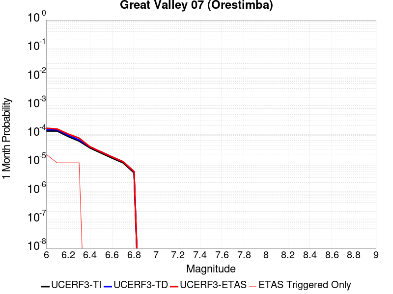 |  |  |

| Magnitude | 1 wk TI Prob | 1 wk TD Prob | 1 wk ETAS Prob | 1 wk ETAS/TD Gain | 1 wk ETAS Triggered Only | 1 mo TI Prob | 1 mo TD Prob | 1 mo ETAS Prob | 1 mo ETAS/TD Gain | 1 mo ETAS Triggered Only | 1 yr TI Prob | 1 yr TD Prob | 1 yr ETAS Prob | 1 yr ETAS/TD Gain | 1 yr ETAS Triggered Only | 10 yr TI Prob | 10 yr TD Prob | 10 yr ETAS Prob | 10 yr ETAS/TD Gain | 10 yr ETAS Triggered Only |
|-----|-----|-----|-----|-----|-----|-----|-----|-----|-----|-----|-----|-----|-----|-----|-----|-----|-----|-----|-----|-----|
| 6.0 | 3.034626E-5 | 3.351239E-5 | 5.3511718E-5 | 1.5967742 | 2.0E-5 | 1.3004891E-4 | 1.4361704E-4 | 1.6361417E-4 | 1.1392392 | 2.0E-5 | 0.0015821955 | 0.0017472096 | 0.0017671747 | 1.0114268 | 2.0E-5 | 0.015709778 | 0.017342567 | 0.017372048 | 1.0016998 | 3.0E-5 |
| 6.1 | 3.034626E-5 | 3.351239E-5 | 4.3512056E-5 | 1.298387 | 1.0E-5 | 1.3004891E-4 | 1.4361704E-4 | 1.536156E-4 | 1.0696197 | 1.0E-5 | 0.0015821955 | 0.0017472096 | 0.0017571922 | 1.0057135 | 1.0E-5 | 0.015709778 | 0.017342567 | 0.01736222 | 1.0011332 | 2.0E-5 |
| 6.2 | 1.9552745E-5 | 2.1531123E-5 | 3.1530908E-5 | 1.4644339 | 1.0E-5 | 8.379479E-5 | 9.2273105E-5 | 1.02272184E-4 | 1.108364 | 1.0E-5 | 0.001019724 | 0.0011228696 | 0.0011328583 | 1.0088958 | 1.0E-5 | 0.010150574 | 0.011174405 | 0.011194182 | 1.0017698 | 2.0E-5 |
| 6.3 | 1.3472114E-5 | 1.4809464E-5 | 2.4809317E-5 | 1.6752338 | 1.0E-5 | 5.7736353E-5 | 6.346764E-5 | 7.346701E-5 | 1.1575506 | 1.0E-5 | 7.027134E-4 | 7.72454E-4 | 7.824463E-4 | 1.0129358 | 1.0E-5 | 0.007004954 | 0.0076986654 | 0.0077185114 | 1.0025779 | 2.0E-5 |
| 6.4 | 7.742288E-6 | 8.496617E-6 | 8.496617E-6 | 1.0 | 0.0 | 3.3180815E-5 | 3.6413578E-5 | 3.6413578E-5 | 1.0 | 0.0 | 4.0390153E-4 | 4.432482E-4 | 4.432482E-4 | 1.0 | 0.0 | 0.004031682 | 0.004423951 | 0.004423951 | 1.0 | 0.0 |
| 6.5 | 5.142154E-6 | 5.641623E-6 | 5.641623E-6 | 1.0 | 0.0 | 2.2037617E-5 | 2.4178169E-5 | 2.4178169E-5 | 1.0 | 0.0 | 2.6827495E-4 | 2.9433123E-4 | 2.9433123E-4 | 1.0 | 0.0 | 0.002679513 | 0.002939591 | 0.002939591 | 1.0 | 0.0 |
| 6.6 | 3.4263091E-6 | 3.7609746E-6 | 3.7609746E-6 | 1.0 | 0.0 | 1.4684099E-5 | 1.611837E-5 | 1.611837E-5 | 1.0 | 0.0 | 1.7876424E-4 | 1.9622472E-4 | 1.9622472E-4 | 1.0 | 0.0 | 0.001786205 | 0.001960637 | 0.001960637 | 1.0 | 0.0 |
| 6.7 | 2.335469E-6 | 2.5655572E-6 | 2.5655572E-6 | 1.0 | 0.0 | 1.0009114E-5 | 1.0995204E-5 | 1.0995204E-5 | 1.0 | 0.0 | 1.2185415E-4 | 1.3385939E-4 | 1.3385939E-4 | 1.0 | 0.0 | 0.0012178735 | 0.0013378862 | 0.0013378862 | 1.0 | 0.0 |
| 6.8 | 1.0456139E-6 | 1.1501309E-6 | 1.1501309E-6 | 1.0 | 0.0 | 4.4811945E-6 | 4.929127E-6 | 4.929127E-6 | 1.0 | 0.0 | 5.455718E-5 | 6.0011156E-5 | 6.0011156E-5 | 1.0 | 0.0 | 5.4543786E-4 | 6.0001685E-4 | 6.0001685E-4 | 1.0 | 0.0 |

## Thirty Mile Bank
*[(top)](#table-of-contents)*

| 1 Week | 1 Month | 1 Year | 10 Year |
|-----|-----|-----|-----|
|  |  |  | 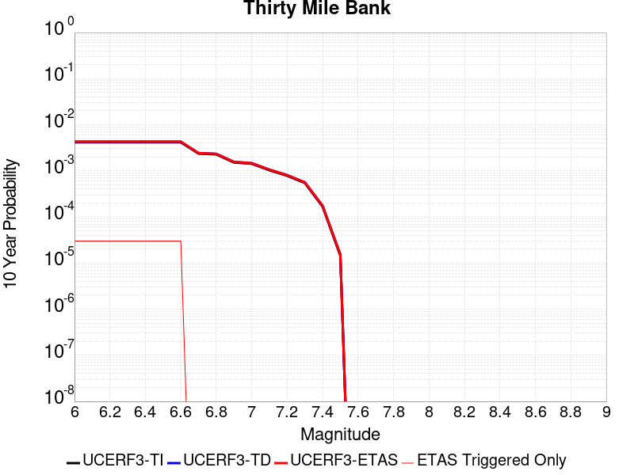 |

| Magnitude | 1 wk TI Prob | 1 wk TD Prob | 1 wk ETAS Prob | 1 wk ETAS/TD Gain | 1 wk ETAS Triggered Only | 1 mo TI Prob | 1 mo TD Prob | 1 mo ETAS Prob | 1 mo ETAS/TD Gain | 1 mo ETAS Triggered Only | 1 yr TI Prob | 1 yr TD Prob | 1 yr ETAS Prob | 1 yr ETAS/TD Gain | 1 yr ETAS Triggered Only | 10 yr TI Prob | 10 yr TD Prob | 10 yr ETAS Prob | 10 yr ETAS/TD Gain | 10 yr ETAS Triggered Only |
|-----|-----|-----|-----|-----|-----|-----|-----|-----|-----|-----|-----|-----|-----|-----|-----|-----|-----|-----|-----|-----|
| 6.0 | 7.996298E-6 | 8.21365E-6 | 1.8213568E-5 | 2.2174754 | 1.0E-5 | 3.42694E-5 | 3.520092E-5 | 5.5200213E-5 | 1.568147 | 2.0E-5 | 4.1715003E-4 | 4.284932E-4 | 4.5848032E-4 | 1.0699828 | 3.0E-5 | 0.0041636787 | 0.004277294 | 0.0043071657 | 1.0069838 | 3.0E-5 |
| 6.1 | 7.996298E-6 | 8.21365E-6 | 1.8213568E-5 | 2.2174754 | 1.0E-5 | 3.42694E-5 | 3.520092E-5 | 5.5200213E-5 | 1.568147 | 2.0E-5 | 4.1715003E-4 | 4.284932E-4 | 4.5848032E-4 | 1.0699828 | 3.0E-5 | 0.0041636787 | 0.004277294 | 0.0043071657 | 1.0069838 | 3.0E-5 |
| 6.2 | 7.996298E-6 | 8.21365E-6 | 1.8213568E-5 | 2.2174754 | 1.0E-5 | 3.42694E-5 | 3.520092E-5 | 5.5200213E-5 | 1.568147 | 2.0E-5 | 4.1715003E-4 | 4.284932E-4 | 4.5848032E-4 | 1.0699828 | 3.0E-5 | 0.0041636787 | 0.004277294 | 0.0043071657 | 1.0069838 | 3.0E-5 |
| 6.3 | 7.996298E-6 | 8.21365E-6 | 1.8213568E-5 | 2.2174754 | 1.0E-5 | 3.42694E-5 | 3.520092E-5 | 5.5200213E-5 | 1.568147 | 2.0E-5 | 4.1715003E-4 | 4.284932E-4 | 4.5848032E-4 | 1.0699828 | 3.0E-5 | 0.0041636787 | 0.004277294 | 0.0043071657 | 1.0069838 | 3.0E-5 |
| 6.4 | 7.996298E-6 | 8.21365E-6 | 1.8213568E-5 | 2.2174754 | 1.0E-5 | 3.42694E-5 | 3.520092E-5 | 5.5200213E-5 | 1.568147 | 2.0E-5 | 4.1715003E-4 | 4.284932E-4 | 4.5848032E-4 | 1.0699828 | 3.0E-5 | 0.0041636787 | 0.004277294 | 0.0043071657 | 1.0069838 | 3.0E-5 |
| 6.5 | 7.996298E-6 | 8.21365E-6 | 1.8213568E-5 | 2.2174754 | 1.0E-5 | 3.42694E-5 | 3.520092E-5 | 5.5200213E-5 | 1.568147 | 2.0E-5 | 4.1715003E-4 | 4.284932E-4 | 4.5848032E-4 | 1.0699828 | 3.0E-5 | 0.0041636787 | 0.004277294 | 0.0043071657 | 1.0069838 | 3.0E-5 |
| 6.6 | 7.996298E-6 | 8.21365E-6 | 1.8213568E-5 | 2.2174754 | 1.0E-5 | 3.42694E-5 | 3.520092E-5 | 5.5200213E-5 | 1.568147 | 2.0E-5 | 4.1715003E-4 | 4.284932E-4 | 4.5848032E-4 | 1.0699828 | 3.0E-5 | 0.0041636787 | 0.004277294 | 0.0043071657 | 1.0069838 | 3.0E-5 |
| 6.7 | 4.5391357E-6 | 4.667382E-6 | 4.667382E-6 | 1.0 | 0.0 | 1.9453295E-5 | 2.0002919E-5 | 2.0002919E-5 | 1.0 | 0.0 | 2.3681812E-4 | 2.4350938E-4 | 2.4350938E-4 | 1.0 | 0.0 | 0.002365659 | 0.0024325305 | 0.0024325305 | 1.0 | 0.0 |
| 6.8 | 4.362973E-6 | 4.4866188E-6 | 4.4866188E-6 | 1.0 | 0.0 | 1.8698322E-5 | 1.9228231E-5 | 1.9228231E-5 | 1.0 | 0.0 | 2.2762828E-4 | 2.3407958E-4 | 2.3407958E-4 | 1.0 | 0.0 | 0.0022739526 | 0.0023384313 | 0.0023384313 | 1.0 | 0.0 |
| 6.9 | 2.9114058E-6 | 2.998599E-6 | 2.998599E-6 | 1.0 | 0.0 | 1.2477393E-5 | 1.2851077E-5 | 1.2851077E-5 | 1.0 | 0.0 | 1.5190168E-4 | 1.5645105E-4 | 1.5645105E-4 | 1.0 | 0.0 | 0.0015179788 | 0.0015634489 | 0.0015634489 | 1.0 | 0.0 |
| 7.0 | 2.737518E-6 | 2.8191043E-6 | 2.8191043E-6 | 1.0 | 0.0 | 1.1732167E-5 | 1.2081821E-5 | 1.2081821E-5 | 1.0 | 0.0 | 1.4282977E-4 | 1.4708664E-4 | 1.4708664E-4 | 1.0 | 0.0 | 0.00142738 | 0.0014699319 | 0.0014699319 | 1.0 | 0.0 |
| 7.1 | 1.974737E-6 | 2.0369826E-6 | 2.0369826E-6 | 1.0 | 0.0 | 8.463131E-6 | 8.729897E-6 | 8.729897E-6 | 1.0 | 0.0 | 1.03033744E-4 | 1.0628153E-4 | 1.0628153E-4 | 1.0 | 0.0 | 0.0010298599 | 0.0010623285 | 0.0010623285 | 1.0 | 0.0 |
| 7.2 | 1.4984673E-6 | 1.5470389E-6 | 1.5470389E-6 | 1.0 | 0.0 | 6.4219867E-6 | 6.630151E-6 | 6.630151E-6 | 1.0 | 0.0 | 7.818489E-5 | 8.071927E-5 | 8.071927E-5 | 1.0 | 0.0 | 7.815738E-4 | 8.0691674E-4 | 8.0691674E-4 | 1.0 | 0.0 |
| 7.3 | 1.0434546E-6 | 1.078727E-6 | 1.078727E-6 | 1.0 | 0.0 | 4.471941E-6 | 4.623108E-6 | 4.623108E-6 | 1.0 | 0.0 | 5.4444517E-5 | 5.628501E-5 | 5.628501E-5 | 1.0 | 0.0 | 5.443118E-4 | 5.6271994E-4 | 5.6271994E-4 | 1.0 | 0.0 |
| 7.4 | 3.2016112E-7 | 3.3565016E-7 | 3.3565016E-7 | 1.0 | 0.0 | 1.3721184E-6 | 1.4385E-6 | 1.4385E-6 | 1.0 | 0.0 | 1.6705413E-5 | 1.7513614E-5 | 1.7513614E-5 | 1.0 | 0.0 | 1.6704158E-4 | 1.7512396E-4 | 1.7512396E-4 | 1.0 | 0.0 |
| 7.5 | 2.7597395E-8 | 2.945038E-8 | 2.945038E-8 | 1.0 | 0.0 | 1.1827454E-7 | 1.2621591E-7 | 1.2621591E-7 | 1.0 | 0.0 | 1.4399916E-6 | 1.5366787E-6 | 1.5366787E-6 | 1.0 | 0.0 | 1.4399822E-5 | 1.5366788E-5 | 1.5366788E-5 | 1.0 | 0.0 |

## Hartley Springs 2011 CFM
*[(top)](#table-of-contents)*

| 1 Week | 1 Month | 1 Year | 10 Year |
|-----|-----|-----|-----|
|  |  |  |  |

| Magnitude | 1 wk TI Prob | 1 wk TD Prob | 1 wk ETAS Prob | 1 wk ETAS/TD Gain | 1 wk ETAS Triggered Only | 1 mo TI Prob | 1 mo TD Prob | 1 mo ETAS Prob | 1 mo ETAS/TD Gain | 1 mo ETAS Triggered Only | 1 yr TI Prob | 1 yr TD Prob | 1 yr ETAS Prob | 1 yr ETAS/TD Gain | 1 yr ETAS Triggered Only | 10 yr TI Prob | 10 yr TD Prob | 10 yr ETAS Prob | 10 yr ETAS/TD Gain | 10 yr ETAS Triggered Only |
|-----|-----|-----|-----|-----|-----|-----|-----|-----|-----|-----|-----|-----|-----|-----|-----|-----|-----|-----|-----|-----|
| 6.0 | 1.4454745E-5 | 1.444696E-5 | 2.4446816E-5 | 1.6921772 | 1.0E-5 | 6.194744E-5 | 6.191496E-5 | 7.1914335E-5 | 1.1615019 | 1.0E-5 | 7.5394905E-4 | 7.537105E-4 | 7.736955E-4 | 1.0265154 | 2.0E-5 | 0.007513962 | 0.007526905 | 0.007556679 | 1.0039557 | 3.0E-5 |
| 6.1 | 1.4454745E-5 | 1.444696E-5 | 2.4446816E-5 | 1.6921772 | 1.0E-5 | 6.194744E-5 | 6.191496E-5 | 7.1914335E-5 | 1.1615019 | 1.0E-5 | 7.5394905E-4 | 7.537105E-4 | 7.736955E-4 | 1.0265154 | 2.0E-5 | 0.007513962 | 0.007526905 | 0.007556679 | 1.0039557 | 3.0E-5 |
| 6.2 | 1.4454745E-5 | 1.444696E-5 | 2.4446816E-5 | 1.6921772 | 1.0E-5 | 6.194744E-5 | 6.191496E-5 | 7.1914335E-5 | 1.1615019 | 1.0E-5 | 7.5394905E-4 | 7.537105E-4 | 7.736955E-4 | 1.0265154 | 2.0E-5 | 0.007513962 | 0.007526905 | 0.007556679 | 1.0039557 | 3.0E-5 |
| 6.3 | 1.4454745E-5 | 1.444696E-5 | 2.4446816E-5 | 1.6921772 | 1.0E-5 | 6.194744E-5 | 6.191496E-5 | 7.1914335E-5 | 1.1615019 | 1.0E-5 | 7.5394905E-4 | 7.537105E-4 | 7.736955E-4 | 1.0265154 | 2.0E-5 | 0.007513962 | 0.007526905 | 0.007556679 | 1.0039557 | 3.0E-5 |
| 6.4 | 1.4454745E-5 | 1.444696E-5 | 2.4446816E-5 | 1.6921772 | 1.0E-5 | 6.194744E-5 | 6.191496E-5 | 7.1914335E-5 | 1.1615019 | 1.0E-5 | 7.5394905E-4 | 7.537105E-4 | 7.736955E-4 | 1.0265154 | 2.0E-5 | 0.007513962 | 0.007526905 | 0.007556679 | 1.0039557 | 3.0E-5 |
| 6.5 | 1.2074546E-5 | 1.1803917E-5 | 2.1803799E-5 | 1.8471664 | 1.0E-5 | 5.174703E-5 | 5.0588074E-5 | 6.058757E-5 | 1.1976651 | 1.0E-5 | 6.298379E-4 | 6.158844E-4 | 6.358721E-4 | 1.0324537 | 2.0E-5 | 0.0062805577 | 0.0061563537 | 0.0061762305 | 1.0032287 | 2.0E-5 |
| 6.6 | 1.2074546E-5 | 1.1803917E-5 | 2.1803799E-5 | 1.8471664 | 1.0E-5 | 5.174703E-5 | 5.0588074E-5 | 6.058757E-5 | 1.1976651 | 1.0E-5 | 6.298379E-4 | 6.158844E-4 | 6.358721E-4 | 1.0324537 | 2.0E-5 | 0.0062805577 | 0.0061563537 | 0.0061762305 | 1.0032287 | 2.0E-5 |
| 6.7 | 2.2293368E-6 | 9.0400346E-7 | 9.0400346E-7 | 1.0 | 0.0 | 9.5542655E-6 | 3.874296E-6 | 3.874296E-6 | 1.0 | 0.0 | 1.1631697E-4 | 4.7168778E-5 | 4.7168778E-5 | 1.0 | 0.0 | 0.0011625611 | 4.7161154E-4 | 4.7161154E-4 | 1.0 | 0.0 |
| 6.8 | 2.076944E-6 | 8.5770495E-7 | 8.5770495E-7 | 1.0 | 0.0 | 8.901158E-6 | 3.6758745E-6 | 3.6758745E-6 | 1.0 | 0.0 | 1.08366214E-4 | 4.4753095E-5 | 4.4753095E-5 | 1.0 | 0.0 | 0.0010831339 | 4.474644E-4 | 4.474644E-4 | 1.0 | 0.0 |
| 6.9 | 2.076944E-6 | 8.5770495E-7 | 8.5770495E-7 | 1.0 | 0.0 | 8.901158E-6 | 3.6758745E-6 | 3.6758745E-6 | 1.0 | 0.0 | 1.08366214E-4 | 4.4753095E-5 | 4.4753095E-5 | 1.0 | 0.0 | 0.0010831339 | 4.474644E-4 | 4.474644E-4 | 1.0 | 0.0 |
| 7.0 | 1.8751134E-6 | 8.243793E-7 | 8.243793E-7 | 1.0 | 0.0 | 8.036175E-6 | 3.5330506E-6 | 3.5330506E-6 | 1.0 | 0.0 | 9.783604E-5 | 4.3014283E-5 | 4.3014283E-5 | 1.0 | 0.0 | 9.779298E-4 | 4.3008305E-4 | 4.3008305E-4 | 1.0 | 0.0 |
| 7.1 | 1.4788554E-6 | 6.97167E-7 | 6.97167E-7 | 1.0 | 0.0 | 6.3379366E-6 | 2.9878565E-6 | 2.9878565E-6 | 1.0 | 0.0 | 7.716165E-5 | 3.6376765E-5 | 3.6376765E-5 | 1.0 | 0.0 | 7.713486E-4 | 3.637296E-4 | 3.637296E-4 | 1.0 | 0.0 |
| 7.2 | 1.3439793E-6 | 6.311939E-7 | 6.311939E-7 | 1.0 | 0.0 | 5.759898E-6 | 2.705115E-6 | 2.705115E-6 | 1.0 | 0.0 | 7.012451E-5 | 3.293449E-5 | 3.293449E-5 | 1.0 | 0.0 | 7.010238E-4 | 3.2931706E-4 | 3.2931706E-4 | 1.0 | 0.0 |
| 7.3 | 7.5666725E-7 | 3.87798E-7 | 3.87798E-7 | 1.0 | 0.0 | 3.2428554E-6 | 1.6619914E-6 | 1.6619914E-6 | 1.0 | 0.0 | 3.948105E-5 | 2.0234746E-5 | 2.0234746E-5 | 1.0 | 0.0 | 3.9474037E-4 | 2.0234745E-4 | 2.0234745E-4 | 1.0 | 0.0 |

## Ortigalita (South)
*[(top)](#table-of-contents)*

| 1 Week | 1 Month | 1 Year | 10 Year |
|-----|-----|-----|-----|
|  |  | 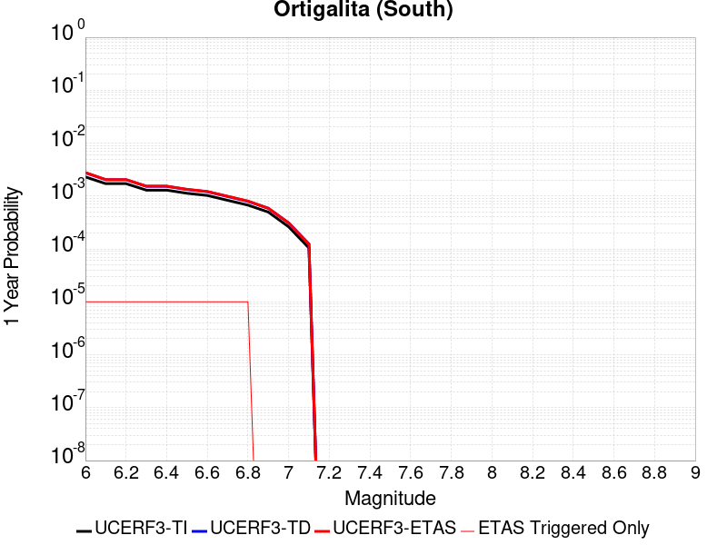 |  |

| Magnitude | 1 wk TI Prob | 1 wk TD Prob | 1 wk ETAS Prob | 1 wk ETAS/TD Gain | 1 wk ETAS Triggered Only | 1 mo TI Prob | 1 mo TD Prob | 1 mo ETAS Prob | 1 mo ETAS/TD Gain | 1 mo ETAS Triggered Only | 1 yr TI Prob | 1 yr TD Prob | 1 yr ETAS Prob | 1 yr ETAS/TD Gain | 1 yr ETAS Triggered Only | 10 yr TI Prob | 10 yr TD Prob | 10 yr ETAS Prob | 10 yr ETAS/TD Gain | 10 yr ETAS Triggered Only |
|-----|-----|-----|-----|-----|-----|-----|-----|-----|-----|-----|-----|-----|-----|-----|-----|-----|-----|-----|-----|-----|
| 6.0 | 4.409647E-5 | 5.2948053E-5 | 5.2948053E-5 | 1.0 | 0.0 | 1.8897117E-4 | 2.2690189E-4 | 2.2690189E-4 | 1.0 | 0.0 | 0.0022982962 | 0.002759266 | 0.0027692383 | 1.0036142 | 1.0E-5 | 0.022746716 | 0.027275288 | 0.02730447 | 1.0010699 | 3.0E-5 |
| 6.1 | 3.2870717E-5 | 3.906271E-5 | 3.906271E-5 | 1.0 | 0.0 | 1.4086689E-4 | 1.6740139E-4 | 1.6740139E-4 | 1.0 | 0.0 | 0.0017137051 | 0.0020362872 | 0.002046267 | 1.0049009 | 1.0E-5 | 0.017005498 | 0.020185946 | 0.02021534 | 1.0014561 | 3.0E-5 |
| 6.2 | 3.2870717E-5 | 3.906271E-5 | 3.906271E-5 | 1.0 | 0.0 | 1.4086689E-4 | 1.6740139E-4 | 1.6740139E-4 | 1.0 | 0.0 | 0.0017137051 | 0.0020362872 | 0.002046267 | 1.0049009 | 1.0E-5 | 0.017005498 | 0.020185946 | 0.02021534 | 1.0014561 | 3.0E-5 |
| 6.3 | 2.479433E-5 | 2.9288443E-5 | 2.9288443E-5 | 1.0 | 0.0 | 1.0625709E-4 | 1.2551602E-4 | 1.2551602E-4 | 1.0 | 0.0 | 0.0012929122 | 0.0015271154 | 0.0015371001 | 1.0065383 | 1.0E-5 | 0.012854158 | 0.0151694305 | 0.015189127 | 1.0012984 | 2.0E-5 |
| 6.4 | 2.479433E-5 | 2.9288443E-5 | 2.9288443E-5 | 1.0 | 0.0 | 1.0625709E-4 | 1.2551602E-4 | 1.2551602E-4 | 1.0 | 0.0 | 0.0012929122 | 0.0015271154 | 0.0015371001 | 1.0065383 | 1.0E-5 | 0.012854158 | 0.0151694305 | 0.015189127 | 1.0012984 | 2.0E-5 |
| 6.5 | 2.1614818E-5 | 2.5502166E-5 | 2.5502166E-5 | 1.0 | 0.0 | 9.263165E-5 | 1.0929054E-4 | 1.0929054E-4 | 1.0 | 0.0 | 0.0011272068 | 0.0013298205 | 0.0013398072 | 1.0075098 | 1.0E-5 | 0.011215063 | 0.01322093 | 0.013240665 | 1.0014927 | 2.0E-5 |
| 6.6 | 1.9653595E-5 | 2.3180326E-5 | 2.3180326E-5 | 1.0 | 0.0 | 8.422697E-5 | 9.934058E-5 | 9.934058E-5 | 1.0 | 0.0 | 0.0010249809 | 0.0012088188 | 0.0012188066 | 1.0082625 | 1.0E-5 | 0.010202662 | 0.012024398 | 0.012044157 | 1.0016433 | 2.0E-5 |
| 6.7 | 1.5912612E-5 | 1.87885E-5 | 1.87885E-5 | 1.0 | 0.0 | 6.819513E-5 | 8.0519734E-5 | 8.0519734E-5 | 1.0 | 0.0 | 8.2995935E-4 | 9.799008E-4 | 9.89891E-4 | 1.0101951 | 1.0E-5 | 0.008268665 | 0.009757269 | 0.009777074 | 1.0020298 | 2.0E-5 |
| 6.8 | 1.2909346E-5 | 1.5212756E-5 | 1.5212756E-5 | 1.0 | 0.0 | 5.532459E-5 | 6.5195956E-5 | 6.5195956E-5 | 1.0 | 0.0 | 6.7336875E-4 | 7.9348264E-4 | 8.0347474E-4 | 1.0125927 | 1.0E-5 | 0.00671332 | 0.007907622 | 0.007927463 | 1.0025092 | 2.0E-5 |
| 6.9 | 9.5450205E-6 | 1.12573425E-5 | 1.12573425E-5 | 1.0 | 0.0 | 4.0906587E-5 | 4.824491E-5 | 4.824491E-5 | 1.0 | 0.0 | 4.979239E-4 | 5.8723206E-4 | 5.8723206E-4 | 1.0 | 0.0 | 0.004968097 | 0.0058576646 | 0.005867606 | 1.0016972 | 1.0E-5 |
| 7.0 | 5.029838E-6 | 5.957952E-6 | 5.957952E-6 | 1.0 | 0.0 | 2.155627E-5 | 2.553385E-5 | 2.553385E-5 | 1.0 | 0.0 | 2.62416E-4 | 3.1083374E-4 | 3.1083374E-4 | 1.0 | 0.0 | 0.0026210633 | 0.0031043324 | 0.0031043324 | 1.0 | 0.0 |
| 7.1 | 1.9991749E-6 | 2.375295E-6 | 2.375295E-6 | 1.0 | 0.0 | 8.567864E-6 | 1.0179806E-5 | 1.0179806E-5 | 1.0 | 0.0 | 1.0430875E-4 | 1.2393385E-4 | 1.2393385E-4 | 1.0 | 0.0 | 0.001042598 | 0.001238819 | 0.001238819 | 1.0 | 0.0 |

## Casmalia 2011 CFM
*[(top)](#table-of-contents)*

| 1 Week | 1 Month | 1 Year | 10 Year |
|-----|-----|-----|-----|
|  | 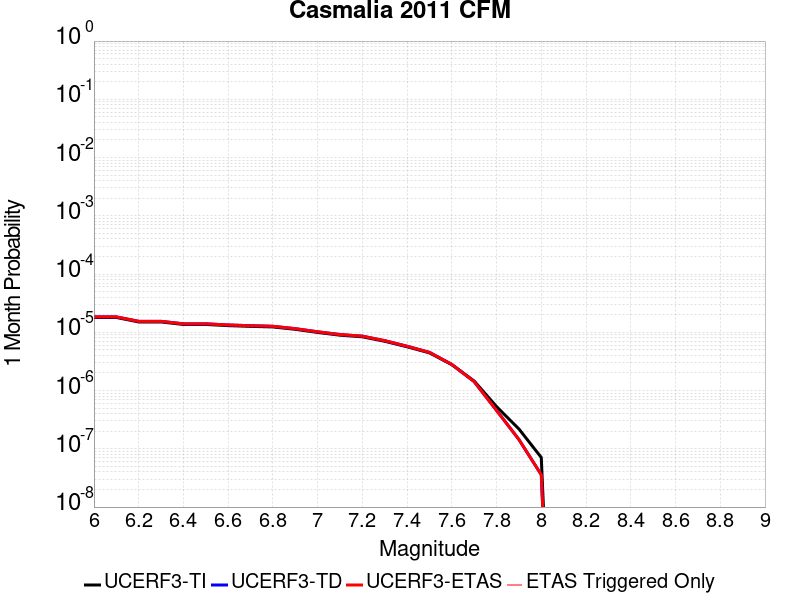 |  | 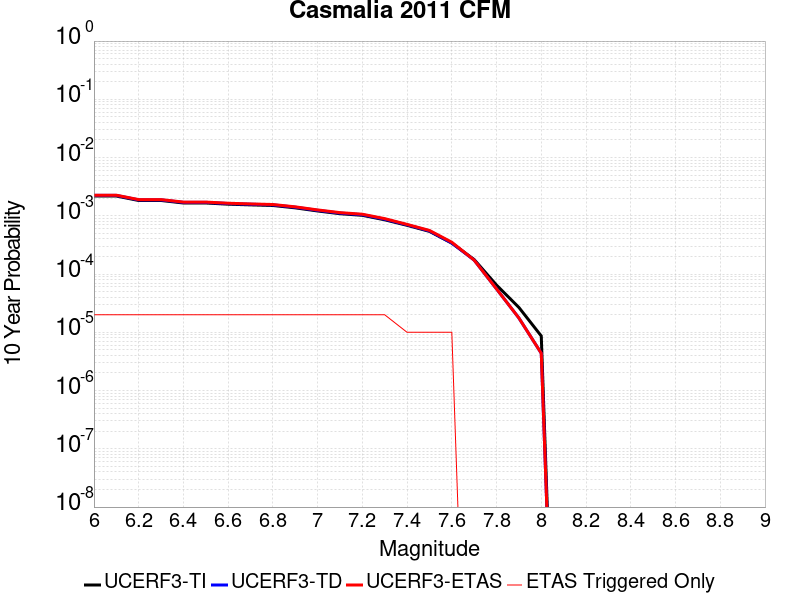 |

| Magnitude | 1 wk TI Prob | 1 wk TD Prob | 1 wk ETAS Prob | 1 wk ETAS/TD Gain | 1 wk ETAS Triggered Only | 1 mo TI Prob | 1 mo TD Prob | 1 mo ETAS Prob | 1 mo ETAS/TD Gain | 1 mo ETAS Triggered Only | 1 yr TI Prob | 1 yr TD Prob | 1 yr ETAS Prob | 1 yr ETAS/TD Gain | 1 yr ETAS Triggered Only | 10 yr TI Prob | 10 yr TD Prob | 10 yr ETAS Prob | 10 yr ETAS/TD Gain | 10 yr ETAS Triggered Only |
|-----|-----|-----|-----|-----|-----|-----|-----|-----|-----|-----|-----|-----|-----|-----|-----|-----|-----|-----|-----|-----|
| 6.0 | 4.1973244E-6 | 4.2966467E-6 | 4.2966467E-6 | 1.0 | 0.0 | 1.798841E-5 | 1.8414072E-5 | 1.8414072E-5 | 1.0 | 0.0 | 2.1898688E-4 | 2.2416846E-4 | 2.3416622E-4 | 1.0445993 | 1.0E-5 | 0.0021877121 | 0.002239444 | 0.0022593993 | 1.0089108 | 2.0E-5 |
| 6.1 | 4.1973244E-6 | 4.2966467E-6 | 4.2966467E-6 | 1.0 | 0.0 | 1.798841E-5 | 1.8414072E-5 | 1.8414072E-5 | 1.0 | 0.0 | 2.1898688E-4 | 2.2416846E-4 | 2.3416622E-4 | 1.0445993 | 1.0E-5 | 0.0021877121 | 0.002239444 | 0.0022593993 | 1.0089108 | 2.0E-5 |
| 6.2 | 3.514836E-6 | 3.6023503E-6 | 3.6023503E-6 | 1.0 | 0.0 | 1.5063495E-5 | 1.5438553E-5 | 1.5438553E-5 | 1.0 | 0.0 | 1.8338262E-4 | 1.8794826E-4 | 1.9794639E-4 | 1.0531961 | 1.0E-5 | 0.0018323136 | 0.0018779032 | 0.0018978657 | 1.0106301 | 2.0E-5 |
| 6.3 | 3.514836E-6 | 3.6023503E-6 | 3.6023503E-6 | 1.0 | 0.0 | 1.5063495E-5 | 1.5438553E-5 | 1.5438553E-5 | 1.0 | 0.0 | 1.8338262E-4 | 1.8794826E-4 | 1.9794639E-4 | 1.0531961 | 1.0E-5 | 0.0018323136 | 0.0018779032 | 0.0018978657 | 1.0106301 | 2.0E-5 |
| 6.4 | 3.182388E-6 | 3.2641626E-6 | 3.2641626E-6 | 1.0 | 0.0 | 1.3638734E-5 | 1.3989194E-5 | 1.3989194E-5 | 1.0 | 0.0 | 1.6603894E-4 | 1.703052E-4 | 1.8030348E-4 | 1.0587081 | 1.0E-5 | 0.0016591493 | 0.0017017542 | 0.0017217202 | 1.0117326 | 2.0E-5 |
| 6.5 | 3.182388E-6 | 3.2641626E-6 | 3.2641626E-6 | 1.0 | 0.0 | 1.3638734E-5 | 1.3989194E-5 | 1.3989194E-5 | 1.0 | 0.0 | 1.6603894E-4 | 1.703052E-4 | 1.8030348E-4 | 1.0587081 | 1.0E-5 | 0.0016591493 | 0.0017017542 | 0.0017217202 | 1.0117326 | 2.0E-5 |
| 6.6 | 3.0372648E-6 | 3.116358E-6 | 3.116358E-6 | 1.0 | 0.0 | 1.3016785E-5 | 1.3355751E-5 | 1.3355751E-5 | 1.0 | 0.0 | 1.5846782E-4 | 1.6259421E-4 | 1.7259258E-4 | 1.0614928 | 1.0E-5 | 0.0015835487 | 0.0016247593 | 0.0016447268 | 1.0122895 | 2.0E-5 |
| 6.7 | 2.9538155E-6 | 3.0311753E-6 | 3.0311753E-6 | 1.0 | 0.0 | 1.2659148E-5 | 1.2990687E-5 | 1.2990687E-5 | 1.0 | 0.0 | 1.5411423E-4 | 1.581502E-4 | 1.6814862E-4 | 1.063221 | 1.0E-5 | 0.0015400739 | 0.0015803832 | 0.0016003515 | 1.0126351 | 2.0E-5 |
| 6.8 | 2.8845457E-6 | 2.96037E-6 | 2.96037E-6 | 1.0 | 0.0 | 1.2362279E-5 | 1.2687239E-5 | 1.2687239E-5 | 1.0 | 0.0 | 1.5050036E-4 | 1.5445625E-4 | 1.644547E-4 | 1.0647333 | 1.0E-5 | 0.0015039847 | 0.0015434955 | 0.0015634646 | 1.0129375 | 2.0E-5 |
| 6.9 | 2.6272448E-6 | 2.695916E-6 | 2.695916E-6 | 1.0 | 0.0 | 1.1259573E-5 | 1.1553875E-5 | 1.1553875E-5 | 1.0 | 0.0 | 1.3707667E-4 | 1.406594E-4 | 1.5065799E-4 | 1.0710837 | 1.0E-5 | 0.0013699215 | 0.0014057087 | 0.0014256807 | 1.0142077 | 2.0E-5 |
| 7.0 | 2.3220489E-6 | 2.3820387E-6 | 2.3820387E-6 | 1.0 | 0.0 | 9.9516E-6 | 1.0208697E-5 | 1.0208697E-5 | 1.0 | 0.0 | 1.2115399E-4 | 1.2428383E-4 | 1.3428259E-4 | 1.080451 | 1.0E-5 | 0.0012108797 | 0.0012421468 | 0.001262122 | 1.0160812 | 2.0E-5 |
| 7.1 | 2.0834805E-6 | 2.1369044E-6 | 2.1369044E-6 | 1.0 | 0.0 | 8.929172E-6 | 9.15813E-6 | 9.15813E-6 | 1.0 | 0.0 | 1.0870724E-4 | 1.1149455E-4 | 1.2149343E-4 | 1.0896804 | 1.0E-5 | 0.0010865408 | 0.0011143887 | 0.0011343664 | 1.017927 | 2.0E-5 |
| 7.2 | 1.9543008E-6 | 2.0041045E-6 | 2.0041045E-6 | 1.0 | 0.0 | 8.375548E-6 | 8.5889915E-6 | 8.5889915E-6 | 1.0 | 0.0 | 1.01967526E-4 | 1.04565974E-4 | 1.1456493E-4 | 1.0956234 | 1.0E-5 | 0.0010192075 | 0.0010451701 | 0.0010651492 | 1.0191157 | 2.0E-5 |
| 7.3 | 1.6373803E-6 | 1.6769305E-6 | 1.6769305E-6 | 1.0 | 0.0 | 7.017325E-6 | 7.1868253E-6 | 7.1868253E-6 | 1.0 | 0.0 | 8.5432584E-5 | 8.74961E-5 | 9.749522E-5 | 1.1142808 | 1.0E-5 | 8.539975E-4 | 8.7461754E-4 | 8.946E-4 | 1.0228472 | 2.0E-5 |
| 7.4 | 1.3165608E-6 | 1.3457204E-6 | 1.3457204E-6 | 1.0 | 0.0 | 5.642391E-6 | 5.7673606E-6 | 5.7673606E-6 | 1.0 | 0.0 | 6.8693946E-5 | 7.021536E-5 | 8.021466E-5 | 1.142409 | 1.0E-5 | 6.867271E-4 | 7.0193247E-4 | 7.1192544E-4 | 1.0142363 | 1.0E-5 |
| 7.5 | 1.0364803E-6 | 1.0562433E-6 | 1.0562433E-6 | 1.0 | 0.0 | 4.442051E-6 | 4.526749E-6 | 4.526749E-6 | 1.0 | 0.0 | 5.4080625E-5 | 5.511178E-5 | 6.511123E-5 | 1.1814394 | 1.0E-5 | 5.4067466E-4 | 5.5098167E-4 | 5.6097616E-4 | 1.0181395 | 1.0E-5 |
| 7.6 | 6.503176E-7 | 6.554749E-7 | 6.554749E-7 | 1.0 | 0.0 | 2.7870724E-6 | 2.8091752E-6 | 2.8091752E-6 | 1.0 | 0.0 | 3.393208E-5 | 3.4201174E-5 | 4.420083E-5 | 1.2923776 | 1.0E-5 | 3.3926897E-4 | 3.4195936E-4 | 3.5195594E-4 | 1.0292332 | 1.0E-5 |
| 7.7 | 3.4003617E-7 | 3.323181E-7 | 3.323181E-7 | 1.0 | 0.0 | 1.4572971E-6 | 1.4242197E-6 | 1.4242197E-6 | 1.0 | 0.0 | 1.7742448E-5 | 1.7339737E-5 | 1.7339737E-5 | 1.0 | 0.0 | 1.7741031E-4 | 1.733839E-4 | 1.733839E-4 | 1.0 | 0.0 |
| 7.8 | 1.2392253E-7 | 1.0647599E-7 | 1.0647599E-7 | 1.0 | 0.0 | 5.310965E-7 | 4.5632558E-7 | 4.5632558E-7 | 1.0 | 0.0 | 6.46608E-6 | 5.55575E-6 | 5.55575E-6 | 1.0 | 0.0 | 6.465892E-5 | 5.5556124E-5 | 5.5556124E-5 | 1.0 | 0.0 |
| 7.9 | 5.1192536E-8 | 3.369698E-8 | 3.369698E-8 | 1.0 | 0.0 | 2.1939657E-7 | 1.4441562E-7 | 1.4441562E-7 | 1.0 | 0.0 | 2.67115E-6 | 1.7582589E-6 | 1.7582589E-6 | 1.0 | 0.0 | 2.6711179E-5 | 1.7582452E-5 | 1.7582452E-5 | 1.0 | 0.0 |
| 8.0 | 1.6562627E-8 | 8.366959E-9 | 8.366959E-9 | 1.0 | 0.0 | 7.0982686E-8 | 3.5858392E-8 | 3.5858392E-8 | 1.0 | 0.0 | 8.6421386E-7 | 4.3657585E-7 | 4.3657585E-7 | 1.0 | 0.0 | 8.642105E-6 | 4.3657506E-6 | 4.3657506E-6 | 1.0 | 0.0 |

## Hayward (So) 2011 CFM
*[(top)](#table-of-contents)*

| 1 Week | 1 Month | 1 Year | 10 Year |
|-----|-----|-----|-----|
|  |  |  | 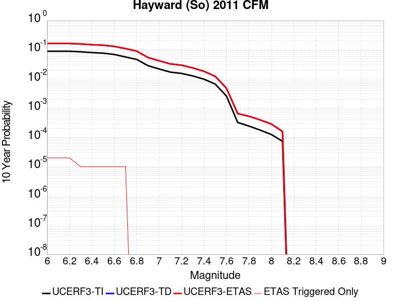 |

| Magnitude | 1 wk TI Prob | 1 wk TD Prob | 1 wk ETAS Prob | 1 wk ETAS/TD Gain | 1 wk ETAS Triggered Only | 1 mo TI Prob | 1 mo TD Prob | 1 mo ETAS Prob | 1 mo ETAS/TD Gain | 1 mo ETAS Triggered Only | 1 yr TI Prob | 1 yr TD Prob | 1 yr ETAS Prob | 1 yr ETAS/TD Gain | 1 yr ETAS Triggered Only | 10 yr TI Prob | 10 yr TD Prob | 10 yr ETAS Prob | 10 yr ETAS/TD Gain | 10 yr ETAS Triggered Only |
|-----|-----|-----|-----|-----|-----|-----|-----|-----|-----|-----|-----|-----|-----|-----|-----|-----|-----|-----|-----|-----|
| 6.0 | 1.7961452E-4 | 3.5208187E-4 | 3.6207837E-4 | 1.0283924 | 1.0E-5 | 7.6954946E-4 | 0.0015080592 | 0.001518044 | 1.006621 | 1.0E-5 | 0.009329082 | 0.018208332 | 0.018227968 | 1.0010784 | 2.0E-5 | 0.08947025 | 0.16478999 | 0.1648067 | 1.0001013 | 2.0E-5 |
| 6.1 | 1.7961452E-4 | 3.5208187E-4 | 3.6207837E-4 | 1.0283924 | 1.0E-5 | 7.6954946E-4 | 0.0015080592 | 0.001518044 | 1.006621 | 1.0E-5 | 0.009329082 | 0.018208332 | 0.018227968 | 1.0010784 | 2.0E-5 | 0.08947025 | 0.16478999 | 0.1648067 | 1.0001013 | 2.0E-5 |
| 6.2 | 1.7961452E-4 | 3.5208187E-4 | 3.6207837E-4 | 1.0283924 | 1.0E-5 | 7.6954946E-4 | 0.0015080592 | 0.001518044 | 1.006621 | 1.0E-5 | 0.009329082 | 0.018208332 | 0.018227968 | 1.0010784 | 2.0E-5 | 0.08947025 | 0.16478999 | 0.1648067 | 1.0001013 | 2.0E-5 |
| 6.3 | 1.7149582E-4 | 3.3683464E-4 | 3.4683128E-4 | 1.0296781 | 1.0E-5 | 7.3477504E-4 | 0.0014427875 | 0.001452773 | 1.006921 | 1.0E-5 | 0.00890925 | 0.017426595 | 0.01743642 | 1.0005639 | 1.0E-5 | 0.08560418 | 0.15836513 | 0.15837353 | 1.0000532 | 1.0E-5 |
| 6.4 | 1.608319E-4 | 3.1625925E-4 | 3.2625606E-4 | 1.0316097 | 1.0E-5 | 6.890975E-4 | 0.0013547007 | 0.0013646871 | 1.0073717 | 1.0E-5 | 0.008357534 | 0.016370604 | 0.01638044 | 1.0006008 | 1.0E-5 | 0.0805012 | 0.14962883 | 0.14963734 | 1.0000569 | 1.0E-5 |
| 6.5 | 1.5346E-4 | 3.0299145E-4 | 3.129884E-4 | 1.0329943 | 1.0E-5 | 6.5751997E-4 | 0.0012978961 | 0.0013078832 | 1.0076947 | 1.0E-5 | 0.00797596 | 0.015689133 | 0.015698977 | 1.0006274 | 1.0E-5 | 0.07695693 | 0.14387508 | 0.14388363 | 1.0000595 | 1.0E-5 |
| 6.6 | 1.3749431E-4 | 2.724123E-4 | 2.8240957E-4 | 1.036699 | 1.0E-5 | 5.8912823E-4 | 0.0011669649 | 0.0011769532 | 1.0085592 | 1.0E-5 | 0.0071490724 | 0.014116572 | 0.01412643 | 1.0006983 | 1.0E-5 | 0.06923411 | 0.1305945 | 0.13060321 | 1.0000665 | 1.0E-5 |
| 6.7 | 1.12132315E-4 | 2.25606E-4 | 2.3560374E-4 | 1.0443151 | 1.0E-5 | 4.8047854E-4 | 9.665287E-4 | 9.765191E-4 | 1.0103363 | 1.0E-5 | 0.005834147 | 0.011704879 | 0.011714761 | 1.0008444 | 1.0E-5 | 0.05683338 | 0.10969661 | 0.109705515 | 1.0000812 | 1.0E-5 |
| 6.8 | 9.187296E-5 | 1.8301571E-4 | 1.8301571E-4 | 1.0 | 0.0 | 3.9368184E-4 | 7.8412006E-4 | 7.8412006E-4 | 1.0 | 0.0 | 0.004782547 | 0.009505431 | 0.009505431 | 1.0 | 0.0 | 0.046809215 | 0.09014368 | 0.09014368 | 1.0 | 0.0 |
| 6.9 | 5.5731532E-5 | 1.0773513E-4 | 1.0773513E-4 | 1.0 | 0.0 | 2.3882755E-4 | 4.6164083E-4 | 4.6164083E-4 | 1.0 | 0.0 | 0.0029038484 | 0.0056060962 | 0.0056060962 | 1.0 | 0.0 | 0.028661951 | 0.054486822 | 0.054486822 | 1.0 | 0.0 |
| 7.0 | 4.2773067E-5 | 8.272548E-5 | 8.272548E-5 | 1.0 | 0.0 | 1.8330026E-4 | 3.5448986E-4 | 3.5448986E-4 | 1.0 | 0.0 | 0.0022293965 | 0.004307426 | 0.004307426 | 1.0 | 0.0 | 0.02207163 | 0.04221538 | 0.04221538 | 1.0 | 0.0 |
| 7.1 | 3.3304317E-5 | 6.3835694E-5 | 6.3835694E-5 | 1.0 | 0.0 | 1.4272498E-4 | 2.7355296E-4 | 2.7355296E-4 | 1.0 | 0.0 | 0.0017362916 | 0.003325439 | 0.003325439 | 1.0 | 0.0 | 0.01722788 | 0.032862782 | 0.032862782 | 1.0 | 0.0 |
| 7.2 | 3.0069796E-5 | 5.7766385E-5 | 5.7766385E-5 | 1.0 | 0.0 | 1.2886418E-4 | 2.4754682E-4 | 2.4754682E-4 | 1.0 | 0.0 | 0.0015677923 | 0.003009733 | 0.003009733 | 1.0 | 0.0 | 0.015567776 | 0.02983162 | 0.02983162 | 1.0 | 0.0 |
| 7.3 | 2.4611627E-5 | 4.6301735E-5 | 4.6301735E-5 | 1.0 | 0.0 | 1.0547413E-4 | 1.9842098E-4 | 1.9842098E-4 | 1.0 | 0.0 | 0.001283391 | 0.0024131108 | 0.0024131108 | 1.0 | 0.0 | 0.012760044 | 0.024014989 | 0.024014989 | 1.0 | 0.0 |
| 7.4 | 1.9029985E-5 | 3.5220168E-5 | 3.5220168E-5 | 1.0 | 0.0 | 8.155453E-5 | 1.509349E-4 | 1.509349E-4 | 1.0 | 0.0 | 9.92474E-4 | 0.0018360922 | 0.0018360922 | 1.0 | 0.0 | 0.0098805325 | 0.018347671 | 0.018347671 | 1.0 | 0.0 |
| 7.5 | 1.2896034E-5 | 2.3599921E-5 | 2.3599921E-5 | 1.0 | 0.0 | 5.5267545E-5 | 1.0113863E-4 | 1.0113863E-4 | 1.0 | 0.0 | 6.726746E-4 | 0.0012306724 | 0.0012306724 | 1.0 | 0.0 | 0.0067064203 | 0.012350384 | 0.012350384 | 1.0 | 0.0 |
| 7.6 | 5.0108047E-6 | 9.220908E-6 | 9.220908E-6 | 1.0 | 0.0 | 2.1474701E-5 | 3.951759E-5 | 3.951759E-5 | 1.0 | 0.0 | 2.6142312E-4 | 4.8102165E-4 | 4.8102165E-4 | 1.0 | 0.0 | 0.002611158 | 0.004856988 | 0.004856988 | 1.0 | 0.0 |
| 7.7 | 6.291058E-7 | 1.21038E-6 | 1.21038E-6 | 1.0 | 0.0 | 2.6961648E-6 | 5.1873326E-6 | 5.1873326E-6 | 1.0 | 0.0 | 3.282531E-5 | 6.315395E-5 | 6.315395E-5 | 1.0 | 0.0 | 3.2820462E-4 | 6.570273E-4 | 6.570273E-4 | 1.0 | 0.0 |
| 7.8 | 4.7062596E-7 | 9.778379E-7 | 9.778379E-7 | 1.0 | 0.0 | 2.0169668E-6 | 4.190727E-6 | 4.190727E-6 | 1.0 | 0.0 | 2.4556295E-5 | 5.1020907E-5 | 5.1020907E-5 | 1.0 | 0.0 | 2.455358E-4 | 5.328053E-4 | 5.328053E-4 | 1.0 | 0.0 |
| 7.9 | 3.431324E-7 | 7.3792154E-7 | 7.3792154E-7 | 1.0 | 0.0 | 1.4705666E-6 | 3.162517E-6 | 3.162517E-6 | 1.0 | 0.0 | 1.7904002E-5 | 3.8502967E-5 | 3.8502967E-5 | 1.0 | 0.0 | 1.7902559E-4 | 4.0012837E-4 | 4.0012837E-4 | 1.0 | 0.0 |
| 8.0 | 2.4248533E-7 | 5.366743E-7 | 5.366743E-7 | 1.0 | 0.0 | 1.0392224E-6 | 2.3000305E-6 | 2.3000305E-6 | 1.0 | 0.0 | 1.2652459E-5 | 2.8002514E-5 | 2.8002514E-5 | 1.0 | 0.0 | 1.2651739E-4 | 2.8901166E-4 | 2.8901166E-4 | 1.0 | 0.0 |
| 8.1 | 1.4246172E-7 | 2.9904194E-7 | 2.9904194E-7 | 1.0 | 0.0 | 6.1055005E-7 | 1.2816076E-6 | 1.2816076E-6 | 1.0 | 0.0 | 7.4334216E-6 | 1.5603462E-5 | 1.5603462E-5 | 1.0 | 0.0 | 7.433173E-5 | 1.6052031E-4 | 1.6052031E-4 | 1.0 | 0.0 |

## Elsinore (Stepovers Combined)
*[(top)](#table-of-contents)*

| 1 Week | 1 Month | 1 Year | 10 Year |
|-----|-----|-----|-----|
|  |  |  |  |

| Magnitude | 1 wk TI Prob | 1 wk TD Prob | 1 wk ETAS Prob | 1 wk ETAS/TD Gain | 1 wk ETAS Triggered Only | 1 mo TI Prob | 1 mo TD Prob | 1 mo ETAS Prob | 1 mo ETAS/TD Gain | 1 mo ETAS Triggered Only | 1 yr TI Prob | 1 yr TD Prob | 1 yr ETAS Prob | 1 yr ETAS/TD Gain | 1 yr ETAS Triggered Only | 10 yr TI Prob | 10 yr TD Prob | 10 yr ETAS Prob | 10 yr ETAS/TD Gain | 10 yr ETAS Triggered Only |
|-----|-----|-----|-----|-----|-----|-----|-----|-----|-----|-----|-----|-----|-----|-----|-----|-----|-----|-----|-----|-----|
| 6.0 | 2.0990055E-5 | 1.997848E-5 | 1.997848E-5 | 1.0 | 0.0 | 8.995428E-5 | 8.5619395E-5 | 8.5619395E-5 | 1.0 | 0.0 | 0.001094643 | 0.0010419429 | 0.0010619219 | 1.0191749 | 2.0E-5 | 0.010892667 | 0.010375666 | 0.010395459 | 1.0019076 | 2.0E-5 |
| 6.1 | 2.0990055E-5 | 1.997848E-5 | 1.997848E-5 | 1.0 | 0.0 | 8.995428E-5 | 8.5619395E-5 | 8.5619395E-5 | 1.0 | 0.0 | 0.001094643 | 0.0010419429 | 0.0010619219 | 1.0191749 | 2.0E-5 | 0.010892667 | 0.010375666 | 0.010395459 | 1.0019076 | 2.0E-5 |
| 6.2 | 2.0990055E-5 | 1.997848E-5 | 1.997848E-5 | 1.0 | 0.0 | 8.995428E-5 | 8.5619395E-5 | 8.5619395E-5 | 1.0 | 0.0 | 0.001094643 | 0.0010419429 | 0.0010619219 | 1.0191749 | 2.0E-5 | 0.010892667 | 0.010375666 | 0.010395459 | 1.0019076 | 2.0E-5 |
| 6.3 | 1.9876543E-5 | 1.8655615E-5 | 1.8655615E-5 | 1.0 | 0.0 | 8.51824E-5 | 7.995032E-5 | 7.995032E-5 | 1.0 | 0.0 | 0.0010366022 | 9.729834E-4 | 9.929639E-4 | 1.0205353 | 2.0E-5 | 0.0103178015 | 0.0096921 | 0.009711906 | 1.0020435 | 2.0E-5 |
| 6.4 | 1.9876543E-5 | 1.8655615E-5 | 1.8655615E-5 | 1.0 | 0.0 | 8.51824E-5 | 7.995032E-5 | 7.995032E-5 | 1.0 | 0.0 | 0.0010366022 | 9.729834E-4 | 9.929639E-4 | 1.0205353 | 2.0E-5 | 0.0103178015 | 0.0096921 | 0.009711906 | 1.0020435 | 2.0E-5 |
| 6.5 | 1.9876543E-5 | 1.8655615E-5 | 1.8655615E-5 | 1.0 | 0.0 | 8.51824E-5 | 7.995032E-5 | 7.995032E-5 | 1.0 | 0.0 | 0.0010366022 | 9.729834E-4 | 9.929639E-4 | 1.0205353 | 2.0E-5 | 0.0103178015 | 0.0096921 | 0.009711906 | 1.0020435 | 2.0E-5 |
| 6.6 | 1.9791347E-5 | 1.855327E-5 | 1.855327E-5 | 1.0 | 0.0 | 8.48173E-5 | 7.951172E-5 | 7.951172E-5 | 1.0 | 0.0 | 0.0010321613 | 9.6764846E-4 | 9.876292E-4 | 1.0206487 | 2.0E-5 | 0.010273804 | 0.009639219 | 0.009659027 | 1.0020548 | 2.0E-5 |
| 6.7 | 1.7386385E-5 | 1.5096021E-5 | 1.5096021E-5 | 1.0 | 0.0 | 7.451094E-5 | 6.4695676E-5 | 6.4695676E-5 | 1.0 | 0.0 | 9.0679317E-4 | 7.873935E-4 | 7.973856E-4 | 1.0126902 | 1.0E-5 | 0.009031019 | 0.007850705 | 0.007860627 | 1.0012637 | 1.0E-5 |
| 6.8 | 1.6574762E-5 | 1.3901323E-5 | 1.3901323E-5 | 1.0 | 0.0 | 7.1032766E-5 | 5.9575774E-5 | 5.9575774E-5 | 1.0 | 0.0 | 8.6448074E-4 | 7.251002E-4 | 7.3509297E-4 | 1.0137812 | 1.0E-5 | 0.008611255 | 0.0072311433 | 0.007241071 | 1.0013729 | 1.0E-5 |
| 6.9 | 1.553819E-5 | 1.29155405E-5 | 1.29155405E-5 | 1.0 | 0.0 | 6.659054E-5 | 5.535117E-5 | 5.535117E-5 | 1.0 | 0.0 | 8.1043824E-4 | 6.7369774E-4 | 6.83691E-4 | 1.0148335 | 1.0E-5 | 0.00807489 | 0.0067199073 | 0.0067298403 | 1.0014781 | 1.0E-5 |
| 7.0 | 1.3287177E-5 | 1.1008949E-5 | 1.1008949E-5 | 1.0 | 0.0 | 5.69438E-5 | 4.7180365E-5 | 4.7180365E-5 | 1.0 | 0.0 | 6.9307024E-4 | 5.7427154E-4 | 5.842658E-4 | 1.0174034 | 1.0E-5 | 0.006909127 | 0.0057300236 | 0.0057399664 | 1.0017352 | 1.0E-5 |
| 7.1 | 1.2926523E-5 | 1.0609238E-5 | 1.0609238E-5 | 1.0 | 0.0 | 5.5398206E-5 | 4.5467383E-5 | 4.5467383E-5 | 1.0 | 0.0 | 6.742644E-4 | 5.534267E-4 | 5.6342117E-4 | 1.0180593 | 1.0E-5 | 0.0067222225 | 0.005522205 | 0.0055321497 | 1.0018009 | 1.0E-5 |
| 7.2 | 1.22874635E-5 | 9.939779E-6 | 9.939779E-6 | 1.0 | 0.0 | 5.2659496E-5 | 4.2598367E-5 | 4.2598367E-5 | 1.0 | 0.0 | 6.4094074E-4 | 5.185135E-4 | 5.285083E-4 | 1.0192759 | 1.0E-5 | 0.006390953 | 0.00517399 | 0.0051839384 | 1.0019227 | 1.0E-5 |
| 7.3 | 1.0426614E-5 | 8.332192E-6 | 8.332192E-6 | 1.0 | 0.0 | 4.4684723E-5 | 3.5708916E-5 | 3.5708916E-5 | 1.0 | 0.0 | 5.439007E-4 | 4.3467068E-4 | 4.4466634E-4 | 1.022996 | 1.0E-5 | 0.005425714 | 0.0043384917 | 0.004348448 | 1.0022949 | 1.0E-5 |
| 7.4 | 9.331041E-6 | 7.3533633E-6 | 7.3533633E-6 | 1.0 | 0.0 | 3.998956E-5 | 3.151404E-5 | 3.151404E-5 | 1.0 | 0.0 | 4.8676413E-4 | 3.8361707E-4 | 3.9361324E-4 | 1.0260577 | 1.0E-5 | 0.004856993 | 0.0038296718 | 0.0038396334 | 1.0026011 | 1.0E-5 |
| 7.5 | 8.294672E-6 | 6.394914E-6 | 6.394914E-6 | 1.0 | 0.0 | 3.5548106E-5 | 2.7406493E-5 | 2.7406493E-5 | 1.0 | 0.0 | 4.3271226E-4 | 3.3362408E-4 | 3.3362408E-4 | 1.0 | 0.0 | 0.0043187067 | 0.0033313434 | 0.0033313434 | 1.0 | 0.0 |
| 7.6 | 7.4912623E-6 | 5.691383E-6 | 5.691383E-6 | 1.0 | 0.0 | 3.2105014E-5 | 2.439142E-5 | 2.439142E-5 | 1.0 | 0.0 | 3.9080845E-4 | 2.969261E-4 | 2.969261E-4 | 1.0 | 0.0 | 0.0039012188 | 0.0029653993 | 0.0029653993 | 1.0 | 0.0 |
| 7.7 | 4.691549E-6 | 3.2373503E-6 | 3.2373503E-6 | 1.0 | 0.0 | 2.0106483E-5 | 1.3874288E-5 | 1.3874288E-5 | 1.0 | 0.0 | 2.4476892E-4 | 1.689069E-4 | 1.689069E-4 | 1.0 | 0.0 | 0.0024449949 | 0.0016878388 | 0.0016878388 | 1.0 | 0.0 |
| 7.8 | 8.763466E-7 | 5.8610294E-7 | 5.8610294E-7 | 1.0 | 0.0 | 3.7557656E-6 | 2.5118675E-6 | 2.5118675E-6 | 1.0 | 0.0 | 4.5725486E-5 | 3.0581574E-5 | 3.0581574E-5 | 1.0 | 0.0 | 4.571608E-4 | 3.057752E-4 | 3.057752E-4 | 1.0 | 0.0 |
| 7.9 | 9.339275E-8 | 6.106284E-8 | 6.106284E-8 | 1.0 | 0.0 | 4.0025458E-7 | 2.6169786E-7 | 2.6169786E-7 | 1.0 | 0.0 | 4.8730885E-6 | 3.1861669E-6 | 3.1861669E-6 | 1.0 | 0.0 | 4.8729817E-5 | 3.1861222E-5 | 3.1861222E-5 | 1.0 | 0.0 |
| 8.0 | 1.2971227E-9 | 6.43537E-10 | 6.43537E-10 | 1.0 | 0.0 | 5.5590976E-9 | 2.7580156E-9 | 2.7580156E-9 | 1.0 | 0.0 | 6.768201E-8 | 3.357884E-8 | 3.357884E-8 | 1.0 | 0.0 | 6.7681987E-7 | 3.3578837E-7 | 3.3578837E-7 | 1.0 | 0.0 |

## San Luis Range (So Margin)
*[(top)](#table-of-contents)*

| 1 Week | 1 Month | 1 Year | 10 Year |
|-----|-----|-----|-----|
|  |  |  |  |

| Magnitude | 1 wk TI Prob | 1 wk TD Prob | 1 wk ETAS Prob | 1 wk ETAS/TD Gain | 1 wk ETAS Triggered Only | 1 mo TI Prob | 1 mo TD Prob | 1 mo ETAS Prob | 1 mo ETAS/TD Gain | 1 mo ETAS Triggered Only | 1 yr TI Prob | 1 yr TD Prob | 1 yr ETAS Prob | 1 yr ETAS/TD Gain | 1 yr ETAS Triggered Only | 10 yr TI Prob | 10 yr TD Prob | 10 yr ETAS Prob | 10 yr ETAS/TD Gain | 10 yr ETAS Triggered Only |
|-----|-----|-----|-----|-----|-----|-----|-----|-----|-----|-----|-----|-----|-----|-----|-----|-----|-----|-----|-----|-----|
| 6.0 | 5.0763606E-6 | 5.117484E-6 | 1.5117433E-5 | 2.9540753 | 1.0E-5 | 2.175565E-5 | 2.1931894E-5 | 3.1931675E-5 | 1.4559469 | 1.0E-5 | 2.6484285E-4 | 2.669888E-4 | 2.8698344E-4 | 1.0748895 | 2.0E-5 | 0.0026452742 | 0.0026667498 | 0.0026866964 | 1.0074798 | 2.0E-5 |
| 6.1 | 5.0763606E-6 | 5.117484E-6 | 1.5117433E-5 | 2.9540753 | 1.0E-5 | 2.175565E-5 | 2.1931894E-5 | 3.1931675E-5 | 1.4559469 | 1.0E-5 | 2.6484285E-4 | 2.669888E-4 | 2.8698344E-4 | 1.0748895 | 2.0E-5 | 0.0026452742 | 0.0026667498 | 0.0026866964 | 1.0074798 | 2.0E-5 |
| 6.2 | 5.0763606E-6 | 5.117484E-6 | 1.5117433E-5 | 2.9540753 | 1.0E-5 | 2.175565E-5 | 2.1931894E-5 | 3.1931675E-5 | 1.4559469 | 1.0E-5 | 2.6484285E-4 | 2.669888E-4 | 2.8698344E-4 | 1.0748895 | 2.0E-5 | 0.0026452742 | 0.0026667498 | 0.0026866964 | 1.0074798 | 2.0E-5 |
| 6.3 | 5.0763606E-6 | 5.117484E-6 | 1.5117433E-5 | 2.9540753 | 1.0E-5 | 2.175565E-5 | 2.1931894E-5 | 3.1931675E-5 | 1.4559469 | 1.0E-5 | 2.6484285E-4 | 2.669888E-4 | 2.8698344E-4 | 1.0748895 | 2.0E-5 | 0.0026452742 | 0.0026667498 | 0.0026866964 | 1.0074798 | 2.0E-5 |
| 6.4 | 5.0763606E-6 | 5.117484E-6 | 1.5117433E-5 | 2.9540753 | 1.0E-5 | 2.175565E-5 | 2.1931894E-5 | 3.1931675E-5 | 1.4559469 | 1.0E-5 | 2.6484285E-4 | 2.669888E-4 | 2.8698344E-4 | 1.0748895 | 2.0E-5 | 0.0026452742 | 0.0026667498 | 0.0026866964 | 1.0074798 | 2.0E-5 |
| 6.5 | 3.5169087E-6 | 3.539194E-6 | 3.539194E-6 | 1.0 | 0.0 | 1.5072378E-5 | 1.5167887E-5 | 1.5167887E-5 | 1.0 | 0.0 | 1.8349076E-4 | 1.8465346E-4 | 1.8465346E-4 | 1.0 | 0.0 | 0.0018333931 | 0.001845009 | 0.001845009 | 1.0 | 0.0 |
| 6.6 | 3.4553539E-6 | 3.4768245E-6 | 3.4768245E-6 | 1.0 | 0.0 | 1.48085755E-5 | 1.4900592E-5 | 1.4900592E-5 | 1.0 | 0.0 | 1.8027949E-4 | 1.8139968E-4 | 1.8139968E-4 | 1.0 | 0.0 | 0.001801333 | 0.0018125244 | 0.0018125244 | 1.0 | 0.0 |
| 6.7 | 2.9212883E-6 | 2.935684E-6 | 2.935684E-6 | 1.0 | 0.0 | 1.25197475E-5 | 1.2581442E-5 | 1.2581442E-5 | 1.0 | 0.0 | 1.5241727E-4 | 1.5316832E-4 | 1.5316832E-4 | 1.0 | 0.0 | 0.0015231277 | 0.0015306312 | 0.0015306312 | 1.0 | 0.0 |
| 6.8 | 2.7652516E-6 | 2.7767733E-6 | 2.7767733E-6 | 1.0 | 0.0 | 1.1851024E-5 | 1.1900403E-5 | 1.1900403E-5 | 1.0 | 0.0 | 1.4427667E-4 | 1.4487779E-4 | 1.4487779E-4 | 1.0 | 0.0 | 0.0014418303 | 0.0014478364 | 0.0014478364 | 1.0 | 0.0 |
| 6.9 | 2.4858243E-6 | 2.4937465E-6 | 2.4937465E-6 | 1.0 | 0.0 | 1.065349E-5 | 1.0687441E-5 | 1.0687441E-5 | 1.0 | 0.0 | 1.2969851E-4 | 1.3011185E-4 | 1.3011185E-4 | 1.0 | 0.0 | 0.0012962285 | 0.0013003586 | 0.0013003586 | 1.0 | 0.0 |
| 7.0 | 2.237181E-6 | 2.241491E-6 | 2.241491E-6 | 1.0 | 0.0 | 9.587883E-6 | 9.606355E-6 | 9.606355E-6 | 1.0 | 0.0 | 1.1672622E-4 | 1.169511E-4 | 1.169511E-4 | 1.0 | 0.0 | 0.0011666493 | 0.001168897 | 0.001168897 | 1.0 | 0.0 |
| 7.1 | 1.9963104E-6 | 1.9970894E-6 | 1.9970894E-6 | 1.0 | 0.0 | 8.5555885E-6 | 8.558926E-6 | 8.558926E-6 | 1.0 | 0.0 | 1.04159306E-4 | 1.0419995E-4 | 1.0419995E-4 | 1.0 | 0.0 | 0.001041105 | 0.001041512 | 0.001041512 | 1.0 | 0.0 |
| 7.2 | 1.7570916E-6 | 1.7534337E-6 | 1.7534337E-6 | 1.0 | 0.0 | 7.5303706E-6 | 7.514694E-6 | 7.514694E-6 | 1.0 | 0.0 | 9.1678405E-5 | 9.148756E-5 | 9.148756E-5 | 1.0 | 0.0 | 9.1640593E-4 | 9.1449975E-4 | 9.1449975E-4 | 1.0 | 0.0 |
| 7.3 | 1.470103E-6 | 1.4652366E-6 | 1.4652366E-6 | 1.0 | 0.0 | 6.3004263E-6 | 6.27957E-6 | 6.27957E-6 | 1.0 | 0.0 | 7.6704986E-5 | 7.6451084E-5 | 7.6451084E-5 | 1.0 | 0.0 | 7.667852E-4 | 7.6424825E-4 | 7.6424825E-4 | 1.0 | 0.0 |
| 7.4 | 1.1992463E-6 | 1.1927141E-6 | 1.1927141E-6 | 1.0 | 0.0 | 5.139617E-6 | 5.1116212E-6 | 5.1116212E-6 | 1.0 | 0.0 | 6.257304E-5 | 6.223222E-5 | 6.223222E-5 | 1.0 | 0.0 | 6.2555424E-4 | 6.221481E-4 | 6.221481E-4 | 1.0 | 0.0 |
| 7.5 | 8.316146E-7 | 8.225464E-7 | 8.225464E-7 | 1.0 | 0.0 | 3.5640578E-6 | 3.525194E-6 | 3.525194E-6 | 1.0 | 0.0 | 4.3391537E-5 | 4.291839E-5 | 4.291839E-5 | 1.0 | 0.0 | 4.3383066E-4 | 4.2910108E-4 | 4.2910108E-4 | 1.0 | 0.0 |
| 7.6 | 4.79556E-7 | 4.6975063E-7 | 4.6975063E-7 | 1.0 | 0.0 | 2.0552384E-6 | 2.0132152E-6 | 2.0132152E-6 | 1.0 | 0.0 | 2.502224E-5 | 2.451062E-5 | 2.451062E-5 | 1.0 | 0.0 | 2.5019422E-4 | 2.450792E-4 | 2.450792E-4 | 1.0 | 0.0 |
| 7.7 | 2.0989896E-7 | 1.9928194E-7 | 1.9928194E-7 | 1.0 | 0.0 | 8.9956666E-7 | 8.5406515E-7 | 8.5406515E-7 | 1.0 | 0.0 | 1.0952169E-5 | 1.0398194E-5 | 1.0398194E-5 | 1.0 | 0.0 | 1.09516295E-4 | 1.0397708E-4 | 1.0397708E-4 | 1.0 | 0.0 |
| 7.8 | 8.600018E-8 | 7.647267E-8 | 7.647267E-8 | 1.0 | 0.0 | 3.6857213E-7 | 3.2774E-7 | 3.2774E-7 | 1.0 | 0.0 | 4.4873564E-6 | 3.990227E-6 | 3.990227E-6 | 1.0 | 0.0 | 4.487266E-5 | 3.9901555E-5 | 3.9901555E-5 | 1.0 | 0.0 |
| 7.9 | 3.4850434E-8 | 2.5791595E-8 | 2.5791595E-8 | 1.0 | 0.0 | 1.49359E-7 | 1.105354E-7 | 1.105354E-7 | 1.0 | 0.0 | 1.8184442E-6 | 1.3457677E-6 | 1.3457677E-6 | 1.0 | 0.0 | 1.8184293E-5 | 1.3457596E-5 | 1.3457596E-5 | 1.0 | 0.0 |
| 8.0 | 9.799623E-9 | 5.4005223E-9 | 5.4005223E-9 | 1.0 | 0.0 | 4.1998387E-8 | 2.3145095E-8 | 2.3145095E-8 | 1.0 | 0.0 | 5.1133026E-7 | 2.817915E-7 | 2.817915E-7 | 1.0 | 0.0 | 5.1132906E-6 | 2.8179115E-6 | 2.8179115E-6 | 1.0 | 0.0 |

## Newport-Inglewood alt 2
*[(top)](#table-of-contents)*

| 1 Week | 1 Month | 1 Year | 10 Year |
|-----|-----|-----|-----|
|  |  |  | 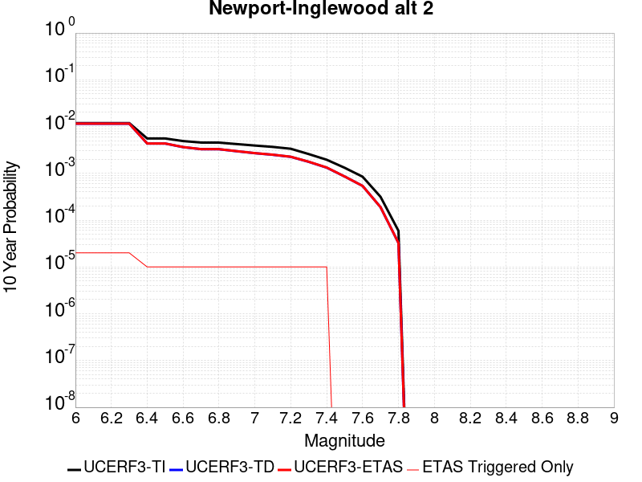 |

| Magnitude | 1 wk TI Prob | 1 wk TD Prob | 1 wk ETAS Prob | 1 wk ETAS/TD Gain | 1 wk ETAS Triggered Only | 1 mo TI Prob | 1 mo TD Prob | 1 mo ETAS Prob | 1 mo ETAS/TD Gain | 1 mo ETAS Triggered Only | 1 yr TI Prob | 1 yr TD Prob | 1 yr ETAS Prob | 1 yr ETAS/TD Gain | 1 yr ETAS Triggered Only | 10 yr TI Prob | 10 yr TD Prob | 10 yr ETAS Prob | 10 yr ETAS/TD Gain | 10 yr ETAS Triggered Only |
|-----|-----|-----|-----|-----|-----|-----|-----|-----|-----|-----|-----|-----|-----|-----|-----|-----|-----|-----|-----|-----|
| 6.0 | 2.2913395E-5 | 2.2193279E-5 | 4.2192834E-5 | 1.9011537 | 2.0E-5 | 9.8196564E-5 | 9.511186E-5 | 1.15109964E-4 | 1.2102587 | 2.0E-5 | 0.0011948874 | 0.0011575987 | 0.0011775756 | 1.0172571 | 2.0E-5 | 0.01188483 | 0.011537992 | 0.011557762 | 1.0017134 | 2.0E-5 |
| 6.1 | 2.2913395E-5 | 2.2193279E-5 | 4.2192834E-5 | 1.9011537 | 2.0E-5 | 9.8196564E-5 | 9.511186E-5 | 1.15109964E-4 | 1.2102587 | 2.0E-5 | 0.0011948874 | 0.0011575987 | 0.0011775756 | 1.0172571 | 2.0E-5 | 0.01188483 | 0.011537992 | 0.011557762 | 1.0017134 | 2.0E-5 |
| 6.2 | 2.2913395E-5 | 2.2193279E-5 | 4.2192834E-5 | 1.9011537 | 2.0E-5 | 9.8196564E-5 | 9.511186E-5 | 1.15109964E-4 | 1.2102587 | 2.0E-5 | 0.0011948874 | 0.0011575987 | 0.0011775756 | 1.0172571 | 2.0E-5 | 0.01188483 | 0.011537992 | 0.011557762 | 1.0017134 | 2.0E-5 |
| 6.3 | 2.2913395E-5 | 2.2193279E-5 | 4.2192834E-5 | 1.9011537 | 2.0E-5 | 9.8196564E-5 | 9.511186E-5 | 1.15109964E-4 | 1.2102587 | 2.0E-5 | 0.0011948874 | 0.0011575987 | 0.0011775756 | 1.0172571 | 2.0E-5 | 0.01188483 | 0.011537992 | 0.011557762 | 1.0017134 | 2.0E-5 |
| 6.4 | 1.0702904E-5 | 8.344798E-6 | 1.8344714E-5 | 2.1983414 | 1.0E-5 | 4.5868783E-5 | 3.5762943E-5 | 4.5762587E-5 | 1.2796091 | 1.0E-5 | 5.583093E-4 | 4.3532957E-4 | 4.4532522E-4 | 1.0229611 | 1.0E-5 | 0.0055690873 | 0.004345042 | 0.004354999 | 1.0022914 | 1.0E-5 |
| 6.5 | 1.0702904E-5 | 8.344798E-6 | 1.8344714E-5 | 2.1983414 | 1.0E-5 | 4.5868783E-5 | 3.5762943E-5 | 4.5762587E-5 | 1.2796091 | 1.0E-5 | 5.583093E-4 | 4.3532957E-4 | 4.4532522E-4 | 1.0229611 | 1.0E-5 | 0.0055690873 | 0.004345042 | 0.004354999 | 1.0022914 | 1.0E-5 |
| 6.6 | 9.418349E-6 | 6.985779E-6 | 1.6985708E-5 | 2.4314697 | 1.0E-5 | 4.0363728E-5 | 2.9938714E-5 | 3.9938415E-5 | 1.3340057 | 1.0E-5 | 4.913176E-4 | 3.6444396E-4 | 3.744403E-4 | 1.0274291 | 1.0E-5 | 0.0049023274 | 0.0036385749 | 0.0036485384 | 1.0027384 | 1.0E-5 |
| 6.7 | 8.755478E-6 | 6.314529E-6 | 1.6314465E-5 | 2.5836394 | 1.0E-5 | 3.752294E-5 | 2.7061991E-5 | 3.706172E-5 | 1.369512 | 1.0E-5 | 4.5674603E-4 | 3.2943065E-4 | 3.3942735E-4 | 1.0303454 | 1.0E-5 | 0.004558084 | 0.0032894984 | 0.0032994656 | 1.00303 | 1.0E-5 |
| 6.8 | 8.7258995E-6 | 6.297042E-6 | 1.6296979E-5 | 2.5880373 | 1.0E-5 | 3.7396178E-5 | 2.6987047E-5 | 3.6986778E-5 | 1.3705381 | 1.0E-5 | 4.5520335E-4 | 3.285185E-4 | 3.385152E-4 | 1.0304297 | 1.0E-5 | 0.0045427205 | 0.0032804038 | 0.003290371 | 1.0030384 | 1.0E-5 |
| 6.9 | 8.114026E-6 | 5.700314E-6 | 1.5700256E-5 | 2.7542794 | 1.0E-5 | 3.4773933E-5 | 2.442969E-5 | 3.4429446E-5 | 1.409328 | 1.0E-5 | 4.2329036E-4 | 2.973913E-4 | 3.073883E-4 | 1.0336157 | 1.0E-5 | 0.00422485 | 0.0029699772 | 0.0029799475 | 1.003357 | 1.0E-5 |
| 7.0 | 7.552083E-6 | 5.1781512E-6 | 1.51781E-5 | 2.9311812 | 1.0E-5 | 3.2365668E-5 | 2.219189E-5 | 3.2191667E-5 | 1.450605 | 1.0E-5 | 3.9398076E-4 | 2.7015305E-4 | 2.8015033E-4 | 1.037006 | 1.0E-5 | 0.00393283 | 0.002698275 | 0.002708248 | 1.0036961 | 1.0E-5 |
| 7.1 | 7.058004E-6 | 4.790597E-6 | 1.4790548E-5 | 3.0874126 | 1.0E-5 | 3.0248237E-5 | 2.0530968E-5 | 3.0530762E-5 | 1.4870591 | 1.0E-5 | 3.6821005E-4 | 2.4993607E-4 | 2.599336E-4 | 1.0400002 | 1.0E-5 | 0.0036760054 | 0.0024965717 | 0.0025065467 | 1.0039955 | 1.0E-5 |
| 7.2 | 6.4458645E-6 | 4.3276295E-6 | 1.43275865E-5 | 3.3107238 | 1.0E-5 | 2.7624841E-5 | 1.8546854E-5 | 2.8546669E-5 | 1.539165 | 1.0E-5 | 3.3628053E-4 | 2.2578472E-4 | 2.3578247E-4 | 1.0442799 | 1.0E-5 | 0.003357721 | 0.0022555722 | 0.0022655497 | 1.0044235 | 1.0E-5 |
| 7.3 | 4.9571204E-6 | 3.3816707E-6 | 1.3381637E-5 | 3.9571083 | 1.0E-5 | 2.1244628E-5 | 1.4492794E-5 | 2.4492649E-5 | 1.689988 | 1.0E-5 | 2.5862263E-4 | 1.7643555E-4 | 1.864338E-4 | 1.0566679 | 1.0E-5 | 0.0025832187 | 0.0017629628 | 0.0017729452 | 1.0056623 | 1.0E-5 |
| 7.4 | 3.7514744E-6 | 2.541377E-6 | 1.2541352E-5 | 4.934865 | 1.0E-5 | 1.6077649E-5 | 1.089157E-5 | 2.089146E-5 | 1.9181312 | 1.0E-5 | 1.9572779E-4 | 1.3259685E-4 | 1.4259553E-4 | 1.0754066 | 1.0E-5 | 0.0019555548 | 0.0013251826 | 0.0013351693 | 1.0075362 | 1.0E-5 |
| 7.5 | 2.5256907E-6 | 1.6450518E-6 | 1.6450518E-6 | 1.0 | 0.0 | 1.0824344E-5 | 7.0502033E-6 | 7.0502033E-6 | 1.0 | 0.0 | 1.3177842E-4 | 8.583288E-5 | 8.583288E-5 | 1.0 | 0.0 | 0.001317003 | 8.580006E-4 | 8.580006E-4 | 1.0 | 0.0 |
| 7.6 | 1.6277393E-6 | 1.0343616E-6 | 1.0343616E-6 | 1.0 | 0.0 | 6.9760067E-6 | 4.432971E-6 | 4.432971E-6 | 1.0 | 0.0 | 8.4929576E-5 | 5.3970096E-5 | 5.3970096E-5 | 1.0 | 0.0 | 8.4897125E-4 | 5.395713E-4 | 5.395713E-4 | 1.0 | 0.0 |
| 7.7 | 6.053471E-7 | 3.6352844E-7 | 3.6352844E-7 | 1.0 | 0.0 | 2.594342E-6 | 1.5579782E-6 | 1.5579782E-6 | 1.0 | 0.0 | 3.1585656E-5 | 1.8968221E-5 | 1.8968221E-5 | 1.0 | 0.0 | 3.158117E-4 | 1.896663E-4 | 1.896663E-4 | 1.0 | 0.0 |
| 7.8 | 1.13406024E-7 | 6.251218E-8 | 6.251218E-8 | 1.0 | 0.0 | 4.860257E-7 | 2.6790931E-7 | 2.6790931E-7 | 1.0 | 0.0 | 5.917347E-6 | 3.2617916E-6 | 3.2617916E-6 | 1.0 | 0.0 | 5.9171896E-5 | 3.261749E-5 | 3.261749E-5 | 1.0 | 0.0 |

## White Wolf
*[(top)](#table-of-contents)*

| 1 Week | 1 Month | 1 Year | 10 Year |
|-----|-----|-----|-----|
|  |  |  |  |

| Magnitude | 1 wk TI Prob | 1 wk TD Prob | 1 wk ETAS Prob | 1 wk ETAS/TD Gain | 1 wk ETAS Triggered Only | 1 mo TI Prob | 1 mo TD Prob | 1 mo ETAS Prob | 1 mo ETAS/TD Gain | 1 mo ETAS Triggered Only | 1 yr TI Prob | 1 yr TD Prob | 1 yr ETAS Prob | 1 yr ETAS/TD Gain | 1 yr ETAS Triggered Only | 10 yr TI Prob | 10 yr TD Prob | 10 yr ETAS Prob | 10 yr ETAS/TD Gain | 10 yr ETAS Triggered Only |
|-----|-----|-----|-----|-----|-----|-----|-----|-----|-----|-----|-----|-----|-----|-----|-----|-----|-----|-----|-----|-----|
| 6.0 | 2.0388185E-5 | 1.0694538E-6 | 1.0694538E-6 | 1.0 | 0.0 | 8.737501E-5 | 4.5833654E-6 | 1.4583319E-5 | 3.181793 | 1.0E-5 | 0.0010632715 | 5.58011E-5 | 6.5800545E-5 | 1.1791979 | 1.0E-5 | 0.010581985 | 5.578765E-4 | 5.7786534E-4 | 1.0358303 | 2.0E-5 |
| 6.1 | 2.0388185E-5 | 1.0694538E-6 | 1.0694538E-6 | 1.0 | 0.0 | 8.737501E-5 | 4.5833654E-6 | 1.4583319E-5 | 3.181793 | 1.0E-5 | 0.0010632715 | 5.58011E-5 | 6.5800545E-5 | 1.1791979 | 1.0E-5 | 0.010581985 | 5.578765E-4 | 5.7786534E-4 | 1.0358303 | 2.0E-5 |
| 6.2 | 2.0388185E-5 | 1.0694538E-6 | 1.0694538E-6 | 1.0 | 0.0 | 8.737501E-5 | 4.5833654E-6 | 1.4583319E-5 | 3.181793 | 1.0E-5 | 0.0010632715 | 5.58011E-5 | 6.5800545E-5 | 1.1791979 | 1.0E-5 | 0.010581985 | 5.578765E-4 | 5.7786534E-4 | 1.0358303 | 2.0E-5 |
| 6.3 | 2.0388185E-5 | 1.0694538E-6 | 1.0694538E-6 | 1.0 | 0.0 | 8.737501E-5 | 4.5833654E-6 | 1.4583319E-5 | 3.181793 | 1.0E-5 | 0.0010632715 | 5.58011E-5 | 6.5800545E-5 | 1.1791979 | 1.0E-5 | 0.010581985 | 5.578765E-4 | 5.7786534E-4 | 1.0358303 | 2.0E-5 |
| 6.4 | 1.2023674E-5 | 1.0694538E-6 | 1.0694538E-6 | 1.0 | 0.0 | 5.1529012E-5 | 4.5833654E-6 | 1.4583319E-5 | 3.181793 | 1.0E-5 | 6.271851E-4 | 5.58011E-5 | 6.5800545E-5 | 1.1791979 | 1.0E-5 | 0.0062541794 | 5.578765E-4 | 5.7786534E-4 | 1.0358303 | 2.0E-5 |
| 6.5 | 1.2023674E-5 | 1.0694538E-6 | 1.0694538E-6 | 1.0 | 0.0 | 5.1529012E-5 | 4.5833654E-6 | 1.4583319E-5 | 3.181793 | 1.0E-5 | 6.271851E-4 | 5.58011E-5 | 6.5800545E-5 | 1.1791979 | 1.0E-5 | 0.0062541794 | 5.578765E-4 | 5.7786534E-4 | 1.0358303 | 2.0E-5 |
| 6.6 | 9.689248E-6 | 1.0694538E-6 | 1.0694538E-6 | 1.0 | 0.0 | 4.1524687E-5 | 4.5833654E-6 | 1.4583319E-5 | 3.181793 | 1.0E-5 | 5.054458E-4 | 5.58011E-5 | 6.5800545E-5 | 1.1791979 | 1.0E-5 | 0.005042977 | 5.578765E-4 | 5.7786534E-4 | 1.0358303 | 2.0E-5 |
| 6.7 | 8.011365E-6 | 1.0288237E-6 | 1.0288237E-6 | 1.0 | 0.0 | 3.433397E-5 | 4.409237E-6 | 1.4409193E-5 | 3.267956 | 1.0E-5 | 4.179359E-4 | 5.3681197E-5 | 6.368066E-5 | 1.186275 | 1.0E-5 | 0.0041715074 | 5.366878E-4 | 5.56677E-4 | 1.0372456 | 2.0E-5 |
| 6.8 | 6.297349E-6 | 9.981181E-7 | 9.981181E-7 | 1.0 | 0.0 | 2.698836E-5 | 4.2776423E-6 | 1.42776E-5 | 3.3377264 | 1.0E-5 | 3.2853373E-4 | 5.2079107E-5 | 6.207859E-5 | 1.1920056 | 1.0E-5 | 0.0032804846 | 5.2067445E-4 | 5.4066407E-4 | 1.0383917 | 2.0E-5 |
| 6.9 | 5.289376E-6 | 9.518895E-7 | 9.518895E-7 | 1.0 | 0.0 | 2.2668557E-5 | 4.0795203E-6 | 1.4079479E-5 | 3.4512587 | 1.0E-5 | 2.7595472E-4 | 4.966708E-5 | 5.9666585E-5 | 1.2013305 | 1.0E-5 | 0.002756123 | 4.9656513E-4 | 5.165552E-4 | 1.0402567 | 2.0E-5 |
| 7.0 | 4.6203804E-6 | 9.012493E-7 | 9.012493E-7 | 1.0 | 0.0 | 1.980148E-5 | 3.8624917E-6 | 1.3862453E-5 | 3.5889924 | 1.0E-5 | 2.4105635E-4 | 4.7024874E-5 | 5.7024405E-5 | 1.2126434 | 1.0E-5 | 0.0024079503 | 4.701545E-4 | 4.901451E-4 | 1.0425192 | 2.0E-5 |
| 7.1 | 2.7018566E-6 | 6.9900454E-7 | 6.9900454E-7 | 1.0 | 0.0 | 1.1579335E-5 | 2.9957307E-6 | 1.2995701E-5 | 4.3380737 | 1.0E-5 | 1.4096928E-4 | 3.6472455E-5 | 4.647209E-5 | 1.2741696 | 1.0E-5 | 0.0014087989 | 3.6466916E-4 | 3.8466186E-4 | 1.0548242 | 2.0E-5 |
| 7.2 | 1.5462024E-6 | 2.1760043E-7 | 2.1760043E-7 | 1.0 | 0.0 | 6.6265648E-6 | 9.3257296E-7 | 1.0932564E-5 | 11.723011 | 1.0E-5 | 8.067544E-5 | 1.1354018E-5 | 2.1353904E-5 | 1.8807355 | 1.0E-5 | 8.0646155E-4 | 1.135345E-4 | 1.2353336E-4 | 1.088069 | 1.0E-5 |
| 7.3 | 7.9361814E-7 | 1.444103E-7 | 1.444103E-7 | 1.0 | 0.0 | 3.4012162E-6 | 6.1890114E-7 | 6.1890114E-7 | 1.0 | 0.0 | 4.140902E-5 | 7.535096E-6 | 7.535096E-6 | 1.0 | 0.0 | 4.1401305E-4 | 7.5348464E-5 | 7.5348464E-5 | 1.0 | 0.0 |
| 7.4 | 1.898022E-7 | 8.5462716E-8 | 8.5462716E-8 | 1.0 | 0.0 | 8.134377E-7 | 3.6626872E-7 | 3.6626872E-7 | 1.0 | 0.0 | 9.903559E-6 | 4.459313E-6 | 4.459313E-6 | 1.0 | 0.0 | 9.9031175E-5 | 4.4592263E-5 | 4.4592263E-5 | 1.0 | 0.0 |
| 7.5 | 9.809566E-8 | 6.0364904E-8 | 6.0364904E-8 | 1.0 | 0.0 | 4.2040992E-7 | 2.587067E-7 | 2.587067E-7 | 1.0 | 0.0 | 5.1184784E-6 | 3.1497498E-6 | 3.1497498E-6 | 1.0 | 0.0 | 5.1183608E-5 | 3.149707E-5 | 3.149707E-5 | 1.0 | 0.0 |
| 7.6 | 2.8916602E-8 | 1.9713536E-8 | 1.9713536E-8 | 1.0 | 0.0 | 1.2392829E-7 | 8.448658E-8 | 8.448658E-8 | 1.0 | 0.0 | 1.5088259E-6 | 1.0286237E-6 | 1.0286237E-6 | 1.0 | 0.0 | 1.5088157E-5 | 1.0286198E-5 | 1.0286198E-5 | 1.0 | 0.0 |

## San Andreas (Santa Cruz Mts) 2011 CFM
*[(top)](#table-of-contents)*

| 1 Week | 1 Month | 1 Year | 10 Year |
|-----|-----|-----|-----|
| 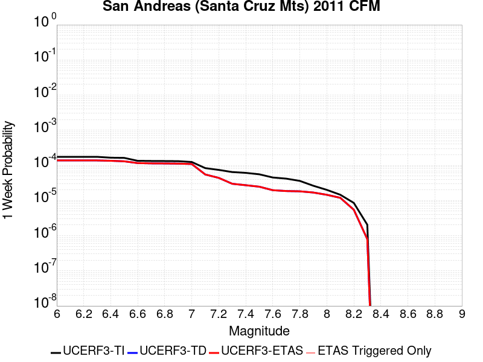 |  |  |  |

| Magnitude | 1 wk TI Prob | 1 wk TD Prob | 1 wk ETAS Prob | 1 wk ETAS/TD Gain | 1 wk ETAS Triggered Only | 1 mo TI Prob | 1 mo TD Prob | 1 mo ETAS Prob | 1 mo ETAS/TD Gain | 1 mo ETAS Triggered Only | 1 yr TI Prob | 1 yr TD Prob | 1 yr ETAS Prob | 1 yr ETAS/TD Gain | 1 yr ETAS Triggered Only | 10 yr TI Prob | 10 yr TD Prob | 10 yr ETAS Prob | 10 yr ETAS/TD Gain | 10 yr ETAS Triggered Only |
|-----|-----|-----|-----|-----|-----|-----|-----|-----|-----|-----|-----|-----|-----|-----|-----|-----|-----|-----|-----|-----|
| 6.0 | 1.7445598E-4 | 1.3789433E-4 | 1.3789433E-4 | 1.0 | 0.0 | 7.474543E-4 | 5.9084385E-4 | 5.9084385E-4 | 1.0 | 0.0 | 0.009062346 | 0.007170171 | 0.007170171 | 1.0 | 0.0 | 0.08701569 | 0.0708317 | 0.07085029 | 1.0002624 | 2.0E-5 |
| 6.1 | 1.7445598E-4 | 1.3789433E-4 | 1.3789433E-4 | 1.0 | 0.0 | 7.474543E-4 | 5.9084385E-4 | 5.9084385E-4 | 1.0 | 0.0 | 0.009062346 | 0.007170171 | 0.007170171 | 1.0 | 0.0 | 0.08701569 | 0.0708317 | 0.07085029 | 1.0002624 | 2.0E-5 |
| 6.2 | 1.7445598E-4 | 1.3789433E-4 | 1.3789433E-4 | 1.0 | 0.0 | 7.474543E-4 | 5.9084385E-4 | 5.9084385E-4 | 1.0 | 0.0 | 0.009062346 | 0.007170171 | 0.007170171 | 1.0 | 0.0 | 0.08701569 | 0.0708317 | 0.07085029 | 1.0002624 | 2.0E-5 |
| 6.3 | 1.7445598E-4 | 1.3789433E-4 | 1.3789433E-4 | 1.0 | 0.0 | 7.474543E-4 | 5.9084385E-4 | 5.9084385E-4 | 1.0 | 0.0 | 0.009062346 | 0.007170171 | 0.007170171 | 1.0 | 0.0 | 0.08701569 | 0.0708317 | 0.07085029 | 1.0002624 | 2.0E-5 |
| 6.4 | 1.6521275E-4 | 1.3496233E-4 | 1.3496233E-4 | 1.0 | 0.0 | 7.078625E-4 | 5.782837E-4 | 5.782837E-4 | 1.0 | 0.0 | 0.008584221 | 0.007018243 | 0.007018243 | 1.0 | 0.0 | 0.08260099 | 0.069223136 | 0.06924175 | 1.0002689 | 2.0E-5 |
| 6.5 | 1.6299442E-4 | 1.3031108E-4 | 1.3031108E-4 | 1.0 | 0.0 | 6.9836044E-4 | 5.5835827E-4 | 5.5835827E-4 | 1.0 | 0.0 | 0.008469439 | 0.0067771603 | 0.0067771603 | 1.0 | 0.0 | 0.08153831 | 0.06709715 | 0.067115806 | 1.0002781 | 2.0E-5 |
| 6.6 | 1.34542E-4 | 1.1592121E-4 | 1.1592121E-4 | 1.0 | 0.0 | 5.7648116E-4 | 4.967119E-4 | 4.967119E-4 | 1.0 | 0.0 | 0.0069960942 | 0.0060309386 | 0.0060309386 | 1.0 | 0.0 | 0.067798994 | 0.05961433 | 0.05963314 | 1.0003155 | 2.0E-5 |
| 6.7 | 1.331617E-4 | 1.1373406E-4 | 1.1373406E-4 | 1.0 | 0.0 | 5.7056814E-4 | 4.873419E-4 | 4.873419E-4 | 1.0 | 0.0 | 0.0069245636 | 0.0059174835 | 0.0059174835 | 1.0 | 0.0 | 0.06712727 | 0.058580175 | 0.058599003 | 1.0003214 | 2.0E-5 |
| 6.8 | 1.325197E-4 | 1.1307321E-4 | 1.1307321E-4 | 1.0 | 0.0 | 5.6781794E-4 | 4.8451076E-4 | 4.8451076E-4 | 1.0 | 0.0 | 0.006891292 | 0.005883202 | 0.005883202 | 1.0 | 0.0 | 0.066814676 | 0.05828087 | 0.058299705 | 1.0003232 | 2.0E-5 |
| 6.9 | 1.3153208E-4 | 1.117603E-4 | 1.117603E-4 | 1.0 | 0.0 | 5.635871E-4 | 4.7888607E-4 | 4.7888607E-4 | 1.0 | 0.0 | 0.0068401066 | 0.0058150887 | 0.0058150887 | 1.0 | 0.0 | 0.0663336 | 0.057673093 | 0.05769194 | 1.0003268 | 2.0E-5 |
| 7.0 | 1.2459305E-4 | 1.09173074E-4 | 1.09173074E-4 | 1.0 | 0.0 | 5.338609E-4 | 4.6780196E-4 | 4.6780196E-4 | 1.0 | 0.0 | 0.006480403 | 0.0056808507 | 0.0056808507 | 1.0 | 0.0 | 0.06294651 | 0.056368936 | 0.05638781 | 1.0003349 | 2.0E-5 |
| 7.1 | 8.341886E-5 | 5.4988806E-5 | 5.4988806E-5 | 1.0 | 0.0 | 3.574604E-4 | 2.3564522E-4 | 2.3564522E-4 | 1.0 | 0.0 | 0.0043433984 | 0.0028652404 | 0.0028652404 | 1.0 | 0.0 | 0.042594813 | 0.030286722 | 0.030296419 | 1.0003202 | 1.0E-5 |
| 7.2 | 7.42246E-5 | 4.3974556E-5 | 4.3974556E-5 | 1.0 | 0.0 | 3.1806662E-4 | 1.8844889E-4 | 1.8844889E-4 | 1.0 | 0.0 | 0.0038655866 | 0.002291972 | 0.002291972 | 1.0 | 0.0 | 0.037990324 | 0.024651716 | 0.024661468 | 1.0003957 | 1.0E-5 |
| 7.3 | 6.4434906E-5 | 2.9902923E-5 | 2.9902923E-5 | 1.0 | 0.0 | 2.7612035E-4 | 1.281491E-4 | 1.281491E-4 | 1.0 | 0.0 | 0.0033565836 | 0.0015591007 | 0.0015591007 | 1.0 | 0.0 | 0.03306335 | 0.017106378 | 0.017116208 | 1.0005746 | 1.0E-5 |
| 7.4 | 6.111663E-5 | 2.7217411E-5 | 2.7217411E-5 | 1.0 | 0.0 | 2.6190214E-4 | 1.1664084E-4 | 1.1664084E-4 | 1.0 | 0.0 | 0.0031839965 | 0.0014191784 | 0.0014191784 | 1.0 | 0.0 | 0.031387612 | 0.015629783 | 0.015639627 | 1.0006298 | 1.0E-5 |
| 7.5 | 5.5658307E-5 | 2.469202E-5 | 2.469202E-5 | 1.0 | 0.0 | 2.3851379E-4 | 1.0581865E-4 | 1.0581865E-4 | 1.0 | 0.0 | 0.0029000384 | 0.0012875817 | 0.0012875817 | 1.0 | 0.0 | 0.028624836 | 0.014218505 | 0.014228363 | 1.0006933 | 1.0E-5 |
| 7.6 | 4.5108107E-5 | 1.9642748E-5 | 1.9642748E-5 | 1.0 | 0.0 | 1.9330613E-4 | 8.418049E-5 | 8.418049E-5 | 1.0 | 0.0 | 0.0023509618 | 0.0010244158 | 0.0010244158 | 1.0 | 0.0 | 0.023262454 | 0.011318267 | 0.011328154 | 1.0008736 | 1.0E-5 |
| 7.7 | 4.1868214E-5 | 1.8570503E-5 | 1.8570503E-5 | 1.0 | 0.0 | 1.7942286E-4 | 7.958544E-5 | 7.958544E-5 | 1.0 | 0.0 | 0.0021822846 | 9.685223E-4 | 9.685223E-4 | 1.0 | 0.0 | 0.021609783 | 0.010712821 | 0.010722714 | 1.0009235 | 1.0E-5 |
| 7.8 | 3.6141184E-5 | 1.8237639E-5 | 1.8237639E-5 | 1.0 | 0.0 | 1.5488159E-4 | 7.815896E-5 | 7.815896E-5 | 1.0 | 0.0 | 0.0018840523 | 9.5117016E-4 | 9.5117016E-4 | 1.0 | 0.0 | 0.018681588 | 0.0105105955 | 0.010520491 | 1.0009414 | 1.0E-5 |
| 7.9 | 2.6284562E-5 | 1.6863047E-5 | 1.6863047E-5 | 1.0 | 0.0 | 1.1264326E-4 | 7.2268194E-5 | 7.2268194E-5 | 1.0 | 0.0 | 0.0013705689 | 8.795103E-4 | 8.795103E-4 | 1.0 | 0.0 | 0.013621466 | 0.009686259 | 0.009696161 | 1.0010223 | 1.0E-5 |
| 8.0 | 2.0070089E-5 | 1.4531997E-5 | 1.4531997E-5 | 1.0 | 0.0 | 8.601183E-5 | 6.22785E-5 | 6.22785E-5 | 1.0 | 0.0 | 0.001046691 | 7.5797713E-4 | 7.5797713E-4 | 1.0 | 0.0 | 0.010417746 | 0.008355312 | 0.008365229 | 1.0011868 | 1.0E-5 |
| 8.1 | 1.4568951E-5 | 1.1915529E-5 | 1.1915529E-5 | 1.0 | 0.0 | 6.243686E-5 | 5.1065555E-5 | 5.1065555E-5 | 1.0 | 0.0 | 7.599037E-4 | 6.2154594E-4 | 6.2154594E-4 | 1.0 | 0.0 | 0.007573104 | 0.006860577 | 0.0068705087 | 1.0014476 | 1.0E-5 |
| 8.2 | 8.537866E-6 | 5.4600664E-6 | 5.4600664E-6 | 1.0 | 0.0 | 3.659034E-5 | 2.3400074E-5 | 2.3400074E-5 | 1.0 | 0.0 | 4.4539635E-4 | 2.8485875E-4 | 2.8485875E-4 | 1.0 | 0.0 | 0.004445047 | 0.0032366032 | 0.0032465707 | 1.0030797 | 1.0E-5 |
| 8.3 | 2.0399948E-6 | 7.951945E-7 | 7.951945E-7 | 1.0 | 0.0 | 8.742806E-6 | 3.4079721E-6 | 3.4079721E-6 | 1.0 | 0.0 | 1.0643846E-4 | 4.1491287E-5 | 4.1491287E-5 | 1.0 | 0.0 | 0.0010638749 | 4.8670862E-4 | 4.8670862E-4 | 1.0 | 0.0 |

## Owens Valley Keough Hot Springs
*[(top)](#table-of-contents)*

| 1 Week | 1 Month | 1 Year | 10 Year |
|-----|-----|-----|-----|
| 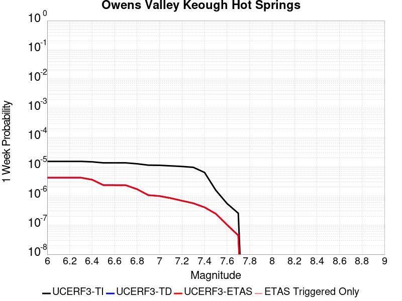 |  |  |  |

| Magnitude | 1 wk TI Prob | 1 wk TD Prob | 1 wk ETAS Prob | 1 wk ETAS/TD Gain | 1 wk ETAS Triggered Only | 1 mo TI Prob | 1 mo TD Prob | 1 mo ETAS Prob | 1 mo ETAS/TD Gain | 1 mo ETAS Triggered Only | 1 yr TI Prob | 1 yr TD Prob | 1 yr ETAS Prob | 1 yr ETAS/TD Gain | 1 yr ETAS Triggered Only | 10 yr TI Prob | 10 yr TD Prob | 10 yr ETAS Prob | 10 yr ETAS/TD Gain | 10 yr ETAS Triggered Only |
|-----|-----|-----|-----|-----|-----|-----|-----|-----|-----|-----|-----|-----|-----|-----|-----|-----|-----|-----|-----|-----|
| 6.0 | 1.5217705E-5 | 4.2165E-6 | 4.2165E-6 | 1.0 | 0.0 | 6.521711E-5 | 1.8070608E-5 | 1.8070608E-5 | 1.0 | 0.0 | 7.9372904E-4 | 2.1999062E-4 | 2.1999062E-4 | 1.0 | 0.0 | 0.007909 | 0.0021982018 | 0.002218158 | 1.0090784 | 2.0E-5 |
| 6.1 | 1.5217705E-5 | 4.2165E-6 | 4.2165E-6 | 1.0 | 0.0 | 6.521711E-5 | 1.8070608E-5 | 1.8070608E-5 | 1.0 | 0.0 | 7.9372904E-4 | 2.1999062E-4 | 2.1999062E-4 | 1.0 | 0.0 | 0.007909 | 0.0021982018 | 0.002218158 | 1.0090784 | 2.0E-5 |
| 6.2 | 1.5217705E-5 | 4.2165E-6 | 4.2165E-6 | 1.0 | 0.0 | 6.521711E-5 | 1.8070608E-5 | 1.8070608E-5 | 1.0 | 0.0 | 7.9372904E-4 | 2.1999062E-4 | 2.1999062E-4 | 1.0 | 0.0 | 0.007909 | 0.0021982018 | 0.002218158 | 1.0090784 | 2.0E-5 |
| 6.3 | 1.5217705E-5 | 4.2165E-6 | 4.2165E-6 | 1.0 | 0.0 | 6.521711E-5 | 1.8070608E-5 | 1.8070608E-5 | 1.0 | 0.0 | 7.9372904E-4 | 2.1999062E-4 | 2.1999062E-4 | 1.0 | 0.0 | 0.007909 | 0.0021982018 | 0.002218158 | 1.0090784 | 2.0E-5 |
| 6.4 | 1.4668926E-5 | 3.600567E-6 | 3.600567E-6 | 1.0 | 0.0 | 6.2865314E-5 | 1.5430925E-5 | 1.5430925E-5 | 1.0 | 0.0 | 7.6511636E-4 | 1.8785804E-4 | 1.8785804E-4 | 1.0 | 0.0 | 0.0076248744 | 0.0018774214 | 0.0018973838 | 1.0106329 | 2.0E-5 |
| 6.5 | 1.3548958E-5 | 2.3432729E-6 | 2.3432729E-6 | 1.0 | 0.0 | 5.806567E-5 | 1.0042563E-5 | 1.0042563E-5 | 1.0 | 0.0 | 7.067202E-4 | 1.2226209E-4 | 1.2226209E-4 | 1.0 | 0.0 | 0.007044769 | 0.0012221836 | 0.0012421592 | 1.0163442 | 2.0E-5 |
| 6.6 | 1.3545371E-5 | 2.339445E-6 | 2.339445E-6 | 1.0 | 0.0 | 5.8050297E-5 | 1.0026159E-5 | 1.0026159E-5 | 1.0 | 0.0 | 7.065332E-4 | 1.2206239E-4 | 1.2206239E-4 | 1.0 | 0.0 | 0.0070429104 | 0.0012201888 | 0.0012401644 | 1.0163709 | 2.0E-5 |
| 6.7 | 1.3528715E-5 | 2.3272498E-6 | 2.3272498E-6 | 1.0 | 0.0 | 5.7978916E-5 | 9.9738945E-6 | 9.9738945E-6 | 1.0 | 0.0 | 7.056647E-4 | 1.21426136E-4 | 1.21426136E-4 | 1.0 | 0.0 | 0.0070342803 | 0.0012138332 | 0.0012338089 | 1.0164567 | 2.0E-5 |
| 6.8 | 1.2586416E-5 | 1.7013341E-6 | 1.7013341E-6 | 1.0 | 0.0 | 5.394067E-5 | 7.2914136E-6 | 7.2914136E-6 | 1.0 | 0.0 | 6.5652974E-4 | 8.8769644E-5 | 8.8769644E-5 | 1.0 | 0.0 | 0.006545935 | 8.8753423E-4 | 9.0751646E-4 | 1.0225143 | 2.0E-5 |
| 6.9 | 1.1306928E-5 | 1.063682E-6 | 1.063682E-6 | 1.0 | 0.0 | 4.8457365E-5 | 4.5586294E-6 | 4.5586294E-6 | 1.0 | 0.0 | 5.898087E-4 | 5.5499913E-5 | 5.5499913E-5 | 1.0 | 0.0 | 0.0058824574 | 5.550217E-4 | 5.750106E-4 | 1.0360147 | 2.0E-5 |
| 7.0 | 1.1169973E-5 | 9.905896E-7 | 9.905896E-7 | 1.0 | 0.0 | 4.7870435E-5 | 4.245377E-6 | 4.245377E-6 | 1.0 | 0.0 | 5.8266666E-4 | 5.168625E-5 | 5.168625E-5 | 1.0 | 0.0 | 0.005811413 | 5.169026E-4 | 5.368923E-4 | 1.038672 | 2.0E-5 |
| 7.1 | 1.0681381E-5 | 8.3965915E-7 | 8.3965915E-7 | 1.0 | 0.0 | 4.5776545E-5 | 3.5985345E-6 | 3.5985345E-6 | 1.0 | 0.0 | 5.5718696E-4 | 4.381128E-5 | 4.381128E-5 | 1.0 | 0.0 | 0.0055579194 | 4.3818253E-4 | 4.5817377E-4 | 1.0456231 | 2.0E-5 |
| 7.2 | 1.0183439E-5 | 6.836922E-7 | 6.836922E-7 | 1.0 | 0.0 | 4.3642583E-5 | 2.9301061E-6 | 2.9301061E-6 | 1.0 | 0.0 | 5.312189E-4 | 3.567346E-5 | 3.567346E-5 | 1.0 | 0.0 | 0.005299508 | 3.5681642E-4 | 3.7680927E-4 | 1.0560312 | 2.0E-5 |
| 7.3 | 9.5300165E-6 | 5.624493E-7 | 5.624493E-7 | 1.0 | 0.0 | 4.0842286E-5 | 2.4104947E-6 | 2.4104947E-6 | 1.0 | 0.0 | 4.971414E-4 | 2.9347382E-5 | 2.9347382E-5 | 1.0 | 0.0 | 0.004960307 | 2.93567E-4 | 3.1356112E-4 | 1.0681076 | 2.0E-5 |
| 7.4 | 6.347801E-6 | 4.0814413E-7 | 4.0814413E-7 | 1.0 | 0.0 | 2.7204578E-5 | 1.749188E-6 | 1.749188E-6 | 1.0 | 0.0 | 3.3116539E-4 | 2.1296157E-5 | 2.1296157E-5 | 1.0 | 0.0 | 0.0033067232 | 2.1302697E-4 | 2.3302271E-4 | 1.0938648 | 2.0E-5 |
| 7.5 | 1.5638935E-6 | 2.4599143E-7 | 2.4599143E-7 | 1.0 | 0.0 | 6.7023834E-6 | 1.0542486E-6 | 1.0542486E-6 | 1.0 | 0.0 | 8.159847E-5 | 1.2835402E-5 | 1.2835402E-5 | 1.0 | 0.0 | 8.156851E-4 | 1.2834673E-4 | 1.3834545E-4 | 1.077904 | 1.0E-5 |
| 7.6 | 5.4918615E-7 | 1.0309266E-7 | 1.0309266E-7 | 1.0 | 0.0 | 2.353653E-6 | 4.4182562E-7 | 4.4182562E-7 | 1.0 | 0.0 | 2.8655346E-5 | 5.379214E-6 | 5.379214E-6 | 1.0 | 0.0 | 2.8651653E-4 | 5.3790915E-5 | 6.379038E-5 | 1.185895 | 1.0E-5 |
| 7.7 | 2.5580925E-7 | 4.4519187E-8 | 4.4519187E-8 | 1.0 | 0.0 | 1.0963249E-6 | 1.9079651E-7 | 1.9079651E-7 | 1.0 | 0.0 | 1.3347674E-5 | 2.3229454E-6 | 2.3229454E-6 | 1.0 | 0.0 | 1.3346873E-4 | 2.3229251E-5 | 3.322902E-5 | 1.4304817 | 1.0E-5 |

## Verdugo
*[(top)](#table-of-contents)*

| 1 Week | 1 Month | 1 Year | 10 Year |
|-----|-----|-----|-----|
|  |  |  |  |

| Magnitude | 1 wk TI Prob | 1 wk TD Prob | 1 wk ETAS Prob | 1 wk ETAS/TD Gain | 1 wk ETAS Triggered Only | 1 mo TI Prob | 1 mo TD Prob | 1 mo ETAS Prob | 1 mo ETAS/TD Gain | 1 mo ETAS Triggered Only | 1 yr TI Prob | 1 yr TD Prob | 1 yr ETAS Prob | 1 yr ETAS/TD Gain | 1 yr ETAS Triggered Only | 10 yr TI Prob | 10 yr TD Prob | 10 yr ETAS Prob | 10 yr ETAS/TD Gain | 10 yr ETAS Triggered Only |
|-----|-----|-----|-----|-----|-----|-----|-----|-----|-----|-----|-----|-----|-----|-----|-----|-----|-----|-----|-----|-----|
| 6.0 | 4.831166E-6 | 3.8496564E-6 | 2.384958E-5 | 6.195249 | 2.0E-5 | 2.0704832E-5 | 1.6498423E-5 | 3.6498095E-5 | 2.212217 | 2.0E-5 | 2.5205218E-4 | 2.0085E-4 | 2.2084599E-4 | 1.0995568 | 2.0E-5 | 0.0025176648 | 0.0020067065 | 0.0020266664 | 1.0099466 | 2.0E-5 |
| 6.1 | 4.831166E-6 | 3.8496564E-6 | 2.384958E-5 | 6.195249 | 2.0E-5 | 2.0704832E-5 | 1.6498423E-5 | 3.6498095E-5 | 2.212217 | 2.0E-5 | 2.5205218E-4 | 2.0085E-4 | 2.2084599E-4 | 1.0995568 | 2.0E-5 | 0.0025176648 | 0.0020067065 | 0.0020266664 | 1.0099466 | 2.0E-5 |
| 6.2 | 4.831166E-6 | 3.8496564E-6 | 2.384958E-5 | 6.195249 | 2.0E-5 | 2.0704832E-5 | 1.6498423E-5 | 3.6498095E-5 | 2.212217 | 2.0E-5 | 2.5205218E-4 | 2.0085E-4 | 2.2084599E-4 | 1.0995568 | 2.0E-5 | 0.0025176648 | 0.0020067065 | 0.0020266664 | 1.0099466 | 2.0E-5 |
| 6.3 | 4.831166E-6 | 3.8496564E-6 | 2.384958E-5 | 6.195249 | 2.0E-5 | 2.0704832E-5 | 1.6498423E-5 | 3.6498095E-5 | 2.212217 | 2.0E-5 | 2.5205218E-4 | 2.0085E-4 | 2.2084599E-4 | 1.0995568 | 2.0E-5 | 0.0025176648 | 0.0020067065 | 0.0020266664 | 1.0099466 | 2.0E-5 |
| 6.4 | 4.831166E-6 | 3.8496564E-6 | 2.384958E-5 | 6.195249 | 2.0E-5 | 2.0704832E-5 | 1.6498423E-5 | 3.6498095E-5 | 2.212217 | 2.0E-5 | 2.5205218E-4 | 2.0085E-4 | 2.2084599E-4 | 1.0995568 | 2.0E-5 | 0.0025176648 | 0.0020067065 | 0.0020266664 | 1.0099466 | 2.0E-5 |
| 6.5 | 4.6373707E-6 | 3.649886E-6 | 2.3649813E-5 | 6.4796033 | 2.0E-5 | 1.9874295E-5 | 1.5642276E-5 | 3.5641962E-5 | 2.2785664 | 2.0E-5 | 2.4194266E-4 | 1.9042823E-4 | 2.1042442E-4 | 1.1050065 | 2.0E-5 | 0.0024167942 | 0.0019026679 | 0.0019226299 | 1.0104916 | 2.0E-5 |
| 6.6 | 4.6373707E-6 | 3.649886E-6 | 2.3649813E-5 | 6.4796033 | 2.0E-5 | 1.9874295E-5 | 1.5642276E-5 | 3.5641962E-5 | 2.2785664 | 2.0E-5 | 2.4194266E-4 | 1.9042823E-4 | 2.1042442E-4 | 1.1050065 | 2.0E-5 | 0.0024167942 | 0.0019026679 | 0.0019226299 | 1.0104916 | 2.0E-5 |
| 6.7 | 4.575425E-6 | 3.586086E-6 | 2.3586015E-5 | 6.577091 | 2.0E-5 | 1.9608817E-5 | 1.536885E-5 | 3.5368543E-5 | 2.3013134 | 2.0E-5 | 2.3871119E-4 | 1.8709985E-4 | 2.0709612E-4 | 1.1068748 | 2.0E-5 | 0.0023845492 | 0.0018694403 | 0.001889403 | 1.0106784 | 2.0E-5 |
| 6.8 | 4.2773145E-6 | 3.3026358E-6 | 2.330257E-5 | 7.055749 | 2.0E-5 | 1.8331219E-5 | 1.4154078E-5 | 3.4153793E-5 | 2.4130003 | 2.0E-5 | 2.2315973E-4 | 1.7231239E-4 | 1.9230893E-4 | 1.1160482 | 2.0E-5 | 0.0022293576 | 0.0017217997 | 0.0017417653 | 1.0115957 | 2.0E-5 |
| 6.9 | 4.0595755E-6 | 3.0836654E-6 | 2.3083603E-5 | 7.485768 | 2.0E-5 | 1.7398064E-5 | 1.3215643E-5 | 3.321538E-5 | 2.513338 | 2.0E-5 | 2.1180084E-4 | 1.6088865E-4 | 1.8088544E-4 | 1.1242896 | 2.0E-5 | 0.002115991 | 0.0016077304 | 0.0016276983 | 1.0124199 | 2.0E-5 |
| 7.0 | 3.8623875E-6 | 2.8971367E-6 | 2.2897078E-5 | 7.903348 | 2.0E-5 | 1.6552984E-5 | 1.2416242E-5 | 3.2415992E-5 | 2.6107733 | 2.0E-5 | 2.0151395E-4 | 1.5115732E-4 | 1.711543E-4 | 1.1322925 | 2.0E-5 | 0.0020133131 | 0.0015105528 | 0.0015305226 | 1.0132202 | 2.0E-5 |
| 7.1 | 3.5513792E-6 | 2.5962368E-6 | 2.2596185E-5 | 8.703438 | 2.0E-5 | 1.5220108E-5 | 1.1126682E-5 | 3.112646E-5 | 2.797461 | 2.0E-5 | 1.8528906E-4 | 1.3545895E-4 | 1.5545625E-4 | 1.1476262 | 2.0E-5 | 0.0018513463 | 0.0013537663 | 0.0013737392 | 1.0147536 | 2.0E-5 |
| 7.2 | 3.3055812E-6 | 2.3870057E-6 | 2.2386957E-5 | 9.378678 | 2.0E-5 | 1.41667E-5 | 1.0229985E-5 | 3.022978E-5 | 2.955017 | 2.0E-5 | 1.7246591E-4 | 1.2454296E-4 | 1.4454048E-4 | 1.1605672 | 2.0E-5 | 0.0017233213 | 0.0012447337 | 0.0012647088 | 1.0160477 | 2.0E-5 |
| 7.3 | 3.0125336E-6 | 2.177744E-6 | 1.2177722E-5 | 5.591898 | 1.0E-5 | 1.2910795E-5 | 9.333155E-6 | 1.9333062E-5 | 2.071439 | 1.0E-5 | 1.5717758E-4 | 1.13625254E-4 | 1.2362412E-4 | 1.0879986 | 1.0E-5 | 0.0015706646 | 0.0011356734 | 0.001145662 | 1.0087954 | 1.0E-5 |
| 7.4 | 2.7508015E-6 | 1.9865665E-6 | 1.1986546E-5 | 6.033801 | 1.0E-5 | 1.1789097E-5 | 8.513828E-6 | 1.8513743E-5 | 2.1745498 | 1.0E-5 | 1.4352279E-4 | 1.0365095E-4 | 1.1364991E-4 | 1.0964676 | 1.0E-5 | 0.0014343014 | 0.0010360278 | 0.0010460174 | 1.0096422 | 1.0E-5 |
| 7.5 | 2.32196E-6 | 1.67484E-6 | 1.1674823E-5 | 6.97071 | 1.0E-5 | 9.951219E-6 | 7.177866E-6 | 1.7177794E-5 | 2.3931618 | 1.0E-5 | 1.2114935E-4 | 8.738703E-5 | 9.738615E-5 | 1.1144235 | 1.0E-5 | 0.0012108333 | 8.7352813E-4 | 8.835194E-4 | 1.0114378 | 1.0E-5 |
| 7.6 | 1.3519482E-6 | 1.0248287E-6 | 1.1024818E-5 | 10.757718 | 1.0E-5 | 5.7940506E-6 | 4.3921154E-6 | 1.43920715E-5 | 3.276797 | 1.0E-5 | 7.0540285E-5 | 5.34727E-5 | 6.3472165E-5 | 1.1870013 | 1.0E-5 | 7.05179E-4 | 5.34599E-4 | 5.4459367E-4 | 1.0186956 | 1.0E-5 |
| 7.7 | 4.981559E-7 | 3.6348905E-7 | 3.6348905E-7 | 1.0 | 0.0 | 2.134952E-6 | 1.5578094E-6 | 1.5578094E-6 | 1.0 | 0.0 | 2.5992731E-5 | 1.8966166E-5 | 1.8966166E-5 | 1.0 | 0.0 | 2.5989691E-4 | 1.8964565E-4 | 1.8964565E-4 | 1.0 | 0.0 |
| 7.8 | 1.0750527E-7 | 7.799612E-8 | 7.799612E-8 | 1.0 | 0.0 | 4.607368E-7 | 3.3426903E-7 | 3.3426903E-7 | 1.0 | 0.0 | 5.6094564E-6 | 4.0697187E-6 | 4.0697187E-6 | 1.0 | 0.0 | 5.6093148E-5 | 4.0696494E-5 | 4.0696494E-5 | 1.0 | 0.0 |
| 7.9 | 2.7043279E-9 | 1.6975362E-9 | 1.6975362E-9 | 1.0 | 0.0 | 1.1589977E-8 | 7.275155E-9 | 7.275155E-9 | 1.0 | 0.0 | 1.4110796E-7 | 8.857501E-8 | 8.857501E-8 | 1.0 | 0.0 | 1.4110786E-6 | 8.8574984E-7 | 8.8574984E-7 | 1.0 | 0.0 |

## Cerro Prieto
*[(top)](#table-of-contents)*

| 1 Week | 1 Month | 1 Year | 10 Year |
|-----|-----|-----|-----|
|  |  |  | 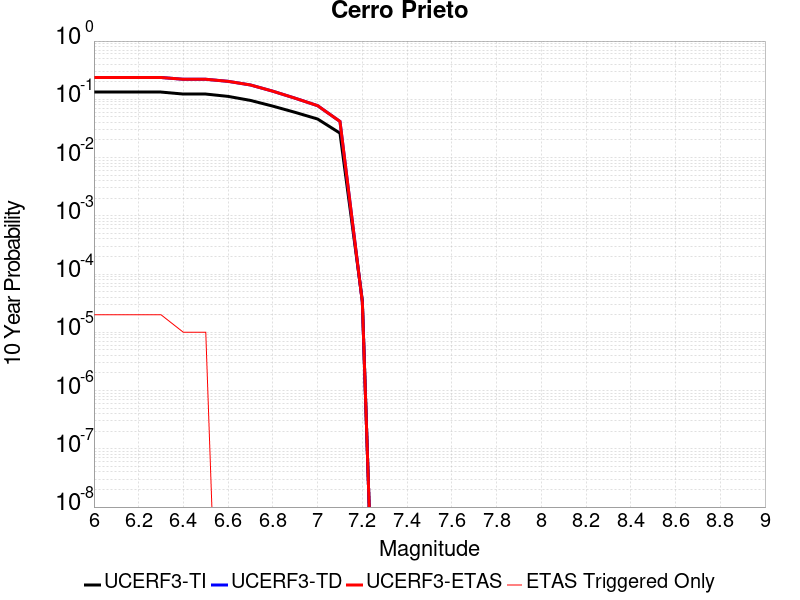 |

| Magnitude | 1 wk TI Prob | 1 wk TD Prob | 1 wk ETAS Prob | 1 wk ETAS/TD Gain | 1 wk ETAS Triggered Only | 1 mo TI Prob | 1 mo TD Prob | 1 mo ETAS Prob | 1 mo ETAS/TD Gain | 1 mo ETAS Triggered Only | 1 yr TI Prob | 1 yr TD Prob | 1 yr ETAS Prob | 1 yr ETAS/TD Gain | 1 yr ETAS Triggered Only | 10 yr TI Prob | 10 yr TD Prob | 10 yr ETAS Prob | 10 yr ETAS/TD Gain | 10 yr ETAS Triggered Only |
|-----|-----|-----|-----|-----|-----|-----|-----|-----|-----|-----|-----|-----|-----|-----|-----|-----|-----|-----|-----|-----|
| 6.0 | 2.739048E-4 | 5.458378E-4 | 5.458378E-4 | 1.0 | 0.0 | 0.0011733494 | 0.0023374103 | 0.0023374103 | 1.0 | 0.0 | 0.014192245 | 0.028089404 | 0.028099123 | 1.0003461 | 1.0E-5 | 0.13319321 | 0.23704195 | 0.23705721 | 1.0000644 | 2.0E-5 |
| 6.1 | 2.739048E-4 | 5.458378E-4 | 5.458378E-4 | 1.0 | 0.0 | 0.0011733494 | 0.0023374103 | 0.0023374103 | 1.0 | 0.0 | 0.014192245 | 0.028089404 | 0.028099123 | 1.0003461 | 1.0E-5 | 0.13319321 | 0.23704195 | 0.23705721 | 1.0000644 | 2.0E-5 |
| 6.2 | 2.739048E-4 | 5.458378E-4 | 5.458378E-4 | 1.0 | 0.0 | 0.0011733494 | 0.0023374103 | 0.0023374103 | 1.0 | 0.0 | 0.014192245 | 0.028089404 | 0.028099123 | 1.0003461 | 1.0E-5 | 0.13319321 | 0.23704195 | 0.23705721 | 1.0000644 | 2.0E-5 |
| 6.3 | 2.739048E-4 | 5.458378E-4 | 5.458378E-4 | 1.0 | 0.0 | 0.0011733494 | 0.0023374103 | 0.0023374103 | 1.0 | 0.0 | 0.014192245 | 0.028089404 | 0.028099123 | 1.0003461 | 1.0E-5 | 0.13319321 | 0.23704195 | 0.23705721 | 1.0000644 | 2.0E-5 |
| 6.4 | 2.5168344E-4 | 5.014855E-4 | 5.014855E-4 | 1.0 | 0.0 | 0.0010781974 | 0.0021476436 | 0.0021476436 | 1.0 | 0.0 | 0.013048259 | 0.025840256 | 0.025840256 | 1.0 | 0.0 | 0.12308162 | 0.2208471 | 0.2208549 | 1.0000353 | 1.0E-5 |
| 6.5 | 2.5168344E-4 | 5.014855E-4 | 5.014855E-4 | 1.0 | 0.0 | 0.0010781974 | 0.0021476436 | 0.0021476436 | 1.0 | 0.0 | 0.013048259 | 0.025840256 | 0.025840256 | 1.0 | 0.0 | 0.12308162 | 0.2208471 | 0.2208549 | 1.0000353 | 1.0E-5 |
| 6.6 | 2.2808986E-4 | 4.5535198E-4 | 4.5535198E-4 | 1.0 | 0.0 | 9.771617E-4 | 0.0019502271 | 0.0019502271 | 1.0 | 0.0 | 0.011832203 | 0.023495642 | 0.023495642 | 1.0 | 0.0 | 0.1122167 | 0.20353122 | 0.20353122 | 1.0 | 0.0 |
| 6.7 | 1.9280326E-4 | 3.8537694E-4 | 3.8537694E-4 | 1.0 | 0.0 | 8.2603795E-4 | 0.0016507166 | 0.0016507166 | 1.0 | 0.0 | 0.010010724 | 0.019924514 | 0.019924514 | 1.0 | 0.0 | 0.09571589 | 0.17628424 | 0.17628424 | 1.0 | 0.0 |
| 6.8 | 1.5209569E-4 | 2.909205E-4 | 2.909205E-4 | 1.0 | 0.0 | 6.516758E-4 | 0.0012463003 | 0.0012463003 | 1.0 | 0.0 | 0.007905327 | 0.015080478 | 0.015080478 | 1.0 | 0.0 | 0.076299496 | 0.13779153 | 0.13779153 | 1.0 | 0.0 |
| 6.9 | 1.1782323E-4 | 2.1332451E-4 | 2.1332451E-4 | 1.0 | 0.0 | 5.0485897E-4 | 9.139847E-4 | 9.139847E-4 | 1.0 | 0.0 | 0.006129348 | 0.011080933 | 0.011080933 | 1.0 | 0.0 | 0.059630223 | 0.104350515 | 0.104350515 | 1.0 | 0.0 |
| 7.0 | 9.002448E-5 | 1.5486238E-4 | 1.5486238E-4 | 1.0 | 0.0 | 3.8576213E-4 | 6.635638E-4 | 6.635638E-4 | 1.0 | 0.0 | 0.0046865437 | 0.008055476 | 0.008055476 | 1.0 | 0.0 | 0.04588932 | 0.0777889 | 0.0777889 | 1.0 | 0.0 |
| 7.1 | 5.1006853E-5 | 7.977383E-5 | 7.977383E-5 | 1.0 | 0.0 | 2.1858249E-4 | 3.4186183E-4 | 3.4186183E-4 | 1.0 | 0.0 | 0.002657994 | 0.004157554 | 0.004157554 | 1.0 | 0.0 | 0.02626426 | 0.041587945 | 0.041587945 | 1.0 | 0.0 |
| 7.2 | 6.684513E-8 | 6.2823595E-8 | 6.2823595E-8 | 1.0 | 0.0 | 2.864791E-7 | 2.69244E-7 | 2.69244E-7 | 1.0 | 0.0 | 3.4878774E-6 | 3.2780456E-6 | 3.2780456E-6 | 1.0 | 0.0 | 3.4878227E-5 | 3.2780456E-5 | 3.2780456E-5 | 1.0 | 0.0 |

## Burnt Mtn
*[(top)](#table-of-contents)*

| 1 Week | 1 Month | 1 Year | 10 Year |
|-----|-----|-----|-----|
| 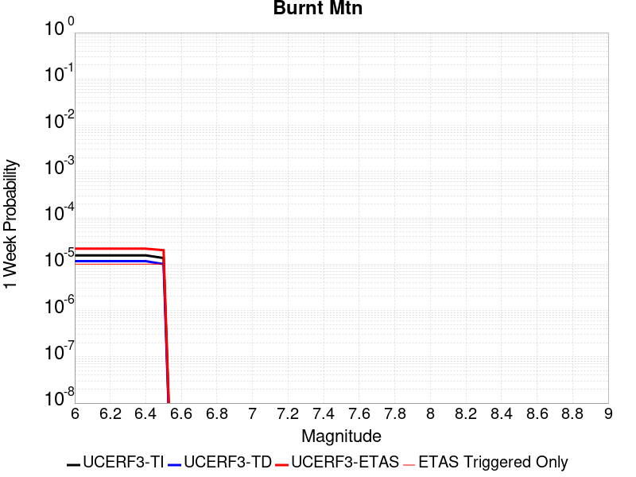 |  |  |  |

| Magnitude | 1 wk TI Prob | 1 wk TD Prob | 1 wk ETAS Prob | 1 wk ETAS/TD Gain | 1 wk ETAS Triggered Only | 1 mo TI Prob | 1 mo TD Prob | 1 mo ETAS Prob | 1 mo ETAS/TD Gain | 1 mo ETAS Triggered Only | 1 yr TI Prob | 1 yr TD Prob | 1 yr ETAS Prob | 1 yr ETAS/TD Gain | 1 yr ETAS Triggered Only | 10 yr TI Prob | 10 yr TD Prob | 10 yr ETAS Prob | 10 yr ETAS/TD Gain | 10 yr ETAS Triggered Only |
|-----|-----|-----|-----|-----|-----|-----|-----|-----|-----|-----|-----|-----|-----|-----|-----|-----|-----|-----|-----|-----|
| 6.0 | 1.5513202E-5 | 1.161744E-5 | 2.1617323E-5 | 1.8607649 | 1.0E-5 | 6.648345E-5 | 4.9788796E-5 | 6.97878E-5 | 1.4016768 | 2.0E-5 | 8.0913544E-4 | 6.061377E-4 | 6.2612555E-4 | 1.0329758 | 2.0E-5 | 0.008061957 | 0.0060573663 | 0.0060772453 | 1.0032817 | 2.0E-5 |
| 6.1 | 1.5513202E-5 | 1.161744E-5 | 2.1617323E-5 | 1.8607649 | 1.0E-5 | 6.648345E-5 | 4.9788796E-5 | 6.97878E-5 | 1.4016768 | 2.0E-5 | 8.0913544E-4 | 6.061377E-4 | 6.2612555E-4 | 1.0329758 | 2.0E-5 | 0.008061957 | 0.0060573663 | 0.0060772453 | 1.0032817 | 2.0E-5 |
| 6.2 | 1.5513202E-5 | 1.161744E-5 | 2.1617323E-5 | 1.8607649 | 1.0E-5 | 6.648345E-5 | 4.9788796E-5 | 6.97878E-5 | 1.4016768 | 2.0E-5 | 8.0913544E-4 | 6.061377E-4 | 6.2612555E-4 | 1.0329758 | 2.0E-5 | 0.008061957 | 0.0060573663 | 0.0060772453 | 1.0032817 | 2.0E-5 |
| 6.3 | 1.5513202E-5 | 1.161744E-5 | 2.1617323E-5 | 1.8607649 | 1.0E-5 | 6.648345E-5 | 4.9788796E-5 | 6.97878E-5 | 1.4016768 | 2.0E-5 | 8.0913544E-4 | 6.061377E-4 | 6.2612555E-4 | 1.0329758 | 2.0E-5 | 0.008061957 | 0.0060573663 | 0.0060772453 | 1.0032817 | 2.0E-5 |
| 6.4 | 1.5513202E-5 | 1.161744E-5 | 2.1617323E-5 | 1.8607649 | 1.0E-5 | 6.648345E-5 | 4.9788796E-5 | 6.97878E-5 | 1.4016768 | 2.0E-5 | 8.0913544E-4 | 6.061377E-4 | 6.2612555E-4 | 1.0329758 | 2.0E-5 | 0.008061957 | 0.0060573663 | 0.0060772453 | 1.0032817 | 2.0E-5 |
| 6.5 | 1.3567842E-5 | 1.003899E-5 | 2.003889E-5 | 1.9961061 | 1.0E-5 | 5.8146597E-5 | 4.302424E-5 | 6.302338E-5 | 1.4648342 | 2.0E-5 | 7.0770486E-4 | 5.238201E-4 | 5.4380967E-4 | 1.038161 | 2.0E-5 | 0.007054553 | 0.0052382015 | 0.0052580964 | 1.0037981 | 2.0E-5 |

## Whittier alt 2
*[(top)](#table-of-contents)*

| 1 Week | 1 Month | 1 Year | 10 Year |
|-----|-----|-----|-----|
|  |  |  | 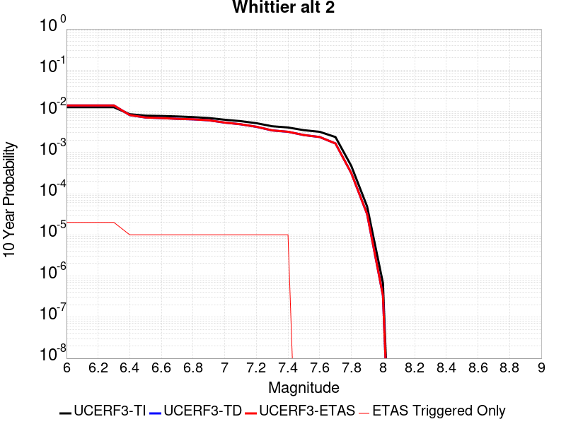 |

| Magnitude | 1 wk TI Prob | 1 wk TD Prob | 1 wk ETAS Prob | 1 wk ETAS/TD Gain | 1 wk ETAS Triggered Only | 1 mo TI Prob | 1 mo TD Prob | 1 mo ETAS Prob | 1 mo ETAS/TD Gain | 1 mo ETAS Triggered Only | 1 yr TI Prob | 1 yr TD Prob | 1 yr ETAS Prob | 1 yr ETAS/TD Gain | 1 yr ETAS Triggered Only | 10 yr TI Prob | 10 yr TD Prob | 10 yr ETAS Prob | 10 yr ETAS/TD Gain | 10 yr ETAS Triggered Only |
|-----|-----|-----|-----|-----|-----|-----|-----|-----|-----|-----|-----|-----|-----|-----|-----|-----|-----|-----|-----|-----|
| 6.0 | 2.4220093E-5 | 2.675427E-5 | 2.675427E-5 | 1.0 | 0.0 | 1.03796265E-4 | 1.1465649E-4 | 1.2465534E-4 | 1.0872071 | 1.0E-5 | 0.0012629869 | 0.0013951162 | 0.0014150883 | 1.0143157 | 2.0E-5 | 0.012558329 | 0.013870979 | 0.013890701 | 1.0014218 | 2.0E-5 |
| 6.1 | 2.4220093E-5 | 2.675427E-5 | 2.675427E-5 | 1.0 | 0.0 | 1.03796265E-4 | 1.1465649E-4 | 1.2465534E-4 | 1.0872071 | 1.0E-5 | 0.0012629869 | 0.0013951162 | 0.0014150883 | 1.0143157 | 2.0E-5 | 0.012558329 | 0.013870979 | 0.013890701 | 1.0014218 | 2.0E-5 |
| 6.2 | 2.4220093E-5 | 2.675427E-5 | 2.675427E-5 | 1.0 | 0.0 | 1.03796265E-4 | 1.1465649E-4 | 1.2465534E-4 | 1.0872071 | 1.0E-5 | 0.0012629869 | 0.0013951162 | 0.0014150883 | 1.0143157 | 2.0E-5 | 0.012558329 | 0.013870979 | 0.013890701 | 1.0014218 | 2.0E-5 |
| 6.3 | 2.4220093E-5 | 2.675427E-5 | 2.675427E-5 | 1.0 | 0.0 | 1.03796265E-4 | 1.1465649E-4 | 1.2465534E-4 | 1.0872071 | 1.0E-5 | 0.0012629869 | 0.0013951162 | 0.0014150883 | 1.0143157 | 2.0E-5 | 0.012558329 | 0.013870979 | 0.013890701 | 1.0014218 | 2.0E-5 |
| 6.4 | 1.6383605E-5 | 1.5592212E-5 | 1.5592212E-5 | 1.0 | 0.0 | 7.021356E-5 | 6.682209E-5 | 6.682209E-5 | 1.0 | 0.0 | 8.5451483E-4 | 8.132612E-4 | 8.2325307E-4 | 1.0122862 | 1.0E-5 | 0.008512364 | 0.008104045 | 0.008113964 | 1.0012239 | 1.0E-5 |
| 6.5 | 1.5128736E-5 | 1.3618429E-5 | 1.3618429E-5 | 1.0 | 0.0 | 6.483583E-5 | 5.8363403E-5 | 5.8363403E-5 | 1.0 | 0.0 | 7.890903E-4 | 7.103453E-4 | 7.203382E-4 | 1.0140676 | 1.0E-5 | 0.007862942 | 0.0070815827 | 0.007091512 | 1.0014021 | 1.0E-5 |
| 6.6 | 1.48517E-5 | 1.3168361E-5 | 1.3168361E-5 | 1.0 | 0.0 | 6.364859E-5 | 5.6434623E-5 | 5.6434623E-5 | 1.0 | 0.0 | 7.7464606E-4 | 6.8687723E-4 | 6.968703E-4 | 1.0145487 | 1.0E-5 | 0.007719513 | 0.0068483492 | 0.006858281 | 1.0014502 | 1.0E-5 |
| 6.7 | 1.445206E-5 | 1.2641355E-5 | 1.2641355E-5 | 1.0 | 0.0 | 6.193593E-5 | 5.4176126E-5 | 5.4176126E-5 | 1.0 | 0.0 | 7.53809E-4 | 6.5939676E-4 | 6.6939014E-4 | 1.0151554 | 1.0E-5 | 0.0075125713 | 0.0065751458 | 0.0065850797 | 1.0015109 | 1.0E-5 |
| 6.8 | 1.3922115E-5 | 1.2293912E-5 | 1.2293912E-5 | 1.0 | 0.0 | 5.9664842E-5 | 5.268714E-5 | 5.268714E-5 | 1.0 | 0.0 | 7.261773E-4 | 6.4127916E-4 | 6.512727E-4 | 1.0155839 | 1.0E-5 | 0.007238089 | 0.0063949903 | 0.0064049265 | 1.0015538 | 1.0E-5 |
| 6.9 | 1.3229044E-5 | 1.1633848E-5 | 1.1633848E-5 | 1.0 | 0.0 | 5.6694673E-5 | 4.9858405E-5 | 4.9858405E-5 | 1.0 | 0.0 | 6.90039E-4 | 6.0685887E-4 | 6.1685283E-4 | 1.0164683 | 1.0E-5 | 0.006879003 | 0.0060526794 | 0.006062619 | 1.0016421 | 1.0E-5 |
| 7.0 | 1.2033386E-5 | 1.0235323E-5 | 1.0235323E-5 | 1.0 | 0.0 | 5.1570638E-5 | 4.386494E-5 | 4.386494E-5 | 1.0 | 0.0 | 6.276916E-4 | 5.339261E-4 | 5.439208E-4 | 1.0187192 | 1.0E-5 | 0.006259216 | 0.005327031 | 0.0053369775 | 1.0018672 | 1.0E-5 |
| 7.1 | 1.1113964E-5 | 9.314926E-6 | 9.314926E-6 | 1.0 | 0.0 | 4.7630405E-5 | 3.9920506E-5 | 3.9920506E-5 | 1.0 | 0.0 | 5.7974586E-4 | 4.8592497E-4 | 4.9592013E-4 | 1.0205693 | 1.0E-5 | 0.0057823574 | 0.0048491997 | 0.0048591513 | 1.0020522 | 1.0E-5 |
| 7.2 | 9.907747E-6 | 8.091534E-6 | 8.091534E-6 | 1.0 | 0.0 | 4.246108E-5 | 3.467755E-5 | 3.467755E-5 | 1.0 | 0.0 | 5.16841E-4 | 4.2211838E-4 | 4.3211415E-4 | 1.0236801 | 1.0E-5 | 0.005156406 | 0.0042137005 | 0.0042236582 | 1.0023632 | 1.0E-5 |
| 7.3 | 8.340613E-6 | 6.5994623E-6 | 6.5994623E-6 | 1.0 | 0.0 | 3.5744994E-5 | 2.8283108E-5 | 2.8283108E-5 | 1.0 | 0.0 | 4.351084E-4 | 3.442932E-4 | 3.5428975E-4 | 1.029035 | 1.0E-5 | 0.0043425746 | 0.0034376783 | 0.003447644 | 1.0028989 | 1.0E-5 |
| 7.4 | 7.7863815E-6 | 6.110705E-6 | 6.110705E-6 | 1.0 | 0.0 | 3.3369783E-5 | 2.6188476E-5 | 2.6188476E-5 | 1.0 | 0.0 | 4.0620135E-4 | 3.187988E-4 | 3.287956E-4 | 1.0313578 | 1.0E-5 | 0.0040545966 | 0.003183492 | 0.0031934602 | 1.0031312 | 1.0E-5 |
| 7.5 | 6.6969787E-6 | 5.1002685E-6 | 5.1002685E-6 | 1.0 | 0.0 | 2.8701023E-5 | 2.1858114E-5 | 2.1858114E-5 | 1.0 | 0.0 | 3.493789E-4 | 2.660907E-4 | 2.660907E-4 | 1.0 | 0.0 | 0.0034883013 | 0.0026577888 | 0.0026577888 | 1.0 | 0.0 |
| 7.6 | 6.1133155E-6 | 4.5624456E-6 | 4.5624456E-6 | 1.0 | 0.0 | 2.6199661E-5 | 1.9553196E-5 | 1.9553196E-5 | 1.0 | 0.0 | 3.1893418E-4 | 2.3803479E-4 | 2.3803479E-4 | 1.0 | 0.0 | 0.0031847684 | 0.0023778626 | 0.0023778626 | 1.0 | 0.0 |
| 7.7 | 4.555085E-6 | 3.1787256E-6 | 3.1787256E-6 | 1.0 | 0.0 | 1.9521647E-5 | 1.3623042E-5 | 1.3623042E-5 | 1.0 | 0.0 | 2.3765014E-4 | 1.6584841E-4 | 1.6584841E-4 | 1.0 | 0.0 | 0.0023739615 | 0.0016572954 | 0.0016572954 | 1.0 | 0.0 |
| 7.8 | 9.039288E-7 | 6.0547694E-7 | 6.0547694E-7 | 1.0 | 0.0 | 3.873975E-6 | 2.594899E-6 | 2.594899E-6 | 1.0 | 0.0 | 4.7164624E-5 | 3.159245E-5 | 3.159245E-5 | 1.0 | 0.0 | 4.7154614E-4 | 3.1588116E-4 | 3.1588116E-4 | 1.0 | 0.0 |
| 7.9 | 9.339275E-8 | 6.106284E-8 | 6.106284E-8 | 1.0 | 0.0 | 4.0025458E-7 | 2.6169786E-7 | 2.6169786E-7 | 1.0 | 0.0 | 4.8730885E-6 | 3.1861669E-6 | 3.1861669E-6 | 1.0 | 0.0 | 4.8729817E-5 | 3.1861222E-5 | 3.1861222E-5 | 1.0 | 0.0 |
| 8.0 | 1.2971227E-9 | 6.43537E-10 | 6.43537E-10 | 1.0 | 0.0 | 5.5590976E-9 | 2.7580156E-9 | 2.7580156E-9 | 1.0 | 0.0 | 6.768201E-8 | 3.357884E-8 | 3.357884E-8 | 1.0 | 0.0 | 6.7681987E-7 | 3.3578837E-7 | 3.3578837E-7 | 1.0 | 0.0 |

## Quien Sabe 2011 CFM
*[(top)](#table-of-contents)*

| 1 Week | 1 Month | 1 Year | 10 Year |
|-----|-----|-----|-----|
|  | 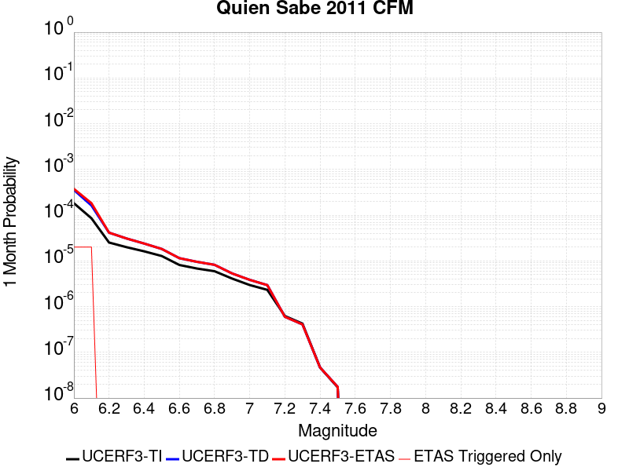 |  |  |

| Magnitude | 1 wk TI Prob | 1 wk TD Prob | 1 wk ETAS Prob | 1 wk ETAS/TD Gain | 1 wk ETAS Triggered Only | 1 mo TI Prob | 1 mo TD Prob | 1 mo ETAS Prob | 1 mo ETAS/TD Gain | 1 mo ETAS Triggered Only | 1 yr TI Prob | 1 yr TD Prob | 1 yr ETAS Prob | 1 yr ETAS/TD Gain | 1 yr ETAS Triggered Only | 10 yr TI Prob | 10 yr TD Prob | 10 yr ETAS Prob | 10 yr ETAS/TD Gain | 10 yr ETAS Triggered Only |
|-----|-----|-----|-----|-----|-----|-----|-----|-----|-----|-----|-----|-----|-----|-----|-----|-----|-----|-----|-----|-----|
| 6.0 | 4.2574793E-5 | 8.3007755E-5 | 1.03006096E-4 | 1.2409214 | 2.0E-5 | 1.8245063E-4 | 3.5571132E-4 | 3.757042E-4 | 1.0562054 | 2.0E-5 | 0.0022190735 | 0.004312467 | 0.0043323804 | 1.0046177 | 2.0E-5 | 0.021970447 | 0.041063763 | 0.04108294 | 1.0004671 | 2.0E-5 |
| 6.1 | 1.992863E-5 | 3.7948652E-5 | 5.794789E-5 | 1.5270079 | 2.0E-5 | 8.540561E-5 | 1.6262996E-4 | 1.8262671E-4 | 1.1229585 | 2.0E-5 | 0.0010393173 | 0.001971744 | 0.0019917046 | 1.0101233 | 2.0E-5 | 0.010344699 | 0.01896531 | 0.018984929 | 1.0010345 | 2.0E-5 |
| 6.2 | 5.874681E-6 | 9.666722E-6 | 9.666722E-6 | 1.0 | 0.0 | 2.5176962E-5 | 4.142823E-5 | 4.142823E-5 | 1.0 | 0.0 | 3.0648638E-4 | 5.035743E-4 | 5.035743E-4 | 1.0 | 0.0 | 0.0030606403 | 0.0049474454 | 0.0049474454 | 1.0 | 0.0 |
| 6.3 | 4.643147E-6 | 7.1936456E-6 | 7.1936456E-6 | 1.0 | 0.0 | 1.989905E-5 | 3.082959E-5 | 3.082959E-5 | 1.0 | 0.0 | 2.4224399E-4 | 3.7529305E-4 | 3.7529305E-4 | 1.0 | 0.0 | 0.002419801 | 0.0037167773 | 0.0037167773 | 1.0 | 0.0 |
| 6.4 | 3.7701614E-6 | 5.580774E-6 | 5.580774E-6 | 1.0 | 0.0 | 1.6157734E-5 | 2.391741E-5 | 2.391741E-5 | 1.0 | 0.0 | 1.9670266E-4 | 2.9116007E-4 | 2.9116007E-4 | 1.0 | 0.0 | 0.0019652864 | 0.0028994547 | 0.0028994547 | 1.0 | 0.0 |
| 6.5 | 2.9758635E-6 | 4.247911E-6 | 4.247911E-6 | 1.0 | 0.0 | 1.2753639E-5 | 1.820522E-5 | 1.820522E-5 | 1.0 | 0.0 | 1.5526448E-4 | 2.2162849E-4 | 2.2162849E-4 | 1.0 | 0.0 | 0.0015515605 | 0.0022167566 | 0.0022167566 | 1.0 | 0.0 |
| 6.6 | 1.8972155E-6 | 2.6721975E-6 | 2.6721975E-6 | 1.0 | 0.0 | 8.130898E-6 | 1.145223E-5 | 1.145223E-5 | 1.0 | 0.0 | 9.898919E-5 | 1.3942286E-4 | 1.3942286E-4 | 1.0 | 0.0 | 9.894511E-4 | 0.0013976276 | 0.0013976276 | 1.0 | 0.0 |
| 6.7 | 1.5861455E-6 | 2.2227414E-6 | 2.2227414E-6 | 1.0 | 0.0 | 6.7977485E-6 | 9.526004E-6 | 9.526004E-6 | 1.0 | 0.0 | 8.275944E-5 | 1.1597359E-4 | 1.1597359E-4 | 1.0 | 0.0 | 8.272863E-4 | 0.001164123 | 0.001164123 | 1.0 | 0.0 |
| 6.8 | 1.3851725E-6 | 1.9117851E-6 | 1.9117851E-6 | 1.0 | 0.0 | 5.9364397E-6 | 8.193342E-6 | 8.193342E-6 | 1.0 | 0.0 | 7.227376E-5 | 9.9749996E-5 | 9.9749996E-5 | 1.0 | 0.0 | 7.2250253E-4 | 0.001001176 | 0.001001176 | 1.0 | 0.0 |
| 6.9 | 9.559335E-7 | 1.2390145E-6 | 1.2390145E-6 | 1.0 | 0.0 | 4.0968516E-6 | 5.310053E-6 | 5.310053E-6 | 1.0 | 0.0 | 4.987803E-5 | 6.464821E-5 | 6.464821E-5 | 1.0 | 0.0 | 4.9866835E-4 | 6.500509E-4 | 6.500509E-4 | 1.0 | 0.0 |
| 7.0 | 6.9070194E-7 | 8.975661E-7 | 8.975661E-7 | 1.0 | 0.0 | 2.9601476E-6 | 3.8467074E-6 | 3.8467074E-6 | 1.0 | 0.0 | 3.6039204E-5 | 4.683283E-5 | 4.683283E-5 | 1.0 | 0.0 | 3.603336E-4 | 4.707734E-4 | 4.707734E-4 | 1.0 | 0.0 |
| 7.1 | 5.4216963E-7 | 6.8817064E-7 | 6.8817064E-7 | 1.0 | 0.0 | 2.323582E-6 | 2.9493003E-6 | 2.9493003E-6 | 1.0 | 0.0 | 2.8289243E-5 | 3.5907302E-5 | 3.5907302E-5 | 1.0 | 0.0 | 2.8285643E-4 | 3.6086098E-4 | 3.6086098E-4 | 1.0 | 0.0 |
| 7.2 | 1.4525865E-7 | 1.3961692E-7 | 1.3961692E-7 | 1.0 | 0.0 | 6.225369E-7 | 5.983581E-7 | 5.983581E-7 | 1.0 | 0.0 | 7.5793605E-6 | 7.284988E-6 | 7.284988E-6 | 1.0 | 0.0 | 7.5791024E-5 | 7.3043164E-5 | 7.3043164E-5 | 1.0 | 0.0 |
| 7.3 | 9.9087664E-8 | 9.5122516E-8 | 9.5122516E-8 | 1.0 | 0.0 | 4.2466132E-7 | 4.0766787E-7 | 4.0766787E-7 | 1.0 | 0.0 | 5.1702395E-6 | 4.963347E-6 | 4.963347E-6 | 1.0 | 0.0 | 5.170119E-5 | 4.971365E-5 | 4.971365E-5 | 1.0 | 0.0 |
| 7.4 | 1.08576E-8 | 1.08670335E-8 | 1.08670335E-8 | 1.0 | 0.0 | 4.653257E-8 | 4.6573E-8 | 4.6573E-8 | 1.0 | 0.0 | 5.665339E-7 | 5.670261E-7 | 5.670261E-7 | 1.0 | 0.0 | 5.6653244E-6 | 5.67464E-6 | 5.67464E-6 | 1.0 | 0.0 |
| 7.5 | 4.008261E-9 | 4.102828E-9 | 4.102828E-9 | 1.0 | 0.0 | 1.717826E-8 | 1.7583549E-8 | 1.7583549E-8 | 1.0 | 0.0 | 2.091453E-7 | 2.1407969E-7 | 2.1407969E-7 | 1.0 | 0.0 | 2.091451E-6 | 2.1428161E-6 | 2.1428161E-6 | 1.0 | 0.0 |

## Greenville (So) 2011 CFM
*[(top)](#table-of-contents)*

| 1 Week | 1 Month | 1 Year | 10 Year |
|-----|-----|-----|-----|
|  |  | 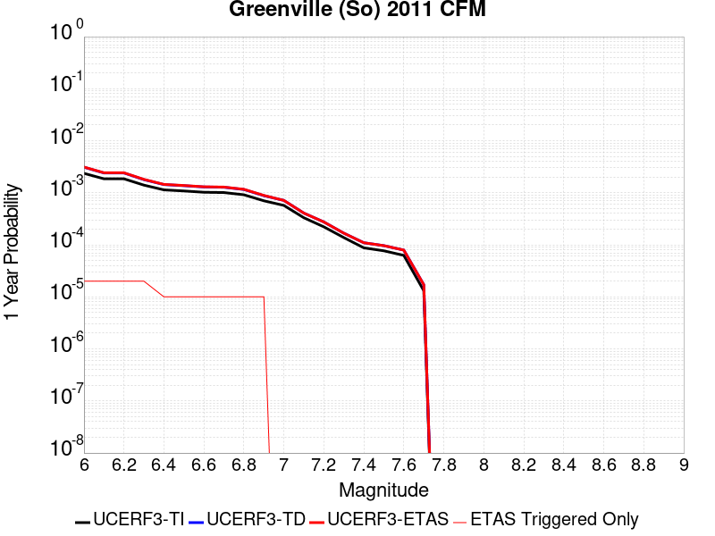 |  |

| Magnitude | 1 wk TI Prob | 1 wk TD Prob | 1 wk ETAS Prob | 1 wk ETAS/TD Gain | 1 wk ETAS Triggered Only | 1 mo TI Prob | 1 mo TD Prob | 1 mo ETAS Prob | 1 mo ETAS/TD Gain | 1 mo ETAS Triggered Only | 1 yr TI Prob | 1 yr TD Prob | 1 yr ETAS Prob | 1 yr ETAS/TD Gain | 1 yr ETAS Triggered Only | 10 yr TI Prob | 10 yr TD Prob | 10 yr ETAS Prob | 10 yr ETAS/TD Gain | 10 yr ETAS Triggered Only |
|-----|-----|-----|-----|-----|-----|-----|-----|-----|-----|-----|-----|-----|-----|-----|-----|-----|-----|-----|-----|-----|
| 6.0 | 4.536168E-5 | 5.9572976E-5 | 7.9571786E-5 | 1.3357027 | 2.0E-5 | 1.9439272E-4 | 2.5529036E-4 | 2.7528525E-4 | 1.0783222 | 2.0E-5 | 0.0023641624 | 0.0031041605 | 0.0031240985 | 1.006423 | 2.0E-5 | 0.023391686 | 0.030636925 | 0.030656314 | 1.0006328 | 2.0E-5 |
| 6.1 | 3.562599E-5 | 4.6139437E-5 | 6.613851E-5 | 1.4334487 | 2.0E-5 | 1.5267389E-4 | 1.9772693E-4 | 2.1772298E-4 | 1.1011297 | 2.0E-5 | 0.0018572197 | 0.0024049326 | 0.0024248846 | 1.0082963 | 2.0E-5 | 0.018417748 | 0.023807961 | 0.023827486 | 1.00082 | 2.0E-5 |
| 6.2 | 3.562599E-5 | 4.6139437E-5 | 6.613851E-5 | 1.4334487 | 2.0E-5 | 1.5267389E-4 | 1.9772693E-4 | 2.1772298E-4 | 1.1011297 | 2.0E-5 | 0.0018572197 | 0.0024049326 | 0.0024248846 | 1.0082963 | 2.0E-5 | 0.018417748 | 0.023807961 | 0.023827486 | 1.00082 | 2.0E-5 |
| 6.3 | 2.6918162E-5 | 3.4317065E-5 | 5.431638E-5 | 1.5827804 | 2.0E-5 | 1.15358445E-4 | 1.4706537E-4 | 1.6706243E-4 | 1.1359739 | 2.0E-5 | 0.0014035841 | 0.0017891458 | 0.0018091099 | 1.0111585 | 2.0E-5 | 0.01394752 | 0.01775532 | 0.017774966 | 1.0011064 | 2.0E-5 |
| 6.4 | 2.1818105E-5 | 2.7607937E-5 | 3.760766E-5 | 1.3622047 | 1.0E-5 | 9.3502815E-5 | 1.1831457E-4 | 1.2831339E-4 | 1.0845104 | 1.0E-5 | 0.0011378021 | 0.0014395685 | 0.0014495541 | 1.0069366 | 1.0E-5 | 0.011319942 | 0.014306443 | 0.0143163 | 1.000689 | 1.0E-5 |
| 6.5 | 2.0782856E-5 | 2.6280719E-5 | 3.6280457E-5 | 1.3804971 | 1.0E-5 | 8.9066336E-5 | 1.12626985E-4 | 1.2262586E-4 | 1.0887786 | 1.0E-5 | 0.0010838432 | 0.0013704094 | 0.0013803957 | 1.0072871 | 1.0E-5 | 0.010785722 | 0.013623543 | 0.013633407 | 1.0007241 | 1.0E-5 |
| 6.6 | 1.9629122E-5 | 2.4824472E-5 | 3.4824225E-5 | 1.4028183 | 1.0E-5 | 8.41221E-5 | 1.0638644E-4 | 1.16385374E-4 | 1.093987 | 1.0E-5 | 0.0010237052 | 0.0012945215 | 0.0013045085 | 1.0077149 | 1.0E-5 | 0.010190022 | 0.012873643 | 0.012883514 | 1.0007668 | 1.0E-5 |
| 6.7 | 1.937666E-5 | 2.450438E-5 | 3.4504134E-5 | 1.4080803 | 1.0E-5 | 8.3040184E-5 | 1.05014726E-4 | 1.15013674E-4 | 1.0952147 | 1.0E-5 | 0.0010105452 | 0.0012778409 | 0.0012878282 | 1.0078157 | 1.0E-5 | 0.010059622 | 0.012708785 | 0.012718658 | 1.0007769 | 1.0E-5 |
| 6.8 | 1.7567998E-5 | 2.2188464E-5 | 3.218824E-5 | 1.4506747 | 1.0E-5 | 7.5289245E-5 | 9.509014E-5 | 1.0508919E-4 | 1.1051533 | 1.0E-5 | 9.1626105E-4 | 0.0011571395 | 0.001167128 | 1.008632 | 1.0E-5 | 0.0091249235 | 0.011514499 | 0.011524383 | 1.0008584 | 1.0E-5 |
| 6.9 | 1.3448696E-5 | 1.6880182E-5 | 2.6880012E-5 | 1.5924007 | 1.0E-5 | 5.7636E-5 | 7.2341754E-5 | 8.234104E-5 | 1.1382227 | 1.0E-5 | 7.0149236E-4 | 8.804271E-4 | 8.9041825E-4 | 1.0113481 | 1.0E-5 | 0.0069928207 | 0.008771671 | 0.008781584 | 1.00113 | 1.0E-5 |
| 7.0 | 1.0973039E-5 | 1.3684768E-5 | 1.3684768E-5 | 1.0 | 0.0 | 4.702646E-5 | 5.8647798E-5 | 5.8647798E-5 | 1.0 | 0.0 | 5.7239673E-4 | 7.1382255E-4 | 7.1382255E-4 | 1.0 | 0.0 | 0.0057092463 | 0.007117277 | 0.007117277 | 1.0 | 0.0 |
| 7.1 | 6.3541956E-6 | 7.800758E-6 | 7.800758E-6 | 1.0 | 0.0 | 2.7231983E-5 | 3.34314E-5 | 3.34314E-5 | 1.0 | 0.0 | 3.3149894E-4 | 4.0695266E-4 | 4.0695266E-4 | 1.0 | 0.0 | 0.0033100487 | 0.0040623224 | 0.0040623224 | 1.0 | 0.0 |
| 7.2 | 4.2486E-6 | 5.2729856E-6 | 5.2729856E-6 | 1.0 | 0.0 | 1.8208157E-5 | 2.2598317E-5 | 2.2598317E-5 | 1.0 | 0.0 | 2.2166176E-4 | 2.7510017E-4 | 2.7510017E-4 | 1.0 | 0.0 | 0.002214408 | 0.0027477369 | 0.0027477369 | 1.0 | 0.0 |
| 7.3 | 2.640264E-6 | 3.209588E-6 | 3.209588E-6 | 1.0 | 0.0 | 1.1315367E-5 | 1.3755305E-5 | 1.3755305E-5 | 1.0 | 0.0 | 1.377559E-4 | 1.6745809E-4 | 1.6745809E-4 | 1.0 | 0.0 | 0.0013767052 | 0.0016733796 | 0.0016733796 | 1.0 | 0.0 |
| 7.4 | 1.6772284E-6 | 2.1012677E-6 | 2.1012677E-6 | 1.0 | 0.0 | 7.1881022E-6 | 9.005403E-6 | 9.005403E-6 | 1.0 | 0.0 | 8.751163E-5 | 1.096353E-4 | 1.096353E-4 | 1.0 | 0.0 | 8.7477174E-4 | 0.0010958491 | 0.0010958491 | 1.0 | 0.0 |
| 7.5 | 1.4710668E-6 | 1.8496621E-6 | 1.8496621E-6 | 1.0 | 0.0 | 6.304557E-6 | 7.927099E-6 | 7.927099E-6 | 1.0 | 0.0 | 7.675528E-5 | 9.650821E-5 | 9.650821E-5 | 1.0 | 0.0 | 7.672877E-4 | 9.64694E-4 | 9.64694E-4 | 1.0 | 0.0 |
| 7.6 | 1.2015661E-6 | 1.5179792E-6 | 1.5179792E-6 | 1.0 | 0.0 | 5.149559E-6 | 6.505609E-6 | 6.505609E-6 | 1.0 | 0.0 | 6.2694075E-5 | 7.920295E-5 | 7.920295E-5 | 1.0 | 0.0 | 6.267639E-4 | 7.9177145E-4 | 7.9177145E-4 | 1.0 | 0.0 |
| 7.7 | 2.514651E-7 | 3.2786852E-7 | 3.2786852E-7 | 1.0 | 0.0 | 1.0777071E-6 | 1.40515E-6 | 1.40515E-6 | 1.0 | 0.0 | 1.3121005E-5 | 1.7107572E-5 | 1.7107572E-5 | 1.0 | 0.0 | 1.3120231E-4 | 1.71064E-4 | 1.71064E-4 | 1.0 | 0.0 |

## Jess Valley
*[(top)](#table-of-contents)*

| 1 Week | 1 Month | 1 Year | 10 Year |
|-----|-----|-----|-----|
|  |  |  |  |

| Magnitude | 1 wk TI Prob | 1 wk TD Prob | 1 wk ETAS Prob | 1 wk ETAS/TD Gain | 1 wk ETAS Triggered Only | 1 mo TI Prob | 1 mo TD Prob | 1 mo ETAS Prob | 1 mo ETAS/TD Gain | 1 mo ETAS Triggered Only | 1 yr TI Prob | 1 yr TD Prob | 1 yr ETAS Prob | 1 yr ETAS/TD Gain | 1 yr ETAS Triggered Only | 10 yr TI Prob | 10 yr TD Prob | 10 yr ETAS Prob | 10 yr ETAS/TD Gain | 10 yr ETAS Triggered Only |
|-----|-----|-----|-----|-----|-----|-----|-----|-----|-----|-----|-----|-----|-----|-----|-----|-----|-----|-----|-----|-----|
| 6.0 | 3.4316226E-6 | 3.4801812E-6 | 1.3480147E-5 | 3.8734035 | 1.0E-5 | 1.4706871E-5 | 1.4914993E-5 | 2.4914843E-5 | 1.6704563 | 1.0E-5 | 1.7904144E-4 | 1.815778E-4 | 1.9157598E-4 | 1.0550628 | 1.0E-5 | 0.0017889726 | 0.0018145783 | 0.0018245601 | 1.0055009 | 1.0E-5 |
| 6.1 | 3.4316226E-6 | 3.4801812E-6 | 1.3480147E-5 | 3.8734035 | 1.0E-5 | 1.4706871E-5 | 1.4914993E-5 | 2.4914843E-5 | 1.6704563 | 1.0E-5 | 1.7904144E-4 | 1.815778E-4 | 1.9157598E-4 | 1.0550628 | 1.0E-5 | 0.0017889726 | 0.0018145783 | 0.0018245601 | 1.0055009 | 1.0E-5 |
| 6.2 | 3.4316226E-6 | 3.4801812E-6 | 1.3480147E-5 | 3.8734035 | 1.0E-5 | 1.4706871E-5 | 1.4914993E-5 | 2.4914843E-5 | 1.6704563 | 1.0E-5 | 1.7904144E-4 | 1.815778E-4 | 1.9157598E-4 | 1.0550628 | 1.0E-5 | 0.0017889726 | 0.0018145783 | 0.0018245601 | 1.0055009 | 1.0E-5 |
| 6.3 | 3.4316226E-6 | 3.4801812E-6 | 1.3480147E-5 | 3.8734035 | 1.0E-5 | 1.4706871E-5 | 1.4914993E-5 | 2.4914843E-5 | 1.6704563 | 1.0E-5 | 1.7904144E-4 | 1.815778E-4 | 1.9157598E-4 | 1.0550628 | 1.0E-5 | 0.0017889726 | 0.0018145783 | 0.0018245601 | 1.0055009 | 1.0E-5 |
| 6.4 | 1.5021815E-6 | 1.5228945E-6 | 1.5228945E-6 | 1.0 | 0.0 | 6.4379046E-6 | 6.5266786E-6 | 6.5266786E-6 | 1.0 | 0.0 | 7.837867E-5 | 7.9460166E-5 | 7.9460166E-5 | 1.0 | 0.0 | 7.8351033E-4 | 7.943913E-4 | 7.943913E-4 | 1.0 | 0.0 |
| 6.5 | 1.5021815E-6 | 1.5228945E-6 | 1.5228945E-6 | 1.0 | 0.0 | 6.4379046E-6 | 6.5266786E-6 | 6.5266786E-6 | 1.0 | 0.0 | 7.837867E-5 | 7.9460166E-5 | 7.9460166E-5 | 1.0 | 0.0 | 7.8351033E-4 | 7.943913E-4 | 7.943913E-4 | 1.0 | 0.0 |
| 6.6 | 5.183126E-7 | 5.2556794E-7 | 5.2556794E-7 | 1.0 | 0.0 | 2.221338E-6 | 2.252433E-6 | 2.252433E-6 | 1.0 | 0.0 | 2.7044454E-5 | 2.742318E-5 | 2.742318E-5 | 1.0 | 0.0 | 2.7041163E-4 | 2.742131E-4 | 2.742131E-4 | 1.0 | 0.0 |
| 6.7 | 5.183126E-7 | 5.2556794E-7 | 5.2556794E-7 | 1.0 | 0.0 | 2.221338E-6 | 2.252433E-6 | 2.252433E-6 | 1.0 | 0.0 | 2.7044454E-5 | 2.742318E-5 | 2.742318E-5 | 1.0 | 0.0 | 2.7041163E-4 | 2.742131E-4 | 2.742131E-4 | 1.0 | 0.0 |
| 6.8 | 3.1514537E-7 | 3.1955196E-7 | 3.1955196E-7 | 1.0 | 0.0 | 1.3506223E-6 | 1.3695084E-6 | 1.3695084E-6 | 1.0 | 0.0 | 1.6443702E-5 | 1.6673765E-5 | 1.6673765E-5 | 1.0 | 0.0 | 1.6442486E-4 | 1.6673763E-4 | 1.6673763E-4 | 1.0 | 0.0 |

## Fish Slough 2011 CFM
*[(top)](#table-of-contents)*

| 1 Week | 1 Month | 1 Year | 10 Year |
|-----|-----|-----|-----|
|  |  |  |  |

| Magnitude | 1 wk TI Prob | 1 wk TD Prob | 1 wk ETAS Prob | 1 wk ETAS/TD Gain | 1 wk ETAS Triggered Only | 1 mo TI Prob | 1 mo TD Prob | 1 mo ETAS Prob | 1 mo ETAS/TD Gain | 1 mo ETAS Triggered Only | 1 yr TI Prob | 1 yr TD Prob | 1 yr ETAS Prob | 1 yr ETAS/TD Gain | 1 yr ETAS Triggered Only | 10 yr TI Prob | 10 yr TD Prob | 10 yr ETAS Prob | 10 yr ETAS/TD Gain | 10 yr ETAS Triggered Only |
|-----|-----|-----|-----|-----|-----|-----|-----|-----|-----|-----|-----|-----|-----|-----|-----|-----|-----|-----|-----|-----|
| 6.0 | 5.409547E-6 | 4.759683E-6 | 4.759683E-6 | 1.0 | 0.0 | 2.3183567E-5 | 2.0398507E-5 | 2.0398507E-5 | 1.0 | 0.0 | 2.8222337E-4 | 2.4832797E-4 | 2.5832548E-4 | 1.0402594 | 1.0E-5 | 0.0028186522 | 0.0024809418 | 0.0025008922 | 1.0080415 | 2.0E-5 |
| 6.1 | 5.409547E-6 | 4.759683E-6 | 4.759683E-6 | 1.0 | 0.0 | 2.3183567E-5 | 2.0398507E-5 | 2.0398507E-5 | 1.0 | 0.0 | 2.8222337E-4 | 2.4832797E-4 | 2.5832548E-4 | 1.0402594 | 1.0E-5 | 0.0028186522 | 0.0024809418 | 0.0025008922 | 1.0080415 | 2.0E-5 |
| 6.2 | 5.409547E-6 | 4.759683E-6 | 4.759683E-6 | 1.0 | 0.0 | 2.3183567E-5 | 2.0398507E-5 | 2.0398507E-5 | 1.0 | 0.0 | 2.8222337E-4 | 2.4832797E-4 | 2.5832548E-4 | 1.0402594 | 1.0E-5 | 0.0028186522 | 0.0024809418 | 0.0025008922 | 1.0080415 | 2.0E-5 |
| 6.3 | 5.409547E-6 | 4.759683E-6 | 4.759683E-6 | 1.0 | 0.0 | 2.3183567E-5 | 2.0398507E-5 | 2.0398507E-5 | 1.0 | 0.0 | 2.8222337E-4 | 2.4832797E-4 | 2.5832548E-4 | 1.0402594 | 1.0E-5 | 0.0028186522 | 0.0024809418 | 0.0025008922 | 1.0080415 | 2.0E-5 |
| 6.4 | 5.409547E-6 | 4.759683E-6 | 4.759683E-6 | 1.0 | 0.0 | 2.3183567E-5 | 2.0398507E-5 | 2.0398507E-5 | 1.0 | 0.0 | 2.8222337E-4 | 2.4832797E-4 | 2.5832548E-4 | 1.0402594 | 1.0E-5 | 0.0028186522 | 0.0024809418 | 0.0025008922 | 1.0080415 | 2.0E-5 |
| 6.5 | 3.7040672E-6 | 2.9985586E-6 | 2.9985586E-6 | 1.0 | 0.0 | 1.5874477E-5 | 1.2850916E-5 | 1.2850916E-5 | 1.0 | 0.0 | 1.9325461E-4 | 1.564512E-4 | 1.6644964E-4 | 1.0639077 | 1.0E-5 | 0.0019308664 | 0.0015636594 | 0.0015836281 | 1.0127705 | 2.0E-5 |
| 6.6 | 3.7040672E-6 | 2.9985586E-6 | 2.9985586E-6 | 1.0 | 0.0 | 1.5874477E-5 | 1.2850916E-5 | 1.2850916E-5 | 1.0 | 0.0 | 1.9325461E-4 | 1.564512E-4 | 1.6644964E-4 | 1.0639077 | 1.0E-5 | 0.0019308664 | 0.0015636594 | 0.0015836281 | 1.0127705 | 2.0E-5 |
| 6.7 | 3.382452E-6 | 2.6662196E-6 | 2.6662196E-6 | 1.0 | 0.0 | 1.4496142E-5 | 1.14266195E-5 | 1.14266195E-5 | 1.0 | 0.0 | 1.7647624E-4 | 1.391127E-4 | 1.491113E-4 | 1.0718741 | 1.0E-5 | 0.0017633616 | 0.0013904998 | 0.0014104719 | 1.0143633 | 2.0E-5 |
| 6.8 | 1.9809256E-6 | 1.2187515E-6 | 1.2187515E-6 | 1.0 | 0.0 | 8.489654E-6 | 5.2232103E-6 | 5.2232103E-6 | 1.0 | 0.0 | 1.0335663E-4 | 6.359077E-5 | 7.359014E-5 | 1.1572455 | 1.0E-5 | 0.0010330856 | 6.3572987E-4 | 6.5571716E-4 | 1.0314399 | 2.0E-5 |
| 6.9 | 1.9007821E-6 | 1.1352845E-6 | 1.1352845E-6 | 1.0 | 0.0 | 8.146183E-6 | 4.865496E-6 | 4.865496E-6 | 1.0 | 0.0 | 9.917527E-5 | 5.9235845E-5 | 6.923525E-5 | 1.1688067 | 1.0E-5 | 9.913102E-4 | 5.9220445E-4 | 6.1219255E-4 | 1.0337521 | 2.0E-5 |
| 7.0 | 1.691606E-6 | 9.206093E-7 | 9.206093E-7 | 1.0 | 0.0 | 7.24972E-6 | 3.9454626E-6 | 3.9454626E-6 | 1.0 | 0.0 | 8.826177E-5 | 4.8034977E-5 | 4.8034977E-5 | 1.0 | 0.0 | 8.822672E-4 | 4.802487E-4 | 4.902439E-4 | 1.0208125 | 1.0E-5 |
| 7.1 | 1.4615243E-6 | 6.93196E-7 | 6.93196E-7 | 1.0 | 0.0 | 6.263661E-6 | 2.9708367E-6 | 2.9708367E-6 | 1.0 | 0.0 | 7.62574E-5 | 3.6169353E-5 | 3.6169353E-5 | 1.0 | 0.0 | 7.623124E-4 | 3.616364E-4 | 3.7163278E-4 | 1.0276421 | 1.0E-5 |
| 7.2 | 1.2210795E-6 | 4.6665465E-7 | 4.6665465E-7 | 1.0 | 0.0 | 5.2331875E-6 | 1.999947E-6 | 1.999947E-6 | 1.0 | 0.0 | 6.371219E-5 | 2.4349092E-5 | 2.4349092E-5 | 1.0 | 0.0 | 6.369393E-4 | 2.4346517E-4 | 2.5346273E-4 | 1.0410637 | 1.0E-5 |
| 7.3 | 1.0085429E-6 | 3.050748E-7 | 3.050748E-7 | 1.0 | 0.0 | 4.3223195E-6 | 1.3074628E-6 | 1.3074628E-6 | 1.0 | 0.0 | 5.262297E-5 | 1.5918244E-5 | 1.5918244E-5 | 1.0 | 0.0 | 5.261051E-4 | 1.5917116E-4 | 1.6916958E-4 | 1.0628154 | 1.0E-5 |
| 7.4 | 8.3081596E-7 | 2.2196092E-7 | 2.2196092E-7 | 1.0 | 0.0 | 3.560635E-6 | 9.5126074E-7 | 9.5126074E-7 | 1.0 | 0.0 | 4.3349868E-5 | 1.1581539E-5 | 1.1581539E-5 | 1.0 | 0.0 | 4.3341413E-4 | 1.1580944E-4 | 1.2580828E-4 | 1.0863388 | 1.0E-5 |
| 7.5 | 5.155576E-7 | 1.2051315E-7 | 1.2051315E-7 | 1.0 | 0.0 | 2.2095305E-6 | 5.164848E-7 | 5.164848E-7 | 1.0 | 0.0 | 2.6900703E-5 | 6.288185E-6 | 6.288185E-6 | 1.0 | 0.0 | 2.6897446E-4 | 6.2880106E-5 | 6.2880106E-5 | 1.0 | 0.0 |
| 7.6 | 1.9826528E-7 | 4.552002E-8 | 4.552002E-8 | 1.0 | 0.0 | 8.4970804E-7 | 1.9508579E-7 | 1.9508579E-7 | 1.0 | 0.0 | 1.0345147E-5 | 2.3751672E-6 | 2.3751672E-6 | 1.0 | 0.0 | 1.0344665E-4 | 2.3751436E-5 | 2.3751436E-5 | 1.0 | 0.0 |
| 7.7 | 2.4024958E-8 | 3.299487E-9 | 3.299487E-9 | 1.0 | 0.0 | 1.0296411E-7 | 1.41406575E-8 | 1.41406575E-8 | 1.0 | 0.0 | 1.2535872E-6 | 1.721625E-7 | 1.721625E-7 | 1.0 | 0.0 | 1.2535802E-5 | 1.7216238E-6 | 1.7216238E-6 | 1.0 | 0.0 |

## Lions Head 2011 CFM
*[(top)](#table-of-contents)*

| 1 Week | 1 Month | 1 Year | 10 Year |
|-----|-----|-----|-----|
|  |  |  | 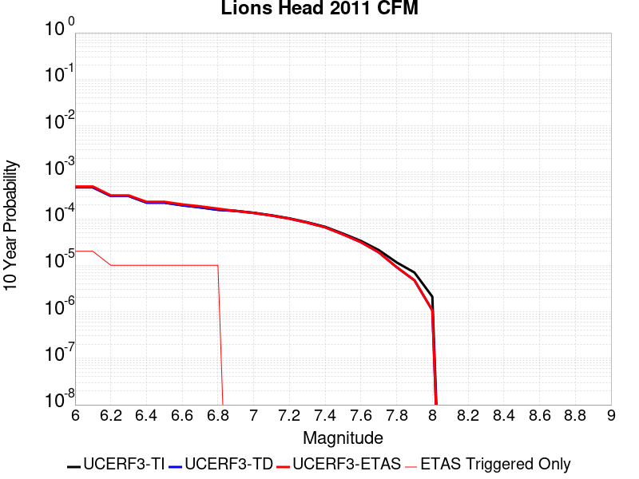 |

| Magnitude | 1 wk TI Prob | 1 wk TD Prob | 1 wk ETAS Prob | 1 wk ETAS/TD Gain | 1 wk ETAS Triggered Only | 1 mo TI Prob | 1 mo TD Prob | 1 mo ETAS Prob | 1 mo ETAS/TD Gain | 1 mo ETAS Triggered Only | 1 yr TI Prob | 1 yr TD Prob | 1 yr ETAS Prob | 1 yr ETAS/TD Gain | 1 yr ETAS Triggered Only | 10 yr TI Prob | 10 yr TD Prob | 10 yr ETAS Prob | 10 yr ETAS/TD Gain | 10 yr ETAS Triggered Only |
|-----|-----|-----|-----|-----|-----|-----|-----|-----|-----|-----|-----|-----|-----|-----|-----|-----|-----|-----|-----|-----|
| 6.0 | 9.104758E-7 | 9.0994473E-7 | 9.0994473E-7 | 1.0 | 0.0 | 3.9020333E-6 | 3.8997578E-6 | 3.8997578E-6 | 1.0 | 0.0 | 4.7506222E-5 | 4.747858E-5 | 5.7478104E-5 | 1.2106113 | 1.0E-5 | 4.749607E-4 | 4.7469078E-4 | 4.946813E-4 | 1.0421127 | 2.0E-5 |
| 6.1 | 9.104758E-7 | 9.0994473E-7 | 9.0994473E-7 | 1.0 | 0.0 | 3.9020333E-6 | 3.8997578E-6 | 3.8997578E-6 | 1.0 | 0.0 | 4.7506222E-5 | 4.747858E-5 | 5.7478104E-5 | 1.2106113 | 1.0E-5 | 4.749607E-4 | 4.7469078E-4 | 4.946813E-4 | 1.0421127 | 2.0E-5 |
| 6.2 | 5.9373394E-7 | 5.922323E-7 | 5.922323E-7 | 1.0 | 0.0 | 2.5445715E-6 | 2.538136E-6 | 2.538136E-6 | 1.0 | 0.0 | 3.0979718E-5 | 3.090138E-5 | 3.090138E-5 | 1.0 | 0.0 | 3.0975402E-4 | 3.089724E-4 | 3.189693E-4 | 1.0323553 | 1.0E-5 |
| 6.3 | 5.9373394E-7 | 5.922323E-7 | 5.922323E-7 | 1.0 | 0.0 | 2.5445715E-6 | 2.538136E-6 | 2.538136E-6 | 1.0 | 0.0 | 3.0979718E-5 | 3.090138E-5 | 3.090138E-5 | 1.0 | 0.0 | 3.0975402E-4 | 3.089724E-4 | 3.189693E-4 | 1.0323553 | 1.0E-5 |
| 6.4 | 4.2803052E-7 | 4.2604177E-7 | 4.2604177E-7 | 1.0 | 0.0 | 1.8344152E-6 | 1.825892E-6 | 1.825892E-6 | 1.0 | 0.0 | 2.2333776E-5 | 2.2230011E-5 | 2.2230011E-5 | 1.0 | 0.0 | 2.2331532E-4 | 2.222781E-4 | 2.3227588E-4 | 1.0449787 | 1.0E-5 |
| 6.5 | 4.2803052E-7 | 4.2604177E-7 | 4.2604177E-7 | 1.0 | 0.0 | 1.8344152E-6 | 1.825892E-6 | 1.825892E-6 | 1.0 | 0.0 | 2.2333776E-5 | 2.2230011E-5 | 2.2230011E-5 | 1.0 | 0.0 | 2.2331532E-4 | 2.222781E-4 | 2.3227588E-4 | 1.0449787 | 1.0E-5 |
| 6.6 | 3.7472194E-7 | 3.7258144E-7 | 3.7258144E-7 | 1.0 | 0.0 | 1.6059502E-6 | 1.5967767E-6 | 1.5967767E-6 | 1.0 | 0.0 | 1.9552268E-5 | 1.9440582E-5 | 1.9440582E-5 | 1.0 | 0.0 | 1.9550548E-4 | 1.9438895E-4 | 2.04387E-4 | 1.0514332 | 1.0E-5 |
| 6.7 | 3.3865746E-7 | 3.364178E-7 | 3.364178E-7 | 1.0 | 0.0 | 1.4513884E-6 | 1.4417897E-6 | 1.4417897E-6 | 1.0 | 0.0 | 1.7670509E-5 | 1.7553648E-5 | 1.7553648E-5 | 1.0 | 0.0 | 1.7669104E-4 | 1.7552268E-4 | 1.8552093E-4 | 1.0569627 | 1.0E-5 |
| 6.8 | 3.0024168E-7 | 2.9790152E-7 | 2.9790152E-7 | 1.0 | 0.0 | 1.2867495E-6 | 1.2767202E-6 | 1.2767202E-6 | 1.0 | 0.0 | 1.5666063E-5 | 1.5543957E-5 | 1.5543957E-5 | 1.0 | 0.0 | 1.5664958E-4 | 1.5542873E-4 | 1.6542718E-4 | 1.0643282 | 1.0E-5 |
| 6.9 | 2.8433013E-7 | 2.8193176E-7 | 2.8193176E-7 | 1.0 | 0.0 | 1.2185571E-6 | 1.2082784E-6 | 1.2082784E-6 | 1.0 | 0.0 | 1.4835832E-5 | 1.471069E-5 | 1.471069E-5 | 1.0 | 0.0 | 1.4834842E-4 | 1.4709719E-4 | 1.4709719E-4 | 1.0 | 0.0 |
| 7.0 | 2.5842368E-7 | 2.5592695E-7 | 2.5592695E-7 | 1.0 | 0.0 | 1.1075297E-6 | 1.0968292E-6 | 1.0968292E-6 | 1.0 | 0.0 | 1.348409E-5 | 1.3353815E-5 | 1.3353815E-5 | 1.0 | 0.0 | 1.3483272E-4 | 1.3353015E-4 | 1.3353015E-4 | 1.0 | 0.0 |
| 7.1 | 2.2780654E-7 | 2.2515768E-7 | 2.2515768E-7 | 1.0 | 0.0 | 9.763133E-7 | 9.649611E-7 | 9.649611E-7 | 1.0 | 0.0 | 1.1886551E-5 | 1.1748338E-5 | 1.1748338E-5 | 1.0 | 0.0 | 1.1885915E-4 | 1.1747718E-4 | 1.1747718E-4 | 1.0 | 0.0 |
| 7.2 | 1.9570835E-7 | 1.9288717E-7 | 1.9288717E-7 | 1.0 | 0.0 | 8.3874977E-7 | 8.26659E-7 | 8.26659E-7 | 1.0 | 0.0 | 1.0211731E-5 | 1.00645275E-5 | 1.00645275E-5 | 1.0 | 0.0 | 1.02112615E-4 | 1.00640726E-4 | 1.00640726E-4 | 1.0 | 0.0 |
| 7.3 | 1.6132498E-7 | 1.5826953E-7 | 1.5826953E-7 | 1.0 | 0.0 | 6.9139253E-7 | 6.782978E-7 | 6.782978E-7 | 1.0 | 0.0 | 8.417672E-6 | 8.258245E-6 | 8.258245E-6 | 1.0 | 0.0 | 8.417353E-5 | 8.257938E-5 | 8.257938E-5 | 1.0 | 0.0 |
| 7.4 | 1.289358E-7 | 1.2563584E-7 | 1.2563584E-7 | 1.0 | 0.0 | 5.5258187E-7 | 5.3843917E-7 | 5.3843917E-7 | 1.0 | 0.0 | 6.7276633E-6 | 6.5554773E-6 | 6.5554773E-6 | 1.0 | 0.0 | 6.7274595E-5 | 6.555284E-5 | 6.555284E-5 | 1.0 | 0.0 |
| 7.5 | 9.206025E-8 | 8.8411E-8 | 8.8411E-8 | 1.0 | 0.0 | 3.9454386E-7 | 3.7890422E-7 | 3.7890422E-7 | 1.0 | 0.0 | 4.803561E-6 | 4.613149E-6 | 4.613149E-6 | 1.0 | 0.0 | 4.803457E-5 | 4.6130535E-5 | 4.6130535E-5 | 1.0 | 0.0 |
| 7.6 | 6.422742E-8 | 6.0254116E-8 | 6.0254116E-8 | 1.0 | 0.0 | 2.7526036E-7 | 2.5823192E-7 | 2.5823192E-7 | 1.0 | 0.0 | 3.3512897E-6 | 3.1439688E-6 | 3.1439688E-6 | 1.0 | 0.0 | 3.351239E-5 | 3.1439246E-5 | 3.1439246E-5 | 1.0 | 0.0 |
| 7.7 | 4.0749576E-8 | 3.6420566E-8 | 3.6420566E-8 | 1.0 | 0.0 | 1.7464103E-7 | 1.5608813E-7 | 1.5608813E-7 | 1.0 | 0.0 | 2.1262524E-6 | 1.9003713E-6 | 1.9003713E-6 | 1.0 | 0.0 | 2.126232E-5 | 1.9003552E-5 | 1.9003552E-5 | 1.0 | 0.0 |
| 7.8 | 2.2147749E-8 | 1.7500652E-8 | 1.7500652E-8 | 1.0 | 0.0 | 9.491892E-8 | 7.500279E-8 | 7.500279E-8 | 1.0 | 0.0 | 1.1556373E-6 | 9.131585E-7 | 9.131585E-7 | 1.0 | 0.0 | 1.15563125E-5 | 9.131548E-6 | 9.131548E-6 | 1.0 | 0.0 |
| 7.9 | 1.3388016E-8 | 9.095599E-9 | 9.095599E-9 | 1.0 | 0.0 | 5.737721E-8 | 3.898113E-8 | 3.898113E-8 | 1.0 | 0.0 | 6.985673E-7 | 4.7459514E-7 | 4.7459514E-7 | 1.0 | 0.0 | 6.985651E-6 | 4.7459416E-6 | 4.7459416E-6 | 1.0 | 0.0 |
| 8.0 | 4.0495816E-9 | 2.05933E-9 | 2.05933E-9 | 1.0 | 0.0 | 1.735535E-8 | 8.825698E-9 | 8.825698E-9 | 1.0 | 0.0 | 2.1130136E-7 | 1.0745286E-7 | 1.0745286E-7 | 1.0 | 0.0 | 2.1130115E-6 | 1.0745281E-6 | 1.0745281E-6 | 1.0 | 0.0 |

## Eaton Roughs 2011 CFM
*[(top)](#table-of-contents)*

| 1 Week | 1 Month | 1 Year | 10 Year |
|-----|-----|-----|-----|
| 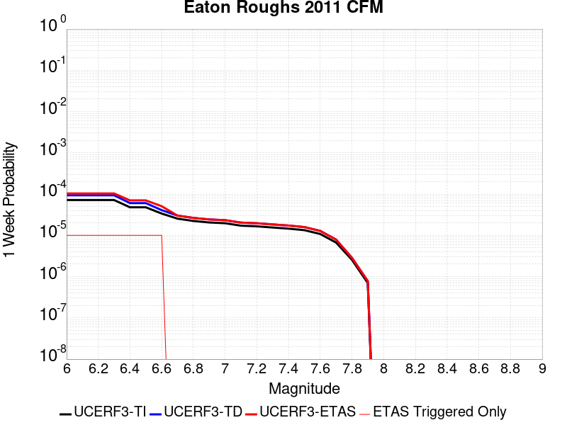 | 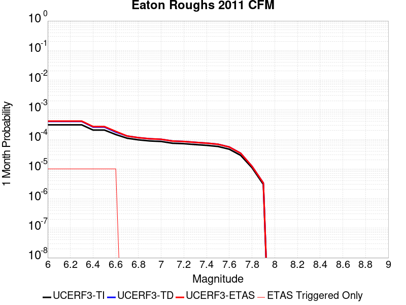 |  |  |

| Magnitude | 1 wk TI Prob | 1 wk TD Prob | 1 wk ETAS Prob | 1 wk ETAS/TD Gain | 1 wk ETAS Triggered Only | 1 mo TI Prob | 1 mo TD Prob | 1 mo ETAS Prob | 1 mo ETAS/TD Gain | 1 mo ETAS Triggered Only | 1 yr TI Prob | 1 yr TD Prob | 1 yr ETAS Prob | 1 yr ETAS/TD Gain | 1 yr ETAS Triggered Only | 10 yr TI Prob | 10 yr TD Prob | 10 yr ETAS Prob | 10 yr ETAS/TD Gain | 10 yr ETAS Triggered Only |
|-----|-----|-----|-----|-----|-----|-----|-----|-----|-----|-----|-----|-----|-----|-----|-----|-----|-----|-----|-----|-----|
| 6.0 | 7.181817E-5 | 9.371138E-5 | 1.03710445E-4 | 1.1067007 | 1.0E-5 | 3.0775584E-4 | 4.0156496E-4 | 4.1156093E-4 | 1.0248926 | 1.0E-5 | 0.0037404909 | 0.0048792637 | 0.004889215 | 1.0020394 | 1.0E-5 | 0.036781542 | 0.047793224 | 0.04781227 | 1.0003985 | 2.0E-5 |
| 6.1 | 7.181817E-5 | 9.371138E-5 | 1.03710445E-4 | 1.1067007 | 1.0E-5 | 3.0775584E-4 | 4.0156496E-4 | 4.1156093E-4 | 1.0248926 | 1.0E-5 | 0.0037404909 | 0.0048792637 | 0.004889215 | 1.0020394 | 1.0E-5 | 0.036781542 | 0.047793224 | 0.04781227 | 1.0003985 | 2.0E-5 |
| 6.2 | 7.181817E-5 | 9.371138E-5 | 1.03710445E-4 | 1.1067007 | 1.0E-5 | 3.0775584E-4 | 4.0156496E-4 | 4.1156093E-4 | 1.0248926 | 1.0E-5 | 0.0037404909 | 0.0048792637 | 0.004889215 | 1.0020394 | 1.0E-5 | 0.036781542 | 0.047793224 | 0.04781227 | 1.0003985 | 2.0E-5 |
| 6.3 | 7.181817E-5 | 9.371138E-5 | 1.03710445E-4 | 1.1067007 | 1.0E-5 | 3.0775584E-4 | 4.0156496E-4 | 4.1156093E-4 | 1.0248926 | 1.0E-5 | 0.0037404909 | 0.0048792637 | 0.004889215 | 1.0020394 | 1.0E-5 | 0.036781542 | 0.047793224 | 0.04781227 | 1.0003985 | 2.0E-5 |
| 6.4 | 4.797011E-5 | 6.053578E-5 | 7.053518E-5 | 1.1651815 | 1.0E-5 | 2.0556999E-4 | 2.5941638E-4 | 2.6941378E-4 | 1.0385381 | 1.0E-5 | 0.0024999417 | 0.0031543716 | 0.00316434 | 1.0031602 | 1.0E-5 | 0.024720047 | 0.031133106 | 0.031142794 | 1.0003113 | 1.0E-5 |
| 6.5 | 4.797011E-5 | 6.053578E-5 | 7.053518E-5 | 1.1651815 | 1.0E-5 | 2.0556999E-4 | 2.5941638E-4 | 2.6941378E-4 | 1.0385381 | 1.0E-5 | 0.0024999417 | 0.0031543716 | 0.00316434 | 1.0031602 | 1.0E-5 | 0.024720047 | 0.031133106 | 0.031142794 | 1.0003113 | 1.0E-5 |
| 6.6 | 3.380475E-5 | 4.093347E-5 | 5.0933064E-5 | 1.2442888 | 1.0E-5 | 1.4486947E-4 | 1.75418E-4 | 1.8541625E-4 | 1.0569967 | 1.0E-5 | 0.0017623587 | 0.0021337338 | 0.0021437125 | 1.0046766 | 1.0E-5 | 0.017484475 | 0.02114183 | 0.02115162 | 1.000463 | 1.0E-5 |
| 6.7 | 2.5433257E-5 | 3.0169756E-5 | 3.0169756E-5 | 1.0 | 0.0 | 1.0899512E-4 | 1.2929263E-4 | 1.2929263E-4 | 1.0 | 0.0 | 0.0013262077 | 0.0015730166 | 0.0015730166 | 1.0 | 0.0 | 0.013183209 | 0.015620777 | 0.015620777 | 1.0 | 0.0 |
| 6.8 | 2.2368726E-5 | 2.6472071E-5 | 2.6472071E-5 | 1.0 | 0.0 | 9.5862444E-5 | 1.13446855E-4 | 1.13446855E-4 | 1.0 | 0.0 | 0.0011665003 | 0.0013803495 | 0.0013803495 | 1.0 | 0.0 | 0.01160396 | 0.013718971 | 0.013718971 | 1.0 | 0.0 |
| 6.9 | 2.0563806E-5 | 2.4335468E-5 | 2.4335468E-5 | 1.0 | 0.0 | 8.812762E-5 | 1.0429073E-4 | 1.0429073E-4 | 1.0 | 0.0 | 0.0010724256 | 0.0012690076 | 0.0012690076 | 1.0 | 0.0 | 0.01067265 | 0.012618583 | 0.012618583 | 1.0 | 0.0 |
| 7.0 | 1.9727848E-5 | 2.3349985E-5 | 2.3349985E-5 | 1.0 | 0.0 | 8.454518E-5 | 1.0006756E-4 | 1.0006756E-4 | 1.0 | 0.0 | 0.0010288514 | 0.0012176487 | 0.0012176487 | 1.0 | 0.0 | 0.01024101 | 0.012110677 | 0.012110677 | 1.0 | 0.0 |
| 7.1 | 1.720332E-5 | 2.0401692E-5 | 2.0401692E-5 | 1.0 | 0.0 | 7.372643E-5 | 8.743291E-5 | 8.743291E-5 | 1.0 | 0.0 | 8.9724956E-4 | 0.0010639793 | 0.0010639793 | 1.0 | 0.0 | 0.008936355 | 0.01058933 | 0.01058933 | 1.0 | 0.0 |
| 7.2 | 1.659496E-5 | 1.9686368E-5 | 1.9686368E-5 | 1.0 | 0.0 | 7.111932E-5 | 8.4367435E-5 | 8.4367435E-5 | 1.0 | 0.0 | 8.655337E-4 | 0.0010266928 | 0.0010266928 | 1.0 | 0.0 | 0.008621703 | 0.010219947 | 0.010219947 | 1.0 | 0.0 |
| 7.3 | 1.550949E-5 | 1.8413248E-5 | 1.8413248E-5 | 1.0 | 0.0 | 6.6467546E-5 | 7.891155E-5 | 7.891155E-5 | 1.0 | 0.0 | 8.089419E-4 | 9.6032774E-4 | 9.6032774E-4 | 1.0 | 0.0 | 0.008060035 | 0.009562181 | 0.009562181 | 1.0 | 0.0 |
| 7.4 | 1.4579127E-5 | 1.7314116E-5 | 1.7314116E-5 | 1.0 | 0.0 | 6.248048E-5 | 7.4201256E-5 | 7.4201256E-5 | 1.0 | 0.0 | 7.604343E-4 | 9.030281E-4 | 9.030281E-4 | 1.0 | 0.0 | 0.0075783744 | 0.008993898 | 0.008993898 | 1.0 | 0.0 |
| 7.5 | 1.3393423E-5 | 1.5901718E-5 | 1.5901718E-5 | 1.0 | 0.0 | 5.739912E-5 | 6.8148445E-5 | 6.8148445E-5 | 1.0 | 0.0 | 6.986102E-4 | 8.2939316E-4 | 8.2939316E-4 | 1.0 | 0.0 | 0.00696418 | 0.008263208 | 0.008263208 | 1.0 | 0.0 |
| 7.6 | 1.0808561E-5 | 1.2834375E-5 | 1.2834375E-5 | 1.0 | 0.0 | 4.632158E-5 | 5.500331E-5 | 5.500331E-5 | 1.0 | 0.0 | 5.6381925E-4 | 6.694604E-4 | 6.694604E-4 | 1.0 | 0.0 | 0.005623909 | 0.006674556 | 0.006674556 | 1.0 | 0.0 |
| 7.7 | 6.705149E-6 | 7.894846E-6 | 7.894846E-6 | 1.0 | 0.0 | 2.8736036E-5 | 3.3834618E-5 | 3.3834618E-5 | 1.0 | 0.0 | 3.4980508E-4 | 4.11859E-4 | 4.11859E-4 | 1.0 | 0.0 | 0.0034925495 | 0.004111001 | 0.004111001 | 1.0 | 0.0 |
| 7.8 | 2.5631884E-6 | 2.8630327E-6 | 2.8630327E-6 | 1.0 | 0.0 | 1.0985047E-5 | 1.2270083E-5 | 1.2270083E-5 | 1.0 | 0.0 | 1.3373473E-4 | 1.4937809E-4 | 1.4937809E-4 | 1.0 | 0.0 | 0.0013365429 | 0.0014927837 | 0.0014927837 | 1.0 | 0.0 |
| 7.9 | 7.009101E-7 | 7.7882817E-7 | 7.7882817E-7 | 1.0 | 0.0 | 3.003897E-6 | 3.337831E-6 | 3.337831E-6 | 1.0 | 0.0 | 3.6571833E-5 | 4.063735E-5 | 4.063735E-5 | 1.0 | 0.0 | 3.6565814E-4 | 4.063011E-4 | 4.063011E-4 | 1.0 | 0.0 |

## Hunting Creek - Berryessa 2011 CFM
*[(top)](#table-of-contents)*

| 1 Week | 1 Month | 1 Year | 10 Year |
|-----|-----|-----|-----|
|  |  |  | 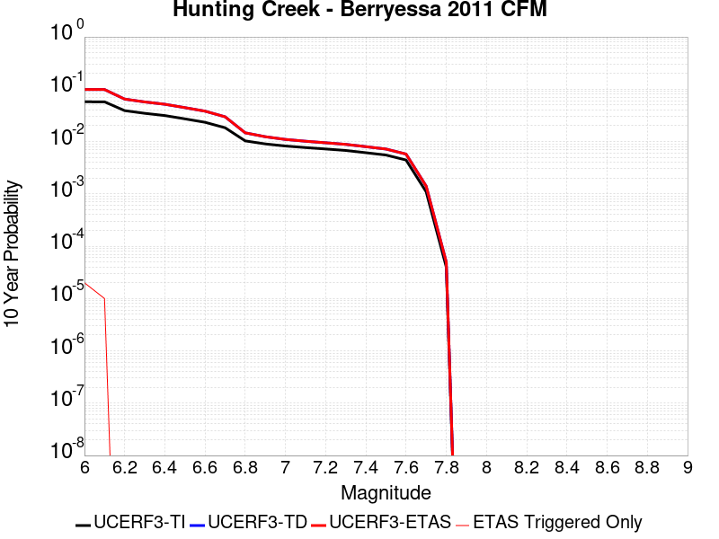 |

| Magnitude | 1 wk TI Prob | 1 wk TD Prob | 1 wk ETAS Prob | 1 wk ETAS/TD Gain | 1 wk ETAS Triggered Only | 1 mo TI Prob | 1 mo TD Prob | 1 mo ETAS Prob | 1 mo ETAS/TD Gain | 1 mo ETAS Triggered Only | 1 yr TI Prob | 1 yr TD Prob | 1 yr ETAS Prob | 1 yr ETAS/TD Gain | 1 yr ETAS Triggered Only | 10 yr TI Prob | 10 yr TD Prob | 10 yr ETAS Prob | 10 yr ETAS/TD Gain | 10 yr ETAS Triggered Only |
|-----|-----|-----|-----|-----|-----|-----|-----|-----|-----|-----|-----|-----|-----|-----|-----|-----|-----|-----|-----|-----|
| 6.0 | 1.1360488E-4 | 2.0185497E-4 | 2.1185295E-4 | 1.0495305 | 1.0E-5 | 4.867872E-4 | 8.648452E-4 | 8.8482787E-4 | 1.0231055 | 2.0E-5 | 0.005910541 | 0.010471155 | 0.010490946 | 1.0018901 | 2.0E-5 | 0.05755788 | 0.09879266 | 0.09881068 | 1.0001824 | 2.0E-5 |
| 6.1 | 1.1327708E-4 | 2.0131875E-4 | 2.0131875E-4 | 1.0 | 0.0 | 4.8538286E-4 | 8.625486E-4 | 8.7253994E-4 | 1.0115836 | 1.0E-5 | 0.0058935354 | 0.01044351 | 0.010453406 | 1.0009475 | 1.0E-5 | 0.05739665 | 0.09854318 | 0.09855219 | 1.0000914 | 1.0E-5 |
| 6.2 | 7.620692E-5 | 1.2970899E-4 | 1.2970899E-4 | 1.0 | 0.0 | 3.2656017E-4 | 5.557824E-4 | 5.557824E-4 | 1.0 | 0.0 | 0.0039686235 | 0.0067422963 | 0.0067422963 | 1.0 | 0.0 | 0.038984936 | 0.06477507 | 0.06477507 | 1.0 | 0.0 |
| 6.3 | 6.75191E-5 | 1.13759204E-4 | 1.13759204E-4 | 1.0 | 0.0 | 2.8933547E-4 | 4.8745194E-4 | 4.8745194E-4 | 1.0 | 0.0 | 0.00351697 | 0.005915018 | 0.005915018 | 1.0 | 0.0 | 0.034618277 | 0.05710829 | 0.05710829 | 1.0 | 0.0 |
| 6.4 | 6.108941E-5 | 1.02385435E-4 | 1.02385435E-4 | 1.0 | 0.0 | 2.617855E-4 | 4.387243E-4 | 4.387243E-4 | 1.0 | 0.0 | 0.0031825807 | 0.0053258287 | 0.0053258287 | 1.0 | 0.0 | 0.031373855 | 0.051589508 | 0.051589508 | 1.0 | 0.0 |
| 6.5 | 5.271508E-5 | 8.779153E-5 | 8.779153E-5 | 1.0 | 0.0 | 2.2590221E-4 | 3.7619818E-4 | 3.7619818E-4 | 1.0 | 0.0 | 0.0027468905 | 0.004568844 | 0.004568844 | 1.0 | 0.0 | 0.027131837 | 0.044444136 | 0.044444136 | 1.0 | 0.0 |
| 6.6 | 4.5221906E-5 | 7.486221E-5 | 7.486221E-5 | 1.0 | 0.0 | 1.9379378E-4 | 3.2080128E-4 | 3.2080128E-4 | 1.0 | 0.0 | 0.002356886 | 0.0038982388 | 0.0038982388 | 1.0 | 0.0 | 0.023320453 | 0.03806416 | 0.03806416 | 1.0 | 0.0 |
| 6.7 | 3.5471377E-5 | 5.8022295E-5 | 5.8022295E-5 | 1.0 | 0.0 | 1.5201134E-4 | 2.4864546E-4 | 2.4864546E-4 | 1.0 | 0.0 | 0.0018491669 | 0.0030231783 | 0.0030231783 | 1.0 | 0.0 | 0.018338552 | 0.029682184 | 0.029682184 | 1.0 | 0.0 |
| 6.8 | 1.9819476E-5 | 2.838177E-5 | 2.838177E-5 | 1.0 | 0.0 | 8.493784E-5 | 1.21630525E-4 | 1.21630525E-4 | 1.0 | 0.0 | 0.0010336277 | 0.0014798408 | 0.0014798408 | 1.0 | 0.0 | 0.010288331 | 0.014672799 | 0.014672799 | 1.0 | 0.0 |
| 6.9 | 1.733847E-5 | 2.3842962E-5 | 2.3842962E-5 | 1.0 | 0.0 | 7.4305615E-5 | 1.0218014E-4 | 1.0218014E-4 | 1.0 | 0.0 | 9.0429536E-4 | 0.001243338 | 0.001243338 | 1.0 | 0.0 | 0.009006243 | 0.012354641 | 0.012354641 | 1.0 | 0.0 |
| 7.0 | 1.580467E-5 | 2.114132E-5 | 2.114132E-5 | 1.0 | 0.0 | 6.7732544E-5 | 9.0602516E-5 | 9.0602516E-5 | 1.0 | 0.0 | 8.2433166E-4 | 0.0011025298 | 0.0011025298 | 1.0 | 0.0 | 0.008212806 | 0.010969679 | 0.010969679 | 1.0 | 0.0 |
| 7.1 | 1.475885E-5 | 1.9519195E-5 | 1.9519195E-5 | 1.0 | 0.0 | 6.325068E-5 | 8.365101E-5 | 8.365101E-5 | 1.0 | 0.0 | 7.6980493E-4 | 0.0010179773 | 0.0010179773 | 1.0 | 0.0 | 0.0076714368 | 0.010133361 | 0.010133361 | 1.0 | 0.0 |
| 7.2 | 1.386444E-5 | 1.823675E-5 | 1.823675E-5 | 1.0 | 0.0 | 5.9417674E-5 | 7.815517E-5 | 7.815517E-5 | 1.0 | 0.0 | 7.231701E-4 | 9.511265E-4 | 9.511265E-4 | 1.0 | 0.0 | 0.0072082123 | 0.009471061 | 0.009471061 | 1.0 | 0.0 |
| 7.3 | 1.2987898E-5 | 1.6999467E-5 | 1.6999467E-5 | 1.0 | 0.0 | 5.5661232E-5 | 7.285284E-5 | 7.285284E-5 | 1.0 | 0.0 | 6.7746476E-4 | 8.866249E-4 | 8.866249E-4 | 1.0 | 0.0 | 0.006754032 | 0.008831319 | 0.008831319 | 1.0 | 0.0 |
| 7.4 | 1.176121E-5 | 1.5359576E-5 | 1.5359576E-5 | 1.0 | 0.0 | 5.040421E-5 | 6.582511E-5 | 6.582511E-5 | 1.0 | 0.0 | 6.1349844E-4 | 8.011284E-4 | 8.011284E-4 | 1.0 | 0.0 | 0.006118075 | 0.007982782 | 0.007982782 | 1.0 | 0.0 |
| 7.5 | 1.0614518E-5 | 1.3826046E-5 | 1.3826046E-5 | 1.0 | 0.0 | 4.549E-5 | 5.925315E-5 | 5.925315E-5 | 1.0 | 0.0 | 5.537E-4 | 7.211707E-4 | 7.211707E-4 | 1.0 | 0.0 | 0.005523224 | 0.00718863 | 0.00718863 | 1.0 | 0.0 |
| 7.6 | 8.51792E-6 | 1.1072087E-5 | 1.1072087E-5 | 1.0 | 0.0 | 3.6504858E-5 | 4.7450947E-5 | 4.7450947E-5 | 1.0 | 0.0 | 4.44356E-4 | 5.7756435E-4 | 5.7756435E-4 | 1.0 | 0.0 | 0.004434685 | 0.005760914 | 0.005760914 | 1.0 | 0.0 |
| 7.7 | 2.1021212E-6 | 2.6969162E-6 | 2.6969162E-6 | 1.0 | 0.0 | 9.00906E-6 | 1.15581615E-5 | 1.15581615E-5 | 1.0 | 0.0 | 1.0967978E-4 | 1.4071159E-4 | 1.4071159E-4 | 1.0 | 0.0 | 0.0010962567 | 0.0014062332 | 0.0014062332 | 1.0 | 0.0 |
| 7.8 | 7.675553E-8 | 9.573563E-8 | 9.573563E-8 | 1.0 | 0.0 | 3.2895227E-7 | 4.1029548E-7 | 4.1029548E-7 | 1.0 | 0.0 | 4.0049863E-6 | 4.995338E-6 | 4.995338E-6 | 1.0 | 0.0 | 4.004914E-5 | 4.995186E-5 | 4.995186E-5 | 1.0 | 0.0 |

## Gillem - Big Crack 2011 CFM
*[(top)](#table-of-contents)*

| 1 Week | 1 Month | 1 Year | 10 Year |
|-----|-----|-----|-----|
|  |  |  |  |

| Magnitude | 1 wk TI Prob | 1 wk TD Prob | 1 wk ETAS Prob | 1 wk ETAS/TD Gain | 1 wk ETAS Triggered Only | 1 mo TI Prob | 1 mo TD Prob | 1 mo ETAS Prob | 1 mo ETAS/TD Gain | 1 mo ETAS Triggered Only | 1 yr TI Prob | 1 yr TD Prob | 1 yr ETAS Prob | 1 yr ETAS/TD Gain | 1 yr ETAS Triggered Only | 10 yr TI Prob | 10 yr TD Prob | 10 yr ETAS Prob | 10 yr ETAS/TD Gain | 10 yr ETAS Triggered Only |
|-----|-----|-----|-----|-----|-----|-----|-----|-----|-----|-----|-----|-----|-----|-----|-----|-----|-----|-----|-----|-----|
| 6.0 | 2.2359403E-5 | 2.4047938E-5 | 3.4047698E-5 | 1.4158261 | 1.0E-5 | 9.582249E-5 | 1.0305905E-4 | 1.1305802E-4 | 1.0970217 | 1.0E-5 | 0.0011660145 | 0.0012541147 | 0.0012740896 | 1.0159276 | 2.0E-5 | 0.011599152 | 0.012479636 | 0.012499386 | 1.0015826 | 2.0E-5 |
| 6.1 | 1.003927E-5 | 1.0770518E-5 | 1.0770518E-5 | 1.0 | 0.0 | 4.3024735E-5 | 4.6158646E-5 | 4.6158646E-5 | 1.0 | 0.0 | 5.237002E-4 | 5.618546E-4 | 5.618546E-4 | 1.0 | 0.0 | 0.0052246777 | 0.00560612 | 0.00560612 | 1.0 | 0.0 |
| 6.2 | 1.003927E-5 | 1.0770518E-5 | 1.0770518E-5 | 1.0 | 0.0 | 4.3024735E-5 | 4.6158646E-5 | 4.6158646E-5 | 1.0 | 0.0 | 5.237002E-4 | 5.618546E-4 | 5.618546E-4 | 1.0 | 0.0 | 0.0052246777 | 0.00560612 | 0.00560612 | 1.0 | 0.0 |
| 6.3 | 4.720697E-6 | 5.0625663E-6 | 5.0625663E-6 | 1.0 | 0.0 | 2.02314E-5 | 2.1696558E-5 | 2.1696558E-5 | 1.0 | 0.0 | 2.4628945E-4 | 2.6412815E-4 | 2.6412815E-4 | 1.0 | 0.0 | 0.0024601666 | 0.0026385917 | 0.0026385917 | 1.0 | 0.0 |
| 6.4 | 4.720697E-6 | 5.0625663E-6 | 5.0625663E-6 | 1.0 | 0.0 | 2.02314E-5 | 2.1696558E-5 | 2.1696558E-5 | 1.0 | 0.0 | 2.4628945E-4 | 2.6412815E-4 | 2.6412815E-4 | 1.0 | 0.0 | 0.0024601666 | 0.0026385917 | 0.0026385917 | 1.0 | 0.0 |
| 6.5 | 2.707757E-6 | 2.9039163E-6 | 2.9039163E-6 | 1.0 | 0.0 | 1.1604621E-5 | 1.2445309E-5 | 1.2445309E-5 | 1.0 | 0.0 | 1.412771E-4 | 1.5151345E-4 | 1.5151345E-4 | 1.0 | 0.0 | 0.0014118731 | 0.001514332 | 0.001514332 | 1.0 | 0.0 |
| 6.6 | 1.3286581E-6 | 1.4263031E-6 | 1.4263031E-6 | 1.0 | 0.0 | 5.6942367E-6 | 6.1127193E-6 | 6.1127193E-6 | 1.0 | 0.0 | 6.932512E-5 | 7.44209E-5 | 7.44209E-5 | 1.0 | 0.0 | 6.93035E-4 | 7.44066E-4 | 7.44066E-4 | 1.0 | 0.0 |

## Great Valley 03a Dunnigan Hills
*[(top)](#table-of-contents)*

| 1 Week | 1 Month | 1 Year | 10 Year |
|-----|-----|-----|-----|
|  |  |  | 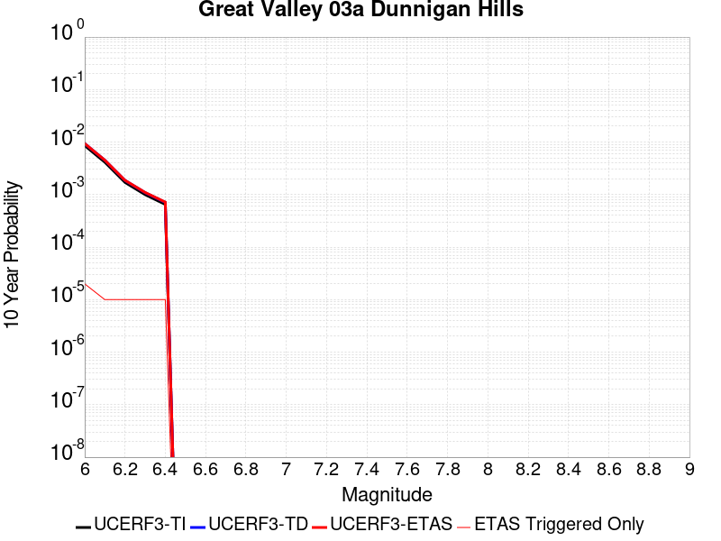 |

| Magnitude | 1 wk TI Prob | 1 wk TD Prob | 1 wk ETAS Prob | 1 wk ETAS/TD Gain | 1 wk ETAS Triggered Only | 1 mo TI Prob | 1 mo TD Prob | 1 mo ETAS Prob | 1 mo ETAS/TD Gain | 1 mo ETAS Triggered Only | 1 yr TI Prob | 1 yr TD Prob | 1 yr ETAS Prob | 1 yr ETAS/TD Gain | 1 yr ETAS Triggered Only | 10 yr TI Prob | 10 yr TD Prob | 10 yr ETAS Prob | 10 yr ETAS/TD Gain | 10 yr ETAS Triggered Only |
|-----|-----|-----|-----|-----|-----|-----|-----|-----|-----|-----|-----|-----|-----|-----|-----|-----|-----|-----|-----|-----|
| 6.0 | 1.651994E-5 | 1.8021321E-5 | 1.8021321E-5 | 1.0 | 0.0 | 7.079782E-5 | 7.723233E-5 | 7.723233E-5 | 1.0 | 0.0 | 8.6162257E-4 | 9.3996583E-4 | 9.3996583E-4 | 1.0 | 0.0 | 0.008582895 | 0.009366605 | 0.009386417 | 1.0021152 | 2.0E-5 |
| 6.1 | 7.953946E-6 | 8.670426E-6 | 8.670426E-6 | 1.0 | 0.0 | 3.4087894E-5 | 3.715855E-5 | 3.715855E-5 | 1.0 | 0.0 | 4.1494108E-4 | 4.523309E-4 | 4.523309E-4 | 1.0 | 0.0 | 0.0041416716 | 0.004516017 | 0.004525972 | 1.0022043 | 1.0E-5 |
| 6.2 | 3.2744306E-6 | 3.5710764E-6 | 3.5710764E-6 | 1.0 | 0.0 | 1.4033198E-5 | 1.5304546E-5 | 1.5304546E-5 | 1.0 | 0.0 | 1.708408E-4 | 1.8632087E-4 | 1.8632087E-4 | 1.0 | 0.0 | 0.0017070951 | 0.0018620361 | 0.0018720174 | 1.0053605 | 1.0E-5 |
| 6.3 | 1.913362E-6 | 2.0869538E-6 | 2.0869538E-6 | 1.0 | 0.0 | 8.200097E-6 | 8.944072E-6 | 8.944072E-6 | 1.0 | 0.0 | 9.98316E-5 | 1.08891276E-4 | 1.08891276E-4 | 1.0 | 0.0 | 9.978677E-4 | 0.0010886382 | 0.0010986273 | 1.0091758 | 1.0E-5 |
| 6.4 | 1.2471386E-6 | 1.3600626E-6 | 1.3600626E-6 | 1.0 | 0.0 | 5.3448684E-6 | 5.8288397E-6 | 5.8288397E-6 | 1.0 | 0.0 | 6.507183E-5 | 7.0966125E-5 | 7.0966125E-5 | 1.0 | 0.0 | 6.505278E-4 | 7.096612E-4 | 7.1965414E-4 | 1.0140812 | 1.0E-5 |

## La Panza 2011
*[(top)](#table-of-contents)*

| 1 Week | 1 Month | 1 Year | 10 Year |
|-----|-----|-----|-----|
| 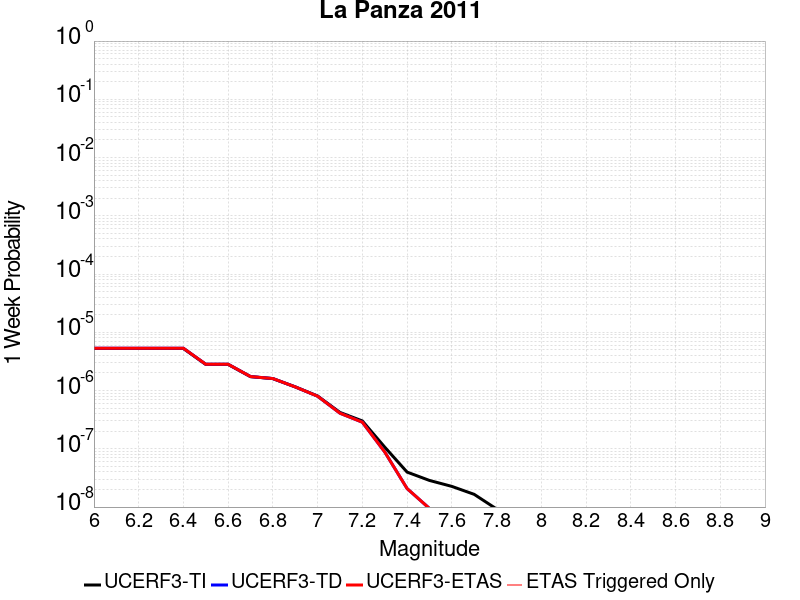 |  |  |  |

| Magnitude | 1 wk TI Prob | 1 wk TD Prob | 1 wk ETAS Prob | 1 wk ETAS/TD Gain | 1 wk ETAS Triggered Only | 1 mo TI Prob | 1 mo TD Prob | 1 mo ETAS Prob | 1 mo ETAS/TD Gain | 1 mo ETAS Triggered Only | 1 yr TI Prob | 1 yr TD Prob | 1 yr ETAS Prob | 1 yr ETAS/TD Gain | 1 yr ETAS Triggered Only | 10 yr TI Prob | 10 yr TD Prob | 10 yr ETAS Prob | 10 yr ETAS/TD Gain | 10 yr ETAS Triggered Only |
|-----|-----|-----|-----|-----|-----|-----|-----|-----|-----|-----|-----|-----|-----|-----|-----|-----|-----|-----|-----|-----|
| 6.0 | 5.270176E-6 | 5.325327E-6 | 5.325327E-6 | 1.0 | 0.0 | 2.2586275E-5 | 2.2822644E-5 | 2.2822644E-5 | 1.0 | 0.0 | 2.749532E-4 | 2.7783282E-4 | 2.7783282E-4 | 1.0 | 0.0 | 0.0027461324 | 0.0027751077 | 0.0027950522 | 1.0071869 | 2.0E-5 |
| 6.1 | 5.270176E-6 | 5.325327E-6 | 5.325327E-6 | 1.0 | 0.0 | 2.2586275E-5 | 2.2822644E-5 | 2.2822644E-5 | 1.0 | 0.0 | 2.749532E-4 | 2.7783282E-4 | 2.7783282E-4 | 1.0 | 0.0 | 0.0027461324 | 0.0027751077 | 0.0027950522 | 1.0071869 | 2.0E-5 |
| 6.2 | 5.270176E-6 | 5.325327E-6 | 5.325327E-6 | 1.0 | 0.0 | 2.2586275E-5 | 2.2822644E-5 | 2.2822644E-5 | 1.0 | 0.0 | 2.749532E-4 | 2.7783282E-4 | 2.7783282E-4 | 1.0 | 0.0 | 0.0027461324 | 0.0027751077 | 0.0027950522 | 1.0071869 | 2.0E-5 |
| 6.3 | 5.270176E-6 | 5.325327E-6 | 5.325327E-6 | 1.0 | 0.0 | 2.2586275E-5 | 2.2822644E-5 | 2.2822644E-5 | 1.0 | 0.0 | 2.749532E-4 | 2.7783282E-4 | 2.7783282E-4 | 1.0 | 0.0 | 0.0027461324 | 0.0027751077 | 0.0027950522 | 1.0071869 | 2.0E-5 |
| 6.4 | 5.270176E-6 | 5.325327E-6 | 5.325327E-6 | 1.0 | 0.0 | 2.2586275E-5 | 2.2822644E-5 | 2.2822644E-5 | 1.0 | 0.0 | 2.749532E-4 | 2.7783282E-4 | 2.7783282E-4 | 1.0 | 0.0 | 0.0027461324 | 0.0027751077 | 0.0027950522 | 1.0071869 | 2.0E-5 |
| 6.5 | 2.8087252E-6 | 2.8292675E-6 | 2.8292675E-6 | 1.0 | 0.0 | 1.2037338E-5 | 1.2125378E-5 | 1.2125378E-5 | 1.0 | 0.0 | 1.4654473E-4 | 1.4761696E-4 | 1.4761696E-4 | 1.0 | 0.0 | 0.0014644813 | 0.0014752357 | 0.0014952061 | 1.0135372 | 2.0E-5 |
| 6.6 | 2.8087252E-6 | 2.8292675E-6 | 2.8292675E-6 | 1.0 | 0.0 | 1.2037338E-5 | 1.2125378E-5 | 1.2125378E-5 | 1.0 | 0.0 | 1.4654473E-4 | 1.4761696E-4 | 1.4761696E-4 | 1.0 | 0.0 | 0.0014644813 | 0.0014752357 | 0.0014952061 | 1.0135372 | 2.0E-5 |
| 6.7 | 1.7335552E-6 | 1.7397405E-6 | 1.7397405E-6 | 1.0 | 0.0 | 7.4295012E-6 | 7.45601E-6 | 7.45601E-6 | 1.0 | 0.0 | 9.045043E-5 | 9.077328E-5 | 9.077328E-5 | 1.0 | 0.0 | 9.0413616E-4 | 9.0737594E-4 | 9.2735776E-4 | 1.0220215 | 2.0E-5 |
| 6.8 | 1.6034292E-6 | 1.6074528E-6 | 1.6074528E-6 | 1.0 | 0.0 | 6.8718214E-6 | 6.889066E-6 | 6.889066E-6 | 1.0 | 0.0 | 8.366121E-5 | 8.387128E-5 | 8.387128E-5 | 1.0 | 0.0 | 8.3629723E-4 | 8.3840906E-4 | 8.583923E-4 | 1.0238347 | 2.0E-5 |
| 6.9 | 1.1575493E-6 | 1.1554137E-6 | 1.1554137E-6 | 1.0 | 0.0 | 4.9609157E-6 | 4.951764E-6 | 4.951764E-6 | 1.0 | 0.0 | 6.0397477E-5 | 6.0286133E-5 | 6.0286133E-5 | 1.0 | 0.0 | 6.0381065E-4 | 6.0270535E-4 | 6.126993E-4 | 1.0165819 | 1.0E-5 |
| 7.0 | 8.0696964E-7 | 7.997217E-7 | 7.997217E-7 | 1.0 | 0.0 | 3.4584368E-6 | 3.4273746E-6 | 3.4273746E-6 | 1.0 | 0.0 | 4.2105654E-5 | 4.1727533E-5 | 4.1727533E-5 | 1.0 | 0.0 | 4.2097678E-4 | 4.172016E-4 | 4.2719743E-4 | 1.0239593 | 1.0E-5 |
| 7.1 | 4.2126132E-7 | 4.0851512E-7 | 4.0851512E-7 | 1.0 | 0.0 | 1.8054044E-6 | 1.7507781E-6 | 1.7507781E-6 | 1.0 | 0.0 | 2.1980577E-5 | 2.1315534E-5 | 2.1315534E-5 | 1.0 | 0.0 | 2.1978404E-4 | 2.1313684E-4 | 2.2313472E-4 | 1.0469083 | 1.0E-5 |
| 7.2 | 3.0111536E-7 | 2.8625942E-7 | 2.8625942E-7 | 1.0 | 0.0 | 1.2904939E-6 | 1.2268256E-6 | 1.2268256E-6 | 1.0 | 0.0 | 1.5711648E-5 | 1.4936514E-5 | 1.4936514E-5 | 1.0 | 0.0 | 1.5710539E-4 | 1.4935658E-4 | 1.4935658E-4 | 1.0 | 0.0 |
| 7.3 | 1.0710576E-7 | 8.84723E-8 | 8.84723E-8 | 1.0 | 0.0 | 4.5902462E-7 | 3.7916695E-7 | 3.7916695E-7 | 1.0 | 0.0 | 5.5886103E-6 | 4.616348E-6 | 4.616348E-6 | 1.0 | 0.0 | 5.58847E-5 | 4.6162557E-5 | 4.6162557E-5 | 1.0 | 0.0 |
| 7.4 | 3.9853173E-8 | 2.0800133E-8 | 2.0800133E-8 | 1.0 | 0.0 | 1.707993E-7 | 8.914343E-8 | 8.914343E-8 | 1.0 | 0.0 | 2.0794796E-6 | 1.0853207E-6 | 1.0853207E-6 | 1.0 | 0.0 | 2.07946E-5 | 1.0853157E-5 | 1.0853157E-5 | 1.0 | 0.0 |
| 7.5 | 2.8656057E-8 | 9.467647E-9 | 9.467647E-9 | 1.0 | 0.0 | 1.2281167E-7 | 4.057563E-8 | 4.057563E-8 | 1.0 | 0.0 | 1.495231E-6 | 4.940082E-7 | 4.940082E-7 | 1.0 | 0.0 | 1.4952209E-5 | 4.9400714E-6 | 4.9400714E-6 | 1.0 | 0.0 |
| 7.6 | 2.264297E-8 | 4.7019637E-9 | 4.7019637E-9 | 1.0 | 0.0 | 9.70413E-8 | 2.0151274E-8 | 2.0151274E-8 | 1.0 | 0.0 | 1.1814772E-6 | 2.4534174E-7 | 2.4534174E-7 | 1.0 | 0.0 | 1.1814709E-5 | 2.4534147E-6 | 2.4534147E-6 | 1.0 | 0.0 |
| 7.7 | 1.6533479E-8 | 1.5272951E-9 | 1.5272951E-9 | 1.0 | 0.0 | 7.0857766E-8 | 6.545551E-9 | 6.545551E-9 | 1.0 | 0.0 | 8.6269296E-7 | 7.969208E-8 | 7.969208E-8 | 1.0 | 0.0 | 8.626896E-6 | 7.969205E-7 | 7.969205E-7 | 1.0 | 0.0 |
| 7.8 | 9.273801E-9 | 3.7355152E-10 | 3.7355152E-10 | 1.0 | 0.0 | 3.9744865E-8 | 1.6009359E-9 | 1.6009359E-9 | 1.0 | 0.0 | 4.838936E-7 | 1.9491392E-8 | 1.9491392E-8 | 1.0 | 0.0 | 4.8389256E-6 | 1.9491391E-7 | 1.9491391E-7 | 1.0 | 0.0 |
| 7.9 | 4.2400075E-9 | 1.1741619E-10 | 1.1741619E-10 | 1.0 | 0.0 | 1.817146E-8 | 5.032127E-10 | 5.032127E-10 | 1.0 | 0.0 | 2.212375E-7 | 6.126612E-9 | 6.126612E-9 | 1.0 | 0.0 | 2.212373E-6 | 6.126612E-8 | 6.126612E-8 | 1.0 | 0.0 |

## San Diego Trough south
*[(top)](#table-of-contents)*

| 1 Week | 1 Month | 1 Year | 10 Year |
|-----|-----|-----|-----|
|  |  | 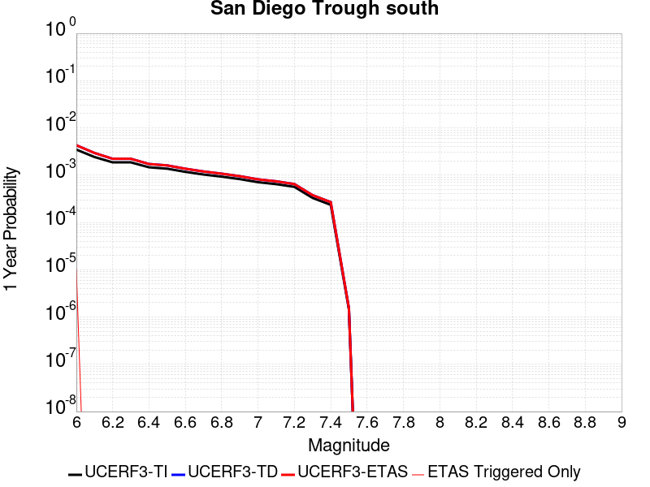 |  |

| Magnitude | 1 wk TI Prob | 1 wk TD Prob | 1 wk ETAS Prob | 1 wk ETAS/TD Gain | 1 wk ETAS Triggered Only | 1 mo TI Prob | 1 mo TD Prob | 1 mo ETAS Prob | 1 mo ETAS/TD Gain | 1 mo ETAS Triggered Only | 1 yr TI Prob | 1 yr TD Prob | 1 yr ETAS Prob | 1 yr ETAS/TD Gain | 1 yr ETAS Triggered Only | 10 yr TI Prob | 10 yr TD Prob | 10 yr ETAS Prob | 10 yr ETAS/TD Gain | 10 yr ETAS Triggered Only |
|-----|-----|-----|-----|-----|-----|-----|-----|-----|-----|-----|-----|-----|-----|-----|-----|-----|-----|-----|-----|-----|
| 6.0 | 6.675876E-5 | 8.243766E-5 | 8.243766E-5 | 1.0 | 0.0 | 2.860776E-4 | 3.5325883E-4 | 3.5325883E-4 | 1.0 | 0.0 | 0.0034774328 | 0.0042928657 | 0.0043028225 | 1.0023195 | 1.0E-5 | 0.03423518 | 0.042131234 | 0.042150393 | 1.0004547 | 2.0E-5 |
| 6.1 | 4.6443995E-5 | 5.653081E-5 | 5.653081E-5 | 1.0 | 0.0 | 1.990305E-4 | 2.4225342E-4 | 2.4225342E-4 | 1.0 | 0.0 | 0.0024205034 | 0.0029456194 | 0.0029456194 | 1.0 | 0.0 | 0.023943081 | 0.02907878 | 0.02907878 | 1.0 | 0.0 |
| 6.2 | 3.5780835E-5 | 4.2627307E-5 | 4.2627307E-5 | 1.0 | 0.0 | 1.5333742E-4 | 1.8267593E-4 | 1.8267593E-4 | 1.0 | 0.0 | 0.0018652844 | 0.0022218507 | 0.0022218507 | 1.0 | 0.0 | 0.018497052 | 0.021999931 | 0.021999931 | 1.0 | 0.0 |
| 6.3 | 3.5763886E-5 | 4.26075E-5 | 4.26075E-5 | 1.0 | 0.0 | 1.5326479E-4 | 1.8259104E-4 | 1.8259104E-4 | 1.0 | 0.0 | 0.0018644016 | 0.0022208192 | 0.0022208192 | 1.0 | 0.0 | 0.018488372 | 0.021989822 | 0.021989822 | 1.0 | 0.0 |
| 6.4 | 2.8126335E-5 | 3.3024866E-5 | 3.3024866E-5 | 1.0 | 0.0 | 1.20535864E-4 | 1.4152756E-4 | 1.4152756E-4 | 1.0 | 0.0 | 0.0014665362 | 0.0017217482 | 0.0017217482 | 1.0 | 0.0 | 0.014568957 | 0.017086022 | 0.017086022 | 1.0 | 0.0 |
| 6.5 | 2.6309135E-5 | 3.081222E-5 | 3.081222E-5 | 1.0 | 0.0 | 1.1274857E-4 | 1.3204578E-4 | 1.3204578E-4 | 1.0 | 0.0 | 0.0013718493 | 0.0016064818 | 0.0016064818 | 1.0 | 0.0 | 0.013634114 | 0.015950458 | 0.015950458 | 1.0 | 0.0 |
| 6.6 | 2.2532175E-5 | 2.6231839E-5 | 2.6231839E-5 | 1.0 | 0.0 | 9.6562886E-5 | 1.1241737E-4 | 1.1241737E-4 | 1.0 | 0.0 | 0.0011750191 | 0.0013678308 | 0.0013678308 | 1.0 | 0.0 | 0.011688255 | 0.0135951815 | 0.0135951815 | 1.0 | 0.0 |
| 6.7 | 1.9783447E-5 | 2.293248E-5 | 2.293248E-5 | 1.0 | 0.0 | 8.4783445E-5 | 9.827838E-5 | 9.827838E-5 | 1.0 | 0.0 | 0.0010317495 | 0.0011958877 | 0.0011958877 | 1.0 | 0.0 | 0.010269725 | 0.011895228 | 0.011895228 | 1.0 | 0.0 |
| 6.8 | 1.783907E-5 | 2.0616557E-5 | 2.0616557E-5 | 1.0 | 0.0 | 7.645092E-5 | 8.835371E-5 | 8.835371E-5 | 1.0 | 0.0 | 9.3039236E-4 | 0.0010751795 | 0.0010751795 | 1.0 | 0.0 | 0.009265067 | 0.010700321 | 0.010700321 | 1.0 | 0.0 |
| 6.9 | 1.5821855E-5 | 1.823021E-5 | 1.823021E-5 | 1.0 | 0.0 | 6.780619E-5 | 7.8127145E-5 | 7.8127145E-5 | 1.0 | 0.0 | 8.2522765E-4 | 9.5078617E-4 | 9.5078617E-4 | 1.0 | 0.0 | 0.008221699 | 0.009467603 | 0.009467603 | 1.0 | 0.0 |
| 7.0 | 1.3608256E-5 | 1.5625708E-5 | 1.5625708E-5 | 1.0 | 0.0 | 5.8319794E-5 | 6.6965615E-5 | 6.6965615E-5 | 1.0 | 0.0 | 7.0981216E-4 | 8.150038E-4 | 8.150038E-4 | 1.0 | 0.0 | 0.007075492 | 0.008120448 | 0.008120448 | 1.0 | 0.0 |
| 7.1 | 1.2382999E-5 | 1.4202873E-5 | 1.4202873E-5 | 1.0 | 0.0 | 5.3068918E-5 | 6.086805E-5 | 6.086805E-5 | 1.0 | 0.0 | 6.459225E-4 | 7.408188E-4 | 7.408188E-4 | 1.0 | 0.0 | 0.0064404826 | 0.007383763 | 0.007383763 | 1.0 | 0.0 |
| 7.2 | 1.0835848E-5 | 1.2421083E-5 | 1.2421083E-5 | 1.0 | 0.0 | 4.643852E-5 | 5.323214E-5 | 5.323214E-5 | 1.0 | 0.0 | 5.652423E-4 | 6.4791075E-4 | 6.4791075E-4 | 1.0 | 0.0 | 0.005638067 | 0.0064604618 | 0.0064604618 | 1.0 | 0.0 |
| 7.3 | 6.332383E-6 | 7.236171E-6 | 7.236171E-6 | 1.0 | 0.0 | 2.7138502E-5 | 3.1011798E-5 | 3.1011798E-5 | 1.0 | 0.0 | 3.3036116E-4 | 3.7750398E-4 | 3.7750398E-4 | 1.0 | 0.0 | 0.0032987047 | 0.0037687076 | 0.0037687076 | 1.0 | 0.0 |
| 7.4 | 4.5077495E-6 | 5.158055E-6 | 5.158055E-6 | 1.0 | 0.0 | 1.9318783E-5 | 2.2105767E-5 | 2.2105767E-5 | 1.0 | 0.0 | 2.3518079E-4 | 2.691052E-4 | 2.691052E-4 | 1.0 | 0.0 | 0.0023493206 | 0.0026878663 | 0.0026878663 | 1.0 | 0.0 |
| 7.5 | 2.7597395E-8 | 2.945038E-8 | 2.945038E-8 | 1.0 | 0.0 | 1.1827454E-7 | 1.2621591E-7 | 1.2621591E-7 | 1.0 | 0.0 | 1.4399916E-6 | 1.5366787E-6 | 1.5366787E-6 | 1.0 | 0.0 | 1.4399822E-5 | 1.5366788E-5 | 1.5366788E-5 | 1.0 | 0.0 |

## Anacapa-Dume alt 2
*[(top)](#table-of-contents)*

| 1 Week | 1 Month | 1 Year | 10 Year |
|-----|-----|-----|-----|
|  |  |  |  |

| Magnitude | 1 wk TI Prob | 1 wk TD Prob | 1 wk ETAS Prob | 1 wk ETAS/TD Gain | 1 wk ETAS Triggered Only | 1 mo TI Prob | 1 mo TD Prob | 1 mo ETAS Prob | 1 mo ETAS/TD Gain | 1 mo ETAS Triggered Only | 1 yr TI Prob | 1 yr TD Prob | 1 yr ETAS Prob | 1 yr ETAS/TD Gain | 1 yr ETAS Triggered Only | 10 yr TI Prob | 10 yr TD Prob | 10 yr ETAS Prob | 10 yr ETAS/TD Gain | 10 yr ETAS Triggered Only |
|-----|-----|-----|-----|-----|-----|-----|-----|-----|-----|-----|-----|-----|-----|-----|-----|-----|-----|-----|-----|-----|
| 6.0 | 1.00496045E-5 | 1.0334213E-5 | 2.033411E-5 | 1.9676496 | 1.0E-5 | 4.3069023E-5 | 4.428874E-5 | 5.4288295E-5 | 1.2257811 | 1.0E-5 | 5.2423915E-4 | 5.3908373E-4 | 5.4907834E-4 | 1.01854 | 1.0E-5 | 0.0052300417 | 0.0053779464 | 0.005397839 | 1.003699 | 2.0E-5 |
| 6.1 | 1.00496045E-5 | 1.0334213E-5 | 2.033411E-5 | 1.9676496 | 1.0E-5 | 4.3069023E-5 | 4.428874E-5 | 5.4288295E-5 | 1.2257811 | 1.0E-5 | 5.2423915E-4 | 5.3908373E-4 | 5.4907834E-4 | 1.01854 | 1.0E-5 | 0.0052300417 | 0.0053779464 | 0.005397839 | 1.003699 | 2.0E-5 |
| 6.2 | 1.00496045E-5 | 1.0334213E-5 | 2.033411E-5 | 1.9676496 | 1.0E-5 | 4.3069023E-5 | 4.428874E-5 | 5.4288295E-5 | 1.2257811 | 1.0E-5 | 5.2423915E-4 | 5.3908373E-4 | 5.4907834E-4 | 1.01854 | 1.0E-5 | 0.0052300417 | 0.0053779464 | 0.005397839 | 1.003699 | 2.0E-5 |
| 6.3 | 1.00496045E-5 | 1.0334213E-5 | 2.033411E-5 | 1.9676496 | 1.0E-5 | 4.3069023E-5 | 4.428874E-5 | 5.4288295E-5 | 1.2257811 | 1.0E-5 | 5.2423915E-4 | 5.3908373E-4 | 5.4907834E-4 | 1.01854 | 1.0E-5 | 0.0052300417 | 0.0053779464 | 0.005397839 | 1.003699 | 2.0E-5 |
| 6.4 | 9.357311E-6 | 9.611849E-6 | 1.9611753E-5 | 2.0403726 | 1.0E-5 | 4.0102143E-5 | 4.1192998E-5 | 5.1192586E-5 | 1.2427497 | 1.0E-5 | 4.881342E-4 | 5.014109E-4 | 5.114059E-4 | 1.0199337 | 1.0E-5 | 0.0048706336 | 0.005002966 | 0.005022866 | 1.0039777 | 2.0E-5 |
| 6.5 | 9.357311E-6 | 9.611849E-6 | 1.9611753E-5 | 2.0403726 | 1.0E-5 | 4.0102143E-5 | 4.1192998E-5 | 5.1192586E-5 | 1.2427497 | 1.0E-5 | 4.881342E-4 | 5.014109E-4 | 5.114059E-4 | 1.0199337 | 1.0E-5 | 0.0048706336 | 0.005002966 | 0.005022866 | 1.0039777 | 2.0E-5 |
| 6.6 | 8.501151E-6 | 8.718029E-6 | 1.8717941E-5 | 2.1470382 | 1.0E-5 | 3.6432994E-5 | 3.736245E-5 | 4.736208E-5 | 1.2676384 | 1.0E-5 | 4.434814E-4 | 4.5479415E-4 | 4.647896E-4 | 1.021978 | 1.0E-5 | 0.004425974 | 0.0045387684 | 0.0045586773 | 1.0043864 | 2.0E-5 |
| 6.7 | 8.418778E-6 | 8.631433E-6 | 1.8631346E-5 | 2.1585462 | 1.0E-5 | 3.607998E-5 | 3.699134E-5 | 4.699097E-5 | 1.2703235 | 1.0E-5 | 4.3918518E-4 | 4.5027773E-4 | 4.6027324E-4 | 1.0221986 | 1.0E-5 | 0.004383182 | 0.0044937874 | 0.0045136977 | 1.0044305 | 2.0E-5 |
| 6.8 | 7.889571E-6 | 8.078396E-6 | 1.8078315E-5 | 2.2378595 | 1.0E-5 | 3.3812008E-5 | 3.4621244E-5 | 4.4620898E-5 | 1.28883 | 1.0E-5 | 4.1158343E-4 | 4.2143327E-4 | 4.3142904E-4 | 1.0237186 | 1.0E-5 | 0.0041082194 | 0.0042064637 | 0.0042263796 | 1.0047346 | 2.0E-5 |
| 6.9 | 7.1611043E-6 | 7.3151155E-6 | 1.7315042E-5 | 2.3670225 | 1.0E-5 | 3.0690087E-5 | 3.1350126E-5 | 4.134981E-5 | 1.318968 | 1.0E-5 | 3.7358774E-4 | 3.8162197E-4 | 3.9161814E-4 | 1.026194 | 1.0E-5 | 0.003729603 | 0.0038097766 | 0.0038297006 | 1.0052296 | 2.0E-5 |
| 7.0 | 5.655592E-6 | 5.7377274E-6 | 1.573767E-5 | 2.7428403 | 1.0E-5 | 2.4238025E-5 | 2.459003E-5 | 3.4589782E-5 | 1.4066589 | 1.0E-5 | 2.95058E-4 | 2.9934282E-4 | 3.0933984E-4 | 1.0333965 | 1.0E-5 | 0.0029466653 | 0.0029894332 | 0.0030093736 | 1.0066702 | 2.0E-5 |
| 7.1 | 5.282756E-6 | 5.3448402E-6 | 1.5344787E-5 | 2.8709533 | 1.0E-5 | 2.2640186E-5 | 2.290626E-5 | 3.290603E-5 | 1.4365519 | 1.0E-5 | 2.756094E-4 | 2.7884837E-4 | 2.8884556E-4 | 1.0358518 | 1.0E-5 | 0.0027526782 | 0.0027850203 | 0.0028049645 | 1.0071613 | 2.0E-5 |
| 7.2 | 4.228294E-6 | 4.227881E-6 | 1.4227839E-5 | 3.365241 | 1.0E-5 | 1.8121134E-5 | 1.8119365E-5 | 2.8119184E-5 | 1.5518857 | 1.0E-5 | 2.2060248E-4 | 2.205811E-4 | 2.305789E-4 | 1.0453248 | 1.0E-5 | 0.002203836 | 0.0022036394 | 0.0022235953 | 1.0090559 | 2.0E-5 |
| 7.3 | 3.211551E-6 | 3.1518334E-6 | 1.3151802E-5 | 4.1727467 | 1.0E-5 | 1.3763717E-5 | 1.3507788E-5 | 2.3507653E-5 | 1.7403036 | 1.0E-5 | 1.6756037E-4 | 1.6444492E-4 | 1.7444328E-4 | 1.0608007 | 1.0E-5 | 0.0016743409 | 0.0016432345 | 0.0016532181 | 1.0060755 | 1.0E-5 |
| 7.4 | 2.7895705E-6 | 2.7118024E-6 | 1.27117755E-5 | 4.6875744 | 1.0E-5 | 1.1955247E-5 | 1.1621958E-5 | 2.1621841E-5 | 1.8604302 | 1.0E-5 | 1.4554542E-4 | 1.4148817E-4 | 1.5148675E-4 | 1.0706673 | 1.0E-5 | 0.0014545013 | 0.0014139824 | 0.0014239682 | 1.0070622 | 1.0E-5 |
| 7.5 | 2.1128456E-6 | 2.007628E-6 | 2.007628E-6 | 1.0 | 0.0 | 9.055021E-6 | 8.604091E-6 | 8.604091E-6 | 1.0 | 0.0 | 1.102393E-4 | 1.0474978E-4 | 1.0474978E-4 | 1.0 | 0.0 | 0.0011018463 | 0.001047005 | 0.001047005 | 1.0 | 0.0 |
| 7.6 | 1.2968677E-6 | 1.1775404E-6 | 1.1775404E-6 | 1.0 | 0.0 | 5.5579926E-6 | 5.0465924E-6 | 5.0465924E-6 | 1.0 | 0.0 | 6.766646E-5 | 6.144053E-5 | 6.144053E-5 | 1.0 | 0.0 | 6.764585E-4 | 6.1423576E-4 | 6.1423576E-4 | 1.0 | 0.0 |
| 7.7 | 6.3242504E-7 | 5.080929E-7 | 5.080929E-7 | 1.0 | 0.0 | 2.7103902E-6 | 2.1775393E-6 | 2.1775393E-6 | 1.0 | 0.0 | 3.29985E-5 | 2.651122E-5 | 2.651122E-5 | 1.0 | 0.0 | 3.29936E-4 | 2.650807E-4 | 2.650807E-4 | 1.0 | 0.0 |
| 7.8 | 1.8136852E-7 | 1.219181E-7 | 1.219181E-7 | 1.0 | 0.0 | 7.7729345E-7 | 5.2250607E-7 | 5.2250607E-7 | 1.0 | 0.0 | 9.463507E-6 | 6.361493E-6 | 6.361493E-6 | 1.0 | 0.0 | 9.463104E-5 | 6.361316E-5 | 6.361316E-5 | 1.0 | 0.0 |
| 7.9 | 4.406862E-8 | 3.3355334E-8 | 3.3355334E-8 | 1.0 | 0.0 | 1.888655E-7 | 1.4295142E-7 | 1.4295142E-7 | 1.0 | 0.0 | 2.299435E-6 | 1.7404323E-6 | 1.7404323E-6 | 1.0 | 0.0 | 2.2994112E-5 | 1.7404194E-5 | 1.7404194E-5 | 1.0 | 0.0 |

## San Andreas (Peninsula) 2011 CFM
*[(top)](#table-of-contents)*

| 1 Week | 1 Month | 1 Year | 10 Year |
|-----|-----|-----|-----|
| 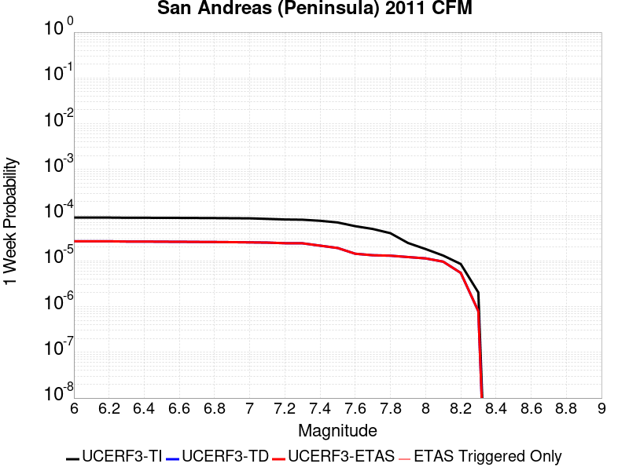 |  | 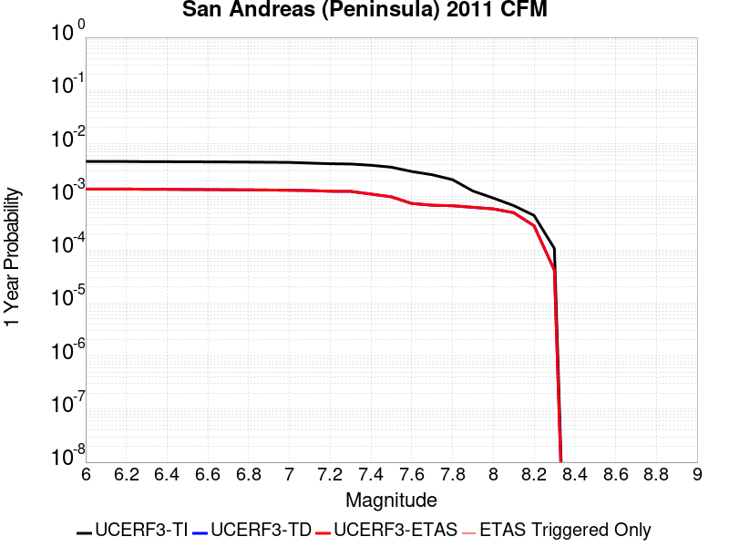 | 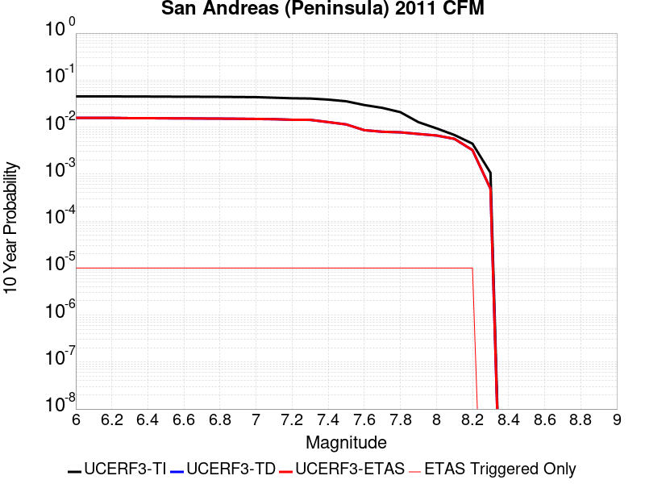 |

| Magnitude | 1 wk TI Prob | 1 wk TD Prob | 1 wk ETAS Prob | 1 wk ETAS/TD Gain | 1 wk ETAS Triggered Only | 1 mo TI Prob | 1 mo TD Prob | 1 mo ETAS Prob | 1 mo ETAS/TD Gain | 1 mo ETAS Triggered Only | 1 yr TI Prob | 1 yr TD Prob | 1 yr ETAS Prob | 1 yr ETAS/TD Gain | 1 yr ETAS Triggered Only | 10 yr TI Prob | 10 yr TD Prob | 10 yr ETAS Prob | 10 yr ETAS/TD Gain | 10 yr ETAS Triggered Only |
|-----|-----|-----|-----|-----|-----|-----|-----|-----|-----|-----|-----|-----|-----|-----|-----|-----|-----|-----|-----|-----|
| 6.0 | 8.847535E-5 | 2.6827645E-5 | 2.6827645E-5 | 1.0 | 0.0 | 3.7912498E-4 | 1.14970564E-4 | 1.14970564E-4 | 1.0 | 0.0 | 0.004606081 | 0.0013988697 | 0.0013988697 | 1.0 | 0.0 | 0.045117725 | 0.015704103 | 0.015713945 | 1.0006268 | 1.0E-5 |
| 6.1 | 8.847535E-5 | 2.6827645E-5 | 2.6827645E-5 | 1.0 | 0.0 | 3.7912498E-4 | 1.14970564E-4 | 1.14970564E-4 | 1.0 | 0.0 | 0.004606081 | 0.0013988697 | 0.0013988697 | 1.0 | 0.0 | 0.045117725 | 0.015704103 | 0.015713945 | 1.0006268 | 1.0E-5 |
| 6.2 | 8.847535E-5 | 2.6827645E-5 | 2.6827645E-5 | 1.0 | 0.0 | 3.7912498E-4 | 1.14970564E-4 | 1.14970564E-4 | 1.0 | 0.0 | 0.004606081 | 0.0013988697 | 0.0013988697 | 1.0 | 0.0 | 0.045117725 | 0.015704103 | 0.015713945 | 1.0006268 | 1.0E-5 |
| 6.3 | 8.768372E-5 | 2.6458754E-5 | 2.6458754E-5 | 1.0 | 0.0 | 3.7573325E-4 | 1.13389746E-4 | 1.13389746E-4 | 1.0 | 0.0 | 0.004564961 | 0.0013796478 | 0.0013796478 | 1.0 | 0.0 | 0.044723183 | 0.01549752 | 0.015507365 | 1.0006353 | 1.0E-5 |
| 6.4 | 8.768372E-5 | 2.6458754E-5 | 2.6458754E-5 | 1.0 | 0.0 | 3.7573325E-4 | 1.13389746E-4 | 1.13389746E-4 | 1.0 | 0.0 | 0.004564961 | 0.0013796478 | 0.0013796478 | 1.0 | 0.0 | 0.044723183 | 0.01549752 | 0.015507365 | 1.0006353 | 1.0E-5 |
| 6.5 | 8.7216904E-5 | 2.6242178E-5 | 2.6242178E-5 | 1.0 | 0.0 | 3.737332E-4 | 1.1246164E-4 | 1.1246164E-4 | 1.0 | 0.0 | 0.0045407116 | 0.0013683623 | 0.0013683623 | 1.0 | 0.0 | 0.04449045 | 0.015376291 | 0.015386138 | 1.0006404 | 1.0E-5 |
| 6.6 | 8.708879E-5 | 2.6171445E-5 | 2.6171445E-5 | 1.0 | 0.0 | 3.7318427E-4 | 1.1215852E-4 | 1.1215852E-4 | 1.0 | 0.0 | 0.0045340564 | 0.0013646765 | 0.0013646765 | 1.0 | 0.0 | 0.044426568 | 0.015337612 | 0.015347458 | 1.000642 | 1.0E-5 |
| 6.7 | 8.6692E-5 | 2.5973675E-5 | 2.5973675E-5 | 1.0 | 0.0 | 3.7148423E-4 | 1.11311005E-4 | 1.11311005E-4 | 1.0 | 0.0 | 0.0045134444 | 0.001354371 | 0.001354371 | 1.0 | 0.0 | 0.044228688 | 0.015228364 | 0.0152382115 | 1.0006467 | 1.0E-5 |
| 6.8 | 8.627513E-5 | 2.5856894E-5 | 2.5856894E-5 | 1.0 | 0.0 | 3.696982E-4 | 1.10810564E-4 | 1.10810564E-4 | 1.0 | 0.0 | 0.0044917893 | 0.0013482856 | 0.0013482856 | 1.0 | 0.0 | 0.044020753 | 0.015162014 | 0.015171863 | 1.0006496 | 1.0E-5 |
| 6.9 | 8.568151E-5 | 2.5659778E-5 | 2.5659778E-5 | 1.0 | 0.0 | 3.6715477E-4 | 1.0996585E-4 | 1.0996585E-4 | 1.0 | 0.0 | 0.0044609504 | 0.0013380138 | 0.0013380138 | 1.0 | 0.0 | 0.04372457 | 0.01505299 | 0.01506284 | 1.0006543 | 1.0E-5 |
| 7.0 | 8.5062005E-5 | 2.5394911E-5 | 2.5394911E-5 | 1.0 | 0.0 | 3.645005E-4 | 1.088308E-4 | 1.088308E-4 | 1.0 | 0.0 | 0.0044287667 | 0.0013242115 | 0.0013242115 | 1.0 | 0.0 | 0.043415383 | 0.01490987 | 0.014919721 | 1.0006607 | 1.0E-5 |
| 7.1 | 8.2681785E-5 | 2.5091891E-5 | 2.5091891E-5 | 1.0 | 0.0 | 3.5430235E-4 | 1.0753226E-4 | 1.0753226E-4 | 1.0 | 0.0 | 0.004305102 | 0.0013084208 | 0.0013084208 | 1.0 | 0.0 | 0.042226497 | 0.014739723 | 0.014749576 | 1.0006684 | 1.0E-5 |
| 7.2 | 8.0348145E-5 | 2.43301E-5 | 2.43301E-5 | 1.0 | 0.0 | 3.4430376E-4 | 1.042677E-4 | 1.042677E-4 | 1.0 | 0.0 | 0.0041838433 | 0.0012687219 | 0.0012687219 | 1.0 | 0.0 | 0.041059453 | 0.014324293 | 0.01433415 | 1.0006881 | 1.0E-5 |
| 7.3 | 7.93845E-5 | 2.4228146E-5 | 2.4228146E-5 | 1.0 | 0.0 | 3.4017494E-4 | 1.0383078E-4 | 1.0383078E-4 | 1.0 | 0.0 | 0.004133767 | 0.0012634086 | 0.0012634086 | 1.0 | 0.0 | 0.04057712 | 0.014266689 | 0.014276547 | 1.0006909 | 1.0E-5 |
| 7.4 | 7.5208125E-5 | 2.1517346E-5 | 2.1517346E-5 | 1.0 | 0.0 | 3.222807E-4 | 9.2213944E-5 | 9.2213944E-5 | 1.0 | 0.0 | 0.0039167097 | 0.0011221278 | 0.0011221278 | 1.0 | 0.0 | 0.03848393 | 0.012766209 | 0.012776081 | 1.0007733 | 1.0E-5 |
| 7.5 | 6.9124486E-5 | 1.9117333E-5 | 1.9117333E-5 | 1.0 | 0.0 | 2.9621416E-4 | 8.192886E-5 | 8.192886E-5 | 1.0 | 0.0 | 0.0036004444 | 9.970284E-4 | 9.970284E-4 | 1.0 | 0.0 | 0.035426665 | 0.01140377 | 0.011413656 | 1.0008669 | 1.0E-5 |
| 7.6 | 5.7353325E-5 | 1.4323512E-5 | 1.4323512E-5 | 1.0 | 0.0 | 2.457768E-4 | 6.1385035E-5 | 6.1385035E-5 | 1.0 | 0.0 | 0.0029882267 | 7.471066E-4 | 7.471066E-4 | 1.0 | 0.0 | 0.029483626 | 0.00860364 | 0.008613554 | 1.0011523 | 1.0E-5 |
| 7.7 | 4.981684E-5 | 1.327607E-5 | 1.327607E-5 | 1.0 | 0.0 | 2.1348328E-4 | 5.68962E-5 | 5.68962E-5 | 1.0 | 0.0 | 0.0025960607 | 6.924912E-4 | 6.924912E-4 | 1.0 | 0.0 | 0.02565942 | 0.007955606 | 0.007965527 | 1.0012469 | 1.0E-5 |
| 7.8 | 4.0286646E-5 | 1.2983393E-5 | 1.2983393E-5 | 1.0 | 0.0 | 1.7264562E-4 | 5.564193E-5 | 5.564193E-5 | 1.0 | 0.0 | 0.002099934 | 6.7723E-4 | 6.7723E-4 | 1.0 | 0.0 | 0.02080201 | 0.00774561 | 0.007755533 | 1.001281 | 1.0E-5 |
| 7.9 | 2.4620103E-5 | 1.2114306E-5 | 1.2114306E-5 | 1.0 | 0.0 | 1.05510466E-4 | 5.1917417E-5 | 5.1917417E-5 | 1.0 | 0.0 | 0.0012838328 | 6.3191133E-4 | 6.3191133E-4 | 1.0 | 0.0 | 0.012764412 | 0.0071373773 | 0.0071473056 | 1.001391 | 1.0E-5 |
| 8.0 | 1.8133225E-5 | 1.1327781E-5 | 1.1327781E-5 | 1.0 | 0.0 | 7.771151E-5 | 4.854673E-5 | 4.854673E-5 | 1.0 | 0.0 | 9.4572693E-4 | 5.9089623E-4 | 5.9089623E-4 | 1.0 | 0.0 | 0.009417122 | 0.0066258637 | 0.006635797 | 1.0014993 | 1.0E-5 |
| 8.1 | 1.3068318E-5 | 9.612704E-6 | 9.612704E-6 | 1.0 | 0.0 | 5.6005876E-5 | 4.1196654E-5 | 4.1196654E-5 | 1.0 | 0.0 | 6.816582E-4 | 5.0145393E-4 | 5.0145393E-4 | 1.0 | 0.0 | 0.0067957104 | 0.005614928 | 0.0056248717 | 1.001771 | 1.0E-5 |
| 8.2 | 8.535903E-6 | 5.458511E-6 | 5.458511E-6 | 1.0 | 0.0 | 3.658193E-5 | 2.339341E-5 | 2.339341E-5 | 1.0 | 0.0 | 4.4529396E-4 | 2.847776E-4 | 2.847776E-4 | 1.0 | 0.0 | 0.0044440273 | 0.0032357168 | 0.0032456846 | 1.0030805 | 1.0E-5 |
| 8.3 | 2.0399948E-6 | 7.951945E-7 | 7.951945E-7 | 1.0 | 0.0 | 8.742806E-6 | 3.4079721E-6 | 3.4079721E-6 | 1.0 | 0.0 | 1.0643846E-4 | 4.1491287E-5 | 4.1491287E-5 | 1.0 | 0.0 | 0.0010638749 | 4.8670862E-4 | 4.8670862E-4 | 1.0 | 0.0 |

## Sisar
*[(top)](#table-of-contents)*

| 1 Week | 1 Month | 1 Year | 10 Year |
|-----|-----|-----|-----|
|  |  | 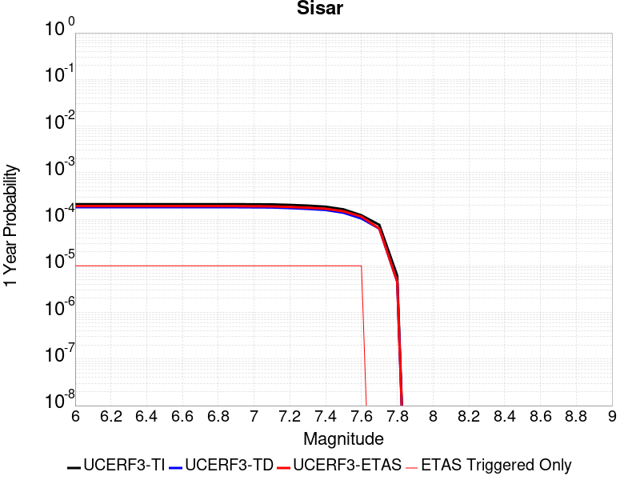 | 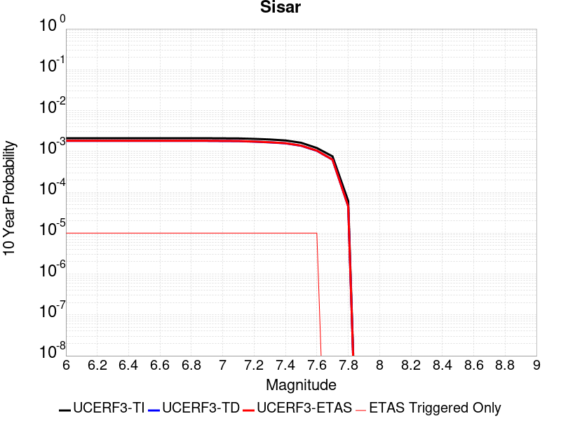 |

| Magnitude | 1 wk TI Prob | 1 wk TD Prob | 1 wk ETAS Prob | 1 wk ETAS/TD Gain | 1 wk ETAS Triggered Only | 1 mo TI Prob | 1 mo TD Prob | 1 mo ETAS Prob | 1 mo ETAS/TD Gain | 1 mo ETAS Triggered Only | 1 yr TI Prob | 1 yr TD Prob | 1 yr ETAS Prob | 1 yr ETAS/TD Gain | 1 yr ETAS Triggered Only | 10 yr TI Prob | 10 yr TD Prob | 10 yr ETAS Prob | 10 yr ETAS/TD Gain | 10 yr ETAS Triggered Only |
|-----|-----|-----|-----|-----|-----|-----|-----|-----|-----|-----|-----|-----|-----|-----|-----|-----|-----|-----|-----|-----|
| 6.0 | 4.036257E-6 | 3.4736868E-6 | 1.3473652E-5 | 3.8787758 | 1.0E-5 | 1.7298129E-5 | 1.4887145E-5 | 2.4886996E-5 | 1.6717105 | 1.0E-5 | 2.1058436E-4 | 1.81236E-4 | 1.9123418E-4 | 1.0551667 | 1.0E-5 | 0.0021038493 | 0.0018108907 | 0.0018208727 | 1.0055121 | 1.0E-5 |
| 6.1 | 4.036257E-6 | 3.4736868E-6 | 1.3473652E-5 | 3.8787758 | 1.0E-5 | 1.7298129E-5 | 1.4887145E-5 | 2.4886996E-5 | 1.6717105 | 1.0E-5 | 2.1058436E-4 | 1.81236E-4 | 1.9123418E-4 | 1.0551667 | 1.0E-5 | 0.0021038493 | 0.0018108907 | 0.0018208727 | 1.0055121 | 1.0E-5 |
| 6.2 | 4.036257E-6 | 3.4736868E-6 | 1.3473652E-5 | 3.8787758 | 1.0E-5 | 1.7298129E-5 | 1.4887145E-5 | 2.4886996E-5 | 1.6717105 | 1.0E-5 | 2.1058436E-4 | 1.81236E-4 | 1.9123418E-4 | 1.0551667 | 1.0E-5 | 0.0021038493 | 0.0018108907 | 0.0018208727 | 1.0055121 | 1.0E-5 |
| 6.3 | 4.036257E-6 | 3.4736868E-6 | 1.3473652E-5 | 3.8787758 | 1.0E-5 | 1.7298129E-5 | 1.4887145E-5 | 2.4886996E-5 | 1.6717105 | 1.0E-5 | 2.1058436E-4 | 1.81236E-4 | 1.9123418E-4 | 1.0551667 | 1.0E-5 | 0.0021038493 | 0.0018108907 | 0.0018208727 | 1.0055121 | 1.0E-5 |
| 6.4 | 4.036257E-6 | 3.4736868E-6 | 1.3473652E-5 | 3.8787758 | 1.0E-5 | 1.7298129E-5 | 1.4887145E-5 | 2.4886996E-5 | 1.6717105 | 1.0E-5 | 2.1058436E-4 | 1.81236E-4 | 1.9123418E-4 | 1.0551667 | 1.0E-5 | 0.0021038493 | 0.0018108907 | 0.0018208727 | 1.0055121 | 1.0E-5 |
| 6.5 | 4.036257E-6 | 3.4736868E-6 | 1.3473652E-5 | 3.8787758 | 1.0E-5 | 1.7298129E-5 | 1.4887145E-5 | 2.4886996E-5 | 1.6717105 | 1.0E-5 | 2.1058436E-4 | 1.81236E-4 | 1.9123418E-4 | 1.0551667 | 1.0E-5 | 0.0021038493 | 0.0018108907 | 0.0018208727 | 1.0055121 | 1.0E-5 |
| 6.6 | 4.036257E-6 | 3.4736868E-6 | 1.3473652E-5 | 3.8787758 | 1.0E-5 | 1.7298129E-5 | 1.4887145E-5 | 2.4886996E-5 | 1.6717105 | 1.0E-5 | 2.1058436E-4 | 1.81236E-4 | 1.9123418E-4 | 1.0551667 | 1.0E-5 | 0.0021038493 | 0.0018108907 | 0.0018208727 | 1.0055121 | 1.0E-5 |
| 6.7 | 4.036257E-6 | 3.4736868E-6 | 1.3473652E-5 | 3.8787758 | 1.0E-5 | 1.7298129E-5 | 1.4887145E-5 | 2.4886996E-5 | 1.6717105 | 1.0E-5 | 2.1058436E-4 | 1.81236E-4 | 1.9123418E-4 | 1.0551667 | 1.0E-5 | 0.0021038493 | 0.0018108907 | 0.0018208727 | 1.0055121 | 1.0E-5 |
| 6.8 | 4.036257E-6 | 3.4736868E-6 | 1.3473652E-5 | 3.8787758 | 1.0E-5 | 1.7298129E-5 | 1.4887145E-5 | 2.4886996E-5 | 1.6717105 | 1.0E-5 | 2.1058436E-4 | 1.81236E-4 | 1.9123418E-4 | 1.0551667 | 1.0E-5 | 0.0021038493 | 0.0018108907 | 0.0018208727 | 1.0055121 | 1.0E-5 |
| 6.9 | 4.03384E-6 | 3.471194E-6 | 1.3471159E-5 | 3.8808432 | 1.0E-5 | 1.7287772E-5 | 1.4876461E-5 | 2.4876312E-5 | 1.6721928 | 1.0E-5 | 2.1045828E-4 | 1.8110595E-4 | 1.9110413E-4 | 1.0552063 | 1.0E-5 | 0.0021025909 | 0.0018095924 | 0.0018195743 | 1.005516 | 1.0E-5 |
| 7.0 | 4.0099476E-6 | 3.4464658E-6 | 1.3446432E-5 | 3.901513 | 1.0E-5 | 1.7185375E-5 | 1.4770485E-5 | 2.4770337E-5 | 1.6770159 | 1.0E-5 | 2.0921185E-4 | 1.7981589E-4 | 1.8981409E-4 | 1.0556024 | 1.0E-5 | 0.00209015 | 0.0017967127 | 0.0018066948 | 1.0055557 | 1.0E-5 |
| 7.1 | 3.990923E-6 | 3.4267268E-6 | 1.3426693E-5 | 3.9182267 | 1.0E-5 | 1.7103843E-5 | 1.468589E-5 | 2.4685743E-5 | 1.6809157 | 1.0E-5 | 2.0821938E-4 | 1.7878613E-4 | 1.8878434E-4 | 1.0559227 | 1.0E-5 | 0.0020802438 | 0.0017864316 | 0.0017964138 | 1.0055877 | 1.0E-5 |
| 7.2 | 3.8914636E-6 | 3.3228832E-6 | 1.332285E-5 | 4.0094247 | 1.0E-5 | 1.6677595E-5 | 1.4240851E-5 | 2.4240708E-5 | 1.7021953 | 1.0E-5 | 2.030308E-4 | 1.7336864E-4 | 1.8336691E-4 | 1.0576706 | 1.0E-5 | 0.0020284539 | 0.0017323424 | 0.0017423251 | 1.0057626 | 1.0E-5 |
| 7.3 | 3.7604138E-6 | 3.1952572E-6 | 1.3195226E-5 | 4.1296287 | 1.0E-5 | 1.611596E-5 | 1.3693888E-5 | 2.3693752E-5 | 1.7302427 | 1.0E-5 | 1.9619415E-4 | 1.6671041E-4 | 1.7670875E-4 | 1.0599743 | 1.0E-5 | 0.0019602103 | 0.0016658618 | 0.0016758451 | 1.0059929 | 1.0E-5 |
| 7.4 | 3.560414E-6 | 3.0282936E-6 | 1.3028263E-5 | 4.30218 | 1.0E-5 | 1.5258827E-5 | 1.2978337E-5 | 2.2978207E-5 | 1.7705047 | 1.0E-5 | 1.857604E-4 | 1.5799986E-4 | 1.679983E-4 | 1.0632812 | 1.0E-5 | 0.0018560519 | 0.0015788832 | 0.0015888674 | 1.0063236 | 1.0E-5 |
| 7.5 | 3.124759E-6 | 2.6399086E-6 | 1.2639883E-5 | 4.7879996 | 1.0E-5 | 1.3391756E-5 | 1.1313846E-5 | 2.1313732E-5 | 1.8838627 | 1.0E-5 | 1.6303243E-4 | 1.3773743E-4 | 1.4773605E-4 | 1.0725919 | 1.0E-5 | 0.0016291287 | 0.0013765268 | 0.001386513 | 1.0072547 | 1.0E-5 |
| 7.6 | 2.3298992E-6 | 1.9865033E-6 | 1.19864835E-5 | 6.0339613 | 1.0E-5 | 9.985244E-6 | 8.513558E-6 | 1.8513472E-5 | 2.174587 | 1.0E-5 | 1.2156356E-4 | 1.0364769E-4 | 1.1364665E-4 | 1.0964707 | 1.0E-5 | 0.0012149708 | 0.0010359989 | 0.0010459885 | 1.0096425 | 1.0E-5 |
| 7.7 | 1.4522095E-6 | 1.207019E-6 | 1.207019E-6 | 1.0 | 0.0 | 6.22374E-6 | 5.172928E-6 | 5.172928E-6 | 1.0 | 0.0 | 7.57714E-5 | 6.297863E-5 | 6.297863E-5 | 1.0 | 0.0 | 7.574557E-4 | 6.296127E-4 | 6.296127E-4 | 1.0 | 0.0 |
| 7.8 | 1.1807067E-7 | 8.746223E-8 | 8.746223E-8 | 1.0 | 0.0 | 5.060171E-7 | 3.7483807E-7 | 3.7483807E-7 | 1.0 | 0.0 | 6.1607407E-6 | 4.5636443E-6 | 4.5636443E-6 | 1.0 | 0.0 | 6.160569E-5 | 4.563553E-5 | 4.563553E-5 | 1.0 | 0.0 |

## Elsinore (Coyote Mountains)
*[(top)](#table-of-contents)*

| 1 Week | 1 Month | 1 Year | 10 Year |
|-----|-----|-----|-----|
| 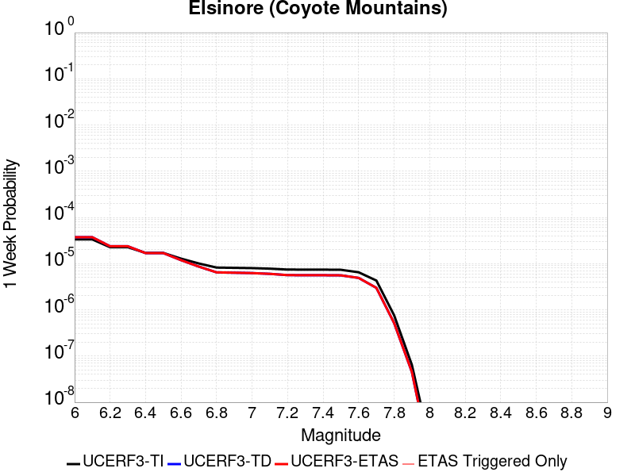 |  | 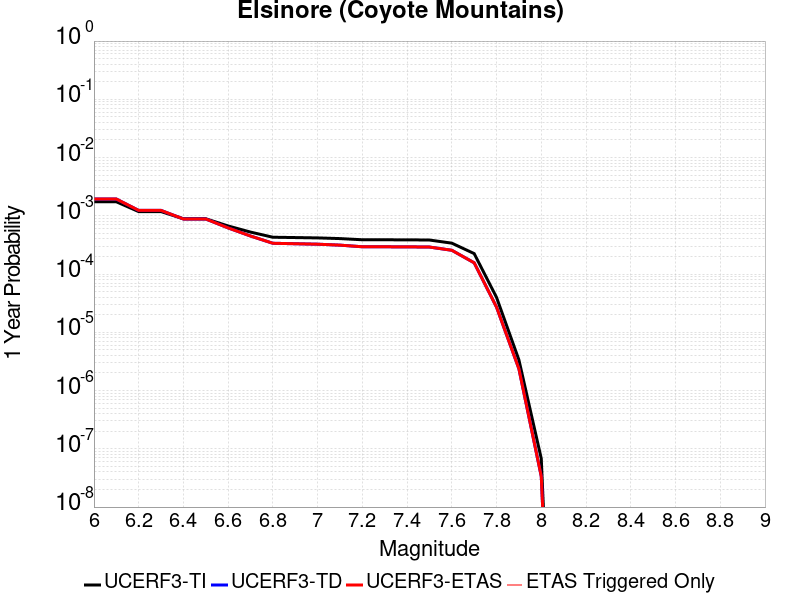 |  |

| Magnitude | 1 wk TI Prob | 1 wk TD Prob | 1 wk ETAS Prob | 1 wk ETAS/TD Gain | 1 wk ETAS Triggered Only | 1 mo TI Prob | 1 mo TD Prob | 1 mo ETAS Prob | 1 mo ETAS/TD Gain | 1 mo ETAS Triggered Only | 1 yr TI Prob | 1 yr TD Prob | 1 yr ETAS Prob | 1 yr ETAS/TD Gain | 1 yr ETAS Triggered Only | 10 yr TI Prob | 10 yr TD Prob | 10 yr ETAS Prob | 10 yr ETAS/TD Gain | 10 yr ETAS Triggered Only |
|-----|-----|-----|-----|-----|-----|-----|-----|-----|-----|-----|-----|-----|-----|-----|-----|-----|-----|-----|-----|-----|
| 6.0 | 3.3420765E-5 | 3.7261423E-5 | 3.7261423E-5 | 1.0 | 0.0 | 1.43224E-4 | 1.5967936E-4 | 1.5967936E-4 | 1.0 | 0.0 | 0.0017423573 | 0.0019426232 | 0.0019426232 | 1.0 | 0.0 | 0.017287595 | 0.019283129 | 0.019292936 | 1.0005085 | 1.0E-5 |
| 6.1 | 3.3420765E-5 | 3.7261423E-5 | 3.7261423E-5 | 1.0 | 0.0 | 1.43224E-4 | 1.5967936E-4 | 1.5967936E-4 | 1.0 | 0.0 | 0.0017423573 | 0.0019426232 | 0.0019426232 | 1.0 | 0.0 | 0.017287595 | 0.019283129 | 0.019292936 | 1.0005085 | 1.0E-5 |
| 6.2 | 2.2653252E-5 | 2.3753293E-5 | 2.3753293E-5 | 1.0 | 0.0 | 9.708176E-5 | 1.0179632E-4 | 1.0179632E-4 | 1.0 | 0.0 | 0.0011813295 | 0.0012387489 | 0.0012387489 | 1.0 | 0.0 | 0.0117506925 | 0.0123265125 | 0.01233639 | 1.0008012 | 1.0E-5 |
| 6.3 | 2.2653252E-5 | 2.3753293E-5 | 2.3753293E-5 | 1.0 | 0.0 | 9.708176E-5 | 1.0179632E-4 | 1.0179632E-4 | 1.0 | 0.0 | 0.0011813295 | 0.0012387489 | 0.0012387489 | 1.0 | 0.0 | 0.0117506925 | 0.0123265125 | 0.01233639 | 1.0008012 | 1.0E-5 |
| 6.4 | 1.7056373E-5 | 1.6918717E-5 | 1.6918717E-5 | 1.0 | 0.0 | 7.309669E-5 | 7.2506984E-5 | 7.2506984E-5 | 1.0 | 0.0 | 8.8958885E-4 | 8.824525E-4 | 8.824525E-4 | 1.0 | 0.0 | 0.008860361 | 0.0087931575 | 0.0087931575 | 1.0 | 0.0 |
| 6.5 | 1.7056373E-5 | 1.6918717E-5 | 1.6918717E-5 | 1.0 | 0.0 | 7.309669E-5 | 7.2506984E-5 | 7.2506984E-5 | 1.0 | 0.0 | 8.8958885E-4 | 8.824525E-4 | 8.824525E-4 | 1.0 | 0.0 | 0.008860361 | 0.0087931575 | 0.0087931575 | 1.0 | 0.0 |
| 6.6 | 1.2830955E-5 | 1.1880735E-5 | 1.1880735E-5 | 1.0 | 0.0 | 5.4988646E-5 | 5.0916537E-5 | 5.0916537E-5 | 1.0 | 0.0 | 6.692811E-4 | 6.197496E-4 | 6.197496E-4 | 1.0 | 0.0 | 0.0066726897 | 0.0061818985 | 0.0061818985 | 1.0 | 0.0 |
| 6.7 | 1.0074784E-5 | 8.627476E-6 | 8.627476E-6 | 1.0 | 0.0 | 4.3176933E-5 | 3.6974412E-5 | 3.6974412E-5 | 1.0 | 0.0 | 5.255523E-4 | 4.5007718E-4 | 4.5007718E-4 | 1.0 | 0.0 | 0.0052431114 | 0.0044923234 | 0.0044923234 | 1.0 | 0.0 |
| 6.8 | 8.217804E-6 | 6.47202E-6 | 6.47202E-6 | 1.0 | 0.0 | 3.5218687E-5 | 2.773694E-5 | 2.773694E-5 | 1.0 | 0.0 | 4.2870315E-4 | 3.376461E-4 | 3.376461E-4 | 1.0 | 0.0 | 0.00427877 | 0.0033714517 | 0.0033714517 | 1.0 | 0.0 |
| 6.9 | 8.112848E-6 | 6.35787E-6 | 6.35787E-6 | 1.0 | 0.0 | 3.4768887E-5 | 2.7247735E-5 | 2.7247735E-5 | 1.0 | 0.0 | 4.2322895E-4 | 3.3169187E-4 | 3.3169187E-4 | 1.0 | 0.0 | 0.004224238 | 0.0033120876 | 0.0033120876 | 1.0 | 0.0 |
| 7.0 | 8.005253E-6 | 6.240362E-6 | 6.240362E-6 | 1.0 | 0.0 | 3.4307777E-5 | 2.6744141E-5 | 2.6744141E-5 | 1.0 | 0.0 | 4.1761715E-4 | 3.2556246E-4 | 3.2556246E-4 | 1.0 | 0.0 | 0.004168332 | 0.0032509742 | 0.0032509742 | 1.0 | 0.0 |
| 7.1 | 7.790875E-6 | 6.011666E-6 | 6.011666E-6 | 1.0 | 0.0 | 3.3389035E-5 | 2.5764033E-5 | 2.5764033E-5 | 1.0 | 0.0 | 4.064357E-4 | 3.1363312E-4 | 3.1363312E-4 | 1.0 | 0.0 | 0.0040569315 | 0.003132022 | 0.003132022 | 1.0 | 0.0 |
| 7.2 | 7.4381664E-6 | 5.640383E-6 | 5.640383E-6 | 1.0 | 0.0 | 3.1877466E-5 | 2.4172852E-5 | 2.4172852E-5 | 1.0 | 0.0 | 3.8803904E-4 | 2.942658E-4 | 2.942658E-4 | 1.0 | 0.0 | 0.0038736216 | 0.0029388706 | 0.0029388706 | 1.0 | 0.0 |
| 7.3 | 7.429676E-6 | 5.632888E-6 | 5.632888E-6 | 1.0 | 0.0 | 3.184108E-5 | 2.4140732E-5 | 2.4140732E-5 | 1.0 | 0.0 | 3.8759617E-4 | 2.9387485E-4 | 2.9387485E-4 | 1.0 | 0.0 | 0.0038692085 | 0.0029349714 | 0.0029349714 | 1.0 | 0.0 |
| 7.4 | 7.4127843E-6 | 5.6175318E-6 | 5.6175318E-6 | 1.0 | 0.0 | 3.1768686E-5 | 2.4074921E-5 | 2.4074921E-5 | 1.0 | 0.0 | 3.8671514E-4 | 2.9307383E-4 | 2.9307383E-4 | 1.0 | 0.0 | 0.0038604285 | 0.002926982 | 0.002926982 | 1.0 | 0.0 |
| 7.5 | 7.361355E-6 | 5.578225E-6 | 5.578225E-6 | 1.0 | 0.0 | 3.1548283E-5 | 2.3906465E-5 | 2.3906465E-5 | 1.0 | 0.0 | 3.8403264E-4 | 2.910234E-4 | 2.910234E-4 | 1.0 | 0.0 | 0.0038336967 | 0.0029065318 | 0.0029065318 | 1.0 | 0.0 |
| 7.6 | 6.5041595E-6 | 4.9079E-6 | 4.9079E-6 | 1.0 | 0.0 | 2.7874672E-5 | 2.1033693E-5 | 2.1033693E-5 | 1.0 | 0.0 | 3.3932127E-4 | 2.5605614E-4 | 2.5605614E-4 | 1.0 | 0.0 | 0.003388036 | 0.0025577135 | 0.0025577135 | 1.0 | 0.0 |
| 7.7 | 4.30453E-6 | 2.9909775E-6 | 2.9909775E-6 | 1.0 | 0.0 | 1.8447856E-5 | 1.2818415E-5 | 1.2818415E-5 | 1.0 | 0.0 | 2.245795E-4 | 1.5605356E-4 | 1.5605356E-4 | 1.0 | 0.0 | 0.0022435267 | 0.0015594931 | 0.0015594931 | 1.0 | 0.0 |
| 7.8 | 7.6158045E-7 | 5.180566E-7 | 5.180566E-7 | 1.0 | 0.0 | 3.2639123E-6 | 2.2202407E-6 | 2.2202407E-6 | 1.0 | 0.0 | 3.9737406E-5 | 2.703111E-5 | 2.703111E-5 | 1.0 | 0.0 | 3.97303E-4 | 2.7027976E-4 | 2.7027976E-4 | 1.0 | 0.0 |
| 7.9 | 6.447751E-8 | 4.5268486E-8 | 4.5268486E-8 | 1.0 | 0.0 | 2.7633214E-7 | 1.9400778E-7 | 1.9400778E-7 | 1.0 | 0.0 | 3.3643387E-6 | 2.3620423E-6 | 2.3620423E-6 | 1.0 | 0.0 | 3.364288E-5 | 2.3620181E-5 | 2.3620181E-5 | 1.0 | 0.0 |
| 8.0 | 1.2971227E-9 | 6.43537E-10 | 6.43537E-10 | 1.0 | 0.0 | 5.5590976E-9 | 2.7580156E-9 | 2.7580156E-9 | 1.0 | 0.0 | 6.768201E-8 | 3.357884E-8 | 3.357884E-8 | 1.0 | 0.0 | 6.7681987E-7 | 3.3578837E-7 | 3.3578837E-7 | 1.0 | 0.0 |

## Monterey Bay-Tularcitos
*[(top)](#table-of-contents)*

| 1 Week | 1 Month | 1 Year | 10 Year |
|-----|-----|-----|-----|
|  |  |  |  |

| Magnitude | 1 wk TI Prob | 1 wk TD Prob | 1 wk ETAS Prob | 1 wk ETAS/TD Gain | 1 wk ETAS Triggered Only | 1 mo TI Prob | 1 mo TD Prob | 1 mo ETAS Prob | 1 mo ETAS/TD Gain | 1 mo ETAS Triggered Only | 1 yr TI Prob | 1 yr TD Prob | 1 yr ETAS Prob | 1 yr ETAS/TD Gain | 1 yr ETAS Triggered Only | 10 yr TI Prob | 10 yr TD Prob | 10 yr ETAS Prob | 10 yr ETAS/TD Gain | 10 yr ETAS Triggered Only |
|-----|-----|-----|-----|-----|-----|-----|-----|-----|-----|-----|-----|-----|-----|-----|-----|-----|-----|-----|-----|-----|
| 6.0 | 2.5146224E-5 | 2.6651604E-5 | 2.6651604E-5 | 1.0 | 0.0 | 1.07765074E-4 | 1.14216535E-4 | 1.242154E-4 | 1.087543 | 1.0E-5 | 0.00131125 | 0.0013897663 | 0.0013997525 | 1.0071855 | 1.0E-5 | 0.013035399 | 0.013817581 | 0.013827443 | 1.0007137 | 1.0E-5 |
| 6.1 | 2.5146224E-5 | 2.6651604E-5 | 2.6651604E-5 | 1.0 | 0.0 | 1.07765074E-4 | 1.14216535E-4 | 1.242154E-4 | 1.087543 | 1.0E-5 | 0.00131125 | 0.0013897663 | 0.0013997525 | 1.0071855 | 1.0E-5 | 0.013035399 | 0.013817581 | 0.013827443 | 1.0007137 | 1.0E-5 |
| 6.2 | 2.5146224E-5 | 2.6651604E-5 | 2.6651604E-5 | 1.0 | 0.0 | 1.07765074E-4 | 1.14216535E-4 | 1.242154E-4 | 1.087543 | 1.0E-5 | 0.00131125 | 0.0013897663 | 0.0013997525 | 1.0071855 | 1.0E-5 | 0.013035399 | 0.013817581 | 0.013827443 | 1.0007137 | 1.0E-5 |
| 6.3 | 1.3223817E-5 | 1.3933743E-5 | 1.3933743E-5 | 1.0 | 0.0 | 5.6672274E-5 | 5.9714745E-5 | 5.9714745E-5 | 1.0 | 0.0 | 6.897665E-4 | 7.267968E-4 | 7.267968E-4 | 1.0 | 0.0 | 0.006876294 | 0.007245445 | 0.007245445 | 1.0 | 0.0 |
| 6.4 | 1.3223817E-5 | 1.3933743E-5 | 1.3933743E-5 | 1.0 | 0.0 | 5.6672274E-5 | 5.9714745E-5 | 5.9714745E-5 | 1.0 | 0.0 | 6.897665E-4 | 7.267968E-4 | 7.267968E-4 | 1.0 | 0.0 | 0.006876294 | 0.007245445 | 0.007245445 | 1.0 | 0.0 |
| 6.5 | 8.322108E-6 | 8.732479E-6 | 8.732479E-6 | 1.0 | 0.0 | 3.5665693E-5 | 3.742439E-5 | 3.742439E-5 | 1.0 | 0.0 | 4.341433E-4 | 4.5554998E-4 | 4.5554998E-4 | 1.0 | 0.0 | 0.004332961 | 0.0045464933 | 0.0045464933 | 1.0 | 0.0 |
| 6.6 | 8.314575E-6 | 8.72474E-6 | 8.72474E-6 | 1.0 | 0.0 | 3.5633406E-5 | 3.7391223E-5 | 3.7391223E-5 | 1.0 | 0.0 | 4.3375036E-4 | 4.5514634E-4 | 4.5514634E-4 | 1.0 | 0.0 | 0.004329047 | 0.0045424732 | 0.0045424732 | 1.0 | 0.0 |
| 6.7 | 6.1827686E-6 | 6.4719184E-6 | 6.4719184E-6 | 1.0 | 0.0 | 2.6497311E-5 | 2.7736507E-5 | 2.7736507E-5 | 1.0 | 0.0 | 3.22557E-4 | 3.376413E-4 | 3.376413E-4 | 1.0 | 0.0 | 0.003220892 | 0.0033714501 | 0.0033714501 | 1.0 | 0.0 |
| 6.8 | 4.692096E-6 | 4.9027676E-6 | 4.9027676E-6 | 1.0 | 0.0 | 2.0108826E-5 | 2.1011698E-5 | 2.1011698E-5 | 1.0 | 0.0 | 2.4479747E-4 | 2.5578836E-4 | 2.5578836E-4 | 1.0 | 0.0 | 0.0024452796 | 0.0025550367 | 0.0025550367 | 1.0 | 0.0 |
| 6.9 | 2.6704245E-6 | 2.7793587E-6 | 2.7793587E-6 | 1.0 | 0.0 | 1.1444627E-5 | 1.1911485E-5 | 1.1911485E-5 | 1.0 | 0.0 | 1.3932942E-4 | 1.4501304E-4 | 1.4501304E-4 | 1.0 | 0.0 | 0.001392421 | 0.0014492193 | 0.0014492193 | 1.0 | 0.0 |
| 7.0 | 2.054503E-6 | 2.134063E-6 | 2.134063E-6 | 1.0 | 0.0 | 8.804984E-6 | 9.145953E-6 | 9.145953E-6 | 1.0 | 0.0 | 1.071954E-4 | 1.1134655E-4 | 1.1134655E-4 | 1.0 | 0.0 | 0.001071437 | 0.0011129323 | 0.0011129323 | 1.0 | 0.0 |
| 7.1 | 1.192378E-6 | 1.2310619E-6 | 1.2310619E-6 | 1.0 | 0.0 | 5.1101815E-6 | 5.2759697E-6 | 5.2759697E-6 | 1.0 | 0.0 | 6.221468E-5 | 6.423318E-5 | 6.423318E-5 | 1.0 | 0.0 | 6.2197266E-4 | 6.4216036E-4 | 6.4216036E-4 | 1.0 | 0.0 |
| 7.2 | 5.6153084E-7 | 5.704702E-7 | 5.704702E-7 | 1.0 | 0.0 | 2.4065585E-6 | 2.4448705E-6 | 2.4448705E-6 | 1.0 | 0.0 | 2.9299455E-5 | 2.9765957E-5 | 2.9765957E-5 | 1.0 | 0.0 | 2.9295593E-4 | 2.976262E-4 | 2.976262E-4 | 1.0 | 0.0 |
| 7.3 | 2.47277E-7 | 2.4173687E-7 | 2.4173687E-7 | 1.0 | 0.0 | 1.0597581E-6 | 1.0360149E-6 | 1.0360149E-6 | 1.0 | 0.0 | 1.2902479E-5 | 1.2613408E-5 | 1.2613408E-5 | 1.0 | 0.0 | 1.290173E-4 | 1.26127E-4 | 1.26127E-4 | 1.0 | 0.0 |
| 7.4 | 1.5781066E-7 | 1.4972521E-7 | 1.4972521E-7 | 1.0 | 0.0 | 6.7633124E-7 | 6.4167926E-7 | 6.4167926E-7 | 1.0 | 0.0 | 8.234301E-6 | 7.812418E-6 | 7.812418E-6 | 1.0 | 0.0 | 8.233997E-5 | 7.8121455E-5 | 7.8121455E-5 | 1.0 | 0.0 |
| 7.5 | 8.445943E-8 | 7.448856E-8 | 7.448856E-8 | 1.0 | 0.0 | 3.6196892E-7 | 3.1923665E-7 | 3.1923665E-7 | 1.0 | 0.0 | 4.406963E-6 | 3.8866992E-6 | 3.8866992E-6 | 1.0 | 0.0 | 4.4068755E-5 | 3.886632E-5 | 3.886632E-5 | 1.0 | 0.0 |
| 7.6 | 2.998136E-8 | 2.0315863E-8 | 2.0315863E-8 | 1.0 | 0.0 | 1.2849155E-7 | 8.706798E-8 | 8.706798E-8 | 1.0 | 0.0 | 1.5643834E-6 | 1.0600521E-6 | 1.0600521E-6 | 1.0 | 0.0 | 1.5643724E-5 | 1.0600472E-5 | 1.0600472E-5 | 1.0 | 0.0 |
| 7.7 | 1.3884698E-8 | 6.113417E-9 | 6.113417E-9 | 1.0 | 0.0 | 5.9505847E-8 | 2.6200357E-8 | 2.6200357E-8 | 1.0 | 0.0 | 7.2448347E-7 | 3.189893E-7 | 3.189893E-7 | 1.0 | 0.0 | 7.244811E-6 | 3.1898887E-6 | 3.1898887E-6 | 1.0 | 0.0 |
| 7.8 | 5.7960425E-10 | 1.5022572E-10 | 1.5022572E-10 | 1.0 | 0.0 | 2.4840183E-9 | 6.43825E-10 | 6.43825E-10 | 1.0 | 0.0 | 3.0242923E-8 | 7.838569E-9 | 7.838569E-9 | 1.0 | 0.0 | 3.0242919E-7 | 7.838569E-8 | 7.838569E-8 | 1.0 | 0.0 |

## Silver Creek 2011 CFM
*[(top)](#table-of-contents)*

| 1 Week | 1 Month | 1 Year | 10 Year |
|-----|-----|-----|-----|
|  |  |  |  |

| Magnitude | 1 wk TI Prob | 1 wk TD Prob | 1 wk ETAS Prob | 1 wk ETAS/TD Gain | 1 wk ETAS Triggered Only | 1 mo TI Prob | 1 mo TD Prob | 1 mo ETAS Prob | 1 mo ETAS/TD Gain | 1 mo ETAS Triggered Only | 1 yr TI Prob | 1 yr TD Prob | 1 yr ETAS Prob | 1 yr ETAS/TD Gain | 1 yr ETAS Triggered Only | 10 yr TI Prob | 10 yr TD Prob | 10 yr ETAS Prob | 10 yr ETAS/TD Gain | 10 yr ETAS Triggered Only |
|-----|-----|-----|-----|-----|-----|-----|-----|-----|-----|-----|-----|-----|-----|-----|-----|-----|-----|-----|-----|-----|
| 6.0 | 2.3698249E-6 | 2.6534624E-6 | 2.6534624E-6 | 1.0 | 0.0 | 1.0156353E-5 | 1.13719325E-5 | 2.137182E-5 | 1.879348 | 1.0E-5 | 1.2364658E-4 | 1.3844464E-4 | 1.4844326E-4 | 1.072221 | 1.0E-5 | 0.0012357781 | 0.0013836945 | 0.0013936807 | 1.007217 | 1.0E-5 |
| 6.1 | 2.3698249E-6 | 2.6534624E-6 | 2.6534624E-6 | 1.0 | 0.0 | 1.0156353E-5 | 1.13719325E-5 | 2.137182E-5 | 1.879348 | 1.0E-5 | 1.2364658E-4 | 1.3844464E-4 | 1.4844326E-4 | 1.072221 | 1.0E-5 | 0.0012357781 | 0.0013836945 | 0.0013936807 | 1.007217 | 1.0E-5 |
| 6.2 | 1.7907361E-6 | 2.0694256E-6 | 2.0694256E-6 | 1.0 | 0.0 | 7.674561E-6 | 8.868937E-6 | 1.8868848E-5 | 2.1275208 | 1.0E-5 | 9.3433766E-5 | 1.07973974E-4 | 1.1797289E-4 | 1.0926049 | 1.0E-5 | 9.3394495E-4 | 0.0010793133 | 0.0010893026 | 1.0092552 | 1.0E-5 |
| 6.3 | 1.7077737E-6 | 1.9856413E-6 | 1.9856413E-6 | 1.0 | 0.0 | 7.3190095E-6 | 8.509864E-6 | 1.8509778E-5 | 2.175097 | 1.0E-5 | 8.910529E-5 | 1.0360268E-4 | 1.1360164E-4 | 1.0965126 | 1.0E-5 | 8.906957E-4 | 0.0010356414 | 0.0010456311 | 1.0096458 | 1.0E-5 |
| 6.4 | 1.4809725E-6 | 1.7667816E-6 | 1.7667816E-6 | 1.0 | 0.0 | 6.3470097E-6 | 7.571899E-6 | 1.7571823E-5 | 2.3206627 | 1.0E-5 | 7.72721E-5 | 9.2183975E-5 | 1.02183054E-4 | 1.1084688 | 1.0E-5 | 7.724524E-4 | 9.21554E-4 | 9.315448E-4 | 1.0108413 | 1.0E-5 |
| 6.5 | 1.3795701E-6 | 1.6691284E-6 | 1.6691284E-6 | 1.0 | 0.0 | 5.91243E-6 | 7.153388E-6 | 1.7153316E-5 | 2.397929 | 1.0E-5 | 7.1981456E-5 | 8.708902E-5 | 9.708815E-5 | 1.114815 | 1.0E-5 | 7.1958144E-4 | 8.7064534E-4 | 8.806366E-4 | 1.0114757 | 1.0E-5 |
| 6.6 | 1.2779882E-6 | 1.55918E-6 | 1.55918E-6 | 1.0 | 0.0 | 5.477081E-6 | 6.6821826E-6 | 1.6682116E-5 | 2.4965072 | 1.0E-5 | 6.6681416E-5 | 8.135254E-5 | 9.135173E-5 | 1.1229118 | 1.0E-5 | 6.666141E-4 | 8.1332383E-4 | 8.233157E-4 | 1.0122852 | 1.0E-5 |
| 6.7 | 1.1587747E-6 | 1.4313026E-6 | 1.4313026E-6 | 1.0 | 0.0 | 4.9661676E-6 | 6.1341393E-6 | 1.6134078E-5 | 2.6302106 | 1.0E-5 | 6.0461414E-5 | 7.468059E-5 | 8.467984E-5 | 1.1338936 | 1.0E-5 | 6.0444965E-4 | 7.466511E-4 | 7.5664365E-4 | 1.0133832 | 1.0E-5 |
| 6.8 | 1.0585801E-6 | 1.3040562E-6 | 1.3040562E-6 | 1.0 | 0.0 | 4.536764E-6 | 5.5888004E-6 | 1.5588745E-5 | 2.7892828 | 1.0E-5 | 5.5233704E-5 | 6.8041525E-5 | 7.8040845E-5 | 1.1469591 | 1.0E-5 | 5.521998E-4 | 6.803029E-4 | 6.902961E-4 | 1.0146893 | 1.0E-5 |
| 6.9 | 9.502333E-7 | 1.1554879E-6 | 1.1554879E-6 | 1.0 | 0.0 | 4.072422E-6 | 4.9520813E-6 | 1.4952032E-5 | 3.019343 | 1.0E-5 | 4.9580613E-5 | 6.0289924E-5 | 7.028932E-5 | 1.1658552 | 1.0E-5 | 4.956955E-4 | 6.0283154E-4 | 6.128255E-4 | 1.0165784 | 1.0E-5 |
| 7.0 | 8.2504613E-7 | 1.0106594E-6 | 1.0106594E-6 | 1.0 | 0.0 | 3.5359071E-6 | 4.33139E-6 | 1.4331346E-5 | 3.3087177 | 1.0E-5 | 4.3048818E-5 | 5.2733398E-5 | 6.273287E-5 | 1.1896231 | 1.0E-5 | 4.304048E-4 | 5.2730466E-4 | 5.372994E-4 | 1.0189544 | 1.0E-5 |
| 7.1 | 6.1627645E-7 | 7.748088E-7 | 7.748088E-7 | 1.0 | 0.0 | 2.6411822E-6 | 3.320605E-6 | 1.3320572E-5 | 4.0114894 | 1.0E-5 | 3.215592E-5 | 4.0427614E-5 | 5.042721E-5 | 1.2473457 | 1.0E-5 | 3.2151266E-4 | 4.042983E-4 | 4.1429428E-4 | 1.0247242 | 1.0E-5 |
| 7.2 | 4.901025E-7 | 6.175469E-7 | 6.175469E-7 | 1.0 | 0.0 | 2.1004375E-6 | 2.6466266E-6 | 1.26466E-5 | 4.7783847 | 1.0E-5 | 2.5572528E-5 | 3.2222204E-5 | 4.2221884E-5 | 1.310335 | 1.0E-5 | 2.5569584E-4 | 3.22271E-4 | 3.3226778E-4 | 1.0310198 | 1.0E-5 |
| 7.3 | 3.723248E-7 | 4.82475E-7 | 4.82475E-7 | 1.0 | 0.0 | 1.5956767E-6 | 2.0677485E-6 | 1.2067728E-5 | 5.8361683 | 1.0E-5 | 1.942719E-5 | 2.5174546E-5 | 3.5174293E-5 | 1.3972167 | 1.0E-5 | 1.9425493E-4 | 2.518126E-4 | 2.6181008E-4 | 1.039702 | 1.0E-5 |
| 7.4 | 2.763013E-7 | 3.6348948E-7 | 3.6348948E-7 | 1.0 | 0.0 | 1.1841479E-6 | 1.5578111E-6 | 1.1557796E-5 | 7.419254 | 1.0E-5 | 1.4416905E-5 | 1.8966184E-5 | 2.8965995E-5 | 1.5272442 | 1.0E-5 | 1.441597E-4 | 1.8974132E-4 | 1.9973941E-4 | 1.0526934 | 1.0E-5 |
| 7.5 | 1.6385737E-7 | 2.2320157E-7 | 2.2320157E-7 | 1.0 | 0.0 | 7.022457E-7 | 9.565778E-7 | 1.0956568E-5 | 11.453923 | 1.0E-5 | 8.549808E-6 | 1.1646272E-5 | 2.1646156E-5 | 1.8586339 | 1.0E-5 | 8.549479E-5 | 1.1655225E-4 | 1.2655108E-4 | 1.0857884 | 1.0E-5 |
| 7.6 | 1.0556243E-7 | 1.531404E-7 | 1.531404E-7 | 1.0 | 0.0 | 4.5241032E-7 | 6.563159E-7 | 1.0656309E-5 | 16.236557 | 1.0E-5 | 5.508082E-6 | 7.990616E-6 | 1.7990536E-5 | 2.251458 | 1.0E-5 | 5.5079454E-5 | 7.999893E-5 | 8.9998124E-5 | 1.1249917 | 1.0E-5 |
| 7.7 | 8.365762E-8 | 1.2398262E-7 | 1.2398262E-7 | 1.0 | 0.0 | 3.585326E-7 | 5.31354E-7 | 1.0531348E-5 | 19.819838 | 1.0E-5 | 4.3651257E-6 | 6.469215E-6 | 1.646915E-5 | 2.5457726 | 1.0E-5 | 4.3650398E-5 | 6.478589E-5 | 7.478524E-5 | 1.1543446 | 1.0E-5 |
| 7.8 | 6.5862956E-8 | 1.02757554E-7 | 1.02757554E-7 | 1.0 | 0.0 | 2.8226978E-7 | 4.4038944E-7 | 1.0440385E-5 | 23.707165 | 1.0E-5 | 3.4366292E-6 | 5.361728E-6 | 1.5361675E-5 | 2.8650603 | 1.0E-5 | 3.436576E-5 | 5.370661E-5 | 6.370607E-5 | 1.1861868 | 1.0E-5 |
| 7.9 | 4.6177192E-8 | 7.995105E-8 | 7.995105E-8 | 1.0 | 0.0 | 1.9790224E-7 | 3.426473E-7 | 3.426473E-7 | 1.0 | 0.0 | 2.409457E-6 | 4.1717226E-6 | 4.1717226E-6 | 1.0 | 0.0 | 2.409431E-5 | 4.1791263E-5 | 4.1791263E-5 | 1.0 | 0.0 |
| 8.0 | 2.0736545E-8 | 3.870345E-8 | 3.870345E-8 | 1.0 | 0.0 | 8.8870905E-8 | 1.6587191E-7 | 1.6587191E-7 | 1.0 | 0.0 | 1.0820027E-6 | 2.0194886E-6 | 2.0194886E-6 | 1.0 | 0.0 | 1.0819975E-5 | 2.0231251E-5 | 2.0231251E-5 | 1.0 | 0.0 |
| 8.1 | 3.4532348E-9 | 5.789634E-9 | 5.789634E-9 | 1.0 | 0.0 | 1.4799578E-8 | 2.4812715E-8 | 2.4812715E-8 | 1.0 | 0.0 | 1.8018484E-7 | 3.0209478E-7 | 3.0209478E-7 | 1.0 | 0.0 | 1.801847E-6 | 3.0255283E-6 | 3.0255283E-6 | 1.0 | 0.0 |

## Robinson Creek
*[(top)](#table-of-contents)*

| 1 Week | 1 Month | 1 Year | 10 Year |
|-----|-----|-----|-----|
|  | 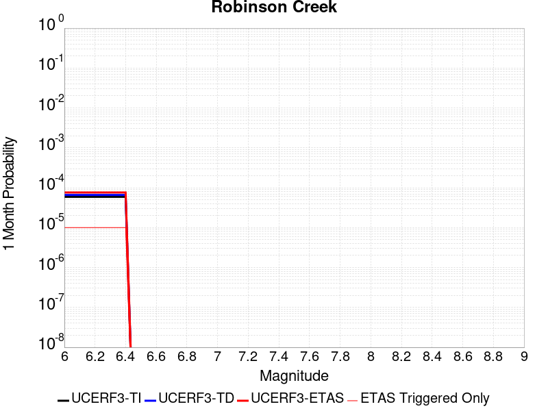 | 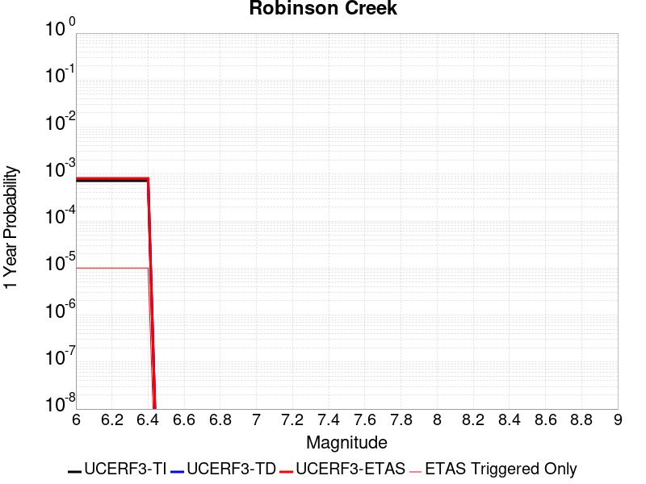 |  |

| Magnitude | 1 wk TI Prob | 1 wk TD Prob | 1 wk ETAS Prob | 1 wk ETAS/TD Gain | 1 wk ETAS Triggered Only | 1 mo TI Prob | 1 mo TD Prob | 1 mo ETAS Prob | 1 mo ETAS/TD Gain | 1 mo ETAS Triggered Only | 1 yr TI Prob | 1 yr TD Prob | 1 yr ETAS Prob | 1 yr ETAS/TD Gain | 1 yr ETAS Triggered Only | 10 yr TI Prob | 10 yr TD Prob | 10 yr ETAS Prob | 10 yr ETAS/TD Gain | 10 yr ETAS Triggered Only |
|-----|-----|-----|-----|-----|-----|-----|-----|-----|-----|-----|-----|-----|-----|-----|-----|-----|-----|-----|-----|-----|
| 6.0 | 1.3777845E-5 | 1.5375268E-5 | 2.5375113E-5 | 1.6503851 | 1.0E-5 | 5.904657E-5 | 6.5894004E-5 | 7.5893346E-5 | 1.1517489 | 1.0E-5 | 7.186549E-4 | 8.022595E-4 | 8.1225147E-4 | 1.0124547 | 1.0E-5 | 0.0071633523 | 0.008022594 | 0.008032515 | 1.0012364 | 1.0E-5 |
| 6.1 | 1.3777845E-5 | 1.5375268E-5 | 2.5375113E-5 | 1.6503851 | 1.0E-5 | 5.904657E-5 | 6.5894004E-5 | 7.5893346E-5 | 1.1517489 | 1.0E-5 | 7.186549E-4 | 8.022595E-4 | 8.1225147E-4 | 1.0124547 | 1.0E-5 | 0.0071633523 | 0.008022594 | 0.008032515 | 1.0012364 | 1.0E-5 |
| 6.2 | 1.3777845E-5 | 1.5375268E-5 | 2.5375113E-5 | 1.6503851 | 1.0E-5 | 5.904657E-5 | 6.5894004E-5 | 7.5893346E-5 | 1.1517489 | 1.0E-5 | 7.186549E-4 | 8.022595E-4 | 8.1225147E-4 | 1.0124547 | 1.0E-5 | 0.0071633523 | 0.008022594 | 0.008032515 | 1.0012364 | 1.0E-5 |
| 6.3 | 1.3777845E-5 | 1.5375268E-5 | 2.5375113E-5 | 1.6503851 | 1.0E-5 | 5.904657E-5 | 6.5894004E-5 | 7.5893346E-5 | 1.1517489 | 1.0E-5 | 7.186549E-4 | 8.022595E-4 | 8.1225147E-4 | 1.0124547 | 1.0E-5 | 0.0071633523 | 0.008022594 | 0.008032515 | 1.0012364 | 1.0E-5 |
| 6.4 | 1.3777845E-5 | 1.5375268E-5 | 2.5375113E-5 | 1.6503851 | 1.0E-5 | 5.904657E-5 | 6.5894004E-5 | 7.5893346E-5 | 1.1517489 | 1.0E-5 | 7.186549E-4 | 8.022595E-4 | 8.1225147E-4 | 1.0124547 | 1.0E-5 | 0.0071633523 | 0.008022594 | 0.008032515 | 1.0012364 | 1.0E-5 |

## Cedar Mtn-Mahogany Mtn
*[(top)](#table-of-contents)*

| 1 Week | 1 Month | 1 Year | 10 Year |
|-----|-----|-----|-----|
|  |  | 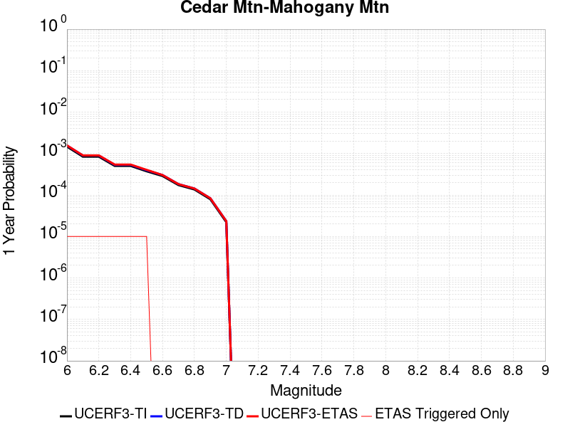 | 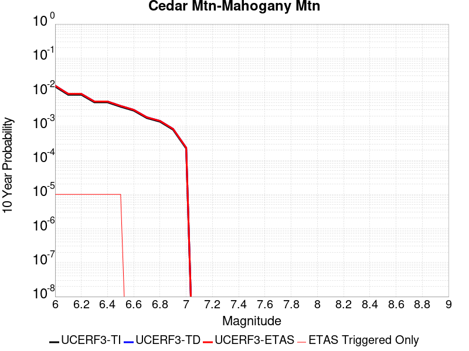 |

| Magnitude | 1 wk TI Prob | 1 wk TD Prob | 1 wk ETAS Prob | 1 wk ETAS/TD Gain | 1 wk ETAS Triggered Only | 1 mo TI Prob | 1 mo TD Prob | 1 mo ETAS Prob | 1 mo ETAS/TD Gain | 1 mo ETAS Triggered Only | 1 yr TI Prob | 1 yr TD Prob | 1 yr ETAS Prob | 1 yr ETAS/TD Gain | 1 yr ETAS Triggered Only | 10 yr TI Prob | 10 yr TD Prob | 10 yr ETAS Prob | 10 yr ETAS/TD Gain | 10 yr ETAS Triggered Only |
|-----|-----|-----|-----|-----|-----|-----|-----|-----|-----|-----|-----|-----|-----|-----|-----|-----|-----|-----|-----|-----|
| 6.0 | 2.8232695E-5 | 3.0069057E-5 | 3.0069057E-5 | 1.0 | 0.0 | 1.2099165E-4 | 1.2886143E-4 | 1.3886014E-4 | 1.0775927 | 1.0E-5 | 0.0014720779 | 0.00156783 | 0.0015778143 | 1.0063683 | 1.0E-5 | 0.014623646 | 0.015575048 | 0.015584892 | 1.000632 | 1.0E-5 |
| 6.1 | 1.6188547E-5 | 1.7162025E-5 | 1.7162025E-5 | 1.0 | 0.0 | 6.9377646E-5 | 7.354956E-5 | 8.3548824E-5 | 1.1359527 | 1.0E-5 | 8.443455E-4 | 8.9511526E-4 | 9.051063E-4 | 1.0111618 | 1.0E-5 | 0.008411446 | 0.008916862 | 0.0089267725 | 1.0011115 | 1.0E-5 |
| 6.2 | 1.6188547E-5 | 1.7162025E-5 | 1.7162025E-5 | 1.0 | 0.0 | 6.9377646E-5 | 7.354956E-5 | 8.3548824E-5 | 1.1359527 | 1.0E-5 | 8.443455E-4 | 8.9511526E-4 | 9.051063E-4 | 1.0111618 | 1.0E-5 | 0.008411446 | 0.008916862 | 0.0089267725 | 1.0011115 | 1.0E-5 |
| 6.3 | 9.6683025E-6 | 1.0218147E-5 | 1.0218147E-5 | 1.0 | 0.0 | 4.1434923E-5 | 4.3791344E-5 | 5.3790907E-5 | 1.2283456 | 1.0E-5 | 5.0435343E-4 | 5.330331E-4 | 5.4302777E-4 | 1.0187505 | 1.0E-5 | 0.0050321026 | 0.005317947 | 0.005327894 | 1.0018704 | 1.0E-5 |
| 6.4 | 9.6683025E-6 | 1.0218147E-5 | 1.0218147E-5 | 1.0 | 0.0 | 4.1434923E-5 | 4.3791344E-5 | 5.3790907E-5 | 1.2283456 | 1.0E-5 | 5.0435343E-4 | 5.330331E-4 | 5.4302777E-4 | 1.0187505 | 1.0E-5 | 0.0050321026 | 0.005317947 | 0.005327894 | 1.0018704 | 1.0E-5 |
| 6.5 | 7.176948E-6 | 7.5746243E-6 | 7.5746243E-6 | 1.0 | 0.0 | 3.0757987E-5 | 3.246228E-5 | 4.2461957E-5 | 1.3080398 | 1.0E-5 | 3.7441414E-4 | 3.9515868E-4 | 4.0515474E-4 | 1.0252963 | 1.0E-5 | 0.0037378394 | 0.00394477 | 0.0039547305 | 1.002525 | 1.0E-5 |
| 6.6 | 5.5167925E-6 | 5.8171713E-6 | 5.8171713E-6 | 1.0 | 0.0 | 2.3643182E-5 | 2.4930503E-5 | 2.4930503E-5 | 1.0 | 0.0 | 2.8781773E-4 | 3.0348785E-4 | 3.0348785E-4 | 1.0 | 0.0 | 0.0028744524 | 0.0030308592 | 0.0030308592 | 1.0 | 0.0 |
| 6.7 | 3.3324732E-6 | 3.5110054E-6 | 3.5110054E-6 | 1.0 | 0.0 | 1.428195E-5 | 1.5047082E-5 | 1.5047082E-5 | 1.0 | 0.0 | 1.7386887E-4 | 1.8318338E-4 | 1.8318338E-4 | 1.0 | 0.0 | 0.001737329 | 0.001830378 | 0.001830378 | 1.0 | 0.0 |
| 6.8 | 2.6108742E-6 | 2.7508909E-6 | 2.7508909E-6 | 1.0 | 0.0 | 1.1189412E-5 | 1.17894815E-5 | 1.17894815E-5 | 1.0 | 0.0 | 1.3622257E-4 | 1.4352788E-4 | 1.4352788E-4 | 1.0 | 0.0 | 0.001361391 | 0.0014343922 | 0.0014343922 | 1.0 | 0.0 |
| 6.9 | 1.5167461E-6 | 1.5990049E-6 | 1.5990049E-6 | 1.0 | 0.0 | 6.500324E-6 | 6.8528616E-6 | 6.8528616E-6 | 1.0 | 0.0 | 7.9138576E-5 | 8.343064E-5 | 8.343064E-5 | 1.0 | 0.0 | 7.911039E-4 | 8.340172E-4 | 8.340172E-4 | 1.0 | 0.0 |
| 7.0 | 4.2509294E-7 | 4.4895333E-7 | 4.4895333E-7 | 1.0 | 0.0 | 1.8218257E-6 | 1.9240847E-6 | 1.9240847E-6 | 1.0 | 0.0 | 2.21805E-5 | 2.3425568E-5 | 2.3425568E-5 | 1.0 | 0.0 | 2.2178287E-4 | 2.342396E-4 | 2.342396E-4 | 1.0 | 0.0 |

## Elsinore (Julian)
*[(top)](#table-of-contents)*

| 1 Week | 1 Month | 1 Year | 10 Year |
|-----|-----|-----|-----|
| 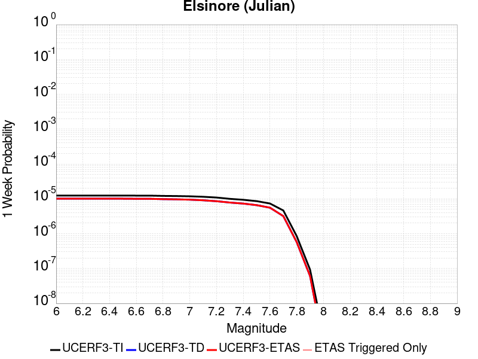 |  |  |  |

| Magnitude | 1 wk TI Prob | 1 wk TD Prob | 1 wk ETAS Prob | 1 wk ETAS/TD Gain | 1 wk ETAS Triggered Only | 1 mo TI Prob | 1 mo TD Prob | 1 mo ETAS Prob | 1 mo ETAS/TD Gain | 1 mo ETAS Triggered Only | 1 yr TI Prob | 1 yr TD Prob | 1 yr ETAS Prob | 1 yr ETAS/TD Gain | 1 yr ETAS Triggered Only | 10 yr TI Prob | 10 yr TD Prob | 10 yr ETAS Prob | 10 yr ETAS/TD Gain | 10 yr ETAS Triggered Only |
|-----|-----|-----|-----|-----|-----|-----|-----|-----|-----|-----|-----|-----|-----|-----|-----|-----|-----|-----|-----|-----|
| 6.0 | 1.2421061E-5 | 1.0100335E-5 | 1.0100335E-5 | 1.0 | 0.0 | 5.323203E-5 | 4.3286444E-5 | 4.3286444E-5 | 1.0 | 0.0 | 6.4790726E-4 | 5.268867E-4 | 5.3688145E-4 | 1.0189694 | 1.0E-5 | 0.0064602145 | 0.0052566216 | 0.005266569 | 1.0018923 | 1.0E-5 |
| 6.1 | 1.2421061E-5 | 1.0100335E-5 | 1.0100335E-5 | 1.0 | 0.0 | 5.323203E-5 | 4.3286444E-5 | 4.3286444E-5 | 1.0 | 0.0 | 6.4790726E-4 | 5.268867E-4 | 5.3688145E-4 | 1.0189694 | 1.0E-5 | 0.0064602145 | 0.0052566216 | 0.005266569 | 1.0018923 | 1.0E-5 |
| 6.2 | 1.2421061E-5 | 1.0100335E-5 | 1.0100335E-5 | 1.0 | 0.0 | 5.323203E-5 | 4.3286444E-5 | 4.3286444E-5 | 1.0 | 0.0 | 6.4790726E-4 | 5.268867E-4 | 5.3688145E-4 | 1.0189694 | 1.0E-5 | 0.0064602145 | 0.0052566216 | 0.005266569 | 1.0018923 | 1.0E-5 |
| 6.3 | 1.2421061E-5 | 1.0100335E-5 | 1.0100335E-5 | 1.0 | 0.0 | 5.323203E-5 | 4.3286444E-5 | 4.3286444E-5 | 1.0 | 0.0 | 6.4790726E-4 | 5.268867E-4 | 5.3688145E-4 | 1.0189694 | 1.0E-5 | 0.0064602145 | 0.0052566216 | 0.005266569 | 1.0018923 | 1.0E-5 |
| 6.4 | 1.2421061E-5 | 1.0100335E-5 | 1.0100335E-5 | 1.0 | 0.0 | 5.323203E-5 | 4.3286444E-5 | 4.3286444E-5 | 1.0 | 0.0 | 6.4790726E-4 | 5.268867E-4 | 5.3688145E-4 | 1.0189694 | 1.0E-5 | 0.0064602145 | 0.0052566216 | 0.005266569 | 1.0018923 | 1.0E-5 |
| 6.5 | 1.2421061E-5 | 1.0100335E-5 | 1.0100335E-5 | 1.0 | 0.0 | 5.323203E-5 | 4.3286444E-5 | 4.3286444E-5 | 1.0 | 0.0 | 6.4790726E-4 | 5.268867E-4 | 5.3688145E-4 | 1.0189694 | 1.0E-5 | 0.0064602145 | 0.0052566216 | 0.005266569 | 1.0018923 | 1.0E-5 |
| 6.6 | 1.2362625E-5 | 1.0032297E-5 | 1.0032297E-5 | 1.0 | 0.0 | 5.2981602E-5 | 4.299486E-5 | 4.299486E-5 | 1.0 | 0.0 | 6.448601E-4 | 5.233384E-4 | 5.3333316E-4 | 1.019098 | 1.0E-5 | 0.00642992 | 0.0052213054 | 0.0052312533 | 1.0019052 | 1.0E-5 |
| 6.7 | 1.2362625E-5 | 1.0032297E-5 | 1.0032297E-5 | 1.0 | 0.0 | 5.2981602E-5 | 4.299486E-5 | 4.299486E-5 | 1.0 | 0.0 | 6.448601E-4 | 5.233384E-4 | 5.3333316E-4 | 1.019098 | 1.0E-5 | 0.00642992 | 0.0052213054 | 0.0052312533 | 1.0019052 | 1.0E-5 |
| 6.8 | 1.214116E-5 | 9.796723E-6 | 9.796723E-6 | 1.0 | 0.0 | 5.203251E-5 | 4.198529E-5 | 4.198529E-5 | 1.0 | 0.0 | 6.3331163E-4 | 5.110527E-4 | 5.210476E-4 | 1.0195575 | 1.0E-5 | 0.006315098 | 0.0050990176 | 0.0051089665 | 1.0019512 | 1.0E-5 |
| 6.9 | 1.2026099E-5 | 9.674488E-6 | 9.674488E-6 | 1.0 | 0.0 | 5.1539406E-5 | 4.146144E-5 | 4.146144E-5 | 1.0 | 0.0 | 6.273116E-4 | 5.046778E-4 | 5.146728E-4 | 1.0198046 | 1.0E-5 | 0.006255437 | 0.0050355587 | 0.0050455085 | 1.0019759 | 1.0E-5 |
| 7.0 | 1.182125E-5 | 9.465195E-6 | 9.465195E-6 | 1.0 | 0.0 | 5.0661518E-5 | 4.05645E-5 | 4.05645E-5 | 1.0 | 0.0 | 6.166294E-4 | 4.9376255E-4 | 5.037576E-4 | 1.0202427 | 1.0E-5 | 0.006149212 | 0.004926895 | 0.0049368455 | 1.0020196 | 1.0E-5 |
| 7.1 | 1.1453453E-5 | 9.098096E-6 | 9.098096E-6 | 1.0 | 0.0 | 4.90853E-5 | 3.8991264E-5 | 3.8991264E-5 | 1.0 | 0.0 | 5.974497E-4 | 4.746169E-4 | 4.8461216E-4 | 1.0210596 | 1.0E-5 | 0.00595846 | 0.004736268 | 0.0047462205 | 1.0021014 | 1.0E-5 |
| 7.2 | 1.0906318E-5 | 8.540391E-6 | 8.540391E-6 | 1.0 | 0.0 | 4.6740526E-5 | 3.660117E-5 | 3.660117E-5 | 1.0 | 0.0 | 5.689173E-4 | 4.4552967E-4 | 4.5552524E-4 | 1.0224352 | 1.0E-5 | 0.00567463 | 0.004446589 | 0.0044565443 | 1.0022389 | 1.0E-5 |
| 7.3 | 9.997834E-6 | 7.829875E-6 | 7.829875E-6 | 1.0 | 0.0 | 4.2847158E-5 | 3.3556185E-5 | 3.3556185E-5 | 1.0 | 0.0 | 5.2153924E-4 | 4.0847127E-4 | 4.1846719E-4 | 1.0244715 | 1.0E-5 | 0.0052031693 | 0.0040773796 | 0.004087339 | 1.0024426 | 1.0E-5 |
| 7.4 | 9.389024E-6 | 7.307703E-6 | 7.307703E-6 | 1.0 | 0.0 | 4.0238054E-5 | 3.131836E-5 | 3.131836E-5 | 1.0 | 0.0 | 4.897882E-4 | 3.812355E-4 | 3.9123168E-4 | 1.0262206 | 1.0E-5 | 0.004887101 | 0.003805939 | 0.0038159012 | 1.0026175 | 1.0E-5 |
| 7.5 | 8.591165E-6 | 6.5943605E-6 | 6.5943605E-6 | 1.0 | 0.0 | 3.6818758E-5 | 2.8261245E-5 | 2.8261245E-5 | 1.0 | 0.0 | 4.4817617E-4 | 3.4402744E-4 | 3.4402744E-4 | 1.0 | 0.0 | 0.004472734 | 0.0034350636 | 0.0034350636 | 1.0 | 0.0 |
| 7.6 | 7.3460574E-6 | 5.570246E-6 | 5.570246E-6 | 1.0 | 0.0 | 3.1482723E-5 | 2.387227E-5 | 2.387227E-5 | 1.0 | 0.0 | 3.8323473E-4 | 2.9060716E-4 | 2.9060716E-4 | 1.0 | 0.0 | 0.003825745 | 0.0029023765 | 0.0029023765 | 1.0 | 0.0 |
| 7.7 | 4.6321566E-6 | 3.1960424E-6 | 3.1960424E-6 | 1.0 | 0.0 | 1.9851948E-5 | 1.3697256E-5 | 1.3697256E-5 | 1.0 | 0.0 | 2.4167067E-4 | 1.6675187E-4 | 1.6675187E-4 | 1.0 | 0.0 | 0.00241408 | 0.001666321 | 0.001666321 | 1.0 | 0.0 |
| 7.8 | 8.552686E-7 | 5.7526773E-7 | 5.7526773E-7 | 1.0 | 0.0 | 3.6654317E-6 | 2.465431E-6 | 2.465431E-6 | 1.0 | 0.0 | 4.4625715E-5 | 3.0016225E-5 | 3.0016225E-5 | 1.0 | 0.0 | 4.4616754E-4 | 3.0012327E-4 | 3.0012327E-4 | 1.0 | 0.0 |
| 7.9 | 9.339275E-8 | 6.106284E-8 | 6.106284E-8 | 1.0 | 0.0 | 4.0025458E-7 | 2.6169786E-7 | 2.6169786E-7 | 1.0 | 0.0 | 4.8730885E-6 | 3.1861669E-6 | 3.1861669E-6 | 1.0 | 0.0 | 4.8729817E-5 | 3.1861222E-5 | 3.1861222E-5 | 1.0 | 0.0 |
| 8.0 | 1.2971227E-9 | 6.43537E-10 | 6.43537E-10 | 1.0 | 0.0 | 5.5590976E-9 | 2.7580156E-9 | 2.7580156E-9 | 1.0 | 0.0 | 6.768201E-8 | 3.357884E-8 | 3.357884E-8 | 1.0 | 0.0 | 6.7681987E-7 | 3.3578837E-7 | 3.3578837E-7 | 1.0 | 0.0 |

## San Andreas (Offshore) 2011 CFM
*[(top)](#table-of-contents)*

| 1 Week | 1 Month | 1 Year | 10 Year |
|-----|-----|-----|-----|
|  |  |  |  |

| Magnitude | 1 wk TI Prob | 1 wk TD Prob | 1 wk ETAS Prob | 1 wk ETAS/TD Gain | 1 wk ETAS Triggered Only | 1 mo TI Prob | 1 mo TD Prob | 1 mo ETAS Prob | 1 mo ETAS/TD Gain | 1 mo ETAS Triggered Only | 1 yr TI Prob | 1 yr TD Prob | 1 yr ETAS Prob | 1 yr ETAS/TD Gain | 1 yr ETAS Triggered Only | 10 yr TI Prob | 10 yr TD Prob | 10 yr ETAS Prob | 10 yr ETAS/TD Gain | 10 yr ETAS Triggered Only |
|-----|-----|-----|-----|-----|-----|-----|-----|-----|-----|-----|-----|-----|-----|-----|-----|-----|-----|-----|-----|-----|
| 6.0 | 1.7634933E-4 | 2.035798E-4 | 2.035798E-4 | 1.0 | 0.0 | 7.555639E-4 | 8.7219564E-4 | 8.7219564E-4 | 1.0 | 0.0 | 0.009160254 | 0.010567839 | 0.010567839 | 1.0 | 0.0 | 0.08791736 | 0.10200028 | 0.10200927 | 1.0000881 | 1.0E-5 |
| 6.1 | 1.7634933E-4 | 2.035798E-4 | 2.035798E-4 | 1.0 | 0.0 | 7.555639E-4 | 8.7219564E-4 | 8.7219564E-4 | 1.0 | 0.0 | 0.009160254 | 0.010567839 | 0.010567839 | 1.0 | 0.0 | 0.08791736 | 0.10200028 | 0.10200927 | 1.0000881 | 1.0E-5 |
| 6.2 | 1.6635166E-4 | 1.9273536E-4 | 1.9273536E-4 | 1.0 | 0.0 | 7.127408E-4 | 8.257497E-4 | 8.257497E-4 | 1.0 | 0.0 | 0.008643145 | 0.010007694 | 0.010007694 | 1.0 | 0.0 | 0.083146095 | 0.09675504 | 0.09676407 | 1.0000933 | 1.0E-5 |
| 6.3 | 1.5276435E-4 | 1.757244E-4 | 1.757244E-4 | 1.0 | 0.0 | 6.5454E-4 | 7.528895E-4 | 7.528895E-4 | 1.0 | 0.0 | 0.007939945 | 0.009128377 | 0.009128377 | 1.0 | 0.0 | 0.07662176 | 0.08858178 | 0.08859089 | 1.0001029 | 1.0E-5 |
| 6.4 | 1.5212713E-4 | 1.7439954E-4 | 1.7439954E-4 | 1.0 | 0.0 | 6.518105E-4 | 7.4721477E-4 | 7.4721477E-4 | 1.0 | 0.0 | 0.007906955 | 0.009059862 | 0.009059862 | 1.0 | 0.0 | 0.07631466 | 0.08798139 | 0.08799051 | 1.0001037 | 1.0E-5 |
| 6.5 | 1.283343E-4 | 1.4270814E-4 | 1.4270814E-4 | 1.0 | 0.0 | 5.498882E-4 | 6.1146443E-4 | 6.1146443E-4 | 1.0 | 0.0 | 0.006674357 | 0.0074194595 | 0.0074194595 | 1.0 | 0.0 | 0.06477422 | 0.07265327 | 0.07266255 | 1.0001277 | 1.0E-5 |
| 6.6 | 1.10814064E-4 | 1.2004772E-4 | 1.2004772E-4 | 1.0 | 0.0 | 4.7483097E-4 | 5.143899E-4 | 5.143899E-4 | 1.0 | 0.0 | 0.005765754 | 0.006244929 | 0.006244929 | 1.0 | 0.0 | 0.056184333 | 0.061496958 | 0.061506342 | 1.0001526 | 1.0E-5 |
| 6.7 | 1.0398807E-4 | 1.1065158E-4 | 1.1065158E-4 | 1.0 | 0.0 | 4.4558704E-4 | 4.7413592E-4 | 4.7413592E-4 | 1.0 | 0.0 | 0.005411536 | 0.0057575265 | 0.0057575265 | 1.0 | 0.0 | 0.052816384 | 0.056876104 | 0.056885533 | 1.0001658 | 1.0E-5 |
| 6.8 | 1.01019774E-4 | 1.0568888E-4 | 1.0568888E-4 | 1.0 | 0.0 | 4.3287003E-4 | 4.5287472E-4 | 4.5287472E-4 | 1.0 | 0.0 | 0.0052574645 | 0.0055000004 | 0.0055000004 | 1.0 | 0.0 | 0.051348083 | 0.054545302 | 0.054554757 | 1.0001733 | 1.0E-5 |
| 6.9 | 9.804386E-5 | 9.98926E-5 | 9.98926E-5 | 1.0 | 0.0 | 4.2012028E-4 | 4.2804188E-4 | 4.2804188E-4 | 1.0 | 0.0 | 0.005102975 | 0.0051991385 | 0.0051991385 | 1.0 | 0.0 | 0.049873736 | 0.051839244 | 0.051848724 | 1.0001829 | 1.0E-5 |
| 7.0 | 9.466066E-5 | 9.392496E-5 | 9.392496E-5 | 1.0 | 0.0 | 4.0562547E-4 | 4.024744E-4 | 4.024744E-4 | 1.0 | 0.0 | 0.0049273125 | 0.0048892912 | 0.0048892912 | 1.0 | 0.0 | 0.04819483 | 0.048983574 | 0.048993085 | 1.0001942 | 1.0E-5 |
| 7.1 | 9.102511E-5 | 8.7346714E-5 | 8.7346714E-5 | 1.0 | 0.0 | 3.9004927E-4 | 3.7429028E-4 | 3.7429028E-4 | 1.0 | 0.0 | 0.004738514 | 0.0045476314 | 0.0045476314 | 1.0 | 0.0 | 0.046387393 | 0.04580176 | 0.0458113 | 1.0002084 | 1.0E-5 |
| 7.2 | 8.843425E-5 | 8.341737E-5 | 8.341737E-5 | 1.0 | 0.0 | 3.7894887E-4 | 3.5745496E-4 | 3.5745496E-4 | 1.0 | 0.0 | 0.004603946 | 0.0043434957 | 0.0043434957 | 1.0 | 0.0 | 0.045097243 | 0.043851886 | 0.04386145 | 1.000218 | 1.0E-5 |
| 7.3 | 7.916848E-5 | 6.3814194E-5 | 6.3814194E-5 | 1.0 | 0.0 | 3.3924935E-4 | 2.7346134E-4 | 2.7346134E-4 | 1.0 | 0.0 | 0.0041225404 | 0.003324418 | 0.003324418 | 1.0 | 0.0 | 0.04046896 | 0.034107998 | 0.034117654 | 1.0002832 | 1.0E-5 |
| 7.4 | 6.4424225E-5 | 3.8930244E-5 | 3.8930244E-5 | 1.0 | 0.0 | 2.760746E-4 | 1.6683356E-4 | 1.6683356E-4 | 1.0 | 0.0 | 0.003356028 | 0.002029365 | 0.002029365 | 1.0 | 0.0 | 0.033057958 | 0.021307766 | 0.021317553 | 1.0004593 | 1.0E-5 |
| 7.5 | 4.9352308E-5 | 1.3058765E-5 | 1.3058765E-5 | 1.0 | 0.0 | 2.1149273E-4 | 5.5964945E-5 | 5.5964945E-5 | 1.0 | 0.0 | 0.0025718834 | 6.811618E-4 | 6.811618E-4 | 1.0 | 0.0 | 0.02542321 | 0.007700874 | 0.007710797 | 1.0012885 | 1.0E-5 |
| 7.6 | 4.6241235E-5 | 1.07341E-5 | 1.07341E-5 | 1.0 | 0.0 | 1.9816167E-4 | 4.6002482E-5 | 4.6002482E-5 | 1.0 | 0.0 | 0.0024099487 | 5.5993773E-4 | 5.5993773E-4 | 1.0 | 0.0 | 0.023839807 | 0.0064081647 | 0.0064181006 | 1.0015506 | 1.0E-5 |
| 7.7 | 3.9411458E-5 | 5.732125E-6 | 5.732125E-6 | 1.0 | 0.0 | 1.688953E-4 | 2.456602E-5 | 2.456602E-5 | 1.0 | 0.0 | 0.002054361 | 2.9905039E-4 | 2.9905039E-4 | 1.0 | 0.0 | 0.020354727 | 0.0036464639 | 0.0036564274 | 1.0027324 | 1.0E-5 |
| 7.8 | 2.7785145E-5 | 3.852562E-6 | 3.852562E-6 | 1.0 | 0.0 | 1.1907375E-4 | 1.6510874E-5 | 1.6510874E-5 | 1.0 | 0.0 | 0.0014487588 | 2.0100138E-4 | 2.0100138E-4 | 1.0 | 0.0 | 0.014393502 | 0.0024501355 | 0.002460111 | 1.0040714 | 1.0E-5 |
| 7.9 | 1.6339493E-5 | 3.1347668E-6 | 3.1347668E-6 | 1.0 | 0.0 | 7.002452E-5 | 1.3434646E-5 | 1.3434646E-5 | 1.0 | 0.0 | 8.5221505E-4 | 1.6355456E-4 | 1.6355456E-4 | 1.0 | 0.0 | 0.008489543 | 0.0019626704 | 0.0019726506 | 1.0050851 | 1.0E-5 |
| 8.0 | 9.703094E-6 | 2.6786074E-6 | 2.6786074E-6 | 1.0 | 0.0 | 4.158403E-5 | 1.1479696E-5 | 1.1479696E-5 | 1.0 | 0.0 | 5.0616794E-4 | 1.3975636E-4 | 1.3975636E-4 | 1.0 | 0.0 | 0.0050501656 | 0.0016612763 | 0.0016712598 | 1.0060095 | 1.0E-5 |
| 8.1 | 5.7546654E-6 | 2.292074E-6 | 2.292074E-6 | 1.0 | 0.0 | 2.4662619E-5 | 9.823138E-6 | 9.823138E-6 | 1.0 | 0.0 | 3.00226E-4 | 1.1959016E-4 | 1.1959016E-4 | 1.0 | 0.0 | 0.0029982072 | 0.0014317674 | 0.001441753 | 1.0069743 | 1.0E-5 |
| 8.2 | 4.3841032E-6 | 1.8784074E-6 | 1.8784074E-6 | 1.0 | 0.0 | 1.8788878E-5 | 8.050292E-6 | 8.050292E-6 | 1.0 | 0.0 | 2.2873058E-4 | 9.800793E-5 | 9.800793E-5 | 1.0 | 0.0 | 0.002284953 | 0.0011647894 | 0.0011747777 | 1.0085752 | 1.0E-5 |
| 8.3 | 2.0399186E-6 | 7.951503E-7 | 7.951503E-7 | 1.0 | 0.0 | 8.742479E-6 | 3.4077825E-6 | 3.4077825E-6 | 1.0 | 0.0 | 1.0643448E-4 | 4.148898E-5 | 4.148898E-5 | 1.0 | 0.0 | 0.0010638352 | 4.8668534E-4 | 4.8668534E-4 | 1.0 | 0.0 |

## Hosgri (Extension)
*[(top)](#table-of-contents)*

| 1 Week | 1 Month | 1 Year | 10 Year |
|-----|-----|-----|-----|
| 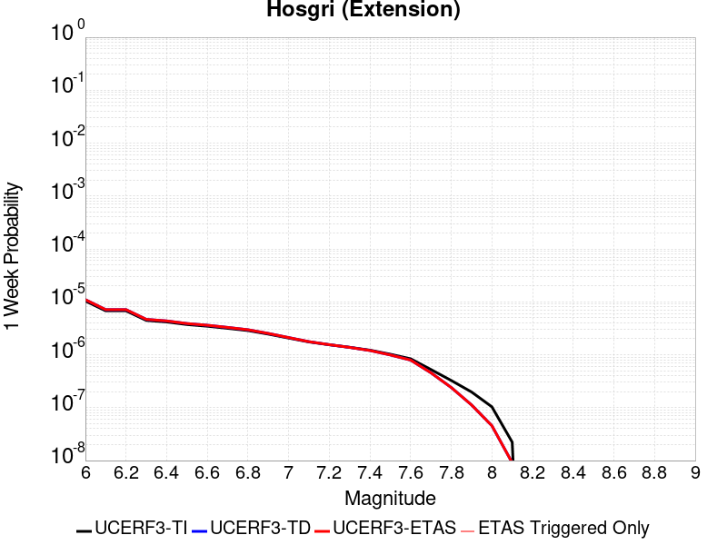 |  |  |  |

| Magnitude | 1 wk TI Prob | 1 wk TD Prob | 1 wk ETAS Prob | 1 wk ETAS/TD Gain | 1 wk ETAS Triggered Only | 1 mo TI Prob | 1 mo TD Prob | 1 mo ETAS Prob | 1 mo ETAS/TD Gain | 1 mo ETAS Triggered Only | 1 yr TI Prob | 1 yr TD Prob | 1 yr ETAS Prob | 1 yr ETAS/TD Gain | 1 yr ETAS Triggered Only | 10 yr TI Prob | 10 yr TD Prob | 10 yr ETAS Prob | 10 yr ETAS/TD Gain | 10 yr ETAS Triggered Only |
|-----|-----|-----|-----|-----|-----|-----|-----|-----|-----|-----|-----|-----|-----|-----|-----|-----|-----|-----|-----|-----|
| 6.0 | 1.0385912E-5 | 1.0997421E-5 | 1.0997421E-5 | 1.0 | 0.0 | 4.4510292E-5 | 4.713105E-5 | 4.713105E-5 | 1.0 | 0.0 | 5.4177805E-4 | 5.736869E-4 | 5.736869E-4 | 1.0 | 0.0 | 0.005404591 | 0.0057237893 | 0.005733732 | 1.0017371 | 1.0E-5 |
| 6.1 | 6.7686115E-6 | 7.132838E-6 | 7.132838E-6 | 1.0 | 0.0 | 2.9008013E-5 | 3.0568972E-5 | 3.0568972E-5 | 1.0 | 0.0 | 3.5311532E-4 | 3.7211773E-4 | 3.7211773E-4 | 1.0 | 0.0 | 0.0035255475 | 0.0037153508 | 0.0037153508 | 1.0 | 0.0 |
| 6.2 | 6.7686115E-6 | 7.132838E-6 | 7.132838E-6 | 1.0 | 0.0 | 2.9008013E-5 | 3.0568972E-5 | 3.0568972E-5 | 1.0 | 0.0 | 3.5311532E-4 | 3.7211773E-4 | 3.7211773E-4 | 1.0 | 0.0 | 0.0035255475 | 0.0037153508 | 0.0037153508 | 1.0 | 0.0 |
| 6.3 | 4.45403E-6 | 4.6669966E-6 | 4.6669966E-6 | 1.0 | 0.0 | 1.908856E-5 | 2.0001264E-5 | 2.0001264E-5 | 1.0 | 0.0 | 2.3237844E-4 | 2.4348858E-4 | 2.4348858E-4 | 1.0 | 0.0 | 0.002321356 | 0.00243226 | 0.00243226 | 1.0 | 0.0 |
| 6.4 | 4.166263E-6 | 4.3615996E-6 | 4.3615996E-6 | 1.0 | 0.0 | 1.7855291E-5 | 1.8692439E-5 | 1.8692439E-5 | 1.0 | 0.0 | 2.1736648E-4 | 2.27557E-4 | 2.27557E-4 | 1.0 | 0.0 | 0.00217154 | 0.0022732734 | 0.0022732734 | 1.0 | 0.0 |
| 6.5 | 3.7242496E-6 | 3.893073E-6 | 3.893073E-6 | 1.0 | 0.0 | 1.5960972E-5 | 1.6684493E-5 | 1.6684493E-5 | 1.0 | 0.0 | 1.943075E-4 | 2.0311496E-4 | 2.0311496E-4 | 1.0 | 0.0 | 0.001941377 | 0.0020293137 | 0.0020293137 | 1.0 | 0.0 |
| 6.6 | 3.4624452E-6 | 3.6124502E-6 | 3.6124502E-6 | 1.0 | 0.0 | 1.4838966E-5 | 1.5481839E-5 | 1.5481839E-5 | 1.0 | 0.0 | 1.8064944E-4 | 1.8847524E-4 | 1.8847524E-4 | 1.0 | 0.0 | 0.0018050265 | 0.00188317 | 0.00188317 | 1.0 | 0.0 |
| 6.7 | 3.1603686E-6 | 3.2883647E-6 | 3.2883647E-6 | 1.0 | 0.0 | 1.3544366E-5 | 1.4092917E-5 | 1.4092917E-5 | 1.0 | 0.0 | 1.6489018E-4 | 1.7156788E-4 | 1.7156788E-4 | 1.0 | 0.0 | 0.0016476789 | 0.0017143672 | 0.0017143672 | 1.0 | 0.0 |
| 6.8 | 2.865841E-6 | 2.9715648E-6 | 2.9715648E-6 | 1.0 | 0.0 | 1.2282118E-5 | 1.2735216E-5 | 1.2735216E-5 | 1.0 | 0.0 | 1.4952452E-4 | 1.5504032E-4 | 1.5504032E-4 | 1.0 | 0.0 | 0.0014942396 | 0.0015493316 | 0.0015493316 | 1.0 | 0.0 |
| 6.9 | 2.4553362E-6 | 2.5296697E-6 | 2.5296697E-6 | 1.0 | 0.0 | 1.0522827E-5 | 1.0841397E-5 | 1.0841397E-5 | 1.0 | 0.0 | 1.2810789E-4 | 1.3198607E-4 | 1.3198607E-4 | 1.0 | 0.0 | 0.0012803406 | 0.0013190836 | 0.0013190836 | 1.0 | 0.0 |
| 7.0 | 2.0678424E-6 | 2.1126177E-6 | 2.1126177E-6 | 1.0 | 0.0 | 8.862151E-6 | 9.054045E-6 | 9.054045E-6 | 1.0 | 0.0 | 1.0789135E-4 | 1.10227455E-4 | 1.10227455E-4 | 1.0 | 0.0 | 0.0010783898 | 0.0011017314 | 0.0011017314 | 1.0 | 0.0 |
| 7.1 | 1.7471134E-6 | 1.7678391E-6 | 1.7678391E-6 | 1.0 | 0.0 | 7.4876075E-6 | 7.576431E-6 | 7.576431E-6 | 1.0 | 0.0 | 9.115781E-5 | 9.223916E-5 | 9.223916E-5 | 1.0 | 0.0 | 9.112042E-4 | 9.2201063E-4 | 9.2201063E-4 | 1.0 | 0.0 |
| 7.2 | 1.5454374E-6 | 1.5512758E-6 | 1.5512758E-6 | 1.0 | 0.0 | 6.623286E-6 | 6.648308E-6 | 6.648308E-6 | 1.0 | 0.0 | 8.0635524E-5 | 8.094015E-5 | 8.094015E-5 | 1.0 | 0.0 | 8.060627E-4 | 8.0910797E-4 | 8.0910797E-4 | 1.0 | 0.0 |
| 7.3 | 1.3842695E-6 | 1.3781757E-6 | 1.3781757E-6 | 1.0 | 0.0 | 5.9325703E-6 | 5.906454E-6 | 5.906454E-6 | 1.0 | 0.0 | 7.222665E-5 | 7.190871E-5 | 7.190871E-5 | 1.0 | 0.0 | 7.2203175E-4 | 7.188555E-4 | 7.188555E-4 | 1.0 | 0.0 |
| 7.4 | 1.221763E-6 | 1.203613E-6 | 1.203613E-6 | 1.0 | 0.0 | 5.2361165E-6 | 5.1583315E-6 | 5.1583315E-6 | 1.0 | 0.0 | 6.374785E-5 | 6.2800886E-5 | 6.2800886E-5 | 1.0 | 0.0 | 6.372957E-4 | 6.2783214E-4 | 6.2783214E-4 | 1.0 | 0.0 |
| 7.5 | 1.0246664E-6 | 9.922377E-7 | 9.922377E-7 | 1.0 | 0.0 | 4.39142E-6 | 4.2524402E-6 | 4.2524402E-6 | 1.0 | 0.0 | 5.3464228E-5 | 5.177224E-5 | 5.177224E-5 | 1.0 | 0.0 | 5.345137E-4 | 5.1760237E-4 | 5.1760237E-4 | 1.0 | 0.0 |
| 7.6 | 8.3969144E-7 | 7.93841E-7 | 7.93841E-7 | 1.0 | 0.0 | 3.5986727E-6 | 3.4021714E-6 | 3.4021714E-6 | 1.0 | 0.0 | 4.3812957E-5 | 4.142065E-5 | 4.142065E-5 | 1.0 | 0.0 | 4.380432E-4 | 4.1412975E-4 | 4.1412975E-4 | 1.0 | 0.0 |
| 7.7 | 5.263654E-7 | 4.5692497E-7 | 4.5692497E-7 | 1.0 | 0.0 | 2.2558497E-6 | 1.9582485E-6 | 1.9582485E-6 | 1.0 | 0.0 | 2.7464623E-5 | 2.3841416E-5 | 2.3841416E-5 | 1.0 | 0.0 | 2.7461228E-4 | 2.383887E-4 | 2.383887E-4 | 1.0 | 0.0 |
| 7.8 | 3.2650576E-7 | 2.405898E-7 | 2.405898E-7 | 1.0 | 0.0 | 1.3993097E-6 | 1.0310987E-6 | 1.0310987E-6 | 1.0 | 0.0 | 1.7036462E-5 | 1.2553554E-5 | 1.2553554E-5 | 1.0 | 0.0 | 1.7035156E-4 | 1.255285E-4 | 1.255285E-4 | 1.0 | 0.0 |
| 7.9 | 1.9787171E-7 | 1.1262413E-7 | 1.1262413E-7 | 1.0 | 0.0 | 8.4802133E-7 | 4.826747E-7 | 4.826747E-7 | 1.0 | 0.0 | 1.0324611E-5 | 5.876549E-6 | 5.876549E-6 | 1.0 | 0.0 | 1.0324131E-4 | 5.8763948E-5 | 5.8763948E-5 | 1.0 | 0.0 |
| 8.0 | 1.0379944E-7 | 4.5642352E-8 | 4.5642352E-8 | 1.0 | 0.0 | 4.4485466E-7 | 1.9561007E-7 | 1.9561007E-7 | 1.0 | 0.0 | 5.416092E-6 | 2.38155E-6 | 2.38155E-6 | 1.0 | 0.0 | 5.41596E-5 | 2.3815248E-5 | 2.3815248E-5 | 1.0 | 0.0 |
| 8.1 | 2.2285107E-8 | 9.100149E-9 | 9.100149E-9 | 1.0 | 0.0 | 9.5507595E-8 | 3.900064E-8 | 3.900064E-8 | 1.0 | 0.0 | 1.1628043E-6 | 4.748327E-7 | 4.748327E-7 | 1.0 | 0.0 | 1.16279825E-5 | 4.7483186E-6 | 4.7483186E-6 | 1.0 | 0.0 |

## Cucamonga
*[(top)](#table-of-contents)*

| 1 Week | 1 Month | 1 Year | 10 Year |
|-----|-----|-----|-----|
|  | 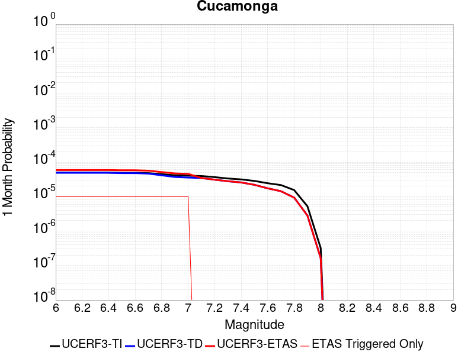 | 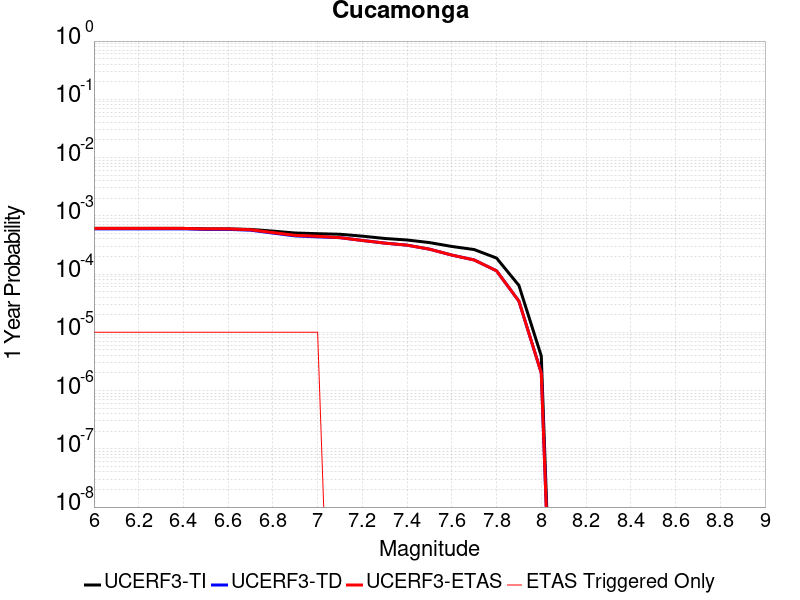 | 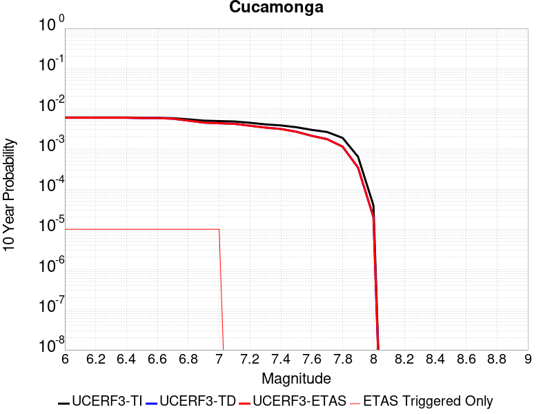 |

| Magnitude | 1 wk TI Prob | 1 wk TD Prob | 1 wk ETAS Prob | 1 wk ETAS/TD Gain | 1 wk ETAS Triggered Only | 1 mo TI Prob | 1 mo TD Prob | 1 mo ETAS Prob | 1 mo ETAS/TD Gain | 1 mo ETAS Triggered Only | 1 yr TI Prob | 1 yr TD Prob | 1 yr ETAS Prob | 1 yr ETAS/TD Gain | 1 yr ETAS Triggered Only | 10 yr TI Prob | 10 yr TD Prob | 10 yr ETAS Prob | 10 yr ETAS/TD Gain | 10 yr ETAS Triggered Only |
|-----|-----|-----|-----|-----|-----|-----|-----|-----|-----|-----|-----|-----|-----|-----|-----|-----|-----|-----|-----|-----|
| 6.0 | 1.1651227E-5 | 1.1456127E-5 | 1.1456127E-5 | 1.0 | 0.0 | 4.9932878E-5 | 4.9096776E-5 | 5.9096285E-5 | 1.2036693 | 1.0E-5 | 6.077632E-4 | 5.975914E-4 | 6.075854E-4 | 1.0167239 | 1.0E-5 | 0.006061037 | 0.005960781 | 0.0059707216 | 1.0016676 | 1.0E-5 |
| 6.1 | 1.1651227E-5 | 1.1456127E-5 | 1.1456127E-5 | 1.0 | 0.0 | 4.9932878E-5 | 4.9096776E-5 | 5.9096285E-5 | 1.2036693 | 1.0E-5 | 6.077632E-4 | 5.975914E-4 | 6.075854E-4 | 1.0167239 | 1.0E-5 | 0.006061037 | 0.005960781 | 0.0059707216 | 1.0016676 | 1.0E-5 |
| 6.2 | 1.1651227E-5 | 1.1456127E-5 | 1.1456127E-5 | 1.0 | 0.0 | 4.9932878E-5 | 4.9096776E-5 | 5.9096285E-5 | 1.2036693 | 1.0E-5 | 6.077632E-4 | 5.975914E-4 | 6.075854E-4 | 1.0167239 | 1.0E-5 | 0.006061037 | 0.005960781 | 0.0059707216 | 1.0016676 | 1.0E-5 |
| 6.3 | 1.1651227E-5 | 1.1456127E-5 | 1.1456127E-5 | 1.0 | 0.0 | 4.9932878E-5 | 4.9096776E-5 | 5.9096285E-5 | 1.2036693 | 1.0E-5 | 6.077632E-4 | 5.975914E-4 | 6.075854E-4 | 1.0167239 | 1.0E-5 | 0.006061037 | 0.005960781 | 0.0059707216 | 1.0016676 | 1.0E-5 |
| 6.4 | 1.1651227E-5 | 1.1456127E-5 | 1.1456127E-5 | 1.0 | 0.0 | 4.9932878E-5 | 4.9096776E-5 | 5.9096285E-5 | 1.2036693 | 1.0E-5 | 6.077632E-4 | 5.975914E-4 | 6.075854E-4 | 1.0167239 | 1.0E-5 | 0.006061037 | 0.005960781 | 0.0059707216 | 1.0016676 | 1.0E-5 |
| 6.5 | 1.1433767E-5 | 1.1222165E-5 | 1.1222165E-5 | 1.0 | 0.0 | 4.9000937E-5 | 4.8094116E-5 | 5.8093636E-5 | 1.2079157 | 1.0E-5 | 5.964231E-4 | 5.853906E-4 | 5.953848E-4 | 1.0170726 | 1.0E-5 | 0.005948249 | 0.0058394163 | 0.0058493577 | 1.0017025 | 1.0E-5 |
| 6.6 | 1.1433767E-5 | 1.1222165E-5 | 1.1222165E-5 | 1.0 | 0.0 | 4.9000937E-5 | 4.8094116E-5 | 5.8093636E-5 | 1.2079157 | 1.0E-5 | 5.964231E-4 | 5.853906E-4 | 5.953848E-4 | 1.0170726 | 1.0E-5 | 0.005948249 | 0.0058394163 | 0.0058493577 | 1.0017025 | 1.0E-5 |
| 6.7 | 1.1194707E-5 | 1.0861022E-5 | 1.0861022E-5 | 1.0 | 0.0 | 4.7976435E-5 | 4.6546415E-5 | 5.6545952E-5 | 1.2148293 | 1.0E-5 | 5.8395654E-4 | 5.665572E-4 | 5.7655154E-4 | 1.0176405 | 1.0E-5 | 0.005824244 | 0.0056520454 | 0.005661989 | 1.0017593 | 1.0E-5 |
| 6.8 | 1.0468107E-5 | 9.6898175E-6 | 9.6898175E-6 | 1.0 | 0.0 | 4.4862543E-5 | 4.152713E-5 | 5.1526717E-5 | 1.2407964 | 1.0E-5 | 5.460646E-4 | 5.054765E-4 | 5.154714E-4 | 1.0197734 | 1.0E-5 | 0.0054472466 | 0.0050440766 | 0.0050540264 | 1.0019726 | 1.0E-5 |
| 6.9 | 9.717558E-6 | 8.664354E-6 | 8.664354E-6 | 1.0 | 0.0 | 4.1646013E-5 | 3.713242E-5 | 4.713205E-5 | 1.2692964 | 1.0E-5 | 5.069222E-4 | 4.5199384E-4 | 4.6198932E-4 | 1.0221142 | 1.0E-5 | 0.0050576744 | 0.0045115 | 0.0045214547 | 1.0022066 | 1.0E-5 |
| 7.0 | 9.455408E-6 | 8.339526E-6 | 8.339526E-6 | 1.0 | 0.0 | 4.0522547E-5 | 3.574034E-5 | 4.573998E-5 | 1.2797859 | 1.0E-5 | 4.932503E-4 | 4.3505212E-4 | 4.4504777E-4 | 1.0229758 | 1.0E-5 | 0.0049215695 | 0.004342757 | 0.0043527135 | 1.0022926 | 1.0E-5 |
| 7.1 | 9.24557E-6 | 8.084593E-6 | 8.084593E-6 | 1.0 | 0.0 | 3.962327E-5 | 3.4647797E-5 | 3.4647797E-5 | 1.0 | 0.0 | 4.8230652E-4 | 4.2175563E-4 | 4.2175563E-4 | 1.0 | 0.0 | 0.004812611 | 0.0042103063 | 0.0042103063 | 1.0 | 0.0 |
| 7.2 | 8.577231E-6 | 7.238151E-6 | 7.238151E-6 | 1.0 | 0.0 | 3.6759044E-5 | 3.1020278E-5 | 3.1020278E-5 | 1.0 | 0.0 | 4.4744942E-4 | 3.776067E-4 | 3.776067E-4 | 1.0 | 0.0 | 0.0044654957 | 0.0037703984 | 0.0037703984 | 1.0 | 0.0 |
| 7.3 | 7.8269E-6 | 6.516128E-6 | 6.516128E-6 | 1.0 | 0.0 | 3.354343E-5 | 2.7925966E-5 | 2.7925966E-5 | 1.0 | 0.0 | 4.0831472E-4 | 3.3994578E-4 | 3.3994578E-4 | 1.0 | 0.0 | 0.004075653 | 0.003395002 | 0.003395002 | 1.0 | 0.0 |
| 7.4 | 7.371207E-6 | 6.007805E-6 | 6.007805E-6 | 1.0 | 0.0 | 3.1590505E-5 | 2.5747484E-5 | 2.5747484E-5 | 1.0 | 0.0 | 3.8454653E-4 | 3.134307E-4 | 3.134307E-4 | 1.0 | 0.0 | 0.0038388176 | 0.0031306287 | 0.0031306287 | 1.0 | 0.0 |
| 7.5 | 6.6530283E-6 | 5.13251E-6 | 5.13251E-6 | 1.0 | 0.0 | 2.8512666E-5 | 2.1996286E-5 | 2.1996286E-5 | 1.0 | 0.0 | 3.470864E-4 | 2.6777197E-4 | 2.6777197E-4 | 1.0 | 0.0 | 0.003465448 | 0.0026752236 | 0.0026752236 | 1.0 | 0.0 |
| 7.6 | 5.7079665E-6 | 4.058702E-6 | 4.058702E-6 | 1.0 | 0.0 | 2.4462484E-5 | 1.739432E-5 | 1.739432E-5 | 1.0 | 0.0 | 2.9779004E-4 | 2.1175532E-4 | 2.1175532E-4 | 1.0 | 0.0 | 0.002973913 | 0.002116267 | 0.002116267 | 1.0 | 0.0 |
| 7.7 | 5.05062E-6 | 3.3479191E-6 | 3.3479191E-6 | 1.0 | 0.0 | 2.1645335E-5 | 1.4348146E-5 | 1.4348146E-5 | 1.0 | 0.0 | 2.635001E-4 | 1.746747E-4 | 1.746747E-4 | 1.0 | 0.0 | 0.0026318787 | 0.0017461512 | 0.0017461512 | 1.0 | 0.0 |
| 7.8 | 3.6072981E-6 | 2.179973E-6 | 2.179973E-6 | 1.0 | 0.0 | 1.5459758E-5 | 9.342709E-6 | 9.342709E-6 | 1.0 | 0.0 | 1.882063E-4 | 1.1374155E-4 | 1.1374155E-4 | 1.0 | 0.0 | 0.0018804697 | 0.0011370686 | 0.0011370686 | 1.0 | 0.0 |
| 7.9 | 1.2231092E-6 | 6.5669286E-7 | 6.5669286E-7 | 1.0 | 0.0 | 5.241886E-6 | 2.814395E-6 | 2.814395E-6 | 1.0 | 0.0 | 6.381809E-5 | 3.4264725E-5 | 3.4264725E-5 | 1.0 | 0.0 | 6.3799764E-4 | 3.4259487E-4 | 3.4259487E-4 | 1.0 | 0.0 |
| 8.0 | 7.513404E-8 | 3.8442494E-8 | 3.8442494E-8 | 1.0 | 0.0 | 3.22003E-7 | 1.6475353E-7 | 1.6475353E-7 | 1.0 | 0.0 | 3.920379E-6 | 2.0058726E-6 | 2.0058726E-6 | 1.0 | 0.0 | 3.92031E-5 | 2.0058551E-5 | 2.0058551E-5 | 1.0 | 0.0 |

## Fontana (Seismicity)
*[(top)](#table-of-contents)*

| 1 Week | 1 Month | 1 Year | 10 Year |
|-----|-----|-----|-----|
|  |  |  | 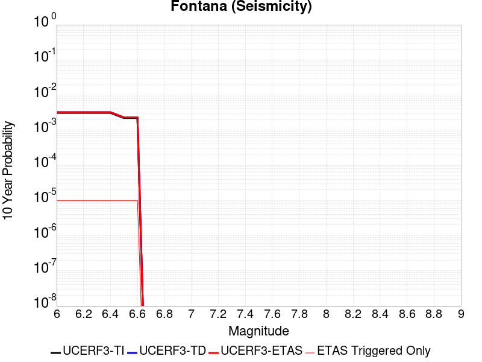 |

| Magnitude | 1 wk TI Prob | 1 wk TD Prob | 1 wk ETAS Prob | 1 wk ETAS/TD Gain | 1 wk ETAS Triggered Only | 1 mo TI Prob | 1 mo TD Prob | 1 mo ETAS Prob | 1 mo ETAS/TD Gain | 1 mo ETAS Triggered Only | 1 yr TI Prob | 1 yr TD Prob | 1 yr ETAS Prob | 1 yr ETAS/TD Gain | 1 yr ETAS Triggered Only | 10 yr TI Prob | 10 yr TD Prob | 10 yr ETAS Prob | 10 yr ETAS/TD Gain | 10 yr ETAS Triggered Only |
|-----|-----|-----|-----|-----|-----|-----|-----|-----|-----|-----|-----|-----|-----|-----|-----|-----|-----|-----|-----|-----|
| 6.0 | 5.955091E-6 | 6.2077897E-6 | 6.2077897E-6 | 1.0 | 0.0 | 2.5521571E-5 | 2.660469E-5 | 2.660469E-5 | 1.0 | 0.0 | 3.106808E-4 | 3.2389045E-4 | 3.3388723E-4 | 1.0308646 | 1.0E-5 | 0.003102468 | 0.0032367825 | 0.0032467502 | 1.0030795 | 1.0E-5 |
| 6.1 | 5.955091E-6 | 6.2077897E-6 | 6.2077897E-6 | 1.0 | 0.0 | 2.5521571E-5 | 2.660469E-5 | 2.660469E-5 | 1.0 | 0.0 | 3.106808E-4 | 3.2389045E-4 | 3.3388723E-4 | 1.0308646 | 1.0E-5 | 0.003102468 | 0.0032367825 | 0.0032467502 | 1.0030795 | 1.0E-5 |
| 6.2 | 5.955091E-6 | 6.2077897E-6 | 6.2077897E-6 | 1.0 | 0.0 | 2.5521571E-5 | 2.660469E-5 | 2.660469E-5 | 1.0 | 0.0 | 3.106808E-4 | 3.2389045E-4 | 3.3388723E-4 | 1.0308646 | 1.0E-5 | 0.003102468 | 0.0032367825 | 0.0032467502 | 1.0030795 | 1.0E-5 |
| 6.3 | 5.955091E-6 | 6.2077897E-6 | 6.2077897E-6 | 1.0 | 0.0 | 2.5521571E-5 | 2.660469E-5 | 2.660469E-5 | 1.0 | 0.0 | 3.106808E-4 | 3.2389045E-4 | 3.3388723E-4 | 1.0308646 | 1.0E-5 | 0.003102468 | 0.0032367825 | 0.0032467502 | 1.0030795 | 1.0E-5 |
| 6.4 | 5.955091E-6 | 6.2077897E-6 | 6.2077897E-6 | 1.0 | 0.0 | 2.5521571E-5 | 2.660469E-5 | 2.660469E-5 | 1.0 | 0.0 | 3.106808E-4 | 3.2389045E-4 | 3.3388723E-4 | 1.0308646 | 1.0E-5 | 0.003102468 | 0.0032367825 | 0.0032467502 | 1.0030795 | 1.0E-5 |
| 6.5 | 4.2519378E-6 | 4.4309936E-6 | 4.4309936E-6 | 1.0 | 0.0 | 1.8222463E-5 | 1.8989973E-5 | 1.8989973E-5 | 1.0 | 0.0 | 2.218359E-4 | 2.3120292E-4 | 2.4120061E-4 | 1.0432421 | 1.0E-5 | 0.0022161459 | 0.0023120292 | 0.002322006 | 1.0043153 | 1.0E-5 |
| 6.6 | 4.2519378E-6 | 4.4309936E-6 | 4.4309936E-6 | 1.0 | 0.0 | 1.8222463E-5 | 1.8989973E-5 | 1.8989973E-5 | 1.0 | 0.0 | 2.218359E-4 | 2.3120292E-4 | 2.4120061E-4 | 1.0432421 | 1.0E-5 | 0.0022161459 | 0.0023120292 | 0.002322006 | 1.0043153 | 1.0E-5 |

## North Frontal  (East)
*[(top)](#table-of-contents)*

| 1 Week | 1 Month | 1 Year | 10 Year |
|-----|-----|-----|-----|
| 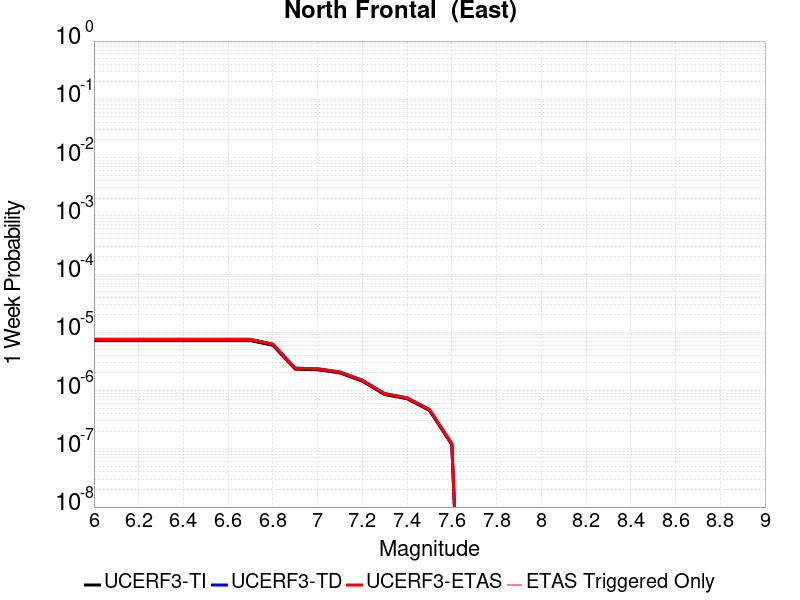 |  | 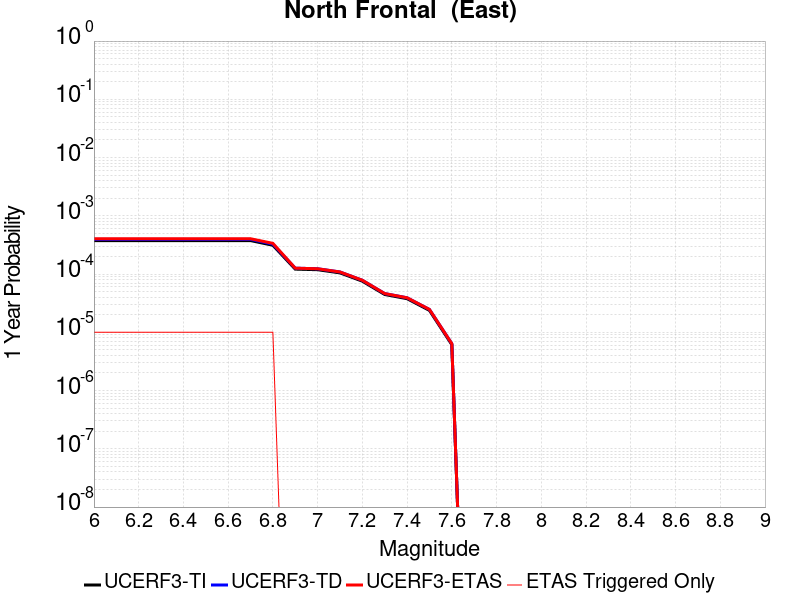 |  |

| Magnitude | 1 wk TI Prob | 1 wk TD Prob | 1 wk ETAS Prob | 1 wk ETAS/TD Gain | 1 wk ETAS Triggered Only | 1 mo TI Prob | 1 mo TD Prob | 1 mo ETAS Prob | 1 mo ETAS/TD Gain | 1 mo ETAS Triggered Only | 1 yr TI Prob | 1 yr TD Prob | 1 yr ETAS Prob | 1 yr ETAS/TD Gain | 1 yr ETAS Triggered Only | 10 yr TI Prob | 10 yr TD Prob | 10 yr ETAS Prob | 10 yr ETAS/TD Gain | 10 yr ETAS Triggered Only |
|-----|-----|-----|-----|-----|-----|-----|-----|-----|-----|-----|-----|-----|-----|-----|-----|-----|-----|-----|-----|-----|
| 6.0 | 7.204285E-6 | 7.5519106E-6 | 7.5519106E-6 | 1.0 | 0.0 | 3.087514E-5 | 3.2365042E-5 | 4.2364718E-5 | 1.3089653 | 1.0E-5 | 3.7584E-4 | 3.939931E-4 | 4.0398916E-4 | 1.0253712 | 1.0E-5 | 0.00375205 | 0.0039349077 | 0.003944868 | 1.0025314 | 1.0E-5 |
| 6.1 | 7.204285E-6 | 7.5519106E-6 | 7.5519106E-6 | 1.0 | 0.0 | 3.087514E-5 | 3.2365042E-5 | 4.2364718E-5 | 1.3089653 | 1.0E-5 | 3.7584E-4 | 3.939931E-4 | 4.0398916E-4 | 1.0253712 | 1.0E-5 | 0.00375205 | 0.0039349077 | 0.003944868 | 1.0025314 | 1.0E-5 |
| 6.2 | 7.204285E-6 | 7.5519106E-6 | 7.5519106E-6 | 1.0 | 0.0 | 3.087514E-5 | 3.2365042E-5 | 4.2364718E-5 | 1.3089653 | 1.0E-5 | 3.7584E-4 | 3.939931E-4 | 4.0398916E-4 | 1.0253712 | 1.0E-5 | 0.00375205 | 0.0039349077 | 0.003944868 | 1.0025314 | 1.0E-5 |
| 6.3 | 7.204285E-6 | 7.5519106E-6 | 7.5519106E-6 | 1.0 | 0.0 | 3.087514E-5 | 3.2365042E-5 | 4.2364718E-5 | 1.3089653 | 1.0E-5 | 3.7584E-4 | 3.939931E-4 | 4.0398916E-4 | 1.0253712 | 1.0E-5 | 0.00375205 | 0.0039349077 | 0.003944868 | 1.0025314 | 1.0E-5 |
| 6.4 | 7.204285E-6 | 7.5519106E-6 | 7.5519106E-6 | 1.0 | 0.0 | 3.087514E-5 | 3.2365042E-5 | 4.2364718E-5 | 1.3089653 | 1.0E-5 | 3.7584E-4 | 3.939931E-4 | 4.0398916E-4 | 1.0253712 | 1.0E-5 | 0.00375205 | 0.0039349077 | 0.003944868 | 1.0025314 | 1.0E-5 |
| 6.5 | 7.204285E-6 | 7.5519106E-6 | 7.5519106E-6 | 1.0 | 0.0 | 3.087514E-5 | 3.2365042E-5 | 4.2364718E-5 | 1.3089653 | 1.0E-5 | 3.7584E-4 | 3.939931E-4 | 4.0398916E-4 | 1.0253712 | 1.0E-5 | 0.00375205 | 0.0039349077 | 0.003944868 | 1.0025314 | 1.0E-5 |
| 6.6 | 7.204285E-6 | 7.5519106E-6 | 7.5519106E-6 | 1.0 | 0.0 | 3.087514E-5 | 3.2365042E-5 | 4.2364718E-5 | 1.3089653 | 1.0E-5 | 3.7584E-4 | 3.939931E-4 | 4.0398916E-4 | 1.0253712 | 1.0E-5 | 0.00375205 | 0.0039349077 | 0.003944868 | 1.0025314 | 1.0E-5 |
| 6.7 | 7.204285E-6 | 7.5519106E-6 | 7.5519106E-6 | 1.0 | 0.0 | 3.087514E-5 | 3.2365042E-5 | 4.2364718E-5 | 1.3089653 | 1.0E-5 | 3.7584E-4 | 3.939931E-4 | 4.0398916E-4 | 1.0253712 | 1.0E-5 | 0.00375205 | 0.0039349077 | 0.003944868 | 1.0025314 | 1.0E-5 |
| 6.8 | 5.9808913E-6 | 6.2616423E-6 | 6.2616423E-6 | 1.0 | 0.0 | 2.563214E-5 | 2.6835436E-5 | 3.683517E-5 | 1.3726317 | 1.0E-5 | 3.1202662E-4 | 3.2669047E-4 | 3.366872E-4 | 1.0306001 | 1.0E-5 | 0.0031158885 | 0.0032638696 | 0.003273837 | 1.0030539 | 1.0E-5 |
| 6.9 | 2.3285065E-6 | 2.4188043E-6 | 2.4188043E-6 | 1.0 | 0.0 | 9.979276E-6 | 1.0366266E-5 | 1.0366266E-5 | 1.0 | 0.0 | 1.21490906E-4 | 1.2620247E-4 | 1.2620247E-4 | 1.0 | 0.0 | 0.0012142451 | 0.001261357 | 0.001261357 | 1.0 | 0.0 |
| 7.0 | 2.2768677E-6 | 2.3644955E-6 | 2.3644955E-6 | 1.0 | 0.0 | 9.757968E-6 | 1.0133515E-5 | 1.0133515E-5 | 1.0 | 0.0 | 1.1879678E-4 | 1.2336906E-4 | 1.2336906E-4 | 1.0 | 0.0 | 0.0011873329 | 0.0012330544 | 0.0012330544 | 1.0 | 0.0 |
| 7.1 | 2.0070381E-6 | 2.081455E-6 | 2.081455E-6 | 1.0 | 0.0 | 8.601563E-6 | 8.920494E-6 | 8.920494E-6 | 1.0 | 0.0 | 1.04719E-4 | 1.08602064E-4 | 1.08602064E-4 | 1.0 | 0.0 | 0.0010466967 | 0.001085535 | 0.001085535 | 1.0 | 0.0 |
| 7.2 | 1.4473137E-6 | 1.4998911E-6 | 1.4998911E-6 | 1.0 | 0.0 | 6.2027584E-6 | 6.4280907E-6 | 6.4280907E-6 | 1.0 | 0.0 | 7.551596E-5 | 7.825946E-5 | 7.825946E-5 | 1.0 | 0.0 | 7.5490307E-4 | 7.823448E-4 | 7.823448E-4 | 1.0 | 0.0 |
| 7.3 | 8.5464575E-7 | 8.862548E-7 | 8.862548E-7 | 1.0 | 0.0 | 3.6627623E-6 | 3.79823E-6 | 3.79823E-6 | 1.0 | 0.0 | 4.4593216E-5 | 4.6242574E-5 | 4.6242574E-5 | 1.0 | 0.0 | 4.458427E-4 | 4.6234E-4 | 4.6234E-4 | 1.0 | 0.0 |
| 7.4 | 7.238715E-7 | 7.506215E-7 | 7.506215E-7 | 1.0 | 0.0 | 3.1023026E-6 | 3.216946E-6 | 3.216946E-6 | 1.0 | 0.0 | 3.776988E-5 | 3.9165712E-5 | 3.9165712E-5 | 1.0 | 0.0 | 3.776346E-4 | 3.9159795E-4 | 3.9159795E-4 | 1.0 | 0.0 |
| 7.5 | 4.55851E-7 | 4.7324573E-7 | 4.7324573E-7 | 1.0 | 0.0 | 1.9536458E-6 | 2.0281948E-6 | 2.0281948E-6 | 1.0 | 0.0 | 2.3785376E-5 | 2.469304E-5 | 2.469304E-5 | 1.0 | 0.0 | 2.3782831E-4 | 2.469078E-4 | 2.469078E-4 | 1.0 | 0.0 |
| 7.6 | 1.1781388E-7 | 1.2246528E-7 | 1.2246528E-7 | 1.0 | 0.0 | 5.0491656E-7 | 5.248512E-7 | 5.248512E-7 | 1.0 | 0.0 | 6.1473415E-6 | 6.390056E-6 | 6.390056E-6 | 1.0 | 0.0 | 6.1471714E-5 | 6.389986E-5 | 6.389986E-5 | 1.0 | 0.0 |

## Clamshell-Sawpit
*[(top)](#table-of-contents)*

| 1 Week | 1 Month | 1 Year | 10 Year |
|-----|-----|-----|-----|
|  |  |  |  |

| Magnitude | 1 wk TI Prob | 1 wk TD Prob | 1 wk ETAS Prob | 1 wk ETAS/TD Gain | 1 wk ETAS Triggered Only | 1 mo TI Prob | 1 mo TD Prob | 1 mo ETAS Prob | 1 mo ETAS/TD Gain | 1 mo ETAS Triggered Only | 1 yr TI Prob | 1 yr TD Prob | 1 yr ETAS Prob | 1 yr ETAS/TD Gain | 1 yr ETAS Triggered Only | 10 yr TI Prob | 10 yr TD Prob | 10 yr ETAS Prob | 10 yr ETAS/TD Gain | 10 yr ETAS Triggered Only |
|-----|-----|-----|-----|-----|-----|-----|-----|-----|-----|-----|-----|-----|-----|-----|-----|-----|-----|-----|-----|-----|
| 6.0 | 2.837564E-6 | 2.6505734E-6 | 1.26505465E-5 | 4.7727585 | 1.0E-5 | 1.2160931E-5 | 1.1359552E-5 | 2.135944E-5 | 1.8803064 | 1.0E-5 | 1.4804928E-4 | 1.3829423E-4 | 1.4829285E-4 | 1.0722996 | 1.0E-5 | 0.0014795068 | 0.0013821261 | 0.0013921123 | 1.0072253 | 1.0E-5 |
| 6.1 | 2.837564E-6 | 2.6505734E-6 | 1.26505465E-5 | 4.7727585 | 1.0E-5 | 1.2160931E-5 | 1.1359552E-5 | 2.135944E-5 | 1.8803064 | 1.0E-5 | 1.4804928E-4 | 1.3829423E-4 | 1.4829285E-4 | 1.0722996 | 1.0E-5 | 0.0014795068 | 0.0013821261 | 0.0013921123 | 1.0072253 | 1.0E-5 |
| 6.2 | 2.837564E-6 | 2.6505734E-6 | 1.26505465E-5 | 4.7727585 | 1.0E-5 | 1.2160931E-5 | 1.1359552E-5 | 2.135944E-5 | 1.8803064 | 1.0E-5 | 1.4804928E-4 | 1.3829423E-4 | 1.4829285E-4 | 1.0722996 | 1.0E-5 | 0.0014795068 | 0.0013821261 | 0.0013921123 | 1.0072253 | 1.0E-5 |
| 6.3 | 2.837564E-6 | 2.6505734E-6 | 1.26505465E-5 | 4.7727585 | 1.0E-5 | 1.2160931E-5 | 1.1359552E-5 | 2.135944E-5 | 1.8803064 | 1.0E-5 | 1.4804928E-4 | 1.3829423E-4 | 1.4829285E-4 | 1.0722996 | 1.0E-5 | 0.0014795068 | 0.0013821261 | 0.0013921123 | 1.0072253 | 1.0E-5 |
| 6.4 | 2.837564E-6 | 2.6505734E-6 | 1.26505465E-5 | 4.7727585 | 1.0E-5 | 1.2160931E-5 | 1.1359552E-5 | 2.135944E-5 | 1.8803064 | 1.0E-5 | 1.4804928E-4 | 1.3829423E-4 | 1.4829285E-4 | 1.0722996 | 1.0E-5 | 0.0014795068 | 0.0013821261 | 0.0013921123 | 1.0072253 | 1.0E-5 |
| 6.5 | 2.385734E-6 | 2.1888645E-6 | 2.1888645E-6 | 1.0 | 0.0 | 1.0224534E-5 | 9.380815E-6 | 9.380815E-6 | 1.0 | 0.0 | 1.2447659E-4 | 1.1420562E-4 | 1.1420562E-4 | 1.0 | 0.0 | 0.0012440688 | 0.0011414875 | 0.0011414875 | 1.0 | 0.0 |
| 6.6 | 2.385734E-6 | 2.1888645E-6 | 2.1888645E-6 | 1.0 | 0.0 | 1.0224534E-5 | 9.380815E-6 | 9.380815E-6 | 1.0 | 0.0 | 1.2447659E-4 | 1.1420562E-4 | 1.1420562E-4 | 1.0 | 0.0 | 0.0012440688 | 0.0011414875 | 0.0011414875 | 1.0 | 0.0 |
| 6.7 | 2.385734E-6 | 2.1888645E-6 | 2.1888645E-6 | 1.0 | 0.0 | 1.0224534E-5 | 9.380815E-6 | 9.380815E-6 | 1.0 | 0.0 | 1.2447659E-4 | 1.1420562E-4 | 1.1420562E-4 | 1.0 | 0.0 | 0.0012440688 | 0.0011414875 | 0.0011414875 | 1.0 | 0.0 |
| 6.8 | 2.2385325E-6 | 2.036668E-6 | 2.036668E-6 | 1.0 | 0.0 | 9.593675E-6 | 8.72855E-6 | 8.72855E-6 | 1.0 | 0.0 | 1.16796735E-4 | 1.0626507E-4 | 1.0626507E-4 | 1.0 | 0.0 | 0.0011673536 | 0.0010621583 | 0.0010621583 | 1.0 | 0.0 |
| 6.9 | 1.983191E-6 | 1.7716887E-6 | 1.7716887E-6 | 1.0 | 0.0 | 8.499362E-6 | 7.5929306E-6 | 7.5929306E-6 | 1.0 | 0.0 | 1.0347482E-4 | 9.244011E-5 | 9.244011E-5 | 1.0 | 0.0 | 0.0010342665 | 9.240267E-4 | 9.240267E-4 | 1.0 | 0.0 |
| 7.0 | 1.8392413E-6 | 1.6229386E-6 | 1.6229386E-6 | 1.0 | 0.0 | 7.88244E-6 | 6.955433E-6 | 6.955433E-6 | 1.0 | 0.0 | 9.5964475E-5 | 8.4679195E-5 | 8.4679195E-5 | 1.0 | 0.0 | 9.592304E-4 | 8.464785E-4 | 8.464785E-4 | 1.0 | 0.0 |
| 7.1 | 1.6643911E-6 | 1.441883E-6 | 1.441883E-6 | 1.0 | 0.0 | 7.1330855E-6 | 6.1794844E-6 | 6.1794844E-6 | 1.0 | 0.0 | 8.684186E-5 | 7.5232696E-5 | 7.5232696E-5 | 1.0 | 0.0 | 8.6807925E-4 | 7.520793E-4 | 7.520793E-4 | 1.0 | 0.0 |
| 7.2 | 1.3463795E-6 | 1.1110099E-6 | 1.1110099E-6 | 1.0 | 0.0 | 5.770185E-6 | 4.761462E-6 | 4.761462E-6 | 1.0 | 0.0 | 7.0249735E-5 | 5.7969308E-5 | 5.7969308E-5 | 1.0 | 0.0 | 7.022753E-4 | 5.795464E-4 | 5.795464E-4 | 1.0 | 0.0 |
| 7.3 | 1.0127611E-6 | 7.883944E-7 | 7.883944E-7 | 1.0 | 0.0 | 4.340398E-6 | 3.3788288E-6 | 3.3788288E-6 | 1.0 | 0.0 | 5.284306E-5 | 4.1136474E-5 | 4.1136474E-5 | 1.0 | 0.0 | 5.2830495E-4 | 4.112896E-4 | 4.112896E-4 | 1.0 | 0.0 |
| 7.4 | 7.880444E-7 | 6.0300937E-7 | 6.0300937E-7 | 1.0 | 0.0 | 3.3773288E-6 | 2.5843235E-6 | 2.5843235E-6 | 1.0 | 0.0 | 4.11182E-5 | 3.1463693E-5 | 3.1463693E-5 | 1.0 | 0.0 | 4.1110595E-4 | 3.1459308E-4 | 3.1459308E-4 | 1.0 | 0.0 |
| 7.5 | 6.425736E-7 | 4.923205E-7 | 4.923205E-7 | 1.0 | 0.0 | 2.753884E-6 | 2.1099434E-6 | 2.1099434E-6 | 1.0 | 0.0 | 3.352802E-5 | 2.5688265E-5 | 2.5688265E-5 | 1.0 | 0.0 | 3.3522962E-4 | 2.5685364E-4 | 2.5685364E-4 | 1.0 | 0.0 |
| 7.6 | 4.888131E-7 | 3.6947728E-7 | 3.6947728E-7 | 1.0 | 0.0 | 2.0949117E-6 | 1.5834731E-6 | 1.5834731E-6 | 1.0 | 0.0 | 2.5505251E-5 | 1.9278621E-5 | 1.9278621E-5 | 1.0 | 0.0 | 2.5502322E-4 | 1.9277015E-4 | 1.9277015E-4 | 1.0 | 0.0 |
| 7.7 | 2.6197634E-7 | 1.8446764E-7 | 1.8446764E-7 | 1.0 | 0.0 | 1.1227553E-6 | 7.9057537E-7 | 7.9057537E-7 | 1.0 | 0.0 | 1.366946E-5 | 9.625216E-6 | 9.625216E-6 | 1.0 | 0.0 | 1.3668618E-4 | 9.6248354E-5 | 9.6248354E-5 | 1.0 | 0.0 |
| 7.8 | 3.3287783E-8 | 1.9646775E-8 | 1.9646775E-8 | 1.0 | 0.0 | 1.4266192E-7 | 8.4200465E-8 | 8.4200465E-8 | 1.0 | 0.0 | 1.7369075E-6 | 1.0251401E-6 | 1.0251401E-6 | 1.0 | 0.0 | 1.736894E-5 | 1.0251357E-5 | 1.0251357E-5 | 1.0 | 0.0 |

## Rodgers Creek - Healdsburg 2011 CFM
*[(top)](#table-of-contents)*

| 1 Week | 1 Month | 1 Year | 10 Year |
|-----|-----|-----|-----|
|  | 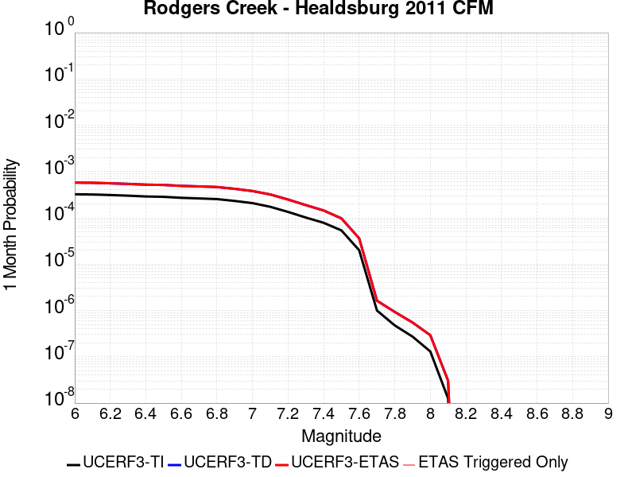 |  |  |

| Magnitude | 1 wk TI Prob | 1 wk TD Prob | 1 wk ETAS Prob | 1 wk ETAS/TD Gain | 1 wk ETAS Triggered Only | 1 mo TI Prob | 1 mo TD Prob | 1 mo ETAS Prob | 1 mo ETAS/TD Gain | 1 mo ETAS Triggered Only | 1 yr TI Prob | 1 yr TD Prob | 1 yr ETAS Prob | 1 yr ETAS/TD Gain | 1 yr ETAS Triggered Only | 10 yr TI Prob | 10 yr TD Prob | 10 yr ETAS Prob | 10 yr ETAS/TD Gain | 10 yr ETAS Triggered Only |
|-----|-----|-----|-----|-----|-----|-----|-----|-----|-----|-----|-----|-----|-----|-----|-----|-----|-----|-----|-----|-----|
| 6.0 | 7.553832E-5 | 1.3465082E-4 | 1.3465082E-4 | 1.0 | 0.0 | 3.2369548E-4 | 5.769478E-4 | 5.769478E-4 | 1.0 | 0.0 | 0.0039338726 | 0.007001567 | 0.007001567 | 1.0 | 0.0 | 0.03864959 | 0.06777217 | 0.0677815 | 1.0001376 | 1.0E-5 |
| 6.1 | 7.470704E-5 | 1.3346171E-4 | 1.3346171E-4 | 1.0 | 0.0 | 3.2013372E-4 | 5.7185383E-4 | 5.7185383E-4 | 1.0 | 0.0 | 0.0038906639 | 0.00693996 | 0.00693996 | 1.0 | 0.0 | 0.03823248 | 0.06719556 | 0.067204885 | 1.0001389 | 1.0E-5 |
| 6.2 | 7.271243E-5 | 1.301002E-4 | 1.301002E-4 | 1.0 | 0.0 | 3.1158747E-4 | 5.574536E-4 | 5.574536E-4 | 1.0 | 0.0 | 0.00378698 | 0.0067657367 | 0.0067657367 | 1.0 | 0.0 | 0.03723092 | 0.06557616 | 0.0655855 | 1.0001425 | 1.0E-5 |
| 6.3 | 7.039957E-5 | 1.2634427E-4 | 1.2634427E-4 | 1.0 | 0.0 | 3.0167753E-4 | 5.413635E-4 | 5.413635E-4 | 1.0 | 0.0 | 0.0036667392 | 0.006571229 | 0.006571229 | 1.0 | 0.0 | 0.036068246 | 0.06376087 | 0.06377023 | 1.0001469 | 1.0E-5 |
| 6.4 | 6.766499E-5 | 1.2171975E-4 | 1.2171975E-4 | 1.0 | 0.0 | 2.8996056E-4 | 5.2155217E-4 | 5.2155217E-4 | 1.0 | 0.0 | 0.0035245558 | 0.0063314703 | 0.0063314703 | 1.0 | 0.0 | 0.03469177 | 0.061523315 | 0.0615327 | 1.0001526 | 1.0E-5 |
| 6.5 | 6.646417E-5 | 1.19933895E-4 | 1.19933895E-4 | 1.0 | 0.0 | 2.8481535E-4 | 5.139016E-4 | 5.139016E-4 | 1.0 | 0.0 | 0.0034621137 | 0.0062388834 | 0.0062388834 | 1.0 | 0.0 | 0.034086708 | 0.060653456 | 0.060662847 | 1.0001549 | 1.0E-5 |
| 6.6 | 6.3206986E-5 | 1.1456691E-4 | 1.1456691E-4 | 1.0 | 0.0 | 2.7085896E-4 | 4.9090903E-4 | 4.9090903E-4 | 1.0 | 0.0 | 0.0032927217 | 0.005960518 | 0.005960518 | 1.0 | 0.0 | 0.032443583 | 0.058042593 | 0.058052015 | 1.0001622 | 1.0E-5 |
| 6.7 | 6.139358E-5 | 1.11602625E-4 | 1.11602625E-4 | 1.0 | 0.0 | 2.630888E-4 | 4.7820967E-4 | 4.7820967E-4 | 1.0 | 0.0 | 0.0031984015 | 0.0058067385 | 0.0058067385 | 1.0 | 0.0 | 0.03152758 | 0.056596193 | 0.05660563 | 1.0001667 | 1.0E-5 |
| 6.8 | 5.9402242E-5 | 1.0817097E-4 | 1.0817097E-4 | 1.0 | 0.0 | 2.545562E-4 | 4.6350787E-4 | 4.6350787E-4 | 1.0 | 0.0 | 0.0030948175 | 0.005628682 | 0.005628682 | 1.0 | 0.0 | 0.030520707 | 0.054912224 | 0.054921675 | 1.0001721 | 1.0E-5 |
| 6.9 | 5.411454E-5 | 9.896395E-5 | 9.896395E-5 | 1.0 | 0.0 | 2.3189884E-4 | 4.240626E-4 | 4.240626E-4 | 1.0 | 0.0 | 0.002819713 | 0.0051508043 | 0.0051508043 | 1.0 | 0.0 | 0.02784202 | 0.05037636 | 0.050385855 | 1.0001885 | 1.0E-5 |
| 7.0 | 4.8591977E-5 | 8.857083E-5 | 8.857083E-5 | 1.0 | 0.0 | 2.082347E-4 | 3.7953432E-4 | 3.7953432E-4 | 1.0 | 0.0 | 0.0025323099 | 0.004611093 | 0.004611093 | 1.0 | 0.0 | 0.025036471 | 0.045243144 | 0.045252692 | 1.000211 | 1.0E-5 |
| 7.1 | 4.0489565E-5 | 7.4771604E-5 | 7.4771604E-5 | 1.0 | 0.0 | 1.7351517E-4 | 3.204106E-4 | 3.204106E-4 | 1.0 | 0.0 | 0.0021105004 | 0.0038940578 | 0.0038940578 | 1.0 | 0.0 | 0.020905687 | 0.038361643 | 0.038361643 | 1.0 | 0.0 |
| 7.2 | 3.1378462E-5 | 5.812556E-5 | 5.812556E-5 | 1.0 | 0.0 | 1.3447218E-4 | 2.4908586E-4 | 2.4908586E-4 | 1.0 | 0.0 | 0.0016359693 | 0.0030284245 | 0.0030284245 | 1.0 | 0.0 | 0.01623978 | 0.030016677 | 0.030016677 | 1.0 | 0.0 |
| 7.3 | 2.3716271E-5 | 4.4022287E-5 | 4.4022287E-5 | 1.0 | 0.0 | 1.016372E-4 | 1.8865337E-4 | 1.8865337E-4 | 1.0 | 0.0 | 0.0012367304 | 0.0022944482 | 0.0022944482 | 1.0 | 0.0 | 0.012298703 | 0.022838213 | 0.022838213 | 1.0 | 0.0 |
| 7.4 | 1.8278346E-5 | 3.3722663E-5 | 3.3722663E-5 | 1.0 | 0.0 | 7.833342E-5 | 1.4451773E-4 | 1.4451773E-4 | 1.0 | 0.0 | 9.5329207E-4 | 0.0017580922 | 0.0017580922 | 1.0 | 0.0 | 0.00949213 | 0.017559802 | 0.017559802 | 1.0 | 0.0 |
| 7.5 | 1.253332E-5 | 2.276586E-5 | 2.276586E-5 | 1.0 | 0.0 | 5.3713124E-5 | 9.7564356E-5 | 9.7564356E-5 | 1.0 | 0.0 | 6.5376103E-4 | 0.0011872038 | 0.0011872038 | 1.0 | 0.0 | 0.0065184105 | 0.011901888 | 0.011901888 | 1.0 | 0.0 |
| 7.6 | 4.669257E-6 | 8.439847E-6 | 8.439847E-6 | 1.0 | 0.0 | 2.0010948E-5 | 3.617028E-5 | 3.617028E-5 | 1.0 | 0.0 | 2.4360605E-4 | 4.4028542E-4 | 4.4028542E-4 | 1.0 | 0.0 | 0.0024333918 | 0.004432801 | 0.004432801 | 1.0 | 0.0 |
| 7.7 | 2.3300247E-7 | 3.7962764E-7 | 3.7962764E-7 | 1.0 | 0.0 | 9.985816E-7 | 1.6269745E-6 | 1.6269745E-6 | 1.0 | 0.0 | 1.2157663E-5 | 1.9808236E-5 | 1.9808236E-5 | 1.0 | 0.0 | 1.2156998E-4 | 2.0522333E-4 | 2.0522333E-4 | 1.0 | 0.0 |
| 7.8 | 1.1115397E-7 | 2.173145E-7 | 2.173145E-7 | 1.0 | 0.0 | 4.7637408E-7 | 9.313475E-7 | 9.313475E-7 | 1.0 | 0.0 | 5.799839E-6 | 1.1339097E-5 | 1.1339097E-5 | 1.0 | 0.0 | 5.7996876E-5 | 1.1931263E-4 | 1.1931263E-4 | 1.0 | 0.0 |
| 7.9 | 6.364416E-8 | 1.2853029E-7 | 1.2853029E-7 | 1.0 | 0.0 | 2.7276064E-7 | 5.5084394E-7 | 5.5084394E-7 | 1.0 | 0.0 | 3.320856E-6 | 6.7065043E-6 | 6.7065043E-6 | 1.0 | 0.0 | 3.3208064E-5 | 7.0843955E-5 | 7.0843955E-5 | 1.0 | 0.0 |
| 8.0 | 3.045761E-8 | 6.8330856E-8 | 6.8330856E-8 | 1.0 | 0.0 | 1.3053261E-7 | 2.928465E-7 | 2.928465E-7 | 1.0 | 0.0 | 1.5892333E-6 | 3.5654002E-6 | 3.5654002E-6 | 1.0 | 0.0 | 1.589222E-5 | 3.7344504E-5 | 3.7344504E-5 | 1.0 | 0.0 |
| 8.1 | 2.9419285E-9 | 7.112211E-9 | 7.112211E-9 | 1.0 | 0.0 | 1.2608265E-8 | 3.0480905E-8 | 3.0480905E-8 | 1.0 | 0.0 | 1.5350561E-7 | 3.7110496E-7 | 3.7110496E-7 | 1.0 | 0.0 | 1.535055E-6 | 3.851853E-6 | 3.851853E-6 | 1.0 | 0.0 |

## Hayward (So) extension 2011 CFM
*[(top)](#table-of-contents)*

| 1 Week | 1 Month | 1 Year | 10 Year |
|-----|-----|-----|-----|
|  | 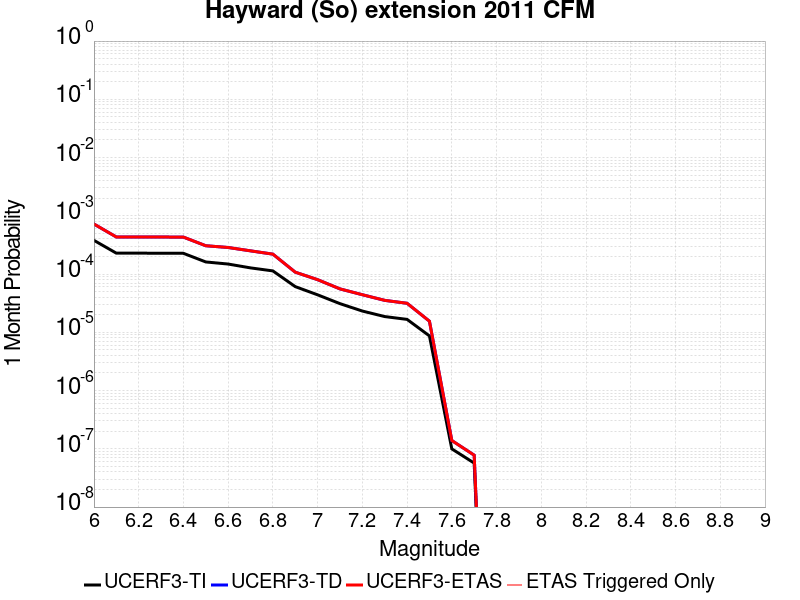 |  |  |

| Magnitude | 1 wk TI Prob | 1 wk TD Prob | 1 wk ETAS Prob | 1 wk ETAS/TD Gain | 1 wk ETAS Triggered Only | 1 mo TI Prob | 1 mo TD Prob | 1 mo ETAS Prob | 1 mo ETAS/TD Gain | 1 mo ETAS Triggered Only | 1 yr TI Prob | 1 yr TD Prob | 1 yr ETAS Prob | 1 yr ETAS/TD Gain | 1 yr ETAS Triggered Only | 10 yr TI Prob | 10 yr TD Prob | 10 yr ETAS Prob | 10 yr ETAS/TD Gain | 10 yr ETAS Triggered Only |
|-----|-----|-----|-----|-----|-----|-----|-----|-----|-----|-----|-----|-----|-----|-----|-----|-----|-----|-----|-----|-----|
| 6.0 | 8.848136E-5 | 1.6872548E-4 | 1.6872548E-4 | 1.0 | 0.0 | 3.791507E-4 | 7.2237285E-4 | 7.2237285E-4 | 1.0 | 0.0 | 0.004606393 | 0.008751367 | 0.008751367 | 1.0 | 0.0 | 0.045120716 | 0.08263442 | 0.08264359 | 1.000111 | 1.0E-5 |
| 6.1 | 5.332345E-5 | 1.011878E-4 | 1.011878E-4 | 1.0 | 0.0 | 2.2850904E-4 | 4.3303455E-4 | 4.3303455E-4 | 1.0 | 0.0 | 0.0027785483 | 0.005258477 | 0.005258477 | 1.0 | 0.0 | 0.02744063 | 0.050448984 | 0.05045848 | 1.0001882 | 1.0E-5 |
| 6.2 | 5.332345E-5 | 1.011878E-4 | 1.011878E-4 | 1.0 | 0.0 | 2.2850904E-4 | 4.3303455E-4 | 4.3303455E-4 | 1.0 | 0.0 | 0.0027785483 | 0.005258477 | 0.005258477 | 1.0 | 0.0 | 0.02744063 | 0.050448984 | 0.05045848 | 1.0001882 | 1.0E-5 |
| 6.3 | 5.3147927E-5 | 1.00919424E-4 | 1.00919424E-4 | 1.0 | 0.0 | 2.2775694E-4 | 4.3188475E-4 | 4.3188475E-4 | 1.0 | 0.0 | 0.0027694148 | 0.005244587 | 0.005244587 | 1.0 | 0.0 | 0.027351549 | 0.05031903 | 0.050328527 | 1.0001887 | 1.0E-5 |
| 6.4 | 5.2993E-5 | 1.00663616E-4 | 1.00663616E-4 | 1.0 | 0.0 | 2.2709309E-4 | 4.307888E-4 | 4.307888E-4 | 1.0 | 0.0 | 0.0027613526 | 0.005231321 | 0.005231321 | 1.0 | 0.0 | 0.027272914 | 0.050195064 | 0.050204564 | 1.0001892 | 1.0E-5 |
| 6.5 | 3.766672E-5 | 7.150829E-5 | 7.150829E-5 | 1.0 | 0.0 | 1.6141881E-4 | 3.0642925E-4 | 3.0642925E-4 | 1.0 | 0.0 | 0.0019635025 | 0.0037245662 | 0.0037245662 | 1.0 | 0.0 | 0.019462438 | 0.036030717 | 0.036030717 | 1.0 | 0.0 |
| 6.6 | 3.467344E-5 | 6.670865E-5 | 6.670865E-5 | 1.0 | 0.0 | 1.48592E-4 | 2.8586402E-4 | 2.8586402E-4 | 1.0 | 0.0 | 0.0018076063 | 0.0034750402 | 0.0034750402 | 1.0 | 0.0 | 0.017929735 | 0.033646338 | 0.033646338 | 1.0 | 0.0 |
| 6.7 | 2.9791405E-5 | 5.8414367E-5 | 5.8414367E-5 | 1.0 | 0.0 | 1.276712E-4 | 2.5032432E-4 | 2.5032432E-4 | 1.0 | 0.0 | 0.0015532885 | 0.0030436262 | 0.0030436262 | 1.0 | 0.0 | 0.015424762 | 0.029541448 | 0.029541448 | 1.0 | 0.0 |
| 6.8 | 2.6431702E-5 | 5.1291772E-5 | 5.1291772E-5 | 1.0 | 0.0 | 1.132738E-4 | 2.1980435E-4 | 2.1980435E-4 | 1.0 | 0.0 | 0.0013782361 | 0.002673008 | 0.002673008 | 1.0 | 0.0 | 0.013697195 | 0.026020886 | 0.026020886 | 1.0 | 0.0 |
| 6.9 | 1.4208311E-5 | 2.5159427E-5 | 2.5159427E-5 | 1.0 | 0.0 | 6.089134E-5 | 1.07821834E-4 | 1.07821834E-4 | 1.0 | 0.0 | 7.410999E-4 | 0.0013119719 | 0.0013119719 | 1.0 | 0.0 | 0.0073863324 | 0.01299923 | 0.01299923 | 1.0 | 0.0 |
| 7.0 | 1.0271194E-5 | 1.8695631E-5 | 1.8695631E-5 | 1.0 | 0.0 | 4.401866E-5 | 8.01218E-5 | 8.01218E-5 | 1.0 | 0.0 | 5.357954E-4 | 9.750679E-4 | 9.750679E-4 | 1.0 | 0.0 | 0.005345054 | 0.009676249 | 0.009676249 | 1.0 | 0.0 |
| 7.1 | 7.244682E-6 | 1.2983135E-5 | 1.2983135E-5 | 1.0 | 0.0 | 3.104827E-5 | 5.564085E-5 | 5.564085E-5 | 1.0 | 0.0 | 3.779471E-4 | 6.772214E-4 | 6.772214E-4 | 1.0 | 0.0 | 0.0037730492 | 0.0067609996 | 0.0067609996 | 1.0 | 0.0 |
| 7.2 | 5.409416E-6 | 1.031106E-5 | 1.031106E-5 | 1.0 | 0.0 | 2.3183005E-5 | 4.418953E-5 | 4.418953E-5 | 1.0 | 0.0 | 2.8221653E-4 | 5.378787E-4 | 5.378787E-4 | 1.0 | 0.0 | 0.002818584 | 0.0053846464 | 0.0053846464 | 1.0 | 0.0 |
| 7.3 | 4.3484742E-6 | 8.250028E-6 | 8.250028E-6 | 1.0 | 0.0 | 1.8636185E-5 | 3.5356803E-5 | 3.5356803E-5 | 1.0 | 0.0 | 2.2687193E-4 | 4.3038736E-4 | 4.3038736E-4 | 1.0 | 0.0 | 0.0022664045 | 0.0043146894 | 0.0043146894 | 1.0 | 0.0 |
| 7.4 | 3.889258E-6 | 7.351458E-6 | 7.351458E-6 | 1.0 | 0.0 | 1.6668142E-5 | 3.1505886E-5 | 3.1505886E-5 | 1.0 | 0.0 | 2.0291573E-4 | 3.8351983E-4 | 3.8351983E-4 | 1.0 | 0.0 | 0.0020273055 | 0.00384762 | 0.00384762 | 1.0 | 0.0 |
| 7.5 | 2.0238701E-6 | 3.6219978E-6 | 3.6219978E-6 | 1.0 | 0.0 | 8.6737E-6 | 1.5522766E-5 | 1.5522766E-5 | 1.0 | 0.0 | 1.0559718E-4 | 1.8897536E-4 | 1.8897536E-4 | 1.0 | 0.0 | 0.0010554702 | 0.0019003324 | 0.0019003324 | 1.0 | 0.0 |
| 7.6 | 2.327601E-8 | 3.240264E-8 | 3.240264E-8 | 1.0 | 0.0 | 9.975433E-8 | 1.3886844E-7 | 1.3886844E-7 | 1.0 | 0.0 | 1.2145083E-6 | 1.690722E-6 | 1.690722E-6 | 1.0 | 0.0 | 1.2145017E-5 | 1.698533E-5 | 1.698533E-5 | 1.0 | 0.0 |
| 7.7 | 1.3269742E-8 | 1.8143703E-8 | 1.8143703E-8 | 1.0 | 0.0 | 5.687032E-8 | 7.775873E-8 | 7.775873E-8 | 1.0 | 0.0 | 6.9239593E-7 | 9.4671213E-7 | 9.4671213E-7 | 1.0 | 0.0 | 6.9239377E-6 | 9.522559E-6 | 9.522559E-6 | 1.0 | 0.0 |

## Sierra Madre
*[(top)](#table-of-contents)*

| 1 Week | 1 Month | 1 Year | 10 Year |
|-----|-----|-----|-----|
|  | 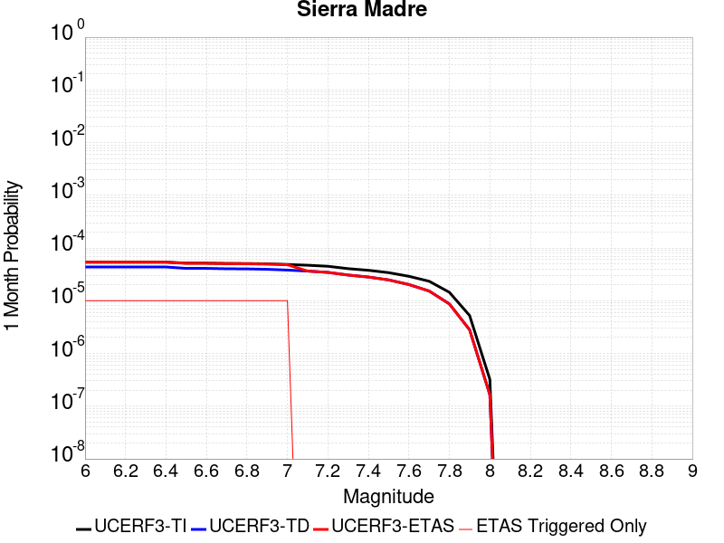 |  | 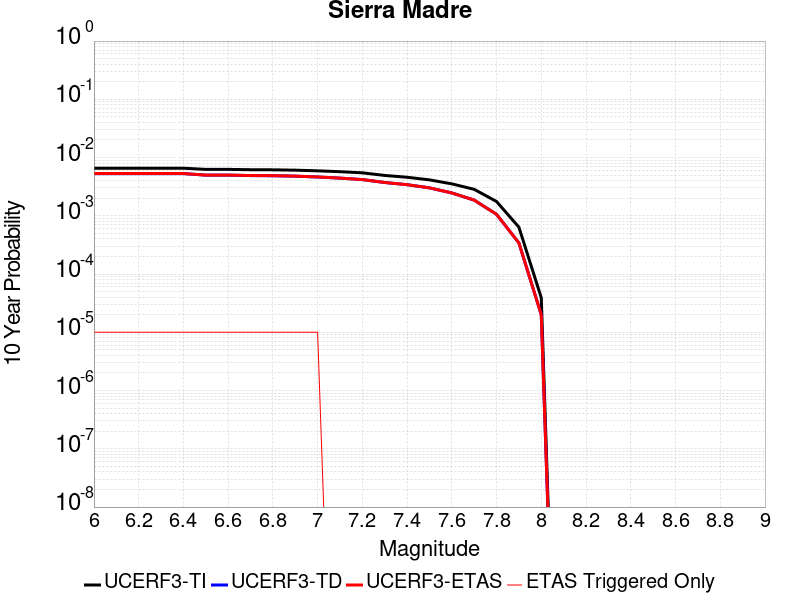 |

| Magnitude | 1 wk TI Prob | 1 wk TD Prob | 1 wk ETAS Prob | 1 wk ETAS/TD Gain | 1 wk ETAS Triggered Only | 1 mo TI Prob | 1 mo TD Prob | 1 mo ETAS Prob | 1 mo ETAS/TD Gain | 1 mo ETAS Triggered Only | 1 yr TI Prob | 1 yr TD Prob | 1 yr ETAS Prob | 1 yr ETAS/TD Gain | 1 yr ETAS Triggered Only | 10 yr TI Prob | 10 yr TD Prob | 10 yr ETAS Prob | 10 yr ETAS/TD Gain | 10 yr ETAS Triggered Only |
|-----|-----|-----|-----|-----|-----|-----|-----|-----|-----|-----|-----|-----|-----|-----|-----|-----|-----|-----|-----|-----|
| 6.0 | 1.2623422E-5 | 1.019876E-5 | 1.019876E-5 | 1.0 | 0.0 | 5.409926E-5 | 4.370824E-5 | 5.3707805E-5 | 1.2287798 | 1.0E-5 | 6.584594E-4 | 5.320184E-4 | 5.420131E-4 | 1.0187863 | 1.0E-5 | 0.0065651177 | 0.005307681 | 0.0053176275 | 1.0018741 | 1.0E-5 |
| 6.1 | 1.2623422E-5 | 1.019876E-5 | 1.019876E-5 | 1.0 | 0.0 | 5.409926E-5 | 4.370824E-5 | 5.3707805E-5 | 1.2287798 | 1.0E-5 | 6.584594E-4 | 5.320184E-4 | 5.420131E-4 | 1.0187863 | 1.0E-5 | 0.0065651177 | 0.005307681 | 0.0053176275 | 1.0018741 | 1.0E-5 |
| 6.2 | 1.2623422E-5 | 1.019876E-5 | 1.019876E-5 | 1.0 | 0.0 | 5.409926E-5 | 4.370824E-5 | 5.3707805E-5 | 1.2287798 | 1.0E-5 | 6.584594E-4 | 5.320184E-4 | 5.420131E-4 | 1.0187863 | 1.0E-5 | 0.0065651177 | 0.005307681 | 0.0053176275 | 1.0018741 | 1.0E-5 |
| 6.3 | 1.2623422E-5 | 1.019876E-5 | 1.019876E-5 | 1.0 | 0.0 | 5.409926E-5 | 4.370824E-5 | 5.3707805E-5 | 1.2287798 | 1.0E-5 | 6.584594E-4 | 5.320184E-4 | 5.420131E-4 | 1.0187863 | 1.0E-5 | 0.0065651177 | 0.005307681 | 0.0053176275 | 1.0018741 | 1.0E-5 |
| 6.4 | 1.2623422E-5 | 1.019876E-5 | 1.019876E-5 | 1.0 | 0.0 | 5.409926E-5 | 4.370824E-5 | 5.3707805E-5 | 1.2287798 | 1.0E-5 | 6.584594E-4 | 5.320184E-4 | 5.420131E-4 | 1.0187863 | 1.0E-5 | 0.0065651177 | 0.005307681 | 0.0053176275 | 1.0018741 | 1.0E-5 |
| 6.5 | 1.20490495E-5 | 9.58837E-6 | 9.58837E-6 | 1.0 | 0.0 | 5.1637762E-5 | 4.1092368E-5 | 5.109196E-5 | 1.2433442 | 1.0E-5 | 6.285084E-4 | 5.0018507E-4 | 5.101801E-4 | 1.0199826 | 1.0E-5 | 0.0062673376 | 0.004990802 | 0.0050007524 | 1.0019937 | 1.0E-5 |
| 6.6 | 1.20490495E-5 | 9.58837E-6 | 9.58837E-6 | 1.0 | 0.0 | 5.1637762E-5 | 4.1092368E-5 | 5.109196E-5 | 1.2433442 | 1.0E-5 | 6.285084E-4 | 5.0018507E-4 | 5.101801E-4 | 1.0199826 | 1.0E-5 | 0.0062673376 | 0.004990802 | 0.0050007524 | 1.0019937 | 1.0E-5 |
| 6.7 | 1.1894657E-5 | 9.424478E-6 | 9.424478E-6 | 1.0 | 0.0 | 5.0976105E-5 | 4.0389998E-5 | 5.0389594E-5 | 1.2475761 | 1.0E-5 | 6.2045734E-4 | 4.9163756E-4 | 5.0163263E-4 | 1.0203302 | 1.0E-5 | 0.0061872783 | 0.004905706 | 0.004915657 | 1.0020285 | 1.0E-5 |
| 6.8 | 1.1843034E-5 | 9.370884E-6 | 9.370884E-6 | 1.0 | 0.0 | 5.0754872E-5 | 4.0160314E-5 | 5.0159913E-5 | 1.2489921 | 1.0E-5 | 6.1776536E-4 | 4.8884243E-4 | 4.9883756E-4 | 1.0204465 | 1.0E-5 | 0.0061605084 | 0.0048778774 | 0.004887829 | 1.00204 | 1.0E-5 |
| 6.9 | 1.1680347E-5 | 9.208028E-6 | 9.208028E-6 | 1.0 | 0.0 | 5.0057668E-5 | 3.9462382E-5 | 4.946199E-5 | 1.2533959 | 1.0E-5 | 6.092817E-4 | 4.8034888E-4 | 4.903441E-4 | 1.0208082 | 1.0E-5 | 0.006076139 | 0.004793311 | 0.004803263 | 1.0020763 | 1.0E-5 |
| 7.0 | 1.1378615E-5 | 8.907938E-6 | 8.907938E-6 | 1.0 | 0.0 | 4.8764585E-5 | 3.817632E-5 | 4.8175938E-5 | 1.2619325 | 1.0E-5 | 5.9354707E-4 | 4.6469783E-4 | 4.7469317E-4 | 1.0215094 | 1.0E-5 | 0.0059196423 | 0.0046374635 | 0.004647417 | 1.0021464 | 1.0E-5 |
| 7.1 | 1.099439E-5 | 8.5207685E-6 | 8.5207685E-6 | 1.0 | 0.0 | 4.7117966E-5 | 3.651707E-5 | 3.651707E-5 | 1.0 | 0.0 | 5.7351025E-4 | 4.4450487E-4 | 4.4450487E-4 | 1.0 | 0.0 | 0.005720324 | 0.0044363555 | 0.0044363555 | 1.0 | 0.0 |
| 7.2 | 1.0514028E-5 | 8.045965E-6 | 8.045965E-6 | 1.0 | 0.0 | 4.505934E-5 | 3.4482255E-5 | 3.4482255E-5 | 1.0 | 0.0 | 5.4845936E-4 | 4.1974077E-4 | 4.1974077E-4 | 1.0 | 0.0 | 0.0054710773 | 0.0041896733 | 0.0041896733 | 1.0 | 0.0 |
| 7.3 | 9.474128E-6 | 7.1664613E-6 | 7.1664613E-6 | 1.0 | 0.0 | 4.0602772E-5 | 3.0713047E-5 | 3.0713047E-5 | 1.0 | 0.0 | 4.9422664E-4 | 3.7386728E-4 | 3.7386728E-4 | 1.0 | 0.0 | 0.004931289 | 0.0037325656 | 0.0037325656 | 1.0 | 0.0 |
| 7.4 | 8.822542E-6 | 6.572269E-6 | 6.572269E-6 | 1.0 | 0.0 | 3.7810347E-5 | 2.8166562E-5 | 2.8166562E-5 | 1.0 | 0.0 | 4.6024375E-4 | 3.4287403E-4 | 3.4287403E-4 | 1.0 | 0.0 | 0.004592917 | 0.0034236275 | 0.0034236275 | 1.0 | 0.0 |
| 7.5 | 7.957068E-6 | 5.7943616E-6 | 5.7943616E-6 | 1.0 | 0.0 | 3.4101275E-5 | 2.4832743E-5 | 2.4832743E-5 | 1.0 | 0.0 | 4.1510395E-4 | 3.0229677E-4 | 3.0229677E-4 | 1.0 | 0.0 | 0.004143294 | 0.0030190304 | 0.0030190304 | 1.0 | 0.0 |
| 7.6 | 6.7890046E-6 | 4.7372714E-6 | 4.7372714E-6 | 1.0 | 0.0 | 2.909541E-5 | 2.0302434E-5 | 2.0302434E-5 | 1.0 | 0.0 | 3.5417904E-4 | 2.4715415E-4 | 2.4715415E-4 | 1.0 | 0.0 | 0.0035361508 | 0.0024689643 | 0.0024689643 | 1.0 | 0.0 |
| 7.7 | 5.4701477E-6 | 3.568583E-6 | 3.568583E-6 | 1.0 | 0.0 | 2.344328E-5 | 1.5293837E-5 | 1.5293837E-5 | 1.0 | 0.0 | 2.8538454E-4 | 1.861866E-4 | 1.861866E-4 | 1.0 | 0.0 | 0.002850183 | 0.0018604746 | 0.0018604746 | 1.0 | 0.0 |
| 7.8 | 3.374644E-6 | 2.0326413E-6 | 2.0326413E-6 | 1.0 | 0.0 | 1.4462679E-5 | 8.711291E-6 | 8.711291E-6 | 1.0 | 0.0 | 1.7606889E-4 | 1.06054824E-4 | 1.06054824E-4 | 1.0 | 0.0 | 0.0017592945 | 0.0010601757 | 0.0010601757 | 1.0 | 0.0 |
| 7.9 | 1.2226639E-6 | 6.564381E-7 | 6.564381E-7 | 1.0 | 0.0 | 5.2399773E-6 | 2.8133031E-6 | 2.8133031E-6 | 1.0 | 0.0 | 6.379486E-5 | 3.4251432E-5 | 3.4251432E-5 | 1.0 | 0.0 | 6.3776545E-4 | 3.4246198E-4 | 3.4246198E-4 | 1.0 | 0.0 |
| 8.0 | 7.513404E-8 | 3.8442494E-8 | 3.8442494E-8 | 1.0 | 0.0 | 3.22003E-7 | 1.6475353E-7 | 1.6475353E-7 | 1.0 | 0.0 | 3.920379E-6 | 2.0058726E-6 | 2.0058726E-6 | 1.0 | 0.0 | 3.92031E-5 | 2.0058551E-5 | 2.0058551E-5 | 1.0 | 0.0 |

## San Luis Range - Pecho 2011 CFM
*[(top)](#table-of-contents)*

| 1 Week | 1 Month | 1 Year | 10 Year |
|-----|-----|-----|-----|
|  |  | 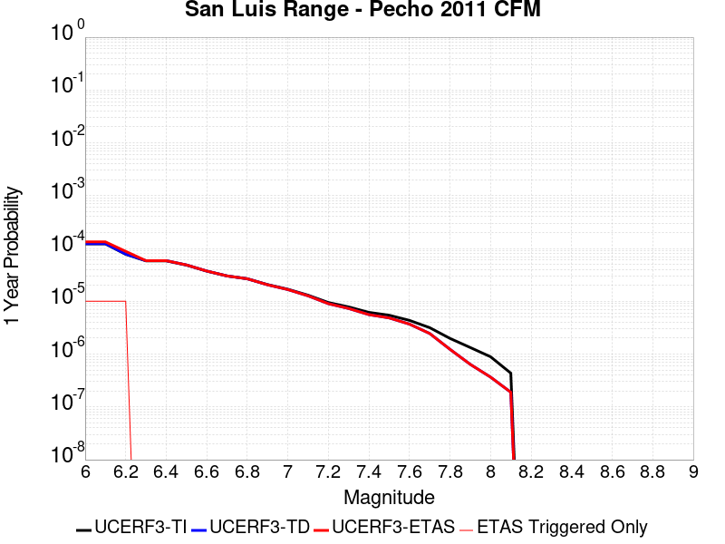 | 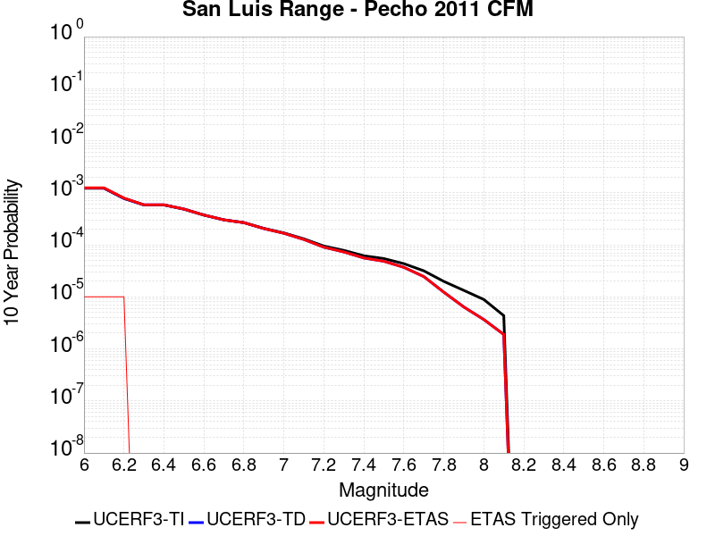 |

| Magnitude | 1 wk TI Prob | 1 wk TD Prob | 1 wk ETAS Prob | 1 wk ETAS/TD Gain | 1 wk ETAS Triggered Only | 1 mo TI Prob | 1 mo TD Prob | 1 mo ETAS Prob | 1 mo ETAS/TD Gain | 1 mo ETAS Triggered Only | 1 yr TI Prob | 1 yr TD Prob | 1 yr ETAS Prob | 1 yr ETAS/TD Gain | 1 yr ETAS Triggered Only | 10 yr TI Prob | 10 yr TD Prob | 10 yr ETAS Prob | 10 yr ETAS/TD Gain | 10 yr ETAS Triggered Only |
|-----|-----|-----|-----|-----|-----|-----|-----|-----|-----|-----|-----|-----|-----|-----|-----|-----|-----|-----|-----|-----|
| 6.0 | 2.3446019E-6 | 2.364717E-6 | 1.2364693E-5 | 5.228826 | 1.0E-5 | 1.0048255E-5 | 1.0134465E-5 | 2.0134363E-5 | 1.986722 | 1.0E-5 | 1.2233063E-4 | 1.2338061E-4 | 1.3337938E-4 | 1.08104 | 1.0E-5 | 0.0012226332 | 0.0012331699 | 0.0012431575 | 1.0080992 | 1.0E-5 |
| 6.1 | 2.3446019E-6 | 2.364717E-6 | 1.2364693E-5 | 5.228826 | 1.0E-5 | 1.0048255E-5 | 1.0134465E-5 | 2.0134363E-5 | 1.986722 | 1.0E-5 | 1.2233063E-4 | 1.2338061E-4 | 1.3337938E-4 | 1.08104 | 1.0E-5 | 0.0012226332 | 0.0012331699 | 0.0012431575 | 1.0080992 | 1.0E-5 |
| 6.2 | 1.4900062E-6 | 1.501666E-6 | 1.1501651E-5 | 7.6592607 | 1.0E-5 | 6.385725E-6 | 6.4356964E-6 | 1.6435632E-5 | 2.5538235 | 1.0E-5 | 7.7743425E-5 | 7.835192E-5 | 8.835114E-5 | 1.1276193 | 1.0E-5 | 7.771624E-4 | 7.832563E-4 | 7.9324853E-4 | 1.0127572 | 1.0E-5 |
| 6.3 | 1.1179742E-6 | 1.1261573E-6 | 1.1261573E-6 | 1.0 | 0.0 | 4.7913095E-6 | 4.8263796E-6 | 4.8263796E-6 | 1.0 | 0.0 | 5.833263E-5 | 5.875964E-5 | 5.875964E-5 | 1.0 | 0.0 | 5.831732E-4 | 5.874462E-4 | 5.874462E-4 | 1.0 | 0.0 |
| 6.4 | 1.1179742E-6 | 1.1261573E-6 | 1.1261573E-6 | 1.0 | 0.0 | 4.7913095E-6 | 4.8263796E-6 | 4.8263796E-6 | 1.0 | 0.0 | 5.833263E-5 | 5.875964E-5 | 5.875964E-5 | 1.0 | 0.0 | 5.831732E-4 | 5.874462E-4 | 5.874462E-4 | 1.0 | 0.0 |
| 6.5 | 9.2896164E-7 | 9.3443987E-7 | 9.3443987E-7 | 1.0 | 0.0 | 3.981258E-6 | 4.0047366E-6 | 4.0047366E-6 | 1.0 | 0.0 | 4.8470738E-5 | 4.875661E-5 | 4.875661E-5 | 1.0 | 0.0 | 4.8460165E-4 | 4.874624E-4 | 4.874624E-4 | 1.0 | 0.0 |
| 6.6 | 7.143496E-7 | 7.168624E-7 | 7.168624E-7 | 1.0 | 0.0 | 3.0614947E-6 | 3.0722638E-6 | 3.0722638E-6 | 1.0 | 0.0 | 3.727306E-5 | 3.7404185E-5 | 3.7404185E-5 | 1.0 | 0.0 | 3.726681E-4 | 3.7398015E-4 | 3.7398015E-4 | 1.0 | 0.0 |
| 6.7 | 5.7892174E-7 | 5.7920454E-7 | 5.7920454E-7 | 1.0 | 0.0 | 2.4810909E-6 | 2.482303E-6 | 2.482303E-6 | 1.0 | 0.0 | 3.0206862E-5 | 3.0221625E-5 | 3.0221625E-5 | 1.0 | 0.0 | 3.0202756E-4 | 3.0217585E-4 | 3.0217585E-4 | 1.0 | 0.0 |
| 6.8 | 5.123417E-7 | 5.11448E-7 | 5.11448E-7 | 1.0 | 0.0 | 2.1957485E-6 | 2.1919182E-6 | 2.1919182E-6 | 1.0 | 0.0 | 2.6732909E-5 | 2.6686283E-5 | 2.6686283E-5 | 1.0 | 0.0 | 2.6729694E-4 | 2.6683134E-4 | 2.6683134E-4 | 1.0 | 0.0 |
| 6.9 | 3.969632E-7 | 3.937916E-7 | 3.937916E-7 | 1.0 | 0.0 | 1.7012698E-6 | 1.6876772E-6 | 1.6876772E-6 | 1.0 | 0.0 | 2.0712763E-5 | 2.0547279E-5 | 2.0547279E-5 | 1.0 | 0.0 | 2.0710833E-4 | 2.0545408E-4 | 2.0545408E-4 | 1.0 | 0.0 |
| 7.0 | 3.2455088E-7 | 3.197111E-7 | 3.197111E-7 | 1.0 | 0.0 | 1.3909316E-6 | 1.3701896E-6 | 1.3701896E-6 | 1.0 | 0.0 | 1.693446E-5 | 1.6681932E-5 | 1.6681932E-5 | 1.0 | 0.0 | 1.693317E-4 | 1.6680697E-4 | 1.6680697E-4 | 1.0 | 0.0 |
| 7.1 | 2.5000574E-7 | 2.4320104E-7 | 2.4320104E-7 | 1.0 | 0.0 | 1.0714527E-6 | 1.0422897E-6 | 1.0422897E-6 | 1.0 | 0.0 | 1.3044859E-5 | 1.2689804E-5 | 1.2689804E-5 | 1.0 | 0.0 | 1.3044092E-4 | 1.2689088E-4 | 1.2689088E-4 | 1.0 | 0.0 |
| 7.2 | 1.8157365E-7 | 1.7276689E-7 | 1.7276689E-7 | 1.0 | 0.0 | 7.781726E-7 | 7.404293E-7 | 7.404293E-7 | 1.0 | 0.0 | 9.47421E-6 | 9.01469E-6 | 9.01469E-6 | 1.0 | 0.0 | 9.473806E-5 | 9.014327E-5 | 9.014327E-5 | 1.0 | 0.0 |
| 7.3 | 1.4993657E-7 | 1.4011319E-7 | 1.4011319E-7 | 1.0 | 0.0 | 6.425851E-7 | 6.0048495E-7 | 6.0048495E-7 | 1.0 | 0.0 | 7.823446E-6 | 7.31088E-6 | 7.31088E-6 | 1.0 | 0.0 | 7.823171E-5 | 7.3106414E-5 | 7.3106414E-5 | 1.0 | 0.0 |
| 7.4 | 1.1824791E-7 | 1.0728263E-7 | 1.0728263E-7 | 1.0 | 0.0 | 5.0677664E-7 | 4.597826E-7 | 4.597826E-7 | 1.0 | 0.0 | 6.1699884E-6 | 5.597839E-6 | 5.597839E-6 | 1.0 | 0.0 | 6.169817E-5 | 5.5976987E-5 | 5.5976987E-5 | 1.0 | 0.0 |
| 7.5 | 1.04386345E-7 | 9.286597E-8 | 9.286597E-8 | 1.0 | 0.0 | 4.4736998E-7 | 3.9799693E-7 | 3.9799693E-7 | 1.0 | 0.0 | 5.446716E-6 | 4.845602E-6 | 4.845602E-6 | 1.0 | 0.0 | 5.446582E-5 | 4.845497E-5 | 4.845497E-5 | 1.0 | 0.0 |
| 7.6 | 8.3385395E-8 | 7.090376E-8 | 7.090376E-8 | 1.0 | 0.0 | 3.573659E-7 | 3.0387324E-7 | 3.0387324E-7 | 1.0 | 0.0 | 4.3509212E-6 | 3.6996503E-6 | 3.6996503E-6 | 1.0 | 0.0 | 4.350836E-5 | 3.699589E-5 | 3.699589E-5 | 1.0 | 0.0 |
| 7.7 | 6.068877E-8 | 4.7058943E-8 | 4.7058943E-8 | 1.0 | 0.0 | 2.6009468E-7 | 2.0168116E-7 | 2.0168116E-7 | 1.0 | 0.0 | 3.1666482E-6 | 2.4554654E-6 | 2.4554654E-6 | 1.0 | 0.0 | 3.166603E-5 | 2.4554385E-5 | 2.4554385E-5 | 1.0 | 0.0 |
| 7.8 | 3.8007673E-8 | 2.3614835E-8 | 2.3614835E-8 | 1.0 | 0.0 | 1.6289002E-7 | 1.0120643E-7 | 1.0120643E-7 | 1.0 | 0.0 | 1.9831841E-6 | 1.2321875E-6 | 1.2321875E-6 | 1.0 | 0.0 | 1.9831665E-5 | 1.2321808E-5 | 1.2321808E-5 | 1.0 | 0.0 |
| 7.9 | 2.5544026E-8 | 1.2267687E-8 | 1.2267687E-8 | 1.0 | 0.0 | 1.0947439E-7 | 5.2575803E-8 | 5.2575803E-8 | 1.0 | 0.0 | 1.3328499E-6 | 6.401102E-7 | 6.401102E-7 | 1.0 | 0.0 | 1.3328419E-5 | 6.4010837E-6 | 6.4010837E-6 | 1.0 | 0.0 |
| 8.0 | 1.7085092E-8 | 7.0374093E-9 | 7.0374093E-9 | 1.0 | 0.0 | 7.322182E-8 | 3.0160326E-8 | 3.0160326E-8 | 1.0 | 0.0 | 8.9147534E-7 | 3.672019E-7 | 3.672019E-7 | 1.0 | 0.0 | 8.914717E-6 | 3.672013E-6 | 3.672013E-6 | 1.0 | 0.0 |
| 8.1 | 8.354079E-9 | 3.6341123E-9 | 3.6341123E-9 | 1.0 | 0.0 | 3.5803197E-8 | 1.5574766E-8 | 1.5574766E-8 | 1.0 | 0.0 | 4.3590381E-7 | 1.8962277E-7 | 1.8962277E-7 | 1.0 | 0.0 | 4.35903E-6 | 1.8962261E-6 | 1.8962261E-6 | 1.0 | 0.0 |

## Compton
*[(top)](#table-of-contents)*

| 1 Week | 1 Month | 1 Year | 10 Year |
|-----|-----|-----|-----|
|  |  |  | 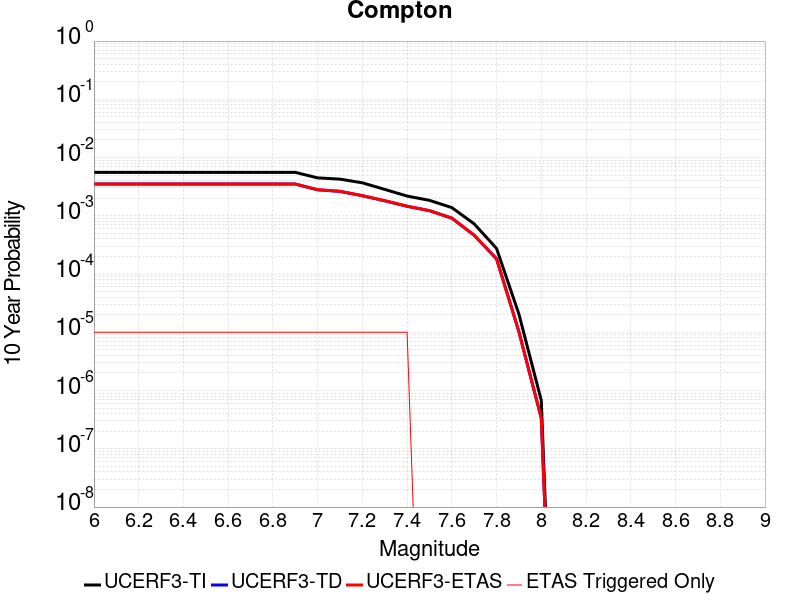 |

| Magnitude | 1 wk TI Prob | 1 wk TD Prob | 1 wk ETAS Prob | 1 wk ETAS/TD Gain | 1 wk ETAS Triggered Only | 1 mo TI Prob | 1 mo TD Prob | 1 mo ETAS Prob | 1 mo ETAS/TD Gain | 1 mo ETAS Triggered Only | 1 yr TI Prob | 1 yr TD Prob | 1 yr ETAS Prob | 1 yr ETAS/TD Gain | 1 yr ETAS Triggered Only | 10 yr TI Prob | 10 yr TD Prob | 10 yr ETAS Prob | 10 yr ETAS/TD Gain | 10 yr ETAS Triggered Only |
|-----|-----|-----|-----|-----|-----|-----|-----|-----|-----|-----|-----|-----|-----|-----|-----|-----|-----|-----|-----|-----|
| 6.0 | 1.0718636E-5 | 6.7382366E-6 | 1.673817E-5 | 2.484058 | 1.0E-5 | 4.5936205E-5 | 2.8877846E-5 | 3.887756E-5 | 1.3462762 | 1.0E-5 | 5.5912975E-4 | 3.5153277E-4 | 3.6152924E-4 | 1.0284369 | 1.0E-5 | 0.0055772504 | 0.003509939 | 0.0035199039 | 1.0028391 | 1.0E-5 |
| 6.1 | 1.0718636E-5 | 6.7382366E-6 | 1.673817E-5 | 2.484058 | 1.0E-5 | 4.5936205E-5 | 2.8877846E-5 | 3.887756E-5 | 1.3462762 | 1.0E-5 | 5.5912975E-4 | 3.5153277E-4 | 3.6152924E-4 | 1.0284369 | 1.0E-5 | 0.0055772504 | 0.003509939 | 0.0035199039 | 1.0028391 | 1.0E-5 |
| 6.2 | 1.0718636E-5 | 6.7382366E-6 | 1.673817E-5 | 2.484058 | 1.0E-5 | 4.5936205E-5 | 2.8877846E-5 | 3.887756E-5 | 1.3462762 | 1.0E-5 | 5.5912975E-4 | 3.5153277E-4 | 3.6152924E-4 | 1.0284369 | 1.0E-5 | 0.0055772504 | 0.003509939 | 0.0035199039 | 1.0028391 | 1.0E-5 |
| 6.3 | 1.0718636E-5 | 6.7382366E-6 | 1.673817E-5 | 2.484058 | 1.0E-5 | 4.5936205E-5 | 2.8877846E-5 | 3.887756E-5 | 1.3462762 | 1.0E-5 | 5.5912975E-4 | 3.5153277E-4 | 3.6152924E-4 | 1.0284369 | 1.0E-5 | 0.0055772504 | 0.003509939 | 0.0035199039 | 1.0028391 | 1.0E-5 |
| 6.4 | 1.0718636E-5 | 6.7382366E-6 | 1.673817E-5 | 2.484058 | 1.0E-5 | 4.5936205E-5 | 2.8877846E-5 | 3.887756E-5 | 1.3462762 | 1.0E-5 | 5.5912975E-4 | 3.5153277E-4 | 3.6152924E-4 | 1.0284369 | 1.0E-5 | 0.0055772504 | 0.003509939 | 0.0035199039 | 1.0028391 | 1.0E-5 |
| 6.5 | 1.0718636E-5 | 6.7382366E-6 | 1.673817E-5 | 2.484058 | 1.0E-5 | 4.5936205E-5 | 2.8877846E-5 | 3.887756E-5 | 1.3462762 | 1.0E-5 | 5.5912975E-4 | 3.5153277E-4 | 3.6152924E-4 | 1.0284369 | 1.0E-5 | 0.0055772504 | 0.003509939 | 0.0035199039 | 1.0028391 | 1.0E-5 |
| 6.6 | 1.0718636E-5 | 6.7382366E-6 | 1.673817E-5 | 2.484058 | 1.0E-5 | 4.5936205E-5 | 2.8877846E-5 | 3.887756E-5 | 1.3462762 | 1.0E-5 | 5.5912975E-4 | 3.5153277E-4 | 3.6152924E-4 | 1.0284369 | 1.0E-5 | 0.0055772504 | 0.003509939 | 0.0035199039 | 1.0028391 | 1.0E-5 |
| 6.7 | 1.0718636E-5 | 6.7382366E-6 | 1.673817E-5 | 2.484058 | 1.0E-5 | 4.5936205E-5 | 2.8877846E-5 | 3.887756E-5 | 1.3462762 | 1.0E-5 | 5.5912975E-4 | 3.5153277E-4 | 3.6152924E-4 | 1.0284369 | 1.0E-5 | 0.0055772504 | 0.003509939 | 0.0035199039 | 1.0028391 | 1.0E-5 |
| 6.8 | 1.0718636E-5 | 6.7382366E-6 | 1.673817E-5 | 2.484058 | 1.0E-5 | 4.5936205E-5 | 2.8877846E-5 | 3.887756E-5 | 1.3462762 | 1.0E-5 | 5.5912975E-4 | 3.5153277E-4 | 3.6152924E-4 | 1.0284369 | 1.0E-5 | 0.0055772504 | 0.003509939 | 0.0035199039 | 1.0028391 | 1.0E-5 |
| 6.9 | 1.0718636E-5 | 6.7382366E-6 | 1.673817E-5 | 2.484058 | 1.0E-5 | 4.5936205E-5 | 2.8877846E-5 | 3.887756E-5 | 1.3462762 | 1.0E-5 | 5.5912975E-4 | 3.5153277E-4 | 3.6152924E-4 | 1.0284369 | 1.0E-5 | 0.0055772504 | 0.003509939 | 0.0035199039 | 1.0028391 | 1.0E-5 |
| 7.0 | 8.604725E-6 | 5.3674926E-6 | 1.536744E-5 | 2.8630574 | 1.0E-5 | 3.687687E-5 | 2.300334E-5 | 3.300311E-5 | 1.4347094 | 1.0E-5 | 4.488834E-4 | 2.8003028E-4 | 2.9002747E-4 | 1.0357004 | 1.0E-5 | 0.0044797775 | 0.0027968343 | 0.0028068062 | 1.0035654 | 1.0E-5 |
| 7.1 | 8.188221E-6 | 5.0391627E-6 | 1.5039112E-5 | 2.9844468 | 1.0E-5 | 3.5091904E-5 | 2.1596235E-5 | 3.159602E-5 | 1.4630337 | 1.0E-5 | 4.2716015E-4 | 2.62903E-4 | 2.7290036E-4 | 1.0380268 | 1.0E-5 | 0.0042633996 | 0.0026259762 | 0.00263595 | 1.0037981 | 1.0E-5 |
| 7.2 | 7.0756837E-6 | 4.2417582E-6 | 1.4241716E-5 | 3.357503 | 1.0E-5 | 3.0324005E-5 | 1.8178838E-5 | 2.8178656E-5 | 1.5500802 | 1.0E-5 | 3.6913223E-4 | 2.2130512E-4 | 2.3130291E-4 | 1.0451765 | 1.0E-5 | 0.0036851966 | 0.0022108734 | 0.0022208511 | 1.0045131 | 1.0E-5 |
| 7.3 | 5.4544644E-6 | 3.4723435E-6 | 1.3472309E-5 | 3.8798895 | 1.0E-5 | 2.3376067E-5 | 1.4881388E-5 | 2.488124E-5 | 1.6719704 | 1.0E-5 | 2.8456646E-4 | 1.8116597E-4 | 1.9116416E-4 | 1.0551881 | 1.0E-5 | 0.0028420233 | 0.0018101974 | 0.0018201793 | 1.0055143 | 1.0E-5 |
| 7.4 | 4.187896E-6 | 2.79159E-6 | 1.2791562E-5 | 4.5821776 | 1.0E-5 | 1.7948003E-5 | 1.19639035E-5 | 2.1963784E-5 | 1.8358376 | 1.0E-5 | 2.1849501E-4 | 1.4565083E-4 | 1.5564937E-4 | 1.0686474 | 1.0E-5 | 0.0021828031 | 0.0014555583 | 0.0014655438 | 1.0068603 | 1.0E-5 |
| 7.5 | 3.534517E-6 | 2.351313E-6 | 2.351313E-6 | 1.0 | 0.0 | 1.5147842E-5 | 1.0077018E-5 | 1.0077018E-5 | 1.0 | 0.0 | 1.8440936E-4 | 1.2268081E-4 | 1.2268081E-4 | 1.0 | 0.0 | 0.0018425641 | 0.0012261347 | 0.0012261347 | 1.0 | 0.0 |
| 7.6 | 2.65385E-6 | 1.7513671E-6 | 1.7513671E-6 | 1.0 | 0.0 | 1.1373593E-5 | 7.505838E-6 | 7.505838E-6 | 1.0 | 0.0 | 1.384647E-4 | 9.137977E-5 | 9.137977E-5 | 1.0 | 0.0 | 0.0013837846 | 9.134248E-4 | 9.134248E-4 | 1.0 | 0.0 |
| 7.7 | 1.3962599E-6 | 8.8945586E-7 | 8.8945586E-7 | 1.0 | 0.0 | 5.983957E-6 | 3.811948E-6 | 3.811948E-6 | 1.0 | 0.0 | 7.285224E-5 | 4.6409496E-5 | 4.6409496E-5 | 1.0 | 0.0 | 7.2828366E-4 | 4.6399955E-4 | 4.6399955E-4 | 1.0 | 0.0 |
| 7.8 | 5.283611E-7 | 3.5052406E-7 | 3.5052406E-7 | 1.0 | 0.0 | 2.2644028E-6 | 1.5022451E-6 | 1.5022451E-6 | 1.0 | 0.0 | 2.7568754E-5 | 1.8289691E-5 | 1.8289691E-5 | 1.0 | 0.0 | 2.7565335E-4 | 1.8288288E-4 | 1.8288288E-4 | 1.0 | 0.0 |
| 7.9 | 3.9373052E-8 | 1.9637376E-8 | 1.9637376E-8 | 1.0 | 0.0 | 1.6874165E-7 | 8.4160185E-8 | 8.4160185E-8 | 1.0 | 0.0 | 2.0544276E-6 | 1.0246497E-6 | 1.0246497E-6 | 1.0 | 0.0 | 2.0544087E-5 | 1.0246452E-5 | 1.0246452E-5 | 1.0 | 0.0 |
| 8.0 | 1.2971227E-9 | 6.43537E-10 | 6.43537E-10 | 1.0 | 0.0 | 5.5590976E-9 | 2.7580156E-9 | 2.7580156E-9 | 1.0 | 0.0 | 6.768201E-8 | 3.357884E-8 | 3.357884E-8 | 1.0 | 0.0 | 6.7681987E-7 | 3.3578837E-7 | 3.3578837E-7 | 1.0 | 0.0 |

## Round Valley
*[(top)](#table-of-contents)*

| 1 Week | 1 Month | 1 Year | 10 Year |
|-----|-----|-----|-----|
|  |  |  |  |

| Magnitude | 1 wk TI Prob | 1 wk TD Prob | 1 wk ETAS Prob | 1 wk ETAS/TD Gain | 1 wk ETAS Triggered Only | 1 mo TI Prob | 1 mo TD Prob | 1 mo ETAS Prob | 1 mo ETAS/TD Gain | 1 mo ETAS Triggered Only | 1 yr TI Prob | 1 yr TD Prob | 1 yr ETAS Prob | 1 yr ETAS/TD Gain | 1 yr ETAS Triggered Only | 10 yr TI Prob | 10 yr TD Prob | 10 yr ETAS Prob | 10 yr ETAS/TD Gain | 10 yr ETAS Triggered Only |
|-----|-----|-----|-----|-----|-----|-----|-----|-----|-----|-----|-----|-----|-----|-----|-----|-----|-----|-----|-----|-----|
| 6.0 | 1.5467502E-5 | 1.32261475E-5 | 1.32261475E-5 | 1.0 | 0.0 | 6.628761E-5 | 5.668246E-5 | 5.668246E-5 | 1.0 | 0.0 | 8.0675277E-4 | 6.8992673E-4 | 6.999199E-4 | 1.0144843 | 1.0E-5 | 0.008038303 | 0.00688143 | 0.006891361 | 1.0014431 | 1.0E-5 |
| 6.1 | 1.5467502E-5 | 1.32261475E-5 | 1.32261475E-5 | 1.0 | 0.0 | 6.628761E-5 | 5.668246E-5 | 5.668246E-5 | 1.0 | 0.0 | 8.0675277E-4 | 6.8992673E-4 | 6.999199E-4 | 1.0144843 | 1.0E-5 | 0.008038303 | 0.00688143 | 0.006891361 | 1.0014431 | 1.0E-5 |
| 6.2 | 1.5467502E-5 | 1.32261475E-5 | 1.32261475E-5 | 1.0 | 0.0 | 6.628761E-5 | 5.668246E-5 | 5.668246E-5 | 1.0 | 0.0 | 8.0675277E-4 | 6.8992673E-4 | 6.999199E-4 | 1.0144843 | 1.0E-5 | 0.008038303 | 0.00688143 | 0.006891361 | 1.0014431 | 1.0E-5 |
| 6.3 | 1.5467502E-5 | 1.32261475E-5 | 1.32261475E-5 | 1.0 | 0.0 | 6.628761E-5 | 5.668246E-5 | 5.668246E-5 | 1.0 | 0.0 | 8.0675277E-4 | 6.8992673E-4 | 6.999199E-4 | 1.0144843 | 1.0E-5 | 0.008038303 | 0.00688143 | 0.006891361 | 1.0014431 | 1.0E-5 |
| 6.4 | 1.5467502E-5 | 1.32261475E-5 | 1.32261475E-5 | 1.0 | 0.0 | 6.628761E-5 | 5.668246E-5 | 5.668246E-5 | 1.0 | 0.0 | 8.0675277E-4 | 6.8992673E-4 | 6.999199E-4 | 1.0144843 | 1.0E-5 | 0.008038303 | 0.00688143 | 0.006891361 | 1.0014431 | 1.0E-5 |
| 6.5 | 1.0632494E-5 | 7.950022E-6 | 7.950022E-6 | 1.0 | 0.0 | 4.5567034E-5 | 3.407113E-5 | 3.407113E-5 | 1.0 | 0.0 | 5.546374E-4 | 4.147459E-4 | 4.147459E-4 | 1.0 | 0.0 | 0.0055325516 | 0.0041405945 | 0.0041405945 | 1.0 | 0.0 |
| 6.6 | 8.466932E-6 | 5.602108E-6 | 5.602108E-6 | 1.0 | 0.0 | 3.6286347E-5 | 2.4008832E-5 | 2.4008832E-5 | 1.0 | 0.0 | 4.416967E-4 | 2.922717E-4 | 2.922717E-4 | 1.0 | 0.0 | 0.004408198 | 0.0029192062 | 0.0029192062 | 1.0 | 0.0 |
| 6.7 | 8.466932E-6 | 5.602108E-6 | 5.602108E-6 | 1.0 | 0.0 | 3.6286347E-5 | 2.4008832E-5 | 2.4008832E-5 | 1.0 | 0.0 | 4.416967E-4 | 2.922717E-4 | 2.922717E-4 | 1.0 | 0.0 | 0.004408198 | 0.0029192062 | 0.0029192062 | 1.0 | 0.0 |
| 6.8 | 7.1080026E-6 | 4.18583E-6 | 4.18583E-6 | 1.0 | 0.0 | 3.0462512E-5 | 1.7939159E-5 | 1.7939159E-5 | 1.0 | 0.0 | 3.7081796E-4 | 2.1838905E-4 | 2.1838905E-4 | 1.0 | 0.0 | 0.0037019982 | 0.0021819097 | 0.0021819097 | 1.0 | 0.0 |
| 6.9 | 6.5114027E-6 | 3.681627E-6 | 3.681627E-6 | 1.0 | 0.0 | 2.7905713E-5 | 1.5778314E-5 | 1.5778314E-5 | 1.0 | 0.0 | 3.396991E-4 | 1.9208559E-4 | 1.9208559E-4 | 1.0 | 0.0 | 0.0033918028 | 0.0019193479 | 0.0019193479 | 1.0 | 0.0 |
| 7.0 | 5.1382694E-6 | 2.7329845E-6 | 2.7329845E-6 | 1.0 | 0.0 | 2.202097E-5 | 1.1712745E-5 | 1.1712745E-5 | 1.0 | 0.0 | 2.6807233E-4 | 1.4259439E-4 | 1.4259439E-4 | 1.0 | 0.0 | 0.0026774916 | 0.0014251332 | 0.0014251332 | 1.0 | 0.0 |
| 7.1 | 4.5315605E-6 | 2.4171627E-6 | 2.4171627E-6 | 1.0 | 0.0 | 1.9420828E-5 | 1.0359233E-5 | 1.0359233E-5 | 1.0 | 0.0 | 2.3642293E-4 | 1.2611737E-4 | 1.2611737E-4 | 1.0 | 0.0 | 0.0023617155 | 0.0012605579 | 0.0012605579 | 1.0 | 0.0 |
| 7.2 | 2.5352017E-6 | 1.1141251E-6 | 1.1141251E-6 | 1.0 | 0.0 | 1.0865105E-5 | 4.7748163E-6 | 4.7748163E-6 | 1.0 | 0.0 | 1.3227462E-4 | 5.813234E-5 | 5.813234E-5 | 1.0 | 0.0 | 0.0013219592 | 5.8122084E-4 | 5.8122084E-4 | 1.0 | 0.0 |
| 7.3 | 7.5666725E-7 | 3.87798E-7 | 3.87798E-7 | 1.0 | 0.0 | 3.2428554E-6 | 1.6619914E-6 | 1.6619914E-6 | 1.0 | 0.0 | 3.948105E-5 | 2.0234746E-5 | 2.0234746E-5 | 1.0 | 0.0 | 3.9474037E-4 | 2.0234745E-4 | 2.0234745E-4 | 1.0 | 0.0 |

## Reliz 2011 CFM
*[(top)](#table-of-contents)*

| 1 Week | 1 Month | 1 Year | 10 Year |
|-----|-----|-----|-----|
|  |  |  |  |

| Magnitude | 1 wk TI Prob | 1 wk TD Prob | 1 wk ETAS Prob | 1 wk ETAS/TD Gain | 1 wk ETAS Triggered Only | 1 mo TI Prob | 1 mo TD Prob | 1 mo ETAS Prob | 1 mo ETAS/TD Gain | 1 mo ETAS Triggered Only | 1 yr TI Prob | 1 yr TD Prob | 1 yr ETAS Prob | 1 yr ETAS/TD Gain | 1 yr ETAS Triggered Only | 10 yr TI Prob | 10 yr TD Prob | 10 yr ETAS Prob | 10 yr ETAS/TD Gain | 10 yr ETAS Triggered Only |
|-----|-----|-----|-----|-----|-----|-----|-----|-----|-----|-----|-----|-----|-----|-----|-----|-----|-----|-----|-----|-----|
| 6.0 | 1.4371483E-5 | 1.4577774E-5 | 2.4577628E-5 | 1.6859658 | 1.0E-5 | 6.159062E-5 | 6.247477E-5 | 7.247414E-5 | 1.1600546 | 1.0E-5 | 7.4960775E-4 | 7.6038105E-4 | 7.7037344E-4 | 1.0131413 | 1.0E-5 | 0.007470842 | 0.007579607 | 0.007589531 | 1.0013093 | 1.0E-5 |
| 6.1 | 1.4371483E-5 | 1.4577774E-5 | 2.4577628E-5 | 1.6859658 | 1.0E-5 | 6.159062E-5 | 6.247477E-5 | 7.247414E-5 | 1.1600546 | 1.0E-5 | 7.4960775E-4 | 7.6038105E-4 | 7.7037344E-4 | 1.0131413 | 1.0E-5 | 0.007470842 | 0.007579607 | 0.007589531 | 1.0013093 | 1.0E-5 |
| 6.2 | 1.4371483E-5 | 1.4577774E-5 | 2.4577628E-5 | 1.6859658 | 1.0E-5 | 6.159062E-5 | 6.247477E-5 | 7.247414E-5 | 1.1600546 | 1.0E-5 | 7.4960775E-4 | 7.6038105E-4 | 7.7037344E-4 | 1.0131413 | 1.0E-5 | 0.007470842 | 0.007579607 | 0.007589531 | 1.0013093 | 1.0E-5 |
| 6.3 | 6.8402364E-6 | 6.829974E-6 | 1.6829907E-5 | 2.4641244 | 1.0E-5 | 2.931497E-5 | 2.9270992E-5 | 3.92707E-5 | 1.3416251 | 1.0E-5 | 3.5685132E-4 | 3.563167E-4 | 3.6631315E-4 | 1.028055 | 1.0E-5 | 0.003562788 | 0.0035577074 | 0.0035676719 | 1.0028008 | 1.0E-5 |
| 6.4 | 6.8402364E-6 | 6.829974E-6 | 1.6829907E-5 | 2.4641244 | 1.0E-5 | 2.931497E-5 | 2.9270992E-5 | 3.92707E-5 | 1.3416251 | 1.0E-5 | 3.5685132E-4 | 3.563167E-4 | 3.6631315E-4 | 1.028055 | 1.0E-5 | 0.003562788 | 0.0035577074 | 0.0035676719 | 1.0028008 | 1.0E-5 |
| 6.5 | 5.1661773E-6 | 5.1165894E-6 | 1.5116538E-5 | 2.954417 | 1.0E-5 | 2.2140572E-5 | 2.1928057E-5 | 3.1927837E-5 | 1.4560268 | 1.0E-5 | 2.695281E-4 | 2.6694156E-4 | 2.769389E-4 | 1.0374514 | 1.0E-5 | 0.0026920144 | 0.002666413 | 0.0026763864 | 1.0037403 | 1.0E-5 |
| 6.6 | 4.5030883E-6 | 4.438326E-6 | 1.4438282E-5 | 3.2530916 | 1.0E-5 | 1.9298808E-5 | 1.902126E-5 | 2.902107E-5 | 1.5257175 | 1.0E-5 | 2.3493764E-4 | 2.3155934E-4 | 2.4155703E-4 | 1.0431755 | 1.0E-5 | 0.0023468942 | 0.0023133783 | 0.002323355 | 1.0043126 | 1.0E-5 |
| 6.7 | 3.9155493E-6 | 3.8362878E-6 | 1.3836249E-5 | 3.6066766 | 1.0E-5 | 1.678082E-5 | 1.644113E-5 | 2.6440966E-5 | 1.6082207 | 1.0E-5 | 2.0428731E-4 | 2.0015243E-4 | 2.1015042E-4 | 1.0499519 | 1.0E-5 | 0.0020409962 | 0.0019999126 | 0.0020098924 | 1.0049902 | 1.0E-5 |
| 6.8 | 3.4655839E-6 | 3.3750327E-6 | 1.3374999E-5 | 3.9629242 | 1.0E-5 | 1.4852418E-5 | 1.4464345E-5 | 2.4464201E-5 | 1.6913452 | 1.0E-5 | 1.8081318E-4 | 1.760892E-4 | 1.8608745E-4 | 1.0567794 | 1.0E-5 | 0.0018066614 | 0.0017596849 | 0.0017696673 | 1.0056728 | 1.0E-5 |
| 6.9 | 3.0425624E-6 | 2.940101E-6 | 1.2940071E-5 | 4.4012337 | 1.0E-5 | 1.3039488E-5 | 1.2600372E-5 | 2.2600247E-5 | 1.7936174 | 1.0E-5 | 1.5874421E-4 | 1.5339875E-4 | 1.6339721E-4 | 1.0651796 | 1.0E-5 | 0.0015863086 | 0.0015331155 | 0.0015431001 | 1.0065126 | 1.0E-5 |
| 7.0 | 2.5636514E-6 | 2.4491217E-6 | 1.2449097E-5 | 5.0830865 | 1.0E-5 | 1.0987031E-5 | 1.0496193E-5 | 2.0496089E-5 | 1.9527164 | 1.0E-5 | 1.3375889E-4 | 1.2778367E-4 | 1.377824E-4 | 1.0782473 | 1.0E-5 | 0.001336784 | 0.0012772878 | 0.0012872751 | 1.007819 | 1.0E-5 |
| 7.1 | 2.193223E-6 | 2.06868E-6 | 1.2068659E-5 | 5.8339906 | 1.0E-5 | 9.399493E-6 | 8.865741E-6 | 1.8865652E-5 | 2.1279273 | 1.0E-5 | 1.1443282E-4 | 1.07935055E-4 | 1.1793398E-4 | 1.0926383 | 1.0E-5 | 0.0011437391 | 0.0010790119 | 0.0010890011 | 1.0092578 | 1.0E-5 |
| 7.2 | 1.8224371E-6 | 1.6872693E-6 | 1.16872525E-5 | 6.9267263 | 1.0E-5 | 7.810421E-6 | 7.231134E-6 | 1.7231061E-5 | 2.382899 | 1.0E-5 | 9.508773E-5 | 8.803551E-5 | 9.803462E-5 | 1.1135806 | 1.0E-5 | 9.504705E-4 | 8.8019157E-4 | 8.901828E-4 | 1.0113511 | 1.0E-5 |
| 7.3 | 1.4576585E-6 | 1.3119696E-6 | 1.3119696E-6 | 1.0 | 0.0 | 6.247093E-6 | 5.622715E-6 | 5.622715E-6 | 1.0 | 0.0 | 7.60557E-5 | 6.845441E-5 | 6.845441E-5 | 1.0 | 0.0 | 7.6029677E-4 | 6.8451825E-4 | 6.8451825E-4 | 1.0 | 0.0 |
| 7.4 | 1.0729266E-6 | 9.183633E-7 | 9.183633E-7 | 1.0 | 0.0 | 4.5982483E-6 | 3.9358365E-6 | 3.9358365E-6 | 1.0 | 0.0 | 5.5982237E-5 | 4.7917758E-5 | 4.7917758E-5 | 1.0 | 0.0 | 5.596813E-4 | 4.7925924E-4 | 4.7925924E-4 | 1.0 | 0.0 |
| 7.5 | 7.761251E-7 | 6.15994E-7 | 6.15994E-7 | 1.0 | 0.0 | 3.3262463E-6 | 2.6399716E-6 | 2.6399716E-6 | 1.0 | 0.0 | 4.0496296E-5 | 3.214118E-5 | 3.214118E-5 | 1.0 | 0.0 | 4.0488917E-4 | 3.2155024E-4 | 3.2155024E-4 | 1.0 | 0.0 |
| 7.6 | 4.794092E-7 | 3.202458E-7 | 3.202458E-7 | 1.0 | 0.0 | 2.0546092E-6 | 1.3724812E-6 | 1.3724812E-6 | 1.0 | 0.0 | 2.501458E-5 | 1.6709831E-5 | 1.6709831E-5 | 1.0 | 0.0 | 2.5011765E-4 | 1.6727019E-4 | 1.6727019E-4 | 1.0 | 0.0 |
| 7.7 | 2.753961E-7 | 1.3266897E-7 | 1.3266897E-7 | 1.0 | 0.0 | 1.1802684E-6 | 5.685812E-7 | 5.685812E-7 | 1.0 | 0.0 | 1.4369673E-5 | 6.9224543E-6 | 6.9224543E-6 | 1.0 | 0.0 | 1.4368744E-4 | 6.9402675E-5 | 6.9402675E-5 | 1.0 | 0.0 |
| 7.8 | 1.1534934E-7 | 2.4745907E-8 | 2.4745907E-8 | 1.0 | 0.0 | 4.943542E-7 | 1.0605389E-7 | 1.0605389E-7 | 1.0 | 0.0 | 6.018746E-6 | 1.2912053E-6 | 1.2912053E-6 | 1.0 | 0.0 | 6.0185826E-5 | 1.3073031E-5 | 1.3073031E-5 | 1.0 | 0.0 |
| 7.9 | 6.1086126E-8 | 1.149287E-8 | 1.149287E-8 | 1.0 | 0.0 | 2.6179768E-7 | 4.9255156E-8 | 4.9255156E-8 | 1.0 | 0.0 | 3.187382E-6 | 5.9968136E-7 | 5.9968136E-7 | 1.0 | 0.0 | 3.1873362E-5 | 6.1367778E-6 | 6.1367778E-6 | 1.0 | 0.0 |
| 8.0 | 5.1863007E-9 | 1.4656596E-9 | 1.4656596E-9 | 1.0 | 0.0 | 2.2227004E-8 | 6.2813985E-9 | 6.2813985E-9 | 1.0 | 0.0 | 2.7061373E-7 | 7.647602E-8 | 7.647602E-8 | 1.0 | 0.0 | 2.706134E-6 | 7.824119E-7 | 7.824119E-7 | 1.0 | 0.0 |

## Calaveras (No) 2011 CFM
*[(top)](#table-of-contents)*

| 1 Week | 1 Month | 1 Year | 10 Year |
|-----|-----|-----|-----|
|  |  |  | 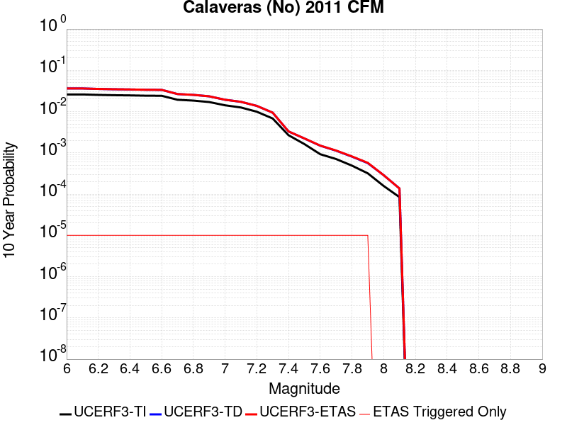 |

| Magnitude | 1 wk TI Prob | 1 wk TD Prob | 1 wk ETAS Prob | 1 wk ETAS/TD Gain | 1 wk ETAS Triggered Only | 1 mo TI Prob | 1 mo TD Prob | 1 mo ETAS Prob | 1 mo ETAS/TD Gain | 1 mo ETAS Triggered Only | 1 yr TI Prob | 1 yr TD Prob | 1 yr ETAS Prob | 1 yr ETAS/TD Gain | 1 yr ETAS Triggered Only | 10 yr TI Prob | 10 yr TD Prob | 10 yr ETAS Prob | 10 yr ETAS/TD Gain | 10 yr ETAS Triggered Only |
|-----|-----|-----|-----|-----|-----|-----|-----|-----|-----|-----|-----|-----|-----|-----|-----|-----|-----|-----|-----|-----|
| 6.0 | 5.0634488E-5 | 7.06809E-5 | 7.06809E-5 | 1.0 | 0.0 | 2.169869E-4 | 3.0288394E-4 | 3.0288394E-4 | 1.0 | 0.0 | 0.0026386147 | 0.003680903 | 0.003680903 | 1.0 | 0.0 | 0.026075039 | 0.036382712 | 0.03639235 | 1.0002649 | 1.0E-5 |
| 6.1 | 5.0634488E-5 | 7.06809E-5 | 7.06809E-5 | 1.0 | 0.0 | 2.169869E-4 | 3.0288394E-4 | 3.0288394E-4 | 1.0 | 0.0 | 0.0026386147 | 0.003680903 | 0.003680903 | 1.0 | 0.0 | 0.026075039 | 0.036382712 | 0.03639235 | 1.0002649 | 1.0E-5 |
| 6.2 | 4.9360384E-5 | 6.880562E-5 | 6.880562E-5 | 1.0 | 0.0 | 2.1152735E-4 | 2.9484913E-4 | 2.9484913E-4 | 1.0 | 0.0 | 0.0025723039 | 0.003583425 | 0.003583425 | 1.0 | 0.0 | 0.025427317 | 0.035442457 | 0.035452105 | 1.0002722 | 1.0E-5 |
| 6.3 | 4.8473896E-5 | 6.753167E-5 | 6.753167E-5 | 1.0 | 0.0 | 2.0772872E-4 | 2.8939056E-4 | 2.8939056E-4 | 1.0 | 0.0 | 0.0025261638 | 0.0035172207 | 0.0035172207 | 1.0 | 0.0 | 0.024976395 | 0.034802377 | 0.03481203 | 1.0002773 | 1.0E-5 |
| 6.4 | 4.794709E-5 | 6.675642E-5 | 6.675642E-5 | 1.0 | 0.0 | 2.0547136E-4 | 2.8606883E-4 | 2.8606883E-4 | 1.0 | 0.0 | 0.0024987436 | 0.0034769098 | 0.0034769098 | 1.0 | 0.0 | 0.024708332 | 0.034413047 | 0.034422703 | 1.0002806 | 1.0E-5 |
| 6.5 | 4.714168E-5 | 6.5617605E-5 | 6.5617605E-5 | 1.0 | 0.0 | 2.0202012E-4 | 2.8118925E-4 | 2.8118925E-4 | 1.0 | 0.0 | 0.0024568206 | 0.0034176884 | 0.0034176884 | 1.0 | 0.0 | 0.024298359 | 0.033840355 | 0.033850014 | 1.0002855 | 1.0E-5 |
| 6.6 | 4.68744E-5 | 6.523333E-5 | 6.523333E-5 | 1.0 | 0.0 | 2.0087481E-4 | 2.795427E-4 | 2.795427E-4 | 1.0 | 0.0 | 0.0024429078 | 0.0033977043 | 0.0033977043 | 1.0 | 0.0 | 0.024162268 | 0.033647064 | 0.033656728 | 1.0002872 | 1.0E-5 |
| 6.7 | 3.746961E-5 | 5.1349554E-5 | 5.1349554E-5 | 1.0 | 0.0 | 1.6057416E-4 | 2.2005118E-4 | 2.2005118E-4 | 1.0 | 0.0 | 0.0019532375 | 0.0026758697 | 0.0026758697 | 1.0 | 0.0 | 0.019361584 | 0.026630923 | 0.026640657 | 1.0003655 | 1.0E-5 |
| 6.8 | 3.5740326E-5 | 4.9044902E-5 | 4.9044902E-5 | 1.0 | 0.0 | 1.5316384E-4 | 2.1017573E-4 | 2.1017573E-4 | 1.0 | 0.0 | 0.0018631746 | 0.002555925 | 0.002555925 | 1.0 | 0.0 | 0.018476306 | 0.025458232 | 0.025467977 | 1.0003828 | 1.0E-5 |
| 6.9 | 3.294716E-5 | 4.509369E-5 | 4.509369E-5 | 1.0 | 0.0 | 1.4119445E-4 | 1.9324457E-4 | 1.9324457E-4 | 1.0 | 0.0 | 0.001717687 | 0.0023502514 | 0.0023502514 | 1.0 | 0.0 | 0.017044706 | 0.023441503 | 0.023451269 | 1.0004166 | 1.0E-5 |
| 7.0 | 2.7443015E-5 | 3.7117694E-5 | 3.7117694E-5 | 1.0 | 0.0 | 1.1760762E-4 | 1.5906629E-4 | 1.5906629E-4 | 1.0 | 0.0 | 0.0014309322 | 0.0019349392 | 0.0019349392 | 1.0 | 0.0 | 0.014217532 | 0.019360244 | 0.01937005 | 1.0005065 | 1.0E-5 |
| 7.1 | 2.4271032E-5 | 3.302559E-5 | 3.302559E-5 | 1.0 | 0.0 | 1.0401456E-4 | 1.415307E-4 | 1.415307E-4 | 1.0 | 0.0 | 0.0012656415 | 0.0017218004 | 0.0017218004 | 1.0 | 0.0 | 0.0125845745 | 0.017251803 | 0.01726163 | 1.0005697 | 1.0E-5 |
| 7.2 | 1.9143261E-5 | 2.6231073E-5 | 2.6231073E-5 | 1.0 | 0.0 | 8.2039965E-5 | 1.1241415E-4 | 1.1241415E-4 | 1.0 | 0.0 | 9.983788E-4 | 0.0013678033 | 0.0013678033 | 1.0 | 0.0 | 0.009939053 | 0.0137500595 | 0.013759921 | 1.0007173 | 1.0E-5 |
| 7.3 | 1.3104985E-5 | 1.7950046E-5 | 1.7950046E-5 | 1.0 | 0.0 | 5.616301E-5 | 7.692659E-5 | 7.692659E-5 | 1.0 | 0.0 | 6.835701E-4 | 9.361954E-4 | 9.361954E-4 | 1.0 | 0.0 | 0.006814712 | 0.009439989 | 0.009449895 | 1.0010493 | 1.0E-5 |
| 7.4 | 5.1434595E-6 | 6.2276627E-6 | 6.2276627E-6 | 1.0 | 0.0 | 2.2043212E-5 | 2.668971E-5 | 2.668971E-5 | 1.0 | 0.0 | 2.6834305E-4 | 3.248989E-4 | 3.248989E-4 | 1.0 | 0.0 | 0.0026801925 | 0.0033046224 | 0.0033145894 | 1.0030161 | 1.0E-5 |
| 7.5 | 3.1340207E-6 | 4.169803E-6 | 4.169803E-6 | 1.0 | 0.0 | 1.3431449E-5 | 1.7870463E-5 | 1.7870463E-5 | 1.0 | 0.0 | 1.6351561E-4 | 2.1755123E-4 | 2.1755123E-4 | 1.0 | 0.0 | 0.0016339534 | 0.0022319278 | 0.0022419055 | 1.0044705 | 1.0E-5 |
| 7.6 | 1.7797015E-6 | 2.7487429E-6 | 2.7487429E-6 | 1.0 | 0.0 | 7.62727E-6 | 1.1780273E-5 | 1.1780273E-5 | 1.0 | 0.0 | 9.2858056E-5 | 1.4341545E-4 | 1.4341545E-4 | 1.0 | 0.0 | 9.2819263E-4 | 0.00149116 | 0.0015011451 | 1.0066962 | 1.0E-5 |
| 7.7 | 1.3601611E-6 | 2.0597233E-6 | 2.0597233E-6 | 1.0 | 0.0 | 5.829249E-6 | 8.8273555E-6 | 8.8273555E-6 | 1.0 | 0.0 | 7.0968796E-5 | 1.0746778E-4 | 1.0746778E-4 | 1.0 | 0.0 | 7.0946134E-4 | 0.0011298355 | 0.0011398242 | 1.0088408 | 1.0E-5 |
| 7.8 | 9.4039103E-7 | 1.4741756E-6 | 1.4741756E-6 | 1.0 | 0.0 | 4.030241E-6 | 6.3178804E-6 | 6.3178804E-6 | 1.0 | 0.0 | 4.9067083E-5 | 7.691749E-5 | 7.691749E-5 | 1.0 | 0.0 | 4.9056247E-4 | 8.107406E-4 | 8.207325E-4 | 1.0123245 | 1.0E-5 |
| 7.9 | 6.123966E-7 | 1.0287723E-6 | 1.0287723E-6 | 1.0 | 0.0 | 2.6245543E-6 | 4.4090166E-6 | 4.4090166E-6 | 1.0 | 0.0 | 3.1953477E-5 | 5.3678465E-5 | 5.3678465E-5 | 1.0 | 0.0 | 3.1948884E-4 | 5.6403957E-4 | 5.740339E-4 | 1.0177193 | 1.0E-5 |
| 8.0 | 3.028202E-7 | 5.323503E-7 | 5.323503E-7 | 1.0 | 0.0 | 1.2978003E-6 | 2.2814993E-6 | 2.2814993E-6 | 1.0 | 0.0 | 1.5800604E-5 | 2.7776901E-5 | 2.7776901E-5 | 1.0 | 0.0 | 1.579948E-4 | 2.881903E-4 | 2.881903E-4 | 1.0 | 0.0 |
| 8.1 | 1.6208645E-7 | 2.5231256E-7 | 2.5231256E-7 | 1.0 | 0.0 | 6.946561E-7 | 1.0813391E-6 | 1.0813391E-6 | 1.0 | 0.0 | 8.457405E-6 | 1.3165224E-5 | 1.3165224E-5 | 1.0 | 0.0 | 8.457083E-5 | 1.3699349E-4 | 1.3699349E-4 | 1.0 | 0.0 |

## San Jacinto (Superstition Mtn)
*[(top)](#table-of-contents)*

| 1 Week | 1 Month | 1 Year | 10 Year |
|-----|-----|-----|-----|
|  |  |  | 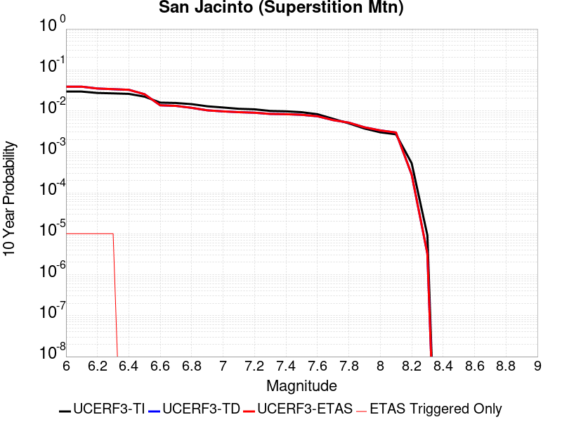 |

| Magnitude | 1 wk TI Prob | 1 wk TD Prob | 1 wk ETAS Prob | 1 wk ETAS/TD Gain | 1 wk ETAS Triggered Only | 1 mo TI Prob | 1 mo TD Prob | 1 mo ETAS Prob | 1 mo ETAS/TD Gain | 1 mo ETAS Triggered Only | 1 yr TI Prob | 1 yr TD Prob | 1 yr ETAS Prob | 1 yr ETAS/TD Gain | 1 yr ETAS Triggered Only | 10 yr TI Prob | 10 yr TD Prob | 10 yr ETAS Prob | 10 yr ETAS/TD Gain | 10 yr ETAS Triggered Only |
|-----|-----|-----|-----|-----|-----|-----|-----|-----|-----|-----|-----|-----|-----|-----|-----|-----|-----|-----|-----|-----|
| 6.0 | 5.7413825E-5 | 7.5625234E-5 | 7.5625234E-5 | 1.0 | 0.0 | 2.4603604E-4 | 3.2407278E-4 | 3.2407278E-4 | 1.0 | 0.0 | 0.0029913743 | 0.003939318 | 0.003939318 | 1.0 | 0.0 | 0.029514262 | 0.03883463 | 0.038844243 | 1.0002475 | 1.0E-5 |
| 6.1 | 5.7413825E-5 | 7.5625234E-5 | 7.5625234E-5 | 1.0 | 0.0 | 2.4603604E-4 | 3.2407278E-4 | 3.2407278E-4 | 1.0 | 0.0 | 0.0029913743 | 0.003939318 | 0.003939318 | 1.0 | 0.0 | 0.029514262 | 0.03883463 | 0.038844243 | 1.0002475 | 1.0E-5 |
| 6.2 | 5.301124E-5 | 6.793421E-5 | 6.793421E-5 | 1.0 | 0.0 | 2.2717126E-4 | 2.9111892E-4 | 2.9111892E-4 | 1.0 | 0.0 | 0.002762302 | 0.0035394575 | 0.0035394575 | 1.0 | 0.0 | 0.027282173 | 0.035006687 | 0.035016336 | 1.0002756 | 1.0E-5 |
| 6.3 | 5.176842E-5 | 6.540897E-5 | 6.540897E-5 | 1.0 | 0.0 | 2.2184578E-4 | 2.8029876E-4 | 2.8029876E-4 | 1.0 | 0.0 | 0.002697627 | 0.0034081354 | 0.0034081354 | 1.0 | 0.0 | 0.02665114 | 0.033752475 | 0.03376214 | 1.0002862 | 1.0E-5 |
| 6.4 | 5.0311868E-5 | 6.3097345E-5 | 6.3097345E-5 | 1.0 | 0.0 | 2.1560448E-4 | 2.7039388E-4 | 2.7039388E-4 | 1.0 | 0.0 | 0.0026218246 | 0.0032879116 | 0.0032879116 | 1.0 | 0.0 | 0.02591107 | 0.032591853 | 0.032591853 | 1.0 | 0.0 |
| 6.5 | 4.3004227E-5 | 4.873731E-5 | 4.873731E-5 | 1.0 | 0.0 | 1.8429082E-4 | 2.0886096E-4 | 2.0886096E-4 | 1.0 | 0.0 | 0.0022414317 | 0.0025405362 | 0.0025405362 | 1.0 | 0.0 | 0.022189582 | 0.025391506 | 0.025391506 | 1.0 | 0.0 |
| 6.6 | 3.061426E-5 | 2.5620446E-5 | 2.5620446E-5 | 1.0 | 0.0 | 1.3119738E-4 | 1.09797365E-4 | 1.09797365E-4 | 1.0 | 0.0 | 0.0015961577 | 0.0013359773 | 0.0013359773 | 1.0 | 0.0 | 0.015847417 | 0.013628467 | 0.013628467 | 1.0 | 0.0 |
| 6.7 | 2.9986502E-5 | 2.4799467E-5 | 2.4799467E-5 | 1.0 | 0.0 | 1.2850725E-4 | 1.0627918E-4 | 1.0627918E-4 | 1.0 | 0.0 | 0.0015634528 | 0.0012931948 | 0.0012931948 | 1.0 | 0.0 | 0.015524988 | 0.013205374 | 0.013205374 | 1.0 | 0.0 |
| 6.8 | 2.8081267E-5 | 2.2122607E-5 | 2.2122607E-5 | 1.0 | 0.0 | 1.2034274E-4 | 9.480777E-5 | 9.480777E-5 | 1.0 | 0.0 | 0.001464188 | 0.0011536812 | 0.0011536812 | 1.0 | 0.0 | 0.014545783 | 0.011817146 | 0.011817146 | 1.0 | 0.0 |
| 6.9 | 2.4861587E-5 | 1.9180226E-5 | 1.9180226E-5 | 1.0 | 0.0 | 1.0654531E-4 | 8.21984E-5 | 8.21984E-5 | 1.0 | 0.0 | 0.0012964172 | 0.0010003103 | 0.0010003103 | 1.0 | 0.0 | 0.012888801 | 0.010273214 | 0.010273214 | 1.0 | 0.0 |
| 7.0 | 2.3214767E-5 | 1.8091247E-5 | 1.8091247E-5 | 1.0 | 0.0 | 9.948807E-5 | 7.753163E-5 | 7.753163E-5 | 1.0 | 0.0 | 0.0012105941 | 9.435423E-4 | 9.435423E-4 | 1.0 | 0.0 | 0.012040204 | 0.009697153 | 0.009697153 | 1.0 | 0.0 |
| 7.1 | 2.1598064E-5 | 1.7269102E-5 | 1.7269102E-5 | 1.0 | 0.0 | 9.255985E-5 | 7.400835E-5 | 7.400835E-5 | 1.0 | 0.0 | 0.0011263335 | 9.0068224E-4 | 9.0068224E-4 | 1.0 | 0.0 | 0.011206418 | 0.009261204 | 0.009261204 | 1.0 | 0.0 |
| 7.2 | 2.095458E-5 | 1.6757413E-5 | 1.6757413E-5 | 1.0 | 0.0 | 8.980225E-5 | 7.181552E-5 | 7.181552E-5 | 1.0 | 0.0 | 0.0010927939 | 8.740062E-4 | 8.740062E-4 | 1.0 | 0.0 | 0.010874357 | 0.008993886 | 0.008993886 | 1.0 | 0.0 |
| 7.3 | 1.913679E-5 | 1.5636357E-5 | 1.5636357E-5 | 1.0 | 0.0 | 8.2012244E-5 | 6.701125E-5 | 6.701125E-5 | 1.0 | 0.0 | 9.980416E-4 | 8.155591E-4 | 8.155591E-4 | 1.0 | 0.0 | 0.0099357115 | 0.008407042 | 0.008407042 | 1.0 | 0.0 |
| 7.4 | 1.8729352E-5 | 1.5385403E-5 | 1.5385403E-5 | 1.0 | 0.0 | 8.026618E-5 | 6.593579E-5 | 6.593579E-5 | 1.0 | 0.0 | 9.768027E-4 | 8.024751E-4 | 8.024751E-4 | 1.0 | 0.0 | 0.009725201 | 0.008275709 | 0.008275709 | 1.0 | 0.0 |
| 7.5 | 1.781637E-5 | 1.4859899E-5 | 1.4859899E-5 | 1.0 | 0.0 | 7.635364E-5 | 6.368374E-5 | 6.368374E-5 | 1.0 | 0.0 | 9.29209E-4 | 7.750762E-4 | 7.750762E-4 | 1.0 | 0.0 | 0.009253331 | 0.007998287 | 0.007998287 | 1.0 | 0.0 |
| 7.6 | 1.5910027E-5 | 1.369636E-5 | 1.369636E-5 | 1.0 | 0.0 | 6.818405E-5 | 5.8697377E-5 | 5.8697377E-5 | 1.0 | 0.0 | 8.298246E-4 | 7.144084E-4 | 7.144084E-4 | 1.0 | 0.0 | 0.008267327 | 0.007384135 | 0.007384135 | 1.0 | 0.0 |
| 7.7 | 1.2279664E-5 | 1.09408775E-5 | 1.09408775E-5 | 1.0 | 0.0 | 5.2626066E-5 | 4.6888636E-5 | 4.6888636E-5 | 1.0 | 0.0 | 6.40534E-4 | 5.7072035E-4 | 5.7072035E-4 | 1.0 | 0.0 | 0.0063869087 | 0.005935451 | 0.005935451 | 1.0 | 0.0 |
| 7.8 | 9.490666E-6 | 9.449946E-6 | 9.449946E-6 | 1.0 | 0.0 | 4.067365E-5 | 4.0499144E-5 | 4.0499144E-5 | 1.0 | 0.0 | 4.9508916E-4 | 4.929661E-4 | 4.929661E-4 | 1.0 | 0.0 | 0.004939876 | 0.005147468 | 0.005147468 | 1.0 | 0.0 |
| 7.9 | 7.0954525E-6 | 7.19023E-6 | 7.19023E-6 | 1.0 | 0.0 | 3.0408728E-5 | 3.081491E-5 | 3.081491E-5 | 1.0 | 0.0 | 3.7016335E-4 | 3.7510743E-4 | 3.7510743E-4 | 1.0 | 0.0 | 0.0036954738 | 0.003953157 | 0.003953157 | 1.0 | 0.0 |
| 8.0 | 5.731693E-6 | 6.0044895E-6 | 6.0044895E-6 | 1.0 | 0.0 | 2.4564166E-5 | 2.5733274E-5 | 2.5733274E-5 | 1.0 | 0.0 | 2.9902768E-4 | 3.13258E-4 | 3.13258E-4 | 1.0 | 0.0 | 0.0029862563 | 0.0033213636 | 0.0033213636 | 1.0 | 0.0 |
| 8.1 | 5.126008E-6 | 5.322949E-6 | 5.322949E-6 | 1.0 | 0.0 | 2.196842E-5 | 2.2812443E-5 | 2.2812443E-5 | 1.0 | 0.0 | 2.6743268E-4 | 2.777065E-4 | 2.777065E-4 | 1.0 | 0.0 | 0.002671111 | 0.002952024 | 0.002952024 | 1.0 | 0.0 |
| 8.2 | 1.0093714E-6 | 4.723235E-7 | 4.723235E-7 | 1.0 | 0.0 | 4.32587E-6 | 2.0242421E-6 | 2.0242421E-6 | 1.0 | 0.0 | 5.2666197E-5 | 2.4644885E-5 | 2.4644885E-5 | 1.0 | 0.0 | 5.265372E-4 | 2.7829976E-4 | 2.7829976E-4 | 1.0 | 0.0 |
| 8.3 | 1.7538872E-8 | 5.533671E-9 | 5.533671E-9 | 1.0 | 0.0 | 7.516659E-8 | 2.3715732E-8 | 2.3715732E-8 | 1.0 | 0.0 | 9.151529E-7 | 2.8873902E-7 | 2.8873902E-7 | 1.0 | 0.0 | 9.151491E-6 | 3.2444627E-6 | 3.2444627E-6 | 1.0 | 0.0 |

## Hat Creek-McArthur-Mayfield
*[(top)](#table-of-contents)*

| 1 Week | 1 Month | 1 Year | 10 Year |
|-----|-----|-----|-----|
| 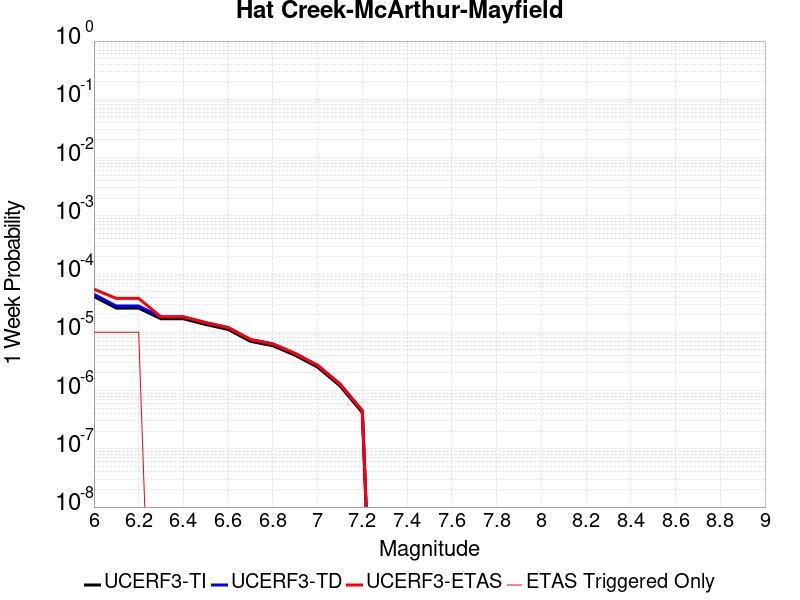 |  |  | 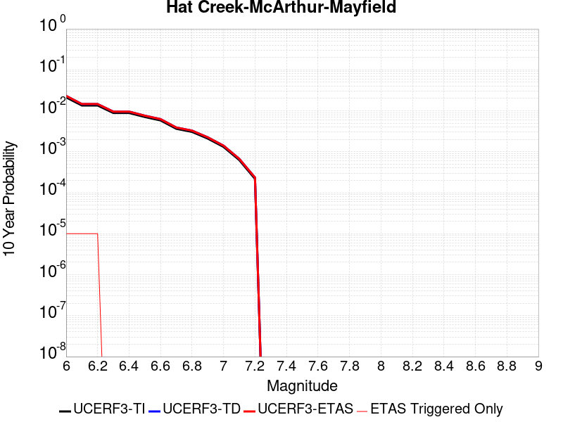 |

| Magnitude | 1 wk TI Prob | 1 wk TD Prob | 1 wk ETAS Prob | 1 wk ETAS/TD Gain | 1 wk ETAS Triggered Only | 1 mo TI Prob | 1 mo TD Prob | 1 mo ETAS Prob | 1 mo ETAS/TD Gain | 1 mo ETAS Triggered Only | 1 yr TI Prob | 1 yr TD Prob | 1 yr ETAS Prob | 1 yr ETAS/TD Gain | 1 yr ETAS Triggered Only | 10 yr TI Prob | 10 yr TD Prob | 10 yr ETAS Prob | 10 yr ETAS/TD Gain | 10 yr ETAS Triggered Only |
|-----|-----|-----|-----|-----|-----|-----|-----|-----|-----|-----|-----|-----|-----|-----|-----|-----|-----|-----|-----|-----|
| 6.0 | 4.125577E-5 | 4.493958E-5 | 5.4939133E-5 | 1.2225109 | 1.0E-5 | 1.7679846E-4 | 1.9258467E-4 | 2.0258274E-4 | 1.0519152 | 1.0E-5 | 0.0021503961 | 0.0023423182 | 0.0023522947 | 1.0042592 | 1.0E-5 | 0.021297062 | 0.023189485 | 0.023199253 | 1.0004213 | 1.0E-5 |
| 6.1 | 2.6072905E-5 | 2.8226792E-5 | 3.822651E-5 | 1.3542633 | 1.0E-5 | 1.1173623E-4 | 1.2096655E-4 | 1.3096533E-4 | 1.0826575 | 1.0E-5 | 0.0013595397 | 0.001471807 | 0.0014817922 | 1.0067843 | 1.0E-5 | 0.013512522 | 0.014624293 | 0.014634146 | 1.0006738 | 1.0E-5 |
| 6.2 | 2.6072905E-5 | 2.8226792E-5 | 3.822651E-5 | 1.3542633 | 1.0E-5 | 1.1173623E-4 | 1.2096655E-4 | 1.3096533E-4 | 1.0826575 | 1.0E-5 | 0.0013595397 | 0.001471807 | 0.0014817922 | 1.0067843 | 1.0E-5 | 0.013512522 | 0.014624293 | 0.014634146 | 1.0006738 | 1.0E-5 |
| 6.3 | 1.707914E-5 | 1.8410126E-5 | 1.8410126E-5 | 1.0 | 0.0 | 7.3194264E-5 | 7.88982E-5 | 7.88982E-5 | 1.0 | 0.0 | 8.907758E-4 | 9.6017134E-4 | 9.6017134E-4 | 1.0 | 0.0 | 0.0088721365 | 0.009561216 | 0.009561216 | 1.0 | 0.0 |
| 6.4 | 1.707914E-5 | 1.8410126E-5 | 1.8410126E-5 | 1.0 | 0.0 | 7.3194264E-5 | 7.88982E-5 | 7.88982E-5 | 1.0 | 0.0 | 8.907758E-4 | 9.6017134E-4 | 9.6017134E-4 | 1.0 | 0.0 | 0.0088721365 | 0.009561216 | 0.009561216 | 1.0 | 0.0 |
| 6.5 | 1.3607675E-5 | 1.4642681E-5 | 1.4642681E-5 | 1.0 | 0.0 | 5.8317306E-5 | 6.275287E-5 | 6.275287E-5 | 1.0 | 0.0 | 7.097819E-4 | 7.6375395E-4 | 7.6375395E-4 | 1.0 | 0.0 | 0.007075191 | 0.007611888 | 0.007611888 | 1.0 | 0.0 |
| 6.6 | 1.120891E-5 | 1.20486E-5 | 1.20486E-5 | 1.0 | 0.0 | 4.8037302E-5 | 5.1635856E-5 | 5.1635856E-5 | 1.0 | 0.0 | 5.8469723E-4 | 6.284891E-4 | 6.284891E-4 | 1.0 | 0.0 | 0.005831612 | 0.006267526 | 0.006267526 | 1.0 | 0.0 |
| 6.7 | 6.9993293E-6 | 7.5128637E-6 | 7.5128637E-6 | 1.0 | 0.0 | 2.9996781E-5 | 3.2197597E-5 | 3.2197597E-5 | 1.0 | 0.0 | 3.651496E-4 | 3.9193674E-4 | 3.9193674E-4 | 1.0 | 0.0 | 0.003645502 | 0.0039126086 | 0.0039126086 | 1.0 | 0.0 |
| 6.8 | 5.878023E-6 | 6.307918E-6 | 6.307918E-6 | 1.0 | 0.0 | 2.5191284E-5 | 2.703366E-5 | 2.703366E-5 | 1.0 | 0.0 | 3.0666072E-4 | 3.290863E-4 | 3.290863E-4 | 1.0 | 0.0 | 0.0030623786 | 0.0032861088 | 0.0032861088 | 1.0 | 0.0 |
| 6.9 | 4.030111E-6 | 4.3228147E-6 | 4.3228147E-6 | 1.0 | 0.0 | 1.727179E-5 | 1.8526222E-5 | 1.8526222E-5 | 1.0 | 0.0 | 2.1026375E-4 | 2.2553411E-4 | 2.2553411E-4 | 1.0 | 0.0 | 0.0021006493 | 0.0022531226 | 0.0022531226 | 1.0 | 0.0 |
| 7.0 | 2.525991E-6 | 2.7069314E-6 | 2.7069314E-6 | 1.0 | 0.0 | 1.0825632E-5 | 1.1601085E-5 | 1.1601085E-5 | 1.0 | 0.0 | 1.3179409E-4 | 1.4123441E-4 | 1.4123441E-4 | 1.0 | 0.0 | 0.0013171595 | 0.0014114815 | 0.0014114815 | 1.0 | 0.0 |
| 7.1 | 1.2058822E-6 | 1.2928988E-6 | 1.2928988E-6 | 1.0 | 0.0 | 5.1680563E-6 | 5.5409837E-6 | 5.5409837E-6 | 1.0 | 0.0 | 6.2919265E-5 | 6.7459565E-5 | 6.7459565E-5 | 1.0 | 0.0 | 6.2901457E-4 | 6.7440805E-4 | 6.7440805E-4 | 1.0 | 0.0 |
| 7.2 | 4.1884962E-7 | 4.4984088E-7 | 4.4984088E-7 | 1.0 | 0.0 | 1.7950686E-6 | 1.9278887E-6 | 1.9278887E-6 | 1.0 | 0.0 | 2.1854741E-5 | 2.3471881E-5 | 2.3471881E-5 | 1.0 | 0.0 | 2.185259E-4 | 2.3470291E-4 | 2.3470291E-4 | 1.0 | 0.0 |

## Hector Mine
*[(top)](#table-of-contents)*

| 1 Week | 1 Month | 1 Year | 10 Year |
|-----|-----|-----|-----|
|  |  |  |  |

| Magnitude | 1 wk TI Prob | 1 wk TD Prob | 1 wk ETAS Prob | 1 wk ETAS/TD Gain | 1 wk ETAS Triggered Only | 1 mo TI Prob | 1 mo TD Prob | 1 mo ETAS Prob | 1 mo ETAS/TD Gain | 1 mo ETAS Triggered Only | 1 yr TI Prob | 1 yr TD Prob | 1 yr ETAS Prob | 1 yr ETAS/TD Gain | 1 yr ETAS Triggered Only | 10 yr TI Prob | 10 yr TD Prob | 10 yr ETAS Prob | 10 yr ETAS/TD Gain | 10 yr ETAS Triggered Only |
|-----|-----|-----|-----|-----|-----|-----|-----|-----|-----|-----|-----|-----|-----|-----|-----|-----|-----|-----|-----|-----|
| 6.0 | 1.9675748E-5 | 2.921829E-6 | 2.921829E-6 | 1.0 | 0.0 | 8.432191E-5 | 1.2522086E-5 | 1.2522086E-5 | 1.0 | 0.0 | 0.0010261356 | 1.5244969E-4 | 1.5244969E-4 | 1.0 | 0.0 | 0.010214103 | 0.0015238385 | 0.0015338233 | 1.0065523 | 1.0E-5 |
| 6.1 | 1.9675748E-5 | 2.921829E-6 | 2.921829E-6 | 1.0 | 0.0 | 8.432191E-5 | 1.2522086E-5 | 1.2522086E-5 | 1.0 | 0.0 | 0.0010261356 | 1.5244969E-4 | 1.5244969E-4 | 1.0 | 0.0 | 0.010214103 | 0.0015238385 | 0.0015338233 | 1.0065523 | 1.0E-5 |
| 6.2 | 1.9675748E-5 | 2.921829E-6 | 2.921829E-6 | 1.0 | 0.0 | 8.432191E-5 | 1.2522086E-5 | 1.2522086E-5 | 1.0 | 0.0 | 0.0010261356 | 1.5244969E-4 | 1.5244969E-4 | 1.0 | 0.0 | 0.010214103 | 0.0015238385 | 0.0015338233 | 1.0065523 | 1.0E-5 |
| 6.3 | 1.9675748E-5 | 2.921829E-6 | 2.921829E-6 | 1.0 | 0.0 | 8.432191E-5 | 1.2522086E-5 | 1.2522086E-5 | 1.0 | 0.0 | 0.0010261356 | 1.5244969E-4 | 1.5244969E-4 | 1.0 | 0.0 | 0.010214103 | 0.0015238385 | 0.0015338233 | 1.0065523 | 1.0E-5 |
| 6.4 | 1.1481097E-5 | 2.921829E-6 | 2.921829E-6 | 1.0 | 0.0 | 4.9203776E-5 | 1.2522086E-5 | 1.2522086E-5 | 1.0 | 0.0 | 5.988913E-4 | 1.5244969E-4 | 1.5244969E-4 | 1.0 | 0.0 | 0.0059727984 | 0.0015238385 | 0.0015338233 | 1.0065523 | 1.0E-5 |
| 6.5 | 1.1481097E-5 | 2.921829E-6 | 2.921829E-6 | 1.0 | 0.0 | 4.9203776E-5 | 1.2522086E-5 | 1.2522086E-5 | 1.0 | 0.0 | 5.988913E-4 | 1.5244969E-4 | 1.5244969E-4 | 1.0 | 0.0 | 0.0059727984 | 0.0015238385 | 0.0015338233 | 1.0065523 | 1.0E-5 |
| 6.6 | 1.1296974E-5 | 2.921829E-6 | 2.921829E-6 | 1.0 | 0.0 | 4.8414706E-5 | 1.2522086E-5 | 1.2522086E-5 | 1.0 | 0.0 | 5.892896E-4 | 1.5244969E-4 | 1.5244969E-4 | 1.0 | 0.0 | 0.0058772936 | 0.0015238385 | 0.0015338233 | 1.0065523 | 1.0E-5 |
| 6.7 | 7.976231E-6 | 2.8885609E-6 | 2.8885609E-6 | 1.0 | 0.0 | 3.41834E-5 | 1.237951E-5 | 1.237951E-5 | 1.0 | 0.0 | 4.161034E-4 | 1.5071406E-4 | 1.5071406E-4 | 1.0 | 0.0 | 0.004153251 | 0.0015065058 | 0.0015164907 | 1.0066279 | 1.0E-5 |
| 6.8 | 7.669884E-6 | 2.8509692E-6 | 2.8509692E-6 | 1.0 | 0.0 | 3.287052E-5 | 1.2218404E-5 | 1.2218404E-5 | 1.0 | 0.0 | 4.0012508E-4 | 1.4875286E-4 | 1.4875286E-4 | 1.0 | 0.0 | 0.003994054 | 0.0014869202 | 0.0014969053 | 1.0067153 | 1.0E-5 |
| 6.9 | 6.54516E-6 | 2.6174996E-6 | 2.6174996E-6 | 1.0 | 0.0 | 2.8050383E-5 | 1.12178295E-5 | 1.12178295E-5 | 1.0 | 0.0 | 3.414599E-4 | 1.3657245E-4 | 1.3657245E-4 | 1.0 | 0.0 | 0.003409357 | 0.00136527 | 0.0013752563 | 1.0073146 | 1.0E-5 |
| 7.0 | 4.8146E-6 | 1.7946223E-6 | 1.7946223E-6 | 1.0 | 0.0 | 2.0633835E-5 | 7.691235E-6 | 7.691235E-6 | 1.0 | 0.0 | 2.5118797E-4 | 9.364007E-5 | 9.364007E-5 | 1.0 | 0.0 | 0.0025090424 | 9.363309E-4 | 9.463215E-4 | 1.01067 | 1.0E-5 |
| 7.1 | 1.2446935E-6 | 1.5343582E-7 | 1.5343582E-7 | 1.0 | 0.0 | 5.33439E-6 | 6.5758195E-7 | 6.5758195E-7 | 1.0 | 0.0 | 6.4944266E-5 | 8.006035E-6 | 8.006035E-6 | 1.0 | 0.0 | 6.4925285E-4 | 8.005788E-5 | 8.005788E-5 | 1.0 | 0.0 |
| 7.2 | 7.9677756E-7 | 9.198669E-8 | 9.198669E-8 | 1.0 | 0.0 | 3.4147565E-6 | 3.9422864E-7 | 3.9422864E-7 | 1.0 | 0.0 | 4.157387E-5 | 4.7997246E-6 | 4.7997246E-6 | 1.0 | 0.0 | 4.156609E-4 | 4.7996386E-5 | 4.7996386E-5 | 1.0 | 0.0 |
| 7.3 | 2.9501928E-7 | 4.55239E-8 | 4.55239E-8 | 1.0 | 0.0 | 1.2643677E-6 | 1.9510243E-7 | 1.9510243E-7 | 1.0 | 0.0 | 1.5393569E-5 | 2.3753703E-6 | 2.3753703E-6 | 1.0 | 0.0 | 1.5392502E-4 | 2.3753524E-5 | 2.3753524E-5 | 1.0 | 0.0 |

## North Frontal  (West)
*[(top)](#table-of-contents)*

| 1 Week | 1 Month | 1 Year | 10 Year |
|-----|-----|-----|-----|
|  |  |  |  |

| Magnitude | 1 wk TI Prob | 1 wk TD Prob | 1 wk ETAS Prob | 1 wk ETAS/TD Gain | 1 wk ETAS Triggered Only | 1 mo TI Prob | 1 mo TD Prob | 1 mo ETAS Prob | 1 mo ETAS/TD Gain | 1 mo ETAS Triggered Only | 1 yr TI Prob | 1 yr TD Prob | 1 yr ETAS Prob | 1 yr ETAS/TD Gain | 1 yr ETAS Triggered Only | 10 yr TI Prob | 10 yr TD Prob | 10 yr ETAS Prob | 10 yr ETAS/TD Gain | 10 yr ETAS Triggered Only |
|-----|-----|-----|-----|-----|-----|-----|-----|-----|-----|-----|-----|-----|-----|-----|-----|-----|-----|-----|-----|-----|
| 6.0 | 4.9429755E-6 | 5.0669437E-6 | 5.0669437E-6 | 1.0 | 0.0 | 2.1184009E-5 | 2.1715301E-5 | 2.1715301E-5 | 1.0 | 0.0 | 2.5788476E-4 | 2.643533E-4 | 2.643533E-4 | 1.0 | 0.0 | 0.002575857 | 0.002640546 | 0.0026505196 | 1.0037771 | 1.0E-5 |
| 6.1 | 4.9429755E-6 | 5.0669437E-6 | 5.0669437E-6 | 1.0 | 0.0 | 2.1184009E-5 | 2.1715301E-5 | 2.1715301E-5 | 1.0 | 0.0 | 2.5788476E-4 | 2.643533E-4 | 2.643533E-4 | 1.0 | 0.0 | 0.002575857 | 0.002640546 | 0.0026505196 | 1.0037771 | 1.0E-5 |
| 6.2 | 4.9429755E-6 | 5.0669437E-6 | 5.0669437E-6 | 1.0 | 0.0 | 2.1184009E-5 | 2.1715301E-5 | 2.1715301E-5 | 1.0 | 0.0 | 2.5788476E-4 | 2.643533E-4 | 2.643533E-4 | 1.0 | 0.0 | 0.002575857 | 0.002640546 | 0.0026505196 | 1.0037771 | 1.0E-5 |
| 6.3 | 4.9429755E-6 | 5.0669437E-6 | 5.0669437E-6 | 1.0 | 0.0 | 2.1184009E-5 | 2.1715301E-5 | 2.1715301E-5 | 1.0 | 0.0 | 2.5788476E-4 | 2.643533E-4 | 2.643533E-4 | 1.0 | 0.0 | 0.002575857 | 0.002640546 | 0.0026505196 | 1.0037771 | 1.0E-5 |
| 6.4 | 4.9429755E-6 | 5.0669437E-6 | 5.0669437E-6 | 1.0 | 0.0 | 2.1184009E-5 | 2.1715301E-5 | 2.1715301E-5 | 1.0 | 0.0 | 2.5788476E-4 | 2.643533E-4 | 2.643533E-4 | 1.0 | 0.0 | 0.002575857 | 0.002640546 | 0.0026505196 | 1.0037771 | 1.0E-5 |
| 6.5 | 4.9429755E-6 | 5.0669437E-6 | 5.0669437E-6 | 1.0 | 0.0 | 2.1184009E-5 | 2.1715301E-5 | 2.1715301E-5 | 1.0 | 0.0 | 2.5788476E-4 | 2.643533E-4 | 2.643533E-4 | 1.0 | 0.0 | 0.002575857 | 0.002640546 | 0.0026505196 | 1.0037771 | 1.0E-5 |
| 6.6 | 4.9429755E-6 | 5.0669437E-6 | 5.0669437E-6 | 1.0 | 0.0 | 2.1184009E-5 | 2.1715301E-5 | 2.1715301E-5 | 1.0 | 0.0 | 2.5788476E-4 | 2.643533E-4 | 2.643533E-4 | 1.0 | 0.0 | 0.002575857 | 0.002640546 | 0.0026505196 | 1.0037771 | 1.0E-5 |
| 6.7 | 3.717786E-6 | 3.8115545E-6 | 3.8115545E-6 | 1.0 | 0.0 | 1.5933272E-5 | 1.6335136E-5 | 1.6335136E-5 | 1.0 | 0.0 | 1.939703E-4 | 1.9886297E-4 | 1.9886297E-4 | 1.0 | 0.0 | 0.0019380109 | 0.0019869332 | 0.0019969132 | 1.0050229 | 1.0E-5 |
| 6.8 | 3.717786E-6 | 3.8115545E-6 | 3.8115545E-6 | 1.0 | 0.0 | 1.5933272E-5 | 1.6335136E-5 | 1.6335136E-5 | 1.0 | 0.0 | 1.939703E-4 | 1.9886297E-4 | 1.9886297E-4 | 1.0 | 0.0 | 0.0019380109 | 0.0019869332 | 0.0019969132 | 1.0050229 | 1.0E-5 |
| 6.9 | 3.160636E-6 | 3.2396392E-6 | 3.2396392E-6 | 1.0 | 0.0 | 1.3545513E-5 | 1.3884099E-5 | 1.3884099E-5 | 1.0 | 0.0 | 1.6490414E-4 | 1.690265E-4 | 1.690265E-4 | 1.0 | 0.0 | 0.0016478183 | 0.0016890499 | 0.0016990331 | 1.0059105 | 1.0E-5 |
| 7.0 | 2.6360522E-6 | 2.7014419E-6 | 2.7014419E-6 | 1.0 | 0.0 | 1.12973175E-5 | 1.157756E-5 | 1.157756E-5 | 1.0 | 0.0 | 1.3753616E-4 | 1.4094818E-4 | 1.4094818E-4 | 1.0 | 0.0 | 0.0013745107 | 0.0014086381 | 0.001418624 | 1.007089 | 1.0E-5 |
| 7.1 | 2.2800255E-6 | 2.3354035E-6 | 2.3354035E-6 | 1.0 | 0.0 | 9.771502E-6 | 1.00088355E-5 | 1.00088355E-5 | 1.0 | 0.0 | 1.18961536E-4 | 1.2185123E-4 | 1.2185123E-4 | 1.0 | 0.0 | 0.0011889787 | 0.0012178905 | 0.0012178905 | 1.0 | 0.0 |
| 7.2 | 1.6995848E-6 | 1.735041E-6 | 1.735041E-6 | 1.0 | 0.0 | 7.283915E-6 | 7.4358704E-6 | 7.4358704E-6 | 1.0 | 0.0 | 8.8678054E-5 | 9.052823E-5 | 9.052823E-5 | 1.0 | 0.0 | 8.864267E-4 | 9.0494024E-4 | 9.0494024E-4 | 1.0 | 0.0 |
| 7.3 | 1.012918E-6 | 1.0257436E-6 | 1.0257436E-6 | 1.0 | 0.0 | 4.3410696E-6 | 4.396037E-6 | 4.396037E-6 | 1.0 | 0.0 | 5.2851243E-5 | 5.3520547E-5 | 5.3520547E-5 | 1.0 | 0.0 | 5.2838674E-4 | 5.3508725E-4 | 5.3508725E-4 | 1.0 | 0.0 |
| 7.4 | 8.6731205E-7 | 8.752654E-7 | 8.752654E-7 | 1.0 | 0.0 | 3.7170462E-6 | 3.7511327E-6 | 3.7511327E-6 | 1.0 | 0.0 | 4.52541E-5 | 4.5669185E-5 | 4.5669185E-5 | 1.0 | 0.0 | 4.5244885E-4 | 4.5660793E-4 | 4.5660793E-4 | 1.0 | 0.0 |
| 7.5 | 6.0200006E-7 | 6.010063E-7 | 6.010063E-7 | 1.0 | 0.0 | 2.5799977E-6 | 2.5757392E-6 | 2.5757392E-6 | 1.0 | 0.0 | 3.141102E-5 | 3.1359225E-5 | 3.1359225E-5 | 1.0 | 0.0 | 3.140658E-4 | 3.1355288E-4 | 3.1355288E-4 | 1.0 | 0.0 |
| 7.6 | 2.4695896E-7 | 2.3272185E-7 | 2.3272185E-7 | 1.0 | 0.0 | 1.0583951E-6 | 9.973791E-7 | 9.973791E-7 | 1.0 | 0.0 | 1.2885885E-5 | 1.2143034E-5 | 1.2143034E-5 | 1.0 | 0.0 | 1.2885137E-4 | 1.21424906E-4 | 1.21424906E-4 | 1.0 | 0.0 |
| 7.7 | 5.6909883E-8 | 4.323312E-8 | 4.323312E-8 | 1.0 | 0.0 | 2.4389948E-7 | 1.8528478E-7 | 1.8528478E-7 | 1.0 | 0.0 | 2.969472E-6 | 2.2558402E-6 | 2.2558402E-6 | 1.0 | 0.0 | 2.9694324E-5 | 2.2558195E-5 | 2.2558195E-5 | 1.0 | 0.0 |
| 7.8 | 5.0266844E-9 | 2.844847E-9 | 2.844847E-9 | 1.0 | 0.0 | 2.1542933E-8 | 1.2192201E-8 | 1.2192201E-8 | 1.0 | 0.0 | 2.6228517E-7 | 1.4844005E-7 | 1.4844005E-7 | 1.0 | 0.0 | 2.6228486E-6 | 1.4844005E-6 | 1.4844005E-6 | 1.0 | 0.0 |

## Kickapoo
*[(top)](#table-of-contents)*

| 1 Week | 1 Month | 1 Year | 10 Year |
|-----|-----|-----|-----|
|  |  |  |  |

| Magnitude | 1 wk TI Prob | 1 wk TD Prob | 1 wk ETAS Prob | 1 wk ETAS/TD Gain | 1 wk ETAS Triggered Only | 1 mo TI Prob | 1 mo TD Prob | 1 mo ETAS Prob | 1 mo ETAS/TD Gain | 1 mo ETAS Triggered Only | 1 yr TI Prob | 1 yr TD Prob | 1 yr ETAS Prob | 1 yr ETAS/TD Gain | 1 yr ETAS Triggered Only | 10 yr TI Prob | 10 yr TD Prob | 10 yr ETAS Prob | 10 yr ETAS/TD Gain | 10 yr ETAS Triggered Only |
|-----|-----|-----|-----|-----|-----|-----|-----|-----|-----|-----|-----|-----|-----|-----|-----|-----|-----|-----|-----|-----|
| 6.0 | 5.201389E-6 | 5.2103648E-8 | 5.2103648E-8 | 1.0 | 0.0 | 2.2291475E-5 | 2.2330133E-7 | 1.0223299E-5 | 45.782528 | 1.0E-5 | 2.713649E-4 | 2.718691E-6 | 1.2718664E-5 | 4.6782312 | 1.0E-5 | 0.0027103378 | 2.718662E-5 | 3.7186346E-5 | 1.367818 | 1.0E-5 |
| 6.1 | 5.201389E-6 | 5.2103648E-8 | 5.2103648E-8 | 1.0 | 0.0 | 2.2291475E-5 | 2.2330133E-7 | 1.0223299E-5 | 45.782528 | 1.0E-5 | 2.713649E-4 | 2.718691E-6 | 1.2718664E-5 | 4.6782312 | 1.0E-5 | 0.0027103378 | 2.718662E-5 | 3.7186346E-5 | 1.367818 | 1.0E-5 |
| 6.2 | 5.201389E-6 | 5.2103648E-8 | 5.2103648E-8 | 1.0 | 0.0 | 2.2291475E-5 | 2.2330133E-7 | 1.0223299E-5 | 45.782528 | 1.0E-5 | 2.713649E-4 | 2.718691E-6 | 1.2718664E-5 | 4.6782312 | 1.0E-5 | 0.0027103378 | 2.718662E-5 | 3.7186346E-5 | 1.367818 | 1.0E-5 |
| 6.3 | 5.201389E-6 | 5.2103648E-8 | 5.2103648E-8 | 1.0 | 0.0 | 2.2291475E-5 | 2.2330133E-7 | 1.0223299E-5 | 45.782528 | 1.0E-5 | 2.713649E-4 | 2.718691E-6 | 1.2718664E-5 | 4.6782312 | 1.0E-5 | 0.0027103378 | 2.718662E-5 | 3.7186346E-5 | 1.367818 | 1.0E-5 |
| 6.4 | 5.201389E-6 | 5.2103648E-8 | 5.2103648E-8 | 1.0 | 0.0 | 2.2291475E-5 | 2.2330133E-7 | 1.0223299E-5 | 45.782528 | 1.0E-5 | 2.713649E-4 | 2.718691E-6 | 1.2718664E-5 | 4.6782312 | 1.0E-5 | 0.0027103378 | 2.718662E-5 | 3.7186346E-5 | 1.367818 | 1.0E-5 |
| 6.5 | 5.201389E-6 | 5.2103648E-8 | 5.2103648E-8 | 1.0 | 0.0 | 2.2291475E-5 | 2.2330133E-7 | 1.0223299E-5 | 45.782528 | 1.0E-5 | 2.713649E-4 | 2.718691E-6 | 1.2718664E-5 | 4.6782312 | 1.0E-5 | 0.0027103378 | 2.718662E-5 | 3.7186346E-5 | 1.367818 | 1.0E-5 |
| 6.6 | 4.777232E-6 | 5.2103648E-8 | 5.2103648E-8 | 1.0 | 0.0 | 2.047369E-5 | 2.2330133E-7 | 1.0223299E-5 | 45.782528 | 1.0E-5 | 2.4923866E-4 | 2.718691E-6 | 1.2718664E-5 | 4.6782312 | 1.0E-5 | 0.002489593 | 2.718662E-5 | 3.7186346E-5 | 1.367818 | 1.0E-5 |
| 6.7 | 4.777232E-6 | 5.2103648E-8 | 5.2103648E-8 | 1.0 | 0.0 | 2.047369E-5 | 2.2330133E-7 | 1.0223299E-5 | 45.782528 | 1.0E-5 | 2.4923866E-4 | 2.718691E-6 | 1.2718664E-5 | 4.6782312 | 1.0E-5 | 0.002489593 | 2.718662E-5 | 3.7186346E-5 | 1.367818 | 1.0E-5 |
| 6.8 | 2.4242365E-6 | 5.2103648E-8 | 5.2103648E-8 | 1.0 | 0.0 | 1.0389544E-5 | 2.2330133E-7 | 1.0223299E-5 | 45.782528 | 1.0E-5 | 1.2648535E-4 | 2.718691E-6 | 1.2718664E-5 | 4.6782312 | 1.0E-5 | 0.0012641338 | 2.718662E-5 | 3.7186346E-5 | 1.367818 | 1.0E-5 |
| 6.9 | 2.3107716E-6 | 5.2103648E-8 | 5.2103648E-8 | 1.0 | 0.0 | 9.903269E-6 | 2.2330133E-7 | 1.0223299E-5 | 45.782528 | 1.0E-5 | 1.2056563E-4 | 2.718691E-6 | 1.2718664E-5 | 4.6782312 | 1.0E-5 | 0.0012050023 | 2.718662E-5 | 3.7186346E-5 | 1.367818 | 1.0E-5 |
| 7.0 | 1.8197697E-6 | 5.2103648E-8 | 5.2103648E-8 | 1.0 | 0.0 | 7.79899E-6 | 2.2330133E-7 | 1.0223299E-5 | 45.782528 | 1.0E-5 | 9.494857E-5 | 2.718691E-6 | 1.2718664E-5 | 4.6782312 | 1.0E-5 | 9.490801E-4 | 2.718662E-5 | 3.7186346E-5 | 1.367818 | 1.0E-5 |
| 7.1 | 1.3553556E-6 | 5.2103648E-8 | 5.2103648E-8 | 1.0 | 0.0 | 5.808654E-6 | 2.2330133E-7 | 1.0223299E-5 | 45.782528 | 1.0E-5 | 7.0718066E-5 | 2.718691E-6 | 1.2718664E-5 | 4.6782312 | 1.0E-5 | 7.069557E-4 | 2.718662E-5 | 3.7186346E-5 | 1.367818 | 1.0E-5 |
| 7.2 | 7.531932E-7 | 5.2102227E-8 | 5.2102227E-8 | 1.0 | 0.0 | 3.227967E-6 | 2.2329525E-7 | 1.0223293E-5 | 45.78375 | 1.0E-5 | 3.929979E-5 | 2.7186165E-6 | 1.27185895E-5 | 4.6783314 | 1.0E-5 | 3.929284E-4 | 2.7185877E-5 | 3.7185604E-5 | 1.367828 | 1.0E-5 |
| 7.3 | 7.0948767E-7 | 5.2076594E-8 | 5.2076594E-8 | 1.0 | 0.0 | 3.040658E-6 | 2.231854E-7 | 1.0223183E-5 | 45.80579 | 1.0E-5 | 3.701938E-5 | 2.7172791E-6 | 1.2717252E-5 | 4.680142 | 1.0E-5 | 3.7013215E-4 | 2.7172504E-5 | 3.717223E-5 | 1.3680091 | 1.0E-5 |
| 7.4 | 6.356557E-7 | 5.0873016E-8 | 5.0873016E-8 | 1.0 | 0.0 | 2.7242359E-6 | 2.180272E-7 | 1.0218025E-5 | 46.86583 | 1.0E-5 | 3.3167067E-5 | 2.6544783E-6 | 1.2654452E-5 | 4.7672086 | 1.0E-5 | 3.3162118E-4 | 2.6544509E-5 | 3.6544243E-5 | 1.3767158 | 1.0E-5 |
| 7.5 | 3.77359E-7 | 2.7828516E-8 | 2.7828516E-8 | 1.0 | 0.0 | 1.6172518E-6 | 1.1926507E-7 | 1.0119264E-5 | 84.84684 | 1.0E-5 | 1.9689864E-5 | 1.4520514E-6 | 1.1452037E-5 | 7.8867984 | 1.0E-5 | 1.9688118E-4 | 1.4520439E-5 | 2.4520295E-5 | 1.6886743 | 1.0E-5 |

## North Tahoe 2011 CFM
*[(top)](#table-of-contents)*

| 1 Week | 1 Month | 1 Year | 10 Year |
|-----|-----|-----|-----|
|  |  |  | 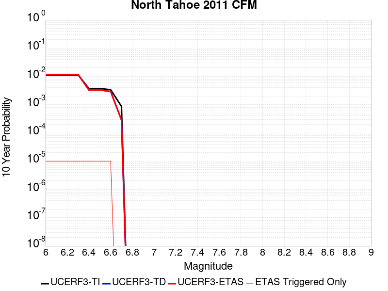 |

| Magnitude | 1 wk TI Prob | 1 wk TD Prob | 1 wk ETAS Prob | 1 wk ETAS/TD Gain | 1 wk ETAS Triggered Only | 1 mo TI Prob | 1 mo TD Prob | 1 mo ETAS Prob | 1 mo ETAS/TD Gain | 1 mo ETAS Triggered Only | 1 yr TI Prob | 1 yr TD Prob | 1 yr ETAS Prob | 1 yr ETAS/TD Gain | 1 yr ETAS Triggered Only | 10 yr TI Prob | 10 yr TD Prob | 10 yr ETAS Prob | 10 yr ETAS/TD Gain | 10 yr ETAS Triggered Only |
|-----|-----|-----|-----|-----|-----|-----|-----|-----|-----|-----|-----|-----|-----|-----|-----|-----|-----|-----|-----|-----|
| 6.0 | 2.1659247E-5 | 2.244149E-5 | 2.244149E-5 | 1.0 | 0.0 | 9.282204E-5 | 9.61754E-5 | 9.61754E-5 | 1.0 | 0.0 | 0.0011295225 | 0.0011705057 | 0.0011804939 | 1.0085334 | 1.0E-5 | 0.0112379845 | 0.011662975 | 0.011672858 | 1.0008475 | 1.0E-5 |
| 6.1 | 2.1659247E-5 | 2.244149E-5 | 2.244149E-5 | 1.0 | 0.0 | 9.282204E-5 | 9.61754E-5 | 9.61754E-5 | 1.0 | 0.0 | 0.0011295225 | 0.0011705057 | 0.0011804939 | 1.0085334 | 1.0E-5 | 0.0112379845 | 0.011662975 | 0.011672858 | 1.0008475 | 1.0E-5 |
| 6.2 | 2.1659247E-5 | 2.244149E-5 | 2.244149E-5 | 1.0 | 0.0 | 9.282204E-5 | 9.61754E-5 | 9.61754E-5 | 1.0 | 0.0 | 0.0011295225 | 0.0011705057 | 0.0011804939 | 1.0085334 | 1.0E-5 | 0.0112379845 | 0.011662975 | 0.011672858 | 1.0008475 | 1.0E-5 |
| 6.3 | 2.1659247E-5 | 2.244149E-5 | 2.244149E-5 | 1.0 | 0.0 | 9.282204E-5 | 9.61754E-5 | 9.61754E-5 | 1.0 | 0.0 | 0.0011295225 | 0.0011705057 | 0.0011804939 | 1.0085334 | 1.0E-5 | 0.0112379845 | 0.011662975 | 0.011672858 | 1.0008475 | 1.0E-5 |
| 6.4 | 7.1607556E-6 | 6.335974E-6 | 6.335974E-6 | 1.0 | 0.0 | 3.0688592E-5 | 2.7154047E-5 | 2.7154047E-5 | 1.0 | 0.0 | 3.7356952E-4 | 3.3057795E-4 | 3.4057465E-4 | 1.03024 | 1.0E-5 | 0.0037294216 | 0.0033035686 | 0.0033135356 | 1.0030171 | 1.0E-5 |
| 6.5 | 7.1607556E-6 | 6.335974E-6 | 6.335974E-6 | 1.0 | 0.0 | 3.0688592E-5 | 2.7154047E-5 | 2.7154047E-5 | 1.0 | 0.0 | 3.7356952E-4 | 3.3057795E-4 | 3.4057465E-4 | 1.03024 | 1.0E-5 | 0.0037294216 | 0.0033035686 | 0.0033135356 | 1.0030171 | 1.0E-5 |
| 6.6 | 6.51507E-6 | 5.619398E-6 | 5.619398E-6 | 1.0 | 0.0 | 2.792143E-5 | 2.4083065E-5 | 2.4083065E-5 | 1.0 | 0.0 | 3.3989036E-4 | 2.9319915E-4 | 3.0319623E-4 | 1.0340965 | 1.0E-5 | 0.0033937097 | 0.0029307979 | 0.0029407684 | 1.003402 | 1.0E-5 |
| 6.7 | 1.6645556E-6 | 5.478228E-7 | 5.478228E-7 | 1.0 | 0.0 | 7.1337904E-6 | 2.3478121E-6 | 2.3478121E-6 | 1.0 | 0.0 | 8.6850436E-5 | 2.8584613E-5 | 2.8584613E-5 | 1.0 | 0.0 | 8.68165E-4 | 2.8584612E-4 | 2.8584612E-4 | 1.0 | 0.0 |

## Hayward (No) 2011 CFM
*[(top)](#table-of-contents)*

| 1 Week | 1 Month | 1 Year | 10 Year |
|-----|-----|-----|-----|
|  |  |  |  |

| Magnitude | 1 wk TI Prob | 1 wk TD Prob | 1 wk ETAS Prob | 1 wk ETAS/TD Gain | 1 wk ETAS Triggered Only | 1 mo TI Prob | 1 mo TD Prob | 1 mo ETAS Prob | 1 mo ETAS/TD Gain | 1 mo ETAS Triggered Only | 1 yr TI Prob | 1 yr TD Prob | 1 yr ETAS Prob | 1 yr ETAS/TD Gain | 1 yr ETAS Triggered Only | 10 yr TI Prob | 10 yr TD Prob | 10 yr ETAS Prob | 10 yr ETAS/TD Gain | 10 yr ETAS Triggered Only |
|-----|-----|-----|-----|-----|-----|-----|-----|-----|-----|-----|-----|-----|-----|-----|-----|-----|-----|-----|-----|-----|
| 6.0 | 9.4314826E-5 | 1.7726216E-4 | 1.7726216E-4 | 1.0 | 0.0 | 4.0414376E-4 | 7.5946946E-4 | 7.5946946E-4 | 1.0 | 0.0 | 0.0049093543 | 0.009207134 | 0.009207134 | 1.0 | 0.0 | 0.04802304 | 0.08791462 | 0.08792374 | 1.0001037 | 1.0E-5 |
| 6.1 | 9.151404E-5 | 1.7222391E-4 | 1.7222391E-4 | 1.0 | 0.0 | 3.9214408E-4 | 7.378893E-4 | 7.378893E-4 | 1.0 | 0.0 | 0.004763907 | 0.008946808 | 0.008946808 | 1.0 | 0.0 | 0.04663067 | 0.08555428 | 0.08556343 | 1.0001069 | 1.0E-5 |
| 6.2 | 9.091709E-5 | 1.7124708E-4 | 1.7124708E-4 | 1.0 | 0.0 | 3.8958646E-4 | 7.3371053E-4 | 7.3371053E-4 | 1.0 | 0.0 | 0.004732904 | 0.008896396 | 0.008896396 | 1.0 | 0.0 | 0.046333637 | 0.08509321 | 0.08510236 | 1.0001075 | 1.0E-5 |
| 6.3 | 8.8995985E-5 | 1.6767617E-4 | 1.6767617E-4 | 1.0 | 0.0 | 3.813556E-4 | 7.1841513E-4 | 7.1841513E-4 | 1.0 | 0.0 | 0.004633124 | 0.008711721 | 0.008711721 | 1.0 | 0.0 | 0.045377117 | 0.0834166 | 0.08342577 | 1.0001099 | 1.0E-5 |
| 6.4 | 8.549114E-5 | 1.6113164E-4 | 1.6113164E-4 | 1.0 | 0.0 | 3.6633914E-4 | 6.903822E-4 | 6.903822E-4 | 1.0 | 0.0 | 0.0044510607 | 0.008373142 | 0.008373142 | 1.0 | 0.0 | 0.04362957 | 0.08033309 | 0.080342285 | 1.0001144 | 1.0E-5 |
| 6.5 | 8.1550905E-5 | 1.5412315E-4 | 1.5412315E-4 | 1.0 | 0.0 | 3.4945706E-4 | 6.6036126E-4 | 6.6036126E-4 | 1.0 | 0.0 | 0.004246342 | 0.008010431 | 0.008010431 | 1.0 | 0.0 | 0.041661125 | 0.07700832 | 0.07701755 | 1.0001198 | 1.0E-5 |
| 6.6 | 8.0417645E-5 | 1.5208201E-4 | 1.5208201E-4 | 1.0 | 0.0 | 3.4460152E-4 | 6.5161794E-4 | 6.5161794E-4 | 1.0 | 0.0 | 0.0041874545 | 0.007904759 | 0.007904759 | 1.0 | 0.0 | 0.04109423 | 0.07603825 | 0.07604749 | 1.0001215 | 1.0E-5 |
| 6.7 | 7.817835E-5 | 1.4817776E-4 | 1.4817776E-4 | 1.0 | 0.0 | 3.3500703E-4 | 6.348937E-4 | 6.348937E-4 | 1.0 | 0.0 | 0.004071085 | 0.007702597 | 0.007702597 | 1.0 | 0.0 | 0.03997307 | 0.074175864 | 0.07418512 | 1.0001248 | 1.0E-5 |
| 6.8 | 7.3042946E-5 | 1.3838096E-4 | 1.3838096E-4 | 1.0 | 0.0 | 3.1300363E-4 | 5.929271E-4 | 5.929271E-4 | 1.0 | 0.0 | 0.0038041614 | 0.0071951323 | 0.0071951323 | 1.0 | 0.0 | 0.037396953 | 0.06946788 | 0.069477186 | 1.000134 | 1.0E-5 |
| 6.9 | 6.5060856E-5 | 1.2294295E-4 | 1.2294295E-4 | 1.0 | 0.0 | 2.7880244E-4 | 5.267924E-4 | 5.267924E-4 | 1.0 | 0.0 | 0.0033891369 | 0.0063949414 | 0.0063949414 | 1.0 | 0.0 | 0.03337913 | 0.062013067 | 0.062022448 | 1.0001513 | 1.0E-5 |
| 7.0 | 5.45148E-5 | 1.0210662E-4 | 1.0210662E-4 | 1.0 | 0.0 | 2.3361393E-4 | 4.3752673E-4 | 4.3752673E-4 | 1.0 | 0.0 | 0.00284054 | 0.0053139427 | 0.0053139427 | 1.0 | 0.0 | 0.028045045 | 0.051871344 | 0.051880825 | 1.0001827 | 1.0E-5 |
| 7.1 | 4.4591594E-5 | 8.278668E-5 | 8.278668E-5 | 1.0 | 0.0 | 1.9109284E-4 | 3.5475203E-4 | 3.5475203E-4 | 1.0 | 0.0 | 0.0023240729 | 0.0043105925 | 0.0043105925 | 1.0 | 0.0 | 0.02299917 | 0.04236427 | 0.04236427 | 1.0 | 0.0 |
| 7.2 | 3.3484182E-5 | 6.21787E-5 | 6.21787E-5 | 1.0 | 0.0 | 1.4349575E-4 | 2.6645305E-4 | 2.6645305E-4 | 1.0 | 0.0 | 0.0017456607 | 0.0032392624 | 0.0032392624 | 1.0 | 0.0 | 0.017320113 | 0.032080825 | 0.032080825 | 1.0 | 0.0 |
| 7.3 | 2.4610781E-5 | 4.5574616E-5 | 4.5574616E-5 | 1.0 | 0.0 | 1.05470506E-4 | 1.9530523E-4 | 1.9530523E-4 | 1.0 | 0.0 | 0.0012833469 | 0.002375261 | 0.002375261 | 1.0 | 0.0 | 0.012759608 | 0.023642104 | 0.023642104 | 1.0 | 0.0 |
| 7.4 | 1.8870904E-5 | 3.4819546E-5 | 3.4819546E-5 | 1.0 | 0.0 | 8.087279E-5 | 1.4921813E-4 | 1.4921813E-4 | 1.0 | 0.0 | 9.841814E-4 | 0.0018152258 | 0.0018152258 | 1.0 | 0.0 | 0.009798341 | 0.01813206 | 0.01813206 | 1.0 | 0.0 |
| 7.5 | 1.2769941E-5 | 2.3244467E-5 | 2.3244467E-5 | 1.0 | 0.0 | 5.4727174E-5 | 9.9615376E-5 | 9.9615376E-5 | 1.0 | 0.0 | 6.660996E-4 | 0.0012121475 | 0.0012121475 | 1.0 | 0.0 | 0.0066410657 | 0.012156774 | 0.012156774 | 1.0 | 0.0 |
| 7.6 | 4.871575E-6 | 8.852869E-6 | 8.852869E-6 | 1.0 | 0.0 | 2.0878011E-5 | 3.794032E-5 | 3.794032E-5 | 1.0 | 0.0 | 2.5416014E-4 | 4.6182677E-4 | 4.6182677E-4 | 1.0 | 0.0 | 0.0025386964 | 0.004655373 | 0.004655373 | 1.0 | 0.0 |
| 7.7 | 4.1224885E-7 | 7.5393444E-7 | 7.5393444E-7 | 1.0 | 0.0 | 1.7667796E-6 | 3.2311434E-6 | 3.2311434E-6 | 1.0 | 0.0 | 2.1510328E-5 | 3.9338465E-5 | 3.9338465E-5 | 1.0 | 0.0 | 2.1508247E-4 | 4.0846775E-4 | 4.0846775E-4 | 1.0 | 0.0 |
| 7.8 | 2.7386105E-7 | 5.6190555E-7 | 5.6190555E-7 | 1.0 | 0.0 | 1.1736896E-6 | 2.4081644E-6 | 2.4081644E-6 | 1.0 | 0.0 | 1.4289578E-5 | 2.931901E-5 | 2.931901E-5 | 1.0 | 0.0 | 1.428866E-4 | 3.0650623E-4 | 3.0650623E-4 | 1.0 | 0.0 |
| 7.9 | 1.9435508E-7 | 4.1086855E-7 | 4.1086855E-7 | 1.0 | 0.0 | 8.329501E-7 | 1.7608639E-6 | 1.7608639E-6 | 1.0 | 0.0 | 1.0141121E-5 | 2.1438309E-5 | 2.1438309E-5 | 1.0 | 0.0 | 1.0140657E-4 | 2.2348421E-4 | 2.2348421E-4 | 1.0 | 0.0 |
| 8.0 | 1.3740272E-7 | 3.0675014E-7 | 3.0675014E-7 | 1.0 | 0.0 | 5.888687E-7 | 1.3146428E-6 | 1.3146428E-6 | 1.0 | 0.0 | 7.169453E-6 | 1.6005659E-5 | 1.6005659E-5 | 1.0 | 0.0 | 7.1692215E-5 | 1.6557358E-4 | 1.6557358E-4 | 1.0 | 0.0 |
| 8.1 | 7.599975E-8 | 1.6343344E-7 | 1.6343344E-7 | 1.0 | 0.0 | 3.257132E-7 | 7.004288E-7 | 7.004288E-7 | 1.0 | 0.0 | 3.9655506E-6 | 8.527688E-6 | 8.527688E-6 | 1.0 | 0.0 | 3.96548E-5 | 8.780777E-5 | 8.780777E-5 | 1.0 | 0.0 |

## Homestead Valley 2011
*[(top)](#table-of-contents)*

| 1 Week | 1 Month | 1 Year | 10 Year |
|-----|-----|-----|-----|
|  |  |  |  |

| Magnitude | 1 wk TI Prob | 1 wk TD Prob | 1 wk ETAS Prob | 1 wk ETAS/TD Gain | 1 wk ETAS Triggered Only | 1 mo TI Prob | 1 mo TD Prob | 1 mo ETAS Prob | 1 mo ETAS/TD Gain | 1 mo ETAS Triggered Only | 1 yr TI Prob | 1 yr TD Prob | 1 yr ETAS Prob | 1 yr ETAS/TD Gain | 1 yr ETAS Triggered Only | 10 yr TI Prob | 10 yr TD Prob | 10 yr ETAS Prob | 10 yr ETAS/TD Gain | 10 yr ETAS Triggered Only |
|-----|-----|-----|-----|-----|-----|-----|-----|-----|-----|-----|-----|-----|-----|-----|-----|-----|-----|-----|-----|-----|
| 6.0 | 1.506411E-5 | 6.260421E-6 | 6.260421E-6 | 1.0 | 0.0 | 6.455887E-5 | 2.6830212E-5 | 3.6829944E-5 | 1.3727041 | 1.0E-5 | 7.857208E-4 | 3.2662906E-4 | 3.366258E-4 | 1.0306058 | 1.0E-5 | 0.007829485 | 0.0032634693 | 0.0032734368 | 1.0030543 | 1.0E-5 |
| 6.1 | 1.506411E-5 | 6.260421E-6 | 6.260421E-6 | 1.0 | 0.0 | 6.455887E-5 | 2.6830212E-5 | 3.6829944E-5 | 1.3727041 | 1.0E-5 | 7.857208E-4 | 3.2662906E-4 | 3.366258E-4 | 1.0306058 | 1.0E-5 | 0.007829485 | 0.0032634693 | 0.0032734368 | 1.0030543 | 1.0E-5 |
| 6.2 | 1.506411E-5 | 6.260421E-6 | 6.260421E-6 | 1.0 | 0.0 | 6.455887E-5 | 2.6830212E-5 | 3.6829944E-5 | 1.3727041 | 1.0E-5 | 7.857208E-4 | 3.2662906E-4 | 3.366258E-4 | 1.0306058 | 1.0E-5 | 0.007829485 | 0.0032634693 | 0.0032734368 | 1.0030543 | 1.0E-5 |
| 6.3 | 1.506411E-5 | 6.260421E-6 | 6.260421E-6 | 1.0 | 0.0 | 6.455887E-5 | 2.6830212E-5 | 3.6829944E-5 | 1.3727041 | 1.0E-5 | 7.857208E-4 | 3.2662906E-4 | 3.366258E-4 | 1.0306058 | 1.0E-5 | 0.007829485 | 0.0032634693 | 0.0032734368 | 1.0030543 | 1.0E-5 |
| 6.4 | 1.506411E-5 | 6.260421E-6 | 6.260421E-6 | 1.0 | 0.0 | 6.455887E-5 | 2.6830212E-5 | 3.6829944E-5 | 1.3727041 | 1.0E-5 | 7.857208E-4 | 3.2662906E-4 | 3.366258E-4 | 1.0306058 | 1.0E-5 | 0.007829485 | 0.0032634693 | 0.0032734368 | 1.0030543 | 1.0E-5 |
| 6.5 | 1.0358535E-5 | 3.0035455E-6 | 3.0035455E-6 | 1.0 | 0.0 | 4.4392968E-5 | 1.2872319E-5 | 2.287219E-5 | 1.7768508 | 1.0E-5 | 5.4035033E-4 | 1.5671701E-4 | 1.6671544E-4 | 1.0637993 | 1.0E-5 | 0.0053903833 | 0.0015668295 | 0.0015768138 | 1.0063723 | 1.0E-5 |
| 6.6 | 6.5079225E-6 | 5.155275E-7 | 5.155275E-7 | 1.0 | 0.0 | 2.78908E-5 | 2.2094025E-6 | 1.2209381E-5 | 5.5261006 | 1.0E-5 | 3.3951757E-4 | 2.689925E-5 | 3.6898982E-5 | 1.3717476 | 1.0E-5 | 0.003389993 | 2.6897047E-4 | 2.7896778E-4 | 1.0371689 | 1.0E-5 |
| 6.7 | 6.450433E-6 | 5.155275E-7 | 5.155275E-7 | 1.0 | 0.0 | 2.764442E-5 | 2.2094025E-6 | 1.2209381E-5 | 5.5261006 | 1.0E-5 | 3.3651883E-4 | 2.689925E-5 | 3.6898982E-5 | 1.3717476 | 1.0E-5 | 0.0033600968 | 2.6897047E-4 | 2.7896778E-4 | 1.0371689 | 1.0E-5 |
| 6.8 | 4.5537186E-6 | 2.2719877E-7 | 2.2719877E-7 | 1.0 | 0.0 | 1.9515792E-5 | 9.737087E-7 | 1.0973699E-5 | 11.270002 | 1.0E-5 | 2.3757885E-4 | 1.1854842E-5 | 2.1854725E-5 | 1.8435272 | 1.0E-5 | 0.0023732502 | 1.1854248E-4 | 1.2854129E-4 | 1.084348 | 1.0E-5 |
| 6.9 | 4.0986065E-6 | 1.9581307E-7 | 1.9581307E-7 | 1.0 | 0.0 | 1.7565339E-5 | 8.3919866E-7 | 1.08391905E-5 | 12.91612 | 1.0E-5 | 2.13837E-4 | 1.0217198E-5 | 2.0217096E-5 | 1.9787319 | 1.0E-5 | 0.0021363136 | 1.0216755E-4 | 1.1216653E-4 | 1.0978684 | 1.0E-5 |
| 7.0 | 3.0476558E-6 | 1.6229768E-7 | 1.6229768E-7 | 1.0 | 0.0 | 1.3061317E-5 | 6.955613E-7 | 1.0695554E-5 | 15.376867 | 1.0E-5 | 1.5900993E-4 | 8.468428E-6 | 1.8468343E-5 | 2.1808467 | 1.0E-5 | 0.001588962 | 8.4681174E-5 | 9.468033E-5 | 1.11808 | 1.0E-5 |
| 7.1 | 2.3888556E-6 | 1.5693689E-7 | 1.5693689E-7 | 1.0 | 0.0 | 1.0237913E-5 | 6.725865E-7 | 1.067258E-5 | 15.867967 | 1.0E-5 | 1.2463945E-4 | 8.188711E-6 | 1.818863E-5 | 2.2211835 | 1.0E-5 | 0.0012456957 | 8.1884216E-5 | 9.18834E-5 | 1.1221137 | 1.0E-5 |
| 7.2 | 1.4783891E-6 | 1.4998145E-7 | 1.4998145E-7 | 1.0 | 0.0 | 6.3359375E-6 | 6.427775E-7 | 1.06427715E-5 | 16.557474 | 1.0E-5 | 7.713731E-5 | 7.825789E-6 | 1.782571E-5 | 2.2778165 | 1.0E-5 | 7.711054E-4 | 7.825525E-5 | 8.825447E-5 | 1.127777 | 1.0E-5 |
| 7.3 | 1.3517591E-6 | 1.4922233E-7 | 1.4922233E-7 | 1.0 | 0.0 | 5.7932407E-6 | 6.395241E-7 | 1.0639517E-5 | 16.636618 | 1.0E-5 | 7.053043E-5 | 7.78618E-6 | 1.7786102E-5 | 2.284317 | 1.0E-5 | 7.050804E-4 | 7.7859186E-5 | 8.78584E-5 | 1.128427 | 1.0E-5 |
| 7.4 | 1.1549828E-6 | 1.4003692E-7 | 1.4003692E-7 | 1.0 | 0.0 | 4.9499167E-6 | 6.001581E-7 | 1.0600152E-5 | 17.662266 | 1.0E-5 | 6.0263566E-5 | 7.306902E-6 | 1.730683E-5 | 2.3685591 | 1.0E-5 | 6.024723E-4 | 7.306673E-5 | 8.3066E-5 | 1.1368512 | 1.0E-5 |
| 7.5 | 5.963522E-7 | 7.177444E-8 | 7.177444E-8 | 1.0 | 0.0 | 2.5557927E-6 | 3.076047E-7 | 1.0307602E-5 | 33.509247 | 1.0E-5 | 3.111633E-5 | 3.7450816E-6 | 1.3745044E-5 | 3.6701589 | 1.0E-5 | 3.1111974E-4 | 3.745026E-5 | 4.7449885E-5 | 1.2670108 | 1.0E-5 |

## Breckenridge 2011
*[(top)](#table-of-contents)*

| 1 Week | 1 Month | 1 Year | 10 Year |
|-----|-----|-----|-----|
|  |  | 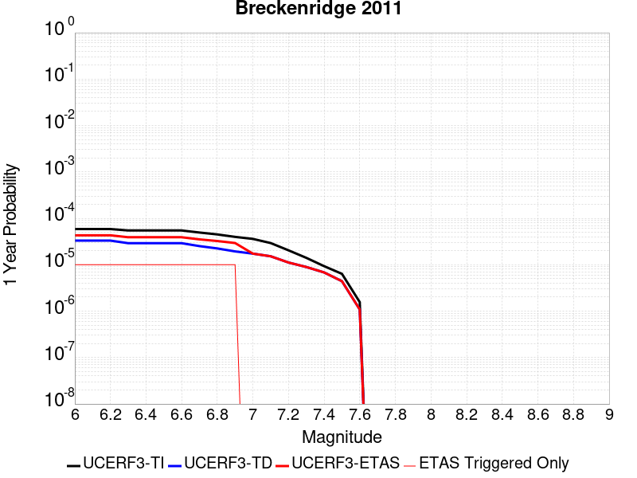 |  |

| Magnitude | 1 wk TI Prob | 1 wk TD Prob | 1 wk ETAS Prob | 1 wk ETAS/TD Gain | 1 wk ETAS Triggered Only | 1 mo TI Prob | 1 mo TD Prob | 1 mo ETAS Prob | 1 mo ETAS/TD Gain | 1 mo ETAS Triggered Only | 1 yr TI Prob | 1 yr TD Prob | 1 yr ETAS Prob | 1 yr ETAS/TD Gain | 1 yr ETAS Triggered Only | 10 yr TI Prob | 10 yr TD Prob | 10 yr ETAS Prob | 10 yr ETAS/TD Gain | 10 yr ETAS Triggered Only |
|-----|-----|-----|-----|-----|-----|-----|-----|-----|-----|-----|-----|-----|-----|-----|-----|-----|-----|-----|-----|-----|
| 6.0 | 1.125816E-6 | 6.34872E-7 | 6.34872E-7 | 1.0 | 0.0 | 4.8249167E-6 | 2.7208773E-6 | 2.7208773E-6 | 1.0 | 0.0 | 5.8741778E-5 | 3.312619E-5 | 4.312586E-5 | 1.3018659 | 1.0E-5 | 5.872625E-4 | 3.312141E-4 | 3.412108E-4 | 1.030182 | 1.0E-5 |
| 6.1 | 1.125816E-6 | 6.34872E-7 | 6.34872E-7 | 1.0 | 0.0 | 4.8249167E-6 | 2.7208773E-6 | 2.7208773E-6 | 1.0 | 0.0 | 5.8741778E-5 | 3.312619E-5 | 4.312586E-5 | 1.3018659 | 1.0E-5 | 5.872625E-4 | 3.312141E-4 | 3.412108E-4 | 1.030182 | 1.0E-5 |
| 6.2 | 1.125816E-6 | 6.34872E-7 | 6.34872E-7 | 1.0 | 0.0 | 4.8249167E-6 | 2.7208773E-6 | 2.7208773E-6 | 1.0 | 0.0 | 5.8741778E-5 | 3.312619E-5 | 4.312586E-5 | 1.3018659 | 1.0E-5 | 5.872625E-4 | 3.312141E-4 | 3.412108E-4 | 1.030182 | 1.0E-5 |
| 6.3 | 1.0497689E-6 | 5.5817384E-7 | 5.5817384E-7 | 1.0 | 0.0 | 4.499002E-6 | 2.3921714E-6 | 2.3921714E-6 | 1.0 | 0.0 | 5.4773973E-5 | 2.9124305E-5 | 3.9124014E-5 | 1.3433459 | 1.0E-5 | 5.4760475E-4 | 2.912057E-4 | 3.0120282E-4 | 1.03433 | 1.0E-5 |
| 6.4 | 1.0497689E-6 | 5.5817384E-7 | 5.5817384E-7 | 1.0 | 0.0 | 4.499002E-6 | 2.3921714E-6 | 2.3921714E-6 | 1.0 | 0.0 | 5.4773973E-5 | 2.9124305E-5 | 3.9124014E-5 | 1.3433459 | 1.0E-5 | 5.4760475E-4 | 2.912057E-4 | 3.0120282E-4 | 1.03433 | 1.0E-5 |
| 6.5 | 1.0497689E-6 | 5.5817384E-7 | 5.5817384E-7 | 1.0 | 0.0 | 4.499002E-6 | 2.3921714E-6 | 2.3921714E-6 | 1.0 | 0.0 | 5.4773973E-5 | 2.9124305E-5 | 3.9124014E-5 | 1.3433459 | 1.0E-5 | 5.4760475E-4 | 2.912057E-4 | 3.0120282E-4 | 1.03433 | 1.0E-5 |
| 6.6 | 1.0497689E-6 | 5.5817384E-7 | 5.5817384E-7 | 1.0 | 0.0 | 4.499002E-6 | 2.3921714E-6 | 2.3921714E-6 | 1.0 | 0.0 | 5.4773973E-5 | 2.9124305E-5 | 3.9124014E-5 | 1.3433459 | 1.0E-5 | 5.4760475E-4 | 2.912057E-4 | 3.0120282E-4 | 1.03433 | 1.0E-5 |
| 6.7 | 9.4757604E-7 | 4.831177E-7 | 4.831177E-7 | 1.0 | 0.0 | 4.061034E-6 | 2.0705027E-6 | 2.0705027E-6 | 1.0 | 0.0 | 4.9441966E-5 | 2.5208083E-5 | 3.520783E-5 | 1.3966881 | 1.0E-5 | 4.9430964E-4 | 2.5205282E-4 | 2.6205028E-4 | 1.0396643 | 1.0E-5 |
| 6.8 | 8.6305687E-7 | 4.3033944E-7 | 4.3033944E-7 | 1.0 | 0.0 | 3.69881E-6 | 1.8443105E-6 | 1.8443105E-6 | 1.0 | 0.0 | 4.503208E-5 | 2.2454255E-5 | 3.245403E-5 | 1.4453399 | 1.0E-5 | 4.5022953E-4 | 2.2452026E-4 | 2.3451801E-4 | 1.0445294 | 1.0E-5 |
| 6.9 | 7.6356105E-7 | 3.7125918E-7 | 3.7125918E-7 | 1.0 | 0.0 | 3.2724004E-6 | 1.5911098E-6 | 1.5911098E-6 | 1.0 | 0.0 | 3.9840746E-5 | 1.9371593E-5 | 2.9371398E-5 | 1.5162098 | 1.0E-5 | 3.9833604E-4 | 1.9369929E-4 | 2.0369736E-4 | 1.0516164 | 1.0E-5 |
| 7.0 | 6.907028E-7 | 3.3248637E-7 | 3.3248637E-7 | 1.0 | 0.0 | 2.9601515E-6 | 1.4249407E-6 | 1.4249407E-6 | 1.0 | 0.0 | 3.6039248E-5 | 1.7348517E-5 | 1.7348517E-5 | 1.0 | 0.0 | 3.6033406E-4 | 1.7347184E-4 | 1.7347184E-4 | 1.0 | 0.0 |
| 7.1 | 5.618619E-7 | 2.914996E-7 | 2.914996E-7 | 1.0 | 0.0 | 2.4079773E-6 | 1.2492834E-6 | 1.2492834E-6 | 1.0 | 0.0 | 2.9316729E-5 | 1.5209921E-5 | 1.5209921E-5 | 1.0 | 0.0 | 2.931286E-4 | 1.5208898E-4 | 1.5208898E-4 | 1.0 | 0.0 |
| 7.2 | 3.918476E-7 | 2.1395581E-7 | 2.1395581E-7 | 1.0 | 0.0 | 1.6793458E-6 | 9.169532E-7 | 9.169532E-7 | 1.0 | 0.0 | 2.0445843E-5 | 1.1163849E-5 | 1.1163849E-5 | 1.0 | 0.0 | 2.0443962E-4 | 1.1163298E-4 | 1.1163298E-4 | 1.0 | 0.0 |
| 7.3 | 2.6982093E-7 | 1.7125721E-7 | 1.7125721E-7 | 1.0 | 0.0 | 1.1563749E-6 | 7.3395927E-7 | 7.3395927E-7 | 1.0 | 0.0 | 1.4078772E-5 | 8.935918E-6 | 8.935918E-6 | 1.0 | 0.0 | 1.4077881E-4 | 8.935567E-5 | 8.935567E-5 | 1.0 | 0.0 |
| 7.4 | 1.7853064E-7 | 1.3076613E-7 | 1.3076613E-7 | 1.0 | 0.0 | 7.6513106E-7 | 5.6042614E-7 | 5.6042614E-7 | 1.0 | 0.0 | 9.315431E-6 | 6.8231675E-6 | 6.8231675E-6 | 1.0 | 0.0 | 9.3150404E-5 | 6.822963E-5 | 6.822963E-5 | 1.0 | 0.0 |
| 7.5 | 1.2207602E-7 | 8.476251E-8 | 8.476251E-8 | 1.0 | 0.0 | 5.231828E-7 | 3.6326787E-7 | 3.6326787E-7 | 1.0 | 0.0 | 6.369732E-6 | 4.4227777E-6 | 4.4227777E-6 | 1.0 | 0.0 | 6.3695494E-5 | 4.4226927E-5 | 4.4226927E-5 | 1.0 | 0.0 |
| 7.6 | 2.9996215E-8 | 2.0812486E-8 | 2.0812486E-8 | 1.0 | 0.0 | 1.285552E-7 | 8.919636E-8 | 8.919636E-8 | 1.0 | 0.0 | 1.5651584E-6 | 1.0859653E-6 | 1.0859653E-6 | 1.0 | 0.0 | 1.5651474E-5 | 1.0859609E-5 | 1.0859609E-5 | 1.0 | 0.0 |

## Fitzhugh Creek
*[(top)](#table-of-contents)*

| 1 Week | 1 Month | 1 Year | 10 Year |
|-----|-----|-----|-----|
| 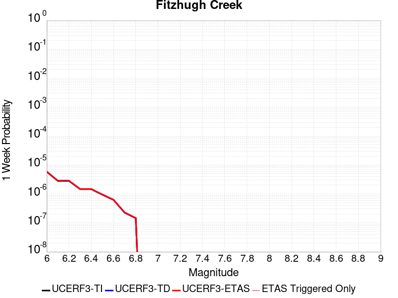 | 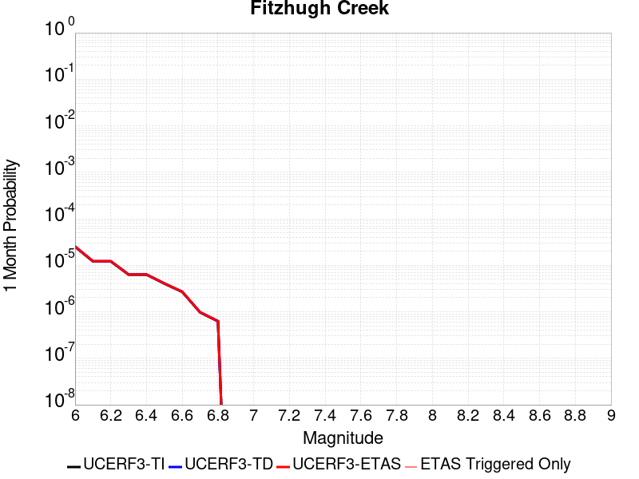 |  |  |

| Magnitude | 1 wk TI Prob | 1 wk TD Prob | 1 wk ETAS Prob | 1 wk ETAS/TD Gain | 1 wk ETAS Triggered Only | 1 mo TI Prob | 1 mo TD Prob | 1 mo ETAS Prob | 1 mo ETAS/TD Gain | 1 mo ETAS Triggered Only | 1 yr TI Prob | 1 yr TD Prob | 1 yr ETAS Prob | 1 yr ETAS/TD Gain | 1 yr ETAS Triggered Only | 10 yr TI Prob | 10 yr TD Prob | 10 yr ETAS Prob | 10 yr ETAS/TD Gain | 10 yr ETAS Triggered Only |
|-----|-----|-----|-----|-----|-----|-----|-----|-----|-----|-----|-----|-----|-----|-----|-----|-----|-----|-----|-----|-----|
| 6.0 | 5.841746E-6 | 5.9349054E-6 | 5.9349054E-6 | 1.0 | 0.0 | 2.5035813E-5 | 2.5435083E-5 | 2.5435083E-5 | 1.0 | 0.0 | 3.047684E-4 | 3.0963228E-4 | 3.0963228E-4 | 1.0 | 0.0 | 0.0030435075 | 0.0030924159 | 0.003102385 | 1.0032238 | 1.0E-5 |
| 6.1 | 2.8222328E-6 | 2.8654579E-6 | 2.8654579E-6 | 1.0 | 0.0 | 1.2095227E-5 | 1.228048E-5 | 1.228048E-5 | 1.0 | 0.0 | 1.4724943E-4 | 1.4950542E-4 | 1.4950542E-4 | 1.0 | 0.0 | 0.0014715191 | 0.0014941294 | 0.0015041145 | 1.0066829 | 1.0E-5 |
| 6.2 | 2.8222328E-6 | 2.8654579E-6 | 2.8654579E-6 | 1.0 | 0.0 | 1.2095227E-5 | 1.228048E-5 | 1.228048E-5 | 1.0 | 0.0 | 1.4724943E-4 | 1.4950542E-4 | 1.4950542E-4 | 1.0 | 0.0 | 0.0014715191 | 0.0014941294 | 0.0015041145 | 1.0066829 | 1.0E-5 |
| 6.3 | 1.4634968E-6 | 1.4855129E-6 | 1.4855129E-6 | 1.0 | 0.0 | 6.272114E-6 | 6.3664697E-6 | 6.3664697E-6 | 1.0 | 0.0 | 7.636031E-5 | 7.750921E-5 | 7.750921E-5 | 1.0 | 0.0 | 7.633408E-4 | 7.748414E-4 | 7.748414E-4 | 1.0 | 0.0 |
| 6.4 | 1.4634968E-6 | 1.4855129E-6 | 1.4855129E-6 | 1.0 | 0.0 | 6.272114E-6 | 6.3664697E-6 | 6.3664697E-6 | 1.0 | 0.0 | 7.636031E-5 | 7.750921E-5 | 7.750921E-5 | 1.0 | 0.0 | 7.633408E-4 | 7.748414E-4 | 7.748414E-4 | 1.0 | 0.0 |
| 6.5 | 9.4049176E-7 | 9.545571E-7 | 9.545571E-7 | 1.0 | 0.0 | 4.0306727E-6 | 4.090953E-6 | 4.090953E-6 | 1.0 | 0.0 | 4.9072336E-5 | 4.980632E-5 | 4.980632E-5 | 1.0 | 0.0 | 4.90615E-4 | 4.9796165E-4 | 4.9796165E-4 | 1.0 | 0.0 |
| 6.6 | 6.2317866E-7 | 6.3254043E-7 | 6.3254043E-7 | 1.0 | 0.0 | 2.670763E-6 | 2.7108852E-6 | 2.7108852E-6 | 1.0 | 0.0 | 3.2516054E-5 | 3.3004595E-5 | 3.3004595E-5 | 1.0 | 0.0 | 3.2511298E-4 | 3.300036E-4 | 3.300036E-4 | 1.0 | 0.0 |
| 6.7 | 2.255792E-7 | 2.2903315E-7 | 2.2903315E-7 | 1.0 | 0.0 | 9.667676E-7 | 9.815705E-7 | 9.815705E-7 | 1.0 | 0.0 | 1.1770333E-5 | 1.1950586E-5 | 1.1950586E-5 | 1.0 | 0.0 | 1.1769709E-4 | 1.1950252E-4 | 1.1950252E-4 | 1.0 | 0.0 |
| 6.8 | 1.4535534E-7 | 1.4758932E-7 | 1.4758932E-7 | 1.0 | 0.0 | 6.2295135E-7 | 6.3252565E-7 | 6.3252565E-7 | 1.0 | 0.0 | 7.584406E-6 | 7.701E-6 | 7.701E-6 | 1.0 | 0.0 | 7.5841475E-5 | 7.701E-5 | 7.701E-5 | 1.0 | 0.0 |

## Coronado Bank alt2
*[(top)](#table-of-contents)*

| 1 Week | 1 Month | 1 Year | 10 Year |
|-----|-----|-----|-----|
|  |  |  | 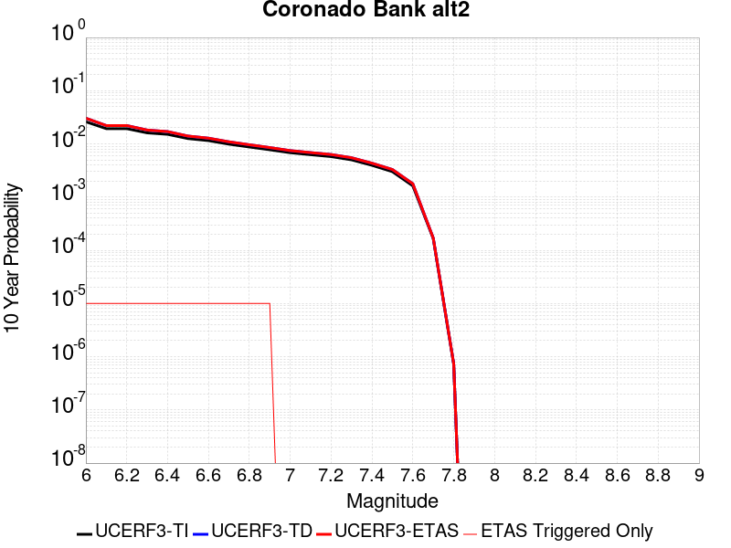 |

| Magnitude | 1 wk TI Prob | 1 wk TD Prob | 1 wk ETAS Prob | 1 wk ETAS/TD Gain | 1 wk ETAS Triggered Only | 1 mo TI Prob | 1 mo TD Prob | 1 mo ETAS Prob | 1 mo ETAS/TD Gain | 1 mo ETAS Triggered Only | 1 yr TI Prob | 1 yr TD Prob | 1 yr ETAS Prob | 1 yr ETAS/TD Gain | 1 yr ETAS Triggered Only | 10 yr TI Prob | 10 yr TD Prob | 10 yr ETAS Prob | 10 yr ETAS/TD Gain | 10 yr ETAS Triggered Only |
|-----|-----|-----|-----|-----|-----|-----|-----|-----|-----|-----|-----|-----|-----|-----|-----|-----|-----|-----|-----|-----|
| 6.0 | 5.0689745E-5 | 5.9139697E-5 | 5.9139697E-5 | 1.0 | 0.0 | 2.1722367E-4 | 2.534324E-4 | 2.534324E-4 | 1.0 | 0.0 | 0.0026414904 | 0.0030813774 | 0.0030913465 | 1.0032353 | 1.0E-5 | 0.02610312 | 0.030407095 | 0.030416792 | 1.0003189 | 1.0E-5 |
| 6.1 | 3.748241E-5 | 4.2862794E-5 | 4.2862794E-5 | 1.0 | 0.0 | 1.6062899E-4 | 1.8368507E-4 | 1.8368507E-4 | 1.0 | 0.0 | 0.0019539038 | 0.0022341225 | 0.0022441 | 1.004466 | 1.0E-5 | 0.01936813 | 0.02212268 | 0.022132458 | 1.000442 | 1.0E-5 |
| 6.2 | 3.748241E-5 | 4.2862794E-5 | 4.2862794E-5 | 1.0 | 0.0 | 1.6062899E-4 | 1.8368507E-4 | 1.8368507E-4 | 1.0 | 0.0 | 0.0019539038 | 0.0022341225 | 0.0022441 | 1.004466 | 1.0E-5 | 0.01936813 | 0.02212268 | 0.022132458 | 1.000442 | 1.0E-5 |
| 6.3 | 3.1168183E-5 | 3.5211404E-5 | 3.5211404E-5 | 1.0 | 0.0 | 1.3357108E-4 | 1.5089742E-4 | 1.5089742E-4 | 1.0 | 0.0 | 0.0016250148 | 0.001835645 | 0.0018456266 | 1.0054377 | 1.0E-5 | 0.016131831 | 0.018207533 | 0.018217351 | 1.0005392 | 1.0E-5 |
| 6.4 | 2.9247632E-5 | 3.2938788E-5 | 3.2938788E-5 | 1.0 | 0.0 | 1.2534097E-4 | 1.4115871E-4 | 1.4115871E-4 | 1.0 | 0.0 | 0.0015249581 | 0.0017172708 | 0.0017272535 | 1.0058132 | 1.0E-5 | 0.015145358 | 0.017042417 | 0.017052246 | 1.0005767 | 1.0E-5 |
| 6.5 | 2.4291245E-5 | 2.7080245E-5 | 2.7080245E-5 | 1.0 | 0.0 | 1.0410118E-4 | 1.1605308E-4 | 1.1605308E-4 | 1.0 | 0.0 | 0.0012666949 | 0.0014120399 | 0.0014220257 | 1.007072 | 1.0E-5 | 0.012594989 | 0.014031912 | 0.014041771 | 1.0007026 | 1.0E-5 |
| 6.6 | 2.2230664E-5 | 2.4714347E-5 | 2.4714347E-5 | 1.0 | 0.0 | 9.52708E-5 | 1.05914376E-4 | 1.05914376E-4 | 1.0 | 0.0 | 0.0011593046 | 0.0012887523 | 0.0012987393 | 1.0077494 | 1.0E-5 | 0.011532754 | 0.012813765 | 0.012823637 | 1.0007704 | 1.0E-5 |
| 6.7 | 1.906595E-5 | 2.1089527E-5 | 2.1089527E-5 | 1.0 | 0.0 | 8.1708655E-5 | 9.0380585E-5 | 9.0380585E-5 | 1.0 | 0.0 | 9.943489E-4 | 0.0010998326 | 0.0011098216 | 1.0090823 | 1.0E-5 | 0.009899113 | 0.010944493 | 0.010954384 | 1.0009037 | 1.0E-5 |
| 6.8 | 1.683739E-5 | 1.8556393E-5 | 1.8556393E-5 | 1.0 | 0.0 | 7.215825E-5 | 7.9524994E-5 | 7.9524994E-5 | 1.0 | 0.0 | 8.781725E-4 | 9.677898E-4 | 9.777801E-4 | 1.0103228 | 1.0E-5 | 0.008747103 | 0.009636156 | 0.00964606 | 1.0010277 | 1.0E-5 |
| 6.9 | 1.4941037E-5 | 1.6408516E-5 | 1.6408516E-5 | 1.0 | 0.0 | 6.403145E-5 | 7.032033E-5 | 7.032033E-5 | 1.0 | 0.0 | 7.7930395E-4 | 8.558159E-4 | 8.658073E-4 | 1.0116748 | 1.0E-5 | 0.007765767 | 0.008525484 | 0.008535399 | 1.001163 | 1.0E-5 |
| 7.0 | 1.3144607E-5 | 1.4390556E-5 | 1.4390556E-5 | 1.0 | 0.0 | 5.633281E-5 | 6.167236E-5 | 6.167236E-5 | 1.0 | 0.0 | 6.856361E-4 | 7.506038E-4 | 7.506038E-4 | 1.0 | 0.0 | 0.0068352455 | 0.007480881 | 0.007480881 | 1.0 | 0.0 |
| 7.1 | 1.2058986E-5 | 1.3195429E-5 | 1.3195429E-5 | 1.0 | 0.0 | 5.1680345E-5 | 5.6550623E-5 | 5.6550623E-5 | 1.0 | 0.0 | 6.290265E-4 | 6.882877E-4 | 6.882877E-4 | 1.0 | 0.0 | 0.0062724897 | 0.006861735 | 0.006861735 | 1.0 | 0.0 |
| 7.2 | 1.1101679E-5 | 1.2147427E-5 | 1.2147427E-5 | 1.0 | 0.0 | 4.7577756E-5 | 5.2059368E-5 | 5.2059368E-5 | 1.0 | 0.0 | 5.7910517E-4 | 6.3363987E-4 | 6.3363987E-4 | 1.0 | 0.0 | 0.005775984 | 0.0063184956 | 0.0063184956 | 1.0 | 0.0 |
| 7.3 | 9.645671E-6 | 1.0558963E-5 | 1.0558963E-5 | 1.0 | 0.0 | 4.133793E-5 | 4.5251923E-5 | 4.5251923E-5 | 1.0 | 0.0 | 5.031731E-4 | 5.5080414E-4 | 5.5080414E-4 | 1.0 | 0.0 | 0.005020353 | 0.0054945303 | 0.0054945303 | 1.0 | 0.0 |
| 7.4 | 7.6130386E-6 | 8.335262E-6 | 8.335262E-6 | 1.0 | 0.0 | 3.26269E-5 | 3.5722067E-5 | 3.5722067E-5 | 1.0 | 0.0 | 3.971601E-4 | 4.348303E-4 | 4.348303E-4 | 1.0 | 0.0 | 0.0039645103 | 0.004339896 | 0.004339896 | 1.0 | 0.0 |
| 7.5 | 5.7779166E-6 | 6.3356956E-6 | 6.3356956E-6 | 1.0 | 0.0 | 2.4762265E-5 | 2.7152702E-5 | 2.7152702E-5 | 1.0 | 0.0 | 3.0143888E-4 | 3.3053488E-4 | 3.3053488E-4 | 1.0 | 0.0 | 0.003010303 | 0.003300522 | 0.003300522 | 1.0 | 0.0 |
| 7.6 | 3.1217246E-6 | 3.4179666E-6 | 3.4179666E-6 | 1.0 | 0.0 | 1.3378751E-5 | 1.4648351E-5 | 1.4648351E-5 | 1.0 | 0.0 | 1.6287412E-4 | 1.783298E-4 | 1.783298E-4 | 1.0 | 0.0 | 0.0016275479 | 0.0017819401 | 0.0017819401 | 1.0 | 0.0 |
| 7.7 | 3.1803893E-7 | 3.2431018E-7 | 3.2431018E-7 | 1.0 | 0.0 | 1.3630232E-6 | 1.3899001E-6 | 1.3899001E-6 | 1.0 | 0.0 | 1.6594682E-5 | 1.692191E-5 | 1.692191E-5 | 1.0 | 0.0 | 1.6593443E-4 | 1.6920679E-4 | 1.6920679E-4 | 1.0 | 0.0 |
| 7.8 | 1.3841052E-9 | 1.4078517E-9 | 1.4078517E-9 | 1.0 | 0.0 | 5.9318794E-9 | 6.03365E-9 | 6.03365E-9 | 1.0 | 0.0 | 7.222063E-8 | 7.345969E-8 | 7.345969E-8 | 1.0 | 0.0 | 7.2220604E-7 | 7.345969E-7 | 7.345969E-7 | 1.0 | 0.0 |

## Richfield
*[(top)](#table-of-contents)*

| 1 Week | 1 Month | 1 Year | 10 Year |
|-----|-----|-----|-----|
|  |  |  | 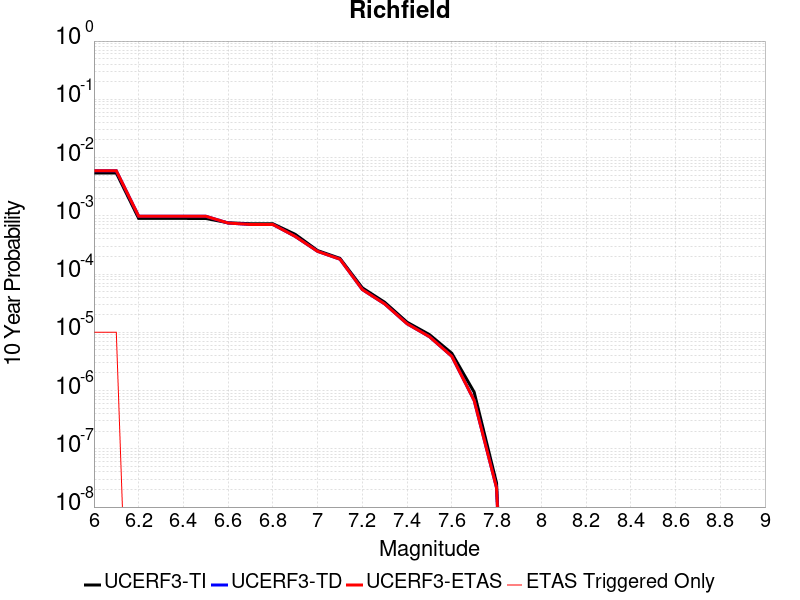 |

| Magnitude | 1 wk TI Prob | 1 wk TD Prob | 1 wk ETAS Prob | 1 wk ETAS/TD Gain | 1 wk ETAS Triggered Only | 1 mo TI Prob | 1 mo TD Prob | 1 mo ETAS Prob | 1 mo ETAS/TD Gain | 1 mo ETAS Triggered Only | 1 yr TI Prob | 1 yr TD Prob | 1 yr ETAS Prob | 1 yr ETAS/TD Gain | 1 yr ETAS Triggered Only | 10 yr TI Prob | 10 yr TD Prob | 10 yr ETAS Prob | 10 yr ETAS/TD Gain | 10 yr ETAS Triggered Only |
|-----|-----|-----|-----|-----|-----|-----|-----|-----|-----|-----|-----|-----|-----|-----|-----|-----|-----|-----|-----|-----|
| 6.0 | 1.0461509E-5 | 1.1368447E-5 | 1.1368447E-5 | 1.0 | 0.0 | 4.483427E-5 | 4.8721642E-5 | 4.8721642E-5 | 1.0 | 0.0 | 5.457205E-4 | 5.9313746E-4 | 6.0313154E-4 | 1.0168495 | 1.0E-5 | 0.005443823 | 0.0059266174 | 0.005936558 | 1.0016773 | 1.0E-5 |
| 6.1 | 1.0461509E-5 | 1.1368447E-5 | 1.1368447E-5 | 1.0 | 0.0 | 4.483427E-5 | 4.8721642E-5 | 4.8721642E-5 | 1.0 | 0.0 | 5.457205E-4 | 5.9313746E-4 | 6.0313154E-4 | 1.0168495 | 1.0E-5 | 0.005443823 | 0.0059266174 | 0.005936558 | 1.0016773 | 1.0E-5 |
| 6.2 | 1.7286696E-6 | 1.8877008E-6 | 1.8877008E-6 | 1.0 | 0.0 | 7.4085633E-6 | 8.0901245E-6 | 8.0901245E-6 | 1.0 | 0.0 | 9.019553E-5 | 9.849345E-5 | 9.849345E-5 | 1.0 | 0.0 | 9.015893E-4 | 9.845606E-4 | 9.845606E-4 | 1.0 | 0.0 |
| 6.3 | 1.7286696E-6 | 1.8877008E-6 | 1.8877008E-6 | 1.0 | 0.0 | 7.4085633E-6 | 8.0901245E-6 | 8.0901245E-6 | 1.0 | 0.0 | 9.019553E-5 | 9.849345E-5 | 9.849345E-5 | 1.0 | 0.0 | 9.015893E-4 | 9.845606E-4 | 9.845606E-4 | 1.0 | 0.0 |
| 6.4 | 1.7286696E-6 | 1.8877008E-6 | 1.8877008E-6 | 1.0 | 0.0 | 7.4085633E-6 | 8.0901245E-6 | 8.0901245E-6 | 1.0 | 0.0 | 9.019553E-5 | 9.849345E-5 | 9.849345E-5 | 1.0 | 0.0 | 9.015893E-4 | 9.845606E-4 | 9.845606E-4 | 1.0 | 0.0 |
| 6.5 | 1.7269956E-6 | 1.886003E-6 | 1.886003E-6 | 1.0 | 0.0 | 7.4013888E-6 | 8.082849E-6 | 8.082849E-6 | 1.0 | 0.0 | 9.010818E-5 | 9.8404875E-5 | 9.8404875E-5 | 1.0 | 0.0 | 9.007165E-4 | 9.836756E-4 | 9.836756E-4 | 1.0 | 0.0 |
| 6.6 | 1.4547002E-6 | 1.44072E-6 | 1.44072E-6 | 1.0 | 0.0 | 6.2344147E-6 | 6.174502E-6 | 6.174502E-6 | 1.0 | 0.0 | 7.590136E-5 | 7.517236E-5 | 7.517236E-5 | 1.0 | 0.0 | 7.587543E-4 | 7.515076E-4 | 7.515076E-4 | 1.0 | 0.0 |
| 6.7 | 1.4023205E-6 | 1.3611321E-6 | 1.3611321E-6 | 1.0 | 0.0 | 6.0099314E-6 | 5.8334126E-6 | 5.8334126E-6 | 1.0 | 0.0 | 7.3168456E-5 | 7.1019866E-5 | 7.1019866E-5 | 1.0 | 0.0 | 7.314437E-4 | 7.100092E-4 | 7.100092E-4 | 1.0 | 0.0 |
| 6.8 | 1.4012525E-6 | 1.359875E-6 | 1.359875E-6 | 1.0 | 0.0 | 6.005354E-6 | 5.8280248E-6 | 5.8280248E-6 | 1.0 | 0.0 | 7.311273E-5 | 7.095427E-5 | 7.095427E-5 | 1.0 | 0.0 | 7.308868E-4 | 7.093537E-4 | 7.093537E-4 | 1.0 | 0.0 |
| 6.9 | 9.219214E-7 | 8.4876234E-7 | 8.4876234E-7 | 1.0 | 0.0 | 3.9510855E-6 | 3.6375482E-6 | 3.6375482E-6 | 1.0 | 0.0 | 4.8103408E-5 | 4.4286317E-5 | 4.4286317E-5 | 1.0 | 0.0 | 4.8092997E-4 | 4.427814E-4 | 4.427814E-4 | 1.0 | 0.0 |
| 7.0 | 4.852768E-7 | 4.6991258E-7 | 4.6991258E-7 | 1.0 | 0.0 | 2.079756E-6 | 2.0139096E-6 | 2.0139096E-6 | 1.0 | 0.0 | 2.5320736E-5 | 2.4519099E-5 | 2.4519099E-5 | 1.0 | 0.0 | 2.5317853E-4 | 2.4516636E-4 | 2.4516636E-4 | 1.0 | 0.0 |
| 7.1 | 3.5643734E-7 | 3.4504416E-7 | 3.4504416E-7 | 1.0 | 0.0 | 1.5275878E-6 | 1.4787599E-6 | 1.4787599E-6 | 1.0 | 0.0 | 1.8598223E-5 | 1.8003771E-5 | 1.8003771E-5 | 1.0 | 0.0 | 1.8596665E-4 | 1.8002493E-4 | 1.8002493E-4 | 1.0 | 0.0 |
| 7.2 | 1.11117906E-7 | 1.03780735E-7 | 1.03780735E-7 | 1.0 | 0.0 | 4.762195E-7 | 4.447745E-7 | 4.447745E-7 | 1.0 | 0.0 | 5.797957E-6 | 5.415117E-6 | 5.415117E-6 | 1.0 | 0.0 | 5.7978057E-5 | 5.4149903E-5 | 5.4149903E-5 | 1.0 | 0.0 |
| 7.3 | 6.285462E-8 | 5.878958E-8 | 5.878958E-8 | 1.0 | 0.0 | 2.693769E-7 | 2.5195533E-7 | 2.5195533E-7 | 1.0 | 0.0 | 3.2796588E-6 | 3.067552E-6 | 3.067552E-6 | 1.0 | 0.0 | 3.2796106E-5 | 3.0675117E-5 | 3.0675117E-5 | 1.0 | 0.0 |
| 7.4 | 2.857508E-8 | 2.6883491E-8 | 2.6883491E-8 | 1.0 | 0.0 | 1.2246463E-7 | 1.1521496E-7 | 1.1521496E-7 | 1.0 | 0.0 | 1.4910058E-6 | 1.4027412E-6 | 1.4027412E-6 | 1.0 | 0.0 | 1.4909958E-5 | 1.4027326E-5 | 1.4027326E-5 | 1.0 | 0.0 |
| 7.5 | 1.7522458E-8 | 1.6122556E-8 | 1.6122556E-8 | 1.0 | 0.0 | 7.5096246E-8 | 6.9096664E-8 | 6.9096664E-8 | 1.0 | 0.0 | 9.1429644E-7 | 8.4125156E-7 | 8.4125156E-7 | 1.0 | 0.0 | 9.1429265E-6 | 8.412485E-6 | 8.412485E-6 | 1.0 | 0.0 |
| 7.6 | 8.370422E-9 | 7.432205E-9 | 7.432205E-9 | 1.0 | 0.0 | 3.5873235E-8 | 3.1852306E-8 | 3.1852306E-8 | 1.0 | 0.0 | 4.3675655E-7 | 3.8780178E-7 | 3.8780178E-7 | 1.0 | 0.0 | 4.367557E-6 | 3.8780113E-6 | 3.8780113E-6 | 1.0 | 0.0 |
| 7.7 | 1.7985496E-9 | 1.2975517E-9 | 1.2975517E-9 | 1.0 | 0.0 | 7.70807E-9 | 5.560936E-9 | 5.560936E-9 | 1.0 | 0.0 | 9.384574E-8 | 6.77044E-8 | 6.77044E-8 | 1.0 | 0.0 | 9.3845705E-7 | 6.7704383E-7 | 6.7704383E-7 | 1.0 | 0.0 |
| 7.8 | 4.9890425E-11 | 4.1025405E-11 | 4.1025405E-11 | 1.0 | 0.0 | 2.138163E-10 | 1.7582302E-10 | 1.7582302E-10 | 1.0 | 0.0 | 2.6032128E-9 | 2.1406446E-9 | 2.1406446E-9 | 1.0 | 0.0 | 2.6032128E-8 | 2.1406445E-8 | 2.1406445E-8 | 1.0 | 0.0 |

## Likely 2011 CFM
*[(top)](#table-of-contents)*

| 1 Week | 1 Month | 1 Year | 10 Year |
|-----|-----|-----|-----|
| 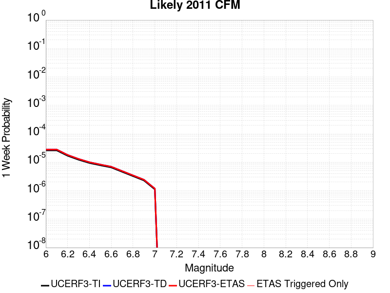 |  |  | 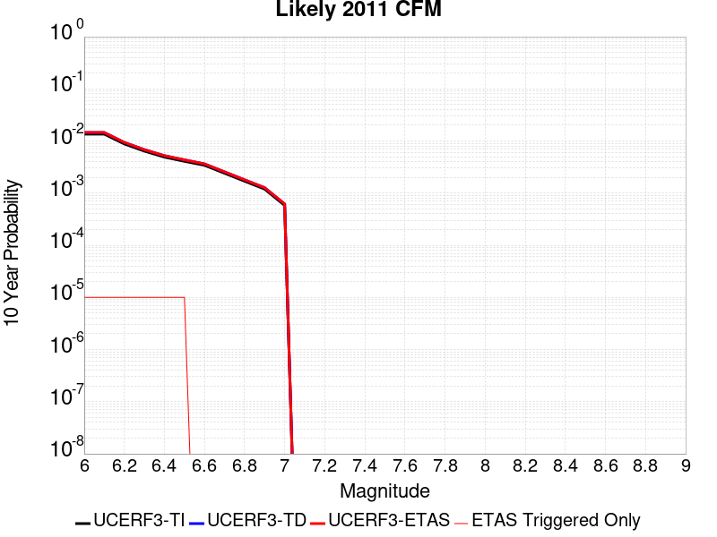 |

| Magnitude | 1 wk TI Prob | 1 wk TD Prob | 1 wk ETAS Prob | 1 wk ETAS/TD Gain | 1 wk ETAS Triggered Only | 1 mo TI Prob | 1 mo TD Prob | 1 mo ETAS Prob | 1 mo ETAS/TD Gain | 1 mo ETAS Triggered Only | 1 yr TI Prob | 1 yr TD Prob | 1 yr ETAS Prob | 1 yr ETAS/TD Gain | 1 yr ETAS Triggered Only | 10 yr TI Prob | 10 yr TD Prob | 10 yr ETAS Prob | 10 yr ETAS/TD Gain | 10 yr ETAS Triggered Only |
|-----|-----|-----|-----|-----|-----|-----|-----|-----|-----|-----|-----|-----|-----|-----|-----|-----|-----|-----|-----|-----|
| 6.0 | 2.6180338E-5 | 2.8075616E-5 | 2.8075616E-5 | 1.0 | 0.0 | 1.1219662E-4 | 1.20318786E-4 | 1.20318786E-4 | 1.0 | 0.0 | 0.0013651379 | 0.0014639437 | 0.0014639437 | 1.0 | 0.0 | 0.013567821 | 0.014547918 | 0.014557772 | 1.0006773 | 1.0E-5 |
| 6.1 | 2.6180338E-5 | 2.8075616E-5 | 2.8075616E-5 | 1.0 | 0.0 | 1.1219662E-4 | 1.20318786E-4 | 1.20318786E-4 | 1.0 | 0.0 | 0.0013651379 | 0.0014639437 | 0.0014639437 | 1.0 | 0.0 | 0.013567821 | 0.014547918 | 0.014557772 | 1.0006773 | 1.0E-5 |
| 6.2 | 1.6945649E-5 | 1.8103392E-5 | 1.8103392E-5 | 1.0 | 0.0 | 7.2622184E-5 | 7.758373E-5 | 7.758373E-5 | 1.0 | 0.0 | 8.8381645E-4 | 9.4418565E-4 | 9.4418565E-4 | 1.0 | 0.0 | 0.008803096 | 0.009403113 | 0.009413019 | 1.0010535 | 1.0E-5 |
| 6.3 | 1.2316696E-5 | 1.31287525E-5 | 1.31287525E-5 | 1.0 | 0.0 | 5.278477E-5 | 5.62649E-5 | 5.62649E-5 | 1.0 | 0.0 | 6.424651E-4 | 6.848154E-4 | 6.848154E-4 | 1.0 | 0.0 | 0.0064061084 | 0.0068276315 | 0.0068375636 | 1.0014546 | 1.0E-5 |
| 6.4 | 9.446236E-6 | 1.0053988E-5 | 1.0053988E-5 | 1.0 | 0.0 | 4.048324E-5 | 4.3087824E-5 | 4.3087824E-5 | 1.0 | 0.0 | 4.92772E-4 | 5.244708E-4 | 5.244708E-4 | 1.0 | 0.0 | 0.0049168067 | 0.0052326205 | 0.005242568 | 1.001901 | 1.0E-5 |
| 6.5 | 7.838107E-6 | 8.335067E-6 | 8.335067E-6 | 1.0 | 0.0 | 3.3591456E-5 | 3.5721234E-5 | 3.5721234E-5 | 1.0 | 0.0 | 4.088992E-4 | 4.3482118E-4 | 4.3482118E-4 | 1.0 | 0.0 | 0.0040814765 | 0.0043399013 | 0.0043498576 | 1.0022942 | 1.0E-5 |
| 6.6 | 6.5798054E-6 | 6.9929597E-6 | 6.9929597E-6 | 1.0 | 0.0 | 2.8198861E-5 | 2.996949E-5 | 2.996949E-5 | 1.0 | 0.0 | 3.4326705E-4 | 3.6481887E-4 | 3.6481887E-4 | 1.0 | 0.0 | 0.003427373 | 0.0036423441 | 0.0036423441 | 1.0 | 0.0 |
| 6.7 | 4.627409E-6 | 4.914556E-6 | 4.914556E-6 | 1.0 | 0.0 | 1.9831601E-5 | 2.1062217E-5 | 2.1062217E-5 | 1.0 | 0.0 | 2.41423E-4 | 2.5640312E-4 | 2.5640312E-4 | 1.0 | 0.0 | 0.0024116088 | 0.002561153 | 0.002561153 | 1.0 | 0.0 |
| 6.8 | 3.2579212E-6 | 3.459937E-6 | 3.459937E-6 | 1.0 | 0.0 | 1.3962445E-5 | 1.482822E-5 | 1.482822E-5 | 1.0 | 0.0 | 1.6997951E-4 | 1.8051914E-4 | 1.8051914E-4 | 1.0 | 0.0 | 0.0016984955 | 0.0018037761 | 0.0018037761 | 1.0 | 0.0 |
| 6.9 | 2.296765E-6 | 2.4401465E-6 | 2.4401465E-6 | 1.0 | 0.0 | 9.843241E-6 | 1.0457731E-5 | 1.0457731E-5 | 1.0 | 0.0 | 1.1983487E-4 | 1.2731583E-4 | 1.2731583E-4 | 1.0 | 0.0 | 0.0011977026 | 0.0012724674 | 0.0012724674 | 1.0 | 0.0 |
| 7.0 | 1.1169982E-6 | 1.1882117E-6 | 1.1882117E-6 | 1.0 | 0.0 | 4.7871263E-6 | 5.0923277E-6 | 5.0923277E-6 | 1.0 | 0.0 | 5.82817E-5 | 6.1997576E-5 | 6.1997576E-5 | 1.0 | 0.0 | 5.826642E-4 | 6.1982754E-4 | 6.1982754E-4 | 1.0 | 0.0 |

## Almanor 2011 CFM
*[(top)](#table-of-contents)*

| 1 Week | 1 Month | 1 Year | 10 Year |
|-----|-----|-----|-----|
|  |  | 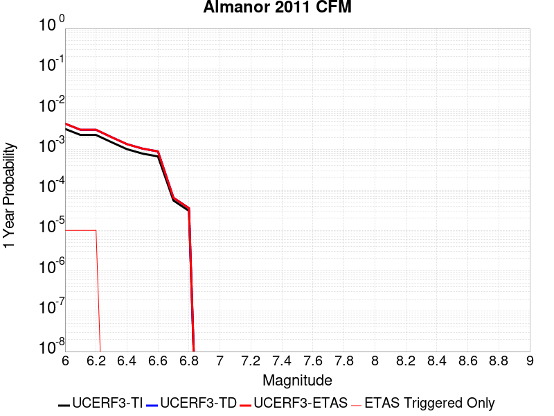 |  |

| Magnitude | 1 wk TI Prob | 1 wk TD Prob | 1 wk ETAS Prob | 1 wk ETAS/TD Gain | 1 wk ETAS Triggered Only | 1 mo TI Prob | 1 mo TD Prob | 1 mo ETAS Prob | 1 mo ETAS/TD Gain | 1 mo ETAS Triggered Only | 1 yr TI Prob | 1 yr TD Prob | 1 yr ETAS Prob | 1 yr ETAS/TD Gain | 1 yr ETAS Triggered Only | 10 yr TI Prob | 10 yr TD Prob | 10 yr ETAS Prob | 10 yr ETAS/TD Gain | 10 yr ETAS Triggered Only |
|-----|-----|-----|-----|-----|-----|-----|-----|-----|-----|-----|-----|-----|-----|-----|-----|-----|-----|-----|-----|-----|
| 6.0 | 6.2503364E-5 | 8.438083E-5 | 8.438083E-5 | 1.0 | 0.0 | 2.6784407E-4 | 3.615749E-4 | 3.7157128E-4 | 1.0276468 | 1.0E-5 | 0.0032561254 | 0.0043940884 | 0.0044040447 | 1.0022658 | 1.0E-5 | 0.03208827 | 0.043140065 | 0.04314963 | 1.0002218 | 1.0E-5 |
| 6.1 | 4.425706E-5 | 5.936089E-5 | 5.936089E-5 | 1.0 | 0.0 | 1.8965932E-4 | 2.5437007E-4 | 2.6436753E-4 | 1.0393028 | 1.0E-5 | 0.0023066567 | 0.0030930142 | 0.0031029833 | 1.0032231 | 1.0E-5 | 0.022828605 | 0.030543735 | 0.030553428 | 1.0003175 | 1.0E-5 |
| 6.2 | 4.425706E-5 | 5.936089E-5 | 5.936089E-5 | 1.0 | 0.0 | 1.8965932E-4 | 2.5437007E-4 | 2.6436753E-4 | 1.0393028 | 1.0E-5 | 0.0023066567 | 0.0030930142 | 0.0031029833 | 1.0032231 | 1.0E-5 | 0.022828605 | 0.030543735 | 0.030553428 | 1.0003175 | 1.0E-5 |
| 6.3 | 2.9293595E-5 | 3.90781E-5 | 3.90781E-5 | 1.0 | 0.0 | 1.2553793E-4 | 1.6746926E-4 | 1.6746926E-4 | 1.0 | 0.0 | 0.0015273527 | 0.002037328 | 0.002037328 | 1.0 | 0.0 | 0.015168977 | 0.020214973 | 0.020214973 | 1.0 | 0.0 |
| 6.4 | 1.9660776E-5 | 2.6168724E-5 | 2.6168724E-5 | 1.0 | 0.0 | 8.425775E-5 | 1.1214873E-4 | 1.1214873E-4 | 1.0 | 0.0 | 0.0010253553 | 0.0013647516 | 0.0013647516 | 1.0 | 0.0 | 0.010206371 | 0.013587019 | 0.013587019 | 1.0 | 0.0 |
| 6.5 | 1.5286634E-5 | 2.032761E-5 | 2.032761E-5 | 1.0 | 0.0 | 6.5512504E-5 | 8.711718E-5 | 8.711718E-5 | 1.0 | 0.0 | 7.973228E-4 | 0.0010604082 | 0.0010604082 | 1.0 | 0.0 | 0.007944681 | 0.010576683 | 0.010576683 | 1.0 | 0.0 |
| 6.6 | 1.3005314E-5 | 1.7282973E-5 | 1.7282973E-5 | 1.0 | 0.0 | 5.573587E-5 | 7.40695E-5 | 7.40695E-5 | 1.0 | 0.0 | 6.783729E-4 | 9.017295E-4 | 9.017295E-4 | 1.0 | 0.0 | 0.006763058 | 0.009004573 | 0.009004573 | 1.0 | 0.0 |
| 6.7 | 1.0532406E-6 | 1.2278326E-6 | 1.2278326E-6 | 1.0 | 0.0 | 4.51388E-6 | 5.2621303E-6 | 5.2621303E-6 | 1.0 | 0.0 | 5.4955104E-5 | 6.406474E-5 | 6.406474E-5 | 1.0 | 0.0 | 5.494152E-4 | 6.404813E-4 | 6.404813E-4 | 1.0 | 0.0 |
| 6.8 | 5.830822E-7 | 6.80464E-7 | 6.80464E-7 | 1.0 | 0.0 | 2.4989215E-6 | 2.9162716E-6 | 2.9162716E-6 | 1.0 | 0.0 | 3.0423944E-5 | 3.550516E-5 | 3.550516E-5 | 1.0 | 0.0 | 3.0419778E-4 | 3.550076E-4 | 3.550076E-4 | 1.0 | 0.0 |

## Great Valley 11
*[(top)](#table-of-contents)*

| 1 Week | 1 Month | 1 Year | 10 Year |
|-----|-----|-----|-----|
| 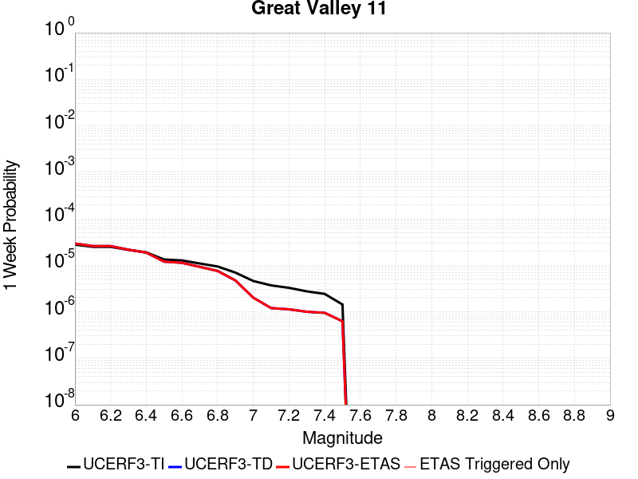 |  |  |  |

| Magnitude | 1 wk TI Prob | 1 wk TD Prob | 1 wk ETAS Prob | 1 wk ETAS/TD Gain | 1 wk ETAS Triggered Only | 1 mo TI Prob | 1 mo TD Prob | 1 mo ETAS Prob | 1 mo ETAS/TD Gain | 1 mo ETAS Triggered Only | 1 yr TI Prob | 1 yr TD Prob | 1 yr ETAS Prob | 1 yr ETAS/TD Gain | 1 yr ETAS Triggered Only | 10 yr TI Prob | 10 yr TD Prob | 10 yr ETAS Prob | 10 yr ETAS/TD Gain | 10 yr ETAS Triggered Only |
|-----|-----|-----|-----|-----|-----|-----|-----|-----|-----|-----|-----|-----|-----|-----|-----|-----|-----|-----|-----|-----|
| 6.0 | 2.7873457E-5 | 2.9431478E-5 | 2.9431478E-5 | 1.0 | 0.0 | 1.19452205E-4 | 1.2612926E-4 | 1.2612926E-4 | 1.0 | 0.0 | 0.0014533603 | 0.0015346241 | 0.0015346241 | 1.0 | 0.0 | 0.014438919 | 0.015248438 | 0.015258285 | 1.0006458 | 1.0E-5 |
| 6.1 | 2.4934767E-5 | 2.5895344E-5 | 2.5895344E-5 | 1.0 | 0.0 | 1.0685891E-4 | 1.1097574E-4 | 1.1097574E-4 | 1.0 | 0.0 | 0.0013002307 | 0.0013503658 | 0.0013503658 | 1.0 | 0.0 | 0.012926493 | 0.013428873 | 0.013438739 | 1.0007347 | 1.0E-5 |
| 6.2 | 2.4934767E-5 | 2.5895344E-5 | 2.5895344E-5 | 1.0 | 0.0 | 1.0685891E-4 | 1.1097574E-4 | 1.1097574E-4 | 1.0 | 0.0 | 0.0013002307 | 0.0013503658 | 0.0013503658 | 1.0 | 0.0 | 0.012926493 | 0.013428873 | 0.013438739 | 1.0007347 | 1.0E-5 |
| 6.3 | 2.1422678E-5 | 2.1661997E-5 | 2.1661997E-5 | 1.0 | 0.0 | 9.180825E-5 | 9.283417E-5 | 9.283417E-5 | 1.0 | 0.0 | 0.0011171922 | 0.0011297307 | 0.0011297307 | 1.0 | 0.0 | 0.0111159235 | 0.011245854 | 0.011245854 | 1.0 | 0.0 |
| 6.4 | 1.8993747E-5 | 1.8767312E-5 | 1.8767312E-5 | 1.0 | 0.0 | 8.139924E-5 | 8.042918E-5 | 8.042918E-5 | 1.0 | 0.0 | 9.905851E-4 | 9.788409E-4 | 9.788409E-4 | 1.0 | 0.0 | 0.009861811 | 0.009750752 | 0.009750752 | 1.0 | 0.0 |
| 6.5 | 1.3326344E-5 | 1.1986041E-5 | 1.1986041E-5 | 1.0 | 0.0 | 5.711165E-5 | 5.136775E-5 | 5.136775E-5 | 1.0 | 0.0 | 6.951125E-4 | 6.252264E-4 | 6.252264E-4 | 1.0 | 0.0 | 0.0069294223 | 0.006235039 | 0.006235039 | 1.0 | 0.0 |
| 6.6 | 1.2731347E-5 | 1.1325066E-5 | 1.1325066E-5 | 1.0 | 0.0 | 5.4561773E-5 | 4.8535116E-5 | 4.8535116E-5 | 1.0 | 0.0 | 6.640871E-4 | 5.9075817E-4 | 5.9075817E-4 | 1.0 | 0.0 | 0.006621061 | 0.00589223 | 0.00589223 | 1.0 | 0.0 |
| 6.7 | 1.0927691E-5 | 9.257809E-6 | 9.257809E-6 | 1.0 | 0.0 | 4.683212E-5 | 3.9675735E-5 | 3.9675735E-5 | 1.0 | 0.0 | 5.700319E-4 | 4.8294704E-4 | 4.8294704E-4 | 1.0 | 0.0 | 0.0056857187 | 0.004819189 | 0.004819189 | 1.0 | 0.0 |
| 6.8 | 9.418745E-6 | 7.554531E-6 | 7.554531E-6 | 1.0 | 0.0 | 4.0365427E-5 | 3.2376167E-5 | 3.2376167E-5 | 1.0 | 0.0 | 4.9133826E-4 | 3.9410996E-4 | 3.9410996E-4 | 1.0 | 0.0 | 0.0049025333 | 0.0039342563 | 0.0039342563 | 1.0 | 0.0 |
| 6.9 | 6.9584444E-6 | 4.7161666E-6 | 4.7161666E-6 | 1.0 | 0.0 | 2.9821562E-5 | 2.021199E-5 | 2.021199E-5 | 1.0 | 0.0 | 3.6301702E-4 | 2.4605403E-4 | 2.4605403E-4 | 1.0 | 0.0 | 0.003624246 | 0.0024578976 | 0.0024578976 | 1.0 | 0.0 |
| 7.0 | 4.5932875E-6 | 2.0130783E-6 | 2.0130783E-6 | 1.0 | 0.0 | 1.968537E-5 | 8.627451E-6 | 8.627451E-6 | 1.0 | 0.0 | 2.3964302E-4 | 1.0503427E-4 | 1.0503427E-4 | 1.0 | 0.0 | 0.0023938476 | 0.0010498576 | 0.0010498576 | 1.0 | 0.0 |
| 7.1 | 3.6975152E-6 | 1.2022241E-6 | 1.2022241E-6 | 1.0 | 0.0 | 1.5846397E-5 | 5.1523793E-6 | 5.1523793E-6 | 1.0 | 0.0 | 1.929128E-4 | 6.2728475E-5 | 6.2728475E-5 | 1.0 | 0.0 | 0.0019274543 | 6.271142E-4 | 6.271142E-4 | 1.0 | 0.0 |
| 7.2 | 3.275315E-6 | 1.1305137E-6 | 1.1305137E-6 | 1.0 | 0.0 | 1.4036989E-5 | 4.84505E-6 | 4.84505E-6 | 1.0 | 0.0 | 1.7088694E-4 | 5.8986956E-5 | 5.8986956E-5 | 1.0 | 0.0 | 0.0017075558 | 5.897194E-4 | 5.897194E-4 | 1.0 | 0.0 |
| 7.3 | 2.7492233E-6 | 1.0018234E-6 | 1.0018234E-6 | 1.0 | 0.0 | 1.1782333E-5 | 4.293522E-6 | 4.293522E-6 | 1.0 | 0.0 | 1.4344045E-4 | 5.227244E-5 | 5.227244E-5 | 1.0 | 0.0 | 0.001433479 | 5.2260765E-4 | 5.2260765E-4 | 1.0 | 0.0 |
| 7.4 | 2.4267933E-6 | 9.513911E-7 | 9.513911E-7 | 1.0 | 0.0 | 1.0400502E-5 | 4.0773843E-6 | 4.0773843E-6 | 1.0 | 0.0 | 1.2661875E-4 | 4.9641087E-5 | 4.9641087E-5 | 1.0 | 0.0 | 0.0012654663 | 4.9630617E-4 | 4.9630617E-4 | 1.0 | 0.0 |
| 7.5 | 1.437227E-6 | 6.254284E-7 | 6.254284E-7 | 1.0 | 0.0 | 6.159529E-6 | 2.680405E-6 | 2.680405E-6 | 1.0 | 0.0 | 7.4989686E-5 | 3.263348E-5 | 3.263348E-5 | 1.0 | 0.0 | 7.496439E-4 | 3.2629064E-4 | 3.2629064E-4 | 1.0 | 0.0 |

## San Gorgonio Pass
*[(top)](#table-of-contents)*

| 1 Week | 1 Month | 1 Year | 10 Year |
|-----|-----|-----|-----|
|  |  |  |  |

| Magnitude | 1 wk TI Prob | 1 wk TD Prob | 1 wk ETAS Prob | 1 wk ETAS/TD Gain | 1 wk ETAS Triggered Only | 1 mo TI Prob | 1 mo TD Prob | 1 mo ETAS Prob | 1 mo ETAS/TD Gain | 1 mo ETAS Triggered Only | 1 yr TI Prob | 1 yr TD Prob | 1 yr ETAS Prob | 1 yr ETAS/TD Gain | 1 yr ETAS Triggered Only | 10 yr TI Prob | 10 yr TD Prob | 10 yr ETAS Prob | 10 yr ETAS/TD Gain | 10 yr ETAS Triggered Only |
|-----|-----|-----|-----|-----|-----|-----|-----|-----|-----|-----|-----|-----|-----|-----|-----|-----|-----|-----|-----|-----|
| 6.0 | 7.1116337E-6 | 1.3551649E-5 | 1.3551649E-5 | 1.0 | 0.0 | 3.0478073E-5 | 5.8077247E-5 | 5.8077247E-5 | 1.0 | 0.0 | 3.7100737E-4 | 7.068685E-4 | 7.1686145E-4 | 1.0141369 | 1.0E-5 | 0.0037038857 | 0.007049854 | 0.0070597837 | 1.0014085 | 1.0E-5 |
| 6.1 | 7.1116337E-6 | 1.3551649E-5 | 1.3551649E-5 | 1.0 | 0.0 | 3.0478073E-5 | 5.8077247E-5 | 5.8077247E-5 | 1.0 | 0.0 | 3.7100737E-4 | 7.068685E-4 | 7.1686145E-4 | 1.0141369 | 1.0E-5 | 0.0037038857 | 0.007049854 | 0.0070597837 | 1.0014085 | 1.0E-5 |
| 6.2 | 7.1116337E-6 | 1.3551649E-5 | 1.3551649E-5 | 1.0 | 0.0 | 3.0478073E-5 | 5.8077247E-5 | 5.8077247E-5 | 1.0 | 0.0 | 3.7100737E-4 | 7.068685E-4 | 7.1686145E-4 | 1.0141369 | 1.0E-5 | 0.0037038857 | 0.007049854 | 0.0070597837 | 1.0014085 | 1.0E-5 |
| 6.3 | 7.1116337E-6 | 1.3551649E-5 | 1.3551649E-5 | 1.0 | 0.0 | 3.0478073E-5 | 5.8077247E-5 | 5.8077247E-5 | 1.0 | 0.0 | 3.7100737E-4 | 7.068685E-4 | 7.1686145E-4 | 1.0141369 | 1.0E-5 | 0.0037038857 | 0.007049854 | 0.0070597837 | 1.0014085 | 1.0E-5 |
| 6.4 | 7.1116337E-6 | 1.3551649E-5 | 1.3551649E-5 | 1.0 | 0.0 | 3.0478073E-5 | 5.8077247E-5 | 5.8077247E-5 | 1.0 | 0.0 | 3.7100737E-4 | 7.068685E-4 | 7.1686145E-4 | 1.0141369 | 1.0E-5 | 0.0037038857 | 0.007049854 | 0.0070597837 | 1.0014085 | 1.0E-5 |
| 6.5 | 7.1116337E-6 | 1.3551649E-5 | 1.3551649E-5 | 1.0 | 0.0 | 3.0478073E-5 | 5.8077247E-5 | 5.8077247E-5 | 1.0 | 0.0 | 3.7100737E-4 | 7.068685E-4 | 7.1686145E-4 | 1.0141369 | 1.0E-5 | 0.0037038857 | 0.007049854 | 0.0070597837 | 1.0014085 | 1.0E-5 |
| 6.6 | 7.1116337E-6 | 1.3551649E-5 | 1.3551649E-5 | 1.0 | 0.0 | 3.0478073E-5 | 5.8077247E-5 | 5.8077247E-5 | 1.0 | 0.0 | 3.7100737E-4 | 7.068685E-4 | 7.1686145E-4 | 1.0141369 | 1.0E-5 | 0.0037038857 | 0.007049854 | 0.0070597837 | 1.0014085 | 1.0E-5 |
| 6.7 | 6.3488105E-6 | 1.2747057E-5 | 1.2747057E-5 | 1.0 | 0.0 | 2.7208906E-5 | 5.4629138E-5 | 5.4629138E-5 | 1.0 | 0.0 | 3.3121806E-4 | 6.649137E-4 | 6.74907E-4 | 1.0150295 | 1.0E-5 | 0.0033072482 | 0.0066328347 | 0.006642768 | 1.0014976 | 1.0E-5 |
| 6.8 | 6.3488105E-6 | 1.2747057E-5 | 1.2747057E-5 | 1.0 | 0.0 | 2.7208906E-5 | 5.4629138E-5 | 5.4629138E-5 | 1.0 | 0.0 | 3.3121806E-4 | 6.649137E-4 | 6.74907E-4 | 1.0150295 | 1.0E-5 | 0.0033072482 | 0.0066328347 | 0.006642768 | 1.0014976 | 1.0E-5 |
| 6.9 | 5.2132123E-6 | 1.15506E-5 | 1.15506E-5 | 1.0 | 0.0 | 2.2342148E-5 | 4.950166E-5 | 4.950166E-5 | 1.0 | 0.0 | 2.719817E-4 | 6.025212E-4 | 6.025212E-4 | 1.0 | 0.0 | 0.0027164905 | 0.0060122893 | 0.0060122893 | 1.0 | 0.0 |
| 7.0 | 5.1973543E-6 | 1.1533664E-5 | 1.1533664E-5 | 1.0 | 0.0 | 2.2274186E-5 | 4.942908E-5 | 4.942908E-5 | 1.0 | 0.0 | 2.7115445E-4 | 6.01638E-4 | 6.01638E-4 | 1.0 | 0.0 | 0.0027082383 | 0.006003505 | 0.006003505 | 1.0 | 0.0 |
| 7.1 | 5.186664E-6 | 1.1522201E-5 | 1.1522201E-5 | 1.0 | 0.0 | 2.222837E-5 | 4.9379956E-5 | 4.9379956E-5 | 1.0 | 0.0 | 2.705968E-4 | 6.010402E-4 | 6.010402E-4 | 1.0 | 0.0 | 0.0027026753 | 0.0059975595 | 0.0059975595 | 1.0 | 0.0 |
| 7.2 | 5.1690627E-6 | 1.15031835E-5 | 1.15031835E-5 | 1.0 | 0.0 | 2.2152937E-5 | 4.9298455E-5 | 4.9298455E-5 | 1.0 | 0.0 | 2.6967863E-4 | 6.000485E-4 | 6.000485E-4 | 1.0 | 0.0 | 0.002693516 | 0.005987696 | 0.005987696 | 1.0 | 0.0 |
| 7.3 | 5.154023E-6 | 1.1486019E-5 | 1.1486019E-5 | 1.0 | 0.0 | 2.2088481E-5 | 4.9224895E-5 | 4.9224895E-5 | 1.0 | 0.0 | 2.6889407E-4 | 5.991534E-4 | 5.991534E-4 | 1.0 | 0.0 | 0.0026856894 | 0.005978793 | 0.005978793 | 1.0 | 0.0 |
| 7.4 | 5.1101124E-6 | 1.1432669E-5 | 1.1432669E-5 | 1.0 | 0.0 | 2.1900298E-5 | 4.8996262E-5 | 4.8996262E-5 | 1.0 | 0.0 | 2.6660349E-4 | 5.963713E-4 | 5.963713E-4 | 1.0 | 0.0 | 0.0026628387 | 0.0059511214 | 0.0059511214 | 1.0 | 0.0 |
| 7.5 | 5.082514E-6 | 1.1388774E-5 | 1.1388774E-5 | 1.0 | 0.0 | 2.1782022E-5 | 4.8808146E-5 | 4.8808146E-5 | 1.0 | 0.0 | 2.6516384E-4 | 5.940823E-4 | 5.940823E-4 | 1.0 | 0.0 | 0.0026484765 | 0.005928356 | 0.005928356 | 1.0 | 0.0 |
| 7.6 | 4.3484492E-6 | 9.584E-6 | 9.584E-6 | 1.0 | 0.0 | 1.8636078E-5 | 4.1073665E-5 | 4.1073665E-5 | 1.0 | 0.0 | 2.2687062E-4 | 4.999618E-4 | 4.999618E-4 | 1.0 | 0.0 | 0.0022663914 | 0.004992317 | 0.004992317 | 1.0 | 0.0 |
| 7.7 | 1.6720322E-6 | 3.9481133E-6 | 3.9481133E-6 | 1.0 | 0.0 | 7.1658324E-6 | 1.6920378E-5 | 1.6920378E-5 | 1.0 | 0.0 | 8.7240514E-5 | 2.059864E-4 | 2.059864E-4 | 1.0 | 0.0 | 8.7206275E-4 | 0.0020618555 | 0.0020618555 | 1.0 | 0.0 |
| 7.8 | 1.0049084E-6 | 2.510616E-6 | 2.510616E-6 | 1.0 | 0.0 | 4.3067434E-6 | 1.0759739E-5 | 1.0759739E-5 | 1.0 | 0.0 | 5.243334E-5 | 1.3099198E-4 | 1.3099198E-4 | 1.0 | 0.0 | 5.242097E-4 | 0.0013130193 | 0.0013130193 | 1.0 | 0.0 |
| 7.9 | 5.2472996E-7 | 1.0987843E-6 | 1.0987843E-6 | 1.0 | 0.0 | 2.2488407E-6 | 4.709067E-6 | 4.709067E-6 | 1.0 | 0.0 | 2.7379292E-5 | 5.7331392E-5 | 5.7331392E-5 | 1.0 | 0.0 | 2.737592E-4 | 5.769933E-4 | 5.769933E-4 | 1.0 | 0.0 |
| 8.0 | 2.6568472E-7 | 4.980865E-7 | 4.980865E-7 | 1.0 | 0.0 | 1.1386483E-6 | 2.1346548E-6 | 2.1346548E-6 | 1.0 | 0.0 | 1.3862954E-5 | 2.5989113E-5 | 2.5989113E-5 | 1.0 | 0.0 | 1.3862089E-4 | 2.623718E-4 | 2.623718E-4 | 1.0 | 0.0 |
| 8.1 | 8.734577E-9 | 7.5418205E-9 | 7.5418205E-9 | 1.0 | 0.0 | 3.74339E-8 | 3.2322088E-8 | 3.2322088E-8 | 1.0 | 0.0 | 4.557576E-7 | 3.9352136E-7 | 3.9352136E-7 | 1.0 | 0.0 | 4.5575666E-6 | 4.077668E-6 | 4.077668E-6 | 1.0 | 0.0 |

## Point Reyes 2011 CFM
*[(top)](#table-of-contents)*

| 1 Week | 1 Month | 1 Year | 10 Year |
|-----|-----|-----|-----|
|  |  |  |  |

| Magnitude | 1 wk TI Prob | 1 wk TD Prob | 1 wk ETAS Prob | 1 wk ETAS/TD Gain | 1 wk ETAS Triggered Only | 1 mo TI Prob | 1 mo TD Prob | 1 mo ETAS Prob | 1 mo ETAS/TD Gain | 1 mo ETAS Triggered Only | 1 yr TI Prob | 1 yr TD Prob | 1 yr ETAS Prob | 1 yr ETAS/TD Gain | 1 yr ETAS Triggered Only | 10 yr TI Prob | 10 yr TD Prob | 10 yr ETAS Prob | 10 yr ETAS/TD Gain | 10 yr ETAS Triggered Only |
|-----|-----|-----|-----|-----|-----|-----|-----|-----|-----|-----|-----|-----|-----|-----|-----|-----|-----|-----|-----|-----|
| 6.0 | 7.132878E-6 | 7.167367E-6 | 1.7167296E-5 | 2.3952024 | 1.0E-5 | 3.056912E-5 | 3.071695E-5 | 4.071664E-5 | 1.3255432 | 1.0E-5 | 3.7211546E-4 | 3.739186E-4 | 3.8391486E-4 | 1.0267338 | 1.0E-5 | 0.0037149296 | 0.0037332855 | 0.003743248 | 1.0026686 | 1.0E-5 |
| 6.1 | 3.6343488E-6 | 3.6110152E-6 | 1.3610979E-5 | 3.7692943 | 1.0E-5 | 1.5575688E-5 | 1.547569E-5 | 2.5475536E-5 | 1.6461647 | 1.0E-5 | 1.896175E-4 | 1.8840085E-4 | 1.9839898E-4 | 1.0530683 | 1.0E-5 | 0.0018945578 | 0.0018824723 | 0.0018924534 | 1.0053022 | 1.0E-5 |
| 6.2 | 3.6343488E-6 | 3.6110152E-6 | 1.3610979E-5 | 3.7692943 | 1.0E-5 | 1.5575688E-5 | 1.547569E-5 | 2.5475536E-5 | 1.6461647 | 1.0E-5 | 1.896175E-4 | 1.8840085E-4 | 1.9839898E-4 | 1.0530683 | 1.0E-5 | 0.0018945578 | 0.0018824723 | 0.0018924534 | 1.0053022 | 1.0E-5 |
| 6.3 | 2.1747894E-6 | 2.1285043E-6 | 2.1285043E-6 | 1.0 | 0.0 | 9.320493E-6 | 9.12213E-6 | 9.12213E-6 | 1.0 | 0.0 | 1.1347109E-4 | 1.110564E-4 | 1.110564E-4 | 1.0 | 0.0 | 0.0011341317 | 0.0011100215 | 0.0011100215 | 1.0 | 0.0 |
| 6.4 | 2.1747894E-6 | 2.1285043E-6 | 2.1285043E-6 | 1.0 | 0.0 | 9.320493E-6 | 9.12213E-6 | 9.12213E-6 | 1.0 | 0.0 | 1.1347109E-4 | 1.110564E-4 | 1.110564E-4 | 1.0 | 0.0 | 0.0011341317 | 0.0011100215 | 0.0011100215 | 1.0 | 0.0 |
| 6.5 | 1.5358238E-6 | 1.4800171E-6 | 1.4800171E-6 | 1.0 | 0.0 | 6.582085E-6 | 6.342915E-6 | 6.342915E-6 | 1.0 | 0.0 | 8.013394E-5 | 7.722231E-5 | 7.722231E-5 | 1.0 | 0.0 | 8.010505E-4 | 7.719597E-4 | 7.719597E-4 | 1.0 | 0.0 |
| 6.6 | 1.1742881E-6 | 1.1132513E-6 | 1.1132513E-6 | 1.0 | 0.0 | 5.0326535E-6 | 4.7710687E-6 | 4.7710687E-6 | 1.0 | 0.0 | 6.127083E-5 | 5.808624E-5 | 5.808624E-5 | 1.0 | 0.0 | 6.125394E-4 | 5.8071344E-4 | 5.8071344E-4 | 1.0 | 0.0 |
| 6.7 | 6.967802E-7 | 6.28961E-7 | 6.28961E-7 | 1.0 | 0.0 | 2.9861974E-6 | 2.6955445E-6 | 2.6955445E-6 | 1.0 | 0.0 | 3.6356345E-5 | 3.2817767E-5 | 3.2817767E-5 | 1.0 | 0.0 | 3.63504E-4 | 3.2813015E-4 | 3.2813015E-4 | 1.0 | 0.0 |
| 6.8 | 5.569696E-7 | 4.8722285E-7 | 4.8722285E-7 | 1.0 | 0.0 | 2.3870102E-6 | 2.0880962E-6 | 2.0880962E-6 | 1.0 | 0.0 | 2.9061463E-5 | 2.542228E-5 | 2.542228E-5 | 1.0 | 0.0 | 2.9057663E-4 | 2.5419434E-4 | 2.5419434E-4 | 1.0 | 0.0 |
| 6.9 | 3.774279E-7 | 3.0525015E-7 | 3.0525015E-7 | 1.0 | 0.0 | 1.6175471E-6 | 1.3082142E-6 | 1.3082142E-6 | 1.0 | 0.0 | 1.9693458E-5 | 1.5927393E-5 | 1.5927393E-5 | 1.0 | 0.0 | 1.9691713E-4 | 1.5926281E-4 | 1.5926281E-4 | 1.0 | 0.0 |
| 7.0 | 2.6004156E-7 | 1.8640284E-7 | 1.8640284E-7 | 1.0 | 0.0 | 1.1144633E-6 | 7.988691E-7 | 7.988691E-7 | 1.0 | 0.0 | 1.3568507E-5 | 9.726188E-6 | 9.726188E-6 | 1.0 | 0.0 | 1.3567678E-4 | 9.725778E-5 | 9.725778E-5 | 1.0 | 0.0 |
| 7.1 | 2.010675E-7 | 1.2713447E-7 | 1.2713447E-7 | 1.0 | 0.0 | 8.617176E-7 | 5.448619E-7 | 5.448619E-7 | 1.0 | 0.0 | 1.0491361E-5 | 6.633673E-6 | 6.633673E-6 | 1.0 | 0.0 | 1.0490866E-4 | 6.633487E-5 | 6.633487E-5 | 1.0 | 0.0 |
| 7.2 | 1.7983366E-7 | 1.0655882E-7 | 1.0655882E-7 | 1.0 | 0.0 | 7.707155E-7 | 4.5668057E-7 | 4.5668057E-7 | 1.0 | 0.0 | 9.383421E-6 | 5.5600717E-6 | 5.5600717E-6 | 1.0 | 0.0 | 9.383024E-5 | 5.559944E-5 | 5.559944E-5 | 1.0 | 0.0 |
| 7.3 | 1.6423363E-7 | 9.32499E-8 | 9.32499E-8 | 1.0 | 0.0 | 7.038582E-7 | 3.9964237E-7 | 3.9964237E-7 | 1.0 | 0.0 | 8.569439E-6 | 4.8656348E-6 | 4.8656348E-6 | 1.0 | 0.0 | 8.569109E-5 | 4.8655398E-5 | 4.8655398E-5 | 1.0 | 0.0 |
| 7.4 | 1.4929806E-7 | 8.198373E-8 | 8.198373E-8 | 1.0 | 0.0 | 6.398487E-7 | 3.5135878E-7 | 3.5135878E-7 | 1.0 | 0.0 | 7.7901295E-6 | 4.2777847E-6 | 4.2777847E-6 | 1.0 | 0.0 | 7.789856E-5 | 4.2777137E-5 | 4.2777137E-5 | 1.0 | 0.0 |
| 7.5 | 1.3235822E-7 | 7.05241E-8 | 7.05241E-8 | 1.0 | 0.0 | 5.6724946E-7 | 3.0224612E-7 | 3.0224612E-7 | 1.0 | 0.0 | 6.90624E-6 | 3.6798401E-6 | 3.6798401E-6 | 1.0 | 0.0 | 6.9060254E-5 | 3.6797905E-5 | 3.6797905E-5 | 1.0 | 0.0 |
| 7.6 | 1.0365535E-7 | 5.27078E-8 | 5.27078E-8 | 1.0 | 0.0 | 4.4423714E-7 | 2.2589055E-7 | 2.2589055E-7 | 1.0 | 0.0 | 5.408574E-6 | 2.750214E-6 | 2.750214E-6 | 1.0 | 0.0 | 5.4084423E-5 | 2.7501912E-5 | 2.7501912E-5 | 1.0 | 0.0 |
| 7.7 | 6.9801295E-8 | 3.4258868E-8 | 3.4258868E-8 | 1.0 | 0.0 | 2.9914835E-7 | 1.468237E-7 | 1.468237E-7 | 1.0 | 0.0 | 3.6421252E-6 | 1.787577E-6 | 1.787577E-6 | 1.0 | 0.0 | 3.6420657E-5 | 1.787574E-5 | 1.787574E-5 | 1.0 | 0.0 |
| 7.8 | 4.077277E-8 | 2.5222532E-8 | 2.5222532E-8 | 1.0 | 0.0 | 1.7474042E-7 | 1.0809656E-7 | 1.0809656E-7 | 1.0 | 0.0 | 2.1274625E-6 | 1.3160748E-6 | 1.3160748E-6 | 1.0 | 0.0 | 2.1274422E-5 | 1.3160783E-5 | 1.3160783E-5 | 1.0 | 0.0 |
| 7.9 | 2.3214445E-8 | 1.37970595E-8 | 1.37970595E-8 | 1.0 | 0.0 | 9.949047E-8 | 5.9130247E-8 | 5.9130247E-8 | 1.0 | 0.0 | 1.2112959E-6 | 7.1991053E-7 | 7.1991053E-7 | 1.0 | 0.0 | 1.2112892E-5 | 7.199196E-6 | 7.199196E-6 | 1.0 | 0.0 |
| 8.0 | 1.3685695E-8 | 8.272522E-9 | 8.272522E-9 | 1.0 | 0.0 | 5.865298E-8 | 3.5453667E-8 | 3.5453667E-8 | 1.0 | 0.0 | 7.1409977E-7 | 4.3164832E-7 | 4.3164832E-7 | 1.0 | 0.0 | 7.140975E-6 | 4.3165883E-6 | 4.3165883E-6 | 1.0 | 0.0 |
| 8.1 | 4.248105E-9 | 3.7016108E-9 | 3.7016108E-9 | 1.0 | 0.0 | 1.8206165E-8 | 1.5864051E-8 | 1.5864051E-8 | 1.0 | 0.0 | 2.2166004E-7 | 1.931448E-7 | 1.931448E-7 | 1.0 | 0.0 | 2.2165982E-6 | 1.9315494E-6 | 1.9315494E-6 | 1.0 | 0.0 |

## Elsinore (Temecula) rev
*[(top)](#table-of-contents)*

| 1 Week | 1 Month | 1 Year | 10 Year |
|-----|-----|-----|-----|
|  |  |  |  |

| Magnitude | 1 wk TI Prob | 1 wk TD Prob | 1 wk ETAS Prob | 1 wk ETAS/TD Gain | 1 wk ETAS Triggered Only | 1 mo TI Prob | 1 mo TD Prob | 1 mo ETAS Prob | 1 mo ETAS/TD Gain | 1 mo ETAS Triggered Only | 1 yr TI Prob | 1 yr TD Prob | 1 yr ETAS Prob | 1 yr ETAS/TD Gain | 1 yr ETAS Triggered Only | 10 yr TI Prob | 10 yr TD Prob | 10 yr ETAS Prob | 10 yr ETAS/TD Gain | 10 yr ETAS Triggered Only |
|-----|-----|-----|-----|-----|-----|-----|-----|-----|-----|-----|-----|-----|-----|-----|-----|-----|-----|-----|-----|-----|
| 6.0 | 2.7441663E-5 | 2.1108905E-5 | 2.1108905E-5 | 1.0 | 0.0 | 1.1760183E-4 | 9.0463676E-5 | 9.0463676E-5 | 1.0 | 0.0 | 0.0014308618 | 0.0011008531 | 0.0011108421 | 1.0090739 | 1.0E-5 | 0.014216837 | 0.010964621 | 0.0109745115 | 1.000902 | 1.0E-5 |
| 6.1 | 2.7441663E-5 | 2.1108905E-5 | 2.1108905E-5 | 1.0 | 0.0 | 1.1760183E-4 | 9.0463676E-5 | 9.0463676E-5 | 1.0 | 0.0 | 0.0014308618 | 0.0011008531 | 0.0011108421 | 1.0090739 | 1.0E-5 | 0.014216837 | 0.010964621 | 0.0109745115 | 1.000902 | 1.0E-5 |
| 6.2 | 2.7441663E-5 | 2.1108905E-5 | 2.1108905E-5 | 1.0 | 0.0 | 1.1760183E-4 | 9.0463676E-5 | 9.0463676E-5 | 1.0 | 0.0 | 0.0014308618 | 0.0011008531 | 0.0011108421 | 1.0090739 | 1.0E-5 | 0.014216837 | 0.010964621 | 0.0109745115 | 1.000902 | 1.0E-5 |
| 6.3 | 2.2591177E-5 | 1.8308514E-5 | 1.8308514E-5 | 1.0 | 0.0 | 9.681574E-5 | 7.846277E-5 | 7.846277E-5 | 1.0 | 0.0 | 0.0011780942 | 9.5487776E-4 | 9.648682E-4 | 1.0104625 | 1.0E-5 | 0.011718682 | 0.0095142 | 0.009524105 | 1.001041 | 1.0E-5 |
| 6.4 | 2.2591177E-5 | 1.8308514E-5 | 1.8308514E-5 | 1.0 | 0.0 | 9.681574E-5 | 7.846277E-5 | 7.846277E-5 | 1.0 | 0.0 | 0.0011780942 | 9.5487776E-4 | 9.648682E-4 | 1.0104625 | 1.0E-5 | 0.011718682 | 0.0095142 | 0.009524105 | 1.001041 | 1.0E-5 |
| 6.5 | 1.8245892E-5 | 1.5228199E-5 | 1.5228199E-5 | 1.0 | 0.0 | 7.819434E-5 | 6.526212E-5 | 6.526212E-5 | 1.0 | 0.0 | 9.516002E-4 | 7.942834E-4 | 8.0427545E-4 | 1.0125799 | 1.0E-5 | 0.009475356 | 0.007918686 | 0.007928606 | 1.0012529 | 1.0E-5 |
| 6.6 | 1.817093E-5 | 1.5139544E-5 | 1.5139544E-5 | 1.0 | 0.0 | 7.787309E-5 | 6.488218E-5 | 6.488218E-5 | 1.0 | 0.0 | 9.4769243E-4 | 7.896611E-4 | 7.996532E-4 | 1.0126537 | 1.0E-5 | 0.00943661 | 0.00787279 | 0.0078827115 | 1.0012602 | 1.0E-5 |
| 6.7 | 1.7557068E-5 | 1.4651941E-5 | 1.4651941E-5 | 1.0 | 0.0 | 7.524241E-5 | 6.2792555E-5 | 6.2792555E-5 | 1.0 | 0.0 | 9.1569126E-4 | 7.6423783E-4 | 7.742302E-4 | 1.0130749 | 1.0E-5 | 0.009119273 | 0.007619951 | 0.0076298746 | 1.0013024 | 1.0E-5 |
| 6.8 | 1.7449674E-5 | 1.456295E-5 | 1.456295E-5 | 1.0 | 0.0 | 7.4782176E-5 | 6.2411185E-5 | 6.2411185E-5 | 1.0 | 0.0 | 9.100926E-4 | 7.595979E-4 | 7.695904E-4 | 1.0131549 | 1.0E-5 | 0.009063745 | 0.0075738304 | 0.007583755 | 1.0013103 | 1.0E-5 |
| 6.9 | 1.6372644E-5 | 1.3549253E-5 | 1.3549253E-5 | 1.0 | 0.0 | 7.0166585E-5 | 5.8066966E-5 | 5.8066966E-5 | 1.0 | 0.0 | 8.539433E-4 | 7.0674164E-4 | 7.1673456E-4 | 1.0141394 | 1.0E-5 | 0.008506693 | 0.007048294 | 0.0070582232 | 1.0014088 | 1.0E-5 |
| 7.0 | 1.41013E-5 | 1.1635095E-5 | 1.1635095E-5 | 1.0 | 0.0 | 6.0432743E-5 | 4.986375E-5 | 4.986375E-5 | 1.0 | 0.0 | 7.355202E-4 | 6.069241E-4 | 6.16918E-4 | 1.0164665 | 1.0E-5 | 0.0073309056 | 0.0060548205 | 0.00606476 | 1.0016416 | 1.0E-5 |
| 7.1 | 1.3621447E-5 | 1.1137045E-5 | 1.1137045E-5 | 1.0 | 0.0 | 5.837632E-5 | 4.772933E-5 | 4.772933E-5 | 1.0 | 0.0 | 7.1049994E-4 | 5.809516E-4 | 5.9094577E-4 | 1.0172031 | 1.0E-5 | 0.007082326 | 0.0057960562 | 0.0058059986 | 1.0017153 | 1.0E-5 |
| 7.2 | 1.2868773E-5 | 1.0363832E-5 | 1.0363832E-5 | 1.0 | 0.0 | 5.515072E-5 | 4.441568E-5 | 4.441568E-5 | 1.0 | 0.0 | 6.7125313E-4 | 5.406285E-4 | 5.506231E-4 | 1.018487 | 1.0E-5 | 0.0066922912 | 0.005394092 | 0.005404038 | 1.0018439 | 1.0E-5 |
| 7.3 | 1.1010575E-5 | 8.764359E-6 | 8.764359E-6 | 1.0 | 0.0 | 4.7187325E-5 | 3.7561007E-5 | 3.7561007E-5 | 1.0 | 0.0 | 5.743542E-4 | 4.5721073E-4 | 4.6720615E-4 | 1.0218618 | 1.0E-5 | 0.00572872 | 0.004562992 | 0.0045729466 | 1.0021815 | 1.0E-5 |
| 7.4 | 9.934871E-6 | 7.809025E-6 | 7.809025E-6 | 1.0 | 0.0 | 4.257732E-5 | 3.346683E-5 | 3.346683E-5 | 1.0 | 0.0 | 5.182556E-4 | 4.073837E-4 | 4.173796E-4 | 1.0245368 | 1.0E-5 | 0.005170486 | 0.0040664966 | 0.0040764557 | 1.0024492 | 1.0E-5 |
| 7.5 | 8.8604365E-6 | 6.830051E-6 | 6.830051E-6 | 1.0 | 0.0 | 3.7972746E-5 | 2.9271327E-5 | 2.9271327E-5 | 1.0 | 0.0 | 4.622201E-4 | 3.5632125E-4 | 3.5632125E-4 | 1.0 | 0.0 | 0.004612599 | 0.003557615 | 0.003557615 | 1.0 | 0.0 |
| 7.6 | 7.4839486E-6 | 5.6854915E-6 | 5.6854915E-6 | 1.0 | 0.0 | 3.2073673E-5 | 2.436617E-5 | 2.436617E-5 | 1.0 | 0.0 | 3.9042698E-4 | 2.966188E-4 | 2.966188E-4 | 1.0 | 0.0 | 0.0038974173 | 0.0029623343 | 0.0029623343 | 1.0 | 0.0 |
| 7.7 | 4.6870873E-6 | 3.2342543E-6 | 3.2342543E-6 | 1.0 | 0.0 | 2.0087362E-5 | 1.3861019E-5 | 1.3861019E-5 | 1.0 | 0.0 | 2.4453618E-4 | 1.6874538E-4 | 1.6874538E-4 | 1.0 | 0.0 | 0.0024426728 | 0.001686226 | 0.001686226 | 1.0 | 0.0 |
| 7.8 | 8.7565564E-7 | 5.8572783E-7 | 5.8572783E-7 | 1.0 | 0.0 | 3.7528043E-6 | 2.5102597E-6 | 2.5102597E-6 | 1.0 | 0.0 | 4.5689434E-5 | 3.0562E-5 | 3.0562E-5 | 1.0 | 0.0 | 4.5680042E-4 | 3.055795E-4 | 3.055795E-4 | 1.0 | 0.0 |
| 7.9 | 9.339275E-8 | 6.106284E-8 | 6.106284E-8 | 1.0 | 0.0 | 4.0025458E-7 | 2.6169786E-7 | 2.6169786E-7 | 1.0 | 0.0 | 4.8730885E-6 | 3.1861669E-6 | 3.1861669E-6 | 1.0 | 0.0 | 4.8729817E-5 | 3.1861222E-5 | 3.1861222E-5 | 1.0 | 0.0 |
| 8.0 | 1.2971227E-9 | 6.43537E-10 | 6.43537E-10 | 1.0 | 0.0 | 5.5590976E-9 | 2.7580156E-9 | 2.7580156E-9 | 1.0 | 0.0 | 6.768201E-8 | 3.357884E-8 | 3.357884E-8 | 1.0 | 0.0 | 6.7681987E-7 | 3.3578837E-7 | 3.3578837E-7 | 1.0 | 0.0 |

## Sierra Madre (San Fernando)
*[(top)](#table-of-contents)*

| 1 Week | 1 Month | 1 Year | 10 Year |
|-----|-----|-----|-----|
|  |  |  |  |

| Magnitude | 1 wk TI Prob | 1 wk TD Prob | 1 wk ETAS Prob | 1 wk ETAS/TD Gain | 1 wk ETAS Triggered Only | 1 mo TI Prob | 1 mo TD Prob | 1 mo ETAS Prob | 1 mo ETAS/TD Gain | 1 mo ETAS Triggered Only | 1 yr TI Prob | 1 yr TD Prob | 1 yr ETAS Prob | 1 yr ETAS/TD Gain | 1 yr ETAS Triggered Only | 10 yr TI Prob | 10 yr TD Prob | 10 yr ETAS Prob | 10 yr ETAS/TD Gain | 10 yr ETAS Triggered Only |
|-----|-----|-----|-----|-----|-----|-----|-----|-----|-----|-----|-----|-----|-----|-----|-----|-----|-----|-----|-----|-----|
| 6.0 | 1.37233E-5 | 8.866074E-6 | 8.866074E-6 | 1.0 | 0.0 | 5.8812817E-5 | 3.7996928E-5 | 3.7996928E-5 | 1.0 | 0.0 | 7.1581075E-4 | 4.625187E-4 | 4.7251408E-4 | 1.0216107 | 1.0E-5 | 0.007135094 | 0.004618254 | 0.0046282075 | 1.0021553 | 1.0E-5 |
| 6.1 | 1.37233E-5 | 8.866074E-6 | 8.866074E-6 | 1.0 | 0.0 | 5.8812817E-5 | 3.7996928E-5 | 3.7996928E-5 | 1.0 | 0.0 | 7.1581075E-4 | 4.625187E-4 | 4.7251408E-4 | 1.0216107 | 1.0E-5 | 0.007135094 | 0.004618254 | 0.0046282075 | 1.0021553 | 1.0E-5 |
| 6.2 | 1.37233E-5 | 8.866074E-6 | 8.866074E-6 | 1.0 | 0.0 | 5.8812817E-5 | 3.7996928E-5 | 3.7996928E-5 | 1.0 | 0.0 | 7.1581075E-4 | 4.625187E-4 | 4.7251408E-4 | 1.0216107 | 1.0E-5 | 0.007135094 | 0.004618254 | 0.0046282075 | 1.0021553 | 1.0E-5 |
| 6.3 | 1.37233E-5 | 8.866074E-6 | 8.866074E-6 | 1.0 | 0.0 | 5.8812817E-5 | 3.7996928E-5 | 3.7996928E-5 | 1.0 | 0.0 | 7.1581075E-4 | 4.625187E-4 | 4.7251408E-4 | 1.0216107 | 1.0E-5 | 0.007135094 | 0.004618254 | 0.0046282075 | 1.0021553 | 1.0E-5 |
| 6.4 | 1.3705425E-5 | 8.866074E-6 | 8.866074E-6 | 1.0 | 0.0 | 5.8736212E-5 | 3.7996928E-5 | 3.7996928E-5 | 1.0 | 0.0 | 7.148788E-4 | 4.625187E-4 | 4.7251408E-4 | 1.0216107 | 1.0E-5 | 0.007125834 | 0.004618254 | 0.0046282075 | 1.0021553 | 1.0E-5 |
| 6.5 | 1.3705425E-5 | 8.866074E-6 | 8.866074E-6 | 1.0 | 0.0 | 5.8736212E-5 | 3.7996928E-5 | 3.7996928E-5 | 1.0 | 0.0 | 7.148788E-4 | 4.625187E-4 | 4.7251408E-4 | 1.0216107 | 1.0E-5 | 0.007125834 | 0.004618254 | 0.0046282075 | 1.0021553 | 1.0E-5 |
| 6.6 | 1.3576606E-5 | 8.866074E-6 | 8.866074E-6 | 1.0 | 0.0 | 5.8184156E-5 | 3.7996928E-5 | 3.7996928E-5 | 1.0 | 0.0 | 7.0816185E-4 | 4.625187E-4 | 4.7251408E-4 | 1.0216107 | 1.0E-5 | 0.0070590936 | 0.004618254 | 0.0046282075 | 1.0021553 | 1.0E-5 |
| 6.7 | 1.3355127E-5 | 8.763943E-6 | 8.763943E-6 | 1.0 | 0.0 | 5.7235E-5 | 3.755924E-5 | 3.755924E-5 | 1.0 | 0.0 | 6.9661334E-4 | 4.5719204E-4 | 4.671875E-4 | 1.0218626 | 1.0E-5 | 0.006944337 | 0.004565207 | 0.0045751613 | 1.0021805 | 1.0E-5 |
| 6.8 | 1.2996538E-5 | 8.719922E-6 | 8.719922E-6 | 1.0 | 0.0 | 5.569826E-5 | 3.7370584E-5 | 3.7370584E-5 | 1.0 | 0.0 | 6.779153E-4 | 4.5489616E-4 | 4.648916E-4 | 1.021973 | 1.0E-5 | 0.0067585097 | 0.004542342 | 0.0045522964 | 1.0021915 | 1.0E-5 |
| 6.9 | 1.09075E-5 | 7.488824E-6 | 7.488824E-6 | 1.0 | 0.0 | 4.674559E-5 | 3.2094584E-5 | 3.2094584E-5 | 1.0 | 0.0 | 5.689789E-4 | 3.9068464E-4 | 4.0068076E-4 | 1.0255861 | 1.0E-5 | 0.005675243 | 0.0039019065 | 0.0039118673 | 1.0025529 | 1.0E-5 |
| 7.0 | 1.04748E-5 | 7.2952093E-6 | 7.2952093E-6 | 1.0 | 0.0 | 4.4891225E-5 | 3.1264826E-5 | 3.1264826E-5 | 1.0 | 0.0 | 5.464136E-4 | 3.8058593E-4 | 3.9058214E-4 | 1.0262653 | 1.0E-5 | 0.00545072 | 0.0038012266 | 0.0038111887 | 1.0026207 | 1.0E-5 |
| 7.1 | 8.193251E-6 | 5.4902334E-6 | 5.4902334E-6 | 1.0 | 0.0 | 3.5113462E-5 | 2.352936E-5 | 2.352936E-5 | 1.0 | 0.0 | 4.2742252E-4 | 2.8643248E-4 | 2.8643248E-4 | 1.0 | 0.0 | 0.0042660134 | 0.002860805 | 0.002860805 | 1.0 | 0.0 |
| 7.2 | 8.043178E-6 | 5.3959857E-6 | 5.3959857E-6 | 1.0 | 0.0 | 3.4470308E-5 | 2.3125449E-5 | 2.3125449E-5 | 1.0 | 0.0 | 4.195952E-4 | 2.8151614E-4 | 2.8151614E-4 | 1.0 | 0.0 | 0.004188038 | 0.0028117667 | 0.0028117667 | 1.0 | 0.0 |
| 7.3 | 7.134411E-6 | 4.8052866E-6 | 4.8052866E-6 | 1.0 | 0.0 | 3.0575688E-5 | 2.0593923E-5 | 2.0593923E-5 | 1.0 | 0.0 | 3.721954E-4 | 2.5070223E-4 | 2.5070223E-4 | 1.0 | 0.0 | 0.0037157265 | 0.002504218 | 0.002504218 | 1.0 | 0.0 |
| 7.4 | 6.7845335E-6 | 4.5837296E-6 | 4.5837296E-6 | 1.0 | 0.0 | 2.9076247E-5 | 1.9644409E-5 | 1.9644409E-5 | 1.0 | 0.0 | 3.539458E-4 | 2.3914447E-4 | 2.3914447E-4 | 1.0 | 0.0 | 0.0035338257 | 0.0023888922 | 0.0023888922 | 1.0 | 0.0 |
| 7.5 | 6.172873E-6 | 4.165515E-6 | 4.165515E-6 | 1.0 | 0.0 | 2.64549E-5 | 1.7852084E-5 | 1.7852084E-5 | 1.0 | 0.0 | 3.220408E-4 | 2.173275E-4 | 2.173275E-4 | 1.0 | 0.0 | 0.003215745 | 0.0021711614 | 0.0021711614 | 1.0 | 0.0 |
| 7.6 | 5.2597147E-6 | 3.5024489E-6 | 3.5024489E-6 | 1.0 | 0.0 | 2.2541439E-5 | 1.501041E-5 | 1.501041E-5 | 1.0 | 0.0 | 2.7440744E-4 | 1.8273645E-4 | 1.8273645E-4 | 1.0 | 0.0 | 0.0027406886 | 0.0018258664 | 0.0018258664 | 1.0 | 0.0 |
| 7.7 | 4.047689E-6 | 2.5323202E-6 | 2.5323202E-6 | 1.0 | 0.0 | 1.7347122E-5 | 1.08527565E-5 | 1.08527565E-5 | 1.0 | 0.0 | 2.1118074E-4 | 1.3212433E-4 | 1.3212433E-4 | 1.0 | 0.0 | 0.0021098016 | 0.0013204609 | 0.0013204609 | 1.0 | 0.0 |
| 7.8 | 2.0674115E-6 | 1.1580637E-6 | 1.1580637E-6 | 1.0 | 0.0 | 8.860305E-6 | 4.9631203E-6 | 4.9631203E-6 | 1.0 | 0.0 | 1.07868866E-4 | 6.042432E-5 | 6.042432E-5 | 1.0 | 0.0 | 0.0010781653 | 6.0407934E-4 | 6.0407934E-4 | 1.0 | 0.0 |
| 7.9 | 1.0544745E-6 | 5.442179E-7 | 5.442179E-7 | 1.0 | 0.0 | 4.5191687E-6 | 2.3323605E-6 | 2.3323605E-6 | 1.0 | 0.0 | 5.501949E-5 | 2.8396122E-5 | 2.8396122E-5 | 1.0 | 0.0 | 5.5005867E-4 | 2.8392518E-4 | 2.8392518E-4 | 1.0 | 0.0 |
| 8.0 | 7.513404E-8 | 3.8442494E-8 | 3.8442494E-8 | 1.0 | 0.0 | 3.22003E-7 | 1.6475353E-7 | 1.6475353E-7 | 1.0 | 0.0 | 3.920379E-6 | 2.0058726E-6 | 2.0058726E-6 | 1.0 | 0.0 | 3.92031E-5 | 2.0058551E-5 | 2.0058551E-5 | 1.0 | 0.0 |

## Earthquake Valley (So Extension)
*[(top)](#table-of-contents)*

| 1 Week | 1 Month | 1 Year | 10 Year |
|-----|-----|-----|-----|
|  |  |  | 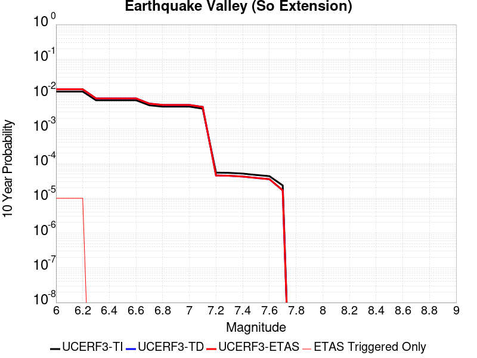 |

| Magnitude | 1 wk TI Prob | 1 wk TD Prob | 1 wk ETAS Prob | 1 wk ETAS/TD Gain | 1 wk ETAS Triggered Only | 1 mo TI Prob | 1 mo TD Prob | 1 mo ETAS Prob | 1 mo ETAS/TD Gain | 1 mo ETAS Triggered Only | 1 yr TI Prob | 1 yr TD Prob | 1 yr ETAS Prob | 1 yr ETAS/TD Gain | 1 yr ETAS Triggered Only | 10 yr TI Prob | 10 yr TD Prob | 10 yr ETAS Prob | 10 yr ETAS/TD Gain | 10 yr ETAS Triggered Only |
|-----|-----|-----|-----|-----|-----|-----|-----|-----|-----|-----|-----|-----|-----|-----|-----|-----|-----|-----|-----|-----|
| 6.0 | 2.2688773E-5 | 2.6350974E-5 | 2.6350974E-5 | 1.0 | 0.0 | 9.723397E-5 | 1.1292929E-4 | 1.2292816E-4 | 1.088541 | 1.0E-5 | 0.0011831806 | 0.0013743007 | 0.001384287 | 1.0072664 | 1.0E-5 | 0.011769009 | 0.013682859 | 0.013692723 | 1.0007209 | 1.0E-5 |
| 6.1 | 2.2688773E-5 | 2.6350974E-5 | 2.6350974E-5 | 1.0 | 0.0 | 9.723397E-5 | 1.1292929E-4 | 1.2292816E-4 | 1.088541 | 1.0E-5 | 0.0011831806 | 0.0013743007 | 0.001384287 | 1.0072664 | 1.0E-5 | 0.011769009 | 0.013682859 | 0.013692723 | 1.0007209 | 1.0E-5 |
| 6.2 | 2.2688773E-5 | 2.6350974E-5 | 2.6350974E-5 | 1.0 | 0.0 | 9.723397E-5 | 1.1292929E-4 | 1.2292816E-4 | 1.088541 | 1.0E-5 | 0.0011831806 | 0.0013743007 | 0.001384287 | 1.0072664 | 1.0E-5 | 0.011769009 | 0.013682859 | 0.013692723 | 1.0007209 | 1.0E-5 |
| 6.3 | 1.2745879E-5 | 1.4356638E-5 | 1.4356638E-5 | 1.0 | 0.0 | 5.4624048E-5 | 6.152742E-5 | 6.152742E-5 | 1.0 | 0.0 | 6.648449E-4 | 7.489131E-4 | 7.489131E-4 | 1.0 | 0.0 | 0.006628593 | 0.0074711973 | 0.0074711973 | 1.0 | 0.0 |
| 6.4 | 1.2745879E-5 | 1.4356638E-5 | 1.4356638E-5 | 1.0 | 0.0 | 5.4624048E-5 | 6.152742E-5 | 6.152742E-5 | 1.0 | 0.0 | 6.648449E-4 | 7.489131E-4 | 7.489131E-4 | 1.0 | 0.0 | 0.006628593 | 0.0074711973 | 0.0074711973 | 1.0 | 0.0 |
| 6.5 | 1.2745879E-5 | 1.4356638E-5 | 1.4356638E-5 | 1.0 | 0.0 | 5.4624048E-5 | 6.152742E-5 | 6.152742E-5 | 1.0 | 0.0 | 6.648449E-4 | 7.489131E-4 | 7.489131E-4 | 1.0 | 0.0 | 0.006628593 | 0.0074711973 | 0.0074711973 | 1.0 | 0.0 |
| 6.6 | 1.2745879E-5 | 1.4356638E-5 | 1.4356638E-5 | 1.0 | 0.0 | 5.4624048E-5 | 6.152742E-5 | 6.152742E-5 | 1.0 | 0.0 | 6.648449E-4 | 7.489131E-4 | 7.489131E-4 | 1.0 | 0.0 | 0.006628593 | 0.0074711973 | 0.0074711973 | 1.0 | 0.0 |
| 6.7 | 9.096649E-6 | 1.01644755E-5 | 1.01644755E-5 | 1.0 | 0.0 | 3.8985054E-5 | 4.356161E-5 | 4.356161E-5 | 1.0 | 0.0 | 4.7453964E-4 | 5.3028594E-4 | 5.3028594E-4 | 1.0 | 0.0 | 0.0047352756 | 0.0052953507 | 0.0052953507 | 1.0 | 0.0 |
| 6.8 | 8.342918E-6 | 9.310957E-6 | 9.310957E-6 | 1.0 | 0.0 | 3.575487E-5 | 3.990378E-5 | 3.990378E-5 | 1.0 | 0.0 | 4.352286E-4 | 4.8577177E-4 | 4.8577177E-4 | 1.0 | 0.0 | 0.004343772 | 0.004852154 | 0.004852154 | 1.0 | 0.0 |
| 6.9 | 8.342918E-6 | 9.310957E-6 | 9.310957E-6 | 1.0 | 0.0 | 3.575487E-5 | 3.990378E-5 | 3.990378E-5 | 1.0 | 0.0 | 4.352286E-4 | 4.8577177E-4 | 4.8577177E-4 | 1.0 | 0.0 | 0.004343772 | 0.004852154 | 0.004852154 | 1.0 | 0.0 |
| 7.0 | 8.342918E-6 | 9.310957E-6 | 9.310957E-6 | 1.0 | 0.0 | 3.575487E-5 | 3.990378E-5 | 3.990378E-5 | 1.0 | 0.0 | 4.352286E-4 | 4.8577177E-4 | 4.8577177E-4 | 1.0 | 0.0 | 0.004343772 | 0.004852154 | 0.004852154 | 1.0 | 0.0 |
| 7.1 | 7.288356E-6 | 8.129932E-6 | 8.129932E-6 | 1.0 | 0.0 | 3.123544E-5 | 3.4842382E-5 | 3.4842382E-5 | 1.0 | 0.0 | 3.8022507E-4 | 4.2417325E-4 | 4.2417325E-4 | 1.0 | 0.0 | 0.0037957516 | 0.004238519 | 0.004238519 | 1.0 | 0.0 |
| 7.2 | 1.04951305E-7 | 8.6905246E-8 | 8.6905246E-8 | 1.0 | 0.0 | 4.497912E-7 | 3.72451E-7 | 3.72451E-7 | 1.0 | 0.0 | 5.4761945E-6 | 4.5345823E-6 | 4.5345823E-6 | 1.0 | 0.0 | 5.4760592E-5 | 4.5344954E-5 | 4.5344954E-5 | 1.0 | 0.0 |
| 7.3 | 1.03215946E-7 | 8.520999E-8 | 8.520999E-8 | 1.0 | 0.0 | 4.4235398E-7 | 3.6518563E-7 | 3.6518563E-7 | 1.0 | 0.0 | 5.3856465E-6 | 4.4461267E-6 | 4.4461267E-6 | 1.0 | 0.0 | 5.3855158E-5 | 4.4460434E-5 | 4.4460434E-5 | 1.0 | 0.0 |
| 7.4 | 9.8358555E-8 | 8.077059E-8 | 8.077059E-8 | 1.0 | 0.0 | 4.2153658E-7 | 3.4615962E-7 | 3.4615962E-7 | 1.0 | 0.0 | 5.132196E-6 | 4.2144857E-6 | 4.2144857E-6 | 1.0 | 0.0 | 5.1320774E-5 | 4.2144115E-5 | 4.2144115E-5 | 1.0 | 0.0 |
| 7.5 | 8.972987E-8 | 7.383926E-8 | 7.383926E-8 | 1.0 | 0.0 | 3.8455653E-7 | 3.164539E-7 | 3.164539E-7 | 1.0 | 0.0 | 4.681966E-6 | 3.85282E-6 | 3.85282E-6 | 1.0 | 0.0 | 4.681867E-5 | 3.852759E-5 | 3.852759E-5 | 1.0 | 0.0 |
| 7.6 | 8.311394E-8 | 6.805497E-8 | 6.805497E-8 | 1.0 | 0.0 | 3.5620255E-7 | 2.9166415E-7 | 2.9166415E-7 | 1.0 | 0.0 | 4.3367577E-6 | 3.5510056E-6 | 3.5510056E-6 | 1.0 | 0.0 | 4.336673E-5 | 3.5509544E-5 | 3.5509544E-5 | 1.0 | 0.0 |
| 7.7 | 4.4837012E-8 | 3.238053E-8 | 3.238053E-8 | 1.0 | 0.0 | 1.9215861E-7 | 1.387737E-7 | 1.387737E-7 | 1.0 | 0.0 | 2.3395287E-6 | 1.6895689E-6 | 1.6895689E-6 | 1.0 | 0.0 | 2.339504E-5 | 1.6895596E-5 | 1.6895596E-5 | 1.0 | 0.0 |

## Morales (East)
*[(top)](#table-of-contents)*

| 1 Week | 1 Month | 1 Year | 10 Year |
|-----|-----|-----|-----|
|  | 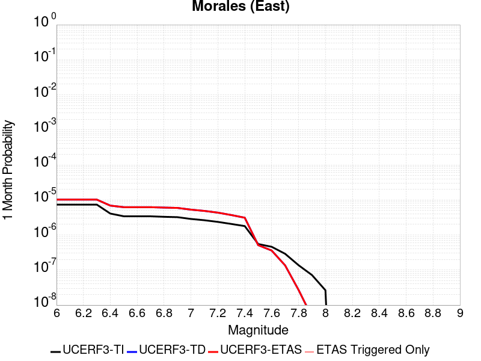 |  |  |

| Magnitude | 1 wk TI Prob | 1 wk TD Prob | 1 wk ETAS Prob | 1 wk ETAS/TD Gain | 1 wk ETAS Triggered Only | 1 mo TI Prob | 1 mo TD Prob | 1 mo ETAS Prob | 1 mo ETAS/TD Gain | 1 mo ETAS Triggered Only | 1 yr TI Prob | 1 yr TD Prob | 1 yr ETAS Prob | 1 yr ETAS/TD Gain | 1 yr ETAS Triggered Only | 10 yr TI Prob | 10 yr TD Prob | 10 yr ETAS Prob | 10 yr ETAS/TD Gain | 10 yr ETAS Triggered Only |
|-----|-----|-----|-----|-----|-----|-----|-----|-----|-----|-----|-----|-----|-----|-----|-----|-----|-----|-----|-----|-----|
| 6.0 | 1.7171362E-6 | 2.3823081E-6 | 2.3823081E-6 | 1.0 | 0.0 | 7.3591345E-6 | 1.02098575E-5 | 1.02098575E-5 | 1.0 | 0.0 | 8.9593785E-5 | 1.2429876E-4 | 1.2429876E-4 | 1.0 | 0.0 | 8.9557667E-4 | 0.0012423871 | 0.0012523747 | 1.008039 | 1.0E-5 |
| 6.1 | 1.7171362E-6 | 2.3823081E-6 | 2.3823081E-6 | 1.0 | 0.0 | 7.3591345E-6 | 1.02098575E-5 | 1.02098575E-5 | 1.0 | 0.0 | 8.9593785E-5 | 1.2429876E-4 | 1.2429876E-4 | 1.0 | 0.0 | 8.9557667E-4 | 0.0012423871 | 0.0012523747 | 1.008039 | 1.0E-5 |
| 6.2 | 1.7171362E-6 | 2.3823081E-6 | 2.3823081E-6 | 1.0 | 0.0 | 7.3591345E-6 | 1.02098575E-5 | 1.02098575E-5 | 1.0 | 0.0 | 8.9593785E-5 | 1.2429876E-4 | 1.2429876E-4 | 1.0 | 0.0 | 8.9557667E-4 | 0.0012423871 | 0.0012523747 | 1.008039 | 1.0E-5 |
| 6.3 | 1.7171362E-6 | 2.3823081E-6 | 2.3823081E-6 | 1.0 | 0.0 | 7.3591345E-6 | 1.02098575E-5 | 1.02098575E-5 | 1.0 | 0.0 | 8.9593785E-5 | 1.2429876E-4 | 1.2429876E-4 | 1.0 | 0.0 | 8.9557667E-4 | 0.0012423871 | 0.0012523747 | 1.008039 | 1.0E-5 |
| 6.4 | 9.54204E-7 | 1.609686E-6 | 1.609686E-6 | 1.0 | 0.0 | 4.0894392E-6 | 6.898637E-6 | 6.898637E-6 | 1.0 | 0.0 | 4.9787785E-5 | 8.3987776E-5 | 8.3987776E-5 | 1.0 | 0.0 | 4.977663E-4 | 8.395833E-4 | 8.395833E-4 | 1.0 | 0.0 |
| 6.5 | 7.97842E-7 | 1.4517286E-6 | 1.4517286E-6 | 1.0 | 0.0 | 3.4193185E-6 | 6.2216795E-6 | 6.2216795E-6 | 1.0 | 0.0 | 4.1629406E-5 | 7.574639E-5 | 7.574639E-5 | 1.0 | 0.0 | 4.162161E-4 | 7.572256E-4 | 7.572256E-4 | 1.0 | 0.0 |
| 6.6 | 7.97842E-7 | 1.4517286E-6 | 1.4517286E-6 | 1.0 | 0.0 | 3.4193185E-6 | 6.2216795E-6 | 6.2216795E-6 | 1.0 | 0.0 | 4.1629406E-5 | 7.574639E-5 | 7.574639E-5 | 1.0 | 0.0 | 4.162161E-4 | 7.572256E-4 | 7.572256E-4 | 1.0 | 0.0 |
| 6.7 | 7.9609447E-7 | 1.4489813E-6 | 1.4489813E-6 | 1.0 | 0.0 | 3.411829E-6 | 6.2099057E-6 | 6.2099057E-6 | 1.0 | 0.0 | 4.1538227E-5 | 7.560306E-5 | 7.560306E-5 | 1.0 | 0.0 | 4.1530465E-4 | 7.557932E-4 | 7.557932E-4 | 1.0 | 0.0 |
| 6.8 | 7.708149E-7 | 1.4119414E-6 | 1.4119414E-6 | 1.0 | 0.0 | 3.303488E-6 | 6.051164E-6 | 6.051164E-6 | 1.0 | 0.0 | 4.0219224E-5 | 7.3670504E-5 | 7.3670504E-5 | 1.0 | 0.0 | 4.0211948E-4 | 7.3648046E-4 | 7.3648046E-4 | 1.0 | 0.0 |
| 6.9 | 7.523139E-7 | 1.3813127E-6 | 1.3813127E-6 | 1.0 | 0.0 | 3.2241983E-6 | 5.9198983E-6 | 5.9198983E-6 | 1.0 | 0.0 | 3.9253908E-5 | 7.207246E-5 | 7.207246E-5 | 1.0 | 0.0 | 3.9246975E-4 | 7.205104E-4 | 7.205104E-4 | 1.0 | 0.0 |
| 7.0 | 6.684528E-7 | 1.2327608E-6 | 1.2327608E-6 | 1.0 | 0.0 | 2.8647946E-6 | 5.28325E-6 | 5.28325E-6 | 1.0 | 0.0 | 3.4878318E-5 | 6.432173E-5 | 6.432173E-5 | 1.0 | 0.0 | 3.4872844E-4 | 6.4304855E-4 | 6.4304855E-4 | 1.0 | 0.0 |
| 7.1 | 6.150348E-7 | 1.1340832E-6 | 1.1340832E-6 | 1.0 | 0.0 | 2.635861E-6 | 4.8603474E-6 | 4.8603474E-6 | 1.0 | 0.0 | 3.2091135E-5 | 5.917317E-5 | 5.917317E-5 | 1.0 | 0.0 | 3.20865E-4 | 5.915907E-4 | 5.915907E-4 | 1.0 | 0.0 |
| 7.2 | 5.5160774E-7 | 1.0133397E-6 | 1.0133397E-6 | 1.0 | 0.0 | 2.364031E-6 | 4.342877E-6 | 4.342877E-6 | 1.0 | 0.0 | 2.8781697E-5 | 5.2873285E-5 | 5.2873285E-5 | 1.0 | 0.0 | 2.877797E-4 | 5.286229E-4 | 5.286229E-4 | 1.0 | 0.0 |
| 7.3 | 4.8175616E-7 | 8.6502587E-7 | 8.6502587E-7 | 1.0 | 0.0 | 2.0646678E-6 | 3.7072487E-6 | 3.7072487E-6 | 1.0 | 0.0 | 2.513704E-5 | 4.5134846E-5 | 4.5134846E-5 | 1.0 | 0.0 | 2.5134196E-4 | 4.5127183E-4 | 4.5127183E-4 | 1.0 | 0.0 |
| 7.4 | 4.1852184E-7 | 7.2622186E-7 | 7.2622186E-7 | 1.0 | 0.0 | 1.7936638E-6 | 3.1123757E-6 | 3.1123757E-6 | 1.0 | 0.0 | 2.1837637E-5 | 3.789254E-5 | 3.789254E-5 | 1.0 | 0.0 | 2.1835492E-4 | 3.7887538E-4 | 3.7887538E-4 | 1.0 | 0.0 |
| 7.5 | 1.2877739E-7 | 1.1971954E-7 | 1.1971954E-7 | 1.0 | 0.0 | 5.5190293E-7 | 5.1308365E-7 | 5.1308365E-7 | 1.0 | 0.0 | 6.719398E-6 | 6.2467757E-6 | 6.2467757E-6 | 1.0 | 0.0 | 6.719194E-5 | 6.247824E-5 | 6.247824E-5 | 1.0 | 0.0 |
| 7.6 | 1.0748484E-7 | 8.4116074E-8 | 8.4116074E-8 | 1.0 | 0.0 | 4.606492E-7 | 3.6049744E-7 | 3.6049744E-7 | 1.0 | 0.0 | 5.6083895E-6 | 4.3890473E-6 | 4.3890473E-6 | 1.0 | 0.0 | 5.608248E-5 | 4.3901837E-5 | 4.3901837E-5 | 1.0 | 0.0 |
| 7.7 | 6.789518E-8 | 3.173348E-8 | 3.173348E-8 | 1.0 | 0.0 | 2.909793E-7 | 1.3600062E-7 | 1.3600062E-7 | 1.0 | 0.0 | 3.5426674E-6 | 1.6558064E-6 | 1.6558064E-6 | 1.0 | 0.0 | 3.542611E-5 | 1.6570159E-5 | 1.6570159E-5 | 1.0 | 0.0 |
| 7.8 | 3.208296E-8 | 6.3343233E-9 | 6.3343233E-9 | 1.0 | 0.0 | 1.3749839E-7 | 2.71471E-8 | 2.71471E-8 | 1.0 | 0.0 | 1.6740416E-6 | 3.305159E-7 | 3.305159E-7 | 1.0 | 0.0 | 1.674029E-5 | 3.3166648E-6 | 3.3166648E-6 | 1.0 | 0.0 |
| 7.9 | 1.6767855E-8 | 1.0695538E-9 | 1.0695538E-9 | 1.0 | 0.0 | 7.186223E-8 | 4.5838044E-9 | 4.5838044E-9 | 1.0 | 0.0 | 8.749223E-7 | 5.580782E-8 | 5.580782E-8 | 1.0 | 0.0 | 8.749188E-6 | 5.680936E-7 | 5.680936E-7 | 1.0 | 0.0 |
| 8.0 | 6.174316E-9 | 2.0462732E-10 | 2.0462732E-10 | 1.0 | 0.0 | 2.6461354E-8 | 8.7697705E-10 | 8.7697705E-10 | 1.0 | 0.0 | 3.2216695E-7 | 1.0677194E-8 | 1.0677194E-8 | 1.0 | 0.0 | 3.2216647E-6 | 1.1288308E-7 | 1.1288308E-7 | 1.0 | 0.0 |

## Clayton
*[(top)](#table-of-contents)*

| 1 Week | 1 Month | 1 Year | 10 Year |
|-----|-----|-----|-----|
|  |  |  |  |

| Magnitude | 1 wk TI Prob | 1 wk TD Prob | 1 wk ETAS Prob | 1 wk ETAS/TD Gain | 1 wk ETAS Triggered Only | 1 mo TI Prob | 1 mo TD Prob | 1 mo ETAS Prob | 1 mo ETAS/TD Gain | 1 mo ETAS Triggered Only | 1 yr TI Prob | 1 yr TD Prob | 1 yr ETAS Prob | 1 yr ETAS/TD Gain | 1 yr ETAS Triggered Only | 10 yr TI Prob | 10 yr TD Prob | 10 yr ETAS Prob | 10 yr ETAS/TD Gain | 10 yr ETAS Triggered Only |
|-----|-----|-----|-----|-----|-----|-----|-----|-----|-----|-----|-----|-----|-----|-----|-----|-----|-----|-----|-----|-----|
| 6.0 | 1.1085564E-5 | 1.2510381E-5 | 1.2510381E-5 | 1.0 | 0.0 | 4.7508696E-5 | 5.3614895E-5 | 5.3614895E-5 | 1.0 | 0.0 | 5.782648E-4 | 6.525797E-4 | 6.625732E-4 | 1.0153137 | 1.0E-5 | 0.005767624 | 0.0065080225 | 0.0065179574 | 1.0015266 | 1.0E-5 |
| 6.1 | 1.1085564E-5 | 1.2510381E-5 | 1.2510381E-5 | 1.0 | 0.0 | 4.7508696E-5 | 5.3614895E-5 | 5.3614895E-5 | 1.0 | 0.0 | 5.782648E-4 | 6.525797E-4 | 6.625732E-4 | 1.0153137 | 1.0E-5 | 0.005767624 | 0.0065080225 | 0.0065179574 | 1.0015266 | 1.0E-5 |
| 6.2 | 1.1085564E-5 | 1.2510381E-5 | 1.2510381E-5 | 1.0 | 0.0 | 4.7508696E-5 | 5.3614895E-5 | 5.3614895E-5 | 1.0 | 0.0 | 5.782648E-4 | 6.525797E-4 | 6.625732E-4 | 1.0153137 | 1.0E-5 | 0.005767624 | 0.0065080225 | 0.0065179574 | 1.0015266 | 1.0E-5 |
| 6.3 | 8.741973E-6 | 9.963816E-6 | 9.963816E-6 | 1.0 | 0.0 | 3.746506E-5 | 4.2701402E-5 | 4.2701402E-5 | 1.0 | 0.0 | 4.5604163E-4 | 5.197715E-4 | 5.2976626E-4 | 1.0192292 | 1.0E-5 | 0.004551069 | 0.0051861517 | 0.0051960996 | 1.0019182 | 1.0E-5 |
| 6.4 | 8.741973E-6 | 9.963816E-6 | 9.963816E-6 | 1.0 | 0.0 | 3.746506E-5 | 4.2701402E-5 | 4.2701402E-5 | 1.0 | 0.0 | 4.5604163E-4 | 5.197715E-4 | 5.2976626E-4 | 1.0192292 | 1.0E-5 | 0.004551069 | 0.0051861517 | 0.0051960996 | 1.0019182 | 1.0E-5 |
| 6.5 | 8.4117655E-6 | 9.607146E-6 | 9.607146E-6 | 1.0 | 0.0 | 3.6049925E-5 | 4.117287E-5 | 4.117287E-5 | 1.0 | 0.0 | 4.3881944E-4 | 5.011701E-4 | 5.111651E-4 | 1.0199434 | 1.0E-5 | 0.0043795393 | 0.0050009754 | 0.0050109252 | 1.0019896 | 1.0E-5 |
| 6.6 | 8.383548E-6 | 9.575681E-6 | 9.575681E-6 | 1.0 | 0.0 | 3.5928995E-5 | 4.1038023E-5 | 4.1038023E-5 | 1.0 | 0.0 | 4.373477E-4 | 4.995291E-4 | 5.0952414E-4 | 1.0200088 | 1.0E-5 | 0.00436488 | 0.004984639 | 0.0049945894 | 1.0019962 | 1.0E-5 |
| 6.7 | 7.4717673E-6 | 8.563072E-6 | 8.563072E-6 | 1.0 | 0.0 | 3.2021468E-5 | 3.669839E-5 | 3.669839E-5 | 1.0 | 0.0 | 3.8979162E-4 | 4.4671624E-4 | 4.5671177E-4 | 1.0223756 | 1.0E-5 | 0.0038910862 | 0.004458674 | 0.0044686296 | 1.0022328 | 1.0E-5 |
| 6.8 | 6.959283E-6 | 7.985171E-6 | 7.985171E-6 | 1.0 | 0.0 | 2.9825156E-5 | 3.422174E-5 | 3.422174E-5 | 1.0 | 0.0 | 3.6306077E-4 | 4.1657456E-4 | 4.265704E-4 | 1.0239953 | 1.0E-5 | 0.0036246818 | 0.004158391 | 0.0041683493 | 1.0023948 | 1.0E-5 |
| 6.9 | 5.8063583E-6 | 6.6710513E-6 | 6.6710513E-6 | 1.0 | 0.0 | 2.4884157E-5 | 2.8589928E-5 | 2.8589928E-5 | 1.0 | 0.0 | 3.0292248E-4 | 3.480307E-4 | 3.5802723E-4 | 1.0287231 | 1.0E-5 | 0.003025099 | 0.0034752449 | 0.00348521 | 1.0028675 | 1.0E-5 |
| 7.0 | 3.7803852E-6 | 4.3162786E-6 | 4.3162786E-6 | 1.0 | 0.0 | 1.6201551E-5 | 1.8498213E-5 | 1.8498213E-5 | 1.0 | 0.0 | 1.9723602E-4 | 2.2519371E-4 | 2.2519371E-4 | 1.0 | 0.0 | 0.0019706106 | 0.002249778 | 0.002249778 | 1.0 | 0.0 |
| 7.1 | 2.8489808E-6 | 3.232868E-6 | 3.232868E-6 | 1.0 | 0.0 | 1.220986E-5 | 1.385508E-5 | 1.385508E-5 | 1.0 | 0.0 | 1.486449E-4 | 1.6867349E-4 | 1.6867349E-4 | 1.0 | 0.0 | 0.0014854552 | 0.0016855473 | 0.0016855473 | 1.0 | 0.0 |
| 7.2 | 1.1792343E-6 | 1.2716165E-6 | 1.2716165E-6 | 1.0 | 0.0 | 5.053852E-6 | 5.449774E-6 | 5.449774E-6 | 1.0 | 0.0 | 6.152891E-5 | 6.634901E-5 | 6.634901E-5 | 1.0 | 0.0 | 6.1511877E-4 | 6.632947E-4 | 6.632947E-4 | 1.0 | 0.0 |
| 7.3 | 8.7261776E-7 | 9.351504E-7 | 9.351504E-7 | 1.0 | 0.0 | 3.7397851E-6 | 4.007781E-6 | 4.007781E-6 | 1.0 | 0.0 | 4.553093E-5 | 4.8793652E-5 | 4.8793652E-5 | 1.0 | 0.0 | 4.5521604E-4 | 4.8783017E-4 | 4.8783017E-4 | 1.0 | 0.0 |
| 7.4 | 6.198429E-7 | 6.636834E-7 | 6.636834E-7 | 1.0 | 0.0 | 2.6564671E-6 | 2.8443544E-6 | 2.8443544E-6 | 1.0 | 0.0 | 3.2342006E-5 | 3.462947E-5 | 3.462947E-5 | 1.0 | 0.0 | 3.2337298E-4 | 3.462411E-4 | 3.462411E-4 | 1.0 | 0.0 |
| 7.5 | 5.1639586E-7 | 5.5355E-7 | 5.5355E-7 | 1.0 | 0.0 | 2.2131233E-6 | 2.372355E-6 | 2.372355E-6 | 1.0 | 0.0 | 2.6944443E-5 | 2.8883043E-5 | 2.8883043E-5 | 1.0 | 0.0 | 2.6941174E-4 | 2.887932E-4 | 2.887932E-4 | 1.0 | 0.0 |
| 7.6 | 3.743337E-7 | 4.032615E-7 | 4.032615E-7 | 1.0 | 0.0 | 1.6042864E-6 | 1.7282624E-6 | 1.7282624E-6 | 1.0 | 0.0 | 1.9532012E-5 | 2.1041395E-5 | 2.1041395E-5 | 1.0 | 0.0 | 1.9530294E-4 | 2.1039431E-4 | 2.1039431E-4 | 1.0 | 0.0 |
| 7.7 | 2.102421E-9 | 2.1653372E-9 | 2.1653372E-9 | 1.0 | 0.0 | 9.010375E-9 | 9.280018E-9 | 9.280018E-9 | 1.0 | 0.0 | 1.0970131E-7 | 1.1298421E-7 | 1.1298421E-7 | 1.0 | 0.0 | 1.0970126E-6 | 1.1298421E-6 | 1.1298421E-6 | 1.0 | 0.0 |

## Bartlett Springs 2011 CFM
*[(top)](#table-of-contents)*

| 1 Week | 1 Month | 1 Year | 10 Year |
|-----|-----|-----|-----|
|  |  |  |  |

| Magnitude | 1 wk TI Prob | 1 wk TD Prob | 1 wk ETAS Prob | 1 wk ETAS/TD Gain | 1 wk ETAS Triggered Only | 1 mo TI Prob | 1 mo TD Prob | 1 mo ETAS Prob | 1 mo ETAS/TD Gain | 1 mo ETAS Triggered Only | 1 yr TI Prob | 1 yr TD Prob | 1 yr ETAS Prob | 1 yr ETAS/TD Gain | 1 yr ETAS Triggered Only | 10 yr TI Prob | 10 yr TD Prob | 10 yr ETAS Prob | 10 yr ETAS/TD Gain | 10 yr ETAS Triggered Only |
|-----|-----|-----|-----|-----|-----|-----|-----|-----|-----|-----|-----|-----|-----|-----|-----|-----|-----|-----|-----|-----|
| 6.0 | 6.3535845E-5 | 8.2067985E-5 | 8.2067985E-5 | 1.0 | 0.0 | 2.7226808E-4 | 3.516734E-4 | 3.516734E-4 | 1.0 | 0.0 | 0.0033098254 | 0.0042731874 | 0.0042731874 | 1.0 | 0.0 | 0.032609608 | 0.041929383 | 0.04193896 | 1.0002285 | 1.0E-5 |
| 6.1 | 6.348136E-5 | 8.199945E-5 | 8.199945E-5 | 1.0 | 0.0 | 2.7203458E-4 | 3.5137977E-4 | 3.5137977E-4 | 1.0 | 0.0 | 0.0033069917 | 0.0042696265 | 0.0042696265 | 1.0 | 0.0 | 0.0325821 | 0.04189512 | 0.041904703 | 1.0002286 | 1.0E-5 |
| 6.2 | 6.3438514E-5 | 8.1945764E-5 | 8.1945764E-5 | 1.0 | 0.0 | 2.7185102E-4 | 3.5114973E-4 | 3.5114973E-4 | 1.0 | 0.0 | 0.0033047632 | 0.0042668367 | 0.0042668367 | 1.0 | 0.0 | 0.032560475 | 0.04186828 | 0.041877862 | 1.0002289 | 1.0E-5 |
| 6.3 | 6.3327934E-5 | 8.1806014E-5 | 8.1806014E-5 | 1.0 | 0.0 | 2.713772E-4 | 3.5055098E-4 | 3.5055098E-4 | 1.0 | 0.0 | 0.003299012 | 0.0042595756 | 0.0042595756 | 1.0 | 0.0 | 0.032504648 | 0.04179842 | 0.041808005 | 1.0002292 | 1.0E-5 |
| 6.4 | 5.2357227E-5 | 6.7418594E-5 | 6.7418594E-5 | 1.0 | 0.0 | 2.243688E-4 | 2.8890514E-4 | 2.8890514E-4 | 1.0 | 0.0 | 0.0027282683 | 0.0035118032 | 0.0035118032 | 1.0 | 0.0 | 0.026950153 | 0.03457226 | 0.03458191 | 1.0002793 | 1.0E-5 |
| 6.5 | 5.2244963E-5 | 6.727681E-5 | 6.727681E-5 | 1.0 | 0.0 | 2.2388776E-4 | 2.882976E-4 | 2.882976E-4 | 1.0 | 0.0 | 0.002722426 | 0.0035044304 | 0.0035044304 | 1.0 | 0.0 | 0.026893148 | 0.034500837 | 0.034510493 | 1.0002799 | 1.0E-5 |
| 6.6 | 4.9564955E-5 | 6.3777494E-5 | 6.3777494E-5 | 1.0 | 0.0 | 2.1240393E-4 | 2.7330377E-4 | 2.7330377E-4 | 1.0 | 0.0 | 0.002582951 | 0.0033224465 | 0.0033224465 | 1.0 | 0.0 | 0.025531346 | 0.032736354 | 0.032746024 | 1.0002955 | 1.0E-5 |
| 6.7 | 4.8374644E-5 | 6.226348E-5 | 6.226348E-5 | 1.0 | 0.0 | 2.0730343E-4 | 2.6681647E-4 | 2.6681647E-4 | 1.0 | 0.0 | 0.0025209978 | 0.0032437008 | 0.0032437008 | 1.0 | 0.0 | 0.024925899 | 0.03197187 | 0.031981554 | 1.0003028 | 1.0E-5 |
| 6.8 | 4.501868E-5 | 5.7884274E-5 | 5.7884274E-5 | 1.0 | 0.0 | 1.9292293E-4 | 2.4805206E-4 | 2.4805206E-4 | 1.0 | 0.0 | 0.0023463066 | 0.0030158884 | 0.0030158884 | 1.0 | 0.0 | 0.023216877 | 0.029756038 | 0.02976574 | 1.000326 | 1.0E-5 |
| 6.9 | 4.0816423E-5 | 5.2449235E-5 | 5.2449235E-5 | 1.0 | 0.0 | 1.749158E-4 | 2.2476321E-4 | 2.2476321E-4 | 1.0 | 0.0 | 0.0021275198 | 0.002733083 | 0.002733083 | 1.0 | 0.0 | 0.021072663 | 0.026999287 | 0.026999287 | 1.0 | 0.0 |
| 7.0 | 3.5128658E-5 | 4.506078E-5 | 4.506078E-5 | 1.0 | 0.0 | 1.505427E-4 | 1.931034E-4 | 1.931034E-4 | 1.0 | 0.0 | 0.0018313165 | 0.0023485133 | 0.0023485133 | 1.0 | 0.0 | 0.018162983 | 0.023239776 | 0.023239776 | 1.0 | 0.0 |
| 7.1 | 3.249107E-5 | 4.1626805E-5 | 4.1626805E-5 | 1.0 | 0.0 | 1.3924E-4 | 1.7838847E-4 | 1.7838847E-4 | 1.0 | 0.0 | 0.0016939287 | 0.0021697285 | 0.0021697285 | 1.0 | 0.0 | 0.016810747 | 0.021487825 | 0.021487825 | 1.0 | 0.0 |
| 7.2 | 2.7352948E-5 | 3.490372E-5 | 3.490372E-5 | 1.0 | 0.0 | 1.1722165E-4 | 1.4957883E-4 | 1.4957883E-4 | 1.0 | 0.0 | 0.0014262391 | 0.0018196085 | 0.0018196085 | 1.0 | 0.0 | 0.014171202 | 0.018048653 | 0.018048653 | 1.0 | 0.0 |
| 7.3 | 2.5106026E-5 | 3.193081E-5 | 3.193081E-5 | 1.0 | 0.0 | 1.0759282E-4 | 1.368392E-4 | 1.368392E-4 | 1.0 | 0.0 | 0.0013091554 | 0.0016647511 | 0.0016647511 | 1.0 | 0.0 | 0.0130146975 | 0.016524136 | 0.016524136 | 1.0 | 0.0 |
| 7.4 | 2.2591508E-5 | 2.8660164E-5 | 2.8660164E-5 | 1.0 | 0.0 | 9.681716E-5 | 1.2282352E-4 | 1.2282352E-4 | 1.0 | 0.0 | 0.0011781114 | 0.0014943568 | 0.0014943568 | 1.0 | 0.0 | 0.011718852 | 0.014844153 | 0.014844153 | 1.0 | 0.0 |
| 7.5 | 2.0620802E-5 | 2.6104677E-5 | 2.6104677E-5 | 1.0 | 0.0 | 8.8371875E-5 | 1.11872425E-4 | 1.11872425E-4 | 1.0 | 0.0 | 0.0010753964 | 0.0013612018 | 0.0013612018 | 1.0 | 0.0 | 0.010702073 | 0.013529583 | 0.013529583 | 1.0 | 0.0 |
| 7.6 | 1.3839465E-5 | 1.7413538E-5 | 1.7413538E-5 | 1.0 | 0.0 | 5.9310645E-5 | 7.462733E-5 | 7.462733E-5 | 1.0 | 0.0 | 7.2186784E-4 | 9.0821146E-4 | 9.0821146E-4 | 1.0 | 0.0 | 0.0071952743 | 0.00904537 | 0.00904537 | 1.0 | 0.0 |
| 7.7 | 5.4861507E-6 | 6.6986486E-6 | 6.6986486E-6 | 1.0 | 0.0 | 2.3511862E-5 | 2.870818E-5 | 2.870818E-5 | 1.0 | 0.0 | 2.8621932E-4 | 3.4946628E-4 | 3.4946628E-4 | 1.0 | 0.0 | 0.0028585095 | 0.0034891972 | 0.0034891972 | 1.0 | 0.0 |
| 7.8 | 1.487507E-6 | 1.733513E-6 | 1.733513E-6 | 1.0 | 0.0 | 6.3750144E-6 | 7.4293207E-6 | 7.4293207E-6 | 1.0 | 0.0 | 7.761304E-5 | 9.0448266E-5 | 9.0448266E-5 | 1.0 | 0.0 | 7.7585934E-4 | 9.041181E-4 | 9.041181E-4 | 1.0 | 0.0 |
| 7.9 | 3.9537784E-7 | 4.5709606E-7 | 4.5709606E-7 | 1.0 | 0.0 | 1.6944754E-6 | 1.9589816E-6 | 1.9589816E-6 | 1.0 | 0.0 | 2.0630043E-5 | 2.385035E-5 | 2.385035E-5 | 1.0 | 0.0 | 2.0628127E-4 | 2.3847898E-4 | 2.3847898E-4 | 1.0 | 0.0 |

## Monte Vista - Shannon 2011 CFM
*[(top)](#table-of-contents)*

| 1 Week | 1 Month | 1 Year | 10 Year |
|-----|-----|-----|-----|
|  |  |  | 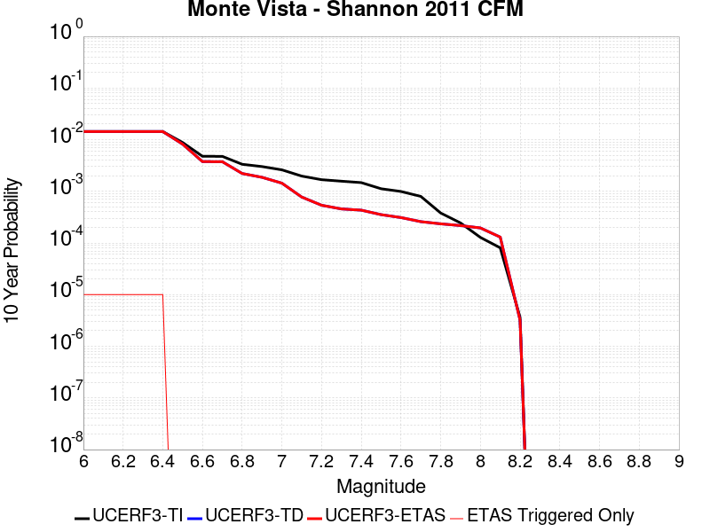 |

| Magnitude | 1 wk TI Prob | 1 wk TD Prob | 1 wk ETAS Prob | 1 wk ETAS/TD Gain | 1 wk ETAS Triggered Only | 1 mo TI Prob | 1 mo TD Prob | 1 mo ETAS Prob | 1 mo ETAS/TD Gain | 1 mo ETAS Triggered Only | 1 yr TI Prob | 1 yr TD Prob | 1 yr ETAS Prob | 1 yr ETAS/TD Gain | 1 yr ETAS Triggered Only | 10 yr TI Prob | 10 yr TD Prob | 10 yr ETAS Prob | 10 yr ETAS/TD Gain | 10 yr ETAS Triggered Only |
|-----|-----|-----|-----|-----|-----|-----|-----|-----|-----|-----|-----|-----|-----|-----|-----|-----|-----|-----|-----|-----|
| 6.0 | 2.7819018E-5 | 2.7661274E-5 | 2.7661274E-5 | 1.0 | 0.0 | 1.19218916E-4 | 1.18543605E-4 | 1.18543605E-4 | 1.0 | 0.0 | 0.0014505239 | 0.0014424324 | 0.001452418 | 1.0069227 | 1.0E-5 | 0.014410922 | 0.014360611 | 0.014370468 | 1.0006864 | 1.0E-5 |
| 6.1 | 2.7819018E-5 | 2.7661274E-5 | 2.7661274E-5 | 1.0 | 0.0 | 1.19218916E-4 | 1.18543605E-4 | 1.18543605E-4 | 1.0 | 0.0 | 0.0014505239 | 0.0014424324 | 0.001452418 | 1.0069227 | 1.0E-5 | 0.014410922 | 0.014360611 | 0.014370468 | 1.0006864 | 1.0E-5 |
| 6.2 | 2.7819018E-5 | 2.7661274E-5 | 2.7661274E-5 | 1.0 | 0.0 | 1.19218916E-4 | 1.18543605E-4 | 1.18543605E-4 | 1.0 | 0.0 | 0.0014505239 | 0.0014424324 | 0.001452418 | 1.0069227 | 1.0E-5 | 0.014410922 | 0.014360611 | 0.014370468 | 1.0006864 | 1.0E-5 |
| 6.3 | 2.7819018E-5 | 2.7661274E-5 | 2.7661274E-5 | 1.0 | 0.0 | 1.19218916E-4 | 1.18543605E-4 | 1.18543605E-4 | 1.0 | 0.0 | 0.0014505239 | 0.0014424324 | 0.001452418 | 1.0069227 | 1.0E-5 | 0.014410922 | 0.014360611 | 0.014370468 | 1.0006864 | 1.0E-5 |
| 6.4 | 2.7819018E-5 | 2.7661274E-5 | 2.7661274E-5 | 1.0 | 0.0 | 1.19218916E-4 | 1.18543605E-4 | 1.18543605E-4 | 1.0 | 0.0 | 0.0014505239 | 0.0014424324 | 0.001452418 | 1.0069227 | 1.0E-5 | 0.014410922 | 0.014360611 | 0.014370468 | 1.0006864 | 1.0E-5 |
| 6.5 | 1.6981021E-5 | 1.5743763E-5 | 1.5743763E-5 | 1.0 | 0.0 | 7.277377E-5 | 6.7471825E-5 | 6.7471825E-5 | 1.0 | 0.0 | 8.8566047E-4 | 8.212131E-4 | 8.212131E-4 | 1.0 | 0.0 | 0.008821391 | 0.008205114 | 0.008205114 | 1.0 | 0.0 |
| 6.6 | 9.170925E-6 | 7.1929817E-6 | 7.1929817E-6 | 1.0 | 0.0 | 3.9303373E-5 | 3.0826737E-5 | 3.0826737E-5 | 1.0 | 0.0 | 4.7841348E-4 | 3.7525763E-4 | 3.7525763E-4 | 1.0 | 0.0 | 0.004773848 | 0.0037650557 | 0.0037650557 | 1.0 | 0.0 |
| 6.7 | 9.145835E-6 | 7.1675454E-6 | 7.1675454E-6 | 1.0 | 0.0 | 3.9195846E-5 | 3.071773E-5 | 3.071773E-5 | 1.0 | 0.0 | 4.7710494E-4 | 3.739309E-4 | 3.739309E-4 | 1.0 | 0.0 | 0.004760819 | 0.0037518332 | 0.0037518332 | 1.0 | 0.0 |
| 6.8 | 6.4188525E-6 | 4.2176007E-6 | 4.2176007E-6 | 1.0 | 0.0 | 2.7509079E-5 | 1.8075312E-5 | 1.8075312E-5 | 1.0 | 0.0 | 3.3487155E-4 | 2.2004593E-4 | 2.2004593E-4 | 1.0 | 0.0 | 0.0033436737 | 0.0022165796 | 0.0022165796 | 1.0 | 0.0 |
| 6.9 | 5.7941556E-6 | 3.551028E-6 | 3.551028E-6 | 1.0 | 0.0 | 2.483186E-5 | 1.5218608E-5 | 1.5218608E-5 | 1.0 | 0.0 | 3.0228595E-4 | 1.8527183E-4 | 1.8527183E-4 | 1.0 | 0.0 | 0.0030187508 | 0.0018694595 | 0.0018694595 | 1.0 | 0.0 |
| 7.0 | 5.0070075E-6 | 2.729648E-6 | 2.729648E-6 | 1.0 | 0.0 | 2.1458429E-5 | 1.1698444E-5 | 1.1698444E-5 | 1.0 | 0.0 | 2.6122504E-4 | 1.4242006E-4 | 1.4242006E-4 | 1.0 | 0.0 | 0.002609182 | 0.0014415602 | 0.0014415602 | 1.0 | 0.0 |
| 7.1 | 3.7879215E-6 | 1.4526051E-6 | 1.4526051E-6 | 1.0 | 0.0 | 1.623385E-5 | 6.2254358E-6 | 6.2254358E-6 | 1.0 | 0.0 | 1.9762918E-4 | 7.5792064E-5 | 7.5792064E-5 | 1.0 | 0.0 | 0.0019745352 | 7.7586004E-4 | 7.7586004E-4 | 1.0 | 0.0 |
| 7.2 | 3.2262408E-6 | 9.966665E-7 | 9.966665E-7 | 1.0 | 0.0 | 1.3826673E-5 | 4.271421E-6 | 4.271421E-6 | 1.0 | 0.0 | 1.6832675E-4 | 5.2003314E-5 | 5.2003314E-5 | 1.0 | 0.0 | 0.001681993 | 5.3809996E-4 | 5.3809996E-4 | 1.0 | 0.0 |
| 7.3 | 3.0167648E-6 | 8.407046E-7 | 8.407046E-7 | 1.0 | 0.0 | 1.2928928E-5 | 3.6030146E-6 | 3.6030146E-6 | 1.0 | 0.0 | 1.5739833E-4 | 4.3865824E-5 | 4.3865824E-5 | 1.0 | 0.0 | 0.0015728689 | 4.5674184E-4 | 4.5674184E-4 | 1.0 | 0.0 |
| 7.4 | 2.8310146E-6 | 7.944656E-7 | 7.944656E-7 | 1.0 | 0.0 | 1.2132864E-5 | 3.4048483E-6 | 3.4048483E-6 | 1.0 | 0.0 | 1.477076E-4 | 4.145324E-5 | 4.145324E-5 | 1.0 | 0.0 | 0.0014760946 | 4.32451E-4 | 4.32451E-4 | 1.0 | 0.0 |
| 7.5 | 2.153469E-6 | 6.480251E-7 | 6.480251E-7 | 1.0 | 0.0 | 9.22912E-6 | 2.7772473E-6 | 2.7772473E-6 | 1.0 | 0.0 | 1.1235875E-4 | 3.3812463E-5 | 3.3812463E-5 | 1.0 | 0.0 | 0.0011230196 | 3.5410924E-4 | 3.5410924E-4 | 1.0 | 0.0 |
| 7.6 | 1.9068237E-6 | 5.659766E-7 | 5.659766E-7 | 1.0 | 0.0 | 8.172076E-6 | 2.425612E-6 | 2.425612E-6 | 1.0 | 0.0 | 9.9490484E-5 | 2.9531426E-5 | 2.9531426E-5 | 1.0 | 0.0 | 9.944596E-4 | 3.1085484E-4 | 3.1085484E-4 | 1.0 | 0.0 |
| 7.7 | 1.531236E-6 | 4.6891336E-7 | 4.6891336E-7 | 1.0 | 0.0 | 6.5624236E-6 | 2.0096272E-6 | 2.0096272E-6 | 1.0 | 0.0 | 7.989458E-5 | 2.4466937E-5 | 2.4466937E-5 | 1.0 | 0.0 | 7.986586E-4 | 2.5906495E-4 | 2.5906495E-4 | 1.0 | 0.0 |
| 7.8 | 7.301289E-7 | 4.2390946E-7 | 4.2390946E-7 | 1.0 | 0.0 | 3.12912E-6 | 1.8167535E-6 | 1.8167535E-6 | 1.0 | 0.0 | 3.809637E-5 | 2.2118751E-5 | 2.2118751E-5 | 1.0 | 0.0 | 3.808984E-4 | 2.3511346E-4 | 2.3511346E-4 | 1.0 | 0.0 |
| 7.9 | 4.6894428E-7 | 3.936612E-7 | 3.936612E-7 | 1.0 | 0.0 | 2.0097596E-6 | 1.6871184E-6 | 1.6871184E-6 | 1.0 | 0.0 | 2.4468549E-5 | 2.0540474E-5 | 2.0540474E-5 | 1.0 | 0.0 | 2.4465856E-4 | 2.1754851E-4 | 2.1754851E-4 | 1.0 | 0.0 |
| 8.0 | 2.4597625E-7 | 3.558206E-7 | 3.558206E-7 | 1.0 | 0.0 | 1.0541835E-6 | 1.5249445E-6 | 1.5249445E-6 | 1.0 | 0.0 | 1.2834609E-5 | 1.8566043E-5 | 1.8566043E-5 | 1.0 | 0.0 | 1.2833868E-4 | 1.9578509E-4 | 1.9578509E-4 | 1.0 | 0.0 |
| 8.1 | 1.54706E-7 | 2.3879693E-7 | 2.3879693E-7 | 1.0 | 0.0 | 6.6302556E-7 | 1.0234149E-6 | 1.0234149E-6 | 1.0 | 0.0 | 8.072306E-6 | 1.24600065E-5 | 1.24600065E-5 | 1.0 | 0.0 | 8.072013E-5 | 1.3015656E-4 | 1.3015656E-4 | 1.0 | 0.0 |
| 8.2 | 6.976397E-9 | 5.7440706E-9 | 5.7440706E-9 | 1.0 | 0.0 | 2.9898843E-8 | 2.4617446E-8 | 2.4617446E-8 | 1.0 | 0.0 | 3.6401835E-7 | 2.9971739E-7 | 2.9971739E-7 | 1.0 | 0.0 | 3.6401775E-6 | 3.1797995E-6 | 3.1797995E-6 | 1.0 | 0.0 |

## San Andreas (North Coast) 2011 CFM
*[(top)](#table-of-contents)*

| 1 Week | 1 Month | 1 Year | 10 Year |
|-----|-----|-----|-----|
|  |  | 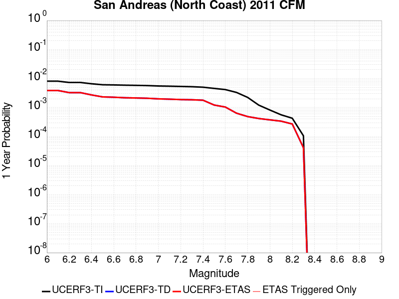 |  |

| Magnitude | 1 wk TI Prob | 1 wk TD Prob | 1 wk ETAS Prob | 1 wk ETAS/TD Gain | 1 wk ETAS Triggered Only | 1 mo TI Prob | 1 mo TD Prob | 1 mo ETAS Prob | 1 mo ETAS/TD Gain | 1 mo ETAS Triggered Only | 1 yr TI Prob | 1 yr TD Prob | 1 yr ETAS Prob | 1 yr ETAS/TD Gain | 1 yr ETAS Triggered Only | 10 yr TI Prob | 10 yr TD Prob | 10 yr ETAS Prob | 10 yr ETAS/TD Gain | 10 yr ETAS Triggered Only |
|-----|-----|-----|-----|-----|-----|-----|-----|-----|-----|-----|-----|-----|-----|-----|-----|-----|-----|-----|-----|-----|
| 6.0 | 1.5565647E-4 | 7.408801E-5 | 7.408801E-5 | 1.0 | 0.0 | 6.669286E-4 | 3.174816E-4 | 3.174816E-4 | 1.0 | 0.0 | 0.008089665 | 0.003858525 | 0.003858525 | 1.0 | 0.0 | 0.078014374 | 0.0409448 | 0.04095439 | 1.0002342 | 1.0E-5 |
| 6.1 | 1.5565647E-4 | 7.408801E-5 | 7.408801E-5 | 1.0 | 0.0 | 6.669286E-4 | 3.174816E-4 | 3.174816E-4 | 1.0 | 0.0 | 0.008089665 | 0.003858525 | 0.003858525 | 1.0 | 0.0 | 0.078014374 | 0.0409448 | 0.04095439 | 1.0002342 | 1.0E-5 |
| 6.2 | 1.405297E-4 | 6.281398E-5 | 6.281398E-5 | 1.0 | 0.0 | 6.021311E-4 | 2.691752E-4 | 2.691752E-4 | 1.0 | 0.0 | 0.0073063322 | 0.0032723122 | 0.0032723122 | 1.0 | 0.0 | 0.07070732 | 0.034934744 | 0.034944393 | 1.0002762 | 1.0E-5 |
| 6.3 | 1.405297E-4 | 6.281398E-5 | 6.281398E-5 | 1.0 | 0.0 | 6.021311E-4 | 2.691752E-4 | 2.691752E-4 | 1.0 | 0.0 | 0.0073063322 | 0.0032723122 | 0.0032723122 | 1.0 | 0.0 | 0.07070732 | 0.034934744 | 0.034944393 | 1.0002762 | 1.0E-5 |
| 6.4 | 1.2690343E-4 | 5.220789E-5 | 5.220789E-5 | 1.0 | 0.0 | 5.4375845E-4 | 2.2372905E-4 | 2.2372905E-4 | 1.0 | 0.0 | 0.006600182 | 0.00272052 | 0.00272052 | 1.0 | 0.0 | 0.06407562 | 0.029258741 | 0.029268447 | 1.0003318 | 1.0E-5 |
| 6.5 | 1.17174706E-4 | 4.4630237E-5 | 4.4630237E-5 | 1.0 | 0.0 | 5.0208066E-4 | 1.9125851E-4 | 1.9125851E-4 | 1.0 | 0.0 | 0.0060957125 | 0.0023261027 | 0.0023261027 | 1.0 | 0.0 | 0.05931192 | 0.025182763 | 0.02519251 | 1.0003871 | 1.0E-5 |
| 6.6 | 1.1561592E-4 | 4.3480723E-5 | 4.3480723E-5 | 1.0 | 0.0 | 4.9540267E-4 | 1.8633273E-4 | 1.8633273E-4 | 1.0 | 0.0 | 0.0060148602 | 0.0022662575 | 0.0022662575 | 1.0 | 0.0 | 0.058546405 | 0.024562074 | 0.024571829 | 1.0003971 | 1.0E-5 |
| 6.7 | 1.13374685E-4 | 4.1745025E-5 | 4.1745025E-5 | 1.0 | 0.0 | 4.8580102E-4 | 1.7889508E-4 | 1.7889508E-4 | 1.0 | 0.0 | 0.005898599 | 0.0021758885 | 0.0021758885 | 1.0 | 0.0 | 0.05744466 | 0.023628136 | 0.0236379 | 1.0004132 | 1.0E-5 |
| 6.8 | 1.11729045E-4 | 4.096439E-5 | 4.096439E-5 | 1.0 | 0.0 | 4.7875085E-4 | 1.7554995E-4 | 1.7554995E-4 | 1.0 | 0.0 | 0.0058132247 | 0.002135242 | 0.002135242 | 1.0 | 0.0 | 0.056634873 | 0.023189697 | 0.023199465 | 1.0004212 | 1.0E-5 |
| 6.9 | 1.0977976E-4 | 4.0045357E-5 | 4.0045357E-5 | 1.0 | 0.0 | 4.7039983E-4 | 1.7161177E-4 | 1.7161177E-4 | 1.0 | 0.0 | 0.005712089 | 0.0020873877 | 0.0020873877 | 1.0 | 0.0 | 0.055674773 | 0.022669813 | 0.022679586 | 1.0004311 | 1.0E-5 |
| 7.0 | 1.06261265E-4 | 3.822896E-5 | 3.822896E-5 | 1.0 | 0.0 | 4.553259E-4 | 1.6382821E-4 | 1.6382821E-4 | 1.0 | 0.0 | 0.0055295113 | 0.0019928 | 0.0019928 | 1.0 | 0.0 | 0.05393931 | 0.021645337 | 0.02165512 | 1.000452 | 1.0E-5 |
| 7.1 | 1.0454493E-4 | 3.725639E-5 | 3.725639E-5 | 1.0 | 0.0 | 4.4797276E-4 | 1.5966057E-4 | 1.5966057E-4 | 1.0 | 0.0 | 0.0054404372 | 0.0019421505 | 0.0019421505 | 1.0 | 0.0 | 0.05309159 | 0.021101879 | 0.021111667 | 1.0004638 | 1.0E-5 |
| 7.2 | 1.0244742E-4 | 3.612865E-5 | 3.612865E-5 | 1.0 | 0.0 | 4.389865E-4 | 1.5482798E-4 | 1.5482798E-4 | 1.0 | 0.0 | 0.0053315703 | 0.0018834169 | 0.0018834169 | 1.0 | 0.0 | 0.052054565 | 0.020472059 | 0.020481855 | 1.0004785 | 1.0E-5 |
| 7.3 | 1.0034518E-4 | 3.5578607E-5 | 3.5578607E-5 | 1.0 | 0.0 | 4.299799E-4 | 1.5247092E-4 | 1.5247092E-4 | 1.0 | 0.0 | 0.0052224463 | 0.0018547691 | 0.0018547691 | 1.0 | 0.0 | 0.051014073 | 0.020140288 | 0.020150088 | 1.0004865 | 1.0E-5 |
| 7.4 | 9.644907E-5 | 3.4324174E-5 | 3.4324174E-5 | 1.0 | 0.0 | 4.1328766E-4 | 1.4709539E-4 | 1.4709539E-4 | 1.0 | 0.0 | 0.0050201737 | 0.0017894312 | 0.0017894312 | 1.0 | 0.0 | 0.049082693 | 0.01939119 | 0.019400995 | 1.0005057 | 1.0E-5 |
| 7.5 | 8.764848E-5 | 2.3394472E-5 | 2.3394472E-5 | 1.0 | 0.0 | 3.7558225E-4 | 1.0025818E-4 | 1.0025818E-4 | 1.0 | 0.0 | 0.00456313 | 0.0012199616 | 0.0012199616 | 1.0 | 0.0 | 0.044705614 | 0.013552333 | 0.013562198 | 1.0007279 | 1.0E-5 |
| 7.6 | 7.985944E-5 | 1.9952158E-5 | 1.9952158E-5 | 1.0 | 0.0 | 3.4220985E-4 | 8.550646E-5 | 8.550646E-5 | 1.0 | 0.0 | 0.0041584475 | 0.0010405454 | 0.0010405454 | 1.0 | 0.0 | 0.040814873 | 0.0116571365 | 0.01166702 | 1.0008478 | 1.0E-5 |
| 7.7 | 6.368689E-5 | 1.2276444E-5 | 1.2276444E-5 | 1.0 | 0.0 | 2.7291526E-4 | 5.261227E-5 | 5.261227E-5 | 1.0 | 0.0 | 0.0033176811 | 6.403664E-4 | 6.403664E-4 | 1.0 | 0.0 | 0.032685854 | 0.0074274363 | 0.007437362 | 1.0013363 | 1.0E-5 |
| 7.8 | 4.290591E-5 | 9.364174E-6 | 9.364174E-6 | 1.0 | 0.0 | 1.838695E-4 | 4.0131556E-5 | 4.0131556E-5 | 1.0 | 0.0 | 0.0022363127 | 4.8849225E-4 | 4.8849225E-4 | 1.0 | 0.0 | 0.022139415 | 0.0056695775 | 0.005679521 | 1.0017538 | 1.0E-5 |
| 7.9 | 2.320005E-5 | 8.0296795E-6 | 8.0296795E-6 | 1.0 | 0.0 | 9.942499E-5 | 3.441246E-5 | 3.441246E-5 | 1.0 | 0.0 | 0.001209827 | 4.1889123E-4 | 4.1889123E-4 | 1.0 | 0.0 | 0.012032617 | 0.0048187682 | 0.00482872 | 1.0020652 | 1.0E-5 |
| 8.0 | 1.570609E-5 | 7.215172E-6 | 7.215172E-6 | 1.0 | 0.0 | 6.731008E-5 | 3.0921798E-5 | 3.0921798E-5 | 1.0 | 0.0 | 8.191921E-4 | 3.7640793E-4 | 3.7640793E-4 | 1.0 | 0.0 | 0.008161788 | 0.004319473 | 0.00432943 | 1.0023052 | 1.0E-5 |
| 8.1 | 1.0777421E-5 | 6.5090862E-6 | 6.5090862E-6 | 1.0 | 0.0 | 4.6188128E-5 | 2.7895785E-5 | 2.7895785E-5 | 1.0 | 0.0 | 5.621954E-4 | 3.3957834E-4 | 3.3957834E-4 | 1.0 | 0.0 | 0.005607752 | 0.0038887546 | 0.0038987156 | 1.0025616 | 1.0E-5 |
| 8.2 | 8.21258E-6 | 5.200398E-6 | 5.200398E-6 | 1.0 | 0.0 | 3.5196295E-5 | 2.2287228E-5 | 2.2287228E-5 | 1.0 | 0.0 | 4.2843065E-4 | 2.713133E-4 | 2.713133E-4 | 1.0 | 0.0 | 0.004276056 | 0.003089958 | 0.003099927 | 1.0032263 | 1.0E-5 |
| 8.3 | 2.0399948E-6 | 7.951945E-7 | 7.951945E-7 | 1.0 | 0.0 | 8.742806E-6 | 3.4079721E-6 | 3.4079721E-6 | 1.0 | 0.0 | 1.0643846E-4 | 4.1491287E-5 | 4.1491287E-5 | 1.0 | 0.0 | 0.0010638749 | 4.8670862E-4 | 4.8670862E-4 | 1.0 | 0.0 |

## Shoreline
*[(top)](#table-of-contents)*

| 1 Week | 1 Month | 1 Year | 10 Year |
|-----|-----|-----|-----|
|  |  | 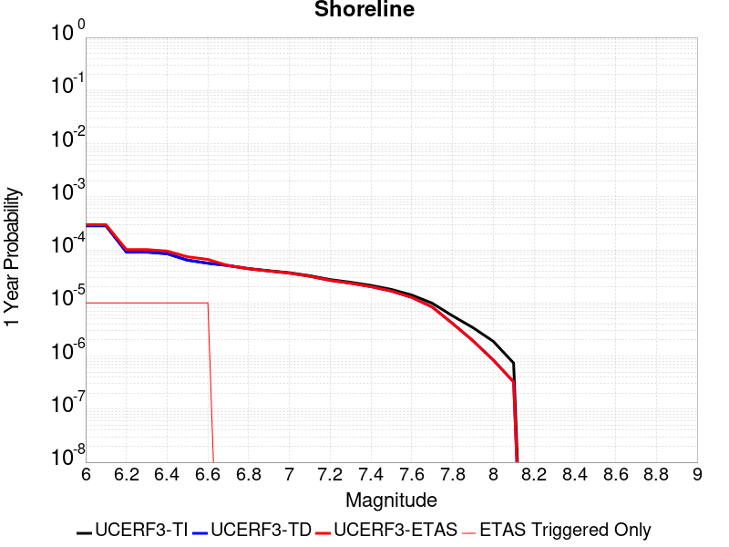 |  |

| Magnitude | 1 wk TI Prob | 1 wk TD Prob | 1 wk ETAS Prob | 1 wk ETAS/TD Gain | 1 wk ETAS Triggered Only | 1 mo TI Prob | 1 mo TD Prob | 1 mo ETAS Prob | 1 mo ETAS/TD Gain | 1 mo ETAS Triggered Only | 1 yr TI Prob | 1 yr TD Prob | 1 yr ETAS Prob | 1 yr ETAS/TD Gain | 1 yr ETAS Triggered Only | 10 yr TI Prob | 10 yr TD Prob | 10 yr ETAS Prob | 10 yr ETAS/TD Gain | 10 yr ETAS Triggered Only |
|-----|-----|-----|-----|-----|-----|-----|-----|-----|-----|-----|-----|-----|-----|-----|-----|-----|-----|-----|-----|-----|
| 6.0 | 5.4154284E-6 | 5.527097E-6 | 1.552704E-5 | 2.809258 | 1.0E-5 | 2.3208773E-5 | 2.36874E-5 | 3.3687164E-5 | 1.4221554 | 1.0E-5 | 2.8253018E-4 | 2.883661E-4 | 2.9836321E-4 | 1.0346681 | 1.0E-5 | 0.0028217123 | 0.0028809176 | 0.0028908888 | 1.0034611 | 1.0E-5 |
| 6.1 | 5.4154284E-6 | 5.527097E-6 | 1.552704E-5 | 2.809258 | 1.0E-5 | 2.3208773E-5 | 2.36874E-5 | 3.3687164E-5 | 1.4221554 | 1.0E-5 | 2.8253018E-4 | 2.883661E-4 | 2.9836321E-4 | 1.0346681 | 1.0E-5 | 0.0028217123 | 0.0028809176 | 0.0028908888 | 1.0034611 | 1.0E-5 |
| 6.2 | 1.7357308E-6 | 1.7498413E-6 | 1.1749824E-5 | 6.714794 | 1.0E-5 | 7.4388254E-6 | 7.499299E-6 | 1.7499224E-5 | 2.333448 | 1.0E-5 | 9.056393E-5 | 9.13003E-5 | 1.0129939E-4 | 1.1095186 | 1.0E-5 | 9.0527034E-4 | 9.1264443E-4 | 9.226353E-4 | 1.0109472 | 1.0E-5 |
| 6.3 | 1.7357308E-6 | 1.7498413E-6 | 1.1749824E-5 | 6.714794 | 1.0E-5 | 7.4388254E-6 | 7.499299E-6 | 1.7499224E-5 | 2.333448 | 1.0E-5 | 9.056393E-5 | 9.13003E-5 | 1.0129939E-4 | 1.1095186 | 1.0E-5 | 9.0527034E-4 | 9.1264443E-4 | 9.226353E-4 | 1.0109472 | 1.0E-5 |
| 6.4 | 1.617133E-6 | 1.6282645E-6 | 1.1628248E-5 | 7.141498 | 1.0E-5 | 6.9305515E-6 | 6.9782586E-6 | 1.6978189E-5 | 2.4330122 | 1.0E-5 | 8.4376195E-5 | 8.495713E-5 | 9.495628E-5 | 1.1176964 | 1.0E-5 | 8.434417E-4 | 8.492617E-4 | 8.592532E-4 | 1.0117649 | 1.0E-5 |
| 6.5 | 1.2249924E-6 | 1.2276679E-6 | 1.1227656E-5 | 9.145515 | 1.0E-5 | 5.2499568E-6 | 5.261423E-6 | 1.526137E-5 | 2.9006164 | 1.0E-5 | 6.391635E-5 | 6.4055974E-5 | 7.405534E-5 | 1.1561035 | 1.0E-5 | 6.3897966E-4 | 6.403792E-4 | 6.503728E-4 | 1.0156057 | 1.0E-5 |
| 6.6 | 1.0746589E-6 | 1.0739836E-6 | 1.1073973E-5 | 10.311118 | 1.0E-5 | 4.6056734E-6 | 4.602779E-6 | 1.4602733E-5 | 3.1725905 | 1.0E-5 | 5.607263E-5 | 5.603741E-5 | 6.603685E-5 | 1.1784422 | 1.0E-5 | 5.605848E-4 | 5.602354E-4 | 5.7022984E-4 | 1.0178397 | 1.0E-5 |
| 6.7 | 9.714853E-7 | 9.685662E-7 | 9.685662E-7 | 1.0 | 0.0 | 4.1635017E-6 | 4.150991E-6 | 4.150991E-6 | 1.0 | 0.0 | 5.0689458E-5 | 5.0537157E-5 | 5.0537157E-5 | 1.0 | 0.0 | 5.0677895E-4 | 5.052588E-4 | 5.052588E-4 | 1.0 | 0.0 |
| 6.8 | 8.512417E-7 | 8.4432065E-7 | 8.4432065E-7 | 1.0 | 0.0 | 3.6481733E-6 | 3.618512E-6 | 3.618512E-6 | 1.0 | 0.0 | 4.4415607E-5 | 4.4054497E-5 | 4.4054497E-5 | 1.0 | 0.0 | 4.440673E-4 | 4.4045923E-4 | 4.4045923E-4 | 1.0 | 0.0 |
| 6.9 | 7.7509924E-7 | 7.660733E-7 | 7.660733E-7 | 1.0 | 0.0 | 3.3218496E-6 | 3.2831672E-6 | 3.2831672E-6 | 1.0 | 0.0 | 4.0442766E-5 | 3.997183E-5 | 3.997183E-5 | 1.0 | 0.0 | 4.0435407E-4 | 3.996478E-4 | 3.996478E-4 | 1.0 | 0.0 |
| 7.0 | 7.106395E-7 | 6.9947544E-7 | 6.9947544E-7 | 1.0 | 0.0 | 3.0455942E-6 | 2.9977482E-6 | 2.9977482E-6 | 1.0 | 0.0 | 3.7079477E-5 | 3.649698E-5 | 3.649698E-5 | 1.0 | 0.0 | 3.7073292E-4 | 3.6491113E-4 | 3.6491113E-4 | 1.0 | 0.0 |
| 7.1 | 6.2427887E-7 | 6.1003334E-7 | 6.1003334E-7 | 1.0 | 0.0 | 2.675478E-6 | 2.614426E-6 | 2.614426E-6 | 1.0 | 0.0 | 3.2573458E-5 | 3.183017E-5 | 3.183017E-5 | 1.0 | 0.0 | 3.2568685E-4 | 3.1825734E-4 | 3.1825734E-4 | 1.0 | 0.0 |
| 7.2 | 5.2786373E-7 | 5.100705E-7 | 5.100705E-7 | 1.0 | 0.0 | 2.2622712E-6 | 2.1860144E-6 | 2.1860144E-6 | 1.0 | 0.0 | 2.7542805E-5 | 2.66144E-5 | 2.66144E-5 | 1.0 | 0.0 | 2.753939E-4 | 2.6611323E-4 | 2.6611323E-4 | 1.0 | 0.0 |
| 7.3 | 4.7055337E-7 | 4.5103383E-7 | 4.5103383E-7 | 1.0 | 0.0 | 2.0166558E-6 | 1.9330005E-6 | 1.9330005E-6 | 1.0 | 0.0 | 2.4552508E-5 | 2.3534029E-5 | 2.3534029E-5 | 1.0 | 0.0 | 2.4549794E-4 | 2.3531646E-4 | 2.3531646E-4 | 1.0 | 0.0 |
| 7.4 | 4.102069E-7 | 3.8871846E-7 | 3.8871846E-7 | 1.0 | 0.0 | 1.7580282E-6 | 1.6659351E-6 | 1.6659351E-6 | 1.0 | 0.0 | 2.1403785E-5 | 2.028257E-5 | 2.028257E-5 | 1.0 | 0.0 | 2.1401723E-4 | 2.0280828E-4 | 2.0280828E-4 | 1.0 | 0.0 |
| 7.5 | 3.4488633E-7 | 3.2147727E-7 | 3.2147727E-7 | 1.0 | 0.0 | 1.4780834E-6 | 1.377759E-6 | 1.377759E-6 | 1.0 | 0.0 | 1.7995517E-5 | 1.6774087E-5 | 1.6774087E-5 | 1.0 | 0.0 | 1.799406E-4 | 1.6772929E-4 | 1.6772929E-4 | 1.0 | 0.0 |
| 7.6 | 2.70287E-7 | 2.442876E-7 | 2.442876E-7 | 1.0 | 0.0 | 1.1583724E-6 | 1.0469464E-6 | 1.0469464E-6 | 1.0 | 0.0 | 1.4103091E-5 | 1.2746498E-5 | 1.2746498E-5 | 1.0 | 0.0 | 1.4102197E-4 | 1.2745874E-4 | 1.2745874E-4 | 1.0 | 0.0 |
| 7.7 | 1.9007102E-7 | 1.6140042E-7 | 1.6140042E-7 | 1.0 | 0.0 | 8.1458984E-7 | 6.9171585E-7 | 6.9171585E-7 | 1.0 | 0.0 | 9.917587E-6 | 8.421608E-6 | 8.421608E-6 | 1.0 | 0.0 | 9.917144E-5 | 8.4213956E-5 | 8.4213956E-5 | 1.0 | 0.0 |
| 7.8 | 1.09839334E-7 | 7.894378E-8 | 7.894378E-8 | 1.0 | 0.0 | 4.7073993E-7 | 3.383304E-7 | 3.383304E-7 | 1.0 | 0.0 | 5.7312436E-6 | 4.119165E-6 | 4.119165E-6 | 1.0 | 0.0 | 5.7310957E-5 | 4.1191946E-5 | 4.1191946E-5 | 1.0 | 0.0 |
| 7.9 | 6.583957E-8 | 3.7459404E-8 | 3.7459404E-8 | 1.0 | 0.0 | 2.8216957E-7 | 1.605403E-7 | 1.605403E-7 | 1.0 | 0.0 | 3.435409E-6 | 1.9545762E-6 | 1.9545762E-6 | 1.0 | 0.0 | 3.435356E-5 | 1.954665E-5 | 1.954665E-5 | 1.0 | 0.0 |
| 8.0 | 3.6376644E-8 | 1.6157745E-8 | 1.6157745E-8 | 1.0 | 0.0 | 1.558999E-7 | 6.9247484E-8 | 6.9247484E-8 | 1.0 | 0.0 | 1.8980795E-6 | 8.430878E-7 | 8.430878E-7 | 1.0 | 0.0 | 1.8980632E-5 | 8.431904E-6 | 8.431904E-6 | 1.0 | 0.0 |
| 8.1 | 1.4145208E-8 | 6.262537E-9 | 6.262537E-9 | 1.0 | 0.0 | 6.062231E-8 | 2.6839444E-8 | 2.6839444E-8 | 1.0 | 0.0 | 7.3807644E-7 | 3.267702E-7 | 3.267702E-7 | 1.0 | 0.0 | 7.38074E-6 | 3.2687549E-6 | 3.2687549E-6 | 1.0 | 0.0 |

## San Luis Bay 2011 CFM
*[(top)](#table-of-contents)*

| 1 Week | 1 Month | 1 Year | 10 Year |
|-----|-----|-----|-----|
|  |  | 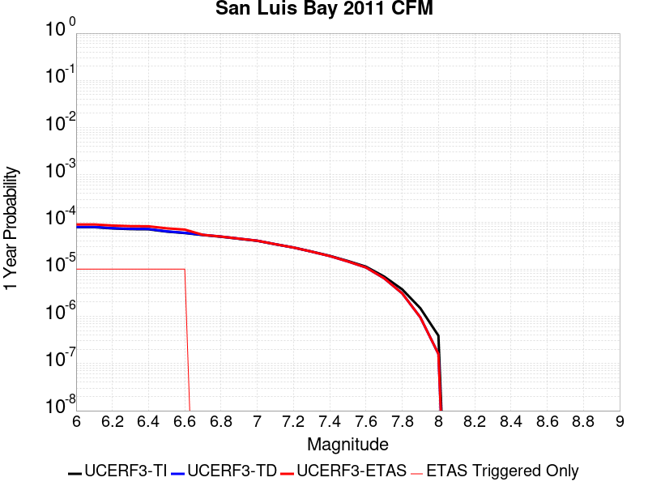 |  |

| Magnitude | 1 wk TI Prob | 1 wk TD Prob | 1 wk ETAS Prob | 1 wk ETAS/TD Gain | 1 wk ETAS Triggered Only | 1 mo TI Prob | 1 mo TD Prob | 1 mo ETAS Prob | 1 mo ETAS/TD Gain | 1 mo ETAS Triggered Only | 1 yr TI Prob | 1 yr TD Prob | 1 yr ETAS Prob | 1 yr ETAS/TD Gain | 1 yr ETAS Triggered Only | 10 yr TI Prob | 10 yr TD Prob | 10 yr ETAS Prob | 10 yr ETAS/TD Gain | 10 yr ETAS Triggered Only |
|-----|-----|-----|-----|-----|-----|-----|-----|-----|-----|-----|-----|-----|-----|-----|-----|-----|-----|-----|-----|-----|
| 6.0 | 1.4881477E-6 | 1.5082884E-6 | 1.1508273E-5 | 7.6300216 | 1.0E-5 | 6.37776E-6 | 6.4640776E-6 | 1.6464013E-5 | 2.5470011 | 1.0E-5 | 7.7646466E-5 | 7.869734E-5 | 8.869656E-5 | 1.1270591 | 1.0E-5 | 7.761934E-4 | 7.866989E-4 | 7.96691E-4 | 1.0127014 | 1.0E-5 |
| 6.1 | 1.4881477E-6 | 1.5082884E-6 | 1.1508273E-5 | 7.6300216 | 1.0E-5 | 6.37776E-6 | 6.4640776E-6 | 1.6464013E-5 | 2.5470011 | 1.0E-5 | 7.7646466E-5 | 7.869734E-5 | 8.869656E-5 | 1.1270591 | 1.0E-5 | 7.761934E-4 | 7.866989E-4 | 7.96691E-4 | 1.0127014 | 1.0E-5 |
| 6.2 | 1.4010377E-6 | 1.4203584E-6 | 1.1420344E-5 | 8.040466 | 1.0E-5 | 6.0044335E-6 | 6.0872367E-6 | 1.6087175E-5 | 2.6427715 | 1.0E-5 | 7.3101524E-5 | 7.410962E-5 | 8.410888E-5 | 1.1349252 | 1.0E-5 | 7.3077483E-4 | 7.4085273E-4 | 7.508453E-4 | 1.0134879 | 1.0E-5 |
| 6.3 | 1.352491E-6 | 1.3713702E-6 | 1.1371357E-5 | 8.291967 | 1.0E-5 | 5.796377E-6 | 5.8772875E-6 | 1.5877229E-5 | 2.701455 | 1.0E-5 | 7.05686E-5 | 7.155366E-5 | 8.155294E-5 | 1.1397452 | 1.0E-5 | 7.05462E-4 | 7.153096E-4 | 7.2530244E-4 | 1.01397 | 1.0E-5 |
| 6.4 | 1.342478E-6 | 1.3611926E-6 | 1.1361179E-5 | 8.346489 | 1.0E-5 | 5.753464E-6 | 5.83367E-6 | 1.5833612E-5 | 2.714177 | 1.0E-5 | 7.0046175E-5 | 7.102265E-5 | 8.102194E-5 | 1.1407901 | 1.0E-5 | 7.0024095E-4 | 7.100029E-4 | 7.1999576E-4 | 1.0140744 | 1.0E-5 |
| 6.5 | 1.1989365E-6 | 1.2144224E-6 | 1.121441E-5 | 9.234358 | 1.0E-5 | 5.1382895E-6 | 5.2046566E-6 | 1.5204605E-5 | 2.9213462 | 1.0E-5 | 6.255688E-5 | 6.336487E-5 | 7.336424E-5 | 1.1578062 | 1.0E-5 | 6.253927E-4 | 6.3346955E-4 | 6.4346317E-4 | 1.015776 | 1.0E-5 |
| 6.6 | 1.1170475E-6 | 1.1302856E-6 | 1.1130274E-5 | 9.847312 | 1.0E-5 | 4.7873377E-6 | 4.844072E-6 | 1.4844023E-5 | 3.064369 | 1.0E-5 | 5.8284277E-5 | 5.8974987E-5 | 6.89744E-5 | 1.1695534 | 1.0E-5 | 5.8268994E-4 | 5.8959407E-4 | 5.9958815E-4 | 1.0169508 | 1.0E-5 |
| 6.7 | 1.0127907E-6 | 1.0239235E-6 | 1.0239235E-6 | 1.0 | 0.0 | 4.3405244E-6 | 4.388236E-6 | 4.388236E-6 | 1.0 | 0.0 | 5.2844603E-5 | 5.3425465E-5 | 5.3425465E-5 | 1.0 | 0.0 | 5.283204E-4 | 5.341267E-4 | 5.341267E-4 | 1.0 | 0.0 |
| 6.8 | 9.3251816E-7 | 9.4182843E-7 | 9.4182843E-7 | 1.0 | 0.0 | 3.9965003E-6 | 4.036401E-6 | 4.036401E-6 | 1.0 | 0.0 | 4.8656304E-5 | 4.914208E-5 | 4.914208E-5 | 1.0 | 0.0 | 4.8645653E-4 | 4.913125E-4 | 4.913125E-4 | 1.0 | 0.0 |
| 6.9 | 8.43169E-7 | 8.5023083E-7 | 8.5023083E-7 | 1.0 | 0.0 | 3.6135766E-6 | 3.6438414E-6 | 3.6438414E-6 | 1.0 | 0.0 | 4.3994405E-5 | 4.4362867E-5 | 4.4362867E-5 | 1.0 | 0.0 | 4.3985696E-4 | 4.435403E-4 | 4.435403E-4 | 1.0 | 0.0 |
| 7.0 | 7.6405286E-7 | 7.693366E-7 | 7.693366E-7 | 1.0 | 0.0 | 3.2745081E-6 | 3.2971527E-6 | 3.2971527E-6 | 1.0 | 0.0 | 3.9866405E-5 | 4.01421E-5 | 4.01421E-5 | 1.0 | 0.0 | 3.9859256E-4 | 4.013486E-4 | 4.013486E-4 | 1.0 | 0.0 |
| 7.1 | 6.458411E-7 | 6.480759E-7 | 6.480759E-7 | 1.0 | 0.0 | 2.7678875E-6 | 2.7774652E-6 | 2.7774652E-6 | 1.0 | 0.0 | 3.369851E-5 | 3.3815115E-5 | 3.3815115E-5 | 1.0 | 0.0 | 3.36934E-4 | 3.3809975E-4 | 3.3809975E-4 | 1.0 | 0.0 |
| 7.2 | 5.511227E-7 | 5.5114253E-7 | 5.5114253E-7 | 1.0 | 0.0 | 2.3619523E-6 | 2.3620373E-6 | 2.3620373E-6 | 1.0 | 0.0 | 2.8756389E-5 | 2.8757424E-5 | 2.8757424E-5 | 1.0 | 0.0 | 2.8752667E-4 | 2.8753708E-4 | 2.8753708E-4 | 1.0 | 0.0 |
| 7.3 | 4.5283997E-7 | 4.5042952E-7 | 4.5042952E-7 | 1.0 | 0.0 | 1.9407414E-6 | 1.9304107E-6 | 1.9304107E-6 | 1.0 | 0.0 | 2.3628269E-5 | 2.3502496E-5 | 2.3502496E-5 | 1.0 | 0.0 | 2.3625758E-4 | 2.3500015E-4 | 2.3500015E-4 | 1.0 | 0.0 |
| 7.4 | 3.6809382E-7 | 3.6341967E-7 | 3.6341967E-7 | 1.0 | 0.0 | 1.577544E-6 | 1.5575118E-6 | 1.5575118E-6 | 1.0 | 0.0 | 1.9206429E-5 | 1.8962543E-5 | 1.8962543E-5 | 1.0 | 0.0 | 1.920477E-4 | 1.8960926E-4 | 1.8960926E-4 | 1.0 | 0.0 |
| 7.5 | 2.859819E-7 | 2.7908126E-7 | 2.7908126E-7 | 1.0 | 0.0 | 1.2256362E-6 | 1.196062E-6 | 1.196062E-6 | 1.0 | 0.0 | 1.4922019E-5 | 1.4561958E-5 | 1.4561958E-5 | 1.0 | 0.0 | 1.4921016E-4 | 1.4561004E-4 | 1.4561004E-4 | 1.0 | 0.0 |
| 7.6 | 2.1679024E-7 | 2.0804204E-7 | 2.0804204E-7 | 1.0 | 0.0 | 9.291007E-7 | 8.9160835E-7 | 8.9160835E-7 | 1.0 | 0.0 | 1.1311742E-5 | 1.0855278E-5 | 1.0855278E-5 | 1.0 | 0.0 | 1.1311166E-4 | 1.0854749E-4 | 1.0854749E-4 | 1.0 | 0.0 |
| 7.7 | 1.3399992E-7 | 1.2305479E-7 | 1.2305479E-7 | 1.0 | 0.0 | 5.7428525E-7 | 5.2737755E-7 | 5.2737755E-7 | 1.0 | 0.0 | 6.9919006E-6 | 6.4208025E-6 | 6.4208025E-6 | 1.0 | 0.0 | 6.991681E-5 | 6.420618E-5 | 6.420618E-5 | 1.0 | 0.0 |
| 7.8 | 7.157368E-8 | 5.8855175E-8 | 5.8855175E-8 | 1.0 | 0.0 | 3.067443E-7 | 2.5223645E-7 | 2.5223645E-7 | 1.0 | 0.0 | 3.7346056E-6 | 3.0709743E-6 | 3.0709743E-6 | 1.0 | 0.0 | 3.7345428E-5 | 3.070932E-5 | 3.070932E-5 | 1.0 | 0.0 |
| 7.9 | 2.8555108E-8 | 1.8273575E-8 | 1.8273575E-8 | 1.0 | 0.0 | 1.2237903E-7 | 7.8315324E-8 | 7.8315324E-8 | 1.0 | 0.0 | 1.4899637E-6 | 9.5348867E-7 | 9.5348867E-7 | 1.0 | 0.0 | 1.4899537E-5 | 9.534846E-6 | 9.534846E-6 | 1.0 | 0.0 |
| 8.0 | 7.459157E-9 | 3.0603717E-9 | 3.0603717E-9 | 1.0 | 0.0 | 3.1967815E-8 | 1.3115877E-8 | 1.3115877E-8 | 1.0 | 0.0 | 3.8920808E-7 | 1.596858E-7 | 1.596858E-7 | 1.0 | 0.0 | 3.8920743E-6 | 1.5968569E-6 | 1.5968569E-6 | 1.0 | 0.0 |

## Sargent 2011 CFM
*[(top)](#table-of-contents)*

| 1 Week | 1 Month | 1 Year | 10 Year |
|-----|-----|-----|-----|
| 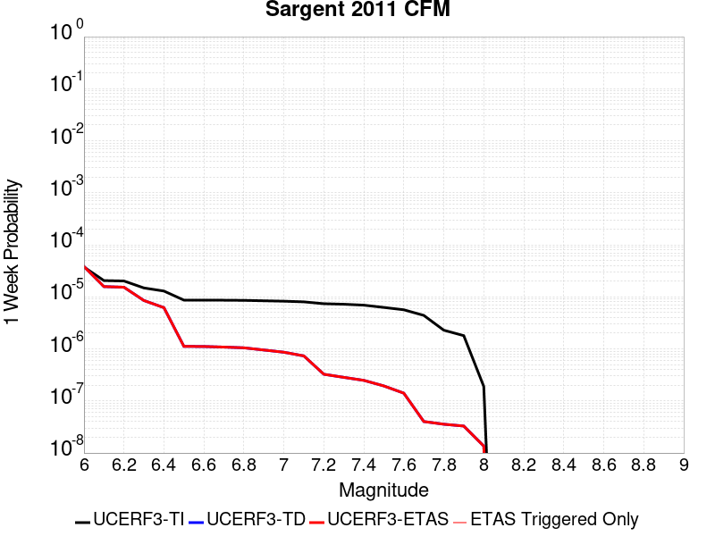 | 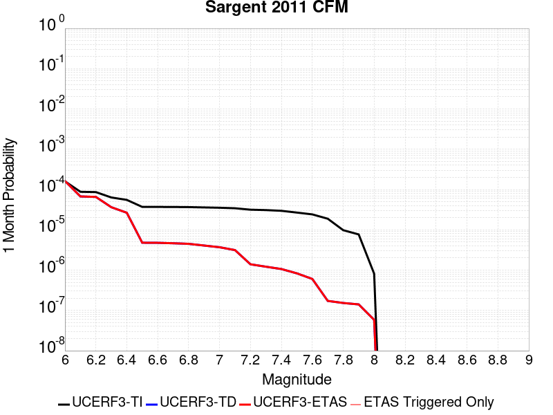 | 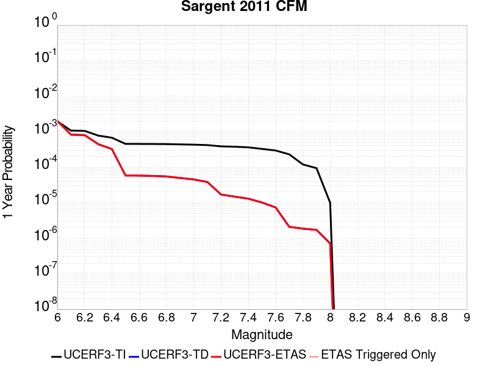 |  |

| Magnitude | 1 wk TI Prob | 1 wk TD Prob | 1 wk ETAS Prob | 1 wk ETAS/TD Gain | 1 wk ETAS Triggered Only | 1 mo TI Prob | 1 mo TD Prob | 1 mo ETAS Prob | 1 mo ETAS/TD Gain | 1 mo ETAS Triggered Only | 1 yr TI Prob | 1 yr TD Prob | 1 yr ETAS Prob | 1 yr ETAS/TD Gain | 1 yr ETAS Triggered Only | 10 yr TI Prob | 10 yr TD Prob | 10 yr ETAS Prob | 10 yr ETAS/TD Gain | 10 yr ETAS Triggered Only |
|-----|-----|-----|-----|-----|-----|-----|-----|-----|-----|-----|-----|-----|-----|-----|-----|-----|-----|-----|-----|-----|
| 6.0 | 3.7440117E-5 | 3.824591E-5 | 3.824591E-5 | 1.0 | 0.0 | 1.6044777E-4 | 1.6390411E-4 | 1.6390411E-4 | 1.0 | 0.0 | 0.0019517012 | 0.0019939935 | 0.0019939935 | 1.0 | 0.0 | 0.01934649 | 0.019840328 | 0.01985013 | 1.000494 | 1.0E-5 |
| 6.1 | 2.0547672E-5 | 1.5753061E-5 | 1.5753061E-5 | 1.0 | 0.0 | 8.805848E-5 | 6.751189E-5 | 6.751189E-5 | 1.0 | 0.0 | 0.0010715846 | 8.217384E-4 | 8.217384E-4 | 1.0 | 0.0 | 0.01066432 | 0.008226449 | 0.008236366 | 1.0012056 | 1.0E-5 |
| 6.2 | 2.019136E-5 | 1.5324174E-5 | 1.5324174E-5 | 1.0 | 0.0 | 8.653154E-5 | 6.56739E-5 | 6.56739E-5 | 1.0 | 0.0 | 0.0010530122 | 7.993775E-4 | 7.993775E-4 | 1.0 | 0.0 | 0.010480365 | 0.008004479 | 0.0080144 | 1.0012393 | 1.0E-5 |
| 6.3 | 1.4837331E-5 | 8.511285E-6 | 8.511285E-6 | 1.0 | 0.0 | 6.358701E-5 | 3.6476635E-5 | 3.6476635E-5 | 1.0 | 0.0 | 7.7389687E-4 | 4.4404733E-4 | 4.4404733E-4 | 1.0 | 0.0 | 0.007712073 | 0.004466243 | 0.004466243 | 1.0 | 0.0 |
| 6.4 | 1.2935363E-5 | 6.2057084E-6 | 6.2057084E-6 | 1.0 | 0.0 | 5.5436092E-5 | 2.6595804E-5 | 2.6595804E-5 | 1.0 | 0.0 | 6.747254E-4 | 3.237861E-4 | 3.237861E-4 | 1.0 | 0.0 | 0.0067268047 | 0.0032674195 | 0.0032674195 | 1.0 | 0.0 |
| 6.5 | 8.660113E-6 | 1.118832E-6 | 1.118832E-6 | 1.0 | 0.0 | 3.711424E-5 | 4.794985E-6 | 4.794985E-6 | 1.0 | 0.0 | 4.517722E-4 | 5.8377405E-5 | 5.8377405E-5 | 1.0 | 0.0 | 0.004508549 | 6.1484653E-4 | 6.1484653E-4 | 1.0 | 0.0 |
| 6.6 | 8.653909E-6 | 1.1122418E-6 | 1.1122418E-6 | 1.0 | 0.0 | 3.708766E-5 | 4.7667418E-6 | 4.7667418E-6 | 1.0 | 0.0 | 4.5144866E-4 | 5.803356E-5 | 5.803356E-5 | 1.0 | 0.0 | 0.0045053265 | 6.1141E-4 | 6.1141E-4 | 1.0 | 0.0 |
| 6.7 | 8.622119E-6 | 1.0843066E-6 | 1.0843066E-6 | 1.0 | 0.0 | 3.6951413E-5 | 4.64702E-6 | 4.64702E-6 | 1.0 | 0.0 | 4.497906E-4 | 5.6576024E-5 | 5.6576024E-5 | 1.0 | 0.0 | 0.0044888128 | 5.9677084E-4 | 5.9677084E-4 | 1.0 | 0.0 |
| 6.8 | 8.561533E-6 | 1.0496432E-6 | 1.0496432E-6 | 1.0 | 0.0 | 3.669177E-5 | 4.498463E-6 | 4.498463E-6 | 1.0 | 0.0 | 4.466307E-4 | 5.476744E-5 | 5.476744E-5 | 1.0 | 0.0 | 0.004457341 | 5.784736E-4 | 5.784736E-4 | 1.0 | 0.0 |
| 6.9 | 8.403151E-6 | 9.526068E-7 | 9.526068E-7 | 1.0 | 0.0 | 3.6013007E-5 | 4.0825944E-6 | 4.0825944E-6 | 1.0 | 0.0 | 4.3837016E-4 | 4.970447E-5 | 4.970447E-5 | 1.0 | 0.0 | 0.004375064 | 5.272582E-4 | 5.272582E-4 | 1.0 | 0.0 |
| 7.0 | 8.253311E-6 | 8.6405174E-7 | 8.6405174E-7 | 1.0 | 0.0 | 3.537085E-5 | 3.7030736E-6 | 3.7030736E-6 | 1.0 | 0.0 | 4.30555E-4 | 4.508401E-5 | 4.508401E-5 | 1.0 | 0.0 | 0.004297218 | 4.80362E-4 | 4.80362E-4 | 1.0 | 0.0 |
| 7.1 | 8.017098E-6 | 7.335426E-7 | 7.335426E-7 | 1.0 | 0.0 | 3.4358538E-5 | 3.1437503E-6 | 3.1437503E-6 | 1.0 | 0.0 | 4.182349E-4 | 3.8274502E-5 | 3.8274502E-5 | 1.0 | 0.0 | 0.0041744863 | 4.1105802E-4 | 4.1105802E-4 | 1.0 | 0.0 |
| 7.2 | 7.386571E-6 | 3.2607613E-7 | 3.2607613E-7 | 1.0 | 0.0 | 3.1656346E-5 | 1.3974684E-6 | 1.3974684E-6 | 1.0 | 0.0 | 3.8534787E-4 | 1.7014045E-5 | 1.7014045E-5 | 1.0 | 0.0 | 0.0038468032 | 1.9626122E-4 | 1.9626122E-4 | 1.0 | 0.0 |
| 7.3 | 7.215541E-6 | 2.841474E-7 | 2.841474E-7 | 1.0 | 0.0 | 3.092338E-5 | 1.2177741E-6 | 1.2177741E-6 | 1.0 | 0.0 | 3.764271E-4 | 1.4826299E-5 | 1.4826299E-5 | 1.0 | 0.0 | 0.003757901 | 1.7365404E-4 | 1.7365404E-4 | 1.0 | 0.0 |
| 7.4 | 6.9295456E-6 | 2.4875507E-7 | 2.4875507E-7 | 1.0 | 0.0 | 2.9697714E-5 | 1.0660928E-6 | 1.0660928E-6 | 1.0 | 0.0 | 3.6150968E-4 | 1.29796035E-5 | 1.29796035E-5 | 1.0 | 0.0 | 0.0036092214 | 1.5380316E-4 | 1.5380316E-4 | 1.0 | 0.0 |
| 7.5 | 6.2640365E-6 | 1.9457208E-7 | 1.9457208E-7 | 1.0 | 0.0 | 2.6845593E-5 | 8.3388005E-7 | 8.3388005E-7 | 1.0 | 0.0 | 3.267961E-4 | 1.0152443E-5 | 1.0152443E-5 | 1.0 | 0.0 | 0.0032631592 | 1.2214987E-4 | 1.2214987E-4 | 1.0 | 0.0 |
| 7.6 | 5.6476624E-6 | 1.4119787E-7 | 1.4119787E-7 | 1.0 | 0.0 | 2.4204044E-5 | 6.051336E-7 | 6.051336E-7 | 1.0 | 0.0 | 2.946444E-4 | 7.3674773E-6 | 7.3674773E-6 | 1.0 | 0.0 | 0.0029425402 | 9.031208E-5 | 9.031208E-5 | 1.0 | 0.0 |
| 7.7 | 4.4044627E-6 | 4.0300762E-8 | 4.0300762E-8 | 1.0 | 0.0 | 1.8876133E-5 | 1.7271753E-7 | 1.7271753E-7 | 1.0 | 0.0 | 2.2979267E-4 | 2.102834E-6 | 2.102834E-6 | 1.0 | 0.0 | 0.002295552 | 2.7697617E-5 | 2.7697617E-5 | 1.0 | 0.0 |
| 7.8 | 2.288405E-6 | 3.5769606E-8 | 3.5769606E-8 | 1.0 | 0.0 | 9.807413E-6 | 1.532983E-7 | 1.532983E-7 | 1.0 | 0.0 | 1.1939872E-4 | 1.8664052E-6 | 1.8664052E-6 | 1.0 | 0.0 | 0.0011933459 | 2.4721112E-5 | 2.4721112E-5 | 1.0 | 0.0 |
| 7.9 | 1.7968708E-6 | 3.3002006E-8 | 3.3002006E-8 | 1.0 | 0.0 | 7.700853E-6 | 1.4143717E-7 | 1.4143717E-7 | 1.0 | 0.0 | 9.375384E-5 | 1.7219961E-6 | 1.7219961E-6 | 1.0 | 0.0 | 9.37143E-4 | 2.2928047E-5 | 2.2928047E-5 | 1.0 | 0.0 |
| 8.0 | 1.9011392E-7 | 1.3616065E-8 | 1.3616065E-8 | 1.0 | 0.0 | 8.1477367E-7 | 5.8354562E-8 | 5.8354562E-8 | 1.0 | 0.0 | 9.919825E-6 | 7.1046657E-7 | 7.1046657E-7 | 1.0 | 0.0 | 9.919382E-5 | 8.703363E-6 | 8.703363E-6 | 1.0 | 0.0 |

## Great Valley 10 (Panoche)
*[(top)](#table-of-contents)*

| 1 Week | 1 Month | 1 Year | 10 Year |
|-----|-----|-----|-----|
| 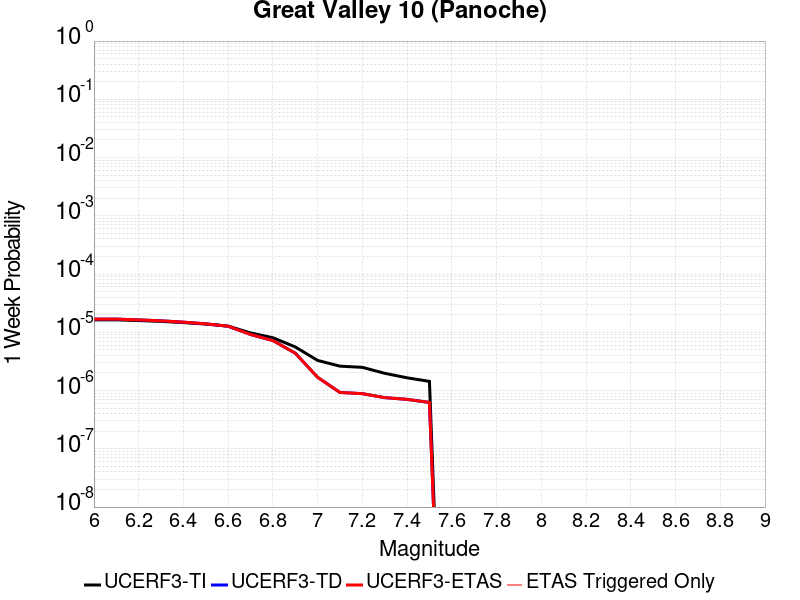 | 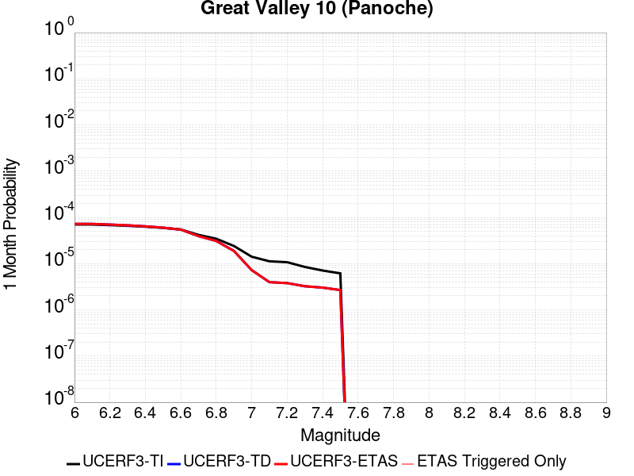 |  |  |

| Magnitude | 1 wk TI Prob | 1 wk TD Prob | 1 wk ETAS Prob | 1 wk ETAS/TD Gain | 1 wk ETAS Triggered Only | 1 mo TI Prob | 1 mo TD Prob | 1 mo ETAS Prob | 1 mo ETAS/TD Gain | 1 mo ETAS Triggered Only | 1 yr TI Prob | 1 yr TD Prob | 1 yr ETAS Prob | 1 yr ETAS/TD Gain | 1 yr ETAS Triggered Only | 10 yr TI Prob | 10 yr TD Prob | 10 yr ETAS Prob | 10 yr ETAS/TD Gain | 10 yr ETAS Triggered Only |
|-----|-----|-----|-----|-----|-----|-----|-----|-----|-----|-----|-----|-----|-----|-----|-----|-----|-----|-----|-----|-----|
| 6.0 | 1.6358501E-5 | 1.6857748E-5 | 1.6857748E-5 | 1.0 | 0.0 | 7.0105976E-5 | 7.2245515E-5 | 7.2245515E-5 | 1.0 | 0.0 | 8.53206E-4 | 8.792393E-4 | 8.8923046E-4 | 1.0113635 | 1.0E-5 | 0.0084993765 | 0.008758149 | 0.008768062 | 1.0011318 | 1.0E-5 |
| 6.1 | 1.6358501E-5 | 1.6857748E-5 | 1.6857748E-5 | 1.0 | 0.0 | 7.0105976E-5 | 7.2245515E-5 | 7.2245515E-5 | 1.0 | 0.0 | 8.53206E-4 | 8.792393E-4 | 8.8923046E-4 | 1.0113635 | 1.0E-5 | 0.0084993765 | 0.008758149 | 0.008768062 | 1.0011318 | 1.0E-5 |
| 6.2 | 1.5898986E-5 | 1.6342705E-5 | 1.6342705E-5 | 1.0 | 0.0 | 6.813673E-5 | 7.003832E-5 | 7.003832E-5 | 1.0 | 0.0 | 8.292489E-4 | 8.523878E-4 | 8.623793E-4 | 1.0117217 | 1.0E-5 | 0.008261614 | 0.008491708 | 0.008501623 | 1.0011677 | 1.0E-5 |
| 6.3 | 1.5379632E-5 | 1.5748577E-5 | 1.5748577E-5 | 1.0 | 0.0 | 6.5911045E-5 | 6.749218E-5 | 6.749218E-5 | 1.0 | 0.0 | 8.021715E-4 | 8.2141237E-4 | 8.314041E-4 | 1.0121641 | 1.0E-5 | 0.00799282 | 0.008184265 | 0.008194184 | 1.0012119 | 1.0E-5 |
| 6.4 | 1.4682061E-5 | 1.4945293E-5 | 1.4945293E-5 | 1.0 | 0.0 | 6.29216E-5 | 6.404971E-5 | 6.404971E-5 | 1.0 | 0.0 | 7.6580123E-4 | 7.7953085E-4 | 7.8952307E-4 | 1.0128182 | 1.0E-5 | 0.007631676 | 0.007768443 | 0.007778365 | 1.0012772 | 1.0E-5 |
| 6.5 | 1.3858212E-5 | 1.3987061E-5 | 1.3987061E-5 | 1.0 | 0.0 | 5.9390986E-5 | 5.9943195E-5 | 5.9943195E-5 | 1.0 | 0.0 | 7.228453E-4 | 7.295684E-4 | 7.295684E-4 | 1.0 | 0.0 | 0.0072049857 | 0.0072721806 | 0.0072721806 | 1.0 | 0.0 |
| 6.6 | 1.277607E-5 | 1.27265375E-5 | 1.27265375E-5 | 1.0 | 0.0 | 5.4753436E-5 | 5.4541186E-5 | 5.4541186E-5 | 1.0 | 0.0 | 6.6641916E-4 | 6.6384085E-4 | 6.6384085E-4 | 1.0 | 0.0 | 0.006644242 | 0.0066190055 | 0.0066190055 | 1.0 | 0.0 |
| 6.7 | 9.775676E-6 | 9.190902E-6 | 9.190902E-6 | 1.0 | 0.0 | 4.189508E-5 | 3.9388997E-5 | 3.9388997E-5 | 1.0 | 0.0 | 5.099532E-4 | 4.7945726E-4 | 4.7945726E-4 | 1.0 | 0.0 | 0.0050878455 | 0.0047844127 | 0.0047844127 | 1.0 | 0.0 |
| 6.8 | 8.073383E-6 | 7.224734E-6 | 7.224734E-6 | 1.0 | 0.0 | 3.4599754E-5 | 3.0962787E-5 | 3.0962787E-5 | 1.0 | 0.0 | 4.2117058E-4 | 3.769081E-4 | 3.769081E-4 | 1.0 | 0.0 | 0.0042037326 | 0.003762832 | 0.003762832 | 1.0 | 0.0 |
| 6.9 | 5.6130784E-6 | 4.3863693E-6 | 4.3863693E-6 | 1.0 | 0.0 | 2.4055827E-5 | 1.8798593E-5 | 1.8798593E-5 | 1.0 | 0.0 | 2.9284033E-4 | 2.2884963E-4 | 2.2884963E-4 | 1.0 | 0.0 | 0.0029245475 | 0.002286219 | 0.002286219 | 1.0 | 0.0 |
| 7.0 | 3.293594E-6 | 1.6885996E-6 | 1.6885996E-6 | 1.0 | 0.0 | 1.4115327E-5 | 7.2368357E-6 | 7.2368357E-6 | 1.0 | 0.0 | 1.7184055E-4 | 8.810501E-5 | 8.810501E-5 | 1.0 | 0.0 | 0.0017170773 | 8.8070985E-4 | 8.8070985E-4 | 1.0 | 0.0 |
| 7.1 | 2.6227171E-6 | 9.276316E-7 | 9.276316E-7 | 1.0 | 0.0 | 1.1240168E-5 | 3.9755582E-6 | 3.9755582E-6 | 1.0 | 0.0 | 1.3684045E-4 | 4.8401394E-5 | 4.8401394E-5 | 1.0 | 0.0 | 0.0013675621 | 4.8391297E-4 | 4.8391297E-4 | 1.0 | 0.0 |
| 7.2 | 2.5042505E-6 | 8.8522495E-7 | 8.8522495E-7 | 1.0 | 0.0 | 1.0732458E-5 | 3.793816E-6 | 3.793816E-6 | 1.0 | 0.0 | 1.3065983E-4 | 4.6188776E-5 | 4.6188776E-5 | 1.0 | 0.0 | 0.0013058304 | 4.6179615E-4 | 4.6179615E-4 | 1.0 | 0.0 |
| 7.3 | 1.9781583E-6 | 7.565346E-7 | 7.565346E-7 | 1.0 | 0.0 | 8.477794E-6 | 3.2422872E-6 | 3.2422872E-6 | 1.0 | 0.0 | 1.0321225E-4 | 3.9474173E-5 | 3.9474173E-5 | 1.0 | 0.0 | 0.0010316432 | 3.9467585E-4 | 3.9467585E-4 | 1.0 | 0.0 |
| 7.4 | 1.655728E-6 | 7.0610224E-7 | 7.0610224E-7 | 1.0 | 0.0 | 7.095958E-6 | 3.0261492E-6 | 3.0261492E-6 | 1.0 | 0.0 | 8.638987E-5 | 3.6842786E-5 | 3.6842786E-5 | 1.0 | 0.0 | 8.635629E-4 | 3.6837097E-4 | 3.6837097E-4 | 1.0 | 0.0 |
| 7.5 | 1.437227E-6 | 6.254284E-7 | 6.254284E-7 | 1.0 | 0.0 | 6.159529E-6 | 2.680405E-6 | 2.680405E-6 | 1.0 | 0.0 | 7.4989686E-5 | 3.263348E-5 | 3.263348E-5 | 1.0 | 0.0 | 7.496439E-4 | 3.2629064E-4 | 3.2629064E-4 | 1.0 | 0.0 |

