# Parent Section Magnitude-Probability Distributions

Only fault sections with at least one triggered aftershock are plotted. Sections are sorted by total supraseismogenic trigger rate (decreasing)

## Table Of Contents

* [Garlock (Central)](#garlock-central)
* [Tank Canyon](#tank-canyon)
* [Owl Lake](#owl-lake)
* [Little Lake](#little-lake)
* [Airport Lake](#airport-lake)
* [Panamint Valley](#panamint-valley)
* [Garlock (East)](#garlock-east)
* [Hunter Mountain-Saline Valley](#hunter-mountain-saline-valley)
* [Ash Hill](#ash-hill)
* [Blackwater](#blackwater)
* [Garlock (West)](#garlock-west)
* [McLean Lake](#mclean-lake)
* [Goldstone Lake](#goldstone-lake)
* [Gravel Hills-Harper Lk](#gravel-hills-harper-lk)
* [So Sierra Nevada](#so-sierra-nevada)
* [San Andreas (Mojave S)](#san-andreas-mojave-s)
* [Coyote Canyon](#coyote-canyon)
* [Death Valley (So)](#death-valley-so)
* [San Andreas (Mojave N)](#san-andreas-mojave-n)
* [Nelson Lake](#nelson-lake)
* [Towne Pass](#towne-pass)
* [Lenwood-Lockhart-Old Woman Springs](#lenwood-lockhart-old-woman-springs)
* [San Andreas (San Bernardino N)](#san-andreas-san-bernardino-n)
* [Paradise](#paradise)
* [Bicycle Lake](#bicycle-lake)
* [Garlic Springs](#garlic-springs)
* [San Andreas (San Bernardino S)](#san-andreas-san-bernardino-s)
* [Death Valley (Black Mtns Frontal)](#death-valley-black-mtns-frontal)
* [San Andreas (Big Bend)](#san-andreas-big-bend)
* [Coyote Lake](#coyote-lake)
* [Death Valley (No)](#death-valley-no)
* [Sierra Nevada  (No Extension)](#sierra-nevada--no-extension)
* [Helendale-So Lockhart](#helendale-so-lockhart)
* [Cady](#cady)
* [Manix-Afton Hills](#manix-afton-hills)
* [Death Valley (Fish Lake Valley)](#death-valley-fish-lake-valley)
* [San Andreas (San Gorgonio Pass-Garnet HIll)](#san-andreas-san-gorgonio-pass-garnet-hill)
* [Elsinore (Glen Ivy) rev](#elsinore-glen-ivy-rev)
* [San Andreas (Coachella) rev](#san-andreas-coachella-rev)
* [San Andreas (Carrizo) rev](#san-andreas-carrizo-rev)
* [Calico-Hidalgo](#calico-hidalgo)
* [San Andreas (Parkfield)](#san-andreas-parkfield)
* [Baker](#baker)
* [San Andreas (Cholame) rev](#san-andreas-cholame-rev)
* [San Jacinto (San Bernardino)](#san-jacinto-san-bernardino)
* [Owens Valley](#owens-valley)
* [White Wolf (Extension)](#white-wolf-extension)
* [Ludlow](#ludlow)
* [Scodie Lineament](#scodie-lineament)
* [Red Pass](#red-pass)
* [Mission Creek](#mission-creek)
* [Lake Isabella (Seismicity)](#lake-isabella-seismicity)
* [Big Pine (East)](#big-pine-east)
* [Pinto Mtn](#pinto-mtn)
* [Santa Ynez (West)](#santa-ynez-west)
* [Mission Ridge-Arroyo Parida-Santa Ana](#mission-ridge-arroyo-parida-santa-ana)
* [Santa Ynez (East)](#santa-ynez-east)
* [San Jacinto (San Jacinto Valley) rev](#san-jacinto-san-jacinto-valley-rev)
* [San Andreas (Creeping Section) 2011 CFM](#san-andreas-creeping-section-2011-cfm)
* [Cleghorn Lake](#cleghorn-lake)
* [Independence rev 2011](#independence-rev-2011)
* [San Andreas (North Branch Mill Creek)](#san-andreas-north-branch-mill-creek)
* [San Jacinto (Stepovers Combined)](#san-jacinto-stepovers-combined)
* [Cleghorn Pass](#cleghorn-pass)
* [San Jacinto (Anza) rev](#san-jacinto-anza-rev)
* [Oceanic - West Huasna](#oceanic---west-huasna)
* [Pleito](#pleito)
* [Kern Canyon (North Kern) 2011](#kern-canyon-north-kern-2011)
* [Pisgah-Bullion Mtn-Mesquite Lk](#pisgah-bullion-mtn-mesquite-lk)
* [Whittier alt 1](#whittier-alt-1)
* [Palos Verdes](#palos-verdes)
* [Tin Mountain](#tin-mountain)
* [Deep Springs](#deep-springs)
* [Big Pine (Central)](#big-pine-central)
* [White Mountains](#white-mountains)
* [Santa Cruz Island](#santa-cruz-island)
* [Santa Rosa Island](#santa-rosa-island)
* [Rose Canyon](#rose-canyon)
* [San Jacinto (Coyote Creek)](#san-jacinto-coyote-creek)
* [Brawley (Seismic Zone) alt 1](#brawley-seismic-zone-alt-1)
* [Red Mountain](#red-mountain)
* [Mono Lake 2011 CFM](#mono-lake-2011-cfm)
* [San Luis Range 2011 CFM](#san-luis-range-2011-cfm)
* [Cleghorn](#cleghorn)
* [Chino alt 1](#chino-alt-1)
* [San Juan](#san-juan)
* [Blue Cut](#blue-cut)
* [Channel Islands Thrust](#channel-islands-thrust)
* [San Pedro Basin](#san-pedro-basin)
* [Dry Mountain](#dry-mountain)
* [Cucamonga](#cucamonga)
* [Great Valley 03a Dunnigan Hills](#great-valley-03a-dunnigan-hills)
* [Imperial](#imperial)
* [Hayward (So) 2011 CFM](#hayward-so-2011-cfm)
* [San Jacinto (Lytle Creek connector)](#san-jacinto-lytle-creek-connector)
* [Coronado Bank alt1](#coronado-bank-alt1)
* [Pittville 2011 CFM](#pittville-2011-cfm)
* [San Clemente](#san-clemente)
* [San Diego Trough south](#san-diego-trough-south)
* [Santa Ynez River](#santa-ynez-river)
* [Lost Hills](#lost-hills)
* [Pine Mtn](#pine-mtn)
* [San Jacinto (Borrego)](#san-jacinto-borrego)
* [Hayward (So) extension 2011 CFM](#hayward-so-extension-2011-cfm)
* [Ventura-Pitas Point](#ventura-pitas-point)
* [Monterey Bay-Tularcitos](#monterey-bay-tularcitos)
* [Los Osos 2011](#los-osos-2011)
* [Hunting Creek - Berryessa 2011 CFM](#hunting-creek---berryessa-2011-cfm)
* [Pitas Point (Lower West)](#pitas-point-lower-west)
* [Emerson-Copper Mtn 2011](#emerson-copper-mtn-2011)
* [Elsinore (Temecula) rev](#elsinore-temecula-rev)
* [Rinconada 2011 CFM](#rinconada-2011-cfm)
* [Great Valley 11](#great-valley-11)
* [North Frontal  (East)](#north-frontal--east)
* [Calaveras (So) - Paicines extension 2011 CFM](#calaveras-so---paicines-extension-2011-cfm)
* [Calaveras (Central) 2011 CFM](#calaveras-central-2011-cfm)
* [Calaveras (So) 2011 CFM](#calaveras-so-2011-cfm)
* [Greenville (So) 2011 CFM](#greenville-so-2011-cfm)
* [San Andreas (Santa Cruz Mts) 2011 CFM](#san-andreas-santa-cruz-mts-2011-cfm)
* [Great Valley 09 (Laguna Seca)](#great-valley-09-laguna-seca)
* [Oak Ridge (Onshore)](#oak-ridge-onshore)
* [La Panza 2011](#la-panza-2011)
* [Bullion Mountains](#bullion-mountains)
* [San Andreas (North Coast) 2011 CFM](#san-andreas-north-coast-2011-cfm)
* [Elysian Park (Upper)](#elysian-park-upper)
* [San Cayetano](#san-cayetano)
* [Elsinore (Stepovers Combined)](#elsinore-stepovers-combined)
* [Simi-Santa Rosa](#simi-santa-rosa)
* [Johnson Valley (No) 2011 rev](#johnson-valley-no-2011-rev)
* [Ortigalita (North)](#ortigalita-north)
* [Trinidad (alt1)](#trinidad-alt1)
* [Hartley Springs 2011 CFM](#hartley-springs-2011-cfm)
* [San Andreas (Offshore) 2011 CFM](#san-andreas-offshore-2011-cfm)
* [Gillem - Big Crack 2011 CFM](#gillem---big-crack-2011-cfm)
* [Carlsbad](#carlsbad)
* [San Luis Range - Pecho 2011 CFM](#san-luis-range---pecho-2011-cfm)
* [Fish Slough 2011 CFM](#fish-slough-2011-cfm)
* [Butano 2011 CFM](#butano-2011-cfm)
* [San Jacinto (Clark) rev](#san-jacinto-clark-rev)
* [Hayward (No) 2011 CFM](#hayward-no-2011-cfm)
* [Concord 2011 CFM](#concord-2011-cfm)
* [Contra Costa (Lafayette) 2011 CFM](#contra-costa-lafayette-2011-cfm)
* [San Gabriel (Extension)](#san-gabriel-extension)
* [Shoreline](#shoreline)
* [Mendocino](#mendocino)
* [Hosgri (Extension)](#hosgri-extension)
* [Jess Valley](#jess-valley)
* [Kern Canyon (Lake Isabella) 2011](#kern-canyon-lake-isabella-2011)
* [Northridge](#northridge)
* [Monte Vista - Shannon 2011 CFM](#monte-vista---shannon-2011-cfm)
* [Hector Mine](#hector-mine)
* [Peralta Hills](#peralta-hills)
* [Santa Monica alt 1](#santa-monica-alt-1)
* [San Luis Range - Oceano 2011 CFM](#san-luis-range---oceano-2011-cfm)
* [Great Valley 07 (Orestimba)](#great-valley-07-orestimba)
* [Sierra Madre](#sierra-madre)
* [Owens Valley Keough Hot Springs](#owens-valley-keough-hot-springs)
* [Quien Sabe 2011 CFM](#quien-sabe-2011-cfm)
* [North Frontal  (West)](#north-frontal--west)
* [San Gabriel](#san-gabriel)
* [Homestead Valley 2011](#homestead-valley-2011)
* [Morales (West)](#morales-west)
* [Great Valley 06 (Midland) 2011 CFM alt1](#great-valley-06-midland-2011-cfm-alt1)
* [Sisar](#sisar)
* [Davis Creek](#davis-creek)
* [Camp Rock 2011](#camp-rock-2011)
* [Puente Hills](#puente-hills)
* [Pitas Point (Lower)-Montalvo](#pitas-point-lower-montalvo)
* [Raymond](#raymond)
* [Newport-Inglewood (Offshore)](#newport-inglewood-offshore)
* [Mission (connected) 2011 CFM](#mission-connected-2011-cfm)
* [Green Valley 2011 CFM](#green-valley-2011-cfm)
* [Hosgri](#hosgri)
* [Breckenridge 2011](#breckenridge-2011)
* [Malibu Coast (Extension) alt 1](#malibu-coast-extension-alt-1)
* [Santa Cruz Catalina Ridge alt1](#santa-cruz-catalina-ridge-alt1)
* [Calaveras (No) 2011 CFM](#calaveras-no-2011-cfm)
* [Sheephole](#sheephole)
* [Contra Costa Shear Zone (connector) 2011 CFM](#contra-costa-shear-zone-connector-2011-cfm)
* [Pilarcitos 2011 CFM](#pilarcitos-2011-cfm)
* [San Andreas (Peninsula) 2011 CFM](#san-andreas-peninsula-2011-cfm)
* [King Range 2011 CFM](#king-range-2011-cfm)
* [Greenville (No) 2011 CFM](#greenville-no-2011-cfm)
* [Great Valley 10 (Panoche)](#great-valley-10-panoche)

## Garlock (Central)
*[(top)](#table-of-contents)*

| 1 Week | 1 Month | 1 Year | 10 Year |
|-----|-----|-----|-----|
|  |  |  |  |

| Magnitude | 1 wk TI Prob | 1 wk TD Prob | 1 wk ETAS Prob | 1 wk ETAS/TD Gain | 1 wk ETAS Triggered Only | 1 mo TI Prob | 1 mo TD Prob | 1 mo ETAS Prob | 1 mo ETAS/TD Gain | 1 mo ETAS Triggered Only | 1 yr TI Prob | 1 yr TD Prob | 1 yr ETAS Prob | 1 yr ETAS/TD Gain | 1 yr ETAS Triggered Only | 10 yr TI Prob | 10 yr TD Prob | 10 yr ETAS Prob | 10 yr ETAS/TD Gain | 10 yr ETAS Triggered Only |
|-----|-----|-----|-----|-----|-----|-----|-----|-----|-----|-----|-----|-----|-----|-----|-----|-----|-----|-----|-----|-----|
| 6.0 | 5.5131142E-5 | 7.027124E-5 | 0.0037053595 | 52.72939 | 0.0036353439 | 2.3625491E-4 | 3.0112805E-4 | 0.012553739 | 41.689037 | 0.012256302 | 0.0028726095 | 0.0036601364 | 0.046865877 | 12.804406 | 0.043364458 | 0.028357591 | 0.036092084 | 0.111911595 | 3.100724 | 0.078658454 |
| 6.1 | 5.5131142E-5 | 7.027124E-5 | 0.0037053595 | 52.72939 | 0.0036353439 | 2.3625491E-4 | 3.0112805E-4 | 0.012553739 | 41.689037 | 0.012256302 | 0.0028726095 | 0.0036601364 | 0.046865877 | 12.804406 | 0.043364458 | 0.028357591 | 0.036092084 | 0.111911595 | 3.100724 | 0.078658454 |
| 6.2 | 4.216245E-5 | 5.1683597E-5 | 0.002284708 | 44.20567 | 0.0022331397 | 1.806837E-4 | 2.214825E-4 | 0.007781323 | 35.1329 | 0.007561515 | 0.0021976046 | 0.0026932466 | 0.028994044 | 10.765462 | 0.026371824 | 0.021759989 | 0.026701005 | 0.07382074 | 2.7647176 | 0.048412394 |
| 6.3 | 4.216245E-5 | 5.1683597E-5 | 0.002284708 | 44.20567 | 0.0022331397 | 1.806837E-4 | 2.214825E-4 | 0.007781323 | 35.1329 | 0.007561515 | 0.0021976046 | 0.0026932466 | 0.028994044 | 10.765462 | 0.026371824 | 0.021759989 | 0.026701005 | 0.07382074 | 2.7647176 | 0.048412394 |
| 6.4 | 3.6858168E-5 | 4.4131746E-5 | 0.0017682473 | 40.067467 | 0.0017241917 | 1.5795401E-4 | 1.8912248E-4 | 0.0059734182 | 31.584919 | 0.0057853903 | 0.0019213937 | 0.00230016 | 0.022766702 | 9.897878 | 0.020513726 | 0.019048655 | 0.022859743 | 0.059711706 | 2.6120899 | 0.037714094 |
| 6.5 | 3.39199E-5 | 4.0038896E-5 | 0.0015668222 | 39.1325 | 0.0015268445 | 1.453629E-4 | 1.715841E-4 | 0.0052394224 | 30.535593 | 0.005068708 | 0.0017683565 | 0.0020870569 | 0.02037095 | 9.760612 | 0.018322133 | 0.017543508 | 0.020770492 | 0.053815942 | 2.5909805 | 0.033746377 |
| 6.6 | 3.3571985E-5 | 3.9493032E-5 | 0.0015558909 | 39.39659 | 0.0015164578 | 1.4387199E-4 | 1.6924499E-4 | 0.0052267103 | 30.88251 | 0.005058321 | 0.0017502342 | 0.0020586322 | 0.02031195 | 9.866722 | 0.018290972 | 0.017365133 | 0.020491783 | 0.05347542 | 2.6096032 | 0.03367367 |
| 6.7 | 3.2580007E-5 | 3.8109323E-5 | 0.0015337367 | 40.245705 | 0.0014956844 | 1.3962112E-4 | 1.6331558E-4 | 0.005106576 | 31.268148 | 0.0049440674 | 0.0016985617 | 0.0019865753 | 0.019546686 | 9.839388 | 0.017595064 | 0.016856372 | 0.019784356 | 0.051447894 | 2.6004333 | 0.032302625 |
| 6.8 | 3.2185937E-5 | 3.7536465E-5 | 0.0014916194 | 39.737877 | 0.0014541375 | 1.3793244E-4 | 1.6086077E-4 | 0.0050106677 | 31.149097 | 0.0048505873 | 0.0016780337 | 0.001956742 | 0.01922712 | 9.826088 | 0.017304236 | 0.016654192 | 0.01949112 | 0.050573446 | 2.5946918 | 0.031700198 |
| 6.9 | 3.165394E-5 | 3.6740938E-5 | 0.0014596661 | 39.728603 | 0.0014229774 | 1.3565269E-4 | 1.5745178E-4 | 0.004903425 | 31.14239 | 0.00474672 | 0.0016503202 | 0.0019153113 | 0.018792467 | 9.811704 | 0.016909542 | 0.01638118 | 0.0190837 | 0.04939443 | 2.5883048 | 0.030900422 |
| 7.0 | 3.0903822E-5 | 3.564605E-5 | 0.0013650958 | 38.295853 | 0.0013294972 | 1.3243823E-4 | 1.5275997E-4 | 0.004711823 | 30.844622 | 0.00455976 | 0.0016112428 | 0.0018582871 | 0.018238772 | 9.81483 | 0.01641098 | 0.015996104 | 0.018522795 | 0.047994535 | 2.5911064 | 0.03002794 |
| 7.1 | 3.0069863E-5 | 3.441218E-5 | 0.0012807728 | 37.21859 | 0.0012464036 | 1.2886449E-4 | 1.4747256E-4 | 0.0044884714 | 30.435978 | 0.004341639 | 0.0015677959 | 0.0017940209 | 0.017522372 | 9.767095 | 0.015756618 | 0.01556781 | 0.017890377 | 0.0461366 | 2.57885 | 0.028760763 |
| 7.2 | 2.7957109E-5 | 3.1301115E-5 | 0.001090711 | 34.845757 | 0.0010594431 | 1.1981068E-4 | 1.3414085E-4 | 0.003800153 | 28.329575 | 0.003666504 | 0.0014577188 | 0.0016319609 | 0.014801539 | 9.069788 | 0.013191105 | 0.014481937 | 0.016293783 | 0.039926764 | 2.4504292 | 0.024024429 |
| 7.3 | 2.4519275E-5 | 2.6733265E-5 | 7.7455543E-4 | 28.973469 | 7.478422E-4 | 1.0507837E-4 | 1.1456619E-4 | 0.0025551603 | 22.302917 | 0.0024408738 | 0.0012785783 | 0.0013939656 | 0.010521517 | 7.5479035 | 0.009140293 | 0.012712469 | 0.013937555 | 0.030386098 | 2.1801598 | 0.016681034 |
| 7.4 | 2.3225532E-5 | 2.5217494E-5 | 7.2110863E-4 | 28.595572 | 6.959087E-4 | 9.95342E-5 | 1.0807058E-4 | 0.0024032826 | 22.238083 | 0.00229546 | 0.0012111551 | 0.0013149795 | 0.009592664 | 7.294915 | 0.008288584 | 0.012045753 | 0.01315504 | 0.027997127 | 2.1282432 | 0.015039937 |
| 7.5 | 2.097765E-5 | 2.250088E-5 | 6.041428E-4 | 26.84974 | 5.81655E-4 | 8.9901114E-5 | 9.6428856E-5 | 0.0018931541 | 19.632652 | 0.0017968985 | 0.0010939965 | 0.0011734008 | 0.007688592 | 6.552401 | 0.0065228455 | 0.010886264 | 0.01174923 | 0.023368826 | 1.9889666 | 0.011757741 |
| 7.6 | 1.511254E-5 | 1.6007341E-5 | 3.1721673E-4 | 19.816954 | 3.012142E-4 | 6.476642E-5 | 6.860113E-5 | 0.0010344976 | 15.079892 | 9.6596277E-4 | 7.882459E-4 | 8.3490653E-4 | 0.004456837 | 5.338127 | 0.003624957 | 0.007854558 | 0.00839184 | 0.01479815 | 1.7633975 | 0.0064605256 |
| 7.7 | 9.934069E-6 | 1.0693656E-5 | 1.3533268E-4 | 12.655418 | 1.2464036E-4 | 4.2573887E-5 | 4.582915E-5 | 3.3664334E-4 | 7.345616 | 2.908275E-4 | 5.182138E-4 | 5.578274E-4 | 0.0016062986 | 2.879562 | 0.0010490564 | 0.00517007 | 0.005635394 | 0.0075874166 | 1.3463862 | 0.0019630857 |
| 7.8 | 6.7562896E-6 | 8.440562E-6 | 1.12306654E-4 | 13.305589 | 1.03866965E-4 | 2.8955206E-5 | 3.6173336E-5 | 2.646724E-4 | 7.316781 | 2.2850733E-4 | 3.5247262E-4 | 4.4032154E-4 | 0.0011878344 | 2.6976523 | 7.478422E-4 | 0.0035191406 | 0.0044529405 | 0.0057558366 | 1.2925923 | 0.0013087238 |
| 7.9 | 3.975453E-6 | 5.3784297E-6 | 7.8084915E-5 | 14.518163 | 7.270688E-5 | 1.7037546E-5 | 2.305021E-5 | 1.476877E-4 | 6.407217 | 1.2464036E-4 | 2.0741238E-4 | 2.8060027E-4 | 7.1671914E-4 | 2.5542355 | 4.3624127E-4 | 0.002072189 | 0.0028374717 | 0.003583192 | 1.2628115 | 7.478422E-4 |
| 8.0 | 1.6729537E-6 | 2.0800776E-6 | 3.3240103E-5 | 15.980223 | 3.116009E-5 | 7.169782E-6 | 8.914588E-6 | 5.0461003E-5 | 5.6604977 | 4.1546788E-5 | 8.7288594E-5 | 1.0852974E-4 | 2.5392772E-4 | 2.3397062 | 1.4541375E-4 | 8.7254314E-4 | 0.0010982669 | 0.0013576492 | 1.2361741 | 2.5966743E-4 |
| 8.1 | 3.6733252E-7 | 3.1526864E-7 | 3.1526864E-7 | 1.0 | 0.0 | 1.5742813E-6 | 1.3511507E-6 | 1.3511507E-6 | 1.0 | 0.0 | 1.9166706E-5 | 1.645015E-5 | 3.7223203E-5 | 2.2627878 | 2.0773394E-5 | 1.9165053E-4 | 1.6658098E-4 | 2.0812085E-4 | 1.2493674 | 4.1546788E-5 |

## Tank Canyon
*[(top)](#table-of-contents)*

| 1 Week | 1 Month | 1 Year | 10 Year |
|-----|-----|-----|-----|
|  |  |  |  |

| Magnitude | 1 wk TI Prob | 1 wk TD Prob | 1 wk ETAS Prob | 1 wk ETAS/TD Gain | 1 wk ETAS Triggered Only | 1 mo TI Prob | 1 mo TD Prob | 1 mo ETAS Prob | 1 mo ETAS/TD Gain | 1 mo ETAS Triggered Only | 1 yr TI Prob | 1 yr TD Prob | 1 yr ETAS Prob | 1 yr ETAS/TD Gain | 1 yr ETAS Triggered Only | 10 yr TI Prob | 10 yr TD Prob | 10 yr ETAS Prob | 10 yr ETAS/TD Gain | 10 yr ETAS Triggered Only |
|-----|-----|-----|-----|-----|-----|-----|-----|-----|-----|-----|-----|-----|-----|-----|-----|-----|-----|-----|-----|-----|
| 6.0 | 4.8284557E-5 | 5.7970923E-5 | 0.0015535685 | 26.799099 | 0.0014956844 | 2.0691741E-4 | 2.48427E-4 | 0.0057104724 | 22.98652 | 0.0054634023 | 0.0025163088 | 0.0030210684 | 0.026279112 | 8.698615 | 0.02332852 | 0.02488006 | 0.029866708 | 0.076309204 | 2.5549922 | 0.047872286 |
| 6.1 | 1.7796336E-5 | 2.0875108E-5 | 4.778802E-4 | 22.892347 | 4.5701466E-4 | 7.626778E-5 | 8.946191E-5 | 0.001782342 | 19.922916 | 0.0016930315 | 9.281647E-4 | 0.0010886913 | 0.009254122 | 8.500226 | 0.00817433 | 0.009242975 | 0.010837668 | 0.02793382 | 2.577475 | 0.017283464 |
| 6.2 | 1.7796336E-5 | 2.0875108E-5 | 4.778802E-4 | 22.892347 | 4.5701466E-4 | 7.626778E-5 | 8.946191E-5 | 0.001782342 | 19.922916 | 0.0016930315 | 9.281647E-4 | 0.0010886913 | 0.009254122 | 8.500226 | 0.00817433 | 0.009242975 | 0.010837668 | 0.02793382 | 2.577475 | 0.017283464 |
| 6.3 | 1.3515912E-5 | 1.5760828E-5 | 2.8581067E-4 | 18.134243 | 2.7005412E-4 | 5.792405E-5 | 6.7544795E-5 | 0.0011996182 | 17.760336 | 0.00113215 | 7.049971E-4 | 8.220716E-4 | 0.006675353 | 8.120159 | 0.0058580968 | 0.007027647 | 0.008192917 | 0.02050333 | 2.5025675 | 0.012412103 |
| 6.4 | 1.0870146E-5 | 1.2618972E-5 | 2.0996372E-4 | 16.638735 | 1.9734724E-4 | 4.658551E-5 | 5.4080287E-5 | 8.953572E-4 | 16.556074 | 8.413224E-4 | 5.67031E-4 | 6.582465E-4 | 0.0050177877 | 7.6229615 | 0.0043624127 | 0.005655863 | 0.006564983 | 0.015831003 | 2.411431 | 0.009327253 |
| 6.5 | 7.964826E-6 | 9.196723E-6 | 1.0267613E-4 | 11.164426 | 9.3480274E-5 | 3.4134522E-5 | 3.9413993E-5 | 4.6525177E-4 | 11.804228 | 4.2585455E-4 | 4.1550855E-4 | 4.797704E-4 | 0.0030232903 | 6.3015356 | 0.0025447407 | 0.0041473247 | 0.0047886474 | 0.010473975 | 2.187251 | 0.0057126833 |
| 6.6 | 6.6317E-6 | 7.612777E-6 | 5.9545866E-5 | 7.821832 | 5.1933483E-5 | 2.8421264E-5 | 3.262583E-5 | 2.8189842E-4 | 8.640345 | 2.492807E-4 | 3.4597394E-4 | 3.9715623E-4 | 0.0022452539 | 5.653327 | 0.001848832 | 0.0034543579 | 0.003965616 | 0.008238311 | 2.077435 | 0.004289706 |
| 6.7 | 4.793663E-6 | 5.4310603E-6 | 3.659098E-5 | 6.7373548 | 3.116009E-5 | 2.0544108E-5 | 2.327579E-5 | 1.6868617E-4 | 7.2472796 | 1.4541375E-4 | 2.500958E-4 | 2.8335027E-4 | 0.0013424931 | 4.737928 | 0.0010594431 | 0.0024981452 | 0.0028305824 | 0.005264547 | 1.8598812 | 0.0024408738 |
| 6.8 | 4.382823E-6 | 4.9694927E-6 | 2.5742784E-5 | 5.1801634 | 2.0773394E-5 | 1.8783392E-5 | 2.1297676E-5 | 1.5632185E-4 | 7.339855 | 1.3502706E-4 | 2.286638E-4 | 2.592726E-4 | 0.0011834489 | 4.5644965 | 9.24416E-4 | 0.0022842865 | 0.0025903755 | 0.004755572 | 1.835862 | 0.0021708196 |
| 6.9 | 2.729601E-6 | 3.0736521E-6 | 1.3460317E-5 | 4.3792586 | 1.0386697E-5 | 1.1698237E-5 | 1.3172735E-5 | 7.549209E-5 | 5.7309356 | 6.232018E-5 | 1.4241673E-4 | 1.6036748E-4 | 5.5499864E-4 | 3.4607933 | 3.9469448E-4 | 0.001423255 | 0.0016026833 | 0.0026189482 | 1.6341021 | 0.0010178962 |
| 7.0 | 1.8987357E-6 | 2.1269989E-6 | 1.2513674E-5 | 5.8832536 | 1.0386697E-5 | 8.137413E-6 | 9.115682E-6 | 4.027549E-5 | 4.418264 | 3.116009E-5 | 9.90685E-5 | 1.1097847E-4 | 3.290749E-4 | 2.9652138 | 2.1812064E-4 | 9.902435E-4 | 0.0011092991 | 0.0015969324 | 1.4395868 | 4.8817476E-4 |
| 7.1 | 1.4928986E-6 | 1.6641684E-6 | 1.20508475E-5 | 7.2413635 | 1.0386697E-5 | 6.398121E-6 | 7.1321338E-6 | 2.7905378E-5 | 3.912627 | 2.0773394E-5 | 7.789434E-5 | 8.683086E-5 | 2.2184619E-4 | 2.5549233 | 1.3502706E-4 | 7.786704E-4 | 8.680272E-4 | 0.0011689799 | 1.3467089 | 3.012142E-4 |
| 7.2 | 1.069082E-6 | 1.1828834E-6 | 1.15695675E-5 | 9.780819 | 1.0386697E-5 | 4.581772E-6 | 5.0694935E-6 | 2.584278E-5 | 5.097705 | 2.0773394E-5 | 5.5781646E-5 | 6.171987E-5 | 1.5519437E-4 | 2.514496 | 9.3480274E-5 | 5.576765E-4 | 6.170795E-4 | 8.039247E-4 | 1.3027894 | 1.8696055E-4 |
| 7.3 | 8.776551E-7 | 9.770195E-7 | 1.1363706E-5 | 11.630992 | 1.0386697E-5 | 3.7613736E-6 | 4.1872227E-6 | 2.496053E-5 | 5.961118 | 2.0773394E-5 | 4.579376E-5 | 5.0978764E-5 | 1.4445427E-4 | 2.8336165 | 9.3480274E-5 | 4.5784327E-4 | 5.097217E-4 | 6.758241E-4 | 1.3258688 | 1.6618715E-4 |
| 7.4 | 7.55721E-7 | 8.510402E-7 | 1.1237728E-5 | 13.204697 | 1.0386697E-5 | 3.2388E-6 | 3.647313E-6 | 1.4033972E-5 | 3.8477564 | 1.0386697E-5 | 3.9431678E-5 | 4.440565E-5 | 9.633683E-5 | 2.1694722 | 5.1933483E-5 | 3.942468E-4 | 4.440186E-4 | 5.4783945E-4 | 1.2338209 | 1.03866965E-4 |
| 7.5 | 5.587665E-7 | 6.305733E-7 | 1.1017263E-5 | 17.471819 | 1.0386697E-5 | 2.3947114E-6 | 2.702457E-6 | 1.3089126E-5 | 4.8434167 | 1.0386697E-5 | 2.915522E-5 | 3.2902415E-5 | 6.406148E-5 | 1.9470146 | 3.116009E-5 | 2.9151395E-4 | 3.2902416E-4 | 4.017071E-4 | 1.2209046 | 7.270688E-5 |

## Owl Lake
*[(top)](#table-of-contents)*

| 1 Week | 1 Month | 1 Year | 10 Year |
|-----|-----|-----|-----|
|  |  |  | 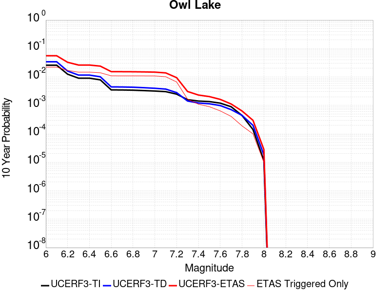 |

| Magnitude | 1 wk TI Prob | 1 wk TD Prob | 1 wk ETAS Prob | 1 wk ETAS/TD Gain | 1 wk ETAS Triggered Only | 1 mo TI Prob | 1 mo TD Prob | 1 mo ETAS Prob | 1 mo ETAS/TD Gain | 1 mo ETAS Triggered Only | 1 yr TI Prob | 1 yr TD Prob | 1 yr ETAS Prob | 1 yr ETAS/TD Gain | 1 yr ETAS Triggered Only | 10 yr TI Prob | 10 yr TD Prob | 10 yr ETAS Prob | 10 yr ETAS/TD Gain | 10 yr ETAS Triggered Only |
|-----|-----|-----|-----|-----|-----|-----|-----|-----|-----|-----|-----|-----|-----|-----|-----|-----|-----|-----|-----|-----|
| 6.0 | 5.0320643E-5 | 6.637151E-5 | 7.31076E-4 | 11.014906 | 6.647486E-4 | 2.1564208E-4 | 2.844246E-4 | 0.0031191863 | 10.966654 | 0.0028355683 | 0.0026222812 | 0.0034584238 | 0.014368141 | 4.1545343 | 0.010947579 | 0.02591553 | 0.034147043 | 0.055535316 | 1.6263579 | 0.022144437 |
| 6.1 | 5.0320643E-5 | 6.637151E-5 | 7.31076E-4 | 11.014906 | 6.647486E-4 | 2.1564208E-4 | 2.844246E-4 | 0.0031191863 | 10.966654 | 0.0028355683 | 0.0026222812 | 0.0034584238 | 0.014368141 | 4.1545343 | 0.010947579 | 0.02591553 | 0.034147043 | 0.055535316 | 1.6263579 | 0.022144437 |
| 6.2 | 2.4125871E-5 | 3.098766E-5 | 5.8146555E-4 | 18.764423 | 5.5049494E-4 | 1.0339249E-4 | 1.3279865E-4 | 0.0024591098 | 18.51758 | 0.00232662 | 0.0012580766 | 0.0016157742 | 0.010253913 | 6.3461294 | 0.008652118 | 0.012509781 | 0.016073797 | 0.032731976 | 2.0363564 | 0.016930316 |
| 6.3 | 1.7433485E-5 | 2.2360802E-5 | 5.4168404E-4 | 24.224712 | 5.1933486E-4 | 7.471279E-5 | 9.582938E-5 | 0.002121041 | 22.133516 | 0.0020254059 | 9.0924866E-4 | 0.0011662478 | 0.008801941 | 7.5472307 | 0.0076446086 | 0.009055373 | 0.01163159 | 0.026137283 | 2.2470946 | 0.014676402 |
| 6.4 | 1.7433485E-5 | 2.2360802E-5 | 5.4168404E-4 | 24.224712 | 5.1933486E-4 | 7.471279E-5 | 9.582938E-5 | 0.002121041 | 22.133516 | 0.0020254059 | 9.0924866E-4 | 0.0011662478 | 0.008801941 | 7.5472307 | 0.0076446086 | 0.009055373 | 0.01163159 | 0.026137283 | 2.2470946 | 0.014676402 |
| 6.5 | 1.5182742E-5 | 1.9433977E-5 | 5.179857E-4 | 26.653616 | 4.985614E-4 | 6.506727E-5 | 8.3286664E-5 | 0.0020565947 | 24.692965 | 0.0019734723 | 7.919061E-4 | 0.0010136948 | 0.008339269 | 8.226607 | 0.007333008 | 0.0078909 | 0.0101209 | 0.023929054 | 2.3643208 | 0.013949334 |
| 6.6 | 6.7271576E-6 | 8.550545E-6 | 4.1362827E-4 | 48.37449 | 4.0508117E-4 | 2.8830356E-5 | 3.6644713E-5 | 0.0017088416 | 46.632694 | 0.0016722581 | 3.5095305E-4 | 4.460637E-4 | 0.0063326936 | 14.196837 | 0.005889257 | 0.0035039932 | 0.0044694655 | 0.015306072 | 3.4245868 | 0.010885258 |
| 6.7 | 6.682835E-6 | 8.482986E-6 | 4.1356072E-4 | 48.751785 | 4.0508117E-4 | 2.8640408E-5 | 3.635518E-5 | 0.0017085526 | 46.996124 | 0.0016722581 | 3.4864116E-4 | 4.4254007E-4 | 0.006329191 | 14.301961 | 0.005889257 | 0.003480947 | 0.004434389 | 0.015230015 | 3.4345238 | 0.010843711 |
| 6.8 | 6.5774975E-6 | 8.329444E-6 | 4.1340725E-4 | 49.63203 | 4.0508117E-4 | 2.8188972E-5 | 3.569716E-5 | 0.0017078957 | 47.844017 | 0.0016722581 | 3.4314668E-4 | 4.3453192E-4 | 0.0063108476 | 14.523323 | 0.0058788704 | 0.0034261728 | 0.004354527 | 0.015140678 | 3.476997 | 0.010833325 |
| 6.9 | 6.363419E-6 | 8.002579E-6 | 4.130805E-4 | 51.61842 | 4.0508117E-4 | 2.727151E-5 | 3.429635E-5 | 0.0017064972 | 49.7574 | 0.0016722581 | 3.3198006E-4 | 4.1748365E-4 | 0.006273135 | 15.026062 | 0.0058580968 | 0.0033148455 | 0.0041844994 | 0.014951806 | 3.5731409 | 0.010812552 |
| 7.0 | 6.1342453E-6 | 7.63473E-6 | 4.127128E-4 | 54.057293 | 4.0508117E-4 | 2.6289357E-5 | 3.271989E-5 | 0.0017049233 | 52.106636 | 0.0016722581 | 3.2002592E-4 | 3.9829736E-4 | 0.0062436783 | 15.675922 | 0.00584771 | 0.0031956544 | 0.0039931675 | 0.014700471 | 3.681406 | 0.010750231 |
| 7.1 | 5.842926E-6 | 7.14521E-6 | 3.810636E-4 | 53.331337 | 3.739211E-4 | 2.504087E-5 | 3.0622E-5 | 0.0016093516 | 52.5554 | 0.0015787779 | 3.0482994E-4 | 3.7276448E-4 | 0.0059379586 | 15.929518 | 0.0055672694 | 0.0030441214 | 0.0037385917 | 0.013848456 | 3.7041905 | 0.0101478025 |
| 7.2 | 4.77173E-6 | 5.361204E-6 | 2.3386731E-4 | 43.62216 | 2.2850733E-4 | 2.045011E-5 | 2.297641E-5 | 0.0010720086 | 46.65693 | 0.0010490564 | 2.4895166E-4 | 2.7970594E-4 | 0.003965952 | 14.179006 | 0.0036872774 | 0.0024867293 | 0.0028100624 | 0.009428511 | 3.3552675 | 0.006637099 |
| 7.3 | 3.0494948E-6 | 2.7124704E-6 | 5.4645814E-5 | 20.146141 | 5.1933483E-5 | 1.3069198E-5 | 1.1624823E-5 | 2.2974292E-4 | 19.763134 | 2.1812064E-4 | 1.5910587E-4 | 1.4152318E-4 | 0.0011177345 | 7.8978896 | 9.763495E-4 | 0.0015899199 | 0.0014242887 | 0.0030837932 | 2.165146 | 0.0016618714 |
| 7.4 | 2.7263884E-6 | 2.3075613E-6 | 4.3854252E-5 | 19.00459 | 4.1546788E-5 | 1.1684469E-5 | 9.889511E-6 | 2.072348E-4 | 20.95501 | 1.9734724E-4 | 1.4224913E-4 | 1.2039825E-4 | 8.2660856E-4 | 6.8656197 | 7.0629537E-4 | 0.0014215811 | 0.0012122075 | 0.0023118628 | 1.907151 | 0.0011009899 |
| 7.5 | 2.6090431E-6 | 2.1674637E-6 | 4.371416E-5 | 20.168348 | 4.1546788E-5 | 1.1181565E-5 | 9.289097E-6 | 1.754747E-4 | 18.890394 | 1.6618715E-4 | 1.3612706E-4 | 1.1308899E-4 | 7.154493E-4 | 6.3264275 | 6.024284E-4 | 0.001360437 | 0.0011389464 | 0.0020519346 | 1.8016078 | 9.140293E-4 |
| 7.6 | 2.3008756E-6 | 1.8745708E-6 | 2.2647926E-5 | 12.081659 | 2.0773394E-5 | 9.860858E-6 | 8.0338505E-6 | 1.0151337E-4 | 12.635706 | 9.3480274E-5 | 1.20049335E-4 | 9.7807824E-5 | 5.443921E-4 | 5.565936 | 4.4662796E-4 | 0.001199845 | 9.85921E-4 | 0.0016500142 | 1.6735765 | 6.647486E-4 |
| 7.7 | 1.7184348E-6 | 1.343562E-6 | 2.2116927E-5 | 16.461412 | 2.0773394E-5 | 7.3646997E-6 | 5.7581105E-6 | 4.7304657E-5 | 8.215309 | 4.1546788E-5 | 8.966153E-5 | 7.010278E-5 | 3.1936602E-4 | 4.5556827 | 2.492807E-4 | 8.962536E-4 | 7.086945E-4 | 0.0011342473 | 1.6004742 | 4.2585455E-4 |
| 7.8 | 8.4612907E-7 | 8.4176E-7 | 2.1615137E-5 | 25.678501 | 2.0773394E-5 | 3.6262625E-6 | 3.607538E-6 | 3.4767516E-5 | 9.637464 | 3.116009E-5 | 4.4148852E-5 | 4.392091E-5 | 1.8932828E-4 | 4.3106637 | 1.4541375E-4 | 4.414008E-4 | 4.4459777E-4 | 6.418573E-4 | 1.4436808 | 1.9734724E-4 |
| 7.9 | 2.716738E-7 | 3.7732943E-7 | 1.0764023E-5 | 28.526855 | 1.0386697E-5 | 1.1643157E-6 | 1.6171252E-6 | 2.2390484E-5 | 13.845858 | 2.0773394E-5 | 1.4175452E-5 | 1.9688332E-5 | 1.0278027E-4 | 5.2203646 | 8.3093575E-5 | 1.4174548E-4 | 1.9863734E-4 | 3.0248368E-4 | 1.5227937 | 1.03866965E-4 |
| 8.0 | 2.1995428E-8 | 3.389418E-8 | 3.389418E-8 | 1.0 | 0.0 | 9.426611E-8 | 1.4526077E-7 | 1.4526077E-7 | 1.0 | 0.0 | 1.1476893E-6 | 1.768549E-6 | 1.768549E-6 | 1.0 | 0.0 | 1.14768345E-5 | 1.798665E-5 | 2.8373159E-5 | 1.5774567 | 1.0386697E-5 |

## Little Lake
*[(top)](#table-of-contents)*

| 1 Week | 1 Month | 1 Year | 10 Year |
|-----|-----|-----|-----|
|  |  |  |  |

| Magnitude | 1 wk TI Prob | 1 wk TD Prob | 1 wk ETAS Prob | 1 wk ETAS/TD Gain | 1 wk ETAS Triggered Only | 1 mo TI Prob | 1 mo TD Prob | 1 mo ETAS Prob | 1 mo ETAS/TD Gain | 1 mo ETAS Triggered Only | 1 yr TI Prob | 1 yr TD Prob | 1 yr ETAS Prob | 1 yr ETAS/TD Gain | 1 yr ETAS Triggered Only | 10 yr TI Prob | 10 yr TD Prob | 10 yr ETAS Prob | 10 yr ETAS/TD Gain | 10 yr ETAS Triggered Only |
|-----|-----|-----|-----|-----|-----|-----|-----|-----|-----|-----|-----|-----|-----|-----|-----|-----|-----|-----|-----|-----|
| 6.0 | 2.8424427E-5 | 3.1207477E-5 | 8.725037E-4 | 27.95816 | 8.413224E-4 | 1.2181328E-4 | 1.3374022E-4 | 0.003228562 | 24.140545 | 0.0030952357 | 0.0014820677 | 0.0016272042 | 0.013676907 | 8.405157 | 0.012069342 | 0.014722223 | 0.016166303 | 0.038637407 | 2.3899963 | 0.022840345 |
| 6.1 | 2.8424427E-5 | 3.1207477E-5 | 8.725037E-4 | 27.95816 | 8.413224E-4 | 1.2181328E-4 | 1.3374022E-4 | 0.003228562 | 24.140545 | 0.0030952357 | 0.0014820677 | 0.0016272042 | 0.013676907 | 8.405157 | 0.012069342 | 0.014722223 | 0.016166303 | 0.038637407 | 2.3899963 | 0.022840345 |
| 6.2 | 2.8424427E-5 | 3.1207477E-5 | 8.725037E-4 | 27.95816 | 8.413224E-4 | 1.2181328E-4 | 1.3374022E-4 | 0.003228562 | 24.140545 | 0.0030952357 | 0.0014820677 | 0.0016272042 | 0.013676907 | 8.405157 | 0.012069342 | 0.014722223 | 0.016166303 | 0.038637407 | 2.3899963 | 0.022840345 |
| 6.3 | 1.48860645E-5 | 1.6082206E-5 | 5.873413E-4 | 36.521194 | 5.712683E-4 | 6.379586E-5 | 6.8922076E-5 | 0.0020111005 | 29.179338 | 0.0019423122 | 7.7643775E-4 | 8.388314E-4 | 0.008694965 | 10.365569 | 0.007862729 | 0.007737305 | 0.00835947 | 0.023047084 | 2.7570028 | 0.014811429 |
| 6.4 | 1.48860645E-5 | 1.6082206E-5 | 5.873413E-4 | 36.521194 | 5.712683E-4 | 6.379586E-5 | 6.8922076E-5 | 0.0020111005 | 29.179338 | 0.0019423122 | 7.7643775E-4 | 8.388314E-4 | 0.008694965 | 10.365569 | 0.007862729 | 0.007737305 | 0.00835947 | 0.023047084 | 2.7570028 | 0.014811429 |
| 6.5 | 1.2797581E-5 | 1.3766247E-5 | 5.1232084E-4 | 37.21572 | 4.985614E-4 | 5.4845623E-5 | 5.899701E-5 | 0.0018142452 | 30.751476 | 0.0017553518 | 6.675408E-4 | 7.180776E-4 | 0.0077759596 | 10.828857 | 0.007062954 | 0.006655392 | 0.007160124 | 0.020359902 | 2.8435125 | 0.013294972 |
| 6.6 | 9.661896E-6 | 1.0289519E-5 | 3.9459334E-4 | 38.349056 | 3.843078E-4 | 4.1407468E-5 | 4.4097287E-5 | 0.0014981707 | 33.974216 | 0.0014541375 | 5.040193E-4 | 5.3676846E-4 | 0.0063605774 | 11.849761 | 0.005826937 | 0.005028777 | 0.0053563244 | 0.016369237 | 3.0560577 | 0.011072218 |
| 6.7 | 7.767871E-6 | 8.200053E-6 | 2.9902518E-4 | 36.466248 | 2.908275E-4 | 3.329045E-5 | 3.514269E-5 | 0.0012295708 | 34.987953 | 0.0011944701 | 4.0523586E-4 | 4.27792E-4 | 0.0054839496 | 12.819196 | 0.005058321 | 0.004044977 | 0.004271037 | 0.013910092 | 3.2568421 | 0.0096804015 |
| 6.8 | 6.4235196E-6 | 6.736042E-6 | 2.664017E-4 | 39.5487 | 2.5966743E-4 | 2.752908E-5 | 2.8868506E-5 | 0.0010778946 | 37.33808 | 0.0010490564 | 3.35115E-4 | 3.514302E-4 | 0.0045773303 | 13.024863 | 0.0042273854 | 0.003346101 | 0.0035100048 | 0.011438289 | 3.258767 | 0.00795621 |
| 6.9 | 3.1283696E-6 | 3.1122859E-6 | 1.6929892E-4 | 54.39697 | 1.6618715E-4 | 1.3407229E-5 | 1.3338308E-5 | 6.6769146E-4 | 50.058186 | 6.543619E-4 | 1.6322079E-4 | 1.6238331E-4 | 0.002800176 | 17.244234 | 0.002638221 | 0.0016310095 | 0.0016227949 | 0.006569209 | 4.048084 | 0.0049544545 |
| 7.0 | 2.290603E-6 | 2.2287613E-6 | 4.3775457E-5 | 19.64116 | 4.1546788E-5 | 9.816834E-6 | 9.551805E-6 | 3.2114974E-4 | 33.62189 | 3.116009E-4 | 1.19513395E-4 | 1.1628806E-4 | 0.0015910275 | 13.681779 | 0.0014749109 | 0.0011944914 | 0.0011623743 | 0.0040257704 | 3.463403 | 0.0028667282 |
| 7.1 | 1.293693E-6 | 1.1777322E-6 | 2.19511E-5 | 18.638449 | 2.0773394E-5 | 5.5443866E-6 | 5.0474177E-6 | 1.6084708E-4 | 31.8672 | 1.5580044E-4 | 6.750081E-5 | 6.1451276E-5 | 7.7808934E-4 | 12.66189 | 7.1668206E-4 | 6.7480316E-4 | 6.144114E-4 | 0.001953472 | 3.1794205 | 0.0013398839 |
| 7.2 | 4.715842E-7 | 3.09202E-7 | 1.0695895E-5 | 34.591938 | 1.0386697E-5 | 2.0210737E-6 | 1.3251507E-6 | 2.2098517E-5 | 16.67623 | 2.0773394E-5 | 2.4606294E-5 | 1.6133596E-5 | 9.922583E-5 | 6.150261 | 8.3093575E-5 | 2.460357E-4 | 1.6132479E-4 | 3.1710012E-4 | 1.9656006 | 1.5580044E-4 |
| 7.3 | 3.9430947E-7 | 2.3099639E-7 | 1.061769E-5 | 45.96475 | 1.0386697E-5 | 1.6898966E-6 | 9.899842E-7 | 2.1763357E-5 | 21.983541 | 2.0773394E-5 | 2.0574296E-5 | 1.2052991E-5 | 7.437242E-5 | 6.1704535 | 6.232018E-5 | 2.0572392E-4 | 1.20523444E-4 | 2.4514878E-4 | 2.034034 | 1.2464036E-4 |
| 7.4 | 3.547123E-7 | 1.9681133E-7 | 1.0583506E-5 | 53.774883 | 1.0386697E-5 | 1.5201948E-6 | 8.4347687E-7 | 2.1616852E-5 | 25.628271 | 2.0773394E-5 | 1.8508214E-5 | 1.0269283E-5 | 7.2588824E-5 | 7.0685387 | 6.232018E-5 | 1.8506673E-4 | 1.02688144E-4 | 2.0654444E-4 | 2.0113757 | 1.03866965E-4 |
| 7.5 | 2.6354266E-7 | 1.4424535E-7 | 1.4424535E-7 | 1.0 | 0.0 | 1.129468E-6 | 6.1819424E-7 | 6.1819424E-7 | 1.0 | 0.0 | 1.3751187E-5 | 7.5264893E-6 | 1.7913108E-5 | 2.3800085 | 1.0386697E-5 | 1.3750336E-4 | 7.52624E-5 | 1.16806055E-4 | 1.5519843 | 4.1546788E-5 |
| 7.6 | 1.269913E-7 | 7.573149E-8 | 7.573149E-8 | 1.0 | 0.0 | 5.4424834E-7 | 3.245635E-7 | 3.245635E-7 | 1.0 | 0.0 | 6.6262032E-6 | 3.951554E-6 | 1.4338209E-5 | 3.628499 | 1.0386697E-5 | 6.626006E-5 | 3.951487E-5 | 7.067373E-5 | 1.788535 | 3.116009E-5 |

## Airport Lake
*[(top)](#table-of-contents)*

| 1 Week | 1 Month | 1 Year | 10 Year |
|-----|-----|-----|-----|
|  |  |  |  |

| Magnitude | 1 wk TI Prob | 1 wk TD Prob | 1 wk ETAS Prob | 1 wk ETAS/TD Gain | 1 wk ETAS Triggered Only | 1 mo TI Prob | 1 mo TD Prob | 1 mo ETAS Prob | 1 mo ETAS/TD Gain | 1 mo ETAS Triggered Only | 1 yr TI Prob | 1 yr TD Prob | 1 yr ETAS Prob | 1 yr ETAS/TD Gain | 1 yr ETAS Triggered Only | 10 yr TI Prob | 10 yr TD Prob | 10 yr ETAS Prob | 10 yr ETAS/TD Gain | 10 yr ETAS Triggered Only |
|-----|-----|-----|-----|-----|-----|-----|-----|-----|-----|-----|-----|-----|-----|-----|-----|-----|-----|-----|-----|-----|
| 6.0 | 1.2387061E-5 | 1.3103559E-5 | 6.9861655E-4 | 53.315025 | 6.85522E-4 | 5.3086325E-5 | 5.615706E-5 | 0.0024865076 | 44.277737 | 0.002430487 | 6.461343E-4 | 6.8352616E-4 | 0.010056302 | 14.712389 | 0.009379188 | 0.0064425888 | 0.006817048 | 0.024591327 | 3.607328 | 0.017896278 |
| 6.1 | 1.2387061E-5 | 1.3103559E-5 | 6.9861655E-4 | 53.315025 | 6.85522E-4 | 5.3086325E-5 | 5.615706E-5 | 0.0024865076 | 44.277737 | 0.002430487 | 6.461343E-4 | 6.8352616E-4 | 0.010056302 | 14.712389 | 0.009379188 | 0.0064425888 | 0.006817048 | 0.024591327 | 3.607328 | 0.017896278 |
| 6.2 | 1.2387061E-5 | 1.3103559E-5 | 6.9861655E-4 | 53.315025 | 6.85522E-4 | 5.3086325E-5 | 5.615706E-5 | 0.0024865076 | 44.277737 | 0.002430487 | 6.461343E-4 | 6.8352616E-4 | 0.010056302 | 14.712389 | 0.009379188 | 0.0064425888 | 0.006817048 | 0.024591327 | 3.607328 | 0.017896278 |
| 6.3 | 1.2387061E-5 | 1.3103559E-5 | 6.9861655E-4 | 53.315025 | 6.85522E-4 | 5.3086325E-5 | 5.615706E-5 | 0.0024865076 | 44.277737 | 0.002430487 | 6.461343E-4 | 6.8352616E-4 | 0.010056302 | 14.712389 | 0.009379188 | 0.0064425888 | 0.006817048 | 0.024591327 | 3.607328 | 0.017896278 |
| 6.4 | 1.2387061E-5 | 1.3103559E-5 | 6.9861655E-4 | 53.315025 | 6.85522E-4 | 5.3086325E-5 | 5.615706E-5 | 0.0024865076 | 44.277737 | 0.002430487 | 6.461343E-4 | 6.8352616E-4 | 0.010056302 | 14.712389 | 0.009379188 | 0.0064425888 | 0.006817048 | 0.024591327 | 3.607328 | 0.017896278 |
| 6.5 | 6.9922594E-6 | 7.385145E-6 | 4.8516967E-4 | 65.69534 | 4.7778804E-4 | 2.996648E-5 | 3.165027E-5 | 0.0017973328 | 56.787285 | 0.0017657385 | 3.6478083E-4 | 3.8527933E-4 | 0.007341685 | 19.055487 | 0.0069590867 | 0.003641826 | 0.003846651 | 0.016769733 | 4.359567 | 0.012972984 |
| 6.6 | 6.9922594E-6 | 7.385145E-6 | 4.8516967E-4 | 65.69534 | 4.7778804E-4 | 2.996648E-5 | 3.165027E-5 | 0.0017973328 | 56.787285 | 0.0017657385 | 3.6478083E-4 | 3.8527933E-4 | 0.007341685 | 19.055487 | 0.0069590867 | 0.003641826 | 0.003846651 | 0.016769733 | 4.359567 | 0.012972984 |
| 6.7 | 5.477277E-6 | 5.7862417E-6 | 4.0047843E-4 | 69.21219 | 3.9469448E-4 | 2.3473833E-5 | 2.4797964E-5 | 0.0015412181 | 62.150993 | 0.0015164578 | 2.8575645E-4 | 3.0187727E-4 | 0.0062308908 | 20.640476 | 0.0059308037 | 0.0028538927 | 0.003015056 | 0.014178156 | 4.702452 | 0.011196859 |
| 6.8 | 3.9950432E-6 | 4.2192128E-6 | 3.0543216E-4 | 72.39079 | 3.012142E-4 | 1.7121502E-5 | 1.808223E-5 | 0.0012333038 | 68.20529 | 0.0012152435 | 2.0843433E-4 | 2.2013167E-4 | 0.00483081 | 21.945093 | 0.0046116933 | 0.0020823893 | 0.0021994072 | 0.01070813 | 4.8686438 | 0.008527478 |
| 6.9 | 2.95695E-6 | 3.1231173E-6 | 2.2124307E-4 | 70.84046 | 2.1812064E-4 | 1.2672582E-5 | 1.33847325E-5 | 8.650825E-4 | 64.632034 | 8.517091E-4 | 1.5427776E-4 | 1.629492E-4 | 0.0035484605 | 21.776484 | 0.003386063 | 0.001541707 | 0.0016285196 | 0.007881498 | 4.83967 | 0.0062631783 |
| 7.0 | 1.456072E-6 | 1.5408596E-6 | 3.27009E-5 | 21.222506 | 3.116009E-5 | 6.2402937E-6 | 6.603673E-6 | 2.9742927E-4 | 45.039974 | 2.908275E-4 | 7.597293E-5 | 8.039776E-5 | 0.0013994022 | 17.405985 | 0.0013191105 | 7.594696E-4 | 8.0378563E-4 | 0.003377616 | 4.202135 | 0.0025759009 |
| 7.1 | 6.995192E-7 | 7.409207E-7 | 1.11276095E-5 | 15.018624 | 1.0386697E-5 | 2.997936E-6 | 3.1753743E-6 | 1.38202E-4 | 43.523056 | 1.3502706E-4 | 3.649926E-5 | 3.8660182E-5 | 6.514516E-4 | 16.850712 | 6.128151E-4 | 3.6493264E-4 | 3.8660184E-4 | 0.0015286967 | 3.954189 | 0.0011425366 |

## Panamint Valley
*[(top)](#table-of-contents)*

| 1 Week | 1 Month | 1 Year | 10 Year |
|-----|-----|-----|-----|
|  |  |  |  |

| Magnitude | 1 wk TI Prob | 1 wk TD Prob | 1 wk ETAS Prob | 1 wk ETAS/TD Gain | 1 wk ETAS Triggered Only | 1 mo TI Prob | 1 mo TD Prob | 1 mo ETAS Prob | 1 mo ETAS/TD Gain | 1 mo ETAS Triggered Only | 1 yr TI Prob | 1 yr TD Prob | 1 yr ETAS Prob | 1 yr ETAS/TD Gain | 1 yr ETAS Triggered Only | 10 yr TI Prob | 10 yr TD Prob | 10 yr ETAS Prob | 10 yr ETAS/TD Gain | 10 yr ETAS Triggered Only |
|-----|-----|-----|-----|-----|-----|-----|-----|-----|-----|-----|-----|-----|-----|-----|-----|-----|-----|-----|-----|-----|
| 6.0 | 3.0211835E-5 | 3.39879E-5 | 6.052368E-4 | 17.807419 | 5.712683E-4 | 1.2947287E-4 | 1.4565447E-4 | 0.0022226912 | 15.260028 | 0.0020773394 | 0.0015751923 | 0.0017719301 | 0.010543506 | 5.950294 | 0.008787146 | 0.015640736 | 0.017584875 | 0.034197066 | 1.9446863 | 0.016909542 |
| 6.1 | 3.0211835E-5 | 3.39879E-5 | 6.052368E-4 | 17.807419 | 5.712683E-4 | 1.2947287E-4 | 1.4565447E-4 | 0.0022226912 | 15.260028 | 0.0020773394 | 0.0015751923 | 0.0017719301 | 0.010543506 | 5.950294 | 0.008787146 | 0.015640736 | 0.017584875 | 0.034197066 | 1.9446863 | 0.016909542 |
| 6.2 | 3.0211835E-5 | 3.39879E-5 | 6.052368E-4 | 17.807419 | 5.712683E-4 | 1.2947287E-4 | 1.4565447E-4 | 0.0022226912 | 15.260028 | 0.0020773394 | 0.0015751923 | 0.0017719301 | 0.010543506 | 5.950294 | 0.008787146 | 0.015640736 | 0.017584875 | 0.034197066 | 1.9446863 | 0.016909542 |
| 6.3 | 2.8573924E-5 | 3.210589E-5 | 6.033559E-4 | 18.792685 | 5.712683E-4 | 1.2245393E-4 | 1.3758958E-4 | 0.0021627168 | 15.718609 | 0.0020254059 | 0.001489857 | 0.0016738938 | 0.01015599 | 6.0672846 | 0.008496318 | 0.01479908 | 0.01661945 | 0.032563623 | 1.9593682 | 0.016213633 |
| 6.4 | 2.8573924E-5 | 3.210589E-5 | 6.033559E-4 | 18.792685 | 5.712683E-4 | 1.2245393E-4 | 1.3758958E-4 | 0.0021627168 | 15.718609 | 0.0020254059 | 0.001489857 | 0.0016738938 | 0.01015599 | 6.0672846 | 0.008496318 | 0.01479908 | 0.01661945 | 0.032563623 | 1.9593682 | 0.016213633 |
| 6.5 | 2.7468774E-5 | 3.0831525E-5 | 6.0208223E-4 | 19.528137 | 5.712683E-4 | 1.1771801E-4 | 1.3212857E-4 | 0.0021157255 | 16.012629 | 0.001983859 | 0.0014322745 | 0.0016075056 | 0.009789435 | 6.08983 | 0.008195104 | 0.014230782 | 0.015965264 | 0.031409 | 1.9673336 | 0.015694298 |
| 6.6 | 2.6135967E-5 | 2.9255436E-5 | 5.901207E-4 | 20.171316 | 5.608816E-4 | 1.1200648E-4 | 1.2537456E-4 | 0.0020674432 | 16.490133 | 0.0019423122 | 0.0013628257 | 0.001525393 | 0.009531692 | 6.248679 | 0.00801853 | 0.013544982 | 0.015155562 | 0.030182375 | 1.9915048 | 0.015258057 |
| 6.7 | 2.4498746E-5 | 2.7344193E-5 | 5.882105E-4 | 21.511349 | 5.608816E-4 | 1.04990395E-4 | 1.17184274E-4 | 0.0020281125 | 17.307037 | 0.0019111522 | 0.0012775084 | 0.0014258098 | 0.009111378 | 6.390318 | 0.0076965424 | 0.012701893 | 0.014172745 | 0.028538747 | 2.0136359 | 0.014572536 |
| 6.8 | 2.2244329E-5 | 2.4938103E-5 | 5.546464E-4 | 22.240923 | 5.2972155E-4 | 9.532935E-5 | 1.06873325E-4 | 0.0019555078 | 18.297436 | 0.001848832 | 0.0011600169 | 0.0013004278 | 0.008437183 | 6.4880047 | 0.0071460474 | 0.011539802 | 0.012933899 | 0.026292719 | 2.0328534 | 0.013533866 |
| 6.9 | 1.9902658E-5 | 2.2292743E-5 | 5.41616E-4 | 24.29562 | 5.1933486E-4 | 8.529431E-5 | 9.553693E-5 | 0.001850721 | 19.371786 | 0.0017553518 | 0.0010379635 | 0.00116256 | 0.0077089462 | 6.6310096 | 0.0065540057 | 0.010331288 | 0.011569886 | 0.023745982 | 2.0523956 | 0.012318622 |
| 7.0 | 1.8353881E-5 | 2.0568525E-5 | 5.398927E-4 | 26.24849 | 5.1933486E-4 | 7.865712E-5 | 8.814794E-5 | 0.0017810303 | 20.205013 | 0.0016930315 | 9.5722964E-4 | 0.0010726905 | 0.007308399 | 6.813148 | 0.0062424047 | 0.009531168 | 0.010680057 | 0.022024503 | 2.0622084 | 0.011466913 |
| 7.1 | 1.7667631E-5 | 1.9774876E-5 | 5.2871293E-4 | 26.7366 | 5.089481E-4 | 7.571623E-5 | 8.474681E-5 | 0.0017360917 | 20.485628 | 0.0016514848 | 9.2145515E-4 | 0.0010313216 | 0.0071220244 | 6.905726 | 0.006096991 | 0.009176437 | 0.010270242 | 0.021321267 | 2.0760238 | 0.011165699 |
| 7.2 | 1.6381597E-5 | 1.8160366E-5 | 4.9593975E-4 | 27.308907 | 4.7778804E-4 | 7.020495E-5 | 7.782792E-5 | 0.0015837817 | 20.349789 | 0.0015060711 | 8.544101E-4 | 9.471603E-4 | 0.0063846344 | 6.740817 | 0.005442629 | 0.008511325 | 0.0094358865 | 0.019271873 | 2.042402 | 0.009929682 |
| 7.3 | 1.4520491E-5 | 1.5968182E-5 | 3.898833E-4 | 24.41626 | 3.739211E-4 | 6.222919E-5 | 6.8433365E-5 | 0.0012628217 | 18.453306 | 0.0011944701 | 7.57377E-4 | 8.328739E-4 | 0.0052331653 | 6.2832623 | 0.0044039595 | 0.0075480095 | 0.008300635 | 0.01630411 | 1.9642001 | 0.008070463 |
| 7.4 | 1.2852287E-5 | 1.4146948E-5 | 3.6728964E-4 | 25.962465 | 3.5314768E-4 | 5.5080065E-5 | 6.0628456E-5 | 0.0012134819 | 20.015055 | 0.0011529233 | 6.7039346E-4 | 7.379173E-4 | 0.0049621835 | 6.7245793 | 0.0042273854 | 0.0066837464 | 0.0073575918 | 0.015038747 | 2.0439768 | 0.007738089 |
| 7.5 | 1.1637851E-5 | 1.2838205E-5 | 3.6598137E-4 | 28.507206 | 3.5314768E-4 | 4.987555E-5 | 5.5019806E-5 | 0.0011974936 | 21.764772 | 0.0011425366 | 6.070656E-4 | 6.6967594E-4 | 0.0048111924 | 7.184359 | 0.004144292 | 0.006054099 | 0.006679477 | 0.014221437 | 2.1291244 | 0.0075926753 |
| 7.6 | 3.0068115E-6 | 3.3335807E-6 | 1.4874685E-4 | 44.620747 | 1.4541375E-4 | 1.2886271E-5 | 1.4286737E-5 | 5.232276E-4 | 36.62331 | 5.089481E-4 | 1.5687906E-4 | 1.7393442E-4 | 0.0019393658 | 11.149982 | 0.0017657385 | 0.0015676835 | 0.0017394236 | 0.0050159106 | 2.8836625 | 0.0032821961 |

## Garlock (East)
*[(top)](#table-of-contents)*

| 1 Week | 1 Month | 1 Year | 10 Year |
|-----|-----|-----|-----|
|  |  |  |  |

| Magnitude | 1 wk TI Prob | 1 wk TD Prob | 1 wk ETAS Prob | 1 wk ETAS/TD Gain | 1 wk ETAS Triggered Only | 1 mo TI Prob | 1 mo TD Prob | 1 mo ETAS Prob | 1 mo ETAS/TD Gain | 1 mo ETAS Triggered Only | 1 yr TI Prob | 1 yr TD Prob | 1 yr ETAS Prob | 1 yr ETAS/TD Gain | 1 yr ETAS Triggered Only | 10 yr TI Prob | 10 yr TD Prob | 10 yr ETAS Prob | 10 yr ETAS/TD Gain | 10 yr ETAS Triggered Only |
|-----|-----|-----|-----|-----|-----|-----|-----|-----|-----|-----|-----|-----|-----|-----|-----|-----|-----|-----|-----|-----|
| 6.0 | 4.5092507E-5 | 6.2917425E-5 | 4.887452E-4 | 7.768042 | 4.2585455E-4 | 1.9323928E-4 | 2.6962077E-4 | 0.0019102764 | 7.085049 | 0.0016410981 | 0.0023501497 | 0.0032781374 | 0.010763101 | 3.283298 | 0.0075095817 | 0.023254504 | 0.03235903 | 0.047032896 | 1.4534705 | 0.015164577 |
| 6.1 | 4.5092507E-5 | 6.2917425E-5 | 4.887452E-4 | 7.768042 | 4.2585455E-4 | 1.9323928E-4 | 2.6962077E-4 | 0.0019102764 | 7.085049 | 0.0016410981 | 0.0023501497 | 0.0032781374 | 0.010763101 | 3.283298 | 0.0075095817 | 0.023254504 | 0.03235903 | 0.047032896 | 1.4534705 | 0.015164577 |
| 6.2 | 2.6674514E-5 | 3.452091E-5 | 3.8765642E-4 | 11.229612 | 3.5314768E-4 | 1.1431433E-4 | 1.4793854E-4 | 0.0014564687 | 9.845093 | 0.0013087238 | 0.0013908884 | 0.0017996968 | 0.007419155 | 4.122447 | 0.00562959 | 0.01382215 | 0.017896036 | 0.028923118 | 1.6161746 | 0.011228019 |
| 6.3 | 2.6674514E-5 | 3.452091E-5 | 3.8765642E-4 | 11.229612 | 3.5314768E-4 | 1.1431433E-4 | 1.4793854E-4 | 0.0014564687 | 9.845093 | 0.0013087238 | 0.0013908884 | 0.0017996968 | 0.007419155 | 4.122447 | 0.00562959 | 0.01382215 | 0.017896036 | 0.028923118 | 1.6161746 | 0.011228019 |
| 6.4 | 2.5312667E-5 | 3.234991E-5 | 3.750998E-4 | 11.59508 | 3.42761E-4 | 1.0847834E-4 | 1.3863528E-4 | 0.0014367923 | 10.36383 | 0.0012983371 | 0.0013199237 | 0.0016866071 | 0.0071719023 | 4.2522664 | 0.0054945624 | 0.013121112 | 0.016783953 | 0.027578425 | 1.6431425 | 0.010978739 |
| 6.5 | 2.5312667E-5 | 3.234991E-5 | 3.750998E-4 | 11.59508 | 3.42761E-4 | 1.0847834E-4 | 1.3863528E-4 | 0.0014367923 | 10.36383 | 0.0012983371 | 0.0013199237 | 0.0016866071 | 0.0071719023 | 4.2522664 | 0.0054945624 | 0.013121112 | 0.016783953 | 0.027578425 | 1.6431425 | 0.010978739 |
| 6.6 | 2.246556E-5 | 2.8144346E-5 | 3.605093E-4 | 12.809297 | 3.323743E-4 | 9.627742E-5 | 1.20613186E-4 | 0.001356481 | 11.24654 | 0.0012360169 | 0.0011715472 | 0.0014674999 | 0.0066635986 | 4.540783 | 0.005203735 | 0.011653901 | 0.0146240825 | 0.0247463 | 1.6921608 | 0.010272443 |
| 6.7 | 2.2241198E-5 | 2.781406E-5 | 3.601791E-4 | 12.949534 | 3.323743E-4 | 9.531594E-5 | 1.1919779E-4 | 0.0013550674 | 11.368225 | 0.0012360169 | 0.0011598538 | 0.0014502906 | 0.0066257357 | 4.5685573 | 0.0051829615 | 0.011538187 | 0.014454261 | 0.02455775 | 1.6989973 | 0.010251669 |
| 6.8 | 1.9528685E-5 | 2.3908038E-5 | 3.4588794E-4 | 14.467433 | 3.219876E-4 | 8.369167E-5 | 1.0245911E-4 | 0.0012864212 | 12.55546 | 0.0011840834 | 0.0010184698 | 0.0012467455 | 0.0062053967 | 4.9772763 | 0.004964841 | 0.010138147 | 0.012441495 | 0.021939913 | 1.7634467 | 0.009618081 |
| 6.9 | 1.3318621E-5 | 1.5207374E-5 | 3.2680354E-4 | 21.489807 | 3.116009E-4 | 5.7078556E-5 | 6.517287E-5 | 0.001176477 | 18.051638 | 0.0011113766 | 6.9470983E-4 | 7.931965E-4 | 0.005183284 | 6.5346785 | 0.004393573 | 0.0069254204 | 0.007944281 | 0.016311277 | 2.05321 | 0.008433998 |
| 7.0 | 1.1760853E-5 | 1.3115987E-5 | 3.1432623E-4 | 23.965124 | 3.012142E-4 | 5.0402683E-5 | 5.621019E-5 | 0.0011363659 | 20.21637 | 0.0010802165 | 6.134799E-4 | 6.841492E-4 | 0.004929402 | 7.2051563 | 0.004248159 | 0.0061178906 | 0.006860767 | 0.014793337 | 2.156222 | 0.00798737 |
| 7.1 | 1.0064758E-5 | 1.0910848E-5 | 3.1212176E-4 | 28.606554 | 3.012142E-4 | 4.3133965E-5 | 4.675996E-5 | 0.0011061535 | 23.655998 | 0.0010594431 | 5.2502943E-4 | 5.691573E-4 | 0.0046695676 | 8.204353 | 0.004102745 | 0.005237907 | 0.005717105 | 0.0133593185 | 2.3367276 | 0.0076861554 |
| 7.2 | 9.768808E-6 | 1.0506669E-5 | 3.117177E-4 | 29.668556 | 3.012142E-4 | 4.186565E-5 | 4.5027828E-5 | 0.0011044232 | 24.52757 | 0.0010594431 | 5.095951E-4 | 5.480794E-4 | 0.004575909 | 8.3489895 | 0.004030038 | 0.0050842804 | 0.0055073434 | 0.013027214 | 2.3654263 | 0.007561515 |
| 7.3 | 9.344516E-6 | 9.95218E-6 | 2.8000362E-4 | 28.1349 | 2.7005412E-4 | 4.004731E-5 | 4.2651525E-5 | 0.0010189593 | 23.890339 | 9.763495E-4 | 4.8746695E-4 | 5.1916204E-4 | 0.004235669 | 8.158665 | 0.0037184374 | 0.0048639905 | 0.0052189473 | 0.012069387 | 2.3126097 | 0.00688638 |
| 7.4 | 9.023491E-6 | 9.498219E-6 | 2.5877656E-4 | 27.244747 | 2.492807E-4 | 3.867153E-5 | 4.0706036E-5 | 9.2353934E-4 | 22.688019 | 8.8286924E-4 | 4.7072413E-4 | 4.9548666E-4 | 0.0037968196 | 7.6628094 | 0.0033029695 | 0.004697283 | 0.004982321 | 0.011028265 | 2.2134795 | 0.0060762176 |
| 7.5 | 7.081253E-6 | 7.0943947E-6 | 1.421205E-4 | 20.032785 | 1.3502706E-4 | 3.0347876E-5 | 3.0404199E-5 | 4.4585945E-4 | 14.664403 | 4.1546786E-4 | 3.6942272E-4 | 3.70109E-4 | 0.0020417483 | 5.5166135 | 0.0016722581 | 0.003688092 | 0.00372781 | 0.006739071 | 1.807783 | 0.0030225287 |
| 7.6 | 6.116396E-6 | 5.9656345E-6 | 7.867208E-5 | 13.187546 | 7.270688E-5 | 2.6212863E-5 | 2.5566756E-5 | 2.6445466E-4 | 10.343693 | 2.3889402E-4 | 3.1909486E-4 | 3.1123104E-4 | 0.0014222617 | 4.5697937 | 0.0011113766 | 0.0031863707 | 0.0031390795 | 0.005096003 | 1.6234068 | 0.0019630857 |
| 7.7 | 4.797145E-6 | 4.763327E-6 | 4.6309917E-5 | 9.722178 | 4.1546788E-5 | 2.055903E-5 | 2.04141E-5 | 1.4505192E-4 | 7.105477 | 1.2464036E-4 | 2.5027743E-4 | 2.4851345E-4 | 7.8848744E-4 | 3.172816 | 5.4010825E-4 | 0.0024999576 | 0.0025124948 | 0.0035485548 | 1.412363 | 0.0010386697 |
| 7.8 | 3.4028885E-6 | 3.9838537E-6 | 2.4757164E-5 | 6.214376 | 2.0773394E-5 | 1.4583726E-5 | 1.7073547E-5 | 8.977918E-5 | 5.258379 | 7.270688E-5 | 1.775424E-4 | 2.0785068E-4 | 5.7130953E-4 | 2.7486534 | 3.6353437E-4 | 0.0017740062 | 0.0021040295 | 0.0027673794 | 1.315276 | 6.647486E-4 |
| 7.9 | 2.5928412E-6 | 3.3770064E-6 | 2.415033E-5 | 7.151402 | 2.0773394E-5 | 1.1112129E-5 | 1.4472805E-5 | 7.679209E-5 | 5.3059573 | 6.232018E-5 | 1.3528178E-4 | 1.7619222E-4 | 4.1504414E-4 | 2.3556328 | 2.3889402E-4 | 0.0013519945 | 0.0017836117 | 0.0022398112 | 1.2557728 | 4.5701466E-4 |
| 8.0 | 1.3743648E-6 | 1.6755408E-6 | 2.24489E-5 | 13.398003 | 2.0773394E-5 | 5.8901214E-6 | 7.1808695E-6 | 3.8340735E-5 | 5.3392887 | 3.116009E-5 | 7.1709874E-5 | 8.742361E-5 | 1.808957E-4 | 2.069186 | 9.3480274E-5 | 7.1686733E-4 | 8.847989E-4 | 0.001071594 | 1.211116 | 1.8696055E-4 |
| 8.1 | 3.6733252E-7 | 3.1526864E-7 | 3.1526864E-7 | 1.0 | 0.0 | 1.5742813E-6 | 1.3511507E-6 | 1.3511507E-6 | 1.0 | 0.0 | 1.9166706E-5 | 1.645015E-5 | 3.7223203E-5 | 2.2627878 | 2.0773394E-5 | 1.9165053E-4 | 1.6658098E-4 | 2.0812085E-4 | 1.2493674 | 4.1546788E-5 |

## Hunter Mountain-Saline Valley
*[(top)](#table-of-contents)*

| 1 Week | 1 Month | 1 Year | 10 Year |
|-----|-----|-----|-----|
|  |  |  |  |

| Magnitude | 1 wk TI Prob | 1 wk TD Prob | 1 wk ETAS Prob | 1 wk ETAS/TD Gain | 1 wk ETAS Triggered Only | 1 mo TI Prob | 1 mo TD Prob | 1 mo ETAS Prob | 1 mo ETAS/TD Gain | 1 mo ETAS Triggered Only | 1 yr TI Prob | 1 yr TD Prob | 1 yr ETAS Prob | 1 yr ETAS/TD Gain | 1 yr ETAS Triggered Only | 10 yr TI Prob | 10 yr TD Prob | 10 yr ETAS Prob | 10 yr ETAS/TD Gain | 10 yr ETAS Triggered Only |
|-----|-----|-----|-----|-----|-----|-----|-----|-----|-----|-----|-----|-----|-----|-----|-----|-----|-----|-----|-----|-----|
| 6.0 | 4.5103672E-5 | 5.4576634E-5 | 4.0770505E-4 | 7.470322 | 3.5314768E-4 | 1.9328714E-4 | 2.3387549E-4 | 0.001417682 | 6.0616956 | 0.0011840834 | 0.002350731 | 0.002843864 | 0.0072042276 | 2.5332532 | 0.0043727993 | 0.023260195 | 0.028095365 | 0.035878517 | 1.2770262 | 0.008008143 |
| 6.1 | 4.5103672E-5 | 5.4576634E-5 | 4.0770505E-4 | 7.470322 | 3.5314768E-4 | 1.9328714E-4 | 2.3387549E-4 | 0.001417682 | 6.0616956 | 0.0011840834 | 0.002350731 | 0.002843864 | 0.0072042276 | 2.5332532 | 0.0043727993 | 0.023260195 | 0.028095365 | 0.035878517 | 1.2770262 | 0.008008143 |
| 6.2 | 3.9363465E-5 | 4.706859E-5 | 4.0019967E-4 | 8.502478 | 3.5314768E-4 | 1.6868966E-4 | 2.017032E-4 | 0.0013855478 | 6.8692408 | 0.0011840834 | 0.002051862 | 0.0024531104 | 0.006784099 | 2.7655091 | 0.004341639 | 0.020330196 | 0.024276383 | 0.032059714 | 1.3206133 | 0.007976983 |
| 6.3 | 3.9363465E-5 | 4.706859E-5 | 4.0019967E-4 | 8.502478 | 3.5314768E-4 | 1.6868966E-4 | 2.017032E-4 | 0.0013855478 | 6.8692408 | 0.0011840834 | 0.002051862 | 0.0024531104 | 0.006784099 | 2.7655091 | 0.004341639 | 0.020330196 | 0.024276383 | 0.032059714 | 1.3206133 | 0.007976983 |
| 6.4 | 3.2311684E-5 | 3.7955346E-5 | 3.9108962E-4 | 10.303941 | 3.5314768E-4 | 1.384713E-4 | 1.6265604E-4 | 0.0013465468 | 8.278493 | 0.0011840834 | 0.0016845843 | 0.0019786113 | 0.006301294 | 3.1847055 | 0.0043312525 | 0.016718714 | 0.019618697 | 0.02739845 | 1.3965479 | 0.007935436 |
| 6.5 | 3.2311684E-5 | 3.7955346E-5 | 3.9108962E-4 | 10.303941 | 3.5314768E-4 | 1.384713E-4 | 1.6265604E-4 | 0.0013465468 | 8.278493 | 0.0011840834 | 0.0016845843 | 0.0019786113 | 0.006301294 | 3.1847055 | 0.0043312525 | 0.016718714 | 0.019618697 | 0.02739845 | 1.3965479 | 0.007935436 |
| 6.6 | 2.9305844E-5 | 3.4185676E-5 | 3.8732128E-4 | 11.329929 | 3.5314768E-4 | 1.2559042E-4 | 1.4650216E-4 | 0.0013200269 | 9.010289 | 0.0011736967 | 0.0015279909 | 0.0017822674 | 0.006095432 | 3.4200437 | 0.004320866 | 0.015175272 | 0.017687662 | 0.025472537 | 1.4401302 | 0.007925049 |
| 6.7 | 2.7826512E-5 | 3.234788E-5 | 3.8548413E-4 | 11.916827 | 3.5314768E-4 | 1.19251024E-4 | 1.3862675E-4 | 0.0013017756 | 9.390507 | 0.00116331 | 0.0014509142 | 0.0016865344 | 0.005969005 | 3.5392137 | 0.004289706 | 0.014414776 | 0.01674504 | 0.024496533 | 1.4629128 | 0.007883503 |
| 6.8 | 2.3389874E-5 | 2.686964E-5 | 3.8000784E-4 | 14.142648 | 3.5314768E-4 | 1.0023846E-4 | 1.1515078E-4 | 0.0012783268 | 11.10133 | 0.00116331 | 0.00121972 | 0.0014011064 | 0.0056640576 | 4.0425606 | 0.004268932 | 0.01213047 | 0.013928941 | 0.02167191 | 1.5558907 | 0.007852343 |
| 6.9 | 2.069209E-5 | 2.3572567E-5 | 3.7671192E-4 | 15.980946 | 3.5314768E-4 | 8.867737E-5 | 1.01021586E-4 | 0.001264214 | 12.514297 | 0.00116331 | 0.0010791123 | 0.00122928 | 0.0054722168 | 4.4515624 | 0.004248159 | 0.010738871 | 0.012229833 | 0.019965623 | 1.6325345 | 0.00783157 |
| 7.0 | 1.7462342E-5 | 1.9635625E-5 | 3.7277638E-4 | 18.984695 | 3.5314768E-4 | 7.483646E-5 | 8.4150095E-5 | 0.0012473622 | 14.823064 | 0.00116331 | 9.1075303E-4 | 0.0010240684 | 0.005257501 | 5.133935 | 0.0042377724 | 0.009070295 | 0.010197128 | 0.017917996 | 1.757161 | 0.007800409 |
| 7.1 | 1.4807709E-5 | 1.6443486E-5 | 3.6958538E-4 | 22.476095 | 3.5314768E-4 | 6.3460066E-5 | 7.0470276E-5 | 0.0012336983 | 17.506649 | 0.00116331 | 7.723524E-4 | 8.576544E-4 | 0.005091792 | 5.936881 | 0.0042377724 | 0.007696735 | 0.008546432 | 0.016238984 | 1.9000893 | 0.0077588623 |
| 7.2 | 1.4180048E-5 | 1.5700001E-5 | 3.6884216E-4 | 23.49313 | 3.5314768E-4 | 6.077022E-5 | 6.7284076E-5 | 0.0012305159 | 18.288366 | 0.00116331 | 7.396263E-4 | 8.188919E-4 | 0.005053194 | 6.17077 | 0.0042377724 | 0.0073716943 | 0.008161696 | 0.015857233 | 1.9428846 | 0.0077588623 |
| 7.3 | 1.3730402E-5 | 1.5173691E-5 | 3.6831602E-4 | 24.273329 | 3.5314768E-4 | 5.8843252E-5 | 6.502858E-5 | 0.0012282629 | 18.88805 | 0.00116331 | 7.161811E-4 | 7.914514E-4 | 0.0050258697 | 6.3501935 | 0.0042377724 | 0.007138774 | 0.007889261 | 0.015586912 | 1.9757125 | 0.0077588623 |
| 7.4 | 1.2810095E-5 | 1.4110805E-5 | 3.6725352E-4 | 26.026405 | 3.5314768E-4 | 5.489925E-5 | 6.0473565E-5 | 0.0012133272 | 20.06376 | 0.0011529233 | 6.681934E-4 | 7.360327E-4 | 0.0049395487 | 6.711045 | 0.0042066122 | 0.006661878 | 0.0073388456 | 0.014968594 | 2.0396388 | 0.0076861554 |
| 7.5 | 1.1595659E-5 | 1.2802062E-5 | 3.6594522E-4 | 28.584867 | 3.5314768E-4 | 4.9694736E-5 | 5.486491E-5 | 0.0011973389 | 21.823399 | 0.0011425366 | 6.0486543E-4 | 6.677913E-4 | 0.004788556 | 7.1707377 | 0.0041235187 | 0.006032217 | 0.006660718 | 0.014151233 | 2.1245806 | 0.007540742 |
| 7.6 | 2.997694E-6 | 3.325705E-6 | 1.4873898E-4 | 44.724045 | 1.4541375E-4 | 1.28471975E-5 | 1.4252984E-5 | 5.2319386E-4 | 36.707672 | 5.089481E-4 | 1.564034E-4 | 1.7352356E-4 | 0.0019389556 | 11.17402 | 0.0017657385 | 0.0015629337 | 0.0017353174 | 0.005001449 | 2.8821523 | 0.0032718095 |

## Ash Hill
*[(top)](#table-of-contents)*

| 1 Week | 1 Month | 1 Year | 10 Year |
|-----|-----|-----|-----|
|  |  |  |  |

| Magnitude | 1 wk TI Prob | 1 wk TD Prob | 1 wk ETAS Prob | 1 wk ETAS/TD Gain | 1 wk ETAS Triggered Only | 1 mo TI Prob | 1 mo TD Prob | 1 mo ETAS Prob | 1 mo ETAS/TD Gain | 1 mo ETAS Triggered Only | 1 yr TI Prob | 1 yr TD Prob | 1 yr ETAS Prob | 1 yr ETAS/TD Gain | 1 yr ETAS Triggered Only | 10 yr TI Prob | 10 yr TD Prob | 10 yr ETAS Prob | 10 yr ETAS/TD Gain | 10 yr ETAS Triggered Only |
|-----|-----|-----|-----|-----|-----|-----|-----|-----|-----|-----|-----|-----|-----|-----|-----|-----|-----|-----|-----|-----|
| 6.0 | 2.1545662E-5 | 2.3195389E-5 | 3.036297E-4 | 13.090089 | 2.804408E-4 | 9.2335285E-5 | 9.940547E-5 | 0.0010029583 | 10.089568 | 9.036426E-4 | 0.0011236023 | 0.0012096697 | 0.0047057522 | 3.8901134 | 0.0035003168 | 0.011179381 | 0.012038835 | 0.018760217 | 1.5583084 | 0.0068032863 |
| 6.1 | 2.1545662E-5 | 2.3195389E-5 | 3.036297E-4 | 13.090089 | 2.804408E-4 | 9.2335285E-5 | 9.940547E-5 | 0.0010029583 | 10.089568 | 9.036426E-4 | 0.0011236023 | 0.0012096697 | 0.0047057522 | 3.8901134 | 0.0035003168 | 0.011179381 | 0.012038835 | 0.018760217 | 1.5583084 | 0.0068032863 |
| 6.2 | 2.1545662E-5 | 2.3195389E-5 | 3.036297E-4 | 13.090089 | 2.804408E-4 | 9.2335285E-5 | 9.940547E-5 | 0.0010029583 | 10.089568 | 9.036426E-4 | 0.0011236023 | 0.0012096697 | 0.0047057522 | 3.8901134 | 0.0035003168 | 0.011179381 | 0.012038835 | 0.018760217 | 1.5583084 | 0.0068032863 |
| 6.3 | 1.0025529E-5 | 1.0747344E-5 | 5.2293686E-5 | 4.865731 | 4.1546788E-5 | 4.2965847E-5 | 4.605931E-5 | 3.264872E-4 | 7.0884085 | 2.804408E-4 | 5.229836E-4 | 5.6064106E-4 | 0.0018997737 | 3.3885741 | 0.0013398839 | 0.005217545 | 0.0055935793 | 0.0082377 | 1.4727064 | 0.0026589944 |
| 6.4 | 1.0025529E-5 | 1.0747344E-5 | 5.2293686E-5 | 4.865731 | 4.1546788E-5 | 4.2965847E-5 | 4.605931E-5 | 3.264872E-4 | 7.0884085 | 2.804408E-4 | 5.229836E-4 | 5.6064106E-4 | 0.0018997737 | 3.3885741 | 0.0013398839 | 0.005217545 | 0.0055935793 | 0.0082377 | 1.4727064 | 0.0026589944 |
| 6.5 | 6.9617327E-6 | 7.4569152E-6 | 4.9003393E-5 | 6.5715365 | 4.1546788E-5 | 2.9835655E-5 | 3.1957865E-5 | 2.3968516E-4 | 7.5000367 | 2.0773393E-4 | 3.6318856E-4 | 3.8902622E-4 | 0.0012507867 | 3.2151732 | 8.6209585E-4 | 0.0036259557 | 0.0038843066 | 0.0056742253 | 1.4608078 | 0.0017968985 |
| 6.6 | 4.9919777E-6 | 5.34689E-6 | 1.573353E-5 | 2.9425576 | 1.0386697E-5 | 2.1394015E-5 | 2.291508E-5 | 1.683255E-4 | 7.3456216 | 1.4541375E-4 | 2.60441E-4 | 2.7896208E-4 | 8.916062E-4 | 3.1961558 | 6.128151E-4 | 0.0026013597 | 0.0027867774 | 0.004060781 | 1.4571601 | 0.0012775637 |
| 6.7 | 3.6630722E-6 | 3.9247725E-6 | 1.43114285E-5 | 3.6464353 | 1.0386697E-5 | 1.5698786E-5 | 1.6820377E-5 | 1.20685596E-4 | 7.174964 | 1.03866965E-4 | 1.9111596E-4 | 2.0477458E-4 | 6.513111E-4 | 3.1806247 | 4.4662796E-4 | 0.0019095168 | 0.002046422 | 0.002917119 | 1.4254729 | 8.7248255E-4 |
| 6.8 | 2.5599613E-6 | 2.7450303E-6 | 2.7450303E-6 | 1.0 | 0.0 | 1.0971216E-5 | 1.176439E-5 | 6.369726E-5 | 5.4144125 | 5.1933483E-5 | 1.3356637E-4 | 1.4322698E-4 | 4.859389E-4 | 3.3927886 | 3.42761E-4 | 0.0013348613 | 0.0014318317 | 0.0020541411 | 1.4346247 | 6.232018E-4 |
| 6.9 | 1.7684905E-6 | 1.8969438E-6 | 1.8969438E-6 | 1.0 | 0.0 | 7.579223E-6 | 8.129759E-6 | 2.8902983E-5 | 3.555208 | 2.0773394E-5 | 9.2273134E-5 | 9.897981E-5 | 2.9630752E-4 | 2.9936156 | 1.9734724E-4 | 9.223483E-4 | 9.897981E-4 | 0.0013737256 | 1.3878845 | 3.843078E-4 |

## Blackwater
*[(top)](#table-of-contents)*

| 1 Week | 1 Month | 1 Year | 10 Year |
|-----|-----|-----|-----|
|  |  |  |  |

| Magnitude | 1 wk TI Prob | 1 wk TD Prob | 1 wk ETAS Prob | 1 wk ETAS/TD Gain | 1 wk ETAS Triggered Only | 1 mo TI Prob | 1 mo TD Prob | 1 mo ETAS Prob | 1 mo ETAS/TD Gain | 1 mo ETAS Triggered Only | 1 yr TI Prob | 1 yr TD Prob | 1 yr ETAS Prob | 1 yr ETAS/TD Gain | 1 yr ETAS Triggered Only | 10 yr TI Prob | 10 yr TD Prob | 10 yr ETAS Prob | 10 yr ETAS/TD Gain | 10 yr ETAS Triggered Only |
|-----|-----|-----|-----|-----|-----|-----|-----|-----|-----|-----|-----|-----|-----|-----|-----|-----|-----|-----|-----|-----|
| 6.0 | 3.0708583E-5 | 3.3097214E-5 | 2.9275604E-4 | 8.845338 | 2.5966743E-4 | 1.3160157E-4 | 1.4183826E-4 | 8.168778E-4 | 5.75922 | 6.751353E-4 | 0.0016010714 | 0.0017256497 | 0.004711856 | 2.7304826 | 0.0029913688 | 0.015895851 | 0.017136335 | 0.023200307 | 1.3538663 | 0.0061696977 |
| 6.1 | 3.0708583E-5 | 3.3097214E-5 | 2.9275604E-4 | 8.845338 | 2.5966743E-4 | 1.3160157E-4 | 1.4183826E-4 | 8.168778E-4 | 5.75922 | 6.751353E-4 | 0.0016010714 | 0.0017256497 | 0.004711856 | 2.7304826 | 0.0029913688 | 0.015895851 | 0.017136335 | 0.023200307 | 1.3538663 | 0.0061696977 |
| 6.2 | 1.1707779E-5 | 1.2545598E-5 | 1.06024694E-4 | 8.451147 | 9.3480274E-5 | 5.017523E-5 | 5.3765798E-5 | 2.718747E-4 | 5.056648 | 2.1812064E-4 | 6.107122E-4 | 6.5441156E-4 | 0.0017962005 | 2.7447567 | 0.0011425366 | 0.006090366 | 0.0065258164 | 0.0089507615 | 1.3715926 | 0.0024408738 |
| 6.3 | 1.1707779E-5 | 1.2545598E-5 | 1.06024694E-4 | 8.451147 | 9.3480274E-5 | 5.017523E-5 | 5.3765798E-5 | 2.718747E-4 | 5.056648 | 2.1812064E-4 | 6.107122E-4 | 6.5441156E-4 | 0.0017962005 | 2.7447567 | 0.0011425366 | 0.006090366 | 0.0065258164 | 0.0089507615 | 1.3715926 | 0.0024408738 |
| 6.4 | 7.929244E-6 | 8.4804105E-6 | 6.0413455E-5 | 7.1238832 | 5.1933483E-5 | 3.3982033E-5 | 3.6344132E-5 | 1.4020732E-4 | 3.8577704 | 1.03866965E-4 | 4.136527E-4 | 4.4240404E-4 | 0.0011380048 | 2.5723202 | 6.959087E-4 | 0.0041288356 | 0.0044156383 | 0.005987445 | 1.3559636 | 0.0015787779 |
| 6.5 | 5.8832115E-6 | 6.286219E-6 | 3.7446112E-5 | 5.9568577 | 3.116009E-5 | 2.521352E-5 | 2.6940676E-5 | 8.925918E-5 | 3.3131752 | 6.232018E-5 | 3.0693135E-4 | 3.279559E-4 | 8.1597053E-4 | 2.4880495 | 4.8817476E-4 | 0.0030650778 | 0.0032749726 | 0.0043723565 | 1.3350819 | 0.0011009899 |
| 6.6 | 5.8832115E-6 | 6.286219E-6 | 3.7446112E-5 | 5.9568577 | 3.116009E-5 | 2.521352E-5 | 2.6940676E-5 | 8.925918E-5 | 3.3131752 | 6.232018E-5 | 3.0693135E-4 | 3.279559E-4 | 8.1597053E-4 | 2.4880495 | 4.8817476E-4 | 0.0030650778 | 0.0032749726 | 0.0043723565 | 1.3350819 | 0.0011009899 |
| 6.7 | 3.0715053E-6 | 3.2815851E-6 | 3.4441575E-5 | 10.495407 | 3.116009E-5 | 1.3163528E-5 | 1.4063868E-5 | 5.561007E-5 | 3.9541094 | 4.1546788E-5 | 1.6025416E-4 | 1.7121529E-4 | 3.996835E-4 | 2.3343914 | 2.2850733E-4 | 0.0016013865 | 0.0017109484 | 0.0022190257 | 1.2969565 | 5.089481E-4 |
| 6.8 | 2.2722281E-6 | 2.4288424E-6 | 2.3202185E-5 | 9.552775 | 2.0773394E-5 | 9.738084E-6 | 1.0409289E-5 | 4.1569056E-5 | 3.9934578 | 3.116009E-5 | 1.1855473E-4 | 1.2672663E-4 | 3.2404886E-4 | 2.55707 | 1.9734724E-4 | 0.001184915 | 0.0012666339 | 0.0016815754 | 1.3275939 | 4.1546786E-4 |
| 6.9 | 9.952399E-7 | 1.0653887E-6 | 1.0653887E-6 | 1.0 | 0.0 | 4.265307E-6 | 4.5659463E-6 | 4.5659463E-6 | 1.0 | 0.0 | 5.1928873E-5 | 5.5589495E-5 | 8.674785E-5 | 1.560508 | 3.116009E-5 | 5.191674E-4 | 5.558065E-4 | 6.5961573E-4 | 1.1867722 | 1.03866965E-4 |
| 7.0 | 4.7385504E-7 | 5.075751E-7 | 5.075751E-7 | 1.0 | 0.0 | 2.0308057E-6 | 2.175322E-6 | 2.175322E-6 | 1.0 | 0.0 | 2.4724779E-5 | 2.6484544E-5 | 5.7643807E-5 | 2.1765075 | 3.116009E-5 | 2.4722028E-4 | 2.6484544E-4 | 3.063812E-4 | 1.1568303 | 4.1546788E-5 |

## Garlock (West)
*[(top)](#table-of-contents)*

| 1 Week | 1 Month | 1 Year | 10 Year |
|-----|-----|-----|-----|
|  |  | 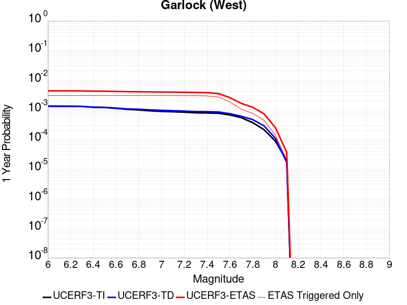 |  |

| Magnitude | 1 wk TI Prob | 1 wk TD Prob | 1 wk ETAS Prob | 1 wk ETAS/TD Gain | 1 wk ETAS Triggered Only | 1 mo TI Prob | 1 mo TD Prob | 1 mo ETAS Prob | 1 mo ETAS/TD Gain | 1 mo ETAS Triggered Only | 1 yr TI Prob | 1 yr TD Prob | 1 yr ETAS Prob | 1 yr ETAS/TD Gain | 1 yr ETAS Triggered Only | 10 yr TI Prob | 10 yr TD Prob | 10 yr ETAS Prob | 10 yr ETAS/TD Gain | 10 yr ETAS Triggered Only |
|-----|-----|-----|-----|-----|-----|-----|-----|-----|-----|-----|-----|-----|-----|-----|-----|-----|-----|-----|-----|-----|
| 6.0 | 2.5181727E-5 | 2.5216661E-5 | 3.056504E-4 | 12.120971 | 2.804408E-4 | 1.0791722E-4 | 1.08066946E-4 | 9.4929844E-4 | 8.784355 | 8.413224E-4 | 0.0013131002 | 0.0013149243 | 0.0043127327 | 3.279833 | 0.0030017553 | 0.013053683 | 0.013151911 | 0.018481959 | 1.405268 | 0.0054010823 |
| 6.1 | 2.5077732E-5 | 2.5117724E-5 | 3.0555148E-4 | 12.164776 | 2.804408E-4 | 1.0747157E-4 | 1.0764297E-4 | 9.4887486E-4 | 8.81502 | 8.413224E-4 | 0.001307681 | 0.0013097686 | 0.0043075923 | 3.2888193 | 0.0030017553 | 0.013000126 | 0.013100963 | 0.018431285 | 1.406865 | 0.0054010823 |
| 6.2 | 2.494612E-5 | 2.4999388E-5 | 3.0543318E-4 | 12.217627 | 2.804408E-4 | 1.0690756E-4 | 1.0713586E-4 | 9.4836816E-4 | 8.852015 | 8.413224E-4 | 0.0013008224 | 0.001303602 | 0.004301444 | 3.2996607 | 0.0030017553 | 0.012932341 | 0.013040021 | 0.018370673 | 1.4087917 | 0.0054010823 |
| 6.3 | 2.4733758E-5 | 2.4818735E-5 | 3.052526E-4 | 12.29928 | 2.804408E-4 | 1.0599751E-4 | 1.0636169E-4 | 9.4759464E-4 | 8.909172 | 8.413224E-4 | 0.0012897556 | 0.0012941877 | 0.0042920583 | 3.3164108 | 0.0030017553 | 0.012822957 | 0.01294698 | 0.018267883 | 1.4109763 | 0.0053906958 |
| 6.4 | 2.3237335E-5 | 2.3197908E-5 | 3.036322E-4 | 13.088776 | 2.804408E-4 | 9.958477E-5 | 9.941583E-5 | 9.406546E-4 | 9.46182 | 8.413224E-4 | 0.0012117702 | 0.0012097185 | 0.0042078425 | 3.4783652 | 0.0030017553 | 0.012051838 | 0.012111766 | 0.017396128 | 1.4362998 | 0.005349149 |
| 6.5 | 2.2732203E-5 | 2.3012379E-5 | 3.0344672E-4 | 13.18624 | 2.804408E-4 | 9.742009E-5 | 9.862077E-5 | 9.3986024E-4 | 9.530044 | 8.413224E-4 | 0.0011854442 | 0.0012000492 | 0.0041982024 | 3.4983585 | 0.0030017553 | 0.011791403 | 0.012016123 | 0.017300997 | 1.4398152 | 0.005349149 |
| 6.6 | 2.1319436E-5 | 2.1792415E-5 | 3.0222713E-4 | 13.868455 | 2.804408E-4 | 9.136581E-5 | 9.339274E-5 | 9.3463657E-4 | 10.007594 | 8.413224E-4 | 0.001111811 | 0.0011364657 | 0.0041244347 | 3.6291766 | 0.0029913688 | 0.011062649 | 0.011386949 | 0.016664919 | 1.4635105 | 0.005338762 |
| 6.7 | 1.970802E-5 | 2.0412112E-5 | 3.008472E-4 | 14.738662 | 2.804408E-4 | 8.446021E-5 | 8.747755E-5 | 9.287264E-4 | 10.616739 | 8.413224E-4 | 0.001027818 | 0.0010645206 | 0.0040527047 | 3.8070705 | 0.0029913688 | 0.010230771 | 0.01067459 | 0.015956363 | 1.4947987 | 0.005338762 |
| 6.8 | 1.8744462E-5 | 1.9919653E-5 | 3.0035488E-4 | 15.07832 | 2.804408E-4 | 8.033094E-5 | 8.536715E-5 | 9.2661777E-4 | 10.8545 | 8.413224E-4 | 9.775903E-4 | 0.0010388512 | 0.0040271124 | 3.8765054 | 0.0029913688 | 0.009733009 | 0.010420324 | 0.015703455 | 1.5070025 | 0.005338762 |
| 6.9 | 1.7559682E-5 | 1.8971898E-5 | 2.994074E-4 | 15.781627 | 2.804408E-4 | 7.5253614E-5 | 8.13056E-5 | 9.2255964E-4 | 11.346815 | 8.413224E-4 | 9.158276E-4 | 9.894476E-4 | 0.0039778566 | 4.02028 | 0.0029913688 | 0.0091206245 | 0.009930745 | 0.015206205 | 1.5312251 | 0.0053283754 |
| 7.0 | 1.6794445E-5 | 1.8234585E-5 | 2.986703E-4 | 16.37933 | 2.804408E-4 | 7.197421E-5 | 7.814589E-5 | 9.194026E-4 | 11.765208 | 8.413224E-4 | 8.759337E-4 | 9.5101225E-4 | 0.003939536 | 4.142466 | 0.0029913688 | 0.008724891 | 0.009549588 | 0.014816792 | 1.5515635 | 0.005317989 |
| 7.1 | 1.6337795E-5 | 1.7735292E-5 | 2.9817113E-4 | 16.812304 | 2.804408E-4 | 7.0017246E-5 | 7.600619E-5 | 9.1726467E-4 | 12.06829 | 8.413224E-4 | 8.521265E-4 | 9.249838E-4 | 0.0039135856 | 4.230977 | 0.0029913688 | 0.008488664 | 0.009291395 | 0.01451881 | 1.5626084 | 0.005276442 |
| 7.2 | 1.5780008E-5 | 1.7183862E-5 | 2.9761984E-4 | 17.31973 | 2.804408E-4 | 6.762685E-5 | 7.364305E-5 | 9.1490353E-4 | 12.423488 | 8.413224E-4 | 8.2304585E-4 | 8.962366E-4 | 0.0038641696 | 4.3115506 | 0.0029705951 | 0.008200042 | 0.009006202 | 0.014214537 | 1.5783054 | 0.0052556684 |
| 7.3 | 1.5058865E-5 | 1.6636799E-5 | 2.9707295E-4 | 17.856377 | 2.804408E-4 | 6.45364E-5 | 7.129862E-5 | 9.125611E-4 | 12.79914 | 8.413224E-4 | 7.854473E-4 | 8.6771627E-4 | 0.0038149785 | 4.3965735 | 0.0029498218 | 0.00782677 | 0.008722834 | 0.013891474 | 1.5925413 | 0.0052141217 |
| 7.4 | 1.4887923E-5 | 1.647271E-5 | 2.8652238E-4 | 17.39376 | 2.7005412E-4 | 6.380382E-5 | 7.059543E-5 | 8.910865E-4 | 12.622439 | 8.2054903E-4 | 7.7653467E-4 | 8.591616E-4 | 0.0037441824 | 4.357949 | 0.0028875016 | 0.0077382675 | 0.008637666 | 0.013703779 | 1.5865142 | 0.005110255 |
| 7.5 | 1.4509299E-5 | 1.6064607E-5 | 2.549548E-4 | 15.87059 | 2.3889402E-4 | 6.218123E-5 | 6.884651E-5 | 7.958652E-4 | 11.559995 | 7.2706875E-4 | 7.567935E-4 | 8.37885E-4 | 0.0035050295 | 4.1831865 | 0.002669381 | 0.0075422134 | 0.008425911 | 0.013122336 | 1.557379 | 0.0047363336 |
| 7.6 | 1.2756717E-5 | 1.4067994E-5 | 1.6986625E-4 | 12.07466 | 1.5580044E-4 | 5.4670498E-5 | 6.029001E-5 | 5.172771E-4 | 8.579814 | 4.5701466E-4 | 6.6541E-4 | 7.3378434E-4 | 0.0025916388 | 3.5318806 | 0.0018592187 | 0.006634211 | 0.0073905406 | 0.010566 | 1.4296653 | 0.0031991026 |
| 7.7 | 1.0328985E-5 | 1.147664E-5 | 1.3611557E-4 | 11.860229 | 1.2464036E-4 | 4.4266326E-5 | 4.9184677E-5 | 3.3999787E-4 | 6.912679 | 2.908275E-4 | 5.388092E-4 | 5.986593E-4 | 0.0016470876 | 2.751294 | 0.0010490564 | 0.0053750467 | 0.006046838 | 0.007998053 | 1.3226836 | 0.0019630857 |
| 7.8 | 7.0306583E-6 | 8.912468E-6 | 1.1277851E-4 | 12.6540165 | 1.03866965E-4 | 3.0131043E-5 | 3.8195732E-5 | 2.6669432E-4 | 6.9823074 | 2.2850733E-4 | 3.667837E-4 | 4.6493395E-4 | 0.0012124284 | 2.6077433 | 7.478422E-4 | 0.003661789 | 0.0047019436 | 0.0060045137 | 1.2770281 | 0.0013087238 |
| 7.9 | 4.060633E-6 | 5.4729326E-6 | 7.8179415E-5 | 14.284739 | 7.270688E-5 | 1.7402595E-5 | 2.3455215E-5 | 1.4809266E-4 | 6.3138475 | 1.2464036E-4 | 2.11856E-4 | 2.8552994E-4 | 7.2164665E-4 | 2.527394 | 4.3624127E-4 | 0.0021165414 | 0.0028881172 | 0.0036337995 | 1.2581898 | 7.478422E-4 |
| 8.0 | 1.6729537E-6 | 2.0800776E-6 | 3.3240103E-5 | 15.980223 | 3.116009E-5 | 7.169782E-6 | 8.914588E-6 | 5.0461003E-5 | 5.6604977 | 4.1546788E-5 | 8.7288594E-5 | 1.0852974E-4 | 2.5392772E-4 | 2.3397062 | 1.4541375E-4 | 8.7254314E-4 | 0.0010982669 | 0.0013576492 | 1.2361741 | 2.5966743E-4 |
| 8.1 | 3.6733252E-7 | 3.1526864E-7 | 3.1526864E-7 | 1.0 | 0.0 | 1.5742813E-6 | 1.3511507E-6 | 1.3511507E-6 | 1.0 | 0.0 | 1.9166706E-5 | 1.645015E-5 | 3.7223203E-5 | 2.2627878 | 2.0773394E-5 | 1.9165053E-4 | 1.6658098E-4 | 2.0812085E-4 | 1.2493674 | 4.1546788E-5 |

## McLean Lake
*[(top)](#table-of-contents)*

| 1 Week | 1 Month | 1 Year | 10 Year |
|-----|-----|-----|-----|
| 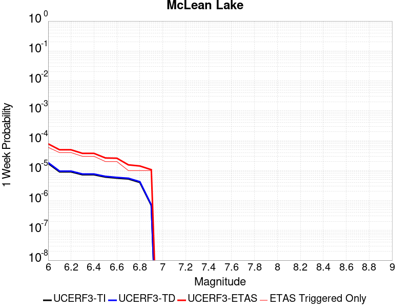 |  |  |  |

| Magnitude | 1 wk TI Prob | 1 wk TD Prob | 1 wk ETAS Prob | 1 wk ETAS/TD Gain | 1 wk ETAS Triggered Only | 1 mo TI Prob | 1 mo TD Prob | 1 mo ETAS Prob | 1 mo ETAS/TD Gain | 1 mo ETAS Triggered Only | 1 yr TI Prob | 1 yr TD Prob | 1 yr ETAS Prob | 1 yr ETAS/TD Gain | 1 yr ETAS Triggered Only | 10 yr TI Prob | 10 yr TD Prob | 10 yr ETAS Prob | 10 yr ETAS/TD Gain | 10 yr ETAS Triggered Only |
|-----|-----|-----|-----|-----|-----|-----|-----|-----|-----|-----|-----|-----|-----|-----|-----|-----|-----|-----|-----|-----|
| 6.0 | 1.7360222E-5 | 1.8502275E-5 | 8.08213E-5 | 4.368182 | 6.232018E-5 | 7.439883E-5 | 7.929332E-5 | 3.0778252E-4 | 3.8815694 | 2.2850733E-4 | 9.0542925E-4 | 9.6501724E-4 | 0.0025734017 | 2.6666896 | 0.001609938 | 0.009017491 | 0.009613109 | 0.013450104 | 1.3991419 | 0.0038742379 |
| 6.1 | 9.062689E-6 | 9.592492E-6 | 5.113888E-5 | 5.3311367 | 4.1546788E-5 | 3.8839516E-5 | 4.1110077E-5 | 1.6574531E-4 | 4.031744 | 1.2464036E-4 | 4.727685E-4 | 5.0040917E-4 | 0.0013620736 | 2.7219198 | 8.6209585E-4 | 0.0047176396 | 0.0049937065 | 0.007122681 | 1.4263316 | 0.0021396596 |
| 6.2 | 9.062689E-6 | 9.592492E-6 | 5.113888E-5 | 5.3311367 | 4.1546788E-5 | 3.8839516E-5 | 4.1110077E-5 | 1.6574531E-4 | 4.031744 | 1.2464036E-4 | 4.727685E-4 | 5.0040917E-4 | 0.0013620736 | 2.7219198 | 8.6209585E-4 | 0.0047176396 | 0.0049937065 | 0.007122681 | 1.4263316 | 0.0021396596 |
| 6.3 | 7.2575485E-6 | 7.66794E-6 | 3.882779E-5 | 5.063654 | 3.116009E-5 | 3.110341E-5 | 3.2862223E-5 | 1.4711214E-4 | 4.4766335 | 1.14253664E-4 | 3.786182E-4 | 4.0003125E-4 | 0.0010437488 | 2.6091683 | 6.439752E-4 | 0.0037797375 | 0.003993816 | 0.0056076697 | 1.404088 | 0.0016203247 |
| 6.4 | 7.2575485E-6 | 7.66794E-6 | 3.882779E-5 | 5.063654 | 3.116009E-5 | 3.110341E-5 | 3.2862223E-5 | 1.4711214E-4 | 4.4766335 | 1.14253664E-4 | 3.786182E-4 | 4.0003125E-4 | 0.0010437488 | 2.6091683 | 6.439752E-4 | 0.0037797375 | 0.003993816 | 0.0056076697 | 1.404088 | 0.0016203247 |
| 6.5 | 6.06582E-6 | 6.4040664E-6 | 2.7177328E-5 | 4.243761 | 2.0773394E-5 | 2.5996113E-5 | 2.7445747E-5 | 1.3130986E-4 | 4.784343 | 1.03866965E-4 | 3.164567E-4 | 3.3410723E-4 | 8.6365175E-4 | 2.584954 | 5.2972155E-4 | 0.0031600643 | 0.0033366878 | 0.004672101 | 1.4002212 | 0.0013398839 |
| 6.6 | 5.598744E-6 | 5.910437E-6 | 2.6683707E-5 | 4.514676 | 2.0773394E-5 | 2.3994397E-5 | 2.5330233E-5 | 1.2919457E-4 | 5.1004095 | 1.03866965E-4 | 2.9209262E-4 | 3.0835834E-4 | 7.9638255E-4 | 2.5826528 | 4.8817476E-4 | 0.0029170897 | 0.003079934 | 0.0043328535 | 1.4068007 | 0.0012567902 |
| 6.7 | 5.246996E-6 | 5.5393257E-6 | 1.5925965E-5 | 2.8750727 | 1.0386697E-5 | 2.2486933E-5 | 2.3739787E-5 | 1.1721784E-4 | 4.937611 | 9.3480274E-5 | 2.73744E-4 | 2.8899993E-4 | 7.562662E-4 | 2.6168387 | 4.6740135E-4 | 0.0027340704 | 0.0028868648 | 0.0040778867 | 1.4125658 | 0.0011944701 |
| 6.8 | 4.02324E-6 | 4.2470297E-6 | 1.4633682E-5 | 3.4456275 | 1.0386697E-5 | 1.7242342E-5 | 1.8201463E-5 | 9.0907015E-5 | 4.9944897 | 7.270688E-5 | 2.099053E-4 | 2.2158623E-4 | 6.2657765E-4 | 2.827692 | 4.0508117E-4 | 0.0020970714 | 0.0022142373 | 0.0031366064 | 1.4165629 | 9.24416E-4 |
| 6.9 | 6.835972E-7 | 7.140097E-7 | 1.1100699E-5 | 15.546987 | 1.0386697E-5 | 2.9296991E-6 | 3.0600397E-6 | 1.34467045E-5 | 4.394291 | 1.0386697E-5 | 3.56685E-5 | 3.7255664E-5 | 1.2034614E-4 | 3.2302778 | 8.3093575E-5 | 3.5662777E-4 | 3.7252545E-4 | 5.3865067E-4 | 1.4459434 | 1.6618715E-4 |

## Goldstone Lake
*[(top)](#table-of-contents)*

| 1 Week | 1 Month | 1 Year | 10 Year |
|-----|-----|-----|-----|
|  |  |  |  |

| Magnitude | 1 wk TI Prob | 1 wk TD Prob | 1 wk ETAS Prob | 1 wk ETAS/TD Gain | 1 wk ETAS Triggered Only | 1 mo TI Prob | 1 mo TD Prob | 1 mo ETAS Prob | 1 mo ETAS/TD Gain | 1 mo ETAS Triggered Only | 1 yr TI Prob | 1 yr TD Prob | 1 yr ETAS Prob | 1 yr ETAS/TD Gain | 1 yr ETAS Triggered Only | 10 yr TI Prob | 10 yr TD Prob | 10 yr ETAS Prob | 10 yr ETAS/TD Gain | 10 yr ETAS Triggered Only |
|-----|-----|-----|-----|-----|-----|-----|-----|-----|-----|-----|-----|-----|-----|-----|-----|-----|-----|-----|-----|-----|
| 6.0 | 2.671352E-5 | 3.0378242E-5 | 7.1923765E-5 | 2.3676078 | 4.1546788E-5 | 1.1448149E-4 | 1.3018708E-4 | 4.1059137E-4 | 3.1538565 | 2.804408E-4 | 0.001392921 | 0.0015840717 | 0.0028077604 | 1.7724959 | 0.0012256302 | 0.013842222 | 0.015747305 | 0.01873246 | 1.1895661 | 0.0030329155 |
| 6.1 | 2.671352E-5 | 3.0378242E-5 | 7.1923765E-5 | 2.3676078 | 4.1546788E-5 | 1.1448149E-4 | 1.3018708E-4 | 4.1059137E-4 | 3.1538565 | 2.804408E-4 | 0.001392921 | 0.0015840717 | 0.0028077604 | 1.7724959 | 0.0012256302 | 0.013842222 | 0.015747305 | 0.01873246 | 1.1895661 | 0.0030329155 |
| 6.2 | 1.4197047E-5 | 1.6097329E-5 | 2.6483858E-5 | 1.645233 | 1.0386697E-5 | 6.0843064E-5 | 6.898728E-5 | 2.1439101E-4 | 3.1076887 | 1.4541375E-4 | 7.4051257E-4 | 8.396952E-4 | 0.0014935076 | 1.7786306 | 6.543619E-4 | 0.007380498 | 0.008374922 | 0.0099507775 | 1.1881636 | 0.0015891646 |
| 6.3 | 1.4197047E-5 | 1.6097329E-5 | 2.6483858E-5 | 1.645233 | 1.0386697E-5 | 6.0843064E-5 | 6.898728E-5 | 2.1439101E-4 | 3.1076887 | 1.4541375E-4 | 7.4051257E-4 | 8.396952E-4 | 0.0014935076 | 1.7786306 | 6.543619E-4 | 0.007380498 | 0.008374922 | 0.0099507775 | 1.1881636 | 0.0015891646 |
| 6.4 | 1.3238931E-5 | 1.5009467E-5 | 2.5396008E-5 | 1.6919993 | 1.0386697E-5 | 5.6737044E-5 | 6.432525E-5 | 2.0972965E-4 | 3.260456 | 1.4541375E-4 | 6.9055456E-4 | 7.829765E-4 | 0.001416069 | 1.8085713 | 6.335885E-4 | 0.006884126 | 0.007811806 | 0.009254584 | 1.184692 | 0.0014541375 |
| 6.5 | 1.3238931E-5 | 1.5009467E-5 | 2.5396008E-5 | 1.6919993 | 1.0386697E-5 | 5.6737044E-5 | 6.432525E-5 | 2.0972965E-4 | 3.260456 | 1.4541375E-4 | 6.9055456E-4 | 7.829765E-4 | 0.001416069 | 1.8085713 | 6.335885E-4 | 0.006884126 | 0.007811806 | 0.009254584 | 1.184692 | 0.0014541375 |
| 6.6 | 1.1328278E-5 | 1.2856027E-5 | 2.324259E-5 | 1.8079139 | 1.0386697E-5 | 4.8548856E-5 | 5.5096636E-5 | 2.0050237E-4 | 3.639104 | 1.4541375E-4 | 5.90922E-4 | 6.706908E-4 | 0.0012208165 | 1.8202375 | 5.5049494E-4 | 0.0058935313 | 0.0066960566 | 0.007923797 | 1.1833527 | 0.0012360169 |
| 6.7 | 8.651175E-6 | 9.825214E-6 | 2.0211808E-5 | 2.0571368 | 1.0386697E-5 | 3.707594E-5 | 4.2107888E-5 | 1.66743E-4 | 3.9598994 | 1.2464036E-4 | 4.5130608E-4 | 5.1263353E-4 | 9.590325E-4 | 1.8707956 | 4.4662796E-4 | 0.0045039062 | 0.0051233894 | 0.006136071 | 1.1976584 | 0.0010178962 |
| 6.8 | 1.0215377E-6 | 1.1755062E-6 | 1.1755062E-6 | 1.0 | 0.0 | 4.378012E-6 | 5.037875E-6 | 5.037875E-6 | 1.0 | 0.0 | 5.3300988E-5 | 6.133451E-5 | 7.172057E-5 | 1.1693347 | 1.0386697E-5 | 5.3288206E-4 | 6.131871E-4 | 6.443281E-4 | 1.0507854 | 3.116009E-5 |
| 6.9 | 7.9360774E-7 | 9.2836456E-7 | 9.2836456E-7 | 1.0 | 0.0 | 3.4011714E-6 | 3.9786996E-6 | 3.9786996E-6 | 1.0 | 0.0 | 4.1408475E-5 | 4.8439662E-5 | 4.8439662E-5 | 1.0 | 0.0 | 4.140076E-4 | 4.8429804E-4 | 5.0506135E-4 | 1.042873 | 2.0773394E-5 |
| 7.0 | 7.4382757E-7 | 8.747556E-7 | 8.747556E-7 | 1.0 | 0.0 | 3.1878285E-6 | 3.7489476E-6 | 3.7489476E-6 | 1.0 | 0.0 | 3.8811122E-5 | 4.5642548E-5 | 4.5642548E-5 | 1.0 | 0.0 | 3.8804344E-4 | 4.5633837E-4 | 4.6672035E-4 | 1.0227506 | 1.0386697E-5 |
| 7.1 | 6.4709513E-7 | 7.7114885E-7 | 7.7114885E-7 | 1.0 | 0.0 | 2.773262E-6 | 3.3049198E-6 | 3.3049198E-6 | 1.0 | 0.0 | 3.376394E-5 | 4.0236715E-5 | 4.0236715E-5 | 1.0 | 0.0 | 3.375881E-4 | 4.0230027E-4 | 4.1268277E-4 | 1.0258079 | 1.0386697E-5 |
| 7.2 | 6.356704E-7 | 7.588543E-7 | 7.588543E-7 | 1.0 | 0.0 | 2.7242988E-6 | 3.2522291E-6 | 3.2522291E-6 | 1.0 | 0.0 | 3.3167835E-5 | 3.959523E-5 | 3.959523E-5 | 1.0 | 0.0 | 3.3162883E-4 | 3.9588768E-4 | 4.0627026E-4 | 1.026226 | 1.0386697E-5 |
| 7.3 | 5.7695723E-7 | 6.8967347E-7 | 6.8967347E-7 | 1.0 | 0.0 | 2.4726714E-6 | 2.9557402E-6 | 2.9557402E-6 | 1.0 | 0.0 | 3.0104358E-5 | 3.5985602E-5 | 3.5985602E-5 | 1.0 | 0.0 | 3.0100282E-4 | 3.5980347E-4 | 3.7018643E-4 | 1.0288574 | 1.0386697E-5 |
| 7.4 | 5.209647E-7 | 6.1936566E-7 | 6.1936566E-7 | 1.0 | 0.0 | 2.232704E-6 | 2.654422E-6 | 2.654422E-6 | 1.0 | 0.0 | 2.718283E-5 | 3.2317163E-5 | 3.2317163E-5 | 1.0 | 0.0 | 2.7179506E-4 | 3.231302E-4 | 3.3351354E-4 | 1.0321336 | 1.0386697E-5 |
| 7.5 | 4.512955E-7 | 5.3490027E-7 | 5.3490027E-7 | 1.0 | 0.0 | 1.934122E-6 | 2.292428E-6 | 2.292428E-6 | 1.0 | 0.0 | 2.3547682E-5 | 2.7910008E-5 | 2.7910008E-5 | 1.0 | 0.0 | 2.3545188E-4 | 2.7907031E-4 | 2.8945412E-4 | 1.0372086 | 1.0386697E-5 |
| 7.6 | 2.21172E-7 | 2.6040124E-7 | 2.6040124E-7 | 1.0 | 0.0 | 9.478797E-7 | 1.116005E-6 | 1.116005E-6 | 1.0 | 0.0 | 1.1540374E-5 | 1.3587305E-5 | 1.3587305E-5 | 1.0 | 0.0 | 1.1539775E-4 | 1.3586757E-4 | 1.3586757E-4 | 1.0 | 0.0 |

## Gravel Hills-Harper Lk
*[(top)](#table-of-contents)*

| 1 Week | 1 Month | 1 Year | 10 Year |
|-----|-----|-----|-----|
| 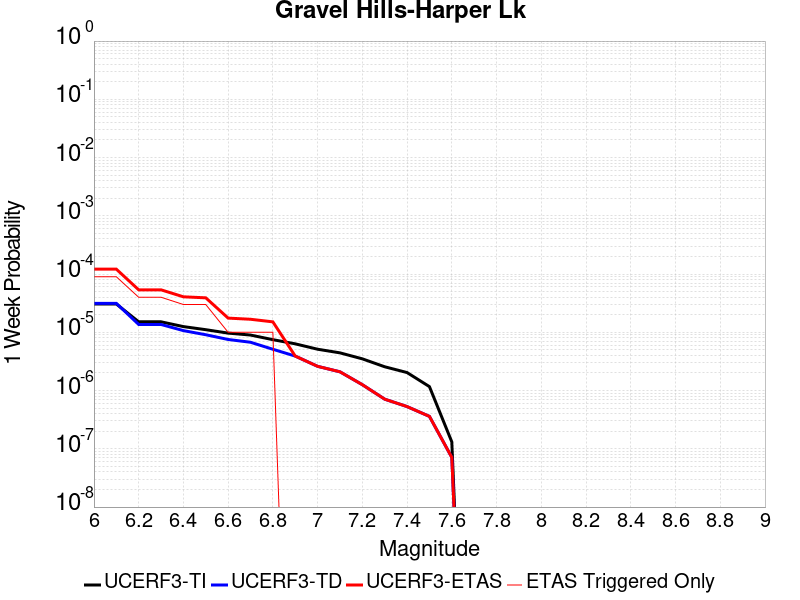 | 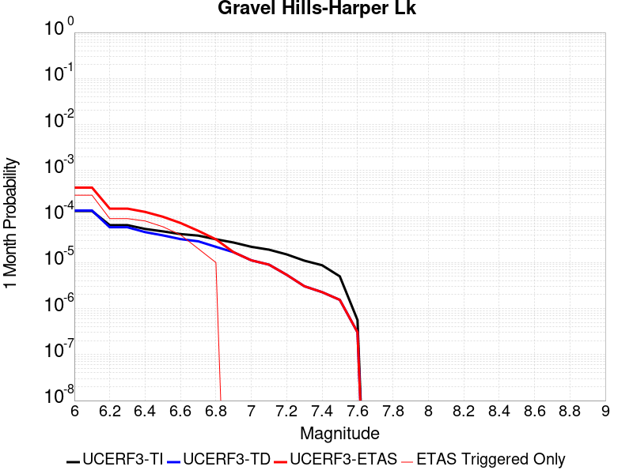 |  |  |

| Magnitude | 1 wk TI Prob | 1 wk TD Prob | 1 wk ETAS Prob | 1 wk ETAS/TD Gain | 1 wk ETAS Triggered Only | 1 mo TI Prob | 1 mo TD Prob | 1 mo ETAS Prob | 1 mo ETAS/TD Gain | 1 mo ETAS Triggered Only | 1 yr TI Prob | 1 yr TD Prob | 1 yr ETAS Prob | 1 yr ETAS/TD Gain | 1 yr ETAS Triggered Only | 10 yr TI Prob | 10 yr TD Prob | 10 yr ETAS Prob | 10 yr ETAS/TD Gain | 10 yr ETAS Triggered Only |
|-----|-----|-----|-----|-----|-----|-----|-----|-----|-----|-----|-----|-----|-----|-----|-----|-----|-----|-----|-----|-----|
| 6.0 | 3.0679566E-5 | 3.1466803E-5 | 1.1455776E-4 | 3.6405911 | 8.3093575E-5 | 1.3147724E-4 | 1.3485197E-4 | 4.2564026E-4 | 3.1563518 | 2.908275E-4 | 0.0015995599 | 0.0016408027 | 0.002957749 | 1.802623 | 0.0013191105 | 0.015880952 | 0.01630845 | 0.019230599 | 1.1791801 | 0.0029705951 |
| 6.1 | 3.0679566E-5 | 3.1466803E-5 | 1.1455776E-4 | 3.6405911 | 8.3093575E-5 | 1.3147724E-4 | 1.3485197E-4 | 4.2564026E-4 | 3.1563518 | 2.908275E-4 | 0.0015995599 | 0.0016408027 | 0.002957749 | 1.802623 | 0.0013191105 | 0.015880952 | 0.01630845 | 0.019230599 | 1.1791801 | 0.0029705951 |
| 6.2 | 1.514536E-5 | 1.363595E-5 | 4.4795615E-5 | 3.2851114 | 3.116009E-5 | 6.490707E-5 | 5.8438545E-5 | 1.4152726E-4 | 2.4218137 | 8.3093575E-5 | 7.8995706E-4 | 7.112689E-4 | 0.0010330274 | 1.4523727 | 3.219876E-4 | 0.007871548 | 0.007091126 | 0.007864604 | 1.109077 | 7.7900226E-4 |
| 6.3 | 1.514536E-5 | 1.363595E-5 | 4.4795615E-5 | 3.2851114 | 3.116009E-5 | 6.490707E-5 | 5.8438545E-5 | 1.4152726E-4 | 2.4218137 | 8.3093575E-5 | 7.8995706E-4 | 7.112689E-4 | 0.0010330274 | 1.4523727 | 3.219876E-4 | 0.007871548 | 0.007091126 | 0.007864604 | 1.109077 | 7.7900226E-4 |
| 6.4 | 1.2532521E-5 | 1.0690234E-5 | 3.1463405E-5 | 2.9431915 | 2.0773394E-5 | 5.37097E-5 | 4.5814515E-5 | 1.18518066E-4 | 2.5869107 | 7.270688E-5 | 6.537194E-4 | 5.576548E-4 | 8.0679654E-4 | 1.4467669 | 2.492807E-4 | 0.0065179965 | 0.0055631446 | 0.0060589327 | 1.08912 | 4.985614E-4 |
| 6.5 | 1.1094058E-5 | 9.084107E-6 | 2.9857312E-5 | 3.2867637 | 2.0773394E-5 | 4.7545094E-5 | 3.8931328E-5 | 9.086279E-5 | 2.3339248 | 5.1933483E-5 | 5.787078E-4 | 4.7388987E-4 | 6.711436E-4 | 1.4162438 | 1.9734724E-4 | 0.0057720304 | 0.004729201 | 0.0051220288 | 1.0830643 | 3.9469448E-4 |
| 6.6 | 9.688328E-6 | 7.5320527E-6 | 1.7918672E-5 | 2.378989 | 1.0386697E-5 | 4.1520743E-5 | 3.227984E-5 | 7.3825286E-5 | 2.28704 | 4.1546788E-5 | 5.053978E-4 | 3.9293873E-4 | 4.8638228E-4 | 1.2378069 | 9.3480274E-5 | 0.0050424994 | 0.003922696 | 0.0041709994 | 1.0632991 | 2.492807E-4 |
| 6.7 | 8.974824E-6 | 6.7497303E-6 | 1.7136357E-5 | 2.538821 | 1.0386697E-5 | 3.8462964E-5 | 2.8927108E-5 | 4.9699902E-5 | 1.7181082 | 2.0773394E-5 | 4.6818596E-4 | 3.5213283E-4 | 4.04048E-4 | 1.1474308 | 5.1933483E-5 | 0.004672008 | 0.0035159695 | 0.0036919226 | 1.050044 | 1.7657384E-4 |
| 6.8 | 7.4780046E-6 | 5.1164316E-6 | 1.5503076E-5 | 3.0300562 | 1.0386697E-5 | 3.20482E-5 | 2.1927388E-5 | 3.2313856E-5 | 1.4736756 | 1.0386697E-5 | 3.9011694E-4 | 2.6693463E-4 | 2.7731856E-4 | 1.0389006 | 1.0386697E-5 | 0.0038943281 | 0.0026662783 | 0.0027387913 | 1.0271963 | 7.270688E-5 |
| 6.9 | 6.3409307E-6 | 3.907683E-6 | 3.907683E-6 | 1.0 | 0.0 | 2.7175134E-5 | 1.674711E-5 | 1.674711E-5 | 1.0 | 0.0 | 3.3080703E-4 | 2.0387798E-4 | 2.0387798E-4 | 1.0 | 0.0 | 0.0033031502 | 0.0020370076 | 0.0020681042 | 1.0152658 | 3.116009E-5 |
| 7.0 | 5.1239335E-6 | 2.6059872E-6 | 2.6059872E-6 | 1.0 | 0.0 | 2.195953E-5 | 1.116847E-5 | 1.116847E-5 | 1.0 | 0.0 | 2.6732447E-4 | 1.3596789E-4 | 1.3596789E-4 | 1.0 | 0.0 | 0.0026700313 | 0.0013588723 | 0.0013692449 | 1.0076332 | 1.0386697E-5 |
| 7.1 | 4.438899E-6 | 2.0985822E-6 | 2.0985822E-6 | 1.0 | 0.0 | 1.9023713E-5 | 8.993894E-6 | 8.993894E-6 | 1.0 | 0.0 | 2.315891E-4 | 1.0949538E-4 | 1.0949538E-4 | 1.0 | 0.0 | 0.002313479 | 0.0010944362 | 0.0011048116 | 1.0094801 | 1.0386697E-5 |
| 7.2 | 3.50367E-6 | 1.2616524E-6 | 1.2616524E-6 | 1.0 | 0.0 | 1.5015643E-5 | 5.407071E-6 | 5.407071E-6 | 1.0 | 0.0 | 1.8280011E-4 | 6.582918E-5 | 6.582918E-5 | 1.0 | 0.0 | 0.0018264982 | 6.5810507E-4 | 6.6848495E-4 | 1.0157723 | 1.0386697E-5 |
| 7.3 | 2.561638E-6 | 7.11978E-7 | 7.11978E-7 | 1.0 | 0.0 | 1.0978401E-5 | 3.0513306E-6 | 3.0513306E-6 | 1.0 | 0.0 | 1.3365384E-4 | 3.7149337E-5 | 3.7149337E-5 | 1.0 | 0.0 | 0.0013357349 | 3.7143327E-4 | 3.8181612E-4 | 1.0279534 | 1.0386697E-5 |
| 7.4 | 2.0368864E-6 | 5.3053367E-7 | 5.3053367E-7 | 1.0 | 0.0 | 8.729483E-6 | 2.2737138E-6 | 2.2737138E-6 | 1.0 | 0.0 | 1.06276275E-4 | 2.768212E-5 | 2.768212E-5 | 1.0 | 0.0 | 0.0010622547 | 2.7678726E-4 | 2.8717107E-4 | 1.0375155 | 1.0386697E-5 |
| 7.5 | 1.1681728E-6 | 3.6033393E-7 | 3.6033393E-7 | 1.0 | 0.0 | 5.0064455E-6 | 1.5442874E-6 | 1.5442874E-6 | 1.0 | 0.0 | 6.0951766E-5 | 1.8801542E-5 | 1.8801542E-5 | 1.0 | 0.0 | 6.093505E-4 | 1.8799998E-4 | 1.9838472E-4 | 1.055238 | 1.0386697E-5 |
| 7.6 | 1.3154387E-7 | 7.12009E-8 | 7.12009E-8 | 1.0 | 0.0 | 5.6375933E-7 | 3.051467E-7 | 3.051467E-7 | 1.0 | 0.0 | 6.863748E-6 | 3.7151563E-6 | 3.7151563E-6 | 1.0 | 0.0 | 6.863536E-5 | 3.7151098E-5 | 3.7151098E-5 | 1.0 | 0.0 |

## So Sierra Nevada
*[(top)](#table-of-contents)*

| 1 Week | 1 Month | 1 Year | 10 Year |
|-----|-----|-----|-----|
|  |  |  |  |

| Magnitude | 1 wk TI Prob | 1 wk TD Prob | 1 wk ETAS Prob | 1 wk ETAS/TD Gain | 1 wk ETAS Triggered Only | 1 mo TI Prob | 1 mo TD Prob | 1 mo ETAS Prob | 1 mo ETAS/TD Gain | 1 mo ETAS Triggered Only | 1 yr TI Prob | 1 yr TD Prob | 1 yr ETAS Prob | 1 yr ETAS/TD Gain | 1 yr ETAS Triggered Only | 10 yr TI Prob | 10 yr TD Prob | 10 yr ETAS Prob | 10 yr ETAS/TD Gain | 10 yr ETAS Triggered Only |
|-----|-----|-----|-----|-----|-----|-----|-----|-----|-----|-----|-----|-----|-----|-----|-----|-----|-----|-----|-----|-----|
| 6.0 | 1.15488665E-5 | 1.1079958E-5 | 4.2239702E-5 | 3.8122618 | 3.116009E-5 | 4.9494203E-5 | 4.7484744E-5 | 3.3829844E-4 | 7.1243606 | 2.908275E-4 | 6.024253E-4 | 5.779862E-4 | 0.0017925273 | 3.1013324 | 0.0012152435 | 0.006007948 | 0.0057660984 | 0.008451068 | 1.4656476 | 0.0027005412 |
| 6.1 | 1.15488665E-5 | 1.1079958E-5 | 4.2239702E-5 | 3.8122618 | 3.116009E-5 | 4.9494203E-5 | 4.7484744E-5 | 3.3829844E-4 | 7.1243606 | 2.908275E-4 | 6.024253E-4 | 5.779862E-4 | 0.0017925273 | 3.1013324 | 0.0012152435 | 0.006007948 | 0.0057660984 | 0.008451068 | 1.4656476 | 0.0027005412 |
| 6.2 | 1.15488665E-5 | 1.1079958E-5 | 4.2239702E-5 | 3.8122618 | 3.116009E-5 | 4.9494203E-5 | 4.7484744E-5 | 3.3829844E-4 | 7.1243606 | 2.908275E-4 | 6.024253E-4 | 5.779862E-4 | 0.0017925273 | 3.1013324 | 0.0012152435 | 0.006007948 | 0.0057660984 | 0.008451068 | 1.4656476 | 0.0027005412 |
| 6.3 | 1.15488665E-5 | 1.1079958E-5 | 4.2239702E-5 | 3.8122618 | 3.116009E-5 | 4.9494203E-5 | 4.7484744E-5 | 3.3829844E-4 | 7.1243606 | 2.908275E-4 | 6.024253E-4 | 5.779862E-4 | 0.0017925273 | 3.1013324 | 0.0012152435 | 0.006007948 | 0.0057660984 | 0.008451068 | 1.4656476 | 0.0027005412 |
| 6.4 | 1.15488665E-5 | 1.1079958E-5 | 4.2239702E-5 | 3.8122618 | 3.116009E-5 | 4.9494203E-5 | 4.7484744E-5 | 3.3829844E-4 | 7.1243606 | 2.908275E-4 | 6.024253E-4 | 5.779862E-4 | 0.0017925273 | 3.1013324 | 0.0012152435 | 0.006007948 | 0.0057660984 | 0.008451068 | 1.4656476 | 0.0027005412 |
| 6.5 | 1.15488665E-5 | 1.1079958E-5 | 4.2239702E-5 | 3.8122618 | 3.116009E-5 | 4.9494203E-5 | 4.7484744E-5 | 3.3829844E-4 | 7.1243606 | 2.908275E-4 | 6.024253E-4 | 5.779862E-4 | 0.0017925273 | 3.1013324 | 0.0012152435 | 0.006007948 | 0.0057660984 | 0.008451068 | 1.4656476 | 0.0027005412 |
| 6.6 | 7.587044E-6 | 6.9358503E-6 | 2.77091E-5 | 3.9950545 | 2.0773394E-5 | 3.2515498E-5 | 2.972475E-5 | 1.9590696E-4 | 6.5907016 | 1.6618715E-4 | 3.9580427E-4 | 3.6184167E-4 | 9.95201E-4 | 2.7503767 | 6.335885E-4 | 0.003951 | 0.0036128166 | 0.0049789073 | 1.3781234 | 0.001371044 |
| 6.7 | 7.587044E-6 | 6.9358503E-6 | 2.77091E-5 | 3.9950545 | 2.0773394E-5 | 3.2515498E-5 | 2.972475E-5 | 1.9590696E-4 | 6.5907016 | 1.6618715E-4 | 3.9580427E-4 | 3.6184167E-4 | 9.95201E-4 | 2.7503767 | 6.335885E-4 | 0.003951 | 0.0036128166 | 0.0049789073 | 1.3781234 | 0.001371044 |
| 6.8 | 5.9026956E-6 | 5.179568E-6 | 2.5952853E-5 | 5.0106215 | 2.0773394E-5 | 2.5297022E-5 | 2.2197966E-5 | 1.676085E-4 | 7.550624 | 1.4541375E-4 | 3.0794772E-4 | 2.7022787E-4 | 7.9980626E-4 | 2.9597473 | 5.2972155E-4 | 0.0030752132 | 0.0026991093 | 0.0036728233 | 1.3607539 | 9.763495E-4 |
| 6.9 | 5.0118915E-6 | 4.2525808E-6 | 2.5025885E-5 | 5.8848705 | 2.0773394E-5 | 2.1479358E-5 | 1.8225222E-5 | 1.4286331E-4 | 7.8387694 | 1.2464036E-4 | 2.614798E-4 | 2.2187021E-4 | 6.683991E-4 | 3.012568 | 4.4662796E-4 | 0.0026117235 | 0.0022165596 | 0.0029834714 | 1.345992 | 7.686156E-4 |
| 7.0 | 4.4924795E-6 | 3.7140621E-6 | 2.4487379E-5 | 6.5931525 | 2.0773394E-5 | 1.925334E-5 | 1.5917316E-5 | 1.3016917E-4 | 8.177834 | 1.14253664E-4 | 2.3438422E-4 | 1.9377672E-4 | 5.883947E-4 | 3.036457 | 3.9469448E-4 | 0.0023413717 | 0.0019361405 | 0.002599602 | 1.3426722 | 6.647486E-4 |
| 7.1 | 3.9118436E-6 | 3.1121094E-6 | 2.3885439E-5 | 7.674999 | 2.0773394E-5 | 1.6764936E-5 | 1.3337547E-5 | 1.17203126E-4 | 8.787457 | 1.03866965E-4 | 2.0409399E-4 | 1.6237311E-4 | 4.739234E-4 | 2.918731 | 3.116009E-4 | 0.0020390663 | 0.0016226007 | 0.002130723 | 1.313153 | 5.089481E-4 |
| 7.2 | 3.4200818E-6 | 2.605576E-6 | 2.3378916E-5 | 8.972648 | 2.0773394E-5 | 1.4657411E-5 | 1.116671E-5 | 1.0464594E-4 | 9.371243 | 9.3480274E-5 | 1.7843937E-4 | 1.3594671E-4 | 3.9557883E-4 | 2.9098082 | 2.5966743E-4 | 0.0017829615 | 0.0013586852 | 0.0017839611 | 1.3130056 | 4.2585455E-4 |
| 7.3 | 2.6593618E-6 | 1.8285265E-6 | 2.2601882E-5 | 12.360708 | 2.0773394E-5 | 1.13972155E-5 | 7.83652E-6 | 7.015621E-5 | 8.95247 | 6.232018E-5 | 1.3875226E-4 | 9.5405754E-5 | 2.6157705E-4 | 2.7417324 | 1.6618715E-4 | 0.0013866565 | 9.536769E-4 | 0.001244227 | 1.3046631 | 2.908275E-4 |
| 7.4 | 2.2577992E-6 | 1.436535E-6 | 2.2209899E-5 | 15.460744 | 2.0773394E-5 | 9.676246E-6 | 6.156565E-6 | 5.808973E-5 | 9.435412 | 5.1933483E-5 | 1.1780193E-4 | 7.495386E-5 | 2.2035671E-4 | 2.9398983 | 1.4541375E-4 | 0.001177395 | 7.493108E-4 | 9.984047E-4 | 1.3324307 | 2.492807E-4 |
| 7.5 | 1.489319E-6 | 7.354697E-7 | 7.354697E-7 | 1.0 | 0.0 | 6.3827797E-6 | 3.1520092E-6 | 1.3538674E-5 | 4.295252 | 1.0386697E-5 | 7.770758E-5 | 3.837504E-5 | 7.992023E-5 | 2.0826097 | 4.1546788E-5 | 7.7680405E-4 | 3.836846E-4 | 4.978944E-4 | 1.297666 | 1.14253664E-4 |
| 7.6 | 1.0680322E-6 | 4.6602182E-7 | 4.6602182E-7 | 1.0 | 0.0 | 4.577273E-6 | 1.997235E-6 | 1.997235E-6 | 1.0 | 0.0 | 5.5726876E-5 | 2.4316065E-5 | 4.5088953E-5 | 1.8542866 | 2.0773394E-5 | 5.5712904E-4 | 2.431343E-4 | 3.158235E-4 | 1.2989672 | 7.270688E-5 |
| 7.7 | 5.509146E-7 | 1.558334E-7 | 1.558334E-7 | 1.0 | 0.0 | 2.3610605E-6 | 6.678573E-7 | 6.678573E-7 | 1.0 | 0.0 | 2.8745531E-5 | 8.131134E-6 | 8.131134E-6 | 1.0 | 0.0 | 2.8741814E-4 | 8.130848E-5 | 8.130848E-5 | 1.0 | 0.0 |

## San Andreas (Mojave S)
*[(top)](#table-of-contents)*

| 1 Week | 1 Month | 1 Year | 10 Year |
|-----|-----|-----|-----|
|  |  |  |  |

| Magnitude | 1 wk TI Prob | 1 wk TD Prob | 1 wk ETAS Prob | 1 wk ETAS/TD Gain | 1 wk ETAS Triggered Only | 1 mo TI Prob | 1 mo TD Prob | 1 mo ETAS Prob | 1 mo ETAS/TD Gain | 1 mo ETAS Triggered Only | 1 yr TI Prob | 1 yr TD Prob | 1 yr ETAS Prob | 1 yr ETAS/TD Gain | 1 yr ETAS Triggered Only | 10 yr TI Prob | 10 yr TD Prob | 10 yr ETAS Prob | 10 yr ETAS/TD Gain | 10 yr ETAS Triggered Only |
|-----|-----|-----|-----|-----|-----|-----|-----|-----|-----|-----|-----|-----|-----|-----|-----|-----|-----|-----|-----|-----|
| 6.0 | 3.1064058E-4 | 6.7499664E-4 | 7.995528E-4 | 1.1845287 | 1.2464036E-4 | 0.0013306376 | 0.0028897638 | 0.0031901076 | 1.1039337 | 3.012142E-4 | 0.016080605 | 0.034641396 | 0.035714276 | 1.0309709 | 0.0011113766 | 0.1496549 | 0.2867374 | 0.28826356 | 1.0053225 | 0.0021396596 |
| 6.1 | 3.1064058E-4 | 6.7499664E-4 | 7.995528E-4 | 1.1845287 | 1.2464036E-4 | 0.0013306376 | 0.0028897638 | 0.0031901076 | 1.1039337 | 3.012142E-4 | 0.016080605 | 0.034641396 | 0.035714276 | 1.0309709 | 0.0011113766 | 0.1496549 | 0.2867374 | 0.28826356 | 1.0053225 | 0.0021396596 |
| 6.2 | 3.1064058E-4 | 6.7499664E-4 | 7.995528E-4 | 1.1845287 | 1.2464036E-4 | 0.0013306376 | 0.0028897638 | 0.0031901076 | 1.1039337 | 3.012142E-4 | 0.016080605 | 0.034641396 | 0.035714276 | 1.0309709 | 0.0011113766 | 0.1496549 | 0.2867374 | 0.28826356 | 1.0053225 | 0.0021396596 |
| 6.3 | 3.1064058E-4 | 6.7499664E-4 | 7.995528E-4 | 1.1845287 | 1.2464036E-4 | 0.0013306376 | 0.0028897638 | 0.0031901076 | 1.1039337 | 3.012142E-4 | 0.016080605 | 0.034641396 | 0.035714276 | 1.0309709 | 0.0011113766 | 0.1496549 | 0.2867374 | 0.28826356 | 1.0053225 | 0.0021396596 |
| 6.4 | 1.9872203E-4 | 4.3216298E-4 | 5.4636726E-4 | 1.2642621 | 1.14253664E-4 | 8.5138786E-4 | 0.0018508406 | 0.0021307624 | 1.1512403 | 2.804408E-4 | 0.010316478 | 0.022307295 | 0.02331264 | 1.045068 | 0.0010282829 | 0.098504856 | 0.19713911 | 0.19869019 | 1.0078679 | 0.0019319255 |
| 6.5 | 1.291105E-4 | 2.8787713E-4 | 4.020979E-4 | 1.3967692 | 1.14253664E-4 | 5.5321335E-4 | 0.0012331787 | 0.0014925258 | 1.210308 | 2.5966743E-4 | 0.006714592 | 0.014911419 | 0.015852746 | 1.063128 | 9.555761E-4 | 0.065152965 | 0.13817947 | 0.13970122 | 1.0110128 | 0.0017657385 |
| 6.6 | 1.291105E-4 | 2.8787713E-4 | 4.020979E-4 | 1.3967692 | 1.14253664E-4 | 5.5321335E-4 | 0.0012331787 | 0.0014925258 | 1.210308 | 2.5966743E-4 | 0.006714592 | 0.014911419 | 0.015852746 | 1.063128 | 9.555761E-4 | 0.065152965 | 0.13817947 | 0.13970122 | 1.0110128 | 0.0017657385 |
| 6.7 | 1.08001186E-4 | 2.4368397E-4 | 3.579098E-4 | 1.4687457 | 1.14253664E-4 | 4.6278012E-4 | 0.0010439424 | 0.0012929629 | 1.2385385 | 2.492807E-4 | 0.0056198016 | 0.012636229 | 0.013538708 | 1.07142 | 9.140293E-4 | 0.054797906 | 0.119323194 | 0.1208325 | 1.0126489 | 0.0017138049 |
| 6.8 | 1.0624356E-4 | 2.3885963E-4 | 3.53086E-4 | 1.4782155 | 1.14253664E-4 | 4.5525006E-4 | 0.001023283 | 0.0012723086 | 1.2433594 | 2.492807E-4 | 0.0055285925 | 0.012387579 | 0.013290286 | 1.0728719 | 9.140293E-4 | 0.053930566 | 0.11727233 | 0.11878516 | 1.0129001 | 0.0017138049 |
| 6.9 | 1.0393785E-4 | 2.3256175E-4 | 3.4678885E-4 | 1.4911689 | 1.14253664E-4 | 4.4537184E-4 | 9.963129E-4 | 0.0012453453 | 1.249954 | 2.492807E-4 | 0.0054089287 | 0.012062895 | 0.012965898 | 1.074858 | 9.140293E-4 | 0.05279156 | 0.114569746 | 0.116078004 | 1.0131645 | 0.0017034182 |
| 7.0 | 1.0155622E-4 | 2.262555E-4 | 3.4048333E-4 | 1.5048621 | 1.14253664E-4 | 4.3516833E-4 | 9.693065E-4 | 0.0012183456 | 1.256925 | 2.492807E-4 | 0.005285311 | 0.011737675 | 0.012640975 | 1.0769573 | 9.140293E-4 | 0.05161361 | 0.11182977 | 0.11333347 | 1.0134463 | 0.0016930315 |
| 7.1 | 9.885595E-5 | 2.191377E-4 | 3.3336633E-4 | 1.5212642 | 1.14253664E-4 | 4.2359953E-4 | 9.388239E-4 | 0.0011878706 | 1.2652752 | 2.492807E-4 | 0.0051451353 | 0.011370476 | 0.012274113 | 1.0794722 | 9.140293E-4 | 0.05027629 | 0.10871404 | 0.11021375 | 1.013795 | 0.0016826448 |
| 7.2 | 9.6411415E-5 | 2.1276584E-4 | 3.2699518E-4 | 1.5368782 | 1.14253664E-4 | 4.1312634E-4 | 9.115353E-4 | 0.0011605888 | 1.2732242 | 2.492807E-4 | 0.005018219 | 0.0110416515 | 0.0119455885 | 1.0818661 | 9.140293E-4 | 0.049064007 | 0.10590357 | 0.10740802 | 1.0142058 | 0.0016826448 |
| 7.3 | 9.1180635E-5 | 1.950402E-4 | 2.988869E-4 | 1.5324374 | 1.03866965E-4 | 3.907156E-4 | 8.356189E-4 | 0.0010743133 | 1.2856499 | 2.3889402E-4 | 0.004746591 | 0.010126315 | 0.011020807 | 1.0883334 | 9.036426E-4 | 0.046464786 | 0.09809433 | 0.099593185 | 1.0152797 | 0.0016618714 |
| 7.4 | 8.887388E-5 | 1.8752231E-4 | 2.913698E-4 | 1.5537874 | 1.03866965E-4 | 3.8083247E-4 | 8.0341956E-4 | 0.0010421217 | 1.2971077 | 2.3889402E-4 | 0.0046267817 | 0.00973786 | 0.010632703 | 1.0918932 | 9.036426E-4 | 0.045316286 | 0.09472819 | 0.09623263 | 1.0158817 | 0.0016618714 |
| 7.5 | 8.6750515E-5 | 1.8083451E-4 | 2.846827E-4 | 1.5742719 | 1.03866965E-4 | 3.7173493E-4 | 7.7477493E-4 | 0.0010134839 | 1.3081009 | 2.3889402E-4 | 0.004516484 | 0.009392173 | 0.010287329 | 1.0953087 | 9.036426E-4 | 0.04425787 | 0.09169095 | 0.093200445 | 1.0164628 | 0.0016618714 |
| 7.6 | 8.453092E-5 | 1.747065E-4 | 2.7855532E-4 | 1.5944188 | 1.03866965E-4 | 3.6222505E-4 | 7.485273E-4 | 9.872426E-4 | 1.3189131 | 2.3889402E-4 | 0.0044011753 | 0.009075315 | 0.009970756 | 1.0986679 | 9.036426E-4 | 0.04315024 | 0.08884873 | 0.09035348 | 1.0169361 | 0.0016514848 |
| 7.7 | 8.259102E-5 | 1.6992437E-4 | 2.7377368E-4 | 1.6111503 | 1.03866965E-4 | 3.539135E-4 | 7.280441E-4 | 9.667642E-4 | 1.3278924 | 2.3889402E-4 | 0.004300386 | 0.008827981 | 0.009723646 | 1.1014576 | 9.036426E-4 | 0.042181134 | 0.08659836 | 0.088106826 | 1.0174191 | 0.0016514848 |
| 7.8 | 7.444844E-5 | 1.531194E-4 | 2.5697047E-4 | 1.6782358 | 1.03866965E-4 | 3.1902574E-4 | 6.56061E-4 | 8.8441843E-4 | 1.3480735 | 2.2850733E-4 | 0.0038772223 | 0.007958339 | 0.008751749 | 1.0996956 | 7.9977565E-4 | 0.03810269 | 0.07841811 | 0.07970078 | 1.0163568 | 0.0013918173 |
| 7.9 | 5.2586525E-5 | 1.0025827E-4 | 1.7295785E-4 | 1.725123 | 7.270688E-5 | 2.2535135E-4 | 4.2960755E-4 | 5.541944E-4 | 1.2900014 | 1.2464036E-4 | 0.0027402006 | 0.005217939 | 0.005662237 | 1.0851481 | 4.4662796E-4 | 0.027066574 | 0.052290585 | 0.053009164 | 1.0137421 | 7.582289E-4 |
| 8.0 | 3.379877E-5 | 5.418614E-5 | 8.5344545E-5 | 1.5750253 | 3.116009E-5 | 1.4484383E-4 | 2.3220567E-4 | 2.737428E-4 | 1.1788808 | 4.1546788E-5 | 0.0017620471 | 0.0028234406 | 0.0029684438 | 1.0513569 | 1.4541375E-4 | 0.017481409 | 0.028889727 | 0.029151978 | 1.0090777 | 2.7005412E-4 |
| 8.1 | 1.8668277E-5 | 1.936222E-5 | 1.936222E-5 | 1.0 | 0.0 | 8.000444E-5 | 8.29783E-5 | 8.29783E-5 | 1.0 | 0.0 | 9.736188E-4 | 0.0010097933 | 0.0010305457 | 1.0205512 | 2.0773394E-5 | 0.009693642 | 0.010826511 | 0.010877882 | 1.004745 | 5.1933483E-5 |
| 8.2 | 8.541571E-6 | 5.4811067E-6 | 5.4811067E-6 | 1.0 | 0.0 | 3.660622E-5 | 2.3490245E-5 | 2.3490245E-5 | 1.0 | 0.0 | 4.455896E-4 | 2.8595628E-4 | 2.8595628E-4 | 1.0 | 0.0 | 0.0044469717 | 0.0032518986 | 0.0032518986 | 1.0 | 0.0 |
| 8.3 | 1.983087E-6 | 7.693574E-7 | 7.693574E-7 | 1.0 | 0.0 | 8.498917E-6 | 3.297242E-6 | 3.297242E-6 | 1.0 | 0.0 | 1.034694E-4 | 4.01432E-5 | 4.01432E-5 | 1.0 | 0.0 | 0.0010342124 | 4.7390026E-4 | 4.7390026E-4 | 1.0 | 0.0 |

## Coyote Canyon
*[(top)](#table-of-contents)*

| 1 Week | 1 Month | 1 Year | 10 Year |
|-----|-----|-----|-----|
|  |  |  |  |

| Magnitude | 1 wk TI Prob | 1 wk TD Prob | 1 wk ETAS Prob | 1 wk ETAS/TD Gain | 1 wk ETAS Triggered Only | 1 mo TI Prob | 1 mo TD Prob | 1 mo ETAS Prob | 1 mo ETAS/TD Gain | 1 mo ETAS Triggered Only | 1 yr TI Prob | 1 yr TD Prob | 1 yr ETAS Prob | 1 yr ETAS/TD Gain | 1 yr ETAS Triggered Only | 10 yr TI Prob | 10 yr TD Prob | 10 yr ETAS Prob | 10 yr ETAS/TD Gain | 10 yr ETAS Triggered Only |
|-----|-----|-----|-----|-----|-----|-----|-----|-----|-----|-----|-----|-----|-----|-----|-----|-----|-----|-----|-----|-----|
| 6.0 | 3.5090034E-5 | 4.0367544E-5 | 8.191266E-5 | 2.029171 | 4.1546788E-5 | 1.503772E-4 | 1.7299375E-4 | 3.3915215E-4 | 1.9604878 | 1.6618715E-4 | 0.0018293047 | 0.0021044204 | 0.0029128778 | 1.384171 | 8.1016234E-4 | 0.018143194 | 0.020870851 | 0.022853985 | 1.0950193 | 0.0020254059 |
| 6.1 | 3.5090034E-5 | 4.0367544E-5 | 8.191266E-5 | 2.029171 | 4.1546788E-5 | 1.503772E-4 | 1.7299375E-4 | 3.3915215E-4 | 1.9604878 | 1.6618715E-4 | 0.0018293047 | 0.0021044204 | 0.0029128778 | 1.384171 | 8.1016234E-4 | 0.018143194 | 0.020870851 | 0.022853985 | 1.0950193 | 0.0020254059 |
| 6.2 | 1.841879E-5 | 2.1061396E-5 | 4.183435E-5 | 1.9863048 | 2.0773394E-5 | 7.8935285E-5 | 9.026058E-5 | 1.5257513E-4 | 1.6903851 | 6.232018E-5 | 9.606133E-4 | 0.0010984705 | 0.0015757338 | 1.4344797 | 4.7778804E-4 | 0.0095647145 | 0.010940496 | 0.012070533 | 1.1032894 | 0.0011425366 |
| 6.3 | 1.841879E-5 | 2.1061396E-5 | 4.183435E-5 | 1.9863048 | 2.0773394E-5 | 7.8935285E-5 | 9.026058E-5 | 1.5257513E-4 | 1.6903851 | 6.232018E-5 | 9.606133E-4 | 0.0010984705 | 0.0015757338 | 1.4344797 | 4.7778804E-4 | 0.0095647145 | 0.010940496 | 0.012070533 | 1.1032894 | 0.0011425366 |
| 6.4 | 1.712201E-5 | 1.9566693E-5 | 4.033968E-5 | 2.0616503 | 2.0773394E-5 | 7.337798E-5 | 8.385513E-5 | 1.4617009E-4 | 1.7431263 | 6.232018E-5 | 8.930107E-4 | 0.0010205585 | 0.001497859 | 1.4676855 | 4.7778804E-4 | 0.008894307 | 0.010168637 | 0.011217307 | 1.1031278 | 0.0010594431 |
| 6.5 | 1.4744935E-5 | 1.683824E-5 | 3.7611284E-5 | 2.2336826 | 2.0773394E-5 | 6.3191044E-5 | 7.216242E-5 | 1.344781E-4 | 1.8635477 | 6.232018E-5 | 7.6907943E-4 | 8.7831676E-4 | 0.0012934197 | 1.4726119 | 4.1546786E-4 | 0.007664232 | 0.008757652 | 0.009643084 | 1.1011039 | 8.932559E-4 |
| 6.6 | 1.2017839E-5 | 1.3725124E-5 | 2.4111678E-5 | 1.7567549 | 1.0386697E-5 | 5.150401E-5 | 5.882113E-5 | 1.10751556E-4 | 1.8828533 | 5.1933483E-5 | 6.268809E-4 | 7.1600056E-4 | 0.0010792746 | 1.5073657 | 3.6353437E-4 | 0.0062511545 | 0.007145631 | 0.007929379 | 1.1096822 | 7.8938896E-4 |
| 6.7 | 1.00956095E-5 | 1.1534388E-5 | 2.1920965E-5 | 1.9004879 | 1.0386697E-5 | 4.326618E-5 | 4.943265E-5 | 1.0136356E-4 | 2.0505388 | 5.1933483E-5 | 5.266384E-4 | 6.0176325E-4 | 9.131767E-4 | 1.5175015 | 3.116009E-4 | 0.005253921 | 0.006009866 | 0.006660295 | 1.1082269 | 6.543619E-4 |

## Death Valley (So)
*[(top)](#table-of-contents)*

| 1 Week | 1 Month | 1 Year | 10 Year |
|-----|-----|-----|-----|
|  |  | 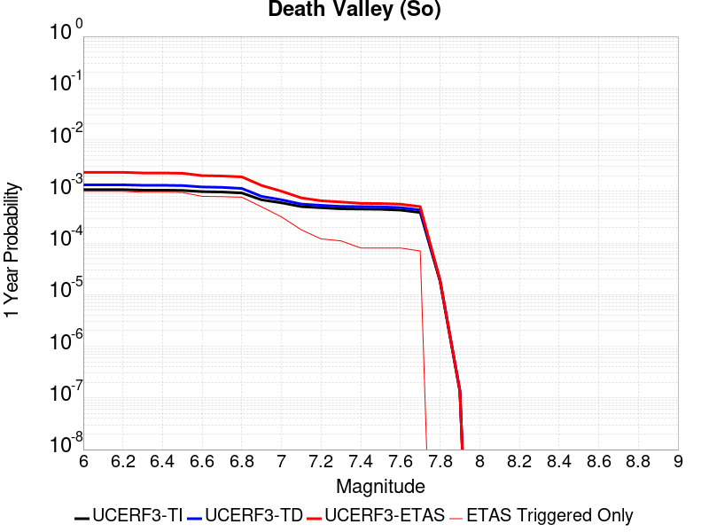 |  |

| Magnitude | 1 wk TI Prob | 1 wk TD Prob | 1 wk ETAS Prob | 1 wk ETAS/TD Gain | 1 wk ETAS Triggered Only | 1 mo TI Prob | 1 mo TD Prob | 1 mo ETAS Prob | 1 mo ETAS/TD Gain | 1 mo ETAS Triggered Only | 1 yr TI Prob | 1 yr TD Prob | 1 yr ETAS Prob | 1 yr ETAS/TD Gain | 1 yr ETAS Triggered Only | 10 yr TI Prob | 10 yr TD Prob | 10 yr ETAS Prob | 10 yr ETAS/TD Gain | 10 yr ETAS Triggered Only |
|-----|-----|-----|-----|-----|-----|-----|-----|-----|-----|-----|-----|-----|-----|-----|-----|-----|-----|-----|-----|-----|
| 6.0 | 2.0684236E-5 | 2.562036E-5 | 4.6393223E-5 | 1.8107951 | 2.0773394E-5 | 8.864371E-5 | 1.0979702E-4 | 2.344237E-4 | 2.1350644 | 1.2464036E-4 | 0.0010787029 | 0.0013359758 | 0.0023525122 | 1.7608943 | 0.0010178962 | 0.010734817 | 0.013282726 | 0.0155886905 | 1.1736063 | 0.0023370069 |
| 6.1 | 2.0684236E-5 | 2.562036E-5 | 4.6393223E-5 | 1.8107951 | 2.0773394E-5 | 8.864371E-5 | 1.0979702E-4 | 2.344237E-4 | 2.1350644 | 1.2464036E-4 | 0.0010787029 | 0.0013359758 | 0.0023525122 | 1.7608943 | 0.0010178962 | 0.010734817 | 0.013282726 | 0.0155886905 | 1.1736063 | 0.0023370069 |
| 6.2 | 2.0684236E-5 | 2.562036E-5 | 4.6393223E-5 | 1.8107951 | 2.0773394E-5 | 8.864371E-5 | 1.0979702E-4 | 2.344237E-4 | 2.1350644 | 1.2464036E-4 | 0.0010787029 | 0.0013359758 | 0.0023525122 | 1.7608943 | 0.0010178962 | 0.010734817 | 0.013282726 | 0.0155886905 | 1.1736063 | 0.0023370069 |
| 6.3 | 2.0240292E-5 | 2.5120411E-5 | 4.5893285E-5 | 1.826932 | 2.0773394E-5 | 8.6741224E-5 | 1.0765456E-4 | 2.1151034E-4 | 1.9647133 | 1.03866965E-4 | 0.0010555626 | 0.0013099229 | 0.0022953665 | 1.7522913 | 9.867362E-4 | 0.010505628 | 0.013025268 | 0.015239572 | 1.1700007 | 0.0022435265 |
| 6.4 | 2.0240292E-5 | 2.5120411E-5 | 4.5893285E-5 | 1.826932 | 2.0773394E-5 | 8.6741224E-5 | 1.0765456E-4 | 2.1151034E-4 | 1.9647133 | 1.03866965E-4 | 0.0010555626 | 0.0013099229 | 0.0022953665 | 1.7522913 | 9.867362E-4 | 0.010505628 | 0.013025268 | 0.015239572 | 1.1700007 | 0.0022435265 |
| 6.5 | 1.9962767E-5 | 2.4809646E-5 | 4.5582525E-5 | 1.8372904 | 2.0773394E-5 | 8.55519E-5 | 1.0632281E-4 | 2.1017874E-4 | 1.9767982 | 1.03866965E-4 | 0.0010410968 | 0.0012937282 | 0.0022688145 | 1.7537026 | 9.763495E-4 | 0.010362327 | 0.012865204 | 0.014997843 | 1.1657679 | 0.002160433 |
| 6.6 | 1.8937297E-5 | 2.331338E-5 | 4.408629E-5 | 1.8910295 | 2.0773394E-5 | 8.115732E-5 | 9.991074E-5 | 1.7261035E-4 | 1.7276456 | 7.270688E-5 | 9.876423E-4 | 0.0012157491 | 0.0020456745 | 1.6826454 | 8.309357E-4 | 0.009832645 | 0.012094032 | 0.014023115 | 1.159507 | 0.001952699 |
| 6.7 | 1.8621096E-5 | 2.2913995E-5 | 3.3300454E-5 | 1.4532801 | 1.0386697E-5 | 7.980225E-5 | 9.819922E-5 | 1.6051329E-4 | 1.6345677 | 6.232018E-5 | 9.711593E-4 | 0.0011949344 | 0.0020145029 | 1.6858691 | 8.2054903E-4 | 0.009669261 | 0.011888134 | 0.01378683 | 1.1597135 | 0.0019215388 |
| 6.8 | 1.7830353E-5 | 2.1807928E-5 | 3.21944E-5 | 1.4762704 | 1.0386697E-5 | 7.641356E-5 | 9.3459275E-5 | 1.5577363E-4 | 1.6667541 | 6.232018E-5 | 9.29938E-4 | 0.0011372868 | 0.0019361528 | 1.7024316 | 7.9977565E-4 | 0.009260561 | 0.011317508 | 0.013124878 | 1.1596968 | 0.0018280586 |
| 6.9 | 1.3135183E-5 | 1.530519E-5 | 2.5691728E-5 | 1.6786284 | 1.0386697E-5 | 5.6292425E-5 | 6.559206E-5 | 1.2790815E-4 | 1.9500555 | 6.232018E-5 | 6.8514474E-4 | 7.9829723E-4 | 0.0013172175 | 1.650034 | 5.1933486E-4 | 0.006830362 | 0.007955303 | 0.009171183 | 1.152839 | 0.0012256302 |
| 7.0 | 1.1507512E-5 | 1.3155178E-5 | 1.3155178E-5 | 1.0 | 0.0 | 4.9316975E-5 | 5.6378147E-5 | 8.753648E-5 | 1.5526669 | 3.116009E-5 | 6.002687E-4 | 6.861935E-4 | 0.0010183398 | 1.4840416 | 3.323743E-4 | 0.0059864987 | 0.0068414486 | 0.007584174 | 1.1085627 | 7.478422E-4 |
| 7.1 | 9.715903E-6 | 1.08659815E-5 | 1.08659815E-5 | 1.0 | 0.0 | 4.1638916E-5 | 4.6567682E-5 | 5.6953897E-5 | 1.2230347 | 1.0386697E-5 | 5.068359E-4 | 5.6681834E-4 | 7.536729E-4 | 1.3296552 | 1.8696055E-4 | 0.0050568148 | 0.0056541795 | 0.006036314 | 1.0675845 | 3.843078E-4 |
| 7.2 | 9.233269E-6 | 1.0286961E-5 | 1.0286961E-5 | 1.0 | 0.0 | 3.9570554E-5 | 4.4086253E-5 | 5.4472494E-5 | 1.235589 | 1.0386697E-5 | 4.81665E-4 | 5.366222E-4 | 6.6119566E-4 | 1.2321438 | 1.2464036E-4 | 0.0048062233 | 0.0053536952 | 0.005653297 | 1.0559616 | 3.012142E-4 |
| 7.3 | 8.8041315E-6 | 9.80876E-6 | 9.80876E-6 | 1.0 | 0.0 | 3.7731446E-5 | 4.203689E-5 | 5.242315E-5 | 1.2470748 | 1.0386697E-5 | 4.592835E-4 | 5.116832E-4 | 6.2587834E-4 | 1.2231756 | 1.14253664E-4 | 0.0045833546 | 0.005105477 | 0.005353485 | 1.0485768 | 2.492807E-4 |
| 7.4 | 8.708749E-6 | 9.707768E-6 | 9.707768E-6 | 1.0 | 0.0 | 3.7322676E-5 | 4.1604082E-5 | 5.1990344E-5 | 1.2496454 | 1.0386697E-5 | 4.5430884E-4 | 5.0641614E-4 | 5.8946764E-4 | 1.1639985 | 8.3093575E-5 | 0.004533812 | 0.0050530476 | 0.005270066 | 1.042948 | 2.1812064E-4 |
| 7.5 | 8.612678E-6 | 9.605406E-6 | 9.605406E-6 | 1.0 | 0.0 | 3.6910955E-5 | 4.1165404E-5 | 5.1551673E-5 | 1.2523057 | 1.0386697E-5 | 4.492982E-4 | 5.0107774E-4 | 5.8412965E-4 | 1.1657466 | 8.3093575E-5 | 0.004483909 | 0.004999905 | 0.0052169347 | 1.0434068 | 2.1812064E-4 |
| 7.6 | 8.319024E-6 | 9.28449E-6 | 9.28449E-6 | 1.0 | 0.0 | 3.5652476E-5 | 3.9790088E-5 | 5.017637E-5 | 1.2610269 | 1.0386697E-5 | 4.3398244E-4 | 4.8434082E-4 | 5.6739413E-4 | 1.1714771 | 8.3093575E-5 | 0.0043313587 | 0.0048332764 | 0.0050400062 | 1.0427722 | 2.0773393E-4 |
| 7.7 | 7.4718328E-6 | 8.345689E-6 | 8.345689E-6 | 1.0 | 0.0 | 3.2021748E-5 | 3.576677E-5 | 4.6153098E-5 | 1.2903904 | 1.0386697E-5 | 3.8979502E-4 | 4.3537747E-4 | 5.080527E-4 | 1.1669246 | 7.270688E-5 | 0.00389112 | 0.0043456503 | 0.0045007737 | 1.0356963 | 1.5580044E-4 |
| 7.8 | 3.4586725E-7 | 3.648368E-7 | 3.648368E-7 | 1.0 | 0.0 | 1.4822873E-6 | 1.5635853E-6 | 1.5635853E-6 | 1.0 | 0.0 | 1.80467E-5 | 1.903649E-5 | 1.903649E-5 | 1.0 | 0.0 | 1.8045233E-4 | 1.9034903E-4 | 1.9034903E-4 | 1.0 | 0.0 |
| 7.9 | 2.5591178E-9 | 2.6697329E-9 | 2.6697329E-9 | 1.0 | 0.0 | 1.0967647E-8 | 1.14417125E-8 | 1.14417125E-8 | 1.0 | 0.0 | 1.335311E-7 | 1.3930286E-7 | 1.3930286E-7 | 1.0 | 0.0 | 1.3353102E-6 | 1.3930285E-6 | 1.3930285E-6 | 1.0 | 0.0 |

## San Andreas (Mojave N)
*[(top)](#table-of-contents)*

| 1 Week | 1 Month | 1 Year | 10 Year |
|-----|-----|-----|-----|
|  |  |  |  |

| Magnitude | 1 wk TI Prob | 1 wk TD Prob | 1 wk ETAS Prob | 1 wk ETAS/TD Gain | 1 wk ETAS Triggered Only | 1 mo TI Prob | 1 mo TD Prob | 1 mo ETAS Prob | 1 mo ETAS/TD Gain | 1 mo ETAS Triggered Only | 1 yr TI Prob | 1 yr TD Prob | 1 yr ETAS Prob | 1 yr ETAS/TD Gain | 1 yr ETAS Triggered Only | 10 yr TI Prob | 10 yr TD Prob | 10 yr ETAS Prob | 10 yr ETAS/TD Gain | 10 yr ETAS Triggered Only |
|-----|-----|-----|-----|-----|-----|-----|-----|-----|-----|-----|-----|-----|-----|-----|-----|-----|-----|-----|-----|-----|
| 6.0 | 9.877682E-5 | 1.9435467E-4 | 3.189708E-4 | 1.6411791 | 1.2464036E-4 | 4.2326056E-4 | 8.326828E-4 | 0.0011440243 | 1.3739016 | 3.116009E-4 | 0.0051410277 | 0.010090916 | 0.011324743 | 1.122271 | 0.0012464036 | 0.05023708 | 0.09846656 | 0.100498535 | 1.0206362 | 0.002253913 |
| 6.1 | 9.877682E-5 | 1.9435467E-4 | 3.189708E-4 | 1.6411791 | 1.2464036E-4 | 4.2326056E-4 | 8.326828E-4 | 0.0011440243 | 1.3739016 | 3.116009E-4 | 0.0051410277 | 0.010090916 | 0.011324743 | 1.122271 | 0.0012464036 | 0.05023708 | 0.09846656 | 0.100498535 | 1.0206362 | 0.002253913 |
| 6.2 | 9.877682E-5 | 1.9435467E-4 | 3.189708E-4 | 1.6411791 | 1.2464036E-4 | 4.2326056E-4 | 8.326828E-4 | 0.0011440243 | 1.3739016 | 3.116009E-4 | 0.0051410277 | 0.010090916 | 0.011324743 | 1.122271 | 0.0012464036 | 0.05023708 | 0.09846656 | 0.100498535 | 1.0206362 | 0.002253913 |
| 6.3 | 9.877682E-5 | 1.9435467E-4 | 3.189708E-4 | 1.6411791 | 1.2464036E-4 | 4.2326056E-4 | 8.326828E-4 | 0.0011440243 | 1.3739016 | 3.116009E-4 | 0.0051410277 | 0.010090916 | 0.011324743 | 1.122271 | 0.0012464036 | 0.05023708 | 0.09846656 | 0.100498535 | 1.0206362 | 0.002253913 |
| 6.4 | 9.877682E-5 | 1.9435467E-4 | 3.189708E-4 | 1.6411791 | 1.2464036E-4 | 4.2326056E-4 | 8.326828E-4 | 0.0011440243 | 1.3739016 | 3.116009E-4 | 0.0051410277 | 0.010090916 | 0.011324743 | 1.122271 | 0.0012464036 | 0.05023708 | 0.09846656 | 0.100498535 | 1.0206362 | 0.002253913 |
| 6.5 | 9.861474E-5 | 1.9409222E-4 | 3.187084E-4 | 1.6420462 | 1.2464036E-4 | 4.2256617E-4 | 8.3155883E-4 | 0.0011429006 | 1.3744074 | 3.116009E-4 | 0.0051326132 | 0.010077358 | 0.011311201 | 1.1224371 | 0.0012464036 | 0.050156746 | 0.09834433 | 0.10037658 | 1.0206647 | 0.002253913 |
| 6.6 | 9.861474E-5 | 1.9409222E-4 | 3.187084E-4 | 1.6420462 | 1.2464036E-4 | 4.2256617E-4 | 8.3155883E-4 | 0.0011429006 | 1.3744074 | 3.116009E-4 | 0.0051326132 | 0.010077358 | 0.011311201 | 1.1224371 | 0.0012464036 | 0.050156746 | 0.09834433 | 0.10037658 | 1.0206647 | 0.002253913 |
| 6.7 | 9.8552715E-5 | 1.9399171E-4 | 3.186079E-4 | 1.6423789 | 1.2464036E-4 | 4.223004E-4 | 8.3112833E-4 | 0.0011424703 | 1.3746015 | 3.116009E-4 | 0.0051293927 | 0.010072165 | 0.011306015 | 1.1225009 | 0.0012464036 | 0.050125998 | 0.09829751 | 0.10032987 | 1.0206755 | 0.002253913 |
| 6.8 | 9.8464974E-5 | 1.9384324E-4 | 3.1845944E-4 | 1.642871 | 1.2464036E-4 | 4.219245E-4 | 8.304924E-4 | 0.0011418345 | 1.3748885 | 3.116009E-4 | 0.0051248376 | 0.010064495 | 0.011298354 | 1.1225952 | 0.0012464036 | 0.05008251 | 0.0982275 | 0.10026002 | 1.020692 | 0.002253913 |
| 6.9 | 9.825824E-5 | 1.9352314E-4 | 3.1813938E-4 | 1.6439346 | 1.2464036E-4 | 4.2103877E-4 | 8.2912145E-4 | 0.001140464 | 1.375509 | 3.116009E-4 | 0.0051141046 | 0.010047957 | 0.011281837 | 1.122799 | 0.0012464036 | 0.049980022 | 0.098076545 | 0.1001094 | 1.0207273 | 0.002253913 |
| 7.0 | 9.781462E-5 | 1.928364E-4 | 3.1745274E-4 | 1.6462282 | 1.2464036E-4 | 4.1913814E-4 | 8.2618016E-4 | 0.0011375236 | 1.3768469 | 3.116009E-4 | 0.005091073 | 0.010012477 | 0.011246401 | 1.1232387 | 0.0012464036 | 0.04976007 | 0.0977528 | 0.09977702 | 1.0207075 | 0.0022435265 |
| 7.1 | 9.7121134E-5 | 1.9185297E-4 | 3.1646944E-4 | 1.6495414 | 1.2464036E-4 | 4.1616702E-4 | 8.2196813E-4 | 0.0011333129 | 1.3787796 | 3.116009E-4 | 0.005055068 | 0.009961666 | 0.011195652 | 1.1238736 | 0.0012464036 | 0.04941613 | 0.09728914 | 0.09930502 | 1.0207205 | 0.0022331397 |
| 7.2 | 9.663819E-5 | 1.9116043E-4 | 3.1577697E-4 | 1.651895 | 1.2464036E-4 | 4.1409794E-4 | 8.19002E-4 | 0.0011303477 | 1.3801526 | 3.116009E-4 | 0.0050299936 | 0.009925882 | 0.011159914 | 1.1243247 | 0.0012464036 | 0.049176537 | 0.09696228 | 0.09897889 | 1.0207978 | 0.0022331397 |
| 7.3 | 9.6277574E-5 | 1.9068507E-4 | 3.1530167E-4 | 1.6535205 | 1.2464036E-4 | 4.125529E-4 | 8.16966E-4 | 0.0011283123 | 1.3811008 | 3.116009E-4 | 0.0050112694 | 0.00990132 | 0.011135382 | 1.1246362 | 0.0012464036 | 0.04899759 | 0.09673555 | 0.09875267 | 1.0208519 | 0.0022331397 |
| 7.4 | 9.593308E-5 | 1.9008234E-4 | 3.1469902E-4 | 1.655593 | 1.2464036E-4 | 4.1107697E-4 | 8.1438443E-4 | 0.0011257316 | 1.3823098 | 3.116009E-4 | 0.0049933824 | 0.009870174 | 0.011104276 | 1.1250334 | 0.0012464036 | 0.04882661 | 0.09645354 | 0.09847129 | 1.0209193 | 0.0022331397 |
| 7.5 | 9.561707E-5 | 1.8954265E-4 | 3.141594E-4 | 1.6574601 | 1.2464036E-4 | 4.0972308E-4 | 8.12073E-4 | 0.0011234209 | 1.3833989 | 3.116009E-4 | 0.0049769743 | 0.009842287 | 0.011076423 | 1.1253912 | 0.0012464036 | 0.048669744 | 0.09619955 | 0.09821786 | 1.0209805 | 0.0022331397 |
| 7.6 | 9.418194E-5 | 1.8606246E-4 | 3.1067964E-4 | 1.6697599 | 1.2464036E-4 | 4.0357444E-4 | 7.97167E-4 | 0.0011085195 | 1.3905737 | 3.116009E-4 | 0.004902454 | 0.00966243 | 0.010896791 | 1.1277485 | 0.0012464036 | 0.047957025 | 0.09458092 | 0.09659344 | 1.0212783 | 0.0022227531 |
| 7.7 | 8.202141E-5 | 1.6052493E-4 | 2.8514527E-4 | 1.7763302 | 1.2464036E-4 | 3.51473E-4 | 6.877826E-4 | 9.784101E-4 | 1.4225572 | 2.908275E-4 | 0.00427079 | 0.00834166 | 0.009433465 | 1.130886 | 0.0011009899 | 0.04189639 | 0.082371704 | 0.08425887 | 1.0229104 | 0.0020565658 |
| 7.8 | 7.2859846E-5 | 1.4544492E-4 | 2.4929678E-4 | 1.7140287 | 1.03866965E-4 | 3.1221908E-4 | 6.231865E-4 | 8.515515E-4 | 1.3664471 | 2.2850733E-4 | 0.003794643 | 0.0075609423 | 0.008354671 | 1.1049775 | 7.9977565E-4 | 0.037304975 | 0.07485102 | 0.07613866 | 1.0172027 | 0.0013918173 |
| 7.9 | 5.3874453E-5 | 1.0065284E-4 | 1.733524E-4 | 1.7222803 | 7.270688E-5 | 2.3087008E-4 | 4.3129802E-4 | 5.558846E-4 | 1.2888644 | 1.2464036E-4 | 0.0028072202 | 0.0052384217 | 0.00568271 | 1.0848134 | 4.4662796E-4 | 0.02772022 | 0.05251603 | 0.05323444 | 1.0136799 | 7.582289E-4 |
| 8.0 | 3.468538E-5 | 5.4373286E-5 | 8.553168E-5 | 1.573046 | 3.116009E-5 | 1.4864317E-4 | 2.3300757E-4 | 2.7454467E-4 | 1.1782651 | 4.1546788E-5 | 0.0018082283 | 0.0028331785 | 0.0029781803 | 1.0511799 | 1.4541375E-4 | 0.017935853 | 0.02900292 | 0.029265141 | 1.0090412 | 2.7005412E-4 |
| 8.1 | 1.9152367E-5 | 1.9455974E-5 | 1.9455974E-5 | 1.0 | 0.0 | 8.207899E-5 | 8.338009E-5 | 8.338009E-5 | 1.0 | 0.0 | 9.988535E-4 | 0.0010146805 | 0.0010354328 | 1.020452 | 2.0773394E-5 | 0.009943757 | 0.010884172 | 0.01093554 | 1.0047195 | 5.1933483E-5 |
| 8.2 | 8.643924E-6 | 5.49522E-6 | 5.49522E-6 | 1.0 | 0.0 | 3.704486E-5 | 2.355073E-5 | 2.355073E-5 | 1.0 | 0.0 | 4.5092785E-4 | 2.866925E-4 | 2.866925E-4 | 1.0 | 0.0 | 0.0045001395 | 0.0032598388 | 0.0032598388 | 1.0 | 0.0 |
| 8.3 | 1.983087E-6 | 7.693574E-7 | 7.693574E-7 | 1.0 | 0.0 | 8.498917E-6 | 3.297242E-6 | 3.297242E-6 | 1.0 | 0.0 | 1.034694E-4 | 4.01432E-5 | 4.01432E-5 | 1.0 | 0.0 | 0.0010342124 | 4.7390026E-4 | 4.7390026E-4 | 1.0 | 0.0 |

## Nelson Lake
*[(top)](#table-of-contents)*

| 1 Week | 1 Month | 1 Year | 10 Year |
|-----|-----|-----|-----|
|  |  |  |  |

| Magnitude | 1 wk TI Prob | 1 wk TD Prob | 1 wk ETAS Prob | 1 wk ETAS/TD Gain | 1 wk ETAS Triggered Only | 1 mo TI Prob | 1 mo TD Prob | 1 mo ETAS Prob | 1 mo ETAS/TD Gain | 1 mo ETAS Triggered Only | 1 yr TI Prob | 1 yr TD Prob | 1 yr ETAS Prob | 1 yr ETAS/TD Gain | 1 yr ETAS Triggered Only | 10 yr TI Prob | 10 yr TD Prob | 10 yr ETAS Prob | 10 yr ETAS/TD Gain | 10 yr ETAS Triggered Only |
|-----|-----|-----|-----|-----|-----|-----|-----|-----|-----|-----|-----|-----|-----|-----|-----|-----|-----|-----|-----|-----|
| 6.0 | 9.913453E-6 | 1.0192408E-5 | 3.0965588E-5 | 3.0381036 | 2.0773394E-5 | 4.2485535E-5 | 4.3681073E-5 | 1.7870223E-4 | 4.091068 | 1.3502706E-4 | 5.1713863E-4 | 5.3169765E-4 | 0.001154568 | 2.171475 | 6.232018E-4 | 0.0051593683 | 0.0053052832 | 0.0071443063 | 1.34664 | 0.001848832 |
| 6.1 | 9.913453E-6 | 1.0192408E-5 | 3.0965588E-5 | 3.0381036 | 2.0773394E-5 | 4.2485535E-5 | 4.3681073E-5 | 1.7870223E-4 | 4.091068 | 1.3502706E-4 | 5.1713863E-4 | 5.3169765E-4 | 0.001154568 | 2.171475 | 6.232018E-4 | 0.0051593683 | 0.0053052832 | 0.0071443063 | 1.34664 | 0.001848832 |
| 6.2 | 4.5596407E-6 | 4.696388E-6 | 1.5083036E-5 | 3.2116249 | 1.0386697E-5 | 1.954117E-5 | 2.0127229E-5 | 1.0321913E-4 | 5.128333 | 8.3093575E-5 | 2.3788778E-4 | 2.4502273E-4 | 6.188522E-4 | 2.525693 | 3.739211E-4 | 0.0023763329 | 0.0024476517 | 0.0033179987 | 1.3555845 | 8.7248255E-4 |
| 6.3 | 4.5596407E-6 | 4.696388E-6 | 1.5083036E-5 | 3.2116249 | 1.0386697E-5 | 1.954117E-5 | 2.0127229E-5 | 1.0321913E-4 | 5.128333 | 8.3093575E-5 | 2.3788778E-4 | 2.4502273E-4 | 6.188522E-4 | 2.525693 | 3.739211E-4 | 0.0023763329 | 0.0024476517 | 0.0033179987 | 1.3555845 | 8.7248255E-4 |
| 6.4 | 3.4025713E-6 | 3.509956E-6 | 1.3896616E-5 | 3.9591994 | 1.0386697E-5 | 1.4582367E-5 | 1.5042587E-5 | 5.658875E-5 | 3.7619028 | 4.1546788E-5 | 1.7752586E-4 | 1.8312894E-4 | 4.635184E-4 | 2.531104 | 2.804408E-4 | 0.001773841 | 0.0018298633 | 0.0025037632 | 1.3682789 | 6.751353E-4 |
| 6.5 | 2.8352947E-6 | 2.927907E-6 | 1.3314573E-5 | 4.5474715 | 1.0386697E-5 | 1.2151207E-5 | 1.25481165E-5 | 4.3707816E-5 | 3.4832172 | 3.116009E-5 | 1.479309E-4 | 1.5276336E-4 | 4.02006E-4 | 2.6315603 | 2.492807E-4 | 0.0014783246 | 0.0015266574 | 0.0020866827 | 1.3668311 | 5.608816E-4 |
| 6.6 | 2.251518E-6 | 2.3291102E-6 | 1.2715783E-5 | 5.459502 | 1.0386697E-5 | 9.649328E-6 | 9.981866E-6 | 3.075505E-5 | 3.0810924 | 2.0773394E-5 | 1.1747423E-4 | 1.2152307E-4 | 3.1884632E-4 | 2.6237514 | 1.9734724E-4 | 0.0011741214 | 0.001214628 | 0.001608843 | 1.3245562 | 3.9469448E-4 |
| 6.7 | 1.8911853E-6 | 1.959177E-6 | 1.2345853E-5 | 6.3015504 | 1.0386697E-5 | 8.105055E-6 | 8.39645E-6 | 2.9169669E-5 | 3.474048 | 2.0773394E-5 | 9.867457E-5 | 1.0222256E-4 | 2.6839273E-4 | 2.6255722 | 1.6618715E-4 | 9.863076E-4 | 0.0010218129 | 0.0013538476 | 1.3249466 | 3.323743E-4 |
| 6.8 | 1.4874814E-6 | 1.5438616E-6 | 1.1930542E-5 | 7.727728 | 1.0386697E-5 | 6.374905E-6 | 6.6165358E-6 | 2.7389791E-5 | 4.139597 | 2.0773394E-5 | 7.76117E-5 | 8.0553866E-5 | 2.1557005E-4 | 2.676098 | 1.3502706E-4 | 7.75846E-4 | 8.0529775E-4 | 0.0010855127 | 1.3479644 | 2.804408E-4 |
| 6.9 | 6.835972E-7 | 7.140097E-7 | 1.1100699E-5 | 15.546987 | 1.0386697E-5 | 2.9296991E-6 | 3.0600397E-6 | 1.34467045E-5 | 4.394291 | 1.0386697E-5 | 3.56685E-5 | 3.7255664E-5 | 1.2034614E-4 | 3.2302778 | 8.3093575E-5 | 3.5662777E-4 | 3.7252545E-4 | 5.3865067E-4 | 1.4459434 | 1.6618715E-4 |

## Towne Pass
*[(top)](#table-of-contents)*

| 1 Week | 1 Month | 1 Year | 10 Year |
|-----|-----|-----|-----|
| 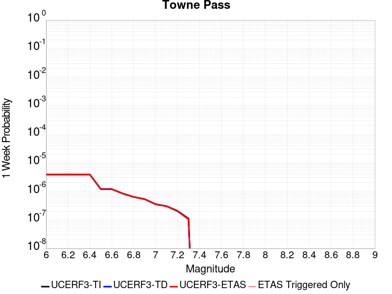 |  |  |  |

| Magnitude | 1 wk TI Prob | 1 wk TD Prob | 1 wk ETAS Prob | 1 wk ETAS/TD Gain | 1 wk ETAS Triggered Only | 1 mo TI Prob | 1 mo TD Prob | 1 mo ETAS Prob | 1 mo ETAS/TD Gain | 1 mo ETAS Triggered Only | 1 yr TI Prob | 1 yr TD Prob | 1 yr ETAS Prob | 1 yr ETAS/TD Gain | 1 yr ETAS Triggered Only | 10 yr TI Prob | 10 yr TD Prob | 10 yr ETAS Prob | 10 yr ETAS/TD Gain | 10 yr ETAS Triggered Only |
|-----|-----|-----|-----|-----|-----|-----|-----|-----|-----|-----|-----|-----|-----|-----|-----|-----|-----|-----|-----|-----|
| 6.0 | 3.849728E-6 | 3.8945745E-6 | 3.8945745E-6 | 1.0 | 0.0 | 1.649873E-5 | 1.669095E-5 | 1.724888E-4 | 10.3342705 | 1.5580044E-4 | 2.0085352E-4 | 2.0319775E-4 | 0.0010651184 | 5.2417827 | 8.6209585E-4 | 0.0020067208 | 0.0020305486 | 0.0037719705 | 1.8576114 | 0.0017449651 |
| 6.1 | 3.849728E-6 | 3.8945745E-6 | 3.8945745E-6 | 1.0 | 0.0 | 1.649873E-5 | 1.669095E-5 | 1.724888E-4 | 10.3342705 | 1.5580044E-4 | 2.0085352E-4 | 2.0319775E-4 | 0.0010651184 | 5.2417827 | 8.6209585E-4 | 0.0020067208 | 0.0020305486 | 0.0037719705 | 1.8576114 | 0.0017449651 |
| 6.2 | 3.849728E-6 | 3.8945745E-6 | 3.8945745E-6 | 1.0 | 0.0 | 1.649873E-5 | 1.669095E-5 | 1.724888E-4 | 10.3342705 | 1.5580044E-4 | 2.0085352E-4 | 2.0319775E-4 | 0.0010651184 | 5.2417827 | 8.6209585E-4 | 0.0020067208 | 0.0020305486 | 0.0037719705 | 1.8576114 | 0.0017449651 |
| 6.3 | 3.849728E-6 | 3.8945745E-6 | 3.8945745E-6 | 1.0 | 0.0 | 1.649873E-5 | 1.669095E-5 | 1.724888E-4 | 10.3342705 | 1.5580044E-4 | 2.0085352E-4 | 2.0319775E-4 | 0.0010651184 | 5.2417827 | 8.6209585E-4 | 0.0020067208 | 0.0020305486 | 0.0037719705 | 1.8576114 | 0.0017449651 |
| 6.4 | 3.849728E-6 | 3.8945745E-6 | 3.8945745E-6 | 1.0 | 0.0 | 1.649873E-5 | 1.669095E-5 | 1.724888E-4 | 10.3342705 | 1.5580044E-4 | 2.0085352E-4 | 2.0319775E-4 | 0.0010651184 | 5.2417827 | 8.6209585E-4 | 0.0020067208 | 0.0020305486 | 0.0037719705 | 1.8576114 | 0.0017449651 |
| 6.5 | 1.1953545E-6 | 1.203065E-6 | 1.203065E-6 | 1.0 | 0.0 | 5.1229376E-6 | 5.1559837E-6 | 4.6702557E-5 | 9.057934 | 4.1546788E-5 | 6.236998E-5 | 6.277241E-5 | 2.3933518E-4 | 3.8127446 | 1.7657384E-4 | 6.235248E-4 | 6.275585E-4 | 9.182035E-4 | 1.4631361 | 2.908275E-4 |
| 6.6 | 1.1953545E-6 | 1.203065E-6 | 1.203065E-6 | 1.0 | 0.0 | 5.1229376E-6 | 5.1559837E-6 | 4.6702557E-5 | 9.057934 | 4.1546788E-5 | 6.236998E-5 | 6.277241E-5 | 2.3933518E-4 | 3.8127446 | 1.7657384E-4 | 6.235248E-4 | 6.275585E-4 | 9.182035E-4 | 1.4631361 | 2.908275E-4 |
| 6.7 | 8.375951E-7 | 8.410778E-7 | 8.410778E-7 | 1.0 | 0.0 | 3.5896885E-6 | 3.6046144E-6 | 2.4377932E-5 | 6.7629795 | 2.0773394E-5 | 4.370358E-5 | 4.3885353E-5 | 1.6852024E-4 | 3.8400111 | 1.2464036E-4 | 4.3694986E-4 | 4.387726E-4 | 6.464154E-4 | 1.4732355 | 2.0773393E-4 |
| 6.8 | 6.38041E-7 | 6.3922516E-7 | 6.3922516E-7 | 1.0 | 0.0 | 2.7344586E-6 | 2.7395338E-6 | 2.351287E-5 | 8.5828 | 2.0773394E-5 | 3.3291526E-5 | 3.335335E-5 | 1.476032E-4 | 4.4254384 | 1.14253664E-4 | 3.3286537E-4 | 3.3348726E-4 | 4.99619E-4 | 1.4981651 | 1.6618715E-4 |
| 6.9 | 5.3460053E-7 | 5.3454215E-7 | 5.3454215E-7 | 1.0 | 0.0 | 2.2911431E-6 | 2.290893E-6 | 2.3064238E-5 | 10.067794 | 2.0773394E-5 | 2.789431E-5 | 2.78913E-5 | 1.2136896E-4 | 4.351499 | 9.3480274E-5 | 2.789081E-4 | 2.788813E-4 | 3.931031E-4 | 1.4095714 | 1.14253664E-4 |
| 7.0 | 3.557783E-7 | 3.5324976E-7 | 3.5324976E-7 | 1.0 | 0.0 | 1.5247632E-6 | 1.5139268E-6 | 1.1900608E-5 | 7.8607554 | 1.0386697E-5 | 1.8563835E-5 | 1.843191E-5 | 7.036444E-5 | 3.8175335 | 5.1933483E-5 | 1.8562283E-4 | 1.8430466E-4 | 2.4661334E-4 | 1.3380744 | 6.232018E-5 |
| 7.1 | 3.037942E-7 | 3.0002903E-7 | 3.0002903E-7 | 1.0 | 0.0 | 1.3019744E-6 | 1.285838E-6 | 1.1672521E-5 | 9.077754 | 1.0386697E-5 | 1.5851423E-5 | 1.5654974E-5 | 6.758764E-5 | 4.3173275 | 5.1933483E-5 | 1.5850292E-4 | 1.5653945E-4 | 2.1884988E-4 | 1.3980494 | 6.232018E-5 |
| 7.2 | 2.0808248E-7 | 2.0218252E-7 | 2.0218252E-7 | 1.0 | 0.0 | 8.917818E-7 | 8.6649624E-7 | 1.1253184E-5 | 12.986997 | 1.0386697E-5 | 1.0857389E-5 | 1.0549546E-5 | 4.1709307E-5 | 3.9536593 | 3.116009E-5 | 1.0856859E-4 | 1.0549091E-4 | 1.3664771E-4 | 1.2953506 | 3.116009E-5 |
| 7.3 | 1.1162073E-7 | 1.0637251E-7 | 1.0637251E-7 | 1.0 | 0.0 | 4.7837443E-7 | 4.5588212E-7 | 1.0842574E-5 | 23.783724 | 1.0386697E-5 | 5.8241935E-6 | 5.5503524E-6 | 3.671027E-5 | 6.6140428 | 3.116009E-5 | 5.8240406E-5 | 5.550234E-5 | 8.66607E-5 | 1.5613883 | 3.116009E-5 |

## Lenwood-Lockhart-Old Woman Springs
*[(top)](#table-of-contents)*

| 1 Week | 1 Month | 1 Year | 10 Year |
|-----|-----|-----|-----|
|  |  |  |  |

| Magnitude | 1 wk TI Prob | 1 wk TD Prob | 1 wk ETAS Prob | 1 wk ETAS/TD Gain | 1 wk ETAS Triggered Only | 1 mo TI Prob | 1 mo TD Prob | 1 mo ETAS Prob | 1 mo ETAS/TD Gain | 1 mo ETAS Triggered Only | 1 yr TI Prob | 1 yr TD Prob | 1 yr ETAS Prob | 1 yr ETAS/TD Gain | 1 yr ETAS Triggered Only | 10 yr TI Prob | 10 yr TD Prob | 10 yr ETAS Prob | 10 yr ETAS/TD Gain | 10 yr ETAS Triggered Only |
|-----|-----|-----|-----|-----|-----|-----|-----|-----|-----|-----|-----|-----|-----|-----|-----|-----|-----|-----|-----|-----|
| 6.0 | 3.744542E-5 | 4.3964304E-5 | 5.4350545E-5 | 1.2362425 | 1.0386697E-5 | 1.604705E-4 | 1.8840581E-4 | 2.61099E-4 | 1.385833 | 7.270688E-5 | 0.0019519776 | 0.0022915998 | 0.0027164784 | 1.185407 | 4.2585455E-4 | 0.019349206 | 0.0226977 | 0.023895511 | 1.0527724 | 0.0012256302 |
| 6.1 | 3.744542E-5 | 4.3964304E-5 | 5.4350545E-5 | 1.2362425 | 1.0386697E-5 | 1.604705E-4 | 1.8840581E-4 | 2.61099E-4 | 1.385833 | 7.270688E-5 | 0.0019519776 | 0.0022915998 | 0.0027164784 | 1.185407 | 4.2585455E-4 | 0.019349206 | 0.0226977 | 0.023895511 | 1.0527724 | 0.0012256302 |
| 6.2 | 3.744542E-5 | 4.3964304E-5 | 5.4350545E-5 | 1.2362425 | 1.0386697E-5 | 1.604705E-4 | 1.8840581E-4 | 2.61099E-4 | 1.385833 | 7.270688E-5 | 0.0019519776 | 0.0022915998 | 0.0027164784 | 1.185407 | 4.2585455E-4 | 0.019349206 | 0.0226977 | 0.023895511 | 1.0527724 | 0.0012256302 |
| 6.3 | 2.1079984E-5 | 2.5354084E-5 | 2.5354084E-5 | 1.0 | 0.0 | 9.0339665E-5 | 1.0865595E-4 | 1.3981265E-4 | 1.2867464 | 3.116009E-5 | 0.0010993304 | 0.0013221033 | 0.0014984438 | 1.1333786 | 1.7657384E-4 | 0.010939079 | 0.013144593 | 0.013616101 | 1.0358709 | 4.7778804E-4 |
| 6.4 | 2.1079984E-5 | 2.5354084E-5 | 2.5354084E-5 | 1.0 | 0.0 | 9.0339665E-5 | 1.0865595E-4 | 1.3981265E-4 | 1.2867464 | 3.116009E-5 | 0.0010993304 | 0.0013221033 | 0.0014984438 | 1.1333786 | 1.7657384E-4 | 0.010939079 | 0.013144593 | 0.013616101 | 1.0358709 | 4.7778804E-4 |
| 6.5 | 1.7397282E-5 | 2.0662914E-5 | 2.0662914E-5 | 1.0 | 0.0 | 7.455765E-5 | 8.8552406E-5 | 1.1970973E-4 | 1.3518519 | 3.116009E-5 | 9.073613E-4 | 0.001077604 | 0.0012021101 | 1.1155397 | 1.2464036E-4 | 0.009036654 | 0.010725081 | 0.011043615 | 1.0296999 | 3.219876E-4 |
| 6.6 | 1.52050325E-5 | 1.7680117E-5 | 1.7680117E-5 | 1.0 | 0.0 | 6.51628E-5 | 7.576977E-5 | 8.615568E-5 | 1.137072 | 1.0386697E-5 | 7.9306826E-4 | 9.221144E-4 | 0.0010155084 | 1.1012825 | 9.3480274E-5 | 0.007902439 | 0.009183745 | 0.009430736 | 1.0268945 | 2.492807E-4 |
| 6.7 | 1.332523E-5 | 1.5264359E-5 | 1.5264359E-5 | 1.0 | 0.0 | 5.7106878E-5 | 6.541707E-5 | 7.580309E-5 | 1.1587662 | 1.0386697E-5 | 6.950544E-4 | 7.9616765E-4 | 8.7919505E-4 | 1.1042838 | 8.3093575E-5 | 0.006928845 | 0.007933783 | 0.008129564 | 1.0246769 | 1.9734724E-4 |
| 6.8 | 1.1525329E-5 | 1.3031262E-5 | 1.3031262E-5 | 1.0 | 0.0 | 4.9393333E-5 | 5.5847093E-5 | 6.623321E-5 | 1.1859741 | 1.0386697E-5 | 6.011979E-4 | 6.797305E-4 | 7.523879E-4 | 1.1068915 | 7.270688E-5 | 0.00599574 | 0.0067769657 | 0.0069317105 | 1.022834 | 1.5580044E-4 |
| 6.9 | 1.0253909E-5 | 1.1514676E-5 | 1.1514676E-5 | 1.0 | 0.0 | 4.3944583E-5 | 4.93477E-5 | 5.973388E-5 | 1.2104695 | 1.0386697E-5 | 5.3489394E-4 | 6.006462E-4 | 6.7330943E-4 | 1.120975 | 7.270688E-5 | 0.0053360825 | 0.005990607 | 0.006124825 | 1.0224048 | 1.3502706E-4 |
| 7.0 | 8.104563E-6 | 8.991446E-6 | 8.991446E-6 | 1.0 | 0.0 | 3.4733377E-5 | 3.8534214E-5 | 3.8534214E-5 | 1.0 | 0.0 | 4.2279682E-4 | 4.6905546E-4 | 5.0020096E-4 | 1.0664004 | 3.116009E-5 | 0.0042199334 | 0.004680902 | 0.004732593 | 1.0110428 | 5.1933483E-5 |
| 7.1 | 6.7986157E-6 | 7.515946E-6 | 7.515946E-6 | 1.0 | 0.0 | 2.91366E-5 | 3.221081E-5 | 3.221081E-5 | 1.0 | 0.0 | 3.5468035E-4 | 3.9209818E-4 | 4.1286345E-4 | 1.0529593 | 2.0773394E-5 | 0.003541148 | 0.0039142803 | 0.0039556646 | 1.0105726 | 4.1546788E-5 |
| 7.2 | 5.6893327E-6 | 6.280115E-6 | 6.280115E-6 | 1.0 | 0.0 | 2.4382627E-5 | 2.6914513E-5 | 2.6914513E-5 | 1.0 | 0.0 | 2.9681803E-4 | 3.2763692E-4 | 3.380202E-4 | 1.0316914 | 1.0386697E-5 | 0.002964219 | 0.0032717374 | 0.0033027956 | 1.0094929 | 3.116009E-5 |
| 7.3 | 4.253348E-6 | 4.7069766E-6 | 4.7069766E-6 | 1.0 | 0.0 | 1.8228506E-5 | 2.0172612E-5 | 2.0172612E-5 | 1.0 | 0.0 | 2.2190946E-4 | 2.455757E-4 | 2.5595984E-4 | 1.042285 | 1.0386697E-5 | 0.00221688 | 0.0024532243 | 0.0024739467 | 1.008447 | 2.0773394E-5 |
| 7.4 | 2.5448119E-6 | 2.8520785E-6 | 2.8520785E-6 | 1.0 | 0.0 | 1.0906291E-5 | 1.2223146E-5 | 1.2223146E-5 | 1.0 | 0.0 | 1.3277601E-4 | 1.4880829E-4 | 1.4880829E-4 | 1.0 | 0.0 | 0.001326967 | 0.0014872487 | 0.0014976199 | 1.0069735 | 1.0386697E-5 |
| 7.5 | 4.3706837E-8 | 4.5630156E-8 | 4.5630156E-8 | 1.0 | 0.0 | 1.8731501E-7 | 1.955578E-7 | 1.955578E-7 | 1.0 | 0.0 | 2.2805577E-6 | 2.380914E-6 | 2.380914E-6 | 1.0 | 0.0 | 2.2805343E-5 | 2.3808941E-5 | 2.3808941E-5 | 1.0 | 0.0 |

## San Andreas (San Bernardino N)
*[(top)](#table-of-contents)*

| 1 Week | 1 Month | 1 Year | 10 Year |
|-----|-----|-----|-----|
|  |  |  |  |

| Magnitude | 1 wk TI Prob | 1 wk TD Prob | 1 wk ETAS Prob | 1 wk ETAS/TD Gain | 1 wk ETAS Triggered Only | 1 mo TI Prob | 1 mo TD Prob | 1 mo ETAS Prob | 1 mo ETAS/TD Gain | 1 mo ETAS Triggered Only | 1 yr TI Prob | 1 yr TD Prob | 1 yr ETAS Prob | 1 yr ETAS/TD Gain | 1 yr ETAS Triggered Only | 10 yr TI Prob | 10 yr TD Prob | 10 yr ETAS Prob | 10 yr ETAS/TD Gain | 10 yr ETAS Triggered Only |
|-----|-----|-----|-----|-----|-----|-----|-----|-----|-----|-----|-----|-----|-----|-----|-----|-----|-----|-----|-----|-----|
| 6.0 | 1.4273766E-4 | 3.1635934E-4 | 4.2019342E-4 | 1.3282157 | 1.03866965E-4 | 6.115894E-4 | 0.0013551271 | 0.0015625795 | 1.153087 | 2.0773393E-4 | 0.0074207084 | 0.016375363 | 0.01698836 | 1.0374341 | 6.232018E-4 | 0.07177748 | 0.15038711 | 0.15135781 | 1.0064548 | 0.0011425366 |
| 6.1 | 1.4273766E-4 | 3.1635934E-4 | 4.2019342E-4 | 1.3282157 | 1.03866965E-4 | 6.115894E-4 | 0.0013551271 | 0.0015625795 | 1.153087 | 2.0773393E-4 | 0.0074207084 | 0.016375363 | 0.01698836 | 1.0374341 | 6.232018E-4 | 0.07177748 | 0.15038711 | 0.15135781 | 1.0064548 | 0.0011425366 |
| 6.2 | 1.4273766E-4 | 3.1635934E-4 | 4.2019342E-4 | 1.3282157 | 1.03866965E-4 | 6.115894E-4 | 0.0013551271 | 0.0015625795 | 1.153087 | 2.0773393E-4 | 0.0074207084 | 0.016375363 | 0.01698836 | 1.0374341 | 6.232018E-4 | 0.07177748 | 0.15038711 | 0.15135781 | 1.0064548 | 0.0011425366 |
| 6.3 | 1.3730655E-4 | 3.0540637E-4 | 4.0924162E-4 | 1.3399905 | 1.03866965E-4 | 5.883239E-4 | 0.0013082335 | 0.0015156957 | 1.1585819 | 2.0773393E-4 | 0.0071393442 | 0.015812824 | 0.016415948 | 1.0381415 | 6.128151E-4 | 0.06914291 | 0.14568701 | 0.14665422 | 1.006639 | 0.00113215 |
| 6.4 | 1.3730655E-4 | 3.0540637E-4 | 4.0924162E-4 | 1.3399905 | 1.03866965E-4 | 5.883239E-4 | 0.0013082335 | 0.0015156957 | 1.1585819 | 2.0773393E-4 | 0.0071393442 | 0.015812824 | 0.016415948 | 1.0381415 | 6.128151E-4 | 0.06914291 | 0.14568701 | 0.14665422 | 1.006639 | 0.00113215 |
| 6.5 | 1.2942807E-4 | 2.8954886E-4 | 3.9338574E-4 | 1.3586161 | 1.03866965E-4 | 5.545738E-4 | 0.0012403387 | 0.0014478149 | 1.1672739 | 2.0773393E-4 | 0.0067310524 | 0.014997809 | 0.015601434 | 1.0402474 | 6.128151E-4 | 0.06530788 | 0.13882978 | 0.13979581 | 1.0069584 | 0.0011217633 |
| 6.6 | 1.1125901E-4 | 2.5393223E-4 | 3.5777283E-4 | 1.4089303 | 1.03866965E-4 | 4.767372E-4 | 0.0010878295 | 0.0012953375 | 1.1907542 | 2.0773393E-4 | 0.005788839 | 0.013164529 | 0.013759026 | 1.0451591 | 6.024284E-4 | 0.056403454 | 0.12311955 | 0.12408498 | 1.0078415 | 0.0011009899 |
| 6.7 | 1.02209575E-4 | 2.3527986E-4 | 3.391224E-4 | 1.4413575 | 1.03866965E-4 | 4.3796748E-4 | 0.001007954 | 0.0012154786 | 1.205887 | 2.0773393E-4 | 0.0053192247 | 0.012203212 | 0.012777769 | 1.0470824 | 5.81655E-4 | 0.051936906 | 0.11491149 | 0.115839995 | 1.0080802 | 0.0010490564 |
| 6.8 | 9.610582E-5 | 2.2053412E-4 | 3.2437817E-4 | 1.4708753 | 1.03866965E-4 | 4.1181705E-4 | 9.448046E-4 | 0.0011419654 | 1.208679 | 1.9734724E-4 | 0.0050023515 | 0.011442591 | 0.012007323 | 1.0493535 | 5.712683E-4 | 0.048912346 | 0.10831282 | 0.10923899 | 1.0085509 | 0.0010386697 |
| 6.9 | 9.3877505E-5 | 2.150883E-4 | 3.1893293E-4 | 1.4828 | 1.03866965E-4 | 4.0227012E-4 | 9.2148193E-4 | 0.0011186473 | 1.2139655 | 1.9734724E-4 | 0.0048866454 | 0.011161577 | 0.01172647 | 1.0506104 | 5.712683E-4 | 0.04780577 | 0.1059029 | 0.10683157 | 1.008769 | 0.0010386697 |
| 7.0 | 9.1019785E-5 | 2.0835544E-4 | 3.1220078E-4 | 1.4984046 | 1.03866965E-4 | 3.900265E-4 | 8.926469E-4 | 0.001089818 | 1.2208836 | 1.9734724E-4 | 0.0047382377 | 0.010814046 | 0.011379136 | 1.0522553 | 5.712683E-4 | 0.046384744 | 0.10287278 | 0.10379528 | 1.0089674 | 0.0010282829 |
| 7.1 | 8.771155E-5 | 2.0009889E-4 | 3.0394507E-4 | 1.5189743 | 1.03866965E-4 | 3.758525E-4 | 8.5728534E-4 | 0.0010544634 | 1.2300029 | 1.9734724E-4 | 0.0045664064 | 0.010387696 | 0.010953031 | 1.0544235 | 5.712683E-4 | 0.044737056 | 0.09918398 | 0.10011027 | 1.0093391 | 0.0010282829 |
| 7.2 | 8.0830236E-5 | 1.8415037E-4 | 2.879982E-4 | 1.5639296 | 1.03866965E-4 | 3.4636928E-4 | 7.8897737E-4 | 9.861689E-4 | 1.2499331 | 1.9734724E-4 | 0.0042088944 | 0.009563598 | 0.010129402 | 1.0591624 | 5.712683E-4 | 0.041300658 | 0.09191379 | 0.092847556 | 1.0101591 | 0.0010282829 |
| 7.3 | 7.7668235E-5 | 1.7358093E-4 | 2.67045E-4 | 1.5384464 | 9.3480274E-5 | 3.328214E-4 | 7.437063E-4 | 9.305278E-4 | 1.2512033 | 1.8696055E-4 | 0.0040445733 | 0.009017113 | 0.009572936 | 1.061641 | 5.608816E-4 | 0.03971748 | 0.08717959 | 0.08810875 | 1.0106579 | 0.0010178962 |
| 7.4 | 7.520177E-5 | 1.657783E-4 | 2.5924307E-4 | 1.5637938 | 9.3480274E-5 | 3.2225347E-4 | 7.1028504E-4 | 8.9711277E-4 | 1.2630321 | 1.8696055E-4 | 0.0039163795 | 0.008613498 | 0.009169549 | 1.0645558 | 5.608816E-4 | 0.038480744 | 0.08363466 | 0.08456743 | 1.0111529 | 0.0010178962 |
| 7.5 | 7.274697E-5 | 1.5865144E-4 | 2.5211688E-4 | 1.5891244 | 9.3480274E-5 | 3.1173544E-4 | 6.797576E-4 | 8.665911E-4 | 1.274853 | 1.8696055E-4 | 0.003788775 | 0.008244702 | 0.008800959 | 1.0674684 | 5.608816E-4 | 0.03724827 | 0.08035038 | 0.08128648 | 1.0116503 | 0.0010178962 |
| 7.6 | 7.1185845E-5 | 1.5434787E-4 | 2.478137E-4 | 1.6055532 | 9.3480274E-5 | 3.0504653E-4 | 6.6132325E-4 | 8.481601E-4 | 1.2825198 | 1.8696055E-4 | 0.0037076178 | 0.008021939 | 0.00857832 | 1.0693576 | 5.608816E-4 | 0.036463667 | 0.078339346 | 0.0792775 | 1.0119755 | 0.0010178962 |
| 7.7 | 6.709961E-5 | 1.4343053E-4 | 2.368974E-4 | 1.6516525 | 9.3480274E-5 | 2.8753807E-4 | 6.1455753E-4 | 8.0140313E-4 | 1.3040328 | 1.8696055E-4 | 0.003495157 | 0.007456607 | 0.008013306 | 1.0746585 | 5.608816E-4 | 0.034406938 | 0.07316601 | 0.074109435 | 1.0128943 | 0.0010178962 |
| 7.8 | 6.300812E-5 | 1.3225875E-4 | 2.2572665E-4 | 1.706705 | 9.3480274E-5 | 2.7000686E-4 | 5.6670007E-4 | 7.535547E-4 | 1.329724 | 1.8696055E-4 | 0.0032823787 | 0.0068777753 | 0.007424484 | 1.0794892 | 5.5049494E-4 | 0.032343175 | 0.06781986 | 0.06874936 | 1.0137054 | 9.971228E-4 |
| 7.9 | 4.983037E-5 | 9.7419856E-5 | 1.7011965E-4 | 1.7462523 | 7.270688E-5 | 2.1354125E-4 | 4.1744686E-4 | 5.420352E-4 | 1.2984531 | 1.2464036E-4 | 0.0025967648 | 0.005070582 | 0.005504611 | 1.0855975 | 4.3624127E-4 | 0.025666296 | 0.050735 | 0.0514449 | 1.0139923 | 7.478422E-4 |
| 8.0 | 3.2211527E-5 | 5.341288E-5 | 8.457131E-5 | 1.5833504 | 3.116009E-5 | 1.380421E-4 | 2.2889227E-4 | 2.7042956E-4 | 1.1814709 | 4.1546788E-5 | 0.0016793669 | 0.002783204 | 0.002928213 | 1.0521015 | 1.4541375E-4 | 0.016667323 | 0.028414162 | 0.028666452 | 1.008879 | 2.5966743E-4 |
| 8.1 | 1.743376E-5 | 1.8874636E-5 | 1.8874636E-5 | 1.0 | 0.0 | 7.471398E-5 | 8.088879E-5 | 8.088879E-5 | 1.0 | 0.0 | 9.0926304E-4 | 9.843768E-4 | 0.0010051297 | 1.0210823 | 2.0773394E-5 | 0.009055517 | 0.010510205 | 0.010551315 | 1.0039115 | 4.1546788E-5 |
| 8.2 | 7.831616E-6 | 5.1737816E-6 | 5.1737816E-6 | 1.0 | 0.0 | 3.3563636E-5 | 2.217316E-5 | 2.217316E-5 | 1.0 | 0.0 | 4.0856065E-4 | 2.6992487E-4 | 2.6992487E-4 | 1.0 | 0.0 | 0.004078103 | 0.0030519657 | 0.0030519657 | 1.0 | 0.0 |
| 8.3 | 1.983087E-6 | 7.693574E-7 | 7.693574E-7 | 1.0 | 0.0 | 8.498917E-6 | 3.297242E-6 | 3.297242E-6 | 1.0 | 0.0 | 1.034694E-4 | 4.01432E-5 | 4.01432E-5 | 1.0 | 0.0 | 0.0010342124 | 4.7390026E-4 | 4.7390026E-4 | 1.0 | 0.0 |

## Paradise
*[(top)](#table-of-contents)*

| 1 Week | 1 Month | 1 Year | 10 Year |
|-----|-----|-----|-----|
|  |  |  |  |

| Magnitude | 1 wk TI Prob | 1 wk TD Prob | 1 wk ETAS Prob | 1 wk ETAS/TD Gain | 1 wk ETAS Triggered Only | 1 mo TI Prob | 1 mo TD Prob | 1 mo ETAS Prob | 1 mo ETAS/TD Gain | 1 mo ETAS Triggered Only | 1 yr TI Prob | 1 yr TD Prob | 1 yr ETAS Prob | 1 yr ETAS/TD Gain | 1 yr ETAS Triggered Only | 10 yr TI Prob | 10 yr TD Prob | 10 yr ETAS Prob | 10 yr ETAS/TD Gain | 10 yr ETAS Triggered Only |
|-----|-----|-----|-----|-----|-----|-----|-----|-----|-----|-----|-----|-----|-----|-----|-----|-----|-----|-----|-----|-----|
| 6.0 | 1.4851273E-5 | 1.6695341E-5 | 2.7081864E-5 | 1.6221211 | 1.0386697E-5 | 6.364676E-5 | 7.154963E-5 | 1.6502322E-4 | 2.306416 | 9.3480274E-5 | 7.7462377E-4 | 8.707922E-4 | 0.0013585419 | 1.5601218 | 4.8817476E-4 | 0.0077192914 | 0.008676181 | 0.009788211 | 1.1281705 | 0.0011217633 |
| 6.1 | 1.4851273E-5 | 1.6695341E-5 | 2.7081864E-5 | 1.6221211 | 1.0386697E-5 | 6.364676E-5 | 7.154963E-5 | 1.6502322E-4 | 2.306416 | 9.3480274E-5 | 7.7462377E-4 | 8.707922E-4 | 0.0013585419 | 1.5601218 | 4.8817476E-4 | 0.0077192914 | 0.008676181 | 0.009788211 | 1.1281705 | 0.0011217633 |
| 6.2 | 1.4851273E-5 | 1.6695341E-5 | 2.7081864E-5 | 1.6221211 | 1.0386697E-5 | 6.364676E-5 | 7.154963E-5 | 1.6502322E-4 | 2.306416 | 9.3480274E-5 | 7.7462377E-4 | 8.707922E-4 | 0.0013585419 | 1.5601218 | 4.8817476E-4 | 0.0077192914 | 0.008676181 | 0.009788211 | 1.1281705 | 0.0011217633 |
| 6.3 | 1.0426831E-5 | 1.1889049E-5 | 1.1889049E-5 | 1.0 | 0.0 | 4.4685654E-5 | 5.095211E-5 | 9.2496775E-5 | 1.8153671 | 4.1546788E-5 | 5.43912E-4 | 6.2017125E-4 | 8.277764E-4 | 1.3347545 | 2.0773393E-4 | 0.0054258266 | 0.0061850143 | 0.0067424267 | 1.090123 | 5.608816E-4 |
| 6.4 | 1.0426831E-5 | 1.1889049E-5 | 1.1889049E-5 | 1.0 | 0.0 | 4.4685654E-5 | 5.095211E-5 | 9.2496775E-5 | 1.8153671 | 4.1546788E-5 | 5.43912E-4 | 6.2017125E-4 | 8.277764E-4 | 1.3347545 | 2.0773393E-4 | 0.0054258266 | 0.0061850143 | 0.0067424267 | 1.090123 | 5.608816E-4 |
| 6.5 | 9.25027E-6 | 1.0620336E-5 | 1.0620336E-5 | 1.0 | 0.0 | 3.964341E-5 | 4.551496E-5 | 6.628741E-5 | 1.4563873 | 2.0773394E-5 | 4.8255164E-4 | 5.5400864E-4 | 6.889609E-4 | 1.2435923 | 1.3502706E-4 | 0.0048150513 | 0.0055267746 | 0.005950276 | 1.0766271 | 4.2585455E-4 |
| 6.6 | 7.904275E-6 | 9.159836E-6 | 9.159836E-6 | 1.0 | 0.0 | 3.3875025E-5 | 3.925587E-5 | 4.9642156E-5 | 1.2645793 | 1.0386697E-5 | 4.1235037E-4 | 4.7783932E-4 | 5.5051147E-4 | 1.1520848 | 7.270688E-5 | 0.0041158604 | 0.0047685155 | 0.0050166077 | 1.0520271 | 2.492807E-4 |
| 6.7 | 7.2061953E-6 | 8.407527E-6 | 8.407527E-6 | 1.0 | 0.0 | 3.088333E-5 | 3.6031786E-5 | 4.6418107E-5 | 1.2882545 | 1.0386697E-5 | 3.7593965E-4 | 4.3860235E-4 | 5.1127735E-4 | 1.1656967 | 7.270688E-5 | 0.003753043 | 0.0043777362 | 0.0045638783 | 1.0425202 | 1.8696055E-4 |
| 6.8 | 6.6948724E-6 | 7.842423E-6 | 7.842423E-6 | 1.0 | 0.0 | 2.8691995E-5 | 3.3609973E-5 | 4.399632E-5 | 1.3090258 | 1.0386697E-5 | 3.4926904E-4 | 4.0912814E-4 | 4.5065794E-4 | 1.101508 | 4.1546788E-5 | 0.003487206 | 0.004084107 | 0.0042185825 | 1.0329266 | 1.3502706E-4 |
| 6.9 | 6.0421025E-6 | 7.1308505E-6 | 7.1308505E-6 | 1.0 | 0.0 | 2.5894467E-5 | 3.0560448E-5 | 4.0946827E-5 | 1.3398634 | 1.0386697E-5 | 3.1521954E-4 | 3.7201334E-4 | 3.92779E-4 | 1.0558196 | 2.0773394E-5 | 0.0031477278 | 0.003714244 | 0.0038177252 | 1.0278606 | 1.03866965E-4 |
| 7.0 | 4.134091E-6 | 5.080469E-6 | 5.080469E-6 | 1.0 | 0.0 | 1.7717413E-5 | 2.1773263E-5 | 3.2159733E-5 | 1.4770286 | 1.0386697E-5 | 2.1568815E-4 | 2.6505877E-4 | 2.7544273E-4 | 1.039176 | 1.0386697E-5 | 0.0021547892 | 0.0026475794 | 0.0026890163 | 1.0156509 | 4.1546788E-5 |
| 7.1 | 3.7674888E-6 | 4.6320133E-6 | 4.6320133E-6 | 1.0 | 0.0 | 1.6146281E-5 | 1.9851343E-5 | 3.0237834E-5 | 1.5232135 | 1.0386697E-5 | 1.9656324E-4 | 2.4166482E-4 | 2.52049E-4 | 1.0429693 | 1.0386697E-5 | 0.0019638946 | 0.002414171 | 0.0024556173 | 1.017168 | 4.1546788E-5 |
| 7.2 | 3.4065345E-6 | 4.1568514E-6 | 4.1568514E-6 | 1.0 | 0.0 | 1.4599351E-5 | 1.7814966E-5 | 2.8201477E-5 | 1.5830218 | 1.0386697E-5 | 1.777326E-4 | 2.1687712E-4 | 2.2726155E-4 | 1.0478817 | 1.0386697E-5 | 0.0017759053 | 0.0021668028 | 0.0022082597 | 1.0191327 | 4.1546788E-5 |
| 7.3 | 2.9934936E-6 | 3.629423E-6 | 3.629423E-6 | 1.0 | 0.0 | 1.2829195E-5 | 1.5554586E-5 | 2.594112E-5 | 1.6677475 | 1.0386697E-5 | 1.5618425E-4 | 1.893621E-4 | 1.9974682E-4 | 1.0548406 | 1.0386697E-5 | 0.0015607453 | 0.0018921527 | 0.0019232539 | 1.0164369 | 3.116009E-5 |
| 7.4 | 2.4049796E-6 | 2.889062E-6 | 2.889062E-6 | 1.0 | 0.0 | 1.0307015E-5 | 1.23816435E-5 | 2.2768212E-5 | 1.8388683 | 1.0386697E-5 | 1.2548068E-4 | 1.5073753E-4 | 1.6112266E-4 | 1.0688955 | 1.0386697E-5 | 0.0012540985 | 0.0015064942 | 0.0015376074 | 1.0206527 | 3.116009E-5 |
| 7.5 | 1.2710091E-6 | 1.5135054E-6 | 1.5135054E-6 | 1.0 | 0.0 | 5.44717E-6 | 6.4864425E-6 | 1.6873071E-5 | 2.6012828 | 1.0386697E-5 | 6.631728E-5 | 7.897083E-5 | 8.9356705E-5 | 1.1315154 | 1.0386697E-5 | 6.6297496E-4 | 7.8955025E-4 | 8.2068576E-4 | 1.0394344 | 3.116009E-5 |
| 7.6 | 2.21172E-7 | 2.6040124E-7 | 2.6040124E-7 | 1.0 | 0.0 | 9.478797E-7 | 1.116005E-6 | 1.116005E-6 | 1.0 | 0.0 | 1.1540374E-5 | 1.3587305E-5 | 1.3587305E-5 | 1.0 | 0.0 | 1.1539775E-4 | 1.3586757E-4 | 1.3586757E-4 | 1.0 | 0.0 |

## Bicycle Lake
*[(top)](#table-of-contents)*

| 1 Week | 1 Month | 1 Year | 10 Year |
|-----|-----|-----|-----|
|  | 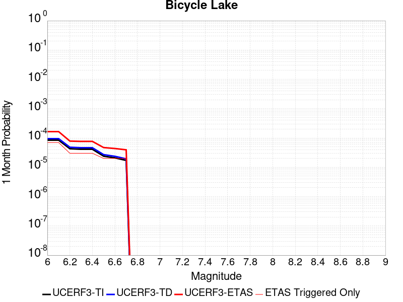 |  | 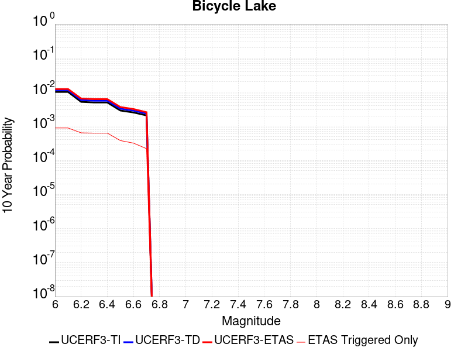 |

| Magnitude | 1 wk TI Prob | 1 wk TD Prob | 1 wk ETAS Prob | 1 wk ETAS/TD Gain | 1 wk ETAS Triggered Only | 1 mo TI Prob | 1 mo TD Prob | 1 mo ETAS Prob | 1 mo ETAS/TD Gain | 1 mo ETAS Triggered Only | 1 yr TI Prob | 1 yr TD Prob | 1 yr ETAS Prob | 1 yr ETAS/TD Gain | 1 yr ETAS Triggered Only | 10 yr TI Prob | 10 yr TD Prob | 10 yr ETAS Prob | 10 yr ETAS/TD Gain | 10 yr ETAS Triggered Only |
|-----|-----|-----|-----|-----|-----|-----|-----|-----|-----|-----|-----|-----|-----|-----|-----|-----|-----|-----|-----|-----|
| 6.0 | 1.9621975E-5 | 2.2098558E-5 | 3.2485026E-5 | 1.4700066 | 1.0386697E-5 | 8.4091465E-5 | 9.470543E-5 | 1.6740542E-4 | 1.7676433 | 7.270688E-5 | 0.0010233327 | 0.0011525637 | 0.0015468033 | 1.3420545 | 3.9469448E-4 | 0.01018633 | 0.011479173 | 0.01238271 | 1.078711 | 9.140293E-4 |
| 6.1 | 1.9621975E-5 | 2.2098558E-5 | 3.2485026E-5 | 1.4700066 | 1.0386697E-5 | 8.4091465E-5 | 9.470543E-5 | 1.6740542E-4 | 1.7676433 | 7.270688E-5 | 0.0010233327 | 0.0011525637 | 0.0015468033 | 1.3420545 | 3.9469448E-4 | 0.01018633 | 0.011479173 | 0.01238271 | 1.078711 | 9.140293E-4 |
| 6.2 | 9.9971285E-6 | 1.1256391E-5 | 1.1256391E-5 | 1.0 | 0.0 | 4.2844134E-5 | 4.824108E-5 | 7.9399666E-5 | 1.6458932 | 3.116009E-5 | 5.2150246E-4 | 5.8722886E-4 | 8.571244E-4 | 1.4596088 | 2.7005412E-4 | 0.0052028033 | 0.0058618775 | 0.006522729 | 1.1127373 | 6.647486E-4 |
| 6.3 | 9.589428E-6 | 1.0799068E-5 | 1.0799068E-5 | 1.0 | 0.0 | 4.10969E-5 | 4.628119E-5 | 7.743984E-5 | 1.6732464 | 3.116009E-5 | 5.002399E-4 | 5.633797E-4 | 8.3328167E-4 | 1.4790765 | 2.7005412E-4 | 0.0049911533 | 0.0056246053 | 0.0062752864 | 1.1156849 | 6.543619E-4 |
| 6.4 | 9.589428E-6 | 1.0799068E-5 | 1.0799068E-5 | 1.0 | 0.0 | 4.10969E-5 | 4.628119E-5 | 7.743984E-5 | 1.6732464 | 3.116009E-5 | 5.002399E-4 | 5.633797E-4 | 8.3328167E-4 | 1.4790765 | 2.7005412E-4 | 0.0049911533 | 0.0056246053 | 0.0062752864 | 1.1156849 | 6.543619E-4 |
| 6.5 | 5.557707E-6 | 6.286038E-6 | 6.286038E-6 | 1.0 | 0.0 | 2.3818526E-5 | 2.6940037E-5 | 4.771287E-5 | 1.7710767 | 2.0773394E-5 | 2.8995197E-4 | 3.2797246E-4 | 4.941051E-4 | 1.5065445 | 1.6618715E-4 | 0.0028957394 | 0.0032775209 | 0.0036709218 | 1.12003 | 3.9469448E-4 |
| 6.6 | 4.8742945E-6 | 5.5136734E-6 | 5.5136734E-6 | 1.0 | 0.0 | 2.0889667E-5 | 2.3629962E-5 | 4.4402863E-5 | 1.8790916 | 2.0773394E-5 | 2.54302E-4 | 2.87683E-4 | 4.3305493E-4 | 1.5053198 | 1.4541375E-4 | 0.002540112 | 0.0028756752 | 0.0032070936 | 1.1152489 | 3.323743E-4 |
| 6.7 | 3.991108E-6 | 4.5162255E-6 | 4.5162255E-6 | 1.0 | 0.0 | 1.7104636E-5 | 1.9355251E-5 | 4.012824E-5 | 2.0732484 | 2.0773394E-5 | 2.0822904E-4 | 2.3565018E-4 | 3.394927E-4 | 1.4406637 | 1.03866965E-4 | 0.0020803404 | 0.0023565018 | 0.0025844707 | 1.0967404 | 2.2850733E-4 |

## Garlic Springs
*[(top)](#table-of-contents)*

| 1 Week | 1 Month | 1 Year | 10 Year |
|-----|-----|-----|-----|
|  |  |  |  |

| Magnitude | 1 wk TI Prob | 1 wk TD Prob | 1 wk ETAS Prob | 1 wk ETAS/TD Gain | 1 wk ETAS Triggered Only | 1 mo TI Prob | 1 mo TD Prob | 1 mo ETAS Prob | 1 mo ETAS/TD Gain | 1 mo ETAS Triggered Only | 1 yr TI Prob | 1 yr TD Prob | 1 yr ETAS Prob | 1 yr ETAS/TD Gain | 1 yr ETAS Triggered Only | 10 yr TI Prob | 10 yr TD Prob | 10 yr ETAS Prob | 10 yr ETAS/TD Gain | 10 yr ETAS Triggered Only |
|-----|-----|-----|-----|-----|-----|-----|-----|-----|-----|-----|-----|-----|-----|-----|-----|-----|-----|-----|-----|-----|
| 6.0 | 1.6760017E-5 | 1.8778032E-5 | 2.9164534E-5 | 1.5531198 | 1.0386697E-5 | 7.182667E-5 | 8.047546E-5 | 1.4279062E-4 | 1.7743375 | 6.232018E-5 | 8.7413884E-4 | 9.794658E-4 | 0.0012700084 | 1.2966338 | 2.908275E-4 | 0.008707083 | 0.009763034 | 0.010616713 | 1.0874399 | 8.6209585E-4 |
| 6.1 | 9.852767E-6 | 1.097425E-5 | 2.1360833E-5 | 1.9464504 | 1.0386697E-5 | 4.222546E-5 | 4.703205E-5 | 8.857688E-5 | 1.8833302 | 4.1546788E-5 | 5.139737E-4 | 5.7253573E-4 | 7.28247E-4 | 1.2719678 | 1.5580044E-4 | 0.005127866 | 0.005717566 | 0.0061409855 | 1.0740559 | 4.2585455E-4 |
| 6.2 | 9.852767E-6 | 1.097425E-5 | 2.1360833E-5 | 1.9464504 | 1.0386697E-5 | 4.222546E-5 | 4.703205E-5 | 8.857688E-5 | 1.8833302 | 4.1546788E-5 | 5.139737E-4 | 5.7253573E-4 | 7.28247E-4 | 1.2719678 | 1.5580044E-4 | 0.005127866 | 0.005717566 | 0.0061409855 | 1.0740559 | 4.2585455E-4 |
| 6.3 | 4.3167724E-6 | 4.7782996E-6 | 1.51649465E-5 | 3.173712 | 1.0386697E-5 | 1.8500323E-5 | 2.0478396E-5 | 5.1637846E-5 | 2.521577 | 3.116009E-5 | 2.2521814E-4 | 2.4931898E-4 | 3.1162362E-4 | 1.2498993 | 6.232018E-5 | 0.0022499003 | 0.002492651 | 0.002668785 | 1.0706612 | 1.7657384E-4 |
| 6.4 | 4.3167724E-6 | 4.7782996E-6 | 1.51649465E-5 | 3.173712 | 1.0386697E-5 | 1.8500323E-5 | 2.0478396E-5 | 5.1637846E-5 | 2.521577 | 3.116009E-5 | 2.2521814E-4 | 2.4931898E-4 | 3.1162362E-4 | 1.2498993 | 6.232018E-5 | 0.0022499003 | 0.002492651 | 0.002668785 | 1.0706612 | 1.7657384E-4 |
| 6.5 | 4.3167724E-6 | 4.7782996E-6 | 1.51649465E-5 | 3.173712 | 1.0386697E-5 | 1.8500323E-5 | 2.0478396E-5 | 5.1637846E-5 | 2.521577 | 3.116009E-5 | 2.2521814E-4 | 2.4931898E-4 | 3.1162362E-4 | 1.2498993 | 6.232018E-5 | 0.0022499003 | 0.002492651 | 0.002668785 | 1.0706612 | 1.7657384E-4 |
| 6.6 | 4.301311E-6 | 4.761167E-6 | 1.5147814E-5 | 3.181534 | 1.0386697E-5 | 1.8434059E-5 | 2.0404972E-5 | 5.1564424E-5 | 2.5270522 | 3.116009E-5 | 2.2441156E-4 | 2.4842523E-4 | 3.1072993E-4 | 1.2507986 | 6.232018E-5 | 0.0022418506 | 0.002483734 | 0.0026598691 | 1.0709156 | 1.7657384E-4 |
| 6.7 | 3.8599724E-6 | 4.2713013E-6 | 1.4657953E-5 | 3.4317303 | 1.0386697E-5 | 1.6542634E-5 | 1.8305576E-5 | 4.9465096E-5 | 2.7021873 | 3.116009E-5 | 2.0138794E-4 | 2.228704E-4 | 2.8517668E-4 | 1.2795628 | 6.232018E-5 | 0.0020120554 | 0.0022287038 | 0.0023945207 | 1.0744005 | 1.6618715E-4 |

## San Andreas (San Bernardino S)
*[(top)](#table-of-contents)*

| 1 Week | 1 Month | 1 Year | 10 Year |
|-----|-----|-----|-----|
| 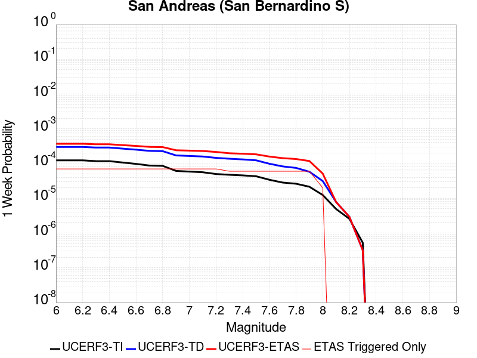 | 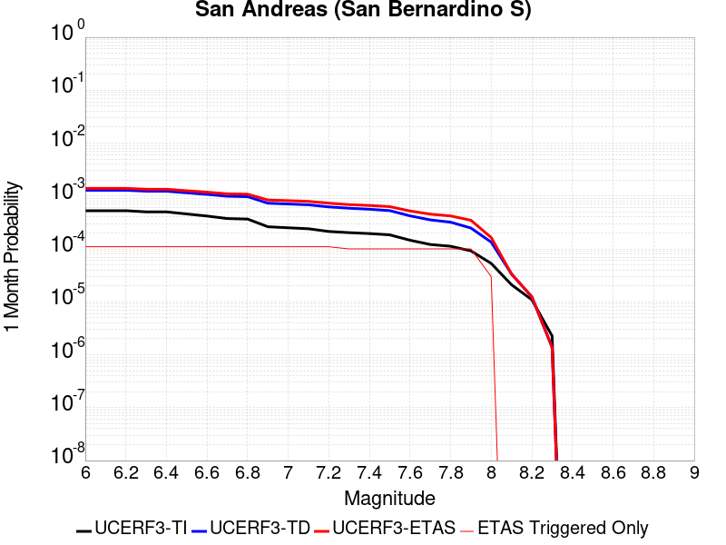 |  |  |

| Magnitude | 1 wk TI Prob | 1 wk TD Prob | 1 wk ETAS Prob | 1 wk ETAS/TD Gain | 1 wk ETAS Triggered Only | 1 mo TI Prob | 1 mo TD Prob | 1 mo ETAS Prob | 1 mo ETAS/TD Gain | 1 mo ETAS Triggered Only | 1 yr TI Prob | 1 yr TD Prob | 1 yr ETAS Prob | 1 yr ETAS/TD Gain | 1 yr ETAS Triggered Only | 10 yr TI Prob | 10 yr TD Prob | 10 yr ETAS Prob | 10 yr ETAS/TD Gain | 10 yr ETAS Triggered Only |
|-----|-----|-----|-----|-----|-----|-----|-----|-----|-----|-----|-----|-----|-----|-----|-----|-----|-----|-----|-----|-----|
| 6.0 | 1.2336002E-4 | 3.0023555E-4 | 3.729206E-4 | 1.2420934 | 7.270688E-5 | 5.2857865E-4 | 0.0012861154 | 0.0014002221 | 1.088722 | 1.14253664E-4 | 0.006416472 | 0.015550992 | 0.015806621 | 1.0164381 | 2.5966743E-4 | 0.06234337 | 0.14291383 | 0.14339456 | 1.0033637 | 5.608816E-4 |
| 6.1 | 1.2336002E-4 | 3.0023555E-4 | 3.729206E-4 | 1.2420934 | 7.270688E-5 | 5.2857865E-4 | 0.0012861154 | 0.0014002221 | 1.088722 | 1.14253664E-4 | 0.006416472 | 0.015550992 | 0.015806621 | 1.0164381 | 2.5966743E-4 | 0.06234337 | 0.14291383 | 0.14339456 | 1.0033637 | 5.608816E-4 |
| 6.2 | 1.2336002E-4 | 3.0023555E-4 | 3.729206E-4 | 1.2420934 | 7.270688E-5 | 5.2857865E-4 | 0.0012861154 | 0.0014002221 | 1.088722 | 1.14253664E-4 | 0.006416472 | 0.015550992 | 0.015806621 | 1.0164381 | 2.5966743E-4 | 0.06234337 | 0.14291383 | 0.14339456 | 1.0033637 | 5.608816E-4 |
| 6.3 | 1.1712257E-4 | 2.8811657E-4 | 3.6080249E-4 | 1.2522796 | 7.270688E-5 | 5.018573E-4 | 0.0012342266 | 0.0013483393 | 1.0924568 | 1.14253664E-4 | 0.006093008 | 0.0149280215 | 0.015183813 | 1.0171349 | 2.5966743E-4 | 0.059286322 | 0.13762207 | 0.13810576 | 1.0035146 | 5.608816E-4 |
| 6.4 | 1.1712257E-4 | 2.8811657E-4 | 3.6080249E-4 | 1.2522796 | 7.270688E-5 | 5.018573E-4 | 0.0012342266 | 0.0013483393 | 1.0924568 | 1.14253664E-4 | 0.006093008 | 0.0149280215 | 0.015183813 | 1.0171349 | 2.5966743E-4 | 0.059286322 | 0.13762207 | 0.13810576 | 1.0035146 | 5.608816E-4 |
| 6.5 | 1.0689076E-4 | 2.682418E-4 | 3.4092917E-4 | 1.270977 | 7.270688E-5 | 4.5802278E-4 | 0.001149126 | 0.0012632484 | 1.0993123 | 1.14253664E-4 | 0.0055621783 | 0.013905481 | 0.014161537 | 1.018414 | 2.5966743E-4 | 0.05425003 | 0.12886871 | 0.12934826 | 1.0037212 | 5.5049494E-4 |
| 6.6 | 9.7648895E-5 | 2.506867E-4 | 3.2337534E-4 | 1.2899581 | 7.270688E-5 | 4.1842813E-4 | 0.0010739529 | 0.0011880838 | 1.1062719 | 1.14253664E-4 | 0.005082469 | 0.0130013535 | 0.013257645 | 1.0197127 | 2.5966743E-4 | 0.049677886 | 0.12102797 | 0.12151184 | 1.003998 | 5.5049494E-4 |
| 6.7 | 8.757013E-5 | 2.3139146E-4 | 3.040815E-4 | 1.3141432 | 7.270688E-5 | 3.7524657E-4 | 9.913231E-4 | 0.0011054635 | 1.1151395 | 1.14253664E-4 | 0.00455906 | 0.012006655 | 0.012263205 | 1.0213673 | 2.5966743E-4 | 0.04466656 | 0.112335846 | 0.1128245 | 1.00435 | 5.5049494E-4 |
| 6.8 | 8.562978E-5 | 2.2698891E-4 | 2.996793E-4 | 1.3202375 | 7.270688E-5 | 3.6693315E-4 | 9.7246916E-4 | 0.0010866118 | 1.117374 | 1.14253664E-4 | 0.004458263 | 0.011779605 | 0.012036215 | 1.0217842 | 2.5966743E-4 | 0.043698758 | 0.11034572 | 0.11083547 | 1.0044383 | 5.5049494E-4 |
| 6.9 | 6.124075E-5 | 1.7082063E-4 | 2.4351508E-4 | 1.4255602 | 7.270688E-5 | 2.6243398E-4 | 7.318838E-4 | 8.460539E-4 | 1.1559948 | 1.14253664E-4 | 0.0031904527 | 0.008874487 | 0.009121556 | 1.0278403 | 2.492807E-4 | 0.031450346 | 0.08425208 | 0.08471815 | 1.0055318 | 5.089481E-4 |
| 7.0 | 5.8598747E-5 | 1.6510907E-4 | 2.3780395E-4 | 1.4402839 | 7.270688E-5 | 2.5111332E-4 | 7.0741924E-4 | 8.215921E-4 | 1.1613934 | 1.14253664E-4 | 0.0030530186 | 0.008579012 | 0.008826154 | 1.0288078 | 2.492807E-4 | 0.03011414 | 0.08156926 | 0.0820367 | 1.0057305 | 5.089481E-4 |
| 7.1 | 5.613814E-5 | 1.5929298E-4 | 2.3198826E-4 | 1.4563622 | 7.270688E-5 | 2.4056983E-4 | 6.825063E-4 | 7.9668197E-4 | 1.1672888 | 1.14253664E-4 | 0.0029250039 | 0.0082780365 | 0.008525253 | 1.0298642 | 2.492807E-4 | 0.028868021 | 0.078867756 | 0.07933656 | 1.0059443 | 5.089481E-4 |
| 7.2 | 4.991222E-5 | 1.4535384E-4 | 2.1805015E-4 | 1.5001334 | 7.270688E-5 | 2.1389198E-4 | 6.227967E-4 | 7.3697924E-4 | 1.1833383 | 1.14253664E-4 | 0.002601025 | 0.0075562913 | 0.0078036883 | 1.0327406 | 2.492807E-4 | 0.025707912 | 0.072320335 | 0.07279247 | 1.0065285 | 5.089481E-4 |
| 7.3 | 4.7410045E-5 | 1.3729246E-4 | 1.996041E-4 | 1.4538605 | 6.232018E-5 | 2.0317009E-4 | 5.882639E-4 | 6.920698E-4 | 1.1764613 | 1.03866965E-4 | 0.0024707897 | 0.0071386793 | 0.007375868 | 1.0332259 | 2.3889402E-4 | 0.024434982 | 0.06860168 | 0.06906604 | 1.006769 | 4.985614E-4 |
| 7.4 | 4.5556746E-5 | 1.313689E-4 | 1.936809E-4 | 1.4743283 | 6.232018E-5 | 1.952286E-4 | 5.628884E-4 | 6.666969E-4 | 1.1844211 | 1.03866965E-4 | 0.002374317 | 0.006831711 | 0.007068973 | 1.0347295 | 2.3889402E-4 | 0.023491086 | 0.06585319 | 0.06631892 | 1.0070722 | 4.985614E-4 |
| 7.5 | 4.3084514E-5 | 1.2371907E-4 | 1.8603154E-4 | 1.5036609 | 6.232018E-5 | 1.8463485E-4 | 5.3011713E-4 | 6.3392904E-4 | 1.1958282 | 1.03866965E-4 | 0.0022456115 | 0.0064351484 | 0.006672505 | 1.0368844 | 2.3889402E-4 | 0.022230545 | 0.062252887 | 0.06272041 | 1.0075101 | 4.985614E-4 |
| 7.6 | 3.408608E-5 | 9.8489814E-5 | 1.6080386E-4 | 1.6326953 | 6.232018E-5 | 1.4607502E-4 | 4.2203104E-4 | 5.258542E-4 | 1.2460083 | 1.03866965E-4 | 0.0017770125 | 0.005126148 | 0.0053638173 | 1.0463642 | 2.3889402E-4 | 0.017628696 | 0.050079897 | 0.05055349 | 1.0094568 | 4.985614E-4 |
| 7.7 | 2.8315713E-5 | 8.261325E-5 | 1.4492829E-4 | 1.7542982 | 6.232018E-5 | 1.2134742E-4 | 3.5400878E-4 | 4.5783896E-4 | 1.2932984 | 1.03866965E-4 | 0.0014764034 | 0.004301548 | 0.004539415 | 1.0552979 | 2.3889402E-4 | 0.01466633 | 0.042327844 | 0.0428053 | 1.0112801 | 4.985614E-4 |
| 7.8 | 2.6222975E-5 | 7.4749165E-5 | 1.370647E-4 | 1.8336618 | 6.232018E-5 | 1.1237934E-4 | 3.2031426E-4 | 4.2414793E-4 | 1.324162 | 1.03866965E-4 | 0.0013673597 | 0.0038928585 | 0.0041204765 | 1.0584706 | 2.2850733E-4 | 0.013589768 | 0.038489804 | 0.03895919 | 1.012195 | 4.8817476E-4 |
| 7.9 | 2.1469694E-5 | 5.7977377E-5 | 1.20293946E-4 | 2.074843 | 6.232018E-5 | 9.200973E-5 | 2.4845081E-4 | 3.5229197E-4 | 1.4179546 | 1.03866965E-4 | 0.0011196428 | 0.003020696 | 0.0032381578 | 1.0719906 | 2.1812064E-4 | 0.011140184 | 0.030197 | 0.030620068 | 1.0140103 | 4.3624127E-4 |
| 8.0 | 1.2420249E-5 | 3.1373827E-5 | 5.214657E-5 | 1.6621041 | 2.0773394E-5 | 5.322855E-5 | 1.3445233E-4 | 1.6560823E-4 | 1.2317245 | 3.116009E-5 | 6.478649E-4 | 0.001635729 | 0.001708317 | 1.0443765 | 7.270688E-5 | 0.0064597935 | 0.016548108 | 0.016691117 | 1.008642 | 1.4541375E-4 |
| 8.1 | 4.9197724E-6 | 7.842378E-6 | 7.842378E-6 | 1.0 | 0.0 | 2.1084568E-5 | 3.360976E-5 | 3.360976E-5 | 1.0 | 0.0 | 2.566744E-4 | 4.0912212E-4 | 4.0912212E-4 | 1.0 | 0.0 | 0.002563781 | 0.004394436 | 0.004394436 | 1.0 | 0.0 |
| 8.2 | 2.5634774E-6 | 2.9160003E-6 | 2.9160003E-6 | 1.0 | 0.0 | 1.0986286E-5 | 1.2497085E-5 | 1.2497085E-5 | 1.0 | 0.0 | 1.3374983E-4 | 1.5214144E-4 | 1.5214144E-4 | 1.0 | 0.0 | 0.0013366934 | 0.0017098442 | 0.0017098442 | 1.0 | 0.0 |
| 8.3 | 5.2850464E-7 | 3.2211614E-7 | 3.2211614E-7 | 1.0 | 0.0 | 2.2650179E-6 | 1.380497E-6 | 1.380497E-6 | 1.0 | 0.0 | 2.7576245E-5 | 1.6807435E-5 | 1.6807435E-5 | 1.0 | 0.0 | 2.7572823E-4 | 1.9939634E-4 | 1.9939634E-4 | 1.0 | 0.0 |

## Death Valley (Black Mtns Frontal)
*[(top)](#table-of-contents)*

| 1 Week | 1 Month | 1 Year | 10 Year |
|-----|-----|-----|-----|
|  |  |  |  |

| Magnitude | 1 wk TI Prob | 1 wk TD Prob | 1 wk ETAS Prob | 1 wk ETAS/TD Gain | 1 wk ETAS Triggered Only | 1 mo TI Prob | 1 mo TD Prob | 1 mo ETAS Prob | 1 mo ETAS/TD Gain | 1 mo ETAS Triggered Only | 1 yr TI Prob | 1 yr TD Prob | 1 yr ETAS Prob | 1 yr ETAS/TD Gain | 1 yr ETAS Triggered Only | 10 yr TI Prob | 10 yr TD Prob | 10 yr ETAS Prob | 10 yr ETAS/TD Gain | 10 yr ETAS Triggered Only |
|-----|-----|-----|-----|-----|-----|-----|-----|-----|-----|-----|-----|-----|-----|-----|-----|-----|-----|-----|-----|-----|
| 6.0 | 1.6707214E-5 | 1.8671435E-5 | 3.944444E-5 | 2.1125553 | 2.0773394E-5 | 7.160038E-5 | 8.001803E-5 | 1.2156149E-4 | 1.5191762 | 4.1546788E-5 | 8.71386E-4 | 9.737917E-4 | 0.0011916999 | 1.2237729 | 2.1812064E-4 | 0.00867977 | 0.0096961 | 0.0102103995 | 1.0530418 | 5.1933486E-4 |
| 6.1 | 1.6707214E-5 | 1.8671435E-5 | 3.944444E-5 | 2.1125553 | 2.0773394E-5 | 7.160038E-5 | 8.001803E-5 | 1.2156149E-4 | 1.5191762 | 4.1546788E-5 | 8.71386E-4 | 9.737917E-4 | 0.0011916999 | 1.2237729 | 2.1812064E-4 | 0.00867977 | 0.0096961 | 0.0102103995 | 1.0530418 | 5.1933486E-4 |
| 6.2 | 1.6707214E-5 | 1.8671435E-5 | 3.944444E-5 | 2.1125553 | 2.0773394E-5 | 7.160038E-5 | 8.001803E-5 | 1.2156149E-4 | 1.5191762 | 4.1546788E-5 | 8.71386E-4 | 9.737917E-4 | 0.0011916999 | 1.2237729 | 2.1812064E-4 | 0.00867977 | 0.0096961 | 0.0102103995 | 1.0530418 | 5.1933486E-4 |
| 6.3 | 1.6707214E-5 | 1.8671435E-5 | 3.944444E-5 | 2.1125553 | 2.0773394E-5 | 7.160038E-5 | 8.001803E-5 | 1.2156149E-4 | 1.5191762 | 4.1546788E-5 | 8.71386E-4 | 9.737917E-4 | 0.0011916999 | 1.2237729 | 2.1812064E-4 | 0.00867977 | 0.0096961 | 0.0102103995 | 1.0530418 | 5.1933486E-4 |
| 6.4 | 1.5515609E-5 | 1.7339296E-5 | 2.7725813E-5 | 1.5990161 | 1.0386697E-5 | 6.649377E-5 | 7.430919E-5 | 1.0546696E-4 | 1.4192991 | 3.116009E-5 | 8.0926094E-4 | 9.04345E-4 | 0.0011118911 | 1.2294987 | 2.0773393E-4 | 0.008063202 | 0.009007333 | 0.009480818 | 1.0525665 | 4.7778804E-4 |
| 6.5 | 1.5515609E-5 | 1.7339296E-5 | 2.7725813E-5 | 1.5990161 | 1.0386697E-5 | 6.649377E-5 | 7.430919E-5 | 1.0546696E-4 | 1.4192991 | 3.116009E-5 | 8.0926094E-4 | 9.04345E-4 | 0.0011118911 | 1.2294987 | 2.0773393E-4 | 0.008063202 | 0.009007333 | 0.009480818 | 1.0525665 | 4.7778804E-4 |
| 6.6 | 1.5041828E-5 | 1.6810196E-5 | 2.7196718E-5 | 1.6178705 | 1.0386697E-5 | 6.4463384E-5 | 7.204174E-5 | 9.2813636E-5 | 1.2883314 | 2.0773394E-5 | 7.8455906E-4 | 8.767611E-4 | 0.0010739353 | 1.2248893 | 1.9734724E-4 | 0.00781795 | 0.008733676 | 0.009176403 | 1.050692 | 4.4662796E-4 |
| 6.7 | 1.4634985E-5 | 1.635704E-5 | 2.6743566E-5 | 1.6349882 | 1.0386697E-5 | 6.271985E-5 | 7.009975E-5 | 9.087168E-5 | 1.2963197 | 2.0773394E-5 | 7.6334673E-4 | 8.53136E-4 | 0.0010503149 | 1.2311225 | 1.9734724E-4 | 0.007607299 | 0.008499245 | 0.008921481 | 1.0496792 | 4.2585455E-4 |
| 6.8 | 1.4209158E-5 | 1.5883043E-5 | 2.6269574E-5 | 1.6539384 | 1.0386697E-5 | 6.089497E-5 | 6.806844E-5 | 8.884042E-5 | 1.3051631 | 2.0773394E-5 | 7.4114406E-4 | 8.2842377E-4 | 0.0010256075 | 1.2380228 | 1.9734724E-4 | 0.007386771 | 0.008253971 | 0.008655709 | 1.0486721 | 4.0508117E-4 |
| 6.9 | 1.3780098E-5 | 1.540556E-5 | 2.5792096E-5 | 1.6742071 | 1.0386697E-5 | 5.9056227E-5 | 6.6022185E-5 | 8.679421E-5 | 1.3146218 | 2.0773394E-5 | 7.1877235E-4 | 8.0352917E-4 | 9.903394E-4 | 1.2324873 | 1.8696055E-4 | 0.0071645193 | 0.0080068335 | 0.008388064 | 1.0476131 | 3.843078E-4 |
| 7.0 | 1.3585064E-5 | 1.5189109E-5 | 2.5575648E-5 | 1.6838149 | 1.0386697E-5 | 5.8220405E-5 | 6.509459E-5 | 8.586663E-5 | 1.3191055 | 2.0773394E-5 | 7.086029E-4 | 7.922439E-4 | 9.790563E-4 | 1.2358017 | 1.8696055E-4 | 0.007063476 | 0.007894788 | 0.008276061 | 1.0482943 | 3.843078E-4 |
| 7.1 | 1.3398601E-5 | 1.4982282E-5 | 2.5368823E-5 | 1.693255 | 1.0386697E-5 | 5.742131E-5 | 6.420823E-5 | 8.498029E-5 | 1.3235109 | 2.0773394E-5 | 6.9888023E-4 | 7.8146026E-4 | 9.578961E-4 | 1.2257771 | 1.7657384E-4 | 0.0069668638 | 0.007787712 | 0.008107192 | 1.0410236 | 3.219876E-4 |
| 7.2 | 1.3126312E-5 | 1.4680485E-5 | 2.506703E-5 | 1.7075069 | 1.0386697E-5 | 5.6254412E-5 | 6.291488E-5 | 8.3686966E-5 | 1.3301617 | 2.0773394E-5 | 6.846822E-4 | 7.6572486E-4 | 9.21406E-4 | 1.2033122 | 1.5580044E-4 | 0.006825765 | 0.007631449 | 0.007930364 | 1.039169 | 3.012142E-4 |
| 7.3 | 1.2922429E-5 | 1.4454699E-5 | 2.4841247E-5 | 1.7185584 | 1.0386697E-5 | 5.5380664E-5 | 6.194727E-5 | 8.271938E-5 | 1.3353192 | 2.0773394E-5 | 6.74051E-4 | 7.539525E-4 | 9.096355E-4 | 1.2064891 | 1.5580044E-4 | 0.006720101 | 0.007514527 | 0.007813478 | 1.039783 | 3.012142E-4 |
| 7.4 | 1.2768878E-5 | 1.4284673E-5 | 2.4671222E-5 | 1.7271113 | 1.0386697E-5 | 5.4722615E-5 | 6.121862E-5 | 8.1990744E-5 | 1.3393105 | 2.0773394E-5 | 6.660441E-4 | 7.450873E-4 | 8.8001374E-4 | 1.1810881 | 1.3502706E-4 | 0.0066405144 | 0.007426471 | 0.007704829 | 1.0374819 | 2.804408E-4 |
| 7.5 | 1.2521929E-5 | 1.4012902E-5 | 2.4399453E-5 | 1.7412134 | 1.0386697E-5 | 5.366431E-5 | 6.0053942E-5 | 8.082609E-5 | 1.3458915 | 2.0773394E-5 | 6.531671E-4 | 7.309169E-4 | 8.658453E-4 | 1.1846015 | 1.3502706E-4 | 0.006512506 | 0.0072857053 | 0.007564103 | 1.0382115 | 2.804408E-4 |
| 7.6 | 1.1301089E-5 | 1.2648951E-5 | 1.2648951E-5 | 1.0 | 0.0 | 4.8432343E-5 | 5.4208693E-5 | 6.4594824E-5 | 1.1915953 | 1.0386697E-5 | 5.895042E-4 | 6.597963E-4 | 7.532149E-4 | 1.141587 | 9.3480274E-5 | 0.0058794282 | 0.006578926 | 0.0068059303 | 1.0345048 | 2.2850733E-4 |
| 7.7 | 9.189108E-6 | 1.02840095E-5 | 1.02840095E-5 | 1.0 | 0.0 | 3.93813E-5 | 4.407361E-5 | 5.445985E-5 | 1.2356566 | 1.0386697E-5 | 4.7936183E-4 | 5.3646916E-4 | 6.1951816E-4 | 1.1548066 | 8.3093575E-5 | 0.004783291 | 0.005352252 | 0.005527881 | 1.032814 | 1.7657384E-4 |
| 7.8 | 3.4586725E-7 | 3.648368E-7 | 3.648368E-7 | 1.0 | 0.0 | 1.4822873E-6 | 1.5635853E-6 | 1.5635853E-6 | 1.0 | 0.0 | 1.80467E-5 | 1.903649E-5 | 1.903649E-5 | 1.0 | 0.0 | 1.8045233E-4 | 1.9034903E-4 | 1.9034903E-4 | 1.0 | 0.0 |
| 7.9 | 2.5591178E-9 | 2.6697329E-9 | 2.6697329E-9 | 1.0 | 0.0 | 1.0967647E-8 | 1.14417125E-8 | 1.14417125E-8 | 1.0 | 0.0 | 1.335311E-7 | 1.3930286E-7 | 1.3930286E-7 | 1.0 | 0.0 | 1.3353102E-6 | 1.3930285E-6 | 1.3930285E-6 | 1.0 | 0.0 |

## San Andreas (Big Bend)
*[(top)](#table-of-contents)*

| 1 Week | 1 Month | 1 Year | 10 Year |
|-----|-----|-----|-----|
| 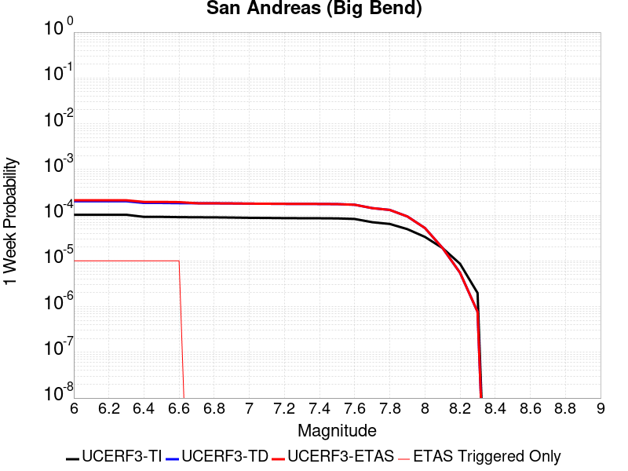 |  |  | 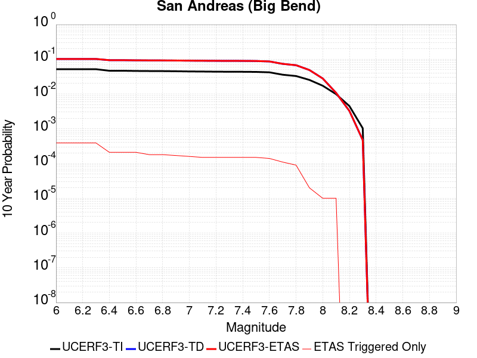 |

| Magnitude | 1 wk TI Prob | 1 wk TD Prob | 1 wk ETAS Prob | 1 wk ETAS/TD Gain | 1 wk ETAS Triggered Only | 1 mo TI Prob | 1 mo TD Prob | 1 mo ETAS Prob | 1 mo ETAS/TD Gain | 1 mo ETAS Triggered Only | 1 yr TI Prob | 1 yr TD Prob | 1 yr ETAS Prob | 1 yr ETAS/TD Gain | 1 yr ETAS Triggered Only | 10 yr TI Prob | 10 yr TD Prob | 10 yr ETAS Prob | 10 yr ETAS/TD Gain | 10 yr ETAS Triggered Only |
|-----|-----|-----|-----|-----|-----|-----|-----|-----|-----|-----|-----|-----|-----|-----|-----|-----|-----|-----|-----|-----|
| 6.0 | 1.0179969E-4 | 2.0106303E-4 | 2.1144764E-4 | 1.0516485 | 1.0386697E-5 | 4.362114E-4 | 8.614151E-4 | 8.821706E-4 | 1.0240947 | 2.0773394E-5 | 0.0052979486 | 0.010437581 | 0.010602034 | 1.0157558 | 1.6618715E-4 | 0.051734097 | 0.10159716 | 0.101951756 | 1.0034902 | 3.9469448E-4 |
| 6.1 | 1.0179969E-4 | 2.0106303E-4 | 2.1144764E-4 | 1.0516485 | 1.0386697E-5 | 4.362114E-4 | 8.614151E-4 | 8.821706E-4 | 1.0240947 | 2.0773394E-5 | 0.0052979486 | 0.010437581 | 0.010602034 | 1.0157558 | 1.6618715E-4 | 0.051734097 | 0.10159716 | 0.101951756 | 1.0034902 | 3.9469448E-4 |
| 6.2 | 1.0179969E-4 | 2.0106303E-4 | 2.1144764E-4 | 1.0516485 | 1.0386697E-5 | 4.362114E-4 | 8.614151E-4 | 8.821706E-4 | 1.0240947 | 2.0773394E-5 | 0.0052979486 | 0.010437581 | 0.010602034 | 1.0157558 | 1.6618715E-4 | 0.051734097 | 0.10159716 | 0.101951756 | 1.0034902 | 3.9469448E-4 |
| 6.3 | 1.0179969E-4 | 2.0106303E-4 | 2.1144764E-4 | 1.0516485 | 1.0386697E-5 | 4.362114E-4 | 8.614151E-4 | 8.821706E-4 | 1.0240947 | 2.0773394E-5 | 0.0052979486 | 0.010437581 | 0.010602034 | 1.0157558 | 1.6618715E-4 | 0.051734097 | 0.10159716 | 0.101951756 | 1.0034902 | 3.9469448E-4 |
| 6.4 | 9.1639464E-5 | 1.8462905E-4 | 1.9501382E-4 | 1.0562468 | 1.0386697E-5 | 3.9268145E-4 | 7.910276E-4 | 8.014061E-4 | 1.0131203 | 1.0386697E-5 | 0.0047704205 | 0.009588352 | 0.009680936 | 1.0096558 | 9.3480274E-5 | 0.046693064 | 0.093921766 | 0.0941194 | 1.0021043 | 2.1812064E-4 |
| 6.5 | 9.1639464E-5 | 1.8462905E-4 | 1.9501382E-4 | 1.0562468 | 1.0386697E-5 | 3.9268145E-4 | 7.910276E-4 | 8.014061E-4 | 1.0131203 | 1.0386697E-5 | 0.0047704205 | 0.009588352 | 0.009680936 | 1.0096558 | 9.3480274E-5 | 0.046693064 | 0.093921766 | 0.0941194 | 1.0021043 | 2.1812064E-4 |
| 6.6 | 9.042622E-5 | 1.826988E-4 | 1.930836E-4 | 1.0568411 | 1.0386697E-5 | 3.8748336E-4 | 7.827601E-4 | 7.931387E-4 | 1.0132589 | 1.0386697E-5 | 0.0047074095 | 0.009488574 | 0.009581167 | 1.0097584 | 9.3480274E-5 | 0.046089325 | 0.093015574 | 0.0932134 | 1.0021268 | 2.1812064E-4 |
| 6.7 | 8.9836685E-5 | 1.8184188E-4 | 1.8184188E-4 | 1.0 | 0.0 | 3.8495753E-4 | 7.790898E-4 | 7.790898E-4 | 1.0 | 0.0 | 0.00467679 | 0.009444275 | 0.009526584 | 1.0087152 | 8.3093575E-5 | 0.045795817 | 0.09260978 | 0.09277942 | 1.0018319 | 1.8696055E-4 |
| 6.8 | 8.9471854E-5 | 1.8130938E-4 | 1.8130938E-4 | 1.0 | 0.0 | 3.8339442E-4 | 7.7680906E-4 | 7.7680906E-4 | 1.0 | 0.0 | 0.004657841 | 0.009416748 | 0.009499058 | 1.0087409 | 8.3093575E-5 | 0.04561414 | 0.09235688 | 0.09252658 | 1.0018374 | 1.8696055E-4 |
| 6.9 | 8.858234E-5 | 1.8012857E-4 | 1.8012857E-4 | 1.0 | 0.0 | 3.7958333E-4 | 7.717514E-4 | 7.717514E-4 | 1.0 | 0.0 | 0.004611638 | 0.009355701 | 0.009438016 | 1.0087985 | 8.3093575E-5 | 0.04517103 | 0.09179684 | 0.091957204 | 1.001747 | 1.7657384E-4 |
| 7.0 | 8.7433385E-5 | 1.7851574E-4 | 1.7851574E-4 | 1.0 | 0.0 | 3.746607E-4 | 7.648433E-4 | 7.648433E-4 | 1.0 | 0.0 | 0.004551957 | 0.009272313 | 0.009354636 | 1.0088784 | 8.3093575E-5 | 0.044598386 | 0.091031015 | 0.091182075 | 1.0016594 | 1.6618715E-4 |
| 7.1 | 8.684964E-5 | 1.7763473E-4 | 1.7763473E-4 | 1.0 | 0.0 | 3.7215967E-4 | 7.610698E-4 | 7.610698E-4 | 1.0 | 0.0 | 0.0045216335 | 0.009226761 | 0.009309088 | 1.0089226 | 8.3093575E-5 | 0.04430731 | 0.09061238 | 0.09075406 | 1.0015637 | 1.5580044E-4 |
| 7.2 | 8.606521E-5 | 1.7654036E-4 | 1.7654036E-4 | 1.0 | 0.0 | 3.6879873E-4 | 7.5638236E-4 | 7.5638236E-4 | 1.0 | 0.0 | 0.0044808835 | 0.009170174 | 0.009252504 | 1.0089782 | 8.3093575E-5 | 0.043916024 | 0.09009273 | 0.090234496 | 1.0015736 | 1.5580044E-4 |
| 7.3 | 8.568266E-5 | 1.7595981E-4 | 1.7595981E-4 | 1.0 | 0.0 | 3.6715972E-4 | 7.5389567E-4 | 7.5389567E-4 | 1.0 | 0.0 | 0.0044610105 | 0.0091401525 | 0.009222487 | 1.0090079 | 8.3093575E-5 | 0.043725148 | 0.08981366 | 0.089955464 | 1.0015789 | 1.5580044E-4 |
| 7.4 | 8.5432206E-5 | 1.7558529E-4 | 1.7558529E-4 | 1.0 | 0.0 | 3.6608664E-4 | 7.522915E-4 | 7.522915E-4 | 1.0 | 0.0 | 0.004447999 | 0.009120786 | 0.009203121 | 1.0090272 | 8.3093575E-5 | 0.043600157 | 0.08963369 | 0.08977552 | 1.0015824 | 1.5580044E-4 |
| 7.5 | 8.4791965E-5 | 1.742772E-4 | 1.742772E-4 | 1.0 | 0.0 | 3.633435E-4 | 7.466887E-4 | 7.466887E-4 | 1.0 | 0.0 | 0.0044147377 | 0.00905314 | 0.009135481 | 1.0090953 | 8.3093575E-5 | 0.043280575 | 0.08901084 | 0.089152776 | 1.0015945 | 1.5580044E-4 |
| 7.6 | 8.241105E-5 | 1.6872598E-4 | 1.6872598E-4 | 1.0 | 0.0 | 3.531424E-4 | 7.229111E-4 | 7.229111E-4 | 1.0 | 0.0 | 0.0042910352 | 0.008766012 | 0.0088483775 | 1.009396 | 8.3093575E-5 | 0.042091176 | 0.086385906 | 0.08651876 | 1.0015379 | 1.4541375E-4 |
| 7.7 | 7.00432E-5 | 1.4233537E-4 | 1.4233537E-4 | 1.0 | 0.0 | 3.001506E-4 | 6.0986617E-4 | 6.0986617E-4 | 1.0 | 0.0 | 0.0036482112 | 0.0073998813 | 0.0074514304 | 1.0069662 | 5.1933483E-5 | 0.035888977 | 0.07364825 | 0.073754095 | 1.0014371 | 1.14253664E-4 |
| 7.8 | 6.415362E-5 | 1.2995097E-4 | 1.2995097E-4 | 1.0 | 0.0 | 2.749151E-4 | 5.568139E-4 | 5.568139E-4 | 1.0 | 0.0 | 0.0033419547 | 0.006758167 | 0.0068097496 | 1.0076326 | 5.1933483E-5 | 0.03292141 | 0.06737108 | 0.06745826 | 1.001294 | 9.3480274E-5 |
| 7.9 | 4.939911E-5 | 9.359872E-5 | 9.359872E-5 | 1.0 | 0.0 | 2.116933E-4 | 4.0107573E-4 | 4.0107573E-4 | 1.0 | 0.0 | 0.0025743195 | 0.0048721726 | 0.004882509 | 1.0021214 | 1.0386697E-5 | 0.025447013 | 0.04900208 | 0.049021836 | 1.0004032 | 2.0773394E-5 |
| 8.0 | 3.344983E-5 | 5.2337946E-5 | 5.2337946E-5 | 1.0 | 0.0 | 1.4334853E-4 | 2.2428621E-4 | 2.2428621E-4 | 1.0 | 0.0 | 0.0017438711 | 0.0027272669 | 0.0027272669 | 1.0 | 0.0 | 0.017302496 | 0.027976755 | 0.02798685 | 1.0003608 | 1.0386697E-5 |
| 8.1 | 1.9104898E-5 | 1.9226556E-5 | 1.9226556E-5 | 1.0 | 0.0 | 8.1875565E-5 | 8.2396924E-5 | 8.2396924E-5 | 1.0 | 0.0 | 9.963791E-4 | 0.0010027215 | 0.0010027215 | 1.0 | 0.0 | 0.009919235 | 0.01077785 | 0.010788125 | 1.0009533 | 1.0386697E-5 |
| 8.2 | 8.643924E-6 | 5.49522E-6 | 5.49522E-6 | 1.0 | 0.0 | 3.704486E-5 | 2.355073E-5 | 2.355073E-5 | 1.0 | 0.0 | 4.5092785E-4 | 2.866925E-4 | 2.866925E-4 | 1.0 | 0.0 | 0.0045001395 | 0.0032598388 | 0.0032598388 | 1.0 | 0.0 |
| 8.3 | 1.983087E-6 | 7.693574E-7 | 7.693574E-7 | 1.0 | 0.0 | 8.498917E-6 | 3.297242E-6 | 3.297242E-6 | 1.0 | 0.0 | 1.034694E-4 | 4.01432E-5 | 4.01432E-5 | 1.0 | 0.0 | 0.0010342124 | 4.7390026E-4 | 4.7390026E-4 | 1.0 | 0.0 |

## Coyote Lake
*[(top)](#table-of-contents)*

| 1 Week | 1 Month | 1 Year | 10 Year |
|-----|-----|-----|-----|
|  |  | 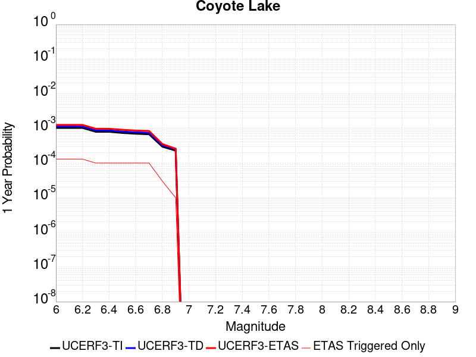 |  |

| Magnitude | 1 wk TI Prob | 1 wk TD Prob | 1 wk ETAS Prob | 1 wk ETAS/TD Gain | 1 wk ETAS Triggered Only | 1 mo TI Prob | 1 mo TD Prob | 1 mo ETAS Prob | 1 mo ETAS/TD Gain | 1 mo ETAS Triggered Only | 1 yr TI Prob | 1 yr TD Prob | 1 yr ETAS Prob | 1 yr ETAS/TD Gain | 1 yr ETAS Triggered Only | 10 yr TI Prob | 10 yr TD Prob | 10 yr ETAS Prob | 10 yr ETAS/TD Gain | 10 yr ETAS Triggered Only |
|-----|-----|-----|-----|-----|-----|-----|-----|-----|-----|-----|-----|-----|-----|-----|-----|-----|-----|-----|-----|-----|
| 6.0 | 1.980352E-5 | 2.1707852E-5 | 3.209432E-5 | 1.4784662 | 1.0386697E-5 | 8.486947E-5 | 9.303074E-5 | 1.2418794E-4 | 1.3349129 | 3.116009E-5 | 0.0010327959 | 0.0011321327 | 0.0012462571 | 1.1008047 | 1.14253664E-4 | 0.010280091 | 0.01127083 | 0.011630267 | 1.0318909 | 3.6353437E-4 |
| 6.1 | 1.980352E-5 | 2.1707852E-5 | 3.209432E-5 | 1.4784662 | 1.0386697E-5 | 8.486947E-5 | 9.303074E-5 | 1.2418794E-4 | 1.3349129 | 3.116009E-5 | 0.0010327959 | 0.0011321327 | 0.0012462571 | 1.1008047 | 1.14253664E-4 | 0.010280091 | 0.01127083 | 0.011630267 | 1.0318909 | 3.6353437E-4 |
| 6.2 | 1.980352E-5 | 2.1707852E-5 | 3.209432E-5 | 1.4784662 | 1.0386697E-5 | 8.486947E-5 | 9.303074E-5 | 1.2418794E-4 | 1.3349129 | 3.116009E-5 | 0.0010327959 | 0.0011321327 | 0.0012462571 | 1.1008047 | 1.14253664E-4 | 0.010280091 | 0.01127083 | 0.011630267 | 1.0318909 | 3.6353437E-4 |
| 6.3 | 1.5344787E-5 | 1.6821528E-5 | 2.720805E-5 | 1.6174542 | 1.0386697E-5 | 6.576172E-5 | 7.209062E-5 | 1.0324846E-4 | 1.4322039 | 3.116009E-5 | 8.003548E-4 | 8.7741105E-4 | 9.7080925E-4 | 1.1064476 | 9.3480274E-5 | 0.007974784 | 0.008745514 | 0.009044094 | 1.034141 | 3.012142E-4 |
| 6.4 | 1.5344787E-5 | 1.6821528E-5 | 2.720805E-5 | 1.6174542 | 1.0386697E-5 | 6.576172E-5 | 7.209062E-5 | 1.0324846E-4 | 1.4322039 | 3.116009E-5 | 8.003548E-4 | 8.7741105E-4 | 9.7080925E-4 | 1.1064476 | 9.3480274E-5 | 0.007974784 | 0.008745514 | 0.009044094 | 1.034141 | 3.012142E-4 |
| 6.5 | 1.4189697E-5 | 1.5558782E-5 | 2.5945319E-5 | 1.6675674 | 1.0386697E-5 | 6.081157E-5 | 6.667913E-5 | 9.7837146E-5 | 1.4672828 | 3.116009E-5 | 7.401293E-4 | 8.115764E-4 | 9.049808E-4 | 1.1150901 | 9.3480274E-5 | 0.0073766913 | 0.008092069 | 0.0083805425 | 1.035649 | 2.908275E-4 |
| 6.6 | 1.3469301E-5 | 1.4772335E-5 | 2.5158879E-5 | 1.7031077 | 1.0386697E-5 | 5.7724297E-5 | 6.330881E-5 | 9.446693E-5 | 1.4921608 | 3.116009E-5 | 7.025667E-4 | 7.7057217E-4 | 8.639804E-4 | 1.1212193 | 9.3480274E-5 | 0.0070034964 | 0.0076849074 | 0.0079735 | 1.0375532 | 2.908275E-4 |
| 6.7 | 1.3027966E-5 | 1.4282475E-5 | 2.4669023E-5 | 1.7272233 | 1.0386697E-5 | 5.5832945E-5 | 6.12095E-5 | 9.2367685E-5 | 1.5090415 | 3.116009E-5 | 6.7955407E-4 | 7.450307E-4 | 8.384413E-4 | 1.1253783 | 9.3480274E-5 | 0.006774798 | 0.007431207 | 0.007709564 | 1.0374578 | 2.804408E-4 |
| 6.8 | 5.695434E-6 | 6.2247245E-6 | 6.2247245E-6 | 1.0 | 0.0 | 2.4408775E-5 | 2.6677288E-5 | 2.6677288E-5 | 1.0 | 0.0 | 2.971363E-4 | 3.2477756E-4 | 3.5592754E-4 | 1.0959117 | 3.116009E-5 | 0.0029673933 | 0.0032459702 | 0.0032977352 | 1.0159475 | 5.1933483E-5 |
| 6.9 | 4.385688E-6 | 4.7932917E-6 | 4.7932917E-6 | 1.0 | 0.0 | 1.879567E-5 | 2.0542679E-5 | 2.0542679E-5 | 1.0 | 0.0 | 2.2881327E-4 | 2.501071E-4 | 2.6049122E-4 | 1.0415186 | 1.0386697E-5 | 0.002285778 | 0.002501071 | 0.0025217924 | 1.008285 | 2.0773394E-5 |

## Death Valley (No)
*[(top)](#table-of-contents)*

| 1 Week | 1 Month | 1 Year | 10 Year |
|-----|-----|-----|-----|
|  |  |  | 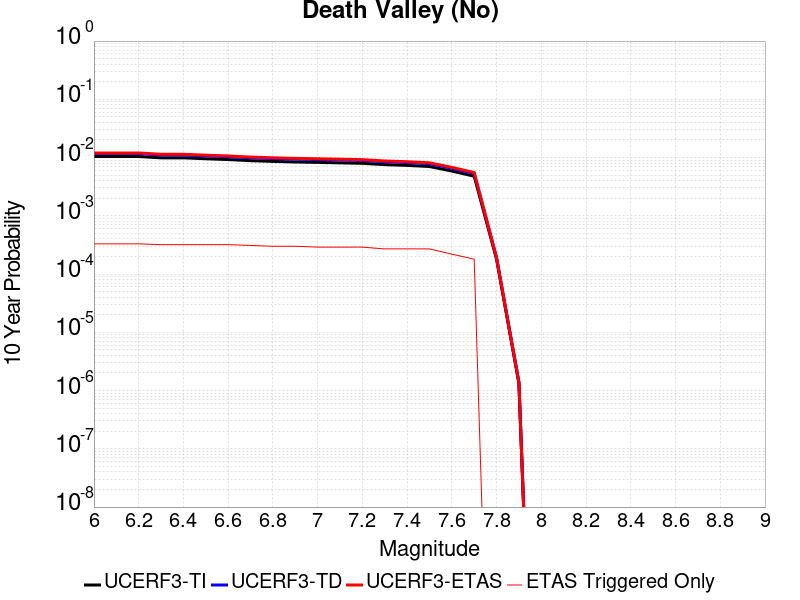 |

| Magnitude | 1 wk TI Prob | 1 wk TD Prob | 1 wk ETAS Prob | 1 wk ETAS/TD Gain | 1 wk ETAS Triggered Only | 1 mo TI Prob | 1 mo TD Prob | 1 mo ETAS Prob | 1 mo ETAS/TD Gain | 1 mo ETAS Triggered Only | 1 yr TI Prob | 1 yr TD Prob | 1 yr ETAS Prob | 1 yr ETAS/TD Gain | 1 yr ETAS Triggered Only | 10 yr TI Prob | 10 yr TD Prob | 10 yr ETAS Prob | 10 yr ETAS/TD Gain | 10 yr ETAS Triggered Only |
|-----|-----|-----|-----|-----|-----|-----|-----|-----|-----|-----|-----|-----|-----|-----|-----|-----|-----|-----|-----|-----|
| 6.0 | 2.0074807E-5 | 2.2501532E-5 | 4.327446E-5 | 1.9231783 | 2.0773394E-5 | 8.603206E-5 | 9.643161E-5 | 1.3797439E-4 | 1.4308004 | 4.1546788E-5 | 0.001046937 | 0.00117343 | 0.0013394221 | 1.1414589 | 1.6618715E-4 | 0.010420183 | 0.011673254 | 0.012001748 | 1.0281408 | 3.323743E-4 |
| 6.1 | 2.0074807E-5 | 2.2501532E-5 | 4.327446E-5 | 1.9231783 | 2.0773394E-5 | 8.603206E-5 | 9.643161E-5 | 1.3797439E-4 | 1.4308004 | 4.1546788E-5 | 0.001046937 | 0.00117343 | 0.0013394221 | 1.1414589 | 1.6618715E-4 | 0.010420183 | 0.011673254 | 0.012001748 | 1.0281408 | 3.323743E-4 |
| 6.2 | 2.0074807E-5 | 2.2501532E-5 | 4.327446E-5 | 1.9231783 | 2.0773394E-5 | 8.603206E-5 | 9.643161E-5 | 1.3797439E-4 | 1.4308004 | 4.1546788E-5 | 0.001046937 | 0.00117343 | 0.0013394221 | 1.1414589 | 1.6618715E-4 | 0.010420183 | 0.011673254 | 0.012001748 | 1.0281408 | 3.323743E-4 |
| 6.3 | 1.9050609E-5 | 2.1338312E-5 | 4.2111264E-5 | 1.9735048 | 2.0773394E-5 | 8.164292E-5 | 9.1446746E-5 | 1.3298973E-4 | 1.4542861 | 4.1546788E-5 | 9.935491E-4 | 0.0011128022 | 0.0012684293 | 1.1398516 | 1.5580044E-4 | 0.009891188 | 0.011073124 | 0.011391546 | 1.0287563 | 3.219876E-4 |
| 6.4 | 1.9050609E-5 | 2.1338312E-5 | 4.2111264E-5 | 1.9735048 | 2.0773394E-5 | 8.164292E-5 | 9.1446746E-5 | 1.3298973E-4 | 1.4542861 | 4.1546788E-5 | 9.935491E-4 | 0.0011128022 | 0.0012684293 | 1.1398516 | 1.5580044E-4 | 0.009891188 | 0.011073124 | 0.011391546 | 1.0287563 | 3.219876E-4 |
| 6.5 | 1.8367004E-5 | 2.0562318E-5 | 4.1335283E-5 | 2.0102444 | 2.0773394E-5 | 7.8713354E-5 | 8.8121276E-5 | 1.296644E-4 | 1.4714313 | 4.1546788E-5 | 9.5791375E-4 | 0.0010723551 | 0.0012279885 | 1.1451323 | 1.5580044E-4 | 0.009537951 | 0.010672592 | 0.010991143 | 1.0298476 | 3.219876E-4 |
| 6.6 | 1.779439E-5 | 1.9912191E-5 | 4.0685172E-5 | 2.0432293 | 2.0773394E-5 | 7.625944E-5 | 8.53352E-5 | 1.2687844E-4 | 1.4868242 | 4.1546788E-5 | 9.280632E-4 | 0.0010384673 | 0.001194106 | 1.1498734 | 1.5580044E-4 | 0.009241969 | 0.010336905 | 0.010655564 | 1.0308273 | 3.219876E-4 |
| 6.7 | 1.7025437E-5 | 1.904463E-5 | 3.9817627E-5 | 2.0907536 | 2.0773394E-5 | 7.296412E-5 | 8.161732E-5 | 1.2316072E-4 | 1.5090022 | 4.1546788E-5 | 8.87976E-4 | 9.93244E-4 | 0.0011488898 | 1.1567044 | 1.5580044E-4 | 0.008844362 | 0.009888767 | 0.0101972865 | 1.031199 | 3.116009E-4 |
| 6.8 | 1.6545107E-5 | 1.851372E-5 | 3.9286726E-5 | 2.1220334 | 2.0773394E-5 | 7.090568E-5 | 7.934213E-5 | 1.2088562E-4 | 1.5235994 | 4.1546788E-5 | 8.629347E-4 | 9.6556847E-4 | 0.0011212184 | 1.1612004 | 1.5580044E-4 | 0.008595915 | 0.009614435 | 0.0099127535 | 1.0310282 | 3.012142E-4 |
| 6.9 | 1.615478E-5 | 1.8088747E-5 | 3.8861763E-5 | 2.1483946 | 2.0773394E-5 | 6.9232934E-5 | 7.7520934E-5 | 1.190645E-4 | 1.5359013 | 4.1546788E-5 | 8.4258494E-4 | 9.4341475E-4 | 0.0010990682 | 1.1649895 | 1.5580044E-4 | 0.008393973 | 0.009394792 | 0.009693176 | 1.0317606 | 3.012142E-4 |
| 7.0 | 1.5894311E-5 | 1.780669E-5 | 3.8579714E-5 | 2.1665854 | 2.0773394E-5 | 6.81167E-5 | 7.6312186E-5 | 1.178558E-4 | 1.5443903 | 4.1546788E-5 | 8.2900526E-4 | 9.287109E-4 | 0.0010843667 | 1.1676041 | 1.5580044E-4 | 0.008259195 | 0.009248987 | 0.009537125 | 1.0311534 | 2.908275E-4 |
| 7.1 | 1.5602263E-5 | 1.7484625E-5 | 3.8257655E-5 | 2.188074 | 2.0773394E-5 | 6.6865134E-5 | 7.493199E-5 | 1.1647566E-4 | 1.5544184 | 4.1546788E-5 | 8.137789E-4 | 9.119212E-4 | 0.0010675796 | 1.1706928 | 1.5580044E-4 | 0.008108052 | 0.009082474 | 0.00937066 | 1.0317299 | 2.908275E-4 |
| 7.2 | 1.5323829E-5 | 1.7171731E-5 | 3.794477E-5 | 2.209723 | 2.0773394E-5 | 6.56719E-5 | 7.3591094E-5 | 1.15134826E-4 | 1.5645212 | 4.1546788E-5 | 7.99262E-4 | 8.956093E-4 | 0.0010512703 | 1.1738045 | 1.5580044E-4 | 0.007963934 | 0.008920676 | 0.009208909 | 1.0323107 | 2.908275E-4 |
| 7.3 | 1.4556212E-5 | 1.6303497E-5 | 3.7076552E-5 | 2.2741473 | 2.0773394E-5 | 6.238227E-5 | 6.9870286E-5 | 1.010282E-4 | 1.4459394 | 3.116009E-5 | 7.592395E-4 | 8.503446E-4 | 9.956347E-4 | 1.1708603 | 1.4541375E-4 | 0.0075665074 | 0.008471553 | 0.00873932 | 1.0316077 | 2.7005412E-4 |
| 7.4 | 1.411725E-5 | 1.5808968E-5 | 3.6582034E-5 | 2.3140051 | 2.0773394E-5 | 6.0501097E-5 | 6.775099E-5 | 9.8908975E-5 | 1.4598897 | 3.116009E-5 | 7.363519E-4 | 8.24562E-4 | 9.698558E-4 | 1.1762073 | 1.4541375E-4 | 0.0073391674 | 0.00821566 | 0.008483496 | 1.0326006 | 2.7005412E-4 |
| 7.5 | 1.3503312E-5 | 1.5127256E-5 | 3.5900335E-5 | 2.3732219 | 2.0773394E-5 | 5.7870053E-5 | 6.4829524E-5 | 9.598759E-5 | 1.4806155 | 3.116009E-5 | 7.043401E-4 | 7.890194E-4 | 9.343184E-4 | 1.1841514 | 1.4541375E-4 | 0.007021119 | 0.007862805 | 0.008130736 | 1.0340757 | 2.7005412E-4 |
| 7.6 | 1.1279839E-5 | 1.2627129E-5 | 1.2627129E-5 | 1.0 | 0.0 | 4.834127E-5 | 5.4115175E-5 | 6.4501306E-5 | 1.1919265 | 1.0386697E-5 | 5.88396E-4 | 6.586584E-4 | 7.520771E-4 | 1.1418318 | 9.3480274E-5 | 0.005868405 | 0.006567614 | 0.006784302 | 1.0329934 | 2.1812064E-4 |
| 7.7 | 9.189108E-6 | 1.02840095E-5 | 1.02840095E-5 | 1.0 | 0.0 | 3.93813E-5 | 4.407361E-5 | 5.445985E-5 | 1.2356566 | 1.0386697E-5 | 4.7936183E-4 | 5.3646916E-4 | 6.1951816E-4 | 1.1548066 | 8.3093575E-5 | 0.004783291 | 0.005352252 | 0.005527881 | 1.032814 | 1.7657384E-4 |
| 7.8 | 3.4586725E-7 | 3.648368E-7 | 3.648368E-7 | 1.0 | 0.0 | 1.4822873E-6 | 1.5635853E-6 | 1.5635853E-6 | 1.0 | 0.0 | 1.80467E-5 | 1.903649E-5 | 1.903649E-5 | 1.0 | 0.0 | 1.8045233E-4 | 1.9034903E-4 | 1.9034903E-4 | 1.0 | 0.0 |
| 7.9 | 2.5591178E-9 | 2.6697329E-9 | 2.6697329E-9 | 1.0 | 0.0 | 1.0967647E-8 | 1.14417125E-8 | 1.14417125E-8 | 1.0 | 0.0 | 1.335311E-7 | 1.3930286E-7 | 1.3930286E-7 | 1.0 | 0.0 | 1.3353102E-6 | 1.3930285E-6 | 1.3930285E-6 | 1.0 | 0.0 |

## Sierra Nevada  (No Extension)
*[(top)](#table-of-contents)*

| 1 Week | 1 Month | 1 Year | 10 Year |
|-----|-----|-----|-----|
|  | 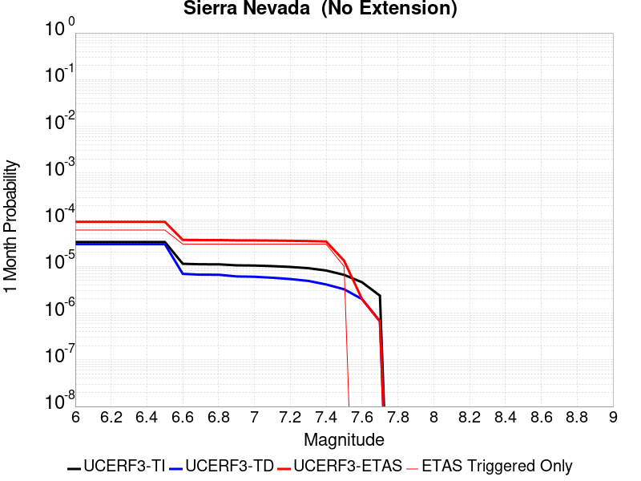 |  |  |

| Magnitude | 1 wk TI Prob | 1 wk TD Prob | 1 wk ETAS Prob | 1 wk ETAS/TD Gain | 1 wk ETAS Triggered Only | 1 mo TI Prob | 1 mo TD Prob | 1 mo ETAS Prob | 1 mo ETAS/TD Gain | 1 mo ETAS Triggered Only | 1 yr TI Prob | 1 yr TD Prob | 1 yr ETAS Prob | 1 yr ETAS/TD Gain | 1 yr ETAS Triggered Only | 10 yr TI Prob | 10 yr TD Prob | 10 yr ETAS Prob | 10 yr ETAS/TD Gain | 10 yr ETAS Triggered Only |
|-----|-----|-----|-----|-----|-----|-----|-----|-----|-----|-----|-----|-----|-----|-----|-----|-----|-----|-----|-----|-----|
| 6.0 | 7.7690465E-6 | 6.976568E-6 | 1.7363192E-5 | 2.4887872 | 1.0386697E-5 | 3.329549E-5 | 2.9899435E-5 | 9.221775E-5 | 3.084264 | 6.232018E-5 | 4.0529718E-4 | 3.6400068E-4 | 5.093615E-4 | 1.3993422 | 1.4541375E-4 | 0.004045588 | 0.0036375606 | 0.0038962837 | 1.0711254 | 2.5966743E-4 |
| 6.1 | 7.7690465E-6 | 6.976568E-6 | 1.7363192E-5 | 2.4887872 | 1.0386697E-5 | 3.329549E-5 | 2.9899435E-5 | 9.221775E-5 | 3.084264 | 6.232018E-5 | 4.0529718E-4 | 3.6400068E-4 | 5.093615E-4 | 1.3993422 | 1.4541375E-4 | 0.004045588 | 0.0036375606 | 0.0038962837 | 1.0711254 | 2.5966743E-4 |
| 6.2 | 7.7690465E-6 | 6.976568E-6 | 1.7363192E-5 | 2.4887872 | 1.0386697E-5 | 3.329549E-5 | 2.9899435E-5 | 9.221775E-5 | 3.084264 | 6.232018E-5 | 4.0529718E-4 | 3.6400068E-4 | 5.093615E-4 | 1.3993422 | 1.4541375E-4 | 0.004045588 | 0.0036375606 | 0.0038962837 | 1.0711254 | 2.5966743E-4 |
| 6.3 | 7.7690465E-6 | 6.976568E-6 | 1.7363192E-5 | 2.4887872 | 1.0386697E-5 | 3.329549E-5 | 2.9899435E-5 | 9.221775E-5 | 3.084264 | 6.232018E-5 | 4.0529718E-4 | 3.6400068E-4 | 5.093615E-4 | 1.3993422 | 1.4541375E-4 | 0.004045588 | 0.0036375606 | 0.0038962837 | 1.0711254 | 2.5966743E-4 |
| 6.4 | 7.7690465E-6 | 6.976568E-6 | 1.7363192E-5 | 2.4887872 | 1.0386697E-5 | 3.329549E-5 | 2.9899435E-5 | 9.221775E-5 | 3.084264 | 6.232018E-5 | 4.0529718E-4 | 3.6400068E-4 | 5.093615E-4 | 1.3993422 | 1.4541375E-4 | 0.004045588 | 0.0036375606 | 0.0038962837 | 1.0711254 | 2.5966743E-4 |
| 6.5 | 7.7690465E-6 | 6.976568E-6 | 1.7363192E-5 | 2.4887872 | 1.0386697E-5 | 3.329549E-5 | 2.9899435E-5 | 9.221775E-5 | 3.084264 | 6.232018E-5 | 4.0529718E-4 | 3.6400068E-4 | 5.093615E-4 | 1.3993422 | 1.4541375E-4 | 0.004045588 | 0.0036375606 | 0.0038962837 | 1.0711254 | 2.5966743E-4 |
| 6.6 | 2.653E-6 | 1.6149635E-6 | 1.2001643E-5 | 7.431526 | 1.0386697E-5 | 1.136995E-5 | 6.9212538E-6 | 3.808113E-5 | 5.502056 | 3.116009E-5 | 1.3842035E-4 | 8.426304E-5 | 1.7773543E-4 | 2.109293 | 9.3480274E-5 | 0.0013833415 | 8.4231433E-4 | 0.0010394953 | 1.2340944 | 1.9734724E-4 |
| 6.7 | 2.5902466E-6 | 1.5502959E-6 | 1.1936977E-5 | 7.699805 | 1.0386697E-5 | 1.11010095E-5 | 6.644109E-6 | 3.780399E-5 | 5.6898513 | 3.116009E-5 | 1.351464E-4 | 8.0889055E-5 | 1.7436176E-4 | 2.155567 | 9.3480274E-5 | 0.0013506424 | 8.0859906E-4 | 0.0010057867 | 1.2438633 | 1.9734724E-4 |
| 6.8 | 2.5853892E-6 | 1.5470957E-6 | 1.19337765E-5 | 7.713664 | 1.0386697E-5 | 1.1080193E-5 | 6.6303933E-6 | 3.7790276E-5 | 5.6995525 | 3.116009E-5 | 1.34893E-4 | 8.072208E-5 | 1.741948E-4 | 2.1579573 | 9.3480274E-5 | 0.0013481114 | 8.069306E-4 | 0.0010041186 | 1.244368 | 1.9734724E-4 |
| 6.9 | 2.458257E-6 | 1.4221675E-6 | 1.1808849E-5 | 8.303416 | 1.0386697E-5 | 1.0535345E-5 | 6.0949897E-6 | 3.725489E-5 | 6.1123796 | 3.116009E-5 | 1.2826028E-4 | 7.420399E-5 | 1.6767732E-4 | 2.2596807 | 9.3480274E-5 | 0.0012818627 | 7.4179407E-4 | 9.389949E-4 | 1.2658432 | 1.9734724E-4 |
| 7.0 | 2.4341468E-6 | 1.3991308E-6 | 1.1785813E-5 | 8.423668 | 1.0386697E-5 | 1.0432016E-5 | 5.9962613E-6 | 3.7156165E-5 | 6.196555 | 3.116009E-5 | 1.270024E-4 | 7.3002055E-5 | 1.664755E-4 | 2.2804222 | 9.3480274E-5 | 0.0012692984 | 7.297827E-4 | 9.269859E-4 | 1.2702218 | 1.9734724E-4 |
| 7.1 | 2.3652476E-6 | 1.334079E-6 | 1.1720762E-5 | 8.785658 | 1.0386697E-5 | 1.0136736E-5 | 5.717469E-6 | 3.687738E-5 | 6.449949 | 3.116009E-5 | 1.2340778E-4 | 6.960797E-5 | 1.6308174E-4 | 2.34286 | 9.3480274E-5 | 0.0012333926 | 6.9586345E-4 | 8.9307333E-4 | 1.2834032 | 1.9734724E-4 |
| 7.2 | 2.272158E-6 | 1.2503832E-6 | 1.1637067E-5 | 9.3068 | 1.0386697E-5 | 9.737784E-6 | 5.358774E-6 | 3.6518697E-5 | 6.8147483 | 3.116009E-5 | 1.1855107E-4 | 6.524114E-5 | 1.5871531E-4 | 2.432749 | 9.3480274E-5 | 0.0011848784 | 6.522214E-4 | 8.494399E-4 | 1.3023797 | 1.9734724E-4 |
| 7.3 | 2.1382127E-6 | 1.1420682E-6 | 1.1528753E-5 | 10.094627 | 1.0386697E-5 | 9.163737E-6 | 4.894569E-6 | 3.6054505E-5 | 7.366227 | 3.116009E-5 | 1.1156279E-4 | 5.9589758E-5 | 1.5306445E-4 | 2.5686371 | 9.3480274E-5 | 0.001115068 | 5.95739E-4 | 7.929686E-4 | 1.3310672 | 1.9734724E-4 |
| 7.4 | 1.9048055E-6 | 9.57617E-7 | 1.1344304E-5 | 11.84639 | 1.0386697E-5 | 8.163426E-6 | 4.104066E-6 | 3.5264027E-5 | 8.592461 | 3.116009E-5 | 9.9385186E-5 | 4.9965867E-5 | 1.4344147E-4 | 2.870789 | 9.3480274E-5 | 9.934074E-4 | 4.99547E-4 | 6.760327E-4 | 1.3532914 | 1.7657384E-4 |
| 7.5 | 1.5373403E-6 | 7.560832E-7 | 7.560832E-7 | 1.0 | 0.0 | 6.5885843E-6 | 3.2403525E-6 | 1.36270155E-5 | 4.2054114 | 1.0386697E-5 | 8.021306E-5 | 3.9450584E-5 | 8.099573E-5 | 2.0530934 | 4.1546788E-5 | 8.0184115E-4 | 3.9443627E-4 | 5.0864485E-4 | 1.2895489 | 1.14253664E-4 |
| 7.6 | 1.0680322E-6 | 4.6602182E-7 | 4.6602182E-7 | 1.0 | 0.0 | 4.577273E-6 | 1.997235E-6 | 1.997235E-6 | 1.0 | 0.0 | 5.5726876E-5 | 2.4316065E-5 | 4.5088953E-5 | 1.8542866 | 2.0773394E-5 | 5.5712904E-4 | 2.431343E-4 | 3.158235E-4 | 1.2989672 | 7.270688E-5 |
| 7.7 | 5.509146E-7 | 1.558334E-7 | 1.558334E-7 | 1.0 | 0.0 | 2.3610605E-6 | 6.678573E-7 | 6.678573E-7 | 1.0 | 0.0 | 2.8745531E-5 | 8.131134E-6 | 8.131134E-6 | 1.0 | 0.0 | 2.8741814E-4 | 8.130848E-5 | 8.130848E-5 | 1.0 | 0.0 |

## Helendale-So Lockhart
*[(top)](#table-of-contents)*

| 1 Week | 1 Month | 1 Year | 10 Year |
|-----|-----|-----|-----|
|  |  |  |  |

| Magnitude | 1 wk TI Prob | 1 wk TD Prob | 1 wk ETAS Prob | 1 wk ETAS/TD Gain | 1 wk ETAS Triggered Only | 1 mo TI Prob | 1 mo TD Prob | 1 mo ETAS Prob | 1 mo ETAS/TD Gain | 1 mo ETAS Triggered Only | 1 yr TI Prob | 1 yr TD Prob | 1 yr ETAS Prob | 1 yr ETAS/TD Gain | 1 yr ETAS Triggered Only | 10 yr TI Prob | 10 yr TD Prob | 10 yr ETAS Prob | 10 yr ETAS/TD Gain | 10 yr ETAS Triggered Only |
|-----|-----|-----|-----|-----|-----|-----|-----|-----|-----|-----|-----|-----|-----|-----|-----|-----|-----|-----|-----|-----|
| 6.0 | 1.7296055E-5 | 1.810418E-5 | 1.810418E-5 | 1.0 | 0.0 | 7.412385E-5 | 7.7587145E-5 | 9.835893E-5 | 1.2677219 | 2.0773394E-5 | 9.0208417E-4 | 9.442349E-4 | 0.0010791344 | 1.1428665 | 1.3502706E-4 | 0.008984311 | 0.009404349 | 0.009671863 | 1.0284458 | 2.7005412E-4 |
| 6.1 | 1.7296055E-5 | 1.810418E-5 | 1.810418E-5 | 1.0 | 0.0 | 7.412385E-5 | 7.7587145E-5 | 9.835893E-5 | 1.2677219 | 2.0773394E-5 | 9.0208417E-4 | 9.442349E-4 | 0.0010791344 | 1.1428665 | 1.3502706E-4 | 0.008984311 | 0.009404349 | 0.009671863 | 1.0284458 | 2.7005412E-4 |
| 6.2 | 1.7296055E-5 | 1.810418E-5 | 1.810418E-5 | 1.0 | 0.0 | 7.412385E-5 | 7.7587145E-5 | 9.835893E-5 | 1.2677219 | 2.0773394E-5 | 9.0208417E-4 | 9.442349E-4 | 0.0010791344 | 1.1428665 | 1.3502706E-4 | 0.008984311 | 0.009404349 | 0.009671863 | 1.0284458 | 2.7005412E-4 |
| 6.3 | 1.0669118E-5 | 1.1135683E-5 | 1.1135683E-5 | 1.0 | 0.0 | 4.5723988E-5 | 4.7723497E-5 | 5.81097E-5 | 1.2176329 | 1.0386697E-5 | 5.5654737E-4 | 5.808815E-4 | 6.7430746E-4 | 1.1608348 | 9.3480274E-5 | 0.0055515557 | 0.0057939277 | 0.0059694783 | 1.0302991 | 1.7657384E-4 |
| 6.4 | 1.0669118E-5 | 1.1135683E-5 | 1.1135683E-5 | 1.0 | 0.0 | 4.5723988E-5 | 4.7723497E-5 | 5.81097E-5 | 1.2176329 | 1.0386697E-5 | 5.5654737E-4 | 5.808815E-4 | 6.7430746E-4 | 1.1608348 | 9.3480274E-5 | 0.0055515557 | 0.0057939277 | 0.0059694783 | 1.0302991 | 1.7657384E-4 |
| 6.5 | 8.790038E-6 | 9.170408E-6 | 9.170408E-6 | 1.0 | 0.0 | 3.767105E-5 | 3.930116E-5 | 4.9687453E-5 | 1.2642744 | 1.0386697E-5 | 4.585485E-4 | 4.7838816E-4 | 5.61442E-4 | 1.1736118 | 8.3093575E-5 | 0.0045760344 | 0.0047737476 | 0.0049288045 | 1.0324811 | 1.5580044E-4 |
| 6.6 | 7.396949E-6 | 7.715714E-6 | 7.715714E-6 | 1.0 | 0.0 | 3.1700827E-5 | 3.306693E-5 | 4.3453285E-5 | 1.314101 | 1.0386697E-5 | 3.858892E-4 | 4.025165E-4 | 4.7519413E-4 | 1.1805581 | 7.270688E-5 | 0.003852198 | 0.0040179817 | 0.004152466 | 1.0334706 | 1.3502706E-4 |
| 6.7 | 6.4600285E-6 | 6.738185E-6 | 6.738185E-6 | 1.0 | 0.0 | 2.7685543E-5 | 2.8877621E-5 | 2.8877621E-5 | 1.0 | 0.0 | 3.3701936E-4 | 3.515291E-4 | 3.930613E-4 | 1.1181473 | 4.1546788E-5 | 0.0033650869 | 0.003509812 | 0.003592614 | 1.0235915 | 8.3093575E-5 |
| 6.8 | 5.600104E-6 | 5.8361397E-6 | 5.8361397E-6 | 1.0 | 0.0 | 2.4000226E-5 | 2.5011792E-5 | 2.5011792E-5 | 1.0 | 0.0 | 2.9216358E-4 | 3.0447662E-4 | 3.356272E-4 | 1.1023086 | 3.116009E-5 | 0.0029177975 | 0.003040656 | 0.0031027866 | 1.0204333 | 6.232018E-5 |
| 6.9 | 4.839122E-6 | 5.03962E-6 | 5.03962E-6 | 1.0 | 0.0 | 2.0738931E-5 | 2.1598196E-5 | 2.1598196E-5 | 1.0 | 0.0 | 2.5246723E-4 | 2.6292677E-4 | 2.9407867E-4 | 1.1184813 | 3.116009E-5 | 0.002521806 | 0.0026262044 | 0.0026883609 | 1.0236678 | 6.232018E-5 |
| 7.0 | 3.6937633E-6 | 3.8452918E-6 | 3.8452918E-6 | 1.0 | 0.0 | 1.5830317E-5 | 1.6479718E-5 | 1.6479718E-5 | 1.0 | 0.0 | 1.9271708E-4 | 2.0062242E-4 | 2.2139165E-4 | 1.103524 | 2.0773394E-5 | 0.0019255003 | 0.0020044446 | 0.0020355422 | 1.0155144 | 3.116009E-5 |
| 7.1 | 2.7858857E-6 | 2.8979157E-6 | 2.8979157E-6 | 1.0 | 0.0 | 1.1939455E-5 | 1.241958E-5 | 1.241958E-5 | 1.0 | 0.0 | 1.4535317E-4 | 1.5119811E-4 | 1.6158324E-4 | 1.0686855 | 1.0386697E-5 | 0.0014525814 | 0.0015109739 | 0.001531716 | 1.0137275 | 2.0773394E-5 |
| 7.2 | 2.1672065E-6 | 2.2540607E-6 | 2.2540607E-6 | 1.0 | 0.0 | 9.2879945E-6 | 9.660225E-6 | 9.660225E-6 | 1.0 | 0.0 | 1.1307546E-4 | 1.1760708E-4 | 1.1760708E-4 | 1.0 | 0.0 | 0.0011301794 | 0.0011754666 | 0.001185841 | 1.0088259 | 1.0386697E-5 |
| 7.3 | 1.4823496E-6 | 1.5422432E-6 | 1.5422432E-6 | 1.0 | 0.0 | 6.3529114E-6 | 6.609598E-6 | 6.609598E-6 | 1.0 | 0.0 | 7.734395E-5 | 8.0469035E-5 | 8.0469035E-5 | 1.0 | 0.0 | 7.731704E-4 | 8.044141E-4 | 8.1479247E-4 | 1.0129018 | 1.0386697E-5 |
| 7.4 | 4.2321457E-7 | 4.4109754E-7 | 4.4109754E-7 | 1.0 | 0.0 | 1.8137755E-6 | 1.8904169E-6 | 1.8904169E-6 | 1.0 | 0.0 | 2.2082493E-5 | 2.301563E-5 | 2.301563E-5 | 1.0 | 0.0 | 2.2080299E-4 | 2.3013698E-4 | 2.3013698E-4 | 1.0 | 0.0 |
| 7.5 | 5.6942316E-8 | 5.9417015E-8 | 5.9417015E-8 | 1.0 | 0.0 | 2.440385E-7 | 2.5464433E-7 | 2.5464433E-7 | 1.0 | 0.0 | 2.9711643E-6 | 3.100291E-6 | 3.100291E-6 | 1.0 | 0.0 | 2.9711247E-5 | 3.1002557E-5 | 3.1002557E-5 | 1.0 | 0.0 |

## Cady
*[(top)](#table-of-contents)*

| 1 Week | 1 Month | 1 Year | 10 Year |
|-----|-----|-----|-----|
|  |  |  |  |

| Magnitude | 1 wk TI Prob | 1 wk TD Prob | 1 wk ETAS Prob | 1 wk ETAS/TD Gain | 1 wk ETAS Triggered Only | 1 mo TI Prob | 1 mo TD Prob | 1 mo ETAS Prob | 1 mo ETAS/TD Gain | 1 mo ETAS Triggered Only | 1 yr TI Prob | 1 yr TD Prob | 1 yr ETAS Prob | 1 yr ETAS/TD Gain | 1 yr ETAS Triggered Only | 10 yr TI Prob | 10 yr TD Prob | 10 yr ETAS Prob | 10 yr ETAS/TD Gain | 10 yr ETAS Triggered Only |
|-----|-----|-----|-----|-----|-----|-----|-----|-----|-----|-----|-----|-----|-----|-----|-----|-----|-----|-----|-----|-----|
| 6.0 | 1.9892565E-5 | 2.1859876E-5 | 2.1859876E-5 | 1.0 | 0.0 | 8.525106E-5 | 9.3682334E-5 | 1.1445378E-4 | 1.2217221 | 2.0773394E-5 | 0.0010374374 | 0.0011400766 | 0.0012438251 | 1.0910014 | 1.03866965E-4 | 0.010326075 | 0.011351293 | 0.0115464 | 1.0171881 | 1.9734724E-4 |
| 6.1 | 1.9892565E-5 | 2.1859876E-5 | 2.1859876E-5 | 1.0 | 0.0 | 8.525106E-5 | 9.3682334E-5 | 1.1445378E-4 | 1.2217221 | 2.0773394E-5 | 0.0010374374 | 0.0011400766 | 0.0012438251 | 1.0910014 | 1.03866965E-4 | 0.010326075 | 0.011351293 | 0.0115464 | 1.0171881 | 1.9734724E-4 |
| 6.2 | 1.9892565E-5 | 2.1859876E-5 | 2.1859876E-5 | 1.0 | 0.0 | 8.525106E-5 | 9.3682334E-5 | 1.1445378E-4 | 1.2217221 | 2.0773394E-5 | 0.0010374374 | 0.0011400766 | 0.0012438251 | 1.0910014 | 1.03866965E-4 | 0.010326075 | 0.011351293 | 0.0115464 | 1.0171881 | 1.9734724E-4 |
| 6.3 | 1.1117327E-5 | 1.2177199E-5 | 1.2177199E-5 | 1.0 | 0.0 | 4.764482E-5 | 5.218713E-5 | 6.257329E-5 | 1.1990175 | 1.0386697E-5 | 5.7992124E-4 | 6.352246E-4 | 6.76745E-4 | 1.0653633 | 4.1546788E-5 | 0.0057841022 | 0.006337195 | 0.006450725 | 1.0179148 | 1.14253664E-4 |
| 6.4 | 1.1117327E-5 | 1.2177199E-5 | 1.2177199E-5 | 1.0 | 0.0 | 4.764482E-5 | 5.218713E-5 | 6.257329E-5 | 1.1990175 | 1.0386697E-5 | 5.7992124E-4 | 6.352246E-4 | 6.76745E-4 | 1.0653633 | 4.1546788E-5 | 0.0057841022 | 0.006337195 | 0.006450725 | 1.0179148 | 1.14253664E-4 |
| 6.5 | 6.103093E-6 | 6.672351E-6 | 6.672351E-6 | 1.0 | 0.0 | 2.615585E-5 | 2.8595547E-5 | 3.8981947E-5 | 1.3632174 | 1.0386697E-5 | 3.1840094E-4 | 3.4810771E-4 | 3.8964004E-4 | 1.1193088 | 4.1546788E-5 | 0.0031794512 | 0.0034768586 | 0.0035493127 | 1.020839 | 7.270688E-5 |
| 6.6 | 5.817237E-6 | 6.3659772E-6 | 6.3659772E-6 | 1.0 | 0.0 | 2.4930776E-5 | 2.7282544E-5 | 3.7668957E-5 | 1.3806981 | 1.0386697E-5 | 3.034899E-4 | 3.321268E-4 | 3.7365977E-4 | 1.1250516 | 4.1546788E-5 | 0.0030307577 | 0.0033175263 | 0.00337964 | 1.0187228 | 6.232018E-5 |
| 6.7 | 4.8846314E-6 | 5.340833E-6 | 5.340833E-6 | 1.0 | 0.0 | 2.0933967E-5 | 2.288915E-5 | 3.327561E-5 | 1.4537722 | 1.0386697E-5 | 2.5484123E-4 | 2.7865154E-4 | 3.2018675E-4 | 1.1490579 | 4.1546788E-5 | 0.0025454918 | 0.002784177 | 0.0028463237 | 1.0223213 | 6.232018E-5 |
| 6.8 | 1.7788773E-6 | 1.940001E-6 | 1.940001E-6 | 1.0 | 0.0 | 7.6237375E-6 | 8.314273E-6 | 1.8700883E-5 | 2.2492507 | 1.0386697E-5 | 9.281505E-5 | 1.0122315E-4 | 1.11608795E-4 | 1.1026015 | 1.0386697E-5 | 9.2776294E-4 | 0.001011925 | 0.0010430537 | 1.0307617 | 3.116009E-5 |
| 6.9 | 7.5455404E-7 | 8.2975305E-7 | 8.2975305E-7 | 1.0 | 0.0 | 3.233799E-6 | 3.5560815E-6 | 3.5560815E-6 | 1.0 | 0.0 | 3.937079E-5 | 4.329477E-5 | 4.329477E-5 | 1.0 | 0.0 | 3.9363815E-4 | 4.3289628E-4 | 4.432785E-4 | 1.0239831 | 1.0386697E-5 |
| 7.0 | 6.8578805E-7 | 7.542215E-7 | 7.542215E-7 | 1.0 | 0.0 | 2.9390883E-6 | 3.2323758E-6 | 3.2323758E-6 | 1.0 | 0.0 | 3.578281E-5 | 3.9353796E-5 | 3.9353796E-5 | 1.0 | 0.0 | 3.577705E-4 | 3.9350073E-4 | 4.0388334E-4 | 1.0263852 | 1.0386697E-5 |

## Manix-Afton Hills
*[(top)](#table-of-contents)*

| 1 Week | 1 Month | 1 Year | 10 Year |
|-----|-----|-----|-----|
|  |  |  |  |

| Magnitude | 1 wk TI Prob | 1 wk TD Prob | 1 wk ETAS Prob | 1 wk ETAS/TD Gain | 1 wk ETAS Triggered Only | 1 mo TI Prob | 1 mo TD Prob | 1 mo ETAS Prob | 1 mo ETAS/TD Gain | 1 mo ETAS Triggered Only | 1 yr TI Prob | 1 yr TD Prob | 1 yr ETAS Prob | 1 yr ETAS/TD Gain | 1 yr ETAS Triggered Only | 10 yr TI Prob | 10 yr TD Prob | 10 yr ETAS Prob | 10 yr ETAS/TD Gain | 10 yr ETAS Triggered Only |
|-----|-----|-----|-----|-----|-----|-----|-----|-----|-----|-----|-----|-----|-----|-----|-----|-----|-----|-----|-----|-----|
| 6.0 | 1.3783202E-5 | 1.4711616E-5 | 2.5098161E-5 | 1.7060097 | 1.0386697E-5 | 5.906953E-5 | 6.3048356E-5 | 8.382044E-5 | 1.3294628 | 2.0773394E-5 | 7.189342E-4 | 7.673609E-4 | 8.7114814E-4 | 1.1352522 | 1.03866965E-4 | 0.0071661277 | 0.0076488685 | 0.007855014 | 1.0269511 | 2.0773393E-4 |
| 6.1 | 1.3783202E-5 | 1.4711616E-5 | 2.5098161E-5 | 1.7060097 | 1.0386697E-5 | 5.906953E-5 | 6.3048356E-5 | 8.382044E-5 | 1.3294628 | 2.0773394E-5 | 7.189342E-4 | 7.673609E-4 | 8.7114814E-4 | 1.1352522 | 1.03866965E-4 | 0.0071661277 | 0.0076488685 | 0.007855014 | 1.0269511 | 2.0773393E-4 |
| 6.2 | 1.3783202E-5 | 1.4711616E-5 | 2.5098161E-5 | 1.7060097 | 1.0386697E-5 | 5.906953E-5 | 6.3048356E-5 | 8.382044E-5 | 1.3294628 | 2.0773394E-5 | 7.189342E-4 | 7.673609E-4 | 8.7114814E-4 | 1.1352522 | 1.03866965E-4 | 0.0071661277 | 0.0076488685 | 0.007855014 | 1.0269511 | 2.0773393E-4 |
| 6.3 | 1.10494875E-5 | 1.1793558E-5 | 1.1793558E-5 | 1.0 | 0.0 | 4.7354086E-5 | 5.0542898E-5 | 6.092907E-5 | 1.2054923 | 1.0386697E-5 | 5.763835E-4 | 6.151964E-4 | 7.086192E-4 | 1.1518584 | 9.3480274E-5 | 0.005748908 | 0.0061359745 | 0.006301142 | 1.0269179 | 1.6618715E-4 |
| 6.4 | 1.10494875E-5 | 1.1793558E-5 | 1.1793558E-5 | 1.0 | 0.0 | 4.7354086E-5 | 5.0542898E-5 | 6.092907E-5 | 1.2054923 | 1.0386697E-5 | 5.763835E-4 | 6.151964E-4 | 7.086192E-4 | 1.1518584 | 9.3480274E-5 | 0.005748908 | 0.0061359745 | 0.006301142 | 1.0269179 | 1.6618715E-4 |
| 6.5 | 9.788949E-6 | 1.0454697E-5 | 1.0454697E-5 | 1.0 | 0.0 | 4.1951964E-5 | 4.480513E-5 | 5.519136E-5 | 1.231809 | 1.0386697E-5 | 5.1064545E-4 | 5.453752E-4 | 6.2842347E-4 | 1.1522772 | 8.3093575E-5 | 0.0050947363 | 0.005441295 | 0.0055962475 | 1.0284772 | 1.5580044E-4 |
| 6.6 | 8.810006E-6 | 9.413971E-6 | 9.413971E-6 | 1.0 | 0.0 | 3.775662E-5 | 4.0345018E-5 | 5.0731294E-5 | 1.2574364 | 1.0386697E-5 | 4.5958988E-4 | 4.9109873E-4 | 5.741515E-4 | 1.1691163 | 8.3093575E-5 | 0.0045864056 | 0.0049010175 | 0.0050457185 | 1.0295247 | 1.4541375E-4 |
| 6.7 | 8.80128E-6 | 9.404451E-6 | 9.404451E-6 | 1.0 | 0.0 | 3.7719226E-5 | 4.0304214E-5 | 5.0690494E-5 | 1.2576971 | 1.0386697E-5 | 4.591348E-4 | 4.906022E-4 | 5.73655E-4 | 1.1692874 | 8.3093575E-5 | 0.004581874 | 0.004896074 | 0.0050407755 | 1.0295546 | 1.4541375E-4 |
| 6.8 | 6.8994877E-6 | 7.3803494E-6 | 7.3803494E-6 | 1.0 | 0.0 | 2.9568899E-5 | 3.162973E-5 | 4.20161E-5 | 1.3283736 | 1.0386697E-5 | 3.5994186E-4 | 3.850321E-4 | 4.473283E-4 | 1.1617948 | 6.232018E-5 | 0.003593594 | 0.0038444551 | 0.0039582695 | 1.0296048 | 1.14253664E-4 |
| 6.9 | 4.9328037E-6 | 5.271154E-6 | 5.271154E-6 | 1.0 | 0.0 | 2.1140417E-5 | 2.2590497E-5 | 2.2590497E-5 | 1.0 | 0.0 | 2.5735417E-4 | 2.7501077E-4 | 3.1654612E-4 | 1.1510317 | 4.1546788E-5 | 0.0025705635 | 0.0027473096 | 0.0028094584 | 1.0226218 | 6.232018E-5 |
| 7.0 | 3.347973E-6 | 3.590168E-6 | 3.590168E-6 | 1.0 | 0.0 | 1.4348378E-5 | 1.5386368E-5 | 1.5386368E-5 | 1.0 | 0.0 | 1.746775E-4 | 1.8731703E-4 | 2.1847128E-4 | 1.1663183 | 3.116009E-5 | 0.0017454025 | 0.0018719939 | 0.0019238301 | 1.0276904 | 5.1933483E-5 |
| 7.1 | 1.2073567E-6 | 1.293531E-6 | 1.293531E-6 | 1.0 | 0.0 | 5.1743755E-6 | 5.5437017E-6 | 5.5437017E-6 | 1.0 | 0.0 | 6.29962E-5 | 6.749411E-5 | 8.8266104E-5 | 1.30776 | 2.0773394E-5 | 6.297835E-4 | 6.748963E-4 | 6.9565565E-4 | 1.0307593 | 2.0773394E-5 |

## Death Valley (Fish Lake Valley)
*[(top)](#table-of-contents)*

| 1 Week | 1 Month | 1 Year | 10 Year |
|-----|-----|-----|-----|
| 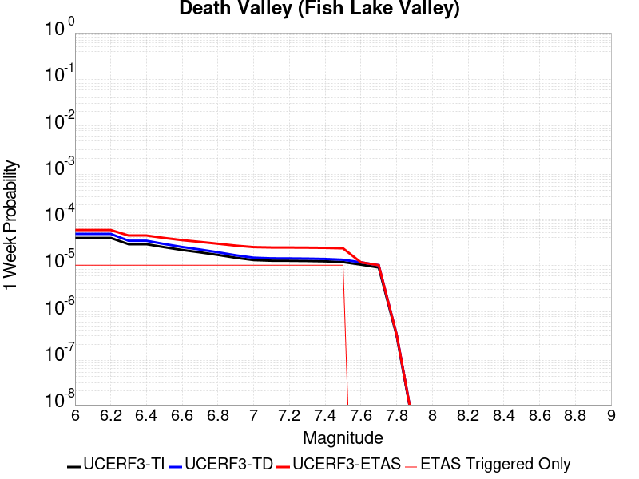 |  |  |  |

| Magnitude | 1 wk TI Prob | 1 wk TD Prob | 1 wk ETAS Prob | 1 wk ETAS/TD Gain | 1 wk ETAS Triggered Only | 1 mo TI Prob | 1 mo TD Prob | 1 mo ETAS Prob | 1 mo ETAS/TD Gain | 1 mo ETAS Triggered Only | 1 yr TI Prob | 1 yr TD Prob | 1 yr ETAS Prob | 1 yr ETAS/TD Gain | 1 yr ETAS Triggered Only | 10 yr TI Prob | 10 yr TD Prob | 10 yr ETAS Prob | 10 yr ETAS/TD Gain | 10 yr ETAS Triggered Only |
|-----|-----|-----|-----|-----|-----|-----|-----|-----|-----|-----|-----|-----|-----|-----|-----|-----|-----|-----|-----|-----|
| 6.0 | 3.872328E-5 | 4.727316E-5 | 5.7659367E-5 | 1.2197062 | 1.0386697E-5 | 1.6594635E-4 | 2.0258522E-4 | 2.2335441E-4 | 1.1025207 | 2.0773394E-5 | 0.0020185246 | 0.0024638134 | 0.0025570632 | 1.0378478 | 9.3480274E-5 | 0.02000288 | 0.024390986 | 0.024583519 | 1.0078937 | 1.9734724E-4 |
| 6.1 | 3.872328E-5 | 4.727316E-5 | 5.7659367E-5 | 1.2197062 | 1.0386697E-5 | 1.6594635E-4 | 2.0258522E-4 | 2.2335441E-4 | 1.1025207 | 2.0773394E-5 | 0.0020185246 | 0.0024638134 | 0.0025570632 | 1.0378478 | 9.3480274E-5 | 0.02000288 | 0.024390986 | 0.024583519 | 1.0078937 | 1.9734724E-4 |
| 6.2 | 3.872328E-5 | 4.727316E-5 | 5.7659367E-5 | 1.2197062 | 1.0386697E-5 | 1.6594635E-4 | 2.0258522E-4 | 2.2335441E-4 | 1.1025207 | 2.0773394E-5 | 0.0020185246 | 0.0024638134 | 0.0025570632 | 1.0378478 | 9.3480274E-5 | 0.02000288 | 0.024390986 | 0.024583519 | 1.0078937 | 1.9734724E-4 |
| 6.3 | 2.8356371E-5 | 3.361322E-5 | 4.3999567E-5 | 1.3089958 | 1.0386697E-5 | 1.2152165E-4 | 1.4404916E-4 | 1.6481956E-4 | 1.1441897 | 2.0773394E-5 | 0.0014785219 | 0.0017524667 | 0.0018457831 | 1.0532486 | 9.3480274E-5 | 0.014687235 | 0.017393492 | 0.017577201 | 1.010562 | 1.8696055E-4 |
| 6.4 | 2.8356371E-5 | 3.361322E-5 | 4.3999567E-5 | 1.3089958 | 1.0386697E-5 | 1.2152165E-4 | 1.4404916E-4 | 1.6481956E-4 | 1.1441897 | 2.0773394E-5 | 0.0014785219 | 0.0017524667 | 0.0018457831 | 1.0532486 | 9.3480274E-5 | 0.014687235 | 0.017393492 | 0.017577201 | 1.010562 | 1.8696055E-4 |
| 6.5 | 2.4448687E-5 | 2.8610175E-5 | 3.8996575E-5 | 1.3630316 | 1.0386697E-5 | 1.0477588E-4 | 1.2260956E-4 | 1.4338041E-4 | 1.1694064 | 2.0773394E-5 | 0.0012748998 | 0.0014917998 | 0.0015851406 | 1.0625693 | 9.3480274E-5 | 0.012676105 | 0.014822718 | 0.015006907 | 1.0124261 | 1.8696055E-4 |
| 6.6 | 2.1298161E-5 | 2.4662175E-5 | 3.5048615E-5 | 1.4211487 | 1.0386697E-5 | 9.127464E-5 | 1.05690946E-4 | 1.2646214E-4 | 1.1965277 | 2.0773394E-5 | 0.0011107022 | 0.0012860615 | 0.0013794216 | 1.0725938 | 9.3480274E-5 | 0.011051672 | 0.012789601 | 0.01297417 | 1.0144312 | 1.8696055E-4 |
| 6.7 | 1.8959729E-5 | 2.1782762E-5 | 3.2169235E-5 | 1.4768206 | 1.0386697E-5 | 8.125345E-5 | 9.3351504E-5 | 1.1412296E-4 | 1.222508 | 2.0773394E-5 | 9.888117E-4 | 0.0011359875 | 0.0012293616 | 1.0821964 | 9.3480274E-5 | 0.009844234 | 0.011304467 | 0.011489314 | 1.0163517 | 1.8696055E-4 |
| 6.8 | 1.6691629E-5 | 1.901977E-5 | 2.9406268E-5 | 1.5460896 | 1.0386697E-5 | 7.153359E-5 | 8.151084E-5 | 1.02282545E-4 | 1.2548336 | 2.0773394E-5 | 8.7057345E-4 | 9.919596E-4 | 0.0010853471 | 1.0941445 | 9.3480274E-5 | 0.008671708 | 0.009877076 | 0.01006219 | 1.0187417 | 1.8696055E-4 |
| 6.9 | 1.450505E-5 | 1.6390675E-5 | 2.6777201E-5 | 1.6336851 | 1.0386697E-5 | 6.216302E-5 | 7.024391E-5 | 9.101584E-5 | 1.2957115 | 2.0773394E-5 | 7.5657194E-4 | 8.5489283E-4 | 9.4829313E-4 | 1.1092539 | 9.3480274E-5 | 0.007540013 | 0.008516973 | 0.0087023415 | 1.0217645 | 1.8696055E-4 |
| 7.0 | 1.2940855E-5 | 1.4538927E-5 | 2.4925472E-5 | 1.7143956 | 1.0386697E-5 | 5.545963E-5 | 6.230823E-5 | 8.3080326E-5 | 1.3333765 | 2.0773394E-5 | 6.750118E-4 | 7.583444E-4 | 8.517538E-4 | 1.1231754 | 9.3480274E-5 | 0.006729651 | 0.007558184 | 0.0077437316 | 1.0245492 | 1.8696055E-4 |
| 7.1 | 1.2544658E-5 | 1.4079123E-5 | 2.4465673E-5 | 1.737727 | 1.0386697E-5 | 5.3761712E-5 | 6.0337734E-5 | 8.110987E-5 | 1.3442645 | 2.0773394E-5 | 6.5435225E-4 | 7.343699E-4 | 8.2778157E-4 | 1.1271996 | 9.3480274E-5 | 0.006524288 | 0.007320025 | 0.007505617 | 1.025354 | 1.8696055E-4 |
| 7.2 | 1.2489416E-5 | 1.4016585E-5 | 2.4403136E-5 | 1.7410187 | 1.0386697E-5 | 5.3524967E-5 | 6.0069728E-5 | 8.084188E-5 | 1.3458005 | 2.0773394E-5 | 6.514716E-4 | 7.311091E-4 | 8.2452106E-4 | 1.1277674 | 9.3480274E-5 | 0.006495651 | 0.0072876317 | 0.00747323 | 1.0254675 | 1.8696055E-4 |
| 7.3 | 1.2368307E-5 | 1.38807145E-5 | 2.4267267E-5 | 1.7482722 | 1.0386697E-5 | 5.3005948E-5 | 5.948745E-5 | 8.025961E-5 | 1.3491856 | 2.0773394E-5 | 6.451563E-4 | 7.2402466E-4 | 8.1743725E-4 | 1.1290185 | 9.3480274E-5 | 0.0064328653 | 0.0072172494 | 0.0074028606 | 1.0257177 | 1.8696055E-4 |
| 7.4 | 1.2161707E-5 | 1.3648755E-5 | 2.403531E-5 | 1.7609892 | 1.0386697E-5 | 5.212056E-5 | 5.8493384E-5 | 7.926556E-5 | 1.3551202 | 2.0773394E-5 | 6.3438306E-4 | 7.1192987E-4 | 8.0534356E-4 | 1.131212 | 9.3480274E-5 | 0.006325751 | 0.0070970803 | 0.007282714 | 1.0261563 | 1.8696055E-4 |
| 7.5 | 1.1707948E-5 | 1.3146373E-5 | 2.3532933E-5 | 1.7900704 | 1.0386697E-5 | 5.0175953E-5 | 5.6340414E-5 | 7.7112636E-5 | 1.3686913 | 2.0773394E-5 | 6.10721E-4 | 6.857342E-4 | 7.791504E-4 | 1.136228 | 9.3480274E-5 | 0.0060904534 | 0.006836766 | 0.0070224483 | 1.0271593 | 1.8696055E-4 |
| 7.6 | 1.0319538E-5 | 1.1580373E-5 | 1.1580373E-5 | 1.0 | 0.0 | 4.4225842E-5 | 4.9629256E-5 | 6.0015438E-5 | 1.2092754 | 1.0386697E-5 | 5.383166E-4 | 6.0407387E-4 | 6.871172E-4 | 1.1374723 | 8.3093575E-5 | 0.0053701443 | 0.00602485 | 0.00620036 | 1.029131 | 1.7657384E-4 |
| 7.7 | 8.937764E-6 | 1.0023426E-5 | 1.0023426E-5 | 1.0 | 0.0 | 3.830414E-5 | 4.295686E-5 | 5.334311E-5 | 1.2417833 | 1.0386697E-5 | 4.6625308E-4 | 5.228793E-4 | 6.059294E-4 | 1.1588323 | 8.3093575E-5 | 0.0046527605 | 0.005217 | 0.0053926525 | 1.0336692 | 1.7657384E-4 |
| 7.8 | 3.108007E-7 | 3.2847535E-7 | 3.2847535E-7 | 1.0 | 0.0 | 1.3320023E-6 | 1.4077508E-6 | 1.4077508E-6 | 1.0 | 0.0 | 1.6217007E-5 | 1.7139235E-5 | 1.7139235E-5 | 1.0 | 0.0 | 1.6215823E-4 | 1.713795E-4 | 1.713795E-4 | 1.0 | 0.0 |
| 7.9 | 2.5591178E-9 | 2.6697329E-9 | 2.6697329E-9 | 1.0 | 0.0 | 1.0967647E-8 | 1.14417125E-8 | 1.14417125E-8 | 1.0 | 0.0 | 1.335311E-7 | 1.3930286E-7 | 1.3930286E-7 | 1.0 | 0.0 | 1.3353102E-6 | 1.3930285E-6 | 1.3930285E-6 | 1.0 | 0.0 |

## San Andreas (San Gorgonio Pass-Garnet HIll)
*[(top)](#table-of-contents)*

| 1 Week | 1 Month | 1 Year | 10 Year |
|-----|-----|-----|-----|
|  |  |  |  |

| Magnitude | 1 wk TI Prob | 1 wk TD Prob | 1 wk ETAS Prob | 1 wk ETAS/TD Gain | 1 wk ETAS Triggered Only | 1 mo TI Prob | 1 mo TD Prob | 1 mo ETAS Prob | 1 mo ETAS/TD Gain | 1 mo ETAS Triggered Only | 1 yr TI Prob | 1 yr TD Prob | 1 yr ETAS Prob | 1 yr ETAS/TD Gain | 1 yr ETAS Triggered Only | 10 yr TI Prob | 10 yr TD Prob | 10 yr ETAS Prob | 10 yr ETAS/TD Gain | 10 yr ETAS Triggered Only |
|-----|-----|-----|-----|-----|-----|-----|-----|-----|-----|-----|-----|-----|-----|-----|-----|-----|-----|-----|-----|-----|
| 6.0 | 8.31567E-5 | 2.3398406E-4 | 2.5475258E-4 | 1.0887605 | 2.0773394E-5 | 3.5633717E-4 | 0.001002406 | 0.0010335349 | 1.0310541 | 3.116009E-5 | 0.004329778 | 0.012136027 | 0.0122283725 | 1.0076092 | 9.3480274E-5 | 0.042463828 | 0.11264349 | 0.11280939 | 1.0014728 | 1.8696055E-4 |
| 6.1 | 8.31567E-5 | 2.3398406E-4 | 2.5475258E-4 | 1.0887605 | 2.0773394E-5 | 3.5633717E-4 | 0.001002406 | 0.0010335349 | 1.0310541 | 3.116009E-5 | 0.004329778 | 0.012136027 | 0.0122283725 | 1.0076092 | 9.3480274E-5 | 0.042463828 | 0.11264349 | 0.11280939 | 1.0014728 | 1.8696055E-4 |
| 6.2 | 8.31567E-5 | 2.3398406E-4 | 2.5475258E-4 | 1.0887605 | 2.0773394E-5 | 3.5633717E-4 | 0.001002406 | 0.0010335349 | 1.0310541 | 3.116009E-5 | 0.004329778 | 0.012136027 | 0.0122283725 | 1.0076092 | 9.3480274E-5 | 0.042463828 | 0.11264349 | 0.11280939 | 1.0014728 | 1.8696055E-4 |
| 6.3 | 8.31567E-5 | 2.3398406E-4 | 2.5475258E-4 | 1.0887605 | 2.0773394E-5 | 3.5633717E-4 | 0.001002406 | 0.0010335349 | 1.0310541 | 3.116009E-5 | 0.004329778 | 0.012136027 | 0.0122283725 | 1.0076092 | 9.3480274E-5 | 0.042463828 | 0.11264349 | 0.11280939 | 1.0014728 | 1.8696055E-4 |
| 6.4 | 8.059055E-5 | 2.2956554E-4 | 2.5033415E-4 | 1.0904692 | 2.0773394E-5 | 3.4534236E-4 | 9.834839E-4 | 0.0010146133 | 1.0316522 | 3.116009E-5 | 0.0041964394 | 0.011908189 | 0.012000557 | 1.0077566 | 9.3480274E-5 | 0.041180745 | 0.11062444 | 0.11079072 | 1.0015031 | 1.8696055E-4 |
| 6.5 | 8.059055E-5 | 2.2956554E-4 | 2.5033415E-4 | 1.0904692 | 2.0773394E-5 | 3.4534236E-4 | 9.834839E-4 | 0.0010146133 | 1.0316522 | 3.116009E-5 | 0.0041964394 | 0.011908189 | 0.012000557 | 1.0077566 | 9.3480274E-5 | 0.041180745 | 0.11062444 | 0.11079072 | 1.0015031 | 1.8696055E-4 |
| 6.6 | 7.619237E-5 | 2.2200657E-4 | 2.4277534E-4 | 1.0935503 | 2.0773394E-5 | 3.2649786E-4 | 9.511121E-4 | 9.822425E-4 | 1.0327306 | 3.116009E-5 | 0.0039678677 | 0.011518859 | 0.011611262 | 1.008022 | 9.3480274E-5 | 0.03897764 | 0.107160784 | 0.107327715 | 1.0015577 | 1.8696055E-4 |
| 6.7 | 7.440636E-5 | 2.1876446E-4 | 2.3953331E-4 | 1.0949371 | 2.0773394E-5 | 3.188454E-4 | 9.372274E-4 | 9.6835825E-4 | 1.0332159 | 3.116009E-5 | 0.0038750346 | 0.01135158 | 0.011444 | 1.0081415 | 9.3480274E-5 | 0.038081564 | 0.105669186 | 0.10583639 | 1.0015824 | 1.8696055E-4 |
| 6.8 | 7.3735864E-5 | 2.1723597E-4 | 2.3800485E-4 | 1.0956051 | 2.0773394E-5 | 3.1597257E-4 | 9.306814E-4 | 9.618125E-4 | 1.0334498 | 3.116009E-5 | 0.0038401815 | 0.011272711 | 0.011365137 | 1.0081991 | 9.3480274E-5 | 0.03774495 | 0.1049707 | 0.10513803 | 1.0015941 | 1.8696055E-4 |
| 6.9 | 7.27575E-5 | 2.1492546E-4 | 2.3569439E-4 | 1.0966332 | 2.0773394E-5 | 3.117806E-4 | 9.207862E-4 | 9.519176E-4 | 1.0338095 | 3.116009E-5 | 0.003789323 | 0.011153476 | 0.011245914 | 1.0082878 | 9.3480274E-5 | 0.037253562 | 0.10391858 | 0.104086116 | 1.0016122 | 1.8696055E-4 |
| 7.0 | 7.102591E-5 | 2.1076521E-4 | 2.3153423E-4 | 1.098541 | 2.0773394E-5 | 3.0436125E-4 | 9.02969E-4 | 9.3410094E-4 | 1.0344774 | 3.116009E-5 | 0.003699303 | 0.010938748 | 0.011031206 | 1.0084523 | 9.3480274E-5 | 0.03638325 | 0.102020636 | 0.10218852 | 1.0016456 | 1.8696055E-4 |
| 7.1 | 7.028513E-5 | 2.0912137E-4 | 2.2989041E-4 | 1.0993158 | 2.0773394E-5 | 3.0118722E-4 | 8.959288E-4 | 9.2706096E-4 | 1.0347484 | 3.116009E-5 | 0.0036607897 | 0.01085389 | 0.010946357 | 1.0085192 | 9.3480274E-5 | 0.036010686 | 0.10126359 | 0.10143162 | 1.0016593 | 1.8696055E-4 |
| 7.2 | 6.8498244E-5 | 2.0519937E-4 | 2.2596848E-4 | 1.1012144 | 2.0773394E-5 | 2.9353087E-4 | 8.7913166E-4 | 9.102643E-4 | 1.035413 | 3.116009E-5 | 0.003567883 | 0.0106514 | 0.010743884 | 1.0086828 | 9.3480274E-5 | 0.035111405 | 0.09945543 | 0.09962379 | 1.0016929 | 1.8696055E-4 |
| 7.3 | 6.622592E-5 | 1.9747039E-4 | 2.1823969E-4 | 1.1051767 | 2.0773394E-5 | 2.8379448E-4 | 8.460293E-4 | 8.771631E-4 | 1.0367998 | 3.116009E-5 | 0.0034497243 | 0.010252241 | 0.010344762 | 1.0090245 | 9.3480274E-5 | 0.033966612 | 0.09595134 | 0.096120365 | 1.0017616 | 1.8696055E-4 |
| 7.4 | 5.1050705E-5 | 1.4701985E-4 | 1.6779019E-4 | 1.1412758 | 2.0773394E-5 | 2.1877038E-4 | 6.299338E-4 | 6.610743E-4 | 1.0494345 | 3.116009E-5 | 0.002660276 | 0.0076426673 | 0.0077251256 | 1.0107893 | 8.3093575E-5 | 0.02628654 | 0.07291896 | 0.073082656 | 1.002245 | 1.7657384E-4 |
| 7.5 | 3.9302922E-5 | 1.1141107E-4 | 1.3218215E-4 | 1.1864364 | 2.0773394E-5 | 1.6843023E-4 | 4.7738897E-4 | 5.085342E-4 | 1.0652407 | 3.116009E-5 | 0.0020487092 | 0.005796791 | 0.005879403 | 1.0142514 | 8.3093575E-5 | 0.020299247 | 0.056059215 | 0.05622589 | 1.0029732 | 1.7657384E-4 |
| 7.6 | 2.9851626E-5 | 8.504997E-5 | 1.0582159E-4 | 1.2442285 | 2.0773394E-5 | 1.2792926E-4 | 3.6444908E-4 | 3.955978E-4 | 1.085468 | 3.116009E-5 | 0.0015564259 | 0.0044281655 | 0.004510891 | 1.0186816 | 8.3093575E-5 | 0.0154556995 | 0.043238558 | 0.0434075 | 1.0039071 | 1.7657384E-4 |
| 7.7 | 2.1135214E-5 | 6.361802E-5 | 8.439009E-5 | 1.3265123 | 2.0773394E-5 | 9.0576345E-5 | 2.726202E-4 | 3.0377178E-4 | 1.1142673 | 3.116009E-5 | 0.0011022091 | 0.0033141046 | 0.003396923 | 1.0249896 | 8.3093575E-5 | 0.010967582 | 0.032622673 | 0.032793485 | 1.005236 | 1.7657384E-4 |
| 7.8 | 1.883379E-5 | 5.572194E-5 | 7.649417E-5 | 1.3727838 | 2.0773394E-5 | 8.0713755E-5 | 2.3878647E-4 | 2.699391E-4 | 1.1304624 | 3.116009E-5 | 9.822468E-4 | 0.0029033525 | 0.0029758483 | 1.0249697 | 7.270688E-5 | 0.0097791655 | 0.028732158 | 0.028893571 | 1.0056179 | 1.6618715E-4 |
| 7.9 | 1.5156185E-5 | 4.1725576E-5 | 6.2498104E-5 | 1.4978367 | 2.0773394E-5 | 6.495346E-5 | 1.7881165E-4 | 2.0996618E-4 | 1.1742309 | 3.116009E-5 | 7.9052144E-4 | 0.0021748596 | 0.0022370443 | 1.0285925 | 6.232018E-5 | 0.007877152 | 0.021790246 | 0.02194265 | 1.0069942 | 1.5580044E-4 |
| 8.0 | 1.1405907E-5 | 3.0024876E-5 | 4.041126E-5 | 1.345926 | 1.0386697E-5 | 4.8881542E-5 | 1.286717E-4 | 1.4944242E-4 | 1.1614242 | 2.0773394E-5 | 5.9497025E-4 | 0.0015654531 | 0.0016173053 | 1.0331228 | 5.1933483E-5 | 0.005933798 | 0.015796356 | 0.015919028 | 1.0077658 | 1.2464036E-4 |
| 8.1 | 4.3511436E-6 | 7.3873994E-6 | 7.3873994E-6 | 1.0 | 0.0 | 1.8647626E-5 | 3.16599E-5 | 3.16599E-5 | 1.0 | 0.0 | 2.2701119E-4 | 3.8539123E-4 | 3.8539123E-4 | 1.0 | 0.0 | 0.0022677942 | 0.0041254 | 0.0041254 | 1.0 | 0.0 |
| 8.2 | 2.3042528E-6 | 2.74142E-6 | 2.74142E-6 | 1.0 | 0.0 | 9.875332E-6 | 1.174889E-5 | 1.174889E-5 | 1.0 | 0.0 | 1.2022553E-4 | 1.430334E-4 | 1.430334E-4 | 1.0 | 0.0 | 0.0012016051 | 0.0016024038 | 0.0016024038 | 1.0 | 0.0 |
| 8.3 | 5.202968E-7 | 3.171921E-7 | 3.171921E-7 | 1.0 | 0.0 | 2.2298414E-6 | 1.3593941E-6 | 1.3593941E-6 | 1.0 | 0.0 | 2.714798E-5 | 1.655051E-5 | 1.655051E-5 | 1.0 | 0.0 | 2.7144665E-4 | 1.9631305E-4 | 1.9631305E-4 | 1.0 | 0.0 |

## Elsinore (Glen Ivy) rev
*[(top)](#table-of-contents)*

| 1 Week | 1 Month | 1 Year | 10 Year |
|-----|-----|-----|-----|
|  |  |  |  |

| Magnitude | 1 wk TI Prob | 1 wk TD Prob | 1 wk ETAS Prob | 1 wk ETAS/TD Gain | 1 wk ETAS Triggered Only | 1 mo TI Prob | 1 mo TD Prob | 1 mo ETAS Prob | 1 mo ETAS/TD Gain | 1 mo ETAS Triggered Only | 1 yr TI Prob | 1 yr TD Prob | 1 yr ETAS Prob | 1 yr ETAS/TD Gain | 1 yr ETAS Triggered Only | 10 yr TI Prob | 10 yr TD Prob | 10 yr ETAS Prob | 10 yr ETAS/TD Gain | 10 yr ETAS Triggered Only |
|-----|-----|-----|-----|-----|-----|-----|-----|-----|-----|-----|-----|-----|-----|-----|-----|-----|-----|-----|-----|-----|
| 6.0 | 1.6204086E-4 | 2.936593E-4 | 3.0404297E-4 | 1.0353595 | 1.0386697E-5 | 6.94276E-4 | 0.0012580877 | 0.0012788349 | 1.016491 | 2.0773394E-5 | 0.008420097 | 0.015237179 | 0.015308778 | 1.004699 | 7.270688E-5 | 0.081081145 | 0.13970533 | 0.13984829 | 1.0010234 | 1.6618715E-4 |
| 6.1 | 1.6204086E-4 | 2.936593E-4 | 3.0404297E-4 | 1.0353595 | 1.0386697E-5 | 6.94276E-4 | 0.0012580877 | 0.0012788349 | 1.016491 | 2.0773394E-5 | 0.008420097 | 0.015237179 | 0.015308778 | 1.004699 | 7.270688E-5 | 0.081081145 | 0.13970533 | 0.13984829 | 1.0010234 | 1.6618715E-4 |
| 6.2 | 1.6204086E-4 | 2.936593E-4 | 3.0404297E-4 | 1.0353595 | 1.0386697E-5 | 6.94276E-4 | 0.0012580877 | 0.0012788349 | 1.016491 | 2.0773394E-5 | 0.008420097 | 0.015237179 | 0.015308778 | 1.004699 | 7.270688E-5 | 0.081081145 | 0.13970533 | 0.13984829 | 1.0010234 | 1.6618715E-4 |
| 6.3 | 1.0111737E-4 | 1.7704896E-4 | 1.8743382E-4 | 1.0586553 | 1.0386697E-5 | 4.332882E-4 | 7.5867726E-4 | 7.690561E-4 | 1.0136801 | 1.0386697E-5 | 0.005262531 | 0.009218467 | 0.009239049 | 1.0022327 | 2.0773394E-5 | 0.0513964 | 0.087025836 | 0.08709222 | 1.0007627 | 7.270688E-5 |
| 6.4 | 1.0111737E-4 | 1.7704896E-4 | 1.8743382E-4 | 1.0586553 | 1.0386697E-5 | 4.332882E-4 | 7.5867726E-4 | 7.690561E-4 | 1.0136801 | 1.0386697E-5 | 0.005262531 | 0.009218467 | 0.009239049 | 1.0022327 | 2.0773394E-5 | 0.0513964 | 0.087025836 | 0.08709222 | 1.0007627 | 7.270688E-5 |
| 6.5 | 3.6624708E-5 | 4.6398443E-5 | 4.6398443E-5 | 1.0 | 0.0 | 1.569536E-4 | 1.9883736E-4 | 1.9883736E-4 | 1.0 | 0.0 | 0.001909235 | 0.0024185202 | 0.0024288818 | 1.0042843 | 1.0386697E-5 | 0.01892915 | 0.02374361 | 0.023753751 | 1.000427 | 1.0386697E-5 |
| 6.6 | 2.5051324E-5 | 2.615282E-5 | 2.615282E-5 | 1.0 | 0.0 | 1.073584E-4 | 1.12078946E-4 | 1.12078946E-4 | 1.0 | 0.0 | 0.0013063047 | 0.0013637516 | 0.0013741241 | 1.0076059 | 1.0386697E-5 | 0.012986525 | 0.013567226 | 0.0135774715 | 1.0007552 | 1.0386697E-5 |
| 6.7 | 2.2189772E-5 | 2.2077227E-5 | 2.2077227E-5 | 1.0 | 0.0 | 9.509556E-5 | 9.461347E-5 | 9.461347E-5 | 1.0 | 0.0 | 0.0011571734 | 0.0011513466 | 0.0011617213 | 1.0090109 | 1.0386697E-5 | 0.011511663 | 0.0114676645 | 0.011477932 | 1.0008954 | 1.0386697E-5 |
| 6.8 | 1.6654378E-5 | 1.4440319E-5 | 1.4440319E-5 | 1.0 | 0.0 | 7.137396E-5 | 6.188564E-5 | 6.188564E-5 | 1.0 | 0.0 | 8.686314E-4 | 7.532024E-4 | 7.635813E-4 | 1.0137796 | 1.0386697E-5 | 0.008652439 | 0.0075118328 | 0.0075221416 | 1.0013723 | 1.0386697E-5 |
| 6.9 | 1.5042909E-5 | 1.2334286E-5 | 1.2334286E-5 | 1.0 | 0.0 | 6.446802E-5 | 5.286017E-5 | 5.286017E-5 | 1.0 | 0.0 | 7.8461546E-4 | 6.433857E-4 | 6.537657E-4 | 1.0161334 | 1.0386697E-5 | 0.007818509 | 0.006419453 | 0.006429773 | 1.0016077 | 1.0386697E-5 |
| 7.0 | 1.4361385E-5 | 1.1453455E-5 | 1.1453455E-5 | 1.0 | 0.0 | 6.154734E-5 | 4.908533E-5 | 4.908533E-5 | 1.0 | 0.0 | 7.490812E-4 | 5.974529E-4 | 6.0783344E-4 | 1.0173746 | 1.0386697E-5 | 0.007465612 | 0.005962458 | 0.005972783 | 1.0017316 | 1.0386697E-5 |
| 7.1 | 1.3265571E-5 | 1.0246749E-5 | 1.0246749E-5 | 1.0 | 0.0 | 5.6851208E-5 | 4.3913915E-5 | 4.3913915E-5 | 1.0 | 0.0 | 6.919436E-4 | 5.345233E-4 | 5.4490444E-4 | 1.0194213 | 1.0386697E-5 | 0.006897931 | 0.0053357324 | 0.005346064 | 1.0019362 | 1.0386697E-5 |
| 7.2 | 1.1596403E-5 | 8.506553E-6 | 8.506553E-6 | 1.0 | 0.0 | 4.9697923E-5 | 3.6456157E-5 | 3.6456157E-5 | 1.0 | 0.0 | 6.049042E-4 | 4.4376502E-4 | 4.541471E-4 | 1.0233954 | 1.0386697E-5 | 0.006032603 | 0.004430204 | 0.0044405446 | 1.0023341 | 1.0386697E-5 |
| 7.3 | 1.0150827E-5 | 7.2399926E-6 | 7.2399926E-6 | 1.0 | 0.0 | 4.3502816E-5 | 3.102818E-5 | 3.102818E-5 | 1.0 | 0.0 | 5.2951806E-4 | 3.77704E-4 | 3.77704E-4 | 1.0 | 0.0 | 0.005282581 | 0.0037710073 | 0.0037710073 | 1.0 | 0.0 |
| 7.4 | 9.080705E-6 | 6.3535763E-6 | 6.3535763E-6 | 1.0 | 0.0 | 3.8916725E-5 | 2.7229335E-5 | 2.7229335E-5 | 1.0 | 0.0 | 4.7370812E-4 | 3.314681E-4 | 3.314681E-4 | 1.0 | 0.0 | 0.004726996 | 0.0033098878 | 0.0033098878 | 1.0 | 0.0 |
| 7.5 | 7.671649E-6 | 5.2264927E-6 | 5.2264927E-6 | 1.0 | 0.0 | 3.287808E-5 | 2.2399068E-5 | 2.2399068E-5 | 1.0 | 0.0 | 4.0021708E-4 | 2.726758E-4 | 2.726758E-4 | 1.0 | 0.0 | 0.0039949706 | 0.0027235372 | 0.0027235372 | 1.0 | 0.0 |
| 7.6 | 6.990086E-6 | 4.6883147E-6 | 4.6883147E-6 | 1.0 | 0.0 | 2.9957167E-5 | 2.009263E-5 | 2.009263E-5 | 1.0 | 0.0 | 3.6466747E-4 | 2.4460148E-4 | 2.4460148E-4 | 1.0 | 0.0 | 0.0036406964 | 0.0024434389 | 0.0024434389 | 1.0 | 0.0 |
| 7.7 | 4.163505E-6 | 2.3299876E-6 | 2.3299876E-6 | 1.0 | 0.0 | 1.7843471E-5 | 9.985628E-6 | 9.985628E-6 | 1.0 | 0.0 | 2.172226E-4 | 1.2156898E-4 | 1.2156898E-4 | 1.0 | 0.0 | 0.0021701038 | 0.0012150978 | 0.0012150978 | 1.0 | 0.0 |
| 7.8 | 2.2692414E-7 | 9.3873886E-8 | 9.3873886E-8 | 1.0 | 0.0 | 9.725317E-7 | 4.023166E-7 | 4.023166E-7 | 1.0 | 0.0 | 1.1840509E-5 | 4.898197E-6 | 4.898197E-6 | 1.0 | 0.0 | 1.1839878E-4 | 4.898122E-5 | 4.898122E-5 | 1.0 | 0.0 |
| 7.9 | 6.676829E-9 | 3.4403498E-9 | 3.4403498E-9 | 1.0 | 0.0 | 2.861498E-8 | 1.4744357E-8 | 1.4744357E-8 | 1.0 | 0.0 | 3.4838732E-7 | 1.7951253E-7 | 1.7951253E-7 | 1.0 | 0.0 | 3.4838679E-6 | 1.7951239E-6 | 1.7951239E-6 | 1.0 | 0.0 |

## San Andreas (Coachella) rev
*[(top)](#table-of-contents)*

| 1 Week | 1 Month | 1 Year | 10 Year |
|-----|-----|-----|-----|
|  |  |  |  |

| Magnitude | 1 wk TI Prob | 1 wk TD Prob | 1 wk ETAS Prob | 1 wk ETAS/TD Gain | 1 wk ETAS Triggered Only | 1 mo TI Prob | 1 mo TD Prob | 1 mo ETAS Prob | 1 mo ETAS/TD Gain | 1 mo ETAS Triggered Only | 1 yr TI Prob | 1 yr TD Prob | 1 yr ETAS Prob | 1 yr ETAS/TD Gain | 1 yr ETAS Triggered Only | 10 yr TI Prob | 10 yr TD Prob | 10 yr ETAS Prob | 10 yr ETAS/TD Gain | 10 yr ETAS Triggered Only |
|-----|-----|-----|-----|-----|-----|-----|-----|-----|-----|-----|-----|-----|-----|-----|-----|-----|-----|-----|-----|-----|
| 6.0 | 1.1925945E-4 | 3.2747045E-4 | 3.4823705E-4 | 1.0634152 | 2.0773394E-5 | 5.110118E-4 | 0.0014026947 | 0.0014234389 | 1.0147889 | 2.0773394E-5 | 0.0062038354 | 0.016945418 | 0.017037315 | 1.0054231 | 9.3480274E-5 | 0.060334753 | 0.15272202 | 0.15287162 | 1.0009797 | 1.7657384E-4 |
| 6.1 | 1.1925945E-4 | 3.2747045E-4 | 3.4823705E-4 | 1.0634152 | 2.0773394E-5 | 5.110118E-4 | 0.0014026947 | 0.0014234389 | 1.0147889 | 2.0773394E-5 | 0.0062038354 | 0.016945418 | 0.017037315 | 1.0054231 | 9.3480274E-5 | 0.060334753 | 0.15272202 | 0.15287162 | 1.0009797 | 1.7657384E-4 |
| 6.2 | 1.07432395E-4 | 3.0247675E-4 | 3.2324385E-4 | 1.0686569 | 2.0773394E-5 | 4.603433E-4 | 0.0012956889 | 0.0013164354 | 1.016012 | 2.0773394E-5 | 0.005590286 | 0.015662009 | 0.015754025 | 1.0058751 | 9.3480274E-5 | 0.05451731 | 0.14189328 | 0.14203589 | 1.001005 | 1.6618715E-4 |
| 6.3 | 1.0718766E-4 | 3.019298E-4 | 3.226969E-4 | 1.0687813 | 2.0773394E-5 | 4.592948E-4 | 0.0012933471 | 0.0013140937 | 1.0160409 | 2.0773394E-5 | 0.005577586 | 0.015633909 | 0.015725927 | 1.0058858 | 9.3480274E-5 | 0.054396555 | 0.14166155 | 0.1418042 | 1.001007 | 1.6618715E-4 |
| 6.4 | 1.0355944E-4 | 2.9401045E-4 | 3.1477772E-4 | 1.0706345 | 2.0773394E-5 | 4.4375064E-4 | 0.0012594402 | 0.0012801874 | 1.0164734 | 2.0773394E-5 | 0.0053892885 | 0.015226932 | 0.015318989 | 1.0060457 | 9.3480274E-5 | 0.052604496 | 0.13822177 | 0.13836499 | 1.0010362 | 1.6618715E-4 |
| 6.5 | 1.0227914E-4 | 2.912047E-4 | 3.1197205E-4 | 1.0713153 | 2.0773394E-5 | 4.382655E-4 | 0.0012474272 | 0.0012681746 | 1.0166322 | 2.0773394E-5 | 0.0053228354 | 0.015082708 | 0.015174778 | 1.0061044 | 9.3480274E-5 | 0.051971316 | 0.13700101 | 0.13714442 | 1.0010469 | 1.6618715E-4 |
| 6.6 | 1.0116757E-4 | 2.8886212E-4 | 2.9924582E-4 | 1.0359468 | 1.0386697E-5 | 4.3350324E-4 | 0.0012373971 | 0.001247771 | 1.0083836 | 1.0386697E-5 | 0.0052651367 | 0.0149622755 | 0.015044126 | 1.0054704 | 8.3093575E-5 | 0.051421247 | 0.13597922 | 0.13611384 | 1.0009899 | 1.5580044E-4 |
| 6.7 | 1.0050676E-4 | 2.874477E-4 | 2.9783143E-4 | 1.0361239 | 1.0386697E-5 | 4.3067214E-4 | 0.001231341 | 0.0012417149 | 1.0084249 | 1.0386697E-5 | 0.005230834 | 0.014889553 | 0.014971409 | 1.0054976 | 8.3093575E-5 | 0.051094085 | 0.13536398 | 0.13549869 | 1.0009952 | 1.5580044E-4 |
| 6.8 | 9.976819E-5 | 2.8548407E-4 | 2.958678E-4 | 1.0363724 | 1.0386697E-5 | 4.2750788E-4 | 0.0012229334 | 0.0012333074 | 1.0084829 | 1.0386697E-5 | 0.0051924936 | 0.014788584 | 0.014870449 | 1.0055357 | 8.3093575E-5 | 0.050728295 | 0.13451566 | 0.1346505 | 1.0010024 | 1.5580044E-4 |
| 6.9 | 9.77719E-5 | 2.80452E-4 | 2.9083577E-4 | 1.0370252 | 1.0386697E-5 | 4.1895514E-4 | 0.0012013874 | 0.0012117616 | 1.0086352 | 1.0386697E-5 | 0.0050888555 | 0.01452979 | 0.014611675 | 1.0056357 | 8.3093575E-5 | 0.049738888 | 0.13234389 | 0.13247907 | 1.0010214 | 1.5580044E-4 |
| 7.0 | 8.500761E-5 | 2.4778847E-4 | 2.5817257E-4 | 1.0419072 | 1.0386697E-5 | 3.6426744E-4 | 0.0010615216 | 0.0010718972 | 1.0097743 | 1.0386697E-5 | 0.0044259406 | 0.012848215 | 0.012930241 | 1.0063843 | 8.3093575E-5 | 0.04338823 | 0.11819933 | 0.118336715 | 1.0011623 | 1.5580044E-4 |
| 7.1 | 8.319876E-5 | 2.4381404E-4 | 2.541982E-4 | 1.0425905 | 1.0386697E-5 | 3.5651738E-4 | 0.0010445021 | 0.0010548779 | 1.0099338 | 1.0386697E-5 | 0.004331963 | 0.012643427 | 0.01272547 | 1.006489 | 8.3093575E-5 | 0.042484846 | 0.11641899 | 0.11655665 | 1.0011824 | 1.5580044E-4 |
| 7.2 | 7.563917E-5 | 2.2429357E-4 | 2.3467794E-4 | 1.0462981 | 1.0386697E-5 | 3.2412758E-4 | 9.609071E-4 | 9.712838E-4 | 1.0107989 | 1.0386697E-5 | 0.0039391145 | 0.011636979 | 0.011719106 | 1.0070574 | 8.3093575E-5 | 0.03870018 | 0.107823946 | 0.10796294 | 1.0012891 | 1.5580044E-4 |
| 7.3 | 7.082985E-5 | 2.074492E-4 | 2.1783373E-4 | 1.0500582 | 1.0386697E-5 | 3.0352117E-4 | 8.8876794E-4 | 8.991454E-4 | 1.0116762 | 1.0386697E-5 | 0.0036891096 | 0.010767689 | 0.0108498875 | 1.0076338 | 8.3093575E-5 | 0.03628465 | 0.10034482 | 0.10048499 | 1.0013969 | 1.5580044E-4 |
| 7.4 | 5.146215E-5 | 1.428607E-4 | 1.5324591E-4 | 1.0726947 | 1.0386697E-5 | 2.2053342E-4 | 6.121174E-4 | 6.2249776E-4 | 1.0169581 | 1.0386697E-5 | 0.0026816884 | 0.0074272524 | 0.007499419 | 1.0097165 | 7.270688E-5 | 0.02649557 | 0.07090313 | 0.07103823 | 1.0019054 | 1.4541375E-4 |
| 7.5 | 4.0285166E-5 | 1.0952253E-4 | 1.1990809E-4 | 1.0948257 | 1.0386697E-5 | 1.7263928E-4 | 4.6929816E-4 | 4.7967996E-4 | 1.022122 | 1.0386697E-5 | 0.002099857 | 0.0056988057 | 0.005771098 | 1.0126855 | 7.270688E-5 | 0.020801254 | 0.05505857 | 0.055195976 | 1.0024956 | 1.4541375E-4 |
| 7.6 | 3.1168736E-5 | 8.4483814E-5 | 9.486963E-5 | 1.1229327 | 1.0386697E-5 | 1.3357346E-4 | 3.6202336E-4 | 3.724063E-4 | 1.0286803 | 1.0386697E-5 | 0.0016250437 | 0.0043987534 | 0.0044711404 | 1.0164562 | 7.270688E-5 | 0.016132116 | 0.04285275 | 0.04299193 | 1.003248 | 1.4541375E-4 |
| 7.7 | 2.2100989E-5 | 6.2470855E-5 | 7.285691E-5 | 1.1662543 | 1.0386697E-5 | 9.4715084E-5 | 2.677048E-4 | 2.7808873E-4 | 1.0387887 | 1.0386697E-5 | 0.001152546 | 0.0032544413 | 0.0033269115 | 1.022268 | 7.270688E-5 | 0.011465867 | 0.031938035 | 0.032078803 | 1.0044075 | 1.4541375E-4 |
| 7.8 | 1.7484861E-5 | 5.187001E-5 | 6.225617E-5 | 1.2002343 | 1.0386697E-5 | 7.493296E-5 | 2.2228112E-4 | 2.3266551E-4 | 1.0467174 | 1.0386697E-5 | 9.1192697E-4 | 0.002702917 | 0.0027650686 | 1.0229943 | 6.232018E-5 | 0.009081938 | 0.026673956 | 0.026805382 | 1.0049272 | 1.3502706E-4 |
| 7.9 | 1.3967285E-5 | 3.8283448E-5 | 4.8669746E-5 | 1.2713 | 1.0386697E-5 | 5.985842E-5 | 1.6406161E-4 | 1.744466E-4 | 1.0632993 | 1.0386697E-5 | 7.2853256E-4 | 0.0019956212 | 0.0020474512 | 1.0259718 | 5.1933483E-5 | 0.0072614877 | 0.019937595 | 0.020059751 | 1.0061269 | 1.2464036E-4 |
| 8.0 | 1.1887396E-5 | 3.1117535E-5 | 4.150391E-5 | 1.3337787 | 1.0386697E-5 | 5.094499E-5 | 1.3335406E-4 | 1.4373938E-4 | 1.0778778 | 1.0386697E-5 | 6.200787E-4 | 0.0016223775 | 0.0016742267 | 1.0319588 | 5.1933483E-5 | 0.006183513 | 0.016303658 | 0.016426267 | 1.0075203 | 1.2464036E-4 |
| 8.1 | 5.100864E-6 | 8.994677E-6 | 8.994677E-6 | 1.0 | 0.0 | 2.1860664E-5 | 3.854805E-5 | 3.854805E-5 | 1.0 | 0.0 | 2.6612106E-4 | 4.6922156E-4 | 4.6922156E-4 | 1.0 | 0.0 | 0.002658026 | 0.00492833 | 0.0049386653 | 1.0020971 | 1.0386697E-5 |
| 8.2 | 2.3004484E-6 | 2.795008E-6 | 2.795008E-6 | 1.0 | 0.0 | 9.859027E-6 | 1.1978551E-5 | 1.1978551E-5 | 1.0 | 0.0 | 1.2002704E-4 | 1.4582912E-4 | 1.4582912E-4 | 1.0 | 0.0 | 0.0011996223 | 0.0016018103 | 0.0016018103 | 1.0 | 0.0 |
| 8.3 | 1.0424446E-7 | 5.8393972E-8 | 5.8393972E-8 | 1.0 | 0.0 | 4.4676187E-7 | 2.5025986E-7 | 2.5025986E-7 | 1.0 | 0.0 | 5.439312E-6 | 3.0469098E-6 | 3.0469098E-6 | 1.0 | 0.0 | 5.4391792E-5 | 3.203139E-5 | 3.203139E-5 | 1.0 | 0.0 |

## San Andreas (Carrizo) rev
*[(top)](#table-of-contents)*

| 1 Week | 1 Month | 1 Year | 10 Year |
|-----|-----|-----|-----|
|  |  |  |  |

| Magnitude | 1 wk TI Prob | 1 wk TD Prob | 1 wk ETAS Prob | 1 wk ETAS/TD Gain | 1 wk ETAS Triggered Only | 1 mo TI Prob | 1 mo TD Prob | 1 mo ETAS Prob | 1 mo ETAS/TD Gain | 1 mo ETAS Triggered Only | 1 yr TI Prob | 1 yr TD Prob | 1 yr ETAS Prob | 1 yr ETAS/TD Gain | 1 yr ETAS Triggered Only | 10 yr TI Prob | 10 yr TD Prob | 10 yr ETAS Prob | 10 yr ETAS/TD Gain | 10 yr ETAS Triggered Only |
|-----|-----|-----|-----|-----|-----|-----|-----|-----|-----|-----|-----|-----|-----|-----|-----|-----|-----|-----|-----|-----|
| 6.0 | 1.1674632E-4 | 2.4361293E-4 | 2.4361293E-4 | 1.0 | 0.0 | 5.002454E-4 | 0.0010436393 | 0.0010436393 | 1.0 | 0.0 | 0.006073493 | 0.012632766 | 0.0127250645 | 1.0073063 | 9.3480274E-5 | 0.0591016 | 0.12077509 | 0.1209212 | 1.0012099 | 1.6618715E-4 |
| 6.1 | 1.1674632E-4 | 2.4361293E-4 | 2.4361293E-4 | 1.0 | 0.0 | 5.002454E-4 | 0.0010436393 | 0.0010436393 | 1.0 | 0.0 | 0.006073493 | 0.012632766 | 0.0127250645 | 1.0073063 | 9.3480274E-5 | 0.0591016 | 0.12077509 | 0.1209212 | 1.0012099 | 1.6618715E-4 |
| 6.2 | 1.1674632E-4 | 2.4361293E-4 | 2.4361293E-4 | 1.0 | 0.0 | 5.002454E-4 | 0.0010436393 | 0.0010436393 | 1.0 | 0.0 | 0.006073493 | 0.012632766 | 0.0127250645 | 1.0073063 | 9.3480274E-5 | 0.0591016 | 0.12077509 | 0.1209212 | 1.0012099 | 1.6618715E-4 |
| 6.3 | 1.1674632E-4 | 2.4361293E-4 | 2.4361293E-4 | 1.0 | 0.0 | 5.002454E-4 | 0.0010436393 | 0.0010436393 | 1.0 | 0.0 | 0.006073493 | 0.012632766 | 0.0127250645 | 1.0073063 | 9.3480274E-5 | 0.0591016 | 0.12077509 | 0.1209212 | 1.0012099 | 1.6618715E-4 |
| 6.4 | 1.1674632E-4 | 2.4361293E-4 | 2.4361293E-4 | 1.0 | 0.0 | 5.002454E-4 | 0.0010436393 | 0.0010436393 | 1.0 | 0.0 | 0.006073493 | 0.012632766 | 0.0127250645 | 1.0073063 | 9.3480274E-5 | 0.0591016 | 0.12077509 | 0.1209212 | 1.0012099 | 1.6618715E-4 |
| 6.5 | 1.13136164E-4 | 2.3681132E-4 | 2.3681132E-4 | 1.0 | 0.0 | 4.847792E-4 | 0.0010145125 | 0.0010145125 | 1.0 | 0.0 | 0.0058862255 | 0.012282185 | 0.0123745175 | 1.0075176 | 9.3480274E-5 | 0.057327334 | 0.1177463 | 0.11789292 | 1.0012453 | 1.6618715E-4 |
| 6.6 | 1.13136164E-4 | 2.3681132E-4 | 2.3681132E-4 | 1.0 | 0.0 | 4.847792E-4 | 0.0010145125 | 0.0010145125 | 1.0 | 0.0 | 0.0058862255 | 0.012282185 | 0.0123745175 | 1.0075176 | 9.3480274E-5 | 0.057327334 | 0.1177463 | 0.11789292 | 1.0012453 | 1.6618715E-4 |
| 6.7 | 1.1149675E-4 | 2.3372276E-4 | 2.3372276E-4 | 1.0 | 0.0 | 4.777557E-4 | 0.001001286 | 0.001001286 | 1.0 | 0.0 | 0.0058011734 | 0.012122953 | 0.0122153 | 1.0076176 | 9.3480274E-5 | 0.05652051 | 0.116367765 | 0.116514616 | 1.001262 | 1.6618715E-4 |
| 6.8 | 1.1103589E-4 | 2.3274389E-4 | 2.3274389E-4 | 1.0 | 0.0 | 4.7578133E-4 | 9.97094E-4 | 9.97094E-4 | 1.0 | 0.0 | 0.005777263 | 0.012072483 | 0.012164835 | 1.0076498 | 9.3480274E-5 | 0.056293584 | 0.115927964 | 0.11607488 | 1.0012673 | 1.6618715E-4 |
| 6.9 | 1.1053259E-4 | 2.316672E-4 | 2.316672E-4 | 1.0 | 0.0 | 4.7362508E-4 | 9.924831E-4 | 9.924831E-4 | 1.0 | 0.0 | 0.0057511497 | 0.012016967 | 0.012109323 | 1.0076855 | 9.3480274E-5 | 0.05604569 | 0.11544405 | 0.11559105 | 1.0012734 | 1.6618715E-4 |
| 7.0 | 1.1005377E-4 | 2.3067516E-4 | 2.3067516E-4 | 1.0 | 0.0 | 4.7157376E-4 | 9.882348E-4 | 9.882348E-4 | 1.0 | 0.0 | 0.0057263062 | 0.011965811 | 0.012058173 | 1.0077188 | 9.3480274E-5 | 0.055809796 | 0.11499625 | 0.11514332 | 1.001279 | 1.6618715E-4 |
| 7.1 | 1.0308142E-4 | 2.1576507E-4 | 2.1576507E-4 | 1.0 | 0.0 | 4.417027E-4 | 9.2438085E-4 | 9.2438085E-4 | 1.0 | 0.0 | 0.0053644776 | 0.011196577 | 0.011289011 | 1.0082555 | 9.3480274E-5 | 0.052368138 | 0.10825095 | 0.108399145 | 1.001369 | 1.6618715E-4 |
| 7.2 | 1.0027479E-4 | 2.098411E-4 | 2.098411E-4 | 1.0 | 0.0 | 4.296783E-4 | 8.9901005E-4 | 8.9901005E-4 | 1.0 | 0.0 | 0.0052187922 | 0.010890815 | 0.010973004 | 1.0075465 | 8.3093575E-5 | 0.050979212 | 0.105554216 | 0.10569357 | 1.0013202 | 1.5580044E-4 |
| 7.3 | 9.816942E-5 | 2.0458816E-4 | 2.0458816E-4 | 1.0 | 0.0 | 4.2065824E-4 | 8.765127E-4 | 8.765127E-4 | 1.0 | 0.0 | 0.005109493 | 0.010619612 | 0.010701824 | 1.0077415 | 8.3093575E-5 | 0.049935985 | 0.10313633 | 0.10327606 | 1.0013548 | 1.5580044E-4 |
| 7.4 | 9.5634205E-5 | 1.9827684E-4 | 1.9827684E-4 | 1.0 | 0.0 | 4.0979648E-4 | 8.494821E-4 | 8.494821E-4 | 1.0 | 0.0 | 0.0049778637 | 0.010293663 | 0.010375901 | 1.0079892 | 8.3093575E-5 | 0.048678253 | 0.100220494 | 0.10036068 | 1.0013988 | 1.5580044E-4 |
| 7.5 | 8.052417E-5 | 1.6143978E-4 | 1.6143978E-4 | 1.0 | 0.0 | 3.4505792E-4 | 6.917014E-4 | 6.917014E-4 | 1.0 | 0.0 | 0.0041929903 | 0.008389029 | 0.008471425 | 1.0098219 | 8.3093575E-5 | 0.04114753 | 0.08295002 | 0.0830929 | 1.0017225 | 1.5580044E-4 |
| 7.6 | 7.897024E-5 | 1.579682E-4 | 1.579682E-4 | 1.0 | 0.0 | 3.384E-4 | 6.768311E-4 | 6.768311E-4 | 1.0 | 0.0 | 0.0041122385 | 0.00820936 | 0.008291772 | 1.0100387 | 8.3093575E-5 | 0.040369697 | 0.081289805 | 0.0814234 | 1.0016434 | 1.4541375E-4 |
| 7.7 | 6.707427E-5 | 1.3303987E-4 | 1.3303987E-4 | 1.0 | 0.0 | 2.8742946E-4 | 5.700463E-4 | 5.700463E-4 | 1.0 | 0.0 | 0.003493839 | 0.0069182604 | 0.00695952 | 1.0059638 | 4.1546788E-5 | 0.034394164 | 0.06917457 | 0.06927125 | 1.0013976 | 1.03866965E-4 |
| 7.8 | 6.147705E-5 | 1.2222702E-4 | 1.2222702E-4 | 1.0 | 0.0 | 2.6344648E-4 | 5.23725E-4 | 5.23725E-4 | 1.0 | 0.0 | 0.0032027436 | 0.0063577346 | 0.0063990173 | 1.0064933 | 4.1546788E-5 | 0.031569764 | 0.06362964 | 0.06370745 | 1.0012228 | 8.3093575E-5 |
| 7.9 | 4.7636717E-5 | 8.8979046E-5 | 8.8979046E-5 | 1.0 | 0.0 | 2.0414138E-4 | 3.8128305E-4 | 3.8128305E-4 | 1.0 | 0.0 | 0.0024825884 | 0.004632248 | 0.0046425867 | 1.0022318 | 1.0386697E-5 | 0.024550365 | 0.046713326 | 0.04673313 | 1.0004239 | 2.0773394E-5 |
| 8.0 | 3.3554235E-5 | 5.224805E-5 | 5.224805E-5 | 1.0 | 0.0 | 1.4379594E-4 | 2.23901E-4 | 2.23901E-4 | 1.0 | 0.0 | 0.0017493097 | 0.0027225888 | 0.0027225888 | 1.0 | 0.0 | 0.017356034 | 0.027935574 | 0.02794567 | 1.0003614 | 1.0386697E-5 |
| 8.1 | 1.9175432E-5 | 1.9238541E-5 | 1.9238541E-5 | 1.0 | 0.0 | 8.217783E-5 | 8.244829E-5 | 8.244829E-5 | 1.0 | 0.0 | 0.0010000558 | 0.0010033463 | 0.0010033463 | 1.0 | 0.0 | 0.009955673 | 0.010786123 | 0.010796397 | 1.0009526 | 1.0386697E-5 |
| 8.2 | 8.643924E-6 | 5.49522E-6 | 5.49522E-6 | 1.0 | 0.0 | 3.704486E-5 | 2.355073E-5 | 2.355073E-5 | 1.0 | 0.0 | 4.5092785E-4 | 2.866925E-4 | 2.866925E-4 | 1.0 | 0.0 | 0.0045001395 | 0.0032598388 | 0.0032598388 | 1.0 | 0.0 |
| 8.3 | 1.983087E-6 | 7.693574E-7 | 7.693574E-7 | 1.0 | 0.0 | 8.498917E-6 | 3.297242E-6 | 3.297242E-6 | 1.0 | 0.0 | 1.034694E-4 | 4.01432E-5 | 4.01432E-5 | 1.0 | 0.0 | 0.0010342124 | 4.7390026E-4 | 4.7390026E-4 | 1.0 | 0.0 |

## Calico-Hidalgo
*[(top)](#table-of-contents)*

| 1 Week | 1 Month | 1 Year | 10 Year |
|-----|-----|-----|-----|
|  |  |  | 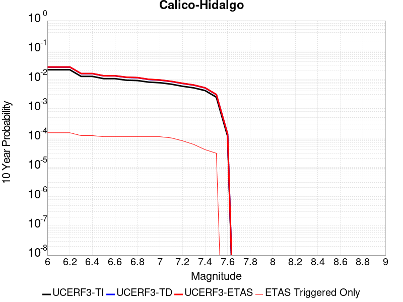 |

| Magnitude | 1 wk TI Prob | 1 wk TD Prob | 1 wk ETAS Prob | 1 wk ETAS/TD Gain | 1 wk ETAS Triggered Only | 1 mo TI Prob | 1 mo TD Prob | 1 mo ETAS Prob | 1 mo ETAS/TD Gain | 1 mo ETAS Triggered Only | 1 yr TI Prob | 1 yr TD Prob | 1 yr ETAS Prob | 1 yr ETAS/TD Gain | 1 yr ETAS Triggered Only | 10 yr TI Prob | 10 yr TD Prob | 10 yr ETAS Prob | 10 yr ETAS/TD Gain | 10 yr ETAS Triggered Only |
|-----|-----|-----|-----|-----|-----|-----|-----|-----|-----|-----|-----|-----|-----|-----|-----|-----|-----|-----|-----|-----|
| 6.0 | 4.0906612E-5 | 5.0707546E-5 | 5.0707546E-5 | 1.0 | 0.0 | 1.7530227E-4 | 2.1730224E-4 | 2.2768667E-4 | 1.047788 | 1.0386697E-5 | 0.0021322158 | 0.0026428488 | 0.002694645 | 1.0195986 | 5.1933483E-5 | 0.02111873 | 0.026154567 | 0.026306292 | 1.0058011 | 1.5580044E-4 |
| 6.1 | 4.0906612E-5 | 5.0707546E-5 | 5.0707546E-5 | 1.0 | 0.0 | 1.7530227E-4 | 2.1730224E-4 | 2.2768667E-4 | 1.047788 | 1.0386697E-5 | 0.0021322158 | 0.0026428488 | 0.002694645 | 1.0195986 | 5.1933483E-5 | 0.02111873 | 0.026154567 | 0.026306292 | 1.0058011 | 1.5580044E-4 |
| 6.2 | 4.0906612E-5 | 5.0707546E-5 | 5.0707546E-5 | 1.0 | 0.0 | 1.7530227E-4 | 2.1730224E-4 | 2.2768667E-4 | 1.047788 | 1.0386697E-5 | 0.0021322158 | 0.0026428488 | 0.002694645 | 1.0195986 | 5.1933483E-5 | 0.02111873 | 0.026154567 | 0.026306292 | 1.0058011 | 1.5580044E-4 |
| 6.3 | 2.4242801E-5 | 3.0092122E-5 | 3.0092122E-5 | 1.0 | 0.0 | 1.0389358E-4 | 1.2896005E-4 | 1.3934541E-4 | 1.0805316 | 1.0386697E-5 | 0.0012641704 | 0.0015689905 | 0.0016208425 | 1.033048 | 5.1933483E-5 | 0.01257003 | 0.015582806 | 0.015705504 | 1.0078739 | 1.2464036E-4 |
| 6.4 | 2.4242801E-5 | 3.0092122E-5 | 3.0092122E-5 | 1.0 | 0.0 | 1.0389358E-4 | 1.2896005E-4 | 1.3934541E-4 | 1.0805316 | 1.0386697E-5 | 0.0012641704 | 0.0015689905 | 0.0016208425 | 1.033048 | 5.1933483E-5 | 0.01257003 | 0.015582806 | 0.015705504 | 1.0078739 | 1.2464036E-4 |
| 6.5 | 2.0286952E-5 | 2.5316727E-5 | 2.5316727E-5 | 1.0 | 0.0 | 8.694118E-5 | 1.0849584E-4 | 1.1888141E-4 | 1.0957232 | 1.0386697E-5 | 0.0010579949 | 0.0013201536 | 0.0013720185 | 1.0392871 | 5.1933483E-5 | 0.010529719 | 0.013125047 | 0.013237801 | 1.0085907 | 1.14253664E-4 |
| 6.6 | 2.0269223E-5 | 2.5297675E-5 | 2.5297675E-5 | 1.0 | 0.0 | 8.6865206E-5 | 1.084142E-4 | 1.1879977E-4 | 1.0957953 | 1.0386697E-5 | 0.0010570707 | 0.0013191608 | 0.0013710258 | 1.0393167 | 5.1933483E-5 | 0.010520565 | 0.013115237 | 0.013227992 | 1.0085973 | 1.14253664E-4 |
| 6.7 | 1.799852E-5 | 2.25414E-5 | 2.25414E-5 | 1.0 | 0.0 | 7.713423E-5 | 9.660251E-5 | 1.06988206E-4 | 1.1075096 | 1.0386697E-5 | 9.3870464E-4 | 0.0011755156 | 0.0012273879 | 1.0441273 | 5.1933483E-5 | 0.009347493 | 0.011694587 | 0.011807504 | 1.0096556 | 1.14253664E-4 |
| 6.8 | 1.7458793E-5 | 2.1842892E-5 | 2.1842892E-5 | 1.0 | 0.0 | 7.4821255E-5 | 9.360912E-5 | 1.0399484E-4 | 1.1109477 | 1.0386697E-5 | 9.10568E-4 | 0.0011391096 | 0.0011909839 | 1.0455394 | 5.1933483E-5 | 0.009068459 | 0.011334292 | 0.011447251 | 1.0099661 | 1.14253664E-4 |
| 6.9 | 1.542884E-5 | 1.9026567E-5 | 1.9026567E-5 | 1.0 | 0.0 | 6.612192E-5 | 8.1539954E-5 | 9.19258E-5 | 1.1273713 | 1.0386697E-5 | 8.04737E-4 | 9.923099E-4 | 0.0010441919 | 1.052284 | 5.1933483E-5 | 0.008018291 | 0.009880188 | 0.009993313 | 1.0114497 | 1.14253664E-4 |
| 7.0 | 1.468253E-5 | 1.803119E-5 | 1.803119E-5 | 1.0 | 0.0 | 6.292361E-5 | 7.7274315E-5 | 8.766021E-5 | 1.1344029 | 1.0386697E-5 | 7.658257E-4 | 9.404217E-4 | 9.923064E-4 | 1.0551717 | 5.1933483E-5 | 0.0076319184 | 0.009365788 | 0.009478971 | 1.0120848 | 1.14253664E-4 |
| 7.1 | 1.3139281E-5 | 1.620145E-5 | 1.620145E-5 | 1.0 | 0.0 | 5.6309986E-5 | 6.943301E-5 | 7.981899E-5 | 1.1495826 | 1.0386697E-5 | 6.853584E-4 | 8.450316E-4 | 8.969212E-4 | 1.0614055 | 5.1933483E-5 | 0.0068324856 | 0.008419481 | 0.008522473 | 1.0122327 | 1.03866965E-4 |
| 7.2 | 1.1127404E-5 | 1.3867019E-5 | 1.3867019E-5 | 1.0 | 0.0 | 4.7688E-5 | 5.942879E-5 | 6.981487E-5 | 1.1747651 | 1.0386697E-5 | 5.8044674E-4 | 7.233162E-4 | 7.5445377E-4 | 1.0430484 | 3.116009E-5 | 0.0057893298 | 0.0072107273 | 0.0072932215 | 1.0114405 | 8.3093575E-5 |
| 7.3 | 9.808154E-6 | 1.217656E-5 | 1.217656E-5 | 1.0 | 0.0 | 4.2034266E-5 | 5.218427E-5 | 6.257043E-5 | 1.1990285 | 1.0386697E-5 | 5.11647E-4 | 6.3516904E-4 | 6.559292E-4 | 1.0326846 | 2.0773394E-5 | 0.0051047057 | 0.0063346117 | 0.006396537 | 1.0097758 | 6.232018E-5 |
| 7.4 | 7.942452E-6 | 9.7924E-6 | 9.7924E-6 | 1.0 | 0.0 | 3.4038632E-5 | 4.196681E-5 | 5.235307E-5 | 1.2474875 | 1.0386697E-5 | 4.1434157E-4 | 5.108356E-4 | 5.2121695E-4 | 1.0203223 | 1.0386697E-5 | 0.0041356985 | 0.0050975545 | 0.0051388894 | 1.0081087 | 4.1546788E-5 |
| 7.5 | 4.7121216E-6 | 5.772976E-6 | 5.772976E-6 | 1.0 | 0.0 | 2.019465E-5 | 2.4741134E-5 | 3.5127574E-5 | 1.4198046 | 1.0386697E-5 | 2.4584212E-4 | 3.011893E-4 | 3.115729E-4 | 1.0344752 | 1.0386697E-5 | 0.0024557032 | 0.0030085635 | 0.00303963 | 1.010326 | 3.116009E-5 |
| 7.6 | 2.21172E-7 | 2.6040124E-7 | 2.6040124E-7 | 1.0 | 0.0 | 9.478797E-7 | 1.116005E-6 | 1.116005E-6 | 1.0 | 0.0 | 1.1540374E-5 | 1.3587305E-5 | 1.3587305E-5 | 1.0 | 0.0 | 1.1539775E-4 | 1.3586757E-4 | 1.3586757E-4 | 1.0 | 0.0 |

## San Andreas (Parkfield)
*[(top)](#table-of-contents)*

| 1 Week | 1 Month | 1 Year | 10 Year |
|-----|-----|-----|-----|
|  |  |  |  |

| Magnitude | 1 wk TI Prob | 1 wk TD Prob | 1 wk ETAS Prob | 1 wk ETAS/TD Gain | 1 wk ETAS Triggered Only | 1 mo TI Prob | 1 mo TD Prob | 1 mo ETAS Prob | 1 mo ETAS/TD Gain | 1 mo ETAS Triggered Only | 1 yr TI Prob | 1 yr TD Prob | 1 yr ETAS Prob | 1 yr ETAS/TD Gain | 1 yr ETAS Triggered Only | 10 yr TI Prob | 10 yr TD Prob | 10 yr ETAS Prob | 10 yr ETAS/TD Gain | 10 yr ETAS Triggered Only |
|-----|-----|-----|-----|-----|-----|-----|-----|-----|-----|-----|-----|-----|-----|-----|-----|-----|-----|-----|-----|-----|
| 6.0 | 5.556969E-4 | 7.819087E-4 | 7.819087E-4 | 1.0 | 0.0 | 0.0023793848 | 0.0033472886 | 0.0033679924 | 1.0061853 | 2.0773394E-5 | 0.028586963 | 0.040385824 | 0.040495463 | 1.0027148 | 1.14253664E-4 | 0.25176284 | 0.33777508 | 0.33788514 | 1.0003258 | 1.6618715E-4 |
| 6.1 | 1.925858E-4 | 3.0390357E-4 | 3.0390357E-4 | 1.0 | 0.0 | 8.2510663E-4 | 0.0013018888 | 0.0013018888 | 1.0 | 0.0 | 0.0099994885 | 0.015834767 | 0.015906323 | 1.0045189 | 7.270688E-5 | 0.095613256 | 0.14999957 | 0.15008786 | 1.0005885 | 1.03866965E-4 |
| 6.2 | 9.4306815E-5 | 1.8273306E-4 | 1.8273306E-4 | 1.0 | 0.0 | 4.0410945E-4 | 7.829079E-4 | 7.829079E-4 | 1.0 | 0.0 | 0.0049089384 | 0.009490452 | 0.009552181 | 1.0065043 | 6.232018E-5 | 0.048019063 | 0.09198628 | 0.0920523 | 1.0007178 | 7.270688E-5 |
| 6.3 | 9.283051E-5 | 1.7969737E-4 | 1.7969737E-4 | 1.0 | 0.0 | 3.9778434E-4 | 7.6990545E-4 | 7.6990545E-4 | 1.0 | 0.0 | 0.0048322747 | 0.009333515 | 0.009395253 | 1.0066147 | 6.232018E-5 | 0.047285385 | 0.09063911 | 0.09070522 | 1.0007294 | 7.270688E-5 |
| 6.4 | 9.138826E-5 | 1.7731739E-4 | 1.7731739E-4 | 1.0 | 0.0 | 3.916052E-4 | 7.5971155E-4 | 7.5971155E-4 | 1.0 | 0.0 | 0.0047573745 | 0.00921046 | 0.009261915 | 1.0055866 | 5.1933483E-5 | 0.046568092 | 0.0895407 | 0.08959744 | 1.0006337 | 6.232018E-5 |
| 6.5 | 9.000255E-5 | 1.7489606E-4 | 1.7489606E-4 | 1.0 | 0.0 | 3.8566816E-4 | 7.493404E-4 | 7.493404E-4 | 1.0 | 0.0 | 0.0046854047 | 0.009085262 | 0.009136723 | 1.0056643 | 5.1933483E-5 | 0.045878403 | 0.08842592 | 0.08848272 | 1.0006424 | 6.232018E-5 |
| 6.6 | 8.8109264E-5 | 1.7170387E-4 | 1.7170387E-4 | 1.0 | 0.0 | 3.7755648E-4 | 7.3566736E-4 | 7.3566736E-4 | 1.0 | 0.0 | 0.0045870654 | 0.0089201825 | 0.008971652 | 1.0057701 | 5.1933483E-5 | 0.04493529 | 0.08695624 | 0.08701314 | 1.0006543 | 6.232018E-5 |
| 6.7 | 8.738073E-5 | 1.7037381E-4 | 1.7037381E-4 | 1.0 | 0.0 | 3.7443507E-4 | 7.2997034E-4 | 7.2997034E-4 | 1.0 | 0.0 | 0.0045492216 | 0.0088514285 | 0.008902902 | 1.0058153 | 5.1933483E-5 | 0.04457213 | 0.08635636 | 0.086413294 | 1.0006593 | 6.232018E-5 |
| 6.8 | 8.710195E-5 | 1.6982816E-4 | 1.6982816E-4 | 1.0 | 0.0 | 3.7324068E-4 | 7.2763313E-4 | 7.2763313E-4 | 1.0 | 0.0 | 0.0045347405 | 0.008823211 | 0.008874686 | 1.0058341 | 5.1933483E-5 | 0.04443313 | 0.08610373 | 0.08616068 | 1.0006615 | 6.232018E-5 |
| 6.9 | 8.6801556E-5 | 1.6923707E-4 | 1.6923707E-4 | 1.0 | 0.0 | 3.7195362E-4 | 7.251013E-4 | 7.251013E-4 | 1.0 | 0.0 | 0.0045191357 | 0.008792636 | 0.008844112 | 1.0058545 | 5.1933483E-5 | 0.044283327 | 0.08582957 | 0.08588654 | 1.0006638 | 6.232018E-5 |
| 7.0 | 8.5571606E-5 | 1.6676294E-4 | 1.6676294E-4 | 1.0 | 0.0 | 3.6668387E-4 | 7.145037E-4 | 7.145037E-4 | 1.0 | 0.0 | 0.004455241 | 0.008664643 | 0.008716127 | 1.0059417 | 5.1933483E-5 | 0.043669727 | 0.08467713 | 0.08473417 | 1.0006737 | 6.232018E-5 |
| 7.1 | 7.82589E-5 | 1.5156237E-4 | 1.5156237E-4 | 1.0 | 0.0 | 3.3535215E-4 | 6.493921E-4 | 6.493921E-4 | 1.0 | 0.0 | 0.0040752706 | 0.007877857 | 0.007929382 | 1.0065404 | 5.1933483E-5 | 0.040013418 | 0.077585794 | 0.07764328 | 1.0007409 | 6.232018E-5 |
| 7.2 | 7.690929E-5 | 1.489332E-4 | 1.489332E-4 | 1.0 | 0.0 | 3.2956956E-4 | 6.381298E-4 | 6.381298E-4 | 1.0 | 0.0 | 0.004005129 | 0.007741721 | 0.0077932524 | 1.0066563 | 5.1933483E-5 | 0.0393371 | 0.076358445 | 0.07641601 | 1.0007539 | 6.232018E-5 |
| 7.3 | 7.5543794E-5 | 1.4589565E-4 | 1.4589565E-4 | 1.0 | 0.0 | 3.2371894E-4 | 6.25118E-4 | 6.25118E-4 | 1.0 | 0.0 | 0.003934157 | 0.0075844154 | 0.007635955 | 1.0067954 | 5.1933483E-5 | 0.038652334 | 0.07492032 | 0.07497797 | 1.0007695 | 6.232018E-5 |
| 7.4 | 7.4214564E-5 | 1.4290171E-4 | 1.4290171E-4 | 1.0 | 0.0 | 3.1802364E-4 | 6.122929E-4 | 6.122929E-4 | 1.0 | 0.0 | 0.003865065 | 0.007429345 | 0.0074808924 | 1.0069383 | 5.1933483E-5 | 0.03798529 | 0.07349284 | 0.07355058 | 1.0007857 | 6.232018E-5 |
| 7.5 | 6.149578E-5 | 1.1214155E-4 | 1.1214155E-4 | 1.0 | 0.0 | 2.6352672E-4 | 4.8051824E-4 | 4.8051824E-4 | 1.0 | 0.0 | 0.0032037178 | 0.005834648 | 0.0058862786 | 1.0088489 | 5.1933483E-5 | 0.03157923 | 0.058665328 | 0.058723994 | 1.0009999 | 6.232018E-5 |
| 7.6 | 6.0643448E-5 | 1.10425855E-4 | 1.10425855E-4 | 1.0 | 0.0 | 2.598746E-4 | 4.7316792E-4 | 4.7316792E-4 | 1.0 | 0.0 | 0.0031593828 | 0.0057456335 | 0.005797269 | 1.0089868 | 5.1933483E-5 | 0.031148417 | 0.05782546 | 0.05788418 | 1.0010154 | 6.232018E-5 |
| 7.7 | 5.1652263E-5 | 9.1955124E-5 | 9.1955124E-5 | 1.0 | 0.0 | 2.2134806E-4 | 3.9403388E-4 | 3.9403388E-4 | 1.0 | 0.0 | 0.002691582 | 0.00478682 | 0.004797157 | 1.0021595 | 1.0386697E-5 | 0.026592141 | 0.048633553 | 0.048653316 | 1.0004064 | 2.0773394E-5 |
| 7.8 | 4.8090482E-5 | 8.578783E-5 | 8.578783E-5 | 1.0 | 0.0 | 2.060858E-4 | 3.6761034E-4 | 3.6761034E-4 | 1.0 | 0.0 | 0.0025062072 | 0.004466479 | 0.0044768197 | 1.002315 | 1.0386697E-5 | 0.024781305 | 0.045392275 | 0.045412105 | 1.0004369 | 2.0773394E-5 |
| 7.9 | 3.970278E-5 | 6.7652974E-5 | 6.7652974E-5 | 1.0 | 0.0 | 1.7014367E-4 | 2.899091E-4 | 2.899091E-4 | 1.0 | 0.0 | 0.002069531 | 0.0035239344 | 0.0035342844 | 1.0029371 | 1.0386697E-5 | 0.020503636 | 0.035952512 | 0.03597254 | 1.0005571 | 2.0773394E-5 |
| 8.0 | 2.8982335E-5 | 4.079188E-5 | 4.079188E-5 | 1.0 | 0.0 | 1.2420409E-4 | 1.7481064E-4 | 1.7481064E-4 | 1.0 | 0.0 | 0.0015111357 | 0.0021262432 | 0.0021262432 | 1.0 | 0.0 | 0.015009012 | 0.022057572 | 0.022067731 | 1.0004605 | 1.0386697E-5 |
| 8.1 | 1.8836186E-5 | 1.8733741E-5 | 1.8733741E-5 | 1.0 | 0.0 | 8.0724014E-5 | 8.028499E-5 | 8.028499E-5 | 1.0 | 0.0 | 9.823717E-4 | 9.77032E-4 | 9.77032E-4 | 1.0 | 0.0 | 0.009780403 | 0.010515724 | 0.010526001 | 1.0009774 | 1.0386697E-5 |
| 8.2 | 8.643924E-6 | 5.49522E-6 | 5.49522E-6 | 1.0 | 0.0 | 3.704486E-5 | 2.355073E-5 | 2.355073E-5 | 1.0 | 0.0 | 4.5092785E-4 | 2.866925E-4 | 2.866925E-4 | 1.0 | 0.0 | 0.0045001395 | 0.0032598388 | 0.0032598388 | 1.0 | 0.0 |
| 8.3 | 1.983087E-6 | 7.693574E-7 | 7.693574E-7 | 1.0 | 0.0 | 8.498917E-6 | 3.297242E-6 | 3.297242E-6 | 1.0 | 0.0 | 1.034694E-4 | 4.01432E-5 | 4.01432E-5 | 1.0 | 0.0 | 0.0010342124 | 4.7390026E-4 | 4.7390026E-4 | 1.0 | 0.0 |

## Baker
*[(top)](#table-of-contents)*

| 1 Week | 1 Month | 1 Year | 10 Year |
|-----|-----|-----|-----|
|  |  |  |  |

| Magnitude | 1 wk TI Prob | 1 wk TD Prob | 1 wk ETAS Prob | 1 wk ETAS/TD Gain | 1 wk ETAS Triggered Only | 1 mo TI Prob | 1 mo TD Prob | 1 mo ETAS Prob | 1 mo ETAS/TD Gain | 1 mo ETAS Triggered Only | 1 yr TI Prob | 1 yr TD Prob | 1 yr ETAS Prob | 1 yr ETAS/TD Gain | 1 yr ETAS Triggered Only | 10 yr TI Prob | 10 yr TD Prob | 10 yr ETAS Prob | 10 yr ETAS/TD Gain | 10 yr ETAS Triggered Only |
|-----|-----|-----|-----|-----|-----|-----|-----|-----|-----|-----|-----|-----|-----|-----|-----|-----|-----|-----|-----|-----|
| 6.0 | 5.695525E-6 | 5.8349133E-6 | 5.8349133E-6 | 1.0 | 0.0 | 2.4409164E-5 | 2.5006555E-5 | 3.539299E-5 | 1.4153485 | 1.0386697E-5 | 2.9714106E-4 | 3.0441626E-4 | 3.5633394E-4 | 1.1705483 | 5.1933483E-5 | 0.0029674405 | 0.0030403885 | 0.0031957151 | 1.0510879 | 1.5580044E-4 |
| 6.1 | 5.695525E-6 | 5.8349133E-6 | 5.8349133E-6 | 1.0 | 0.0 | 2.4409164E-5 | 2.5006555E-5 | 3.539299E-5 | 1.4153485 | 1.0386697E-5 | 2.9714106E-4 | 3.0441626E-4 | 3.5633394E-4 | 1.1705483 | 5.1933483E-5 | 0.0029674405 | 0.0030403885 | 0.0031957151 | 1.0510879 | 1.5580044E-4 |
| 6.2 | 5.695525E-6 | 5.8349133E-6 | 5.8349133E-6 | 1.0 | 0.0 | 2.4409164E-5 | 2.5006555E-5 | 3.539299E-5 | 1.4153485 | 1.0386697E-5 | 2.9714106E-4 | 3.0441626E-4 | 3.5633394E-4 | 1.1705483 | 5.1933483E-5 | 0.0029674405 | 0.0030403885 | 0.0031957151 | 1.0510879 | 1.5580044E-4 |
| 6.3 | 3.2995713E-6 | 3.3837132E-6 | 3.3837132E-6 | 1.0 | 0.0 | 1.4140943E-5 | 1.450155E-5 | 1.450155E-5 | 1.0 | 0.0 | 1.7215237E-4 | 1.7654254E-4 | 2.0769713E-4 | 1.1764708 | 3.116009E-5 | 0.0017201907 | 0.00176407 | 0.0018366487 | 1.0411427 | 7.270688E-5 |
| 6.4 | 3.2995713E-6 | 3.3837132E-6 | 3.3837132E-6 | 1.0 | 0.0 | 1.4140943E-5 | 1.450155E-5 | 1.450155E-5 | 1.0 | 0.0 | 1.7215237E-4 | 1.7654254E-4 | 2.0769713E-4 | 1.1764708 | 3.116009E-5 | 0.0017201907 | 0.00176407 | 0.0018366487 | 1.0411427 | 7.270688E-5 |
| 6.5 | 2.782202E-6 | 2.855881E-6 | 2.855881E-6 | 1.0 | 0.0 | 1.1923668E-5 | 1.2239434E-5 | 1.2239434E-5 | 1.0 | 0.0 | 1.4516099E-4 | 1.4900525E-4 | 1.801607E-4 | 1.2090896 | 3.116009E-5 | 0.001450662 | 0.0014890862 | 0.0015513136 | 1.0417889 | 6.232018E-5 |
| 6.6 | 2.3163404E-6 | 2.3809555E-6 | 2.3809555E-6 | 1.0 | 0.0 | 9.927136E-6 | 1.0204057E-5 | 1.0204057E-5 | 1.0 | 0.0 | 1.20856166E-4 | 1.242275E-4 | 1.5538374E-4 | 1.2507997 | 3.116009E-5 | 0.0012079047 | 0.0012416008 | 0.0013038437 | 1.0501311 | 6.232018E-5 |
| 6.7 | 2.037056E-6 | 2.0965333E-6 | 2.0965333E-6 | 1.0 | 0.0 | 8.7302105E-6 | 8.985113E-6 | 8.985113E-6 | 1.0 | 0.0 | 1.0628513E-4 | 1.0938842E-4 | 1.405451E-4 | 1.2848262 | 3.116009E-5 | 0.0010623431 | 0.0010933619 | 0.0011556139 | 1.0569364 | 6.232018E-5 |
| 6.8 | 1.8356744E-6 | 1.8915596E-6 | 1.8915596E-6 | 1.0 | 0.0 | 7.867153E-6 | 8.106659E-6 | 8.106659E-6 | 1.0 | 0.0 | 9.577837E-5 | 9.869425E-5 | 1.2985127E-4 | 1.3156923 | 3.116009E-5 | 9.57371E-4 | 9.865181E-4 | 0.0010487768 | 1.0631095 | 6.232018E-5 |
| 6.9 | 1.6310546E-6 | 1.6832361E-6 | 1.6832361E-6 | 1.0 | 0.0 | 6.9902153E-6 | 7.2138496E-6 | 7.2138496E-6 | 1.0 | 0.0 | 8.510255E-5 | 8.7825196E-5 | 1.1898255E-4 | 1.3547655 | 3.116009E-5 | 8.5069967E-4 | 8.779161E-4 | 9.4018155E-4 | 1.0709242 | 6.232018E-5 |
| 7.0 | 1.2058036E-6 | 1.2508916E-6 | 1.2508916E-6 | 1.0 | 0.0 | 5.1677193E-6 | 5.3609533E-6 | 5.3609533E-6 | 1.0 | 0.0 | 6.291517E-5 | 6.5267675E-5 | 9.642573E-5 | 1.4773889 | 3.116009E-5 | 6.289736E-4 | 6.5248733E-4 | 7.1476685E-4 | 1.0954493 | 6.232018E-5 |
| 7.1 | 1.052382E-6 | 1.0951846E-6 | 1.0951846E-6 | 1.0 | 0.0 | 4.5102006E-6 | 4.69364E-6 | 4.69364E-6 | 1.0 | 0.0 | 5.491031E-5 | 5.714358E-5 | 8.830189E-5 | 1.5452635 | 3.116009E-5 | 5.4896745E-4 | 5.7128974E-4 | 6.2319357E-4 | 1.0908537 | 5.1933483E-5 |
| 7.2 | 1.0067454E-6 | 1.0487945E-6 | 1.0487945E-6 | 1.0 | 0.0 | 4.3146156E-6 | 4.4948256E-6 | 4.4948256E-6 | 1.0 | 0.0 | 5.252918E-5 | 5.472314E-5 | 8.5881526E-5 | 1.5693823 | 3.116009E-5 | 5.251676E-4 | 5.470975E-4 | 5.990026E-4 | 1.0948735 | 5.1933483E-5 |
| 7.3 | 9.3596316E-7 | 9.76795E-7 | 9.76795E-7 | 1.0 | 0.0 | 4.0112645E-6 | 4.186258E-6 | 4.186258E-6 | 1.0 | 0.0 | 4.8836053E-5 | 5.0966508E-5 | 7.173884E-5 | 1.4075683 | 2.0773394E-5 | 4.8825322E-4 | 5.09549E-4 | 5.5107457E-4 | 1.0814948 | 4.1546788E-5 |
| 7.4 | 8.8117395E-7 | 9.207884E-7 | 9.207884E-7 | 1.0 | 0.0 | 3.7764542E-6 | 3.94623E-6 | 3.94623E-6 | 1.0 | 0.0 | 4.5977362E-5 | 4.80443E-5 | 4.80443E-5 | 1.0 | 0.0 | 4.596785E-4 | 4.803399E-4 | 5.011033E-4 | 1.0432265 | 2.0773394E-5 |
| 7.5 | 8.292386E-7 | 8.6748094E-7 | 8.6748094E-7 | 1.0 | 0.0 | 3.5538749E-6 | 3.7177701E-6 | 3.7177701E-6 | 1.0 | 0.0 | 4.326757E-5 | 4.5262917E-5 | 4.5262917E-5 | 1.0 | 0.0 | 4.3259145E-4 | 4.5253773E-4 | 4.733017E-4 | 1.0458834 | 2.0773394E-5 |
| 7.6 | 7.553842E-7 | 7.9146724E-7 | 7.9146724E-7 | 1.0 | 0.0 | 3.2373566E-6 | 3.391998E-6 | 3.391998E-6 | 1.0 | 0.0 | 3.9414106E-5 | 4.12968E-5 | 4.12968E-5 | 1.0 | 0.0 | 3.9407116E-4 | 4.1289197E-4 | 4.2327438E-4 | 1.0251455 | 1.0386697E-5 |
| 7.7 | 6.5285366E-7 | 6.8529783E-7 | 6.8529783E-7 | 1.0 | 0.0 | 2.797941E-6 | 2.9369874E-6 | 2.9369874E-6 | 1.0 | 0.0 | 3.40644E-5 | 3.5757243E-5 | 3.5757243E-5 | 1.0 | 0.0 | 3.405918E-4 | 3.5751556E-4 | 3.5751556E-4 | 1.0 | 0.0 |
| 7.8 | 3.4586725E-7 | 3.648368E-7 | 3.648368E-7 | 1.0 | 0.0 | 1.4822873E-6 | 1.5635853E-6 | 1.5635853E-6 | 1.0 | 0.0 | 1.80467E-5 | 1.903649E-5 | 1.903649E-5 | 1.0 | 0.0 | 1.8045233E-4 | 1.9034903E-4 | 1.9034903E-4 | 1.0 | 0.0 |
| 7.9 | 2.5591178E-9 | 2.6697329E-9 | 2.6697329E-9 | 1.0 | 0.0 | 1.0967647E-8 | 1.14417125E-8 | 1.14417125E-8 | 1.0 | 0.0 | 1.335311E-7 | 1.3930286E-7 | 1.3930286E-7 | 1.0 | 0.0 | 1.3353102E-6 | 1.3930285E-6 | 1.3930285E-6 | 1.0 | 0.0 |

## San Andreas (Cholame) rev
*[(top)](#table-of-contents)*

| 1 Week | 1 Month | 1 Year | 10 Year |
|-----|-----|-----|-----|
|  |  |  | 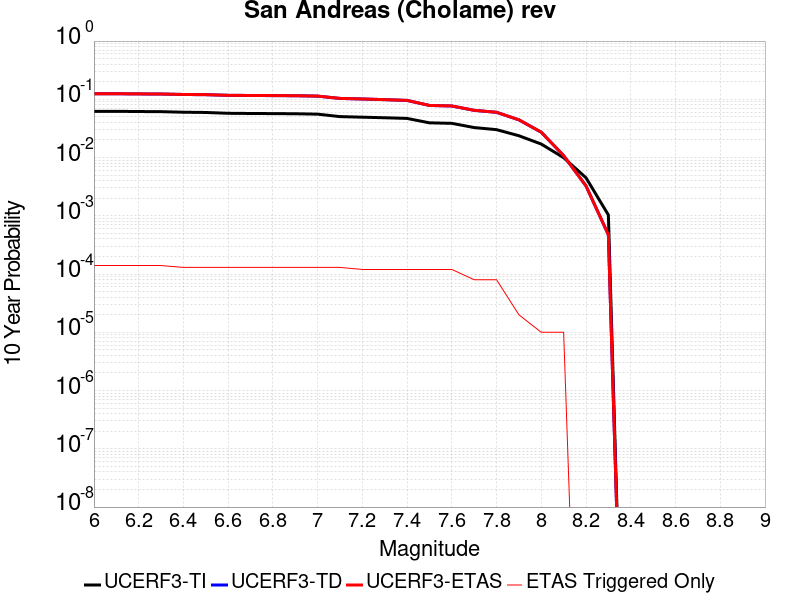 |

| Magnitude | 1 wk TI Prob | 1 wk TD Prob | 1 wk ETAS Prob | 1 wk ETAS/TD Gain | 1 wk ETAS Triggered Only | 1 mo TI Prob | 1 mo TD Prob | 1 mo ETAS Prob | 1 mo ETAS/TD Gain | 1 mo ETAS Triggered Only | 1 yr TI Prob | 1 yr TD Prob | 1 yr ETAS Prob | 1 yr ETAS/TD Gain | 1 yr ETAS Triggered Only | 10 yr TI Prob | 10 yr TD Prob | 10 yr ETAS Prob | 10 yr ETAS/TD Gain | 10 yr ETAS Triggered Only |
|-----|-----|-----|-----|-----|-----|-----|-----|-----|-----|-----|-----|-----|-----|-----|-----|-----|-----|-----|-----|-----|
| 6.0 | 1.2302514E-4 | 2.5242948E-4 | 2.5242948E-4 | 1.0 | 0.0 | 5.27144E-4 | 0.0010813937 | 0.0010813937 | 1.0 | 0.0 | 0.0063991086 | 0.013086997 | 0.013189505 | 1.0078328 | 1.03866965E-4 | 0.06217949 | 0.1245517 | 0.124679 | 1.0010221 | 1.4541375E-4 |
| 6.1 | 1.2302514E-4 | 2.5242948E-4 | 2.5242948E-4 | 1.0 | 0.0 | 5.27144E-4 | 0.0010813937 | 0.0010813937 | 1.0 | 0.0 | 0.0063991086 | 0.013086997 | 0.013189505 | 1.0078328 | 1.03866965E-4 | 0.06217949 | 0.1245517 | 0.124679 | 1.0010221 | 1.4541375E-4 |
| 6.2 | 1.2203569E-4 | 2.5059693E-4 | 2.5059693E-4 | 1.0 | 0.0 | 5.2290526E-4 | 0.0010735465 | 0.0010735465 | 1.0 | 0.0 | 0.006347804 | 0.0129926 | 0.013095118 | 1.0078905 | 1.03866965E-4 | 0.061695136 | 0.12373783 | 0.123865254 | 1.0010297 | 1.4541375E-4 |
| 6.3 | 1.2142645E-4 | 2.4945638E-4 | 2.4945638E-4 | 1.0 | 0.0 | 5.202953E-4 | 0.0010686623 | 0.0010686623 | 1.0 | 0.0 | 0.006316212 | 0.012933843 | 0.013036367 | 1.0079268 | 1.03866965E-4 | 0.06139677 | 0.123231925 | 0.12335942 | 1.0010346 | 1.4541375E-4 |
| 6.4 | 1.1865206E-4 | 2.4450937E-4 | 2.4450937E-4 | 1.0 | 0.0 | 5.0840975E-4 | 0.001047478 | 0.001047478 | 1.0 | 0.0 | 0.006172335 | 0.012678952 | 0.012771247 | 1.0072794 | 9.3480274E-5 | 0.060036868 | 0.121024184 | 0.12114287 | 1.0009807 | 1.3502706E-4 |
| 6.5 | 1.17443946E-4 | 2.4244092E-4 | 2.4244092E-4 | 1.0 | 0.0 | 5.032341E-4 | 0.0010386204 | 0.0010386204 | 1.0 | 0.0 | 0.006109677 | 0.012572356 | 0.012664661 | 1.0073419 | 9.3480274E-5 | 0.059444077 | 0.12009794 | 0.12021676 | 1.0009893 | 1.3502706E-4 |
| 6.6 | 1.13579066E-4 | 2.3552658E-4 | 2.3552658E-4 | 1.0 | 0.0 | 4.866766E-4 | 0.0010090107 | 0.0010090107 | 1.0 | 0.0 | 0.0059092017 | 0.012215953 | 0.012308291 | 1.0075588 | 9.3480274E-5 | 0.057545185 | 0.11701085 | 0.11713008 | 1.001019 | 1.3502706E-4 |
| 6.7 | 1.1271412E-4 | 2.339688E-4 | 2.339688E-4 | 1.0 | 0.0 | 4.829711E-4 | 0.0010023396 | 0.0010023396 | 1.0 | 0.0 | 0.005864331 | 0.012135641 | 0.012227987 | 1.0076095 | 9.3480274E-5 | 0.057119697 | 0.116314195 | 0.116433516 | 1.0010258 | 1.3502706E-4 |
| 6.8 | 1.1217975E-4 | 2.3285215E-4 | 2.3285215E-4 | 1.0 | 0.0 | 4.8068175E-4 | 9.975577E-4 | 9.975577E-4 | 1.0 | 0.0 | 0.005836608 | 0.012078067 | 0.012170419 | 1.0076462 | 9.3480274E-5 | 0.056856725 | 0.11581219 | 0.11593158 | 1.0010309 | 1.3502706E-4 |
| 6.9 | 1.1146753E-4 | 2.3133864E-4 | 2.3133864E-4 | 1.0 | 0.0 | 4.7763053E-4 | 9.910761E-4 | 9.910761E-4 | 1.0 | 0.0 | 0.0057996577 | 0.012000027 | 0.012092385 | 1.0076965 | 9.3480274E-5 | 0.056506127 | 0.11513234 | 0.11525182 | 1.0010377 | 1.3502706E-4 |
| 7.0 | 1.0965793E-4 | 2.2756905E-4 | 2.2756905E-4 | 1.0 | 0.0 | 4.698779E-4 | 9.7493286E-4 | 9.7493286E-4 | 1.0 | 0.0 | 0.005705768 | 0.01180563 | 0.011898006 | 1.0078248 | 9.3480274E-5 | 0.055614736 | 0.11343304 | 0.11355275 | 1.0010554 | 1.3502706E-4 |
| 7.1 | 9.927982E-5 | 2.0574623E-4 | 2.0574623E-4 | 1.0 | 0.0 | 4.2541555E-4 | 8.814726E-4 | 8.814726E-4 | 1.0 | 0.0 | 0.0051671406 | 0.0106794145 | 0.010771897 | 1.0086598 | 9.3480274E-5 | 0.05048634 | 0.10352388 | 0.10364493 | 1.0011693 | 1.3502706E-4 |
| 7.2 | 9.696786E-5 | 2.0078626E-4 | 2.0078626E-4 | 1.0 | 0.0 | 4.1551032E-4 | 8.602298E-4 | 8.602298E-4 | 1.0 | 0.0 | 0.00504711 | 0.010423285 | 0.010505512 | 1.0078888 | 8.3093575E-5 | 0.04934009 | 0.10126121 | 0.10137323 | 1.0011063 | 1.2464036E-4 |
| 7.3 | 9.4727984E-5 | 1.9507346E-4 | 1.9507346E-4 | 1.0 | 0.0 | 4.0591392E-4 | 8.357622E-4 | 8.357622E-4 | 1.0 | 0.0 | 0.0049308087 | 0.010128201 | 0.010210453 | 1.0081211 | 8.3093575E-5 | 0.048228268 | 0.09863034 | 0.098742686 | 1.001139 | 1.2464036E-4 |
| 7.4 | 9.220358E-5 | 1.8877286E-4 | 1.8877286E-4 | 1.0 | 0.0 | 3.9509835E-4 | 8.0877665E-4 | 8.0877665E-4 | 1.0 | 0.0 | 0.004799717 | 0.009802646 | 0.009884925 | 1.0083935 | 8.3093575E-5 | 0.046973653 | 0.09570612 | 0.09581883 | 1.0011777 | 1.2464036E-4 |
| 7.5 | 7.71631E-5 | 1.520787E-4 | 1.520787E-4 | 1.0 | 0.0 | 3.306571E-4 | 6.516032E-4 | 6.516032E-4 | 1.0 | 0.0 | 0.0040183207 | 0.007904484 | 0.007986921 | 1.0104291 | 8.3093575E-5 | 0.03946433 | 0.078419134 | 0.078534 | 1.0014647 | 1.2464036E-4 |
| 7.6 | 7.5634416E-5 | 1.4866945E-4 | 1.4866945E-4 | 1.0 | 0.0 | 3.241072E-4 | 6.369994E-4 | 6.369994E-4 | 1.0 | 0.0 | 0.0039388672 | 0.007727957 | 0.0078104082 | 1.0106692 | 8.3093575E-5 | 0.038697794 | 0.07678112 | 0.07689618 | 1.0014987 | 1.2464036E-4 |
| 7.7 | 6.3783E-5 | 1.2385153E-4 | 1.2385153E-4 | 1.0 | 0.0 | 2.7332708E-4 | 5.3068437E-4 | 5.3068437E-4 | 1.0 | 0.0 | 0.0033226798 | 0.0064419676 | 0.006483247 | 1.0064079 | 4.1546788E-5 | 0.032734364 | 0.064660996 | 0.06473871 | 1.001202 | 8.3093575E-5 |
| 7.8 | 5.863422E-5 | 1.1440121E-4 | 1.1440121E-4 | 1.0 | 0.0 | 2.512653E-4 | 4.9019884E-4 | 4.9019884E-4 | 1.0 | 0.0 | 0.003054864 | 0.00595186 | 0.0059931595 | 1.0069389 | 4.1546788E-5 | 0.030132094 | 0.059769355 | 0.05984748 | 1.0013071 | 8.3093575E-5 |
| 7.9 | 4.595283E-5 | 8.443828E-5 | 8.443828E-5 | 1.0 | 0.0 | 1.9692584E-4 | 3.6182816E-4 | 3.6182816E-4 | 1.0 | 0.0 | 0.0023949358 | 0.0043963664 | 0.0044067074 | 1.0023521 | 1.0386697E-5 | 0.023692891 | 0.04444455 | 0.0444644 | 1.0004467 | 2.0773394E-5 |
| 8.0 | 3.2950178E-5 | 5.0881976E-5 | 5.0881976E-5 | 1.0 | 0.0 | 1.412074E-4 | 2.180474E-4 | 2.180474E-4 | 1.0 | 0.0 | 0.0017178444 | 0.0026514968 | 0.0026514968 | 1.0 | 0.0 | 0.017046256 | 0.027233804 | 0.027243907 | 1.000371 | 1.0386697E-5 |
| 8.1 | 1.9177472E-5 | 1.9238712E-5 | 1.9238712E-5 | 1.0 | 0.0 | 8.218658E-5 | 8.244903E-5 | 8.244903E-5 | 1.0 | 0.0 | 0.0010001622 | 0.0010033553 | 0.0010033553 | 1.0 | 0.0 | 0.009956728 | 0.010786239 | 0.010796513 | 1.0009526 | 1.0386697E-5 |
| 8.2 | 8.643924E-6 | 5.49522E-6 | 5.49522E-6 | 1.0 | 0.0 | 3.704486E-5 | 2.355073E-5 | 2.355073E-5 | 1.0 | 0.0 | 4.5092785E-4 | 2.866925E-4 | 2.866925E-4 | 1.0 | 0.0 | 0.0045001395 | 0.0032598388 | 0.0032598388 | 1.0 | 0.0 |
| 8.3 | 1.983087E-6 | 7.693574E-7 | 7.693574E-7 | 1.0 | 0.0 | 8.498917E-6 | 3.297242E-6 | 3.297242E-6 | 1.0 | 0.0 | 1.034694E-4 | 4.01432E-5 | 4.01432E-5 | 1.0 | 0.0 | 0.0010342124 | 4.7390026E-4 | 4.7390026E-4 | 1.0 | 0.0 |

## San Jacinto (San Bernardino)
*[(top)](#table-of-contents)*

| 1 Week | 1 Month | 1 Year | 10 Year |
|-----|-----|-----|-----|
|  |  |  |  |

| Magnitude | 1 wk TI Prob | 1 wk TD Prob | 1 wk ETAS Prob | 1 wk ETAS/TD Gain | 1 wk ETAS Triggered Only | 1 mo TI Prob | 1 mo TD Prob | 1 mo ETAS Prob | 1 mo ETAS/TD Gain | 1 mo ETAS Triggered Only | 1 yr TI Prob | 1 yr TD Prob | 1 yr ETAS Prob | 1 yr ETAS/TD Gain | 1 yr ETAS Triggered Only | 10 yr TI Prob | 10 yr TD Prob | 10 yr ETAS Prob | 10 yr ETAS/TD Gain | 10 yr ETAS Triggered Only |
|-----|-----|-----|-----|-----|-----|-----|-----|-----|-----|-----|-----|-----|-----|-----|-----|-----|-----|-----|-----|-----|
| 6.0 | 3.409352E-5 | 3.6049758E-5 | 3.6049758E-5 | 1.0 | 0.0 | 1.461069E-4 | 1.5448983E-4 | 1.6487492E-4 | 1.0672219 | 1.0386697E-5 | 0.0017774 | 0.0018792928 | 0.0019725973 | 1.0496488 | 9.3480274E-5 | 0.01763251 | 0.019382251 | 0.019524846 | 1.007357 | 1.4541375E-4 |
| 6.1 | 3.409352E-5 | 3.6049758E-5 | 3.6049758E-5 | 1.0 | 0.0 | 1.461069E-4 | 1.5448983E-4 | 1.6487492E-4 | 1.0672219 | 1.0386697E-5 | 0.0017774 | 0.0018792928 | 0.0019725973 | 1.0496488 | 9.3480274E-5 | 0.01763251 | 0.019382251 | 0.019524846 | 1.007357 | 1.4541375E-4 |
| 6.2 | 3.409352E-5 | 3.6049758E-5 | 3.6049758E-5 | 1.0 | 0.0 | 1.461069E-4 | 1.5448983E-4 | 1.6487492E-4 | 1.0672219 | 1.0386697E-5 | 0.0017774 | 0.0018792928 | 0.0019725973 | 1.0496488 | 9.3480274E-5 | 0.01763251 | 0.019382251 | 0.019524846 | 1.007357 | 1.4541375E-4 |
| 6.3 | 3.409352E-5 | 3.6049758E-5 | 3.6049758E-5 | 1.0 | 0.0 | 1.461069E-4 | 1.5448983E-4 | 1.6487492E-4 | 1.0672219 | 1.0386697E-5 | 0.0017774 | 0.0018792928 | 0.0019725973 | 1.0496488 | 9.3480274E-5 | 0.01763251 | 0.019382251 | 0.019524846 | 1.007357 | 1.4541375E-4 |
| 6.4 | 3.400795E-5 | 3.5942405E-5 | 3.5942405E-5 | 1.0 | 0.0 | 1.4574021E-4 | 1.540298E-4 | 1.644149E-4 | 1.0674226 | 1.0386697E-5 | 0.0017729428 | 0.0018737017 | 0.0019566396 | 1.0442642 | 8.3093575E-5 | 0.017588645 | 0.019327328 | 0.019459745 | 1.0068513 | 1.3502706E-4 |
| 6.5 | 3.341482E-5 | 3.5202946E-5 | 3.5202946E-5 | 1.0 | 0.0 | 1.4319851E-4 | 1.5086106E-4 | 1.612462E-4 | 1.0688391 | 1.0386697E-5 | 0.0017420477 | 0.0018351874 | 0.0019181285 | 1.0451949 | 8.3093575E-5 | 0.017284546 | 0.018948833 | 0.019071111 | 1.006453 | 1.2464036E-4 |
| 6.6 | 3.3364955E-5 | 3.5140158E-5 | 3.5140158E-5 | 1.0 | 0.0 | 1.4298483E-4 | 1.50592E-4 | 1.6097713E-4 | 1.0689621 | 1.0386697E-5 | 0.0017394501 | 0.0018319171 | 0.0019148584 | 1.0452757 | 8.3093575E-5 | 0.017258976 | 0.018916694 | 0.019038977 | 1.0064642 | 1.2464036E-4 |
| 6.7 | 3.335922E-5 | 3.512993E-5 | 3.512993E-5 | 1.0 | 0.0 | 1.4296026E-4 | 1.5054816E-4 | 1.609333E-4 | 1.0689821 | 1.0386697E-5 | 0.0017391514 | 0.0018313844 | 0.0019143258 | 1.0452889 | 8.3093575E-5 | 0.017256035 | 0.018911485 | 0.01903377 | 1.006466 | 1.2464036E-4 |
| 6.8 | 3.327683E-5 | 3.5023982E-5 | 3.5023982E-5 | 1.0 | 0.0 | 1.4260718E-4 | 1.5009414E-4 | 1.6047928E-4 | 1.0691909 | 1.0386697E-5 | 0.0017348597 | 0.0018258659 | 0.0019088078 | 1.045426 | 8.3093575E-5 | 0.017213784 | 0.018857252 | 0.01897954 | 1.006485 | 1.2464036E-4 |
| 6.9 | 3.3235785E-5 | 3.4964927E-5 | 3.4964927E-5 | 1.0 | 0.0 | 1.4243131E-4 | 1.4984109E-4 | 1.6022622E-4 | 1.0693077 | 1.0386697E-5 | 0.0017327217 | 0.0018227901 | 0.0019057322 | 1.0455028 | 8.3093575E-5 | 0.017192734 | 0.018827116 | 0.01894941 | 1.0064956 | 1.2464036E-4 |
| 7.0 | 3.3197095E-5 | 3.4904846E-5 | 3.4904846E-5 | 1.0 | 0.0 | 1.422655E-4 | 1.4958362E-4 | 1.5996877E-4 | 1.069427 | 1.0386697E-5 | 0.0017307063 | 0.0018196608 | 0.0019026031 | 1.0455812 | 8.3093575E-5 | 0.017172894 | 0.018796489 | 0.018918786 | 1.0065064 | 1.2464036E-4 |
| 7.1 | 3.3129716E-5 | 3.478503E-5 | 3.478503E-5 | 1.0 | 0.0 | 1.4197677E-4 | 1.4907018E-4 | 1.5945533E-4 | 1.0696661 | 1.0386697E-5 | 0.0017271966 | 0.0018134202 | 0.0018963631 | 1.0457383 | 8.3093575E-5 | 0.017138338 | 0.018735558 | 0.018857863 | 1.006528 | 1.2464036E-4 |
| 7.2 | 3.3034008E-5 | 3.4652458E-5 | 3.4652458E-5 | 1.0 | 0.0 | 1.4156665E-4 | 1.4850209E-4 | 1.5888724E-4 | 1.0699327 | 1.0386697E-5 | 0.0017222111 | 0.001806515 | 0.0018894585 | 1.0459136 | 8.3093575E-5 | 0.017089253 | 0.018667944 | 0.018790256 | 1.0065521 | 1.2464036E-4 |
| 7.3 | 3.2956614E-5 | 3.4520177E-5 | 3.4520177E-5 | 1.0 | 0.0 | 1.4123498E-4 | 1.4793524E-4 | 1.583204E-4 | 1.0702007 | 1.0386697E-5 | 0.0017181796 | 0.001799625 | 0.001882569 | 1.0460896 | 8.3093575E-5 | 0.017049557 | 0.018600674 | 0.018722996 | 1.0065762 | 1.2464036E-4 |
| 7.4 | 3.2915937E-5 | 3.4441844E-5 | 3.4441844E-5 | 1.0 | 0.0 | 1.4106068E-4 | 1.4759957E-4 | 1.5798473E-4 | 1.0703604 | 1.0386697E-5 | 0.0017160608 | 0.0017955449 | 0.0018784893 | 1.0461946 | 8.3093575E-5 | 0.017028693 | 0.018560927 | 0.018683255 | 1.0065906 | 1.2464036E-4 |
| 7.5 | 3.281791E-5 | 3.430671E-5 | 3.430671E-5 | 1.0 | 0.0 | 1.406406E-4 | 1.4702049E-4 | 1.5740567E-4 | 1.0706376 | 1.0386697E-5 | 0.0017109542 | 0.0017885063 | 0.0018714513 | 1.0463767 | 8.3093575E-5 | 0.016978411 | 0.018491795 | 0.01861413 | 1.0066156 | 1.2464036E-4 |
| 7.6 | 3.2521442E-5 | 3.4031546E-5 | 3.4031546E-5 | 1.0 | 0.0 | 1.3937015E-4 | 1.4584133E-4 | 1.5622651E-4 | 1.0712087 | 1.0386697E-5 | 0.0016955109 | 0.0017741736 | 0.0018571197 | 1.046752 | 8.3093575E-5 | 0.016826328 | 0.018349366 | 0.01847172 | 1.006668 | 1.2464036E-4 |
| 7.7 | 3.0287873E-5 | 3.2514843E-5 | 3.2514843E-5 | 1.0 | 0.0 | 1.297987E-4 | 1.393419E-4 | 1.4972714E-4 | 1.0745307 | 1.0386697E-5 | 0.0015791537 | 0.0016951686 | 0.0017781213 | 1.0489348 | 8.3093575E-5 | 0.01567979 | 0.017559871 | 0.017682323 | 1.0069734 | 1.2464036E-4 |
| 7.8 | 2.6316151E-5 | 2.9723395E-5 | 2.9723395E-5 | 1.0 | 0.0 | 1.1277862E-4 | 1.2737977E-4 | 1.3776514E-4 | 1.0815308 | 1.0386697E-5 | 0.0013722149 | 0.0015497464 | 0.0016327112 | 1.0535344 | 8.3093575E-5 | 0.013637724 | 0.016100293 | 0.016222928 | 1.0076169 | 1.2464036E-4 |
| 7.9 | 2.0761147E-5 | 2.3470231E-5 | 2.3470231E-5 | 1.0 | 0.0 | 8.897331E-5 | 1.0058283E-4 | 1.0058283E-4 | 1.0 | 0.0 | 0.0010827117 | 0.0012239089 | 0.0012965268 | 1.0593327 | 7.270688E-5 | 0.010774517 | 0.012820105 | 0.01292264 | 1.007998 | 1.03866965E-4 |
| 8.0 | 1.5738568E-5 | 1.607273E-5 | 1.607273E-5 | 1.0 | 0.0 | 6.744926E-5 | 6.8881316E-5 | 6.8881316E-5 | 1.0 | 0.0 | 8.2088535E-4 | 8.38308E-4 | 8.90198E-4 | 1.0618985 | 5.1933483E-5 | 0.008178596 | 0.008886527 | 0.008958587 | 1.008109 | 7.270688E-5 |
| 8.1 | 1.0105832E-5 | 8.353191E-6 | 8.353191E-6 | 1.0 | 0.0 | 4.3309992E-5 | 3.5798905E-5 | 3.5798905E-5 | 1.0 | 0.0 | 5.2717153E-4 | 4.35765E-4 | 4.5652935E-4 | 1.0476503 | 2.0773394E-5 | 0.005259227 | 0.004689436 | 0.00472045 | 1.0066136 | 3.116009E-5 |
| 8.2 | 4.189207E-6 | 1.5851253E-6 | 1.5851253E-6 | 1.0 | 0.0 | 1.7953622E-5 | 6.7933765E-6 | 6.7933765E-6 | 1.0 | 0.0 | 2.1856341E-4 | 8.270625E-5 | 8.270625E-5 | 1.0 | 0.0 | 0.0021834858 | 9.604094E-4 | 9.604094E-4 | 1.0 | 0.0 |
| 8.3 | 1.2758221E-6 | 3.6330252E-7 | 3.6330252E-7 | 1.0 | 0.0 | 5.4677976E-6 | 1.5570099E-6 | 1.5570099E-6 | 1.0 | 0.0 | 6.65684E-5 | 1.8956434E-5 | 1.8956434E-5 | 1.0 | 0.0 | 6.6548464E-4 | 2.2857229E-4 | 2.2857229E-4 | 1.0 | 0.0 |

## Owens Valley
*[(top)](#table-of-contents)*

| 1 Week | 1 Month | 1 Year | 10 Year |
|-----|-----|-----|-----|
|  |  |  |  |

| Magnitude | 1 wk TI Prob | 1 wk TD Prob | 1 wk ETAS Prob | 1 wk ETAS/TD Gain | 1 wk ETAS Triggered Only | 1 mo TI Prob | 1 mo TD Prob | 1 mo ETAS Prob | 1 mo ETAS/TD Gain | 1 mo ETAS Triggered Only | 1 yr TI Prob | 1 yr TD Prob | 1 yr ETAS Prob | 1 yr ETAS/TD Gain | 1 yr ETAS Triggered Only | 10 yr TI Prob | 10 yr TD Prob | 10 yr ETAS Prob | 10 yr ETAS/TD Gain | 10 yr ETAS Triggered Only |
|-----|-----|-----|-----|-----|-----|-----|-----|-----|-----|-----|-----|-----|-----|-----|-----|-----|-----|-----|-----|-----|
| 6.0 | 4.83821E-5 | 3.6298834E-6 | 3.6298834E-6 | 1.0 | 0.0 | 2.0733538E-4 | 1.5556556E-5 | 3.6329628E-5 | 2.3353257 | 2.0773394E-5 | 0.002521386 | 1.893856E-4 | 2.7246343E-4 | 1.4386703 | 8.3093575E-5 | 0.024929691 | 0.0019267192 | 0.0020718528 | 1.0753268 | 1.4541375E-4 |
| 6.1 | 4.83821E-5 | 3.6298834E-6 | 3.6298834E-6 | 1.0 | 0.0 | 2.0733538E-4 | 1.5556556E-5 | 3.6329628E-5 | 2.3353257 | 2.0773394E-5 | 0.002521386 | 1.893856E-4 | 2.7246343E-4 | 1.4386703 | 8.3093575E-5 | 0.024929691 | 0.0019267192 | 0.0020718528 | 1.0753268 | 1.4541375E-4 |
| 6.2 | 4.83821E-5 | 3.6298834E-6 | 3.6298834E-6 | 1.0 | 0.0 | 2.0733538E-4 | 1.5556556E-5 | 3.6329628E-5 | 2.3353257 | 2.0773394E-5 | 0.002521386 | 1.893856E-4 | 2.7246343E-4 | 1.4386703 | 8.3093575E-5 | 0.024929691 | 0.0019267192 | 0.0020718528 | 1.0753268 | 1.4541375E-4 |
| 6.3 | 3.953008E-5 | 3.1571942E-6 | 3.1571942E-6 | 1.0 | 0.0 | 1.6940363E-4 | 1.3530766E-5 | 3.4303877E-5 | 2.5352502 | 2.0773394E-5 | 0.002060538 | 1.6472537E-4 | 2.3742027E-4 | 1.4413097 | 7.270688E-5 | 0.020415364 | 0.0016601578 | 0.0017949607 | 1.0811988 | 1.3502706E-4 |
| 6.4 | 3.953008E-5 | 3.1571942E-6 | 3.1571942E-6 | 1.0 | 0.0 | 1.6940363E-4 | 1.3530766E-5 | 3.4303877E-5 | 2.5352502 | 2.0773394E-5 | 0.002060538 | 1.6472537E-4 | 2.3742027E-4 | 1.4413097 | 7.270688E-5 | 0.020415364 | 0.0016601578 | 0.0017949607 | 1.0811988 | 1.3502706E-4 |
| 6.5 | 3.457342E-5 | 2.9727623E-6 | 2.9727623E-6 | 1.0 | 0.0 | 1.4816338E-4 | 1.2740352E-5 | 3.351348E-5 | 2.630499 | 2.0773394E-5 | 0.0018023965 | 1.5510344E-4 | 2.2779904E-4 | 1.4686911 | 7.270688E-5 | 0.017878477 | 0.0015563503 | 0.0016911671 | 1.0866238 | 1.3502706E-4 |
| 6.6 | 3.1127765E-5 | 2.8753116E-6 | 2.8753116E-6 | 1.0 | 0.0 | 1.3339789E-4 | 1.232271E-5 | 3.3095846E-5 | 2.6857605 | 2.0773394E-5 | 0.0016229092 | 1.5001935E-4 | 2.2271532E-4 | 1.4845773 | 7.270688E-5 | 0.016111081 | 0.0015016922 | 0.0016365165 | 1.0897815 | 1.3502706E-4 |
| 6.7 | 2.806885E-5 | 2.8110242E-6 | 2.8110242E-6 | 1.0 | 0.0 | 1.2028952E-4 | 1.2047194E-5 | 3.282034E-5 | 2.7243137 | 2.0773394E-5 | 0.001463541 | 1.466654E-4 | 2.1936162E-4 | 1.4956603 | 7.270688E-5 | 0.014539397 | 0.0014660707 | 0.0016008997 | 1.0919663 | 1.3502706E-4 |
| 6.8 | 2.524524E-5 | 2.2358972E-6 | 2.2358972E-6 | 1.0 | 0.0 | 1.0818939E-4 | 9.582383E-6 | 3.0355577E-5 | 3.1678526 | 2.0773394E-5 | 0.0013164099 | 1.16659576E-4 | 1.8935796E-4 | 1.623167 | 7.270688E-5 | 0.01308639 | 0.001166257 | 0.0013011266 | 1.1156431 | 1.3502706E-4 |
| 6.9 | 2.2704568E-5 | 1.6085578E-6 | 1.6085578E-6 | 1.0 | 0.0 | 9.730166E-5 | 6.893801E-6 | 2.766705E-5 | 4.0133233 | 2.0773394E-5 | 0.0011840039 | 8.392881E-5 | 1.5662958E-4 | 1.8662195 | 7.270688E-5 | 0.011777153 | 8.391837E-4 | 9.7409746E-4 | 1.1607678 | 1.3502706E-4 |
| 7.0 | 2.0871712E-5 | 1.5399135E-6 | 1.5399135E-6 | 1.0 | 0.0 | 8.944713E-5 | 6.5996123E-6 | 2.737287E-5 | 4.147648 | 2.0773394E-5 | 0.0010884746 | 8.034734E-5 | 1.5304837E-4 | 1.9048344 | 7.270688E-5 | 0.010831586 | 8.0335594E-4 | 9.382745E-4 | 1.1679437 | 1.3502706E-4 |
| 7.1 | 1.944928E-5 | 1.3867325E-6 | 1.3867325E-6 | 1.0 | 0.0 | 8.335139E-5 | 5.943126E-6 | 2.6716396E-5 | 4.495344 | 2.0773394E-5 | 0.0010143308 | 7.2355164E-5 | 1.4505678E-4 | 2.0047882 | 7.270688E-5 | 0.010097133 | 7.23475E-4 | 8.584044E-4 | 1.1865017 | 1.3502706E-4 |
| 7.2 | 1.7876306E-5 | 1.249191E-6 | 1.249191E-6 | 1.0 | 0.0 | 7.6610486E-5 | 5.3536646E-6 | 2.6126947E-5 | 4.8801985 | 2.0773394E-5 | 9.3233347E-4 | 6.517892E-5 | 1.3788107E-4 | 2.115424 | 7.270688E-5 | 0.009284316 | 6.517364E-4 | 7.866755E-4 | 1.2070454 | 1.3502706E-4 |
| 7.3 | 1.2618672E-5 | 1.1117779E-6 | 1.1117779E-6 | 1.0 | 0.0 | 5.40789E-5 | 4.764754E-6 | 2.553805E-5 | 5.359783 | 2.0773394E-5 | 6.582117E-4 | 5.8009344E-5 | 1.30712E-4 | 2.2532923 | 7.270688E-5 | 0.0065626553 | 5.800754E-4 | 7.150241E-4 | 1.23264 | 1.3502706E-4 |
| 7.4 | 7.4874442E-6 | 8.550806E-7 | 8.550806E-7 | 1.0 | 0.0 | 3.208865E-5 | 3.6646259E-6 | 2.4437943E-5 | 6.6686053 | 2.0773394E-5 | 3.906093E-4 | 4.461591E-5 | 1.1731954E-4 | 2.629545 | 7.270688E-5 | 0.003899234 | 4.461625E-4 | 5.7074724E-4 | 1.2792363 | 1.2464036E-4 |
| 7.5 | 2.4734156E-6 | 6.0700546E-7 | 6.0700546E-7 | 1.0 | 0.0 | 1.060031E-5 | 2.6014495E-6 | 1.2988119E-5 | 4.992647 | 1.0386697E-5 | 1.2905113E-4 | 3.167219E-5 | 7.321766E-5 | 2.3117335 | 4.1546788E-5 | 0.0012897621 | 3.166771E-4 | 3.9974434E-4 | 1.2623091 | 8.3093575E-5 |
| 7.6 | 1.1328841E-6 | 3.1972448E-7 | 3.1972448E-7 | 1.0 | 0.0 | 4.8552088E-6 | 1.3702471E-6 | 1.3702471E-6 | 1.0 | 0.0 | 5.9110564E-5 | 1.6682632E-5 | 3.745568E-5 | 2.24519 | 2.0773394E-5 | 5.9094845E-4 | 1.6681399E-4 | 2.2912378E-4 | 1.3735285 | 6.232018E-5 |
| 7.7 | 4.8613185E-7 | 8.967469E-8 | 8.967469E-8 | 1.0 | 0.0 | 2.0834207E-6 | 3.8432006E-7 | 3.8432006E-7 | 1.0 | 0.0 | 2.536535E-5 | 4.6790874E-6 | 4.6790874E-6 | 1.0 | 0.0 | 2.5362454E-4 | 4.678996E-5 | 4.678996E-5 | 1.0 | 0.0 |

## White Wolf (Extension)
*[(top)](#table-of-contents)*

| 1 Week | 1 Month | 1 Year | 10 Year |
|-----|-----|-----|-----|
| 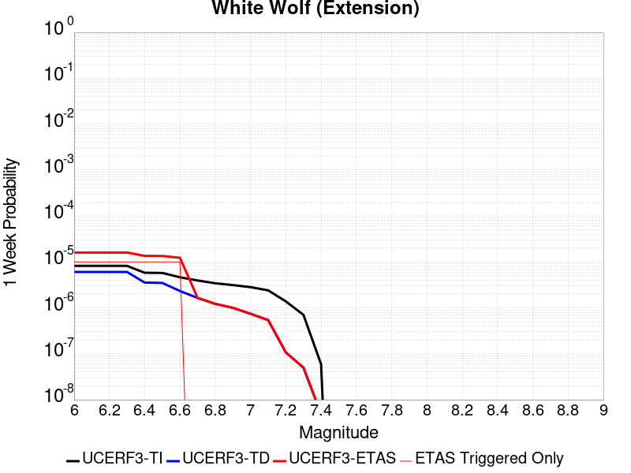 |  |  |  |

| Magnitude | 1 wk TI Prob | 1 wk TD Prob | 1 wk ETAS Prob | 1 wk ETAS/TD Gain | 1 wk ETAS Triggered Only | 1 mo TI Prob | 1 mo TD Prob | 1 mo ETAS Prob | 1 mo ETAS/TD Gain | 1 mo ETAS Triggered Only | 1 yr TI Prob | 1 yr TD Prob | 1 yr ETAS Prob | 1 yr ETAS/TD Gain | 1 yr ETAS Triggered Only | 10 yr TI Prob | 10 yr TD Prob | 10 yr ETAS Prob | 10 yr ETAS/TD Gain | 10 yr ETAS Triggered Only |
|-----|-----|-----|-----|-----|-----|-----|-----|-----|-----|-----|-----|-----|-----|-----|-----|-----|-----|-----|-----|-----|
| 6.0 | 8.222555E-6 | 6.0668267E-6 | 1.645346E-5 | 2.7120373 | 1.0386697E-5 | 3.5239045E-5 | 2.6000464E-5 | 3.638689E-5 | 1.3994708 | 1.0386697E-5 | 4.289509E-4 | 3.165163E-4 | 3.6843334E-4 | 1.1640265 | 5.1933483E-5 | 0.0042812387 | 0.0031613067 | 0.0032959068 | 1.0425774 | 1.3502706E-4 |
| 6.1 | 8.222555E-6 | 6.0668267E-6 | 1.645346E-5 | 2.7120373 | 1.0386697E-5 | 3.5239045E-5 | 2.6000464E-5 | 3.638689E-5 | 1.3994708 | 1.0386697E-5 | 4.289509E-4 | 3.165163E-4 | 3.6843334E-4 | 1.1640265 | 5.1933483E-5 | 0.0042812387 | 0.0031613067 | 0.0032959068 | 1.0425774 | 1.3502706E-4 |
| 6.2 | 8.222555E-6 | 6.0668267E-6 | 1.645346E-5 | 2.7120373 | 1.0386697E-5 | 3.5239045E-5 | 2.6000464E-5 | 3.638689E-5 | 1.3994708 | 1.0386697E-5 | 4.289509E-4 | 3.165163E-4 | 3.6843334E-4 | 1.1640265 | 5.1933483E-5 | 0.0042812387 | 0.0031613067 | 0.0032959068 | 1.0425774 | 1.3502706E-4 |
| 6.3 | 8.222555E-6 | 6.0668267E-6 | 1.645346E-5 | 2.7120373 | 1.0386697E-5 | 3.5239045E-5 | 2.6000464E-5 | 3.638689E-5 | 1.3994708 | 1.0386697E-5 | 4.289509E-4 | 3.165163E-4 | 3.6843334E-4 | 1.1640265 | 5.1933483E-5 | 0.0042812387 | 0.0031613067 | 0.0032959068 | 1.0425774 | 1.3502706E-4 |
| 6.4 | 5.821773E-6 | 3.557277E-6 | 1.3943937E-5 | 3.9198344 | 1.0386697E-5 | 2.4950215E-5 | 1.52453895E-5 | 2.5631929E-5 | 1.6812904 | 1.0386697E-5 | 3.0372653E-4 | 1.855979E-4 | 2.3752176E-4 | 1.2797652 | 5.1933483E-5 | 0.0030331176 | 0.0018545374 | 0.0019374769 | 1.0447224 | 8.3093575E-5 |
| 6.5 | 5.766023E-6 | 3.49921E-6 | 1.388587E-5 | 3.9682875 | 1.0386697E-5 | 2.4711293E-5 | 1.49965335E-5 | 2.5383075E-5 | 1.6925961 | 1.0386697E-5 | 3.0081844E-4 | 1.8256859E-4 | 2.344926E-4 | 1.2844082 | 5.1933483E-5 | 0.0030041158 | 0.0018242942 | 0.0019072363 | 1.0454652 | 8.3093575E-5 |
| 6.6 | 4.643576E-6 | 2.332699E-6 | 1.2719372E-5 | 5.4526415 | 1.0386697E-5 | 1.9900888E-5 | 9.997246E-6 | 2.0383839E-5 | 2.0389454 | 1.0386697E-5 | 2.4226638E-4 | 1.21710094E-4 | 1.528664E-4 | 1.2559878 | 3.116009E-5 | 0.0024200242 | 0.0012164768 | 0.0012787211 | 1.0511677 | 6.232018E-5 |
| 6.7 | 3.9529173E-6 | 1.648408E-6 | 1.648408E-6 | 1.0 | 0.0 | 1.6940963E-5 | 7.0645874E-6 | 7.0645874E-6 | 1.0 | 0.0 | 2.0623671E-4 | 8.600815E-5 | 9.639395E-5 | 1.1207538 | 1.0386697E-5 | 0.002060454 | 8.597671E-4 | 8.8052265E-4 | 1.0241408 | 2.0773394E-5 |
| 6.8 | 3.4377522E-6 | 1.2245736E-6 | 1.2245736E-6 | 1.0 | 0.0 | 1.473314E-5 | 5.2481623E-6 | 5.2481623E-6 | 1.0 | 0.0 | 1.7936122E-4 | 6.389459E-5 | 7.428063E-5 | 1.1625495 | 1.0386697E-5 | 0.0017921652 | 6.3877134E-4 | 6.5953145E-4 | 1.0325 | 2.0773394E-5 |
| 6.9 | 3.1367306E-6 | 1.0034221E-6 | 1.0034221E-6 | 1.0 | 0.0 | 1.3443062E-5 | 4.300374E-6 | 4.300374E-6 | 1.0 | 0.0 | 1.63657E-4 | 5.2355874E-5 | 5.2355874E-5 | 1.0 | 0.0 | 0.0016353652 | 5.2344304E-4 | 5.2344304E-4 | 1.0 | 0.0 |
| 7.0 | 2.8298145E-6 | 7.429045E-7 | 7.429045E-7 | 1.0 | 0.0 | 1.2127721E-5 | 3.1838729E-6 | 3.1838729E-6 | 1.0 | 0.0 | 1.47645E-4 | 3.8763013E-5 | 3.8763013E-5 | 1.0 | 0.0 | 0.0014754693 | 3.875675E-4 | 3.875675E-4 | 1.0 | 0.0 |
| 7.1 | 2.4091064E-6 | 5.4230577E-7 | 5.4230577E-7 | 1.0 | 0.0 | 1.03247E-5 | 2.3241657E-6 | 2.3241657E-6 | 1.0 | 0.0 | 1.2569598E-4 | 2.8296392E-5 | 2.8296392E-5 | 1.0 | 0.0 | 0.001256249 | 2.8293193E-4 | 2.8293193E-4 | 1.0 | 0.0 |
| 7.2 | 1.3875518E-6 | 1.0744563E-7 | 1.0744563E-7 | 1.0 | 0.0 | 5.9466374E-6 | 4.604812E-7 | 4.604812E-7 | 1.0 | 0.0 | 7.23979E-5 | 5.6063454E-6 | 5.6063454E-6 | 1.0 | 0.0 | 7.2374323E-4 | 5.6062152E-5 | 5.6062152E-5 | 1.0 | 0.0 |
| 7.3 | 7.056077E-7 | 5.002896E-8 | 5.002896E-8 | 1.0 | 0.0 | 3.0240296E-6 | 2.1440981E-7 | 2.1440981E-7 | 1.0 | 0.0 | 3.681694E-5 | 2.6104367E-6 | 2.6104367E-6 | 1.0 | 0.0 | 3.681084E-4 | 2.6104108E-5 | 2.6104108E-5 | 1.0 | 0.0 |
| 7.4 | 5.9334678E-8 | 4.86919E-9 | 4.86919E-9 | 1.0 | 0.0 | 2.5429145E-7 | 2.0867958E-8 | 2.0867958E-8 | 1.0 | 0.0 | 3.095994E-6 | 2.5406737E-7 | 2.5406737E-7 | 1.0 | 0.0 | 3.095951E-5 | 2.5406719E-6 | 2.5406719E-6 | 1.0 | 0.0 |

## Ludlow
*[(top)](#table-of-contents)*

| 1 Week | 1 Month | 1 Year | 10 Year |
|-----|-----|-----|-----|
|  |  |  |  |

| Magnitude | 1 wk TI Prob | 1 wk TD Prob | 1 wk ETAS Prob | 1 wk ETAS/TD Gain | 1 wk ETAS Triggered Only | 1 mo TI Prob | 1 mo TD Prob | 1 mo ETAS Prob | 1 mo ETAS/TD Gain | 1 mo ETAS Triggered Only | 1 yr TI Prob | 1 yr TD Prob | 1 yr ETAS Prob | 1 yr ETAS/TD Gain | 1 yr ETAS Triggered Only | 10 yr TI Prob | 10 yr TD Prob | 10 yr ETAS Prob | 10 yr ETAS/TD Gain | 10 yr ETAS Triggered Only |
|-----|-----|-----|-----|-----|-----|-----|-----|-----|-----|-----|-----|-----|-----|-----|-----|-----|-----|-----|-----|-----|
| 6.0 | 2.2407607E-5 | 2.3657954E-5 | 2.3657954E-5 | 1.0 | 0.0 | 9.602906E-5 | 1.0138754E-4 | 1.0138754E-4 | 1.0 | 0.0 | 0.0011685267 | 0.0012337384 | 0.0012959817 | 1.0504509 | 6.232018E-5 | 0.011624013 | 0.012273403 | 0.012386255 | 1.0091949 | 1.14253664E-4 |
| 6.1 | 2.2407607E-5 | 2.3657954E-5 | 2.3657954E-5 | 1.0 | 0.0 | 9.602906E-5 | 1.0138754E-4 | 1.0138754E-4 | 1.0 | 0.0 | 0.0011685267 | 0.0012337384 | 0.0012959817 | 1.0504509 | 6.232018E-5 | 0.011624013 | 0.012273403 | 0.012386255 | 1.0091949 | 1.14253664E-4 |
| 6.2 | 1.0781252E-5 | 1.1365991E-5 | 1.1365991E-5 | 1.0 | 0.0 | 4.620455E-5 | 4.8710503E-5 | 4.8710503E-5 | 1.0 | 0.0 | 5.623952E-4 | 5.92893E-4 | 6.240346E-4 | 1.0525248 | 3.116009E-5 | 0.00560974 | 0.005913531 | 0.0059858076 | 1.0122223 | 7.270688E-5 |
| 6.3 | 1.0781252E-5 | 1.1365991E-5 | 1.1365991E-5 | 1.0 | 0.0 | 4.620455E-5 | 4.8710503E-5 | 4.8710503E-5 | 1.0 | 0.0 | 5.623952E-4 | 5.92893E-4 | 6.240346E-4 | 1.0525248 | 3.116009E-5 | 0.00560974 | 0.005913531 | 0.0059858076 | 1.0122223 | 7.270688E-5 |
| 6.4 | 7.814439E-6 | 8.237966E-6 | 8.237966E-6 | 1.0 | 0.0 | 3.3490025E-5 | 3.5305096E-5 | 3.5305096E-5 | 1.0 | 0.0 | 4.0766477E-4 | 4.2975618E-4 | 4.4013842E-4 | 1.0241585 | 1.0386697E-5 | 0.0040691774 | 0.0042893975 | 0.0043307664 | 1.0096444 | 4.1546788E-5 |
| 6.5 | 6.4986366E-6 | 6.8511167E-6 | 6.8511167E-6 | 1.0 | 0.0 | 2.7851002E-5 | 2.9361603E-5 | 2.9361603E-5 | 1.0 | 0.0 | 3.390332E-4 | 3.574198E-4 | 3.678028E-4 | 1.0290499 | 1.0386697E-5 | 0.003385164 | 0.003568546 | 0.0036099444 | 1.011601 | 4.1546788E-5 |
| 6.6 | 5.582177E-6 | 5.8861756E-6 | 5.8861756E-6 | 1.0 | 0.0 | 2.3923398E-5 | 2.5226227E-5 | 2.5226227E-5 | 1.0 | 0.0 | 2.9122844E-4 | 3.0708674E-4 | 3.1747026E-4 | 1.033813 | 1.0386697E-5 | 0.0029084706 | 0.0030666974 | 0.003097762 | 1.0101297 | 3.116009E-5 |
| 6.7 | 4.6858763E-6 | 4.94057E-6 | 4.94057E-6 | 1.0 | 0.0 | 2.0082172E-5 | 2.1173702E-5 | 2.1173702E-5 | 1.0 | 0.0 | 2.4447302E-4 | 2.5775988E-4 | 2.681439E-4 | 1.0402856 | 1.0386697E-5 | 0.0024420423 | 0.0025746655 | 0.0026057453 | 1.0120714 | 3.116009E-5 |
| 6.8 | 3.5584908E-6 | 3.7521265E-6 | 3.7521265E-6 | 1.0 | 0.0 | 1.5250586E-5 | 1.6080447E-5 | 1.6080447E-5 | 1.0 | 0.0 | 1.8566006E-4 | 1.9576224E-4 | 1.9576224E-4 | 1.0 | 0.0 | 0.0018550502 | 0.0019559392 | 0.0019766719 | 1.0105999 | 2.0773394E-5 |
| 6.9 | 2.532834E-6 | 2.6710807E-6 | 2.6710807E-6 | 1.0 | 0.0 | 1.0854958E-5 | 1.1447441E-5 | 1.1447441E-5 | 1.0 | 0.0 | 1.3215111E-4 | 1.3936395E-4 | 1.3936395E-4 | 1.0 | 0.0 | 0.0013207254 | 0.0013927931 | 0.0014031654 | 1.0074471 | 1.0386697E-5 |
| 7.0 | 1.7083285E-6 | 1.8019963E-6 | 1.8019963E-6 | 1.0 | 0.0 | 7.3213873E-6 | 7.722819E-6 | 7.722819E-6 | 1.0 | 0.0 | 8.913424E-5 | 9.402143E-5 | 9.402143E-5 | 1.0 | 0.0 | 8.9098496E-4 | 9.3983306E-4 | 9.5021E-4 | 1.0110413 | 1.0386697E-5 |
| 7.1 | 1.0905424E-6 | 1.1497951E-6 | 1.1497951E-6 | 1.0 | 0.0 | 4.6737446E-6 | 4.9276846E-6 | 4.9276846E-6 | 1.0 | 0.0 | 5.6901354E-5 | 5.9993006E-5 | 5.9993006E-5 | 1.0 | 0.0 | 5.6886784E-4 | 5.997779E-4 | 5.997779E-4 | 1.0 | 0.0 |
| 7.2 | 6.06668E-7 | 6.387457E-7 | 6.387457E-7 | 1.0 | 0.0 | 2.600003E-6 | 2.737479E-6 | 2.737479E-6 | 1.0 | 0.0 | 3.1654577E-5 | 3.3328364E-5 | 3.3328364E-5 | 1.0 | 0.0 | 3.1650066E-4 | 3.3324052E-4 | 3.3324052E-4 | 1.0 | 0.0 |

## Scodie Lineament
*[(top)](#table-of-contents)*

| 1 Week | 1 Month | 1 Year | 10 Year |
|-----|-----|-----|-----|
|  |  |  |  |

| Magnitude | 1 wk TI Prob | 1 wk TD Prob | 1 wk ETAS Prob | 1 wk ETAS/TD Gain | 1 wk ETAS Triggered Only | 1 mo TI Prob | 1 mo TD Prob | 1 mo ETAS Prob | 1 mo ETAS/TD Gain | 1 mo ETAS Triggered Only | 1 yr TI Prob | 1 yr TD Prob | 1 yr ETAS Prob | 1 yr ETAS/TD Gain | 1 yr ETAS Triggered Only | 10 yr TI Prob | 10 yr TD Prob | 10 yr ETAS Prob | 10 yr ETAS/TD Gain | 10 yr ETAS Triggered Only |
|-----|-----|-----|-----|-----|-----|-----|-----|-----|-----|-----|-----|-----|-----|-----|-----|-----|-----|-----|-----|-----|
| 6.0 | 3.2919327E-6 | 3.0133992E-6 | 3.0133992E-6 | 1.0 | 0.0 | 1.4108206E-5 | 1.2914522E-5 | 2.3301085E-5 | 1.8042545 | 1.0386697E-5 | 1.7175387E-4 | 1.5722614E-4 | 2.2992158E-4 | 1.4623623 | 7.270688E-5 | 0.0017162118 | 0.0015714606 | 0.0016959051 | 1.0791904 | 1.2464036E-4 |
| 6.1 | 1.8663811E-6 | 1.5490858E-6 | 1.5490858E-6 | 1.0 | 0.0 | 7.998751E-6 | 6.6389252E-6 | 6.6389252E-6 | 1.0 | 0.0 | 9.738045E-5 | 8.082641E-5 | 1.1198398E-4 | 1.3854876 | 3.116009E-5 | 9.7337784E-4 | 8.0801896E-4 | 8.495322E-4 | 1.0513766 | 4.1546788E-5 |
| 6.2 | 1.8663811E-6 | 1.5490858E-6 | 1.5490858E-6 | 1.0 | 0.0 | 7.998751E-6 | 6.6389252E-6 | 6.6389252E-6 | 1.0 | 0.0 | 9.738045E-5 | 8.082641E-5 | 1.1198398E-4 | 1.3854876 | 3.116009E-5 | 9.7337784E-4 | 8.0801896E-4 | 8.495322E-4 | 1.0513766 | 4.1546788E-5 |
| 6.3 | 1.8663811E-6 | 1.5490858E-6 | 1.5490858E-6 | 1.0 | 0.0 | 7.998751E-6 | 6.6389252E-6 | 6.6389252E-6 | 1.0 | 0.0 | 9.738045E-5 | 8.082641E-5 | 1.1198398E-4 | 1.3854876 | 3.116009E-5 | 9.7337784E-4 | 8.0801896E-4 | 8.495322E-4 | 1.0513766 | 4.1546788E-5 |
| 6.4 | 1.8663811E-6 | 1.5490858E-6 | 1.5490858E-6 | 1.0 | 0.0 | 7.998751E-6 | 6.6389252E-6 | 6.6389252E-6 | 1.0 | 0.0 | 9.738045E-5 | 8.082641E-5 | 1.1198398E-4 | 1.3854876 | 3.116009E-5 | 9.7337784E-4 | 8.0801896E-4 | 8.495322E-4 | 1.0513766 | 4.1546788E-5 |
| 6.5 | 1.8106311E-6 | 1.4910186E-6 | 1.4910186E-6 | 1.0 | 0.0 | 7.759824E-6 | 6.3900666E-6 | 6.3900666E-6 | 1.0 | 0.0 | 9.447177E-5 | 7.779678E-5 | 1.08954446E-4 | 1.4005008 | 3.116009E-5 | 9.4431615E-4 | 7.777441E-4 | 8.1925857E-4 | 1.0533781 | 4.1546788E-5 |
| 6.6 | 1.2414679E-6 | 8.997782E-7 | 8.997782E-7 | 1.0 | 0.0 | 5.320566E-6 | 3.856187E-6 | 3.856187E-6 | 1.0 | 0.0 | 6.477596E-5 | 4.6948153E-5 | 5.7334364E-5 | 1.2212272 | 1.0386697E-5 | 6.475708E-4 | 4.69391E-4 | 4.9015466E-4 | 1.0442352 | 2.0773394E-5 |
| 6.7 | 1.1062215E-6 | 7.5945076E-7 | 7.5945076E-7 | 1.0 | 0.0 | 4.7409408E-6 | 3.2547853E-6 | 3.2547853E-6 | 1.0 | 0.0 | 5.7719422E-5 | 3.962636E-5 | 5.0012644E-5 | 1.2621055 | 1.0386697E-5 | 5.770443E-4 | 3.9619993E-4 | 4.169651E-4 | 1.0524108 | 2.0773394E-5 |
| 6.8 | 1.0006736E-6 | 6.500572E-7 | 6.500572E-7 | 1.0 | 0.0 | 4.288594E-6 | 2.7859567E-6 | 2.7859567E-6 | 1.0 | 0.0 | 5.221238E-5 | 3.3918557E-5 | 4.4304903E-5 | 1.3062142 | 1.0386697E-5 | 5.220012E-4 | 3.391399E-4 | 3.5990623E-4 | 1.0612324 | 2.0773394E-5 |
| 6.9 | 9.167364E-7 | 5.631784E-7 | 5.631784E-7 | 1.0 | 0.0 | 3.9288643E-6 | 2.4136198E-6 | 2.4136198E-6 | 1.0 | 0.0 | 4.7832873E-5 | 2.9385481E-5 | 2.9385481E-5 | 1.0 | 0.0 | 4.782258E-4 | 2.9382162E-4 | 2.9382162E-4 | 1.0 | 0.0 |
| 7.0 | 7.6987664E-7 | 4.113515E-7 | 4.113515E-7 | 1.0 | 0.0 | 3.2994672E-6 | 1.762934E-6 | 1.762934E-6 | 1.0 | 0.0 | 4.0170275E-5 | 2.146355E-5 | 2.146355E-5 | 1.0 | 0.0 | 4.0163012E-4 | 2.1461862E-4 | 2.1461862E-4 | 1.0 | 0.0 |
| 7.1 | 7.1038727E-7 | 3.5212707E-7 | 3.5212707E-7 | 1.0 | 0.0 | 3.0445133E-6 | 1.5091154E-6 | 1.5091154E-6 | 1.0 | 0.0 | 3.706632E-5 | 1.837336E-5 | 1.837336E-5 | 1.0 | 0.0 | 3.7060137E-4 | 1.837219E-4 | 1.837219E-4 | 1.0 | 0.0 |
| 7.2 | 2.0799602E-7 | 3.1190186E-8 | 3.1190186E-8 | 1.0 | 0.0 | 8.914113E-7 | 1.3367222E-7 | 1.3367222E-7 | 1.0 | 0.0 | 1.0852878E-5 | 1.6274581E-6 | 1.6274581E-6 | 1.0 | 0.0 | 1.08523476E-4 | 1.6274469E-5 | 1.6274469E-5 | 1.0 | 0.0 |
| 7.3 | 1.5048182E-7 | 1.5947961E-8 | 1.5947961E-8 | 1.0 | 0.0 | 6.449219E-7 | 6.8348406E-8 | 6.8348406E-8 | 1.0 | 0.0 | 7.851896E-6 | 8.3214155E-7 | 8.3214155E-7 | 1.0 | 0.0 | 7.851618E-5 | 8.321387E-6 | 8.321387E-6 | 1.0 | 0.0 |
| 7.4 | 5.9334678E-8 | 4.86919E-9 | 4.86919E-9 | 1.0 | 0.0 | 2.5429145E-7 | 2.0867958E-8 | 2.0867958E-8 | 1.0 | 0.0 | 3.095994E-6 | 2.5406737E-7 | 2.5406737E-7 | 1.0 | 0.0 | 3.095951E-5 | 2.5406719E-6 | 2.5406719E-6 | 1.0 | 0.0 |

## Red Pass
*[(top)](#table-of-contents)*

| 1 Week | 1 Month | 1 Year | 10 Year |
|-----|-----|-----|-----|
|  |  |  | 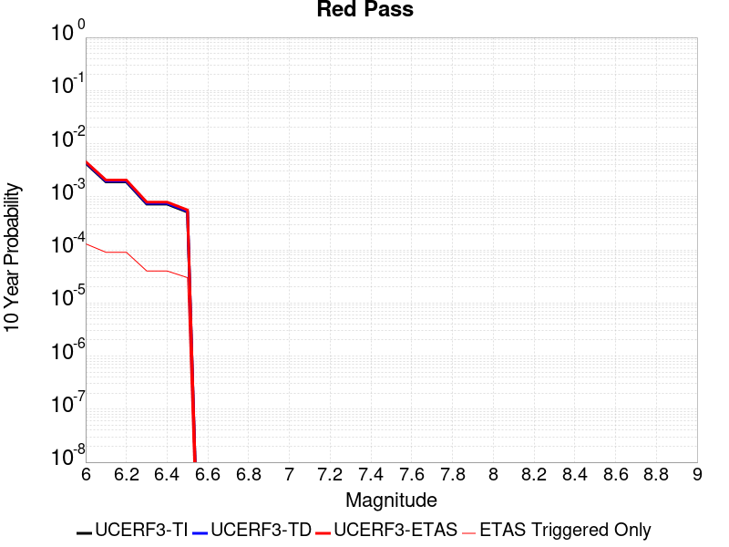 |

| Magnitude | 1 wk TI Prob | 1 wk TD Prob | 1 wk ETAS Prob | 1 wk ETAS/TD Gain | 1 wk ETAS Triggered Only | 1 mo TI Prob | 1 mo TD Prob | 1 mo ETAS Prob | 1 mo ETAS/TD Gain | 1 mo ETAS Triggered Only | 1 yr TI Prob | 1 yr TD Prob | 1 yr ETAS Prob | 1 yr ETAS/TD Gain | 1 yr ETAS Triggered Only | 10 yr TI Prob | 10 yr TD Prob | 10 yr ETAS Prob | 10 yr ETAS/TD Gain | 10 yr ETAS Triggered Only |
|-----|-----|-----|-----|-----|-----|-----|-----|-----|-----|-----|-----|-----|-----|-----|-----|-----|-----|-----|-----|-----|
| 6.0 | 8.258278E-6 | 8.551426E-6 | 8.551426E-6 | 1.0 | 0.0 | 3.539214E-5 | 3.6648555E-5 | 3.6648555E-5 | 1.0 | 0.0 | 4.308141E-4 | 4.4612266E-4 | 4.7726886E-4 | 1.0698153 | 3.116009E-5 | 0.0042997985 | 0.0044540283 | 0.0045781136 | 1.0278591 | 1.2464036E-4 |
| 6.1 | 3.649988E-6 | 3.7753848E-6 | 3.7753848E-6 | 1.0 | 0.0 | 1.5642712E-5 | 1.6180147E-5 | 1.6180147E-5 | 1.0 | 0.0 | 1.9043336E-4 | 1.9698025E-4 | 2.281342E-4 | 1.1581577 | 3.116009E-5 | 0.0019027026 | 0.0019685237 | 0.0020514538 | 1.042128 | 8.3093575E-5 |
| 6.2 | 3.649988E-6 | 3.7753848E-6 | 3.7753848E-6 | 1.0 | 0.0 | 1.5642712E-5 | 1.6180147E-5 | 1.6180147E-5 | 1.0 | 0.0 | 1.9043336E-4 | 1.9698025E-4 | 2.281342E-4 | 1.1581577 | 3.116009E-5 | 0.0019027026 | 0.0019685237 | 0.0020514538 | 1.042128 | 8.3093575E-5 |
| 6.3 | 1.3924937E-6 | 1.4411434E-6 | 1.4411434E-6 | 1.0 | 0.0 | 5.9678164E-6 | 6.1763217E-6 | 6.1763217E-6 | 1.0 | 0.0 | 7.265574E-5 | 7.519554E-5 | 8.558146E-5 | 1.1381187 | 1.0386697E-5 | 7.263199E-4 | 7.518397E-4 | 7.933553E-4 | 1.0552186 | 4.1546788E-5 |
| 6.4 | 1.3924937E-6 | 1.4411434E-6 | 1.4411434E-6 | 1.0 | 0.0 | 5.9678164E-6 | 6.1763217E-6 | 6.1763217E-6 | 1.0 | 0.0 | 7.265574E-5 | 7.519554E-5 | 8.558146E-5 | 1.1381187 | 1.0386697E-5 | 7.263199E-4 | 7.518397E-4 | 7.933553E-4 | 1.0552186 | 4.1546788E-5 |
| 6.5 | 9.876812E-7 | 1.0222102E-6 | 1.0222102E-6 | 1.0 | 0.0 | 4.2329125E-6 | 4.3809005E-6 | 4.3809005E-6 | 1.0 | 0.0 | 5.153449E-5 | 5.3337466E-5 | 6.372361E-5 | 1.194725 | 1.0386697E-5 | 5.1522546E-4 | 5.3337467E-4 | 5.6451815E-4 | 1.0583894 | 3.116009E-5 |

## Mission Creek
*[(top)](#table-of-contents)*

| 1 Week | 1 Month | 1 Year | 10 Year |
|-----|-----|-----|-----|
| 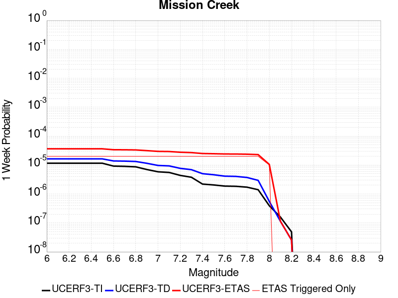 |  |  |  |

| Magnitude | 1 wk TI Prob | 1 wk TD Prob | 1 wk ETAS Prob | 1 wk ETAS/TD Gain | 1 wk ETAS Triggered Only | 1 mo TI Prob | 1 mo TD Prob | 1 mo ETAS Prob | 1 mo ETAS/TD Gain | 1 mo ETAS Triggered Only | 1 yr TI Prob | 1 yr TD Prob | 1 yr ETAS Prob | 1 yr ETAS/TD Gain | 1 yr ETAS Triggered Only | 10 yr TI Prob | 10 yr TD Prob | 10 yr ETAS Prob | 10 yr ETAS/TD Gain | 10 yr ETAS Triggered Only |
|-----|-----|-----|-----|-----|-----|-----|-----|-----|-----|-----|-----|-----|-----|-----|-----|-----|-----|-----|-----|-----|
| 6.0 | 1.1549387E-5 | 1.6331744E-5 | 3.7104797E-5 | 2.2719436 | 2.0773394E-5 | 4.9496433E-5 | 6.9991394E-5 | 1.1153527E-4 | 1.593557 | 4.1546788E-5 | 6.0245243E-4 | 8.5182703E-4 | 9.3484984E-4 | 1.0974643 | 8.3093575E-5 | 0.006008218 | 0.008514742 | 0.008628024 | 1.0133041 | 1.14253664E-4 |
| 6.1 | 1.1549387E-5 | 1.6331744E-5 | 3.7104797E-5 | 2.2719436 | 2.0773394E-5 | 4.9496433E-5 | 6.9991394E-5 | 1.1153527E-4 | 1.593557 | 4.1546788E-5 | 6.0245243E-4 | 8.5182703E-4 | 9.3484984E-4 | 1.0974643 | 8.3093575E-5 | 0.006008218 | 0.008514742 | 0.008628024 | 1.0133041 | 1.14253664E-4 |
| 6.2 | 1.1549387E-5 | 1.6331744E-5 | 3.7104797E-5 | 2.2719436 | 2.0773394E-5 | 4.9496433E-5 | 6.9991394E-5 | 1.1153527E-4 | 1.593557 | 4.1546788E-5 | 6.0245243E-4 | 8.5182703E-4 | 9.3484984E-4 | 1.0974643 | 8.3093575E-5 | 0.006008218 | 0.008514742 | 0.008628024 | 1.0133041 | 1.14253664E-4 |
| 6.3 | 1.1549387E-5 | 1.6331744E-5 | 3.7104797E-5 | 2.2719436 | 2.0773394E-5 | 4.9496433E-5 | 6.9991394E-5 | 1.1153527E-4 | 1.593557 | 4.1546788E-5 | 6.0245243E-4 | 8.5182703E-4 | 9.3484984E-4 | 1.0974643 | 8.3093575E-5 | 0.006008218 | 0.008514742 | 0.008628024 | 1.0133041 | 1.14253664E-4 |
| 6.4 | 1.1549387E-5 | 1.6331744E-5 | 3.7104797E-5 | 2.2719436 | 2.0773394E-5 | 4.9496433E-5 | 6.9991394E-5 | 1.1153527E-4 | 1.593557 | 4.1546788E-5 | 6.0245243E-4 | 8.5182703E-4 | 9.3484984E-4 | 1.0974643 | 8.3093575E-5 | 0.006008218 | 0.008514742 | 0.008628024 | 1.0133041 | 1.14253664E-4 |
| 6.5 | 1.1549387E-5 | 1.6331744E-5 | 3.7104797E-5 | 2.2719436 | 2.0773394E-5 | 4.9496433E-5 | 6.9991394E-5 | 1.1153527E-4 | 1.593557 | 4.1546788E-5 | 6.0245243E-4 | 8.5182703E-4 | 9.3484984E-4 | 1.0974643 | 8.3093575E-5 | 0.006008218 | 0.008514742 | 0.008628024 | 1.0133041 | 1.14253664E-4 |
| 6.6 | 9.202681E-6 | 1.3854947E-5 | 3.4628054E-5 | 2.4993277 | 2.0773394E-5 | 3.9439463E-5 | 5.9377046E-5 | 1.0092137E-4 | 1.6996697 | 4.1546788E-5 | 4.800697E-4 | 7.226848E-4 | 8.057183E-4 | 1.1148959 | 8.3093575E-5 | 0.004790339 | 0.007231895 | 0.007345322 | 1.0156844 | 1.14253664E-4 |
| 6.7 | 9.019164E-6 | 1.366061E-5 | 3.443372E-5 | 2.5206575 | 2.0773394E-5 | 3.8652986E-5 | 5.854421E-5 | 1.0008857E-4 | 1.7096236 | 4.1546788E-5 | 4.7049852E-4 | 7.1255164E-4 | 7.9558603E-4 | 1.116531 | 8.3093575E-5 | 0.004695036 | 0.007131216 | 0.0072446554 | 1.0159074 | 1.14253664E-4 |
| 6.8 | 8.673558E-6 | 1.3282702E-5 | 3.4055818E-5 | 2.5639226 | 2.0773394E-5 | 3.717186E-5 | 5.6924673E-5 | 9.846909E-5 | 1.7298139 | 4.1546788E-5 | 4.524734E-4 | 6.928463E-4 | 7.7588233E-4 | 1.1198477 | 8.3093575E-5 | 0.0045155324 | 0.0069353953 | 0.0070488565 | 1.0163597 | 1.14253664E-4 |
| 6.9 | 7.002255E-6 | 1.1486859E-5 | 3.2260014E-5 | 2.8084278 | 2.0773394E-5 | 3.000932E-5 | 4.9228507E-5 | 9.077325E-5 | 1.8439163 | 4.1546788E-5 | 3.653022E-4 | 5.991991E-4 | 6.8224285E-4 | 1.1385913 | 8.3093575E-5 | 0.0036470229 | 0.0060041854 | 0.006117753 | 1.0189147 | 1.14253664E-4 |
| 7.0 | 5.84644E-6 | 9.683714E-6 | 3.0456906E-5 | 3.145168 | 2.0773394E-5 | 2.5055931E-5 | 4.1500996E-5 | 8.3046056E-5 | 2.001062 | 4.1546788E-5 | 3.0501327E-4 | 5.0516205E-4 | 5.882136E-4 | 1.1644058 | 8.3093575E-5 | 0.0030459496 | 0.005068281 | 0.0051819556 | 1.0224286 | 1.14253664E-4 |
| 7.1 | 5.54703E-6 | 9.338158E-6 | 3.0111358E-5 | 3.22455 | 2.0773394E-5 | 2.377277E-5 | 4.0020088E-5 | 8.156521E-5 | 2.0381067 | 4.1546788E-5 | 2.8939504E-4 | 4.871401E-4 | 5.7019317E-4 | 1.1704912 | 8.3093575E-5 | 0.0028901845 | 0.0048888596 | 0.0050025545 | 1.023256 | 1.14253664E-4 |
| 7.2 | 4.384709E-6 | 7.689885E-6 | 2.8463119E-5 | 3.7013712 | 2.0773394E-5 | 1.8791474E-5 | 3.2956254E-5 | 7.450167E-5 | 2.2606232 | 4.1546788E-5 | 2.2876218E-4 | 4.0117218E-4 | 4.842324E-4 | 1.2070439 | 8.3093575E-5 | 0.0022852682 | 0.0040325816 | 0.0041463743 | 1.0282184 | 1.14253664E-4 |
| 7.3 | 3.7888456E-6 | 6.923602E-6 | 2.7696851E-5 | 4.000353 | 2.0773394E-5 | 1.623781E-5 | 2.9672263E-5 | 7.1217815E-5 | 2.400148 | 4.1546788E-5 | 1.9767738E-4 | 3.6120327E-4 | 4.4426683E-4 | 1.2299634 | 8.3093575E-5 | 0.0019750162 | 0.0036342472 | 0.0037480858 | 1.0313238 | 1.14253664E-4 |
| 7.4 | 2.1982462E-6 | 5.0316853E-6 | 2.5804975E-5 | 5.128495 | 2.0773394E-5 | 9.421021E-6 | 2.1564189E-5 | 6.311008E-5 | 2.926615 | 4.1546788E-5 | 1.1469489E-4 | 2.6251256E-4 | 3.455843E-4 | 1.3164487 | 8.3093575E-5 | 0.0011463572 | 0.0026498951 | 0.002763846 | 1.043002 | 1.14253664E-4 |
| 7.5 | 2.051923E-6 | 4.6227096E-6 | 2.5396008E-5 | 5.493749 | 2.0773394E-5 | 8.793926E-6 | 1.9811463E-5 | 6.135743E-5 | 3.0970669 | 4.1546788E-5 | 1.0706078E-4 | 2.4117802E-4 | 3.2425154E-4 | 1.344449 | 8.3093575E-5 | 0.0010700922 | 0.0024374423 | 0.0025514176 | 1.0467602 | 1.14253664E-4 |
| 7.6 | 1.8733427E-6 | 4.1308053E-6 | 2.4904113E-5 | 6.028876 | 2.0773394E-5 | 8.028587E-6 | 1.7703333E-5 | 5.9249385E-5 | 3.3467927 | 4.1546788E-5 | 9.774366E-5 | 2.1551683E-4 | 2.985925E-4 | 1.3854718 | 8.3093575E-5 | 9.770069E-4 | 0.002181846 | 0.0022958503 | 1.0522513 | 1.14253664E-4 |
| 7.7 | 1.8411953E-6 | 4.0504306E-6 | 2.482374E-5 | 6.128667 | 2.0773394E-5 | 7.890813E-6 | 1.7358872E-5 | 5.8904938E-5 | 3.3933618 | 4.1546788E-5 | 9.606641E-5 | 2.1132386E-4 | 2.9439988E-4 | 1.3931218 | 8.3093575E-5 | 9.6024893E-4 | 0.0021401057 | 0.002254115 | 1.0532727 | 1.14253664E-4 |
| 7.8 | 1.7194251E-6 | 3.7173024E-6 | 2.4490619E-5 | 6.588277 | 2.0773394E-5 | 7.368944E-6 | 1.59312E-5 | 5.7477326E-5 | 3.6078465 | 4.1546788E-5 | 8.97132E-5 | 1.9394518E-4 | 2.7702263E-4 | 1.4283553 | 8.3093575E-5 | 8.967699E-4 | 0.0019658357 | 0.0020798647 | 1.0580053 | 1.14253664E-4 |
| 7.9 | 1.4035052E-6 | 2.9557E-6 | 2.3729031E-5 | 8.028228 | 2.0773394E-5 | 6.0150082E-6 | 1.2667225E-5 | 5.4213484E-5 | 4.2798233 | 4.1546788E-5 | 7.3230265E-5 | 1.5421261E-4 | 2.3729337E-4 | 1.5387417 | 8.3093575E-5 | 7.3206134E-4 | 0.0015659636 | 0.0016800384 | 1.0728464 | 1.14253664E-4 |
| 8.0 | 3.9318823E-7 | 5.542283E-7 | 1.0940919E-5 | 19.740818 | 1.0386697E-5 | 1.6850913E-6 | 2.3752618E-6 | 1.2761934E-5 | 5.3728538 | 1.0386697E-5 | 2.0515794E-5 | 2.8918435E-5 | 4.969123E-5 | 1.7183236 | 2.0773394E-5 | 2.0513899E-4 | 2.997098E-4 | 3.2047697E-4 | 1.0692909 | 2.0773394E-5 |
| 8.1 | 1.596793E-7 | 1.1427638E-7 | 1.1427638E-7 | 1.0 | 0.0 | 6.8433974E-7 | 4.8975585E-7 | 4.8975585E-7 | 1.0 | 0.0 | 8.331805E-6 | 5.962761E-6 | 5.962761E-6 | 1.0 | 0.0 | 8.331492E-5 | 6.57585E-5 | 6.57585E-5 | 1.0 | 0.0 |
| 8.2 | 4.9003038E-8 | 2.5565779E-8 | 2.5565779E-8 | 1.0 | 0.0 | 2.10013E-7 | 1.09567615E-7 | 1.09567615E-7 | 1.0 | 0.0 | 2.5569052E-6 | 1.3339849E-6 | 1.3339849E-6 | 1.0 | 0.0 | 2.556876E-5 | 1.5023335E-5 | 1.5023335E-5 | 1.0 | 0.0 |

## Lake Isabella (Seismicity)
*[(top)](#table-of-contents)*

| 1 Week | 1 Month | 1 Year | 10 Year |
|-----|-----|-----|-----|
|  |  |  |  |

| Magnitude | 1 wk TI Prob | 1 wk TD Prob | 1 wk ETAS Prob | 1 wk ETAS/TD Gain | 1 wk ETAS Triggered Only | 1 mo TI Prob | 1 mo TD Prob | 1 mo ETAS Prob | 1 mo ETAS/TD Gain | 1 mo ETAS Triggered Only | 1 yr TI Prob | 1 yr TD Prob | 1 yr ETAS Prob | 1 yr ETAS/TD Gain | 1 yr ETAS Triggered Only | 10 yr TI Prob | 10 yr TD Prob | 10 yr ETAS Prob | 10 yr ETAS/TD Gain | 10 yr ETAS Triggered Only |
|-----|-----|-----|-----|-----|-----|-----|-----|-----|-----|-----|-----|-----|-----|-----|-----|-----|-----|-----|-----|-----|
| 6.0 | 9.431637E-6 | 9.7418215E-6 | 9.7418215E-6 | 1.0 | 0.0 | 4.0420677E-5 | 4.175007E-5 | 5.2136333E-5 | 1.2487724 | 1.0386697E-5 | 4.920106E-4 | 5.082016E-4 | 5.601087E-4 | 1.1021388 | 5.1933483E-5 | 0.004909227 | 0.005071687 | 0.0051853615 | 1.0224135 | 1.14253664E-4 |
| 6.1 | 9.431637E-6 | 9.7418215E-6 | 9.7418215E-6 | 1.0 | 0.0 | 4.0420677E-5 | 4.175007E-5 | 5.2136333E-5 | 1.2487724 | 1.0386697E-5 | 4.920106E-4 | 5.082016E-4 | 5.601087E-4 | 1.1021388 | 5.1933483E-5 | 0.004909227 | 0.005071687 | 0.0051853615 | 1.0224135 | 1.14253664E-4 |
| 6.2 | 9.431637E-6 | 9.7418215E-6 | 9.7418215E-6 | 1.0 | 0.0 | 4.0420677E-5 | 4.175007E-5 | 5.2136333E-5 | 1.2487724 | 1.0386697E-5 | 4.920106E-4 | 5.082016E-4 | 5.601087E-4 | 1.1021388 | 5.1933483E-5 | 0.004909227 | 0.005071687 | 0.0051853615 | 1.0224135 | 1.14253664E-4 |
| 6.3 | 9.431637E-6 | 9.7418215E-6 | 9.7418215E-6 | 1.0 | 0.0 | 4.0420677E-5 | 4.175007E-5 | 5.2136333E-5 | 1.2487724 | 1.0386697E-5 | 4.920106E-4 | 5.082016E-4 | 5.601087E-4 | 1.1021388 | 5.1933483E-5 | 0.004909227 | 0.005071687 | 0.0051853615 | 1.0224135 | 1.14253664E-4 |
| 6.4 | 5.144063E-6 | 5.3001613E-6 | 5.3001613E-6 | 1.0 | 0.0 | 2.2045799E-5 | 2.27148E-5 | 3.310126E-5 | 1.4572552 | 1.0386697E-5 | 2.6837454E-4 | 2.7652105E-4 | 2.8690486E-4 | 1.0375516 | 1.0386697E-5 | 0.0026805066 | 0.0027621102 | 0.0028139001 | 1.0187502 | 5.1933483E-5 |
| 6.5 | 5.144063E-6 | 5.3001613E-6 | 5.3001613E-6 | 1.0 | 0.0 | 2.2045799E-5 | 2.27148E-5 | 3.310126E-5 | 1.4572552 | 1.0386697E-5 | 2.6837454E-4 | 2.7652105E-4 | 2.8690486E-4 | 1.0375516 | 1.0386697E-5 | 0.0026805066 | 0.0027621102 | 0.0028139001 | 1.0187502 | 5.1933483E-5 |
| 6.6 | 3.4009804E-6 | 3.4988395E-6 | 3.4988395E-6 | 1.0 | 0.0 | 1.4575549E-5 | 1.4994949E-5 | 2.538149E-5 | 1.6926693 | 1.0386697E-5 | 1.7744285E-4 | 1.8254982E-4 | 1.9293462E-4 | 1.0568875 | 1.0386697E-5 | 0.0017730123 | 0.0018241564 | 0.0018759952 | 1.028418 | 5.1933483E-5 |
| 6.7 | 3.3880428E-6 | 3.485706E-6 | 3.485706E-6 | 1.0 | 0.0 | 1.4520103E-5 | 1.4938664E-5 | 2.5325206E-5 | 1.6952791 | 1.0386697E-5 | 1.767679E-4 | 1.8186466E-4 | 1.9224947E-4 | 1.0571018 | 1.0386697E-5 | 0.0017662736 | 0.0018173159 | 0.0018691551 | 1.0285251 | 5.1933483E-5 |
| 6.8 | 2.6582E-6 | 2.7337414E-6 | 2.7337414E-6 | 1.0 | 0.0 | 1.1392236E-5 | 1.171599E-5 | 1.171599E-5 | 1.0 | 0.0 | 1.3869164E-4 | 1.4263418E-4 | 1.4263418E-4 | 1.0 | 0.0 | 0.0013860512 | 0.0014255584 | 0.0014463022 | 1.0145513 | 2.0773394E-5 |
| 6.9 | 2.406011E-6 | 2.474366E-6 | 2.474366E-6 | 1.0 | 0.0 | 1.0311434E-5 | 1.0604391E-5 | 1.0604391E-5 | 1.0 | 0.0 | 1.2553448E-4 | 1.2910213E-4 | 1.2910213E-4 | 1.0 | 0.0 | 0.0012546359 | 0.0012904009 | 0.0013007742 | 1.0080388 | 1.0386697E-5 |
| 7.0 | 1.6953097E-6 | 1.7429631E-6 | 1.7429631E-6 | 1.0 | 0.0 | 7.265593E-6 | 7.469827E-6 | 7.469827E-6 | 1.0 | 0.0 | 8.8455E-5 | 9.094239E-5 | 9.094239E-5 | 1.0 | 0.0 | 8.84198E-4 | 9.0915454E-4 | 9.0915454E-4 | 1.0 | 0.0 |
| 7.1 | 3.5013824E-7 | 3.5715203E-7 | 3.5715203E-7 | 1.0 | 0.0 | 1.5005916E-6 | 1.5306507E-6 | 1.5306507E-6 | 1.0 | 0.0 | 1.826955E-5 | 1.8635516E-5 | 1.8635516E-5 | 1.0 | 0.0 | 1.8268047E-4 | 1.8633978E-4 | 1.8633978E-4 | 1.0 | 0.0 |
| 7.2 | 2.2321095E-7 | 2.2750805E-7 | 2.2750805E-7 | 1.0 | 0.0 | 9.56618E-7 | 9.750341E-7 | 9.750341E-7 | 1.0 | 0.0 | 1.1646762E-5 | 1.1870978E-5 | 1.1870978E-5 | 1.0 | 0.0 | 1.1646151E-4 | 1.1870354E-4 | 1.1870354E-4 | 1.0 | 0.0 |
| 7.3 | 1.5760406E-7 | 1.6061085E-7 | 1.6061085E-7 | 1.0 | 0.0 | 6.7544585E-7 | 6.88332E-7 | 6.88332E-7 | 1.0 | 0.0 | 8.223522E-6 | 8.380411E-6 | 8.380411E-6 | 1.0 | 0.0 | 8.2232174E-5 | 8.380101E-5 | 8.380101E-5 | 1.0 | 0.0 |
| 7.4 | 1.1216497E-7 | 1.14318226E-7 | 1.14318226E-7 | 1.0 | 0.0 | 4.8070694E-7 | 4.899352E-7 | 4.899352E-7 | 1.0 | 0.0 | 5.852591E-6 | 5.9649446E-6 | 5.9649446E-6 | 1.0 | 0.0 | 5.8524372E-5 | 5.964789E-5 | 5.964789E-5 | 1.0 | 0.0 |
| 7.5 | 4.885185E-8 | 4.9788245E-8 | 4.9788245E-8 | 1.0 | 0.0 | 2.0936506E-7 | 2.1337817E-7 | 2.1337817E-7 | 1.0 | 0.0 | 2.5490165E-6 | 2.5978763E-6 | 2.5978763E-6 | 1.0 | 0.0 | 2.5489873E-5 | 2.5978477E-5 | 2.5978477E-5 | 1.0 | 0.0 |
| 7.6 | 1.504641E-9 | 1.5318049E-9 | 1.5318049E-9 | 1.0 | 0.0 | 6.4484613E-9 | 6.5648784E-9 | 6.5648784E-9 | 1.0 | 0.0 | 7.851001E-8 | 7.9927396E-8 | 7.9927396E-8 | 1.0 | 0.0 | 7.8509987E-7 | 7.9927395E-7 | 7.9927395E-7 | 1.0 | 0.0 |

## Big Pine (East)
*[(top)](#table-of-contents)*

| 1 Week | 1 Month | 1 Year | 10 Year |
|-----|-----|-----|-----|
|  |  |  |  |

| Magnitude | 1 wk TI Prob | 1 wk TD Prob | 1 wk ETAS Prob | 1 wk ETAS/TD Gain | 1 wk ETAS Triggered Only | 1 mo TI Prob | 1 mo TD Prob | 1 mo ETAS Prob | 1 mo ETAS/TD Gain | 1 mo ETAS Triggered Only | 1 yr TI Prob | 1 yr TD Prob | 1 yr ETAS Prob | 1 yr ETAS/TD Gain | 1 yr ETAS Triggered Only | 10 yr TI Prob | 10 yr TD Prob | 10 yr ETAS Prob | 10 yr ETAS/TD Gain | 10 yr ETAS Triggered Only |
|-----|-----|-----|-----|-----|-----|-----|-----|-----|-----|-----|-----|-----|-----|-----|-----|-----|-----|-----|-----|-----|
| 6.0 | 9.916913E-6 | 1.282197E-5 | 2.3208533E-5 | 1.8100599 | 1.0386697E-5 | 4.250036E-5 | 5.495027E-5 | 6.53364E-5 | 1.1890095 | 1.0386697E-5 | 5.173191E-4 | 6.6883623E-4 | 7.1035523E-4 | 1.0620764 | 4.1546788E-5 | 0.0051611643 | 0.0066729826 | 0.0067761564 | 1.0154614 | 1.03866965E-4 |
| 6.1 | 9.916913E-6 | 1.282197E-5 | 2.3208533E-5 | 1.8100599 | 1.0386697E-5 | 4.250036E-5 | 5.495027E-5 | 6.53364E-5 | 1.1890095 | 1.0386697E-5 | 5.173191E-4 | 6.6883623E-4 | 7.1035523E-4 | 1.0620764 | 4.1546788E-5 | 0.0051611643 | 0.0066729826 | 0.0067761564 | 1.0154614 | 1.03866965E-4 |
| 6.2 | 9.916913E-6 | 1.282197E-5 | 2.3208533E-5 | 1.8100599 | 1.0386697E-5 | 4.250036E-5 | 5.495027E-5 | 6.53364E-5 | 1.1890095 | 1.0386697E-5 | 5.173191E-4 | 6.6883623E-4 | 7.1035523E-4 | 1.0620764 | 4.1546788E-5 | 0.0051611643 | 0.0066729826 | 0.0067761564 | 1.0154614 | 1.03866965E-4 |
| 6.3 | 5.479711E-6 | 8.117787E-6 | 1.85044E-5 | 2.279488 | 1.0386697E-5 | 2.3484265E-5 | 3.4790068E-5 | 4.5176406E-5 | 1.2985431 | 1.0386697E-5 | 2.858834E-4 | 4.2348995E-4 | 4.4425455E-4 | 1.0490321 | 2.0773394E-5 | 0.0028551589 | 0.004229713 | 0.0042917696 | 1.0146716 | 6.232018E-5 |
| 6.4 | 5.465009E-6 | 8.10208E-6 | 1.8488692E-5 | 2.2819686 | 1.0386697E-5 | 2.3421257E-5 | 3.4722754E-5 | 4.5109093E-5 | 1.2991219 | 1.0386697E-5 | 2.851165E-4 | 4.2267074E-4 | 4.4343533E-4 | 1.0491271 | 2.0773394E-5 | 0.0028475097 | 0.004221552 | 0.004283609 | 1.0147 | 6.232018E-5 |
| 6.5 | 4.826767E-6 | 7.4271156E-6 | 1.7813734E-5 | 2.3984728 | 1.0386697E-5 | 2.068598E-5 | 3.183012E-5 | 4.221649E-5 | 1.3263062 | 1.0386697E-5 | 2.518227E-4 | 3.874656E-4 | 4.0823096E-4 | 1.0535928 | 2.0773394E-5 | 0.0025153751 | 0.0038707424 | 0.0039328216 | 1.016038 | 6.232018E-5 |
| 6.6 | 4.3146847E-6 | 6.887036E-6 | 1.7273662E-5 | 2.5081415 | 1.0386697E-5 | 1.8491375E-5 | 2.9515548E-5 | 3.9901937E-5 | 1.3518956 | 1.0386697E-5 | 2.2510924E-4 | 3.59295E-4 | 3.8006093E-4 | 1.0577964 | 2.0773394E-5 | 0.0022488134 | 0.0035899505 | 0.003652047 | 1.0172973 | 6.232018E-5 |
| 6.7 | 3.6968106E-6 | 5.9999884E-6 | 5.9999884E-6 | 1.0 | 0.0 | 1.5843378E-5 | 2.571399E-5 | 2.571399E-5 | 1.0 | 0.0 | 1.9287605E-4 | 3.130244E-4 | 3.2340785E-4 | 1.0331714 | 1.0386697E-5 | 0.0019270873 | 0.0031285542 | 0.0031596166 | 1.0099287 | 3.116009E-5 |
| 6.8 | 3.4671132E-6 | 5.7065704E-6 | 5.7065704E-6 | 1.0 | 0.0 | 1.4858972E-5 | 2.4456509E-5 | 2.4456509E-5 | 1.0 | 0.0 | 1.8089297E-4 | 2.9771877E-4 | 2.9771877E-4 | 1.0 | 0.0 | 0.0018074579 | 0.0029759097 | 0.0029966214 | 1.0069598 | 2.0773394E-5 |
| 6.9 | 2.7686972E-6 | 4.829279E-6 | 4.829279E-6 | 1.0 | 0.0 | 1.1865792E-5 | 2.069675E-5 | 2.069675E-5 | 1.0 | 0.0 | 1.4445644E-4 | 2.5195457E-4 | 2.5195457E-4 | 1.0 | 0.0 | 0.0014436257 | 0.0025193316 | 0.0025296924 | 1.0041124 | 1.0386697E-5 |
| 7.0 | 2.1472624E-6 | 3.988725E-6 | 3.988725E-6 | 1.0 | 0.0 | 9.20252E-6 | 1.7094428E-5 | 1.7094428E-5 | 1.0 | 0.0 | 1.12034926E-4 | 2.0810531E-4 | 2.0810531E-4 | 1.0 | 0.0 | 0.0011197845 | 0.002081715 | 0.00209208 | 1.0049791 | 1.0386697E-5 |
| 7.1 | 1.7018335E-6 | 3.348229E-6 | 3.348229E-6 | 1.0 | 0.0 | 7.293552E-6 | 1.4349476E-5 | 1.4349476E-5 | 1.0 | 0.0 | 8.879537E-5 | 1.7469123E-4 | 1.7469123E-4 | 1.0 | 0.0 | 8.87599E-4 | 0.0017481181 | 0.0017481181 | 1.0 | 0.0 |
| 7.2 | 1.25603E-6 | 2.7976516E-6 | 2.7976516E-6 | 1.0 | 0.0 | 5.3829745E-6 | 1.1989882E-5 | 1.1989882E-5 | 1.0 | 0.0 | 6.553574E-5 | 1.4596726E-4 | 1.4596726E-4 | 1.0 | 0.0 | 6.551642E-4 | 0.0014612685 | 0.0014612685 | 1.0 | 0.0 |
| 7.3 | 1.112297E-6 | 2.613323E-6 | 2.613323E-6 | 1.0 | 0.0 | 4.7669787E-6 | 1.1199909E-5 | 1.1199909E-5 | 1.0 | 0.0 | 5.803642E-5 | 1.3635057E-4 | 1.3635057E-4 | 1.0 | 0.0 | 5.802127E-4 | 0.0013650558 | 0.0013650558 | 1.0 | 0.0 |
| 7.4 | 1.0137181E-6 | 2.4863546E-6 | 2.4863546E-6 | 1.0 | 0.0 | 4.3444993E-6 | 1.0655763E-5 | 1.0655763E-5 | 1.0 | 0.0 | 5.2892992E-5 | 1.297264E-4 | 1.297264E-4 | 1.0 | 0.0 | 5.288041E-4 | 0.0012986774 | 0.0012986774 | 1.0 | 0.0 |
| 7.5 | 9.598608E-7 | 2.4099256E-6 | 2.4099256E-6 | 1.0 | 0.0 | 4.1136827E-6 | 1.0328214E-5 | 1.0328214E-5 | 1.0 | 0.0 | 5.0082934E-5 | 1.2573895E-4 | 1.2573895E-4 | 1.0 | 0.0 | 5.007165E-4 | 0.0012586572 | 0.0012586572 | 1.0 | 0.0 |
| 7.6 | 7.929459E-7 | 2.047312E-6 | 2.047312E-6 | 1.0 | 0.0 | 3.3983351E-6 | 8.7741655E-6 | 8.7741655E-6 | 1.0 | 0.0 | 4.1373947E-5 | 1.0682041E-4 | 1.0682041E-4 | 1.0 | 0.0 | 4.1366243E-4 | 0.0010697625 | 0.0010697625 | 1.0 | 0.0 |
| 7.7 | 4.155788E-7 | 1.162298E-6 | 1.162298E-6 | 1.0 | 0.0 | 1.7810507E-6 | 4.981268E-6 | 4.981268E-6 | 1.0 | 0.0 | 2.1684076E-5 | 6.064529E-5 | 6.064529E-5 | 1.0 | 0.0 | 2.1681961E-4 | 6.09451E-4 | 6.09451E-4 | 1.0 | 0.0 |
| 7.8 | 1.14666925E-7 | 2.5959213E-7 | 2.5959213E-7 | 1.0 | 0.0 | 4.914296E-7 | 1.1125372E-6 | 1.1125372E-6 | 1.0 | 0.0 | 5.9831386E-6 | 1.354506E-5 | 1.354506E-5 | 1.0 | 0.0 | 5.9829777E-5 | 1.3654139E-4 | 1.3654139E-4 | 1.0 | 0.0 |
| 7.9 | 2.9231824E-8 | 4.15291E-8 | 4.15291E-8 | 1.0 | 0.0 | 1.2527924E-7 | 1.7798183E-7 | 1.7798183E-7 | 1.0 | 0.0 | 1.5252737E-6 | 2.1669268E-6 | 2.1669268E-6 | 1.0 | 0.0 | 1.5252632E-5 | 2.2001832E-5 | 2.2001832E-5 | 1.0 | 0.0 |

## Pinto Mtn
*[(top)](#table-of-contents)*

| 1 Week | 1 Month | 1 Year | 10 Year |
|-----|-----|-----|-----|
|  |  |  |  |

| Magnitude | 1 wk TI Prob | 1 wk TD Prob | 1 wk ETAS Prob | 1 wk ETAS/TD Gain | 1 wk ETAS Triggered Only | 1 mo TI Prob | 1 mo TD Prob | 1 mo ETAS Prob | 1 mo ETAS/TD Gain | 1 mo ETAS Triggered Only | 1 yr TI Prob | 1 yr TD Prob | 1 yr ETAS Prob | 1 yr ETAS/TD Gain | 1 yr ETAS Triggered Only | 10 yr TI Prob | 10 yr TD Prob | 10 yr ETAS Prob | 10 yr ETAS/TD Gain | 10 yr ETAS Triggered Only |
|-----|-----|-----|-----|-----|-----|-----|-----|-----|-----|-----|-----|-----|-----|-----|-----|-----|-----|-----|-----|-----|
| 6.0 | 4.4194956E-5 | 4.786006E-5 | 4.786006E-5 | 1.0 | 0.0 | 1.893932E-4 | 2.0509934E-4 | 2.0509934E-4 | 1.0 | 0.0 | 0.0023034236 | 0.0024943894 | 0.0025358326 | 1.0166146 | 4.1546788E-5 | 0.022796938 | 0.024681423 | 0.024752336 | 1.0028731 | 7.270688E-5 |
| 6.1 | 4.4194956E-5 | 4.786006E-5 | 4.786006E-5 | 1.0 | 0.0 | 1.893932E-4 | 2.0509934E-4 | 2.0509934E-4 | 1.0 | 0.0 | 0.0023034236 | 0.0024943894 | 0.0025358326 | 1.0166146 | 4.1546788E-5 | 0.022796938 | 0.024681423 | 0.024752336 | 1.0028731 | 7.270688E-5 |
| 6.2 | 4.4194956E-5 | 4.786006E-5 | 4.786006E-5 | 1.0 | 0.0 | 1.893932E-4 | 2.0509934E-4 | 2.0509934E-4 | 1.0 | 0.0 | 0.0023034236 | 0.0024943894 | 0.0025358326 | 1.0166146 | 4.1546788E-5 | 0.022796938 | 0.024681423 | 0.024752336 | 1.0028731 | 7.270688E-5 |
| 6.3 | 4.4194956E-5 | 4.786006E-5 | 4.786006E-5 | 1.0 | 0.0 | 1.893932E-4 | 2.0509934E-4 | 2.0509934E-4 | 1.0 | 0.0 | 0.0023034236 | 0.0024943894 | 0.0025358326 | 1.0166146 | 4.1546788E-5 | 0.022796938 | 0.024681423 | 0.024752336 | 1.0028731 | 7.270688E-5 |
| 6.4 | 3.729929E-5 | 3.9608763E-5 | 3.9608763E-5 | 1.0 | 0.0 | 1.5984432E-4 | 1.6974132E-4 | 1.6974132E-4 | 1.0 | 0.0 | 0.0019443673 | 0.0020647354 | 0.0021061965 | 1.0200806 | 4.1546788E-5 | 0.019274427 | 0.020465542 | 0.020536762 | 1.00348 | 7.270688E-5 |
| 6.5 | 3.729929E-5 | 3.9608763E-5 | 3.9608763E-5 | 1.0 | 0.0 | 1.5984432E-4 | 1.6974132E-4 | 1.6974132E-4 | 1.0 | 0.0 | 0.0019443673 | 0.0020647354 | 0.0021061965 | 1.0200806 | 4.1546788E-5 | 0.019274427 | 0.020465542 | 0.020536762 | 1.00348 | 7.270688E-5 |
| 6.6 | 3.0204548E-5 | 3.1210056E-5 | 3.1210056E-5 | 1.0 | 0.0 | 1.2944164E-4 | 1.3375071E-4 | 1.3375071E-4 | 1.0 | 0.0 | 0.0015748127 | 0.0016272333 | 0.0016583427 | 1.019118 | 3.116009E-5 | 0.015636992 | 0.016157052 | 0.016208146 | 1.0031624 | 5.1933483E-5 |
| 6.7 | 2.9857754E-5 | 3.0819414E-5 | 3.0819414E-5 | 1.0 | 0.0 | 1.2795553E-4 | 1.320767E-4 | 1.320767E-4 | 1.0 | 0.0 | 0.0015567453 | 0.0016068824 | 0.0016379924 | 1.0193604 | 3.116009E-5 | 0.015458848 | 0.015956478 | 0.016007584 | 1.0032028 | 5.1933483E-5 |
| 6.8 | 2.4819734E-5 | 2.5013624E-5 | 2.5013624E-5 | 1.0 | 0.0 | 1.0636595E-4 | 1.0719696E-4 | 1.0719696E-4 | 1.0 | 0.0 | 0.0012942362 | 0.0013043632 | 0.0013251095 | 1.0159053 | 2.0773394E-5 | 0.012867244 | 0.012969442 | 0.01301045 | 1.0031619 | 4.1546788E-5 |
| 6.9 | 2.331124E-5 | 2.3341807E-5 | 2.3341807E-5 | 1.0 | 0.0 | 9.990149E-5 | 1.00032594E-4 | 1.00032594E-4 | 1.0 | 0.0 | 0.001215622 | 0.0012172367 | 0.0012379849 | 1.0170453 | 2.0773394E-5 | 0.012089936 | 0.012107888 | 0.012148932 | 1.0033898 | 4.1546788E-5 |
| 7.0 | 2.1818534E-5 | 2.1764856E-5 | 2.1764856E-5 | 1.0 | 0.0 | 9.3504656E-5 | 9.327473E-5 | 9.327473E-5 | 1.0 | 0.0 | 0.0011378246 | 0.0011350481 | 0.0011557979 | 1.018281 | 2.0773394E-5 | 0.011320163 | 0.011294611 | 0.011335689 | 1.003637 | 4.1546788E-5 |
| 7.1 | 2.066081E-5 | 2.0544425E-5 | 2.0544425E-5 | 1.0 | 0.0 | 8.854332E-5 | 8.8044675E-5 | 8.8044675E-5 | 1.0 | 0.0 | 0.0010774818 | 0.0010714363 | 0.0010921875 | 1.0193676 | 2.0773394E-5 | 0.010722724 | 0.010664757 | 0.010705861 | 1.0038542 | 4.1546788E-5 |
| 7.2 | 1.8990233E-5 | 1.9057632E-5 | 1.9057632E-5 | 1.0 | 0.0 | 8.138417E-5 | 8.167311E-5 | 8.167311E-5 | 1.0 | 0.0 | 9.904018E-4 | 9.939359E-4 | 0.0010146886 | 1.0208794 | 2.0773394E-5 | 0.009859995 | 0.009896904 | 0.00993804 | 1.0041565 | 4.1546788E-5 |
| 7.3 | 1.3335872E-5 | 1.4909989E-5 | 1.4909989E-5 | 1.0 | 0.0 | 5.7152483E-5 | 6.389846E-5 | 6.389846E-5 | 1.0 | 0.0 | 6.956093E-4 | 7.776988E-4 | 7.880774E-4 | 1.0133452 | 1.0386697E-5 | 0.006934359 | 0.0077510723 | 0.0077716843 | 1.0026593 | 2.0773394E-5 |
| 7.4 | 9.414066E-6 | 1.1864049E-5 | 1.1864049E-5 | 1.0 | 0.0 | 4.0345374E-5 | 5.0844985E-5 | 5.0844985E-5 | 1.0 | 0.0 | 4.910942E-4 | 6.188713E-4 | 6.188713E-4 | 1.0 | 0.0 | 0.0049001034 | 0.0061724274 | 0.00618275 | 1.0016724 | 1.0386697E-5 |
| 7.5 | 7.2101157E-6 | 9.16125E-6 | 9.16125E-6 | 1.0 | 0.0 | 3.090013E-5 | 3.926195E-5 | 3.926195E-5 | 1.0 | 0.0 | 3.7614413E-4 | 4.7791723E-4 | 4.7791723E-4 | 1.0 | 0.0 | 0.0037550807 | 0.0047696703 | 0.0047696703 | 1.0 | 0.0 |
| 7.6 | 3.296375E-6 | 4.5485344E-6 | 4.5485344E-6 | 1.0 | 0.0 | 1.4127245E-5 | 1.9493582E-5 | 1.9493582E-5 | 1.0 | 0.0 | 1.7198564E-4 | 2.373099E-4 | 2.373099E-4 | 1.0 | 0.0 | 0.0017185259 | 0.0023707023 | 0.0023707023 | 1.0 | 0.0 |
| 7.7 | 2.5741092E-6 | 3.5872815E-6 | 3.5872815E-6 | 1.0 | 0.0 | 1.103185E-5 | 1.537398E-5 | 1.537398E-5 | 1.0 | 0.0 | 1.3430449E-4 | 1.8716346E-4 | 1.8716346E-4 | 1.0 | 0.0 | 0.0013422335 | 0.0018701884 | 0.0018701884 | 1.0 | 0.0 |

## Santa Ynez (West)
*[(top)](#table-of-contents)*

| 1 Week | 1 Month | 1 Year | 10 Year |
|-----|-----|-----|-----|
| 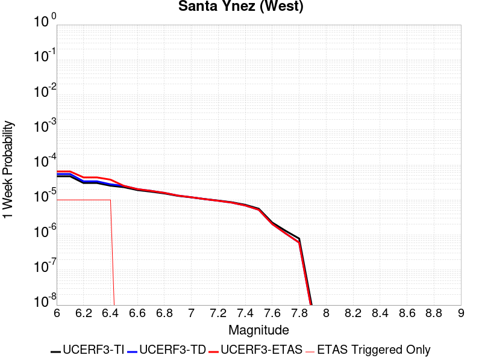 |  |  |  |

| Magnitude | 1 wk TI Prob | 1 wk TD Prob | 1 wk ETAS Prob | 1 wk ETAS/TD Gain | 1 wk ETAS Triggered Only | 1 mo TI Prob | 1 mo TD Prob | 1 mo ETAS Prob | 1 mo ETAS/TD Gain | 1 mo ETAS Triggered Only | 1 yr TI Prob | 1 yr TD Prob | 1 yr ETAS Prob | 1 yr ETAS/TD Gain | 1 yr ETAS Triggered Only | 10 yr TI Prob | 10 yr TD Prob | 10 yr ETAS Prob | 10 yr ETAS/TD Gain | 10 yr ETAS Triggered Only |
|-----|-----|-----|-----|-----|-----|-----|-----|-----|-----|-----|-----|-----|-----|-----|-----|-----|-----|-----|-----|-----|
| 6.0 | 4.7352758E-5 | 5.4977594E-5 | 6.536372E-5 | 1.1889156 | 1.0386697E-5 | 2.0292461E-4 | 2.3559865E-4 | 2.459829E-4 | 1.044076 | 1.0386697E-5 | 0.0024678076 | 0.0028648009 | 0.0028958716 | 1.0108457 | 3.116009E-5 | 0.024405818 | 0.028307132 | 0.028367689 | 1.0021392 | 6.232018E-5 |
| 6.1 | 4.7352758E-5 | 5.4977594E-5 | 6.536372E-5 | 1.1889156 | 1.0386697E-5 | 2.0292461E-4 | 2.3559865E-4 | 2.459829E-4 | 1.044076 | 1.0386697E-5 | 0.0024678076 | 0.0028648009 | 0.0028958716 | 1.0108457 | 3.116009E-5 | 0.024405818 | 0.028307132 | 0.028367689 | 1.0021392 | 6.232018E-5 |
| 6.2 | 3.0415853E-5 | 3.3927812E-5 | 4.4314154E-5 | 1.3061306 | 1.0386697E-5 | 1.3034715E-4 | 1.4539702E-4 | 1.5578221E-4 | 1.0714264 | 1.0386697E-5 | 0.0015858212 | 0.0017688064 | 0.0017999114 | 1.0175853 | 3.116009E-5 | 0.015745522 | 0.017551184 | 0.01761241 | 1.0034884 | 6.232018E-5 |
| 6.3 | 3.0415853E-5 | 3.3927812E-5 | 4.4314154E-5 | 1.3061306 | 1.0386697E-5 | 1.3034715E-4 | 1.4539702E-4 | 1.5578221E-4 | 1.0714264 | 1.0386697E-5 | 0.0015858212 | 0.0017688064 | 0.0017999114 | 1.0175853 | 3.116009E-5 | 0.015745522 | 0.017551184 | 0.01761241 | 1.0034884 | 6.232018E-5 |
| 6.4 | 2.5452082E-5 | 2.7914437E-5 | 3.8300845E-5 | 1.3720801 | 1.0386697E-5 | 1.09075794E-4 | 1.1962793E-4 | 1.3001339E-4 | 1.0868146 | 1.0386697E-5 | 0.0013271887 | 0.0014555135 | 0.0014866282 | 1.0213772 | 3.116009E-5 | 0.013192902 | 0.014461986 | 0.014523405 | 1.004247 | 6.232018E-5 |
| 6.5 | 2.3143784E-5 | 2.5129964E-5 | 2.5129964E-5 | 1.0 | 0.0 | 9.9183875E-5 | 1.0769549E-4 | 1.0769549E-4 | 1.0 | 0.0 | 0.0012068948 | 0.0013104154 | 0.0013311616 | 1.0158317 | 2.0773394E-5 | 0.012003611 | 0.013028558 | 0.013069564 | 1.0031474 | 4.1546788E-5 |
| 6.6 | 1.9118515E-5 | 2.0355572E-5 | 2.0355572E-5 | 1.0 | 0.0 | 8.193392E-5 | 8.72353E-5 | 8.72353E-5 | 1.0 | 0.0 | 9.97089E-4 | 0.0010615803 | 0.0010615803 | 1.0 | 0.0 | 0.00992627 | 0.010566001 | 0.010586555 | 1.0019453 | 2.0773394E-5 |
| 6.7 | 1.722807E-5 | 1.814738E-5 | 1.814738E-5 | 1.0 | 0.0 | 7.3832496E-5 | 7.77722E-5 | 7.77722E-5 | 1.0 | 0.0 | 8.985399E-4 | 9.464708E-4 | 9.464708E-4 | 1.0 | 0.0 | 0.008949154 | 0.009425044 | 0.009445622 | 1.0021833 | 2.0773394E-5 |
| 6.8 | 1.5317364E-5 | 1.5927328E-5 | 1.5927328E-5 | 1.0 | 0.0 | 6.56442E-5 | 6.825821E-5 | 6.825821E-5 | 1.0 | 0.0 | 7.98925E-4 | 8.307311E-4 | 8.307311E-4 | 1.0 | 0.0 | 0.007960589 | 0.008276746 | 0.008287046 | 1.0012445 | 1.0386697E-5 |
| 6.9 | 1.3071226E-5 | 1.3330249E-5 | 1.3330249E-5 | 1.0 | 0.0 | 5.6018336E-5 | 5.71284E-5 | 5.71284E-5 | 1.0 | 0.0 | 6.8180985E-4 | 6.9531857E-4 | 6.9531857E-4 | 1.0 | 0.0 | 0.0067972173 | 0.006931691 | 0.006942006 | 1.0014881 | 1.0386697E-5 |
| 7.0 | 1.1836986E-5 | 1.1933308E-5 | 1.1933308E-5 | 1.0 | 0.0 | 5.0728955E-5 | 5.1141757E-5 | 5.1141757E-5 | 1.0 | 0.0 | 6.1745E-4 | 6.224747E-4 | 6.224747E-4 | 1.0 | 0.0 | 0.006157372 | 0.0062075043 | 0.0062178266 | 1.0016629 | 1.0386697E-5 |
| 7.1 | 1.0597169E-5 | 1.0542637E-5 | 1.0542637E-5 | 1.0 | 0.0 | 4.541565E-5 | 4.5181954E-5 | 4.5181954E-5 | 1.0 | 0.0 | 5.5279525E-4 | 5.499526E-4 | 5.499526E-4 | 1.0 | 0.0 | 0.0055142213 | 0.0054860474 | 0.0054860474 | 1.0 | 0.0 |
| 7.2 | 9.59113E-6 | 9.459535E-6 | 9.459535E-6 | 1.0 | 0.0 | 4.11042E-5 | 4.0540242E-5 | 4.0540242E-5 | 1.0 | 0.0 | 5.0032866E-4 | 4.9346674E-4 | 4.9346674E-4 | 1.0 | 0.0 | 0.004992037 | 0.0049238284 | 0.0049238284 | 1.0 | 0.0 |
| 7.3 | 8.586084E-6 | 8.379932E-6 | 8.379932E-6 | 1.0 | 0.0 | 3.679698E-5 | 3.5913505E-5 | 3.5913505E-5 | 1.0 | 0.0 | 4.4791115E-4 | 4.3716026E-4 | 4.3716026E-4 | 1.0 | 0.0 | 0.004470094 | 0.004363114 | 0.004363114 | 1.0 | 0.0 |
| 7.4 | 7.2622997E-6 | 6.95183E-6 | 6.95183E-6 | 1.0 | 0.0 | 3.112377E-5 | 2.9793222E-5 | 2.9793222E-5 | 1.0 | 0.0 | 3.78866E-4 | 3.6267308E-4 | 3.6267308E-4 | 1.0 | 0.0 | 0.0037822074 | 0.0036209123 | 0.0036209123 | 1.0 | 0.0 |
| 7.5 | 5.627296E-6 | 5.251797E-6 | 5.251797E-6 | 1.0 | 0.0 | 2.411676E-5 | 2.2507513E-5 | 2.2507513E-5 | 1.0 | 0.0 | 2.9358198E-4 | 2.7399522E-4 | 2.7399522E-4 | 1.0 | 0.0 | 0.0029319443 | 0.002736646 | 0.002736646 | 1.0 | 0.0 |
| 7.6 | 2.265244E-6 | 2.0609314E-6 | 2.0609314E-6 | 1.0 | 0.0 | 9.708152E-6 | 8.832533E-6 | 8.832533E-6 | 1.0 | 0.0 | 1.18190335E-4 | 1.07530876E-4 | 1.07530876E-4 | 1.0 | 0.0 | 0.001181275 | 0.001074797 | 0.001074797 | 1.0 | 0.0 |
| 7.7 | 1.3099874E-6 | 1.1016656E-6 | 1.1016656E-6 | 1.0 | 0.0 | 5.61422E-6 | 4.7214157E-6 | 4.7214157E-6 | 1.0 | 0.0 | 6.8350986E-5 | 5.7481746E-5 | 5.7481746E-5 | 1.0 | 0.0 | 6.832996E-4 | 5.7467114E-4 | 5.7467114E-4 | 1.0 | 0.0 |
| 7.8 | 7.903951E-7 | 6.071338E-7 | 6.071338E-7 | 1.0 | 0.0 | 3.3874032E-6 | 2.6019995E-6 | 2.6019995E-6 | 1.0 | 0.0 | 4.1240855E-5 | 3.1678897E-5 | 3.1678897E-5 | 1.0 | 0.0 | 4.12332E-4 | 3.1674514E-4 | 3.1674514E-4 | 1.0 | 0.0 |
| 7.9 | 7.0753297E-9 | 5.0900715E-9 | 5.0900715E-9 | 1.0 | 0.0 | 3.032284E-8 | 2.1814591E-8 | 2.1814591E-8 | 1.0 | 0.0 | 3.6918053E-7 | 2.6559263E-7 | 2.6559263E-7 | 1.0 | 0.0 | 3.691799E-6 | 2.655924E-6 | 2.655924E-6 | 1.0 | 0.0 |

## Mission Ridge-Arroyo Parida-Santa Ana
*[(top)](#table-of-contents)*

| 1 Week | 1 Month | 1 Year | 10 Year |
|-----|-----|-----|-----|
|  |  |  |  |

| Magnitude | 1 wk TI Prob | 1 wk TD Prob | 1 wk ETAS Prob | 1 wk ETAS/TD Gain | 1 wk ETAS Triggered Only | 1 mo TI Prob | 1 mo TD Prob | 1 mo ETAS Prob | 1 mo ETAS/TD Gain | 1 mo ETAS Triggered Only | 1 yr TI Prob | 1 yr TD Prob | 1 yr ETAS Prob | 1 yr ETAS/TD Gain | 1 yr ETAS Triggered Only | 10 yr TI Prob | 10 yr TD Prob | 10 yr ETAS Prob | 10 yr ETAS/TD Gain | 10 yr ETAS Triggered Only |
|-----|-----|-----|-----|-----|-----|-----|-----|-----|-----|-----|-----|-----|-----|-----|-----|-----|-----|-----|-----|-----|
| 6.0 | 4.169034E-5 | 4.71435E-5 | 4.71435E-5 | 1.0 | 0.0 | 1.7866064E-4 | 2.0203278E-4 | 2.0203278E-4 | 1.0 | 0.0 | 0.0021730233 | 0.0024577067 | 0.002468068 | 1.0042158 | 1.0386697E-5 | 0.021518968 | 0.024387252 | 0.024458185 | 1.0029086 | 7.270688E-5 |
| 6.1 | 1.73813E-5 | 1.6855427E-5 | 1.6855427E-5 | 1.0 | 0.0 | 7.4489166E-5 | 7.2235605E-5 | 7.2235605E-5 | 1.0 | 0.0 | 9.065282E-4 | 8.791244E-4 | 8.791244E-4 | 1.0 | 0.0 | 0.009028391 | 0.008757609 | 0.0087782005 | 1.0023513 | 2.0773394E-5 |
| 6.2 | 1.4622182E-5 | 1.3674228E-5 | 1.3674228E-5 | 1.0 | 0.0 | 6.2664985E-5 | 5.8602538E-5 | 5.8602538E-5 | 1.0 | 0.0 | 7.6267915E-4 | 7.1325625E-4 | 7.1325625E-4 | 1.0 | 0.0 | 0.007600669 | 0.0071101133 | 0.0071204263 | 1.0014504 | 1.0386697E-5 |
| 6.3 | 1.3552434E-5 | 1.2483067E-5 | 1.2483067E-5 | 1.0 | 0.0 | 5.8080568E-5 | 5.3497777E-5 | 5.3497777E-5 | 1.0 | 0.0 | 7.069015E-4 | 6.5114396E-4 | 6.5114396E-4 | 1.0 | 0.0 | 0.00704657 | 0.0064927237 | 0.006503043 | 1.0015893 | 1.0386697E-5 |
| 6.4 | 1.30977305E-5 | 1.1979993E-5 | 1.1979993E-5 | 1.0 | 0.0 | 5.613192E-5 | 5.1341834E-5 | 5.1341834E-5 | 1.0 | 0.0 | 6.831918E-4 | 6.249106E-4 | 6.249106E-4 | 1.0 | 0.0 | 0.006810953 | 0.0062318784 | 0.0062422003 | 1.0016563 | 1.0386697E-5 |
| 6.5 | 1.225205E-5 | 1.104959E-5 | 1.104959E-5 | 1.0 | 0.0 | 5.2507727E-5 | 4.7354544E-5 | 4.7354544E-5 | 1.0 | 0.0 | 6.3909404E-4 | 5.7639176E-4 | 5.7639176E-4 | 1.0 | 0.0 | 0.006372592 | 0.005749278 | 0.0057596047 | 1.0017962 | 1.0386697E-5 |
| 6.6 | 1.1352241E-5 | 1.0064273E-5 | 1.0064273E-5 | 1.0 | 0.0 | 4.8651553E-5 | 4.3131895E-5 | 4.3131895E-5 | 1.0 | 0.0 | 5.921717E-4 | 5.2500644E-4 | 5.2500644E-4 | 1.0 | 0.0 | 0.0059059616 | 0.005237907 | 0.0052482397 | 1.0019726 | 1.0386697E-5 |
| 6.7 | 1.0864116E-5 | 9.517729E-6 | 9.517729E-6 | 1.0 | 0.0 | 4.6559664E-5 | 4.0789644E-5 | 4.0789644E-5 | 1.0 | 0.0 | 5.667165E-4 | 4.9650273E-4 | 4.9650273E-4 | 1.0 | 0.0 | 0.005652734 | 0.0049541686 | 0.004964504 | 1.0020862 | 1.0386697E-5 |
| 6.8 | 1.0666365E-5 | 9.30047E-6 | 9.30047E-6 | 1.0 | 0.0 | 4.571219E-5 | 3.9858558E-5 | 3.9858558E-5 | 1.0 | 0.0 | 5.564038E-4 | 4.851719E-4 | 4.851719E-4 | 1.0 | 0.0 | 0.005550127 | 0.004841359 | 0.0048516956 | 1.002135 | 1.0386697E-5 |
| 6.9 | 1.0038665E-5 | 8.592689E-6 | 8.592689E-6 | 1.0 | 0.0 | 4.302214E-5 | 3.68253E-5 | 3.68253E-5 | 1.0 | 0.0 | 5.236687E-4 | 4.4825758E-4 | 4.4825758E-4 | 1.0 | 0.0 | 0.005224364 | 0.004473745 | 0.0044840854 | 1.0023113 | 1.0386697E-5 |
| 7.0 | 9.5379955E-6 | 8.025674E-6 | 8.025674E-6 | 1.0 | 0.0 | 4.0876483E-5 | 3.4395303E-5 | 3.4395303E-5 | 1.0 | 0.0 | 4.975576E-4 | 4.1868407E-4 | 4.1868407E-4 | 1.0 | 0.0 | 0.00496445 | 0.004179152 | 0.0041894955 | 1.002475 | 1.0386697E-5 |
| 7.1 | 9.207389E-6 | 7.652948E-6 | 7.652948E-6 | 1.0 | 0.0 | 3.945964E-5 | 3.2797943E-5 | 3.2797943E-5 | 1.0 | 0.0 | 4.803152E-4 | 3.992435E-4 | 3.992435E-4 | 1.0 | 0.0 | 0.004792784 | 0.003985459 | 0.003995804 | 1.0025958 | 1.0386697E-5 |
| 7.2 | 7.638091E-6 | 5.9315435E-6 | 5.9315435E-6 | 1.0 | 0.0 | 3.2734264E-5 | 2.5420655E-5 | 2.5420655E-5 | 1.0 | 0.0 | 3.984668E-4 | 3.0945282E-4 | 3.0945282E-4 | 1.0 | 0.0 | 0.0039775306 | 0.0030902762 | 0.0030902762 | 1.0 | 0.0 |
| 7.3 | 7.2500147E-6 | 5.5965506E-6 | 5.5965506E-6 | 1.0 | 0.0 | 3.1071122E-5 | 2.3985E-5 | 2.3985E-5 | 1.0 | 0.0 | 3.7822526E-4 | 2.9197853E-4 | 2.9197853E-4 | 1.0 | 0.0 | 0.0037758215 | 0.0029160045 | 0.0029160045 | 1.0 | 0.0 |
| 7.4 | 6.3899715E-6 | 4.918836E-6 | 4.918836E-6 | 1.0 | 0.0 | 2.7385306E-5 | 2.1080557E-5 | 2.1080557E-5 | 1.0 | 0.0 | 3.3336508E-4 | 2.5662576E-4 | 2.5662576E-4 | 1.0 | 0.0 | 0.0033286542 | 0.0025633385 | 0.0025633385 | 1.0 | 0.0 |
| 7.5 | 5.379025E-6 | 4.0841346E-6 | 4.0841346E-6 | 1.0 | 0.0 | 2.305276E-5 | 1.7503316E-5 | 1.7503316E-5 | 1.0 | 0.0 | 2.806312E-4 | 2.1308215E-4 | 2.1308215E-4 | 1.0 | 0.0 | 0.0028027708 | 0.0021287897 | 0.0021287897 | 1.0 | 0.0 |
| 7.6 | 4.1270696E-6 | 3.0885622E-6 | 3.0885622E-6 | 1.0 | 0.0 | 1.768732E-5 | 1.3236629E-5 | 1.3236629E-5 | 1.0 | 0.0 | 2.1532185E-4 | 1.6114411E-4 | 1.6114411E-4 | 1.0 | 0.0 | 0.0021511333 | 0.0016102807 | 0.0016102807 | 1.0 | 0.0 |
| 7.7 | 2.5406805E-6 | 1.8283382E-6 | 1.8283382E-6 | 1.0 | 0.0 | 1.0888585E-5 | 7.8357125E-6 | 7.8357125E-6 | 1.0 | 0.0 | 1.3256045E-4 | 9.539568E-5 | 9.539568E-5 | 1.0 | 0.0 | 0.0013248142 | 9.535535E-4 | 9.535535E-4 | 1.0 | 0.0 |
| 7.8 | 4.8608285E-7 | 3.5100658E-7 | 3.5100658E-7 | 1.0 | 0.0 | 2.0832106E-6 | 1.504313E-6 | 1.504313E-6 | 1.0 | 0.0 | 2.5362791E-5 | 1.8314859E-5 | 1.8314859E-5 | 1.0 | 0.0 | 2.5359896E-4 | 1.8313361E-4 | 1.8313361E-4 | 1.0 | 0.0 |
| 7.9 | 2.0472514E-8 | 1.2690024E-8 | 1.2690024E-8 | 1.0 | 0.0 | 8.7739345E-8 | 5.438582E-8 | 5.438582E-8 | 1.0 | 0.0 | 1.068226E-6 | 6.621471E-7 | 6.621471E-7 | 1.0 | 0.0 | 1.0682209E-5 | 6.6214525E-6 | 6.6214525E-6 | 1.0 | 0.0 |
| 8.0 | 4.443582E-9 | 2.0326807E-9 | 2.0326807E-9 | 1.0 | 0.0 | 1.9043922E-8 | 8.711488E-9 | 8.711488E-9 | 1.0 | 0.0 | 2.3185973E-7 | 1.06062366E-7 | 1.06062366E-7 | 1.0 | 0.0 | 2.3185949E-6 | 1.0606232E-6 | 1.0606232E-6 | 1.0 | 0.0 |

## Santa Ynez (East)
*[(top)](#table-of-contents)*

| 1 Week | 1 Month | 1 Year | 10 Year |
|-----|-----|-----|-----|
|  |  |  |  |

| Magnitude | 1 wk TI Prob | 1 wk TD Prob | 1 wk ETAS Prob | 1 wk ETAS/TD Gain | 1 wk ETAS Triggered Only | 1 mo TI Prob | 1 mo TD Prob | 1 mo ETAS Prob | 1 mo ETAS/TD Gain | 1 mo ETAS Triggered Only | 1 yr TI Prob | 1 yr TD Prob | 1 yr ETAS Prob | 1 yr ETAS/TD Gain | 1 yr ETAS Triggered Only | 10 yr TI Prob | 10 yr TD Prob | 10 yr ETAS Prob | 10 yr ETAS/TD Gain | 10 yr ETAS Triggered Only |
|-----|-----|-----|-----|-----|-----|-----|-----|-----|-----|-----|-----|-----|-----|-----|-----|-----|-----|-----|-----|-----|
| 6.0 | 3.2269712E-5 | 3.675388E-5 | 3.675388E-5 | 1.0 | 0.0 | 1.3829143E-4 | 1.5751045E-4 | 1.7828056E-4 | 1.131865 | 2.0773394E-5 | 0.0016823979 | 0.0019165927 | 0.0019684266 | 1.0270449 | 5.1933483E-5 | 0.016697178 | 0.019058175 | 0.019139687 | 1.0042769 | 8.3093575E-5 |
| 6.1 | 3.2269712E-5 | 3.675388E-5 | 3.675388E-5 | 1.0 | 0.0 | 1.3829143E-4 | 1.5751045E-4 | 1.7828056E-4 | 1.131865 | 2.0773394E-5 | 0.0016823979 | 0.0019165927 | 0.0019684266 | 1.0270449 | 5.1933483E-5 | 0.016697178 | 0.019058175 | 0.019139687 | 1.0042769 | 8.3093575E-5 |
| 6.2 | 3.2269712E-5 | 3.675388E-5 | 3.675388E-5 | 1.0 | 0.0 | 1.3829143E-4 | 1.5751045E-4 | 1.7828056E-4 | 1.131865 | 2.0773394E-5 | 0.0016823979 | 0.0019165927 | 0.0019684266 | 1.0270449 | 5.1933483E-5 | 0.016697178 | 0.019058175 | 0.019139687 | 1.0042769 | 8.3093575E-5 |
| 6.3 | 3.2269712E-5 | 3.675388E-5 | 3.675388E-5 | 1.0 | 0.0 | 1.3829143E-4 | 1.5751045E-4 | 1.7828056E-4 | 1.131865 | 2.0773394E-5 | 0.0016823979 | 0.0019165927 | 0.0019684266 | 1.0270449 | 5.1933483E-5 | 0.016697178 | 0.019058175 | 0.019139687 | 1.0042769 | 8.3093575E-5 |
| 6.4 | 1.4404779E-5 | 1.485013E-5 | 1.485013E-5 | 1.0 | 0.0 | 6.1733306E-5 | 6.364189E-5 | 6.364189E-5 | 1.0 | 0.0 | 7.513438E-4 | 7.745696E-4 | 7.8494824E-4 | 1.0133992 | 1.0386697E-5 | 0.0074880854 | 0.0077192495 | 0.007729556 | 1.0013351 | 1.0386697E-5 |
| 6.5 | 1.4404779E-5 | 1.485013E-5 | 1.485013E-5 | 1.0 | 0.0 | 6.1733306E-5 | 6.364189E-5 | 6.364189E-5 | 1.0 | 0.0 | 7.513438E-4 | 7.745696E-4 | 7.8494824E-4 | 1.0133992 | 1.0386697E-5 | 0.0074880854 | 0.0077192495 | 0.007729556 | 1.0013351 | 1.0386697E-5 |
| 6.6 | 1.280208E-5 | 1.3012552E-5 | 1.3012552E-5 | 1.0 | 0.0 | 5.4864904E-5 | 5.5766897E-5 | 5.5766897E-5 | 1.0 | 0.0 | 6.6777546E-4 | 6.7875226E-4 | 6.7875226E-4 | 1.0 | 0.0 | 0.006657724 | 0.006767002 | 0.006767002 | 1.0 | 0.0 |
| 6.7 | 1.2457027E-5 | 1.262905E-5 | 1.262905E-5 | 1.0 | 0.0 | 5.3386164E-5 | 5.4123386E-5 | 5.4123386E-5 | 1.0 | 0.0 | 6.497827E-4 | 6.5875467E-4 | 6.5875467E-4 | 1.0 | 0.0 | 0.00647886 | 0.0065682167 | 0.0065682167 | 1.0 | 0.0 |
| 6.8 | 1.2095134E-5 | 1.2231476E-5 | 1.2231476E-5 | 1.0 | 0.0 | 5.1835254E-5 | 5.2419568E-5 | 5.2419568E-5 | 1.0 | 0.0 | 6.309115E-4 | 6.3802296E-4 | 6.3802296E-4 | 1.0 | 0.0 | 0.0062912325 | 0.0063621 | 0.0063621 | 1.0 | 0.0 |
| 6.9 | 1.1104036E-5 | 1.115786E-5 | 1.115786E-5 | 1.0 | 0.0 | 4.758786E-5 | 4.7818532E-5 | 4.7818532E-5 | 1.0 | 0.0 | 5.7922816E-4 | 5.820364E-4 | 5.820364E-4 | 1.0 | 0.0 | 0.005777207 | 0.005805265 | 0.005805265 | 1.0 | 0.0 |
| 7.0 | 1.0577444E-5 | 1.0582165E-5 | 1.0582165E-5 | 1.0 | 0.0 | 4.5331115E-5 | 4.5351353E-5 | 4.5351353E-5 | 1.0 | 0.0 | 5.5176654E-4 | 5.5201404E-4 | 5.5201404E-4 | 1.0 | 0.0 | 0.0055039856 | 0.005506567 | 0.005506567 | 1.0 | 0.0 |
| 7.1 | 1.0021775E-5 | 9.981446E-6 | 9.981446E-6 | 1.0 | 0.0 | 4.294976E-5 | 4.277693E-5 | 4.277693E-5 | 1.0 | 0.0 | 5.2278786E-4 | 5.2068586E-4 | 5.2068586E-4 | 1.0 | 0.0 | 0.0052155964 | 0.0051947916 | 0.0051947916 | 1.0 | 0.0 |
| 7.2 | 8.874109E-6 | 8.749197E-6 | 8.749197E-6 | 1.0 | 0.0 | 3.8031343E-5 | 3.7496025E-5 | 3.7496025E-5 | 1.0 | 0.0 | 4.629332E-4 | 4.564196E-4 | 4.564196E-4 | 1.0 | 0.0 | 0.0046197 | 0.00455494 | 0.00455494 | 1.0 | 0.0 |
| 7.3 | 7.5504267E-6 | 7.505443E-6 | 7.505443E-6 | 1.0 | 0.0 | 3.235857E-5 | 3.2165794E-5 | 3.2165794E-5 | 1.0 | 0.0 | 3.9389438E-4 | 3.915492E-4 | 3.915492E-4 | 1.0 | 0.0 | 0.0039319694 | 0.0039087003 | 0.0039087003 | 1.0 | 0.0 |
| 7.4 | 6.309394E-6 | 6.183419E-6 | 6.183419E-6 | 1.0 | 0.0 | 2.703998E-5 | 2.6500104E-5 | 2.6500104E-5 | 1.0 | 0.0 | 3.2916202E-4 | 3.2259195E-4 | 3.2259195E-4 | 1.0 | 0.0 | 0.003286749 | 0.003221334 | 0.003221334 | 1.0 | 0.0 |
| 7.5 | 4.6103073E-6 | 4.4410685E-6 | 4.4410685E-6 | 1.0 | 0.0 | 1.975831E-5 | 1.9033017E-5 | 1.9033017E-5 | 1.0 | 0.0 | 2.4053088E-4 | 2.3170303E-4 | 2.3170303E-4 | 1.0 | 0.0 | 0.002402707 | 0.002314684 | 0.002314684 | 1.0 | 0.0 |
| 7.6 | 1.2858658E-6 | 1.3008554E-6 | 1.3008554E-6 | 1.0 | 0.0 | 5.5108417E-6 | 5.575083E-6 | 5.575083E-6 | 1.0 | 0.0 | 6.7092435E-5 | 6.7874586E-5 | 6.7874586E-5 | 1.0 | 0.0 | 6.707218E-4 | 6.7854545E-4 | 6.7854545E-4 | 1.0 | 0.0 |
| 7.7 | 5.3302307E-7 | 5.612297E-7 | 5.612297E-7 | 1.0 | 0.0 | 2.2843826E-6 | 2.4052679E-6 | 2.4052679E-6 | 1.0 | 0.0 | 2.7812002E-5 | 2.9283781E-5 | 2.9283781E-5 | 1.0 | 0.0 | 2.7808524E-4 | 2.9280278E-4 | 2.9280278E-4 | 1.0 | 0.0 |
| 7.8 | 4.613933E-8 | 4.8031144E-8 | 4.8031144E-8 | 1.0 | 0.0 | 1.9773998E-7 | 2.0584774E-7 | 2.0584774E-7 | 1.0 | 0.0 | 2.4074816E-6 | 2.5061934E-6 | 2.5061934E-6 | 1.0 | 0.0 | 2.4074554E-5 | 2.5061661E-5 | 2.5061661E-5 | 1.0 | 0.0 |

## San Jacinto (San Jacinto Valley) rev
*[(top)](#table-of-contents)*

| 1 Week | 1 Month | 1 Year | 10 Year |
|-----|-----|-----|-----|
|  |  | 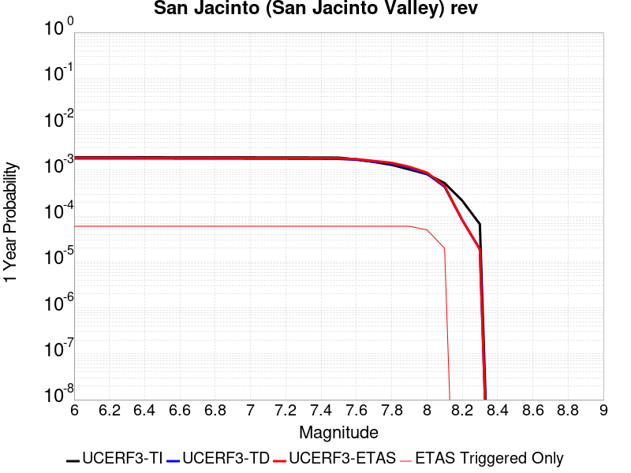 |  |

| Magnitude | 1 wk TI Prob | 1 wk TD Prob | 1 wk ETAS Prob | 1 wk ETAS/TD Gain | 1 wk ETAS Triggered Only | 1 mo TI Prob | 1 mo TD Prob | 1 mo ETAS Prob | 1 mo ETAS/TD Gain | 1 mo ETAS Triggered Only | 1 yr TI Prob | 1 yr TD Prob | 1 yr ETAS Prob | 1 yr ETAS/TD Gain | 1 yr ETAS Triggered Only | 10 yr TI Prob | 10 yr TD Prob | 10 yr ETAS Prob | 10 yr ETAS/TD Gain | 10 yr ETAS Triggered Only |
|-----|-----|-----|-----|-----|-----|-----|-----|-----|-----|-----|-----|-----|-----|-----|-----|-----|-----|-----|-----|-----|
| 6.0 | 3.652694E-5 | 3.4467394E-5 | 3.4467394E-5 | 1.0 | 0.0 | 1.5653463E-4 | 1.4770904E-4 | 1.4770904E-4 | 1.0 | 0.0 | 0.0019041431 | 0.001796876 | 0.0018590841 | 1.0346202 | 6.232018E-5 | 0.018879099 | 0.018560216 | 0.018641766 | 1.0043939 | 8.3093575E-5 |
| 6.1 | 3.652694E-5 | 3.4467394E-5 | 3.4467394E-5 | 1.0 | 0.0 | 1.5653463E-4 | 1.4770904E-4 | 1.4770904E-4 | 1.0 | 0.0 | 0.0019041431 | 0.001796876 | 0.0018590841 | 1.0346202 | 6.232018E-5 | 0.018879099 | 0.018560216 | 0.018641766 | 1.0043939 | 8.3093575E-5 |
| 6.2 | 3.652694E-5 | 3.4467394E-5 | 3.4467394E-5 | 1.0 | 0.0 | 1.5653463E-4 | 1.4770904E-4 | 1.4770904E-4 | 1.0 | 0.0 | 0.0019041431 | 0.001796876 | 0.0018590841 | 1.0346202 | 6.232018E-5 | 0.018879099 | 0.018560216 | 0.018641766 | 1.0043939 | 8.3093575E-5 |
| 6.3 | 3.652694E-5 | 3.4467394E-5 | 3.4467394E-5 | 1.0 | 0.0 | 1.5653463E-4 | 1.4770904E-4 | 1.4770904E-4 | 1.0 | 0.0 | 0.0019041431 | 0.001796876 | 0.0018590841 | 1.0346202 | 6.232018E-5 | 0.018879099 | 0.018560216 | 0.018641766 | 1.0043939 | 8.3093575E-5 |
| 6.4 | 3.646941E-5 | 3.4388955E-5 | 3.4388955E-5 | 1.0 | 0.0 | 1.5628811E-4 | 1.4737292E-4 | 1.4737292E-4 | 1.0 | 0.0 | 0.0019011468 | 0.0017927908 | 0.0018549993 | 1.0346992 | 6.232018E-5 | 0.018849645 | 0.01852009 | 0.018601645 | 1.0044036 | 8.3093575E-5 |
| 6.5 | 3.646941E-5 | 3.4388955E-5 | 3.4388955E-5 | 1.0 | 0.0 | 1.5628811E-4 | 1.4737292E-4 | 1.4737292E-4 | 1.0 | 0.0 | 0.0019011468 | 0.0017927908 | 0.0018549993 | 1.0346992 | 6.232018E-5 | 0.018849645 | 0.01852009 | 0.018601645 | 1.0044036 | 8.3093575E-5 |
| 6.6 | 3.6442503E-5 | 3.4352335E-5 | 3.4352335E-5 | 1.0 | 0.0 | 1.561728E-4 | 1.4721598E-4 | 1.4721598E-4 | 1.0 | 0.0 | 0.0018997455 | 0.0017908834 | 0.0018530919 | 1.0347363 | 6.232018E-5 | 0.018835869 | 0.018501356 | 0.018582914 | 1.0044081 | 8.3093575E-5 |
| 6.7 | 3.6432113E-5 | 3.4337903E-5 | 3.4337903E-5 | 1.0 | 0.0 | 1.5612828E-4 | 1.4715415E-4 | 1.4715415E-4 | 1.0 | 0.0 | 0.0018992044 | 0.001790132 | 0.0018523406 | 1.0347508 | 6.232018E-5 | 0.018830549 | 0.01849398 | 0.018575536 | 1.0044099 | 8.3093575E-5 |
| 6.8 | 3.6409598E-5 | 3.430695E-5 | 3.430695E-5 | 1.0 | 0.0 | 1.560318E-4 | 1.470215E-4 | 1.470215E-4 | 1.0 | 0.0 | 0.0018980318 | 0.0017885199 | 0.0018507286 | 1.0347823 | 6.232018E-5 | 0.018819023 | 0.01847813 | 0.01855969 | 1.0044137 | 8.3093575E-5 |
| 6.9 | 3.638078E-5 | 3.4267367E-5 | 3.4267367E-5 | 1.0 | 0.0 | 1.5590832E-4 | 1.4685189E-4 | 1.4685189E-4 | 1.0 | 0.0 | 0.0018965311 | 0.0017864581 | 0.0018486669 | 1.0348225 | 6.232018E-5 | 0.018804269 | 0.018457862 | 0.018539421 | 1.0044187 | 8.3093575E-5 |
| 7.0 | 3.6294874E-5 | 3.4149365E-5 | 3.4149365E-5 | 1.0 | 0.0 | 1.5554018E-4 | 1.4634622E-4 | 1.4634622E-4 | 1.0 | 0.0 | 0.0018920569 | 0.0017803118 | 0.001842521 | 1.0349429 | 6.232018E-5 | 0.018760284 | 0.018397434 | 0.018478999 | 1.0044335 | 8.3093575E-5 |
| 7.1 | 3.6260717E-5 | 3.410564E-5 | 3.410564E-5 | 1.0 | 0.0 | 1.5539382E-4 | 1.4615887E-4 | 1.4615887E-4 | 1.0 | 0.0 | 0.001890278 | 0.0017780344 | 0.0018402438 | 1.0349877 | 6.232018E-5 | 0.018742796 | 0.018375032 | 0.018456599 | 1.004439 | 8.3093575E-5 |
| 7.2 | 3.6210204E-5 | 3.403977E-5 | 3.403977E-5 | 1.0 | 0.0 | 1.5517735E-4 | 1.4587659E-4 | 1.4587659E-4 | 1.0 | 0.0 | 0.001887647 | 0.0017746033 | 0.0018368128 | 1.0350555 | 6.232018E-5 | 0.01871693 | 0.018341267 | 0.018422836 | 1.0044473 | 8.3093575E-5 |
| 7.3 | 3.6119454E-5 | 3.3927867E-5 | 3.3927867E-5 | 1.0 | 0.0 | 1.5478847E-4 | 1.4539705E-4 | 1.4539705E-4 | 1.0 | 0.0 | 0.0018829206 | 0.0017687745 | 0.0018309844 | 1.0351713 | 6.232018E-5 | 0.018670462 | 0.018283723 | 0.018365297 | 1.0044615 | 8.3093575E-5 |
| 7.4 | 3.607848E-5 | 3.387532E-5 | 3.387532E-5 | 1.0 | 0.0 | 1.5461289E-4 | 1.4517189E-4 | 1.4517189E-4 | 1.0 | 0.0 | 0.0018807866 | 0.0017660374 | 0.0018282476 | 1.0352259 | 6.232018E-5 | 0.018649481 | 0.018256696 | 0.018338272 | 1.0044683 | 8.3093575E-5 |
| 7.5 | 3.5856774E-5 | 3.3684162E-5 | 3.3684162E-5 | 1.0 | 0.0 | 1.5366284E-4 | 1.4435273E-4 | 1.4435273E-4 | 1.0 | 0.0 | 0.0018692396 | 0.0017560803 | 0.0018182911 | 1.0354259 | 6.232018E-5 | 0.018535944 | 0.01815731 | 0.018238895 | 1.0044932 | 8.3093575E-5 |
| 7.6 | 3.286655E-5 | 3.220034E-5 | 3.220034E-5 | 1.0 | 0.0 | 1.4084904E-4 | 1.3799417E-4 | 1.3799417E-4 | 1.0 | 0.0 | 0.001713488 | 0.0016787864 | 0.001741002 | 1.0370598 | 6.232018E-5 | 0.017003361 | 0.017373424 | 0.017455073 | 1.0046997 | 8.3093575E-5 |
| 7.7 | 2.8882527E-5 | 2.9291981E-5 | 2.9291981E-5 | 1.0 | 0.0 | 1.237764E-4 | 1.2553102E-4 | 1.2553102E-4 | 1.0 | 0.0 | 0.0015059357 | 0.0015272698 | 0.0015894949 | 1.0407426 | 6.232018E-5 | 0.014957713 | 0.015859274 | 0.01594105 | 1.0051563 | 8.3093575E-5 |
| 7.8 | 2.4950225E-5 | 2.6580747E-5 | 2.6580747E-5 | 1.0 | 0.0 | 1.0692515E-4 | 1.13912516E-4 | 1.13912516E-4 | 1.0 | 0.0 | 0.0013010362 | 0.0013860033 | 0.0014482372 | 1.0449016 | 6.232018E-5 | 0.012934455 | 0.014439502 | 0.014521396 | 1.0056715 | 8.3093575E-5 |
| 7.9 | 1.9881603E-5 | 2.155556E-5 | 2.155556E-5 | 1.0 | 0.0 | 8.520408E-5 | 9.2377704E-5 | 9.2377704E-5 | 1.0 | 0.0 | 0.001036866 | 0.001124119 | 0.0011863691 | 1.0553768 | 6.232018E-5 | 0.010320415 | 0.011802064 | 0.011884177 | 1.0069575 | 8.3093575E-5 |
| 8.0 | 1.563292E-5 | 1.5976173E-5 | 1.5976173E-5 | 1.0 | 0.0 | 6.6996516E-5 | 6.846752E-5 | 6.846752E-5 | 1.0 | 0.0 | 8.153773E-4 | 8.332739E-4 | 8.8516413E-4 | 1.0622727 | 5.1933483E-5 | 0.00812392 | 0.008830938 | 0.008903002 | 1.0081605 | 7.270688E-5 |
| 8.1 | 1.0045313E-5 | 8.324356E-6 | 8.324356E-6 | 1.0 | 0.0 | 4.305063E-5 | 3.5675326E-5 | 3.5675326E-5 | 1.0 | 0.0 | 5.2401534E-4 | 4.3426102E-4 | 4.550254E-4 | 1.0478154 | 2.0773394E-5 | 0.0052278144 | 0.0046712374 | 0.004702252 | 1.0066395 | 3.116009E-5 |
| 8.2 | 4.1554413E-6 | 1.5721832E-6 | 1.5721832E-6 | 1.0 | 0.0 | 1.7808914E-5 | 6.737911E-6 | 6.737911E-6 | 1.0 | 0.0 | 2.1680194E-4 | 8.203101E-5 | 8.203101E-5 | 1.0 | 0.0 | 0.0021659054 | 9.520741E-4 | 9.520741E-4 | 1.0 | 0.0 |
| 8.3 | 1.2758221E-6 | 3.6330252E-7 | 3.6330252E-7 | 1.0 | 0.0 | 5.4677976E-6 | 1.5570099E-6 | 1.5570099E-6 | 1.0 | 0.0 | 6.65684E-5 | 1.8956434E-5 | 1.8956434E-5 | 1.0 | 0.0 | 6.6548464E-4 | 2.2857229E-4 | 2.2857229E-4 | 1.0 | 0.0 |

## San Andreas (Creeping Section) 2011 CFM
*[(top)](#table-of-contents)*

| 1 Week | 1 Month | 1 Year | 10 Year |
|-----|-----|-----|-----|
|  |  |  |  |

| Magnitude | 1 wk TI Prob | 1 wk TD Prob | 1 wk ETAS Prob | 1 wk ETAS/TD Gain | 1 wk ETAS Triggered Only | 1 mo TI Prob | 1 mo TD Prob | 1 mo ETAS Prob | 1 mo ETAS/TD Gain | 1 mo ETAS Triggered Only | 1 yr TI Prob | 1 yr TD Prob | 1 yr ETAS Prob | 1 yr ETAS/TD Gain | 1 yr ETAS Triggered Only | 10 yr TI Prob | 10 yr TD Prob | 10 yr ETAS Prob | 10 yr ETAS/TD Gain | 10 yr ETAS Triggered Only |
|-----|-----|-----|-----|-----|-----|-----|-----|-----|-----|-----|-----|-----|-----|-----|-----|-----|-----|-----|-----|-----|
| 6.0 | 5.986481E-4 | 0.0012277901 | 0.0012277901 | 1.0 | 0.0 | 0.0025631124 | 0.0052455855 | 0.0052559176 | 1.0019697 | 1.0386697E-5 | 0.030762846 | 0.061229862 | 0.061278615 | 1.0007962 | 5.1933483E-5 | 0.26835477 | 0.42607152 | 0.42611325 | 1.000098 | 7.270688E-5 |
| 6.1 | 5.015945E-4 | 0.0010218644 | 0.0010218644 | 1.0 | 0.0 | 0.00214792 | 0.0043676887 | 0.00437803 | 1.0023677 | 1.0386697E-5 | 0.025839351 | 0.051269703 | 0.051318973 | 1.0009611 | 5.1933483E-5 | 0.23032776 | 0.37298882 | 0.3730279 | 1.0001048 | 6.232018E-5 |
| 6.2 | 4.073338E-4 | 8.109829E-4 | 8.109829E-4 | 1.0 | 0.0 | 0.0017445484 | 0.0034675654 | 0.003477916 | 1.002985 | 1.0386697E-5 | 0.021034058 | 0.040954083 | 0.04100389 | 1.0012162 | 5.1933483E-5 | 0.19150782 | 0.31317768 | 0.31322047 | 1.0001366 | 6.232018E-5 |
| 6.3 | 3.464099E-4 | 6.7405414E-4 | 6.7405414E-4 | 1.0 | 0.0 | 0.0014837692 | 0.0028840431 | 0.0028840431 | 1.0 | 0.0 | 0.017915873 | 0.034210727 | 0.03425085 | 1.0011729 | 4.1546788E-5 | 0.16538359 | 0.27146977 | 0.2715076 | 1.0001394 | 5.1933483E-5 |
| 6.4 | 2.935057E-4 | 5.543318E-4 | 5.543318E-4 | 1.0 | 0.0 | 0.0012572751 | 0.0023728115 | 0.0023728115 | 1.0 | 0.0 | 0.015200248 | 0.028285956 | 0.028326327 | 1.0014273 | 4.1546788E-5 | 0.14201577 | 0.23314685 | 0.23318666 | 1.0001708 | 5.1933483E-5 |
| 6.5 | 2.3409708E-4 | 4.2106997E-4 | 4.2106997E-4 | 1.0 | 0.0 | 0.0010028875 | 0.001803265 | 0.001803265 | 1.0 | 0.0 | 0.012141965 | 0.02160988 | 0.021650529 | 1.001881 | 4.1546788E-5 | 0.11499573 | 0.18699536 | 0.18703757 | 1.0002258 | 5.1933483E-5 |
| 6.6 | 1.5842178E-4 | 2.5115322E-4 | 2.5115322E-4 | 1.0 | 0.0 | 6.7877385E-4 | 0.0010759257 | 0.0010759257 | 1.0 | 0.0 | 0.0082328 | 0.013019121 | 0.013060127 | 1.0031496 | 4.1546788E-5 | 0.07934396 | 0.12333139 | 0.12337692 | 1.0003692 | 5.1933483E-5 |
| 6.7 | 1.5616413E-4 | 2.4651614E-4 | 2.4651614E-4 | 1.0 | 0.0 | 6.691031E-4 | 0.0010560687 | 0.0010560687 | 1.0 | 0.0 | 0.0081159435 | 0.012780937 | 0.012821953 | 1.0032091 | 4.1546788E-5 | 0.0782586 | 0.12135857 | 0.1214042 | 1.000376 | 5.1933483E-5 |
| 6.8 | 1.5538467E-4 | 2.4475376E-4 | 2.4475376E-4 | 1.0 | 0.0 | 6.6576427E-4 | 0.0010485224 | 0.0010485224 | 1.0 | 0.0 | 0.008075596 | 0.0126902815 | 0.012731301 | 1.0032324 | 4.1546788E-5 | 0.07788358 | 0.12058931 | 0.12063498 | 1.0003787 | 5.1933483E-5 |
| 6.9 | 1.5153569E-4 | 2.3584193E-4 | 2.3584193E-4 | 1.0 | 0.0 | 6.49277E-4 | 0.0010103616 | 0.0010103616 | 1.0 | 0.0 | 0.007876333 | 0.0122323 | 0.012273339 | 1.0033549 | 4.1546788E-5 | 0.07602952 | 0.11665895 | 0.11670482 | 1.0003933 | 5.1933483E-5 |
| 7.0 | 1.4588932E-4 | 2.2441045E-4 | 2.2441045E-4 | 1.0 | 0.0 | 6.250901E-4 | 9.6140656E-4 | 9.6140656E-4 | 1.0 | 0.0 | 0.0075839474 | 0.011642803 | 0.011683866 | 1.0035269 | 4.1546788E-5 | 0.073302895 | 0.11150479 | 0.111550935 | 1.0004138 | 5.1933483E-5 |
| 7.1 | 1.1565079E-4 | 1.6318668E-4 | 1.6318668E-4 | 1.0 | 0.0 | 4.955521E-4 | 6.991849E-4 | 6.991849E-4 | 1.0 | 0.0 | 0.006016669 | 0.008479553 | 0.008520748 | 1.0048581 | 4.1546788E-5 | 0.058563538 | 0.08383247 | 0.08388005 | 1.0005676 | 5.1933483E-5 |
| 7.2 | 1.0393792E-4 | 1.4650424E-4 | 1.4650424E-4 | 1.0 | 0.0 | 4.4537216E-4 | 6.2772504E-4 | 6.2772504E-4 | 1.0 | 0.0 | 0.005408933 | 0.007615941 | 0.0076571717 | 1.0054137 | 4.1546788E-5 | 0.052791595 | 0.075774014 | 0.07582201 | 1.0006335 | 5.1933483E-5 |
| 7.3 | 9.332884E-5 | 1.2811116E-4 | 1.2811116E-4 | 1.0 | 0.0 | 3.999194E-4 | 5.4893293E-4 | 5.4893293E-4 | 1.0 | 0.0 | 0.0048581534 | 0.006662914 | 0.0067041838 | 1.006194 | 4.1546788E-5 | 0.047533102 | 0.06662133 | 0.06666981 | 1.0007277 | 5.1933483E-5 |
| 7.4 | 8.670252E-5 | 1.17293064E-4 | 1.17293064E-4 | 1.0 | 0.0 | 3.715293E-4 | 5.0258834E-4 | 5.0258834E-4 | 1.0 | 0.0 | 0.004513991 | 0.006101966 | 0.0061432594 | 1.0067672 | 4.1546788E-5 | 0.044233937 | 0.06127167 | 0.061320424 | 1.0007956 | 5.1933483E-5 |
| 7.5 | 7.3036405E-5 | 9.027501E-5 | 9.027501E-5 | 1.0 | 0.0 | 3.129756E-4 | 3.8683563E-4 | 3.8683563E-4 | 1.0 | 0.0 | 0.0038038217 | 0.0046995743 | 0.004740926 | 1.008799 | 4.1546788E-5 | 0.03739367 | 0.047980286 | 0.04802973 | 1.0010304 | 5.1933483E-5 |
| 7.6 | 6.3935775E-5 | 8.298733E-5 | 8.298733E-5 | 1.0 | 0.0 | 2.7398168E-4 | 3.5561158E-4 | 3.5561158E-4 | 1.0 | 0.0 | 0.0033306254 | 0.0043209945 | 0.004362362 | 1.0095736 | 4.1546788E-5 | 0.032811474 | 0.04407886 | 0.044128504 | 1.0011263 | 5.1933483E-5 |
| 7.7 | 5.5050095E-5 | 6.6780485E-5 | 6.6780485E-5 | 1.0 | 0.0 | 2.3590765E-4 | 2.861707E-4 | 2.861707E-4 | 1.0 | 0.0 | 0.0028683927 | 0.003478566 | 0.0034889167 | 1.0029756 | 1.0386697E-5 | 0.0283165 | 0.035874426 | 0.035894454 | 1.0005583 | 2.0773394E-5 |
| 7.8 | 5.027131E-5 | 6.177649E-5 | 6.177649E-5 | 1.0 | 0.0 | 2.1543067E-4 | 2.6472952E-4 | 2.6472952E-4 | 1.0 | 0.0 | 0.0026197135 | 0.0032183218 | 0.003228675 | 1.003217 | 1.0386697E-5 | 0.025890453 | 0.033198178 | 0.033218265 | 1.000605 | 2.0773394E-5 |
| 7.9 | 3.7271806E-5 | 5.034326E-5 | 5.034326E-5 | 1.0 | 0.0 | 1.5972654E-4 | 2.15739E-4 | 2.15739E-4 | 1.0 | 0.0 | 0.0019429359 | 0.0026234603 | 0.0026338198 | 1.0039488 | 1.0386697E-5 | 0.019260362 | 0.027125074 | 0.027145283 | 1.000745 | 2.0773394E-5 |
| 8.0 | 2.7310243E-5 | 3.1506686E-5 | 3.1506686E-5 | 1.0 | 0.0 | 1.17038646E-4 | 1.3502168E-4 | 1.3502168E-4 | 1.0 | 0.0 | 0.0014240141 | 0.0016426502 | 0.0016426502 | 1.0 | 0.0 | 0.014149235 | 0.017253635 | 0.017263843 | 1.0005916 | 1.0386697E-5 |
| 8.1 | 1.7940547E-5 | 1.7450684E-5 | 1.7450684E-5 | 1.0 | 0.0 | 7.688579E-5 | 7.4786505E-5 | 7.4786505E-5 | 1.0 | 0.0 | 9.3568244E-4 | 9.1014587E-4 | 9.1014587E-4 | 1.0 | 0.0 | 0.009317525 | 0.009825298 | 0.009835582 | 1.0010468 | 1.0386697E-5 |
| 8.2 | 8.643924E-6 | 5.49522E-6 | 5.49522E-6 | 1.0 | 0.0 | 3.704486E-5 | 2.355073E-5 | 2.355073E-5 | 1.0 | 0.0 | 4.5092785E-4 | 2.866925E-4 | 2.866925E-4 | 1.0 | 0.0 | 0.0045001395 | 0.0032598388 | 0.0032598388 | 1.0 | 0.0 |
| 8.3 | 1.983087E-6 | 7.693574E-7 | 7.693574E-7 | 1.0 | 0.0 | 8.498917E-6 | 3.297242E-6 | 3.297242E-6 | 1.0 | 0.0 | 1.034694E-4 | 4.01432E-5 | 4.01432E-5 | 1.0 | 0.0 | 0.0010342124 | 4.7390026E-4 | 4.7390026E-4 | 1.0 | 0.0 |

## Cleghorn Lake
*[(top)](#table-of-contents)*

| 1 Week | 1 Month | 1 Year | 10 Year |
|-----|-----|-----|-----|
|  |  | 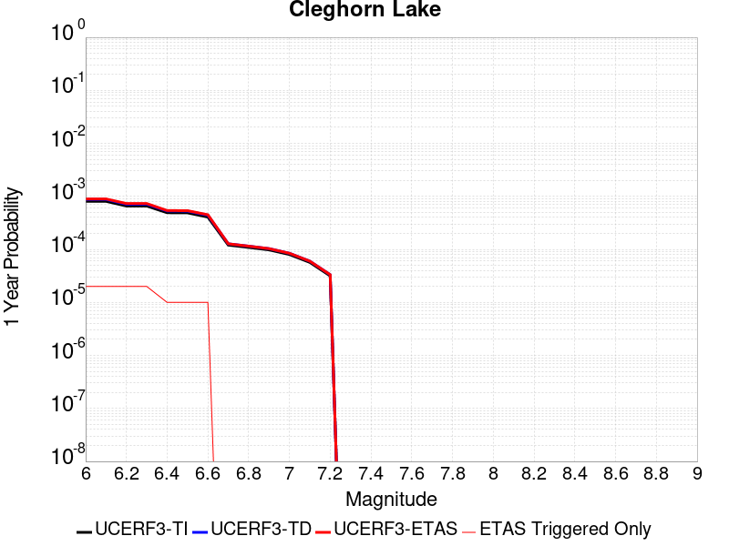 | 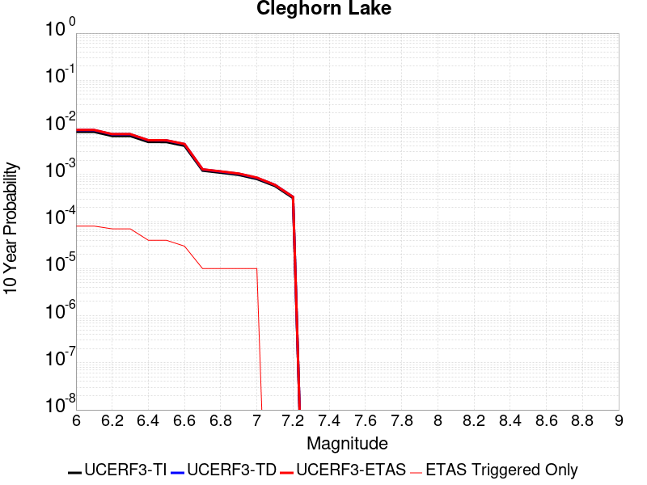 |

| Magnitude | 1 wk TI Prob | 1 wk TD Prob | 1 wk ETAS Prob | 1 wk ETAS/TD Gain | 1 wk ETAS Triggered Only | 1 mo TI Prob | 1 mo TD Prob | 1 mo ETAS Prob | 1 mo ETAS/TD Gain | 1 mo ETAS Triggered Only | 1 yr TI Prob | 1 yr TD Prob | 1 yr ETAS Prob | 1 yr ETAS/TD Gain | 1 yr ETAS Triggered Only | 10 yr TI Prob | 10 yr TD Prob | 10 yr ETAS Prob | 10 yr ETAS/TD Gain | 10 yr ETAS Triggered Only |
|-----|-----|-----|-----|-----|-----|-----|-----|-----|-----|-----|-----|-----|-----|-----|-----|-----|-----|-----|-----|-----|
| 6.0 | 1.5467183E-5 | 1.6794971E-5 | 1.6794971E-5 | 1.0 | 0.0 | 6.6286244E-5 | 7.197677E-5 | 7.197677E-5 | 1.0 | 0.0 | 8.067362E-4 | 8.760197E-4 | 8.863973E-4 | 1.0118463 | 1.0386697E-5 | 0.008038137 | 0.008731093 | 0.008803165 | 1.0082546 | 7.270688E-5 |
| 6.1 | 1.5467183E-5 | 1.6794971E-5 | 1.6794971E-5 | 1.0 | 0.0 | 6.6286244E-5 | 7.197677E-5 | 7.197677E-5 | 1.0 | 0.0 | 8.067362E-4 | 8.760197E-4 | 8.863973E-4 | 1.0118463 | 1.0386697E-5 | 0.008038137 | 0.008731093 | 0.008803165 | 1.0082546 | 7.270688E-5 |
| 6.2 | 1.2624631E-5 | 1.36821545E-5 | 1.36821545E-5 | 1.0 | 0.0 | 5.410444E-5 | 5.863676E-5 | 5.863676E-5 | 1.0 | 0.0 | 6.585225E-4 | 7.137174E-4 | 7.240967E-4 | 1.0145426 | 1.0386697E-5 | 0.0065657445 | 0.0071190484 | 0.007180925 | 1.0086917 | 6.232018E-5 |
| 6.3 | 1.2624631E-5 | 1.36821545E-5 | 1.36821545E-5 | 1.0 | 0.0 | 5.410444E-5 | 5.863676E-5 | 5.863676E-5 | 1.0 | 0.0 | 6.585225E-4 | 7.137174E-4 | 7.240967E-4 | 1.0145426 | 1.0386697E-5 | 0.0065657445 | 0.0071190484 | 0.007180925 | 1.0086917 | 6.232018E-5 |
| 6.4 | 9.417684E-6 | 1.0170551E-5 | 1.0170551E-5 | 1.0 | 0.0 | 4.036088E-5 | 4.3587577E-5 | 4.3587577E-5 | 1.0 | 0.0 | 4.912829E-4 | 5.3059065E-4 | 5.3059065E-4 | 1.0 | 0.0 | 0.004901982 | 0.0052972743 | 0.005328269 | 1.0058511 | 3.116009E-5 |
| 6.5 | 9.368219E-6 | 1.0117976E-5 | 1.0117976E-5 | 1.0 | 0.0 | 4.014889E-5 | 4.3362263E-5 | 4.3362263E-5 | 1.0 | 0.0 | 4.8870314E-4 | 5.278488E-4 | 5.278488E-4 | 1.0 | 0.0 | 0.004876298 | 0.0052699856 | 0.005300982 | 1.0058815 | 3.116009E-5 |
| 6.6 | 7.803798E-6 | 8.442198E-6 | 8.442198E-6 | 1.0 | 0.0 | 3.3444423E-5 | 3.6180576E-5 | 3.6180576E-5 | 1.0 | 0.0 | 4.0710976E-4 | 4.404494E-4 | 4.404494E-4 | 1.0 | 0.0 | 0.0040636472 | 0.004399682 | 0.004420364 | 1.0047008 | 2.0773394E-5 |
| 6.7 | 2.3108669E-6 | 2.4439082E-6 | 2.4439082E-6 | 1.0 | 0.0 | 9.903678E-6 | 1.0473852E-5 | 1.0473852E-5 | 1.0 | 0.0 | 1.205706E-4 | 1.2751187E-4 | 1.2751187E-4 | 1.0 | 0.0 | 0.001205052 | 0.0012744057 | 0.0012847792 | 1.0081398 | 1.0386697E-5 |
| 6.8 | 2.0882828E-6 | 2.2063484E-6 | 2.2063484E-6 | 1.0 | 0.0 | 8.949753E-6 | 9.455745E-6 | 9.455745E-6 | 1.0 | 0.0 | 1.08957785E-4 | 1.15117786E-4 | 1.15117786E-4 | 1.0 | 0.0 | 0.0010890438 | 0.0011505984 | 0.0011609732 | 1.0090169 | 1.0386697E-5 |
| 6.9 | 1.876935E-6 | 1.9811093E-6 | 1.9811093E-6 | 1.0 | 0.0 | 8.043982E-6 | 8.490441E-6 | 8.490441E-6 | 1.0 | 0.0 | 9.7931086E-5 | 1.0336639E-4 | 1.0336639E-4 | 1.0 | 0.0 | 9.788794E-4 | 0.001033199 | 0.001043575 | 1.0100425 | 1.0386697E-5 |
| 7.0 | 1.5357559E-6 | 1.620328E-6 | 1.620328E-6 | 1.0 | 0.0 | 6.5817944E-6 | 6.9442453E-6 | 6.9442453E-6 | 1.0 | 0.0 | 8.01304E-5 | 8.454303E-5 | 8.454303E-5 | 1.0 | 0.0 | 8.010151E-4 | 8.4512116E-4 | 8.5549906E-4 | 1.0122797 | 1.0386697E-5 |
| 7.1 | 1.0905424E-6 | 1.1497951E-6 | 1.1497951E-6 | 1.0 | 0.0 | 4.6737446E-6 | 4.9276846E-6 | 4.9276846E-6 | 1.0 | 0.0 | 5.6901354E-5 | 5.9993006E-5 | 5.9993006E-5 | 1.0 | 0.0 | 5.6886784E-4 | 5.997779E-4 | 5.997779E-4 | 1.0 | 0.0 |
| 7.2 | 6.06668E-7 | 6.387457E-7 | 6.387457E-7 | 1.0 | 0.0 | 2.600003E-6 | 2.737479E-6 | 2.737479E-6 | 1.0 | 0.0 | 3.1654577E-5 | 3.3328364E-5 | 3.3328364E-5 | 1.0 | 0.0 | 3.1650066E-4 | 3.3324052E-4 | 3.3324052E-4 | 1.0 | 0.0 |

## Independence rev 2011
*[(top)](#table-of-contents)*

| 1 Week | 1 Month | 1 Year | 10 Year |
|-----|-----|-----|-----|
|  |  |  |  |

| Magnitude | 1 wk TI Prob | 1 wk TD Prob | 1 wk ETAS Prob | 1 wk ETAS/TD Gain | 1 wk ETAS Triggered Only | 1 mo TI Prob | 1 mo TD Prob | 1 mo ETAS Prob | 1 mo ETAS/TD Gain | 1 mo ETAS Triggered Only | 1 yr TI Prob | 1 yr TD Prob | 1 yr ETAS Prob | 1 yr ETAS/TD Gain | 1 yr ETAS Triggered Only | 10 yr TI Prob | 10 yr TD Prob | 10 yr ETAS Prob | 10 yr ETAS/TD Gain | 10 yr ETAS Triggered Only |
|-----|-----|-----|-----|-----|-----|-----|-----|-----|-----|-----|-----|-----|-----|-----|-----|-----|-----|-----|-----|-----|
| 6.0 | 4.422171E-6 | 4.3263003E-6 | 1.4712952E-5 | 3.4008162 | 1.0386697E-5 | 1.8952025E-5 | 1.8541172E-5 | 3.9314178E-5 | 2.120372 | 2.0773394E-5 | 2.3071647E-4 | 2.2571837E-4 | 2.5687143E-4 | 1.1380174 | 3.116009E-5 | 0.0023047708 | 0.0022551846 | 0.002338091 | 1.0367625 | 8.3093575E-5 |
| 6.1 | 4.422171E-6 | 4.3263003E-6 | 1.4712952E-5 | 3.4008162 | 1.0386697E-5 | 1.8952025E-5 | 1.8541172E-5 | 3.9314178E-5 | 2.120372 | 2.0773394E-5 | 2.3071647E-4 | 2.2571837E-4 | 2.5687143E-4 | 1.1380174 | 3.116009E-5 | 0.0023047708 | 0.0022551846 | 0.002338091 | 1.0367625 | 8.3093575E-5 |
| 6.2 | 4.422171E-6 | 4.3263003E-6 | 1.4712952E-5 | 3.4008162 | 1.0386697E-5 | 1.8952025E-5 | 1.8541172E-5 | 3.9314178E-5 | 2.120372 | 2.0773394E-5 | 2.3071647E-4 | 2.2571837E-4 | 2.5687143E-4 | 1.1380174 | 3.116009E-5 | 0.0023047708 | 0.0022551846 | 0.002338091 | 1.0367625 | 8.3093575E-5 |
| 6.3 | 4.422171E-6 | 4.3263003E-6 | 1.4712952E-5 | 3.4008162 | 1.0386697E-5 | 1.8952025E-5 | 1.8541172E-5 | 3.9314178E-5 | 2.120372 | 2.0773394E-5 | 2.3071647E-4 | 2.2571837E-4 | 2.5687143E-4 | 1.1380174 | 3.116009E-5 | 0.0023047708 | 0.0022551846 | 0.002338091 | 1.0367625 | 8.3093575E-5 |
| 6.4 | 4.422171E-6 | 4.3263003E-6 | 1.4712952E-5 | 3.4008162 | 1.0386697E-5 | 1.8952025E-5 | 1.8541172E-5 | 3.9314178E-5 | 2.120372 | 2.0773394E-5 | 2.3071647E-4 | 2.2571837E-4 | 2.5687143E-4 | 1.1380174 | 3.116009E-5 | 0.0023047708 | 0.0022551846 | 0.002338091 | 1.0367625 | 8.3093575E-5 |
| 6.5 | 4.422171E-6 | 4.3263003E-6 | 1.4712952E-5 | 3.4008162 | 1.0386697E-5 | 1.8952025E-5 | 1.8541172E-5 | 3.9314178E-5 | 2.120372 | 2.0773394E-5 | 2.3071647E-4 | 2.2571837E-4 | 2.5687143E-4 | 1.1380174 | 3.116009E-5 | 0.0023047708 | 0.0022551846 | 0.002338091 | 1.0367625 | 8.3093575E-5 |
| 6.6 | 2.663744E-6 | 2.53204E-6 | 1.291871E-5 | 5.1020956 | 1.0386697E-5 | 1.1415996E-5 | 1.0851558E-5 | 3.1624724E-5 | 2.9143028 | 2.0773394E-5 | 1.3898089E-4 | 1.3211019E-4 | 1.6326616E-4 | 1.2358333 | 3.116009E-5 | 0.0013889399 | 0.0013203648 | 0.0014033486 | 1.0628492 | 8.3093575E-5 |
| 6.7 | 2.663744E-6 | 2.53204E-6 | 1.291871E-5 | 5.1020956 | 1.0386697E-5 | 1.1415996E-5 | 1.0851558E-5 | 3.1624724E-5 | 2.9143028 | 2.0773394E-5 | 1.3898089E-4 | 1.3211019E-4 | 1.6326616E-4 | 1.2358333 | 3.116009E-5 | 0.0013889399 | 0.0013203648 | 0.0014033486 | 1.0628492 | 8.3093575E-5 |
| 6.8 | 1.9716529E-6 | 1.8323044E-6 | 1.2218982E-5 | 6.668642 | 1.0386697E-5 | 8.449913E-6 | 7.85271E-6 | 2.862594E-5 | 3.645358 | 2.0773394E-5 | 1.0287284E-4 | 9.5602685E-5 | 1.267598E-4 | 1.3259021 | 3.116009E-5 | 0.0010282523 | 9.5562846E-4 | 0.0010386426 | 1.0868686 | 8.3093575E-5 |
| 6.9 | 1.8788617E-6 | 1.7430435E-6 | 1.2129723E-5 | 6.9589324 | 1.0386697E-5 | 8.0522395E-6 | 7.470166E-6 | 2.8243405E-5 | 3.7808268 | 2.0773394E-5 | 9.80316E-5 | 9.09456E-5 | 1.2210285E-4 | 1.3425922 | 3.116009E-5 | 9.798837E-4 | 9.090958E-4 | 9.921138E-4 | 1.0913193 | 8.3093575E-5 |
| 7.0 | 1.5045488E-6 | 1.384987E-6 | 1.1771669E-5 | 8.49948 | 1.0386697E-5 | 6.44805E-6 | 5.9356453E-6 | 2.6708916E-5 | 4.499749 | 2.0773394E-5 | 7.8502184E-5 | 7.2264134E-5 | 1.03421975E-4 | 1.431166 | 3.116009E-5 | 7.8474457E-4 | 7.224115E-4 | 7.950659E-4 | 1.100572 | 7.270688E-5 |
| 7.1 | 1.272341E-6 | 1.1625416E-6 | 1.1549227E-5 | 9.934463 | 1.0386697E-5 | 5.4528787E-6 | 4.9823116E-6 | 2.5755602E-5 | 5.169408 | 2.0773394E-5 | 6.6386776E-5 | 6.065799E-5 | 9.181619E-5 | 1.5136702 | 3.116009E-5 | 6.636695E-4 | 6.0641754E-4 | 6.790803E-4 | 1.119823 | 7.270688E-5 |
| 7.2 | 1.0416892E-6 | 9.410155E-7 | 1.1327703E-5 | 12.037743 | 1.0386697E-5 | 4.464375E-6 | 4.032918E-6 | 2.4806228E-5 | 6.1509385 | 2.0773394E-5 | 5.4352407E-5 | 4.9099683E-5 | 8.025824E-5 | 1.634598 | 3.116009E-5 | 5.4339116E-4 | 4.9089023E-4 | 5.635614E-4 | 1.1480396 | 7.270688E-5 |
| 7.3 | 7.9450155E-7 | 7.2352077E-7 | 1.111021E-5 | 15.355759 | 1.0386697E-5 | 3.4050022E-6 | 3.1007996E-6 | 2.3874129E-5 | 7.6993456 | 2.0773394E-5 | 4.1455114E-5 | 3.7751593E-5 | 6.891051E-5 | 1.8253669 | 3.116009E-5 | 4.144738E-4 | 3.774529E-4 | 4.5013236E-4 | 1.1925523 | 7.270688E-5 |
| 7.4 | 5.3893444E-7 | 5.01964E-7 | 1.0888655E-5 | 21.692104 | 1.0386697E-5 | 2.309717E-6 | 2.1512726E-6 | 2.2924622E-5 | 10.656307 | 2.0773394E-5 | 2.8120441E-5 | 2.6191434E-5 | 5.735071E-5 | 2.1896741 | 3.116009E-5 | 2.8116882E-4 | 2.6188392E-4 | 3.3457176E-4 | 1.2775575 | 7.270688E-5 |
| 7.5 | 3.8852085E-7 | 3.6826376E-7 | 3.6826376E-7 | 1.0 | 0.0 | 1.6650882E-6 | 1.5782723E-6 | 1.1964953E-5 | 7.5810447 | 1.0386697E-5 | 2.027226E-5 | 1.9215298E-5 | 2.9601795E-5 | 1.5405327 | 1.0386697E-5 | 2.0270412E-4 | 1.9213658E-4 | 2.4406008E-4 | 1.2702427 | 5.1933483E-5 |
| 7.6 | 2.414929E-7 | 2.3457987E-7 | 2.3457987E-7 | 1.0 | 0.0 | 1.0349692E-6 | 1.0053419E-6 | 1.0053419E-6 | 1.0 | 0.0 | 1.2600677E-5 | 1.2239971E-5 | 1.2239971E-5 | 1.0 | 0.0 | 1.2599962E-4 | 1.2239309E-4 | 1.4316394E-4 | 1.1697061 | 2.0773394E-5 |
| 7.7 | 6.8298014E-8 | 6.8590616E-8 | 6.8590616E-8 | 1.0 | 0.0 | 2.9270575E-7 | 2.9395974E-7 | 2.9395974E-7 | 1.0 | 0.0 | 3.5636867E-6 | 3.5789546E-6 | 3.5789546E-6 | 1.0 | 0.0 | 3.5636294E-5 | 3.5789017E-5 | 3.5789017E-5 | 1.0 | 0.0 |

## San Andreas (North Branch Mill Creek)
*[(top)](#table-of-contents)*

| 1 Week | 1 Month | 1 Year | 10 Year |
|-----|-----|-----|-----|
|  | 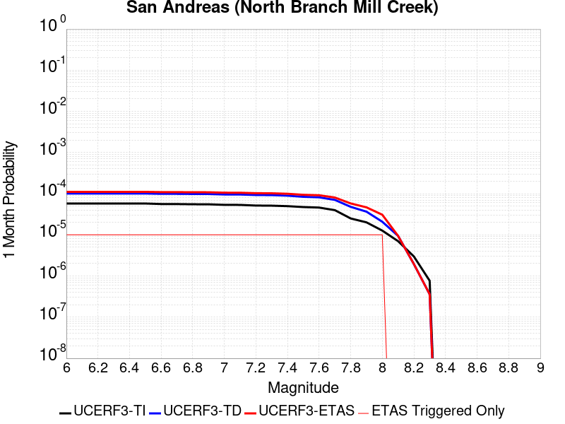 |  |  |

| Magnitude | 1 wk TI Prob | 1 wk TD Prob | 1 wk ETAS Prob | 1 wk ETAS/TD Gain | 1 wk ETAS Triggered Only | 1 mo TI Prob | 1 mo TD Prob | 1 mo ETAS Prob | 1 mo ETAS/TD Gain | 1 mo ETAS Triggered Only | 1 yr TI Prob | 1 yr TD Prob | 1 yr ETAS Prob | 1 yr ETAS/TD Gain | 1 yr ETAS Triggered Only | 10 yr TI Prob | 10 yr TD Prob | 10 yr ETAS Prob | 10 yr ETAS/TD Gain | 10 yr ETAS Triggered Only |
|-----|-----|-----|-----|-----|-----|-----|-----|-----|-----|-----|-----|-----|-----|-----|-----|-----|-----|-----|-----|-----|
| 6.0 | 1.3461156E-5 | 2.3527407E-5 | 3.391386E-5 | 1.4414618 | 1.0386697E-5 | 5.7689394E-5 | 1.0082787E-4 | 1.1121352E-4 | 1.1030037 | 1.0386697E-5 | 7.02142E-4 | 0.0012268913 | 0.0012787611 | 1.0422773 | 5.1933483E-5 | 0.0069992766 | 0.012243656 | 0.012325733 | 1.0067036 | 8.3093575E-5 |
| 6.1 | 1.3461156E-5 | 2.3527407E-5 | 3.391386E-5 | 1.4414618 | 1.0386697E-5 | 5.7689394E-5 | 1.0082787E-4 | 1.1121352E-4 | 1.1030037 | 1.0386697E-5 | 7.02142E-4 | 0.0012268913 | 0.0012787611 | 1.0422773 | 5.1933483E-5 | 0.0069992766 | 0.012243656 | 0.012325733 | 1.0067036 | 8.3093575E-5 |
| 6.2 | 1.3461156E-5 | 2.3527407E-5 | 3.391386E-5 | 1.4414618 | 1.0386697E-5 | 5.7689394E-5 | 1.0082787E-4 | 1.1121352E-4 | 1.1030037 | 1.0386697E-5 | 7.02142E-4 | 0.0012268913 | 0.0012787611 | 1.0422773 | 5.1933483E-5 | 0.0069992766 | 0.012243656 | 0.012325733 | 1.0067036 | 8.3093575E-5 |
| 6.3 | 1.3461156E-5 | 2.3527407E-5 | 3.391386E-5 | 1.4414618 | 1.0386697E-5 | 5.7689394E-5 | 1.0082787E-4 | 1.1121352E-4 | 1.1030037 | 1.0386697E-5 | 7.02142E-4 | 0.0012268913 | 0.0012787611 | 1.0422773 | 5.1933483E-5 | 0.0069992766 | 0.012243656 | 0.012325733 | 1.0067036 | 8.3093575E-5 |
| 6.4 | 1.3461156E-5 | 2.3527407E-5 | 3.391386E-5 | 1.4414618 | 1.0386697E-5 | 5.7689394E-5 | 1.0082787E-4 | 1.1121352E-4 | 1.1030037 | 1.0386697E-5 | 7.02142E-4 | 0.0012268913 | 0.0012787611 | 1.0422773 | 5.1933483E-5 | 0.0069992766 | 0.012243656 | 0.012325733 | 1.0067036 | 8.3093575E-5 |
| 6.5 | 1.3450706E-5 | 2.3516368E-5 | 3.390282E-5 | 1.4416691 | 1.0386697E-5 | 5.764461E-5 | 1.00780555E-4 | 1.11166206E-4 | 1.1030521 | 1.0386697E-5 | 7.0159714E-4 | 0.001226316 | 0.0012781858 | 1.0422972 | 5.1933483E-5 | 0.006993862 | 0.012237966 | 0.0123200435 | 1.0067067 | 8.3093575E-5 |
| 6.6 | 1.3074523E-5 | 2.313064E-5 | 3.3517095E-5 | 1.4490346 | 1.0386697E-5 | 5.6032466E-5 | 9.912757E-5 | 1.0951323E-4 | 1.1047708 | 1.0386697E-5 | 6.8198174E-4 | 0.0012062131 | 0.0012580841 | 1.0430031 | 5.1933483E-5 | 0.006798926 | 0.012039129 | 0.012121222 | 1.0068189 | 8.3093575E-5 |
| 6.7 | 1.3050216E-5 | 2.3105935E-5 | 3.3492393E-5 | 1.4495146 | 1.0386697E-5 | 5.59283E-5 | 9.9021694E-5 | 1.0940737E-4 | 1.1048827 | 1.0386697E-5 | 6.8071426E-4 | 0.0012049256 | 0.0012567965 | 1.0430491 | 5.1933483E-5 | 0.0067863287 | 0.012026393 | 0.012108487 | 1.0068262 | 8.3093575E-5 |
| 6.8 | 1.29049395E-5 | 2.2954338E-5 | 3.3340795E-5 | 1.4524834 | 1.0386697E-5 | 5.530571E-5 | 9.8372046E-5 | 1.0875772E-4 | 1.1055754 | 1.0386697E-5 | 6.73139E-4 | 0.0011970248 | 0.0012488961 | 1.0433335 | 5.1933483E-5 | 0.0067110364 | 0.011948236 | 0.012030337 | 1.0068713 | 8.3093575E-5 |
| 6.9 | 1.2867369E-5 | 2.2913739E-5 | 3.3300195E-5 | 1.4532852 | 1.0386697E-5 | 5.51447E-5 | 9.8198056E-5 | 1.0858373E-4 | 1.1057626 | 1.0386697E-5 | 6.711799E-4 | 0.0011949089 | 0.0012467803 | 1.0434104 | 5.1933483E-5 | 0.006691564 | 0.011927304 | 0.012009406 | 1.0068836 | 8.3093575E-5 |
| 7.0 | 1.2495996E-5 | 2.2313627E-5 | 3.2700093E-5 | 1.4654763 | 1.0386697E-5 | 5.3553173E-5 | 9.562634E-5 | 1.0601205E-4 | 1.1086072 | 1.0386697E-5 | 6.518148E-4 | 0.0011636318 | 0.0012155048 | 1.0445786 | 5.1933483E-5 | 0.0064990623 | 0.011617814 | 0.011699943 | 1.0070691 | 8.3093575E-5 |
| 7.1 | 1.2452067E-5 | 2.2258691E-5 | 3.264516E-5 | 1.4666251 | 1.0386697E-5 | 5.3364907E-5 | 9.539092E-5 | 1.0577663E-4 | 1.1088752 | 1.0386697E-5 | 6.4952404E-4 | 0.0011607686 | 0.0012126417 | 1.0446887 | 5.1933483E-5 | 0.0064762887 | 0.011589482 | 0.011671613 | 1.0070866 | 8.3093575E-5 |
| 7.2 | 1.2002777E-5 | 2.163711E-5 | 3.202358E-5 | 1.4800304 | 1.0386697E-5 | 5.143946E-5 | 9.272719E-5 | 1.0311292E-4 | 1.1120031 | 1.0386697E-5 | 6.2609545E-4 | 0.0011283715 | 0.0011802464 | 1.0459732 | 5.1933483E-5 | 0.006243344 | 0.011268834 | 0.011350991 | 1.0072906 | 8.3093575E-5 |
| 7.3 | 1.1923425E-5 | 2.150691E-5 | 3.189338E-5 | 1.4829366 | 1.0386697E-5 | 5.109939E-5 | 9.216923E-5 | 1.0255497E-4 | 1.1126812 | 1.0386697E-5 | 6.219575E-4 | 0.0011215854 | 0.0011734606 | 1.0462517 | 5.1933483E-5 | 0.0062021962 | 0.011201685 | 0.011283848 | 1.0073348 | 8.3093575E-5 |
| 7.4 | 1.16105175E-5 | 2.0880623E-5 | 3.1267104E-5 | 1.4974219 | 1.0386697E-5 | 4.975841E-5 | 8.948533E-5 | 9.98711E-5 | 1.1160611 | 1.0386697E-5 | 6.0564023E-4 | 0.0010889419 | 0.0011408189 | 1.0476397 | 5.1933483E-5 | 0.006039923 | 0.010879163 | 0.010961353 | 1.0075548 | 8.3093575E-5 |
| 7.5 | 1.1037265E-5 | 1.9579818E-5 | 2.9966312E-5 | 1.5304693 | 1.0386697E-5 | 4.7301706E-5 | 8.3910825E-5 | 9.429665E-5 | 1.1237721 | 1.0386697E-5 | 5.757461E-4 | 0.0010211377 | 0.0010730181 | 1.0508065 | 5.1933483E-5 | 0.005742567 | 0.010208193 | 0.010290438 | 1.0080568 | 8.3093575E-5 |
| 7.6 | 1.0720915E-5 | 1.9021407E-5 | 2.9407905E-5 | 1.5460427 | 1.0386697E-5 | 4.5945973E-5 | 8.151778E-5 | 9.190363E-5 | 1.127406 | 1.0386697E-5 | 5.592486E-4 | 9.920292E-4 | 0.0010439112 | 1.0522988 | 5.1933483E-5 | 0.005578433 | 0.009919754 | 0.010002024 | 1.0082935 | 8.3093575E-5 |
| 7.7 | 9.276279E-6 | 1.6466016E-5 | 2.6852542E-5 | 1.6307856 | 1.0386697E-5 | 3.9754876E-5 | 7.056674E-5 | 8.0952705E-5 | 1.1471794 | 1.0386697E-5 | 4.839081E-4 | 8.5881306E-4 | 9.107019E-4 | 1.0604193 | 5.1933483E-5 | 0.0048285574 | 0.008598559 | 0.008680938 | 1.0095806 | 8.3093575E-5 |
| 7.8 | 5.8346777E-6 | 1.11748E-5 | 2.1561382E-5 | 1.9294645 | 1.0386697E-5 | 2.5005522E-5 | 4.7891124E-5 | 5.8277325E-5 | 1.216871 | 1.0386697E-5 | 3.043997E-4 | 5.829186E-4 | 6.348218E-4 | 1.0890403 | 5.1933483E-5 | 0.0030398308 | 0.005857104 | 0.005939711 | 1.0141037 | 8.3093575E-5 |
| 7.9 | 4.690204E-6 | 8.525594E-6 | 1.8912202E-5 | 2.2182856 | 1.0386697E-5 | 2.0100719E-5 | 3.653775E-5 | 4.6924066E-5 | 1.2842627 | 1.0386697E-5 | 2.4469878E-4 | 4.4475638E-4 | 4.9666676E-4 | 1.1167165 | 5.1933483E-5 | 0.002444295 | 0.004479242 | 0.0045619635 | 1.0184677 | 8.3093575E-5 |
| 8.0 | 2.9570454E-6 | 4.857035E-6 | 1.5243681E-5 | 3.1384747 | 1.0386697E-5 | 1.267299E-5 | 2.0815698E-5 | 3.120218E-5 | 1.4989735 | 1.0386697E-5 | 1.5428272E-4 | 2.534017E-4 | 2.741698E-4 | 1.0819573 | 2.0773394E-5 | 0.0015417566 | 0.002554891 | 0.0025963315 | 1.0162201 | 4.1546788E-5 |
| 8.1 | 1.6376824E-6 | 2.2021889E-6 | 2.2021889E-6 | 1.0 | 0.0 | 7.01862E-6 | 9.437918E-6 | 9.437918E-6 | 1.0 | 0.0 | 8.544835E-5 | 1.14900606E-4 | 1.14900606E-4 | 1.0 | 0.0 | 8.54155E-4 | 0.0011634289 | 0.0011738035 | 1.0089173 | 1.0386697E-5 |
| 8.2 | 6.9631557E-7 | 4.5525482E-7 | 4.5525482E-7 | 1.0 | 0.0 | 2.984206E-6 | 1.9510906E-6 | 1.9510906E-6 | 1.0 | 0.0 | 3.63321E-5 | 2.3754272E-5 | 2.3754272E-5 | 1.0 | 0.0 | 3.6326164E-4 | 2.4603383E-4 | 2.4603383E-4 | 1.0 | 0.0 |
| 8.3 | 1.7876137E-7 | 8.3938964E-8 | 8.3938964E-8 | 1.0 | 0.0 | 7.661199E-7 | 3.5973835E-7 | 3.5973835E-7 | 1.0 | 0.0 | 9.32747E-6 | 4.3798063E-6 | 4.3798063E-6 | 1.0 | 0.0 | 9.3270784E-5 | 4.599691E-5 | 4.599691E-5 | 1.0 | 0.0 |

## San Jacinto (Stepovers Combined)
*[(top)](#table-of-contents)*

| 1 Week | 1 Month | 1 Year | 10 Year |
|-----|-----|-----|-----|
|  |  |  |  |

| Magnitude | 1 wk TI Prob | 1 wk TD Prob | 1 wk ETAS Prob | 1 wk ETAS/TD Gain | 1 wk ETAS Triggered Only | 1 mo TI Prob | 1 mo TD Prob | 1 mo ETAS Prob | 1 mo ETAS/TD Gain | 1 mo ETAS Triggered Only | 1 yr TI Prob | 1 yr TD Prob | 1 yr ETAS Prob | 1 yr ETAS/TD Gain | 1 yr ETAS Triggered Only | 10 yr TI Prob | 10 yr TD Prob | 10 yr ETAS Prob | 10 yr ETAS/TD Gain | 10 yr ETAS Triggered Only |
|-----|-----|-----|-----|-----|-----|-----|-----|-----|-----|-----|-----|-----|-----|-----|-----|-----|-----|-----|-----|-----|
| 6.0 | 4.0667746E-5 | 3.5336896E-5 | 3.5336896E-5 | 1.0 | 0.0 | 1.742787E-4 | 1.5143506E-4 | 1.5143506E-4 | 1.0 | 0.0 | 0.0021197782 | 0.0018421634 | 0.0018940013 | 1.0281396 | 5.1933483E-5 | 0.020996714 | 0.019020144 | 0.019091468 | 1.00375 | 7.270688E-5 |
| 6.1 | 4.0667746E-5 | 3.5336896E-5 | 3.5336896E-5 | 1.0 | 0.0 | 1.742787E-4 | 1.5143506E-4 | 1.5143506E-4 | 1.0 | 0.0 | 0.0021197782 | 0.0018421634 | 0.0018940013 | 1.0281396 | 5.1933483E-5 | 0.020996714 | 0.019020144 | 0.019091468 | 1.00375 | 7.270688E-5 |
| 6.2 | 4.0667746E-5 | 3.5336896E-5 | 3.5336896E-5 | 1.0 | 0.0 | 1.742787E-4 | 1.5143506E-4 | 1.5143506E-4 | 1.0 | 0.0 | 0.0021197782 | 0.0018421634 | 0.0018940013 | 1.0281396 | 5.1933483E-5 | 0.020996714 | 0.019020144 | 0.019091468 | 1.00375 | 7.270688E-5 |
| 6.3 | 4.0667746E-5 | 3.5336896E-5 | 3.5336896E-5 | 1.0 | 0.0 | 1.742787E-4 | 1.5143506E-4 | 1.5143506E-4 | 1.0 | 0.0 | 0.0021197782 | 0.0018421634 | 0.0018940013 | 1.0281396 | 5.1933483E-5 | 0.020996714 | 0.019020144 | 0.019091468 | 1.00375 | 7.270688E-5 |
| 6.4 | 4.0577226E-5 | 3.5208766E-5 | 3.5208766E-5 | 1.0 | 0.0 | 1.738908E-4 | 1.50886E-4 | 1.50886E-4 | 1.0 | 0.0 | 0.0021150648 | 0.0018354917 | 0.0018873299 | 1.0282421 | 5.1933483E-5 | 0.020950472 | 0.018954702 | 0.019026032 | 1.0037631 | 7.270688E-5 |
| 6.5 | 4.0577226E-5 | 3.5208766E-5 | 3.5208766E-5 | 1.0 | 0.0 | 1.738908E-4 | 1.50886E-4 | 1.50886E-4 | 1.0 | 0.0 | 0.0021150648 | 0.0018354917 | 0.0018873299 | 1.0282421 | 5.1933483E-5 | 0.020950472 | 0.018954702 | 0.019026032 | 1.0037631 | 7.270688E-5 |
| 6.6 | 4.053861E-5 | 3.5154102E-5 | 3.5154102E-5 | 1.0 | 0.0 | 1.7372532E-4 | 1.5065174E-4 | 1.5065174E-4 | 1.0 | 0.0 | 0.0021130538 | 0.0018326445 | 0.0018844828 | 1.0282861 | 5.1933483E-5 | 0.020930743 | 0.018926777 | 0.018998107 | 1.0037688 | 7.270688E-5 |
| 6.7 | 4.0516545E-5 | 3.512316E-5 | 3.512316E-5 | 1.0 | 0.0 | 1.7363077E-4 | 1.5051916E-4 | 1.5051916E-4 | 1.0 | 0.0 | 0.002111905 | 0.0018310336 | 0.001882872 | 1.028311 | 5.1933483E-5 | 0.020919468 | 0.01891097 | 0.018982302 | 1.003772 | 7.270688E-5 |
| 6.8 | 4.049434E-5 | 3.509472E-5 | 3.509472E-5 | 1.0 | 0.0 | 1.7353562E-4 | 1.5039727E-4 | 1.5039727E-4 | 1.0 | 0.0 | 0.0021107488 | 0.0018295521 | 0.0018813906 | 1.028334 | 5.1933483E-5 | 0.020908125 | 0.01889638 | 0.018967714 | 1.003775 | 7.270688E-5 |
| 6.9 | 4.046386E-5 | 3.505727E-5 | 3.505727E-5 | 1.0 | 0.0 | 1.73405E-4 | 1.502368E-4 | 1.502368E-4 | 1.0 | 0.0 | 0.0021091616 | 0.0018276017 | 0.0018794403 | 1.0283643 | 5.1933483E-5 | 0.020892553 | 0.01887715 | 0.018948484 | 1.0037788 | 7.270688E-5 |
| 7.0 | 4.036382E-5 | 3.4937813E-5 | 3.4937813E-5 | 1.0 | 0.0 | 1.7297632E-4 | 1.4972492E-4 | 1.4972492E-4 | 1.0 | 0.0 | 0.0021039525 | 0.00182138 | 0.0018732188 | 1.0284613 | 5.1933483E-5 | 0.02084144 | 0.018815752 | 0.018887091 | 1.0037915 | 7.270688E-5 |
| 7.1 | 4.0343282E-5 | 3.4916273E-5 | 3.4916273E-5 | 1.0 | 0.0 | 1.7288832E-4 | 1.496326E-4 | 1.496326E-4 | 1.0 | 0.0 | 0.002102883 | 0.0018202579 | 0.0018720969 | 1.0284789 | 5.1933483E-5 | 0.020830948 | 0.018804627 | 0.018875966 | 1.0037937 | 7.270688E-5 |
| 7.2 | 4.0257353E-5 | 3.4820667E-5 | 3.4820667E-5 | 1.0 | 0.0 | 1.725201E-4 | 1.492229E-4 | 1.492229E-4 | 1.0 | 0.0 | 0.0020984085 | 0.0018152783 | 0.0018671175 | 1.0285572 | 5.1933483E-5 | 0.020787042 | 0.018755313 | 0.018826656 | 1.0038038 | 7.270688E-5 |
| 7.3 | 3.9940667E-5 | 3.4648023E-5 | 3.4648023E-5 | 1.0 | 0.0 | 1.7116306E-4 | 1.4848309E-4 | 1.4848309E-4 | 1.0 | 0.0 | 0.0020819185 | 0.0018062859 | 0.0018581257 | 1.0286996 | 5.1933483E-5 | 0.020625217 | 0.018663792 | 0.018735142 | 1.0038229 | 7.270688E-5 |
| 7.4 | 3.9721202E-5 | 3.453329E-5 | 3.453329E-5 | 1.0 | 0.0 | 1.7022261E-4 | 1.4799142E-4 | 1.4799142E-4 | 1.0 | 0.0 | 0.0020704903 | 0.0018003098 | 0.0018521497 | 1.028795 | 5.1933483E-5 | 0.020513052 | 0.01860285 | 0.018674204 | 1.0038357 | 7.270688E-5 |
| 7.5 | 3.7036873E-5 | 3.3598866E-5 | 3.3598866E-5 | 1.0 | 0.0 | 1.5871979E-4 | 1.439872E-4 | 1.439872E-4 | 1.0 | 0.0 | 0.0019307006 | 0.0017516377 | 0.0018034801 | 1.0295966 | 5.1933483E-5 | 0.019140124 | 0.018103454 | 0.018174846 | 1.0039434 | 7.270688E-5 |
| 7.6 | 3.2940967E-5 | 3.1372547E-5 | 3.1372547E-5 | 1.0 | 0.0 | 1.4116794E-4 | 1.3444685E-4 | 1.3444685E-4 | 1.0 | 0.0 | 0.0017173645 | 0.0016356637 | 0.0016875123 | 1.0316988 | 5.1933483E-5 | 0.01704153 | 0.01693263 | 0.017004108 | 1.0042212 | 7.270688E-5 |
| 7.7 | 2.8236149E-5 | 2.7937022E-5 | 2.7937022E-5 | 1.0 | 0.0 | 1.2100645E-4 | 1.197246E-4 | 1.197246E-4 | 1.0 | 0.0 | 0.0014722579 | 0.0014566735 | 0.0015085313 | 1.0356002 | 5.1933483E-5 | 0.014625421 | 0.015142685 | 0.015214291 | 1.0047288 | 7.270688E-5 |
| 7.8 | 2.4329287E-5 | 2.5258554E-5 | 2.5258554E-5 | 1.0 | 0.0 | 1.042642E-4 | 1.0824646E-4 | 1.0824646E-4 | 1.0 | 0.0 | 0.0012686774 | 0.0013171048 | 0.0013689698 | 1.039378 | 5.1933483E-5 | 0.012614589 | 0.013738932 | 0.01381064 | 1.0052193 | 7.270688E-5 |
| 7.9 | 1.9370926E-5 | 2.0467445E-5 | 2.0467445E-5 | 1.0 | 0.0 | 8.301561E-5 | 8.7714674E-5 | 8.7714674E-5 | 1.0 | 0.0 | 0.0010102465 | 0.0010674037 | 0.0011192817 | 1.0486021 | 5.1933483E-5 | 0.0100566605 | 0.011223499 | 0.011295389 | 1.0064054 | 7.270688E-5 |
| 8.0 | 1.5583017E-5 | 1.5925136E-5 | 1.5925136E-5 | 1.0 | 0.0 | 6.6782646E-5 | 6.82488E-5 | 6.82488E-5 | 1.0 | 0.0 | 8.127754E-4 | 8.306131E-4 | 8.825034E-4 | 1.0624723 | 5.1933483E-5 | 0.008098091 | 0.008802158 | 0.0088742245 | 1.0081874 | 7.270688E-5 |
| 8.1 | 1.0024873E-5 | 8.314913E-6 | 8.314913E-6 | 1.0 | 0.0 | 4.2963035E-5 | 3.563486E-5 | 3.563486E-5 | 1.0 | 0.0 | 5.229494E-4 | 4.3376858E-4 | 4.5453297E-4 | 1.0478697 | 2.0773394E-5 | 0.0052172043 | 0.00466551 | 0.0046965247 | 1.0066477 | 3.116009E-5 |
| 8.2 | 4.142796E-6 | 1.5676045E-6 | 1.5676045E-6 | 1.0 | 0.0 | 1.775472E-5 | 6.7182878E-6 | 6.7182878E-6 | 1.0 | 0.0 | 2.1614227E-4 | 8.179211E-5 | 8.179211E-5 | 1.0 | 0.0 | 0.0021593217 | 9.4923546E-4 | 9.4923546E-4 | 1.0 | 0.0 |
| 8.3 | 1.2750878E-6 | 3.6301523E-7 | 3.6301523E-7 | 1.0 | 0.0 | 5.4646503E-6 | 1.5557786E-6 | 1.5557786E-6 | 1.0 | 0.0 | 6.653009E-5 | 1.8941444E-5 | 1.8941444E-5 | 1.0 | 0.0 | 6.6510175E-4 | 2.2840123E-4 | 2.2840123E-4 | 1.0 | 0.0 |

## Cleghorn Pass
*[(top)](#table-of-contents)*

| 1 Week | 1 Month | 1 Year | 10 Year |
|-----|-----|-----|-----|
| 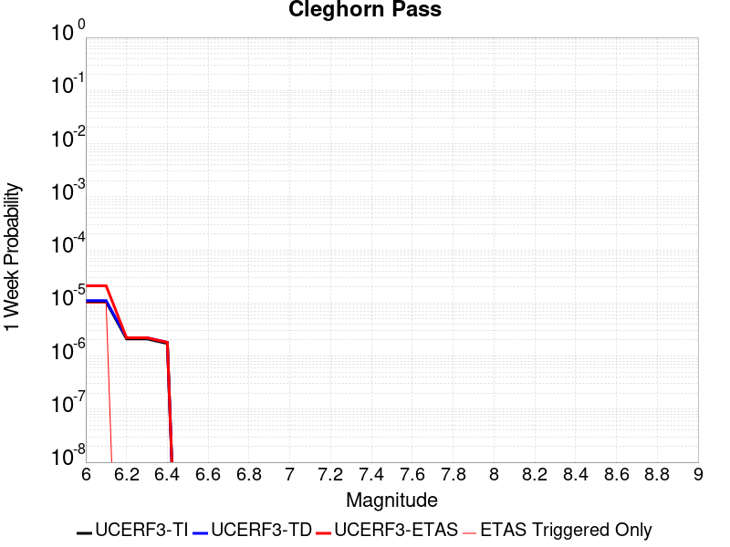 |  |  |  |

| Magnitude | 1 wk TI Prob | 1 wk TD Prob | 1 wk ETAS Prob | 1 wk ETAS/TD Gain | 1 wk ETAS Triggered Only | 1 mo TI Prob | 1 mo TD Prob | 1 mo ETAS Prob | 1 mo ETAS/TD Gain | 1 mo ETAS Triggered Only | 1 yr TI Prob | 1 yr TD Prob | 1 yr ETAS Prob | 1 yr ETAS/TD Gain | 1 yr ETAS Triggered Only | 10 yr TI Prob | 10 yr TD Prob | 10 yr ETAS Prob | 10 yr ETAS/TD Gain | 10 yr ETAS Triggered Only |
|-----|-----|-----|-----|-----|-----|-----|-----|-----|-----|-----|-----|-----|-----|-----|-----|-----|-----|-----|-----|-----|
| 6.0 | 1.0522846E-5 | 1.104093E-5 | 2.1427511E-5 | 1.9407344 | 1.0386697E-5 | 4.509713E-5 | 4.731771E-5 | 5.7703914E-5 | 1.2194993 | 1.0386697E-5 | 5.4891926E-4 | 5.759935E-4 | 6.0713565E-4 | 1.0540668 | 3.116009E-5 | 0.0054756533 | 0.005750172 | 0.0058121337 | 1.0107757 | 6.232018E-5 |
| 6.1 | 1.0522846E-5 | 1.104093E-5 | 2.1427511E-5 | 1.9407344 | 1.0386697E-5 | 4.509713E-5 | 4.731771E-5 | 5.7703914E-5 | 1.2194993 | 1.0386697E-5 | 5.4891926E-4 | 5.759935E-4 | 6.0713565E-4 | 1.0540668 | 3.116009E-5 | 0.0054756533 | 0.005750172 | 0.0058121337 | 1.0107757 | 6.232018E-5 |
| 6.2 | 2.1045846E-6 | 2.2082602E-6 | 2.2082602E-6 | 1.0 | 0.0 | 9.019617E-6 | 9.463961E-6 | 9.463961E-6 | 1.0 | 0.0 | 1.098083E-4 | 1.1522183E-4 | 1.1522183E-4 | 1.0 | 0.0 | 0.0010975406 | 0.0011520323 | 0.0011624071 | 1.0090055 | 1.0386697E-5 |
| 6.3 | 2.1045846E-6 | 2.2082602E-6 | 2.2082602E-6 | 1.0 | 0.0 | 9.019617E-6 | 9.463961E-6 | 9.463961E-6 | 1.0 | 0.0 | 1.098083E-4 | 1.1522183E-4 | 1.1522183E-4 | 1.0 | 0.0 | 0.0010975406 | 0.0011520323 | 0.0011624071 | 1.0090055 | 1.0386697E-5 |
| 6.4 | 1.7259927E-6 | 1.8109243E-6 | 1.8109243E-6 | 1.0 | 0.0 | 7.3970905E-6 | 7.761104E-6 | 7.761104E-6 | 1.0 | 0.0 | 9.005586E-5 | 9.449144E-5 | 9.449144E-5 | 1.0 | 0.0 | 9.001937E-4 | 9.4491447E-4 | 9.552913E-4 | 1.0109818 | 1.0386697E-5 |

## San Jacinto (Anza) rev
*[(top)](#table-of-contents)*

| 1 Week | 1 Month | 1 Year | 10 Year |
|-----|-----|-----|-----|
|  | 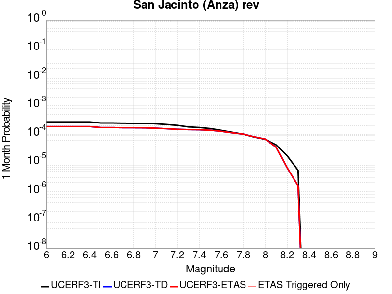 |  |  |

| Magnitude | 1 wk TI Prob | 1 wk TD Prob | 1 wk ETAS Prob | 1 wk ETAS/TD Gain | 1 wk ETAS Triggered Only | 1 mo TI Prob | 1 mo TD Prob | 1 mo ETAS Prob | 1 mo ETAS/TD Gain | 1 mo ETAS Triggered Only | 1 yr TI Prob | 1 yr TD Prob | 1 yr ETAS Prob | 1 yr ETAS/TD Gain | 1 yr ETAS Triggered Only | 10 yr TI Prob | 10 yr TD Prob | 10 yr ETAS Prob | 10 yr ETAS/TD Gain | 10 yr ETAS Triggered Only |
|-----|-----|-----|-----|-----|-----|-----|-----|-----|-----|-----|-----|-----|-----|-----|-----|-----|-----|-----|-----|-----|
| 6.0 | 6.3015636E-5 | 4.337693E-5 | 4.337693E-5 | 1.0 | 0.0 | 2.7003905E-4 | 1.8588796E-4 | 1.8588796E-4 | 1.0 | 0.0 | 0.0032827691 | 0.0022608489 | 0.0023126649 | 1.0229188 | 5.1933483E-5 | 0.032346968 | 0.023334619 | 0.02340563 | 1.0030432 | 7.270688E-5 |
| 6.1 | 6.3015636E-5 | 4.337693E-5 | 4.337693E-5 | 1.0 | 0.0 | 2.7003905E-4 | 1.8588796E-4 | 1.8588796E-4 | 1.0 | 0.0 | 0.0032827691 | 0.0022608489 | 0.0023126649 | 1.0229188 | 5.1933483E-5 | 0.032346968 | 0.023334619 | 0.02340563 | 1.0030432 | 7.270688E-5 |
| 6.2 | 6.3015636E-5 | 4.337693E-5 | 4.337693E-5 | 1.0 | 0.0 | 2.7003905E-4 | 1.8588796E-4 | 1.8588796E-4 | 1.0 | 0.0 | 0.0032827691 | 0.0022608489 | 0.0023126649 | 1.0229188 | 5.1933483E-5 | 0.032346968 | 0.023334619 | 0.02340563 | 1.0030432 | 7.270688E-5 |
| 6.3 | 6.3015636E-5 | 4.337693E-5 | 4.337693E-5 | 1.0 | 0.0 | 2.7003905E-4 | 1.8588796E-4 | 1.8588796E-4 | 1.0 | 0.0 | 0.0032827691 | 0.0022608489 | 0.0023126649 | 1.0229188 | 5.1933483E-5 | 0.032346968 | 0.023334619 | 0.02340563 | 1.0030432 | 7.270688E-5 |
| 6.4 | 6.3015636E-5 | 4.337693E-5 | 4.337693E-5 | 1.0 | 0.0 | 2.7003905E-4 | 1.8588796E-4 | 1.8588796E-4 | 1.0 | 0.0 | 0.0032827691 | 0.0022608489 | 0.0023126649 | 1.0229188 | 5.1933483E-5 | 0.032346968 | 0.023334619 | 0.02340563 | 1.0030432 | 7.270688E-5 |
| 6.5 | 5.811017E-5 | 4.015336E-5 | 4.015336E-5 | 1.0 | 0.0 | 2.4901982E-4 | 1.7207452E-4 | 1.7207452E-4 | 1.0 | 0.0 | 0.0030276014 | 0.0020929999 | 0.0021448247 | 1.024761 | 5.1933483E-5 | 0.02986684 | 0.021630494 | 0.021701628 | 1.0032886 | 7.270688E-5 |
| 6.6 | 5.811017E-5 | 4.015336E-5 | 4.015336E-5 | 1.0 | 0.0 | 2.4901982E-4 | 1.7207452E-4 | 1.7207452E-4 | 1.0 | 0.0 | 0.0030276014 | 0.0020929999 | 0.0021448247 | 1.024761 | 5.1933483E-5 | 0.02986684 | 0.021630494 | 0.021701628 | 1.0032886 | 7.270688E-5 |
| 6.7 | 5.712442E-5 | 3.957534E-5 | 3.957534E-5 | 1.0 | 0.0 | 2.4479596E-4 | 1.6959761E-4 | 1.6959761E-4 | 1.0 | 0.0 | 0.0029763177 | 0.002062901 | 0.0021147272 | 1.025123 | 5.1933483E-5 | 0.029367693 | 0.021321962 | 0.021393118 | 1.0033373 | 7.270688E-5 |
| 6.8 | 5.6967532E-5 | 3.9431634E-5 | 3.9431634E-5 | 1.0 | 0.0 | 2.4412372E-4 | 1.689818E-4 | 1.689818E-4 | 1.0 | 0.0 | 0.0029681553 | 0.0020554175 | 0.0021072442 | 1.0252147 | 5.1933483E-5 | 0.029288229 | 0.021246629 | 0.021317791 | 1.0033493 | 7.270688E-5 |
| 6.9 | 5.6211324E-5 | 3.9135975E-5 | 3.9135975E-5 | 1.0 | 0.0 | 2.4088343E-4 | 1.6771485E-4 | 1.6771485E-4 | 1.0 | 0.0 | 0.0029288116 | 0.0020400216 | 0.002091849 | 1.0254054 | 5.1933483E-5 | 0.028905109 | 0.021085827 | 0.021157 | 1.0033754 | 7.270688E-5 |
| 7.0 | 5.4383527E-5 | 3.7995007E-5 | 3.7995007E-5 | 1.0 | 0.0 | 2.3305144E-4 | 1.6282561E-4 | 1.6282561E-4 | 1.0 | 0.0 | 0.0028337094 | 0.0019806041 | 0.0020324348 | 1.0261691 | 5.1933483E-5 | 0.027978465 | 0.020476038 | 0.020547256 | 1.0034782 | 7.270688E-5 |
| 7.1 | 5.1393665E-5 | 3.6455618E-5 | 3.6455618E-5 | 1.0 | 0.0 | 2.2023996E-4 | 1.5622903E-4 | 1.5622903E-4 | 1.0 | 0.0 | 0.0026781242 | 0.0019004333 | 0.0019522681 | 1.0272752 | 5.1933483E-5 | 0.026460782 | 0.019648531 | 0.01971981 | 1.0036277 | 7.270688E-5 |
| 7.2 | 4.785222E-5 | 3.480494E-5 | 3.480494E-5 | 1.0 | 0.0 | 2.0506482E-4 | 1.4915552E-4 | 1.4915552E-4 | 1.0 | 0.0 | 0.0024938055 | 0.0018144595 | 0.0018662986 | 1.02857 | 5.1933483E-5 | 0.024660049 | 0.018761909 | 0.018833252 | 1.0038025 | 7.270688E-5 |
| 7.3 | 4.2143256E-5 | 3.389763E-5 | 3.389763E-5 | 1.0 | 0.0 | 1.8060145E-4 | 1.4526749E-4 | 1.4526749E-4 | 1.0 | 0.0 | 0.002196605 | 0.0017672004 | 0.0018190421 | 1.0293355 | 5.1933483E-5 | 0.02175019 | 0.018269178 | 0.018340556 | 1.0039071 | 7.270688E-5 |
| 7.4 | 4.0264713E-5 | 3.3535252E-5 | 3.3535252E-5 | 1.0 | 0.0 | 1.7255165E-4 | 1.4371461E-4 | 1.4371461E-4 | 1.0 | 0.0 | 0.002098792 | 0.0017483246 | 0.0018001673 | 1.0296528 | 5.1933483E-5 | 0.020790804 | 0.018073453 | 0.018144846 | 1.0039501 | 7.270688E-5 |
| 7.5 | 3.694492E-5 | 3.2247204E-5 | 3.2247204E-5 | 1.0 | 0.0 | 1.5832575E-4 | 1.38195E-4 | 1.38195E-4 | 1.0 | 0.0 | 0.0019259118 | 0.0016812286 | 0.0017330748 | 1.0308383 | 5.1933483E-5 | 0.01909306 | 0.017388845 | 0.017460287 | 1.0041085 | 7.270688E-5 |
| 7.6 | 3.200565E-5 | 2.9555436E-5 | 2.9555436E-5 | 1.0 | 0.0 | 1.3715986E-4 | 1.2666002E-4 | 1.2666002E-4 | 1.0 | 0.0 | 0.001668642 | 0.0015409971 | 0.0015928505 | 1.0336493 | 5.1933483E-5 | 0.01656168 | 0.015973015 | 0.01604456 | 1.0044792 | 7.270688E-5 |
| 7.7 | 2.731642E-5 | 2.6142696E-5 | 2.6142696E-5 | 1.0 | 0.0 | 1.1706512E-4 | 1.1203532E-4 | 1.1203532E-4 | 1.0 | 0.0 | 0.001424336 | 0.0013631776 | 0.0014150402 | 1.0380454 | 5.1933483E-5 | 0.014152412 | 0.01419303 | 0.014264706 | 1.0050501 | 7.270688E-5 |
| 7.8 | 2.3466424E-5 | 2.3552704E-5 | 2.3552704E-5 | 1.0 | 0.0 | 1.0056651E-4 | 1.0093625E-4 | 1.0093625E-4 | 1.0 | 0.0 | 0.0012237094 | 0.0012282069 | 0.0012800767 | 1.042232 | 5.1933483E-5 | 0.012169928 | 0.012833906 | 0.012905681 | 1.0055925 | 7.270688E-5 |
| 7.9 | 1.8611925E-5 | 1.8951272E-5 | 1.8951272E-5 | 1.0 | 0.0 | 7.9762955E-5 | 8.1217215E-5 | 8.1217215E-5 | 1.0 | 0.0 | 9.7068126E-4 | 9.883717E-4 | 0.0010402539 | 1.0524925 | 5.1933483E-5 | 0.0096645225 | 0.010416457 | 0.010488407 | 1.0069073 | 7.270688E-5 |
| 8.0 | 1.5460775E-5 | 1.5779307E-5 | 1.5779307E-5 | 1.0 | 0.0 | 6.6258784E-5 | 6.762385E-5 | 6.762385E-5 | 1.0 | 0.0 | 8.0640207E-4 | 8.2301005E-4 | 8.749008E-4 | 1.0630499 | 5.1933483E-5 | 0.008034821 | 0.008723064 | 0.008795137 | 1.0082623 | 7.270688E-5 |
| 8.1 | 9.983884E-6 | 8.292369E-6 | 8.292369E-6 | 1.0 | 0.0 | 4.2787375E-5 | 3.5538244E-5 | 3.5538244E-5 | 1.0 | 0.0 | 5.2081177E-4 | 4.3259273E-4 | 4.5335715E-4 | 1.0479999 | 2.0773394E-5 | 0.0051959283 | 0.00465207 | 0.0046830853 | 1.0066669 | 3.116009E-5 |
| 8.2 | 4.1226E-6 | 1.5595413E-6 | 1.5595413E-6 | 1.0 | 0.0 | 1.7668166E-5 | 6.683731E-6 | 6.683731E-6 | 1.0 | 0.0 | 2.1508869E-4 | 8.137142E-5 | 8.137142E-5 | 1.0 | 0.0 | 0.0021488064 | 9.4425044E-4 | 9.4425044E-4 | 1.0 | 0.0 |
| 8.3 | 1.2750878E-6 | 3.6301523E-7 | 3.6301523E-7 | 1.0 | 0.0 | 5.4646503E-6 | 1.5557786E-6 | 1.5557786E-6 | 1.0 | 0.0 | 6.653009E-5 | 1.8941444E-5 | 1.8941444E-5 | 1.0 | 0.0 | 6.6510175E-4 | 2.2840123E-4 | 2.2840123E-4 | 1.0 | 0.0 |

## Oceanic - West Huasna
*[(top)](#table-of-contents)*

| 1 Week | 1 Month | 1 Year | 10 Year |
|-----|-----|-----|-----|
|  |  |  |  |

| Magnitude | 1 wk TI Prob | 1 wk TD Prob | 1 wk ETAS Prob | 1 wk ETAS/TD Gain | 1 wk ETAS Triggered Only | 1 mo TI Prob | 1 mo TD Prob | 1 mo ETAS Prob | 1 mo ETAS/TD Gain | 1 mo ETAS Triggered Only | 1 yr TI Prob | 1 yr TD Prob | 1 yr ETAS Prob | 1 yr ETAS/TD Gain | 1 yr ETAS Triggered Only | 10 yr TI Prob | 10 yr TD Prob | 10 yr ETAS Prob | 10 yr ETAS/TD Gain | 10 yr ETAS Triggered Only |
|-----|-----|-----|-----|-----|-----|-----|-----|-----|-----|-----|-----|-----|-----|-----|-----|-----|-----|-----|-----|-----|
| 6.0 | 3.195567E-5 | 2.792801E-5 | 2.792801E-5 | 1.0 | 0.0 | 1.3694567E-4 | 1.1968623E-4 | 1.1968623E-4 | 1.0 | 0.0 | 0.0016660384 | 0.0014562489 | 0.001476992 | 1.0142442 | 2.0773394E-5 | 0.016536033 | 0.014471616 | 0.014533034 | 1.0042441 | 6.232018E-5 |
| 6.1 | 2.1156782E-5 | 1.7574157E-5 | 1.7574157E-5 | 1.0 | 0.0 | 9.066878E-5 | 7.53157E-5 | 7.53157E-5 | 1.0 | 0.0 | 0.0011033333 | 9.1659225E-4 | 9.1659225E-4 | 1.0 | 0.0 | 0.010978713 | 0.009129126 | 0.009170293 | 1.0045094 | 4.1546788E-5 |
| 6.2 | 1.6195117E-5 | 1.332762E-5 | 1.332762E-5 | 1.0 | 0.0 | 6.9405796E-5 | 5.7117133E-5 | 5.7117133E-5 | 1.0 | 0.0 | 8.44688E-4 | 6.9518184E-4 | 6.9518184E-4 | 1.0 | 0.0 | 0.008414844 | 0.006930365 | 0.006971624 | 1.0059533 | 4.1546788E-5 |
| 6.3 | 1.3559345E-5 | 1.1179509E-5 | 1.1179509E-5 | 1.0 | 0.0 | 5.811018E-5 | 4.7911308E-5 | 4.7911308E-5 | 1.0 | 0.0 | 7.072618E-4 | 5.83165E-4 | 5.83165E-4 | 1.0 | 0.0 | 0.0070501505 | 0.0058164652 | 0.005847444 | 1.005326 | 3.116009E-5 |
| 6.4 | 1.2120619E-5 | 1.0001292E-5 | 1.0001292E-5 | 1.0 | 0.0 | 5.1944477E-5 | 4.286198E-5 | 4.286198E-5 | 1.0 | 0.0 | 6.322405E-4 | 5.2172015E-4 | 5.2172015E-4 | 1.0 | 0.0 | 0.006304447 | 0.005205021 | 0.005225686 | 1.0039703 | 2.0773394E-5 |
| 6.5 | 1.13511915E-5 | 9.3677645E-6 | 9.3677645E-6 | 1.0 | 0.0 | 4.8647056E-5 | 4.0146948E-5 | 4.0146948E-5 | 1.0 | 0.0 | 5.9211696E-4 | 4.886799E-4 | 4.886799E-4 | 1.0 | 0.0 | 0.0059054173 | 0.004876112 | 0.004896784 | 1.0042394 | 2.0773394E-5 |
| 6.6 | 9.850605E-6 | 8.135666E-6 | 8.135666E-6 | 1.0 | 0.0 | 4.2216197E-5 | 3.4866673E-5 | 3.4866673E-5 | 1.0 | 0.0 | 5.1386096E-4 | 4.2441927E-4 | 4.2441927E-4 | 1.0 | 0.0 | 0.0051267436 | 0.0042361193 | 0.004246462 | 1.0024415 | 1.0386697E-5 |
| 6.7 | 8.8558645E-6 | 7.3186534E-6 | 7.3186534E-6 | 1.0 | 0.0 | 3.7953152E-5 | 3.136528E-5 | 3.136528E-5 | 1.0 | 0.0 | 4.6198163E-4 | 3.8180556E-4 | 3.8180556E-4 | 1.0 | 0.0 | 0.004610224 | 0.0038115215 | 0.0038115215 | 1.0 | 0.0 |
| 6.8 | 7.67136E-6 | 6.3919483E-6 | 6.3919483E-6 | 1.0 | 0.0 | 3.2876844E-5 | 2.7393779E-5 | 2.7393779E-5 | 1.0 | 0.0 | 4.0020206E-4 | 3.3346837E-4 | 3.3346837E-4 | 1.0 | 0.0 | 0.003994821 | 0.0033297008 | 0.0033297008 | 1.0 | 0.0 |
| 6.9 | 6.534529E-6 | 5.4584953E-6 | 5.4584953E-6 | 1.0 | 0.0 | 2.8004823E-5 | 2.3393342E-5 | 2.3393342E-5 | 1.0 | 0.0 | 3.4090536E-4 | 2.8477685E-4 | 2.8477685E-4 | 1.0 | 0.0 | 0.0034038287 | 0.002844136 | 0.002844136 | 1.0 | 0.0 |
| 7.0 | 5.460525E-6 | 4.570095E-6 | 4.570095E-6 | 1.0 | 0.0 | 2.3402039E-5 | 1.9585976E-5 | 1.9585976E-5 | 1.0 | 0.0 | 2.8488258E-4 | 2.3843326E-4 | 2.3843326E-4 | 1.0 | 0.0 | 0.0028451765 | 0.0023817883 | 0.0023817883 | 1.0 | 0.0 |
| 7.1 | 4.4825083E-6 | 3.7525715E-6 | 3.7525715E-6 | 1.0 | 0.0 | 1.9210609E-5 | 1.6082351E-5 | 1.6082351E-5 | 1.0 | 0.0 | 2.3386406E-4 | 1.9578513E-4 | 1.9578513E-4 | 1.0 | 0.0 | 0.002336181 | 0.0019561385 | 0.0019561385 | 1.0 | 0.0 |
| 7.2 | 2.821708E-6 | 2.4250364E-6 | 2.4250364E-6 | 1.0 | 0.0 | 1.2092979E-5 | 1.03929715E-5 | 1.03929715E-5 | 1.0 | 0.0 | 1.4722206E-4 | 1.265271E-4 | 1.265271E-4 | 1.0 | 0.0 | 0.0014712457 | 0.001264553 | 0.001264553 | 1.0 | 0.0 |
| 7.3 | 2.0644757E-6 | 1.7688327E-6 | 1.7688327E-6 | 1.0 | 0.0 | 8.847723E-6 | 7.5806893E-6 | 7.5806893E-6 | 1.0 | 0.0 | 1.0771569E-4 | 9.229099E-5 | 9.229099E-5 | 1.0 | 0.0 | 0.001076635 | 9.225283E-4 | 9.225283E-4 | 1.0 | 0.0 |
| 7.4 | 1.6980367E-6 | 1.4380759E-6 | 1.4380759E-6 | 1.0 | 0.0 | 7.27728E-6 | 6.1631677E-6 | 6.1631677E-6 | 1.0 | 0.0 | 8.8597284E-5 | 7.503398E-5 | 7.503398E-5 | 1.0 | 0.0 | 8.8561967E-4 | 7.500881E-4 | 7.500881E-4 | 1.0 | 0.0 |
| 7.5 | 1.3637683E-6 | 1.130346E-6 | 1.130346E-6 | 1.0 | 0.0 | 5.844708E-6 | 4.844331E-6 | 4.844331E-6 | 1.0 | 0.0 | 7.1156996E-5 | 5.897814E-5 | 5.897814E-5 | 1.0 | 0.0 | 7.1134215E-4 | 5.896264E-4 | 5.896264E-4 | 1.0 | 0.0 |
| 7.6 | 9.802994E-7 | 7.6780117E-7 | 7.6780117E-7 | 1.0 | 0.0 | 4.2012766E-6 | 3.290572E-6 | 3.290572E-6 | 1.0 | 0.0 | 5.1149345E-5 | 4.006198E-5 | 4.006198E-5 | 1.0 | 0.0 | 5.113757E-4 | 4.00549E-4 | 4.00549E-4 | 1.0 | 0.0 |
| 7.7 | 5.986191E-7 | 4.005761E-7 | 4.005761E-7 | 1.0 | 0.0 | 2.5655079E-6 | 1.7167536E-6 | 1.7167536E-6 | 1.0 | 0.0 | 3.1234613E-5 | 2.0901274E-5 | 2.0901274E-5 | 1.0 | 0.0 | 3.123022E-4 | 2.0899443E-4 | 2.0899443E-4 | 1.0 | 0.0 |
| 7.8 | 2.9189815E-7 | 1.529205E-7 | 1.529205E-7 | 1.0 | 0.0 | 1.2509914E-6 | 6.553734E-7 | 6.553734E-7 | 1.0 | 0.0 | 1.5230714E-5 | 7.9791425E-6 | 7.9791425E-6 | 1.0 | 0.0 | 1.522967E-4 | 7.978987E-5 | 7.978987E-5 | 1.0 | 0.0 |
| 7.9 | 1.2057845E-7 | 4.6247223E-8 | 4.6247223E-8 | 1.0 | 0.0 | 5.1676466E-7 | 1.9820237E-7 | 1.9820237E-7 | 1.0 | 0.0 | 6.2915915E-6 | 2.4131111E-6 | 2.4131111E-6 | 1.0 | 0.0 | 6.2914136E-5 | 2.4132154E-5 | 2.4132154E-5 | 1.0 | 0.0 |
| 8.0 | 3.3806387E-9 | 9.024813E-10 | 9.024813E-10 | 1.0 | 0.0 | 1.4488451E-8 | 3.8677777E-9 | 3.8677777E-9 | 1.0 | 0.0 | 1.7639688E-7 | 4.7090193E-8 | 4.7090193E-8 | 1.0 | 0.0 | 1.7639674E-6 | 4.7199646E-7 | 4.7199646E-7 | 1.0 | 0.0 |

## Pleito
*[(top)](#table-of-contents)*

| 1 Week | 1 Month | 1 Year | 10 Year |
|-----|-----|-----|-----|
|  |  |  |  |

| Magnitude | 1 wk TI Prob | 1 wk TD Prob | 1 wk ETAS Prob | 1 wk ETAS/TD Gain | 1 wk ETAS Triggered Only | 1 mo TI Prob | 1 mo TD Prob | 1 mo ETAS Prob | 1 mo ETAS/TD Gain | 1 mo ETAS Triggered Only | 1 yr TI Prob | 1 yr TD Prob | 1 yr ETAS Prob | 1 yr ETAS/TD Gain | 1 yr ETAS Triggered Only | 10 yr TI Prob | 10 yr TD Prob | 10 yr ETAS Prob | 10 yr ETAS/TD Gain | 10 yr ETAS Triggered Only |
|-----|-----|-----|-----|-----|-----|-----|-----|-----|-----|-----|-----|-----|-----|-----|-----|-----|-----|-----|-----|-----|
| 6.0 | 1.6763008E-5 | 2.479053E-5 | 2.479053E-5 | 1.0 | 0.0 | 7.183948E-5 | 1.0624121E-4 | 1.0624121E-4 | 1.0 | 0.0 | 8.742947E-4 | 0.0012927912 | 0.0013239111 | 1.0240718 | 3.116009E-5 | 0.00870863 | 0.012967364 | 0.013028876 | 1.0047436 | 6.232018E-5 |
| 6.1 | 1.6763008E-5 | 2.479053E-5 | 2.479053E-5 | 1.0 | 0.0 | 7.183948E-5 | 1.0624121E-4 | 1.0624121E-4 | 1.0 | 0.0 | 8.742947E-4 | 0.0012927912 | 0.0013239111 | 1.0240718 | 3.116009E-5 | 0.00870863 | 0.012967364 | 0.013028876 | 1.0047436 | 6.232018E-5 |
| 6.2 | 1.6763008E-5 | 2.479053E-5 | 2.479053E-5 | 1.0 | 0.0 | 7.183948E-5 | 1.0624121E-4 | 1.0624121E-4 | 1.0 | 0.0 | 8.742947E-4 | 0.0012927912 | 0.0013239111 | 1.0240718 | 3.116009E-5 | 0.00870863 | 0.012967364 | 0.013028876 | 1.0047436 | 6.232018E-5 |
| 6.3 | 1.6763008E-5 | 2.479053E-5 | 2.479053E-5 | 1.0 | 0.0 | 7.183948E-5 | 1.0624121E-4 | 1.0624121E-4 | 1.0 | 0.0 | 8.742947E-4 | 0.0012927912 | 0.0013239111 | 1.0240718 | 3.116009E-5 | 0.00870863 | 0.012967364 | 0.013028876 | 1.0047436 | 6.232018E-5 |
| 6.4 | 1.6763008E-5 | 2.479053E-5 | 2.479053E-5 | 1.0 | 0.0 | 7.183948E-5 | 1.0624121E-4 | 1.0624121E-4 | 1.0 | 0.0 | 8.742947E-4 | 0.0012927912 | 0.0013239111 | 1.0240718 | 3.116009E-5 | 0.00870863 | 0.012967364 | 0.013028876 | 1.0047436 | 6.232018E-5 |
| 6.5 | 1.6763008E-5 | 2.479053E-5 | 2.479053E-5 | 1.0 | 0.0 | 7.183948E-5 | 1.0624121E-4 | 1.0624121E-4 | 1.0 | 0.0 | 8.742947E-4 | 0.0012927912 | 0.0013239111 | 1.0240718 | 3.116009E-5 | 0.00870863 | 0.012967364 | 0.013028876 | 1.0047436 | 6.232018E-5 |
| 6.6 | 9.910213E-6 | 1.7240907E-5 | 1.7240907E-5 | 1.0 | 0.0 | 4.247165E-5 | 7.388753E-5 | 7.388753E-5 | 1.0 | 0.0 | 5.169696E-4 | 8.992132E-4 | 9.199679E-4 | 1.023081 | 2.0773394E-5 | 0.0051576863 | 0.009064018 | 0.009105188 | 1.0045421 | 4.1546788E-5 |
| 6.7 | 9.910213E-6 | 1.7240907E-5 | 1.7240907E-5 | 1.0 | 0.0 | 4.247165E-5 | 7.388753E-5 | 7.388753E-5 | 1.0 | 0.0 | 5.169696E-4 | 8.992132E-4 | 9.199679E-4 | 1.023081 | 2.0773394E-5 | 0.0051576863 | 0.009064018 | 0.009105188 | 1.0045421 | 4.1546788E-5 |
| 6.8 | 8.300162E-6 | 1.5500442E-5 | 1.5500442E-5 | 1.0 | 0.0 | 3.557164E-5 | 6.642878E-5 | 6.642878E-5 | 1.0 | 0.0 | 4.3299864E-4 | 8.0847176E-4 | 8.1885007E-4 | 1.0128369 | 1.0386697E-5 | 0.004321559 | 0.008163428 | 0.008194334 | 1.0037858 | 3.116009E-5 |
| 6.9 | 8.183114E-6 | 1.5371645E-5 | 1.5371645E-5 | 1.0 | 0.0 | 3.5070017E-5 | 6.5876826E-5 | 6.5876826E-5 | 1.0 | 0.0 | 4.2689382E-4 | 8.017566E-4 | 8.12135E-4 | 1.0129446 | 1.0386697E-5 | 0.0042607468 | 0.008096768 | 0.008127675 | 1.0038173 | 3.116009E-5 |
| 7.0 | 7.1748823E-6 | 1.4158308E-5 | 1.4158308E-5 | 1.0 | 0.0 | 3.0749135E-5 | 6.067705E-5 | 6.067705E-5 | 1.0 | 0.0 | 3.743064E-4 | 7.384933E-4 | 7.488723E-4 | 1.0140543 | 1.0386697E-5 | 0.0037367654 | 0.0074680606 | 0.007488679 | 1.0027609 | 2.0773394E-5 |
| 7.1 | 7.1671807E-6 | 1.4148675E-5 | 1.4148675E-5 | 1.0 | 0.0 | 3.0716128E-5 | 6.063577E-5 | 6.063577E-5 | 1.0 | 0.0 | 3.7390468E-4 | 7.37991E-4 | 7.4837E-4 | 1.014064 | 1.0386697E-5 | 0.0037327618 | 0.007463072 | 0.0074836905 | 1.0027627 | 2.0773394E-5 |
| 7.2 | 7.0649667E-6 | 1.399588E-5 | 1.399588E-5 | 1.0 | 0.0 | 3.0278077E-5 | 5.998097E-5 | 5.998097E-5 | 1.0 | 0.0 | 3.6857324E-4 | 7.300241E-4 | 7.4040325E-4 | 1.0142175 | 1.0386697E-5 | 0.0036796255 | 0.007383786 | 0.007404406 | 1.0027926 | 2.0773394E-5 |
| 7.3 | 7.02082E-6 | 1.3939285E-5 | 1.3939285E-5 | 1.0 | 0.0 | 3.008888E-5 | 5.9738428E-5 | 5.9738428E-5 | 1.0 | 0.0 | 3.6627054E-4 | 7.270732E-4 | 7.374523E-4 | 1.0142752 | 1.0386697E-5 | 0.0036566744 | 0.0073542604 | 0.0073748813 | 1.0028039 | 2.0773394E-5 |
| 7.4 | 6.987146E-6 | 1.3898819E-5 | 1.3898819E-5 | 1.0 | 0.0 | 2.9944567E-5 | 5.956501E-5 | 5.956501E-5 | 1.0 | 0.0 | 3.6451413E-4 | 7.249632E-4 | 7.353424E-4 | 1.0143168 | 1.0386697E-5 | 0.0036391679 | 0.007333182 | 0.0073538027 | 1.002812 | 2.0773394E-5 |
| 7.5 | 6.9494554E-6 | 1.3855703E-5 | 1.3855703E-5 | 1.0 | 0.0 | 2.9783041E-5 | 5.9380236E-5 | 5.9380236E-5 | 1.0 | 0.0 | 3.625482E-4 | 7.2271505E-4 | 7.3309423E-4 | 1.0143614 | 1.0386697E-5 | 0.0036195726 | 0.0073107993 | 0.0073314207 | 1.0028207 | 2.0773394E-5 |
| 7.6 | 6.92694E-6 | 1.3814777E-5 | 1.3814777E-5 | 1.0 | 0.0 | 2.9686547E-5 | 5.9204845E-5 | 5.9204845E-5 | 1.0 | 0.0 | 3.6137376E-4 | 7.205811E-4 | 7.3096034E-4 | 1.0144039 | 1.0386697E-5 | 0.0036078666 | 0.007289532 | 0.0073101544 | 1.002829 | 2.0773394E-5 |
| 7.7 | 6.395867E-6 | 1.2692768E-5 | 1.2692768E-5 | 1.0 | 0.0 | 2.741057E-5 | 5.439644E-5 | 5.439644E-5 | 1.0 | 0.0 | 3.336726E-4 | 6.6207576E-4 | 6.724556E-4 | 1.0156777 | 1.0386697E-5 | 0.0033317201 | 0.0067076497 | 0.0067282836 | 1.0030762 | 2.0773394E-5 |
| 7.8 | 5.8664327E-6 | 1.155828E-5 | 1.155828E-5 | 1.0 | 0.0 | 2.5141611E-5 | 4.953455E-5 | 4.953455E-5 | 1.0 | 0.0 | 3.060561E-4 | 6.0291647E-4 | 6.1329687E-4 | 1.017217 | 1.0386697E-5 | 0.0030563495 | 0.00611206 | 0.0061327065 | 1.003378 | 2.0773394E-5 |
| 7.9 | 3.7167474E-6 | 7.1276354E-6 | 7.1276354E-6 | 1.0 | 0.0 | 1.592882E-5 | 3.0546653E-5 | 3.0546653E-5 | 1.0 | 0.0 | 1.9391612E-4 | 3.7184218E-4 | 3.7184218E-4 | 1.0 | 0.0 | 0.0019374699 | 0.003774384 | 0.003774384 | 1.0 | 0.0 |
| 8.0 | 1.0903841E-6 | 1.2909164E-6 | 1.2909164E-6 | 1.0 | 0.0 | 4.6730665E-6 | 5.532487E-6 | 5.532487E-6 | 1.0 | 0.0 | 5.68931E-5 | 6.735596E-5 | 6.735596E-5 | 1.0 | 0.0 | 5.6878536E-4 | 6.957586E-4 | 6.957586E-4 | 1.0 | 0.0 |
| 8.1 | 2.6894583E-7 | 1.1110662E-7 | 1.1110662E-7 | 1.0 | 0.0 | 1.1526245E-6 | 4.7617115E-7 | 4.7617115E-7 | 1.0 | 0.0 | 1.4033113E-5 | 5.7973684E-6 | 5.7973684E-6 | 1.0 | 0.0 | 1.4032227E-4 | 6.485011E-5 | 6.485011E-5 | 1.0 | 0.0 |
| 8.2 | 5.2967013E-9 | 2.4698603E-9 | 2.4698603E-9 | 1.0 | 0.0 | 2.2700148E-8 | 1.0585116E-8 | 1.0585116E-8 | 1.0 | 0.0 | 2.7637427E-7 | 1.2887378E-7 | 1.2887378E-7 | 1.0 | 0.0 | 2.7637393E-6 | 1.466009E-6 | 1.466009E-6 | 1.0 | 0.0 |

## Kern Canyon (North Kern) 2011
*[(top)](#table-of-contents)*

| 1 Week | 1 Month | 1 Year | 10 Year |
|-----|-----|-----|-----|
|  |  | 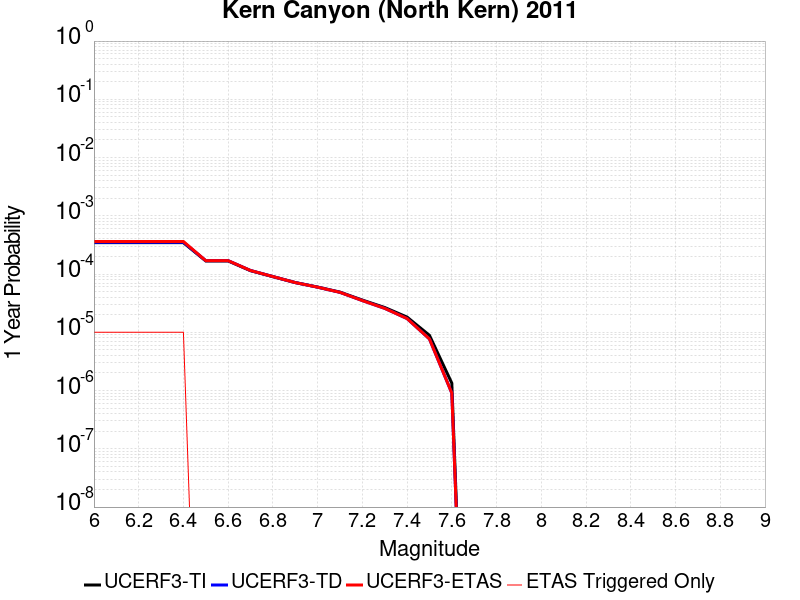 | 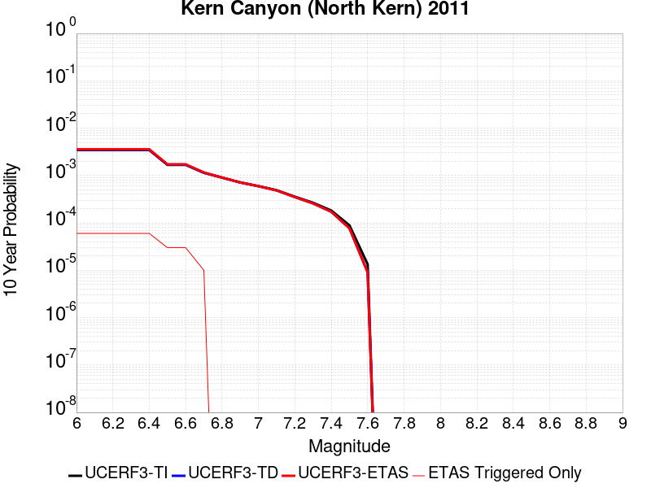 |

| Magnitude | 1 wk TI Prob | 1 wk TD Prob | 1 wk ETAS Prob | 1 wk ETAS/TD Gain | 1 wk ETAS Triggered Only | 1 mo TI Prob | 1 mo TD Prob | 1 mo ETAS Prob | 1 mo ETAS/TD Gain | 1 mo ETAS Triggered Only | 1 yr TI Prob | 1 yr TD Prob | 1 yr ETAS Prob | 1 yr ETAS/TD Gain | 1 yr ETAS Triggered Only | 10 yr TI Prob | 10 yr TD Prob | 10 yr ETAS Prob | 10 yr ETAS/TD Gain | 10 yr ETAS Triggered Only |
|-----|-----|-----|-----|-----|-----|-----|-----|-----|-----|-----|-----|-----|-----|-----|-----|-----|-----|-----|-----|-----|
| 6.0 | 6.6264497E-6 | 6.7574156E-6 | 6.7574156E-6 | 1.0 | 0.0 | 2.8398761E-5 | 2.8960078E-5 | 2.8960078E-5 | 1.0 | 0.0 | 3.4570007E-4 | 3.525399E-4 | 3.6292293E-4 | 1.0294521 | 1.0386697E-5 | 0.0034516277 | 0.003520595 | 0.0035826955 | 1.0176393 | 6.232018E-5 |
| 6.1 | 6.6264497E-6 | 6.7574156E-6 | 6.7574156E-6 | 1.0 | 0.0 | 2.8398761E-5 | 2.8960078E-5 | 2.8960078E-5 | 1.0 | 0.0 | 3.4570007E-4 | 3.525399E-4 | 3.6292293E-4 | 1.0294521 | 1.0386697E-5 | 0.0034516277 | 0.003520595 | 0.0035826955 | 1.0176393 | 6.232018E-5 |
| 6.2 | 6.6264497E-6 | 6.7574156E-6 | 6.7574156E-6 | 1.0 | 0.0 | 2.8398761E-5 | 2.8960078E-5 | 2.8960078E-5 | 1.0 | 0.0 | 3.4570007E-4 | 3.525399E-4 | 3.6292293E-4 | 1.0294521 | 1.0386697E-5 | 0.0034516277 | 0.003520595 | 0.0035826955 | 1.0176393 | 6.232018E-5 |
| 6.3 | 6.6264497E-6 | 6.7574156E-6 | 6.7574156E-6 | 1.0 | 0.0 | 2.8398761E-5 | 2.8960078E-5 | 2.8960078E-5 | 1.0 | 0.0 | 3.4570007E-4 | 3.525399E-4 | 3.6292293E-4 | 1.0294521 | 1.0386697E-5 | 0.0034516277 | 0.003520595 | 0.0035826955 | 1.0176393 | 6.232018E-5 |
| 6.4 | 6.6264497E-6 | 6.7574156E-6 | 6.7574156E-6 | 1.0 | 0.0 | 2.8398761E-5 | 2.8960078E-5 | 2.8960078E-5 | 1.0 | 0.0 | 3.4570007E-4 | 3.525399E-4 | 3.6292293E-4 | 1.0294521 | 1.0386697E-5 | 0.0034516277 | 0.003520595 | 0.0035826955 | 1.0176393 | 6.232018E-5 |
| 6.5 | 3.2162225E-6 | 3.2571281E-6 | 3.2571281E-6 | 1.0 | 0.0 | 1.3783738E-5 | 1.395905E-5 | 1.395905E-5 | 1.0 | 0.0 | 1.6780409E-4 | 1.69939E-4 | 1.69939E-4 | 1.0 | 0.0 | 0.0016767744 | 0.0016981701 | 0.0017292773 | 1.018318 | 3.116009E-5 |
| 6.6 | 3.2162225E-6 | 3.2571281E-6 | 3.2571281E-6 | 1.0 | 0.0 | 1.3783738E-5 | 1.395905E-5 | 1.395905E-5 | 1.0 | 0.0 | 1.6780409E-4 | 1.69939E-4 | 1.69939E-4 | 1.0 | 0.0 | 0.0016767744 | 0.0016981701 | 0.0017292773 | 1.018318 | 3.116009E-5 |
| 6.7 | 2.1908265E-6 | 2.2071454E-6 | 2.2071454E-6 | 1.0 | 0.0 | 9.389223E-6 | 9.459161E-6 | 9.459161E-6 | 1.0 | 0.0 | 1.1430779E-4 | 1.15159404E-4 | 1.15159404E-4 | 1.0 | 0.0 | 0.0011424901 | 0.0011510167 | 0.0011613914 | 1.0090135 | 1.0386697E-5 |
| 6.8 | 1.7303895E-6 | 1.7365707E-6 | 1.7365707E-6 | 1.0 | 0.0 | 7.415934E-6 | 7.442425E-6 | 7.442425E-6 | 1.0 | 0.0 | 9.028525E-5 | 9.060786E-5 | 9.060786E-5 | 1.0 | 0.0 | 9.024858E-4 | 9.057189E-4 | 9.057189E-4 | 1.0 | 0.0 |
| 6.9 | 1.3700314E-6 | 1.368876E-6 | 1.368876E-6 | 1.0 | 0.0 | 5.87155E-6 | 5.8665987E-6 | 5.8665987E-6 | 1.0 | 0.0 | 7.148377E-5 | 7.142354E-5 | 7.142354E-5 | 1.0 | 0.0 | 7.146078E-4 | 7.1401044E-4 | 7.1401044E-4 | 1.0 | 0.0 |
| 7.0 | 1.1467797E-6 | 1.141392E-6 | 1.141392E-6 | 1.0 | 0.0 | 4.9147607E-6 | 4.891671E-6 | 4.891671E-6 | 1.0 | 0.0 | 5.983557E-5 | 5.95545E-5 | 5.95545E-5 | 1.0 | 0.0 | 5.981946E-4 | 5.953885E-4 | 5.953885E-4 | 1.0 | 0.0 |
| 7.1 | 9.3952065E-7 | 9.3027853E-7 | 9.3027853E-7 | 1.0 | 0.0 | 4.026511E-6 | 3.986902E-6 | 3.986902E-6 | 1.0 | 0.0 | 4.9021666E-5 | 4.8539467E-5 | 4.8539467E-5 | 1.0 | 0.0 | 4.901085E-4 | 4.8529042E-4 | 4.8529042E-4 | 1.0 | 0.0 |
| 7.2 | 6.858055E-7 | 6.71937E-7 | 6.71937E-7 | 1.0 | 0.0 | 2.939163E-6 | 2.879727E-6 | 2.879727E-6 | 1.0 | 0.0 | 3.5783723E-5 | 3.506012E-5 | 3.506012E-5 | 1.0 | 0.0 | 3.5777962E-4 | 3.5054676E-4 | 3.5054676E-4 | 1.0 | 0.0 |
| 7.3 | 5.1101983E-7 | 4.939352E-7 | 4.939352E-7 | 1.0 | 0.0 | 2.1900833E-6 | 2.1168635E-6 | 2.1168635E-6 | 1.0 | 0.0 | 2.6663936E-5 | 2.5772513E-5 | 2.5772513E-5 | 1.0 | 0.0 | 2.6660739E-4 | 2.5769573E-4 | 2.5769573E-4 | 1.0 | 0.0 |
| 7.4 | 3.4999414E-7 | 3.299627E-7 | 3.299627E-7 | 1.0 | 0.0 | 1.499974E-6 | 1.4141251E-6 | 1.4141251E-6 | 1.0 | 0.0 | 1.8262032E-5 | 1.721684E-5 | 1.721684E-5 | 1.0 | 0.0 | 1.826053E-4 | 1.721553E-4 | 1.721553E-4 | 1.0 | 0.0 |
| 7.5 | 1.7021522E-7 | 1.475023E-7 | 1.475023E-7 | 1.0 | 0.0 | 7.2949354E-7 | 6.321526E-7 | 6.321526E-7 | 1.0 | 0.0 | 8.881548E-6 | 7.696432E-6 | 7.696432E-6 | 1.0 | 0.0 | 8.8811925E-5 | 7.6961725E-5 | 7.6961725E-5 | 1.0 | 0.0 |
| 7.6 | 2.572245E-8 | 1.7352884E-8 | 1.7352884E-8 | 1.0 | 0.0 | 1.10239064E-7 | 7.43695E-8 | 7.43695E-8 | 1.0 | 0.0 | 1.3421597E-6 | 9.0544836E-7 | 9.0544836E-7 | 1.0 | 0.0 | 1.3421517E-5 | 9.054452E-6 | 9.054452E-6 | 1.0 | 0.0 |

## Pisgah-Bullion Mtn-Mesquite Lk
*[(top)](#table-of-contents)*

| 1 Week | 1 Month | 1 Year | 10 Year |
|-----|-----|-----|-----|
|  |  |  | 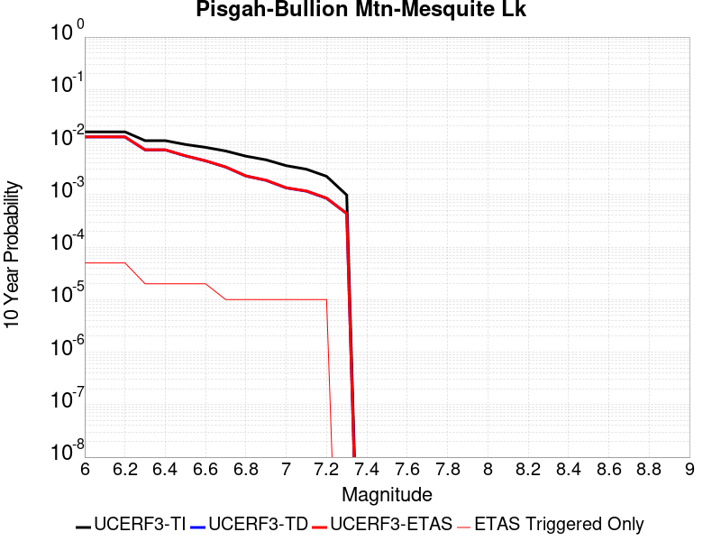 |

| Magnitude | 1 wk TI Prob | 1 wk TD Prob | 1 wk ETAS Prob | 1 wk ETAS/TD Gain | 1 wk ETAS Triggered Only | 1 mo TI Prob | 1 mo TD Prob | 1 mo ETAS Prob | 1 mo ETAS/TD Gain | 1 mo ETAS Triggered Only | 1 yr TI Prob | 1 yr TD Prob | 1 yr ETAS Prob | 1 yr ETAS/TD Gain | 1 yr ETAS Triggered Only | 10 yr TI Prob | 10 yr TD Prob | 10 yr ETAS Prob | 10 yr ETAS/TD Gain | 10 yr ETAS Triggered Only |
|-----|-----|-----|-----|-----|-----|-----|-----|-----|-----|-----|-----|-----|-----|-----|-----|-----|-----|-----|-----|-----|
| 6.0 | 3.0240792E-5 | 2.409264E-5 | 2.409264E-5 | 1.0 | 0.0 | 1.2959696E-4 | 1.03250655E-4 | 1.13636284E-4 | 1.1005865 | 1.0386697E-5 | 0.0015767008 | 0.0012564523 | 0.0012771996 | 1.0165126 | 2.0773394E-5 | 0.015655609 | 0.012503509 | 0.012554794 | 1.0041016 | 5.1933483E-5 |
| 6.1 | 3.0240792E-5 | 2.409264E-5 | 2.409264E-5 | 1.0 | 0.0 | 1.2959696E-4 | 1.03250655E-4 | 1.13636284E-4 | 1.1005865 | 1.0386697E-5 | 0.0015767008 | 0.0012564523 | 0.0012771996 | 1.0165126 | 2.0773394E-5 | 0.015655609 | 0.012503509 | 0.012554794 | 1.0041016 | 5.1933483E-5 |
| 6.2 | 3.0240792E-5 | 2.409264E-5 | 2.409264E-5 | 1.0 | 0.0 | 1.2959696E-4 | 1.03250655E-4 | 1.13636284E-4 | 1.1005865 | 1.0386697E-5 | 0.0015767008 | 0.0012564523 | 0.0012771996 | 1.0165126 | 2.0773394E-5 | 0.015655609 | 0.012503509 | 0.012554794 | 1.0041016 | 5.1933483E-5 |
| 6.3 | 2.0498217E-5 | 1.3638809E-5 | 1.3638809E-5 | 1.0 | 0.0 | 8.784654E-5 | 5.845082E-5 | 5.845082E-5 | 1.0 | 0.0 | 0.0010690069 | 7.114226E-4 | 7.218019E-4 | 1.0145895 | 1.0386697E-5 | 0.01063879 | 0.0070930775 | 0.0071137035 | 1.0029079 | 2.0773394E-5 |
| 6.4 | 2.0498217E-5 | 1.3638809E-5 | 1.3638809E-5 | 1.0 | 0.0 | 8.784654E-5 | 5.845082E-5 | 5.845082E-5 | 1.0 | 0.0 | 0.0010690069 | 7.114226E-4 | 7.218019E-4 | 1.0145895 | 1.0386697E-5 | 0.01063879 | 0.0070930775 | 0.0071137035 | 1.0029079 | 2.0773394E-5 |
| 6.5 | 1.7316182E-5 | 1.0477582E-5 | 1.0477582E-5 | 1.0 | 0.0 | 7.42101E-5 | 4.490321E-5 | 4.490321E-5 | 1.0 | 0.0 | 9.0313336E-4 | 5.465694E-4 | 5.569504E-4 | 1.018993 | 1.0386697E-5 | 0.008994718 | 0.005453247 | 0.005473907 | 1.0037886 | 2.0773394E-5 |
| 6.6 | 1.5251077E-5 | 8.414691E-6 | 8.414691E-6 | 1.0 | 0.0 | 6.536012E-5 | 3.6062505E-5 | 3.6062505E-5 | 1.0 | 0.0 | 7.9546886E-4 | 4.389798E-4 | 4.4936195E-4 | 1.0236506 | 1.0386697E-5 | 0.007926274 | 0.004381844 | 0.0044025267 | 1.00472 | 2.0773394E-5 |
| 6.7 | 1.2997425E-5 | 6.4118035E-6 | 6.4118035E-6 | 1.0 | 0.0 | 5.570206E-5 | 2.7478894E-5 | 2.7478894E-5 | 1.0 | 0.0 | 6.7796157E-4 | 3.3450883E-4 | 3.4489206E-4 | 1.0310402 | 1.0386697E-5 | 0.0067589693 | 0.0033405134 | 0.0033508653 | 1.003099 | 1.0386697E-5 |
| 6.8 | 1.035386E-5 | 4.3334735E-6 | 4.3334735E-6 | 1.0 | 0.0 | 4.437293E-5 | 1.8571902E-5 | 1.8571902E-5 | 1.0 | 0.0 | 5.401065E-4 | 2.2609031E-4 | 2.3647466E-4 | 1.0459301 | 1.0386697E-5 | 0.0053879567 | 0.0022586898 | 0.002269053 | 1.0045881 | 1.0386697E-5 |
| 6.9 | 8.816252E-6 | 3.580855E-6 | 3.580855E-6 | 1.0 | 0.0 | 3.778339E-5 | 1.5346433E-5 | 1.5346433E-5 | 1.0 | 0.0 | 4.5991567E-4 | 1.8682741E-4 | 1.9721217E-4 | 1.0555848 | 1.0386697E-5 | 0.00458965 | 0.0018667618 | 0.0018771292 | 1.0055536 | 1.0386697E-5 |
| 7.0 | 6.8232207E-6 | 2.5677498E-6 | 2.5677498E-6 | 1.0 | 0.0 | 2.9242048E-5 | 1.1004598E-5 | 1.1004598E-5 | 1.0 | 0.0 | 3.5596377E-4 | 1.3397305E-4 | 1.4435835E-4 | 1.0775179 | 1.0386697E-5 | 0.0035539411 | 0.0013389539 | 0.0013493267 | 1.0077469 | 1.0386697E-5 |
| 7.1 | 5.837013E-6 | 2.2275226E-6 | 2.2275226E-6 | 1.0 | 0.0 | 2.501553E-5 | 9.546492E-6 | 9.546492E-6 | 1.0 | 0.0 | 3.045215E-4 | 1.1622263E-4 | 1.2660812E-4 | 1.0893586 | 1.0386697E-5 | 0.0030410455 | 0.0011616475 | 0.0011720222 | 1.0089309 | 1.0386697E-5 |
| 7.2 | 4.278052E-6 | 1.6276728E-6 | 1.6276728E-6 | 1.0 | 0.0 | 1.833438E-5 | 6.975723E-6 | 6.975723E-6 | 1.0 | 0.0 | 2.231982E-4 | 8.492635E-5 | 9.531217E-5 | 1.122292 | 1.0386697E-5 | 0.0022297418 | 8.489622E-4 | 8.5934007E-4 | 1.0122242 | 1.0386697E-5 |
| 7.3 | 1.8803692E-6 | 8.345377E-7 | 8.345377E-7 | 1.0 | 0.0 | 8.0587E-6 | 3.576586E-6 | 3.576586E-6 | 1.0 | 0.0 | 9.811026E-5 | 4.3544213E-5 | 4.3544213E-5 | 1.0 | 0.0 | 9.806695E-4 | 4.3537127E-4 | 4.3537127E-4 | 1.0 | 0.0 |

## Whittier alt 1
*[(top)](#table-of-contents)*

| 1 Week | 1 Month | 1 Year | 10 Year |
|-----|-----|-----|-----|
|  |  |  | 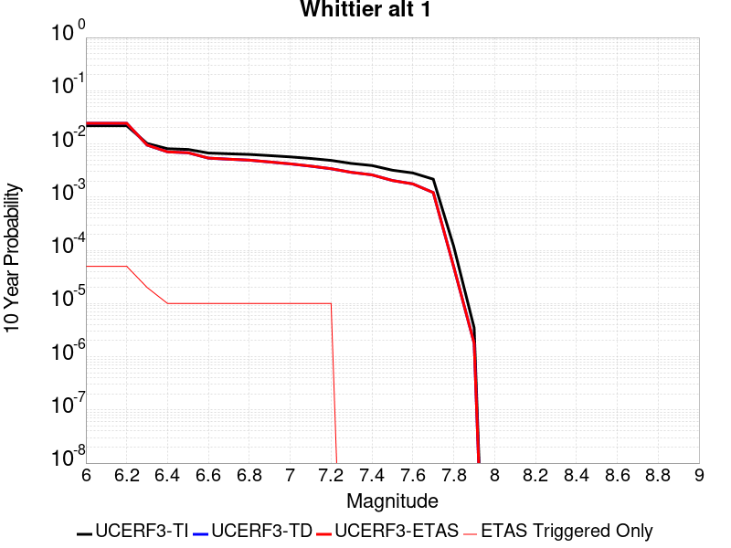 |

| Magnitude | 1 wk TI Prob | 1 wk TD Prob | 1 wk ETAS Prob | 1 wk ETAS/TD Gain | 1 wk ETAS Triggered Only | 1 mo TI Prob | 1 mo TD Prob | 1 mo ETAS Prob | 1 mo ETAS/TD Gain | 1 mo ETAS Triggered Only | 1 yr TI Prob | 1 yr TD Prob | 1 yr ETAS Prob | 1 yr ETAS/TD Gain | 1 yr ETAS Triggered Only | 10 yr TI Prob | 10 yr TD Prob | 10 yr ETAS Prob | 10 yr ETAS/TD Gain | 10 yr ETAS Triggered Only |
|-----|-----|-----|-----|-----|-----|-----|-----|-----|-----|-----|-----|-----|-----|-----|-----|-----|-----|-----|-----|-----|
| 6.0 | 4.2554693E-5 | 4.7257003E-5 | 4.7257003E-5 | 1.0 | 0.0 | 1.8236451E-4 | 2.0251611E-4 | 2.0251611E-4 | 1.0 | 0.0 | 0.002218027 | 0.0024631664 | 0.0024942497 | 1.0126193 | 3.116009E-5 | 0.02196019 | 0.024392692 | 0.02444336 | 1.0020771 | 5.1933483E-5 |
| 6.1 | 4.2554693E-5 | 4.7257003E-5 | 4.7257003E-5 | 1.0 | 0.0 | 1.8236451E-4 | 2.0251611E-4 | 2.0251611E-4 | 1.0 | 0.0 | 0.002218027 | 0.0024631664 | 0.0024942497 | 1.0126193 | 3.116009E-5 | 0.02196019 | 0.024392692 | 0.02444336 | 1.0020771 | 5.1933483E-5 |
| 6.2 | 4.2554693E-5 | 4.7257003E-5 | 4.7257003E-5 | 1.0 | 0.0 | 1.8236451E-4 | 2.0251611E-4 | 2.0251611E-4 | 1.0 | 0.0 | 0.002218027 | 0.0024631664 | 0.0024942497 | 1.0126193 | 3.116009E-5 | 0.02196019 | 0.024392692 | 0.02444336 | 1.0020771 | 5.1933483E-5 |
| 6.3 | 1.9617712E-5 | 1.827117E-5 | 1.827117E-5 | 1.0 | 0.0 | 8.40732E-5 | 7.830277E-5 | 7.830277E-5 | 1.0 | 0.0 | 0.0010231105 | 9.5293834E-4 | 9.6331513E-4 | 1.0108893 | 1.0386697E-5 | 0.01018413 | 0.009491804 | 0.009512381 | 1.0021678 | 2.0773394E-5 |
| 6.4 | 1.5611336E-5 | 1.3606451E-5 | 1.3606451E-5 | 1.0 | 0.0 | 6.690401E-5 | 5.8312093E-5 | 5.8312093E-5 | 1.0 | 0.0 | 8.142519E-4 | 7.0972444E-4 | 7.201038E-4 | 1.0146245 | 1.0386697E-5 | 0.008112748 | 0.007076542 | 0.007086855 | 1.0014573 | 1.0386697E-5 |
| 6.5 | 1.5150166E-5 | 1.310308E-5 | 1.310308E-5 | 1.0 | 0.0 | 6.492767E-5 | 5.615488E-5 | 5.615488E-5 | 1.0 | 0.0 | 7.9020765E-4 | 6.834771E-4 | 6.938567E-4 | 1.0151864 | 1.0386697E-5 | 0.007874036 | 0.006815699 | 0.006826015 | 1.0015136 | 1.0386697E-5 |
| 6.6 | 1.295588E-5 | 1.03825105E-5 | 1.03825105E-5 | 1.0 | 0.0 | 5.552402E-5 | 4.4495726E-5 | 4.4495726E-5 | 1.0 | 0.0 | 6.7579525E-4 | 5.416028E-4 | 5.5198383E-4 | 1.0191673 | 1.0386697E-5 | 0.006737438 | 0.005404262 | 0.005414592 | 1.0019115 | 1.0386697E-5 |
| 6.7 | 1.2542085E-5 | 9.90111E-6 | 9.90111E-6 | 1.0 | 0.0 | 5.3750682E-5 | 4.243265E-5 | 4.243265E-5 | 1.0 | 0.0 | 6.542181E-4 | 5.1649695E-4 | 5.268782E-4 | 1.0200995 | 1.0386697E-5 | 0.006522954 | 0.005154383 | 0.005164716 | 1.0020047 | 1.0386697E-5 |
| 6.8 | 1.2195878E-5 | 9.4970965E-6 | 9.4970965E-6 | 1.0 | 0.0 | 5.2267E-5 | 4.070122E-5 | 4.070122E-5 | 1.0 | 0.0 | 6.36165E-4 | 4.9542653E-4 | 5.058081E-4 | 1.0209547 | 1.0386697E-5 | 0.0063434686 | 0.0049445615 | 0.004954897 | 1.0020902 | 1.0386697E-5 |
| 6.9 | 1.1580298E-5 | 8.774486E-6 | 8.774486E-6 | 1.0 | 0.0 | 4.9628903E-5 | 3.7604408E-5 | 3.7604408E-5 | 1.0 | 0.0 | 6.040644E-4 | 4.577391E-4 | 4.6812106E-4 | 1.0226809 | 1.0386697E-5 | 0.00602425 | 0.004569222 | 0.0045795613 | 1.0022628 | 1.0386697E-5 |
| 7.0 | 1.0964795E-5 | 8.085466E-6 | 8.085466E-6 | 1.0 | 0.0 | 4.6991136E-5 | 3.4651544E-5 | 3.4651544E-5 | 1.0 | 0.0 | 5.7196687E-4 | 4.2180243E-4 | 4.3218475E-4 | 1.0246142 | 1.0386697E-5 | 0.0057049696 | 0.004211227 | 0.0042215697 | 1.0024561 | 1.0386697E-5 |
| 7.1 | 1.0230601E-5 | 7.327922E-6 | 7.327922E-6 | 1.0 | 0.0 | 4.3844695E-5 | 3.140501E-5 | 3.140501E-5 | 1.0 | 0.0 | 5.336784E-4 | 3.8229022E-4 | 3.9267293E-4 | 1.0271593 | 1.0386697E-5 | 0.005323986 | 0.0038174891 | 0.0038278364 | 1.0027105 | 1.0386697E-5 |
| 7.2 | 9.40865E-6 | 6.5444156E-6 | 6.5444156E-6 | 1.0 | 0.0 | 4.032216E-5 | 2.8047201E-5 | 2.8047201E-5 | 1.0 | 0.0 | 4.908117E-4 | 3.414224E-4 | 3.5180553E-4 | 1.0304115 | 1.0386697E-5 | 0.0048972913 | 0.0034100711 | 0.0034204223 | 1.0030355 | 1.0386697E-5 |
| 7.3 | 8.237384E-6 | 5.5987134E-6 | 5.5987134E-6 | 1.0 | 0.0 | 3.5302593E-5 | 2.3994271E-5 | 2.3994271E-5 | 1.0 | 0.0 | 4.2972428E-4 | 2.9209215E-4 | 2.9209215E-4 | 1.0 | 0.0 | 0.0042889426 | 0.0029174031 | 0.0029174031 | 1.0 | 0.0 |
| 7.4 | 7.5316966E-6 | 5.0286876E-6 | 5.0286876E-6 | 1.0 | 0.0 | 3.2278298E-5 | 2.1551346E-5 | 2.1551346E-5 | 1.0 | 0.0 | 3.9291743E-4 | 2.6235706E-4 | 2.6235706E-4 | 1.0 | 0.0 | 0.0039222343 | 0.0026205853 | 0.0026205853 | 1.0 | 0.0 |
| 7.5 | 6.149649E-6 | 3.934522E-6 | 3.934522E-6 | 1.0 | 0.0 | 2.6355372E-5 | 1.6862132E-5 | 1.6862132E-5 | 1.0 | 0.0 | 3.208294E-4 | 2.0527802E-4 | 2.0527802E-4 | 1.0 | 0.0 | 0.003203666 | 0.0020509732 | 0.0020509732 | 1.0 | 0.0 |
| 7.6 | 5.457711E-6 | 3.3959725E-6 | 3.3959725E-6 | 1.0 | 0.0 | 2.338998E-5 | 1.4554091E-5 | 1.4554091E-5 | 1.0 | 0.0 | 2.8473578E-4 | 1.7718246E-4 | 1.7718246E-4 | 1.0 | 0.0 | 0.0028437122 | 0.0017704928 | 0.0017704928 | 1.0 | 0.0 |
| 7.7 | 4.1676276E-6 | 2.3336488E-6 | 2.3336488E-6 | 1.0 | 0.0 | 1.7861139E-5 | 1.0001318E-5 | 1.0001318E-5 | 1.0 | 0.0 | 2.1743766E-4 | 1.2175998E-4 | 1.2175998E-4 | 1.0 | 0.0 | 0.0021722503 | 0.0012170058 | 0.0012170058 | 1.0 | 0.0 |
| 7.8 | 2.2692414E-7 | 9.3873886E-8 | 9.3873886E-8 | 1.0 | 0.0 | 9.725317E-7 | 4.023166E-7 | 4.023166E-7 | 1.0 | 0.0 | 1.1840509E-5 | 4.898197E-6 | 4.898197E-6 | 1.0 | 0.0 | 1.1839878E-4 | 4.898122E-5 | 4.898122E-5 | 1.0 | 0.0 |
| 7.9 | 6.676829E-9 | 3.4403498E-9 | 3.4403498E-9 | 1.0 | 0.0 | 2.861498E-8 | 1.4744357E-8 | 1.4744357E-8 | 1.0 | 0.0 | 3.4838732E-7 | 1.7951253E-7 | 1.7951253E-7 | 1.0 | 0.0 | 3.4838679E-6 | 1.7951239E-6 | 1.7951239E-6 | 1.0 | 0.0 |

## Palos Verdes
*[(top)](#table-of-contents)*

| 1 Week | 1 Month | 1 Year | 10 Year |
|-----|-----|-----|-----|
|  |  |  |  |

| Magnitude | 1 wk TI Prob | 1 wk TD Prob | 1 wk ETAS Prob | 1 wk ETAS/TD Gain | 1 wk ETAS Triggered Only | 1 mo TI Prob | 1 mo TD Prob | 1 mo ETAS Prob | 1 mo ETAS/TD Gain | 1 mo ETAS Triggered Only | 1 yr TI Prob | 1 yr TD Prob | 1 yr ETAS Prob | 1 yr ETAS/TD Gain | 1 yr ETAS Triggered Only | 10 yr TI Prob | 10 yr TD Prob | 10 yr ETAS Prob | 10 yr ETAS/TD Gain | 10 yr ETAS Triggered Only |
|-----|-----|-----|-----|-----|-----|-----|-----|-----|-----|-----|-----|-----|-----|-----|-----|-----|-----|-----|-----|-----|
| 6.0 | 6.126063E-5 | 7.623614E-5 | 9.700795E-5 | 1.2724667 | 2.0773394E-5 | 2.6251914E-4 | 3.2668875E-4 | 3.4745535E-4 | 1.0635669 | 2.0773394E-5 | 0.0031914865 | 0.0039706747 | 0.004001711 | 1.0078164 | 3.116009E-5 | 0.031460393 | 0.0390538 | 0.03910371 | 1.0012778 | 5.1933483E-5 |
| 6.1 | 6.126063E-5 | 7.623614E-5 | 9.700795E-5 | 1.2724667 | 2.0773394E-5 | 2.6251914E-4 | 3.2668875E-4 | 3.4745535E-4 | 1.0635669 | 2.0773394E-5 | 0.0031914865 | 0.0039706747 | 0.004001711 | 1.0078164 | 3.116009E-5 | 0.031460393 | 0.0390538 | 0.03910371 | 1.0012778 | 5.1933483E-5 |
| 6.2 | 6.126063E-5 | 7.623614E-5 | 9.700795E-5 | 1.2724667 | 2.0773394E-5 | 2.6251914E-4 | 3.2668875E-4 | 3.4745535E-4 | 1.0635669 | 2.0773394E-5 | 0.0031914865 | 0.0039706747 | 0.004001711 | 1.0078164 | 3.116009E-5 | 0.031460393 | 0.0390538 | 0.03910371 | 1.0012778 | 5.1933483E-5 |
| 6.3 | 4.0838047E-5 | 4.9755265E-5 | 6.0141443E-5 | 1.2087454 | 1.0386697E-5 | 1.7500846E-4 | 2.1322069E-4 | 2.2360517E-4 | 1.048703 | 1.0386697E-5 | 0.0021286458 | 0.002593076 | 0.002603436 | 1.0039952 | 1.0386697E-5 | 0.021083709 | 0.025649615 | 0.025679976 | 1.0011836 | 3.116009E-5 |
| 6.4 | 4.0838047E-5 | 4.9755265E-5 | 6.0141443E-5 | 1.2087454 | 1.0386697E-5 | 1.7500846E-4 | 2.1322069E-4 | 2.2360517E-4 | 1.048703 | 1.0386697E-5 | 0.0021286458 | 0.002593076 | 0.002603436 | 1.0039952 | 1.0386697E-5 | 0.021083709 | 0.025649615 | 0.025679976 | 1.0011836 | 3.116009E-5 |
| 6.5 | 3.0512005E-5 | 3.6565507E-5 | 3.6565507E-5 | 1.0 | 0.0 | 1.3075917E-4 | 1.5670057E-4 | 1.5670057E-4 | 1.0 | 0.0 | 0.0015908304 | 0.0019062778 | 0.0019062778 | 1.0 | 0.0 | 0.015794903 | 0.018911136 | 0.018921327 | 1.0005388 | 1.0386697E-5 |
| 6.6 | 2.9255087E-5 | 3.5158213E-5 | 3.5158213E-5 | 1.0 | 0.0 | 1.2537291E-4 | 1.5067002E-4 | 1.5067002E-4 | 1.0 | 0.0 | 0.0015253464 | 0.0018329794 | 0.0018329794 | 1.0 | 0.0 | 0.015149189 | 0.018190164 | 0.01820036 | 1.0005606 | 1.0386697E-5 |
| 6.7 | 2.287198E-5 | 2.7251068E-5 | 2.7251068E-5 | 1.0 | 0.0 | 9.801909E-5 | 1.1678558E-4 | 1.1678558E-4 | 1.0 | 0.0 | 0.001192729 | 0.0014210287 | 0.0014210287 | 1.0 | 0.0 | 0.011863477 | 0.014128654 | 0.014138894 | 1.0007248 | 1.0386697E-5 |
| 6.8 | 2.1325764E-5 | 2.5434496E-5 | 2.5434496E-5 | 1.0 | 0.0 | 9.139293E-5 | 1.0900094E-4 | 1.0900094E-4 | 1.0 | 0.0 | 0.001112141 | 0.0013263688 | 0.0013263688 | 1.0 | 0.0 | 0.011065915 | 0.013193562 | 0.013203811 | 1.0007769 | 1.0386697E-5 |
| 6.9 | 1.9009392E-5 | 2.2615843E-5 | 2.2615843E-5 | 1.0 | 0.0 | 8.1466285E-5 | 9.692193E-5 | 9.692193E-5 | 1.0 | 0.0 | 9.914007E-4 | 0.001179473 | 0.001179473 | 1.0 | 0.0 | 0.009869894 | 0.011740818 | 0.011751083 | 1.0008743 | 1.0386697E-5 |
| 7.0 | 1.7098473E-5 | 2.0321406E-5 | 2.0321406E-5 | 1.0 | 0.0 | 7.3277115E-5 | 8.708931E-5 | 8.708931E-5 | 1.0 | 0.0 | 8.917837E-4 | 0.0010598819 | 0.0010598819 | 1.0 | 0.0 | 0.008882134 | 0.010556707 | 0.010566984 | 1.0009735 | 1.0386697E-5 |
| 7.1 | 1.5982785E-5 | 1.8996678E-5 | 1.8996678E-5 | 1.0 | 0.0 | 6.849585E-5 | 8.141227E-5 | 8.141227E-5 | 1.0 | 0.0 | 8.336179E-4 | 9.908284E-4 | 9.908284E-4 | 1.0 | 0.0 | 0.008304977 | 0.009872472 | 0.0098827565 | 1.0010417 | 1.0386697E-5 |
| 7.2 | 1.4468002E-5 | 1.7198974E-5 | 1.7198974E-5 | 1.0 | 0.0 | 6.200425E-5 | 7.370828E-5 | 7.370828E-5 | 1.0 | 0.0 | 7.546402E-4 | 8.971129E-4 | 8.971129E-4 | 1.0 | 0.0 | 0.007520827 | 0.008943185 | 0.008953478 | 1.001151 | 1.0386697E-5 |
| 7.3 | 5.288233E-6 | 6.204259E-6 | 6.204259E-6 | 1.0 | 0.0 | 2.2663658E-5 | 2.6589607E-5 | 2.6589607E-5 | 1.0 | 0.0 | 2.7589512E-4 | 3.237153E-4 | 3.237153E-4 | 1.0 | 0.0 | 0.0027555283 | 0.003235861 | 0.003235861 | 1.0 | 0.0 |
| 7.4 | 8.279556E-7 | 8.408416E-7 | 8.408416E-7 | 1.0 | 0.0 | 3.5483763E-6 | 3.6036022E-6 | 3.6036022E-6 | 1.0 | 0.0 | 4.3200624E-5 | 4.387305E-5 | 4.387305E-5 | 1.0 | 0.0 | 4.3192226E-4 | 4.386511E-4 | 4.386511E-4 | 1.0 | 0.0 |
| 7.5 | 6.559831E-7 | 6.667287E-7 | 6.667287E-7 | 1.0 | 0.0 | 2.8113532E-6 | 2.857406E-6 | 2.857406E-6 | 1.0 | 0.0 | 3.4227687E-5 | 3.4788427E-5 | 3.4788427E-5 | 1.0 | 0.0 | 3.4222414E-4 | 3.4783647E-4 | 3.4783647E-4 | 1.0 | 0.0 |
| 7.6 | 3.5018968E-7 | 3.5620351E-7 | 3.5620351E-7 | 1.0 | 0.0 | 1.500812E-6 | 1.526586E-6 | 1.526586E-6 | 1.0 | 0.0 | 1.8272232E-5 | 1.8586072E-5 | 1.8586072E-5 | 1.0 | 0.0 | 1.8270731E-4 | 1.8584977E-4 | 1.8584977E-4 | 1.0 | 0.0 |
| 7.7 | 1.1986104E-7 | 1.2198491E-7 | 1.2198491E-7 | 1.0 | 0.0 | 5.1369005E-7 | 5.227924E-7 | 5.227924E-7 | 1.0 | 0.0 | 6.2541585E-6 | 6.364979E-6 | 6.364979E-6 | 1.0 | 0.0 | 6.2539824E-5 | 6.364801E-5 | 6.364801E-5 | 1.0 | 0.0 |
| 7.8 | 3.0445005E-8 | 3.10279E-8 | 3.10279E-8 | 1.0 | 0.0 | 1.3047858E-7 | 1.3297671E-7 | 1.3297671E-7 | 1.0 | 0.0 | 1.5885756E-6 | 1.6189904E-6 | 1.6189904E-6 | 1.0 | 0.0 | 1.5885644E-5 | 1.6189806E-5 | 1.6189806E-5 | 1.0 | 0.0 |

## Tin Mountain
*[(top)](#table-of-contents)*

| 1 Week | 1 Month | 1 Year | 10 Year |
|-----|-----|-----|-----|
|  |  |  |  |

| Magnitude | 1 wk TI Prob | 1 wk TD Prob | 1 wk ETAS Prob | 1 wk ETAS/TD Gain | 1 wk ETAS Triggered Only | 1 mo TI Prob | 1 mo TD Prob | 1 mo ETAS Prob | 1 mo ETAS/TD Gain | 1 mo ETAS Triggered Only | 1 yr TI Prob | 1 yr TD Prob | 1 yr ETAS Prob | 1 yr ETAS/TD Gain | 1 yr ETAS Triggered Only | 10 yr TI Prob | 10 yr TD Prob | 10 yr ETAS Prob | 10 yr ETAS/TD Gain | 10 yr ETAS Triggered Only |
|-----|-----|-----|-----|-----|-----|-----|-----|-----|-----|-----|-----|-----|-----|-----|-----|-----|-----|-----|-----|-----|
| 6.0 | 4.083776E-6 | 4.18159E-6 | 4.18159E-6 | 1.0 | 0.0 | 1.750178E-5 | 1.7920998E-5 | 1.7920998E-5 | 1.0 | 0.0 | 2.1306332E-4 | 2.1817003E-4 | 2.2855445E-4 | 1.0475979 | 1.0386697E-5 | 0.0021285915 | 0.0021799242 | 0.0022317444 | 1.0237716 | 5.1933483E-5 |
| 6.1 | 4.083776E-6 | 4.18159E-6 | 4.18159E-6 | 1.0 | 0.0 | 1.750178E-5 | 1.7920998E-5 | 1.7920998E-5 | 1.0 | 0.0 | 2.1306332E-4 | 2.1817003E-4 | 2.2855445E-4 | 1.0475979 | 1.0386697E-5 | 0.0021285915 | 0.0021799242 | 0.0022317444 | 1.0237716 | 5.1933483E-5 |
| 6.2 | 4.083776E-6 | 4.18159E-6 | 4.18159E-6 | 1.0 | 0.0 | 1.750178E-5 | 1.7920998E-5 | 1.7920998E-5 | 1.0 | 0.0 | 2.1306332E-4 | 2.1817003E-4 | 2.2855445E-4 | 1.0475979 | 1.0386697E-5 | 0.0021285915 | 0.0021799242 | 0.0022317444 | 1.0237716 | 5.1933483E-5 |
| 6.3 | 4.083776E-6 | 4.18159E-6 | 4.18159E-6 | 1.0 | 0.0 | 1.750178E-5 | 1.7920998E-5 | 1.7920998E-5 | 1.0 | 0.0 | 2.1306332E-4 | 2.1817003E-4 | 2.2855445E-4 | 1.0475979 | 1.0386697E-5 | 0.0021285915 | 0.0021799242 | 0.0022317444 | 1.0237716 | 5.1933483E-5 |
| 6.4 | 4.083776E-6 | 4.18159E-6 | 4.18159E-6 | 1.0 | 0.0 | 1.750178E-5 | 1.7920998E-5 | 1.7920998E-5 | 1.0 | 0.0 | 2.1306332E-4 | 2.1817003E-4 | 2.2855445E-4 | 1.0475979 | 1.0386697E-5 | 0.0021285915 | 0.0021799242 | 0.0022317444 | 1.0237716 | 5.1933483E-5 |
| 6.5 | 2.3143427E-6 | 2.3731893E-6 | 2.3731893E-6 | 1.0 | 0.0 | 9.9185745E-6 | 1.01707765E-5 | 1.01707765E-5 | 1.0 | 0.0 | 1.2075195E-4 | 1.2382293E-4 | 1.3420834E-4 | 1.083873 | 1.0386697E-5 | 0.0012068636 | 0.0012376154 | 0.0012791108 | 1.0335284 | 4.1546788E-5 |
| 6.6 | 2.3143427E-6 | 2.3731893E-6 | 2.3731893E-6 | 1.0 | 0.0 | 9.9185745E-6 | 1.01707765E-5 | 1.01707765E-5 | 1.0 | 0.0 | 1.2075195E-4 | 1.2382293E-4 | 1.3420834E-4 | 1.083873 | 1.0386697E-5 | 0.0012068636 | 0.0012376154 | 0.0012791108 | 1.0335284 | 4.1546788E-5 |
| 6.7 | 1.7029532E-6 | 1.7498172E-6 | 1.7498172E-6 | 1.0 | 0.0 | 7.2983503E-6 | 7.499198E-6 | 7.499198E-6 | 1.0 | 0.0 | 8.885379E-5 | 9.1299444E-5 | 9.1299444E-5 | 1.0 | 0.0 | 8.881827E-4 | 9.12672E-4 | 9.3342643E-4 | 1.0227402 | 2.0773394E-5 |
| 6.8 | 1.2914646E-6 | 1.329959E-6 | 1.329959E-6 | 1.0 | 0.0 | 5.534837E-6 | 5.699814E-6 | 5.699814E-6 | 1.0 | 0.0 | 6.738455E-5 | 6.939347E-5 | 6.939347E-5 | 1.0 | 0.0 | 6.736412E-4 | 6.937614E-4 | 6.937614E-4 | 1.0 | 0.0 |
| 6.9 | 5.8708974E-7 | 6.11713E-7 | 6.11713E-7 | 1.0 | 0.0 | 2.5160964E-6 | 2.6216248E-6 | 2.6216248E-6 | 1.0 | 0.0 | 3.0633044E-5 | 3.1917854E-5 | 3.1917854E-5 | 1.0 | 0.0 | 3.0628822E-4 | 3.1913683E-4 | 3.1913683E-4 | 1.0 | 0.0 |
| 7.0 | 4.6248786E-7 | 4.8321306E-7 | 4.8321306E-7 | 1.0 | 0.0 | 1.9820893E-6 | 2.0709115E-6 | 2.0709115E-6 | 1.0 | 0.0 | 2.413167E-5 | 2.5213094E-5 | 2.5213094E-5 | 1.0 | 0.0 | 2.412905E-4 | 2.5210602E-4 | 2.5210602E-4 | 1.0 | 0.0 |
| 7.1 | 3.804606E-7 | 3.9872486E-7 | 3.9872486E-7 | 1.0 | 0.0 | 1.6305444E-6 | 1.7088199E-6 | 1.7088199E-6 | 1.0 | 0.0 | 1.9851697E-5 | 2.0804719E-5 | 2.0804719E-5 | 1.0 | 0.0 | 1.9849923E-4 | 2.0803107E-4 | 2.0803107E-4 | 1.0 | 0.0 |
| 7.2 | 3.5864858E-7 | 3.7617838E-7 | 3.7617838E-7 | 1.0 | 0.0 | 1.5370645E-6 | 1.6121922E-6 | 1.6121922E-6 | 1.0 | 0.0 | 1.87136E-5 | 1.9628298E-5 | 1.9628298E-5 | 1.0 | 0.0 | 1.8712023E-4 | 1.9626896E-4 | 1.9626896E-4 | 1.0 | 0.0 |
| 7.3 | 3.342063E-7 | 3.5064386E-7 | 3.5064386E-7 | 1.0 | 0.0 | 1.4323119E-6 | 1.5027588E-6 | 1.5027588E-6 | 1.0 | 0.0 | 1.7438259E-5 | 1.8295968E-5 | 1.8295968E-5 | 1.0 | 0.0 | 1.743689E-4 | 1.8294792E-4 | 1.8294792E-4 | 1.0 | 0.0 |
| 7.4 | 2.971242E-7 | 3.1166627E-7 | 3.1166627E-7 | 1.0 | 0.0 | 1.2733886E-6 | 1.3357121E-6 | 1.3357121E-6 | 1.0 | 0.0 | 1.5503398E-5 | 1.6262207E-5 | 1.6262207E-5 | 1.0 | 0.0 | 1.5502315E-4 | 1.6261345E-4 | 1.6261345E-4 | 1.0 | 0.0 |
| 7.5 | 1.4326713E-7 | 1.5012905E-7 | 1.5012905E-7 | 1.0 | 0.0 | 6.140018E-7 | 6.434102E-7 | 6.434102E-7 | 1.0 | 0.0 | 7.4754466E-6 | 7.83352E-6 | 7.83352E-6 | 1.0 | 0.0 | 7.475195E-5 | 7.833519E-5 | 7.833519E-5 | 1.0 | 0.0 |

## Deep Springs
*[(top)](#table-of-contents)*

| 1 Week | 1 Month | 1 Year | 10 Year |
|-----|-----|-----|-----|
|  | 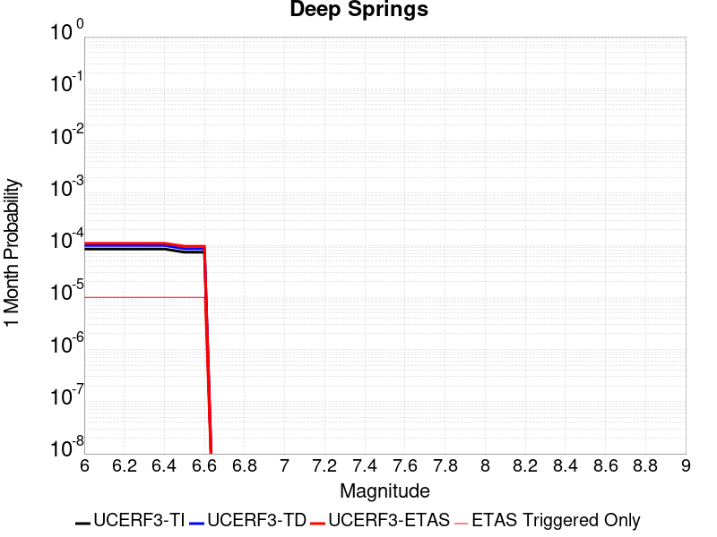 |  | 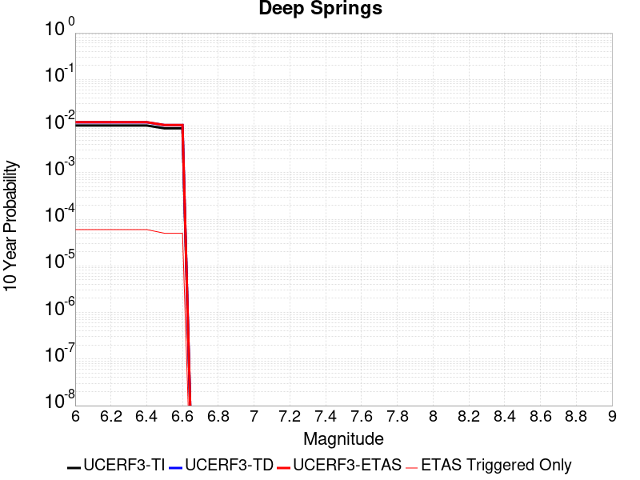 |

| Magnitude | 1 wk TI Prob | 1 wk TD Prob | 1 wk ETAS Prob | 1 wk ETAS/TD Gain | 1 wk ETAS Triggered Only | 1 mo TI Prob | 1 mo TD Prob | 1 mo ETAS Prob | 1 mo ETAS/TD Gain | 1 mo ETAS Triggered Only | 1 yr TI Prob | 1 yr TD Prob | 1 yr ETAS Prob | 1 yr ETAS/TD Gain | 1 yr ETAS Triggered Only | 10 yr TI Prob | 10 yr TD Prob | 10 yr ETAS Prob | 10 yr ETAS/TD Gain | 10 yr ETAS Triggered Only |
|-----|-----|-----|-----|-----|-----|-----|-----|-----|-----|-----|-----|-----|-----|-----|-----|-----|-----|-----|-----|-----|
| 6.0 | 1.9810619E-5 | 2.3114564E-5 | 3.350102E-5 | 1.4493469 | 1.0386697E-5 | 8.489989E-5 | 9.9061515E-5 | 1.0944719E-4 | 1.1048406 | 1.0386697E-5 | 0.001033166 | 0.0012059145 | 0.001237037 | 1.0258082 | 3.116009E-5 | 0.010283757 | 0.012043487 | 0.012094796 | 1.0042602 | 5.1933483E-5 |
| 6.1 | 1.9810619E-5 | 2.3114564E-5 | 3.350102E-5 | 1.4493469 | 1.0386697E-5 | 8.489989E-5 | 9.9061515E-5 | 1.0944719E-4 | 1.1048406 | 1.0386697E-5 | 0.001033166 | 0.0012059145 | 0.001237037 | 1.0258082 | 3.116009E-5 | 0.010283757 | 0.012043487 | 0.012094796 | 1.0042602 | 5.1933483E-5 |
| 6.2 | 1.9810619E-5 | 2.3114564E-5 | 3.350102E-5 | 1.4493469 | 1.0386697E-5 | 8.489989E-5 | 9.9061515E-5 | 1.0944719E-4 | 1.1048406 | 1.0386697E-5 | 0.001033166 | 0.0012059145 | 0.001237037 | 1.0258082 | 3.116009E-5 | 0.010283757 | 0.012043487 | 0.012094796 | 1.0042602 | 5.1933483E-5 |
| 6.3 | 1.9810619E-5 | 2.3114564E-5 | 3.350102E-5 | 1.4493469 | 1.0386697E-5 | 8.489989E-5 | 9.9061515E-5 | 1.0944719E-4 | 1.1048406 | 1.0386697E-5 | 0.001033166 | 0.0012059145 | 0.001237037 | 1.0258082 | 3.116009E-5 | 0.010283757 | 0.012043487 | 0.012094796 | 1.0042602 | 5.1933483E-5 |
| 6.4 | 1.9810619E-5 | 2.3114564E-5 | 3.350102E-5 | 1.4493469 | 1.0386697E-5 | 8.489989E-5 | 9.9061515E-5 | 1.0944719E-4 | 1.1048406 | 1.0386697E-5 | 0.001033166 | 0.0012059145 | 0.001237037 | 1.0258082 | 3.116009E-5 | 0.010283757 | 0.012043487 | 0.012094796 | 1.0042602 | 5.1933483E-5 |
| 6.5 | 1.7190405E-5 | 2.0052325E-5 | 3.0438814E-5 | 1.5179693 | 1.0386697E-5 | 7.367108E-5 | 8.593854E-5 | 9.6324344E-5 | 1.1208515 | 1.0386697E-5 | 8.9657627E-4 | 0.0010463017 | 0.0010774292 | 1.02975 | 3.116009E-5 | 0.008929676 | 0.010462979 | 0.010514369 | 1.0049117 | 5.1933483E-5 |
| 6.6 | 1.7190405E-5 | 2.0052325E-5 | 3.0438814E-5 | 1.5179693 | 1.0386697E-5 | 7.367108E-5 | 8.593854E-5 | 9.6324344E-5 | 1.1208515 | 1.0386697E-5 | 8.9657627E-4 | 0.0010463017 | 0.0010774292 | 1.02975 | 3.116009E-5 | 0.008929676 | 0.010462979 | 0.010514369 | 1.0049117 | 5.1933483E-5 |

## Big Pine (Central)
*[(top)](#table-of-contents)*

| 1 Week | 1 Month | 1 Year | 10 Year |
|-----|-----|-----|-----|
|  |  |  |  |

| Magnitude | 1 wk TI Prob | 1 wk TD Prob | 1 wk ETAS Prob | 1 wk ETAS/TD Gain | 1 wk ETAS Triggered Only | 1 mo TI Prob | 1 mo TD Prob | 1 mo ETAS Prob | 1 mo ETAS/TD Gain | 1 mo ETAS Triggered Only | 1 yr TI Prob | 1 yr TD Prob | 1 yr ETAS Prob | 1 yr ETAS/TD Gain | 1 yr ETAS Triggered Only | 10 yr TI Prob | 10 yr TD Prob | 10 yr ETAS Prob | 10 yr ETAS/TD Gain | 10 yr ETAS Triggered Only |
|-----|-----|-----|-----|-----|-----|-----|-----|-----|-----|-----|-----|-----|-----|-----|-----|-----|-----|-----|-----|-----|
| 6.0 | 1.2706755E-5 | 1.4252463E-5 | 1.4252463E-5 | 1.0 | 0.0 | 5.4456385E-5 | 6.108076E-5 | 7.146683E-5 | 1.1700382 | 1.0386697E-5 | 6.628048E-4 | 7.434411E-4 | 7.6419907E-4 | 1.0279214 | 2.0773394E-5 | 0.006608314 | 0.007414557 | 0.0074661057 | 1.0069523 | 5.1933483E-5 |
| 6.1 | 8.342579E-6 | 9.512481E-6 | 9.512481E-6 | 1.0 | 0.0 | 3.5753423E-5 | 4.076726E-5 | 4.076726E-5 | 1.0 | 0.0 | 4.3521097E-4 | 4.9625005E-4 | 4.9625005E-4 | 1.0 | 0.0 | 0.0043435963 | 0.0049549625 | 0.004975633 | 1.0041716 | 2.0773394E-5 |
| 6.2 | 6.923899E-6 | 7.968794E-6 | 7.968794E-6 | 1.0 | 0.0 | 2.9673516E-5 | 3.4151635E-5 | 3.4151635E-5 | 1.0 | 0.0 | 3.6121515E-4 | 4.1573608E-4 | 4.1573608E-4 | 1.0 | 0.0 | 0.003606286 | 0.00415288 | 0.0041735675 | 1.0049814 | 2.0773394E-5 |
| 6.3 | 2.728396E-6 | 3.4257378E-6 | 3.4257378E-6 | 1.0 | 0.0 | 1.1693074E-5 | 1.4681656E-5 | 1.4681656E-5 | 1.0 | 0.0 | 1.4235388E-4 | 1.7873537E-4 | 1.7873537E-4 | 1.0 | 0.0 | 0.0014226272 | 0.0017874117 | 0.0017977799 | 1.0058006 | 1.0386697E-5 |
| 6.4 | 2.7136944E-6 | 3.4100306E-6 | 3.4100306E-6 | 1.0 | 0.0 | 1.1630066E-5 | 1.461434E-5 | 1.461434E-5 | 1.0 | 0.0 | 1.4158686E-4 | 1.7791594E-4 | 1.7791594E-4 | 1.0 | 0.0 | 0.0014149669 | 0.0017792305 | 0.0017895987 | 1.0058273 | 1.0386697E-5 |
| 6.5 | 2.6971882E-6 | 3.392375E-6 | 3.392375E-6 | 1.0 | 0.0 | 1.1559327E-5 | 1.4538674E-5 | 1.4538674E-5 | 1.0 | 0.0 | 1.4072572E-4 | 1.7699486E-4 | 1.7699486E-4 | 1.0 | 0.0 | 0.0014063664 | 0.0017700344 | 0.0017804027 | 1.0058577 | 1.0386697E-5 |
| 6.6 | 2.669092E-6 | 3.3623944E-6 | 3.3623944E-6 | 1.0 | 0.0 | 1.1438916E-5 | 1.4410188E-5 | 1.4410188E-5 | 1.0 | 0.0 | 1.3925991E-4 | 1.7543077E-4 | 1.7543077E-4 | 1.0 | 0.0 | 0.0013917267 | 0.0017544184 | 0.0017647869 | 1.0059099 | 1.0386697E-5 |
| 6.7 | 2.6408059E-6 | 3.332419E-6 | 3.332419E-6 | 1.0 | 0.0 | 1.1317691E-5 | 1.4281723E-5 | 1.4281723E-5 | 1.0 | 0.0 | 1.3778417E-4 | 1.7386697E-4 | 1.7386697E-4 | 1.0 | 0.0 | 0.0013769877 | 0.001738805 | 0.0017491736 | 1.0059631 | 1.0386697E-5 |
| 6.8 | 2.1786943E-6 | 2.8558686E-6 | 2.8558686E-6 | 1.0 | 0.0 | 9.337228E-6 | 1.2239383E-5 | 1.2239383E-5 | 1.0 | 0.0 | 1.1367482E-4 | 1.4900503E-4 | 1.4900503E-4 | 1.0 | 0.0 | 0.0011361669 | 0.0014905332 | 0.0014905332 | 1.0 | 0.0 |
| 6.9 | 1.4411696E-6 | 2.0698712E-6 | 2.0698712E-6 | 1.0 | 0.0 | 6.1764263E-6 | 8.870848E-6 | 8.870848E-6 | 1.0 | 0.0 | 7.51954E-5 | 1.079975E-4 | 1.079975E-4 | 1.0 | 0.0 | 7.5169955E-4 | 0.0010808875 | 0.0010808875 | 1.0 | 0.0 |
| 7.0 | 1.0073411E-6 | 1.5554864E-6 | 1.5554864E-6 | 1.0 | 0.0 | 4.317169E-6 | 6.666354E-6 | 6.666354E-6 | 1.0 | 0.0 | 5.2560266E-5 | 8.115999E-5 | 8.115999E-5 | 1.0 | 0.0 | 5.2547833E-4 | 8.1272965E-4 | 8.1272965E-4 | 1.0 | 0.0 |
| 7.1 | 8.947104E-7 | 1.4314573E-6 | 1.4314573E-6 | 1.0 | 0.0 | 3.834468E-6 | 6.1348037E-6 | 6.1348037E-6 | 1.0 | 0.0 | 4.6683643E-5 | 7.4688825E-5 | 7.4688825E-5 | 1.0 | 0.0 | 4.6673836E-4 | 7.4806315E-4 | 7.4806315E-4 | 1.0 | 0.0 |
| 7.2 | 5.215166E-7 | 1.0122951E-6 | 1.0122951E-6 | 1.0 | 0.0 | 2.2350691E-6 | 4.3384007E-6 | 4.3384007E-6 | 1.0 | 0.0 | 2.7211627E-5 | 5.2818792E-5 | 5.2818792E-5 | 1.0 | 0.0 | 2.7208295E-4 | 5.2947813E-4 | 5.2947813E-4 | 1.0 | 0.0 |
| 7.3 | 4.4024807E-7 | 9.230527E-7 | 9.230527E-7 | 1.0 | 0.0 | 1.8867761E-6 | 3.9559345E-6 | 3.9559345E-6 | 1.0 | 0.0 | 2.2971257E-5 | 4.8162477E-5 | 4.8162477E-5 | 1.0 | 0.0 | 2.2968883E-4 | 4.82936E-4 | 4.82936E-4 | 1.0 | 0.0 |
| 7.4 | 3.6130905E-7 | 8.3691214E-7 | 8.3691214E-7 | 1.0 | 0.0 | 1.5484665E-6 | 3.5867617E-6 | 3.5867617E-6 | 1.0 | 0.0 | 1.8852415E-5 | 4.3667987E-5 | 4.3667987E-5 | 1.0 | 0.0 | 1.8850817E-4 | 4.380001E-4 | 4.380001E-4 | 1.0 | 0.0 |
| 7.5 | 3.408184E-7 | 8.118514E-7 | 8.118514E-7 | 1.0 | 0.0 | 1.4606494E-6 | 3.4793588E-6 | 3.4793588E-6 | 1.0 | 0.0 | 1.7783263E-5 | 4.2360407E-5 | 4.2360407E-5 | 1.0 | 0.0 | 1.778184E-4 | 4.2490795E-4 | 4.2490795E-4 | 1.0 | 0.0 |
| 7.6 | 3.1428627E-7 | 7.7415996E-7 | 7.7415996E-7 | 1.0 | 0.0 | 1.3469405E-6 | 3.3178244E-6 | 3.3178244E-6 | 1.0 | 0.0 | 1.6398877E-5 | 4.03938E-5 | 4.03938E-5 | 1.0 | 0.0 | 1.6397667E-4 | 4.0522031E-4 | 4.0522031E-4 | 1.0 | 0.0 |
| 7.7 | 1.7972785E-7 | 5.085394E-7 | 5.085394E-7 | 1.0 | 0.0 | 7.70262E-7 | 2.1794528E-6 | 2.1794528E-6 | 1.0 | 0.0 | 9.377899E-6 | 2.6534526E-5 | 2.6534526E-5 | 1.0 | 0.0 | 9.377503E-5 | 2.666768E-4 | 2.666768E-4 | 1.0 | 0.0 |
| 7.8 | 4.9230927E-8 | 1.1998821E-7 | 1.1998821E-7 | 1.0 | 0.0 | 2.1098968E-7 | 5.142351E-7 | 5.142351E-7 | 1.0 | 0.0 | 2.5687964E-6 | 6.2607965E-6 | 6.2607965E-6 | 1.0 | 0.0 | 2.5687666E-5 | 6.304645E-5 | 6.304645E-5 | 1.0 | 0.0 |
| 7.9 | 3.6805972E-9 | 4.112396E-9 | 4.112396E-9 | 1.0 | 0.0 | 1.5773987E-8 | 1.7624556E-8 | 1.7624556E-8 | 1.0 | 0.0 | 1.9204828E-7 | 2.1457895E-7 | 2.1457895E-7 | 1.0 | 0.0 | 1.920481E-6 | 2.1937853E-6 | 2.1937853E-6 | 1.0 | 0.0 |

## White Mountains
*[(top)](#table-of-contents)*

| 1 Week | 1 Month | 1 Year | 10 Year |
|-----|-----|-----|-----|
|  |  | 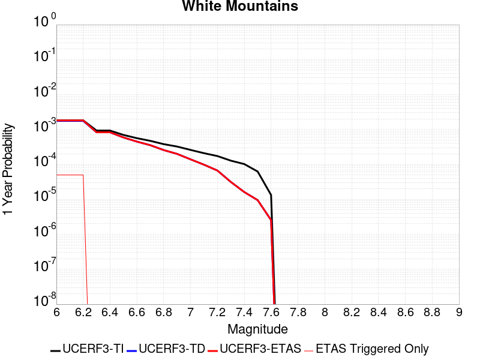 | 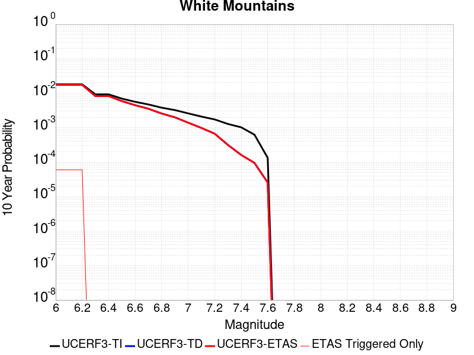 |

| Magnitude | 1 wk TI Prob | 1 wk TD Prob | 1 wk ETAS Prob | 1 wk ETAS/TD Gain | 1 wk ETAS Triggered Only | 1 mo TI Prob | 1 mo TD Prob | 1 mo ETAS Prob | 1 mo ETAS/TD Gain | 1 mo ETAS Triggered Only | 1 yr TI Prob | 1 yr TD Prob | 1 yr ETAS Prob | 1 yr ETAS/TD Gain | 1 yr ETAS Triggered Only | 10 yr TI Prob | 10 yr TD Prob | 10 yr ETAS Prob | 10 yr ETAS/TD Gain | 10 yr ETAS Triggered Only |
|-----|-----|-----|-----|-----|-----|-----|-----|-----|-----|-----|-----|-----|-----|-----|-----|-----|-----|-----|-----|-----|
| 6.0 | 3.503579E-5 | 3.378569E-5 | 3.378569E-5 | 1.0 | 0.0 | 1.5014476E-4 | 1.4478847E-4 | 1.5517366E-4 | 1.0717267 | 1.0386697E-5 | 0.0018264796 | 0.001761495 | 0.0018029687 | 1.0235445 | 4.1546788E-5 | 0.018115403 | 0.017487662 | 0.017538687 | 1.0029178 | 5.1933483E-5 |
| 6.1 | 3.503579E-5 | 3.378569E-5 | 3.378569E-5 | 1.0 | 0.0 | 1.5014476E-4 | 1.4478847E-4 | 1.5517366E-4 | 1.0717267 | 1.0386697E-5 | 0.0018264796 | 0.001761495 | 0.0018029687 | 1.0235445 | 4.1546788E-5 | 0.018115403 | 0.017487662 | 0.017538687 | 1.0029178 | 5.1933483E-5 |
| 6.2 | 3.503579E-5 | 3.378569E-5 | 3.378569E-5 | 1.0 | 0.0 | 1.5014476E-4 | 1.4478847E-4 | 1.5517366E-4 | 1.0717267 | 1.0386697E-5 | 0.0018264796 | 0.001761495 | 0.0018029687 | 1.0235445 | 4.1546788E-5 | 0.018115403 | 0.017487662 | 0.017538687 | 1.0029178 | 5.1933483E-5 |
| 6.3 | 1.7818425E-5 | 1.5916867E-5 | 1.5916867E-5 | 1.0 | 0.0 | 7.636245E-5 | 6.821344E-5 | 6.821344E-5 | 1.0 | 0.0 | 9.293162E-4 | 8.301964E-4 | 8.301964E-4 | 1.0 | 0.0 | 0.009254395 | 0.0082724085 | 0.0082724085 | 1.0 | 0.0 |
| 6.4 | 1.7818425E-5 | 1.5916867E-5 | 1.5916867E-5 | 1.0 | 0.0 | 7.636245E-5 | 6.821344E-5 | 6.821344E-5 | 1.0 | 0.0 | 9.293162E-4 | 8.301964E-4 | 8.301964E-4 | 1.0 | 0.0 | 0.009254395 | 0.0082724085 | 0.0082724085 | 1.0 | 0.0 |
| 6.5 | 1.3397557E-5 | 1.1336862E-5 | 1.1336862E-5 | 1.0 | 0.0 | 5.741684E-5 | 4.8585687E-5 | 4.8585687E-5 | 1.0 | 0.0 | 6.988258E-4 | 5.9137715E-4 | 5.9137715E-4 | 1.0 | 0.0 | 0.006966323 | 0.00589874 | 0.00589874 | 1.0 | 0.0 |
| 6.6 | 1.0818695E-5 | 8.625775E-6 | 8.625775E-6 | 1.0 | 0.0 | 4.6365014E-5 | 3.696711E-5 | 3.696711E-5 | 1.0 | 0.0 | 5.6434784E-4 | 4.4998596E-4 | 4.4998596E-4 | 1.0 | 0.0 | 0.005629168 | 0.004491185 | 0.004491185 | 1.0 | 0.0 |
| 6.7 | 9.067908E-6 | 6.8027375E-6 | 6.8027375E-6 | 1.0 | 0.0 | 3.8861883E-5 | 2.9154282E-5 | 2.9154282E-5 | 1.0 | 0.0 | 4.7304068E-4 | 3.5489874E-4 | 3.5489874E-4 | 1.0 | 0.0 | 0.00472035 | 0.003543637 | 0.003543637 | 1.0 | 0.0 |
| 6.8 | 7.295947E-6 | 4.9365945E-6 | 4.9365945E-6 | 1.0 | 0.0 | 3.126797E-5 | 2.1156668E-5 | 2.1156668E-5 | 1.0 | 0.0 | 3.8062103E-4 | 2.5755313E-4 | 2.5755313E-4 | 1.0 | 0.0 | 0.0037996976 | 0.0025726592 | 0.0025726592 | 1.0 | 0.0 |
| 6.9 | 6.2243444E-6 | 3.83238E-6 | 3.83238E-6 | 1.0 | 0.0 | 2.6675489E-5 | 1.6424385E-5 | 1.6424385E-5 | 1.0 | 0.0 | 3.2472567E-4 | 1.9994906E-4 | 1.9994906E-4 | 1.0 | 0.0 | 0.0032425157 | 0.0019977444 | 0.0019977444 | 1.0 | 0.0 |
| 7.0 | 4.9878413E-6 | 2.6796765E-6 | 2.6796765E-6 | 1.0 | 0.0 | 2.1376287E-5 | 1.1484279E-5 | 1.1484279E-5 | 1.0 | 0.0 | 2.602252E-4 | 1.3981239E-4 | 1.3981239E-4 | 1.0 | 0.0 | 0.002599207 | 0.0013972705 | 0.0013972705 | 1.0 | 0.0 |
| 7.1 | 4.0252844E-6 | 1.8858877E-6 | 1.8858877E-6 | 1.0 | 0.0 | 1.7251105E-5 | 8.082352E-6 | 8.082352E-6 | 1.0 | 0.0 | 2.1001195E-4 | 9.839832E-5 | 9.839832E-5 | 1.0 | 0.0 | 0.0020981359 | 9.835603E-4 | 9.835603E-4 | 1.0 | 0.0 |
| 7.2 | 3.3284066E-6 | 1.2820851E-6 | 1.2820851E-6 | 1.0 | 0.0 | 1.4264522E-5 | 5.49464E-6 | 5.49464E-6 | 1.0 | 0.0 | 1.736567E-4 | 6.6895285E-5 | 6.6895285E-5 | 1.0 | 0.0 | 0.0017352107 | 6.6876155E-4 | 6.6876155E-4 | 1.0 | 0.0 |
| 7.3 | 2.458226E-6 | 6.058311E-7 | 6.058311E-7 | 1.0 | 0.0 | 1.0535211E-5 | 2.5964166E-6 | 2.5964166E-6 | 1.0 | 0.0 | 1.2825865E-4 | 3.161095E-5 | 3.161095E-5 | 1.0 | 0.0 | 0.0012818464 | 3.160683E-4 | 3.160683E-4 | 1.0 | 0.0 |
| 7.4 | 1.965953E-6 | 3.1098764E-7 | 3.1098764E-7 | 1.0 | 0.0 | 8.425486E-6 | 1.3328034E-6 | 1.3328034E-6 | 1.0 | 0.0 | 1.0257547E-4 | 1.6226762E-5 | 1.6226762E-5 | 1.0 | 0.0 | 0.0010252813 | 1.622559E-4 | 1.622559E-4 | 1.0 | 0.0 |
| 7.5 | 1.2014192E-6 | 1.8250802E-7 | 1.8250802E-7 | 1.0 | 0.0 | 5.148929E-6 | 7.82177E-7 | 7.82177E-7 | 1.0 | 0.0 | 6.2686406E-5 | 9.522963E-6 | 9.522963E-6 | 1.0 | 0.0 | 6.266873E-4 | 9.522564E-5 | 9.522564E-5 | 1.0 | 0.0 |
| 7.6 | 2.5612175E-7 | 4.8963752E-8 | 4.8963752E-8 | 1.0 | 0.0 | 1.0976642E-6 | 2.0984464E-7 | 2.0984464E-7 | 1.0 | 0.0 | 1.3363979E-5 | 2.5548559E-6 | 2.5548559E-6 | 1.0 | 0.0 | 1.3363175E-4 | 2.5548301E-5 | 2.5548301E-5 | 1.0 | 0.0 |

## Santa Cruz Island
*[(top)](#table-of-contents)*

| 1 Week | 1 Month | 1 Year | 10 Year |
|-----|-----|-----|-----|
|  |  |  | 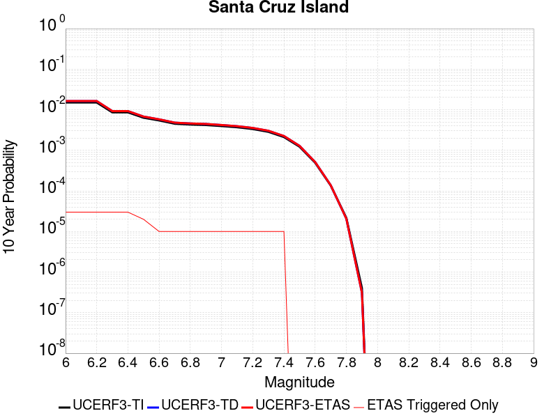 |

| Magnitude | 1 wk TI Prob | 1 wk TD Prob | 1 wk ETAS Prob | 1 wk ETAS/TD Gain | 1 wk ETAS Triggered Only | 1 mo TI Prob | 1 mo TD Prob | 1 mo ETAS Prob | 1 mo ETAS/TD Gain | 1 mo ETAS Triggered Only | 1 yr TI Prob | 1 yr TD Prob | 1 yr ETAS Prob | 1 yr ETAS/TD Gain | 1 yr ETAS Triggered Only | 10 yr TI Prob | 10 yr TD Prob | 10 yr ETAS Prob | 10 yr ETAS/TD Gain | 10 yr ETAS Triggered Only |
|-----|-----|-----|-----|-----|-----|-----|-----|-----|-----|-----|-----|-----|-----|-----|-----|-----|-----|-----|-----|-----|
| 6.0 | 2.9164563E-5 | 3.1601154E-5 | 3.1601154E-5 | 1.0 | 0.0 | 1.2498499E-4 | 1.3542725E-4 | 1.3542725E-4 | 1.0 | 0.0 | 0.0015206301 | 0.001647716 | 0.0016580856 | 1.0062933 | 1.0386697E-5 | 0.015102667 | 0.016368724 | 0.016399374 | 1.0018724 | 3.116009E-5 |
| 6.1 | 2.9164563E-5 | 3.1601154E-5 | 3.1601154E-5 | 1.0 | 0.0 | 1.2498499E-4 | 1.3542725E-4 | 1.3542725E-4 | 1.0 | 0.0 | 0.0015206301 | 0.001647716 | 0.0016580856 | 1.0062933 | 1.0386697E-5 | 0.015102667 | 0.016368724 | 0.016399374 | 1.0018724 | 3.116009E-5 |
| 6.2 | 2.9164563E-5 | 3.1601154E-5 | 3.1601154E-5 | 1.0 | 0.0 | 1.2498499E-4 | 1.3542725E-4 | 1.3542725E-4 | 1.0 | 0.0 | 0.0015206301 | 0.001647716 | 0.0016580856 | 1.0062933 | 1.0386697E-5 | 0.015102667 | 0.016368724 | 0.016399374 | 1.0018724 | 3.116009E-5 |
| 6.3 | 1.6635553E-5 | 1.7805029E-5 | 1.7805029E-5 | 1.0 | 0.0 | 7.1293274E-5 | 7.6305136E-5 | 7.6305136E-5 | 1.0 | 0.0 | 8.6765E-4 | 9.286373E-4 | 9.3901437E-4 | 1.0111744 | 1.0386697E-5 | 0.008642701 | 0.009249439 | 0.009280312 | 1.0033377 | 3.116009E-5 |
| 6.4 | 1.6635553E-5 | 1.7805029E-5 | 1.7805029E-5 | 1.0 | 0.0 | 7.1293274E-5 | 7.6305136E-5 | 7.6305136E-5 | 1.0 | 0.0 | 8.6765E-4 | 9.286373E-4 | 9.3901437E-4 | 1.0111744 | 1.0386697E-5 | 0.008642701 | 0.009249439 | 0.009280312 | 1.0033377 | 3.116009E-5 |
| 6.5 | 1.2238748E-5 | 1.30434555E-5 | 1.30434555E-5 | 1.0 | 0.0 | 5.2450723E-5 | 5.5899345E-5 | 5.5899345E-5 | 1.0 | 0.0 | 6.3840044E-4 | 6.803657E-4 | 6.9074536E-4 | 1.0152559 | 1.0386697E-5 | 0.0063656955 | 0.006783226 | 0.0068038586 | 1.0030417 | 2.0773394E-5 |
| 6.6 | 1.0489767E-5 | 1.1157017E-5 | 1.1157017E-5 | 1.0 | 0.0 | 4.495537E-5 | 4.7814923E-5 | 4.7814923E-5 | 1.0 | 0.0 | 5.4719415E-4 | 5.8199343E-4 | 5.8199343E-4 | 1.0 | 0.0 | 0.005458487 | 0.0058049336 | 0.00581526 | 1.001779 | 1.0386697E-5 |
| 6.7 | 8.699222E-6 | 9.23709E-6 | 9.23709E-6 | 1.0 | 0.0 | 3.7281847E-5 | 3.958693E-5 | 3.958693E-5 | 1.0 | 0.0 | 4.5381195E-4 | 4.8186484E-4 | 4.8186484E-4 | 1.0 | 0.0 | 0.0045288634 | 0.0048082676 | 0.0048186043 | 1.0021498 | 1.0386697E-5 |
| 6.8 | 8.307732E-6 | 8.8171955E-6 | 8.8171955E-6 | 1.0 | 0.0 | 3.560408E-5 | 3.7787435E-5 | 3.7787435E-5 | 1.0 | 0.0 | 4.3339343E-4 | 4.5996535E-4 | 4.5996535E-4 | 1.0 | 0.0 | 0.004325492 | 0.0045901868 | 0.004600526 | 1.0022525 | 1.0386697E-5 |
| 6.9 | 8.073121E-6 | 8.565221E-6 | 8.565221E-6 | 1.0 | 0.0 | 3.459863E-5 | 3.6707574E-5 | 3.6707574E-5 | 1.0 | 0.0 | 4.2115687E-4 | 4.4682348E-4 | 4.4682348E-4 | 1.0 | 0.0 | 0.004203596 | 0.0044593024 | 0.004469643 | 1.0023189 | 1.0386697E-5 |
| 7.0 | 7.617019E-6 | 8.074926E-6 | 8.074926E-6 | 1.0 | 0.0 | 3.264396E-5 | 3.4606368E-5 | 3.4606368E-5 | 1.0 | 0.0 | 3.9736772E-4 | 4.212515E-4 | 4.212515E-4 | 1.0 | 0.0 | 0.003966579 | 0.0042045773 | 0.00421492 | 1.00246 | 1.0386697E-5 |
| 7.1 | 7.1224836E-6 | 7.5460302E-6 | 7.5460302E-6 | 1.0 | 0.0 | 3.052457E-5 | 3.233973E-5 | 3.233973E-5 | 1.0 | 0.0 | 3.715733E-4 | 3.9366545E-4 | 3.9366545E-4 | 1.0 | 0.0 | 0.003709526 | 0.003929724 | 0.0039400696 | 1.0026327 | 1.0386697E-5 |
| 7.2 | 6.441115E-6 | 6.827605E-6 | 6.827605E-6 | 1.0 | 0.0 | 2.7604487E-5 | 2.9260837E-5 | 2.9260837E-5 | 1.0 | 0.0 | 3.360328E-4 | 3.5619267E-4 | 3.5619267E-4 | 1.0 | 0.0 | 0.0033552512 | 0.0035562462 | 0.003566596 | 1.0029103 | 1.0386697E-5 |
| 7.3 | 5.494274E-6 | 5.8201813E-6 | 5.8201813E-6 | 1.0 | 0.0 | 2.3546674E-5 | 2.4943398E-5 | 2.4943398E-5 | 1.0 | 0.0 | 2.8664304E-4 | 3.0364376E-4 | 3.0364376E-4 | 1.0 | 0.0 | 0.002862736 | 0.0030323118 | 0.003042667 | 1.003415 | 1.0386697E-5 |
| 7.4 | 4.0802624E-6 | 4.31239E-6 | 4.31239E-6 | 1.0 | 0.0 | 1.7486722E-5 | 1.8481542E-5 | 1.8481542E-5 | 1.0 | 0.0 | 2.1288003E-4 | 2.249896E-4 | 2.249896E-4 | 1.0 | 0.0 | 0.0021267622 | 0.0022476274 | 0.0022579907 | 1.0046108 | 1.0386697E-5 |
| 7.5 | 2.3584746E-6 | 2.4753783E-6 | 2.4753783E-6 | 1.0 | 0.0 | 1.0107709E-5 | 1.0608721E-5 | 1.0608721E-5 | 1.0 | 0.0 | 1.2305441E-4 | 1.2915357E-4 | 1.2915357E-4 | 1.0 | 0.0 | 0.0012298629 | 0.0012907902 | 0.0012907902 | 1.0 | 0.0 |
| 7.6 | 9.4981914E-7 | 9.861161E-7 | 9.861161E-7 | 1.0 | 0.0 | 4.0706473E-6 | 4.226205E-6 | 4.226205E-6 | 1.0 | 0.0 | 4.9559E-5 | 5.1452847E-5 | 5.1452847E-5 | 1.0 | 0.0 | 4.954795E-4 | 5.144106E-4 | 5.144106E-4 | 1.0 | 0.0 |
| 7.7 | 2.6013532E-7 | 2.6417067E-7 | 2.6417067E-7 | 1.0 | 0.0 | 1.1148652E-6 | 1.1321595E-6 | 1.1321595E-6 | 1.0 | 0.0 | 1.3573399E-5 | 1.3783956E-5 | 1.3783956E-5 | 1.0 | 0.0 | 1.357257E-4 | 1.3783107E-4 | 1.3783107E-4 | 1.0 | 0.0 |
| 7.8 | 4.1522263E-8 | 3.9657305E-8 | 3.9657305E-8 | 1.0 | 0.0 | 1.7795254E-7 | 1.6995986E-7 | 1.6995986E-7 | 1.0 | 0.0 | 2.16657E-6 | 2.0692596E-6 | 2.0692596E-6 | 1.0 | 0.0 | 2.1665488E-5 | 2.0692425E-5 | 2.0692425E-5 | 1.0 | 0.0 |
| 7.9 | 7.7242046E-10 | 5.946944E-10 | 5.946944E-10 | 1.0 | 0.0 | 3.3103735E-9 | 2.5486908E-9 | 2.5486908E-9 | 1.0 | 0.0 | 4.0303796E-8 | 3.103031E-8 | 3.103031E-8 | 1.0 | 0.0 | 4.030379E-7 | 3.1030308E-7 | 3.1030308E-7 | 1.0 | 0.0 |

## Santa Rosa Island
*[(top)](#table-of-contents)*

| 1 Week | 1 Month | 1 Year | 10 Year |
|-----|-----|-----|-----|
|  |  | 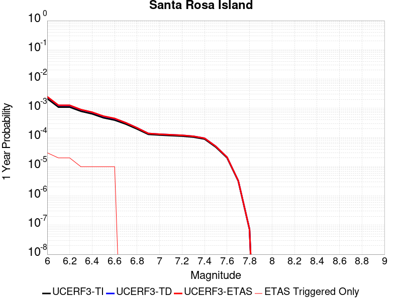 |  |

| Magnitude | 1 wk TI Prob | 1 wk TD Prob | 1 wk ETAS Prob | 1 wk ETAS/TD Gain | 1 wk ETAS Triggered Only | 1 mo TI Prob | 1 mo TD Prob | 1 mo ETAS Prob | 1 mo ETAS/TD Gain | 1 mo ETAS Triggered Only | 1 yr TI Prob | 1 yr TD Prob | 1 yr ETAS Prob | 1 yr ETAS/TD Gain | 1 yr ETAS Triggered Only | 10 yr TI Prob | 10 yr TD Prob | 10 yr ETAS Prob | 10 yr ETAS/TD Gain | 10 yr ETAS Triggered Only |
|-----|-----|-----|-----|-----|-----|-----|-----|-----|-----|-----|-----|-----|-----|-----|-----|-----|-----|-----|-----|-----|
| 6.0 | 4.1143165E-5 | 4.7094767E-5 | 5.7480975E-5 | 1.2205385 | 1.0386697E-5 | 1.7631594E-4 | 2.018202E-4 | 2.1220482E-4 | 1.0514547 | 1.0386697E-5 | 0.002144533 | 0.0024545891 | 0.0024856727 | 1.0126635 | 3.116009E-5 | 0.021239553 | 0.024295403 | 0.024335941 | 1.0016686 | 4.1546788E-5 |
| 6.1 | 2.1061249E-5 | 2.3866654E-5 | 3.4253102E-5 | 1.4351866 | 1.0386697E-5 | 9.0259375E-5 | 1.0228182E-4 | 1.12667454E-4 | 1.1015394 | 1.0386697E-5 | 0.0010983539 | 0.0012445987 | 0.0012653462 | 1.0166701 | 2.0773394E-5 | 0.01092941 | 0.012379322 | 0.012399838 | 1.0016572 | 2.0773394E-5 |
| 6.2 | 2.1061249E-5 | 2.3866654E-5 | 3.4253102E-5 | 1.4351866 | 1.0386697E-5 | 9.0259375E-5 | 1.0228182E-4 | 1.12667454E-4 | 1.1015394 | 1.0386697E-5 | 0.0010983539 | 0.0012445987 | 0.0012653462 | 1.0166701 | 2.0773394E-5 | 0.01092941 | 0.012379322 | 0.012399838 | 1.0016572 | 2.0773394E-5 |
| 6.3 | 1.5158236E-5 | 1.7075572E-5 | 1.7075572E-5 | 1.0 | 0.0 | 6.496225E-5 | 7.3179035E-5 | 7.3179035E-5 | 1.0 | 0.0 | 7.906284E-4 | 8.906025E-4 | 9.009799E-4 | 1.0116521 | 1.0386697E-5 | 0.007878214 | 0.008871585 | 0.00888188 | 1.0011604 | 1.0386697E-5 |
| 6.4 | 1.2341918E-5 | 1.3853823E-5 | 1.3853823E-5 | 1.0 | 0.0 | 5.2892858E-5 | 5.9372218E-5 | 5.9372218E-5 | 1.0 | 0.0 | 6.437803E-4 | 7.226252E-4 | 7.3300436E-4 | 1.0143632 | 1.0386697E-5 | 0.006419184 | 0.0072035906 | 0.0072139027 | 1.0014315 | 1.0386697E-5 |
| 6.5 | 9.061158E-6 | 1.0117661E-5 | 1.0117661E-5 | 1.0 | 0.0 | 3.883296E-5 | 4.3360717E-5 | 4.3360717E-5 | 1.0 | 0.0 | 4.726887E-4 | 5.277942E-4 | 5.381754E-4 | 1.019669 | 1.0386697E-5 | 0.004716845 | 0.0052659446 | 0.0052762767 | 1.0019621 | 1.0386697E-5 |
| 6.6 | 7.5461685E-6 | 8.401243E-6 | 8.401243E-6 | 1.0 | 0.0 | 3.2340322E-5 | 3.6004854E-5 | 3.6004854E-5 | 1.0 | 0.0 | 3.936723E-4 | 4.3827522E-4 | 4.4865737E-4 | 1.0236887 | 1.0386697E-5 | 0.003929756 | 0.0043745385 | 0.0043848795 | 1.0023639 | 1.0386697E-5 |
| 6.7 | 5.5023775E-6 | 6.0877283E-6 | 6.0877283E-6 | 1.0 | 0.0 | 2.3581404E-5 | 2.6090021E-5 | 2.6090021E-5 | 1.0 | 0.0 | 2.8706578E-4 | 3.1760297E-4 | 3.1760297E-4 | 1.0 | 0.0 | 0.0028669522 | 0.0031718123 | 0.0031718123 | 1.0 | 0.0 |
| 6.8 | 3.7351679E-6 | 4.083345E-6 | 4.083345E-6 | 1.0 | 0.0 | 1.6007763E-5 | 1.7499948E-5 | 1.7499948E-5 | 1.0 | 0.0 | 1.948771E-4 | 2.1304353E-4 | 2.1304353E-4 | 1.0 | 0.0 | 0.0019470629 | 0.002128638 | 0.002128638 | 1.0 | 0.0 |
| 6.9 | 2.456366E-6 | 2.6293699E-6 | 2.6293699E-6 | 1.0 | 0.0 | 1.0527241E-5 | 1.1268679E-5 | 1.1268679E-5 | 1.0 | 0.0 | 1.2816161E-4 | 1.3718756E-4 | 1.3718756E-4 | 1.0 | 0.0 | 0.0012808773 | 0.0013710316 | 0.0013710316 | 1.0 | 0.0 |
| 7.0 | 2.3245157E-6 | 2.482869E-6 | 2.482869E-6 | 1.0 | 0.0 | 9.962172E-6 | 1.0640823E-5 | 1.0640823E-5 | 1.0 | 0.0 | 1.2128269E-4 | 1.2954435E-4 | 1.2954435E-4 | 1.0 | 0.0 | 0.0012121652 | 0.0012946905 | 0.0012946905 | 1.0 | 0.0 |
| 7.1 | 2.2248344E-6 | 2.3733348E-6 | 2.3733348E-6 | 1.0 | 0.0 | 9.53497E-6 | 1.0171396E-5 | 1.0171396E-5 | 1.0 | 0.0 | 1.1608207E-4 | 1.2382973E-4 | 1.2382973E-4 | 1.0 | 0.0 | 0.0011602144 | 0.0012376092 | 0.0012376092 | 1.0 | 0.0 |
| 7.2 | 2.1350402E-6 | 2.2762347E-6 | 2.2762347E-6 | 1.0 | 0.0 | 9.150141E-6 | 9.755255E-6 | 9.755255E-6 | 1.0 | 0.0 | 1.1139726E-4 | 1.18763775E-4 | 1.18763775E-4 | 1.0 | 0.0 | 0.0011134144 | 0.001187005 | 0.001187005 | 1.0 | 0.0 |
| 7.3 | 1.9793572E-6 | 2.108793E-6 | 2.108793E-6 | 1.0 | 0.0 | 8.482932E-6 | 9.037653E-6 | 9.037653E-6 | 1.0 | 0.0 | 1.032748E-4 | 1.1002789E-4 | 1.1002789E-4 | 1.0 | 0.0 | 0.0010322682 | 0.001099736 | 0.001099736 | 1.0 | 0.0 |
| 7.4 | 1.6951194E-6 | 1.804636E-6 | 1.804636E-6 | 1.0 | 0.0 | 7.264777E-6 | 7.734132E-6 | 7.734132E-6 | 1.0 | 0.0 | 8.844508E-5 | 9.4159E-5 | 9.4159E-5 | 1.0 | 0.0 | 8.840988E-4 | 9.4119273E-4 | 9.4119273E-4 | 1.0 | 0.0 |
| 7.5 | 8.987207E-7 | 9.512517E-7 | 9.512517E-7 | 1.0 | 0.0 | 3.8516546E-6 | 4.076787E-6 | 4.076787E-6 | 1.0 | 0.0 | 4.6892885E-5 | 4.963376E-5 | 4.963376E-5 | 1.0 | 0.0 | 4.688299E-4 | 4.9622793E-4 | 4.9622793E-4 | 1.0 | 0.0 |
| 7.6 | 3.8783037E-7 | 4.0530355E-7 | 4.0530355E-7 | 1.0 | 0.0 | 1.6621291E-6 | 1.737014E-6 | 1.737014E-6 | 1.0 | 0.0 | 2.0236233E-5 | 2.1147947E-5 | 2.1147947E-5 | 1.0 | 0.0 | 2.023439E-4 | 2.1146E-4 | 2.1146E-4 | 1.0 | 0.0 |
| 7.7 | 6.181804E-8 | 6.33916E-8 | 6.33916E-8 | 1.0 | 0.0 | 2.6493444E-7 | 2.7167826E-7 | 2.7167826E-7 | 1.0 | 0.0 | 3.225572E-6 | 3.3076778E-6 | 3.3076778E-6 | 1.0 | 0.0 | 3.225525E-5 | 3.3076292E-5 | 3.3076292E-5 | 1.0 | 0.0 |
| 7.8 | 1.3704449E-9 | 1.3964294E-9 | 1.3964294E-9 | 1.0 | 0.0 | 5.873335E-9 | 5.984697E-9 | 5.984697E-9 | 1.0 | 0.0 | 7.1507856E-8 | 7.2863685E-8 | 7.2863685E-8 | 1.0 | 0.0 | 7.1507833E-7 | 7.2863673E-7 | 7.2863673E-7 | 1.0 | 0.0 |

## Rose Canyon
*[(top)](#table-of-contents)*

| 1 Week | 1 Month | 1 Year | 10 Year |
|-----|-----|-----|-----|
|  |  |  |  |

| Magnitude | 1 wk TI Prob | 1 wk TD Prob | 1 wk ETAS Prob | 1 wk ETAS/TD Gain | 1 wk ETAS Triggered Only | 1 mo TI Prob | 1 mo TD Prob | 1 mo ETAS Prob | 1 mo ETAS/TD Gain | 1 mo ETAS Triggered Only | 1 yr TI Prob | 1 yr TD Prob | 1 yr ETAS Prob | 1 yr ETAS/TD Gain | 1 yr ETAS Triggered Only | 10 yr TI Prob | 10 yr TD Prob | 10 yr ETAS Prob | 10 yr ETAS/TD Gain | 10 yr ETAS Triggered Only |
|-----|-----|-----|-----|-----|-----|-----|-----|-----|-----|-----|-----|-----|-----|-----|-----|-----|-----|-----|-----|-----|
| 6.0 | 4.5923203E-5 | 4.9720562E-5 | 4.9720562E-5 | 1.0 | 0.0 | 1.9679888E-4 | 2.1307007E-4 | 2.1307007E-4 | 1.0 | 0.0 | 0.0023933933 | 0.0025912558 | 0.0025912558 | 1.0 | 0.0 | 0.023677798 | 0.025643215 | 0.025683695 | 1.0015787 | 4.1546788E-5 |
| 6.1 | 4.5923203E-5 | 4.9720562E-5 | 4.9720562E-5 | 1.0 | 0.0 | 1.9679888E-4 | 2.1307007E-4 | 2.1307007E-4 | 1.0 | 0.0 | 0.0023933933 | 0.0025912558 | 0.0025912558 | 1.0 | 0.0 | 0.023677798 | 0.025643215 | 0.025663454 | 1.0007893 | 2.0773394E-5 |
| 6.2 | 2.8844734E-5 | 2.9671555E-5 | 2.9671555E-5 | 1.0 | 0.0 | 1.2361443E-4 | 1.2715581E-4 | 1.2715581E-4 | 1.0 | 0.0 | 0.0015039665 | 0.0015470508 | 0.0015470508 | 1.0 | 0.0 | 0.0149382865 | 0.015375828 | 0.015396282 | 1.0013303 | 2.0773394E-5 |
| 6.3 | 2.3171577E-5 | 2.3163228E-5 | 2.3163228E-5 | 1.0 | 0.0 | 9.9302975E-5 | 9.926727E-5 | 9.926727E-5 | 1.0 | 0.0 | 0.0012083431 | 0.0012079224 | 0.0012079224 | 1.0 | 0.0 | 0.012017938 | 0.012023459 | 0.0120337205 | 1.0008535 | 1.0386697E-5 |
| 6.4 | 2.0066604E-5 | 1.9668718E-5 | 1.9668718E-5 | 1.0 | 0.0 | 8.599689E-5 | 8.429184E-5 | 8.429184E-5 | 1.0 | 0.0 | 0.0010465092 | 0.00102578 | 0.00102578 | 1.0 | 0.0 | 0.010415946 | 0.010218433 | 0.010228714 | 1.0010061 | 1.0386697E-5 |
| 6.5 | 1.776989E-5 | 1.7115255E-5 | 1.7115255E-5 | 1.0 | 0.0 | 7.615444E-5 | 7.3349074E-5 | 7.3349074E-5 | 1.0 | 0.0 | 9.267859E-4 | 8.9266605E-4 | 8.9266605E-4 | 1.0 | 0.0 | 0.009229303 | 0.008896962 | 0.008907256 | 1.001157 | 1.0386697E-5 |
| 6.6 | 1.5227364E-5 | 1.4340241E-5 | 1.4340241E-5 | 1.0 | 0.0 | 6.52585E-5 | 6.1456754E-5 | 6.1456754E-5 | 1.0 | 0.0 | 7.942326E-4 | 7.4798433E-4 | 7.4798433E-4 | 1.0 | 0.0 | 0.007914 | 0.007458868 | 0.0074691772 | 1.0013821 | 1.0386697E-5 |
| 6.7 | 1.2703898E-5 | 1.167398E-5 | 1.167398E-5 | 1.0 | 0.0 | 5.4444143E-5 | 5.003041E-5 | 5.003041E-5 | 1.0 | 0.0 | 6.626558E-4 | 6.0895423E-4 | 6.0895423E-4 | 1.0 | 0.0 | 0.006606833 | 0.0060754507 | 0.0060857744 | 1.0016992 | 1.0386697E-5 |
| 6.8 | 1.1554917E-5 | 1.060993E-5 | 1.060993E-5 | 1.0 | 0.0 | 4.9520135E-5 | 4.547036E-5 | 4.547036E-5 | 1.0 | 0.0 | 6.0274085E-4 | 5.5346504E-4 | 5.5346504E-4 | 1.0 | 0.0 | 0.0060110865 | 0.005522874 | 0.0055332035 | 1.0018703 | 1.0386697E-5 |
| 6.9 | 8.732078E-6 | 7.88172E-6 | 7.88172E-6 | 1.0 | 0.0 | 3.7422655E-5 | 3.377838E-5 | 3.377838E-5 | 1.0 | 0.0 | 4.5552556E-4 | 4.111771E-4 | 4.111771E-4 | 1.0 | 0.0 | 0.0045459294 | 0.0041049966 | 0.0041153403 | 1.0025198 | 1.0386697E-5 |
| 7.0 | 5.9337494E-6 | 5.1076677E-6 | 5.1076677E-6 | 1.0 | 0.0 | 2.5430107E-5 | 2.188982E-5 | 2.188982E-5 | 1.0 | 0.0 | 3.0956755E-4 | 2.6647613E-4 | 2.6647613E-4 | 1.0 | 0.0 | 0.0030913667 | 0.0026615816 | 0.0026719405 | 1.0038921 | 1.0386697E-5 |
| 7.1 | 5.013409E-6 | 4.177528E-6 | 4.177528E-6 | 1.0 | 0.0 | 2.1485863E-5 | 1.7903569E-5 | 1.7903569E-5 | 1.0 | 0.0 | 2.6155898E-4 | 2.1795425E-4 | 2.1795425E-4 | 1.0 | 0.0 | 0.0026125133 | 0.0021774166 | 0.0021877806 | 1.0047598 | 1.0386697E-5 |
| 7.2 | 4.120763E-6 | 3.2822556E-6 | 3.2822556E-6 | 1.0 | 0.0 | 1.7660293E-5 | 1.4066734E-5 | 1.4066734E-5 | 1.0 | 0.0 | 2.1499286E-4 | 1.7124912E-4 | 1.7124912E-4 | 1.0 | 0.0 | 0.0021478499 | 0.0017111811 | 0.0017111811 | 1.0 | 0.0 |
| 7.3 | 3.2081239E-6 | 2.4406268E-6 | 2.4406268E-6 | 1.0 | 0.0 | 1.374903E-5 | 1.0459787E-5 | 1.0459787E-5 | 1.0 | 0.0 | 1.6738157E-4 | 1.2734054E-4 | 1.2734054E-4 | 1.0 | 0.0 | 0.0016725556 | 0.0012726827 | 0.0012726827 | 1.0 | 0.0 |
| 7.4 | 2.4194755E-6 | 1.7681314E-6 | 1.7681314E-6 | 1.0 | 0.0 | 1.0369139E-5 | 7.577684E-6 | 7.577684E-6 | 1.0 | 0.0 | 1.2623696E-4 | 9.225445E-5 | 9.225445E-5 | 1.0 | 0.0 | 0.0012616527 | 9.2216686E-4 | 9.2216686E-4 | 1.0 | 0.0 |
| 7.5 | 1.3842889E-6 | 9.3790675E-7 | 9.3790675E-7 | 1.0 | 0.0 | 5.9326535E-6 | 4.019594E-6 | 4.019594E-6 | 1.0 | 0.0 | 7.222766E-5 | 4.8937498E-5 | 4.8937498E-5 | 1.0 | 0.0 | 7.220419E-4 | 4.892707E-4 | 4.892707E-4 | 1.0 | 0.0 |
| 7.6 | 1.0021575E-6 | 6.4118046E-7 | 6.4118046E-7 | 1.0 | 0.0 | 4.2949537E-6 | 2.7479136E-6 | 2.7479136E-6 | 1.0 | 0.0 | 5.2289808E-5 | 3.3455355E-5 | 3.3455355E-5 | 1.0 | 0.0 | 5.2277505E-4 | 3.3450534E-4 | 3.3450534E-4 | 1.0 | 0.0 |
| 7.7 | 8.7620116E-8 | 6.4494145E-8 | 6.4494145E-8 | 1.0 | 0.0 | 3.7551473E-7 | 2.7640345E-7 | 2.7640345E-7 | 1.0 | 0.0 | 4.5718825E-6 | 3.365207E-6 | 3.365207E-6 | 1.0 | 0.0 | 4.5717883E-5 | 3.365159E-5 | 3.365159E-5 | 1.0 | 0.0 |

## San Jacinto (Coyote Creek)
*[(top)](#table-of-contents)*

| 1 Week | 1 Month | 1 Year | 10 Year |
|-----|-----|-----|-----|
|  |  |  |  |

| Magnitude | 1 wk TI Prob | 1 wk TD Prob | 1 wk ETAS Prob | 1 wk ETAS/TD Gain | 1 wk ETAS Triggered Only | 1 mo TI Prob | 1 mo TD Prob | 1 mo ETAS Prob | 1 mo ETAS/TD Gain | 1 mo ETAS Triggered Only | 1 yr TI Prob | 1 yr TD Prob | 1 yr ETAS Prob | 1 yr ETAS/TD Gain | 1 yr ETAS Triggered Only | 10 yr TI Prob | 10 yr TD Prob | 10 yr ETAS Prob | 10 yr ETAS/TD Gain | 10 yr ETAS Triggered Only |
|-----|-----|-----|-----|-----|-----|-----|-----|-----|-----|-----|-----|-----|-----|-----|-----|-----|-----|-----|-----|-----|
| 6.0 | 2.7374346E-5 | 2.4177032E-5 | 2.4177032E-5 | 1.0 | 0.0 | 1.1731335E-4 | 1.0361175E-4 | 1.0361175E-4 | 1.0 | 0.0 | 0.0014273542 | 0.0012607456 | 0.0012918664 | 1.0246844 | 3.116009E-5 | 0.01418221 | 0.012944878 | 0.012985887 | 1.003168 | 4.1546788E-5 |
| 6.1 | 2.7374346E-5 | 2.4177032E-5 | 2.4177032E-5 | 1.0 | 0.0 | 1.1731335E-4 | 1.0361175E-4 | 1.0361175E-4 | 1.0 | 0.0 | 0.0014273542 | 0.0012607456 | 0.0012918664 | 1.0246844 | 3.116009E-5 | 0.01418221 | 0.012944878 | 0.012985887 | 1.003168 | 4.1546788E-5 |
| 6.2 | 2.7374346E-5 | 2.4177032E-5 | 2.4177032E-5 | 1.0 | 0.0 | 1.1731335E-4 | 1.0361175E-4 | 1.0361175E-4 | 1.0 | 0.0 | 0.0014273542 | 0.0012607456 | 0.0012918664 | 1.0246844 | 3.116009E-5 | 0.01418221 | 0.012944878 | 0.012985887 | 1.003168 | 4.1546788E-5 |
| 6.3 | 2.7374346E-5 | 2.4177032E-5 | 2.4177032E-5 | 1.0 | 0.0 | 1.1731335E-4 | 1.0361175E-4 | 1.0361175E-4 | 1.0 | 0.0 | 0.0014273542 | 0.0012607456 | 0.0012918664 | 1.0246844 | 3.116009E-5 | 0.01418221 | 0.012944878 | 0.012985887 | 1.003168 | 4.1546788E-5 |
| 6.4 | 2.7374346E-5 | 2.4177032E-5 | 2.4177032E-5 | 1.0 | 0.0 | 1.1731335E-4 | 1.0361175E-4 | 1.0361175E-4 | 1.0 | 0.0 | 0.0014273542 | 0.0012607456 | 0.0012918664 | 1.0246844 | 3.116009E-5 | 0.01418221 | 0.012944878 | 0.012985887 | 1.003168 | 4.1546788E-5 |
| 6.5 | 2.7282445E-5 | 2.4063094E-5 | 2.4063094E-5 | 1.0 | 0.0 | 1.16919524E-4 | 1.03123486E-4 | 1.03123486E-4 | 1.0 | 0.0 | 0.0014225657 | 0.0012548079 | 0.001285929 | 1.0248014 | 3.116009E-5 | 0.014134934 | 0.012886199 | 0.012927211 | 1.0031825 | 4.1546788E-5 |
| 6.6 | 2.7282445E-5 | 2.4063094E-5 | 2.4063094E-5 | 1.0 | 0.0 | 1.16919524E-4 | 1.03123486E-4 | 1.03123486E-4 | 1.0 | 0.0 | 0.0014225657 | 0.0012548079 | 0.001285929 | 1.0248014 | 3.116009E-5 | 0.014134934 | 0.012886199 | 0.012927211 | 1.0031825 | 4.1546788E-5 |
| 6.7 | 2.7216198E-5 | 2.3988207E-5 | 2.3988207E-5 | 1.0 | 0.0 | 1.1663563E-4 | 1.02802565E-4 | 1.02802565E-4 | 1.0 | 0.0 | 0.0014191137 | 0.0012509052 | 0.0012820263 | 1.0248789 | 3.116009E-5 | 0.014100855 | 0.012847606 | 0.012888619 | 1.0031923 | 4.1546788E-5 |
| 6.8 | 2.7078617E-5 | 2.3905404E-5 | 2.3905404E-5 | 1.0 | 0.0 | 1.1604605E-4 | 1.02447724E-4 | 1.02447724E-4 | 1.0 | 0.0 | 0.001411945 | 0.00124659 | 0.0012777112 | 1.024965 | 3.116009E-5 | 0.014030075 | 0.012804739 | 0.012845754 | 1.0032032 | 4.1546788E-5 |
| 6.9 | 2.6982952E-5 | 2.3824896E-5 | 2.3824896E-5 | 1.0 | 0.0 | 1.15636096E-4 | 1.0210271E-4 | 1.0210271E-4 | 1.0 | 0.0 | 0.0014069602 | 0.0012423943 | 0.0012735156 | 1.0250496 | 3.116009E-5 | 0.013980856 | 0.012763045 | 0.012804061 | 1.0032136 | 4.1546788E-5 |
| 7.0 | 2.6449972E-5 | 2.3401846E-5 | 2.3401846E-5 | 1.0 | 0.0 | 1.1335209E-4 | 1.00289784E-4 | 1.00289784E-4 | 1.0 | 0.0 | 0.001379188 | 0.0012203468 | 0.0012514689 | 1.0255027 | 3.116009E-5 | 0.0137065975 | 0.012544374 | 0.0125854 | 1.0032704 | 4.1546788E-5 |
| 7.1 | 2.6257849E-5 | 2.322785E-5 | 2.322785E-5 | 1.0 | 0.0 | 1.1252879E-4 | 9.9544144E-5 | 9.9544144E-5 | 1.0 | 0.0 | 0.0013691769 | 0.0012112787 | 0.0012424011 | 1.0256938 | 3.116009E-5 | 0.013607717 | 0.012454224 | 0.012495252 | 1.0032945 | 4.1546788E-5 |
| 7.2 | 2.5270041E-5 | 2.2422375E-5 | 2.2422375E-5 | 1.0 | 0.0 | 1.0829568E-4 | 9.6092364E-5 | 9.6092364E-5 | 1.0 | 0.0 | 0.0013177024 | 0.001169299 | 0.0012004228 | 1.0266174 | 3.116009E-5 | 0.013099162 | 0.012035143 | 0.012076189 | 1.0034106 | 4.1546788E-5 |
| 7.3 | 2.339701E-5 | 2.1153774E-5 | 2.1153774E-5 | 1.0 | 0.0 | 1.0026905E-4 | 9.065589E-5 | 9.065589E-5 | 1.0 | 0.0 | 0.001220092 | 0.0011031787 | 0.0011343044 | 1.0282146 | 3.116009E-5 | 0.012134149 | 0.011373838 | 0.0114149125 | 1.0036113 | 4.1546788E-5 |
| 7.4 | 2.296333E-5 | 2.0884016E-5 | 2.0884016E-5 | 1.0 | 0.0 | 9.841056E-5 | 8.949987E-5 | 8.949987E-5 | 1.0 | 0.0 | 0.0011974899 | 0.0010891182 | 0.0011202444 | 1.0285792 | 3.116009E-5 | 0.011910575 | 0.011232895 | 0.011273975 | 1.0036571 | 4.1546788E-5 |
| 7.5 | 2.2188895E-5 | 2.0406682E-5 | 2.0406682E-5 | 1.0 | 0.0 | 9.50918E-5 | 8.745429E-5 | 8.745429E-5 | 1.0 | 0.0 | 0.0011571277 | 0.0010642379 | 0.0010953648 | 1.0292481 | 3.116009E-5 | 0.011511209 | 0.010982383 | 0.011023473 | 1.0037415 | 4.1546788E-5 |
| 7.6 | 2.0013189E-5 | 1.8992265E-5 | 1.8992265E-5 | 1.0 | 0.0 | 8.5767984E-5 | 8.139289E-5 | 8.139289E-5 | 1.0 | 0.0 | 0.001043725 | 9.905098E-4 | 0.001021639 | 1.0314275 | 3.116009E-5 | 0.010388365 | 0.010240043 | 0.010281164 | 1.0040157 | 4.1546788E-5 |
| 7.7 | 1.7230794E-5 | 1.677281E-5 | 1.677281E-5 | 1.0 | 0.0 | 7.384417E-5 | 7.18815E-5 | 7.18815E-5 | 1.0 | 0.0 | 8.986819E-4 | 8.7480666E-4 | 9.059395E-4 | 1.0355883 | 3.116009E-5 | 0.008950562 | 0.009078168 | 0.009119337 | 1.004535 | 4.1546788E-5 |
| 7.8 | 1.4478809E-5 | 1.50190535E-5 | 1.50190535E-5 | 1.0 | 0.0 | 6.205057E-5 | 6.4365784E-5 | 6.4365784E-5 | 1.0 | 0.0 | 7.552038E-4 | 7.833723E-4 | 8.14508E-4 | 1.0397457 | 3.116009E-5 | 0.0075264242 | 0.00815608 | 0.008197288 | 1.0050524 | 4.1546788E-5 |
| 7.9 | 1.1114467E-5 | 1.1670009E-5 | 1.1670009E-5 | 1.0 | 0.0 | 4.7632562E-5 | 5.001337E-5 | 5.001337E-5 | 1.0 | 0.0 | 5.797721E-4 | 6.087432E-4 | 6.398843E-4 | 1.0511564 | 3.116009E-5 | 0.0057826187 | 0.006393403 | 0.006434684 | 1.0064569 | 4.1546788E-5 |
| 8.0 | 9.327402E-6 | 9.9217805E-6 | 9.9217805E-6 | 1.0 | 0.0 | 3.9973966E-5 | 4.2521227E-5 | 4.2521227E-5 | 1.0 | 0.0 | 4.8657437E-4 | 5.175735E-4 | 5.4871745E-4 | 1.060173 | 3.116009E-5 | 0.0048551033 | 0.005461854 | 0.005503174 | 1.0075651 | 4.1546788E-5 |
| 8.1 | 7.0235833E-6 | 6.844232E-6 | 6.844232E-6 | 1.0 | 0.0 | 3.0100724E-5 | 2.9332095E-5 | 2.9332095E-5 | 1.0 | 0.0 | 3.664147E-4 | 3.5706026E-4 | 3.6744322E-4 | 1.0290791 | 1.0386697E-5 | 0.003658111 | 0.0037964787 | 0.0038171732 | 1.005451 | 2.0773394E-5 |
| 8.2 | 2.0358202E-6 | 9.0285533E-7 | 9.0285533E-7 | 1.0 | 0.0 | 8.724915E-6 | 3.8693743E-6 | 3.8693743E-6 | 1.0 | 0.0 | 1.06220665E-4 | 4.710864E-5 | 4.710864E-5 | 1.0 | 0.0 | 0.001061699 | 5.3444994E-4 | 5.3444994E-4 | 1.0 | 0.0 |
| 8.3 | 2.0051264E-7 | 6.646147E-8 | 6.646147E-8 | 1.0 | 0.0 | 8.5933965E-7 | 2.8483484E-7 | 2.8483484E-7 | 1.0 | 0.0 | 1.046241E-5 | 3.467859E-6 | 3.467859E-6 | 1.0 | 0.0 | 1.0461917E-4 | 4.0304385E-5 | 4.0304385E-5 | 1.0 | 0.0 |

## Brawley (Seismic Zone) alt 1
*[(top)](#table-of-contents)*

| 1 Week | 1 Month | 1 Year | 10 Year |
|-----|-----|-----|-----|
|  | 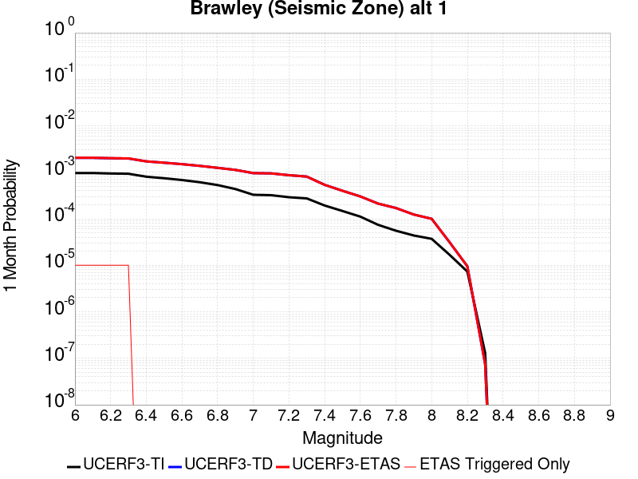 |  |  |

| Magnitude | 1 wk TI Prob | 1 wk TD Prob | 1 wk ETAS Prob | 1 wk ETAS/TD Gain | 1 wk ETAS Triggered Only | 1 mo TI Prob | 1 mo TD Prob | 1 mo ETAS Prob | 1 mo ETAS/TD Gain | 1 mo ETAS Triggered Only | 1 yr TI Prob | 1 yr TD Prob | 1 yr ETAS Prob | 1 yr ETAS/TD Gain | 1 yr ETAS Triggered Only | 10 yr TI Prob | 10 yr TD Prob | 10 yr ETAS Prob | 10 yr ETAS/TD Gain | 10 yr ETAS Triggered Only |
|-----|-----|-----|-----|-----|-----|-----|-----|-----|-----|-----|-----|-----|-----|-----|-----|-----|-----|-----|-----|-----|
| 6.0 | 2.2521618E-4 | 4.7667572E-4 | 4.7667572E-4 | 1.0 | 0.0 | 9.6485513E-4 | 0.0020413336 | 0.0020516992 | 1.0050778 | 1.0386697E-5 | 0.011683988 | 0.024564065 | 0.024604592 | 1.0016499 | 4.1546788E-5 | 0.11088423 | 0.21362062 | 0.2136533 | 1.000153 | 4.1546788E-5 |
| 6.1 | 2.2521618E-4 | 4.7667572E-4 | 4.7667572E-4 | 1.0 | 0.0 | 9.6485513E-4 | 0.0020413336 | 0.0020516992 | 1.0050778 | 1.0386697E-5 | 0.011683988 | 0.024564065 | 0.024604592 | 1.0016499 | 4.1546788E-5 | 0.11088423 | 0.21362062 | 0.2136533 | 1.000153 | 4.1546788E-5 |
| 6.2 | 2.198148E-4 | 4.6751375E-4 | 4.6751375E-4 | 1.0 | 0.0 | 9.417233E-4 | 0.0020021286 | 0.0020124945 | 1.0051775 | 1.0386697E-5 | 0.011405343 | 0.024097936 | 0.02413848 | 1.0016825 | 4.1546788E-5 | 0.10837428 | 0.2100555 | 0.21008831 | 1.0001563 | 4.1546788E-5 |
| 6.3 | 2.1704129E-4 | 4.6186932E-4 | 4.6186932E-4 | 1.0 | 0.0 | 9.298453E-4 | 0.001977975 | 0.001988341 | 1.0052408 | 1.0386697E-5 | 0.011262234 | 0.023811033 | 0.023851592 | 1.0017033 | 4.1546788E-5 | 0.107082725 | 0.20794643 | 0.20797935 | 1.0001582 | 4.1546788E-5 |
| 6.4 | 1.876142E-4 | 4.007805E-4 | 4.007805E-4 | 1.0 | 0.0 | 8.038131E-4 | 0.0017165145 | 0.0017165145 | 1.0 | 0.0 | 0.00974259 | 0.020697333 | 0.020727849 | 1.0014744 | 3.116009E-5 | 0.093263686 | 0.18469763 | 0.18472303 | 1.0001376 | 3.116009E-5 |
| 6.5 | 1.7390939E-4 | 3.750906E-4 | 3.750906E-4 | 1.0 | 0.0 | 7.45113E-4 | 0.001606553 | 0.001606553 | 1.0 | 0.0 | 0.009034078 | 0.019385088 | 0.019415645 | 1.0015763 | 3.116009E-5 | 0.086755216 | 0.17451778 | 0.1745435 | 1.0001473 | 3.116009E-5 |
| 6.6 | 1.591791E-4 | 3.4922338E-4 | 3.4922338E-4 | 1.0 | 0.0 | 6.8201777E-4 | 0.0014958231 | 0.0014958231 | 1.0 | 0.0 | 0.008271996 | 0.018061135 | 0.01809173 | 1.0016941 | 3.116009E-5 | 0.07970774 | 0.16392244 | 0.1639485 | 1.0001589 | 3.116009E-5 |
| 6.7 | 1.4268003E-4 | 3.208674E-4 | 3.208674E-4 | 1.0 | 0.0 | 6.1134255E-4 | 0.0013744296 | 0.0013744296 | 1.0 | 0.0 | 0.007417723 | 0.016607253 | 0.016637895 | 1.0018451 | 3.116009E-5 | 0.07174956 | 0.1520427 | 0.15206912 | 1.0001738 | 3.116009E-5 |
| 6.8 | 1.239713E-4 | 2.9077847E-4 | 2.9077847E-4 | 1.0 | 0.0 | 5.3119735E-4 | 0.0012456045 | 0.0012456045 | 1.0 | 0.0 | 0.0064481674 | 0.0150612155 | 0.015091906 | 1.0020378 | 3.116009E-5 | 0.06264243 | 0.13847366 | 0.1385005 | 1.0001938 | 3.116009E-5 |
| 6.9 | 1.0180238E-4 | 2.6273142E-4 | 2.6273142E-4 | 1.0 | 0.0 | 4.3622297E-4 | 0.0011255102 | 0.0011255102 | 1.0 | 0.0 | 0.005298089 | 0.013617991 | 0.013648726 | 1.002257 | 3.116009E-5 | 0.05173543 | 0.1250377 | 0.12506497 | 1.000218 | 3.116009E-5 |
| 7.0 | 7.6619996E-5 | 2.2413618E-4 | 2.2413618E-4 | 1.0 | 0.0 | 3.283301E-4 | 9.602332E-4 | 9.602332E-4 | 1.0 | 0.0 | 0.0039900932 | 0.011628882 | 0.01165968 | 1.0026484 | 3.116009E-5 | 0.039192066 | 0.10732558 | 0.1073534 | 1.0002592 | 3.116009E-5 |
| 7.1 | 7.5127435E-5 | 2.20966E-4 | 2.20966E-4 | 1.0 | 0.0 | 3.2193496E-4 | 9.466566E-4 | 9.466566E-4 | 1.0 | 0.0 | 0.0039125155 | 0.011465338 | 0.011496142 | 1.0026866 | 3.116009E-5 | 0.038443442 | 0.105888925 | 0.10591679 | 1.0002631 | 3.116009E-5 |
| 7.2 | 6.788582E-5 | 2.022384E-4 | 2.022384E-4 | 1.0 | 0.0 | 2.9090676E-4 | 8.664511E-4 | 8.664511E-4 | 1.0 | 0.0 | 0.0035360386 | 0.010498658 | 0.010529491 | 1.0029368 | 3.116009E-5 | 0.034803 | 0.09755801 | 0.097586125 | 1.0002882 | 3.116009E-5 |
| 7.3 | 6.399602E-5 | 1.8854217E-4 | 1.8854217E-4 | 1.0 | 0.0 | 2.7423984E-4 | 8.0779055E-4 | 8.0779055E-4 | 1.0 | 0.0 | 0.0033337586 | 0.009791091 | 0.009821946 | 1.0031513 | 3.116009E-5 | 0.03284188 | 0.09145105 | 0.09147935 | 1.0003096 | 3.116009E-5 |
| 7.4 | 4.506759E-5 | 1.253954E-4 | 1.253954E-4 | 1.0 | 0.0 | 1.9313251E-4 | 5.37299E-4 | 5.37299E-4 | 1.0 | 0.0 | 0.0023488526 | 0.0065221693 | 0.0065428074 | 1.0031643 | 2.0773394E-5 | 0.023241805 | 0.062409032 | 0.062428508 | 1.0003121 | 2.0773394E-5 |
| 7.5 | 3.43289E-5 | 9.344148E-5 | 9.344148E-5 | 1.0 | 0.0 | 1.4711556E-4 | 4.0040232E-4 | 4.0040232E-4 | 1.0 | 0.0 | 0.0017896603 | 0.004864064 | 0.0048847366 | 1.00425 | 2.0773394E-5 | 0.01775316 | 0.047094297 | 0.047114093 | 1.0004203 | 2.0773394E-5 |
| 7.6 | 2.5980507E-5 | 7.0607166E-5 | 7.0607166E-5 | 1.0 | 0.0 | 1.1134028E-4 | 3.0256718E-4 | 3.0256718E-4 | 1.0 | 0.0 | 0.001354725 | 0.0036775572 | 0.0036982542 | 1.0056279 | 2.0773394E-5 | 0.013464959 | 0.0358753 | 0.03589533 | 1.0005583 | 2.0773394E-5 |
| 7.7 | 1.7292105E-5 | 4.9472306E-5 | 4.9472306E-5 | 1.0 | 0.0 | 7.4106916E-5 | 2.1200697E-4 | 2.1200697E-4 | 1.0 | 0.0 | 9.018782E-4 | 0.002578135 | 0.002598855 | 1.0080367 | 2.0773394E-5 | 0.008982267 | 0.02531998 | 0.025340227 | 1.0007997 | 2.0773394E-5 |
| 7.8 | 1.2927471E-5 | 3.974989E-5 | 3.974989E-5 | 1.0 | 0.0 | 5.5402274E-5 | 1.7034556E-4 | 1.7034556E-4 | 1.0 | 0.0 | 6.743139E-4 | 0.0020719871 | 0.0020823523 | 1.0050025 | 1.0386697E-5 | 0.0067227143 | 0.020457525 | 0.020467699 | 1.0004973 | 1.0386697E-5 |
| 7.9 | 1.0200774E-5 | 2.8791523E-5 | 2.8791523E-5 | 1.0 | 0.0 | 4.371687E-5 | 1.233864E-4 | 1.233864E-4 | 1.0 | 0.0 | 5.321229E-4 | 0.0015011955 | 0.0015011955 | 1.0 | 0.0 | 0.005308505 | 0.015012851 | 0.015012851 | 1.0 | 0.0 |
| 8.0 | 8.650396E-6 | 2.3316703E-5 | 2.3316703E-5 | 1.0 | 0.0 | 3.70726E-5 | 9.992491E-5 | 9.992491E-5 | 1.0 | 0.0 | 4.5126543E-4 | 0.0012159076 | 0.0012159076 | 1.0 | 0.0 | 0.0045035016 | 0.0122294305 | 0.0122294305 | 1.0 | 0.0 |
| 8.1 | 3.9368224E-6 | 7.3449833E-6 | 7.3449833E-6 | 1.0 | 0.0 | 1.6871985E-5 | 3.147812E-5 | 3.147812E-5 | 1.0 | 0.0 | 2.0539707E-4 | 3.8317885E-4 | 3.8317885E-4 | 1.0 | 0.0 | 0.0020520731 | 0.0040096184 | 0.0040096184 | 1.0 | 0.0 |
| 8.2 | 1.7101195E-6 | 2.2245397E-6 | 2.2245397E-6 | 1.0 | 0.0 | 7.329063E-6 | 9.533706E-6 | 9.533706E-6 | 1.0 | 0.0 | 8.922769E-5 | 1.1606672E-4 | 1.1606672E-4 | 1.0 | 0.0 | 8.9191867E-4 | 0.0012700944 | 0.0012700944 | 1.0 | 0.0 |
| 8.3 | 3.0346666E-8 | 1.7284824E-8 | 1.7284824E-8 | 1.0 | 0.0 | 1.3005713E-7 | 7.407782E-8 | 7.407782E-8 | 1.0 | 0.0 | 1.5834444E-6 | 9.018973E-7 | 9.018973E-7 | 1.0 | 0.0 | 1.5834332E-5 | 9.40451E-6 | 9.40451E-6 | 1.0 | 0.0 |

## Red Mountain
*[(top)](#table-of-contents)*

| 1 Week | 1 Month | 1 Year | 10 Year |
|-----|-----|-----|-----|
|  |  |  |  |

| Magnitude | 1 wk TI Prob | 1 wk TD Prob | 1 wk ETAS Prob | 1 wk ETAS/TD Gain | 1 wk ETAS Triggered Only | 1 mo TI Prob | 1 mo TD Prob | 1 mo ETAS Prob | 1 mo ETAS/TD Gain | 1 mo ETAS Triggered Only | 1 yr TI Prob | 1 yr TD Prob | 1 yr ETAS Prob | 1 yr ETAS/TD Gain | 1 yr ETAS Triggered Only | 10 yr TI Prob | 10 yr TD Prob | 10 yr ETAS Prob | 10 yr ETAS/TD Gain | 10 yr ETAS Triggered Only |
|-----|-----|-----|-----|-----|-----|-----|-----|-----|-----|-----|-----|-----|-----|-----|-----|-----|-----|-----|-----|-----|
| 6.0 | 4.1810763E-5 | 4.759418E-5 | 4.759418E-5 | 1.0 | 0.0 | 1.7917668E-4 | 2.0396004E-4 | 2.0396004E-4 | 1.0 | 0.0 | 0.0021792934 | 0.0024805511 | 0.0024805511 | 1.0 | 0.0 | 0.021580452 | 0.024546249 | 0.024576643 | 1.0012382 | 3.116009E-5 |
| 6.1 | 4.1810763E-5 | 4.759418E-5 | 4.759418E-5 | 1.0 | 0.0 | 1.7917668E-4 | 2.0396004E-4 | 2.0396004E-4 | 1.0 | 0.0 | 0.0021792934 | 0.0024805511 | 0.0024805511 | 1.0 | 0.0 | 0.021580452 | 0.024546249 | 0.024576643 | 1.0012382 | 3.116009E-5 |
| 6.2 | 4.1810763E-5 | 4.759418E-5 | 4.759418E-5 | 1.0 | 0.0 | 1.7917668E-4 | 2.0396004E-4 | 2.0396004E-4 | 1.0 | 0.0 | 0.0021792934 | 0.0024805511 | 0.0024805511 | 1.0 | 0.0 | 0.021580452 | 0.024546249 | 0.024576643 | 1.0012382 | 3.116009E-5 |
| 6.3 | 4.1810763E-5 | 4.759418E-5 | 4.759418E-5 | 1.0 | 0.0 | 1.7917668E-4 | 2.0396004E-4 | 2.0396004E-4 | 1.0 | 0.0 | 0.0021792934 | 0.0024805511 | 0.0024805511 | 1.0 | 0.0 | 0.021580452 | 0.024546249 | 0.024576643 | 1.0012382 | 3.116009E-5 |
| 6.4 | 4.1810763E-5 | 4.759418E-5 | 4.759418E-5 | 1.0 | 0.0 | 1.7917668E-4 | 2.0396004E-4 | 2.0396004E-4 | 1.0 | 0.0 | 0.0021792934 | 0.0024805511 | 0.0024805511 | 1.0 | 0.0 | 0.021580452 | 0.024546249 | 0.024576643 | 1.0012382 | 3.116009E-5 |
| 6.5 | 3.154503E-5 | 3.5362722E-5 | 3.5362722E-5 | 1.0 | 0.0 | 1.3518598E-4 | 1.5154622E-4 | 1.5154622E-4 | 1.0 | 0.0 | 0.0016446467 | 0.001843606 | 0.001843606 | 1.0 | 0.0 | 0.01632528 | 0.018292768 | 0.018323358 | 1.0016723 | 3.116009E-5 |
| 6.6 | 3.1535834E-5 | 3.5352103E-5 | 3.5352103E-5 | 1.0 | 0.0 | 1.3514658E-4 | 1.5150072E-4 | 1.5150072E-4 | 1.0 | 0.0 | 0.0016441676 | 0.0018430529 | 0.0018430529 | 1.0 | 0.0 | 0.01632056 | 0.018287329 | 0.01831792 | 1.0016727 | 3.116009E-5 |
| 6.7 | 2.8267326E-5 | 3.1471947E-5 | 3.1471947E-5 | 1.0 | 0.0 | 1.2114006E-4 | 1.3487328E-4 | 1.3487328E-4 | 1.0 | 0.0 | 0.0014738824 | 0.0016409304 | 0.0016409304 | 1.0 | 0.0 | 0.014641452 | 0.016296903 | 0.016327556 | 1.0018809 | 3.116009E-5 |
| 6.8 | 2.8212884E-5 | 3.140983E-5 | 3.140983E-5 | 1.0 | 0.0 | 1.20906756E-4 | 1.3460708E-4 | 1.3460708E-4 | 1.0 | 0.0 | 0.0014710457 | 0.0016376943 | 0.0016376943 | 1.0 | 0.0 | 0.014613459 | 0.016265018 | 0.01629567 | 1.0018846 | 3.116009E-5 |
| 6.9 | 2.4227871E-5 | 2.6709133E-5 | 2.6709133E-5 | 1.0 | 0.0 | 1.03829596E-4 | 1.1446312E-4 | 1.1446312E-4 | 1.0 | 0.0 | 0.0012633923 | 0.0013927735 | 0.0013927735 | 1.0 | 0.0 | 0.012562336 | 0.013848136 | 0.013878864 | 1.002219 | 3.116009E-5 |
| 7.0 | 2.348524E-5 | 2.5837837E-5 | 2.5837837E-5 | 1.0 | 0.0 | 1.0064714E-4 | 1.10729314E-4 | 1.10729314E-4 | 1.0 | 0.0 | 0.0012246901 | 0.0013473714 | 0.0013473714 | 1.0 | 0.0 | 0.012179627 | 0.013399659 | 0.013430402 | 1.0022943 | 3.116009E-5 |
| 7.1 | 2.2311642E-5 | 2.4464778E-5 | 2.4464778E-5 | 1.0 | 0.0 | 9.561782E-5 | 1.0484526E-4 | 1.0484526E-4 | 1.0 | 0.0 | 0.0011635252 | 0.0012758184 | 0.0012758184 | 1.0 | 0.0 | 0.01157452 | 0.012692457 | 0.012712968 | 1.0016159 | 2.0773394E-5 |
| 7.2 | 1.6533986E-5 | 1.7671664E-5 | 1.7671664E-5 | 1.0 | 0.0 | 7.085802E-5 | 7.573386E-5 | 7.573386E-5 | 1.0 | 0.0 | 8.623549E-4 | 9.2173315E-4 | 9.2173315E-4 | 1.0 | 0.0 | 0.008590161 | 0.00918538 | 0.009205963 | 1.0022408 | 2.0773394E-5 |
| 7.3 | 1.4703092E-5 | 1.5560665E-5 | 1.5560665E-5 | 1.0 | 0.0 | 6.301173E-5 | 6.668721E-5 | 6.668721E-5 | 1.0 | 0.0 | 7.668978E-4 | 8.116759E-4 | 8.116759E-4 | 1.0 | 0.0 | 0.0076425658 | 0.008093189 | 0.008103492 | 1.001273 | 1.0386697E-5 |
| 7.4 | 6.1331984E-6 | 5.5291057E-6 | 5.5291057E-6 | 1.0 | 0.0 | 2.6284872E-5 | 2.3695955E-5 | 2.3695955E-5 | 1.0 | 0.0 | 3.199713E-4 | 2.8846058E-4 | 2.8846058E-4 | 1.0 | 0.0 | 0.0031951098 | 0.002880916 | 0.0028912728 | 1.003595 | 1.0386697E-5 |
| 7.5 | 5.954766E-6 | 5.338727E-6 | 5.338727E-6 | 1.0 | 0.0 | 2.5520176E-5 | 2.288006E-5 | 2.288006E-5 | 1.0 | 0.0 | 3.1066386E-4 | 2.7852965E-4 | 2.7852965E-4 | 1.0 | 0.0 | 0.003102299 | 0.0027818596 | 0.0027922173 | 1.0037234 | 1.0386697E-5 |
| 7.6 | 4.9726646E-6 | 4.315478E-6 | 4.315478E-6 | 1.0 | 0.0 | 2.1311245E-5 | 1.8494777E-5 | 1.8494777E-5 | 1.0 | 0.0 | 2.5943352E-4 | 2.2515097E-4 | 2.2515097E-4 | 1.0 | 0.0 | 0.0025913084 | 0.0022492632 | 0.0022596268 | 1.0046074 | 1.0386697E-5 |
| 7.7 | 3.3613894E-6 | 2.8527843E-6 | 2.8527843E-6 | 1.0 | 0.0 | 1.4405875E-5 | 1.2226163E-5 | 1.2226163E-5 | 1.0 | 0.0 | 1.7537741E-4 | 1.4884362E-4 | 1.4884362E-4 | 1.0 | 0.0 | 0.0017523908 | 0.0014874657 | 0.0014978369 | 1.0069724 | 1.0386697E-5 |
| 7.8 | 1.1828961E-6 | 1.0123111E-6 | 1.0123111E-6 | 1.0 | 0.0 | 5.069545E-6 | 4.3384694E-6 | 4.3384694E-6 | 1.0 | 0.0 | 6.171996E-5 | 5.281961E-5 | 5.281961E-5 | 1.0 | 0.0 | 6.170282E-4 | 5.280735E-4 | 5.3845474E-4 | 1.0196587 | 1.0386697E-5 |
| 7.9 | 2.2967266E-7 | 1.8619616E-7 | 1.8619616E-7 | 1.0 | 0.0 | 9.843111E-7 | 7.9798326E-7 | 7.9798326E-7 | 1.0 | 0.0 | 1.19839215E-5 | 9.715406E-6 | 9.715406E-6 | 1.0 | 0.0 | 1.1983275E-4 | 9.71501E-5 | 9.71501E-5 | 1.0 | 0.0 |

## Mono Lake 2011 CFM
*[(top)](#table-of-contents)*

| 1 Week | 1 Month | 1 Year | 10 Year |
|-----|-----|-----|-----|
|  |  |  |  |

| Magnitude | 1 wk TI Prob | 1 wk TD Prob | 1 wk ETAS Prob | 1 wk ETAS/TD Gain | 1 wk ETAS Triggered Only | 1 mo TI Prob | 1 mo TD Prob | 1 mo ETAS Prob | 1 mo ETAS/TD Gain | 1 mo ETAS Triggered Only | 1 yr TI Prob | 1 yr TD Prob | 1 yr ETAS Prob | 1 yr ETAS/TD Gain | 1 yr ETAS Triggered Only | 10 yr TI Prob | 10 yr TD Prob | 10 yr ETAS Prob | 10 yr ETAS/TD Gain | 10 yr ETAS Triggered Only |
|-----|-----|-----|-----|-----|-----|-----|-----|-----|-----|-----|-----|-----|-----|-----|-----|-----|-----|-----|-----|-----|
| 6.0 | 2.0341662E-5 | 2.3830333E-5 | 2.3830333E-5 | 1.0 | 0.0 | 8.717564E-5 | 1.02129E-4 | 1.02129E-4 | 1.0 | 0.0 | 0.0010608466 | 0.0012432429 | 0.0012536166 | 1.0083442 | 1.0386697E-5 | 0.010557966 | 0.012414961 | 0.012455992 | 1.003305 | 4.1546788E-5 |
| 6.1 | 2.0341662E-5 | 2.3830333E-5 | 2.3830333E-5 | 1.0 | 0.0 | 8.717564E-5 | 1.02129E-4 | 1.02129E-4 | 1.0 | 0.0 | 0.0010608466 | 0.0012432429 | 0.0012536166 | 1.0083442 | 1.0386697E-5 | 0.010557966 | 0.012414961 | 0.012455992 | 1.003305 | 4.1546788E-5 |
| 6.2 | 2.0341662E-5 | 2.3830333E-5 | 2.3830333E-5 | 1.0 | 0.0 | 8.717564E-5 | 1.02129E-4 | 1.02129E-4 | 1.0 | 0.0 | 0.0010608466 | 0.0012432429 | 0.0012536166 | 1.0083442 | 1.0386697E-5 | 0.010557966 | 0.012414961 | 0.012455992 | 1.003305 | 4.1546788E-5 |
| 6.3 | 2.0341662E-5 | 2.3830333E-5 | 2.3830333E-5 | 1.0 | 0.0 | 8.717564E-5 | 1.02129E-4 | 1.02129E-4 | 1.0 | 0.0 | 0.0010608466 | 0.0012432429 | 0.0012536166 | 1.0083442 | 1.0386697E-5 | 0.010557966 | 0.012414961 | 0.012455992 | 1.003305 | 4.1546788E-5 |
| 6.4 | 1.749821E-5 | 2.0492844E-5 | 2.0492844E-5 | 1.0 | 0.0 | 7.499018E-5 | 8.782648E-5 | 8.782648E-5 | 1.0 | 0.0 | 9.1262296E-4 | 0.0010692873 | 0.0010796629 | 1.0097033 | 1.0386697E-5 | 0.009088841 | 0.010692834 | 0.010733937 | 1.0038439 | 4.1546788E-5 |
| 6.5 | 1.749821E-5 | 2.0492844E-5 | 2.0492844E-5 | 1.0 | 0.0 | 7.499018E-5 | 8.782648E-5 | 8.782648E-5 | 1.0 | 0.0 | 9.1262296E-4 | 0.0010692873 | 0.0010796629 | 1.0097033 | 1.0386697E-5 | 0.009088841 | 0.010692834 | 0.010733937 | 1.0038439 | 4.1546788E-5 |

## San Luis Range 2011 CFM
*[(top)](#table-of-contents)*

| 1 Week | 1 Month | 1 Year | 10 Year |
|-----|-----|-----|-----|
|  |  |  |  |

| Magnitude | 1 wk TI Prob | 1 wk TD Prob | 1 wk ETAS Prob | 1 wk ETAS/TD Gain | 1 wk ETAS Triggered Only | 1 mo TI Prob | 1 mo TD Prob | 1 mo ETAS Prob | 1 mo ETAS/TD Gain | 1 mo ETAS Triggered Only | 1 yr TI Prob | 1 yr TD Prob | 1 yr ETAS Prob | 1 yr ETAS/TD Gain | 1 yr ETAS Triggered Only | 10 yr TI Prob | 10 yr TD Prob | 10 yr ETAS Prob | 10 yr ETAS/TD Gain | 10 yr ETAS Triggered Only |
|-----|-----|-----|-----|-----|-----|-----|-----|-----|-----|-----|-----|-----|-----|-----|-----|-----|-----|-----|-----|-----|
| 6.0 | 8.8368415E-6 | 8.965548E-6 | 8.965548E-6 | 1.0 | 0.0 | 3.787163E-5 | 3.8423255E-5 | 3.8423255E-5 | 1.0 | 0.0 | 4.609895E-4 | 4.677106E-4 | 4.7809246E-4 | 1.0221971 | 1.0386697E-5 | 0.0046003438 | 0.0046680453 | 0.004709398 | 1.0088587 | 4.1546788E-5 |
| 6.1 | 8.8368415E-6 | 8.965548E-6 | 8.965548E-6 | 1.0 | 0.0 | 3.787163E-5 | 3.8423255E-5 | 3.8423255E-5 | 1.0 | 0.0 | 4.609895E-4 | 4.677106E-4 | 4.7809246E-4 | 1.0221971 | 1.0386697E-5 | 0.0046003438 | 0.0046680453 | 0.004709398 | 1.0088587 | 4.1546788E-5 |
| 6.2 | 8.8368415E-6 | 8.965548E-6 | 8.965548E-6 | 1.0 | 0.0 | 3.787163E-5 | 3.8423255E-5 | 3.8423255E-5 | 1.0 | 0.0 | 4.609895E-4 | 4.677106E-4 | 4.7809246E-4 | 1.0221971 | 1.0386697E-5 | 0.0046003438 | 0.0046680453 | 0.004709398 | 1.0088587 | 4.1546788E-5 |
| 6.3 | 8.8368415E-6 | 8.965548E-6 | 8.965548E-6 | 1.0 | 0.0 | 3.787163E-5 | 3.8423255E-5 | 3.8423255E-5 | 1.0 | 0.0 | 4.609895E-4 | 4.677106E-4 | 4.7809246E-4 | 1.0221971 | 1.0386697E-5 | 0.0046003438 | 0.0046680453 | 0.004709398 | 1.0088587 | 4.1546788E-5 |
| 6.4 | 3.9094193E-6 | 3.941245E-6 | 3.941245E-6 | 1.0 | 0.0 | 1.6754546E-5 | 1.6890941E-5 | 1.6890941E-5 | 1.0 | 0.0 | 2.039675E-4 | 2.0562808E-4 | 2.0562808E-4 | 1.0 | 0.0 | 0.0020378039 | 0.002054407 | 0.002054407 | 1.0 | 0.0 |
| 6.5 | 3.9094193E-6 | 3.941245E-6 | 3.941245E-6 | 1.0 | 0.0 | 1.6754546E-5 | 1.6890941E-5 | 1.6890941E-5 | 1.0 | 0.0 | 2.039675E-4 | 2.0562808E-4 | 2.0562808E-4 | 1.0 | 0.0 | 0.0020378039 | 0.002054407 | 0.002054407 | 1.0 | 0.0 |
| 6.6 | 3.0587726E-6 | 3.075422E-6 | 3.075422E-6 | 1.0 | 0.0 | 1.3108959E-5 | 1.3180314E-5 | 1.3180314E-5 | 1.0 | 0.0 | 1.595899E-4 | 1.6045863E-4 | 1.6045863E-4 | 1.0 | 0.0 | 0.0015947534 | 0.0016034397 | 0.0016034397 | 1.0 | 0.0 |
| 6.7 | 2.6160574E-6 | 2.625157E-6 | 2.625157E-6 | 1.0 | 0.0 | 1.1211626E-5 | 1.1250625E-5 | 1.1250625E-5 | 1.0 | 0.0 | 1.3649299E-4 | 1.369678E-4 | 1.369678E-4 | 1.0 | 0.0 | 0.0013640919 | 0.0013688401 | 0.0013688401 | 1.0 | 0.0 |
| 6.8 | 2.5110312E-6 | 2.518169E-6 | 2.518169E-6 | 1.0 | 0.0 | 1.0761518E-5 | 1.0792108E-5 | 1.0792108E-5 | 1.0 | 0.0 | 1.310136E-4 | 1.3138604E-4 | 1.3138604E-4 | 1.0 | 0.0 | 0.0013093639 | 0.0013130896 | 0.0013130896 | 1.0 | 0.0 |
| 6.9 | 1.8564405E-6 | 1.8525097E-6 | 1.8525097E-6 | 1.0 | 0.0 | 7.95615E-6 | 7.939303E-6 | 7.939303E-6 | 1.0 | 0.0 | 9.686181E-5 | 9.6656746E-5 | 9.6656746E-5 | 1.0 | 0.0 | 9.68196E-4 | 9.6614915E-4 | 9.6614915E-4 | 1.0 | 0.0 |
| 7.0 | 1.546127E-6 | 1.5369736E-6 | 1.5369736E-6 | 1.0 | 0.0 | 6.626242E-6 | 6.5870136E-6 | 6.5870136E-6 | 1.0 | 0.0 | 8.06715E-5 | 8.0193946E-5 | 8.0193946E-5 | 1.0 | 0.0 | 8.0642226E-4 | 8.0165075E-4 | 8.0165075E-4 | 1.0 | 0.0 |
| 7.1 | 1.3368208E-6 | 1.3235502E-6 | 1.3235502E-6 | 1.0 | 0.0 | 5.7292195E-6 | 5.672346E-6 | 5.672346E-6 | 1.0 | 0.0 | 6.975101E-5 | 6.905863E-5 | 6.905863E-5 | 1.0 | 0.0 | 6.972912E-4 | 6.9037214E-4 | 6.9037214E-4 | 1.0 | 0.0 |
| 7.2 | 1.0623363E-6 | 1.0454515E-6 | 1.0454515E-6 | 1.0 | 0.0 | 4.5528623E-6 | 4.480499E-6 | 4.480499E-6 | 1.0 | 0.0 | 5.5429686E-5 | 5.454871E-5 | 5.454871E-5 | 1.0 | 0.0 | 5.5415864E-4 | 5.453535E-4 | 5.453535E-4 | 1.0 | 0.0 |
| 7.3 | 7.831679E-7 | 7.72751E-7 | 7.72751E-7 | 1.0 | 0.0 | 3.3564295E-6 | 3.3117856E-6 | 3.3117856E-6 | 1.0 | 0.0 | 4.086376E-5 | 4.0320243E-5 | 4.0320243E-5 | 1.0 | 0.0 | 4.0856248E-4 | 4.0312944E-4 | 4.0312944E-4 | 1.0 | 0.0 |
| 7.4 | 5.9558846E-7 | 5.910736E-7 | 5.910736E-7 | 1.0 | 0.0 | 2.5525194E-6 | 2.5331701E-6 | 2.5331701E-6 | 1.0 | 0.0 | 3.107648E-5 | 3.084091E-5 | 3.084091E-5 | 1.0 | 0.0 | 3.1072134E-4 | 3.0836638E-4 | 3.0836638E-4 | 1.0 | 0.0 |
| 7.5 | 4.1616502E-7 | 4.1197126E-7 | 4.1197126E-7 | 1.0 | 0.0 | 1.7835631E-6 | 1.7655899E-6 | 1.7655899E-6 | 1.0 | 0.0 | 2.1714664E-5 | 2.1495845E-5 | 2.1495845E-5 | 1.0 | 0.0 | 2.1712543E-4 | 2.1493771E-4 | 2.1493771E-4 | 1.0 | 0.0 |
| 7.6 | 2.3816014E-7 | 2.337718E-7 | 2.337718E-7 | 1.0 | 0.0 | 1.0206859E-6 | 1.0018788E-6 | 1.0018788E-6 | 1.0 | 0.0 | 1.242678E-5 | 1.21978055E-5 | 1.21978055E-5 | 1.0 | 0.0 | 1.2426086E-4 | 1.2197138E-4 | 1.2197138E-4 | 1.0 | 0.0 |
| 7.7 | 9.918777E-8 | 9.3872394E-8 | 9.3872394E-8 | 1.0 | 0.0 | 4.2509038E-7 | 4.023102E-7 | 4.023102E-7 | 1.0 | 0.0 | 5.1754632E-6 | 4.8981155E-6 | 4.8981155E-6 | 1.0 | 0.0 | 5.1753424E-5 | 4.898008E-5 | 4.898008E-5 | 1.0 | 0.0 |
| 7.8 | 3.4982556E-8 | 2.9690542E-8 | 2.9690542E-8 | 1.0 | 0.0 | 1.4992524E-7 | 1.2724517E-7 | 1.2724517E-7 | 1.0 | 0.0 | 1.8253382E-6 | 1.549209E-6 | 1.549209E-6 | 1.0 | 0.0 | 1.8253233E-5 | 1.5491982E-5 | 1.5491982E-5 | 1.0 | 0.0 |
| 7.9 | 1.6624908E-8 | 1.1480696E-8 | 1.1480696E-8 | 1.0 | 0.0 | 7.12496E-8 | 4.920299E-8 | 4.920299E-8 | 1.0 | 0.0 | 8.6746354E-7 | 5.990462E-7 | 5.990462E-7 | 1.0 | 0.0 | 8.674601E-6 | 5.9904464E-6 | 5.9904464E-6 | 1.0 | 0.0 |
| 8.0 | 6.3352315E-9 | 3.0908693E-9 | 3.0908693E-9 | 1.0 | 0.0 | 2.715099E-8 | 1.3246585E-8 | 1.3246585E-8 | 1.0 | 0.0 | 3.3056327E-7 | 1.6127716E-7 | 1.6127716E-7 | 1.0 | 0.0 | 3.3056278E-6 | 1.6127703E-6 | 1.6127703E-6 | 1.0 | 0.0 |

## Cleghorn
*[(top)](#table-of-contents)*

| 1 Week | 1 Month | 1 Year | 10 Year |
|-----|-----|-----|-----|
|  |  | 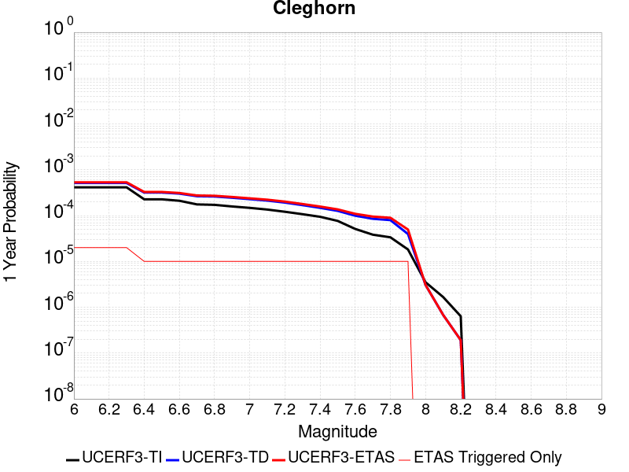 |  |

| Magnitude | 1 wk TI Prob | 1 wk TD Prob | 1 wk ETAS Prob | 1 wk ETAS/TD Gain | 1 wk ETAS Triggered Only | 1 mo TI Prob | 1 mo TD Prob | 1 mo ETAS Prob | 1 mo ETAS/TD Gain | 1 mo ETAS Triggered Only | 1 yr TI Prob | 1 yr TD Prob | 1 yr ETAS Prob | 1 yr ETAS/TD Gain | 1 yr ETAS Triggered Only | 10 yr TI Prob | 10 yr TD Prob | 10 yr ETAS Prob | 10 yr ETAS/TD Gain | 10 yr ETAS Triggered Only |
|-----|-----|-----|-----|-----|-----|-----|-----|-----|-----|-----|-----|-----|-----|-----|-----|-----|-----|-----|-----|-----|
| 6.0 | 7.9267165E-6 | 9.838367E-6 | 9.838367E-6 | 1.0 | 0.0 | 3.39712E-5 | 4.216381E-5 | 4.216381E-5 | 1.0 | 0.0 | 4.1352084E-4 | 5.1323406E-4 | 5.339968E-4 | 1.0404547 | 2.0773394E-5 | 0.004127522 | 0.005135526 | 0.005176859 | 1.0080485 | 4.1546788E-5 |
| 6.1 | 7.9267165E-6 | 9.838367E-6 | 9.838367E-6 | 1.0 | 0.0 | 3.39712E-5 | 4.216381E-5 | 4.216381E-5 | 1.0 | 0.0 | 4.1352084E-4 | 5.1323406E-4 | 5.339968E-4 | 1.0404547 | 2.0773394E-5 | 0.004127522 | 0.005135526 | 0.005176859 | 1.0080485 | 4.1546788E-5 |
| 6.2 | 7.9267165E-6 | 9.838367E-6 | 9.838367E-6 | 1.0 | 0.0 | 3.39712E-5 | 4.216381E-5 | 4.216381E-5 | 1.0 | 0.0 | 4.1352084E-4 | 5.1323406E-4 | 5.339968E-4 | 1.0404547 | 2.0773394E-5 | 0.004127522 | 0.005135526 | 0.005176859 | 1.0080485 | 4.1546788E-5 |
| 6.3 | 7.9267165E-6 | 9.838367E-6 | 9.838367E-6 | 1.0 | 0.0 | 3.39712E-5 | 4.216381E-5 | 4.216381E-5 | 1.0 | 0.0 | 4.1352084E-4 | 5.1323406E-4 | 5.339968E-4 | 1.0404547 | 2.0773394E-5 | 0.004127522 | 0.005135526 | 0.005176859 | 1.0080485 | 4.1546788E-5 |
| 6.4 | 4.3445207E-6 | 6.0981406E-6 | 6.0981406E-6 | 1.0 | 0.0 | 1.8619241E-5 | 2.6134632E-5 | 2.6134632E-5 | 1.0 | 0.0 | 2.2666567E-4 | 3.181437E-4 | 3.285271E-4 | 1.0326375 | 1.0386697E-5 | 0.0022643462 | 0.003190997 | 0.0032220576 | 1.0097338 | 3.116009E-5 |
| 6.5 | 4.3445207E-6 | 6.0981406E-6 | 6.0981406E-6 | 1.0 | 0.0 | 1.8619241E-5 | 2.6134632E-5 | 2.6134632E-5 | 1.0 | 0.0 | 2.2666567E-4 | 3.181437E-4 | 3.285271E-4 | 1.0326375 | 1.0386697E-5 | 0.0022643462 | 0.003190997 | 0.0032220576 | 1.0097338 | 3.116009E-5 |
| 6.6 | 4.040109E-6 | 5.780541E-6 | 5.780541E-6 | 1.0 | 0.0 | 1.7314638E-5 | 2.4773517E-5 | 2.4773517E-5 | 1.0 | 0.0 | 2.1078532E-4 | 3.0157674E-4 | 3.1196032E-4 | 1.0344309 | 1.0386697E-5 | 0.002105855 | 0.0030257835 | 0.0030568494 | 1.010267 | 3.116009E-5 |
| 6.7 | 3.3632055E-6 | 5.074022E-6 | 5.074022E-6 | 1.0 | 0.0 | 1.4413658E-5 | 2.1745627E-5 | 2.1745627E-5 | 1.0 | 0.0 | 1.7547216E-4 | 2.6472117E-4 | 2.7510512E-4 | 1.0392259 | 1.0386697E-5 | 0.0017533366 | 0.0026581106 | 0.0026891879 | 1.0116915 | 3.116009E-5 |
| 6.8 | 3.2902772E-6 | 4.9959262E-6 | 4.9959262E-6 | 1.0 | 0.0 | 1.4101111E-5 | 2.1410939E-5 | 2.1410939E-5 | 1.0 | 0.0 | 1.716675E-4 | 2.606473E-4 | 2.7103128E-4 | 1.0398393 | 1.0386697E-5 | 0.0017153495 | 0.0026174681 | 0.002638187 | 1.0079156 | 2.0773394E-5 |
| 6.9 | 3.031547E-6 | 4.6974637E-6 | 4.6974637E-6 | 1.0 | 0.0 | 1.299228E-5 | 2.0131833E-5 | 2.0131833E-5 | 1.0 | 0.0 | 1.5816953E-4 | 2.4507777E-4 | 2.5546193E-4 | 1.0423708 | 1.0386697E-5 | 0.00158057 | 0.002462125 | 0.002482847 | 1.0084164 | 2.0773394E-5 |
| 7.0 | 2.8259715E-6 | 4.3764653E-6 | 4.3764653E-6 | 1.0 | 0.0 | 1.211125E-5 | 1.8756145E-5 | 1.8756145E-5 | 1.0 | 0.0 | 1.4744449E-4 | 2.2833238E-4 | 2.387167E-4 | 1.0454789 | 1.0386697E-5 | 0.001473467 | 0.0022950263 | 0.0023157522 | 1.0090307 | 2.0773394E-5 |
| 7.1 | 2.5962665E-6 | 4.071453E-6 | 4.071453E-6 | 1.0 | 0.0 | 1.1126809E-5 | 1.7448969E-5 | 1.7448969E-5 | 1.0 | 0.0 | 1.3546048E-4 | 2.124207E-4 | 2.2280519E-4 | 1.0488864 | 1.0386697E-5 | 0.0013537793 | 0.0021362302 | 0.0021569591 | 1.0097035 | 2.0773394E-5 |
| 7.2 | 2.3247253E-6 | 3.6817423E-6 | 3.6817423E-6 | 1.0 | 0.0 | 9.96307E-6 | 1.5778802E-5 | 1.5778802E-5 | 1.0 | 0.0 | 1.21293626E-4 | 1.9209016E-4 | 2.0247485E-4 | 1.0540617 | 1.0386697E-5 | 0.0012122744 | 0.0019333162 | 0.0019540496 | 1.0107242 | 2.0773394E-5 |
| 7.3 | 2.056928E-6 | 3.2399425E-6 | 3.2399425E-6 | 1.0 | 0.0 | 8.815376E-6 | 1.3885395E-5 | 1.3885395E-5 | 1.0 | 0.0 | 1.0732192E-4 | 1.6904173E-4 | 1.7942667E-4 | 1.0614341 | 1.0386697E-5 | 0.001072701 | 0.0017032728 | 0.0017240109 | 1.0121754 | 2.0773394E-5 |
| 7.4 | 1.8055999E-6 | 2.8298966E-6 | 2.8298966E-6 | 1.0 | 0.0 | 7.738263E-6 | 1.2128073E-5 | 1.2128073E-5 | 1.0 | 0.0 | 9.4209274E-5 | 1.4764942E-4 | 1.5803459E-4 | 1.0703366 | 1.0386697E-5 | 9.4169343E-4 | 0.0014897923 | 0.0015105347 | 1.013923 | 2.0773394E-5 |
| 7.5 | 1.4683443E-6 | 2.4289393E-6 | 2.4289393E-6 | 1.0 | 0.0 | 6.292889E-6 | 1.0409699E-5 | 1.0409699E-5 | 1.0 | 0.0 | 7.661323E-5 | 1.2673081E-4 | 1.3711619E-4 | 1.0819484 | 1.0386697E-5 | 7.658682E-4 | 0.0012809072 | 0.001301654 | 1.016197 | 2.0773394E-5 |
| 7.6 | 9.804088E-7 | 1.9043657E-6 | 1.9043657E-6 | 1.0 | 0.0 | 4.201745E-6 | 8.161543E-6 | 8.161543E-6 | 1.0 | 0.0 | 5.1155046E-5 | 9.9362296E-5 | 1.09747954E-4 | 1.1045232 | 1.0386697E-5 | 5.114327E-4 | 0.0010075356 | 0.001028288 | 1.0205972 | 2.0773394E-5 |
| 7.7 | 7.3434086E-7 | 1.6324341E-6 | 1.6324341E-6 | 1.0 | 0.0 | 3.1471714E-6 | 6.9961275E-6 | 6.9961275E-6 | 1.0 | 0.0 | 3.831614E-5 | 8.517455E-5 | 9.556036E-5 | 1.1219356 | 1.0386697E-5 | 3.8309532E-4 | 8.6581067E-4 | 8.7618834E-4 | 1.0119861 | 1.0386697E-5 |
| 7.8 | 6.434184E-7 | 1.5257981E-6 | 1.5257981E-6 | 1.0 | 0.0 | 2.7575045E-6 | 6.5391187E-6 | 6.5391187E-6 | 1.0 | 0.0 | 3.35721E-5 | 7.961089E-5 | 8.9996756E-5 | 1.1304579 | 1.0386697E-5 | 3.3567028E-4 | 8.098763E-4 | 8.202546E-4 | 1.0128146 | 1.0386697E-5 |
| 7.9 | 3.4943926E-7 | 7.594313E-7 | 7.594313E-7 | 1.0 | 0.0 | 1.497596E-6 | 3.2547016E-6 | 3.2547016E-6 | 1.0 | 0.0 | 1.8233079E-5 | 3.962528E-5 | 5.0011564E-5 | 1.2621126 | 1.0386697E-5 | 1.8231584E-4 | 4.050159E-4 | 4.1539836E-4 | 1.0256348 | 1.0386697E-5 |
| 8.0 | 6.717524E-8 | 5.8598772E-8 | 5.8598772E-8 | 1.0 | 0.0 | 2.8789387E-7 | 2.5113755E-7 | 2.5113755E-7 | 1.0 | 0.0 | 3.505102E-6 | 3.0575957E-6 | 3.0575957E-6 | 1.0 | 0.0 | 3.5050467E-5 | 3.28481E-5 | 3.28481E-5 | 1.0 | 0.0 |
| 8.1 | 3.1984914E-8 | 1.3024658E-8 | 1.3024658E-8 | 1.0 | 0.0 | 1.370782E-7 | 5.5819964E-8 | 5.5819964E-8 | 1.0 | 0.0 | 1.6689258E-6 | 6.7960787E-7 | 6.7960787E-7 | 1.0 | 0.0 | 1.6689133E-5 | 7.7832365E-6 | 7.7832365E-6 | 1.0 | 0.0 |
| 8.2 | 1.21887656E-8 | 3.6706735E-9 | 3.6706735E-9 | 1.0 | 0.0 | 5.2237567E-8 | 1.5731459E-8 | 1.5731459E-8 | 1.0 | 0.0 | 6.359922E-7 | 1.9153049E-7 | 1.9153049E-7 | 1.0 | 0.0 | 6.3599036E-6 | 2.2593056E-6 | 2.2593056E-6 | 1.0 | 0.0 |

## Chino alt 1
*[(top)](#table-of-contents)*

| 1 Week | 1 Month | 1 Year | 10 Year |
|-----|-----|-----|-----|
|  |  | 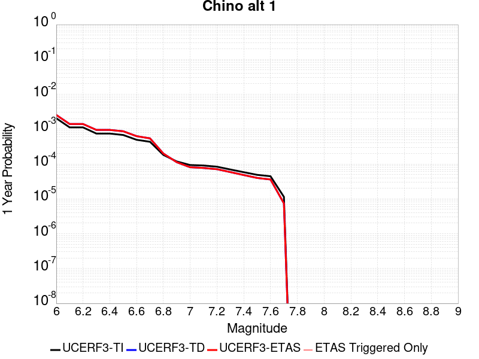 |  |

| Magnitude | 1 wk TI Prob | 1 wk TD Prob | 1 wk ETAS Prob | 1 wk ETAS/TD Gain | 1 wk ETAS Triggered Only | 1 mo TI Prob | 1 mo TD Prob | 1 mo ETAS Prob | 1 mo ETAS/TD Gain | 1 mo ETAS Triggered Only | 1 yr TI Prob | 1 yr TD Prob | 1 yr ETAS Prob | 1 yr ETAS/TD Gain | 1 yr ETAS Triggered Only | 10 yr TI Prob | 10 yr TD Prob | 10 yr ETAS Prob | 10 yr ETAS/TD Gain | 10 yr ETAS Triggered Only |
|-----|-----|-----|-----|-----|-----|-----|-----|-----|-----|-----|-----|-----|-----|-----|-----|-----|-----|-----|-----|-----|
| 6.0 | 3.939946E-5 | 4.8955757E-5 | 4.8955757E-5 | 1.0 | 0.0 | 1.6884391E-4 | 2.0979645E-4 | 2.0979645E-4 | 1.0 | 0.0 | 0.0020537362 | 0.0025517642 | 0.0025517642 | 1.0 | 0.0 | 0.020348595 | 0.025281483 | 0.02532198 | 1.0016018 | 4.1546788E-5 |
| 6.1 | 2.1505624E-5 | 2.6883481E-5 | 2.6883481E-5 | 1.0 | 0.0 | 9.2163704E-5 | 1.1521046E-4 | 1.1521046E-4 | 1.0 | 0.0 | 0.0011215154 | 0.0014018962 | 0.0014018962 | 1.0 | 0.0 | 0.011158722 | 0.013947416 | 0.013957658 | 1.0007343 | 1.0386697E-5 |
| 6.2 | 2.1505624E-5 | 2.6883481E-5 | 2.6883481E-5 | 1.0 | 0.0 | 9.2163704E-5 | 1.1521046E-4 | 1.1521046E-4 | 1.0 | 0.0 | 0.0011215154 | 0.0014018962 | 0.0014018962 | 1.0 | 0.0 | 0.011158722 | 0.013947416 | 0.013957658 | 1.0007343 | 1.0386697E-5 |
| 6.3 | 1.4290785E-5 | 1.816862E-5 | 1.816862E-5 | 1.0 | 0.0 | 6.1244784E-5 | 7.786344E-5 | 7.786344E-5 | 1.0 | 0.0 | 7.454001E-4 | 9.4762055E-4 | 9.4762055E-4 | 1.0 | 0.0 | 0.007429048 | 0.009446246 | 0.009446246 | 1.0 | 0.0 |
| 6.4 | 1.4290785E-5 | 1.816862E-5 | 1.816862E-5 | 1.0 | 0.0 | 6.1244784E-5 | 7.786344E-5 | 7.786344E-5 | 1.0 | 0.0 | 7.454001E-4 | 9.4762055E-4 | 9.4762055E-4 | 1.0 | 0.0 | 0.007429048 | 0.009446246 | 0.009446246 | 1.0 | 0.0 |
| 6.5 | 1.3017944E-5 | 1.665543E-5 | 1.665543E-5 | 1.0 | 0.0 | 5.5789995E-5 | 7.13787E-5 | 7.13787E-5 | 1.0 | 0.0 | 6.790315E-4 | 8.6873304E-4 | 8.6873304E-4 | 1.0 | 0.0 | 0.0067696036 | 0.00866366 | 0.00866366 | 1.0 | 0.0 |
| 6.6 | 9.470016E-6 | 1.2041898E-5 | 1.2041898E-5 | 1.0 | 0.0 | 4.058515E-5 | 5.1607305E-5 | 5.1607305E-5 | 1.0 | 0.0 | 4.940122E-4 | 6.281718E-4 | 6.281718E-4 | 1.0 | 0.0 | 0.004929154 | 0.006273171 | 0.006273171 | 1.0 | 0.0 |
| 6.7 | 8.314155E-6 | 1.0409905E-5 | 1.0409905E-5 | 1.0 | 0.0 | 3.5631605E-5 | 4.46133E-5 | 4.46133E-5 | 1.0 | 0.0 | 4.3372845E-4 | 5.430638E-4 | 5.430638E-4 | 1.0 | 0.0 | 0.004328829 | 0.005426893 | 0.005426893 | 1.0 | 0.0 |
| 6.8 | 3.4856364E-6 | 3.8139801E-6 | 3.8139801E-6 | 1.0 | 0.0 | 1.4938357E-5 | 1.6345539E-5 | 1.6345539E-5 | 1.0 | 0.0 | 1.8185932E-4 | 1.9899083E-4 | 1.9899083E-4 | 1.0 | 0.0 | 0.0018171056 | 0.001989803 | 0.001989803 | 1.0 | 0.0 |
| 6.9 | 2.2645952E-6 | 2.1532328E-6 | 2.1532328E-6 | 1.0 | 0.0 | 9.705372E-6 | 9.228109E-6 | 9.228109E-6 | 1.0 | 0.0 | 1.18156495E-4 | 1.1234665E-4 | 1.1234665E-4 | 1.0 | 0.0 | 0.0011809369 | 0.0011235146 | 0.0011235146 | 1.0 | 0.0 |
| 7.0 | 1.7864003E-6 | 1.5433379E-6 | 1.5433379E-6 | 1.0 | 0.0 | 7.655979E-6 | 6.6142893E-6 | 6.6142893E-6 | 1.0 | 0.0 | 9.3207556E-5 | 8.052605E-5 | 8.052605E-5 | 1.0 | 0.0 | 9.316847E-4 | 8.054159E-4 | 8.054159E-4 | 1.0 | 0.0 |
| 7.1 | 1.7315456E-6 | 1.4736019E-6 | 1.4736019E-6 | 1.0 | 0.0 | 7.420889E-6 | 6.3154216E-6 | 6.3154216E-6 | 1.0 | 0.0 | 9.034557E-5 | 7.6887605E-5 | 7.6887605E-5 | 1.0 | 0.0 | 9.0308854E-4 | 7.690479E-4 | 7.690479E-4 | 1.0 | 0.0 |
| 7.2 | 1.6008337E-6 | 1.3576367E-6 | 1.3576367E-6 | 1.0 | 0.0 | 6.860698E-6 | 5.8184305E-6 | 5.8184305E-6 | 1.0 | 0.0 | 8.352579E-5 | 7.0837144E-5 | 7.0837144E-5 | 1.0 | 0.0 | 8.34944E-4 | 7.085699E-4 | 7.085699E-4 | 1.0 | 0.0 |
| 7.3 | 1.3320939E-6 | 1.1219545E-6 | 1.1219545E-6 | 1.0 | 0.0 | 5.7089615E-6 | 4.8083675E-6 | 4.8083675E-6 | 1.0 | 0.0 | 6.9504385E-5 | 5.854035E-5 | 5.854035E-5 | 1.0 | 0.0 | 6.9482654E-4 | 5.8539386E-4 | 5.8539386E-4 | 1.0 | 0.0 |
| 7.4 | 1.114294E-6 | 9.2384767E-7 | 9.2384767E-7 | 1.0 | 0.0 | 4.775537E-6 | 3.9593415E-6 | 3.9593415E-6 | 1.0 | 0.0 | 5.8140613E-5 | 4.820395E-5 | 4.820395E-5 | 1.0 | 0.0 | 5.81254E-4 | 4.8195178E-4 | 4.8195178E-4 | 1.0 | 0.0 |
| 7.5 | 9.354081E-7 | 7.62451E-7 | 7.62451E-7 | 1.0 | 0.0 | 4.0088858E-6 | 3.2676433E-6 | 3.2676433E-6 | 1.0 | 0.0 | 4.8807087E-5 | 3.9782866E-5 | 3.9782866E-5 | 1.0 | 0.0 | 4.879637E-4 | 3.9776083E-4 | 3.9776083E-4 | 1.0 | 0.0 |
| 7.6 | 8.521771E-7 | 6.881667E-7 | 6.881667E-7 | 1.0 | 0.0 | 3.6521824E-6 | 2.9492828E-6 | 2.9492828E-6 | 1.0 | 0.0 | 4.4464414E-5 | 3.590696E-5 | 3.590696E-5 | 1.0 | 0.0 | 4.4455516E-4 | 3.5901475E-4 | 3.5901475E-4 | 1.0 | 0.0 |
| 7.7 | 2.1803626E-7 | 1.4189133E-7 | 1.4189133E-7 | 1.0 | 0.0 | 9.344408E-7 | 6.0810567E-7 | 6.0810567E-7 | 1.0 | 0.0 | 1.1376757E-5 | 7.4036707E-6 | 7.4036707E-6 | 1.0 | 0.0 | 1.13761744E-4 | 7.4035204E-5 | 7.4035204E-5 | 1.0 | 0.0 |

## San Juan
*[(top)](#table-of-contents)*

| 1 Week | 1 Month | 1 Year | 10 Year |
|-----|-----|-----|-----|
|  |  |  | 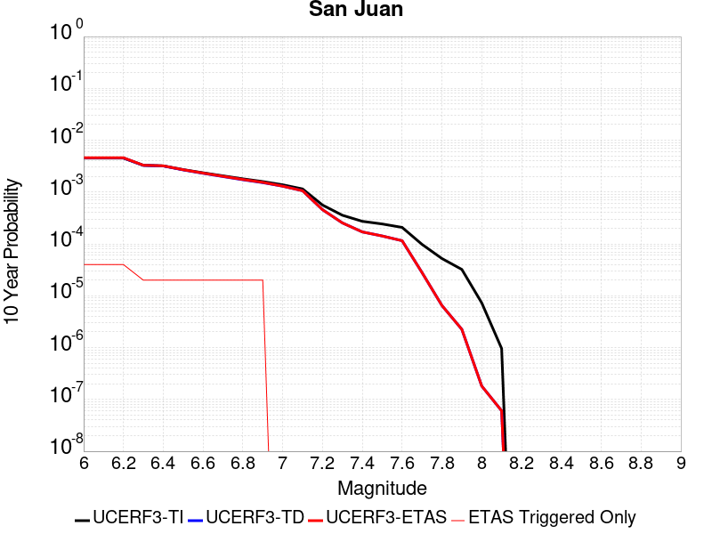 |

| Magnitude | 1 wk TI Prob | 1 wk TD Prob | 1 wk ETAS Prob | 1 wk ETAS/TD Gain | 1 wk ETAS Triggered Only | 1 mo TI Prob | 1 mo TD Prob | 1 mo ETAS Prob | 1 mo ETAS/TD Gain | 1 mo ETAS Triggered Only | 1 yr TI Prob | 1 yr TD Prob | 1 yr ETAS Prob | 1 yr ETAS/TD Gain | 1 yr ETAS Triggered Only | 10 yr TI Prob | 10 yr TD Prob | 10 yr ETAS Prob | 10 yr ETAS/TD Gain | 10 yr ETAS Triggered Only |
|-----|-----|-----|-----|-----|-----|-----|-----|-----|-----|-----|-----|-----|-----|-----|-----|-----|-----|-----|-----|-----|
| 6.0 | 8.682808E-6 | 8.750746E-6 | 8.750746E-6 | 1.0 | 0.0 | 3.72115E-5 | 3.7502687E-5 | 3.7502687E-5 | 1.0 | 0.0 | 4.5295584E-4 | 4.5650435E-4 | 4.5650435E-4 | 1.0 | 0.0 | 0.004520337 | 0.004556207 | 0.004587225 | 1.0068079 | 3.116009E-5 |
| 6.1 | 8.682808E-6 | 8.750746E-6 | 8.750746E-6 | 1.0 | 0.0 | 3.72115E-5 | 3.7502687E-5 | 3.7502687E-5 | 1.0 | 0.0 | 4.5295584E-4 | 4.5650435E-4 | 4.5650435E-4 | 1.0 | 0.0 | 0.004520337 | 0.004556207 | 0.004587225 | 1.0068079 | 3.116009E-5 |
| 6.2 | 8.682808E-6 | 8.750746E-6 | 8.750746E-6 | 1.0 | 0.0 | 3.72115E-5 | 3.7502687E-5 | 3.7502687E-5 | 1.0 | 0.0 | 4.5295584E-4 | 4.5650435E-4 | 4.5650435E-4 | 1.0 | 0.0 | 0.004520337 | 0.004556207 | 0.004587225 | 1.0068079 | 3.116009E-5 |
| 6.3 | 6.3054235E-6 | 6.284118E-6 | 6.284118E-6 | 1.0 | 0.0 | 2.7022963E-5 | 2.6931666E-5 | 2.6931666E-5 | 1.0 | 0.0 | 3.2895492E-4 | 3.278451E-4 | 3.278451E-4 | 1.0 | 0.0 | 0.003284684 | 0.0032738145 | 0.0032841673 | 1.0031623 | 1.0386697E-5 |
| 6.4 | 6.1490473E-6 | 6.115788E-6 | 6.115788E-6 | 1.0 | 0.0 | 2.6352795E-5 | 2.6210264E-5 | 2.6210264E-5 | 1.0 | 0.0 | 3.2079802E-4 | 3.1906462E-4 | 3.1906462E-4 | 1.0 | 0.0 | 0.0032033534 | 0.0031862615 | 0.0031966153 | 1.0032494 | 1.0386697E-5 |
| 6.5 | 5.204848E-6 | 5.1385127E-6 | 5.1385127E-6 | 1.0 | 0.0 | 2.23063E-5 | 2.2022017E-5 | 2.2022017E-5 | 1.0 | 0.0 | 2.7154534E-4 | 2.6808603E-4 | 2.6808603E-4 | 1.0 | 0.0 | 0.0027121378 | 0.0026777803 | 0.0026881392 | 1.0038685 | 1.0386697E-5 |
| 6.6 | 4.5179986E-6 | 4.4159874E-6 | 4.4159874E-6 | 1.0 | 0.0 | 1.9362706E-5 | 1.8925528E-5 | 1.8925528E-5 | 1.0 | 0.0 | 2.3571544E-4 | 2.3039473E-4 | 2.3039473E-4 | 1.0 | 0.0 | 0.0023546559 | 0.0023016958 | 0.0023120586 | 1.0045023 | 1.0386697E-5 |
| 6.7 | 3.9442616E-6 | 3.820683E-6 | 3.820683E-6 | 1.0 | 0.0 | 1.6903869E-5 | 1.6374257E-5 | 1.6374257E-5 | 1.0 | 0.0 | 2.0578515E-4 | 1.9933902E-4 | 1.9933902E-4 | 1.0 | 0.0 | 0.002055947 | 0.0019917272 | 0.002002093 | 1.0052046 | 1.0386697E-5 |
| 6.8 | 3.4536245E-6 | 3.3171548E-6 | 3.3171548E-6 | 1.0 | 0.0 | 1.4801163E-5 | 1.42163035E-5 | 1.42163035E-5 | 1.0 | 0.0 | 1.8018926E-4 | 1.7307035E-4 | 1.7307035E-4 | 1.0 | 0.0 | 0.0018004322 | 0.0017294746 | 0.0017398434 | 1.0059953 | 1.0386697E-5 |
| 6.9 | 3.059865E-6 | 2.912814E-6 | 2.912814E-6 | 1.0 | 0.0 | 1.3113641E-5 | 1.2483431E-5 | 1.2483431E-5 | 1.0 | 0.0 | 1.596469E-4 | 1.5197575E-4 | 1.5197575E-4 | 1.0 | 0.0 | 0.0015953224 | 0.0015188329 | 0.0015292038 | 1.0068282 | 1.0386697E-5 |
| 7.0 | 2.6504351E-6 | 2.492739E-6 | 2.492739E-6 | 1.0 | 0.0 | 1.1358958E-5 | 1.0683126E-5 | 1.0683126E-5 | 1.0 | 0.0 | 1.3828653E-4 | 1.3005984E-4 | 1.3005984E-4 | 1.0 | 0.0 | 0.0013820052 | 0.0012999491 | 0.0012999491 | 1.0 | 0.0 |
| 7.1 | 2.2039317E-6 | 2.034434E-6 | 2.034434E-6 | 1.0 | 0.0 | 9.445387E-6 | 8.7189765E-6 | 8.7189765E-6 | 1.0 | 0.0 | 1.1499152E-4 | 1.06148895E-4 | 1.06148895E-4 | 1.0 | 0.0 | 0.0011493203 | 0.001061092 | 0.001061092 | 1.0 | 0.0 |
| 7.2 | 1.0786707E-6 | 8.775373E-7 | 8.775373E-7 | 1.0 | 0.0 | 4.622866E-6 | 3.7608686E-6 | 3.7608686E-6 | 1.0 | 0.0 | 5.628194E-5 | 4.5787623E-5 | 4.5787623E-5 | 1.0 | 0.0 | 5.6267687E-4 | 4.5784103E-4 | 4.5784103E-4 | 1.0 | 0.0 |
| 7.3 | 6.846433E-7 | 4.8720807E-7 | 4.8720807E-7 | 1.0 | 0.0 | 2.9341822E-6 | 2.088033E-6 | 2.088033E-6 | 1.0 | 0.0 | 3.5723086E-5 | 2.5421505E-5 | 2.5421505E-5 | 1.0 | 0.0 | 3.571734E-4 | 2.542195E-4 | 2.542195E-4 | 1.0 | 0.0 |
| 7.4 | 5.23043E-7 | 3.2652449E-7 | 3.2652449E-7 | 1.0 | 0.0 | 2.2416111E-6 | 1.3993898E-6 | 1.3993898E-6 | 1.0 | 0.0 | 2.7291273E-5 | 1.7037439E-5 | 1.7037439E-5 | 1.0 | 0.0 | 2.7287923E-4 | 1.7039331E-4 | 1.7039331E-4 | 1.0 | 0.0 |
| 7.5 | 4.648444E-7 | 2.725582E-7 | 2.725582E-7 | 1.0 | 0.0 | 1.9921886E-6 | 1.168106E-6 | 1.168106E-6 | 1.0 | 0.0 | 2.4254627E-5 | 1.4221598E-5 | 1.4221598E-5 | 1.0 | 0.0 | 2.425198E-4 | 1.4223653E-4 | 1.4223653E-4 | 1.0 | 0.0 |
| 7.6 | 3.9906567E-7 | 2.2099975E-7 | 2.2099975E-7 | 1.0 | 0.0 | 1.7102802E-6 | 9.471414E-7 | 9.471414E-7 | 1.0 | 0.0 | 2.0822463E-5 | 1.1531386E-5 | 1.1531386E-5 | 1.0 | 0.0 | 2.0820512E-4 | 1.1533252E-4 | 1.1533252E-4 | 1.0 | 0.0 |
| 7.7 | 1.8784601E-7 | 5.3729043E-8 | 5.3729043E-8 | 1.0 | 0.0 | 8.0505407E-7 | 2.302673E-7 | 2.302673E-7 | 1.0 | 0.0 | 9.80149E-6 | 2.8035008E-6 | 2.8035008E-6 | 1.0 | 0.0 | 9.801057E-5 | 2.8043742E-5 | 2.8043742E-5 | 1.0 | 0.0 |
| 7.8 | 1.00154914E-7 | 1.2435763E-8 | 1.2435763E-8 | 1.0 | 0.0 | 4.2923529E-7 | 5.329612E-8 | 5.329612E-8 | 1.0 | 0.0 | 5.225927E-6 | 6.488801E-7 | 6.488801E-7 | 1.0 | 0.0 | 5.225804E-5 | 6.4947103E-6 | 6.4947103E-6 | 1.0 | 0.0 |
| 7.9 | 6.171429E-8 | 4.306961E-9 | 4.306961E-9 | 1.0 | 0.0 | 2.6448978E-7 | 1.8458394E-8 | 1.8458394E-8 | 1.0 | 0.0 | 3.2201583E-6 | 2.2473097E-7 | 2.2473097E-7 | 1.0 | 0.0 | 3.2201115E-5 | 2.2526308E-6 | 2.2526308E-6 | 1.0 | 0.0 |
| 8.0 | 1.3974572E-8 | 3.397712E-10 | 3.397712E-10 | 1.0 | 0.0 | 5.989102E-8 | 1.4561616E-9 | 1.4561616E-9 | 1.0 | 0.0 | 7.2917294E-7 | 1.7728782E-8 | 1.7728782E-8 | 1.0 | 0.0 | 7.2917055E-6 | 1.8161353E-7 | 1.8161353E-7 | 1.0 | 0.0 |
| 8.1 | 1.8403477E-9 | 1.13495546E-10 | 1.13495546E-10 | 1.0 | 0.0 | 7.887204E-9 | 4.864098E-10 | 4.864098E-10 | 1.0 | 0.0 | 9.602671E-8 | 5.922048E-9 | 5.922048E-9 | 1.0 | 0.0 | 9.602667E-7 | 6.0468224E-8 | 6.0468224E-8 | 1.0 | 0.0 |

## Blue Cut
*[(top)](#table-of-contents)*

| 1 Week | 1 Month | 1 Year | 10 Year |
|-----|-----|-----|-----|
|  |  |  | 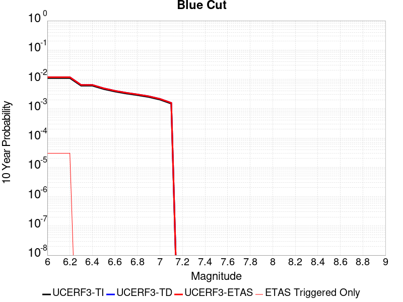 |

| Magnitude | 1 wk TI Prob | 1 wk TD Prob | 1 wk ETAS Prob | 1 wk ETAS/TD Gain | 1 wk ETAS Triggered Only | 1 mo TI Prob | 1 mo TD Prob | 1 mo ETAS Prob | 1 mo ETAS/TD Gain | 1 mo ETAS Triggered Only | 1 yr TI Prob | 1 yr TD Prob | 1 yr ETAS Prob | 1 yr ETAS/TD Gain | 1 yr ETAS Triggered Only | 10 yr TI Prob | 10 yr TD Prob | 10 yr ETAS Prob | 10 yr ETAS/TD Gain | 10 yr ETAS Triggered Only |
|-----|-----|-----|-----|-----|-----|-----|-----|-----|-----|-----|-----|-----|-----|-----|-----|-----|-----|-----|-----|-----|
| 6.0 | 2.1227985E-5 | 2.2720424E-5 | 2.2720424E-5 | 1.0 | 0.0 | 9.097391E-5 | 9.7369935E-5 | 9.7369935E-5 | 1.0 | 0.0 | 0.0011070445 | 0.0011848924 | 0.0012056411 | 1.0175111 | 2.0773394E-5 | 0.011015458 | 0.01179159 | 0.011822382 | 1.0026114 | 3.116009E-5 |
| 6.1 | 2.1227985E-5 | 2.2720424E-5 | 2.2720424E-5 | 1.0 | 0.0 | 9.097391E-5 | 9.7369935E-5 | 9.7369935E-5 | 1.0 | 0.0 | 0.0011070445 | 0.0011848924 | 0.0012056411 | 1.0175111 | 2.0773394E-5 | 0.011015458 | 0.01179159 | 0.011822382 | 1.0026114 | 3.116009E-5 |
| 6.2 | 2.1227985E-5 | 2.2720424E-5 | 2.2720424E-5 | 1.0 | 0.0 | 9.097391E-5 | 9.7369935E-5 | 9.7369935E-5 | 1.0 | 0.0 | 0.0011070445 | 0.0011848924 | 0.0012056411 | 1.0175111 | 2.0773394E-5 | 0.011015458 | 0.01179159 | 0.011822382 | 1.0026114 | 3.116009E-5 |
| 6.3 | 1.1613981E-5 | 1.2353959E-5 | 1.2353959E-5 | 1.0 | 0.0 | 4.9773254E-5 | 5.2944535E-5 | 5.2944535E-5 | 1.0 | 0.0 | 6.0582085E-4 | 6.4442155E-4 | 6.4442155E-4 | 1.0 | 0.0 | 0.0060417196 | 0.006426776 | 0.006426776 | 1.0 | 0.0 |
| 6.4 | 1.1613981E-5 | 1.2353959E-5 | 1.2353959E-5 | 1.0 | 0.0 | 4.9773254E-5 | 5.2944535E-5 | 5.2944535E-5 | 1.0 | 0.0 | 6.0582085E-4 | 6.4442155E-4 | 6.4442155E-4 | 1.0 | 0.0 | 0.0060417196 | 0.006426776 | 0.006426776 | 1.0 | 0.0 |
| 6.5 | 8.931326E-6 | 9.48191E-6 | 9.48191E-6 | 1.0 | 0.0 | 3.8276554E-5 | 4.0636176E-5 | 4.0636176E-5 | 1.0 | 0.0 | 4.6591737E-4 | 4.9464224E-4 | 4.9464224E-4 | 1.0 | 0.0 | 0.0046494175 | 0.004936322 | 0.004936322 | 1.0 | 0.0 |
| 6.6 | 7.345353E-6 | 7.79053E-6 | 7.79053E-6 | 1.0 | 0.0 | 3.1479703E-5 | 3.33876E-5 | 3.33876E-5 | 1.0 | 0.0 | 3.83198E-4 | 4.0642623E-4 | 4.0642623E-4 | 1.0 | 0.0 | 0.0038253788 | 0.004057621 | 0.004057621 | 1.0 | 0.0 |
| 6.7 | 6.2775666E-6 | 6.655361E-6 | 6.655361E-6 | 1.0 | 0.0 | 2.690358E-5 | 2.8522707E-5 | 2.8522707E-5 | 1.0 | 0.0 | 3.2750185E-4 | 3.4721615E-4 | 3.4721615E-4 | 1.0 | 0.0 | 0.0032701963 | 0.0034674776 | 0.0034674776 | 1.0 | 0.0 |
| 6.8 | 5.5234095E-6 | 5.855298E-6 | 5.855298E-6 | 1.0 | 0.0 | 2.367154E-5 | 2.5093934E-5 | 2.5093934E-5 | 1.0 | 0.0 | 2.8816288E-4 | 3.054831E-4 | 3.054831E-4 | 1.0 | 0.0 | 0.002877895 | 0.0030513476 | 0.0030513476 | 1.0 | 0.0 |
| 6.9 | 4.7780054E-6 | 5.065582E-6 | 5.065582E-6 | 1.0 | 0.0 | 2.0477004E-5 | 2.1709497E-5 | 2.1709497E-5 | 1.0 | 0.0 | 2.4927902E-4 | 2.642881E-4 | 2.642881E-4 | 1.0 | 0.0 | 0.0024899957 | 0.0026404303 | 0.0026404303 | 1.0 | 0.0 |
| 7.0 | 3.883171E-6 | 4.1186195E-6 | 4.1186195E-6 | 1.0 | 0.0 | 1.6642054E-5 | 1.7651146E-5 | 1.7651146E-5 | 1.0 | 0.0 | 2.0259817E-4 | 2.148884E-4 | 2.148884E-4 | 1.0 | 0.0 | 0.0020241356 | 0.0021474818 | 0.0021474818 | 1.0 | 0.0 |
| 7.1 | 2.8358215E-6 | 3.0098138E-6 | 3.0098138E-6 | 1.0 | 0.0 | 1.2153464E-5 | 1.2899175E-5 | 1.2899175E-5 | 1.0 | 0.0 | 1.4795837E-4 | 1.5704273E-4 | 1.5704273E-4 | 1.0 | 0.0 | 0.001478599 | 0.0015699627 | 0.0015699627 | 1.0 | 0.0 |

## Channel Islands Thrust
*[(top)](#table-of-contents)*

| 1 Week | 1 Month | 1 Year | 10 Year |
|-----|-----|-----|-----|
|  |  |  |  |

| Magnitude | 1 wk TI Prob | 1 wk TD Prob | 1 wk ETAS Prob | 1 wk ETAS/TD Gain | 1 wk ETAS Triggered Only | 1 mo TI Prob | 1 mo TD Prob | 1 mo ETAS Prob | 1 mo ETAS/TD Gain | 1 mo ETAS Triggered Only | 1 yr TI Prob | 1 yr TD Prob | 1 yr ETAS Prob | 1 yr ETAS/TD Gain | 1 yr ETAS Triggered Only | 10 yr TI Prob | 10 yr TD Prob | 10 yr ETAS Prob | 10 yr ETAS/TD Gain | 10 yr ETAS Triggered Only |
|-----|-----|-----|-----|-----|-----|-----|-----|-----|-----|-----|-----|-----|-----|-----|-----|-----|-----|-----|-----|-----|
| 6.0 | 2.2156251E-5 | 2.4093148E-5 | 2.4093148E-5 | 1.0 | 0.0 | 9.495191E-5 | 1.0325286E-4 | 1.0325286E-4 | 1.0 | 0.0 | 0.0011554264 | 0.0012564851 | 0.0012668588 | 1.0082561 | 1.0386697E-5 | 0.011494373 | 0.012504402 | 0.012535172 | 1.0024607 | 3.116009E-5 |
| 6.1 | 2.2156251E-5 | 2.4093148E-5 | 2.4093148E-5 | 1.0 | 0.0 | 9.495191E-5 | 1.0325286E-4 | 1.0325286E-4 | 1.0 | 0.0 | 0.0011554264 | 0.0012564851 | 0.0012668588 | 1.0082561 | 1.0386697E-5 | 0.011494373 | 0.012504402 | 0.012535172 | 1.0024607 | 3.116009E-5 |
| 6.2 | 2.2156251E-5 | 2.4093148E-5 | 2.4093148E-5 | 1.0 | 0.0 | 9.495191E-5 | 1.0325286E-4 | 1.0325286E-4 | 1.0 | 0.0 | 0.0011554264 | 0.0012564851 | 0.0012668588 | 1.0082561 | 1.0386697E-5 | 0.011494373 | 0.012504402 | 0.012535172 | 1.0024607 | 3.116009E-5 |
| 6.3 | 2.2156251E-5 | 2.4093148E-5 | 2.4093148E-5 | 1.0 | 0.0 | 9.495191E-5 | 1.0325286E-4 | 1.0325286E-4 | 1.0 | 0.0 | 0.0011554264 | 0.0012564851 | 0.0012668588 | 1.0082561 | 1.0386697E-5 | 0.011494373 | 0.012504402 | 0.012535172 | 1.0024607 | 3.116009E-5 |
| 6.4 | 2.2156251E-5 | 2.4093148E-5 | 2.4093148E-5 | 1.0 | 0.0 | 9.495191E-5 | 1.0325286E-4 | 1.0325286E-4 | 1.0 | 0.0 | 0.0011554264 | 0.0012564851 | 0.0012668588 | 1.0082561 | 1.0386697E-5 | 0.011494373 | 0.012504402 | 0.012535172 | 1.0024607 | 3.116009E-5 |
| 6.5 | 2.2156251E-5 | 2.4093148E-5 | 2.4093148E-5 | 1.0 | 0.0 | 9.495191E-5 | 1.0325286E-4 | 1.0325286E-4 | 1.0 | 0.0 | 0.0011554264 | 0.0012564851 | 0.0012668588 | 1.0082561 | 1.0386697E-5 | 0.011494373 | 0.012504402 | 0.012535172 | 1.0024607 | 3.116009E-5 |
| 6.6 | 2.2156251E-5 | 2.4093148E-5 | 2.4093148E-5 | 1.0 | 0.0 | 9.495191E-5 | 1.0325286E-4 | 1.0325286E-4 | 1.0 | 0.0 | 0.0011554264 | 0.0012564851 | 0.0012668588 | 1.0082561 | 1.0386697E-5 | 0.011494373 | 0.012504402 | 0.012535172 | 1.0024607 | 3.116009E-5 |
| 6.7 | 1.0601296E-5 | 1.1379993E-5 | 1.1379993E-5 | 1.0 | 0.0 | 4.5433335E-5 | 4.8770515E-5 | 4.8770515E-5 | 1.0 | 0.0 | 5.5301044E-4 | 5.9362414E-4 | 5.9362414E-4 | 1.0 | 0.0 | 0.005516363 | 0.0059208865 | 0.0059415367 | 1.0034877 | 2.0773394E-5 |
| 6.8 | 1.0246747E-5 | 1.09971015E-5 | 1.09971015E-5 | 1.0 | 0.0 | 4.391389E-5 | 4.712961E-5 | 4.712961E-5 | 1.0 | 0.0 | 5.345204E-4 | 5.7365675E-4 | 5.7365675E-4 | 1.0 | 0.0 | 0.0053323656 | 0.0057222494 | 0.005732577 | 1.0018047 | 1.0386697E-5 |
| 6.9 | 9.049551E-6 | 9.70002E-6 | 9.70002E-6 | 1.0 | 0.0 | 3.878322E-5 | 4.1570875E-5 | 4.1570875E-5 | 1.0 | 0.0 | 4.7208337E-4 | 5.0601194E-4 | 5.0601194E-4 | 1.0 | 0.0 | 0.0047108172 | 0.0050490154 | 0.0050593494 | 1.0020468 | 1.0386697E-5 |
| 7.0 | 8.6542195E-6 | 9.2749615E-6 | 9.2749615E-6 | 1.0 | 0.0 | 3.7088983E-5 | 3.9749255E-5 | 3.9749255E-5 | 1.0 | 0.0 | 4.5146482E-4 | 4.8384376E-4 | 4.8384376E-4 | 1.0 | 0.0 | 0.004505487 | 0.004828315 | 0.004838652 | 1.0021408 | 1.0386697E-5 |
| 7.1 | 8.391028E-6 | 8.993273E-6 | 8.993273E-6 | 1.0 | 0.0 | 3.5961057E-5 | 3.8542054E-5 | 3.8542054E-5 | 1.0 | 0.0 | 4.3773788E-4 | 4.6915252E-4 | 4.6915252E-4 | 1.0 | 0.0 | 0.004368766 | 0.004682031 | 0.004692369 | 1.002208 | 1.0386697E-5 |
| 7.2 | 5.965188E-6 | 6.3719312E-6 | 6.3719312E-6 | 1.0 | 0.0 | 2.556484E-5 | 2.7307993E-5 | 2.7307993E-5 | 1.0 | 0.0 | 3.1120746E-4 | 3.3242465E-4 | 3.3242465E-4 | 1.0 | 0.0 | 0.00310772 | 0.003319332 | 0.0033296843 | 1.0031188 | 1.0386697E-5 |
| 7.3 | 4.877518E-6 | 5.2061982E-6 | 5.2061982E-6 | 1.0 | 0.0 | 2.0903482E-5 | 2.231209E-5 | 2.231209E-5 | 1.0 | 0.0 | 2.5447016E-4 | 2.7161627E-4 | 2.7161627E-4 | 1.0 | 0.0 | 0.0025417898 | 0.002712889 | 0.0027232477 | 1.0038183 | 1.0386697E-5 |
| 7.4 | 3.8829853E-6 | 4.142015E-6 | 4.142015E-6 | 1.0 | 0.0 | 1.664126E-5 | 1.7751374E-5 | 1.7751374E-5 | 1.0 | 0.0 | 2.0258849E-4 | 2.1610195E-4 | 2.1610195E-4 | 1.0 | 0.0 | 0.002024039 | 0.0021589599 | 0.002169324 | 1.0048006 | 1.0386697E-5 |
| 7.5 | 1.3489616E-6 | 1.4278398E-6 | 1.4278398E-6 | 1.0 | 0.0 | 5.7812517E-6 | 6.1192995E-6 | 6.1192995E-6 | 1.0 | 0.0 | 7.038446E-5 | 7.449996E-5 | 7.449996E-5 | 1.0 | 0.0 | 7.036218E-4 | 7.4475387E-4 | 7.4475387E-4 | 1.0 | 0.0 |
| 7.6 | 6.058192E-7 | 6.353994E-7 | 6.353994E-7 | 1.0 | 0.0 | 2.5963652E-6 | 2.7231374E-6 | 2.7231374E-6 | 1.0 | 0.0 | 3.161029E-5 | 3.315371E-5 | 3.315371E-5 | 1.0 | 0.0 | 3.1605794E-4 | 3.3148925E-4 | 3.3148925E-4 | 1.0 | 0.0 |
| 7.7 | 2.2170494E-7 | 2.260861E-7 | 2.260861E-7 | 1.0 | 0.0 | 9.5016367E-7 | 9.689402E-7 | 9.689402E-7 | 1.0 | 0.0 | 1.1568181E-5 | 1.1796794E-5 | 1.1796794E-5 | 1.0 | 0.0 | 1.1567579E-4 | 1.1796278E-4 | 1.1796278E-4 | 1.0 | 0.0 |
| 7.8 | 2.1613102E-8 | 1.5467108E-8 | 1.5467108E-8 | 1.0 | 0.0 | 9.262757E-8 | 6.6287605E-8 | 6.6287605E-8 | 1.0 | 0.0 | 1.1277401E-6 | 8.070513E-7 | 8.070513E-7 | 1.0 | 0.0 | 1.1277344E-5 | 8.070492E-6 | 8.070492E-6 | 1.0 | 0.0 |

## San Pedro Basin
*[(top)](#table-of-contents)*

| 1 Week | 1 Month | 1 Year | 10 Year |
|-----|-----|-----|-----|
|  | 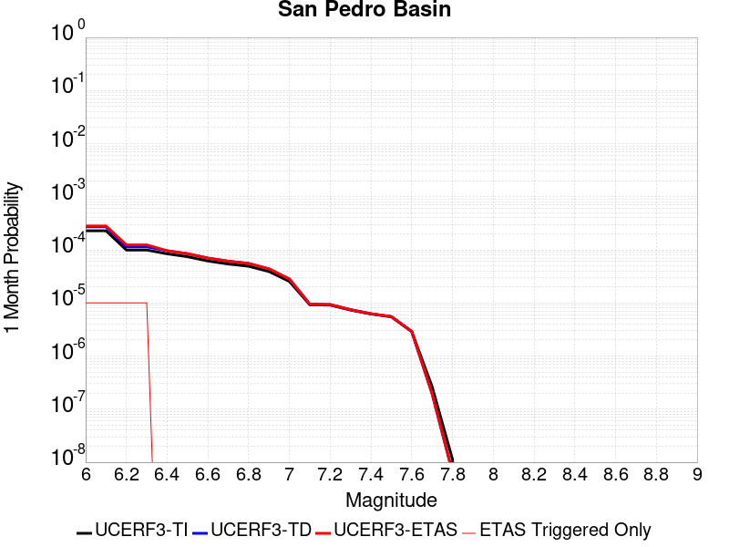 |  |  |

| Magnitude | 1 wk TI Prob | 1 wk TD Prob | 1 wk ETAS Prob | 1 wk ETAS/TD Gain | 1 wk ETAS Triggered Only | 1 mo TI Prob | 1 mo TD Prob | 1 mo ETAS Prob | 1 mo ETAS/TD Gain | 1 mo ETAS Triggered Only | 1 yr TI Prob | 1 yr TD Prob | 1 yr ETAS Prob | 1 yr ETAS/TD Gain | 1 yr ETAS Triggered Only | 10 yr TI Prob | 10 yr TD Prob | 10 yr ETAS Prob | 10 yr ETAS/TD Gain | 10 yr ETAS Triggered Only |
|-----|-----|-----|-----|-----|-----|-----|-----|-----|-----|-----|-----|-----|-----|-----|-----|-----|-----|-----|-----|-----|
| 6.0 | 5.3449043E-5 | 6.337589E-5 | 6.337589E-5 | 1.0 | 0.0 | 2.2904722E-4 | 2.7158615E-4 | 2.8197002E-4 | 1.0382342 | 1.0386697E-5 | 0.0027850836 | 0.0033021553 | 0.0033228602 | 1.00627 | 2.0773394E-5 | 0.027504366 | 0.032592643 | 0.032622788 | 1.000925 | 3.116009E-5 |
| 6.1 | 5.3449043E-5 | 6.337589E-5 | 6.337589E-5 | 1.0 | 0.0 | 2.2904722E-4 | 2.7158615E-4 | 2.8197002E-4 | 1.0382342 | 1.0386697E-5 | 0.0027850836 | 0.0033021553 | 0.0033228602 | 1.00627 | 2.0773394E-5 | 0.027504366 | 0.032592643 | 0.032622788 | 1.000925 | 3.116009E-5 |
| 6.2 | 2.3189454E-5 | 2.6644948E-5 | 2.6644948E-5 | 1.0 | 0.0 | 9.9379584E-5 | 1.14187904E-4 | 1.2457342E-4 | 1.0909511 | 1.0386697E-5 | 0.0012092749 | 0.0013893985 | 0.0013997707 | 1.0074652 | 1.0386697E-5 | 0.012027155 | 0.013811991 | 0.013822234 | 1.0007416 | 1.0386697E-5 |
| 6.3 | 2.3189454E-5 | 2.6644948E-5 | 2.6644948E-5 | 1.0 | 0.0 | 9.9379584E-5 | 1.14187904E-4 | 1.2457342E-4 | 1.0909511 | 1.0386697E-5 | 0.0012092749 | 0.0013893985 | 0.0013997707 | 1.0074652 | 1.0386697E-5 | 0.012027155 | 0.013811991 | 0.013822234 | 1.0007416 | 1.0386697E-5 |
| 6.4 | 1.966056E-5 | 2.2465154E-5 | 2.2465154E-5 | 1.0 | 0.0 | 8.425682E-5 | 9.62759E-5 | 9.62759E-5 | 1.0 | 0.0 | 0.001025344 | 0.001171569 | 0.001171569 | 1.0 | 0.0 | 0.010206259 | 0.011658015 | 0.011658015 | 1.0 | 0.0 |
| 6.5 | 1.7342953E-5 | 1.974664E-5 | 1.974664E-5 | 1.0 | 0.0 | 7.4324824E-5 | 8.462592E-5 | 8.462592E-5 | 1.0 | 0.0 | 9.04529E-4 | 0.0010298705 | 0.0010298705 | 1.0 | 0.0 | 0.009008561 | 0.010254702 | 0.010254702 | 1.0 | 0.0 |
| 6.6 | 1.439804E-5 | 1.6323911E-5 | 1.6323911E-5 | 1.0 | 0.0 | 6.170443E-5 | 6.9957925E-5 | 6.9957925E-5 | 1.0 | 0.0 | 7.509924E-4 | 8.5143704E-4 | 8.5143704E-4 | 1.0 | 0.0 | 0.0074845953 | 0.008484951 | 0.008484951 | 1.0 | 0.0 |
| 6.7 | 1.2634884E-5 | 1.4286325E-5 | 1.4286325E-5 | 1.0 | 0.0 | 5.414838E-5 | 6.1225845E-5 | 6.1225845E-5 | 1.0 | 0.0 | 6.590571E-4 | 7.4520014E-4 | 7.4520014E-4 | 1.0 | 0.0 | 0.006571059 | 0.007430034 | 0.007430034 | 1.0 | 0.0 |
| 6.8 | 1.146091E-5 | 1.2934111E-5 | 1.2934111E-5 | 1.0 | 0.0 | 4.911726E-5 | 5.5430894E-5 | 5.5430894E-5 | 1.0 | 0.0 | 5.9783855E-4 | 6.746919E-4 | 6.746919E-4 | 1.0 | 0.0 | 0.0059623276 | 0.006729376 | 0.006729376 | 1.0 | 0.0 |
| 6.9 | 9.109035E-6 | 1.023572E-5 | 1.023572E-5 | 1.0 | 0.0 | 3.9038136E-5 | 4.386679E-5 | 4.386679E-5 | 1.0 | 0.0 | 4.7518566E-4 | 5.3397525E-4 | 5.3397525E-4 | 1.0 | 0.0 | 0.0047417083 | 0.005329677 | 0.005329677 | 1.0 | 0.0 |
| 7.0 | 5.9351028E-6 | 6.5843806E-6 | 6.5843806E-6 | 1.0 | 0.0 | 2.5435906E-5 | 2.8218601E-5 | 2.8218601E-5 | 1.0 | 0.0 | 3.0963816E-4 | 3.4353093E-4 | 3.4353093E-4 | 1.0 | 0.0 | 0.0030920706 | 0.003432316 | 0.003432316 | 1.0 | 0.0 |
| 7.1 | 2.1557585E-6 | 2.2096988E-6 | 2.2096988E-6 | 1.0 | 0.0 | 9.238933E-6 | 9.4701045E-6 | 9.4701045E-6 | 1.0 | 0.0 | 1.1247819E-4 | 1.15292576E-4 | 1.15292576E-4 | 1.0 | 0.0 | 0.0011242128 | 0.001152343 | 0.001152343 | 1.0 | 0.0 |
| 7.2 | 2.1251979E-6 | 2.1780445E-6 | 2.1780445E-6 | 1.0 | 0.0 | 9.107958E-6 | 9.334444E-6 | 9.334444E-6 | 1.0 | 0.0 | 1.1088375E-4 | 1.1364108E-4 | 1.1364108E-4 | 1.0 | 0.0 | 0.0011082845 | 0.001135845 | 0.001135845 | 1.0 | 0.0 |
| 7.3 | 1.7145798E-6 | 1.7443245E-6 | 1.7443245E-6 | 1.0 | 0.0 | 7.3481783E-6 | 7.475656E-6 | 7.475656E-6 | 1.0 | 0.0 | 8.94604E-5 | 9.10124E-5 | 9.10124E-5 | 1.0 | 0.0 | 8.9424395E-4 | 9.097604E-4 | 9.097604E-4 | 1.0 | 0.0 |
| 7.4 | 1.4467993E-6 | 1.464217E-6 | 1.464217E-6 | 1.0 | 0.0 | 6.200554E-6 | 6.275201E-6 | 6.275201E-6 | 1.0 | 0.0 | 7.548913E-5 | 7.639797E-5 | 7.639797E-5 | 1.0 | 0.0 | 7.546349E-4 | 7.637243E-4 | 7.637243E-4 | 1.0 | 0.0 |
| 7.5 | 1.2803735E-6 | 1.2931764E-6 | 1.2931764E-6 | 1.0 | 0.0 | 5.487303E-6 | 5.5421733E-6 | 5.5421733E-6 | 1.0 | 0.0 | 6.680587E-5 | 6.747394E-5 | 6.747394E-5 | 1.0 | 0.0 | 6.678579E-4 | 6.7454163E-4 | 6.7454163E-4 | 1.0 | 0.0 |
| 7.6 | 6.755009E-7 | 6.7696067E-7 | 6.7696067E-7 | 1.0 | 0.0 | 2.8950008E-6 | 2.9012572E-6 | 2.9012572E-6 | 1.0 | 0.0 | 3.5246063E-5 | 3.5322293E-5 | 3.5322293E-5 | 1.0 | 0.0 | 3.5240475E-4 | 3.531725E-4 | 3.531725E-4 | 1.0 | 0.0 |
| 7.7 | 6.211885E-8 | 4.5700858E-8 | 4.5700858E-8 | 1.0 | 0.0 | 2.6622362E-7 | 1.958608E-7 | 1.958608E-7 | 1.0 | 0.0 | 3.2412677E-6 | 2.3846028E-6 | 2.3846028E-6 | 1.0 | 0.0 | 3.2412205E-5 | 2.3845794E-5 | 2.3845794E-5 | 1.0 | 0.0 |
| 7.8 | 2.6580573E-9 | 1.5140237E-9 | 1.5140237E-9 | 1.0 | 0.0 | 1.1391674E-8 | 6.4886727E-9 | 6.4886727E-9 | 1.0 | 0.0 | 1.3869362E-7 | 7.899959E-8 | 7.899959E-8 | 1.0 | 0.0 | 1.3869354E-6 | 7.899959E-7 | 7.899959E-7 | 1.0 | 0.0 |

## Dry Mountain
*[(top)](#table-of-contents)*

| 1 Week | 1 Month | 1 Year | 10 Year |
|-----|-----|-----|-----|
|  |  |  | 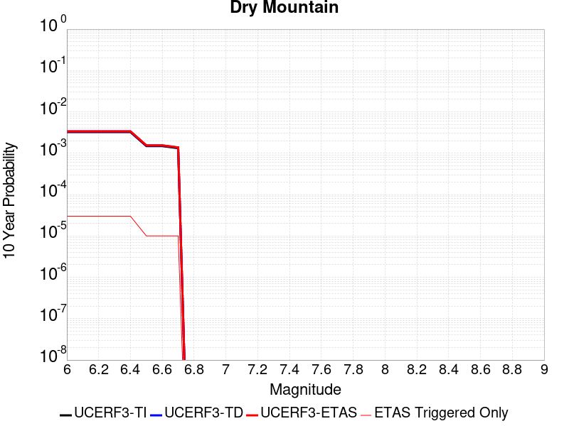 |

| Magnitude | 1 wk TI Prob | 1 wk TD Prob | 1 wk ETAS Prob | 1 wk ETAS/TD Gain | 1 wk ETAS Triggered Only | 1 mo TI Prob | 1 mo TD Prob | 1 mo ETAS Prob | 1 mo ETAS/TD Gain | 1 mo ETAS Triggered Only | 1 yr TI Prob | 1 yr TD Prob | 1 yr ETAS Prob | 1 yr ETAS/TD Gain | 1 yr ETAS Triggered Only | 10 yr TI Prob | 10 yr TD Prob | 10 yr ETAS Prob | 10 yr ETAS/TD Gain | 10 yr ETAS Triggered Only |
|-----|-----|-----|-----|-----|-----|-----|-----|-----|-----|-----|-----|-----|-----|-----|-----|-----|-----|-----|-----|-----|
| 6.0 | 6.222801E-6 | 6.4395003E-6 | 6.4395003E-6 | 1.0 | 0.0 | 2.6668875E-5 | 2.7597656E-5 | 2.7597656E-5 | 1.0 | 0.0 | 3.2464517E-4 | 3.3596557E-4 | 3.3596557E-4 | 1.0 | 0.0 | 0.0032417132 | 0.0033561387 | 0.0033871944 | 1.0092534 | 3.116009E-5 |
| 6.1 | 6.222801E-6 | 6.4395003E-6 | 6.4395003E-6 | 1.0 | 0.0 | 2.6668875E-5 | 2.7597656E-5 | 2.7597656E-5 | 1.0 | 0.0 | 3.2464517E-4 | 3.3596557E-4 | 3.3596557E-4 | 1.0 | 0.0 | 0.0032417132 | 0.0033561387 | 0.0033871944 | 1.0092534 | 3.116009E-5 |
| 6.2 | 6.222801E-6 | 6.4395003E-6 | 6.4395003E-6 | 1.0 | 0.0 | 2.6668875E-5 | 2.7597656E-5 | 2.7597656E-5 | 1.0 | 0.0 | 3.2464517E-4 | 3.3596557E-4 | 3.3596557E-4 | 1.0 | 0.0 | 0.0032417132 | 0.0033561387 | 0.0033871944 | 1.0092534 | 3.116009E-5 |
| 6.3 | 6.222801E-6 | 6.4395003E-6 | 6.4395003E-6 | 1.0 | 0.0 | 2.6668875E-5 | 2.7597656E-5 | 2.7597656E-5 | 1.0 | 0.0 | 3.2464517E-4 | 3.3596557E-4 | 3.3596557E-4 | 1.0 | 0.0 | 0.0032417132 | 0.0033561387 | 0.0033871944 | 1.0092534 | 3.116009E-5 |
| 6.4 | 6.222801E-6 | 6.4395003E-6 | 6.4395003E-6 | 1.0 | 0.0 | 2.6668875E-5 | 2.7597656E-5 | 2.7597656E-5 | 1.0 | 0.0 | 3.2464517E-4 | 3.3596557E-4 | 3.3596557E-4 | 1.0 | 0.0 | 0.0032417132 | 0.0033561387 | 0.0033871944 | 1.0092534 | 3.116009E-5 |
| 6.5 | 2.8528623E-6 | 2.952223E-6 | 2.952223E-6 | 1.0 | 0.0 | 1.22264955E-5 | 1.2652372E-5 | 1.2652372E-5 | 1.0 | 0.0 | 1.4884741E-4 | 1.5404043E-4 | 1.5404043E-4 | 1.0 | 0.0 | 0.0014874774 | 0.0015401901 | 0.0015505607 | 1.0067334 | 1.0386697E-5 |
| 6.6 | 2.8528623E-6 | 2.952223E-6 | 2.952223E-6 | 1.0 | 0.0 | 1.22264955E-5 | 1.2652372E-5 | 1.2652372E-5 | 1.0 | 0.0 | 1.4884741E-4 | 1.5404043E-4 | 1.5404043E-4 | 1.0 | 0.0 | 0.0014874774 | 0.0015401901 | 0.0015505607 | 1.0067334 | 1.0386697E-5 |
| 6.7 | 2.541E-6 | 2.6294065E-6 | 2.6294065E-6 | 1.0 | 0.0 | 1.0889954E-5 | 1.1268885E-5 | 1.1268885E-5 | 1.0 | 0.0 | 1.3257713E-4 | 1.3719867E-4 | 1.3719867E-4 | 1.0 | 0.0 | 0.0013249806 | 0.0013719867 | 0.0013823592 | 1.0075601 | 1.0386697E-5 |

## Cucamonga
*[(top)](#table-of-contents)*

| 1 Week | 1 Month | 1 Year | 10 Year |
|-----|-----|-----|-----|
|  | 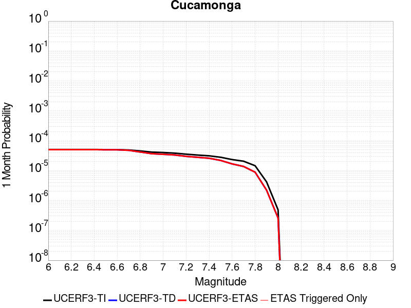 |  |  |

| Magnitude | 1 wk TI Prob | 1 wk TD Prob | 1 wk ETAS Prob | 1 wk ETAS/TD Gain | 1 wk ETAS Triggered Only | 1 mo TI Prob | 1 mo TD Prob | 1 mo ETAS Prob | 1 mo ETAS/TD Gain | 1 mo ETAS Triggered Only | 1 yr TI Prob | 1 yr TD Prob | 1 yr ETAS Prob | 1 yr ETAS/TD Gain | 1 yr ETAS Triggered Only | 10 yr TI Prob | 10 yr TD Prob | 10 yr ETAS Prob | 10 yr ETAS/TD Gain | 10 yr ETAS Triggered Only |
|-----|-----|-----|-----|-----|-----|-----|-----|-----|-----|-----|-----|-----|-----|-----|-----|-----|-----|-----|-----|-----|
| 6.0 | 1.1848348E-5 | 1.1739686E-5 | 1.1739686E-5 | 1.0 | 0.0 | 5.0777642E-5 | 5.0311985E-5 | 5.0311985E-5 | 1.0 | 0.0 | 6.180424E-4 | 6.1237894E-4 | 6.227593E-4 | 1.0169508 | 1.0386697E-5 | 0.0061632637 | 0.0061080856 | 0.0061390554 | 1.0050703 | 3.116009E-5 |
| 6.1 | 1.1848348E-5 | 1.1739686E-5 | 1.1739686E-5 | 1.0 | 0.0 | 5.0777642E-5 | 5.0311985E-5 | 5.0311985E-5 | 1.0 | 0.0 | 6.180424E-4 | 6.1237894E-4 | 6.227593E-4 | 1.0169508 | 1.0386697E-5 | 0.0061632637 | 0.0061080856 | 0.0061390554 | 1.0050703 | 3.116009E-5 |
| 6.2 | 1.1848348E-5 | 1.1739686E-5 | 1.1739686E-5 | 1.0 | 0.0 | 5.0777642E-5 | 5.0311985E-5 | 5.0311985E-5 | 1.0 | 0.0 | 6.180424E-4 | 6.1237894E-4 | 6.227593E-4 | 1.0169508 | 1.0386697E-5 | 0.0061632637 | 0.0061080856 | 0.0061390554 | 1.0050703 | 3.116009E-5 |
| 6.3 | 1.1848348E-5 | 1.1739686E-5 | 1.1739686E-5 | 1.0 | 0.0 | 5.0777642E-5 | 5.0311985E-5 | 5.0311985E-5 | 1.0 | 0.0 | 6.180424E-4 | 6.1237894E-4 | 6.227593E-4 | 1.0169508 | 1.0386697E-5 | 0.0061632637 | 0.0061080856 | 0.0061390554 | 1.0050703 | 3.116009E-5 |
| 6.4 | 1.1848348E-5 | 1.1739686E-5 | 1.1739686E-5 | 1.0 | 0.0 | 5.0777642E-5 | 5.0311985E-5 | 5.0311985E-5 | 1.0 | 0.0 | 6.180424E-4 | 6.1237894E-4 | 6.227593E-4 | 1.0169508 | 1.0386697E-5 | 0.0061632637 | 0.0061080856 | 0.0061390554 | 1.0050703 | 3.116009E-5 |
| 6.5 | 1.16988695E-5 | 1.157871E-5 | 1.157871E-5 | 1.0 | 0.0 | 5.013705E-5 | 4.9622115E-5 | 4.9622115E-5 | 1.0 | 0.0 | 6.102476E-4 | 6.0398446E-4 | 6.1436486E-4 | 1.0171865 | 1.0386697E-5 | 0.006085745 | 0.0060245967 | 0.0060555693 | 1.005141 | 3.116009E-5 |
| 6.6 | 1.16988695E-5 | 1.157871E-5 | 1.157871E-5 | 1.0 | 0.0 | 5.013705E-5 | 4.9622115E-5 | 4.9622115E-5 | 1.0 | 0.0 | 6.102476E-4 | 6.0398446E-4 | 6.1436486E-4 | 1.0171865 | 1.0386697E-5 | 0.006085745 | 0.0060245967 | 0.0060555693 | 1.005141 | 3.116009E-5 |
| 6.7 | 1.1397107E-5 | 1.111755E-5 | 1.111755E-5 | 1.0 | 0.0 | 4.884383E-5 | 4.7645786E-5 | 4.7645786E-5 | 1.0 | 0.0 | 5.9451134E-4 | 5.7993556E-4 | 5.903162E-4 | 1.0178998 | 1.0386697E-5 | 0.005929234 | 0.005785368 | 0.005816348 | 1.0053549 | 3.116009E-5 |
| 6.8 | 1.058387E-5 | 9.787276E-6 | 9.787276E-6 | 1.0 | 0.0 | 4.5358654E-5 | 4.19448E-5 | 4.19448E-5 | 1.0 | 0.0 | 5.521017E-4 | 5.105594E-4 | 5.209408E-4 | 1.0203334 | 1.0386697E-5 | 0.00550732 | 0.005094869 | 0.0051155365 | 1.0040566 | 2.0773394E-5 |
| 6.9 | 9.690046E-6 | 8.581557E-6 | 8.581557E-6 | 1.0 | 0.0 | 4.1528107E-5 | 3.6777587E-5 | 3.6777587E-5 | 1.0 | 0.0 | 5.054874E-4 | 4.4767553E-4 | 4.5805756E-4 | 1.023191 | 1.0386697E-5 | 0.005043391 | 0.0044686683 | 0.0044893487 | 1.004628 | 2.0773394E-5 |
| 7.0 | 9.381461E-6 | 8.189123E-6 | 8.189123E-6 | 1.0 | 0.0 | 4.020564E-5 | 3.509577E-5 | 3.509577E-5 | 1.0 | 0.0 | 4.893937E-4 | 4.272076E-4 | 4.3758983E-4 | 1.0243026 | 1.0386697E-5 | 0.0048831734 | 0.004264793 | 0.004285478 | 1.0048501 | 2.0773394E-5 |
| 7.1 | 8.946492E-6 | 7.783867E-6 | 7.783867E-6 | 1.0 | 0.0 | 3.8341543E-5 | 3.3359003E-5 | 3.3359003E-5 | 1.0 | 0.0 | 4.667083E-4 | 4.060705E-4 | 4.1645297E-4 | 1.0255681 | 1.0386697E-5 | 0.0046572937 | 0.0040542167 | 0.004074906 | 1.0051031 | 2.0773394E-5 |
| 7.2 | 8.251016E-6 | 6.977125E-6 | 6.977125E-6 | 1.0 | 0.0 | 3.5361016E-5 | 2.9901623E-5 | 2.9901623E-5 | 1.0 | 0.0 | 4.3043532E-4 | 3.6399168E-4 | 3.6399168E-4 | 1.0 | 0.0 | 0.0042960253 | 0.0036348838 | 0.0036452326 | 1.0028471 | 1.0386697E-5 |
| 7.3 | 7.717881E-6 | 6.4881356E-6 | 6.4881356E-6 | 1.0 | 0.0 | 3.3076216E-5 | 2.7806E-5 | 2.7806E-5 | 1.0 | 0.0 | 4.026285E-4 | 3.3848567E-4 | 3.3848567E-4 | 1.0 | 0.0 | 0.004018998 | 0.0033806337 | 0.0033909853 | 1.003062 | 1.0386697E-5 |
| 7.4 | 7.275623E-6 | 6.0337097E-6 | 6.0337097E-6 | 1.0 | 0.0 | 3.118087E-5 | 2.58585E-5 | 2.58585E-5 | 1.0 | 0.0 | 3.7956095E-4 | 3.14782E-4 | 3.14782E-4 | 1.0 | 0.0 | 0.0037891332 | 0.0031442924 | 0.0031546466 | 1.0032929 | 1.0386697E-5 |
| 7.5 | 6.5109502E-6 | 5.102118E-6 | 5.102118E-6 | 1.0 | 0.0 | 2.7903774E-5 | 2.1866037E-5 | 2.1866037E-5 | 1.0 | 0.0 | 3.3967546E-4 | 2.6618663E-4 | 2.6618663E-4 | 1.0 | 0.0 | 0.0033915674 | 0.002659598 | 0.0026699568 | 1.0038949 | 1.0386697E-5 |
| 7.6 | 5.4495326E-6 | 3.909914E-6 | 3.909914E-6 | 1.0 | 0.0 | 2.335493E-5 | 1.6756667E-5 | 1.6756667E-5 | 1.0 | 0.0 | 2.8430918E-4 | 2.0399339E-4 | 2.0399339E-4 | 1.0 | 0.0 | 0.0028394572 | 0.0020389776 | 0.002049343 | 1.0050837 | 1.0386697E-5 |
| 7.7 | 4.7997164E-6 | 3.201463E-6 | 3.201463E-6 | 1.0 | 0.0 | 2.057005E-5 | 1.3720483E-5 | 1.3720483E-5 | 1.0 | 0.0 | 2.504116E-4 | 1.6703412E-4 | 1.6703412E-4 | 1.0 | 0.0 | 0.002501296 | 0.0016700128 | 0.0016700128 | 1.0 | 0.0 |
| 7.8 | 3.3941733E-6 | 2.0648838E-6 | 2.0648838E-6 | 1.0 | 0.0 | 1.4546376E-5 | 8.849473E-6 | 8.849473E-6 | 1.0 | 0.0 | 1.7708774E-4 | 1.0773702E-4 | 1.0773702E-4 | 1.0 | 0.0 | 0.0017694668 | 0.0010770849 | 0.0010770849 | 1.0 | 0.0 |
| 7.9 | 9.750552E-7 | 5.1576814E-7 | 5.1576814E-7 | 1.0 | 0.0 | 4.178801E-6 | 2.210433E-6 | 2.210433E-6 | 1.0 | 0.0 | 5.0875715E-5 | 2.6911694E-5 | 2.6911694E-5 | 1.0 | 0.0 | 5.086407E-4 | 2.6908476E-4 | 2.6908476E-4 | 1.0 | 0.0 |
| 8.0 | 1.133857E-7 | 6.055087E-8 | 6.055087E-8 | 1.0 | 0.0 | 4.8593864E-7 | 2.595037E-7 | 2.595037E-7 | 1.0 | 0.0 | 5.9162867E-6 | 3.1594532E-6 | 3.1594532E-6 | 1.0 | 0.0 | 5.916129E-5 | 3.15941E-5 | 3.15941E-5 | 1.0 | 0.0 |

## Great Valley 03a Dunnigan Hills
*[(top)](#table-of-contents)*

| 1 Week | 1 Month | 1 Year | 10 Year |
|-----|-----|-----|-----|
|  |  |  |  |

| Magnitude | 1 wk TI Prob | 1 wk TD Prob | 1 wk ETAS Prob | 1 wk ETAS/TD Gain | 1 wk ETAS Triggered Only | 1 mo TI Prob | 1 mo TD Prob | 1 mo ETAS Prob | 1 mo ETAS/TD Gain | 1 mo ETAS Triggered Only | 1 yr TI Prob | 1 yr TD Prob | 1 yr ETAS Prob | 1 yr ETAS/TD Gain | 1 yr ETAS Triggered Only | 10 yr TI Prob | 10 yr TD Prob | 10 yr ETAS Prob | 10 yr ETAS/TD Gain | 10 yr ETAS Triggered Only |
|-----|-----|-----|-----|-----|-----|-----|-----|-----|-----|-----|-----|-----|-----|-----|-----|-----|-----|-----|-----|-----|
| 6.0 | 1.6591328E-5 | 1.8108833E-5 | 1.8108833E-5 | 1.0 | 0.0 | 7.110376E-5 | 7.7607365E-5 | 7.7607365E-5 | 1.0 | 0.0 | 8.6534437E-4 | 9.445292E-4 | 9.5490605E-4 | 1.0109863 | 1.0386697E-5 | 0.008619824 | 0.0094119795 | 0.009432558 | 1.0021863 | 2.0773394E-5 |
| 6.1 | 8.041125E-6 | 8.770148E-6 | 8.770148E-6 | 1.0 | 0.0 | 3.4461507E-5 | 3.7585924E-5 | 3.7585924E-5 | 1.0 | 0.0 | 4.194881E-4 | 4.5753285E-4 | 4.5753285E-4 | 1.0 | 0.0 | 0.004186971 | 0.0045679063 | 0.0045782453 | 1.0022634 | 1.0386697E-5 |
| 6.2 | 3.2807004E-6 | 3.5797418E-6 | 3.5797418E-6 | 1.0 | 0.0 | 1.4060069E-5 | 1.5341684E-5 | 1.5341684E-5 | 1.0 | 0.0 | 1.7116789E-4 | 1.8677315E-4 | 1.8677315E-4 | 1.0 | 0.0 | 0.0017103611 | 0.0018665699 | 0.0018665699 | 1.0 | 0.0 |
| 6.3 | 1.9339366E-6 | 2.110483E-6 | 2.110483E-6 | 1.0 | 0.0 | 8.288273E-6 | 9.044911E-6 | 9.044911E-6 | 1.0 | 0.0 | 1.00905054E-4 | 1.1011909E-4 | 1.1011909E-4 | 1.0 | 0.0 | 0.0010085925 | 0.0011009251 | 0.0011009251 | 1.0 | 0.0 |
| 6.4 | 1.3142635E-6 | 1.4340559E-6 | 1.4340559E-6 | 1.0 | 0.0 | 5.6325457E-6 | 6.145954E-6 | 6.145954E-6 | 1.0 | 0.0 | 6.857408E-5 | 7.482699E-5 | 7.482699E-5 | 1.0 | 0.0 | 6.8552926E-4 | 7.482699E-4 | 7.482699E-4 | 1.0 | 0.0 |

## Imperial
*[(top)](#table-of-contents)*

| 1 Week | 1 Month | 1 Year | 10 Year |
|-----|-----|-----|-----|
|  |  |  |  |

| Magnitude | 1 wk TI Prob | 1 wk TD Prob | 1 wk ETAS Prob | 1 wk ETAS/TD Gain | 1 wk ETAS Triggered Only | 1 mo TI Prob | 1 mo TD Prob | 1 mo ETAS Prob | 1 mo ETAS/TD Gain | 1 mo ETAS Triggered Only | 1 yr TI Prob | 1 yr TD Prob | 1 yr ETAS Prob | 1 yr ETAS/TD Gain | 1 yr ETAS Triggered Only | 10 yr TI Prob | 10 yr TD Prob | 10 yr ETAS Prob | 10 yr ETAS/TD Gain | 10 yr ETAS Triggered Only |
|-----|-----|-----|-----|-----|-----|-----|-----|-----|-----|-----|-----|-----|-----|-----|-----|-----|-----|-----|-----|-----|
| 6.0 | 2.7496446E-4 | 5.060379E-4 | 5.060379E-4 | 1.0 | 0.0 | 0.0011778869 | 0.0021669706 | 0.0021773349 | 1.0047828 | 1.0386697E-5 | 0.0142467655 | 0.026064837 | 0.026095185 | 1.0011643 | 3.116009E-5 | 0.13367249 | 0.22821419 | 0.22823824 | 1.0001054 | 3.116009E-5 |
| 6.1 | 2.5356023E-4 | 4.8701192E-4 | 4.8701192E-4 | 1.0 | 0.0 | 0.001086234 | 0.0020855628 | 0.0020959277 | 1.00497 | 1.0386697E-5 | 0.013144928 | 0.02509391 | 0.025124287 | 1.0012106 | 3.116009E-5 | 0.123940155 | 0.21963087 | 0.21965517 | 1.0001107 | 3.116009E-5 |
| 6.2 | 2.4820742E-4 | 4.7795815E-4 | 4.7795815E-4 | 1.0 | 0.0 | 0.0010633124 | 0.0020468219 | 0.0020571873 | 1.0050641 | 1.0386697E-5 | 0.01286919 | 0.024633536 | 0.024663929 | 1.0012338 | 3.116009E-5 | 0.12148927 | 0.21613504 | 0.21615948 | 1.000113 | 3.116009E-5 |
| 6.3 | 2.3205351E-4 | 4.5929378E-4 | 4.5929378E-4 | 1.0 | 0.0 | 9.94136E-4 | 0.001966954 | 0.00197732 | 1.0052702 | 1.0386697E-5 | 0.012036599 | 0.02368102 | 0.023711443 | 1.0012847 | 3.116009E-5 | 0.11405133 | 0.20807077 | 0.20809545 | 1.0001186 | 3.116009E-5 |
| 6.4 | 2.0304754E-4 | 3.991441E-4 | 3.991441E-4 | 1.0 | 0.0 | 8.6991355E-4 | 0.0017095108 | 0.0017095108 | 1.0 | 0.0 | 0.010539869 | 0.020614926 | 0.020635271 | 1.0009869 | 2.0773394E-5 | 0.100537635 | 0.18520407 | 0.185221 | 1.0000914 | 2.0773394E-5 |
| 6.5 | 1.854992E-4 | 3.702423E-4 | 3.702423E-4 | 1.0 | 0.0 | 7.9475436E-4 | 0.0015858002 | 0.0015858002 | 1.0 | 0.0 | 0.009633281 | 0.01913749 | 0.019157866 | 1.0010647 | 2.0773394E-5 | 0.0922623 | 0.17342903 | 0.1734462 | 1.0000991 | 2.0773394E-5 |
| 6.6 | 1.6586106E-4 | 3.406714E-4 | 3.406714E-4 | 1.0 | 0.0 | 7.106394E-4 | 0.0014592134 | 0.0014592134 | 1.0 | 0.0 | 0.008617763 | 0.017622843 | 0.01764325 | 1.001158 | 2.0773394E-5 | 0.08291132 | 0.16089731 | 0.16091475 | 1.0001084 | 2.0773394E-5 |
| 6.7 | 1.4224656E-4 | 3.0794923E-4 | 3.0794923E-4 | 1.0 | 0.0 | 6.094856E-4 | 0.0013191231 | 0.0013191231 | 1.0 | 0.0 | 0.0073952693 | 0.015943963 | 0.015964404 | 1.0012821 | 2.0773394E-5 | 0.07153955 | 0.14659329 | 0.14661102 | 1.0001209 | 2.0773394E-5 |
| 6.8 | 1.2317259E-4 | 2.781478E-4 | 2.781478E-4 | 1.0 | 0.0 | 5.2777573E-4 | 0.0011915236 | 0.0011915236 | 1.0 | 0.0 | 0.0064067547 | 0.0144116925 | 0.014432166 | 1.0014206 | 2.0773394E-5 | 0.06225166 | 0.13303171 | 0.13304971 | 1.0001354 | 2.0773394E-5 |
| 6.9 | 9.859898E-5 | 2.503195E-4 | 2.503195E-4 | 1.0 | 0.0 | 4.2249862E-4 | 0.0010723611 | 0.0010723611 | 1.0 | 0.0 | 0.0051317946 | 0.012978803 | 0.012999307 | 1.0015798 | 2.0773394E-5 | 0.05014893 | 0.11947842 | 0.11949671 | 1.0001531 | 2.0773394E-5 |
| 7.0 | 7.3191884E-5 | 2.127993E-4 | 2.127993E-4 | 1.0 | 0.0 | 3.136418E-4 | 9.116815E-4 | 9.116815E-4 | 1.0 | 0.0 | 0.003811904 | 0.011043918 | 0.011064462 | 1.0018603 | 2.0773394E-5 | 0.037471764 | 0.10211917 | 0.10213783 | 1.0001826 | 2.0773394E-5 |
| 7.1 | 7.1760296E-5 | 2.0981116E-4 | 2.0981116E-4 | 1.0 | 0.0 | 3.0750787E-4 | 8.9888397E-4 | 8.9888397E-4 | 1.0 | 0.0 | 0.003737482 | 0.010889676 | 0.010910223 | 1.0018868 | 2.0773394E-5 | 0.03675245 | 0.10075505 | 0.10077373 | 1.0001854 | 2.0773394E-5 |
| 7.2 | 6.46614E-5 | 1.9149172E-4 | 1.9149172E-4 | 1.0 | 0.0 | 2.7709085E-4 | 8.204237E-4 | 8.204237E-4 | 1.0 | 0.0 | 0.0033683628 | 0.009943534 | 0.009964101 | 1.0020684 | 2.0773394E-5 | 0.033177625 | 0.09256114 | 0.09257999 | 1.0002036 | 2.0773394E-5 |
| 7.3 | 6.088115E-5 | 1.7820326E-4 | 1.7820326E-4 | 1.0 | 0.0 | 2.6089314E-4 | 7.635076E-4 | 7.635076E-4 | 1.0 | 0.0 | 0.0031717476 | 0.009256661 | 0.009277242 | 1.0022234 | 2.0773394E-5 | 0.031268585 | 0.08661022 | 0.08662919 | 1.0002191 | 2.0773394E-5 |
| 7.4 | 4.199346E-5 | 1.1519547E-4 | 1.1519547E-4 | 1.0 | 0.0 | 1.7995955E-4 | 4.9360236E-4 | 4.9360236E-4 | 1.0 | 0.0 | 0.0021888057 | 0.0059932186 | 0.0060035433 | 1.0017227 | 1.0386697E-5 | 0.02167372 | 0.05748037 | 0.05749016 | 1.0001704 | 1.0386697E-5 |
| 7.5 | 3.130448E-5 | 8.340871E-5 | 8.340871E-5 | 1.0 | 0.0 | 1.3415517E-4 | 3.5741724E-4 | 3.5741724E-4 | 1.0 | 0.0 | 0.0016321153 | 0.0043429323 | 0.0043532737 | 1.0023812 | 1.0386697E-5 | 0.016201803 | 0.04216626 | 0.04217621 | 1.0002359 | 1.0386697E-5 |
| 7.6 | 2.3074248E-5 | 6.0909417E-5 | 6.0909417E-5 | 1.0 | 0.0 | 9.888588E-5 | 2.610144E-4 | 2.610144E-4 | 1.0 | 0.0 | 0.0012032706 | 0.0031732426 | 0.0031835963 | 1.0032629 | 1.0386697E-5 | 0.011967761 | 0.031055957 | 0.031066021 | 1.000324 | 1.0386697E-5 |
| 7.7 | 1.45864815E-5 | 4.0178427E-5 | 4.0178427E-5 | 1.0 | 0.0 | 6.2511994E-5 | 1.7218193E-4 | 1.7218193E-4 | 1.0 | 0.0 | 7.608177E-4 | 0.002094305 | 0.0021046698 | 1.0049491 | 1.0386697E-5 | 0.007582182 | 0.020652408 | 0.02066258 | 1.0004926 | 1.0386697E-5 |
| 7.8 | 1.0352979E-5 | 3.1006606E-5 | 3.1006606E-5 | 1.0 | 0.0 | 4.4369157E-5 | 1.328787E-4 | 1.328787E-4 | 1.0 | 0.0 | 5.400606E-4 | 0.0016166 | 0.0016166 | 1.0 | 0.0 | 0.0053875 | 0.016037801 | 0.016037801 | 1.0 | 0.0 |
| 7.9 | 8.137906E-6 | 2.2185837E-5 | 2.2185837E-5 | 1.0 | 0.0 | 3.4876273E-5 | 9.50787E-5 | 9.50787E-5 | 1.0 | 0.0 | 4.2453592E-4 | 0.0011569695 | 0.0011569695 | 1.0 | 0.0 | 0.004237258 | 0.011635021 | 0.011635021 | 1.0 | 0.0 |
| 8.0 | 6.93792E-6 | 1.8040371E-5 | 1.8040371E-5 | 1.0 | 0.0 | 2.9733603E-5 | 7.731359E-5 | 7.731359E-5 | 1.0 | 0.0 | 3.6194647E-4 | 9.408872E-4 | 9.408872E-4 | 1.0 | 0.0 | 0.0036135751 | 0.00951638 | 0.00951638 | 1.0 | 0.0 |
| 8.1 | 3.4286315E-6 | 6.39459E-6 | 6.39459E-6 | 1.0 | 0.0 | 1.4694053E-5 | 2.7405098E-5 | 2.7405098E-5 | 1.0 | 0.0 | 1.7888541E-4 | 3.336061E-4 | 3.336061E-4 | 1.0 | 0.0 | 0.0017874148 | 0.003493339 | 0.003493339 | 1.0 | 0.0 |
| 8.2 | 1.4906886E-6 | 1.9424117E-6 | 1.9424117E-6 | 1.0 | 0.0 | 6.3886496E-6 | 8.324595E-6 | 8.324595E-6 | 1.0 | 0.0 | 7.7779034E-5 | 1.0134726E-4 | 1.0134726E-4 | 1.0 | 0.0 | 7.775182E-4 | 0.0011104804 | 0.0011104804 | 1.0 | 0.0 |
| 8.3 | 2.5758007E-8 | 1.45585295E-8 | 1.45585295E-8 | 1.0 | 0.0 | 1.10391454E-7 | 6.23937E-8 | 6.23937E-8 | 1.0 | 0.0 | 1.3440151E-6 | 7.596433E-7 | 7.596433E-7 | 1.0 | 0.0 | 1.344007E-5 | 7.918924E-6 | 7.918924E-6 | 1.0 | 0.0 |

## Hayward (So) 2011 CFM
*[(top)](#table-of-contents)*

| 1 Week | 1 Month | 1 Year | 10 Year |
|-----|-----|-----|-----|
|  |  | 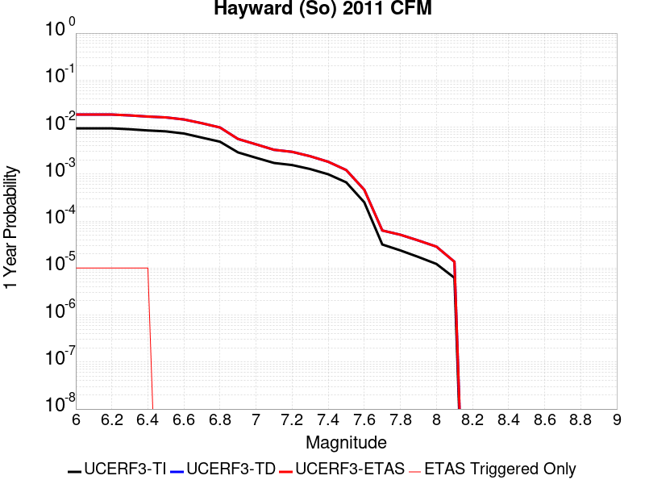 | 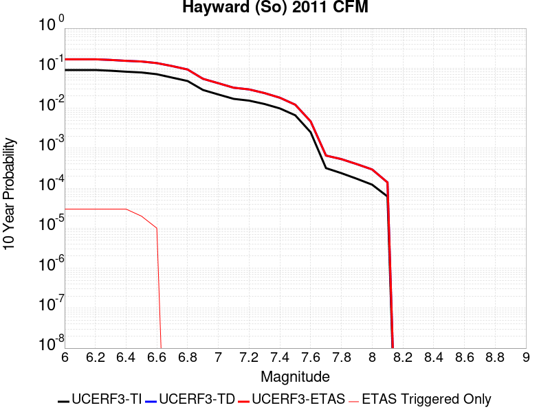 |

| Magnitude | 1 wk TI Prob | 1 wk TD Prob | 1 wk ETAS Prob | 1 wk ETAS/TD Gain | 1 wk ETAS Triggered Only | 1 mo TI Prob | 1 mo TD Prob | 1 mo ETAS Prob | 1 mo ETAS/TD Gain | 1 mo ETAS Triggered Only | 1 yr TI Prob | 1 yr TD Prob | 1 yr ETAS Prob | 1 yr ETAS/TD Gain | 1 yr ETAS Triggered Only | 10 yr TI Prob | 10 yr TD Prob | 10 yr ETAS Prob | 10 yr ETAS/TD Gain | 10 yr ETAS Triggered Only |
|-----|-----|-----|-----|-----|-----|-----|-----|-----|-----|-----|-----|-----|-----|-----|-----|-----|-----|-----|-----|-----|
| 6.0 | 1.8091932E-4 | 3.5726093E-4 | 3.5726093E-4 | 1.0 | 0.0 | 7.751381E-4 | 0.0015302298 | 0.0015302298 | 1.0 | 0.0 | 0.00939654 | 0.018473808 | 0.018484002 | 1.0005518 | 1.0386697E-5 | 0.090090066 | 0.16681154 | 0.1668375 | 1.0001557 | 3.116009E-5 |
| 6.1 | 1.8091932E-4 | 3.5726093E-4 | 3.5726093E-4 | 1.0 | 0.0 | 7.751381E-4 | 0.0015302298 | 0.0015302298 | 1.0 | 0.0 | 0.00939654 | 0.018473808 | 0.018484002 | 1.0005518 | 1.0386697E-5 | 0.090090066 | 0.16681154 | 0.1668375 | 1.0001557 | 3.116009E-5 |
| 6.2 | 1.8091932E-4 | 3.5726093E-4 | 3.5726093E-4 | 1.0 | 0.0 | 7.751381E-4 | 0.0015302298 | 0.0015302298 | 1.0 | 0.0 | 0.00939654 | 0.018473808 | 0.018484002 | 1.0005518 | 1.0386697E-5 | 0.090090066 | 0.16681154 | 0.1668375 | 1.0001557 | 3.116009E-5 |
| 6.3 | 1.7322872E-4 | 3.4282645E-4 | 3.4282645E-4 | 1.0 | 0.0 | 7.4219756E-4 | 0.0014684385 | 0.0014684385 | 1.0 | 0.0 | 0.0089988755 | 0.017733958 | 0.01774416 | 1.0005753 | 1.0386697E-5 | 0.08643075 | 0.16074646 | 0.1607726 | 1.0001627 | 3.116009E-5 |
| 6.4 | 1.6334097E-4 | 3.2363975E-4 | 3.2363975E-4 | 1.0 | 0.0 | 6.998449E-4 | 0.0013862988 | 0.0013862988 | 1.0 | 0.0 | 0.008487372 | 0.016749581 | 0.016759794 | 1.0006098 | 1.0386697E-5 | 0.081704415 | 0.15263419 | 0.1526606 | 1.000173 | 3.116009E-5 |
| 6.5 | 1.5600289E-4 | 3.103831E-4 | 3.103831E-4 | 1.0 | 0.0 | 6.684125E-4 | 0.0013295435 | 0.0013295435 | 1.0 | 0.0 | 0.008107598 | 0.016068943 | 0.016068943 | 1.0 | 0.0 | 0.078181036 | 0.14691001 | 0.14692774 | 1.0001206 | 2.0773394E-5 |
| 6.6 | 1.4046066E-4 | 2.805153E-4 | 2.805153E-4 | 1.0 | 0.0 | 6.018354E-4 | 0.0012016613 | 0.0012016613 | 1.0 | 0.0 | 0.0073027555 | 0.014533587 | 0.014533587 | 1.0 | 0.0 | 0.07067384 | 0.13399512 | 0.1340041 | 1.0000671 | 1.0386697E-5 |
| 6.7 | 1.14696966E-4 | 2.3288323E-4 | 2.3288323E-4 | 1.0 | 0.0 | 4.914658E-4 | 9.976943E-4 | 9.976943E-4 | 1.0 | 0.0 | 0.0059671924 | 0.01208034 | 0.01208034 | 1.0 | 0.0 | 0.058094822 | 0.11281668 | 0.11281668 | 1.0 | 0.0 |
| 6.8 | 9.3874296E-5 | 1.8875435E-4 | 1.8875435E-4 | 1.0 | 0.0 | 4.0225635E-4 | 8.0870016E-4 | 8.0870016E-4 | 1.0 | 0.0 | 0.0048864787 | 0.00980221 | 0.00980221 | 1.0 | 0.0 | 0.047804173 | 0.09265828 | 0.09265828 | 1.0 | 0.0 |
| 6.9 | 5.551852E-5 | 1.0737576E-4 | 1.0737576E-4 | 1.0 | 0.0 | 2.3791482E-4 | 4.601013E-4 | 4.601013E-4 | 1.0 | 0.0 | 0.0028927654 | 0.005587464 | 0.005587464 | 1.0 | 0.0 | 0.028553981 | 0.054282483 | 0.054282483 | 1.0 | 0.0 |
| 7.0 | 4.2662363E-5 | 8.252773E-5 | 8.252773E-5 | 1.0 | 0.0 | 1.8282588E-4 | 3.5364274E-4 | 3.5364274E-4 | 1.0 | 0.0 | 0.0022236328 | 0.0042971736 | 0.0042971736 | 1.0 | 0.0 | 0.022015138 | 0.042094123 | 0.042094123 | 1.0 | 0.0 |
| 7.1 | 3.305886E-5 | 6.307206E-5 | 6.307206E-5 | 1.0 | 0.0 | 1.4167312E-4 | 2.7028093E-4 | 2.7028093E-4 | 1.0 | 0.0 | 0.0017235056 | 0.0032857237 | 0.0032857237 | 1.0 | 0.0 | 0.017101998 | 0.032478187 | 0.032478187 | 1.0 | 0.0 |
| 7.2 | 2.9856887E-5 | 5.7064462E-5 | 5.7064462E-5 | 1.0 | 0.0 | 1.2795182E-4 | 2.4453914E-4 | 2.4453914E-4 | 1.0 | 0.0 | 0.0015567001 | 0.0029732161 | 0.0029732161 | 1.0 | 0.0 | 0.015458403 | 0.029477973 | 0.029477973 | 1.0 | 0.0 |
| 7.3 | 2.4559737E-5 | 4.603359E-5 | 4.603359E-5 | 1.0 | 0.0 | 1.0525176E-4 | 1.9727198E-4 | 1.9727198E-4 | 1.0 | 0.0 | 0.0012806869 | 0.0023991538 | 0.0023991538 | 1.0 | 0.0 | 0.012733313 | 0.023878254 | 0.023878254 | 1.0 | 0.0 |
| 7.4 | 1.9002231E-5 | 3.5085814E-5 | 3.5085814E-5 | 1.0 | 0.0 | 8.143559E-5 | 1.5035916E-4 | 1.5035916E-4 | 1.0 | 0.0 | 9.910273E-4 | 0.0018290955 | 0.0018290955 | 1.0 | 0.0 | 0.009866194 | 0.01827623 | 0.01827623 | 1.0 | 0.0 |
| 7.5 | 1.2783333E-5 | 2.3358793E-5 | 2.3358793E-5 | 1.0 | 0.0 | 5.4784563E-5 | 1.001053E-4 | 1.001053E-4 | 1.0 | 0.0 | 6.667979E-4 | 0.0012181065 | 0.0012181065 | 1.0 | 0.0 | 0.006648007 | 0.012223811 | 0.012223811 | 1.0 | 0.0 |
| 7.6 | 4.8149627E-6 | 8.8984125E-6 | 8.8984125E-6 | 1.0 | 0.0 | 2.063539E-5 | 3.8135506E-5 | 3.8135506E-5 | 1.0 | 0.0 | 2.5120692E-4 | 4.6420208E-4 | 4.6420208E-4 | 1.0 | 0.0 | 0.0025092314 | 0.0046865833 | 0.0046865833 | 1.0 | 0.0 |
| 7.7 | 6.0838227E-7 | 1.2079701E-6 | 1.2079701E-6 | 1.0 | 0.0 | 2.6073499E-6 | 5.177004E-6 | 5.177004E-6 | 1.0 | 0.0 | 3.174402E-5 | 6.30282E-5 | 6.30282E-5 | 1.0 | 0.0 | 3.1739488E-4 | 6.5405015E-4 | 6.5405015E-4 | 1.0 | 0.0 |
| 7.8 | 4.5542808E-7 | 9.812286E-7 | 9.812286E-7 | 1.0 | 0.0 | 1.9518332E-6 | 4.2052584E-6 | 4.2052584E-6 | 1.0 | 0.0 | 2.376331E-5 | 5.119782E-5 | 5.119782E-5 | 1.0 | 0.0 | 2.3760769E-4 | 5.331101E-4 | 5.331101E-4 | 1.0 | 0.0 |
| 7.9 | 3.3016747E-7 | 7.401128E-7 | 7.401128E-7 | 1.0 | 0.0 | 1.4150027E-6 | 3.171908E-6 | 3.171908E-6 | 1.0 | 0.0 | 1.7227521E-5 | 3.8617298E-5 | 3.8617298E-5 | 1.0 | 0.0 | 1.7226185E-4 | 4.0002094E-4 | 4.0002094E-4 | 1.0 | 0.0 |
| 8.0 | 2.347038E-7 | 5.4817883E-7 | 5.4817883E-7 | 1.0 | 0.0 | 1.0058731E-6 | 2.3493355E-6 | 2.3493355E-6 | 1.0 | 0.0 | 1.2246436E-5 | 2.8602788E-5 | 2.8602788E-5 | 1.0 | 0.0 | 1.2245761E-4 | 2.940476E-4 | 2.940476E-4 | 1.0 | 0.0 |
| 8.1 | 1.18822804E-7 | 2.6104607E-7 | 2.6104607E-7 | 1.0 | 0.0 | 5.092405E-7 | 1.1187684E-6 | 1.1187684E-6 | 1.0 | 0.0 | 6.1999854E-6 | 1.3620921E-5 | 1.3620921E-5 | 1.0 | 0.0 | 6.199812E-5 | 1.394018E-4 | 1.394018E-4 | 1.0 | 0.0 |

## San Jacinto (Lytle Creek connector)
*[(top)](#table-of-contents)*

| 1 Week | 1 Month | 1 Year | 10 Year |
|-----|-----|-----|-----|
|  |  |  |  |

| Magnitude | 1 wk TI Prob | 1 wk TD Prob | 1 wk ETAS Prob | 1 wk ETAS/TD Gain | 1 wk ETAS Triggered Only | 1 mo TI Prob | 1 mo TD Prob | 1 mo ETAS Prob | 1 mo ETAS/TD Gain | 1 mo ETAS Triggered Only | 1 yr TI Prob | 1 yr TD Prob | 1 yr ETAS Prob | 1 yr ETAS/TD Gain | 1 yr ETAS Triggered Only | 10 yr TI Prob | 10 yr TD Prob | 10 yr ETAS Prob | 10 yr ETAS/TD Gain | 10 yr ETAS Triggered Only |
|-----|-----|-----|-----|-----|-----|-----|-----|-----|-----|-----|-----|-----|-----|-----|-----|-----|-----|-----|-----|-----|
| 6.0 | 6.693995E-6 | 6.6710027E-6 | 6.6710027E-6 | 1.0 | 0.0 | 2.8688235E-5 | 2.8589699E-5 | 2.8589699E-5 | 1.0 | 0.0 | 3.492233E-4 | 3.4802407E-4 | 3.5840715E-4 | 1.0298344 | 1.0386697E-5 | 0.00348675 | 0.0035549873 | 0.0035860366 | 1.008734 | 3.116009E-5 |
| 6.1 | 6.693995E-6 | 6.6710027E-6 | 6.6710027E-6 | 1.0 | 0.0 | 2.8688235E-5 | 2.8589699E-5 | 2.8589699E-5 | 1.0 | 0.0 | 3.492233E-4 | 3.4802407E-4 | 3.5840715E-4 | 1.0298344 | 1.0386697E-5 | 0.00348675 | 0.0035549873 | 0.0035860366 | 1.008734 | 3.116009E-5 |
| 6.2 | 6.693995E-6 | 6.6710027E-6 | 6.6710027E-6 | 1.0 | 0.0 | 2.8688235E-5 | 2.8589699E-5 | 2.8589699E-5 | 1.0 | 0.0 | 3.492233E-4 | 3.4802407E-4 | 3.5840715E-4 | 1.0298344 | 1.0386697E-5 | 0.00348675 | 0.0035549873 | 0.0035860366 | 1.008734 | 3.116009E-5 |
| 6.3 | 6.693995E-6 | 6.6710027E-6 | 6.6710027E-6 | 1.0 | 0.0 | 2.8688235E-5 | 2.8589699E-5 | 2.8589699E-5 | 1.0 | 0.0 | 3.492233E-4 | 3.4802407E-4 | 3.5840715E-4 | 1.0298344 | 1.0386697E-5 | 0.00348675 | 0.0035549873 | 0.0035860366 | 1.008734 | 3.116009E-5 |
| 6.4 | 6.693995E-6 | 6.6710027E-6 | 6.6710027E-6 | 1.0 | 0.0 | 2.8688235E-5 | 2.8589699E-5 | 2.8589699E-5 | 1.0 | 0.0 | 3.492233E-4 | 3.4802407E-4 | 3.5840715E-4 | 1.0298344 | 1.0386697E-5 | 0.00348675 | 0.0035549873 | 0.0035860366 | 1.008734 | 3.116009E-5 |
| 6.5 | 6.6561875E-6 | 6.63122E-6 | 6.63122E-6 | 1.0 | 0.0 | 2.8526205E-5 | 2.8419205E-5 | 2.8419205E-5 | 1.0 | 0.0 | 3.472512E-4 | 3.4594897E-4 | 3.5633205E-4 | 1.0300134 | 1.0386697E-5 | 0.0034670907 | 0.0035343023 | 0.0035653522 | 1.0087854 | 3.116009E-5 |
| 6.6 | 6.6561875E-6 | 6.63122E-6 | 6.63122E-6 | 1.0 | 0.0 | 2.8526205E-5 | 2.8419205E-5 | 2.8419205E-5 | 1.0 | 0.0 | 3.472512E-4 | 3.4594897E-4 | 3.5633205E-4 | 1.0300134 | 1.0386697E-5 | 0.0034670907 | 0.0035343023 | 0.0035653522 | 1.0087854 | 3.116009E-5 |
| 6.7 | 6.5802237E-6 | 6.550394E-6 | 6.550394E-6 | 1.0 | 0.0 | 2.8200653E-5 | 2.8072815E-5 | 2.8072815E-5 | 1.0 | 0.0 | 3.4328885E-4 | 3.41733E-4 | 3.5211616E-4 | 1.0303838 | 1.0386697E-5 | 0.0034275902 | 0.0034922757 | 0.003523327 | 1.0088915 | 3.116009E-5 |
| 6.8 | 6.575632E-6 | 6.544883E-6 | 6.544883E-6 | 1.0 | 0.0 | 2.8180975E-5 | 2.8049197E-5 | 2.8049197E-5 | 1.0 | 0.0 | 3.4304935E-4 | 3.4144553E-4 | 3.518287E-4 | 1.0304093 | 1.0386697E-5 | 0.0034252026 | 0.00348941 | 0.0035204615 | 1.0088987 | 3.116009E-5 |
| 6.9 | 6.570433E-6 | 6.5362756E-6 | 6.5362756E-6 | 1.0 | 0.0 | 2.8158694E-5 | 2.801231E-5 | 2.801231E-5 | 1.0 | 0.0 | 3.4277816E-4 | 3.4099657E-4 | 3.513797E-4 | 1.0304494 | 1.0386697E-5 | 0.0034224992 | 0.0034849346 | 0.003515986 | 1.0089102 | 3.116009E-5 |
| 7.0 | 6.5643826E-6 | 6.526395E-6 | 6.526395E-6 | 1.0 | 0.0 | 2.8132765E-5 | 2.7969963E-5 | 2.7969963E-5 | 1.0 | 0.0 | 3.424626E-4 | 3.4048117E-4 | 3.5086434E-4 | 1.0304955 | 1.0386697E-5 | 0.0034193532 | 0.0034797967 | 0.0035108484 | 1.0089234 | 3.116009E-5 |
| 7.1 | 6.557402E-6 | 6.515105E-6 | 6.515105E-6 | 1.0 | 0.0 | 2.8102848E-5 | 2.792158E-5 | 2.792158E-5 | 1.0 | 0.0 | 3.4209844E-4 | 3.3989229E-4 | 3.5027546E-4 | 1.0305485 | 1.0386697E-5 | 0.0034157229 | 0.0034739273 | 0.0035049792 | 1.0089386 | 3.116009E-5 |
| 7.2 | 6.546394E-6 | 6.4970677E-6 | 6.4970677E-6 | 1.0 | 0.0 | 2.8055672E-5 | 2.784428E-5 | 2.784428E-5 | 1.0 | 0.0 | 3.4152428E-4 | 3.3895145E-4 | 3.4933462E-4 | 1.0306332 | 1.0386697E-5 | 0.0034099987 | 0.0034645528 | 0.003495605 | 1.0089629 | 3.116009E-5 |
| 7.3 | 6.5364216E-6 | 6.477847E-6 | 6.477847E-6 | 1.0 | 0.0 | 2.8012933E-5 | 2.7761906E-5 | 2.7761906E-5 | 1.0 | 0.0 | 3.4100408E-4 | 3.3794885E-4 | 3.4833205E-4 | 1.0307242 | 1.0386697E-5 | 0.003404813 | 0.003454571 | 0.0034856233 | 1.0089889 | 3.116009E-5 |
| 7.4 | 6.5269523E-6 | 6.4589262E-6 | 6.4589262E-6 | 1.0 | 0.0 | 2.7972354E-5 | 2.7680819E-5 | 2.7680819E-5 | 1.0 | 0.0 | 3.4051016E-4 | 3.3696194E-4 | 3.473451E-4 | 1.0308142 | 1.0386697E-5 | 0.0033998888 | 0.003444749 | 0.0034758018 | 1.0090145 | 3.116009E-5 |
| 7.5 | 6.5111835E-6 | 6.435192E-6 | 6.435192E-6 | 1.0 | 0.0 | 2.7904773E-5 | 2.7579103E-5 | 2.7579103E-5 | 1.0 | 0.0 | 3.3968766E-4 | 3.3572392E-4 | 3.4610712E-4 | 1.0309278 | 1.0386697E-5 | 0.0033916887 | 0.003432418 | 0.003463471 | 1.009047 | 3.116009E-5 |
| 7.6 | 6.4768806E-6 | 6.3942884E-6 | 6.3942884E-6 | 1.0 | 0.0 | 2.7757764E-5 | 2.7403805E-5 | 2.7403805E-5 | 1.0 | 0.0 | 3.3789838E-4 | 3.3359032E-4 | 3.4397354E-4 | 1.0311257 | 1.0386697E-5 | 0.0033738504 | 0.0034111436 | 0.0034421973 | 1.0091037 | 3.116009E-5 |
| 7.7 | 6.1655364E-6 | 6.1866886E-6 | 6.1866886E-6 | 1.0 | 0.0 | 2.642346E-5 | 2.651411E-5 | 2.651411E-5 | 1.0 | 0.0 | 3.2165812E-4 | 3.2276154E-4 | 3.3314488E-4 | 1.0321703 | 1.0386697E-5 | 0.0032119295 | 0.0033027146 | 0.0033337718 | 1.0094036 | 3.116009E-5 |
| 7.8 | 5.5043524E-6 | 5.747449E-6 | 5.747449E-6 | 1.0 | 0.0 | 2.3589868E-5 | 2.4631692E-5 | 2.4631692E-5 | 1.0 | 0.0 | 2.871688E-4 | 2.9984963E-4 | 3.102332E-4 | 1.0346293 | 1.0386697E-5 | 0.0028679797 | 0.0030726613 | 0.0031037256 | 1.0101099 | 3.116009E-5 |
| 7.9 | 3.889249E-6 | 4.0851965E-6 | 4.0851965E-6 | 1.0 | 0.0 | 1.6668104E-5 | 1.7507866E-5 | 1.7507866E-5 | 1.0 | 0.0 | 2.0291525E-4 | 2.1313746E-4 | 2.2352194E-4 | 1.048722 | 1.0386697E-5 | 0.0020273007 | 0.0021987387 | 0.0022194663 | 1.0094271 | 2.0773394E-5 |
| 8.0 | 2.668535E-6 | 2.537347E-6 | 2.537347E-6 | 1.0 | 0.0 | 1.1436528E-5 | 1.0874299E-5 | 1.0874299E-5 | 1.0 | 0.0 | 1.3923083E-4 | 1.3238657E-4 | 1.4277188E-4 | 1.078447 | 1.0386697E-5 | 0.0013914363 | 0.0013788831 | 0.0013996279 | 1.0150446 | 2.0773394E-5 |
| 8.1 | 1.5911459E-6 | 1.2217948E-6 | 1.2217948E-6 | 1.0 | 0.0 | 6.8191785E-6 | 5.2362534E-6 | 5.2362534E-6 | 1.0 | 0.0 | 8.3020335E-5 | 6.374954E-5 | 7.4135576E-5 | 1.1629194 | 1.0386697E-5 | 8.298933E-4 | 6.7100645E-4 | 6.917659E-4 | 1.0309378 | 2.0773394E-5 |
| 8.2 | 6.1294963E-7 | 2.1905348E-7 | 2.1905348E-7 | 1.0 | 0.0 | 2.6269242E-6 | 9.3880027E-7 | 9.3880027E-7 | 1.0 | 0.0 | 3.1982334E-5 | 1.1429834E-5 | 1.1429834E-5 | 1.0 | 0.0 | 3.1977732E-4 | 1.2836853E-4 | 1.2836853E-4 | 1.0 | 0.0 |
| 8.3 | 1.762871E-7 | 4.7785655E-8 | 4.7785655E-8 | 1.0 | 0.0 | 7.5551594E-7 | 2.0479564E-7 | 2.0479564E-7 | 1.0 | 0.0 | 9.1983675E-6 | 2.4933843E-6 | 2.4933843E-6 | 1.0 | 0.0 | 9.197987E-5 | 2.8824745E-5 | 2.8824745E-5 | 1.0 | 0.0 |

## Coronado Bank alt1
*[(top)](#table-of-contents)*

| 1 Week | 1 Month | 1 Year | 10 Year |
|-----|-----|-----|-----|
|  |  |  |  |

| Magnitude | 1 wk TI Prob | 1 wk TD Prob | 1 wk ETAS Prob | 1 wk ETAS/TD Gain | 1 wk ETAS Triggered Only | 1 mo TI Prob | 1 mo TD Prob | 1 mo ETAS Prob | 1 mo ETAS/TD Gain | 1 mo ETAS Triggered Only | 1 yr TI Prob | 1 yr TD Prob | 1 yr ETAS Prob | 1 yr ETAS/TD Gain | 1 yr ETAS Triggered Only | 10 yr TI Prob | 10 yr TD Prob | 10 yr ETAS Prob | 10 yr ETAS/TD Gain | 10 yr ETAS Triggered Only |
|-----|-----|-----|-----|-----|-----|-----|-----|-----|-----|-----|-----|-----|-----|-----|-----|-----|-----|-----|-----|-----|
| 6.0 | 7.533492E-5 | 9.39618E-5 | 9.39618E-5 | 1.0 | 0.0 | 3.22824E-4 | 4.0263552E-4 | 4.1301802E-4 | 1.0257864 | 1.0386697E-5 | 0.0039233007 | 0.0048915995 | 0.0049019353 | 1.002113 | 1.0386697E-5 | 0.03854755 | 0.04790961 | 0.04793928 | 1.0006193 | 3.116009E-5 |
| 6.1 | 4.1807285E-5 | 5.049851E-5 | 5.049851E-5 | 1.0 | 0.0 | 1.7916178E-4 | 2.1640482E-4 | 2.1640482E-4 | 1.0 | 0.0 | 0.0021791123 | 0.0026316417 | 0.0026316417 | 1.0 | 0.0 | 0.021578677 | 0.026013888 | 0.02603412 | 1.0007777 | 2.0773394E-5 |
| 6.2 | 4.1807285E-5 | 5.049851E-5 | 5.049851E-5 | 1.0 | 0.0 | 1.7916178E-4 | 2.1640482E-4 | 2.1640482E-4 | 1.0 | 0.0 | 0.0021791123 | 0.0026316417 | 0.0026316417 | 1.0 | 0.0 | 0.021578677 | 0.026013888 | 0.02603412 | 1.0007777 | 2.0773394E-5 |
| 6.3 | 3.1793104E-5 | 3.7714894E-5 | 3.7714894E-5 | 1.0 | 0.0 | 1.3624904E-4 | 1.6162546E-4 | 1.6162546E-4 | 1.0 | 0.0 | 0.0016575698 | 0.0019660434 | 0.0019660434 | 1.0 | 0.0 | 0.016452603 | 0.019490387 | 0.019510755 | 1.0010451 | 2.0773394E-5 |
| 6.4 | 2.9878007E-5 | 3.5339268E-5 | 3.5339268E-5 | 1.0 | 0.0 | 1.2804232E-4 | 1.514454E-4 | 1.514454E-4 | 1.0 | 0.0 | 0.0015578003 | 0.0018423185 | 0.0018423185 | 1.0 | 0.0 | 0.015469253 | 0.018274212 | 0.018294606 | 1.001116 | 2.0773394E-5 |
| 6.5 | 2.4512565E-5 | 2.8766724E-5 | 2.8766724E-5 | 1.0 | 0.0 | 1.0504962E-4 | 1.2328029E-4 | 1.2328029E-4 | 1.0 | 0.0 | 0.0012782287 | 0.0014999318 | 0.0014999318 | 1.0 | 0.0 | 0.012709012 | 0.01490106 | 0.014921524 | 1.0013733 | 2.0773394E-5 |
| 6.6 | 2.1317413E-5 | 2.4908924E-5 | 2.4908924E-5 | 1.0 | 0.0 | 9.135714E-5 | 1.06748295E-4 | 1.06748295E-4 | 1.0 | 0.0 | 0.0011117056 | 0.0012989079 | 0.0012989079 | 1.0 | 0.0 | 0.011061605 | 0.012915566 | 0.012925818 | 1.0007938 | 1.0386697E-5 |
| 6.7 | 1.8585655E-5 | 2.163679E-5 | 2.163679E-5 | 1.0 | 0.0 | 7.9650374E-5 | 9.272592E-5 | 9.272592E-5 | 1.0 | 0.0 | 9.6931186E-4 | 0.0011283738 | 0.0011283738 | 1.0 | 0.0 | 0.0096509475 | 0.011228608 | 0.011238878 | 1.0009147 | 1.0386697E-5 |
| 6.8 | 1.5862879E-5 | 1.8421075E-5 | 1.8421075E-5 | 1.0 | 0.0 | 6.798199E-5 | 7.894518E-5 | 7.894518E-5 | 1.0 | 0.0 | 8.273665E-4 | 9.60753E-4 | 9.60753E-4 | 1.0 | 0.0 | 0.008242928 | 0.009567977 | 0.009578264 | 1.0010751 | 1.0386697E-5 |
| 6.9 | 1.3021509E-5 | 1.50965625E-5 | 1.50965625E-5 | 1.0 | 0.0 | 5.5805274E-5 | 6.4698055E-5 | 6.4698055E-5 | 1.0 | 0.0 | 6.792174E-4 | 7.8743225E-4 | 7.8743225E-4 | 1.0 | 0.0 | 0.006771452 | 0.007848245 | 0.00785855 | 1.0013131 | 1.0386697E-5 |
| 7.0 | 1.0974371E-5 | 1.27212E-5 | 1.27212E-5 | 1.0 | 0.0 | 4.7032172E-5 | 5.4518387E-5 | 5.4518387E-5 | 1.0 | 0.0 | 5.7246623E-4 | 6.6357676E-4 | 6.6357676E-4 | 1.0 | 0.0 | 0.0057099373 | 0.006617703 | 0.0066280207 | 1.0015591 | 1.0386697E-5 |
| 7.1 | 8.766221E-6 | 1.0164713E-5 | 1.0164713E-5 | 1.0 | 0.0 | 3.7568978E-5 | 4.3562424E-5 | 4.3562424E-5 | 1.0 | 0.0 | 4.573063E-4 | 5.302607E-4 | 5.302607E-4 | 1.0 | 0.0 | 0.0045636636 | 0.0052916543 | 0.0052916543 | 1.0 | 0.0 |
| 7.2 | 8.026024E-7 | 8.332054E-7 | 8.332054E-7 | 1.0 | 0.0 | 3.43972E-6 | 3.5708754E-6 | 3.5708754E-6 | 1.0 | 0.0 | 4.1877785E-5 | 4.3474553E-5 | 4.3474553E-5 | 1.0 | 0.0 | 4.1869894E-4 | 4.3466155E-4 | 4.3466155E-4 | 1.0 | 0.0 |
| 7.3 | 3.7293114E-7 | 3.7001894E-7 | 3.7001894E-7 | 1.0 | 0.0 | 1.5982754E-6 | 1.5857945E-6 | 1.5857945E-6 | 1.0 | 0.0 | 1.9458828E-5 | 1.9306877E-5 | 1.9306877E-5 | 1.0 | 0.0 | 1.9457124E-4 | 1.9305207E-4 | 1.9305207E-4 | 1.0 | 0.0 |
| 7.4 | 2.0557036E-7 | 1.9674766E-7 | 1.9674766E-7 | 1.0 | 0.0 | 8.810155E-7 | 8.4320396E-7 | 8.4320396E-7 | 1.0 | 0.0 | 1.0726311E-5 | 1.0265961E-5 | 1.0265961E-5 | 1.0 | 0.0 | 1.0725793E-4 | 1.0265489E-4 | 1.0265489E-4 | 1.0 | 0.0 |
| 7.5 | 6.845446E-8 | 6.2794456E-8 | 6.2794456E-8 | 1.0 | 0.0 | 2.9337625E-7 | 2.6911906E-7 | 2.6911906E-7 | 1.0 | 0.0 | 3.5718497E-6 | 3.2765197E-6 | 3.2765197E-6 | 1.0 | 0.0 | 3.5717923E-5 | 3.2764725E-5 | 3.2764725E-5 | 1.0 | 0.0 |
| 7.6 | 6.0975145E-9 | 5.5318936E-9 | 5.5318936E-9 | 1.0 | 0.0 | 2.6132206E-8 | 2.3708115E-8 | 2.3708115E-8 | 1.0 | 0.0 | 3.1815955E-7 | 2.8864628E-7 | 2.8864628E-7 | 1.0 | 0.0 | 3.181591E-6 | 2.88646E-6 | 2.88646E-6 | 1.0 | 0.0 |

## Pittville 2011 CFM
*[(top)](#table-of-contents)*

| 1 Week | 1 Month | 1 Year | 10 Year |
|-----|-----|-----|-----|
|  |  |  |  |

| Magnitude | 1 wk TI Prob | 1 wk TD Prob | 1 wk ETAS Prob | 1 wk ETAS/TD Gain | 1 wk ETAS Triggered Only | 1 mo TI Prob | 1 mo TD Prob | 1 mo ETAS Prob | 1 mo ETAS/TD Gain | 1 mo ETAS Triggered Only | 1 yr TI Prob | 1 yr TD Prob | 1 yr ETAS Prob | 1 yr ETAS/TD Gain | 1 yr ETAS Triggered Only | 10 yr TI Prob | 10 yr TD Prob | 10 yr ETAS Prob | 10 yr ETAS/TD Gain | 10 yr ETAS Triggered Only |
|-----|-----|-----|-----|-----|-----|-----|-----|-----|-----|-----|-----|-----|-----|-----|-----|-----|-----|-----|-----|-----|
| 6.0 | 2.5031832E-5 | 2.7058131E-5 | 2.7058131E-5 | 1.0 | 0.0 | 1.0727487E-4 | 1.15958814E-4 | 1.15958814E-4 | 1.0 | 0.0 | 0.001305289 | 0.0014109816 | 0.0014213537 | 1.0073509 | 1.0386697E-5 | 0.012976485 | 0.014030014 | 0.014050496 | 1.0014598 | 2.0773394E-5 |
| 6.1 | 1.2540113E-5 | 1.3513622E-5 | 1.3513622E-5 | 1.0 | 0.0 | 5.3742235E-5 | 5.7914367E-5 | 5.7914367E-5 | 1.0 | 0.0 | 6.541153E-4 | 7.0490176E-4 | 7.0490176E-4 | 1.0 | 0.0 | 0.0065219323 | 0.0070288926 | 0.0070392066 | 1.0014673 | 1.0386697E-5 |
| 6.2 | 6.603218E-6 | 7.107477E-6 | 7.107477E-6 | 1.0 | 0.0 | 2.8299199E-5 | 3.0460296E-5 | 3.0460296E-5 | 1.0 | 0.0 | 3.4448825E-4 | 3.707975E-4 | 3.707975E-4 | 1.0 | 0.0 | 0.0034395473 | 0.003702429 | 0.003712777 | 1.002795 | 1.0386697E-5 |
| 6.3 | 6.603218E-6 | 7.107477E-6 | 7.107477E-6 | 1.0 | 0.0 | 2.8299199E-5 | 3.0460296E-5 | 3.0460296E-5 | 1.0 | 0.0 | 3.4448825E-4 | 3.707975E-4 | 3.707975E-4 | 1.0 | 0.0 | 0.0034395473 | 0.003702429 | 0.003712777 | 1.002795 | 1.0386697E-5 |
| 6.4 | 3.9389015E-6 | 4.2393463E-6 | 4.2393463E-6 | 1.0 | 0.0 | 1.6880897E-5 | 1.816852E-5 | 1.816852E-5 | 1.0 | 0.0 | 2.0550552E-4 | 2.2118236E-4 | 2.2118236E-4 | 1.0 | 0.0 | 0.0020531558 | 0.0022099272 | 0.0022099272 | 1.0 | 0.0 |
| 6.5 | 2.4533072E-6 | 2.6413759E-6 | 2.6413759E-6 | 1.0 | 0.0 | 1.0514132E-5 | 1.1320145E-5 | 1.1320145E-5 | 1.0 | 0.0 | 1.2800204E-4 | 1.3781598E-4 | 1.3781598E-4 | 1.0 | 0.0 | 0.0012792832 | 0.0013774954 | 0.0013774954 | 1.0 | 0.0 |
| 6.6 | 1.3482367E-6 | 1.453053E-6 | 1.453053E-6 | 1.0 | 0.0 | 5.778144E-6 | 6.2273616E-6 | 6.2273616E-6 | 1.0 | 0.0 | 7.0346636E-5 | 7.581662E-5 | 7.581662E-5 | 1.0 | 0.0 | 7.032437E-4 | 7.5801864E-4 | 7.5801864E-4 | 1.0 | 0.0 |

## San Clemente
*[(top)](#table-of-contents)*

| 1 Week | 1 Month | 1 Year | 10 Year |
|-----|-----|-----|-----|
|  |  |  |  |

| Magnitude | 1 wk TI Prob | 1 wk TD Prob | 1 wk ETAS Prob | 1 wk ETAS/TD Gain | 1 wk ETAS Triggered Only | 1 mo TI Prob | 1 mo TD Prob | 1 mo ETAS Prob | 1 mo ETAS/TD Gain | 1 mo ETAS Triggered Only | 1 yr TI Prob | 1 yr TD Prob | 1 yr ETAS Prob | 1 yr ETAS/TD Gain | 1 yr ETAS Triggered Only | 10 yr TI Prob | 10 yr TD Prob | 10 yr ETAS Prob | 10 yr ETAS/TD Gain | 10 yr ETAS Triggered Only |
|-----|-----|-----|-----|-----|-----|-----|-----|-----|-----|-----|-----|-----|-----|-----|-----|-----|-----|-----|-----|-----|
| 6.0 | 6.681379E-5 | 8.164408E-5 | 8.164408E-5 | 1.0 | 0.0 | 2.8631336E-4 | 3.4985956E-4 | 3.4985956E-4 | 1.0 | 0.0 | 0.003480294 | 0.0042518 | 0.0042621423 | 1.0024325 | 1.0386697E-5 | 0.03426291 | 0.04176052 | 0.041790377 | 1.000715 | 3.116009E-5 |
| 6.1 | 6.681379E-5 | 8.164408E-5 | 8.164408E-5 | 1.0 | 0.0 | 2.8631336E-4 | 3.4985956E-4 | 3.4985956E-4 | 1.0 | 0.0 | 0.003480294 | 0.0042518 | 0.0042621423 | 1.0024325 | 1.0386697E-5 | 0.03426291 | 0.04176052 | 0.041790377 | 1.000715 | 3.116009E-5 |
| 6.2 | 3.9400576E-5 | 4.645645E-5 | 4.645645E-5 | 1.0 | 0.0 | 1.6884868E-4 | 1.9908424E-4 | 1.9908424E-4 | 1.0 | 0.0 | 0.0020537945 | 0.0024212173 | 0.0024212173 | 1.0 | 0.0 | 0.020349167 | 0.02395512 | 0.023965258 | 1.0004232 | 1.0386697E-5 |
| 6.3 | 3.2590255E-5 | 3.79324E-5 | 3.79324E-5 | 1.0 | 0.0 | 1.3966505E-4 | 1.625575E-4 | 1.625575E-4 | 1.0 | 0.0 | 0.0016990956 | 0.001977371 | 0.001977371 | 1.0 | 0.0 | 0.01686163 | 0.019601561 | 0.019601561 | 1.0 | 0.0 |
| 6.4 | 2.9454652E-5 | 3.4100634E-5 | 3.4100634E-5 | 1.0 | 0.0 | 1.2622811E-4 | 1.4613755E-4 | 1.4613755E-4 | 1.0 | 0.0 | 0.0015357438 | 0.0017777971 | 0.0017777971 | 1.0 | 0.0 | 0.015251739 | 0.017638927 | 0.017638927 | 1.0 | 0.0 |
| 6.5 | 2.790836E-5 | 3.2250126E-5 | 3.2250126E-5 | 1.0 | 0.0 | 1.1960178E-4 | 1.3820764E-4 | 1.3820764E-4 | 1.0 | 0.0 | 0.001455179 | 0.0016814041 | 0.0016814041 | 1.0 | 0.0 | 0.014456868 | 0.016689846 | 0.016689846 | 1.0 | 0.0 |
| 6.6 | 2.2492153E-5 | 2.5764699E-5 | 2.5764699E-5 | 1.0 | 0.0 | 9.639138E-5 | 1.10415545E-4 | 1.10415545E-4 | 1.0 | 0.0 | 0.0011729331 | 0.0013434946 | 0.0013434946 | 1.0 | 0.0 | 0.011667615 | 0.013355441 | 0.013355441 | 1.0 | 0.0 |
| 6.7 | 1.9862755E-5 | 2.2668124E-5 | 2.2668124E-5 | 1.0 | 0.0 | 8.512331E-5 | 9.7145545E-5 | 9.7145545E-5 | 1.0 | 0.0 | 0.0010358836 | 0.0011821166 | 0.0011821166 | 1.0 | 0.0 | 0.010310682 | 0.011759577 | 0.011759577 | 1.0 | 0.0 |
| 6.8 | 1.6697575E-5 | 1.8979084E-5 | 1.8979084E-5 | 1.0 | 0.0 | 7.155907E-5 | 8.133645E-5 | 8.133645E-5 | 1.0 | 0.0 | 8.7088346E-4 | 9.898308E-4 | 9.898308E-4 | 1.0 | 0.0 | 0.008674784 | 0.009855248 | 0.009855248 | 1.0 | 0.0 |
| 6.9 | 1.5218415E-5 | 1.7270635E-5 | 1.7270635E-5 | 1.0 | 0.0 | 6.522015E-5 | 7.401496E-5 | 7.401496E-5 | 1.0 | 0.0 | 7.93766E-4 | 9.007684E-4 | 9.007684E-4 | 1.0 | 0.0 | 0.007909367 | 0.00897212 | 0.00897212 | 1.0 | 0.0 |
| 7.0 | 1.2392958E-5 | 1.4034001E-5 | 1.4034001E-5 | 1.0 | 0.0 | 5.3111595E-5 | 6.0144375E-5 | 6.0144375E-5 | 1.0 | 0.0 | 6.4644177E-4 | 7.320193E-4 | 7.320193E-4 | 1.0 | 0.0 | 0.0064456454 | 0.007296867 | 0.007296867 | 1.0 | 0.0 |
| 7.1 | 1.0934128E-5 | 1.2376004E-5 | 1.2376004E-5 | 1.0 | 0.0 | 4.6859706E-5 | 5.3038977E-5 | 5.3038977E-5 | 1.0 | 0.0 | 5.7036756E-4 | 6.4556557E-4 | 6.4556557E-4 | 1.0 | 0.0 | 0.0056890585 | 0.0064376486 | 0.0064376486 | 1.0 | 0.0 |
| 7.2 | 9.5798805E-6 | 1.0845695E-5 | 1.0845695E-5 | 1.0 | 0.0 | 4.1055984E-5 | 4.6480764E-5 | 4.6480764E-5 | 1.0 | 0.0 | 4.9974193E-4 | 5.6576356E-4 | 5.6576356E-4 | 1.0 | 0.0 | 0.0049861963 | 0.005643956 | 0.005643956 | 1.0 | 0.0 |
| 7.3 | 8.0167365E-6 | 9.084559E-6 | 9.084559E-6 | 1.0 | 0.0 | 3.4356988E-5 | 3.893328E-5 | 3.893328E-5 | 1.0 | 0.0 | 4.1821605E-4 | 4.7391668E-4 | 4.7391668E-4 | 1.0 | 0.0 | 0.0041742986 | 0.004729763 | 0.004729763 | 1.0 | 0.0 |
| 7.4 | 2.9581017E-6 | 3.362623E-6 | 3.362623E-6 | 1.0 | 0.0 | 1.2677518E-5 | 1.441119E-5 | 1.441119E-5 | 1.0 | 0.0 | 1.5433785E-4 | 1.7544716E-4 | 1.7544716E-4 | 1.0 | 0.0 | 0.001542307 | 0.0017535817 | 0.0017535817 | 1.0 | 0.0 |

## San Diego Trough south
*[(top)](#table-of-contents)*

| 1 Week | 1 Month | 1 Year | 10 Year |
|-----|-----|-----|-----|
|  |  |  |  |

| Magnitude | 1 wk TI Prob | 1 wk TD Prob | 1 wk ETAS Prob | 1 wk ETAS/TD Gain | 1 wk ETAS Triggered Only | 1 mo TI Prob | 1 mo TD Prob | 1 mo ETAS Prob | 1 mo ETAS/TD Gain | 1 mo ETAS Triggered Only | 1 yr TI Prob | 1 yr TD Prob | 1 yr ETAS Prob | 1 yr ETAS/TD Gain | 1 yr ETAS Triggered Only | 10 yr TI Prob | 10 yr TD Prob | 10 yr ETAS Prob | 10 yr ETAS/TD Gain | 10 yr ETAS Triggered Only |
|-----|-----|-----|-----|-----|-----|-----|-----|-----|-----|-----|-----|-----|-----|-----|-----|-----|-----|-----|-----|-----|
| 6.0 | 8.279495E-5 | 1.0425644E-4 | 1.0425644E-4 | 1.0 | 0.0 | 3.5478722E-4 | 4.467418E-4 | 4.7788795E-4 | 1.0697185 | 3.116009E-5 | 0.004310982 | 0.0054263812 | 0.005457372 | 1.0057112 | 3.116009E-5 | 0.042283054 | 0.052999042 | 0.05302855 | 1.0005568 | 3.116009E-5 |
| 6.1 | 4.6961468E-5 | 5.7736743E-5 | 5.7736743E-5 | 1.0 | 0.0 | 2.0124791E-4 | 2.4742068E-4 | 2.6818895E-4 | 1.0839391 | 2.0773394E-5 | 0.00244744 | 0.0030083342 | 0.003029045 | 1.0068845 | 2.0773394E-5 | 0.024206603 | 0.029682966 | 0.029703123 | 1.000679 | 2.0773394E-5 |
| 6.2 | 3.5079658E-5 | 4.2146152E-5 | 4.2146152E-5 | 1.0 | 0.0 | 1.5033272E-4 | 1.8061412E-4 | 1.9099894E-4 | 1.0574973 | 1.0386697E-5 | 0.0018287642 | 0.0021968025 | 0.0022071663 | 1.0047177 | 1.0386697E-5 | 0.018137876 | 0.021753421 | 0.021763582 | 1.0004671 | 1.0386697E-5 |
| 6.3 | 3.5079658E-5 | 4.2146152E-5 | 4.2146152E-5 | 1.0 | 0.0 | 1.5033272E-4 | 1.8061412E-4 | 1.9099894E-4 | 1.0574973 | 1.0386697E-5 | 0.0018287642 | 0.0021968025 | 0.0022071663 | 1.0047177 | 1.0386697E-5 | 0.018137876 | 0.021753421 | 0.021763582 | 1.0004671 | 1.0386697E-5 |
| 6.4 | 2.7196904E-5 | 3.2090265E-5 | 3.2090265E-5 | 1.0 | 0.0 | 1.16552954E-4 | 1.3752255E-4 | 1.4790782E-4 | 1.0755168 | 1.0386697E-5 | 0.0014181085 | 0.0016730648 | 0.0016834341 | 1.0061978 | 1.0386697E-5 | 0.014090929 | 0.016606223 | 0.016616438 | 1.0006151 | 1.0386697E-5 |
| 6.5 | 2.5584688E-5 | 3.0104491E-5 | 3.0104491E-5 | 1.0 | 0.0 | 1.0964406E-4 | 1.2901296E-4 | 1.2901296E-4 | 1.0 | 0.0 | 0.0013340989 | 0.0015696133 | 0.0015696133 | 1.0 | 0.0 | 0.013261181 | 0.015586771 | 0.015586771 | 1.0 | 0.0 |
| 6.6 | 2.2034688E-5 | 2.5745056E-5 | 2.5745056E-5 | 1.0 | 0.0 | 9.443096E-5 | 1.1033134E-4 | 1.1033134E-4 | 1.0 | 0.0 | 0.0011490905 | 0.0013424625 | 0.0013424625 | 1.0 | 0.0 | 0.011431668 | 0.013344509 | 0.013344509 | 1.0 | 0.0 |
| 6.7 | 1.9394853E-5 | 2.2543714E-5 | 2.2543714E-5 | 1.0 | 0.0 | 8.311815E-5 | 9.661237E-5 | 9.661237E-5 | 1.0 | 0.0 | 0.0010114936 | 0.0011756261 | 0.0011756261 | 1.0 | 0.0 | 0.01006902 | 0.011694773 | 0.011694773 | 1.0 | 0.0 |
| 6.8 | 1.7615313E-5 | 2.0404905E-5 | 2.0404905E-5 | 1.0 | 0.0 | 7.549201E-5 | 8.7446686E-5 | 8.7446686E-5 | 1.0 | 0.0 | 9.1872766E-4 | 0.0010641477 | 0.0010641477 | 1.0 | 0.0 | 0.009149387 | 0.010591088 | 0.010591088 | 1.0 | 0.0 |
| 6.9 | 1.5621423E-5 | 1.8027593E-5 | 1.8027593E-5 | 1.0 | 0.0 | 6.6947236E-5 | 7.725885E-5 | 7.725885E-5 | 1.0 | 0.0 | 8.147778E-4 | 9.402241E-4 | 9.402241E-4 | 1.0 | 0.0 | 0.008117969 | 0.009362906 | 0.009362906 | 1.0 | 0.0 |
| 7.0 | 1.3444376E-5 | 1.5449315E-5 | 1.5449315E-5 | 1.0 | 0.0 | 5.7617483E-5 | 6.6209686E-5 | 6.6209686E-5 | 1.0 | 0.0 | 7.0126704E-4 | 8.0580753E-4 | 8.0580753E-4 | 1.0 | 0.0 | 0.006990582 | 0.00802919 | 0.00802919 | 1.0 | 0.0 |
| 7.1 | 1.2268361E-5 | 1.4074132E-5 | 1.4074132E-5 | 1.0 | 0.0 | 5.2577634E-5 | 6.031633E-5 | 6.031633E-5 | 1.0 | 0.0 | 6.399447E-4 | 7.341065E-4 | 7.341065E-4 | 1.0 | 0.0 | 0.0063810493 | 0.00731712 | 0.00731712 | 1.0 | 0.0 |
| 7.2 | 1.0922655E-5 | 1.2514534E-5 | 1.2514534E-5 | 1.0 | 0.0 | 4.681054E-5 | 5.363263E-5 | 5.363263E-5 | 1.0 | 0.0 | 5.697693E-4 | 6.5278413E-4 | 6.5278413E-4 | 1.0 | 0.0 | 0.0056831064 | 0.006508947 | 0.006508947 | 1.0 | 0.0 |
| 7.3 | 6.1106753E-6 | 6.9294197E-6 | 6.9294197E-6 | 1.0 | 0.0 | 2.6188345E-5 | 2.9697178E-5 | 2.9697178E-5 | 1.0 | 0.0 | 3.1879646E-4 | 3.6150354E-4 | 3.6150354E-4 | 1.0 | 0.0 | 0.0031833951 | 0.0036092002 | 0.0036092002 | 1.0 | 0.0 |
| 7.4 | 4.933187E-6 | 5.5899495E-6 | 5.5899495E-6 | 1.0 | 0.0 | 2.114206E-5 | 2.3956709E-5 | 2.3956709E-5 | 1.0 | 0.0 | 2.5737417E-4 | 2.9163426E-4 | 2.9163426E-4 | 1.0 | 0.0 | 0.002570763 | 0.0029125568 | 0.0029125568 | 1.0 | 0.0 |
| 7.5 | 1.7489613E-6 | 1.9698116E-6 | 1.9698116E-6 | 1.0 | 0.0 | 7.495527E-6 | 8.4420235E-6 | 8.4420235E-6 | 1.0 | 0.0 | 9.125422E-5 | 1.0277701E-4 | 1.0277701E-4 | 1.0 | 0.0 | 9.1216754E-4 | 0.0010273168 | 0.0010273168 | 1.0 | 0.0 |
| 7.6 | 1.6988751E-7 | 1.7534121E-7 | 1.7534121E-7 | 1.0 | 0.0 | 7.2808916E-7 | 7.5146215E-7 | 7.5146215E-7 | 1.0 | 0.0 | 8.864449E-6 | 9.149016E-6 | 9.149016E-6 | 1.0 | 0.0 | 8.8640954E-5 | 9.148658E-5 | 9.148658E-5 | 1.0 | 0.0 |

## Santa Ynez River
*[(top)](#table-of-contents)*

| 1 Week | 1 Month | 1 Year | 10 Year |
|-----|-----|-----|-----|
|  |  |  |  |

| Magnitude | 1 wk TI Prob | 1 wk TD Prob | 1 wk ETAS Prob | 1 wk ETAS/TD Gain | 1 wk ETAS Triggered Only | 1 mo TI Prob | 1 mo TD Prob | 1 mo ETAS Prob | 1 mo ETAS/TD Gain | 1 mo ETAS Triggered Only | 1 yr TI Prob | 1 yr TD Prob | 1 yr ETAS Prob | 1 yr ETAS/TD Gain | 1 yr ETAS Triggered Only | 10 yr TI Prob | 10 yr TD Prob | 10 yr ETAS Prob | 10 yr ETAS/TD Gain | 10 yr ETAS Triggered Only |
|-----|-----|-----|-----|-----|-----|-----|-----|-----|-----|-----|-----|-----|-----|-----|-----|-----|-----|-----|-----|-----|
| 6.0 | 1.6396456E-5 | 1.7209952E-5 | 1.7209952E-5 | 1.0 | 0.0 | 7.026863E-5 | 7.375505E-5 | 8.4140986E-5 | 1.1408166 | 1.0386697E-5 | 8.551848E-4 | 8.976334E-4 | 9.1838813E-4 | 1.0231216 | 2.0773394E-5 | 0.0085190125 | 0.008943626 | 0.0089745065 | 1.0034529 | 3.116009E-5 |
| 6.1 | 1.6396456E-5 | 1.7209952E-5 | 1.7209952E-5 | 1.0 | 0.0 | 7.026863E-5 | 7.375505E-5 | 8.4140986E-5 | 1.1408166 | 1.0386697E-5 | 8.551848E-4 | 8.976334E-4 | 9.1838813E-4 | 1.0231216 | 2.0773394E-5 | 0.0085190125 | 0.008943626 | 0.0089745065 | 1.0034529 | 3.116009E-5 |
| 6.2 | 1.6396456E-5 | 1.7209952E-5 | 1.7209952E-5 | 1.0 | 0.0 | 7.026863E-5 | 7.375505E-5 | 8.4140986E-5 | 1.1408166 | 1.0386697E-5 | 8.551848E-4 | 8.976334E-4 | 9.1838813E-4 | 1.0231216 | 2.0773394E-5 | 0.0085190125 | 0.008943626 | 0.0089745065 | 1.0034529 | 3.116009E-5 |
| 6.3 | 9.736976E-6 | 1.0122604E-5 | 1.0122604E-5 | 1.0 | 0.0 | 4.172923E-5 | 4.3381897E-5 | 4.3381897E-5 | 1.0 | 0.0 | 5.0793495E-4 | 5.280516E-4 | 5.280516E-4 | 1.0 | 0.0 | 0.005067755 | 0.005268474 | 0.005268474 | 1.0 | 0.0 |
| 6.4 | 9.736976E-6 | 1.0122604E-5 | 1.0122604E-5 | 1.0 | 0.0 | 4.172923E-5 | 4.3381897E-5 | 4.3381897E-5 | 1.0 | 0.0 | 5.0793495E-4 | 5.280516E-4 | 5.280516E-4 | 1.0 | 0.0 | 0.005067755 | 0.005268474 | 0.005268474 | 1.0 | 0.0 |
| 6.5 | 7.081964E-6 | 7.3300935E-6 | 7.3300935E-6 | 1.0 | 0.0 | 3.035092E-5 | 3.1414318E-5 | 3.1414318E-5 | 1.0 | 0.0 | 3.694598E-4 | 3.8240378E-4 | 3.8240378E-4 | 1.0 | 0.0 | 0.0036884616 | 0.0038176193 | 0.0038176193 | 1.0 | 0.0 |
| 6.6 | 5.873247E-6 | 6.059906E-6 | 6.059906E-6 | 1.0 | 0.0 | 2.5170815E-5 | 2.5970772E-5 | 2.5970772E-5 | 1.0 | 0.0 | 3.064116E-4 | 3.1614912E-4 | 3.1614912E-4 | 1.0 | 0.0 | 0.0030598943 | 0.003157081 | 0.003157081 | 1.0 | 0.0 |
| 6.7 | 4.973277E-6 | 5.1160396E-6 | 5.1160396E-6 | 1.0 | 0.0 | 2.1313872E-5 | 2.1925702E-5 | 2.1925702E-5 | 1.0 | 0.0 | 2.5946548E-4 | 2.669132E-4 | 2.669132E-4 | 1.0 | 0.0 | 0.0025916274 | 0.0026659751 | 0.0026659751 | 1.0 | 0.0 |
| 6.8 | 4.396492E-6 | 4.5111005E-6 | 4.5111005E-6 | 1.0 | 0.0 | 1.884197E-5 | 1.9333147E-5 | 1.9333147E-5 | 1.0 | 0.0 | 2.2937685E-4 | 2.3535598E-4 | 2.3535598E-4 | 1.0 | 0.0 | 0.0022914023 | 0.0023511027 | 0.0023511027 | 1.0 | 0.0 |
| 6.9 | 3.5255632E-6 | 3.6014346E-6 | 3.6014346E-6 | 1.0 | 0.0 | 1.5109469E-5 | 1.5434629E-5 | 1.5434629E-5 | 1.0 | 0.0 | 1.8394225E-4 | 1.8790057E-4 | 1.8790057E-4 | 1.0 | 0.0 | 0.0018379007 | 0.0018774332 | 0.0018774332 | 1.0 | 0.0 |
| 7.0 | 3.211603E-6 | 3.2737478E-6 | 3.2737478E-6 | 1.0 | 0.0 | 1.376394E-5 | 1.4030273E-5 | 1.4030273E-5 | 1.0 | 0.0 | 1.6756308E-4 | 1.7080532E-4 | 1.7080532E-4 | 1.0 | 0.0 | 0.0016743679 | 0.0017067546 | 0.0017067546 | 1.0 | 0.0 |
| 7.1 | 2.5094619E-6 | 2.5409972E-6 | 2.5409972E-6 | 1.0 | 0.0 | 1.0754793E-5 | 1.0889943E-5 | 1.0889943E-5 | 1.0 | 0.0 | 1.3093173E-4 | 1.3257704E-4 | 1.3257704E-4 | 1.0 | 0.0 | 0.0013085462 | 0.0013249855 | 0.0013249855 | 1.0 | 0.0 |
| 7.2 | 2.0515774E-6 | 2.0620025E-6 | 2.0620025E-6 | 1.0 | 0.0 | 8.792445E-6 | 8.837124E-6 | 8.837124E-6 | 1.0 | 0.0 | 1.0704277E-4 | 1.0758672E-4 | 1.0758672E-4 | 1.0 | 0.0 | 0.0010699122 | 0.0010753507 | 0.0010753507 | 1.0 | 0.0 |
| 7.3 | 1.6845745E-6 | 1.677446E-6 | 1.677446E-6 | 1.0 | 0.0 | 7.219585E-6 | 7.1890345E-6 | 7.1890345E-6 | 1.0 | 0.0 | 8.78949E-5 | 8.752301E-5 | 8.752301E-5 | 1.0 | 0.0 | 8.7860145E-4 | 8.7488827E-4 | 8.7488827E-4 | 1.0 | 0.0 |
| 7.4 | 1.3600285E-6 | 1.33338E-6 | 1.33338E-6 | 1.0 | 0.0 | 5.82868E-6 | 5.7144734E-6 | 5.7144734E-6 | 1.0 | 0.0 | 7.096187E-5 | 6.957151E-5 | 6.957151E-5 | 1.0 | 0.0 | 7.0939213E-4 | 6.954996E-4 | 6.954996E-4 | 1.0 | 0.0 |
| 7.5 | 9.735342E-7 | 9.290423E-7 | 9.290423E-7 | 1.0 | 0.0 | 4.172283E-6 | 3.981604E-6 | 3.981604E-6 | 1.0 | 0.0 | 5.079636E-5 | 4.8474965E-5 | 4.8474965E-5 | 1.0 | 0.0 | 5.0784746E-4 | 4.8464563E-4 | 4.8464563E-4 | 1.0 | 0.0 |
| 7.6 | 5.067187E-7 | 4.778717E-7 | 4.778717E-7 | 1.0 | 0.0 | 2.1716498E-6 | 2.04802E-6 | 2.04802E-6 | 1.0 | 0.0 | 2.6439517E-5 | 2.4934365E-5 | 2.4934365E-5 | 1.0 | 0.0 | 2.643637E-4 | 2.4931642E-4 | 2.4931642E-4 | 1.0 | 0.0 |
| 7.7 | 2.769089E-7 | 2.5759866E-7 | 2.5759866E-7 | 1.0 | 0.0 | 1.1867519E-6 | 1.1039938E-6 | 1.1039938E-6 | 1.0 | 0.0 | 1.4448608E-5 | 1.3441041E-5 | 1.3441041E-5 | 1.0 | 0.0 | 1.444767E-4 | 1.3440232E-4 | 1.3440232E-4 | 1.0 | 0.0 |
| 7.8 | 1.7044663E-7 | 1.5449461E-7 | 1.5449461E-7 | 1.0 | 0.0 | 7.3048534E-7 | 6.621196E-7 | 6.621196E-7 | 1.0 | 0.0 | 8.893623E-6 | 8.061276E-6 | 8.061276E-6 | 1.0 | 0.0 | 8.893267E-5 | 8.060986E-5 | 8.060986E-5 | 1.0 | 0.0 |
| 7.9 | 4.8344287E-8 | 4.0912177E-8 | 4.0912177E-8 | 1.0 | 0.0 | 2.0718979E-7 | 1.7533789E-7 | 1.7533789E-7 | 1.0 | 0.0 | 2.5225327E-6 | 2.1347369E-6 | 2.1347369E-6 | 1.0 | 0.0 | 2.5225041E-5 | 2.1347167E-5 | 2.1347167E-5 | 1.0 | 0.0 |

## Lost Hills
*[(top)](#table-of-contents)*

| 1 Week | 1 Month | 1 Year | 10 Year |
|-----|-----|-----|-----|
|  |  |  |  |

| Magnitude | 1 wk TI Prob | 1 wk TD Prob | 1 wk ETAS Prob | 1 wk ETAS/TD Gain | 1 wk ETAS Triggered Only | 1 mo TI Prob | 1 mo TD Prob | 1 mo ETAS Prob | 1 mo ETAS/TD Gain | 1 mo ETAS Triggered Only | 1 yr TI Prob | 1 yr TD Prob | 1 yr ETAS Prob | 1 yr ETAS/TD Gain | 1 yr ETAS Triggered Only | 10 yr TI Prob | 10 yr TD Prob | 10 yr ETAS Prob | 10 yr ETAS/TD Gain | 10 yr ETAS Triggered Only |
|-----|-----|-----|-----|-----|-----|-----|-----|-----|-----|-----|-----|-----|-----|-----|-----|-----|-----|-----|-----|-----|
| 6.0 | 2.233523E-5 | 2.5108235E-5 | 2.5108235E-5 | 1.0 | 0.0 | 9.571891E-5 | 1.07603235E-4 | 1.1798881E-4 | 1.0965173 | 1.0386697E-5 | 0.0011647546 | 0.0013094501 | 0.0013198233 | 1.0079217 | 1.0386697E-5 | 0.011586686 | 0.013033944 | 0.013064698 | 1.0023595 | 3.116009E-5 |
| 6.1 | 2.233523E-5 | 2.5108235E-5 | 2.5108235E-5 | 1.0 | 0.0 | 9.571891E-5 | 1.07603235E-4 | 1.1798881E-4 | 1.0965173 | 1.0386697E-5 | 0.0011647546 | 0.0013094501 | 0.0013198233 | 1.0079217 | 1.0386697E-5 | 0.011586686 | 0.013033944 | 0.013064698 | 1.0023595 | 3.116009E-5 |
| 6.2 | 2.233523E-5 | 2.5108235E-5 | 2.5108235E-5 | 1.0 | 0.0 | 9.571891E-5 | 1.07603235E-4 | 1.1798881E-4 | 1.0965173 | 1.0386697E-5 | 0.0011647546 | 0.0013094501 | 0.0013198233 | 1.0079217 | 1.0386697E-5 | 0.011586686 | 0.013033944 | 0.013064698 | 1.0023595 | 3.116009E-5 |
| 6.3 | 2.233523E-5 | 2.5108235E-5 | 2.5108235E-5 | 1.0 | 0.0 | 9.571891E-5 | 1.07603235E-4 | 1.1798881E-4 | 1.0965173 | 1.0386697E-5 | 0.0011647546 | 0.0013094501 | 0.0013198233 | 1.0079217 | 1.0386697E-5 | 0.011586686 | 0.013033944 | 0.013064698 | 1.0023595 | 3.116009E-5 |
| 6.4 | 1.2288092E-5 | 1.3781996E-5 | 1.3781996E-5 | 1.0 | 0.0 | 5.2662188E-5 | 5.906489E-5 | 5.906489E-5 | 1.0 | 0.0 | 6.409735E-4 | 7.1897154E-4 | 7.1897154E-4 | 1.0 | 0.0 | 0.006391279 | 0.007175662 | 0.0071859746 | 1.0014371 | 1.0386697E-5 |
| 6.5 | 1.2288092E-5 | 1.3781996E-5 | 1.3781996E-5 | 1.0 | 0.0 | 5.2662188E-5 | 5.906489E-5 | 5.906489E-5 | 1.0 | 0.0 | 6.409735E-4 | 7.1897154E-4 | 7.1897154E-4 | 1.0 | 0.0 | 0.006391279 | 0.007175662 | 0.0071859746 | 1.0014371 | 1.0386697E-5 |
| 6.6 | 8.58281E-6 | 9.634396E-6 | 9.634396E-6 | 1.0 | 0.0 | 3.6782953E-5 | 4.1290084E-5 | 4.1290084E-5 | 1.0 | 0.0 | 4.4774043E-4 | 5.02674E-4 | 5.02674E-4 | 1.0 | 0.0 | 0.0044683935 | 0.005023531 | 0.005023531 | 1.0 | 0.0 |
| 6.7 | 7.205685E-6 | 8.088828E-6 | 8.088828E-6 | 1.0 | 0.0 | 3.088114E-5 | 3.4666402E-5 | 3.4666402E-5 | 1.0 | 0.0 | 3.7591302E-4 | 4.2206346E-4 | 4.2206346E-4 | 1.0 | 0.0 | 0.0037527776 | 0.0042206347 | 0.0042206347 | 1.0 | 0.0 |

## Pine Mtn
*[(top)](#table-of-contents)*

| 1 Week | 1 Month | 1 Year | 10 Year |
|-----|-----|-----|-----|
|  | 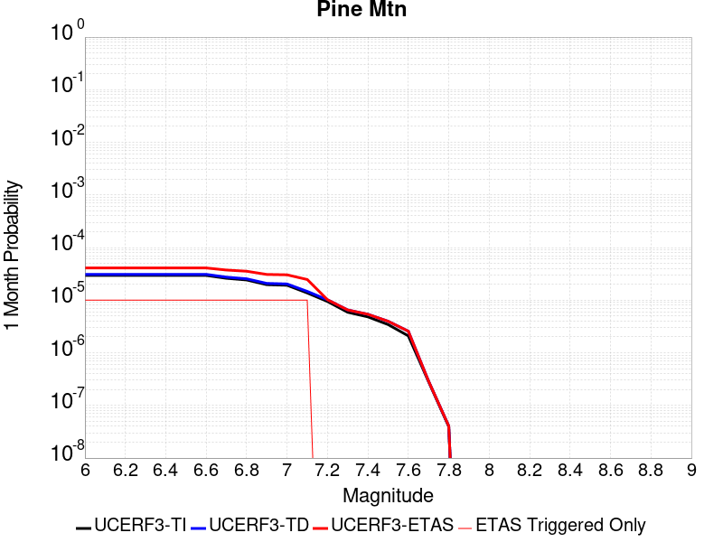 |  |  |

| Magnitude | 1 wk TI Prob | 1 wk TD Prob | 1 wk ETAS Prob | 1 wk ETAS/TD Gain | 1 wk ETAS Triggered Only | 1 mo TI Prob | 1 mo TD Prob | 1 mo ETAS Prob | 1 mo ETAS/TD Gain | 1 mo ETAS Triggered Only | 1 yr TI Prob | 1 yr TD Prob | 1 yr ETAS Prob | 1 yr ETAS/TD Gain | 1 yr ETAS Triggered Only | 10 yr TI Prob | 10 yr TD Prob | 10 yr ETAS Prob | 10 yr ETAS/TD Gain | 10 yr ETAS Triggered Only |
|-----|-----|-----|-----|-----|-----|-----|-----|-----|-----|-----|-----|-----|-----|-----|-----|-----|-----|-----|-----|-----|
| 6.0 | 6.894797E-6 | 7.2258704E-6 | 7.2258704E-6 | 1.0 | 0.0 | 2.9548795E-5 | 3.0967665E-5 | 4.135404E-5 | 1.3353941 | 1.0386697E-5 | 3.596972E-4 | 3.7696908E-4 | 3.8735184E-4 | 1.0275428 | 1.0386697E-5 | 0.0035911554 | 0.0037635937 | 0.0037946363 | 1.0082482 | 3.116009E-5 |
| 6.1 | 6.894797E-6 | 7.2258704E-6 | 7.2258704E-6 | 1.0 | 0.0 | 2.9548795E-5 | 3.0967665E-5 | 4.135404E-5 | 1.3353941 | 1.0386697E-5 | 3.596972E-4 | 3.7696908E-4 | 3.8735184E-4 | 1.0275428 | 1.0386697E-5 | 0.0035911554 | 0.0037635937 | 0.0037946363 | 1.0082482 | 3.116009E-5 |
| 6.2 | 6.894797E-6 | 7.2258704E-6 | 7.2258704E-6 | 1.0 | 0.0 | 2.9548795E-5 | 3.0967665E-5 | 4.135404E-5 | 1.3353941 | 1.0386697E-5 | 3.596972E-4 | 3.7696908E-4 | 3.8735184E-4 | 1.0275428 | 1.0386697E-5 | 0.0035911554 | 0.0037635937 | 0.0037946363 | 1.0082482 | 3.116009E-5 |
| 6.3 | 6.894797E-6 | 7.2258704E-6 | 7.2258704E-6 | 1.0 | 0.0 | 2.9548795E-5 | 3.0967665E-5 | 4.135404E-5 | 1.3353941 | 1.0386697E-5 | 3.596972E-4 | 3.7696908E-4 | 3.8735184E-4 | 1.0275428 | 1.0386697E-5 | 0.0035911554 | 0.0037635937 | 0.0037946363 | 1.0082482 | 3.116009E-5 |
| 6.4 | 6.894797E-6 | 7.2258704E-6 | 7.2258704E-6 | 1.0 | 0.0 | 2.9548795E-5 | 3.0967665E-5 | 4.135404E-5 | 1.3353941 | 1.0386697E-5 | 3.596972E-4 | 3.7696908E-4 | 3.8735184E-4 | 1.0275428 | 1.0386697E-5 | 0.0035911554 | 0.0037635937 | 0.0037946363 | 1.0082482 | 3.116009E-5 |
| 6.5 | 6.894797E-6 | 7.2258704E-6 | 7.2258704E-6 | 1.0 | 0.0 | 2.9548795E-5 | 3.0967665E-5 | 4.135404E-5 | 1.3353941 | 1.0386697E-5 | 3.596972E-4 | 3.7696908E-4 | 3.8735184E-4 | 1.0275428 | 1.0386697E-5 | 0.0035911554 | 0.0037635937 | 0.0037946363 | 1.0082482 | 3.116009E-5 |
| 6.6 | 6.894797E-6 | 7.2258704E-6 | 7.2258704E-6 | 1.0 | 0.0 | 2.9548795E-5 | 3.0967665E-5 | 4.135404E-5 | 1.3353941 | 1.0386697E-5 | 3.596972E-4 | 3.7696908E-4 | 3.8735184E-4 | 1.0275428 | 1.0386697E-5 | 0.0035911554 | 0.0037635937 | 0.0037946363 | 1.0082482 | 3.116009E-5 |
| 6.7 | 6.0867933E-6 | 6.3975112E-6 | 6.3975112E-6 | 1.0 | 0.0 | 2.6085996E-5 | 2.741763E-5 | 3.7804042E-5 | 1.3788224 | 1.0386697E-5 | 3.1755073E-4 | 3.337607E-4 | 3.4414392E-4 | 1.0311098 | 1.0386697E-5 | 0.0031709734 | 0.0033328135 | 0.0033535175 | 1.0062122 | 2.0773394E-5 |
| 6.8 | 5.6530425E-6 | 5.9509866E-6 | 5.9509866E-6 | 1.0 | 0.0 | 2.42271E-5 | 2.550399E-5 | 3.589042E-5 | 1.4072473 | 1.0386697E-5 | 2.94925E-4 | 3.104689E-4 | 3.2085236E-4 | 1.0334445 | 1.0386697E-5 | 0.002945339 | 0.0031005563 | 0.0031109108 | 1.0033395 | 1.0386697E-5 |
| 6.9 | 4.6015225E-6 | 4.8642055E-6 | 4.8642055E-6 | 1.0 | 0.0 | 1.9720663E-5 | 2.0846437E-5 | 3.1232918E-5 | 1.4982376 | 1.0386697E-5 | 2.4007261E-4 | 2.5377728E-4 | 2.6416132E-4 | 1.040918 | 1.0386697E-5 | 0.0023981342 | 0.0025350188 | 0.0025453793 | 1.0040869 | 1.0386697E-5 |
| 7.0 | 4.4875965E-6 | 4.7478434E-6 | 4.7478434E-6 | 1.0 | 0.0 | 1.9232413E-5 | 2.034775E-5 | 3.0734234E-5 | 1.5104488 | 1.0386697E-5 | 2.3412947E-4 | 2.4770715E-4 | 2.5809126E-4 | 1.041921 | 1.0386697E-5 | 0.0023388295 | 0.0024744542 | 0.0024848152 | 1.0041872 | 1.0386697E-5 |
| 7.1 | 3.203907E-6 | 3.4297611E-6 | 3.4297611E-6 | 1.0 | 0.0 | 1.3730958E-5 | 1.4698897E-5 | 2.5085441E-5 | 1.7066207 | 1.0386697E-5 | 1.6716159E-4 | 1.7894505E-4 | 1.8932988E-4 | 1.0580337 | 1.0386697E-5 | 0.0016703589 | 0.0017880757 | 0.0017984438 | 1.0057985 | 1.0386697E-5 |
| 7.2 | 2.2060601E-6 | 2.378769E-6 | 2.378769E-6 | 1.0 | 0.0 | 9.4545085E-6 | 1.0194687E-5 | 1.0194687E-5 | 1.0 | 0.0 | 1.15102564E-4 | 1.241137E-4 | 1.241137E-4 | 1.0 | 0.0 | 0.0011504296 | 0.0012404887 | 0.0012404887 | 1.0 | 0.0 |
| 7.3 | 1.3765207E-6 | 1.5219067E-6 | 1.5219067E-6 | 1.0 | 0.0 | 5.899361E-6 | 6.5224413E-6 | 6.5224413E-6 | 1.0 | 0.0 | 7.182235E-5 | 7.9407924E-5 | 7.9407924E-5 | 1.0 | 0.0 | 7.1799144E-4 | 7.938046E-4 | 7.938046E-4 | 1.0 | 0.0 |
| 7.4 | 1.1245983E-6 | 1.2589404E-6 | 1.2589404E-6 | 1.0 | 0.0 | 4.819698E-6 | 5.395448E-6 | 5.395448E-6 | 1.0 | 0.0 | 5.8678244E-5 | 6.568768E-5 | 6.568768E-5 | 1.0 | 0.0 | 5.866275E-4 | 6.56691E-4 | 6.56691E-4 | 1.0 | 0.0 |
| 7.5 | 8.031682E-7 | 9.279126E-7 | 9.279126E-7 | 1.0 | 0.0 | 3.4421448E-6 | 3.9767624E-6 | 3.9767624E-6 | 1.0 | 0.0 | 4.1907308E-5 | 4.8416077E-5 | 4.8416077E-5 | 1.0 | 0.0 | 4.1899405E-4 | 4.8406204E-4 | 4.8406204E-4 | 1.0 | 0.0 |
| 7.6 | 4.8953444E-7 | 6.004939E-7 | 6.004939E-7 | 1.0 | 0.0 | 2.098003E-6 | 2.5735428E-6 | 2.5735428E-6 | 1.0 | 0.0 | 2.5542888E-5 | 3.133248E-5 | 3.133248E-5 | 1.0 | 0.0 | 2.5539953E-4 | 3.1328553E-4 | 3.1328553E-4 | 1.0 | 0.0 |
| 7.7 | 6.634529E-8 | 6.7889104E-8 | 6.7889104E-8 | 1.0 | 0.0 | 2.843369E-7 | 2.9095327E-7 | 2.9095327E-7 | 1.0 | 0.0 | 3.4617963E-6 | 3.542351E-6 | 3.542351E-6 | 1.0 | 0.0 | 3.4617424E-5 | 3.5422992E-5 | 3.5422992E-5 | 1.0 | 0.0 |
| 7.8 | 9.235578E-9 | 9.488707E-9 | 9.488707E-9 | 1.0 | 0.0 | 3.9581046E-8 | 4.0665885E-8 | 4.0665885E-8 | 1.0 | 0.0 | 4.818991E-7 | 4.9510703E-7 | 4.9510703E-7 | 1.0 | 0.0 | 4.8189804E-6 | 4.951061E-6 | 4.951061E-6 | 1.0 | 0.0 |

## San Jacinto (Borrego)
*[(top)](#table-of-contents)*

| 1 Week | 1 Month | 1 Year | 10 Year |
|-----|-----|-----|-----|
|  |  |  | 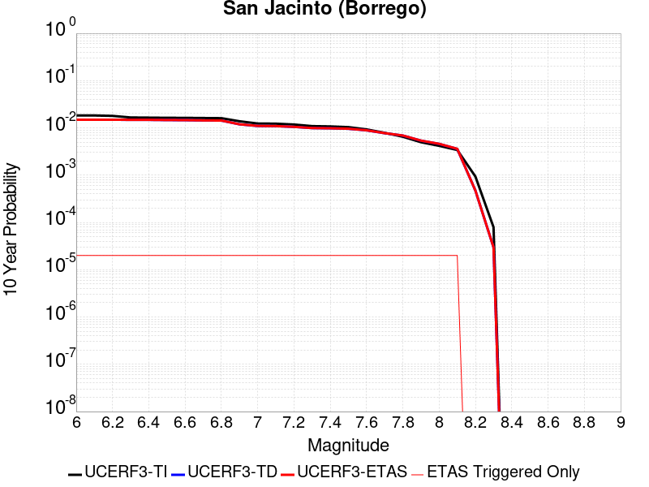 |

| Magnitude | 1 wk TI Prob | 1 wk TD Prob | 1 wk ETAS Prob | 1 wk ETAS/TD Gain | 1 wk ETAS Triggered Only | 1 mo TI Prob | 1 mo TD Prob | 1 mo ETAS Prob | 1 mo ETAS/TD Gain | 1 mo ETAS Triggered Only | 1 yr TI Prob | 1 yr TD Prob | 1 yr ETAS Prob | 1 yr ETAS/TD Gain | 1 yr ETAS Triggered Only | 10 yr TI Prob | 10 yr TD Prob | 10 yr ETAS Prob | 10 yr ETAS/TD Gain | 10 yr ETAS Triggered Only |
|-----|-----|-----|-----|-----|-----|-----|-----|-----|-----|-----|-----|-----|-----|-----|-----|-----|-----|-----|-----|-----|
| 6.0 | 3.543992E-5 | 2.7956603E-5 | 2.7956603E-5 | 1.0 | 0.0 | 1.5187653E-4 | 1.1980858E-4 | 1.1980858E-4 | 1.0 | 0.0 | 0.0018475284 | 0.0014577056 | 0.0014680772 | 1.007115 | 1.0386697E-5 | 0.018322436 | 0.014885285 | 0.014905749 | 1.0013748 | 2.0773394E-5 |
| 6.1 | 3.542281E-5 | 2.7956603E-5 | 2.7956603E-5 | 1.0 | 0.0 | 1.5180321E-4 | 1.1980858E-4 | 1.1980858E-4 | 1.0 | 0.0 | 0.0018466372 | 0.0014577056 | 0.0014680772 | 1.007115 | 1.0386697E-5 | 0.018313672 | 0.014885285 | 0.014905749 | 1.0013748 | 2.0773394E-5 |
| 6.2 | 3.4688688E-5 | 2.7956603E-5 | 2.7956603E-5 | 1.0 | 0.0 | 1.4865733E-4 | 1.19808574E-4 | 1.19808574E-4 | 1.0 | 0.0 | 0.0018084005 | 0.0014577056 | 0.0014680772 | 1.007115 | 1.0386697E-5 | 0.017937548 | 0.014885284 | 0.014905748 | 1.0013748 | 2.0773394E-5 |
| 6.3 | 3.2087122E-5 | 2.7801936E-5 | 2.7801936E-5 | 1.0 | 0.0 | 1.3750899E-4 | 1.19145785E-4 | 1.19145785E-4 | 1.0 | 0.0 | 0.0016728862 | 0.0014496469 | 0.0014600186 | 1.0071546 | 1.0386697E-5 | 0.016603488 | 0.014806312 | 0.014826777 | 1.0013822 | 2.0773394E-5 |
| 6.4 | 3.1828724E-5 | 2.7768916E-5 | 2.7768916E-5 | 1.0 | 0.0 | 1.364017E-4 | 1.1900428E-4 | 1.1900428E-4 | 1.0 | 0.0 | 0.0016594254 | 0.0014479264 | 0.0014582981 | 1.0071632 | 1.0386697E-5 | 0.016470885 | 0.014789388 | 0.014809853 | 1.0013839 | 2.0773394E-5 |
| 6.5 | 3.1563577E-5 | 2.7508588E-5 | 2.7508588E-5 | 1.0 | 0.0 | 1.3526545E-4 | 1.1788869E-4 | 1.1788869E-4 | 1.0 | 0.0 | 0.0016456128 | 0.0014343619 | 0.0014447337 | 1.007231 | 1.0386697E-5 | 0.0163348 | 0.014655951 | 0.01467642 | 1.0013967 | 2.0773394E-5 |
| 6.6 | 3.1467625E-5 | 2.735279E-5 | 2.735279E-5 | 1.0 | 0.0 | 1.3485427E-4 | 1.1722104E-4 | 1.1722104E-4 | 1.0 | 0.0 | 0.0016406142 | 0.001426244 | 0.001436616 | 1.0072721 | 1.0386697E-5 | 0.016285548 | 0.014576187 | 0.014596658 | 1.0014044 | 2.0773394E-5 |
| 6.7 | 3.1223695E-5 | 2.6970763E-5 | 2.6970763E-5 | 1.0 | 0.0 | 1.3380898E-4 | 1.15583935E-4 | 1.15583935E-4 | 1.0 | 0.0 | 0.0016279068 | 0.0014063381 | 0.0014167102 | 1.0073752 | 1.0386697E-5 | 0.01616033 | 0.01438054 | 0.014401015 | 1.0014237 | 2.0773394E-5 |
| 6.8 | 3.1015585E-5 | 2.6791718E-5 | 2.6791718E-5 | 1.0 | 0.0 | 1.3291716E-4 | 1.1481666E-4 | 1.1481666E-4 | 1.0 | 0.0 | 0.001617065 | 0.0013970085 | 0.0014073808 | 1.0074246 | 1.0386697E-5 | 0.016053487 | 0.014287795 | 0.014308271 | 1.0014331 | 2.0773394E-5 |
| 6.9 | 2.6641965E-5 | 2.2212334E-5 | 2.2212334E-5 | 1.0 | 0.0 | 1.1417485E-4 | 9.519226E-5 | 9.519226E-5 | 1.0 | 0.0 | 0.0013891924 | 0.0011583535 | 0.0011687282 | 1.0089564 | 1.0386697E-5 | 0.0138054015 | 0.011897102 | 0.011917628 | 1.0017253 | 2.0773394E-5 |
| 7.0 | 2.3854353E-5 | 2.0506088E-5 | 2.0506088E-5 | 1.0 | 0.0 | 1.02228936E-4 | 8.788029E-5 | 8.788029E-5 | 1.0 | 0.0 | 0.0012439266 | 0.0010694199 | 0.0010797955 | 1.0097021 | 1.0386697E-5 | 0.012369866 | 0.010996936 | 0.011017481 | 1.0018682 | 2.0773394E-5 |
| 7.1 | 2.3672901E-5 | 2.0342548E-5 | 2.0342548E-5 | 1.0 | 0.0 | 1.0145135E-4 | 8.717945E-5 | 8.717945E-5 | 1.0 | 0.0 | 0.0012344702 | 0.0010608955 | 0.0010712711 | 1.0097802 | 1.0386697E-5 | 0.0122763505 | 0.010912099 | 0.010932646 | 1.0018829 | 2.0773394E-5 |
| 7.2 | 2.2717244E-5 | 1.9569701E-5 | 1.9569701E-5 | 1.0 | 0.0 | 9.735599E-5 | 8.386746E-5 | 8.386746E-5 | 1.0 | 0.0 | 0.0011846646 | 0.0010206103 | 0.0010309864 | 1.0101665 | 1.0386697E-5 | 0.01178369 | 0.010509352 | 0.0105299065 | 1.0019559 | 2.0773394E-5 |
| 7.3 | 2.1016205E-5 | 1.8410952E-5 | 1.8410952E-5 | 1.0 | 0.0 | 9.006634E-5 | 7.890171E-5 | 7.890171E-5 | 1.0 | 0.0 | 0.001096006 | 9.6020696E-4 | 9.705837E-4 | 1.0108068 | 1.0386697E-5 | 0.010906163 | 0.009904788 | 0.009925355 | 1.0020765 | 2.0773394E-5 |
| 7.4 | 2.0683625E-5 | 1.8213394E-5 | 1.8213394E-5 | 1.0 | 0.0 | 8.86411E-5 | 7.805508E-5 | 7.805508E-5 | 1.0 | 0.0 | 0.001078671 | 9.4990834E-4 | 9.602852E-4 | 1.010924 | 1.0386697E-5 | 0.010734501 | 0.009801473 | 0.009822043 | 1.0020987 | 2.0773394E-5 |
| 7.5 | 1.9993966E-5 | 1.7808186E-5 | 1.7808186E-5 | 1.0 | 0.0 | 8.568561E-5 | 7.631858E-5 | 7.631858E-5 | 1.0 | 0.0 | 0.001042723 | 9.287846E-4 | 9.391617E-4 | 1.0111728 | 1.0386697E-5 | 0.010378438 | 0.009588276 | 0.00960885 | 1.0021458 | 2.0773394E-5 |
| 7.6 | 1.788966E-5 | 1.6460734E-5 | 1.6460734E-5 | 1.0 | 0.0 | 7.666772E-5 | 7.0544105E-5 | 7.0544105E-5 | 1.0 | 0.0 | 9.3302975E-4 | 8.585378E-4 | 8.689156E-4 | 1.0120877 | 1.0386697E-5 | 0.00929122 | 0.008879809 | 0.008900397 | 1.0023186 | 2.0773394E-5 |
| 7.7 | 1.5125781E-5 | 1.4262029E-5 | 1.4262029E-5 | 1.0 | 0.0 | 6.4823165E-5 | 6.112155E-5 | 6.112155E-5 | 1.0 | 0.0 | 7.889362E-4 | 7.4390165E-4 | 7.542806E-4 | 1.013952 | 1.0386697E-5 | 0.007861412 | 0.007727129 | 0.007747742 | 1.0026675 | 2.0773394E-5 |
| 7.8 | 1.250089E-5 | 1.2654241E-5 | 1.2654241E-5 | 1.0 | 0.0 | 5.3574146E-5 | 5.423134E-5 | 5.423134E-5 | 1.0 | 0.0 | 6.5207E-4 | 6.6006713E-4 | 6.7044696E-4 | 1.0157254 | 1.0386697E-5 | 0.006501599 | 0.0068802256 | 0.0069008563 | 1.0029985 | 2.0773394E-5 |
| 7.9 | 9.561E-6 | 9.775645E-6 | 9.775645E-6 | 1.0 | 0.0 | 4.0975072E-5 | 4.189495E-5 | 4.189495E-5 | 1.0 | 0.0 | 4.987573E-4 | 5.099522E-4 | 5.203336E-4 | 1.0203576 | 1.0386697E-5 | 0.0049763937 | 0.0053634187 | 0.0053840806 | 1.0038524 | 2.0773394E-5 |
| 8.0 | 8.01699E-6 | 8.312629E-6 | 8.312629E-6 | 1.0 | 0.0 | 3.4358076E-5 | 3.5625068E-5 | 3.5625068E-5 | 1.0 | 0.0 | 4.1822926E-4 | 4.336494E-4 | 4.4403158E-4 | 1.0239414 | 1.0386697E-5 | 0.0041744304 | 0.00458347 | 0.004604148 | 1.0045115 | 2.0773394E-5 |
| 8.1 | 6.541947E-6 | 6.477901E-6 | 6.477901E-6 | 1.0 | 0.0 | 2.8036617E-5 | 2.7762142E-5 | 2.7762142E-5 | 1.0 | 0.0 | 3.4129233E-4 | 3.3795217E-4 | 3.4833534E-4 | 1.0307238 | 1.0386697E-5 | 0.0034076865 | 0.003588998 | 0.0036096969 | 1.0057673 | 2.0773394E-5 |
| 8.2 | 1.7968189E-6 | 8.0012404E-7 | 8.0012404E-7 | 1.0 | 0.0 | 7.70063E-6 | 3.4290986E-6 | 3.4290986E-6 | 1.0 | 0.0 | 9.3751136E-5 | 4.17485E-5 | 4.17485E-5 | 1.0 | 0.0 | 9.371159E-4 | 4.7288055E-4 | 4.7288055E-4 | 1.0 | 0.0 |
| 8.3 | 1.5167889E-7 | 4.9190945E-8 | 4.9190945E-8 | 1.0 | 0.0 | 6.500522E-7 | 2.1081833E-7 | 2.1081833E-7 | 1.0 | 0.0 | 7.9143565E-6 | 2.5667105E-6 | 2.5667105E-6 | 1.0 | 0.0 | 7.914075E-5 | 2.9817646E-5 | 2.9817646E-5 | 1.0 | 0.0 |

## Hayward (So) extension 2011 CFM
*[(top)](#table-of-contents)*

| 1 Week | 1 Month | 1 Year | 10 Year |
|-----|-----|-----|-----|
|  |  |  |  |

| Magnitude | 1 wk TI Prob | 1 wk TD Prob | 1 wk ETAS Prob | 1 wk ETAS/TD Gain | 1 wk ETAS Triggered Only | 1 mo TI Prob | 1 mo TD Prob | 1 mo ETAS Prob | 1 mo ETAS/TD Gain | 1 mo ETAS Triggered Only | 1 yr TI Prob | 1 yr TD Prob | 1 yr ETAS Prob | 1 yr ETAS/TD Gain | 1 yr ETAS Triggered Only | 10 yr TI Prob | 10 yr TD Prob | 10 yr ETAS Prob | 10 yr ETAS/TD Gain | 10 yr ETAS Triggered Only |
|-----|-----|-----|-----|-----|-----|-----|-----|-----|-----|-----|-----|-----|-----|-----|-----|-----|-----|-----|-----|-----|
| 6.0 | 1.1721256E-4 | 2.3641145E-4 | 2.3641145E-4 | 1.0 | 0.0 | 5.022428E-4 | 0.0010126645 | 0.0010126645 | 1.0 | 0.0 | 0.0060976758 | 0.012251104 | 0.012271623 | 1.0016749 | 2.0773394E-5 | 0.0593305 | 0.11286992 | 0.11288834 | 1.0001633 | 2.0773394E-5 |
| 6.1 | 6.99169E-5 | 1.3797042E-4 | 1.3797042E-4 | 1.0 | 0.0 | 2.9960944E-4 | 5.9118203E-4 | 5.9118203E-4 | 1.0 | 0.0 | 0.0036416445 | 0.0071743643 | 0.007184677 | 1.0014373 | 1.0386697E-5 | 0.035825435 | 0.06782603 | 0.06783572 | 1.0001427 | 1.0386697E-5 |
| 6.2 | 6.99169E-5 | 1.3797042E-4 | 1.3797042E-4 | 1.0 | 0.0 | 2.9960944E-4 | 5.9118203E-4 | 5.9118203E-4 | 1.0 | 0.0 | 0.0036416445 | 0.0071743643 | 0.007184677 | 1.0014373 | 1.0386697E-5 | 0.035825435 | 0.06782603 | 0.06783572 | 1.0001427 | 1.0386697E-5 |
| 6.3 | 6.970908E-5 | 1.3765182E-4 | 1.3765182E-4 | 1.0 | 0.0 | 2.9871898E-4 | 5.8981724E-4 | 5.8981724E-4 | 1.0 | 0.0 | 0.0036308395 | 0.0071578994 | 0.0071682115 | 1.0014406 | 1.0386697E-5 | 0.035720866 | 0.06767499 | 0.067684665 | 1.000143 | 1.0386697E-5 |
| 6.4 | 6.9517155E-5 | 1.373204E-4 | 1.373204E-4 | 1.0 | 0.0 | 2.9789665E-4 | 5.883975E-4 | 5.883975E-4 | 1.0 | 0.0 | 0.0036208609 | 0.0071408087 | 0.0071511213 | 1.0014442 | 1.0386697E-5 | 0.03562429 | 0.06751901 | 0.067528695 | 1.0001434 | 1.0386697E-5 |
| 6.5 | 4.786248E-5 | 9.4193885E-5 | 9.4193885E-5 | 1.0 | 0.0 | 2.0510878E-4 | 4.0362825E-4 | 4.0362825E-4 | 1.0 | 0.0 | 0.0024943394 | 0.00490351 | 0.004913846 | 1.0021079 | 1.0386697E-5 | 0.02466527 | 0.046921626 | 0.046931528 | 1.000211 | 1.0386697E-5 |
| 6.6 | 4.4662214E-5 | 8.8859444E-5 | 8.8859444E-5 | 1.0 | 0.0 | 1.9139545E-4 | 3.807732E-4 | 3.807732E-4 | 1.0 | 0.0 | 0.0023277493 | 0.004626522 | 0.0046368605 | 1.0022347 | 1.0386697E-5 | 0.02303517 | 0.044312727 | 0.04432265 | 1.000224 | 1.0386697E-5 |
| 6.7 | 3.884542E-5 | 7.8689154E-5 | 7.8689154E-5 | 1.0 | 0.0 | 1.6646975E-4 | 3.3719814E-4 | 3.3719814E-4 | 1.0 | 0.0 | 0.002024885 | 0.004098104 | 0.004108448 | 1.0025241 | 1.0386697E-5 | 0.020065336 | 0.03935182 | 0.039361797 | 1.0002536 | 1.0386697E-5 |
| 6.8 | 3.4221863E-5 | 6.859417E-5 | 6.859417E-5 | 1.0 | 0.0 | 1.4665688E-4 | 2.9394426E-4 | 2.9394426E-4 | 1.0 | 0.0 | 0.0017840851 | 0.00357332 | 0.0035836697 | 1.0028963 | 1.0386697E-5 | 0.017698295 | 0.03443831 | 0.034448337 | 1.0002912 | 1.0386697E-5 |
| 6.9 | 1.6927712E-5 | 3.0084795E-5 | 3.0084795E-5 | 1.0 | 0.0 | 7.2545314E-5 | 1.2892878E-4 | 1.2892878E-4 | 1.0 | 0.0 | 8.828813E-4 | 0.0015686346 | 0.001579005 | 1.0066111 | 1.0386697E-5 | 0.008793819 | 0.015474585 | 0.015484811 | 1.0006608 | 1.0386697E-5 |
| 7.0 | 1.2509653E-5 | 2.2484324E-5 | 2.2484324E-5 | 1.0 | 0.0 | 5.3611697E-5 | 9.635808E-5 | 9.635808E-5 | 1.0 | 0.0 | 6.525269E-4 | 0.0011725724 | 0.0011829468 | 1.0088477 | 1.0386697E-5 | 0.0065061417 | 0.011592993 | 0.0116032595 | 1.0008856 | 1.0386697E-5 |
| 7.1 | 8.751583E-6 | 1.49442185E-5 | 1.49442185E-5 | 1.0 | 0.0 | 3.750624E-5 | 6.404511E-5 | 6.404511E-5 | 1.0 | 0.0 | 4.5654282E-4 | 7.7947613E-4 | 7.8985473E-4 | 1.0133148 | 1.0386697E-5 | 0.0045560603 | 0.0077727833 | 0.0077830893 | 1.0013258 | 1.0386697E-5 |
| 7.2 | 6.354379E-6 | 1.1516424E-5 | 1.1516424E-5 | 1.0 | 0.0 | 2.7232769E-5 | 4.9355196E-5 | 4.9355196E-5 | 1.0 | 0.0 | 3.3150852E-4 | 6.007387E-4 | 6.1111915E-4 | 1.0172795 | 1.0386697E-5 | 0.0033101442 | 0.0060092374 | 0.006019562 | 1.001718 | 1.0386697E-5 |
| 7.3 | 4.645554E-6 | 8.834951E-6 | 8.834951E-6 | 1.0 | 0.0 | 1.9909365E-5 | 3.786355E-5 | 3.786355E-5 | 1.0 | 0.0 | 2.4236954E-4 | 4.6089516E-4 | 4.6089516E-4 | 1.0 | 0.0 | 0.0024210536 | 0.0046191737 | 0.0046191737 | 1.0 | 0.0 |
| 7.4 | 4.23437E-6 | 8.008871E-6 | 8.008871E-6 | 1.0 | 0.0 | 1.8147173E-5 | 3.4323304E-5 | 3.4323304E-5 | 1.0 | 0.0 | 2.2091944E-4 | 4.1780996E-4 | 4.1780996E-4 | 1.0 | 0.0 | 0.0022069993 | 0.00419023 | 0.00419023 | 1.0 | 0.0 |
| 7.5 | 2.2187417E-6 | 3.964443E-6 | 3.964443E-6 | 1.0 | 0.0 | 9.508858E-6 | 1.6990374E-5 | 1.6990374E-5 | 1.0 | 0.0 | 1.157642E-4 | 2.068408E-4 | 2.068408E-4 | 1.0 | 0.0 | 0.0011570391 | 0.0020797048 | 0.0020797048 | 1.0 | 0.0 |
| 7.6 | 2.7952495E-8 | 3.88089E-8 | 3.88089E-8 | 1.0 | 0.0 | 1.1979641E-7 | 1.6632383E-7 | 1.6632383E-7 | 1.0 | 0.0 | 1.4585203E-6 | 2.0249909E-6 | 2.0249909E-6 | 1.0 | 0.0 | 1.4585107E-5 | 2.034046E-5 | 2.034046E-5 | 1.0 | 0.0 |
| 7.7 | 1.7192724E-8 | 2.3454316E-8 | 2.3454316E-8 | 1.0 | 0.0 | 7.36831E-8 | 1.0051849E-7 | 1.0051849E-7 | 1.0 | 0.0 | 8.9709135E-7 | 1.223812E-6 | 1.223812E-6 | 1.0 | 0.0 | 8.970877E-6 | 1.2306199E-5 | 1.2306199E-5 | 1.0 | 0.0 |

## Ventura-Pitas Point
*[(top)](#table-of-contents)*

| 1 Week | 1 Month | 1 Year | 10 Year |
|-----|-----|-----|-----|
|  |  |  |  |

| Magnitude | 1 wk TI Prob | 1 wk TD Prob | 1 wk ETAS Prob | 1 wk ETAS/TD Gain | 1 wk ETAS Triggered Only | 1 mo TI Prob | 1 mo TD Prob | 1 mo ETAS Prob | 1 mo ETAS/TD Gain | 1 mo ETAS Triggered Only | 1 yr TI Prob | 1 yr TD Prob | 1 yr ETAS Prob | 1 yr ETAS/TD Gain | 1 yr ETAS Triggered Only | 10 yr TI Prob | 10 yr TD Prob | 10 yr ETAS Prob | 10 yr ETAS/TD Gain | 10 yr ETAS Triggered Only |
|-----|-----|-----|-----|-----|-----|-----|-----|-----|-----|-----|-----|-----|-----|-----|-----|-----|-----|-----|-----|-----|
| 6.0 | 3.3179622E-5 | 3.373905E-5 | 3.373905E-5 | 1.0 | 0.0 | 1.4219063E-4 | 1.4458936E-4 | 1.4458936E-4 | 1.0 | 0.0 | 0.0017297962 | 0.001759211 | 0.001759211 | 1.0 | 0.0 | 0.017163932 | 0.017478386 | 0.017488591 | 1.0005839 | 1.0386697E-5 |
| 6.1 | 3.3179622E-5 | 3.373905E-5 | 3.373905E-5 | 1.0 | 0.0 | 1.4219063E-4 | 1.4458936E-4 | 1.4458936E-4 | 1.0 | 0.0 | 0.0017297962 | 0.001759211 | 0.001759211 | 1.0 | 0.0 | 0.017163932 | 0.017478386 | 0.017488591 | 1.0005839 | 1.0386697E-5 |
| 6.2 | 3.3179622E-5 | 3.373905E-5 | 3.373905E-5 | 1.0 | 0.0 | 1.4219063E-4 | 1.4458936E-4 | 1.4458936E-4 | 1.0 | 0.0 | 0.0017297962 | 0.001759211 | 0.001759211 | 1.0 | 0.0 | 0.017163932 | 0.017478386 | 0.017488591 | 1.0005839 | 1.0386697E-5 |
| 6.3 | 3.3179622E-5 | 3.373905E-5 | 3.373905E-5 | 1.0 | 0.0 | 1.4219063E-4 | 1.4458936E-4 | 1.4458936E-4 | 1.0 | 0.0 | 0.0017297962 | 0.001759211 | 0.001759211 | 1.0 | 0.0 | 0.017163932 | 0.017478386 | 0.017488591 | 1.0005839 | 1.0386697E-5 |
| 6.4 | 1.8754668E-5 | 1.7022061E-5 | 1.7022061E-5 | 1.0 | 0.0 | 8.037467E-5 | 7.2949784E-5 | 7.2949784E-5 | 1.0 | 0.0 | 9.781223E-4 | 8.878248E-4 | 8.878248E-4 | 1.0 | 0.0 | 0.009738282 | 0.008845116 | 0.008855411 | 1.0011638 | 1.0386697E-5 |
| 6.5 | 1.8754668E-5 | 1.7022061E-5 | 1.7022061E-5 | 1.0 | 0.0 | 8.037467E-5 | 7.2949784E-5 | 7.2949784E-5 | 1.0 | 0.0 | 9.781223E-4 | 8.878248E-4 | 8.878248E-4 | 1.0 | 0.0 | 0.009738282 | 0.008845116 | 0.008855411 | 1.0011638 | 1.0386697E-5 |
| 6.6 | 1.4361558E-5 | 1.21244275E-5 | 1.21244275E-5 | 1.0 | 0.0 | 6.154808E-5 | 5.196081E-5 | 5.196081E-5 | 1.0 | 0.0 | 7.490902E-4 | 6.3244154E-4 | 6.3244154E-4 | 1.0 | 0.0 | 0.0074657016 | 0.006306674 | 0.0063169952 | 1.0016365 | 1.0386697E-5 |
| 6.7 | 1.4361558E-5 | 1.21244275E-5 | 1.21244275E-5 | 1.0 | 0.0 | 6.154808E-5 | 5.196081E-5 | 5.196081E-5 | 1.0 | 0.0 | 7.490902E-4 | 6.3244154E-4 | 6.3244154E-4 | 1.0 | 0.0 | 0.0074657016 | 0.006306674 | 0.0063169952 | 1.0016365 | 1.0386697E-5 |
| 6.8 | 1.3663846E-5 | 1.1346523E-5 | 1.1346523E-5 | 1.0 | 0.0 | 5.8558027E-5 | 4.8627062E-5 | 4.8627062E-5 | 1.0 | 0.0 | 7.127108E-4 | 5.918756E-4 | 5.918756E-4 | 1.0 | 0.0 | 0.007104293 | 0.005903208 | 0.0059135337 | 1.0017492 | 1.0386697E-5 |
| 6.9 | 1.3644157E-5 | 1.1324622E-5 | 1.1324622E-5 | 1.0 | 0.0 | 5.8473648E-5 | 4.8533206E-5 | 4.8533206E-5 | 1.0 | 0.0 | 7.116841E-4 | 5.907335E-4 | 5.907335E-4 | 1.0 | 0.0 | 0.007094092 | 0.005891848 | 0.0059021735 | 1.0017525 | 1.0386697E-5 |
| 7.0 | 1.3568845E-5 | 1.1244184E-5 | 1.1244184E-5 | 1.0 | 0.0 | 5.8150898E-5 | 4.8188478E-5 | 4.8188478E-5 | 1.0 | 0.0 | 7.077572E-4 | 5.8653875E-4 | 5.8653875E-4 | 1.0 | 0.0 | 0.007055073 | 0.005850122 | 0.005860448 | 1.0017651 | 1.0386697E-5 |
| 7.1 | 1.306572E-5 | 1.07226015E-5 | 1.07226015E-5 | 1.0 | 0.0 | 5.599474E-5 | 4.5953206E-5 | 4.5953206E-5 | 1.0 | 0.0 | 6.815227E-4 | 5.5933854E-4 | 5.5933854E-4 | 1.0 | 0.0 | 0.0067943637 | 0.005579512 | 0.005589841 | 1.0018512 | 1.0386697E-5 |
| 7.2 | 1.232604E-5 | 9.9971385E-6 | 9.9971385E-6 | 1.0 | 0.0 | 5.2824813E-5 | 4.2844185E-5 | 4.2844185E-5 | 1.0 | 0.0 | 6.429523E-4 | 5.2150484E-4 | 5.2150484E-4 | 1.0 | 0.0 | 0.0064109527 | 0.0052030026 | 0.005213335 | 1.0019859 | 1.0386697E-5 |
| 7.3 | 1.0917261E-5 | 8.844411E-6 | 8.844411E-6 | 1.0 | 0.0 | 4.678742E-5 | 3.7904076E-5 | 3.7904076E-5 | 1.0 | 0.0 | 5.69488E-4 | 4.6138596E-4 | 4.6138596E-4 | 1.0 | 0.0 | 0.0056803077 | 0.0046044462 | 0.0046147853 | 1.0022454 | 1.0386697E-5 |
| 7.4 | 1.039959E-5 | 8.4240955E-6 | 8.4240955E-6 | 1.0 | 0.0 | 4.456891E-5 | 3.6102774E-5 | 3.6102774E-5 | 1.0 | 0.0 | 5.424914E-4 | 4.3946414E-4 | 4.3946414E-4 | 1.0 | 0.0 | 0.0054116896 | 0.0043861126 | 0.004396454 | 1.0023577 | 1.0386697E-5 |
| 7.5 | 9.015877E-6 | 7.2979265E-6 | 7.2979265E-6 | 1.0 | 0.0 | 3.86389E-5 | 3.127646E-5 | 3.127646E-5 | 1.0 | 0.0 | 4.7032707E-4 | 3.8072577E-4 | 3.8072577E-4 | 1.0 | 0.0 | 0.004693329 | 0.0038008802 | 0.0038112274 | 1.0027223 | 1.0386697E-5 |
| 7.6 | 4.900162E-6 | 3.874264E-6 | 3.874264E-6 | 1.0 | 0.0 | 2.1000526E-5 | 1.6603883E-5 | 1.6603883E-5 | 1.0 | 0.0 | 2.556514E-4 | 2.0213365E-4 | 2.0213365E-4 | 1.0 | 0.0 | 0.0025535747 | 0.0020195118 | 0.0020298774 | 1.0051328 | 1.0386697E-5 |
| 7.7 | 3.8850626E-6 | 3.1268457E-6 | 3.1268457E-6 | 1.0 | 0.0 | 1.6650163E-5 | 1.34007E-5 | 1.34007E-5 | 1.0 | 0.0 | 2.0269687E-4 | 1.6314139E-4 | 1.6314139E-4 | 1.0 | 0.0 | 0.002025121 | 0.0016302256 | 0.0016405954 | 1.0063609 | 1.0386697E-5 |
| 7.8 | 2.4654719E-6 | 2.0299424E-6 | 2.0299424E-6 | 1.0 | 0.0 | 1.0566265E-5 | 8.699724E-6 | 8.699724E-6 | 1.0 | 0.0 | 1.2863669E-4 | 1.0591404E-4 | 1.0591404E-4 | 1.0 | 0.0 | 0.0012856225 | 0.0010586403 | 0.001069016 | 1.0098009 | 1.0386697E-5 |
| 7.9 | 4.095894E-7 | 3.27659E-7 | 3.27659E-7 | 1.0 | 0.0 | 1.7553821E-6 | 1.404252E-6 | 1.404252E-6 | 1.0 | 0.0 | 2.1371567E-5 | 1.7096638E-5 | 1.7096638E-5 | 1.0 | 0.0 | 2.1369511E-4 | 1.7095353E-4 | 1.7095353E-4 | 1.0 | 0.0 |
| 8.0 | 7.791402E-9 | 5.683722E-9 | 5.683722E-9 | 1.0 | 0.0 | 3.3391725E-8 | 2.4358807E-8 | 2.4358807E-8 | 1.0 | 0.0 | 4.0654416E-7 | 2.9656846E-7 | 2.9656846E-7 | 1.0 | 0.0 | 4.065434E-6 | 2.9656826E-6 | 2.9656826E-6 | 1.0 | 0.0 |

## Monterey Bay-Tularcitos
*[(top)](#table-of-contents)*

| 1 Week | 1 Month | 1 Year | 10 Year |
|-----|-----|-----|-----|
| 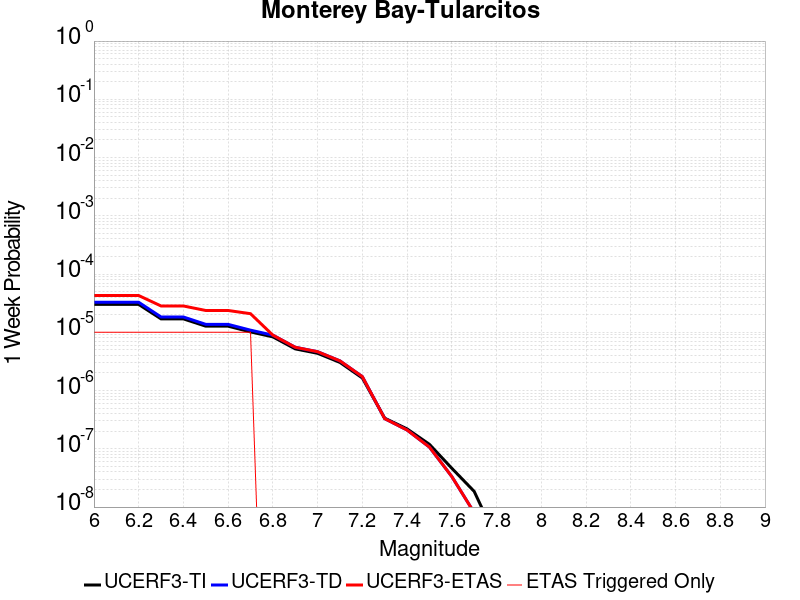 |  |  |  |

| Magnitude | 1 wk TI Prob | 1 wk TD Prob | 1 wk ETAS Prob | 1 wk ETAS/TD Gain | 1 wk ETAS Triggered Only | 1 mo TI Prob | 1 mo TD Prob | 1 mo ETAS Prob | 1 mo ETAS/TD Gain | 1 mo ETAS Triggered Only | 1 yr TI Prob | 1 yr TD Prob | 1 yr ETAS Prob | 1 yr ETAS/TD Gain | 1 yr ETAS Triggered Only | 10 yr TI Prob | 10 yr TD Prob | 10 yr ETAS Prob | 10 yr ETAS/TD Gain | 10 yr ETAS Triggered Only |
|-----|-----|-----|-----|-----|-----|-----|-----|-----|-----|-----|-----|-----|-----|-----|-----|-----|-----|-----|-----|-----|
| 6.0 | 3.0131365E-5 | 3.2800384E-5 | 4.318674E-5 | 1.3166535 | 1.0386697E-5 | 1.2912804E-4 | 1.405661E-4 | 1.5095134E-4 | 1.0738815 | 1.0386697E-5 | 0.001571 | 0.0017101543 | 0.0017205233 | 1.0060631 | 1.0386697E-5 | 0.015599402 | 0.016980747 | 0.017001167 | 1.0012026 | 2.0773394E-5 |
| 6.1 | 3.0131365E-5 | 3.2800384E-5 | 4.318674E-5 | 1.3166535 | 1.0386697E-5 | 1.2912804E-4 | 1.405661E-4 | 1.5095134E-4 | 1.0738815 | 1.0386697E-5 | 0.001571 | 0.0017101543 | 0.0017205233 | 1.0060631 | 1.0386697E-5 | 0.015599402 | 0.016980747 | 0.017001167 | 1.0012026 | 2.0773394E-5 |
| 6.2 | 3.0131365E-5 | 3.2800384E-5 | 4.318674E-5 | 1.3166535 | 1.0386697E-5 | 1.2912804E-4 | 1.405661E-4 | 1.5095134E-4 | 1.0738815 | 1.0386697E-5 | 0.001571 | 0.0017101543 | 0.0017205233 | 1.0060631 | 1.0386697E-5 | 0.015599402 | 0.016980747 | 0.017001167 | 1.0012026 | 2.0773394E-5 |
| 6.3 | 1.6998249E-5 | 1.8331632E-5 | 2.8718137E-5 | 1.5665894 | 1.0386697E-5 | 7.28476E-5 | 7.8561876E-5 | 8.894775E-5 | 1.1322 | 1.0386697E-5 | 8.865586E-4 | 9.560898E-4 | 9.6646656E-4 | 1.0108533 | 1.0386697E-5 | 0.0088303005 | 0.009521689 | 0.009542265 | 1.0021609 | 2.0773394E-5 |
| 6.4 | 1.6998249E-5 | 1.8331632E-5 | 2.8718137E-5 | 1.5665894 | 1.0386697E-5 | 7.28476E-5 | 7.8561876E-5 | 8.894775E-5 | 1.1322 | 1.0386697E-5 | 8.865586E-4 | 9.560898E-4 | 9.6646656E-4 | 1.0108533 | 1.0386697E-5 | 0.0088303005 | 0.009521689 | 0.009542265 | 1.0021609 | 2.0773394E-5 |
| 6.5 | 1.27470785E-5 | 1.36939225E-5 | 2.4080477E-5 | 1.7584791 | 1.0386697E-5 | 5.4629192E-5 | 5.8686976E-5 | 6.907307E-5 | 1.1769743 | 1.0386697E-5 | 6.649074E-4 | 7.142901E-4 | 7.246693E-4 | 1.0145309 | 1.0386697E-5 | 0.0066292146 | 0.0071209944 | 0.00714162 | 1.0028964 | 2.0773394E-5 |
| 6.6 | 1.2739422E-5 | 1.3686009E-5 | 2.4072564E-5 | 1.7589177 | 1.0386697E-5 | 5.4596385E-5 | 5.8653066E-5 | 6.903915E-5 | 1.1770767 | 1.0386697E-5 | 6.645082E-4 | 7.1387744E-4 | 7.2425674E-4 | 1.0145394 | 1.0386697E-5 | 0.0066252467 | 0.0071168947 | 0.0071375202 | 1.0028981 | 2.0773394E-5 |
| 6.7 | 1.0160109E-5 | 1.0886237E-5 | 2.1272821E-5 | 1.9541023 | 1.0386697E-5 | 4.35426E-5 | 4.6654506E-5 | 5.704072E-5 | 1.2226197 | 1.0386697E-5 | 5.300022E-4 | 5.6787767E-4 | 5.782585E-4 | 1.01828 | 1.0386697E-5 | 0.005287399 | 0.005664977 | 0.005685632 | 1.0036463 | 2.0773394E-5 |
| 6.8 | 8.349859E-6 | 8.932988E-6 | 8.932988E-6 | 1.0 | 0.0 | 3.578462E-5 | 3.8283702E-5 | 3.8283702E-5 | 1.0 | 0.0 | 4.3559066E-4 | 4.6601004E-4 | 4.6601004E-4 | 1.0 | 0.0 | 0.004347378 | 0.0046508936 | 0.004661232 | 1.0022229 | 1.0386697E-5 |
| 6.9 | 5.193639E-6 | 5.5366936E-6 | 5.5366936E-6 | 1.0 | 0.0 | 2.2258262E-5 | 2.372849E-5 | 2.372849E-5 | 1.0 | 0.0 | 2.7096065E-4 | 2.888593E-4 | 2.888593E-4 | 1.0 | 0.0 | 0.0027063051 | 0.0028851596 | 0.0028851596 | 1.0 | 0.0 |
| 7.0 | 4.359381E-6 | 4.643596E-6 | 4.643596E-6 | 1.0 | 0.0 | 1.8682927E-5 | 1.9900992E-5 | 1.9900992E-5 | 1.0 | 0.0 | 2.274409E-4 | 2.422706E-4 | 2.422706E-4 | 1.0 | 0.0 | 0.0022720827 | 0.002420358 | 0.002420358 | 1.0 | 0.0 |
| 7.1 | 3.0398533E-6 | 3.23122E-6 | 3.23122E-6 | 1.0 | 0.0 | 1.3027877E-5 | 1.3848027E-5 | 1.3848027E-5 | 1.0 | 0.0 | 1.5860285E-4 | 1.6858931E-4 | 1.6858931E-4 | 1.0 | 0.0 | 0.001584897 | 0.0016848719 | 0.0016848719 | 1.0 | 0.0 |
| 7.2 | 1.642335E-6 | 1.7334357E-6 | 1.7334357E-6 | 1.0 | 0.0 | 7.0385595E-6 | 7.429001E-6 | 7.429001E-6 | 1.0 | 0.0 | 8.569109E-5 | 9.0446396E-5 | 9.0446396E-5 | 1.0 | 0.0 | 8.5658056E-4 | 9.0429856E-4 | 9.0429856E-4 | 1.0 | 0.0 |
| 7.3 | 3.356842E-7 | 3.295888E-7 | 3.295888E-7 | 1.0 | 0.0 | 1.4386458E-6 | 1.4125226E-6 | 1.4125226E-6 | 1.0 | 0.0 | 1.7515373E-5 | 1.7197328E-5 | 1.7197328E-5 | 1.0 | 0.0 | 1.7513991E-4 | 1.7196007E-4 | 1.7196007E-4 | 1.0 | 0.0 |
| 7.4 | 2.1973483E-7 | 2.1012711E-7 | 2.1012711E-7 | 1.0 | 0.0 | 9.417204E-7 | 9.005445E-7 | 9.005445E-7 | 1.0 | 0.0 | 1.1465385E-5 | 1.0964074E-5 | 1.0964074E-5 | 1.0 | 0.0 | 1.1464794E-4 | 1.09635366E-4 | 1.09635366E-4 | 1.0 | 0.0 |
| 7.5 | 1.1944135E-7 | 1.07021656E-7 | 1.07021656E-7 | 1.0 | 0.0 | 5.118914E-7 | 4.5866418E-7 | 4.5866418E-7 | 1.0 | 0.0 | 6.23226E-6 | 5.584222E-6 | 5.584222E-6 | 1.0 | 0.0 | 6.2320854E-5 | 5.584083E-5 | 5.584083E-5 | 1.0 | 0.0 |
| 7.6 | 4.636058E-8 | 3.3402166E-8 | 3.3402166E-8 | 1.0 | 0.0 | 1.9868818E-7 | 1.4315212E-7 | 1.4315212E-7 | 1.0 | 0.0 | 2.419026E-6 | 1.7428757E-6 | 1.7428757E-6 | 1.0 | 0.0 | 2.4189996E-5 | 1.7428623E-5 | 1.7428623E-5 | 1.0 | 0.0 |
| 7.7 | 1.8588572E-8 | 8.018984E-9 | 8.018984E-9 | 1.0 | 0.0 | 7.9665305E-8 | 3.4367073E-8 | 3.4367073E-8 | 1.0 | 0.0 | 9.699246E-7 | 4.1841903E-7 | 4.1841903E-7 | 1.0 | 0.0 | 9.699204E-6 | 4.1841827E-6 | 4.1841827E-6 | 1.0 | 0.0 |
| 7.8 | 2.7960154E-9 | 7.6326545E-10 | 7.6326545E-10 | 1.0 | 0.0 | 1.1982923E-8 | 3.2711382E-9 | 3.2711382E-9 | 1.0 | 0.0 | 1.4589209E-7 | 3.982611E-8 | 3.982611E-8 | 1.0 | 0.0 | 1.4589199E-6 | 3.9826105E-7 | 3.9826105E-7 | 1.0 | 0.0 |

## Los Osos 2011
*[(top)](#table-of-contents)*

| 1 Week | 1 Month | 1 Year | 10 Year |
|-----|-----|-----|-----|
|  |  |  |  |

| Magnitude | 1 wk TI Prob | 1 wk TD Prob | 1 wk ETAS Prob | 1 wk ETAS/TD Gain | 1 wk ETAS Triggered Only | 1 mo TI Prob | 1 mo TD Prob | 1 mo ETAS Prob | 1 mo ETAS/TD Gain | 1 mo ETAS Triggered Only | 1 yr TI Prob | 1 yr TD Prob | 1 yr ETAS Prob | 1 yr ETAS/TD Gain | 1 yr ETAS Triggered Only | 10 yr TI Prob | 10 yr TD Prob | 10 yr ETAS Prob | 10 yr ETAS/TD Gain | 10 yr ETAS Triggered Only |
|-----|-----|-----|-----|-----|-----|-----|-----|-----|-----|-----|-----|-----|-----|-----|-----|-----|-----|-----|-----|-----|
| 6.0 | 4.8871775E-6 | 4.981565E-6 | 4.981565E-6 | 1.0 | 0.0 | 2.0944879E-5 | 2.1349404E-5 | 2.1349404E-5 | 1.0 | 0.0 | 2.5497406E-4 | 2.599008E-4 | 2.7028477E-4 | 1.0399537 | 1.0386697E-5 | 0.002546817 | 0.0025962426 | 0.0026169622 | 1.0079806 | 2.0773394E-5 |
| 6.1 | 4.8871775E-6 | 4.981565E-6 | 4.981565E-6 | 1.0 | 0.0 | 2.0944879E-5 | 2.1349404E-5 | 2.1349404E-5 | 1.0 | 0.0 | 2.5497406E-4 | 2.599008E-4 | 2.7028477E-4 | 1.0399537 | 1.0386697E-5 | 0.002546817 | 0.0025962426 | 0.0026169622 | 1.0079806 | 2.0773394E-5 |
| 6.2 | 4.8871775E-6 | 4.981565E-6 | 4.981565E-6 | 1.0 | 0.0 | 2.0944879E-5 | 2.1349404E-5 | 2.1349404E-5 | 1.0 | 0.0 | 2.5497406E-4 | 2.599008E-4 | 2.7028477E-4 | 1.0399537 | 1.0386697E-5 | 0.002546817 | 0.0025962426 | 0.0026169622 | 1.0079806 | 2.0773394E-5 |
| 6.3 | 4.8871775E-6 | 4.981565E-6 | 4.981565E-6 | 1.0 | 0.0 | 2.0944879E-5 | 2.1349404E-5 | 2.1349404E-5 | 1.0 | 0.0 | 2.5497406E-4 | 2.599008E-4 | 2.7028477E-4 | 1.0399537 | 1.0386697E-5 | 0.002546817 | 0.0025962426 | 0.0026169622 | 1.0079806 | 2.0773394E-5 |
| 6.4 | 4.8871775E-6 | 4.981565E-6 | 4.981565E-6 | 1.0 | 0.0 | 2.0944879E-5 | 2.1349404E-5 | 2.1349404E-5 | 1.0 | 0.0 | 2.5497406E-4 | 2.599008E-4 | 2.7028477E-4 | 1.0399537 | 1.0386697E-5 | 0.002546817 | 0.0025962426 | 0.0026169622 | 1.0079806 | 2.0773394E-5 |
| 6.5 | 3.1724062E-6 | 3.2234527E-6 | 3.2234527E-6 | 1.0 | 0.0 | 1.3595956E-5 | 1.3814725E-5 | 1.3814725E-5 | 1.0 | 0.0 | 1.6551818E-4 | 1.6818143E-4 | 1.6818143E-4 | 1.0 | 0.0 | 0.0016539496 | 0.0016805549 | 0.0016909242 | 1.0061702 | 1.0386697E-5 |
| 6.6 | 3.1022591E-6 | 3.151161E-6 | 3.151161E-6 | 1.0 | 0.0 | 1.3295328E-5 | 1.3504907E-5 | 1.3504907E-5 | 1.0 | 0.0 | 1.618586E-4 | 1.6440995E-4 | 1.6440995E-4 | 1.0 | 0.0 | 0.0016174077 | 0.0016428961 | 0.0016532657 | 1.0063118 | 1.0386697E-5 |
| 6.7 | 2.611518E-6 | 2.6492337E-6 | 2.6492337E-6 | 1.0 | 0.0 | 1.1192172E-5 | 1.135381E-5 | 1.135381E-5 | 1.0 | 0.0 | 1.3625617E-4 | 1.3822391E-4 | 1.3822391E-4 | 1.0 | 0.0 | 0.0013617266 | 0.0013813839 | 0.0013813839 | 1.0 | 0.0 |
| 6.8 | 2.4780884E-6 | 2.5122079E-6 | 2.5122079E-6 | 1.0 | 0.0 | 1.0620336E-5 | 1.0766561E-5 | 1.0766561E-5 | 1.0 | 0.0 | 1.2929492E-4 | 1.3107504E-4 | 1.3107504E-4 | 1.0 | 0.0 | 0.0012921972 | 0.0013099813 | 0.0013099813 | 1.0 | 0.0 |
| 6.9 | 2.1376322E-6 | 2.1635497E-6 | 2.1635497E-6 | 1.0 | 0.0 | 9.161248E-6 | 9.272323E-6 | 9.272323E-6 | 1.0 | 0.0 | 1.1153249E-4 | 1.128847E-4 | 1.128847E-4 | 1.0 | 0.0 | 0.0011147653 | 0.0011282755 | 0.0011282755 | 1.0 | 0.0 |
| 7.0 | 1.9282882E-6 | 1.9495E-6 | 1.9495E-6 | 1.0 | 0.0 | 8.264066E-6 | 8.354974E-6 | 8.354974E-6 | 1.0 | 0.0 | 1.0061036E-4 | 1.01717065E-4 | 1.01717065E-4 | 1.0 | 0.0 | 0.0010056482 | 0.0010167065 | 0.0010167065 | 1.0 | 0.0 |
| 7.1 | 1.6353226E-6 | 1.6501499E-6 | 1.6501499E-6 | 1.0 | 0.0 | 7.0085066E-6 | 7.0720516E-6 | 7.0720516E-6 | 1.0 | 0.0 | 8.532523E-5 | 8.609884E-5 | 8.609884E-5 | 1.0 | 0.0 | 8.529247E-4 | 8.606555E-4 | 8.606555E-4 | 1.0 | 0.0 |
| 7.2 | 1.4446276E-6 | 1.45537E-6 | 1.45537E-6 | 1.0 | 0.0 | 6.191247E-6 | 6.237285E-6 | 6.237285E-6 | 1.0 | 0.0 | 7.537582E-5 | 7.59363E-5 | 7.59363E-5 | 1.0 | 0.0 | 7.535026E-4 | 7.5910415E-4 | 7.5910415E-4 | 1.0 | 0.0 |
| 7.3 | 1.2014582E-6 | 1.2069403E-6 | 1.2069403E-6 | 1.0 | 0.0 | 5.149096E-6 | 5.172591E-6 | 5.172591E-6 | 1.0 | 0.0 | 6.268844E-5 | 6.2974475E-5 | 6.2974475E-5 | 1.0 | 0.0 | 6.267076E-4 | 6.295667E-4 | 6.295667E-4 | 1.0 | 0.0 |
| 7.4 | 9.707733E-7 | 9.710075E-7 | 9.710075E-7 | 1.0 | 0.0 | 4.16045E-6 | 4.161454E-6 | 4.161454E-6 | 1.0 | 0.0 | 5.0652303E-5 | 5.0664526E-5 | 5.0664526E-5 | 1.0 | 0.0 | 5.064076E-4 | 5.0653E-4 | 5.0653E-4 | 1.0 | 0.0 |
| 7.5 | 7.174908E-7 | 7.1151817E-7 | 7.1151817E-7 | 1.0 | 0.0 | 3.074957E-6 | 3.04936E-6 | 3.04936E-6 | 1.0 | 0.0 | 3.743696E-5 | 3.7125326E-5 | 3.7125326E-5 | 1.0 | 0.0 | 3.7430652E-4 | 3.7119142E-4 | 3.7119142E-4 | 1.0 | 0.0 |
| 7.6 | 4.5535776E-7 | 4.4210202E-7 | 4.4210202E-7 | 1.0 | 0.0 | 1.9515319E-6 | 1.8947215E-6 | 1.8947215E-6 | 1.0 | 0.0 | 2.3759641E-5 | 2.306799E-5 | 2.306799E-5 | 1.0 | 0.0 | 2.37571E-4 | 2.3065606E-4 | 2.3065606E-4 | 1.0 | 0.0 |
| 7.7 | 2.1173553E-7 | 1.9062645E-7 | 1.9062645E-7 | 1.0 | 0.0 | 9.0743765E-7 | 8.1697027E-7 | 8.1697027E-7 | 1.0 | 0.0 | 1.1047998E-5 | 9.946568E-6 | 9.946568E-6 | 1.0 | 0.0 | 1.1047449E-4 | 9.946126E-5 | 9.946126E-5 | 1.0 | 0.0 |
| 7.8 | 9.873608E-8 | 7.369176E-8 | 7.369176E-8 | 1.0 | 0.0 | 4.2315455E-7 | 3.1582178E-7 | 3.1582178E-7 | 1.0 | 0.0 | 5.1518946E-6 | 3.845123E-6 | 3.845123E-6 | 1.0 | 0.0 | 5.1517753E-5 | 3.8450573E-5 | 3.8450573E-5 | 1.0 | 0.0 |
| 7.9 | 5.4399106E-8 | 3.189444E-8 | 3.189444E-8 | 1.0 | 0.0 | 2.33139E-7 | 1.3669045E-7 | 1.3669045E-7 | 1.0 | 0.0 | 2.8384638E-6 | 1.664205E-6 | 1.664205E-6 | 1.0 | 0.0 | 2.8384275E-5 | 1.6641927E-5 | 1.6641927E-5 | 1.0 | 0.0 |
| 8.0 | 1.817203E-8 | 8.426773E-9 | 8.426773E-9 | 1.0 | 0.0 | 7.7880124E-8 | 3.6114738E-8 | 3.6114738E-8 | 1.0 | 0.0 | 9.481901E-7 | 4.3969686E-7 | 4.3969686E-7 | 1.0 | 0.0 | 9.481861E-6 | 4.3969603E-6 | 4.3969603E-6 | 1.0 | 0.0 |

## Hunting Creek - Berryessa 2011 CFM
*[(top)](#table-of-contents)*

| 1 Week | 1 Month | 1 Year | 10 Year |
|-----|-----|-----|-----|
|  |  |  |  |

| Magnitude | 1 wk TI Prob | 1 wk TD Prob | 1 wk ETAS Prob | 1 wk ETAS/TD Gain | 1 wk ETAS Triggered Only | 1 mo TI Prob | 1 mo TD Prob | 1 mo ETAS Prob | 1 mo ETAS/TD Gain | 1 mo ETAS Triggered Only | 1 yr TI Prob | 1 yr TD Prob | 1 yr ETAS Prob | 1 yr ETAS/TD Gain | 1 yr ETAS Triggered Only | 10 yr TI Prob | 10 yr TD Prob | 10 yr ETAS Prob | 10 yr ETAS/TD Gain | 10 yr ETAS Triggered Only |
|-----|-----|-----|-----|-----|-----|-----|-----|-----|-----|-----|-----|-----|-----|-----|-----|-----|-----|-----|-----|-----|
| 6.0 | 1.1270982E-4 | 2.0017775E-4 | 2.0017775E-4 | 1.0 | 0.0 | 4.8295266E-4 | 8.5742475E-4 | 8.5742475E-4 | 1.0 | 0.0 | 0.0058641075 | 0.010388056 | 0.010388056 | 1.0 | 0.0 | 0.057117578 | 0.09805172 | 0.09807046 | 1.0001911 | 2.0773394E-5 |
| 6.1 | 1.1239393E-4 | 1.9965896E-4 | 1.9965896E-4 | 1.0 | 0.0 | 4.8159933E-4 | 8.552031E-4 | 8.552031E-4 | 1.0 | 0.0 | 0.0058477195 | 0.010361288 | 0.010361288 | 1.0 | 0.0 | 0.056962132 | 0.09781016 | 0.09781953 | 1.0000958 | 1.0386697E-5 |
| 6.2 | 7.596265E-5 | 1.2940993E-4 | 1.2940993E-4 | 1.0 | 0.0 | 3.2551357E-4 | 5.5426615E-4 | 5.5426615E-4 | 1.0 | 0.0 | 0.0039559277 | 0.006721831 | 0.006721831 | 1.0 | 0.0 | 0.038862433 | 0.064600885 | 0.064600885 | 1.0 | 0.0 |
| 6.3 | 6.78794E-5 | 1.1452538E-4 | 1.1452538E-4 | 1.0 | 0.0 | 2.9087928E-4 | 4.9073447E-4 | 4.9073447E-4 | 1.0 | 0.0 | 0.003535705 | 0.0059534037 | 0.0059534037 | 1.0 | 0.0 | 0.034799766 | 0.05747386 | 0.05747386 | 1.0 | 0.0 |
| 6.4 | 6.2165134E-5 | 1.04393934E-4 | 1.04393934E-4 | 1.0 | 0.0 | 2.6639478E-4 | 4.4732942E-4 | 4.4732942E-4 | 1.0 | 0.0 | 0.0032385332 | 0.0054282364 | 0.0054282364 | 1.0 | 0.0 | 0.03191742 | 0.052558403 | 0.052558403 | 1.0 | 0.0 |
| 6.5 | 5.4368087E-5 | 9.073724E-5 | 9.073724E-5 | 1.0 | 0.0 | 2.3298527E-4 | 3.8881917E-4 | 3.8881917E-4 | 1.0 | 0.0 | 0.0028329059 | 0.004720476 | 0.004720476 | 1.0 | 0.0 | 0.027970633 | 0.04588709 | 0.04588709 | 1.0 | 0.0 |
| 6.6 | 4.729947E-5 | 7.849487E-5 | 7.849487E-5 | 1.0 | 0.0 | 2.0269625E-4 | 3.3636627E-4 | 3.3636627E-4 | 1.0 | 0.0 | 0.002465034 | 0.0040854933 | 0.0040854933 | 1.0 | 0.0 | 0.02437869 | 0.039857663 | 0.039857663 | 1.0 | 0.0 |
| 6.7 | 3.6875328E-5 | 6.0465416E-5 | 6.0465416E-5 | 1.0 | 0.0 | 1.5802756E-4 | 2.5911423E-4 | 2.5911423E-4 | 1.0 | 0.0 | 0.0019222875 | 0.0031486591 | 0.0031486591 | 1.0 | 0.0 | 0.019057442 | 0.030897204 | 0.030897204 | 1.0 | 0.0 |
| 6.8 | 2.0292036E-5 | 2.897928E-5 | 2.897928E-5 | 1.0 | 0.0 | 8.6962966E-5 | 1.2419096E-4 | 1.2419096E-4 | 1.0 | 0.0 | 0.0010582599 | 0.0015109582 | 0.0015109582 | 1.0 | 0.0 | 0.010532344 | 0.014980009 | 0.014980009 | 1.0 | 0.0 |
| 6.9 | 1.7871042E-5 | 2.4474773E-5 | 2.4474773E-5 | 1.0 | 0.0 | 7.658793E-5 | 1.0488762E-4 | 1.0488762E-4 | 1.0 | 0.0 | 9.320591E-4 | 0.0012762607 | 0.0012762607 | 1.0 | 0.0 | 0.009281595 | 0.01268106 | 0.01268106 | 1.0 | 0.0 |
| 7.0 | 1.6415532E-5 | 2.1908601E-5 | 2.1908601E-5 | 1.0 | 0.0 | 7.035038E-5 | 9.3890645E-5 | 9.3890645E-5 | 1.0 | 0.0 | 8.561793E-4 | 0.0011425226 | 0.0011425226 | 1.0 | 0.0 | 0.008528882 | 0.011365713 | 0.011365713 | 1.0 | 0.0 |
| 7.1 | 1.5409885E-5 | 2.034855E-5 | 2.034855E-5 | 1.0 | 0.0 | 6.6040695E-5 | 8.720518E-5 | 8.720518E-5 | 1.0 | 0.0 | 8.0374884E-4 | 0.0010612089 | 0.0010612089 | 1.0 | 0.0 | 0.00800848 | 0.010561734 | 0.010561734 | 1.0 | 0.0 |
| 7.2 | 1.4497423E-5 | 1.905703E-5 | 1.905703E-5 | 1.0 | 0.0 | 6.213033E-5 | 8.167045E-5 | 8.167045E-5 | 1.0 | 0.0 | 7.5617427E-4 | 9.938872E-4 | 9.938872E-4 | 1.0 | 0.0 | 0.0075360634 | 0.009894996 | 0.009894996 | 1.0 | 0.0 |
| 7.3 | 1.3615175E-5 | 1.7828126E-5 | 1.7828126E-5 | 1.0 | 0.0 | 5.8349444E-5 | 7.640403E-5 | 7.640403E-5 | 1.0 | 0.0 | 7.101729E-4 | 9.2982507E-4 | 9.2982507E-4 | 1.0 | 0.0 | 0.0070790765 | 0.009259855 | 0.009259855 | 1.0 | 0.0 |
| 7.4 | 1.2252825E-5 | 1.6028054E-5 | 1.6028054E-5 | 1.0 | 0.0 | 5.251105E-5 | 6.8689864E-5 | 6.8689864E-5 | 1.0 | 0.0 | 6.391345E-4 | 8.3598105E-4 | 8.3598105E-4 | 1.0 | 0.0 | 0.0063729943 | 0.008328805 | 0.008328805 | 1.0 | 0.0 |
| 7.5 | 1.0913301E-5 | 1.4242686E-5 | 1.4242686E-5 | 1.0 | 0.0 | 4.6770452E-5 | 6.103867E-5 | 6.103867E-5 | 1.0 | 0.0 | 5.6928146E-4 | 7.428952E-4 | 7.428952E-4 | 1.0 | 0.0 | 0.0056782532 | 0.0074044922 | 0.0074044922 | 1.0 | 0.0 |
| 7.6 | 8.623192E-6 | 1.1235767E-5 | 1.1235767E-5 | 1.0 | 0.0 | 3.6956015E-5 | 4.815241E-5 | 4.815241E-5 | 1.0 | 0.0 | 4.4984656E-4 | 5.861005E-4 | 5.861005E-4 | 1.0 | 0.0 | 0.00448937 | 0.005845862 | 0.005845862 | 1.0 | 0.0 |
| 7.7 | 2.0993634E-6 | 2.6627938E-6 | 2.6627938E-6 | 1.0 | 0.0 | 8.997241E-6 | 1.1411924E-5 | 1.1411924E-5 | 1.0 | 0.0 | 1.09535904E-4 | 1.3893138E-4 | 1.3893138E-4 | 1.0 | 0.0 | 0.0010948193 | 0.0013884519 | 0.0013884519 | 1.0 | 0.0 |
| 7.8 | 1.8428308E-7 | 2.1675888E-7 | 2.1675888E-7 | 1.0 | 0.0 | 7.897844E-7 | 9.289663E-7 | 9.289663E-7 | 1.0 | 0.0 | 9.615583E-6 | 1.131011E-5 | 1.131011E-5 | 1.0 | 0.0 | 9.615166E-5 | 1.1309395E-4 | 1.1309395E-4 | 1.0 | 0.0 |

## Pitas Point (Lower West)
*[(top)](#table-of-contents)*

| 1 Week | 1 Month | 1 Year | 10 Year |
|-----|-----|-----|-----|
|  |  |  | 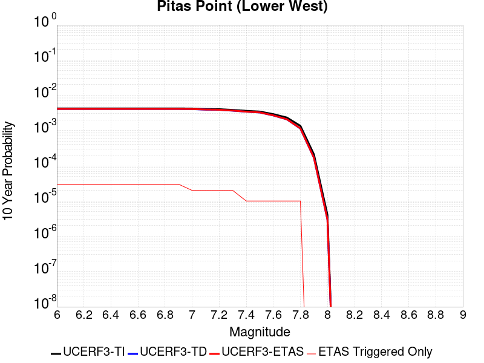 |

| Magnitude | 1 wk TI Prob | 1 wk TD Prob | 1 wk ETAS Prob | 1 wk ETAS/TD Gain | 1 wk ETAS Triggered Only | 1 mo TI Prob | 1 mo TD Prob | 1 mo ETAS Prob | 1 mo ETAS/TD Gain | 1 mo ETAS Triggered Only | 1 yr TI Prob | 1 yr TD Prob | 1 yr ETAS Prob | 1 yr ETAS/TD Gain | 1 yr ETAS Triggered Only | 10 yr TI Prob | 10 yr TD Prob | 10 yr ETAS Prob | 10 yr ETAS/TD Gain | 10 yr ETAS Triggered Only |
|-----|-----|-----|-----|-----|-----|-----|-----|-----|-----|-----|-----|-----|-----|-----|-----|-----|-----|-----|-----|-----|
| 6.0 | 8.151497E-6 | 7.8560315E-6 | 7.8560315E-6 | 1.0 | 0.0 | 3.493452E-5 | 3.3668275E-5 | 3.3668275E-5 | 1.0 | 0.0 | 4.252448E-4 | 4.098349E-4 | 4.098349E-4 | 1.0 | 0.0 | 0.0042443196 | 0.0040908717 | 0.00411156 | 1.0050572 | 2.0773394E-5 |
| 6.1 | 8.151497E-6 | 7.8560315E-6 | 7.8560315E-6 | 1.0 | 0.0 | 3.493452E-5 | 3.3668275E-5 | 3.3668275E-5 | 1.0 | 0.0 | 4.252448E-4 | 4.098349E-4 | 4.098349E-4 | 1.0 | 0.0 | 0.0042443196 | 0.0040908717 | 0.00411156 | 1.0050572 | 2.0773394E-5 |
| 6.2 | 8.151497E-6 | 7.8560315E-6 | 7.8560315E-6 | 1.0 | 0.0 | 3.493452E-5 | 3.3668275E-5 | 3.3668275E-5 | 1.0 | 0.0 | 4.252448E-4 | 4.098349E-4 | 4.098349E-4 | 1.0 | 0.0 | 0.0042443196 | 0.0040908717 | 0.00411156 | 1.0050572 | 2.0773394E-5 |
| 6.3 | 8.151497E-6 | 7.8560315E-6 | 7.8560315E-6 | 1.0 | 0.0 | 3.493452E-5 | 3.3668275E-5 | 3.3668275E-5 | 1.0 | 0.0 | 4.252448E-4 | 4.098349E-4 | 4.098349E-4 | 1.0 | 0.0 | 0.0042443196 | 0.0040908717 | 0.00411156 | 1.0050572 | 2.0773394E-5 |
| 6.4 | 8.151497E-6 | 7.8560315E-6 | 7.8560315E-6 | 1.0 | 0.0 | 3.493452E-5 | 3.3668275E-5 | 3.3668275E-5 | 1.0 | 0.0 | 4.252448E-4 | 4.098349E-4 | 4.098349E-4 | 1.0 | 0.0 | 0.0042443196 | 0.0040908717 | 0.00411156 | 1.0050572 | 2.0773394E-5 |
| 6.5 | 8.151497E-6 | 7.8560315E-6 | 7.8560315E-6 | 1.0 | 0.0 | 3.493452E-5 | 3.3668275E-5 | 3.3668275E-5 | 1.0 | 0.0 | 4.252448E-4 | 4.098349E-4 | 4.098349E-4 | 1.0 | 0.0 | 0.0042443196 | 0.0040908717 | 0.00411156 | 1.0050572 | 2.0773394E-5 |
| 6.6 | 8.151497E-6 | 7.8560315E-6 | 7.8560315E-6 | 1.0 | 0.0 | 3.493452E-5 | 3.3668275E-5 | 3.3668275E-5 | 1.0 | 0.0 | 4.252448E-4 | 4.098349E-4 | 4.098349E-4 | 1.0 | 0.0 | 0.0042443196 | 0.0040908717 | 0.00411156 | 1.0050572 | 2.0773394E-5 |
| 6.7 | 8.151497E-6 | 7.8560315E-6 | 7.8560315E-6 | 1.0 | 0.0 | 3.493452E-5 | 3.3668275E-5 | 3.3668275E-5 | 1.0 | 0.0 | 4.252448E-4 | 4.098349E-4 | 4.098349E-4 | 1.0 | 0.0 | 0.0042443196 | 0.0040908717 | 0.00411156 | 1.0050572 | 2.0773394E-5 |
| 6.8 | 8.151497E-6 | 7.8560315E-6 | 7.8560315E-6 | 1.0 | 0.0 | 3.493452E-5 | 3.3668275E-5 | 3.3668275E-5 | 1.0 | 0.0 | 4.252448E-4 | 4.098349E-4 | 4.098349E-4 | 1.0 | 0.0 | 0.0042443196 | 0.0040908717 | 0.00411156 | 1.0050572 | 2.0773394E-5 |
| 6.9 | 8.151497E-6 | 7.8560315E-6 | 7.8560315E-6 | 1.0 | 0.0 | 3.493452E-5 | 3.3668275E-5 | 3.3668275E-5 | 1.0 | 0.0 | 4.252448E-4 | 4.098349E-4 | 4.098349E-4 | 1.0 | 0.0 | 0.0042443196 | 0.0040908717 | 0.00411156 | 1.0050572 | 2.0773394E-5 |
| 7.0 | 8.103535E-6 | 7.80546E-6 | 7.80546E-6 | 1.0 | 0.0 | 3.4728975E-5 | 3.3451546E-5 | 3.3451546E-5 | 1.0 | 0.0 | 4.2274324E-4 | 4.071972E-4 | 4.071972E-4 | 1.0 | 0.0 | 0.0042193993 | 0.004064591 | 0.004074936 | 1.002545 | 1.0386697E-5 |
| 7.1 | 7.853298E-6 | 7.541143E-6 | 7.541143E-6 | 1.0 | 0.0 | 3.3656554E-5 | 3.231879E-5 | 3.231879E-5 | 1.0 | 0.0 | 4.096915E-4 | 3.934109E-4 | 3.934109E-4 | 1.0 | 0.0 | 0.00408937 | 0.0039272206 | 0.0039375667 | 1.0026344 | 1.0386697E-5 |
| 7.2 | 7.771102E-6 | 7.453422E-6 | 7.453422E-6 | 1.0 | 0.0 | 3.33043E-5 | 3.194285E-5 | 3.194285E-5 | 1.0 | 0.0 | 4.0540437E-4 | 3.888355E-4 | 3.888355E-4 | 1.0 | 0.0 | 0.0040466557 | 0.003881627 | 0.0038919735 | 1.0026655 | 1.0386697E-5 |
| 7.3 | 7.3945344E-6 | 7.0495107E-6 | 7.0495107E-6 | 1.0 | 0.0 | 3.1690477E-5 | 3.0211842E-5 | 3.0211842E-5 | 1.0 | 0.0 | 3.8576324E-4 | 3.6776773E-4 | 3.6776773E-4 | 1.0 | 0.0 | 0.0038509427 | 0.003671659 | 0.0036820073 | 1.0028185 | 1.0386697E-5 |
| 7.4 | 6.964645E-6 | 6.590343E-6 | 6.590343E-6 | 1.0 | 0.0 | 2.9848137E-5 | 2.8244025E-5 | 2.8244025E-5 | 1.0 | 0.0 | 3.6334046E-4 | 3.4381726E-4 | 3.4381726E-4 | 1.0 | 0.0 | 0.0036274698 | 0.0034329065 | 0.0034432574 | 1.0030153 | 1.0386697E-5 |
| 7.5 | 6.6525035E-6 | 6.2593713E-6 | 6.2593713E-6 | 1.0 | 0.0 | 2.851042E-5 | 2.6825604E-5 | 2.6825604E-5 | 1.0 | 0.0 | 3.4705905E-4 | 3.2655327E-4 | 3.2655327E-4 | 1.0 | 0.0 | 0.0034651754 | 0.0032607857 | 0.0032711385 | 1.0031749 | 1.0386697E-5 |
| 7.6 | 5.613338E-6 | 5.151559E-6 | 5.151559E-6 | 1.0 | 0.0 | 2.405694E-5 | 2.2077926E-5 | 2.2077926E-5 | 1.0 | 0.0 | 2.928539E-4 | 2.6876587E-4 | 2.6876587E-4 | 1.0 | 0.0 | 0.0029246826 | 0.00268444 | 0.0026947989 | 1.0038588 | 1.0386697E-5 |
| 7.7 | 4.494704E-6 | 3.9970487E-6 | 3.9970487E-6 | 1.0 | 0.0 | 1.9262876E-5 | 1.7130098E-5 | 1.7130098E-5 | 1.0 | 0.0 | 2.3450027E-4 | 2.085392E-4 | 2.085392E-4 | 1.0 | 0.0 | 0.0023425296 | 0.0020834592 | 0.0020938243 | 1.004975 | 1.0386697E-5 |
| 7.8 | 2.6075882E-6 | 2.1837093E-6 | 2.1837093E-6 | 1.0 | 0.0 | 1.117533E-5 | 9.358721E-6 | 9.358721E-6 | 1.0 | 0.0 | 1.3605114E-4 | 1.1393652E-4 | 1.1393652E-4 | 1.0 | 0.0 | 0.0013596788 | 0.0011387857 | 0.0011491607 | 1.0091105 | 1.0386697E-5 |
| 7.9 | 4.045984E-7 | 3.2424867E-7 | 3.2424867E-7 | 1.0 | 0.0 | 1.733992E-6 | 1.3896364E-6 | 1.3896364E-6 | 1.0 | 0.0 | 2.1111147E-5 | 1.6918695E-5 | 1.6918695E-5 | 1.0 | 0.0 | 2.1109142E-4 | 1.6917438E-4 | 1.6917438E-4 | 1.0 | 0.0 |
| 8.0 | 7.791402E-9 | 5.683722E-9 | 5.683722E-9 | 1.0 | 0.0 | 3.3391725E-8 | 2.4358807E-8 | 2.4358807E-8 | 1.0 | 0.0 | 4.0654416E-7 | 2.9656846E-7 | 2.9656846E-7 | 1.0 | 0.0 | 4.065434E-6 | 2.9656826E-6 | 2.9656826E-6 | 1.0 | 0.0 |

## Emerson-Copper Mtn 2011
*[(top)](#table-of-contents)*

| 1 Week | 1 Month | 1 Year | 10 Year |
|-----|-----|-----|-----|
|  | 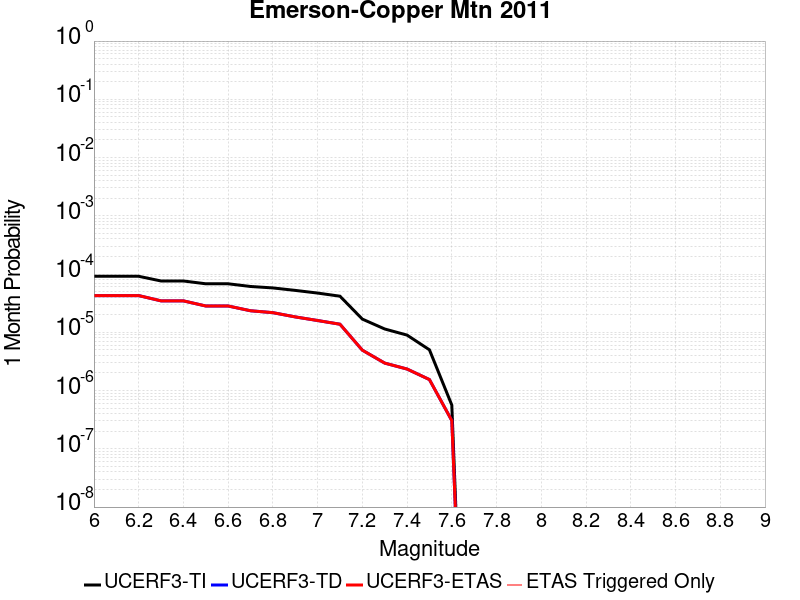 |  |  |

| Magnitude | 1 wk TI Prob | 1 wk TD Prob | 1 wk ETAS Prob | 1 wk ETAS/TD Gain | 1 wk ETAS Triggered Only | 1 mo TI Prob | 1 mo TD Prob | 1 mo ETAS Prob | 1 mo ETAS/TD Gain | 1 mo ETAS Triggered Only | 1 yr TI Prob | 1 yr TD Prob | 1 yr ETAS Prob | 1 yr ETAS/TD Gain | 1 yr ETAS Triggered Only | 10 yr TI Prob | 10 yr TD Prob | 10 yr ETAS Prob | 10 yr ETAS/TD Gain | 10 yr ETAS Triggered Only |
|-----|-----|-----|-----|-----|-----|-----|-----|-----|-----|-----|-----|-----|-----|-----|-----|-----|-----|-----|-----|-----|
| 6.0 | 2.1364202E-5 | 9.96877E-6 | 9.96877E-6 | 1.0 | 0.0 | 9.1557646E-5 | 4.272265E-5 | 4.272265E-5 | 1.0 | 0.0 | 0.0011141442 | 5.2003283E-4 | 5.3041417E-4 | 1.0199628 | 1.0386697E-5 | 0.011085749 | 0.005189029 | 0.0052096946 | 1.0039825 | 2.0773394E-5 |
| 6.1 | 2.1364202E-5 | 9.96877E-6 | 9.96877E-6 | 1.0 | 0.0 | 9.1557646E-5 | 4.272265E-5 | 4.272265E-5 | 1.0 | 0.0 | 0.0011141442 | 5.2003283E-4 | 5.3041417E-4 | 1.0199628 | 1.0386697E-5 | 0.011085749 | 0.005189029 | 0.0052096946 | 1.0039825 | 2.0773394E-5 |
| 6.2 | 2.1364202E-5 | 9.96877E-6 | 9.96877E-6 | 1.0 | 0.0 | 9.1557646E-5 | 4.272265E-5 | 4.272265E-5 | 1.0 | 0.0 | 0.0011141442 | 5.2003283E-4 | 5.3041417E-4 | 1.0199628 | 1.0386697E-5 | 0.011085749 | 0.005189029 | 0.0052096946 | 1.0039825 | 2.0773394E-5 |
| 6.3 | 1.7751237E-5 | 8.0897835E-6 | 8.0897835E-6 | 1.0 | 0.0 | 7.607452E-5 | 3.4670073E-5 | 3.4670073E-5 | 1.0 | 0.0 | 9.258136E-4 | 4.2203267E-4 | 4.32415E-4 | 1.0246007 | 1.0386697E-5 | 0.00921966 | 0.0042129345 | 0.0042336206 | 1.0049101 | 2.0773394E-5 |
| 6.4 | 1.7751237E-5 | 8.0897835E-6 | 8.0897835E-6 | 1.0 | 0.0 | 7.607452E-5 | 3.4670073E-5 | 3.4670073E-5 | 1.0 | 0.0 | 9.258136E-4 | 4.2203267E-4 | 4.32415E-4 | 1.0246007 | 1.0386697E-5 | 0.00921966 | 0.0042129345 | 0.0042336206 | 1.0049101 | 2.0773394E-5 |
| 6.5 | 1.5886664E-5 | 6.604287E-6 | 6.604287E-6 | 1.0 | 0.0 | 6.808392E-5 | 2.8303808E-5 | 2.8303808E-5 | 1.0 | 0.0 | 8.286065E-4 | 3.4454907E-4 | 3.4454907E-4 | 1.0 | 0.0 | 0.008255237 | 0.003440613 | 0.0034509639 | 1.0030085 | 1.0386697E-5 |
| 6.6 | 1.5886664E-5 | 6.604287E-6 | 6.604287E-6 | 1.0 | 0.0 | 6.808392E-5 | 2.8303808E-5 | 2.8303808E-5 | 1.0 | 0.0 | 8.286065E-4 | 3.4454907E-4 | 3.4454907E-4 | 1.0 | 0.0 | 0.008255237 | 0.003440613 | 0.0034509639 | 1.0030085 | 1.0386697E-5 |
| 6.7 | 1.428471E-5 | 5.470806E-6 | 5.470806E-6 | 1.0 | 0.0 | 6.121875E-5 | 2.3446124E-5 | 2.3446124E-5 | 1.0 | 0.0 | 7.450834E-4 | 2.854231E-4 | 2.854231E-4 | 1.0 | 0.0 | 0.007425902 | 0.0028509533 | 0.0028613103 | 1.0036329 | 1.0386697E-5 |
| 6.8 | 1.3490684E-5 | 5.0740778E-6 | 5.0740778E-6 | 1.0 | 0.0 | 5.7815934E-5 | 2.1745887E-5 | 2.1745887E-5 | 1.0 | 0.0 | 7.0368167E-4 | 2.647279E-4 | 2.647279E-4 | 1.0 | 0.0 | 0.007014576 | 0.0026445063 | 0.0026548656 | 1.0039172 | 1.0386697E-5 |
| 6.9 | 1.2235421E-5 | 4.2900224E-6 | 4.2900224E-6 | 1.0 | 0.0 | 5.2436466E-5 | 1.8385701E-5 | 1.8385701E-5 | 1.0 | 0.0 | 6.38227E-4 | 2.2382653E-4 | 2.2382653E-4 | 1.0 | 0.0 | 0.0063639707 | 0.0022363653 | 0.0022467289 | 1.004634 | 1.0386697E-5 |
| 7.0 | 1.1009851E-5 | 3.719305E-6 | 3.719305E-6 | 1.0 | 0.0 | 4.7184225E-5 | 1.59398E-5 | 1.59398E-5 | 1.0 | 0.0 | 5.743165E-4 | 1.9405322E-4 | 1.9405322E-4 | 1.0 | 0.0 | 0.005728345 | 0.0019391757 | 0.0019495422 | 1.0053458 | 1.0386697E-5 |
| 7.1 | 9.726373E-6 | 3.2120734E-6 | 3.2120734E-6 | 1.0 | 0.0 | 4.168379E-5 | 1.3765975E-5 | 1.3765975E-5 | 1.0 | 0.0 | 5.07382E-4 | 1.6759124E-4 | 1.6759124E-4 | 1.0 | 0.0 | 0.0050622504 | 0.0016749798 | 0.001685349 | 1.0061907 | 1.0386697E-5 |
| 7.2 | 3.9335127E-6 | 1.1525784E-6 | 1.1525784E-6 | 1.0 | 0.0 | 1.6857803E-5 | 4.939613E-6 | 4.939613E-6 | 1.0 | 0.0 | 2.0522442E-4 | 6.0138187E-5 | 6.0138187E-5 | 1.0 | 0.0 | 0.00205035 | 6.0122507E-4 | 6.1160553E-4 | 1.0172656 | 1.0386697E-5 |
| 7.3 | 2.661632E-6 | 6.912155E-7 | 6.912155E-7 | 1.0 | 0.0 | 1.14069435E-5 | 2.962349E-6 | 2.962349E-6 | 1.0 | 0.0 | 1.3887069E-4 | 3.6066012E-5 | 3.6066012E-5 | 1.0 | 0.0 | 0.0013878393 | 3.6060263E-4 | 3.7098557E-4 | 1.0287933 | 1.0386697E-5 |
| 7.4 | 2.0893426E-6 | 5.462354E-7 | 5.462354E-7 | 1.0 | 0.0 | 8.954295E-6 | 2.3410068E-6 | 2.3410068E-6 | 1.0 | 0.0 | 1.0901308E-4 | 2.850139E-5 | 2.850139E-5 | 1.0 | 0.0 | 0.0010895962 | 2.849779E-4 | 2.9536162E-4 | 1.036437 | 1.0386697E-5 |
| 7.5 | 1.1681728E-6 | 3.6033393E-7 | 3.6033393E-7 | 1.0 | 0.0 | 5.0064455E-6 | 1.5442874E-6 | 1.5442874E-6 | 1.0 | 0.0 | 6.0951766E-5 | 1.8801542E-5 | 1.8801542E-5 | 1.0 | 0.0 | 6.093505E-4 | 1.8799998E-4 | 1.9838472E-4 | 1.055238 | 1.0386697E-5 |
| 7.6 | 1.3154387E-7 | 7.12009E-8 | 7.12009E-8 | 1.0 | 0.0 | 5.6375933E-7 | 3.051467E-7 | 3.051467E-7 | 1.0 | 0.0 | 6.863748E-6 | 3.7151563E-6 | 3.7151563E-6 | 1.0 | 0.0 | 6.863536E-5 | 3.7151098E-5 | 3.7151098E-5 | 1.0 | 0.0 |

## Elsinore (Temecula) rev
*[(top)](#table-of-contents)*

| 1 Week | 1 Month | 1 Year | 10 Year |
|-----|-----|-----|-----|
|  |  |  |  |

| Magnitude | 1 wk TI Prob | 1 wk TD Prob | 1 wk ETAS Prob | 1 wk ETAS/TD Gain | 1 wk ETAS Triggered Only | 1 mo TI Prob | 1 mo TD Prob | 1 mo ETAS Prob | 1 mo ETAS/TD Gain | 1 mo ETAS Triggered Only | 1 yr TI Prob | 1 yr TD Prob | 1 yr ETAS Prob | 1 yr ETAS/TD Gain | 1 yr ETAS Triggered Only | 10 yr TI Prob | 10 yr TD Prob | 10 yr ETAS Prob | 10 yr ETAS/TD Gain | 10 yr ETAS Triggered Only |
|-----|-----|-----|-----|-----|-----|-----|-----|-----|-----|-----|-----|-----|-----|-----|-----|-----|-----|-----|-----|-----|
| 6.0 | 2.9514995E-5 | 2.2522026E-5 | 2.2522026E-5 | 1.0 | 0.0 | 1.264867E-4 | 9.651952E-5 | 1.06905216E-4 | 1.107602 | 1.0386697E-5 | 0.0015388876 | 0.001174514 | 0.0011952629 | 1.017666 | 2.0773394E-5 | 0.015282745 | 0.011699457 | 0.011719988 | 1.0017548 | 2.0773394E-5 |
| 6.1 | 2.9514995E-5 | 2.2522026E-5 | 2.2522026E-5 | 1.0 | 0.0 | 1.264867E-4 | 9.651952E-5 | 1.06905216E-4 | 1.107602 | 1.0386697E-5 | 0.0015388876 | 0.001174514 | 0.0011952629 | 1.017666 | 2.0773394E-5 | 0.015282745 | 0.011699457 | 0.011719988 | 1.0017548 | 2.0773394E-5 |
| 6.2 | 2.9514995E-5 | 2.2522026E-5 | 2.2522026E-5 | 1.0 | 0.0 | 1.264867E-4 | 9.651952E-5 | 1.06905216E-4 | 1.107602 | 1.0386697E-5 | 0.0015388876 | 0.001174514 | 0.0011952629 | 1.017666 | 2.0773394E-5 | 0.015282745 | 0.011699457 | 0.011719988 | 1.0017548 | 2.0773394E-5 |
| 6.3 | 2.3223649E-5 | 1.8409943E-5 | 1.8409943E-5 | 1.0 | 0.0 | 9.952613E-5 | 7.8897465E-5 | 8.928334E-5 | 1.1316377 | 1.0386697E-5 | 0.001211057 | 9.6017064E-4 | 9.809241E-4 | 1.0216143 | 2.0773394E-5 | 0.012044783 | 0.00957171 | 0.009592284 | 1.0021495 | 2.0773394E-5 |
| 6.4 | 2.3223649E-5 | 1.8409943E-5 | 1.8409943E-5 | 1.0 | 0.0 | 9.952613E-5 | 7.8897465E-5 | 8.928334E-5 | 1.1316377 | 1.0386697E-5 | 0.001211057 | 9.6017064E-4 | 9.809241E-4 | 1.0216143 | 2.0773394E-5 | 0.012044783 | 0.00957171 | 0.009592284 | 1.0021495 | 2.0773394E-5 |
| 6.5 | 1.8338875E-5 | 1.475257E-5 | 1.475257E-5 | 1.0 | 0.0 | 7.8592806E-5 | 6.3223815E-5 | 6.3223815E-5 | 1.0 | 0.0 | 9.5644733E-4 | 7.694868E-4 | 7.7986554E-4 | 1.0134878 | 1.0386697E-5 | 0.009523412 | 0.0076751863 | 0.007685493 | 1.0013429 | 1.0386697E-5 |
| 6.6 | 1.8223333E-5 | 1.46151115E-5 | 1.46151115E-5 | 1.0 | 0.0 | 7.809766E-5 | 6.263474E-5 | 6.263474E-5 | 1.0 | 0.0 | 9.504242E-4 | 7.623199E-4 | 7.7269867E-4 | 1.0136148 | 1.0386697E-5 | 0.009463696 | 0.0076040085 | 0.007614316 | 1.0013555 | 1.0386697E-5 |
| 6.7 | 1.7512752E-5 | 1.4029526E-5 | 1.4029526E-5 | 1.0 | 0.0 | 7.505249E-5 | 6.0125203E-5 | 6.0125203E-5 | 1.0 | 0.0 | 9.13381E-4 | 7.3178706E-4 | 7.421662E-4 | 1.0141832 | 1.0386697E-5 | 0.00909636 | 0.0073001203 | 0.0073104315 | 1.0014124 | 1.0386697E-5 |
| 6.8 | 1.7417142E-5 | 1.3953497E-5 | 1.3953497E-5 | 1.0 | 0.0 | 7.4642754E-5 | 5.979938E-5 | 5.979938E-5 | 1.0 | 0.0 | 9.083966E-4 | 7.2782283E-4 | 7.3820195E-4 | 1.0142605 | 1.0386697E-5 | 0.009046922 | 0.007260682 | 0.007270993 | 1.0014201 | 1.0386697E-5 |
| 6.9 | 1.6402591E-5 | 1.29908285E-5 | 1.29908285E-5 | 1.0 | 0.0 | 7.0294926E-5 | 5.5673834E-5 | 5.5673834E-5 | 1.0 | 0.0 | 8.5550465E-4 | 6.776258E-4 | 6.880055E-4 | 1.0153177 | 1.0386697E-5 | 0.008522186 | 0.006761318 | 0.0067716343 | 1.0015258 | 1.0386697E-5 |
| 7.0 | 1.3912486E-5 | 1.088019E-5 | 1.088019E-5 | 1.0 | 0.0 | 5.9623577E-5 | 4.6628564E-5 | 4.6628564E-5 | 1.0 | 0.0 | 7.2567526E-4 | 5.6755764E-4 | 5.7793845E-4 | 1.0182903 | 1.0386697E-5 | 0.0072331014 | 0.005665 | 0.005675328 | 1.0018231 | 1.0386697E-5 |
| 7.1 | 1.3405147E-5 | 1.0329276E-5 | 1.0329276E-5 | 1.0 | 0.0 | 5.7449364E-5 | 4.426759E-5 | 4.426759E-5 | 1.0 | 0.0 | 6.9922156E-4 | 5.388272E-4 | 5.492083E-4 | 1.0192661 | 1.0386697E-5 | 0.0069702556 | 0.005378539 | 0.0053888704 | 1.0019207 | 1.0386697E-5 |
| 7.2 | 1.21402E-5 | 8.998324E-6 | 8.998324E-6 | 1.0 | 0.0 | 5.202839E-5 | 3.856369E-5 | 3.856369E-5 | 1.0 | 0.0 | 6.332616E-4 | 4.6941353E-4 | 4.7979536E-4 | 1.0221165 | 1.0386697E-5 | 0.0063146 | 0.004685645 | 0.004695983 | 1.0022063 | 1.0386697E-5 |
| 7.3 | 1.05047775E-5 | 7.573083E-6 | 7.573083E-6 | 1.0 | 0.0 | 4.5019697E-5 | 3.2455675E-5 | 3.2455675E-5 | 1.0 | 0.0 | 5.4797693E-4 | 3.9507766E-4 | 3.9507766E-4 | 1.0 | 0.0 | 0.005466277 | 0.0039441423 | 0.0039441423 | 1.0 | 0.0 |
| 7.4 | 9.624483E-6 | 6.7880264E-6 | 6.7880264E-6 | 1.0 | 0.0 | 4.124713E-5 | 2.9091227E-5 | 2.9091227E-5 | 1.0 | 0.0 | 5.0206814E-4 | 3.541295E-4 | 3.541295E-4 | 1.0 | 0.0 | 0.005009353 | 0.0035358057 | 0.0035358057 | 1.0 | 0.0 |
| 7.5 | 8.215151E-6 | 5.636438E-6 | 5.636438E-6 | 1.0 | 0.0 | 3.5207315E-5 | 2.4155945E-5 | 2.4155945E-5 | 1.0 | 0.0 | 4.2856473E-4 | 2.940602E-4 | 2.940602E-4 | 1.0 | 0.0 | 0.004277392 | 0.0029368391 | 0.0029368391 | 1.0 | 0.0 |
| 7.6 | 6.975058E-6 | 4.676814E-6 | 4.676814E-6 | 1.0 | 0.0 | 2.9892764E-5 | 2.0043342E-5 | 2.0043342E-5 | 1.0 | 0.0 | 3.6388362E-4 | 2.4400154E-4 | 2.4400154E-4 | 1.0 | 0.0 | 0.0036328835 | 0.0024374526 | 0.0024374526 | 1.0 | 0.0 |
| 7.7 | 4.159604E-6 | 2.3274456E-6 | 2.3274456E-6 | 1.0 | 0.0 | 1.7826753E-5 | 9.974733E-6 | 9.974733E-6 | 1.0 | 0.0 | 2.1701909E-4 | 1.2143635E-4 | 1.2143635E-4 | 1.0 | 0.0 | 0.0021680726 | 0.001213773 | 0.001213773 | 1.0 | 0.0 |
| 7.8 | 2.2692414E-7 | 9.3873886E-8 | 9.3873886E-8 | 1.0 | 0.0 | 9.725317E-7 | 4.023166E-7 | 4.023166E-7 | 1.0 | 0.0 | 1.1840509E-5 | 4.898197E-6 | 4.898197E-6 | 1.0 | 0.0 | 1.1839878E-4 | 4.898122E-5 | 4.898122E-5 | 1.0 | 0.0 |
| 7.9 | 6.676829E-9 | 3.4403498E-9 | 3.4403498E-9 | 1.0 | 0.0 | 2.861498E-8 | 1.4744357E-8 | 1.4744357E-8 | 1.0 | 0.0 | 3.4838732E-7 | 1.7951253E-7 | 1.7951253E-7 | 1.0 | 0.0 | 3.4838679E-6 | 1.7951239E-6 | 1.7951239E-6 | 1.0 | 0.0 |

## Rinconada 2011 CFM
*[(top)](#table-of-contents)*

| 1 Week | 1 Month | 1 Year | 10 Year |
|-----|-----|-----|-----|
|  |  | 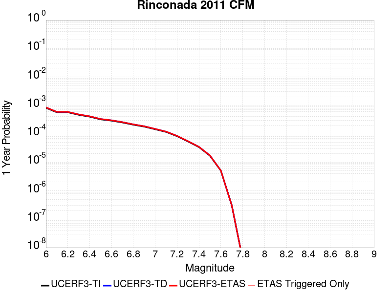 | 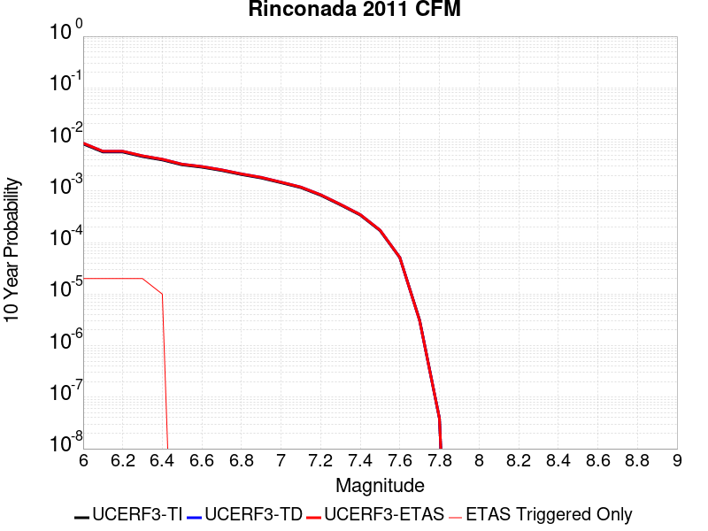 |

| Magnitude | 1 wk TI Prob | 1 wk TD Prob | 1 wk ETAS Prob | 1 wk ETAS/TD Gain | 1 wk ETAS Triggered Only | 1 mo TI Prob | 1 mo TD Prob | 1 mo ETAS Prob | 1 mo ETAS/TD Gain | 1 mo ETAS Triggered Only | 1 yr TI Prob | 1 yr TD Prob | 1 yr ETAS Prob | 1 yr ETAS/TD Gain | 1 yr ETAS Triggered Only | 10 yr TI Prob | 10 yr TD Prob | 10 yr ETAS Prob | 10 yr ETAS/TD Gain | 10 yr ETAS Triggered Only |
|-----|-----|-----|-----|-----|-----|-----|-----|-----|-----|-----|-----|-----|-----|-----|-----|-----|-----|-----|-----|-----|
| 6.0 | 1.5752368E-5 | 1.6275004E-5 | 1.6275004E-5 | 1.0 | 0.0 | 6.75084E-5 | 6.974817E-5 | 6.974817E-5 | 1.0 | 0.0 | 8.2160486E-4 | 8.4885623E-4 | 8.4885623E-4 | 1.0 | 0.0 | 0.008185739 | 0.008456519 | 0.008477116 | 1.0024357 | 2.0773394E-5 |
| 6.1 | 1.0966133E-5 | 1.1323225E-5 | 1.1323225E-5 | 1.0 | 0.0 | 4.6996865E-5 | 4.852721E-5 | 4.852721E-5 | 1.0 | 0.0 | 5.720366E-4 | 5.906594E-4 | 5.906594E-4 | 1.0 | 0.0 | 0.0057056635 | 0.005890991 | 0.0059116418 | 1.0035055 | 2.0773394E-5 |
| 6.2 | 1.0966133E-5 | 1.1323225E-5 | 1.1323225E-5 | 1.0 | 0.0 | 4.6996865E-5 | 4.852721E-5 | 4.852721E-5 | 1.0 | 0.0 | 5.720366E-4 | 5.906594E-4 | 5.906594E-4 | 1.0 | 0.0 | 0.0057056635 | 0.005890991 | 0.0059116418 | 1.0035055 | 2.0773394E-5 |
| 6.3 | 8.926149E-6 | 9.212929E-6 | 9.212929E-6 | 1.0 | 0.0 | 3.8254362E-5 | 3.9483388E-5 | 3.9483388E-5 | 1.0 | 0.0 | 4.6564735E-4 | 4.8060456E-4 | 4.8060456E-4 | 1.0 | 0.0 | 0.0046467283 | 0.0047956966 | 0.0048163706 | 1.0043108 | 2.0773394E-5 |
| 6.4 | 7.676955E-6 | 7.9203255E-6 | 7.9203255E-6 | 1.0 | 0.0 | 3.290082E-5 | 3.3943812E-5 | 3.3943812E-5 | 1.0 | 0.0 | 4.0049385E-4 | 4.131877E-4 | 4.131877E-4 | 1.0 | 0.0 | 0.0039977287 | 0.004124221 | 0.0041345647 | 1.002508 | 1.0386697E-5 |
| 6.5 | 6.1671026E-6 | 6.359061E-6 | 6.359061E-6 | 1.0 | 0.0 | 2.6430173E-5 | 2.7252834E-5 | 2.7252834E-5 | 1.0 | 0.0 | 3.2173982E-4 | 3.3175282E-4 | 3.3175282E-4 | 1.0 | 0.0 | 0.003212744 | 0.0033125877 | 0.0033125877 | 1.0 | 0.0 |
| 6.6 | 5.553456E-6 | 5.7249076E-6 | 5.7249076E-6 | 1.0 | 0.0 | 2.3800309E-5 | 2.4535088E-5 | 2.4535088E-5 | 1.0 | 0.0 | 2.897302E-4 | 2.986738E-4 | 2.986738E-4 | 1.0 | 0.0 | 0.0028935277 | 0.0029827326 | 0.0029827326 | 1.0 | 0.0 |
| 6.7 | 4.787857E-6 | 4.9333903E-6 | 4.9333903E-6 | 1.0 | 0.0 | 2.0519226E-5 | 2.114293E-5 | 2.114293E-5 | 1.0 | 0.0 | 2.4979294E-4 | 2.573848E-4 | 2.573848E-4 | 1.0 | 0.0 | 0.0024951235 | 0.002570873 | 0.002570873 | 1.0 | 0.0 |
| 6.8 | 3.9955166E-6 | 4.1135418E-6 | 4.1135418E-6 | 1.0 | 0.0 | 1.7123532E-5 | 1.7629345E-5 | 1.7629345E-5 | 1.0 | 0.0 | 2.0845905E-4 | 2.1461617E-4 | 2.1461617E-4 | 1.0 | 0.0 | 0.002082636 | 0.0021440927 | 0.0021440927 | 1.0 | 0.0 |
| 6.9 | 3.4250072E-6 | 3.5225005E-6 | 3.5225005E-6 | 1.0 | 0.0 | 1.46785205E-5 | 1.5096344E-5 | 1.5096344E-5 | 1.0 | 0.0 | 1.7869633E-4 | 1.837825E-4 | 1.837825E-4 | 1.0 | 0.0 | 0.001785527 | 0.0018363077 | 0.0018363077 | 1.0 | 0.0 |
| 7.0 | 2.7712713E-6 | 2.846742E-6 | 2.846742E-6 | 1.0 | 0.0 | 1.1876823E-5 | 1.2200267E-5 | 1.2200267E-5 | 1.0 | 0.0 | 1.4459073E-4 | 1.4852812E-4 | 1.4852812E-4 | 1.0 | 0.0 | 0.0014449668 | 0.0014842902 | 0.0014842902 | 1.0 | 0.0 |
| 7.1 | 2.227358E-6 | 2.2857312E-6 | 2.2857312E-6 | 1.0 | 0.0 | 9.545785E-6 | 9.795955E-6 | 9.795955E-6 | 1.0 | 0.0 | 1.16213734E-4 | 1.19259224E-4 | 1.19259224E-4 | 1.0 | 0.0 | 0.0011615298 | 0.0011919533 | 0.0011919533 | 1.0 | 0.0 |
| 7.2 | 1.581796E-6 | 1.6209234E-6 | 1.6209234E-6 | 1.0 | 0.0 | 6.779108E-6 | 6.946796E-6 | 6.946796E-6 | 1.0 | 0.0 | 8.253252E-5 | 8.457396E-5 | 8.457396E-5 | 1.0 | 0.0 | 8.250187E-4 | 8.454183E-4 | 8.454183E-4 | 1.0 | 0.0 |
| 7.3 | 1.0306567E-6 | 1.0546617E-6 | 1.0546617E-6 | 1.0 | 0.0 | 4.4170924E-6 | 4.519971E-6 | 4.519971E-6 | 1.0 | 0.0 | 5.3776774E-5 | 5.5029257E-5 | 5.5029257E-5 | 1.0 | 0.0 | 5.376376E-4 | 5.501566E-4 | 5.501566E-4 | 1.0 | 0.0 |
| 7.4 | 6.535541E-7 | 6.682831E-7 | 6.682831E-7 | 1.0 | 0.0 | 2.800943E-6 | 2.8640675E-6 | 2.8640675E-6 | 1.0 | 0.0 | 3.4100947E-5 | 3.4869463E-5 | 3.4869463E-5 | 1.0 | 0.0 | 3.4095717E-4 | 3.4864005E-4 | 3.4864005E-4 | 1.0 | 0.0 |
| 7.5 | 3.2656962E-7 | 3.3317139E-7 | 3.3317139E-7 | 1.0 | 0.0 | 1.3995833E-6 | 1.4278766E-6 | 1.4278766E-6 | 1.0 | 0.0 | 1.7039794E-5 | 1.7384258E-5 | 1.7384258E-5 | 1.0 | 0.0 | 1.7038487E-4 | 1.7382903E-4 | 1.7382903E-4 | 1.0 | 0.0 |
| 7.6 | 9.754343E-8 | 9.821119E-8 | 9.821119E-8 | 1.0 | 0.0 | 4.180432E-7 | 4.2090502E-7 | 4.2090502E-7 | 1.0 | 0.0 | 5.089664E-6 | 5.1245065E-6 | 5.1245065E-6 | 1.0 | 0.0 | 5.0895473E-5 | 5.1243893E-5 | 5.1243893E-5 | 1.0 | 0.0 |
| 7.7 | 6.0001453E-9 | 5.8491465E-9 | 5.8491465E-9 | 1.0 | 0.0 | 2.5714908E-8 | 2.5067772E-8 | 2.5067772E-8 | 1.0 | 0.0 | 3.1307894E-7 | 3.0520007E-7 | 3.0520007E-7 | 1.0 | 0.0 | 3.1307852E-6 | 3.0519968E-6 | 3.0519968E-6 | 1.0 | 0.0 |
| 7.8 | 7.400003E-11 | 7.465484E-11 | 7.465484E-11 | 1.0 | 0.0 | 3.171432E-10 | 3.1994918E-10 | 3.1994918E-10 | 1.0 | 0.0 | 3.861218E-9 | 3.8953814E-9 | 3.8953814E-9 | 1.0 | 0.0 | 3.861218E-8 | 3.8953814E-8 | 3.8953814E-8 | 1.0 | 0.0 |

## Great Valley 11
*[(top)](#table-of-contents)*

| 1 Week | 1 Month | 1 Year | 10 Year |
|-----|-----|-----|-----|
| 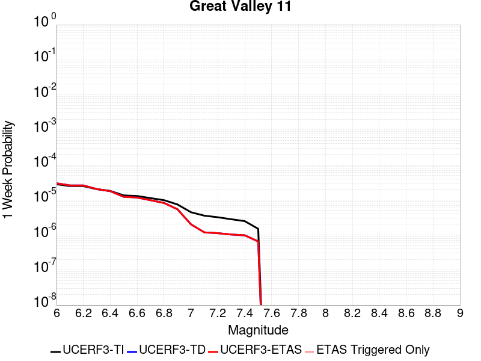 |  |  |  |

| Magnitude | 1 wk TI Prob | 1 wk TD Prob | 1 wk ETAS Prob | 1 wk ETAS/TD Gain | 1 wk ETAS Triggered Only | 1 mo TI Prob | 1 mo TD Prob | 1 mo ETAS Prob | 1 mo ETAS/TD Gain | 1 mo ETAS Triggered Only | 1 yr TI Prob | 1 yr TD Prob | 1 yr ETAS Prob | 1 yr ETAS/TD Gain | 1 yr ETAS Triggered Only | 10 yr TI Prob | 10 yr TD Prob | 10 yr ETAS Prob | 10 yr ETAS/TD Gain | 10 yr ETAS Triggered Only |
|-----|-----|-----|-----|-----|-----|-----|-----|-----|-----|-----|-----|-----|-----|-----|-----|-----|-----|-----|-----|-----|
| 6.0 | 2.8099583E-5 | 2.9834962E-5 | 2.9834962E-5 | 1.0 | 0.0 | 1.20421224E-4 | 1.2785828E-4 | 1.2785828E-4 | 1.0 | 0.0 | 0.0014651422 | 0.0015556379 | 0.0015556379 | 1.0 | 0.0 | 0.0145552 | 0.015455008 | 0.01547546 | 1.0013233 | 2.0773394E-5 |
| 6.1 | 2.483194E-5 | 2.5909541E-5 | 2.5909541E-5 | 1.0 | 0.0 | 1.0641825E-4 | 1.1103653E-4 | 1.1103653E-4 | 1.0 | 0.0 | 0.0012948721 | 0.0013510957 | 0.0013510957 | 1.0 | 0.0 | 0.012873529 | 0.013435229 | 0.013445476 | 1.0007627 | 1.0386697E-5 |
| 6.2 | 2.483194E-5 | 2.5909541E-5 | 2.5909541E-5 | 1.0 | 0.0 | 1.0641825E-4 | 1.1103653E-4 | 1.1103653E-4 | 1.0 | 0.0 | 0.0012948721 | 0.0013510957 | 0.0013510957 | 1.0 | 0.0 | 0.012873529 | 0.013435229 | 0.013445476 | 1.0007627 | 1.0386697E-5 |
| 6.3 | 2.0257901E-5 | 2.0400716E-5 | 2.0400716E-5 | 1.0 | 0.0 | 8.681669E-5 | 8.742895E-5 | 8.742895E-5 | 1.0 | 0.0 | 0.0010564806 | 0.0010639697 | 0.0010639697 | 1.0 | 0.0 | 0.01051472 | 0.010592943 | 0.01060322 | 1.0009701 | 1.0386697E-5 |
| 6.4 | 1.8054898E-5 | 1.7782406E-5 | 1.7782406E-5 | 1.0 | 0.0 | 7.737584E-5 | 7.62083E-5 | 7.62083E-5 | 1.0 | 0.0 | 9.416436E-4 | 9.27479E-4 | 9.27479E-4 | 1.0 | 0.0 | 0.009376635 | 0.009239833 | 0.009250124 | 1.0011138 | 1.0386697E-5 |
| 6.5 | 1.34804895E-5 | 1.2322035E-5 | 1.2322035E-5 | 1.0 | 0.0 | 5.777225E-5 | 5.2807678E-5 | 5.2807678E-5 | 1.0 | 0.0 | 7.031501E-4 | 6.4274797E-4 | 6.4274797E-4 | 1.0 | 0.0 | 0.007009294 | 0.006409327 | 0.006409327 | 1.0 | 0.0 |
| 6.6 | 1.294883E-5 | 1.1733258E-5 | 1.1733258E-5 | 1.0 | 0.0 | 5.5493805E-5 | 5.028445E-5 | 5.028445E-5 | 1.0 | 0.0 | 6.754276E-4 | 6.120453E-4 | 6.120453E-4 | 1.0 | 0.0 | 0.006733784 | 0.006104022 | 0.006104022 | 1.0 | 0.0 |
| 6.7 | 1.1272237E-5 | 9.812685E-6 | 9.812685E-6 | 1.0 | 0.0 | 4.8308695E-5 | 4.20537E-5 | 4.20537E-5 | 1.0 | 0.0 | 5.879996E-4 | 5.1188626E-4 | 5.1188626E-4 | 1.0 | 0.0 | 0.005864462 | 0.005107356 | 0.005107356 | 1.0 | 0.0 |
| 6.8 | 9.8337505E-6 | 8.194461E-6 | 8.194461E-6 | 1.0 | 0.0 | 4.2143965E-5 | 3.5118657E-5 | 3.5118657E-5 | 1.0 | 0.0 | 5.1298196E-4 | 4.274878E-4 | 4.274878E-4 | 1.0 | 0.0 | 0.005117994 | 0.004266865 | 0.004266865 | 1.0 | 0.0 |
| 6.9 | 7.4224813E-6 | 5.4135994E-6 | 5.4135994E-6 | 1.0 | 0.0 | 3.1810247E-5 | 2.3200942E-5 | 2.3200942E-5 | 1.0 | 0.0 | 3.872209E-4 | 2.8243626E-4 | 2.8243626E-4 | 1.0 | 0.0 | 0.0038654688 | 0.002820914 | 0.002820914 | 1.0 | 0.0 |
| 7.0 | 4.4628923E-6 | 2.0112448E-6 | 2.0112448E-6 | 1.0 | 0.0 | 1.912654E-5 | 8.619592E-6 | 8.619592E-6 | 1.0 | 0.0 | 2.3284076E-4 | 1.04938605E-4 | 1.04938605E-4 | 1.0 | 0.0 | 0.0023259693 | 0.001048902 | 0.001048902 | 1.0 | 0.0 |
| 7.1 | 3.5546527E-6 | 1.1856869E-6 | 1.1856869E-6 | 1.0 | 0.0 | 1.5234136E-5 | 5.0815056E-6 | 5.0815056E-6 | 1.0 | 0.0 | 1.8545982E-4 | 6.186564E-5 | 6.186564E-5 | 1.0 | 0.0 | 0.0018530512 | 6.1849103E-4 | 6.1849103E-4 | 1.0 | 0.0 |
| 7.2 | 3.2039936E-6 | 1.1255058E-6 | 1.1255058E-6 | 1.0 | 0.0 | 1.3731329E-5 | 4.823588E-6 | 4.823588E-6 | 1.0 | 0.0 | 1.671661E-4 | 5.872567E-5 | 5.872567E-5 | 1.0 | 0.0 | 0.0016704041 | 5.8710825E-4 | 5.8710825E-4 | 1.0 | 0.0 |
| 7.3 | 2.8120473E-6 | 1.0306428E-6 | 1.0306428E-6 | 1.0 | 0.0 | 1.2051575E-5 | 4.4170333E-6 | 4.4170333E-6 | 1.0 | 0.0 | 1.4671806E-4 | 5.3776123E-5 | 5.3776123E-5 | 1.0 | 0.0 | 0.0014662122 | 5.376377E-4 | 5.376377E-4 | 1.0 | 0.0 |
| 7.4 | 2.4837766E-6 | 9.801314E-7 | 9.801314E-7 | 1.0 | 0.0 | 1.0644713E-5 | 4.2005568E-6 | 4.2005568E-6 | 1.0 | 0.0 | 1.2959167E-4 | 5.1140643E-5 | 5.1140643E-5 | 1.0 | 0.0 | 0.0012951613 | 5.1129534E-4 | 5.1129534E-4 | 1.0 | 0.0 |
| 7.5 | 1.5002679E-6 | 6.546582E-7 | 6.546582E-7 | 1.0 | 0.0 | 6.4297037E-6 | 2.8056752E-6 | 2.8056752E-6 | 1.0 | 0.0 | 7.827883E-5 | 3.4158602E-5 | 3.4158602E-5 | 1.0 | 0.0 | 7.825126E-4 | 3.4153767E-4 | 3.4153767E-4 | 1.0 | 0.0 |

## North Frontal  (East)
*[(top)](#table-of-contents)*

| 1 Week | 1 Month | 1 Year | 10 Year |
|-----|-----|-----|-----|
|  | 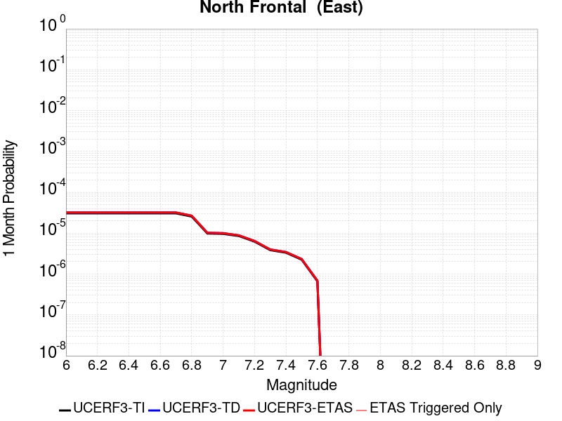 |  |  |

| Magnitude | 1 wk TI Prob | 1 wk TD Prob | 1 wk ETAS Prob | 1 wk ETAS/TD Gain | 1 wk ETAS Triggered Only | 1 mo TI Prob | 1 mo TD Prob | 1 mo ETAS Prob | 1 mo ETAS/TD Gain | 1 mo ETAS Triggered Only | 1 yr TI Prob | 1 yr TD Prob | 1 yr ETAS Prob | 1 yr ETAS/TD Gain | 1 yr ETAS Triggered Only | 10 yr TI Prob | 10 yr TD Prob | 10 yr ETAS Prob | 10 yr ETAS/TD Gain | 10 yr ETAS Triggered Only |
|-----|-----|-----|-----|-----|-----|-----|-----|-----|-----|-----|-----|-----|-----|-----|-----|-----|-----|-----|-----|-----|
| 6.0 | 7.135738E-6 | 7.4773666E-6 | 7.4773666E-6 | 1.0 | 0.0 | 3.0581377E-5 | 3.2045577E-5 | 3.2045577E-5 | 1.0 | 0.0 | 3.7226462E-4 | 3.9010498E-4 | 3.9010498E-4 | 1.0 | 0.0 | 0.0037164164 | 0.0038961596 | 0.003916852 | 1.005311 | 2.0773394E-5 |
| 6.1 | 7.135738E-6 | 7.4773666E-6 | 7.4773666E-6 | 1.0 | 0.0 | 3.0581377E-5 | 3.2045577E-5 | 3.2045577E-5 | 1.0 | 0.0 | 3.7226462E-4 | 3.9010498E-4 | 3.9010498E-4 | 1.0 | 0.0 | 0.0037164164 | 0.0038961596 | 0.003916852 | 1.005311 | 2.0773394E-5 |
| 6.2 | 7.135738E-6 | 7.4773666E-6 | 7.4773666E-6 | 1.0 | 0.0 | 3.0581377E-5 | 3.2045577E-5 | 3.2045577E-5 | 1.0 | 0.0 | 3.7226462E-4 | 3.9010498E-4 | 3.9010498E-4 | 1.0 | 0.0 | 0.0037164164 | 0.0038961596 | 0.003916852 | 1.005311 | 2.0773394E-5 |
| 6.3 | 7.135738E-6 | 7.4773666E-6 | 7.4773666E-6 | 1.0 | 0.0 | 3.0581377E-5 | 3.2045577E-5 | 3.2045577E-5 | 1.0 | 0.0 | 3.7226462E-4 | 3.9010498E-4 | 3.9010498E-4 | 1.0 | 0.0 | 0.0037164164 | 0.0038961596 | 0.003916852 | 1.005311 | 2.0773394E-5 |
| 6.4 | 7.135738E-6 | 7.4773666E-6 | 7.4773666E-6 | 1.0 | 0.0 | 3.0581377E-5 | 3.2045577E-5 | 3.2045577E-5 | 1.0 | 0.0 | 3.7226462E-4 | 3.9010498E-4 | 3.9010498E-4 | 1.0 | 0.0 | 0.0037164164 | 0.0038961596 | 0.003916852 | 1.005311 | 2.0773394E-5 |
| 6.5 | 7.135738E-6 | 7.4773666E-6 | 7.4773666E-6 | 1.0 | 0.0 | 3.0581377E-5 | 3.2045577E-5 | 3.2045577E-5 | 1.0 | 0.0 | 3.7226462E-4 | 3.9010498E-4 | 3.9010498E-4 | 1.0 | 0.0 | 0.0037164164 | 0.0038961596 | 0.003916852 | 1.005311 | 2.0773394E-5 |
| 6.6 | 7.135738E-6 | 7.4773666E-6 | 7.4773666E-6 | 1.0 | 0.0 | 3.0581377E-5 | 3.2045577E-5 | 3.2045577E-5 | 1.0 | 0.0 | 3.7226462E-4 | 3.9010498E-4 | 3.9010498E-4 | 1.0 | 0.0 | 0.0037164164 | 0.0038961596 | 0.003916852 | 1.005311 | 2.0773394E-5 |
| 6.7 | 7.135738E-6 | 7.4773666E-6 | 7.4773666E-6 | 1.0 | 0.0 | 3.0581377E-5 | 3.2045577E-5 | 3.2045577E-5 | 1.0 | 0.0 | 3.7226462E-4 | 3.9010498E-4 | 3.9010498E-4 | 1.0 | 0.0 | 0.0037164164 | 0.0038961596 | 0.003916852 | 1.005311 | 2.0773394E-5 |
| 6.8 | 5.959142E-6 | 6.236837E-6 | 6.236837E-6 | 1.0 | 0.0 | 2.553893E-5 | 2.672913E-5 | 2.672913E-5 | 1.0 | 0.0 | 3.108921E-4 | 3.2539663E-4 | 3.2539663E-4 | 1.0 | 0.0 | 0.0031045752 | 0.0032509752 | 0.003271681 | 1.0063691 | 2.0773394E-5 |
| 6.9 | 2.2946929E-6 | 2.382509E-6 | 2.382509E-6 | 1.0 | 0.0 | 9.834361E-6 | 1.0210715E-5 | 1.0210715E-5 | 1.0 | 0.0 | 1.1972676E-4 | 1.2430883E-4 | 1.2430883E-4 | 1.0 | 0.0 | 0.0011966228 | 0.0012424395 | 0.001263187 | 1.0166991 | 2.0773394E-5 |
| 7.0 | 2.2468673E-6 | 2.3322007E-6 | 2.3322007E-6 | 1.0 | 0.0 | 9.629396E-6 | 9.99511E-6 | 9.99511E-6 | 1.0 | 0.0 | 1.1723159E-4 | 1.2168415E-4 | 1.2168415E-4 | 1.0 | 0.0 | 0.0011716976 | 0.0012162215 | 0.0012369696 | 1.0170594 | 2.0773394E-5 |
| 7.1 | 1.9921076E-6 | 2.064643E-6 | 2.064643E-6 | 1.0 | 0.0 | 8.537577E-6 | 8.848443E-6 | 8.848443E-6 | 1.0 | 0.0 | 1.0394004E-4 | 1.077249E-4 | 1.077249E-4 | 1.0 | 0.0 | 0.0010389143 | 0.0010767695 | 0.0010975206 | 1.0192716 | 2.0773394E-5 |
| 7.2 | 1.4524545E-6 | 1.5045434E-6 | 1.5045434E-6 | 1.0 | 0.0 | 6.2247905E-6 | 6.4480287E-6 | 6.4480287E-6 | 1.0 | 0.0 | 7.5784184E-5 | 7.850217E-5 | 7.850217E-5 | 1.0 | 0.0 | 7.575835E-4 | 7.8476884E-4 | 8.055259E-4 | 1.0264499 | 2.0773394E-5 |
| 7.3 | 8.9802575E-7 | 9.3089085E-7 | 9.3089085E-7 | 1.0 | 0.0 | 3.848676E-6 | 3.9895267E-6 | 3.9895267E-6 | 1.0 | 0.0 | 4.685662E-5 | 4.857152E-5 | 4.857152E-5 | 1.0 | 0.0 | 4.6846745E-4 | 4.8562037E-4 | 5.0638366E-4 | 1.0427562 | 2.0773394E-5 |
| 7.4 | 7.776139E-7 | 8.060631E-7 | 8.060631E-7 | 1.0 | 0.0 | 3.3326266E-6 | 3.4545521E-6 | 3.4545521E-6 | 1.0 | 0.0 | 4.0573974E-5 | 4.2058473E-5 | 4.2058473E-5 | 1.0 | 0.0 | 4.0566566E-4 | 4.205159E-4 | 4.3089822E-4 | 1.0246896 | 1.0386697E-5 |
| 7.5 | 5.244417E-7 | 5.441328E-7 | 5.441328E-7 | 1.0 | 0.0 | 2.2476054E-6 | 2.3319958E-6 | 2.3319958E-6 | 1.0 | 0.0 | 2.7364253E-5 | 2.8391745E-5 | 2.8391745E-5 | 1.0 | 0.0 | 2.7360884E-4 | 2.838877E-4 | 2.9427145E-4 | 1.036577 | 1.0386697E-5 |
| 7.6 | 1.5489647E-7 | 1.6089835E-7 | 1.6089835E-7 | 1.0 | 0.0 | 6.6384183E-7 | 6.895643E-7 | 6.895643E-7 | 1.0 | 0.0 | 8.082245E-6 | 8.395433E-6 | 8.395433E-6 | 1.0 | 0.0 | 8.08195E-5 | 8.395316E-5 | 9.433898E-5 | 1.1237098 | 1.0386697E-5 |

## Calaveras (So) - Paicines extension 2011 CFM
*[(top)](#table-of-contents)*

| 1 Week | 1 Month | 1 Year | 10 Year |
|-----|-----|-----|-----|
|  |  | 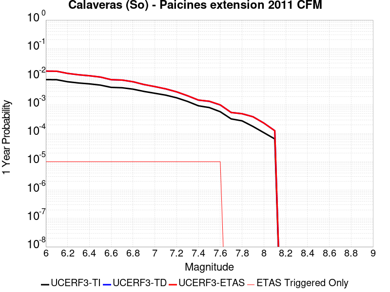 | 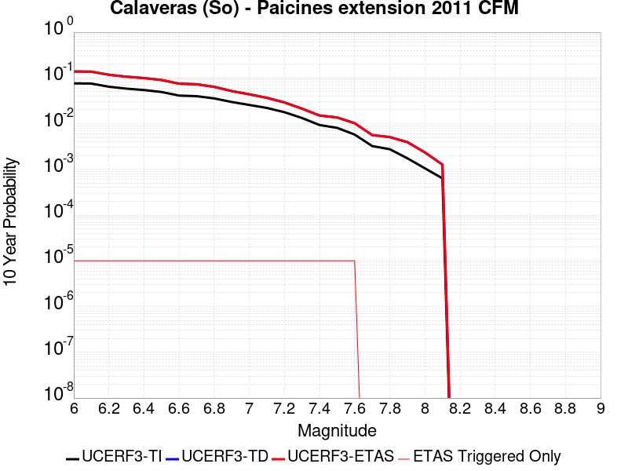 |

| Magnitude | 1 wk TI Prob | 1 wk TD Prob | 1 wk ETAS Prob | 1 wk ETAS/TD Gain | 1 wk ETAS Triggered Only | 1 mo TI Prob | 1 mo TD Prob | 1 mo ETAS Prob | 1 mo ETAS/TD Gain | 1 mo ETAS Triggered Only | 1 yr TI Prob | 1 yr TD Prob | 1 yr ETAS Prob | 1 yr ETAS/TD Gain | 1 yr ETAS Triggered Only | 10 yr TI Prob | 10 yr TD Prob | 10 yr ETAS Prob | 10 yr ETAS/TD Gain | 10 yr ETAS Triggered Only |
|-----|-----|-----|-----|-----|-----|-----|-----|-----|-----|-----|-----|-----|-----|-----|-----|-----|-----|-----|-----|-----|
| 6.0 | 1.5183659E-4 | 3.0538742E-4 | 3.0538742E-4 | 1.0 | 0.0 | 6.5056595E-4 | 0.0013080107 | 0.0013080107 | 1.0 | 0.0 | 0.007891912 | 0.015702842 | 0.015713066 | 1.0006511 | 1.0386697E-5 | 0.076174594 | 0.13854265 | 0.13855161 | 1.0000646 | 1.0386697E-5 |
| 6.1 | 1.5024997E-4 | 3.0232652E-4 | 3.0232652E-4 | 1.0 | 0.0 | 6.437695E-4 | 0.0012949064 | 0.0012949064 | 1.0 | 0.0 | 0.0078097614 | 0.0155462185 | 0.0155564435 | 1.0006577 | 1.0386697E-5 | 0.075409345 | 0.13721214 | 0.13722111 | 1.0000653 | 1.0386697E-5 |
| 6.2 | 1.2743923E-4 | 2.5341182E-4 | 2.5341182E-4 | 1.0 | 0.0 | 5.460538E-4 | 0.001085454 | 0.001085454 | 1.0 | 0.0 | 0.0066279583 | 0.013053368 | 0.013063619 | 1.0007854 | 1.0386697E-5 | 0.064337276 | 0.117310405 | 0.11731958 | 1.0000782 | 1.0386697E-5 |
| 6.3 | 1.1525114E-4 | 2.262457E-4 | 2.262457E-4 | 1.0 | 0.0 | 4.9383997E-4 | 9.6911576E-4 | 9.6911576E-4 | 1.0 | 0.0 | 0.0059959386 | 0.011674539 | 0.011684804 | 1.0008793 | 1.0386697E-5 | 0.058367174 | 0.1064267 | 0.106435984 | 1.0000873 | 1.0386697E-5 |
| 6.4 | 1.07200925E-4 | 2.0861623E-4 | 2.0861623E-4 | 1.0 | 0.0 | 4.5935164E-4 | 8.93614E-4 | 8.93614E-4 | 1.0 | 0.0 | 0.0055782744 | 0.010779322 | 0.010789597 | 1.0009532 | 1.0386697E-5 | 0.0544031 | 0.099249505 | 0.09925886 | 1.0000943 | 1.0386697E-5 |
| 6.5 | 9.69631E-5 | 1.8751183E-4 | 1.8751183E-4 | 1.0 | 0.0 | 4.1548995E-4 | 8.0336037E-4 | 8.0336037E-4 | 1.0 | 0.0 | 0.0050468626 | 0.009701113 | 0.0097114 | 1.0010602 | 1.0386697E-5 | 0.04933773 | 0.09014108 | 0.090150535 | 1.0001048 | 1.0386697E-5 |
| 6.6 | 8.0552316E-5 | 1.508417E-4 | 1.508417E-4 | 1.0 | 0.0 | 3.4517853E-4 | 6.4628234E-4 | 6.4628234E-4 | 1.0 | 0.0 | 0.0041944524 | 0.007832806 | 0.007843111 | 1.0013157 | 1.0386697E-5 | 0.04116161 | 0.07491137 | 0.07492098 | 1.0001283 | 1.0386697E-5 |
| 6.7 | 7.815757E-5 | 1.4624608E-4 | 1.4624608E-4 | 1.0 | 0.0 | 3.34918E-4 | 6.2660675E-4 | 6.2660675E-4 | 1.0 | 0.0 | 0.004070005 | 0.0075956066 | 0.0076059145 | 1.0013571 | 1.0386697E-5 | 0.039962657 | 0.07276075 | 0.07277039 | 1.0001323 | 1.0386697E-5 |
| 6.8 | 6.965264E-5 | 1.273421E-4 | 1.273421E-4 | 1.0 | 0.0 | 2.9847719E-4 | 5.456321E-4 | 5.456321E-4 | 1.0 | 0.0 | 0.0036279052 | 0.006619586 | 0.006629904 | 1.0015587 | 1.0386697E-5 | 0.03569247 | 0.06385353 | 0.063863255 | 1.0001522 | 1.0386697E-5 |
| 6.9 | 5.8000453E-5 | 1.0154083E-4 | 1.0154083E-4 | 1.0 | 0.0 | 2.4854968E-4 | 4.3510293E-4 | 4.3510293E-4 | 1.0 | 0.0 | 0.0030218933 | 0.0052846153 | 0.0052949474 | 1.001955 | 1.0386697E-5 | 0.029811295 | 0.051550873 | 0.051560722 | 1.0001911 | 1.0386697E-5 |
| 7.0 | 4.9865852E-5 | 8.578075E-5 | 8.578075E-5 | 1.0 | 0.0 | 2.1369329E-4 | 3.6758048E-4 | 3.6758048E-4 | 1.0 | 0.0 | 0.0025986114 | 0.004466198 | 0.0044765384 | 1.0023153 | 1.0386697E-5 | 0.025684336 | 0.04383052 | 0.043840453 | 1.0002266 | 1.0386697E-5 |
| 7.1 | 4.283875E-5 | 7.120278E-5 | 7.120278E-5 | 1.0 | 0.0 | 1.8358172E-4 | 3.051194E-4 | 3.051194E-4 | 1.0 | 0.0 | 0.0022328163 | 0.0037085575 | 0.0037189056 | 1.0027903 | 1.0386697E-5 | 0.022105146 | 0.03677475 | 0.036784757 | 1.000272 | 1.0386697E-5 |
| 7.2 | 3.450115E-5 | 5.5854773E-5 | 5.5854773E-5 | 1.0 | 0.0 | 1.478537E-4 | 2.393558E-4 | 2.393558E-4 | 1.0 | 0.0 | 0.0017986323 | 0.0029102915 | 0.002920648 | 1.0035585 | 1.0386697E-5 | 0.017841442 | 0.02911727 | 0.029127354 | 1.0003463 | 1.0386697E-5 |
| 7.3 | 2.5709045E-5 | 4.0657033E-5 | 4.0657033E-5 | 1.0 | 0.0 | 1.1017697E-4 | 1.7423289E-4 | 1.7423289E-4 | 1.0 | 0.0 | 0.0013405791 | 0.0021192385 | 0.0021296032 | 1.0048908 | 1.0386697E-5 | 0.013325208 | 0.021331005 | 0.02134117 | 1.0004766 | 1.0386697E-5 |
| 7.4 | 1.8003093E-5 | 2.8548406E-5 | 2.8548406E-5 | 1.0 | 0.0 | 7.715383E-5 | 1.2234459E-4 | 1.2234459E-4 | 1.0 | 0.0 | 9.3894306E-4 | 0.00148853 | 0.0014989012 | 1.0069674 | 1.0386697E-5 | 0.009349857 | 0.015070891 | 0.015081122 | 1.0006788 | 1.0386697E-5 |
| 7.5 | 1.5595824E-5 | 2.5859636E-5 | 2.5859636E-5 | 1.0 | 0.0 | 6.683753E-5 | 1.10822315E-4 | 1.10822315E-4 | 1.0 | 0.0 | 8.134431E-4 | 0.0013484288 | 0.0013588015 | 1.0076925 | 1.0386697E-5 | 0.008104719 | 0.013670188 | 0.013680433 | 1.0007495 | 1.0386697E-5 |
| 7.6 | 1.1110309E-5 | 1.9254814E-5 | 1.9254814E-5 | 1.0 | 0.0 | 4.761474E-5 | 8.251803E-5 | 8.251803E-5 | 1.0 | 0.0 | 5.795553E-4 | 0.0010041953 | 0.0010145716 | 1.010333 | 1.0386697E-5 | 0.0057804612 | 0.010219867 | 0.010230148 | 1.0010059 | 1.0386697E-5 |
| 7.7 | 6.2140443E-6 | 1.0459921E-5 | 1.0459921E-5 | 1.0 | 0.0 | 2.6631347E-5 | 4.4827466E-5 | 4.4827466E-5 | 1.0 | 0.0 | 3.241884E-4 | 5.456378E-4 | 5.456378E-4 | 1.0 | 0.0 | 0.0032371588 | 0.005630981 | 0.005630981 | 1.0 | 0.0 |
| 7.8 | 5.305533E-6 | 9.453423E-6 | 9.453423E-6 | 1.0 | 0.0 | 2.27378E-5 | 4.051404E-5 | 4.051404E-5 | 1.0 | 0.0 | 2.7679754E-4 | 4.931469E-4 | 4.931469E-4 | 1.0 | 0.0 | 0.0027645302 | 0.0050842287 | 0.0050842287 | 1.0 | 0.0 |
| 7.9 | 3.363505E-6 | 7.399955E-6 | 7.399955E-6 | 1.0 | 0.0 | 1.4414942E-5 | 3.171371E-5 | 3.171371E-5 | 1.0 | 0.0 | 1.7548777E-4 | 3.8604607E-4 | 3.8604607E-4 | 1.0 | 0.0 | 0.0017534926 | 0.003955788 | 0.003955788 | 1.0 | 0.0 |
| 8.0 | 2.0271132E-6 | 4.421605E-6 | 4.421605E-6 | 1.0 | 0.0 | 8.687599E-6 | 1.8949599E-5 | 1.8949599E-5 | 1.0 | 0.0 | 1.05766376E-4 | 2.3068699E-4 | 2.3068699E-4 | 1.0 | 0.0 | 0.0010571606 | 0.0023552408 | 0.0023552408 | 1.0 | 0.0 |
| 8.1 | 1.2206116E-6 | 2.379743E-6 | 2.379743E-6 | 1.0 | 0.0 | 5.2311816E-6 | 1.0198858E-5 | 1.0198858E-5 | 1.0 | 0.0 | 6.3687774E-5 | 1.2416406E-4 | 1.2416406E-4 | 1.0 | 0.0 | 6.366953E-4 | 0.0012728416 | 0.0012728416 | 1.0 | 0.0 |

## Calaveras (Central) 2011 CFM
*[(top)](#table-of-contents)*

| 1 Week | 1 Month | 1 Year | 10 Year |
|-----|-----|-----|-----|
|  |  |  |  |

| Magnitude | 1 wk TI Prob | 1 wk TD Prob | 1 wk ETAS Prob | 1 wk ETAS/TD Gain | 1 wk ETAS Triggered Only | 1 mo TI Prob | 1 mo TD Prob | 1 mo ETAS Prob | 1 mo ETAS/TD Gain | 1 mo ETAS Triggered Only | 1 yr TI Prob | 1 yr TD Prob | 1 yr ETAS Prob | 1 yr ETAS/TD Gain | 1 yr ETAS Triggered Only | 10 yr TI Prob | 10 yr TD Prob | 10 yr ETAS Prob | 10 yr ETAS/TD Gain | 10 yr ETAS Triggered Only |
|-----|-----|-----|-----|-----|-----|-----|-----|-----|-----|-----|-----|-----|-----|-----|-----|-----|-----|-----|-----|-----|
| 6.0 | 1.5010907E-4 | 2.4802002E-4 | 2.4802002E-4 | 1.0 | 0.0 | 6.4316596E-4 | 0.0010625197 | 0.0010625197 | 1.0 | 0.0 | 0.0078024664 | 0.012858193 | 0.012868446 | 1.0007974 | 1.0386697E-5 | 0.07534136 | 0.120471895 | 0.12048103 | 1.0000758 | 1.0386697E-5 |
| 6.1 | 1.4521465E-4 | 2.3965587E-4 | 2.3965587E-4 | 1.0 | 0.0 | 6.222001E-4 | 0.0010267016 | 0.0010267016 | 1.0 | 0.0 | 0.0075490056 | 0.012427398 | 0.012437656 | 1.0008254 | 1.0386697E-5 | 0.07297657 | 0.11674325 | 0.11675242 | 1.0000786 | 1.0386697E-5 |
| 6.2 | 1.429998E-4 | 2.3896704E-4 | 2.3896704E-4 | 1.0 | 0.0 | 6.127123E-4 | 0.0010237518 | 0.0010237518 | 1.0 | 0.0 | 0.007434286 | 0.01239193 | 0.012402188 | 1.0008278 | 1.0386697E-5 | 0.07190444 | 0.11639657 | 0.11640575 | 1.0000788 | 1.0386697E-5 |
| 6.3 | 1.3536277E-4 | 2.3227514E-4 | 2.3227514E-4 | 1.0 | 0.0 | 5.799972E-4 | 9.950944E-4 | 9.950944E-4 | 1.0 | 0.0 | 0.0070386264 | 0.012047916 | 0.012058177 | 1.0008518 | 1.0386697E-5 | 0.0681982 | 0.113307424 | 0.11331663 | 1.0000813 | 1.0386697E-5 |
| 6.4 | 1.2993296E-4 | 2.265069E-4 | 2.265069E-4 | 1.0 | 0.0 | 5.5673666E-4 | 9.7039196E-4 | 9.7039196E-4 | 1.0 | 0.0 | 0.006757223 | 0.011750543 | 0.011760808 | 1.0008736 | 1.0386697E-5 | 0.06555412 | 0.110584 | 0.11059324 | 1.0000836 | 1.0386697E-5 |
| 6.5 | 1.0498927E-4 | 1.7996327E-4 | 1.7996327E-4 | 1.0 | 0.0 | 4.498764E-4 | 7.710408E-4 | 7.710408E-4 | 1.0 | 0.0 | 0.005463498 | 0.009346773 | 0.009357063 | 1.0011009 | 1.0386697E-5 | 0.053311124 | 0.08926322 | 0.08927268 | 1.000106 | 1.0386697E-5 |
| 6.6 | 1.0157505E-4 | 1.748358E-4 | 1.748358E-4 | 1.0 | 0.0 | 4.35249E-4 | 7.490787E-4 | 7.490787E-4 | 1.0 | 0.0 | 0.0052862884 | 0.0090817055 | 0.0090919975 | 1.0011333 | 1.0386697E-5 | 0.05162293 | 0.086839855 | 0.08684934 | 1.0001092 | 1.0386697E-5 |
| 6.7 | 9.660386E-5 | 1.6742673E-4 | 1.6742673E-4 | 1.0 | 0.0 | 4.1395082E-4 | 7.173433E-4 | 7.173433E-4 | 1.0 | 0.0 | 0.0050282106 | 0.008698509 | 0.008708806 | 1.0011837 | 1.0386697E-5 | 0.049159497 | 0.08332852 | 0.083338045 | 1.0001142 | 1.0386697E-5 |
| 6.8 | 9.089927E-5 | 1.5656375E-4 | 1.5656375E-4 | 1.0 | 0.0 | 3.8951015E-4 | 6.7081227E-4 | 6.7081227E-4 | 1.0 | 0.0 | 0.0047319788 | 0.008136343 | 0.0081466455 | 1.0012662 | 1.0386697E-5 | 0.046324775 | 0.07821867 | 0.07822824 | 1.0001224 | 1.0386697E-5 |
| 6.9 | 7.353187E-5 | 1.230578E-4 | 1.230578E-4 | 1.0 | 0.0 | 3.150985E-4 | 5.272846E-4 | 5.272846E-4 | 1.0 | 0.0 | 0.0038295772 | 0.006400914 | 0.006411234 | 1.0016123 | 1.0386697E-5 | 0.037642512 | 0.062235985 | 0.062245727 | 1.0001565 | 1.0386697E-5 |
| 7.0 | 5.746064E-5 | 9.398498E-5 | 9.398498E-5 | 1.0 | 0.0 | 2.4623662E-4 | 4.0273095E-4 | 4.0273095E-4 | 1.0 | 0.0 | 0.0029938098 | 0.0048922966 | 0.0049026324 | 1.0021126 | 1.0386697E-5 | 0.02953797 | 0.048032705 | 0.048042595 | 1.0002059 | 1.0386697E-5 |
| 7.1 | 4.9557195E-5 | 8.0598395E-5 | 8.0598395E-5 | 1.0 | 0.0 | 2.123707E-4 | 3.453763E-4 | 3.453763E-4 | 1.0 | 0.0 | 0.0025825473 | 0.0041969116 | 0.004207255 | 1.0024644 | 1.0386697E-5 | 0.0255274 | 0.04140843 | 0.041418385 | 1.0002404 | 1.0386697E-5 |
| 7.2 | 3.687595E-5 | 5.9594917E-5 | 5.9594917E-5 | 1.0 | 0.0 | 1.5803022E-4 | 2.5538195E-4 | 2.5538195E-4 | 1.0 | 0.0 | 0.0019223199 | 0.0031048711 | 0.0031152256 | 1.0033349 | 1.0386697E-5 | 0.01905776 | 0.030917842 | 0.030927908 | 1.0003256 | 1.0386697E-5 |
| 7.3 | 2.5846984E-5 | 4.2533073E-5 | 4.2533073E-5 | 1.0 | 0.0 | 1.1076809E-4 | 1.8227196E-4 | 1.8227196E-4 | 1.0 | 0.0 | 0.0013477671 | 0.00221692 | 0.0022272838 | 1.0046748 | 1.0386697E-5 | 0.013396223 | 0.022205485 | 0.022215642 | 1.0004574 | 1.0386697E-5 |
| 7.4 | 1.7747854E-5 | 2.9966892E-5 | 2.9966892E-5 | 1.0 | 0.0 | 7.6060016E-5 | 1.2842323E-4 | 1.2842323E-4 | 1.0 | 0.0 | 9.2563726E-4 | 0.0015624344 | 0.0015728048 | 1.0066373 | 1.0386697E-5 | 0.009217911 | 0.01572418 | 0.015734402 | 1.0006502 | 1.0386697E-5 |
| 7.5 | 1.4883479E-5 | 2.6272635E-5 | 2.6272635E-5 | 1.0 | 0.0 | 6.378478E-5 | 1.1259216E-4 | 1.1259216E-4 | 1.0 | 0.0 | 7.76303E-4 | 0.0013699504 | 0.0013803229 | 1.0075715 | 1.0386697E-5 | 0.0077359667 | 0.013816696 | 0.013826938 | 1.0007414 | 1.0386697E-5 |
| 7.6 | 8.166975E-6 | 1.4986957E-5 | 1.4986957E-5 | 1.0 | 0.0 | 3.5000852E-5 | 6.422824E-5 | 6.422824E-5 | 1.0 | 0.0 | 4.2605202E-4 | 7.816996E-4 | 7.920782E-4 | 1.0132769 | 1.0386697E-5 | 0.004252361 | 0.007951348 | 0.007961652 | 1.0012959 | 1.0386697E-5 |
| 7.7 | 3.3858064E-6 | 6.267723E-6 | 6.267723E-6 | 1.0 | 0.0 | 1.4510518E-5 | 2.6861395E-5 | 2.6861395E-5 | 1.0 | 0.0 | 1.7665124E-4 | 3.2698846E-4 | 3.2698846E-4 | 1.0 | 0.0 | 0.0017651088 | 0.0033950333 | 0.0033950333 | 1.0 | 0.0 |
| 7.8 | 2.7721615E-6 | 5.378199E-6 | 5.378199E-6 | 1.0 | 0.0 | 1.1880637E-5 | 2.3049222E-5 | 2.3049222E-5 | 1.0 | 0.0 | 1.4463716E-4 | 2.805882E-4 | 2.805882E-4 | 1.0 | 0.0 | 0.0014454306 | 0.002913262 | 0.002913262 | 1.0 | 0.0 |
| 7.9 | 1.9736292E-6 | 4.137029E-6 | 4.137029E-6 | 1.0 | 0.0 | 8.4583835E-6 | 1.7730004E-5 | 1.7730004E-5 | 1.0 | 0.0 | 1.0297595E-4 | 2.1584146E-4 | 2.1584146E-4 | 1.0 | 0.0 | 0.0010292825 | 0.0022278049 | 0.0022278049 | 1.0 | 0.0 |
| 8.0 | 1.1767289E-6 | 2.5595207E-6 | 2.5595207E-6 | 1.0 | 0.0 | 5.0431145E-6 | 1.0969328E-5 | 1.0969328E-5 | 1.0 | 0.0 | 6.139818E-5 | 1.3354342E-4 | 1.3354342E-4 | 1.0 | 0.0 | 6.1381224E-4 | 0.0013685481 | 0.0013685481 | 1.0 | 0.0 |
| 8.1 | 7.5112825E-7 | 1.5439808E-6 | 1.5439808E-6 | 1.0 | 0.0 | 3.2191172E-6 | 6.617044E-6 | 6.617044E-6 | 1.0 | 0.0 | 3.9192048E-5 | 8.0559555E-5 | 8.0559555E-5 | 1.0 | 0.0 | 3.9185135E-4 | 8.2503865E-4 | 8.2503865E-4 | 1.0 | 0.0 |

## Calaveras (So) 2011 CFM
*[(top)](#table-of-contents)*

| 1 Week | 1 Month | 1 Year | 10 Year |
|-----|-----|-----|-----|
|  |  | 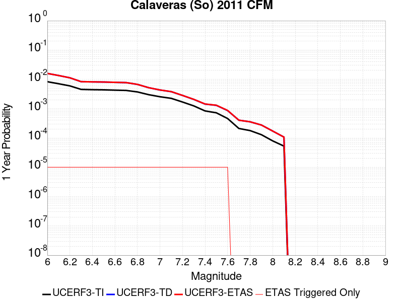 |  |

| Magnitude | 1 wk TI Prob | 1 wk TD Prob | 1 wk ETAS Prob | 1 wk ETAS/TD Gain | 1 wk ETAS Triggered Only | 1 mo TI Prob | 1 mo TD Prob | 1 mo ETAS Prob | 1 mo ETAS/TD Gain | 1 mo ETAS Triggered Only | 1 yr TI Prob | 1 yr TD Prob | 1 yr ETAS Prob | 1 yr ETAS/TD Gain | 1 yr ETAS Triggered Only | 10 yr TI Prob | 10 yr TD Prob | 10 yr ETAS Prob | 10 yr ETAS/TD Gain | 10 yr ETAS Triggered Only |
|-----|-----|-----|-----|-----|-----|-----|-----|-----|-----|-----|-----|-----|-----|-----|-----|-----|-----|-----|-----|-----|
| 6.0 | 1.5950744E-4 | 3.0739905E-4 | 3.0739905E-4 | 1.0 | 0.0 | 6.834242E-4 | 0.0013167706 | 0.0013167706 | 1.0 | 0.0 | 0.00828899 | 0.015865553 | 0.015875775 | 1.0006443 | 1.0386697E-5 | 0.079865426 | 0.14445968 | 0.14447746 | 1.000123 | 2.0773394E-5 |
| 6.1 | 1.3584697E-4 | 2.6061598E-4 | 2.6061598E-4 | 1.0 | 0.0 | 5.8207137E-4 | 0.0011164517 | 0.0011164517 | 1.0 | 0.0 | 0.007063716 | 0.013468163 | 0.01347841 | 1.0007608 | 1.0386697E-5 | 0.06843361 | 0.124085724 | 0.12409482 | 1.0000733 | 1.0386697E-5 |
| 6.2 | 1.14676266E-4 | 2.1746816E-4 | 2.1746816E-4 | 1.0 | 0.0 | 4.9137714E-4 | 9.316741E-4 | 9.316741E-4 | 1.0 | 0.0 | 0.0059661185 | 0.011251126 | 0.011261396 | 1.0009128 | 1.0386697E-5 | 0.058084648 | 0.10507494 | 0.10508423 | 1.0000885 | 1.0386697E-5 |
| 6.3 | 8.691518E-5 | 1.6001116E-4 | 1.6001116E-4 | 1.0 | 0.0 | 3.7244044E-4 | 6.855628E-4 | 6.855628E-4 | 1.0 | 0.0 | 0.004525038 | 0.008307241 | 0.008317541 | 1.0012399 | 1.0386697E-5 | 0.044339992 | 0.079390146 | 0.079399705 | 1.0001204 | 1.0386697E-5 |
| 6.4 | 8.50982E-5 | 1.5707467E-4 | 1.5707467E-4 | 1.0 | 0.0 | 3.646556E-4 | 6.7298434E-4 | 6.7298434E-4 | 1.0 | 0.0 | 0.0044306475 | 0.008155251 | 0.008165553 | 1.0012633 | 1.0386697E-5 | 0.04343345 | 0.077996135 | 0.078005716 | 1.0001228 | 1.0386697E-5 |
| 6.5 | 8.4062965E-5 | 1.5531975E-4 | 1.5531975E-4 | 1.0 | 0.0 | 3.602201E-4 | 6.654671E-4 | 6.654671E-4 | 1.0 | 0.0 | 0.004376863 | 0.008064441 | 0.008074745 | 1.0012776 | 1.0386697E-5 | 0.042916555 | 0.07716733 | 0.07717692 | 1.0001242 | 1.0386697E-5 |
| 6.6 | 8.194716E-5 | 1.516774E-4 | 1.516774E-4 | 1.0 | 0.0 | 3.5115483E-4 | 6.498649E-4 | 6.498649E-4 | 1.0 | 0.0 | 0.0042669317 | 0.007876252 | 0.007886557 | 1.0013083 | 1.0386697E-5 | 0.04185927 | 0.0754524 | 0.075462006 | 1.0001273 | 1.0386697E-5 |
| 6.7 | 8.012326E-5 | 1.483531E-4 | 1.483531E-4 | 1.0 | 0.0 | 3.433402E-4 | 6.3563243E-4 | 6.3563243E-4 | 1.0 | 0.0 | 0.004172157 | 0.0077047227 | 0.007715029 | 1.0013378 | 1.0386697E-5 | 0.040946912 | 0.0738944 | 0.073904015 | 1.0001302 | 1.0386697E-5 |
| 6.8 | 7.119773E-5 | 1.289278E-4 | 1.289278E-4 | 1.0 | 0.0 | 3.0509746E-4 | 5.524251E-4 | 5.524251E-4 | 1.0 | 0.0 | 0.0037082357 | 0.0067017726 | 0.0067120893 | 1.0015395 | 1.0386697E-5 | 0.036469642 | 0.06473622 | 0.06474593 | 1.0001501 | 1.0386697E-5 |
| 6.9 | 5.7343088E-5 | 9.928818E-5 | 9.928818E-5 | 1.0 | 0.0 | 2.4573295E-4 | 4.254518E-4 | 4.254518E-4 | 1.0 | 0.0 | 0.0029876942 | 0.0051676547 | 0.0051779877 | 1.0019996 | 1.0386697E-5 | 0.02947844 | 0.05055552 | 0.05056538 | 1.000195 | 1.0386697E-5 |
| 7.0 | 4.8746577E-5 | 8.294431E-5 | 8.294431E-5 | 1.0 | 0.0 | 2.0889717E-4 | 3.5542753E-4 | 3.5542753E-4 | 1.0 | 0.0 | 0.0025403565 | 0.0043188105 | 0.0043291524 | 1.0023946 | 1.0386697E-5 | 0.025115121 | 0.04253077 | 0.042540714 | 1.0002339 | 1.0386697E-5 |
| 7.1 | 4.2998014E-5 | 7.27236E-5 | 7.27236E-5 | 1.0 | 0.0 | 1.8426418E-4 | 3.1163564E-4 | 3.1163564E-4 | 1.0 | 0.0 | 0.002241108 | 0.0037876235 | 0.0037979707 | 1.0027319 | 1.0386697E-5 | 0.022186412 | 0.037458975 | 0.037468974 | 1.0002669 | 1.0386697E-5 |
| 7.2 | 3.221292E-5 | 5.3976983E-5 | 5.3976983E-5 | 1.0 | 0.0 | 1.3804805E-4 | 2.3130958E-4 | 2.3130958E-4 | 1.0 | 0.0 | 0.0016794393 | 0.002812585 | 0.0028229426 | 1.0036825 | 1.0386697E-5 | 0.016668037 | 0.02807059 | 0.028080683 | 1.0003597 | 1.0386697E-5 |
| 7.3 | 2.3756531E-5 | 3.9534E-5 | 3.9534E-5 | 1.0 | 0.0 | 1.0180973E-4 | 1.6942051E-4 | 1.6942051E-4 | 1.0 | 0.0 | 0.0012388286 | 0.0020607605 | 0.0020711257 | 1.0050298 | 1.0386697E-5 | 0.012319452 | 0.020674022 | 0.020684194 | 1.000492 | 1.0386697E-5 |
| 7.4 | 1.5997684E-5 | 2.737303E-5 | 2.737303E-5 | 1.0 | 0.0 | 6.8559704E-5 | 1.1730772E-4 | 1.1730772E-4 | 1.0 | 0.0 | 8.343947E-4 | 0.0014272883 | 0.0014376601 | 1.0072669 | 1.0386697E-5 | 0.008312687 | 0.0143921655 | 0.014402403 | 1.0007113 | 1.0386697E-5 |
| 7.5 | 1.3814293E-5 | 2.481389E-5 | 2.481389E-5 | 1.0 | 0.0 | 5.9202768E-5 | 1.0634092E-4 | 1.0634092E-4 | 1.0 | 0.0 | 7.205553E-4 | 0.0012939342 | 0.0013043074 | 1.0080168 | 1.0386697E-5 | 0.007182234 | 0.013070965 | 0.013081216 | 1.0007843 | 1.0386697E-5 |
| 7.6 | 8.817309E-6 | 1.6456672E-5 | 1.6456672E-5 | 1.0 | 0.0 | 3.7787922E-5 | 7.0526694E-5 | 7.0526694E-5 | 1.0 | 0.0 | 4.5997082E-4 | 8.5832557E-4 | 8.6870336E-4 | 1.0120907 | 1.0386697E-5 | 0.004590199 | 0.008732965 | 0.008743261 | 1.001179 | 1.0386697E-5 |
| 7.7 | 4.0352206E-6 | 7.724012E-6 | 7.724012E-6 | 1.0 | 0.0 | 1.7293689E-5 | 3.310249E-5 | 3.310249E-5 | 1.0 | 0.0 | 2.1053031E-4 | 4.0294835E-4 | 4.0294835E-4 | 1.0 | 0.0 | 0.0021033096 | 0.0041733775 | 0.0041733775 | 1.0 | 0.0 |
| 7.8 | 3.413169E-6 | 6.8018153E-6 | 6.8018153E-6 | 1.0 | 0.0 | 1.4627784E-5 | 2.9150313E-5 | 2.9150313E-5 | 1.0 | 0.0 | 1.7807873E-4 | 3.5484732E-4 | 3.5484732E-4 | 1.0 | 0.0 | 0.0017793609 | 0.0036736047 | 0.0036736047 | 1.0 | 0.0 |
| 7.9 | 2.4740732E-6 | 5.2897763E-6 | 5.2897763E-6 | 1.0 | 0.0 | 1.06031275E-5 | 2.2670272E-5 | 2.2670272E-5 | 1.0 | 0.0 | 1.2908543E-4 | 2.7597568E-4 | 2.7597568E-4 | 1.0 | 0.0 | 0.0012901047 | 0.002839954 | 0.002839954 | 1.0 | 0.0 |
| 8.0 | 1.5231818E-6 | 3.2950636E-6 | 3.2950636E-6 | 1.0 | 0.0 | 6.527906E-6 | 1.4121625E-5 | 1.4121625E-5 | 1.0 | 0.0 | 7.9474354E-5 | 1.7191726E-4 | 1.7191726E-4 | 1.0 | 0.0 | 7.944594E-4 | 0.0017594753 | 0.0017594753 | 1.0 | 0.0 |
| 8.1 | 1.0104524E-6 | 2.049573E-6 | 2.049573E-6 | 1.0 | 0.0 | 4.330503E-6 | 8.783854E-6 | 8.783854E-6 | 1.0 | 0.0 | 5.2722597E-5 | 1.0693821E-4 | 1.0693821E-4 | 1.0 | 0.0 | 5.271009E-4 | 0.0010948586 | 0.0010948586 | 1.0 | 0.0 |

## Greenville (So) 2011 CFM
*[(top)](#table-of-contents)*

| 1 Week | 1 Month | 1 Year | 10 Year |
|-----|-----|-----|-----|
|  | 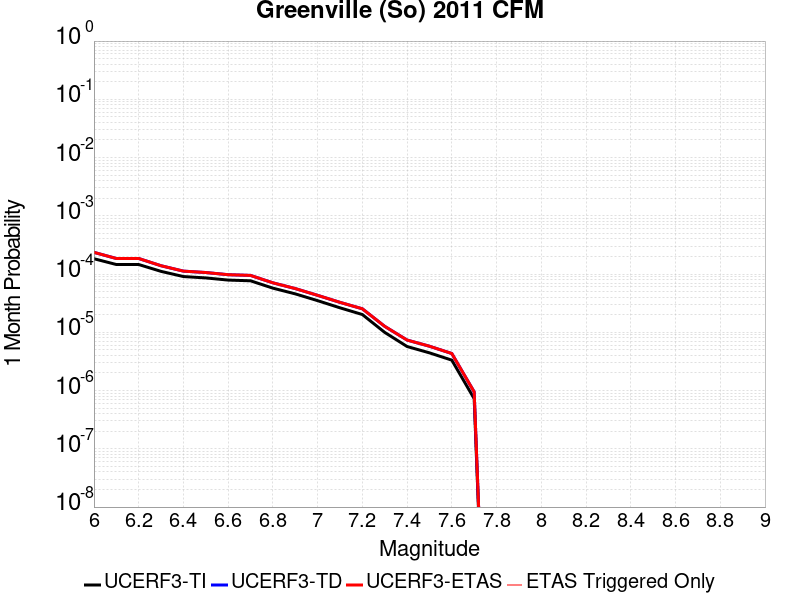 |  |  |

| Magnitude | 1 wk TI Prob | 1 wk TD Prob | 1 wk ETAS Prob | 1 wk ETAS/TD Gain | 1 wk ETAS Triggered Only | 1 mo TI Prob | 1 mo TD Prob | 1 mo ETAS Prob | 1 mo ETAS/TD Gain | 1 mo ETAS Triggered Only | 1 yr TI Prob | 1 yr TD Prob | 1 yr ETAS Prob | 1 yr ETAS/TD Gain | 1 yr ETAS Triggered Only | 10 yr TI Prob | 10 yr TD Prob | 10 yr ETAS Prob | 10 yr ETAS/TD Gain | 10 yr ETAS Triggered Only |
|-----|-----|-----|-----|-----|-----|-----|-----|-----|-----|-----|-----|-----|-----|-----|-----|-----|-----|-----|-----|-----|
| 6.0 | 4.279693E-5 | 5.5048058E-5 | 5.5048058E-5 | 1.0 | 0.0 | 1.8340252E-4 | 2.3590095E-4 | 2.3590095E-4 | 1.0 | 0.0 | 0.0022306389 | 0.0028686395 | 0.0028893533 | 1.0072207 | 2.0773394E-5 | 0.022083808 | 0.02834198 | 0.028362166 | 1.0007122 | 2.0773394E-5 |
| 6.1 | 3.4037297E-5 | 4.3198117E-5 | 4.3198117E-5 | 1.0 | 0.0 | 1.4586597E-4 | 1.8512284E-4 | 1.8512284E-4 | 1.0 | 0.0 | 0.0017744715 | 0.0022517194 | 0.0022620826 | 1.0046024 | 1.0386697E-5 | 0.01760369 | 0.022305397 | 0.02231555 | 1.0004553 | 1.0386697E-5 |
| 6.2 | 3.4037297E-5 | 4.3198117E-5 | 4.3198117E-5 | 1.0 | 0.0 | 1.4586597E-4 | 1.8512284E-4 | 1.8512284E-4 | 1.0 | 0.0 | 0.0017744715 | 0.0022517194 | 0.0022620826 | 1.0046024 | 1.0386697E-5 | 0.01760369 | 0.022305397 | 0.02231555 | 1.0004553 | 1.0386697E-5 |
| 6.3 | 2.5956324E-5 | 3.243272E-5 | 3.243272E-5 | 1.0 | 0.0 | 1.11236644E-4 | 1.3899039E-4 | 1.3899039E-4 | 1.0 | 0.0 | 0.0013534647 | 0.0016909696 | 0.0017013387 | 1.006132 | 1.0386697E-5 | 0.013452509 | 0.016787821 | 0.016798034 | 1.0006083 | 1.0386697E-5 |
| 6.4 | 2.1145053E-5 | 2.6200514E-5 | 2.6200514E-5 | 1.0 | 0.0 | 9.061851E-5 | 1.1228328E-4 | 1.1228328E-4 | 1.0 | 0.0 | 0.0011027219 | 0.0013662229 | 0.0013765953 | 1.0075921 | 1.0386697E-5 | 0.01097266 | 0.013581639 | 0.013591886 | 1.0007544 | 1.0386697E-5 |
| 6.5 | 2.0030959E-5 | 2.4798424E-5 | 2.4798424E-5 | 1.0 | 0.0 | 8.584414E-5 | 1.0627481E-4 | 1.0627481E-4 | 1.0 | 0.0 | 0.0010446513 | 0.0012931603 | 0.0013035336 | 1.0080216 | 1.0386697E-5 | 0.010397541 | 0.012859702 | 0.012869955 | 1.0007973 | 1.0386697E-5 |
| 6.6 | 1.8395405E-5 | 2.2756842E-5 | 2.2756842E-5 | 1.0 | 0.0 | 7.8835066E-5 | 9.752583E-5 | 9.752583E-5 | 1.0 | 0.0 | 9.5939427E-4 | 0.001186759 | 0.0011971333 | 1.0087417 | 1.0386697E-5 | 0.009552629 | 0.011807269 | 0.0118175335 | 1.0008693 | 1.0386697E-5 |
| 6.7 | 1.7883482E-5 | 2.212781E-5 | 2.212781E-5 | 1.0 | 0.0 | 7.664124E-5 | 9.483018E-5 | 9.483018E-5 | 1.0 | 0.0 | 9.3270757E-4 | 0.0011539747 | 0.0011643494 | 1.0089904 | 1.0386697E-5 | 0.009288026 | 0.011482879 | 0.0114931455 | 1.0008942 | 1.0386697E-5 |
| 6.8 | 1.3373564E-5 | 1.6507536E-5 | 1.6507536E-5 | 1.0 | 0.0 | 5.7314013E-5 | 7.0744754E-5 | 7.0744754E-5 | 1.0 | 0.0 | 6.975747E-4 | 8.6099183E-4 | 8.7136956E-4 | 1.0120533 | 1.0386697E-5 | 0.0069538904 | 0.008578171 | 0.008588469 | 1.0012004 | 1.0386697E-5 |
| 6.9 | 1.06692905E-5 | 1.3153725E-5 | 1.3153725E-5 | 1.0 | 0.0 | 4.5724726E-5 | 5.6371955E-5 | 5.6371955E-5 | 1.0 | 0.0 | 5.5655633E-4 | 6.8612373E-4 | 6.965033E-4 | 1.0151279 | 1.0386697E-5 | 0.005551645 | 0.006841287 | 0.0068516023 | 1.0015079 | 1.0386697E-5 |
| 7.0 | 8.157512E-6 | 1.0063405E-5 | 1.0063405E-5 | 1.0 | 0.0 | 3.4960296E-5 | 4.3128188E-5 | 4.3128188E-5 | 1.0 | 0.0 | 4.2555845E-4 | 5.249629E-4 | 5.249629E-4 | 1.0 | 0.0 | 0.004247444 | 0.0052377055 | 0.0052377055 | 1.0 | 0.0 |
| 7.1 | 6.1467113E-6 | 7.6279252E-6 | 7.6279252E-6 | 1.0 | 0.0 | 2.6342783E-5 | 3.2690703E-5 | 3.2690703E-5 | 1.0 | 0.0 | 3.206762E-4 | 3.9793746E-4 | 3.9793746E-4 | 1.0 | 0.0 | 0.0032021382 | 0.003972437 | 0.003972437 | 1.0 | 0.0 |
| 7.2 | 4.713467E-6 | 5.9145245E-6 | 5.9145245E-6 | 1.0 | 0.0 | 2.0200418E-5 | 2.534772E-5 | 2.534772E-5 | 1.0 | 0.0 | 2.4591232E-4 | 3.0856536E-4 | 3.0856536E-4 | 1.0 | 0.0 | 0.0024564038 | 0.0030815226 | 0.0030815226 | 1.0 | 0.0 |
| 7.3 | 2.3266216E-6 | 2.9542305E-6 | 2.9542305E-6 | 1.0 | 0.0 | 9.971197E-6 | 1.2660927E-5 | 1.2660927E-5 | 1.0 | 0.0 | 1.2139256E-4 | 1.5413604E-4 | 1.5413604E-4 | 1.0 | 0.0 | 0.0012132627 | 0.0015403607 | 0.0015403607 | 1.0 | 0.0 |
| 7.4 | 1.3314E-6 | 1.7181212E-6 | 1.7181212E-6 | 1.0 | 0.0 | 5.7059874E-6 | 7.3633564E-6 | 7.3633564E-6 | 1.0 | 0.0 | 6.946818E-5 | 8.9645226E-5 | 8.9645226E-5 | 1.0 | 0.0 | 6.9446466E-4 | 8.961294E-4 | 8.961294E-4 | 1.0 | 0.0 |
| 7.5 | 1.0362941E-6 | 1.347003E-6 | 1.347003E-6 | 1.0 | 0.0 | 4.4412527E-6 | 5.7728575E-6 | 5.7728575E-6 | 1.0 | 0.0 | 5.407091E-5 | 7.028232E-5 | 7.028232E-5 | 1.0 | 0.0 | 5.405776E-4 | 7.0263114E-4 | 7.0263114E-4 | 1.0 | 0.0 |
| 7.6 | 7.764784E-7 | 1.0089751E-6 | 1.0089751E-6 | 1.0 | 0.0 | 3.3277602E-6 | 4.324172E-6 | 4.324172E-6 | 1.0 | 0.0 | 4.0514726E-5 | 5.2645562E-5 | 5.2645562E-5 | 1.0 | 0.0 | 4.050734E-4 | 5.2635226E-4 | 5.2635226E-4 | 1.0 | 0.0 |
| 7.7 | 1.6927763E-7 | 2.2139571E-7 | 2.2139571E-7 | 1.0 | 0.0 | 7.2547533E-7 | 9.488384E-7 | 9.488384E-7 | 1.0 | 0.0 | 8.832627E-6 | 1.155205E-5 | 1.155205E-5 | 1.0 | 0.0 | 8.8322755E-5 | 1.1551721E-4 | 1.1551721E-4 | 1.0 | 0.0 |

## San Andreas (Santa Cruz Mts) 2011 CFM
*[(top)](#table-of-contents)*

| 1 Week | 1 Month | 1 Year | 10 Year |
|-----|-----|-----|-----|
|  |  |  |  |

| Magnitude | 1 wk TI Prob | 1 wk TD Prob | 1 wk ETAS Prob | 1 wk ETAS/TD Gain | 1 wk ETAS Triggered Only | 1 mo TI Prob | 1 mo TD Prob | 1 mo ETAS Prob | 1 mo ETAS/TD Gain | 1 mo ETAS Triggered Only | 1 yr TI Prob | 1 yr TD Prob | 1 yr ETAS Prob | 1 yr ETAS/TD Gain | 1 yr ETAS Triggered Only | 10 yr TI Prob | 10 yr TD Prob | 10 yr ETAS Prob | 10 yr ETAS/TD Gain | 10 yr ETAS Triggered Only |
|-----|-----|-----|-----|-----|-----|-----|-----|-----|-----|-----|-----|-----|-----|-----|-----|-----|-----|-----|-----|-----|
| 6.0 | 1.7221631E-4 | 1.3823692E-4 | 1.3823692E-4 | 1.0 | 0.0 | 7.378611E-4 | 5.923115E-4 | 5.923115E-4 | 1.0 | 0.0 | 0.008946515 | 0.0071879383 | 0.0071982504 | 1.0014347 | 1.0386697E-5 | 0.08594794 | 0.070697196 | 0.0707165 | 1.0002731 | 2.0773394E-5 |
| 6.1 | 1.7221631E-4 | 1.3823692E-4 | 1.3823692E-4 | 1.0 | 0.0 | 7.378611E-4 | 5.923115E-4 | 5.923115E-4 | 1.0 | 0.0 | 0.008946515 | 0.0071879383 | 0.0071982504 | 1.0014347 | 1.0386697E-5 | 0.08594794 | 0.070697196 | 0.0707165 | 1.0002731 | 2.0773394E-5 |
| 6.2 | 1.7221631E-4 | 1.3823692E-4 | 1.3823692E-4 | 1.0 | 0.0 | 7.378611E-4 | 5.923115E-4 | 5.923115E-4 | 1.0 | 0.0 | 0.008946515 | 0.0071879383 | 0.0071982504 | 1.0014347 | 1.0386697E-5 | 0.08594794 | 0.070697196 | 0.0707165 | 1.0002731 | 2.0773394E-5 |
| 6.3 | 1.716926E-4 | 1.3743078E-4 | 1.3743078E-4 | 1.0 | 0.0 | 7.3561794E-4 | 5.888581E-4 | 5.888581E-4 | 1.0 | 0.0 | 0.008919428 | 0.0071461694 | 0.007156482 | 1.001443 | 1.0386697E-5 | 0.08569809 | 0.0703092 | 0.07032851 | 1.0002747 | 2.0773394E-5 |
| 6.4 | 1.6392978E-4 | 1.3618424E-4 | 1.3618424E-4 | 1.0 | 0.0 | 7.02367E-4 | 5.8351824E-4 | 5.8351824E-4 | 1.0 | 0.0 | 0.008517839 | 0.0070815794 | 0.0070918924 | 1.0014564 | 1.0386697E-5 | 0.08198654 | 0.06954003 | 0.06955936 | 1.000278 | 2.0773394E-5 |
| 6.5 | 1.5742714E-4 | 1.26776E-4 | 1.26776E-4 | 1.0 | 0.0 | 6.745133E-4 | 5.4321426E-4 | 5.4321426E-4 | 1.0 | 0.0 | 0.00818132 | 0.006593904 | 0.006604222 | 1.0015649 | 1.0386697E-5 | 0.078865945 | 0.0649993 | 0.06501872 | 1.0002989 | 2.0773394E-5 |
| 6.6 | 1.3038084E-4 | 1.161551E-4 | 1.161551E-4 | 1.0 | 0.0 | 5.5865536E-4 | 4.9771386E-4 | 4.9771386E-4 | 1.0 | 0.0 | 0.006780438 | 0.0060430723 | 0.0060533965 | 1.0017084 | 1.0386697E-5 | 0.0657725 | 0.059452567 | 0.059472106 | 1.0003287 | 2.0773394E-5 |
| 6.7 | 1.2867592E-4 | 1.13418515E-4 | 1.13418515E-4 | 1.0 | 0.0 | 5.5135164E-4 | 4.8599008E-4 | 4.8599008E-4 | 1.0 | 0.0 | 0.0066920654 | 0.005901116 | 0.0059114415 | 1.0017498 | 1.0386697E-5 | 0.06494093 | 0.05816314 | 0.058182705 | 1.0003364 | 2.0773394E-5 |
| 6.8 | 1.2801298E-4 | 1.1279377E-4 | 1.1279377E-4 | 1.0 | 0.0 | 5.485117E-4 | 4.833136E-4 | 4.833136E-4 | 1.0 | 0.0 | 0.0066577005 | 0.0058687064 | 0.0058790324 | 1.0017594 | 1.0386697E-5 | 0.06461738 | 0.05787688 | 0.057896454 | 1.0003382 | 2.0773394E-5 |
| 6.9 | 1.269149E-4 | 1.11214715E-4 | 1.11214715E-4 | 1.0 | 0.0 | 5.4380763E-4 | 4.765487E-4 | 4.765487E-4 | 1.0 | 0.0 | 0.006600777 | 0.005786784 | 0.0057971105 | 1.0017846 | 1.0386697E-5 | 0.06408122 | 0.057148356 | 0.057167944 | 1.0003427 | 2.0773394E-5 |
| 7.0 | 1.2030331E-4 | 1.0851204E-4 | 1.0851204E-4 | 1.0 | 0.0 | 5.154837E-4 | 4.6496998E-4 | 4.6496998E-4 | 1.0 | 0.0 | 0.006257969 | 0.005646552 | 0.0056568803 | 1.0018291 | 1.0386697E-5 | 0.06084648 | 0.055819258 | 0.05583887 | 1.0003514 | 2.0773394E-5 |
| 7.1 | 8.049617E-5 | 5.4114953E-5 | 5.4114953E-5 | 1.0 | 0.0 | 3.4493793E-4 | 2.319008E-4 | 2.319008E-4 | 1.0 | 0.0 | 0.0041915346 | 0.0028197719 | 0.0028301293 | 1.0036732 | 1.0386697E-5 | 0.041133516 | 0.02971132 | 0.029731475 | 1.0006784 | 2.0773394E-5 |
| 7.2 | 7.093979E-5 | 4.310381E-5 | 4.310381E-5 | 1.0 | 0.0 | 3.0399222E-4 | 1.8471766E-4 | 1.8471766E-4 | 1.0 | 0.0 | 0.0036948253 | 0.0022466409 | 0.0022570044 | 1.0046128 | 1.0386697E-5 | 0.03633994 | 0.024024088 | 0.024044363 | 1.0008439 | 2.0773394E-5 |
| 7.3 | 6.193693E-5 | 2.9018376E-5 | 2.9018376E-5 | 1.0 | 0.0 | 2.6541698E-4 | 1.2435856E-4 | 1.2435856E-4 | 1.0 | 0.0 | 0.0032266637 | 0.0015130156 | 0.0015233866 | 1.0068545 | 1.0386697E-5 | 0.031802133 | 0.016564084 | 0.016584514 | 1.0012333 | 2.0773394E-5 |
| 7.4 | 5.906492E-5 | 2.7136244E-5 | 2.7136244E-5 | 1.0 | 0.0 | 2.5311083E-4 | 1.16293006E-4 | 1.16293006E-4 | 1.0 | 0.0 | 0.0030772698 | 0.0014149492 | 0.0014253212 | 1.0073303 | 1.0386697E-5 | 0.030350044 | 0.015530545 | 0.015550996 | 1.0013168 | 2.0773394E-5 |
| 7.5 | 5.424296E-5 | 2.4776109E-5 | 2.4776109E-5 | 1.0 | 0.0 | 2.324491E-4 | 1.0617901E-4 | 1.0617901E-4 | 1.0 | 0.0 | 0.002826395 | 0.0012919641 | 0.0013023373 | 1.0080291 | 1.0386697E-5 | 0.027907165 | 0.014215293 | 0.014235771 | 1.0014405 | 2.0773394E-5 |
| 7.6 | 4.43084E-5 | 1.9971396E-5 | 1.9971396E-5 | 1.0 | 0.0 | 1.8987931E-4 | 8.558889E-5 | 8.558889E-5 | 1.0 | 0.0 | 0.0023093296 | 0.0010415468 | 0.0010519227 | 1.009962 | 1.0386697E-5 | 0.022854783 | 0.011448878 | 0.0114694135 | 1.0017936 | 2.0773394E-5 |
| 7.7 | 4.118098E-5 | 1.8999577E-5 | 1.8999577E-5 | 1.0 | 0.0 | 1.7647797E-4 | 8.1424216E-5 | 8.1424216E-5 | 1.0 | 0.0 | 0.002146502 | 9.908893E-4 | 9.908893E-4 | 1.0 | 0.0 | 0.021258866 | 0.010904559 | 0.010914832 | 1.0009421 | 1.0386697E-5 |
| 7.8 | 3.5408906E-5 | 1.8625631E-5 | 1.8625631E-5 | 1.0 | 0.0 | 1.5174363E-4 | 7.982169E-5 | 7.982169E-5 | 1.0 | 0.0 | 0.0018459131 | 9.7139605E-4 | 9.7139605E-4 | 1.0 | 0.0 | 0.018306552 | 0.0106848935 | 0.010695169 | 1.0009617 | 1.0386697E-5 |
| 7.9 | 2.5860836E-5 | 1.7371205E-5 | 1.7371205E-5 | 1.0 | 0.0 | 1.10827445E-4 | 7.4445896E-5 | 7.4445896E-5 | 1.0 | 0.0 | 0.001348489 | 9.060022E-4 | 9.060022E-4 | 1.0 | 0.0 | 0.013403354 | 0.009936898 | 0.009947182 | 1.0010349 | 1.0386697E-5 |
| 8.0 | 1.9777332E-5 | 1.4886952E-5 | 1.4886952E-5 | 1.0 | 0.0 | 8.4757245E-5 | 6.379966E-5 | 6.379966E-5 | 1.0 | 0.0 | 0.0010314309 | 7.7648426E-4 | 7.7648426E-4 | 1.0 | 0.0 | 0.010266567 | 0.008534084 | 0.008544382 | 1.0012068 | 1.0386697E-5 |
| 8.1 | 1.468494E-5 | 1.2146339E-5 | 1.2146339E-5 | 1.0 | 0.0 | 6.293394E-5 | 5.20547E-5 | 5.20547E-5 | 1.0 | 0.0 | 7.6595135E-4 | 6.3358183E-4 | 6.3358183E-4 | 1.0 | 0.0 | 0.0076331664 | 0.0069899 | 0.007000214 | 1.0014756 | 1.0386697E-5 |
| 8.2 | 8.63836E-6 | 5.489407E-6 | 5.489407E-6 | 1.0 | 0.0 | 3.7021015E-5 | 2.3525818E-5 | 2.3525818E-5 | 1.0 | 0.0 | 4.5063766E-4 | 2.863893E-4 | 2.863893E-4 | 1.0 | 0.0 | 0.004497249 | 0.0032568157 | 0.0032568157 | 1.0 | 0.0 |
| 8.3 | 1.983087E-6 | 7.693574E-7 | 7.693574E-7 | 1.0 | 0.0 | 8.498917E-6 | 3.297242E-6 | 3.297242E-6 | 1.0 | 0.0 | 1.034694E-4 | 4.01432E-5 | 4.01432E-5 | 1.0 | 0.0 | 0.0010342124 | 4.7390026E-4 | 4.7390026E-4 | 1.0 | 0.0 |

## Great Valley 09 (Laguna Seca)
*[(top)](#table-of-contents)*

| 1 Week | 1 Month | 1 Year | 10 Year |
|-----|-----|-----|-----|
| 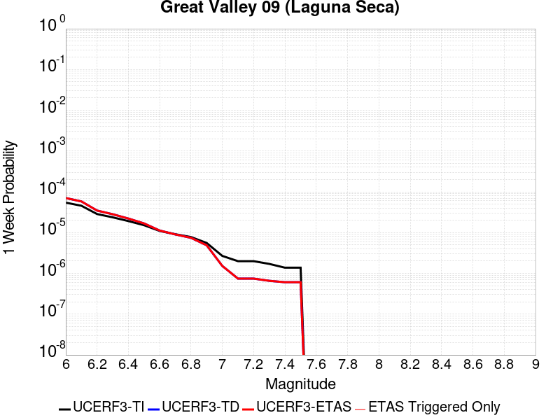 |  |  | 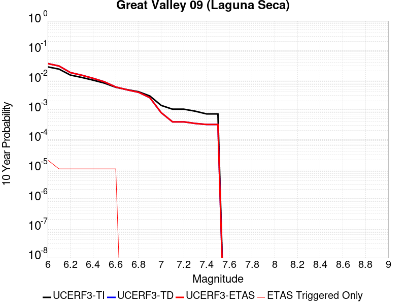 |

| Magnitude | 1 wk TI Prob | 1 wk TD Prob | 1 wk ETAS Prob | 1 wk ETAS/TD Gain | 1 wk ETAS Triggered Only | 1 mo TI Prob | 1 mo TD Prob | 1 mo ETAS Prob | 1 mo ETAS/TD Gain | 1 mo ETAS Triggered Only | 1 yr TI Prob | 1 yr TD Prob | 1 yr ETAS Prob | 1 yr ETAS/TD Gain | 1 yr ETAS Triggered Only | 10 yr TI Prob | 10 yr TD Prob | 10 yr ETAS Prob | 10 yr ETAS/TD Gain | 10 yr ETAS Triggered Only |
|-----|-----|-----|-----|-----|-----|-----|-----|-----|-----|-----|-----|-----|-----|-----|-----|-----|-----|-----|-----|-----|
| 6.0 | 5.4353277E-5 | 7.051288E-5 | 7.051288E-5 | 1.0 | 0.0 | 2.3292181E-4 | 3.021651E-4 | 3.021651E-4 | 1.0 | 0.0 | 0.0028321352 | 0.0036727623 | 0.0036831107 | 1.0028176 | 1.0386697E-5 | 0.02796312 | 0.036121234 | 0.036141258 | 1.0005543 | 2.0773394E-5 |
| 6.1 | 4.5578287E-5 | 5.8229198E-5 | 5.8229198E-5 | 1.0 | 0.0 | 1.953209E-4 | 2.4953127E-4 | 2.4953127E-4 | 1.0 | 0.0 | 0.0023754383 | 0.0030339046 | 0.0030339046 | 1.0 | 0.0 | 0.023502063 | 0.029924182 | 0.029934257 | 1.0003368 | 1.0386697E-5 |
| 6.2 | 2.8536782E-5 | 3.4740468E-5 | 3.4740468E-5 | 1.0 | 0.0 | 1.2229476E-4 | 1.4887958E-4 | 1.4887958E-4 | 1.0 | 0.0 | 0.0014879217 | 0.0018110707 | 0.0018110707 | 1.0 | 0.0 | 0.014779986 | 0.017960638 | 0.017970838 | 1.0005679 | 1.0386697E-5 |
| 6.3 | 2.3698774E-5 | 2.8215252E-5 | 2.8215252E-5 | 1.0 | 0.0 | 1.01562226E-4 | 1.2091713E-4 | 1.2091713E-4 | 1.0 | 0.0 | 0.0012358186 | 0.0014712278 | 0.0014712278 | 1.0 | 0.0 | 0.012289686 | 0.014613301 | 0.014623536 | 1.0007004 | 1.0386697E-5 |
| 6.4 | 1.9191197E-5 | 2.2123982E-5 | 2.2123982E-5 | 1.0 | 0.0 | 8.2245395E-5 | 9.481376E-5 | 9.481376E-5 | 1.0 | 0.0 | 0.0010008777 | 0.001153789 | 0.001153789 | 1.0 | 0.0 | 0.009963818 | 0.011478378 | 0.011488645 | 1.0008945 | 1.0386697E-5 |
| 6.5 | 1.5203241E-5 | 1.6802042E-5 | 1.6802042E-5 | 1.0 | 0.0 | 6.5155116E-5 | 7.200683E-5 | 7.200683E-5 | 1.0 | 0.0 | 7.9297484E-4 | 8.76362E-4 | 8.76362E-4 | 1.0 | 0.0 | 0.007901512 | 0.008730489 | 0.0087407855 | 1.0011793 | 1.0386697E-5 |
| 6.6 | 1.0984925E-5 | 1.1243591E-5 | 1.1243591E-5 | 1.0 | 0.0 | 4.70774E-5 | 4.8185837E-5 | 4.8185837E-5 | 1.0 | 0.0 | 5.730166E-4 | 5.865083E-4 | 5.865083E-4 | 1.0 | 0.0 | 0.005715413 | 0.0058500012 | 0.0058603273 | 1.0017651 | 1.0386697E-5 |
| 6.7 | 9.134616E-6 | 9.020651E-6 | 9.020651E-6 | 1.0 | 0.0 | 3.9147766E-5 | 3.8659375E-5 | 3.8659375E-5 | 1.0 | 0.0 | 4.7651984E-4 | 4.705786E-4 | 4.705786E-4 | 1.0 | 0.0 | 0.004754993 | 0.0046960665 | 0.0046960665 | 1.0 | 0.0 |
| 6.8 | 7.785589E-6 | 7.4525665E-6 | 7.4525665E-6 | 1.0 | 0.0 | 3.3366385E-5 | 3.193919E-5 | 3.193919E-5 | 1.0 | 0.0 | 4.0616E-4 | 3.8879228E-4 | 3.8879228E-4 | 1.0 | 0.0 | 0.0040541845 | 0.003881325 | 0.003881325 | 1.0 | 0.0 |
| 6.9 | 5.579095E-6 | 4.8989014E-6 | 4.8989014E-6 | 1.0 | 0.0 | 2.3910188E-5 | 2.099513E-5 | 2.099513E-5 | 1.0 | 0.0 | 2.9106764E-4 | 2.555871E-4 | 2.555871E-4 | 1.0 | 0.0 | 0.002906867 | 0.002553069 | 0.002553069 | 1.0 | 0.0 |
| 7.0 | 2.6816688E-6 | 1.5217248E-6 | 1.5217248E-6 | 1.0 | 0.0 | 1.1492816E-5 | 6.5216623E-6 | 6.5216623E-6 | 1.0 | 0.0 | 1.3991605E-4 | 7.939843E-5 | 7.939843E-5 | 1.0 | 0.0 | 0.0013982799 | 7.9370936E-4 | 7.9370936E-4 | 1.0 | 0.0 |
| 7.1 | 1.9951021E-6 | 7.4544107E-7 | 7.4544107E-7 | 1.0 | 0.0 | 8.55041E-6 | 3.1947436E-6 | 3.1947436E-6 | 1.0 | 0.0 | 1.0409627E-4 | 3.8895352E-5 | 3.8895352E-5 | 1.0 | 0.0 | 0.0010404752 | 3.888896E-4 | 3.888896E-4 | 1.0 | 0.0 |
| 7.2 | 1.9951021E-6 | 7.4544107E-7 | 7.4544107E-7 | 1.0 | 0.0 | 8.55041E-6 | 3.1947436E-6 | 3.1947436E-6 | 1.0 | 0.0 | 1.0409627E-4 | 3.8895352E-5 | 3.8895352E-5 | 1.0 | 0.0 | 0.0010404752 | 3.888896E-4 | 3.888896E-4 | 1.0 | 0.0 |
| 7.3 | 1.7087556E-6 | 6.579369E-7 | 6.579369E-7 | 1.0 | 0.0 | 7.3232177E-6 | 2.8197267E-6 | 2.8197267E-6 | 1.0 | 0.0 | 8.915652E-5 | 3.4329674E-5 | 3.4329674E-5 | 1.0 | 0.0 | 8.9120766E-4 | 3.4324775E-4 | 3.4324775E-4 | 1.0 | 0.0 |
| 7.4 | 1.3804846E-6 | 6.074255E-7 | 6.074255E-7 | 1.0 | 0.0 | 5.916349E-6 | 2.6032496E-6 | 2.6032496E-6 | 1.0 | 0.0 | 7.2029165E-5 | 3.1694144E-5 | 3.1694144E-5 | 1.0 | 0.0 | 7.200583E-4 | 3.1690026E-4 | 3.1690026E-4 | 1.0 | 0.0 |
| 7.5 | 1.3804846E-6 | 6.074255E-7 | 6.074255E-7 | 1.0 | 0.0 | 5.916349E-6 | 2.6032496E-6 | 2.6032496E-6 | 1.0 | 0.0 | 7.2029165E-5 | 3.1694144E-5 | 3.1694144E-5 | 1.0 | 0.0 | 7.200583E-4 | 3.1690026E-4 | 3.1690026E-4 | 1.0 | 0.0 |

## Oak Ridge (Onshore)
*[(top)](#table-of-contents)*

| 1 Week | 1 Month | 1 Year | 10 Year |
|-----|-----|-----|-----|
|  | 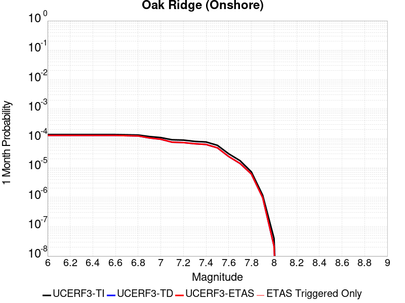 |  |  |

| Magnitude | 1 wk TI Prob | 1 wk TD Prob | 1 wk ETAS Prob | 1 wk ETAS/TD Gain | 1 wk ETAS Triggered Only | 1 mo TI Prob | 1 mo TD Prob | 1 mo ETAS Prob | 1 mo ETAS/TD Gain | 1 mo ETAS Triggered Only | 1 yr TI Prob | 1 yr TD Prob | 1 yr ETAS Prob | 1 yr ETAS/TD Gain | 1 yr ETAS Triggered Only | 10 yr TI Prob | 10 yr TD Prob | 10 yr ETAS Prob | 10 yr ETAS/TD Gain | 10 yr ETAS Triggered Only |
|-----|-----|-----|-----|-----|-----|-----|-----|-----|-----|-----|-----|-----|-----|-----|-----|-----|-----|-----|-----|-----|
| 6.0 | 3.155064E-5 | 2.9529447E-5 | 2.9529447E-5 | 1.0 | 0.0 | 1.3521002E-4 | 1.2654884E-4 | 1.2654884E-4 | 1.0 | 0.0 | 0.001644939 | 0.0015396813 | 0.0015396813 | 1.0 | 0.0 | 0.01632816 | 0.015294643 | 0.015304871 | 1.0006688 | 1.0386697E-5 |
| 6.1 | 3.155064E-5 | 2.9529447E-5 | 2.9529447E-5 | 1.0 | 0.0 | 1.3521002E-4 | 1.2654884E-4 | 1.2654884E-4 | 1.0 | 0.0 | 0.001644939 | 0.0015396813 | 0.0015396813 | 1.0 | 0.0 | 0.01632816 | 0.015294643 | 0.015304871 | 1.0006688 | 1.0386697E-5 |
| 6.2 | 3.155064E-5 | 2.9529447E-5 | 2.9529447E-5 | 1.0 | 0.0 | 1.3521002E-4 | 1.2654884E-4 | 1.2654884E-4 | 1.0 | 0.0 | 0.001644939 | 0.0015396813 | 0.0015396813 | 1.0 | 0.0 | 0.01632816 | 0.015294643 | 0.015304871 | 1.0006688 | 1.0386697E-5 |
| 6.3 | 3.155064E-5 | 2.9529447E-5 | 2.9529447E-5 | 1.0 | 0.0 | 1.3521002E-4 | 1.2654884E-4 | 1.2654884E-4 | 1.0 | 0.0 | 0.001644939 | 0.0015396813 | 0.0015396813 | 1.0 | 0.0 | 0.01632816 | 0.015294643 | 0.015304871 | 1.0006688 | 1.0386697E-5 |
| 6.4 | 3.155064E-5 | 2.9529447E-5 | 2.9529447E-5 | 1.0 | 0.0 | 1.3521002E-4 | 1.2654884E-4 | 1.2654884E-4 | 1.0 | 0.0 | 0.001644939 | 0.0015396813 | 0.0015396813 | 1.0 | 0.0 | 0.01632816 | 0.015294643 | 0.015304871 | 1.0006688 | 1.0386697E-5 |
| 6.5 | 3.155064E-5 | 2.9529447E-5 | 2.9529447E-5 | 1.0 | 0.0 | 1.3521002E-4 | 1.2654884E-4 | 1.2654884E-4 | 1.0 | 0.0 | 0.001644939 | 0.0015396813 | 0.0015396813 | 1.0 | 0.0 | 0.01632816 | 0.015294643 | 0.015304871 | 1.0006688 | 1.0386697E-5 |
| 6.6 | 3.155064E-5 | 2.9529447E-5 | 2.9529447E-5 | 1.0 | 0.0 | 1.3521002E-4 | 1.2654884E-4 | 1.2654884E-4 | 1.0 | 0.0 | 0.001644939 | 0.0015396813 | 0.0015396813 | 1.0 | 0.0 | 0.01632816 | 0.015294643 | 0.015304871 | 1.0006688 | 1.0386697E-5 |
| 6.7 | 3.098897E-5 | 2.8867584E-5 | 2.8867584E-5 | 1.0 | 0.0 | 1.328031E-4 | 1.2371257E-4 | 1.2371257E-4 | 1.0 | 0.0 | 0.0016156785 | 0.0015051975 | 0.0015051975 | 1.0 | 0.0 | 0.016039822 | 0.014954466 | 0.014964698 | 1.0006841 | 1.0386697E-5 |
| 6.8 | 3.0449872E-5 | 2.824273E-5 | 2.824273E-5 | 1.0 | 0.0 | 1.3049292E-4 | 1.21034864E-4 | 1.21034864E-4 | 1.0 | 0.0 | 0.0015875935 | 0.0014726405 | 0.0014726405 | 1.0 | 0.0 | 0.015762992 | 0.014633188 | 0.014643423 | 1.0006994 | 1.0386697E-5 |
| 6.9 | 2.697928E-5 | 2.4222792E-5 | 2.4222792E-5 | 1.0 | 0.0 | 1.15620365E-4 | 1.0380796E-4 | 1.0380796E-4 | 1.0 | 0.0 | 0.0014067689 | 0.0012631506 | 0.0012631506 | 1.0 | 0.0 | 0.0139789665 | 0.012562426 | 0.0125726815 | 1.0008165 | 1.0386697E-5 |
| 7.0 | 2.4893961E-5 | 2.1864875E-5 | 2.1864875E-5 | 1.0 | 0.0 | 1.0668404E-4 | 9.370334E-5 | 9.370334E-5 | 1.0 | 0.0 | 0.0012981043 | 0.0011402589 | 0.0011402589 | 1.0 | 0.0 | 0.012905477 | 0.011346367 | 0.011356636 | 1.000905 | 1.0386697E-5 |
| 7.1 | 2.0945363E-5 | 1.7356973E-5 | 1.7356973E-5 | 1.0 | 0.0 | 8.976275E-5 | 7.438494E-5 | 7.438494E-5 | 1.0 | 0.0 | 0.0010923136 | 9.0526504E-4 | 9.0526504E-4 | 1.0 | 0.0 | 0.0108696 | 0.009016709 | 0.009027002 | 1.0011415 | 1.0386697E-5 |
| 7.2 | 2.0439404E-5 | 1.6811871E-5 | 1.6811871E-5 | 1.0 | 0.0 | 8.7594504E-5 | 7.204891E-5 | 7.204891E-5 | 1.0 | 0.0 | 0.0010659413 | 8.768472E-4 | 8.768472E-4 | 1.0 | 0.0 | 0.010608427 | 0.0087347925 | 0.008745088 | 1.0011787 | 1.0386697E-5 |
| 7.3 | 1.8463334E-5 | 1.538278E-5 | 1.538278E-5 | 1.0 | 0.0 | 7.912617E-5 | 6.5924556E-5 | 6.5924556E-5 | 1.0 | 0.0 | 9.6293533E-4 | 8.023403E-4 | 8.023403E-4 | 1.0 | 0.0 | 0.009587734 | 0.007995299 | 0.007995299 | 1.0 | 0.0 |
| 7.4 | 1.763139E-5 | 1.4517647E-5 | 1.4517647E-5 | 1.0 | 0.0 | 7.556091E-5 | 6.221703E-5 | 6.221703E-5 | 1.0 | 0.0 | 9.1956573E-4 | 7.57233E-4 | 7.57233E-4 | 1.0 | 0.0 | 0.009157699 | 0.007547332 | 0.007547332 | 1.0 | 0.0 |
| 7.5 | 1.3594944E-5 | 1.116386E-5 | 1.116386E-5 | 1.0 | 0.0 | 5.8262744E-5 | 4.784425E-5 | 4.784425E-5 | 1.0 | 0.0 | 7.0911803E-4 | 5.823506E-4 | 5.823506E-4 | 1.0 | 0.0 | 0.007068595 | 0.005808517 | 0.005808517 | 1.0 | 0.0 |
| 7.6 | 6.9889534E-6 | 5.6369217E-6 | 5.6369217E-6 | 1.0 | 0.0 | 2.9952313E-5 | 2.4158015E-5 | 2.4158015E-5 | 1.0 | 0.0 | 3.646084E-4 | 2.9408454E-4 | 2.9408454E-4 | 1.0 | 0.0 | 0.0036401073 | 0.0029369977 | 0.0029369977 | 1.0 | 0.0 |
| 7.7 | 4.0824193E-6 | 3.2833782E-6 | 3.2833782E-6 | 1.0 | 0.0 | 1.7495966E-5 | 1.40715465E-5 | 1.40715465E-5 | 1.0 | 0.0 | 2.1299256E-4 | 1.7130774E-4 | 1.7130774E-4 | 1.0 | 0.0 | 0.0021278851 | 0.0017117702 | 0.0017117702 | 1.0 | 0.0 |
| 7.8 | 1.7023609E-6 | 1.4370928E-6 | 1.4370928E-6 | 1.0 | 0.0 | 7.295812E-6 | 6.158955E-6 | 6.158955E-6 | 1.0 | 0.0 | 8.882289E-5 | 7.498272E-5 | 7.498272E-5 | 1.0 | 0.0 | 8.8787393E-4 | 7.49577E-4 | 7.49577E-4 | 1.0 | 0.0 |
| 7.9 | 2.721225E-7 | 2.2617367E-7 | 2.2617367E-7 | 1.0 | 0.0 | 1.1662388E-6 | 9.693154E-7 | 9.693154E-7 | 1.0 | 0.0 | 1.4198865E-5 | 1.1801353E-5 | 1.1801353E-5 | 1.0 | 0.0 | 1.4197957E-4 | 1.1800755E-4 | 1.1800755E-4 | 1.0 | 0.0 |
| 8.0 | 9.364255E-9 | 5.1216933E-9 | 5.1216933E-9 | 1.0 | 0.0 | 4.0132523E-8 | 2.1950115E-8 | 2.1950115E-8 | 1.0 | 0.0 | 4.8861335E-7 | 2.6724263E-7 | 2.6724263E-7 | 1.0 | 0.0 | 4.8861225E-6 | 2.6724233E-6 | 2.6724233E-6 | 1.0 | 0.0 |

## La Panza 2011
*[(top)](#table-of-contents)*

| 1 Week | 1 Month | 1 Year | 10 Year |
|-----|-----|-----|-----|
|  | 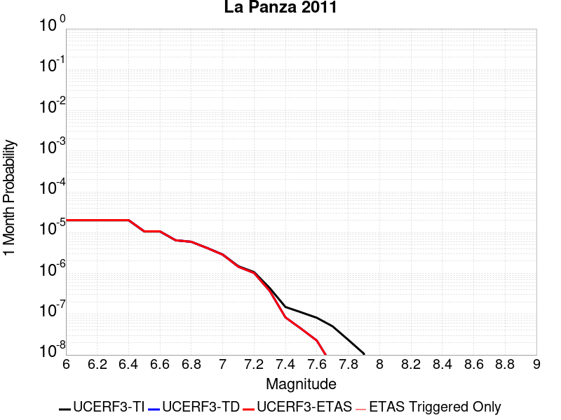 |  | 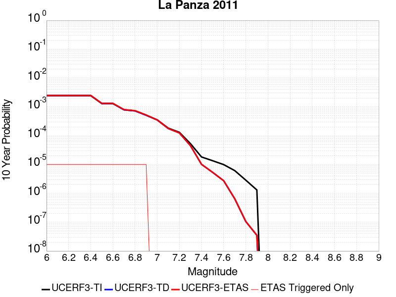 |

| Magnitude | 1 wk TI Prob | 1 wk TD Prob | 1 wk ETAS Prob | 1 wk ETAS/TD Gain | 1 wk ETAS Triggered Only | 1 mo TI Prob | 1 mo TD Prob | 1 mo ETAS Prob | 1 mo ETAS/TD Gain | 1 mo ETAS Triggered Only | 1 yr TI Prob | 1 yr TD Prob | 1 yr ETAS Prob | 1 yr ETAS/TD Gain | 1 yr ETAS Triggered Only | 10 yr TI Prob | 10 yr TD Prob | 10 yr ETAS Prob | 10 yr ETAS/TD Gain | 10 yr ETAS Triggered Only |
|-----|-----|-----|-----|-----|-----|-----|-----|-----|-----|-----|-----|-----|-----|-----|-----|-----|-----|-----|-----|-----|
| 6.0 | 4.6754544E-6 | 4.7176713E-6 | 4.7176713E-6 | 1.0 | 0.0 | 2.0037509E-5 | 2.0218446E-5 | 2.0218446E-5 | 1.0 | 0.0 | 2.4392935E-4 | 2.4613374E-4 | 2.4613374E-4 | 1.0 | 0.0 | 0.0024366176 | 0.002458806 | 0.002469167 | 1.0042139 | 1.0386697E-5 |
| 6.1 | 4.6754544E-6 | 4.7176713E-6 | 4.7176713E-6 | 1.0 | 0.0 | 2.0037509E-5 | 2.0218446E-5 | 2.0218446E-5 | 1.0 | 0.0 | 2.4392935E-4 | 2.4613374E-4 | 2.4613374E-4 | 1.0 | 0.0 | 0.0024366176 | 0.002458806 | 0.002469167 | 1.0042139 | 1.0386697E-5 |
| 6.2 | 4.6754544E-6 | 4.7176713E-6 | 4.7176713E-6 | 1.0 | 0.0 | 2.0037509E-5 | 2.0218446E-5 | 2.0218446E-5 | 1.0 | 0.0 | 2.4392935E-4 | 2.4613374E-4 | 2.4613374E-4 | 1.0 | 0.0 | 0.0024366176 | 0.002458806 | 0.002469167 | 1.0042139 | 1.0386697E-5 |
| 6.3 | 4.6754544E-6 | 4.7176713E-6 | 4.7176713E-6 | 1.0 | 0.0 | 2.0037509E-5 | 2.0218446E-5 | 2.0218446E-5 | 1.0 | 0.0 | 2.4392935E-4 | 2.4613374E-4 | 2.4613374E-4 | 1.0 | 0.0 | 0.0024366176 | 0.002458806 | 0.002469167 | 1.0042139 | 1.0386697E-5 |
| 6.4 | 4.6754544E-6 | 4.7176713E-6 | 4.7176713E-6 | 1.0 | 0.0 | 2.0037509E-5 | 2.0218446E-5 | 2.0218446E-5 | 1.0 | 0.0 | 2.4392935E-4 | 2.4613374E-4 | 2.4613374E-4 | 1.0 | 0.0 | 0.0024366176 | 0.002458806 | 0.002469167 | 1.0042139 | 1.0386697E-5 |
| 6.5 | 2.485343E-6 | 2.5006689E-6 | 2.5006689E-6 | 1.0 | 0.0 | 1.0651426E-5 | 1.0717111E-5 | 1.0717111E-5 | 1.0 | 0.0 | 1.296734E-4 | 1.304734E-4 | 1.304734E-4 | 1.0 | 0.0 | 0.0012959775 | 0.0013040063 | 0.0013143795 | 1.0079548 | 1.0386697E-5 |
| 6.6 | 2.485343E-6 | 2.5006689E-6 | 2.5006689E-6 | 1.0 | 0.0 | 1.0651426E-5 | 1.0717111E-5 | 1.0717111E-5 | 1.0 | 0.0 | 1.296734E-4 | 1.304734E-4 | 1.304734E-4 | 1.0 | 0.0 | 0.0012959775 | 0.0013040063 | 0.0013143795 | 1.0079548 | 1.0386697E-5 |
| 6.7 | 1.5108508E-6 | 1.5147012E-6 | 1.5147012E-6 | 1.0 | 0.0 | 6.4750584E-6 | 6.491561E-6 | 6.491561E-6 | 1.0 | 0.0 | 7.8830984E-5 | 7.9032005E-5 | 7.9032005E-5 | 1.0 | 0.0 | 7.880303E-4 | 7.900498E-4 | 8.004283E-4 | 1.0131365 | 1.0386697E-5 |
| 6.8 | 1.3865837E-6 | 1.388573E-6 | 1.388573E-6 | 1.0 | 0.0 | 5.942488E-6 | 5.951014E-6 | 5.951014E-6 | 1.0 | 0.0 | 7.234739E-5 | 7.245129E-5 | 7.245129E-5 | 1.0 | 0.0 | 7.232384E-4 | 7.242865E-4 | 7.3466566E-4 | 1.0143301 | 1.0386697E-5 |
| 6.9 | 9.826583E-7 | 9.796888E-7 | 9.796888E-7 | 1.0 | 0.0 | 4.2113857E-6 | 4.19866E-6 | 4.19866E-6 | 1.0 | 0.0 | 5.1272415E-5 | 5.111754E-5 | 5.111754E-5 | 1.0 | 0.0 | 5.126059E-4 | 5.1106315E-4 | 5.2144454E-4 | 1.0203133 | 1.0386697E-5 |
| 7.0 | 6.7797646E-7 | 6.7107953E-7 | 6.7107953E-7 | 1.0 | 0.0 | 2.9056102E-6 | 2.8760521E-6 | 2.8760521E-6 | 1.0 | 0.0 | 3.537523E-5 | 3.5015404E-5 | 3.5015404E-5 | 1.0 | 0.0 | 3.5369597E-4 | 3.5010197E-4 | 3.5010197E-4 | 1.0 | 0.0 |
| 7.1 | 3.4979826E-7 | 3.3879465E-7 | 3.3879465E-7 | 1.0 | 0.0 | 1.4991346E-6 | 1.4519763E-6 | 1.4519763E-6 | 1.0 | 0.0 | 1.825181E-5 | 1.7677681E-5 | 1.7677681E-5 | 1.0 | 0.0 | 1.825031E-4 | 1.767639E-4 | 1.767639E-4 | 1.0 | 0.0 |
| 7.2 | 2.5088332E-7 | 2.3837403E-7 | 2.3837403E-7 | 1.0 | 0.0 | 1.0752137E-6 | 1.0216027E-6 | 1.0216027E-6 | 1.0 | 0.0 | 1.3090649E-5 | 1.2437949E-5 | 1.2437949E-5 | 1.0 | 0.0 | 1.3089878E-4 | 1.2437339E-4 | 1.2437339E-4 | 1.0 | 0.0 |
| 7.3 | 1.0159086E-7 | 8.6499846E-8 | 8.6499846E-8 | 1.0 | 0.0 | 4.3538932E-7 | 3.707136E-7 | 3.707136E-7 | 1.0 | 0.0 | 5.300852E-6 | 4.513429E-6 | 4.513429E-6 | 1.0 | 0.0 | 5.3007258E-5 | 4.5133413E-5 | 4.5133413E-5 | 1.0 | 0.0 |
| 7.4 | 3.5006252E-8 | 1.9421545E-8 | 1.9421545E-8 | 1.0 | 0.0 | 1.5002678E-7 | 8.323519E-8 | 8.323519E-8 | 1.0 | 0.0 | 1.8265745E-6 | 1.013388E-6 | 1.013388E-6 | 1.0 | 0.0 | 1.8265595E-5 | 1.0133836E-5 | 1.0133836E-5 | 1.0 | 0.0 |
| 7.5 | 2.592274E-8 | 1.0251951E-8 | 1.0251951E-8 | 1.0 | 0.0 | 1.1109746E-7 | 4.3936932E-8 | 4.3936932E-8 | 1.0 | 0.0 | 1.3526106E-6 | 5.3493204E-7 | 5.3493204E-7 | 1.0 | 0.0 | 1.3526024E-5 | 5.349308E-6 | 5.349308E-6 | 1.0 | 0.0 |
| 7.6 | 1.9016717E-8 | 5.2530598E-9 | 5.2530598E-9 | 1.0 | 0.0 | 8.150022E-8 | 2.2513113E-8 | 2.2513113E-8 | 1.0 | 0.0 | 9.922647E-7 | 2.7409712E-7 | 2.7409712E-7 | 1.0 | 0.0 | 9.922603E-6 | 2.740968E-6 | 2.740968E-6 | 1.0 | 0.0 |
| 7.7 | 1.17738495E-8 | 1.2433922E-9 | 1.2433922E-9 | 1.0 | 0.0 | 5.0459356E-8 | 5.3288227E-9 | 5.3288227E-9 | 1.0 | 0.0 | 6.1434247E-7 | 6.4878414E-8 | 6.4878414E-8 | 1.0 | 0.0 | 6.143408E-6 | 6.4878395E-7 | 6.4878395E-7 | 1.0 | 0.0 |
| 7.8 | 5.489079E-9 | 2.0205604E-10 | 2.0205604E-10 | 1.0 | 0.0 | 2.3524624E-8 | 8.659543E-10 | 8.659543E-10 | 1.0 | 0.0 | 2.8641225E-7 | 1.0542993E-8 | 1.0542993E-8 | 1.0 | 0.0 | 2.8641189E-6 | 1.0542992E-7 | 1.0542992E-7 | 1.0 | 0.0 |
| 7.9 | 2.5081048E-9 | 6.7194916E-11 | 6.7194916E-11 | 1.0 | 0.0 | 1.0749021E-8 | 2.879772E-10 | 2.879772E-10 | 1.0 | 0.0 | 1.3086932E-7 | 3.5061234E-9 | 3.5061234E-9 | 1.0 | 0.0 | 1.3086925E-6 | 3.5061234E-8 | 3.5061234E-8 | 1.0 | 0.0 |

## Bullion Mountains
*[(top)](#table-of-contents)*

| 1 Week | 1 Month | 1 Year | 10 Year |
|-----|-----|-----|-----|
|  |  |  |  |

| Magnitude | 1 wk TI Prob | 1 wk TD Prob | 1 wk ETAS Prob | 1 wk ETAS/TD Gain | 1 wk ETAS Triggered Only | 1 mo TI Prob | 1 mo TD Prob | 1 mo ETAS Prob | 1 mo ETAS/TD Gain | 1 mo ETAS Triggered Only | 1 yr TI Prob | 1 yr TD Prob | 1 yr ETAS Prob | 1 yr ETAS/TD Gain | 1 yr ETAS Triggered Only | 10 yr TI Prob | 10 yr TD Prob | 10 yr ETAS Prob | 10 yr ETAS/TD Gain | 10 yr ETAS Triggered Only |
|-----|-----|-----|-----|-----|-----|-----|-----|-----|-----|-----|-----|-----|-----|-----|-----|-----|-----|-----|-----|-----|
| 6.0 | 1.6420427E-5 | 1.4692955E-5 | 1.4692955E-5 | 1.0 | 0.0 | 7.037136E-5 | 6.29685E-5 | 6.29685E-5 | 1.0 | 0.0 | 8.5643446E-4 | 7.6641026E-4 | 7.76789E-4 | 1.013542 | 1.0386697E-5 | 0.008531413 | 0.007641465 | 0.0076517724 | 1.0013489 | 1.0386697E-5 |
| 6.1 | 1.6420427E-5 | 1.4692955E-5 | 1.4692955E-5 | 1.0 | 0.0 | 7.037136E-5 | 6.29685E-5 | 6.29685E-5 | 1.0 | 0.0 | 8.5643446E-4 | 7.6641026E-4 | 7.76789E-4 | 1.013542 | 1.0386697E-5 | 0.008531413 | 0.007641465 | 0.0076517724 | 1.0013489 | 1.0386697E-5 |
| 6.2 | 1.6420427E-5 | 1.4692955E-5 | 1.4692955E-5 | 1.0 | 0.0 | 7.037136E-5 | 6.29685E-5 | 6.29685E-5 | 1.0 | 0.0 | 8.5643446E-4 | 7.6641026E-4 | 7.76789E-4 | 1.013542 | 1.0386697E-5 | 0.008531413 | 0.007641465 | 0.0076517724 | 1.0013489 | 1.0386697E-5 |
| 6.3 | 1.2046778E-5 | 9.862933E-6 | 9.862933E-6 | 1.0 | 0.0 | 5.1628023E-5 | 4.2269163E-5 | 4.2269163E-5 | 1.0 | 0.0 | 6.283899E-4 | 5.145287E-4 | 5.2491005E-4 | 1.0201764 | 1.0386697E-5 | 0.0062661595 | 0.005135656 | 0.0051459894 | 1.0020121 | 1.0386697E-5 |
| 6.4 | 1.2046778E-5 | 9.862933E-6 | 9.862933E-6 | 1.0 | 0.0 | 5.1628023E-5 | 4.2269163E-5 | 4.2269163E-5 | 1.0 | 0.0 | 6.283899E-4 | 5.145287E-4 | 5.2491005E-4 | 1.0201764 | 1.0386697E-5 | 0.0062661595 | 0.005135656 | 0.0051459894 | 1.0020121 | 1.0386697E-5 |
| 6.5 | 1.0244343E-5 | 7.879951E-6 | 7.879951E-6 | 1.0 | 0.0 | 4.390359E-5 | 3.37709E-5 | 3.37709E-5 | 1.0 | 0.0 | 5.343951E-4 | 4.1110383E-4 | 4.2148624E-4 | 1.025255 | 1.0386697E-5 | 0.005331118 | 0.0041054646 | 0.0041158088 | 1.0025196 | 1.0386697E-5 |
| 6.6 | 9.605408E-6 | 7.1779527E-6 | 7.1779527E-6 | 1.0 | 0.0 | 4.1165385E-5 | 3.0762407E-5 | 3.0762407E-5 | 1.0 | 0.0 | 5.010733E-4 | 3.744883E-4 | 3.848711E-4 | 1.0277253 | 1.0386697E-5 | 0.00499945 | 0.0037405696 | 0.0037509175 | 1.0027664 | 1.0386697E-5 |
| 6.7 | 8.60418E-6 | 6.1244036E-6 | 6.1244036E-6 | 1.0 | 0.0 | 3.687454E-5 | 2.624729E-5 | 2.624729E-5 | 1.0 | 0.0 | 4.48855E-4 | 3.1953337E-4 | 3.2991677E-4 | 1.0324955 | 1.0386697E-5 | 0.004479495 | 0.0031926516 | 0.003203005 | 1.003243 | 1.0386697E-5 |
| 6.8 | 5.187994E-6 | 2.5633778E-6 | 2.5633778E-6 | 1.0 | 0.0 | 2.223407E-5 | 1.0985881E-5 | 1.0985881E-5 | 1.0 | 0.0 | 2.7066618E-4 | 1.3374888E-4 | 1.4413419E-4 | 1.0776478 | 1.0386697E-5 | 0.0027033675 | 0.0013370755 | 0.0013474483 | 1.0077578 | 1.0386697E-5 |
| 6.9 | 4.5302368E-6 | 2.3444993E-6 | 2.3444993E-6 | 1.0 | 0.0 | 1.9415156E-5 | 1.0047837E-5 | 1.0047837E-5 | 1.0 | 0.0 | 2.3635388E-4 | 1.2232953E-4 | 1.3271495E-4 | 1.0848972 | 1.0386697E-5 | 0.0023610266 | 0.0012230111 | 0.0012333851 | 1.0084823 | 1.0386697E-5 |
| 7.0 | 3.431668E-6 | 1.688382E-6 | 1.688382E-6 | 1.0 | 0.0 | 1.4707065E-5 | 7.235923E-6 | 7.235923E-6 | 1.0 | 0.0 | 1.7904381E-4 | 8.809736E-5 | 9.848314E-5 | 1.1178898 | 1.0386697E-5 | 0.0017889962 | 8.809736E-4 | 8.9135114E-4 | 1.0117797 | 1.0386697E-5 |

## San Andreas (North Coast) 2011 CFM
*[(top)](#table-of-contents)*

| 1 Week | 1 Month | 1 Year | 10 Year |
|-----|-----|-----|-----|
|  |  | 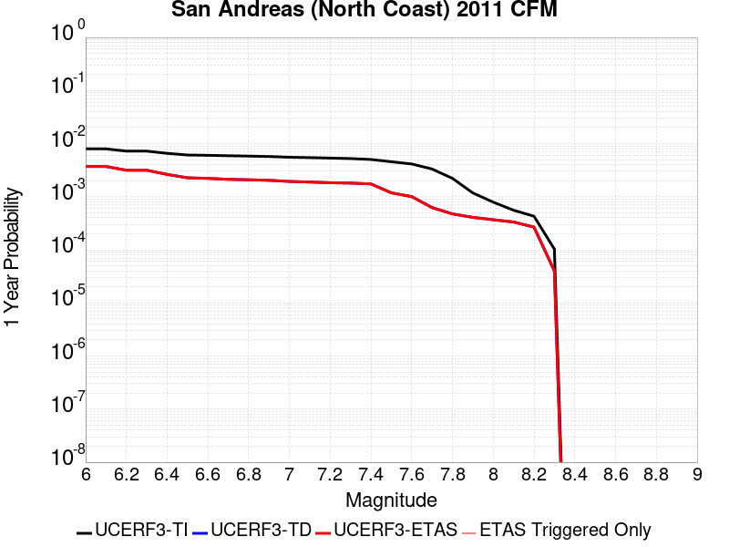 | 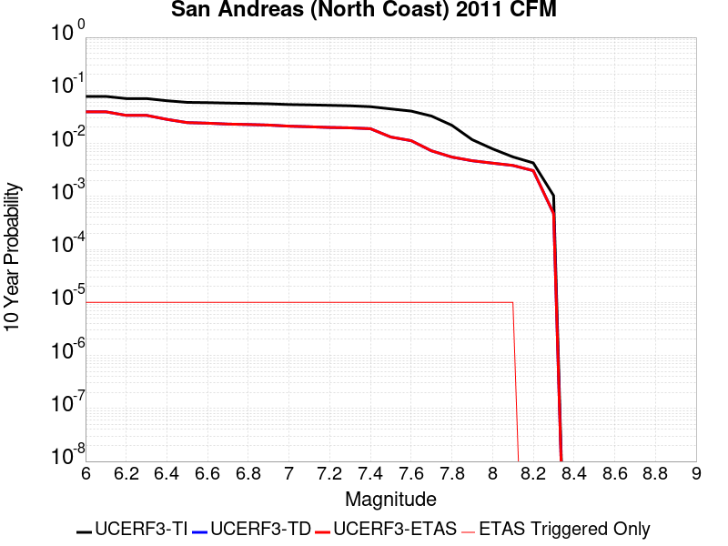 |

| Magnitude | 1 wk TI Prob | 1 wk TD Prob | 1 wk ETAS Prob | 1 wk ETAS/TD Gain | 1 wk ETAS Triggered Only | 1 mo TI Prob | 1 mo TD Prob | 1 mo ETAS Prob | 1 mo ETAS/TD Gain | 1 mo ETAS Triggered Only | 1 yr TI Prob | 1 yr TD Prob | 1 yr ETAS Prob | 1 yr ETAS/TD Gain | 1 yr ETAS Triggered Only | 10 yr TI Prob | 10 yr TD Prob | 10 yr ETAS Prob | 10 yr ETAS/TD Gain | 10 yr ETAS Triggered Only |
|-----|-----|-----|-----|-----|-----|-----|-----|-----|-----|-----|-----|-----|-----|-----|-----|-----|-----|-----|-----|-----|
| 6.0 | 1.5333705E-4 | 7.1250375E-5 | 7.1250375E-5 | 1.0 | 0.0 | 6.5699324E-4 | 3.053232E-4 | 3.053232E-4 | 1.0 | 0.0 | 0.007969595 | 0.0037110075 | 0.0037110075 | 1.0 | 0.0 | 0.0768977 | 0.039427705 | 0.03943768 | 1.0002531 | 1.0386697E-5 |
| 6.1 | 1.5333705E-4 | 7.1250375E-5 | 7.1250375E-5 | 1.0 | 0.0 | 6.5699324E-4 | 3.053232E-4 | 3.053232E-4 | 1.0 | 0.0 | 0.007969595 | 0.0037110075 | 0.0037110075 | 1.0 | 0.0 | 0.0768977 | 0.039427705 | 0.03943768 | 1.0002531 | 1.0386697E-5 |
| 6.2 | 1.3912938E-4 | 6.062947E-5 | 6.062947E-5 | 1.0 | 0.0 | 5.961325E-4 | 2.5981484E-4 | 2.5981484E-4 | 1.0 | 0.0 | 0.007233787 | 0.0031586846 | 0.0031586846 | 1.0 | 0.0 | 0.07002798 | 0.033759642 | 0.03376968 | 1.0002973 | 1.0386697E-5 |
| 6.3 | 1.3912938E-4 | 6.062947E-5 | 6.062947E-5 | 1.0 | 0.0 | 5.961325E-4 | 2.5981484E-4 | 2.5981484E-4 | 1.0 | 0.0 | 0.007233787 | 0.0031586846 | 0.0031586846 | 1.0 | 0.0 | 0.07002798 | 0.033759642 | 0.03376968 | 1.0002973 | 1.0386697E-5 |
| 6.4 | 1.2623647E-4 | 5.0554227E-5 | 5.0554227E-5 | 1.0 | 0.0 | 5.4090127E-4 | 2.166431E-4 | 2.166431E-4 | 1.0 | 0.0 | 0.0065656058 | 0.0026344592 | 0.0026344592 | 1.0 | 0.0 | 0.06374981 | 0.028363641 | 0.028373733 | 1.0003558 | 1.0386697E-5 |
| 6.5 | 1.1736096E-4 | 4.3625514E-5 | 4.3625514E-5 | 1.0 | 0.0 | 5.028786E-4 | 1.8695318E-4 | 1.8695318E-4 | 1.0 | 0.0 | 0.006105373 | 0.0022737952 | 0.0022737952 | 1.0 | 0.0 | 0.05940335 | 0.024634827 | 0.024644958 | 1.0004113 | 1.0386697E-5 |
| 6.6 | 1.1586959E-4 | 4.252367E-5 | 4.252367E-5 | 1.0 | 0.0 | 4.964894E-4 | 1.8223166E-4 | 1.8223166E-4 | 1.0 | 0.0 | 0.006028018 | 0.002216429 | 0.002216429 | 1.0 | 0.0 | 0.058671024 | 0.02403969 | 0.024049826 | 1.0004216 | 1.0386697E-5 |
| 6.7 | 1.13693764E-4 | 4.0833464E-5 | 4.0833464E-5 | 1.0 | 0.0 | 4.87168E-4 | 1.749889E-4 | 1.749889E-4 | 1.0 | 0.0 | 0.005915152 | 0.0021284241 | 0.0021284241 | 1.0 | 0.0 | 0.057601593 | 0.023129925 | 0.023140071 | 1.0004387 | 1.0386697E-5 |
| 6.8 | 1.1204889E-4 | 4.0049228E-5 | 4.0049228E-5 | 1.0 | 0.0 | 4.8012115E-4 | 1.7162834E-4 | 1.7162834E-4 | 1.0 | 0.0 | 0.005829819 | 0.0020875887 | 0.0020875887 | 1.0 | 0.0 | 0.05679232 | 0.022689283 | 0.022699434 | 1.0004474 | 1.0386697E-5 |
| 6.9 | 1.1005794E-4 | 3.9103095E-5 | 3.9103095E-5 | 1.0 | 0.0 | 4.7159163E-4 | 1.6757402E-4 | 1.6757402E-4 | 1.0 | 0.0 | 0.0057265228 | 0.0020383205 | 0.0020383205 | 1.0 | 0.0 | 0.055811852 | 0.022154024 | 0.022164179 | 1.0004585 | 1.0386697E-5 |
| 7.0 | 1.0647948E-4 | 3.7253933E-5 | 3.7253933E-5 | 1.0 | 0.0 | 4.562608E-4 | 1.5965004E-4 | 1.5965004E-4 | 1.0 | 0.0 | 0.0055408357 | 0.0019420219 | 0.0019420219 | 1.0 | 0.0 | 0.054047033 | 0.021110756 | 0.021120923 | 1.0004816 | 1.0386697E-5 |
| 7.1 | 1.04795035E-4 | 3.630107E-5 | 3.630107E-5 | 1.0 | 0.0 | 4.4904428E-4 | 1.5556683E-4 | 1.5556683E-4 | 1.0 | 0.0 | 0.0054534175 | 0.0018923962 | 0.0018923962 | 1.0 | 0.0 | 0.053215165 | 0.020577554 | 0.020587727 | 1.0004944 | 1.0386697E-5 |
| 7.2 | 1.02724036E-4 | 3.5206915E-5 | 3.5206915E-5 | 1.0 | 0.0 | 4.401716E-4 | 1.5087813E-4 | 1.5087813E-4 | 1.0 | 0.0 | 0.0053459285 | 0.001835409 | 0.001835409 | 1.0 | 0.0 | 0.052191395 | 0.019965103 | 0.019975282 | 1.0005099 | 1.0386697E-5 |
| 7.3 | 1.00650694E-4 | 3.4672295E-5 | 3.4672295E-5 | 1.0 | 0.0 | 4.312888E-4 | 1.4858718E-4 | 1.4858718E-4 | 1.0 | 0.0 | 0.005238306 | 0.0018075631 | 0.0018075631 | 1.0 | 0.0 | 0.051165357 | 0.019641154 | 0.019651337 | 1.0005184 | 1.0386697E-5 |
| 7.4 | 9.672919E-5 | 3.345712E-5 | 3.345712E-5 | 1.0 | 0.0 | 4.144878E-4 | 1.4337986E-4 | 1.4337986E-4 | 1.0 | 0.0 | 0.005034718 | 0.0017442673 | 0.0017442673 | 1.0 | 0.0 | 0.049221683 | 0.01891206 | 0.018922249 | 1.0005388 | 1.0386697E-5 |
| 7.5 | 8.7600405E-5 | 2.2763736E-5 | 2.2763736E-5 | 1.0 | 0.0 | 3.753763E-4 | 9.7555225E-5 | 9.7555225E-5 | 1.0 | 0.0 | 0.0045606326 | 0.0011870895 | 0.0011870895 | 1.0 | 0.0 | 0.04468165 | 0.013166346 | 0.013176595 | 1.0007784 | 1.0386697E-5 |
| 7.6 | 7.9562284E-5 | 1.9283596E-5 | 1.9283596E-5 | 1.0 | 0.0 | 3.4093665E-4 | 8.264137E-5 | 8.264137E-5 | 1.0 | 0.0 | 0.0041430052 | 0.0010056958 | 0.0010056958 | 1.0 | 0.0 | 0.040666126 | 0.011254854 | 0.011265123 | 1.0009124 | 1.0386697E-5 |
| 7.7 | 6.3866544E-5 | 1.1986498E-5 | 1.1986498E-5 | 1.0 | 0.0 | 2.7368503E-4 | 5.1369694E-5 | 5.1369694E-5 | 1.0 | 0.0 | 0.0033270244 | 6.2524684E-4 | 6.2524684E-4 | 1.0 | 0.0 | 0.032776527 | 0.0072368314 | 0.007247143 | 1.0014249 | 1.0386697E-5 |
| 7.8 | 4.2543215E-5 | 9.112785E-6 | 9.112785E-6 | 1.0 | 0.0 | 1.8231533E-4 | 3.9054208E-5 | 3.9054208E-5 | 1.0 | 0.0 | 0.0022174292 | 4.7538136E-4 | 4.7538136E-4 | 1.0 | 0.0 | 0.021954332 | 0.005511731 | 0.00552206 | 1.0018741 | 1.0386697E-5 |
| 7.9 | 2.2636612E-5 | 7.844561E-6 | 7.844561E-6 | 1.0 | 0.0 | 9.7010445E-5 | 3.3619115E-5 | 3.3619115E-5 | 1.0 | 0.0 | 0.0011804621 | 4.0923594E-4 | 4.0923594E-4 | 1.0 | 0.0 | 0.011742111 | 0.004700338 | 0.004710676 | 1.0021994 | 1.0386697E-5 |
| 8.0 | 1.5167874E-5 | 7.07659E-6 | 7.07659E-6 | 1.0 | 0.0 | 6.500356E-5 | 3.032789E-5 | 3.032789E-5 | 1.0 | 0.0 | 7.9113094E-4 | 3.691796E-4 | 3.691796E-4 | 1.0 | 0.0 | 0.007883203 | 0.004230647 | 0.0042409897 | 1.0024447 | 1.0386697E-5 |
| 8.1 | 1.0681047E-5 | 6.411601E-6 | 6.411601E-6 | 1.0 | 0.0 | 4.5775112E-5 | 2.7478001E-5 | 2.7478001E-5 | 1.0 | 0.0 | 5.5716943E-4 | 3.344934E-4 | 3.344934E-4 | 1.0 | 0.0 | 0.0055577457 | 0.0038309463 | 0.003841293 | 1.0027009 | 1.0386697E-5 |
| 8.2 | 8.226114E-6 | 5.13432E-6 | 5.13432E-6 | 1.0 | 0.0 | 3.52543E-5 | 2.2004044E-5 | 2.2004044E-5 | 1.0 | 0.0 | 4.2913653E-4 | 2.678664E-4 | 2.678664E-4 | 1.0 | 0.0 | 0.004283088 | 0.0030556484 | 0.0030556484 | 1.0 | 0.0 |
| 8.3 | 1.983087E-6 | 7.693574E-7 | 7.693574E-7 | 1.0 | 0.0 | 8.498917E-6 | 3.297242E-6 | 3.297242E-6 | 1.0 | 0.0 | 1.034694E-4 | 4.01432E-5 | 4.01432E-5 | 1.0 | 0.0 | 0.0010342124 | 4.7390026E-4 | 4.7390026E-4 | 1.0 | 0.0 |

## Elysian Park (Upper)
*[(top)](#table-of-contents)*

| 1 Week | 1 Month | 1 Year | 10 Year |
|-----|-----|-----|-----|
|  |  |  |  |

| Magnitude | 1 wk TI Prob | 1 wk TD Prob | 1 wk ETAS Prob | 1 wk ETAS/TD Gain | 1 wk ETAS Triggered Only | 1 mo TI Prob | 1 mo TD Prob | 1 mo ETAS Prob | 1 mo ETAS/TD Gain | 1 mo ETAS Triggered Only | 1 yr TI Prob | 1 yr TD Prob | 1 yr ETAS Prob | 1 yr ETAS/TD Gain | 1 yr ETAS Triggered Only | 10 yr TI Prob | 10 yr TD Prob | 10 yr ETAS Prob | 10 yr ETAS/TD Gain | 10 yr ETAS Triggered Only |
|-----|-----|-----|-----|-----|-----|-----|-----|-----|-----|-----|-----|-----|-----|-----|-----|-----|-----|-----|-----|-----|
| 6.0 | 3.1876025E-5 | 3.7039532E-5 | 3.7039532E-5 | 1.0 | 0.0 | 1.3660437E-4 | 1.5873392E-4 | 1.5873392E-4 | 1.0 | 0.0 | 0.0016618895 | 0.0019313111 | 0.0019313111 | 1.0 | 0.0 | 0.016495159 | 0.019191828 | 0.019202014 | 1.0005308 | 1.0386697E-5 |
| 6.1 | 3.1876025E-5 | 3.7039532E-5 | 3.7039532E-5 | 1.0 | 0.0 | 1.3660437E-4 | 1.5873392E-4 | 1.5873392E-4 | 1.0 | 0.0 | 0.0016618895 | 0.0019313111 | 0.0019313111 | 1.0 | 0.0 | 0.016495159 | 0.019191828 | 0.019202014 | 1.0005308 | 1.0386697E-5 |
| 6.2 | 3.1876025E-5 | 3.7039532E-5 | 3.7039532E-5 | 1.0 | 0.0 | 1.3660437E-4 | 1.5873392E-4 | 1.5873392E-4 | 1.0 | 0.0 | 0.0016618895 | 0.0019313111 | 0.0019313111 | 1.0 | 0.0 | 0.016495159 | 0.019191828 | 0.019202014 | 1.0005308 | 1.0386697E-5 |
| 6.3 | 3.1876025E-5 | 3.7039532E-5 | 3.7039532E-5 | 1.0 | 0.0 | 1.3660437E-4 | 1.5873392E-4 | 1.5873392E-4 | 1.0 | 0.0 | 0.0016618895 | 0.0019313111 | 0.0019313111 | 1.0 | 0.0 | 0.016495159 | 0.019191828 | 0.019202014 | 1.0005308 | 1.0386697E-5 |
| 6.4 | 1.9273462E-5 | 2.1204127E-5 | 2.1204127E-5 | 1.0 | 0.0 | 8.259794E-5 | 9.087264E-5 | 9.087264E-5 | 1.0 | 0.0 | 0.001005166 | 0.0011059863 | 0.0011059863 | 1.0 | 0.0 | 0.010006315 | 0.011021685 | 0.011031956 | 1.000932 | 1.0386697E-5 |
| 6.5 | 1.9273462E-5 | 2.1204127E-5 | 2.1204127E-5 | 1.0 | 0.0 | 8.259794E-5 | 9.087264E-5 | 9.087264E-5 | 1.0 | 0.0 | 0.001005166 | 0.0011059863 | 0.0011059863 | 1.0 | 0.0 | 0.010006315 | 0.011021685 | 0.011031956 | 1.000932 | 1.0386697E-5 |
| 6.6 | 9.813258E-6 | 9.666116E-6 | 9.666116E-6 | 1.0 | 0.0 | 4.205614E-5 | 4.1425592E-5 | 4.1425592E-5 | 1.0 | 0.0 | 5.119132E-4 | 5.0424715E-4 | 5.0424715E-4 | 1.0 | 0.0 | 0.005107356 | 0.0050317533 | 0.0050420878 | 1.0020539 | 1.0386697E-5 |
| 6.7 | 9.801478E-6 | 9.653685E-6 | 9.653685E-6 | 1.0 | 0.0 | 4.2005657E-5 | 4.1372317E-5 | 4.1372317E-5 | 1.0 | 0.0 | 5.112989E-4 | 5.035988E-4 | 5.035988E-4 | 1.0 | 0.0 | 0.0051012407 | 0.0050252997 | 0.005035634 | 1.0020565 | 1.0386697E-5 |
| 6.8 | 8.102489E-6 | 7.773414E-6 | 7.773414E-6 | 1.0 | 0.0 | 3.4724493E-5 | 3.3314234E-5 | 3.3314234E-5 | 1.0 | 0.0 | 4.2268867E-4 | 4.0553027E-4 | 4.0553027E-4 | 1.0 | 0.0 | 0.004218856 | 0.004048397 | 0.004048397 | 1.0 | 0.0 |
| 6.9 | 6.08275E-6 | 5.4816974E-6 | 5.4816974E-6 | 1.0 | 0.0 | 2.6068668E-5 | 2.3492783E-5 | 2.3492783E-5 | 1.0 | 0.0 | 3.173398E-4 | 2.8598786E-4 | 2.8598786E-4 | 1.0 | 0.0 | 0.0031688702 | 0.0028562758 | 0.0028562758 | 1.0 | 0.0 |
| 7.0 | 5.5995934E-6 | 4.983003E-6 | 4.983003E-6 | 1.0 | 0.0 | 2.3998036E-5 | 2.1355554E-5 | 2.1355554E-5 | 1.0 | 0.0 | 2.9213692E-4 | 2.5997352E-4 | 2.5997352E-4 | 1.0 | 0.0 | 0.0029175316 | 0.0025967613 | 0.0025967613 | 1.0 | 0.0 |
| 7.1 | 4.709881E-6 | 4.0875825E-6 | 4.0875825E-6 | 1.0 | 0.0 | 2.0185047E-5 | 1.7518096E-5 | 1.7518096E-5 | 1.0 | 0.0 | 2.4572524E-4 | 2.1326235E-4 | 2.1326235E-4 | 1.0 | 0.0 | 0.002454537 | 0.0021306183 | 0.0021306183 | 1.0 | 0.0 |
| 7.2 | 3.6063436E-6 | 2.9780829E-6 | 2.9780829E-6 | 1.0 | 0.0 | 1.5455667E-5 | 1.2763151E-5 | 1.2763151E-5 | 1.0 | 0.0 | 1.881565E-4 | 1.5538039E-4 | 1.5538039E-4 | 1.0 | 0.0 | 0.0018799726 | 0.0015527287 | 0.0015527287 | 1.0 | 0.0 |
| 7.3 | 2.471135E-6 | 2.095552E-6 | 2.095552E-6 | 1.0 | 0.0 | 1.0590536E-5 | 8.980906E-6 | 8.980906E-6 | 1.0 | 0.0 | 1.2893214E-4 | 1.09337125E-4 | 1.09337125E-4 | 1.0 | 0.0 | 0.0012885736 | 0.0010928405 | 0.0010928405 | 1.0 | 0.0 |
| 7.4 | 1.163943E-6 | 1.0275575E-6 | 1.0275575E-6 | 1.0 | 0.0 | 4.988318E-6 | 4.40381E-6 | 4.40381E-6 | 1.0 | 0.0 | 6.0731076E-5 | 5.3615102E-5 | 5.3615102E-5 | 1.0 | 0.0 | 6.071448E-4 | 5.360246E-4 | 5.360246E-4 | 1.0 | 0.0 |
| 7.5 | 4.99459E-7 | 4.9178306E-7 | 4.9178306E-7 | 1.0 | 0.0 | 2.140537E-6 | 2.10764E-6 | 2.10764E-6 | 1.0 | 0.0 | 2.6060725E-5 | 2.5660232E-5 | 2.5660232E-5 | 1.0 | 0.0 | 2.605767E-4 | 2.5657425E-4 | 2.5657425E-4 | 1.0 | 0.0 |
| 7.6 | 2.4667852E-7 | 2.4779692E-7 | 2.4779692E-7 | 1.0 | 0.0 | 1.0571932E-6 | 1.0619864E-6 | 1.0619864E-6 | 1.0 | 0.0 | 1.2871251E-5 | 1.2929611E-5 | 1.2929611E-5 | 1.0 | 0.0 | 1.2870505E-4 | 1.2928895E-4 | 1.2928895E-4 | 1.0 | 0.0 |
| 7.7 | 8.2312795E-8 | 7.38718E-8 | 7.38718E-8 | 1.0 | 0.0 | 3.527691E-7 | 3.165934E-7 | 3.165934E-7 | 1.0 | 0.0 | 4.294955E-6 | 3.854519E-6 | 3.854519E-6 | 1.0 | 0.0 | 4.2948723E-5 | 3.854464E-5 | 3.854464E-5 | 1.0 | 0.0 |
| 7.8 | 2.7819295E-8 | 1.7571217E-8 | 1.7571217E-8 | 1.0 | 0.0 | 1.1922555E-7 | 7.5305216E-8 | 7.5305216E-8 | 1.0 | 0.0 | 1.45157E-6 | 9.168408E-7 | 9.168408E-7 | 1.0 | 0.0 | 1.45156055E-5 | 9.168385E-6 | 9.168385E-6 | 1.0 | 0.0 |

## San Cayetano
*[(top)](#table-of-contents)*

| 1 Week | 1 Month | 1 Year | 10 Year |
|-----|-----|-----|-----|
|  |  | 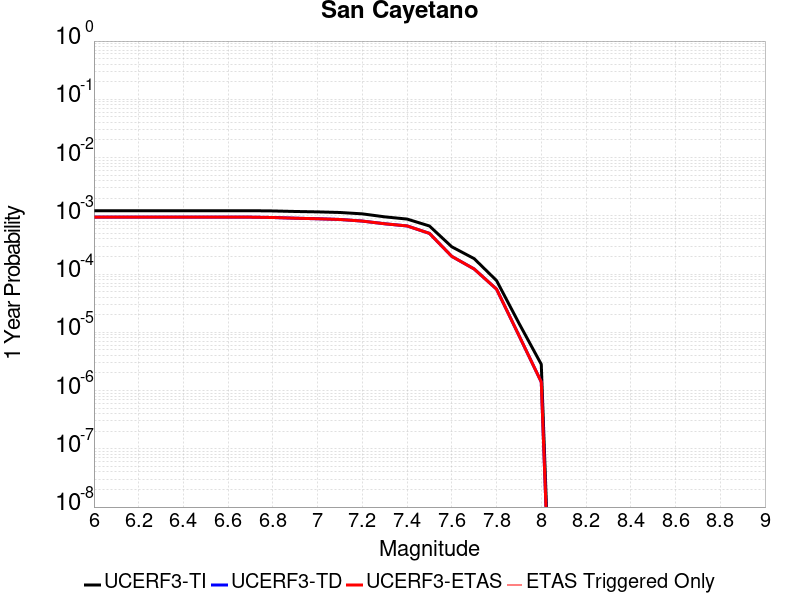 | 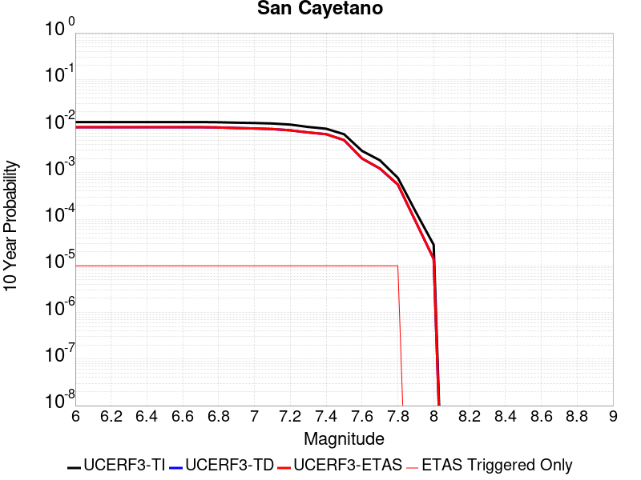 |

| Magnitude | 1 wk TI Prob | 1 wk TD Prob | 1 wk ETAS Prob | 1 wk ETAS/TD Gain | 1 wk ETAS Triggered Only | 1 mo TI Prob | 1 mo TD Prob | 1 mo ETAS Prob | 1 mo ETAS/TD Gain | 1 mo ETAS Triggered Only | 1 yr TI Prob | 1 yr TD Prob | 1 yr ETAS Prob | 1 yr ETAS/TD Gain | 1 yr ETAS Triggered Only | 10 yr TI Prob | 10 yr TD Prob | 10 yr ETAS Prob | 10 yr ETAS/TD Gain | 10 yr ETAS Triggered Only |
|-----|-----|-----|-----|-----|-----|-----|-----|-----|-----|-----|-----|-----|-----|-----|-----|-----|-----|-----|-----|-----|
| 6.0 | 2.3476267E-5 | 1.8172246E-5 | 1.8172246E-5 | 1.0 | 0.0 | 1.0060869E-4 | 7.787875E-5 | 7.787875E-5 | 1.0 | 0.0 | 0.0012242225 | 9.4776496E-4 | 9.4776496E-4 | 1.0 | 0.0 | 0.012175002 | 0.009438118 | 0.009448406 | 1.0010902 | 1.0386697E-5 |
| 6.1 | 2.3476267E-5 | 1.8172246E-5 | 1.8172246E-5 | 1.0 | 0.0 | 1.0060869E-4 | 7.787875E-5 | 7.787875E-5 | 1.0 | 0.0 | 0.0012242225 | 9.4776496E-4 | 9.4776496E-4 | 1.0 | 0.0 | 0.012175002 | 0.009438118 | 0.009448406 | 1.0010902 | 1.0386697E-5 |
| 6.2 | 2.3476267E-5 | 1.8172246E-5 | 1.8172246E-5 | 1.0 | 0.0 | 1.0060869E-4 | 7.787875E-5 | 7.787875E-5 | 1.0 | 0.0 | 0.0012242225 | 9.4776496E-4 | 9.4776496E-4 | 1.0 | 0.0 | 0.012175002 | 0.009438118 | 0.009448406 | 1.0010902 | 1.0386697E-5 |
| 6.3 | 2.3476267E-5 | 1.8172246E-5 | 1.8172246E-5 | 1.0 | 0.0 | 1.0060869E-4 | 7.787875E-5 | 7.787875E-5 | 1.0 | 0.0 | 0.0012242225 | 9.4776496E-4 | 9.4776496E-4 | 1.0 | 0.0 | 0.012175002 | 0.009438118 | 0.009448406 | 1.0010902 | 1.0386697E-5 |
| 6.4 | 2.3476267E-5 | 1.8172246E-5 | 1.8172246E-5 | 1.0 | 0.0 | 1.0060869E-4 | 7.787875E-5 | 7.787875E-5 | 1.0 | 0.0 | 0.0012242225 | 9.4776496E-4 | 9.4776496E-4 | 1.0 | 0.0 | 0.012175002 | 0.009438118 | 0.009448406 | 1.0010902 | 1.0386697E-5 |
| 6.5 | 2.3476267E-5 | 1.8172246E-5 | 1.8172246E-5 | 1.0 | 0.0 | 1.0060869E-4 | 7.787875E-5 | 7.787875E-5 | 1.0 | 0.0 | 0.0012242225 | 9.4776496E-4 | 9.4776496E-4 | 1.0 | 0.0 | 0.012175002 | 0.009438118 | 0.009448406 | 1.0010902 | 1.0386697E-5 |
| 6.6 | 2.3476267E-5 | 1.8172246E-5 | 1.8172246E-5 | 1.0 | 0.0 | 1.0060869E-4 | 7.787875E-5 | 7.787875E-5 | 1.0 | 0.0 | 0.0012242225 | 9.4776496E-4 | 9.4776496E-4 | 1.0 | 0.0 | 0.012175002 | 0.009438118 | 0.009448406 | 1.0010902 | 1.0386697E-5 |
| 6.7 | 2.3476267E-5 | 1.8172246E-5 | 1.8172246E-5 | 1.0 | 0.0 | 1.0060869E-4 | 7.787875E-5 | 7.787875E-5 | 1.0 | 0.0 | 0.0012242225 | 9.4776496E-4 | 9.4776496E-4 | 1.0 | 0.0 | 0.012175002 | 0.009438118 | 0.009448406 | 1.0010902 | 1.0386697E-5 |
| 6.8 | 2.3241924E-5 | 1.7939927E-5 | 1.7939927E-5 | 1.0 | 0.0 | 9.960445E-5 | 7.688316E-5 | 7.688316E-5 | 1.0 | 0.0 | 0.0012120095 | 9.356541E-4 | 9.356541E-4 | 1.0 | 0.0 | 0.012054204 | 0.009318002 | 0.009328292 | 1.0011044 | 1.0386697E-5 |
| 6.9 | 2.2761007E-5 | 1.7435323E-5 | 1.7435323E-5 | 1.0 | 0.0 | 9.7543525E-5 | 7.4720694E-5 | 7.4720694E-5 | 1.0 | 0.0 | 0.0011869454 | 9.093482E-4 | 9.093482E-4 | 1.0 | 0.0 | 0.011806256 | 0.009057103 | 0.009067395 | 1.0011364 | 1.0386697E-5 |
| 7.0 | 2.240283E-5 | 1.7069042E-5 | 1.7069042E-5 | 1.0 | 0.0 | 9.600859E-5 | 7.3151E-5 | 7.3151E-5 | 1.0 | 0.0 | 0.0011682777 | 8.9025294E-4 | 8.9025294E-4 | 1.0 | 0.0 | 0.011621549 | 0.008867681 | 0.008877976 | 1.0011609 | 1.0386697E-5 |
| 7.1 | 2.1871154E-5 | 1.6588847E-5 | 1.6588847E-5 | 1.0 | 0.0 | 9.373015E-5 | 7.1093134E-5 | 7.1093134E-5 | 1.0 | 0.0 | 0.0011405671 | 8.652186E-4 | 8.652186E-4 | 1.0 | 0.0 | 0.011347309 | 0.008619301 | 0.008629599 | 1.0011947 | 1.0386697E-5 |
| 7.2 | 2.0714133E-5 | 1.5567295E-5 | 1.5567295E-5 | 1.0 | 0.0 | 8.8771834E-5 | 6.671529E-5 | 6.671529E-5 | 1.0 | 0.0 | 0.0010802611 | 8.1195927E-4 | 8.1195927E-4 | 1.0 | 0.0 | 0.010750249 | 0.008090701 | 0.008101003 | 1.0012734 | 1.0386697E-5 |
| 7.3 | 1.8408395E-5 | 1.3998046E-5 | 1.3998046E-5 | 1.0 | 0.0 | 7.8890735E-5 | 5.999026E-5 | 5.999026E-5 | 1.0 | 0.0 | 9.600714E-4 | 7.3013967E-4 | 7.3013967E-4 | 1.0 | 0.0 | 0.009559342 | 0.007278127 | 0.0072884383 | 1.0014167 | 1.0386697E-5 |
| 7.4 | 1.6856795E-5 | 1.2851064E-5 | 1.2851064E-5 | 1.0 | 0.0 | 7.2241404E-5 | 5.507484E-5 | 5.507484E-5 | 1.0 | 0.0 | 8.7918417E-4 | 6.7033275E-4 | 6.7033275E-4 | 1.0 | 0.0 | 0.00875714 | 0.006683788 | 0.006694105 | 1.0015436 | 1.0386697E-5 |
| 7.5 | 1.2822778E-5 | 9.578205E-6 | 9.578205E-6 | 1.0 | 0.0 | 5.495361E-5 | 4.1048817E-5 | 4.1048817E-5 | 1.0 | 0.0 | 6.688548E-4 | 4.996563E-4 | 4.996563E-4 | 1.0 | 0.0 | 0.006668452 | 0.0049855 | 0.004995835 | 1.002073 | 1.0386697E-5 |
| 7.6 | 5.6272684E-6 | 3.855203E-6 | 3.855203E-6 | 1.0 | 0.0 | 2.4116642E-5 | 1.6522194E-5 | 1.6522194E-5 | 1.0 | 0.0 | 2.9358055E-4 | 2.0113925E-4 | 2.0113925E-4 | 1.0 | 0.0 | 0.0029319301 | 0.002009583 | 0.0020199488 | 1.0051582 | 1.0386697E-5 |
| 7.7 | 3.5261346E-6 | 2.3408893E-6 | 2.3408893E-6 | 1.0 | 0.0 | 1.5111918E-5 | 1.0032345E-5 | 1.0032345E-5 | 1.0 | 0.0 | 1.8397206E-4 | 1.2213703E-4 | 1.2213703E-4 | 1.0 | 0.0 | 0.0018381984 | 0.0012207064 | 0.0012310804 | 1.0084984 | 1.0386697E-5 |
| 7.8 | 1.4826929E-6 | 1.0564999E-6 | 1.0564999E-6 | 1.0 | 0.0 | 6.354383E-6 | 4.527849E-6 | 4.527849E-6 | 1.0 | 0.0 | 7.736187E-5 | 5.5125187E-5 | 5.5125187E-5 | 1.0 | 0.0 | 7.733494E-4 | 5.511172E-4 | 5.614981E-4 | 1.0188363 | 1.0386697E-5 |
| 7.9 | 2.7568166E-7 | 1.6979952E-7 | 1.6979952E-7 | 1.0 | 0.0 | 1.1814923E-6 | 7.27712E-7 | 7.27712E-7 | 1.0 | 0.0 | 1.4384574E-5 | 8.859858E-6 | 8.859858E-6 | 1.0 | 0.0 | 1.4383643E-4 | 8.859509E-5 | 8.859509E-5 | 1.0 | 0.0 |
| 8.0 | 5.407832E-8 | 2.6893451E-8 | 2.6893451E-8 | 1.0 | 0.0 | 2.3176422E-7 | 1.1525764E-7 | 1.1525764E-7 | 1.0 | 0.0 | 2.8217257E-6 | 1.403261E-6 | 1.403261E-6 | 1.0 | 0.0 | 2.8216898E-5 | 1.4032525E-5 | 1.4032525E-5 | 1.0 | 0.0 |

## Elsinore (Stepovers Combined)
*[(top)](#table-of-contents)*

| 1 Week | 1 Month | 1 Year | 10 Year |
|-----|-----|-----|-----|
|  |  |  |  |

| Magnitude | 1 wk TI Prob | 1 wk TD Prob | 1 wk ETAS Prob | 1 wk ETAS/TD Gain | 1 wk ETAS Triggered Only | 1 mo TI Prob | 1 mo TD Prob | 1 mo ETAS Prob | 1 mo ETAS/TD Gain | 1 mo ETAS Triggered Only | 1 yr TI Prob | 1 yr TD Prob | 1 yr ETAS Prob | 1 yr ETAS/TD Gain | 1 yr ETAS Triggered Only | 10 yr TI Prob | 10 yr TD Prob | 10 yr ETAS Prob | 10 yr ETAS/TD Gain | 10 yr ETAS Triggered Only |
|-----|-----|-----|-----|-----|-----|-----|-----|-----|-----|-----|-----|-----|-----|-----|-----|-----|-----|-----|-----|-----|
| 6.0 | 2.144392E-5 | 1.9763398E-5 | 1.9763398E-5 | 1.0 | 0.0 | 9.189928E-5 | 8.4697655E-5 | 8.4697655E-5 | 1.0 | 0.0 | 0.0011182994 | 0.0010307278 | 0.0010411039 | 1.0100666 | 1.0386697E-5 | 0.011126885 | 0.010266563 | 0.010276843 | 1.0010014 | 1.0386697E-5 |
| 6.1 | 2.144392E-5 | 1.9763398E-5 | 1.9763398E-5 | 1.0 | 0.0 | 9.189928E-5 | 8.4697655E-5 | 8.4697655E-5 | 1.0 | 0.0 | 0.0011182994 | 0.0010307278 | 0.0010411039 | 1.0100666 | 1.0386697E-5 | 0.011126885 | 0.010266563 | 0.010276843 | 1.0010014 | 1.0386697E-5 |
| 6.2 | 2.144392E-5 | 1.9763398E-5 | 1.9763398E-5 | 1.0 | 0.0 | 9.189928E-5 | 8.4697655E-5 | 8.4697655E-5 | 1.0 | 0.0 | 0.0011182994 | 0.0010307278 | 0.0010411039 | 1.0100666 | 1.0386697E-5 | 0.011126885 | 0.010266563 | 0.010276843 | 1.0010014 | 1.0386697E-5 |
| 6.3 | 1.9751555E-5 | 1.7744453E-5 | 1.7744453E-5 | 1.0 | 0.0 | 8.4646774E-5 | 7.604553E-5 | 7.604553E-5 | 1.0 | 0.0 | 0.0010300872 | 9.2547765E-4 | 9.3585474E-4 | 1.0112127 | 1.0386697E-5 | 0.010253254 | 0.009222817 | 0.009233108 | 1.0011158 | 1.0386697E-5 |
| 6.4 | 1.9751555E-5 | 1.7744453E-5 | 1.7744453E-5 | 1.0 | 0.0 | 8.4646774E-5 | 7.604553E-5 | 7.604553E-5 | 1.0 | 0.0 | 0.0010300872 | 9.2547765E-4 | 9.3585474E-4 | 1.0112127 | 1.0386697E-5 | 0.010253254 | 0.009222817 | 0.009233108 | 1.0011158 | 1.0386697E-5 |
| 6.5 | 1.9751555E-5 | 1.7744453E-5 | 1.7744453E-5 | 1.0 | 0.0 | 8.4646774E-5 | 7.604553E-5 | 7.604553E-5 | 1.0 | 0.0 | 0.0010300872 | 9.2547765E-4 | 9.3585474E-4 | 1.0112127 | 1.0386697E-5 | 0.010253254 | 0.009222817 | 0.009233108 | 1.0011158 | 1.0386697E-5 |
| 6.6 | 1.9188685E-5 | 1.7006269E-5 | 1.7006269E-5 | 1.0 | 0.0 | 8.2234634E-5 | 7.288206E-5 | 7.288206E-5 | 1.0 | 0.0 | 0.0010007467 | 8.8699406E-4 | 8.9737156E-4 | 1.0116996 | 1.0386697E-5 | 0.00996252 | 0.008841329 | 0.008851624 | 1.0011644 | 1.0386697E-5 |
| 6.7 | 1.7608272E-5 | 1.4735112E-5 | 1.4735112E-5 | 1.0 | 0.0 | 7.546184E-5 | 6.3149004E-5 | 6.3149004E-5 | 1.0 | 0.0 | 9.183606E-4 | 7.685777E-4 | 7.789564E-4 | 1.0135038 | 1.0386697E-5 | 0.009145746 | 0.007666202 | 0.0076765087 | 1.0013444 | 1.0386697E-5 |
| 6.8 | 1.697165E-5 | 1.378568E-5 | 1.378568E-5 | 1.0 | 0.0 | 7.273361E-5 | 5.9080194E-5 | 5.9080194E-5 | 1.0 | 0.0 | 8.8517193E-4 | 7.1907265E-4 | 7.294519E-4 | 1.0144342 | 1.0386697E-5 | 0.008816543 | 0.007173875 | 0.0071841874 | 1.0014374 | 1.0386697E-5 |
| 6.9 | 1.600365E-5 | 1.2848904E-5 | 1.2848904E-5 | 1.0 | 0.0 | 6.858527E-5 | 5.506561E-5 | 5.506561E-5 | 1.0 | 0.0 | 8.347058E-4 | 6.7022536E-4 | 6.806051E-4 | 1.015487 | 1.0386697E-5 | 0.008315775 | 0.0066879243 | 0.0066982415 | 1.0015427 | 1.0386697E-5 |
| 7.0 | 1.3314581E-5 | 1.0449482E-5 | 1.0449482E-5 | 1.0 | 0.0 | 5.7061243E-5 | 4.478274E-5 | 4.478274E-5 | 1.0 | 0.0 | 6.944992E-4 | 5.450962E-4 | 5.554772E-4 | 1.0190444 | 1.0386697E-5 | 0.006923327 | 0.0054415185 | 0.0054518483 | 1.0018984 | 1.0386697E-5 |
| 7.1 | 1.2865345E-5 | 9.939282E-6 | 9.939282E-6 | 1.0 | 0.0 | 5.5136024E-5 | 4.2596243E-5 | 4.2596243E-5 | 1.0 | 0.0 | 6.710743E-4 | 5.184884E-4 | 5.288697E-4 | 1.0200223 | 1.0386697E-5 | 0.0066905143 | 0.0051761195 | 0.0051864525 | 1.0019963 | 1.0386697E-5 |
| 7.2 | 1.1650051E-5 | 8.635295E-6 | 8.635295E-6 | 1.0 | 0.0 | 4.9927836E-5 | 3.7007892E-5 | 3.7007892E-5 | 1.0 | 0.0 | 6.0770183E-4 | 4.504797E-4 | 4.6086172E-4 | 1.0230466 | 1.0386697E-5 | 0.0060604266 | 0.004497089 | 0.004507429 | 1.0022993 | 1.0386697E-5 |
| 7.3 | 1.0008533E-5 | 7.2022526E-6 | 7.2022526E-6 | 1.0 | 0.0 | 4.2893007E-5 | 3.086644E-5 | 3.086644E-5 | 1.0 | 0.0 | 5.220972E-4 | 3.7573554E-4 | 3.7573554E-4 | 1.0 | 0.0 | 0.005208723 | 0.0037513901 | 0.0037513901 | 1.0 | 0.0 |
| 7.4 | 9.116759E-6 | 6.411122E-6 | 6.411122E-6 | 1.0 | 0.0 | 3.907124E-5 | 2.7475955E-5 | 2.7475955E-5 | 1.0 | 0.0 | 4.7558855E-4 | 3.3446978E-4 | 3.3446978E-4 | 1.0 | 0.0 | 0.00474572 | 0.003339816 | 0.003339816 | 1.0 | 0.0 |
| 7.5 | 7.870524E-6 | 5.3834096E-6 | 5.3834096E-6 | 1.0 | 0.0 | 3.3730383E-5 | 2.3071558E-5 | 2.3071558E-5 | 1.0 | 0.0 | 4.1059E-4 | 2.8086128E-4 | 2.8086128E-4 | 1.0 | 0.0 | 0.0040983222 | 0.00280519 | 0.00280519 | 1.0 | 0.0 |
| 7.6 | 6.9774537E-6 | 4.678376E-6 | 4.678376E-6 | 1.0 | 0.0 | 2.990303E-5 | 2.0050036E-5 | 2.0050036E-5 | 1.0 | 0.0 | 3.640086E-4 | 2.4408301E-4 | 2.4408301E-4 | 1.0 | 0.0 | 0.003634129 | 0.0024382656 | 0.0024382656 | 1.0 | 0.0 |
| 7.7 | 4.1616954E-6 | 2.3287935E-6 | 2.3287935E-6 | 1.0 | 0.0 | 1.7835715E-5 | 9.98051E-6 | 9.98051E-6 | 1.0 | 0.0 | 2.171282E-4 | 1.2150667E-4 | 1.2150667E-4 | 1.0 | 0.0 | 0.0021691616 | 0.0012144755 | 0.0012144755 | 1.0 | 0.0 |
| 7.8 | 2.2692414E-7 | 9.3873886E-8 | 9.3873886E-8 | 1.0 | 0.0 | 9.725317E-7 | 4.023166E-7 | 4.023166E-7 | 1.0 | 0.0 | 1.1840509E-5 | 4.898197E-6 | 4.898197E-6 | 1.0 | 0.0 | 1.1839878E-4 | 4.898122E-5 | 4.898122E-5 | 1.0 | 0.0 |
| 7.9 | 6.676829E-9 | 3.4403498E-9 | 3.4403498E-9 | 1.0 | 0.0 | 2.861498E-8 | 1.4744357E-8 | 1.4744357E-8 | 1.0 | 0.0 | 3.4838732E-7 | 1.7951253E-7 | 1.7951253E-7 | 1.0 | 0.0 | 3.4838679E-6 | 1.7951239E-6 | 1.7951239E-6 | 1.0 | 0.0 |

## Simi-Santa Rosa
*[(top)](#table-of-contents)*

| 1 Week | 1 Month | 1 Year | 10 Year |
|-----|-----|-----|-----|
|  | 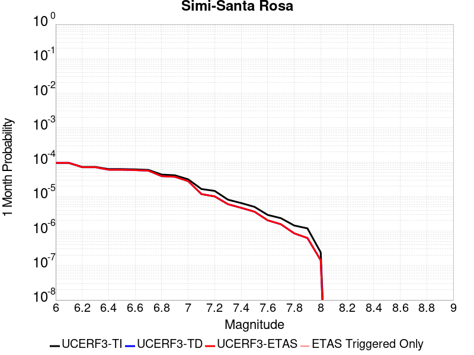 |  | 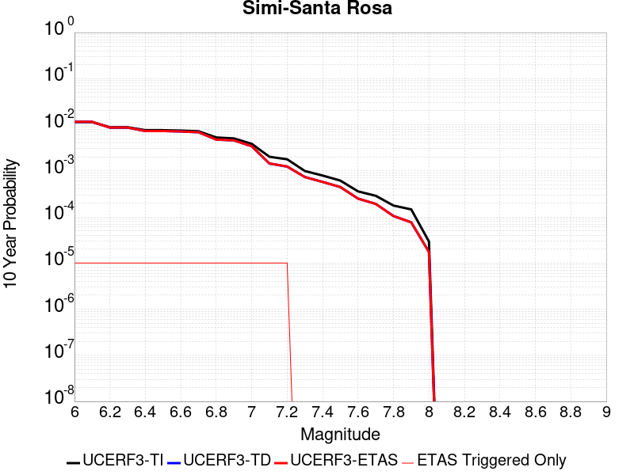 |

| Magnitude | 1 wk TI Prob | 1 wk TD Prob | 1 wk ETAS Prob | 1 wk ETAS/TD Gain | 1 wk ETAS Triggered Only | 1 mo TI Prob | 1 mo TD Prob | 1 mo ETAS Prob | 1 mo ETAS/TD Gain | 1 mo ETAS Triggered Only | 1 yr TI Prob | 1 yr TD Prob | 1 yr ETAS Prob | 1 yr ETAS/TD Gain | 1 yr ETAS Triggered Only | 10 yr TI Prob | 10 yr TD Prob | 10 yr ETAS Prob | 10 yr ETAS/TD Gain | 10 yr ETAS Triggered Only |
|-----|-----|-----|-----|-----|-----|-----|-----|-----|-----|-----|-----|-----|-----|-----|-----|-----|-----|-----|-----|-----|
| 6.0 | 2.198912E-5 | 2.2277061E-5 | 2.2277061E-5 | 1.0 | 0.0 | 9.4235686E-5 | 9.546988E-5 | 9.546988E-5 | 1.0 | 0.0 | 0.0011467156 | 0.0011617698 | 0.0011617698 | 1.0 | 0.0 | 0.011408163 | 0.011561411 | 0.011571677 | 1.000888 | 1.0386697E-5 |
| 6.1 | 2.198912E-5 | 2.2277061E-5 | 2.2277061E-5 | 1.0 | 0.0 | 9.4235686E-5 | 9.546988E-5 | 9.546988E-5 | 1.0 | 0.0 | 0.0011467156 | 0.0011617698 | 0.0011617698 | 1.0 | 0.0 | 0.011408163 | 0.011561411 | 0.011571677 | 1.000888 | 1.0386697E-5 |
| 6.2 | 1.69983E-5 | 1.6669812E-5 | 1.6669812E-5 | 1.0 | 0.0 | 7.284782E-5 | 7.1440256E-5 | 7.1440256E-5 | 1.0 | 0.0 | 8.865613E-4 | 8.694672E-4 | 8.694672E-4 | 1.0 | 0.0 | 0.008830327 | 0.008663576 | 0.008673873 | 1.0011885 | 1.0386697E-5 |
| 6.3 | 1.69983E-5 | 1.6669812E-5 | 1.6669812E-5 | 1.0 | 0.0 | 7.284782E-5 | 7.1440256E-5 | 7.1440256E-5 | 1.0 | 0.0 | 8.865613E-4 | 8.694672E-4 | 8.694672E-4 | 1.0 | 0.0 | 0.008830327 | 0.008663576 | 0.008673873 | 1.0011885 | 1.0386697E-5 |
| 6.4 | 1.4666188E-5 | 1.4053627E-5 | 1.4053627E-5 | 1.0 | 0.0 | 6.285358E-5 | 6.0228576E-5 | 6.0228576E-5 | 1.0 | 0.0 | 7.6497364E-4 | 7.330611E-4 | 7.330611E-4 | 1.0 | 0.0 | 0.0076234564 | 0.0073089055 | 0.0073192166 | 1.0014107 | 1.0386697E-5 |
| 6.5 | 1.4666188E-5 | 1.4053627E-5 | 1.4053627E-5 | 1.0 | 0.0 | 6.285358E-5 | 6.0228576E-5 | 6.0228576E-5 | 1.0 | 0.0 | 7.6497364E-4 | 7.330611E-4 | 7.330611E-4 | 1.0 | 0.0 | 0.0076234564 | 0.0073089055 | 0.0073192166 | 1.0014107 | 1.0386697E-5 |
| 6.6 | 1.4377586E-5 | 1.3730646E-5 | 1.3730646E-5 | 1.0 | 0.0 | 6.1616774E-5 | 5.8844438E-5 | 5.8844438E-5 | 1.0 | 0.0 | 7.4992597E-4 | 7.162204E-4 | 7.162204E-4 | 1.0 | 0.0 | 0.007474003 | 0.0071415897 | 0.007151902 | 1.001444 | 1.0386697E-5 |
| 6.7 | 1.3881404E-5 | 1.320858E-5 | 1.320858E-5 | 1.0 | 0.0 | 5.9490372E-5 | 5.660711E-5 | 5.660711E-5 | 1.0 | 0.0 | 7.240546E-4 | 6.889984E-4 | 6.889984E-4 | 1.0 | 0.0 | 0.007217 | 0.006871072 | 0.0068813874 | 1.0015013 | 1.0386697E-5 |
| 6.8 | 1.0176516E-5 | 9.154907E-6 | 9.154907E-6 | 1.0 | 0.0 | 4.3612912E-5 | 3.923482E-5 | 3.923482E-5 | 1.0 | 0.0 | 5.308578E-4 | 4.7759584E-4 | 4.7759584E-4 | 1.0 | 0.0 | 0.0052959146 | 0.0047673276 | 0.004777665 | 1.0021683 | 1.0386697E-5 |
| 6.9 | 9.699797E-6 | 8.775444E-6 | 8.775444E-6 | 1.0 | 0.0 | 4.15699E-5 | 3.7608595E-5 | 3.7608595E-5 | 1.0 | 0.0 | 5.05996E-4 | 4.578049E-4 | 4.578049E-4 | 1.0 | 0.0 | 0.005048454 | 0.004570236 | 0.0045805755 | 1.0022624 | 1.0386697E-5 |
| 7.0 | 7.4049476E-6 | 6.559884E-6 | 6.559884E-6 | 1.0 | 0.0 | 3.1735104E-5 | 2.8113554E-5 | 2.8113554E-5 | 1.0 | 0.0 | 3.8630638E-4 | 3.4224143E-4 | 3.4224143E-4 | 1.0 | 0.0 | 0.0038563553 | 0.0034183862 | 0.0034287374 | 1.003028 | 1.0386697E-5 |
| 7.1 | 3.873439E-6 | 2.7597737E-6 | 2.7597737E-6 | 1.0 | 0.0 | 1.6600346E-5 | 1.1827549E-5 | 1.1827549E-5 | 1.0 | 0.0 | 2.0209046E-4 | 1.4399113E-4 | 1.4399113E-4 | 1.0 | 0.0 | 0.0020190678 | 0.0014390019 | 0.0014493737 | 1.0072076 | 1.0386697E-5 |
| 7.2 | 3.417706E-6 | 2.3678895E-6 | 2.3678895E-6 | 1.0 | 0.0 | 1.4647229E-5 | 1.0148059E-5 | 1.0148059E-5 | 1.0 | 0.0 | 1.7831543E-4 | 1.2354583E-4 | 1.2354583E-4 | 1.0 | 0.0 | 0.0017817242 | 0.0012347938 | 0.0012451677 | 1.0084013 | 1.0386697E-5 |
| 7.3 | 1.90225E-6 | 1.4075586E-6 | 1.4075586E-6 | 1.0 | 0.0 | 8.152474E-6 | 6.03238E-6 | 6.03238E-6 | 1.0 | 0.0 | 9.9251854E-5 | 7.344177E-5 | 7.344177E-5 | 1.0 | 0.0 | 9.920754E-4 | 7.3417724E-4 | 7.3417724E-4 | 1.0 | 0.0 |
| 7.4 | 1.5170556E-6 | 1.1026477E-6 | 1.1026477E-6 | 1.0 | 0.0 | 6.5016507E-6 | 4.7256244E-6 | 4.7256244E-6 | 1.0 | 0.0 | 7.915472E-5 | 5.753297E-5 | 5.753297E-5 | 1.0 | 0.0 | 7.9126534E-4 | 5.7518185E-4 | 5.7518185E-4 | 1.0 | 0.0 |
| 7.5 | 1.178732E-6 | 8.536725E-7 | 8.536725E-7 | 1.0 | 0.0 | 5.0516987E-6 | 3.6585911E-6 | 3.6585911E-6 | 1.0 | 0.0 | 6.1502695E-5 | 4.4542445E-5 | 4.4542445E-5 | 1.0 | 0.0 | 6.148568E-4 | 4.4533613E-4 | 4.4533613E-4 | 1.0 | 0.0 |
| 7.6 | 6.8722386E-7 | 4.794698E-7 | 4.794698E-7 | 1.0 | 0.0 | 2.9452417E-6 | 2.0548691E-6 | 2.0548691E-6 | 1.0 | 0.0 | 3.5857727E-5 | 2.5017745E-5 | 2.5017745E-5 | 1.0 | 0.0 | 3.5851944E-4 | 2.501494E-4 | 2.501494E-4 | 1.0 | 0.0 |
| 7.7 | 5.5126515E-7 | 3.674588E-7 | 3.674588E-7 | 1.0 | 0.0 | 2.3625628E-6 | 1.5748224E-6 | 1.5748224E-6 | 1.0 | 0.0 | 2.8763823E-5 | 1.9173296E-5 | 1.9173296E-5 | 1.0 | 0.0 | 2.87601E-4 | 1.9171652E-4 | 1.9171652E-4 | 1.0 | 0.0 |
| 7.8 | 3.3860243E-7 | 2.008463E-7 | 2.008463E-7 | 1.0 | 0.0 | 1.4511525E-6 | 8.607696E-7 | 8.607696E-7 | 1.0 | 0.0 | 1.7667637E-5 | 1.047982E-5 | 1.047982E-5 | 1.0 | 0.0 | 1.7666233E-4 | 1.0479331E-4 | 1.0479331E-4 | 1.0 | 0.0 |
| 7.9 | 2.7955386E-7 | 1.4657186E-7 | 1.4657186E-7 | 1.0 | 0.0 | 1.1980875E-6 | 6.2816497E-7 | 6.2816497E-7 | 1.0 | 0.0 | 1.4586617E-5 | 7.647883E-6 | 7.647883E-6 | 1.0 | 0.0 | 1.458566E-4 | 7.647623E-5 | 7.647623E-5 | 1.0 | 0.0 |
| 8.0 | 5.6259015E-8 | 3.3362383E-8 | 3.3362383E-8 | 1.0 | 0.0 | 2.4111003E-7 | 1.4298163E-7 | 1.4298163E-7 | 1.0 | 0.0 | 2.9355108E-6 | 1.7408001E-6 | 1.7408001E-6 | 1.0 | 0.0 | 2.935472E-5 | 1.740788E-5 | 1.740788E-5 | 1.0 | 0.0 |

## Johnson Valley (No) 2011 rev
*[(top)](#table-of-contents)*

| 1 Week | 1 Month | 1 Year | 10 Year |
|-----|-----|-----|-----|
|  |  |  |  |

| Magnitude | 1 wk TI Prob | 1 wk TD Prob | 1 wk ETAS Prob | 1 wk ETAS/TD Gain | 1 wk ETAS Triggered Only | 1 mo TI Prob | 1 mo TD Prob | 1 mo ETAS Prob | 1 mo ETAS/TD Gain | 1 mo ETAS Triggered Only | 1 yr TI Prob | 1 yr TD Prob | 1 yr ETAS Prob | 1 yr ETAS/TD Gain | 1 yr ETAS Triggered Only | 10 yr TI Prob | 10 yr TD Prob | 10 yr ETAS Prob | 10 yr ETAS/TD Gain | 10 yr ETAS Triggered Only |
|-----|-----|-----|-----|-----|-----|-----|-----|-----|-----|-----|-----|-----|-----|-----|-----|-----|-----|-----|-----|-----|
| 6.0 | 2.577707E-5 | 1.2901787E-5 | 1.2901787E-5 | 1.0 | 0.0 | 1.1046848E-4 | 5.529243E-5 | 5.529243E-5 | 1.0 | 0.0 | 0.0013441239 | 6.7301706E-4 | 6.8339676E-4 | 1.0154227 | 1.0386697E-5 | 0.013360229 | 0.006713698 | 0.006724015 | 1.0015367 | 1.0386697E-5 |
| 6.1 | 2.577707E-5 | 1.2901787E-5 | 1.2901787E-5 | 1.0 | 0.0 | 1.1046848E-4 | 5.529243E-5 | 5.529243E-5 | 1.0 | 0.0 | 0.0013441239 | 6.7301706E-4 | 6.8339676E-4 | 1.0154227 | 1.0386697E-5 | 0.013360229 | 0.006713698 | 0.006724015 | 1.0015367 | 1.0386697E-5 |
| 6.2 | 2.577707E-5 | 1.2901787E-5 | 1.2901787E-5 | 1.0 | 0.0 | 1.1046848E-4 | 5.529243E-5 | 5.529243E-5 | 1.0 | 0.0 | 0.0013441239 | 6.7301706E-4 | 6.8339676E-4 | 1.0154227 | 1.0386697E-5 | 0.013360229 | 0.006713698 | 0.006724015 | 1.0015367 | 1.0386697E-5 |
| 6.3 | 2.577707E-5 | 1.2901787E-5 | 1.2901787E-5 | 1.0 | 0.0 | 1.1046848E-4 | 5.529243E-5 | 5.529243E-5 | 1.0 | 0.0 | 0.0013441239 | 6.7301706E-4 | 6.8339676E-4 | 1.0154227 | 1.0386697E-5 | 0.013360229 | 0.006713698 | 0.006724015 | 1.0015367 | 1.0386697E-5 |
| 6.4 | 1.5296591E-5 | 7.5372795E-6 | 7.5372795E-6 | 1.0 | 0.0 | 6.555518E-5 | 3.230233E-5 | 3.230233E-5 | 1.0 | 0.0 | 7.97842E-4 | 3.932287E-4 | 3.932287E-4 | 1.0 | 0.0 | 0.007949836 | 0.0039271703 | 0.0039271703 | 1.0 | 0.0 |
| 6.5 | 1.5296591E-5 | 7.5372795E-6 | 7.5372795E-6 | 1.0 | 0.0 | 6.555518E-5 | 3.230233E-5 | 3.230233E-5 | 1.0 | 0.0 | 7.97842E-4 | 3.932287E-4 | 3.932287E-4 | 1.0 | 0.0 | 0.007949836 | 0.0039271703 | 0.0039271703 | 1.0 | 0.0 |
| 6.6 | 1.3289383E-5 | 5.9921827E-6 | 5.9921827E-6 | 1.0 | 0.0 | 5.6953253E-5 | 2.5680625E-5 | 2.5680625E-5 | 1.0 | 0.0 | 6.9318525E-4 | 3.1263373E-4 | 3.1263373E-4 | 1.0 | 0.0 | 0.0069102696 | 0.0031236038 | 0.0031236038 | 1.0 | 0.0 |
| 6.7 | 1.3289383E-5 | 5.9921827E-6 | 5.9921827E-6 | 1.0 | 0.0 | 5.6953253E-5 | 2.5680625E-5 | 2.5680625E-5 | 1.0 | 0.0 | 6.9318525E-4 | 3.1263373E-4 | 3.1263373E-4 | 1.0 | 0.0 | 0.0069102696 | 0.0031236038 | 0.0031236038 | 1.0 | 0.0 |
| 6.8 | 8.330789E-6 | 2.921463E-6 | 2.921463E-6 | 1.0 | 0.0 | 3.570289E-5 | 1.2520528E-5 | 1.2520528E-5 | 1.0 | 0.0 | 4.34596E-4 | 1.5243248E-4 | 1.5243248E-4 | 1.0 | 0.0 | 0.0043374705 | 0.0015238392 | 0.0015238392 | 1.0 | 0.0 |
| 6.9 | 7.2359003E-6 | 2.301569E-6 | 2.301569E-6 | 1.0 | 0.0 | 3.1010633E-5 | 9.86386E-6 | 9.86386E-6 | 1.0 | 0.0 | 3.7748902E-4 | 1.20091216E-4 | 1.20091216E-4 | 1.0 | 0.0 | 0.0037684843 | 0.0012007862 | 0.0012007862 | 1.0 | 0.0 |
| 7.0 | 6.5149957E-6 | 2.0887069E-6 | 2.0887069E-6 | 1.0 | 0.0 | 2.792111E-5 | 8.951601E-6 | 8.951601E-6 | 1.0 | 0.0 | 3.398865E-4 | 1.0898559E-4 | 1.0898559E-4 | 1.0 | 0.0 | 0.003393671 | 0.0010898412 | 0.0010898412 | 1.0 | 0.0 |
| 7.1 | 1.1662233E-6 | 2.8809353E-8 | 2.8809353E-8 | 1.0 | 0.0 | 4.9980904E-6 | 1.2346865E-7 | 1.2346865E-7 | 1.0 | 0.0 | 6.0850052E-5 | 1.50323E-6 | 1.50323E-6 | 1.0 | 0.0 | 6.083339E-4 | 1.5032215E-5 | 1.5032215E-5 | 1.0 | 0.0 |
| 7.2 | 5.413881E-7 | 2.8809353E-8 | 2.8809353E-8 | 1.0 | 0.0 | 2.3202326E-6 | 1.2346865E-7 | 1.2346865E-7 | 1.0 | 0.0 | 2.8248465E-5 | 1.50323E-6 | 1.50323E-6 | 1.0 | 0.0 | 2.8244875E-4 | 1.5032215E-5 | 1.5032215E-5 | 1.0 | 0.0 |
| 7.3 | 5.076821E-7 | 2.8809353E-8 | 2.8809353E-8 | 1.0 | 0.0 | 2.1757785E-6 | 1.2346865E-7 | 1.2346865E-7 | 1.0 | 0.0 | 2.648978E-5 | 1.50323E-6 | 1.50323E-6 | 1.0 | 0.0 | 2.6486625E-4 | 1.5032215E-5 | 1.5032215E-5 | 1.0 | 0.0 |
| 7.4 | 4.7568687E-7 | 2.8791266E-8 | 2.8791266E-8 | 1.0 | 0.0 | 2.0386565E-6 | 1.2339113E-7 | 1.2339113E-7 | 1.0 | 0.0 | 2.482036E-5 | 1.5022862E-6 | 1.5022862E-6 | 1.0 | 0.0 | 2.4817587E-4 | 1.5022777E-5 | 1.5022777E-5 | 1.0 | 0.0 |
| 7.5 | 3.435626E-7 | 2.5363844E-8 | 2.5363844E-8 | 1.0 | 0.0 | 1.4724103E-6 | 1.0870219E-7 | 1.0870219E-7 | 1.0 | 0.0 | 1.7926448E-5 | 1.3234485E-6 | 1.3234485E-6 | 1.0 | 0.0 | 1.7925001E-4 | 1.3234422E-5 | 1.3234422E-5 | 1.0 | 0.0 |

## Ortigalita (North)
*[(top)](#table-of-contents)*

| 1 Week | 1 Month | 1 Year | 10 Year |
|-----|-----|-----|-----|
|  |  | 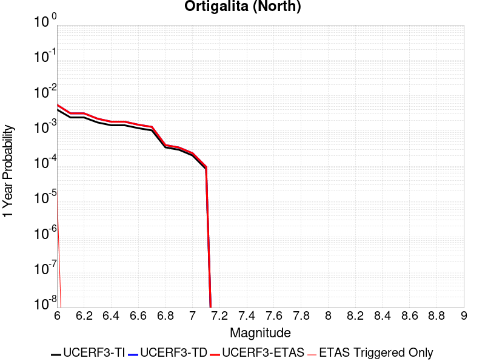 |  |

| Magnitude | 1 wk TI Prob | 1 wk TD Prob | 1 wk ETAS Prob | 1 wk ETAS/TD Gain | 1 wk ETAS Triggered Only | 1 mo TI Prob | 1 mo TD Prob | 1 mo ETAS Prob | 1 mo ETAS/TD Gain | 1 mo ETAS Triggered Only | 1 yr TI Prob | 1 yr TD Prob | 1 yr ETAS Prob | 1 yr ETAS/TD Gain | 1 yr ETAS Triggered Only | 10 yr TI Prob | 10 yr TD Prob | 10 yr ETAS Prob | 10 yr ETAS/TD Gain | 10 yr ETAS Triggered Only |
|-----|-----|-----|-----|-----|-----|-----|-----|-----|-----|-----|-----|-----|-----|-----|-----|-----|-----|-----|-----|-----|
| 6.0 | 7.711876E-5 | 1.05086016E-4 | 1.1547162E-4 | 1.0988295 | 1.0386697E-5 | 3.3046713E-4 | 4.5030177E-4 | 4.6068378E-4 | 1.0230557 | 1.0386697E-5 | 0.004016016 | 0.005468958 | 0.005479288 | 1.0018889 | 1.0386697E-5 | 0.039442103 | 0.053463764 | 0.0534736 | 1.0001839 | 1.0386697E-5 |
| 6.1 | 4.607858E-5 | 6.024935E-5 | 6.024935E-5 | 1.0 | 0.0 | 1.9746469E-4 | 2.5818875E-4 | 2.5818875E-4 | 1.0 | 0.0 | 0.0024014818 | 0.003139252 | 0.003139252 | 1.0 | 0.0 | 0.023756953 | 0.030979859 | 0.030979859 | 1.0 | 0.0 |
| 6.2 | 4.607858E-5 | 6.024935E-5 | 6.024935E-5 | 1.0 | 0.0 | 1.9746469E-4 | 2.5818875E-4 | 2.5818875E-4 | 1.0 | 0.0 | 0.0024014818 | 0.003139252 | 0.003139252 | 1.0 | 0.0 | 0.023756953 | 0.030979859 | 0.030979859 | 1.0 | 0.0 |
| 6.3 | 3.327423E-5 | 4.2481566E-5 | 4.2481566E-5 | 1.0 | 0.0 | 1.4259605E-4 | 1.8205289E-4 | 1.8205289E-4 | 1.0 | 0.0 | 0.0017347244 | 0.0022145277 | 0.0022145277 | 1.0 | 0.0 | 0.017212452 | 0.021948816 | 0.021948816 | 1.0 | 0.0 |
| 6.4 | 2.7732503E-5 | 3.5003635E-5 | 3.5003635E-5 | 1.0 | 0.0 | 1.1884817E-4 | 1.5000845E-4 | 1.5000845E-4 | 1.0 | 0.0 | 0.001446016 | 0.0018250674 | 0.0018250674 | 1.0 | 0.0 | 0.014366428 | 0.018123753 | 0.018123753 | 1.0 | 0.0 |
| 6.5 | 2.7689714E-5 | 3.4953442E-5 | 3.4953442E-5 | 1.0 | 0.0 | 1.186648E-4 | 1.4979337E-4 | 1.4979337E-4 | 1.0 | 0.0 | 0.0014437864 | 0.0018224533 | 0.0018224533 | 1.0 | 0.0 | 0.014344421 | 0.018098038 | 0.018098038 | 1.0 | 0.0 |
| 6.6 | 2.2976905E-5 | 2.8722226E-5 | 2.8722226E-5 | 1.0 | 0.0 | 9.846873E-5 | 1.2309088E-4 | 1.2309088E-4 | 1.0 | 0.0 | 0.0011981975 | 0.001497839 | 0.001497839 | 1.0 | 0.0 | 0.011917574 | 0.014900712 | 0.014900712 | 1.0 | 0.0 |
| 6.7 | 1.9871539E-5 | 2.4907882E-5 | 2.4907882E-5 | 1.0 | 0.0 | 8.516096E-5 | 1.067451E-4 | 1.067451E-4 | 1.0 | 0.0 | 0.0010363415 | 0.0012990955 | 0.0012990955 | 1.0 | 0.0 | 0.010315218 | 0.012938703 | 0.012938703 | 1.0 | 0.0 |
| 6.8 | 6.5640475E-6 | 7.6061337E-6 | 7.6061337E-6 | 1.0 | 0.0 | 2.813133E-5 | 3.2597323E-5 | 3.2597323E-5 | 1.0 | 0.0 | 3.424451E-4 | 3.9680302E-4 | 3.9680302E-4 | 1.0 | 0.0 | 0.0034191788 | 0.0039612325 | 0.0039612325 | 1.0 | 0.0 |
| 6.9 | 5.6219683E-6 | 6.5023783E-6 | 6.5023783E-6 | 1.0 | 0.0 | 2.4093928E-5 | 2.7867052E-5 | 2.7867052E-5 | 1.0 | 0.0 | 2.933041E-4 | 3.3923113E-4 | 3.3923113E-4 | 1.0 | 0.0 | 0.0029291727 | 0.00338739 | 0.00338739 | 1.0 | 0.0 |
| 7.0 | 3.875591E-6 | 4.4851295E-6 | 4.4851295E-6 | 1.0 | 0.0 | 1.6609569E-5 | 1.9221854E-5 | 1.9221854E-5 | 1.0 | 0.0 | 2.0220275E-4 | 2.3400305E-4 | 2.3400305E-4 | 1.0 | 0.0 | 0.0020201886 | 0.0023377747 | 0.0023377747 | 1.0 | 0.0 |
| 7.1 | 1.6017933E-6 | 1.857199E-6 | 1.857199E-6 | 1.0 | 0.0 | 6.8648105E-6 | 7.959406E-6 | 7.959406E-6 | 1.0 | 0.0 | 8.357586E-5 | 9.690253E-5 | 9.690253E-5 | 1.0 | 0.0 | 8.3544437E-4 | 9.6870743E-4 | 9.6870743E-4 | 1.0 | 0.0 |

## Trinidad (alt1)
*[(top)](#table-of-contents)*

| 1 Week | 1 Month | 1 Year | 10 Year |
|-----|-----|-----|-----|
|  |  |  |  |

| Magnitude | 1 wk TI Prob | 1 wk TD Prob | 1 wk ETAS Prob | 1 wk ETAS/TD Gain | 1 wk ETAS Triggered Only | 1 mo TI Prob | 1 mo TD Prob | 1 mo ETAS Prob | 1 mo ETAS/TD Gain | 1 mo ETAS Triggered Only | 1 yr TI Prob | 1 yr TD Prob | 1 yr ETAS Prob | 1 yr ETAS/TD Gain | 1 yr ETAS Triggered Only | 10 yr TI Prob | 10 yr TD Prob | 10 yr ETAS Prob | 10 yr ETAS/TD Gain | 10 yr ETAS Triggered Only |
|-----|-----|-----|-----|-----|-----|-----|-----|-----|-----|-----|-----|-----|-----|-----|-----|-----|-----|-----|-----|-----|
| 6.0 | 3.0167168E-5 | 3.40355E-5 | 3.40355E-5 | 1.0 | 0.0 | 1.2928146E-4 | 1.4585923E-4 | 1.4585923E-4 | 1.0 | 0.0 | 0.0015728653 | 0.0017745581 | 0.0017745581 | 1.0 | 0.0 | 0.0156177925 | 0.017620837 | 0.01763104 | 1.0005791 | 1.0386697E-5 |
| 6.1 | 3.0167168E-5 | 3.40355E-5 | 3.40355E-5 | 1.0 | 0.0 | 1.2928146E-4 | 1.4585923E-4 | 1.4585923E-4 | 1.0 | 0.0 | 0.0015728653 | 0.0017745581 | 0.0017745581 | 1.0 | 0.0 | 0.0156177925 | 0.017620837 | 0.01763104 | 1.0005791 | 1.0386697E-5 |
| 6.2 | 3.0167168E-5 | 3.40355E-5 | 3.40355E-5 | 1.0 | 0.0 | 1.2928146E-4 | 1.4585923E-4 | 1.4585923E-4 | 1.0 | 0.0 | 0.0015728653 | 0.0017745581 | 0.0017745581 | 1.0 | 0.0 | 0.0156177925 | 0.017620837 | 0.01763104 | 1.0005791 | 1.0386697E-5 |
| 6.3 | 3.0167168E-5 | 3.40355E-5 | 3.40355E-5 | 1.0 | 0.0 | 1.2928146E-4 | 1.4585923E-4 | 1.4585923E-4 | 1.0 | 0.0 | 0.0015728653 | 0.0017745581 | 0.0017745581 | 1.0 | 0.0 | 0.0156177925 | 0.017620837 | 0.01763104 | 1.0005791 | 1.0386697E-5 |
| 6.4 | 3.0167168E-5 | 3.40355E-5 | 3.40355E-5 | 1.0 | 0.0 | 1.2928146E-4 | 1.4585923E-4 | 1.4585923E-4 | 1.0 | 0.0 | 0.0015728653 | 0.0017745581 | 0.0017745581 | 1.0 | 0.0 | 0.0156177925 | 0.017620837 | 0.01763104 | 1.0005791 | 1.0386697E-5 |
| 6.5 | 3.0167168E-5 | 3.40355E-5 | 3.40355E-5 | 1.0 | 0.0 | 1.2928146E-4 | 1.4585923E-4 | 1.4585923E-4 | 1.0 | 0.0 | 0.0015728653 | 0.0017745581 | 0.0017745581 | 1.0 | 0.0 | 0.0156177925 | 0.017620837 | 0.01763104 | 1.0005791 | 1.0386697E-5 |
| 6.6 | 3.0167168E-5 | 3.40355E-5 | 3.40355E-5 | 1.0 | 0.0 | 1.2928146E-4 | 1.4585923E-4 | 1.4585923E-4 | 1.0 | 0.0 | 0.0015728653 | 0.0017745581 | 0.0017745581 | 1.0 | 0.0 | 0.0156177925 | 0.017620837 | 0.01763104 | 1.0005791 | 1.0386697E-5 |
| 6.7 | 3.0167168E-5 | 3.40355E-5 | 3.40355E-5 | 1.0 | 0.0 | 1.2928146E-4 | 1.4585923E-4 | 1.4585923E-4 | 1.0 | 0.0 | 0.0015728653 | 0.0017745581 | 0.0017745581 | 1.0 | 0.0 | 0.0156177925 | 0.017620837 | 0.01763104 | 1.0005791 | 1.0386697E-5 |
| 6.8 | 1.717077E-5 | 1.9196885E-5 | 1.9196885E-5 | 1.0 | 0.0 | 7.358694E-5 | 8.2270024E-5 | 8.2270024E-5 | 1.0 | 0.0 | 8.9555274E-4 | 0.0010012218 | 0.0010012218 | 1.0 | 0.0 | 0.008919522 | 0.00997156 | 0.009981844 | 1.0010313 | 1.0386697E-5 |
| 6.9 | 1.717077E-5 | 1.9196885E-5 | 1.9196885E-5 | 1.0 | 0.0 | 7.358694E-5 | 8.2270024E-5 | 8.2270024E-5 | 1.0 | 0.0 | 8.9555274E-4 | 0.0010012218 | 0.0010012218 | 1.0 | 0.0 | 0.008919522 | 0.00997156 | 0.009981844 | 1.0010313 | 1.0386697E-5 |
| 7.0 | 1.2858572E-5 | 1.4338246E-5 | 1.4338246E-5 | 1.0 | 0.0 | 5.5107E-5 | 6.144836E-5 | 6.144836E-5 | 1.0 | 0.0 | 6.707212E-4 | 7.479091E-4 | 7.479091E-4 | 1.0 | 0.0 | 0.006687004 | 0.0074570994 | 0.0074570994 | 1.0 | 0.0 |
| 7.1 | 1.0588431E-5 | 1.1801987E-5 | 1.1801987E-5 | 1.0 | 0.0 | 4.53782E-5 | 5.0579125E-5 | 5.0579125E-5 | 1.0 | 0.0 | 5.5233954E-4 | 6.156558E-4 | 6.156558E-4 | 1.0 | 0.0 | 0.005509687 | 0.006142352 | 0.006142352 | 1.0 | 0.0 |
| 7.2 | 8.138061E-6 | 9.067763E-6 | 9.067763E-6 | 1.0 | 0.0 | 3.487694E-5 | 3.8861403E-5 | 3.8861403E-5 | 1.0 | 0.0 | 4.2454398E-4 | 4.730597E-4 | 4.730597E-4 | 1.0 | 0.0 | 0.0042373384 | 0.004722968 | 0.004722968 | 1.0 | 0.0 |
| 7.3 | 5.787542E-6 | 6.460719E-6 | 6.460719E-6 | 1.0 | 0.0 | 2.4803514E-5 | 2.7688622E-5 | 2.7688622E-5 | 1.0 | 0.0 | 3.0194095E-4 | 3.3707835E-4 | 3.3707835E-4 | 1.0 | 0.0 | 0.00301531 | 0.0033677819 | 0.0033677819 | 1.0 | 0.0 |
| 7.4 | 4.303563E-6 | 4.8011457E-6 | 4.8011457E-6 | 1.0 | 0.0 | 1.844371E-5 | 2.0576288E-5 | 2.0576288E-5 | 1.0 | 0.0 | 2.2452902E-4 | 2.5050726E-4 | 2.5050726E-4 | 1.0 | 0.0 | 0.0022430231 | 0.0025041874 | 0.0025041874 | 1.0 | 0.0 |
| 7.5 | 5.6063425E-7 | 6.1432945E-7 | 6.1432945E-7 | 1.0 | 0.0 | 2.402716E-6 | 2.6328378E-6 | 2.6328378E-6 | 1.0 | 0.0 | 2.9252675E-5 | 3.2054344E-5 | 3.2054344E-5 | 1.0 | 0.0 | 2.9248823E-4 | 3.2049877E-4 | 3.2049877E-4 | 1.0 | 0.0 |
| 7.6 | 4.6699128E-7 | 5.126065E-7 | 5.126065E-7 | 1.0 | 0.0 | 2.0013897E-6 | 2.1968833E-6 | 2.1968833E-6 | 1.0 | 0.0 | 2.4366647E-5 | 2.6746739E-5 | 2.6746739E-5 | 1.0 | 0.0 | 2.4363975E-4 | 2.674366E-4 | 2.674366E-4 | 1.0 | 0.0 |
| 7.7 | 2.2080937E-7 | 2.4348222E-7 | 2.4348222E-7 | 1.0 | 0.0 | 9.4632554E-7 | 1.0434949E-6 | 1.0434949E-6 | 1.0 | 0.0 | 1.15214525E-5 | 1.2704482E-5 | 1.2704482E-5 | 1.0 | 0.0 | 1.1520855E-4 | 1.2703816E-4 | 1.2703816E-4 | 1.0 | 0.0 |
| 7.8 | 1.1438307E-8 | 1.2683695E-8 | 1.2683695E-8 | 1.0 | 0.0 | 4.9021317E-8 | 5.4358694E-8 | 5.4358694E-8 | 1.0 | 0.0 | 5.9683435E-7 | 6.6181707E-7 | 6.6181707E-7 | 1.0 | 0.0 | 5.9683275E-6 | 6.618171E-6 | 6.618171E-6 | 1.0 | 0.0 |

## Hartley Springs 2011 CFM
*[(top)](#table-of-contents)*

| 1 Week | 1 Month | 1 Year | 10 Year |
|-----|-----|-----|-----|
|  |  |  | 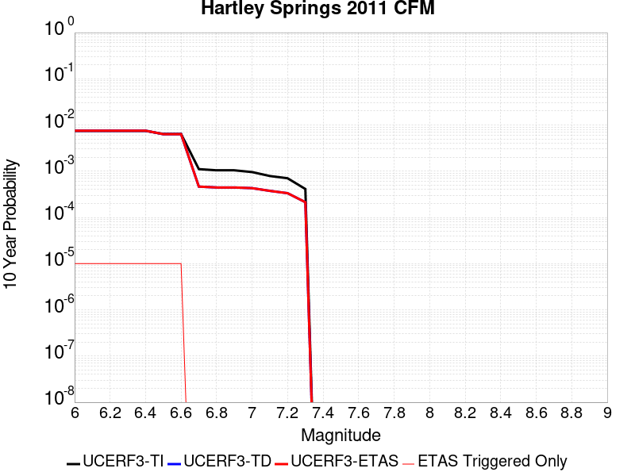 |

| Magnitude | 1 wk TI Prob | 1 wk TD Prob | 1 wk ETAS Prob | 1 wk ETAS/TD Gain | 1 wk ETAS Triggered Only | 1 mo TI Prob | 1 mo TD Prob | 1 mo ETAS Prob | 1 mo ETAS/TD Gain | 1 mo ETAS Triggered Only | 1 yr TI Prob | 1 yr TD Prob | 1 yr ETAS Prob | 1 yr ETAS/TD Gain | 1 yr ETAS Triggered Only | 10 yr TI Prob | 10 yr TD Prob | 10 yr ETAS Prob | 10 yr ETAS/TD Gain | 10 yr ETAS Triggered Only |
|-----|-----|-----|-----|-----|-----|-----|-----|-----|-----|-----|-----|-----|-----|-----|-----|-----|-----|-----|-----|-----|
| 6.0 | 1.4352418E-5 | 1.443567E-5 | 1.443567E-5 | 1.0 | 0.0 | 6.1508916E-5 | 6.1866616E-5 | 6.1866616E-5 | 1.0 | 0.0 | 7.486137E-4 | 7.531302E-4 | 7.531302E-4 | 1.0 | 0.0 | 0.007460968 | 0.0075219013 | 0.0075322096 | 1.0013704 | 1.0386697E-5 |
| 6.1 | 1.4352418E-5 | 1.443567E-5 | 1.443567E-5 | 1.0 | 0.0 | 6.1508916E-5 | 6.1866616E-5 | 6.1866616E-5 | 1.0 | 0.0 | 7.486137E-4 | 7.531302E-4 | 7.531302E-4 | 1.0 | 0.0 | 0.007460968 | 0.0075219013 | 0.0075322096 | 1.0013704 | 1.0386697E-5 |
| 6.2 | 1.4352418E-5 | 1.443567E-5 | 1.443567E-5 | 1.0 | 0.0 | 6.1508916E-5 | 6.1866616E-5 | 6.1866616E-5 | 1.0 | 0.0 | 7.486137E-4 | 7.531302E-4 | 7.531302E-4 | 1.0 | 0.0 | 0.007460968 | 0.0075219013 | 0.0075322096 | 1.0013704 | 1.0386697E-5 |
| 6.3 | 1.4352418E-5 | 1.443567E-5 | 1.443567E-5 | 1.0 | 0.0 | 6.1508916E-5 | 6.1866616E-5 | 6.1866616E-5 | 1.0 | 0.0 | 7.486137E-4 | 7.531302E-4 | 7.531302E-4 | 1.0 | 0.0 | 0.007460968 | 0.0075219013 | 0.0075322096 | 1.0013704 | 1.0386697E-5 |
| 6.4 | 1.4352418E-5 | 1.443567E-5 | 1.443567E-5 | 1.0 | 0.0 | 6.1508916E-5 | 6.1866616E-5 | 6.1866616E-5 | 1.0 | 0.0 | 7.486137E-4 | 7.531302E-4 | 7.531302E-4 | 1.0 | 0.0 | 0.007460968 | 0.0075219013 | 0.0075322096 | 1.0013704 | 1.0386697E-5 |
| 6.5 | 1.2279858E-5 | 1.213446E-5 | 1.213446E-5 | 1.0 | 0.0 | 5.26269E-5 | 5.200468E-5 | 5.200468E-5 | 1.0 | 0.0 | 6.4054417E-4 | 6.3313125E-4 | 6.3313125E-4 | 1.0 | 0.0 | 0.0063870098 | 0.0063287886 | 0.0063391095 | 1.0016308 | 1.0386697E-5 |
| 6.6 | 1.2279858E-5 | 1.213446E-5 | 1.213446E-5 | 1.0 | 0.0 | 5.26269E-5 | 5.200468E-5 | 5.200468E-5 | 1.0 | 0.0 | 6.4054417E-4 | 6.3313125E-4 | 6.3313125E-4 | 1.0 | 0.0 | 0.0063870098 | 0.0063287886 | 0.0063391095 | 1.0016308 | 1.0386697E-5 |
| 6.7 | 2.1282601E-6 | 8.901952E-7 | 8.901952E-7 | 1.0 | 0.0 | 9.121083E-6 | 3.8151184E-6 | 3.8151184E-6 | 1.0 | 0.0 | 1.11043526E-4 | 4.6448335E-5 | 4.6448335E-5 | 1.0 | 0.0 | 0.0011098806 | 4.644116E-4 | 4.644116E-4 | 1.0 | 0.0 |
| 6.8 | 2.00516E-6 | 8.5246234E-7 | 8.5246234E-7 | 1.0 | 0.0 | 8.593515E-6 | 3.6534063E-6 | 3.6534063E-6 | 1.0 | 0.0 | 1.04621024E-4 | 4.447957E-5 | 4.447957E-5 | 1.0 | 0.0 | 0.0010457177 | 4.4473185E-4 | 4.4473185E-4 | 1.0 | 0.0 |
| 6.9 | 2.00516E-6 | 8.5246234E-7 | 8.5246234E-7 | 1.0 | 0.0 | 8.593515E-6 | 3.6534063E-6 | 3.6534063E-6 | 1.0 | 0.0 | 1.04621024E-4 | 4.447957E-5 | 4.447957E-5 | 1.0 | 0.0 | 0.0010457177 | 4.4473185E-4 | 4.4473185E-4 | 1.0 | 0.0 |
| 7.0 | 1.8366732E-6 | 8.2442216E-7 | 8.2442216E-7 | 1.0 | 0.0 | 7.871433E-6 | 3.5332346E-6 | 3.5332346E-6 | 1.0 | 0.0 | 9.583048E-5 | 4.301654E-5 | 4.301654E-5 | 1.0 | 0.0 | 9.5789164E-4 | 4.3010717E-4 | 4.3010717E-4 | 1.0 | 0.0 |
| 7.1 | 1.5097997E-6 | 7.19692E-7 | 7.19692E-7 | 1.0 | 0.0 | 6.470554E-6 | 3.0843921E-6 | 3.0843921E-6 | 1.0 | 0.0 | 7.877615E-5 | 3.755207E-5 | 3.755207E-5 | 1.0 | 0.0 | 7.874823E-4 | 3.7548094E-4 | 3.7548094E-4 | 1.0 | 0.0 |
| 7.2 | 1.3490993E-6 | 6.4117984E-7 | 6.4117984E-7 | 1.0 | 0.0 | 5.7818415E-6 | 2.747912E-6 | 2.747912E-6 | 1.0 | 0.0 | 7.0391645E-5 | 3.3455548E-5 | 3.3455548E-5 | 1.0 | 0.0 | 7.0369354E-4 | 3.345281E-4 | 3.345281E-4 | 1.0 | 0.0 |
| 7.3 | 7.900015E-7 | 4.0894028E-7 | 4.0894028E-7 | 1.0 | 0.0 | 3.3857161E-6 | 1.7526012E-6 | 1.7526012E-6 | 1.0 | 0.0 | 4.1220315E-5 | 2.1337919E-5 | 2.1337919E-5 | 1.0 | 0.0 | 4.121267E-4 | 2.133792E-4 | 2.133792E-4 | 1.0 | 0.0 |

## San Andreas (Offshore) 2011 CFM
*[(top)](#table-of-contents)*

| 1 Week | 1 Month | 1 Year | 10 Year |
|-----|-----|-----|-----|
|  |  |  |  |

| Magnitude | 1 wk TI Prob | 1 wk TD Prob | 1 wk ETAS Prob | 1 wk ETAS/TD Gain | 1 wk ETAS Triggered Only | 1 mo TI Prob | 1 mo TD Prob | 1 mo ETAS Prob | 1 mo ETAS/TD Gain | 1 mo ETAS Triggered Only | 1 yr TI Prob | 1 yr TD Prob | 1 yr ETAS Prob | 1 yr ETAS/TD Gain | 1 yr ETAS Triggered Only | 10 yr TI Prob | 10 yr TD Prob | 10 yr ETAS Prob | 10 yr ETAS/TD Gain | 10 yr ETAS Triggered Only |
|-----|-----|-----|-----|-----|-----|-----|-----|-----|-----|-----|-----|-----|-----|-----|-----|-----|-----|-----|-----|-----|
| 6.0 | 1.7072787E-4 | 1.9243768E-4 | 1.9243768E-4 | 1.0 | 0.0 | 7.3148566E-4 | 8.244747E-4 | 8.244747E-4 | 1.0 | 0.0 | 0.008869528 | 0.009992293 | 0.009992293 | 1.0 | 0.0 | 0.085237645 | 0.09690714 | 0.09691652 | 1.0000968 | 1.0386697E-5 |
| 6.1 | 1.7072787E-4 | 1.9243768E-4 | 1.9243768E-4 | 1.0 | 0.0 | 7.3148566E-4 | 8.244747E-4 | 8.244747E-4 | 1.0 | 0.0 | 0.008869528 | 0.009992293 | 0.009992293 | 1.0 | 0.0 | 0.085237645 | 0.09690714 | 0.09691652 | 1.0000968 | 1.0386697E-5 |
| 6.2 | 1.6312556E-4 | 1.8424621E-4 | 1.8424621E-4 | 1.0 | 0.0 | 6.989222E-4 | 7.8939006E-4 | 7.8939006E-4 | 1.0 | 0.0 | 0.008476226 | 0.00956897 | 0.00956897 | 1.0 | 0.0 | 0.08160117 | 0.09292438 | 0.0929338 | 1.0001014 | 1.0386697E-5 |
| 6.3 | 1.5103363E-4 | 1.6896211E-4 | 1.6896211E-4 | 1.0 | 0.0 | 6.471264E-4 | 7.2392455E-4 | 7.2392455E-4 | 1.0 | 0.0 | 0.007850339 | 0.0087786075 | 0.0087786075 | 1.0 | 0.0 | 0.075787395 | 0.08556006 | 0.08556956 | 1.000111 | 1.0386697E-5 |
| 6.4 | 1.5047993E-4 | 1.6782133E-4 | 1.6782133E-4 | 1.0 | 0.0 | 6.4475456E-4 | 7.1903825E-4 | 7.1903825E-4 | 1.0 | 0.0 | 0.007821669 | 0.008719592 | 0.008719592 | 1.0 | 0.0 | 0.0755203 | 0.08504028 | 0.08504978 | 1.0001117 | 1.0386697E-5 |
| 6.5 | 1.2760791E-4 | 1.3748009E-4 | 1.3748009E-4 | 1.0 | 0.0 | 5.467764E-4 | 5.8906875E-4 | 5.8906875E-4 | 1.0 | 0.0 | 0.0066367025 | 0.007148602 | 0.007148602 | 1.0 | 0.0 | 0.064419635 | 0.07031143 | 0.07032108 | 1.0001373 | 1.0386697E-5 |
| 6.6 | 1.1063525E-4 | 1.1567755E-4 | 1.1567755E-4 | 1.0 | 0.0 | 4.740649E-4 | 4.956678E-4 | 4.956678E-4 | 1.0 | 0.0 | 0.0057564764 | 0.006018259 | 0.006018259 | 1.0 | 0.0 | 0.05609626 | 0.05954285 | 0.059552617 | 1.000164 | 1.0386697E-5 |
| 6.7 | 1.0391049E-4 | 1.06563464E-4 | 1.06563464E-4 | 1.0 | 0.0 | 4.4525467E-4 | 4.566216E-4 | 4.566216E-4 | 1.0 | 0.0 | 0.0054075094 | 0.0055453847 | 0.0055453847 | 1.0 | 0.0 | 0.052778035 | 0.05503986 | 0.055049676 | 1.0001783 | 1.0386697E-5 |
| 6.8 | 1.0096706E-4 | 1.0168416E-4 | 1.0168416E-4 | 1.0 | 0.0 | 4.3264418E-4 | 4.3571746E-4 | 4.3571746E-4 | 1.0 | 0.0 | 0.0052547283 | 0.005292134 | 0.005292134 | 1.0 | 0.0 | 0.051321987 | 0.052737482 | 0.05274732 | 1.0001866 | 1.0386697E-5 |
| 6.9 | 9.800265E-5 | 9.598679E-5 | 9.598679E-5 | 1.0 | 0.0 | 4.1994374E-4 | 4.11308E-4 | 4.11308E-4 | 1.0 | 0.0 | 0.0051008356 | 0.0049963454 | 0.0049963454 | 1.0 | 0.0 | 0.049853306 | 0.05006405 | 0.050073918 | 1.000197 | 1.0386697E-5 |
| 7.0 | 9.4642375E-5 | 9.0118105E-5 | 9.0118105E-5 | 1.0 | 0.0 | 4.0554712E-4 | 3.8616415E-4 | 3.8616415E-4 | 1.0 | 0.0 | 0.004926363 | 0.0046915757 | 0.0046915757 | 1.0 | 0.0 | 0.048185747 | 0.047243945 | 0.04725384 | 1.0002095 | 1.0386697E-5 |
| 7.1 | 9.0996844E-5 | 8.363557E-5 | 8.363557E-5 | 1.0 | 0.0 | 3.8992817E-4 | 3.5838978E-4 | 3.5838978E-4 | 1.0 | 0.0 | 0.004737046 | 0.004354822 | 0.004354822 | 1.0 | 0.0 | 0.04637333 | 0.044094373 | 0.044104304 | 1.0002252 | 1.0386697E-5 |
| 7.2 | 8.848287E-5 | 7.9909514E-5 | 7.9909514E-5 | 1.0 | 0.0 | 3.791572E-4 | 3.4242525E-4 | 3.4242525E-4 | 1.0 | 0.0 | 0.004606472 | 0.004161212 | 0.004161212 | 1.0 | 0.0 | 0.045121472 | 0.04223721 | 0.04224716 | 1.0002356 | 1.0386697E-5 |
| 7.3 | 7.9280784E-5 | 6.135467E-5 | 6.135467E-5 | 1.0 | 0.0 | 3.3973053E-4 | 2.6292267E-4 | 2.6292267E-4 | 1.0 | 0.0 | 0.004128377 | 0.0031964872 | 0.0031964872 | 1.0 | 0.0 | 0.040525194 | 0.032944594 | 0.032954637 | 1.0003049 | 1.0386697E-5 |
| 7.4 | 6.468038E-5 | 3.798989E-5 | 3.798989E-5 | 1.0 | 0.0 | 2.771722E-4 | 1.6280398E-4 | 1.6280398E-4 | 1.0 | 0.0 | 0.0033693502 | 0.0019803944 | 0.0019803944 | 1.0 | 0.0 | 0.0331872 | 0.020852158 | 0.020862328 | 1.0004877 | 1.0386697E-5 |
| 7.5 | 4.930574E-5 | 1.2737067E-5 | 1.2737067E-5 | 1.0 | 0.0 | 2.1129321E-4 | 5.4586293E-5 | 5.4586293E-5 | 1.0 | 0.0 | 0.0025694598 | 6.643871E-4 | 6.643871E-4 | 1.0 | 0.0 | 0.02539953 | 0.007501229 | 0.007511538 | 1.0013742 | 1.0386697E-5 |
| 7.6 | 4.612566E-5 | 1.0366656E-5 | 1.0366656E-5 | 1.0 | 0.0 | 1.9766642E-4 | 4.442778E-5 | 4.442778E-5 | 1.0 | 0.0 | 0.0024039324 | 5.4077536E-4 | 5.4077536E-4 | 1.0 | 0.0 | 0.023780935 | 0.0061902013 | 0.0062005236 | 1.0016675 | 1.0386697E-5 |
| 7.7 | 3.9435414E-5 | 5.598791E-6 | 5.598791E-6 | 1.0 | 0.0 | 1.6899795E-4 | 2.39946E-5 | 2.39946E-5 | 1.0 | 0.0 | 0.0020556084 | 2.9209527E-4 | 2.9209527E-4 | 1.0 | 0.0 | 0.020366974 | 0.003556676 | 0.0035670258 | 1.0029099 | 1.0386697E-5 |
| 7.8 | 2.7787428E-5 | 3.7729496E-6 | 3.7729496E-6 | 1.0 | 0.0 | 1.1908354E-4 | 1.6169684E-5 | 1.6169684E-5 | 1.0 | 0.0 | 0.0014488777 | 1.9684815E-4 | 1.9684815E-4 | 1.0 | 0.0 | 0.014394675 | 0.0023984525 | 0.0024088142 | 1.0043201 | 1.0386697E-5 |
| 7.9 | 1.590671E-5 | 3.0548313E-6 | 3.0548313E-6 | 1.0 | 0.0 | 6.816983E-5 | 1.3092068E-5 | 1.3092068E-5 | 1.0 | 0.0 | 8.2965166E-4 | 1.593843E-4 | 1.593843E-4 | 1.0 | 0.0 | 0.008265611 | 0.001912608 | 0.0019229748 | 1.0054202 | 1.0386697E-5 |
| 8.0 | 9.193638E-6 | 2.6035711E-6 | 2.6035711E-6 | 1.0 | 0.0 | 3.940071E-5 | 1.1158115E-5 | 1.1158115E-5 | 1.0 | 0.0 | 4.7959806E-4 | 1.358416E-4 | 1.358416E-4 | 1.0 | 0.0 | 0.0047856434 | 0.0016181957 | 0.0016285656 | 1.0064083 | 1.0386697E-5 |
| 8.1 | 5.601576E-6 | 2.2447791E-6 | 2.2447791E-6 | 1.0 | 0.0 | 2.4006533E-5 | 9.620446E-6 | 9.620446E-6 | 1.0 | 0.0 | 2.9224035E-4 | 1.1712267E-4 | 1.1712267E-4 | 1.0 | 0.0 | 0.0029185633 | 0.0014080945 | 0.0014184666 | 1.0073661 | 1.0386697E-5 |
| 8.2 | 4.3508785E-6 | 1.8661184E-6 | 1.8661184E-6 | 1.0 | 0.0 | 1.864649E-5 | 7.997626E-6 | 7.997626E-6 | 1.0 | 0.0 | 2.2699735E-4 | 9.736677E-5 | 9.736677E-5 | 1.0 | 0.0 | 0.0022676561 | 0.0011643195 | 0.0011643195 | 1.0 | 0.0 |
| 8.3 | 1.9573292E-6 | 7.547989E-7 | 7.547989E-7 | 1.0 | 0.0 | 8.388526E-6 | 3.2348487E-6 | 3.2348487E-6 | 1.0 | 0.0 | 1.0212552E-4 | 3.9383587E-5 | 3.9383587E-5 | 1.0 | 0.0 | 0.001020786 | 4.6598504E-4 | 4.6598504E-4 | 1.0 | 0.0 |

## Gillem - Big Crack 2011 CFM
*[(top)](#table-of-contents)*

| 1 Week | 1 Month | 1 Year | 10 Year |
|-----|-----|-----|-----|
|  |  |  |  |

| Magnitude | 1 wk TI Prob | 1 wk TD Prob | 1 wk ETAS Prob | 1 wk ETAS/TD Gain | 1 wk ETAS Triggered Only | 1 mo TI Prob | 1 mo TD Prob | 1 mo ETAS Prob | 1 mo ETAS/TD Gain | 1 mo ETAS Triggered Only | 1 yr TI Prob | 1 yr TD Prob | 1 yr ETAS Prob | 1 yr ETAS/TD Gain | 1 yr ETAS Triggered Only | 10 yr TI Prob | 10 yr TD Prob | 10 yr ETAS Prob | 10 yr ETAS/TD Gain | 10 yr ETAS Triggered Only |
|-----|-----|-----|-----|-----|-----|-----|-----|-----|-----|-----|-----|-----|-----|-----|-----|-----|-----|-----|-----|-----|
| 6.0 | 2.196852E-5 | 2.3605418E-5 | 2.3605418E-5 | 1.0 | 0.0 | 9.4147406E-5 | 1.0116266E-4 | 1.0116266E-4 | 1.0 | 0.0 | 0.0011456419 | 0.0012310484 | 0.0012310484 | 1.0 | 0.0 | 0.011397537 | 0.012251151 | 0.01226141 | 1.0008374 | 1.0386697E-5 |
| 6.1 | 9.992795E-6 | 1.0712299E-5 | 1.0712299E-5 | 1.0 | 0.0 | 4.2825563E-5 | 4.590915E-5 | 4.590915E-5 | 1.0 | 0.0 | 5.2127644E-4 | 5.5881887E-4 | 5.5881887E-4 | 1.0 | 0.0 | 0.0052005537 | 0.005575947 | 0.005575947 | 1.0 | 0.0 |
| 6.2 | 9.992795E-6 | 1.0712299E-5 | 1.0712299E-5 | 1.0 | 0.0 | 4.2825563E-5 | 4.590915E-5 | 4.590915E-5 | 1.0 | 0.0 | 5.2127644E-4 | 5.5881887E-4 | 5.5881887E-4 | 1.0 | 0.0 | 0.0052005537 | 0.005575947 | 0.005575947 | 1.0 | 0.0 |
| 6.3 | 4.6127884E-6 | 4.9428445E-6 | 4.9428445E-6 | 1.0 | 0.0 | 1.9768944E-5 | 2.1183472E-5 | 2.1183472E-5 | 1.0 | 0.0 | 2.406603E-4 | 2.578827E-4 | 2.578827E-4 | 1.0 | 0.0 | 0.0024039985 | 0.0025762727 | 0.0025762727 | 1.0 | 0.0 |
| 6.4 | 4.6127884E-6 | 4.9428445E-6 | 4.9428445E-6 | 1.0 | 0.0 | 1.9768944E-5 | 2.1183472E-5 | 2.1183472E-5 | 1.0 | 0.0 | 2.406603E-4 | 2.578827E-4 | 2.578827E-4 | 1.0 | 0.0 | 0.0024039985 | 0.0025762727 | 0.0025762727 | 1.0 | 0.0 |
| 6.5 | 2.716712E-6 | 2.9112218E-6 | 2.9112218E-6 | 1.0 | 0.0 | 1.1643E-5 | 1.2476619E-5 | 1.2476619E-5 | 1.0 | 0.0 | 1.417443E-4 | 1.5189468E-4 | 1.5189468E-4 | 1.0 | 0.0 | 0.0014165393 | 0.0015181466 | 0.0015181466 | 1.0 | 0.0 |
| 6.6 | 1.3818255E-6 | 1.482126E-6 | 1.482126E-6 | 1.0 | 0.0 | 5.922096E-6 | 6.3519597E-6 | 6.3519597E-6 | 1.0 | 0.0 | 7.209913E-5 | 7.73336E-5 | 7.73336E-5 | 1.0 | 0.0 | 7.2075747E-4 | 7.731878E-4 | 7.731878E-4 | 1.0 | 0.0 |

## Carlsbad
*[(top)](#table-of-contents)*

| 1 Week | 1 Month | 1 Year | 10 Year |
|-----|-----|-----|-----|
|  |  |  |  |

| Magnitude | 1 wk TI Prob | 1 wk TD Prob | 1 wk ETAS Prob | 1 wk ETAS/TD Gain | 1 wk ETAS Triggered Only | 1 mo TI Prob | 1 mo TD Prob | 1 mo ETAS Prob | 1 mo ETAS/TD Gain | 1 mo ETAS Triggered Only | 1 yr TI Prob | 1 yr TD Prob | 1 yr ETAS Prob | 1 yr ETAS/TD Gain | 1 yr ETAS Triggered Only | 10 yr TI Prob | 10 yr TD Prob | 10 yr ETAS Prob | 10 yr ETAS/TD Gain | 10 yr ETAS Triggered Only |
|-----|-----|-----|-----|-----|-----|-----|-----|-----|-----|-----|-----|-----|-----|-----|-----|-----|-----|-----|-----|-----|
| 6.0 | 4.9038536E-6 | 4.9873843E-6 | 4.9873843E-6 | 1.0 | 0.0 | 2.1016345E-5 | 2.1374331E-5 | 2.1374331E-5 | 1.0 | 0.0 | 2.5584397E-4 | 2.6020186E-4 | 2.6020186E-4 | 1.0 | 0.0 | 0.002555496 | 0.002599019 | 0.002609379 | 1.003986 | 1.0386697E-5 |
| 6.1 | 4.9038536E-6 | 4.9873843E-6 | 4.9873843E-6 | 1.0 | 0.0 | 2.1016345E-5 | 2.1374331E-5 | 2.1374331E-5 | 1.0 | 0.0 | 2.5584397E-4 | 2.6020186E-4 | 2.6020186E-4 | 1.0 | 0.0 | 0.002555496 | 0.002599019 | 0.002609379 | 1.003986 | 1.0386697E-5 |
| 6.2 | 4.3820614E-6 | 4.454891E-6 | 4.454891E-6 | 1.0 | 0.0 | 1.8780129E-5 | 1.9092251E-5 | 1.9092251E-5 | 1.0 | 0.0 | 2.2862408E-4 | 2.3242371E-4 | 2.3242371E-4 | 1.0 | 0.0 | 0.00228389 | 0.0023218421 | 0.0023322047 | 1.0044631 | 1.0386697E-5 |
| 6.3 | 4.302872E-6 | 4.373127E-6 | 4.373127E-6 | 1.0 | 0.0 | 1.8440749E-5 | 1.8741839E-5 | 1.8741839E-5 | 1.0 | 0.0 | 2.24493E-4 | 2.2815836E-4 | 2.2815836E-4 | 1.0 | 0.0 | 0.0022426634 | 0.0022792763 | 0.0022896393 | 1.0045466 | 1.0386697E-5 |
| 6.4 | 4.0835243E-6 | 4.147772E-6 | 4.147772E-6 | 1.0 | 0.0 | 1.75007E-5 | 1.7776047E-5 | 1.7776047E-5 | 1.0 | 0.0 | 2.1305021E-4 | 2.164022E-4 | 2.164022E-4 | 1.0 | 0.0 | 0.0021284607 | 0.0021619487 | 0.002172313 | 1.0047939 | 1.0386697E-5 |
| 6.5 | 3.987806E-6 | 4.049002E-6 | 4.049002E-6 | 1.0 | 0.0 | 1.7090486E-5 | 1.7352753E-5 | 1.7352753E-5 | 1.0 | 0.0 | 2.080568E-4 | 2.1124963E-4 | 2.1124963E-4 | 1.0 | 0.0 | 0.002078621 | 0.002110522 | 0.002110522 | 1.0 | 0.0 |
| 6.6 | 3.8707576E-6 | 3.927601E-6 | 3.927601E-6 | 1.0 | 0.0 | 1.6588854E-5 | 1.683247E-5 | 1.683247E-5 | 1.0 | 0.0 | 2.0195059E-4 | 2.0491637E-4 | 2.0491637E-4 | 1.0 | 0.0 | 0.0020176715 | 0.0020473078 | 0.0020473078 | 1.0 | 0.0 |
| 6.7 | 3.3093434E-6 | 3.3424908E-6 | 3.3424908E-6 | 1.0 | 0.0 | 1.4182823E-5 | 1.4324883E-5 | 1.4324883E-5 | 1.0 | 0.0 | 1.7266218E-4 | 1.7439153E-4 | 1.7439153E-4 | 1.0 | 0.0 | 0.001725281 | 0.001742553 | 0.001742553 | 1.0 | 0.0 |
| 6.8 | 3.136983E-6 | 3.1665475E-6 | 3.1665475E-6 | 1.0 | 0.0 | 1.3444143E-5 | 1.3570848E-5 | 1.3570848E-5 | 1.0 | 0.0 | 1.6367015E-4 | 1.652126E-4 | 1.652126E-4 | 1.0 | 0.0 | 0.0016354966 | 0.0016509035 | 0.0016509035 | 1.0 | 0.0 |
| 6.9 | 2.9056644E-6 | 2.9268454E-6 | 2.9268454E-6 | 1.0 | 0.0 | 1.2452788E-5 | 1.2543563E-5 | 1.2543563E-5 | 1.0 | 0.0 | 1.5160214E-4 | 1.5270723E-4 | 1.5270723E-4 | 1.0 | 0.0 | 0.0015149876 | 0.0015260283 | 0.0015260283 | 1.0 | 0.0 |
| 7.0 | 2.5071035E-6 | 2.5114732E-6 | 2.5114732E-6 | 1.0 | 0.0 | 1.0744685E-5 | 1.0763412E-5 | 1.0763412E-5 | 1.0 | 0.0 | 1.308087E-4 | 1.310367E-4 | 1.310367E-4 | 1.0 | 0.0 | 0.0013073172 | 0.0013095976 | 0.0013095976 | 1.0 | 0.0 |
| 7.1 | 2.1786877E-6 | 2.1679489E-6 | 2.1679489E-6 | 1.0 | 0.0 | 9.3372E-6 | 9.291177E-6 | 9.291177E-6 | 1.0 | 0.0 | 1.13674476E-4 | 1.13114234E-4 | 1.13114234E-4 | 1.0 | 0.0 | 0.0011361635 | 0.0011305695 | 0.0011305695 | 1.0 | 0.0 |
| 7.2 | 1.6628418E-6 | 1.6214341E-6 | 1.6214341E-6 | 1.0 | 0.0 | 7.1264453E-6 | 6.9489847E-6 | 6.9489847E-6 | 1.0 | 0.0 | 8.676102E-5 | 8.460063E-5 | 8.460063E-5 | 1.0 | 0.0 | 8.672715E-4 | 8.456864E-4 | 8.456864E-4 | 1.0 | 0.0 |
| 7.3 | 1.0595926E-6 | 9.817035E-7 | 9.817035E-7 | 1.0 | 0.0 | 4.541103E-6 | 4.207294E-6 | 4.207294E-6 | 1.0 | 0.0 | 5.5286528E-5 | 5.1222607E-5 | 5.1222607E-5 | 1.0 | 0.0 | 5.527277E-4 | 5.121089E-4 | 5.121089E-4 | 1.0 | 0.0 |
| 7.4 | 7.956623E-7 | 7.1739595E-7 | 7.1739595E-7 | 1.0 | 0.0 | 3.4099767E-6 | 3.0745505E-6 | 3.0745505E-6 | 1.0 | 0.0 | 4.1515676E-5 | 3.7432015E-5 | 3.7432015E-5 | 1.0 | 0.0 | 4.150792E-4 | 3.7425783E-4 | 3.7425783E-4 | 1.0 | 0.0 |
| 7.5 | 5.1043804E-7 | 4.4484102E-7 | 4.4484102E-7 | 1.0 | 0.0 | 2.1875896E-6 | 1.9064602E-6 | 1.9064602E-6 | 1.0 | 0.0 | 2.663358E-5 | 2.321091E-5 | 2.321091E-5 | 1.0 | 0.0 | 2.6630386E-4 | 2.3208544E-4 | 2.3208544E-4 | 1.0 | 0.0 |
| 7.6 | 2.3723294E-7 | 1.9895914E-7 | 1.9895914E-7 | 1.0 | 0.0 | 1.0167122E-6 | 8.5268175E-7 | 8.5268175E-7 | 1.0 | 0.0 | 1.2378401E-5 | 1.0381354E-5 | 1.0381354E-5 | 1.0 | 0.0 | 1.237771E-4 | 1.0380896E-4 | 1.0380896E-4 | 1.0 | 0.0 |
| 7.7 | 1.9992152E-8 | 9.860697E-9 | 9.860697E-9 | 1.0 | 0.0 | 8.568065E-8 | 4.2260133E-8 | 4.2260133E-8 | 1.0 | 0.0 | 1.0431614E-6 | 5.145171E-7 | 5.145171E-7 | 1.0 | 0.0 | 1.0431565E-5 | 5.145171E-6 | 5.145171E-6 | 1.0 | 0.0 |

## San Luis Range - Pecho 2011 CFM
*[(top)](#table-of-contents)*

| 1 Week | 1 Month | 1 Year | 10 Year |
|-----|-----|-----|-----|
|  |  |  |  |

| Magnitude | 1 wk TI Prob | 1 wk TD Prob | 1 wk ETAS Prob | 1 wk ETAS/TD Gain | 1 wk ETAS Triggered Only | 1 mo TI Prob | 1 mo TD Prob | 1 mo ETAS Prob | 1 mo ETAS/TD Gain | 1 mo ETAS Triggered Only | 1 yr TI Prob | 1 yr TD Prob | 1 yr ETAS Prob | 1 yr ETAS/TD Gain | 1 yr ETAS Triggered Only | 10 yr TI Prob | 10 yr TD Prob | 10 yr ETAS Prob | 10 yr ETAS/TD Gain | 10 yr ETAS Triggered Only |
|-----|-----|-----|-----|-----|-----|-----|-----|-----|-----|-----|-----|-----|-----|-----|-----|-----|-----|-----|-----|-----|
| 6.0 | 1.687423E-6 | 1.6922143E-6 | 1.6922143E-6 | 1.0 | 0.0 | 7.231793E-6 | 7.252328E-6 | 7.252328E-6 | 1.0 | 0.0 | 8.804352E-5 | 8.829376E-5 | 8.829376E-5 | 1.0 | 0.0 | 8.8008645E-4 | 8.8261074E-4 | 8.9298823E-4 | 1.0117577 | 1.0386697E-5 |
| 6.1 | 1.687423E-6 | 1.6922143E-6 | 1.6922143E-6 | 1.0 | 0.0 | 7.231793E-6 | 7.252328E-6 | 7.252328E-6 | 1.0 | 0.0 | 8.804352E-5 | 8.829376E-5 | 8.829376E-5 | 1.0 | 0.0 | 8.8008645E-4 | 8.8261074E-4 | 8.9298823E-4 | 1.0117577 | 1.0386697E-5 |
| 6.2 | 1.0765672E-6 | 1.0770717E-6 | 1.0770717E-6 | 1.0 | 0.0 | 4.613851E-6 | 4.616014E-6 | 4.616014E-6 | 1.0 | 0.0 | 5.617219E-5 | 5.619858E-5 | 5.619858E-5 | 1.0 | 0.0 | 5.6157995E-4 | 5.6184997E-4 | 5.722308E-4 | 1.0184762 | 1.0386697E-5 |
| 6.3 | 8.523104E-7 | 8.51319E-7 | 8.51319E-7 | 1.0 | 0.0 | 3.6527538E-6 | 3.648505E-6 | 3.648505E-6 | 1.0 | 0.0 | 4.447137E-5 | 4.4419674E-5 | 4.4419674E-5 | 1.0 | 0.0 | 4.4462472E-4 | 4.4411115E-4 | 4.5449325E-4 | 1.0233772 | 1.0386697E-5 |
| 6.4 | 8.523104E-7 | 8.51319E-7 | 8.51319E-7 | 1.0 | 0.0 | 3.6527538E-6 | 3.648505E-6 | 3.648505E-6 | 1.0 | 0.0 | 4.447137E-5 | 4.4419674E-5 | 4.4419674E-5 | 1.0 | 0.0 | 4.4462472E-4 | 4.4411115E-4 | 4.5449325E-4 | 1.0233772 | 1.0386697E-5 |
| 6.5 | 7.0029404E-7 | 6.9765974E-7 | 6.9765974E-7 | 1.0 | 0.0 | 3.0012568E-6 | 2.989967E-6 | 2.989967E-6 | 1.0 | 0.0 | 3.6539688E-5 | 3.640226E-5 | 3.640226E-5 | 1.0 | 0.0 | 3.653368E-4 | 3.6396465E-4 | 3.7434755E-4 | 1.0285273 | 1.0386697E-5 |
| 6.6 | 5.583906E-7 | 5.542981E-7 | 5.542981E-7 | 1.0 | 0.0 | 2.3931002E-6 | 2.375561E-6 | 2.375561E-6 | 1.0 | 0.0 | 2.9135606E-5 | 2.892208E-5 | 2.892208E-5 | 1.0 | 0.0 | 2.9131788E-4 | 2.891839E-4 | 2.995676E-4 | 1.0359069 | 1.0386697E-5 |
| 6.7 | 4.73441E-7 | 4.683212E-7 | 4.683212E-7 | 1.0 | 0.0 | 2.0290313E-6 | 2.0070893E-6 | 2.0070893E-6 | 1.0 | 0.0 | 2.4703175E-5 | 2.4436044E-5 | 2.4436044E-5 | 1.0 | 0.0 | 2.470043E-4 | 2.4433402E-4 | 2.5471818E-4 | 1.0424999 | 1.0386697E-5 |
| 6.8 | 4.1466086E-7 | 4.087937E-7 | 4.087937E-7 | 1.0 | 0.0 | 1.7771167E-6 | 1.7519718E-6 | 1.7519718E-6 | 1.0 | 0.0 | 2.1636182E-5 | 2.1330052E-5 | 2.1330052E-5 | 1.0 | 0.0 | 2.1634075E-4 | 2.132804E-4 | 2.2366487E-4 | 1.0486894 | 1.0386697E-5 |
| 6.9 | 3.2056641E-7 | 3.1330646E-7 | 3.1330646E-7 | 1.0 | 0.0 | 1.3738553E-6 | 1.3427413E-6 | 1.3427413E-6 | 1.0 | 0.0 | 1.6726559E-5 | 1.6347754E-5 | 1.6347754E-5 | 1.0 | 0.0 | 1.67253E-4 | 1.6346567E-4 | 1.6346567E-4 | 1.0 | 0.0 |
| 7.0 | 2.6315942E-7 | 2.5490965E-7 | 2.5490965E-7 | 1.0 | 0.0 | 1.1278256E-6 | 1.0924695E-6 | 1.0924695E-6 | 1.0 | 0.0 | 1.3731191E-5 | 1.3300736E-5 | 1.3300736E-5 | 1.0 | 0.0 | 1.3730342E-4 | 1.3299948E-4 | 1.3299948E-4 | 1.0 | 0.0 |
| 7.1 | 2.1832436E-7 | 2.0918556E-7 | 2.0918556E-7 | 1.0 | 0.0 | 9.356755E-7 | 8.965093E-7 | 8.965093E-7 | 1.0 | 0.0 | 1.13917895E-5 | 1.0914946E-5 | 1.0914946E-5 | 1.0 | 0.0 | 1.1391206E-4 | 1.0914415E-4 | 1.0914415E-4 | 1.0 | 0.0 |
| 7.2 | 1.7393015E-7 | 1.637778E-7 | 1.637778E-7 | 1.0 | 0.0 | 7.454147E-7 | 7.019047E-7 | 7.019047E-7 | 1.0 | 0.0 | 9.075386E-6 | 8.545656E-6 | 8.545656E-6 | 1.0 | 0.0 | 9.075015E-5 | 8.545331E-5 | 8.545331E-5 | 1.0 | 0.0 |
| 7.3 | 1.3744894E-7 | 1.263976E-7 | 1.263976E-7 | 1.0 | 0.0 | 5.890667E-7 | 5.4170386E-7 | 5.4170386E-7 | 1.0 | 0.0 | 7.1718637E-6 | 6.5952245E-6 | 6.5952245E-6 | 1.0 | 0.0 | 7.171632E-5 | 6.5950306E-5 | 6.5950306E-5 | 1.0 | 0.0 |
| 7.4 | 1.0915278E-7 | 9.7286296E-8 | 9.7286296E-8 | 1.0 | 0.0 | 4.6779755E-7 | 4.169412E-7 | 4.169412E-7 | 1.0 | 0.0 | 5.6954204E-6 | 5.0762474E-6 | 5.0762474E-6 | 1.0 | 0.0 | 5.6952744E-5 | 5.076132E-5 | 5.076132E-5 | 1.0 | 0.0 |
| 7.5 | 9.490291E-8 | 8.258203E-8 | 8.258203E-8 | 1.0 | 0.0 | 4.0672668E-7 | 3.539229E-7 | 3.539229E-7 | 1.0 | 0.0 | 4.9518862E-6 | 4.309003E-6 | 4.309003E-6 | 1.0 | 0.0 | 4.951776E-5 | 4.30892E-5 | 4.30892E-5 | 1.0 | 0.0 |
| 7.6 | 7.256678E-8 | 5.9435553E-8 | 5.9435553E-8 | 1.0 | 0.0 | 3.1100043E-7 | 2.5472377E-7 | 2.5472377E-7 | 1.0 | 0.0 | 3.7864236E-6 | 3.1012576E-6 | 3.1012576E-6 | 1.0 | 0.0 | 3.7863592E-5 | 3.1012147E-5 | 3.1012147E-5 | 1.0 | 0.0 |
| 7.7 | 5.446273E-8 | 4.058922E-8 | 4.058922E-8 | 1.0 | 0.0 | 2.3341168E-7 | 1.739538E-7 | 1.739538E-7 | 1.0 | 0.0 | 2.8417835E-6 | 2.1178855E-6 | 2.1178855E-6 | 1.0 | 0.0 | 2.8417471E-5 | 2.1178654E-5 | 2.1178654E-5 | 1.0 | 0.0 |
| 7.8 | 3.5850867E-8 | 2.1529909E-8 | 2.1529909E-8 | 1.0 | 0.0 | 1.5364655E-7 | 9.227104E-8 | 9.227104E-8 | 1.0 | 0.0 | 1.8706452E-6 | 1.1233992E-6 | 1.1233992E-6 | 1.0 | 0.0 | 1.8706294E-5 | 1.1233937E-5 | 1.1233937E-5 | 1.0 | 0.0 |
| 7.9 | 2.45879E-8 | 1.1403512E-8 | 1.1403512E-8 | 1.0 | 0.0 | 1.0537671E-7 | 4.887219E-8 | 4.887219E-8 | 1.0 | 0.0 | 1.2829606E-6 | 5.950188E-7 | 5.950188E-7 | 1.0 | 0.0 | 1.2829532E-5 | 5.9501717E-6 | 5.9501717E-6 | 1.0 | 0.0 |
| 8.0 | 1.8151761E-8 | 7.448309E-9 | 7.448309E-9 | 1.0 | 0.0 | 7.779326E-8 | 3.1921324E-8 | 3.1921324E-8 | 1.0 | 0.0 | 9.4713255E-7 | 3.8864206E-7 | 3.8864206E-7 | 1.0 | 0.0 | 9.471285E-6 | 3.886414E-6 | 3.886414E-6 | 1.0 | 0.0 |
| 8.1 | 9.559205E-9 | 4.1043178E-9 | 4.1043178E-9 | 1.0 | 0.0 | 4.096802E-8 | 1.7589933E-8 | 1.7589933E-8 | 1.0 | 0.0 | 4.9878554E-7 | 2.1415741E-7 | 2.1415741E-7 | 1.0 | 0.0 | 4.987844E-6 | 2.1415722E-6 | 2.1415722E-6 | 1.0 | 0.0 |

## Fish Slough 2011 CFM
*[(top)](#table-of-contents)*

| 1 Week | 1 Month | 1 Year | 10 Year |
|-----|-----|-----|-----|
| 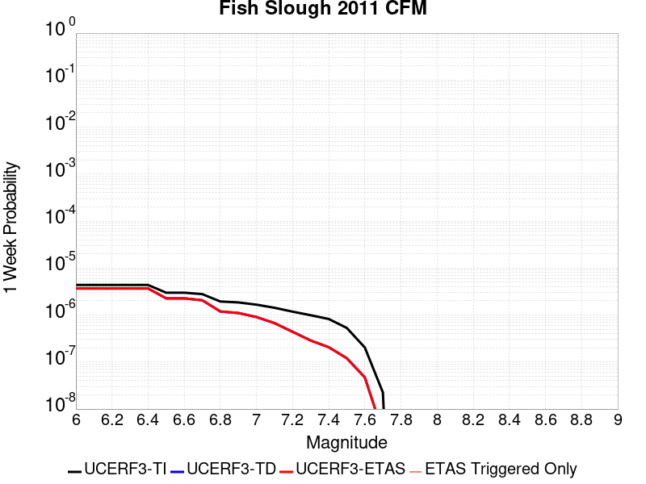 |  |  |  |

| Magnitude | 1 wk TI Prob | 1 wk TD Prob | 1 wk ETAS Prob | 1 wk ETAS/TD Gain | 1 wk ETAS Triggered Only | 1 mo TI Prob | 1 mo TD Prob | 1 mo ETAS Prob | 1 mo ETAS/TD Gain | 1 mo ETAS Triggered Only | 1 yr TI Prob | 1 yr TD Prob | 1 yr ETAS Prob | 1 yr ETAS/TD Gain | 1 yr ETAS Triggered Only | 10 yr TI Prob | 10 yr TD Prob | 10 yr ETAS Prob | 10 yr ETAS/TD Gain | 10 yr ETAS Triggered Only |
|-----|-----|-----|-----|-----|-----|-----|-----|-----|-----|-----|-----|-----|-----|-----|-----|-----|-----|-----|-----|-----|
| 6.0 | 4.3629925E-6 | 3.6773918E-6 | 3.6773918E-6 | 1.0 | 0.0 | 1.8698405E-5 | 1.5760166E-5 | 1.5760166E-5 | 1.0 | 0.0 | 2.276293E-4 | 1.9186526E-4 | 1.9186526E-4 | 1.0 | 0.0 | 0.0022739628 | 0.001917205 | 0.0019275718 | 1.0054072 | 1.0386697E-5 |
| 6.1 | 4.3629925E-6 | 3.6773918E-6 | 3.6773918E-6 | 1.0 | 0.0 | 1.8698405E-5 | 1.5760166E-5 | 1.5760166E-5 | 1.0 | 0.0 | 2.276293E-4 | 1.9186526E-4 | 1.9186526E-4 | 1.0 | 0.0 | 0.0022739628 | 0.001917205 | 0.0019275718 | 1.0054072 | 1.0386697E-5 |
| 6.2 | 4.3629925E-6 | 3.6773918E-6 | 3.6773918E-6 | 1.0 | 0.0 | 1.8698405E-5 | 1.5760166E-5 | 1.5760166E-5 | 1.0 | 0.0 | 2.276293E-4 | 1.9186526E-4 | 1.9186526E-4 | 1.0 | 0.0 | 0.0022739628 | 0.001917205 | 0.0019275718 | 1.0054072 | 1.0386697E-5 |
| 6.3 | 4.3629925E-6 | 3.6773918E-6 | 3.6773918E-6 | 1.0 | 0.0 | 1.8698405E-5 | 1.5760166E-5 | 1.5760166E-5 | 1.0 | 0.0 | 2.276293E-4 | 1.9186526E-4 | 1.9186526E-4 | 1.0 | 0.0 | 0.0022739628 | 0.001917205 | 0.0019275718 | 1.0054072 | 1.0386697E-5 |
| 6.4 | 4.3629925E-6 | 3.6773918E-6 | 3.6773918E-6 | 1.0 | 0.0 | 1.8698405E-5 | 1.5760166E-5 | 1.5760166E-5 | 1.0 | 0.0 | 2.276293E-4 | 1.9186526E-4 | 1.9186526E-4 | 1.0 | 0.0 | 0.0022739628 | 0.001917205 | 0.0019275718 | 1.0054072 | 1.0386697E-5 |
| 6.5 | 2.991715E-6 | 2.2704924E-6 | 2.2704924E-6 | 1.0 | 0.0 | 1.2821573E-5 | 9.73065E-6 | 9.73065E-6 | 1.0 | 0.0 | 1.5609147E-4 | 1.1846514E-4 | 1.1846514E-4 | 1.0 | 0.0 | 0.0015598187 | 0.0011841101 | 0.0011944844 | 1.0087613 | 1.0386697E-5 |
| 6.6 | 2.991715E-6 | 2.2704924E-6 | 2.2704924E-6 | 1.0 | 0.0 | 1.2821573E-5 | 9.73065E-6 | 9.73065E-6 | 1.0 | 0.0 | 1.5609147E-4 | 1.1846514E-4 | 1.1846514E-4 | 1.0 | 0.0 | 0.0015598187 | 0.0011841101 | 0.0011944844 | 1.0087613 | 1.0386697E-5 |
| 6.7 | 2.7890346E-6 | 2.0622847E-6 | 2.0622847E-6 | 1.0 | 0.0 | 1.1952951E-5 | 8.8383385E-6 | 8.8383385E-6 | 1.0 | 0.0 | 1.4551746E-4 | 1.07602355E-4 | 1.07602355E-4 | 1.0 | 0.0 | 0.0014542221 | 0.0010755908 | 0.0010859664 | 1.0096463 | 1.0386697E-5 |
| 6.8 | 1.9416723E-6 | 1.1926425E-6 | 1.1926425E-6 | 1.0 | 0.0 | 8.321425E-6 | 5.111315E-6 | 5.111315E-6 | 1.0 | 0.0 | 1.01308644E-4 | 6.222852E-5 | 6.222852E-5 | 1.0 | 0.0 | 0.0010126247 | 6.221151E-4 | 6.221151E-4 | 1.0 | 0.0 |
| 6.9 | 1.8567416E-6 | 1.1047824E-6 | 1.1047824E-6 | 1.0 | 0.0 | 7.957439E-6 | 4.7347735E-6 | 4.7347735E-6 | 1.0 | 0.0 | 9.687752E-5 | 5.7644378E-5 | 5.7644378E-5 | 1.0 | 0.0 | 9.6835295E-4 | 5.762981E-4 | 5.762981E-4 | 1.0 | 0.0 |
| 7.0 | 1.6634067E-6 | 9.0747875E-7 | 9.0747875E-7 | 1.0 | 0.0 | 7.1288664E-6 | 3.889189E-6 | 3.889189E-6 | 1.0 | 0.0 | 8.679049E-5 | 4.7349877E-5 | 4.7349877E-5 | 1.0 | 0.0 | 8.6756604E-4 | 4.7340078E-4 | 4.7340078E-4 | 1.0 | 0.0 |
| 7.1 | 1.4281054E-6 | 6.737384E-7 | 6.737384E-7 | 1.0 | 0.0 | 6.1204373E-6 | 2.8874472E-6 | 2.8874472E-6 | 1.0 | 0.0 | 7.451377E-5 | 3.515412E-5 | 3.515412E-5 | 1.0 | 0.0 | 7.44888E-4 | 3.514874E-4 | 3.514874E-4 | 1.0 | 0.0 |
| 7.2 | 1.1810387E-6 | 4.4090396E-7 | 4.4090396E-7 | 1.0 | 0.0 | 5.0615845E-6 | 1.8895871E-6 | 1.8895871E-6 | 1.0 | 0.0 | 6.1623046E-5 | 2.3005488E-5 | 2.3005488E-5 | 1.0 | 0.0 | 6.160596E-4 | 2.3003198E-4 | 2.3003198E-4 | 1.0 | 0.0 |
| 7.3 | 9.918052E-7 | 2.8739626E-7 | 2.8739626E-7 | 1.0 | 0.0 | 4.2505867E-6 | 1.2316978E-6 | 1.2316978E-6 | 1.0 | 0.0 | 5.1749663E-5 | 1.4995818E-5 | 1.4995818E-5 | 1.0 | 0.0 | 5.173762E-4 | 1.4994817E-4 | 1.4994817E-4 | 1.0 | 0.0 |
| 7.4 | 8.25252E-7 | 2.0700077E-7 | 2.0700077E-7 | 1.0 | 0.0 | 3.5367896E-6 | 8.8714586E-7 | 8.8714586E-7 | 1.0 | 0.0 | 4.3059565E-5 | 1.0800948E-5 | 1.0800948E-5 | 1.0 | 0.0 | 4.305122E-4 | 1.0800429E-4 | 1.0800429E-4 | 1.0 | 0.0 |
| 7.5 | 5.3248567E-7 | 1.2076387E-7 | 1.2076387E-7 | 1.0 | 0.0 | 2.2820795E-6 | 5.175594E-7 | 5.175594E-7 | 1.0 | 0.0 | 2.7783964E-5 | 6.3012676E-6 | 6.3012676E-6 | 1.0 | 0.0 | 2.778049E-4 | 6.301093E-5 | 6.301093E-5 | 1.0 | 0.0 |
| 7.6 | 2.037542E-7 | 4.714406E-8 | 4.714406E-8 | 1.0 | 0.0 | 8.73232E-7 | 2.0204595E-7 | 2.0204595E-7 | 1.0 | 0.0 | 1.0631547E-5 | 2.459907E-6 | 2.459907E-6 | 1.0 | 0.0 | 1.0631039E-4 | 2.4598818E-5 | 2.4598818E-5 | 1.0 | 0.0 |
| 7.7 | 2.2501226E-8 | 3.1526062E-9 | 3.1526062E-9 | 1.0 | 0.0 | 9.6433816E-8 | 1.3511169E-8 | 1.3511169E-8 | 1.0 | 0.0 | 1.1740811E-6 | 1.6449847E-7 | 1.6449847E-7 | 1.0 | 0.0 | 1.1740749E-5 | 1.6449836E-6 | 1.6449836E-6 | 1.0 | 0.0 |

## Butano 2011 CFM
*[(top)](#table-of-contents)*

| 1 Week | 1 Month | 1 Year | 10 Year |
|-----|-----|-----|-----|
|  |  |  |  |

| Magnitude | 1 wk TI Prob | 1 wk TD Prob | 1 wk ETAS Prob | 1 wk ETAS/TD Gain | 1 wk ETAS Triggered Only | 1 mo TI Prob | 1 mo TD Prob | 1 mo ETAS Prob | 1 mo ETAS/TD Gain | 1 mo ETAS Triggered Only | 1 yr TI Prob | 1 yr TD Prob | 1 yr ETAS Prob | 1 yr ETAS/TD Gain | 1 yr ETAS Triggered Only | 10 yr TI Prob | 10 yr TD Prob | 10 yr ETAS Prob | 10 yr ETAS/TD Gain | 10 yr ETAS Triggered Only |
|-----|-----|-----|-----|-----|-----|-----|-----|-----|-----|-----|-----|-----|-----|-----|-----|-----|-----|-----|-----|-----|
| 6.0 | 9.561135E-6 | 6.229379E-6 | 6.229379E-6 | 1.0 | 0.0 | 4.097565E-5 | 2.6697078E-5 | 2.6697078E-5 | 1.0 | 0.0 | 4.9876433E-4 | 3.2499063E-4 | 3.2499063E-4 | 1.0 | 0.0 | 0.004976464 | 0.0032628316 | 0.0032731844 | 1.003173 | 1.0386697E-5 |
| 6.1 | 9.561135E-6 | 6.229379E-6 | 6.229379E-6 | 1.0 | 0.0 | 4.097565E-5 | 2.6697078E-5 | 2.6697078E-5 | 1.0 | 0.0 | 4.9876433E-4 | 3.2499063E-4 | 3.2499063E-4 | 1.0 | 0.0 | 0.004976464 | 0.0032628316 | 0.0032731844 | 1.003173 | 1.0386697E-5 |
| 6.2 | 8.364741E-6 | 4.982436E-6 | 4.982436E-6 | 1.0 | 0.0 | 3.5848396E-5 | 2.1353131E-5 | 2.1353131E-5 | 1.0 | 0.0 | 4.3636683E-4 | 2.5994494E-4 | 2.5994494E-4 | 1.0 | 0.0 | 0.0043551093 | 0.0026140346 | 0.0026243941 | 1.003963 | 1.0386697E-5 |
| 6.3 | 8.364741E-6 | 4.982436E-6 | 4.982436E-6 | 1.0 | 0.0 | 3.5848396E-5 | 2.1353131E-5 | 2.1353131E-5 | 1.0 | 0.0 | 4.3636683E-4 | 2.5994494E-4 | 2.5994494E-4 | 1.0 | 0.0 | 0.0043551093 | 0.0026140346 | 0.0026243941 | 1.003963 | 1.0386697E-5 |
| 6.4 | 7.768282E-6 | 4.36037E-6 | 4.36037E-6 | 1.0 | 0.0 | 3.329221E-5 | 1.8687173E-5 | 1.8687173E-5 | 1.0 | 0.0 | 4.0525728E-4 | 2.2749395E-4 | 2.2749395E-4 | 1.0 | 0.0 | 0.0040451903 | 0.0022902212 | 0.0022902212 | 1.0 | 0.0 |
| 6.5 | 7.673437E-6 | 4.25993E-6 | 4.25993E-6 | 1.0 | 0.0 | 3.2885746E-5 | 1.8256722E-5 | 1.8256722E-5 | 1.0 | 0.0 | 4.0031038E-4 | 2.2225427E-4 | 2.2225427E-4 | 1.0 | 0.0 | 0.0039959005 | 0.0022379302 | 0.0022379302 | 1.0 | 0.0 |
| 6.6 | 7.5244197E-6 | 4.1048884E-6 | 4.1048884E-6 | 1.0 | 0.0 | 3.2247113E-5 | 1.7592267E-5 | 1.7592267E-5 | 1.0 | 0.0 | 3.9253788E-4 | 2.1416614E-4 | 2.1416614E-4 | 1.0 | 0.0 | 0.003918452 | 0.0021572078 | 0.0021572078 | 1.0 | 0.0 |
| 6.7 | 6.4921405E-6 | 3.0449146E-6 | 3.0449146E-6 | 1.0 | 0.0 | 2.7823162E-5 | 1.3049569E-5 | 1.3049569E-5 | 1.0 | 0.0 | 3.3869434E-4 | 1.58867E-4 | 1.58867E-4 | 1.0 | 0.0 | 0.003381786 | 0.0016050308 | 0.0016050308 | 1.0 | 0.0 |
| 6.8 | 6.2890294E-6 | 2.8316724E-6 | 2.8316724E-6 | 1.0 | 0.0 | 2.6952705E-5 | 1.21356825E-5 | 1.21356825E-5 | 1.0 | 0.0 | 3.2809976E-4 | 1.4774199E-4 | 1.4774199E-4 | 1.0 | 0.0 | 0.0032761577 | 0.0014939354 | 0.0014939354 | 1.0 | 0.0 |
| 6.9 | 6.0965517E-6 | 2.6381745E-6 | 2.6381745E-6 | 1.0 | 0.0 | 2.6127816E-5 | 1.13064125E-5 | 1.13064125E-5 | 1.0 | 0.0 | 3.1805973E-4 | 1.3764694E-4 | 1.3764694E-4 | 1.0 | 0.0 | 0.0031760489 | 0.0013931149 | 0.0013931149 | 1.0 | 0.0 |
| 7.0 | 5.566252E-6 | 2.1555431E-6 | 2.1555431E-6 | 1.0 | 0.0 | 2.3855147E-5 | 9.23801E-6 | 9.23801E-6 | 1.0 | 0.0 | 2.9039773E-4 | 1.12467E-4 | 1.12467E-4 | 1.0 | 0.0 | 0.0029001853 | 0.0011415965 | 0.0011415965 | 1.0 | 0.0 |
| 7.1 | 3.878588E-6 | 1.6063866E-6 | 1.6063866E-6 | 1.0 | 0.0 | 1.6622414E-5 | 6.884495E-6 | 6.884495E-6 | 1.0 | 0.0 | 2.023591E-4 | 8.381551E-5 | 8.381551E-5 | 1.0 | 0.0 | 0.0020217493 | 8.549361E-4 | 8.549361E-4 | 1.0 | 0.0 |
| 7.2 | 3.7038085E-6 | 1.4874075E-6 | 1.4874075E-6 | 1.0 | 0.0 | 1.587337E-5 | 6.374588E-6 | 6.374588E-6 | 1.0 | 0.0 | 1.9324113E-4 | 7.7607845E-5 | 7.7607845E-5 | 1.0 | 0.0 | 0.0019307317 | 7.9287245E-4 | 7.9287245E-4 | 1.0 | 0.0 |
| 7.3 | 3.5277278E-6 | 1.3954846E-6 | 1.3954846E-6 | 1.0 | 0.0 | 1.5118746E-5 | 5.980634E-6 | 5.980634E-6 | 1.0 | 0.0 | 1.8405518E-4 | 7.281179E-5 | 7.281179E-5 | 1.0 | 0.0 | 0.0018390282 | 7.4485753E-4 | 7.4485753E-4 | 1.0 | 0.0 |
| 7.4 | 3.3711294E-6 | 1.332691E-6 | 1.332691E-6 | 1.0 | 0.0 | 1.4447617E-5 | 5.7115203E-6 | 5.7115203E-6 | 1.0 | 0.0 | 1.7588554E-4 | 6.953554E-5 | 6.953554E-5 | 1.0 | 0.0 | 0.0017574639 | 7.1206415E-4 | 7.1206415E-4 | 1.0 | 0.0 |
| 7.5 | 3.0496426E-6 | 1.2215638E-6 | 1.2215638E-6 | 1.0 | 0.0 | 1.3069831E-5 | 5.235263E-6 | 5.235263E-6 | 1.0 | 0.0 | 1.5911358E-4 | 6.373746E-5 | 6.373746E-5 | 1.0 | 0.0 | 0.001589997 | 6.540503E-4 | 6.540503E-4 | 1.0 | 0.0 |
| 7.6 | 2.2179781E-6 | 8.894081E-7 | 8.894081E-7 | 1.0 | 0.0 | 9.505586E-6 | 3.8117432E-6 | 3.8117432E-6 | 1.0 | 0.0 | 1.1572436E-4 | 4.6406985E-5 | 4.6406985E-5 | 1.0 | 0.0 | 0.0011566412 | 4.8072715E-4 | 4.8072715E-4 | 1.0 | 0.0 |
| 7.7 | 1.7519328E-6 | 6.9516506E-7 | 6.9516506E-7 | 1.0 | 0.0 | 7.508262E-6 | 2.9792752E-6 | 2.9792752E-6 | 1.0 | 0.0 | 9.140925E-5 | 3.627207E-5 | 3.627207E-5 | 1.0 | 0.0 | 9.137166E-4 | 3.7868315E-4 | 3.7868315E-4 | 1.0 | 0.0 |
| 7.8 | 1.1478974E-6 | 6.192946E-7 | 6.192946E-7 | 1.0 | 0.0 | 4.9195505E-6 | 2.654117E-6 | 2.654117E-6 | 1.0 | 0.0 | 5.9893882E-5 | 3.2313394E-5 | 3.2313394E-5 | 1.0 | 0.0 | 5.9877743E-4 | 3.3876847E-4 | 3.3876847E-4 | 1.0 | 0.0 |
| 7.9 | 6.1154634E-7 | 5.598227E-7 | 5.598227E-7 | 1.0 | 0.0 | 2.6209104E-6 | 2.399238E-6 | 2.399238E-6 | 1.0 | 0.0 | 3.1909116E-5 | 2.921033E-5 | 2.921033E-5 | 1.0 | 0.0 | 3.1904536E-4 | 3.0650035E-4 | 3.0650035E-4 | 1.0 | 0.0 |
| 8.0 | 4.6520046E-7 | 5.20429E-7 | 5.20429E-7 | 1.0 | 0.0 | 1.9937147E-6 | 2.2304082E-6 | 2.2304082E-6 | 1.0 | 0.0 | 2.4273206E-5 | 2.715488E-5 | 2.715488E-5 | 1.0 | 0.0 | 2.4270554E-4 | 2.8497382E-4 | 2.8497382E-4 | 1.0 | 0.0 |
| 8.1 | 2.8425194E-7 | 3.0655784E-7 | 3.0655784E-7 | 1.0 | 0.0 | 1.218222E-6 | 1.3138186E-6 | 1.3138186E-6 | 1.0 | 0.0 | 1.4831752E-5 | 1.5995623E-5 | 1.5995623E-5 | 1.0 | 0.0 | 1.4830762E-4 | 1.6785401E-4 | 1.6785401E-4 | 1.0 | 0.0 |
| 8.2 | 5.585778E-8 | 4.066672E-8 | 4.066672E-8 | 1.0 | 0.0 | 2.3939046E-7 | 1.7428593E-7 | 1.7428593E-7 | 1.0 | 0.0 | 2.914575E-6 | 2.1219291E-6 | 2.1219291E-6 | 1.0 | 0.0 | 2.9145367E-5 | 2.3054243E-5 | 2.3054243E-5 | 1.0 | 0.0 |
| 8.3 | 1.0371215E-10 | 5.378642E-11 | 5.378642E-11 | 1.0 | 0.0 | 4.4448079E-10 | 2.3051328E-10 | 2.3051328E-10 | 1.0 | 0.0 | 5.4115543E-9 | 2.8064993E-9 | 2.8064993E-9 | 1.0 | 0.0 | 5.4115542E-8 | 3.2273256E-8 | 3.2273256E-8 | 1.0 | 0.0 |

## San Jacinto (Clark) rev
*[(top)](#table-of-contents)*

| 1 Week | 1 Month | 1 Year | 10 Year |
|-----|-----|-----|-----|
| 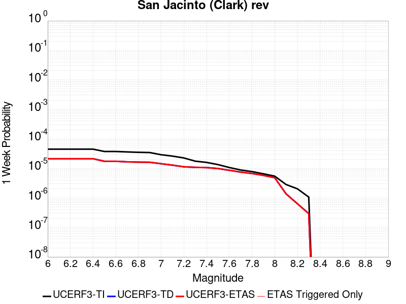 |  |  | 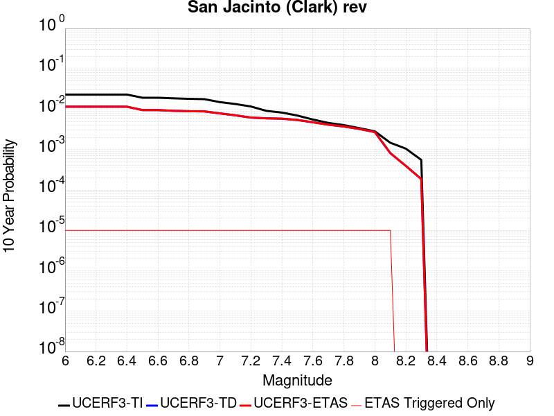 |

| Magnitude | 1 wk TI Prob | 1 wk TD Prob | 1 wk ETAS Prob | 1 wk ETAS/TD Gain | 1 wk ETAS Triggered Only | 1 mo TI Prob | 1 mo TD Prob | 1 mo ETAS Prob | 1 mo ETAS/TD Gain | 1 mo ETAS Triggered Only | 1 yr TI Prob | 1 yr TD Prob | 1 yr ETAS Prob | 1 yr ETAS/TD Gain | 1 yr ETAS Triggered Only | 10 yr TI Prob | 10 yr TD Prob | 10 yr ETAS Prob | 10 yr ETAS/TD Gain | 10 yr ETAS Triggered Only |
|-----|-----|-----|-----|-----|-----|-----|-----|-----|-----|-----|-----|-----|-----|-----|-----|-----|-----|-----|-----|-----|
| 6.0 | 4.482615E-5 | 2.1195152E-5 | 2.1195152E-5 | 1.0 | 0.0 | 1.9209793E-4 | 9.083325E-5 | 9.083325E-5 | 1.0 | 0.0 | 0.0023362834 | 0.001105343 | 0.0011157183 | 1.0093864 | 1.0386697E-5 | 0.02311874 | 0.011525473 | 0.0115357395 | 1.0008909 | 1.0386697E-5 |
| 6.1 | 4.482615E-5 | 2.1195152E-5 | 2.1195152E-5 | 1.0 | 0.0 | 1.9209793E-4 | 9.083325E-5 | 9.083325E-5 | 1.0 | 0.0 | 0.0023362834 | 0.001105343 | 0.0011157183 | 1.0093864 | 1.0386697E-5 | 0.02311874 | 0.011525473 | 0.0115357395 | 1.0008909 | 1.0386697E-5 |
| 6.2 | 4.482615E-5 | 2.1195152E-5 | 2.1195152E-5 | 1.0 | 0.0 | 1.9209793E-4 | 9.083325E-5 | 9.083325E-5 | 1.0 | 0.0 | 0.0023362834 | 0.001105343 | 0.0011157183 | 1.0093864 | 1.0386697E-5 | 0.02311874 | 0.011525473 | 0.0115357395 | 1.0008909 | 1.0386697E-5 |
| 6.3 | 4.482615E-5 | 2.1195152E-5 | 2.1195152E-5 | 1.0 | 0.0 | 1.9209793E-4 | 9.083325E-5 | 9.083325E-5 | 1.0 | 0.0 | 0.0023362834 | 0.001105343 | 0.0011157183 | 1.0093864 | 1.0386697E-5 | 0.02311874 | 0.011525473 | 0.0115357395 | 1.0008909 | 1.0386697E-5 |
| 6.4 | 4.482615E-5 | 2.1195152E-5 | 2.1195152E-5 | 1.0 | 0.0 | 1.9209793E-4 | 9.083325E-5 | 9.083325E-5 | 1.0 | 0.0 | 0.0023362834 | 0.001105343 | 0.0011157183 | 1.0093864 | 1.0386697E-5 | 0.02311874 | 0.011525473 | 0.0115357395 | 1.0008909 | 1.0386697E-5 |
| 6.5 | 3.7294863E-5 | 1.7393328E-5 | 1.7393328E-5 | 1.0 | 0.0 | 1.5982533E-4 | 7.454073E-5 | 7.454073E-5 | 1.0 | 0.0 | 0.0019441366 | 9.0716005E-4 | 9.175373E-4 | 1.0114393 | 1.0386697E-5 | 0.01927216 | 0.009513795 | 0.009524083 | 1.0010813 | 1.0386697E-5 |
| 6.6 | 3.7294863E-5 | 1.7393328E-5 | 1.7393328E-5 | 1.0 | 0.0 | 1.5982533E-4 | 7.454073E-5 | 7.454073E-5 | 1.0 | 0.0 | 0.0019441366 | 9.0716005E-4 | 9.175373E-4 | 1.0114393 | 1.0386697E-5 | 0.01927216 | 0.009513795 | 0.009524083 | 1.0010813 | 1.0386697E-5 |
| 6.7 | 3.6039248E-5 | 1.6640866E-5 | 1.6640866E-5 | 1.0 | 0.0 | 1.5444479E-4 | 7.131607E-5 | 7.131607E-5 | 1.0 | 0.0 | 0.0018787434 | 8.6793146E-4 | 8.7830913E-4 | 1.0119568 | 1.0386697E-5 | 0.01862939 | 0.009115386 | 0.009125678 | 1.001129 | 1.0386697E-5 |
| 6.8 | 3.5031844E-5 | 1.6268963E-5 | 1.6268963E-5 | 1.0 | 0.0 | 1.5012783E-4 | 6.9722286E-5 | 6.9722286E-5 | 1.0 | 0.0 | 0.0018262739 | 8.485423E-4 | 8.589202E-4 | 1.0122303 | 1.0386697E-5 | 0.01811338 | 0.008915053 | 0.008925347 | 1.0011547 | 1.0386697E-5 |
| 6.9 | 3.435112E-5 | 1.6098935E-5 | 1.6098935E-5 | 1.0 | 0.0 | 1.4721078E-4 | 6.8993635E-5 | 6.8993635E-5 | 1.0 | 0.0 | 0.0017908178 | 8.396779E-4 | 8.5005583E-4 | 1.0123595 | 1.0386697E-5 | 0.017764548 | 0.008823094 | 0.008833389 | 1.0011668 | 1.0386697E-5 |
| 7.0 | 2.8959772E-5 | 1.4369728E-5 | 1.4369728E-5 | 1.0 | 0.0 | 1.241074E-4 | 6.158311E-5 | 6.158311E-5 | 1.0 | 0.0 | 0.0015099603 | 7.4951927E-4 | 7.5989816E-4 | 1.0138475 | 1.0386697E-5 | 0.014997416 | 0.00788556 | 0.0078958655 | 1.0013068 | 1.0386697E-5 |
| 7.1 | 2.6002877E-5 | 1.2859668E-5 | 1.2859668E-5 | 1.0 | 0.0 | 1.11436144E-4 | 5.511171E-5 | 5.511171E-5 | 1.0 | 0.0 | 0.0013558907 | 6.707806E-4 | 6.811603E-4 | 1.0154741 | 1.0386697E-5 | 0.013476475 | 0.007062899 | 0.0070732124 | 1.0014602 | 1.0386697E-5 |
| 7.2 | 2.2544838E-5 | 1.1290756E-5 | 1.1290756E-5 | 1.0 | 0.0 | 9.661716E-5 | 4.8388065E-5 | 4.8388065E-5 | 1.0 | 0.0 | 0.001175679 | 5.889669E-4 | 5.9934746E-4 | 1.0176251 | 1.0386697E-5 | 0.011694785 | 0.0062078307 | 0.006218153 | 1.0016627 | 1.0386697E-5 |
| 7.3 | 1.75334E-5 | 1.0838515E-5 | 1.0838515E-5 | 1.0 | 0.0 | 7.514098E-5 | 4.644996E-5 | 4.644996E-5 | 1.0 | 0.0 | 9.144575E-4 | 5.653829E-4 | 5.7576376E-4 | 1.0183607 | 1.0386697E-5 | 0.009107036 | 0.005948046 | 0.005958371 | 1.0017358 | 1.0386697E-5 |
| 7.4 | 1.5924552E-5 | 1.0637865E-5 | 1.0637865E-5 | 1.0 | 0.0 | 6.82463E-5 | 4.5590063E-5 | 4.5590063E-5 | 1.0 | 0.0 | 8.305819E-4 | 5.54919E-4 | 5.6529994E-4 | 1.0187072 | 1.0386697E-5 | 0.008274844 | 0.005835053 | 0.005845379 | 1.0017697 | 1.0386697E-5 |
| 7.5 | 1.3428931E-5 | 9.876464E-6 | 9.876464E-6 | 1.0 | 0.0 | 5.7551293E-5 | 4.232702E-5 | 4.232702E-5 | 1.0 | 0.0 | 7.004617E-4 | 5.1521073E-4 | 5.2559207E-4 | 1.0201497 | 1.0386697E-5 | 0.006982579 | 0.005419675 | 0.005430005 | 1.001906 | 1.0386697E-5 |
| 7.6 | 1.0688787E-5 | 8.632698E-6 | 8.632698E-6 | 1.0 | 0.0 | 4.5808283E-5 | 3.6996757E-5 | 3.6996757E-5 | 1.0 | 0.0 | 5.5757316E-4 | 4.503429E-4 | 4.6072493E-4 | 1.0230536 | 1.0386697E-5 | 0.005561762 | 0.004751152 | 0.004761489 | 1.0021758 | 1.0386697E-5 |
| 7.7 | 8.81236E-6 | 7.4852865E-6 | 7.4852865E-6 | 1.0 | 0.0 | 3.776671E-5 | 3.2079406E-5 | 3.2079406E-5 | 1.0 | 0.0 | 4.597127E-4 | 3.9049698E-4 | 4.008796E-4 | 1.0265883 | 1.0386697E-5 | 0.0045876284 | 0.004143844 | 0.004154187 | 1.0024961 | 1.0386697E-5 |
| 7.8 | 7.780431E-6 | 6.712883E-6 | 6.712883E-6 | 1.0 | 0.0 | 3.3344273E-5 | 2.8769182E-5 | 2.8769182E-5 | 1.0 | 0.0 | 4.0589093E-4 | 3.502087E-4 | 3.6059174E-4 | 1.0296482 | 1.0386697E-5 | 0.0040515037 | 0.0037314843 | 0.0037418322 | 1.0027732 | 1.0386697E-5 |
| 7.9 | 6.5437994E-6 | 5.795602E-6 | 5.795602E-6 | 1.0 | 0.0 | 2.8044553E-5 | 2.4838058E-5 | 2.4838058E-5 | 1.0 | 0.0 | 3.4138895E-4 | 3.023616E-4 | 3.1274513E-4 | 1.0343416 | 1.0386697E-5 | 0.0034086495 | 0.0032426151 | 0.0032529682 | 1.0031928 | 1.0386697E-5 |
| 8.0 | 5.4488164E-6 | 4.8268685E-6 | 4.8268685E-6 | 1.0 | 0.0 | 2.3351862E-5 | 2.0686417E-5 | 2.0686417E-5 | 1.0 | 0.0 | 2.8427184E-4 | 2.5182817E-4 | 2.6221224E-4 | 1.0412347 | 1.0386697E-5 | 0.0028390845 | 0.0027180852 | 0.0027284438 | 1.0038109 | 1.0386697E-5 |
| 8.1 | 2.8397242E-6 | 1.372448E-6 | 1.372448E-6 | 1.0 | 0.0 | 1.217019E-5 | 5.8819064E-6 | 5.8819064E-6 | 1.0 | 0.0 | 1.4816198E-4 | 7.160987E-5 | 8.199582E-5 | 1.1450353 | 1.0386697E-5 | 0.0014806325 | 8.145797E-4 | 8.2495797E-4 | 1.0127406 | 1.0386697E-5 |
| 8.2 | 2.030244E-6 | 6.3495634E-7 | 6.3495634E-7 | 1.0 | 0.0 | 8.701017E-6 | 2.7212386E-6 | 2.7212386E-6 | 1.0 | 0.0 | 1.05929736E-4 | 3.3130582E-5 | 3.3130582E-5 | 1.0 | 0.0 | 0.0010587925 | 3.966504E-4 | 3.966504E-4 | 1.0 | 0.0 |
| 8.3 | 1.0659804E-6 | 2.9400067E-7 | 2.9400067E-7 | 1.0 | 0.0 | 4.568479E-6 | 1.2600023E-6 | 1.2600023E-6 | 1.0 | 0.0 | 5.5619817E-5 | 1.5340423E-5 | 1.5340423E-5 | 1.0 | 0.0 | 5.5605895E-4 | 1.8654772E-4 | 1.8654772E-4 | 1.0 | 0.0 |

## Hayward (No) 2011 CFM
*[(top)](#table-of-contents)*

| 1 Week | 1 Month | 1 Year | 10 Year |
|-----|-----|-----|-----|
|  |  |  |  |

| Magnitude | 1 wk TI Prob | 1 wk TD Prob | 1 wk ETAS Prob | 1 wk ETAS/TD Gain | 1 wk ETAS Triggered Only | 1 mo TI Prob | 1 mo TD Prob | 1 mo ETAS Prob | 1 mo ETAS/TD Gain | 1 mo ETAS Triggered Only | 1 yr TI Prob | 1 yr TD Prob | 1 yr ETAS Prob | 1 yr ETAS/TD Gain | 1 yr ETAS Triggered Only | 10 yr TI Prob | 10 yr TD Prob | 10 yr ETAS Prob | 10 yr ETAS/TD Gain | 10 yr ETAS Triggered Only |
|-----|-----|-----|-----|-----|-----|-----|-----|-----|-----|-----|-----|-----|-----|-----|-----|-----|-----|-----|-----|-----|
| 6.0 | 9.3068506E-5 | 1.74068E-4 | 1.74068E-4 | 1.0 | 0.0 | 3.9880406E-4 | 7.457933E-4 | 7.457933E-4 | 1.0 | 0.0 | 0.0048446343 | 0.009042277 | 0.009052569 | 1.0011383 | 1.0386697E-5 | 0.047403704 | 0.086425416 | 0.0864349 | 1.0001098 | 1.0386697E-5 |
| 6.1 | 9.055486E-5 | 1.6958236E-4 | 1.6958236E-4 | 1.0 | 0.0 | 3.880345E-4 | 7.265799E-4 | 7.265799E-4 | 1.0 | 0.0 | 0.0047140904 | 0.008810335 | 0.00882063 | 1.0011685 | 1.0386697E-5 | 0.046153355 | 0.08431842 | 0.08432793 | 1.0001128 | 1.0386697E-5 |
| 6.2 | 9.006742E-5 | 1.6878804E-4 | 1.6878804E-4 | 1.0 | 0.0 | 3.859461E-4 | 7.231776E-4 | 7.231776E-4 | 1.0 | 0.0 | 0.0046887742 | 0.0087693 | 0.008779596 | 1.0011741 | 1.0386697E-5 | 0.0459107 | 0.08394261 | 0.08395212 | 1.0001134 | 1.0386697E-5 |
| 6.3 | 8.8336754E-5 | 1.6558412E-4 | 1.6558412E-4 | 1.0 | 0.0 | 3.7853114E-4 | 7.09454E-4 | 7.09454E-4 | 1.0 | 0.0 | 0.004598882 | 0.008603558 | 0.008603558 | 1.0 | 0.0 | 0.04504866 | 0.082435764 | 0.082435764 | 1.0 | 0.0 |
| 6.4 | 8.526157E-5 | 1.5984823E-4 | 1.5984823E-4 | 1.0 | 0.0 | 3.6535555E-4 | 6.848848E-4 | 6.848848E-4 | 1.0 | 0.0 | 0.0044391346 | 0.008306746 | 0.008306746 | 1.0 | 0.0 | 0.043514993 | 0.07973017 | 0.07973017 | 1.0 | 0.0 |
| 6.5 | 8.152396E-5 | 1.5317152E-4 | 1.5317152E-4 | 1.0 | 0.0 | 3.493416E-4 | 6.56285E-4 | 6.56285E-4 | 1.0 | 0.0 | 0.0042449418 | 0.007961143 | 0.007961143 | 1.0 | 0.0 | 0.04164765 | 0.07656097 | 0.07656097 | 1.0 | 0.0 |
| 6.6 | 7.987405E-5 | 1.5021319E-4 | 1.5021319E-4 | 1.0 | 0.0 | 3.4227243E-4 | 6.436127E-4 | 6.436127E-4 | 1.0 | 0.0 | 0.0041592065 | 0.0078079863 | 0.0078079863 | 1.0 | 0.0 | 0.04082218 | 0.07515338 | 0.07515338 | 1.0 | 0.0 |
| 6.7 | 7.777665E-5 | 1.4660071E-4 | 1.4660071E-4 | 1.0 | 0.0 | 3.332859E-4 | 6.2813814E-4 | 6.2813814E-4 | 1.0 | 0.0 | 0.004050208 | 0.007620921 | 0.007620921 | 1.0 | 0.0 | 0.039771806 | 0.07342759 | 0.07342759 | 1.0 | 0.0 |
| 6.8 | 7.3284005E-5 | 1.3809837E-4 | 1.3809837E-4 | 1.0 | 0.0 | 3.140365E-4 | 5.917165E-4 | 5.917165E-4 | 1.0 | 0.0 | 0.0038166929 | 0.007180489 | 0.007180489 | 1.0 | 0.0 | 0.037518036 | 0.06933746 | 0.06933746 | 1.0 | 0.0 |
| 6.9 | 6.458263E-5 | 1.2138554E-4 | 1.2138554E-4 | 1.0 | 0.0 | 2.7675333E-4 | 5.201205E-4 | 5.201205E-4 | 1.0 | 0.0 | 0.0033642664 | 0.006314182 | 0.006314182 | 1.0 | 0.0 | 0.033137884 | 0.0612579 | 0.0612579 | 1.0 | 0.0 |
| 7.0 | 5.3853604E-5 | 1.00309575E-4 | 1.00309575E-4 | 1.0 | 0.0 | 2.3078074E-4 | 4.2982766E-4 | 4.2982766E-4 | 1.0 | 0.0 | 0.0028061352 | 0.0052206595 | 0.0052206595 | 1.0 | 0.0 | 0.027709642 | 0.05098569 | 0.05098569 | 1.0 | 0.0 |
| 7.1 | 4.4308683E-5 | 8.175333E-5 | 8.175333E-5 | 1.0 | 0.0 | 1.8988053E-4 | 3.5032458E-4 | 3.5032458E-4 | 1.0 | 0.0 | 0.0023093442 | 0.004256902 | 0.004256902 | 1.0 | 0.0 | 0.022854926 | 0.041847244 | 0.041847244 | 1.0 | 0.0 |
| 7.2 | 3.295973E-5 | 6.0814917E-5 | 6.0814917E-5 | 1.0 | 0.0 | 1.4124835E-4 | 2.6060943E-4 | 2.6060943E-4 | 1.0 | 0.0 | 0.0017183421 | 0.0031683263 | 0.0031683263 | 1.0 | 0.0 | 0.017051157 | 0.031391077 | 0.031391077 | 1.0 | 0.0 |
| 7.3 | 2.452256E-5 | 4.521987E-5 | 4.521987E-5 | 1.0 | 0.0 | 1.05092455E-4 | 1.9378512E-4 | 1.9378512E-4 | 1.0 | 0.0 | 0.0012787496 | 0.002356795 | 0.002356795 | 1.0 | 0.0 | 0.0127141625 | 0.023460438 | 0.023460438 | 1.0 | 0.0 |
| 7.4 | 1.8829967E-5 | 3.4637967E-5 | 3.4637967E-5 | 1.0 | 0.0 | 8.069736E-5 | 1.4844004E-4 | 1.4844004E-4 | 1.0 | 0.0 | 9.820475E-4 | 0.0018057693 | 0.0018057693 | 1.0 | 0.0 | 0.009777189 | 0.018036935 | 0.018036935 | 1.0 | 0.0 |
| 7.5 | 1.26374125E-5 | 2.2948794E-5 | 2.2948794E-5 | 1.0 | 0.0 | 5.4159216E-5 | 9.83483E-5 | 9.83483E-5 | 1.0 | 0.0 | 6.5918895E-4 | 0.0011967387 | 0.0011967387 | 1.0 | 0.0 | 0.00657237 | 0.012002571 | 0.012002571 | 1.0 | 0.0 |
| 7.6 | 4.666429E-6 | 8.4890125E-6 | 8.4890125E-6 | 1.0 | 0.0 | 1.9998828E-5 | 3.638098E-5 | 3.638098E-5 | 1.0 | 0.0 | 2.4345852E-4 | 4.4284965E-4 | 4.4284965E-4 | 1.0 | 0.0 | 0.0024319198 | 0.004463953 | 0.004463953 | 1.0 | 0.0 |
| 7.7 | 3.8399318E-7 | 7.146951E-7 | 7.146951E-7 | 1.0 | 0.0 | 1.6456839E-6 | 3.0629753E-6 | 3.0629753E-6 | 1.0 | 0.0 | 2.003602E-5 | 3.7291087E-5 | 3.7291087E-5 | 1.0 | 0.0 | 2.0034213E-4 | 3.867874E-4 | 3.867874E-4 | 1.0 | 0.0 |
| 7.8 | 2.5637698E-7 | 5.3775256E-7 | 5.3775256E-7 | 1.0 | 0.0 | 1.098758E-6 | 2.3046516E-6 | 2.3046516E-6 | 1.0 | 0.0 | 1.3377297E-5 | 2.8058774E-5 | 2.8058774E-5 | 1.0 | 0.0 | 1.3376492E-4 | 2.9299298E-4 | 2.9299298E-4 | 1.0 | 0.0 |
| 7.9 | 1.7141245E-7 | 3.7368818E-7 | 3.7368818E-7 | 1.0 | 0.0 | 7.3462456E-7 | 1.6015197E-6 | 1.6015197E-6 | 1.0 | 0.0 | 8.944017E-6 | 1.9498328E-5 | 1.9498328E-5 | 1.0 | 0.0 | 8.943657E-5 | 2.02833E-4 | 2.02833E-4 | 1.0 | 0.0 |
| 8.0 | 1.1808895E-7 | 2.7563618E-7 | 2.7563618E-7 | 1.0 | 0.0 | 5.060954E-7 | 1.1812973E-6 | 1.1812973E-6 | 1.0 | 0.0 | 6.161694E-6 | 1.4382201E-5 | 1.4382201E-5 | 1.0 | 0.0 | 6.161523E-5 | 1.4842243E-4 | 1.4842243E-4 | 1.0 | 0.0 |
| 8.1 | 5.138535E-8 | 1.1250157E-7 | 1.1250157E-7 | 1.0 | 0.0 | 2.2022292E-7 | 4.8214946E-7 | 4.8214946E-7 | 1.0 | 0.0 | 2.6812106E-6 | 5.8701544E-6 | 5.8701544E-6 | 1.0 | 0.0 | 2.6811784E-5 | 6.025778E-5 | 6.025778E-5 | 1.0 | 0.0 |

## Concord 2011 CFM
*[(top)](#table-of-contents)*

| 1 Week | 1 Month | 1 Year | 10 Year |
|-----|-----|-----|-----|
|  |  |  |  |

| Magnitude | 1 wk TI Prob | 1 wk TD Prob | 1 wk ETAS Prob | 1 wk ETAS/TD Gain | 1 wk ETAS Triggered Only | 1 mo TI Prob | 1 mo TD Prob | 1 mo ETAS Prob | 1 mo ETAS/TD Gain | 1 mo ETAS Triggered Only | 1 yr TI Prob | 1 yr TD Prob | 1 yr ETAS Prob | 1 yr ETAS/TD Gain | 1 yr ETAS Triggered Only | 10 yr TI Prob | 10 yr TD Prob | 10 yr ETAS Prob | 10 yr ETAS/TD Gain | 10 yr ETAS Triggered Only |
|-----|-----|-----|-----|-----|-----|-----|-----|-----|-----|-----|-----|-----|-----|-----|-----|-----|-----|-----|-----|-----|
| 6.0 | 5.7865112E-5 | 9.75978E-5 | 9.75978E-5 | 1.0 | 0.0 | 2.4796976E-4 | 4.1818517E-4 | 4.1818517E-4 | 1.0 | 0.0 | 0.0030148525 | 0.0050797113 | 0.0050797113 | 1.0 | 0.0 | 0.029742775 | 0.049251437 | 0.049261313 | 1.0002005 | 1.0386697E-5 |
| 6.1 | 5.7865112E-5 | 9.75978E-5 | 9.75978E-5 | 1.0 | 0.0 | 2.4796976E-4 | 4.1818517E-4 | 4.1818517E-4 | 1.0 | 0.0 | 0.0030148525 | 0.0050797113 | 0.0050797113 | 1.0 | 0.0 | 0.029742775 | 0.049251437 | 0.049261313 | 1.0002005 | 1.0386697E-5 |
| 6.2 | 5.6789337E-5 | 9.580088E-5 | 9.580088E-5 | 1.0 | 0.0 | 2.4336016E-4 | 4.1048654E-4 | 4.1048654E-4 | 1.0 | 0.0 | 0.0029588845 | 0.004986411 | 0.004986411 | 1.0 | 0.0 | 0.029197963 | 0.048367858 | 0.048377745 | 1.0002043 | 1.0386697E-5 |
| 6.3 | 5.203322E-5 | 8.803388E-5 | 8.803388E-5 | 1.0 | 0.0 | 2.2298045E-4 | 3.7723788E-4 | 3.7723788E-4 | 1.0 | 0.0 | 0.0027114071 | 0.0045839828 | 0.0045839828 | 1.0 | 0.0 | 0.026785625 | 0.044538308 | 0.044548232 | 1.0002228 | 1.0386697E-5 |
| 6.4 | 4.7120942E-5 | 7.897702E-5 | 7.897702E-5 | 1.0 | 0.0 | 2.0193127E-4 | 3.3843325E-4 | 3.3843325E-4 | 1.0 | 0.0 | 0.0024557412 | 0.004113385 | 0.004113385 | 1.0 | 0.0 | 0.024287801 | 0.04006697 | 0.040076938 | 1.0002488 | 1.0386697E-5 |
| 6.5 | 2.9598437E-5 | 4.6676752E-5 | 4.6676752E-5 | 1.0 | 0.0 | 1.2684427E-4 | 2.0002908E-4 | 2.0002908E-4 | 1.0 | 0.0 | 0.001543235 | 0.0024328444 | 0.0024328444 | 1.0 | 0.0 | 0.015325619 | 0.023910914 | 0.023910914 | 1.0 | 0.0 |
| 6.6 | 2.0443718E-5 | 2.9985775E-5 | 2.9985775E-5 | 1.0 | 0.0 | 8.7613E-5 | 1.2850434E-4 | 1.2850434E-4 | 1.0 | 0.0 | 0.0010661662 | 0.0015634537 | 0.0015634537 | 1.0 | 0.0 | 0.010610655 | 0.015467727 | 0.015467727 | 1.0 | 0.0 |
| 6.7 | 1.798539E-5 | 2.5558722E-5 | 2.5558722E-5 | 1.0 | 0.0 | 7.7077966E-5 | 1.09532906E-4 | 1.09532906E-4 | 1.0 | 0.0 | 9.380202E-4 | 0.0013327688 | 0.0013327688 | 1.0 | 0.0 | 0.009340706 | 0.013218116 | 0.013218116 | 1.0 | 0.0 |
| 6.8 | 1.613555E-5 | 2.1960415E-5 | 2.1960415E-5 | 1.0 | 0.0 | 6.915052E-5 | 9.411275E-5 | 9.411275E-5 | 1.0 | 0.0 | 8.4158237E-4 | 0.0011452344 | 0.0011452344 | 1.0 | 0.0 | 0.008384023 | 0.011378822 | 0.011378822 | 1.0 | 0.0 |
| 6.9 | 1.2916435E-5 | 1.7082068E-5 | 1.7082068E-5 | 1.0 | 0.0 | 5.5354973E-5 | 7.320684E-5 | 7.320684E-5 | 1.0 | 0.0 | 6.7373837E-4 | 8.909346E-4 | 8.909346E-4 | 1.0 | 0.0 | 0.006716994 | 0.008867661 | 0.008867661 | 1.0 | 0.0 |
| 7.0 | 9.81129E-6 | 1.2631684E-5 | 1.2631684E-5 | 1.0 | 0.0 | 4.2047708E-5 | 5.4134674E-5 | 5.4134674E-5 | 1.0 | 0.0 | 5.118106E-4 | 6.58892E-4 | 6.58892E-4 | 1.0 | 0.0 | 0.005106334 | 0.006569596 | 0.006569596 | 1.0 | 0.0 |
| 7.1 | 8.0889195E-6 | 1.04190285E-5 | 1.04190285E-5 | 1.0 | 0.0 | 3.4666336E-5 | 4.465222E-5 | 4.465222E-5 | 1.0 | 0.0 | 4.219809E-4 | 5.4350623E-4 | 5.4350623E-4 | 1.0 | 0.0 | 0.004211805 | 0.0054219957 | 0.0054219957 | 1.0 | 0.0 |
| 7.2 | 6.267438E-6 | 8.1163535E-6 | 8.1163535E-6 | 1.0 | 0.0 | 2.6860173E-5 | 3.4783912E-5 | 3.4783912E-5 | 1.0 | 0.0 | 3.2697353E-4 | 4.234126E-4 | 4.234126E-4 | 1.0 | 0.0 | 0.0032649285 | 0.0042263092 | 0.0042263092 | 1.0 | 0.0 |
| 7.3 | 3.6761196E-6 | 4.8406678E-6 | 4.8406678E-6 | 1.0 | 0.0 | 1.5754704E-5 | 2.0745554E-5 | 2.0745554E-5 | 1.0 | 0.0 | 1.9179663E-4 | 2.5254808E-4 | 2.5254808E-4 | 1.0 | 0.0 | 0.0019163118 | 0.0025227482 | 0.0025227482 | 1.0 | 0.0 |
| 7.4 | 2.8044356E-6 | 3.7100665E-6 | 3.7100665E-6 | 1.0 | 0.0 | 1.2018954E-5 | 1.5900188E-5 | 1.5900188E-5 | 1.0 | 0.0 | 1.4632095E-4 | 1.9356771E-4 | 1.9356771E-4 | 1.0 | 0.0 | 0.0014622464 | 0.0019340892 | 0.0019340892 | 1.0 | 0.0 |
| 7.5 | 2.4578699E-6 | 3.2450664E-6 | 3.2450664E-6 | 1.0 | 0.0 | 1.0533685E-5 | 1.3907354E-5 | 1.3907354E-5 | 1.0 | 0.0 | 1.2824008E-4 | 1.6930899E-4 | 1.6930899E-4 | 1.0 | 0.0 | 0.0012816609 | 0.0016918806 | 0.0016918806 | 1.0 | 0.0 |
| 7.6 | 1.7713267E-6 | 2.335252E-6 | 2.335252E-6 | 1.0 | 0.0 | 7.591378E-6 | 1.0008185E-5 | 1.0008185E-5 | 1.0 | 0.0 | 9.2421105E-5 | 1.2184294E-4 | 1.2184294E-4 | 1.0 | 0.0 | 9.2382677E-4 | 0.0012178146 | 0.0012178146 | 1.0 | 0.0 |
| 7.7 | 5.1912366E-7 | 6.829115E-7 | 6.829115E-7 | 1.0 | 0.0 | 2.2248137E-6 | 2.9267603E-6 | 2.9267603E-6 | 1.0 | 0.0 | 2.708677E-5 | 3.5632736E-5 | 3.5632736E-5 | 1.0 | 0.0 | 2.708347E-4 | 3.5627818E-4 | 3.5627818E-4 | 1.0 | 0.0 |

## Contra Costa (Lafayette) 2011 CFM
*[(top)](#table-of-contents)*

| 1 Week | 1 Month | 1 Year | 10 Year |
|-----|-----|-----|-----|
| 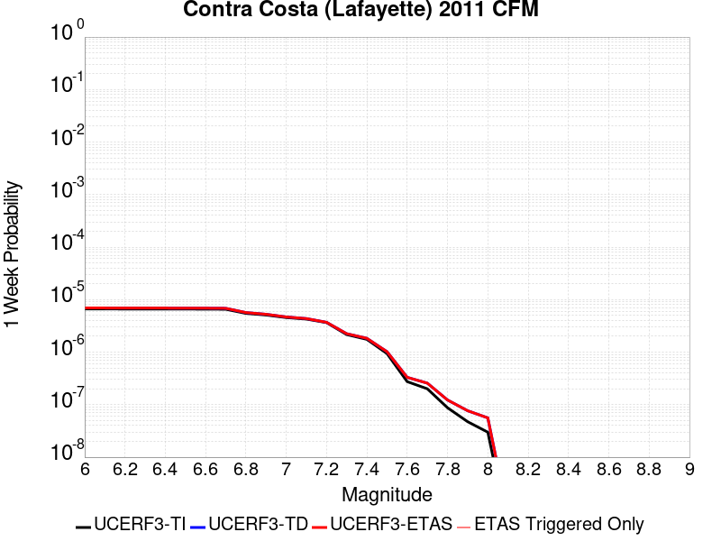 | 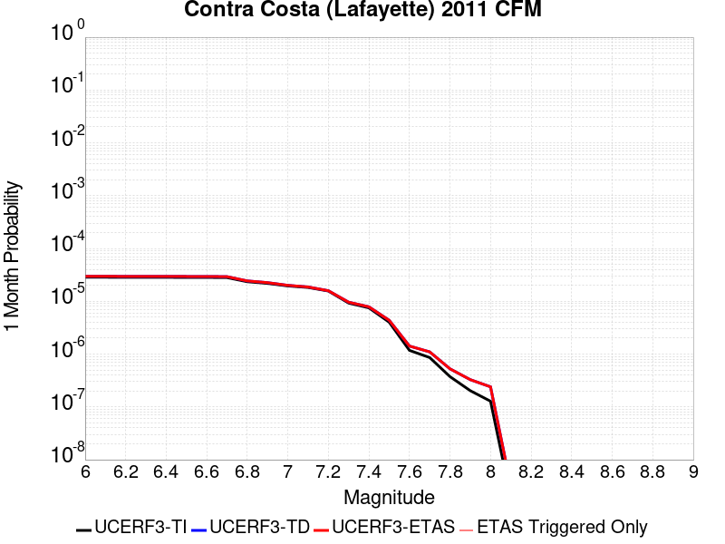 |  | 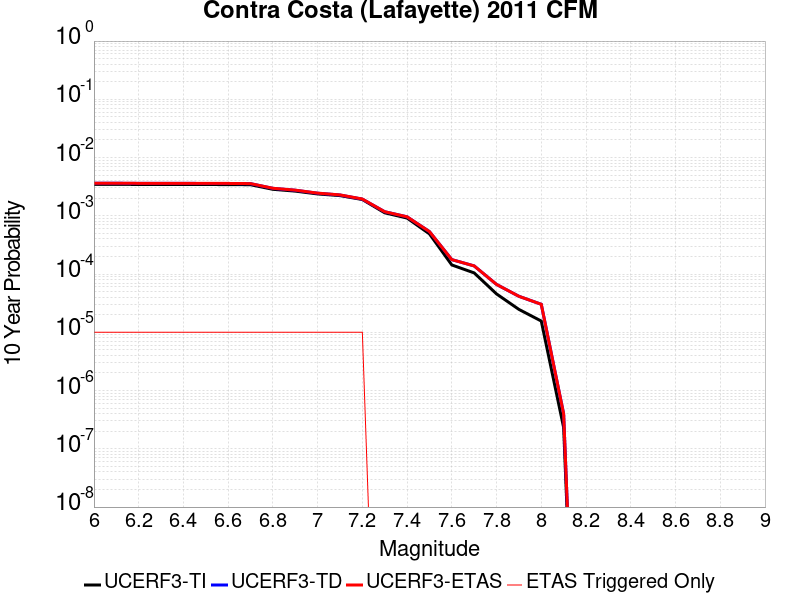 |

| Magnitude | 1 wk TI Prob | 1 wk TD Prob | 1 wk ETAS Prob | 1 wk ETAS/TD Gain | 1 wk ETAS Triggered Only | 1 mo TI Prob | 1 mo TD Prob | 1 mo ETAS Prob | 1 mo ETAS/TD Gain | 1 mo ETAS Triggered Only | 1 yr TI Prob | 1 yr TD Prob | 1 yr ETAS Prob | 1 yr ETAS/TD Gain | 1 yr ETAS Triggered Only | 10 yr TI Prob | 10 yr TD Prob | 10 yr ETAS Prob | 10 yr ETAS/TD Gain | 10 yr ETAS Triggered Only |
|-----|-----|-----|-----|-----|-----|-----|-----|-----|-----|-----|-----|-----|-----|-----|-----|-----|-----|-----|-----|-----|
| 6.0 | 6.655419E-6 | 6.9373477E-6 | 6.9373477E-6 | 1.0 | 0.0 | 2.8522913E-5 | 2.9731164E-5 | 2.9731164E-5 | 1.0 | 0.0 | 3.472111E-4 | 3.6191876E-4 | 3.723017E-4 | 1.0286885 | 1.0386697E-5 | 0.0034666911 | 0.0036181486 | 0.0036284977 | 1.0028603 | 1.0386697E-5 |
| 6.1 | 6.655419E-6 | 6.9373477E-6 | 6.9373477E-6 | 1.0 | 0.0 | 2.8522913E-5 | 2.9731164E-5 | 2.9731164E-5 | 1.0 | 0.0 | 3.472111E-4 | 3.6191876E-4 | 3.723017E-4 | 1.0286885 | 1.0386697E-5 | 0.0034666911 | 0.0036181486 | 0.0036284977 | 1.0028603 | 1.0386697E-5 |
| 6.2 | 6.6254133E-6 | 6.905756E-6 | 6.905756E-6 | 1.0 | 0.0 | 2.839432E-5 | 2.9595773E-5 | 2.9595773E-5 | 1.0 | 0.0 | 3.45646E-4 | 3.6027093E-4 | 3.706539E-4 | 1.0288198 | 1.0386697E-5 | 0.003451089 | 0.0036017238 | 0.0036120731 | 1.0028734 | 1.0386697E-5 |
| 6.3 | 6.6254133E-6 | 6.905756E-6 | 6.905756E-6 | 1.0 | 0.0 | 2.839432E-5 | 2.9595773E-5 | 2.9595773E-5 | 1.0 | 0.0 | 3.45646E-4 | 3.6027093E-4 | 3.706539E-4 | 1.0288198 | 1.0386697E-5 | 0.003451089 | 0.0036017238 | 0.0036120731 | 1.0028734 | 1.0386697E-5 |
| 6.4 | 6.6254133E-6 | 6.905756E-6 | 6.905756E-6 | 1.0 | 0.0 | 2.839432E-5 | 2.9595773E-5 | 2.9595773E-5 | 1.0 | 0.0 | 3.45646E-4 | 3.6027093E-4 | 3.706539E-4 | 1.0288198 | 1.0386697E-5 | 0.003451089 | 0.0036017238 | 0.0036120731 | 1.0028734 | 1.0386697E-5 |
| 6.5 | 6.606445E-6 | 6.8853037E-6 | 6.8853037E-6 | 1.0 | 0.0 | 2.8313027E-5 | 2.950812E-5 | 2.950812E-5 | 1.0 | 0.0 | 3.4465658E-4 | 3.5920413E-4 | 3.695871E-4 | 1.0289055 | 1.0386697E-5 | 0.0034412253 | 0.0035910904 | 0.0036014398 | 1.002882 | 1.0386697E-5 |
| 6.6 | 6.59966E-6 | 6.8778413E-6 | 6.8778413E-6 | 1.0 | 0.0 | 2.828395E-5 | 2.9476141E-5 | 2.9476141E-5 | 1.0 | 0.0 | 3.4430268E-4 | 3.588149E-4 | 3.6919786E-4 | 1.0289369 | 1.0386697E-5 | 0.0034376972 | 0.0035872106 | 0.0035975599 | 1.0028851 | 1.0386697E-5 |
| 6.7 | 6.5570975E-6 | 6.83183E-6 | 6.83183E-6 | 1.0 | 0.0 | 2.8101544E-5 | 2.9278955E-5 | 2.9278955E-5 | 1.0 | 0.0 | 3.4208258E-4 | 3.5641494E-4 | 3.6679793E-4 | 1.0291318 | 1.0386697E-5 | 0.0034155648 | 0.0035632881 | 0.003573638 | 1.0029045 | 1.0386697E-5 |
| 6.8 | 5.472255E-6 | 5.674789E-6 | 5.674789E-6 | 1.0 | 0.0 | 2.345231E-5 | 2.43203E-5 | 2.43203E-5 | 1.0 | 0.0 | 2.8549446E-4 | 2.9605988E-4 | 3.0644352E-4 | 1.0350727 | 1.0386697E-5 | 0.0028512797 | 0.002961362 | 0.0029717179 | 1.003497 | 1.0386697E-5 |
| 6.9 | 5.092346E-6 | 5.2651344E-6 | 5.2651344E-6 | 1.0 | 0.0 | 2.1824157E-5 | 2.2564667E-5 | 2.2564667E-5 | 1.0 | 0.0 | 2.656767E-4 | 2.7469057E-4 | 2.850744E-4 | 1.037802 | 1.0386697E-5 | 0.002653593 | 0.0027482098 | 0.002758568 | 1.003769 | 1.0386697E-5 |
| 7.0 | 4.5525762E-6 | 4.678434E-6 | 4.678434E-6 | 1.0 | 0.0 | 1.9510895E-5 | 2.0050278E-5 | 2.0050278E-5 | 1.0 | 0.0 | 2.3751926E-4 | 2.440851E-4 | 2.5446925E-4 | 1.0425432 | 1.0386697E-5 | 0.0023726553 | 0.002442859 | 0.0024532205 | 1.0042415 | 1.0386697E-5 |
| 7.1 | 4.261504E-6 | 4.3575856E-6 | 4.3575856E-6 | 1.0 | 0.0 | 1.826346E-5 | 1.8675235E-5 | 1.8675235E-5 | 1.0 | 0.0 | 2.2233493E-4 | 2.2734754E-4 | 2.3773187E-4 | 1.045676 | 1.0386697E-5 | 0.002221126 | 0.0022758266 | 0.0022861897 | 1.0045536 | 1.0386697E-5 |
| 7.2 | 3.654114E-6 | 3.698276E-6 | 3.698276E-6 | 1.0 | 0.0 | 1.5660395E-5 | 1.584966E-5 | 1.584966E-5 | 1.0 | 0.0 | 1.9064861E-4 | 1.9295276E-4 | 2.0333746E-4 | 1.0538199 | 1.0386697E-5 | 0.0019048514 | 0.0019324811 | 0.0019428477 | 1.0053644 | 1.0386697E-5 |
| 7.3 | 2.1595129E-6 | 2.2452375E-6 | 2.2452375E-6 | 1.0 | 0.0 | 9.255023E-6 | 9.622411E-6 | 9.622411E-6 | 1.0 | 0.0 | 1.1267407E-4 | 1.171466E-4 | 1.171466E-4 | 1.0 | 0.0 | 0.0011261696 | 0.0011754467 | 0.0011754467 | 1.0 | 0.0 |
| 7.4 | 1.7532738E-6 | 1.8343657E-6 | 1.8343657E-6 | 1.0 | 0.0 | 7.5140088E-6 | 7.861544E-6 | 7.861544E-6 | 1.0 | 0.0 | 9.147922E-5 | 9.571013E-5 | 9.571013E-5 | 1.0 | 0.0 | 9.144157E-4 | 9.6113834E-4 | 9.6113834E-4 | 1.0 | 0.0 |
| 7.5 | 9.387875E-7 | 1.0200953E-6 | 1.0200953E-6 | 1.0 | 0.0 | 4.0233685E-6 | 4.3718296E-6 | 4.3718296E-6 | 1.0 | 0.0 | 4.8983413E-5 | 5.3225736E-5 | 5.3225736E-5 | 1.0 | 0.0 | 4.897262E-4 | 5.3622056E-4 | 5.3622056E-4 | 1.0 | 0.0 |
| 7.6 | 2.7471893E-7 | 3.316463E-7 | 3.316463E-7 | 1.0 | 0.0 | 1.1773664E-6 | 1.4213406E-6 | 1.4213406E-6 | 1.0 | 0.0 | 1.433434E-5 | 1.7304685E-5 | 1.7304685E-5 | 1.0 | 0.0 | 1.4333417E-4 | 1.7692053E-4 | 1.7692053E-4 | 1.0 | 0.0 |
| 7.7 | 2.0057985E-7 | 2.5695095E-7 | 2.5695095E-7 | 1.0 | 0.0 | 8.596276E-7 | 1.1012179E-6 | 1.1012179E-6 | 1.0 | 0.0 | 1.0465916E-5 | 1.3407246E-5 | 1.3407246E-5 | 1.0 | 0.0 | 1.0465423E-4 | 1.3790745E-4 | 1.3790745E-4 | 1.0 | 0.0 |
| 7.8 | 8.7403905E-8 | 1.2287875E-7 | 1.2287875E-7 | 1.0 | 0.0 | 3.745881E-7 | 5.2662307E-7 | 5.2662307E-7 | 1.0 | 0.0 | 4.5606007E-6 | 6.411617E-6 | 6.411617E-6 | 1.0 | 0.0 | 4.560507E-5 | 6.63812E-5 | 6.63812E-5 | 1.0 | 0.0 |
| 7.9 | 4.740233E-8 | 7.66584E-8 | 7.66584E-8 | 1.0 | 0.0 | 2.0315284E-7 | 3.2853598E-7 | 3.2853598E-7 | 1.0 | 0.0 | 2.473383E-6 | 3.999918E-6 | 3.999918E-6 | 1.0 | 0.0 | 2.4733554E-5 | 4.1535986E-5 | 4.1535986E-5 | 1.0 | 0.0 |
| 8.0 | 2.99164E-8 | 5.6046844E-8 | 5.6046844E-8 | 1.0 | 0.0 | 1.2821314E-7 | 2.4020073E-7 | 2.4020073E-7 | 1.0 | 0.0 | 1.5609938E-6 | 2.92444E-6 | 2.92444E-6 | 1.0 | 0.0 | 1.5609829E-5 | 3.0268844E-5 | 3.0268844E-5 | 1.0 | 0.0 |
| 8.1 | 4.431212E-10 | 7.438916E-10 | 7.438916E-10 | 1.0 | 0.0 | 1.899091E-9 | 3.1881058E-9 | 3.1881058E-9 | 1.0 | 0.0 | 2.3121432E-8 | 3.8815188E-8 | 3.8815188E-8 | 1.0 | 0.0 | 2.312143E-7 | 3.9697463E-7 | 3.9697463E-7 | 1.0 | 0.0 |

## San Gabriel (Extension)
*[(top)](#table-of-contents)*

| 1 Week | 1 Month | 1 Year | 10 Year |
|-----|-----|-----|-----|
|  |  | 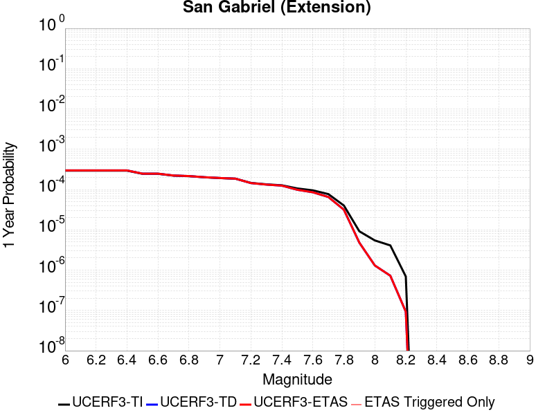 | 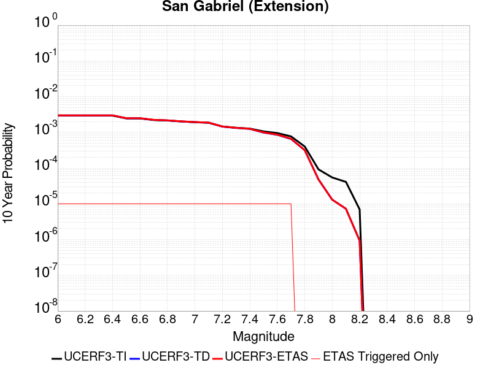 |

| Magnitude | 1 wk TI Prob | 1 wk TD Prob | 1 wk ETAS Prob | 1 wk ETAS/TD Gain | 1 wk ETAS Triggered Only | 1 mo TI Prob | 1 mo TD Prob | 1 mo ETAS Prob | 1 mo ETAS/TD Gain | 1 mo ETAS Triggered Only | 1 yr TI Prob | 1 yr TD Prob | 1 yr ETAS Prob | 1 yr ETAS/TD Gain | 1 yr ETAS Triggered Only | 10 yr TI Prob | 10 yr TD Prob | 10 yr ETAS Prob | 10 yr ETAS/TD Gain | 10 yr ETAS Triggered Only |
|-----|-----|-----|-----|-----|-----|-----|-----|-----|-----|-----|-----|-----|-----|-----|-----|-----|-----|-----|-----|-----|
| 6.0 | 5.6486106E-6 | 5.7180964E-6 | 5.7180964E-6 | 1.0 | 0.0 | 2.4208108E-5 | 2.4505905E-5 | 2.4505905E-5 | 1.0 | 0.0 | 2.9469383E-4 | 2.9831982E-4 | 2.9831982E-4 | 1.0 | 0.0 | 0.0029430336 | 0.002979324 | 0.0029896796 | 1.0034759 | 1.0386697E-5 |
| 6.1 | 5.6486106E-6 | 5.7180964E-6 | 5.7180964E-6 | 1.0 | 0.0 | 2.4208108E-5 | 2.4505905E-5 | 2.4505905E-5 | 1.0 | 0.0 | 2.9469383E-4 | 2.9831982E-4 | 2.9831982E-4 | 1.0 | 0.0 | 0.0029430336 | 0.002979324 | 0.0029896796 | 1.0034759 | 1.0386697E-5 |
| 6.2 | 5.6486106E-6 | 5.7180964E-6 | 5.7180964E-6 | 1.0 | 0.0 | 2.4208108E-5 | 2.4505905E-5 | 2.4505905E-5 | 1.0 | 0.0 | 2.9469383E-4 | 2.9831982E-4 | 2.9831982E-4 | 1.0 | 0.0 | 0.0029430336 | 0.002979324 | 0.0029896796 | 1.0034759 | 1.0386697E-5 |
| 6.3 | 5.6486106E-6 | 5.7180964E-6 | 5.7180964E-6 | 1.0 | 0.0 | 2.4208108E-5 | 2.4505905E-5 | 2.4505905E-5 | 1.0 | 0.0 | 2.9469383E-4 | 2.9831982E-4 | 2.9831982E-4 | 1.0 | 0.0 | 0.0029430336 | 0.002979324 | 0.0029896796 | 1.0034759 | 1.0386697E-5 |
| 6.4 | 5.6486106E-6 | 5.7180964E-6 | 5.7180964E-6 | 1.0 | 0.0 | 2.4208108E-5 | 2.4505905E-5 | 2.4505905E-5 | 1.0 | 0.0 | 2.9469383E-4 | 2.9831982E-4 | 2.9831982E-4 | 1.0 | 0.0 | 0.0029430336 | 0.002979324 | 0.0029896796 | 1.0034759 | 1.0386697E-5 |
| 6.5 | 4.7134554E-6 | 4.7555054E-6 | 4.7555054E-6 | 1.0 | 0.0 | 2.0200367E-5 | 2.0380583E-5 | 2.0380583E-5 | 1.0 | 0.0 | 2.459117E-4 | 2.481062E-4 | 2.481062E-4 | 1.0 | 0.0 | 0.0024563975 | 0.0024783802 | 0.0024887412 | 1.0041806 | 1.0386697E-5 |
| 6.6 | 4.7134554E-6 | 4.7555054E-6 | 4.7555054E-6 | 1.0 | 0.0 | 2.0200367E-5 | 2.0380583E-5 | 2.0380583E-5 | 1.0 | 0.0 | 2.459117E-4 | 2.481062E-4 | 2.481062E-4 | 1.0 | 0.0 | 0.0024563975 | 0.0024783802 | 0.0024887412 | 1.0041806 | 1.0386697E-5 |
| 6.7 | 4.2468837E-6 | 4.2753154E-6 | 4.2753154E-6 | 1.0 | 0.0 | 1.8200803E-5 | 1.8322657E-5 | 1.8322657E-5 | 1.0 | 0.0 | 2.2157225E-4 | 2.2305622E-4 | 2.2305622E-4 | 1.0 | 0.0 | 0.0022135144 | 0.0022283993 | 0.0022387628 | 1.0046507 | 1.0386697E-5 |
| 6.8 | 4.1180615E-6 | 4.142703E-6 | 4.142703E-6 | 1.0 | 0.0 | 1.7648716E-5 | 1.7754324E-5 | 1.7754324E-5 | 1.0 | 0.0 | 2.1485193E-4 | 2.1613819E-4 | 2.1613819E-4 | 1.0 | 0.0 | 0.0021464431 | 0.0021593547 | 0.002169719 | 1.0047997 | 1.0386697E-5 |
| 6.9 | 3.863861E-6 | 3.8810144E-6 | 3.8810144E-6 | 1.0 | 0.0 | 1.65593E-5 | 1.6632815E-5 | 1.6632815E-5 | 1.0 | 0.0 | 2.0159081E-4 | 2.024864E-4 | 2.024864E-4 | 1.0 | 0.0 | 0.0020140803 | 0.0020230904 | 0.0020334562 | 1.0051237 | 1.0386697E-5 |
| 7.0 | 3.6947372E-6 | 3.7069108E-6 | 3.7069108E-6 | 1.0 | 0.0 | 1.5834492E-5 | 1.5886668E-5 | 1.5886668E-5 | 1.0 | 0.0 | 1.9276788E-4 | 1.9340368E-4 | 1.9340368E-4 | 1.0 | 0.0 | 0.0019260074 | 0.0019324239 | 0.0019427905 | 1.0053645 | 1.0386697E-5 |
| 7.1 | 3.5686835E-6 | 3.574127E-6 | 3.574127E-6 | 1.0 | 0.0 | 1.5294268E-5 | 1.53176E-5 | 1.53176E-5 | 1.0 | 0.0 | 1.861918E-4 | 1.8647649E-4 | 1.8647649E-4 | 1.0 | 0.0 | 0.0018603588 | 0.0018632698 | 0.0018736372 | 1.0055641 | 1.0386697E-5 |
| 7.2 | 2.8023446E-6 | 2.778001E-6 | 2.778001E-6 | 1.0 | 0.0 | 1.2009994E-5 | 1.1905665E-5 | 1.1905665E-5 | 1.0 | 0.0 | 1.4621185E-4 | 1.4494194E-4 | 1.4494194E-4 | 1.0 | 0.0 | 0.001461157 | 0.0014484887 | 0.0014588604 | 1.0071603 | 1.0386697E-5 |
| 7.3 | 2.5843012E-6 | 2.5471647E-6 | 2.5471647E-6 | 1.0 | 0.0 | 1.1075529E-5 | 1.0916376E-5 | 1.0916376E-5 | 1.0 | 0.0 | 1.3483623E-4 | 1.3289887E-4 | 1.3289887E-4 | 1.0 | 0.0 | 0.0013475444 | 0.0013282074 | 0.0013385803 | 1.0078098 | 1.0386697E-5 |
| 7.4 | 2.4464468E-6 | 2.3978484E-6 | 2.3978484E-6 | 1.0 | 0.0 | 1.04847295E-5 | 1.0276453E-5 | 1.0276453E-5 | 1.0 | 0.0 | 1.276441E-4 | 1.2510874E-4 | 1.2510874E-4 | 1.0 | 0.0 | 0.0012757082 | 0.0012503964 | 0.0012607701 | 1.0082964 | 1.0386697E-5 |
| 7.5 | 2.0420266E-6 | 1.8920883E-6 | 1.8920883E-6 | 1.0 | 0.0 | 8.751514E-6 | 8.108925E-6 | 8.108925E-6 | 1.0 | 0.0 | 1.0654447E-4 | 9.872172E-5 | 9.872172E-5 | 1.0 | 0.0 | 0.001064934 | 9.867859E-4 | 9.971623E-4 | 1.0105155 | 1.0386697E-5 |
| 7.6 | 1.8326596E-6 | 1.6408112E-6 | 1.6408112E-6 | 1.0 | 0.0 | 7.854232E-6 | 7.0320293E-6 | 7.0320293E-6 | 1.0 | 0.0 | 9.562107E-5 | 8.561162E-5 | 8.561162E-5 | 1.0 | 0.0 | 9.5579936E-4 | 8.5579226E-4 | 8.6617004E-4 | 1.0121266 | 1.0386697E-5 |
| 7.7 | 1.4786998E-6 | 1.253282E-6 | 1.253282E-6 | 1.0 | 0.0 | 6.3372695E-6 | 5.3711974E-6 | 5.3711974E-6 | 1.0 | 0.0 | 7.715353E-5 | 6.539238E-5 | 6.539238E-5 | 1.0 | 0.0 | 7.7126746E-4 | 6.537391E-4 | 6.64119E-4 | 1.0158777 | 1.0386697E-5 |
| 7.8 | 7.6975533E-7 | 6.076896E-7 | 6.076896E-7 | 1.0 | 0.0 | 3.2989474E-6 | 2.6043815E-6 | 2.6043815E-6 | 1.0 | 0.0 | 4.0163945E-5 | 3.1707885E-5 | 3.1707885E-5 | 1.0 | 0.0 | 4.0156685E-4 | 3.170397E-4 | 3.170397E-4 | 1.0 | 0.0 |
| 7.9 | 1.7645915E-7 | 9.23446E-8 | 9.23446E-8 | 1.0 | 0.0 | 7.562533E-7 | 3.957625E-7 | 3.957625E-7 | 1.0 | 0.0 | 9.207345E-6 | 4.818398E-6 | 4.818398E-6 | 1.0 | 0.0 | 9.206964E-5 | 4.818764E-5 | 4.818764E-5 | 1.0 | 0.0 |
| 8.0 | 1.0463461E-7 | 2.5039434E-8 | 2.5039434E-8 | 1.0 | 0.0 | 4.4843398E-7 | 1.07311855E-7 | 1.07311855E-7 | 1.0 | 0.0 | 5.45967E-6 | 1.306521E-6 | 1.306521E-6 | 1.0 | 0.0 | 5.459536E-5 | 1.3069835E-5 | 1.3069835E-5 | 1.0 | 0.0 |
| 8.1 | 7.875717E-8 | 1.3925853E-8 | 1.3925853E-8 | 1.0 | 0.0 | 3.3753068E-7 | 5.968223E-8 | 5.968223E-8 | 1.0 | 0.0 | 4.109428E-6 | 7.2663084E-7 | 7.2663084E-7 | 1.0 | 0.0 | 4.109352E-5 | 7.2709863E-6 | 7.2709863E-6 | 1.0 | 0.0 |
| 8.2 | 1.33163E-8 | 1.7819906E-9 | 1.7819906E-9 | 1.0 | 0.0 | 5.7069855E-8 | 7.637102E-9 | 7.637102E-9 | 1.0 | 0.0 | 6.9482525E-7 | 9.298171E-8 | 9.298171E-8 | 1.0 | 0.0 | 6.9482307E-6 | 9.3179125E-7 | 9.3179125E-7 | 1.0 | 0.0 |

## Shoreline
*[(top)](#table-of-contents)*

| 1 Week | 1 Month | 1 Year | 10 Year |
|-----|-----|-----|-----|
|  |  |  |  |

| Magnitude | 1 wk TI Prob | 1 wk TD Prob | 1 wk ETAS Prob | 1 wk ETAS/TD Gain | 1 wk ETAS Triggered Only | 1 mo TI Prob | 1 mo TD Prob | 1 mo ETAS Prob | 1 mo ETAS/TD Gain | 1 mo ETAS Triggered Only | 1 yr TI Prob | 1 yr TD Prob | 1 yr ETAS Prob | 1 yr ETAS/TD Gain | 1 yr ETAS Triggered Only | 10 yr TI Prob | 10 yr TD Prob | 10 yr ETAS Prob | 10 yr ETAS/TD Gain | 10 yr ETAS Triggered Only |
|-----|-----|-----|-----|-----|-----|-----|-----|-----|-----|-----|-----|-----|-----|-----|-----|-----|-----|-----|-----|-----|
| 6.0 | 3.9888673E-6 | 4.047993E-6 | 4.047993E-6 | 1.0 | 0.0 | 1.7095033E-5 | 1.7348459E-5 | 1.7348459E-5 | 1.0 | 0.0 | 2.0811215E-4 | 2.1120261E-4 | 2.1120261E-4 | 1.0 | 0.0 | 0.0020791737 | 0.0021105676 | 0.0021209323 | 1.004911 | 1.0386697E-5 |
| 6.1 | 3.9888673E-6 | 4.047993E-6 | 4.047993E-6 | 1.0 | 0.0 | 1.7095033E-5 | 1.7348459E-5 | 1.7348459E-5 | 1.0 | 0.0 | 2.0811215E-4 | 2.1120261E-4 | 2.1120261E-4 | 1.0 | 0.0 | 0.0020791737 | 0.0021105676 | 0.0021209323 | 1.004911 | 1.0386697E-5 |
| 6.2 | 1.4039653E-6 | 1.4101247E-6 | 1.4101247E-6 | 1.0 | 0.0 | 6.0169805E-6 | 6.0433777E-6 | 6.0433777E-6 | 1.0 | 0.0 | 7.325427E-5 | 7.35757E-5 | 7.35757E-5 | 1.0 | 0.0 | 7.3230127E-4 | 7.355194E-4 | 7.4589846E-4 | 1.0141112 | 1.0386697E-5 |
| 6.3 | 1.4039653E-6 | 1.4101247E-6 | 1.4101247E-6 | 1.0 | 0.0 | 6.0169805E-6 | 6.0433777E-6 | 6.0433777E-6 | 1.0 | 0.0 | 7.325427E-5 | 7.35757E-5 | 7.35757E-5 | 1.0 | 0.0 | 7.3230127E-4 | 7.355194E-4 | 7.4589846E-4 | 1.0141112 | 1.0386697E-5 |
| 6.4 | 1.3314152E-6 | 1.3361953E-6 | 1.3361953E-6 | 1.0 | 0.0 | 5.7060524E-6 | 5.7265393E-6 | 5.7265393E-6 | 1.0 | 0.0 | 6.946897E-5 | 6.971844E-5 | 6.971844E-5 | 1.0 | 0.0 | 6.9447263E-4 | 6.96971E-4 | 7.073505E-4 | 1.0148922 | 1.0386697E-5 |
| 6.5 | 1.1187026E-6 | 1.1203972E-6 | 1.1203972E-6 | 1.0 | 0.0 | 4.794431E-6 | 4.801693E-6 | 4.801693E-6 | 1.0 | 0.0 | 5.8370628E-5 | 5.8459074E-5 | 5.8459074E-5 | 1.0 | 0.0 | 5.83553E-4 | 5.844395E-4 | 5.948201E-4 | 1.0177617 | 1.0386697E-5 |
| 6.6 | 9.793089E-7 | 9.785238E-7 | 9.785238E-7 | 1.0 | 0.0 | 4.1970316E-6 | 4.193667E-6 | 4.193667E-6 | 1.0 | 0.0 | 5.1097657E-5 | 5.1056708E-5 | 5.1056708E-5 | 1.0 | 0.0 | 5.108591E-4 | 5.104511E-4 | 5.208325E-4 | 1.0203377 | 1.0386697E-5 |
| 6.7 | 8.995986E-7 | 8.97311E-7 | 8.97311E-7 | 1.0 | 0.0 | 3.8554167E-6 | 3.845613E-6 | 3.845613E-6 | 1.0 | 0.0 | 4.693869E-5 | 4.6819343E-5 | 4.6819343E-5 | 1.0 | 0.0 | 4.6928777E-4 | 4.6809574E-4 | 4.7847757E-4 | 1.0221789 | 1.0386697E-5 |
| 6.8 | 7.931612E-7 | 7.8806977E-7 | 7.8806977E-7 | 1.0 | 0.0 | 3.3992578E-6 | 3.3774375E-6 | 3.3774375E-6 | 1.0 | 0.0 | 4.1385178E-5 | 4.1119532E-5 | 4.1119532E-5 | 1.0 | 0.0 | 4.1377472E-4 | 4.1111978E-4 | 4.215022E-4 | 1.025254 | 1.0386697E-5 |
| 6.9 | 7.1465956E-7 | 7.0782914E-7 | 7.0782914E-7 | 1.0 | 0.0 | 3.062823E-6 | 3.03355E-6 | 3.03355E-6 | 1.0 | 0.0 | 3.7289232E-5 | 3.6932848E-5 | 3.6932848E-5 | 1.0 | 0.0 | 3.7282976E-4 | 3.6926748E-4 | 3.6926748E-4 | 1.0 | 0.0 |
| 7.0 | 6.389046E-7 | 6.299732E-7 | 6.299732E-7 | 1.0 | 0.0 | 2.7381598E-6 | 2.6998825E-6 | 2.6998825E-6 | 1.0 | 0.0 | 3.3336586E-5 | 3.2870576E-5 | 3.2870576E-5 | 1.0 | 0.0 | 3.3331584E-4 | 3.2865736E-4 | 3.2865736E-4 | 1.0 | 0.0 |
| 7.1 | 5.4300875E-7 | 5.311389E-7 | 5.311389E-7 | 1.0 | 0.0 | 2.3271782E-6 | 2.2763074E-6 | 2.2763074E-6 | 1.0 | 0.0 | 2.8333026E-5 | 2.7713693E-5 | 2.7713693E-5 | 1.0 | 0.0 | 2.8329415E-4 | 2.771025E-4 | 2.771025E-4 | 1.0 | 0.0 |
| 7.2 | 4.6768855E-7 | 4.5351405E-7 | 4.5351405E-7 | 1.0 | 0.0 | 2.0043778E-6 | 1.9436302E-6 | 1.9436302E-6 | 1.0 | 0.0 | 2.4403027E-5 | 2.366344E-5 | 2.366344E-5 | 1.0 | 0.0 | 2.4400349E-4 | 2.3660927E-4 | 2.3660927E-4 | 1.0 | 0.0 |
| 7.3 | 4.0966103E-7 | 3.9388027E-7 | 3.9388027E-7 | 1.0 | 0.0 | 1.7556889E-6 | 1.6880572E-6 | 1.6880572E-6 | 1.0 | 0.0 | 2.1375303E-5 | 2.0551903E-5 | 2.0551903E-5 | 1.0 | 0.0 | 2.1373246E-4 | 2.0550007E-4 | 2.0550007E-4 | 1.0 | 0.0 |
| 7.4 | 3.5105785E-7 | 3.336625E-7 | 3.336625E-7 | 1.0 | 0.0 | 1.5045327E-6 | 1.4299814E-6 | 1.4299814E-6 | 1.0 | 0.0 | 1.8317533E-5 | 1.7409884E-5 | 1.7409884E-5 | 1.0 | 0.0 | 1.8316023E-4 | 1.7408523E-4 | 1.7408523E-4 | 1.0 | 0.0 |
| 7.5 | 2.8737534E-7 | 2.6822218E-7 | 2.6822218E-7 | 1.0 | 0.0 | 1.2316079E-6 | 1.1495231E-6 | 1.1495231E-6 | 1.0 | 0.0 | 1.4994724E-5 | 1.39953545E-5 | 1.39953545E-5 | 1.0 | 0.0 | 1.4993713E-4 | 1.3994475E-4 | 1.3994475E-4 | 1.0 | 0.0 |
| 7.6 | 2.0924051E-7 | 1.8781041E-7 | 1.8781041E-7 | 1.0 | 0.0 | 8.967448E-7 | 8.0490156E-7 | 8.0490156E-7 | 1.0 | 0.0 | 1.0917813E-5 | 9.799632E-6 | 9.799632E-6 | 1.0 | 0.0 | 1.0917276E-4 | 9.799201E-5 | 9.799201E-5 | 1.0 | 0.0 |
| 7.7 | 1.392265E-7 | 1.1545315E-7 | 1.1545315E-7 | 1.0 | 0.0 | 5.9668486E-7 | 4.947991E-7 | 4.947991E-7 | 1.0 | 0.0 | 7.2646135E-6 | 6.0241623E-6 | 6.0241623E-6 | 1.0 | 0.0 | 7.2643765E-5 | 6.0239996E-5 | 6.0239996E-5 | 1.0 | 0.0 |
| 7.8 | 8.1080074E-8 | 5.58853E-8 | 5.58853E-8 | 1.0 | 0.0 | 3.4748598E-7 | 2.395084E-7 | 2.395084E-7 | 1.0 | 0.0 | 4.2306337E-6 | 2.916011E-6 | 2.916011E-6 | 1.0 | 0.0 | 4.230553E-5 | 2.9159728E-5 | 2.9159728E-5 | 1.0 | 0.0 |
| 7.9 | 5.0859036E-8 | 2.7260723E-8 | 2.7260723E-8 | 1.0 | 0.0 | 2.1796728E-7 | 1.1683167E-7 | 1.1683167E-7 | 1.0 | 0.0 | 2.6537484E-6 | 1.4224246E-6 | 1.4224246E-6 | 1.0 | 0.0 | 2.6537167E-5 | 1.4224156E-5 | 1.4224156E-5 | 1.0 | 0.0 |
| 8.0 | 3.1760536E-8 | 1.3589531E-8 | 1.3589531E-8 | 1.0 | 0.0 | 1.3611657E-7 | 5.8240847E-8 | 5.8240847E-8 | 1.0 | 0.0 | 1.6572179E-6 | 7.090821E-7 | 7.090821E-7 | 1.0 | 0.0 | 1.6572056E-5 | 7.0907986E-6 | 7.0907986E-6 | 1.0 | 0.0 |
| 8.1 | 1.2947896E-8 | 5.6681917E-9 | 5.6681917E-9 | 1.0 | 0.0 | 5.5490982E-8 | 2.4292248E-8 | 2.4292248E-8 | 1.0 | 0.0 | 6.756025E-7 | 2.957581E-7 | 2.957581E-7 | 1.0 | 0.0 | 6.7560045E-6 | 2.9575772E-6 | 2.9575772E-6 | 1.0 | 0.0 |

## Mendocino
*[(top)](#table-of-contents)*

| 1 Week | 1 Month | 1 Year | 10 Year |
|-----|-----|-----|-----|
|  |  |  |  |

| Magnitude | 1 wk TI Prob | 1 wk TD Prob | 1 wk ETAS Prob | 1 wk ETAS/TD Gain | 1 wk ETAS Triggered Only | 1 mo TI Prob | 1 mo TD Prob | 1 mo ETAS Prob | 1 mo ETAS/TD Gain | 1 mo ETAS Triggered Only | 1 yr TI Prob | 1 yr TD Prob | 1 yr ETAS Prob | 1 yr ETAS/TD Gain | 1 yr ETAS Triggered Only | 10 yr TI Prob | 10 yr TD Prob | 10 yr ETAS Prob | 10 yr ETAS/TD Gain | 10 yr ETAS Triggered Only |
|-----|-----|-----|-----|-----|-----|-----|-----|-----|-----|-----|-----|-----|-----|-----|-----|-----|-----|-----|-----|-----|
| 6.0 | 5.5409013E-4 | 0.0010840651 | 0.0010840651 | 1.0 | 0.0 | 0.0023725112 | 0.0046365443 | 0.0046365443 | 1.0 | 0.0 | 0.028505474 | 0.05468172 | 0.05468172 | 1.0 | 0.0 | 0.25113493 | 0.41193083 | 0.41193694 | 1.0000148 | 1.0386697E-5 |
| 6.1 | 4.2515888E-4 | 8.233533E-4 | 8.233533E-4 | 1.0 | 0.0 | 0.0018208373 | 0.0035227416 | 0.0035227416 | 1.0 | 0.0 | 0.021944538 | 0.04175785 | 0.04175785 | 1.0 | 0.0 | 0.19899574 | 0.3300017 | 0.33000866 | 1.0000211 | 1.0386697E-5 |
| 6.2 | 4.2515888E-4 | 8.233533E-4 | 8.233533E-4 | 1.0 | 0.0 | 0.0018208373 | 0.0035227416 | 0.0035227416 | 1.0 | 0.0 | 0.021944538 | 0.04175785 | 0.04175785 | 1.0 | 0.0 | 0.19899574 | 0.3300017 | 0.33000866 | 1.0000211 | 1.0386697E-5 |
| 6.3 | 3.2773745E-4 | 6.1965483E-4 | 6.1965483E-4 | 1.0 | 0.0 | 0.0014038329 | 0.0026526814 | 0.0026526814 | 1.0 | 0.0 | 0.016958237 | 0.031601425 | 0.031601425 | 1.0 | 0.0 | 0.1572094 | 0.26082414 | 0.2608318 | 1.0000294 | 1.0386697E-5 |
| 6.4 | 2.7417165E-4 | 5.0488714E-4 | 5.0488714E-4 | 1.0 | 0.0 | 0.0011744922 | 0.002161933 | 0.002161933 | 1.0 | 0.0 | 0.014205975 | 0.025846353 | 0.025846353 | 1.0 | 0.0 | 0.13331394 | 0.21952665 | 0.21953475 | 1.000037 | 1.0386697E-5 |
| 6.5 | 2.3984899E-4 | 4.3254386E-4 | 4.3254386E-4 | 1.0 | 0.0 | 0.0010275192 | 0.00185236 | 0.00185236 | 1.0 | 0.0 | 0.012438473 | 0.022189107 | 0.022189107 | 1.0 | 0.0 | 0.11764851 | 0.19208325 | 0.19209164 | 1.0000436 | 1.0386697E-5 |
| 6.6 | 2.1023539E-4 | 3.6955765E-4 | 3.6955765E-4 | 1.0 | 0.0 | 9.0069766E-4 | 0.0015829094 | 0.0015829094 | 1.0 | 0.0 | 0.010910975 | 0.018997893 | 0.018997893 | 1.0 | 0.0 | 0.10390546 | 0.16753985 | 0.1675485 | 1.0000516 | 1.0386697E-5 |
| 6.7 | 1.2592976E-4 | 1.842647E-4 | 1.842647E-4 | 1.0 | 0.0 | 5.395873E-4 | 7.894302E-4 | 7.894302E-4 | 1.0 | 0.0 | 0.006549705 | 0.009561417 | 0.009561417 | 1.0 | 0.0 | 0.063599944 | 0.091017045 | 0.091026485 | 1.0001037 | 1.0386697E-5 |
| 6.8 | 1.13663555E-4 | 1.541201E-4 | 1.541201E-4 | 1.0 | 0.0 | 4.8703855E-4 | 6.6030945E-4 | 6.6030945E-4 | 1.0 | 0.0 | 0.0059135845 | 0.008005183 | 0.008005183 | 1.0 | 0.0 | 0.057586733 | 0.07743927 | 0.07744885 | 1.0001237 | 1.0386697E-5 |
| 6.9 | 9.926894E-5 | 1.2307995E-4 | 1.2307995E-4 | 1.0 | 0.0 | 4.2536893E-4 | 5.273785E-4 | 5.273785E-4 | 1.0 | 0.0 | 0.0051665753 | 0.0064015854 | 0.0064015854 | 1.0 | 0.0 | 0.050480947 | 0.06290405 | 0.06291379 | 1.0001547 | 1.0386697E-5 |
| 7.0 | 9.168125E-5 | 1.0792481E-4 | 1.0792481E-4 | 1.0 | 0.0 | 3.9286047E-4 | 4.6245367E-4 | 4.6245367E-4 | 1.0 | 0.0 | 0.004772591 | 0.0056155208 | 0.0056155208 | 1.0 | 0.0 | 0.04671385 | 0.055664163 | 0.05567397 | 1.0001762 | 1.0386697E-5 |
| 7.1 | 8.2854116E-5 | 9.113475E-5 | 9.113475E-5 | 1.0 | 0.0 | 3.5504074E-4 | 3.9051977E-4 | 3.9051977E-4 | 1.0 | 0.0 | 0.004314056 | 0.004744216 | 0.004744216 | 1.0 | 0.0 | 0.042312626 | 0.047522213 | 0.047532108 | 1.0002081 | 1.0386697E-5 |
| 7.2 | 7.8255274E-5 | 8.308447E-5 | 8.308447E-5 | 1.0 | 0.0 | 3.3533663E-4 | 3.5602847E-4 | 3.5602847E-4 | 1.0 | 0.0 | 0.0040750825 | 0.0043261773 | 0.0043261773 | 1.0 | 0.0 | 0.040011603 | 0.043565933 | 0.043575868 | 1.000228 | 1.0386697E-5 |
| 7.3 | 6.887904E-5 | 6.2657535E-5 | 6.2657535E-5 | 1.0 | 0.0 | 2.9516246E-4 | 2.6850516E-4 | 2.6850516E-4 | 1.0 | 0.0 | 0.0035876823 | 0.0032642453 | 0.0032642453 | 1.0 | 0.0 | 0.035303112 | 0.033387214 | 0.033397254 | 1.0003008 | 1.0386697E-5 |
| 7.4 | 5.4898497E-5 | 3.744941E-5 | 3.744941E-5 | 1.0 | 0.0 | 2.3525805E-4 | 1.6048792E-4 | 1.6048792E-4 | 1.0 | 0.0 | 0.0028605047 | 0.0019522452 | 0.0019522452 | 1.0 | 0.0 | 0.02823963 | 0.02043759 | 0.020447766 | 1.0004978 | 1.0386697E-5 |
| 7.5 | 3.9103943E-5 | 1.1334679E-5 | 1.1334679E-5 | 1.0 | 0.0 | 1.6757756E-4 | 4.8576298E-5 | 4.8576298E-5 | 1.0 | 0.0 | 0.0020383475 | 5.912575E-4 | 5.912575E-4 | 1.0 | 0.0 | 0.020197518 | 0.006640222 | 0.00665054 | 1.0015538 | 1.0386697E-5 |
| 7.6 | 3.641042E-5 | 9.008758E-6 | 9.008758E-6 | 1.0 | 0.0 | 1.5603533E-4 | 3.86084E-5 | 3.86084E-5 | 1.0 | 0.0 | 0.0018980748 | 4.6995725E-4 | 4.6995725E-4 | 1.0 | 0.0 | 0.018819444 | 0.005362647 | 0.0053729783 | 1.0019264 | 1.0386697E-5 |
| 7.7 | 3.1318774E-5 | 4.4744484E-6 | 4.4744484E-6 | 1.0 | 0.0 | 1.342164E-4 | 1.9176068E-5 | 1.9176068E-5 | 1.0 | 0.0 | 0.0016328598 | 2.3344379E-4 | 2.3344379E-4 | 1.0 | 0.0 | 0.016209139 | 0.0028778263 | 0.002888183 | 1.0035988 | 1.0386697E-5 |
| 7.8 | 2.209241E-5 | 2.6945197E-6 | 2.6945197E-6 | 1.0 | 0.0 | 9.467832E-5 | 1.1547891E-5 | 1.1547891E-5 | 1.0 | 0.0 | 0.001152099 | 1.4058653E-4 | 1.4058653E-4 | 1.0 | 0.0 | 0.011461443 | 0.0017459134 | 0.0017562819 | 1.0059388 | 1.0386697E-5 |
| 7.9 | 1.2640477E-5 | 2.051996E-6 | 2.051996E-6 | 1.0 | 0.0 | 5.4172346E-5 | 8.794239E-6 | 8.794239E-6 | 1.0 | 0.0 | 6.593487E-4 | 1.07064625E-4 | 1.07064625E-4 | 1.0 | 0.0 | 0.006573958 | 0.0013039539 | 0.0013143271 | 1.0079552 | 1.0386697E-5 |
| 8.0 | 6.5548907E-6 | 1.64609E-6 | 1.64609E-6 | 1.0 | 0.0 | 2.8092087E-5 | 7.0546525E-6 | 7.0546525E-6 | 1.0 | 0.0 | 3.4196748E-4 | 8.588703E-5 | 8.588703E-5 | 1.0 | 0.0 | 0.0034144172 | 0.0010353618 | 0.0010457378 | 1.0100216 | 1.0386697E-5 |
| 8.1 | 3.1916707E-6 | 1.3647137E-6 | 1.3647137E-6 | 1.0 | 0.0 | 1.3678517E-5 | 5.84876E-6 | 5.84876E-6 | 1.0 | 0.0 | 1.6652321E-4 | 7.120635E-5 | 7.120635E-5 | 1.0 | 0.0 | 0.0016639848 | 8.6646E-4 | 8.768377E-4 | 1.0119771 | 1.0386697E-5 |
| 8.2 | 2.1193785E-6 | 1.0349098E-6 | 1.0349098E-6 | 1.0 | 0.0 | 9.083019E-6 | 4.43532E-6 | 4.43532E-6 | 1.0 | 0.0 | 1.1058014E-4 | 5.3998705E-5 | 5.3998705E-5 | 1.0 | 0.0 | 0.0011052513 | 6.530253E-4 | 6.530253E-4 | 1.0 | 0.0 |
| 8.3 | 7.536878E-7 | 3.9430077E-7 | 3.9430077E-7 | 1.0 | 0.0 | 3.2300866E-6 | 1.6898595E-6 | 1.6898595E-6 | 1.0 | 0.0 | 3.9325594E-5 | 2.0573858E-5 | 2.0573858E-5 | 1.0 | 0.0 | 3.9318635E-4 | 2.4218905E-4 | 2.4218905E-4 | 1.0 | 0.0 |

## Hosgri (Extension)
*[(top)](#table-of-contents)*

| 1 Week | 1 Month | 1 Year | 10 Year |
|-----|-----|-----|-----|
| 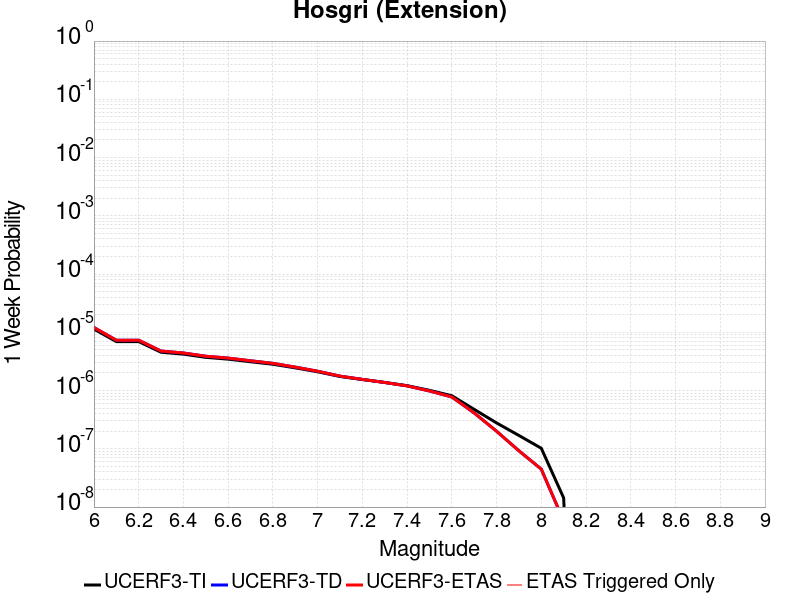 |  | 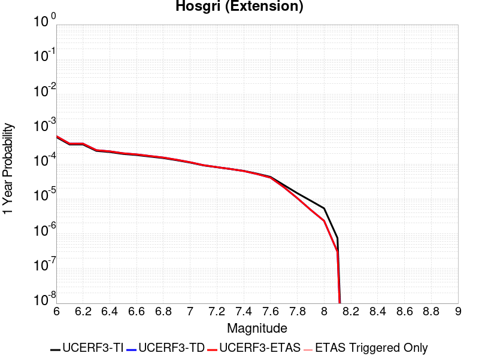 |  |

| Magnitude | 1 wk TI Prob | 1 wk TD Prob | 1 wk ETAS Prob | 1 wk ETAS/TD Gain | 1 wk ETAS Triggered Only | 1 mo TI Prob | 1 mo TD Prob | 1 mo ETAS Prob | 1 mo ETAS/TD Gain | 1 mo ETAS Triggered Only | 1 yr TI Prob | 1 yr TD Prob | 1 yr ETAS Prob | 1 yr ETAS/TD Gain | 1 yr ETAS Triggered Only | 10 yr TI Prob | 10 yr TD Prob | 10 yr ETAS Prob | 10 yr ETAS/TD Gain | 10 yr ETAS Triggered Only |
|-----|-----|-----|-----|-----|-----|-----|-----|-----|-----|-----|-----|-----|-----|-----|-----|-----|-----|-----|-----|-----|
| 6.0 | 1.1369135E-5 | 1.2083579E-5 | 1.2083579E-5 | 1.0 | 0.0 | 4.8723956E-5 | 5.1785868E-5 | 5.1785868E-5 | 1.0 | 0.0 | 5.9305265E-4 | 6.3033326E-4 | 6.3033326E-4 | 1.0 | 0.0 | 0.005914725 | 0.006287703 | 0.006298024 | 1.0016415 | 1.0386697E-5 |
| 6.1 | 6.934979E-6 | 7.324877E-6 | 7.324877E-6 | 1.0 | 0.0 | 2.9721E-5 | 3.1391977E-5 | 3.1391977E-5 | 1.0 | 0.0 | 3.617931E-4 | 3.8213443E-4 | 3.8213443E-4 | 1.0 | 0.0 | 0.0036120464 | 0.003815186 | 0.003815186 | 1.0 | 0.0 |
| 6.2 | 6.934979E-6 | 7.324877E-6 | 7.324877E-6 | 1.0 | 0.0 | 2.9721E-5 | 3.1391977E-5 | 3.1391977E-5 | 1.0 | 0.0 | 3.617931E-4 | 3.8213443E-4 | 3.8213443E-4 | 1.0 | 0.0 | 0.0036120464 | 0.003815186 | 0.003815186 | 1.0 | 0.0 |
| 6.3 | 4.5484676E-6 | 4.7695567E-6 | 4.7695567E-6 | 1.0 | 0.0 | 1.9493287E-5 | 2.0440799E-5 | 2.0440799E-5 | 1.0 | 0.0 | 2.3730492E-4 | 2.488387E-4 | 2.488387E-4 | 1.0 | 0.0 | 0.0023705168 | 0.0024856436 | 0.0024856436 | 1.0 | 0.0 |
| 6.4 | 4.218095E-6 | 4.4170756E-6 | 4.4170756E-6 | 1.0 | 0.0 | 1.8077424E-5 | 1.8930188E-5 | 1.8930188E-5 | 1.0 | 0.0 | 2.2007042E-4 | 2.3045098E-4 | 2.3045098E-4 | 1.0 | 0.0 | 0.002198526 | 0.0023021537 | 0.0023021537 | 1.0 | 0.0 |
| 6.5 | 3.717374E-6 | 3.884073E-6 | 3.884073E-6 | 1.0 | 0.0 | 1.5931506E-5 | 1.6645923E-5 | 1.6645923E-5 | 1.0 | 0.0 | 1.9394881E-4 | 2.0264545E-4 | 2.0264545E-4 | 1.0 | 0.0 | 0.0019377962 | 0.0020246254 | 0.0020246254 | 1.0 | 0.0 |
| 6.6 | 3.4605036E-6 | 3.6084912E-6 | 3.6084912E-6 | 1.0 | 0.0 | 1.4830645E-5 | 1.5464871E-5 | 1.5464871E-5 | 1.0 | 0.0 | 1.8054814E-4 | 1.8826868E-4 | 1.8826868E-4 | 1.0 | 0.0 | 0.0018040152 | 0.0018811065 | 0.0018811065 | 1.0 | 0.0 |
| 6.7 | 3.123439E-6 | 3.2467397E-6 | 3.2467397E-6 | 1.0 | 0.0 | 1.33860985E-5 | 1.3914525E-5 | 1.3914525E-5 | 1.0 | 0.0 | 1.6296357E-4 | 1.6939627E-4 | 1.6939627E-4 | 1.0 | 0.0 | 0.001628441 | 0.0016926825 | 0.0016926825 | 1.0 | 0.0 |
| 6.8 | 2.8290783E-6 | 2.9306989E-6 | 2.9306989E-6 | 1.0 | 0.0 | 1.2124565E-5 | 1.2560078E-5 | 1.2560078E-5 | 1.0 | 0.0 | 1.4760658E-4 | 1.5290831E-4 | 1.5290831E-4 | 1.0 | 0.0 | 0.0014750857 | 0.0015280397 | 0.0015280397 | 1.0 | 0.0 |
| 6.9 | 2.454112E-6 | 2.5284626E-6 | 2.5284626E-6 | 1.0 | 0.0 | 1.0517581E-5 | 1.0836224E-5 | 1.0836224E-5 | 1.0 | 0.0 | 1.2804402E-4 | 1.319231E-4 | 1.319231E-4 | 1.0 | 0.0 | 0.0012797028 | 0.0013184539 | 0.0013184539 | 1.0 | 0.0 |
| 7.0 | 2.1008145E-6 | 2.149999E-6 | 2.149999E-6 | 1.0 | 0.0 | 9.003459E-6 | 9.21425E-6 | 9.21425E-6 | 1.0 | 0.0 | 1.096116E-4 | 1.1217775E-4 | 1.1217775E-4 | 1.0 | 0.0 | 0.0010955755 | 0.0011212149 | 0.0011212149 | 1.0 | 0.0 |
| 7.1 | 1.744384E-6 | 1.7687499E-6 | 1.7687499E-6 | 1.0 | 0.0 | 7.47591E-6 | 7.580335E-6 | 7.580335E-6 | 1.0 | 0.0 | 9.1015405E-5 | 9.228669E-5 | 9.228669E-5 | 1.0 | 0.0 | 9.097813E-4 | 9.224854E-4 | 9.224854E-4 | 1.0 | 0.0 |
| 7.2 | 1.5456587E-6 | 1.5563953E-6 | 1.5563953E-6 | 1.0 | 0.0 | 6.6242346E-6 | 6.6702487E-6 | 6.6702487E-6 | 1.0 | 0.0 | 8.064707E-5 | 8.120726E-5 | 8.120726E-5 | 1.0 | 0.0 | 8.0617814E-4 | 8.1177714E-4 | 8.1177714E-4 | 1.0 | 0.0 |
| 7.3 | 1.3775123E-6 | 1.3767087E-6 | 1.3767087E-6 | 1.0 | 0.0 | 5.9036106E-6 | 5.900167E-6 | 5.900167E-6 | 1.0 | 0.0 | 7.187409E-5 | 7.1832175E-5 | 7.1832175E-5 | 1.0 | 0.0 | 7.185085E-4 | 7.1809057E-4 | 7.1809057E-4 | 1.0 | 0.0 |
| 7.4 | 1.214491E-6 | 1.2024402E-6 | 1.2024402E-6 | 1.0 | 0.0 | 5.2049513E-6 | 5.1533048E-6 | 5.1533048E-6 | 1.0 | 0.0 | 6.336844E-5 | 6.273969E-5 | 6.273969E-5 | 1.0 | 0.0 | 6.335037E-4 | 6.2722055E-4 | 6.2722055E-4 | 1.0 | 0.0 |
| 7.5 | 1.0101123E-6 | 9.843109E-7 | 9.843109E-7 | 1.0 | 0.0 | 4.3290456E-6 | 4.2184683E-6 | 4.2184683E-6 | 1.0 | 0.0 | 5.2704854E-5 | 5.135865E-5 | 5.135865E-5 | 1.0 | 0.0 | 5.2692357E-4 | 5.134684E-4 | 5.134684E-4 | 1.0 | 0.0 |
| 7.6 | 8.1558215E-7 | 7.7667556E-7 | 7.7667556E-7 | 1.0 | 0.0 | 3.4953473E-6 | 3.328605E-6 | 3.328605E-6 | 1.0 | 0.0 | 4.255502E-5 | 4.0525018E-5 | 4.0525018E-5 | 1.0 | 0.0 | 4.2546875E-4 | 4.0517675E-4 | 4.0517675E-4 | 1.0 | 0.0 |
| 7.7 | 4.757816E-7 | 4.1315434E-7 | 4.1315434E-7 | 1.0 | 0.0 | 2.0390623E-6 | 1.7706602E-6 | 1.7706602E-6 | 1.0 | 0.0 | 2.4825302E-5 | 2.1557576E-5 | 2.1557576E-5 | 1.0 | 0.0 | 2.482253E-4 | 2.1555497E-4 | 2.1555497E-4 | 1.0 | 0.0 |
| 7.8 | 2.782787E-7 | 2.0053405E-7 | 2.0053405E-7 | 1.0 | 0.0 | 1.1926223E-6 | 8.594313E-7 | 8.594313E-7 | 1.0 | 0.0 | 1.452008E-5 | 1.0463526E-5 | 1.0463526E-5 | 1.0 | 0.0 | 1.4519131E-4 | 1.04630366E-4 | 1.04630366E-4 | 1.0 | 0.0 |
| 7.9 | 1.6948086E-7 | 9.249585E-8 | 9.249585E-8 | 1.0 | 0.0 | 7.2634634E-7 | 3.9641074E-7 | 3.9641074E-7 | 1.0 | 0.0 | 8.843231E-6 | 4.82629E-6 | 4.82629E-6 | 1.0 | 0.0 | 8.842879E-5 | 4.826186E-5 | 4.826186E-5 | 1.0 | 0.0 |
| 8.0 | 1.0225492E-7 | 4.477762E-8 | 4.477762E-8 | 1.0 | 0.0 | 4.382353E-7 | 1.9190408E-7 | 1.9190408E-7 | 1.0 | 0.0 | 5.335502E-6 | 2.3364296E-6 | 2.3364296E-6 | 1.0 | 0.0 | 5.335374E-5 | 2.3364053E-5 | 2.3364053E-5 | 1.0 | 0.0 |
| 8.1 | 1.43711345E-8 | 5.7937273E-9 | 5.7937273E-9 | 1.0 | 0.0 | 6.1590576E-8 | 2.4830259E-8 | 2.4830259E-8 | 1.0 | 0.0 | 7.4986497E-7 | 3.0230837E-7 | 3.0230837E-7 | 1.0 | 0.0 | 7.4986247E-6 | 3.0230801E-6 | 3.0230801E-6 | 1.0 | 0.0 |

## Jess Valley
*[(top)](#table-of-contents)*

| 1 Week | 1 Month | 1 Year | 10 Year |
|-----|-----|-----|-----|
|  | 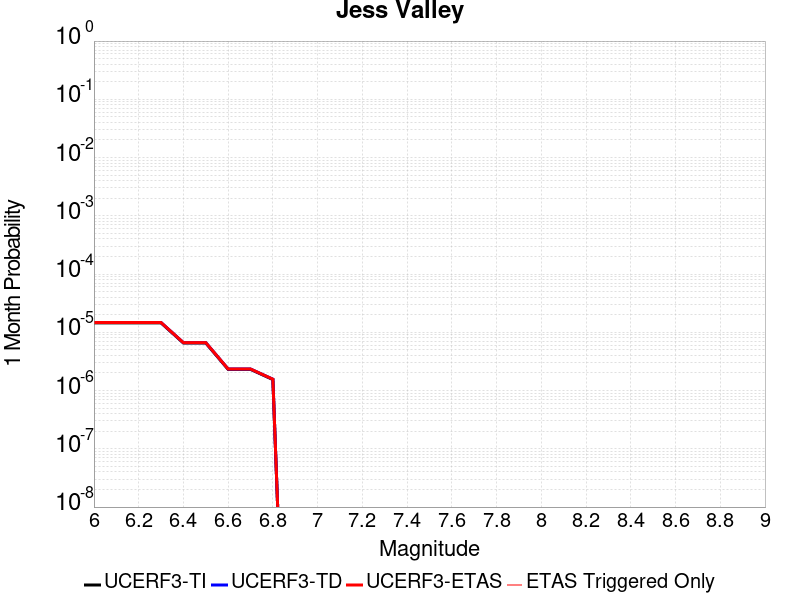 |  |  |

| Magnitude | 1 wk TI Prob | 1 wk TD Prob | 1 wk ETAS Prob | 1 wk ETAS/TD Gain | 1 wk ETAS Triggered Only | 1 mo TI Prob | 1 mo TD Prob | 1 mo ETAS Prob | 1 mo ETAS/TD Gain | 1 mo ETAS Triggered Only | 1 yr TI Prob | 1 yr TD Prob | 1 yr ETAS Prob | 1 yr ETAS/TD Gain | 1 yr ETAS Triggered Only | 10 yr TI Prob | 10 yr TD Prob | 10 yr ETAS Prob | 10 yr ETAS/TD Gain | 10 yr ETAS Triggered Only |
|-----|-----|-----|-----|-----|-----|-----|-----|-----|-----|-----|-----|-----|-----|-----|-----|-----|-----|-----|-----|-----|
| 6.0 | 3.3861274E-6 | 3.434085E-6 | 3.434085E-6 | 1.0 | 0.0 | 1.4511894E-5 | 1.471744E-5 | 1.471744E-5 | 1.0 | 0.0 | 1.7666799E-4 | 1.7917292E-4 | 1.8955774E-4 | 1.0579598 | 1.0386697E-5 | 0.001765276 | 0.001790561 | 0.0018009292 | 1.0057905 | 1.0386697E-5 |
| 6.1 | 3.3861274E-6 | 3.434085E-6 | 3.434085E-6 | 1.0 | 0.0 | 1.4511894E-5 | 1.471744E-5 | 1.471744E-5 | 1.0 | 0.0 | 1.7666799E-4 | 1.7917292E-4 | 1.8955774E-4 | 1.0579598 | 1.0386697E-5 | 0.001765276 | 0.001790561 | 0.0018009292 | 1.0057905 | 1.0386697E-5 |
| 6.2 | 3.3861274E-6 | 3.434085E-6 | 3.434085E-6 | 1.0 | 0.0 | 1.4511894E-5 | 1.471744E-5 | 1.471744E-5 | 1.0 | 0.0 | 1.7666799E-4 | 1.7917292E-4 | 1.8955774E-4 | 1.0579598 | 1.0386697E-5 | 0.001765276 | 0.001790561 | 0.0018009292 | 1.0057905 | 1.0386697E-5 |
| 6.3 | 3.3861274E-6 | 3.434085E-6 | 3.434085E-6 | 1.0 | 0.0 | 1.4511894E-5 | 1.471744E-5 | 1.471744E-5 | 1.0 | 0.0 | 1.7666799E-4 | 1.7917292E-4 | 1.8955774E-4 | 1.0579598 | 1.0386697E-5 | 0.001765276 | 0.001790561 | 0.0018009292 | 1.0057905 | 1.0386697E-5 |
| 6.4 | 1.5291708E-6 | 1.5502898E-6 | 1.5502898E-6 | 1.0 | 0.0 | 6.553573E-6 | 6.6440866E-6 | 6.6440866E-6 | 1.0 | 0.0 | 7.978683E-5 | 8.088955E-5 | 9.1275404E-5 | 1.1283956 | 1.0386697E-5 | 7.975819E-4 | 8.0867927E-4 | 8.190576E-4 | 1.0128336 | 1.0386697E-5 |
| 6.5 | 1.5291708E-6 | 1.5502898E-6 | 1.5502898E-6 | 1.0 | 0.0 | 6.553573E-6 | 6.6440866E-6 | 6.6440866E-6 | 1.0 | 0.0 | 7.978683E-5 | 8.088955E-5 | 9.1275404E-5 | 1.1283956 | 1.0386697E-5 | 7.975819E-4 | 8.0867927E-4 | 8.190576E-4 | 1.0128336 | 1.0386697E-5 |
| 6.6 | 5.396423E-7 | 5.472036E-7 | 5.472036E-7 | 1.0 | 0.0 | 2.312751E-6 | 2.3451573E-6 | 2.3451573E-6 | 1.0 | 0.0 | 2.8157378E-5 | 2.8552104E-5 | 3.8938502E-5 | 1.36377 | 1.0386697E-5 | 2.8153812E-4 | 2.8550276E-4 | 2.9588648E-4 | 1.03637 | 1.0386697E-5 |
| 6.7 | 5.396423E-7 | 5.472036E-7 | 5.472036E-7 | 1.0 | 0.0 | 2.312751E-6 | 2.3451573E-6 | 2.3451573E-6 | 1.0 | 0.0 | 2.8157378E-5 | 2.8552104E-5 | 3.8938502E-5 | 1.36377 | 1.0386697E-5 | 2.8153812E-4 | 2.8550276E-4 | 2.9588648E-4 | 1.03637 | 1.0386697E-5 |
| 6.8 | 3.6058395E-7 | 3.6563338E-7 | 3.6563338E-7 | 1.0 | 0.0 | 1.5453588E-6 | 1.5670003E-6 | 1.5670003E-6 | 1.0 | 0.0 | 1.8814582E-5 | 1.9078228E-5 | 2.9464727E-5 | 1.5444163 | 1.0386697E-5 | 1.8812988E-4 | 1.9078227E-4 | 2.0116699E-4 | 1.0544323 | 1.0386697E-5 |

## Kern Canyon (Lake Isabella) 2011
*[(top)](#table-of-contents)*

| 1 Week | 1 Month | 1 Year | 10 Year |
|-----|-----|-----|-----|
|  |  | 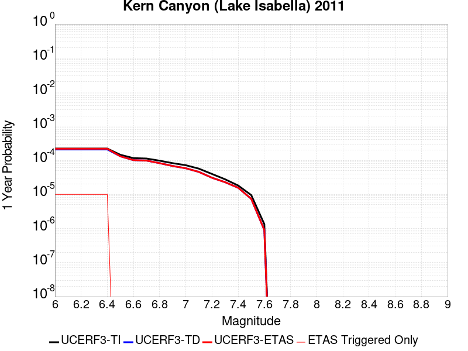 |  |

| Magnitude | 1 wk TI Prob | 1 wk TD Prob | 1 wk ETAS Prob | 1 wk ETAS/TD Gain | 1 wk ETAS Triggered Only | 1 mo TI Prob | 1 mo TD Prob | 1 mo ETAS Prob | 1 mo ETAS/TD Gain | 1 mo ETAS Triggered Only | 1 yr TI Prob | 1 yr TD Prob | 1 yr ETAS Prob | 1 yr ETAS/TD Gain | 1 yr ETAS Triggered Only | 10 yr TI Prob | 10 yr TD Prob | 10 yr ETAS Prob | 10 yr ETAS/TD Gain | 10 yr ETAS Triggered Only |
|-----|-----|-----|-----|-----|-----|-----|-----|-----|-----|-----|-----|-----|-----|-----|-----|-----|-----|-----|-----|-----|
| 6.0 | 4.2387383E-6 | 4.0016866E-6 | 4.0016866E-6 | 1.0 | 0.0 | 1.8165894E-5 | 1.7149983E-5 | 1.7149983E-5 | 1.0 | 0.0 | 2.2114732E-4 | 2.0878292E-4 | 2.1916744E-4 | 1.0497384 | 1.0386697E-5 | 0.0022092736 | 0.0020860515 | 0.0020964167 | 1.0049688 | 1.0386697E-5 |
| 6.1 | 4.2387383E-6 | 4.0016866E-6 | 4.0016866E-6 | 1.0 | 0.0 | 1.8165894E-5 | 1.7149983E-5 | 1.7149983E-5 | 1.0 | 0.0 | 2.2114732E-4 | 2.0878292E-4 | 2.1916744E-4 | 1.0497384 | 1.0386697E-5 | 0.0022092736 | 0.0020860515 | 0.0020964167 | 1.0049688 | 1.0386697E-5 |
| 6.2 | 4.2387383E-6 | 4.0016866E-6 | 4.0016866E-6 | 1.0 | 0.0 | 1.8165894E-5 | 1.7149983E-5 | 1.7149983E-5 | 1.0 | 0.0 | 2.2114732E-4 | 2.0878292E-4 | 2.1916744E-4 | 1.0497384 | 1.0386697E-5 | 0.0022092736 | 0.0020860515 | 0.0020964167 | 1.0049688 | 1.0386697E-5 |
| 6.3 | 4.2387383E-6 | 4.0016866E-6 | 4.0016866E-6 | 1.0 | 0.0 | 1.8165894E-5 | 1.7149983E-5 | 1.7149983E-5 | 1.0 | 0.0 | 2.2114732E-4 | 2.0878292E-4 | 2.1916744E-4 | 1.0497384 | 1.0386697E-5 | 0.0022092736 | 0.0020860515 | 0.0020964167 | 1.0049688 | 1.0386697E-5 |
| 6.4 | 4.2387383E-6 | 4.0016866E-6 | 4.0016866E-6 | 1.0 | 0.0 | 1.8165894E-5 | 1.7149983E-5 | 1.7149983E-5 | 1.0 | 0.0 | 2.2114732E-4 | 2.0878292E-4 | 2.1916744E-4 | 1.0497384 | 1.0386697E-5 | 0.0022092736 | 0.0020860515 | 0.0020964167 | 1.0049688 | 1.0386697E-5 |
| 6.5 | 2.7857532E-6 | 2.5178983E-6 | 2.5178983E-6 | 1.0 | 0.0 | 1.1938888E-5 | 1.079095E-5 | 1.079095E-5 | 1.0 | 0.0 | 1.4534626E-4 | 1.3137223E-4 | 1.3137223E-4 | 1.0 | 0.0 | 0.0014525123 | 0.0013129783 | 0.0013129783 | 1.0 | 0.0 |
| 6.6 | 2.2233348E-6 | 1.9441488E-6 | 1.9441488E-6 | 1.0 | 0.0 | 9.528543E-6 | 8.33204E-6 | 8.33204E-6 | 1.0 | 0.0 | 1.1600384E-4 | 1.0143795E-4 | 1.0143795E-4 | 1.0 | 0.0 | 0.001159433 | 0.0010139252 | 0.0010139252 | 1.0 | 0.0 |
| 6.7 | 2.1635126E-6 | 1.8835284E-6 | 1.8835284E-6 | 1.0 | 0.0 | 9.272164E-6 | 8.07224E-6 | 8.07224E-6 | 1.0 | 0.0 | 1.1288274E-4 | 9.827517E-5 | 9.827517E-5 | 1.0 | 0.0 | 0.0011282542 | 9.823253E-4 | 9.823253E-4 | 1.0 | 0.0 |
| 6.8 | 1.8685711E-6 | 1.5831645E-6 | 1.5831645E-6 | 1.0 | 0.0 | 8.008137E-6 | 6.7849733E-6 | 6.7849733E-6 | 1.0 | 0.0 | 9.74947E-5 | 8.260396E-5 | 8.260396E-5 | 1.0 | 0.0 | 9.745194E-4 | 8.2573754E-4 | 8.2573754E-4 | 1.0 | 0.0 |
| 6.9 | 1.5815071E-6 | 1.3065115E-6 | 1.3065115E-6 | 1.0 | 0.0 | 6.77787E-6 | 5.5993232E-6 | 5.5993232E-6 | 1.0 | 0.0 | 8.251744E-5 | 6.8169655E-5 | 6.8169655E-5 | 1.0 | 0.0 | 8.248681E-4 | 6.814901E-4 | 6.814901E-4 | 1.0 | 0.0 |
| 7.0 | 1.3772564E-6 | 1.1210881E-6 | 1.1210881E-6 | 1.0 | 0.0 | 5.9025137E-6 | 4.804654E-6 | 4.804654E-6 | 1.0 | 0.0 | 7.186073E-5 | 5.8495116E-5 | 5.8495116E-5 | 1.0 | 0.0 | 7.18375E-4 | 5.847992E-4 | 5.847992E-4 | 1.0 | 0.0 |
| 7.1 | 1.0916998E-6 | 8.763901E-7 | 8.763901E-7 | 1.0 | 0.0 | 4.678705E-6 | 3.7559523E-6 | 3.7559523E-6 | 1.0 | 0.0 | 5.6961744E-5 | 4.572777E-5 | 4.572777E-5 | 1.0 | 0.0 | 5.6947145E-4 | 4.5718497E-4 | 4.5718497E-4 | 1.0 | 0.0 |
| 7.2 | 7.6277024E-7 | 5.901538E-7 | 5.901538E-7 | 1.0 | 0.0 | 3.2690114E-6 | 2.5292281E-6 | 2.5292281E-6 | 1.0 | 0.0 | 3.9799485E-5 | 3.0792922E-5 | 3.0792922E-5 | 1.0 | 0.0 | 3.9792358E-4 | 3.0788718E-4 | 3.0788718E-4 | 1.0 | 0.0 |
| 7.3 | 5.3265916E-7 | 4.3825008E-7 | 4.3825008E-7 | 1.0 | 0.0 | 2.282823E-6 | 1.8782133E-6 | 1.8782133E-6 | 1.0 | 0.0 | 2.7793016E-5 | 2.286701E-5 | 2.286701E-5 | 1.0 | 0.0 | 2.778954E-4 | 2.2864695E-4 | 2.2864695E-4 | 1.0 | 0.0 |
| 7.4 | 3.4946007E-7 | 3.0066107E-7 | 3.0066107E-7 | 1.0 | 0.0 | 1.497685E-6 | 1.2885469E-6 | 1.2885469E-6 | 1.0 | 0.0 | 1.8234163E-5 | 1.5687947E-5 | 1.5687947E-5 | 1.0 | 0.0 | 1.8232666E-4 | 1.5686861E-4 | 1.5686861E-4 | 1.0 | 0.0 |
| 7.5 | 1.8317026E-7 | 1.4245036E-7 | 1.4245036E-7 | 1.0 | 0.0 | 7.850152E-7 | 6.1050144E-7 | 6.1050144E-7 | 1.0 | 0.0 | 9.557518E-6 | 7.4328304E-6 | 7.4328304E-6 | 1.0 | 0.0 | 9.5571064E-5 | 7.432589E-5 | 7.432589E-5 | 1.0 | 0.0 |
| 7.6 | 2.572245E-8 | 1.7352884E-8 | 1.7352884E-8 | 1.0 | 0.0 | 1.10239064E-7 | 7.43695E-8 | 7.43695E-8 | 1.0 | 0.0 | 1.3421597E-6 | 9.0544836E-7 | 9.0544836E-7 | 1.0 | 0.0 | 1.3421517E-5 | 9.054452E-6 | 9.054452E-6 | 1.0 | 0.0 |

## Northridge
*[(top)](#table-of-contents)*

| 1 Week | 1 Month | 1 Year | 10 Year |
|-----|-----|-----|-----|
|  |  |  |  |

| Magnitude | 1 wk TI Prob | 1 wk TD Prob | 1 wk ETAS Prob | 1 wk ETAS/TD Gain | 1 wk ETAS Triggered Only | 1 mo TI Prob | 1 mo TD Prob | 1 mo ETAS Prob | 1 mo ETAS/TD Gain | 1 mo ETAS Triggered Only | 1 yr TI Prob | 1 yr TD Prob | 1 yr ETAS Prob | 1 yr ETAS/TD Gain | 1 yr ETAS Triggered Only | 10 yr TI Prob | 10 yr TD Prob | 10 yr ETAS Prob | 10 yr ETAS/TD Gain | 10 yr ETAS Triggered Only |
|-----|-----|-----|-----|-----|-----|-----|-----|-----|-----|-----|-----|-----|-----|-----|-----|-----|-----|-----|-----|-----|
| 6.0 | 1.8340852E-5 | 7.5888474E-6 | 7.5888474E-6 | 1.0 | 0.0 | 7.860128E-5 | 3.252324E-5 | 3.252324E-5 | 1.0 | 0.0 | 9.565505E-4 | 3.959007E-4 | 3.959007E-4 | 1.0 | 0.0 | 0.009524435 | 0.0039521763 | 0.003962522 | 1.0026177 | 1.0386697E-5 |
| 6.1 | 1.8340852E-5 | 7.5888474E-6 | 7.5888474E-6 | 1.0 | 0.0 | 7.860128E-5 | 3.252324E-5 | 3.252324E-5 | 1.0 | 0.0 | 9.565505E-4 | 3.959007E-4 | 3.959007E-4 | 1.0 | 0.0 | 0.009524435 | 0.0039521763 | 0.003962522 | 1.0026177 | 1.0386697E-5 |
| 6.2 | 1.8340852E-5 | 7.5888474E-6 | 7.5888474E-6 | 1.0 | 0.0 | 7.860128E-5 | 3.252324E-5 | 3.252324E-5 | 1.0 | 0.0 | 9.565505E-4 | 3.959007E-4 | 3.959007E-4 | 1.0 | 0.0 | 0.009524435 | 0.0039521763 | 0.003962522 | 1.0026177 | 1.0386697E-5 |
| 6.3 | 1.8340852E-5 | 7.5888474E-6 | 7.5888474E-6 | 1.0 | 0.0 | 7.860128E-5 | 3.252324E-5 | 3.252324E-5 | 1.0 | 0.0 | 9.565505E-4 | 3.959007E-4 | 3.959007E-4 | 1.0 | 0.0 | 0.009524435 | 0.0039521763 | 0.003962522 | 1.0026177 | 1.0386697E-5 |
| 6.4 | 1.7361892E-5 | 7.5888474E-6 | 7.5888474E-6 | 1.0 | 0.0 | 7.440598E-5 | 3.252324E-5 | 3.252324E-5 | 1.0 | 0.0 | 9.055163E-4 | 3.959007E-4 | 3.959007E-4 | 1.0 | 0.0 | 0.009018354 | 0.0039521763 | 0.003962522 | 1.0026177 | 1.0386697E-5 |
| 6.5 | 1.7361892E-5 | 7.5888474E-6 | 7.5888474E-6 | 1.0 | 0.0 | 7.440598E-5 | 3.252324E-5 | 3.252324E-5 | 1.0 | 0.0 | 9.055163E-4 | 3.959007E-4 | 3.959007E-4 | 1.0 | 0.0 | 0.009018354 | 0.0039521763 | 0.003962522 | 1.0026177 | 1.0386697E-5 |
| 6.6 | 1.5458201E-5 | 7.5888474E-6 | 7.5888474E-6 | 1.0 | 0.0 | 6.624775E-5 | 3.252324E-5 | 3.252324E-5 | 1.0 | 0.0 | 8.0626784E-4 | 3.959007E-4 | 3.959007E-4 | 1.0 | 0.0 | 0.008033488 | 0.0039521763 | 0.003962522 | 1.0026177 | 1.0386697E-5 |
| 6.7 | 1.2538368E-5 | 6.3823104E-6 | 6.3823104E-6 | 1.0 | 0.0 | 5.3734755E-5 | 2.7352475E-5 | 2.7352475E-5 | 1.0 | 0.0 | 6.5402425E-4 | 3.3296592E-4 | 3.3296592E-4 | 1.0 | 0.0 | 0.0065210275 | 0.0033247184 | 0.0033350708 | 1.0031137 | 1.0386697E-5 |
| 6.8 | 1.1438097E-5 | 6.3509583E-6 | 6.3509583E-6 | 1.0 | 0.0 | 4.9019498E-5 | 2.7218111E-5 | 2.7218111E-5 | 1.0 | 0.0 | 5.9664896E-4 | 3.3133055E-4 | 3.3133055E-4 | 1.0 | 0.0 | 0.005950495 | 0.0033084136 | 0.003318766 | 1.0031291 | 1.0386697E-5 |
| 6.9 | 1.1204891E-5 | 6.287403E-6 | 6.287403E-6 | 1.0 | 0.0 | 4.8020076E-5 | 2.6945736E-5 | 2.6945736E-5 | 1.0 | 0.0 | 5.8448757E-4 | 3.280154E-4 | 3.280154E-4 | 1.0 | 0.0 | 0.0058295266 | 0.00327536 | 0.0032857126 | 1.0031608 | 1.0386697E-5 |
| 7.0 | 1.061046E-5 | 6.1160395E-6 | 6.1160395E-6 | 1.0 | 0.0 | 4.5472607E-5 | 2.6211337E-5 | 2.6211337E-5 | 1.0 | 0.0 | 5.534883E-4 | 3.1907673E-4 | 3.1907673E-4 | 1.0 | 0.0 | 0.0055211177 | 0.0031862324 | 0.0031965862 | 1.0032495 | 1.0386697E-5 |
| 7.1 | 1.0266979E-5 | 6.004943E-6 | 6.004943E-6 | 1.0 | 0.0 | 4.40006E-5 | 2.5735219E-5 | 2.5735219E-5 | 1.0 | 0.0 | 5.355756E-4 | 3.1328166E-4 | 3.1328166E-4 | 1.0 | 0.0 | 0.0053428668 | 0.0031284462 | 0.0031388004 | 1.0033097 | 1.0386697E-5 |
| 7.2 | 9.91273E-6 | 5.8206415E-6 | 5.8206415E-6 | 1.0 | 0.0 | 4.248244E-5 | 2.4945371E-5 | 2.4945371E-5 | 1.0 | 0.0 | 5.171009E-4 | 3.0366797E-4 | 3.0366797E-4 | 1.0 | 0.0 | 0.0051589934 | 0.0030325754 | 0.0030429305 | 1.0034146 | 1.0386697E-5 |
| 7.3 | 8.4959265E-6 | 5.1936718E-6 | 5.1936718E-6 | 1.0 | 0.0 | 3.6410605E-5 | 2.2258404E-5 | 2.2258404E-5 | 1.0 | 0.0 | 4.4320893E-4 | 2.709626E-4 | 2.709626E-4 | 1.0 | 0.0 | 0.00442326 | 0.0027063487 | 0.0027063487 | 1.0 | 0.0 |
| 7.4 | 8.0847185E-6 | 4.9824444E-6 | 4.9824444E-6 | 1.0 | 0.0 | 3.4648332E-5 | 2.1353158E-5 | 2.1353158E-5 | 1.0 | 0.0 | 4.2176177E-4 | 2.5994395E-4 | 2.5994395E-4 | 1.0 | 0.0 | 0.0042096223 | 0.0025964247 | 0.0025964247 | 1.0 | 0.0 |
| 7.5 | 6.8220684E-6 | 4.253569E-6 | 4.253569E-6 | 1.0 | 0.0 | 2.9237108E-5 | 1.8229455E-5 | 1.8229455E-5 | 1.0 | 0.0 | 3.5590364E-4 | 2.2192122E-4 | 2.2192122E-4 | 1.0 | 0.0 | 0.0035533418 | 0.002217017 | 0.002217017 | 1.0 | 0.0 |
| 7.6 | 4.4224143E-6 | 2.9001064E-6 | 2.9001064E-6 | 1.0 | 0.0 | 1.8953066E-5 | 1.2428969E-5 | 1.2428969E-5 | 1.0 | 0.0 | 2.3072914E-4 | 1.513123E-4 | 1.513123E-4 | 1.0 | 0.0 | 0.0023048974 | 0.0015121044 | 0.0015121044 | 1.0 | 0.0 |
| 7.7 | 2.5297056E-6 | 1.6046573E-6 | 1.6046573E-6 | 1.0 | 0.0 | 1.0841551E-5 | 6.877085E-6 | 6.877085E-6 | 1.0 | 0.0 | 1.319879E-4 | 8.372534E-5 | 8.372534E-5 | 1.0 | 0.0 | 0.0013190953 | 8.3694264E-4 | 8.3694264E-4 | 1.0 | 0.0 |
| 7.8 | 1.2508156E-6 | 8.7803704E-7 | 8.7803704E-7 | 1.0 | 0.0 | 5.3606273E-6 | 3.7630105E-6 | 3.7630105E-6 | 1.0 | 0.0 | 6.526368E-5 | 4.5813704E-5 | 4.5813704E-5 | 1.0 | 0.0 | 6.524452E-4 | 4.5804385E-4 | 4.5804385E-4 | 1.0 | 0.0 |
| 7.9 | 2.262199E-7 | 1.4665555E-7 | 1.4665555E-7 | 1.0 | 0.0 | 9.695135E-7 | 6.2852365E-7 | 6.2852365E-7 | 1.0 | 0.0 | 1.1803763E-5 | 7.652249E-6 | 7.652249E-6 | 1.0 | 0.0 | 1.1803136E-4 | 7.651994E-5 | 7.651994E-5 | 1.0 | 0.0 |
| 8.0 | 2.865362E-9 | 1.2756513E-9 | 1.2756513E-9 | 1.0 | 0.0 | 1.2280123E-8 | 5.4670766E-9 | 5.4670766E-9 | 1.0 | 0.0 | 1.4951048E-7 | 6.656166E-8 | 6.656166E-8 | 1.0 | 0.0 | 1.4951038E-6 | 6.656166E-7 | 6.656166E-7 | 1.0 | 0.0 |

## Monte Vista - Shannon 2011 CFM
*[(top)](#table-of-contents)*

| 1 Week | 1 Month | 1 Year | 10 Year |
|-----|-----|-----|-----|
|  |  |  |  |

| Magnitude | 1 wk TI Prob | 1 wk TD Prob | 1 wk ETAS Prob | 1 wk ETAS/TD Gain | 1 wk ETAS Triggered Only | 1 mo TI Prob | 1 mo TD Prob | 1 mo ETAS Prob | 1 mo ETAS/TD Gain | 1 mo ETAS Triggered Only | 1 yr TI Prob | 1 yr TD Prob | 1 yr ETAS Prob | 1 yr ETAS/TD Gain | 1 yr ETAS Triggered Only | 10 yr TI Prob | 10 yr TD Prob | 10 yr ETAS Prob | 10 yr ETAS/TD Gain | 10 yr ETAS Triggered Only |
|-----|-----|-----|-----|-----|-----|-----|-----|-----|-----|-----|-----|-----|-----|-----|-----|-----|-----|-----|-----|-----|
| 6.0 | 2.7907707E-5 | 2.75877E-5 | 2.75877E-5 | 1.0 | 0.0 | 1.19598975E-4 | 1.1822833E-4 | 1.1822833E-4 | 1.0 | 0.0 | 0.0014551448 | 0.0014386033 | 0.0014386033 | 1.0 | 0.0 | 0.014456532 | 0.014322008 | 0.014332246 | 1.0007149 | 1.0386697E-5 |
| 6.1 | 2.7907707E-5 | 2.75877E-5 | 2.75877E-5 | 1.0 | 0.0 | 1.19598975E-4 | 1.1822833E-4 | 1.1822833E-4 | 1.0 | 0.0 | 0.0014551448 | 0.0014386033 | 0.0014386033 | 1.0 | 0.0 | 0.014456532 | 0.014322008 | 0.014332246 | 1.0007149 | 1.0386697E-5 |
| 6.2 | 2.7907707E-5 | 2.75877E-5 | 2.75877E-5 | 1.0 | 0.0 | 1.19598975E-4 | 1.1822833E-4 | 1.1822833E-4 | 1.0 | 0.0 | 0.0014551448 | 0.0014386033 | 0.0014386033 | 1.0 | 0.0 | 0.014456532 | 0.014322008 | 0.014332246 | 1.0007149 | 1.0386697E-5 |
| 6.3 | 2.7907707E-5 | 2.75877E-5 | 2.75877E-5 | 1.0 | 0.0 | 1.19598975E-4 | 1.1822833E-4 | 1.1822833E-4 | 1.0 | 0.0 | 0.0014551448 | 0.0014386033 | 0.0014386033 | 1.0 | 0.0 | 0.014456532 | 0.014322008 | 0.014332246 | 1.0007149 | 1.0386697E-5 |
| 6.4 | 2.7907707E-5 | 2.75877E-5 | 2.75877E-5 | 1.0 | 0.0 | 1.19598975E-4 | 1.1822833E-4 | 1.1822833E-4 | 1.0 | 0.0 | 0.0014551448 | 0.0014386033 | 0.0014386033 | 1.0 | 0.0 | 0.014456532 | 0.014322008 | 0.014332246 | 1.0007149 | 1.0386697E-5 |
| 6.5 | 1.7990213E-5 | 1.6642773E-5 | 1.6642773E-5 | 1.0 | 0.0 | 7.709863E-5 | 7.132459E-5 | 7.132459E-5 | 1.0 | 0.0 | 9.382716E-4 | 8.680973E-4 | 8.680973E-4 | 1.0 | 0.0 | 0.0093431985 | 0.008670452 | 0.008680749 | 1.0011876 | 1.0386697E-5 |
| 6.6 | 9.650407E-6 | 7.4595387E-6 | 7.4595387E-6 | 1.0 | 0.0 | 4.135823E-5 | 3.1969106E-5 | 3.1969106E-5 | 1.0 | 0.0 | 5.0342013E-4 | 3.8916216E-4 | 3.8916216E-4 | 1.0 | 0.0 | 0.005022812 | 0.0039025035 | 0.0039025035 | 1.0 | 0.0 |
| 6.7 | 9.62828E-6 | 7.4374507E-6 | 7.4374507E-6 | 1.0 | 0.0 | 4.1263404E-5 | 3.1874442E-5 | 3.1874442E-5 | 1.0 | 0.0 | 5.022661E-4 | 3.8801008E-4 | 3.8801008E-4 | 1.0 | 0.0 | 0.0050113243 | 0.003891023 | 0.003891023 | 1.0 | 0.0 |
| 6.8 | 6.887523E-6 | 4.463821E-6 | 4.463821E-6 | 1.0 | 0.0 | 2.9517621E-5 | 1.9130533E-5 | 1.9130533E-5 | 1.0 | 0.0 | 3.5931775E-4 | 2.3289157E-4 | 2.3289157E-4 | 1.0 | 0.0 | 0.0035873733 | 0.0023436449 | 0.0023436449 | 1.0 | 0.0 |
| 6.9 | 6.2722347E-6 | 3.805659E-6 | 3.805659E-6 | 1.0 | 0.0 | 2.6880729E-5 | 1.6309876E-5 | 1.6309876E-5 | 1.0 | 0.0 | 3.2722374E-4 | 1.9855668E-4 | 1.9855668E-4 | 1.0 | 0.0 | 0.003267423 | 0.0020009486 | 0.0020009486 | 1.0 | 0.0 |
| 7.0 | 5.5320347E-6 | 3.0327608E-6 | 3.0327608E-6 | 1.0 | 0.0 | 2.3708504E-5 | 1.29974915E-5 | 1.29974915E-5 | 1.0 | 0.0 | 2.8861282E-4 | 1.582348E-4 | 1.582348E-4 | 1.0 | 0.0 | 0.0028823826 | 0.0015983633 | 0.0015983633 | 1.0 | 0.0 |
| 7.1 | 3.8794055E-6 | 1.285852E-6 | 1.285852E-6 | 1.0 | 0.0 | 1.6625918E-5 | 5.510783E-6 | 5.510783E-6 | 1.0 | 0.0 | 2.0240174E-4 | 6.709173E-5 | 6.709173E-5 | 1.0 | 0.0 | 0.002022175 | 6.876822E-4 | 6.876822E-4 | 1.0 | 0.0 |
| 7.2 | 3.4813652E-6 | 9.690727E-7 | 9.690727E-7 | 1.0 | 0.0 | 1.49200505E-5 | 4.153162E-6 | 4.153162E-6 | 1.0 | 0.0 | 1.8163648E-4 | 5.0563587E-5 | 5.0563587E-5 | 1.0 | 0.0 | 0.0018148809 | 5.22476E-4 | 5.22476E-4 | 1.0 | 0.0 |
| 7.3 | 3.1682148E-6 | 7.7381594E-7 | 7.7381594E-7 | 1.0 | 0.0 | 1.3577992E-5 | 3.3163496E-6 | 3.3163496E-6 | 1.0 | 0.0 | 1.6529951E-4 | 4.0375813E-5 | 4.0375813E-5 | 1.0 | 0.0 | 0.0016517661 | 4.2061496E-4 | 4.2061496E-4 | 1.0 | 0.0 |
| 7.4 | 2.9707667E-6 | 7.3642167E-7 | 7.3642167E-7 | 1.0 | 0.0 | 1.2731795E-5 | 3.1560892E-6 | 3.1560892E-6 | 1.0 | 0.0 | 1.5499859E-4 | 3.842471E-5 | 3.842471E-5 | 1.0 | 0.0 | 0.0015489052 | 4.0090227E-4 | 4.0090227E-4 | 1.0 | 0.0 |
| 7.5 | 2.3462758E-6 | 6.023677E-7 | 6.023677E-7 | 1.0 | 0.0 | 1.0055429E-5 | 2.5815734E-6 | 2.5815734E-6 | 1.0 | 0.0 | 1.2241797E-4 | 3.1430205E-5 | 3.1430205E-5 | 1.0 | 0.0 | 0.0012235056 | 3.2923152E-4 | 3.2923152E-4 | 1.0 | 0.0 |
| 7.6 | 2.112783E-6 | 5.266409E-7 | 5.266409E-7 | 1.0 | 0.0 | 9.054753E-6 | 2.2570305E-6 | 2.2570305E-6 | 1.0 | 0.0 | 1.1023604E-4 | 2.7479E-5 | 2.7479E-5 | 1.0 | 0.0 | 0.0011018137 | 2.8929894E-4 | 2.8929894E-4 | 1.0 | 0.0 |
| 7.7 | 1.7022471E-6 | 4.2444987E-7 | 4.2444987E-7 | 1.0 | 0.0 | 7.2953244E-6 | 1.8190696E-6 | 1.8190696E-6 | 1.0 | 0.0 | 8.881695E-5 | 2.2146949E-5 | 2.2146949E-5 | 1.0 | 0.0 | 8.878146E-4 | 2.3466849E-4 | 2.3466849E-4 | 1.0 | 0.0 |
| 7.8 | 7.230914E-7 | 3.7402418E-7 | 3.7402418E-7 | 1.0 | 0.0 | 3.0989595E-6 | 1.6029599E-6 | 1.6029599E-6 | 1.0 | 0.0 | 3.772918E-5 | 1.9515863E-5 | 1.9515863E-5 | 1.0 | 0.0 | 3.7722773E-4 | 2.0788297E-4 | 2.0788297E-4 | 1.0 | 0.0 |
| 7.9 | 4.3588446E-7 | 3.4407202E-7 | 3.4407202E-7 | 1.0 | 0.0 | 1.868075E-6 | 1.4745935E-6 | 1.4745935E-6 | 1.0 | 0.0 | 2.2743576E-5 | 1.795303E-5 | 1.795303E-5 | 1.0 | 0.0 | 2.2741247E-4 | 1.9048195E-4 | 1.9048195E-4 | 1.0 | 0.0 |
| 8.0 | 2.3317523E-7 | 3.1602372E-7 | 3.1602372E-7 | 1.0 | 0.0 | 9.99322E-7 | 1.3543867E-6 | 1.3543867E-6 | 1.0 | 0.0 | 1.2166677E-5 | 1.6489534E-5 | 1.6489534E-5 | 1.0 | 0.0 | 1.21660116E-4 | 1.7445331E-4 | 1.7445331E-4 | 1.0 | 0.0 |
| 8.1 | 1.4662456E-7 | 2.0360646E-7 | 2.0360646E-7 | 1.0 | 0.0 | 6.283908E-7 | 8.725988E-7 | 8.725988E-7 | 1.0 | 0.0 | 7.650631E-6 | 1.0623839E-5 | 1.0623839E-5 | 1.0 | 0.0 | 7.650368E-5 | 1.1159559E-4 | 1.1159559E-4 | 1.0 | 0.0 |
| 8.2 | 5.4931775E-9 | 5.089579E-9 | 5.089579E-9 | 1.0 | 0.0 | 2.3542189E-8 | 2.181248E-8 | 2.181248E-8 | 1.0 | 0.0 | 2.8662612E-7 | 2.6556694E-7 | 2.6556694E-7 | 1.0 | 0.0 | 2.8662573E-6 | 2.7612602E-6 | 2.7612602E-6 | 1.0 | 0.0 |

## Hector Mine
*[(top)](#table-of-contents)*

| 1 Week | 1 Month | 1 Year | 10 Year |
|-----|-----|-----|-----|
|  |  |  | 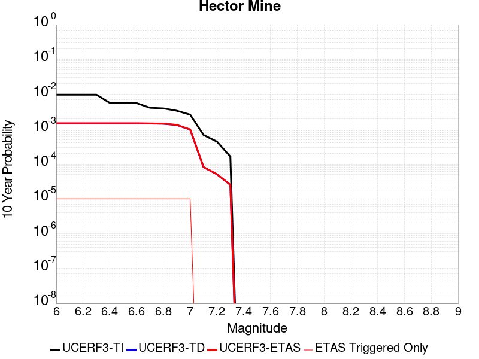 |

| Magnitude | 1 wk TI Prob | 1 wk TD Prob | 1 wk ETAS Prob | 1 wk ETAS/TD Gain | 1 wk ETAS Triggered Only | 1 mo TI Prob | 1 mo TD Prob | 1 mo ETAS Prob | 1 mo ETAS/TD Gain | 1 mo ETAS Triggered Only | 1 yr TI Prob | 1 yr TD Prob | 1 yr ETAS Prob | 1 yr ETAS/TD Gain | 1 yr ETAS Triggered Only | 10 yr TI Prob | 10 yr TD Prob | 10 yr ETAS Prob | 10 yr ETAS/TD Gain | 10 yr ETAS Triggered Only |
|-----|-----|-----|-----|-----|-----|-----|-----|-----|-----|-----|-----|-----|-----|-----|-----|-----|-----|-----|-----|-----|
| 6.0 | 1.8760093E-5 | 2.7966346E-6 | 2.7966346E-6 | 1.0 | 0.0 | 8.039792E-5 | 1.1985544E-5 | 1.1985544E-5 | 1.0 | 0.0 | 9.78405E-4 | 1.4591822E-4 | 1.563034E-4 | 1.0711713 | 1.0386697E-5 | 0.009741086 | 0.0014586165 | 0.0014689879 | 1.0071106 | 1.0386697E-5 |
| 6.1 | 1.8760093E-5 | 2.7966346E-6 | 2.7966346E-6 | 1.0 | 0.0 | 8.039792E-5 | 1.1985544E-5 | 1.1985544E-5 | 1.0 | 0.0 | 9.78405E-4 | 1.4591822E-4 | 1.563034E-4 | 1.0711713 | 1.0386697E-5 | 0.009741086 | 0.0014586165 | 0.0014689879 | 1.0071106 | 1.0386697E-5 |
| 6.2 | 1.8760093E-5 | 2.7966346E-6 | 2.7966346E-6 | 1.0 | 0.0 | 8.039792E-5 | 1.1985544E-5 | 1.1985544E-5 | 1.0 | 0.0 | 9.78405E-4 | 1.4591822E-4 | 1.563034E-4 | 1.0711713 | 1.0386697E-5 | 0.009741086 | 0.0014586165 | 0.0014689879 | 1.0071106 | 1.0386697E-5 |
| 6.3 | 1.8760093E-5 | 2.7966346E-6 | 2.7966346E-6 | 1.0 | 0.0 | 8.039792E-5 | 1.1985544E-5 | 1.1985544E-5 | 1.0 | 0.0 | 9.78405E-4 | 1.4591822E-4 | 1.563034E-4 | 1.0711713 | 1.0386697E-5 | 0.009741086 | 0.0014586165 | 0.0014689879 | 1.0071106 | 1.0386697E-5 |
| 6.4 | 1.0888055E-5 | 2.7966346E-6 | 2.7966346E-6 | 1.0 | 0.0 | 4.666226E-5 | 1.1985544E-5 | 1.1985544E-5 | 1.0 | 0.0 | 5.679649E-4 | 1.4591822E-4 | 1.563034E-4 | 1.0711713 | 1.0386697E-5 | 0.0056651547 | 0.0014586165 | 0.0014689879 | 1.0071106 | 1.0386697E-5 |
| 6.5 | 1.0888055E-5 | 2.7966346E-6 | 2.7966346E-6 | 1.0 | 0.0 | 4.666226E-5 | 1.1985544E-5 | 1.1985544E-5 | 1.0 | 0.0 | 5.679649E-4 | 1.4591822E-4 | 1.563034E-4 | 1.0711713 | 1.0386697E-5 | 0.0056651547 | 0.0014586165 | 0.0014689879 | 1.0071106 | 1.0386697E-5 |
| 6.6 | 1.0730738E-5 | 2.7966346E-6 | 2.7966346E-6 | 1.0 | 0.0 | 4.5988065E-5 | 1.1985544E-5 | 1.1985544E-5 | 1.0 | 0.0 | 5.5976084E-4 | 1.4591822E-4 | 1.563034E-4 | 1.0711713 | 1.0386697E-5 | 0.0055835294 | 0.0014586165 | 0.0014689879 | 1.0071106 | 1.0386697E-5 |
| 6.7 | 7.881326E-6 | 2.7713115E-6 | 2.7713115E-6 | 1.0 | 0.0 | 3.3776672E-5 | 1.1877018E-5 | 1.1877018E-5 | 1.0 | 0.0 | 4.111534E-4 | 1.445971E-4 | 1.5498229E-4 | 1.0718216 | 1.0386697E-5 | 0.0041039353 | 0.0014454223 | 0.001455794 | 1.0071756 | 1.0386697E-5 |
| 6.8 | 7.5683483E-6 | 2.7330557E-6 | 2.7330557E-6 | 1.0 | 0.0 | 3.2435375E-5 | 1.1713066E-5 | 1.1713066E-5 | 1.0 | 0.0 | 3.9482914E-4 | 1.4260123E-4 | 1.5298645E-4 | 1.072827 | 1.0386697E-5 | 0.0039412836 | 0.0014254894 | 0.0014358613 | 1.007276 | 1.0386697E-5 |
| 6.9 | 6.473048E-6 | 2.514108E-6 | 2.514108E-6 | 1.0 | 0.0 | 2.7741338E-5 | 1.0774726E-5 | 1.0774726E-5 | 1.0 | 0.0 | 3.3769844E-4 | 1.3117837E-4 | 1.4156371E-4 | 1.0791695 | 1.0386697E-5 | 0.0033718573 | 0.0013113989 | 0.001321772 | 1.0079099 | 1.0386697E-5 |
| 7.0 | 4.9959954E-6 | 1.8566844E-6 | 1.8566844E-6 | 1.0 | 0.0 | 2.1411232E-5 | 7.957215E-6 | 7.957215E-6 | 1.0 | 0.0 | 2.6065056E-4 | 9.687835E-5 | 1.0726404E-4 | 1.1072034 | 1.0386697E-5 | 0.0026034506 | 9.687108E-4 | 9.790874E-4 | 1.0107118 | 1.0386697E-5 |
| 7.1 | 1.2997541E-6 | 1.5604898E-7 | 1.5604898E-7 | 1.0 | 0.0 | 5.5703626E-6 | 6.687812E-7 | 6.687812E-7 | 1.0 | 0.0 | 6.7817055E-5 | 8.142385E-6 | 8.142385E-6 | 1.0 | 0.0 | 6.779636E-4 | 8.142126E-5 | 8.142126E-5 | 1.0 | 0.0 |
| 7.2 | 8.392699E-7 | 9.7293345E-8 | 9.7293345E-8 | 1.0 | 0.0 | 3.596866E-6 | 4.1697143E-7 | 4.1697143E-7 | 1.0 | 0.0 | 4.3790962E-5 | 5.076617E-6 | 5.076617E-6 | 1.0 | 0.0 | 4.3782333E-4 | 5.0765204E-5 | 5.0765204E-5 | 1.0 | 0.0 |
| 7.3 | 3.13015E-7 | 4.8300148E-8 | 4.8300148E-8 | 1.0 | 0.0 | 1.3414921E-6 | 2.0700061E-7 | 2.0700061E-7 | 1.0 | 0.0 | 1.6332544E-5 | 2.5202305E-6 | 2.5202305E-6 | 1.0 | 0.0 | 1.6331344E-4 | 2.5202104E-5 | 2.5202104E-5 | 1.0 | 0.0 |

## Peralta Hills
*[(top)](#table-of-contents)*

| 1 Week | 1 Month | 1 Year | 10 Year |
|-----|-----|-----|-----|
| 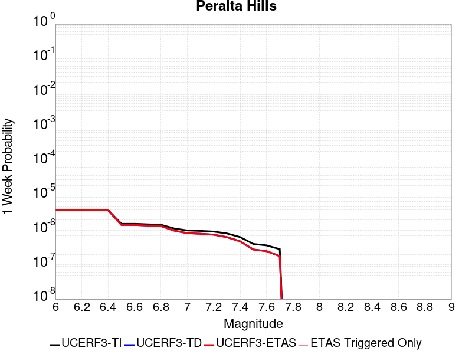 |  |  |  |

| Magnitude | 1 wk TI Prob | 1 wk TD Prob | 1 wk ETAS Prob | 1 wk ETAS/TD Gain | 1 wk ETAS Triggered Only | 1 mo TI Prob | 1 mo TD Prob | 1 mo ETAS Prob | 1 mo ETAS/TD Gain | 1 mo ETAS Triggered Only | 1 yr TI Prob | 1 yr TD Prob | 1 yr ETAS Prob | 1 yr ETAS/TD Gain | 1 yr ETAS Triggered Only | 10 yr TI Prob | 10 yr TD Prob | 10 yr ETAS Prob | 10 yr ETAS/TD Gain | 10 yr ETAS Triggered Only |
|-----|-----|-----|-----|-----|-----|-----|-----|-----|-----|-----|-----|-----|-----|-----|-----|-----|-----|-----|-----|-----|
| 6.0 | 3.8850067E-6 | 3.839755E-6 | 3.839755E-6 | 1.0 | 0.0 | 1.6649923E-5 | 1.6456032E-5 | 1.6456032E-5 | 1.0 | 0.0 | 2.0269395E-4 | 2.003412E-4 | 2.107258E-4 | 1.0518347 | 1.0386697E-5 | 0.0020250916 | 0.0020023335 | 0.0020126994 | 1.0051769 | 1.0386697E-5 |
| 6.1 | 3.8850067E-6 | 3.839755E-6 | 3.839755E-6 | 1.0 | 0.0 | 1.6649923E-5 | 1.6456032E-5 | 1.6456032E-5 | 1.0 | 0.0 | 2.0269395E-4 | 2.003412E-4 | 2.107258E-4 | 1.0518347 | 1.0386697E-5 | 0.0020250916 | 0.0020023335 | 0.0020126994 | 1.0051769 | 1.0386697E-5 |
| 6.2 | 3.8850067E-6 | 3.839755E-6 | 3.839755E-6 | 1.0 | 0.0 | 1.6649923E-5 | 1.6456032E-5 | 1.6456032E-5 | 1.0 | 0.0 | 2.0269395E-4 | 2.003412E-4 | 2.107258E-4 | 1.0518347 | 1.0386697E-5 | 0.0020250916 | 0.0020023335 | 0.0020126994 | 1.0051769 | 1.0386697E-5 |
| 6.3 | 3.8850067E-6 | 3.839755E-6 | 3.839755E-6 | 1.0 | 0.0 | 1.6649923E-5 | 1.6456032E-5 | 1.6456032E-5 | 1.0 | 0.0 | 2.0269395E-4 | 2.003412E-4 | 2.107258E-4 | 1.0518347 | 1.0386697E-5 | 0.0020250916 | 0.0020023335 | 0.0020126994 | 1.0051769 | 1.0386697E-5 |
| 6.4 | 3.8850067E-6 | 3.839755E-6 | 3.839755E-6 | 1.0 | 0.0 | 1.6649923E-5 | 1.6456032E-5 | 1.6456032E-5 | 1.0 | 0.0 | 2.0269395E-4 | 2.003412E-4 | 2.107258E-4 | 1.0518347 | 1.0386697E-5 | 0.0020250916 | 0.0020023335 | 0.0020126994 | 1.0051769 | 1.0386697E-5 |
| 6.5 | 1.5587785E-6 | 1.4432846E-6 | 1.4432846E-6 | 1.0 | 0.0 | 6.6804623E-6 | 6.1854926E-6 | 6.1854926E-6 | 1.0 | 0.0 | 8.133159E-5 | 7.5306016E-5 | 8.569193E-5 | 1.1379161 | 1.0386697E-5 | 8.1301836E-4 | 7.5282896E-4 | 7.632078E-4 | 1.0137866 | 1.0386697E-5 |
| 6.6 | 1.5587785E-6 | 1.4432846E-6 | 1.4432846E-6 | 1.0 | 0.0 | 6.6804623E-6 | 6.1854926E-6 | 6.1854926E-6 | 1.0 | 0.0 | 8.133159E-5 | 7.5306016E-5 | 8.569193E-5 | 1.1379161 | 1.0386697E-5 | 8.1301836E-4 | 7.5282896E-4 | 7.632078E-4 | 1.0137866 | 1.0386697E-5 |
| 6.7 | 1.5018579E-6 | 1.3839059E-6 | 1.3839059E-6 | 1.0 | 0.0 | 6.436518E-6 | 5.931013E-6 | 5.931013E-6 | 1.0 | 0.0 | 7.836179E-5 | 7.2207935E-5 | 8.259388E-5 | 1.1438339 | 1.0386697E-5 | 7.833416E-4 | 7.2186824E-4 | 7.322475E-4 | 1.0143782 | 1.0386697E-5 |
| 6.8 | 1.4584314E-6 | 1.3383368E-6 | 1.3383368E-6 | 1.0 | 0.0 | 6.250405E-6 | 5.735718E-6 | 5.735718E-6 | 1.0 | 0.0 | 7.6096025E-5 | 6.983037E-5 | 8.021634E-5 | 1.1487315 | 1.0386697E-5 | 7.6069974E-4 | 6.9810764E-4 | 7.084871E-4 | 1.014868 | 1.0386697E-5 |
| 6.9 | 1.1382393E-6 | 9.863752E-7 | 9.863752E-7 | 1.0 | 0.0 | 4.8781594E-6 | 4.227316E-6 | 4.227316E-6 | 1.0 | 0.0 | 5.9389975E-5 | 5.146644E-5 | 6.18526E-5 | 1.2018045 | 1.0386697E-5 | 5.93741E-4 | 5.1455345E-4 | 5.249348E-4 | 1.0201755 | 1.0386697E-5 |
| 7.0 | 9.970413E-7 | 8.310885E-7 | 8.310885E-7 | 1.0 | 0.0 | 4.273027E-6 | 3.5618036E-6 | 3.5618036E-6 | 1.0 | 0.0 | 5.2022864E-5 | 4.3364165E-5 | 5.375041E-5 | 1.2395122 | 1.0386697E-5 | 5.2010687E-4 | 4.3356384E-4 | 4.4394602E-4 | 1.0239462 | 1.0386697E-5 |
| 7.1 | 9.684443E-7 | 7.9952844E-7 | 7.9952844E-7 | 1.0 | 0.0 | 4.150469E-6 | 3.4265465E-6 | 3.4265465E-6 | 1.0 | 0.0 | 5.053079E-5 | 4.1717474E-5 | 5.2103736E-5 | 1.2489667 | 1.0386697E-5 | 5.05193E-4 | 4.1710315E-4 | 4.274855E-4 | 1.0248916 | 1.0386697E-5 |
| 7.2 | 9.240811E-7 | 7.504298E-7 | 7.504298E-7 | 1.0 | 0.0 | 3.960342E-6 | 3.2161242E-6 | 3.2161242E-6 | 1.0 | 0.0 | 4.8216094E-5 | 3.9155675E-5 | 4.9541966E-5 | 1.2652563 | 1.0386697E-5 | 4.8205635E-4 | 3.914943E-4 | 4.0187695E-4 | 1.0265205 | 1.0386697E-5 |
| 7.3 | 8.158643E-7 | 6.351043E-7 | 6.351043E-7 | 1.0 | 0.0 | 3.4965567E-6 | 2.7218732E-6 | 2.7218732E-6 | 1.0 | 0.0 | 4.2569747E-5 | 3.3138364E-5 | 3.3138364E-5 | 1.0 | 0.0 | 4.2561593E-4 | 3.313404E-4 | 3.313404E-4 | 1.0 | 0.0 |
| 7.4 | 6.3822824E-7 | 4.7965085E-7 | 4.7965085E-7 | 1.0 | 0.0 | 2.7352612E-6 | 2.0556452E-6 | 2.0556452E-6 | 1.0 | 0.0 | 3.3301294E-5 | 2.5027246E-5 | 2.5027246E-5 | 1.0 | 0.0 | 3.3296304E-4 | 2.502494E-4 | 2.502494E-4 | 1.0 | 0.0 |
| 7.5 | 4.0292628E-7 | 2.7850595E-7 | 2.7850595E-7 | 1.0 | 0.0 | 1.7268258E-6 | 1.1935965E-6 | 1.1935965E-6 | 1.0 | 0.0 | 2.1023901E-5 | 1.453197E-5 | 1.453197E-5 | 1.0 | 0.0 | 2.1021912E-4 | 1.45313E-4 | 1.45313E-4 | 1.0 | 0.0 |
| 7.6 | 3.672993E-7 | 2.4859E-7 | 2.4859E-7 | 1.0 | 0.0 | 1.5741389E-6 | 1.0653854E-6 | 1.0653854E-6 | 1.0 | 0.0 | 1.9164972E-5 | 1.2971018E-5 | 1.2971018E-5 | 1.0 | 0.0 | 1.916332E-4 | 1.2970532E-4 | 1.2970532E-4 | 1.0 | 0.0 |
| 7.7 | 2.8466823E-7 | 1.786307E-7 | 1.786307E-7 | 1.0 | 0.0 | 1.2200061E-6 | 7.655601E-7 | 7.655601E-7 | 1.0 | 0.0 | 1.4853474E-5 | 9.320681E-6 | 9.320681E-6 | 1.0 | 0.0 | 1.485248E-4 | 9.32055E-5 | 9.32055E-5 | 1.0 | 0.0 |

## Santa Monica alt 1
*[(top)](#table-of-contents)*

| 1 Week | 1 Month | 1 Year | 10 Year |
|-----|-----|-----|-----|
|  |  | 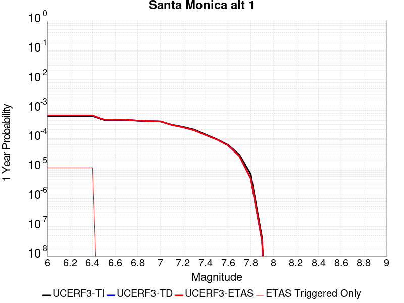 | 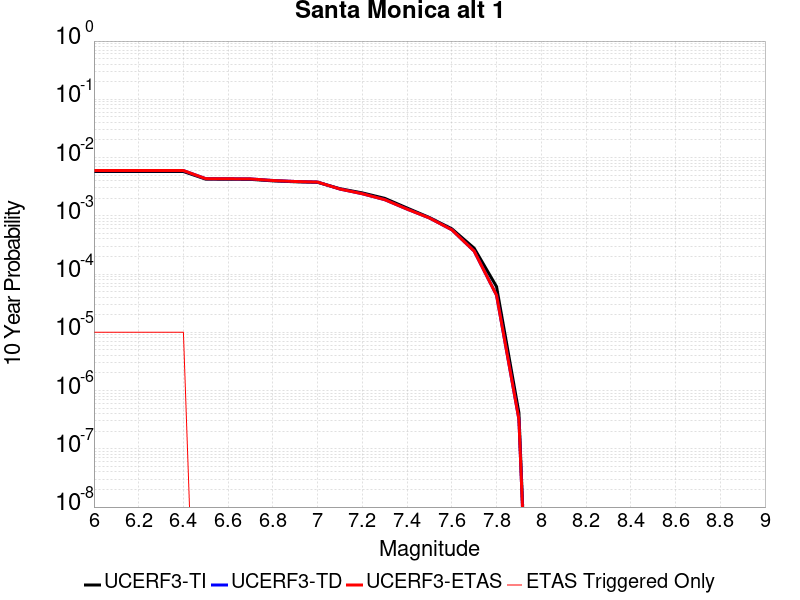 |

| Magnitude | 1 wk TI Prob | 1 wk TD Prob | 1 wk ETAS Prob | 1 wk ETAS/TD Gain | 1 wk ETAS Triggered Only | 1 mo TI Prob | 1 mo TD Prob | 1 mo ETAS Prob | 1 mo ETAS/TD Gain | 1 mo ETAS Triggered Only | 1 yr TI Prob | 1 yr TD Prob | 1 yr ETAS Prob | 1 yr ETAS/TD Gain | 1 yr ETAS Triggered Only | 10 yr TI Prob | 10 yr TD Prob | 10 yr ETAS Prob | 10 yr ETAS/TD Gain | 10 yr ETAS Triggered Only |
|-----|-----|-----|-----|-----|-----|-----|-----|-----|-----|-----|-----|-----|-----|-----|-----|-----|-----|-----|-----|-----|
| 6.0 | 1.1066008E-5 | 1.1480812E-5 | 1.1480812E-5 | 1.0 | 0.0 | 4.742488E-5 | 4.920263E-5 | 4.920263E-5 | 1.0 | 0.0 | 5.7724497E-4 | 5.9889135E-4 | 6.092718E-4 | 1.0173328 | 1.0386697E-5 | 0.005757478 | 0.005974161 | 0.0059844856 | 1.0017282 | 1.0386697E-5 |
| 6.1 | 1.1066008E-5 | 1.1480812E-5 | 1.1480812E-5 | 1.0 | 0.0 | 4.742488E-5 | 4.920263E-5 | 4.920263E-5 | 1.0 | 0.0 | 5.7724497E-4 | 5.9889135E-4 | 6.092718E-4 | 1.0173328 | 1.0386697E-5 | 0.005757478 | 0.005974161 | 0.0059844856 | 1.0017282 | 1.0386697E-5 |
| 6.2 | 1.1066008E-5 | 1.1480812E-5 | 1.1480812E-5 | 1.0 | 0.0 | 4.742488E-5 | 4.920263E-5 | 4.920263E-5 | 1.0 | 0.0 | 5.7724497E-4 | 5.9889135E-4 | 6.092718E-4 | 1.0173328 | 1.0386697E-5 | 0.005757478 | 0.005974161 | 0.0059844856 | 1.0017282 | 1.0386697E-5 |
| 6.3 | 1.1066008E-5 | 1.1480812E-5 | 1.1480812E-5 | 1.0 | 0.0 | 4.742488E-5 | 4.920263E-5 | 4.920263E-5 | 1.0 | 0.0 | 5.7724497E-4 | 5.9889135E-4 | 6.092718E-4 | 1.0173328 | 1.0386697E-5 | 0.005757478 | 0.005974161 | 0.0059844856 | 1.0017282 | 1.0386697E-5 |
| 6.4 | 1.1066008E-5 | 1.1480812E-5 | 1.1480812E-5 | 1.0 | 0.0 | 4.742488E-5 | 4.920263E-5 | 4.920263E-5 | 1.0 | 0.0 | 5.7724497E-4 | 5.9889135E-4 | 6.092718E-4 | 1.0173328 | 1.0386697E-5 | 0.005757478 | 0.005974161 | 0.0059844856 | 1.0017282 | 1.0386697E-5 |
| 6.5 | 8.183544E-6 | 8.335782E-6 | 8.335782E-6 | 1.0 | 0.0 | 3.5071862E-5 | 3.5724297E-5 | 3.5724297E-5 | 1.0 | 0.0 | 4.2691626E-4 | 4.348581E-4 | 4.348581E-4 | 1.0 | 0.0 | 0.0042609703 | 0.0043402375 | 0.0043402375 | 1.0 | 0.0 |
| 6.6 | 8.1543285E-6 | 8.303995E-6 | 8.303995E-6 | 1.0 | 0.0 | 3.4946657E-5 | 3.5588073E-5 | 3.5588073E-5 | 1.0 | 0.0 | 4.2539247E-4 | 4.332002E-4 | 4.332002E-4 | 1.0 | 0.0 | 0.0042457907 | 0.0043237233 | 0.0043237233 | 1.0 | 0.0 |
| 6.7 | 8.110878E-6 | 8.25739E-6 | 8.25739E-6 | 1.0 | 0.0 | 3.4760444E-5 | 3.538834E-5 | 3.538834E-5 | 1.0 | 0.0 | 4.231262E-4 | 4.3076946E-4 | 4.3076946E-4 | 1.0 | 0.0 | 0.0042232145 | 0.00429951 | 0.00429951 | 1.0 | 0.0 |
| 6.8 | 7.644036E-6 | 7.751385E-6 | 7.751385E-6 | 1.0 | 0.0 | 3.275974E-5 | 3.3219807E-5 | 3.3219807E-5 | 1.0 | 0.0 | 3.9877684E-4 | 4.043775E-4 | 4.043775E-4 | 1.0 | 0.0 | 0.00398062 | 0.004036563 | 0.004036563 | 1.0 | 0.0 |
| 6.9 | 7.3698293E-6 | 7.456031E-6 | 7.456031E-6 | 1.0 | 0.0 | 3.15846E-5 | 3.1954038E-5 | 3.1954038E-5 | 1.0 | 0.0 | 3.8447464E-4 | 3.8897234E-4 | 3.8897234E-4 | 1.0 | 0.0 | 0.0038381014 | 0.0038830587 | 0.0038830587 | 1.0 | 0.0 |
| 7.0 | 7.209872E-6 | 7.285932E-6 | 7.285932E-6 | 1.0 | 0.0 | 3.0899086E-5 | 3.1225056E-5 | 3.1225056E-5 | 1.0 | 0.0 | 3.7613141E-4 | 3.8010016E-4 | 3.8010016E-4 | 1.0 | 0.0 | 0.0037549543 | 0.0037946429 | 0.0037946429 | 1.0 | 0.0 |
| 7.1 | 5.603456E-6 | 5.5241085E-6 | 5.5241085E-6 | 1.0 | 0.0 | 2.4014591E-5 | 2.3674536E-5 | 2.3674536E-5 | 1.0 | 0.0 | 2.923384E-4 | 2.8819978E-4 | 2.8819978E-4 | 1.0 | 0.0 | 0.0029195412 | 0.0028783018 | 0.0028783018 | 1.0 | 0.0 |
| 7.2 | 4.7483613E-6 | 4.5913034E-6 | 4.5913034E-6 | 1.0 | 0.0 | 2.0349962E-5 | 1.9676867E-5 | 1.9676867E-5 | 1.0 | 0.0 | 2.4773262E-4 | 2.3953964E-4 | 2.3953964E-4 | 1.0 | 0.0 | 0.0024745662 | 0.0023928287 | 0.0023928287 | 1.0 | 0.0 |
| 7.3 | 3.829015E-6 | 3.634359E-6 | 3.634359E-6 | 1.0 | 0.0 | 1.6409962E-5 | 1.5575732E-5 | 1.5575732E-5 | 1.0 | 0.0 | 1.9977297E-4 | 1.8961812E-4 | 1.8961812E-4 | 1.0 | 0.0 | 0.0019959346 | 0.0018945722 | 0.0018945722 | 1.0 | 0.0 |
| 7.4 | 2.610755E-6 | 2.4996657E-6 | 2.4996657E-6 | 1.0 | 0.0 | 1.1188902E-5 | 1.071281E-5 | 1.071281E-5 | 1.0 | 0.0 | 1.3621636E-4 | 1.304207E-4 | 1.304207E-4 | 1.0 | 0.0 | 0.001361329 | 0.0013034459 | 0.0013034459 | 1.0 | 0.0 |
| 7.5 | 1.792146E-6 | 1.7584882E-6 | 1.7584882E-6 | 1.0 | 0.0 | 7.680603E-6 | 7.5363564E-6 | 7.5363564E-6 | 1.0 | 0.0 | 9.3507326E-5 | 9.17513E-5 | 9.17513E-5 | 1.0 | 0.0 | 9.3467993E-4 | 9.171374E-4 | 9.171374E-4 | 1.0 | 0.0 |
| 7.6 | 1.1473018E-6 | 1.1029615E-6 | 1.1029615E-6 | 1.0 | 0.0 | 4.9169985E-6 | 4.7269696E-6 | 4.7269696E-6 | 1.0 | 0.0 | 5.986281E-5 | 5.754935E-5 | 5.754935E-5 | 1.0 | 0.0 | 5.984669E-4 | 5.753461E-4 | 5.753461E-4 | 1.0 | 0.0 |
| 7.7 | 5.330919E-7 | 4.7455154E-7 | 4.7455154E-7 | 1.0 | 0.0 | 2.2846775E-6 | 2.0337907E-6 | 2.0337907E-6 | 1.0 | 0.0 | 2.7815593E-5 | 2.4761131E-5 | 2.4761131E-5 | 1.0 | 0.0 | 2.7812112E-4 | 2.4758486E-4 | 2.4758486E-4 | 1.0 | 0.0 |
| 7.8 | 1.1668574E-7 | 8.2979334E-8 | 8.2979334E-8 | 1.0 | 0.0 | 5.000816E-7 | 3.5562567E-7 | 3.5562567E-7 | 1.0 | 0.0 | 6.0884768E-6 | 4.329734E-6 | 4.329734E-6 | 1.0 | 0.0 | 6.08831E-5 | 4.3296528E-5 | 4.3296528E-5 | 1.0 | 0.0 |
| 7.9 | 8.007447E-10 | 6.161025E-10 | 6.161025E-10 | 1.0 | 0.0 | 3.4317629E-9 | 2.6404403E-9 | 2.6404403E-9 | 1.0 | 0.0 | 4.1781714E-8 | 3.214736E-8 | 3.214736E-8 | 1.0 | 0.0 | 4.1781706E-7 | 3.2147355E-7 | 3.2147355E-7 | 1.0 | 0.0 |

## San Luis Range - Oceano 2011 CFM
*[(top)](#table-of-contents)*

| 1 Week | 1 Month | 1 Year | 10 Year |
|-----|-----|-----|-----|
|  |  |  |  |

| Magnitude | 1 wk TI Prob | 1 wk TD Prob | 1 wk ETAS Prob | 1 wk ETAS/TD Gain | 1 wk ETAS Triggered Only | 1 mo TI Prob | 1 mo TD Prob | 1 mo ETAS Prob | 1 mo ETAS/TD Gain | 1 mo ETAS Triggered Only | 1 yr TI Prob | 1 yr TD Prob | 1 yr ETAS Prob | 1 yr ETAS/TD Gain | 1 yr ETAS Triggered Only | 10 yr TI Prob | 10 yr TD Prob | 10 yr ETAS Prob | 10 yr ETAS/TD Gain | 10 yr ETAS Triggered Only |
|-----|-----|-----|-----|-----|-----|-----|-----|-----|-----|-----|-----|-----|-----|-----|-----|-----|-----|-----|-----|-----|
| 6.0 | 1.6025788E-6 | 1.6201284E-6 | 1.6201284E-6 | 1.0 | 0.0 | 6.8681766E-6 | 6.9433913E-6 | 6.9433913E-6 | 1.0 | 0.0 | 8.361684E-5 | 8.453293E-5 | 8.453293E-5 | 1.0 | 0.0 | 8.3585386E-4 | 8.450485E-4 | 8.554264E-4 | 1.0122808 | 1.0386697E-5 |
| 6.1 | 1.6025788E-6 | 1.6201284E-6 | 1.6201284E-6 | 1.0 | 0.0 | 6.8681766E-6 | 6.9433913E-6 | 6.9433913E-6 | 1.0 | 0.0 | 8.361684E-5 | 8.453293E-5 | 8.453293E-5 | 1.0 | 0.0 | 8.3585386E-4 | 8.450485E-4 | 8.554264E-4 | 1.0122808 | 1.0386697E-5 |
| 6.2 | 1.6025788E-6 | 1.6201284E-6 | 1.6201284E-6 | 1.0 | 0.0 | 6.8681766E-6 | 6.9433913E-6 | 6.9433913E-6 | 1.0 | 0.0 | 8.361684E-5 | 8.453293E-5 | 8.453293E-5 | 1.0 | 0.0 | 8.3585386E-4 | 8.450485E-4 | 8.554264E-4 | 1.0122808 | 1.0386697E-5 |
| 6.3 | 1.6025788E-6 | 1.6201284E-6 | 1.6201284E-6 | 1.0 | 0.0 | 6.8681766E-6 | 6.9433913E-6 | 6.9433913E-6 | 1.0 | 0.0 | 8.361684E-5 | 8.453293E-5 | 8.453293E-5 | 1.0 | 0.0 | 8.3585386E-4 | 8.450485E-4 | 8.554264E-4 | 1.0122808 | 1.0386697E-5 |
| 6.4 | 1.1621186E-6 | 1.1749963E-6 | 1.1749963E-6 | 1.0 | 0.0 | 4.980499E-6 | 5.0356903E-6 | 5.0356903E-6 | 1.0 | 0.0 | 6.0635884E-5 | 6.130808E-5 | 6.130808E-5 | 1.0 | 0.0 | 6.0619344E-4 | 6.1293825E-4 | 6.2331854E-4 | 1.0169353 | 1.0386697E-5 |
| 6.5 | 1.1621186E-6 | 1.1749963E-6 | 1.1749963E-6 | 1.0 | 0.0 | 4.980499E-6 | 5.0356903E-6 | 5.0356903E-6 | 1.0 | 0.0 | 6.0635884E-5 | 6.130808E-5 | 6.130808E-5 | 1.0 | 0.0 | 6.0619344E-4 | 6.1293825E-4 | 6.2331854E-4 | 1.0169353 | 1.0386697E-5 |
| 6.6 | 7.164729E-7 | 7.2486233E-7 | 7.2486233E-7 | 1.0 | 0.0 | 3.0705946E-6 | 3.1065492E-6 | 3.1065492E-6 | 1.0 | 0.0 | 3.738385E-5 | 3.78216E-5 | 3.78216E-5 | 1.0 | 0.0 | 3.737756E-4 | 3.7815337E-4 | 3.7815337E-4 | 1.0 | 0.0 |
| 6.7 | 7.164729E-7 | 7.2486233E-7 | 7.2486233E-7 | 1.0 | 0.0 | 3.0705946E-6 | 3.1065492E-6 | 3.1065492E-6 | 1.0 | 0.0 | 3.738385E-5 | 3.78216E-5 | 3.78216E-5 | 1.0 | 0.0 | 3.737756E-4 | 3.7815337E-4 | 3.7815337E-4 | 1.0 | 0.0 |
| 6.8 | 6.700177E-7 | 6.777481E-7 | 6.777481E-7 | 1.0 | 0.0 | 2.8715012E-6 | 2.9046316E-6 | 2.9046316E-6 | 1.0 | 0.0 | 3.495997E-5 | 3.5363333E-5 | 3.5363333E-5 | 1.0 | 0.0 | 3.495447E-4 | 3.535787E-4 | 3.535787E-4 | 1.0 | 0.0 |
| 6.9 | 5.657865E-7 | 5.721821E-7 | 5.721821E-7 | 1.0 | 0.0 | 2.424797E-6 | 2.4522067E-6 | 2.4522067E-6 | 1.0 | 0.0 | 2.9521503E-5 | 2.9855219E-5 | 2.9855219E-5 | 1.0 | 0.0 | 2.9517582E-4 | 2.9851313E-4 | 2.9851313E-4 | 1.0 | 0.0 |
| 7.0 | 4.608413E-7 | 4.6601969E-7 | 4.6601969E-7 | 1.0 | 0.0 | 1.9750328E-6 | 1.9972258E-6 | 1.9972258E-6 | 1.0 | 0.0 | 2.4045758E-5 | 2.4315956E-5 | 2.4315956E-5 | 1.0 | 0.0 | 2.4043156E-4 | 2.4313324E-4 | 2.4313324E-4 | 1.0 | 0.0 |
| 7.1 | 3.9177846E-7 | 3.962184E-7 | 3.962184E-7 | 1.0 | 0.0 | 1.6790494E-6 | 1.6980779E-6 | 1.6980779E-6 | 1.0 | 0.0 | 2.0442236E-5 | 2.0673902E-5 | 2.0673902E-5 | 1.0 | 0.0 | 2.0440355E-4 | 2.0671995E-4 | 2.0671995E-4 | 1.0 | 0.0 |
| 7.2 | 3.3974752E-7 | 3.436674E-7 | 3.436674E-7 | 1.0 | 0.0 | 1.45606E-6 | 1.4728595E-6 | 1.4728595E-6 | 1.0 | 0.0 | 1.7727387E-5 | 1.7931918E-5 | 1.7931918E-5 | 1.0 | 0.0 | 1.7725973E-4 | 1.7930481E-4 | 1.7930481E-4 | 1.0 | 0.0 |
| 7.3 | 2.8900928E-7 | 2.9234198E-7 | 2.9234198E-7 | 1.0 | 0.0 | 1.2386106E-6 | 1.2528936E-6 | 1.2528936E-6 | 1.0 | 0.0 | 1.5079979E-5 | 1.5253873E-5 | 1.5253873E-5 | 1.0 | 0.0 | 1.5078956E-4 | 1.5252834E-4 | 1.5252834E-4 | 1.0 | 0.0 |
| 7.4 | 2.1881527E-7 | 2.2139733E-7 | 2.2139733E-7 | 1.0 | 0.0 | 9.3777936E-7 | 9.4884535E-7 | 9.4884535E-7 | 1.0 | 0.0 | 1.14174045E-5 | 1.1552132E-5 | 1.1552132E-5 | 1.0 | 0.0 | 1.1416818E-4 | 1.15515366E-4 | 1.15515366E-4 | 1.0 | 0.0 |
| 7.5 | 1.356398E-7 | 1.3718723E-7 | 1.3718723E-7 | 1.0 | 0.0 | 5.813133E-7 | 5.879451E-7 | 5.879451E-7 | 1.0 | 0.0 | 7.0774663E-6 | 7.1582085E-6 | 7.1582085E-6 | 1.0 | 0.0 | 7.077241E-5 | 7.157981E-5 | 7.157981E-5 | 1.0 | 0.0 |
| 7.6 | 5.9269272E-8 | 6.0014045E-8 | 6.0014045E-8 | 1.0 | 0.0 | 2.5401116E-7 | 2.5720303E-7 | 2.5720303E-7 | 1.0 | 0.0 | 3.0925814E-6 | 3.1314426E-6 | 3.1314426E-6 | 1.0 | 0.0 | 3.0925385E-5 | 3.1313997E-5 | 3.1313997E-5 | 1.0 | 0.0 |
| 7.7 | 5.946232E-9 | 6.0369776E-9 | 6.0369776E-9 | 1.0 | 0.0 | 2.5483851E-8 | 2.587276E-8 | 2.587276E-8 | 1.0 | 0.0 | 3.1026585E-7 | 3.1500082E-7 | 3.1500082E-7 | 1.0 | 0.0 | 3.102654E-6 | 3.1500044E-6 | 3.1500044E-6 | 1.0 | 0.0 |

## Great Valley 07 (Orestimba)
*[(top)](#table-of-contents)*

| 1 Week | 1 Month | 1 Year | 10 Year |
|-----|-----|-----|-----|
|  |  |  |  |

| Magnitude | 1 wk TI Prob | 1 wk TD Prob | 1 wk ETAS Prob | 1 wk ETAS/TD Gain | 1 wk ETAS Triggered Only | 1 mo TI Prob | 1 mo TD Prob | 1 mo ETAS Prob | 1 mo ETAS/TD Gain | 1 mo ETAS Triggered Only | 1 yr TI Prob | 1 yr TD Prob | 1 yr ETAS Prob | 1 yr ETAS/TD Gain | 1 yr ETAS Triggered Only | 10 yr TI Prob | 10 yr TD Prob | 10 yr ETAS Prob | 10 yr ETAS/TD Gain | 10 yr ETAS Triggered Only |
|-----|-----|-----|-----|-----|-----|-----|-----|-----|-----|-----|-----|-----|-----|-----|-----|-----|-----|-----|-----|-----|
| 6.0 | 2.9687902E-5 | 3.2759297E-5 | 3.2759297E-5 | 1.0 | 0.0 | 1.2722766E-4 | 1.4038983E-4 | 1.4038983E-4 | 1.0 | 0.0 | 0.0015478961 | 0.0017079781 | 0.0017183471 | 1.0060709 | 1.0386697E-5 | 0.015371585 | 0.01695606 | 0.01696627 | 1.0006021 | 1.0386697E-5 |
| 6.1 | 2.9687902E-5 | 3.2759297E-5 | 3.2759297E-5 | 1.0 | 0.0 | 1.2722766E-4 | 1.4038983E-4 | 1.4038983E-4 | 1.0 | 0.0 | 0.0015478961 | 0.0017079781 | 0.0017183471 | 1.0060709 | 1.0386697E-5 | 0.015371585 | 0.01695606 | 0.01696627 | 1.0006021 | 1.0386697E-5 |
| 6.2 | 1.9231524E-5 | 2.1160291E-5 | 2.1160291E-5 | 1.0 | 0.0 | 8.2418206E-5 | 9.068394E-5 | 9.068394E-5 | 1.0 | 0.0 | 0.0010029797 | 0.0011035409 | 0.0011139162 | 1.0094018 | 1.0386697E-5 | 0.00998465 | 0.010983022 | 0.010993294 | 1.0009353 | 1.0386697E-5 |
| 6.3 | 1.324766E-5 | 1.4549291E-5 | 1.4549291E-5 | 1.0 | 0.0 | 5.6774446E-5 | 6.2352665E-5 | 6.2352665E-5 | 1.0 | 0.0 | 6.910097E-4 | 7.588885E-4 | 7.588885E-4 | 1.0 | 0.0 | 0.006888649 | 0.0075639165 | 0.0075639165 | 1.0 | 0.0 |
| 6.4 | 7.818645E-6 | 8.573279E-6 | 8.573279E-6 | 1.0 | 0.0 | 3.3508048E-5 | 3.6742123E-5 | 3.6742123E-5 | 1.0 | 0.0 | 4.078841E-4 | 4.4724692E-4 | 4.4724692E-4 | 1.0 | 0.0 | 0.004071363 | 0.0044638086 | 0.0044638086 | 1.0 | 0.0 |
| 6.5 | 5.3076565E-6 | 5.8180976E-6 | 5.8180976E-6 | 1.0 | 0.0 | 2.27469E-5 | 2.4934478E-5 | 2.4934478E-5 | 1.0 | 0.0 | 2.7690834E-4 | 3.0353706E-4 | 3.0353706E-4 | 1.0 | 0.0 | 0.0027656353 | 0.0030314343 | 0.0030314343 | 1.0 | 0.0 |
| 6.6 | 3.6003578E-6 | 3.948698E-6 | 3.948698E-6 | 1.0 | 0.0 | 1.5430012E-5 | 1.692289E-5 | 1.692289E-5 | 1.0 | 0.0 | 1.8784421E-4 | 2.0601827E-4 | 2.0601827E-4 | 1.0 | 0.0 | 0.0018768552 | 0.0020584268 | 0.0020584268 | 1.0 | 0.0 |
| 6.7 | 2.5361826E-6 | 2.783612E-6 | 2.783612E-6 | 1.0 | 0.0 | 1.0869308E-5 | 1.1929718E-5 | 1.1929718E-5 | 1.0 | 0.0 | 1.3232579E-4 | 1.4523596E-4 | 1.4523596E-4 | 1.0 | 0.0 | 0.0013224703 | 0.0014515404 | 0.0014515404 | 1.0 | 0.0 |
| 6.8 | 1.2115831E-6 | 1.3314497E-6 | 1.3314497E-6 | 1.0 | 0.0 | 5.1924885E-6 | 5.7062057E-6 | 5.7062057E-6 | 1.0 | 0.0 | 6.3216714E-5 | 6.947181E-5 | 6.947181E-5 | 1.0 | 0.0 | 6.3198735E-4 | 6.9459603E-4 | 6.9459603E-4 | 1.0 | 0.0 |

## Sierra Madre
*[(top)](#table-of-contents)*

| 1 Week | 1 Month | 1 Year | 10 Year |
|-----|-----|-----|-----|
|  |  |  |  |

| Magnitude | 1 wk TI Prob | 1 wk TD Prob | 1 wk ETAS Prob | 1 wk ETAS/TD Gain | 1 wk ETAS Triggered Only | 1 mo TI Prob | 1 mo TD Prob | 1 mo ETAS Prob | 1 mo ETAS/TD Gain | 1 mo ETAS Triggered Only | 1 yr TI Prob | 1 yr TD Prob | 1 yr ETAS Prob | 1 yr ETAS/TD Gain | 1 yr ETAS Triggered Only | 10 yr TI Prob | 10 yr TD Prob | 10 yr ETAS Prob | 10 yr ETAS/TD Gain | 10 yr ETAS Triggered Only |
|-----|-----|-----|-----|-----|-----|-----|-----|-----|-----|-----|-----|-----|-----|-----|-----|-----|-----|-----|-----|-----|
| 6.0 | 1.3379373E-5 | 1.1002111E-5 | 1.1002111E-5 | 1.0 | 0.0 | 5.7338908E-5 | 4.715106E-5 | 4.715106E-5 | 1.0 | 0.0 | 6.978776E-4 | 5.7391444E-4 | 5.7391444E-4 | 1.0 | 0.0 | 0.0069569005 | 0.005724687 | 0.005735014 | 1.001804 | 1.0386697E-5 |
| 6.1 | 1.3379373E-5 | 1.1002111E-5 | 1.1002111E-5 | 1.0 | 0.0 | 5.7338908E-5 | 4.715106E-5 | 4.715106E-5 | 1.0 | 0.0 | 6.978776E-4 | 5.7391444E-4 | 5.7391444E-4 | 1.0 | 0.0 | 0.0069569005 | 0.005724687 | 0.005735014 | 1.001804 | 1.0386697E-5 |
| 6.2 | 1.3379373E-5 | 1.1002111E-5 | 1.1002111E-5 | 1.0 | 0.0 | 5.7338908E-5 | 4.715106E-5 | 4.715106E-5 | 1.0 | 0.0 | 6.978776E-4 | 5.7391444E-4 | 5.7391444E-4 | 1.0 | 0.0 | 0.0069569005 | 0.005724687 | 0.005735014 | 1.001804 | 1.0386697E-5 |
| 6.3 | 1.3379373E-5 | 1.1002111E-5 | 1.1002111E-5 | 1.0 | 0.0 | 5.7338908E-5 | 4.715106E-5 | 4.715106E-5 | 1.0 | 0.0 | 6.978776E-4 | 5.7391444E-4 | 5.7391444E-4 | 1.0 | 0.0 | 0.0069569005 | 0.005724687 | 0.005735014 | 1.001804 | 1.0386697E-5 |
| 6.4 | 1.3379373E-5 | 1.1002111E-5 | 1.1002111E-5 | 1.0 | 0.0 | 5.7338908E-5 | 4.715106E-5 | 4.715106E-5 | 1.0 | 0.0 | 6.978776E-4 | 5.7391444E-4 | 5.7391444E-4 | 1.0 | 0.0 | 0.0069569005 | 0.005724687 | 0.005735014 | 1.001804 | 1.0386697E-5 |
| 6.5 | 1.26563245E-5 | 1.023154E-5 | 1.023154E-5 | 1.0 | 0.0 | 5.4240263E-5 | 4.3848726E-5 | 4.3848726E-5 | 1.0 | 0.0 | 6.601751E-4 | 5.3372857E-4 | 5.3372857E-4 | 1.0 | 0.0 | 0.006582173 | 0.005324789 | 0.00533512 | 1.0019403 | 1.0386697E-5 |
| 6.6 | 1.26563245E-5 | 1.023154E-5 | 1.023154E-5 | 1.0 | 0.0 | 5.4240263E-5 | 4.3848726E-5 | 4.3848726E-5 | 1.0 | 0.0 | 6.601751E-4 | 5.3372857E-4 | 5.3372857E-4 | 1.0 | 0.0 | 0.006582173 | 0.005324789 | 0.00533512 | 1.0019403 | 1.0386697E-5 |
| 6.7 | 1.2502474E-5 | 1.0067679E-5 | 1.0067679E-5 | 1.0 | 0.0 | 5.3580934E-5 | 4.3146487E-5 | 4.3146487E-5 | 1.0 | 0.0 | 6.521526E-4 | 5.251829E-4 | 5.251829E-4 | 1.0 | 0.0 | 0.0065024206 | 0.005239737 | 0.0052500693 | 1.001972 | 1.0386697E-5 |
| 6.8 | 1.2454966E-5 | 1.0019962E-5 | 1.0019962E-5 | 1.0 | 0.0 | 5.3377335E-5 | 4.2941996E-5 | 4.2941996E-5 | 1.0 | 0.0 | 6.4967526E-4 | 5.2269443E-4 | 5.2269443E-4 | 1.0 | 0.0 | 0.006477792 | 0.005214969 | 0.0052253017 | 1.0019814 | 1.0386697E-5 |
| 6.9 | 1.2225574E-5 | 9.793931E-6 | 9.793931E-6 | 1.0 | 0.0 | 5.2394265E-5 | 4.1973322E-5 | 4.1973322E-5 | 1.0 | 0.0 | 6.3771347E-4 | 5.109064E-4 | 5.109064E-4 | 1.0 | 0.0 | 0.006358865 | 0.0050976346 | 0.005107968 | 1.0020272 | 1.0386697E-5 |
| 7.0 | 1.182946E-5 | 9.400459E-6 | 9.400459E-6 | 1.0 | 0.0 | 5.06967E-5 | 4.0287065E-5 | 4.0287065E-5 | 1.0 | 0.0 | 6.1705755E-4 | 4.9038563E-4 | 4.9038563E-4 | 1.0 | 0.0 | 0.006153469 | 0.004893347 | 0.004903683 | 1.0021123 | 1.0386697E-5 |
| 7.1 | 1.14369095E-5 | 8.987441E-6 | 8.987441E-6 | 1.0 | 0.0 | 4.9014405E-5 | 3.8517042E-5 | 3.8517042E-5 | 1.0 | 0.0 | 5.9658696E-4 | 4.6884507E-4 | 4.6884507E-4 | 1.0 | 0.0 | 0.005949879 | 0.004678865 | 0.004689203 | 1.0022095 | 1.0386697E-5 |
| 7.2 | 1.0836419E-5 | 8.400803E-6 | 8.400803E-6 | 1.0 | 0.0 | 4.644097E-5 | 3.6002948E-5 | 3.6002948E-5 | 1.0 | 0.0 | 5.652721E-4 | 4.3824865E-4 | 4.3824865E-4 | 1.0 | 0.0 | 0.0056383642 | 0.0043741413 | 0.0043844827 | 1.0023642 | 1.0386697E-5 |
| 7.3 | 1.0403439E-5 | 8.022045E-6 | 8.022045E-6 | 1.0 | 0.0 | 4.4585406E-5 | 3.4379744E-5 | 3.4379744E-5 | 1.0 | 0.0 | 5.426921E-4 | 4.184939E-4 | 4.184939E-4 | 1.0 | 0.0 | 0.005413687 | 0.0041773533 | 0.0041876966 | 1.0024761 | 1.0386697E-5 |
| 7.4 | 9.768864E-6 | 7.415638E-6 | 7.415638E-6 | 1.0 | 0.0 | 4.186589E-5 | 3.178092E-5 | 3.178092E-5 | 1.0 | 0.0 | 5.09598E-4 | 3.868649E-4 | 3.868649E-4 | 1.0 | 0.0 | 0.0050843097 | 0.0038622064 | 0.003872553 | 1.0026789 | 1.0386697E-5 |
| 7.5 | 8.687089E-6 | 6.4511987E-6 | 6.4511987E-6 | 1.0 | 0.0 | 3.722985E-5 | 2.7647708E-5 | 2.7647708E-5 | 1.0 | 0.0 | 4.5317915E-4 | 3.365597E-4 | 3.365597E-4 | 1.0 | 0.0 | 0.004522561 | 0.0033607872 | 0.003371139 | 1.0030801 | 1.0386697E-5 |
| 7.6 | 6.3506063E-6 | 4.431258E-6 | 4.431258E-6 | 1.0 | 0.0 | 2.72166E-5 | 1.8990968E-5 | 1.8990968E-5 | 1.0 | 0.0 | 3.3131172E-4 | 2.3119076E-4 | 2.3119076E-4 | 1.0 | 0.0 | 0.003308182 | 0.0023097275 | 0.00232009 | 1.0044866 | 1.0386697E-5 |
| 7.7 | 4.62223E-6 | 2.9338423E-6 | 2.9338423E-6 | 1.0 | 0.0 | 1.9809406E-5 | 1.257355E-5 | 1.257355E-5 | 1.0 | 0.0 | 2.4115283E-4 | 1.5307224E-4 | 1.5307224E-4 | 1.0 | 0.0 | 0.0024089129 | 0.001529869 | 0.001529869 | 1.0 | 0.0 |
| 7.8 | 3.2145008E-6 | 1.950051E-6 | 1.950051E-6 | 1.0 | 0.0 | 1.3776359E-5 | 8.357335E-6 | 8.357335E-6 | 1.0 | 0.0 | 1.6771426E-4 | 1.0174581E-4 | 1.0174581E-4 | 1.0 | 0.0 | 0.0016758774 | 0.0010171367 | 0.0010171367 | 1.0 | 0.0 |
| 7.9 | 1.0391769E-6 | 5.604388E-7 | 5.604388E-7 | 1.0 | 0.0 | 4.4536077E-6 | 2.4018784E-6 | 2.4018784E-6 | 1.0 | 0.0 | 5.4221324E-5 | 2.9242481E-5 | 2.9242481E-5 | 1.0 | 0.0 | 5.4208096E-4 | 2.9238674E-4 | 2.9238674E-4 | 1.0 | 0.0 |
| 8.0 | 1.210983E-7 | 6.615224E-8 | 6.615224E-8 | 1.0 | 0.0 | 5.1899264E-7 | 2.8350954E-7 | 2.8350954E-7 | 1.0 | 0.0 | 6.3187167E-6 | 3.4517234E-6 | 3.4517234E-6 | 1.0 | 0.0 | 6.318537E-5 | 3.4516717E-5 | 3.4516717E-5 | 1.0 | 0.0 |

## Owens Valley Keough Hot Springs
*[(top)](#table-of-contents)*

| 1 Week | 1 Month | 1 Year | 10 Year |
|-----|-----|-----|-----|
|  |  |  |  |

| Magnitude | 1 wk TI Prob | 1 wk TD Prob | 1 wk ETAS Prob | 1 wk ETAS/TD Gain | 1 wk ETAS Triggered Only | 1 mo TI Prob | 1 mo TD Prob | 1 mo ETAS Prob | 1 mo ETAS/TD Gain | 1 mo ETAS Triggered Only | 1 yr TI Prob | 1 yr TD Prob | 1 yr ETAS Prob | 1 yr ETAS/TD Gain | 1 yr ETAS Triggered Only | 10 yr TI Prob | 10 yr TD Prob | 10 yr ETAS Prob | 10 yr ETAS/TD Gain | 10 yr ETAS Triggered Only |
|-----|-----|-----|-----|-----|-----|-----|-----|-----|-----|-----|-----|-----|-----|-----|-----|-----|-----|-----|-----|-----|
| 6.0 | 1.5708529E-5 | 4.95133E-6 | 4.95133E-6 | 1.0 | 0.0 | 6.7320536E-5 | 2.1219843E-5 | 2.1219843E-5 | 1.0 | 0.0 | 8.193192E-4 | 2.5832606E-4 | 2.5832606E-4 | 1.0 | 0.0 | 0.008163051 | 0.002580917 | 0.002591277 | 1.004014 | 1.0386697E-5 |
| 6.1 | 1.5708529E-5 | 4.95133E-6 | 4.95133E-6 | 1.0 | 0.0 | 6.7320536E-5 | 2.1219843E-5 | 2.1219843E-5 | 1.0 | 0.0 | 8.193192E-4 | 2.5832606E-4 | 2.5832606E-4 | 1.0 | 0.0 | 0.008163051 | 0.002580917 | 0.002591277 | 1.004014 | 1.0386697E-5 |
| 6.2 | 1.5708529E-5 | 4.95133E-6 | 4.95133E-6 | 1.0 | 0.0 | 6.7320536E-5 | 2.1219843E-5 | 2.1219843E-5 | 1.0 | 0.0 | 8.193192E-4 | 2.5832606E-4 | 2.5832606E-4 | 1.0 | 0.0 | 0.008163051 | 0.002580917 | 0.002591277 | 1.004014 | 1.0386697E-5 |
| 6.3 | 1.5708529E-5 | 4.95133E-6 | 4.95133E-6 | 1.0 | 0.0 | 6.7320536E-5 | 2.1219843E-5 | 2.1219843E-5 | 1.0 | 0.0 | 8.193192E-4 | 2.5832606E-4 | 2.5832606E-4 | 1.0 | 0.0 | 0.008163051 | 0.002580917 | 0.002591277 | 1.004014 | 1.0386697E-5 |
| 6.4 | 1.4622509E-5 | 3.727112E-6 | 3.727112E-6 | 1.0 | 0.0 | 6.266639E-5 | 1.5973259E-5 | 1.5973259E-5 | 1.0 | 0.0 | 7.626962E-4 | 1.9446037E-4 | 1.9446037E-4 | 1.0 | 0.0 | 0.007600839 | 0.0019433822 | 0.0019433822 | 1.0 | 0.0 |
| 6.5 | 1.3335527E-5 | 2.2782122E-6 | 2.2782122E-6 | 1.0 | 0.0 | 5.7151006E-5 | 9.763733E-6 | 9.763733E-6 | 1.0 | 0.0 | 6.955913E-4 | 1.18867654E-4 | 1.18867654E-4 | 1.0 | 0.0 | 0.0069341804 | 0.0011882635 | 0.0011882635 | 1.0 | 0.0 |
| 6.6 | 1.3332855E-5 | 2.275361E-6 | 2.275361E-6 | 1.0 | 0.0 | 5.7139558E-5 | 9.751515E-6 | 9.751515E-6 | 1.0 | 0.0 | 6.9545204E-4 | 1.1871891E-4 | 1.1871891E-4 | 1.0 | 0.0 | 0.0069327964 | 0.0011867777 | 0.0011867777 | 1.0 | 0.0 |
| 6.7 | 1.3318214E-5 | 2.2645902E-6 | 2.2645902E-6 | 1.0 | 0.0 | 5.707681E-5 | 9.7053535E-6 | 9.7053535E-6 | 1.0 | 0.0 | 6.946886E-4 | 1.1815696E-4 | 1.1815696E-4 | 1.0 | 0.0 | 0.0069252094 | 0.0011811642 | 0.0011811642 | 1.0 | 0.0 |
| 6.8 | 1.2441338E-5 | 1.6782068E-6 | 1.6782068E-6 | 1.0 | 0.0 | 5.331893E-5 | 7.192297E-6 | 7.192297E-6 | 1.0 | 0.0 | 6.489646E-4 | 8.756299E-5 | 8.756299E-5 | 1.0 | 0.0 | 0.0064707273 | 8.754701E-4 | 8.754701E-4 | 1.0 | 0.0 |
| 6.9 | 1.1130476E-5 | 1.0306736E-6 | 1.0306736E-6 | 1.0 | 0.0 | 4.7701167E-5 | 4.417165E-6 | 4.417165E-6 | 1.0 | 0.0 | 5.806069E-4 | 5.3777672E-5 | 5.3777672E-5 | 1.0 | 0.0 | 0.0057909233 | 5.3780153E-4 | 5.3780153E-4 | 1.0 | 0.0 |
| 7.0 | 1.0986073E-5 | 9.582163E-7 | 9.582163E-7 | 1.0 | 0.0 | 4.7082318E-5 | 4.106635E-6 | 4.106635E-6 | 1.0 | 0.0 | 5.730765E-4 | 4.999715E-5 | 4.999715E-5 | 1.0 | 0.0 | 0.0057160086 | 5.0001295E-4 | 5.0001295E-4 | 1.0 | 0.0 |
| 7.1 | 1.0451338E-5 | 8.002528E-7 | 8.002528E-7 | 1.0 | 0.0 | 4.4790682E-5 | 3.4296504E-6 | 3.4296504E-6 | 1.0 | 0.0 | 5.451901E-4 | 4.1755196E-5 | 4.1755196E-5 | 1.0 | 0.0 | 0.005438545 | 4.1762355E-4 | 4.1762355E-4 | 1.0 | 0.0 |
| 7.2 | 9.989061E-6 | 6.546888E-7 | 6.546888E-7 | 1.0 | 0.0 | 4.280956E-5 | 2.805806E-6 | 2.805806E-6 | 1.0 | 0.0 | 5.2108173E-4 | 3.4160155E-5 | 3.4160155E-5 | 1.0 | 0.0 | 0.0051986156 | 3.416869E-4 | 3.416869E-4 | 1.0 | 0.0 |
| 7.3 | 9.465365E-6 | 5.4618476E-7 | 5.4618476E-7 | 1.0 | 0.0 | 4.056522E-5 | 2.3407897E-6 | 2.3407897E-6 | 1.0 | 0.0 | 4.937696E-4 | 2.8498745E-5 | 2.8498745E-5 | 1.0 | 0.0 | 0.0049267393 | 2.8508386E-4 | 2.8508386E-4 | 1.0 | 0.0 |
| 7.4 | 6.3824805E-6 | 4.0178227E-7 | 4.0178227E-7 | 1.0 | 0.0 | 2.73532E-5 | 1.7219229E-6 | 1.7219229E-6 | 1.0 | 0.0 | 3.3297433E-4 | 2.0964211E-5 | 2.0964211E-5 | 1.0 | 0.0 | 0.0033247585 | 2.0971506E-4 | 2.0971506E-4 | 1.0 | 0.0 |
| 7.5 | 1.6192645E-6 | 2.5170255E-7 | 2.5170255E-7 | 1.0 | 0.0 | 6.9396865E-6 | 1.0787247E-6 | 1.0787247E-6 | 1.0 | 0.0 | 8.448741E-5 | 1.3133395E-5 | 1.3133395E-5 | 1.0 | 0.0 | 8.4455294E-4 | 1.3132632E-4 | 1.3132632E-4 | 1.0 | 0.0 |
| 7.6 | 5.7062545E-7 | 1.07960254E-7 | 1.07960254E-7 | 1.0 | 0.0 | 2.4455355E-6 | 4.6268673E-7 | 4.6268673E-7 | 1.0 | 0.0 | 2.9773988E-5 | 5.6331974E-6 | 5.6331974E-6 | 1.0 | 0.0 | 2.977E-4 | 5.6330628E-5 | 5.6330628E-5 | 1.0 | 0.0 |
| 7.7 | 2.5988817E-7 | 4.547274E-8 | 4.547274E-8 | 1.0 | 0.0 | 1.113806E-6 | 1.9488314E-7 | 1.9488314E-7 | 1.0 | 0.0 | 1.3560503E-5 | 2.3727002E-6 | 2.3727002E-6 | 1.0 | 0.0 | 1.3559677E-4 | 2.3726792E-5 | 2.3726792E-5 | 1.0 | 0.0 |

## Quien Sabe 2011 CFM
*[(top)](#table-of-contents)*

| 1 Week | 1 Month | 1 Year | 10 Year |
|-----|-----|-----|-----|
|  |  |  |  |

| Magnitude | 1 wk TI Prob | 1 wk TD Prob | 1 wk ETAS Prob | 1 wk ETAS/TD Gain | 1 wk ETAS Triggered Only | 1 mo TI Prob | 1 mo TD Prob | 1 mo ETAS Prob | 1 mo ETAS/TD Gain | 1 mo ETAS Triggered Only | 1 yr TI Prob | 1 yr TD Prob | 1 yr ETAS Prob | 1 yr ETAS/TD Gain | 1 yr ETAS Triggered Only | 10 yr TI Prob | 10 yr TD Prob | 10 yr ETAS Prob | 10 yr ETAS/TD Gain | 10 yr ETAS Triggered Only |
|-----|-----|-----|-----|-----|-----|-----|-----|-----|-----|-----|-----|-----|-----|-----|-----|-----|-----|-----|-----|-----|
| 6.0 | 3.729899E-5 | 7.092325E-5 | 7.092325E-5 | 1.0 | 0.0 | 1.5984301E-4 | 3.0393052E-4 | 3.0393052E-4 | 1.0 | 0.0 | 0.0019443515 | 0.0036857617 | 0.0036857617 | 1.0 | 0.0 | 0.019274272 | 0.035356108 | 0.03536613 | 1.0002834 | 1.0386697E-5 |
| 6.1 | 1.7825725E-5 | 3.3166325E-5 | 3.3166325E-5 | 1.0 | 0.0 | 7.639373E-5 | 1.4213617E-4 | 1.4213617E-4 | 1.0 | 0.0 | 9.296967E-4 | 0.0017270017 | 0.0017270017 | 1.0 | 0.0 | 0.009258169 | 0.016701793 | 0.016701793 | 1.0 | 0.0 |
| 6.2 | 4.8865336E-6 | 7.807912E-6 | 7.807912E-6 | 1.0 | 0.0 | 2.0942118E-5 | 3.3462104E-5 | 3.3462104E-5 | 1.0 | 0.0 | 2.5494045E-4 | 4.0700758E-4 | 4.0700758E-4 | 1.0 | 0.0 | 0.0025464818 | 0.0040144515 | 0.0040144515 | 1.0 | 0.0 |
| 6.3 | 3.858491E-6 | 5.7910643E-6 | 5.7910643E-6 | 1.0 | 0.0 | 1.6536285E-5 | 2.4818637E-5 | 2.4818637E-5 | 1.0 | 0.0 | 2.0131067E-4 | 3.0212972E-4 | 3.0212972E-4 | 1.0 | 0.0 | 0.002011284 | 0.0030027127 | 0.0030027127 | 1.0 | 0.0 |
| 6.4 | 3.0771805E-6 | 4.3862256E-6 | 4.3862256E-6 | 1.0 | 0.0 | 1.318785E-5 | 1.8797988E-5 | 1.8797988E-5 | 1.0 | 0.0 | 1.6055023E-4 | 2.288439E-4 | 2.288439E-4 | 1.0 | 0.0 | 0.001604343 | 0.0022871757 | 0.0022871757 | 1.0 | 0.0 |
| 6.5 | 2.5081235E-6 | 3.464801E-6 | 3.464801E-6 | 1.0 | 0.0 | 1.0749056E-5 | 1.4849071E-5 | 1.4849071E-5 | 1.0 | 0.0 | 1.308619E-4 | 1.8077392E-4 | 1.8077392E-4 | 1.0 | 0.0 | 0.0013078486 | 0.0018129501 | 0.0018129501 | 1.0 | 0.0 |
| 6.6 | 1.7505364E-6 | 2.4032984E-6 | 2.4032984E-6 | 1.0 | 0.0 | 7.502277E-6 | 1.0299814E-5 | 1.0299814E-5 | 1.0 | 0.0 | 9.13364E-5 | 1.2539372E-4 | 1.2539372E-4 | 1.0 | 0.0 | 9.129886E-4 | 0.0012587844 | 0.0012587844 | 1.0 | 0.0 |
| 6.7 | 1.505737E-6 | 2.0646307E-6 | 2.0646307E-6 | 1.0 | 0.0 | 6.4531428E-6 | 8.848391E-6 | 8.848391E-6 | 1.0 | 0.0 | 7.8564175E-5 | 1.0772444E-4 | 1.0772444E-4 | 1.0 | 0.0 | 7.853641E-4 | 0.0010822661 | 0.0010822661 | 1.0 | 0.0 |
| 6.8 | 1.2924105E-6 | 1.7492055E-6 | 1.7492055E-6 | 1.0 | 0.0 | 5.5388905E-6 | 7.4965765E-6 | 7.4965765E-6 | 1.0 | 0.0 | 6.74339E-5 | 9.1267546E-5 | 9.1267546E-5 | 1.0 | 0.0 | 6.741344E-4 | 9.1650325E-4 | 9.1650325E-4 | 1.0 | 0.0 |
| 6.9 | 8.9075286E-7 | 1.1253261E-6 | 1.1253261E-6 | 1.0 | 0.0 | 3.8175067E-6 | 4.822818E-6 | 4.822818E-6 | 1.0 | 0.0 | 4.6477155E-5 | 5.8716454E-5 | 5.8716454E-5 | 1.0 | 0.0 | 4.6467435E-4 | 5.9056317E-4 | 5.9056317E-4 | 1.0 | 0.0 |
| 7.0 | 6.6891175E-7 | 8.519068E-7 | 8.519068E-7 | 1.0 | 0.0 | 2.8667614E-6 | 3.6510253E-6 | 3.6510253E-6 | 1.0 | 0.0 | 3.4902263E-5 | 4.4450524E-5 | 4.4450524E-5 | 1.0 | 0.0 | 3.4896782E-4 | 4.4691085E-4 | 4.4691085E-4 | 1.0 | 0.0 |
| 7.1 | 4.4205015E-7 | 5.393645E-7 | 5.393645E-7 | 1.0 | 0.0 | 1.8944993E-6 | 2.3115613E-6 | 2.3115613E-6 | 1.0 | 0.0 | 2.3065284E-5 | 2.8143064E-5 | 2.8143064E-5 | 1.0 | 0.0 | 2.3062891E-4 | 2.8277887E-4 | 2.8277887E-4 | 1.0 | 0.0 |
| 7.2 | 1.6620965E-7 | 1.5997604E-7 | 1.5997604E-7 | 1.0 | 0.0 | 7.123269E-7 | 6.856114E-7 | 6.856114E-7 | 1.0 | 0.0 | 8.672545E-6 | 8.347291E-6 | 8.347291E-6 | 1.0 | 0.0 | 8.6722066E-5 | 8.362542E-5 | 8.362542E-5 | 1.0 | 0.0 |
| 7.3 | 1.2142488E-7 | 1.17287904E-7 | 1.17287904E-7 | 1.0 | 0.0 | 5.2039223E-7 | 5.026624E-7 | 5.026624E-7 | 1.0 | 0.0 | 6.335757E-6 | 6.1199007E-6 | 6.1199007E-6 | 1.0 | 0.0 | 6.3355765E-5 | 6.1260405E-5 | 6.1260405E-5 | 1.0 | 0.0 |
| 7.4 | 2.4192937E-8 | 2.4547367E-8 | 2.4547367E-8 | 1.0 | 0.0 | 1.0368401E-7 | 1.0520299E-7 | 1.0520299E-7 | 1.0 | 0.0 | 1.2623522E-6 | 1.2808458E-6 | 1.2808458E-6 | 1.0 | 0.0 | 1.2623449E-5 | 1.28147285E-5 | 1.28147285E-5 | 1.0 | 0.0 |
| 7.5 | 1.4432802E-8 | 1.4507986E-8 | 1.4507986E-8 | 1.0 | 0.0 | 6.185486E-8 | 6.217708E-8 | 6.217708E-8 | 1.0 | 0.0 | 7.530827E-7 | 7.570058E-7 | 7.570058E-7 | 1.0 | 0.0 | 7.530801E-6 | 7.574308E-6 | 7.574308E-6 | 1.0 | 0.0 |

## North Frontal  (West)
*[(top)](#table-of-contents)*

| 1 Week | 1 Month | 1 Year | 10 Year |
|-----|-----|-----|-----|
|  |  | 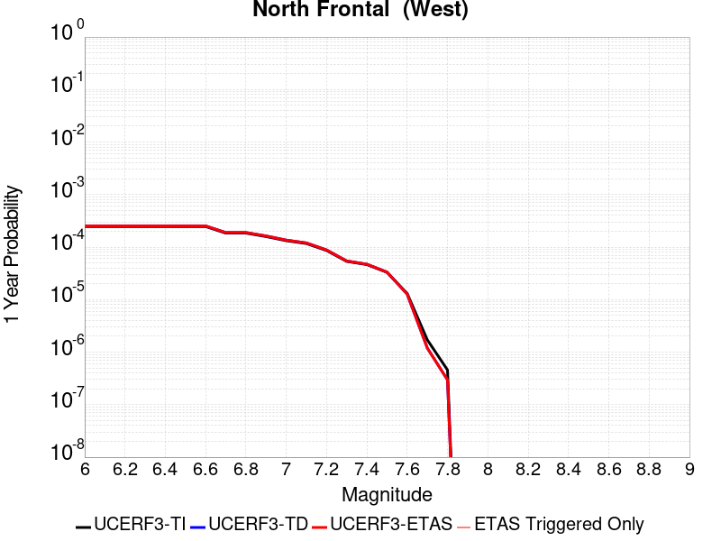 |  |

| Magnitude | 1 wk TI Prob | 1 wk TD Prob | 1 wk ETAS Prob | 1 wk ETAS/TD Gain | 1 wk ETAS Triggered Only | 1 mo TI Prob | 1 mo TD Prob | 1 mo ETAS Prob | 1 mo ETAS/TD Gain | 1 mo ETAS Triggered Only | 1 yr TI Prob | 1 yr TD Prob | 1 yr ETAS Prob | 1 yr ETAS/TD Gain | 1 yr ETAS Triggered Only | 10 yr TI Prob | 10 yr TD Prob | 10 yr ETAS Prob | 10 yr ETAS/TD Gain | 10 yr ETAS Triggered Only |
|-----|-----|-----|-----|-----|-----|-----|-----|-----|-----|-----|-----|-----|-----|-----|-----|-----|-----|-----|-----|-----|
| 6.0 | 4.7316266E-6 | 4.8527477E-6 | 4.8527477E-6 | 1.0 | 0.0 | 2.0278241E-5 | 2.0797332E-5 | 2.0797332E-5 | 1.0 | 0.0 | 2.4685962E-4 | 2.5317958E-4 | 2.5317958E-4 | 1.0 | 0.0 | 0.0024658558 | 0.0025290574 | 0.002539418 | 1.0040965 | 1.0386697E-5 |
| 6.1 | 4.7316266E-6 | 4.8527477E-6 | 4.8527477E-6 | 1.0 | 0.0 | 2.0278241E-5 | 2.0797332E-5 | 2.0797332E-5 | 1.0 | 0.0 | 2.4685962E-4 | 2.5317958E-4 | 2.5317958E-4 | 1.0 | 0.0 | 0.0024658558 | 0.0025290574 | 0.002539418 | 1.0040965 | 1.0386697E-5 |
| 6.2 | 4.7316266E-6 | 4.8527477E-6 | 4.8527477E-6 | 1.0 | 0.0 | 2.0278241E-5 | 2.0797332E-5 | 2.0797332E-5 | 1.0 | 0.0 | 2.4685962E-4 | 2.5317958E-4 | 2.5317958E-4 | 1.0 | 0.0 | 0.0024658558 | 0.0025290574 | 0.002539418 | 1.0040965 | 1.0386697E-5 |
| 6.3 | 4.7316266E-6 | 4.8527477E-6 | 4.8527477E-6 | 1.0 | 0.0 | 2.0278241E-5 | 2.0797332E-5 | 2.0797332E-5 | 1.0 | 0.0 | 2.4685962E-4 | 2.5317958E-4 | 2.5317958E-4 | 1.0 | 0.0 | 0.0024658558 | 0.0025290574 | 0.002539418 | 1.0040965 | 1.0386697E-5 |
| 6.4 | 4.7316266E-6 | 4.8527477E-6 | 4.8527477E-6 | 1.0 | 0.0 | 2.0278241E-5 | 2.0797332E-5 | 2.0797332E-5 | 1.0 | 0.0 | 2.4685962E-4 | 2.5317958E-4 | 2.5317958E-4 | 1.0 | 0.0 | 0.0024658558 | 0.0025290574 | 0.002539418 | 1.0040965 | 1.0386697E-5 |
| 6.5 | 4.7316266E-6 | 4.8527477E-6 | 4.8527477E-6 | 1.0 | 0.0 | 2.0278241E-5 | 2.0797332E-5 | 2.0797332E-5 | 1.0 | 0.0 | 2.4685962E-4 | 2.5317958E-4 | 2.5317958E-4 | 1.0 | 0.0 | 0.0024658558 | 0.0025290574 | 0.002539418 | 1.0040965 | 1.0386697E-5 |
| 6.6 | 4.7316266E-6 | 4.8527477E-6 | 4.8527477E-6 | 1.0 | 0.0 | 2.0278241E-5 | 2.0797332E-5 | 2.0797332E-5 | 1.0 | 0.0 | 2.4685962E-4 | 2.5317958E-4 | 2.5317958E-4 | 1.0 | 0.0 | 0.0024658558 | 0.0025290574 | 0.002539418 | 1.0040965 | 1.0386697E-5 |
| 6.7 | 3.5382777E-6 | 3.6309455E-6 | 3.6309455E-6 | 1.0 | 0.0 | 1.516396E-5 | 1.5561107E-5 | 1.5561107E-5 | 1.0 | 0.0 | 1.8460557E-4 | 1.8944078E-4 | 1.8944078E-4 | 1.0 | 0.0 | 0.0018445229 | 0.00189287 | 0.001903237 | 1.0054768 | 1.0386697E-5 |
| 6.8 | 3.5382777E-6 | 3.6309455E-6 | 3.6309455E-6 | 1.0 | 0.0 | 1.516396E-5 | 1.5561107E-5 | 1.5561107E-5 | 1.0 | 0.0 | 1.8460557E-4 | 1.8944078E-4 | 1.8944078E-4 | 1.0 | 0.0 | 0.0018445229 | 0.00189287 | 0.001903237 | 1.0054768 | 1.0386697E-5 |
| 6.9 | 3.0428037E-6 | 3.1228133E-6 | 3.1228133E-6 | 1.0 | 0.0 | 1.30405215E-5 | 1.3383421E-5 | 1.3383421E-5 | 1.0 | 0.0 | 1.5875678E-4 | 1.6293164E-4 | 1.6293164E-4 | 1.0 | 0.0 | 0.0015864341 | 0.001628189 | 0.0016385588 | 1.0063689 | 1.0386697E-5 |
| 7.0 | 2.538778E-6 | 2.6061361E-6 | 2.6061361E-6 | 1.0 | 0.0 | 1.0880432E-5 | 1.116911E-5 | 1.116911E-5 | 1.0 | 0.0 | 1.324612E-4 | 1.359759E-4 | 1.359759E-4 | 1.0 | 0.0 | 0.0013238228 | 0.0013589738 | 0.0013693464 | 1.0076326 | 1.0386697E-5 |
| 7.1 | 2.2418935E-6 | 2.3012487E-6 | 2.3012487E-6 | 1.0 | 0.0 | 9.60808E-6 | 9.86246E-6 | 9.86246E-6 | 1.0 | 0.0 | 1.1697209E-4 | 1.2006928E-4 | 1.2006928E-4 | 1.0 | 0.0 | 0.0011691054 | 0.001200088 | 0.0012104622 | 1.0086446 | 1.0386697E-5 |
| 7.2 | 1.6526745E-6 | 1.6925159E-6 | 1.6925159E-6 | 1.0 | 0.0 | 7.082872E-6 | 7.253621E-6 | 7.253621E-6 | 1.0 | 0.0 | 8.623055E-5 | 8.8309505E-5 | 8.8309505E-5 | 1.0 | 0.0 | 8.61971E-4 | 8.827692E-4 | 8.9314673E-4 | 1.0117557 | 1.0386697E-5 |
| 7.3 | 1.0246019E-6 | 1.0442458E-6 | 1.0442458E-6 | 1.0 | 0.0 | 4.391144E-6 | 4.475332E-6 | 4.475332E-6 | 1.0 | 0.0 | 5.3460866E-5 | 5.448592E-5 | 5.448592E-5 | 1.0 | 0.0 | 5.344801E-4 | 5.447371E-4 | 5.5511814E-4 | 1.0190569 | 1.0386697E-5 |
| 7.4 | 8.9045164E-7 | 9.056731E-7 | 9.056731E-7 | 1.0 | 0.0 | 3.8162157E-6 | 3.881451E-6 | 3.881451E-6 | 1.0 | 0.0 | 4.646144E-5 | 4.7255755E-5 | 4.7255755E-5 | 1.0 | 0.0 | 4.6451724E-4 | 4.7246792E-4 | 4.8284972E-4 | 1.0219735 | 1.0386697E-5 |
| 7.5 | 6.3357E-7 | 6.402826E-7 | 6.402826E-7 | 1.0 | 0.0 | 2.7152971E-6 | 2.744066E-6 | 2.744066E-6 | 1.0 | 0.0 | 3.305824E-5 | 3.3408556E-5 | 3.3408556E-5 | 1.0 | 0.0 | 3.3053322E-4 | 3.3404192E-4 | 3.4442515E-4 | 1.0310836 | 1.0386697E-5 |
| 7.6 | 2.5087024E-7 | 2.4361591E-7 | 2.4361591E-7 | 1.0 | 0.0 | 1.0751578E-6 | 1.0440679E-6 | 1.0440679E-6 | 1.0 | 0.0 | 1.3089967E-5 | 1.2711474E-5 | 1.2711474E-5 | 1.0 | 0.0 | 1.3089196E-4 | 1.2710952E-4 | 1.374949E-4 | 1.0817041 | 1.0386697E-5 |
| 7.7 | 3.282987E-8 | 2.2874781E-8 | 2.2874781E-8 | 1.0 | 0.0 | 1.4069944E-7 | 9.8034775E-8 | 9.8034775E-8 | 1.0 | 0.0 | 1.7130144E-6 | 1.1935729E-6 | 1.1935729E-6 | 1.0 | 0.0 | 1.7130013E-5 | 1.1935673E-5 | 1.1935673E-5 | 1.0 | 0.0 |
| 7.8 | 8.77499E-9 | 5.6818488E-9 | 5.6818488E-9 | 1.0 | 0.0 | 3.7607098E-8 | 2.4350781E-8 | 2.4350781E-8 | 1.0 | 0.0 | 4.578663E-7 | 2.9647074E-7 | 2.9647074E-7 | 1.0 | 0.0 | 4.5786537E-6 | 2.9647047E-6 | 2.9647047E-6 | 1.0 | 0.0 |

## San Gabriel
*[(top)](#table-of-contents)*

| 1 Week | 1 Month | 1 Year | 10 Year |
|-----|-----|-----|-----|
|  |  | 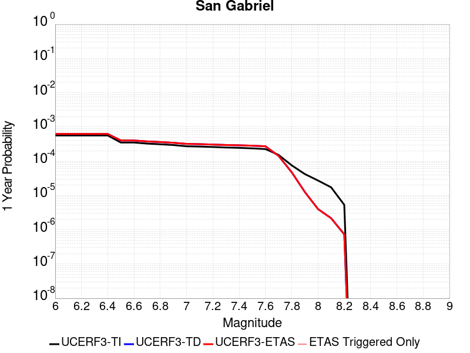 |  |

| Magnitude | 1 wk TI Prob | 1 wk TD Prob | 1 wk ETAS Prob | 1 wk ETAS/TD Gain | 1 wk ETAS Triggered Only | 1 mo TI Prob | 1 mo TD Prob | 1 mo ETAS Prob | 1 mo ETAS/TD Gain | 1 mo ETAS Triggered Only | 1 yr TI Prob | 1 yr TD Prob | 1 yr ETAS Prob | 1 yr ETAS/TD Gain | 1 yr ETAS Triggered Only | 10 yr TI Prob | 10 yr TD Prob | 10 yr ETAS Prob | 10 yr ETAS/TD Gain | 10 yr ETAS Triggered Only |
|-----|-----|-----|-----|-----|-----|-----|-----|-----|-----|-----|-----|-----|-----|-----|-----|-----|-----|-----|-----|-----|
| 6.0 | 1.083775E-5 | 1.199374E-5 | 1.199374E-5 | 1.0 | 0.0 | 4.6446676E-5 | 5.1400795E-5 | 5.1400795E-5 | 1.0 | 0.0 | 5.653415E-4 | 6.256363E-4 | 6.256363E-4 | 1.0 | 0.0 | 0.0056390543 | 0.0062508355 | 0.0062611573 | 1.0016513 | 1.0386697E-5 |
| 6.1 | 1.083775E-5 | 1.199374E-5 | 1.199374E-5 | 1.0 | 0.0 | 4.6446676E-5 | 5.1400795E-5 | 5.1400795E-5 | 1.0 | 0.0 | 5.653415E-4 | 6.256363E-4 | 6.256363E-4 | 1.0 | 0.0 | 0.0056390543 | 0.0062508355 | 0.0062611573 | 1.0016513 | 1.0386697E-5 |
| 6.2 | 1.083775E-5 | 1.199374E-5 | 1.199374E-5 | 1.0 | 0.0 | 4.6446676E-5 | 5.1400795E-5 | 5.1400795E-5 | 1.0 | 0.0 | 5.653415E-4 | 6.256363E-4 | 6.256363E-4 | 1.0 | 0.0 | 0.0056390543 | 0.0062508355 | 0.0062611573 | 1.0016513 | 1.0386697E-5 |
| 6.3 | 1.083775E-5 | 1.199374E-5 | 1.199374E-5 | 1.0 | 0.0 | 4.6446676E-5 | 5.1400795E-5 | 5.1400795E-5 | 1.0 | 0.0 | 5.653415E-4 | 6.256363E-4 | 6.256363E-4 | 1.0 | 0.0 | 0.0056390543 | 0.0062508355 | 0.0062611573 | 1.0016513 | 1.0386697E-5 |
| 6.4 | 1.083775E-5 | 1.199374E-5 | 1.199374E-5 | 1.0 | 0.0 | 4.6446676E-5 | 5.1400795E-5 | 5.1400795E-5 | 1.0 | 0.0 | 5.653415E-4 | 6.256363E-4 | 6.256363E-4 | 1.0 | 0.0 | 0.0056390543 | 0.0062508355 | 0.0062611573 | 1.0016513 | 1.0386697E-5 |
| 6.5 | 6.7317824E-6 | 7.725408E-6 | 7.725408E-6 | 1.0 | 0.0 | 2.8850178E-5 | 3.3108478E-5 | 3.3108478E-5 | 1.0 | 0.0 | 3.511943E-4 | 4.0302222E-4 | 4.0302222E-4 | 1.0 | 0.0 | 0.003506398 | 0.0040339995 | 0.004044344 | 1.0025644 | 1.0386697E-5 |
| 6.6 | 6.7317824E-6 | 7.725408E-6 | 7.725408E-6 | 1.0 | 0.0 | 2.8850178E-5 | 3.3108478E-5 | 3.3108478E-5 | 1.0 | 0.0 | 3.511943E-4 | 4.0302222E-4 | 4.0302222E-4 | 1.0 | 0.0 | 0.003506398 | 0.0040339995 | 0.004044344 | 1.0025644 | 1.0386697E-5 |
| 6.7 | 6.274881E-6 | 7.2543207E-6 | 7.2543207E-6 | 1.0 | 0.0 | 2.6892068E-5 | 3.108958E-5 | 3.108958E-5 | 1.0 | 0.0 | 3.2736175E-4 | 3.7845087E-4 | 3.7845087E-4 | 1.0 | 0.0 | 0.0032687993 | 0.0037891432 | 0.0037994904 | 1.0027307 | 1.0386697E-5 |
| 6.8 | 5.996209E-6 | 6.967036E-6 | 6.967036E-6 | 1.0 | 0.0 | 2.5697784E-5 | 2.985839E-5 | 2.985839E-5 | 1.0 | 0.0 | 3.128256E-4 | 3.6346618E-4 | 3.6346618E-4 | 1.0 | 0.0 | 0.003123856 | 0.0036397942 | 0.003650143 | 1.0028433 | 1.0386697E-5 |
| 6.9 | 5.686331E-6 | 6.632049E-6 | 6.632049E-6 | 1.0 | 0.0 | 2.4369761E-5 | 2.8422763E-5 | 2.8422763E-5 | 1.0 | 0.0 | 2.9666146E-4 | 3.459931E-4 | 3.459931E-4 | 1.0 | 0.0 | 0.0029626573 | 0.0034656196 | 0.0034759704 | 1.0029867 | 1.0386697E-5 |
| 7.0 | 5.2329838E-6 | 6.1559103E-6 | 6.1559103E-6 | 1.0 | 0.0 | 2.242688E-5 | 2.638221E-5 | 2.638221E-5 | 1.0 | 0.0 | 2.7301308E-4 | 3.2115684E-4 | 3.2115684E-4 | 1.0 | 0.0 | 0.002726779 | 0.0032179903 | 0.0032283436 | 1.0032173 | 1.0386697E-5 |
| 7.1 | 5.135671E-6 | 6.0460143E-6 | 6.0460143E-6 | 1.0 | 0.0 | 2.2009834E-5 | 2.5911237E-5 | 2.5911237E-5 | 1.0 | 0.0 | 2.6793676E-4 | 3.154244E-4 | 3.154244E-4 | 1.0 | 0.0 | 0.0026761394 | 0.0031608304 | 0.0031711843 | 1.0032756 | 1.0386697E-5 |
| 7.2 | 4.989062E-6 | 5.8793566E-6 | 5.8793566E-6 | 1.0 | 0.0 | 2.1381518E-5 | 2.5197003E-5 | 2.5197003E-5 | 1.0 | 0.0 | 2.6028889E-4 | 3.067311E-4 | 3.067311E-4 | 1.0 | 0.0 | 0.0025998424 | 0.0030741405 | 0.0030844952 | 1.0033684 | 1.0386697E-5 |
| 7.3 | 4.8219395E-6 | 5.710877E-6 | 5.710877E-6 | 1.0 | 0.0 | 2.0665291E-5 | 2.447496E-5 | 2.447496E-5 | 1.0 | 0.0 | 2.5157086E-4 | 2.9794266E-4 | 2.9794266E-4 | 1.0 | 0.0 | 0.0025128627 | 0.0029864958 | 0.0029968515 | 1.0034676 | 1.0386697E-5 |
| 7.4 | 4.7118383E-6 | 5.599405E-6 | 5.599405E-6 | 1.0 | 0.0 | 2.0193436E-5 | 2.3997234E-5 | 2.3997234E-5 | 1.0 | 0.0 | 2.4582737E-4 | 2.921279E-4 | 2.921279E-4 | 1.0 | 0.0 | 0.002455556 | 0.0029285017 | 0.0029388578 | 1.0035363 | 1.0386697E-5 |
| 7.5 | 4.5506545E-6 | 5.4447314E-6 | 5.4447314E-6 | 1.0 | 0.0 | 1.9502659E-5 | 2.3334358E-5 | 2.3334358E-5 | 1.0 | 0.0 | 2.37419E-4 | 2.8405953E-4 | 2.8405953E-4 | 1.0 | 0.0 | 0.002371655 | 0.0028480263 | 0.0028583833 | 1.0036366 | 1.0386697E-5 |
| 7.6 | 4.343636E-6 | 5.237542E-6 | 5.237542E-6 | 1.0 | 0.0 | 1.861545E-5 | 2.244642E-5 | 2.244642E-5 | 1.0 | 0.0 | 2.2661954E-4 | 2.7325164E-4 | 2.7325164E-4 | 1.0 | 0.0 | 0.0022638857 | 0.00274021 | 0.002750568 | 1.0037801 | 1.0386697E-5 |
| 7.7 | 2.936235E-6 | 2.7495403E-6 | 2.7495403E-6 | 1.0 | 0.0 | 1.2583803E-5 | 1.1783691E-5 | 1.1783691E-5 | 1.0 | 0.0 | 1.5319703E-4 | 1.4345703E-4 | 1.4345703E-4 | 1.0 | 0.0 | 0.0015309147 | 0.0014409543 | 0.001451326 | 1.0071979 | 1.0386697E-5 |
| 7.8 | 1.4541639E-6 | 9.145936E-7 | 9.145936E-7 | 1.0 | 0.0 | 6.232116E-6 | 3.9196807E-6 | 3.9196807E-6 | 1.0 | 0.0 | 7.587337E-5 | 4.772107E-5 | 4.772107E-5 | 1.0 | 0.0 | 7.584747E-4 | 4.820283E-4 | 4.820283E-4 | 1.0 | 0.0 |
| 7.9 | 8.098958E-7 | 2.426228E-7 | 2.426228E-7 | 1.0 | 0.0 | 3.4709774E-6 | 1.0398115E-6 | 1.0398115E-6 | 1.0 | 0.0 | 4.225833E-5 | 1.2659632E-5 | 1.2659632E-5 | 1.0 | 0.0 | 4.2250296E-4 | 1.2968633E-4 | 1.2968633E-4 | 1.0 | 0.0 |
| 8.0 | 5.2473234E-7 | 7.719376E-8 | 7.719376E-8 | 1.0 | 0.0 | 2.248851E-6 | 3.3083035E-7 | 3.3083035E-7 | 1.0 | 0.0 | 2.7379416E-5 | 4.027852E-6 | 4.027852E-6 | 1.0 | 0.0 | 2.7376044E-4 | 4.241171E-5 | 4.241171E-5 | 1.0 | 0.0 |
| 8.1 | 3.3162388E-7 | 4.1720053E-8 | 4.1720053E-8 | 1.0 | 0.0 | 1.4212444E-6 | 1.788002E-7 | 1.788002E-7 | 1.0 | 0.0 | 1.7303513E-5 | 2.1768903E-6 | 2.1768903E-6 | 1.0 | 0.0 | 1.7302166E-4 | 2.3088427E-5 | 2.3088427E-5 | 1.0 | 0.0 |
| 8.2 | 1.0235345E-7 | 1.4113462E-8 | 1.4113462E-8 | 1.0 | 0.0 | 4.3865757E-7 | 6.0486265E-8 | 6.0486265E-8 | 1.0 | 0.0 | 5.340643E-6 | 7.3642E-7 | 7.3642E-7 | 1.0 | 0.0 | 5.3405143E-5 | 7.9661195E-6 | 7.9661195E-6 | 1.0 | 0.0 |

## Homestead Valley 2011
*[(top)](#table-of-contents)*

| 1 Week | 1 Month | 1 Year | 10 Year |
|-----|-----|-----|-----|
| 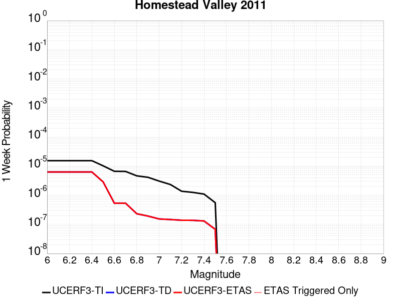 |  |  |  |

| Magnitude | 1 wk TI Prob | 1 wk TD Prob | 1 wk ETAS Prob | 1 wk ETAS/TD Gain | 1 wk ETAS Triggered Only | 1 mo TI Prob | 1 mo TD Prob | 1 mo ETAS Prob | 1 mo ETAS/TD Gain | 1 mo ETAS Triggered Only | 1 yr TI Prob | 1 yr TD Prob | 1 yr ETAS Prob | 1 yr ETAS/TD Gain | 1 yr ETAS Triggered Only | 10 yr TI Prob | 10 yr TD Prob | 10 yr ETAS Prob | 10 yr ETAS/TD Gain | 10 yr ETAS Triggered Only |
|-----|-----|-----|-----|-----|-----|-----|-----|-----|-----|-----|-----|-----|-----|-----|-----|-----|-----|-----|-----|-----|
| 6.0 | 1.539795E-5 | 6.2868744E-6 | 6.2868744E-6 | 1.0 | 0.0 | 6.5989545E-5 | 2.6943586E-5 | 2.6943586E-5 | 1.0 | 0.0 | 8.0312655E-4 | 3.280094E-4 | 3.280094E-4 | 1.0 | 0.0 | 0.008002302 | 0.0032772736 | 0.0032876262 | 1.0031589 | 1.0386697E-5 |
| 6.1 | 1.539795E-5 | 6.2868744E-6 | 6.2868744E-6 | 1.0 | 0.0 | 6.5989545E-5 | 2.6943586E-5 | 2.6943586E-5 | 1.0 | 0.0 | 8.0312655E-4 | 3.280094E-4 | 3.280094E-4 | 1.0 | 0.0 | 0.008002302 | 0.0032772736 | 0.0032876262 | 1.0031589 | 1.0386697E-5 |
| 6.2 | 1.539795E-5 | 6.2868744E-6 | 6.2868744E-6 | 1.0 | 0.0 | 6.5989545E-5 | 2.6943586E-5 | 2.6943586E-5 | 1.0 | 0.0 | 8.0312655E-4 | 3.280094E-4 | 3.280094E-4 | 1.0 | 0.0 | 0.008002302 | 0.0032772736 | 0.0032876262 | 1.0031589 | 1.0386697E-5 |
| 6.3 | 1.539795E-5 | 6.2868744E-6 | 6.2868744E-6 | 1.0 | 0.0 | 6.5989545E-5 | 2.6943586E-5 | 2.6943586E-5 | 1.0 | 0.0 | 8.0312655E-4 | 3.280094E-4 | 3.280094E-4 | 1.0 | 0.0 | 0.008002302 | 0.0032772736 | 0.0032876262 | 1.0031589 | 1.0386697E-5 |
| 6.4 | 1.539795E-5 | 6.2868744E-6 | 6.2868744E-6 | 1.0 | 0.0 | 6.5989545E-5 | 2.6943586E-5 | 2.6943586E-5 | 1.0 | 0.0 | 8.0312655E-4 | 3.280094E-4 | 3.280094E-4 | 1.0 | 0.0 | 0.008002302 | 0.0032772736 | 0.0032876262 | 1.0031589 | 1.0386697E-5 |
| 6.5 | 1.0265258E-5 | 2.8789796E-6 | 2.8789796E-6 | 1.0 | 0.0 | 4.3993223E-5 | 1.2338465E-5 | 1.2338465E-5 | 1.0 | 0.0 | 5.3548586E-4 | 1.5021741E-4 | 1.5021741E-4 | 1.0 | 0.0 | 0.005341973 | 0.0015018407 | 0.0015122117 | 1.0069056 | 1.0386697E-5 |
| 6.6 | 6.664671E-6 | 5.3488435E-7 | 5.3488435E-7 | 1.0 | 0.0 | 2.8562565E-5 | 2.2923603E-6 | 2.2923603E-6 | 1.0 | 0.0 | 3.476937E-4 | 2.7909247E-5 | 2.7909247E-5 | 1.0 | 0.0 | 0.003471502 | 2.7906906E-4 | 2.8945287E-4 | 1.0372087 | 1.0386697E-5 |
| 6.7 | 6.5954046E-6 | 5.3488435E-7 | 5.3488435E-7 | 1.0 | 0.0 | 2.8265715E-5 | 2.2923603E-6 | 2.2923603E-6 | 1.0 | 0.0 | 3.4408073E-4 | 2.7909247E-5 | 2.7909247E-5 | 1.0 | 0.0 | 0.0034354846 | 2.7906906E-4 | 2.8945287E-4 | 1.0372087 | 1.0386697E-5 |
| 6.8 | 4.648189E-6 | 2.3269658E-7 | 2.3269658E-7 | 1.0 | 0.0 | 1.9920659E-5 | 9.972707E-7 | 9.972707E-7 | 1.0 | 0.0 | 2.4250703E-4 | 1.2141708E-5 | 1.2141708E-5 | 1.0 | 0.0 | 0.0024224254 | 1.2141093E-4 | 1.3179636E-4 | 1.0855396 | 1.0386697E-5 |
| 6.9 | 4.1428534E-6 | 1.9348157E-7 | 1.9348157E-7 | 1.0 | 0.0 | 1.7754966E-5 | 8.292065E-7 | 8.292065E-7 | 1.0 | 0.0 | 2.1614527E-4 | 1.0095546E-5 | 1.0095546E-5 | 1.0 | 0.0 | 0.0021593515 | 1.0095117E-4 | 1.1133681E-4 | 1.102878 | 1.0386697E-5 |
| 7.0 | 3.0673707E-6 | 1.5370551E-7 | 1.5370551E-7 | 1.0 | 0.0 | 1.3145808E-5 | 6.5873775E-7 | 6.5873775E-7 | 1.0 | 0.0 | 1.6003846E-4 | 8.020103E-6 | 8.020103E-6 | 1.0 | 0.0 | 0.0015992324 | 8.0198246E-5 | 9.058411E-5 | 1.1295024 | 1.0386697E-5 |
| 7.1 | 2.340854E-6 | 1.4690413E-7 | 1.4690413E-7 | 1.0 | 0.0 | 1.0032193E-5 | 6.2958895E-7 | 6.2958895E-7 | 1.0 | 0.0 | 1.221351E-4 | 7.6652195E-6 | 7.6652195E-6 | 1.0 | 0.0 | 0.00122068 | 7.664965E-5 | 8.703556E-5 | 1.1354983 | 1.0386697E-5 |
| 7.2 | 1.3754182E-6 | 1.3925126E-7 | 1.3925126E-7 | 1.0 | 0.0 | 5.8946357E-6 | 5.96791E-7 | 5.96791E-7 | 1.0 | 0.0 | 7.176483E-5 | 7.265907E-6 | 7.265907E-6 | 1.0 | 0.0 | 7.174166E-4 | 7.265679E-5 | 8.304273E-5 | 1.1429453 | 1.0386697E-5 |
| 7.3 | 1.2573237E-6 | 1.3829613E-7 | 1.3829613E-7 | 1.0 | 0.0 | 5.388519E-6 | 5.926975E-7 | 5.926975E-7 | 1.0 | 0.0 | 6.560324E-5 | 7.2160697E-6 | 7.2160697E-6 | 1.0 | 0.0 | 6.558388E-4 | 7.2158444E-5 | 8.254439E-5 | 1.1439326 | 1.0386697E-5 |
| 7.4 | 1.0994207E-6 | 1.3108422E-7 | 1.3108422E-7 | 1.0 | 0.0 | 4.7117946E-6 | 5.6178936E-7 | 5.6178936E-7 | 1.0 | 0.0 | 5.736459E-5 | 6.8397653E-6 | 6.8397653E-6 | 1.0 | 0.0 | 5.734978E-4 | 6.839564E-5 | 7.8781624E-5 | 1.1518515 | 1.0386697E-5 |
| 7.5 | 5.5569126E-7 | 6.774076E-8 | 6.774076E-8 | 1.0 | 0.0 | 2.3815317E-6 | 2.903175E-7 | 2.903175E-7 | 1.0 | 0.0 | 2.8994764E-5 | 3.5346104E-6 | 3.5346104E-6 | 1.0 | 0.0 | 2.899098E-4 | 3.5345605E-5 | 4.5731937E-5 | 1.2938507 | 1.0386697E-5 |

## Morales (West)
*[(top)](#table-of-contents)*

| 1 Week | 1 Month | 1 Year | 10 Year |
|-----|-----|-----|-----|
| 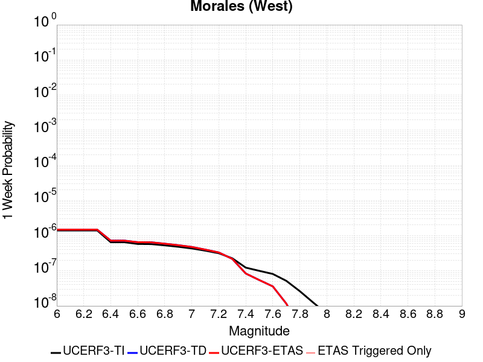 | 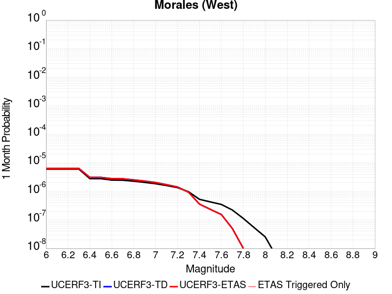 |  |  |

| Magnitude | 1 wk TI Prob | 1 wk TD Prob | 1 wk ETAS Prob | 1 wk ETAS/TD Gain | 1 wk ETAS Triggered Only | 1 mo TI Prob | 1 mo TD Prob | 1 mo ETAS Prob | 1 mo ETAS/TD Gain | 1 mo ETAS Triggered Only | 1 yr TI Prob | 1 yr TD Prob | 1 yr ETAS Prob | 1 yr ETAS/TD Gain | 1 yr ETAS Triggered Only | 10 yr TI Prob | 10 yr TD Prob | 10 yr ETAS Prob | 10 yr ETAS/TD Gain | 10 yr ETAS Triggered Only |
|-----|-----|-----|-----|-----|-----|-----|-----|-----|-----|-----|-----|-----|-----|-----|-----|-----|-----|-----|-----|-----|
| 6.0 | 1.4027072E-6 | 1.4794881E-6 | 1.4794881E-6 | 1.0 | 0.0 | 6.0115885E-6 | 6.340652E-6 | 6.340652E-6 | 1.0 | 0.0 | 7.318863E-5 | 7.71954E-5 | 8.75813E-5 | 1.1345403 | 1.0386697E-5 | 7.316453E-4 | 7.717544E-4 | 7.821331E-4 | 1.0134481 | 1.0386697E-5 |
| 6.1 | 1.4027072E-6 | 1.4794881E-6 | 1.4794881E-6 | 1.0 | 0.0 | 6.0115885E-6 | 6.340652E-6 | 6.340652E-6 | 1.0 | 0.0 | 7.318863E-5 | 7.71954E-5 | 8.75813E-5 | 1.1345403 | 1.0386697E-5 | 7.316453E-4 | 7.717544E-4 | 7.821331E-4 | 1.0134481 | 1.0386697E-5 |
| 6.2 | 1.4027072E-6 | 1.4794881E-6 | 1.4794881E-6 | 1.0 | 0.0 | 6.0115885E-6 | 6.340652E-6 | 6.340652E-6 | 1.0 | 0.0 | 7.318863E-5 | 7.71954E-5 | 8.75813E-5 | 1.1345403 | 1.0386697E-5 | 7.316453E-4 | 7.717544E-4 | 7.821331E-4 | 1.0134481 | 1.0386697E-5 |
| 6.3 | 1.4027072E-6 | 1.4794881E-6 | 1.4794881E-6 | 1.0 | 0.0 | 6.0115885E-6 | 6.340652E-6 | 6.340652E-6 | 1.0 | 0.0 | 7.318863E-5 | 7.71954E-5 | 8.75813E-5 | 1.1345403 | 1.0386697E-5 | 7.316453E-4 | 7.717544E-4 | 7.821331E-4 | 1.0134481 | 1.0386697E-5 |
| 6.4 | 6.504502E-7 | 7.207152E-7 | 7.207152E-7 | 1.0 | 0.0 | 2.7876408E-6 | 3.0887759E-6 | 3.0887759E-6 | 1.0 | 0.0 | 3.3939E-5 | 3.760521E-5 | 3.760521E-5 | 1.0 | 0.0 | 3.3933815E-4 | 3.7598965E-4 | 3.7598965E-4 | 1.0 | 0.0 |
| 6.5 | 6.504502E-7 | 7.207152E-7 | 7.207152E-7 | 1.0 | 0.0 | 2.7876408E-6 | 3.0887759E-6 | 3.0887759E-6 | 1.0 | 0.0 | 3.3939E-5 | 3.760521E-5 | 3.760521E-5 | 1.0 | 0.0 | 3.3933815E-4 | 3.7598965E-4 | 3.7598965E-4 | 1.0 | 0.0 |
| 6.6 | 5.8056526E-7 | 6.5034095E-7 | 6.5034095E-7 | 1.0 | 0.0 | 2.4881344E-6 | 2.7871727E-6 | 2.7871727E-6 | 1.0 | 0.0 | 3.0292615E-5 | 3.3933306E-5 | 3.3933306E-5 | 1.0 | 0.0 | 3.0288487E-4 | 3.3928183E-4 | 3.3928183E-4 | 1.0 | 0.0 |
| 6.7 | 5.741448E-7 | 6.4387206E-7 | 6.4387206E-7 | 1.0 | 0.0 | 2.4606184E-6 | 2.7594488E-6 | 2.7594488E-6 | 1.0 | 0.0 | 2.9957617E-5 | 3.3595777E-5 | 3.3595777E-5 | 1.0 | 0.0 | 2.9953578E-4 | 3.359076E-4 | 3.359076E-4 | 1.0 | 0.0 |
| 6.8 | 5.299428E-7 | 5.894045E-7 | 5.894045E-7 | 1.0 | 0.0 | 2.2711813E-6 | 2.526017E-6 | 2.526017E-6 | 1.0 | 0.0 | 2.7651282E-5 | 3.075383E-5 | 3.075383E-5 | 1.0 | 0.0 | 2.7647841E-4 | 3.074962E-4 | 3.074962E-4 | 1.0 | 0.0 |
| 6.9 | 4.82394E-7 | 5.3447405E-7 | 5.3447405E-7 | 1.0 | 0.0 | 2.0674013E-6 | 2.290601E-6 | 2.290601E-6 | 1.0 | 0.0 | 2.517032E-5 | 2.7887716E-5 | 2.7887716E-5 | 1.0 | 0.0 | 2.516747E-4 | 2.7884258E-4 | 2.7884258E-4 | 1.0 | 0.0 |
| 7.0 | 4.3264512E-7 | 4.7628208E-7 | 4.7628208E-7 | 1.0 | 0.0 | 1.8541921E-6 | 2.0412074E-6 | 2.0412074E-6 | 1.0 | 0.0 | 2.2574555E-5 | 2.4851419E-5 | 2.4851419E-5 | 1.0 | 0.0 | 2.2572262E-4 | 2.4848673E-4 | 2.4848673E-4 | 1.0 | 0.0 |
| 7.1 | 3.7388565E-7 | 4.0031347E-7 | 4.0031347E-7 | 1.0 | 0.0 | 1.6023661E-6 | 1.715628E-6 | 1.715628E-6 | 1.0 | 0.0 | 1.9508632E-5 | 2.0887574E-5 | 2.0887574E-5 | 1.0 | 0.0 | 1.950692E-4 | 2.0885633E-4 | 2.0885633E-4 | 1.0 | 0.0 |
| 7.2 | 3.1592543E-7 | 3.3225484E-7 | 3.3225484E-7 | 1.0 | 0.0 | 1.3539654E-6 | 1.4239486E-6 | 1.4239486E-6 | 1.0 | 0.0 | 1.6484404E-5 | 1.7336437E-5 | 1.7336437E-5 | 1.0 | 0.0 | 1.6483181E-4 | 1.7335103E-4 | 1.7335103E-4 | 1.0 | 0.0 |
| 7.3 | 2.2677783E-7 | 2.1815485E-7 | 2.1815485E-7 | 1.0 | 0.0 | 9.719047E-7 | 9.34949E-7 | 9.34949E-7 | 1.0 | 0.0 | 1.1832874E-5 | 1.1382946E-5 | 1.1382946E-5 | 1.0 | 0.0 | 1.18322445E-4 | 1.1382367E-4 | 1.1382367E-4 | 1.0 | 0.0 |
| 7.4 | 1.2295531E-7 | 8.360427E-8 | 8.360427E-8 | 1.0 | 0.0 | 5.269512E-7 | 3.5830394E-7 | 3.5830394E-7 | 1.0 | 0.0 | 6.4156125E-6 | 4.3623418E-6 | 4.3623418E-6 | 1.0 | 0.0 | 6.415427E-5 | 4.3622567E-5 | 4.3622567E-5 | 1.0 | 0.0 |
| 7.5 | 9.9632544E-8 | 5.449914E-8 | 5.449914E-8 | 1.0 | 0.0 | 4.2699656E-7 | 2.335677E-7 | 2.335677E-7 | 1.0 | 0.0 | 5.198671E-6 | 2.843683E-6 | 2.843683E-6 | 1.0 | 0.0 | 5.198549E-5 | 2.8436472E-5 | 2.8436472E-5 | 1.0 | 0.0 |
| 7.6 | 8.125894E-8 | 3.6000625E-8 | 3.6000625E-8 | 1.0 | 0.0 | 3.4825257E-7 | 1.5428837E-7 | 1.5428837E-7 | 1.0 | 0.0 | 4.2399665E-6 | 1.8784593E-6 | 1.8784593E-6 | 1.0 | 0.0 | 4.2398857E-5 | 1.8784438E-5 | 1.8784438E-5 | 1.0 | 0.0 |
| 7.7 | 5.1810765E-8 | 1.1670306E-8 | 1.1670306E-8 | 1.0 | 0.0 | 2.2204613E-7 | 5.001559E-8 | 5.001559E-8 | 1.0 | 0.0 | 2.7034082E-6 | 6.089396E-7 | 6.089396E-7 | 1.0 | 0.0 | 2.7033753E-5 | 6.0893826E-6 | 6.0893826E-6 | 1.0 | 0.0 |
| 7.8 | 2.6315043E-8 | 2.3473123E-9 | 2.3473123E-9 | 1.0 | 0.0 | 1.1277875E-7 | 1.0059905E-8 | 1.0059905E-8 | 1.0 | 0.0 | 1.3730804E-6 | 1.2247936E-7 | 1.2247936E-7 | 1.0 | 0.0 | 1.3730719E-5 | 1.2247959E-6 | 1.2247959E-6 | 1.0 | 0.0 |
| 7.9 | 1.24281545E-8 | 4.2313664E-10 | 4.2313664E-10 | 1.0 | 0.0 | 5.3263516E-8 | 1.8134344E-9 | 1.8134344E-9 | 1.0 | 0.0 | 6.4848314E-7 | 2.2078577E-8 | 2.2078577E-8 | 1.0 | 0.0 | 6.4848123E-6 | 2.2078868E-7 | 2.2078868E-7 | 1.0 | 0.0 |
| 8.0 | 5.954214E-9 | 1.8624768E-10 | 1.8624768E-10 | 1.0 | 0.0 | 2.551806E-8 | 7.981986E-10 | 7.981986E-10 | 1.0 | 0.0 | 3.1068234E-7 | 9.718078E-9 | 9.718078E-9 | 1.0 | 0.0 | 3.1068191E-6 | 9.718371E-8 | 9.718371E-8 | 1.0 | 0.0 |
| 8.1 | 1.2586262E-9 | 8.392065E-11 | 8.392065E-11 | 1.0 | 0.0 | 5.3941123E-9 | 3.5965875E-10 | 3.5965875E-10 | 1.0 | 0.0 | 6.567332E-8 | 4.3788453E-9 | 4.3788453E-9 | 1.0 | 0.0 | 6.56733E-7 | 4.3791395E-8 | 4.3791395E-8 | 1.0 | 0.0 |

## Great Valley 06 (Midland) 2011 CFM alt1
*[(top)](#table-of-contents)*

| 1 Week | 1 Month | 1 Year | 10 Year |
|-----|-----|-----|-----|
|  |  |  | 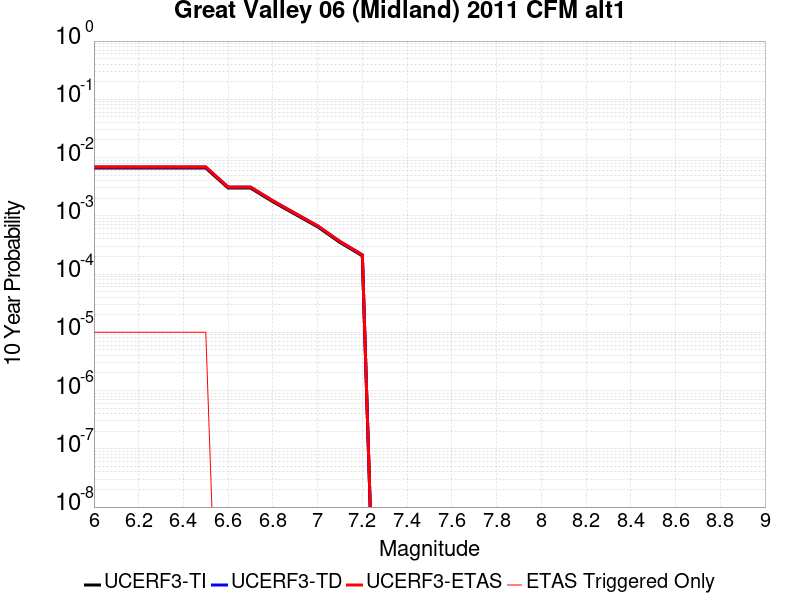 |

| Magnitude | 1 wk TI Prob | 1 wk TD Prob | 1 wk ETAS Prob | 1 wk ETAS/TD Gain | 1 wk ETAS Triggered Only | 1 mo TI Prob | 1 mo TD Prob | 1 mo ETAS Prob | 1 mo ETAS/TD Gain | 1 mo ETAS Triggered Only | 1 yr TI Prob | 1 yr TD Prob | 1 yr ETAS Prob | 1 yr ETAS/TD Gain | 1 yr ETAS Triggered Only | 10 yr TI Prob | 10 yr TD Prob | 10 yr ETAS Prob | 10 yr ETAS/TD Gain | 10 yr ETAS Triggered Only |
|-----|-----|-----|-----|-----|-----|-----|-----|-----|-----|-----|-----|-----|-----|-----|-----|-----|-----|-----|-----|-----|
| 6.0 | 1.2712525E-5 | 1.3210851E-5 | 1.3210851E-5 | 1.0 | 0.0 | 5.4481112E-5 | 5.6616846E-5 | 5.6616846E-5 | 1.0 | 0.0 | 6.6310563E-4 | 6.8911747E-4 | 6.99497E-4 | 1.0150621 | 1.0386697E-5 | 0.0066113044 | 0.0068723215 | 0.006882637 | 1.001501 | 1.0386697E-5 |
| 6.1 | 1.2712525E-5 | 1.3210851E-5 | 1.3210851E-5 | 1.0 | 0.0 | 5.4481112E-5 | 5.6616846E-5 | 5.6616846E-5 | 1.0 | 0.0 | 6.6310563E-4 | 6.8911747E-4 | 6.99497E-4 | 1.0150621 | 1.0386697E-5 | 0.0066113044 | 0.0068723215 | 0.006882637 | 1.001501 | 1.0386697E-5 |
| 6.2 | 1.2712525E-5 | 1.3210851E-5 | 1.3210851E-5 | 1.0 | 0.0 | 5.4481112E-5 | 5.6616846E-5 | 5.6616846E-5 | 1.0 | 0.0 | 6.6310563E-4 | 6.8911747E-4 | 6.99497E-4 | 1.0150621 | 1.0386697E-5 | 0.0066113044 | 0.0068723215 | 0.006882637 | 1.001501 | 1.0386697E-5 |
| 6.3 | 1.2712525E-5 | 1.3210851E-5 | 1.3210851E-5 | 1.0 | 0.0 | 5.4481112E-5 | 5.6616846E-5 | 5.6616846E-5 | 1.0 | 0.0 | 6.6310563E-4 | 6.8911747E-4 | 6.99497E-4 | 1.0150621 | 1.0386697E-5 | 0.0066113044 | 0.0068723215 | 0.006882637 | 1.001501 | 1.0386697E-5 |
| 6.4 | 1.2712525E-5 | 1.3210851E-5 | 1.3210851E-5 | 1.0 | 0.0 | 5.4481112E-5 | 5.6616846E-5 | 5.6616846E-5 | 1.0 | 0.0 | 6.6310563E-4 | 6.8911747E-4 | 6.99497E-4 | 1.0150621 | 1.0386697E-5 | 0.0066113044 | 0.0068723215 | 0.006882637 | 1.001501 | 1.0386697E-5 |
| 6.5 | 1.2712525E-5 | 1.3210851E-5 | 1.3210851E-5 | 1.0 | 0.0 | 5.4481112E-5 | 5.6616846E-5 | 5.6616846E-5 | 1.0 | 0.0 | 6.6310563E-4 | 6.8911747E-4 | 6.99497E-4 | 1.0150621 | 1.0386697E-5 | 0.0066113044 | 0.0068723215 | 0.006882637 | 1.001501 | 1.0386697E-5 |
| 6.6 | 5.7574384E-6 | 5.9707636E-6 | 5.9707636E-6 | 1.0 | 0.0 | 2.4674504E-5 | 2.5588757E-5 | 2.5588757E-5 | 1.0 | 0.0 | 3.0037065E-4 | 3.1150252E-4 | 3.1150252E-4 | 1.0 | 0.0 | 0.0029996498 | 0.0031110453 | 0.0031110453 | 1.0 | 0.0 |
| 6.7 | 5.7574384E-6 | 5.9707636E-6 | 5.9707636E-6 | 1.0 | 0.0 | 2.4674504E-5 | 2.5588757E-5 | 2.5588757E-5 | 1.0 | 0.0 | 3.0037065E-4 | 3.1150252E-4 | 3.1150252E-4 | 1.0 | 0.0 | 0.0029996498 | 0.0031110453 | 0.0031110453 | 1.0 | 0.0 |
| 6.8 | 3.3474828E-6 | 3.4694517E-6 | 3.4694517E-6 | 1.0 | 0.0 | 1.4346277E-5 | 1.4869002E-5 | 1.4869002E-5 | 1.0 | 0.0 | 1.7465191E-4 | 1.8101657E-4 | 1.8101657E-4 | 1.0 | 0.0 | 0.0017451472 | 0.0018088382 | 0.0018088382 | 1.0 | 0.0 |
| 6.9 | 2.035106E-6 | 2.1090761E-6 | 2.1090761E-6 | 1.0 | 0.0 | 8.721853E-6 | 9.038871E-6 | 9.038871E-6 | 1.0 | 0.0 | 1.0618339E-4 | 1.1004343E-4 | 1.1004343E-4 | 1.0 | 0.0 | 0.0010613267 | 0.0010999617 | 0.0010999617 | 1.0 | 0.0 |
| 7.0 | 1.2424716E-6 | 1.2879011E-6 | 1.2879011E-6 | 1.0 | 0.0 | 5.3248673E-6 | 5.5195674E-6 | 5.5195674E-6 | 1.0 | 0.0 | 6.482833E-5 | 6.719911E-5 | 6.719911E-5 | 1.0 | 0.0 | 6.480942E-4 | 6.7183224E-4 | 6.7183224E-4 | 1.0 | 0.0 |
| 7.1 | 6.6904556E-7 | 6.939171E-7 | 6.939171E-7 | 1.0 | 0.0 | 2.867335E-6 | 2.9739288E-6 | 2.9739288E-6 | 1.0 | 0.0 | 3.4909244E-5 | 3.620724E-5 | 3.620724E-5 | 1.0 | 0.0 | 3.490376E-4 | 3.620389E-4 | 3.620389E-4 | 1.0 | 0.0 |
| 7.2 | 3.948168E-7 | 4.095786E-7 | 4.095786E-7 | 1.0 | 0.0 | 1.6920709E-6 | 1.7553369E-6 | 1.7553369E-6 | 1.0 | 0.0 | 2.0600768E-5 | 2.1371226E-5 | 2.1371226E-5 | 1.0 | 0.0 | 2.0598859E-4 | 2.1371226E-4 | 2.1371226E-4 | 1.0 | 0.0 |

## Sisar
*[(top)](#table-of-contents)*

| 1 Week | 1 Month | 1 Year | 10 Year |
|-----|-----|-----|-----|
|  | 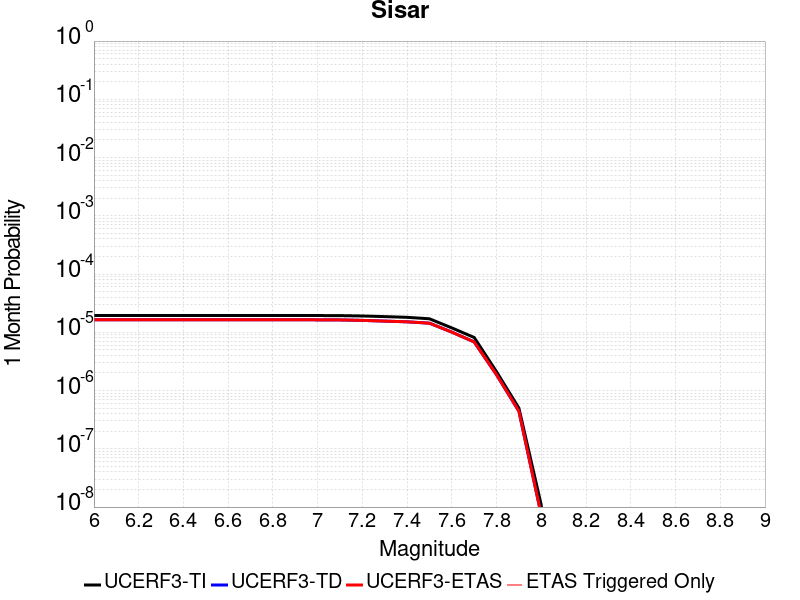 |  | 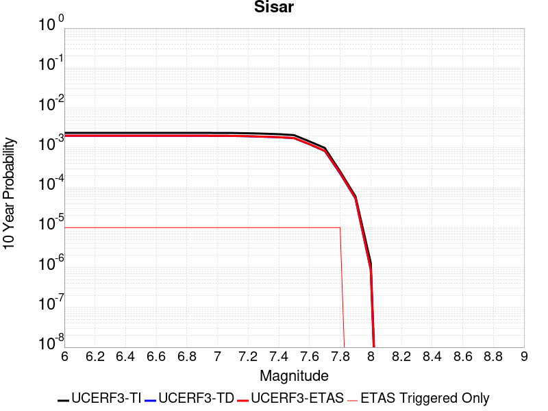 |

| Magnitude | 1 wk TI Prob | 1 wk TD Prob | 1 wk ETAS Prob | 1 wk ETAS/TD Gain | 1 wk ETAS Triggered Only | 1 mo TI Prob | 1 mo TD Prob | 1 mo ETAS Prob | 1 mo ETAS/TD Gain | 1 mo ETAS Triggered Only | 1 yr TI Prob | 1 yr TD Prob | 1 yr ETAS Prob | 1 yr ETAS/TD Gain | 1 yr ETAS Triggered Only | 10 yr TI Prob | 10 yr TD Prob | 10 yr ETAS Prob | 10 yr ETAS/TD Gain | 10 yr ETAS Triggered Only |
|-----|-----|-----|-----|-----|-----|-----|-----|-----|-----|-----|-----|-----|-----|-----|-----|-----|-----|-----|-----|-----|
| 6.0 | 4.544193E-6 | 3.839747E-6 | 3.839747E-6 | 1.0 | 0.0 | 1.9474966E-5 | 1.6455957E-5 | 1.6455957E-5 | 1.0 | 0.0 | 2.3708193E-4 | 2.0033318E-4 | 2.0033318E-4 | 1.0 | 0.0 | 0.0023682916 | 0.0020015596 | 0.0020119254 | 1.0051789 | 1.0386697E-5 |
| 6.1 | 4.544193E-6 | 3.839747E-6 | 3.839747E-6 | 1.0 | 0.0 | 1.9474966E-5 | 1.6455957E-5 | 1.6455957E-5 | 1.0 | 0.0 | 2.3708193E-4 | 2.0033318E-4 | 2.0033318E-4 | 1.0 | 0.0 | 0.0023682916 | 0.0020015596 | 0.0020119254 | 1.0051789 | 1.0386697E-5 |
| 6.2 | 4.544193E-6 | 3.839747E-6 | 3.839747E-6 | 1.0 | 0.0 | 1.9474966E-5 | 1.6455957E-5 | 1.6455957E-5 | 1.0 | 0.0 | 2.3708193E-4 | 2.0033318E-4 | 2.0033318E-4 | 1.0 | 0.0 | 0.0023682916 | 0.0020015596 | 0.0020119254 | 1.0051789 | 1.0386697E-5 |
| 6.3 | 4.544193E-6 | 3.839747E-6 | 3.839747E-6 | 1.0 | 0.0 | 1.9474966E-5 | 1.6455957E-5 | 1.6455957E-5 | 1.0 | 0.0 | 2.3708193E-4 | 2.0033318E-4 | 2.0033318E-4 | 1.0 | 0.0 | 0.0023682916 | 0.0020015596 | 0.0020119254 | 1.0051789 | 1.0386697E-5 |
| 6.4 | 4.544193E-6 | 3.839747E-6 | 3.839747E-6 | 1.0 | 0.0 | 1.9474966E-5 | 1.6455957E-5 | 1.6455957E-5 | 1.0 | 0.0 | 2.3708193E-4 | 2.0033318E-4 | 2.0033318E-4 | 1.0 | 0.0 | 0.0023682916 | 0.0020015596 | 0.0020119254 | 1.0051789 | 1.0386697E-5 |
| 6.5 | 4.544193E-6 | 3.839747E-6 | 3.839747E-6 | 1.0 | 0.0 | 1.9474966E-5 | 1.6455957E-5 | 1.6455957E-5 | 1.0 | 0.0 | 2.3708193E-4 | 2.0033318E-4 | 2.0033318E-4 | 1.0 | 0.0 | 0.0023682916 | 0.0020015596 | 0.0020119254 | 1.0051789 | 1.0386697E-5 |
| 6.6 | 4.544193E-6 | 3.839747E-6 | 3.839747E-6 | 1.0 | 0.0 | 1.9474966E-5 | 1.6455957E-5 | 1.6455957E-5 | 1.0 | 0.0 | 2.3708193E-4 | 2.0033318E-4 | 2.0033318E-4 | 1.0 | 0.0 | 0.0023682916 | 0.0020015596 | 0.0020119254 | 1.0051789 | 1.0386697E-5 |
| 6.7 | 4.544193E-6 | 3.839747E-6 | 3.839747E-6 | 1.0 | 0.0 | 1.9474966E-5 | 1.6455957E-5 | 1.6455957E-5 | 1.0 | 0.0 | 2.3708193E-4 | 2.0033318E-4 | 2.0033318E-4 | 1.0 | 0.0 | 0.0023682916 | 0.0020015596 | 0.0020119254 | 1.0051789 | 1.0386697E-5 |
| 6.8 | 4.544193E-6 | 3.839747E-6 | 3.839747E-6 | 1.0 | 0.0 | 1.9474966E-5 | 1.6455957E-5 | 1.6455957E-5 | 1.0 | 0.0 | 2.3708193E-4 | 2.0033318E-4 | 2.0033318E-4 | 1.0 | 0.0 | 0.0023682916 | 0.0020015596 | 0.0020119254 | 1.0051789 | 1.0386697E-5 |
| 6.9 | 4.542225E-6 | 3.837709E-6 | 3.837709E-6 | 1.0 | 0.0 | 1.9466532E-5 | 1.644722E-5 | 1.644722E-5 | 1.0 | 0.0 | 2.3697925E-4 | 2.0022686E-4 | 2.0022686E-4 | 1.0 | 0.0 | 0.002367267 | 0.0020004984 | 0.0020108642 | 1.0051817 | 1.0386697E-5 |
| 7.0 | 4.5278484E-6 | 3.8227727E-6 | 3.8227727E-6 | 1.0 | 0.0 | 1.940492E-5 | 1.638321E-5 | 1.638321E-5 | 1.0 | 0.0 | 2.3622929E-4 | 1.9944766E-4 | 1.9944766E-4 | 1.0 | 0.0 | 0.0023597833 | 0.0019927204 | 0.0020030863 | 1.0052019 | 1.0386697E-5 |
| 7.1 | 4.5132488E-6 | 3.8075596E-6 | 3.8075596E-6 | 1.0 | 0.0 | 1.9342351E-5 | 1.6318012E-5 | 1.6318012E-5 | 1.0 | 0.0 | 2.3546767E-4 | 1.9865402E-4 | 1.9865402E-4 | 1.0 | 0.0 | 0.0023521832 | 0.0019847981 | 0.0019951642 | 1.0052228 | 1.0386697E-5 |
| 7.2 | 4.448859E-6 | 3.7400184E-6 | 3.7400184E-6 | 1.0 | 0.0 | 1.9066398E-5 | 1.6028553E-5 | 1.6028553E-5 | 1.0 | 0.0 | 2.3210866E-4 | 1.951305E-4 | 1.951305E-4 | 1.0 | 0.0 | 0.0023186638 | 0.0019496252 | 0.0019599916 | 1.0053171 | 1.0386697E-5 |
| 7.3 | 4.3424366E-6 | 3.6338495E-6 | 3.6338495E-6 | 1.0 | 0.0 | 1.861031E-5 | 1.5573549E-5 | 1.5573549E-5 | 1.0 | 0.0 | 2.2655698E-4 | 1.895918E-4 | 1.895918E-4 | 1.0 | 0.0 | 0.0022632615 | 0.001894334 | 0.001904701 | 1.0054727 | 1.0386697E-5 |
| 7.4 | 4.218641E-6 | 3.533198E-6 | 3.533198E-6 | 1.0 | 0.0 | 1.8079765E-5 | 1.5142192E-5 | 1.5142192E-5 | 1.0 | 0.0 | 2.2009891E-4 | 1.8434091E-4 | 1.8434091E-4 | 1.0 | 0.0 | 0.0021988105 | 0.0018419134 | 0.0018522809 | 1.0056287 | 1.0386697E-5 |
| 7.5 | 3.983779E-6 | 3.3479578E-6 | 3.3479578E-6 | 1.0 | 0.0 | 1.7073227E-5 | 1.4348313E-5 | 1.4348313E-5 | 1.0 | 0.0 | 2.0784672E-4 | 1.7467704E-4 | 1.7467704E-4 | 1.0 | 0.0 | 0.0020765243 | 0.0017454304 | 0.0017557989 | 1.0059404 | 1.0386697E-5 |
| 7.6 | 2.777393E-6 | 2.3523537E-6 | 2.3523537E-6 | 1.0 | 0.0 | 1.1903058E-5 | 1.0081477E-5 | 1.0081477E-5 | 1.0 | 0.0 | 1.449101E-4 | 1.2273515E-4 | 1.2273515E-4 | 1.0 | 0.0 | 0.0014481564 | 0.0012266813 | 0.0012370553 | 1.008457 | 1.0386697E-5 |
| 7.7 | 1.9028433E-6 | 1.5939515E-6 | 1.5939515E-6 | 1.0 | 0.0 | 8.155017E-6 | 6.8312033E-6 | 6.8312033E-6 | 1.0 | 0.0 | 9.928281E-5 | 8.316678E-5 | 8.316678E-5 | 1.0 | 0.0 | 9.923846E-4 | 8.313613E-4 | 8.417393E-4 | 1.0124832 | 1.0386697E-5 |
| 7.8 | 4.9095956E-7 | 4.3584873E-7 | 4.3584873E-7 | 1.0 | 0.0 | 2.1041105E-6 | 1.8679218E-6 | 1.8679218E-6 | 1.0 | 0.0 | 2.5617246E-5 | 2.2741713E-5 | 2.2741713E-5 | 1.0 | 0.0 | 2.5614293E-4 | 2.2739403E-4 | 2.3777837E-4 | 1.0456667 | 1.0386697E-5 |
| 7.9 | 1.16657894E-7 | 1.03358296E-7 | 1.03358296E-7 | 1.0 | 0.0 | 4.999623E-7 | 4.4296405E-7 | 4.4296405E-7 | 1.0 | 0.0 | 6.087024E-6 | 5.393074E-6 | 5.393074E-6 | 1.0 | 0.0 | 6.0868573E-5 | 5.3929463E-5 | 5.3929463E-5 | 1.0 | 0.0 |
| 8.0 | 2.5100346E-9 | 1.7069621E-9 | 1.7069621E-9 | 1.0 | 0.0 | 1.0757291E-8 | 7.315552E-9 | 7.315552E-9 | 1.0 | 0.0 | 1.3097001E-7 | 8.9066845E-8 | 8.9066845E-8 | 1.0 | 0.0 | 1.3096993E-6 | 8.9066816E-7 | 8.9066816E-7 | 1.0 | 0.0 |

## Davis Creek
*[(top)](#table-of-contents)*

| 1 Week | 1 Month | 1 Year | 10 Year |
|-----|-----|-----|-----|
|  |  |  |  |

| Magnitude | 1 wk TI Prob | 1 wk TD Prob | 1 wk ETAS Prob | 1 wk ETAS/TD Gain | 1 wk ETAS Triggered Only | 1 mo TI Prob | 1 mo TD Prob | 1 mo ETAS Prob | 1 mo ETAS/TD Gain | 1 mo ETAS Triggered Only | 1 yr TI Prob | 1 yr TD Prob | 1 yr ETAS Prob | 1 yr ETAS/TD Gain | 1 yr ETAS Triggered Only | 10 yr TI Prob | 10 yr TD Prob | 10 yr ETAS Prob | 10 yr ETAS/TD Gain | 10 yr ETAS Triggered Only |
|-----|-----|-----|-----|-----|-----|-----|-----|-----|-----|-----|-----|-----|-----|-----|-----|-----|-----|-----|-----|-----|
| 6.0 | 2.331472E-5 | 2.541843E-5 | 2.541843E-5 | 1.0 | 0.0 | 9.99164E-5 | 1.08932254E-4 | 1.08932254E-4 | 1.0 | 0.0 | 0.0012158032 | 0.0013255618 | 0.0013255618 | 1.0 | 0.0 | 0.01209173 | 0.013188332 | 0.0131985815 | 1.0007771 | 1.0386697E-5 |
| 6.1 | 1.0407654E-5 | 1.1317512E-5 | 1.1317512E-5 | 1.0 | 0.0 | 4.4603472E-5 | 4.8502872E-5 | 4.8502872E-5 | 1.0 | 0.0 | 5.4291193E-4 | 5.903896E-4 | 5.903896E-4 | 1.0 | 0.0 | 0.0054158745 | 0.005890884 | 0.005890884 | 1.0 | 0.0 |
| 6.2 | 1.0407654E-5 | 1.1317512E-5 | 1.1317512E-5 | 1.0 | 0.0 | 4.4603472E-5 | 4.8502872E-5 | 4.8502872E-5 | 1.0 | 0.0 | 5.4291193E-4 | 5.903896E-4 | 5.903896E-4 | 1.0 | 0.0 | 0.0054158745 | 0.005890884 | 0.005890884 | 1.0 | 0.0 |
| 6.3 | 5.1323277E-6 | 5.568808E-6 | 5.568808E-6 | 1.0 | 0.0 | 2.1995505E-5 | 2.3866149E-5 | 2.3866149E-5 | 1.0 | 0.0 | 2.6776237E-4 | 2.9054025E-4 | 2.9054025E-4 | 1.0 | 0.0 | 0.0026743996 | 0.0029024503 | 0.0029024503 | 1.0 | 0.0 |
| 6.4 | 2.4985154E-6 | 2.7046572E-6 | 2.7046572E-6 | 1.0 | 0.0 | 1.07078795E-5 | 1.1591356E-5 | 1.1591356E-5 | 1.0 | 0.0 | 1.3036063E-4 | 1.4111924E-4 | 1.4111924E-4 | 1.0 | 0.0 | 0.0013028418 | 0.001410651 | 0.001410651 | 1.0 | 0.0 |
| 6.5 | 2.4846438E-6 | 2.6905911E-6 | 2.6905911E-6 | 1.0 | 0.0 | 1.064843E-5 | 1.1531074E-5 | 1.1531074E-5 | 1.0 | 0.0 | 1.2963692E-4 | 1.403854E-4 | 1.403854E-4 | 1.0 | 0.0 | 0.0012956132 | 0.001403322 | 0.001403322 | 1.0 | 0.0 |
| 6.6 | 2.072566E-7 | 2.1018245E-7 | 2.1018245E-7 | 1.0 | 0.0 | 8.882423E-7 | 9.0078163E-7 | 9.0078163E-7 | 1.0 | 0.0 | 1.0814296E-5 | 1.0966963E-5 | 1.0966963E-5 | 1.0 | 0.0 | 1.081377E-4 | 1.096644E-4 | 1.096644E-4 | 1.0 | 0.0 |
| 6.7 | 1.7544528E-7 | 1.7790958E-7 | 1.7790958E-7 | 1.0 | 0.0 | 7.5190815E-7 | 7.624694E-7 | 7.624694E-7 | 1.0 | 0.0 | 9.154443E-6 | 9.283027E-6 | 9.283027E-6 | 1.0 | 0.0 | 9.1540656E-5 | 9.282655E-5 | 9.282655E-5 | 1.0 | 0.0 |
| 6.8 | 1.2320395E-7 | 1.2481225E-7 | 1.2481225E-7 | 1.0 | 0.0 | 5.280168E-7 | 5.349095E-7 | 5.349095E-7 | 1.0 | 0.0 | 6.428586E-6 | 6.5125046E-6 | 6.5125046E-6 | 1.0 | 0.0 | 6.4284E-5 | 6.5123255E-5 | 6.5123255E-5 | 1.0 | 0.0 |
| 6.9 | 6.399997E-8 | 6.486104E-8 | 6.486104E-8 | 1.0 | 0.0 | 2.7428555E-7 | 2.7797586E-7 | 2.7797586E-7 | 1.0 | 0.0 | 3.3394215E-6 | 3.3843514E-6 | 3.3843514E-6 | 1.0 | 0.0 | 3.3393713E-5 | 3.3843065E-5 | 3.3843065E-5 | 1.0 | 0.0 |
| 7.0 | 6.4455685E-9 | 6.5353123E-9 | 6.5353123E-9 | 1.0 | 0.0 | 2.7623864E-8 | 2.800848E-8 | 2.800848E-8 | 1.0 | 0.0 | 3.3632048E-7 | 3.4100327E-7 | 3.4100327E-7 | 1.0 | 0.0 | 3.3631998E-6 | 3.4100326E-6 | 3.4100326E-6 | 1.0 | 0.0 |

## Camp Rock 2011
*[(top)](#table-of-contents)*

| 1 Week | 1 Month | 1 Year | 10 Year |
|-----|-----|-----|-----|
|  |  |  |  |

| Magnitude | 1 wk TI Prob | 1 wk TD Prob | 1 wk ETAS Prob | 1 wk ETAS/TD Gain | 1 wk ETAS Triggered Only | 1 mo TI Prob | 1 mo TD Prob | 1 mo ETAS Prob | 1 mo ETAS/TD Gain | 1 mo ETAS Triggered Only | 1 yr TI Prob | 1 yr TD Prob | 1 yr ETAS Prob | 1 yr ETAS/TD Gain | 1 yr ETAS Triggered Only | 10 yr TI Prob | 10 yr TD Prob | 10 yr ETAS Prob | 10 yr ETAS/TD Gain | 10 yr ETAS Triggered Only |
|-----|-----|-----|-----|-----|-----|-----|-----|-----|-----|-----|-----|-----|-----|-----|-----|-----|-----|-----|-----|-----|
| 6.0 | 1.6710783E-5 | 4.2504644E-6 | 4.2504644E-6 | 1.0 | 0.0 | 7.161568E-5 | 1.8216151E-5 | 1.8216151E-5 | 1.0 | 0.0 | 8.7157206E-4 | 2.217596E-4 | 2.217596E-4 | 1.0 | 0.0 | 0.008681616 | 0.002215436 | 0.0022257997 | 1.0046779 | 1.0386697E-5 |
| 6.1 | 1.6710783E-5 | 4.2504644E-6 | 4.2504644E-6 | 1.0 | 0.0 | 7.161568E-5 | 1.8216151E-5 | 1.8216151E-5 | 1.0 | 0.0 | 8.7157206E-4 | 2.217596E-4 | 2.217596E-4 | 1.0 | 0.0 | 0.008681616 | 0.002215436 | 0.0022257997 | 1.0046779 | 1.0386697E-5 |
| 6.2 | 1.6710783E-5 | 4.2504644E-6 | 4.2504644E-6 | 1.0 | 0.0 | 7.161568E-5 | 1.8216151E-5 | 1.8216151E-5 | 1.0 | 0.0 | 8.7157206E-4 | 2.217596E-4 | 2.217596E-4 | 1.0 | 0.0 | 0.008681616 | 0.002215436 | 0.0022257997 | 1.0046779 | 1.0386697E-5 |
| 6.3 | 1.6710783E-5 | 4.2504644E-6 | 4.2504644E-6 | 1.0 | 0.0 | 7.161568E-5 | 1.8216151E-5 | 1.8216151E-5 | 1.0 | 0.0 | 8.7157206E-4 | 2.217596E-4 | 2.217596E-4 | 1.0 | 0.0 | 0.008681616 | 0.002215436 | 0.0022257997 | 1.0046779 | 1.0386697E-5 |
| 6.4 | 7.982846E-6 | 3.6822685E-6 | 3.6822685E-6 | 1.0 | 0.0 | 3.421175E-5 | 1.5781057E-5 | 1.5781057E-5 | 1.0 | 0.0 | 4.1644843E-4 | 1.9211778E-4 | 1.9211778E-4 | 1.0 | 0.0 | 0.0041566887 | 0.0019195518 | 0.0019299185 | 1.0054007 | 1.0386697E-5 |
| 6.5 | 7.982846E-6 | 3.6822685E-6 | 3.6822685E-6 | 1.0 | 0.0 | 3.421175E-5 | 1.5781057E-5 | 1.5781057E-5 | 1.0 | 0.0 | 4.1644843E-4 | 1.9211778E-4 | 1.9211778E-4 | 1.0 | 0.0 | 0.0041566887 | 0.0019195518 | 0.0019299185 | 1.0054007 | 1.0386697E-5 |
| 6.6 | 7.048869E-6 | 3.4245295E-6 | 3.4245295E-6 | 1.0 | 0.0 | 3.0209088E-5 | 1.4676474E-5 | 1.4676474E-5 | 1.0 | 0.0 | 3.677336E-4 | 1.7867173E-4 | 1.7867173E-4 | 1.0 | 0.0 | 0.0036712566 | 0.0017853125 | 0.0017956806 | 1.0058075 | 1.0386697E-5 |
| 6.7 | 6.987307E-6 | 3.3625051E-6 | 3.3625051E-6 | 1.0 | 0.0 | 2.9945259E-5 | 1.4410658E-5 | 1.4410658E-5 | 1.0 | 0.0 | 3.6452254E-4 | 1.7543595E-4 | 1.7543595E-4 | 1.0 | 0.0 | 0.0036392517 | 0.0017530057 | 0.0017633742 | 1.0059147 | 1.0386697E-5 |
| 6.8 | 6.3737602E-6 | 3.1180682E-6 | 3.1180682E-6 | 1.0 | 0.0 | 2.731583E-5 | 1.3363083E-5 | 1.3363083E-5 | 1.0 | 0.0 | 3.3251947E-4 | 1.6268367E-4 | 1.6268367E-4 | 1.0 | 0.0 | 0.0033202237 | 0.0016256744 | 0.0016360442 | 1.0063788 | 1.0386697E-5 |
| 6.9 | 6.112211E-6 | 2.9332696E-6 | 2.9332696E-6 | 1.0 | 0.0 | 2.6194928E-5 | 1.2571097E-5 | 1.2571097E-5 | 1.0 | 0.0 | 3.1887658E-4 | 1.5304264E-4 | 1.5304264E-4 | 1.0 | 0.0 | 0.003184194 | 0.0015294001 | 0.001539771 | 1.006781 | 1.0386697E-5 |
| 7.0 | 5.5140117E-6 | 2.642059E-6 | 2.642059E-6 | 1.0 | 0.0 | 2.3631264E-5 | 1.1323062E-5 | 1.1323062E-5 | 1.0 | 0.0 | 2.8767265E-4 | 1.3784981E-4 | 1.3784981E-4 | 1.0 | 0.0 | 0.0028730053 | 0.0013776683 | 0.0013880407 | 1.0075289 | 1.0386697E-5 |
| 7.1 | 4.8151105E-6 | 2.134385E-6 | 2.134385E-6 | 1.0 | 0.0 | 2.0636026E-5 | 9.147334E-6 | 9.147334E-6 | 1.0 | 0.0 | 2.5121463E-4 | 1.1136332E-4 | 1.1136332E-4 | 1.0 | 0.0 | 0.0025093083 | 0.0011130971 | 0.0011234721 | 1.009321 | 1.0386697E-5 |
| 7.2 | 3.818335E-6 | 1.2938276E-6 | 1.2938276E-6 | 1.0 | 0.0 | 1.6364189E-5 | 5.544964E-6 | 5.544964E-6 | 1.0 | 0.0 | 1.9921579E-4 | 6.750793E-5 | 6.750793E-5 | 1.0 | 0.0 | 0.0019903728 | 6.748825E-4 | 6.8526214E-4 | 1.01538 | 1.0386697E-5 |
| 7.3 | 2.7166698E-6 | 7.38423E-7 | 7.38423E-7 | 1.0 | 0.0 | 1.1642818E-5 | 3.1646662E-6 | 3.1646662E-6 | 1.0 | 0.0 | 1.4174209E-4 | 3.852915E-5 | 3.852915E-5 | 1.0 | 0.0 | 0.0014165172 | 3.852267E-4 | 3.9560942E-4 | 1.0269521 | 1.0386697E-5 |
| 7.4 | 2.0893426E-6 | 5.462354E-7 | 5.462354E-7 | 1.0 | 0.0 | 8.954295E-6 | 2.3410068E-6 | 2.3410068E-6 | 1.0 | 0.0 | 1.0901308E-4 | 2.850139E-5 | 2.850139E-5 | 1.0 | 0.0 | 0.0010895962 | 2.849779E-4 | 2.9536162E-4 | 1.036437 | 1.0386697E-5 |
| 7.5 | 1.1681728E-6 | 3.6033393E-7 | 3.6033393E-7 | 1.0 | 0.0 | 5.0064455E-6 | 1.5442874E-6 | 1.5442874E-6 | 1.0 | 0.0 | 6.0951766E-5 | 1.8801542E-5 | 1.8801542E-5 | 1.0 | 0.0 | 6.093505E-4 | 1.8799998E-4 | 1.9838472E-4 | 1.055238 | 1.0386697E-5 |
| 7.6 | 1.3154387E-7 | 7.12009E-8 | 7.12009E-8 | 1.0 | 0.0 | 5.6375933E-7 | 3.051467E-7 | 3.051467E-7 | 1.0 | 0.0 | 6.863748E-6 | 3.7151563E-6 | 3.7151563E-6 | 1.0 | 0.0 | 6.863536E-5 | 3.7151098E-5 | 3.7151098E-5 | 1.0 | 0.0 |

## Puente Hills
*[(top)](#table-of-contents)*

| 1 Week | 1 Month | 1 Year | 10 Year |
|-----|-----|-----|-----|
|  |  |  |  |

| Magnitude | 1 wk TI Prob | 1 wk TD Prob | 1 wk ETAS Prob | 1 wk ETAS/TD Gain | 1 wk ETAS Triggered Only | 1 mo TI Prob | 1 mo TD Prob | 1 mo ETAS Prob | 1 mo ETAS/TD Gain | 1 mo ETAS Triggered Only | 1 yr TI Prob | 1 yr TD Prob | 1 yr ETAS Prob | 1 yr ETAS/TD Gain | 1 yr ETAS Triggered Only | 10 yr TI Prob | 10 yr TD Prob | 10 yr ETAS Prob | 10 yr ETAS/TD Gain | 10 yr ETAS Triggered Only |
|-----|-----|-----|-----|-----|-----|-----|-----|-----|-----|-----|-----|-----|-----|-----|-----|-----|-----|-----|-----|-----|
| 6.0 | 1.2101656E-5 | 8.099262E-6 | 8.099262E-6 | 1.0 | 0.0 | 5.1863204E-5 | 3.4710694E-5 | 3.4710694E-5 | 1.0 | 0.0 | 6.312516E-4 | 4.225264E-4 | 4.225264E-4 | 1.0 | 0.0 | 0.0062946146 | 0.004217791 | 0.0042281337 | 1.0024523 | 1.0386697E-5 |
| 6.1 | 1.2101656E-5 | 8.099262E-6 | 8.099262E-6 | 1.0 | 0.0 | 5.1863204E-5 | 3.4710694E-5 | 3.4710694E-5 | 1.0 | 0.0 | 6.312516E-4 | 4.225264E-4 | 4.225264E-4 | 1.0 | 0.0 | 0.0062946146 | 0.004217791 | 0.0042281337 | 1.0024523 | 1.0386697E-5 |
| 6.2 | 1.2101656E-5 | 8.099262E-6 | 8.099262E-6 | 1.0 | 0.0 | 5.1863204E-5 | 3.4710694E-5 | 3.4710694E-5 | 1.0 | 0.0 | 6.312516E-4 | 4.225264E-4 | 4.225264E-4 | 1.0 | 0.0 | 0.0062946146 | 0.004217791 | 0.0042281337 | 1.0024523 | 1.0386697E-5 |
| 6.3 | 1.2101656E-5 | 8.099262E-6 | 8.099262E-6 | 1.0 | 0.0 | 5.1863204E-5 | 3.4710694E-5 | 3.4710694E-5 | 1.0 | 0.0 | 6.312516E-4 | 4.225264E-4 | 4.225264E-4 | 1.0 | 0.0 | 0.0062946146 | 0.004217791 | 0.0042281337 | 1.0024523 | 1.0386697E-5 |
| 6.4 | 1.2101656E-5 | 8.099262E-6 | 8.099262E-6 | 1.0 | 0.0 | 5.1863204E-5 | 3.4710694E-5 | 3.4710694E-5 | 1.0 | 0.0 | 6.312516E-4 | 4.225264E-4 | 4.225264E-4 | 1.0 | 0.0 | 0.0062946146 | 0.004217791 | 0.0042281337 | 1.0024523 | 1.0386697E-5 |
| 6.5 | 1.2101656E-5 | 8.099262E-6 | 8.099262E-6 | 1.0 | 0.0 | 5.1863204E-5 | 3.4710694E-5 | 3.4710694E-5 | 1.0 | 0.0 | 6.312516E-4 | 4.225264E-4 | 4.225264E-4 | 1.0 | 0.0 | 0.0062946146 | 0.004217791 | 0.0042281337 | 1.0024523 | 1.0386697E-5 |
| 6.6 | 1.0222488E-5 | 6.399761E-6 | 6.399761E-6 | 1.0 | 0.0 | 4.3809923E-5 | 2.7427272E-5 | 2.7427272E-5 | 1.0 | 0.0 | 5.332553E-4 | 3.3387833E-4 | 3.3387833E-4 | 1.0 | 0.0 | 0.0053197746 | 0.003334012 | 0.0033443642 | 1.003105 | 1.0386697E-5 |
| 6.7 | 1.0222488E-5 | 6.399761E-6 | 6.399761E-6 | 1.0 | 0.0 | 4.3809923E-5 | 2.7427272E-5 | 2.7427272E-5 | 1.0 | 0.0 | 5.332553E-4 | 3.3387833E-4 | 3.3387833E-4 | 1.0 | 0.0 | 0.0053197746 | 0.003334012 | 0.0033443642 | 1.003105 | 1.0386697E-5 |
| 6.8 | 8.6367845E-6 | 5.0287617E-6 | 5.0287617E-6 | 1.0 | 0.0 | 3.7014266E-5 | 2.1551661E-5 | 2.1551661E-5 | 1.0 | 0.0 | 4.505555E-4 | 2.6236044E-4 | 2.6236044E-4 | 1.0 | 0.0 | 0.004496431 | 0.0026205631 | 0.0026205631 | 1.0 | 0.0 |
| 6.9 | 8.066481E-6 | 4.8366114E-6 | 4.8366114E-6 | 1.0 | 0.0 | 3.4570177E-5 | 2.0728174E-5 | 2.0728174E-5 | 1.0 | 0.0 | 4.2081063E-4 | 2.5233682E-4 | 2.5233682E-4 | 1.0 | 0.0 | 0.0042001465 | 0.0025205568 | 0.0025205568 | 1.0 | 0.0 |
| 7.0 | 7.393828E-6 | 4.4177677E-6 | 4.4177677E-6 | 1.0 | 0.0 | 3.168745E-5 | 1.8933155E-5 | 1.8933155E-5 | 1.0 | 0.0 | 3.857264E-4 | 2.3048723E-4 | 2.3048723E-4 | 1.0 | 0.0 | 0.0038505755 | 0.0023025272 | 0.0023025272 | 1.0 | 0.0 |
| 7.1 | 6.4660953E-6 | 3.8048506E-6 | 3.8048506E-6 | 1.0 | 0.0 | 2.7711543E-5 | 1.6306401E-5 | 1.6306401E-5 | 1.0 | 0.0 | 3.373358E-4 | 1.9851272E-4 | 1.9851272E-4 | 1.0 | 0.0 | 0.0033682417 | 0.0019833897 | 0.0019833897 | 1.0 | 0.0 |
| 7.2 | 5.143232E-6 | 2.7868573E-6 | 2.7868573E-6 | 1.0 | 0.0 | 2.2042237E-5 | 1.194362E-5 | 1.194362E-5 | 1.0 | 0.0 | 2.6833118E-4 | 1.4540396E-4 | 1.4540396E-4 | 1.0 | 0.0 | 0.002680074 | 0.001453098 | 0.001453098 | 1.0 | 0.0 |
| 7.3 | 3.928255E-6 | 2.0916448E-6 | 2.0916448E-6 | 1.0 | 0.0 | 1.683527E-5 | 8.964162E-6 | 8.964162E-6 | 1.0 | 0.0 | 2.0495013E-4 | 1.0913327E-4 | 1.0913327E-4 | 1.0 | 0.0 | 0.002047612 | 0.0010908034 | 0.0010908034 | 1.0 | 0.0 |
| 7.4 | 2.7894434E-6 | 1.3549035E-6 | 1.3549035E-6 | 1.0 | 0.0 | 1.1954703E-5 | 5.806716E-6 | 5.806716E-6 | 1.0 | 0.0 | 1.4553878E-4 | 7.069452E-5 | 7.069452E-5 | 1.0 | 0.0 | 0.001454435 | 7.067247E-4 | 7.067247E-4 | 1.0 | 0.0 |
| 7.5 | 2.041735E-6 | 8.7891215E-7 | 8.7891215E-7 | 1.0 | 0.0 | 8.750263E-6 | 3.766761E-6 | 3.766761E-6 | 1.0 | 0.0 | 1.06529245E-4 | 4.5859386E-5 | 4.5859386E-5 | 1.0 | 0.0 | 0.0010647819 | 4.5850256E-4 | 4.5850256E-4 | 1.0 | 0.0 |
| 7.6 | 1.6959062E-6 | 6.700147E-7 | 6.700147E-7 | 1.0 | 0.0 | 7.268149E-6 | 2.8714885E-6 | 2.8714885E-6 | 1.0 | 0.0 | 8.848612E-5 | 3.495984E-5 | 3.495984E-5 | 1.0 | 0.0 | 8.84509E-4 | 3.495463E-4 | 3.495463E-4 | 1.0 | 0.0 |
| 7.7 | 1.4767965E-6 | 5.4088986E-7 | 5.4088986E-7 | 1.0 | 0.0 | 6.3291122E-6 | 2.3180976E-6 | 2.3180976E-6 | 1.0 | 0.0 | 7.705422E-5 | 2.8222497E-5 | 2.8222497E-5 | 1.0 | 0.0 | 7.702751E-4 | 2.821917E-4 | 2.821917E-4 | 1.0 | 0.0 |
| 7.8 | 1.8432911E-7 | 7.283546E-8 | 7.283546E-8 | 1.0 | 0.0 | 7.8998164E-7 | 3.1215197E-7 | 3.1215197E-7 | 1.0 | 0.0 | 9.617985E-6 | 3.8004468E-6 | 3.8004468E-6 | 1.0 | 0.0 | 9.617568E-5 | 3.8004146E-5 | 3.8004146E-5 | 1.0 | 0.0 |

## Pitas Point (Lower)-Montalvo
*[(top)](#table-of-contents)*

| 1 Week | 1 Month | 1 Year | 10 Year |
|-----|-----|-----|-----|
|  |  |  | 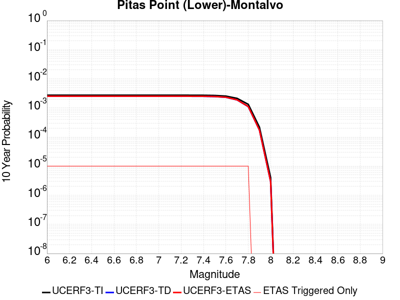 |

| Magnitude | 1 wk TI Prob | 1 wk TD Prob | 1 wk ETAS Prob | 1 wk ETAS/TD Gain | 1 wk ETAS Triggered Only | 1 mo TI Prob | 1 mo TD Prob | 1 mo ETAS Prob | 1 mo ETAS/TD Gain | 1 mo ETAS Triggered Only | 1 yr TI Prob | 1 yr TD Prob | 1 yr ETAS Prob | 1 yr ETAS/TD Gain | 1 yr ETAS Triggered Only | 10 yr TI Prob | 10 yr TD Prob | 10 yr ETAS Prob | 10 yr ETAS/TD Gain | 10 yr ETAS Triggered Only |
|-----|-----|-----|-----|-----|-----|-----|-----|-----|-----|-----|-----|-----|-----|-----|-----|-----|-----|-----|-----|-----|
| 6.0 | 5.2543637E-6 | 4.8380302E-6 | 4.8380302E-6 | 1.0 | 0.0 | 2.2518509E-5 | 2.0734253E-5 | 2.0734253E-5 | 1.0 | 0.0 | 2.7412834E-4 | 2.524106E-4 | 2.524106E-4 | 1.0 | 0.0 | 0.0027379042 | 0.0025212716 | 0.002531632 | 1.0041093 | 1.0386697E-5 |
| 6.1 | 5.2543637E-6 | 4.8380302E-6 | 4.8380302E-6 | 1.0 | 0.0 | 2.2518509E-5 | 2.0734253E-5 | 2.0734253E-5 | 1.0 | 0.0 | 2.7412834E-4 | 2.524106E-4 | 2.524106E-4 | 1.0 | 0.0 | 0.0027379042 | 0.0025212716 | 0.002531632 | 1.0041093 | 1.0386697E-5 |
| 6.2 | 5.2543637E-6 | 4.8380302E-6 | 4.8380302E-6 | 1.0 | 0.0 | 2.2518509E-5 | 2.0734253E-5 | 2.0734253E-5 | 1.0 | 0.0 | 2.7412834E-4 | 2.524106E-4 | 2.524106E-4 | 1.0 | 0.0 | 0.0027379042 | 0.0025212716 | 0.002531632 | 1.0041093 | 1.0386697E-5 |
| 6.3 | 5.2543637E-6 | 4.8380302E-6 | 4.8380302E-6 | 1.0 | 0.0 | 2.2518509E-5 | 2.0734253E-5 | 2.0734253E-5 | 1.0 | 0.0 | 2.7412834E-4 | 2.524106E-4 | 2.524106E-4 | 1.0 | 0.0 | 0.0027379042 | 0.0025212716 | 0.002531632 | 1.0041093 | 1.0386697E-5 |
| 6.4 | 5.2543637E-6 | 4.8380302E-6 | 4.8380302E-6 | 1.0 | 0.0 | 2.2518509E-5 | 2.0734253E-5 | 2.0734253E-5 | 1.0 | 0.0 | 2.7412834E-4 | 2.524106E-4 | 2.524106E-4 | 1.0 | 0.0 | 0.0027379042 | 0.0025212716 | 0.002531632 | 1.0041093 | 1.0386697E-5 |
| 6.5 | 5.2543637E-6 | 4.8380302E-6 | 4.8380302E-6 | 1.0 | 0.0 | 2.2518509E-5 | 2.0734253E-5 | 2.0734253E-5 | 1.0 | 0.0 | 2.7412834E-4 | 2.524106E-4 | 2.524106E-4 | 1.0 | 0.0 | 0.0027379042 | 0.0025212716 | 0.002531632 | 1.0041093 | 1.0386697E-5 |
| 6.6 | 5.2543637E-6 | 4.8380302E-6 | 4.8380302E-6 | 1.0 | 0.0 | 2.2518509E-5 | 2.0734253E-5 | 2.0734253E-5 | 1.0 | 0.0 | 2.7412834E-4 | 2.524106E-4 | 2.524106E-4 | 1.0 | 0.0 | 0.0027379042 | 0.0025212716 | 0.002531632 | 1.0041093 | 1.0386697E-5 |
| 6.7 | 5.2543637E-6 | 4.8380302E-6 | 4.8380302E-6 | 1.0 | 0.0 | 2.2518509E-5 | 2.0734253E-5 | 2.0734253E-5 | 1.0 | 0.0 | 2.7412834E-4 | 2.524106E-4 | 2.524106E-4 | 1.0 | 0.0 | 0.0027379042 | 0.0025212716 | 0.002531632 | 1.0041093 | 1.0386697E-5 |
| 6.8 | 5.2543637E-6 | 4.8380302E-6 | 4.8380302E-6 | 1.0 | 0.0 | 2.2518509E-5 | 2.0734253E-5 | 2.0734253E-5 | 1.0 | 0.0 | 2.7412834E-4 | 2.524106E-4 | 2.524106E-4 | 1.0 | 0.0 | 0.0027379042 | 0.0025212716 | 0.002531632 | 1.0041093 | 1.0386697E-5 |
| 6.9 | 5.2543637E-6 | 4.8380302E-6 | 4.8380302E-6 | 1.0 | 0.0 | 2.2518509E-5 | 2.0734253E-5 | 2.0734253E-5 | 1.0 | 0.0 | 2.7412834E-4 | 2.524106E-4 | 2.524106E-4 | 1.0 | 0.0 | 0.0027379042 | 0.0025212716 | 0.002531632 | 1.0041093 | 1.0386697E-5 |
| 7.0 | 5.2543637E-6 | 4.8380302E-6 | 4.8380302E-6 | 1.0 | 0.0 | 2.2518509E-5 | 2.0734253E-5 | 2.0734253E-5 | 1.0 | 0.0 | 2.7412834E-4 | 2.524106E-4 | 2.524106E-4 | 1.0 | 0.0 | 0.0027379042 | 0.0025212716 | 0.002531632 | 1.0041093 | 1.0386697E-5 |
| 7.1 | 5.2543637E-6 | 4.8380302E-6 | 4.8380302E-6 | 1.0 | 0.0 | 2.2518509E-5 | 2.0734253E-5 | 2.0734253E-5 | 1.0 | 0.0 | 2.7412834E-4 | 2.524106E-4 | 2.524106E-4 | 1.0 | 0.0 | 0.0027379042 | 0.0025212716 | 0.002531632 | 1.0041093 | 1.0386697E-5 |
| 7.2 | 5.2458695E-6 | 4.829184E-6 | 4.829184E-6 | 1.0 | 0.0 | 2.2482105E-5 | 2.0696341E-5 | 2.0696341E-5 | 1.0 | 0.0 | 2.7368523E-4 | 2.5194912E-4 | 2.5194912E-4 | 1.0 | 0.0 | 0.0027334841 | 0.0025166674 | 0.0025270279 | 1.0041168 | 1.0386697E-5 |
| 7.3 | 5.22665E-6 | 4.809101E-6 | 4.809101E-6 | 1.0 | 0.0 | 2.2399736E-5 | 2.061027E-5 | 2.061027E-5 | 1.0 | 0.0 | 2.7268266E-4 | 2.5090147E-4 | 2.5090147E-4 | 1.0 | 0.0 | 0.002723483 | 0.0025062144 | 0.0025165752 | 1.0041339 | 1.0386697E-5 |
| 7.4 | 5.210642E-6 | 4.7923127E-6 | 4.7923127E-6 | 1.0 | 0.0 | 2.233113E-5 | 2.0538324E-5 | 2.0538324E-5 | 1.0 | 0.0 | 2.718476E-4 | 2.500257E-4 | 2.500257E-4 | 1.0 | 0.0 | 0.002715153 | 0.0024974765 | 0.0025078373 | 1.0041485 | 1.0386697E-5 |
| 7.5 | 5.1226016E-6 | 4.700197E-6 | 4.700197E-6 | 1.0 | 0.0 | 2.1953823E-5 | 2.0143549E-5 | 2.0143549E-5 | 1.0 | 0.0 | 2.67255E-4 | 2.452204E-4 | 2.452204E-4 | 1.0 | 0.0 | 0.0026693381 | 0.00244953 | 0.0024598911 | 1.0042299 | 1.0386697E-5 |
| 7.6 | 4.8796987E-6 | 4.44509E-6 | 4.44509E-6 | 1.0 | 0.0 | 2.0912828E-5 | 1.9050249E-5 | 1.9050249E-5 | 1.0 | 0.0 | 2.5458392E-4 | 2.3191239E-4 | 2.3191239E-4 | 1.0 | 0.0 | 0.0025429246 | 0.0023167343 | 0.0023270969 | 1.004473 | 1.0386697E-5 |
| 7.7 | 4.0834398E-6 | 3.609237E-6 | 3.609237E-6 | 1.0 | 0.0 | 1.7500339E-5 | 1.5468067E-5 | 1.5468067E-5 | 1.0 | 0.0 | 2.1304579E-4 | 1.8830769E-4 | 1.8830769E-4 | 1.0 | 0.0 | 0.0021284167 | 0.001881505 | 0.0018918721 | 1.0055101 | 1.0386697E-5 |
| 7.8 | 2.5445438E-6 | 2.1212973E-6 | 2.1212973E-6 | 1.0 | 0.0 | 1.0905142E-5 | 9.091243E-6 | 9.091243E-6 | 1.0 | 0.0 | 1.3276201E-4 | 1.106803E-4 | 1.106803E-4 | 1.0 | 0.0 | 0.0013268272 | 0.0011062565 | 0.0011166317 | 1.0093787 | 1.0386697E-5 |
| 7.9 | 4.1677114E-7 | 3.3294845E-7 | 3.3294845E-7 | 1.0 | 0.0 | 1.7861609E-6 | 1.4269211E-6 | 1.4269211E-6 | 1.0 | 0.0 | 2.1746291E-5 | 1.737263E-5 | 1.737263E-5 | 1.0 | 0.0 | 2.1744163E-4 | 1.7371304E-4 | 1.7371304E-4 | 1.0 | 0.0 |
| 8.0 | 7.791402E-9 | 5.683722E-9 | 5.683722E-9 | 1.0 | 0.0 | 3.3391725E-8 | 2.4358807E-8 | 2.4358807E-8 | 1.0 | 0.0 | 4.0654416E-7 | 2.9656846E-7 | 2.9656846E-7 | 1.0 | 0.0 | 4.065434E-6 | 2.9656826E-6 | 2.9656826E-6 | 1.0 | 0.0 |

## Raymond
*[(top)](#table-of-contents)*

| 1 Week | 1 Month | 1 Year | 10 Year |
|-----|-----|-----|-----|
|  |  |  | 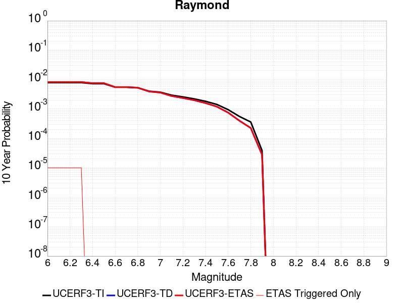 |

| Magnitude | 1 wk TI Prob | 1 wk TD Prob | 1 wk ETAS Prob | 1 wk ETAS/TD Gain | 1 wk ETAS Triggered Only | 1 mo TI Prob | 1 mo TD Prob | 1 mo ETAS Prob | 1 mo ETAS/TD Gain | 1 mo ETAS Triggered Only | 1 yr TI Prob | 1 yr TD Prob | 1 yr ETAS Prob | 1 yr ETAS/TD Gain | 1 yr ETAS Triggered Only | 10 yr TI Prob | 10 yr TD Prob | 10 yr ETAS Prob | 10 yr ETAS/TD Gain | 10 yr ETAS Triggered Only |
|-----|-----|-----|-----|-----|-----|-----|-----|-----|-----|-----|-----|-----|-----|-----|-----|-----|-----|-----|-----|-----|
| 6.0 | 1.5157413E-5 | 1.5811214E-5 | 1.5811214E-5 | 1.0 | 0.0 | 6.4958724E-5 | 6.776073E-5 | 6.776073E-5 | 1.0 | 0.0 | 7.905855E-4 | 8.246997E-4 | 8.246997E-4 | 1.0 | 0.0 | 0.007877788 | 0.008218911 | 0.008229212 | 1.0012534 | 1.0386697E-5 |
| 6.1 | 1.5157413E-5 | 1.5811214E-5 | 1.5811214E-5 | 1.0 | 0.0 | 6.4958724E-5 | 6.776073E-5 | 6.776073E-5 | 1.0 | 0.0 | 7.905855E-4 | 8.246997E-4 | 8.246997E-4 | 1.0 | 0.0 | 0.007877788 | 0.008218911 | 0.008229212 | 1.0012534 | 1.0386697E-5 |
| 6.2 | 1.5157413E-5 | 1.5811214E-5 | 1.5811214E-5 | 1.0 | 0.0 | 6.4958724E-5 | 6.776073E-5 | 6.776073E-5 | 1.0 | 0.0 | 7.905855E-4 | 8.246997E-4 | 8.246997E-4 | 1.0 | 0.0 | 0.007877788 | 0.008218911 | 0.008229212 | 1.0012534 | 1.0386697E-5 |
| 6.3 | 1.5157413E-5 | 1.5811214E-5 | 1.5811214E-5 | 1.0 | 0.0 | 6.4958724E-5 | 6.776073E-5 | 6.776073E-5 | 1.0 | 0.0 | 7.905855E-4 | 8.246997E-4 | 8.246997E-4 | 1.0 | 0.0 | 0.007877788 | 0.008218911 | 0.008229212 | 1.0012534 | 1.0386697E-5 |
| 6.4 | 1.3941944E-5 | 1.4455694E-5 | 1.4455694E-5 | 1.0 | 0.0 | 5.9749822E-5 | 6.1951636E-5 | 6.1951636E-5 | 1.0 | 0.0 | 7.2721124E-4 | 7.5402344E-4 | 7.5402344E-4 | 1.0 | 0.0 | 0.007248361 | 0.007516985 | 0.007516985 | 1.0 | 0.0 |
| 6.5 | 1.3941944E-5 | 1.4455694E-5 | 1.4455694E-5 | 1.0 | 0.0 | 5.9749822E-5 | 6.1951636E-5 | 6.1951636E-5 | 1.0 | 0.0 | 7.2721124E-4 | 7.5402344E-4 | 7.5402344E-4 | 1.0 | 0.0 | 0.007248361 | 0.007516985 | 0.007516985 | 1.0 | 0.0 |
| 6.6 | 1.0542609E-5 | 1.0671889E-5 | 1.0671889E-5 | 1.0 | 0.0 | 4.5181827E-5 | 4.57359E-5 | 4.57359E-5 | 1.0 | 0.0 | 5.499499E-4 | 5.566977E-4 | 5.566977E-4 | 1.0 | 0.0 | 0.005485909 | 0.0055535934 | 0.0055535934 | 1.0 | 0.0 |
| 6.7 | 1.0542609E-5 | 1.0671889E-5 | 1.0671889E-5 | 1.0 | 0.0 | 4.5181827E-5 | 4.57359E-5 | 4.57359E-5 | 1.0 | 0.0 | 5.499499E-4 | 5.566977E-4 | 5.566977E-4 | 1.0 | 0.0 | 0.005485909 | 0.0055535934 | 0.0055535934 | 1.0 | 0.0 |
| 6.8 | 1.0079132E-5 | 1.0177405E-5 | 1.0177405E-5 | 1.0 | 0.0 | 4.3195567E-5 | 4.361675E-5 | 4.361675E-5 | 1.0 | 0.0 | 5.257791E-4 | 5.309099E-4 | 5.309099E-4 | 1.0 | 0.0 | 0.0052453685 | 0.005296965 | 0.005296965 | 1.0 | 0.0 |
| 6.9 | 7.721598E-6 | 7.549502E-6 | 7.549502E-6 | 1.0 | 0.0 | 3.3092143E-5 | 3.2354612E-5 | 3.2354612E-5 | 1.0 | 0.0 | 4.0282236E-4 | 3.9384744E-4 | 3.9384744E-4 | 1.0 | 0.0 | 0.0040209293 | 0.003931628 | 0.003931628 | 1.0 | 0.0 |
| 7.0 | 7.137566E-6 | 6.9118714E-6 | 6.9118714E-6 | 1.0 | 0.0 | 3.058921E-5 | 2.9621975E-5 | 2.9621975E-5 | 1.0 | 0.0 | 3.7236E-4 | 3.6058895E-4 | 3.6058895E-4 | 1.0 | 0.0 | 0.0037173668 | 0.0036001569 | 0.0036001569 | 1.0 | 0.0 |
| 7.1 | 5.654976E-6 | 5.3000313E-6 | 5.3000313E-6 | 1.0 | 0.0 | 2.4235387E-5 | 2.2714223E-5 | 2.2714223E-5 | 1.0 | 0.0 | 2.9502588E-4 | 2.7651078E-4 | 2.7651078E-4 | 1.0 | 0.0 | 0.0029463451 | 0.0027616983 | 0.0027616983 | 1.0 | 0.0 |
| 7.2 | 4.9358455E-6 | 4.5271145E-6 | 4.5271145E-6 | 1.0 | 0.0 | 2.1153453E-5 | 1.9401774E-5 | 1.9401774E-5 | 1.0 | 0.0 | 2.5751285E-4 | 2.3619113E-4 | 2.3619113E-4 | 1.0 | 0.0 | 0.0025721465 | 0.0023594233 | 0.0023594233 | 1.0 | 0.0 |
| 7.3 | 4.2368597E-6 | 3.8060439E-6 | 3.8060439E-6 | 1.0 | 0.0 | 1.8157843E-5 | 1.6311516E-5 | 1.6311516E-5 | 1.0 | 0.0 | 2.2104931E-4 | 1.9857471E-4 | 1.9857471E-4 | 1.0 | 0.0 | 0.0022082955 | 0.0019839914 | 0.0019839914 | 1.0 | 0.0 |
| 7.4 | 3.4999923E-6 | 3.0441354E-6 | 3.0441354E-6 | 1.0 | 0.0 | 1.49998805E-5 | 1.30462295E-5 | 1.30462295E-5 | 1.0 | 0.0 | 1.8260824E-4 | 1.5882634E-4 | 1.5882634E-4 | 1.0 | 0.0 | 0.0018245826 | 0.001587144 | 0.001587144 | 1.0 | 0.0 |
| 7.5 | 2.738017E-6 | 2.3023013E-6 | 2.3023013E-6 | 1.0 | 0.0 | 1.1734306E-5 | 9.866968E-6 | 9.866968E-6 | 1.0 | 0.0 | 1.428558E-4 | 1.2012378E-4 | 1.2012378E-4 | 1.0 | 0.0 | 0.0014276401 | 0.0012006029 | 0.0012006029 | 1.0 | 0.0 |
| 7.6 | 1.8186392E-6 | 1.4424903E-6 | 1.4424903E-6 | 1.0 | 0.0 | 7.794145E-6 | 6.1820865E-6 | 6.1820865E-6 | 1.0 | 0.0 | 9.488958E-5 | 7.526435E-5 | 7.526435E-5 | 1.0 | 0.0 | 9.4849075E-4 | 7.524001E-4 | 7.524001E-4 | 1.0 | 0.0 |
| 7.7 | 1.0660348E-6 | 7.6452443E-7 | 7.6452443E-7 | 1.0 | 0.0 | 4.5687125E-6 | 3.2765292E-6 | 3.2765292E-6 | 1.0 | 0.0 | 5.5622655E-5 | 3.989103E-5 | 3.989103E-5 | 1.0 | 0.0 | 5.5608735E-4 | 3.9884783E-4 | 3.9884783E-4 | 1.0 | 0.0 |
| 7.8 | 6.913602E-7 | 4.3216164E-7 | 4.3216164E-7 | 1.0 | 0.0 | 2.962969E-6 | 1.85212E-6 | 1.85212E-6 | 1.0 | 0.0 | 3.607355E-5 | 2.2549335E-5 | 2.2549335E-5 | 1.0 | 0.0 | 3.6067693E-4 | 2.2547832E-4 | 2.2547832E-4 | 1.0 | 0.0 |
| 7.9 | 7.425201E-8 | 5.3234306E-8 | 5.3234306E-8 | 1.0 | 0.0 | 3.1822285E-7 | 2.28147E-7 | 2.28147E-7 | 1.0 | 0.0 | 3.874356E-6 | 2.7776875E-6 | 2.7776875E-6 | 1.0 | 0.0 | 3.8742884E-5 | 2.777666E-5 | 2.777666E-5 | 1.0 | 0.0 |

## Newport-Inglewood (Offshore)
*[(top)](#table-of-contents)*

| 1 Week | 1 Month | 1 Year | 10 Year |
|-----|-----|-----|-----|
|  |  |  |  |

| Magnitude | 1 wk TI Prob | 1 wk TD Prob | 1 wk ETAS Prob | 1 wk ETAS/TD Gain | 1 wk ETAS Triggered Only | 1 mo TI Prob | 1 mo TD Prob | 1 mo ETAS Prob | 1 mo ETAS/TD Gain | 1 mo ETAS Triggered Only | 1 yr TI Prob | 1 yr TD Prob | 1 yr ETAS Prob | 1 yr ETAS/TD Gain | 1 yr ETAS Triggered Only | 10 yr TI Prob | 10 yr TD Prob | 10 yr ETAS Prob | 10 yr ETAS/TD Gain | 10 yr ETAS Triggered Only |
|-----|-----|-----|-----|-----|-----|-----|-----|-----|-----|-----|-----|-----|-----|-----|-----|-----|-----|-----|-----|-----|
| 6.0 | 1.9626508E-5 | 1.896613E-5 | 1.896613E-5 | 1.0 | 0.0 | 8.411089E-5 | 8.1280945E-5 | 8.1280945E-5 | 1.0 | 0.0 | 0.001023569 | 9.891589E-4 | 9.891589E-4 | 1.0 | 0.0 | 0.010188672 | 0.009848903 | 0.0098591875 | 1.0010443 | 1.0386697E-5 |
| 6.1 | 1.331886E-5 | 1.2218616E-5 | 1.2218616E-5 | 1.0 | 0.0 | 5.707958E-5 | 5.2364452E-5 | 5.2364452E-5 | 1.0 | 0.0 | 6.947222E-4 | 6.3735223E-4 | 6.3735223E-4 | 1.0 | 0.0 | 0.006925544 | 0.00635542 | 0.006365741 | 1.0016239 | 1.0386697E-5 |
| 6.2 | 1.2250852E-5 | 1.107651E-5 | 1.107651E-5 | 1.0 | 0.0 | 5.2502597E-5 | 4.74699E-5 | 4.74699E-5 | 1.0 | 0.0 | 6.3903164E-4 | 5.777938E-4 | 5.777938E-4 | 1.0 | 0.0 | 0.006371971 | 0.005763036 | 0.005773363 | 1.001792 | 1.0386697E-5 |
| 6.3 | 1.2106258E-5 | 1.0919365E-5 | 1.0919365E-5 | 1.0 | 0.0 | 5.1882926E-5 | 4.6796446E-5 | 4.6796446E-5 | 1.0 | 0.0 | 6.3149154E-4 | 5.6959875E-4 | 5.6959875E-4 | 1.0 | 0.0 | 0.0062970007 | 0.005681505 | 0.005691833 | 1.0018178 | 1.0386697E-5 |
| 6.4 | 1.1348758E-5 | 1.0109807E-5 | 1.0109807E-5 | 1.0 | 0.0 | 4.8636626E-5 | 4.3327025E-5 | 4.3327025E-5 | 1.0 | 0.0 | 5.919901E-4 | 5.273797E-4 | 5.273797E-4 | 1.0 | 0.0 | 0.005904155 | 0.005261377 | 0.005271709 | 1.0019637 | 1.0386697E-5 |
| 6.5 | 1.100837E-5 | 9.743819E-6 | 9.743819E-6 | 1.0 | 0.0 | 4.7177873E-5 | 4.175856E-5 | 4.175856E-5 | 1.0 | 0.0 | 5.7423924E-4 | 5.0829264E-4 | 5.0829264E-4 | 1.0 | 0.0 | 0.005727576 | 0.005071392 | 0.005081726 | 1.0020378 | 1.0386697E-5 |
| 6.6 | 1.0634696E-5 | 9.345958E-6 | 9.345958E-6 | 1.0 | 0.0 | 4.557647E-5 | 4.0053492E-5 | 4.0053492E-5 | 1.0 | 0.0 | 5.5475225E-4 | 4.875429E-4 | 4.875429E-4 | 1.0 | 0.0 | 0.0055336943 | 0.0048648193 | 0.0048751556 | 1.0021247 | 1.0386697E-5 |
| 6.7 | 9.9780855E-6 | 8.6682985E-6 | 8.6682985E-6 | 1.0 | 0.0 | 4.276252E-5 | 3.7149326E-5 | 3.7149326E-5 | 1.0 | 0.0 | 5.205093E-4 | 4.521999E-4 | 4.521999E-4 | 1.0 | 0.0 | 0.0051929182 | 0.0045128767 | 0.0045232163 | 1.0022912 | 1.0386697E-5 |
| 6.8 | 9.59546E-6 | 8.273325E-6 | 8.273325E-6 | 1.0 | 0.0 | 4.1122752E-5 | 3.545663E-5 | 3.545663E-5 | 1.0 | 0.0 | 5.0055445E-4 | 4.3159962E-4 | 4.3159962E-4 | 1.0 | 0.0 | 0.004994285 | 0.0043076896 | 0.004318032 | 1.0024008 | 1.0386697E-5 |
| 6.9 | 9.000614E-6 | 7.707188E-6 | 7.707188E-6 | 1.0 | 0.0 | 3.857349E-5 | 3.3030392E-5 | 3.3030392E-5 | 1.0 | 0.0 | 4.6953102E-4 | 4.0207148E-4 | 4.0207148E-4 | 1.0 | 0.0 | 0.004685402 | 0.004013512 | 0.004023857 | 1.0025775 | 1.0386697E-5 |
| 7.0 | 7.4070194E-6 | 6.14917E-6 | 6.14917E-6 | 1.0 | 0.0 | 3.1743984E-5 | 2.635332E-5 | 2.635332E-5 | 1.0 | 0.0 | 3.8641447E-4 | 3.208046E-4 | 3.208046E-4 | 1.0 | 0.0 | 0.0038574322 | 0.0032034346 | 0.0032137881 | 1.003232 | 1.0386697E-5 |
| 7.1 | 6.299615E-6 | 5.056818E-6 | 5.056818E-6 | 1.0 | 0.0 | 2.699807E-5 | 2.1671896E-5 | 2.1671896E-5 | 1.0 | 0.0 | 3.2865192E-4 | 2.6382352E-4 | 2.6382352E-4 | 1.0 | 0.0 | 0.003281663 | 0.002635118 | 0.0026454774 | 1.0039313 | 1.0386697E-5 |
| 7.2 | 5.096653E-6 | 3.892961E-6 | 3.892961E-6 | 1.0 | 0.0 | 2.1842614E-5 | 1.6684013E-5 | 1.6684013E-5 | 1.0 | 0.0 | 2.6590136E-4 | 2.0310901E-4 | 2.0310901E-4 | 1.0 | 0.0 | 0.0026558342 | 0.002029245 | 0.002029245 | 1.0 | 0.0 |
| 7.3 | 3.9753018E-6 | 2.9100247E-6 | 2.9100247E-6 | 1.0 | 0.0 | 1.7036897E-5 | 1.2471476E-5 | 1.2471476E-5 | 1.0 | 0.0 | 2.0740448E-4 | 1.5182972E-4 | 1.5182972E-4 | 1.0 | 0.0 | 0.00207211 | 0.0015172679 | 0.0015172679 | 1.0 | 0.0 |
| 7.4 | 3.0568392E-6 | 2.145087E-6 | 2.145087E-6 | 1.0 | 0.0 | 1.3100675E-5 | 9.193198E-6 | 9.193198E-6 | 1.0 | 0.0 | 1.5948903E-4 | 1.11921494E-4 | 1.11921494E-4 | 1.0 | 0.0 | 0.0015937461 | 0.0011186575 | 0.0011186575 | 1.0 | 0.0 |
| 7.5 | 1.7279019E-6 | 1.1470418E-6 | 1.1470418E-6 | 1.0 | 0.0 | 7.405273E-6 | 4.9158843E-6 | 4.9158843E-6 | 1.0 | 0.0 | 9.015547E-5 | 5.9849288E-5 | 5.9849288E-5 | 1.0 | 0.0 | 9.01189E-4 | 5.983356E-4 | 5.983356E-4 | 1.0 | 0.0 |
| 7.6 | 1.1156416E-6 | 7.2233786E-7 | 7.2233786E-7 | 1.0 | 0.0 | 4.7813123E-6 | 3.09573E-6 | 3.09573E-6 | 1.0 | 0.0 | 5.821092E-5 | 3.7689886E-5 | 3.7689886E-5 | 1.0 | 0.0 | 5.8195676E-4 | 3.7683727E-4 | 3.7683727E-4 | 1.0 | 0.0 |
| 7.7 | 9.117973E-8 | 6.7343215E-8 | 6.7343215E-8 | 1.0 | 0.0 | 3.907702E-7 | 2.8861376E-7 | 2.8861376E-7 | 1.0 | 0.0 | 4.757617E-6 | 3.5138671E-6 | 3.5138671E-6 | 1.0 | 0.0 | 4.7575148E-5 | 3.5138146E-5 | 3.5138146E-5 | 1.0 | 0.0 |

## Mission (connected) 2011 CFM
*[(top)](#table-of-contents)*

| 1 Week | 1 Month | 1 Year | 10 Year |
|-----|-----|-----|-----|
|  |  |  |  |

| Magnitude | 1 wk TI Prob | 1 wk TD Prob | 1 wk ETAS Prob | 1 wk ETAS/TD Gain | 1 wk ETAS Triggered Only | 1 mo TI Prob | 1 mo TD Prob | 1 mo ETAS Prob | 1 mo ETAS/TD Gain | 1 mo ETAS Triggered Only | 1 yr TI Prob | 1 yr TD Prob | 1 yr ETAS Prob | 1 yr ETAS/TD Gain | 1 yr ETAS Triggered Only | 10 yr TI Prob | 10 yr TD Prob | 10 yr ETAS Prob | 10 yr ETAS/TD Gain | 10 yr ETAS Triggered Only |
|-----|-----|-----|-----|-----|-----|-----|-----|-----|-----|-----|-----|-----|-----|-----|-----|-----|-----|-----|-----|-----|
| 6.0 | 1.8735573E-5 | 2.689229E-5 | 2.689229E-5 | 1.0 | 0.0 | 8.029284E-5 | 1.15247625E-4 | 1.15247625E-4 | 1.0 | 0.0 | 9.771269E-4 | 0.0014021697 | 0.0014125418 | 1.0073972 | 1.0386697E-5 | 0.009728416 | 0.013942371 | 0.013952613 | 1.0007346 | 1.0386697E-5 |
| 6.1 | 1.7515964E-5 | 2.5533485E-5 | 2.5533485E-5 | 1.0 | 0.0 | 7.506625E-5 | 1.09424676E-4 | 1.09424676E-4 | 1.0 | 0.0 | 9.135484E-4 | 0.0013313637 | 0.0013417365 | 1.0077912 | 1.0386697E-5 | 0.009098019 | 0.013242937 | 0.013253186 | 1.0007739 | 1.0386697E-5 |
| 6.2 | 1.6486343E-5 | 2.4378065E-5 | 2.4378065E-5 | 1.0 | 0.0 | 7.065384E-5 | 1.0447328E-4 | 1.0447328E-4 | 1.0 | 0.0 | 8.5987104E-4 | 0.001271154 | 0.0012815276 | 1.0081607 | 1.0386697E-5 | 0.008565514 | 0.012647877 | 0.012658133 | 1.0008109 | 1.0386697E-5 |
| 6.3 | 1.5229385E-5 | 2.2807342E-5 | 2.2807342E-5 | 1.0 | 0.0 | 6.526716E-5 | 9.774213E-5 | 9.774213E-5 | 1.0 | 0.0 | 7.9433795E-4 | 0.0011892951 | 0.0011996694 | 1.0087231 | 1.0386697E-5 | 0.007915046 | 0.011841001 | 0.011851265 | 1.0008668 | 1.0386697E-5 |
| 6.4 | 1.4435828E-5 | 2.1407075E-5 | 2.1407075E-5 | 1.0 | 0.0 | 6.186637E-5 | 9.1741415E-5 | 9.1741415E-5 | 1.0 | 0.0 | 7.529627E-4 | 0.0011163155 | 0.0011266905 | 1.009294 | 1.0386697E-5 | 0.007504165 | 0.011123841 | 0.011134112 | 1.0009234 | 1.0386697E-5 |
| 6.5 | 1.30127955E-5 | 1.9045572E-5 | 1.9045572E-5 | 1.0 | 0.0 | 5.576793E-5 | 8.162134E-5 | 8.162134E-5 | 1.0 | 0.0 | 6.78763E-4 | 9.932242E-4 | 9.932242E-4 | 1.0 | 0.0 | 0.0067669353 | 0.009915724 | 0.009915724 | 1.0 | 0.0 |
| 6.6 | 1.1220718E-5 | 1.6401224E-5 | 1.6401224E-5 | 1.0 | 0.0 | 4.8087906E-5 | 7.028908E-5 | 7.028908E-5 | 1.0 | 0.0 | 5.8531296E-4 | 8.554312E-4 | 8.554312E-4 | 1.0 | 0.0 | 0.005837737 | 0.008553556 | 0.008553556 | 1.0 | 0.0 |
| 6.7 | 8.086152E-6 | 1.1756832E-5 | 1.1756832E-5 | 1.0 | 0.0 | 3.4654473E-5 | 5.0385454E-5 | 5.0385454E-5 | 1.0 | 0.0 | 4.2183654E-4 | 6.13271E-4 | 6.13271E-4 | 1.0 | 0.0 | 0.004210367 | 0.0061530424 | 0.0061530424 | 1.0 | 0.0 |
| 6.8 | 6.8361655E-6 | 1.0201216E-5 | 1.0201216E-5 | 1.0 | 0.0 | 2.9297524E-5 | 4.371877E-5 | 4.371877E-5 | 1.0 | 0.0 | 3.5663895E-4 | 5.3214666E-4 | 5.3214666E-4 | 1.0 | 0.0 | 0.0035606713 | 0.0053416505 | 0.0053416505 | 1.0 | 0.0 |
| 6.9 | 5.2517353E-6 | 7.873655E-6 | 7.873655E-6 | 1.0 | 0.0 | 2.2507242E-5 | 3.37438E-5 | 3.37438E-5 | 1.0 | 0.0 | 2.739912E-4 | 4.1075356E-4 | 4.1075356E-4 | 1.0 | 0.0 | 0.0027365363 | 0.004132166 | 0.004132166 | 1.0 | 0.0 |
| 7.0 | 4.4602784E-6 | 6.7057636E-6 | 6.7057636E-6 | 1.0 | 0.0 | 1.911534E-5 | 2.8738672E-5 | 2.8738672E-5 | 1.0 | 0.0 | 2.327044E-4 | 3.498373E-4 | 3.498373E-4 | 1.0 | 0.0 | 0.0023246086 | 0.0035242643 | 0.0035242643 | 1.0 | 0.0 |
| 7.1 | 4.1492594E-6 | 6.2543677E-6 | 6.2543677E-6 | 1.0 | 0.0 | 1.7782419E-5 | 2.6804159E-5 | 2.6804159E-5 | 1.0 | 0.0 | 2.1647944E-4 | 3.2629192E-4 | 3.2629192E-4 | 1.0 | 0.0 | 0.0021626868 | 0.0032889978 | 0.0032889978 | 1.0 | 0.0 |
| 7.2 | 2.213247E-6 | 3.3657373E-6 | 3.3657373E-6 | 1.0 | 0.0 | 9.485309E-6 | 1.4424508E-5 | 1.4424508E-5 | 1.0 | 0.0 | 1.15477524E-4 | 1.7560426E-4 | 1.7560426E-4 | 1.0 | 0.0 | 0.0011541754 | 0.0017832896 | 0.0017832896 | 1.0 | 0.0 |
| 7.3 | 1.7362703E-6 | 2.7409405E-6 | 2.7409405E-6 | 1.0 | 0.0 | 7.4411373E-6 | 1.1746835E-5 | 1.1746835E-5 | 1.0 | 0.0 | 9.0592075E-5 | 1.4300835E-4 | 1.4300835E-4 | 1.0 | 0.0 | 9.0555154E-4 | 0.0014544576 | 0.0014544576 | 1.0 | 0.0 |
| 7.4 | 1.1628409E-6 | 1.8513425E-6 | 1.8513425E-6 | 1.0 | 0.0 | 4.9835944E-6 | 7.934301E-6 | 7.934301E-6 | 1.0 | 0.0 | 6.0673574E-5 | 9.6595846E-5 | 9.6595846E-5 | 1.0 | 0.0 | 6.065701E-4 | 9.863016E-4 | 9.863016E-4 | 1.0 | 0.0 |
| 7.5 | 5.5610667E-7 | 9.3602273E-7 | 9.3602273E-7 | 1.0 | 0.0 | 2.3833122E-6 | 4.0115196E-6 | 4.0115196E-6 | 1.0 | 0.0 | 2.9016439E-5 | 4.8839163E-5 | 4.8839163E-5 | 1.0 | 0.0 | 2.901265E-4 | 5.0493027E-4 | 5.0493027E-4 | 1.0 | 0.0 |
| 7.6 | 4.4307663E-7 | 7.800331E-7 | 7.800331E-7 | 1.0 | 0.0 | 1.8988985E-6 | 3.3429944E-6 | 3.3429944E-6 | 1.0 | 0.0 | 2.3118844E-5 | 4.07002E-5 | 4.07002E-5 | 1.0 | 0.0 | 2.3116439E-4 | 4.2288855E-4 | 4.2288855E-4 | 1.0 | 0.0 |
| 7.7 | 3.639119E-7 | 6.369042E-7 | 6.369042E-7 | 1.0 | 0.0 | 1.5596215E-6 | 2.7295864E-6 | 2.7295864E-6 | 1.0 | 0.0 | 1.8988227E-5 | 3.323221E-5 | 3.323221E-5 | 1.0 | 0.0 | 1.8986604E-4 | 3.4760416E-4 | 3.4760416E-4 | 1.0 | 0.0 |
| 7.8 | 3.1152942E-7 | 5.4867644E-7 | 5.4867644E-7 | 1.0 | 0.0 | 1.3351254E-6 | 2.3514683E-6 | 2.3514683E-6 | 1.0 | 0.0 | 1.6255031E-5 | 2.8628752E-5 | 2.8628752E-5 | 1.0 | 0.0 | 1.6253842E-4 | 2.9830585E-4 | 2.9830585E-4 | 1.0 | 0.0 |
| 7.9 | 1.8035962E-7 | 3.7258877E-7 | 3.7258877E-7 | 1.0 | 0.0 | 7.729696E-7 | 1.596808E-6 | 1.596808E-6 | 1.0 | 0.0 | 9.410865E-6 | 1.9440966E-5 | 1.9440966E-5 | 1.0 | 0.0 | 9.410465E-5 | 2.0107611E-4 | 2.0107611E-4 | 1.0 | 0.0 |
| 8.0 | 9.279334E-8 | 1.9731866E-7 | 1.9731866E-7 | 1.0 | 0.0 | 3.976857E-7 | 8.456511E-7 | 8.456511E-7 | 1.0 | 0.0 | 4.841813E-6 | 1.0295754E-5 | 1.0295754E-5 | 1.0 | 0.0 | 4.841707E-5 | 1.0546822E-4 | 1.0546822E-4 | 1.0 | 0.0 |
| 8.1 | 5.9253985E-8 | 1.1871741E-7 | 1.1871741E-7 | 1.0 | 0.0 | 2.5394561E-7 | 5.087888E-7 | 5.087888E-7 | 1.0 | 0.0 | 3.0917836E-6 | 6.1944866E-6 | 6.1944866E-6 | 1.0 | 0.0 | 3.0917407E-5 | 6.332639E-5 | 6.332639E-5 | 1.0 | 0.0 |

## Green Valley 2011 CFM
*[(top)](#table-of-contents)*

| 1 Week | 1 Month | 1 Year | 10 Year |
|-----|-----|-----|-----|
|  |  |  | 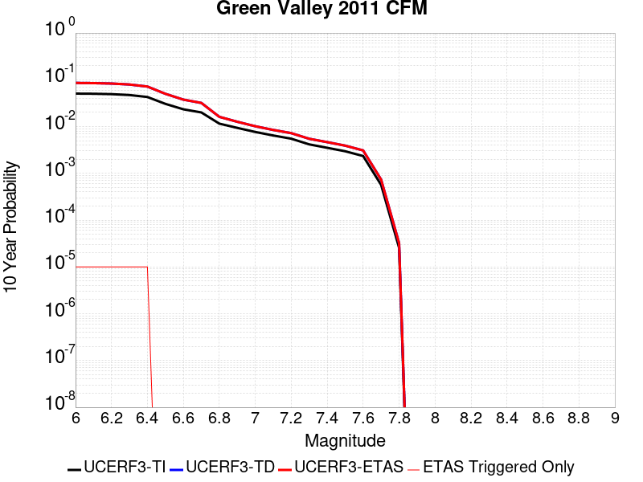 |

| Magnitude | 1 wk TI Prob | 1 wk TD Prob | 1 wk ETAS Prob | 1 wk ETAS/TD Gain | 1 wk ETAS Triggered Only | 1 mo TI Prob | 1 mo TD Prob | 1 mo ETAS Prob | 1 mo ETAS/TD Gain | 1 mo ETAS Triggered Only | 1 yr TI Prob | 1 yr TD Prob | 1 yr ETAS Prob | 1 yr ETAS/TD Gain | 1 yr ETAS Triggered Only | 10 yr TI Prob | 10 yr TD Prob | 10 yr ETAS Prob | 10 yr ETAS/TD Gain | 10 yr ETAS Triggered Only |
|-----|-----|-----|-----|-----|-----|-----|-----|-----|-----|-----|-----|-----|-----|-----|-----|-----|-----|-----|-----|-----|
| 6.0 | 9.9629346E-5 | 1.7306388E-4 | 1.7306388E-4 | 1.0 | 0.0 | 4.2691303E-4 | 7.4149936E-4 | 7.4149936E-4 | 1.0 | 0.0 | 0.0051852856 | 0.008987381 | 0.008987381 | 1.0 | 0.0 | 0.050659515 | 0.08552948 | 0.085538976 | 1.0001111 | 1.0386697E-5 |
| 6.1 | 9.88615E-5 | 1.7153693E-4 | 1.7153693E-4 | 1.0 | 0.0 | 4.2362334E-4 | 7.3495903E-4 | 7.3495903E-4 | 1.0 | 0.0 | 0.0051454236 | 0.008908406 | 0.008908406 | 1.0 | 0.0 | 0.050279044 | 0.084817074 | 0.08482658 | 1.000112 | 1.0386697E-5 |
| 6.2 | 9.696895E-5 | 1.679268E-4 | 1.679268E-4 | 1.0 | 0.0 | 4.15515E-4 | 7.194957E-4 | 7.194957E-4 | 1.0 | 0.0 | 0.0050471667 | 0.008721775 | 0.008721775 | 1.0 | 0.0 | 0.04934063 | 0.08312591 | 0.08313543 | 1.0001146 | 1.0386697E-5 |
| 6.3 | 9.275224E-5 | 1.597199E-4 | 1.597199E-4 | 1.0 | 0.0 | 3.9744904E-4 | 6.843419E-4 | 6.843419E-4 | 1.0 | 0.0 | 0.0048282105 | 0.008297088 | 0.008297088 | 1.0 | 0.0 | 0.047246475 | 0.07926428 | 0.07927385 | 1.0001206 | 1.0386697E-5 |
| 6.4 | 8.391499E-5 | 1.4370102E-4 | 1.4370102E-4 | 1.0 | 0.0 | 3.595861E-4 | 6.1572343E-4 | 6.1572343E-4 | 1.0 | 0.0 | 0.004369175 | 0.0074676727 | 0.0074676727 | 1.0 | 0.0 | 0.04284265 | 0.07163763 | 0.07164727 | 1.0001346 | 1.0386697E-5 |
| 6.5 | 5.9519385E-5 | 9.935902E-5 | 9.935902E-5 | 1.0 | 0.0 | 2.5505814E-4 | 4.257589E-4 | 4.257589E-4 | 1.0 | 0.0 | 0.0031009112 | 0.0051687798 | 0.0051687798 | 1.0 | 0.0 | 0.030579966 | 0.050151456 | 0.050151456 | 1.0 | 0.0 |
| 6.6 | 4.5361558E-5 | 7.404101E-5 | 7.404101E-5 | 1.0 | 0.0 | 1.9439218E-4 | 3.1728283E-4 | 3.1728283E-4 | 1.0 | 0.0 | 0.0023641558 | 0.0038543646 | 0.0038543646 | 1.0 | 0.0 | 0.023391623 | 0.037670802 | 0.037670802 | 1.0 | 0.0 |
| 6.7 | 3.8808106E-5 | 6.2664265E-5 | 6.2664265E-5 | 1.0 | 0.0 | 1.6630985E-4 | 2.6853604E-4 | 2.6853604E-4 | 1.0 | 0.0 | 0.0020229418 | 0.0032630423 | 0.0032630423 | 1.0 | 0.0 | 0.020046256 | 0.03201008 | 0.03201008 | 1.0 | 0.0 |
| 6.8 | 2.2284667E-5 | 3.128693E-5 | 3.128693E-5 | 1.0 | 0.0 | 9.550222E-5 | 1.3407998E-4 | 1.3407998E-4 | 1.0 | 0.0 | 0.0011621192 | 0.0016311917 | 0.0016311917 | 1.0 | 0.0 | 0.011560607 | 0.016166827 | 0.016166827 | 1.0 | 0.0 |
| 6.9 | 1.8050168E-5 | 2.4449284E-5 | 2.4449284E-5 | 1.0 | 0.0 | 7.735557E-5 | 1.04778395E-4 | 1.04778395E-4 | 1.0 | 0.0 | 9.4139716E-4 | 0.0012749347 | 0.0012749347 | 1.0 | 0.0 | 0.009374191 | 0.012668457 | 0.012668457 | 1.0 | 0.0 |
| 7.0 | 1.4763166E-5 | 1.9583895E-5 | 1.9583895E-5 | 1.0 | 0.0 | 6.326917E-5 | 8.3928295E-5 | 8.3928295E-5 | 1.0 | 0.0 | 7.7002996E-4 | 0.001021351 | 0.001021351 | 1.0 | 0.0 | 0.007673672 | 0.010165877 | 0.010165877 | 1.0 | 0.0 |
| 7.1 | 1.2399713E-5 | 1.6304628E-5 | 1.6304628E-5 | 1.0 | 0.0 | 5.3140546E-5 | 6.987512E-5 | 6.987512E-5 | 1.0 | 0.0 | 6.467941E-4 | 8.5039943E-4 | 8.5039943E-4 | 1.0 | 0.0 | 0.006449148 | 0.008471731 | 0.008471731 | 1.0 | 0.0 |
| 7.2 | 1.0584195E-5 | 1.3922591E-5 | 1.3922591E-5 | 1.0 | 0.0 | 4.5360044E-5 | 5.966689E-5 | 5.966689E-5 | 1.0 | 0.0 | 5.521186E-4 | 7.262039E-4 | 7.262039E-4 | 1.0 | 0.0 | 0.0055074887 | 0.0072387247 | 0.0072387247 | 1.0 | 0.0 |
| 7.3 | 7.998173E-6 | 1.0544779E-5 | 1.0544779E-5 | 1.0 | 0.0 | 3.4277433E-5 | 4.5191133E-5 | 4.5191133E-5 | 1.0 | 0.0 | 4.1724785E-4 | 5.500642E-4 | 5.500642E-4 | 1.0 | 0.0 | 0.004164653 | 0.005487293 | 0.005487293 | 1.0 | 0.0 |
| 7.4 | 6.7571127E-6 | 8.933404E-6 | 8.933404E-6 | 1.0 | 0.0 | 2.8958733E-5 | 3.828546E-5 | 3.828546E-5 | 1.0 | 0.0 | 3.5251552E-4 | 4.6602674E-4 | 4.6602674E-4 | 1.0 | 0.0 | 0.0035195686 | 0.0046506976 | 0.0046506976 | 1.0 | 0.0 |
| 7.5 | 5.69878E-6 | 7.516847E-6 | 7.516847E-6 | 1.0 | 0.0 | 2.4423114E-5 | 3.2214666E-5 | 3.2214666E-5 | 1.0 | 0.0 | 2.9731085E-4 | 3.9214385E-4 | 3.9214385E-4 | 1.0 | 0.0 | 0.002969134 | 0.0039146706 | 0.0039146706 | 1.0 | 0.0 |
| 7.6 | 4.503664E-6 | 5.935998E-6 | 5.935998E-6 | 1.0 | 0.0 | 1.9301275E-5 | 2.543975E-5 | 2.543975E-5 | 1.0 | 0.0 | 2.3496768E-4 | 3.0968577E-4 | 3.0968577E-4 | 1.0 | 0.0 | 0.002347194 | 0.003092667 | 0.003092667 | 1.0 | 0.0 |
| 7.7 | 1.0873546E-6 | 1.4107495E-6 | 1.4107495E-6 | 1.0 | 0.0 | 4.6600826E-6 | 6.0460557E-6 | 6.0460557E-6 | 1.0 | 0.0 | 5.6735033E-5 | 7.360827E-5 | 7.360827E-5 | 1.0 | 0.0 | 5.672055E-4 | 7.3584093E-4 | 7.3584093E-4 | 1.0 | 0.0 |
| 7.8 | 4.9373917E-8 | 6.178006E-8 | 6.178006E-8 | 1.0 | 0.0 | 2.1160248E-7 | 2.6477167E-7 | 2.6477167E-7 | 1.0 | 0.0 | 2.5762572E-6 | 3.2235916E-6 | 3.2235916E-6 | 1.0 | 0.0 | 2.5762274E-5 | 3.223383E-5 | 3.223383E-5 | 1.0 | 0.0 |

## Hosgri
*[(top)](#table-of-contents)*

| 1 Week | 1 Month | 1 Year | 10 Year |
|-----|-----|-----|-----|
|  |  | 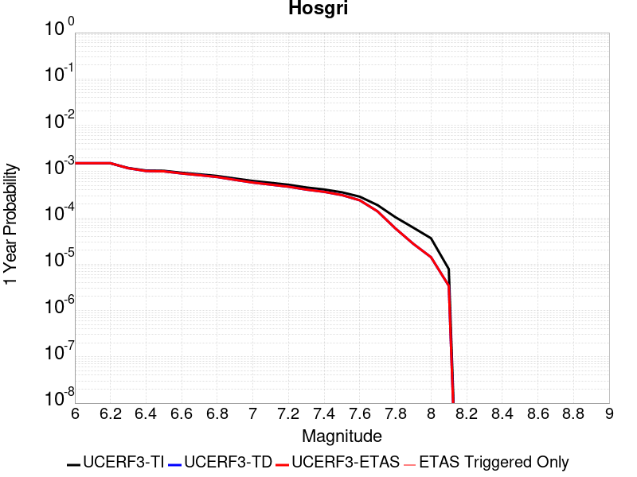 |  |

| Magnitude | 1 wk TI Prob | 1 wk TD Prob | 1 wk ETAS Prob | 1 wk ETAS/TD Gain | 1 wk ETAS Triggered Only | 1 mo TI Prob | 1 mo TD Prob | 1 mo ETAS Prob | 1 mo ETAS/TD Gain | 1 mo ETAS Triggered Only | 1 yr TI Prob | 1 yr TD Prob | 1 yr ETAS Prob | 1 yr ETAS/TD Gain | 1 yr ETAS Triggered Only | 10 yr TI Prob | 10 yr TD Prob | 10 yr ETAS Prob | 10 yr ETAS/TD Gain | 10 yr ETAS Triggered Only |
|-----|-----|-----|-----|-----|-----|-----|-----|-----|-----|-----|-----|-----|-----|-----|-----|-----|-----|-----|-----|-----|
| 6.0 | 2.883978E-5 | 2.9130051E-5 | 2.9130051E-5 | 1.0 | 0.0 | 1.235932E-4 | 1.2483726E-4 | 1.2483726E-4 | 1.0 | 0.0 | 0.0015037085 | 0.0015188612 | 0.0015188612 | 1.0 | 0.0 | 0.01493574 | 0.015088581 | 0.01509881 | 1.000678 | 1.0386697E-5 |
| 6.1 | 2.883978E-5 | 2.9130051E-5 | 2.9130051E-5 | 1.0 | 0.0 | 1.235932E-4 | 1.2483726E-4 | 1.2483726E-4 | 1.0 | 0.0 | 0.0015037085 | 0.0015188612 | 0.0015188612 | 1.0 | 0.0 | 0.01493574 | 0.015088581 | 0.01509881 | 1.000678 | 1.0386697E-5 |
| 6.2 | 2.883978E-5 | 2.9130051E-5 | 2.9130051E-5 | 1.0 | 0.0 | 1.235932E-4 | 1.2483726E-4 | 1.2483726E-4 | 1.0 | 0.0 | 0.0015037085 | 0.0015188612 | 0.0015188612 | 1.0 | 0.0 | 0.01493574 | 0.015088581 | 0.01509881 | 1.000678 | 1.0386697E-5 |
| 6.3 | 2.2914428E-5 | 2.2643277E-5 | 2.2643277E-5 | 1.0 | 0.0 | 9.8200995E-5 | 9.703903E-5 | 9.703903E-5 | 1.0 | 0.0 | 0.0011949413 | 0.0011808148 | 0.0011808148 | 1.0 | 0.0 | 0.011885363 | 0.011746808 | 0.011757072 | 1.0008738 | 1.0386697E-5 |
| 6.4 | 2.0195741E-5 | 1.9697736E-5 | 1.9697736E-5 | 1.0 | 0.0 | 8.65503E-5 | 8.441615E-5 | 8.441615E-5 | 1.0 | 0.0 | 0.0010532405 | 0.0010272841 | 0.0010272841 | 1.0 | 0.0 | 0.010482626 | 0.0102264015 | 0.010236681 | 1.0010053 | 1.0386697E-5 |
| 6.5 | 1.9924333E-5 | 1.9410149E-5 | 1.9410149E-5 | 1.0 | 0.0 | 8.53872E-5 | 8.318371E-5 | 8.318371E-5 | 1.0 | 0.0 | 0.0010390934 | 0.001012293 | 0.001012293 | 1.0 | 0.0 | 0.010342481 | 0.0100778565 | 0.010088138 | 1.0010203 | 1.0386697E-5 |
| 6.6 | 1.809694E-5 | 1.7459393E-5 | 1.7459393E-5 | 1.0 | 0.0 | 7.7556004E-5 | 7.482383E-5 | 7.482383E-5 | 1.0 | 0.0 | 9.438353E-4 | 9.106007E-4 | 9.106007E-4 | 1.0 | 0.0 | 0.009398366 | 0.009069638 | 0.009079931 | 1.0011349 | 1.0386697E-5 |
| 6.7 | 1.675989E-5 | 1.6043807E-5 | 1.6043807E-5 | 1.0 | 0.0 | 7.182612E-5 | 6.875736E-5 | 6.875736E-5 | 1.0 | 0.0 | 8.7413215E-4 | 8.3680055E-4 | 8.3680055E-4 | 1.0 | 0.0 | 0.008707017 | 0.008337403 | 0.008347703 | 1.0012354 | 1.0386697E-5 |
| 6.8 | 1.5401129E-5 | 1.4615074E-5 | 1.4615074E-5 | 1.0 | 0.0 | 6.6003166E-5 | 6.2634535E-5 | 6.2634535E-5 | 1.0 | 0.0 | 8.032922E-4 | 7.623095E-4 | 7.623095E-4 | 1.0 | 0.0 | 0.008003947 | 0.0075978106 | 0.0076081185 | 1.0013567 | 1.0386697E-5 |
| 6.9 | 1.356559E-5 | 1.2690892E-5 | 1.2690892E-5 | 1.0 | 0.0 | 5.8136946E-5 | 5.4388405E-5 | 5.4388405E-5 | 1.0 | 0.0 | 7.0758746E-4 | 6.619781E-4 | 6.619781E-4 | 1.0 | 0.0 | 0.007053386 | 0.006600868 | 0.006600868 | 1.0 | 0.0 |
| 7.0 | 1.2030819E-5 | 1.1096832E-5 | 1.1096832E-5 | 1.0 | 0.0 | 5.155963E-5 | 4.7556987E-5 | 4.7556987E-5 | 1.0 | 0.0 | 6.275577E-4 | 5.788526E-4 | 5.788526E-4 | 1.0 | 0.0 | 0.006257884 | 0.0057742097 | 0.0057742097 | 1.0 | 0.0 |
| 7.1 | 1.0972698E-5 | 1.0023018E-5 | 1.0023018E-5 | 1.0 | 0.0 | 4.7025E-5 | 4.2955086E-5 | 4.2955086E-5 | 1.0 | 0.0 | 5.72379E-4 | 5.2285276E-4 | 5.2285276E-4 | 1.0 | 0.0 | 0.0057090693 | 0.0052169785 | 0.0052169785 | 1.0 | 0.0 |
| 7.2 | 9.961926E-6 | 9.035558E-6 | 9.035558E-6 | 1.0 | 0.0 | 4.2693267E-5 | 3.8723243E-5 | 3.8723243E-5 | 1.0 | 0.0 | 5.1966653E-4 | 4.713536E-4 | 4.713536E-4 | 1.0 | 0.0 | 0.00518453 | 0.004704285 | 0.004704285 | 1.0 | 0.0 |
| 7.3 | 8.700929E-6 | 7.82888E-6 | 7.82888E-6 | 1.0 | 0.0 | 3.7289166E-5 | 3.3551914E-5 | 3.3551914E-5 | 1.0 | 0.0 | 4.53901E-4 | 4.0841804E-4 | 4.0841804E-4 | 1.0 | 0.0 | 0.00452975 | 0.0040774145 | 0.0040774145 | 1.0 | 0.0 |
| 7.4 | 7.866285E-6 | 6.9995003E-6 | 6.9995003E-6 | 1.0 | 0.0 | 3.3712215E-5 | 2.9997515E-5 | 2.9997515E-5 | 1.0 | 0.0 | 4.103689E-4 | 3.6515854E-4 | 3.6515854E-4 | 1.0 | 0.0 | 0.004096119 | 0.0036463232 | 0.0036463232 | 1.0 | 0.0 |
| 7.5 | 6.8381305E-6 | 5.9604317E-6 | 5.9604317E-6 | 1.0 | 0.0 | 2.9305946E-5 | 2.5544457E-5 | 2.5544457E-5 | 1.0 | 0.0 | 3.5674145E-4 | 3.109594E-4 | 3.109594E-4 | 1.0 | 0.0 | 0.0035616932 | 0.0031059785 | 0.0031059785 | 1.0 | 0.0 |
| 7.6 | 5.503376E-6 | 4.5959455E-6 | 4.5959455E-6 | 1.0 | 0.0 | 2.3585684E-5 | 1.969676E-5 | 1.969676E-5 | 1.0 | 0.0 | 2.8711787E-4 | 2.3978167E-4 | 2.3978167E-4 | 1.0 | 0.0 | 0.002867472 | 0.002395963 | 0.002395963 | 1.0 | 0.0 |
| 7.7 | 3.6144982E-6 | 2.652859E-6 | 2.652859E-6 | 1.0 | 0.0 | 1.5490614E-5 | 1.1369346E-5 | 1.1369346E-5 | 1.0 | 0.0 | 1.8858191E-4 | 1.38413E-4 | 1.38413E-4 | 1.0 | 0.0 | 0.0018842196 | 0.0013839996 | 0.0013839996 | 1.0 | 0.0 |
| 7.8 | 1.9853494E-6 | 1.1366585E-6 | 1.1366585E-6 | 1.0 | 0.0 | 8.508612E-6 | 4.8713846E-6 | 4.8713846E-6 | 1.0 | 0.0 | 1.0358743E-4 | 5.930749E-5 | 5.930749E-5 | 1.0 | 0.0 | 0.0010353916 | 5.9364707E-4 | 5.9364707E-4 | 1.0 | 0.0 |
| 7.9 | 1.1818757E-6 | 5.2994693E-7 | 5.2994693E-7 | 1.0 | 0.0 | 5.0651715E-6 | 2.271199E-6 | 2.271199E-6 | 1.0 | 0.0 | 6.1666724E-5 | 2.7651497E-5 | 2.7651497E-5 | 1.0 | 0.0 | 6.1649614E-4 | 2.771693E-4 | 2.771693E-4 | 1.0 | 0.0 |
| 8.0 | 6.962958E-7 | 2.716916E-7 | 2.716916E-7 | 1.0 | 0.0 | 2.9841215E-6 | 1.164392E-6 | 1.164392E-6 | 1.0 | 0.0 | 3.6331072E-5 | 1.417638E-5 | 1.417638E-5 | 1.0 | 0.0 | 3.6325134E-4 | 1.423256E-4 | 1.423256E-4 | 1.0 | 0.0 |
| 8.1 | 1.5033264E-7 | 6.5338824E-8 | 6.5338824E-8 | 1.0 | 0.0 | 6.442826E-7 | 2.800235E-7 | 2.800235E-7 | 1.0 | 0.0 | 7.844113E-6 | 3.409281E-6 | 3.409281E-6 | 1.0 | 0.0 | 7.843835E-5 | 3.410959E-5 | 3.410959E-5 | 1.0 | 0.0 |

## Breckenridge 2011
*[(top)](#table-of-contents)*

| 1 Week | 1 Month | 1 Year | 10 Year |
|-----|-----|-----|-----|
|  |  | 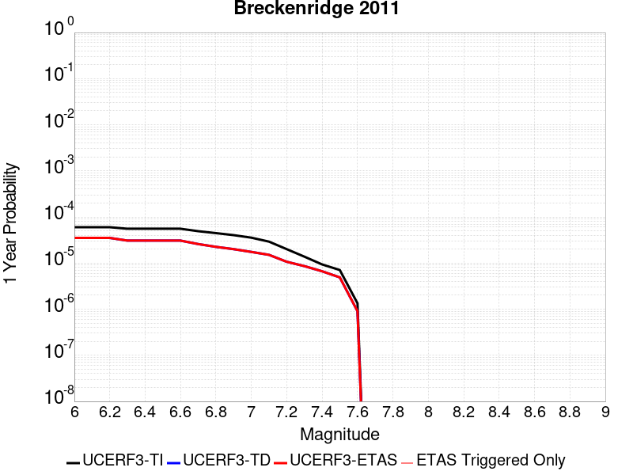 | 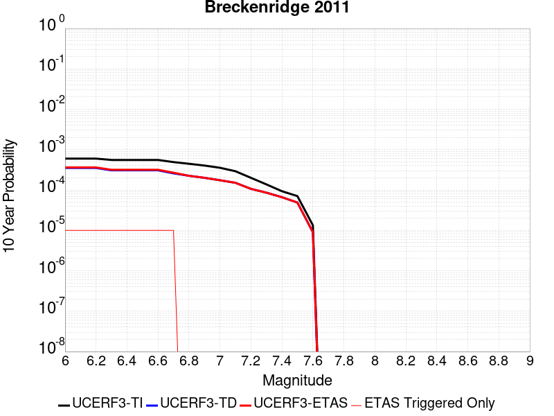 |

| Magnitude | 1 wk TI Prob | 1 wk TD Prob | 1 wk ETAS Prob | 1 wk ETAS/TD Gain | 1 wk ETAS Triggered Only | 1 mo TI Prob | 1 mo TD Prob | 1 mo ETAS Prob | 1 mo ETAS/TD Gain | 1 mo ETAS Triggered Only | 1 yr TI Prob | 1 yr TD Prob | 1 yr ETAS Prob | 1 yr ETAS/TD Gain | 1 yr ETAS Triggered Only | 10 yr TI Prob | 10 yr TD Prob | 10 yr ETAS Prob | 10 yr ETAS/TD Gain | 10 yr ETAS Triggered Only |
|-----|-----|-----|-----|-----|-----|-----|-----|-----|-----|-----|-----|-----|-----|-----|-----|-----|-----|-----|-----|-----|
| 6.0 | 1.1490393E-6 | 6.738222E-7 | 6.738222E-7 | 1.0 | 0.0 | 4.924445E-6 | 2.8878064E-6 | 2.8878064E-6 | 1.0 | 0.0 | 5.995347E-5 | 3.5158497E-5 | 3.5158497E-5 | 1.0 | 0.0 | 5.9937296E-4 | 3.515314E-4 | 3.6191443E-4 | 1.0295366 | 1.0386697E-5 |
| 6.1 | 1.1490393E-6 | 6.738222E-7 | 6.738222E-7 | 1.0 | 0.0 | 4.924445E-6 | 2.8878064E-6 | 2.8878064E-6 | 1.0 | 0.0 | 5.995347E-5 | 3.5158497E-5 | 3.5158497E-5 | 1.0 | 0.0 | 5.9937296E-4 | 3.515314E-4 | 3.6191443E-4 | 1.0295366 | 1.0386697E-5 |
| 6.2 | 1.1490393E-6 | 6.738222E-7 | 6.738222E-7 | 1.0 | 0.0 | 4.924445E-6 | 2.8878064E-6 | 2.8878064E-6 | 1.0 | 0.0 | 5.995347E-5 | 3.5158497E-5 | 3.5158497E-5 | 1.0 | 0.0 | 5.9937296E-4 | 3.515314E-4 | 3.6191443E-4 | 1.0295366 | 1.0386697E-5 |
| 6.3 | 1.064617E-6 | 5.886616E-7 | 5.886616E-7 | 1.0 | 0.0 | 4.5626366E-6 | 2.522833E-6 | 2.522833E-6 | 1.0 | 0.0 | 5.5548684E-5 | 3.071507E-5 | 3.071507E-5 | 1.0 | 0.0 | 5.55348E-4 | 3.071094E-4 | 3.1749293E-4 | 1.0338105 | 1.0386697E-5 |
| 6.4 | 1.064617E-6 | 5.886616E-7 | 5.886616E-7 | 1.0 | 0.0 | 4.5626366E-6 | 2.522833E-6 | 2.522833E-6 | 1.0 | 0.0 | 5.5548684E-5 | 3.071507E-5 | 3.071507E-5 | 1.0 | 0.0 | 5.55348E-4 | 3.071094E-4 | 3.1749293E-4 | 1.0338105 | 1.0386697E-5 |
| 6.5 | 1.064617E-6 | 5.886616E-7 | 5.886616E-7 | 1.0 | 0.0 | 4.5626366E-6 | 2.522833E-6 | 2.522833E-6 | 1.0 | 0.0 | 5.5548684E-5 | 3.071507E-5 | 3.071507E-5 | 1.0 | 0.0 | 5.55348E-4 | 3.071094E-4 | 3.1749293E-4 | 1.0338105 | 1.0386697E-5 |
| 6.6 | 1.064617E-6 | 5.886616E-7 | 5.886616E-7 | 1.0 | 0.0 | 4.5626366E-6 | 2.522833E-6 | 2.522833E-6 | 1.0 | 0.0 | 5.5548684E-5 | 3.071507E-5 | 3.071507E-5 | 1.0 | 0.0 | 5.55348E-4 | 3.071094E-4 | 3.1749293E-4 | 1.0338105 | 1.0386697E-5 |
| 6.7 | 9.4219524E-7 | 4.954199E-7 | 4.954199E-7 | 1.0 | 0.0 | 4.037973E-6 | 2.1232265E-6 | 2.1232265E-6 | 1.0 | 0.0 | 4.916122E-5 | 2.5849982E-5 | 2.5849982E-5 | 1.0 | 0.0 | 4.9150345E-4 | 2.584704E-4 | 2.688544E-4 | 1.0401748 | 1.0386697E-5 |
| 6.8 | 8.556422E-7 | 4.3120863E-7 | 4.3120863E-7 | 1.0 | 0.0 | 3.667033E-6 | 1.8480357E-6 | 1.8480357E-6 | 1.0 | 0.0 | 4.464521E-5 | 2.2499606E-5 | 2.2499606E-5 | 1.0 | 0.0 | 4.4636242E-4 | 2.2497369E-4 | 2.2497369E-4 | 1.0 | 0.0 |
| 6.9 | 7.7357794E-7 | 3.8421342E-7 | 3.8421342E-7 | 1.0 | 0.0 | 3.3153299E-6 | 1.6466279E-6 | 1.6466279E-6 | 1.0 | 0.0 | 4.0363393E-5 | 2.0047513E-5 | 2.0047513E-5 | 1.0 | 0.0 | 4.035606E-4 | 2.0045735E-4 | 2.0045735E-4 | 1.0 | 0.0 |
| 7.0 | 6.8172454E-7 | 3.347228E-7 | 3.347228E-7 | 1.0 | 0.0 | 2.9216735E-6 | 1.4345256E-6 | 1.4345256E-6 | 1.0 | 0.0 | 3.5570793E-5 | 1.7465212E-5 | 1.7465212E-5 | 1.0 | 0.0 | 3.55651E-4 | 1.7463861E-4 | 1.7463861E-4 | 1.0 | 0.0 |
| 7.1 | 5.5936397E-7 | 2.8910335E-7 | 2.8910335E-7 | 1.0 | 0.0 | 2.397272E-6 | 1.2390138E-6 | 1.2390138E-6 | 1.0 | 0.0 | 2.9186394E-5 | 1.508489E-5 | 1.508489E-5 | 1.0 | 0.0 | 2.9182562E-4 | 1.5083884E-4 | 1.5083884E-4 | 1.0 | 0.0 |
| 7.2 | 3.8420822E-7 | 2.0468804E-7 | 2.0468804E-7 | 1.0 | 0.0 | 1.6466057E-6 | 8.7723413E-7 | 8.7723413E-7 | 1.0 | 0.0 | 2.004724E-5 | 1.0680274E-5 | 1.0680274E-5 | 1.0 | 0.0 | 2.004543E-4 | 1.0679769E-4 | 1.0679769E-4 | 1.0 | 0.0 |
| 7.3 | 2.6405158E-7 | 1.6473555E-7 | 1.6473555E-7 | 1.0 | 0.0 | 1.1316491E-6 | 7.0600936E-7 | 7.0600936E-7 | 1.0 | 0.0 | 1.37777415E-5 | 8.595631E-6 | 8.595631E-6 | 1.0 | 0.0 | 1.3776887E-4 | 8.595305E-5 | 8.595305E-5 | 1.0 | 0.0 |
| 7.4 | 1.792114E-7 | 1.2725543E-7 | 1.2725543E-7 | 1.0 | 0.0 | 7.6804866E-7 | 5.4538026E-7 | 5.4538026E-7 | 1.0 | 0.0 | 9.3509525E-6 | 6.6399853E-6 | 6.6399853E-6 | 1.0 | 0.0 | 9.350559E-5 | 6.6397915E-5 | 6.6397915E-5 | 1.0 | 0.0 |
| 7.5 | 1.3548703E-7 | 9.385578E-8 | 9.385578E-8 | 1.0 | 0.0 | 5.8065854E-7 | 4.02239E-7 | 4.02239E-7 | 1.0 | 0.0 | 7.0694946E-6 | 4.8972493E-6 | 4.8972493E-6 | 1.0 | 0.0 | 7.0692695E-5 | 4.897145E-5 | 4.897145E-5 | 1.0 | 0.0 |
| 7.6 | 2.572245E-8 | 1.7352884E-8 | 1.7352884E-8 | 1.0 | 0.0 | 1.10239064E-7 | 7.43695E-8 | 7.43695E-8 | 1.0 | 0.0 | 1.3421597E-6 | 9.0544836E-7 | 9.0544836E-7 | 1.0 | 0.0 | 1.3421517E-5 | 9.054452E-6 | 9.054452E-6 | 1.0 | 0.0 |

## Malibu Coast (Extension) alt 1
*[(top)](#table-of-contents)*

| 1 Week | 1 Month | 1 Year | 10 Year |
|-----|-----|-----|-----|
| 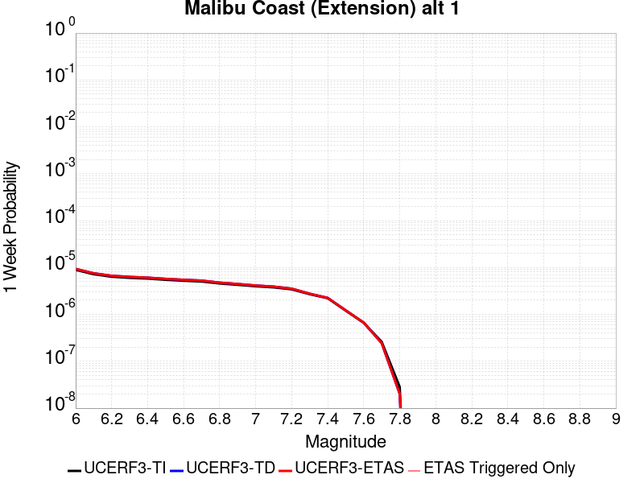 |  |  | 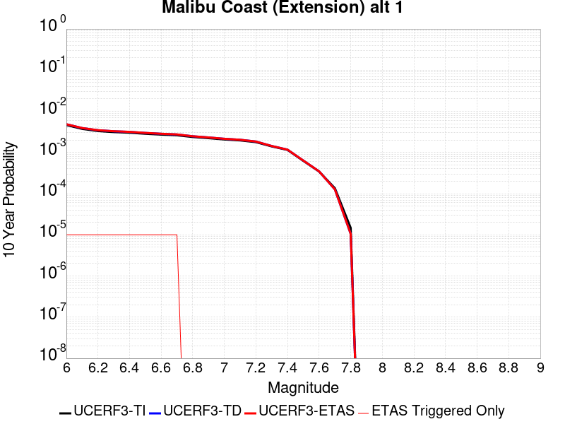 |

| Magnitude | 1 wk TI Prob | 1 wk TD Prob | 1 wk ETAS Prob | 1 wk ETAS/TD Gain | 1 wk ETAS Triggered Only | 1 mo TI Prob | 1 mo TD Prob | 1 mo ETAS Prob | 1 mo ETAS/TD Gain | 1 mo ETAS Triggered Only | 1 yr TI Prob | 1 yr TD Prob | 1 yr ETAS Prob | 1 yr ETAS/TD Gain | 1 yr ETAS Triggered Only | 10 yr TI Prob | 10 yr TD Prob | 10 yr ETAS Prob | 10 yr ETAS/TD Gain | 10 yr ETAS Triggered Only |
|-----|-----|-----|-----|-----|-----|-----|-----|-----|-----|-----|-----|-----|-----|-----|-----|-----|-----|-----|-----|-----|
| 6.0 | 8.930738E-6 | 9.329555E-6 | 9.329555E-6 | 1.0 | 0.0 | 3.827403E-5 | 3.9983202E-5 | 3.9983202E-5 | 1.0 | 0.0 | 4.6588664E-4 | 4.8668848E-4 | 4.8668848E-4 | 1.0 | 0.0 | 0.0046491115 | 0.0048564086 | 0.004866745 | 1.0021284 | 1.0386697E-5 |
| 6.1 | 7.199952E-6 | 7.530538E-6 | 7.530538E-6 | 1.0 | 0.0 | 3.0856572E-5 | 3.2273336E-5 | 3.2273336E-5 | 1.0 | 0.0 | 3.75614E-4 | 3.9285765E-4 | 3.9285765E-4 | 1.0 | 0.0 | 0.0037497976 | 0.003921698 | 0.0039320434 | 1.0026381 | 1.0386697E-5 |
| 6.2 | 6.3721413E-6 | 6.667013E-6 | 6.667013E-6 | 1.0 | 0.0 | 2.7308892E-5 | 2.8572602E-5 | 2.8572602E-5 | 1.0 | 0.0 | 3.3243504E-4 | 3.4781627E-4 | 3.4781627E-4 | 1.0 | 0.0 | 0.0033193815 | 0.003472759 | 0.0034831094 | 1.0029805 | 1.0386697E-5 |
| 6.3 | 6.016345E-6 | 6.295371E-6 | 6.295371E-6 | 1.0 | 0.0 | 2.578408E-5 | 2.6979884E-5 | 2.6979884E-5 | 1.0 | 0.0 | 3.1387596E-4 | 3.284309E-4 | 3.284309E-4 | 1.0 | 0.0 | 0.00313433 | 0.0032794913 | 0.003289844 | 1.0031568 | 1.0386697E-5 |
| 6.4 | 5.8104883E-6 | 6.079752E-6 | 6.079752E-6 | 1.0 | 0.0 | 2.4901856E-5 | 2.605582E-5 | 2.605582E-5 | 1.0 | 0.0 | 3.031379E-4 | 3.1718376E-4 | 3.1718376E-4 | 1.0 | 0.0 | 0.0030272473 | 0.0031673452 | 0.003177699 | 1.003269 | 1.0386697E-5 |
| 6.5 | 5.476925E-6 | 5.72771E-6 | 5.72771E-6 | 1.0 | 0.0 | 2.3472323E-5 | 2.45471E-5 | 2.45471E-5 | 1.0 | 0.0 | 2.8573806E-4 | 2.9882023E-4 | 2.9882023E-4 | 1.0 | 0.0 | 0.0028537093 | 0.0029842162 | 0.002994572 | 1.0034702 | 1.0386697E-5 |
| 6.6 | 5.222387E-6 | 5.4587686E-6 | 5.4587686E-6 | 1.0 | 0.0 | 2.2381464E-5 | 2.3394514E-5 | 2.3394514E-5 | 1.0 | 0.0 | 2.7246025E-4 | 2.8479125E-4 | 2.8479125E-4 | 1.0 | 0.0 | 0.0027212645 | 0.0028442936 | 0.0028546508 | 1.0036414 | 1.0386697E-5 |
| 6.7 | 5.0337076E-6 | 5.259286E-6 | 5.259286E-6 | 1.0 | 0.0 | 2.1572854E-5 | 2.2539603E-5 | 2.2539603E-5 | 1.0 | 0.0 | 2.6261783E-4 | 2.7438538E-4 | 2.7438538E-4 | 1.0 | 0.0 | 0.002623077 | 0.0027404963 | 0.0027508545 | 1.0037796 | 1.0386697E-5 |
| 6.8 | 4.5675624E-6 | 4.7588796E-6 | 4.7588796E-6 | 1.0 | 0.0 | 1.9575122E-5 | 2.039504E-5 | 2.039504E-5 | 1.0 | 0.0 | 2.3830103E-4 | 2.482815E-4 | 2.482815E-4 | 1.0 | 0.0 | 0.0023804565 | 0.0024800608 | 0.0024800608 | 1.0 | 0.0 |
| 6.9 | 4.2802412E-6 | 4.4521726E-6 | 4.4521726E-6 | 1.0 | 0.0 | 1.8343762E-5 | 1.9080602E-5 | 1.9080602E-5 | 1.0 | 0.0 | 2.2331243E-4 | 2.3228172E-4 | 2.3228172E-4 | 1.0 | 0.0 | 0.0022308815 | 0.002320406 | 0.002320406 | 1.0 | 0.0 |
| 7.0 | 3.9794063E-6 | 4.130239E-6 | 4.130239E-6 | 1.0 | 0.0 | 1.7054486E-5 | 1.7700906E-5 | 1.7700906E-5 | 1.0 | 0.0 | 2.0761859E-4 | 2.1548735E-4 | 2.1548735E-4 | 1.0 | 0.0 | 0.0020742472 | 0.0021527975 | 0.0021527975 | 1.0 | 0.0 |
| 7.1 | 3.7730424E-6 | 3.91135E-6 | 3.91135E-6 | 1.0 | 0.0 | 1.6170083E-5 | 1.6762822E-5 | 1.6762822E-5 | 1.0 | 0.0 | 1.9685295E-4 | 2.0406838E-4 | 2.0406838E-4 | 1.0 | 0.0 | 0.0019667868 | 0.0020388227 | 0.0020388227 | 1.0 | 0.0 |
| 7.2 | 3.424985E-6 | 3.5414578E-6 | 3.5414578E-6 | 1.0 | 0.0 | 1.4678424E-5 | 1.51775885E-5 | 1.51775885E-5 | 1.0 | 0.0 | 1.7869516E-4 | 1.8477159E-4 | 1.8477159E-4 | 1.0 | 0.0 | 0.0017855153 | 0.0018461917 | 0.0018461917 | 1.0 | 0.0 |
| 7.3 | 2.6966375E-6 | 2.7597437E-6 | 2.7597437E-6 | 1.0 | 0.0 | 1.15569665E-5 | 1.1827419E-5 | 1.1827419E-5 | 1.0 | 0.0 | 1.4069698E-4 | 1.4398935E-4 | 1.4398935E-4 | 1.0 | 0.0 | 0.0014060794 | 0.0014389647 | 0.0014389647 | 1.0 | 0.0 |
| 7.4 | 2.215957E-6 | 2.2494507E-6 | 2.2494507E-6 | 1.0 | 0.0 | 9.496924E-6 | 9.640467E-6 | 9.640467E-6 | 1.0 | 0.0 | 1.1561892E-4 | 1.17366406E-4 | 1.17366406E-4 | 1.0 | 0.0 | 0.0011555878 | 0.0011730479 | 0.0011730479 | 1.0 | 0.0 |
| 7.5 | 1.2040218E-6 | 1.221948E-6 | 1.221948E-6 | 1.0 | 0.0 | 5.160083E-6 | 5.2369096E-6 | 5.2369096E-6 | 1.0 | 0.0 | 6.2822204E-5 | 6.375753E-5 | 6.375753E-5 | 1.0 | 0.0 | 6.280445E-4 | 6.373942E-4 | 6.373942E-4 | 1.0 | 0.0 |
| 7.6 | 6.6157446E-7 | 6.679209E-7 | 6.679209E-7 | 1.0 | 0.0 | 2.835316E-6 | 2.862515E-6 | 2.862515E-6 | 1.0 | 0.0 | 3.4519428E-5 | 3.485058E-5 | 3.485058E-5 | 1.0 | 0.0 | 3.4514067E-4 | 3.4845265E-4 | 3.4845265E-4 | 1.0 | 0.0 |
| 7.7 | 2.6012302E-7 | 2.43584E-7 | 2.43584E-7 | 1.0 | 0.0 | 1.1148124E-6 | 1.0439311E-6 | 1.0439311E-6 | 1.0 | 0.0 | 1.3572758E-5 | 1.2709797E-5 | 1.2709797E-5 | 1.0 | 0.0 | 1.3571928E-4 | 1.2709177E-4 | 1.2709177E-4 | 1.0 | 0.0 |
| 7.8 | 2.8323132E-8 | 2.0267372E-8 | 2.0267372E-8 | 1.0 | 0.0 | 1.2138484E-7 | 8.686016E-8 | 8.686016E-8 | 1.0 | 0.0 | 1.4778595E-6 | 1.057522E-6 | 1.057522E-6 | 1.0 | 0.0 | 1.4778497E-5 | 1.0575178E-5 | 1.0575178E-5 | 1.0 | 0.0 |

## Santa Cruz Catalina Ridge alt1
*[(top)](#table-of-contents)*

| 1 Week | 1 Month | 1 Year | 10 Year |
|-----|-----|-----|-----|
|  |  |  |  |

| Magnitude | 1 wk TI Prob | 1 wk TD Prob | 1 wk ETAS Prob | 1 wk ETAS/TD Gain | 1 wk ETAS Triggered Only | 1 mo TI Prob | 1 mo TD Prob | 1 mo ETAS Prob | 1 mo ETAS/TD Gain | 1 mo ETAS Triggered Only | 1 yr TI Prob | 1 yr TD Prob | 1 yr ETAS Prob | 1 yr ETAS/TD Gain | 1 yr ETAS Triggered Only | 10 yr TI Prob | 10 yr TD Prob | 10 yr ETAS Prob | 10 yr ETAS/TD Gain | 10 yr ETAS Triggered Only |
|-----|-----|-----|-----|-----|-----|-----|-----|-----|-----|-----|-----|-----|-----|-----|-----|-----|-----|-----|-----|-----|
| 6.0 | 3.2833184E-5 | 3.6560632E-5 | 3.6560632E-5 | 1.0 | 0.0 | 1.4070606E-4 | 1.5667995E-4 | 1.5667995E-4 | 1.0 | 0.0 | 0.00171175 | 0.001906076 | 0.001906076 | 1.0 | 0.0 | 0.016986247 | 0.018914176 | 0.018924367 | 1.0005387 | 1.0386697E-5 |
| 6.1 | 1.9835548E-5 | 2.1660571E-5 | 2.1660571E-5 | 1.0 | 0.0 | 8.500672E-5 | 9.2827824E-5 | 9.2827824E-5 | 1.0 | 0.0 | 0.0010344655 | 0.001129613 | 0.001129613 | 1.0 | 0.0 | 0.010296632 | 0.011240846 | 0.011251115 | 1.0009136 | 1.0386697E-5 |
| 6.2 | 1.9835548E-5 | 2.1660571E-5 | 2.1660571E-5 | 1.0 | 0.0 | 8.500672E-5 | 9.2827824E-5 | 9.2827824E-5 | 1.0 | 0.0 | 0.0010344655 | 0.001129613 | 0.001129613 | 1.0 | 0.0 | 0.010296632 | 0.011240846 | 0.011251115 | 1.0009136 | 1.0386697E-5 |
| 6.3 | 1.5728183E-5 | 1.7034703E-5 | 1.7034703E-5 | 1.0 | 0.0 | 6.7404755E-5 | 7.300386E-5 | 7.300386E-5 | 1.0 | 0.0 | 8.2034385E-4 | 8.8846567E-4 | 8.8846567E-4 | 1.0 | 0.0 | 0.008173222 | 0.008849816 | 0.008860111 | 1.0011632 | 1.0386697E-5 |
| 6.4 | 1.5728183E-5 | 1.7034703E-5 | 1.7034703E-5 | 1.0 | 0.0 | 6.7404755E-5 | 7.300386E-5 | 7.300386E-5 | 1.0 | 0.0 | 8.2034385E-4 | 8.8846567E-4 | 8.8846567E-4 | 1.0 | 0.0 | 0.008173222 | 0.008849816 | 0.008860111 | 1.0011632 | 1.0386697E-5 |
| 6.5 | 1.3707734E-5 | 1.4795146E-5 | 1.4795146E-5 | 1.0 | 0.0 | 5.8746107E-5 | 6.3406245E-5 | 6.3406245E-5 | 1.0 | 0.0 | 7.1499916E-4 | 7.7170116E-4 | 7.7170116E-4 | 1.0 | 0.0 | 0.0071270303 | 0.0076906127 | 0.0077009196 | 1.0013402 | 1.0386697E-5 |
| 6.6 | 1.2539813E-5 | 1.3510776E-5 | 1.3510776E-5 | 1.0 | 0.0 | 5.3740947E-5 | 5.7902053E-5 | 5.7902053E-5 | 1.0 | 0.0 | 6.540996E-4 | 7.0473214E-4 | 7.0473214E-4 | 1.0 | 0.0 | 0.0065217763 | 0.007025277 | 0.0070355902 | 1.0014681 | 1.0386697E-5 |
| 6.7 | 1.1504083E-5 | 1.2377875E-5 | 1.2377875E-5 | 1.0 | 0.0 | 4.930228E-5 | 5.3046966E-5 | 5.3046966E-5 | 1.0 | 0.0 | 6.0008996E-4 | 6.456574E-4 | 6.456574E-4 | 1.0 | 0.0 | 0.005984721 | 0.006438045 | 0.006448365 | 1.0016029 | 1.0386697E-5 |
| 6.8 | 1.012739E-5 | 1.0877499E-5 | 1.0877499E-5 | 1.0 | 0.0 | 4.340238E-5 | 4.661703E-5 | 4.661703E-5 | 1.0 | 0.0 | 5.282958E-4 | 5.67416E-4 | 5.67416E-4 | 1.0 | 0.0 | 0.0052704164 | 0.0056598415 | 0.0056701694 | 1.0018247 | 1.0386697E-5 |
| 6.9 | 8.9607865E-6 | 9.609487E-6 | 9.609487E-6 | 1.0 | 0.0 | 3.8402806E-5 | 4.118287E-5 | 4.118287E-5 | 1.0 | 0.0 | 4.6745385E-4 | 5.0128717E-4 | 5.0128717E-4 | 1.0 | 0.0 | 0.0046647177 | 0.0050016837 | 0.005012018 | 1.0020663 | 1.0386697E-5 |
| 7.0 | 8.046829E-6 | 8.620072E-6 | 8.620072E-6 | 1.0 | 0.0 | 3.4485955E-5 | 3.694265E-5 | 3.694265E-5 | 1.0 | 0.0 | 4.1978562E-4 | 4.496847E-4 | 4.496847E-4 | 1.0 | 0.0 | 0.004189935 | 0.004487838 | 0.004498178 | 1.0023041 | 1.0386697E-5 |
| 7.1 | 7.136131E-6 | 7.637941E-6 | 7.637941E-6 | 1.0 | 0.0 | 3.0583058E-5 | 3.2733627E-5 | 3.2733627E-5 | 1.0 | 0.0 | 3.7228514E-4 | 3.9845973E-4 | 3.9845973E-4 | 1.0 | 0.0 | 0.0037166206 | 0.0039775297 | 0.003987875 | 1.0026009 | 1.0386697E-5 |
| 7.2 | 6.362014E-6 | 6.8052104E-6 | 6.8052104E-6 | 1.0 | 0.0 | 2.726549E-5 | 2.9164865E-5 | 2.9164865E-5 | 1.0 | 0.0 | 3.3190678E-4 | 3.5502503E-4 | 3.5502503E-4 | 1.0 | 0.0 | 0.0033141149 | 0.003544647 | 0.0035549968 | 1.0029199 | 1.0386697E-5 |
| 7.3 | 5.004101E-6 | 5.3519125E-6 | 5.3519125E-6 | 1.0 | 0.0 | 2.1445969E-5 | 2.2936569E-5 | 2.2936569E-5 | 1.0 | 0.0 | 2.6107338E-4 | 2.792175E-4 | 2.792175E-4 | 1.0 | 0.0 | 0.002607669 | 0.0027887214 | 0.002799079 | 1.0037142 | 1.0386697E-5 |
| 7.4 | 3.4901443E-6 | 3.73219E-6 | 3.73219E-6 | 1.0 | 0.0 | 1.4957676E-5 | 1.5995005E-5 | 1.5995005E-5 | 1.0 | 0.0 | 1.8209449E-4 | 1.9472216E-4 | 1.9472216E-4 | 1.0 | 0.0 | 0.0018194534 | 0.001945554 | 0.0019559206 | 1.0053283 | 1.0386697E-5 |
| 7.5 | 1.1215045E-6 | 1.1894253E-6 | 1.1894253E-6 | 1.0 | 0.0 | 4.806439E-6 | 5.0975277E-6 | 5.0975277E-6 | 1.0 | 0.0 | 5.851682E-5 | 6.206066E-5 | 6.206066E-5 | 1.0 | 0.0 | 5.850142E-4 | 6.204364E-4 | 6.204364E-4 | 1.0 | 0.0 |
| 7.6 | 2.8599047E-7 | 2.9952744E-7 | 2.9952744E-7 | 1.0 | 0.0 | 1.2256729E-6 | 1.2836884E-6 | 1.2836884E-6 | 1.0 | 0.0 | 1.4922465E-5 | 1.5628797E-5 | 1.5628797E-5 | 1.0 | 0.0 | 1.4921463E-4 | 1.562771E-4 | 1.562771E-4 | 1.0 | 0.0 |
| 7.7 | 2.0781519E-7 | 2.1744857E-7 | 2.1744857E-7 | 1.0 | 0.0 | 8.906362E-7 | 9.3192216E-7 | 9.3192216E-7 | 1.0 | 0.0 | 1.08434415E-5 | 1.1346094E-5 | 1.1346094E-5 | 1.0 | 0.0 | 1.0842913E-4 | 1.1345524E-4 | 1.1345524E-4 | 1.0 | 0.0 |
| 7.8 | 3.614776E-8 | 3.7641843E-8 | 3.7641843E-8 | 1.0 | 0.0 | 1.5491896E-7 | 1.6132218E-7 | 1.6132218E-7 | 1.0 | 0.0 | 1.8861368E-6 | 1.9640959E-6 | 1.9640959E-6 | 1.0 | 0.0 | 1.8861208E-5 | 1.9640796E-5 | 1.9640796E-5 | 1.0 | 0.0 |

## Calaveras (No) 2011 CFM
*[(top)](#table-of-contents)*

| 1 Week | 1 Month | 1 Year | 10 Year |
|-----|-----|-----|-----|
| 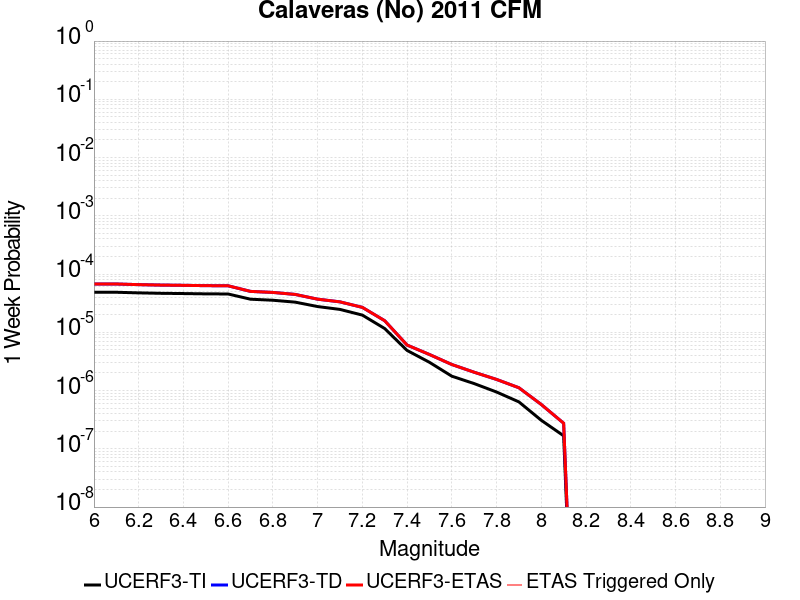 | 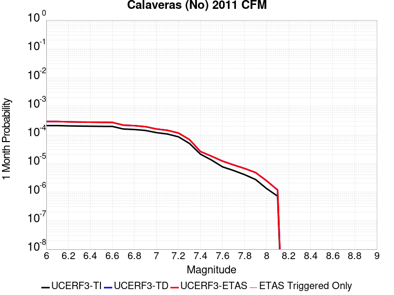 | 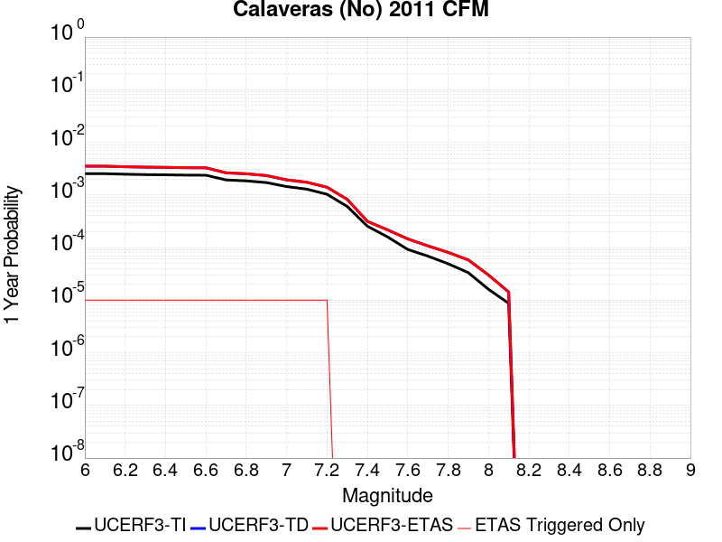 | 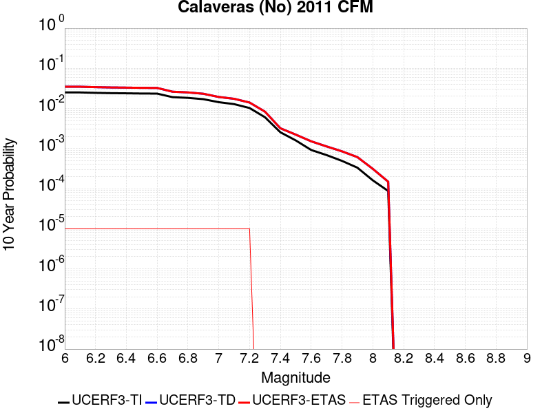 |

| Magnitude | 1 wk TI Prob | 1 wk TD Prob | 1 wk ETAS Prob | 1 wk ETAS/TD Gain | 1 wk ETAS Triggered Only | 1 mo TI Prob | 1 mo TD Prob | 1 mo ETAS Prob | 1 mo ETAS/TD Gain | 1 mo ETAS Triggered Only | 1 yr TI Prob | 1 yr TD Prob | 1 yr ETAS Prob | 1 yr ETAS/TD Gain | 1 yr ETAS Triggered Only | 10 yr TI Prob | 10 yr TD Prob | 10 yr ETAS Prob | 10 yr ETAS/TD Gain | 10 yr ETAS Triggered Only |
|-----|-----|-----|-----|-----|-----|-----|-----|-----|-----|-----|-----|-----|-----|-----|-----|-----|-----|-----|-----|-----|
| 6.0 | 4.8694856E-5 | 6.751695E-5 | 6.751695E-5 | 1.0 | 0.0 | 2.0867554E-4 | 2.8932732E-4 | 2.8932732E-4 | 1.0 | 0.0 | 0.0025376645 | 0.0035169914 | 0.0035273416 | 1.0029429 | 1.0386697E-5 | 0.02508881 | 0.03479354 | 0.034803566 | 1.0002881 | 1.0386697E-5 |
| 6.1 | 4.8694856E-5 | 6.751695E-5 | 6.751695E-5 | 1.0 | 0.0 | 2.0867554E-4 | 2.8932732E-4 | 2.8932732E-4 | 1.0 | 0.0 | 0.0025376645 | 0.0035169914 | 0.0035273416 | 1.0029429 | 1.0386697E-5 | 0.02508881 | 0.03479354 | 0.034803566 | 1.0002881 | 1.0386697E-5 |
| 6.2 | 4.7541962E-5 | 6.584752E-5 | 6.584752E-5 | 1.0 | 0.0 | 2.0373536E-4 | 2.821742E-4 | 2.821742E-4 | 1.0 | 0.0 | 0.0024776561 | 0.0034302098 | 0.0034405608 | 1.0030177 | 1.0386697E-5 | 0.024502134 | 0.03395483 | 0.03396486 | 1.0002955 | 1.0386697E-5 |
| 6.3 | 4.6717287E-5 | 6.4680644E-5 | 6.4680644E-5 | 1.0 | 0.0 | 2.0020158E-4 | 2.7717437E-4 | 2.7717437E-4 | 1.0 | 0.0 | 0.0024347296 | 0.0033695523 | 0.003379904 | 1.0030721 | 1.0386697E-5 | 0.024082264 | 0.033367258 | 0.033377297 | 1.0003009 | 1.0386697E-5 |
| 6.4 | 4.6276386E-5 | 6.404235E-5 | 6.404235E-5 | 1.0 | 0.0 | 1.983123E-4 | 2.744394E-4 | 2.744394E-4 | 1.0 | 0.0 | 0.0024117786 | 0.0033363563 | 0.0033467084 | 1.0031028 | 1.0386697E-5 | 0.02385771 | 0.033046078 | 0.03305612 | 1.0003039 | 1.0386697E-5 |
| 6.5 | 4.5720994E-5 | 6.324356E-5 | 6.324356E-5 | 1.0 | 0.0 | 1.9593239E-4 | 2.7101676E-4 | 2.7101676E-4 | 1.0 | 0.0 | 0.002382867 | 0.0032948244 | 0.0033051767 | 1.003142 | 1.0386697E-5 | 0.023574775 | 0.032643978 | 0.032654025 | 1.0003078 | 1.0386697E-5 |
| 6.6 | 4.549134E-5 | 6.28966E-5 | 6.28966E-5 | 1.0 | 0.0 | 1.949483E-4 | 2.6953008E-4 | 2.6953008E-4 | 1.0 | 0.0 | 0.0023709119 | 0.0032767786 | 0.0032871314 | 1.0031594 | 1.0386697E-5 | 0.023457756 | 0.032469314 | 0.03247936 | 1.0003095 | 1.0386697E-5 |
| 6.7 | 3.701047E-5 | 5.0401275E-5 | 5.0401275E-5 | 1.0 | 0.0 | 1.5860666E-4 | 2.1598782E-4 | 2.1598782E-4 | 1.0 | 0.0 | 0.0019293258 | 0.0026265238 | 0.0026368834 | 1.0039442 | 1.0386697E-5 | 0.019126613 | 0.026146183 | 0.026156297 | 1.0003868 | 1.0386697E-5 |
| 6.8 | 3.5523568E-5 | 4.838263E-5 | 4.838263E-5 | 1.0 | 0.0 | 1.5223498E-4 | 2.0733789E-4 | 2.0733789E-4 | 1.0 | 0.0 | 0.0018518851 | 0.0025214595 | 0.00253182 | 1.0041089 | 1.0386697E-5 | 0.018365284 | 0.025118314 | 0.02512844 | 1.0004032 | 1.0386697E-5 |
| 6.9 | 3.2946147E-5 | 4.4702916E-5 | 4.4702916E-5 | 1.0 | 0.0 | 1.4119013E-4 | 1.915701E-4 | 1.915701E-4 | 1.0 | 0.0 | 0.0017176344 | 0.0023299132 | 0.0023402758 | 1.0044476 | 1.0386697E-5 | 0.017044188 | 0.023239713 | 0.023249857 | 1.0004365 | 1.0386697E-5 |
| 7.0 | 2.7682381E-5 | 3.7061774E-5 | 3.7061774E-5 | 1.0 | 0.0 | 1.1863338E-4 | 1.5882668E-4 | 1.5882668E-4 | 1.0 | 0.0 | 0.0014434044 | 0.0019320298 | 0.0019423965 | 1.0053656 | 1.0386697E-5 | 0.01434065 | 0.019330772 | 0.019340958 | 1.0005269 | 1.0386697E-5 |
| 7.1 | 2.471967E-5 | 3.3325345E-5 | 3.3325345E-5 | 1.0 | 0.0 | 1.05937135E-4 | 1.4281525E-4 | 1.4281525E-4 | 1.0 | 0.0 | 0.0012890215 | 0.0017374179 | 0.0017477865 | 1.0059679 | 1.0386697E-5 | 0.0128157 | 0.017405398 | 0.017415604 | 1.0005864 | 1.0386697E-5 |
| 7.2 | 1.9748062E-5 | 2.681247E-5 | 2.681247E-5 | 1.0 | 0.0 | 8.463181E-5 | 1.14905655E-4 | 1.14905655E-4 | 1.0 | 0.0 | 0.0010299052 | 0.001398102 | 0.0014084742 | 1.0074188 | 1.0386697E-5 | 0.01025145 | 0.014049817 | 0.014060058 | 1.0007288 | 1.0386697E-5 |
| 7.3 | 1.1603734E-5 | 1.581797E-5 | 1.581797E-5 | 1.0 | 0.0 | 4.9729337E-5 | 6.778962E-5 | 6.778962E-5 | 1.0 | 0.0 | 6.052865E-4 | 8.2504033E-4 | 8.2504033E-4 | 1.0 | 0.0 | 0.0060364045 | 0.008326006 | 0.008326006 | 1.0 | 0.0 |
| 7.4 | 4.885381E-6 | 6.041696E-6 | 6.041696E-6 | 1.0 | 0.0 | 2.0937177E-5 | 2.5892728E-5 | 2.5892728E-5 | 1.0 | 0.0 | 2.5488032E-4 | 3.1519853E-4 | 3.1519853E-4 | 1.0 | 0.0 | 0.0025458818 | 0.0032044314 | 0.0032044314 | 1.0 | 0.0 |
| 7.5 | 3.0571264E-6 | 4.1616586E-6 | 4.1616586E-6 | 1.0 | 0.0 | 1.3101904E-5 | 1.7835559E-5 | 1.7835559E-5 | 1.0 | 0.0 | 1.5950401E-4 | 2.1712639E-4 | 2.1712639E-4 | 1.0 | 0.0 | 0.0015938957 | 0.0022243145 | 0.0022243145 | 1.0 | 0.0 |
| 7.6 | 1.764948E-6 | 2.8015227E-6 | 2.8015227E-6 | 1.0 | 0.0 | 7.564041E-6 | 1.2006471E-5 | 1.2006471E-5 | 1.0 | 0.0 | 9.208831E-5 | 1.4616904E-4 | 1.4616904E-4 | 1.0 | 0.0 | 9.205016E-4 | 0.0015153463 | 0.0015153463 | 1.0 | 0.0 |
| 7.7 | 1.3173734E-6 | 2.0637024E-6 | 2.0637024E-6 | 1.0 | 0.0 | 5.645874E-6 | 8.8444085E-6 | 8.8444085E-6 | 1.0 | 0.0 | 6.873634E-5 | 1.07675376E-4 | 1.07675376E-4 | 1.0 | 0.0 | 6.8715087E-4 | 0.0011287798 | 0.0011287798 | 1.0 | 0.0 |
| 7.8 | 9.4429885E-7 | 1.5530142E-6 | 1.5530142E-6 | 1.0 | 0.0 | 4.0469886E-6 | 6.6557577E-6 | 6.6557577E-6 | 1.0 | 0.0 | 4.9270973E-5 | 8.1030856E-5 | 8.1030856E-5 | 1.0 | 0.0 | 4.926005E-4 | 8.5218163E-4 | 8.5218163E-4 | 1.0 | 0.0 |
| 7.9 | 6.388233E-7 | 1.117658E-6 | 1.117658E-6 | 1.0 | 0.0 | 2.7378112E-6 | 4.7899543E-6 | 4.7899543E-6 | 1.0 | 0.0 | 3.3332344E-5 | 5.831614E-5 | 5.831614E-5 | 1.0 | 0.0 | 3.3327343E-4 | 6.110225E-4 | 6.110225E-4 | 1.0 | 0.0 |
| 8.0 | 3.087986E-7 | 5.768416E-7 | 5.768416E-7 | 1.0 | 0.0 | 1.323422E-6 | 2.472176E-6 | 2.472176E-6 | 1.0 | 0.0 | 1.6112543E-5 | 3.009833E-5 | 3.009833E-5 | 1.0 | 0.0 | 1.6111376E-4 | 3.1173407E-4 | 3.1173407E-4 | 1.0 | 0.0 |
| 8.1 | 1.6725647E-7 | 2.7478677E-7 | 2.7478677E-7 | 1.0 | 0.0 | 7.168133E-7 | 1.177657E-6 | 1.177657E-6 | 1.0 | 0.0 | 8.7271665E-6 | 1.4337883E-5 | 1.4337883E-5 | 1.0 | 0.0 | 8.726824E-5 | 1.4883911E-4 | 1.4883911E-4 | 1.0 | 0.0 |

## Sheephole
*[(top)](#table-of-contents)*

| 1 Week | 1 Month | 1 Year | 10 Year |
|-----|-----|-----|-----|
|  |  |  |  |

| Magnitude | 1 wk TI Prob | 1 wk TD Prob | 1 wk ETAS Prob | 1 wk ETAS/TD Gain | 1 wk ETAS Triggered Only | 1 mo TI Prob | 1 mo TD Prob | 1 mo ETAS Prob | 1 mo ETAS/TD Gain | 1 mo ETAS Triggered Only | 1 yr TI Prob | 1 yr TD Prob | 1 yr ETAS Prob | 1 yr ETAS/TD Gain | 1 yr ETAS Triggered Only | 10 yr TI Prob | 10 yr TD Prob | 10 yr ETAS Prob | 10 yr ETAS/TD Gain | 10 yr ETAS Triggered Only |
|-----|-----|-----|-----|-----|-----|-----|-----|-----|-----|-----|-----|-----|-----|-----|-----|-----|-----|-----|-----|-----|
| 6.0 | 4.5579695E-6 | 4.741364E-6 | 4.741364E-6 | 1.0 | 0.0 | 1.9534009E-5 | 2.0320003E-5 | 2.0320003E-5 | 1.0 | 0.0 | 2.3780059E-4 | 2.473735E-4 | 2.473735E-4 | 1.0 | 0.0 | 0.0023754628 | 0.002471526 | 0.002481887 | 1.0041921 | 1.0386697E-5 |
| 6.1 | 4.5579695E-6 | 4.741364E-6 | 4.741364E-6 | 1.0 | 0.0 | 1.9534009E-5 | 2.0320003E-5 | 2.0320003E-5 | 1.0 | 0.0 | 2.3780059E-4 | 2.473735E-4 | 2.473735E-4 | 1.0 | 0.0 | 0.0023754628 | 0.002471526 | 0.002481887 | 1.0041921 | 1.0386697E-5 |
| 6.2 | 2.6677674E-6 | 2.7874607E-6 | 2.7874607E-6 | 1.0 | 0.0 | 1.1433239E-5 | 1.1946211E-5 | 1.1946211E-5 | 1.0 | 0.0 | 1.3919079E-4 | 1.454365E-4 | 1.454365E-4 | 1.0 | 0.0 | 0.0013910364 | 0.001453519 | 0.0014638907 | 1.0071355 | 1.0386697E-5 |
| 6.3 | 2.6677674E-6 | 2.7874607E-6 | 2.7874607E-6 | 1.0 | 0.0 | 1.1433239E-5 | 1.1946211E-5 | 1.1946211E-5 | 1.0 | 0.0 | 1.3919079E-4 | 1.454365E-4 | 1.454365E-4 | 1.0 | 0.0 | 0.0013910364 | 0.001453519 | 0.0014638907 | 1.0071355 | 1.0386697E-5 |
| 6.4 | 2.2159759E-6 | 2.3229381E-6 | 2.3229381E-6 | 1.0 | 0.0 | 9.497005E-6 | 9.955416E-6 | 9.955416E-6 | 1.0 | 0.0 | 1.156199E-4 | 1.2120126E-4 | 1.2120126E-4 | 1.0 | 0.0 | 0.0011555976 | 0.0012114309 | 0.001221805 | 1.0085635 | 1.0386697E-5 |
| 6.5 | 2.1986082E-6 | 2.304818E-6 | 2.304818E-6 | 1.0 | 0.0 | 9.4225725E-6 | 9.877759E-6 | 9.877759E-6 | 1.0 | 0.0 | 1.1471378E-4 | 1.20255885E-4 | 1.20255885E-4 | 1.0 | 0.0 | 0.0011465458 | 0.0012019875 | 0.0012123616 | 1.0086309 | 1.0386697E-5 |
| 6.6 | 1.5232331E-6 | 1.6019358E-6 | 1.6019358E-6 | 1.0 | 0.0 | 6.5281256E-6 | 6.8654217E-6 | 6.8654217E-6 | 1.0 | 0.0 | 7.947703E-5 | 8.3583494E-5 | 8.3583494E-5 | 1.0 | 0.0 | 7.9448614E-4 | 8.355393E-4 | 8.355393E-4 | 1.0 | 0.0 |
| 6.7 | 1.3137362E-6 | 1.3828576E-6 | 1.3828576E-6 | 1.0 | 0.0 | 5.6302856E-6 | 5.92652E-6 | 5.92652E-6 | 1.0 | 0.0 | 6.854657E-5 | 7.215313E-5 | 7.215313E-5 | 1.0 | 0.0 | 6.8525434E-4 | 7.2131096E-4 | 7.2131096E-4 | 1.0 | 0.0 |
| 6.8 | 1.2275751E-6 | 1.2923208E-6 | 1.2923208E-6 | 1.0 | 0.0 | 5.2610258E-6 | 5.5385067E-6 | 5.5385067E-6 | 1.0 | 0.0 | 6.4051106E-5 | 6.742937E-5 | 6.742937E-5 | 1.0 | 0.0 | 6.4032647E-4 | 6.7410246E-4 | 6.7410246E-4 | 1.0 | 0.0 |
| 6.9 | 1.1837088E-6 | 1.2461369E-6 | 1.2461369E-6 | 1.0 | 0.0 | 5.0730278E-6 | 5.3405765E-6 | 5.3405765E-6 | 1.0 | 0.0 | 6.176237E-5 | 6.501971E-5 | 6.501971E-5 | 1.0 | 0.0 | 6.17452E-4 | 6.5002E-4 | 6.5002E-4 | 1.0 | 0.0 |
| 7.0 | 9.849371E-7 | 1.0366576E-6 | 1.0366576E-6 | 1.0 | 0.0 | 4.2211523E-6 | 4.4428116E-6 | 4.4428116E-6 | 1.0 | 0.0 | 5.1391315E-5 | 5.4089993E-5 | 5.4089993E-5 | 1.0 | 0.0 | 5.137943E-4 | 5.4077833E-4 | 5.4077833E-4 | 1.0 | 0.0 |
| 7.1 | 8.1643645E-7 | 8.591908E-7 | 8.591908E-7 | 1.0 | 0.0 | 3.4990085E-6 | 3.6822414E-6 | 3.6822414E-6 | 1.0 | 0.0 | 4.2599597E-5 | 4.4830453E-5 | 4.4830453E-5 | 1.0 | 0.0 | 4.259143E-4 | 4.4822274E-4 | 4.4822274E-4 | 1.0 | 0.0 |
| 7.2 | 5.7295756E-7 | 6.029669E-7 | 6.029669E-7 | 1.0 | 0.0 | 2.45553E-6 | 2.5841418E-6 | 2.5841418E-6 | 1.0 | 0.0 | 2.9895667E-5 | 3.146154E-5 | 3.146154E-5 | 1.0 | 0.0 | 2.9891645E-4 | 3.1457754E-4 | 3.1457754E-4 | 1.0 | 0.0 |

## Contra Costa Shear Zone (connector) 2011 CFM
*[(top)](#table-of-contents)*

| 1 Week | 1 Month | 1 Year | 10 Year |
|-----|-----|-----|-----|
|  |  |  |  |

| Magnitude | 1 wk TI Prob | 1 wk TD Prob | 1 wk ETAS Prob | 1 wk ETAS/TD Gain | 1 wk ETAS Triggered Only | 1 mo TI Prob | 1 mo TD Prob | 1 mo ETAS Prob | 1 mo ETAS/TD Gain | 1 mo ETAS Triggered Only | 1 yr TI Prob | 1 yr TD Prob | 1 yr ETAS Prob | 1 yr ETAS/TD Gain | 1 yr ETAS Triggered Only | 10 yr TI Prob | 10 yr TD Prob | 10 yr ETAS Prob | 10 yr ETAS/TD Gain | 10 yr ETAS Triggered Only |
|-----|-----|-----|-----|-----|-----|-----|-----|-----|-----|-----|-----|-----|-----|-----|-----|-----|-----|-----|-----|-----|
| 6.0 | 1.3187427E-5 | 1.4043529E-5 | 1.4043529E-5 | 1.0 | 0.0 | 5.6516317E-5 | 6.018529E-5 | 6.018529E-5 | 1.0 | 0.0 | 6.878689E-4 | 7.3253235E-4 | 7.429115E-4 | 1.0141687 | 1.0386697E-5 | 0.006857436 | 0.0073076286 | 0.0073179393 | 1.001411 | 1.0386697E-5 |
| 6.1 | 1.3187427E-5 | 1.4043529E-5 | 1.4043529E-5 | 1.0 | 0.0 | 5.6516317E-5 | 6.018529E-5 | 6.018529E-5 | 1.0 | 0.0 | 6.878689E-4 | 7.3253235E-4 | 7.429115E-4 | 1.0141687 | 1.0386697E-5 | 0.006857436 | 0.0073076286 | 0.0073179393 | 1.001411 | 1.0386697E-5 |
| 6.2 | 1.3187427E-5 | 1.4043529E-5 | 1.4043529E-5 | 1.0 | 0.0 | 5.6516317E-5 | 6.018529E-5 | 6.018529E-5 | 1.0 | 0.0 | 6.878689E-4 | 7.3253235E-4 | 7.429115E-4 | 1.0141687 | 1.0386697E-5 | 0.006857436 | 0.0073076286 | 0.0073179393 | 1.001411 | 1.0386697E-5 |
| 6.3 | 9.315374E-6 | 9.826258E-6 | 9.826258E-6 | 1.0 | 0.0 | 3.992242E-5 | 4.211188E-5 | 4.211188E-5 | 1.0 | 0.0 | 4.8594706E-4 | 5.1259564E-4 | 5.22977E-4 | 1.0202526 | 1.0386697E-5 | 0.004848858 | 0.0051187393 | 0.005129073 | 1.0020188 | 1.0386697E-5 |
| 6.4 | 9.315374E-6 | 9.826258E-6 | 9.826258E-6 | 1.0 | 0.0 | 3.992242E-5 | 4.211188E-5 | 4.211188E-5 | 1.0 | 0.0 | 4.8594706E-4 | 5.1259564E-4 | 5.22977E-4 | 1.0202526 | 1.0386697E-5 | 0.004848858 | 0.0051187393 | 0.005129073 | 1.0020188 | 1.0386697E-5 |
| 6.5 | 8.492638E-6 | 8.939904E-6 | 8.939904E-6 | 1.0 | 0.0 | 3.639651E-5 | 3.831333E-5 | 3.831333E-5 | 1.0 | 0.0 | 4.430374E-4 | 4.663683E-4 | 4.7675017E-4 | 1.022261 | 1.0386697E-5 | 0.0044215517 | 0.004658427 | 0.0046687652 | 1.0022193 | 1.0386697E-5 |
| 6.6 | 8.402072E-6 | 8.840699E-6 | 8.840699E-6 | 1.0 | 0.0 | 3.6008387E-5 | 3.7888178E-5 | 3.7888178E-5 | 1.0 | 0.0 | 4.383139E-4 | 4.611943E-4 | 4.715762E-4 | 1.0225109 | 1.0386697E-5 | 0.0043745036 | 0.004606902 | 0.0046172407 | 1.0022442 | 1.0386697E-5 |
| 6.7 | 7.383587E-6 | 7.748254E-6 | 7.748254E-6 | 1.0 | 0.0 | 3.164356E-5 | 3.320639E-5 | 3.320639E-5 | 1.0 | 0.0 | 3.8519225E-4 | 4.042149E-4 | 4.145974E-4 | 1.0256855 | 1.0386697E-5 | 0.0038452526 | 0.0040392014 | 0.004049546 | 1.0025611 | 1.0386697E-5 |
| 6.8 | 6.004921E-6 | 6.265873E-6 | 6.265873E-6 | 1.0 | 0.0 | 2.5735122E-5 | 2.6853468E-5 | 2.6853468E-5 | 1.0 | 0.0 | 3.1328006E-4 | 3.2689245E-4 | 3.3727576E-4 | 1.0317637 | 1.0386697E-5 | 0.0031283877 | 0.0032683674 | 0.0032787202 | 1.0031675 | 1.0386697E-5 |
| 6.9 | 5.505255E-6 | 5.7182547E-6 | 5.7182547E-6 | 1.0 | 0.0 | 2.3593739E-5 | 2.4506577E-5 | 2.4506577E-5 | 1.0 | 0.0 | 2.872159E-4 | 2.9832716E-4 | 3.0871076E-4 | 1.0348061 | 1.0386697E-5 | 0.0028684495 | 0.002983509 | 0.002993865 | 1.003471 | 1.0386697E-5 |
| 7.0 | 4.891922E-6 | 5.0488975E-6 | 5.0488975E-6 | 1.0 | 0.0 | 2.096521E-5 | 2.1637954E-5 | 2.1637954E-5 | 1.0 | 0.0 | 2.5522153E-4 | 2.634106E-4 | 2.7379455E-4 | 1.0394212 | 1.0386697E-5 | 0.0025492862 | 0.0026352182 | 0.0026455775 | 1.0039312 | 1.0386697E-5 |
| 7.1 | 4.3599E-6 | 4.4528783E-6 | 4.4528783E-6 | 1.0 | 0.0 | 1.868515E-5 | 1.9083625E-5 | 1.9083625E-5 | 1.0 | 0.0 | 2.2746796E-4 | 2.3231865E-4 | 2.4270294E-4 | 1.0446985 | 1.0386697E-5 | 0.0022723526 | 0.0023249856 | 0.0023353482 | 1.004457 | 1.0386697E-5 |
| 7.2 | 3.7647926E-6 | 3.803872E-6 | 3.803872E-6 | 1.0 | 0.0 | 1.6134725E-5 | 1.6302207E-5 | 1.6302207E-5 | 1.0 | 0.0 | 1.9642258E-4 | 1.9846155E-4 | 2.0884619E-4 | 1.0523257 | 1.0386697E-5 | 0.0019624906 | 0.0019870596 | 0.0019974255 | 1.0052168 | 1.0386697E-5 |
| 7.3 | 2.3179882E-6 | 2.3920816E-6 | 2.3920816E-6 | 1.0 | 0.0 | 9.934198E-6 | 1.0251738E-5 | 1.0251738E-5 | 1.0 | 0.0 | 1.20942146E-4 | 1.2480782E-4 | 1.2480782E-4 | 1.0 | 0.0 | 0.0012087635 | 0.0012515716 | 0.0012515716 | 1.0 | 0.0 |
| 7.4 | 1.8378355E-6 | 1.919206E-6 | 1.919206E-6 | 1.0 | 0.0 | 7.876414E-6 | 8.225143E-6 | 8.225143E-6 | 1.0 | 0.0 | 9.5891126E-5 | 1.0013655E-4 | 1.0013655E-4 | 1.0 | 0.0 | 9.584976E-4 | 0.001005021 | 0.001005021 | 1.0 | 0.0 |
| 7.5 | 9.840493E-7 | 1.0632542E-6 | 1.0632542E-6 | 1.0 | 0.0 | 4.2173474E-6 | 4.556796E-6 | 4.556796E-6 | 1.0 | 0.0 | 5.1344992E-5 | 5.547759E-5 | 5.547759E-5 | 1.0 | 0.0 | 5.133313E-4 | 5.583826E-4 | 5.583826E-4 | 1.0 | 0.0 |
| 7.6 | 3.1602997E-7 | 3.709649E-7 | 3.709649E-7 | 1.0 | 0.0 | 1.3544135E-6 | 1.5898486E-6 | 1.5898486E-6 | 1.0 | 0.0 | 1.648986E-5 | 1.9356235E-5 | 1.9356235E-5 | 1.0 | 0.0 | 1.6488635E-4 | 1.9709484E-4 | 1.9709484E-4 | 1.0 | 0.0 |
| 7.7 | 2.2125788E-7 | 2.763846E-7 | 2.763846E-7 | 1.0 | 0.0 | 9.482477E-7 | 1.184505E-6 | 1.184505E-6 | 1.0 | 0.0 | 1.1544855E-5 | 1.4421254E-5 | 1.4421254E-5 | 1.0 | 0.0 | 1.1544255E-4 | 1.4771512E-4 | 1.4771512E-4 | 1.0 | 0.0 |
| 7.8 | 1.0509553E-7 | 1.4405913E-7 | 1.4405913E-7 | 1.0 | 0.0 | 4.5040935E-7 | 6.173961E-7 | 6.173961E-7 | 1.0 | 0.0 | 5.48372E-6 | 7.516772E-6 | 7.516772E-6 | 1.0 | 0.0 | 5.4835844E-5 | 7.746711E-5 | 7.746711E-5 | 1.0 | 0.0 |
| 7.9 | 6.029319E-8 | 9.258449E-8 | 9.258449E-8 | 1.0 | 0.0 | 2.5839938E-7 | 3.9679063E-7 | 3.9679063E-7 | 1.0 | 0.0 | 3.1460077E-6 | 4.8309153E-6 | 4.8309153E-6 | 1.0 | 0.0 | 3.1459633E-5 | 4.9889437E-5 | 4.9889437E-5 | 1.0 | 0.0 |
| 8.0 | 3.531068E-8 | 6.521758E-8 | 6.521758E-8 | 1.0 | 0.0 | 1.5133148E-7 | 2.7950387E-7 | 2.7950387E-7 | 1.0 | 0.0 | 1.8424593E-6 | 3.4029545E-6 | 3.4029545E-6 | 1.0 | 0.0 | 1.842444E-5 | 3.5169454E-5 | 3.5169454E-5 | 1.0 | 0.0 |
| 8.1 | 3.5238246E-10 | 6.267966E-10 | 6.267966E-10 | 1.0 | 0.0 | 1.5102107E-9 | 2.6862692E-9 | 2.6862692E-9 | 1.0 | 0.0 | 1.8386816E-8 | 3.270533E-8 | 3.270533E-8 | 1.0 | 0.0 | 1.8386814E-7 | 3.350208E-7 | 3.350208E-7 | 1.0 | 0.0 |

## Pilarcitos 2011 CFM
*[(top)](#table-of-contents)*

| 1 Week | 1 Month | 1 Year | 10 Year |
|-----|-----|-----|-----|
|  |  | 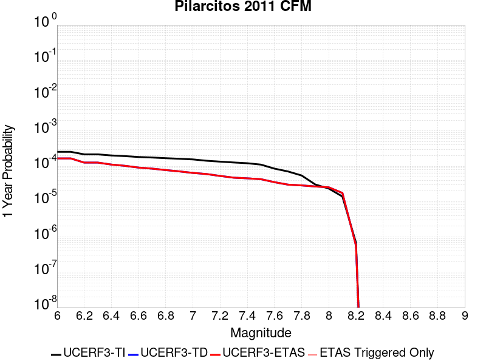 |  |

| Magnitude | 1 wk TI Prob | 1 wk TD Prob | 1 wk ETAS Prob | 1 wk ETAS/TD Gain | 1 wk ETAS Triggered Only | 1 mo TI Prob | 1 mo TD Prob | 1 mo ETAS Prob | 1 mo ETAS/TD Gain | 1 mo ETAS Triggered Only | 1 yr TI Prob | 1 yr TD Prob | 1 yr ETAS Prob | 1 yr ETAS/TD Gain | 1 yr ETAS Triggered Only | 10 yr TI Prob | 10 yr TD Prob | 10 yr ETAS Prob | 10 yr ETAS/TD Gain | 10 yr ETAS Triggered Only |
|-----|-----|-----|-----|-----|-----|-----|-----|-----|-----|-----|-----|-----|-----|-----|-----|-----|-----|-----|-----|-----|
| 6.0 | 4.9150476E-6 | 3.2042635E-6 | 3.2042635E-6 | 1.0 | 0.0 | 2.1064321E-5 | 1.3732488E-5 | 1.3732488E-5 | 1.0 | 0.0 | 2.564279E-4 | 1.6718052E-4 | 1.6718052E-4 | 1.0 | 0.0 | 0.0025613222 | 0.0016829972 | 0.0016933663 | 1.0061612 | 1.0386697E-5 |
| 6.1 | 4.9150476E-6 | 3.2042635E-6 | 3.2042635E-6 | 1.0 | 0.0 | 2.1064321E-5 | 1.3732488E-5 | 1.3732488E-5 | 1.0 | 0.0 | 2.564279E-4 | 1.6718052E-4 | 1.6718052E-4 | 1.0 | 0.0 | 0.0025613222 | 0.0016829972 | 0.0016933663 | 1.0061612 | 1.0386697E-5 |
| 6.2 | 4.162343E-6 | 2.4326434E-6 | 2.4326434E-6 | 1.0 | 0.0 | 1.783849E-5 | 1.0425573E-5 | 1.0425573E-5 | 1.0 | 0.0 | 2.1716199E-4 | 1.2692405E-4 | 1.2692405E-4 | 1.0 | 0.0 | 0.002169499 | 0.0012809471 | 0.0012913204 | 1.0080982 | 1.0386697E-5 |
| 6.3 | 4.162343E-6 | 2.4326434E-6 | 2.4326434E-6 | 1.0 | 0.0 | 1.783849E-5 | 1.0425573E-5 | 1.0425573E-5 | 1.0 | 0.0 | 2.1716199E-4 | 1.2692405E-4 | 1.2692405E-4 | 1.0 | 0.0 | 0.002169499 | 0.0012809471 | 0.0012913204 | 1.0080982 | 1.0386697E-5 |
| 6.4 | 3.8768926E-6 | 2.140059E-6 | 2.140059E-6 | 1.0 | 0.0 | 1.6615148E-5 | 9.171649E-6 | 9.171649E-6 | 1.0 | 0.0 | 2.0227065E-4 | 1.1165915E-4 | 1.1165915E-4 | 1.0 | 0.0 | 0.0020208664 | 0.0011284603 | 0.0011388352 | 1.0091939 | 1.0386697E-5 |
| 6.5 | 3.7137002E-6 | 1.9734143E-6 | 1.9734143E-6 | 1.0 | 0.0 | 1.591576E-5 | 8.457463E-6 | 8.457463E-6 | 1.0 | 0.0 | 1.9375715E-4 | 1.02964776E-4 | 1.02964776E-4 | 1.0 | 0.0 | 0.001935883 | 0.0010416005 | 0.0010519763 | 1.0099615 | 1.0386697E-5 |
| 6.6 | 3.5048733E-6 | 1.7583651E-6 | 1.7583651E-6 | 1.0 | 0.0 | 1.5020799E-5 | 7.5358284E-6 | 7.5358284E-6 | 1.0 | 0.0 | 1.8286289E-4 | 9.174487E-5 | 9.174487E-5 | 1.0 | 0.0 | 0.0018271249 | 9.2950027E-4 | 9.398773E-4 | 1.0111641 | 1.0386697E-5 |
| 6.7 | 3.3908584E-6 | 1.6420529E-6 | 1.6420529E-6 | 1.0 | 0.0 | 1.453217E-5 | 7.0373508E-6 | 7.0373508E-6 | 1.0 | 0.0 | 1.7691481E-4 | 8.5676395E-5 | 8.5676395E-5 | 1.0 | 0.0 | 0.0017677402 | 8.688642E-4 | 8.7924185E-4 | 1.0119439 | 1.0386697E-5 |
| 6.8 | 3.2451449E-6 | 1.4952687E-6 | 1.4952687E-6 | 1.0 | 0.0 | 1.3907689E-5 | 6.4082788E-6 | 6.4082788E-6 | 1.0 | 0.0 | 1.6931296E-4 | 7.801801E-5 | 7.801801E-5 | 1.0 | 0.0 | 0.0016918402 | 7.92337E-4 | 7.92337E-4 | 1.0 | 0.0 |
| 6.9 | 3.1239128E-6 | 1.3717896E-6 | 1.3717896E-6 | 1.0 | 0.0 | 1.3388129E-5 | 5.8790847E-6 | 5.8790847E-6 | 1.0 | 0.0 | 1.6298829E-4 | 7.1575516E-5 | 7.1575516E-5 | 1.0 | 0.0 | 0.001628688 | 7.2795595E-4 | 7.2795595E-4 | 1.0 | 0.0 |
| 7.0 | 2.9940109E-6 | 1.243096E-6 | 1.243096E-6 | 1.0 | 0.0 | 1.2831412E-5 | 5.3275435E-6 | 5.3275435E-6 | 1.0 | 0.0 | 1.5621124E-4 | 6.486091E-5 | 6.486091E-5 | 1.0 | 0.0 | 0.0015610148 | 6.6085136E-4 | 6.6085136E-4 | 1.0 | 0.0 |
| 7.1 | 2.7471217E-6 | 1.154768E-6 | 1.154768E-6 | 1.0 | 0.0 | 1.1773326E-5 | 4.9489963E-6 | 4.9489963E-6 | 1.0 | 0.0 | 1.4333082E-4 | 6.0252365E-5 | 6.0252365E-5 | 1.0 | 0.0 | 0.001432384 | 6.1473955E-4 | 6.1473955E-4 | 1.0 | 0.0 |
| 7.2 | 2.592675E-6 | 1.0207918E-6 | 1.0207918E-6 | 1.0 | 0.0 | 1.1111417E-5 | 4.374815E-6 | 4.374815E-6 | 1.0 | 0.0 | 1.3527309E-4 | 5.3262072E-5 | 5.3262072E-5 | 1.0 | 0.0 | 0.0013519078 | 5.44873E-4 | 5.44873E-4 | 1.0 | 0.0 |
| 7.3 | 2.4518663E-6 | 9.1172785E-7 | 9.1172785E-7 | 1.0 | 0.0 | 1.0507956E-5 | 3.907399E-6 | 3.907399E-6 | 1.0 | 0.0 | 1.2792686E-4 | 4.7571546E-5 | 4.7571546E-5 | 1.0 | 0.0 | 0.0012785323 | 4.879916E-4 | 4.879916E-4 | 1.0 | 0.0 |
| 7.4 | 2.3349535E-6 | 8.738746E-7 | 8.738746E-7 | 1.0 | 0.0 | 1.0006905E-5 | 3.7451714E-6 | 3.7451714E-6 | 1.0 | 0.0 | 1.2182725E-4 | 4.559651E-5 | 4.559651E-5 | 1.0 | 0.0 | 0.0012176048 | 4.6822458E-4 | 4.6822458E-4 | 1.0 | 0.0 |
| 7.5 | 2.1358665E-6 | 8.258519E-7 | 8.258519E-7 | 1.0 | 0.0 | 9.15368E-6 | 3.5393603E-6 | 3.5393603E-6 | 1.0 | 0.0 | 1.11440364E-4 | 4.309086E-5 | 4.309086E-5 | 1.0 | 0.0 | 0.0011138449 | 4.430837E-4 | 4.430837E-4 | 1.0 | 0.0 |
| 7.6 | 1.6445446E-6 | 6.798402E-7 | 6.798402E-7 | 1.0 | 0.0 | 7.048029E-6 | 2.9135974E-6 | 2.9135974E-6 | 1.0 | 0.0 | 8.580638E-5 | 3.5472473E-5 | 3.5472473E-5 | 1.0 | 0.0 | 8.5773255E-4 | 3.668587E-4 | 3.668587E-4 | 1.0 | 0.0 |
| 7.7 | 1.3650961E-6 | 5.7900303E-7 | 5.7900303E-7 | 1.0 | 0.0 | 5.850399E-6 | 2.4814392E-6 | 2.4814392E-6 | 1.0 | 0.0 | 7.122628E-5 | 3.0211102E-5 | 3.0211102E-5 | 1.0 | 0.0 | 7.120345E-4 | 3.141429E-4 | 3.141429E-4 | 1.0 | 0.0 |
| 7.8 | 1.0500993E-6 | 5.504804E-7 | 5.504804E-7 | 1.0 | 0.0 | 4.5004176E-6 | 2.3591997E-6 | 2.3591997E-6 | 1.0 | 0.0 | 5.4791206E-5 | 2.872288E-5 | 2.872288E-5 | 1.0 | 0.0 | 5.47777E-4 | 2.9913257E-4 | 2.9913257E-4 | 1.0 | 0.0 |
| 7.9 | 5.856431E-7 | 5.145004E-7 | 5.145004E-7 | 1.0 | 0.0 | 2.5098966E-6 | 2.2049999E-6 | 2.2049999E-6 | 1.0 | 0.0 | 3.0557563E-5 | 2.6845542E-5 | 2.6845542E-5 | 1.0 | 0.0 | 3.055336E-4 | 2.7961895E-4 | 2.7961895E-4 | 1.0 | 0.0 |
| 8.0 | 4.4768265E-7 | 4.85037E-7 | 4.85037E-7 | 1.0 | 0.0 | 1.9186384E-6 | 2.0787284E-6 | 2.0787284E-6 | 1.0 | 0.0 | 2.3359173E-5 | 2.5308223E-5 | 2.5308223E-5 | 1.0 | 0.0 | 2.3356717E-4 | 2.637138E-4 | 2.637138E-4 | 1.0 | 0.0 |
| 8.1 | 2.6692538E-7 | 3.367165E-7 | 3.367165E-7 | 1.0 | 0.0 | 1.1439654E-6 | 1.44307E-6 | 1.44307E-6 | 1.0 | 0.0 | 1.392769E-5 | 1.7569237E-5 | 1.7569237E-5 | 1.0 | 0.0 | 1.3926817E-4 | 1.8304925E-4 | 1.8304925E-4 | 1.0 | 0.0 |
| 8.2 | 1.3198862E-8 | 1.0860941E-8 | 1.0860941E-8 | 1.0 | 0.0 | 5.656655E-8 | 4.6546887E-8 | 4.6546887E-8 | 1.0 | 0.0 | 6.886975E-7 | 5.6670825E-7 | 5.6670825E-7 | 1.0 | 0.0 | 6.8869535E-6 | 5.899266E-6 | 5.899266E-6 | 1.0 | 0.0 |

## San Andreas (Peninsula) 2011 CFM
*[(top)](#table-of-contents)*

| 1 Week | 1 Month | 1 Year | 10 Year |
|-----|-----|-----|-----|
|  | 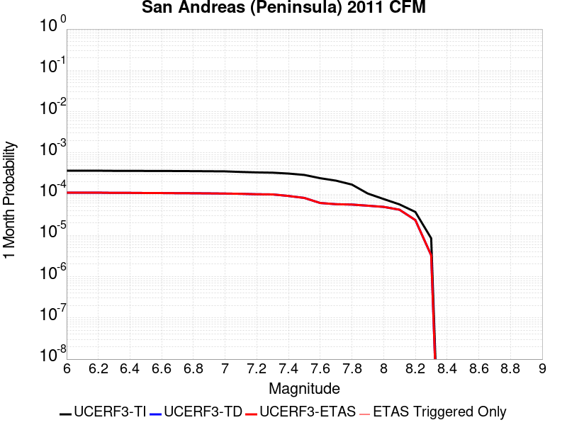 | 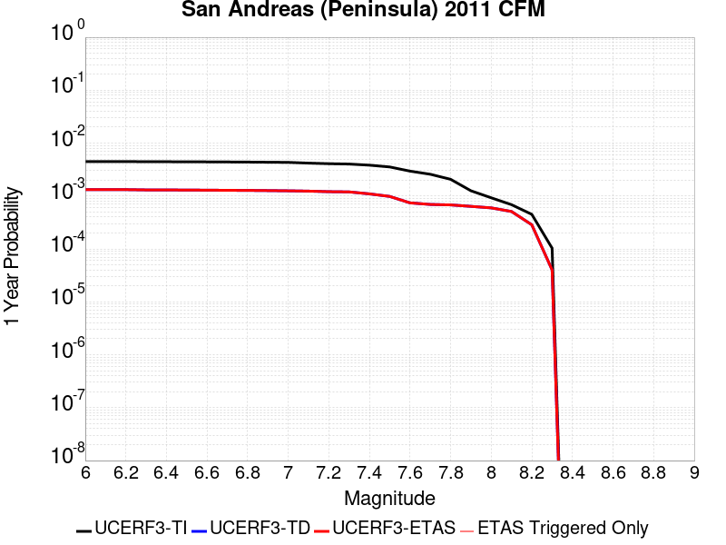 |  |

| Magnitude | 1 wk TI Prob | 1 wk TD Prob | 1 wk ETAS Prob | 1 wk ETAS/TD Gain | 1 wk ETAS Triggered Only | 1 mo TI Prob | 1 mo TD Prob | 1 mo ETAS Prob | 1 mo ETAS/TD Gain | 1 mo ETAS Triggered Only | 1 yr TI Prob | 1 yr TD Prob | 1 yr ETAS Prob | 1 yr ETAS/TD Gain | 1 yr ETAS Triggered Only | 10 yr TI Prob | 10 yr TD Prob | 10 yr ETAS Prob | 10 yr ETAS/TD Gain | 10 yr ETAS Triggered Only |
|-----|-----|-----|-----|-----|-----|-----|-----|-----|-----|-----|-----|-----|-----|-----|-----|-----|-----|-----|-----|-----|
| 6.0 | 8.6200685E-5 | 2.5333706E-5 | 2.5333706E-5 | 1.0 | 0.0 | 3.6937918E-4 | 1.08568514E-4 | 1.08568514E-4 | 1.0 | 0.0 | 0.0044879215 | 0.0013210218 | 0.0013210218 | 1.0 | 0.0 | 0.043983612 | 0.014838956 | 0.014849189 | 1.0006896 | 1.0386697E-5 |
| 6.1 | 8.6200685E-5 | 2.5333706E-5 | 2.5333706E-5 | 1.0 | 0.0 | 3.6937918E-4 | 1.08568514E-4 | 1.08568514E-4 | 1.0 | 0.0 | 0.0044879215 | 0.0013210218 | 0.0013210218 | 1.0 | 0.0 | 0.043983612 | 0.014838956 | 0.014849189 | 1.0006896 | 1.0386697E-5 |
| 6.2 | 8.6200685E-5 | 2.5333706E-5 | 2.5333706E-5 | 1.0 | 0.0 | 3.6937918E-4 | 1.08568514E-4 | 1.08568514E-4 | 1.0 | 0.0 | 0.0044879215 | 0.0013210218 | 0.0013210218 | 1.0 | 0.0 | 0.043983612 | 0.014838956 | 0.014849189 | 1.0006896 | 1.0386697E-5 |
| 6.3 | 8.551163E-5 | 2.5024961E-5 | 2.5024961E-5 | 1.0 | 0.0 | 3.6642692E-4 | 1.0724543E-4 | 1.0724543E-4 | 1.0 | 0.0 | 0.004452125 | 0.0013049326 | 0.0013049326 | 1.0 | 0.0 | 0.043639794 | 0.014665611 | 0.014675845 | 1.0006979 | 1.0386697E-5 |
| 6.4 | 8.551163E-5 | 2.5024961E-5 | 2.5024961E-5 | 1.0 | 0.0 | 3.6642692E-4 | 1.0724543E-4 | 1.0724543E-4 | 1.0 | 0.0 | 0.004452125 | 0.0013049326 | 0.0013049326 | 1.0 | 0.0 | 0.043639794 | 0.014665611 | 0.014675845 | 1.0006979 | 1.0386697E-5 |
| 6.5 | 8.511146E-5 | 2.4846031E-5 | 2.4846031E-5 | 1.0 | 0.0 | 3.647124E-4 | 1.0647865E-4 | 1.0647865E-4 | 1.0 | 0.0 | 0.004431336 | 0.0012956082 | 0.0012956082 | 1.0 | 0.0 | 0.04344007 | 0.014565198 | 0.014575433 | 1.0007027 | 1.0386697E-5 |
| 6.6 | 8.4985084E-5 | 2.477655E-5 | 2.477655E-5 | 1.0 | 0.0 | 3.6417096E-4 | 1.061809E-4 | 1.061809E-4 | 1.0 | 0.0 | 0.0044247704 | 0.0012919875 | 0.0012919875 | 1.0 | 0.0 | 0.043376986 | 0.014527207 | 0.0145374425 | 1.0007046 | 1.0386697E-5 |
| 6.7 | 8.462618E-5 | 2.4604726E-5 | 2.4604726E-5 | 1.0 | 0.0 | 3.6263323E-4 | 1.05444575E-4 | 1.05444575E-4 | 1.0 | 0.0 | 0.004406125 | 0.0012830333 | 0.0012830333 | 1.0 | 0.0 | 0.043197807 | 0.01443185 | 0.014442087 | 1.0007093 | 1.0386697E-5 |
| 6.8 | 8.42337E-5 | 2.4500272E-5 | 2.4500272E-5 | 1.0 | 0.0 | 3.6095164E-4 | 1.0499695E-4 | 1.0499695E-4 | 1.0 | 0.0 | 0.004385734 | 0.0012775898 | 0.0012775898 | 1.0 | 0.0 | 0.043001823 | 0.014372395 | 0.014382633 | 1.0007123 | 1.0386697E-5 |
| 6.9 | 8.365989E-5 | 2.4304522E-5 | 2.4304522E-5 | 1.0 | 0.0 | 3.5849313E-4 | 1.0415808E-4 | 1.0415808E-4 | 1.0 | 0.0 | 0.004355922 | 0.0012673886 | 0.0012673886 | 1.0 | 0.0 | 0.04271523 | 0.014264696 | 0.014274935 | 1.0007178 | 1.0386697E-5 |
| 7.0 | 8.30936E-5 | 2.4065685E-5 | 2.4065685E-5 | 1.0 | 0.0 | 3.560668E-4 | 1.0313458E-4 | 1.0313458E-4 | 1.0 | 0.0 | 0.004326499 | 0.0012549418 | 0.0012549418 | 1.0 | 0.0 | 0.042432297 | 0.0141355125 | 0.014145752 | 1.0007244 | 1.0386697E-5 |
| 7.1 | 8.041264E-5 | 2.3751329E-5 | 2.3751329E-5 | 1.0 | 0.0 | 3.4458007E-4 | 1.01787446E-4 | 1.01787446E-4 | 1.0 | 0.0 | 0.0041871946 | 0.0012385593 | 0.0012385593 | 1.0 | 0.0 | 0.041091725 | 0.013957874 | 0.013968116 | 1.0007337 | 1.0386697E-5 |
| 7.2 | 7.8427016E-5 | 2.3174005E-5 | 2.3174005E-5 | 1.0 | 0.0 | 3.3607247E-4 | 9.931339E-5 | 9.931339E-5 | 1.0 | 0.0 | 0.004084008 | 0.0012084715 | 0.0012084715 | 1.0 | 0.0 | 0.040097635 | 0.013641416 | 0.013651661 | 1.000751 | 1.0386697E-5 |
| 7.3 | 7.721087E-5 | 2.2958477E-5 | 2.2958477E-5 | 1.0 | 0.0 | 3.3086175E-4 | 9.838976E-5 | 9.838976E-5 | 1.0 | 0.0 | 0.004020803 | 0.0011972387 | 0.0011972387 | 1.0 | 0.0 | 0.03948827 | 0.013524936 | 0.013535182 | 1.0007576 | 1.0386697E-5 |
| 7.4 | 7.3536525E-5 | 2.1064485E-5 | 2.1064485E-5 | 1.0 | 0.0 | 3.1511846E-4 | 9.027325E-5 | 9.027325E-5 | 1.0 | 0.0 | 0.0038298194 | 0.001098524 | 0.001098524 | 1.0 | 0.0 | 0.037644852 | 0.01247618 | 0.012486436 | 1.0008222 | 1.0386697E-5 |
| 7.5 | 6.806207E-5 | 1.8855704E-5 | 1.8855704E-5 | 1.0 | 0.0 | 2.9166197E-4 | 8.080766E-5 | 8.080766E-5 | 1.0 | 0.0 | 0.0035452035 | 9.833903E-4 | 9.833903E-4 | 1.0 | 0.0 | 0.034891766 | 0.011221583 | 0.011231854 | 1.0009152 | 1.0386697E-5 |
| 7.6 | 5.6731416E-5 | 1.4235568E-5 | 1.4235568E-5 | 1.0 | 0.0 | 2.43112E-4 | 6.100815E-5 | 6.100815E-5 | 1.0 | 0.0 | 0.0029558712 | 7.4252125E-4 | 7.4252125E-4 | 1.0 | 0.0 | 0.02916862 | 0.008518306 | 0.008528604 | 1.0012089 | 1.0386697E-5 |
| 7.7 | 4.946994E-5 | 1.3298509E-5 | 1.3298509E-5 | 1.0 | 0.0 | 2.1199681E-4 | 5.6992365E-5 | 5.6992365E-5 | 1.0 | 0.0 | 0.002578006 | 6.936613E-4 | 6.936613E-4 | 1.0 | 0.0 | 0.02548303 | 0.007937518 | 0.007947823 | 1.0012982 | 1.0386697E-5 |
| 7.8 | 3.9718198E-5 | 1.3032537E-5 | 1.3032537E-5 | 1.0 | 0.0 | 1.7020974E-4 | 5.585253E-5 | 5.585253E-5 | 1.0 | 0.0 | 0.0020703338 | 6.7979255E-4 | 6.7979255E-4 | 1.0 | 0.0 | 0.020511515 | 0.007746509 | 0.0077568153 | 1.0013305 | 1.0386697E-5 |
| 7.9 | 2.4115114E-5 | 1.2229653E-5 | 1.2229653E-5 | 1.0 | 0.0 | 1.0334639E-4 | 5.2411746E-5 | 5.2411746E-5 | 1.0 | 0.0 | 0.001257516 | 6.3792634E-4 | 6.3792634E-4 | 1.0 | 0.0 | 0.012504238 | 0.0071830763 | 0.0071933884 | 1.0014356 | 1.0386697E-5 |
| 8.0 | 1.7756569E-5 | 1.144976E-5 | 1.144976E-5 | 1.0 | 0.0 | 7.6097356E-5 | 4.9069477E-5 | 4.9069477E-5 | 1.0 | 0.0 | 9.260915E-4 | 5.972573E-4 | 5.972573E-4 | 1.0 | 0.0 | 0.009222416 | 0.006680902 | 0.0066912193 | 1.0015444 | 1.0386697E-5 |
| 8.1 | 1.3159258E-5 | 9.77991E-6 | 9.77991E-6 | 1.0 | 0.0 | 5.6395602E-5 | 4.1913227E-5 | 4.1913227E-5 | 1.0 | 0.0 | 6.864001E-4 | 5.101742E-4 | 5.101742E-4 | 1.0 | 0.0 | 0.0068428386 | 0.0057076924 | 0.00571802 | 1.0018094 | 1.0386697E-5 |
| 8.2 | 8.635426E-6 | 5.4872503E-6 | 5.4872503E-6 | 1.0 | 0.0 | 3.700844E-5 | 2.3516575E-5 | 2.3516575E-5 | 1.0 | 0.0 | 4.5048463E-4 | 2.8627677E-4 | 2.8627677E-4 | 1.0 | 0.0 | 0.004495725 | 0.0032556232 | 0.0032556232 | 1.0 | 0.0 |
| 8.3 | 1.983087E-6 | 7.693574E-7 | 7.693574E-7 | 1.0 | 0.0 | 8.498917E-6 | 3.297242E-6 | 3.297242E-6 | 1.0 | 0.0 | 1.034694E-4 | 4.01432E-5 | 4.01432E-5 | 1.0 | 0.0 | 0.0010342124 | 4.7390026E-4 | 4.7390026E-4 | 1.0 | 0.0 |

## King Range 2011 CFM
*[(top)](#table-of-contents)*

| 1 Week | 1 Month | 1 Year | 10 Year |
|-----|-----|-----|-----|
|  | 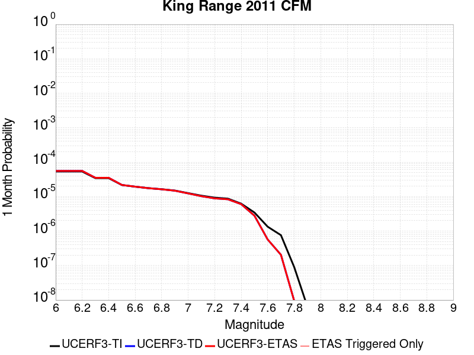 |  |  |

| Magnitude | 1 wk TI Prob | 1 wk TD Prob | 1 wk ETAS Prob | 1 wk ETAS/TD Gain | 1 wk ETAS Triggered Only | 1 mo TI Prob | 1 mo TD Prob | 1 mo ETAS Prob | 1 mo ETAS/TD Gain | 1 mo ETAS Triggered Only | 1 yr TI Prob | 1 yr TD Prob | 1 yr ETAS Prob | 1 yr ETAS/TD Gain | 1 yr ETAS Triggered Only | 10 yr TI Prob | 10 yr TD Prob | 10 yr ETAS Prob | 10 yr ETAS/TD Gain | 10 yr ETAS Triggered Only |
|-----|-----|-----|-----|-----|-----|-----|-----|-----|-----|-----|-----|-----|-----|-----|-----|-----|-----|-----|-----|-----|
| 6.0 | 1.2462566E-5 | 1.3022681E-5 | 1.3022681E-5 | 1.0 | 0.0 | 5.34099E-5 | 5.5810495E-5 | 5.5810495E-5 | 1.0 | 0.0 | 6.5007154E-4 | 6.793158E-4 | 6.793158E-4 | 1.0 | 0.0 | 0.0064817313 | 0.0067767757 | 0.006787092 | 1.0015223 | 1.0386697E-5 |
| 6.1 | 1.2462566E-5 | 1.3022681E-5 | 1.3022681E-5 | 1.0 | 0.0 | 5.34099E-5 | 5.5810495E-5 | 5.5810495E-5 | 1.0 | 0.0 | 6.5007154E-4 | 6.793158E-4 | 6.793158E-4 | 1.0 | 0.0 | 0.0064817313 | 0.0067767757 | 0.006787092 | 1.0015223 | 1.0386697E-5 |
| 6.2 | 1.2462566E-5 | 1.3022681E-5 | 1.3022681E-5 | 1.0 | 0.0 | 5.34099E-5 | 5.5810495E-5 | 5.5810495E-5 | 1.0 | 0.0 | 6.5007154E-4 | 6.793158E-4 | 6.793158E-4 | 1.0 | 0.0 | 0.0064817313 | 0.0067767757 | 0.006787092 | 1.0015223 | 1.0386697E-5 |
| 6.3 | 7.988484E-6 | 8.213607E-6 | 8.213607E-6 | 1.0 | 0.0 | 3.423591E-5 | 3.520077E-5 | 3.520077E-5 | 1.0 | 0.0 | 4.1674246E-4 | 4.2849802E-4 | 4.2849802E-4 | 1.0 | 0.0 | 0.004159618 | 0.0042789313 | 0.0042892736 | 1.002417 | 1.0386697E-5 |
| 6.4 | 7.988484E-6 | 8.213607E-6 | 8.213607E-6 | 1.0 | 0.0 | 3.423591E-5 | 3.520077E-5 | 3.520077E-5 | 1.0 | 0.0 | 4.1674246E-4 | 4.2849802E-4 | 4.2849802E-4 | 1.0 | 0.0 | 0.004159618 | 0.0042789313 | 0.0042892736 | 1.002417 | 1.0386697E-5 |
| 6.5 | 5.0522513E-6 | 5.0819626E-6 | 5.0819626E-6 | 1.0 | 0.0 | 2.1652326E-5 | 2.1779662E-5 | 2.1779662E-5 | 1.0 | 0.0 | 2.6358519E-4 | 2.6513607E-4 | 2.6513607E-4 | 1.0 | 0.0 | 0.0026327274 | 0.0026492323 | 0.0026492323 | 1.0 | 0.0 |
| 6.6 | 4.53682E-6 | 4.5386473E-6 | 4.5386473E-6 | 1.0 | 0.0 | 1.944337E-5 | 1.9451203E-5 | 1.9451203E-5 | 1.0 | 0.0 | 2.3669732E-4 | 2.3679328E-4 | 2.3679328E-4 | 1.0 | 0.0 | 0.0023644536 | 0.0023664122 | 0.0023664122 | 1.0 | 0.0 |
| 6.7 | 4.1144335E-6 | 4.096668E-6 | 4.096668E-6 | 1.0 | 0.0 | 1.7633167E-5 | 1.7557033E-5 | 1.7557033E-5 | 1.0 | 0.0 | 2.1466266E-4 | 2.1373629E-4 | 2.1373629E-4 | 1.0 | 0.0 | 0.0021445542 | 0.002136289 | 0.002136289 | 1.0 | 0.0 |
| 6.8 | 3.8321214E-6 | 3.8071091E-6 | 3.8071091E-6 | 1.0 | 0.0 | 1.6423275E-5 | 1.6316082E-5 | 1.6316082E-5 | 1.0 | 0.0 | 1.9993502E-4 | 1.9863051E-4 | 1.9863051E-4 | 1.0 | 0.0 | 0.0019975523 | 0.0019855052 | 0.0019855052 | 1.0 | 0.0 |
| 6.9 | 3.4999944E-6 | 3.4635357E-6 | 3.4635357E-6 | 1.0 | 0.0 | 1.499989E-5 | 1.4843641E-5 | 1.4843641E-5 | 1.0 | 0.0 | 1.8260835E-4 | 1.807066E-4 | 1.807066E-4 | 1.0 | 0.0 | 0.0018245836 | 0.0018065642 | 0.0018065642 | 1.0 | 0.0 |
| 7.0 | 2.9470837E-6 | 2.886615E-6 | 2.886615E-6 | 1.0 | 0.0 | 1.26302975E-5 | 1.2371149E-5 | 1.2371149E-5 | 1.0 | 0.0 | 1.5376302E-4 | 1.5060851E-4 | 1.5060851E-4 | 1.0 | 0.0 | 0.0015365666 | 0.0015060225 | 0.0015060225 | 1.0 | 0.0 |
| 7.1 | 2.4850247E-6 | 2.3978641E-6 | 2.3978641E-6 | 1.0 | 0.0 | 1.0650062E-5 | 1.0276521E-5 | 1.0276521E-5 | 1.0 | 0.0 | 1.296568E-4 | 1.251096E-4 | 1.251096E-4 | 1.0 | 0.0 | 0.0012958117 | 0.001251343 | 0.001251343 | 1.0 | 0.0 |
| 7.2 | 2.1800304E-6 | 2.0761452E-6 | 2.0761452E-6 | 1.0 | 0.0 | 9.342954E-6 | 8.897735E-6 | 8.897735E-6 | 1.0 | 0.0 | 1.1374453E-4 | 1.0832463E-4 | 1.0832463E-4 | 1.0 | 0.0 | 0.0011368633 | 0.0010836545 | 0.0010836545 | 1.0 | 0.0 |
| 7.3 | 2.0378504E-6 | 1.9497127E-6 | 1.9497127E-6 | 1.0 | 0.0 | 8.733615E-6 | 8.355884E-6 | 8.355884E-6 | 1.0 | 0.0 | 1.0632657E-4 | 1.01728234E-4 | 1.01728234E-4 | 1.0 | 0.0 | 0.0010627571 | 0.0010177369 | 0.0010177369 | 1.0 | 0.0 |
| 7.4 | 1.4577047E-6 | 1.4095948E-6 | 1.4095948E-6 | 1.0 | 0.0 | 6.247291E-6 | 6.041107E-6 | 6.041107E-6 | 1.0 | 0.0 | 7.605811E-5 | 7.354807E-5 | 7.354807E-5 | 1.0 | 0.0 | 7.603208E-4 | 7.360935E-4 | 7.360935E-4 | 1.0 | 0.0 |
| 7.5 | 8.0685743E-7 | 6.5369085E-7 | 6.5369085E-7 | 1.0 | 0.0 | 3.457956E-6 | 2.8015295E-6 | 2.8015295E-6 | 1.0 | 0.0 | 4.20998E-5 | 3.4108136E-5 | 3.4108136E-5 | 1.0 | 0.0 | 4.2091825E-4 | 3.4172926E-4 | 3.4172926E-4 | 1.0 | 0.0 |
| 7.6 | 3.1239435E-7 | 1.328313E-7 | 1.328313E-7 | 1.0 | 0.0 | 1.3388321E-6 | 5.692769E-7 | 5.692769E-7 | 1.0 | 0.0 | 1.630016E-5 | 6.930925E-6 | 6.930925E-6 | 1.0 | 0.0 | 1.6298964E-4 | 6.996017E-5 | 6.996017E-5 | 1.0 | 0.0 |
| 7.7 | 1.7747207E-7 | 4.780875E-8 | 4.780875E-8 | 1.0 | 0.0 | 7.605944E-7 | 2.0489465E-7 | 2.0489465E-7 | 1.0 | 0.0 | 9.260198E-6 | 2.4945896E-6 | 2.4945896E-6 | 1.0 | 0.0 | 9.2598115E-5 | 2.5362822E-5 | 2.5362822E-5 | 1.0 | 0.0 |
| 7.8 | 2.1035538E-8 | 2.2039959E-9 | 2.2039959E-9 | 1.0 | 0.0 | 9.0152305E-8 | 9.445699E-9 | 9.445699E-9 | 1.0 | 0.0 | 1.0976038E-6 | 1.15001384E-7 | 1.15001384E-7 | 1.0 | 0.0 | 1.0975983E-5 | 1.1868175E-6 | 1.1868175E-6 | 1.0 | 0.0 |
| 7.9 | 1.4782963E-9 | 8.870682E-13 | 8.870682E-13 | 1.0 | 0.0 | 6.335555E-9 | 3.802181E-12 | 3.802181E-12 | 1.0 | 0.0 | 7.713538E-8 | 4.6294857E-11 | 4.6294857E-11 | 1.0 | 0.0 | 7.7135354E-7 | 6.685621E-10 | 6.685621E-10 | 1.0 | 0.0 |

## Greenville (No) 2011 CFM
*[(top)](#table-of-contents)*

| 1 Week | 1 Month | 1 Year | 10 Year |
|-----|-----|-----|-----|
|  |  |  |  |

| Magnitude | 1 wk TI Prob | 1 wk TD Prob | 1 wk ETAS Prob | 1 wk ETAS/TD Gain | 1 wk ETAS Triggered Only | 1 mo TI Prob | 1 mo TD Prob | 1 mo ETAS Prob | 1 mo ETAS/TD Gain | 1 mo ETAS Triggered Only | 1 yr TI Prob | 1 yr TD Prob | 1 yr ETAS Prob | 1 yr ETAS/TD Gain | 1 yr ETAS Triggered Only | 10 yr TI Prob | 10 yr TD Prob | 10 yr ETAS Prob | 10 yr ETAS/TD Gain | 10 yr ETAS Triggered Only |
|-----|-----|-----|-----|-----|-----|-----|-----|-----|-----|-----|-----|-----|-----|-----|-----|-----|-----|-----|-----|-----|
| 6.0 | 3.286654E-5 | 4.0370305E-5 | 4.0370305E-5 | 1.0 | 0.0 | 1.4084899E-4 | 1.7300434E-4 | 1.7300434E-4 | 1.0 | 0.0 | 0.0017134876 | 0.0021043313 | 0.0021146962 | 1.0049255 | 1.0386697E-5 | 0.017003356 | 0.020848935 | 0.020859106 | 1.0004878 | 1.0386697E-5 |
| 6.1 | 3.286654E-5 | 4.0370305E-5 | 4.0370305E-5 | 1.0 | 0.0 | 1.4084899E-4 | 1.7300434E-4 | 1.7300434E-4 | 1.0 | 0.0 | 0.0017134876 | 0.0021043313 | 0.0021146962 | 1.0049255 | 1.0386697E-5 | 0.017003356 | 0.020848935 | 0.020859106 | 1.0004878 | 1.0386697E-5 |
| 6.2 | 3.1697953E-5 | 3.893303E-5 | 3.893303E-5 | 1.0 | 0.0 | 1.358413E-4 | 1.6684539E-4 | 1.6684539E-4 | 1.0 | 0.0 | 0.0016526132 | 0.0020294883 | 0.002039854 | 1.0051075 | 1.0386697E-5 | 0.01640377 | 0.020114241 | 0.02012442 | 1.000506 | 1.0386697E-5 |
| 6.3 | 3.1363317E-5 | 3.852186E-5 | 3.852186E-5 | 1.0 | 0.0 | 1.344073E-4 | 1.6508345E-4 | 1.6508345E-4 | 1.0 | 0.0 | 0.0016351803 | 0.0020080763 | 0.0020184421 | 1.0051621 | 1.0386697E-5 | 0.016232004 | 0.019903986 | 0.019914165 | 1.0005114 | 1.0386697E-5 |
| 6.4 | 3.0228604E-5 | 3.7128826E-5 | 3.7128826E-5 | 1.0 | 0.0 | 1.2954473E-4 | 1.5911405E-4 | 1.5911405E-4 | 1.0 | 0.0 | 0.0015760659 | 0.0019355294 | 0.0019458961 | 1.005356 | 1.0386697E-5 | 0.015649348 | 0.01919124 | 0.01920143 | 1.0005308 | 1.0386697E-5 |
| 6.5 | 2.9537814E-5 | 3.6284182E-5 | 3.6284182E-5 | 1.0 | 0.0 | 1.2658449E-4 | 1.5549458E-4 | 1.5549458E-4 | 1.0 | 0.0 | 0.0015400766 | 0.0018915395 | 0.0019019067 | 1.0054808 | 1.0386697E-5 | 0.01529447 | 0.018758854 | 0.018769044 | 1.0005434 | 1.0386697E-5 |
| 6.6 | 2.7345395E-5 | 3.3593187E-5 | 3.3593187E-5 | 1.0 | 0.0 | 1.1718928E-4 | 1.4396304E-4 | 1.4396304E-4 | 1.0 | 0.0 | 0.0014258457 | 0.0017513721 | 0.0017617405 | 1.0059202 | 1.0386697E-5 | 0.014167317 | 0.017379513 | 0.01738972 | 1.0005872 | 1.0386697E-5 |
| 6.7 | 2.5615784E-5 | 3.1569907E-5 | 3.1569907E-5 | 1.0 | 0.0 | 1.09777306E-4 | 1.3529275E-4 | 1.3529275E-4 | 1.0 | 0.0 | 0.0013357193 | 0.0016459755 | 0.0016563451 | 1.0063 | 1.0386697E-5 | 0.013277191 | 0.016341515 | 0.016351731 | 1.0006253 | 1.0386697E-5 |
| 6.8 | 2.0059057E-5 | 2.4714045E-5 | 2.4714045E-5 | 1.0 | 0.0 | 8.596455E-5 | 1.05913125E-4 | 1.05913125E-4 | 1.0 | 0.0 | 0.0010461159 | 0.0012887459 | 0.0012991192 | 1.0080491 | 1.0386697E-5 | 0.0104120495 | 0.01281474 | 0.012824994 | 1.0008001 | 1.0386697E-5 |
| 6.9 | 1.6321746E-5 | 2.018613E-5 | 2.018613E-5 | 1.0 | 0.0 | 6.9948466E-5 | 8.6509186E-5 | 8.6509186E-5 | 1.0 | 0.0 | 8.5128983E-4 | 0.0010527528 | 0.0010631286 | 1.0098559 | 1.0386697E-5 | 0.008480361 | 0.010479186 | 0.010489464 | 1.0009807 | 1.0386697E-5 |
| 7.0 | 1.22527645E-5 | 1.5136626E-5 | 1.5136626E-5 | 1.0 | 0.0 | 5.2510793E-5 | 6.4869666E-5 | 6.4869666E-5 | 1.0 | 0.0 | 6.3913135E-4 | 7.8950624E-4 | 7.8950624E-4 | 1.0 | 0.0 | 0.0063729626 | 0.007867651 | 0.007867651 | 1.0 | 0.0 |
| 7.1 | 8.996482E-6 | 1.11656E-5 | 1.11656E-5 | 1.0 | 0.0 | 3.8555783E-5 | 4.78517E-5 | 4.78517E-5 | 1.0 | 0.0 | 4.6931554E-4 | 5.8243994E-4 | 5.8243994E-4 | 1.0 | 0.0 | 0.004683256 | 0.005809426 | 0.005809426 | 1.0 | 0.0 |
| 7.2 | 6.0273087E-6 | 7.5699013E-6 | 7.5699013E-6 | 1.0 | 0.0 | 2.5831067E-5 | 3.2442033E-5 | 3.2442033E-5 | 1.0 | 0.0 | 3.1444785E-4 | 3.9491086E-4 | 3.9491086E-4 | 1.0 | 0.0 | 0.0031400328 | 0.003942288 | 0.003942288 | 1.0 | 0.0 |
| 7.3 | 3.1209995E-6 | 3.966625E-6 | 3.966625E-6 | 1.0 | 0.0 | 1.3375643E-5 | 1.6999711E-5 | 1.6999711E-5 | 1.0 | 0.0 | 1.6283628E-4 | 2.0695198E-4 | 2.0695198E-4 | 1.0 | 0.0 | 0.0016271701 | 0.0020676828 | 0.0020676828 | 1.0 | 0.0 |
| 7.4 | 2.0254208E-6 | 2.6098012E-6 | 2.6098012E-6 | 1.0 | 0.0 | 8.680347E-6 | 1.1184815E-5 | 1.1184815E-5 | 1.0 | 0.0 | 1.0567809E-4 | 1.3616667E-4 | 1.3616667E-4 | 1.0 | 0.0 | 0.0010562785 | 0.0013608891 | 0.0013608891 | 1.0 | 0.0 |
| 7.5 | 1.6763418E-6 | 2.173485E-6 | 2.173485E-6 | 1.0 | 0.0 | 7.184302E-6 | 9.314903E-6 | 9.314903E-6 | 1.0 | 0.0 | 8.746537E-5 | 1.134031E-4 | 1.134031E-4 | 1.0 | 0.0 | 8.743095E-4 | 0.0011334992 | 0.0011334992 | 1.0 | 0.0 |
| 7.6 | 1.1935462E-6 | 1.5459694E-6 | 1.5459694E-6 | 1.0 | 0.0 | 5.115188E-6 | 6.6255666E-6 | 6.6255666E-6 | 1.0 | 0.0 | 6.2275634E-5 | 8.066333E-5 | 8.066333E-5 | 1.0 | 0.0 | 6.2258187E-4 | 8.063712E-4 | 8.063712E-4 | 1.0 | 0.0 |
| 7.7 | 3.0464201E-7 | 3.9847407E-7 | 3.9847407E-7 | 1.0 | 0.0 | 1.3056081E-6 | 1.7077449E-6 | 1.7077449E-6 | 1.0 | 0.0 | 1.589566E-5 | 2.07916E-5 | 2.07916E-5 | 1.0 | 0.0 | 1.5894524E-4 | 2.0790126E-4 | 2.0790126E-4 | 1.0 | 0.0 |

## Great Valley 10 (Panoche)
*[(top)](#table-of-contents)*

| 1 Week | 1 Month | 1 Year | 10 Year |
|-----|-----|-----|-----|
|  |  |  |  |

| Magnitude | 1 wk TI Prob | 1 wk TD Prob | 1 wk ETAS Prob | 1 wk ETAS/TD Gain | 1 wk ETAS Triggered Only | 1 mo TI Prob | 1 mo TD Prob | 1 mo ETAS Prob | 1 mo ETAS/TD Gain | 1 mo ETAS Triggered Only | 1 yr TI Prob | 1 yr TD Prob | 1 yr ETAS Prob | 1 yr ETAS/TD Gain | 1 yr ETAS Triggered Only | 10 yr TI Prob | 10 yr TD Prob | 10 yr ETAS Prob | 10 yr ETAS/TD Gain | 10 yr ETAS Triggered Only |
|-----|-----|-----|-----|-----|-----|-----|-----|-----|-----|-----|-----|-----|-----|-----|-----|-----|-----|-----|-----|-----|
| 6.0 | 1.6014626E-5 | 1.6576827E-5 | 1.6576827E-5 | 1.0 | 0.0 | 6.863231E-5 | 7.104153E-5 | 7.104153E-5 | 1.0 | 0.0 | 8.35278E-4 | 8.645928E-4 | 8.645928E-4 | 1.0 | 0.0 | 0.008321454 | 0.008612909 | 0.008623207 | 1.0011955 | 1.0386697E-5 |
| 6.1 | 1.6014626E-5 | 1.6576827E-5 | 1.6576827E-5 | 1.0 | 0.0 | 6.863231E-5 | 7.104153E-5 | 7.104153E-5 | 1.0 | 0.0 | 8.35278E-4 | 8.645928E-4 | 8.645928E-4 | 1.0 | 0.0 | 0.008321454 | 0.008612909 | 0.008623207 | 1.0011955 | 1.0386697E-5 |
| 6.2 | 1.56782E-5 | 1.619985E-5 | 1.619985E-5 | 1.0 | 0.0 | 6.719056E-5 | 6.9426E-5 | 6.9426E-5 | 1.0 | 0.0 | 8.17738E-4 | 8.449391E-4 | 8.449391E-4 | 1.0 | 0.0 | 0.008147354 | 0.008417873 | 0.008428172 | 1.0012234 | 1.0386697E-5 |
| 6.3 | 1.5263338E-5 | 1.5724881E-5 | 1.5724881E-5 | 1.0 | 0.0 | 6.541267E-5 | 6.739053E-5 | 6.739053E-5 | 1.0 | 0.0 | 7.961082E-4 | 8.2017604E-4 | 8.2017604E-4 | 1.0 | 0.0 | 0.007932622 | 0.008172084 | 0.008182385 | 1.0012606 | 1.0386697E-5 |
| 6.4 | 1.4720723E-5 | 1.5100693E-5 | 1.5100693E-5 | 1.0 | 0.0 | 6.308728E-5 | 6.471557E-5 | 6.471557E-5 | 1.0 | 0.0 | 7.67817E-4 | 7.8763237E-4 | 7.8763237E-4 | 1.0 | 0.0 | 0.007651695 | 0.007848985 | 0.00785929 | 1.001313 | 1.0386697E-5 |
| 6.5 | 1.408264E-5 | 1.43572215E-5 | 1.43572215E-5 | 1.0 | 0.0 | 6.0352773E-5 | 6.152942E-5 | 6.152942E-5 | 1.0 | 0.0 | 7.3454727E-4 | 7.488682E-4 | 7.488682E-4 | 1.0 | 0.0 | 0.0073212404 | 0.0074640037 | 0.0074743126 | 1.0013812 | 1.0386697E-5 |
| 6.6 | 1.3197086E-5 | 1.3323049E-5 | 1.3323049E-5 | 1.0 | 0.0 | 5.6557717E-5 | 5.7097448E-5 | 5.7097448E-5 | 1.0 | 0.0 | 6.8837265E-4 | 6.9494464E-4 | 6.9494464E-4 | 1.0 | 0.0 | 0.006862442 | 0.006928254 | 0.006938569 | 1.0014888 | 1.0386697E-5 |
| 6.7 | 1.017583E-5 | 9.746192E-6 | 9.746192E-6 | 1.0 | 0.0 | 4.360997E-5 | 4.1768737E-5 | 4.1768737E-5 | 1.0 | 0.0 | 5.30822E-4 | 5.0841813E-4 | 5.0841813E-4 | 1.0 | 0.0 | 0.0052955584 | 0.0050728023 | 0.0050728023 | 1.0 | 0.0 |
| 6.8 | 8.557912E-6 | 7.87336E-6 | 7.87336E-6 | 1.0 | 0.0 | 3.667625E-5 | 3.3742548E-5 | 3.3742548E-5 | 1.0 | 0.0 | 4.4644187E-4 | 4.107401E-4 | 4.107401E-4 | 1.0 | 0.0 | 0.0044554602 | 0.0041000163 | 0.0041000163 | 1.0 | 0.0 |
| 6.9 | 6.14664E-6 | 5.0924978E-6 | 5.0924978E-6 | 1.0 | 0.0 | 2.6342475E-5 | 2.1824815E-5 | 2.1824815E-5 | 1.0 | 0.0 | 3.2067244E-4 | 2.656861E-4 | 2.656861E-4 | 1.0 | 0.0 | 0.003202101 | 0.002653823 | 0.002653823 | 1.0 | 0.0 |
| 7.0 | 3.2310581E-6 | 1.69525E-6 | 1.69525E-6 | 1.0 | 0.0 | 1.3847319E-5 | 7.265338E-6 | 7.265338E-6 | 1.0 | 0.0 | 1.6857806E-4 | 8.845199E-5 | 8.845199E-5 | 1.0 | 0.0 | 0.0016845023 | 8.841772E-4 | 8.841772E-4 | 1.0 | 0.0 |
| 7.1 | 2.544492E-6 | 9.189664E-7 | 9.189664E-7 | 1.0 | 0.0 | 1.090492E-5 | 3.9384217E-6 | 3.9384217E-6 | 1.0 | 0.0 | 1.327593E-4 | 4.794928E-5 | 4.794928E-5 | 1.0 | 0.0 | 0.0013268003 | 4.793941E-4 | 4.793941E-4 | 1.0 | 0.0 |
| 7.2 | 2.4479045E-6 | 8.842009E-7 | 8.842009E-7 | 1.0 | 0.0 | 1.0490977E-5 | 3.7894272E-6 | 3.7894272E-6 | 1.0 | 0.0 | 1.2772017E-4 | 4.613535E-5 | 4.613535E-5 | 1.0 | 0.0 | 0.0012764678 | 4.6126242E-4 | 4.6126242E-4 | 1.0 | 0.0 |
| 7.3 | 2.0559578E-6 | 7.893378E-7 | 7.893378E-7 | 1.0 | 0.0 | 8.811218E-6 | 3.3828721E-6 | 3.3828721E-6 | 1.0 | 0.0 | 1.072713E-4 | 4.1185736E-5 | 4.1185736E-5 | 1.0 | 0.0 | 0.0010721954 | 4.1178567E-4 | 4.1178567E-4 | 1.0 | 0.0 |
| 7.4 | 1.727687E-6 | 7.388264E-7 | 7.388264E-7 | 1.0 | 0.0 | 7.404352E-6 | 3.1663951E-6 | 3.1663951E-6 | 1.0 | 0.0 | 9.0144255E-5 | 3.8550224E-5 | 3.8550224E-5 | 1.0 | 0.0 | 9.0107694E-4 | 3.8543998E-4 | 3.8543998E-4 | 1.0 | 0.0 |
| 7.5 | 1.5002679E-6 | 6.546582E-7 | 6.546582E-7 | 1.0 | 0.0 | 6.4297037E-6 | 2.8056752E-6 | 2.8056752E-6 | 1.0 | 0.0 | 7.827883E-5 | 3.4158602E-5 | 3.4158602E-5 | 1.0 | 0.0 | 7.825126E-4 | 3.4153767E-4 | 3.4153767E-4 | 1.0 | 0.0 |

