# Parent Section Magnitude-Probability Distributions

Only fault sections with at least one triggered aftershock are plotted. Sections are sorted by total supraseismogenic trigger rate (decreasing)

## Table Of Contents

* [Garlock (Central)](#garlock-central)
* [Tank Canyon](#tank-canyon)
* [Owl Lake](#owl-lake)
* [Little Lake](#little-lake)
* [Airport Lake](#airport-lake)
* [Panamint Valley](#panamint-valley)
* [Garlock (East)](#garlock-east)
* [Hunter Mountain-Saline Valley](#hunter-mountain-saline-valley)
* [Ash Hill](#ash-hill)
* [Blackwater](#blackwater)
* [Garlock (West)](#garlock-west)
* [McLean Lake](#mclean-lake)
* [Gravel Hills-Harper Lk](#gravel-hills-harper-lk)
* [Goldstone Lake](#goldstone-lake)
* [Death Valley (So)](#death-valley-so)
* [So Sierra Nevada](#so-sierra-nevada)
* [San Andreas (Mojave S)](#san-andreas-mojave-s)
* [Coyote Canyon](#coyote-canyon)
* [Nelson Lake](#nelson-lake)
* [San Andreas (Mojave N)](#san-andreas-mojave-n)
* [Towne Pass](#towne-pass)
* [Lenwood-Lockhart-Old Woman Springs](#lenwood-lockhart-old-woman-springs)
* [San Andreas (San Bernardino N)](#san-andreas-san-bernardino-n)
* [Garlic Springs](#garlic-springs)
* [Bicycle Lake](#bicycle-lake)
* [Death Valley (Black Mtns Frontal)](#death-valley-black-mtns-frontal)
* [Paradise](#paradise)
* [Death Valley (No)](#death-valley-no)
* [San Andreas (San Bernardino S)](#san-andreas-san-bernardino-s)
* [Sierra Nevada  (No Extension)](#sierra-nevada--no-extension)
* [Coyote Lake](#coyote-lake)
* [Death Valley (Fish Lake Valley)](#death-valley-fish-lake-valley)
* [Manix-Afton Hills](#manix-afton-hills)
* [San Andreas (Big Bend)](#san-andreas-big-bend)
* [San Andreas (Coachella) rev](#san-andreas-coachella-rev)
* [Cady](#cady)
* [Calico-Hidalgo](#calico-hidalgo)
* [San Andreas (San Gorgonio Pass-Garnet HIll)](#san-andreas-san-gorgonio-pass-garnet-hill)
* [Mission Ridge-Arroyo Parida-Santa Ana](#mission-ridge-arroyo-parida-santa-ana)
* [San Andreas (Parkfield)](#san-andreas-parkfield)
* [Helendale-So Lockhart](#helendale-so-lockhart)
* [Lake Isabella (Seismicity)](#lake-isabella-seismicity)
* [Scodie Lineament](#scodie-lineament)
* [Owens Valley](#owens-valley)
* [Baker](#baker)
* [Pinto Mtn](#pinto-mtn)
* [San Andreas (Cholame) rev](#san-andreas-cholame-rev)
* [San Jacinto (San Bernardino)](#san-jacinto-san-bernardino)
* [Santa Ynez (West)](#santa-ynez-west)
* [Independence rev 2011](#independence-rev-2011)
* [San Andreas (North Branch Mill Creek)](#san-andreas-north-branch-mill-creek)
* [Oceanic - West Huasna](#oceanic---west-huasna)
* [Pittville 2011 CFM](#pittville-2011-cfm)
* [Deep Springs](#deep-springs)
* [Ludlow](#ludlow)
* [Big Pine (East)](#big-pine-east)
* [Santa Cruz Island](#santa-cruz-island)
* [San Jacinto (Stepovers Combined)](#san-jacinto-stepovers-combined)
* [San Andreas (Carrizo) rev](#san-andreas-carrizo-rev)
* [White Wolf (Extension)](#white-wolf-extension)
* [San Jacinto (Anza) rev](#san-jacinto-anza-rev)
* [Hunting Creek - Berryessa 2011 CFM](#hunting-creek---berryessa-2011-cfm)
* [Rose Canyon](#rose-canyon)
* [Brawley (Seismic Zone) alt 1](#brawley-seismic-zone-alt-1)
* [Santa Ynez (East)](#santa-ynez-east)
* [Red Pass](#red-pass)
* [San Jacinto (San Jacinto Valley) rev](#san-jacinto-san-jacinto-valley-rev)
* [San Andreas (Creeping Section) 2011 CFM](#san-andreas-creeping-section-2011-cfm)
* [Imperial](#imperial)
* [Cleghorn Lake](#cleghorn-lake)
* [Palos Verdes](#palos-verdes)
* [San Clemente](#san-clemente)
* [Cleghorn](#cleghorn)
* [Mission Creek](#mission-creek)
* [San Andreas (North Coast) 2011 CFM](#san-andreas-north-coast-2011-cfm)
* [San Jacinto (Borrego)](#san-jacinto-borrego)
* [Blue Cut](#blue-cut)
* [Santa Rosa Island](#santa-rosa-island)
* [Hartley Springs 2011 CFM](#hartley-springs-2011-cfm)
* [Channel Islands Thrust](#channel-islands-thrust)
* [San Andreas (Offshore) 2011 CFM](#san-andreas-offshore-2011-cfm)
* [Monterey Bay-Tularcitos](#monterey-bay-tularcitos)
* [Los Osos 2011](#los-osos-2011)
* [Elsinore (Glen Ivy) rev](#elsinore-glen-ivy-rev)
* [Butano 2011 CFM](#butano-2011-cfm)
* [San Pedro Basin](#san-pedro-basin)
* [Pleito](#pleito)
* [Pitas Point (Lower West)](#pitas-point-lower-west)
* [Kern Canyon (North Kern) 2011](#kern-canyon-north-kern-2011)
* [Emerson-Copper Mtn 2011](#emerson-copper-mtn-2011)
* [Cucamonga](#cucamonga)
* [San Jacinto (Coyote Creek)](#san-jacinto-coyote-creek)
* [Mendocino](#mendocino)
* [Red Mountain](#red-mountain)
* [Jess Valley](#jess-valley)
* [North Frontal  (East)](#north-frontal--east)
* [Monte Vista - Shannon 2011 CFM](#monte-vista---shannon-2011-cfm)
* [San Luis Range - Oceano 2011 CFM](#san-luis-range---oceano-2011-cfm)
* [Great Valley 07 (Orestimba)](#great-valley-07-orestimba)
* [Hayward (So) 2011 CFM](#hayward-so-2011-cfm)
* [Sierra Madre](#sierra-madre)
* [Owens Valley Keough Hot Springs](#owens-valley-keough-hot-springs)
* [North Frontal  (West)](#north-frontal--west)
* [Homestead Valley 2011](#homestead-valley-2011)
* [San Jacinto (Lytle Creek connector)](#san-jacinto-lytle-creek-connector)
* [Mono Lake 2011 CFM](#mono-lake-2011-cfm)
* [Davis Creek](#davis-creek)
* [Coronado Bank alt1](#coronado-bank-alt1)
* [Camp Rock 2011](#camp-rock-2011)
* [Newport-Inglewood (Offshore)](#newport-inglewood-offshore)
* [Mission (connected) 2011 CFM](#mission-connected-2011-cfm)
* [Tin Mountain](#tin-mountain)
* [Big Pine (Central)](#big-pine-central)
* [Santa Ynez River](#santa-ynez-river)
* [San Andreas (Santa Cruz Mts) 2011 CFM](#san-andreas-santa-cruz-mts-2011-cfm)
* [Santa Cruz Catalina Ridge alt1](#santa-cruz-catalina-ridge-alt1)
* [Sheephole](#sheephole)
* [Chino alt 1](#chino-alt-1)
* [Pilarcitos 2011 CFM](#pilarcitos-2011-cfm)
* [San Andreas (Peninsula) 2011 CFM](#san-andreas-peninsula-2011-cfm)
* [King Range 2011 CFM](#king-range-2011-cfm)

## Garlock (Central)
*[(top)](#table-of-contents)*

| 1 Week | 1 Month | 1 Year | 10 Year |
|-----|-----|-----|-----|
|  |  |  |  |

| Magnitude | 1 wk TI Prob | 1 wk TD Prob | 1 wk ETAS Prob | 1 wk ETAS/TD Gain | 1 wk ETAS Triggered Only | 1 mo TI Prob | 1 mo TD Prob | 1 mo ETAS Prob | 1 mo ETAS/TD Gain | 1 mo ETAS Triggered Only | 1 yr TI Prob | 1 yr TD Prob | 1 yr ETAS Prob | 1 yr ETAS/TD Gain | 1 yr ETAS Triggered Only | 10 yr TI Prob | 10 yr TD Prob | 10 yr ETAS Prob | 10 yr ETAS/TD Gain | 10 yr ETAS Triggered Only |
|-----|-----|-----|-----|-----|-----|-----|-----|-----|-----|-----|-----|-----|-----|-----|-----|-----|-----|-----|-----|-----|
| 6.0 | 5.5131142E-5 | 7.027124E-5 | 0.003749605 | 53.359028 | 0.0036795924 | 2.3625491E-4 | 3.0112805E-4 | 0.012256202 | 40.700962 | 0.011958675 | 0.0028726095 | 0.0036601364 | 0.04610258 | 12.595863 | 0.04259836 | 0.028357591 | 0.036092084 | 0.10996077 | 3.0466726 | 0.076634586 |
| 6.1 | 5.5131142E-5 | 7.027124E-5 | 0.003749605 | 53.359028 | 0.0036795924 | 2.3625491E-4 | 3.0112805E-4 | 0.012256202 | 40.700962 | 0.011958675 | 0.0028726095 | 0.0036601364 | 0.04610258 | 12.595863 | 0.04259836 | 0.028357591 | 0.036092084 | 0.10996077 | 3.0466726 | 0.076634586 |
| 6.2 | 4.216245E-5 | 5.1683597E-5 | 0.0024574467 | 47.5479 | 0.0024058872 | 1.806837E-4 | 2.214825E-4 | 0.007968139 | 35.97638 | 0.0077483724 | 0.0021976046 | 0.0026932466 | 0.029545441 | 10.970196 | 0.02692471 | 0.021759989 | 0.026701005 | 0.07349952 | 2.7526875 | 0.048082367 |
| 6.3 | 4.216245E-5 | 5.1683597E-5 | 0.0024574467 | 47.5479 | 0.0024058872 | 1.806837E-4 | 2.214825E-4 | 0.007968139 | 35.97638 | 0.0077483724 | 0.0021976046 | 0.0026932466 | 0.029545441 | 10.970196 | 0.02692471 | 0.021759989 | 0.026701005 | 0.07349952 | 2.7526875 | 0.048082367 |
| 6.4 | 3.6858168E-5 | 4.4131746E-5 | 0.0018838467 | 42.686886 | 0.0018397962 | 1.5795401E-4 | 1.8912248E-4 | 0.0062380773 | 32.984325 | 0.006050099 | 0.0019213937 | 0.00230016 | 0.023338553 | 10.146491 | 0.021086896 | 0.019048655 | 0.022859743 | 0.059609674 | 2.6076267 | 0.03760968 |
| 6.5 | 3.39199E-5 | 4.0038896E-5 | 0.0015967272 | 39.879402 | 0.0015567506 | 1.453629E-4 | 1.715841E-4 | 0.005407029 | 31.51241 | 0.005236343 | 0.0017683565 | 0.0020870569 | 0.020729076 | 9.932205 | 0.018681008 | 0.017543508 | 0.020770492 | 0.053684022 | 2.5846293 | 0.033611663 |
| 6.6 | 3.3571985E-5 | 3.9493032E-5 | 0.0015961822 | 40.416805 | 0.0015567506 | 1.4387199E-4 | 1.6924499E-4 | 0.005404702 | 31.93419 | 0.005236343 | 0.0017502342 | 0.0020586322 | 0.020665875 | 10.038644 | 0.018645627 | 0.017365133 | 0.020491783 | 0.05334537 | 2.6032567 | 0.0335409 |
| 6.7 | 3.2580007E-5 | 3.8109323E-5 | 0.0015594213 | 40.919678 | 0.0015213699 | 1.3962112E-4 | 1.6331558E-4 | 0.005257304 | 32.191074 | 0.00509482 | 0.0016985617 | 0.0019865753 | 0.019853642 | 9.993904 | 0.017902633 | 0.016856372 | 0.019784356 | 0.05127444 | 2.591666 | 0.03212567 |
| 6.8 | 3.2185937E-5 | 3.7536465E-5 | 0.0015234699 | 40.5864 | 0.0014859892 | 1.3793244E-4 | 1.6086077E-4 | 0.0051841117 | 32.22732 | 0.0050240587 | 0.0016780337 | 0.001956742 | 0.019647786 | 10.041071 | 0.017725728 | 0.016654192 | 0.01949112 | 0.050504953 | 2.5911775 | 0.03163034 |
| 6.9 | 3.165394E-5 | 3.6740938E-5 | 0.0014519168 | 39.517685 | 0.0014152279 | 1.3565269E-4 | 1.5745178E-4 | 0.0051099695 | 32.454185 | 0.0049532973 | 0.0016503202 | 0.0019153113 | 0.019183334 | 10.015779 | 0.01730116 | 0.01638118 | 0.0190837 | 0.04924278 | 2.5803583 | 0.030745825 |
| 7.0 | 3.0903822E-5 | 3.564605E-5 | 0.0013093057 | 36.73074 | 0.001273705 | 1.3243823E-4 | 1.5275997E-4 | 0.0048222984 | 31.567818 | 0.004670252 | 0.0016112428 | 0.0018582871 | 0.018597573 | 10.007911 | 0.01677045 | 0.015996104 | 0.018522795 | 0.047830988 | 2.5822768 | 0.029861307 |
| 7.1 | 3.0069863E-5 | 3.441218E-5 | 0.001201935 | 34.9276 | 0.001167563 | 1.2886449E-4 | 1.4747256E-4 | 0.0045694076 | 30.984797 | 0.004422587 | 0.0015677959 | 0.0017940209 | 0.017898675 | 9.976849 | 0.016133597 | 0.01556781 | 0.017890377 | 0.04586229 | 2.5635176 | 0.028481461 |
| 7.2 | 2.7957109E-5 | 3.1301115E-5 | 0.0010573092 | 33.778645 | 0.0010260402 | 1.1981068E-4 | 1.3414085E-4 | 0.0040608714 | 30.27319 | 0.0039272574 | 0.0014577188 | 0.0016319609 | 0.015019361 | 9.20326 | 0.013409284 | 0.014481937 | 0.016293783 | 0.039542995 | 2.4268763 | 0.023634305 |
| 7.3 | 2.4519275E-5 | 2.6733265E-5 | 5.220498E-4 | 19.528095 | 4.9532973E-4 | 1.0507837E-4 | 1.1456619E-4 | 0.002414048 | 21.071207 | 0.0022997453 | 0.0012785783 | 0.0013939656 | 0.010509461 | 7.539254 | 0.009128219 | 0.012712469 | 0.013937555 | 0.029881177 | 2.1439326 | 0.016168978 |
| 7.4 | 2.3225532E-5 | 2.5217494E-5 | 4.1439533E-4 | 16.432852 | 3.8918765E-4 | 9.95342E-5 | 1.0807058E-4 | 0.0022306829 | 20.640984 | 0.0021228418 | 0.0012111551 | 0.0013149795 | 0.009512507 | 7.2339587 | 0.008208321 | 0.012045753 | 0.01315504 | 0.027435383 | 2.0855415 | 0.014470705 |
| 7.5 | 2.097765E-5 | 2.250088E-5 | 3.762999E-4 | 16.723783 | 3.5380697E-4 | 8.9901114E-5 | 9.6428856E-5 | 0.0017237839 | 17.876226 | 0.001627512 | 0.0010939965 | 0.0011734008 | 0.0077111493 | 6.5716243 | 0.0065454287 | 0.010886264 | 0.01174923 | 0.023147821 | 1.9701563 | 0.011534107 |
| 7.6 | 1.511254E-5 | 1.6007341E-5 | 1.2214773E-4 | 7.630732 | 1.0614209E-4 | 6.476642E-5 | 6.860113E-5 | 7.4078824E-4 | 10.798485 | 6.7223323E-4 | 7.882459E-4 | 8.3490653E-4 | 0.0039104572 | 4.6837063 | 0.0030781205 | 0.007854558 | 0.00839184 | 0.013899995 | 1.6563703 | 0.005554769 |
| 7.7 | 9.934069E-6 | 1.0693656E-5 | 1.0693656E-5 | 1.0 | 0.0 | 4.2573887E-5 | 4.582915E-5 | 1.16587296E-4 | 2.543955 | 7.0761394E-5 | 5.182138E-4 | 5.578274E-4 | 0.0012296856 | 2.2044196 | 6.7223323E-4 | 0.00517007 | 0.005635394 | 0.0070778276 | 1.2559597 | 0.0014506086 |
| 7.8 | 6.7562896E-6 | 8.440562E-6 | 8.440562E-6 | 1.0 | 0.0 | 2.8955206E-5 | 3.6173336E-5 | 1.0693217E-4 | 2.9561045 | 7.0761394E-5 | 3.5247262E-4 | 4.4032154E-4 | 0.0010061634 | 2.2850652 | 5.6609116E-4 | 0.0035191406 | 0.0044529405 | 0.005544858 | 1.2452127 | 0.0010968016 |
| 7.9 | 3.975453E-6 | 5.3784297E-6 | 5.3784297E-6 | 1.0 | 0.0 | 1.7037546E-5 | 2.305021E-5 | 2.305021E-5 | 1.0 | 0.0 | 2.0741238E-4 | 2.8060027E-4 | 5.635664E-4 | 2.0084314 | 2.8304558E-4 | 0.002072189 | 0.0028374717 | 0.0034725172 | 1.2238069 | 6.368525E-4 |
| 8.0 | 1.6729537E-6 | 2.0800776E-6 | 2.0800776E-6 | 1.0 | 0.0 | 7.169782E-6 | 8.914588E-6 | 8.914588E-6 | 1.0 | 0.0 | 8.7288594E-5 | 1.0852974E-4 | 2.5003718E-4 | 2.3038585 | 1.4152279E-4 | 8.7254314E-4 | 0.0010982669 | 0.0013456598 | 1.2252575 | 2.4766487E-4 |
| 8.1 | 3.6733252E-7 | 3.1526864E-7 | 3.1526864E-7 | 1.0 | 0.0 | 1.5742813E-6 | 1.3511507E-6 | 1.3511507E-6 | 1.0 | 0.0 | 1.9166706E-5 | 1.645015E-5 | 5.1830266E-5 | 3.150747 | 3.5380697E-5 | 1.9165053E-4 | 1.6658098E-4 | 2.3733058E-4 | 1.424716 | 7.0761394E-5 |

## Tank Canyon
*[(top)](#table-of-contents)*

| 1 Week | 1 Month | 1 Year | 10 Year |
|-----|-----|-----|-----|
|  |  |  |  |

| Magnitude | 1 wk TI Prob | 1 wk TD Prob | 1 wk ETAS Prob | 1 wk ETAS/TD Gain | 1 wk ETAS Triggered Only | 1 mo TI Prob | 1 mo TD Prob | 1 mo ETAS Prob | 1 mo ETAS/TD Gain | 1 mo ETAS Triggered Only | 1 yr TI Prob | 1 yr TD Prob | 1 yr ETAS Prob | 1 yr ETAS/TD Gain | 1 yr ETAS Triggered Only | 10 yr TI Prob | 10 yr TD Prob | 10 yr ETAS Prob | 10 yr ETAS/TD Gain | 10 yr ETAS Triggered Only |
|-----|-----|-----|-----|-----|-----|-----|-----|-----|-----|-----|-----|-----|-----|-----|-----|-----|-----|-----|-----|-----|
| 6.0 | 4.8284557E-5 | 5.7970923E-5 | 0.001543874 | 26.631868 | 0.0014859892 | 2.0691741E-4 | 2.48427E-4 | 0.005624957 | 22.642292 | 0.005377866 | 0.0025163088 | 0.0030210684 | 0.025666853 | 8.495953 | 0.022714406 | 0.02488006 | 0.029866708 | 0.07510573 | 2.5146973 | 0.046631757 |
| 6.1 | 1.7796336E-5 | 2.0875108E-5 | 3.0391477E-4 | 14.558716 | 2.8304558E-4 | 7.626778E-5 | 8.946191E-5 | 0.0016814508 | 18.79516 | 0.0015921313 | 9.281647E-4 | 0.0010886913 | 0.008863971 | 8.141858 | 0.0077837533 | 0.009242975 | 0.010837668 | 0.02725138 | 2.5145059 | 0.016593546 |
| 6.2 | 1.7796336E-5 | 2.0875108E-5 | 3.0391477E-4 | 14.558716 | 2.8304558E-4 | 7.626778E-5 | 8.946191E-5 | 0.0016814508 | 18.79516 | 0.0015921313 | 9.281647E-4 | 0.0010886913 | 0.008863971 | 8.141858 | 0.0077837533 | 0.009242975 | 0.010837668 | 0.02725138 | 2.5145059 | 0.016593546 |
| 6.3 | 1.3515912E-5 | 1.5760828E-5 | 1.9266152E-4 | 12.224073 | 1.7690349E-4 | 5.792405E-5 | 6.7544795E-5 | 0.0013411639 | 19.855917 | 0.001273705 | 7.049971E-4 | 8.220716E-4 | 0.006230868 | 7.579471 | 0.0054132463 | 0.007027647 | 0.008192917 | 0.019983435 | 2.439111 | 0.011887914 |
| 6.4 | 1.0870146E-5 | 1.2618972E-5 | 1.1875972E-4 | 9.411204 | 1.0614209E-4 | 4.658551E-5 | 5.4080287E-5 | 8.677923E-4 | 16.04637 | 8.13756E-4 | 5.67031E-4 | 6.582465E-4 | 0.004512204 | 6.8548846 | 0.003856496 | 0.005655863 | 0.006564983 | 0.0151763465 | 2.3117115 | 0.008668271 |
| 6.5 | 7.964826E-6 | 9.196723E-6 | 9.196723E-6 | 1.0 | 0.0 | 3.4134522E-5 | 3.9413993E-5 | 4.2858633E-4 | 10.873963 | 3.8918765E-4 | 4.1550855E-4 | 4.797704E-4 | 0.0027430486 | 5.7174196 | 0.0022643646 | 0.0041473247 | 0.0047886474 | 0.010175972 | 2.12502 | 0.0054132463 |
| 6.6 | 6.6317E-6 | 7.612777E-6 | 7.612777E-6 | 1.0 | 0.0 | 2.8421264E-5 | 3.262583E-5 | 2.8028263E-4 | 8.590819 | 2.4766487E-4 | 3.4597394E-4 | 3.9715623E-4 | 0.0021654884 | 5.452485 | 0.0017690348 | 0.0034543579 | 0.003965616 | 0.008123983 | 2.0486052 | 0.004174922 |
| 6.7 | 4.793663E-6 | 5.4310603E-6 | 5.4310603E-6 | 1.0 | 0.0 | 2.0544108E-5 | 2.327579E-5 | 9.403554E-5 | 4.0400577 | 7.0761394E-5 | 2.500958E-4 | 2.8335027E-4 | 0.0011322463 | 3.9959247 | 8.4913673E-4 | 0.0024981452 | 0.0028305824 | 0.0051590987 | 1.8226279 | 0.002335126 |
| 6.8 | 4.382823E-6 | 4.9694927E-6 | 4.9694927E-6 | 1.0 | 0.0 | 1.8783392E-5 | 2.1297676E-5 | 9.205756E-5 | 4.322423 | 7.0761394E-5 | 2.286638E-4 | 2.592726E-4 | 9.6670305E-4 | 3.7285197 | 7.0761394E-4 | 0.0022842865 | 0.0025903755 | 0.004672429 | 1.8037653 | 0.002087461 |
| 6.9 | 2.729601E-6 | 3.0736521E-6 | 3.0736521E-6 | 1.0 | 0.0 | 1.1698237E-5 | 1.3172735E-5 | 8.39332E-5 | 6.3717365 | 7.0761394E-5 | 1.4241673E-4 | 1.6036748E-4 | 5.494927E-4 | 3.42646 | 3.8918765E-4 | 0.001423255 | 0.0016026833 | 0.002733051 | 1.705297 | 0.0011321823 |
| 7.0 | 1.8987357E-6 | 2.1269989E-6 | 2.1269989E-6 | 1.0 | 0.0 | 8.137413E-6 | 9.115682E-6 | 4.4496057E-5 | 4.8812647 | 3.5380697E-5 | 9.90685E-5 | 1.1097847E-4 | 3.232391E-4 | 2.912629 | 2.1228418E-4 | 9.902435E-4 | 0.0011092991 | 0.0016040795 | 1.4460297 | 4.9532973E-4 |
| 7.1 | 1.4928986E-6 | 1.6641684E-6 | 1.6641684E-6 | 1.0 | 0.0 | 6.398121E-6 | 7.1321338E-6 | 7.1321338E-6 | 1.0 | 0.0 | 7.789434E-5 | 8.683086E-5 | 2.6371898E-4 | 3.0371573 | 1.7690349E-4 | 7.786704E-4 | 8.680272E-4 | 0.0012922271 | 1.4886942 | 4.2456837E-4 |
| 7.2 | 1.069082E-6 | 1.1828834E-6 | 1.1828834E-6 | 1.0 | 0.0 | 4.581772E-6 | 5.0694935E-6 | 5.0694935E-6 | 1.0 | 0.0 | 5.5781646E-5 | 6.171987E-5 | 2.0323391E-4 | 3.2928443 | 1.4152279E-4 | 5.576765E-4 | 6.170795E-4 | 8.292327E-4 | 1.343802 | 2.1228418E-4 |
| 7.3 | 8.776551E-7 | 9.770195E-7 | 9.770195E-7 | 1.0 | 0.0 | 3.7613736E-6 | 4.1872227E-6 | 4.1872227E-6 | 1.0 | 0.0 | 4.579376E-5 | 5.0978764E-5 | 1.9249434E-4 | 3.7759712 | 1.4152279E-4 | 4.5784327E-4 | 5.097217E-4 | 6.8653503E-4 | 1.3468821 | 1.7690349E-4 |
| 7.4 | 7.55721E-7 | 8.510402E-7 | 8.510402E-7 | 1.0 | 0.0 | 3.2388E-6 | 3.647313E-6 | 3.647313E-6 | 1.0 | 0.0 | 3.9431678E-5 | 4.440565E-5 | 1.151639E-4 | 2.5934515 | 7.0761394E-5 | 3.942468E-4 | 4.440186E-4 | 5.1474856E-4 | 1.1592951 | 7.0761394E-5 |
| 7.5 | 5.587665E-7 | 6.305733E-7 | 6.305733E-7 | 1.0 | 0.0 | 2.3947114E-6 | 2.702457E-6 | 2.702457E-6 | 1.0 | 0.0 | 2.915522E-5 | 3.2902415E-5 | 6.8281945E-5 | 2.0752869 | 3.5380697E-5 | 2.9151395E-4 | 3.2902416E-4 | 3.643932E-4 | 1.1074969 | 3.5380697E-5 |

## Owl Lake
*[(top)](#table-of-contents)*

| 1 Week | 1 Month | 1 Year | 10 Year |
|-----|-----|-----|-----|
|  |  |  |  |

| Magnitude | 1 wk TI Prob | 1 wk TD Prob | 1 wk ETAS Prob | 1 wk ETAS/TD Gain | 1 wk ETAS Triggered Only | 1 mo TI Prob | 1 mo TD Prob | 1 mo ETAS Prob | 1 mo ETAS/TD Gain | 1 mo ETAS Triggered Only | 1 yr TI Prob | 1 yr TD Prob | 1 yr ETAS Prob | 1 yr ETAS/TD Gain | 1 yr ETAS Triggered Only | 10 yr TI Prob | 10 yr TD Prob | 10 yr ETAS Prob | 10 yr ETAS/TD Gain | 10 yr ETAS Triggered Only |
|-----|-----|-----|-----|-----|-----|-----|-----|-----|-----|-----|-----|-----|-----|-----|-----|-----|-----|-----|-----|-----|
| 6.0 | 5.0320643E-5 | 6.637151E-5 | 7.739385E-4 | 11.660703 | 7.0761394E-4 | 2.1564208E-4 | 2.844246E-4 | 0.0031494459 | 11.073043 | 0.0028658365 | 0.0026222812 | 0.0034584238 | 0.014141699 | 4.0890594 | 0.010720351 | 0.02591553 | 0.034147043 | 0.05447971 | 1.5954444 | 0.021051515 |
| 6.1 | 5.0320643E-5 | 6.637151E-5 | 7.739385E-4 | 11.660703 | 7.0761394E-4 | 2.1564208E-4 | 2.844246E-4 | 0.0031494459 | 11.073043 | 0.0028658365 | 0.0026222812 | 0.0034584238 | 0.014141699 | 4.0890594 | 0.010720351 | 0.02591553 | 0.034147043 | 0.05447971 | 1.5954444 | 0.021051515 |
| 6.2 | 2.4125871E-5 | 3.098766E-5 | 5.9706124E-4 | 19.267712 | 5.6609116E-4 | 1.0339249E-4 | 1.3279865E-4 | 0.0025029904 | 18.848011 | 0.0023705068 | 0.0012580766 | 0.0016157742 | 0.010164068 | 6.290525 | 0.008562128 | 0.012509781 | 0.016073797 | 0.03201769 | 1.9919183 | 0.016204359 |
| 6.3 | 1.7433485E-5 | 2.2360802E-5 | 5.884393E-4 | 26.31566 | 5.6609116E-4 | 7.471279E-5 | 9.582938E-5 | 0.0021477132 | 22.411842 | 0.0020520804 | 9.0924866E-4 | 0.0011662478 | 0.008693547 | 7.454288 | 0.007536088 | 0.009055373 | 0.01163159 | 0.025549317 | 2.1965456 | 0.014081517 |
| 6.4 | 1.7433485E-5 | 2.2360802E-5 | 5.884393E-4 | 26.31566 | 5.6609116E-4 | 7.471279E-5 | 9.582938E-5 | 0.0021477132 | 22.411842 | 0.0020520804 | 9.0924866E-4 | 0.0011662478 | 0.008693547 | 7.454288 | 0.007536088 | 0.009055373 | 0.01163159 | 0.025549317 | 2.1965456 | 0.014081517 |
| 6.5 | 1.5182742E-5 | 1.9433977E-5 | 5.855141E-4 | 30.128374 | 5.6609116E-4 | 6.506727E-5 | 8.3286664E-5 | 0.002029063 | 24.362398 | 0.0019459383 | 7.919061E-4 | 0.0010136948 | 0.008259385 | 8.147802 | 0.007253043 | 0.0078909 | 0.0101209 | 0.023149312 | 2.287278 | 0.013161619 |
| 6.6 | 6.7271576E-6 | 8.550545E-6 | 5.3925643E-4 | 63.066906 | 5.3071044E-4 | 2.8830356E-5 | 3.6644713E-5 | 0.0016994765 | 46.37713 | 0.0016628928 | 3.5095305E-4 | 4.460637E-4 | 0.00617518 | 13.843718 | 0.005731673 | 0.0035039932 | 0.0044694655 | 0.0145783415 | 3.2617638 | 0.010154259 |
| 6.7 | 6.682835E-6 | 8.482986E-6 | 5.391889E-4 | 63.56122 | 5.3071044E-4 | 2.8640408E-5 | 3.635518E-5 | 0.0016991874 | 46.738525 | 0.0016628928 | 3.4864116E-4 | 4.4254007E-4 | 0.0061716763 | 13.946028 | 0.005731673 | 0.003480947 | 0.004434389 | 0.014473174 | 3.2638483 | 0.010083498 |
| 6.8 | 6.5774975E-6 | 8.329444E-6 | 5.390355E-4 | 64.714455 | 5.3071044E-4 | 2.8188972E-5 | 3.569716E-5 | 0.0016985305 | 47.58167 | 0.0016628928 | 3.4314668E-4 | 4.3453192E-4 | 0.006163714 | 14.184721 | 0.005731673 | 0.0034261728 | 0.004354527 | 0.014394117 | 3.305552 | 0.010083498 |
| 6.9 | 6.363419E-6 | 8.002579E-6 | 5.3870876E-4 | 67.316895 | 5.3071044E-4 | 2.727151E-5 | 3.429635E-5 | 0.001697132 | 49.484337 | 0.0016628928 | 3.3198006E-4 | 4.1748365E-4 | 0.0061467635 | 14.723364 | 0.005731673 | 0.0033148455 | 0.0041844994 | 0.014225803 | 3.399643 | 0.010083498 |
| 7.0 | 6.1342453E-6 | 7.63473E-6 | 5.383411E-4 | 70.51214 | 5.3071044E-4 | 2.6289357E-5 | 3.271989E-5 | 0.0016955582 | 51.82041 | 0.0016628928 | 3.2002592E-4 | 3.9829736E-4 | 0.006127687 | 15.384705 | 0.005731673 | 0.0031956544 | 0.0039931675 | 0.014001162 | 3.5062795 | 0.0100481175 |
| 7.1 | 5.842926E-6 | 7.14521E-6 | 5.024714E-4 | 70.32283 | 4.9532973E-4 | 2.504087E-5 | 3.0622E-5 | 0.0016227046 | 52.991463 | 0.0015921313 | 3.0482994E-4 | 3.7276448E-4 | 0.005854728 | 15.706239 | 0.0054840078 | 0.0030441214 | 0.0037385917 | 0.013114672 | 3.5079176 | 0.009411265 |
| 7.2 | 4.77173E-6 | 5.361204E-6 | 3.9454678E-4 | 73.59294 | 3.8918765E-4 | 2.045011E-5 | 2.297641E-5 | 0.0011905126 | 51.81456 | 0.001167563 | 2.4895166E-4 | 2.7970594E-4 | 0.004029011 | 14.404452 | 0.0037503538 | 0.0024867293 | 0.0028100624 | 0.009054848 | 3.2222943 | 0.0062623834 |
| 7.3 | 3.0494948E-6 | 2.7124704E-6 | 7.347367E-5 | 27.087362 | 7.0761394E-5 | 1.3069198E-5 | 1.1624823E-5 | 1.8852625E-4 | 16.21756 | 1.7690349E-4 | 1.5910587E-4 | 1.4152318E-4 | 0.0010966668 | 7.749026 | 9.552788E-4 | 0.0015899199 | 0.0014242887 | 0.0028021706 | 1.9674175 | 0.0013798472 |
| 7.4 | 2.7263884E-6 | 2.3075613E-6 | 3.7688176E-5 | 16.33247 | 3.5380697E-5 | 1.1684469E-5 | 9.889511E-6 | 1.1603055E-4 | 11.732688 | 1.0614209E-4 | 1.4224913E-4 | 1.2039825E-4 | 7.217977E-4 | 5.9950843 | 6.014718E-4 | 0.0014215811 | 0.0012122075 | 0.0019543015 | 1.6121839 | 7.429946E-4 |
| 7.5 | 2.6090431E-6 | 2.1674637E-6 | 3.7548085E-5 | 17.323513 | 3.5380697E-5 | 1.1181565E-5 | 9.289097E-6 | 8.004983E-5 | 8.617612 | 7.0761394E-5 | 1.3612706E-4 | 1.1308899E-4 | 6.437394E-4 | 5.6923265 | 5.3071044E-4 | 0.001360437 | 0.0011389464 | 0.0018104139 | 1.5895516 | 6.7223323E-4 |
| 7.6 | 2.3008756E-6 | 1.8745708E-6 | 1.8745708E-6 | 1.0 | 0.0 | 9.860858E-6 | 8.0338505E-6 | 8.0338505E-6 | 1.0 | 0.0 | 1.20049335E-4 | 9.7807824E-5 | 4.5158018E-4 | 4.617015 | 3.5380697E-4 | 0.001199845 | 9.85921E-4 | 0.0014454166 | 1.4660572 | 4.5994905E-4 |
| 7.7 | 1.7184348E-6 | 1.343562E-6 | 1.343562E-6 | 1.0 | 0.0 | 7.3646997E-6 | 5.7581105E-6 | 5.7581105E-6 | 1.0 | 0.0 | 8.966153E-5 | 7.010278E-5 | 2.1161564E-4 | 3.0186484 | 1.4152279E-4 | 8.962536E-4 | 7.086945E-4 | 9.2082826E-4 | 1.2993302 | 2.1228418E-4 |
| 7.8 | 8.4612907E-7 | 8.4176E-7 | 8.4176E-7 | 1.0 | 0.0 | 3.6262625E-6 | 3.607538E-6 | 3.607538E-6 | 1.0 | 0.0 | 4.4148852E-5 | 4.392091E-5 | 1.5005835E-4 | 3.4165578 | 1.0614209E-4 | 4.414008E-4 | 4.4459777E-4 | 5.5069267E-4 | 1.2386312 | 1.0614209E-4 |
| 7.9 | 2.716738E-7 | 3.7732943E-7 | 3.7732943E-7 | 1.0 | 0.0 | 1.1643157E-6 | 1.6171252E-6 | 1.6171252E-6 | 1.0 | 0.0 | 1.4175452E-5 | 1.9688332E-5 | 5.5068333E-5 | 2.7970033 | 3.5380697E-5 | 1.4174548E-4 | 1.9863734E-4 | 2.3401101E-4 | 1.1780816 | 3.5380697E-5 |
| 8.0 | 2.1995428E-8 | 3.389418E-8 | 3.389418E-8 | 1.0 | 0.0 | 9.426611E-8 | 1.4526077E-7 | 1.4526077E-7 | 1.0 | 0.0 | 1.1476893E-6 | 1.768549E-6 | 1.768549E-6 | 1.0 | 0.0 | 1.14768345E-5 | 1.798665E-5 | 1.798665E-5 | 1.0 | 0.0 |

## Little Lake
*[(top)](#table-of-contents)*

| 1 Week | 1 Month | 1 Year | 10 Year |
|-----|-----|-----|-----|
|  |  |  |  |

| Magnitude | 1 wk TI Prob | 1 wk TD Prob | 1 wk ETAS Prob | 1 wk ETAS/TD Gain | 1 wk ETAS Triggered Only | 1 mo TI Prob | 1 mo TD Prob | 1 mo ETAS Prob | 1 mo ETAS/TD Gain | 1 mo ETAS Triggered Only | 1 yr TI Prob | 1 yr TD Prob | 1 yr ETAS Prob | 1 yr ETAS/TD Gain | 1 yr ETAS Triggered Only | 10 yr TI Prob | 10 yr TD Prob | 10 yr ETAS Prob | 10 yr ETAS/TD Gain | 10 yr ETAS Triggered Only |
|-----|-----|-----|-----|-----|-----|-----|-----|-----|-----|-----|-----|-----|-----|-----|-----|-----|-----|-----|-----|-----|
| 6.0 | 2.8424427E-5 | 3.1207477E-5 | 7.0341973E-4 | 22.540102 | 6.7223323E-4 | 1.2181328E-4 | 1.3374022E-4 | 0.0029991933 | 22.425514 | 0.0028658365 | 0.0014820677 | 0.0016272042 | 0.01367239 | 8.402381 | 0.012064817 | 0.014722223 | 0.016166303 | 0.03886159 | 2.4038637 | 0.023068214 |
| 6.1 | 2.8424427E-5 | 3.1207477E-5 | 7.0341973E-4 | 22.540102 | 6.7223323E-4 | 1.2181328E-4 | 1.3374022E-4 | 0.0029991933 | 22.425514 | 0.0028658365 | 0.0014820677 | 0.0016272042 | 0.01367239 | 8.402381 | 0.012064817 | 0.014722223 | 0.016166303 | 0.03886159 | 2.4038637 | 0.023068214 |
| 6.2 | 2.8424427E-5 | 3.1207477E-5 | 7.0341973E-4 | 22.540102 | 6.7223323E-4 | 1.2181328E-4 | 1.3374022E-4 | 0.0029991933 | 22.425514 | 0.0028658365 | 0.0014820677 | 0.0016272042 | 0.01367239 | 8.402381 | 0.012064817 | 0.014722223 | 0.016166303 | 0.03886159 | 2.4038637 | 0.023068214 |
| 6.3 | 1.48860645E-5 | 1.6082206E-5 | 4.7602385E-4 | 29.599415 | 4.5994905E-4 | 6.379586E-5 | 6.8922076E-5 | 0.0016963219 | 24.612171 | 0.001627512 | 7.7643775E-4 | 8.388314E-4 | 0.008227194 | 9.807923 | 0.0073945657 | 0.007737305 | 0.00835947 | 0.023024973 | 2.7543578 | 0.0147891315 |
| 6.4 | 1.48860645E-5 | 1.6082206E-5 | 4.7602385E-4 | 29.599415 | 4.5994905E-4 | 6.379586E-5 | 6.8922076E-5 | 0.0016963219 | 24.612171 | 0.001627512 | 7.7643775E-4 | 8.388314E-4 | 0.008227194 | 9.807923 | 0.0073945657 | 0.007737305 | 0.00835947 | 0.023024973 | 2.7543578 | 0.0147891315 |
| 6.5 | 1.2797581E-5 | 1.3766247E-5 | 3.6756834E-4 | 26.700693 | 3.5380697E-4 | 5.4845623E-5 | 5.899701E-5 | 0.0015448986 | 26.186049 | 0.0014859892 | 6.675408E-4 | 7.180776E-4 | 0.007329517 | 10.207138 | 0.00661619 | 0.006655392 | 0.007160124 | 0.020122122 | 2.8103037 | 0.013055477 |
| 6.6 | 9.661896E-6 | 1.0289519E-5 | 3.2871251E-4 | 31.946342 | 3.1842626E-4 | 4.1407468E-5 | 4.4097287E-5 | 0.0013177462 | 29.882706 | 0.001273705 | 5.040193E-4 | 5.3676846E-4 | 0.0060178326 | 11.211226 | 0.0054840078 | 0.005028777 | 0.0053563244 | 0.016371166 | 3.0564177 | 0.011074158 |
| 6.7 | 7.767871E-6 | 8.200053E-6 | 2.912433E-4 | 35.517242 | 2.8304558E-4 | 3.329045E-5 | 3.514269E-5 | 0.0010965263 | 31.202114 | 0.0010614209 | 4.0523586E-4 | 4.27792E-4 | 0.0052728737 | 12.3257885 | 0.0048471554 | 0.004044977 | 0.004271037 | 0.014064861 | 3.293079 | 0.009835834 |
| 6.8 | 6.4235196E-6 | 6.736042E-6 | 2.897797E-4 | 43.019283 | 2.8304558E-4 | 2.752908E-5 | 2.8868506E-5 | 0.0010194994 | 35.31528 | 9.906595E-4 | 3.35115E-4 | 3.514302E-4 | 0.0044541485 | 12.674348 | 0.0041041607 | 0.003346101 | 0.0035100048 | 0.011513232 | 3.2801187 | 0.008031418 |
| 6.9 | 3.1283696E-6 | 3.1122859E-6 | 2.153958E-4 | 69.20824 | 2.1228418E-4 | 1.3407229E-5 | 1.3338308E-5 | 6.8556255E-4 | 51.398018 | 6.7223323E-4 | 1.6322079E-4 | 1.6238331E-4 | 0.0027447548 | 16.902937 | 0.0025827908 | 0.0016310095 | 0.0016227949 | 0.006921287 | 4.2650414 | 0.0053071044 |
| 7.0 | 2.290603E-6 | 2.2287613E-6 | 7.299E-5 | 32.74913 | 7.0761394E-5 | 9.816834E-6 | 9.551805E-6 | 3.633554E-4 | 38.040497 | 3.5380697E-4 | 1.19513395E-4 | 1.1628806E-4 | 0.0014252216 | 12.255959 | 0.0013090858 | 0.0011944914 | 0.0011623743 | 0.0040248795 | 3.4626365 | 0.0028658365 |
| 7.1 | 1.293693E-6 | 1.1777322E-6 | 3.6558387E-5 | 31.04134 | 3.5380697E-5 | 5.5443866E-6 | 5.0474177E-6 | 3.2347208E-4 | 64.08665 | 3.1842626E-4 | 6.750081E-5 | 6.1451276E-5 | 7.336432E-4 | 11.938616 | 6.7223323E-4 | 6.7480316E-4 | 6.144114E-4 | 0.0019226928 | 3.129325 | 0.0013090858 |
| 7.2 | 4.715842E-7 | 3.09202E-7 | 3.568989E-5 | 115.425804 | 3.5380697E-5 | 2.0210737E-6 | 1.3251507E-6 | 3.6705802E-5 | 27.699339 | 3.5380697E-5 | 2.4606294E-5 | 1.6133596E-5 | 1.2227397E-4 | 7.5788417 | 1.0614209E-4 | 2.460357E-4 | 1.6132479E-4 | 3.0282474E-4 | 1.8771123 | 1.4152279E-4 |
| 7.3 | 3.9430947E-7 | 2.3099639E-7 | 3.5611683E-5 | 154.16554 | 3.5380697E-5 | 1.6898966E-6 | 9.899842E-7 | 3.6370646E-5 | 36.738613 | 3.5380697E-5 | 2.0574296E-5 | 1.2052991E-5 | 8.281353E-5 | 6.8707867 | 7.0761394E-5 | 2.0572392E-4 | 1.20523444E-4 | 1.9127631E-4 | 1.5870465 | 7.0761394E-5 |
| 7.4 | 3.547123E-7 | 1.9681133E-7 | 3.55775E-5 | 180.76958 | 3.5380697E-5 | 1.5201948E-6 | 8.4347687E-7 | 3.6224144E-5 | 42.94622 | 3.5380697E-5 | 1.8508214E-5 | 1.0269283E-5 | 8.1029946E-5 | 7.8905168 | 7.0761394E-5 | 1.8506673E-4 | 1.02688144E-4 | 1.7344227E-4 | 1.6890194 | 7.0761394E-5 |
| 7.5 | 2.6354266E-7 | 1.4424535E-7 | 1.4424535E-7 | 1.0 | 0.0 | 1.129468E-6 | 6.1819424E-7 | 6.1819424E-7 | 1.0 | 0.0 | 1.3751187E-5 | 7.5264893E-6 | 4.290692E-5 | 5.700788 | 3.5380697E-5 | 1.3750336E-4 | 7.52624E-5 | 1.1064043E-4 | 1.4700625 | 3.5380697E-5 |
| 7.6 | 1.269913E-7 | 7.573149E-8 | 7.573149E-8 | 1.0 | 0.0 | 5.4424834E-7 | 3.245635E-7 | 3.245635E-7 | 1.0 | 0.0 | 6.6262032E-6 | 3.951554E-6 | 3.933211E-5 | 9.953581 | 3.5380697E-5 | 6.626006E-5 | 3.951487E-5 | 7.489417E-5 | 1.8953414 | 3.5380697E-5 |

## Airport Lake
*[(top)](#table-of-contents)*

| 1 Week | 1 Month | 1 Year | 10 Year |
|-----|-----|-----|-----|
|  |  |  | 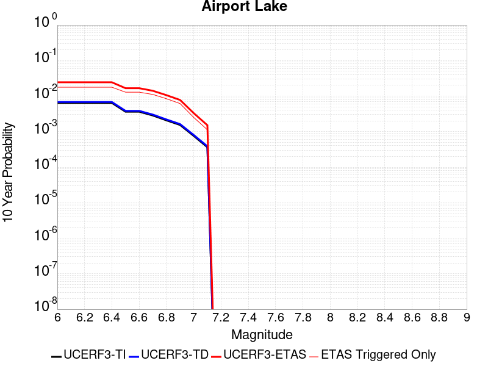 |

| Magnitude | 1 wk TI Prob | 1 wk TD Prob | 1 wk ETAS Prob | 1 wk ETAS/TD Gain | 1 wk ETAS Triggered Only | 1 mo TI Prob | 1 mo TD Prob | 1 mo ETAS Prob | 1 mo ETAS/TD Gain | 1 mo ETAS Triggered Only | 1 yr TI Prob | 1 yr TD Prob | 1 yr ETAS Prob | 1 yr ETAS/TD Gain | 1 yr ETAS Triggered Only | 10 yr TI Prob | 10 yr TD Prob | 10 yr ETAS Prob | 10 yr ETAS/TD Gain | 10 yr ETAS Triggered Only |
|-----|-----|-----|-----|-----|-----|-----|-----|-----|-----|-----|-----|-----|-----|-----|-----|-----|-----|-----|-----|-----|
| 6.0 | 1.2387061E-5 | 1.3103559E-5 | 7.9146866E-4 | 60.401047 | 7.783753E-4 | 5.3086325E-5 | 5.615706E-5 | 0.0023557732 | 41.949722 | 0.0022997453 | 6.461343E-4 | 6.8352616E-4 | 0.009699437 | 14.190294 | 0.009022078 | 0.0064425888 | 0.006817048 | 0.024597637 | 3.6082535 | 0.017902633 |
| 6.1 | 1.2387061E-5 | 1.3103559E-5 | 7.9146866E-4 | 60.401047 | 7.783753E-4 | 5.3086325E-5 | 5.615706E-5 | 0.0023557732 | 41.949722 | 0.0022997453 | 6.461343E-4 | 6.8352616E-4 | 0.009699437 | 14.190294 | 0.009022078 | 0.0064425888 | 0.006817048 | 0.024597637 | 3.6082535 | 0.017902633 |
| 6.2 | 1.2387061E-5 | 1.3103559E-5 | 7.9146866E-4 | 60.401047 | 7.783753E-4 | 5.3086325E-5 | 5.615706E-5 | 0.0023557732 | 41.949722 | 0.0022997453 | 6.461343E-4 | 6.8352616E-4 | 0.009699437 | 14.190294 | 0.009022078 | 0.0064425888 | 0.006817048 | 0.024597637 | 3.6082535 | 0.017902633 |
| 6.3 | 1.2387061E-5 | 1.3103559E-5 | 7.9146866E-4 | 60.401047 | 7.783753E-4 | 5.3086325E-5 | 5.615706E-5 | 0.0023557732 | 41.949722 | 0.0022997453 | 6.461343E-4 | 6.8352616E-4 | 0.009699437 | 14.190294 | 0.009022078 | 0.0064425888 | 0.006817048 | 0.024597637 | 3.6082535 | 0.017902633 |
| 6.4 | 1.2387061E-5 | 1.3103559E-5 | 7.9146866E-4 | 60.401047 | 7.783753E-4 | 5.3086325E-5 | 5.615706E-5 | 0.0023557732 | 41.949722 | 0.0022997453 | 6.461343E-4 | 6.8352616E-4 | 0.009699437 | 14.190294 | 0.009022078 | 0.0064425888 | 0.006817048 | 0.024597637 | 3.6082535 | 0.017902633 |
| 6.5 | 6.9922594E-6 | 7.385145E-6 | 5.734721E-4 | 77.65211 | 5.6609116E-4 | 2.996648E-5 | 3.165027E-5 | 0.00172987 | 54.655773 | 0.0016982735 | 3.6478083E-4 | 3.8527933E-4 | 0.0071757557 | 18.624815 | 0.006793094 | 0.003641826 | 0.003846651 | 0.017204354 | 4.4725537 | 0.013409284 |
| 6.6 | 6.9922594E-6 | 7.385145E-6 | 5.734721E-4 | 77.65211 | 5.6609116E-4 | 2.996648E-5 | 3.165027E-5 | 0.00172987 | 54.655773 | 0.0016982735 | 3.6478083E-4 | 3.8527933E-4 | 0.0071757557 | 18.624815 | 0.006793094 | 0.003641826 | 0.003846651 | 0.017204354 | 4.4725537 | 0.013409284 |
| 6.7 | 5.477277E-6 | 5.7862417E-6 | 5.364936E-4 | 92.71884 | 5.3071044E-4 | 2.3473833E-5 | 2.4797964E-5 | 0.0015461302 | 62.349075 | 0.0015213699 | 2.8575645E-4 | 3.0187727E-4 | 0.00620867 | 20.566868 | 0.0059085763 | 0.0028538927 | 0.003015056 | 0.014726031 | 4.8841653 | 0.011746391 |
| 6.8 | 3.9950432E-6 | 4.2192128E-6 | 4.2878577E-4 | 101.62697 | 4.2456837E-4 | 1.7121502E-5 | 1.808223E-5 | 0.0012210042 | 67.525085 | 0.0012029436 | 2.0843433E-4 | 2.2013167E-4 | 0.0044648806 | 20.282774 | 0.0042456836 | 0.0020823893 | 0.0021994072 | 0.010601493 | 4.8201594 | 0.008420606 |
| 6.9 | 2.95695E-6 | 3.1231173E-6 | 3.215484E-4 | 102.95751 | 3.1842626E-4 | 1.2672582E-5 | 1.33847325E-5 | 8.978903E-4 | 67.08317 | 8.845174E-4 | 1.5427776E-4 | 1.629492E-4 | 0.0034174428 | 20.972443 | 0.003255024 | 0.001541707 | 0.0016285196 | 0.008198612 | 5.0343957 | 0.0065808096 |
| 7.0 | 1.456072E-6 | 1.5408596E-6 | 3.69215E-5 | 23.961626 | 3.5380697E-5 | 6.2402937E-6 | 6.603673E-6 | 3.2502782E-4 | 49.219254 | 3.1842626E-4 | 7.597293E-5 | 8.039776E-5 | 0.001212489 | 15.081129 | 0.0011321823 | 7.594696E-4 | 8.0378563E-4 | 0.0033491482 | 4.166718 | 0.00254741 |
| 7.1 | 6.995192E-7 | 7.409207E-7 | 7.409207E-7 | 1.0 | 0.0 | 2.997936E-6 | 3.1753743E-6 | 2.8622005E-4 | 90.13742 | 2.8304558E-4 | 3.649926E-5 | 3.8660182E-5 | 6.0472946E-4 | 15.642178 | 5.6609116E-4 | 3.6493264E-4 | 3.8660184E-4 | 0.0015183464 | 3.9274166 | 0.0011321823 |

## Panamint Valley
*[(top)](#table-of-contents)*

| 1 Week | 1 Month | 1 Year | 10 Year |
|-----|-----|-----|-----|
|  |  |  | 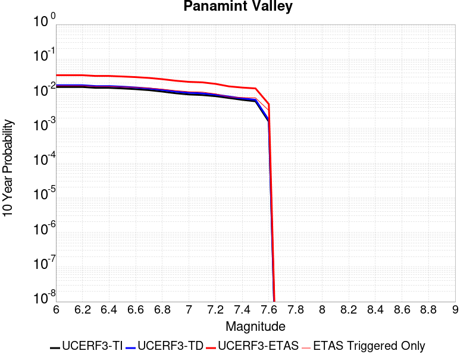 |

| Magnitude | 1 wk TI Prob | 1 wk TD Prob | 1 wk ETAS Prob | 1 wk ETAS/TD Gain | 1 wk ETAS Triggered Only | 1 mo TI Prob | 1 mo TD Prob | 1 mo ETAS Prob | 1 mo ETAS/TD Gain | 1 mo ETAS Triggered Only | 1 yr TI Prob | 1 yr TD Prob | 1 yr ETAS Prob | 1 yr ETAS/TD Gain | 1 yr ETAS Triggered Only | 10 yr TI Prob | 10 yr TD Prob | 10 yr ETAS Prob | 10 yr ETAS/TD Gain | 10 yr ETAS Triggered Only |
|-----|-----|-----|-----|-----|-----|-----|-----|-----|-----|-----|-----|-----|-----|-----|-----|-----|-----|-----|-----|-----|
| 6.0 | 3.0211835E-5 | 3.39879E-5 | 5.646803E-4 | 16.614157 | 5.3071044E-4 | 1.2947287E-4 | 1.4565447E-4 | 0.0024096891 | 16.543875 | 0.0022643646 | 0.0015751923 | 0.0017719301 | 0.01081334 | 6.1025763 | 0.0090574585 | 0.015640736 | 0.017584875 | 0.034651313 | 1.9705181 | 0.017371923 |
| 6.1 | 3.0211835E-5 | 3.39879E-5 | 5.646803E-4 | 16.614157 | 5.3071044E-4 | 1.2947287E-4 | 1.4565447E-4 | 0.0024096891 | 16.543875 | 0.0022643646 | 0.0015751923 | 0.0017719301 | 0.01081334 | 6.1025763 | 0.0090574585 | 0.015640736 | 0.017584875 | 0.034651313 | 1.9705181 | 0.017371923 |
| 6.2 | 3.0211835E-5 | 3.39879E-5 | 5.646803E-4 | 16.614157 | 5.3071044E-4 | 1.2947287E-4 | 1.4565447E-4 | 0.0024096891 | 16.543875 | 0.0022643646 | 0.0015751923 | 0.0017719301 | 0.01081334 | 6.1025763 | 0.0090574585 | 0.015640736 | 0.017584875 | 0.034651313 | 1.9705181 | 0.017371923 |
| 6.3 | 2.8573924E-5 | 3.210589E-5 | 5.627993E-4 | 17.52947 | 5.3071044E-4 | 1.2245393E-4 | 1.3758958E-4 | 0.0023308909 | 16.940897 | 0.0021936032 | 0.001489857 | 0.0016738938 | 0.01046894 | 6.2542443 | 0.008809794 | 0.01479908 | 0.01661945 | 0.033111185 | 1.9923153 | 0.01677045 |
| 6.4 | 2.8573924E-5 | 3.210589E-5 | 5.627993E-4 | 17.52947 | 5.3071044E-4 | 1.2245393E-4 | 1.3758958E-4 | 0.0023308909 | 16.940897 | 0.0021936032 | 0.001489857 | 0.0016738938 | 0.01046894 | 6.2542443 | 0.008809794 | 0.01479908 | 0.01661945 | 0.033111185 | 1.9923153 | 0.01677045 |
| 6.5 | 2.7468774E-5 | 3.0831525E-5 | 5.615256E-4 | 18.21271 | 5.3071044E-4 | 1.1771801E-4 | 1.3212857E-4 | 0.002325442 | 17.599842 | 0.0021936032 | 0.0014322745 | 0.0016075056 | 0.010261842 | 6.383705 | 0.008668271 | 0.014230782 | 0.015965264 | 0.031980548 | 2.003133 | 0.01627512 |
| 6.6 | 2.6135967E-5 | 2.9255436E-5 | 5.5995036E-4 | 19.140045 | 5.3071044E-4 | 1.1200648E-4 | 1.2537456E-4 | 0.0022479503 | 17.929874 | 0.0021228418 | 0.0013628257 | 0.001525393 | 0.0098625 | 6.465547 | 0.008349844 | 0.013544982 | 0.015155562 | 0.030626513 | 2.0208101 | 0.01570903 |
| 6.7 | 2.4498746E-5 | 2.7344193E-5 | 5.580401E-4 | 20.407995 | 5.3071044E-4 | 1.04990395E-4 | 1.17184274E-4 | 0.0022397772 | 19.113293 | 0.0021228418 | 0.0012775084 | 0.0014258098 | 0.009445776 | 6.6248503 | 0.008031418 | 0.012701893 | 0.014172745 | 0.028996428 | 2.045929 | 0.015036796 |
| 6.8 | 2.2244329E-5 | 2.4938103E-5 | 5.202555E-4 | 20.861872 | 4.9532973E-4 | 9.532935E-5 | 1.06873325E-4 | 0.0021587345 | 20.199001 | 0.0020520804 | 0.0011600169 | 0.0013004278 | 0.0087913815 | 6.760376 | 0.0075007076 | 0.011539802 | 0.012933899 | 0.026903132 | 2.0800483 | 0.014152278 |
| 6.9 | 1.9902658E-5 | 2.2292743E-5 | 5.1761145E-4 | 23.218832 | 4.9532973E-4 | 8.529431E-5 | 9.553693E-5 | 0.002112044 | 22.107094 | 0.0020166996 | 0.0010379635 | 0.00116256 | 0.008195133 | 7.0492134 | 0.0070407586 | 0.010331288 | 0.011569886 | 0.024474312 | 2.1153462 | 0.013055477 |
| 7.0 | 1.8353881E-5 | 2.0568525E-5 | 5.158881E-4 | 25.081434 | 4.9532973E-4 | 7.865712E-5 | 8.814794E-5 | 0.0020339147 | 23.073877 | 0.0019459383 | 9.5722964E-4 | 0.0010726905 | 0.007787812 | 7.2600737 | 0.0067223324 | 0.009531168 | 0.010680057 | 0.022756033 | 2.1307034 | 0.01220634 |
| 7.1 | 1.7667631E-5 | 1.9774876E-5 | 4.7971483E-4 | 24.258804 | 4.5994905E-4 | 7.571623E-5 | 8.474681E-5 | 0.0019243871 | 22.707487 | 0.0018397962 | 9.2145515E-4 | 0.0010313216 | 0.007605344 | 7.374367 | 0.0065808096 | 0.009176437 | 0.010270242 | 0.022001047 | 2.142213 | 0.011852534 |
| 7.2 | 1.6381597E-5 | 1.8160366E-5 | 4.42721E-4 | 24.378418 | 4.2456837E-4 | 7.020495E-5 | 7.782792E-5 | 0.0018113471 | 23.273745 | 0.0017336541 | 8.544101E-4 | 9.471603E-4 | 0.0066734045 | 7.0456967 | 0.005731673 | 0.008511325 | 0.0094358865 | 0.019494332 | 2.0659778 | 0.010154259 |
| 7.3 | 1.4520491E-5 | 1.5968182E-5 | 2.636291E-4 | 16.50965 | 2.4766487E-4 | 6.222919E-5 | 6.8433365E-5 | 0.0013420513 | 19.611067 | 0.001273705 | 7.57377E-4 | 8.328739E-4 | 0.0054638847 | 6.5602784 | 0.004634871 | 0.0075480095 | 0.008300635 | 0.016370649 | 1.9722164 | 0.00813756 |
| 7.4 | 1.2852287E-5 | 1.4146948E-5 | 2.618083E-4 | 18.506346 | 2.4766487E-4 | 5.5080065E-5 | 6.0628456E-5 | 0.0013342563 | 22.007095 | 0.001273705 | 6.7039346E-4 | 7.379173E-4 | 0.0051925955 | 7.0368257 | 0.004457968 | 0.0066837464 | 0.0073575918 | 0.014978714 | 2.0358174 | 0.007677611 |
| 7.5 | 1.1637851E-5 | 1.2838205E-5 | 2.604999E-4 | 20.29099 | 2.4766487E-4 | 4.987555E-5 | 5.5019806E-5 | 0.0012932761 | 23.505644 | 0.0012383243 | 6.070656E-4 | 6.6967594E-4 | 0.005018587 | 7.4940534 | 0.0043518255 | 0.006054099 | 0.006679477 | 0.014165228 | 2.1207092 | 0.007536088 |
| 7.6 | 3.0068115E-6 | 3.3335807E-6 | 1.0947532E-4 | 32.84016 | 1.0614209E-4 | 1.2886271E-5 | 1.4286737E-5 | 5.803698E-4 | 40.62298 | 5.6609116E-4 | 1.5687906E-4 | 1.7393442E-4 | 0.001907287 | 10.965552 | 0.0017336541 | 0.0015676835 | 0.0017394236 | 0.004776871 | 2.7462378 | 0.0030427398 |

## Garlock (East)
*[(top)](#table-of-contents)*

| 1 Week | 1 Month | 1 Year | 10 Year |
|-----|-----|-----|-----|
|  | 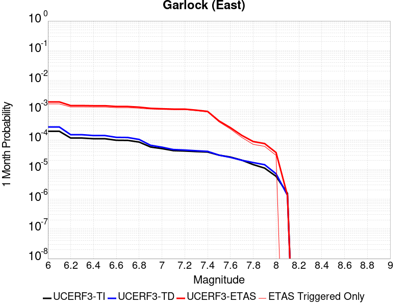 |  |  |

| Magnitude | 1 wk TI Prob | 1 wk TD Prob | 1 wk ETAS Prob | 1 wk ETAS/TD Gain | 1 wk ETAS Triggered Only | 1 mo TI Prob | 1 mo TD Prob | 1 mo ETAS Prob | 1 mo ETAS/TD Gain | 1 mo ETAS Triggered Only | 1 yr TI Prob | 1 yr TD Prob | 1 yr ETAS Prob | 1 yr ETAS/TD Gain | 1 yr ETAS Triggered Only | 10 yr TI Prob | 10 yr TD Prob | 10 yr ETAS Prob | 10 yr ETAS/TD Gain | 10 yr ETAS Triggered Only |
|-----|-----|-----|-----|-----|-----|-----|-----|-----|-----|-----|-----|-----|-----|-----|-----|-----|-----|-----|-----|-----|
| 6.0 | 4.5092507E-5 | 6.2917425E-5 | 3.105667E-4 | 4.9361 | 2.4766487E-4 | 1.9323928E-4 | 2.6962077E-4 | 0.0018259516 | 6.7722964 | 0.0015567506 | 0.0023501497 | 0.0032781374 | 0.0107542565 | 3.2805998 | 0.0075007076 | 0.023254504 | 0.03235903 | 0.046635363 | 1.4411855 | 0.0147537505 |
| 6.1 | 4.5092507E-5 | 6.2917425E-5 | 3.105667E-4 | 4.9361 | 2.4766487E-4 | 1.9323928E-4 | 2.6962077E-4 | 0.0018259516 | 6.7722964 | 0.0015567506 | 0.0023501497 | 0.0032781374 | 0.0107542565 | 3.2805998 | 0.0075007076 | 0.023254504 | 0.03235903 | 0.046635363 | 1.4411855 | 0.0147537505 |
| 6.2 | 2.6674514E-5 | 3.452091E-5 | 2.4679775E-4 | 7.1492257 | 2.1228418E-4 | 1.1431433E-4 | 1.4793854E-4 | 0.0012799533 | 8.651926 | 0.0011321823 | 0.0013908884 | 0.0017996968 | 0.007238518 | 4.0220766 | 0.0054486273 | 0.01382215 | 0.017896036 | 0.02849403 | 1.5921979 | 0.010791113 |
| 6.3 | 2.6674514E-5 | 3.452091E-5 | 2.4679775E-4 | 7.1492257 | 2.1228418E-4 | 1.1431433E-4 | 1.4793854E-4 | 0.0012799533 | 8.651926 | 0.0011321823 | 0.0013908884 | 0.0017996968 | 0.007238518 | 4.0220766 | 0.0054486273 | 0.01382215 | 0.017896036 | 0.02849403 | 1.5921979 | 0.010791113 |
| 6.4 | 2.5312667E-5 | 3.234991E-5 | 2.446272E-4 | 7.5619135 | 2.1228418E-4 | 1.0847834E-4 | 1.3863528E-4 | 0.0012706605 | 9.165493 | 0.0011321823 | 0.0013199237 | 0.0016866071 | 0.0070907236 | 4.204135 | 0.0054132463 | 0.013121112 | 0.016783953 | 0.027289586 | 1.6259333 | 0.01068497 |
| 6.5 | 2.5312667E-5 | 3.234991E-5 | 2.446272E-4 | 7.5619135 | 2.1228418E-4 | 1.0847834E-4 | 1.3863528E-4 | 0.0012706605 | 9.165493 | 0.0011321823 | 0.0013199237 | 0.0016866071 | 0.0070907236 | 4.204135 | 0.0054132463 | 0.013121112 | 0.016783953 | 0.027289586 | 1.6259333 | 0.01068497 |
| 6.6 | 2.246556E-5 | 2.8144346E-5 | 2.4042255E-4 | 8.542481 | 2.1228418E-4 | 9.627742E-5 | 1.20613186E-4 | 0.0012172825 | 10.092449 | 0.0010968016 | 0.0011715472 | 0.0014674999 | 0.0065548434 | 4.466674 | 0.00509482 | 0.011653901 | 0.0146240825 | 0.02456012 | 1.6794298 | 0.010083498 |
| 6.7 | 2.2241198E-5 | 2.781406E-5 | 2.4009233E-4 | 8.63205 | 2.1228418E-4 | 9.531594E-5 | 1.1919779E-4 | 0.0012158686 | 10.200429 | 0.0010968016 | 0.0011598538 | 0.0014502906 | 0.006537722 | 4.50787 | 0.00509482 | 0.011538187 | 0.014454261 | 0.02439201 | 1.6875308 | 0.010083498 |
| 6.8 | 1.9528685E-5 | 2.3908038E-5 | 2.3618714E-4 | 9.878984 | 2.1228418E-4 | 8.369167E-5 | 1.0245911E-4 | 0.0011991484 | 11.703677 | 0.0010968016 | 0.0010184698 | 0.0012467455 | 0.0061938674 | 4.968029 | 0.0049532973 | 0.010138147 | 0.012441495 | 0.021945313 | 1.7638807 | 0.009623549 |
| 6.9 | 1.3318621E-5 | 1.5207374E-5 | 2.2748833E-4 | 14.959079 | 2.1228418E-4 | 5.7078556E-5 | 6.517287E-5 | 0.0011265245 | 17.285177 | 0.0010614209 | 6.9470983E-4 | 7.931965E-4 | 0.0052476283 | 6.6157985 | 0.004457968 | 0.0069254204 | 0.007944281 | 0.01626289 | 2.0471194 | 0.008385225 |
| 7.0 | 1.1760853E-5 | 1.3115987E-5 | 2.2539738E-4 | 17.184935 | 2.1228418E-4 | 5.0402683E-5 | 5.621019E-5 | 0.0011175714 | 19.882008 | 0.0010614209 | 6.134799E-4 | 6.841492E-4 | 0.0049622846 | 7.25322 | 0.004281064 | 0.0061178906 | 0.006860767 | 0.014591117 | 2.1267474 | 0.0077837533 |
| 7.1 | 1.0064758E-5 | 1.0910848E-5 | 2.231927E-4 | 20.456038 | 2.1228418E-4 | 4.3133965E-5 | 4.675996E-5 | 0.0010727522 | 22.941683 | 0.0010260402 | 5.2502943E-4 | 5.691573E-4 | 0.0046709822 | 8.206839 | 0.0041041607 | 0.005237907 | 0.005717105 | 0.013069395 | 2.2860162 | 0.0073945657 |
| 7.2 | 9.768808E-6 | 1.0506669E-5 | 2.2278861E-4 | 21.204494 | 2.1228418E-4 | 4.186565E-5 | 4.5027828E-5 | 0.0010710218 | 23.785776 | 0.0010260402 | 5.095951E-4 | 5.480794E-4 | 0.0045085456 | 8.226081 | 0.003962638 | 0.0050842804 | 0.0055073434 | 0.012685255 | 2.3033347 | 0.007217662 |
| 7.3 | 9.344516E-6 | 9.95218E-6 | 1.868539E-4 | 18.775171 | 1.7690349E-4 | 4.004731E-5 | 4.2651525E-5 | 8.91752E-4 | 20.907858 | 8.4913673E-4 | 4.8746695E-4 | 5.1916204E-4 | 0.004090757 | 7.879538 | 0.0035734503 | 0.0048639905 | 0.0052189473 | 0.0117302155 | 2.247621 | 0.0065454287 |
| 7.4 | 9.023491E-6 | 9.498219E-6 | 1.156393E-4 | 12.174841 | 1.0614209E-4 | 3.867153E-5 | 4.0706036E-5 | 7.836704E-4 | 19.251945 | 7.429946E-4 | 4.7072413E-4 | 4.9548666E-4 | 0.0036074452 | 7.2806106 | 0.0031135012 | 0.004697283 | 0.004982321 | 0.010650232 | 2.1376047 | 0.005696292 |
| 7.5 | 7.081253E-6 | 7.0943947E-6 | 7.7855286E-5 | 10.974196 | 7.0761394E-5 | 3.0347876E-5 | 3.0404199E-5 | 3.1344115E-4 | 10.30914 | 2.8304558E-4 | 3.6942272E-4 | 3.70109E-4 | 0.0019262835 | 5.2046385 | 0.0015567506 | 0.003688092 | 0.00372781 | 0.006582963 | 1.7659063 | 0.0028658365 |
| 7.6 | 6.116396E-6 | 5.9656345E-6 | 5.9656345E-6 | 1.0 | 0.0 | 2.6212863E-5 | 2.5566756E-5 | 9.632634E-5 | 3.7676404 | 7.0761394E-5 | 3.1909486E-4 | 3.1123104E-4 | 0.0011601035 | 3.727467 | 8.4913673E-4 | 0.0031863707 | 0.0031390795 | 0.004726213 | 1.5056047 | 0.0015921313 |
| 7.7 | 4.797145E-6 | 4.763327E-6 | 4.763327E-6 | 1.0 | 0.0 | 2.055903E-5 | 2.04141E-5 | 5.5794073E-5 | 2.7331145 | 3.5380697E-5 | 2.5027743E-4 | 2.4851345E-4 | 7.083482E-4 | 2.8503416 | 4.5994905E-4 | 0.0024999576 | 0.0025124948 | 0.0033947898 | 1.3511629 | 8.845174E-4 |
| 7.8 | 3.4028885E-6 | 3.9838537E-6 | 3.9838537E-6 | 1.0 | 0.0 | 1.4583726E-5 | 1.7073547E-5 | 5.245364E-5 | 3.0722167 | 3.5380697E-5 | 1.775424E-4 | 2.0785068E-4 | 5.9695746E-4 | 2.8720496 | 3.8918765E-4 | 0.0017740062 | 0.0021040295 | 0.0027748484 | 1.3188257 | 6.7223323E-4 |
| 7.9 | 2.5928412E-6 | 3.3770064E-6 | 3.3770064E-6 | 1.0 | 0.0 | 1.1112129E-5 | 1.4472805E-5 | 1.4472805E-5 | 1.0 | 0.0 | 1.3528178E-4 | 1.7619222E-4 | 3.88439E-4 | 2.204632 | 2.1228418E-4 | 0.0013519945 | 0.0017836117 | 0.0022427405 | 1.2574152 | 4.5994905E-4 |
| 8.0 | 1.3743648E-6 | 1.6755408E-6 | 1.6755408E-6 | 1.0 | 0.0 | 5.8901214E-6 | 7.1808695E-6 | 7.1808695E-6 | 1.0 | 0.0 | 7.1709874E-5 | 8.742361E-5 | 1.9355642E-4 | 2.2140062 | 1.0614209E-4 | 7.1686733E-4 | 8.847989E-4 | 0.0010968952 | 1.2397114 | 2.1228418E-4 |
| 8.1 | 3.6733252E-7 | 3.1526864E-7 | 3.1526864E-7 | 1.0 | 0.0 | 1.5742813E-6 | 1.3511507E-6 | 1.3511507E-6 | 1.0 | 0.0 | 1.9166706E-5 | 1.645015E-5 | 5.1830266E-5 | 3.150747 | 3.5380697E-5 | 1.9165053E-4 | 1.6658098E-4 | 2.3733058E-4 | 1.424716 | 7.0761394E-5 |

## Hunter Mountain-Saline Valley
*[(top)](#table-of-contents)*

| 1 Week | 1 Month | 1 Year | 10 Year |
|-----|-----|-----|-----|
|  |  |  | 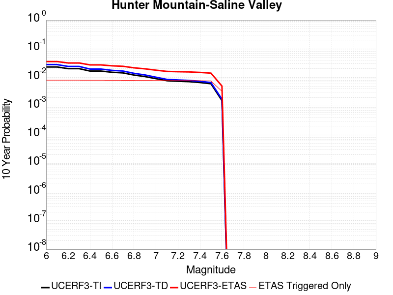 |

| Magnitude | 1 wk TI Prob | 1 wk TD Prob | 1 wk ETAS Prob | 1 wk ETAS/TD Gain | 1 wk ETAS Triggered Only | 1 mo TI Prob | 1 mo TD Prob | 1 mo ETAS Prob | 1 mo ETAS/TD Gain | 1 mo ETAS Triggered Only | 1 yr TI Prob | 1 yr TD Prob | 1 yr ETAS Prob | 1 yr ETAS/TD Gain | 1 yr ETAS Triggered Only | 10 yr TI Prob | 10 yr TD Prob | 10 yr ETAS Prob | 10 yr ETAS/TD Gain | 10 yr ETAS Triggered Only |
|-----|-----|-----|-----|-----|-----|-----|-----|-----|-----|-----|-----|-----|-----|-----|-----|-----|-----|-----|-----|-----|
| 6.0 | 4.5103672E-5 | 5.4576634E-5 | 3.02228E-4 | 5.537681 | 2.4766487E-4 | 1.9328714E-4 | 2.3387549E-4 | 0.0015072826 | 6.4448085 | 0.001273705 | 0.002350731 | 0.002843864 | 0.007359714 | 2.5879276 | 0.0045287292 | 0.023260195 | 0.028095365 | 0.035797976 | 1.2741596 | 0.007925276 |
| 6.1 | 4.5103672E-5 | 5.4576634E-5 | 3.02228E-4 | 5.537681 | 2.4766487E-4 | 1.9328714E-4 | 2.3387549E-4 | 0.0015072826 | 6.4448085 | 0.001273705 | 0.002350731 | 0.002843864 | 0.007359714 | 2.5879276 | 0.0045287292 | 0.023260195 | 0.028095365 | 0.035797976 | 1.2741596 | 0.007925276 |
| 6.2 | 3.9363465E-5 | 4.706859E-5 | 2.947218E-4 | 6.2615385 | 2.4766487E-4 | 1.6868966E-4 | 2.017032E-4 | 0.0014751514 | 7.313475 | 0.001273705 | 0.002051862 | 0.0024531104 | 0.00697073 | 2.8415883 | 0.0045287292 | 0.020330196 | 0.024276383 | 0.032009263 | 1.3185351 | 0.007925276 |
| 6.3 | 3.9363465E-5 | 4.706859E-5 | 2.947218E-4 | 6.2615385 | 2.4766487E-4 | 1.6868966E-4 | 2.017032E-4 | 0.0014751514 | 7.313475 | 0.001273705 | 0.002051862 | 0.0024531104 | 0.00697073 | 2.8415883 | 0.0045287292 | 0.020330196 | 0.024276383 | 0.032009263 | 1.3185351 | 0.007925276 |
| 6.4 | 3.2311684E-5 | 3.7955346E-5 | 2.8561082E-4 | 7.5249166 | 2.4766487E-4 | 1.384713E-4 | 1.6265604E-4 | 0.0014361539 | 8.829392 | 0.001273705 | 0.0016845843 | 0.0019786113 | 0.0064983796 | 3.2843137 | 0.0045287292 | 0.016718714 | 0.019618697 | 0.027388489 | 1.3960402 | 0.007925276 |
| 6.5 | 3.2311684E-5 | 3.7955346E-5 | 2.8561082E-4 | 7.5249166 | 2.4766487E-4 | 1.384713E-4 | 1.6265604E-4 | 0.0014361539 | 8.829392 | 0.001273705 | 0.0016845843 | 0.0019786113 | 0.0064983796 | 3.2843137 | 0.0045287292 | 0.016718714 | 0.019618697 | 0.027388489 | 1.3960402 | 0.007925276 |
| 6.6 | 2.9305844E-5 | 3.4185676E-5 | 2.8184208E-4 | 8.24445 | 2.4766487E-4 | 1.2559042E-4 | 1.4650216E-4 | 0.0014200206 | 9.69283 | 0.001273705 | 0.0015279909 | 0.0017822674 | 0.006302925 | 3.5364645 | 0.0045287292 | 0.015175272 | 0.017687662 | 0.025472758 | 1.4401428 | 0.007925276 |
| 6.7 | 2.7826512E-5 | 3.234788E-5 | 2.8000475E-4 | 8.656045 | 2.4766487E-4 | 1.19251024E-4 | 1.3862675E-4 | 0.0014121552 | 10.186744 | 0.001273705 | 0.0014509142 | 0.0016865344 | 0.0061723045 | 3.6597562 | 0.0044933483 | 0.014414776 | 0.01674504 | 0.024502818 | 1.4632882 | 0.007889896 |
| 6.8 | 2.3389874E-5 | 2.686964E-5 | 2.7452785E-4 | 10.217028 | 2.4766487E-4 | 1.0023846E-4 | 1.1515078E-4 | 0.0013887092 | 12.059919 | 0.001273705 | 0.00121972 | 0.0014011064 | 0.0058528283 | 4.1772904 | 0.004457968 | 0.01213047 | 0.013928941 | 0.021639163 | 1.5535396 | 0.007819134 |
| 6.9 | 2.069209E-5 | 2.3572567E-5 | 2.712316E-4 | 11.506239 | 2.4766487E-4 | 8.867737E-5 | 1.01021586E-4 | 0.001374598 | 13.606973 | 0.001273705 | 0.0010791123 | 0.00122928 | 0.0056817676 | 4.622029 | 0.004457968 | 0.010738871 | 0.012229833 | 0.01995334 | 1.63153 | 0.007819134 |
| 7.0 | 1.7462342E-5 | 1.9635625E-5 | 2.6729563E-4 | 13.612789 | 2.4766487E-4 | 7.483646E-5 | 8.4150095E-5 | 0.0013577479 | 16.134836 | 0.001273705 | 9.1075303E-4 | 0.0010240684 | 0.005477471 | 5.348735 | 0.004457968 | 0.009070295 | 0.010197128 | 0.01793653 | 1.7589785 | 0.007819134 |
| 7.1 | 1.4807709E-5 | 1.6443486E-5 | 2.6410428E-4 | 16.06133 | 2.4766487E-4 | 6.3460066E-5 | 7.0470276E-5 | 0.0013440856 | 19.073086 | 0.001273705 | 7.723524E-4 | 8.576544E-4 | 0.005311799 | 6.193403 | 0.004457968 | 0.007696735 | 0.008546432 | 0.016228583 | 1.8988724 | 0.0077483724 |
| 7.2 | 1.4180048E-5 | 1.5700001E-5 | 2.63361E-4 | 16.774584 | 2.4766487E-4 | 6.077022E-5 | 6.7284076E-5 | 0.0013409035 | 19.928988 | 0.001273705 | 7.396263E-4 | 8.188919E-4 | 0.005273209 | 6.4394445 | 0.004457968 | 0.0073716943 | 0.008161696 | 0.015846828 | 1.9416097 | 0.0077483724 |
| 7.3 | 1.3730402E-5 | 1.5173691E-5 | 2.628348E-4 | 17.321745 | 2.4766487E-4 | 5.8843252E-5 | 6.502858E-5 | 0.0013386508 | 20.585577 | 0.001273705 | 7.161811E-4 | 7.914514E-4 | 0.005245891 | 6.6281905 | 0.004457968 | 0.007138774 | 0.007889261 | 0.015576504 | 1.9743934 | 0.0077483724 |
| 7.4 | 1.2810095E-5 | 1.4110805E-5 | 2.617722E-4 | 18.551188 | 2.4766487E-4 | 5.489925E-5 | 6.0473565E-5 | 0.0013341017 | 22.060905 | 0.001273705 | 6.681934E-4 | 7.360327E-4 | 0.0051907194 | 7.052294 | 0.004457968 | 0.006661878 | 0.0073388456 | 0.014960112 | 2.038483 | 0.007677611 |
| 7.5 | 1.1595659E-5 | 1.2802062E-5 | 2.6046377E-4 | 20.345455 | 2.4766487E-4 | 4.9694736E-5 | 5.486491E-5 | 0.0012931214 | 23.569185 | 0.0012383243 | 6.0486543E-4 | 6.677913E-4 | 0.0050167106 | 7.5123935 | 0.0043518255 | 0.006032217 | 0.006660718 | 0.014146611 | 2.1238866 | 0.007536088 |
| 7.6 | 2.997694E-6 | 3.325705E-6 | 1.09467444E-4 | 32.915558 | 1.0614209E-4 | 1.28471975E-5 | 1.4252984E-5 | 5.803361E-4 | 40.71681 | 5.6609116E-4 | 1.564034E-4 | 1.7352356E-4 | 0.0019068768 | 10.989153 | 0.0017336541 | 0.0015629337 | 0.0017353174 | 0.004772777 | 2.7503772 | 0.0030427398 |

## Ash Hill
*[(top)](#table-of-contents)*

| 1 Week | 1 Month | 1 Year | 10 Year |
|-----|-----|-----|-----|
|  |  |  |  |

| Magnitude | 1 wk TI Prob | 1 wk TD Prob | 1 wk ETAS Prob | 1 wk ETAS/TD Gain | 1 wk ETAS Triggered Only | 1 mo TI Prob | 1 mo TD Prob | 1 mo ETAS Prob | 1 mo ETAS/TD Gain | 1 mo ETAS Triggered Only | 1 yr TI Prob | 1 yr TD Prob | 1 yr ETAS Prob | 1 yr ETAS/TD Gain | 1 yr ETAS Triggered Only | 10 yr TI Prob | 10 yr TD Prob | 10 yr ETAS Prob | 10 yr ETAS/TD Gain | 10 yr ETAS Triggered Only |
|-----|-----|-----|-----|-----|-----|-----|-----|-----|-----|-----|-----|-----|-----|-----|-----|-----|-----|-----|-----|-----|
| 6.0 | 2.1545662E-5 | 2.3195389E-5 | 1.6471489E-4 | 7.101191 | 1.4152279E-4 | 9.2335285E-5 | 9.940547E-5 | 8.0694904E-4 | 8.117753 | 7.0761394E-4 | 0.0011236023 | 0.0012096697 | 0.004531432 | 3.7460077 | 0.0033257855 | 0.011179381 | 0.012038835 | 0.01854042 | 1.540051 | 0.0065808096 |
| 6.1 | 2.1545662E-5 | 2.3195389E-5 | 1.6471489E-4 | 7.101191 | 1.4152279E-4 | 9.2335285E-5 | 9.940547E-5 | 8.0694904E-4 | 8.117753 | 7.0761394E-4 | 0.0011236023 | 0.0012096697 | 0.004531432 | 3.7460077 | 0.0033257855 | 0.011179381 | 0.012038835 | 0.01854042 | 1.540051 | 0.0065808096 |
| 6.2 | 2.1545662E-5 | 2.3195389E-5 | 1.6471489E-4 | 7.101191 | 1.4152279E-4 | 9.2335285E-5 | 9.940547E-5 | 8.0694904E-4 | 8.117753 | 7.0761394E-4 | 0.0011236023 | 0.0012096697 | 0.004531432 | 3.7460077 | 0.0033257855 | 0.011179381 | 0.012038835 | 0.01854042 | 1.540051 | 0.0065808096 |
| 6.3 | 1.0025529E-5 | 1.0747344E-5 | 1.0747344E-5 | 1.0 | 0.0 | 4.2965847E-5 | 4.605931E-5 | 2.5833372E-4 | 5.608719 | 2.1228418E-4 | 5.229836E-4 | 5.6064106E-4 | 0.001833632 | 3.270599 | 0.001273705 | 0.005217545 | 0.0055935793 | 0.007915644 | 1.4151303 | 0.002335126 |
| 6.4 | 1.0025529E-5 | 1.0747344E-5 | 1.0747344E-5 | 1.0 | 0.0 | 4.2965847E-5 | 4.605931E-5 | 2.5833372E-4 | 5.608719 | 2.1228418E-4 | 5.229836E-4 | 5.6064106E-4 | 0.001833632 | 3.270599 | 0.001273705 | 0.005217545 | 0.0055935793 | 0.007915644 | 1.4151303 | 0.002335126 |
| 6.5 | 6.9617327E-6 | 7.4569152E-6 | 7.4569152E-6 | 1.0 | 0.0 | 2.9835655E-5 | 3.1957865E-5 | 1.3809657E-4 | 4.321207 | 1.0614209E-4 | 3.6318856E-4 | 3.8902622E-4 | 0.0012024656 | 3.0909631 | 8.13756E-4 | 0.0036259557 | 0.0038843066 | 0.0054350104 | 1.3992229 | 0.0015567506 |
| 6.6 | 4.9919777E-6 | 5.34689E-6 | 5.34689E-6 | 1.0 | 0.0 | 2.1394015E-5 | 2.291508E-5 | 9.367485E-5 | 4.087913 | 7.0761394E-5 | 2.60441E-4 | 2.7896208E-4 | 7.387828E-4 | 2.648327 | 4.5994905E-4 | 0.0026013597 | 0.0027867774 | 0.0037393942 | 1.3418344 | 9.552788E-4 |
| 6.7 | 3.6630722E-6 | 3.9247725E-6 | 3.9247725E-6 | 1.0 | 0.0 | 1.5698786E-5 | 1.6820377E-5 | 8.758058E-5 | 5.2068143 | 7.0761394E-5 | 1.9111596E-4 | 2.0477458E-4 | 4.8776218E-4 | 2.381947 | 2.8304558E-4 | 0.0019095168 | 0.002046422 | 0.0026113547 | 1.2760588 | 5.6609116E-4 |
| 6.8 | 2.5599613E-6 | 2.7450303E-6 | 2.7450303E-6 | 1.0 | 0.0 | 1.0971216E-5 | 1.176439E-5 | 4.714467E-5 | 4.0074043 | 3.5380697E-5 | 1.3356637E-4 | 1.4322698E-4 | 3.5548076E-4 | 2.4819398 | 2.1228418E-4 | 0.0013348613 | 0.0014318317 | 0.0017851321 | 1.2467471 | 3.5380697E-4 |
| 6.9 | 1.7684905E-6 | 1.8969438E-6 | 1.8969438E-6 | 1.0 | 0.0 | 7.579223E-6 | 8.129759E-6 | 4.351017E-5 | 5.3519626 | 3.5380697E-5 | 9.2273134E-5 | 9.897981E-5 | 2.7586578E-4 | 2.7870913 | 1.7690349E-4 | 9.223483E-4 | 9.897981E-4 | 0.0012372179 | 1.2499698 | 2.4766487E-4 |

## Blackwater
*[(top)](#table-of-contents)*

| 1 Week | 1 Month | 1 Year | 10 Year |
|-----|-----|-----|-----|
|  |  |  |  |

| Magnitude | 1 wk TI Prob | 1 wk TD Prob | 1 wk ETAS Prob | 1 wk ETAS/TD Gain | 1 wk ETAS Triggered Only | 1 mo TI Prob | 1 mo TD Prob | 1 mo ETAS Prob | 1 mo ETAS/TD Gain | 1 mo ETAS Triggered Only | 1 yr TI Prob | 1 yr TD Prob | 1 yr ETAS Prob | 1 yr ETAS/TD Gain | 1 yr ETAS Triggered Only | 10 yr TI Prob | 10 yr TD Prob | 10 yr ETAS Prob | 10 yr ETAS/TD Gain | 10 yr ETAS Triggered Only |
|-----|-----|-----|-----|-----|-----|-----|-----|-----|-----|-----|-----|-----|-----|-----|-----|-----|-----|-----|-----|-----|
| 6.0 | 3.0708583E-5 | 3.3097214E-5 | 1.7461531E-4 | 5.275831 | 1.4152279E-4 | 1.3160157E-4 | 1.4183826E-4 | 6.3709775E-4 | 4.4917197 | 4.9532973E-4 | 0.0016010714 | 0.0017256497 | 0.004515901 | 2.616928 | 0.002795075 | 0.015895851 | 0.017136335 | 0.022839338 | 1.3328017 | 0.0058024344 |
| 6.1 | 3.0708583E-5 | 3.3097214E-5 | 1.7461531E-4 | 5.275831 | 1.4152279E-4 | 1.3160157E-4 | 1.4183826E-4 | 6.3709775E-4 | 4.4917197 | 4.9532973E-4 | 0.0016010714 | 0.0017256497 | 0.004515901 | 2.616928 | 0.002795075 | 0.015895851 | 0.017136335 | 0.022839338 | 1.3328017 | 0.0058024344 |
| 6.2 | 1.1707779E-5 | 1.2545598E-5 | 1.1868636E-4 | 9.460398 | 1.0614209E-4 | 5.017523E-5 | 5.3765798E-5 | 3.0141734E-4 | 5.6061172 | 2.4766487E-4 | 6.107122E-4 | 6.5441156E-4 | 0.0017504954 | 2.674915 | 0.0010968016 | 0.006090366 | 0.0065258164 | 0.008810554 | 1.3501076 | 0.0022997453 |
| 6.3 | 1.1707779E-5 | 1.2545598E-5 | 1.1868636E-4 | 9.460398 | 1.0614209E-4 | 5.017523E-5 | 5.3765798E-5 | 3.0141734E-4 | 5.6061172 | 2.4766487E-4 | 6.107122E-4 | 6.5441156E-4 | 0.0017504954 | 2.674915 | 0.0010968016 | 0.006090366 | 0.0065258164 | 0.008810554 | 1.3501076 | 0.0022997453 |
| 6.4 | 7.929244E-6 | 8.4804105E-6 | 4.3860808E-5 | 5.1720147 | 3.5380697E-5 | 3.3982033E-5 | 3.6344132E-5 | 1.07102955E-4 | 2.9469118 | 7.0761394E-5 | 4.136527E-4 | 4.4240404E-4 | 0.0010789748 | 2.4388902 | 6.368525E-4 | 0.0041288356 | 0.0044156383 | 0.005824617 | 1.3190883 | 0.0014152279 |
| 6.5 | 5.8832115E-6 | 6.286219E-6 | 4.166669E-5 | 6.6282597 | 3.5380697E-5 | 2.521352E-5 | 2.6940676E-5 | 6.232042E-5 | 2.3132463 | 3.5380697E-5 | 3.0693135E-4 | 3.279559E-4 | 7.52385E-4 | 2.2941651 | 4.2456837E-4 | 0.0030650778 | 0.0032749726 | 0.0042271228 | 1.2907354 | 9.552788E-4 |
| 6.6 | 5.8832115E-6 | 6.286219E-6 | 4.166669E-5 | 6.6282597 | 3.5380697E-5 | 2.521352E-5 | 2.6940676E-5 | 6.232042E-5 | 2.3132463 | 3.5380697E-5 | 3.0693135E-4 | 3.279559E-4 | 7.52385E-4 | 2.2941651 | 4.2456837E-4 | 0.0030650778 | 0.0032749726 | 0.0042271228 | 1.2907354 | 9.552788E-4 |
| 6.7 | 3.0715053E-6 | 3.2815851E-6 | 3.8662165E-5 | 11.781551 | 3.5380697E-5 | 1.3163528E-5 | 1.4063868E-5 | 4.9444065E-5 | 3.5156806 | 3.5380697E-5 | 1.6025416E-4 | 1.7121529E-4 | 3.4808848E-4 | 2.0330455 | 1.7690349E-4 | 0.0016013865 | 0.0017109484 | 0.00206415 | 1.2064362 | 3.5380697E-4 |
| 6.8 | 2.2722281E-6 | 2.4288424E-6 | 3.7809452E-5 | 15.566861 | 3.5380697E-5 | 9.738084E-6 | 1.0409289E-5 | 4.5789617E-5 | 4.398919 | 3.5380697E-5 | 1.1855473E-4 | 1.2672663E-4 | 3.036077E-4 | 2.3957686 | 1.7690349E-4 | 0.001184915 | 0.0012666339 | 0.0016199927 | 1.2789748 | 3.5380697E-4 |
| 6.9 | 9.952399E-7 | 1.0653887E-6 | 1.0653887E-6 | 1.0 | 0.0 | 4.265307E-6 | 4.5659463E-6 | 4.5659463E-6 | 1.0 | 0.0 | 5.1928873E-5 | 5.5589495E-5 | 9.096823E-5 | 1.6364284 | 3.5380697E-5 | 5.191674E-4 | 5.558065E-4 | 6.9725065E-4 | 1.2544844 | 1.4152279E-4 |
| 7.0 | 4.7385504E-7 | 5.075751E-7 | 5.075751E-7 | 1.0 | 0.0 | 2.0308057E-6 | 2.175322E-6 | 2.175322E-6 | 1.0 | 0.0 | 2.4724779E-5 | 2.6484544E-5 | 6.18643E-5 | 2.3358643 | 3.5380697E-5 | 2.4722028E-4 | 2.6484544E-4 | 3.0021675E-4 | 1.1335546 | 3.5380697E-5 |

## Garlock (West)
*[(top)](#table-of-contents)*

| 1 Week | 1 Month | 1 Year | 10 Year |
|-----|-----|-----|-----|
|  |  |  |  |

| Magnitude | 1 wk TI Prob | 1 wk TD Prob | 1 wk ETAS Prob | 1 wk ETAS/TD Gain | 1 wk ETAS Triggered Only | 1 mo TI Prob | 1 mo TD Prob | 1 mo ETAS Prob | 1 mo ETAS/TD Gain | 1 mo ETAS Triggered Only | 1 yr TI Prob | 1 yr TD Prob | 1 yr ETAS Prob | 1 yr ETAS/TD Gain | 1 yr ETAS Triggered Only | 10 yr TI Prob | 10 yr TD Prob | 10 yr ETAS Prob | 10 yr ETAS/TD Gain | 10 yr ETAS Triggered Only |
|-----|-----|-----|-----|-----|-----|-----|-----|-----|-----|-----|-----|-----|-----|-----|-----|-----|-----|-----|-----|-----|
| 6.0 | 2.5181727E-5 | 2.5216661E-5 | 1.3135608E-4 | 5.209099 | 1.0614209E-4 | 1.0791722E-4 | 1.08066946E-4 | 6.033432E-4 | 5.5830503 | 4.9532973E-4 | 0.0013131002 | 0.0013149243 | 0.003929653 | 2.9885013 | 0.0026181715 | 0.013053683 | 0.013151911 | 0.017795656 | 1.3530852 | 0.0047056326 |
| 6.1 | 2.5077732E-5 | 2.5117724E-5 | 1.3125714E-4 | 5.2256784 | 1.0614209E-4 | 1.0747157E-4 | 1.0764297E-4 | 6.029194E-4 | 5.6011033 | 4.9532973E-4 | 0.001307681 | 0.0013097686 | 0.003924511 | 2.996339 | 0.0026181715 | 0.013000126 | 0.013100963 | 0.017744947 | 1.3544766 | 0.0047056326 |
| 6.2 | 2.494612E-5 | 2.4999388E-5 | 1.3113882E-4 | 5.2456813 | 1.0614209E-4 | 1.0690756E-4 | 1.0713586E-4 | 6.0241256E-4 | 5.6228843 | 4.9532973E-4 | 0.0013008224 | 0.001303602 | 0.0039183605 | 3.005795 | 0.0026181715 | 0.012932341 | 0.013040021 | 0.017684292 | 1.3561552 | 0.0047056326 |
| 6.3 | 2.4733758E-5 | 2.4818735E-5 | 1.3095819E-4 | 5.276586 | 1.0614209E-4 | 1.0599751E-4 | 1.0636169E-4 | 6.0163875E-4 | 5.656536 | 4.9532973E-4 | 0.0012897556 | 0.0012941877 | 0.003908971 | 3.0204048 | 0.0026181715 | 0.012822957 | 0.01294698 | 0.017591689 | 1.3587484 | 0.0047056326 |
| 6.4 | 2.3237335E-5 | 2.3197908E-5 | 1.2933754E-4 | 5.5753965 | 1.0614209E-4 | 9.958477E-5 | 9.941583E-5 | 5.946963E-4 | 5.981908 | 4.9532973E-4 | 0.0012117702 | 0.0012097185 | 0.0038247227 | 3.1616635 | 0.0026181715 | 0.012051838 | 0.012111766 | 0.016725453 | 1.380926 | 0.004670252 |
| 6.5 | 2.2732203E-5 | 2.3012379E-5 | 1.2915203E-4 | 5.612285 | 1.0614209E-4 | 9.742009E-5 | 9.862077E-5 | 5.9390167E-4 | 6.022075 | 4.9532973E-4 | 0.0011854442 | 0.0012000492 | 0.0038150789 | 3.179102 | 0.0026181715 | 0.011791403 | 0.012016123 | 0.016630257 | 1.3839952 | 0.004670252 |
| 6.6 | 2.1319436E-5 | 2.1792415E-5 | 1.2793219E-4 | 5.8704915 | 1.0614209E-4 | 9.136581E-5 | 9.339274E-5 | 5.886762E-4 | 6.3032336 | 4.9532973E-4 | 0.001111811 | 0.0011364657 | 0.0037163212 | 3.270069 | 0.0025827908 | 0.011062649 | 0.011386949 | 0.015969044 | 1.4023987 | 0.004634871 |
| 6.7 | 1.970802E-5 | 2.0412112E-5 | 1.2655203E-4 | 6.1998506 | 1.0614209E-4 | 8.446021E-5 | 8.747755E-5 | 5.82764E-4 | 6.6618686 | 4.9532973E-4 | 0.001027818 | 0.0010645206 | 0.0036445619 | 3.4236653 | 0.0025827908 | 0.010230771 | 0.01067459 | 0.015259987 | 1.4295617 | 0.004634871 |
| 6.8 | 1.8744462E-5 | 1.9919653E-5 | 1.2605963E-4 | 6.328405 | 1.0614209E-4 | 8.033094E-5 | 8.536715E-5 | 5.806546E-4 | 6.8018503 | 4.9532973E-4 | 9.775903E-4 | 0.0010388512 | 0.0036189589 | 3.483616 | 0.0025827908 | 0.009733009 | 0.010420324 | 0.015006898 | 1.4401566 | 0.004634871 |
| 6.9 | 1.7559682E-5 | 1.8971898E-5 | 1.2511197E-4 | 6.594595 | 1.0614209E-4 | 7.5253614E-5 | 8.13056E-5 | 5.765951E-4 | 7.0917015 | 4.9532973E-4 | 9.158276E-4 | 9.894476E-4 | 0.0035696828 | 3.6077533 | 0.0025827908 | 0.0091206245 | 0.009930745 | 0.014519588 | 1.4620845 | 0.004634871 |
| 7.0 | 1.6794445E-5 | 1.8234585E-5 | 1.2437474E-4 | 6.8208156 | 1.0614209E-4 | 7.197421E-5 | 7.814589E-5 | 5.734369E-4 | 7.338031 | 4.9532973E-4 | 8.759337E-4 | 9.5101225E-4 | 0.0035313468 | 3.7132506 | 0.0025827908 | 0.008724891 | 0.009549588 | 0.014105155 | 1.4770434 | 0.0045994907 |
| 7.1 | 1.6337795E-5 | 1.7735292E-5 | 1.2387549E-4 | 6.9846888 | 1.0614209E-4 | 7.0017246E-5 | 7.600619E-5 | 5.712983E-4 | 7.516471 | 4.9532973E-4 | 8.521265E-4 | 9.249838E-4 | 0.0035053857 | 3.7896724 | 0.0025827908 | 0.008488664 | 0.009291395 | 0.013848149 | 1.4904275 | 0.0045994907 |
| 7.2 | 1.5780008E-5 | 1.7183862E-5 | 1.2332412E-4 | 7.176741 | 1.0614209E-4 | 6.762685E-5 | 7.364305E-5 | 5.6893635E-4 | 7.7255945 | 4.9532973E-4 | 8.2304585E-4 | 8.962366E-4 | 0.0034413636 | 3.8397937 | 0.00254741 | 0.008200042 | 0.009006202 | 0.013529207 | 1.50221 | 0.0045641097 |
| 7.3 | 1.5058865E-5 | 1.6636799E-5 | 1.2277713E-4 | 7.3798523 | 1.0614209E-4 | 6.45364E-5 | 7.129862E-5 | 5.665931E-4 | 7.9467597 | 4.9532973E-4 | 7.854473E-4 | 8.6771627E-4 | 0.0033775659 | 3.8924775 | 0.0025120294 | 0.00782677 | 0.008722834 | 0.013176988 | 1.5106314 | 0.0044933483 |
| 7.4 | 1.4887923E-5 | 1.647271E-5 | 1.2261306E-4 | 7.4434047 | 1.0614209E-4 | 6.380382E-5 | 7.059543E-5 | 5.658902E-4 | 8.015961 | 4.9532973E-4 | 7.7653467E-4 | 8.591616E-4 | 0.0033690329 | 3.9213028 | 0.0025120294 | 0.0077382675 | 0.008637666 | 0.013057127 | 1.51165 | 0.004457968 |
| 7.5 | 1.4509299E-5 | 1.6064607E-5 | 1.2220499E-4 | 7.6070952 | 1.0614209E-4 | 6.218123E-5 | 6.884651E-5 | 4.9338565E-4 | 7.1664586 | 4.2456837E-4 | 7.567935E-4 | 8.37885E-4 | 0.0032064056 | 3.8267846 | 0.0023705068 | 0.0075422134 | 0.008425911 | 0.012670903 | 1.5038022 | 0.004281064 |
| 7.6 | 1.2756717E-5 | 1.4067994E-5 | 1.4067994E-5 | 1.0 | 0.0 | 5.4670498E-5 | 6.029001E-5 | 1.664257E-4 | 2.7604191 | 1.0614209E-4 | 6.6541E-4 | 7.3378434E-4 | 0.0020772642 | 2.830892 | 0.0013444665 | 0.006634211 | 0.0073905406 | 0.0098840045 | 1.3373859 | 0.0025120294 |
| 7.7 | 1.0328985E-5 | 1.147664E-5 | 1.147664E-5 | 1.0 | 0.0 | 4.4266326E-5 | 4.9184677E-5 | 1.1994259E-4 | 2.438617 | 7.0761394E-5 | 5.388092E-4 | 5.986593E-4 | 0.0012704901 | 2.1222255 | 6.7223323E-4 | 0.0053750467 | 0.006046838 | 0.007488675 | 1.2384448 | 0.0014506086 |
| 7.8 | 7.0306583E-6 | 8.912468E-6 | 8.912468E-6 | 1.0 | 0.0 | 3.0131043E-5 | 3.8195732E-5 | 1.08954424E-4 | 2.8525288 | 7.0761394E-5 | 3.667837E-4 | 4.6493395E-4 | 0.0010307619 | 2.2170072 | 5.6609116E-4 | 0.003661789 | 0.0047019436 | 0.0057935882 | 1.2321688 | 0.0010968016 |
| 7.9 | 4.060633E-6 | 5.4729326E-6 | 5.4729326E-6 | 1.0 | 0.0 | 1.7402595E-5 | 2.3455215E-5 | 2.3455215E-5 | 1.0 | 0.0 | 2.11856E-4 | 2.8552994E-4 | 5.6849467E-4 | 1.991016 | 2.8304558E-4 | 0.0021165414 | 0.0028881172 | 0.0035231304 | 1.219871 | 6.368525E-4 |
| 8.0 | 1.6729537E-6 | 2.0800776E-6 | 2.0800776E-6 | 1.0 | 0.0 | 7.169782E-6 | 8.914588E-6 | 8.914588E-6 | 1.0 | 0.0 | 8.7288594E-5 | 1.0852974E-4 | 2.5003718E-4 | 2.3038585 | 1.4152279E-4 | 8.7254314E-4 | 0.0010982669 | 0.0013456598 | 1.2252575 | 2.4766487E-4 |
| 8.1 | 3.6733252E-7 | 3.1526864E-7 | 3.1526864E-7 | 1.0 | 0.0 | 1.5742813E-6 | 1.3511507E-6 | 1.3511507E-6 | 1.0 | 0.0 | 1.9166706E-5 | 1.645015E-5 | 5.1830266E-5 | 3.150747 | 3.5380697E-5 | 1.9165053E-4 | 1.6658098E-4 | 2.3733058E-4 | 1.424716 | 7.0761394E-5 |

## McLean Lake
*[(top)](#table-of-contents)*

| 1 Week | 1 Month | 1 Year | 10 Year |
|-----|-----|-----|-----|
|  |  |  | 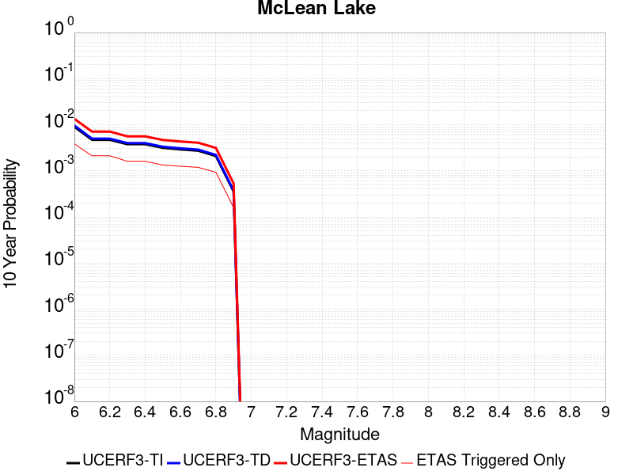 |

| Magnitude | 1 wk TI Prob | 1 wk TD Prob | 1 wk ETAS Prob | 1 wk ETAS/TD Gain | 1 wk ETAS Triggered Only | 1 mo TI Prob | 1 mo TD Prob | 1 mo ETAS Prob | 1 mo ETAS/TD Gain | 1 mo ETAS Triggered Only | 1 yr TI Prob | 1 yr TD Prob | 1 yr ETAS Prob | 1 yr ETAS/TD Gain | 1 yr ETAS Triggered Only | 10 yr TI Prob | 10 yr TD Prob | 10 yr ETAS Prob | 10 yr ETAS/TD Gain | 10 yr ETAS Triggered Only |
|-----|-----|-----|-----|-----|-----|-----|-----|-----|-----|-----|-----|-----|-----|-----|-----|-----|-----|-----|-----|-----|
| 6.0 | 1.7360222E-5 | 1.8502275E-5 | 8.926236E-5 | 4.8243995 | 7.0761394E-5 | 7.439883E-5 | 7.929332E-5 | 3.9769436E-4 | 5.0154834 | 3.1842626E-4 | 9.0542925E-4 | 9.6501724E-4 | 0.0027676914 | 2.8680227 | 0.0018044155 | 0.009017491 | 0.009613109 | 0.01332741 | 1.3863788 | 0.0037503538 |
| 6.1 | 9.062689E-6 | 9.592492E-6 | 8.03532E-5 | 8.3766775 | 7.0761394E-5 | 3.8839516E-5 | 4.1110077E-5 | 1.8262705E-4 | 4.442391 | 1.4152279E-4 | 4.727685E-4 | 5.0040917E-4 | 0.0014552099 | 2.9080403 | 9.552788E-4 | 0.0047176396 | 0.0049937065 | 0.0072467634 | 1.4511793 | 0.0022643646 |
| 6.2 | 9.062689E-6 | 9.592492E-6 | 8.03532E-5 | 8.3766775 | 7.0761394E-5 | 3.8839516E-5 | 4.1110077E-5 | 1.8262705E-4 | 4.442391 | 1.4152279E-4 | 4.727685E-4 | 5.0040917E-4 | 0.0014552099 | 2.9080403 | 9.552788E-4 | 0.0047176396 | 0.0049937065 | 0.0072467634 | 1.4511793 | 0.0022643646 |
| 6.3 | 7.2575485E-6 | 7.66794E-6 | 4.3048363E-5 | 5.614072 | 3.5380697E-5 | 3.110341E-5 | 3.2862223E-5 | 1.3900083E-4 | 4.229806 | 1.0614209E-4 | 3.786182E-4 | 4.0003125E-4 | 0.0010012625 | 2.5029607 | 6.014718E-4 | 0.0037797375 | 0.003993816 | 0.005579589 | 1.3970569 | 0.0015921313 |
| 6.4 | 7.2575485E-6 | 7.66794E-6 | 4.3048363E-5 | 5.614072 | 3.5380697E-5 | 3.110341E-5 | 3.2862223E-5 | 1.3900083E-4 | 4.229806 | 1.0614209E-4 | 3.786182E-4 | 4.0003125E-4 | 0.0010012625 | 2.5029607 | 6.014718E-4 | 0.0037797375 | 0.003993816 | 0.005579589 | 1.3970569 | 0.0015921313 |
| 6.5 | 6.06582E-6 | 6.4040664E-6 | 4.1784537E-5 | 6.524688 | 3.5380697E-5 | 2.5996113E-5 | 2.7445747E-5 | 1.3358492E-4 | 4.8672357 | 1.0614209E-4 | 3.164567E-4 | 3.3410723E-4 | 9.0000924E-4 | 2.6937737 | 5.6609116E-4 | 0.0031600643 | 0.0033366878 | 0.0047471933 | 1.4227263 | 0.0014152279 |
| 6.6 | 5.598744E-6 | 5.910437E-6 | 4.1290925E-5 | 6.9861035 | 3.5380697E-5 | 2.3994397E-5 | 2.5330233E-5 | 1.3146963E-4 | 5.190226 | 1.0614209E-4 | 2.9209262E-4 | 3.0835834E-4 | 8.7427493E-4 | 2.8352563 | 5.6609116E-4 | 0.0029170897 | 0.003079934 | 0.0044555315 | 1.446632 | 0.0013798472 |
| 6.7 | 5.246996E-6 | 5.5393257E-6 | 5.5393257E-6 | 1.0 | 0.0 | 2.2486933E-5 | 2.3739787E-5 | 9.44995E-5 | 3.980638 | 7.0761394E-5 | 2.73744E-4 | 2.8899993E-4 | 8.19557E-4 | 2.835838 | 5.3071044E-4 | 0.0027340704 | 0.0028868648 | 0.004156893 | 1.4399333 | 0.001273705 |
| 6.8 | 4.02324E-6 | 4.2470297E-6 | 4.2470297E-6 | 1.0 | 0.0 | 1.7242342E-5 | 1.8201463E-5 | 8.896157E-5 | 4.887605 | 7.0761394E-5 | 2.099053E-4 | 2.2158623E-4 | 7.5217907E-4 | 3.3945208 | 5.3071044E-4 | 0.0020970714 | 0.0022142373 | 0.0032733078 | 1.4783005 | 0.0010614209 |
| 6.9 | 6.835972E-7 | 7.140097E-7 | 7.140097E-7 | 1.0 | 0.0 | 2.9296991E-6 | 3.0600397E-6 | 3.0600397E-6 | 1.0 | 0.0 | 3.56685E-5 | 3.7255664E-5 | 1.433938E-4 | 3.8489127 | 1.0614209E-4 | 3.5662777E-4 | 3.7252545E-4 | 5.1399553E-4 | 1.3797594 | 1.4152279E-4 |

## Gravel Hills-Harper Lk
*[(top)](#table-of-contents)*

| 1 Week | 1 Month | 1 Year | 10 Year |
|-----|-----|-----|-----|
|  |  | 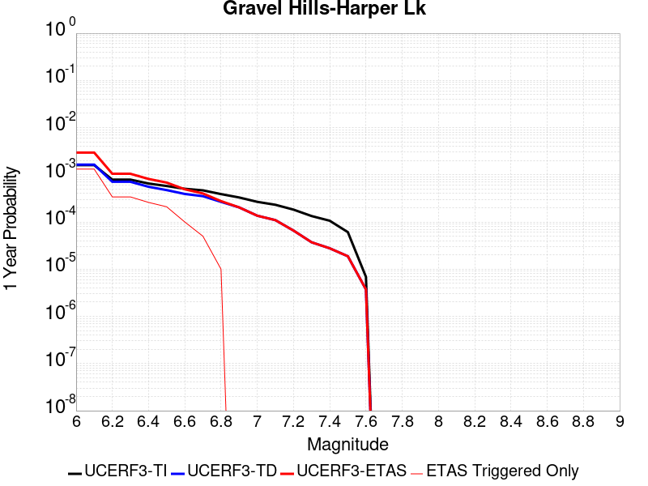 | 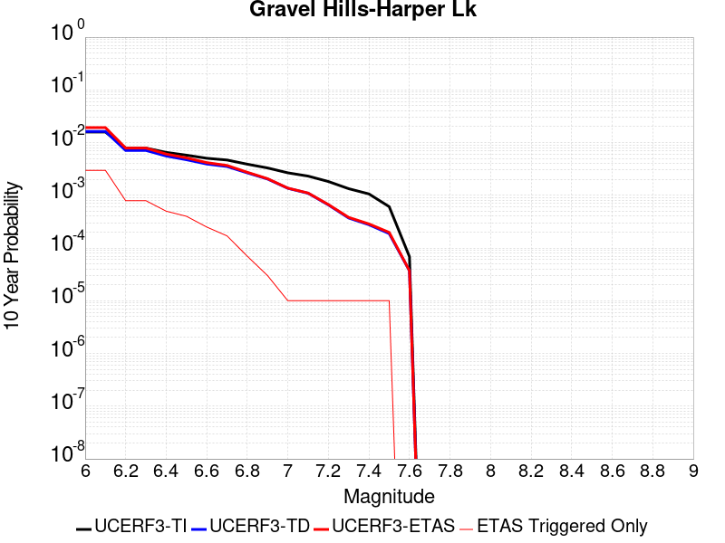 |

| Magnitude | 1 wk TI Prob | 1 wk TD Prob | 1 wk ETAS Prob | 1 wk ETAS/TD Gain | 1 wk ETAS Triggered Only | 1 mo TI Prob | 1 mo TD Prob | 1 mo ETAS Prob | 1 mo ETAS/TD Gain | 1 mo ETAS Triggered Only | 1 yr TI Prob | 1 yr TD Prob | 1 yr ETAS Prob | 1 yr ETAS/TD Gain | 1 yr ETAS Triggered Only | 10 yr TI Prob | 10 yr TD Prob | 10 yr ETAS Prob | 10 yr ETAS/TD Gain | 10 yr ETAS Triggered Only |
|-----|-----|-----|-----|-----|-----|-----|-----|-----|-----|-----|-----|-----|-----|-----|-----|-----|-----|-----|-----|-----|
| 6.0 | 3.0679566E-5 | 3.1466803E-5 | 1.3760554E-4 | 4.373039 | 1.0614209E-4 | 1.3147724E-4 | 1.3485197E-4 | 4.532353E-4 | 3.3609838 | 3.1842626E-4 | 0.0015995599 | 0.0016408027 | 0.003018386 | 1.8395787 | 0.0013798472 | 0.015880952 | 0.01630845 | 0.019266762 | 1.1813977 | 0.003007359 |
| 6.1 | 3.0679566E-5 | 3.1466803E-5 | 1.3760554E-4 | 4.373039 | 1.0614209E-4 | 1.3147724E-4 | 1.3485197E-4 | 4.532353E-4 | 3.3609838 | 3.1842626E-4 | 0.0015995599 | 0.0016408027 | 0.003018386 | 1.8395787 | 0.0013798472 | 0.015880952 | 0.01630845 | 0.019266762 | 1.1813977 | 0.003007359 |
| 6.2 | 1.514536E-5 | 1.363595E-5 | 1.363595E-5 | 1.0 | 0.0 | 6.490707E-5 | 5.8438545E-5 | 1.291958E-4 | 2.2107978 | 7.0761394E-5 | 7.8995706E-4 | 7.112689E-4 | 0.0010648242 | 1.4970769 | 3.5380697E-4 | 0.007871548 | 0.007091126 | 0.007899111 | 1.1139432 | 8.13756E-4 |
| 6.3 | 1.514536E-5 | 1.363595E-5 | 1.363595E-5 | 1.0 | 0.0 | 6.490707E-5 | 5.8438545E-5 | 1.291958E-4 | 2.2107978 | 7.0761394E-5 | 7.8995706E-4 | 7.112689E-4 | 0.0010648242 | 1.4970769 | 3.5380697E-4 | 0.007871548 | 0.007091126 | 0.007899111 | 1.1139432 | 8.13756E-4 |
| 6.4 | 1.2532521E-5 | 1.0690234E-5 | 1.0690234E-5 | 1.0 | 0.0 | 5.37097E-5 | 4.5814515E-5 | 1.16572664E-4 | 2.5444484 | 7.0761394E-5 | 6.537194E-4 | 5.576548E-4 | 8.0518157E-4 | 1.4438709 | 2.4766487E-4 | 0.0065179965 | 0.0055631446 | 0.0060909027 | 1.0948669 | 5.3071044E-4 |
| 6.5 | 1.1094058E-5 | 9.084107E-6 | 9.084107E-6 | 1.0 | 0.0 | 4.7545094E-5 | 3.8931328E-5 | 7.431065E-5 | 1.9087622 | 3.5380697E-5 | 5.787078E-4 | 4.7388987E-4 | 6.153456E-4 | 1.2984991 | 1.4152279E-4 | 0.0057720304 | 0.004729201 | 0.0050813346 | 1.0744594 | 3.5380697E-4 |
| 6.6 | 9.688328E-6 | 7.5320527E-6 | 7.5320527E-6 | 1.0 | 0.0 | 4.1520743E-5 | 3.227984E-5 | 6.765939E-5 | 2.0960262 | 3.5380697E-5 | 5.053978E-4 | 3.9293873E-4 | 4.2830553E-4 | 1.0900059 | 3.5380697E-5 | 0.0050424994 | 0.003922696 | 0.004134148 | 1.0539047 | 2.1228418E-4 |
| 6.7 | 8.974824E-6 | 6.7497303E-6 | 6.7497303E-6 | 1.0 | 0.0 | 3.8462964E-5 | 2.8927108E-5 | 2.8927108E-5 | 1.0 | 0.0 | 4.6818596E-4 | 3.5213283E-4 | 3.5213283E-4 | 1.0 | 0.0 | 0.004672008 | 0.0035159695 | 0.0036569948 | 1.0401099 | 1.4152279E-4 |
| 6.8 | 7.4780046E-6 | 5.1164316E-6 | 5.1164316E-6 | 1.0 | 0.0 | 3.20482E-5 | 2.1927388E-5 | 2.1927388E-5 | 1.0 | 0.0 | 3.9011694E-4 | 2.6693463E-4 | 2.6693463E-4 | 1.0 | 0.0 | 0.0038943281 | 0.0026662783 | 0.0027368509 | 1.0264686 | 7.0761394E-5 |
| 6.9 | 6.3409307E-6 | 3.907683E-6 | 3.907683E-6 | 1.0 | 0.0 | 2.7175134E-5 | 1.674711E-5 | 1.674711E-5 | 1.0 | 0.0 | 3.3080703E-4 | 2.0387798E-4 | 2.0387798E-4 | 1.0 | 0.0 | 0.0033031502 | 0.0020370076 | 0.0020723161 | 1.0173336 | 3.5380697E-5 |
| 7.0 | 5.1239335E-6 | 2.6059872E-6 | 2.6059872E-6 | 1.0 | 0.0 | 2.195953E-5 | 1.116847E-5 | 1.116847E-5 | 1.0 | 0.0 | 2.6732447E-4 | 1.3596789E-4 | 1.3596789E-4 | 1.0 | 0.0 | 0.0026700313 | 0.0013588723 | 0.0013942049 | 1.0260015 | 3.5380697E-5 |
| 7.1 | 4.438899E-6 | 2.0985822E-6 | 2.0985822E-6 | 1.0 | 0.0 | 1.9023713E-5 | 8.993894E-6 | 8.993894E-6 | 1.0 | 0.0 | 2.315891E-4 | 1.0949538E-4 | 1.0949538E-4 | 1.0 | 0.0 | 0.002313479 | 0.0010944362 | 0.0011297781 | 1.0322924 | 3.5380697E-5 |
| 7.2 | 3.50367E-6 | 1.2616524E-6 | 1.2616524E-6 | 1.0 | 0.0 | 1.5015643E-5 | 5.407071E-6 | 5.407071E-6 | 1.0 | 0.0 | 1.8280011E-4 | 6.582918E-5 | 6.582918E-5 | 1.0 | 0.0 | 0.0018264982 | 6.5810507E-4 | 6.934625E-4 | 1.0537261 | 3.5380697E-5 |
| 7.3 | 2.561638E-6 | 7.11978E-7 | 7.11978E-7 | 1.0 | 0.0 | 1.0978401E-5 | 3.0513306E-6 | 3.0513306E-6 | 1.0 | 0.0 | 1.3365384E-4 | 3.7149337E-5 | 3.7149337E-5 | 1.0 | 0.0 | 0.0013357349 | 3.7143327E-4 | 4.0680083E-4 | 1.0952191 | 3.5380697E-5 |
| 7.4 | 2.0368864E-6 | 5.3053367E-7 | 5.3053367E-7 | 1.0 | 0.0 | 8.729483E-6 | 2.2737138E-6 | 2.2737138E-6 | 1.0 | 0.0 | 1.06276275E-4 | 2.768212E-5 | 2.768212E-5 | 1.0 | 0.0 | 0.0010622547 | 2.7678726E-4 | 3.1215817E-4 | 1.1277909 | 3.5380697E-5 |
| 7.5 | 1.1681728E-6 | 3.6033393E-7 | 3.6033393E-7 | 1.0 | 0.0 | 5.0064455E-6 | 1.5442874E-6 | 1.5442874E-6 | 1.0 | 0.0 | 6.0951766E-5 | 1.8801542E-5 | 1.8801542E-5 | 1.0 | 0.0 | 6.093505E-4 | 1.8799998E-4 | 2.2337402E-4 | 1.1881598 | 3.5380697E-5 |
| 7.6 | 1.3154387E-7 | 7.12009E-8 | 7.12009E-8 | 1.0 | 0.0 | 5.6375933E-7 | 3.051467E-7 | 3.051467E-7 | 1.0 | 0.0 | 6.863748E-6 | 3.7151563E-6 | 3.7151563E-6 | 1.0 | 0.0 | 6.863536E-5 | 3.7151098E-5 | 3.7151098E-5 | 1.0 | 0.0 |

## Goldstone Lake
*[(top)](#table-of-contents)*

| 1 Week | 1 Month | 1 Year | 10 Year |
|-----|-----|-----|-----|
|  |  |  |  |

| Magnitude | 1 wk TI Prob | 1 wk TD Prob | 1 wk ETAS Prob | 1 wk ETAS/TD Gain | 1 wk ETAS Triggered Only | 1 mo TI Prob | 1 mo TD Prob | 1 mo ETAS Prob | 1 mo ETAS/TD Gain | 1 mo ETAS Triggered Only | 1 yr TI Prob | 1 yr TD Prob | 1 yr ETAS Prob | 1 yr ETAS/TD Gain | 1 yr ETAS Triggered Only | 10 yr TI Prob | 10 yr TD Prob | 10 yr ETAS Prob | 10 yr ETAS/TD Gain | 10 yr ETAS Triggered Only |
|-----|-----|-----|-----|-----|-----|-----|-----|-----|-----|-----|-----|-----|-----|-----|-----|-----|-----|-----|-----|-----|
| 6.0 | 2.671352E-5 | 3.0378242E-5 | 6.5757864E-5 | 2.1646369 | 3.5380697E-5 | 1.1448149E-4 | 1.3018708E-4 | 3.778197E-4 | 2.9021292 | 2.4766487E-4 | 0.001392921 | 0.0015840717 | 0.002749785 | 1.735897 | 0.001167563 | 0.013842222 | 0.015747305 | 0.018324247 | 1.1636434 | 0.0026181715 |
| 6.1 | 2.671352E-5 | 3.0378242E-5 | 6.5757864E-5 | 2.1646369 | 3.5380697E-5 | 1.1448149E-4 | 1.3018708E-4 | 3.778197E-4 | 2.9021292 | 2.4766487E-4 | 0.001392921 | 0.0015840717 | 0.002749785 | 1.735897 | 0.001167563 | 0.013842222 | 0.015747305 | 0.018324247 | 1.1636434 | 0.0026181715 |
| 6.2 | 1.4197047E-5 | 1.6097329E-5 | 1.6097329E-5 | 1.0 | 0.0 | 6.0843064E-5 | 6.898728E-5 | 2.1050031E-4 | 3.0512912 | 1.4152279E-4 | 7.4051257E-4 | 8.396952E-4 | 0.001440662 | 1.7156963 | 6.014718E-4 | 0.007380498 | 0.008374922 | 0.009602875 | 1.1466227 | 0.0012383243 |
| 6.3 | 1.4197047E-5 | 1.6097329E-5 | 1.6097329E-5 | 1.0 | 0.0 | 6.0843064E-5 | 6.898728E-5 | 2.1050031E-4 | 3.0512912 | 1.4152279E-4 | 7.4051257E-4 | 8.396952E-4 | 0.001440662 | 1.7156963 | 6.014718E-4 | 0.007380498 | 0.008374922 | 0.009602875 | 1.1466227 | 0.0012383243 |
| 6.4 | 1.3238931E-5 | 1.5009467E-5 | 1.5009467E-5 | 1.0 | 0.0 | 5.6737044E-5 | 6.432525E-5 | 2.0583894E-4 | 3.199971 | 1.4152279E-4 | 6.9055456E-4 | 7.829765E-4 | 0.0013486245 | 1.7224327 | 5.6609116E-4 | 0.006884126 | 0.007811806 | 0.008935144 | 1.1438 | 0.0011321823 |
| 6.5 | 1.3238931E-5 | 1.5009467E-5 | 1.5009467E-5 | 1.0 | 0.0 | 5.6737044E-5 | 6.432525E-5 | 2.0583894E-4 | 3.199971 | 1.4152279E-4 | 6.9055456E-4 | 7.829765E-4 | 0.0013486245 | 1.7224327 | 5.6609116E-4 | 0.006884126 | 0.007811806 | 0.008935144 | 1.1438 | 0.0011321823 |
| 6.6 | 1.1328278E-5 | 1.2856027E-5 | 1.2856027E-5 | 1.0 | 0.0 | 4.8548856E-5 | 5.5096636E-5 | 1.9661163E-4 | 3.568487 | 1.4152279E-4 | 5.90922E-4 | 6.706908E-4 | 0.0010949743 | 1.6326069 | 4.2456837E-4 | 0.0058935313 | 0.0066960566 | 0.0075043635 | 1.120714 | 8.13756E-4 |
| 6.7 | 8.651175E-6 | 9.825214E-6 | 9.825214E-6 | 1.0 | 0.0 | 3.707594E-5 | 4.2107888E-5 | 1.8362471E-4 | 4.360815 | 1.4152279E-4 | 4.5130608E-4 | 5.1263353E-4 | 8.662591E-4 | 1.6898215 | 3.5380697E-4 | 0.0045039062 | 0.0051233894 | 0.005827378 | 1.1374068 | 7.0761394E-4 |
| 6.8 | 1.0215377E-6 | 1.1755062E-6 | 1.1755062E-6 | 1.0 | 0.0 | 4.378012E-6 | 5.037875E-6 | 5.037875E-6 | 1.0 | 0.0 | 5.3300988E-5 | 6.133451E-5 | 6.133451E-5 | 1.0 | 0.0 | 5.3288206E-4 | 6.131871E-4 | 6.485461E-4 | 1.0576643 | 3.5380697E-5 |
| 6.9 | 7.9360774E-7 | 9.2836456E-7 | 9.2836456E-7 | 1.0 | 0.0 | 3.4011714E-6 | 3.9786996E-6 | 3.9786996E-6 | 1.0 | 0.0 | 4.1408475E-5 | 4.8439662E-5 | 4.8439662E-5 | 1.0 | 0.0 | 4.140076E-4 | 4.8429804E-4 | 5.196616E-4 | 1.0730202 | 3.5380697E-5 |
| 7.0 | 7.4382757E-7 | 8.747556E-7 | 8.747556E-7 | 1.0 | 0.0 | 3.1878285E-6 | 3.7489476E-6 | 3.7489476E-6 | 1.0 | 0.0 | 3.8811122E-5 | 4.5642548E-5 | 4.5642548E-5 | 1.0 | 0.0 | 3.8804344E-4 | 4.5633837E-4 | 4.5633837E-4 | 1.0 | 0.0 |
| 7.1 | 6.4709513E-7 | 7.7114885E-7 | 7.7114885E-7 | 1.0 | 0.0 | 2.773262E-6 | 3.3049198E-6 | 3.3049198E-6 | 1.0 | 0.0 | 3.376394E-5 | 4.0236715E-5 | 4.0236715E-5 | 1.0 | 0.0 | 3.375881E-4 | 4.0230027E-4 | 4.0230027E-4 | 1.0 | 0.0 |
| 7.2 | 6.356704E-7 | 7.588543E-7 | 7.588543E-7 | 1.0 | 0.0 | 2.7242988E-6 | 3.2522291E-6 | 3.2522291E-6 | 1.0 | 0.0 | 3.3167835E-5 | 3.959523E-5 | 3.959523E-5 | 1.0 | 0.0 | 3.3162883E-4 | 3.9588768E-4 | 3.9588768E-4 | 1.0 | 0.0 |
| 7.3 | 5.7695723E-7 | 6.8967347E-7 | 6.8967347E-7 | 1.0 | 0.0 | 2.4726714E-6 | 2.9557402E-6 | 2.9557402E-6 | 1.0 | 0.0 | 3.0104358E-5 | 3.5985602E-5 | 3.5985602E-5 | 1.0 | 0.0 | 3.0100282E-4 | 3.5980347E-4 | 3.5980347E-4 | 1.0 | 0.0 |
| 7.4 | 5.209647E-7 | 6.1936566E-7 | 6.1936566E-7 | 1.0 | 0.0 | 2.232704E-6 | 2.654422E-6 | 2.654422E-6 | 1.0 | 0.0 | 2.718283E-5 | 3.2317163E-5 | 3.2317163E-5 | 1.0 | 0.0 | 2.7179506E-4 | 3.231302E-4 | 3.231302E-4 | 1.0 | 0.0 |
| 7.5 | 4.512955E-7 | 5.3490027E-7 | 5.3490027E-7 | 1.0 | 0.0 | 1.934122E-6 | 2.292428E-6 | 2.292428E-6 | 1.0 | 0.0 | 2.3547682E-5 | 2.7910008E-5 | 2.7910008E-5 | 1.0 | 0.0 | 2.3545188E-4 | 2.7907031E-4 | 2.7907031E-4 | 1.0 | 0.0 |
| 7.6 | 2.21172E-7 | 2.6040124E-7 | 2.6040124E-7 | 1.0 | 0.0 | 9.478797E-7 | 1.116005E-6 | 1.116005E-6 | 1.0 | 0.0 | 1.1540374E-5 | 1.3587305E-5 | 1.3587305E-5 | 1.0 | 0.0 | 1.1539775E-4 | 1.3586757E-4 | 1.3586757E-4 | 1.0 | 0.0 |

## Death Valley (So)
*[(top)](#table-of-contents)*

| 1 Week | 1 Month | 1 Year | 10 Year |
|-----|-----|-----|-----|
|  |  |  |  |

| Magnitude | 1 wk TI Prob | 1 wk TD Prob | 1 wk ETAS Prob | 1 wk ETAS/TD Gain | 1 wk ETAS Triggered Only | 1 mo TI Prob | 1 mo TD Prob | 1 mo ETAS Prob | 1 mo ETAS/TD Gain | 1 mo ETAS Triggered Only | 1 yr TI Prob | 1 yr TD Prob | 1 yr ETAS Prob | 1 yr ETAS/TD Gain | 1 yr ETAS Triggered Only | 10 yr TI Prob | 10 yr TD Prob | 10 yr ETAS Prob | 10 yr ETAS/TD Gain | 10 yr ETAS Triggered Only |
|-----|-----|-----|-----|-----|-----|-----|-----|-----|-----|-----|-----|-----|-----|-----|-----|-----|-----|-----|-----|-----|
| 6.0 | 2.0684236E-5 | 2.562036E-5 | 2.562036E-5 | 1.0 | 0.0 | 8.864371E-5 | 1.0979702E-4 | 2.8668108E-4 | 2.6110096 | 1.7690349E-4 | 0.0010787029 | 0.0013359758 | 0.002501979 | 1.8727726 | 0.001167563 | 0.010734817 | 0.013282726 | 0.016110497 | 1.2128909 | 0.0028658365 |
| 6.1 | 2.0684236E-5 | 2.562036E-5 | 2.562036E-5 | 1.0 | 0.0 | 8.864371E-5 | 1.0979702E-4 | 2.8668108E-4 | 2.6110096 | 1.7690349E-4 | 0.0010787029 | 0.0013359758 | 0.002501979 | 1.8727726 | 0.001167563 | 0.010734817 | 0.013282726 | 0.016110497 | 1.2128909 | 0.0028658365 |
| 6.2 | 2.0684236E-5 | 2.562036E-5 | 2.562036E-5 | 1.0 | 0.0 | 8.864371E-5 | 1.0979702E-4 | 2.8668108E-4 | 2.6110096 | 1.7690349E-4 | 0.0010787029 | 0.0013359758 | 0.002501979 | 1.8727726 | 0.001167563 | 0.010734817 | 0.013282726 | 0.016110497 | 1.2128909 | 0.0028658365 |
| 6.3 | 2.0240292E-5 | 2.5120411E-5 | 2.5120411E-5 | 1.0 | 0.0 | 8.6741224E-5 | 1.0765456E-4 | 2.491621E-4 | 2.3144593 | 1.4152279E-4 | 0.0010555626 | 0.0013099229 | 0.002440622 | 1.8631799 | 0.0011321823 | 0.010505628 | 0.013025268 | 0.015749017 | 1.2091126 | 0.0027596944 |
| 6.4 | 2.0240292E-5 | 2.5120411E-5 | 2.5120411E-5 | 1.0 | 0.0 | 8.6741224E-5 | 1.0765456E-4 | 2.491621E-4 | 2.3144593 | 1.4152279E-4 | 0.0010555626 | 0.0013099229 | 0.002440622 | 1.8631799 | 0.0011321823 | 0.010505628 | 0.013025268 | 0.015749017 | 1.2091126 | 0.0027596944 |
| 6.5 | 1.9962767E-5 | 2.4809646E-5 | 2.4809646E-5 | 1.0 | 0.0 | 8.55519E-5 | 1.0632281E-4 | 2.4783055E-4 | 2.3309255 | 1.4152279E-4 | 0.0010410968 | 0.0012937282 | 0.0024244457 | 1.8739992 | 0.0011321823 | 0.010362327 | 0.012865204 | 0.015519544 | 1.2063192 | 0.002688933 |
| 6.6 | 1.8937297E-5 | 2.331338E-5 | 2.331338E-5 | 1.0 | 0.0 | 8.115732E-5 | 9.991074E-5 | 1.7066507E-4 | 1.7081753 | 7.0761394E-5 | 9.876423E-4 | 0.0012157491 | 0.0022405419 | 1.8429312 | 0.0010260402 | 0.009832645 | 0.012094032 | 0.014610634 | 1.2080863 | 0.00254741 |
| 6.7 | 1.8621096E-5 | 2.2913995E-5 | 2.2913995E-5 | 1.0 | 0.0 | 7.980225E-5 | 9.819922E-5 | 1.6895367E-4 | 1.7205194 | 7.0761394E-5 | 9.711593E-4 | 0.0011949344 | 0.0022197485 | 1.8576322 | 0.0010260402 | 0.009669261 | 0.011888134 | 0.0143703 | 1.2087935 | 0.0025120294 |
| 6.8 | 1.7830353E-5 | 2.1807928E-5 | 2.1807928E-5 | 1.0 | 0.0 | 7.641356E-5 | 9.3459275E-5 | 1.6421406E-4 | 1.7570653 | 7.0761394E-5 | 9.29938E-4 | 0.0011372868 | 0.0021268197 | 1.8700821 | 9.906595E-4 | 0.009260561 | 0.011317508 | 0.013661186 | 1.2070843 | 0.0023705068 |
| 6.9 | 1.3135183E-5 | 1.530519E-5 | 1.530519E-5 | 1.0 | 0.0 | 5.6292425E-5 | 6.559206E-5 | 1.3634881E-4 | 2.0787396 | 7.0761394E-5 | 6.8514474E-4 | 7.9829723E-4 | 0.0013992889 | 1.7528421 | 6.014718E-4 | 0.006830362 | 0.007955303 | 0.009499669 | 1.1941304 | 0.0015567506 |
| 7.0 | 1.1507512E-5 | 1.3155178E-5 | 1.3155178E-5 | 1.0 | 0.0 | 4.9316975E-5 | 5.6378147E-5 | 1.2713554E-4 | 2.2550502 | 7.0761394E-5 | 6.002687E-4 | 6.861935E-4 | 0.0011104706 | 1.6183052 | 4.2456837E-4 | 0.0059864987 | 0.0068414486 | 0.007790192 | 1.1386758 | 9.552788E-4 |
| 7.1 | 9.715903E-6 | 1.08659815E-5 | 1.08659815E-5 | 1.0 | 0.0 | 4.1638916E-5 | 4.6567682E-5 | 8.194673E-5 | 1.7597339 | 3.5380697E-5 | 5.068359E-4 | 5.6681834E-4 | 8.4970344E-4 | 1.4990755 | 2.8304558E-4 | 0.0050568148 | 0.0056541795 | 0.006181889 | 1.0933309 | 5.3071044E-4 |
| 7.2 | 9.233269E-6 | 1.0286961E-5 | 1.0286961E-5 | 1.0 | 0.0 | 3.9570554E-5 | 4.4086253E-5 | 7.946539E-5 | 1.8024981 | 3.5380697E-5 | 4.81665E-4 | 5.366222E-4 | 7.1343075E-4 | 1.3294842 | 1.7690349E-4 | 0.0048062233 | 0.0053536952 | 0.005775991 | 1.0788792 | 4.2456837E-4 |
| 7.3 | 8.8041315E-6 | 9.80876E-6 | 9.80876E-6 | 1.0 | 0.0 | 3.7731446E-5 | 4.203689E-5 | 7.74161E-5 | 1.8416228 | 3.5380697E-5 | 4.592835E-4 | 5.116832E-4 | 6.884961E-4 | 1.3455516 | 1.7690349E-4 | 0.0045833546 | 0.005105477 | 0.0054926774 | 1.0758402 | 3.8918765E-4 |
| 7.4 | 8.708749E-6 | 9.707768E-6 | 9.707768E-6 | 1.0 | 0.0 | 3.7322676E-5 | 4.1604082E-5 | 7.6983306E-5 | 1.8503788 | 3.5380697E-5 | 4.5430884E-4 | 5.0641614E-4 | 6.478673E-4 | 1.279318 | 1.4152279E-4 | 0.004533812 | 0.0050530476 | 0.005405067 | 1.0696647 | 3.5380697E-4 |
| 7.5 | 8.612678E-6 | 9.605406E-6 | 9.605406E-6 | 1.0 | 0.0 | 3.6910955E-5 | 4.1165404E-5 | 7.6544646E-5 | 1.8594412 | 3.5380697E-5 | 4.492982E-4 | 5.0107774E-4 | 6.425296E-4 | 1.2822952 | 1.4152279E-4 | 0.004483909 | 0.004999905 | 0.005351943 | 1.0704089 | 3.5380697E-4 |
| 7.6 | 8.319024E-6 | 9.28449E-6 | 9.28449E-6 | 1.0 | 0.0 | 3.5652476E-5 | 3.9790088E-5 | 7.516937E-5 | 1.8891484 | 3.5380697E-5 | 4.3398244E-4 | 4.8434082E-4 | 6.2579504E-4 | 1.2920551 | 1.4152279E-4 | 0.0043313587 | 0.0048332764 | 0.005185373 | 1.0728486 | 3.5380697E-4 |
| 7.7 | 7.4718328E-6 | 8.345689E-6 | 8.345689E-6 | 1.0 | 0.0 | 3.2021748E-5 | 3.576677E-5 | 7.1146205E-5 | 1.9891704 | 3.5380697E-5 | 3.8979502E-4 | 4.3537747E-4 | 5.4147333E-4 | 1.2436872 | 1.0614209E-4 | 0.00389112 | 0.0043456503 | 0.004592239 | 1.0567437 | 2.4766487E-4 |
| 7.8 | 3.4586725E-7 | 3.648368E-7 | 3.648368E-7 | 1.0 | 0.0 | 1.4822873E-6 | 1.5635853E-6 | 1.5635853E-6 | 1.0 | 0.0 | 1.80467E-5 | 1.903649E-5 | 1.903649E-5 | 1.0 | 0.0 | 1.8045233E-4 | 1.9034903E-4 | 1.9034903E-4 | 1.0 | 0.0 |
| 7.9 | 2.5591178E-9 | 2.6697329E-9 | 2.6697329E-9 | 1.0 | 0.0 | 1.0967647E-8 | 1.14417125E-8 | 1.14417125E-8 | 1.0 | 0.0 | 1.335311E-7 | 1.3930286E-7 | 1.3930286E-7 | 1.0 | 0.0 | 1.3353102E-6 | 1.3930285E-6 | 1.3930285E-6 | 1.0 | 0.0 |

## So Sierra Nevada
*[(top)](#table-of-contents)*

| 1 Week | 1 Month | 1 Year | 10 Year |
|-----|-----|-----|-----|
|  |  |  |  |

| Magnitude | 1 wk TI Prob | 1 wk TD Prob | 1 wk ETAS Prob | 1 wk ETAS/TD Gain | 1 wk ETAS Triggered Only | 1 mo TI Prob | 1 mo TD Prob | 1 mo ETAS Prob | 1 mo ETAS/TD Gain | 1 mo ETAS Triggered Only | 1 yr TI Prob | 1 yr TD Prob | 1 yr ETAS Prob | 1 yr ETAS/TD Gain | 1 yr ETAS Triggered Only | 10 yr TI Prob | 10 yr TD Prob | 10 yr ETAS Prob | 10 yr ETAS/TD Gain | 10 yr ETAS Triggered Only |
|-----|-----|-----|-----|-----|-----|-----|-----|-----|-----|-----|-----|-----|-----|-----|-----|-----|-----|-----|-----|-----|
| 6.0 | 1.15488665E-5 | 1.1079958E-5 | 8.184057E-5 | 7.38636 | 7.0761394E-5 | 4.9494203E-5 | 4.7484744E-5 | 3.3051686E-4 | 6.9604855 | 2.8304558E-4 | 6.024253E-4 | 5.779862E-4 | 0.0018155948 | 3.1412427 | 0.0012383243 | 0.006007948 | 0.0057660984 | 0.00850988 | 1.4758472 | 0.0027596944 |
| 6.1 | 1.15488665E-5 | 1.1079958E-5 | 8.184057E-5 | 7.38636 | 7.0761394E-5 | 4.9494203E-5 | 4.7484744E-5 | 3.3051686E-4 | 6.9604855 | 2.8304558E-4 | 6.024253E-4 | 5.779862E-4 | 0.0018155948 | 3.1412427 | 0.0012383243 | 0.006007948 | 0.0057660984 | 0.00850988 | 1.4758472 | 0.0027596944 |
| 6.2 | 1.15488665E-5 | 1.1079958E-5 | 8.184057E-5 | 7.38636 | 7.0761394E-5 | 4.9494203E-5 | 4.7484744E-5 | 3.3051686E-4 | 6.9604855 | 2.8304558E-4 | 6.024253E-4 | 5.779862E-4 | 0.0018155948 | 3.1412427 | 0.0012383243 | 0.006007948 | 0.0057660984 | 0.00850988 | 1.4758472 | 0.0027596944 |
| 6.3 | 1.15488665E-5 | 1.1079958E-5 | 8.184057E-5 | 7.38636 | 7.0761394E-5 | 4.9494203E-5 | 4.7484744E-5 | 3.3051686E-4 | 6.9604855 | 2.8304558E-4 | 6.024253E-4 | 5.779862E-4 | 0.0018155948 | 3.1412427 | 0.0012383243 | 0.006007948 | 0.0057660984 | 0.00850988 | 1.4758472 | 0.0027596944 |
| 6.4 | 1.15488665E-5 | 1.1079958E-5 | 8.184057E-5 | 7.38636 | 7.0761394E-5 | 4.9494203E-5 | 4.7484744E-5 | 3.3051686E-4 | 6.9604855 | 2.8304558E-4 | 6.024253E-4 | 5.779862E-4 | 0.0018155948 | 3.1412427 | 0.0012383243 | 0.006007948 | 0.0057660984 | 0.00850988 | 1.4758472 | 0.0027596944 |
| 6.5 | 1.15488665E-5 | 1.1079958E-5 | 8.184057E-5 | 7.38636 | 7.0761394E-5 | 4.9494203E-5 | 4.7484744E-5 | 3.3051686E-4 | 6.9604855 | 2.8304558E-4 | 6.024253E-4 | 5.779862E-4 | 0.0018155948 | 3.1412427 | 0.0012383243 | 0.006007948 | 0.0057660984 | 0.00850988 | 1.4758472 | 0.0027596944 |
| 6.6 | 7.587044E-6 | 6.9358503E-6 | 7.769675E-5 | 11.202196 | 7.0761394E-5 | 3.2515498E-5 | 2.972475E-5 | 2.0662298E-4 | 6.95121 | 1.7690349E-4 | 3.9580427E-4 | 3.6184167E-4 | 0.0011045674 | 3.0526266 | 7.429946E-4 | 0.003951 | 0.0036128166 | 0.005163943 | 1.4293399 | 0.0015567506 |
| 6.7 | 7.587044E-6 | 6.9358503E-6 | 7.769675E-5 | 11.202196 | 7.0761394E-5 | 3.2515498E-5 | 2.972475E-5 | 2.0662298E-4 | 6.95121 | 1.7690349E-4 | 3.9580427E-4 | 3.6184167E-4 | 0.0011045674 | 3.0526266 | 7.429946E-4 | 0.003951 | 0.0036128166 | 0.005163943 | 1.4293399 | 0.0015567506 |
| 6.8 | 5.9026956E-6 | 5.179568E-6 | 7.5940596E-5 | 14.66157 | 7.0761394E-5 | 2.5297022E-5 | 2.2197966E-5 | 1.9909751E-4 | 8.969178 | 1.7690349E-4 | 3.0794772E-4 | 2.7022787E-4 | 8.715372E-4 | 3.2251935 | 6.014718E-4 | 0.0030752132 | 0.0026991093 | 0.003898806 | 1.4444788 | 0.0012029436 |
| 6.9 | 5.0118915E-6 | 4.2525808E-6 | 7.5013675E-5 | 17.639565 | 7.0761394E-5 | 2.1479358E-5 | 1.8225222E-5 | 1.9512548E-4 | 10.706343 | 1.7690349E-4 | 2.614798E-4 | 2.2187021E-4 | 7.524629E-4 | 3.3914552 | 5.3071044E-4 | 0.0026117235 | 0.0022165596 | 0.0032050232 | 1.445945 | 9.906595E-4 |
| 7.0 | 4.4924795E-6 | 3.7140621E-6 | 7.447519E-5 | 20.05222 | 7.0761394E-5 | 1.925334E-5 | 1.5917316E-5 | 1.9281798E-4 | 12.113725 | 1.7690349E-4 | 2.3438422E-4 | 1.9377672E-4 | 6.5363664E-4 | 3.3731432 | 4.5994905E-4 | 0.0023413717 | 0.0019361405 | 0.002748321 | 1.4194843 | 8.13756E-4 |
| 7.1 | 3.9118436E-6 | 3.1121094E-6 | 7.3873285E-5 | 23.737366 | 7.0761394E-5 | 1.6764936E-5 | 1.3337547E-5 | 1.9023867E-4 | 14.263392 | 1.7690349E-4 | 2.0409399E-4 | 1.6237311E-4 | 5.5149756E-4 | 3.3964834 | 3.8918765E-4 | 0.0020390663 | 0.0016226007 | 0.0022230966 | 1.3700824 | 6.014718E-4 |
| 7.2 | 3.4200818E-6 | 2.605576E-6 | 7.3366784E-5 | 28.157606 | 7.0761394E-5 | 1.4657411E-5 | 1.116671E-5 | 1.8806821E-4 | 16.841866 | 1.7690349E-4 | 1.7843937E-4 | 1.3594671E-4 | 4.5432968E-4 | 3.341969 | 3.1842626E-4 | 0.0017829615 | 0.0013586852 | 0.0018533419 | 1.3640702 | 4.9532973E-4 |
| 7.3 | 2.6593618E-6 | 1.8285265E-6 | 7.258979E-5 | 39.698517 | 7.0761394E-5 | 1.13972155E-5 | 7.83652E-6 | 1.493582E-4 | 19.05925 | 1.4152279E-4 | 1.3875226E-4 | 9.5405754E-5 | 3.43047E-4 | 3.5956638 | 2.4766487E-4 | 0.0013866565 | 9.536769E-4 | 0.0013071464 | 1.3706387 | 3.5380697E-4 |
| 7.4 | 2.2577992E-6 | 1.436535E-6 | 7.219783E-5 | 50.258316 | 7.0761394E-5 | 9.676246E-6 | 6.156565E-6 | 1.12298E-4 | 18.240366 | 1.0614209E-4 | 1.1780193E-4 | 7.495386E-5 | 2.8722212E-4 | 3.831986 | 2.1228418E-4 | 0.001177395 | 7.493108E-4 | 0.0010674985 | 1.4246404 | 3.1842626E-4 |
| 7.5 | 1.489319E-6 | 7.354697E-7 | 7.354697E-7 | 1.0 | 0.0 | 6.3827797E-6 | 3.1520092E-6 | 3.8532595E-5 | 12.224772 | 3.5380697E-5 | 7.770758E-5 | 3.837504E-5 | 1.0913372E-4 | 2.8438723 | 7.0761394E-5 | 7.7680405E-4 | 3.836846E-4 | 5.6052016E-4 | 1.460888 | 1.7690349E-4 |
| 7.6 | 1.0680322E-6 | 4.6602182E-7 | 4.6602182E-7 | 1.0 | 0.0 | 4.577273E-6 | 1.997235E-6 | 1.997235E-6 | 1.0 | 0.0 | 5.5726876E-5 | 2.4316065E-5 | 5.96959E-5 | 2.4549985 | 3.5380697E-5 | 5.5712904E-4 | 2.431343E-4 | 3.492506E-4 | 1.4364513 | 1.0614209E-4 |
| 7.7 | 5.509146E-7 | 1.558334E-7 | 1.558334E-7 | 1.0 | 0.0 | 2.3610605E-6 | 6.678573E-7 | 6.678573E-7 | 1.0 | 0.0 | 2.8745531E-5 | 8.131134E-6 | 8.131134E-6 | 1.0 | 0.0 | 2.8741814E-4 | 8.130848E-5 | 8.130848E-5 | 1.0 | 0.0 |

## San Andreas (Mojave S)
*[(top)](#table-of-contents)*

| 1 Week | 1 Month | 1 Year | 10 Year |
|-----|-----|-----|-----|
|  |  |  |  |

| Magnitude | 1 wk TI Prob | 1 wk TD Prob | 1 wk ETAS Prob | 1 wk ETAS/TD Gain | 1 wk ETAS Triggered Only | 1 mo TI Prob | 1 mo TD Prob | 1 mo ETAS Prob | 1 mo ETAS/TD Gain | 1 mo ETAS Triggered Only | 1 yr TI Prob | 1 yr TD Prob | 1 yr ETAS Prob | 1 yr ETAS/TD Gain | 1 yr ETAS Triggered Only | 10 yr TI Prob | 10 yr TD Prob | 10 yr ETAS Prob | 10 yr ETAS/TD Gain | 10 yr ETAS Triggered Only |
|-----|-----|-----|-----|-----|-----|-----|-----|-----|-----|-----|-----|-----|-----|-----|-----|-----|-----|-----|-----|-----|
| 6.0 | 3.1064058E-4 | 6.7499664E-4 | 7.1035343E-4 | 1.0523807 | 3.5380697E-5 | 0.0013306376 | 0.0028897638 | 0.003066156 | 1.0610404 | 1.7690349E-4 | 0.016080605 | 0.034641396 | 0.035426963 | 1.0226771 | 8.13756E-4 | 0.1496549 | 0.2867374 | 0.28802443 | 1.0044885 | 0.0018044155 |
| 6.1 | 3.1064058E-4 | 6.7499664E-4 | 7.1035343E-4 | 1.0523807 | 3.5380697E-5 | 0.0013306376 | 0.0028897638 | 0.003066156 | 1.0610404 | 1.7690349E-4 | 0.016080605 | 0.034641396 | 0.035426963 | 1.0226771 | 8.13756E-4 | 0.1496549 | 0.2867374 | 0.28802443 | 1.0044885 | 0.0018044155 |
| 6.2 | 3.1064058E-4 | 6.7499664E-4 | 7.1035343E-4 | 1.0523807 | 3.5380697E-5 | 0.0013306376 | 0.0028897638 | 0.003066156 | 1.0610404 | 1.7690349E-4 | 0.016080605 | 0.034641396 | 0.035426963 | 1.0226771 | 8.13756E-4 | 0.1496549 | 0.2867374 | 0.28802443 | 1.0044885 | 0.0018044155 |
| 6.3 | 3.1064058E-4 | 6.7499664E-4 | 7.1035343E-4 | 1.0523807 | 3.5380697E-5 | 0.0013306376 | 0.0028897638 | 0.003066156 | 1.0610404 | 1.7690349E-4 | 0.016080605 | 0.034641396 | 0.035426963 | 1.0226771 | 8.13756E-4 | 0.1496549 | 0.2867374 | 0.28802443 | 1.0044885 | 0.0018044155 |
| 6.4 | 1.9872203E-4 | 4.3216298E-4 | 4.6752839E-4 | 1.0818335 | 3.5380697E-5 | 8.5138786E-4 | 0.0018508406 | 0.0020274166 | 1.0954032 | 1.7690349E-4 | 0.010316478 | 0.022307295 | 0.023068307 | 1.034115 | 7.783753E-4 | 0.098504856 | 0.19713911 | 0.19844578 | 1.0066282 | 0.001627512 |
| 6.5 | 1.291105E-4 | 2.8787713E-4 | 3.2324766E-4 | 1.1228666 | 3.5380697E-5 | 5.5321335E-4 | 0.0012331787 | 0.0013745269 | 1.114621 | 1.4152279E-4 | 0.006714592 | 0.014911419 | 0.015608481 | 1.0467469 | 7.0761394E-4 | 0.065152965 | 0.13817947 | 0.13946013 | 1.009268 | 0.0014859892 |
| 6.6 | 1.291105E-4 | 2.8787713E-4 | 3.2324766E-4 | 1.1228666 | 3.5380697E-5 | 5.5321335E-4 | 0.0012331787 | 0.0013745269 | 1.114621 | 1.4152279E-4 | 0.006714592 | 0.014911419 | 0.015608481 | 1.0467469 | 7.0761394E-4 | 0.065152965 | 0.13817947 | 0.13946013 | 1.009268 | 0.0014859892 |
| 6.7 | 1.08001186E-4 | 2.4368397E-4 | 2.7905605E-4 | 1.1451555 | 3.5380697E-5 | 4.6278012E-4 | 0.0010439424 | 0.0011499737 | 1.1015681 | 1.0614209E-4 | 0.0056198016 | 0.012636229 | 0.013265034 | 1.0497621 | 6.368525E-4 | 0.054797906 | 0.119323194 | 0.12053839 | 1.010184 | 0.0013798472 |
| 6.8 | 1.0624356E-4 | 2.3885963E-4 | 2.7423186E-4 | 1.148088 | 3.5380697E-5 | 4.5525006E-4 | 0.001023283 | 0.0011293165 | 1.1036209 | 1.0614209E-4 | 0.0055285925 | 0.012387579 | 0.013016542 | 1.0507737 | 6.368525E-4 | 0.053930566 | 0.11727233 | 0.11849036 | 1.0103863 | 0.0013798472 |
| 6.9 | 1.0393785E-4 | 2.3256175E-4 | 2.6793423E-4 | 1.1520993 | 3.5380697E-5 | 4.4537184E-4 | 9.963129E-4 | 0.0011023493 | 1.1064287 | 1.0614209E-4 | 0.0054089287 | 0.012062895 | 0.012692065 | 1.0521575 | 6.368525E-4 | 0.05279156 | 0.114569746 | 0.11576018 | 1.0103904 | 0.0013444665 |
| 7.0 | 1.0155622E-4 | 2.262555E-4 | 2.6162819E-4 | 1.1563395 | 3.5380697E-5 | 4.3516833E-4 | 9.693065E-4 | 0.0010753457 | 1.1093969 | 1.0614209E-4 | 0.005285311 | 0.011737675 | 0.012367052 | 1.0536202 | 6.368525E-4 | 0.05161361 | 0.11182977 | 0.113023885 | 1.0106779 | 0.0013444665 |
| 7.1 | 9.885595E-5 | 2.191377E-4 | 2.5451064E-4 | 1.1614188 | 3.5380697E-5 | 4.2359953E-4 | 9.388239E-4 | 0.0010448663 | 1.1129525 | 1.0614209E-4 | 0.0051451353 | 0.011370476 | 0.012000088 | 1.0553725 | 6.368525E-4 | 0.05027629 | 0.10871404 | 0.109912336 | 1.0110226 | 0.0013444665 |
| 7.2 | 9.6411415E-5 | 2.1276584E-4 | 2.4813903E-4 | 1.1662539 | 3.5380697E-5 | 4.1312634E-4 | 9.115353E-4 | 0.0010175806 | 1.1163371 | 1.0614209E-4 | 0.005018219 | 0.0110416515 | 0.011671472 | 1.0570405 | 6.368525E-4 | 0.049064007 | 0.10590357 | 0.10710565 | 1.0113508 | 0.0013444665 |
| 7.3 | 9.1180635E-5 | 1.950402E-4 | 1.950402E-4 | 1.0 | 0.0 | 3.907156E-4 | 8.356189E-4 | 9.0632116E-4 | 1.0846107 | 7.0761394E-5 | 0.004746591 | 0.010126315 | 0.010721697 | 1.0587955 | 6.014718E-4 | 0.046464786 | 0.09809433 | 0.09924309 | 1.0117108 | 0.001273705 |
| 7.4 | 8.887388E-5 | 1.8752231E-4 | 1.8752231E-4 | 1.0 | 0.0 | 3.8083247E-4 | 8.0341956E-4 | 8.741241E-4 | 1.0880045 | 7.0761394E-5 | 0.0046267817 | 0.00973786 | 0.010333475 | 1.0611649 | 6.014718E-4 | 0.045316286 | 0.09472819 | 0.09588123 | 1.0121722 | 0.001273705 |
| 7.5 | 8.6750515E-5 | 1.8083451E-4 | 1.8083451E-4 | 1.0 | 0.0 | 3.7173493E-4 | 7.7477493E-4 | 8.454815E-4 | 1.0912608 | 7.0761394E-5 | 0.004516484 | 0.009392173 | 0.009987995 | 1.0634382 | 6.014718E-4 | 0.04425787 | 0.09169095 | 0.09284787 | 1.0126176 | 0.001273705 |
| 7.6 | 8.453092E-5 | 1.747065E-4 | 1.747065E-4 | 1.0 | 0.0 | 3.6222505E-4 | 7.485273E-4 | 8.1923575E-4 | 1.0944633 | 7.0761394E-5 | 0.0044011753 | 0.009075315 | 0.009671328 | 1.0656741 | 6.014718E-4 | 0.04315024 | 0.08884873 | 0.09000927 | 1.013062 | 0.001273705 |
| 7.7 | 8.259102E-5 | 1.6992437E-4 | 1.6992437E-4 | 1.0 | 0.0 | 3.539135E-4 | 7.280441E-4 | 7.98754E-4 | 1.097123 | 7.0761394E-5 | 0.004300386 | 0.008827981 | 0.009424143 | 1.067531 | 6.014718E-4 | 0.042181134 | 0.08659836 | 0.08776176 | 1.0134345 | 0.001273705 |
| 7.8 | 7.444844E-5 | 1.531194E-4 | 1.531194E-4 | 1.0 | 0.0 | 3.1902574E-4 | 6.56061E-4 | 7.2677596E-4 | 1.1077871 | 7.0761394E-5 | 0.0038772223 | 0.007958339 | 0.008555024 | 1.0749761 | 6.014718E-4 | 0.03810269 | 0.07841811 | 0.079461515 | 1.0133055 | 0.0011321823 |
| 7.9 | 5.2586525E-5 | 1.0025827E-4 | 1.0025827E-4 | 1.0 | 0.0 | 2.2535135E-4 | 4.2960755E-4 | 4.2960755E-4 | 1.0 | 0.0 | 0.0027402006 | 0.005217939 | 0.005534704 | 1.0607069 | 3.1842626E-4 | 0.027066574 | 0.052290585 | 0.052927665 | 1.0121835 | 6.7223323E-4 |
| 8.0 | 3.379877E-5 | 5.418614E-5 | 5.418614E-5 | 1.0 | 0.0 | 1.4484383E-4 | 2.3220567E-4 | 2.3220567E-4 | 1.0 | 0.0 | 0.0017620471 | 0.0028234406 | 0.002964564 | 1.0499827 | 1.4152279E-4 | 0.017481409 | 0.028889727 | 0.029164596 | 1.0095145 | 2.8304558E-4 |
| 8.1 | 1.8668277E-5 | 1.936222E-5 | 1.936222E-5 | 1.0 | 0.0 | 8.000444E-5 | 8.29783E-5 | 8.29783E-5 | 1.0 | 0.0 | 9.736188E-4 | 0.0010097933 | 0.0010451382 | 1.0350022 | 3.5380697E-5 | 0.009693642 | 0.010826511 | 0.010931504 | 1.0096978 | 1.0614209E-4 |
| 8.2 | 8.541571E-6 | 5.4811067E-6 | 5.4811067E-6 | 1.0 | 0.0 | 3.660622E-5 | 2.3490245E-5 | 2.3490245E-5 | 1.0 | 0.0 | 4.455896E-4 | 2.8595628E-4 | 2.8595628E-4 | 1.0 | 0.0 | 0.0044469717 | 0.0032518986 | 0.0032518986 | 1.0 | 0.0 |
| 8.3 | 1.983087E-6 | 7.693574E-7 | 7.693574E-7 | 1.0 | 0.0 | 8.498917E-6 | 3.297242E-6 | 3.297242E-6 | 1.0 | 0.0 | 1.034694E-4 | 4.01432E-5 | 4.01432E-5 | 1.0 | 0.0 | 0.0010342124 | 4.7390026E-4 | 4.7390026E-4 | 1.0 | 0.0 |

## Coyote Canyon
*[(top)](#table-of-contents)*

| 1 Week | 1 Month | 1 Year | 10 Year |
|-----|-----|-----|-----|
|  |  |  |  |

| Magnitude | 1 wk TI Prob | 1 wk TD Prob | 1 wk ETAS Prob | 1 wk ETAS/TD Gain | 1 wk ETAS Triggered Only | 1 mo TI Prob | 1 mo TD Prob | 1 mo ETAS Prob | 1 mo ETAS/TD Gain | 1 mo ETAS Triggered Only | 1 yr TI Prob | 1 yr TD Prob | 1 yr ETAS Prob | 1 yr ETAS/TD Gain | 1 yr ETAS Triggered Only | 10 yr TI Prob | 10 yr TD Prob | 10 yr ETAS Prob | 10 yr ETAS/TD Gain | 10 yr ETAS Triggered Only |
|-----|-----|-----|-----|-----|-----|-----|-----|-----|-----|-----|-----|-----|-----|-----|-----|-----|-----|-----|-----|-----|
| 6.0 | 3.5090034E-5 | 4.0367544E-5 | 1.4650535E-4 | 3.6292856 | 1.0614209E-4 | 1.503772E-4 | 1.7299375E-4 | 3.4986663E-4 | 2.0224235 | 1.7690349E-4 | 0.0018293047 | 0.0021044204 | 0.002916464 | 1.3858751 | 8.13756E-4 | 0.018143194 | 0.020870851 | 0.022395112 | 1.073033 | 0.0015567506 |
| 6.1 | 3.5090034E-5 | 4.0367544E-5 | 1.4650535E-4 | 3.6292856 | 1.0614209E-4 | 1.503772E-4 | 1.7299375E-4 | 3.4986663E-4 | 2.0224235 | 1.7690349E-4 | 0.0018293047 | 0.0021044204 | 0.002916464 | 1.3858751 | 8.13756E-4 | 0.018143194 | 0.020870851 | 0.022395112 | 1.073033 | 0.0015567506 |
| 6.2 | 1.841879E-5 | 2.1061396E-5 | 5.6441346E-5 | 2.6798484 | 3.5380697E-5 | 7.8935285E-5 | 9.026058E-5 | 1.6101559E-4 | 1.783897 | 7.0761394E-5 | 9.606133E-4 | 0.0010984705 | 0.0014872306 | 1.3539104 | 3.8918765E-4 | 0.0095647145 | 0.010940496 | 0.01185033 | 1.0831621 | 9.198981E-4 |
| 6.3 | 1.841879E-5 | 2.1061396E-5 | 5.6441346E-5 | 2.6798484 | 3.5380697E-5 | 7.8935285E-5 | 9.026058E-5 | 1.6101559E-4 | 1.783897 | 7.0761394E-5 | 9.606133E-4 | 0.0010984705 | 0.0014872306 | 1.3539104 | 3.8918765E-4 | 0.0095647145 | 0.010940496 | 0.01185033 | 1.0831621 | 9.198981E-4 |
| 6.4 | 1.712201E-5 | 1.9566693E-5 | 5.4946697E-5 | 2.8081748 | 3.5380697E-5 | 7.337798E-5 | 8.385513E-5 | 1.5461059E-4 | 1.8437821 | 7.0761394E-5 | 8.930107E-4 | 0.0010205585 | 0.001409349 | 1.3809586 | 3.8918765E-4 | 0.008894307 | 0.010168637 | 0.01100914 | 1.0826563 | 8.4913673E-4 |
| 6.5 | 1.4744935E-5 | 1.683824E-5 | 5.221834E-5 | 3.1011758 | 3.5380697E-5 | 6.3191044E-5 | 7.216242E-5 | 1.429187E-4 | 1.9805144 | 7.0761394E-5 | 7.6907943E-4 | 8.7831676E-4 | 0.0011611137 | 1.3219761 | 2.8304558E-4 | 0.007664232 | 0.008757652 | 0.009423997 | 1.0760874 | 6.7223323E-4 |
| 6.6 | 1.2017839E-5 | 1.3725124E-5 | 4.9105332E-5 | 3.57777 | 3.5380697E-5 | 5.150401E-5 | 5.882113E-5 | 1.2957836E-4 | 2.2029219 | 7.0761394E-5 | 6.268809E-4 | 7.1600056E-4 | 9.6348807E-4 | 1.3456527 | 2.4766487E-4 | 0.0062511545 | 0.007145631 | 0.0077779326 | 1.0884879 | 6.368525E-4 |
| 6.7 | 1.00956095E-5 | 1.1534388E-5 | 4.6914676E-5 | 4.067374 | 3.5380697E-5 | 4.326618E-5 | 4.943265E-5 | 1.2019054E-4 | 2.4314 | 7.0761394E-5 | 5.266384E-4 | 6.0176325E-4 | 7.785603E-4 | 1.2937983 | 1.7690349E-4 | 0.005253921 | 0.006009866 | 0.0064318827 | 1.0702207 | 4.2456837E-4 |

## Nelson Lake
*[(top)](#table-of-contents)*

| 1 Week | 1 Month | 1 Year | 10 Year |
|-----|-----|-----|-----|
|  |  |  |  |

| Magnitude | 1 wk TI Prob | 1 wk TD Prob | 1 wk ETAS Prob | 1 wk ETAS/TD Gain | 1 wk ETAS Triggered Only | 1 mo TI Prob | 1 mo TD Prob | 1 mo ETAS Prob | 1 mo ETAS/TD Gain | 1 mo ETAS Triggered Only | 1 yr TI Prob | 1 yr TD Prob | 1 yr ETAS Prob | 1 yr ETAS/TD Gain | 1 yr ETAS Triggered Only | 10 yr TI Prob | 10 yr TD Prob | 10 yr ETAS Prob | 10 yr ETAS/TD Gain | 10 yr ETAS Triggered Only |
|-----|-----|-----|-----|-----|-----|-----|-----|-----|-----|-----|-----|-----|-----|-----|-----|-----|-----|-----|-----|-----|
| 6.0 | 9.913453E-6 | 1.0192408E-5 | 1.0192408E-5 | 1.0 | 0.0 | 4.2485535E-5 | 4.3681073E-5 | 1.4981853E-4 | 3.429827 | 1.0614209E-4 | 5.1713863E-4 | 5.3169765E-4 | 9.914022E-4 | 1.8645976 | 4.5994905E-4 | 0.0051593683 | 0.0053052832 | 0.006994547 | 1.3184116 | 0.0016982735 |
| 6.1 | 9.913453E-6 | 1.0192408E-5 | 1.0192408E-5 | 1.0 | 0.0 | 4.2485535E-5 | 4.3681073E-5 | 1.4981853E-4 | 3.429827 | 1.0614209E-4 | 5.1713863E-4 | 5.3169765E-4 | 9.914022E-4 | 1.8645976 | 4.5994905E-4 | 0.0051593683 | 0.0053052832 | 0.006994547 | 1.3184116 | 0.0016982735 |
| 6.2 | 4.5596407E-6 | 4.696388E-6 | 4.696388E-6 | 1.0 | 0.0 | 1.954117E-5 | 2.0127229E-5 | 9.0887195E-5 | 4.515634 | 7.0761394E-5 | 2.3788778E-4 | 2.4502273E-4 | 4.926269E-4 | 2.0105357 | 2.4766487E-4 | 0.0023763329 | 0.0024476517 | 0.003259416 | 1.3316503 | 8.13756E-4 |
| 6.3 | 4.5596407E-6 | 4.696388E-6 | 4.696388E-6 | 1.0 | 0.0 | 1.954117E-5 | 2.0127229E-5 | 9.0887195E-5 | 4.515634 | 7.0761394E-5 | 2.3788778E-4 | 2.4502273E-4 | 4.926269E-4 | 2.0105357 | 2.4766487E-4 | 0.0023763329 | 0.0024476517 | 0.003259416 | 1.3316503 | 8.13756E-4 |
| 6.4 | 3.4025713E-6 | 3.509956E-6 | 3.509956E-6 | 1.0 | 0.0 | 1.4582367E-5 | 1.5042587E-5 | 8.5802916E-5 | 5.704 | 7.0761394E-5 | 1.7752586E-4 | 1.8312894E-4 | 4.3074848E-4 | 2.3521593 | 2.4766487E-4 | 0.001773841 | 0.0018298633 | 0.0025714983 | 1.4052954 | 7.429946E-4 |
| 6.5 | 2.8352947E-6 | 2.927907E-6 | 2.927907E-6 | 1.0 | 0.0 | 1.2151207E-5 | 1.25481165E-5 | 8.330862E-5 | 6.6391335 | 7.0761394E-5 | 1.479309E-4 | 1.5276336E-4 | 4.003904E-4 | 2.6209846 | 2.4766487E-4 | 0.0014783246 | 0.0015266574 | 0.0020918841 | 1.3702382 | 5.6609116E-4 |
| 6.6 | 2.251518E-6 | 2.3291102E-6 | 2.3291102E-6 | 1.0 | 0.0 | 9.649328E-6 | 9.981866E-6 | 4.536221E-5 | 4.5444617 | 3.5380697E-5 | 1.1747423E-4 | 1.2152307E-4 | 3.3378144E-4 | 2.746651 | 2.1228418E-4 | 0.0011741214 | 0.001214628 | 0.0016386806 | 1.3491215 | 4.2456837E-4 |
| 6.7 | 1.8911853E-6 | 1.959177E-6 | 1.959177E-6 | 1.0 | 0.0 | 8.105055E-6 | 8.39645E-6 | 4.377685E-5 | 5.213733 | 3.5380697E-5 | 9.867457E-5 | 1.0222256E-4 | 2.7910798E-4 | 2.7303948 | 1.7690349E-4 | 9.863076E-4 | 0.0010218129 | 0.0013399138 | 1.3113103 | 3.1842626E-4 |
| 6.8 | 1.4874814E-6 | 1.5438616E-6 | 1.5438616E-6 | 1.0 | 0.0 | 6.374905E-6 | 6.6165358E-6 | 4.1997E-5 | 6.347279 | 3.5380697E-5 | 7.76117E-5 | 8.0553866E-5 | 2.5744308E-4 | 3.1959124 | 1.7690349E-4 | 7.75846E-4 | 8.0529775E-4 | 0.0010881154 | 1.3511964 | 2.8304558E-4 |
| 6.9 | 6.835972E-7 | 7.140097E-7 | 7.140097E-7 | 1.0 | 0.0 | 2.9296991E-6 | 3.0600397E-6 | 3.0600397E-6 | 1.0 | 0.0 | 3.56685E-5 | 3.7255664E-5 | 1.433938E-4 | 3.8489127 | 1.0614209E-4 | 3.5662777E-4 | 3.7252545E-4 | 5.1399553E-4 | 1.3797594 | 1.4152279E-4 |

## San Andreas (Mojave N)
*[(top)](#table-of-contents)*

| 1 Week | 1 Month | 1 Year | 10 Year |
|-----|-----|-----|-----|
|  |  |  |  |

| Magnitude | 1 wk TI Prob | 1 wk TD Prob | 1 wk ETAS Prob | 1 wk ETAS/TD Gain | 1 wk ETAS Triggered Only | 1 mo TI Prob | 1 mo TD Prob | 1 mo ETAS Prob | 1 mo ETAS/TD Gain | 1 mo ETAS Triggered Only | 1 yr TI Prob | 1 yr TD Prob | 1 yr ETAS Prob | 1 yr ETAS/TD Gain | 1 yr ETAS Triggered Only | 10 yr TI Prob | 10 yr TD Prob | 10 yr ETAS Prob | 10 yr ETAS/TD Gain | 10 yr ETAS Triggered Only |
|-----|-----|-----|-----|-----|-----|-----|-----|-----|-----|-----|-----|-----|-----|-----|-----|-----|-----|-----|-----|-----|
| 6.0 | 9.877682E-5 | 1.9435467E-4 | 1.9435467E-4 | 1.0 | 0.0 | 4.2326056E-4 | 8.326828E-4 | 9.0338534E-4 | 1.0849092 | 7.0761394E-5 | 0.0051410277 | 0.010090916 | 0.010931484 | 1.0832995 | 8.4913673E-4 | 0.05023708 | 0.09846656 | 0.100029506 | 1.0158728 | 0.0017336541 |
| 6.1 | 9.877682E-5 | 1.9435467E-4 | 1.9435467E-4 | 1.0 | 0.0 | 4.2326056E-4 | 8.326828E-4 | 9.0338534E-4 | 1.0849092 | 7.0761394E-5 | 0.0051410277 | 0.010090916 | 0.010931484 | 1.0832995 | 8.4913673E-4 | 0.05023708 | 0.09846656 | 0.100029506 | 1.0158728 | 0.0017336541 |
| 6.2 | 9.877682E-5 | 1.9435467E-4 | 1.9435467E-4 | 1.0 | 0.0 | 4.2326056E-4 | 8.326828E-4 | 9.0338534E-4 | 1.0849092 | 7.0761394E-5 | 0.0051410277 | 0.010090916 | 0.010931484 | 1.0832995 | 8.4913673E-4 | 0.05023708 | 0.09846656 | 0.100029506 | 1.0158728 | 0.0017336541 |
| 6.3 | 9.877682E-5 | 1.9435467E-4 | 1.9435467E-4 | 1.0 | 0.0 | 4.2326056E-4 | 8.326828E-4 | 9.0338534E-4 | 1.0849092 | 7.0761394E-5 | 0.0051410277 | 0.010090916 | 0.010931484 | 1.0832995 | 8.4913673E-4 | 0.05023708 | 0.09846656 | 0.100029506 | 1.0158728 | 0.0017336541 |
| 6.4 | 9.877682E-5 | 1.9435467E-4 | 1.9435467E-4 | 1.0 | 0.0 | 4.2326056E-4 | 8.326828E-4 | 9.0338534E-4 | 1.0849092 | 7.0761394E-5 | 0.0051410277 | 0.010090916 | 0.010931484 | 1.0832995 | 8.4913673E-4 | 0.05023708 | 0.09846656 | 0.100029506 | 1.0158728 | 0.0017336541 |
| 6.5 | 9.861474E-5 | 1.9409222E-4 | 1.9409222E-4 | 1.0 | 0.0 | 4.2256617E-4 | 8.3155883E-4 | 9.0226135E-4 | 1.0850241 | 7.0761394E-5 | 0.0051326132 | 0.010077358 | 0.010917937 | 1.0834126 | 8.4913673E-4 | 0.050156746 | 0.09834433 | 0.09990749 | 1.0158948 | 0.0017336541 |
| 6.6 | 9.861474E-5 | 1.9409222E-4 | 1.9409222E-4 | 1.0 | 0.0 | 4.2256617E-4 | 8.3155883E-4 | 9.0226135E-4 | 1.0850241 | 7.0761394E-5 | 0.0051326132 | 0.010077358 | 0.010917937 | 1.0834126 | 8.4913673E-4 | 0.050156746 | 0.09834433 | 0.09990749 | 1.0158948 | 0.0017336541 |
| 6.7 | 9.8552715E-5 | 1.9399171E-4 | 1.9399171E-4 | 1.0 | 0.0 | 4.223004E-4 | 8.3112833E-4 | 9.018309E-4 | 1.0850682 | 7.0761394E-5 | 0.0051293927 | 0.010072165 | 0.010912749 | 1.0834562 | 8.4913673E-4 | 0.050125998 | 0.09829751 | 0.09986075 | 1.0159031 | 0.0017336541 |
| 6.8 | 9.8464974E-5 | 1.9384324E-4 | 1.9384324E-4 | 1.0 | 0.0 | 4.219245E-4 | 8.304924E-4 | 9.0119505E-4 | 1.0851334 | 7.0761394E-5 | 0.0051248376 | 0.010064495 | 0.010905085 | 1.0835204 | 8.4913673E-4 | 0.05008251 | 0.0982275 | 0.09979086 | 1.0159158 | 0.0017336541 |
| 6.9 | 9.825824E-5 | 1.9352314E-4 | 1.9352314E-4 | 1.0 | 0.0 | 4.2103877E-4 | 8.2912145E-4 | 8.998242E-4 | 1.0852742 | 7.0761394E-5 | 0.0051141046 | 0.010047957 | 0.010888562 | 1.0836593 | 8.4913673E-4 | 0.049980022 | 0.098076545 | 0.09964017 | 1.0159429 | 0.0017336541 |
| 7.0 | 9.781462E-5 | 1.928364E-4 | 1.928364E-4 | 1.0 | 0.0 | 4.1913814E-4 | 8.2618016E-4 | 8.968831E-4 | 1.0855781 | 7.0761394E-5 | 0.005091073 | 0.010012477 | 0.010853112 | 1.0839587 | 8.4913673E-4 | 0.04976007 | 0.0977528 | 0.099285066 | 1.0156748 | 0.0016982735 |
| 7.1 | 9.7121134E-5 | 1.9185297E-4 | 1.9185297E-4 | 1.0 | 0.0 | 4.1616702E-4 | 8.2196813E-4 | 8.9267135E-4 | 1.086017 | 7.0761394E-5 | 0.005055068 | 0.009961666 | 0.0108023435 | 1.0843914 | 8.4913673E-4 | 0.04941613 | 0.09728914 | 0.09879025 | 1.0154294 | 0.0016628928 |
| 7.2 | 9.663819E-5 | 1.9116043E-4 | 1.9116043E-4 | 1.0 | 0.0 | 4.1409794E-4 | 8.19002E-4 | 8.8970544E-4 | 1.0863287 | 7.0761394E-5 | 0.0050299936 | 0.009925882 | 0.01076659 | 1.0846986 | 8.4913673E-4 | 0.049176537 | 0.09696228 | 0.09846394 | 1.015487 | 0.0016628928 |
| 7.3 | 9.6277574E-5 | 1.9068507E-4 | 1.9068507E-4 | 1.0 | 0.0 | 4.125529E-4 | 8.16966E-4 | 8.8766956E-4 | 1.0865442 | 7.0761394E-5 | 0.0050112694 | 0.00990132 | 0.010742049 | 1.0849109 | 8.4913673E-4 | 0.04899759 | 0.09673555 | 0.09823758 | 1.0155272 | 0.0016628928 |
| 7.4 | 9.593308E-5 | 1.9008234E-4 | 1.9008234E-4 | 1.0 | 0.0 | 4.1107697E-4 | 8.1438443E-4 | 8.8508823E-4 | 1.0868187 | 7.0761394E-5 | 0.0049933824 | 0.009870174 | 0.01071093 | 1.0851815 | 8.4913673E-4 | 0.04882661 | 0.09645354 | 0.09795605 | 1.0155774 | 0.0016628928 |
| 7.5 | 9.561707E-5 | 1.8954265E-4 | 1.8954265E-4 | 1.0 | 0.0 | 4.0972308E-4 | 8.12073E-4 | 8.827769E-4 | 1.0870659 | 7.0761394E-5 | 0.0049769743 | 0.009842287 | 0.010683066 | 1.0854251 | 8.4913673E-4 | 0.048669744 | 0.09619955 | 0.09770247 | 1.015623 | 0.0016628928 |
| 7.6 | 9.418194E-5 | 1.8606246E-4 | 1.8606246E-4 | 1.0 | 0.0 | 4.0357444E-4 | 7.97167E-4 | 8.6787203E-4 | 1.0886953 | 7.0761394E-5 | 0.004902454 | 0.00966243 | 0.010503362 | 1.0870311 | 8.4913673E-4 | 0.047957025 | 0.09458092 | 0.09608653 | 1.0159189 | 0.0016628928 |
| 7.7 | 8.202141E-5 | 1.6052493E-4 | 1.6052493E-4 | 1.0 | 0.0 | 3.51473E-4 | 6.877826E-4 | 7.584953E-4 | 1.1028126 | 7.0761394E-5 | 0.00427079 | 0.00834166 | 0.00904337 | 1.0841213 | 7.0761394E-4 | 0.04189639 | 0.082371704 | 0.083735295 | 1.016554 | 0.0014859892 |
| 7.8 | 7.2859846E-5 | 1.4544492E-4 | 1.4544492E-4 | 1.0 | 0.0 | 3.1221908E-4 | 6.231865E-4 | 6.939038E-4 | 1.1134769 | 7.0761394E-5 | 0.003794643 | 0.0075609423 | 0.008157867 | 1.0789484 | 6.014718E-4 | 0.037304975 | 0.07485102 | 0.07589846 | 1.0139936 | 0.0011321823 |
| 7.9 | 5.3874453E-5 | 1.0065284E-4 | 1.0065284E-4 | 1.0 | 0.0 | 2.3087008E-4 | 4.3129802E-4 | 4.3129802E-4 | 1.0 | 0.0 | 0.0028072202 | 0.0052384217 | 0.00555518 | 1.0604682 | 3.1842626E-4 | 0.02772022 | 0.05251603 | 0.05315296 | 1.0121284 | 6.7223323E-4 |
| 8.0 | 3.468538E-5 | 5.4373286E-5 | 5.4373286E-5 | 1.0 | 0.0 | 1.4864317E-4 | 2.3300757E-4 | 2.3300757E-4 | 1.0 | 0.0 | 0.0018082283 | 0.0028331785 | 0.0029743004 | 1.0498104 | 1.4152279E-4 | 0.017935853 | 0.02900292 | 0.029277757 | 1.0094762 | 2.8304558E-4 |
| 8.1 | 1.9152367E-5 | 1.9455974E-5 | 1.9455974E-5 | 1.0 | 0.0 | 8.207899E-5 | 8.338009E-5 | 8.338009E-5 | 1.0 | 0.0 | 9.988535E-4 | 0.0010146805 | 0.0010500252 | 1.0348334 | 3.5380697E-5 | 0.009943757 | 0.010884172 | 0.010989159 | 1.0096458 | 1.0614209E-4 |
| 8.2 | 8.643924E-6 | 5.49522E-6 | 5.49522E-6 | 1.0 | 0.0 | 3.704486E-5 | 2.355073E-5 | 2.355073E-5 | 1.0 | 0.0 | 4.5092785E-4 | 2.866925E-4 | 2.866925E-4 | 1.0 | 0.0 | 0.0045001395 | 0.0032598388 | 0.0032598388 | 1.0 | 0.0 |
| 8.3 | 1.983087E-6 | 7.693574E-7 | 7.693574E-7 | 1.0 | 0.0 | 8.498917E-6 | 3.297242E-6 | 3.297242E-6 | 1.0 | 0.0 | 1.034694E-4 | 4.01432E-5 | 4.01432E-5 | 1.0 | 0.0 | 0.0010342124 | 4.7390026E-4 | 4.7390026E-4 | 1.0 | 0.0 |

## Towne Pass
*[(top)](#table-of-contents)*

| 1 Week | 1 Month | 1 Year | 10 Year |
|-----|-----|-----|-----|
|  |  |  |  |

| Magnitude | 1 wk TI Prob | 1 wk TD Prob | 1 wk ETAS Prob | 1 wk ETAS/TD Gain | 1 wk ETAS Triggered Only | 1 mo TI Prob | 1 mo TD Prob | 1 mo ETAS Prob | 1 mo ETAS/TD Gain | 1 mo ETAS Triggered Only | 1 yr TI Prob | 1 yr TD Prob | 1 yr ETAS Prob | 1 yr ETAS/TD Gain | 1 yr ETAS Triggered Only | 10 yr TI Prob | 10 yr TD Prob | 10 yr ETAS Prob | 10 yr ETAS/TD Gain | 10 yr ETAS Triggered Only |
|-----|-----|-----|-----|-----|-----|-----|-----|-----|-----|-----|-----|-----|-----|-----|-----|-----|-----|-----|-----|-----|
| 6.0 | 3.849728E-6 | 3.8945745E-6 | 3.8945745E-6 | 1.0 | 0.0 | 1.649873E-5 | 1.669095E-5 | 1.5821138E-4 | 9.478871 | 1.4152279E-4 | 2.0085352E-4 | 2.0319775E-4 | 0.0010521619 | 5.1780195 | 8.4913673E-4 | 0.0020067208 | 0.0020305486 | 0.003654756 | 1.7998859 | 0.001627512 |
| 6.1 | 3.849728E-6 | 3.8945745E-6 | 3.8945745E-6 | 1.0 | 0.0 | 1.649873E-5 | 1.669095E-5 | 1.5821138E-4 | 9.478871 | 1.4152279E-4 | 2.0085352E-4 | 2.0319775E-4 | 0.0010521619 | 5.1780195 | 8.4913673E-4 | 0.0020067208 | 0.0020305486 | 0.003654756 | 1.7998859 | 0.001627512 |
| 6.2 | 3.849728E-6 | 3.8945745E-6 | 3.8945745E-6 | 1.0 | 0.0 | 1.649873E-5 | 1.669095E-5 | 1.5821138E-4 | 9.478871 | 1.4152279E-4 | 2.0085352E-4 | 2.0319775E-4 | 0.0010521619 | 5.1780195 | 8.4913673E-4 | 0.0020067208 | 0.0020305486 | 0.003654756 | 1.7998859 | 0.001627512 |
| 6.3 | 3.849728E-6 | 3.8945745E-6 | 3.8945745E-6 | 1.0 | 0.0 | 1.649873E-5 | 1.669095E-5 | 1.5821138E-4 | 9.478871 | 1.4152279E-4 | 2.0085352E-4 | 2.0319775E-4 | 0.0010521619 | 5.1780195 | 8.4913673E-4 | 0.0020067208 | 0.0020305486 | 0.003654756 | 1.7998859 | 0.001627512 |
| 6.4 | 3.849728E-6 | 3.8945745E-6 | 3.8945745E-6 | 1.0 | 0.0 | 1.649873E-5 | 1.669095E-5 | 1.5821138E-4 | 9.478871 | 1.4152279E-4 | 2.0085352E-4 | 2.0319775E-4 | 0.0010521619 | 5.1780195 | 8.4913673E-4 | 0.0020067208 | 0.0020305486 | 0.003654756 | 1.7998859 | 0.001627512 |
| 6.5 | 1.1953545E-6 | 1.203065E-6 | 1.203065E-6 | 1.0 | 0.0 | 5.1229376E-6 | 5.1559837E-6 | 5.1559837E-6 | 1.0 | 0.0 | 6.236998E-5 | 6.277241E-5 | 2.3966479E-4 | 3.8179955 | 1.7690349E-4 | 6.235248E-4 | 6.275585E-4 | 8.7506796E-4 | 1.3944006 | 2.4766487E-4 |
| 6.6 | 1.1953545E-6 | 1.203065E-6 | 1.203065E-6 | 1.0 | 0.0 | 5.1229376E-6 | 5.1559837E-6 | 5.1559837E-6 | 1.0 | 0.0 | 6.236998E-5 | 6.277241E-5 | 2.3966479E-4 | 3.8179955 | 1.7690349E-4 | 6.235248E-4 | 6.275585E-4 | 8.7506796E-4 | 1.3944006 | 2.4766487E-4 |
| 6.7 | 8.375951E-7 | 8.410778E-7 | 8.410778E-7 | 1.0 | 0.0 | 3.5896885E-6 | 3.6046144E-6 | 3.6046144E-6 | 1.0 | 0.0 | 4.370358E-5 | 4.3885353E-5 | 1.8540194E-4 | 4.224688 | 1.4152279E-4 | 4.3694986E-4 | 4.387726E-4 | 6.5096363E-4 | 1.4836013 | 2.1228418E-4 |
| 6.8 | 6.38041E-7 | 6.3922516E-7 | 6.3922516E-7 | 1.0 | 0.0 | 2.7344586E-6 | 2.7395338E-6 | 2.7395338E-6 | 1.0 | 0.0 | 3.3291526E-5 | 3.335335E-5 | 1.7487141E-4 | 5.242994 | 1.4152279E-4 | 3.3286537E-4 | 3.3348726E-4 | 4.7496284E-4 | 1.4242308 | 1.4152279E-4 |
| 6.9 | 5.3460053E-7 | 5.3454215E-7 | 5.3454215E-7 | 1.0 | 0.0 | 2.2911431E-6 | 2.290893E-6 | 2.290893E-6 | 1.0 | 0.0 | 2.789431E-5 | 2.78913E-5 | 1.6941014E-4 | 6.0739417 | 1.4152279E-4 | 2.789081E-4 | 2.788813E-4 | 4.2036464E-4 | 1.5073245 | 1.4152279E-4 |
| 7.0 | 3.557783E-7 | 3.5324976E-7 | 3.5324976E-7 | 1.0 | 0.0 | 1.5247632E-6 | 1.5139268E-6 | 1.5139268E-6 | 1.0 | 0.0 | 1.8563835E-5 | 1.843191E-5 | 1.5995209E-4 | 8.677999 | 1.4152279E-4 | 1.8562283E-4 | 1.8430466E-4 | 3.2580137E-4 | 1.7677326 | 1.4152279E-4 |
| 7.1 | 3.037942E-7 | 3.0002903E-7 | 3.0002903E-7 | 1.0 | 0.0 | 1.3019744E-6 | 1.285838E-6 | 1.285838E-6 | 1.0 | 0.0 | 1.5851423E-5 | 1.5654974E-5 | 1.5717554E-4 | 10.039975 | 1.4152279E-4 | 1.5850292E-4 | 1.5653945E-4 | 2.9804007E-4 | 1.9039295 | 1.4152279E-4 |
| 7.2 | 2.0808248E-7 | 2.0218252E-7 | 2.0218252E-7 | 1.0 | 0.0 | 8.917818E-7 | 8.6649624E-7 | 8.6649624E-7 | 1.0 | 0.0 | 1.0857389E-5 | 1.0549546E-5 | 8.1310194E-5 | 7.7074594 | 7.0761394E-5 | 1.0856859E-4 | 1.0549091E-4 | 1.7624484E-4 | 1.6707112 | 7.0761394E-5 |
| 7.3 | 1.1162073E-7 | 1.0637251E-7 | 1.0637251E-7 | 1.0 | 0.0 | 4.7837443E-7 | 4.5588212E-7 | 4.5588212E-7 | 1.0 | 0.0 | 5.8241935E-6 | 5.5503524E-6 | 7.631135E-5 | 13.7489195 | 7.0761394E-5 | 5.8240406E-5 | 5.550234E-5 | 1.2625981E-4 | 2.2748556 | 7.0761394E-5 |

## Lenwood-Lockhart-Old Woman Springs
*[(top)](#table-of-contents)*

| 1 Week | 1 Month | 1 Year | 10 Year |
|-----|-----|-----|-----|
|  |  |  |  |

| Magnitude | 1 wk TI Prob | 1 wk TD Prob | 1 wk ETAS Prob | 1 wk ETAS/TD Gain | 1 wk ETAS Triggered Only | 1 mo TI Prob | 1 mo TD Prob | 1 mo ETAS Prob | 1 mo ETAS/TD Gain | 1 mo ETAS Triggered Only | 1 yr TI Prob | 1 yr TD Prob | 1 yr ETAS Prob | 1 yr ETAS/TD Gain | 1 yr ETAS Triggered Only | 10 yr TI Prob | 10 yr TD Prob | 10 yr ETAS Prob | 10 yr ETAS/TD Gain | 10 yr ETAS Triggered Only |
|-----|-----|-----|-----|-----|-----|-----|-----|-----|-----|-----|-----|-----|-----|-----|-----|-----|-----|-----|-----|-----|
| 6.0 | 3.744542E-5 | 4.3964304E-5 | 4.3964304E-5 | 1.0 | 0.0 | 1.604705E-4 | 1.8840581E-4 | 1.8840581E-4 | 1.0 | 0.0 | 0.0019519776 | 0.0022915998 | 0.0025033974 | 1.0924236 | 2.1228418E-4 | 0.019349206 | 0.0226977 | 0.023631297 | 1.0411317 | 9.552788E-4 |
| 6.1 | 3.744542E-5 | 4.3964304E-5 | 4.3964304E-5 | 1.0 | 0.0 | 1.604705E-4 | 1.8840581E-4 | 1.8840581E-4 | 1.0 | 0.0 | 0.0019519776 | 0.0022915998 | 0.0025033974 | 1.0924236 | 2.1228418E-4 | 0.019349206 | 0.0226977 | 0.023631297 | 1.0411317 | 9.552788E-4 |
| 6.2 | 3.744542E-5 | 4.3964304E-5 | 4.3964304E-5 | 1.0 | 0.0 | 1.604705E-4 | 1.8840581E-4 | 1.8840581E-4 | 1.0 | 0.0 | 0.0019519776 | 0.0022915998 | 0.0025033974 | 1.0924236 | 2.1228418E-4 | 0.019349206 | 0.0226977 | 0.023631297 | 1.0411317 | 9.552788E-4 |
| 6.3 | 2.1079984E-5 | 2.5354084E-5 | 2.5354084E-5 | 1.0 | 0.0 | 9.0339665E-5 | 1.0865595E-4 | 1.0865595E-4 | 1.0 | 0.0 | 0.0010993304 | 0.0013221033 | 0.0014281052 | 1.0801766 | 1.0614209E-4 | 0.010939079 | 0.013144593 | 0.013528665 | 1.029219 | 3.8918765E-4 |
| 6.4 | 2.1079984E-5 | 2.5354084E-5 | 2.5354084E-5 | 1.0 | 0.0 | 9.0339665E-5 | 1.0865595E-4 | 1.0865595E-4 | 1.0 | 0.0 | 0.0010993304 | 0.0013221033 | 0.0014281052 | 1.0801766 | 1.0614209E-4 | 0.010939079 | 0.013144593 | 0.013528665 | 1.029219 | 3.8918765E-4 |
| 6.5 | 1.7397282E-5 | 2.0662914E-5 | 2.0662914E-5 | 1.0 | 0.0 | 7.455765E-5 | 8.8552406E-5 | 8.8552406E-5 | 1.0 | 0.0 | 9.073613E-4 | 0.001077604 | 0.0011836317 | 1.0983921 | 1.0614209E-4 | 0.009036654 | 0.010725081 | 0.011005091 | 1.0261079 | 2.8304558E-4 |
| 6.6 | 1.52050325E-5 | 1.7680117E-5 | 1.7680117E-5 | 1.0 | 0.0 | 6.51628E-5 | 7.576977E-5 | 7.576977E-5 | 1.0 | 0.0 | 7.9306826E-4 | 9.221144E-4 | 0.0010281586 | 1.1150012 | 1.0614209E-4 | 0.007902439 | 0.009183745 | 0.009464191 | 1.0305372 | 2.8304558E-4 |
| 6.7 | 1.332523E-5 | 1.5264359E-5 | 1.5264359E-5 | 1.0 | 0.0 | 5.7106878E-5 | 6.541707E-5 | 6.541707E-5 | 1.0 | 0.0 | 6.950544E-4 | 7.9616765E-4 | 9.022252E-4 | 1.1332101 | 1.0614209E-4 | 0.006928845 | 0.007933783 | 0.008179483 | 1.0309688 | 2.4766487E-4 |
| 6.8 | 1.1525329E-5 | 1.3031262E-5 | 1.3031262E-5 | 1.0 | 0.0 | 4.9393333E-5 | 5.5847093E-5 | 5.5847093E-5 | 1.0 | 0.0 | 6.011979E-4 | 6.797305E-4 | 7.504438E-4 | 1.1040313 | 7.0761394E-5 | 0.00599574 | 0.0067769657 | 0.0069526704 | 1.0259267 | 1.7690349E-4 |
| 6.9 | 1.0253909E-5 | 1.1514676E-5 | 1.1514676E-5 | 1.0 | 0.0 | 4.3944583E-5 | 4.93477E-5 | 4.93477E-5 | 1.0 | 0.0 | 5.3489394E-4 | 6.006462E-4 | 6.713651E-4 | 1.117738 | 7.0761394E-5 | 0.0053360825 | 0.005990607 | 0.006131282 | 1.0234826 | 1.4152279E-4 |
| 7.0 | 8.104563E-6 | 8.991446E-6 | 8.991446E-6 | 1.0 | 0.0 | 3.4733377E-5 | 3.8534214E-5 | 3.8534214E-5 | 1.0 | 0.0 | 4.2279682E-4 | 4.6905546E-4 | 5.0441956E-4 | 1.0753943 | 3.5380697E-5 | 0.0042199334 | 0.004680902 | 0.0047513326 | 1.0150462 | 7.0761394E-5 |
| 7.1 | 6.7986157E-6 | 7.515946E-6 | 7.515946E-6 | 1.0 | 0.0 | 2.91366E-5 | 3.221081E-5 | 3.221081E-5 | 1.0 | 0.0 | 3.5468035E-4 | 3.9209818E-4 | 4.27465E-4 | 1.0901989 | 3.5380697E-5 | 0.003541148 | 0.0039142803 | 0.0039847647 | 1.018007 | 7.0761394E-5 |
| 7.2 | 5.6893327E-6 | 6.280115E-6 | 6.280115E-6 | 1.0 | 0.0 | 2.4382627E-5 | 2.6914513E-5 | 2.6914513E-5 | 1.0 | 0.0 | 2.9681803E-4 | 3.2763692E-4 | 3.6300602E-4 | 1.1079521 | 3.5380697E-5 | 0.002964219 | 0.0032717374 | 0.0033422671 | 1.0215573 | 7.0761394E-5 |
| 7.3 | 4.253348E-6 | 4.7069766E-6 | 4.7069766E-6 | 1.0 | 0.0 | 1.8228506E-5 | 2.0172612E-5 | 2.0172612E-5 | 1.0 | 0.0 | 2.2190946E-4 | 2.455757E-4 | 2.8094772E-4 | 1.1440371 | 3.5380697E-5 | 0.00221688 | 0.0024532243 | 0.002523812 | 1.0287734 | 7.0761394E-5 |
| 7.4 | 2.5448119E-6 | 2.8520785E-6 | 2.8520785E-6 | 1.0 | 0.0 | 1.0906291E-5 | 1.2223146E-5 | 1.2223146E-5 | 1.0 | 0.0 | 1.3277601E-4 | 1.4880829E-4 | 1.4880829E-4 | 1.0 | 0.0 | 0.001326967 | 0.0014872487 | 0.0015225768 | 1.023754 | 3.5380697E-5 |
| 7.5 | 4.3706837E-8 | 4.5630156E-8 | 4.5630156E-8 | 1.0 | 0.0 | 1.8731501E-7 | 1.955578E-7 | 1.955578E-7 | 1.0 | 0.0 | 2.2805577E-6 | 2.380914E-6 | 2.380914E-6 | 1.0 | 0.0 | 2.2805343E-5 | 2.3808941E-5 | 2.3808941E-5 | 1.0 | 0.0 |

## San Andreas (San Bernardino N)
*[(top)](#table-of-contents)*

| 1 Week | 1 Month | 1 Year | 10 Year |
|-----|-----|-----|-----|
| 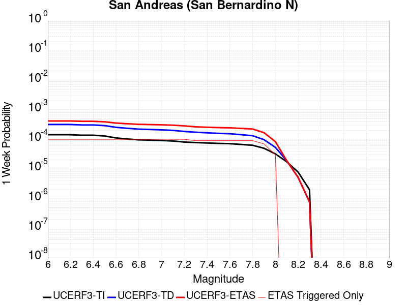 |  |  |  |

| Magnitude | 1 wk TI Prob | 1 wk TD Prob | 1 wk ETAS Prob | 1 wk ETAS/TD Gain | 1 wk ETAS Triggered Only | 1 mo TI Prob | 1 mo TD Prob | 1 mo ETAS Prob | 1 mo ETAS/TD Gain | 1 mo ETAS Triggered Only | 1 yr TI Prob | 1 yr TD Prob | 1 yr ETAS Prob | 1 yr ETAS/TD Gain | 1 yr ETAS Triggered Only | 10 yr TI Prob | 10 yr TD Prob | 10 yr ETAS Prob | 10 yr ETAS/TD Gain | 10 yr ETAS Triggered Only |
|-----|-----|-----|-----|-----|-----|-----|-----|-----|-----|-----|-----|-----|-----|-----|-----|-----|-----|-----|-----|-----|
| 6.0 | 1.4273766E-4 | 3.1635934E-4 | 3.5172884E-4 | 1.1118016 | 3.5380697E-5 | 6.115894E-4 | 0.0013551271 | 0.0014257926 | 1.0521468 | 7.0761394E-5 | 0.0074207084 | 0.016375363 | 0.016758177 | 1.0233774 | 3.8918765E-4 | 0.07177748 | 0.15038711 | 0.15122879 | 1.0055968 | 9.906595E-4 |
| 6.1 | 1.4273766E-4 | 3.1635934E-4 | 3.5172884E-4 | 1.1118016 | 3.5380697E-5 | 6.115894E-4 | 0.0013551271 | 0.0014257926 | 1.0521468 | 7.0761394E-5 | 0.0074207084 | 0.016375363 | 0.016758177 | 1.0233774 | 3.8918765E-4 | 0.07177748 | 0.15038711 | 0.15122879 | 1.0055968 | 9.906595E-4 |
| 6.2 | 1.4273766E-4 | 3.1635934E-4 | 3.5172884E-4 | 1.1118016 | 3.5380697E-5 | 6.115894E-4 | 0.0013551271 | 0.0014257926 | 1.0521468 | 7.0761394E-5 | 0.0074207084 | 0.016375363 | 0.016758177 | 1.0233774 | 3.8918765E-4 | 0.07177748 | 0.15038711 | 0.15122879 | 1.0055968 | 9.906595E-4 |
| 6.3 | 1.3730655E-4 | 3.0540637E-4 | 3.4077626E-4 | 1.1158125 | 3.5380697E-5 | 5.883239E-4 | 0.0013082335 | 0.0013789024 | 1.0540185 | 7.0761394E-5 | 0.0071393442 | 0.015812824 | 0.016195856 | 1.024223 | 3.8918765E-4 | 0.06914291 | 0.14568701 | 0.14653334 | 1.0058093 | 9.906595E-4 |
| 6.4 | 1.3730655E-4 | 3.0540637E-4 | 3.4077626E-4 | 1.1158125 | 3.5380697E-5 | 5.883239E-4 | 0.0013082335 | 0.0013789024 | 1.0540185 | 7.0761394E-5 | 0.0071393442 | 0.015812824 | 0.016195856 | 1.024223 | 3.8918765E-4 | 0.06914291 | 0.14568701 | 0.14653334 | 1.0058093 | 9.906595E-4 |
| 6.5 | 1.2942807E-4 | 2.8954886E-4 | 3.249193E-4 | 1.1221571 | 3.5380697E-5 | 5.545738E-4 | 0.0012403387 | 0.0013110123 | 1.0569793 | 7.0761394E-5 | 0.0067310524 | 0.014997809 | 0.01538116 | 1.0255605 | 3.8918765E-4 | 0.06530788 | 0.13882978 | 0.13968292 | 1.0061451 | 9.906595E-4 |
| 6.6 | 1.1125901E-4 | 2.5393223E-4 | 2.8930395E-4 | 1.1392958 | 3.5380697E-5 | 4.767372E-4 | 0.0010878295 | 0.0011585138 | 1.0649775 | 7.0761394E-5 | 0.005788839 | 0.013164529 | 0.013548593 | 1.0291742 | 3.8918765E-4 | 0.056403454 | 0.12311955 | 0.12395721 | 1.0068036 | 9.552788E-4 |
| 6.7 | 1.02209575E-4 | 2.3527986E-4 | 2.7065224E-4 | 1.1503416 | 3.5380697E-5 | 4.3796748E-4 | 0.001007954 | 0.0010786441 | 1.0701323 | 7.0761394E-5 | 0.0053192247 | 0.012203212 | 0.012587651 | 1.0315031 | 3.8918765E-4 | 0.051936906 | 0.11491149 | 0.115663044 | 1.0065403 | 8.4913673E-4 |
| 6.8 | 9.610582E-5 | 2.2053412E-4 | 2.55907E-4 | 1.1603965 | 3.5380697E-5 | 4.1181705E-4 | 9.448046E-4 | 0.0010154991 | 1.0748245 | 7.0761394E-5 | 0.0050023515 | 0.011442591 | 0.011827325 | 1.033623 | 3.8918765E-4 | 0.048912346 | 0.10831282 | 0.10906999 | 1.0069906 | 8.4913673E-4 |
| 6.9 | 9.3877505E-5 | 2.150883E-4 | 2.5046137E-4 | 1.1644584 | 3.5380697E-5 | 4.0227012E-4 | 9.2148193E-4 | 9.921781E-4 | 1.0767201 | 7.0761394E-5 | 0.0048866454 | 0.011161577 | 0.011546421 | 1.0344794 | 3.8918765E-4 | 0.04780577 | 0.1059029 | 0.10666212 | 1.0071689 | 8.4913673E-4 |
| 7.0 | 9.1019785E-5 | 2.0835544E-4 | 2.4372876E-4 | 1.1697739 | 3.5380697E-5 | 3.900265E-4 | 8.926469E-4 | 9.6334517E-4 | 1.0792006 | 7.0761394E-5 | 0.0047382377 | 0.010814046 | 0.0111990245 | 1.0356 | 3.8918765E-4 | 0.046384744 | 0.10287278 | 0.103634566 | 1.0074052 | 8.4913673E-4 |
| 7.1 | 8.771155E-5 | 2.0009889E-4 | 2.3547251E-4 | 1.1767807 | 3.5380697E-5 | 3.758525E-4 | 8.5728534E-4 | 9.279861E-4 | 1.0824704 | 7.0761394E-5 | 0.0045664064 | 0.010387696 | 0.010772841 | 1.0370771 | 3.8918765E-4 | 0.044737056 | 0.09918398 | 0.0999489 | 1.0077121 | 8.4913673E-4 |
| 7.2 | 8.0830236E-5 | 1.8415037E-4 | 2.1952456E-4 | 1.192094 | 3.5380697E-5 | 3.4636928E-4 | 7.8897737E-4 | 8.596829E-4 | 1.0896168 | 7.0761394E-5 | 0.0042088944 | 0.009563598 | 0.009949064 | 1.0403055 | 3.8918765E-4 | 0.041300658 | 0.09191379 | 0.09268488 | 1.0083892 | 8.4913673E-4 |
| 7.3 | 7.7668235E-5 | 1.7358093E-4 | 1.7358093E-4 | 1.0 | 0.0 | 3.328214E-4 | 7.437063E-4 | 7.790607E-4 | 1.047538 | 3.5380697E-5 | 0.0040445733 | 0.009017113 | 0.009367729 | 1.0388834 | 3.5380697E-4 | 0.03971748 | 0.08717959 | 0.0879224 | 1.0085205 | 8.13756E-4 |
| 7.4 | 7.520177E-5 | 1.657783E-4 | 1.657783E-4 | 1.0 | 0.0 | 3.2225347E-4 | 7.1028504E-4 | 7.456406E-4 | 1.0497766 | 3.5380697E-5 | 0.0039163795 | 0.008613498 | 0.008964257 | 1.040722 | 3.5380697E-4 | 0.038480744 | 0.08363466 | 0.08438036 | 1.0089161 | 8.13756E-4 |
| 7.5 | 7.274697E-5 | 1.5865144E-4 | 1.5865144E-4 | 1.0 | 0.0 | 3.1173544E-4 | 6.797576E-4 | 7.151143E-4 | 1.0520136 | 3.5380697E-5 | 0.003788775 | 0.008244702 | 0.008595591 | 1.0425595 | 3.5380697E-4 | 0.03724827 | 0.08035038 | 0.08109874 | 1.0093138 | 8.13756E-4 |
| 7.6 | 7.1185845E-5 | 1.5434787E-4 | 1.5434787E-4 | 1.0 | 0.0 | 3.0504653E-4 | 6.6132325E-4 | 6.9668057E-4 | 1.0534644 | 3.5380697E-5 | 0.0037076178 | 0.008021939 | 0.008372907 | 1.0437511 | 3.5380697E-4 | 0.036463667 | 0.078339346 | 0.07908935 | 1.0095738 | 8.13756E-4 |
| 7.7 | 6.709961E-5 | 1.4343053E-4 | 1.4343053E-4 | 1.0 | 0.0 | 2.8753807E-4 | 6.1455753E-4 | 6.499165E-4 | 1.0575356 | 3.5380697E-5 | 0.003495157 | 0.007456607 | 0.007807776 | 1.047095 | 3.5380697E-4 | 0.034406938 | 0.07316601 | 0.07392023 | 1.0103083 | 8.13756E-4 |
| 7.8 | 6.300812E-5 | 1.3225875E-4 | 1.3225875E-4 | 1.0 | 0.0 | 2.7000686E-4 | 5.6670007E-4 | 6.020607E-4 | 1.0623975 | 3.5380697E-5 | 0.0032823787 | 0.0068777753 | 0.0071940115 | 1.0459794 | 3.1842626E-4 | 0.032343175 | 0.06781986 | 0.068545446 | 1.0106987 | 7.783753E-4 |
| 7.9 | 4.983037E-5 | 9.7419856E-5 | 9.7419856E-5 | 1.0 | 0.0 | 2.1354125E-4 | 4.1744686E-4 | 4.1744686E-4 | 1.0 | 0.0 | 0.0025967648 | 0.005070582 | 0.005352192 | 1.055538 | 2.8304558E-4 | 0.025666296 | 0.050735 | 0.05133954 | 1.0119157 | 6.368525E-4 |
| 8.0 | 3.2211527E-5 | 5.341288E-5 | 5.341288E-5 | 1.0 | 0.0 | 1.380421E-4 | 2.2889227E-4 | 2.2889227E-4 | 1.0 | 0.0 | 0.0016793669 | 0.002783204 | 0.0029243329 | 1.0507073 | 1.4152279E-4 | 0.016667323 | 0.028414162 | 0.02865479 | 1.0084686 | 2.4766487E-4 |
| 8.1 | 1.743376E-5 | 1.8874636E-5 | 1.8874636E-5 | 1.0 | 0.0 | 7.471398E-5 | 8.088879E-5 | 8.088879E-5 | 1.0 | 0.0 | 9.0926304E-4 | 9.843768E-4 | 0.0010197225 | 1.0359069 | 3.5380697E-5 | 0.009055517 | 0.010510205 | 0.010580222 | 1.0066619 | 7.0761394E-5 |
| 8.2 | 7.831616E-6 | 5.1737816E-6 | 5.1737816E-6 | 1.0 | 0.0 | 3.3563636E-5 | 2.217316E-5 | 2.217316E-5 | 1.0 | 0.0 | 4.0856065E-4 | 2.6992487E-4 | 2.6992487E-4 | 1.0 | 0.0 | 0.004078103 | 0.0030519657 | 0.0030519657 | 1.0 | 0.0 |
| 8.3 | 1.983087E-6 | 7.693574E-7 | 7.693574E-7 | 1.0 | 0.0 | 8.498917E-6 | 3.297242E-6 | 3.297242E-6 | 1.0 | 0.0 | 1.034694E-4 | 4.01432E-5 | 4.01432E-5 | 1.0 | 0.0 | 0.0010342124 | 4.7390026E-4 | 4.7390026E-4 | 1.0 | 0.0 |

## Garlic Springs
*[(top)](#table-of-contents)*

| 1 Week | 1 Month | 1 Year | 10 Year |
|-----|-----|-----|-----|
|  |  | 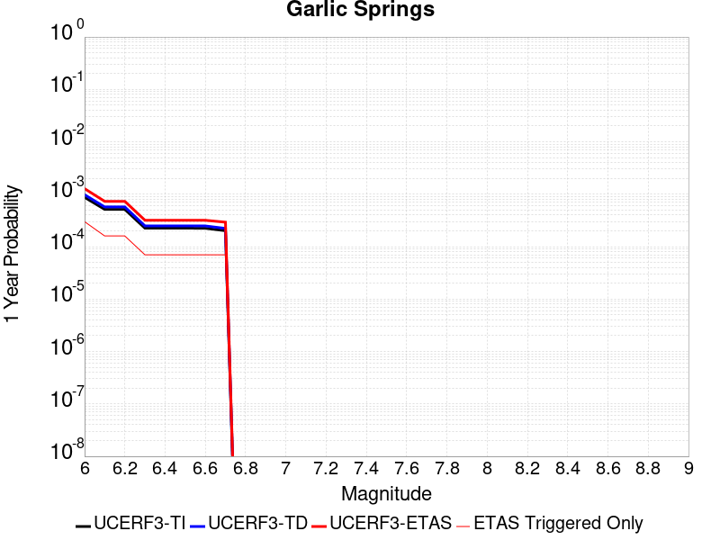 |  |

| Magnitude | 1 wk TI Prob | 1 wk TD Prob | 1 wk ETAS Prob | 1 wk ETAS/TD Gain | 1 wk ETAS Triggered Only | 1 mo TI Prob | 1 mo TD Prob | 1 mo ETAS Prob | 1 mo ETAS/TD Gain | 1 mo ETAS Triggered Only | 1 yr TI Prob | 1 yr TD Prob | 1 yr ETAS Prob | 1 yr ETAS/TD Gain | 1 yr ETAS Triggered Only | 10 yr TI Prob | 10 yr TD Prob | 10 yr ETAS Prob | 10 yr ETAS/TD Gain | 10 yr ETAS Triggered Only |
|-----|-----|-----|-----|-----|-----|-----|-----|-----|-----|-----|-----|-----|-----|-----|-----|-----|-----|-----|-----|-----|
| 6.0 | 1.6760017E-5 | 1.8778032E-5 | 5.4158063E-5 | 2.884118 | 3.5380697E-5 | 7.182667E-5 | 8.047546E-5 | 1.5123116E-4 | 1.8792208 | 7.0761394E-5 | 8.7413884E-4 | 9.794658E-4 | 0.0013329261 | 1.3608706 | 3.5380697E-4 | 0.008707083 | 0.009763034 | 0.0106038805 | 1.0861255 | 8.4913673E-4 |
| 6.1 | 9.852767E-6 | 1.097425E-5 | 4.635456E-5 | 4.223939 | 3.5380697E-5 | 4.222546E-5 | 4.703205E-5 | 1.17790114E-4 | 2.5044649 | 7.0761394E-5 | 5.139737E-4 | 5.7253573E-4 | 7.8469835E-4 | 1.3705666 | 2.1228418E-4 | 0.005127866 | 0.005717566 | 0.006139707 | 1.0738323 | 4.2456837E-4 |
| 6.2 | 9.852767E-6 | 1.097425E-5 | 4.635456E-5 | 4.223939 | 3.5380697E-5 | 4.222546E-5 | 4.703205E-5 | 1.17790114E-4 | 2.5044649 | 7.0761394E-5 | 5.139737E-4 | 5.7253573E-4 | 7.8469835E-4 | 1.3705666 | 2.1228418E-4 | 0.005127866 | 0.005717566 | 0.006139707 | 1.0738323 | 4.2456837E-4 |
| 6.3 | 4.3167724E-6 | 4.7782996E-6 | 4.0158826E-5 | 8.404418 | 3.5380697E-5 | 1.8500323E-5 | 2.0478396E-5 | 9.123834E-5 | 4.455346 | 7.0761394E-5 | 2.2521814E-4 | 2.4931898E-4 | 3.554346E-4 | 1.425622 | 1.0614209E-4 | 0.0022499003 | 0.002492651 | 0.0027044062 | 1.0849518 | 2.1228418E-4 |
| 6.4 | 4.3167724E-6 | 4.7782996E-6 | 4.0158826E-5 | 8.404418 | 3.5380697E-5 | 1.8500323E-5 | 2.0478396E-5 | 9.123834E-5 | 4.455346 | 7.0761394E-5 | 2.2521814E-4 | 2.4931898E-4 | 3.554346E-4 | 1.425622 | 1.0614209E-4 | 0.0022499003 | 0.002492651 | 0.0027044062 | 1.0849518 | 2.1228418E-4 |
| 6.5 | 4.3167724E-6 | 4.7782996E-6 | 4.0158826E-5 | 8.404418 | 3.5380697E-5 | 1.8500323E-5 | 2.0478396E-5 | 9.123834E-5 | 4.455346 | 7.0761394E-5 | 2.2521814E-4 | 2.4931898E-4 | 3.554346E-4 | 1.425622 | 1.0614209E-4 | 0.0022499003 | 0.002492651 | 0.0027044062 | 1.0849518 | 2.1228418E-4 |
| 6.6 | 4.301311E-6 | 4.761167E-6 | 4.0141695E-5 | 8.431063 | 3.5380697E-5 | 1.8434059E-5 | 2.0404972E-5 | 9.116492E-5 | 4.4677796 | 7.0761394E-5 | 2.2441156E-4 | 2.4842523E-4 | 3.5454097E-4 | 1.4271536 | 1.0614209E-4 | 0.0022418506 | 0.002483734 | 0.0026954908 | 1.0852575 | 2.1228418E-4 |
| 6.7 | 3.8599724E-6 | 4.2713013E-6 | 3.9651848E-5 | 9.283318 | 3.5380697E-5 | 1.6542634E-5 | 1.8305576E-5 | 8.9065674E-5 | 4.8654943 | 7.0761394E-5 | 2.0138794E-4 | 2.228704E-4 | 3.2898883E-4 | 1.4761442 | 1.0614209E-4 | 0.0020120554 | 0.0022287038 | 0.0024052132 | 1.0791981 | 1.7690349E-4 |

## Bicycle Lake
*[(top)](#table-of-contents)*

| 1 Week | 1 Month | 1 Year | 10 Year |
|-----|-----|-----|-----|
|  |  |  |  |

| Magnitude | 1 wk TI Prob | 1 wk TD Prob | 1 wk ETAS Prob | 1 wk ETAS/TD Gain | 1 wk ETAS Triggered Only | 1 mo TI Prob | 1 mo TD Prob | 1 mo ETAS Prob | 1 mo ETAS/TD Gain | 1 mo ETAS Triggered Only | 1 yr TI Prob | 1 yr TD Prob | 1 yr ETAS Prob | 1 yr ETAS/TD Gain | 1 yr ETAS Triggered Only | 10 yr TI Prob | 10 yr TD Prob | 10 yr ETAS Prob | 10 yr ETAS/TD Gain | 10 yr ETAS Triggered Only |
|-----|-----|-----|-----|-----|-----|-----|-----|-----|-----|-----|-----|-----|-----|-----|-----|-----|-----|-----|-----|-----|
| 6.0 | 1.9621975E-5 | 2.2098558E-5 | 5.747847E-5 | 2.6010056 | 3.5380697E-5 | 8.4091465E-5 | 9.470543E-5 | 2.0083746E-4 | 2.120654 | 1.0614209E-4 | 0.0010233327 | 0.0011525637 | 0.0015059628 | 1.3066201 | 3.5380697E-4 | 0.01018633 | 0.011479173 | 0.012213639 | 1.0639825 | 7.429946E-4 |
| 6.1 | 1.9621975E-5 | 2.2098558E-5 | 5.747847E-5 | 2.6010056 | 3.5380697E-5 | 8.4091465E-5 | 9.470543E-5 | 2.0083746E-4 | 2.120654 | 1.0614209E-4 | 0.0010233327 | 0.0011525637 | 0.0015059628 | 1.3066201 | 3.5380697E-4 | 0.01018633 | 0.011479173 | 0.012213639 | 1.0639825 | 7.429946E-4 |
| 6.2 | 9.9971285E-6 | 1.1256391E-5 | 1.1256391E-5 | 1.0 | 0.0 | 4.2844134E-5 | 4.824108E-5 | 8.362007E-5 | 1.7333789 | 3.5380697E-5 | 5.2150246E-4 | 5.8722886E-4 | 8.347483E-4 | 1.4215043 | 2.4766487E-4 | 0.0052028033 | 0.0058618775 | 0.006389477 | 1.0900052 | 5.3071044E-4 |
| 6.3 | 9.589428E-6 | 1.0799068E-5 | 1.0799068E-5 | 1.0 | 0.0 | 4.10969E-5 | 4.628119E-5 | 8.1660255E-5 | 1.7644371 | 3.5380697E-5 | 5.002399E-4 | 5.633797E-4 | 8.1090507E-4 | 1.4393579 | 2.4766487E-4 | 0.0049911533 | 0.0056246053 | 0.006117149 | 1.0875695 | 4.9532973E-4 |
| 6.4 | 9.589428E-6 | 1.0799068E-5 | 1.0799068E-5 | 1.0 | 0.0 | 4.10969E-5 | 4.628119E-5 | 8.1660255E-5 | 1.7644371 | 3.5380697E-5 | 5.002399E-4 | 5.633797E-4 | 8.1090507E-4 | 1.4393579 | 2.4766487E-4 | 0.0049911533 | 0.0056246053 | 0.006117149 | 1.0875695 | 4.9532973E-4 |
| 6.5 | 5.557707E-6 | 6.286038E-6 | 6.286038E-6 | 1.0 | 0.0 | 2.3818526E-5 | 2.6940037E-5 | 2.6940037E-5 | 1.0 | 0.0 | 2.8995197E-4 | 3.2797246E-4 | 3.9871066E-4 | 1.2156833 | 7.0761394E-5 | 0.0028957394 | 0.0032775209 | 0.0035243742 | 1.075317 | 2.4766487E-4 |
| 6.6 | 4.8742945E-6 | 5.5136734E-6 | 5.5136734E-6 | 1.0 | 0.0 | 2.0889667E-5 | 2.3629962E-5 | 2.3629962E-5 | 1.0 | 0.0 | 2.54302E-4 | 2.87683E-4 | 3.5842403E-4 | 1.2458992 | 7.0761394E-5 | 0.002540112 | 0.0028756752 | 0.0031226277 | 1.0858765 | 2.4766487E-4 |
| 6.7 | 3.991108E-6 | 4.5162255E-6 | 4.5162255E-6 | 1.0 | 0.0 | 1.7104636E-5 | 1.9355251E-5 | 1.9355251E-5 | 1.0 | 0.0 | 2.0822904E-4 | 2.3565018E-4 | 2.7102255E-4 | 1.1501054 | 3.5380697E-5 | 0.0020803404 | 0.0023565018 | 0.0024623938 | 1.0449361 | 1.0614209E-4 |

## Death Valley (Black Mtns Frontal)
*[(top)](#table-of-contents)*

| 1 Week | 1 Month | 1 Year | 10 Year |
|-----|-----|-----|-----|
|  |  |  | 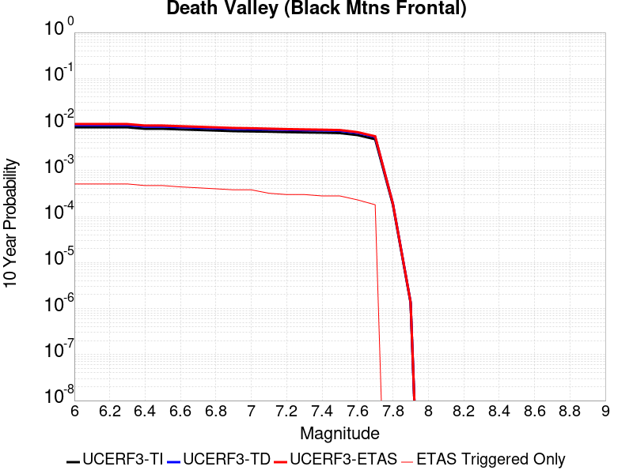 |

| Magnitude | 1 wk TI Prob | 1 wk TD Prob | 1 wk ETAS Prob | 1 wk ETAS/TD Gain | 1 wk ETAS Triggered Only | 1 mo TI Prob | 1 mo TD Prob | 1 mo ETAS Prob | 1 mo ETAS/TD Gain | 1 mo ETAS Triggered Only | 1 yr TI Prob | 1 yr TD Prob | 1 yr ETAS Prob | 1 yr ETAS/TD Gain | 1 yr ETAS Triggered Only | 10 yr TI Prob | 10 yr TD Prob | 10 yr ETAS Prob | 10 yr ETAS/TD Gain | 10 yr ETAS Triggered Only |
|-----|-----|-----|-----|-----|-----|-----|-----|-----|-----|-----|-----|-----|-----|-----|-----|-----|-----|-----|-----|-----|
| 6.0 | 1.6707214E-5 | 1.8671435E-5 | 1.8671435E-5 | 1.0 | 0.0 | 7.160038E-5 | 8.001803E-5 | 1.5077376E-4 | 1.8842474 | 7.0761394E-5 | 8.71386E-4 | 9.737917E-4 | 0.0013626004 | 1.3992729 | 3.8918765E-4 | 0.00867977 | 0.0096961 | 0.010501966 | 1.0831124 | 8.13756E-4 |
| 6.1 | 1.6707214E-5 | 1.8671435E-5 | 1.8671435E-5 | 1.0 | 0.0 | 7.160038E-5 | 8.001803E-5 | 1.5077376E-4 | 1.8842474 | 7.0761394E-5 | 8.71386E-4 | 9.737917E-4 | 0.0013626004 | 1.3992729 | 3.8918765E-4 | 0.00867977 | 0.0096961 | 0.010501966 | 1.0831124 | 8.13756E-4 |
| 6.2 | 1.6707214E-5 | 1.8671435E-5 | 1.8671435E-5 | 1.0 | 0.0 | 7.160038E-5 | 8.001803E-5 | 1.5077376E-4 | 1.8842474 | 7.0761394E-5 | 8.71386E-4 | 9.737917E-4 | 0.0013626004 | 1.3992729 | 3.8918765E-4 | 0.00867977 | 0.0096961 | 0.010501966 | 1.0831124 | 8.13756E-4 |
| 6.3 | 1.6707214E-5 | 1.8671435E-5 | 1.8671435E-5 | 1.0 | 0.0 | 7.160038E-5 | 8.001803E-5 | 1.5077376E-4 | 1.8842474 | 7.0761394E-5 | 8.71386E-4 | 9.737917E-4 | 0.0013626004 | 1.3992729 | 3.8918765E-4 | 0.00867977 | 0.0096961 | 0.010501966 | 1.0831124 | 8.13756E-4 |
| 6.4 | 1.5515609E-5 | 1.7339296E-5 | 1.7339296E-5 | 1.0 | 0.0 | 6.649377E-5 | 7.430919E-5 | 1.4506532E-4 | 1.9521855 | 7.0761394E-5 | 8.0926094E-4 | 9.04345E-4 | 0.0012931807 | 1.429964 | 3.8918765E-4 | 0.008063202 | 0.009007333 | 0.009778698 | 1.0856373 | 7.783753E-4 |
| 6.5 | 1.5515609E-5 | 1.7339296E-5 | 1.7339296E-5 | 1.0 | 0.0 | 6.649377E-5 | 7.430919E-5 | 1.4506532E-4 | 1.9521855 | 7.0761394E-5 | 8.0926094E-4 | 9.04345E-4 | 0.0012931807 | 1.429964 | 3.8918765E-4 | 0.008063202 | 0.009007333 | 0.009778698 | 1.0856373 | 7.783753E-4 |
| 6.6 | 1.5041828E-5 | 1.6810196E-5 | 1.6810196E-5 | 1.0 | 0.0 | 6.4463384E-5 | 7.204174E-5 | 1.0741989E-4 | 1.4910785 | 3.5380697E-5 | 7.8455906E-4 | 8.767611E-4 | 0.0012302579 | 1.4031848 | 3.5380697E-4 | 0.00781795 | 0.008733676 | 0.00943511 | 1.0803137 | 7.0761394E-4 |
| 6.7 | 1.4634985E-5 | 1.635704E-5 | 1.635704E-5 | 1.0 | 0.0 | 6.271985E-5 | 7.009975E-5 | 1.05477964E-4 | 1.504684 | 3.5380697E-5 | 7.6334673E-4 | 8.53136E-4 | 0.0012066411 | 1.4143596 | 3.5380697E-4 | 0.007607299 | 0.008499245 | 0.009165765 | 1.078421 | 6.7223323E-4 |
| 6.8 | 1.4209158E-5 | 1.5883043E-5 | 1.5883043E-5 | 1.0 | 0.0 | 6.089497E-5 | 6.806844E-5 | 1.0344673E-4 | 1.5197458 | 3.5380697E-5 | 7.4114406E-4 | 8.2842377E-4 | 0.0011819376 | 1.4267308 | 3.5380697E-4 | 0.007386771 | 0.008253971 | 0.008885567 | 1.0765202 | 6.368525E-4 |
| 6.9 | 1.3780098E-5 | 1.540556E-5 | 1.540556E-5 | 1.0 | 0.0 | 5.9056227E-5 | 6.6022185E-5 | 1.0140055E-4 | 1.5358557 | 3.5380697E-5 | 7.1877235E-4 | 8.0352917E-4 | 0.0011570518 | 1.4399625 | 3.5380697E-4 | 0.0071645193 | 0.0080068335 | 0.008638587 | 1.0789018 | 6.368525E-4 |
| 7.0 | 1.3585064E-5 | 1.5189109E-5 | 1.5189109E-5 | 1.0 | 0.0 | 5.8220405E-5 | 6.509459E-5 | 1.00472986E-4 | 1.5434921 | 3.5380697E-5 | 7.086029E-4 | 7.922439E-4 | 0.0011457705 | 1.4462346 | 3.5380697E-4 | 0.007063476 | 0.007894788 | 0.008526612 | 1.0800306 | 6.368525E-4 |
| 7.1 | 1.3398601E-5 | 1.4982282E-5 | 1.4982282E-5 | 1.0 | 0.0 | 5.742131E-5 | 6.420823E-5 | 9.958665E-5 | 1.5509952 | 3.5380697E-5 | 6.9888023E-4 | 7.8146026E-4 | 0.0011349907 | 1.4523972 | 3.5380697E-4 | 0.0069668638 | 0.007787712 | 0.008349394 | 1.0721242 | 5.6609116E-4 |
| 7.2 | 1.3126312E-5 | 1.4680485E-5 | 1.4680485E-5 | 1.0 | 0.0 | 5.6254412E-5 | 6.291488E-5 | 9.829335E-5 | 1.5623227 | 3.5380697E-5 | 6.846822E-4 | 7.6572486E-4 | 0.0010485537 | 1.3693609 | 2.8304558E-4 | 0.006825765 | 0.007631449 | 0.008122998 | 1.064411 | 4.9532973E-4 |
| 7.3 | 1.2922429E-5 | 1.4454699E-5 | 1.4454699E-5 | 1.0 | 0.0 | 5.5380664E-5 | 6.194727E-5 | 9.732578E-5 | 1.5711067 | 3.5380697E-5 | 6.74051E-4 | 7.539525E-4 | 0.0010367846 | 1.3751326 | 2.8304558E-4 | 0.006720101 | 0.007514527 | 0.008006135 | 1.065421 | 4.9532973E-4 |
| 7.4 | 1.2768878E-5 | 1.4284673E-5 | 1.4284673E-5 | 1.0 | 0.0 | 5.4722615E-5 | 6.121862E-5 | 9.6597156E-5 | 1.5779047 | 3.5380697E-5 | 6.660441E-4 | 7.450873E-4 | 9.925676E-4 | 1.3321495 | 2.4766487E-4 | 0.0066405144 | 0.007426471 | 0.007883004 | 1.0614737 | 4.5994905E-4 |
| 7.5 | 1.2521929E-5 | 1.4012902E-5 | 1.4012902E-5 | 1.0 | 0.0 | 5.366431E-5 | 6.0053942E-5 | 9.5432515E-5 | 1.5891132 | 3.5380697E-5 | 6.531671E-4 | 7.309169E-4 | 9.784008E-4 | 1.3385937 | 2.4766487E-4 | 0.006512506 | 0.0072857053 | 0.0077423034 | 1.0626704 | 4.5994905E-4 |
| 7.6 | 1.1301089E-5 | 1.2648951E-5 | 1.2648951E-5 | 1.0 | 0.0 | 4.8432343E-5 | 5.4208693E-5 | 8.958747E-5 | 1.6526403 | 3.5380697E-5 | 5.895042E-4 | 6.597963E-4 | 8.012257E-4 | 1.2143531 | 1.4152279E-4 | 0.0058794282 | 0.006578926 | 0.0069304053 | 1.0534251 | 3.5380697E-4 |
| 7.7 | 9.189108E-6 | 1.02840095E-5 | 1.02840095E-5 | 1.0 | 0.0 | 3.93813E-5 | 4.407361E-5 | 7.945275E-5 | 1.8027283 | 3.5380697E-5 | 4.7936183E-4 | 5.3646916E-4 | 6.425543E-4 | 1.197747 | 1.0614209E-4 | 0.004783291 | 0.005352252 | 0.0055985916 | 1.0460254 | 2.4766487E-4 |
| 7.8 | 3.4586725E-7 | 3.648368E-7 | 3.648368E-7 | 1.0 | 0.0 | 1.4822873E-6 | 1.5635853E-6 | 1.5635853E-6 | 1.0 | 0.0 | 1.80467E-5 | 1.903649E-5 | 1.903649E-5 | 1.0 | 0.0 | 1.8045233E-4 | 1.9034903E-4 | 1.9034903E-4 | 1.0 | 0.0 |
| 7.9 | 2.5591178E-9 | 2.6697329E-9 | 2.6697329E-9 | 1.0 | 0.0 | 1.0967647E-8 | 1.14417125E-8 | 1.14417125E-8 | 1.0 | 0.0 | 1.335311E-7 | 1.3930286E-7 | 1.3930286E-7 | 1.0 | 0.0 | 1.3353102E-6 | 1.3930285E-6 | 1.3930285E-6 | 1.0 | 0.0 |

## Paradise
*[(top)](#table-of-contents)*

| 1 Week | 1 Month | 1 Year | 10 Year |
|-----|-----|-----|-----|
|  |  |  |  |

| Magnitude | 1 wk TI Prob | 1 wk TD Prob | 1 wk ETAS Prob | 1 wk ETAS/TD Gain | 1 wk ETAS Triggered Only | 1 mo TI Prob | 1 mo TD Prob | 1 mo ETAS Prob | 1 mo ETAS/TD Gain | 1 mo ETAS Triggered Only | 1 yr TI Prob | 1 yr TD Prob | 1 yr ETAS Prob | 1 yr ETAS/TD Gain | 1 yr ETAS Triggered Only | 10 yr TI Prob | 10 yr TD Prob | 10 yr ETAS Prob | 10 yr ETAS/TD Gain | 10 yr ETAS Triggered Only |
|-----|-----|-----|-----|-----|-----|-----|-----|-----|-----|-----|-----|-----|-----|-----|-----|-----|-----|-----|-----|-----|
| 6.0 | 1.4851273E-5 | 1.6695341E-5 | 1.6695341E-5 | 1.0 | 0.0 | 6.364676E-5 | 7.154963E-5 | 1.0692779E-4 | 1.4944563 | 3.5380697E-5 | 7.7462377E-4 | 8.707922E-4 | 0.001259641 | 1.446546 | 3.8918765E-4 | 0.0077192914 | 0.008676181 | 0.009412729 | 1.0848931 | 7.429946E-4 |
| 6.1 | 1.4851273E-5 | 1.6695341E-5 | 1.6695341E-5 | 1.0 | 0.0 | 6.364676E-5 | 7.154963E-5 | 1.0692779E-4 | 1.4944563 | 3.5380697E-5 | 7.7462377E-4 | 8.707922E-4 | 0.001259641 | 1.446546 | 3.8918765E-4 | 0.0077192914 | 0.008676181 | 0.009412729 | 1.0848931 | 7.429946E-4 |
| 6.2 | 1.4851273E-5 | 1.6695341E-5 | 1.6695341E-5 | 1.0 | 0.0 | 6.364676E-5 | 7.154963E-5 | 1.0692779E-4 | 1.4944563 | 3.5380697E-5 | 7.7462377E-4 | 8.707922E-4 | 0.001259641 | 1.446546 | 3.8918765E-4 | 0.0077192914 | 0.008676181 | 0.009412729 | 1.0848931 | 7.429946E-4 |
| 6.3 | 1.0426831E-5 | 1.1889049E-5 | 1.1889049E-5 | 1.0 | 0.0 | 4.4685654E-5 | 5.095211E-5 | 8.6331E-5 | 1.6943558 | 3.5380697E-5 | 5.43912E-4 | 6.2017125E-4 | 7.9696503E-4 | 1.2850724 | 1.7690349E-4 | 0.0054258266 | 0.0061850143 | 0.006466309 | 1.0454801 | 2.8304558E-4 |
| 6.4 | 1.0426831E-5 | 1.1889049E-5 | 1.1889049E-5 | 1.0 | 0.0 | 4.4685654E-5 | 5.095211E-5 | 8.6331E-5 | 1.6943558 | 3.5380697E-5 | 5.43912E-4 | 6.2017125E-4 | 7.9696503E-4 | 1.2850724 | 1.7690349E-4 | 0.0054258266 | 0.0061850143 | 0.006466309 | 1.0454801 | 2.8304558E-4 |
| 6.5 | 9.25027E-6 | 1.0620336E-5 | 1.0620336E-5 | 1.0 | 0.0 | 3.964341E-5 | 4.551496E-5 | 8.0894046E-5 | 1.7773068 | 3.5380697E-5 | 4.8255164E-4 | 5.5400864E-4 | 6.95453E-4 | 1.2553108 | 1.4152279E-4 | 0.0048150513 | 0.0055267746 | 0.0057730707 | 1.0445641 | 2.4766487E-4 |
| 6.6 | 7.904275E-6 | 9.159836E-6 | 9.159836E-6 | 1.0 | 0.0 | 3.3875025E-5 | 3.925587E-5 | 3.925587E-5 | 1.0 | 0.0 | 4.1235037E-4 | 4.7783932E-4 | 4.7783932E-4 | 1.0 | 0.0 | 0.0041158604 | 0.0047685155 | 0.0048389398 | 1.0147685 | 7.0761394E-5 |
| 6.7 | 7.2061953E-6 | 8.407527E-6 | 8.407527E-6 | 1.0 | 0.0 | 3.088333E-5 | 3.6031786E-5 | 3.6031786E-5 | 1.0 | 0.0 | 3.7593965E-4 | 4.3860235E-4 | 4.3860235E-4 | 1.0 | 0.0 | 0.003753043 | 0.0043777362 | 0.0044481875 | 1.0160931 | 7.0761394E-5 |
| 6.8 | 6.6948724E-6 | 7.842423E-6 | 7.842423E-6 | 1.0 | 0.0 | 2.8691995E-5 | 3.3609973E-5 | 3.3609973E-5 | 1.0 | 0.0 | 3.4926904E-4 | 4.0912814E-4 | 4.0912814E-4 | 1.0 | 0.0 | 0.003487206 | 0.004084107 | 0.0041545792 | 1.0172553 | 7.0761394E-5 |
| 6.9 | 6.0421025E-6 | 7.1308505E-6 | 7.1308505E-6 | 1.0 | 0.0 | 2.5894467E-5 | 3.0560448E-5 | 3.0560448E-5 | 1.0 | 0.0 | 3.1521954E-4 | 3.7201334E-4 | 3.7201334E-4 | 1.0 | 0.0 | 0.0031477278 | 0.003714244 | 0.0037847427 | 1.0189806 | 7.0761394E-5 |
| 7.0 | 4.134091E-6 | 5.080469E-6 | 5.080469E-6 | 1.0 | 0.0 | 1.7717413E-5 | 2.1773263E-5 | 2.1773263E-5 | 1.0 | 0.0 | 2.1568815E-4 | 2.6505877E-4 | 2.6505877E-4 | 1.0 | 0.0 | 0.0021547892 | 0.0026475794 | 0.0026828665 | 1.0133281 | 3.5380697E-5 |
| 7.1 | 3.7674888E-6 | 4.6320133E-6 | 4.6320133E-6 | 1.0 | 0.0 | 1.6146281E-5 | 1.9851343E-5 | 1.9851343E-5 | 1.0 | 0.0 | 1.9656324E-4 | 2.4166482E-4 | 2.4166482E-4 | 1.0 | 0.0 | 0.0019638946 | 0.002414171 | 0.0024494661 | 1.0146201 | 3.5380697E-5 |
| 7.2 | 3.4065345E-6 | 4.1568514E-6 | 4.1568514E-6 | 1.0 | 0.0 | 1.4599351E-5 | 1.7814966E-5 | 1.7814966E-5 | 1.0 | 0.0 | 1.777326E-4 | 2.1687712E-4 | 2.1687712E-4 | 1.0 | 0.0 | 0.0017759053 | 0.0021668028 | 0.0022021069 | 1.0162932 | 3.5380697E-5 |
| 7.3 | 2.9934936E-6 | 3.629423E-6 | 3.629423E-6 | 1.0 | 0.0 | 1.2829195E-5 | 1.5554586E-5 | 1.5554586E-5 | 1.0 | 0.0 | 1.5618425E-4 | 1.893621E-4 | 1.893621E-4 | 1.0 | 0.0 | 0.0015607453 | 0.0018921527 | 0.0019274665 | 1.0186633 | 3.5380697E-5 |
| 7.4 | 2.4049796E-6 | 2.889062E-6 | 2.889062E-6 | 1.0 | 0.0 | 1.0307015E-5 | 1.23816435E-5 | 1.23816435E-5 | 1.0 | 0.0 | 1.2548068E-4 | 1.5073753E-4 | 1.5073753E-4 | 1.0 | 0.0 | 0.0012540985 | 0.0015064942 | 0.0015418216 | 1.02345 | 3.5380697E-5 |
| 7.5 | 1.2710091E-6 | 1.5135054E-6 | 1.5135054E-6 | 1.0 | 0.0 | 5.44717E-6 | 6.4864425E-6 | 6.4864425E-6 | 1.0 | 0.0 | 6.631728E-5 | 7.897083E-5 | 7.897083E-5 | 1.0 | 0.0 | 6.6297496E-4 | 7.8955025E-4 | 8.24903E-4 | 1.0447758 | 3.5380697E-5 |
| 7.6 | 2.21172E-7 | 2.6040124E-7 | 2.6040124E-7 | 1.0 | 0.0 | 9.478797E-7 | 1.116005E-6 | 1.116005E-6 | 1.0 | 0.0 | 1.1540374E-5 | 1.3587305E-5 | 1.3587305E-5 | 1.0 | 0.0 | 1.1539775E-4 | 1.3586757E-4 | 1.3586757E-4 | 1.0 | 0.0 |

## Death Valley (No)
*[(top)](#table-of-contents)*

| 1 Week | 1 Month | 1 Year | 10 Year |
|-----|-----|-----|-----|
|  |  |  |  |

| Magnitude | 1 wk TI Prob | 1 wk TD Prob | 1 wk ETAS Prob | 1 wk ETAS/TD Gain | 1 wk ETAS Triggered Only | 1 mo TI Prob | 1 mo TD Prob | 1 mo ETAS Prob | 1 mo ETAS/TD Gain | 1 mo ETAS Triggered Only | 1 yr TI Prob | 1 yr TD Prob | 1 yr ETAS Prob | 1 yr ETAS/TD Gain | 1 yr ETAS Triggered Only | 10 yr TI Prob | 10 yr TD Prob | 10 yr ETAS Prob | 10 yr ETAS/TD Gain | 10 yr ETAS Triggered Only |
|-----|-----|-----|-----|-----|-----|-----|-----|-----|-----|-----|-----|-----|-----|-----|-----|-----|-----|-----|-----|-----|
| 6.0 | 2.0074807E-5 | 2.2501532E-5 | 5.7881432E-5 | 2.5723329 | 3.5380697E-5 | 8.603206E-5 | 9.643161E-5 | 2.0256347E-4 | 2.100592 | 1.0614209E-4 | 0.001046937 | 0.00117343 | 0.0014914826 | 1.2710452 | 3.1842626E-4 | 0.010420183 | 0.011673254 | 0.012267704 | 1.0509242 | 6.014718E-4 |
| 6.1 | 2.0074807E-5 | 2.2501532E-5 | 5.7881432E-5 | 2.5723329 | 3.5380697E-5 | 8.603206E-5 | 9.643161E-5 | 2.0256347E-4 | 2.100592 | 1.0614209E-4 | 0.001046937 | 0.00117343 | 0.0014914826 | 1.2710452 | 3.1842626E-4 | 0.010420183 | 0.011673254 | 0.012267704 | 1.0509242 | 6.014718E-4 |
| 6.2 | 2.0074807E-5 | 2.2501532E-5 | 5.7881432E-5 | 2.5723329 | 3.5380697E-5 | 8.603206E-5 | 9.643161E-5 | 2.0256347E-4 | 2.100592 | 1.0614209E-4 | 0.001046937 | 0.00117343 | 0.0014914826 | 1.2710452 | 3.1842626E-4 | 0.010420183 | 0.011673254 | 0.012267704 | 1.0509242 | 6.014718E-4 |
| 6.3 | 1.9050609E-5 | 2.1338312E-5 | 5.6718254E-5 | 2.6580477 | 3.5380697E-5 | 8.164292E-5 | 9.1446746E-5 | 1.9757912E-4 | 2.1605923 | 1.0614209E-4 | 9.935491E-4 | 0.0011128022 | 0.0014308741 | 1.2858297 | 3.1842626E-4 | 0.009891188 | 0.011073124 | 0.011667935 | 1.0537167 | 6.014718E-4 |
| 6.4 | 1.9050609E-5 | 2.1338312E-5 | 5.6718254E-5 | 2.6580477 | 3.5380697E-5 | 8.164292E-5 | 9.1446746E-5 | 1.9757912E-4 | 2.1605923 | 1.0614209E-4 | 9.935491E-4 | 0.0011128022 | 0.0014308741 | 1.2858297 | 3.1842626E-4 | 0.009891188 | 0.011073124 | 0.011667935 | 1.0537167 | 6.014718E-4 |
| 6.5 | 1.8367004E-5 | 2.0562318E-5 | 5.5942288E-5 | 2.7206216 | 3.5380697E-5 | 7.8713354E-5 | 8.8121276E-5 | 1.9425401E-4 | 2.2043939 | 1.0614209E-4 | 9.5791375E-4 | 0.0010723551 | 0.0013904399 | 1.2966226 | 3.1842626E-4 | 0.009537951 | 0.010672592 | 0.011267644 | 1.0557553 | 6.014718E-4 |
| 6.6 | 1.779439E-5 | 1.9912191E-5 | 5.529218E-5 | 2.7768006 | 3.5380697E-5 | 7.625944E-5 | 8.53352E-5 | 1.9146824E-4 | 2.243719 | 1.0614209E-4 | 9.280632E-4 | 0.0010384673 | 0.001356563 | 1.3063126 | 3.1842626E-4 | 0.009241969 | 0.010336905 | 0.01093216 | 1.0575854 | 6.014718E-4 |
| 6.7 | 1.7025437E-5 | 1.904463E-5 | 5.442465E-5 | 2.8577428 | 3.5380697E-5 | 7.296412E-5 | 8.161732E-5 | 1.8775075E-4 | 2.3003788 | 1.0614209E-4 | 8.87976E-4 | 9.93244E-4 | 0.001311354 | 1.3202738 | 3.1842626E-4 | 0.008844362 | 0.009888767 | 0.0104492605 | 1.0566797 | 5.6609116E-4 |
| 6.8 | 1.6545107E-5 | 1.851372E-5 | 5.389376E-5 | 2.9110174 | 3.5380697E-5 | 7.090568E-5 | 7.934213E-5 | 1.854758E-4 | 2.337671 | 1.0614209E-4 | 8.629347E-4 | 9.6556847E-4 | 0.0012836873 | 1.3294628 | 3.1842626E-4 | 0.008595915 | 0.009614435 | 0.010175084 | 1.0583133 | 5.6609116E-4 |
| 6.9 | 1.615478E-5 | 1.8088747E-5 | 5.3468804E-5 | 2.9559152 | 3.5380697E-5 | 6.9232934E-5 | 7.7520934E-5 | 1.8365479E-4 | 2.3690994 | 1.0614209E-4 | 8.4258494E-4 | 9.4341475E-4 | 0.0012615406 | 1.3372068 | 3.1842626E-4 | 0.008393973 | 0.009394792 | 0.0099555645 | 1.0596898 | 5.6609116E-4 |
| 7.0 | 1.5894311E-5 | 1.780669E-5 | 5.3186755E-5 | 2.9868975 | 3.5380697E-5 | 6.81167E-5 | 7.6312186E-5 | 1.8244618E-4 | 2.390787 | 1.0614209E-4 | 8.2900526E-4 | 9.287109E-4 | 0.0012468415 | 1.3425506 | 3.1842626E-4 | 0.008259195 | 0.009248987 | 0.009809842 | 1.0606396 | 5.6609116E-4 |
| 7.1 | 1.5602263E-5 | 1.7484625E-5 | 5.2864703E-5 | 3.0234964 | 3.5380697E-5 | 6.6865134E-5 | 7.493199E-5 | 1.8106612E-4 | 2.4164062 | 1.0614209E-4 | 8.137789E-4 | 9.119212E-4 | 0.0012300571 | 1.3488634 | 3.1842626E-4 | 0.008108052 | 0.009082474 | 0.009643424 | 1.0617617 | 5.6609116E-4 |
| 7.2 | 1.5323829E-5 | 1.7171731E-5 | 5.255182E-5 | 3.060368 | 3.5380697E-5 | 6.56719E-5 | 7.3591094E-5 | 1.7972538E-4 | 2.4422164 | 1.0614209E-4 | 7.99262E-4 | 8.956093E-4 | 0.0012137505 | 1.3552231 | 3.1842626E-4 | 0.007963934 | 0.008920676 | 0.009481718 | 1.0628922 | 5.6609116E-4 |
| 7.3 | 1.4556212E-5 | 1.6303497E-5 | 5.1683615E-5 | 3.170094 | 3.5380697E-5 | 6.238227E-5 | 6.9870286E-5 | 1.4062674E-4 | 2.012683 | 7.0761394E-5 | 7.592395E-4 | 8.503446E-4 | 0.0011331495 | 1.3325768 | 2.8304558E-4 | 0.0075665074 | 0.008471553 | 0.008962686 | 1.0579745 | 4.9532973E-4 |
| 7.4 | 1.411725E-5 | 1.5808968E-5 | 5.1189105E-5 | 3.237979 | 3.5380697E-5 | 6.0501097E-5 | 6.775099E-5 | 1.3850759E-4 | 2.0443625 | 7.0761394E-5 | 7.363519E-4 | 8.24562E-4 | 0.0011073742 | 1.3429848 | 2.8304558E-4 | 0.0073391674 | 0.00821566 | 0.00870692 | 1.0597956 | 4.9532973E-4 |
| 7.5 | 1.3503312E-5 | 1.5127256E-5 | 5.0507417E-5 | 3.3388352 | 3.5380697E-5 | 5.7870053E-5 | 6.4829524E-5 | 1.3558632E-4 | 2.0914288 | 7.0761394E-5 | 7.043401E-4 | 7.890194E-4 | 0.0010718417 | 1.3584478 | 2.8304558E-4 | 0.007021119 | 0.007862805 | 0.00835424 | 1.0625012 | 4.9532973E-4 |
| 7.6 | 1.1279839E-5 | 1.2627129E-5 | 1.2627129E-5 | 1.0 | 0.0 | 4.834127E-5 | 5.4115175E-5 | 8.949396E-5 | 1.6537682 | 3.5380697E-5 | 5.88396E-4 | 6.586584E-4 | 8.0008793E-4 | 1.2147237 | 1.4152279E-4 | 0.005868405 | 0.006567614 | 0.0069190976 | 1.0535177 | 3.5380697E-4 |
| 7.7 | 9.189108E-6 | 1.02840095E-5 | 1.02840095E-5 | 1.0 | 0.0 | 3.93813E-5 | 4.407361E-5 | 7.945275E-5 | 1.8027283 | 3.5380697E-5 | 4.7936183E-4 | 5.3646916E-4 | 6.425543E-4 | 1.197747 | 1.0614209E-4 | 0.004783291 | 0.005352252 | 0.0055985916 | 1.0460254 | 2.4766487E-4 |
| 7.8 | 3.4586725E-7 | 3.648368E-7 | 3.648368E-7 | 1.0 | 0.0 | 1.4822873E-6 | 1.5635853E-6 | 1.5635853E-6 | 1.0 | 0.0 | 1.80467E-5 | 1.903649E-5 | 1.903649E-5 | 1.0 | 0.0 | 1.8045233E-4 | 1.9034903E-4 | 1.9034903E-4 | 1.0 | 0.0 |
| 7.9 | 2.5591178E-9 | 2.6697329E-9 | 2.6697329E-9 | 1.0 | 0.0 | 1.0967647E-8 | 1.14417125E-8 | 1.14417125E-8 | 1.0 | 0.0 | 1.335311E-7 | 1.3930286E-7 | 1.3930286E-7 | 1.0 | 0.0 | 1.3353102E-6 | 1.3930285E-6 | 1.3930285E-6 | 1.0 | 0.0 |

## San Andreas (San Bernardino S)
*[(top)](#table-of-contents)*

| 1 Week | 1 Month | 1 Year | 10 Year |
|-----|-----|-----|-----|
|  |  |  |  |

| Magnitude | 1 wk TI Prob | 1 wk TD Prob | 1 wk ETAS Prob | 1 wk ETAS/TD Gain | 1 wk ETAS Triggered Only | 1 mo TI Prob | 1 mo TD Prob | 1 mo ETAS Prob | 1 mo ETAS/TD Gain | 1 mo ETAS Triggered Only | 1 yr TI Prob | 1 yr TD Prob | 1 yr ETAS Prob | 1 yr ETAS/TD Gain | 1 yr ETAS Triggered Only | 10 yr TI Prob | 10 yr TD Prob | 10 yr ETAS Prob | 10 yr ETAS/TD Gain | 10 yr ETAS Triggered Only |
|-----|-----|-----|-----|-----|-----|-----|-----|-----|-----|-----|-----|-----|-----|-----|-----|-----|-----|-----|-----|-----|
| 6.0 | 1.2336002E-4 | 3.0023555E-4 | 3.356056E-4 | 1.1178077 | 3.5380697E-5 | 5.2857865E-4 | 0.0012861154 | 0.0013214506 | 1.0274744 | 3.5380697E-5 | 0.006416472 | 0.015550992 | 0.015655484 | 1.0067192 | 1.0614209E-4 | 0.06234337 | 0.14291383 | 0.1433687 | 1.0031828 | 5.3071044E-4 |
| 6.1 | 1.2336002E-4 | 3.0023555E-4 | 3.356056E-4 | 1.1178077 | 3.5380697E-5 | 5.2857865E-4 | 0.0012861154 | 0.0013214506 | 1.0274744 | 3.5380697E-5 | 0.006416472 | 0.015550992 | 0.015655484 | 1.0067192 | 1.0614209E-4 | 0.06234337 | 0.14291383 | 0.1433687 | 1.0031828 | 5.3071044E-4 |
| 6.2 | 1.2336002E-4 | 3.0023555E-4 | 3.356056E-4 | 1.1178077 | 3.5380697E-5 | 5.2857865E-4 | 0.0012861154 | 0.0013214506 | 1.0274744 | 3.5380697E-5 | 0.006416472 | 0.015550992 | 0.015655484 | 1.0067192 | 1.0614209E-4 | 0.06234337 | 0.14291383 | 0.1433687 | 1.0031828 | 5.3071044E-4 |
| 6.3 | 1.1712257E-4 | 2.8811657E-4 | 3.2348707E-4 | 1.1227646 | 3.5380697E-5 | 5.018573E-4 | 0.0012342266 | 0.0012695637 | 1.0286309 | 3.5380697E-5 | 0.006093008 | 0.0149280215 | 0.015032579 | 1.0070041 | 1.0614209E-4 | 0.059286322 | 0.13762207 | 0.13807975 | 1.0033256 | 5.3071044E-4 |
| 6.4 | 1.1712257E-4 | 2.8811657E-4 | 3.2348707E-4 | 1.1227646 | 3.5380697E-5 | 5.018573E-4 | 0.0012342266 | 0.0012695637 | 1.0286309 | 3.5380697E-5 | 0.006093008 | 0.0149280215 | 0.015032579 | 1.0070041 | 1.0614209E-4 | 0.059286322 | 0.13762207 | 0.13807975 | 1.0033256 | 5.3071044E-4 |
| 6.5 | 1.0689076E-4 | 2.682418E-4 | 3.0361302E-4 | 1.1318631 | 3.5380697E-5 | 4.5802278E-4 | 0.001149126 | 0.0011844661 | 1.0307539 | 3.5380697E-5 | 0.0055621783 | 0.013905481 | 0.014010147 | 1.007527 | 1.0614209E-4 | 0.05425003 | 0.12886871 | 0.12933104 | 1.0035875 | 5.3071044E-4 |
| 6.6 | 9.7648895E-5 | 2.506867E-4 | 2.8605852E-4 | 1.1410997 | 3.5380697E-5 | 4.1842813E-4 | 0.0010739529 | 0.0011092955 | 1.032909 | 3.5380697E-5 | 0.005082469 | 0.0130013535 | 0.013106115 | 1.0080578 | 1.0614209E-4 | 0.049677886 | 0.12102797 | 0.12149445 | 1.0038543 | 5.3071044E-4 |
| 6.7 | 8.757013E-5 | 2.3139146E-4 | 2.6676396E-4 | 1.1528686 | 3.5380697E-5 | 3.7524657E-4 | 9.913231E-4 | 0.0010266687 | 1.035655 | 3.5380697E-5 | 0.00455906 | 0.012006655 | 0.012111523 | 1.0087341 | 1.0614209E-4 | 0.04466656 | 0.112335846 | 0.11280694 | 1.0041937 | 5.3071044E-4 |
| 6.8 | 8.562978E-5 | 2.2698891E-4 | 2.6236157E-4 | 1.1558343 | 3.5380697E-5 | 3.6693315E-4 | 9.7246916E-4 | 0.0010078155 | 1.0363469 | 3.5380697E-5 | 0.004458263 | 0.011779605 | 0.0118844975 | 1.0089046 | 1.0614209E-4 | 0.043698758 | 0.11034572 | 0.110817865 | 1.0042788 | 5.3071044E-4 |
| 6.9 | 6.124075E-5 | 1.7082063E-4 | 2.0619528E-4 | 1.2070866 | 3.5380697E-5 | 2.6243398E-4 | 7.318838E-4 | 7.672386E-4 | 1.0483066 | 3.5380697E-5 | 0.0031904527 | 0.008874487 | 0.0089796875 | 1.0118542 | 1.0614209E-4 | 0.031450346 | 0.08425208 | 0.08467328 | 1.0049993 | 4.5994905E-4 |
| 7.0 | 5.8598747E-5 | 1.6510907E-4 | 2.0048393E-4 | 1.2142514 | 3.5380697E-5 | 2.5111332E-4 | 7.0741924E-4 | 7.427749E-4 | 1.0499784 | 3.5380697E-5 | 0.0030530186 | 0.008579012 | 0.008684244 | 1.0122662 | 1.0614209E-4 | 0.03011414 | 0.08156926 | 0.081991695 | 1.0051788 | 4.5994905E-4 |
| 7.1 | 5.613814E-5 | 1.5929298E-4 | 1.9466803E-4 | 1.2220755 | 3.5380697E-5 | 2.4056983E-4 | 6.825063E-4 | 7.1786286E-4 | 1.051804 | 3.5380697E-5 | 0.0029250039 | 0.0082780365 | 0.0083833 | 1.0127159 | 1.0614209E-4 | 0.028868021 | 0.078867756 | 0.079291426 | 1.0053719 | 4.5994905E-4 |
| 7.2 | 4.991222E-5 | 1.4535384E-4 | 1.807294E-4 | 1.2433754 | 3.5380697E-5 | 2.1389198E-4 | 6.227967E-4 | 6.5815536E-4 | 1.056774 | 3.5380697E-5 | 0.002601025 | 0.0075562913 | 0.0076616313 | 1.0139407 | 1.0614209E-4 | 0.025707912 | 0.072320335 | 0.072747014 | 1.0058999 | 4.5994905E-4 |
| 7.3 | 4.7410045E-5 | 1.3729246E-4 | 1.3729246E-4 | 1.0 | 0.0 | 2.0317009E-4 | 5.882639E-4 | 5.882639E-4 | 1.0 | 0.0 | 0.0024707897 | 0.0071386793 | 0.0072089355 | 1.0098417 | 7.0761394E-5 | 0.024434982 | 0.06860168 | 0.06899712 | 1.0057644 | 4.2456837E-4 |
| 7.4 | 4.5556746E-5 | 1.313689E-4 | 1.313689E-4 | 1.0 | 0.0 | 1.952286E-4 | 5.628884E-4 | 5.628884E-4 | 1.0 | 0.0 | 0.002374317 | 0.006831711 | 0.0069019888 | 1.010287 | 7.0761394E-5 | 0.023491086 | 0.06585319 | 0.0662498 | 1.0060226 | 4.2456837E-4 |
| 7.5 | 4.3084514E-5 | 1.2371907E-4 | 1.2371907E-4 | 1.0 | 0.0 | 1.8463485E-4 | 5.3011713E-4 | 5.3011713E-4 | 1.0 | 0.0 | 0.0022456115 | 0.0064351484 | 0.0065054544 | 1.0109253 | 7.0761394E-5 | 0.022230545 | 0.062252887 | 0.06265102 | 1.0063955 | 4.2456837E-4 |
| 7.6 | 3.408608E-5 | 9.8489814E-5 | 9.8489814E-5 | 1.0 | 0.0 | 1.4607502E-4 | 4.2203104E-4 | 4.2203104E-4 | 1.0 | 0.0 | 0.0017770125 | 0.005126148 | 0.0051965467 | 1.0137333 | 7.0761394E-5 | 0.017628696 | 0.050079897 | 0.050483204 | 1.0080533 | 4.2456837E-4 |
| 7.7 | 2.8315713E-5 | 8.261325E-5 | 8.261325E-5 | 1.0 | 0.0 | 1.2134742E-4 | 3.5400878E-4 | 3.5400878E-4 | 1.0 | 0.0 | 0.0014764034 | 0.004301548 | 0.0043720054 | 1.0163795 | 7.0761394E-5 | 0.01466633 | 0.042327844 | 0.04273444 | 1.0096059 | 4.2456837E-4 |
| 7.8 | 2.6222975E-5 | 7.4749165E-5 | 7.4749165E-5 | 1.0 | 0.0 | 1.1237934E-4 | 3.2031426E-4 | 3.2031426E-4 | 1.0 | 0.0 | 0.0013673597 | 0.0038928585 | 0.0039281016 | 1.0090532 | 3.5380697E-5 | 0.013589768 | 0.038489804 | 0.038864013 | 1.0097222 | 3.8918765E-4 |
| 7.9 | 2.1469694E-5 | 5.7977377E-5 | 5.7977377E-5 | 1.0 | 0.0 | 9.200973E-5 | 2.4845081E-4 | 2.4845081E-4 | 1.0 | 0.0 | 0.0011196428 | 0.003020696 | 0.00305597 | 1.0116774 | 3.5380697E-5 | 0.011140184 | 0.030197 | 0.03050581 | 1.0102265 | 3.1842626E-4 |
| 8.0 | 1.2420249E-5 | 3.1373827E-5 | 3.1373827E-5 | 1.0 | 0.0 | 5.322855E-5 | 1.3445233E-4 | 1.3445233E-4 | 1.0 | 0.0 | 6.478649E-4 | 0.001635729 | 0.0016710518 | 1.0215945 | 3.5380697E-5 | 0.0064597935 | 0.016548108 | 0.016652495 | 1.006308 | 1.0614209E-4 |
| 8.1 | 4.9197724E-6 | 7.842378E-6 | 7.842378E-6 | 1.0 | 0.0 | 2.1084568E-5 | 3.360976E-5 | 3.360976E-5 | 1.0 | 0.0 | 2.566744E-4 | 4.0912212E-4 | 4.0912212E-4 | 1.0 | 0.0 | 0.002563781 | 0.004394436 | 0.004394436 | 1.0 | 0.0 |
| 8.2 | 2.5634774E-6 | 2.9160003E-6 | 2.9160003E-6 | 1.0 | 0.0 | 1.0986286E-5 | 1.2497085E-5 | 1.2497085E-5 | 1.0 | 0.0 | 1.3374983E-4 | 1.5214144E-4 | 1.5214144E-4 | 1.0 | 0.0 | 0.0013366934 | 0.0017098442 | 0.0017098442 | 1.0 | 0.0 |
| 8.3 | 5.2850464E-7 | 3.2211614E-7 | 3.2211614E-7 | 1.0 | 0.0 | 2.2650179E-6 | 1.380497E-6 | 1.380497E-6 | 1.0 | 0.0 | 2.7576245E-5 | 1.6807435E-5 | 1.6807435E-5 | 1.0 | 0.0 | 2.7572823E-4 | 1.9939634E-4 | 1.9939634E-4 | 1.0 | 0.0 |

## Sierra Nevada  (No Extension)
*[(top)](#table-of-contents)*

| 1 Week | 1 Month | 1 Year | 10 Year |
|-----|-----|-----|-----|
| 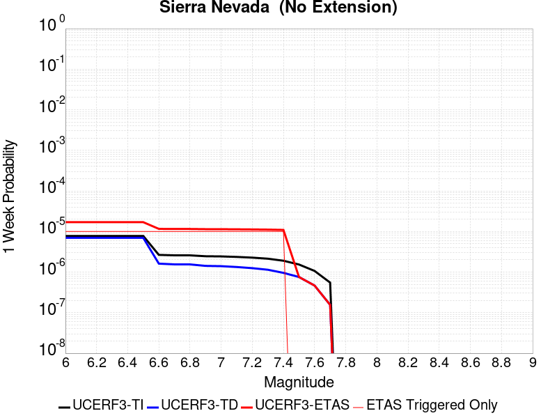 |  |  |  |

| Magnitude | 1 wk TI Prob | 1 wk TD Prob | 1 wk ETAS Prob | 1 wk ETAS/TD Gain | 1 wk ETAS Triggered Only | 1 mo TI Prob | 1 mo TD Prob | 1 mo ETAS Prob | 1 mo ETAS/TD Gain | 1 mo ETAS Triggered Only | 1 yr TI Prob | 1 yr TD Prob | 1 yr ETAS Prob | 1 yr ETAS/TD Gain | 1 yr ETAS Triggered Only | 10 yr TI Prob | 10 yr TD Prob | 10 yr ETAS Prob | 10 yr ETAS/TD Gain | 10 yr ETAS Triggered Only |
|-----|-----|-----|-----|-----|-----|-----|-----|-----|-----|-----|-----|-----|-----|-----|-----|-----|-----|-----|-----|-----|
| 6.0 | 7.7690465E-6 | 6.976568E-6 | 4.2357016E-5 | 6.0713263 | 3.5380697E-5 | 3.329549E-5 | 2.9899435E-5 | 1.7141798E-4 | 5.7331514 | 1.4152279E-4 | 4.0529718E-4 | 3.6400068E-4 | 5.762076E-4 | 1.5829849 | 2.1228418E-4 | 0.004045588 | 0.0036375606 | 0.0039900807 | 1.0969111 | 3.5380697E-4 |
| 6.1 | 7.7690465E-6 | 6.976568E-6 | 4.2357016E-5 | 6.0713263 | 3.5380697E-5 | 3.329549E-5 | 2.9899435E-5 | 1.7141798E-4 | 5.7331514 | 1.4152279E-4 | 4.0529718E-4 | 3.6400068E-4 | 5.762076E-4 | 1.5829849 | 2.1228418E-4 | 0.004045588 | 0.0036375606 | 0.0039900807 | 1.0969111 | 3.5380697E-4 |
| 6.2 | 7.7690465E-6 | 6.976568E-6 | 4.2357016E-5 | 6.0713263 | 3.5380697E-5 | 3.329549E-5 | 2.9899435E-5 | 1.7141798E-4 | 5.7331514 | 1.4152279E-4 | 4.0529718E-4 | 3.6400068E-4 | 5.762076E-4 | 1.5829849 | 2.1228418E-4 | 0.004045588 | 0.0036375606 | 0.0039900807 | 1.0969111 | 3.5380697E-4 |
| 6.3 | 7.7690465E-6 | 6.976568E-6 | 4.2357016E-5 | 6.0713263 | 3.5380697E-5 | 3.329549E-5 | 2.9899435E-5 | 1.7141798E-4 | 5.7331514 | 1.4152279E-4 | 4.0529718E-4 | 3.6400068E-4 | 5.762076E-4 | 1.5829849 | 2.1228418E-4 | 0.004045588 | 0.0036375606 | 0.0039900807 | 1.0969111 | 3.5380697E-4 |
| 6.4 | 7.7690465E-6 | 6.976568E-6 | 4.2357016E-5 | 6.0713263 | 3.5380697E-5 | 3.329549E-5 | 2.9899435E-5 | 1.7141798E-4 | 5.7331514 | 1.4152279E-4 | 4.0529718E-4 | 3.6400068E-4 | 5.762076E-4 | 1.5829849 | 2.1228418E-4 | 0.004045588 | 0.0036375606 | 0.0039900807 | 1.0969111 | 3.5380697E-4 |
| 6.5 | 7.7690465E-6 | 6.976568E-6 | 4.2357016E-5 | 6.0713263 | 3.5380697E-5 | 3.329549E-5 | 2.9899435E-5 | 1.7141798E-4 | 5.7331514 | 1.4152279E-4 | 4.0529718E-4 | 3.6400068E-4 | 5.762076E-4 | 1.5829849 | 2.1228418E-4 | 0.004045588 | 0.0036375606 | 0.0039900807 | 1.0969111 | 3.5380697E-4 |
| 6.6 | 2.653E-6 | 1.6149635E-6 | 3.6995603E-5 | 22.908012 | 3.5380697E-5 | 1.136995E-5 | 6.9212538E-6 | 7.7682154E-5 | 11.223712 | 7.0761394E-5 | 1.3842035E-4 | 8.426304E-5 | 1.9039618E-4 | 2.2595456 | 1.0614209E-4 | 0.0013833415 | 8.4231433E-4 | 0.0010544197 | 1.2518126 | 2.1228418E-4 |
| 6.7 | 2.5902466E-6 | 1.5502959E-6 | 3.693094E-5 | 23.821863 | 3.5380697E-5 | 1.11010095E-5 | 6.644109E-6 | 7.740503E-5 | 11.650175 | 7.0761394E-5 | 1.351464E-4 | 8.0889055E-5 | 1.8702255E-4 | 2.3120873 | 1.0614209E-4 | 0.0013506424 | 8.0859906E-4 | 0.0010207116 | 1.262321 | 2.1228418E-4 |
| 6.8 | 2.5853892E-6 | 1.5470957E-6 | 3.6927737E-5 | 23.869072 | 3.5380697E-5 | 1.1080193E-5 | 6.6303933E-6 | 7.739132E-5 | 11.672206 | 7.0761394E-5 | 1.34893E-4 | 8.072208E-5 | 1.868556E-4 | 2.3148017 | 1.0614209E-4 | 0.0013481114 | 8.069306E-4 | 0.0010190435 | 1.2628639 | 2.1228418E-4 |
| 6.9 | 2.458257E-6 | 1.4221675E-6 | 3.6802812E-5 | 25.877974 | 3.5380697E-5 | 1.0535345E-5 | 6.0949897E-6 | 7.685595E-5 | 12.609694 | 7.0761394E-5 | 1.2826028E-4 | 7.420399E-5 | 1.803382E-4 | 2.4303033 | 1.0614209E-4 | 0.0012818627 | 7.4179407E-4 | 9.5392077E-4 | 1.2859644 | 2.1228418E-4 |
| 7.0 | 2.4341468E-6 | 1.3991308E-6 | 3.6779777E-5 | 26.28759 | 3.5380697E-5 | 1.0432016E-5 | 5.9962613E-6 | 7.675723E-5 | 12.800848 | 7.0761394E-5 | 1.270024E-4 | 7.3002055E-5 | 1.7913639E-4 | 2.453854 | 1.0614209E-4 | 0.0012692984 | 7.297827E-4 | 9.419119E-4 | 1.2906746 | 2.1228418E-4 |
| 7.1 | 2.3652476E-6 | 1.334079E-6 | 3.671473E-5 | 27.520657 | 3.5380697E-5 | 1.0136736E-5 | 5.717469E-6 | 7.6478456E-5 | 13.376279 | 7.0761394E-5 | 1.2340778E-4 | 6.960797E-5 | 1.7574268E-4 | 2.524749 | 1.0614209E-4 | 0.0012333926 | 6.9586345E-4 | 9.0799987E-4 | 1.3048536 | 2.1228418E-4 |
| 7.2 | 2.272158E-6 | 1.2503832E-6 | 3.6631034E-5 | 29.295847 | 3.5380697E-5 | 9.737784E-6 | 5.358774E-6 | 7.611979E-5 | 14.204701 | 7.0761394E-5 | 1.1855107E-4 | 6.524114E-5 | 1.713763E-4 | 2.6268134 | 1.0614209E-4 | 0.0011848784 | 6.522214E-4 | 8.643671E-4 | 1.3252665 | 2.1228418E-4 |
| 7.3 | 2.1382127E-6 | 1.1420682E-6 | 3.6522724E-5 | 31.97946 | 3.5380697E-5 | 9.163737E-6 | 4.894569E-6 | 7.565562E-5 | 15.457054 | 7.0761394E-5 | 1.1156279E-4 | 5.9589758E-5 | 1.6572552E-4 | 2.7811074 | 1.0614209E-4 | 0.001115068 | 5.95739E-4 | 8.0789666E-4 | 1.3561252 | 2.1228418E-4 |
| 7.4 | 1.9048055E-6 | 9.57617E-7 | 3.633828E-5 | 37.94657 | 3.5380697E-5 | 8.163426E-6 | 4.104066E-6 | 7.4865166E-5 | 18.241707 | 7.0761394E-5 | 9.9385186E-5 | 4.9965867E-5 | 1.5610266E-4 | 3.1241858 | 1.0614209E-4 | 9.934074E-4 | 4.99547E-4 | 7.1172515E-4 | 1.424741 | 2.1228418E-4 |
| 7.5 | 1.5373403E-6 | 7.560832E-7 | 7.560832E-7 | 1.0 | 0.0 | 6.5885843E-6 | 3.2403525E-6 | 3.8620936E-5 | 11.918745 | 3.5380697E-5 | 8.021306E-5 | 3.9450584E-5 | 1.10209185E-4 | 2.7936008 | 7.0761394E-5 | 8.0184115E-4 | 3.9443627E-4 | 5.7126995E-4 | 1.4483202 | 1.7690349E-4 |
| 7.6 | 1.0680322E-6 | 4.6602182E-7 | 4.6602182E-7 | 1.0 | 0.0 | 4.577273E-6 | 1.997235E-6 | 1.997235E-6 | 1.0 | 0.0 | 5.5726876E-5 | 2.4316065E-5 | 5.96959E-5 | 2.4549985 | 3.5380697E-5 | 5.5712904E-4 | 2.431343E-4 | 3.492506E-4 | 1.4364513 | 1.0614209E-4 |
| 7.7 | 5.509146E-7 | 1.558334E-7 | 1.558334E-7 | 1.0 | 0.0 | 2.3610605E-6 | 6.678573E-7 | 6.678573E-7 | 1.0 | 0.0 | 2.8745531E-5 | 8.131134E-6 | 8.131134E-6 | 1.0 | 0.0 | 2.8741814E-4 | 8.130848E-5 | 8.130848E-5 | 1.0 | 0.0 |

## Coyote Lake
*[(top)](#table-of-contents)*

| 1 Week | 1 Month | 1 Year | 10 Year |
|-----|-----|-----|-----|
|  |  |  |  |

| Magnitude | 1 wk TI Prob | 1 wk TD Prob | 1 wk ETAS Prob | 1 wk ETAS/TD Gain | 1 wk ETAS Triggered Only | 1 mo TI Prob | 1 mo TD Prob | 1 mo ETAS Prob | 1 mo ETAS/TD Gain | 1 mo ETAS Triggered Only | 1 yr TI Prob | 1 yr TD Prob | 1 yr ETAS Prob | 1 yr ETAS/TD Gain | 1 yr ETAS Triggered Only | 10 yr TI Prob | 10 yr TD Prob | 10 yr ETAS Prob | 10 yr ETAS/TD Gain | 10 yr ETAS Triggered Only |
|-----|-----|-----|-----|-----|-----|-----|-----|-----|-----|-----|-----|-----|-----|-----|-----|-----|-----|-----|-----|-----|
| 6.0 | 1.980352E-5 | 2.1707852E-5 | 5.7087782E-5 | 2.6298218 | 3.5380697E-5 | 8.486947E-5 | 9.303074E-5 | 1.6378555E-4 | 1.760553 | 7.0761394E-5 | 0.0010327959 | 0.0011321327 | 0.0012734954 | 1.124864 | 1.4152279E-4 | 0.010280091 | 0.01127083 | 0.011585668 | 1.0279338 | 3.1842626E-4 |
| 6.1 | 1.980352E-5 | 2.1707852E-5 | 5.7087782E-5 | 2.6298218 | 3.5380697E-5 | 8.486947E-5 | 9.303074E-5 | 1.6378555E-4 | 1.760553 | 7.0761394E-5 | 0.0010327959 | 0.0011321327 | 0.0012734954 | 1.124864 | 1.4152279E-4 | 0.010280091 | 0.01127083 | 0.011585668 | 1.0279338 | 3.1842626E-4 |
| 6.2 | 1.980352E-5 | 2.1707852E-5 | 5.7087782E-5 | 2.6298218 | 3.5380697E-5 | 8.486947E-5 | 9.303074E-5 | 1.6378555E-4 | 1.760553 | 7.0761394E-5 | 0.0010327959 | 0.0011321327 | 0.0012734954 | 1.124864 | 1.4152279E-4 | 0.010280091 | 0.01127083 | 0.011585668 | 1.0279338 | 3.1842626E-4 |
| 6.3 | 1.5344787E-5 | 1.6821528E-5 | 5.220163E-5 | 3.1032631 | 3.5380697E-5 | 6.576172E-5 | 7.209062E-5 | 1.4284691E-4 | 1.981491 | 7.0761394E-5 | 8.003548E-4 | 8.7741105E-4 | 9.8346E-4 | 1.1208658 | 1.0614209E-4 | 0.007974784 | 0.008745514 | 0.008991013 | 1.0280714 | 2.4766487E-4 |
| 6.4 | 1.5344787E-5 | 1.6821528E-5 | 5.220163E-5 | 3.1032631 | 3.5380697E-5 | 6.576172E-5 | 7.209062E-5 | 1.4284691E-4 | 1.981491 | 7.0761394E-5 | 8.003548E-4 | 8.7741105E-4 | 9.8346E-4 | 1.1208658 | 1.0614209E-4 | 0.007974784 | 0.008745514 | 0.008991013 | 1.0280714 | 2.4766487E-4 |
| 6.5 | 1.4189697E-5 | 1.5558782E-5 | 5.093893E-5 | 3.273966 | 3.5380697E-5 | 6.081157E-5 | 6.667913E-5 | 1.3743581E-4 | 2.0611517 | 7.0761394E-5 | 7.401293E-4 | 8.115764E-4 | 9.1763237E-4 | 1.1306789 | 1.0614209E-4 | 0.0073766913 | 0.008092069 | 0.00833773 | 1.0303582 | 2.4766487E-4 |
| 6.6 | 1.3469301E-5 | 1.4772335E-5 | 5.015251E-5 | 3.395029 | 3.5380697E-5 | 5.7724297E-5 | 6.330881E-5 | 1.3406572E-4 | 2.1176472 | 7.0761394E-5 | 7.025667E-4 | 7.7057217E-4 | 8.7663246E-4 | 1.1376383 | 1.0614209E-4 | 0.0070034964 | 0.0076849074 | 0.007930669 | 1.0319798 | 2.4766487E-4 |
| 6.7 | 1.3027966E-5 | 1.4282475E-5 | 4.9662667E-5 | 3.4771752 | 3.5380697E-5 | 5.5832945E-5 | 6.12095E-5 | 1.3196656E-4 | 2.1559815 | 7.0761394E-5 | 6.7955407E-4 | 7.450307E-4 | 8.510937E-4 | 1.1423606 | 1.0614209E-4 | 0.006774798 | 0.007431207 | 0.007641914 | 1.0283543 | 2.1228418E-4 |
| 6.8 | 5.695434E-6 | 6.2247245E-6 | 6.2247245E-6 | 1.0 | 0.0 | 2.4408775E-5 | 2.6677288E-5 | 2.6677288E-5 | 1.0 | 0.0 | 2.971363E-4 | 3.2477756E-4 | 3.2477756E-4 | 1.0 | 0.0 | 0.0029673933 | 0.0032459702 | 0.0032812362 | 1.0108645 | 3.5380697E-5 |
| 6.9 | 4.385688E-6 | 4.7932917E-6 | 4.7932917E-6 | 1.0 | 0.0 | 1.879567E-5 | 2.0542679E-5 | 2.0542679E-5 | 1.0 | 0.0 | 2.2881327E-4 | 2.501071E-4 | 2.501071E-4 | 1.0 | 0.0 | 0.002285778 | 0.002501071 | 0.002501071 | 1.0 | 0.0 |

## Death Valley (Fish Lake Valley)
*[(top)](#table-of-contents)*

| 1 Week | 1 Month | 1 Year | 10 Year |
|-----|-----|-----|-----|
|  |  | 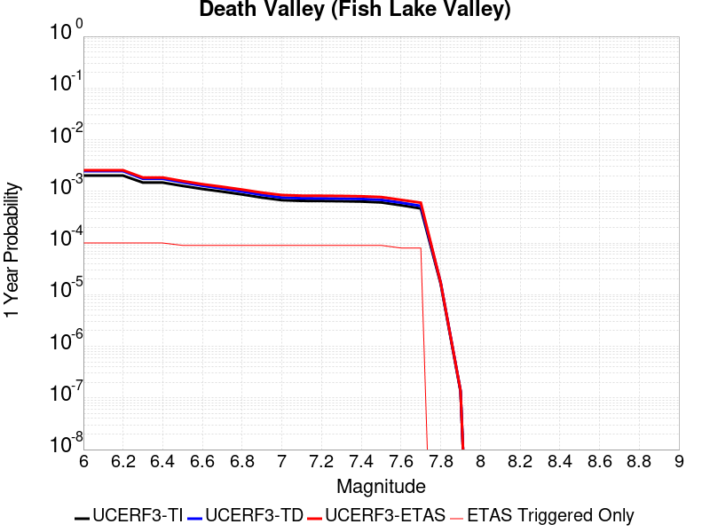 |  |

| Magnitude | 1 wk TI Prob | 1 wk TD Prob | 1 wk ETAS Prob | 1 wk ETAS/TD Gain | 1 wk ETAS Triggered Only | 1 mo TI Prob | 1 mo TD Prob | 1 mo ETAS Prob | 1 mo ETAS/TD Gain | 1 mo ETAS Triggered Only | 1 yr TI Prob | 1 yr TD Prob | 1 yr ETAS Prob | 1 yr ETAS/TD Gain | 1 yr ETAS Triggered Only | 10 yr TI Prob | 10 yr TD Prob | 10 yr ETAS Prob | 10 yr ETAS/TD Gain | 10 yr ETAS Triggered Only |
|-----|-----|-----|-----|-----|-----|-----|-----|-----|-----|-----|-----|-----|-----|-----|-----|-----|-----|-----|-----|-----|
| 6.0 | 3.872328E-5 | 4.727316E-5 | 8.265219E-5 | 1.7483956 | 3.5380697E-5 | 1.6594635E-4 | 2.0258522E-4 | 2.7333226E-4 | 1.3492212 | 7.0761394E-5 | 0.0020185246 | 0.0024638134 | 0.0026049875 | 1.057299 | 1.4152279E-4 | 0.02000288 | 0.024390986 | 0.024667127 | 1.0113214 | 2.8304558E-4 |
| 6.1 | 3.872328E-5 | 4.727316E-5 | 8.265219E-5 | 1.7483956 | 3.5380697E-5 | 1.6594635E-4 | 2.0258522E-4 | 2.7333226E-4 | 1.3492212 | 7.0761394E-5 | 0.0020185246 | 0.0024638134 | 0.0026049875 | 1.057299 | 1.4152279E-4 | 0.02000288 | 0.024390986 | 0.024667127 | 1.0113214 | 2.8304558E-4 |
| 6.2 | 3.872328E-5 | 4.727316E-5 | 8.265219E-5 | 1.7483956 | 3.5380697E-5 | 1.6594635E-4 | 2.0258522E-4 | 2.7333226E-4 | 1.3492212 | 7.0761394E-5 | 0.0020185246 | 0.0024638134 | 0.0026049875 | 1.057299 | 1.4152279E-4 | 0.02000288 | 0.024390986 | 0.024667127 | 1.0113214 | 2.8304558E-4 |
| 6.3 | 2.8356371E-5 | 3.361322E-5 | 6.8992726E-5 | 2.0525475 | 3.5380697E-5 | 1.2152165E-4 | 1.4404916E-4 | 2.1480036E-4 | 1.4911602 | 7.0761394E-5 | 0.0014785219 | 0.0017524667 | 0.0018937414 | 1.0806148 | 1.4152279E-4 | 0.014687235 | 0.017393492 | 0.017671615 | 1.01599 | 2.8304558E-4 |
| 6.4 | 2.8356371E-5 | 3.361322E-5 | 6.8992726E-5 | 2.0525475 | 3.5380697E-5 | 1.2152165E-4 | 1.4404916E-4 | 2.1480036E-4 | 1.4911602 | 7.0761394E-5 | 0.0014785219 | 0.0017524667 | 0.0018937414 | 1.0806148 | 1.4152279E-4 | 0.014687235 | 0.017393492 | 0.017671615 | 1.01599 | 2.8304558E-4 |
| 6.5 | 2.4448687E-5 | 2.8610175E-5 | 6.398986E-5 | 2.2366118 | 3.5380697E-5 | 1.0477588E-4 | 1.2260956E-4 | 1.9336228E-4 | 1.5770571 | 7.0761394E-5 | 0.0012748998 | 0.0014917998 | 0.0016331115 | 1.0947256 | 1.4152279E-4 | 0.012676105 | 0.014822718 | 0.015101568 | 1.0188123 | 2.8304558E-4 |
| 6.6 | 2.1298161E-5 | 2.4662175E-5 | 6.0042E-5 | 2.4345784 | 3.5380697E-5 | 9.127464E-5 | 1.05690946E-4 | 1.7644485E-4 | 1.6694416 | 7.0761394E-5 | 0.0011107022 | 0.0012860615 | 0.0014274023 | 1.109902 | 1.4152279E-4 | 0.011051672 | 0.012789601 | 0.013069026 | 1.0218478 | 2.8304558E-4 |
| 6.7 | 1.8959729E-5 | 2.1782762E-5 | 5.7162688E-5 | 2.6242166 | 3.5380697E-5 | 8.125345E-5 | 9.3351504E-5 | 1.6410628E-4 | 1.7579395 | 7.0761394E-5 | 9.888117E-4 | 0.0011359875 | 0.0012773495 | 1.1244397 | 1.4152279E-4 | 0.009844234 | 0.011304467 | 0.011584313 | 1.0247554 | 2.8304558E-4 |
| 6.8 | 1.6691629E-5 | 1.901977E-5 | 5.4399792E-5 | 2.860171 | 3.5380697E-5 | 7.153359E-5 | 8.151084E-5 | 1.5226647E-4 | 1.8680516 | 7.0761394E-5 | 8.7057345E-4 | 9.919596E-4 | 0.0011333419 | 1.1425284 | 1.4152279E-4 | 0.008671708 | 0.009877076 | 0.010157326 | 1.0283737 | 2.8304558E-4 |
| 6.9 | 1.450505E-5 | 1.6390675E-5 | 5.1770792E-5 | 3.1585515 | 3.5380697E-5 | 6.216302E-5 | 7.024391E-5 | 1.4100033E-4 | 2.0072963 | 7.0761394E-5 | 7.5657194E-4 | 8.5489283E-4 | 9.962945E-4 | 1.165403 | 1.4152279E-4 | 0.007540013 | 0.008516973 | 0.008797608 | 1.03295 | 2.8304558E-4 |
| 7.0 | 1.2940855E-5 | 1.4538927E-5 | 4.991911E-5 | 3.4334798 | 3.5380697E-5 | 5.545963E-5 | 6.230823E-5 | 1.3306522E-4 | 2.135596 | 7.0761394E-5 | 6.750118E-4 | 7.583444E-4 | 8.9975994E-4 | 1.1864792 | 1.4152279E-4 | 0.006729651 | 0.007558184 | 0.00783909 | 1.0371659 | 2.8304558E-4 |
| 7.1 | 1.2544658E-5 | 1.4079123E-5 | 4.9459322E-5 | 3.5129547 | 3.5380697E-5 | 5.3761712E-5 | 6.0337734E-5 | 1.3109486E-4 | 2.1726844 | 7.0761394E-5 | 6.5435225E-4 | 7.343699E-4 | 8.757888E-4 | 1.1925716 | 1.4152279E-4 | 0.006524288 | 0.007320025 | 0.007600999 | 1.0383842 | 2.8304558E-4 |
| 7.2 | 1.2489416E-5 | 1.4016585E-5 | 4.9396785E-5 | 3.5241668 | 3.5380697E-5 | 5.3524967E-5 | 6.0069728E-5 | 1.3082687E-4 | 2.1779168 | 7.0761394E-5 | 6.514716E-4 | 7.311091E-4 | 8.725285E-4 | 1.1934313 | 1.4152279E-4 | 0.006495651 | 0.0072876317 | 0.0075686146 | 1.0385561 | 2.8304558E-4 |
| 7.3 | 1.2368307E-5 | 1.38807145E-5 | 4.926092E-5 | 3.5488749 | 3.5380697E-5 | 5.3005948E-5 | 5.948745E-5 | 1.3024463E-4 | 2.1894472 | 7.0761394E-5 | 6.451563E-4 | 7.2402466E-4 | 8.6544495E-4 | 1.1953253 | 1.4152279E-4 | 0.0064328653 | 0.0072172494 | 0.007498252 | 1.0389348 | 2.8304558E-4 |
| 7.4 | 1.2161707E-5 | 1.3648755E-5 | 4.9028968E-5 | 3.5921936 | 3.5380697E-5 | 5.212056E-5 | 5.8493384E-5 | 1.2925063E-4 | 2.2096624 | 7.0761394E-5 | 6.3438306E-4 | 7.1192987E-4 | 8.533519E-4 | 1.1986461 | 1.4152279E-4 | 0.006325751 | 0.0070970803 | 0.0073781167 | 1.039599 | 2.8304558E-4 |
| 7.5 | 1.1707948E-5 | 1.3146373E-5 | 4.8526603E-5 | 3.6912541 | 3.5380697E-5 | 5.0175953E-5 | 5.6340414E-5 | 1.2709782E-4 | 2.2558908 | 7.0761394E-5 | 6.10721E-4 | 6.857342E-4 | 8.2715997E-4 | 1.2062398 | 1.4152279E-4 | 0.0060904534 | 0.006836766 | 0.0071178763 | 1.0411174 | 2.8304558E-4 |
| 7.6 | 1.0319538E-5 | 1.1580373E-5 | 1.1580373E-5 | 1.0 | 0.0 | 4.4225842E-5 | 4.9629256E-5 | 8.50082E-5 | 1.7128646 | 3.5380697E-5 | 5.383166E-4 | 6.0407387E-4 | 7.1015186E-4 | 1.1756043 | 1.0614209E-4 | 0.0053701443 | 0.00602485 | 0.006271023 | 1.0408596 | 2.4766487E-4 |
| 7.7 | 8.937764E-6 | 1.0023426E-5 | 1.0023426E-5 | 1.0 | 0.0 | 3.830414E-5 | 4.295686E-5 | 7.833604E-5 | 1.8235978 | 3.5380697E-5 | 4.6625308E-4 | 5.228793E-4 | 6.289659E-4 | 1.2028892 | 1.0614209E-4 | 0.0046527605 | 0.005217 | 0.005463373 | 1.047225 | 2.4766487E-4 |
| 7.8 | 3.108007E-7 | 3.2847535E-7 | 3.2847535E-7 | 1.0 | 0.0 | 1.3320023E-6 | 1.4077508E-6 | 1.4077508E-6 | 1.0 | 0.0 | 1.6217007E-5 | 1.7139235E-5 | 1.7139235E-5 | 1.0 | 0.0 | 1.6215823E-4 | 1.713795E-4 | 1.713795E-4 | 1.0 | 0.0 |
| 7.9 | 2.5591178E-9 | 2.6697329E-9 | 2.6697329E-9 | 1.0 | 0.0 | 1.0967647E-8 | 1.14417125E-8 | 1.14417125E-8 | 1.0 | 0.0 | 1.335311E-7 | 1.3930286E-7 | 1.3930286E-7 | 1.0 | 0.0 | 1.3353102E-6 | 1.3930285E-6 | 1.3930285E-6 | 1.0 | 0.0 |

## Manix-Afton Hills
*[(top)](#table-of-contents)*

| 1 Week | 1 Month | 1 Year | 10 Year |
|-----|-----|-----|-----|
|  |  | 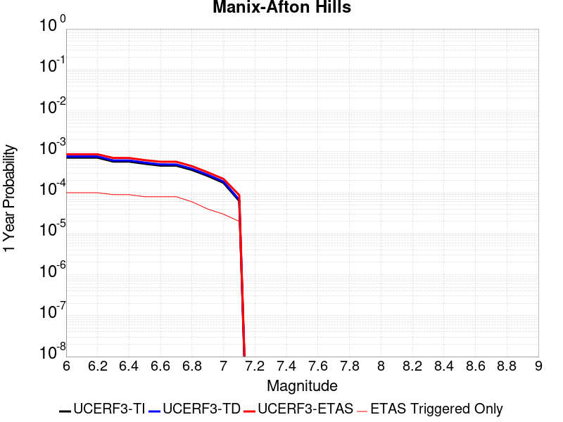 |  |

| Magnitude | 1 wk TI Prob | 1 wk TD Prob | 1 wk ETAS Prob | 1 wk ETAS/TD Gain | 1 wk ETAS Triggered Only | 1 mo TI Prob | 1 mo TD Prob | 1 mo ETAS Prob | 1 mo ETAS/TD Gain | 1 mo ETAS Triggered Only | 1 yr TI Prob | 1 yr TD Prob | 1 yr ETAS Prob | 1 yr ETAS/TD Gain | 1 yr ETAS Triggered Only | 10 yr TI Prob | 10 yr TD Prob | 10 yr ETAS Prob | 10 yr ETAS/TD Gain | 10 yr ETAS Triggered Only |
|-----|-----|-----|-----|-----|-----|-----|-----|-----|-----|-----|-----|-----|-----|-----|-----|-----|-----|-----|-----|-----|
| 6.0 | 1.3783202E-5 | 1.4711616E-5 | 5.0091792E-5 | 3.4049141 | 3.5380697E-5 | 5.906953E-5 | 6.3048356E-5 | 9.8426826E-5 | 1.5611322 | 3.5380697E-5 | 7.189342E-4 | 7.673609E-4 | 9.087751E-4 | 1.1842864 | 1.4152279E-4 | 0.0071661277 | 0.0076488685 | 0.007894639 | 1.0321317 | 2.4766487E-4 |
| 6.1 | 1.3783202E-5 | 1.4711616E-5 | 5.0091792E-5 | 3.4049141 | 3.5380697E-5 | 5.906953E-5 | 6.3048356E-5 | 9.8426826E-5 | 1.5611322 | 3.5380697E-5 | 7.189342E-4 | 7.673609E-4 | 9.087751E-4 | 1.1842864 | 1.4152279E-4 | 0.0071661277 | 0.0076488685 | 0.007894639 | 1.0321317 | 2.4766487E-4 |
| 6.2 | 1.3783202E-5 | 1.4711616E-5 | 5.0091792E-5 | 3.4049141 | 3.5380697E-5 | 5.906953E-5 | 6.3048356E-5 | 9.8426826E-5 | 1.5611322 | 3.5380697E-5 | 7.189342E-4 | 7.673609E-4 | 9.087751E-4 | 1.1842864 | 1.4152279E-4 | 0.0071661277 | 0.0076488685 | 0.007894639 | 1.0321317 | 2.4766487E-4 |
| 6.3 | 1.10494875E-5 | 1.1793558E-5 | 1.1793558E-5 | 1.0 | 0.0 | 4.7354086E-5 | 5.0542898E-5 | 5.0542898E-5 | 1.0 | 0.0 | 5.763835E-4 | 6.151964E-4 | 7.212732E-4 | 1.1724275 | 1.0614209E-4 | 0.005748908 | 0.0061359745 | 0.0063117924 | 1.0286536 | 1.7690349E-4 |
| 6.4 | 1.10494875E-5 | 1.1793558E-5 | 1.1793558E-5 | 1.0 | 0.0 | 4.7354086E-5 | 5.0542898E-5 | 5.0542898E-5 | 1.0 | 0.0 | 5.763835E-4 | 6.151964E-4 | 7.212732E-4 | 1.1724275 | 1.0614209E-4 | 0.005748908 | 0.0061359745 | 0.0063117924 | 1.0286536 | 1.7690349E-4 |
| 6.5 | 9.788949E-6 | 1.0454697E-5 | 1.0454697E-5 | 1.0 | 0.0 | 4.1951964E-5 | 4.480513E-5 | 4.480513E-5 | 1.0 | 0.0 | 5.1064545E-4 | 5.453752E-4 | 6.16098E-4 | 1.1296773 | 7.0761394E-5 | 0.0050947363 | 0.005441295 | 0.0055820476 | 1.0258675 | 1.4152279E-4 |
| 6.6 | 8.810006E-6 | 9.413971E-6 | 9.413971E-6 | 1.0 | 0.0 | 3.775662E-5 | 4.0345018E-5 | 4.0345018E-5 | 1.0 | 0.0 | 4.5958988E-4 | 4.9109873E-4 | 5.618254E-4 | 1.1440171 | 7.0761394E-5 | 0.0045864056 | 0.0049010175 | 0.0050066393 | 1.021551 | 1.0614209E-4 |
| 6.7 | 8.80128E-6 | 9.404451E-6 | 9.404451E-6 | 1.0 | 0.0 | 3.7719226E-5 | 4.0304214E-5 | 4.0304214E-5 | 1.0 | 0.0 | 4.591348E-4 | 4.906022E-4 | 5.613289E-4 | 1.144163 | 7.0761394E-5 | 0.004581874 | 0.004896074 | 0.0050016963 | 1.0215728 | 1.0614209E-4 |
| 6.8 | 6.8994877E-6 | 7.3803494E-6 | 7.3803494E-6 | 1.0 | 0.0 | 2.9568899E-5 | 3.162973E-5 | 3.162973E-5 | 1.0 | 0.0 | 3.5994186E-4 | 3.850321E-4 | 4.2039918E-4 | 1.0918548 | 3.5380697E-5 | 0.003593594 | 0.0038444551 | 0.0039149444 | 1.0183353 | 7.0761394E-5 |
| 6.9 | 4.9328037E-6 | 5.271154E-6 | 5.271154E-6 | 1.0 | 0.0 | 2.1140417E-5 | 2.2590497E-5 | 2.2590497E-5 | 1.0 | 0.0 | 2.5735417E-4 | 2.7501077E-4 | 2.7501077E-4 | 1.0 | 0.0 | 0.0025705635 | 0.0027473096 | 0.0027473096 | 1.0 | 0.0 |
| 7.0 | 3.347973E-6 | 3.590168E-6 | 3.590168E-6 | 1.0 | 0.0 | 1.4348378E-5 | 1.5386368E-5 | 1.5386368E-5 | 1.0 | 0.0 | 1.746775E-4 | 1.8731703E-4 | 1.8731703E-4 | 1.0 | 0.0 | 0.0017454025 | 0.0018719939 | 0.0018719939 | 1.0 | 0.0 |
| 7.1 | 1.2073567E-6 | 1.293531E-6 | 1.293531E-6 | 1.0 | 0.0 | 5.1743755E-6 | 5.5437017E-6 | 5.5437017E-6 | 1.0 | 0.0 | 6.29962E-5 | 6.749411E-5 | 6.749411E-5 | 1.0 | 0.0 | 6.297835E-4 | 6.748963E-4 | 6.748963E-4 | 1.0 | 0.0 |

## San Andreas (Big Bend)
*[(top)](#table-of-contents)*

| 1 Week | 1 Month | 1 Year | 10 Year |
|-----|-----|-----|-----|
|  |  |  |  |

| Magnitude | 1 wk TI Prob | 1 wk TD Prob | 1 wk ETAS Prob | 1 wk ETAS/TD Gain | 1 wk ETAS Triggered Only | 1 mo TI Prob | 1 mo TD Prob | 1 mo ETAS Prob | 1 mo ETAS/TD Gain | 1 mo ETAS Triggered Only | 1 yr TI Prob | 1 yr TD Prob | 1 yr ETAS Prob | 1 yr ETAS/TD Gain | 1 yr ETAS Triggered Only | 10 yr TI Prob | 10 yr TD Prob | 10 yr ETAS Prob | 10 yr ETAS/TD Gain | 10 yr ETAS Triggered Only |
|-----|-----|-----|-----|-----|-----|-----|-----|-----|-----|-----|-----|-----|-----|-----|-----|-----|-----|-----|-----|-----|
| 6.0 | 1.0179969E-4 | 2.0106303E-4 | 2.0106303E-4 | 1.0 | 0.0 | 4.362114E-4 | 8.614151E-4 | 8.614151E-4 | 1.0 | 0.0 | 0.0052979486 | 0.010437581 | 0.010542615 | 1.010063 | 1.0614209E-4 | 0.051734097 | 0.10159716 | 0.101819664 | 1.00219 | 2.4766487E-4 |
| 6.1 | 1.0179969E-4 | 2.0106303E-4 | 2.0106303E-4 | 1.0 | 0.0 | 4.362114E-4 | 8.614151E-4 | 8.614151E-4 | 1.0 | 0.0 | 0.0052979486 | 0.010437581 | 0.010542615 | 1.010063 | 1.0614209E-4 | 0.051734097 | 0.10159716 | 0.101819664 | 1.00219 | 2.4766487E-4 |
| 6.2 | 1.0179969E-4 | 2.0106303E-4 | 2.0106303E-4 | 1.0 | 0.0 | 4.362114E-4 | 8.614151E-4 | 8.614151E-4 | 1.0 | 0.0 | 0.0052979486 | 0.010437581 | 0.010542615 | 1.010063 | 1.0614209E-4 | 0.051734097 | 0.10159716 | 0.101819664 | 1.00219 | 2.4766487E-4 |
| 6.3 | 1.0179969E-4 | 2.0106303E-4 | 2.0106303E-4 | 1.0 | 0.0 | 4.362114E-4 | 8.614151E-4 | 8.614151E-4 | 1.0 | 0.0 | 0.0052979486 | 0.010437581 | 0.010542615 | 1.010063 | 1.0614209E-4 | 0.051734097 | 0.10159716 | 0.101819664 | 1.00219 | 2.4766487E-4 |
| 6.4 | 9.1639464E-5 | 1.8462905E-4 | 1.8462905E-4 | 1.0 | 0.0 | 3.9268145E-4 | 7.910276E-4 | 7.910276E-4 | 1.0 | 0.0 | 0.0047704205 | 0.009588352 | 0.009623393 | 1.0036546 | 3.5380697E-5 | 0.046693064 | 0.093921766 | 0.09404999 | 1.0013653 | 1.4152279E-4 |
| 6.5 | 9.1639464E-5 | 1.8462905E-4 | 1.8462905E-4 | 1.0 | 0.0 | 3.9268145E-4 | 7.910276E-4 | 7.910276E-4 | 1.0 | 0.0 | 0.0047704205 | 0.009588352 | 0.009623393 | 1.0036546 | 3.5380697E-5 | 0.046693064 | 0.093921766 | 0.09404999 | 1.0013653 | 1.4152279E-4 |
| 6.6 | 9.042622E-5 | 1.826988E-4 | 1.826988E-4 | 1.0 | 0.0 | 3.8748336E-4 | 7.827601E-4 | 7.827601E-4 | 1.0 | 0.0 | 0.0047074095 | 0.009488574 | 0.009523619 | 1.0036933 | 3.5380697E-5 | 0.046089325 | 0.093015574 | 0.09314393 | 1.00138 | 1.4152279E-4 |
| 6.7 | 8.9836685E-5 | 1.8184188E-4 | 1.8184188E-4 | 1.0 | 0.0 | 3.8495753E-4 | 7.790898E-4 | 7.790898E-4 | 1.0 | 0.0 | 0.00467679 | 0.009444275 | 0.009479322 | 1.0037109 | 3.5380697E-5 | 0.045795817 | 0.09260978 | 0.092738196 | 1.0013866 | 1.4152279E-4 |
| 6.8 | 8.9471854E-5 | 1.8130938E-4 | 1.8130938E-4 | 1.0 | 0.0 | 3.8339442E-4 | 7.7680906E-4 | 7.7680906E-4 | 1.0 | 0.0 | 0.004657841 | 0.009416748 | 0.009451795 | 1.0037218 | 3.5380697E-5 | 0.04561414 | 0.09235688 | 0.09248533 | 1.0013908 | 1.4152279E-4 |
| 6.9 | 8.858234E-5 | 1.8012857E-4 | 1.8012857E-4 | 1.0 | 0.0 | 3.7958333E-4 | 7.717514E-4 | 7.717514E-4 | 1.0 | 0.0 | 0.004611638 | 0.009355701 | 0.00939075 | 1.0037464 | 3.5380697E-5 | 0.04517103 | 0.09179684 | 0.09189323 | 1.0010501 | 1.0614209E-4 |
| 7.0 | 8.7433385E-5 | 1.7851574E-4 | 1.7851574E-4 | 1.0 | 0.0 | 3.746607E-4 | 7.648433E-4 | 7.648433E-4 | 1.0 | 0.0 | 0.004551957 | 0.009272313 | 0.009307366 | 1.0037804 | 3.5380697E-5 | 0.044598386 | 0.091031015 | 0.09112749 | 1.0010599 | 1.0614209E-4 |
| 7.1 | 8.684964E-5 | 1.7763473E-4 | 1.7763473E-4 | 1.0 | 0.0 | 3.7215967E-4 | 7.610698E-4 | 7.610698E-4 | 1.0 | 0.0 | 0.0045216335 | 0.009226761 | 0.009261816 | 1.0037992 | 3.5380697E-5 | 0.04430731 | 0.09061238 | 0.09067673 | 1.0007101 | 7.0761394E-5 |
| 7.2 | 8.606521E-5 | 1.7654036E-4 | 1.7654036E-4 | 1.0 | 0.0 | 3.6879873E-4 | 7.5638236E-4 | 7.5638236E-4 | 1.0 | 0.0 | 0.0044808835 | 0.009170174 | 0.00920523 | 1.0038228 | 3.5380697E-5 | 0.043916024 | 0.09009273 | 0.09015712 | 1.0007147 | 7.0761394E-5 |
| 7.3 | 8.568266E-5 | 1.7595981E-4 | 1.7595981E-4 | 1.0 | 0.0 | 3.6715972E-4 | 7.5389567E-4 | 7.5389567E-4 | 1.0 | 0.0 | 0.0044610105 | 0.0091401525 | 0.009175209 | 1.0038356 | 3.5380697E-5 | 0.043725148 | 0.08981366 | 0.08987806 | 1.0007172 | 7.0761394E-5 |
| 7.4 | 8.5432206E-5 | 1.7558529E-4 | 1.7558529E-4 | 1.0 | 0.0 | 3.6608664E-4 | 7.522915E-4 | 7.522915E-4 | 1.0 | 0.0 | 0.004447999 | 0.009120786 | 0.009155843 | 1.0038438 | 3.5380697E-5 | 0.043600157 | 0.08963369 | 0.089698106 | 1.0007187 | 7.0761394E-5 |
| 7.5 | 8.4791965E-5 | 1.742772E-4 | 1.742772E-4 | 1.0 | 0.0 | 3.633435E-4 | 7.466887E-4 | 7.466887E-4 | 1.0 | 0.0 | 0.0044147377 | 0.00905314 | 0.0090882005 | 1.0038728 | 3.5380697E-5 | 0.043280575 | 0.08901084 | 0.089075305 | 1.0007242 | 7.0761394E-5 |
| 7.6 | 8.241105E-5 | 1.6872598E-4 | 1.6872598E-4 | 1.0 | 0.0 | 3.531424E-4 | 7.229111E-4 | 7.229111E-4 | 1.0 | 0.0 | 0.0042910352 | 0.008766012 | 0.008801083 | 1.0040008 | 3.5380697E-5 | 0.042091176 | 0.086385906 | 0.086450554 | 1.0007484 | 7.0761394E-5 |
| 7.7 | 7.00432E-5 | 1.4233537E-4 | 1.4233537E-4 | 1.0 | 0.0 | 3.001506E-4 | 6.0986617E-4 | 6.0986617E-4 | 1.0 | 0.0 | 0.0036482112 | 0.0073998813 | 0.007435 | 1.0047458 | 3.5380697E-5 | 0.035888977 | 0.07364825 | 0.0737138 | 1.00089 | 7.0761394E-5 |
| 7.8 | 6.415362E-5 | 1.2995097E-4 | 1.2995097E-4 | 1.0 | 0.0 | 2.749151E-4 | 5.568139E-4 | 5.568139E-4 | 1.0 | 0.0 | 0.0033419547 | 0.006758167 | 0.0067933085 | 1.0051999 | 3.5380697E-5 | 0.03292141 | 0.06737108 | 0.06743707 | 1.0009795 | 7.0761394E-5 |
| 7.9 | 4.939911E-5 | 9.359872E-5 | 9.359872E-5 | 1.0 | 0.0 | 2.116933E-4 | 4.0107573E-4 | 4.0107573E-4 | 1.0 | 0.0 | 0.0025743195 | 0.0048721726 | 0.0049073813 | 1.0072265 | 3.5380697E-5 | 0.025447013 | 0.04900208 | 0.049069375 | 1.0013733 | 7.0761394E-5 |
| 8.0 | 3.344983E-5 | 5.2337946E-5 | 5.2337946E-5 | 1.0 | 0.0 | 1.4334853E-4 | 2.2428621E-4 | 2.2428621E-4 | 1.0 | 0.0 | 0.0017438711 | 0.0027272669 | 0.0027272669 | 1.0 | 0.0 | 0.017302496 | 0.027976755 | 0.028011145 | 1.0012293 | 3.5380697E-5 |
| 8.1 | 1.9104898E-5 | 1.9226556E-5 | 1.9226556E-5 | 1.0 | 0.0 | 8.1875565E-5 | 8.2396924E-5 | 8.2396924E-5 | 1.0 | 0.0 | 9.963791E-4 | 0.0010027215 | 0.0010027215 | 1.0 | 0.0 | 0.009919235 | 0.01077785 | 0.010812849 | 1.0032474 | 3.5380697E-5 |
| 8.2 | 8.643924E-6 | 5.49522E-6 | 5.49522E-6 | 1.0 | 0.0 | 3.704486E-5 | 2.355073E-5 | 2.355073E-5 | 1.0 | 0.0 | 4.5092785E-4 | 2.866925E-4 | 2.866925E-4 | 1.0 | 0.0 | 0.0045001395 | 0.0032598388 | 0.0032598388 | 1.0 | 0.0 |
| 8.3 | 1.983087E-6 | 7.693574E-7 | 7.693574E-7 | 1.0 | 0.0 | 8.498917E-6 | 3.297242E-6 | 3.297242E-6 | 1.0 | 0.0 | 1.034694E-4 | 4.01432E-5 | 4.01432E-5 | 1.0 | 0.0 | 0.0010342124 | 4.7390026E-4 | 4.7390026E-4 | 1.0 | 0.0 |

## San Andreas (Coachella) rev
*[(top)](#table-of-contents)*

| 1 Week | 1 Month | 1 Year | 10 Year |
|-----|-----|-----|-----|
|  |  |  |  |

| Magnitude | 1 wk TI Prob | 1 wk TD Prob | 1 wk ETAS Prob | 1 wk ETAS/TD Gain | 1 wk ETAS Triggered Only | 1 mo TI Prob | 1 mo TD Prob | 1 mo ETAS Prob | 1 mo ETAS/TD Gain | 1 mo ETAS Triggered Only | 1 yr TI Prob | 1 yr TD Prob | 1 yr ETAS Prob | 1 yr ETAS/TD Gain | 1 yr ETAS Triggered Only | 10 yr TI Prob | 10 yr TD Prob | 10 yr ETAS Prob | 10 yr ETAS/TD Gain | 10 yr ETAS Triggered Only |
|-----|-----|-----|-----|-----|-----|-----|-----|-----|-----|-----|-----|-----|-----|-----|-----|-----|-----|-----|-----|-----|
| 6.0 | 1.1925945E-4 | 3.2747045E-4 | 3.2747045E-4 | 1.0 | 0.0 | 5.110118E-4 | 0.0014026947 | 0.0014026947 | 1.0 | 0.0 | 0.0062038354 | 0.016945418 | 0.017084543 | 1.0082102 | 1.4152279E-4 | 0.060334753 | 0.15272202 | 0.15293185 | 1.001374 | 2.4766487E-4 |
| 6.1 | 1.1925945E-4 | 3.2747045E-4 | 3.2747045E-4 | 1.0 | 0.0 | 5.110118E-4 | 0.0014026947 | 0.0014026947 | 1.0 | 0.0 | 0.0062038354 | 0.016945418 | 0.017084543 | 1.0082102 | 1.4152279E-4 | 0.060334753 | 0.15272202 | 0.15293185 | 1.001374 | 2.4766487E-4 |
| 6.2 | 1.07432395E-4 | 3.0247675E-4 | 3.0247675E-4 | 1.0 | 0.0 | 4.603433E-4 | 0.0012956889 | 0.0012956889 | 1.0 | 0.0 | 0.005590286 | 0.015662009 | 0.015801316 | 1.0088946 | 1.4152279E-4 | 0.05451731 | 0.14189328 | 0.1421058 | 1.0014977 | 2.4766487E-4 |
| 6.3 | 1.0718766E-4 | 3.019298E-4 | 3.019298E-4 | 1.0 | 0.0 | 4.592948E-4 | 0.0012933471 | 0.0012933471 | 1.0 | 0.0 | 0.005577586 | 0.015633909 | 0.015773218 | 1.0089108 | 1.4152279E-4 | 0.054396555 | 0.14166155 | 0.14187413 | 1.0015006 | 2.4766487E-4 |
| 6.4 | 1.0355944E-4 | 2.9401045E-4 | 2.9401045E-4 | 1.0 | 0.0 | 4.4375064E-4 | 0.0012594402 | 0.0012594402 | 1.0 | 0.0 | 0.0053892885 | 0.015226932 | 0.0153663 | 1.0091528 | 1.4152279E-4 | 0.052604496 | 0.13822177 | 0.1384352 | 1.0015441 | 2.4766487E-4 |
| 6.5 | 1.0227914E-4 | 2.912047E-4 | 2.912047E-4 | 1.0 | 0.0 | 4.382655E-4 | 0.0012474272 | 0.0012474272 | 1.0 | 0.0 | 0.0053228354 | 0.015082708 | 0.015222096 | 1.0092416 | 1.4152279E-4 | 0.051971316 | 0.13700101 | 0.13721474 | 1.0015601 | 2.4766487E-4 |
| 6.6 | 1.0116757E-4 | 2.8886212E-4 | 2.8886212E-4 | 1.0 | 0.0 | 4.3350324E-4 | 0.0012373971 | 0.0012373971 | 1.0 | 0.0 | 0.0052651367 | 0.0149622755 | 0.0151016805 | 1.0093172 | 1.4152279E-4 | 0.051421247 | 0.13597922 | 0.13619322 | 1.0015737 | 2.4766487E-4 |
| 6.7 | 1.0050676E-4 | 2.874477E-4 | 2.874477E-4 | 1.0 | 0.0 | 4.3067214E-4 | 0.001231341 | 0.001231341 | 1.0 | 0.0 | 0.005230834 | 0.014889553 | 0.015028968 | 1.0093633 | 1.4152279E-4 | 0.051094085 | 0.13536398 | 0.13557811 | 1.0015819 | 2.4766487E-4 |
| 6.8 | 9.976819E-5 | 2.8548407E-4 | 2.8548407E-4 | 1.0 | 0.0 | 4.2750788E-4 | 0.0012229334 | 0.0012229334 | 1.0 | 0.0 | 0.0051924936 | 0.014788584 | 0.014928014 | 1.0094283 | 1.4152279E-4 | 0.050728295 | 0.13451566 | 0.13473001 | 1.0015935 | 2.4766487E-4 |
| 6.9 | 9.77719E-5 | 2.80452E-4 | 2.80452E-4 | 1.0 | 0.0 | 4.1895514E-4 | 0.0012013874 | 0.0012013874 | 1.0 | 0.0 | 0.0050888555 | 0.01452979 | 0.014669256 | 1.0095986 | 1.4152279E-4 | 0.049738888 | 0.13234389 | 0.13255878 | 1.0016237 | 2.4766487E-4 |
| 7.0 | 8.500761E-5 | 2.4778847E-4 | 2.4778847E-4 | 1.0 | 0.0 | 3.6426744E-4 | 0.0010615216 | 0.0010615216 | 1.0 | 0.0 | 0.0044259406 | 0.012848215 | 0.01298792 | 1.0108734 | 1.4152279E-4 | 0.04338823 | 0.11819933 | 0.118417725 | 1.0018476 | 2.4766487E-4 |
| 7.1 | 8.319876E-5 | 2.4381404E-4 | 2.4381404E-4 | 1.0 | 0.0 | 3.5651738E-4 | 0.0010445021 | 0.0010445021 | 1.0 | 0.0 | 0.004331963 | 0.012643427 | 0.01278316 | 1.0110519 | 1.4152279E-4 | 0.042484846 | 0.11641899 | 0.11663782 | 1.0018797 | 2.4766487E-4 |
| 7.2 | 7.563917E-5 | 2.2429357E-4 | 2.2429357E-4 | 1.0 | 0.0 | 3.2412758E-4 | 9.609071E-4 | 9.609071E-4 | 1.0 | 0.0 | 0.0039391145 | 0.011636979 | 0.011776855 | 1.01202 | 1.4152279E-4 | 0.03870018 | 0.107823946 | 0.10804491 | 1.0020493 | 2.4766487E-4 |
| 7.3 | 7.082985E-5 | 2.074492E-4 | 2.074492E-4 | 1.0 | 0.0 | 3.0352117E-4 | 8.8876794E-4 | 8.8876794E-4 | 1.0 | 0.0 | 0.0036891096 | 0.010767689 | 0.010907687 | 1.0130018 | 1.4152279E-4 | 0.03628465 | 0.10034482 | 0.10056763 | 1.0022205 | 2.4766487E-4 |
| 7.4 | 5.146215E-5 | 1.428607E-4 | 1.428607E-4 | 1.0 | 0.0 | 2.2053342E-4 | 6.121174E-4 | 6.121174E-4 | 1.0 | 0.0 | 0.0026816884 | 0.0074272524 | 0.0075326064 | 1.0141847 | 1.0614209E-4 | 0.02649557 | 0.07090313 | 0.07110036 | 1.0027817 | 2.1228418E-4 |
| 7.5 | 4.0285166E-5 | 1.0952253E-4 | 1.0952253E-4 | 1.0 | 0.0 | 1.7263928E-4 | 4.6929816E-4 | 4.6929816E-4 | 1.0 | 0.0 | 0.002099857 | 0.0056988057 | 0.0058043427 | 1.0185192 | 1.0614209E-4 | 0.020801254 | 0.05505857 | 0.05525917 | 1.0036433 | 2.1228418E-4 |
| 7.6 | 3.1168736E-5 | 8.4483814E-5 | 8.4483814E-5 | 1.0 | 0.0 | 1.3357346E-4 | 3.6202336E-4 | 3.6202336E-4 | 1.0 | 0.0 | 0.0016250437 | 0.0043987534 | 0.0045044282 | 1.0240239 | 1.0614209E-4 | 0.016132116 | 0.04285275 | 0.043055937 | 1.0047415 | 2.1228418E-4 |
| 7.7 | 2.2100989E-5 | 6.2470855E-5 | 6.2470855E-5 | 1.0 | 0.0 | 9.4715084E-5 | 2.677048E-4 | 2.677048E-4 | 1.0 | 0.0 | 0.001152546 | 0.0032544413 | 0.003360238 | 1.0325084 | 1.0614209E-4 | 0.011465867 | 0.031938035 | 0.032143537 | 1.0064344 | 2.1228418E-4 |
| 7.8 | 1.7484861E-5 | 5.187001E-5 | 5.187001E-5 | 1.0 | 0.0 | 7.493296E-5 | 2.2228112E-4 | 2.2228112E-4 | 1.0 | 0.0 | 9.1192697E-4 | 0.002702917 | 0.002773487 | 1.0261089 | 7.0761394E-5 | 0.009081938 | 0.026673956 | 0.02684614 | 1.0064552 | 1.7690349E-4 |
| 7.9 | 1.3967285E-5 | 3.8283448E-5 | 3.8283448E-5 | 1.0 | 0.0 | 5.985842E-5 | 1.6406161E-4 | 1.6406161E-4 | 1.0 | 0.0 | 7.2853256E-4 | 0.0019956212 | 0.0020662416 | 1.0353875 | 7.0761394E-5 | 0.0072614877 | 0.019937595 | 0.020110972 | 1.008696 | 1.7690349E-4 |
| 8.0 | 1.1887396E-5 | 3.1117535E-5 | 3.1117535E-5 | 1.0 | 0.0 | 5.094499E-5 | 1.3335406E-4 | 1.3335406E-4 | 1.0 | 0.0 | 6.200787E-4 | 0.0016223775 | 0.0016930242 | 1.0435451 | 7.0761394E-5 | 0.006183513 | 0.016303658 | 0.016477678 | 1.0106736 | 1.7690349E-4 |
| 8.1 | 5.100864E-6 | 8.994677E-6 | 8.994677E-6 | 1.0 | 0.0 | 2.1860664E-5 | 3.854805E-5 | 3.854805E-5 | 1.0 | 0.0 | 2.6612106E-4 | 4.6922156E-4 | 4.6922156E-4 | 1.0 | 0.0 | 0.002658026 | 0.00492833 | 0.0049635363 | 1.0071436 | 3.5380697E-5 |
| 8.2 | 2.3004484E-6 | 2.795008E-6 | 2.795008E-6 | 1.0 | 0.0 | 9.859027E-6 | 1.1978551E-5 | 1.1978551E-5 | 1.0 | 0.0 | 1.2002704E-4 | 1.4582912E-4 | 1.4582912E-4 | 1.0 | 0.0 | 0.0011996223 | 0.0016018103 | 0.0016018103 | 1.0 | 0.0 |
| 8.3 | 1.0424446E-7 | 5.8393972E-8 | 5.8393972E-8 | 1.0 | 0.0 | 4.4676187E-7 | 2.5025986E-7 | 2.5025986E-7 | 1.0 | 0.0 | 5.439312E-6 | 3.0469098E-6 | 3.0469098E-6 | 1.0 | 0.0 | 5.4391792E-5 | 3.203139E-5 | 3.203139E-5 | 1.0 | 0.0 |

## Cady
*[(top)](#table-of-contents)*

| 1 Week | 1 Month | 1 Year | 10 Year |
|-----|-----|-----|-----|
|  | 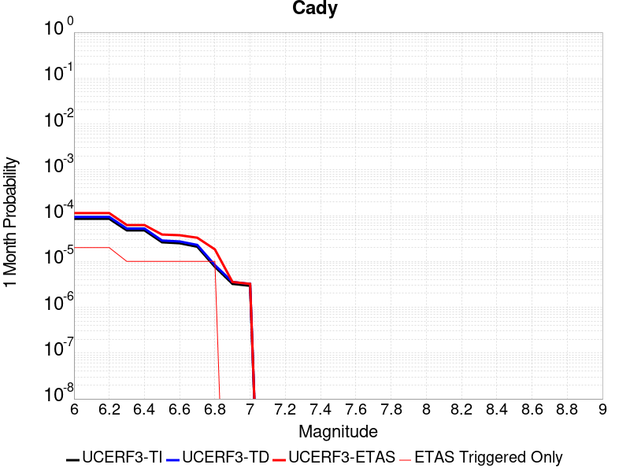 |  |  |

| Magnitude | 1 wk TI Prob | 1 wk TD Prob | 1 wk ETAS Prob | 1 wk ETAS/TD Gain | 1 wk ETAS Triggered Only | 1 mo TI Prob | 1 mo TD Prob | 1 mo ETAS Prob | 1 mo ETAS/TD Gain | 1 mo ETAS Triggered Only | 1 yr TI Prob | 1 yr TD Prob | 1 yr ETAS Prob | 1 yr ETAS/TD Gain | 1 yr ETAS Triggered Only | 10 yr TI Prob | 10 yr TD Prob | 10 yr ETAS Prob | 10 yr ETAS/TD Gain | 10 yr ETAS Triggered Only |
|-----|-----|-----|-----|-----|-----|-----|-----|-----|-----|-----|-----|-----|-----|-----|-----|-----|-----|-----|-----|-----|
| 6.0 | 1.9892565E-5 | 2.1859876E-5 | 2.1859876E-5 | 1.0 | 0.0 | 8.525106E-5 | 9.3682334E-5 | 9.3682334E-5 | 1.0 | 0.0 | 0.0010374374 | 0.0011400766 | 0.0011754169 | 1.0309982 | 3.5380697E-5 | 0.010326075 | 0.011351293 | 0.011561167 | 1.018489 | 2.1228418E-4 |
| 6.1 | 1.9892565E-5 | 2.1859876E-5 | 2.1859876E-5 | 1.0 | 0.0 | 8.525106E-5 | 9.3682334E-5 | 9.3682334E-5 | 1.0 | 0.0 | 0.0010374374 | 0.0011400766 | 0.0011754169 | 1.0309982 | 3.5380697E-5 | 0.010326075 | 0.011351293 | 0.011561167 | 1.018489 | 2.1228418E-4 |
| 6.2 | 1.9892565E-5 | 2.1859876E-5 | 2.1859876E-5 | 1.0 | 0.0 | 8.525106E-5 | 9.3682334E-5 | 9.3682334E-5 | 1.0 | 0.0 | 0.0010374374 | 0.0011400766 | 0.0011754169 | 1.0309982 | 3.5380697E-5 | 0.010326075 | 0.011351293 | 0.011561167 | 1.018489 | 2.1228418E-4 |
| 6.3 | 1.1117327E-5 | 1.2177199E-5 | 1.2177199E-5 | 1.0 | 0.0 | 4.764482E-5 | 5.218713E-5 | 5.218713E-5 | 1.0 | 0.0 | 5.7992124E-4 | 6.352246E-4 | 6.352246E-4 | 1.0 | 0.0 | 0.0057841022 | 0.006337195 | 0.0064426647 | 1.0166429 | 1.0614209E-4 |
| 6.4 | 1.1117327E-5 | 1.2177199E-5 | 1.2177199E-5 | 1.0 | 0.0 | 4.764482E-5 | 5.218713E-5 | 5.218713E-5 | 1.0 | 0.0 | 5.7992124E-4 | 6.352246E-4 | 6.352246E-4 | 1.0 | 0.0 | 0.0057841022 | 0.006337195 | 0.0064426647 | 1.0166429 | 1.0614209E-4 |
| 6.5 | 6.103093E-6 | 6.672351E-6 | 6.672351E-6 | 1.0 | 0.0 | 2.615585E-5 | 2.8595547E-5 | 2.8595547E-5 | 1.0 | 0.0 | 3.1840094E-4 | 3.4810771E-4 | 3.4810771E-4 | 1.0 | 0.0 | 0.0031794512 | 0.0034768586 | 0.003547374 | 1.0202813 | 7.0761394E-5 |
| 6.6 | 5.817237E-6 | 6.3659772E-6 | 6.3659772E-6 | 1.0 | 0.0 | 2.4930776E-5 | 2.7282544E-5 | 2.7282544E-5 | 1.0 | 0.0 | 3.034899E-4 | 3.321268E-4 | 3.321268E-4 | 1.0 | 0.0 | 0.0030307577 | 0.0033175263 | 0.0033527897 | 1.0106294 | 3.5380697E-5 |
| 6.7 | 4.8846314E-6 | 5.340833E-6 | 5.340833E-6 | 1.0 | 0.0 | 2.0933967E-5 | 2.288915E-5 | 2.288915E-5 | 1.0 | 0.0 | 2.5484123E-4 | 2.7865154E-4 | 2.7865154E-4 | 1.0 | 0.0 | 0.0025454918 | 0.002784177 | 0.0028194592 | 1.0126724 | 3.5380697E-5 |
| 6.8 | 1.7788773E-6 | 1.940001E-6 | 1.940001E-6 | 1.0 | 0.0 | 7.6237375E-6 | 8.314273E-6 | 8.314273E-6 | 1.0 | 0.0 | 9.281505E-5 | 1.0122315E-4 | 1.0122315E-4 | 1.0 | 0.0 | 9.2776294E-4 | 0.001011925 | 0.00104727 | 1.0349283 | 3.5380697E-5 |
| 6.9 | 7.5455404E-7 | 8.2975305E-7 | 8.2975305E-7 | 1.0 | 0.0 | 3.233799E-6 | 3.5560815E-6 | 3.5560815E-6 | 1.0 | 0.0 | 3.937079E-5 | 4.329477E-5 | 4.329477E-5 | 1.0 | 0.0 | 3.9363815E-4 | 4.3289628E-4 | 4.3289628E-4 | 1.0 | 0.0 |
| 7.0 | 6.8578805E-7 | 7.542215E-7 | 7.542215E-7 | 1.0 | 0.0 | 2.9390883E-6 | 3.2323758E-6 | 3.2323758E-6 | 1.0 | 0.0 | 3.578281E-5 | 3.9353796E-5 | 3.9353796E-5 | 1.0 | 0.0 | 3.577705E-4 | 3.9350073E-4 | 3.9350073E-4 | 1.0 | 0.0 |

## Calico-Hidalgo
*[(top)](#table-of-contents)*

| 1 Week | 1 Month | 1 Year | 10 Year |
|-----|-----|-----|-----|
|  |  |  |  |

| Magnitude | 1 wk TI Prob | 1 wk TD Prob | 1 wk ETAS Prob | 1 wk ETAS/TD Gain | 1 wk ETAS Triggered Only | 1 mo TI Prob | 1 mo TD Prob | 1 mo ETAS Prob | 1 mo ETAS/TD Gain | 1 mo ETAS Triggered Only | 1 yr TI Prob | 1 yr TD Prob | 1 yr ETAS Prob | 1 yr ETAS/TD Gain | 1 yr ETAS Triggered Only | 10 yr TI Prob | 10 yr TD Prob | 10 yr ETAS Prob | 10 yr ETAS/TD Gain | 10 yr ETAS Triggered Only |
|-----|-----|-----|-----|-----|-----|-----|-----|-----|-----|-----|-----|-----|-----|-----|-----|-----|-----|-----|-----|-----|
| 6.0 | 4.0906612E-5 | 5.0707546E-5 | 5.0707546E-5 | 1.0 | 0.0 | 1.7530227E-4 | 2.1730224E-4 | 2.1730224E-4 | 1.0 | 0.0 | 0.0021322158 | 0.0026428488 | 0.0026781359 | 1.0133519 | 3.5380697E-5 | 0.02111873 | 0.026154567 | 0.026361298 | 1.0079043 | 2.1228418E-4 |
| 6.1 | 4.0906612E-5 | 5.0707546E-5 | 5.0707546E-5 | 1.0 | 0.0 | 1.7530227E-4 | 2.1730224E-4 | 2.1730224E-4 | 1.0 | 0.0 | 0.0021322158 | 0.0026428488 | 0.0026781359 | 1.0133519 | 3.5380697E-5 | 0.02111873 | 0.026154567 | 0.026361298 | 1.0079043 | 2.1228418E-4 |
| 6.2 | 4.0906612E-5 | 5.0707546E-5 | 5.0707546E-5 | 1.0 | 0.0 | 1.7530227E-4 | 2.1730224E-4 | 2.1730224E-4 | 1.0 | 0.0 | 0.0021322158 | 0.0026428488 | 0.0026781359 | 1.0133519 | 3.5380697E-5 | 0.02111873 | 0.026154567 | 0.026361298 | 1.0079043 | 2.1228418E-4 |
| 6.3 | 2.4242801E-5 | 3.0092122E-5 | 3.0092122E-5 | 1.0 | 0.0 | 1.0389358E-4 | 1.2896005E-4 | 1.2896005E-4 | 1.0 | 0.0 | 0.0012641704 | 0.0015689905 | 0.0016043157 | 1.0225146 | 3.5380697E-5 | 0.01257003 | 0.015582806 | 0.015722124 | 1.0089405 | 1.4152279E-4 |
| 6.4 | 2.4242801E-5 | 3.0092122E-5 | 3.0092122E-5 | 1.0 | 0.0 | 1.0389358E-4 | 1.2896005E-4 | 1.2896005E-4 | 1.0 | 0.0 | 0.0012641704 | 0.0015689905 | 0.0016043157 | 1.0225146 | 3.5380697E-5 | 0.01257003 | 0.015582806 | 0.015722124 | 1.0089405 | 1.4152279E-4 |
| 6.5 | 2.0286952E-5 | 2.5316727E-5 | 2.5316727E-5 | 1.0 | 0.0 | 8.694118E-5 | 1.0849584E-4 | 1.0849584E-4 | 1.0 | 0.0 | 0.0010579949 | 0.0013201536 | 0.0013554876 | 1.0267651 | 3.5380697E-5 | 0.010529719 | 0.013125047 | 0.013264712 | 1.0106411 | 1.4152279E-4 |
| 6.6 | 2.0269223E-5 | 2.5297675E-5 | 2.5297675E-5 | 1.0 | 0.0 | 8.6865206E-5 | 1.084142E-4 | 1.084142E-4 | 1.0 | 0.0 | 0.0010570707 | 0.0013191608 | 0.0013544948 | 1.0267853 | 3.5380697E-5 | 0.010520565 | 0.013115237 | 0.013254903 | 1.0106492 | 1.4152279E-4 |
| 6.7 | 1.799852E-5 | 2.25414E-5 | 2.25414E-5 | 1.0 | 0.0 | 7.713423E-5 | 9.660251E-5 | 9.660251E-5 | 1.0 | 0.0 | 9.3870464E-4 | 0.0011755156 | 0.0012108546 | 1.0300627 | 3.5380697E-5 | 0.009347493 | 0.011694587 | 0.011834455 | 1.01196 | 1.4152279E-4 |
| 6.8 | 1.7458793E-5 | 2.1842892E-5 | 2.1842892E-5 | 1.0 | 0.0 | 7.4821255E-5 | 9.360912E-5 | 9.360912E-5 | 1.0 | 0.0 | 9.10568E-4 | 0.0011391096 | 0.00117445 | 1.0310246 | 3.5380697E-5 | 0.009068459 | 0.011334292 | 0.011474211 | 1.0123447 | 1.4152279E-4 |
| 6.9 | 1.542884E-5 | 1.9026567E-5 | 1.9026567E-5 | 1.0 | 0.0 | 6.612192E-5 | 8.1539954E-5 | 8.1539954E-5 | 1.0 | 0.0 | 8.04737E-4 | 9.923099E-4 | 0.0010276556 | 1.0356195 | 3.5380697E-5 | 0.008018291 | 0.009880188 | 0.010020313 | 1.0141823 | 1.4152279E-4 |
| 7.0 | 1.468253E-5 | 1.803119E-5 | 1.803119E-5 | 1.0 | 0.0 | 6.292361E-5 | 7.7274315E-5 | 7.7274315E-5 | 1.0 | 0.0 | 7.658257E-4 | 9.404217E-4 | 9.757692E-4 | 1.0375868 | 3.5380697E-5 | 0.0076319184 | 0.009365788 | 0.009505984 | 1.0149691 | 1.4152279E-4 |
| 7.1 | 1.3139281E-5 | 1.620145E-5 | 1.620145E-5 | 1.0 | 0.0 | 5.6309986E-5 | 6.943301E-5 | 6.943301E-5 | 1.0 | 0.0 | 6.853584E-4 | 8.450316E-4 | 8.803824E-4 | 1.0418338 | 3.5380697E-5 | 0.0068324856 | 0.008419481 | 0.008559813 | 1.0166675 | 1.4152279E-4 |
| 7.2 | 1.1127404E-5 | 1.3867019E-5 | 1.3867019E-5 | 1.0 | 0.0 | 4.7688E-5 | 5.942879E-5 | 5.942879E-5 | 1.0 | 0.0 | 5.8044674E-4 | 7.233162E-4 | 7.586713E-4 | 1.0488791 | 3.5380697E-5 | 0.0057893298 | 0.0072107273 | 0.0073512294 | 1.0194852 | 1.4152279E-4 |
| 7.3 | 9.808154E-6 | 1.217656E-5 | 1.217656E-5 | 1.0 | 0.0 | 4.2034266E-5 | 5.218427E-5 | 5.218427E-5 | 1.0 | 0.0 | 5.11647E-4 | 6.3516904E-4 | 6.3516904E-4 | 1.0 | 0.0 | 0.0051047057 | 0.0063346117 | 0.0064400816 | 1.0166497 | 1.0614209E-4 |
| 7.4 | 7.942452E-6 | 9.7924E-6 | 9.7924E-6 | 1.0 | 0.0 | 3.4038632E-5 | 4.196681E-5 | 4.196681E-5 | 1.0 | 0.0 | 4.1434157E-4 | 5.108356E-4 | 5.108356E-4 | 1.0 | 0.0 | 0.0041356985 | 0.0050975545 | 0.005167955 | 1.0138106 | 7.0761394E-5 |
| 7.5 | 4.7121216E-6 | 5.772976E-6 | 5.772976E-6 | 1.0 | 0.0 | 2.019465E-5 | 2.4741134E-5 | 2.4741134E-5 | 1.0 | 0.0 | 2.4584212E-4 | 3.011893E-4 | 3.011893E-4 | 1.0 | 0.0 | 0.0024557032 | 0.0030085635 | 0.0030438378 | 1.0117246 | 3.5380697E-5 |
| 7.6 | 2.21172E-7 | 2.6040124E-7 | 2.6040124E-7 | 1.0 | 0.0 | 9.478797E-7 | 1.116005E-6 | 1.116005E-6 | 1.0 | 0.0 | 1.1540374E-5 | 1.3587305E-5 | 1.3587305E-5 | 1.0 | 0.0 | 1.1539775E-4 | 1.3586757E-4 | 1.3586757E-4 | 1.0 | 0.0 |

## San Andreas (San Gorgonio Pass-Garnet HIll)
*[(top)](#table-of-contents)*

| 1 Week | 1 Month | 1 Year | 10 Year |
|-----|-----|-----|-----|
|  |  |  |  |

| Magnitude | 1 wk TI Prob | 1 wk TD Prob | 1 wk ETAS Prob | 1 wk ETAS/TD Gain | 1 wk ETAS Triggered Only | 1 mo TI Prob | 1 mo TD Prob | 1 mo ETAS Prob | 1 mo ETAS/TD Gain | 1 mo ETAS Triggered Only | 1 yr TI Prob | 1 yr TD Prob | 1 yr ETAS Prob | 1 yr ETAS/TD Gain | 1 yr ETAS Triggered Only | 10 yr TI Prob | 10 yr TD Prob | 10 yr ETAS Prob | 10 yr ETAS/TD Gain | 10 yr ETAS Triggered Only |
|-----|-----|-----|-----|-----|-----|-----|-----|-----|-----|-----|-----|-----|-----|-----|-----|-----|-----|-----|-----|-----|
| 6.0 | 8.31567E-5 | 2.3398406E-4 | 2.3398406E-4 | 1.0 | 0.0 | 3.5633717E-4 | 0.001002406 | 0.001002406 | 1.0 | 0.0 | 0.004329778 | 0.012136027 | 0.012240881 | 1.0086399 | 1.0614209E-4 | 0.042463828 | 0.11264349 | 0.11283186 | 1.0016723 | 2.1228418E-4 |
| 6.1 | 8.31567E-5 | 2.3398406E-4 | 2.3398406E-4 | 1.0 | 0.0 | 3.5633717E-4 | 0.001002406 | 0.001002406 | 1.0 | 0.0 | 0.004329778 | 0.012136027 | 0.012240881 | 1.0086399 | 1.0614209E-4 | 0.042463828 | 0.11264349 | 0.11283186 | 1.0016723 | 2.1228418E-4 |
| 6.2 | 8.31567E-5 | 2.3398406E-4 | 2.3398406E-4 | 1.0 | 0.0 | 3.5633717E-4 | 0.001002406 | 0.001002406 | 1.0 | 0.0 | 0.004329778 | 0.012136027 | 0.012240881 | 1.0086399 | 1.0614209E-4 | 0.042463828 | 0.11264349 | 0.11283186 | 1.0016723 | 2.1228418E-4 |
| 6.3 | 8.31567E-5 | 2.3398406E-4 | 2.3398406E-4 | 1.0 | 0.0 | 3.5633717E-4 | 0.001002406 | 0.001002406 | 1.0 | 0.0 | 0.004329778 | 0.012136027 | 0.012240881 | 1.0086399 | 1.0614209E-4 | 0.042463828 | 0.11264349 | 0.11283186 | 1.0016723 | 2.1228418E-4 |
| 6.4 | 8.059055E-5 | 2.2956554E-4 | 2.2956554E-4 | 1.0 | 0.0 | 3.4534236E-4 | 9.834839E-4 | 9.834839E-4 | 1.0 | 0.0 | 0.0041964394 | 0.011908189 | 0.0120130675 | 1.0088072 | 1.0614209E-4 | 0.041180745 | 0.11062444 | 0.110813245 | 1.0017067 | 2.1228418E-4 |
| 6.5 | 8.059055E-5 | 2.2956554E-4 | 2.2956554E-4 | 1.0 | 0.0 | 3.4534236E-4 | 9.834839E-4 | 9.834839E-4 | 1.0 | 0.0 | 0.0041964394 | 0.011908189 | 0.0120130675 | 1.0088072 | 1.0614209E-4 | 0.041180745 | 0.11062444 | 0.110813245 | 1.0017067 | 2.1228418E-4 |
| 6.6 | 7.619237E-5 | 2.2200657E-4 | 2.2200657E-4 | 1.0 | 0.0 | 3.2649786E-4 | 9.511121E-4 | 9.511121E-4 | 1.0 | 0.0 | 0.0039678677 | 0.011518859 | 0.011623778 | 1.0091085 | 1.0614209E-4 | 0.03897764 | 0.107160784 | 0.10735032 | 1.0017687 | 2.1228418E-4 |
| 6.7 | 7.440636E-5 | 2.1876446E-4 | 2.1876446E-4 | 1.0 | 0.0 | 3.188454E-4 | 9.372274E-4 | 9.372274E-4 | 1.0 | 0.0 | 0.0038750346 | 0.01135158 | 0.0114565175 | 1.0092443 | 1.0614209E-4 | 0.038081564 | 0.105669186 | 0.10585904 | 1.0017967 | 2.1228418E-4 |
| 6.8 | 7.3735864E-5 | 2.1723597E-4 | 2.1723597E-4 | 1.0 | 0.0 | 3.1597257E-4 | 9.306814E-4 | 9.306814E-4 | 1.0 | 0.0 | 0.0038401815 | 0.011272711 | 0.011377656 | 1.0093096 | 1.0614209E-4 | 0.03774495 | 0.1049707 | 0.1051607 | 1.0018101 | 2.1228418E-4 |
| 6.9 | 7.27575E-5 | 2.1492546E-4 | 2.1492546E-4 | 1.0 | 0.0 | 3.117806E-4 | 9.207862E-4 | 9.207862E-4 | 1.0 | 0.0 | 0.003789323 | 0.011153476 | 0.0112584345 | 1.0094104 | 1.0614209E-4 | 0.037253562 | 0.10391858 | 0.10410881 | 1.0018305 | 2.1228418E-4 |
| 7.0 | 7.102591E-5 | 2.1076521E-4 | 2.1076521E-4 | 1.0 | 0.0 | 3.0436125E-4 | 9.02969E-4 | 9.02969E-4 | 1.0 | 0.0 | 0.003699303 | 0.010938748 | 0.011043728 | 1.0095972 | 1.0614209E-4 | 0.03638325 | 0.102020636 | 0.10221126 | 1.0018685 | 2.1228418E-4 |
| 7.1 | 7.028513E-5 | 2.0912137E-4 | 2.0912137E-4 | 1.0 | 0.0 | 3.0118722E-4 | 8.959288E-4 | 8.959288E-4 | 1.0 | 0.0 | 0.0036607897 | 0.01085389 | 0.01095888 | 1.009673 | 1.0614209E-4 | 0.036010686 | 0.10126359 | 0.10145438 | 1.0018841 | 2.1228418E-4 |
| 7.2 | 6.8498244E-5 | 2.0519937E-4 | 2.0519937E-4 | 1.0 | 0.0 | 2.9353087E-4 | 8.7913166E-4 | 8.7913166E-4 | 1.0 | 0.0 | 0.003567883 | 0.0106514 | 0.010756412 | 1.009859 | 1.0614209E-4 | 0.035111405 | 0.09945543 | 0.0996466 | 1.0019221 | 2.1228418E-4 |
| 7.3 | 6.622592E-5 | 1.9747039E-4 | 1.9747039E-4 | 1.0 | 0.0 | 2.8379448E-4 | 8.460293E-4 | 8.460293E-4 | 1.0 | 0.0 | 0.0034497243 | 0.010252241 | 0.010357295 | 1.0102469 | 1.0614209E-4 | 0.033966612 | 0.09595134 | 0.09614326 | 1.0020001 | 2.1228418E-4 |
| 7.4 | 5.1050705E-5 | 1.4701985E-4 | 1.4701985E-4 | 1.0 | 0.0 | 2.1877038E-4 | 6.299338E-4 | 6.299338E-4 | 1.0 | 0.0 | 0.002660276 | 0.0076426673 | 0.007712888 | 1.0091879 | 7.0761394E-5 | 0.02628654 | 0.07291896 | 0.07308296 | 1.0022491 | 1.7690349E-4 |
| 7.5 | 3.9302922E-5 | 1.1141107E-4 | 1.1141107E-4 | 1.0 | 0.0 | 1.6843023E-4 | 4.7738897E-4 | 4.7738897E-4 | 1.0 | 0.0 | 0.0020487092 | 0.005796791 | 0.005867142 | 1.0121362 | 7.0761394E-5 | 0.020299247 | 0.056059215 | 0.0562262 | 1.0029788 | 1.7690349E-4 |
| 7.6 | 2.9851626E-5 | 8.504997E-5 | 8.504997E-5 | 1.0 | 0.0 | 1.2792926E-4 | 3.6444908E-4 | 3.6444908E-4 | 1.0 | 0.0 | 0.0015564259 | 0.0044281655 | 0.0044986135 | 1.0159091 | 7.0761394E-5 | 0.0154556995 | 0.043238558 | 0.043407813 | 1.0039145 | 1.7690349E-4 |
| 7.7 | 2.1135214E-5 | 6.361802E-5 | 6.361802E-5 | 1.0 | 0.0 | 9.0576345E-5 | 2.726202E-4 | 2.726202E-4 | 1.0 | 0.0 | 0.0011022091 | 0.0033141046 | 0.0033846316 | 1.0212808 | 7.0761394E-5 | 0.010967582 | 0.032622673 | 0.032793805 | 1.0052458 | 1.7690349E-4 |
| 7.8 | 1.883379E-5 | 5.572194E-5 | 5.572194E-5 | 1.0 | 0.0 | 8.0713755E-5 | 2.3878647E-4 | 2.3878647E-4 | 1.0 | 0.0 | 9.822468E-4 | 0.0029033525 | 0.0029386305 | 1.0121508 | 3.5380697E-5 | 0.0097791655 | 0.028732158 | 0.028869616 | 1.0047841 | 1.4152279E-4 |
| 7.9 | 1.5156185E-5 | 4.1725576E-5 | 4.1725576E-5 | 1.0 | 0.0 | 6.495346E-5 | 1.7881165E-4 | 1.7881165E-4 | 1.0 | 0.0 | 7.9052144E-4 | 0.0021748596 | 0.0022101633 | 1.0162326 | 3.5380697E-5 | 0.007877152 | 0.021790246 | 0.021928685 | 1.0063533 | 1.4152279E-4 |
| 8.0 | 1.1405907E-5 | 3.0024876E-5 | 3.0024876E-5 | 1.0 | 0.0 | 4.8881542E-5 | 1.286717E-4 | 1.286717E-4 | 1.0 | 0.0 | 5.9497025E-4 | 0.0015654531 | 0.0016007784 | 1.0225656 | 3.5380697E-5 | 0.005933798 | 0.015796356 | 0.015900822 | 1.0066133 | 1.0614209E-4 |
| 8.1 | 4.3511436E-6 | 7.3873994E-6 | 7.3873994E-6 | 1.0 | 0.0 | 1.8647626E-5 | 3.16599E-5 | 3.16599E-5 | 1.0 | 0.0 | 2.2701119E-4 | 3.8539123E-4 | 3.8539123E-4 | 1.0 | 0.0 | 0.0022677942 | 0.0041254 | 0.0041254 | 1.0 | 0.0 |
| 8.2 | 2.3042528E-6 | 2.74142E-6 | 2.74142E-6 | 1.0 | 0.0 | 9.875332E-6 | 1.174889E-5 | 1.174889E-5 | 1.0 | 0.0 | 1.2022553E-4 | 1.430334E-4 | 1.430334E-4 | 1.0 | 0.0 | 0.0012016051 | 0.0016024038 | 0.0016024038 | 1.0 | 0.0 |
| 8.3 | 5.202968E-7 | 3.171921E-7 | 3.171921E-7 | 1.0 | 0.0 | 2.2298414E-6 | 1.3593941E-6 | 1.3593941E-6 | 1.0 | 0.0 | 2.714798E-5 | 1.655051E-5 | 1.655051E-5 | 1.0 | 0.0 | 2.7144665E-4 | 1.9631305E-4 | 1.9631305E-4 | 1.0 | 0.0 |

## Mission Ridge-Arroyo Parida-Santa Ana
*[(top)](#table-of-contents)*

| 1 Week | 1 Month | 1 Year | 10 Year |
|-----|-----|-----|-----|
|  | 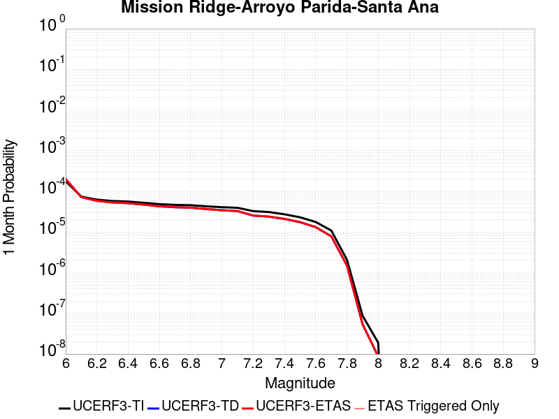 |  |  |

| Magnitude | 1 wk TI Prob | 1 wk TD Prob | 1 wk ETAS Prob | 1 wk ETAS/TD Gain | 1 wk ETAS Triggered Only | 1 mo TI Prob | 1 mo TD Prob | 1 mo ETAS Prob | 1 mo ETAS/TD Gain | 1 mo ETAS Triggered Only | 1 yr TI Prob | 1 yr TD Prob | 1 yr ETAS Prob | 1 yr ETAS/TD Gain | 1 yr ETAS Triggered Only | 10 yr TI Prob | 10 yr TD Prob | 10 yr ETAS Prob | 10 yr ETAS/TD Gain | 10 yr ETAS Triggered Only |
|-----|-----|-----|-----|-----|-----|-----|-----|-----|-----|-----|-----|-----|-----|-----|-----|-----|-----|-----|-----|-----|
| 6.0 | 4.169034E-5 | 4.71435E-5 | 4.71435E-5 | 1.0 | 0.0 | 1.7866064E-4 | 2.0203278E-4 | 2.0203278E-4 | 1.0 | 0.0 | 0.0021730233 | 0.0024577067 | 0.0024577067 | 1.0 | 0.0 | 0.021518968 | 0.024387252 | 0.024525322 | 1.0056616 | 1.4152279E-4 |
| 6.1 | 1.73813E-5 | 1.6855427E-5 | 1.6855427E-5 | 1.0 | 0.0 | 7.4489166E-5 | 7.2235605E-5 | 7.2235605E-5 | 1.0 | 0.0 | 9.065282E-4 | 8.791244E-4 | 8.791244E-4 | 1.0 | 0.0 | 0.009028391 | 0.008757609 | 0.00879268 | 1.0040046 | 3.5380697E-5 |
| 6.2 | 1.4622182E-5 | 1.3674228E-5 | 1.3674228E-5 | 1.0 | 0.0 | 6.2664985E-5 | 5.8602538E-5 | 5.8602538E-5 | 1.0 | 0.0 | 7.6267915E-4 | 7.1325625E-4 | 7.1325625E-4 | 1.0 | 0.0 | 0.007600669 | 0.0071101133 | 0.0071101133 | 1.0 | 0.0 |
| 6.3 | 1.3552434E-5 | 1.2483067E-5 | 1.2483067E-5 | 1.0 | 0.0 | 5.8080568E-5 | 5.3497777E-5 | 5.3497777E-5 | 1.0 | 0.0 | 7.069015E-4 | 6.5114396E-4 | 6.5114396E-4 | 1.0 | 0.0 | 0.00704657 | 0.0064927237 | 0.0064927237 | 1.0 | 0.0 |
| 6.4 | 1.30977305E-5 | 1.1979993E-5 | 1.1979993E-5 | 1.0 | 0.0 | 5.613192E-5 | 5.1341834E-5 | 5.1341834E-5 | 1.0 | 0.0 | 6.831918E-4 | 6.249106E-4 | 6.249106E-4 | 1.0 | 0.0 | 0.006810953 | 0.0062318784 | 0.0062318784 | 1.0 | 0.0 |
| 6.5 | 1.225205E-5 | 1.104959E-5 | 1.104959E-5 | 1.0 | 0.0 | 5.2507727E-5 | 4.7354544E-5 | 4.7354544E-5 | 1.0 | 0.0 | 6.3909404E-4 | 5.7639176E-4 | 5.7639176E-4 | 1.0 | 0.0 | 0.006372592 | 0.005749278 | 0.005749278 | 1.0 | 0.0 |
| 6.6 | 1.1352241E-5 | 1.0064273E-5 | 1.0064273E-5 | 1.0 | 0.0 | 4.8651553E-5 | 4.3131895E-5 | 4.3131895E-5 | 1.0 | 0.0 | 5.921717E-4 | 5.2500644E-4 | 5.2500644E-4 | 1.0 | 0.0 | 0.0059059616 | 0.005237907 | 0.005237907 | 1.0 | 0.0 |
| 6.7 | 1.0864116E-5 | 9.517729E-6 | 9.517729E-6 | 1.0 | 0.0 | 4.6559664E-5 | 4.0789644E-5 | 4.0789644E-5 | 1.0 | 0.0 | 5.667165E-4 | 4.9650273E-4 | 4.9650273E-4 | 1.0 | 0.0 | 0.005652734 | 0.0049541686 | 0.0049541686 | 1.0 | 0.0 |
| 6.8 | 1.0666365E-5 | 9.30047E-6 | 9.30047E-6 | 1.0 | 0.0 | 4.571219E-5 | 3.9858558E-5 | 3.9858558E-5 | 1.0 | 0.0 | 5.564038E-4 | 4.851719E-4 | 4.851719E-4 | 1.0 | 0.0 | 0.005550127 | 0.004841359 | 0.004841359 | 1.0 | 0.0 |
| 6.9 | 1.0038665E-5 | 8.592689E-6 | 8.592689E-6 | 1.0 | 0.0 | 4.302214E-5 | 3.68253E-5 | 3.68253E-5 | 1.0 | 0.0 | 5.236687E-4 | 4.4825758E-4 | 4.4825758E-4 | 1.0 | 0.0 | 0.005224364 | 0.004473745 | 0.004473745 | 1.0 | 0.0 |
| 7.0 | 9.5379955E-6 | 8.025674E-6 | 8.025674E-6 | 1.0 | 0.0 | 4.0876483E-5 | 3.4395303E-5 | 3.4395303E-5 | 1.0 | 0.0 | 4.975576E-4 | 4.1868407E-4 | 4.1868407E-4 | 1.0 | 0.0 | 0.00496445 | 0.004179152 | 0.004179152 | 1.0 | 0.0 |
| 7.1 | 9.207389E-6 | 7.652948E-6 | 7.652948E-6 | 1.0 | 0.0 | 3.945964E-5 | 3.2797943E-5 | 3.2797943E-5 | 1.0 | 0.0 | 4.803152E-4 | 3.992435E-4 | 3.992435E-4 | 1.0 | 0.0 | 0.004792784 | 0.003985459 | 0.003985459 | 1.0 | 0.0 |
| 7.2 | 7.638091E-6 | 5.9315435E-6 | 5.9315435E-6 | 1.0 | 0.0 | 3.2734264E-5 | 2.5420655E-5 | 2.5420655E-5 | 1.0 | 0.0 | 3.984668E-4 | 3.0945282E-4 | 3.0945282E-4 | 1.0 | 0.0 | 0.0039775306 | 0.0030902762 | 0.0030902762 | 1.0 | 0.0 |
| 7.3 | 7.2500147E-6 | 5.5965506E-6 | 5.5965506E-6 | 1.0 | 0.0 | 3.1071122E-5 | 2.3985E-5 | 2.3985E-5 | 1.0 | 0.0 | 3.7822526E-4 | 2.9197853E-4 | 2.9197853E-4 | 1.0 | 0.0 | 0.0037758215 | 0.0029160045 | 0.0029160045 | 1.0 | 0.0 |
| 7.4 | 6.3899715E-6 | 4.918836E-6 | 4.918836E-6 | 1.0 | 0.0 | 2.7385306E-5 | 2.1080557E-5 | 2.1080557E-5 | 1.0 | 0.0 | 3.3336508E-4 | 2.5662576E-4 | 2.5662576E-4 | 1.0 | 0.0 | 0.0033286542 | 0.0025633385 | 0.0025633385 | 1.0 | 0.0 |
| 7.5 | 5.379025E-6 | 4.0841346E-6 | 4.0841346E-6 | 1.0 | 0.0 | 2.305276E-5 | 1.7503316E-5 | 1.7503316E-5 | 1.0 | 0.0 | 2.806312E-4 | 2.1308215E-4 | 2.1308215E-4 | 1.0 | 0.0 | 0.0028027708 | 0.0021287897 | 0.0021287897 | 1.0 | 0.0 |
| 7.6 | 4.1270696E-6 | 3.0885622E-6 | 3.0885622E-6 | 1.0 | 0.0 | 1.768732E-5 | 1.3236629E-5 | 1.3236629E-5 | 1.0 | 0.0 | 2.1532185E-4 | 1.6114411E-4 | 1.6114411E-4 | 1.0 | 0.0 | 0.0021511333 | 0.0016102807 | 0.0016102807 | 1.0 | 0.0 |
| 7.7 | 2.5406805E-6 | 1.8283382E-6 | 1.8283382E-6 | 1.0 | 0.0 | 1.0888585E-5 | 7.8357125E-6 | 7.8357125E-6 | 1.0 | 0.0 | 1.3256045E-4 | 9.539568E-5 | 9.539568E-5 | 1.0 | 0.0 | 0.0013248142 | 9.535535E-4 | 9.535535E-4 | 1.0 | 0.0 |
| 7.8 | 4.8608285E-7 | 3.5100658E-7 | 3.5100658E-7 | 1.0 | 0.0 | 2.0832106E-6 | 1.504313E-6 | 1.504313E-6 | 1.0 | 0.0 | 2.5362791E-5 | 1.8314859E-5 | 1.8314859E-5 | 1.0 | 0.0 | 2.5359896E-4 | 1.8313361E-4 | 1.8313361E-4 | 1.0 | 0.0 |
| 7.9 | 2.0472514E-8 | 1.2690024E-8 | 1.2690024E-8 | 1.0 | 0.0 | 8.7739345E-8 | 5.438582E-8 | 5.438582E-8 | 1.0 | 0.0 | 1.068226E-6 | 6.621471E-7 | 6.621471E-7 | 1.0 | 0.0 | 1.0682209E-5 | 6.6214525E-6 | 6.6214525E-6 | 1.0 | 0.0 |
| 8.0 | 4.443582E-9 | 2.0326807E-9 | 2.0326807E-9 | 1.0 | 0.0 | 1.9043922E-8 | 8.711488E-9 | 8.711488E-9 | 1.0 | 0.0 | 2.3185973E-7 | 1.06062366E-7 | 1.06062366E-7 | 1.0 | 0.0 | 2.3185949E-6 | 1.0606232E-6 | 1.0606232E-6 | 1.0 | 0.0 |

## San Andreas (Parkfield)
*[(top)](#table-of-contents)*

| 1 Week | 1 Month | 1 Year | 10 Year |
|-----|-----|-----|-----|
| 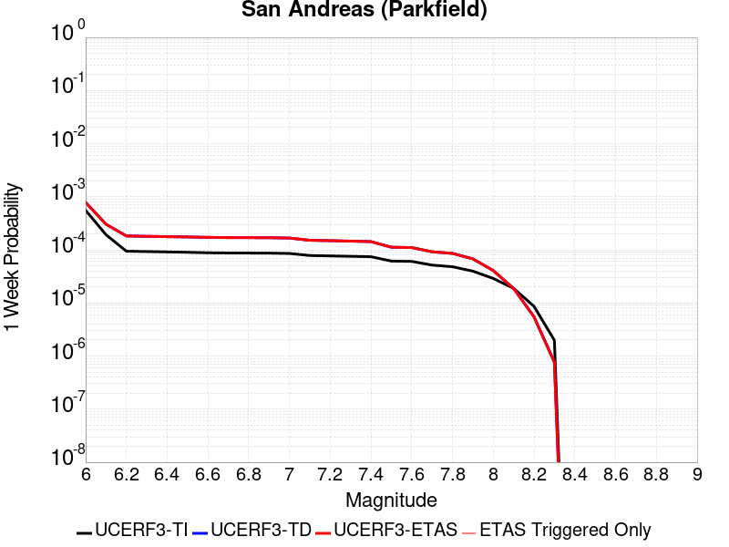 |  |  |  |

| Magnitude | 1 wk TI Prob | 1 wk TD Prob | 1 wk ETAS Prob | 1 wk ETAS/TD Gain | 1 wk ETAS Triggered Only | 1 mo TI Prob | 1 mo TD Prob | 1 mo ETAS Prob | 1 mo ETAS/TD Gain | 1 mo ETAS Triggered Only | 1 yr TI Prob | 1 yr TD Prob | 1 yr ETAS Prob | 1 yr ETAS/TD Gain | 1 yr ETAS Triggered Only | 10 yr TI Prob | 10 yr TD Prob | 10 yr ETAS Prob | 10 yr ETAS/TD Gain | 10 yr ETAS Triggered Only |
|-----|-----|-----|-----|-----|-----|-----|-----|-----|-----|-----|-----|-----|-----|-----|-----|-----|-----|-----|-----|-----|
| 6.0 | 5.556969E-4 | 7.819087E-4 | 7.819087E-4 | 1.0 | 0.0 | 0.0023793848 | 0.0033472886 | 0.0033472886 | 1.0 | 0.0 | 0.028586963 | 0.040385824 | 0.04045373 | 1.0016813 | 7.0761394E-5 | 0.25176284 | 0.33777508 | 0.33789223 | 1.0003468 | 1.7690349E-4 |
| 6.1 | 1.925858E-4 | 3.0390357E-4 | 3.0390357E-4 | 1.0 | 0.0 | 8.2510663E-4 | 0.0013018888 | 0.0013018888 | 1.0 | 0.0 | 0.0099994885 | 0.015834767 | 0.015904408 | 1.004398 | 7.0761394E-5 | 0.095613256 | 0.14999957 | 0.15011987 | 1.0008019 | 1.4152279E-4 |
| 6.2 | 9.4306815E-5 | 1.8273306E-4 | 1.8273306E-4 | 1.0 | 0.0 | 4.0410945E-4 | 7.829079E-4 | 7.829079E-4 | 1.0 | 0.0 | 0.0049089384 | 0.009490452 | 0.009560542 | 1.0073853 | 7.0761394E-5 | 0.048019063 | 0.09198628 | 0.092082664 | 1.0010477 | 1.0614209E-4 |
| 6.3 | 9.283051E-5 | 1.7969737E-4 | 1.7969737E-4 | 1.0 | 0.0 | 3.9778434E-4 | 7.6990545E-4 | 7.6990545E-4 | 1.0 | 0.0 | 0.0048322747 | 0.009333515 | 0.009403615 | 1.0075107 | 7.0761394E-5 | 0.047285385 | 0.09063911 | 0.09073563 | 1.0010649 | 1.0614209E-4 |
| 6.4 | 9.138826E-5 | 1.7731739E-4 | 1.7731739E-4 | 1.0 | 0.0 | 3.916052E-4 | 7.5971155E-4 | 7.5971155E-4 | 1.0 | 0.0 | 0.0047573745 | 0.00921046 | 0.009245515 | 1.003806 | 3.5380697E-5 | 0.046568092 | 0.0895407 | 0.08960512 | 1.0007195 | 7.0761394E-5 |
| 6.5 | 9.000255E-5 | 1.7489606E-4 | 1.7489606E-4 | 1.0 | 0.0 | 3.8566816E-4 | 7.493404E-4 | 7.493404E-4 | 1.0 | 0.0 | 0.0046854047 | 0.009085262 | 0.009120321 | 1.0038589 | 3.5380697E-5 | 0.045878403 | 0.08842592 | 0.08849042 | 1.0007294 | 7.0761394E-5 |
| 6.6 | 8.8109264E-5 | 1.7170387E-4 | 1.7170387E-4 | 1.0 | 0.0 | 3.7755648E-4 | 7.3566736E-4 | 7.3566736E-4 | 1.0 | 0.0 | 0.0045870654 | 0.0089201825 | 0.008955248 | 1.0039309 | 3.5380697E-5 | 0.04493529 | 0.08695624 | 0.08702085 | 1.000743 | 7.0761394E-5 |
| 6.7 | 8.738073E-5 | 1.7037381E-4 | 1.7037381E-4 | 1.0 | 0.0 | 3.7443507E-4 | 7.2997034E-4 | 7.2997034E-4 | 1.0 | 0.0 | 0.0045492216 | 0.0088514285 | 0.008886496 | 1.0039618 | 3.5380697E-5 | 0.04457213 | 0.08635636 | 0.086421005 | 1.0007486 | 7.0761394E-5 |
| 6.8 | 8.710195E-5 | 1.6982816E-4 | 1.6982816E-4 | 1.0 | 0.0 | 3.7324068E-4 | 7.2763313E-4 | 7.2763313E-4 | 1.0 | 0.0 | 0.0045347405 | 0.008823211 | 0.00885828 | 1.0039746 | 3.5380697E-5 | 0.04443313 | 0.08610373 | 0.0861684 | 1.000751 | 7.0761394E-5 |
| 6.9 | 8.6801556E-5 | 1.6923707E-4 | 1.6923707E-4 | 1.0 | 0.0 | 3.7195362E-4 | 7.251013E-4 | 7.251013E-4 | 1.0 | 0.0 | 0.0045191357 | 0.008792636 | 0.008827705 | 1.0039885 | 3.5380697E-5 | 0.044283327 | 0.08582957 | 0.08589426 | 1.0007536 | 7.0761394E-5 |
| 7.0 | 8.5571606E-5 | 1.6676294E-4 | 1.6676294E-4 | 1.0 | 0.0 | 3.6668387E-4 | 7.145037E-4 | 7.145037E-4 | 1.0 | 0.0 | 0.004455241 | 0.008664643 | 0.008699717 | 1.004048 | 3.5380697E-5 | 0.043669727 | 0.08467713 | 0.0847419 | 1.0007648 | 7.0761394E-5 |
| 7.1 | 7.82589E-5 | 1.5156237E-4 | 1.5156237E-4 | 1.0 | 0.0 | 3.3535215E-4 | 6.493921E-4 | 6.493921E-4 | 1.0 | 0.0 | 0.0040752706 | 0.007877857 | 0.007912959 | 1.0044558 | 3.5380697E-5 | 0.040013418 | 0.077585794 | 0.07765107 | 1.0008413 | 7.0761394E-5 |
| 7.2 | 7.690929E-5 | 1.489332E-4 | 1.489332E-4 | 1.0 | 0.0 | 3.2956956E-4 | 6.381298E-4 | 6.381298E-4 | 1.0 | 0.0 | 0.004005129 | 0.007741721 | 0.007776828 | 1.0045347 | 3.5380697E-5 | 0.0393371 | 0.076358445 | 0.0764238 | 1.0008559 | 7.0761394E-5 |
| 7.3 | 7.5543794E-5 | 1.4589565E-4 | 1.4589565E-4 | 1.0 | 0.0 | 3.2371894E-4 | 6.25118E-4 | 6.25118E-4 | 1.0 | 0.0 | 0.003934157 | 0.0075844154 | 0.0076195276 | 1.0046295 | 3.5380697E-5 | 0.038652334 | 0.07492032 | 0.07498578 | 1.0008737 | 7.0761394E-5 |
| 7.4 | 7.4214564E-5 | 1.4290171E-4 | 1.4290171E-4 | 1.0 | 0.0 | 3.1802364E-4 | 6.122929E-4 | 6.122929E-4 | 1.0 | 0.0 | 0.003865065 | 0.007429345 | 0.007464463 | 1.0047269 | 3.5380697E-5 | 0.03798529 | 0.07349284 | 0.0735584 | 1.000892 | 7.0761394E-5 |
| 7.5 | 6.149578E-5 | 1.1214155E-4 | 1.1214155E-4 | 1.0 | 0.0 | 2.6352672E-4 | 4.8051824E-4 | 4.8051824E-4 | 1.0 | 0.0 | 0.0032037178 | 0.005834648 | 0.0058698226 | 1.0060285 | 3.5380697E-5 | 0.03157923 | 0.058665328 | 0.05873194 | 1.0011355 | 7.0761394E-5 |
| 7.6 | 6.0643448E-5 | 1.10425855E-4 | 1.10425855E-4 | 1.0 | 0.0 | 2.598746E-4 | 4.7316792E-4 | 4.7316792E-4 | 1.0 | 0.0 | 0.0031593828 | 0.0057456335 | 0.005780811 | 1.0061225 | 3.5380697E-5 | 0.031148417 | 0.05782546 | 0.057892133 | 1.001153 | 7.0761394E-5 |
| 7.7 | 5.1652263E-5 | 9.1955124E-5 | 9.1955124E-5 | 1.0 | 0.0 | 2.2134806E-4 | 3.9403388E-4 | 3.9403388E-4 | 1.0 | 0.0 | 0.002691582 | 0.00478682 | 0.004822031 | 1.0073559 | 3.5380697E-5 | 0.026592141 | 0.048633553 | 0.048700873 | 1.0013843 | 7.0761394E-5 |
| 7.8 | 4.8090482E-5 | 8.578783E-5 | 8.578783E-5 | 1.0 | 0.0 | 2.060858E-4 | 3.6761034E-4 | 3.6761034E-4 | 1.0 | 0.0 | 0.0025062072 | 0.004466479 | 0.004501702 | 1.007886 | 3.5380697E-5 | 0.024781305 | 0.045392275 | 0.045459826 | 1.0014881 | 7.0761394E-5 |
| 7.9 | 3.970278E-5 | 6.7652974E-5 | 6.7652974E-5 | 1.0 | 0.0 | 1.7014367E-4 | 2.899091E-4 | 2.899091E-4 | 1.0 | 0.0 | 0.002069531 | 0.0035239344 | 0.0035591903 | 1.0100048 | 3.5380697E-5 | 0.020503636 | 0.035952512 | 0.03602073 | 1.0018975 | 7.0761394E-5 |
| 8.0 | 2.8982335E-5 | 4.079188E-5 | 4.079188E-5 | 1.0 | 0.0 | 1.2420409E-4 | 1.7481064E-4 | 1.7481064E-4 | 1.0 | 0.0 | 0.0015111357 | 0.0021262432 | 0.0021262432 | 1.0 | 0.0 | 0.015009012 | 0.022057572 | 0.022092173 | 1.0015687 | 3.5380697E-5 |
| 8.1 | 1.8836186E-5 | 1.8733741E-5 | 1.8733741E-5 | 1.0 | 0.0 | 8.0724014E-5 | 8.028499E-5 | 8.028499E-5 | 1.0 | 0.0 | 9.823717E-4 | 9.77032E-4 | 9.77032E-4 | 1.0 | 0.0 | 0.009780403 | 0.010515724 | 0.010550733 | 1.0033292 | 3.5380697E-5 |
| 8.2 | 8.643924E-6 | 5.49522E-6 | 5.49522E-6 | 1.0 | 0.0 | 3.704486E-5 | 2.355073E-5 | 2.355073E-5 | 1.0 | 0.0 | 4.5092785E-4 | 2.866925E-4 | 2.866925E-4 | 1.0 | 0.0 | 0.0045001395 | 0.0032598388 | 0.0032598388 | 1.0 | 0.0 |
| 8.3 | 1.983087E-6 | 7.693574E-7 | 7.693574E-7 | 1.0 | 0.0 | 8.498917E-6 | 3.297242E-6 | 3.297242E-6 | 1.0 | 0.0 | 1.034694E-4 | 4.01432E-5 | 4.01432E-5 | 1.0 | 0.0 | 0.0010342124 | 4.7390026E-4 | 4.7390026E-4 | 1.0 | 0.0 |

## Helendale-So Lockhart
*[(top)](#table-of-contents)*

| 1 Week | 1 Month | 1 Year | 10 Year |
|-----|-----|-----|-----|
|  |  |  | 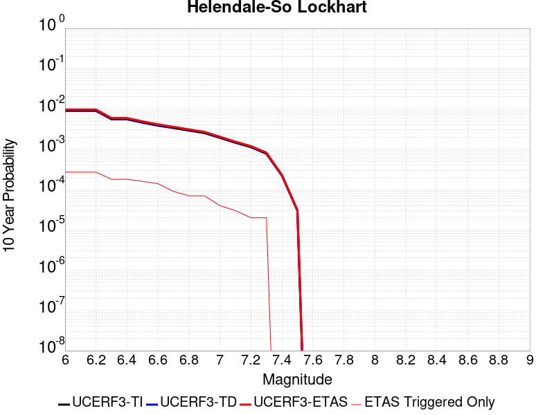 |

| Magnitude | 1 wk TI Prob | 1 wk TD Prob | 1 wk ETAS Prob | 1 wk ETAS/TD Gain | 1 wk ETAS Triggered Only | 1 mo TI Prob | 1 mo TD Prob | 1 mo ETAS Prob | 1 mo ETAS/TD Gain | 1 mo ETAS Triggered Only | 1 yr TI Prob | 1 yr TD Prob | 1 yr ETAS Prob | 1 yr ETAS/TD Gain | 1 yr ETAS Triggered Only | 10 yr TI Prob | 10 yr TD Prob | 10 yr ETAS Prob | 10 yr ETAS/TD Gain | 10 yr ETAS Triggered Only |
|-----|-----|-----|-----|-----|-----|-----|-----|-----|-----|-----|-----|-----|-----|-----|-----|-----|-----|-----|-----|-----|
| 6.0 | 1.7296055E-5 | 1.810418E-5 | 1.810418E-5 | 1.0 | 0.0 | 7.412385E-5 | 7.7587145E-5 | 1.129651E-4 | 1.455977 | 3.5380697E-5 | 9.0208417E-4 | 9.442349E-4 | 0.0010149295 | 1.0748698 | 7.0761394E-5 | 0.008984311 | 0.009404349 | 0.009579589 | 1.018634 | 1.7690349E-4 |
| 6.1 | 1.7296055E-5 | 1.810418E-5 | 1.810418E-5 | 1.0 | 0.0 | 7.412385E-5 | 7.7587145E-5 | 1.129651E-4 | 1.455977 | 3.5380697E-5 | 9.0208417E-4 | 9.442349E-4 | 0.0010149295 | 1.0748698 | 7.0761394E-5 | 0.008984311 | 0.009404349 | 0.009579589 | 1.018634 | 1.7690349E-4 |
| 6.2 | 1.7296055E-5 | 1.810418E-5 | 1.810418E-5 | 1.0 | 0.0 | 7.412385E-5 | 7.7587145E-5 | 1.129651E-4 | 1.455977 | 3.5380697E-5 | 9.0208417E-4 | 9.442349E-4 | 0.0010149295 | 1.0748698 | 7.0761394E-5 | 0.008984311 | 0.009404349 | 0.009579589 | 1.018634 | 1.7690349E-4 |
| 6.3 | 1.0669118E-5 | 1.1135683E-5 | 1.1135683E-5 | 1.0 | 0.0 | 4.5723988E-5 | 4.7723497E-5 | 8.310251E-5 | 1.7413331 | 3.5380697E-5 | 5.5654737E-4 | 5.808815E-4 | 6.5160176E-4 | 1.1217465 | 7.0761394E-5 | 0.0055515557 | 0.0057939277 | 0.0059346305 | 1.0242845 | 1.4152279E-4 |
| 6.4 | 1.0669118E-5 | 1.1135683E-5 | 1.1135683E-5 | 1.0 | 0.0 | 4.5723988E-5 | 4.7723497E-5 | 8.310251E-5 | 1.7413331 | 3.5380697E-5 | 5.5654737E-4 | 5.808815E-4 | 6.5160176E-4 | 1.1217465 | 7.0761394E-5 | 0.0055515557 | 0.0057939277 | 0.0059346305 | 1.0242845 | 1.4152279E-4 |
| 6.5 | 8.790038E-6 | 9.170408E-6 | 9.170408E-6 | 1.0 | 0.0 | 3.767105E-5 | 3.930116E-5 | 7.468047E-5 | 1.9002101 | 3.5380697E-5 | 4.585485E-4 | 4.7838816E-4 | 5.491157E-4 | 1.1478455 | 7.0761394E-5 | 0.0045760344 | 0.0047737476 | 0.004914595 | 1.0295045 | 1.4152279E-4 |
| 6.6 | 7.396949E-6 | 7.715714E-6 | 7.715714E-6 | 1.0 | 0.0 | 3.1700827E-5 | 3.306693E-5 | 6.8446454E-5 | 2.0699368 | 3.5380697E-5 | 3.858892E-4 | 4.025165E-4 | 4.7324944E-4 | 1.1757268 | 7.0761394E-5 | 0.003852198 | 0.0040179817 | 0.0041589355 | 1.0350808 | 1.4152279E-4 |
| 6.7 | 6.4600285E-6 | 6.738185E-6 | 6.738185E-6 | 1.0 | 0.0 | 2.7685543E-5 | 2.8877621E-5 | 2.8877621E-5 | 1.0 | 0.0 | 3.3701936E-4 | 3.515291E-4 | 3.8689736E-4 | 1.1006126 | 3.5380697E-5 | 0.0033650869 | 0.003509812 | 0.0035450687 | 1.0100452 | 3.5380697E-5 |
| 6.8 | 5.600104E-6 | 5.8361397E-6 | 5.8361397E-6 | 1.0 | 0.0 | 2.4000226E-5 | 2.5011792E-5 | 2.5011792E-5 | 1.0 | 0.0 | 2.9216358E-4 | 3.0447662E-4 | 3.0447662E-4 | 1.0 | 0.0 | 0.0029177975 | 0.003040656 | 0.003040656 | 1.0 | 0.0 |
| 6.9 | 4.839122E-6 | 5.03962E-6 | 5.03962E-6 | 1.0 | 0.0 | 2.0738931E-5 | 2.1598196E-5 | 2.1598196E-5 | 1.0 | 0.0 | 2.5246723E-4 | 2.6292677E-4 | 2.6292677E-4 | 1.0 | 0.0 | 0.002521806 | 0.0026262044 | 0.0026262044 | 1.0 | 0.0 |
| 7.0 | 3.6937633E-6 | 3.8452918E-6 | 3.8452918E-6 | 1.0 | 0.0 | 1.5830317E-5 | 1.6479718E-5 | 1.6479718E-5 | 1.0 | 0.0 | 1.9271708E-4 | 2.0062242E-4 | 2.0062242E-4 | 1.0 | 0.0 | 0.0019255003 | 0.0020044446 | 0.0020044446 | 1.0 | 0.0 |
| 7.1 | 2.7858857E-6 | 2.8979157E-6 | 2.8979157E-6 | 1.0 | 0.0 | 1.1939455E-5 | 1.241958E-5 | 1.241958E-5 | 1.0 | 0.0 | 1.4535317E-4 | 1.5119811E-4 | 1.5119811E-4 | 1.0 | 0.0 | 0.0014525814 | 0.0015109739 | 0.0015109739 | 1.0 | 0.0 |
| 7.2 | 2.1672065E-6 | 2.2540607E-6 | 2.2540607E-6 | 1.0 | 0.0 | 9.2879945E-6 | 9.660225E-6 | 9.660225E-6 | 1.0 | 0.0 | 1.1307546E-4 | 1.1760708E-4 | 1.1760708E-4 | 1.0 | 0.0 | 0.0011301794 | 0.0011754666 | 0.0011754666 | 1.0 | 0.0 |
| 7.3 | 1.4823496E-6 | 1.5422432E-6 | 1.5422432E-6 | 1.0 | 0.0 | 6.3529114E-6 | 6.609598E-6 | 6.609598E-6 | 1.0 | 0.0 | 7.734395E-5 | 8.0469035E-5 | 8.0469035E-5 | 1.0 | 0.0 | 7.731704E-4 | 8.044141E-4 | 8.044141E-4 | 1.0 | 0.0 |
| 7.4 | 4.2321457E-7 | 4.4109754E-7 | 4.4109754E-7 | 1.0 | 0.0 | 1.8137755E-6 | 1.8904169E-6 | 1.8904169E-6 | 1.0 | 0.0 | 2.2082493E-5 | 2.301563E-5 | 2.301563E-5 | 1.0 | 0.0 | 2.2080299E-4 | 2.3013698E-4 | 2.3013698E-4 | 1.0 | 0.0 |
| 7.5 | 5.6942316E-8 | 5.9417015E-8 | 5.9417015E-8 | 1.0 | 0.0 | 2.440385E-7 | 2.5464433E-7 | 2.5464433E-7 | 1.0 | 0.0 | 2.9711643E-6 | 3.100291E-6 | 3.100291E-6 | 1.0 | 0.0 | 2.9711247E-5 | 3.1002557E-5 | 3.1002557E-5 | 1.0 | 0.0 |

## Lake Isabella (Seismicity)
*[(top)](#table-of-contents)*

| 1 Week | 1 Month | 1 Year | 10 Year |
|-----|-----|-----|-----|
|  |  |  |  |

| Magnitude | 1 wk TI Prob | 1 wk TD Prob | 1 wk ETAS Prob | 1 wk ETAS/TD Gain | 1 wk ETAS Triggered Only | 1 mo TI Prob | 1 mo TD Prob | 1 mo ETAS Prob | 1 mo ETAS/TD Gain | 1 mo ETAS Triggered Only | 1 yr TI Prob | 1 yr TD Prob | 1 yr ETAS Prob | 1 yr ETAS/TD Gain | 1 yr ETAS Triggered Only | 10 yr TI Prob | 10 yr TD Prob | 10 yr ETAS Prob | 10 yr ETAS/TD Gain | 10 yr ETAS Triggered Only |
|-----|-----|-----|-----|-----|-----|-----|-----|-----|-----|-----|-----|-----|-----|-----|-----|-----|-----|-----|-----|-----|
| 6.0 | 9.431637E-6 | 9.7418215E-6 | 9.7418215E-6 | 1.0 | 0.0 | 4.0420677E-5 | 4.175007E-5 | 4.175007E-5 | 1.0 | 0.0 | 4.920106E-4 | 5.082016E-4 | 5.7892705E-4 | 1.139168 | 7.0761394E-5 | 0.004909227 | 0.005071687 | 0.0052124923 | 1.027763 | 1.4152279E-4 |
| 6.1 | 9.431637E-6 | 9.7418215E-6 | 9.7418215E-6 | 1.0 | 0.0 | 4.0420677E-5 | 4.175007E-5 | 4.175007E-5 | 1.0 | 0.0 | 4.920106E-4 | 5.082016E-4 | 5.7892705E-4 | 1.139168 | 7.0761394E-5 | 0.004909227 | 0.005071687 | 0.0052124923 | 1.027763 | 1.4152279E-4 |
| 6.2 | 9.431637E-6 | 9.7418215E-6 | 9.7418215E-6 | 1.0 | 0.0 | 4.0420677E-5 | 4.175007E-5 | 4.175007E-5 | 1.0 | 0.0 | 4.920106E-4 | 5.082016E-4 | 5.7892705E-4 | 1.139168 | 7.0761394E-5 | 0.004909227 | 0.005071687 | 0.0052124923 | 1.027763 | 1.4152279E-4 |
| 6.3 | 9.431637E-6 | 9.7418215E-6 | 9.7418215E-6 | 1.0 | 0.0 | 4.0420677E-5 | 4.175007E-5 | 4.175007E-5 | 1.0 | 0.0 | 4.920106E-4 | 5.082016E-4 | 5.7892705E-4 | 1.139168 | 7.0761394E-5 | 0.004909227 | 0.005071687 | 0.0052124923 | 1.027763 | 1.4152279E-4 |
| 6.4 | 5.144063E-6 | 5.3001613E-6 | 5.3001613E-6 | 1.0 | 0.0 | 2.2045799E-5 | 2.27148E-5 | 2.27148E-5 | 1.0 | 0.0 | 2.6837454E-4 | 2.7652105E-4 | 2.7652105E-4 | 1.0 | 0.0 | 0.0026805066 | 0.0027621102 | 0.0027973931 | 1.0127739 | 3.5380697E-5 |
| 6.5 | 5.144063E-6 | 5.3001613E-6 | 5.3001613E-6 | 1.0 | 0.0 | 2.2045799E-5 | 2.27148E-5 | 2.27148E-5 | 1.0 | 0.0 | 2.6837454E-4 | 2.7652105E-4 | 2.7652105E-4 | 1.0 | 0.0 | 0.0026805066 | 0.0027621102 | 0.0027973931 | 1.0127739 | 3.5380697E-5 |
| 6.6 | 3.4009804E-6 | 3.4988395E-6 | 3.4988395E-6 | 1.0 | 0.0 | 1.4575549E-5 | 1.4994949E-5 | 1.4994949E-5 | 1.0 | 0.0 | 1.7744285E-4 | 1.8254982E-4 | 1.8254982E-4 | 1.0 | 0.0 | 0.0017730123 | 0.0018241564 | 0.0018594726 | 1.0193603 | 3.5380697E-5 |
| 6.7 | 3.3880428E-6 | 3.485706E-6 | 3.485706E-6 | 1.0 | 0.0 | 1.4520103E-5 | 1.4938664E-5 | 1.4938664E-5 | 1.0 | 0.0 | 1.767679E-4 | 1.8186466E-4 | 1.8186466E-4 | 1.0 | 0.0 | 0.0017662736 | 0.0018173159 | 0.0018526324 | 1.0194333 | 3.5380697E-5 |
| 6.8 | 2.6582E-6 | 2.7337414E-6 | 2.7337414E-6 | 1.0 | 0.0 | 1.1392236E-5 | 1.171599E-5 | 1.171599E-5 | 1.0 | 0.0 | 1.3869164E-4 | 1.4263418E-4 | 1.4263418E-4 | 1.0 | 0.0 | 0.0013860512 | 0.0014255584 | 0.0014608887 | 1.0247835 | 3.5380697E-5 |
| 6.9 | 2.406011E-6 | 2.474366E-6 | 2.474366E-6 | 1.0 | 0.0 | 1.0311434E-5 | 1.0604391E-5 | 1.0604391E-5 | 1.0 | 0.0 | 1.2553448E-4 | 1.2910213E-4 | 1.2910213E-4 | 1.0 | 0.0 | 0.0012546359 | 0.0012904009 | 0.0012904009 | 1.0 | 0.0 |
| 7.0 | 1.6953097E-6 | 1.7429631E-6 | 1.7429631E-6 | 1.0 | 0.0 | 7.265593E-6 | 7.469827E-6 | 7.469827E-6 | 1.0 | 0.0 | 8.8455E-5 | 9.094239E-5 | 9.094239E-5 | 1.0 | 0.0 | 8.84198E-4 | 9.0915454E-4 | 9.0915454E-4 | 1.0 | 0.0 |
| 7.1 | 3.5013824E-7 | 3.5715203E-7 | 3.5715203E-7 | 1.0 | 0.0 | 1.5005916E-6 | 1.5306507E-6 | 1.5306507E-6 | 1.0 | 0.0 | 1.826955E-5 | 1.8635516E-5 | 1.8635516E-5 | 1.0 | 0.0 | 1.8268047E-4 | 1.8633978E-4 | 1.8633978E-4 | 1.0 | 0.0 |
| 7.2 | 2.2321095E-7 | 2.2750805E-7 | 2.2750805E-7 | 1.0 | 0.0 | 9.56618E-7 | 9.750341E-7 | 9.750341E-7 | 1.0 | 0.0 | 1.1646762E-5 | 1.1870978E-5 | 1.1870978E-5 | 1.0 | 0.0 | 1.1646151E-4 | 1.1870354E-4 | 1.1870354E-4 | 1.0 | 0.0 |
| 7.3 | 1.5760406E-7 | 1.6061085E-7 | 1.6061085E-7 | 1.0 | 0.0 | 6.7544585E-7 | 6.88332E-7 | 6.88332E-7 | 1.0 | 0.0 | 8.223522E-6 | 8.380411E-6 | 8.380411E-6 | 1.0 | 0.0 | 8.2232174E-5 | 8.380101E-5 | 8.380101E-5 | 1.0 | 0.0 |
| 7.4 | 1.1216497E-7 | 1.14318226E-7 | 1.14318226E-7 | 1.0 | 0.0 | 4.8070694E-7 | 4.899352E-7 | 4.899352E-7 | 1.0 | 0.0 | 5.852591E-6 | 5.9649446E-6 | 5.9649446E-6 | 1.0 | 0.0 | 5.8524372E-5 | 5.964789E-5 | 5.964789E-5 | 1.0 | 0.0 |
| 7.5 | 4.885185E-8 | 4.9788245E-8 | 4.9788245E-8 | 1.0 | 0.0 | 2.0936506E-7 | 2.1337817E-7 | 2.1337817E-7 | 1.0 | 0.0 | 2.5490165E-6 | 2.5978763E-6 | 2.5978763E-6 | 1.0 | 0.0 | 2.5489873E-5 | 2.5978477E-5 | 2.5978477E-5 | 1.0 | 0.0 |
| 7.6 | 1.504641E-9 | 1.5318049E-9 | 1.5318049E-9 | 1.0 | 0.0 | 6.4484613E-9 | 6.5648784E-9 | 6.5648784E-9 | 1.0 | 0.0 | 7.851001E-8 | 7.9927396E-8 | 7.9927396E-8 | 1.0 | 0.0 | 7.8509987E-7 | 7.9927395E-7 | 7.9927395E-7 | 1.0 | 0.0 |

## Scodie Lineament
*[(top)](#table-of-contents)*

| 1 Week | 1 Month | 1 Year | 10 Year |
|-----|-----|-----|-----|
|  |  | 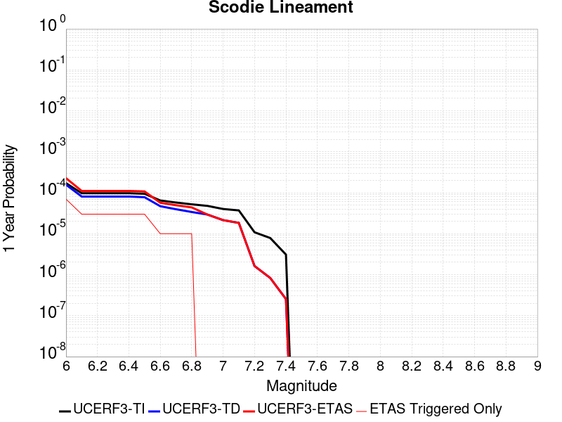 |  |

| Magnitude | 1 wk TI Prob | 1 wk TD Prob | 1 wk ETAS Prob | 1 wk ETAS/TD Gain | 1 wk ETAS Triggered Only | 1 mo TI Prob | 1 mo TD Prob | 1 mo ETAS Prob | 1 mo ETAS/TD Gain | 1 mo ETAS Triggered Only | 1 yr TI Prob | 1 yr TD Prob | 1 yr ETAS Prob | 1 yr ETAS/TD Gain | 1 yr ETAS Triggered Only | 10 yr TI Prob | 10 yr TD Prob | 10 yr ETAS Prob | 10 yr ETAS/TD Gain | 10 yr ETAS Triggered Only |
|-----|-----|-----|-----|-----|-----|-----|-----|-----|-----|-----|-----|-----|-----|-----|-----|-----|-----|-----|-----|-----|
| 6.0 | 3.2919327E-6 | 3.0133992E-6 | 3.0133992E-6 | 1.0 | 0.0 | 1.4108206E-5 | 1.2914522E-5 | 1.2914522E-5 | 1.0 | 0.0 | 1.7175387E-4 | 1.5722614E-4 | 2.279764E-4 | 1.4499905 | 7.0761394E-5 | 0.0017162118 | 0.0015714606 | 0.001712761 | 1.0899166 | 1.4152279E-4 |
| 6.1 | 1.8663811E-6 | 1.5490858E-6 | 1.5490858E-6 | 1.0 | 0.0 | 7.998751E-6 | 6.6389252E-6 | 6.6389252E-6 | 1.0 | 0.0 | 9.738045E-5 | 8.082641E-5 | 1.16204246E-4 | 1.4377015 | 3.5380697E-5 | 9.7337784E-4 | 8.0801896E-4 | 8.433711E-4 | 1.0437516 | 3.5380697E-5 |
| 6.2 | 1.8663811E-6 | 1.5490858E-6 | 1.5490858E-6 | 1.0 | 0.0 | 7.998751E-6 | 6.6389252E-6 | 6.6389252E-6 | 1.0 | 0.0 | 9.738045E-5 | 8.082641E-5 | 1.16204246E-4 | 1.4377015 | 3.5380697E-5 | 9.7337784E-4 | 8.0801896E-4 | 8.433711E-4 | 1.0437516 | 3.5380697E-5 |
| 6.3 | 1.8663811E-6 | 1.5490858E-6 | 1.5490858E-6 | 1.0 | 0.0 | 7.998751E-6 | 6.6389252E-6 | 6.6389252E-6 | 1.0 | 0.0 | 9.738045E-5 | 8.082641E-5 | 1.16204246E-4 | 1.4377015 | 3.5380697E-5 | 9.7337784E-4 | 8.0801896E-4 | 8.433711E-4 | 1.0437516 | 3.5380697E-5 |
| 6.4 | 1.8663811E-6 | 1.5490858E-6 | 1.5490858E-6 | 1.0 | 0.0 | 7.998751E-6 | 6.6389252E-6 | 6.6389252E-6 | 1.0 | 0.0 | 9.738045E-5 | 8.082641E-5 | 1.16204246E-4 | 1.4377015 | 3.5380697E-5 | 9.7337784E-4 | 8.0801896E-4 | 8.433711E-4 | 1.0437516 | 3.5380697E-5 |
| 6.5 | 1.8106311E-6 | 1.4910186E-6 | 1.4910186E-6 | 1.0 | 0.0 | 7.759824E-6 | 6.3900666E-6 | 6.3900666E-6 | 1.0 | 0.0 | 9.447177E-5 | 7.779678E-5 | 1.1317472E-4 | 1.4547482 | 3.5380697E-5 | 9.4431615E-4 | 7.777441E-4 | 8.130973E-4 | 1.045456 | 3.5380697E-5 |
| 6.6 | 1.2414679E-6 | 8.997782E-7 | 8.997782E-7 | 1.0 | 0.0 | 5.320566E-6 | 3.856187E-6 | 3.856187E-6 | 1.0 | 0.0 | 6.477596E-5 | 4.6948153E-5 | 4.6948153E-5 | 1.0 | 0.0 | 6.475708E-4 | 4.69391E-4 | 4.69391E-4 | 1.0 | 0.0 |
| 6.7 | 1.1062215E-6 | 7.5945076E-7 | 7.5945076E-7 | 1.0 | 0.0 | 4.7409408E-6 | 3.2547853E-6 | 3.2547853E-6 | 1.0 | 0.0 | 5.7719422E-5 | 3.962636E-5 | 3.962636E-5 | 1.0 | 0.0 | 5.770443E-4 | 3.9619993E-4 | 3.9619993E-4 | 1.0 | 0.0 |
| 6.8 | 1.0006736E-6 | 6.500572E-7 | 6.500572E-7 | 1.0 | 0.0 | 4.288594E-6 | 2.7859567E-6 | 2.7859567E-6 | 1.0 | 0.0 | 5.221238E-5 | 3.3918557E-5 | 3.3918557E-5 | 1.0 | 0.0 | 5.220012E-4 | 3.391399E-4 | 3.391399E-4 | 1.0 | 0.0 |
| 6.9 | 9.167364E-7 | 5.631784E-7 | 5.631784E-7 | 1.0 | 0.0 | 3.9288643E-6 | 2.4136198E-6 | 2.4136198E-6 | 1.0 | 0.0 | 4.7832873E-5 | 2.9385481E-5 | 2.9385481E-5 | 1.0 | 0.0 | 4.782258E-4 | 2.9382162E-4 | 2.9382162E-4 | 1.0 | 0.0 |
| 7.0 | 7.6987664E-7 | 4.113515E-7 | 4.113515E-7 | 1.0 | 0.0 | 3.2994672E-6 | 1.762934E-6 | 1.762934E-6 | 1.0 | 0.0 | 4.0170275E-5 | 2.146355E-5 | 2.146355E-5 | 1.0 | 0.0 | 4.0163012E-4 | 2.1461862E-4 | 2.1461862E-4 | 1.0 | 0.0 |
| 7.1 | 7.1038727E-7 | 3.5212707E-7 | 3.5212707E-7 | 1.0 | 0.0 | 3.0445133E-6 | 1.5091154E-6 | 1.5091154E-6 | 1.0 | 0.0 | 3.706632E-5 | 1.837336E-5 | 1.837336E-5 | 1.0 | 0.0 | 3.7060137E-4 | 1.837219E-4 | 1.837219E-4 | 1.0 | 0.0 |
| 7.2 | 2.0799602E-7 | 3.1190186E-8 | 3.1190186E-8 | 1.0 | 0.0 | 8.914113E-7 | 1.3367222E-7 | 1.3367222E-7 | 1.0 | 0.0 | 1.0852878E-5 | 1.6274581E-6 | 1.6274581E-6 | 1.0 | 0.0 | 1.08523476E-4 | 1.6274469E-5 | 1.6274469E-5 | 1.0 | 0.0 |
| 7.3 | 1.5048182E-7 | 1.5947961E-8 | 1.5947961E-8 | 1.0 | 0.0 | 6.449219E-7 | 6.8348406E-8 | 6.8348406E-8 | 1.0 | 0.0 | 7.851896E-6 | 8.3214155E-7 | 8.3214155E-7 | 1.0 | 0.0 | 7.851618E-5 | 8.321387E-6 | 8.321387E-6 | 1.0 | 0.0 |
| 7.4 | 5.9334678E-8 | 4.86919E-9 | 4.86919E-9 | 1.0 | 0.0 | 2.5429145E-7 | 2.0867958E-8 | 2.0867958E-8 | 1.0 | 0.0 | 3.095994E-6 | 2.5406737E-7 | 2.5406737E-7 | 1.0 | 0.0 | 3.095951E-5 | 2.5406719E-6 | 2.5406719E-6 | 1.0 | 0.0 |

## Owens Valley
*[(top)](#table-of-contents)*

| 1 Week | 1 Month | 1 Year | 10 Year |
|-----|-----|-----|-----|
|  |  | 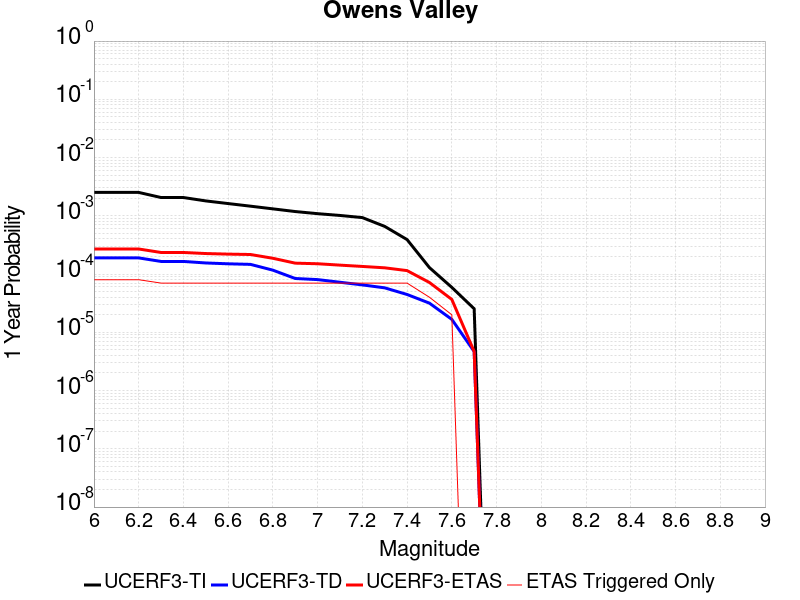 | 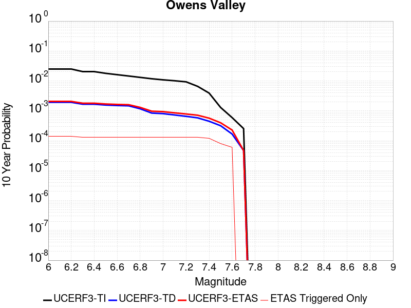 |

| Magnitude | 1 wk TI Prob | 1 wk TD Prob | 1 wk ETAS Prob | 1 wk ETAS/TD Gain | 1 wk ETAS Triggered Only | 1 mo TI Prob | 1 mo TD Prob | 1 mo ETAS Prob | 1 mo ETAS/TD Gain | 1 mo ETAS Triggered Only | 1 yr TI Prob | 1 yr TD Prob | 1 yr ETAS Prob | 1 yr ETAS/TD Gain | 1 yr ETAS Triggered Only | 10 yr TI Prob | 10 yr TD Prob | 10 yr ETAS Prob | 10 yr ETAS/TD Gain | 10 yr ETAS Triggered Only |
|-----|-----|-----|-----|-----|-----|-----|-----|-----|-----|-----|-----|-----|-----|-----|-----|-----|-----|-----|-----|-----|
| 6.0 | 4.83821E-5 | 3.6298834E-6 | 3.6298834E-6 | 1.0 | 0.0 | 2.0733538E-4 | 1.5556556E-5 | 5.0936702E-5 | 3.2742918 | 3.5380697E-5 | 0.002521386 | 1.893856E-4 | 2.601336E-4 | 1.3735658 | 7.0761394E-5 | 0.024929691 | 0.0019267192 | 0.0020679692 | 1.0733112 | 1.4152279E-4 |
| 6.1 | 4.83821E-5 | 3.6298834E-6 | 3.6298834E-6 | 1.0 | 0.0 | 2.0733538E-4 | 1.5556556E-5 | 5.0936702E-5 | 3.2742918 | 3.5380697E-5 | 0.002521386 | 1.893856E-4 | 2.601336E-4 | 1.3735658 | 7.0761394E-5 | 0.024929691 | 0.0019267192 | 0.0020679692 | 1.0733112 | 1.4152279E-4 |
| 6.2 | 4.83821E-5 | 3.6298834E-6 | 3.6298834E-6 | 1.0 | 0.0 | 2.0733538E-4 | 1.5556556E-5 | 5.0936702E-5 | 3.2742918 | 3.5380697E-5 | 0.002521386 | 1.893856E-4 | 2.601336E-4 | 1.3735658 | 7.0761394E-5 | 0.024929691 | 0.0019267192 | 0.0020679692 | 1.0733112 | 1.4152279E-4 |
| 6.3 | 3.953008E-5 | 3.1571942E-6 | 3.1571942E-6 | 1.0 | 0.0 | 1.6940363E-4 | 1.3530766E-5 | 4.8910984E-5 | 3.6147976 | 3.5380697E-5 | 0.002060538 | 1.6472537E-4 | 2.354751E-4 | 1.4295012 | 7.0761394E-5 | 0.020415364 | 0.0016601578 | 0.0018014456 | 1.0851051 | 1.4152279E-4 |
| 6.4 | 3.953008E-5 | 3.1571942E-6 | 3.1571942E-6 | 1.0 | 0.0 | 1.6940363E-4 | 1.3530766E-5 | 4.8910984E-5 | 3.6147976 | 3.5380697E-5 | 0.002060538 | 1.6472537E-4 | 2.354751E-4 | 1.4295012 | 7.0761394E-5 | 0.020415364 | 0.0016601578 | 0.0018014456 | 1.0851051 | 1.4152279E-4 |
| 6.5 | 3.457342E-5 | 2.9727623E-6 | 2.9727623E-6 | 1.0 | 0.0 | 1.4816338E-4 | 1.2740352E-5 | 4.8120597E-5 | 3.7770226 | 3.5380697E-5 | 0.0018023965 | 1.5510344E-4 | 2.2585386E-4 | 1.4561499 | 7.0761394E-5 | 0.017878477 | 0.0015563503 | 0.0016976527 | 1.090791 | 1.4152279E-4 |
| 6.6 | 3.1127765E-5 | 2.8753116E-6 | 2.8753116E-6 | 1.0 | 0.0 | 1.3339789E-4 | 1.232271E-5 | 4.770297E-5 | 3.8711429 | 3.5380697E-5 | 0.0016229092 | 1.5001935E-4 | 2.2077013E-4 | 1.471611 | 7.0761394E-5 | 0.016111081 | 0.0015016922 | 0.0016430025 | 1.0941007 | 1.4152279E-4 |
| 6.7 | 2.806885E-5 | 2.8110242E-6 | 2.8110242E-6 | 1.0 | 0.0 | 1.2028952E-4 | 1.2047194E-5 | 4.7427464E-5 | 3.9368057 | 3.5380697E-5 | 0.001463541 | 1.466654E-4 | 2.1741641E-4 | 1.4823974 | 7.0761394E-5 | 0.014539397 | 0.0014660707 | 0.0016073859 | 1.0963905 | 1.4152279E-4 |
| 6.8 | 2.524524E-5 | 2.2358972E-6 | 2.2358972E-6 | 1.0 | 0.0 | 1.0818939E-4 | 9.582383E-6 | 4.496274E-5 | 4.6922293 | 3.5380697E-5 | 0.0013164099 | 1.16659576E-4 | 1.874127E-4 | 1.6064924 | 7.0761394E-5 | 0.01308639 | 0.001166257 | 0.0013076147 | 1.1212063 | 1.4152279E-4 |
| 6.9 | 2.2704568E-5 | 1.6085578E-6 | 1.6085578E-6 | 1.0 | 0.0 | 9.730166E-5 | 6.893801E-6 | 4.2274252E-5 | 6.1322126 | 3.5380697E-5 | 0.0011840039 | 8.392881E-5 | 1.5468427E-4 | 1.8430413 | 7.0761394E-5 | 0.011777153 | 8.391837E-4 | 9.805877E-4 | 1.1685019 | 1.4152279E-4 |
| 7.0 | 2.0871712E-5 | 1.5399135E-6 | 1.5399135E-6 | 1.0 | 0.0 | 8.944713E-5 | 6.5996123E-6 | 4.1980074E-5 | 6.360991 | 3.5380697E-5 | 0.0010884746 | 8.034734E-5 | 1.5110304E-4 | 1.880623 | 7.0761394E-5 | 0.010831586 | 8.0335594E-4 | 9.44765E-4 | 1.176023 | 1.4152279E-4 |
| 7.1 | 1.944928E-5 | 1.3867325E-6 | 1.3867325E-6 | 1.0 | 0.0 | 8.335139E-5 | 5.943126E-6 | 4.1323612E-5 | 6.9531784 | 3.5380697E-5 | 0.0010143308 | 7.2355164E-5 | 1.4311144E-4 | 1.9779022 | 7.0761394E-5 | 0.010097133 | 7.23475E-4 | 8.648954E-4 | 1.1954738 | 1.4152279E-4 |
| 7.2 | 1.7876306E-5 | 1.249191E-6 | 1.249191E-6 | 1.0 | 0.0 | 7.6610486E-5 | 5.3536646E-6 | 4.0734172E-5 | 7.608652 | 3.5380697E-5 | 9.3233347E-4 | 6.517892E-5 | 1.3593571E-4 | 2.0855775 | 7.0761394E-5 | 0.009284316 | 6.517364E-4 | 7.93167E-4 | 1.2170057 | 1.4152279E-4 |
| 7.3 | 1.2618672E-5 | 1.1117779E-6 | 1.1117779E-6 | 1.0 | 0.0 | 5.40789E-5 | 4.764754E-6 | 4.014528E-5 | 8.4254675 | 3.5380697E-5 | 6.582117E-4 | 5.8009344E-5 | 1.2876662E-4 | 2.2197568 | 7.0761394E-5 | 0.0065626553 | 5.800754E-4 | 7.215161E-4 | 1.2438315 | 1.4152279E-4 |
| 7.4 | 7.4874442E-6 | 8.550806E-7 | 8.550806E-7 | 1.0 | 0.0 | 3.208865E-5 | 3.6646259E-6 | 3.9045193E-5 | 10.654619 | 3.5380697E-5 | 3.906093E-4 | 4.461591E-5 | 1.1537415E-4 | 2.5859418 | 7.0761394E-5 | 0.003899234 | 4.461625E-4 | 5.8762217E-4 | 1.3170586 | 1.4152279E-4 |
| 7.5 | 2.4734156E-6 | 6.0700546E-7 | 6.0700546E-7 | 1.0 | 0.0 | 1.060031E-5 | 2.6014495E-6 | 3.7982052E-5 | 14.600343 | 3.5380697E-5 | 1.2905113E-4 | 3.167219E-5 | 1.0243134E-4 | 3.2341099 | 7.0761394E-5 | 0.0012897621 | 3.166771E-4 | 4.5815506E-4 | 1.4467578 | 1.4152279E-4 |
| 7.6 | 1.1328841E-6 | 3.1972448E-7 | 3.1972448E-7 | 1.0 | 0.0 | 4.8552088E-6 | 1.3702471E-6 | 1.3702471E-6 | 1.0 | 0.0 | 5.9110564E-5 | 1.6682632E-5 | 5.206274E-5 | 3.1207747 | 3.5380697E-5 | 5.9094845E-4 | 1.6681399E-4 | 2.7293837E-4 | 1.636184 | 1.0614209E-4 |
| 7.7 | 4.8613185E-7 | 8.967469E-8 | 8.967469E-8 | 1.0 | 0.0 | 2.0834207E-6 | 3.8432006E-7 | 3.8432006E-7 | 1.0 | 0.0 | 2.536535E-5 | 4.6790874E-6 | 4.6790874E-6 | 1.0 | 0.0 | 2.5362454E-4 | 4.678996E-5 | 4.678996E-5 | 1.0 | 0.0 |

## Baker
*[(top)](#table-of-contents)*

| 1 Week | 1 Month | 1 Year | 10 Year |
|-----|-----|-----|-----|
|  | 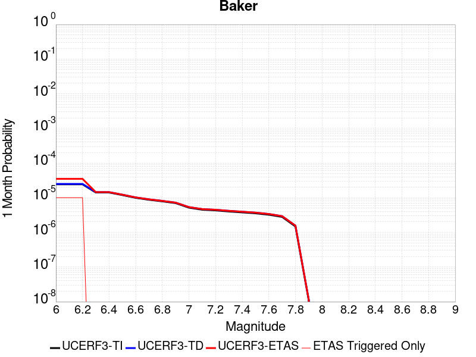 |  |  |

| Magnitude | 1 wk TI Prob | 1 wk TD Prob | 1 wk ETAS Prob | 1 wk ETAS/TD Gain | 1 wk ETAS Triggered Only | 1 mo TI Prob | 1 mo TD Prob | 1 mo ETAS Prob | 1 mo ETAS/TD Gain | 1 mo ETAS Triggered Only | 1 yr TI Prob | 1 yr TD Prob | 1 yr ETAS Prob | 1 yr ETAS/TD Gain | 1 yr ETAS Triggered Only | 10 yr TI Prob | 10 yr TD Prob | 10 yr ETAS Prob | 10 yr ETAS/TD Gain | 10 yr ETAS Triggered Only |
|-----|-----|-----|-----|-----|-----|-----|-----|-----|-----|-----|-----|-----|-----|-----|-----|-----|-----|-----|-----|-----|
| 6.0 | 5.695525E-6 | 5.8349133E-6 | 5.8349133E-6 | 1.0 | 0.0 | 2.4409164E-5 | 2.5006555E-5 | 2.5006555E-5 | 1.0 | 0.0 | 2.9714106E-4 | 3.0441626E-4 | 3.397862E-4 | 1.1161894 | 3.5380697E-5 | 0.0029674405 | 0.0030403885 | 0.0031462077 | 1.0348046 | 1.0614209E-4 |
| 6.1 | 5.695525E-6 | 5.8349133E-6 | 5.8349133E-6 | 1.0 | 0.0 | 2.4409164E-5 | 2.5006555E-5 | 2.5006555E-5 | 1.0 | 0.0 | 2.9714106E-4 | 3.0441626E-4 | 3.397862E-4 | 1.1161894 | 3.5380697E-5 | 0.0029674405 | 0.0030403885 | 0.0031462077 | 1.0348046 | 1.0614209E-4 |
| 6.2 | 5.695525E-6 | 5.8349133E-6 | 5.8349133E-6 | 1.0 | 0.0 | 2.4409164E-5 | 2.5006555E-5 | 2.5006555E-5 | 1.0 | 0.0 | 2.9714106E-4 | 3.0441626E-4 | 3.397862E-4 | 1.1161894 | 3.5380697E-5 | 0.0029674405 | 0.0030403885 | 0.0031462077 | 1.0348046 | 1.0614209E-4 |
| 6.3 | 3.2995713E-6 | 3.3837132E-6 | 3.3837132E-6 | 1.0 | 0.0 | 1.4140943E-5 | 1.450155E-5 | 1.450155E-5 | 1.0 | 0.0 | 1.7215237E-4 | 1.7654254E-4 | 2.11917E-4 | 1.2003735 | 3.5380697E-5 | 0.0017201907 | 0.00176407 | 0.0017993883 | 1.020021 | 3.5380697E-5 |
| 6.4 | 3.2995713E-6 | 3.3837132E-6 | 3.3837132E-6 | 1.0 | 0.0 | 1.4140943E-5 | 1.450155E-5 | 1.450155E-5 | 1.0 | 0.0 | 1.7215237E-4 | 1.7654254E-4 | 2.11917E-4 | 1.2003735 | 3.5380697E-5 | 0.0017201907 | 0.00176407 | 0.0017993883 | 1.020021 | 3.5380697E-5 |
| 6.5 | 2.782202E-6 | 2.855881E-6 | 2.855881E-6 | 1.0 | 0.0 | 1.1923668E-5 | 1.2239434E-5 | 1.2239434E-5 | 1.0 | 0.0 | 1.4516099E-4 | 1.4900525E-4 | 1.8438067E-4 | 1.2374105 | 3.5380697E-5 | 0.001450662 | 0.0014890862 | 0.0015244142 | 1.0237247 | 3.5380697E-5 |
| 6.6 | 2.3163404E-6 | 2.3809555E-6 | 2.3809555E-6 | 1.0 | 0.0 | 9.927136E-6 | 1.0204057E-5 | 1.0204057E-5 | 1.0 | 0.0 | 1.20856166E-4 | 1.242275E-4 | 1.596038E-4 | 1.2847703 | 3.5380697E-5 | 0.0012079047 | 0.0012416008 | 0.0012769377 | 1.0284606 | 3.5380697E-5 |
| 6.7 | 2.037056E-6 | 2.0965333E-6 | 2.0965333E-6 | 1.0 | 0.0 | 8.7302105E-6 | 8.985113E-6 | 8.985113E-6 | 1.0 | 0.0 | 1.0628513E-4 | 1.0938842E-4 | 1.4476525E-4 | 1.3234056 | 3.5380697E-5 | 0.0010623431 | 0.0010933619 | 0.0011287038 | 1.0323242 | 3.5380697E-5 |
| 6.8 | 1.8356744E-6 | 1.8915596E-6 | 1.8915596E-6 | 1.0 | 0.0 | 7.867153E-6 | 8.106659E-6 | 8.106659E-6 | 1.0 | 0.0 | 9.577837E-5 | 9.869425E-5 | 1.3407145E-4 | 1.3584526 | 3.5380697E-5 | 9.57371E-4 | 9.865181E-4 | 0.0010218639 | 1.0358288 | 3.5380697E-5 |
| 6.9 | 1.6310546E-6 | 1.6832361E-6 | 1.6832361E-6 | 1.0 | 0.0 | 6.9902153E-6 | 7.2138496E-6 | 7.2138496E-6 | 1.0 | 0.0 | 8.510255E-5 | 8.7825196E-5 | 1.2320279E-4 | 1.4028182 | 3.5380697E-5 | 8.5069967E-4 | 8.779161E-4 | 9.1326574E-4 | 1.0402654 | 3.5380697E-5 |
| 7.0 | 1.2058036E-6 | 1.2508916E-6 | 1.2508916E-6 | 1.0 | 0.0 | 5.1677193E-6 | 5.3609533E-6 | 5.3609533E-6 | 1.0 | 0.0 | 6.291517E-5 | 6.5267675E-5 | 1.0064606E-4 | 1.5420507 | 3.5380697E-5 | 6.289736E-4 | 6.5248733E-4 | 6.87845E-4 | 1.054189 | 3.5380697E-5 |
| 7.1 | 1.052382E-6 | 1.0951846E-6 | 1.0951846E-6 | 1.0 | 0.0 | 4.5102006E-6 | 4.69364E-6 | 4.69364E-6 | 1.0 | 0.0 | 5.491031E-5 | 5.714358E-5 | 9.2522256E-5 | 1.6191189 | 3.5380697E-5 | 5.4896745E-4 | 5.7128974E-4 | 6.0665025E-4 | 1.0618958 | 3.5380697E-5 |
| 7.2 | 1.0067454E-6 | 1.0487945E-6 | 1.0487945E-6 | 1.0 | 0.0 | 4.3146156E-6 | 4.4948256E-6 | 4.4948256E-6 | 1.0 | 0.0 | 5.252918E-5 | 5.472314E-5 | 9.01019E-5 | 1.6465046 | 3.5380697E-5 | 5.251676E-4 | 5.470975E-4 | 5.8245886E-4 | 1.0646344 | 3.5380697E-5 |
| 7.3 | 9.3596316E-7 | 9.76795E-7 | 9.76795E-7 | 1.0 | 0.0 | 4.0112645E-6 | 4.186258E-6 | 4.186258E-6 | 1.0 | 0.0 | 4.8836053E-5 | 5.0966508E-5 | 8.63454E-5 | 1.6941596 | 3.5380697E-5 | 4.8825322E-4 | 5.09549E-4 | 5.4491166E-4 | 1.0694 | 3.5380697E-5 |
| 7.4 | 8.8117395E-7 | 9.207884E-7 | 9.207884E-7 | 1.0 | 0.0 | 3.7764542E-6 | 3.94623E-6 | 3.94623E-6 | 1.0 | 0.0 | 4.5977362E-5 | 4.80443E-5 | 4.80443E-5 | 1.0 | 0.0 | 4.596785E-4 | 4.803399E-4 | 4.803399E-4 | 1.0 | 0.0 |
| 7.5 | 8.292386E-7 | 8.6748094E-7 | 8.6748094E-7 | 1.0 | 0.0 | 3.5538749E-6 | 3.7177701E-6 | 3.7177701E-6 | 1.0 | 0.0 | 4.326757E-5 | 4.5262917E-5 | 4.5262917E-5 | 1.0 | 0.0 | 4.3259145E-4 | 4.5253773E-4 | 4.5253773E-4 | 1.0 | 0.0 |
| 7.6 | 7.553842E-7 | 7.9146724E-7 | 7.9146724E-7 | 1.0 | 0.0 | 3.2373566E-6 | 3.391998E-6 | 3.391998E-6 | 1.0 | 0.0 | 3.9414106E-5 | 4.12968E-5 | 4.12968E-5 | 1.0 | 0.0 | 3.9407116E-4 | 4.1289197E-4 | 4.1289197E-4 | 1.0 | 0.0 |
| 7.7 | 6.5285366E-7 | 6.8529783E-7 | 6.8529783E-7 | 1.0 | 0.0 | 2.797941E-6 | 2.9369874E-6 | 2.9369874E-6 | 1.0 | 0.0 | 3.40644E-5 | 3.5757243E-5 | 3.5757243E-5 | 1.0 | 0.0 | 3.405918E-4 | 3.5751556E-4 | 3.5751556E-4 | 1.0 | 0.0 |
| 7.8 | 3.4586725E-7 | 3.648368E-7 | 3.648368E-7 | 1.0 | 0.0 | 1.4822873E-6 | 1.5635853E-6 | 1.5635853E-6 | 1.0 | 0.0 | 1.80467E-5 | 1.903649E-5 | 1.903649E-5 | 1.0 | 0.0 | 1.8045233E-4 | 1.9034903E-4 | 1.9034903E-4 | 1.0 | 0.0 |
| 7.9 | 2.5591178E-9 | 2.6697329E-9 | 2.6697329E-9 | 1.0 | 0.0 | 1.0967647E-8 | 1.14417125E-8 | 1.14417125E-8 | 1.0 | 0.0 | 1.335311E-7 | 1.3930286E-7 | 1.3930286E-7 | 1.0 | 0.0 | 1.3353102E-6 | 1.3930285E-6 | 1.3930285E-6 | 1.0 | 0.0 |

## Pinto Mtn
*[(top)](#table-of-contents)*

| 1 Week | 1 Month | 1 Year | 10 Year |
|-----|-----|-----|-----|
|  |  |  |  |

| Magnitude | 1 wk TI Prob | 1 wk TD Prob | 1 wk ETAS Prob | 1 wk ETAS/TD Gain | 1 wk ETAS Triggered Only | 1 mo TI Prob | 1 mo TD Prob | 1 mo ETAS Prob | 1 mo ETAS/TD Gain | 1 mo ETAS Triggered Only | 1 yr TI Prob | 1 yr TD Prob | 1 yr ETAS Prob | 1 yr ETAS/TD Gain | 1 yr ETAS Triggered Only | 10 yr TI Prob | 10 yr TD Prob | 10 yr ETAS Prob | 10 yr ETAS/TD Gain | 10 yr ETAS Triggered Only |
|-----|-----|-----|-----|-----|-----|-----|-----|-----|-----|-----|-----|-----|-----|-----|-----|-----|-----|-----|-----|-----|
| 6.0 | 4.4194956E-5 | 4.786006E-5 | 4.786006E-5 | 1.0 | 0.0 | 1.893932E-4 | 2.0509934E-4 | 2.0509934E-4 | 1.0 | 0.0 | 0.0023034236 | 0.0024943894 | 0.002529682 | 1.0141487 | 3.5380697E-5 | 0.022796938 | 0.024681423 | 0.024750438 | 1.0027962 | 7.0761394E-5 |
| 6.1 | 4.4194956E-5 | 4.786006E-5 | 4.786006E-5 | 1.0 | 0.0 | 1.893932E-4 | 2.0509934E-4 | 2.0509934E-4 | 1.0 | 0.0 | 0.0023034236 | 0.0024943894 | 0.002529682 | 1.0141487 | 3.5380697E-5 | 0.022796938 | 0.024681423 | 0.024750438 | 1.0027962 | 7.0761394E-5 |
| 6.2 | 4.4194956E-5 | 4.786006E-5 | 4.786006E-5 | 1.0 | 0.0 | 1.893932E-4 | 2.0509934E-4 | 2.0509934E-4 | 1.0 | 0.0 | 0.0023034236 | 0.0024943894 | 0.002529682 | 1.0141487 | 3.5380697E-5 | 0.022796938 | 0.024681423 | 0.024750438 | 1.0027962 | 7.0761394E-5 |
| 6.3 | 4.4194956E-5 | 4.786006E-5 | 4.786006E-5 | 1.0 | 0.0 | 1.893932E-4 | 2.0509934E-4 | 2.0509934E-4 | 1.0 | 0.0 | 0.0023034236 | 0.0024943894 | 0.002529682 | 1.0141487 | 3.5380697E-5 | 0.022796938 | 0.024681423 | 0.024750438 | 1.0027962 | 7.0761394E-5 |
| 6.4 | 3.729929E-5 | 3.9608763E-5 | 3.9608763E-5 | 1.0 | 0.0 | 1.5984432E-4 | 1.6974132E-4 | 1.6974132E-4 | 1.0 | 0.0 | 0.0019443673 | 0.0020647354 | 0.0021000432 | 1.0171003 | 3.5380697E-5 | 0.019274427 | 0.020465542 | 0.020534856 | 1.0033869 | 7.0761394E-5 |
| 6.5 | 3.729929E-5 | 3.9608763E-5 | 3.9608763E-5 | 1.0 | 0.0 | 1.5984432E-4 | 1.6974132E-4 | 1.6974132E-4 | 1.0 | 0.0 | 0.0019443673 | 0.0020647354 | 0.0021000432 | 1.0171003 | 3.5380697E-5 | 0.019274427 | 0.020465542 | 0.020534856 | 1.0033869 | 7.0761394E-5 |
| 6.6 | 3.0204548E-5 | 3.1210056E-5 | 3.1210056E-5 | 1.0 | 0.0 | 1.2944164E-4 | 1.3375071E-4 | 1.3375071E-4 | 1.0 | 0.0 | 0.0015748127 | 0.0016272333 | 0.0016625564 | 1.0217074 | 3.5380697E-5 | 0.015636992 | 0.016157052 | 0.01622667 | 1.0043088 | 7.0761394E-5 |
| 6.7 | 2.9857754E-5 | 3.0819414E-5 | 3.0819414E-5 | 1.0 | 0.0 | 1.2795553E-4 | 1.320767E-4 | 1.320767E-4 | 1.0 | 0.0 | 0.0015567453 | 0.0016068824 | 0.0016422063 | 1.0219828 | 3.5380697E-5 | 0.015458848 | 0.015956478 | 0.016026111 | 1.0043639 | 7.0761394E-5 |
| 6.8 | 2.4819734E-5 | 2.5013624E-5 | 2.5013624E-5 | 1.0 | 0.0 | 1.0636595E-4 | 1.0719696E-4 | 1.0719696E-4 | 1.0 | 0.0 | 0.0012942362 | 0.0013043632 | 0.0013396979 | 1.0270895 | 3.5380697E-5 | 0.012867244 | 0.012969442 | 0.013039285 | 1.0053853 | 7.0761394E-5 |
| 6.9 | 2.331124E-5 | 2.3341807E-5 | 2.3341807E-5 | 1.0 | 0.0 | 9.990149E-5 | 1.00032594E-4 | 1.00032594E-4 | 1.0 | 0.0 | 0.001215622 | 0.0012172367 | 0.0012525744 | 1.029031 | 3.5380697E-5 | 0.012089936 | 0.012107888 | 0.012177792 | 1.0057734 | 7.0761394E-5 |
| 7.0 | 2.1818534E-5 | 2.1764856E-5 | 2.1764856E-5 | 1.0 | 0.0 | 9.3504656E-5 | 9.327473E-5 | 9.327473E-5 | 1.0 | 0.0 | 0.0011378246 | 0.0011350481 | 0.0011703885 | 1.0311357 | 3.5380697E-5 | 0.011320163 | 0.011294611 | 0.011364573 | 1.0061944 | 7.0761394E-5 |
| 7.1 | 2.066081E-5 | 2.0544425E-5 | 2.0544425E-5 | 1.0 | 0.0 | 8.854332E-5 | 8.8044675E-5 | 8.8044675E-5 | 1.0 | 0.0 | 0.0010774818 | 0.0010714363 | 0.0011067791 | 1.0329864 | 3.5380697E-5 | 0.010722724 | 0.010664757 | 0.010734764 | 1.0065643 | 7.0761394E-5 |
| 7.2 | 1.8990233E-5 | 1.9057632E-5 | 1.9057632E-5 | 1.0 | 0.0 | 8.138417E-5 | 8.167311E-5 | 8.167311E-5 | 1.0 | 0.0 | 9.904018E-4 | 9.939359E-4 | 0.0010292814 | 1.0355612 | 3.5380697E-5 | 0.009859995 | 0.009896904 | 0.009966966 | 1.0070791 | 7.0761394E-5 |
| 7.3 | 1.3335872E-5 | 1.4909989E-5 | 1.4909989E-5 | 1.0 | 0.0 | 5.7152483E-5 | 6.389846E-5 | 6.389846E-5 | 1.0 | 0.0 | 6.956093E-4 | 7.776988E-4 | 7.776988E-4 | 1.0 | 0.0 | 0.006934359 | 0.0077510723 | 0.0077861785 | 1.0045292 | 3.5380697E-5 |
| 7.4 | 9.414066E-6 | 1.1864049E-5 | 1.1864049E-5 | 1.0 | 0.0 | 4.0345374E-5 | 5.0844985E-5 | 5.0844985E-5 | 1.0 | 0.0 | 4.910942E-4 | 6.188713E-4 | 6.188713E-4 | 1.0 | 0.0 | 0.0049001034 | 0.0061724274 | 0.0062075895 | 1.0056967 | 3.5380697E-5 |
| 7.5 | 7.2101157E-6 | 9.16125E-6 | 9.16125E-6 | 1.0 | 0.0 | 3.090013E-5 | 3.926195E-5 | 3.926195E-5 | 1.0 | 0.0 | 3.7614413E-4 | 4.7791723E-4 | 4.7791723E-4 | 1.0 | 0.0 | 0.0037550807 | 0.0047696703 | 0.0047696703 | 1.0 | 0.0 |
| 7.6 | 3.296375E-6 | 4.5485344E-6 | 4.5485344E-6 | 1.0 | 0.0 | 1.4127245E-5 | 1.9493582E-5 | 1.9493582E-5 | 1.0 | 0.0 | 1.7198564E-4 | 2.373099E-4 | 2.373099E-4 | 1.0 | 0.0 | 0.0017185259 | 0.0023707023 | 0.0023707023 | 1.0 | 0.0 |
| 7.7 | 2.5741092E-6 | 3.5872815E-6 | 3.5872815E-6 | 1.0 | 0.0 | 1.103185E-5 | 1.537398E-5 | 1.537398E-5 | 1.0 | 0.0 | 1.3430449E-4 | 1.8716346E-4 | 1.8716346E-4 | 1.0 | 0.0 | 0.0013422335 | 0.0018701884 | 0.0018701884 | 1.0 | 0.0 |

## San Andreas (Cholame) rev
*[(top)](#table-of-contents)*

| 1 Week | 1 Month | 1 Year | 10 Year |
|-----|-----|-----|-----|
|  | 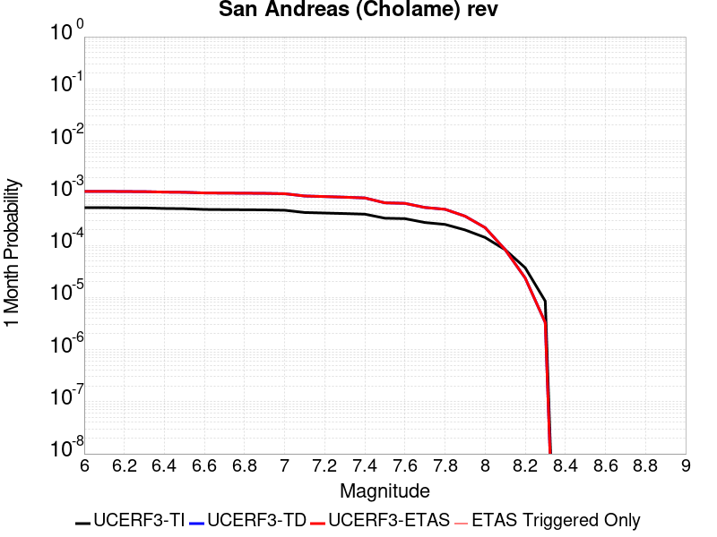 |  |  |

| Magnitude | 1 wk TI Prob | 1 wk TD Prob | 1 wk ETAS Prob | 1 wk ETAS/TD Gain | 1 wk ETAS Triggered Only | 1 mo TI Prob | 1 mo TD Prob | 1 mo ETAS Prob | 1 mo ETAS/TD Gain | 1 mo ETAS Triggered Only | 1 yr TI Prob | 1 yr TD Prob | 1 yr ETAS Prob | 1 yr ETAS/TD Gain | 1 yr ETAS Triggered Only | 10 yr TI Prob | 10 yr TD Prob | 10 yr ETAS Prob | 10 yr ETAS/TD Gain | 10 yr ETAS Triggered Only |
|-----|-----|-----|-----|-----|-----|-----|-----|-----|-----|-----|-----|-----|-----|-----|-----|-----|-----|-----|-----|-----|
| 6.0 | 1.2302514E-4 | 2.5242948E-4 | 2.5242948E-4 | 1.0 | 0.0 | 5.27144E-4 | 0.0010813937 | 0.0010813937 | 1.0 | 0.0 | 0.0063991086 | 0.013086997 | 0.013156832 | 1.0053363 | 7.0761394E-5 | 0.06217949 | 0.1245517 | 0.124644615 | 1.000746 | 1.0614209E-4 |
| 6.1 | 1.2302514E-4 | 2.5242948E-4 | 2.5242948E-4 | 1.0 | 0.0 | 5.27144E-4 | 0.0010813937 | 0.0010813937 | 1.0 | 0.0 | 0.0063991086 | 0.013086997 | 0.013156832 | 1.0053363 | 7.0761394E-5 | 0.06217949 | 0.1245517 | 0.124644615 | 1.000746 | 1.0614209E-4 |
| 6.2 | 1.2203569E-4 | 2.5059693E-4 | 2.5059693E-4 | 1.0 | 0.0 | 5.2290526E-4 | 0.0010735465 | 0.0010735465 | 1.0 | 0.0 | 0.006347804 | 0.0129926 | 0.013062443 | 1.0053755 | 7.0761394E-5 | 0.061695136 | 0.12373783 | 0.12383084 | 1.0007516 | 1.0614209E-4 |
| 6.3 | 1.2142645E-4 | 2.4945638E-4 | 2.4945638E-4 | 1.0 | 0.0 | 5.202953E-4 | 0.0010686623 | 0.0010686623 | 1.0 | 0.0 | 0.006316212 | 0.012933843 | 0.013003689 | 1.0054003 | 7.0761394E-5 | 0.06139677 | 0.123231925 | 0.12332499 | 1.0007552 | 1.0614209E-4 |
| 6.4 | 1.1865206E-4 | 2.4450937E-4 | 2.4450937E-4 | 1.0 | 0.0 | 5.0840975E-4 | 0.001047478 | 0.001047478 | 1.0 | 0.0 | 0.006172335 | 0.012678952 | 0.012713884 | 1.0027552 | 3.5380697E-5 | 0.060036868 | 0.121024184 | 0.12108638 | 1.0005139 | 7.0761394E-5 |
| 6.5 | 1.17443946E-4 | 2.4244092E-4 | 2.4244092E-4 | 1.0 | 0.0 | 5.032341E-4 | 0.0010386204 | 0.0010386204 | 1.0 | 0.0 | 0.006109677 | 0.012572356 | 0.012607291 | 1.0027788 | 3.5380697E-5 | 0.059444077 | 0.12009794 | 0.12016021 | 1.0005184 | 7.0761394E-5 |
| 6.6 | 1.13579066E-4 | 2.3552658E-4 | 2.3552658E-4 | 1.0 | 0.0 | 4.866766E-4 | 0.0010090107 | 0.0010090107 | 1.0 | 0.0 | 0.0059092017 | 0.012215953 | 0.012250901 | 1.0028609 | 3.5380697E-5 | 0.057545185 | 0.11701085 | 0.11707333 | 1.0005339 | 7.0761394E-5 |
| 6.7 | 1.1271412E-4 | 2.339688E-4 | 2.339688E-4 | 1.0 | 0.0 | 4.829711E-4 | 0.0010023396 | 0.0010023396 | 1.0 | 0.0 | 0.005864331 | 0.012135641 | 0.012170592 | 1.0028801 | 3.5380697E-5 | 0.057119697 | 0.116314195 | 0.11637672 | 1.0005376 | 7.0761394E-5 |
| 6.8 | 1.1217975E-4 | 2.3285215E-4 | 2.3285215E-4 | 1.0 | 0.0 | 4.8068175E-4 | 9.975577E-4 | 9.975577E-4 | 1.0 | 0.0 | 0.005836608 | 0.012078067 | 0.012113021 | 1.0028939 | 3.5380697E-5 | 0.056856725 | 0.11581219 | 0.11587475 | 1.0005403 | 7.0761394E-5 |
| 6.9 | 1.1146753E-4 | 2.3133864E-4 | 2.3133864E-4 | 1.0 | 0.0 | 4.7763053E-4 | 9.910761E-4 | 9.910761E-4 | 1.0 | 0.0 | 0.0057996577 | 0.012000027 | 0.012034982 | 1.002913 | 3.5380697E-5 | 0.056506127 | 0.11513234 | 0.115194954 | 1.0005438 | 7.0761394E-5 |
| 7.0 | 1.0965793E-4 | 2.2756905E-4 | 2.2756905E-4 | 1.0 | 0.0 | 4.698779E-4 | 9.7493286E-4 | 9.7493286E-4 | 1.0 | 0.0 | 0.005705768 | 0.01180563 | 0.011840593 | 1.0029615 | 3.5380697E-5 | 0.055614736 | 0.11343304 | 0.113495775 | 1.000553 | 7.0761394E-5 |
| 7.1 | 9.927982E-5 | 2.0574623E-4 | 2.0574623E-4 | 1.0 | 0.0 | 4.2541555E-4 | 8.814726E-4 | 8.814726E-4 | 1.0 | 0.0 | 0.0051671406 | 0.0106794145 | 0.010714417 | 1.0032777 | 3.5380697E-5 | 0.05048634 | 0.10352388 | 0.103587314 | 1.0006127 | 7.0761394E-5 |
| 7.2 | 9.696786E-5 | 2.0078626E-4 | 2.0078626E-4 | 1.0 | 0.0 | 4.1551032E-4 | 8.602298E-4 | 8.602298E-4 | 1.0 | 0.0 | 0.00504711 | 0.010423285 | 0.010458297 | 1.003359 | 3.5380697E-5 | 0.04934009 | 0.10126121 | 0.101324804 | 1.000628 | 7.0761394E-5 |
| 7.3 | 9.4727984E-5 | 1.9507346E-4 | 1.9507346E-4 | 1.0 | 0.0 | 4.0591392E-4 | 8.357622E-4 | 8.357622E-4 | 1.0 | 0.0 | 0.0049308087 | 0.010128201 | 0.010163222 | 1.0034579 | 3.5380697E-5 | 0.048228268 | 0.09863034 | 0.098694116 | 1.0006467 | 7.0761394E-5 |
| 7.4 | 9.220358E-5 | 1.8877286E-4 | 1.8877286E-4 | 1.0 | 0.0 | 3.9509835E-4 | 8.0877665E-4 | 8.0877665E-4 | 1.0 | 0.0 | 0.004799717 | 0.009802646 | 0.00983768 | 1.0035739 | 3.5380697E-5 | 0.046973653 | 0.09570612 | 0.09577011 | 1.0006686 | 7.0761394E-5 |
| 7.5 | 7.71631E-5 | 1.520787E-4 | 1.520787E-4 | 1.0 | 0.0 | 3.306571E-4 | 6.516032E-4 | 6.516032E-4 | 1.0 | 0.0 | 0.0040183207 | 0.007904484 | 0.007939585 | 1.0044407 | 3.5380697E-5 | 0.03946433 | 0.078419134 | 0.07848435 | 1.0008316 | 7.0761394E-5 |
| 7.6 | 7.5634416E-5 | 1.4866945E-4 | 1.4866945E-4 | 1.0 | 0.0 | 3.241072E-4 | 6.369994E-4 | 6.369994E-4 | 1.0 | 0.0 | 0.0039388672 | 0.007727957 | 0.007763064 | 1.004543 | 3.5380697E-5 | 0.038697794 | 0.07678112 | 0.07684644 | 1.0008508 | 7.0761394E-5 |
| 7.7 | 6.3783E-5 | 1.2385153E-4 | 1.2385153E-4 | 1.0 | 0.0 | 2.7332708E-4 | 5.3068437E-4 | 5.3068437E-4 | 1.0 | 0.0 | 0.0033226798 | 0.0064419676 | 0.0064771203 | 1.0054568 | 3.5380697E-5 | 0.032734364 | 0.064660996 | 0.06472718 | 1.0010235 | 7.0761394E-5 |
| 7.8 | 5.863422E-5 | 1.1440121E-4 | 1.1440121E-4 | 1.0 | 0.0 | 2.512653E-4 | 4.9019884E-4 | 4.9019884E-4 | 1.0 | 0.0 | 0.003054864 | 0.00595186 | 0.00598703 | 1.0059091 | 3.5380697E-5 | 0.030132094 | 0.059769355 | 0.059835885 | 1.0011132 | 7.0761394E-5 |
| 7.9 | 4.595283E-5 | 8.443828E-5 | 8.443828E-5 | 1.0 | 0.0 | 1.9692584E-4 | 3.6182816E-4 | 3.6182816E-4 | 1.0 | 0.0 | 0.0023949358 | 0.0043963664 | 0.004431592 | 1.0080123 | 3.5380697E-5 | 0.023692891 | 0.04444455 | 0.044512164 | 1.0015213 | 7.0761394E-5 |
| 8.0 | 3.2950178E-5 | 5.0881976E-5 | 5.0881976E-5 | 1.0 | 0.0 | 1.412074E-4 | 2.180474E-4 | 2.180474E-4 | 1.0 | 0.0 | 0.0017178444 | 0.0026514968 | 0.0026514968 | 1.0 | 0.0 | 0.017046256 | 0.027233804 | 0.02726822 | 1.0012637 | 3.5380697E-5 |
| 8.1 | 1.9177472E-5 | 1.9238712E-5 | 1.9238712E-5 | 1.0 | 0.0 | 8.218658E-5 | 8.244903E-5 | 8.244903E-5 | 1.0 | 0.0 | 0.0010001622 | 0.0010033553 | 0.0010033553 | 1.0 | 0.0 | 0.009956728 | 0.010786239 | 0.010821238 | 1.0032448 | 3.5380697E-5 |
| 8.2 | 8.643924E-6 | 5.49522E-6 | 5.49522E-6 | 1.0 | 0.0 | 3.704486E-5 | 2.355073E-5 | 2.355073E-5 | 1.0 | 0.0 | 4.5092785E-4 | 2.866925E-4 | 2.866925E-4 | 1.0 | 0.0 | 0.0045001395 | 0.0032598388 | 0.0032598388 | 1.0 | 0.0 |
| 8.3 | 1.983087E-6 | 7.693574E-7 | 7.693574E-7 | 1.0 | 0.0 | 8.498917E-6 | 3.297242E-6 | 3.297242E-6 | 1.0 | 0.0 | 1.034694E-4 | 4.01432E-5 | 4.01432E-5 | 1.0 | 0.0 | 0.0010342124 | 4.7390026E-4 | 4.7390026E-4 | 1.0 | 0.0 |

## San Jacinto (San Bernardino)
*[(top)](#table-of-contents)*

| 1 Week | 1 Month | 1 Year | 10 Year |
|-----|-----|-----|-----|
|  |  |  |  |

| Magnitude | 1 wk TI Prob | 1 wk TD Prob | 1 wk ETAS Prob | 1 wk ETAS/TD Gain | 1 wk ETAS Triggered Only | 1 mo TI Prob | 1 mo TD Prob | 1 mo ETAS Prob | 1 mo ETAS/TD Gain | 1 mo ETAS Triggered Only | 1 yr TI Prob | 1 yr TD Prob | 1 yr ETAS Prob | 1 yr ETAS/TD Gain | 1 yr ETAS Triggered Only | 10 yr TI Prob | 10 yr TD Prob | 10 yr ETAS Prob | 10 yr ETAS/TD Gain | 10 yr ETAS Triggered Only |
|-----|-----|-----|-----|-----|-----|-----|-----|-----|-----|-----|-----|-----|-----|-----|-----|-----|-----|-----|-----|-----|
| 6.0 | 3.409352E-5 | 3.6049758E-5 | 3.6049758E-5 | 1.0 | 0.0 | 1.461069E-4 | 1.5448983E-4 | 1.8986505E-4 | 1.228981 | 3.5380697E-5 | 0.0017774 | 0.0018792928 | 0.0019852354 | 1.0563737 | 1.0614209E-4 | 0.01763251 | 0.019382251 | 0.019486336 | 1.0053701 | 1.0614209E-4 |
| 6.1 | 3.409352E-5 | 3.6049758E-5 | 3.6049758E-5 | 1.0 | 0.0 | 1.461069E-4 | 1.5448983E-4 | 1.8986505E-4 | 1.228981 | 3.5380697E-5 | 0.0017774 | 0.0018792928 | 0.0019852354 | 1.0563737 | 1.0614209E-4 | 0.01763251 | 0.019382251 | 0.019486336 | 1.0053701 | 1.0614209E-4 |
| 6.2 | 3.409352E-5 | 3.6049758E-5 | 3.6049758E-5 | 1.0 | 0.0 | 1.461069E-4 | 1.5448983E-4 | 1.8986505E-4 | 1.228981 | 3.5380697E-5 | 0.0017774 | 0.0018792928 | 0.0019852354 | 1.0563737 | 1.0614209E-4 | 0.01763251 | 0.019382251 | 0.019486336 | 1.0053701 | 1.0614209E-4 |
| 6.3 | 3.409352E-5 | 3.6049758E-5 | 3.6049758E-5 | 1.0 | 0.0 | 1.461069E-4 | 1.5448983E-4 | 1.8986505E-4 | 1.228981 | 3.5380697E-5 | 0.0017774 | 0.0018792928 | 0.0019852354 | 1.0563737 | 1.0614209E-4 | 0.01763251 | 0.019382251 | 0.019486336 | 1.0053701 | 1.0614209E-4 |
| 6.4 | 3.400795E-5 | 3.5942405E-5 | 3.5942405E-5 | 1.0 | 0.0 | 1.4574021E-4 | 1.540298E-4 | 1.8940505E-4 | 1.2296649 | 3.5380697E-5 | 0.0017729428 | 0.0018737017 | 0.0019796449 | 1.0565422 | 1.0614209E-4 | 0.017588645 | 0.019327328 | 0.019431418 | 1.0053856 | 1.0614209E-4 |
| 6.5 | 3.341482E-5 | 3.5202946E-5 | 3.5202946E-5 | 1.0 | 0.0 | 1.4319851E-4 | 1.5086106E-4 | 1.8623642E-4 | 1.2344897 | 3.5380697E-5 | 0.0017420477 | 0.0018351874 | 0.0019411347 | 1.057731 | 1.0614209E-4 | 0.017284546 | 0.018948833 | 0.019052964 | 1.0054953 | 1.0614209E-4 |
| 6.6 | 3.3364955E-5 | 3.5140158E-5 | 3.5140158E-5 | 1.0 | 0.0 | 1.4298483E-4 | 1.50592E-4 | 1.8596736E-4 | 1.2349087 | 3.5380697E-5 | 0.0017394501 | 0.0018319171 | 0.0019378647 | 1.0578343 | 1.0614209E-4 | 0.017258976 | 0.018916694 | 0.01902083 | 1.0055048 | 1.0614209E-4 |
| 6.7 | 3.335922E-5 | 3.512993E-5 | 3.512993E-5 | 1.0 | 0.0 | 1.4296026E-4 | 1.5054816E-4 | 1.8592353E-4 | 1.2349771 | 3.5380697E-5 | 0.0017391514 | 0.0018313844 | 0.0019373321 | 1.0578512 | 1.0614209E-4 | 0.017256035 | 0.018911485 | 0.01901562 | 1.0055064 | 1.0614209E-4 |
| 6.8 | 3.327683E-5 | 3.5023982E-5 | 3.5023982E-5 | 1.0 | 0.0 | 1.4260718E-4 | 1.5009414E-4 | 1.8546953E-4 | 1.235688 | 3.5380697E-5 | 0.0017348597 | 0.0018258659 | 0.0019318142 | 1.0580263 | 1.0614209E-4 | 0.017213784 | 0.018857252 | 0.018961392 | 1.0055226 | 1.0614209E-4 |
| 6.9 | 3.3235785E-5 | 3.4964927E-5 | 3.4964927E-5 | 1.0 | 0.0 | 1.4243131E-4 | 1.4984109E-4 | 1.8521647E-4 | 1.2360861 | 3.5380697E-5 | 0.0017327217 | 0.0018227901 | 0.0019287387 | 1.0581244 | 1.0614209E-4 | 0.017192734 | 0.018827116 | 0.01893126 | 1.0055315 | 1.0614209E-4 |
| 7.0 | 3.3197095E-5 | 3.4904846E-5 | 3.4904846E-5 | 1.0 | 0.0 | 1.422655E-4 | 1.4958362E-4 | 1.8495902E-4 | 1.2364925 | 3.5380697E-5 | 0.0017307063 | 0.0018196608 | 0.0019256097 | 1.0582246 | 1.0614209E-4 | 0.017172894 | 0.018796489 | 0.018900637 | 1.0055407 | 1.0614209E-4 |
| 7.1 | 3.3129716E-5 | 3.478503E-5 | 3.478503E-5 | 1.0 | 0.0 | 1.4197677E-4 | 1.4907018E-4 | 1.8444561E-4 | 1.2373072 | 3.5380697E-5 | 0.0017271966 | 0.0018134202 | 0.0019193698 | 1.0584253 | 1.0614209E-4 | 0.017138338 | 0.018735558 | 0.018839711 | 1.0055591 | 1.0614209E-4 |
| 7.2 | 3.3034008E-5 | 3.4652458E-5 | 3.4652458E-5 | 1.0 | 0.0 | 1.4156665E-4 | 1.4850209E-4 | 1.8387754E-4 | 1.2382151 | 3.5380697E-5 | 0.0017222111 | 0.001806515 | 0.0019124653 | 1.0586491 | 1.0614209E-4 | 0.017089253 | 0.018667944 | 0.018772103 | 1.0055797 | 1.0614209E-4 |
| 7.3 | 3.2956614E-5 | 3.4520177E-5 | 3.4520177E-5 | 1.0 | 0.0 | 1.4123498E-4 | 1.4793524E-4 | 1.833107E-4 | 1.239128 | 3.5380697E-5 | 0.0017181796 | 0.001799625 | 0.0019055761 | 1.058874 | 1.0614209E-4 | 0.017049557 | 0.018600674 | 0.018704843 | 1.0056002 | 1.0614209E-4 |
| 7.4 | 3.2915937E-5 | 3.4441844E-5 | 3.4441844E-5 | 1.0 | 0.0 | 1.4106068E-4 | 1.4759957E-4 | 1.8297504E-4 | 1.239672 | 3.5380697E-5 | 0.0017160608 | 0.0017955449 | 0.0019014964 | 1.059008 | 1.0614209E-4 | 0.017028693 | 0.018560927 | 0.0186651 | 1.0056125 | 1.0614209E-4 |
| 7.5 | 3.281791E-5 | 3.430671E-5 | 3.430671E-5 | 1.0 | 0.0 | 1.406406E-4 | 1.4702049E-4 | 1.8239599E-4 | 1.2406161 | 3.5380697E-5 | 0.0017109542 | 0.0017885063 | 0.0018944585 | 1.0592406 | 1.0614209E-4 | 0.016978411 | 0.018491795 | 0.018595973 | 1.0056338 | 1.0614209E-4 |
| 7.6 | 3.2521442E-5 | 3.4031546E-5 | 3.4031546E-5 | 1.0 | 0.0 | 1.3937015E-4 | 1.4584133E-4 | 1.8121686E-4 | 1.2425618 | 3.5380697E-5 | 0.0016955109 | 0.0017741736 | 0.0018801274 | 1.05972 | 1.0614209E-4 | 0.016826328 | 0.018349366 | 0.01845356 | 1.0056784 | 1.0614209E-4 |
| 7.7 | 3.0287873E-5 | 3.2514843E-5 | 3.2514843E-5 | 1.0 | 0.0 | 1.297987E-4 | 1.393419E-4 | 1.7471766E-4 | 1.2538774 | 3.5380697E-5 | 0.0015791537 | 0.0016951686 | 0.0018011307 | 1.0625083 | 1.0614209E-4 | 0.01567979 | 0.017559871 | 0.01766415 | 1.0059384 | 1.0614209E-4 |
| 7.8 | 2.6316151E-5 | 2.9723395E-5 | 2.9723395E-5 | 1.0 | 0.0 | 1.1277862E-4 | 1.2737977E-4 | 1.6275595E-4 | 1.2777222 | 3.5380697E-5 | 0.0013722149 | 0.0015497464 | 0.0016557239 | 1.0683838 | 1.0614209E-4 | 0.013637724 | 0.016100293 | 0.016204726 | 1.0064864 | 1.0614209E-4 |
| 7.9 | 2.0761147E-5 | 2.3470231E-5 | 2.3470231E-5 | 1.0 | 0.0 | 8.897331E-5 | 1.0058283E-4 | 1.0058283E-4 | 1.0 | 0.0 | 0.0010827117 | 0.0012239089 | 0.0012945837 | 1.0577451 | 7.0761394E-5 | 0.010774517 | 0.012820105 | 0.012889959 | 1.0054488 | 7.0761394E-5 |
| 8.0 | 1.5738568E-5 | 1.607273E-5 | 1.607273E-5 | 1.0 | 0.0 | 6.744926E-5 | 6.8881316E-5 | 6.8881316E-5 | 1.0 | 0.0 | 8.2088535E-4 | 8.38308E-4 | 9.090101E-4 | 1.084339 | 7.0761394E-5 | 0.008178596 | 0.008886527 | 0.00895666 | 1.007892 | 7.0761394E-5 |
| 8.1 | 1.0105832E-5 | 8.353191E-6 | 8.353191E-6 | 1.0 | 0.0 | 4.3309992E-5 | 3.5798905E-5 | 3.5798905E-5 | 1.0 | 0.0 | 5.2717153E-4 | 4.35765E-4 | 4.7113028E-4 | 1.0811567 | 3.5380697E-5 | 0.005259227 | 0.004689436 | 0.0047246506 | 1.0075094 | 3.5380697E-5 |
| 8.2 | 4.189207E-6 | 1.5851253E-6 | 1.5851253E-6 | 1.0 | 0.0 | 1.7953622E-5 | 6.7933765E-6 | 6.7933765E-6 | 1.0 | 0.0 | 2.1856341E-4 | 8.270625E-5 | 8.270625E-5 | 1.0 | 0.0 | 0.0021834858 | 9.604094E-4 | 9.604094E-4 | 1.0 | 0.0 |
| 8.3 | 1.2758221E-6 | 3.6330252E-7 | 3.6330252E-7 | 1.0 | 0.0 | 5.4677976E-6 | 1.5570099E-6 | 1.5570099E-6 | 1.0 | 0.0 | 6.65684E-5 | 1.8956434E-5 | 1.8956434E-5 | 1.0 | 0.0 | 6.6548464E-4 | 2.2857229E-4 | 2.2857229E-4 | 1.0 | 0.0 |

## Santa Ynez (West)
*[(top)](#table-of-contents)*

| 1 Week | 1 Month | 1 Year | 10 Year |
|-----|-----|-----|-----|
|  | 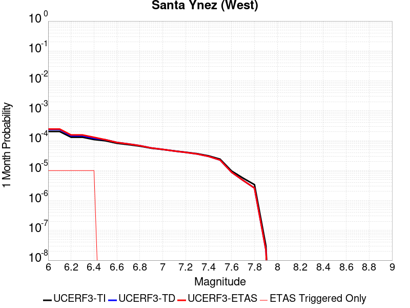 | 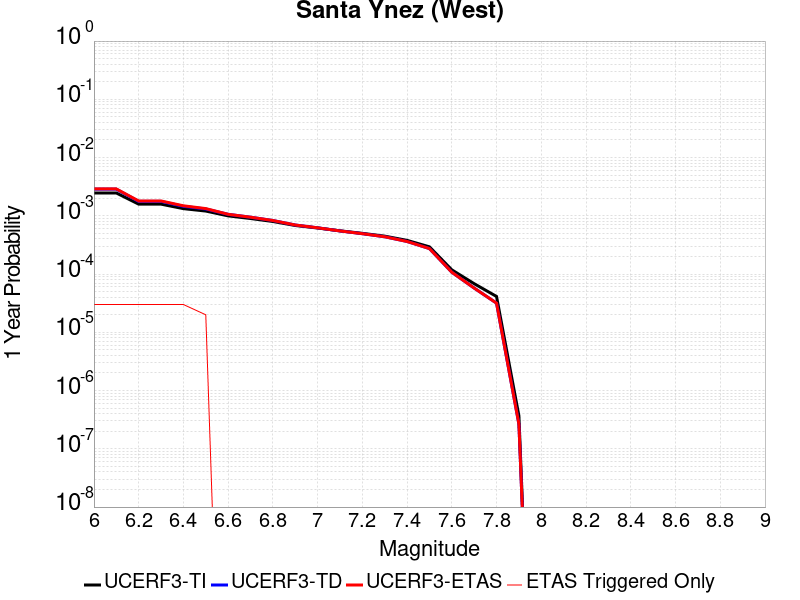 |  |

| Magnitude | 1 wk TI Prob | 1 wk TD Prob | 1 wk ETAS Prob | 1 wk ETAS/TD Gain | 1 wk ETAS Triggered Only | 1 mo TI Prob | 1 mo TD Prob | 1 mo ETAS Prob | 1 mo ETAS/TD Gain | 1 mo ETAS Triggered Only | 1 yr TI Prob | 1 yr TD Prob | 1 yr ETAS Prob | 1 yr ETAS/TD Gain | 1 yr ETAS Triggered Only | 10 yr TI Prob | 10 yr TD Prob | 10 yr ETAS Prob | 10 yr ETAS/TD Gain | 10 yr ETAS Triggered Only |
|-----|-----|-----|-----|-----|-----|-----|-----|-----|-----|-----|-----|-----|-----|-----|-----|-----|-----|-----|-----|-----|
| 6.0 | 4.7352758E-5 | 5.4977594E-5 | 5.4977594E-5 | 1.0 | 0.0 | 2.0292461E-4 | 2.3559865E-4 | 2.3559865E-4 | 1.0 | 0.0 | 0.0024678076 | 0.0028648009 | 0.0028648009 | 1.0 | 0.0 | 0.024405818 | 0.028307132 | 0.028341511 | 1.0012145 | 3.5380697E-5 |
| 6.1 | 4.7352758E-5 | 5.4977594E-5 | 5.4977594E-5 | 1.0 | 0.0 | 2.0292461E-4 | 2.3559865E-4 | 2.3559865E-4 | 1.0 | 0.0 | 0.0024678076 | 0.0028648009 | 0.0028648009 | 1.0 | 0.0 | 0.024405818 | 0.028307132 | 0.028341511 | 1.0012145 | 3.5380697E-5 |
| 6.2 | 3.0415853E-5 | 3.3927812E-5 | 3.3927812E-5 | 1.0 | 0.0 | 1.3034715E-4 | 1.4539702E-4 | 1.4539702E-4 | 1.0 | 0.0 | 0.0015858212 | 0.0017688064 | 0.0017688064 | 1.0 | 0.0 | 0.015745522 | 0.017551184 | 0.017585944 | 1.0019804 | 3.5380697E-5 |
| 6.3 | 3.0415853E-5 | 3.3927812E-5 | 3.3927812E-5 | 1.0 | 0.0 | 1.3034715E-4 | 1.4539702E-4 | 1.4539702E-4 | 1.0 | 0.0 | 0.0015858212 | 0.0017688064 | 0.0017688064 | 1.0 | 0.0 | 0.015745522 | 0.017551184 | 0.017585944 | 1.0019804 | 3.5380697E-5 |
| 6.4 | 2.5452082E-5 | 2.7914437E-5 | 2.7914437E-5 | 1.0 | 0.0 | 1.09075794E-4 | 1.1962793E-4 | 1.1962793E-4 | 1.0 | 0.0 | 0.0013271887 | 0.0014555135 | 0.0014555135 | 1.0 | 0.0 | 0.013192902 | 0.014461986 | 0.0144968545 | 1.0024111 | 3.5380697E-5 |
| 6.5 | 2.3143784E-5 | 2.5129964E-5 | 2.5129964E-5 | 1.0 | 0.0 | 9.9183875E-5 | 1.0769549E-4 | 1.0769549E-4 | 1.0 | 0.0 | 0.0012068948 | 0.0013104154 | 0.0013104154 | 1.0 | 0.0 | 0.012003611 | 0.013028558 | 0.013063478 | 1.0026803 | 3.5380697E-5 |
| 6.6 | 1.9118515E-5 | 2.0355572E-5 | 2.0355572E-5 | 1.0 | 0.0 | 8.193392E-5 | 8.72353E-5 | 8.72353E-5 | 1.0 | 0.0 | 9.97089E-4 | 0.0010615803 | 0.0010615803 | 1.0 | 0.0 | 0.00992627 | 0.010566001 | 0.010601008 | 1.0033132 | 3.5380697E-5 |
| 6.7 | 1.722807E-5 | 1.814738E-5 | 1.814738E-5 | 1.0 | 0.0 | 7.3832496E-5 | 7.77722E-5 | 7.77722E-5 | 1.0 | 0.0 | 8.985399E-4 | 9.464708E-4 | 9.464708E-4 | 1.0 | 0.0 | 0.008949154 | 0.009425044 | 0.009460092 | 1.0037185 | 3.5380697E-5 |
| 6.8 | 1.5317364E-5 | 1.5927328E-5 | 1.5927328E-5 | 1.0 | 0.0 | 6.56442E-5 | 6.825821E-5 | 6.825821E-5 | 1.0 | 0.0 | 7.98925E-4 | 8.307311E-4 | 8.307311E-4 | 1.0 | 0.0 | 0.007960589 | 0.008276746 | 0.008276746 | 1.0 | 0.0 |
| 6.9 | 1.3071226E-5 | 1.3330249E-5 | 1.3330249E-5 | 1.0 | 0.0 | 5.6018336E-5 | 5.71284E-5 | 5.71284E-5 | 1.0 | 0.0 | 6.8180985E-4 | 6.9531857E-4 | 6.9531857E-4 | 1.0 | 0.0 | 0.0067972173 | 0.006931691 | 0.006931691 | 1.0 | 0.0 |
| 7.0 | 1.1836986E-5 | 1.1933308E-5 | 1.1933308E-5 | 1.0 | 0.0 | 5.0728955E-5 | 5.1141757E-5 | 5.1141757E-5 | 1.0 | 0.0 | 6.1745E-4 | 6.224747E-4 | 6.224747E-4 | 1.0 | 0.0 | 0.006157372 | 0.0062075043 | 0.0062075043 | 1.0 | 0.0 |
| 7.1 | 1.0597169E-5 | 1.0542637E-5 | 1.0542637E-5 | 1.0 | 0.0 | 4.541565E-5 | 4.5181954E-5 | 4.5181954E-5 | 1.0 | 0.0 | 5.5279525E-4 | 5.499526E-4 | 5.499526E-4 | 1.0 | 0.0 | 0.0055142213 | 0.0054860474 | 0.0054860474 | 1.0 | 0.0 |
| 7.2 | 9.59113E-6 | 9.459535E-6 | 9.459535E-6 | 1.0 | 0.0 | 4.11042E-5 | 4.0540242E-5 | 4.0540242E-5 | 1.0 | 0.0 | 5.0032866E-4 | 4.9346674E-4 | 4.9346674E-4 | 1.0 | 0.0 | 0.004992037 | 0.0049238284 | 0.0049238284 | 1.0 | 0.0 |
| 7.3 | 8.586084E-6 | 8.379932E-6 | 8.379932E-6 | 1.0 | 0.0 | 3.679698E-5 | 3.5913505E-5 | 3.5913505E-5 | 1.0 | 0.0 | 4.4791115E-4 | 4.3716026E-4 | 4.3716026E-4 | 1.0 | 0.0 | 0.004470094 | 0.004363114 | 0.004363114 | 1.0 | 0.0 |
| 7.4 | 7.2622997E-6 | 6.95183E-6 | 6.95183E-6 | 1.0 | 0.0 | 3.112377E-5 | 2.9793222E-5 | 2.9793222E-5 | 1.0 | 0.0 | 3.78866E-4 | 3.6267308E-4 | 3.6267308E-4 | 1.0 | 0.0 | 0.0037822074 | 0.0036209123 | 0.0036209123 | 1.0 | 0.0 |
| 7.5 | 5.627296E-6 | 5.251797E-6 | 5.251797E-6 | 1.0 | 0.0 | 2.411676E-5 | 2.2507513E-5 | 2.2507513E-5 | 1.0 | 0.0 | 2.9358198E-4 | 2.7399522E-4 | 2.7399522E-4 | 1.0 | 0.0 | 0.0029319443 | 0.002736646 | 0.002736646 | 1.0 | 0.0 |
| 7.6 | 2.265244E-6 | 2.0609314E-6 | 2.0609314E-6 | 1.0 | 0.0 | 9.708152E-6 | 8.832533E-6 | 8.832533E-6 | 1.0 | 0.0 | 1.18190335E-4 | 1.07530876E-4 | 1.07530876E-4 | 1.0 | 0.0 | 0.001181275 | 0.001074797 | 0.001074797 | 1.0 | 0.0 |
| 7.7 | 1.3099874E-6 | 1.1016656E-6 | 1.1016656E-6 | 1.0 | 0.0 | 5.61422E-6 | 4.7214157E-6 | 4.7214157E-6 | 1.0 | 0.0 | 6.8350986E-5 | 5.7481746E-5 | 5.7481746E-5 | 1.0 | 0.0 | 6.832996E-4 | 5.7467114E-4 | 5.7467114E-4 | 1.0 | 0.0 |
| 7.8 | 7.903951E-7 | 6.071338E-7 | 6.071338E-7 | 1.0 | 0.0 | 3.3874032E-6 | 2.6019995E-6 | 2.6019995E-6 | 1.0 | 0.0 | 4.1240855E-5 | 3.1678897E-5 | 3.1678897E-5 | 1.0 | 0.0 | 4.12332E-4 | 3.1674514E-4 | 3.1674514E-4 | 1.0 | 0.0 |
| 7.9 | 7.0753297E-9 | 5.0900715E-9 | 5.0900715E-9 | 1.0 | 0.0 | 3.032284E-8 | 2.1814591E-8 | 2.1814591E-8 | 1.0 | 0.0 | 3.6918053E-7 | 2.6559263E-7 | 2.6559263E-7 | 1.0 | 0.0 | 3.691799E-6 | 2.655924E-6 | 2.655924E-6 | 1.0 | 0.0 |

## Independence rev 2011
*[(top)](#table-of-contents)*

| 1 Week | 1 Month | 1 Year | 10 Year |
|-----|-----|-----|-----|
|  |  |  |  |

| Magnitude | 1 wk TI Prob | 1 wk TD Prob | 1 wk ETAS Prob | 1 wk ETAS/TD Gain | 1 wk ETAS Triggered Only | 1 mo TI Prob | 1 mo TD Prob | 1 mo ETAS Prob | 1 mo ETAS/TD Gain | 1 mo ETAS Triggered Only | 1 yr TI Prob | 1 yr TD Prob | 1 yr ETAS Prob | 1 yr ETAS/TD Gain | 1 yr ETAS Triggered Only | 10 yr TI Prob | 10 yr TD Prob | 10 yr ETAS Prob | 10 yr ETAS/TD Gain | 10 yr ETAS Triggered Only |
|-----|-----|-----|-----|-----|-----|-----|-----|-----|-----|-----|-----|-----|-----|-----|-----|-----|-----|-----|-----|-----|
| 6.0 | 4.422171E-6 | 4.3263003E-6 | 3.9706843E-5 | 9.178014 | 3.5380697E-5 | 1.8952025E-5 | 1.8541172E-5 | 8.9301255E-5 | 4.8163757 | 7.0761394E-5 | 2.3071647E-4 | 2.2571837E-4 | 2.9646378E-4 | 1.3134234 | 7.0761394E-5 | 0.0023047708 | 0.0022551846 | 0.0023610874 | 1.0469596 | 1.0614209E-4 |
| 6.1 | 4.422171E-6 | 4.3263003E-6 | 3.9706843E-5 | 9.178014 | 3.5380697E-5 | 1.8952025E-5 | 1.8541172E-5 | 8.9301255E-5 | 4.8163757 | 7.0761394E-5 | 2.3071647E-4 | 2.2571837E-4 | 2.9646378E-4 | 1.3134234 | 7.0761394E-5 | 0.0023047708 | 0.0022551846 | 0.0023610874 | 1.0469596 | 1.0614209E-4 |
| 6.2 | 4.422171E-6 | 4.3263003E-6 | 3.9706843E-5 | 9.178014 | 3.5380697E-5 | 1.8952025E-5 | 1.8541172E-5 | 8.9301255E-5 | 4.8163757 | 7.0761394E-5 | 2.3071647E-4 | 2.2571837E-4 | 2.9646378E-4 | 1.3134234 | 7.0761394E-5 | 0.0023047708 | 0.0022551846 | 0.0023610874 | 1.0469596 | 1.0614209E-4 |
| 6.3 | 4.422171E-6 | 4.3263003E-6 | 3.9706843E-5 | 9.178014 | 3.5380697E-5 | 1.8952025E-5 | 1.8541172E-5 | 8.9301255E-5 | 4.8163757 | 7.0761394E-5 | 2.3071647E-4 | 2.2571837E-4 | 2.9646378E-4 | 1.3134234 | 7.0761394E-5 | 0.0023047708 | 0.0022551846 | 0.0023610874 | 1.0469596 | 1.0614209E-4 |
| 6.4 | 4.422171E-6 | 4.3263003E-6 | 3.9706843E-5 | 9.178014 | 3.5380697E-5 | 1.8952025E-5 | 1.8541172E-5 | 8.9301255E-5 | 4.8163757 | 7.0761394E-5 | 2.3071647E-4 | 2.2571837E-4 | 2.9646378E-4 | 1.3134234 | 7.0761394E-5 | 0.0023047708 | 0.0022551846 | 0.0023610874 | 1.0469596 | 1.0614209E-4 |
| 6.5 | 4.422171E-6 | 4.3263003E-6 | 3.9706843E-5 | 9.178014 | 3.5380697E-5 | 1.8952025E-5 | 1.8541172E-5 | 8.9301255E-5 | 4.8163757 | 7.0761394E-5 | 2.3071647E-4 | 2.2571837E-4 | 2.9646378E-4 | 1.3134234 | 7.0761394E-5 | 0.0023047708 | 0.0022551846 | 0.0023610874 | 1.0469596 | 1.0614209E-4 |
| 6.6 | 2.663744E-6 | 2.53204E-6 | 3.7912647E-5 | 14.973163 | 3.5380697E-5 | 1.1415996E-5 | 1.0851558E-5 | 8.161218E-5 | 7.5207806 | 7.0761394E-5 | 1.3898089E-4 | 1.3211019E-4 | 2.0286224E-4 | 1.5355532 | 7.0761394E-5 | 0.0013889399 | 0.0013203648 | 0.0014263667 | 1.0802823 | 1.0614209E-4 |
| 6.7 | 2.663744E-6 | 2.53204E-6 | 3.7912647E-5 | 14.973163 | 3.5380697E-5 | 1.1415996E-5 | 1.0851558E-5 | 8.161218E-5 | 7.5207806 | 7.0761394E-5 | 1.3898089E-4 | 1.3211019E-4 | 2.0286224E-4 | 1.5355532 | 7.0761394E-5 | 0.0013889399 | 0.0013203648 | 0.0014263667 | 1.0802823 | 1.0614209E-4 |
| 6.8 | 1.9716529E-6 | 1.8323044E-6 | 3.7212936E-5 | 20.309362 | 3.5380697E-5 | 8.449913E-6 | 7.85271E-6 | 7.861355E-5 | 10.011008 | 7.0761394E-5 | 1.0287284E-4 | 9.5602685E-5 | 1.6635732E-4 | 1.7400904 | 7.0761394E-5 | 0.0010282523 | 9.5562846E-4 | 0.0010616691 | 1.1109643 | 1.0614209E-4 |
| 6.9 | 1.8788617E-6 | 1.7430435E-6 | 3.712368E-5 | 21.298193 | 3.5380697E-5 | 8.0522395E-6 | 7.470166E-6 | 7.823103E-5 | 10.472462 | 7.0761394E-5 | 9.80316E-5 | 9.09456E-5 | 1.6170055E-4 | 1.7779921 | 7.0761394E-5 | 9.798837E-4 | 9.090958E-4 | 0.0010151414 | 1.1166495 | 1.0614209E-4 |
| 7.0 | 1.5045488E-6 | 1.384987E-6 | 3.6765636E-5 | 26.545834 | 3.5380697E-5 | 6.44805E-6 | 5.9356453E-6 | 7.669662E-5 | 12.921361 | 7.0761394E-5 | 7.8502184E-5 | 7.2264134E-5 | 1.4302041E-4 | 1.9791341 | 7.0761394E-5 | 7.8474457E-4 | 7.224115E-4 | 8.284769E-4 | 1.1468213 | 1.0614209E-4 |
| 7.1 | 1.272341E-6 | 1.1625416E-6 | 3.6543195E-5 | 31.433884 | 3.5380697E-5 | 5.4528787E-6 | 4.9823116E-6 | 7.574335E-5 | 15.202452 | 7.0761394E-5 | 6.6386776E-5 | 6.065799E-5 | 1.3141509E-4 | 2.1664927 | 7.0761394E-5 | 6.636695E-4 | 6.0641754E-4 | 7.1249524E-4 | 1.1749252 | 1.0614209E-4 |
| 7.2 | 1.0416892E-6 | 9.410155E-7 | 3.632168E-5 | 38.598385 | 3.5380697E-5 | 4.464375E-6 | 4.032918E-6 | 7.479402E-5 | 18.545885 | 7.0761394E-5 | 5.4352407E-5 | 4.9099683E-5 | 1.198576E-4 | 2.4411075 | 7.0761394E-5 | 5.4339116E-4 | 4.9089023E-4 | 5.969802E-4 | 1.2161175 | 1.0614209E-4 |
| 7.3 | 7.9450155E-7 | 7.2352077E-7 | 3.6104193E-5 | 49.9007 | 3.5380697E-5 | 3.4050022E-6 | 3.1007996E-6 | 7.386197E-5 | 23.8203 | 7.0761394E-5 | 4.1455114E-5 | 3.7751593E-5 | 1.08510314E-4 | 2.874324 | 7.0761394E-5 | 4.144738E-4 | 3.774529E-4 | 4.8355493E-4 | 1.2811 | 1.0614209E-4 |
| 7.4 | 5.3893444E-7 | 5.01964E-7 | 3.5882644E-5 | 71.48449 | 3.5380697E-5 | 2.309717E-6 | 2.1512726E-6 | 7.291251E-5 | 33.892735 | 7.0761394E-5 | 2.8120441E-5 | 2.6191434E-5 | 9.695097E-5 | 3.7016292 | 7.0761394E-5 | 2.8116882E-4 | 2.6188392E-4 | 3.6799823E-4 | 1.405196 | 1.0614209E-4 |
| 7.5 | 3.8852085E-7 | 3.6826376E-7 | 3.6826376E-7 | 1.0 | 0.0 | 1.6650882E-6 | 1.5782723E-6 | 3.6958914E-5 | 23.417324 | 3.5380697E-5 | 2.027226E-5 | 1.9215298E-5 | 5.4595315E-5 | 2.841242 | 3.5380697E-5 | 2.0270412E-4 | 1.9213658E-4 | 2.6288436E-4 | 1.3682162 | 7.0761394E-5 |
| 7.6 | 2.414929E-7 | 2.3457987E-7 | 2.3457987E-7 | 1.0 | 0.0 | 1.0349692E-6 | 1.0053419E-6 | 1.0053419E-6 | 1.0 | 0.0 | 1.2600677E-5 | 1.2239971E-5 | 1.2239971E-5 | 1.0 | 0.0 | 1.2599962E-4 | 1.2239309E-4 | 1.2239309E-4 | 1.0 | 0.0 |
| 7.7 | 6.8298014E-8 | 6.8590616E-8 | 6.8590616E-8 | 1.0 | 0.0 | 2.9270575E-7 | 2.9395974E-7 | 2.9395974E-7 | 1.0 | 0.0 | 3.5636867E-6 | 3.5789546E-6 | 3.5789546E-6 | 1.0 | 0.0 | 3.5636294E-5 | 3.5789017E-5 | 3.5789017E-5 | 1.0 | 0.0 |

## San Andreas (North Branch Mill Creek)
*[(top)](#table-of-contents)*

| 1 Week | 1 Month | 1 Year | 10 Year |
|-----|-----|-----|-----|
|  |  |  |  |

| Magnitude | 1 wk TI Prob | 1 wk TD Prob | 1 wk ETAS Prob | 1 wk ETAS/TD Gain | 1 wk ETAS Triggered Only | 1 mo TI Prob | 1 mo TD Prob | 1 mo ETAS Prob | 1 mo ETAS/TD Gain | 1 mo ETAS Triggered Only | 1 yr TI Prob | 1 yr TD Prob | 1 yr ETAS Prob | 1 yr ETAS/TD Gain | 1 yr ETAS Triggered Only | 10 yr TI Prob | 10 yr TD Prob | 10 yr ETAS Prob | 10 yr ETAS/TD Gain | 10 yr ETAS Triggered Only |
|-----|-----|-----|-----|-----|-----|-----|-----|-----|-----|-----|-----|-----|-----|-----|-----|-----|-----|-----|-----|-----|
| 6.0 | 1.3461156E-5 | 2.3527407E-5 | 2.3527407E-5 | 1.0 | 0.0 | 5.7689394E-5 | 1.0082787E-4 | 1.0082787E-4 | 1.0 | 0.0 | 7.02142E-4 | 0.0012268913 | 0.0012975659 | 1.0576046 | 7.0761394E-5 | 0.0069992766 | 0.012243656 | 0.012348499 | 1.008563 | 1.0614209E-4 |
| 6.1 | 1.3461156E-5 | 2.3527407E-5 | 2.3527407E-5 | 1.0 | 0.0 | 5.7689394E-5 | 1.0082787E-4 | 1.0082787E-4 | 1.0 | 0.0 | 7.02142E-4 | 0.0012268913 | 0.0012975659 | 1.0576046 | 7.0761394E-5 | 0.0069992766 | 0.012243656 | 0.012348499 | 1.008563 | 1.0614209E-4 |
| 6.2 | 1.3461156E-5 | 2.3527407E-5 | 2.3527407E-5 | 1.0 | 0.0 | 5.7689394E-5 | 1.0082787E-4 | 1.0082787E-4 | 1.0 | 0.0 | 7.02142E-4 | 0.0012268913 | 0.0012975659 | 1.0576046 | 7.0761394E-5 | 0.0069992766 | 0.012243656 | 0.012348499 | 1.008563 | 1.0614209E-4 |
| 6.3 | 1.3461156E-5 | 2.3527407E-5 | 2.3527407E-5 | 1.0 | 0.0 | 5.7689394E-5 | 1.0082787E-4 | 1.0082787E-4 | 1.0 | 0.0 | 7.02142E-4 | 0.0012268913 | 0.0012975659 | 1.0576046 | 7.0761394E-5 | 0.0069992766 | 0.012243656 | 0.012348499 | 1.008563 | 1.0614209E-4 |
| 6.4 | 1.3461156E-5 | 2.3527407E-5 | 2.3527407E-5 | 1.0 | 0.0 | 5.7689394E-5 | 1.0082787E-4 | 1.0082787E-4 | 1.0 | 0.0 | 7.02142E-4 | 0.0012268913 | 0.0012975659 | 1.0576046 | 7.0761394E-5 | 0.0069992766 | 0.012243656 | 0.012348499 | 1.008563 | 1.0614209E-4 |
| 6.5 | 1.3450706E-5 | 2.3516368E-5 | 2.3516368E-5 | 1.0 | 0.0 | 5.764461E-5 | 1.00780555E-4 | 1.00780555E-4 | 1.0 | 0.0 | 7.0159714E-4 | 0.001226316 | 0.0012969906 | 1.0576316 | 7.0761394E-5 | 0.006993862 | 0.012237966 | 0.01234281 | 1.0085671 | 1.0614209E-4 |
| 6.6 | 1.3074523E-5 | 2.313064E-5 | 2.313064E-5 | 1.0 | 0.0 | 5.6032466E-5 | 9.912757E-5 | 9.912757E-5 | 1.0 | 0.0 | 6.8198174E-4 | 0.0012062131 | 0.0012768892 | 1.0585933 | 7.0761394E-5 | 0.006798926 | 0.012039129 | 0.012143994 | 1.0087103 | 1.0614209E-4 |
| 6.7 | 1.3050216E-5 | 2.3105935E-5 | 2.3105935E-5 | 1.0 | 0.0 | 5.59283E-5 | 9.9021694E-5 | 9.9021694E-5 | 1.0 | 0.0 | 6.8071426E-4 | 0.0012049256 | 0.0012756018 | 1.058656 | 7.0761394E-5 | 0.0067863287 | 0.012026393 | 0.012131259 | 1.0087196 | 1.0614209E-4 |
| 6.8 | 1.29049395E-5 | 2.2954338E-5 | 2.2954338E-5 | 1.0 | 0.0 | 5.530571E-5 | 9.8372046E-5 | 9.8372046E-5 | 1.0 | 0.0 | 6.73139E-4 | 0.0011970248 | 0.0012677015 | 1.0590436 | 7.0761394E-5 | 0.0067110364 | 0.011948236 | 0.01205311 | 1.0087774 | 1.0614209E-4 |
| 6.9 | 1.2867369E-5 | 2.2913739E-5 | 2.2913739E-5 | 1.0 | 0.0 | 5.51447E-5 | 9.8198056E-5 | 9.8198056E-5 | 1.0 | 0.0 | 6.711799E-4 | 0.0011949089 | 0.0012655857 | 1.0591483 | 7.0761394E-5 | 0.006691564 | 0.011927304 | 0.01203218 | 1.008793 | 1.0614209E-4 |
| 7.0 | 1.2495996E-5 | 2.2313627E-5 | 2.2313627E-5 | 1.0 | 0.0 | 5.3553173E-5 | 9.562634E-5 | 9.562634E-5 | 1.0 | 0.0 | 6.518148E-4 | 0.0011636318 | 0.0012343108 | 1.06074 | 7.0761394E-5 | 0.0064990623 | 0.011617814 | 0.011722724 | 1.00903 | 1.0614209E-4 |
| 7.1 | 1.2452067E-5 | 2.2258691E-5 | 2.2258691E-5 | 1.0 | 0.0 | 5.3364907E-5 | 9.539092E-5 | 9.539092E-5 | 1.0 | 0.0 | 6.4952404E-4 | 0.0011607686 | 0.0012314478 | 1.0608901 | 7.0761394E-5 | 0.0064762887 | 0.011589482 | 0.011694394 | 1.0090524 | 1.0614209E-4 |
| 7.2 | 1.2002777E-5 | 2.163711E-5 | 2.163711E-5 | 1.0 | 0.0 | 5.143946E-5 | 9.272719E-5 | 9.272719E-5 | 1.0 | 0.0 | 6.2609545E-4 | 0.0011283715 | 0.001199053 | 1.0626403 | 7.0761394E-5 | 0.006243344 | 0.011268834 | 0.01137378 | 1.009313 | 1.0614209E-4 |
| 7.3 | 1.1923425E-5 | 2.150691E-5 | 2.150691E-5 | 1.0 | 0.0 | 5.109939E-5 | 9.216923E-5 | 9.216923E-5 | 1.0 | 0.0 | 6.219575E-4 | 0.0011215854 | 0.0011922674 | 1.0630198 | 7.0761394E-5 | 0.0062021962 | 0.011201685 | 0.011306639 | 1.0093694 | 1.0614209E-4 |
| 7.4 | 1.16105175E-5 | 2.0880623E-5 | 2.0880623E-5 | 1.0 | 0.0 | 4.975841E-5 | 8.948533E-5 | 8.948533E-5 | 1.0 | 0.0 | 6.0564023E-4 | 0.0010889419 | 0.0011596263 | 1.064911 | 7.0761394E-5 | 0.006039923 | 0.010879163 | 0.01098415 | 1.0096503 | 1.0614209E-4 |
| 7.5 | 1.1037265E-5 | 1.9579818E-5 | 1.9579818E-5 | 1.0 | 0.0 | 4.7301706E-5 | 8.3910825E-5 | 8.3910825E-5 | 1.0 | 0.0 | 5.757461E-4 | 0.0010211377 | 0.0010918268 | 1.0692259 | 7.0761394E-5 | 0.005742567 | 0.010208193 | 0.010313252 | 1.0102916 | 1.0614209E-4 |
| 7.6 | 1.0720915E-5 | 1.9021407E-5 | 1.9021407E-5 | 1.0 | 0.0 | 4.5945973E-5 | 8.151778E-5 | 8.151778E-5 | 1.0 | 0.0 | 5.592486E-4 | 9.920292E-4 | 0.0010627204 | 1.0712591 | 7.0761394E-5 | 0.005578433 | 0.009919754 | 0.010024844 | 1.0105939 | 1.0614209E-4 |
| 7.7 | 9.276279E-6 | 1.6466016E-5 | 1.6466016E-5 | 1.0 | 0.0 | 3.9754876E-5 | 7.056674E-5 | 7.056674E-5 | 1.0 | 0.0 | 4.839081E-4 | 8.5881306E-4 | 9.2951366E-4 | 1.0823237 | 7.0761394E-5 | 0.0048285574 | 0.008598559 | 0.008703789 | 1.012238 | 1.0614209E-4 |
| 7.8 | 5.8346777E-6 | 1.11748E-5 | 1.11748E-5 | 1.0 | 0.0 | 2.5005522E-5 | 4.7891124E-5 | 4.7891124E-5 | 1.0 | 0.0 | 3.043997E-4 | 5.829186E-4 | 6.5363874E-4 | 1.1213208 | 7.0761394E-5 | 0.0030398308 | 0.005857104 | 0.005962624 | 1.0180157 | 1.0614209E-4 |
| 7.9 | 4.690204E-6 | 8.525594E-6 | 8.525594E-6 | 1.0 | 0.0 | 2.0100719E-5 | 3.653775E-5 | 3.653775E-5 | 1.0 | 0.0 | 2.4469878E-4 | 4.4475638E-4 | 5.154863E-4 | 1.1590307 | 7.0761394E-5 | 0.002444295 | 0.004479242 | 0.0045849085 | 1.0235903 | 1.0614209E-4 |
| 8.0 | 2.9570454E-6 | 4.857035E-6 | 4.857035E-6 | 1.0 | 0.0 | 1.267299E-5 | 2.0815698E-5 | 2.0815698E-5 | 1.0 | 0.0 | 1.5428272E-4 | 2.534017E-4 | 2.8877342E-4 | 1.1395876 | 3.5380697E-5 | 0.0015417566 | 0.002554891 | 0.0026254717 | 1.0276257 | 7.0761394E-5 |
| 8.1 | 1.6376824E-6 | 2.2021889E-6 | 2.2021889E-6 | 1.0 | 0.0 | 7.01862E-6 | 9.437918E-6 | 9.437918E-6 | 1.0 | 0.0 | 8.544835E-5 | 1.14900606E-4 | 1.14900606E-4 | 1.0 | 0.0 | 8.54155E-4 | 0.0011634289 | 0.0011987684 | 1.0303754 | 3.5380697E-5 |
| 8.2 | 6.9631557E-7 | 4.5525482E-7 | 4.5525482E-7 | 1.0 | 0.0 | 2.984206E-6 | 1.9510906E-6 | 1.9510906E-6 | 1.0 | 0.0 | 3.63321E-5 | 2.3754272E-5 | 2.3754272E-5 | 1.0 | 0.0 | 3.6326164E-4 | 2.4603383E-4 | 2.4603383E-4 | 1.0 | 0.0 |
| 8.3 | 1.7876137E-7 | 8.3938964E-8 | 8.3938964E-8 | 1.0 | 0.0 | 7.661199E-7 | 3.5973835E-7 | 3.5973835E-7 | 1.0 | 0.0 | 9.32747E-6 | 4.3798063E-6 | 4.3798063E-6 | 1.0 | 0.0 | 9.3270784E-5 | 4.599691E-5 | 4.599691E-5 | 1.0 | 0.0 |

## Oceanic - West Huasna
*[(top)](#table-of-contents)*

| 1 Week | 1 Month | 1 Year | 10 Year |
|-----|-----|-----|-----|
|  |  |  |  |

| Magnitude | 1 wk TI Prob | 1 wk TD Prob | 1 wk ETAS Prob | 1 wk ETAS/TD Gain | 1 wk ETAS Triggered Only | 1 mo TI Prob | 1 mo TD Prob | 1 mo ETAS Prob | 1 mo ETAS/TD Gain | 1 mo ETAS Triggered Only | 1 yr TI Prob | 1 yr TD Prob | 1 yr ETAS Prob | 1 yr ETAS/TD Gain | 1 yr ETAS Triggered Only | 10 yr TI Prob | 10 yr TD Prob | 10 yr ETAS Prob | 10 yr ETAS/TD Gain | 10 yr ETAS Triggered Only |
|-----|-----|-----|-----|-----|-----|-----|-----|-----|-----|-----|-----|-----|-----|-----|-----|-----|-----|-----|-----|-----|
| 6.0 | 3.195567E-5 | 2.792801E-5 | 2.792801E-5 | 1.0 | 0.0 | 1.3694567E-4 | 1.1968623E-4 | 1.1968623E-4 | 1.0 | 0.0 | 0.0016660384 | 0.0014562489 | 0.0014915781 | 1.0242604 | 3.5380697E-5 | 0.016536033 | 0.014471616 | 0.014541353 | 1.0048189 | 7.0761394E-5 |
| 6.1 | 2.1156782E-5 | 1.7574157E-5 | 1.7574157E-5 | 1.0 | 0.0 | 9.066878E-5 | 7.53157E-5 | 7.53157E-5 | 1.0 | 0.0 | 0.0011033333 | 9.1659225E-4 | 9.1659225E-4 | 1.0 | 0.0 | 0.010978713 | 0.009129126 | 0.009164183 | 1.0038402 | 3.5380697E-5 |
| 6.2 | 1.6195117E-5 | 1.332762E-5 | 1.332762E-5 | 1.0 | 0.0 | 6.9405796E-5 | 5.7117133E-5 | 5.7117133E-5 | 1.0 | 0.0 | 8.44688E-4 | 6.9518184E-4 | 6.9518184E-4 | 1.0 | 0.0 | 0.008414844 | 0.006930365 | 0.006965501 | 1.0050697 | 3.5380697E-5 |
| 6.3 | 1.3559345E-5 | 1.1179509E-5 | 1.1179509E-5 | 1.0 | 0.0 | 5.811018E-5 | 4.7911308E-5 | 4.7911308E-5 | 1.0 | 0.0 | 7.072618E-4 | 5.83165E-4 | 5.83165E-4 | 1.0 | 0.0 | 0.0070501505 | 0.0058164652 | 0.00585164 | 1.0060475 | 3.5380697E-5 |
| 6.4 | 1.2120619E-5 | 1.0001292E-5 | 1.0001292E-5 | 1.0 | 0.0 | 5.1944477E-5 | 4.286198E-5 | 4.286198E-5 | 1.0 | 0.0 | 6.322405E-4 | 5.2172015E-4 | 5.2172015E-4 | 1.0 | 0.0 | 0.006304447 | 0.005205021 | 0.0052402173 | 1.006762 | 3.5380697E-5 |
| 6.5 | 1.13511915E-5 | 9.3677645E-6 | 9.3677645E-6 | 1.0 | 0.0 | 4.8647056E-5 | 4.0146948E-5 | 4.0146948E-5 | 1.0 | 0.0 | 5.9211696E-4 | 4.886799E-4 | 4.886799E-4 | 1.0 | 0.0 | 0.0059054173 | 0.004876112 | 0.0049113203 | 1.0072205 | 3.5380697E-5 |
| 6.6 | 9.850605E-6 | 8.135666E-6 | 8.135666E-6 | 1.0 | 0.0 | 4.2216197E-5 | 3.4866673E-5 | 3.4866673E-5 | 1.0 | 0.0 | 5.1386096E-4 | 4.2441927E-4 | 4.2441927E-4 | 1.0 | 0.0 | 0.0051267436 | 0.0042361193 | 0.0042713503 | 1.0083168 | 3.5380697E-5 |
| 6.7 | 8.8558645E-6 | 7.3186534E-6 | 7.3186534E-6 | 1.0 | 0.0 | 3.7953152E-5 | 3.136528E-5 | 3.136528E-5 | 1.0 | 0.0 | 4.6198163E-4 | 3.8180556E-4 | 3.8180556E-4 | 1.0 | 0.0 | 0.004610224 | 0.0038115215 | 0.0038115215 | 1.0 | 0.0 |
| 6.8 | 7.67136E-6 | 6.3919483E-6 | 6.3919483E-6 | 1.0 | 0.0 | 3.2876844E-5 | 2.7393779E-5 | 2.7393779E-5 | 1.0 | 0.0 | 4.0020206E-4 | 3.3346837E-4 | 3.3346837E-4 | 1.0 | 0.0 | 0.003994821 | 0.0033297008 | 0.0033297008 | 1.0 | 0.0 |
| 6.9 | 6.534529E-6 | 5.4584953E-6 | 5.4584953E-6 | 1.0 | 0.0 | 2.8004823E-5 | 2.3393342E-5 | 2.3393342E-5 | 1.0 | 0.0 | 3.4090536E-4 | 2.8477685E-4 | 2.8477685E-4 | 1.0 | 0.0 | 0.0034038287 | 0.002844136 | 0.002844136 | 1.0 | 0.0 |
| 7.0 | 5.460525E-6 | 4.570095E-6 | 4.570095E-6 | 1.0 | 0.0 | 2.3402039E-5 | 1.9585976E-5 | 1.9585976E-5 | 1.0 | 0.0 | 2.8488258E-4 | 2.3843326E-4 | 2.3843326E-4 | 1.0 | 0.0 | 0.0028451765 | 0.0023817883 | 0.0023817883 | 1.0 | 0.0 |
| 7.1 | 4.4825083E-6 | 3.7525715E-6 | 3.7525715E-6 | 1.0 | 0.0 | 1.9210609E-5 | 1.6082351E-5 | 1.6082351E-5 | 1.0 | 0.0 | 2.3386406E-4 | 1.9578513E-4 | 1.9578513E-4 | 1.0 | 0.0 | 0.002336181 | 0.0019561385 | 0.0019561385 | 1.0 | 0.0 |
| 7.2 | 2.821708E-6 | 2.4250364E-6 | 2.4250364E-6 | 1.0 | 0.0 | 1.2092979E-5 | 1.03929715E-5 | 1.03929715E-5 | 1.0 | 0.0 | 1.4722206E-4 | 1.265271E-4 | 1.265271E-4 | 1.0 | 0.0 | 0.0014712457 | 0.001264553 | 0.001264553 | 1.0 | 0.0 |
| 7.3 | 2.0644757E-6 | 1.7688327E-6 | 1.7688327E-6 | 1.0 | 0.0 | 8.847723E-6 | 7.5806893E-6 | 7.5806893E-6 | 1.0 | 0.0 | 1.0771569E-4 | 9.229099E-5 | 9.229099E-5 | 1.0 | 0.0 | 0.001076635 | 9.225283E-4 | 9.225283E-4 | 1.0 | 0.0 |
| 7.4 | 1.6980367E-6 | 1.4380759E-6 | 1.4380759E-6 | 1.0 | 0.0 | 7.27728E-6 | 6.1631677E-6 | 6.1631677E-6 | 1.0 | 0.0 | 8.8597284E-5 | 7.503398E-5 | 7.503398E-5 | 1.0 | 0.0 | 8.8561967E-4 | 7.500881E-4 | 7.500881E-4 | 1.0 | 0.0 |
| 7.5 | 1.3637683E-6 | 1.130346E-6 | 1.130346E-6 | 1.0 | 0.0 | 5.844708E-6 | 4.844331E-6 | 4.844331E-6 | 1.0 | 0.0 | 7.1156996E-5 | 5.897814E-5 | 5.897814E-5 | 1.0 | 0.0 | 7.1134215E-4 | 5.896264E-4 | 5.896264E-4 | 1.0 | 0.0 |
| 7.6 | 9.802994E-7 | 7.6780117E-7 | 7.6780117E-7 | 1.0 | 0.0 | 4.2012766E-6 | 3.290572E-6 | 3.290572E-6 | 1.0 | 0.0 | 5.1149345E-5 | 4.006198E-5 | 4.006198E-5 | 1.0 | 0.0 | 5.113757E-4 | 4.00549E-4 | 4.00549E-4 | 1.0 | 0.0 |
| 7.7 | 5.986191E-7 | 4.005761E-7 | 4.005761E-7 | 1.0 | 0.0 | 2.5655079E-6 | 1.7167536E-6 | 1.7167536E-6 | 1.0 | 0.0 | 3.1234613E-5 | 2.0901274E-5 | 2.0901274E-5 | 1.0 | 0.0 | 3.123022E-4 | 2.0899443E-4 | 2.0899443E-4 | 1.0 | 0.0 |
| 7.8 | 2.9189815E-7 | 1.529205E-7 | 1.529205E-7 | 1.0 | 0.0 | 1.2509914E-6 | 6.553734E-7 | 6.553734E-7 | 1.0 | 0.0 | 1.5230714E-5 | 7.9791425E-6 | 7.9791425E-6 | 1.0 | 0.0 | 1.522967E-4 | 7.978987E-5 | 7.978987E-5 | 1.0 | 0.0 |
| 7.9 | 1.2057845E-7 | 4.6247223E-8 | 4.6247223E-8 | 1.0 | 0.0 | 5.1676466E-7 | 1.9820237E-7 | 1.9820237E-7 | 1.0 | 0.0 | 6.2915915E-6 | 2.4131111E-6 | 2.4131111E-6 | 1.0 | 0.0 | 6.2914136E-5 | 2.4132154E-5 | 2.4132154E-5 | 1.0 | 0.0 |
| 8.0 | 3.3806387E-9 | 9.024813E-10 | 9.024813E-10 | 1.0 | 0.0 | 1.4488451E-8 | 3.8677777E-9 | 3.8677777E-9 | 1.0 | 0.0 | 1.7639688E-7 | 4.7090193E-8 | 4.7090193E-8 | 1.0 | 0.0 | 1.7639674E-6 | 4.7199646E-7 | 4.7199646E-7 | 1.0 | 0.0 |

## Pittville 2011 CFM
*[(top)](#table-of-contents)*

| 1 Week | 1 Month | 1 Year | 10 Year |
|-----|-----|-----|-----|
|  |  |  |  |

| Magnitude | 1 wk TI Prob | 1 wk TD Prob | 1 wk ETAS Prob | 1 wk ETAS/TD Gain | 1 wk ETAS Triggered Only | 1 mo TI Prob | 1 mo TD Prob | 1 mo ETAS Prob | 1 mo ETAS/TD Gain | 1 mo ETAS Triggered Only | 1 yr TI Prob | 1 yr TD Prob | 1 yr ETAS Prob | 1 yr ETAS/TD Gain | 1 yr ETAS Triggered Only | 10 yr TI Prob | 10 yr TD Prob | 10 yr ETAS Prob | 10 yr ETAS/TD Gain | 10 yr ETAS Triggered Only |
|-----|-----|-----|-----|-----|-----|-----|-----|-----|-----|-----|-----|-----|-----|-----|-----|-----|-----|-----|-----|-----|
| 6.0 | 2.5031832E-5 | 2.7058131E-5 | 2.7058131E-5 | 1.0 | 0.0 | 1.0727487E-4 | 1.15958814E-4 | 1.15958814E-4 | 1.0 | 0.0 | 0.001305289 | 0.0014109816 | 0.0014463124 | 1.0250399 | 3.5380697E-5 | 0.012976485 | 0.014030014 | 0.014099783 | 1.0049728 | 7.0761394E-5 |
| 6.1 | 1.2540113E-5 | 1.3513622E-5 | 1.3513622E-5 | 1.0 | 0.0 | 5.3742235E-5 | 5.7914367E-5 | 5.7914367E-5 | 1.0 | 0.0 | 6.541153E-4 | 7.0490176E-4 | 7.0490176E-4 | 1.0 | 0.0 | 0.0065219323 | 0.0070288926 | 0.007064025 | 1.0049982 | 3.5380697E-5 |
| 6.2 | 6.603218E-6 | 7.107477E-6 | 7.107477E-6 | 1.0 | 0.0 | 2.8299199E-5 | 3.0460296E-5 | 3.0460296E-5 | 1.0 | 0.0 | 3.4448825E-4 | 3.707975E-4 | 3.707975E-4 | 1.0 | 0.0 | 0.0034395473 | 0.003702429 | 0.0037376785 | 1.0095206 | 3.5380697E-5 |
| 6.3 | 6.603218E-6 | 7.107477E-6 | 7.107477E-6 | 1.0 | 0.0 | 2.8299199E-5 | 3.0460296E-5 | 3.0460296E-5 | 1.0 | 0.0 | 3.4448825E-4 | 3.707975E-4 | 3.707975E-4 | 1.0 | 0.0 | 0.0034395473 | 0.003702429 | 0.0037376785 | 1.0095206 | 3.5380697E-5 |
| 6.4 | 3.9389015E-6 | 4.2393463E-6 | 4.2393463E-6 | 1.0 | 0.0 | 1.6880897E-5 | 1.816852E-5 | 1.816852E-5 | 1.0 | 0.0 | 2.0550552E-4 | 2.2118236E-4 | 2.2118236E-4 | 1.0 | 0.0 | 0.0020531558 | 0.0022099272 | 0.0022099272 | 1.0 | 0.0 |
| 6.5 | 2.4533072E-6 | 2.6413759E-6 | 2.6413759E-6 | 1.0 | 0.0 | 1.0514132E-5 | 1.1320145E-5 | 1.1320145E-5 | 1.0 | 0.0 | 1.2800204E-4 | 1.3781598E-4 | 1.3781598E-4 | 1.0 | 0.0 | 0.0012792832 | 0.0013774954 | 0.0013774954 | 1.0 | 0.0 |
| 6.6 | 1.3482367E-6 | 1.453053E-6 | 1.453053E-6 | 1.0 | 0.0 | 5.778144E-6 | 6.2273616E-6 | 6.2273616E-6 | 1.0 | 0.0 | 7.0346636E-5 | 7.581662E-5 | 7.581662E-5 | 1.0 | 0.0 | 7.032437E-4 | 7.5801864E-4 | 7.5801864E-4 | 1.0 | 0.0 |

## Deep Springs
*[(top)](#table-of-contents)*

| 1 Week | 1 Month | 1 Year | 10 Year |
|-----|-----|-----|-----|
|  |  |  |  |

| Magnitude | 1 wk TI Prob | 1 wk TD Prob | 1 wk ETAS Prob | 1 wk ETAS/TD Gain | 1 wk ETAS Triggered Only | 1 mo TI Prob | 1 mo TD Prob | 1 mo ETAS Prob | 1 mo ETAS/TD Gain | 1 mo ETAS Triggered Only | 1 yr TI Prob | 1 yr TD Prob | 1 yr ETAS Prob | 1 yr ETAS/TD Gain | 1 yr ETAS Triggered Only | 10 yr TI Prob | 10 yr TD Prob | 10 yr ETAS Prob | 10 yr ETAS/TD Gain | 10 yr ETAS Triggered Only |
|-----|-----|-----|-----|-----|-----|-----|-----|-----|-----|-----|-----|-----|-----|-----|-----|-----|-----|-----|-----|-----|
| 6.0 | 1.9810619E-5 | 2.3114564E-5 | 5.8494443E-5 | 2.5306315 | 3.5380697E-5 | 8.489989E-5 | 9.9061515E-5 | 1.3443871E-4 | 1.3571235 | 3.5380697E-5 | 0.001033166 | 0.0012059145 | 0.0012765905 | 1.0586078 | 7.0761394E-5 | 0.010283757 | 0.012043487 | 0.012148351 | 1.008707 | 1.0614209E-4 |
| 6.1 | 1.9810619E-5 | 2.3114564E-5 | 5.8494443E-5 | 2.5306315 | 3.5380697E-5 | 8.489989E-5 | 9.9061515E-5 | 1.3443871E-4 | 1.3571235 | 3.5380697E-5 | 0.001033166 | 0.0012059145 | 0.0012765905 | 1.0586078 | 7.0761394E-5 | 0.010283757 | 0.012043487 | 0.012148351 | 1.008707 | 1.0614209E-4 |
| 6.2 | 1.9810619E-5 | 2.3114564E-5 | 5.8494443E-5 | 2.5306315 | 3.5380697E-5 | 8.489989E-5 | 9.9061515E-5 | 1.3443871E-4 | 1.3571235 | 3.5380697E-5 | 0.001033166 | 0.0012059145 | 0.0012765905 | 1.0586078 | 7.0761394E-5 | 0.010283757 | 0.012043487 | 0.012148351 | 1.008707 | 1.0614209E-4 |
| 6.3 | 1.9810619E-5 | 2.3114564E-5 | 5.8494443E-5 | 2.5306315 | 3.5380697E-5 | 8.489989E-5 | 9.9061515E-5 | 1.3443871E-4 | 1.3571235 | 3.5380697E-5 | 0.001033166 | 0.0012059145 | 0.0012765905 | 1.0586078 | 7.0761394E-5 | 0.010283757 | 0.012043487 | 0.012148351 | 1.008707 | 1.0614209E-4 |
| 6.4 | 1.9810619E-5 | 2.3114564E-5 | 5.8494443E-5 | 2.5306315 | 3.5380697E-5 | 8.489989E-5 | 9.9061515E-5 | 1.3443871E-4 | 1.3571235 | 3.5380697E-5 | 0.001033166 | 0.0012059145 | 0.0012765905 | 1.0586078 | 7.0761394E-5 | 0.010283757 | 0.012043487 | 0.012148351 | 1.008707 | 1.0614209E-4 |
| 6.5 | 1.7190405E-5 | 2.0052325E-5 | 5.5432312E-5 | 2.7643833 | 3.5380697E-5 | 7.367108E-5 | 8.593854E-5 | 1.21316196E-4 | 1.4116623 | 3.5380697E-5 | 8.9657627E-4 | 0.0010463017 | 0.0011169891 | 1.0675592 | 7.0761394E-5 | 0.008929676 | 0.010462979 | 0.010568011 | 1.0100384 | 1.0614209E-4 |
| 6.6 | 1.7190405E-5 | 2.0052325E-5 | 5.5432312E-5 | 2.7643833 | 3.5380697E-5 | 7.367108E-5 | 8.593854E-5 | 1.21316196E-4 | 1.4116623 | 3.5380697E-5 | 8.9657627E-4 | 0.0010463017 | 0.0011169891 | 1.0675592 | 7.0761394E-5 | 0.008929676 | 0.010462979 | 0.010568011 | 1.0100384 | 1.0614209E-4 |

## Ludlow
*[(top)](#table-of-contents)*

| 1 Week | 1 Month | 1 Year | 10 Year |
|-----|-----|-----|-----|
|  |  |  |  |

| Magnitude | 1 wk TI Prob | 1 wk TD Prob | 1 wk ETAS Prob | 1 wk ETAS/TD Gain | 1 wk ETAS Triggered Only | 1 mo TI Prob | 1 mo TD Prob | 1 mo ETAS Prob | 1 mo ETAS/TD Gain | 1 mo ETAS Triggered Only | 1 yr TI Prob | 1 yr TD Prob | 1 yr ETAS Prob | 1 yr ETAS/TD Gain | 1 yr ETAS Triggered Only | 10 yr TI Prob | 10 yr TD Prob | 10 yr ETAS Prob | 10 yr ETAS/TD Gain | 10 yr ETAS Triggered Only |
|-----|-----|-----|-----|-----|-----|-----|-----|-----|-----|-----|-----|-----|-----|-----|-----|-----|-----|-----|-----|-----|
| 6.0 | 2.2407607E-5 | 2.3657954E-5 | 2.3657954E-5 | 1.0 | 0.0 | 9.602906E-5 | 1.0138754E-4 | 1.0138754E-4 | 1.0 | 0.0 | 0.0011685267 | 0.0012337384 | 0.0012337384 | 1.0 | 0.0 | 0.011624013 | 0.012273403 | 0.012378243 | 1.008542 | 1.0614209E-4 |
| 6.1 | 2.2407607E-5 | 2.3657954E-5 | 2.3657954E-5 | 1.0 | 0.0 | 9.602906E-5 | 1.0138754E-4 | 1.0138754E-4 | 1.0 | 0.0 | 0.0011685267 | 0.0012337384 | 0.0012337384 | 1.0 | 0.0 | 0.011624013 | 0.012273403 | 0.012378243 | 1.008542 | 1.0614209E-4 |
| 6.2 | 1.0781252E-5 | 1.1365991E-5 | 1.1365991E-5 | 1.0 | 0.0 | 4.620455E-5 | 4.8710503E-5 | 4.8710503E-5 | 1.0 | 0.0 | 5.623952E-4 | 5.92893E-4 | 5.92893E-4 | 1.0 | 0.0 | 0.00560974 | 0.005913531 | 0.0059838737 | 1.0118953 | 7.0761394E-5 |
| 6.3 | 1.0781252E-5 | 1.1365991E-5 | 1.1365991E-5 | 1.0 | 0.0 | 4.620455E-5 | 4.8710503E-5 | 4.8710503E-5 | 1.0 | 0.0 | 5.623952E-4 | 5.92893E-4 | 5.92893E-4 | 1.0 | 0.0 | 0.00560974 | 0.005913531 | 0.0059838737 | 1.0118953 | 7.0761394E-5 |
| 6.4 | 7.814439E-6 | 8.237966E-6 | 8.237966E-6 | 1.0 | 0.0 | 3.3490025E-5 | 3.5305096E-5 | 3.5305096E-5 | 1.0 | 0.0 | 4.0766477E-4 | 4.2975618E-4 | 4.2975618E-4 | 1.0 | 0.0 | 0.0040691774 | 0.0042893975 | 0.0043246266 | 1.008213 | 3.5380697E-5 |
| 6.5 | 6.4986366E-6 | 6.8511167E-6 | 6.8511167E-6 | 1.0 | 0.0 | 2.7851002E-5 | 2.9361603E-5 | 2.9361603E-5 | 1.0 | 0.0 | 3.390332E-4 | 3.574198E-4 | 3.574198E-4 | 1.0 | 0.0 | 0.003385164 | 0.003568546 | 0.0036038002 | 1.0098792 | 3.5380697E-5 |
| 6.6 | 5.582177E-6 | 5.8861756E-6 | 5.8861756E-6 | 1.0 | 0.0 | 2.3923398E-5 | 2.5226227E-5 | 2.5226227E-5 | 1.0 | 0.0 | 2.9122844E-4 | 3.0708674E-4 | 3.0708674E-4 | 1.0 | 0.0 | 0.0029084706 | 0.0030666974 | 0.0031019696 | 1.0115017 | 3.5380697E-5 |
| 6.7 | 4.6858763E-6 | 4.94057E-6 | 4.94057E-6 | 1.0 | 0.0 | 2.0082172E-5 | 2.1173702E-5 | 2.1173702E-5 | 1.0 | 0.0 | 2.4447302E-4 | 2.5775988E-4 | 2.5775988E-4 | 1.0 | 0.0 | 0.0024420423 | 0.0025746655 | 0.0026099551 | 1.0137064 | 3.5380697E-5 |
| 6.8 | 3.5584908E-6 | 3.7521265E-6 | 3.7521265E-6 | 1.0 | 0.0 | 1.5250586E-5 | 1.6080447E-5 | 1.6080447E-5 | 1.0 | 0.0 | 1.8566006E-4 | 1.9576224E-4 | 1.9576224E-4 | 1.0 | 0.0 | 0.0018550502 | 0.0019559392 | 0.0019912506 | 1.0180535 | 3.5380697E-5 |
| 6.9 | 2.532834E-6 | 2.6710807E-6 | 2.6710807E-6 | 1.0 | 0.0 | 1.0854958E-5 | 1.1447441E-5 | 1.1447441E-5 | 1.0 | 0.0 | 1.3215111E-4 | 1.3936395E-4 | 1.3936395E-4 | 1.0 | 0.0 | 0.0013207254 | 0.0013927931 | 0.0013927931 | 1.0 | 0.0 |
| 7.0 | 1.7083285E-6 | 1.8019963E-6 | 1.8019963E-6 | 1.0 | 0.0 | 7.3213873E-6 | 7.722819E-6 | 7.722819E-6 | 1.0 | 0.0 | 8.913424E-5 | 9.402143E-5 | 9.402143E-5 | 1.0 | 0.0 | 8.9098496E-4 | 9.3983306E-4 | 9.3983306E-4 | 1.0 | 0.0 |
| 7.1 | 1.0905424E-6 | 1.1497951E-6 | 1.1497951E-6 | 1.0 | 0.0 | 4.6737446E-6 | 4.9276846E-6 | 4.9276846E-6 | 1.0 | 0.0 | 5.6901354E-5 | 5.9993006E-5 | 5.9993006E-5 | 1.0 | 0.0 | 5.6886784E-4 | 5.997779E-4 | 5.997779E-4 | 1.0 | 0.0 |
| 7.2 | 6.06668E-7 | 6.387457E-7 | 6.387457E-7 | 1.0 | 0.0 | 2.600003E-6 | 2.737479E-6 | 2.737479E-6 | 1.0 | 0.0 | 3.1654577E-5 | 3.3328364E-5 | 3.3328364E-5 | 1.0 | 0.0 | 3.1650066E-4 | 3.3324052E-4 | 3.3324052E-4 | 1.0 | 0.0 |

## Big Pine (East)
*[(top)](#table-of-contents)*

| 1 Week | 1 Month | 1 Year | 10 Year |
|-----|-----|-----|-----|
|  |  |  |  |

| Magnitude | 1 wk TI Prob | 1 wk TD Prob | 1 wk ETAS Prob | 1 wk ETAS/TD Gain | 1 wk ETAS Triggered Only | 1 mo TI Prob | 1 mo TD Prob | 1 mo ETAS Prob | 1 mo ETAS/TD Gain | 1 mo ETAS Triggered Only | 1 yr TI Prob | 1 yr TD Prob | 1 yr ETAS Prob | 1 yr ETAS/TD Gain | 1 yr ETAS Triggered Only | 10 yr TI Prob | 10 yr TD Prob | 10 yr ETAS Prob | 10 yr ETAS/TD Gain | 10 yr ETAS Triggered Only |
|-----|-----|-----|-----|-----|-----|-----|-----|-----|-----|-----|-----|-----|-----|-----|-----|-----|-----|-----|-----|-----|
| 6.0 | 9.916913E-6 | 1.282197E-5 | 1.282197E-5 | 1.0 | 0.0 | 4.250036E-5 | 5.495027E-5 | 5.495027E-5 | 1.0 | 0.0 | 5.173191E-4 | 6.6883623E-4 | 6.6883623E-4 | 1.0 | 0.0 | 0.0051611643 | 0.0066729826 | 0.006743272 | 1.0105335 | 7.0761394E-5 |
| 6.1 | 9.916913E-6 | 1.282197E-5 | 1.282197E-5 | 1.0 | 0.0 | 4.250036E-5 | 5.495027E-5 | 5.495027E-5 | 1.0 | 0.0 | 5.173191E-4 | 6.6883623E-4 | 6.6883623E-4 | 1.0 | 0.0 | 0.0051611643 | 0.0066729826 | 0.006743272 | 1.0105335 | 7.0761394E-5 |
| 6.2 | 9.916913E-6 | 1.282197E-5 | 1.282197E-5 | 1.0 | 0.0 | 4.250036E-5 | 5.495027E-5 | 5.495027E-5 | 1.0 | 0.0 | 5.173191E-4 | 6.6883623E-4 | 6.6883623E-4 | 1.0 | 0.0 | 0.0051611643 | 0.0066729826 | 0.006743272 | 1.0105335 | 7.0761394E-5 |
| 6.3 | 5.479711E-6 | 8.117787E-6 | 8.117787E-6 | 1.0 | 0.0 | 2.3484265E-5 | 3.4790068E-5 | 3.4790068E-5 | 1.0 | 0.0 | 2.858834E-4 | 4.2348995E-4 | 4.2348995E-4 | 1.0 | 0.0 | 0.0028551589 | 0.004229713 | 0.0043001752 | 1.0166588 | 7.0761394E-5 |
| 6.4 | 5.465009E-6 | 8.10208E-6 | 8.10208E-6 | 1.0 | 0.0 | 2.3421257E-5 | 3.4722754E-5 | 3.4722754E-5 | 1.0 | 0.0 | 2.851165E-4 | 4.2267074E-4 | 4.2267074E-4 | 1.0 | 0.0 | 0.0028475097 | 0.004221552 | 0.0042920145 | 1.0166912 | 7.0761394E-5 |
| 6.5 | 4.826767E-6 | 7.4271156E-6 | 7.4271156E-6 | 1.0 | 0.0 | 2.068598E-5 | 3.183012E-5 | 3.183012E-5 | 1.0 | 0.0 | 2.518227E-4 | 3.874656E-4 | 3.874656E-4 | 1.0 | 0.0 | 0.0025153751 | 0.0038707424 | 0.00394123 | 1.0182103 | 7.0761394E-5 |
| 6.6 | 4.3146847E-6 | 6.887036E-6 | 6.887036E-6 | 1.0 | 0.0 | 1.8491375E-5 | 2.9515548E-5 | 2.9515548E-5 | 1.0 | 0.0 | 2.2510924E-4 | 3.59295E-4 | 3.59295E-4 | 1.0 | 0.0 | 0.0022488134 | 0.0035899505 | 0.003660458 | 1.0196402 | 7.0761394E-5 |
| 6.7 | 3.6968106E-6 | 5.9999884E-6 | 5.9999884E-6 | 1.0 | 0.0 | 1.5843378E-5 | 2.571399E-5 | 2.571399E-5 | 1.0 | 0.0 | 1.9287605E-4 | 3.130244E-4 | 3.130244E-4 | 1.0 | 0.0 | 0.0019270873 | 0.0031285542 | 0.0031990942 | 1.0225471 | 7.0761394E-5 |
| 6.8 | 3.4671132E-6 | 5.7065704E-6 | 5.7065704E-6 | 1.0 | 0.0 | 1.4858972E-5 | 2.4456509E-5 | 2.4456509E-5 | 1.0 | 0.0 | 1.8089297E-4 | 2.9771877E-4 | 2.9771877E-4 | 1.0 | 0.0 | 0.0018074579 | 0.0029759097 | 0.0030464604 | 1.0237073 | 7.0761394E-5 |
| 6.9 | 2.7686972E-6 | 4.829279E-6 | 4.829279E-6 | 1.0 | 0.0 | 1.1865792E-5 | 2.069675E-5 | 2.069675E-5 | 1.0 | 0.0 | 1.4445644E-4 | 2.5195457E-4 | 2.5195457E-4 | 1.0 | 0.0 | 0.0014436257 | 0.0025193316 | 0.0025546234 | 1.0140083 | 3.5380697E-5 |
| 7.0 | 2.1472624E-6 | 3.988725E-6 | 3.988725E-6 | 1.0 | 0.0 | 9.20252E-6 | 1.7094428E-5 | 1.7094428E-5 | 1.0 | 0.0 | 1.12034926E-4 | 2.0810531E-4 | 2.0810531E-4 | 1.0 | 0.0 | 0.0011197845 | 0.002081715 | 0.002117022 | 1.0169605 | 3.5380697E-5 |
| 7.1 | 1.7018335E-6 | 3.348229E-6 | 3.348229E-6 | 1.0 | 0.0 | 7.293552E-6 | 1.4349476E-5 | 1.4349476E-5 | 1.0 | 0.0 | 8.879537E-5 | 1.7469123E-4 | 1.7469123E-4 | 1.0 | 0.0 | 8.87599E-4 | 0.0017481181 | 0.0017481181 | 1.0 | 0.0 |
| 7.2 | 1.25603E-6 | 2.7976516E-6 | 2.7976516E-6 | 1.0 | 0.0 | 5.3829745E-6 | 1.1989882E-5 | 1.1989882E-5 | 1.0 | 0.0 | 6.553574E-5 | 1.4596726E-4 | 1.4596726E-4 | 1.0 | 0.0 | 6.551642E-4 | 0.0014612685 | 0.0014612685 | 1.0 | 0.0 |
| 7.3 | 1.112297E-6 | 2.613323E-6 | 2.613323E-6 | 1.0 | 0.0 | 4.7669787E-6 | 1.1199909E-5 | 1.1199909E-5 | 1.0 | 0.0 | 5.803642E-5 | 1.3635057E-4 | 1.3635057E-4 | 1.0 | 0.0 | 5.802127E-4 | 0.0013650558 | 0.0013650558 | 1.0 | 0.0 |
| 7.4 | 1.0137181E-6 | 2.4863546E-6 | 2.4863546E-6 | 1.0 | 0.0 | 4.3444993E-6 | 1.0655763E-5 | 1.0655763E-5 | 1.0 | 0.0 | 5.2892992E-5 | 1.297264E-4 | 1.297264E-4 | 1.0 | 0.0 | 5.288041E-4 | 0.0012986774 | 0.0012986774 | 1.0 | 0.0 |
| 7.5 | 9.598608E-7 | 2.4099256E-6 | 2.4099256E-6 | 1.0 | 0.0 | 4.1136827E-6 | 1.0328214E-5 | 1.0328214E-5 | 1.0 | 0.0 | 5.0082934E-5 | 1.2573895E-4 | 1.2573895E-4 | 1.0 | 0.0 | 5.007165E-4 | 0.0012586572 | 0.0012586572 | 1.0 | 0.0 |
| 7.6 | 7.929459E-7 | 2.047312E-6 | 2.047312E-6 | 1.0 | 0.0 | 3.3983351E-6 | 8.7741655E-6 | 8.7741655E-6 | 1.0 | 0.0 | 4.1373947E-5 | 1.0682041E-4 | 1.0682041E-4 | 1.0 | 0.0 | 4.1366243E-4 | 0.0010697625 | 0.0010697625 | 1.0 | 0.0 |
| 7.7 | 4.155788E-7 | 1.162298E-6 | 1.162298E-6 | 1.0 | 0.0 | 1.7810507E-6 | 4.981268E-6 | 4.981268E-6 | 1.0 | 0.0 | 2.1684076E-5 | 6.064529E-5 | 6.064529E-5 | 1.0 | 0.0 | 2.1681961E-4 | 6.09451E-4 | 6.09451E-4 | 1.0 | 0.0 |
| 7.8 | 1.14666925E-7 | 2.5959213E-7 | 2.5959213E-7 | 1.0 | 0.0 | 4.914296E-7 | 1.1125372E-6 | 1.1125372E-6 | 1.0 | 0.0 | 5.9831386E-6 | 1.354506E-5 | 1.354506E-5 | 1.0 | 0.0 | 5.9829777E-5 | 1.3654139E-4 | 1.3654139E-4 | 1.0 | 0.0 |
| 7.9 | 2.9231824E-8 | 4.15291E-8 | 4.15291E-8 | 1.0 | 0.0 | 1.2527924E-7 | 1.7798183E-7 | 1.7798183E-7 | 1.0 | 0.0 | 1.5252737E-6 | 2.1669268E-6 | 2.1669268E-6 | 1.0 | 0.0 | 1.5252632E-5 | 2.2001832E-5 | 2.2001832E-5 | 1.0 | 0.0 |

## Santa Cruz Island
*[(top)](#table-of-contents)*

| 1 Week | 1 Month | 1 Year | 10 Year |
|-----|-----|-----|-----|
|  |  |  |  |

| Magnitude | 1 wk TI Prob | 1 wk TD Prob | 1 wk ETAS Prob | 1 wk ETAS/TD Gain | 1 wk ETAS Triggered Only | 1 mo TI Prob | 1 mo TD Prob | 1 mo ETAS Prob | 1 mo ETAS/TD Gain | 1 mo ETAS Triggered Only | 1 yr TI Prob | 1 yr TD Prob | 1 yr ETAS Prob | 1 yr ETAS/TD Gain | 1 yr ETAS Triggered Only | 10 yr TI Prob | 10 yr TD Prob | 10 yr ETAS Prob | 10 yr ETAS/TD Gain | 10 yr ETAS Triggered Only |
|-----|-----|-----|-----|-----|-----|-----|-----|-----|-----|-----|-----|-----|-----|-----|-----|-----|-----|-----|-----|-----|
| 6.0 | 2.9164563E-5 | 3.1601154E-5 | 3.1601154E-5 | 1.0 | 0.0 | 1.2498499E-4 | 1.3542725E-4 | 1.3542725E-4 | 1.0 | 0.0 | 0.0015206301 | 0.001647716 | 0.001647716 | 1.0 | 0.0 | 0.015102667 | 0.016368724 | 0.016403526 | 1.0021261 | 3.5380697E-5 |
| 6.1 | 2.9164563E-5 | 3.1601154E-5 | 3.1601154E-5 | 1.0 | 0.0 | 1.2498499E-4 | 1.3542725E-4 | 1.3542725E-4 | 1.0 | 0.0 | 0.0015206301 | 0.001647716 | 0.001647716 | 1.0 | 0.0 | 0.015102667 | 0.016368724 | 0.016403526 | 1.0021261 | 3.5380697E-5 |
| 6.2 | 2.9164563E-5 | 3.1601154E-5 | 3.1601154E-5 | 1.0 | 0.0 | 1.2498499E-4 | 1.3542725E-4 | 1.3542725E-4 | 1.0 | 0.0 | 0.0015206301 | 0.001647716 | 0.001647716 | 1.0 | 0.0 | 0.015102667 | 0.016368724 | 0.016403526 | 1.0021261 | 3.5380697E-5 |
| 6.3 | 1.6635553E-5 | 1.7805029E-5 | 1.7805029E-5 | 1.0 | 0.0 | 7.1293274E-5 | 7.6305136E-5 | 7.6305136E-5 | 1.0 | 0.0 | 8.6765E-4 | 9.286373E-4 | 9.286373E-4 | 1.0 | 0.0 | 0.008642701 | 0.009249439 | 0.0092844935 | 1.0037898 | 3.5380697E-5 |
| 6.4 | 1.6635553E-5 | 1.7805029E-5 | 1.7805029E-5 | 1.0 | 0.0 | 7.1293274E-5 | 7.6305136E-5 | 7.6305136E-5 | 1.0 | 0.0 | 8.6765E-4 | 9.286373E-4 | 9.286373E-4 | 1.0 | 0.0 | 0.008642701 | 0.009249439 | 0.0092844935 | 1.0037898 | 3.5380697E-5 |
| 6.5 | 1.2238748E-5 | 1.30434555E-5 | 1.30434555E-5 | 1.0 | 0.0 | 5.2450723E-5 | 5.5899345E-5 | 5.5899345E-5 | 1.0 | 0.0 | 6.3840044E-4 | 6.803657E-4 | 6.803657E-4 | 1.0 | 0.0 | 0.0063656955 | 0.006783226 | 0.0068183667 | 1.0051805 | 3.5380697E-5 |
| 6.6 | 1.0489767E-5 | 1.1157017E-5 | 1.1157017E-5 | 1.0 | 0.0 | 4.495537E-5 | 4.7814923E-5 | 4.7814923E-5 | 1.0 | 0.0 | 5.4719415E-4 | 5.8199343E-4 | 5.8199343E-4 | 1.0 | 0.0 | 0.005458487 | 0.0058049336 | 0.0058401087 | 1.0060595 | 3.5380697E-5 |
| 6.7 | 8.699222E-6 | 9.23709E-6 | 9.23709E-6 | 1.0 | 0.0 | 3.7281847E-5 | 3.958693E-5 | 3.958693E-5 | 1.0 | 0.0 | 4.5381195E-4 | 4.8186484E-4 | 4.8186484E-4 | 1.0 | 0.0 | 0.0045288634 | 0.0048082676 | 0.004843478 | 1.0073229 | 3.5380697E-5 |
| 6.8 | 8.307732E-6 | 8.8171955E-6 | 8.8171955E-6 | 1.0 | 0.0 | 3.560408E-5 | 3.7787435E-5 | 3.7787435E-5 | 1.0 | 0.0 | 4.3339343E-4 | 4.5996535E-4 | 4.5996535E-4 | 1.0 | 0.0 | 0.004325492 | 0.0045901868 | 0.004625405 | 1.0076725 | 3.5380697E-5 |
| 6.9 | 8.073121E-6 | 8.565221E-6 | 8.565221E-6 | 1.0 | 0.0 | 3.459863E-5 | 3.6707574E-5 | 3.6707574E-5 | 1.0 | 0.0 | 4.2115687E-4 | 4.4682348E-4 | 4.4682348E-4 | 1.0 | 0.0 | 0.004203596 | 0.0044593024 | 0.004494525 | 1.0078988 | 3.5380697E-5 |
| 7.0 | 7.617019E-6 | 8.074926E-6 | 8.074926E-6 | 1.0 | 0.0 | 3.264396E-5 | 3.4606368E-5 | 3.4606368E-5 | 1.0 | 0.0 | 3.9736772E-4 | 4.212515E-4 | 4.212515E-4 | 1.0 | 0.0 | 0.003966579 | 0.0042045773 | 0.0042398092 | 1.0083795 | 3.5380697E-5 |
| 7.1 | 7.1224836E-6 | 7.5460302E-6 | 7.5460302E-6 | 1.0 | 0.0 | 3.052457E-5 | 3.233973E-5 | 3.233973E-5 | 1.0 | 0.0 | 3.715733E-4 | 3.9366545E-4 | 3.9366545E-4 | 1.0 | 0.0 | 0.003709526 | 0.003929724 | 0.0039649657 | 1.008968 | 3.5380697E-5 |
| 7.2 | 6.441115E-6 | 6.827605E-6 | 6.827605E-6 | 1.0 | 0.0 | 2.7604487E-5 | 2.9260837E-5 | 2.9260837E-5 | 1.0 | 0.0 | 3.360328E-4 | 3.5619267E-4 | 3.5619267E-4 | 1.0 | 0.0 | 0.0033552512 | 0.0035562462 | 0.003591501 | 1.0099136 | 3.5380697E-5 |
| 7.3 | 5.494274E-6 | 5.8201813E-6 | 5.8201813E-6 | 1.0 | 0.0 | 2.3546674E-5 | 2.4943398E-5 | 2.4943398E-5 | 1.0 | 0.0 | 2.8664304E-4 | 3.0364376E-4 | 3.0364376E-4 | 1.0 | 0.0 | 0.002862736 | 0.0030323118 | 0.0030675852 | 1.0116326 | 3.5380697E-5 |
| 7.4 | 4.0802624E-6 | 4.31239E-6 | 4.31239E-6 | 1.0 | 0.0 | 1.7486722E-5 | 1.8481542E-5 | 1.8481542E-5 | 1.0 | 0.0 | 2.1288003E-4 | 2.249896E-4 | 2.249896E-4 | 1.0 | 0.0 | 0.0021267622 | 0.0022476274 | 0.0022829284 | 1.015706 | 3.5380697E-5 |
| 7.5 | 2.3584746E-6 | 2.4753783E-6 | 2.4753783E-6 | 1.0 | 0.0 | 1.0107709E-5 | 1.0608721E-5 | 1.0608721E-5 | 1.0 | 0.0 | 1.2305441E-4 | 1.2915357E-4 | 1.2915357E-4 | 1.0 | 0.0 | 0.0012298629 | 0.0012907902 | 0.0012907902 | 1.0 | 0.0 |
| 7.6 | 9.4981914E-7 | 9.861161E-7 | 9.861161E-7 | 1.0 | 0.0 | 4.0706473E-6 | 4.226205E-6 | 4.226205E-6 | 1.0 | 0.0 | 4.9559E-5 | 5.1452847E-5 | 5.1452847E-5 | 1.0 | 0.0 | 4.954795E-4 | 5.144106E-4 | 5.144106E-4 | 1.0 | 0.0 |
| 7.7 | 2.6013532E-7 | 2.6417067E-7 | 2.6417067E-7 | 1.0 | 0.0 | 1.1148652E-6 | 1.1321595E-6 | 1.1321595E-6 | 1.0 | 0.0 | 1.3573399E-5 | 1.3783956E-5 | 1.3783956E-5 | 1.0 | 0.0 | 1.357257E-4 | 1.3783107E-4 | 1.3783107E-4 | 1.0 | 0.0 |
| 7.8 | 4.1522263E-8 | 3.9657305E-8 | 3.9657305E-8 | 1.0 | 0.0 | 1.7795254E-7 | 1.6995986E-7 | 1.6995986E-7 | 1.0 | 0.0 | 2.16657E-6 | 2.0692596E-6 | 2.0692596E-6 | 1.0 | 0.0 | 2.1665488E-5 | 2.0692425E-5 | 2.0692425E-5 | 1.0 | 0.0 |
| 7.9 | 7.7242046E-10 | 5.946944E-10 | 5.946944E-10 | 1.0 | 0.0 | 3.3103735E-9 | 2.5486908E-9 | 2.5486908E-9 | 1.0 | 0.0 | 4.0303796E-8 | 3.103031E-8 | 3.103031E-8 | 1.0 | 0.0 | 4.030379E-7 | 3.1030308E-7 | 3.1030308E-7 | 1.0 | 0.0 |

## San Jacinto (Stepovers Combined)
*[(top)](#table-of-contents)*

| 1 Week | 1 Month | 1 Year | 10 Year |
|-----|-----|-----|-----|
|  |  |  | 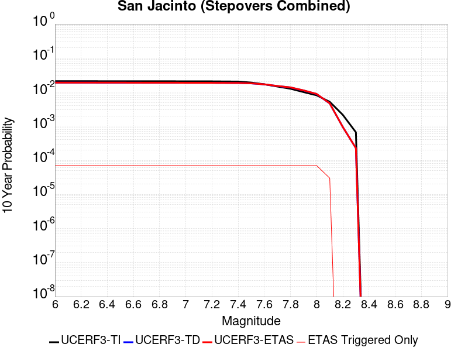 |

| Magnitude | 1 wk TI Prob | 1 wk TD Prob | 1 wk ETAS Prob | 1 wk ETAS/TD Gain | 1 wk ETAS Triggered Only | 1 mo TI Prob | 1 mo TD Prob | 1 mo ETAS Prob | 1 mo ETAS/TD Gain | 1 mo ETAS Triggered Only | 1 yr TI Prob | 1 yr TD Prob | 1 yr ETAS Prob | 1 yr ETAS/TD Gain | 1 yr ETAS Triggered Only | 10 yr TI Prob | 10 yr TD Prob | 10 yr ETAS Prob | 10 yr ETAS/TD Gain | 10 yr ETAS Triggered Only |
|-----|-----|-----|-----|-----|-----|-----|-----|-----|-----|-----|-----|-----|-----|-----|-----|-----|-----|-----|-----|-----|
| 6.0 | 4.0667746E-5 | 3.5336896E-5 | 3.5336896E-5 | 1.0 | 0.0 | 1.742787E-4 | 1.5143506E-4 | 1.5143506E-4 | 1.0 | 0.0 | 0.0021197782 | 0.0018421634 | 0.0019127944 | 1.0383414 | 7.0761394E-5 | 0.020996714 | 0.019020144 | 0.01908956 | 1.0036496 | 7.0761394E-5 |
| 6.1 | 4.0667746E-5 | 3.5336896E-5 | 3.5336896E-5 | 1.0 | 0.0 | 1.742787E-4 | 1.5143506E-4 | 1.5143506E-4 | 1.0 | 0.0 | 0.0021197782 | 0.0018421634 | 0.0019127944 | 1.0383414 | 7.0761394E-5 | 0.020996714 | 0.019020144 | 0.01908956 | 1.0036496 | 7.0761394E-5 |
| 6.2 | 4.0667746E-5 | 3.5336896E-5 | 3.5336896E-5 | 1.0 | 0.0 | 1.742787E-4 | 1.5143506E-4 | 1.5143506E-4 | 1.0 | 0.0 | 0.0021197782 | 0.0018421634 | 0.0019127944 | 1.0383414 | 7.0761394E-5 | 0.020996714 | 0.019020144 | 0.01908956 | 1.0036496 | 7.0761394E-5 |
| 6.3 | 4.0667746E-5 | 3.5336896E-5 | 3.5336896E-5 | 1.0 | 0.0 | 1.742787E-4 | 1.5143506E-4 | 1.5143506E-4 | 1.0 | 0.0 | 0.0021197782 | 0.0018421634 | 0.0019127944 | 1.0383414 | 7.0761394E-5 | 0.020996714 | 0.019020144 | 0.01908956 | 1.0036496 | 7.0761394E-5 |
| 6.4 | 4.0577226E-5 | 3.5208766E-5 | 3.5208766E-5 | 1.0 | 0.0 | 1.738908E-4 | 1.50886E-4 | 1.50886E-4 | 1.0 | 0.0 | 0.0021150648 | 0.0018354917 | 0.0019061232 | 1.038481 | 7.0761394E-5 | 0.020950472 | 0.018954702 | 0.019024123 | 1.0036625 | 7.0761394E-5 |
| 6.5 | 4.0577226E-5 | 3.5208766E-5 | 3.5208766E-5 | 1.0 | 0.0 | 1.738908E-4 | 1.50886E-4 | 1.50886E-4 | 1.0 | 0.0 | 0.0021150648 | 0.0018354917 | 0.0019061232 | 1.038481 | 7.0761394E-5 | 0.020950472 | 0.018954702 | 0.019024123 | 1.0036625 | 7.0761394E-5 |
| 6.6 | 4.053861E-5 | 3.5154102E-5 | 3.5154102E-5 | 1.0 | 0.0 | 1.7372532E-4 | 1.5065174E-4 | 1.5065174E-4 | 1.0 | 0.0 | 0.0021130538 | 0.0018326445 | 0.0019032762 | 1.0385408 | 7.0761394E-5 | 0.020930743 | 0.018926777 | 0.018996198 | 1.003668 | 7.0761394E-5 |
| 6.7 | 4.0516545E-5 | 3.512316E-5 | 3.512316E-5 | 1.0 | 0.0 | 1.7363077E-4 | 1.5051916E-4 | 1.5051916E-4 | 1.0 | 0.0 | 0.002111905 | 0.0018310336 | 0.0019016655 | 1.0385748 | 7.0761394E-5 | 0.020919468 | 0.01891097 | 0.018980393 | 1.003671 | 7.0761394E-5 |
| 6.8 | 4.049434E-5 | 3.509472E-5 | 3.509472E-5 | 1.0 | 0.0 | 1.7353562E-4 | 1.5039727E-4 | 1.5039727E-4 | 1.0 | 0.0 | 0.0021107488 | 0.0018295521 | 0.0019001841 | 1.0386062 | 7.0761394E-5 | 0.020908125 | 0.01889638 | 0.018965805 | 1.0036739 | 7.0761394E-5 |
| 6.9 | 4.046386E-5 | 3.505727E-5 | 3.505727E-5 | 1.0 | 0.0 | 1.73405E-4 | 1.502368E-4 | 1.502368E-4 | 1.0 | 0.0 | 0.0021091616 | 0.0018276017 | 0.0018982338 | 1.0386474 | 7.0761394E-5 | 0.020892553 | 0.01887715 | 0.018946575 | 1.0036777 | 7.0761394E-5 |
| 7.0 | 4.036382E-5 | 3.4937813E-5 | 3.4937813E-5 | 1.0 | 0.0 | 1.7297632E-4 | 1.4972492E-4 | 1.4972492E-4 | 1.0 | 0.0 | 0.0021039525 | 0.00182138 | 0.0018920124 | 1.0387796 | 7.0761394E-5 | 0.02084144 | 0.018815752 | 0.018885182 | 1.00369 | 7.0761394E-5 |
| 7.1 | 4.0343282E-5 | 3.4916273E-5 | 3.4916273E-5 | 1.0 | 0.0 | 1.7288832E-4 | 1.496326E-4 | 1.496326E-4 | 1.0 | 0.0 | 0.002102883 | 0.0018202579 | 0.0018908905 | 1.0388036 | 7.0761394E-5 | 0.020830948 | 0.018804627 | 0.018874057 | 1.0036923 | 7.0761394E-5 |
| 7.2 | 4.0257353E-5 | 3.4820667E-5 | 3.4820667E-5 | 1.0 | 0.0 | 1.725201E-4 | 1.492229E-4 | 1.492229E-4 | 1.0 | 0.0 | 0.0020984085 | 0.0018152783 | 0.0018859112 | 1.0389103 | 7.0761394E-5 | 0.020787042 | 0.018755313 | 0.018824747 | 1.0037022 | 7.0761394E-5 |
| 7.3 | 3.9940667E-5 | 3.4648023E-5 | 3.4648023E-5 | 1.0 | 0.0 | 1.7116306E-4 | 1.4848309E-4 | 1.4848309E-4 | 1.0 | 0.0 | 0.0020819185 | 0.0018062859 | 0.0018769195 | 1.0391043 | 7.0761394E-5 | 0.020625217 | 0.018663792 | 0.018733233 | 1.0037206 | 7.0761394E-5 |
| 7.4 | 3.9721202E-5 | 3.453329E-5 | 3.453329E-5 | 1.0 | 0.0 | 1.7022261E-4 | 1.4799142E-4 | 1.4799142E-4 | 1.0 | 0.0 | 0.0020704903 | 0.0018003098 | 0.0018709438 | 1.0392344 | 7.0761394E-5 | 0.020513052 | 0.01860285 | 0.018672295 | 1.003733 | 7.0761394E-5 |
| 7.5 | 3.7036873E-5 | 3.3598866E-5 | 3.3598866E-5 | 1.0 | 0.0 | 1.5871979E-4 | 1.439872E-4 | 1.439872E-4 | 1.0 | 0.0 | 0.0019307006 | 0.0017516377 | 0.0018222751 | 1.0403265 | 7.0761394E-5 | 0.019140124 | 0.018103454 | 0.018172935 | 1.003838 | 7.0761394E-5 |
| 7.6 | 3.2940967E-5 | 3.1372547E-5 | 3.1372547E-5 | 1.0 | 0.0 | 1.4116794E-4 | 1.3444685E-4 | 1.3444685E-4 | 1.0 | 0.0 | 0.0017173645 | 0.0016356637 | 0.0017063094 | 1.0431908 | 7.0761394E-5 | 0.01704153 | 0.01693263 | 0.017002195 | 1.0041082 | 7.0761394E-5 |
| 7.7 | 2.8236149E-5 | 2.7937022E-5 | 2.7937022E-5 | 1.0 | 0.0 | 1.2100645E-4 | 1.197246E-4 | 1.197246E-4 | 1.0 | 0.0 | 0.0014722579 | 0.0014566735 | 0.0015273318 | 1.0485066 | 7.0761394E-5 | 0.014625421 | 0.015142685 | 0.015212375 | 1.0046022 | 7.0761394E-5 |
| 7.8 | 2.4329287E-5 | 2.5258554E-5 | 2.5258554E-5 | 1.0 | 0.0 | 1.042642E-4 | 1.0824646E-4 | 1.0824646E-4 | 1.0 | 0.0 | 0.0012686774 | 0.0013171048 | 0.001387773 | 1.0536542 | 7.0761394E-5 | 0.012614589 | 0.013738932 | 0.013808721 | 1.0050796 | 7.0761394E-5 |
| 7.9 | 1.9370926E-5 | 2.0467445E-5 | 2.0467445E-5 | 1.0 | 0.0 | 8.301561E-5 | 8.7714674E-5 | 8.7714674E-5 | 1.0 | 0.0 | 0.0010102465 | 0.0010674037 | 0.0011380896 | 1.0662222 | 7.0761394E-5 | 0.0100566605 | 0.011223499 | 0.011293465 | 1.006234 | 7.0761394E-5 |
| 8.0 | 1.5583017E-5 | 1.5925136E-5 | 1.5925136E-5 | 1.0 | 0.0 | 6.6782646E-5 | 6.82488E-5 | 6.82488E-5 | 1.0 | 0.0 | 8.127754E-4 | 8.306131E-4 | 9.013157E-4 | 1.085121 | 7.0761394E-5 | 0.008098091 | 0.008802158 | 0.008872297 | 1.0079683 | 7.0761394E-5 |
| 8.1 | 1.0024873E-5 | 8.314913E-6 | 8.314913E-6 | 1.0 | 0.0 | 4.2963035E-5 | 3.563486E-5 | 3.563486E-5 | 1.0 | 0.0 | 5.229494E-4 | 4.3376858E-4 | 4.6913393E-4 | 1.0815305 | 3.5380697E-5 | 0.0052172043 | 0.00466551 | 0.0047007254 | 1.0075481 | 3.5380697E-5 |
| 8.2 | 4.142796E-6 | 1.5676045E-6 | 1.5676045E-6 | 1.0 | 0.0 | 1.775472E-5 | 6.7182878E-6 | 6.7182878E-6 | 1.0 | 0.0 | 2.1614227E-4 | 8.179211E-5 | 8.179211E-5 | 1.0 | 0.0 | 0.0021593217 | 9.4923546E-4 | 9.4923546E-4 | 1.0 | 0.0 |
| 8.3 | 1.2750878E-6 | 3.6301523E-7 | 3.6301523E-7 | 1.0 | 0.0 | 5.4646503E-6 | 1.5557786E-6 | 1.5557786E-6 | 1.0 | 0.0 | 6.653009E-5 | 1.8941444E-5 | 1.8941444E-5 | 1.0 | 0.0 | 6.6510175E-4 | 2.2840123E-4 | 2.2840123E-4 | 1.0 | 0.0 |

## San Andreas (Carrizo) rev
*[(top)](#table-of-contents)*

| 1 Week | 1 Month | 1 Year | 10 Year |
|-----|-----|-----|-----|
|  |  | 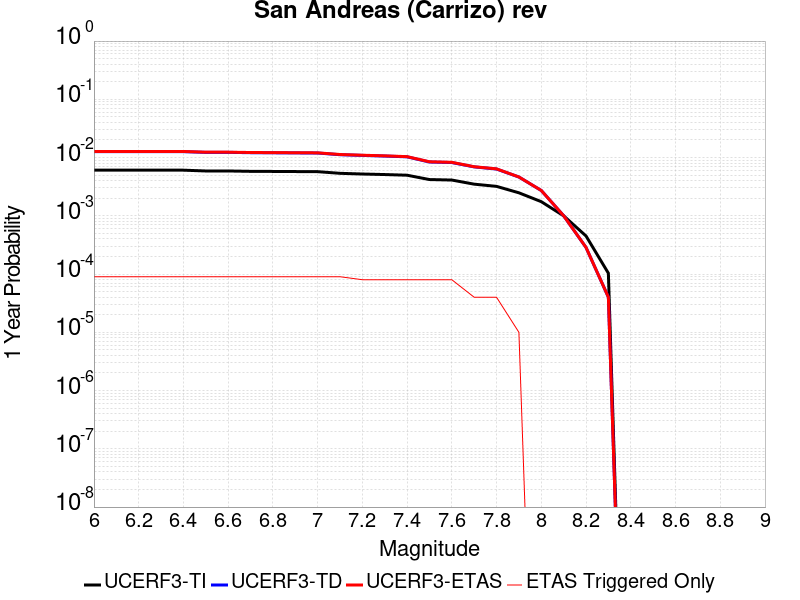 |  |

| Magnitude | 1 wk TI Prob | 1 wk TD Prob | 1 wk ETAS Prob | 1 wk ETAS/TD Gain | 1 wk ETAS Triggered Only | 1 mo TI Prob | 1 mo TD Prob | 1 mo ETAS Prob | 1 mo ETAS/TD Gain | 1 mo ETAS Triggered Only | 1 yr TI Prob | 1 yr TD Prob | 1 yr ETAS Prob | 1 yr ETAS/TD Gain | 1 yr ETAS Triggered Only | 10 yr TI Prob | 10 yr TD Prob | 10 yr ETAS Prob | 10 yr ETAS/TD Gain | 10 yr ETAS Triggered Only |
|-----|-----|-----|-----|-----|-----|-----|-----|-----|-----|-----|-----|-----|-----|-----|-----|-----|-----|-----|-----|-----|
| 6.0 | 1.1674632E-4 | 2.4361293E-4 | 2.4361293E-4 | 1.0 | 0.0 | 5.002454E-4 | 0.0010436393 | 0.0010436393 | 1.0 | 0.0 | 0.006073493 | 0.012632766 | 0.012667699 | 1.0027653 | 3.5380697E-5 | 0.0591016 | 0.12077509 | 0.12083731 | 1.0005151 | 7.0761394E-5 |
| 6.1 | 1.1674632E-4 | 2.4361293E-4 | 2.4361293E-4 | 1.0 | 0.0 | 5.002454E-4 | 0.0010436393 | 0.0010436393 | 1.0 | 0.0 | 0.006073493 | 0.012632766 | 0.012667699 | 1.0027653 | 3.5380697E-5 | 0.0591016 | 0.12077509 | 0.12083731 | 1.0005151 | 7.0761394E-5 |
| 6.2 | 1.1674632E-4 | 2.4361293E-4 | 2.4361293E-4 | 1.0 | 0.0 | 5.002454E-4 | 0.0010436393 | 0.0010436393 | 1.0 | 0.0 | 0.006073493 | 0.012632766 | 0.012667699 | 1.0027653 | 3.5380697E-5 | 0.0591016 | 0.12077509 | 0.12083731 | 1.0005151 | 7.0761394E-5 |
| 6.3 | 1.1674632E-4 | 2.4361293E-4 | 2.4361293E-4 | 1.0 | 0.0 | 5.002454E-4 | 0.0010436393 | 0.0010436393 | 1.0 | 0.0 | 0.006073493 | 0.012632766 | 0.012667699 | 1.0027653 | 3.5380697E-5 | 0.0591016 | 0.12077509 | 0.12083731 | 1.0005151 | 7.0761394E-5 |
| 6.4 | 1.1674632E-4 | 2.4361293E-4 | 2.4361293E-4 | 1.0 | 0.0 | 5.002454E-4 | 0.0010436393 | 0.0010436393 | 1.0 | 0.0 | 0.006073493 | 0.012632766 | 0.012667699 | 1.0027653 | 3.5380697E-5 | 0.0591016 | 0.12077509 | 0.12083731 | 1.0005151 | 7.0761394E-5 |
| 6.5 | 1.13136164E-4 | 2.3681132E-4 | 2.3681132E-4 | 1.0 | 0.0 | 4.847792E-4 | 0.0010145125 | 0.0010145125 | 1.0 | 0.0 | 0.0058862255 | 0.012282185 | 0.012317131 | 1.0028453 | 3.5380697E-5 | 0.057327334 | 0.1177463 | 0.11780873 | 1.0005302 | 7.0761394E-5 |
| 6.6 | 1.13136164E-4 | 2.3681132E-4 | 2.3681132E-4 | 1.0 | 0.0 | 4.847792E-4 | 0.0010145125 | 0.0010145125 | 1.0 | 0.0 | 0.0058862255 | 0.012282185 | 0.012317131 | 1.0028453 | 3.5380697E-5 | 0.057327334 | 0.1177463 | 0.11780873 | 1.0005302 | 7.0761394E-5 |
| 6.7 | 1.1149675E-4 | 2.3372276E-4 | 2.3372276E-4 | 1.0 | 0.0 | 4.777557E-4 | 0.001001286 | 0.001001286 | 1.0 | 0.0 | 0.0058011734 | 0.012122953 | 0.012157905 | 1.0028831 | 3.5380697E-5 | 0.05652051 | 0.116367765 | 0.11643029 | 1.0005373 | 7.0761394E-5 |
| 6.8 | 1.1103589E-4 | 2.3274389E-4 | 2.3274389E-4 | 1.0 | 0.0 | 4.7578133E-4 | 9.97094E-4 | 9.97094E-4 | 1.0 | 0.0 | 0.005777263 | 0.012072483 | 0.012107437 | 1.0028954 | 3.5380697E-5 | 0.056293584 | 0.115927964 | 0.11599052 | 1.0005397 | 7.0761394E-5 |
| 6.9 | 1.1053259E-4 | 2.316672E-4 | 2.316672E-4 | 1.0 | 0.0 | 4.7362508E-4 | 9.924831E-4 | 9.924831E-4 | 1.0 | 0.0 | 0.0057511497 | 0.012016967 | 0.012051922 | 1.0029088 | 3.5380697E-5 | 0.05604569 | 0.11544405 | 0.11550664 | 1.0005422 | 7.0761394E-5 |
| 7.0 | 1.1005377E-4 | 2.3067516E-4 | 2.3067516E-4 | 1.0 | 0.0 | 4.7157376E-4 | 9.882348E-4 | 9.882348E-4 | 1.0 | 0.0 | 0.0057263062 | 0.011965811 | 0.012000768 | 1.0029215 | 3.5380697E-5 | 0.055809796 | 0.11499625 | 0.11505887 | 1.0005445 | 7.0761394E-5 |
| 7.1 | 1.0308142E-4 | 2.1576507E-4 | 2.1576507E-4 | 1.0 | 0.0 | 4.417027E-4 | 9.2438085E-4 | 9.2438085E-4 | 1.0 | 0.0 | 0.0053644776 | 0.011196577 | 0.011231561 | 1.0031246 | 3.5380697E-5 | 0.052368138 | 0.10825095 | 0.10831405 | 1.0005829 | 7.0761394E-5 |
| 7.2 | 1.0027479E-4 | 2.098411E-4 | 2.098411E-4 | 1.0 | 0.0 | 4.296783E-4 | 8.9901005E-4 | 8.9901005E-4 | 1.0 | 0.0 | 0.0052187922 | 0.010890815 | 0.010925811 | 1.0032133 | 3.5380697E-5 | 0.050979212 | 0.105554216 | 0.10561751 | 1.0005996 | 7.0761394E-5 |
| 7.3 | 9.816942E-5 | 2.0458816E-4 | 2.0458816E-4 | 1.0 | 0.0 | 4.2065824E-4 | 8.765127E-4 | 8.765127E-4 | 1.0 | 0.0 | 0.005109493 | 0.010619612 | 0.010654618 | 1.0032963 | 3.5380697E-5 | 0.049935985 | 0.10313633 | 0.103199795 | 1.0006154 | 7.0761394E-5 |
| 7.4 | 9.5634205E-5 | 1.9827684E-4 | 1.9827684E-4 | 1.0 | 0.0 | 4.0979648E-4 | 8.494821E-4 | 8.494821E-4 | 1.0 | 0.0 | 0.0049778637 | 0.010293663 | 0.010328679 | 1.0034018 | 3.5380697E-5 | 0.048678253 | 0.100220494 | 0.10028416 | 1.0006353 | 7.0761394E-5 |
| 7.5 | 8.052417E-5 | 1.6143978E-4 | 1.6143978E-4 | 1.0 | 0.0 | 3.4505792E-4 | 6.917014E-4 | 6.917014E-4 | 1.0 | 0.0 | 0.0041929903 | 0.008389029 | 0.008424113 | 1.0041821 | 3.5380697E-5 | 0.04114753 | 0.08295002 | 0.08301491 | 1.0007823 | 7.0761394E-5 |
| 7.6 | 7.897024E-5 | 1.579682E-4 | 1.579682E-4 | 1.0 | 0.0 | 3.384E-4 | 6.768311E-4 | 6.768311E-4 | 1.0 | 0.0 | 0.0041122385 | 0.00820936 | 0.00824445 | 1.0042744 | 3.5380697E-5 | 0.040369697 | 0.081289805 | 0.08135482 | 1.0007998 | 7.0761394E-5 |
| 7.7 | 6.707427E-5 | 1.3303987E-4 | 1.3303987E-4 | 1.0 | 0.0 | 2.8742946E-4 | 5.700463E-4 | 5.700463E-4 | 1.0 | 0.0 | 0.003493839 | 0.0069182604 | 0.0069533964 | 1.0050787 | 3.5380697E-5 | 0.034394164 | 0.06917457 | 0.069240436 | 1.0009521 | 7.0761394E-5 |
| 7.8 | 6.147705E-5 | 1.2222702E-4 | 1.2222702E-4 | 1.0 | 0.0 | 2.6344648E-4 | 5.23725E-4 | 5.23725E-4 | 1.0 | 0.0 | 0.0032027436 | 0.0063577346 | 0.0063928906 | 1.0055296 | 3.5380697E-5 | 0.031569764 | 0.06362964 | 0.06369591 | 1.0010413 | 7.0761394E-5 |
| 7.9 | 4.7636717E-5 | 8.8979046E-5 | 8.8979046E-5 | 1.0 | 0.0 | 2.0414138E-4 | 3.8128305E-4 | 3.8128305E-4 | 1.0 | 0.0 | 0.0024825884 | 0.004632248 | 0.0046674646 | 1.0076026 | 3.5380697E-5 | 0.024550365 | 0.046713326 | 0.046780784 | 1.001444 | 7.0761394E-5 |
| 8.0 | 3.3554235E-5 | 5.224805E-5 | 5.224805E-5 | 1.0 | 0.0 | 1.4379594E-4 | 2.23901E-4 | 2.23901E-4 | 1.0 | 0.0 | 0.0017493097 | 0.0027225888 | 0.0027225888 | 1.0 | 0.0 | 0.017356034 | 0.027935574 | 0.027969966 | 1.0012311 | 3.5380697E-5 |
| 8.1 | 1.9175432E-5 | 1.9238541E-5 | 1.9238541E-5 | 1.0 | 0.0 | 8.217783E-5 | 8.244829E-5 | 8.244829E-5 | 1.0 | 0.0 | 0.0010000558 | 0.0010033463 | 0.0010033463 | 1.0 | 0.0 | 0.009955673 | 0.010786123 | 0.010821122 | 1.0032449 | 3.5380697E-5 |
| 8.2 | 8.643924E-6 | 5.49522E-6 | 5.49522E-6 | 1.0 | 0.0 | 3.704486E-5 | 2.355073E-5 | 2.355073E-5 | 1.0 | 0.0 | 4.5092785E-4 | 2.866925E-4 | 2.866925E-4 | 1.0 | 0.0 | 0.0045001395 | 0.0032598388 | 0.0032598388 | 1.0 | 0.0 |
| 8.3 | 1.983087E-6 | 7.693574E-7 | 7.693574E-7 | 1.0 | 0.0 | 8.498917E-6 | 3.297242E-6 | 3.297242E-6 | 1.0 | 0.0 | 1.034694E-4 | 4.01432E-5 | 4.01432E-5 | 1.0 | 0.0 | 0.0010342124 | 4.7390026E-4 | 4.7390026E-4 | 1.0 | 0.0 |

## White Wolf (Extension)
*[(top)](#table-of-contents)*

| 1 Week | 1 Month | 1 Year | 10 Year |
|-----|-----|-----|-----|
|  |  |  |  |

| Magnitude | 1 wk TI Prob | 1 wk TD Prob | 1 wk ETAS Prob | 1 wk ETAS/TD Gain | 1 wk ETAS Triggered Only | 1 mo TI Prob | 1 mo TD Prob | 1 mo ETAS Prob | 1 mo ETAS/TD Gain | 1 mo ETAS Triggered Only | 1 yr TI Prob | 1 yr TD Prob | 1 yr ETAS Prob | 1 yr ETAS/TD Gain | 1 yr ETAS Triggered Only | 10 yr TI Prob | 10 yr TD Prob | 10 yr ETAS Prob | 10 yr ETAS/TD Gain | 10 yr ETAS Triggered Only |
|-----|-----|-----|-----|-----|-----|-----|-----|-----|-----|-----|-----|-----|-----|-----|-----|-----|-----|-----|-----|-----|
| 6.0 | 8.222555E-6 | 6.0668267E-6 | 6.0668267E-6 | 1.0 | 0.0 | 3.5239045E-5 | 2.6000464E-5 | 2.6000464E-5 | 1.0 | 0.0 | 4.289509E-4 | 3.165163E-4 | 3.8725528E-4 | 1.2234924 | 7.0761394E-5 | 0.0042812387 | 0.0031613067 | 0.0032318444 | 1.0223129 | 7.0761394E-5 |
| 6.1 | 8.222555E-6 | 6.0668267E-6 | 6.0668267E-6 | 1.0 | 0.0 | 3.5239045E-5 | 2.6000464E-5 | 2.6000464E-5 | 1.0 | 0.0 | 4.289509E-4 | 3.165163E-4 | 3.8725528E-4 | 1.2234924 | 7.0761394E-5 | 0.0042812387 | 0.0031613067 | 0.0032318444 | 1.0223129 | 7.0761394E-5 |
| 6.2 | 8.222555E-6 | 6.0668267E-6 | 6.0668267E-6 | 1.0 | 0.0 | 3.5239045E-5 | 2.6000464E-5 | 2.6000464E-5 | 1.0 | 0.0 | 4.289509E-4 | 3.165163E-4 | 3.8725528E-4 | 1.2234924 | 7.0761394E-5 | 0.0042812387 | 0.0031613067 | 0.0032318444 | 1.0223129 | 7.0761394E-5 |
| 6.3 | 8.222555E-6 | 6.0668267E-6 | 6.0668267E-6 | 1.0 | 0.0 | 3.5239045E-5 | 2.6000464E-5 | 2.6000464E-5 | 1.0 | 0.0 | 4.289509E-4 | 3.165163E-4 | 3.8725528E-4 | 1.2234924 | 7.0761394E-5 | 0.0042812387 | 0.0031613067 | 0.0032318444 | 1.0223129 | 7.0761394E-5 |
| 6.4 | 5.821773E-6 | 3.557277E-6 | 3.557277E-6 | 1.0 | 0.0 | 2.4950215E-5 | 1.52453895E-5 | 1.52453895E-5 | 1.0 | 0.0 | 3.0372653E-4 | 1.855979E-4 | 2.5634616E-4 | 1.381191 | 7.0761394E-5 | 0.0030331176 | 0.0018545374 | 0.0019251676 | 1.0380851 | 7.0761394E-5 |
| 6.5 | 5.766023E-6 | 3.49921E-6 | 3.49921E-6 | 1.0 | 0.0 | 2.4711293E-5 | 1.49965335E-5 | 1.49965335E-5 | 1.0 | 0.0 | 3.0081844E-4 | 1.8256859E-4 | 2.5331706E-4 | 1.3875172 | 7.0761394E-5 | 0.0030041158 | 0.0018242942 | 0.0018949265 | 1.0387176 | 7.0761394E-5 |
| 6.6 | 4.643576E-6 | 2.332699E-6 | 2.332699E-6 | 1.0 | 0.0 | 1.9900888E-5 | 9.997246E-6 | 9.997246E-6 | 1.0 | 0.0 | 2.4226638E-4 | 1.21710094E-4 | 1.5708648E-4 | 1.2906611 | 3.5380697E-5 | 0.0024200242 | 0.0012164768 | 0.0012518144 | 1.0290492 | 3.5380697E-5 |
| 6.7 | 3.9529173E-6 | 1.648408E-6 | 1.648408E-6 | 1.0 | 0.0 | 1.6940963E-5 | 7.0645874E-6 | 7.0645874E-6 | 1.0 | 0.0 | 2.0623671E-4 | 8.600815E-5 | 8.600815E-5 | 1.0 | 0.0 | 0.002060454 | 8.597671E-4 | 8.597671E-4 | 1.0 | 0.0 |
| 6.8 | 3.4377522E-6 | 1.2245736E-6 | 1.2245736E-6 | 1.0 | 0.0 | 1.473314E-5 | 5.2481623E-6 | 5.2481623E-6 | 1.0 | 0.0 | 1.7936122E-4 | 6.389459E-5 | 6.389459E-5 | 1.0 | 0.0 | 0.0017921652 | 6.3877134E-4 | 6.3877134E-4 | 1.0 | 0.0 |
| 6.9 | 3.1367306E-6 | 1.0034221E-6 | 1.0034221E-6 | 1.0 | 0.0 | 1.3443062E-5 | 4.300374E-6 | 4.300374E-6 | 1.0 | 0.0 | 1.63657E-4 | 5.2355874E-5 | 5.2355874E-5 | 1.0 | 0.0 | 0.0016353652 | 5.2344304E-4 | 5.2344304E-4 | 1.0 | 0.0 |
| 7.0 | 2.8298145E-6 | 7.429045E-7 | 7.429045E-7 | 1.0 | 0.0 | 1.2127721E-5 | 3.1838729E-6 | 3.1838729E-6 | 1.0 | 0.0 | 1.47645E-4 | 3.8763013E-5 | 3.8763013E-5 | 1.0 | 0.0 | 0.0014754693 | 3.875675E-4 | 3.875675E-4 | 1.0 | 0.0 |
| 7.1 | 2.4091064E-6 | 5.4230577E-7 | 5.4230577E-7 | 1.0 | 0.0 | 1.03247E-5 | 2.3241657E-6 | 2.3241657E-6 | 1.0 | 0.0 | 1.2569598E-4 | 2.8296392E-5 | 2.8296392E-5 | 1.0 | 0.0 | 0.001256249 | 2.8293193E-4 | 2.8293193E-4 | 1.0 | 0.0 |
| 7.2 | 1.3875518E-6 | 1.0744563E-7 | 1.0744563E-7 | 1.0 | 0.0 | 5.9466374E-6 | 4.604812E-7 | 4.604812E-7 | 1.0 | 0.0 | 7.23979E-5 | 5.6063454E-6 | 5.6063454E-6 | 1.0 | 0.0 | 7.2374323E-4 | 5.6062152E-5 | 5.6062152E-5 | 1.0 | 0.0 |
| 7.3 | 7.056077E-7 | 5.002896E-8 | 5.002896E-8 | 1.0 | 0.0 | 3.0240296E-6 | 2.1440981E-7 | 2.1440981E-7 | 1.0 | 0.0 | 3.681694E-5 | 2.6104367E-6 | 2.6104367E-6 | 1.0 | 0.0 | 3.681084E-4 | 2.6104108E-5 | 2.6104108E-5 | 1.0 | 0.0 |
| 7.4 | 5.9334678E-8 | 4.86919E-9 | 4.86919E-9 | 1.0 | 0.0 | 2.5429145E-7 | 2.0867958E-8 | 2.0867958E-8 | 1.0 | 0.0 | 3.095994E-6 | 2.5406737E-7 | 2.5406737E-7 | 1.0 | 0.0 | 3.095951E-5 | 2.5406719E-6 | 2.5406719E-6 | 1.0 | 0.0 |

## San Jacinto (Anza) rev
*[(top)](#table-of-contents)*

| 1 Week | 1 Month | 1 Year | 10 Year |
|-----|-----|-----|-----|
|  |  | 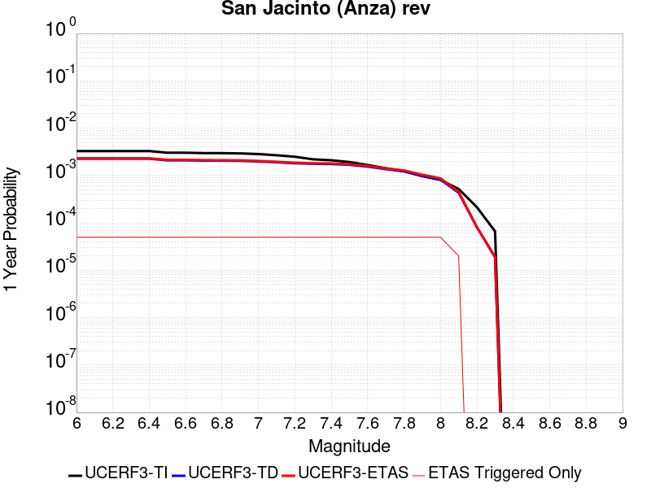 | 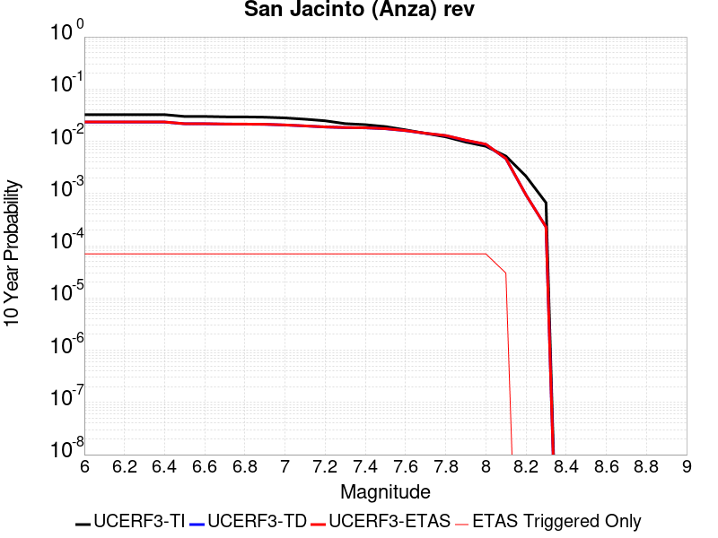 |

| Magnitude | 1 wk TI Prob | 1 wk TD Prob | 1 wk ETAS Prob | 1 wk ETAS/TD Gain | 1 wk ETAS Triggered Only | 1 mo TI Prob | 1 mo TD Prob | 1 mo ETAS Prob | 1 mo ETAS/TD Gain | 1 mo ETAS Triggered Only | 1 yr TI Prob | 1 yr TD Prob | 1 yr ETAS Prob | 1 yr ETAS/TD Gain | 1 yr ETAS Triggered Only | 10 yr TI Prob | 10 yr TD Prob | 10 yr ETAS Prob | 10 yr ETAS/TD Gain | 10 yr ETAS Triggered Only |
|-----|-----|-----|-----|-----|-----|-----|-----|-----|-----|-----|-----|-----|-----|-----|-----|-----|-----|-----|-----|-----|
| 6.0 | 6.3015636E-5 | 4.337693E-5 | 4.337693E-5 | 1.0 | 0.0 | 2.7003905E-4 | 1.8588796E-4 | 1.8588796E-4 | 1.0 | 0.0 | 0.0032827691 | 0.0022608489 | 0.00233145 | 1.0312278 | 7.0761394E-5 | 0.032346968 | 0.023334619 | 0.02340373 | 1.0029618 | 7.0761394E-5 |
| 6.1 | 6.3015636E-5 | 4.337693E-5 | 4.337693E-5 | 1.0 | 0.0 | 2.7003905E-4 | 1.8588796E-4 | 1.8588796E-4 | 1.0 | 0.0 | 0.0032827691 | 0.0022608489 | 0.00233145 | 1.0312278 | 7.0761394E-5 | 0.032346968 | 0.023334619 | 0.02340373 | 1.0029618 | 7.0761394E-5 |
| 6.2 | 6.3015636E-5 | 4.337693E-5 | 4.337693E-5 | 1.0 | 0.0 | 2.7003905E-4 | 1.8588796E-4 | 1.8588796E-4 | 1.0 | 0.0 | 0.0032827691 | 0.0022608489 | 0.00233145 | 1.0312278 | 7.0761394E-5 | 0.032346968 | 0.023334619 | 0.02340373 | 1.0029618 | 7.0761394E-5 |
| 6.3 | 6.3015636E-5 | 4.337693E-5 | 4.337693E-5 | 1.0 | 0.0 | 2.7003905E-4 | 1.8588796E-4 | 1.8588796E-4 | 1.0 | 0.0 | 0.0032827691 | 0.0022608489 | 0.00233145 | 1.0312278 | 7.0761394E-5 | 0.032346968 | 0.023334619 | 0.02340373 | 1.0029618 | 7.0761394E-5 |
| 6.4 | 6.3015636E-5 | 4.337693E-5 | 4.337693E-5 | 1.0 | 0.0 | 2.7003905E-4 | 1.8588796E-4 | 1.8588796E-4 | 1.0 | 0.0 | 0.0032827691 | 0.0022608489 | 0.00233145 | 1.0312278 | 7.0761394E-5 | 0.032346968 | 0.023334619 | 0.02340373 | 1.0029618 | 7.0761394E-5 |
| 6.5 | 5.811017E-5 | 4.015336E-5 | 4.015336E-5 | 1.0 | 0.0 | 2.4901982E-4 | 1.7207452E-4 | 1.7207452E-4 | 1.0 | 0.0 | 0.0030276014 | 0.0020929999 | 0.0021636132 | 1.0337378 | 7.0761394E-5 | 0.02986684 | 0.021630494 | 0.021699725 | 1.0032007 | 7.0761394E-5 |
| 6.6 | 5.811017E-5 | 4.015336E-5 | 4.015336E-5 | 1.0 | 0.0 | 2.4901982E-4 | 1.7207452E-4 | 1.7207452E-4 | 1.0 | 0.0 | 0.0030276014 | 0.0020929999 | 0.0021636132 | 1.0337378 | 7.0761394E-5 | 0.02986684 | 0.021630494 | 0.021699725 | 1.0032007 | 7.0761394E-5 |
| 6.7 | 5.712442E-5 | 3.957534E-5 | 3.957534E-5 | 1.0 | 0.0 | 2.4479596E-4 | 1.6959761E-4 | 1.6959761E-4 | 1.0 | 0.0 | 0.0029763177 | 0.002062901 | 0.0021335164 | 1.0342311 | 7.0761394E-5 | 0.029367693 | 0.021321962 | 0.021391215 | 1.003248 | 7.0761394E-5 |
| 6.8 | 5.6967532E-5 | 3.9431634E-5 | 3.9431634E-5 | 1.0 | 0.0 | 2.4412372E-4 | 1.689818E-4 | 1.689818E-4 | 1.0 | 0.0 | 0.0029681553 | 0.0020554175 | 0.0021260334 | 1.034356 | 7.0761394E-5 | 0.029288229 | 0.021246629 | 0.021315886 | 1.0032597 | 7.0761394E-5 |
| 6.9 | 5.6211324E-5 | 3.9135975E-5 | 3.9135975E-5 | 1.0 | 0.0 | 2.4088343E-4 | 1.6771485E-4 | 1.6771485E-4 | 1.0 | 0.0 | 0.0029288116 | 0.0020400216 | 0.0021106387 | 1.0346159 | 7.0761394E-5 | 0.028905109 | 0.021085827 | 0.021155097 | 1.0032852 | 7.0761394E-5 |
| 7.0 | 5.4383527E-5 | 3.7995007E-5 | 3.7995007E-5 | 1.0 | 0.0 | 2.3305144E-4 | 1.6282561E-4 | 1.6282561E-4 | 1.0 | 0.0 | 0.0028337094 | 0.0019806041 | 0.0020512254 | 1.0356565 | 7.0761394E-5 | 0.027978465 | 0.020476038 | 0.02054535 | 1.0033851 | 7.0761394E-5 |
| 7.1 | 5.1393665E-5 | 3.6455618E-5 | 3.6455618E-5 | 1.0 | 0.0 | 2.2023996E-4 | 1.5622903E-4 | 1.5622903E-4 | 1.0 | 0.0 | 0.0026781242 | 0.0019004333 | 0.0019710602 | 1.0371636 | 7.0761394E-5 | 0.026460782 | 0.019648531 | 0.019717902 | 1.0035306 | 7.0761394E-5 |
| 7.2 | 4.785222E-5 | 3.480494E-5 | 3.480494E-5 | 1.0 | 0.0 | 2.0506482E-4 | 1.4915552E-4 | 1.4915552E-4 | 1.0 | 0.0 | 0.0024938055 | 0.0018144595 | 0.0018850924 | 1.0389278 | 7.0761394E-5 | 0.024660049 | 0.018761909 | 0.018831342 | 1.0037007 | 7.0761394E-5 |
| 7.3 | 4.2143256E-5 | 3.389763E-5 | 3.389763E-5 | 1.0 | 0.0 | 1.8060145E-4 | 1.4526749E-4 | 1.4526749E-4 | 1.0 | 0.0 | 0.002196605 | 0.0017672004 | 0.0018378367 | 1.0399708 | 7.0761394E-5 | 0.02175019 | 0.018269178 | 0.018338645 | 1.0038025 | 7.0761394E-5 |
| 7.4 | 4.0264713E-5 | 3.3535252E-5 | 3.3535252E-5 | 1.0 | 0.0 | 1.7255165E-4 | 1.4371461E-4 | 1.4371461E-4 | 1.0 | 0.0 | 0.002098792 | 0.0017483246 | 0.0018189623 | 1.0404031 | 7.0761394E-5 | 0.020790804 | 0.018073453 | 0.018142937 | 1.0038445 | 7.0761394E-5 |
| 7.5 | 3.694492E-5 | 3.2247204E-5 | 3.2247204E-5 | 1.0 | 0.0 | 1.5832575E-4 | 1.38195E-4 | 1.38195E-4 | 1.0 | 0.0 | 0.0019259118 | 0.0016812286 | 0.0017518711 | 1.0420183 | 7.0761394E-5 | 0.01909306 | 0.017388845 | 0.017458376 | 1.0039986 | 7.0761394E-5 |
| 7.6 | 3.200565E-5 | 2.9555436E-5 | 2.9555436E-5 | 1.0 | 0.0 | 1.3715986E-4 | 1.2666002E-4 | 1.2666002E-4 | 1.0 | 0.0 | 0.001668642 | 0.0015409971 | 0.0016116494 | 1.0458485 | 7.0761394E-5 | 0.01656168 | 0.015973015 | 0.016042646 | 1.0043592 | 7.0761394E-5 |
| 7.7 | 2.731642E-5 | 2.6142696E-5 | 2.6142696E-5 | 1.0 | 0.0 | 1.1706512E-4 | 1.1203532E-4 | 1.1203532E-4 | 1.0 | 0.0 | 0.001424336 | 0.0013631776 | 0.0014338425 | 1.0518384 | 7.0761394E-5 | 0.014152412 | 0.01419303 | 0.014262787 | 1.0049149 | 7.0761394E-5 |
| 7.8 | 2.3466424E-5 | 2.3552704E-5 | 2.3552704E-5 | 1.0 | 0.0 | 1.0056651E-4 | 1.0093625E-4 | 1.0093625E-4 | 1.0 | 0.0 | 0.0012237094 | 0.0012282069 | 0.0012988814 | 1.0575428 | 7.0761394E-5 | 0.012169928 | 0.012833906 | 0.01290376 | 1.0054429 | 7.0761394E-5 |
| 7.9 | 1.8611925E-5 | 1.8951272E-5 | 1.8951272E-5 | 1.0 | 0.0 | 7.9762955E-5 | 8.1217215E-5 | 8.1217215E-5 | 1.0 | 0.0 | 9.7068126E-4 | 9.883717E-4 | 0.0010590631 | 1.0715232 | 7.0761394E-5 | 0.0096645225 | 0.010416457 | 0.010486482 | 1.0067225 | 7.0761394E-5 |
| 8.0 | 1.5460775E-5 | 1.5779307E-5 | 1.5779307E-5 | 1.0 | 0.0 | 6.6258784E-5 | 6.762385E-5 | 6.762385E-5 | 1.0 | 0.0 | 8.0640207E-4 | 8.2301005E-4 | 8.937132E-4 | 1.085908 | 7.0761394E-5 | 0.008034821 | 0.008723064 | 0.008793208 | 1.0080413 | 7.0761394E-5 |
| 8.1 | 9.983884E-6 | 8.292369E-6 | 8.292369E-6 | 1.0 | 0.0 | 4.2787375E-5 | 3.5538244E-5 | 3.5538244E-5 | 1.0 | 0.0 | 5.2081177E-4 | 4.3259273E-4 | 4.6795813E-4 | 1.0817522 | 3.5380697E-5 | 0.0051959283 | 0.00465207 | 0.004687286 | 1.00757 | 3.5380697E-5 |
| 8.2 | 4.1226E-6 | 1.5595413E-6 | 1.5595413E-6 | 1.0 | 0.0 | 1.7668166E-5 | 6.683731E-6 | 6.683731E-6 | 1.0 | 0.0 | 2.1508869E-4 | 8.137142E-5 | 8.137142E-5 | 1.0 | 0.0 | 0.0021488064 | 9.4425044E-4 | 9.4425044E-4 | 1.0 | 0.0 |
| 8.3 | 1.2750878E-6 | 3.6301523E-7 | 3.6301523E-7 | 1.0 | 0.0 | 5.4646503E-6 | 1.5557786E-6 | 1.5557786E-6 | 1.0 | 0.0 | 6.653009E-5 | 1.8941444E-5 | 1.8941444E-5 | 1.0 | 0.0 | 6.6510175E-4 | 2.2840123E-4 | 2.2840123E-4 | 1.0 | 0.0 |

## Hunting Creek - Berryessa 2011 CFM
*[(top)](#table-of-contents)*

| 1 Week | 1 Month | 1 Year | 10 Year |
|-----|-----|-----|-----|
|  |  |  |  |

| Magnitude | 1 wk TI Prob | 1 wk TD Prob | 1 wk ETAS Prob | 1 wk ETAS/TD Gain | 1 wk ETAS Triggered Only | 1 mo TI Prob | 1 mo TD Prob | 1 mo ETAS Prob | 1 mo ETAS/TD Gain | 1 mo ETAS Triggered Only | 1 yr TI Prob | 1 yr TD Prob | 1 yr ETAS Prob | 1 yr ETAS/TD Gain | 1 yr ETAS Triggered Only | 10 yr TI Prob | 10 yr TD Prob | 10 yr ETAS Prob | 10 yr ETAS/TD Gain | 10 yr ETAS Triggered Only |
|-----|-----|-----|-----|-----|-----|-----|-----|-----|-----|-----|-----|-----|-----|-----|-----|-----|-----|-----|-----|-----|
| 6.0 | 1.1270982E-4 | 2.0017775E-4 | 2.0017775E-4 | 1.0 | 0.0 | 4.8295266E-4 | 8.5742475E-4 | 8.5742475E-4 | 1.0 | 0.0 | 0.0058641075 | 0.010388056 | 0.010388056 | 1.0 | 0.0 | 0.057117578 | 0.09805172 | 0.09811555 | 1.0006509 | 7.0761394E-5 |
| 6.1 | 1.1239393E-4 | 1.9965896E-4 | 1.9965896E-4 | 1.0 | 0.0 | 4.8159933E-4 | 8.552031E-4 | 8.552031E-4 | 1.0 | 0.0 | 0.0058477195 | 0.010361288 | 0.010361288 | 1.0 | 0.0 | 0.056962132 | 0.09781016 | 0.097842075 | 1.0003264 | 3.5380697E-5 |
| 6.2 | 7.596265E-5 | 1.2940993E-4 | 1.2940993E-4 | 1.0 | 0.0 | 3.2551357E-4 | 5.5426615E-4 | 5.5426615E-4 | 1.0 | 0.0 | 0.0039559277 | 0.006721831 | 0.006721831 | 1.0 | 0.0 | 0.038862433 | 0.064600885 | 0.064600885 | 1.0 | 0.0 |
| 6.3 | 6.78794E-5 | 1.1452538E-4 | 1.1452538E-4 | 1.0 | 0.0 | 2.9087928E-4 | 4.9073447E-4 | 4.9073447E-4 | 1.0 | 0.0 | 0.003535705 | 0.0059534037 | 0.0059534037 | 1.0 | 0.0 | 0.034799766 | 0.05747386 | 0.05747386 | 1.0 | 0.0 |
| 6.4 | 6.2165134E-5 | 1.04393934E-4 | 1.04393934E-4 | 1.0 | 0.0 | 2.6639478E-4 | 4.4732942E-4 | 4.4732942E-4 | 1.0 | 0.0 | 0.0032385332 | 0.0054282364 | 0.0054282364 | 1.0 | 0.0 | 0.03191742 | 0.052558403 | 0.052558403 | 1.0 | 0.0 |
| 6.5 | 5.4368087E-5 | 9.073724E-5 | 9.073724E-5 | 1.0 | 0.0 | 2.3298527E-4 | 3.8881917E-4 | 3.8881917E-4 | 1.0 | 0.0 | 0.0028329059 | 0.004720476 | 0.004720476 | 1.0 | 0.0 | 0.027970633 | 0.04588709 | 0.04588709 | 1.0 | 0.0 |
| 6.6 | 4.729947E-5 | 7.849487E-5 | 7.849487E-5 | 1.0 | 0.0 | 2.0269625E-4 | 3.3636627E-4 | 3.3636627E-4 | 1.0 | 0.0 | 0.002465034 | 0.0040854933 | 0.0040854933 | 1.0 | 0.0 | 0.02437869 | 0.039857663 | 0.039857663 | 1.0 | 0.0 |
| 6.7 | 3.6875328E-5 | 6.0465416E-5 | 6.0465416E-5 | 1.0 | 0.0 | 1.5802756E-4 | 2.5911423E-4 | 2.5911423E-4 | 1.0 | 0.0 | 0.0019222875 | 0.0031486591 | 0.0031486591 | 1.0 | 0.0 | 0.019057442 | 0.030897204 | 0.030897204 | 1.0 | 0.0 |
| 6.8 | 2.0292036E-5 | 2.897928E-5 | 2.897928E-5 | 1.0 | 0.0 | 8.6962966E-5 | 1.2419096E-4 | 1.2419096E-4 | 1.0 | 0.0 | 0.0010582599 | 0.0015109582 | 0.0015109582 | 1.0 | 0.0 | 0.010532344 | 0.014980009 | 0.014980009 | 1.0 | 0.0 |
| 6.9 | 1.7871042E-5 | 2.4474773E-5 | 2.4474773E-5 | 1.0 | 0.0 | 7.658793E-5 | 1.0488762E-4 | 1.0488762E-4 | 1.0 | 0.0 | 9.320591E-4 | 0.0012762607 | 0.0012762607 | 1.0 | 0.0 | 0.009281595 | 0.01268106 | 0.01268106 | 1.0 | 0.0 |
| 7.0 | 1.6415532E-5 | 2.1908601E-5 | 2.1908601E-5 | 1.0 | 0.0 | 7.035038E-5 | 9.3890645E-5 | 9.3890645E-5 | 1.0 | 0.0 | 8.561793E-4 | 0.0011425226 | 0.0011425226 | 1.0 | 0.0 | 0.008528882 | 0.011365713 | 0.011365713 | 1.0 | 0.0 |
| 7.1 | 1.5409885E-5 | 2.034855E-5 | 2.034855E-5 | 1.0 | 0.0 | 6.6040695E-5 | 8.720518E-5 | 8.720518E-5 | 1.0 | 0.0 | 8.0374884E-4 | 0.0010612089 | 0.0010612089 | 1.0 | 0.0 | 0.00800848 | 0.010561734 | 0.010561734 | 1.0 | 0.0 |
| 7.2 | 1.4497423E-5 | 1.905703E-5 | 1.905703E-5 | 1.0 | 0.0 | 6.213033E-5 | 8.167045E-5 | 8.167045E-5 | 1.0 | 0.0 | 7.5617427E-4 | 9.938872E-4 | 9.938872E-4 | 1.0 | 0.0 | 0.0075360634 | 0.009894996 | 0.009894996 | 1.0 | 0.0 |
| 7.3 | 1.3615175E-5 | 1.7828126E-5 | 1.7828126E-5 | 1.0 | 0.0 | 5.8349444E-5 | 7.640403E-5 | 7.640403E-5 | 1.0 | 0.0 | 7.101729E-4 | 9.2982507E-4 | 9.2982507E-4 | 1.0 | 0.0 | 0.0070790765 | 0.009259855 | 0.009259855 | 1.0 | 0.0 |
| 7.4 | 1.2252825E-5 | 1.6028054E-5 | 1.6028054E-5 | 1.0 | 0.0 | 5.251105E-5 | 6.8689864E-5 | 6.8689864E-5 | 1.0 | 0.0 | 6.391345E-4 | 8.3598105E-4 | 8.3598105E-4 | 1.0 | 0.0 | 0.0063729943 | 0.008328805 | 0.008328805 | 1.0 | 0.0 |
| 7.5 | 1.0913301E-5 | 1.4242686E-5 | 1.4242686E-5 | 1.0 | 0.0 | 4.6770452E-5 | 6.103867E-5 | 6.103867E-5 | 1.0 | 0.0 | 5.6928146E-4 | 7.428952E-4 | 7.428952E-4 | 1.0 | 0.0 | 0.0056782532 | 0.0074044922 | 0.0074044922 | 1.0 | 0.0 |
| 7.6 | 8.623192E-6 | 1.1235767E-5 | 1.1235767E-5 | 1.0 | 0.0 | 3.6956015E-5 | 4.815241E-5 | 4.815241E-5 | 1.0 | 0.0 | 4.4984656E-4 | 5.861005E-4 | 5.861005E-4 | 1.0 | 0.0 | 0.00448937 | 0.005845862 | 0.005845862 | 1.0 | 0.0 |
| 7.7 | 2.0993634E-6 | 2.6627938E-6 | 2.6627938E-6 | 1.0 | 0.0 | 8.997241E-6 | 1.1411924E-5 | 1.1411924E-5 | 1.0 | 0.0 | 1.09535904E-4 | 1.3893138E-4 | 1.3893138E-4 | 1.0 | 0.0 | 0.0010948193 | 0.0013884519 | 0.0013884519 | 1.0 | 0.0 |
| 7.8 | 1.8428308E-7 | 2.1675888E-7 | 2.1675888E-7 | 1.0 | 0.0 | 7.897844E-7 | 9.289663E-7 | 9.289663E-7 | 1.0 | 0.0 | 9.615583E-6 | 1.131011E-5 | 1.131011E-5 | 1.0 | 0.0 | 9.615166E-5 | 1.1309395E-4 | 1.1309395E-4 | 1.0 | 0.0 |

## Rose Canyon
*[(top)](#table-of-contents)*

| 1 Week | 1 Month | 1 Year | 10 Year |
|-----|-----|-----|-----|
|  |  |  |  |

| Magnitude | 1 wk TI Prob | 1 wk TD Prob | 1 wk ETAS Prob | 1 wk ETAS/TD Gain | 1 wk ETAS Triggered Only | 1 mo TI Prob | 1 mo TD Prob | 1 mo ETAS Prob | 1 mo ETAS/TD Gain | 1 mo ETAS Triggered Only | 1 yr TI Prob | 1 yr TD Prob | 1 yr ETAS Prob | 1 yr ETAS/TD Gain | 1 yr ETAS Triggered Only | 10 yr TI Prob | 10 yr TD Prob | 10 yr ETAS Prob | 10 yr ETAS/TD Gain | 10 yr ETAS Triggered Only |
|-----|-----|-----|-----|-----|-----|-----|-----|-----|-----|-----|-----|-----|-----|-----|-----|-----|-----|-----|-----|-----|
| 6.0 | 4.5923203E-5 | 4.9720562E-5 | 4.9720562E-5 | 1.0 | 0.0 | 1.9679888E-4 | 2.1307007E-4 | 2.1307007E-4 | 1.0 | 0.0 | 0.0023933933 | 0.0025912558 | 0.0025912558 | 1.0 | 0.0 | 0.023677798 | 0.025643215 | 0.02571216 | 1.0026886 | 7.0761394E-5 |
| 6.1 | 4.5923203E-5 | 4.9720562E-5 | 4.9720562E-5 | 1.0 | 0.0 | 1.9679888E-4 | 2.1307007E-4 | 2.1307007E-4 | 1.0 | 0.0 | 0.0023933933 | 0.0025912558 | 0.0025912558 | 1.0 | 0.0 | 0.023677798 | 0.025643215 | 0.025677688 | 1.0013443 | 3.5380697E-5 |
| 6.2 | 2.8844734E-5 | 2.9671555E-5 | 2.9671555E-5 | 1.0 | 0.0 | 1.2361443E-4 | 1.2715581E-4 | 1.2715581E-4 | 1.0 | 0.0 | 0.0015039665 | 0.0015470508 | 0.0015470508 | 1.0 | 0.0 | 0.0149382865 | 0.015375828 | 0.0154106645 | 1.0022657 | 3.5380697E-5 |
| 6.3 | 2.3171577E-5 | 2.3163228E-5 | 2.3163228E-5 | 1.0 | 0.0 | 9.9302975E-5 | 9.926727E-5 | 9.926727E-5 | 1.0 | 0.0 | 0.0012083431 | 0.0012079224 | 0.0012079224 | 1.0 | 0.0 | 0.012017938 | 0.012023459 | 0.0120584145 | 1.0029073 | 3.5380697E-5 |
| 6.4 | 2.0066604E-5 | 1.9668718E-5 | 1.9668718E-5 | 1.0 | 0.0 | 8.599689E-5 | 8.429184E-5 | 8.429184E-5 | 1.0 | 0.0 | 0.0010465092 | 0.00102578 | 0.00102578 | 1.0 | 0.0 | 0.010415946 | 0.010218433 | 0.010253453 | 1.003427 | 3.5380697E-5 |
| 6.5 | 1.776989E-5 | 1.7115255E-5 | 1.7115255E-5 | 1.0 | 0.0 | 7.615444E-5 | 7.3349074E-5 | 7.3349074E-5 | 1.0 | 0.0 | 9.267859E-4 | 8.9266605E-4 | 8.9266605E-4 | 1.0 | 0.0 | 0.009229303 | 0.008896962 | 0.008932027 | 1.0039413 | 3.5380697E-5 |
| 6.6 | 1.5227364E-5 | 1.4340241E-5 | 1.4340241E-5 | 1.0 | 0.0 | 6.52585E-5 | 6.1456754E-5 | 6.1456754E-5 | 1.0 | 0.0 | 7.942326E-4 | 7.4798433E-4 | 7.4798433E-4 | 1.0 | 0.0 | 0.007914 | 0.007458868 | 0.007493985 | 1.004708 | 3.5380697E-5 |
| 6.7 | 1.2703898E-5 | 1.167398E-5 | 1.167398E-5 | 1.0 | 0.0 | 5.4444143E-5 | 5.003041E-5 | 5.003041E-5 | 1.0 | 0.0 | 6.626558E-4 | 6.0895423E-4 | 6.0895423E-4 | 1.0 | 0.0 | 0.006606833 | 0.0060754507 | 0.0061106165 | 1.0057882 | 3.5380697E-5 |
| 6.8 | 1.1554917E-5 | 1.060993E-5 | 1.060993E-5 | 1.0 | 0.0 | 4.9520135E-5 | 4.547036E-5 | 4.547036E-5 | 1.0 | 0.0 | 6.0274085E-4 | 5.5346504E-4 | 5.5346504E-4 | 1.0 | 0.0 | 0.0060110865 | 0.005522874 | 0.0055580596 | 1.0063708 | 3.5380697E-5 |
| 6.9 | 8.732078E-6 | 7.88172E-6 | 7.88172E-6 | 1.0 | 0.0 | 3.7422655E-5 | 3.377838E-5 | 3.377838E-5 | 1.0 | 0.0 | 4.5552556E-4 | 4.111771E-4 | 4.111771E-4 | 1.0 | 0.0 | 0.0045459294 | 0.0041049966 | 0.0041402318 | 1.0085835 | 3.5380697E-5 |
| 7.0 | 5.9337494E-6 | 5.1076677E-6 | 5.1076677E-6 | 1.0 | 0.0 | 2.5430107E-5 | 2.188982E-5 | 2.188982E-5 | 1.0 | 0.0 | 3.0956755E-4 | 2.6647613E-4 | 2.6647613E-4 | 1.0 | 0.0 | 0.0030913667 | 0.0026615816 | 0.002696868 | 1.0132577 | 3.5380697E-5 |
| 7.1 | 5.013409E-6 | 4.177528E-6 | 4.177528E-6 | 1.0 | 0.0 | 2.1485863E-5 | 1.7903569E-5 | 1.7903569E-5 | 1.0 | 0.0 | 2.6155898E-4 | 2.1795425E-4 | 2.1795425E-4 | 1.0 | 0.0 | 0.0026125133 | 0.0021774166 | 0.0022127202 | 1.0162135 | 3.5380697E-5 |
| 7.2 | 4.120763E-6 | 3.2822556E-6 | 3.2822556E-6 | 1.0 | 0.0 | 1.7660293E-5 | 1.4066734E-5 | 1.4066734E-5 | 1.0 | 0.0 | 2.1499286E-4 | 1.7124912E-4 | 1.7124912E-4 | 1.0 | 0.0 | 0.0021478499 | 0.0017111811 | 0.0017111811 | 1.0 | 0.0 |
| 7.3 | 3.2081239E-6 | 2.4406268E-6 | 2.4406268E-6 | 1.0 | 0.0 | 1.374903E-5 | 1.0459787E-5 | 1.0459787E-5 | 1.0 | 0.0 | 1.6738157E-4 | 1.2734054E-4 | 1.2734054E-4 | 1.0 | 0.0 | 0.0016725556 | 0.0012726827 | 0.0012726827 | 1.0 | 0.0 |
| 7.4 | 2.4194755E-6 | 1.7681314E-6 | 1.7681314E-6 | 1.0 | 0.0 | 1.0369139E-5 | 7.577684E-6 | 7.577684E-6 | 1.0 | 0.0 | 1.2623696E-4 | 9.225445E-5 | 9.225445E-5 | 1.0 | 0.0 | 0.0012616527 | 9.2216686E-4 | 9.2216686E-4 | 1.0 | 0.0 |
| 7.5 | 1.3842889E-6 | 9.3790675E-7 | 9.3790675E-7 | 1.0 | 0.0 | 5.9326535E-6 | 4.019594E-6 | 4.019594E-6 | 1.0 | 0.0 | 7.222766E-5 | 4.8937498E-5 | 4.8937498E-5 | 1.0 | 0.0 | 7.220419E-4 | 4.892707E-4 | 4.892707E-4 | 1.0 | 0.0 |
| 7.6 | 1.0021575E-6 | 6.4118046E-7 | 6.4118046E-7 | 1.0 | 0.0 | 4.2949537E-6 | 2.7479136E-6 | 2.7479136E-6 | 1.0 | 0.0 | 5.2289808E-5 | 3.3455355E-5 | 3.3455355E-5 | 1.0 | 0.0 | 5.2277505E-4 | 3.3450534E-4 | 3.3450534E-4 | 1.0 | 0.0 |
| 7.7 | 8.7620116E-8 | 6.4494145E-8 | 6.4494145E-8 | 1.0 | 0.0 | 3.7551473E-7 | 2.7640345E-7 | 2.7640345E-7 | 1.0 | 0.0 | 4.5718825E-6 | 3.365207E-6 | 3.365207E-6 | 1.0 | 0.0 | 4.5717883E-5 | 3.365159E-5 | 3.365159E-5 | 1.0 | 0.0 |

## Brawley (Seismic Zone) alt 1
*[(top)](#table-of-contents)*

| 1 Week | 1 Month | 1 Year | 10 Year |
|-----|-----|-----|-----|
|  |  |  |  |

| Magnitude | 1 wk TI Prob | 1 wk TD Prob | 1 wk ETAS Prob | 1 wk ETAS/TD Gain | 1 wk ETAS Triggered Only | 1 mo TI Prob | 1 mo TD Prob | 1 mo ETAS Prob | 1 mo ETAS/TD Gain | 1 mo ETAS Triggered Only | 1 yr TI Prob | 1 yr TD Prob | 1 yr ETAS Prob | 1 yr ETAS/TD Gain | 1 yr ETAS Triggered Only | 10 yr TI Prob | 10 yr TD Prob | 10 yr ETAS Prob | 10 yr ETAS/TD Gain | 10 yr ETAS Triggered Only |
|-----|-----|-----|-----|-----|-----|-----|-----|-----|-----|-----|-----|-----|-----|-----|-----|-----|-----|-----|-----|-----|
| 6.0 | 2.2521618E-4 | 4.7667572E-4 | 4.7667572E-4 | 1.0 | 0.0 | 9.6485513E-4 | 0.0020413336 | 0.0020413336 | 1.0 | 0.0 | 0.011683988 | 0.024564065 | 0.02463309 | 1.0028099 | 7.0761394E-5 | 0.11088423 | 0.21362062 | 0.21367626 | 1.0002605 | 7.0761394E-5 |
| 6.1 | 2.2521618E-4 | 4.7667572E-4 | 4.7667572E-4 | 1.0 | 0.0 | 9.6485513E-4 | 0.0020413336 | 0.0020413336 | 1.0 | 0.0 | 0.011683988 | 0.024564065 | 0.02463309 | 1.0028099 | 7.0761394E-5 | 0.11088423 | 0.21362062 | 0.21367626 | 1.0002605 | 7.0761394E-5 |
| 6.2 | 2.198148E-4 | 4.6751375E-4 | 4.6751375E-4 | 1.0 | 0.0 | 9.417233E-4 | 0.0020021286 | 0.0020021286 | 1.0 | 0.0 | 0.011405343 | 0.024097936 | 0.024166992 | 1.0028657 | 7.0761394E-5 | 0.10837428 | 0.2100555 | 0.2101114 | 1.0002661 | 7.0761394E-5 |
| 6.3 | 2.1704129E-4 | 4.6186932E-4 | 4.6186932E-4 | 1.0 | 0.0 | 9.298453E-4 | 0.001977975 | 0.001977975 | 1.0 | 0.0 | 0.011262234 | 0.023811033 | 0.023880111 | 1.0029011 | 7.0761394E-5 | 0.107082725 | 0.20794643 | 0.20800248 | 1.0002695 | 7.0761394E-5 |
| 6.4 | 1.876142E-4 | 4.007805E-4 | 4.007805E-4 | 1.0 | 0.0 | 8.038131E-4 | 0.0017165145 | 0.0017165145 | 1.0 | 0.0 | 0.00974259 | 0.020697333 | 0.020766629 | 1.0033481 | 7.0761394E-5 | 0.093263686 | 0.18469763 | 0.18475533 | 1.0003123 | 7.0761394E-5 |
| 6.5 | 1.7390939E-4 | 3.750906E-4 | 3.750906E-4 | 1.0 | 0.0 | 7.45113E-4 | 0.001606553 | 0.001606553 | 1.0 | 0.0 | 0.009034078 | 0.019385088 | 0.01945448 | 1.0035795 | 7.0761394E-5 | 0.086755216 | 0.17451778 | 0.1745762 | 1.0003347 | 7.0761394E-5 |
| 6.6 | 1.591791E-4 | 3.4922338E-4 | 3.4922338E-4 | 1.0 | 0.0 | 6.8201777E-4 | 0.0014958231 | 0.0014958231 | 1.0 | 0.0 | 0.008271996 | 0.018061135 | 0.018130617 | 1.0038471 | 7.0761394E-5 | 0.07970774 | 0.16392244 | 0.16398162 | 1.000361 | 7.0761394E-5 |
| 6.7 | 1.4268003E-4 | 3.208674E-4 | 3.208674E-4 | 1.0 | 0.0 | 6.1134255E-4 | 0.0013744296 | 0.0013744296 | 1.0 | 0.0 | 0.007417723 | 0.016607253 | 0.016676838 | 1.0041901 | 7.0761394E-5 | 0.07174956 | 0.1520427 | 0.15210271 | 1.0003947 | 7.0761394E-5 |
| 6.8 | 1.239713E-4 | 2.9077847E-4 | 2.9077847E-4 | 1.0 | 0.0 | 5.3119735E-4 | 0.0012456045 | 0.0012456045 | 1.0 | 0.0 | 0.0064481674 | 0.0150612155 | 0.015130912 | 1.0046275 | 7.0761394E-5 | 0.06264243 | 0.13847366 | 0.13853462 | 1.0004402 | 7.0761394E-5 |
| 6.9 | 1.0180238E-4 | 2.6273142E-4 | 2.6273142E-4 | 1.0 | 0.0 | 4.3622297E-4 | 0.0011255102 | 0.0011255102 | 1.0 | 0.0 | 0.005298089 | 0.013617991 | 0.0136877885 | 1.0051254 | 7.0761394E-5 | 0.05173543 | 0.1250377 | 0.12509961 | 1.0004952 | 7.0761394E-5 |
| 7.0 | 7.6619996E-5 | 2.2413618E-4 | 2.2413618E-4 | 1.0 | 0.0 | 3.283301E-4 | 9.602332E-4 | 9.602332E-4 | 1.0 | 0.0 | 0.0039900932 | 0.011628882 | 0.011698821 | 1.0060142 | 7.0761394E-5 | 0.039192066 | 0.10732558 | 0.10738875 | 1.0005885 | 7.0761394E-5 |
| 7.1 | 7.5127435E-5 | 2.20966E-4 | 2.20966E-4 | 1.0 | 0.0 | 3.2193496E-4 | 9.466566E-4 | 9.466566E-4 | 1.0 | 0.0 | 0.0039125155 | 0.011465338 | 0.011535289 | 1.006101 | 7.0761394E-5 | 0.038443442 | 0.105888925 | 0.105952196 | 1.0005975 | 7.0761394E-5 |
| 7.2 | 6.788582E-5 | 2.022384E-4 | 2.022384E-4 | 1.0 | 0.0 | 2.9090676E-4 | 8.664511E-4 | 8.664511E-4 | 1.0 | 0.0 | 0.0035360386 | 0.010498658 | 0.0105686765 | 1.0066693 | 7.0761394E-5 | 0.034803 | 0.09755801 | 0.097621866 | 1.0006546 | 7.0761394E-5 |
| 7.3 | 6.399602E-5 | 1.8854217E-4 | 1.8854217E-4 | 1.0 | 0.0 | 2.7423984E-4 | 8.0779055E-4 | 8.0779055E-4 | 1.0 | 0.0 | 0.0033337586 | 0.009791091 | 0.009861159 | 1.0071564 | 7.0761394E-5 | 0.03284188 | 0.09145105 | 0.09151533 | 1.000703 | 7.0761394E-5 |
| 7.4 | 4.506759E-5 | 1.253954E-4 | 1.253954E-4 | 1.0 | 0.0 | 1.9313251E-4 | 5.37299E-4 | 5.37299E-4 | 1.0 | 0.0 | 0.0023488526 | 0.0065221693 | 0.0065573193 | 1.0053893 | 3.5380697E-5 | 0.023241805 | 0.062409032 | 0.062442206 | 1.0005316 | 3.5380697E-5 |
| 7.5 | 3.43289E-5 | 9.344148E-5 | 9.344148E-5 | 1.0 | 0.0 | 1.4711556E-4 | 4.0040232E-4 | 4.0040232E-4 | 1.0 | 0.0 | 0.0017896603 | 0.004864064 | 0.0048992727 | 1.0072385 | 3.5380697E-5 | 0.01775316 | 0.047094297 | 0.04712801 | 1.0007159 | 3.5380697E-5 |
| 7.6 | 2.5980507E-5 | 7.0607166E-5 | 7.0607166E-5 | 1.0 | 0.0 | 1.1134028E-4 | 3.0256718E-4 | 3.0256718E-4 | 1.0 | 0.0 | 0.001354725 | 0.0036775572 | 0.0037128078 | 1.0095854 | 3.5380697E-5 | 0.013464959 | 0.0358753 | 0.035909414 | 1.0009508 | 3.5380697E-5 |
| 7.7 | 1.7292105E-5 | 4.9472306E-5 | 4.9472306E-5 | 1.0 | 0.0 | 7.4106916E-5 | 2.1200697E-4 | 2.1200697E-4 | 1.0 | 0.0 | 9.018782E-4 | 0.002578135 | 0.0026134246 | 1.013688 | 3.5380697E-5 | 0.008982267 | 0.02531998 | 0.025354465 | 1.001362 | 3.5380697E-5 |
| 7.8 | 1.2927471E-5 | 3.974989E-5 | 3.974989E-5 | 1.0 | 0.0 | 5.5402274E-5 | 1.7034556E-4 | 1.7034556E-4 | 1.0 | 0.0 | 6.743139E-4 | 0.0020719871 | 0.0020719871 | 1.0 | 0.0 | 0.0067227143 | 0.020457525 | 0.020457525 | 1.0 | 0.0 |
| 7.9 | 1.0200774E-5 | 2.8791523E-5 | 2.8791523E-5 | 1.0 | 0.0 | 4.371687E-5 | 1.233864E-4 | 1.233864E-4 | 1.0 | 0.0 | 5.321229E-4 | 0.0015011955 | 0.0015011955 | 1.0 | 0.0 | 0.005308505 | 0.015012851 | 0.015012851 | 1.0 | 0.0 |
| 8.0 | 8.650396E-6 | 2.3316703E-5 | 2.3316703E-5 | 1.0 | 0.0 | 3.70726E-5 | 9.992491E-5 | 9.992491E-5 | 1.0 | 0.0 | 4.5126543E-4 | 0.0012159076 | 0.0012159076 | 1.0 | 0.0 | 0.0045035016 | 0.0122294305 | 0.0122294305 | 1.0 | 0.0 |
| 8.1 | 3.9368224E-6 | 7.3449833E-6 | 7.3449833E-6 | 1.0 | 0.0 | 1.6871985E-5 | 3.147812E-5 | 3.147812E-5 | 1.0 | 0.0 | 2.0539707E-4 | 3.8317885E-4 | 3.8317885E-4 | 1.0 | 0.0 | 0.0020520731 | 0.0040096184 | 0.0040096184 | 1.0 | 0.0 |
| 8.2 | 1.7101195E-6 | 2.2245397E-6 | 2.2245397E-6 | 1.0 | 0.0 | 7.329063E-6 | 9.533706E-6 | 9.533706E-6 | 1.0 | 0.0 | 8.922769E-5 | 1.1606672E-4 | 1.1606672E-4 | 1.0 | 0.0 | 8.9191867E-4 | 0.0012700944 | 0.0012700944 | 1.0 | 0.0 |
| 8.3 | 3.0346666E-8 | 1.7284824E-8 | 1.7284824E-8 | 1.0 | 0.0 | 1.3005713E-7 | 7.407782E-8 | 7.407782E-8 | 1.0 | 0.0 | 1.5834444E-6 | 9.018973E-7 | 9.018973E-7 | 1.0 | 0.0 | 1.5834332E-5 | 9.40451E-6 | 9.40451E-6 | 1.0 | 0.0 |

## Santa Ynez (East)
*[(top)](#table-of-contents)*

| 1 Week | 1 Month | 1 Year | 10 Year |
|-----|-----|-----|-----|
|  | 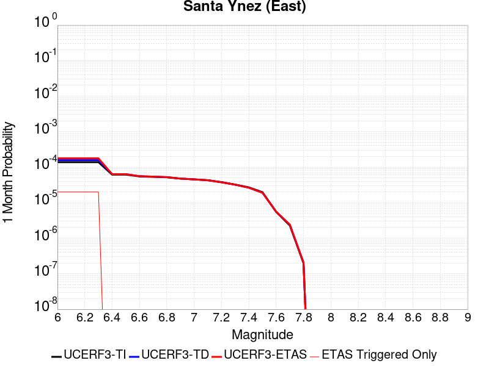 | 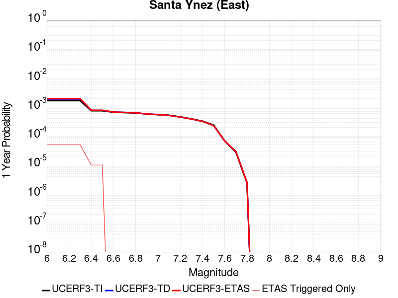 |  |

| Magnitude | 1 wk TI Prob | 1 wk TD Prob | 1 wk ETAS Prob | 1 wk ETAS/TD Gain | 1 wk ETAS Triggered Only | 1 mo TI Prob | 1 mo TD Prob | 1 mo ETAS Prob | 1 mo ETAS/TD Gain | 1 mo ETAS Triggered Only | 1 yr TI Prob | 1 yr TD Prob | 1 yr ETAS Prob | 1 yr ETAS/TD Gain | 1 yr ETAS Triggered Only | 10 yr TI Prob | 10 yr TD Prob | 10 yr ETAS Prob | 10 yr ETAS/TD Gain | 10 yr ETAS Triggered Only |
|-----|-----|-----|-----|-----|-----|-----|-----|-----|-----|-----|-----|-----|-----|-----|-----|-----|-----|-----|-----|-----|
| 6.0 | 3.2269712E-5 | 3.675388E-5 | 3.675388E-5 | 1.0 | 0.0 | 1.3829143E-4 | 1.5751045E-4 | 1.5751045E-4 | 1.0 | 0.0 | 0.0016823979 | 0.0019165927 | 0.0019872184 | 1.0368496 | 7.0761394E-5 | 0.016697178 | 0.019058175 | 0.019127589 | 1.0036422 | 7.0761394E-5 |
| 6.1 | 3.2269712E-5 | 3.675388E-5 | 3.675388E-5 | 1.0 | 0.0 | 1.3829143E-4 | 1.5751045E-4 | 1.5751045E-4 | 1.0 | 0.0 | 0.0016823979 | 0.0019165927 | 0.0019872184 | 1.0368496 | 7.0761394E-5 | 0.016697178 | 0.019058175 | 0.019127589 | 1.0036422 | 7.0761394E-5 |
| 6.2 | 3.2269712E-5 | 3.675388E-5 | 3.675388E-5 | 1.0 | 0.0 | 1.3829143E-4 | 1.5751045E-4 | 1.5751045E-4 | 1.0 | 0.0 | 0.0016823979 | 0.0019165927 | 0.0019872184 | 1.0368496 | 7.0761394E-5 | 0.016697178 | 0.019058175 | 0.019127589 | 1.0036422 | 7.0761394E-5 |
| 6.3 | 3.2269712E-5 | 3.675388E-5 | 3.675388E-5 | 1.0 | 0.0 | 1.3829143E-4 | 1.5751045E-4 | 1.5751045E-4 | 1.0 | 0.0 | 0.0016823979 | 0.0019165927 | 0.0019872184 | 1.0368496 | 7.0761394E-5 | 0.016697178 | 0.019058175 | 0.019127589 | 1.0036422 | 7.0761394E-5 |
| 6.4 | 1.4404779E-5 | 1.485013E-5 | 1.485013E-5 | 1.0 | 0.0 | 6.1733306E-5 | 6.364189E-5 | 6.364189E-5 | 1.0 | 0.0 | 7.513438E-4 | 7.745696E-4 | 8.099229E-4 | 1.0456425 | 3.5380697E-5 | 0.0074880854 | 0.0077192495 | 0.007754357 | 1.0045481 | 3.5380697E-5 |
| 6.5 | 1.4404779E-5 | 1.485013E-5 | 1.485013E-5 | 1.0 | 0.0 | 6.1733306E-5 | 6.364189E-5 | 6.364189E-5 | 1.0 | 0.0 | 7.513438E-4 | 7.745696E-4 | 8.099229E-4 | 1.0456425 | 3.5380697E-5 | 0.0074880854 | 0.0077192495 | 0.007754357 | 1.0045481 | 3.5380697E-5 |
| 6.6 | 1.280208E-5 | 1.3012552E-5 | 1.3012552E-5 | 1.0 | 0.0 | 5.4864904E-5 | 5.5766897E-5 | 5.5766897E-5 | 1.0 | 0.0 | 6.6777546E-4 | 6.7875226E-4 | 6.7875226E-4 | 1.0 | 0.0 | 0.006657724 | 0.006767002 | 0.006767002 | 1.0 | 0.0 |
| 6.7 | 1.2457027E-5 | 1.262905E-5 | 1.262905E-5 | 1.0 | 0.0 | 5.3386164E-5 | 5.4123386E-5 | 5.4123386E-5 | 1.0 | 0.0 | 6.497827E-4 | 6.5875467E-4 | 6.5875467E-4 | 1.0 | 0.0 | 0.00647886 | 0.0065682167 | 0.0065682167 | 1.0 | 0.0 |
| 6.8 | 1.2095134E-5 | 1.2231476E-5 | 1.2231476E-5 | 1.0 | 0.0 | 5.1835254E-5 | 5.2419568E-5 | 5.2419568E-5 | 1.0 | 0.0 | 6.309115E-4 | 6.3802296E-4 | 6.3802296E-4 | 1.0 | 0.0 | 0.0062912325 | 0.0063621 | 0.0063621 | 1.0 | 0.0 |
| 6.9 | 1.1104036E-5 | 1.115786E-5 | 1.115786E-5 | 1.0 | 0.0 | 4.758786E-5 | 4.7818532E-5 | 4.7818532E-5 | 1.0 | 0.0 | 5.7922816E-4 | 5.820364E-4 | 5.820364E-4 | 1.0 | 0.0 | 0.005777207 | 0.005805265 | 0.005805265 | 1.0 | 0.0 |
| 7.0 | 1.0577444E-5 | 1.0582165E-5 | 1.0582165E-5 | 1.0 | 0.0 | 4.5331115E-5 | 4.5351353E-5 | 4.5351353E-5 | 1.0 | 0.0 | 5.5176654E-4 | 5.5201404E-4 | 5.5201404E-4 | 1.0 | 0.0 | 0.0055039856 | 0.005506567 | 0.005506567 | 1.0 | 0.0 |
| 7.1 | 1.0021775E-5 | 9.981446E-6 | 9.981446E-6 | 1.0 | 0.0 | 4.294976E-5 | 4.277693E-5 | 4.277693E-5 | 1.0 | 0.0 | 5.2278786E-4 | 5.2068586E-4 | 5.2068586E-4 | 1.0 | 0.0 | 0.0052155964 | 0.0051947916 | 0.0051947916 | 1.0 | 0.0 |
| 7.2 | 8.874109E-6 | 8.749197E-6 | 8.749197E-6 | 1.0 | 0.0 | 3.8031343E-5 | 3.7496025E-5 | 3.7496025E-5 | 1.0 | 0.0 | 4.629332E-4 | 4.564196E-4 | 4.564196E-4 | 1.0 | 0.0 | 0.0046197 | 0.00455494 | 0.00455494 | 1.0 | 0.0 |
| 7.3 | 7.5504267E-6 | 7.505443E-6 | 7.505443E-6 | 1.0 | 0.0 | 3.235857E-5 | 3.2165794E-5 | 3.2165794E-5 | 1.0 | 0.0 | 3.9389438E-4 | 3.915492E-4 | 3.915492E-4 | 1.0 | 0.0 | 0.0039319694 | 0.0039087003 | 0.0039087003 | 1.0 | 0.0 |
| 7.4 | 6.309394E-6 | 6.183419E-6 | 6.183419E-6 | 1.0 | 0.0 | 2.703998E-5 | 2.6500104E-5 | 2.6500104E-5 | 1.0 | 0.0 | 3.2916202E-4 | 3.2259195E-4 | 3.2259195E-4 | 1.0 | 0.0 | 0.003286749 | 0.003221334 | 0.003221334 | 1.0 | 0.0 |
| 7.5 | 4.6103073E-6 | 4.4410685E-6 | 4.4410685E-6 | 1.0 | 0.0 | 1.975831E-5 | 1.9033017E-5 | 1.9033017E-5 | 1.0 | 0.0 | 2.4053088E-4 | 2.3170303E-4 | 2.3170303E-4 | 1.0 | 0.0 | 0.002402707 | 0.002314684 | 0.002314684 | 1.0 | 0.0 |
| 7.6 | 1.2858658E-6 | 1.3008554E-6 | 1.3008554E-6 | 1.0 | 0.0 | 5.5108417E-6 | 5.575083E-6 | 5.575083E-6 | 1.0 | 0.0 | 6.7092435E-5 | 6.7874586E-5 | 6.7874586E-5 | 1.0 | 0.0 | 6.707218E-4 | 6.7854545E-4 | 6.7854545E-4 | 1.0 | 0.0 |
| 7.7 | 5.3302307E-7 | 5.612297E-7 | 5.612297E-7 | 1.0 | 0.0 | 2.2843826E-6 | 2.4052679E-6 | 2.4052679E-6 | 1.0 | 0.0 | 2.7812002E-5 | 2.9283781E-5 | 2.9283781E-5 | 1.0 | 0.0 | 2.7808524E-4 | 2.9280278E-4 | 2.9280278E-4 | 1.0 | 0.0 |
| 7.8 | 4.613933E-8 | 4.8031144E-8 | 4.8031144E-8 | 1.0 | 0.0 | 1.9773998E-7 | 2.0584774E-7 | 2.0584774E-7 | 1.0 | 0.0 | 2.4074816E-6 | 2.5061934E-6 | 2.5061934E-6 | 1.0 | 0.0 | 2.4074554E-5 | 2.5061661E-5 | 2.5061661E-5 | 1.0 | 0.0 |

## Red Pass
*[(top)](#table-of-contents)*

| 1 Week | 1 Month | 1 Year | 10 Year |
|-----|-----|-----|-----|
|  |  | 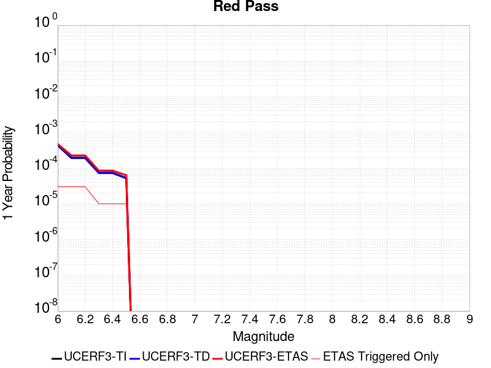 |  |

| Magnitude | 1 wk TI Prob | 1 wk TD Prob | 1 wk ETAS Prob | 1 wk ETAS/TD Gain | 1 wk ETAS Triggered Only | 1 mo TI Prob | 1 mo TD Prob | 1 mo ETAS Prob | 1 mo ETAS/TD Gain | 1 mo ETAS Triggered Only | 1 yr TI Prob | 1 yr TD Prob | 1 yr ETAS Prob | 1 yr ETAS/TD Gain | 1 yr ETAS Triggered Only | 10 yr TI Prob | 10 yr TD Prob | 10 yr ETAS Prob | 10 yr ETAS/TD Gain | 10 yr ETAS Triggered Only |
|-----|-----|-----|-----|-----|-----|-----|-----|-----|-----|-----|-----|-----|-----|-----|-----|-----|-----|-----|-----|-----|
| 6.0 | 8.258278E-6 | 8.551426E-6 | 8.551426E-6 | 1.0 | 0.0 | 3.539214E-5 | 3.6648555E-5 | 3.6648555E-5 | 1.0 | 0.0 | 4.308141E-4 | 4.4612266E-4 | 4.4612266E-4 | 1.0 | 0.0 | 0.0042997985 | 0.0044540283 | 0.0045244745 | 1.0158163 | 7.0761394E-5 |
| 6.1 | 3.649988E-6 | 3.7753848E-6 | 3.7753848E-6 | 1.0 | 0.0 | 1.5642712E-5 | 1.6180147E-5 | 1.6180147E-5 | 1.0 | 0.0 | 1.9043336E-4 | 1.9698025E-4 | 1.9698025E-4 | 1.0 | 0.0 | 0.0019027026 | 0.0019685237 | 0.0020038348 | 1.0179378 | 3.5380697E-5 |
| 6.2 | 3.649988E-6 | 3.7753848E-6 | 3.7753848E-6 | 1.0 | 0.0 | 1.5642712E-5 | 1.6180147E-5 | 1.6180147E-5 | 1.0 | 0.0 | 1.9043336E-4 | 1.9698025E-4 | 1.9698025E-4 | 1.0 | 0.0 | 0.0019027026 | 0.0019685237 | 0.0020038348 | 1.0179378 | 3.5380697E-5 |
| 6.3 | 1.3924937E-6 | 1.4411434E-6 | 1.4411434E-6 | 1.0 | 0.0 | 5.9678164E-6 | 6.1763217E-6 | 6.1763217E-6 | 1.0 | 0.0 | 7.265574E-5 | 7.519554E-5 | 7.519554E-5 | 1.0 | 0.0 | 7.263199E-4 | 7.518397E-4 | 7.871938E-4 | 1.0470234 | 3.5380697E-5 |
| 6.4 | 1.3924937E-6 | 1.4411434E-6 | 1.4411434E-6 | 1.0 | 0.0 | 5.9678164E-6 | 6.1763217E-6 | 6.1763217E-6 | 1.0 | 0.0 | 7.265574E-5 | 7.519554E-5 | 7.519554E-5 | 1.0 | 0.0 | 7.263199E-4 | 7.518397E-4 | 7.871938E-4 | 1.0470234 | 3.5380697E-5 |
| 6.5 | 9.876812E-7 | 1.0222102E-6 | 1.0222102E-6 | 1.0 | 0.0 | 4.2329125E-6 | 4.3809005E-6 | 4.3809005E-6 | 1.0 | 0.0 | 5.153449E-5 | 5.3337466E-5 | 5.3337466E-5 | 1.0 | 0.0 | 5.1522546E-4 | 5.3337467E-4 | 5.3337467E-4 | 1.0 | 0.0 |

## San Jacinto (San Jacinto Valley) rev
*[(top)](#table-of-contents)*

| 1 Week | 1 Month | 1 Year | 10 Year |
|-----|-----|-----|-----|
|  |  |  |  |

| Magnitude | 1 wk TI Prob | 1 wk TD Prob | 1 wk ETAS Prob | 1 wk ETAS/TD Gain | 1 wk ETAS Triggered Only | 1 mo TI Prob | 1 mo TD Prob | 1 mo ETAS Prob | 1 mo ETAS/TD Gain | 1 mo ETAS Triggered Only | 1 yr TI Prob | 1 yr TD Prob | 1 yr ETAS Prob | 1 yr ETAS/TD Gain | 1 yr ETAS Triggered Only | 10 yr TI Prob | 10 yr TD Prob | 10 yr ETAS Prob | 10 yr ETAS/TD Gain | 10 yr ETAS Triggered Only |
|-----|-----|-----|-----|-----|-----|-----|-----|-----|-----|-----|-----|-----|-----|-----|-----|-----|-----|-----|-----|-----|
| 6.0 | 3.652694E-5 | 3.4467394E-5 | 3.4467394E-5 | 1.0 | 0.0 | 1.5653463E-4 | 1.4770904E-4 | 1.4770904E-4 | 1.0 | 0.0 | 0.0019041431 | 0.001796876 | 0.0018675101 | 1.0393095 | 7.0761394E-5 | 0.018879099 | 0.018560216 | 0.018629663 | 1.0037417 | 7.0761394E-5 |
| 6.1 | 3.652694E-5 | 3.4467394E-5 | 3.4467394E-5 | 1.0 | 0.0 | 1.5653463E-4 | 1.4770904E-4 | 1.4770904E-4 | 1.0 | 0.0 | 0.0019041431 | 0.001796876 | 0.0018675101 | 1.0393095 | 7.0761394E-5 | 0.018879099 | 0.018560216 | 0.018629663 | 1.0037417 | 7.0761394E-5 |
| 6.2 | 3.652694E-5 | 3.4467394E-5 | 3.4467394E-5 | 1.0 | 0.0 | 1.5653463E-4 | 1.4770904E-4 | 1.4770904E-4 | 1.0 | 0.0 | 0.0019041431 | 0.001796876 | 0.0018675101 | 1.0393095 | 7.0761394E-5 | 0.018879099 | 0.018560216 | 0.018629663 | 1.0037417 | 7.0761394E-5 |
| 6.3 | 3.652694E-5 | 3.4467394E-5 | 3.4467394E-5 | 1.0 | 0.0 | 1.5653463E-4 | 1.4770904E-4 | 1.4770904E-4 | 1.0 | 0.0 | 0.0019041431 | 0.001796876 | 0.0018675101 | 1.0393095 | 7.0761394E-5 | 0.018879099 | 0.018560216 | 0.018629663 | 1.0037417 | 7.0761394E-5 |
| 6.4 | 3.646941E-5 | 3.4388955E-5 | 3.4388955E-5 | 1.0 | 0.0 | 1.5628811E-4 | 1.4737292E-4 | 1.4737292E-4 | 1.0 | 0.0 | 0.0019011468 | 0.0017927908 | 0.0018634254 | 1.0393991 | 7.0761394E-5 | 0.018849645 | 0.01852009 | 0.018589541 | 1.0037501 | 7.0761394E-5 |
| 6.5 | 3.646941E-5 | 3.4388955E-5 | 3.4388955E-5 | 1.0 | 0.0 | 1.5628811E-4 | 1.4737292E-4 | 1.4737292E-4 | 1.0 | 0.0 | 0.0019011468 | 0.0017927908 | 0.0018634254 | 1.0393991 | 7.0761394E-5 | 0.018849645 | 0.01852009 | 0.018589541 | 1.0037501 | 7.0761394E-5 |
| 6.6 | 3.6442503E-5 | 3.4352335E-5 | 3.4352335E-5 | 1.0 | 0.0 | 1.561728E-4 | 1.4721598E-4 | 1.4721598E-4 | 1.0 | 0.0 | 0.0018997455 | 0.0017908834 | 0.001861518 | 1.0394412 | 7.0761394E-5 | 0.018835869 | 0.018501356 | 0.018570809 | 1.0037539 | 7.0761394E-5 |
| 6.7 | 3.6432113E-5 | 3.4337903E-5 | 3.4337903E-5 | 1.0 | 0.0 | 1.5612828E-4 | 1.4715415E-4 | 1.4715415E-4 | 1.0 | 0.0 | 0.0018992044 | 0.001790132 | 0.0018607667 | 1.0394578 | 7.0761394E-5 | 0.018830549 | 0.01849398 | 0.018563433 | 1.0037555 | 7.0761394E-5 |
| 6.8 | 3.6409598E-5 | 3.430695E-5 | 3.430695E-5 | 1.0 | 0.0 | 1.560318E-4 | 1.470215E-4 | 1.470215E-4 | 1.0 | 0.0 | 0.0018980318 | 0.0017885199 | 0.0018591547 | 1.0394934 | 7.0761394E-5 | 0.018819023 | 0.01847813 | 0.018547585 | 1.0037587 | 7.0761394E-5 |
| 6.9 | 3.638078E-5 | 3.4267367E-5 | 3.4267367E-5 | 1.0 | 0.0 | 1.5590832E-4 | 1.4685189E-4 | 1.4685189E-4 | 1.0 | 0.0 | 0.0018965311 | 0.0017864581 | 0.0018570931 | 1.0395391 | 7.0761394E-5 | 0.018804269 | 0.018457862 | 0.018527318 | 1.003763 | 7.0761394E-5 |
| 7.0 | 3.6294874E-5 | 3.4149365E-5 | 3.4149365E-5 | 1.0 | 0.0 | 1.5554018E-4 | 1.4634622E-4 | 1.4634622E-4 | 1.0 | 0.0 | 0.0018920569 | 0.0017803118 | 0.0018509473 | 1.0396758 | 7.0761394E-5 | 0.018760284 | 0.018397434 | 0.018466894 | 1.0037755 | 7.0761394E-5 |
| 7.1 | 3.6260717E-5 | 3.410564E-5 | 3.410564E-5 | 1.0 | 0.0 | 1.5539382E-4 | 1.4615887E-4 | 1.4615887E-4 | 1.0 | 0.0 | 0.001890278 | 0.0017780344 | 0.00184867 | 1.0397267 | 7.0761394E-5 | 0.018742796 | 0.018375032 | 0.018444493 | 1.0037802 | 7.0761394E-5 |
| 7.2 | 3.6210204E-5 | 3.403977E-5 | 3.403977E-5 | 1.0 | 0.0 | 1.5517735E-4 | 1.4587659E-4 | 1.4587659E-4 | 1.0 | 0.0 | 0.001887647 | 0.0017746033 | 0.0018452391 | 1.0398037 | 7.0761394E-5 | 0.01871693 | 0.018341267 | 0.01841073 | 1.0037873 | 7.0761394E-5 |
| 7.3 | 3.6119454E-5 | 3.3927867E-5 | 3.3927867E-5 | 1.0 | 0.0 | 1.5478847E-4 | 1.4539705E-4 | 1.4539705E-4 | 1.0 | 0.0 | 0.0018829206 | 0.0017687745 | 0.0018394106 | 1.0399351 | 7.0761394E-5 | 0.018670462 | 0.018283723 | 0.018353192 | 1.0037994 | 7.0761394E-5 |
| 7.4 | 3.607848E-5 | 3.387532E-5 | 3.387532E-5 | 1.0 | 0.0 | 1.5461289E-4 | 1.4517189E-4 | 1.4517189E-4 | 1.0 | 0.0 | 0.0018807866 | 0.0017660374 | 0.0018366739 | 1.0399971 | 7.0761394E-5 | 0.018649481 | 0.018256696 | 0.018326167 | 1.0038052 | 7.0761394E-5 |
| 7.5 | 3.5856774E-5 | 3.3684162E-5 | 3.3684162E-5 | 1.0 | 0.0 | 1.5366284E-4 | 1.4435273E-4 | 1.4435273E-4 | 1.0 | 0.0 | 0.0018692396 | 0.0017560803 | 0.0018267175 | 1.0402243 | 7.0761394E-5 | 0.018535944 | 0.01815731 | 0.018226787 | 1.0038264 | 7.0761394E-5 |
| 7.6 | 3.286655E-5 | 3.220034E-5 | 3.220034E-5 | 1.0 | 0.0 | 1.4084904E-4 | 1.3799417E-4 | 1.3799417E-4 | 1.0 | 0.0 | 0.001713488 | 0.0016787864 | 0.001749429 | 1.0420796 | 7.0761394E-5 | 0.017003361 | 0.017373424 | 0.017442955 | 1.0040022 | 7.0761394E-5 |
| 7.7 | 2.8882527E-5 | 2.9291981E-5 | 2.9291981E-5 | 1.0 | 0.0 | 1.237764E-4 | 1.2553102E-4 | 1.2553102E-4 | 1.0 | 0.0 | 0.0015059357 | 0.0015272698 | 0.0015979231 | 1.0462612 | 7.0761394E-5 | 0.014957713 | 0.015859274 | 0.015928913 | 1.0043911 | 7.0761394E-5 |
| 7.8 | 2.4950225E-5 | 2.6580747E-5 | 2.6580747E-5 | 1.0 | 0.0 | 1.0692515E-4 | 1.13912516E-4 | 1.13912516E-4 | 1.0 | 0.0 | 0.0013010362 | 0.0013860033 | 0.0014566667 | 1.0509835 | 7.0761394E-5 | 0.012934455 | 0.014439502 | 0.014509242 | 1.0048298 | 7.0761394E-5 |
| 7.9 | 1.9881603E-5 | 2.155556E-5 | 2.155556E-5 | 1.0 | 0.0 | 8.520408E-5 | 9.2377704E-5 | 9.2377704E-5 | 1.0 | 0.0 | 0.001036866 | 0.001124119 | 0.0011948008 | 1.0628775 | 7.0761394E-5 | 0.010320415 | 0.011802064 | 0.011871991 | 1.0059249 | 7.0761394E-5 |
| 8.0 | 1.563292E-5 | 1.5976173E-5 | 1.5976173E-5 | 1.0 | 0.0 | 6.6996516E-5 | 6.846752E-5 | 6.846752E-5 | 1.0 | 0.0 | 8.153773E-4 | 8.332739E-4 | 9.039763E-4 | 1.084849 | 7.0761394E-5 | 0.00812392 | 0.008830938 | 0.0089010745 | 1.0079421 | 7.0761394E-5 |
| 8.1 | 1.0045313E-5 | 8.324356E-6 | 8.324356E-6 | 1.0 | 0.0 | 4.305063E-5 | 3.5675326E-5 | 3.5675326E-5 | 1.0 | 0.0 | 5.2401534E-4 | 4.3426102E-4 | 4.6962636E-4 | 1.081438 | 3.5380697E-5 | 0.0052278144 | 0.0046712374 | 0.004706453 | 1.0075388 | 3.5380697E-5 |
| 8.2 | 4.1554413E-6 | 1.5721832E-6 | 1.5721832E-6 | 1.0 | 0.0 | 1.7808914E-5 | 6.737911E-6 | 6.737911E-6 | 1.0 | 0.0 | 2.1680194E-4 | 8.203101E-5 | 8.203101E-5 | 1.0 | 0.0 | 0.0021659054 | 9.520741E-4 | 9.520741E-4 | 1.0 | 0.0 |
| 8.3 | 1.2758221E-6 | 3.6330252E-7 | 3.6330252E-7 | 1.0 | 0.0 | 5.4677976E-6 | 1.5570099E-6 | 1.5570099E-6 | 1.0 | 0.0 | 6.65684E-5 | 1.8956434E-5 | 1.8956434E-5 | 1.0 | 0.0 | 6.6548464E-4 | 2.2857229E-4 | 2.2857229E-4 | 1.0 | 0.0 |

## San Andreas (Creeping Section) 2011 CFM
*[(top)](#table-of-contents)*

| 1 Week | 1 Month | 1 Year | 10 Year |
|-----|-----|-----|-----|
|  |  |  |  |

| Magnitude | 1 wk TI Prob | 1 wk TD Prob | 1 wk ETAS Prob | 1 wk ETAS/TD Gain | 1 wk ETAS Triggered Only | 1 mo TI Prob | 1 mo TD Prob | 1 mo ETAS Prob | 1 mo ETAS/TD Gain | 1 mo ETAS Triggered Only | 1 yr TI Prob | 1 yr TD Prob | 1 yr ETAS Prob | 1 yr ETAS/TD Gain | 1 yr ETAS Triggered Only | 10 yr TI Prob | 10 yr TD Prob | 10 yr ETAS Prob | 10 yr ETAS/TD Gain | 10 yr ETAS Triggered Only |
|-----|-----|-----|-----|-----|-----|-----|-----|-----|-----|-----|-----|-----|-----|-----|-----|-----|-----|-----|-----|-----|
| 6.0 | 5.986481E-4 | 0.0012277901 | 0.0012277901 | 1.0 | 0.0 | 0.0025631124 | 0.0052455855 | 0.0052455855 | 1.0 | 0.0 | 0.030762846 | 0.061229862 | 0.061263077 | 1.0005424 | 3.5380697E-5 | 0.26835477 | 0.42607152 | 0.42611212 | 1.0000954 | 7.0761394E-5 |
| 6.1 | 5.015945E-4 | 0.0010218644 | 0.0010218644 | 1.0 | 0.0 | 0.00214792 | 0.0043676887 | 0.0043676887 | 1.0 | 0.0 | 0.025839351 | 0.051269703 | 0.051303267 | 1.0006547 | 3.5380697E-5 | 0.23032776 | 0.37298882 | 0.3730332 | 1.000119 | 7.0761394E-5 |
| 6.2 | 4.073338E-4 | 8.109829E-4 | 8.109829E-4 | 1.0 | 0.0 | 0.0017445484 | 0.0034675654 | 0.0034675654 | 1.0 | 0.0 | 0.021034058 | 0.040954083 | 0.040988017 | 1.0008285 | 3.5380697E-5 | 0.19150782 | 0.31317768 | 0.31322628 | 1.0001552 | 7.0761394E-5 |
| 6.3 | 3.464099E-4 | 6.7405414E-4 | 6.7405414E-4 | 1.0 | 0.0 | 0.0014837692 | 0.0028840431 | 0.0028840431 | 1.0 | 0.0 | 0.017915873 | 0.034210727 | 0.034244895 | 1.0009989 | 3.5380697E-5 | 0.16538359 | 0.27146977 | 0.2715213 | 1.0001899 | 7.0761394E-5 |
| 6.4 | 2.935057E-4 | 5.543318E-4 | 5.543318E-4 | 1.0 | 0.0 | 0.0012572751 | 0.0023728115 | 0.0023728115 | 1.0 | 0.0 | 0.015200248 | 0.028285956 | 0.028320335 | 1.0012155 | 3.5380697E-5 | 0.14201577 | 0.23314685 | 0.2332011 | 1.0002327 | 7.0761394E-5 |
| 6.5 | 2.3409708E-4 | 4.2106997E-4 | 4.2106997E-4 | 1.0 | 0.0 | 0.0010028875 | 0.001803265 | 0.001803265 | 1.0 | 0.0 | 0.012141965 | 0.02160988 | 0.021644497 | 1.0016018 | 3.5380697E-5 | 0.11499573 | 0.18699536 | 0.18705288 | 1.0003077 | 7.0761394E-5 |
| 6.6 | 1.5842178E-4 | 2.5115322E-4 | 2.5115322E-4 | 1.0 | 0.0 | 6.7877385E-4 | 0.0010759257 | 0.0010759257 | 1.0 | 0.0 | 0.0082328 | 0.013019121 | 0.013054042 | 1.0026822 | 3.5380697E-5 | 0.07934396 | 0.12333139 | 0.12339343 | 1.000503 | 7.0761394E-5 |
| 6.7 | 1.5616413E-4 | 2.4651614E-4 | 2.4651614E-4 | 1.0 | 0.0 | 6.691031E-4 | 0.0010560687 | 0.0010560687 | 1.0 | 0.0 | 0.0081159435 | 0.012780937 | 0.012815866 | 1.0027329 | 3.5380697E-5 | 0.0782586 | 0.12135857 | 0.12142075 | 1.0005124 | 7.0761394E-5 |
| 6.8 | 1.5538467E-4 | 2.4475376E-4 | 2.4475376E-4 | 1.0 | 0.0 | 6.6576427E-4 | 0.0010485224 | 0.0010485224 | 1.0 | 0.0 | 0.008075596 | 0.0126902815 | 0.012725213 | 1.0027527 | 3.5380697E-5 | 0.07788358 | 0.12058931 | 0.120651536 | 1.000516 | 7.0761394E-5 |
| 6.9 | 1.5153569E-4 | 2.3584193E-4 | 2.3584193E-4 | 1.0 | 0.0 | 6.49277E-4 | 0.0010103616 | 0.0010103616 | 1.0 | 0.0 | 0.007876333 | 0.0122323 | 0.012267248 | 1.002857 | 3.5380697E-5 | 0.07602952 | 0.11665895 | 0.11672146 | 1.0005358 | 7.0761394E-5 |
| 7.0 | 1.4588932E-4 | 2.2441045E-4 | 2.2441045E-4 | 1.0 | 0.0 | 6.250901E-4 | 9.6140656E-4 | 9.6140656E-4 | 1.0 | 0.0 | 0.0075839474 | 0.011642803 | 0.011677772 | 1.0030035 | 3.5380697E-5 | 0.073302895 | 0.11150479 | 0.11156767 | 1.0005639 | 7.0761394E-5 |
| 7.1 | 1.1565079E-4 | 1.6318668E-4 | 1.6318668E-4 | 1.0 | 0.0 | 4.955521E-4 | 6.991849E-4 | 6.991849E-4 | 1.0 | 0.0 | 0.006016669 | 0.008479553 | 0.008514633 | 1.004137 | 3.5380697E-5 | 0.058563538 | 0.08383247 | 0.0838973 | 1.0007733 | 7.0761394E-5 |
| 7.2 | 1.0393792E-4 | 1.4650424E-4 | 1.4650424E-4 | 1.0 | 0.0 | 4.4537216E-4 | 6.2772504E-4 | 6.2772504E-4 | 1.0 | 0.0 | 0.005408933 | 0.007615941 | 0.0076510524 | 1.0046102 | 3.5380697E-5 | 0.052791595 | 0.075774014 | 0.075839415 | 1.0008631 | 7.0761394E-5 |
| 7.3 | 9.332884E-5 | 1.2811116E-4 | 1.2811116E-4 | 1.0 | 0.0 | 3.999194E-4 | 5.4893293E-4 | 5.4893293E-4 | 1.0 | 0.0 | 0.0048581534 | 0.006662914 | 0.006698059 | 1.0052747 | 3.5380697E-5 | 0.047533102 | 0.06662133 | 0.06668738 | 1.0009913 | 7.0761394E-5 |
| 7.4 | 8.670252E-5 | 1.17293064E-4 | 1.17293064E-4 | 1.0 | 0.0 | 3.715293E-4 | 5.0258834E-4 | 5.0258834E-4 | 1.0 | 0.0 | 0.004513991 | 0.006101966 | 0.006137131 | 1.0057628 | 3.5380697E-5 | 0.044233937 | 0.06127167 | 0.061338097 | 1.0010841 | 7.0761394E-5 |
| 7.5 | 7.3036405E-5 | 9.027501E-5 | 9.027501E-5 | 1.0 | 0.0 | 3.129756E-4 | 3.8683563E-4 | 3.8683563E-4 | 1.0 | 0.0 | 0.0038038217 | 0.0046995743 | 0.0047347886 | 1.0074931 | 3.5380697E-5 | 0.03739367 | 0.047980286 | 0.048047654 | 1.001404 | 7.0761394E-5 |
| 7.6 | 6.3935775E-5 | 8.298733E-5 | 8.298733E-5 | 1.0 | 0.0 | 2.7398168E-4 | 3.5561158E-4 | 3.5561158E-4 | 1.0 | 0.0 | 0.0033306254 | 0.0043209945 | 0.0043562227 | 1.0081527 | 3.5380697E-5 | 0.032811474 | 0.04407886 | 0.044146504 | 1.0015346 | 7.0761394E-5 |
| 7.7 | 5.5050095E-5 | 6.6780485E-5 | 6.6780485E-5 | 1.0 | 0.0 | 2.3590765E-4 | 2.861707E-4 | 2.861707E-4 | 1.0 | 0.0 | 0.0028683927 | 0.003478566 | 0.0035138237 | 1.0101357 | 3.5380697E-5 | 0.0283165 | 0.035874426 | 0.035942648 | 1.0019017 | 7.0761394E-5 |
| 7.8 | 5.027131E-5 | 6.177649E-5 | 6.177649E-5 | 1.0 | 0.0 | 2.1543067E-4 | 2.6472952E-4 | 2.6472952E-4 | 1.0 | 0.0 | 0.0026197135 | 0.0032183218 | 0.0032535887 | 1.0109582 | 3.5380697E-5 | 0.025890453 | 0.033198178 | 0.033266593 | 1.0020608 | 7.0761394E-5 |
| 7.9 | 3.7271806E-5 | 5.034326E-5 | 5.034326E-5 | 1.0 | 0.0 | 1.5972654E-4 | 2.15739E-4 | 2.15739E-4 | 1.0 | 0.0 | 0.0019429359 | 0.0026234603 | 0.0026587483 | 1.0134509 | 3.5380697E-5 | 0.019260362 | 0.027125074 | 0.027193915 | 1.002538 | 7.0761394E-5 |
| 8.0 | 2.7310243E-5 | 3.1506686E-5 | 3.1506686E-5 | 1.0 | 0.0 | 1.17038646E-4 | 1.3502168E-4 | 1.3502168E-4 | 1.0 | 0.0 | 0.0014240141 | 0.0016426502 | 0.0016426502 | 1.0 | 0.0 | 0.014149235 | 0.017253635 | 0.017288405 | 1.0020152 | 3.5380697E-5 |
| 8.1 | 1.7940547E-5 | 1.7450684E-5 | 1.7450684E-5 | 1.0 | 0.0 | 7.688579E-5 | 7.4786505E-5 | 7.4786505E-5 | 1.0 | 0.0 | 9.3568244E-4 | 9.1014587E-4 | 9.1014587E-4 | 1.0 | 0.0 | 0.009317525 | 0.009825298 | 0.00986033 | 1.0035655 | 3.5380697E-5 |
| 8.2 | 8.643924E-6 | 5.49522E-6 | 5.49522E-6 | 1.0 | 0.0 | 3.704486E-5 | 2.355073E-5 | 2.355073E-5 | 1.0 | 0.0 | 4.5092785E-4 | 2.866925E-4 | 2.866925E-4 | 1.0 | 0.0 | 0.0045001395 | 0.0032598388 | 0.0032598388 | 1.0 | 0.0 |
| 8.3 | 1.983087E-6 | 7.693574E-7 | 7.693574E-7 | 1.0 | 0.0 | 8.498917E-6 | 3.297242E-6 | 3.297242E-6 | 1.0 | 0.0 | 1.034694E-4 | 4.01432E-5 | 4.01432E-5 | 1.0 | 0.0 | 0.0010342124 | 4.7390026E-4 | 4.7390026E-4 | 1.0 | 0.0 |

## Imperial
*[(top)](#table-of-contents)*

| 1 Week | 1 Month | 1 Year | 10 Year |
|-----|-----|-----|-----|
|  |  |  |  |

| Magnitude | 1 wk TI Prob | 1 wk TD Prob | 1 wk ETAS Prob | 1 wk ETAS/TD Gain | 1 wk ETAS Triggered Only | 1 mo TI Prob | 1 mo TD Prob | 1 mo ETAS Prob | 1 mo ETAS/TD Gain | 1 mo ETAS Triggered Only | 1 yr TI Prob | 1 yr TD Prob | 1 yr ETAS Prob | 1 yr ETAS/TD Gain | 1 yr ETAS Triggered Only | 10 yr TI Prob | 10 yr TD Prob | 10 yr ETAS Prob | 10 yr ETAS/TD Gain | 10 yr ETAS Triggered Only |
|-----|-----|-----|-----|-----|-----|-----|-----|-----|-----|-----|-----|-----|-----|-----|-----|-----|-----|-----|-----|-----|
| 6.0 | 2.7496446E-4 | 5.060379E-4 | 5.060379E-4 | 1.0 | 0.0 | 0.0011778869 | 0.0021669706 | 0.0021669706 | 1.0 | 0.0 | 0.0142467655 | 0.026064837 | 0.026133755 | 1.0026441 | 7.0761394E-5 | 0.13367249 | 0.22821419 | 0.2282688 | 1.0002393 | 7.0761394E-5 |
| 6.1 | 2.5356023E-4 | 4.8701192E-4 | 4.8701192E-4 | 1.0 | 0.0 | 0.001086234 | 0.0020855628 | 0.0020855628 | 1.0 | 0.0 | 0.013144928 | 0.02509391 | 0.025162894 | 1.0027491 | 7.0761394E-5 | 0.123940155 | 0.21963087 | 0.21968608 | 1.0002514 | 7.0761394E-5 |
| 6.2 | 2.4820742E-4 | 4.7795815E-4 | 4.7795815E-4 | 1.0 | 0.0 | 0.0010633124 | 0.0020468219 | 0.0020468219 | 1.0 | 0.0 | 0.01286919 | 0.024633536 | 0.024702555 | 1.0028018 | 7.0761394E-5 | 0.12148927 | 0.21613504 | 0.21619052 | 1.0002567 | 7.0761394E-5 |
| 6.3 | 2.3205351E-4 | 4.5929378E-4 | 4.5929378E-4 | 1.0 | 0.0 | 9.94136E-4 | 0.001966954 | 0.001966954 | 1.0 | 0.0 | 0.012036599 | 0.02368102 | 0.023750106 | 1.0029173 | 7.0761394E-5 | 0.11405133 | 0.20807077 | 0.2081268 | 1.0002693 | 7.0761394E-5 |
| 6.4 | 2.0304754E-4 | 3.991441E-4 | 3.991441E-4 | 1.0 | 0.0 | 8.6991355E-4 | 0.0017095108 | 0.0017095108 | 1.0 | 0.0 | 0.010539869 | 0.020614926 | 0.02068423 | 1.0033618 | 7.0761394E-5 | 0.100537635 | 0.18520407 | 0.18526173 | 1.0003113 | 7.0761394E-5 |
| 6.5 | 1.854992E-4 | 3.702423E-4 | 3.702423E-4 | 1.0 | 0.0 | 7.9475436E-4 | 0.0015858002 | 0.0015858002 | 1.0 | 0.0 | 0.009633281 | 0.01913749 | 0.019206896 | 1.0036268 | 7.0761394E-5 | 0.0922623 | 0.17342903 | 0.17348751 | 1.0003372 | 7.0761394E-5 |
| 6.6 | 1.6586106E-4 | 3.406714E-4 | 3.406714E-4 | 1.0 | 0.0 | 7.106394E-4 | 0.0014592134 | 0.0014592134 | 1.0 | 0.0 | 0.008617763 | 0.017622843 | 0.017692357 | 1.0039445 | 7.0761394E-5 | 0.08291132 | 0.16089731 | 0.1609567 | 1.0003691 | 7.0761394E-5 |
| 6.7 | 1.4224656E-4 | 3.0794923E-4 | 3.0794923E-4 | 1.0 | 0.0 | 6.094856E-4 | 0.0013191231 | 0.0013191231 | 1.0 | 0.0 | 0.0073952693 | 0.015943963 | 0.016013596 | 1.0043674 | 7.0761394E-5 | 0.07153955 | 0.14659329 | 0.14665368 | 1.000412 | 7.0761394E-5 |
| 6.8 | 1.2317259E-4 | 2.781478E-4 | 2.781478E-4 | 1.0 | 0.0 | 5.2777573E-4 | 0.0011915236 | 0.0011915236 | 1.0 | 0.0 | 0.0064067547 | 0.0144116925 | 0.014481434 | 1.0048392 | 7.0761394E-5 | 0.06225166 | 0.13303171 | 0.13309306 | 1.0004611 | 7.0761394E-5 |
| 6.9 | 9.859898E-5 | 2.503195E-4 | 2.503195E-4 | 1.0 | 0.0 | 4.2249862E-4 | 0.0010723611 | 0.0010723611 | 1.0 | 0.0 | 0.0051317946 | 0.012978803 | 0.013048647 | 1.0053813 | 7.0761394E-5 | 0.05014893 | 0.11947842 | 0.11954073 | 1.0005215 | 7.0761394E-5 |
| 7.0 | 7.3191884E-5 | 2.127993E-4 | 2.127993E-4 | 1.0 | 0.0 | 3.136418E-4 | 9.116815E-4 | 9.116815E-4 | 1.0 | 0.0 | 0.003811904 | 0.011043918 | 0.011113898 | 1.0063366 | 7.0761394E-5 | 0.037471764 | 0.10211917 | 0.10218271 | 1.0006222 | 7.0761394E-5 |
| 7.1 | 7.1760296E-5 | 2.0981116E-4 | 2.0981116E-4 | 1.0 | 0.0 | 3.0750787E-4 | 8.9888397E-4 | 8.9888397E-4 | 1.0 | 0.0 | 0.003737482 | 0.010889676 | 0.010959667 | 1.0064273 | 7.0761394E-5 | 0.03675245 | 0.10075505 | 0.100818686 | 1.0006316 | 7.0761394E-5 |
| 7.2 | 6.46614E-5 | 1.9149172E-4 | 1.9149172E-4 | 1.0 | 0.0 | 2.7709085E-4 | 8.204237E-4 | 8.204237E-4 | 1.0 | 0.0 | 0.0033683628 | 0.009943534 | 0.0100135915 | 1.0070455 | 7.0761394E-5 | 0.033177625 | 0.09256114 | 0.09262535 | 1.0006937 | 7.0761394E-5 |
| 7.3 | 6.088115E-5 | 1.7820326E-4 | 1.7820326E-4 | 1.0 | 0.0 | 2.6089314E-4 | 7.635076E-4 | 7.635076E-4 | 1.0 | 0.0 | 0.0031717476 | 0.009256661 | 0.009326767 | 1.0075736 | 7.0761394E-5 | 0.031268585 | 0.08661022 | 0.08667485 | 1.0007463 | 7.0761394E-5 |
| 7.4 | 4.199346E-5 | 1.1519547E-4 | 1.1519547E-4 | 1.0 | 0.0 | 1.7995955E-4 | 4.9360236E-4 | 4.9360236E-4 | 1.0 | 0.0 | 0.0021888057 | 0.0059932186 | 0.006028387 | 1.0058681 | 3.5380697E-5 | 0.02167372 | 0.05748037 | 0.057513714 | 1.0005802 | 3.5380697E-5 |
| 7.5 | 3.130448E-5 | 8.340871E-5 | 8.340871E-5 | 1.0 | 0.0 | 1.3415517E-4 | 3.5741724E-4 | 3.5741724E-4 | 1.0 | 0.0 | 0.0016321153 | 0.0043429323 | 0.0043781595 | 1.0081114 | 3.5380697E-5 | 0.016201803 | 0.04216626 | 0.042200148 | 1.0008037 | 3.5380697E-5 |
| 7.6 | 2.3074248E-5 | 6.0909417E-5 | 6.0909417E-5 | 1.0 | 0.0 | 9.888588E-5 | 2.610144E-4 | 2.610144E-4 | 1.0 | 0.0 | 0.0012032706 | 0.0031732426 | 0.003208511 | 1.0111144 | 3.5380697E-5 | 0.011967761 | 0.031055957 | 0.031090239 | 1.0011039 | 3.5380697E-5 |
| 7.7 | 1.45864815E-5 | 4.0178427E-5 | 4.0178427E-5 | 1.0 | 0.0 | 6.2511994E-5 | 1.7218193E-4 | 1.7218193E-4 | 1.0 | 0.0 | 7.608177E-4 | 0.002094305 | 0.0021296116 | 1.0168583 | 3.5380697E-5 | 0.007582182 | 0.020652408 | 0.020687057 | 1.0016778 | 3.5380697E-5 |
| 7.8 | 1.0352979E-5 | 3.1006606E-5 | 3.1006606E-5 | 1.0 | 0.0 | 4.4369157E-5 | 1.328787E-4 | 1.328787E-4 | 1.0 | 0.0 | 5.400606E-4 | 0.0016166 | 0.0016166 | 1.0 | 0.0 | 0.0053875 | 0.016037801 | 0.016037801 | 1.0 | 0.0 |
| 7.9 | 8.137906E-6 | 2.2185837E-5 | 2.2185837E-5 | 1.0 | 0.0 | 3.4876273E-5 | 9.50787E-5 | 9.50787E-5 | 1.0 | 0.0 | 4.2453592E-4 | 0.0011569695 | 0.0011569695 | 1.0 | 0.0 | 0.004237258 | 0.011635021 | 0.011635021 | 1.0 | 0.0 |
| 8.0 | 6.93792E-6 | 1.8040371E-5 | 1.8040371E-5 | 1.0 | 0.0 | 2.9733603E-5 | 7.731359E-5 | 7.731359E-5 | 1.0 | 0.0 | 3.6194647E-4 | 9.408872E-4 | 9.408872E-4 | 1.0 | 0.0 | 0.0036135751 | 0.00951638 | 0.00951638 | 1.0 | 0.0 |
| 8.1 | 3.4286315E-6 | 6.39459E-6 | 6.39459E-6 | 1.0 | 0.0 | 1.4694053E-5 | 2.7405098E-5 | 2.7405098E-5 | 1.0 | 0.0 | 1.7888541E-4 | 3.336061E-4 | 3.336061E-4 | 1.0 | 0.0 | 0.0017874148 | 0.003493339 | 0.003493339 | 1.0 | 0.0 |
| 8.2 | 1.4906886E-6 | 1.9424117E-6 | 1.9424117E-6 | 1.0 | 0.0 | 6.3886496E-6 | 8.324595E-6 | 8.324595E-6 | 1.0 | 0.0 | 7.7779034E-5 | 1.0134726E-4 | 1.0134726E-4 | 1.0 | 0.0 | 7.775182E-4 | 0.0011104804 | 0.0011104804 | 1.0 | 0.0 |
| 8.3 | 2.5758007E-8 | 1.45585295E-8 | 1.45585295E-8 | 1.0 | 0.0 | 1.10391454E-7 | 6.23937E-8 | 6.23937E-8 | 1.0 | 0.0 | 1.3440151E-6 | 7.596433E-7 | 7.596433E-7 | 1.0 | 0.0 | 1.344007E-5 | 7.918924E-6 | 7.918924E-6 | 1.0 | 0.0 |

## Cleghorn Lake
*[(top)](#table-of-contents)*

| 1 Week | 1 Month | 1 Year | 10 Year |
|-----|-----|-----|-----|
|  |  |  |  |

| Magnitude | 1 wk TI Prob | 1 wk TD Prob | 1 wk ETAS Prob | 1 wk ETAS/TD Gain | 1 wk ETAS Triggered Only | 1 mo TI Prob | 1 mo TD Prob | 1 mo ETAS Prob | 1 mo ETAS/TD Gain | 1 mo ETAS Triggered Only | 1 yr TI Prob | 1 yr TD Prob | 1 yr ETAS Prob | 1 yr ETAS/TD Gain | 1 yr ETAS Triggered Only | 10 yr TI Prob | 10 yr TD Prob | 10 yr ETAS Prob | 10 yr ETAS/TD Gain | 10 yr ETAS Triggered Only |
|-----|-----|-----|-----|-----|-----|-----|-----|-----|-----|-----|-----|-----|-----|-----|-----|-----|-----|-----|-----|-----|
| 6.0 | 1.5467183E-5 | 1.6794971E-5 | 1.6794971E-5 | 1.0 | 0.0 | 6.6286244E-5 | 7.197677E-5 | 7.197677E-5 | 1.0 | 0.0 | 8.067362E-4 | 8.760197E-4 | 8.760197E-4 | 1.0 | 0.0 | 0.008038137 | 0.008731093 | 0.008801237 | 1.0080338 | 7.0761394E-5 |
| 6.1 | 1.5467183E-5 | 1.6794971E-5 | 1.6794971E-5 | 1.0 | 0.0 | 6.6286244E-5 | 7.197677E-5 | 7.197677E-5 | 1.0 | 0.0 | 8.067362E-4 | 8.760197E-4 | 8.760197E-4 | 1.0 | 0.0 | 0.008038137 | 0.008731093 | 0.008801237 | 1.0080338 | 7.0761394E-5 |
| 6.2 | 1.2624631E-5 | 1.36821545E-5 | 1.36821545E-5 | 1.0 | 0.0 | 5.410444E-5 | 5.863676E-5 | 5.863676E-5 | 1.0 | 0.0 | 6.585225E-4 | 7.137174E-4 | 7.137174E-4 | 1.0 | 0.0 | 0.0065657445 | 0.0071190484 | 0.007189306 | 1.009869 | 7.0761394E-5 |
| 6.3 | 1.2624631E-5 | 1.36821545E-5 | 1.36821545E-5 | 1.0 | 0.0 | 5.410444E-5 | 5.863676E-5 | 5.863676E-5 | 1.0 | 0.0 | 6.585225E-4 | 7.137174E-4 | 7.137174E-4 | 1.0 | 0.0 | 0.0065657445 | 0.0071190484 | 0.007189306 | 1.009869 | 7.0761394E-5 |
| 6.4 | 9.417684E-6 | 1.0170551E-5 | 1.0170551E-5 | 1.0 | 0.0 | 4.036088E-5 | 4.3587577E-5 | 4.3587577E-5 | 1.0 | 0.0 | 4.912829E-4 | 5.3059065E-4 | 5.3059065E-4 | 1.0 | 0.0 | 0.004901982 | 0.0052972743 | 0.0053324676 | 1.0066437 | 3.5380697E-5 |
| 6.5 | 9.368219E-6 | 1.0117976E-5 | 1.0117976E-5 | 1.0 | 0.0 | 4.014889E-5 | 4.3362263E-5 | 4.3362263E-5 | 1.0 | 0.0 | 4.8870314E-4 | 5.278488E-4 | 5.278488E-4 | 1.0 | 0.0 | 0.004876298 | 0.0052699856 | 0.00530518 | 1.0066782 | 3.5380697E-5 |
| 6.6 | 7.803798E-6 | 8.442198E-6 | 8.442198E-6 | 1.0 | 0.0 | 3.3444423E-5 | 3.6180576E-5 | 3.6180576E-5 | 1.0 | 0.0 | 4.0710976E-4 | 4.404494E-4 | 4.404494E-4 | 1.0 | 0.0 | 0.0040636472 | 0.004399682 | 0.004399682 | 1.0 | 0.0 |
| 6.7 | 2.3108669E-6 | 2.4439082E-6 | 2.4439082E-6 | 1.0 | 0.0 | 9.903678E-6 | 1.0473852E-5 | 1.0473852E-5 | 1.0 | 0.0 | 1.205706E-4 | 1.2751187E-4 | 1.2751187E-4 | 1.0 | 0.0 | 0.001205052 | 0.0012744057 | 0.0012744057 | 1.0 | 0.0 |
| 6.8 | 2.0882828E-6 | 2.2063484E-6 | 2.2063484E-6 | 1.0 | 0.0 | 8.949753E-6 | 9.455745E-6 | 9.455745E-6 | 1.0 | 0.0 | 1.08957785E-4 | 1.15117786E-4 | 1.15117786E-4 | 1.0 | 0.0 | 0.0010890438 | 0.0011505984 | 0.0011505984 | 1.0 | 0.0 |
| 6.9 | 1.876935E-6 | 1.9811093E-6 | 1.9811093E-6 | 1.0 | 0.0 | 8.043982E-6 | 8.490441E-6 | 8.490441E-6 | 1.0 | 0.0 | 9.7931086E-5 | 1.0336639E-4 | 1.0336639E-4 | 1.0 | 0.0 | 9.788794E-4 | 0.001033199 | 0.001033199 | 1.0 | 0.0 |
| 7.0 | 1.5357559E-6 | 1.620328E-6 | 1.620328E-6 | 1.0 | 0.0 | 6.5817944E-6 | 6.9442453E-6 | 6.9442453E-6 | 1.0 | 0.0 | 8.01304E-5 | 8.454303E-5 | 8.454303E-5 | 1.0 | 0.0 | 8.010151E-4 | 8.4512116E-4 | 8.4512116E-4 | 1.0 | 0.0 |
| 7.1 | 1.0905424E-6 | 1.1497951E-6 | 1.1497951E-6 | 1.0 | 0.0 | 4.6737446E-6 | 4.9276846E-6 | 4.9276846E-6 | 1.0 | 0.0 | 5.6901354E-5 | 5.9993006E-5 | 5.9993006E-5 | 1.0 | 0.0 | 5.6886784E-4 | 5.997779E-4 | 5.997779E-4 | 1.0 | 0.0 |
| 7.2 | 6.06668E-7 | 6.387457E-7 | 6.387457E-7 | 1.0 | 0.0 | 2.600003E-6 | 2.737479E-6 | 2.737479E-6 | 1.0 | 0.0 | 3.1654577E-5 | 3.3328364E-5 | 3.3328364E-5 | 1.0 | 0.0 | 3.1650066E-4 | 3.3324052E-4 | 3.3324052E-4 | 1.0 | 0.0 |

## Palos Verdes
*[(top)](#table-of-contents)*

| 1 Week | 1 Month | 1 Year | 10 Year |
|-----|-----|-----|-----|
|  |  |  |  |

| Magnitude | 1 wk TI Prob | 1 wk TD Prob | 1 wk ETAS Prob | 1 wk ETAS/TD Gain | 1 wk ETAS Triggered Only | 1 mo TI Prob | 1 mo TD Prob | 1 mo ETAS Prob | 1 mo ETAS/TD Gain | 1 mo ETAS Triggered Only | 1 yr TI Prob | 1 yr TD Prob | 1 yr ETAS Prob | 1 yr ETAS/TD Gain | 1 yr ETAS Triggered Only | 10 yr TI Prob | 10 yr TD Prob | 10 yr ETAS Prob | 10 yr ETAS/TD Gain | 10 yr ETAS Triggered Only |
|-----|-----|-----|-----|-----|-----|-----|-----|-----|-----|-----|-----|-----|-----|-----|-----|-----|-----|-----|-----|-----|
| 6.0 | 6.126063E-5 | 7.623614E-5 | 1.1161414E-4 | 1.4640582 | 3.5380697E-5 | 2.6251914E-4 | 3.2668875E-4 | 3.6205788E-4 | 1.1082655 | 3.5380697E-5 | 0.0031914865 | 0.0039706747 | 0.0040411553 | 1.0177503 | 7.0761394E-5 | 0.031460393 | 0.0390538 | 0.0391218 | 1.0017412 | 7.0761394E-5 |
| 6.1 | 6.126063E-5 | 7.623614E-5 | 1.1161414E-4 | 1.4640582 | 3.5380697E-5 | 2.6251914E-4 | 3.2668875E-4 | 3.6205788E-4 | 1.1082655 | 3.5380697E-5 | 0.0031914865 | 0.0039706747 | 0.0040411553 | 1.0177503 | 7.0761394E-5 | 0.031460393 | 0.0390538 | 0.0391218 | 1.0017412 | 7.0761394E-5 |
| 6.2 | 6.126063E-5 | 7.623614E-5 | 1.1161414E-4 | 1.4640582 | 3.5380697E-5 | 2.6251914E-4 | 3.2668875E-4 | 3.6205788E-4 | 1.1082655 | 3.5380697E-5 | 0.0031914865 | 0.0039706747 | 0.0040411553 | 1.0177503 | 7.0761394E-5 | 0.031460393 | 0.0390538 | 0.0391218 | 1.0017412 | 7.0761394E-5 |
| 6.3 | 4.0838047E-5 | 4.9755265E-5 | 4.9755265E-5 | 1.0 | 0.0 | 1.7500846E-4 | 2.1322069E-4 | 2.1322069E-4 | 1.0 | 0.0 | 0.0021286458 | 0.002593076 | 0.002593076 | 1.0 | 0.0 | 0.021083709 | 0.025649615 | 0.025649615 | 1.0 | 0.0 |
| 6.4 | 4.0838047E-5 | 4.9755265E-5 | 4.9755265E-5 | 1.0 | 0.0 | 1.7500846E-4 | 2.1322069E-4 | 2.1322069E-4 | 1.0 | 0.0 | 0.0021286458 | 0.002593076 | 0.002593076 | 1.0 | 0.0 | 0.021083709 | 0.025649615 | 0.025649615 | 1.0 | 0.0 |
| 6.5 | 3.0512005E-5 | 3.6565507E-5 | 3.6565507E-5 | 1.0 | 0.0 | 1.3075917E-4 | 1.5670057E-4 | 1.5670057E-4 | 1.0 | 0.0 | 0.0015908304 | 0.0019062778 | 0.0019062778 | 1.0 | 0.0 | 0.015794903 | 0.018911136 | 0.018911136 | 1.0 | 0.0 |
| 6.6 | 2.9255087E-5 | 3.5158213E-5 | 3.5158213E-5 | 1.0 | 0.0 | 1.2537291E-4 | 1.5067002E-4 | 1.5067002E-4 | 1.0 | 0.0 | 0.0015253464 | 0.0018329794 | 0.0018329794 | 1.0 | 0.0 | 0.015149189 | 0.018190164 | 0.018190164 | 1.0 | 0.0 |
| 6.7 | 2.287198E-5 | 2.7251068E-5 | 2.7251068E-5 | 1.0 | 0.0 | 9.801909E-5 | 1.1678558E-4 | 1.1678558E-4 | 1.0 | 0.0 | 0.001192729 | 0.0014210287 | 0.0014210287 | 1.0 | 0.0 | 0.011863477 | 0.014128654 | 0.014128654 | 1.0 | 0.0 |
| 6.8 | 2.1325764E-5 | 2.5434496E-5 | 2.5434496E-5 | 1.0 | 0.0 | 9.139293E-5 | 1.0900094E-4 | 1.0900094E-4 | 1.0 | 0.0 | 0.001112141 | 0.0013263688 | 0.0013263688 | 1.0 | 0.0 | 0.011065915 | 0.013193562 | 0.013193562 | 1.0 | 0.0 |
| 6.9 | 1.9009392E-5 | 2.2615843E-5 | 2.2615843E-5 | 1.0 | 0.0 | 8.1466285E-5 | 9.692193E-5 | 9.692193E-5 | 1.0 | 0.0 | 9.914007E-4 | 0.001179473 | 0.001179473 | 1.0 | 0.0 | 0.009869894 | 0.011740818 | 0.011740818 | 1.0 | 0.0 |
| 7.0 | 1.7098473E-5 | 2.0321406E-5 | 2.0321406E-5 | 1.0 | 0.0 | 7.3277115E-5 | 8.708931E-5 | 8.708931E-5 | 1.0 | 0.0 | 8.917837E-4 | 0.0010598819 | 0.0010598819 | 1.0 | 0.0 | 0.008882134 | 0.010556707 | 0.010556707 | 1.0 | 0.0 |
| 7.1 | 1.5982785E-5 | 1.8996678E-5 | 1.8996678E-5 | 1.0 | 0.0 | 6.849585E-5 | 8.141227E-5 | 8.141227E-5 | 1.0 | 0.0 | 8.336179E-4 | 9.908284E-4 | 9.908284E-4 | 1.0 | 0.0 | 0.008304977 | 0.009872472 | 0.009872472 | 1.0 | 0.0 |
| 7.2 | 1.4468002E-5 | 1.7198974E-5 | 1.7198974E-5 | 1.0 | 0.0 | 6.200425E-5 | 7.370828E-5 | 7.370828E-5 | 1.0 | 0.0 | 7.546402E-4 | 8.971129E-4 | 8.971129E-4 | 1.0 | 0.0 | 0.007520827 | 0.008943185 | 0.008943185 | 1.0 | 0.0 |
| 7.3 | 5.288233E-6 | 6.204259E-6 | 6.204259E-6 | 1.0 | 0.0 | 2.2663658E-5 | 2.6589607E-5 | 2.6589607E-5 | 1.0 | 0.0 | 2.7589512E-4 | 3.237153E-4 | 3.237153E-4 | 1.0 | 0.0 | 0.0027555283 | 0.003235861 | 0.003235861 | 1.0 | 0.0 |
| 7.4 | 8.279556E-7 | 8.408416E-7 | 8.408416E-7 | 1.0 | 0.0 | 3.5483763E-6 | 3.6036022E-6 | 3.6036022E-6 | 1.0 | 0.0 | 4.3200624E-5 | 4.387305E-5 | 4.387305E-5 | 1.0 | 0.0 | 4.3192226E-4 | 4.386511E-4 | 4.386511E-4 | 1.0 | 0.0 |
| 7.5 | 6.559831E-7 | 6.667287E-7 | 6.667287E-7 | 1.0 | 0.0 | 2.8113532E-6 | 2.857406E-6 | 2.857406E-6 | 1.0 | 0.0 | 3.4227687E-5 | 3.4788427E-5 | 3.4788427E-5 | 1.0 | 0.0 | 3.4222414E-4 | 3.4783647E-4 | 3.4783647E-4 | 1.0 | 0.0 |
| 7.6 | 3.5018968E-7 | 3.5620351E-7 | 3.5620351E-7 | 1.0 | 0.0 | 1.500812E-6 | 1.526586E-6 | 1.526586E-6 | 1.0 | 0.0 | 1.8272232E-5 | 1.8586072E-5 | 1.8586072E-5 | 1.0 | 0.0 | 1.8270731E-4 | 1.8584977E-4 | 1.8584977E-4 | 1.0 | 0.0 |
| 7.7 | 1.1986104E-7 | 1.2198491E-7 | 1.2198491E-7 | 1.0 | 0.0 | 5.1369005E-7 | 5.227924E-7 | 5.227924E-7 | 1.0 | 0.0 | 6.2541585E-6 | 6.364979E-6 | 6.364979E-6 | 1.0 | 0.0 | 6.2539824E-5 | 6.364801E-5 | 6.364801E-5 | 1.0 | 0.0 |
| 7.8 | 3.0445005E-8 | 3.10279E-8 | 3.10279E-8 | 1.0 | 0.0 | 1.3047858E-7 | 1.3297671E-7 | 1.3297671E-7 | 1.0 | 0.0 | 1.5885756E-6 | 1.6189904E-6 | 1.6189904E-6 | 1.0 | 0.0 | 1.5885644E-5 | 1.6189806E-5 | 1.6189806E-5 | 1.0 | 0.0 |

## San Clemente
*[(top)](#table-of-contents)*

| 1 Week | 1 Month | 1 Year | 10 Year |
|-----|-----|-----|-----|
|  |  |  |  |

| Magnitude | 1 wk TI Prob | 1 wk TD Prob | 1 wk ETAS Prob | 1 wk ETAS/TD Gain | 1 wk ETAS Triggered Only | 1 mo TI Prob | 1 mo TD Prob | 1 mo ETAS Prob | 1 mo ETAS/TD Gain | 1 mo ETAS Triggered Only | 1 yr TI Prob | 1 yr TD Prob | 1 yr ETAS Prob | 1 yr ETAS/TD Gain | 1 yr ETAS Triggered Only | 10 yr TI Prob | 10 yr TD Prob | 10 yr ETAS Prob | 10 yr ETAS/TD Gain | 10 yr ETAS Triggered Only |
|-----|-----|-----|-----|-----|-----|-----|-----|-----|-----|-----|-----|-----|-----|-----|-----|-----|-----|-----|-----|-----|
| 6.0 | 6.681379E-5 | 8.164408E-5 | 8.164408E-5 | 1.0 | 0.0 | 2.8631336E-4 | 3.4985956E-4 | 3.4985956E-4 | 1.0 | 0.0 | 0.003480294 | 0.0042518 | 0.0042518 | 1.0 | 0.0 | 0.03426291 | 0.04176052 | 0.041828327 | 1.0016237 | 7.0761394E-5 |
| 6.1 | 6.681379E-5 | 8.164408E-5 | 8.164408E-5 | 1.0 | 0.0 | 2.8631336E-4 | 3.4985956E-4 | 3.4985956E-4 | 1.0 | 0.0 | 0.003480294 | 0.0042518 | 0.0042518 | 1.0 | 0.0 | 0.03426291 | 0.04176052 | 0.041828327 | 1.0016237 | 7.0761394E-5 |
| 6.2 | 3.9400576E-5 | 4.645645E-5 | 4.645645E-5 | 1.0 | 0.0 | 1.6884868E-4 | 1.9908424E-4 | 1.9908424E-4 | 1.0 | 0.0 | 0.0020537945 | 0.0024212173 | 0.0024212173 | 1.0 | 0.0 | 0.020349167 | 0.02395512 | 0.023989653 | 1.0014416 | 3.5380697E-5 |
| 6.3 | 3.2590255E-5 | 3.79324E-5 | 3.79324E-5 | 1.0 | 0.0 | 1.3966505E-4 | 1.625575E-4 | 1.625575E-4 | 1.0 | 0.0 | 0.0016990956 | 0.001977371 | 0.001977371 | 1.0 | 0.0 | 0.01686163 | 0.019601561 | 0.019601561 | 1.0 | 0.0 |
| 6.4 | 2.9454652E-5 | 3.4100634E-5 | 3.4100634E-5 | 1.0 | 0.0 | 1.2622811E-4 | 1.4613755E-4 | 1.4613755E-4 | 1.0 | 0.0 | 0.0015357438 | 0.0017777971 | 0.0017777971 | 1.0 | 0.0 | 0.015251739 | 0.017638927 | 0.017638927 | 1.0 | 0.0 |
| 6.5 | 2.790836E-5 | 3.2250126E-5 | 3.2250126E-5 | 1.0 | 0.0 | 1.1960178E-4 | 1.3820764E-4 | 1.3820764E-4 | 1.0 | 0.0 | 0.001455179 | 0.0016814041 | 0.0016814041 | 1.0 | 0.0 | 0.014456868 | 0.016689846 | 0.016689846 | 1.0 | 0.0 |
| 6.6 | 2.2492153E-5 | 2.5764699E-5 | 2.5764699E-5 | 1.0 | 0.0 | 9.639138E-5 | 1.10415545E-4 | 1.10415545E-4 | 1.0 | 0.0 | 0.0011729331 | 0.0013434946 | 0.0013434946 | 1.0 | 0.0 | 0.011667615 | 0.013355441 | 0.013355441 | 1.0 | 0.0 |
| 6.7 | 1.9862755E-5 | 2.2668124E-5 | 2.2668124E-5 | 1.0 | 0.0 | 8.512331E-5 | 9.7145545E-5 | 9.7145545E-5 | 1.0 | 0.0 | 0.0010358836 | 0.0011821166 | 0.0011821166 | 1.0 | 0.0 | 0.010310682 | 0.011759577 | 0.011759577 | 1.0 | 0.0 |
| 6.8 | 1.6697575E-5 | 1.8979084E-5 | 1.8979084E-5 | 1.0 | 0.0 | 7.155907E-5 | 8.133645E-5 | 8.133645E-5 | 1.0 | 0.0 | 8.7088346E-4 | 9.898308E-4 | 9.898308E-4 | 1.0 | 0.0 | 0.008674784 | 0.009855248 | 0.009855248 | 1.0 | 0.0 |
| 6.9 | 1.5218415E-5 | 1.7270635E-5 | 1.7270635E-5 | 1.0 | 0.0 | 6.522015E-5 | 7.401496E-5 | 7.401496E-5 | 1.0 | 0.0 | 7.93766E-4 | 9.007684E-4 | 9.007684E-4 | 1.0 | 0.0 | 0.007909367 | 0.00897212 | 0.00897212 | 1.0 | 0.0 |
| 7.0 | 1.2392958E-5 | 1.4034001E-5 | 1.4034001E-5 | 1.0 | 0.0 | 5.3111595E-5 | 6.0144375E-5 | 6.0144375E-5 | 1.0 | 0.0 | 6.4644177E-4 | 7.320193E-4 | 7.320193E-4 | 1.0 | 0.0 | 0.0064456454 | 0.007296867 | 0.007296867 | 1.0 | 0.0 |
| 7.1 | 1.0934128E-5 | 1.2376004E-5 | 1.2376004E-5 | 1.0 | 0.0 | 4.6859706E-5 | 5.3038977E-5 | 5.3038977E-5 | 1.0 | 0.0 | 5.7036756E-4 | 6.4556557E-4 | 6.4556557E-4 | 1.0 | 0.0 | 0.0056890585 | 0.0064376486 | 0.0064376486 | 1.0 | 0.0 |
| 7.2 | 9.5798805E-6 | 1.0845695E-5 | 1.0845695E-5 | 1.0 | 0.0 | 4.1055984E-5 | 4.6480764E-5 | 4.6480764E-5 | 1.0 | 0.0 | 4.9974193E-4 | 5.6576356E-4 | 5.6576356E-4 | 1.0 | 0.0 | 0.0049861963 | 0.005643956 | 0.005643956 | 1.0 | 0.0 |
| 7.3 | 8.0167365E-6 | 9.084559E-6 | 9.084559E-6 | 1.0 | 0.0 | 3.4356988E-5 | 3.893328E-5 | 3.893328E-5 | 1.0 | 0.0 | 4.1821605E-4 | 4.7391668E-4 | 4.7391668E-4 | 1.0 | 0.0 | 0.0041742986 | 0.004729763 | 0.004729763 | 1.0 | 0.0 |
| 7.4 | 2.9581017E-6 | 3.362623E-6 | 3.362623E-6 | 1.0 | 0.0 | 1.2677518E-5 | 1.441119E-5 | 1.441119E-5 | 1.0 | 0.0 | 1.5433785E-4 | 1.7544716E-4 | 1.7544716E-4 | 1.0 | 0.0 | 0.001542307 | 0.0017535817 | 0.0017535817 | 1.0 | 0.0 |

## Cleghorn
*[(top)](#table-of-contents)*

| 1 Week | 1 Month | 1 Year | 10 Year |
|-----|-----|-----|-----|
|  | 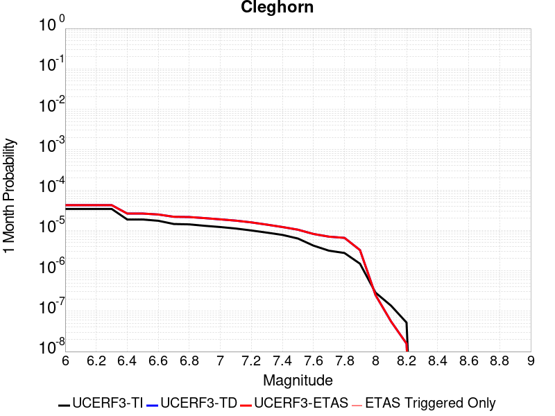 |  |  |

| Magnitude | 1 wk TI Prob | 1 wk TD Prob | 1 wk ETAS Prob | 1 wk ETAS/TD Gain | 1 wk ETAS Triggered Only | 1 mo TI Prob | 1 mo TD Prob | 1 mo ETAS Prob | 1 mo ETAS/TD Gain | 1 mo ETAS Triggered Only | 1 yr TI Prob | 1 yr TD Prob | 1 yr ETAS Prob | 1 yr ETAS/TD Gain | 1 yr ETAS Triggered Only | 10 yr TI Prob | 10 yr TD Prob | 10 yr ETAS Prob | 10 yr ETAS/TD Gain | 10 yr ETAS Triggered Only |
|-----|-----|-----|-----|-----|-----|-----|-----|-----|-----|-----|-----|-----|-----|-----|-----|-----|-----|-----|-----|-----|
| 6.0 | 7.9267165E-6 | 9.838367E-6 | 9.838367E-6 | 1.0 | 0.0 | 3.39712E-5 | 4.216381E-5 | 4.216381E-5 | 1.0 | 0.0 | 4.1352084E-4 | 5.1323406E-4 | 5.485966E-4 | 1.0689014 | 3.5380697E-5 | 0.004127522 | 0.005135526 | 0.0052059237 | 1.013708 | 7.0761394E-5 |
| 6.1 | 7.9267165E-6 | 9.838367E-6 | 9.838367E-6 | 1.0 | 0.0 | 3.39712E-5 | 4.216381E-5 | 4.216381E-5 | 1.0 | 0.0 | 4.1352084E-4 | 5.1323406E-4 | 5.485966E-4 | 1.0689014 | 3.5380697E-5 | 0.004127522 | 0.005135526 | 0.0052059237 | 1.013708 | 7.0761394E-5 |
| 6.2 | 7.9267165E-6 | 9.838367E-6 | 9.838367E-6 | 1.0 | 0.0 | 3.39712E-5 | 4.216381E-5 | 4.216381E-5 | 1.0 | 0.0 | 4.1352084E-4 | 5.1323406E-4 | 5.485966E-4 | 1.0689014 | 3.5380697E-5 | 0.004127522 | 0.005135526 | 0.0052059237 | 1.013708 | 7.0761394E-5 |
| 6.3 | 7.9267165E-6 | 9.838367E-6 | 9.838367E-6 | 1.0 | 0.0 | 3.39712E-5 | 4.216381E-5 | 4.216381E-5 | 1.0 | 0.0 | 4.1352084E-4 | 5.1323406E-4 | 5.485966E-4 | 1.0689014 | 3.5380697E-5 | 0.004127522 | 0.005135526 | 0.0052059237 | 1.013708 | 7.0761394E-5 |
| 6.4 | 4.3445207E-6 | 6.0981406E-6 | 6.0981406E-6 | 1.0 | 0.0 | 1.8619241E-5 | 2.6134632E-5 | 2.6134632E-5 | 1.0 | 0.0 | 2.2666567E-4 | 3.181437E-4 | 3.5351314E-4 | 1.1111745 | 3.5380697E-5 | 0.0022643462 | 0.003190997 | 0.0032615326 | 1.0221046 | 7.0761394E-5 |
| 6.5 | 4.3445207E-6 | 6.0981406E-6 | 6.0981406E-6 | 1.0 | 0.0 | 1.8619241E-5 | 2.6134632E-5 | 2.6134632E-5 | 1.0 | 0.0 | 2.2666567E-4 | 3.181437E-4 | 3.5351314E-4 | 1.1111745 | 3.5380697E-5 | 0.0022643462 | 0.003190997 | 0.0032615326 | 1.0221046 | 7.0761394E-5 |
| 6.6 | 4.040109E-6 | 5.780541E-6 | 5.780541E-6 | 1.0 | 0.0 | 1.7314638E-5 | 2.4773517E-5 | 2.4773517E-5 | 1.0 | 0.0 | 2.1078532E-4 | 3.0157674E-4 | 3.3694677E-4 | 1.1172837 | 3.5380697E-5 | 0.002105855 | 0.0030257835 | 0.003096331 | 1.0233154 | 7.0761394E-5 |
| 6.7 | 3.3632055E-6 | 5.074022E-6 | 5.074022E-6 | 1.0 | 0.0 | 1.4413658E-5 | 2.1745627E-5 | 2.1745627E-5 | 1.0 | 0.0 | 1.7547216E-4 | 2.6472117E-4 | 3.000925E-4 | 1.1336173 | 3.5380697E-5 | 0.0017533366 | 0.0026581106 | 0.0027286839 | 1.0265502 | 7.0761394E-5 |
| 6.8 | 3.2902772E-6 | 4.9959262E-6 | 4.9959262E-6 | 1.0 | 0.0 | 1.4101111E-5 | 2.1410939E-5 | 2.1410939E-5 | 1.0 | 0.0 | 1.716675E-4 | 2.606473E-4 | 2.9601878E-4 | 1.1357063 | 3.5380697E-5 | 0.0017153495 | 0.0026174681 | 0.0026880442 | 1.0269635 | 7.0761394E-5 |
| 6.9 | 3.031547E-6 | 4.6974637E-6 | 4.6974637E-6 | 1.0 | 0.0 | 1.299228E-5 | 2.0131833E-5 | 2.0131833E-5 | 1.0 | 0.0 | 1.5816953E-4 | 2.4507777E-4 | 2.804498E-4 | 1.1443298 | 3.5380697E-5 | 0.00158057 | 0.002462125 | 0.0025327122 | 1.0286692 | 7.0761394E-5 |
| 7.0 | 2.8259715E-6 | 4.3764653E-6 | 4.3764653E-6 | 1.0 | 0.0 | 1.211125E-5 | 1.8756145E-5 | 1.8756145E-5 | 1.0 | 0.0 | 1.4744449E-4 | 2.2833238E-4 | 2.63705E-4 | 1.1549172 | 3.5380697E-5 | 0.001473467 | 0.0022950263 | 0.0023656255 | 1.0307617 | 7.0761394E-5 |
| 7.1 | 2.5962665E-6 | 4.071453E-6 | 4.071453E-6 | 1.0 | 0.0 | 1.1126809E-5 | 1.7448969E-5 | 1.7448969E-5 | 1.0 | 0.0 | 1.3546048E-4 | 2.124207E-4 | 2.4779388E-4 | 1.1665242 | 3.5380697E-5 | 0.0013537793 | 0.0021362302 | 0.0022068403 | 1.0330536 | 7.0761394E-5 |
| 7.2 | 2.3247253E-6 | 3.6817423E-6 | 3.6817423E-6 | 1.0 | 0.0 | 9.96307E-6 | 1.5778802E-5 | 1.5778802E-5 | 1.0 | 0.0 | 1.21293626E-4 | 1.9209016E-4 | 2.2746406E-4 | 1.1841526 | 3.5380697E-5 | 0.0012122744 | 0.0019333162 | 0.0020039408 | 1.0365303 | 7.0761394E-5 |
| 7.3 | 2.056928E-6 | 3.2399425E-6 | 3.2399425E-6 | 1.0 | 0.0 | 8.815376E-6 | 1.3885395E-5 | 1.3885395E-5 | 1.0 | 0.0 | 1.0732192E-4 | 1.6904173E-4 | 2.0441644E-4 | 1.2092662 | 3.5380697E-5 | 0.001072701 | 0.0017032728 | 0.0017739137 | 1.0414736 | 7.0761394E-5 |
| 7.4 | 1.8055999E-6 | 2.8298966E-6 | 2.8298966E-6 | 1.0 | 0.0 | 7.738263E-6 | 1.2128073E-5 | 1.2128073E-5 | 1.0 | 0.0 | 9.4209274E-5 | 1.4764942E-4 | 1.830249E-4 | 1.239591 | 3.5380697E-5 | 9.4169343E-4 | 0.0014897923 | 0.0015604482 | 1.0474267 | 7.0761394E-5 |
| 7.5 | 1.4683443E-6 | 2.4289393E-6 | 2.4289393E-6 | 1.0 | 0.0 | 6.292889E-6 | 1.0409699E-5 | 1.0409699E-5 | 1.0 | 0.0 | 7.661323E-5 | 1.2673081E-4 | 1.6210703E-4 | 1.2791445 | 3.5380697E-5 | 7.658682E-4 | 0.0012809072 | 0.0013515779 | 1.0551724 | 7.0761394E-5 |
| 7.6 | 9.804088E-7 | 1.9043657E-6 | 1.9043657E-6 | 1.0 | 0.0 | 4.201745E-6 | 8.161543E-6 | 8.161543E-6 | 1.0 | 0.0 | 5.1155046E-5 | 9.9362296E-5 | 1.3473947E-4 | 1.3560423 | 3.5380697E-5 | 5.114327E-4 | 0.0010075356 | 0.0010782257 | 1.0701613 | 7.0761394E-5 |
| 7.7 | 7.3434086E-7 | 1.6324341E-6 | 1.6324341E-6 | 1.0 | 0.0 | 3.1471714E-6 | 6.9961275E-6 | 6.9961275E-6 | 1.0 | 0.0 | 3.831614E-5 | 8.517455E-5 | 1.2055223E-4 | 1.4153551 | 3.5380697E-5 | 3.8309532E-4 | 8.6581067E-4 | 9.011607E-4 | 1.0408288 | 3.5380697E-5 |
| 7.8 | 6.434184E-7 | 1.5257981E-6 | 1.5257981E-6 | 1.0 | 0.0 | 2.7575045E-6 | 6.5391187E-6 | 6.5391187E-6 | 1.0 | 0.0 | 3.35721E-5 | 7.961089E-5 | 1.1498876E-4 | 1.4443849 | 3.5380697E-5 | 3.3567028E-4 | 8.098763E-4 | 8.452283E-4 | 1.0436511 | 3.5380697E-5 |
| 7.9 | 3.4943926E-7 | 7.594313E-7 | 7.594313E-7 | 1.0 | 0.0 | 1.497596E-6 | 3.2547016E-6 | 3.2547016E-6 | 1.0 | 0.0 | 1.8233079E-5 | 3.962528E-5 | 7.500457E-5 | 1.8928466 | 3.5380697E-5 | 1.8231584E-4 | 4.050159E-4 | 4.4038225E-4 | 1.0873209 | 3.5380697E-5 |
| 8.0 | 6.717524E-8 | 5.8598772E-8 | 5.8598772E-8 | 1.0 | 0.0 | 2.8789387E-7 | 2.5113755E-7 | 2.5113755E-7 | 1.0 | 0.0 | 3.505102E-6 | 3.0575957E-6 | 3.0575957E-6 | 1.0 | 0.0 | 3.5050467E-5 | 3.28481E-5 | 3.28481E-5 | 1.0 | 0.0 |
| 8.1 | 3.1984914E-8 | 1.3024658E-8 | 1.3024658E-8 | 1.0 | 0.0 | 1.370782E-7 | 5.5819964E-8 | 5.5819964E-8 | 1.0 | 0.0 | 1.6689258E-6 | 6.7960787E-7 | 6.7960787E-7 | 1.0 | 0.0 | 1.6689133E-5 | 7.7832365E-6 | 7.7832365E-6 | 1.0 | 0.0 |
| 8.2 | 1.21887656E-8 | 3.6706735E-9 | 3.6706735E-9 | 1.0 | 0.0 | 5.2237567E-8 | 1.5731459E-8 | 1.5731459E-8 | 1.0 | 0.0 | 6.359922E-7 | 1.9153049E-7 | 1.9153049E-7 | 1.0 | 0.0 | 6.3599036E-6 | 2.2593056E-6 | 2.2593056E-6 | 1.0 | 0.0 |

## Mission Creek
*[(top)](#table-of-contents)*

| 1 Week | 1 Month | 1 Year | 10 Year |
|-----|-----|-----|-----|
|  |  |  |  |

| Magnitude | 1 wk TI Prob | 1 wk TD Prob | 1 wk ETAS Prob | 1 wk ETAS/TD Gain | 1 wk ETAS Triggered Only | 1 mo TI Prob | 1 mo TD Prob | 1 mo ETAS Prob | 1 mo ETAS/TD Gain | 1 mo ETAS Triggered Only | 1 yr TI Prob | 1 yr TD Prob | 1 yr ETAS Prob | 1 yr ETAS/TD Gain | 1 yr ETAS Triggered Only | 10 yr TI Prob | 10 yr TD Prob | 10 yr ETAS Prob | 10 yr ETAS/TD Gain | 10 yr ETAS Triggered Only |
|-----|-----|-----|-----|-----|-----|-----|-----|-----|-----|-----|-----|-----|-----|-----|-----|-----|-----|-----|-----|-----|
| 6.0 | 1.1549387E-5 | 1.6331744E-5 | 1.6331744E-5 | 1.0 | 0.0 | 4.9496433E-5 | 6.9991394E-5 | 6.9991394E-5 | 1.0 | 0.0 | 6.0245243E-4 | 8.5182703E-4 | 8.5182703E-4 | 1.0 | 0.0 | 0.006008218 | 0.008514742 | 0.0085498225 | 1.0041199 | 3.5380697E-5 |
| 6.1 | 1.1549387E-5 | 1.6331744E-5 | 1.6331744E-5 | 1.0 | 0.0 | 4.9496433E-5 | 6.9991394E-5 | 6.9991394E-5 | 1.0 | 0.0 | 6.0245243E-4 | 8.5182703E-4 | 8.5182703E-4 | 1.0 | 0.0 | 0.006008218 | 0.008514742 | 0.0085498225 | 1.0041199 | 3.5380697E-5 |
| 6.2 | 1.1549387E-5 | 1.6331744E-5 | 1.6331744E-5 | 1.0 | 0.0 | 4.9496433E-5 | 6.9991394E-5 | 6.9991394E-5 | 1.0 | 0.0 | 6.0245243E-4 | 8.5182703E-4 | 8.5182703E-4 | 1.0 | 0.0 | 0.006008218 | 0.008514742 | 0.0085498225 | 1.0041199 | 3.5380697E-5 |
| 6.3 | 1.1549387E-5 | 1.6331744E-5 | 1.6331744E-5 | 1.0 | 0.0 | 4.9496433E-5 | 6.9991394E-5 | 6.9991394E-5 | 1.0 | 0.0 | 6.0245243E-4 | 8.5182703E-4 | 8.5182703E-4 | 1.0 | 0.0 | 0.006008218 | 0.008514742 | 0.0085498225 | 1.0041199 | 3.5380697E-5 |
| 6.4 | 1.1549387E-5 | 1.6331744E-5 | 1.6331744E-5 | 1.0 | 0.0 | 4.9496433E-5 | 6.9991394E-5 | 6.9991394E-5 | 1.0 | 0.0 | 6.0245243E-4 | 8.5182703E-4 | 8.5182703E-4 | 1.0 | 0.0 | 0.006008218 | 0.008514742 | 0.0085498225 | 1.0041199 | 3.5380697E-5 |
| 6.5 | 1.1549387E-5 | 1.6331744E-5 | 1.6331744E-5 | 1.0 | 0.0 | 4.9496433E-5 | 6.9991394E-5 | 6.9991394E-5 | 1.0 | 0.0 | 6.0245243E-4 | 8.5182703E-4 | 8.5182703E-4 | 1.0 | 0.0 | 0.006008218 | 0.008514742 | 0.0085498225 | 1.0041199 | 3.5380697E-5 |
| 6.6 | 9.202681E-6 | 1.3854947E-5 | 1.3854947E-5 | 1.0 | 0.0 | 3.9439463E-5 | 5.9377046E-5 | 5.9377046E-5 | 1.0 | 0.0 | 4.800697E-4 | 7.226848E-4 | 7.226848E-4 | 1.0 | 0.0 | 0.004790339 | 0.007231895 | 0.0072670192 | 1.004857 | 3.5380697E-5 |
| 6.7 | 9.019164E-6 | 1.366061E-5 | 1.366061E-5 | 1.0 | 0.0 | 3.8652986E-5 | 5.854421E-5 | 5.854421E-5 | 1.0 | 0.0 | 4.7049852E-4 | 7.1255164E-4 | 7.1255164E-4 | 1.0 | 0.0 | 0.004695036 | 0.007131216 | 0.0071663447 | 1.004926 | 3.5380697E-5 |
| 6.8 | 8.673558E-6 | 1.3282702E-5 | 1.3282702E-5 | 1.0 | 0.0 | 3.717186E-5 | 5.6924673E-5 | 5.6924673E-5 | 1.0 | 0.0 | 4.524734E-4 | 6.928463E-4 | 6.928463E-4 | 1.0 | 0.0 | 0.0045155324 | 0.0069353953 | 0.0069705304 | 1.005066 | 3.5380697E-5 |
| 6.9 | 7.002255E-6 | 1.1486859E-5 | 1.1486859E-5 | 1.0 | 0.0 | 3.000932E-5 | 4.9228507E-5 | 4.9228507E-5 | 1.0 | 0.0 | 3.653022E-4 | 5.991991E-4 | 5.991991E-4 | 1.0 | 0.0 | 0.0036470229 | 0.0060041854 | 0.006039354 | 1.0058573 | 3.5380697E-5 |
| 7.0 | 5.84644E-6 | 9.683714E-6 | 9.683714E-6 | 1.0 | 0.0 | 2.5055931E-5 | 4.1500996E-5 | 4.1500996E-5 | 1.0 | 0.0 | 3.0501327E-4 | 5.0516205E-4 | 5.0516205E-4 | 1.0 | 0.0 | 0.0030459496 | 0.005068281 | 0.0051034824 | 1.0069454 | 3.5380697E-5 |
| 7.1 | 5.54703E-6 | 9.338158E-6 | 9.338158E-6 | 1.0 | 0.0 | 2.377277E-5 | 4.0020088E-5 | 4.0020088E-5 | 1.0 | 0.0 | 2.8939504E-4 | 4.871401E-4 | 4.871401E-4 | 1.0 | 0.0 | 0.0028901845 | 0.0048888596 | 0.0049240673 | 1.0072017 | 3.5380697E-5 |
| 7.2 | 4.384709E-6 | 7.689885E-6 | 7.689885E-6 | 1.0 | 0.0 | 1.8791474E-5 | 3.2956254E-5 | 3.2956254E-5 | 1.0 | 0.0 | 2.2876218E-4 | 4.0117218E-4 | 4.0117218E-4 | 1.0 | 0.0 | 0.0022852682 | 0.0040325816 | 0.0040678196 | 1.0087383 | 3.5380697E-5 |
| 7.3 | 3.7888456E-6 | 6.923602E-6 | 6.923602E-6 | 1.0 | 0.0 | 1.623781E-5 | 2.9672263E-5 | 2.9672263E-5 | 1.0 | 0.0 | 1.9767738E-4 | 3.6120327E-4 | 3.6120327E-4 | 1.0 | 0.0 | 0.0019750162 | 0.0036342472 | 0.0036694994 | 1.0097 | 3.5380697E-5 |
| 7.4 | 2.1982462E-6 | 5.0316853E-6 | 5.0316853E-6 | 1.0 | 0.0 | 9.421021E-6 | 2.1564189E-5 | 2.1564189E-5 | 1.0 | 0.0 | 1.1469489E-4 | 2.6251256E-4 | 2.6251256E-4 | 1.0 | 0.0 | 0.0011463572 | 0.0026498951 | 0.002685182 | 1.0133164 | 3.5380697E-5 |
| 7.5 | 2.051923E-6 | 4.6227096E-6 | 4.6227096E-6 | 1.0 | 0.0 | 8.793926E-6 | 1.9811463E-5 | 1.9811463E-5 | 1.0 | 0.0 | 1.0706078E-4 | 2.4117802E-4 | 2.4117802E-4 | 1.0 | 0.0 | 0.0010700922 | 0.0024374423 | 0.0024727369 | 1.0144801 | 3.5380697E-5 |
| 7.6 | 1.8733427E-6 | 4.1308053E-6 | 4.1308053E-6 | 1.0 | 0.0 | 8.028587E-6 | 1.7703333E-5 | 1.7703333E-5 | 1.0 | 0.0 | 9.774366E-5 | 2.1551683E-4 | 2.1551683E-4 | 1.0 | 0.0 | 9.770069E-4 | 0.002181846 | 0.0022171494 | 1.0161805 | 3.5380697E-5 |
| 7.7 | 1.8411953E-6 | 4.0504306E-6 | 4.0504306E-6 | 1.0 | 0.0 | 7.890813E-6 | 1.7358872E-5 | 1.7358872E-5 | 1.0 | 0.0 | 9.606641E-5 | 2.1132386E-4 | 2.1132386E-4 | 1.0 | 0.0 | 9.6024893E-4 | 0.0021401057 | 0.0021754107 | 1.0164969 | 3.5380697E-5 |
| 7.8 | 1.7194251E-6 | 3.7173024E-6 | 3.7173024E-6 | 1.0 | 0.0 | 7.368944E-6 | 1.59312E-5 | 1.59312E-5 | 1.0 | 0.0 | 8.97132E-5 | 1.9394518E-4 | 1.9394518E-4 | 1.0 | 0.0 | 8.967699E-4 | 0.0019658357 | 0.0020011468 | 1.0179625 | 3.5380697E-5 |
| 7.9 | 1.4035052E-6 | 2.9557E-6 | 2.9557E-6 | 1.0 | 0.0 | 6.0150082E-6 | 1.2667225E-5 | 1.2667225E-5 | 1.0 | 0.0 | 7.3230265E-5 | 1.5421261E-4 | 1.5421261E-4 | 1.0 | 0.0 | 7.3206134E-4 | 0.0015659636 | 0.0016012889 | 1.0225582 | 3.5380697E-5 |
| 8.0 | 3.9318823E-7 | 5.542283E-7 | 5.542283E-7 | 1.0 | 0.0 | 1.6850913E-6 | 2.3752618E-6 | 2.3752618E-6 | 1.0 | 0.0 | 2.0515794E-5 | 2.8918435E-5 | 2.8918435E-5 | 1.0 | 0.0 | 2.0513899E-4 | 2.997098E-4 | 2.997098E-4 | 1.0 | 0.0 |
| 8.1 | 1.596793E-7 | 1.1427638E-7 | 1.1427638E-7 | 1.0 | 0.0 | 6.8433974E-7 | 4.8975585E-7 | 4.8975585E-7 | 1.0 | 0.0 | 8.331805E-6 | 5.962761E-6 | 5.962761E-6 | 1.0 | 0.0 | 8.331492E-5 | 6.57585E-5 | 6.57585E-5 | 1.0 | 0.0 |
| 8.2 | 4.9003038E-8 | 2.5565779E-8 | 2.5565779E-8 | 1.0 | 0.0 | 2.10013E-7 | 1.09567615E-7 | 1.09567615E-7 | 1.0 | 0.0 | 2.5569052E-6 | 1.3339849E-6 | 1.3339849E-6 | 1.0 | 0.0 | 2.556876E-5 | 1.5023335E-5 | 1.5023335E-5 | 1.0 | 0.0 |

## San Andreas (North Coast) 2011 CFM
*[(top)](#table-of-contents)*

| 1 Week | 1 Month | 1 Year | 10 Year |
|-----|-----|-----|-----|
|  |  |  |  |

| Magnitude | 1 wk TI Prob | 1 wk TD Prob | 1 wk ETAS Prob | 1 wk ETAS/TD Gain | 1 wk ETAS Triggered Only | 1 mo TI Prob | 1 mo TD Prob | 1 mo ETAS Prob | 1 mo ETAS/TD Gain | 1 mo ETAS Triggered Only | 1 yr TI Prob | 1 yr TD Prob | 1 yr ETAS Prob | 1 yr ETAS/TD Gain | 1 yr ETAS Triggered Only | 10 yr TI Prob | 10 yr TD Prob | 10 yr ETAS Prob | 10 yr ETAS/TD Gain | 10 yr ETAS Triggered Only |
|-----|-----|-----|-----|-----|-----|-----|-----|-----|-----|-----|-----|-----|-----|-----|-----|-----|-----|-----|-----|-----|
| 6.0 | 1.5333705E-4 | 7.1250375E-5 | 7.1250375E-5 | 1.0 | 0.0 | 6.5699324E-4 | 3.053232E-4 | 3.053232E-4 | 1.0 | 0.0 | 0.007969595 | 0.0037110075 | 0.0037110075 | 1.0 | 0.0 | 0.0768977 | 0.039427705 | 0.03946169 | 1.000862 | 3.5380697E-5 |
| 6.1 | 1.5333705E-4 | 7.1250375E-5 | 7.1250375E-5 | 1.0 | 0.0 | 6.5699324E-4 | 3.053232E-4 | 3.053232E-4 | 1.0 | 0.0 | 0.007969595 | 0.0037110075 | 0.0037110075 | 1.0 | 0.0 | 0.0768977 | 0.039427705 | 0.03946169 | 1.000862 | 3.5380697E-5 |
| 6.2 | 1.3912938E-4 | 6.062947E-5 | 6.062947E-5 | 1.0 | 0.0 | 5.961325E-4 | 2.5981484E-4 | 2.5981484E-4 | 1.0 | 0.0 | 0.007233787 | 0.0031586846 | 0.0031586846 | 1.0 | 0.0 | 0.07002798 | 0.033759642 | 0.03379383 | 1.0010127 | 3.5380697E-5 |
| 6.3 | 1.3912938E-4 | 6.062947E-5 | 6.062947E-5 | 1.0 | 0.0 | 5.961325E-4 | 2.5981484E-4 | 2.5981484E-4 | 1.0 | 0.0 | 0.007233787 | 0.0031586846 | 0.0031586846 | 1.0 | 0.0 | 0.07002798 | 0.033759642 | 0.03379383 | 1.0010127 | 3.5380697E-5 |
| 6.4 | 1.2623647E-4 | 5.0554227E-5 | 5.0554227E-5 | 1.0 | 0.0 | 5.4090127E-4 | 2.166431E-4 | 2.166431E-4 | 1.0 | 0.0 | 0.0065656058 | 0.0026344592 | 0.0026344592 | 1.0 | 0.0 | 0.06374981 | 0.028363641 | 0.028398018 | 1.001212 | 3.5380697E-5 |
| 6.5 | 1.1736096E-4 | 4.3625514E-5 | 4.3625514E-5 | 1.0 | 0.0 | 5.028786E-4 | 1.8695318E-4 | 1.8695318E-4 | 1.0 | 0.0 | 0.006105373 | 0.0022737952 | 0.0022737952 | 1.0 | 0.0 | 0.05940335 | 0.024634827 | 0.024669336 | 1.0014008 | 3.5380697E-5 |
| 6.6 | 1.1586959E-4 | 4.252367E-5 | 4.252367E-5 | 1.0 | 0.0 | 4.964894E-4 | 1.8223166E-4 | 1.8223166E-4 | 1.0 | 0.0 | 0.006028018 | 0.002216429 | 0.002216429 | 1.0 | 0.0 | 0.058671024 | 0.02403969 | 0.02407422 | 1.0014364 | 3.5380697E-5 |
| 6.7 | 1.13693764E-4 | 4.0833464E-5 | 4.0833464E-5 | 1.0 | 0.0 | 4.87168E-4 | 1.749889E-4 | 1.749889E-4 | 1.0 | 0.0 | 0.005915152 | 0.0021284241 | 0.0021284241 | 1.0 | 0.0 | 0.057601593 | 0.023129925 | 0.023164487 | 1.0014943 | 3.5380697E-5 |
| 6.8 | 1.1204889E-4 | 4.0049228E-5 | 4.0049228E-5 | 1.0 | 0.0 | 4.8012115E-4 | 1.7162834E-4 | 1.7162834E-4 | 1.0 | 0.0 | 0.005829819 | 0.0020875887 | 0.0020875887 | 1.0 | 0.0 | 0.05679232 | 0.022689283 | 0.022723861 | 1.001524 | 3.5380697E-5 |
| 6.9 | 1.1005794E-4 | 3.9103095E-5 | 3.9103095E-5 | 1.0 | 0.0 | 4.7159163E-4 | 1.6757402E-4 | 1.6757402E-4 | 1.0 | 0.0 | 0.0057265228 | 0.0020383205 | 0.0020383205 | 1.0 | 0.0 | 0.055811852 | 0.022154024 | 0.02218862 | 1.0015616 | 3.5380697E-5 |
| 7.0 | 1.0647948E-4 | 3.7253933E-5 | 3.7253933E-5 | 1.0 | 0.0 | 4.562608E-4 | 1.5965004E-4 | 1.5965004E-4 | 1.0 | 0.0 | 0.0055408357 | 0.0019420219 | 0.0019420219 | 1.0 | 0.0 | 0.054047033 | 0.021110756 | 0.021145388 | 1.0016406 | 3.5380697E-5 |
| 7.1 | 1.04795035E-4 | 3.630107E-5 | 3.630107E-5 | 1.0 | 0.0 | 4.4904428E-4 | 1.5556683E-4 | 1.5556683E-4 | 1.0 | 0.0 | 0.0054534175 | 0.0018923962 | 0.0018923962 | 1.0 | 0.0 | 0.053215165 | 0.020577554 | 0.020612206 | 1.001684 | 3.5380697E-5 |
| 7.2 | 1.02724036E-4 | 3.5206915E-5 | 3.5206915E-5 | 1.0 | 0.0 | 4.401716E-4 | 1.5087813E-4 | 1.5087813E-4 | 1.0 | 0.0 | 0.0053459285 | 0.001835409 | 0.001835409 | 1.0 | 0.0 | 0.052191395 | 0.019965103 | 0.019999778 | 1.0017368 | 3.5380697E-5 |
| 7.3 | 1.00650694E-4 | 3.4672295E-5 | 3.4672295E-5 | 1.0 | 0.0 | 4.312888E-4 | 1.4858718E-4 | 1.4858718E-4 | 1.0 | 0.0 | 0.005238306 | 0.0018075631 | 0.0018075631 | 1.0 | 0.0 | 0.051165357 | 0.019641154 | 0.019675838 | 1.001766 | 3.5380697E-5 |
| 7.4 | 9.672919E-5 | 3.345712E-5 | 3.345712E-5 | 1.0 | 0.0 | 4.144878E-4 | 1.4337986E-4 | 1.4337986E-4 | 1.0 | 0.0 | 0.005034718 | 0.0017442673 | 0.0017442673 | 1.0 | 0.0 | 0.049221683 | 0.01891206 | 0.01894677 | 1.0018355 | 3.5380697E-5 |
| 7.5 | 8.7600405E-5 | 2.2763736E-5 | 2.2763736E-5 | 1.0 | 0.0 | 3.753763E-4 | 9.7555225E-5 | 9.7555225E-5 | 1.0 | 0.0 | 0.0045606326 | 0.0011870895 | 0.0011870895 | 1.0 | 0.0 | 0.04468165 | 0.013166346 | 0.01320126 | 1.0026518 | 3.5380697E-5 |
| 7.6 | 7.9562284E-5 | 1.9283596E-5 | 1.9283596E-5 | 1.0 | 0.0 | 3.4093665E-4 | 8.264137E-5 | 8.264137E-5 | 1.0 | 0.0 | 0.0041430052 | 0.0010056958 | 0.0010056958 | 1.0 | 0.0 | 0.040666126 | 0.011254854 | 0.011289836 | 1.0031083 | 3.5380697E-5 |
| 7.7 | 6.3866544E-5 | 1.1986498E-5 | 1.1986498E-5 | 1.0 | 0.0 | 2.7368503E-4 | 5.1369694E-5 | 5.1369694E-5 | 1.0 | 0.0 | 0.0033270244 | 6.2524684E-4 | 6.2524684E-4 | 1.0 | 0.0 | 0.032776527 | 0.0072368314 | 0.007271956 | 1.0048536 | 3.5380697E-5 |
| 7.8 | 4.2543215E-5 | 9.112785E-6 | 9.112785E-6 | 1.0 | 0.0 | 1.8231533E-4 | 3.9054208E-5 | 3.9054208E-5 | 1.0 | 0.0 | 0.0022174292 | 4.7538136E-4 | 4.7538136E-4 | 1.0 | 0.0 | 0.021954332 | 0.005511731 | 0.0055469167 | 1.0063838 | 3.5380697E-5 |
| 7.9 | 2.2636612E-5 | 7.844561E-6 | 7.844561E-6 | 1.0 | 0.0 | 9.7010445E-5 | 3.3619115E-5 | 3.3619115E-5 | 1.0 | 0.0 | 0.0011804621 | 4.0923594E-4 | 4.0923594E-4 | 1.0 | 0.0 | 0.011742111 | 0.004700338 | 0.0047355527 | 1.0074918 | 3.5380697E-5 |
| 8.0 | 1.5167874E-5 | 7.07659E-6 | 7.07659E-6 | 1.0 | 0.0 | 6.500356E-5 | 3.032789E-5 | 3.032789E-5 | 1.0 | 0.0 | 7.9113094E-4 | 3.691796E-4 | 3.691796E-4 | 1.0 | 0.0 | 0.007883203 | 0.004230647 | 0.004265878 | 1.0083276 | 3.5380697E-5 |
| 8.1 | 1.0681047E-5 | 6.411601E-6 | 6.411601E-6 | 1.0 | 0.0 | 4.5775112E-5 | 2.7478001E-5 | 2.7478001E-5 | 1.0 | 0.0 | 5.5716943E-4 | 3.344934E-4 | 3.344934E-4 | 1.0 | 0.0 | 0.0055577457 | 0.0038309463 | 0.0038661913 | 1.0092001 | 3.5380697E-5 |
| 8.2 | 8.226114E-6 | 5.13432E-6 | 5.13432E-6 | 1.0 | 0.0 | 3.52543E-5 | 2.2004044E-5 | 2.2004044E-5 | 1.0 | 0.0 | 4.2913653E-4 | 2.678664E-4 | 2.678664E-4 | 1.0 | 0.0 | 0.004283088 | 0.0030556484 | 0.0030556484 | 1.0 | 0.0 |
| 8.3 | 1.983087E-6 | 7.693574E-7 | 7.693574E-7 | 1.0 | 0.0 | 8.498917E-6 | 3.297242E-6 | 3.297242E-6 | 1.0 | 0.0 | 1.034694E-4 | 4.01432E-5 | 4.01432E-5 | 1.0 | 0.0 | 0.0010342124 | 4.7390026E-4 | 4.7390026E-4 | 1.0 | 0.0 |

## San Jacinto (Borrego)
*[(top)](#table-of-contents)*

| 1 Week | 1 Month | 1 Year | 10 Year |
|-----|-----|-----|-----|
|  |  |  |  |

| Magnitude | 1 wk TI Prob | 1 wk TD Prob | 1 wk ETAS Prob | 1 wk ETAS/TD Gain | 1 wk ETAS Triggered Only | 1 mo TI Prob | 1 mo TD Prob | 1 mo ETAS Prob | 1 mo ETAS/TD Gain | 1 mo ETAS Triggered Only | 1 yr TI Prob | 1 yr TD Prob | 1 yr ETAS Prob | 1 yr ETAS/TD Gain | 1 yr ETAS Triggered Only | 10 yr TI Prob | 10 yr TD Prob | 10 yr ETAS Prob | 10 yr ETAS/TD Gain | 10 yr ETAS Triggered Only |
|-----|-----|-----|-----|-----|-----|-----|-----|-----|-----|-----|-----|-----|-----|-----|-----|-----|-----|-----|-----|-----|
| 6.0 | 3.543992E-5 | 2.7956603E-5 | 2.7956603E-5 | 1.0 | 0.0 | 1.5187653E-4 | 1.1980858E-4 | 1.1980858E-4 | 1.0 | 0.0 | 0.0018475284 | 0.0014577056 | 0.0014930348 | 1.0242361 | 3.5380697E-5 | 0.018322436 | 0.014885285 | 0.014920139 | 1.0023415 | 3.5380697E-5 |
| 6.1 | 3.542281E-5 | 2.7956603E-5 | 2.7956603E-5 | 1.0 | 0.0 | 1.5180321E-4 | 1.1980858E-4 | 1.1980858E-4 | 1.0 | 0.0 | 0.0018466372 | 0.0014577056 | 0.0014930348 | 1.0242361 | 3.5380697E-5 | 0.018313672 | 0.014885285 | 0.014920139 | 1.0023415 | 3.5380697E-5 |
| 6.2 | 3.4688688E-5 | 2.7956603E-5 | 2.7956603E-5 | 1.0 | 0.0 | 1.4865733E-4 | 1.19808574E-4 | 1.19808574E-4 | 1.0 | 0.0 | 0.0018084005 | 0.0014577056 | 0.0014930348 | 1.0242361 | 3.5380697E-5 | 0.017937548 | 0.014885284 | 0.014920138 | 1.0023415 | 3.5380697E-5 |
| 6.3 | 3.2087122E-5 | 2.7801936E-5 | 2.7801936E-5 | 1.0 | 0.0 | 1.3750899E-4 | 1.19145785E-4 | 1.19145785E-4 | 1.0 | 0.0 | 0.0016728862 | 0.0014496469 | 0.0014849763 | 1.024371 | 3.5380697E-5 | 0.016603488 | 0.014806312 | 0.014841168 | 1.0023541 | 3.5380697E-5 |
| 6.4 | 3.1828724E-5 | 2.7768916E-5 | 2.7768916E-5 | 1.0 | 0.0 | 1.364017E-4 | 1.1900428E-4 | 1.1900428E-4 | 1.0 | 0.0 | 0.0016594254 | 0.0014479264 | 0.0014832559 | 1.0244 | 3.5380697E-5 | 0.016470885 | 0.014789388 | 0.014824245 | 1.0023569 | 3.5380697E-5 |
| 6.5 | 3.1563577E-5 | 2.7508588E-5 | 2.7508588E-5 | 1.0 | 0.0 | 1.3526545E-4 | 1.1788869E-4 | 1.1788869E-4 | 1.0 | 0.0 | 0.0016456128 | 0.0014343619 | 0.0014696919 | 1.0246311 | 3.5380697E-5 | 0.0163348 | 0.014655951 | 0.014690814 | 1.0023787 | 3.5380697E-5 |
| 6.6 | 3.1467625E-5 | 2.735279E-5 | 2.735279E-5 | 1.0 | 0.0 | 1.3485427E-4 | 1.1722104E-4 | 1.1722104E-4 | 1.0 | 0.0 | 0.0016406142 | 0.001426244 | 0.0014615743 | 1.0247716 | 3.5380697E-5 | 0.016285548 | 0.014576187 | 0.014611052 | 1.0023919 | 3.5380697E-5 |
| 6.7 | 3.1223695E-5 | 2.6970763E-5 | 2.6970763E-5 | 1.0 | 0.0 | 1.3380898E-4 | 1.15583935E-4 | 1.15583935E-4 | 1.0 | 0.0 | 0.0016279068 | 0.0014063381 | 0.0014416691 | 1.0251226 | 3.5380697E-5 | 0.01616033 | 0.01438054 | 0.014415412 | 1.002425 | 3.5380697E-5 |
| 6.8 | 3.1015585E-5 | 2.6791718E-5 | 2.6791718E-5 | 1.0 | 0.0 | 1.3291716E-4 | 1.1481666E-4 | 1.1481666E-4 | 1.0 | 0.0 | 0.001617065 | 0.0013970085 | 0.0014323399 | 1.0252906 | 3.5380697E-5 | 0.016053487 | 0.014287795 | 0.01432267 | 1.0024409 | 3.5380697E-5 |
| 6.9 | 2.6641965E-5 | 2.2212334E-5 | 2.2212334E-5 | 1.0 | 0.0 | 1.1417485E-4 | 9.519226E-5 | 9.519226E-5 | 1.0 | 0.0 | 0.0013891924 | 0.0011583535 | 0.0011936933 | 1.0305085 | 3.5380697E-5 | 0.0138054015 | 0.011897102 | 0.011932062 | 1.0029385 | 3.5380697E-5 |
| 7.0 | 2.3854353E-5 | 2.0506088E-5 | 2.0506088E-5 | 1.0 | 0.0 | 1.02228936E-4 | 8.788029E-5 | 8.788029E-5 | 1.0 | 0.0 | 0.0012439266 | 0.0010694199 | 0.0011047628 | 1.0330486 | 3.5380697E-5 | 0.012369866 | 0.010996936 | 0.011031928 | 1.0031819 | 3.5380697E-5 |
| 7.1 | 2.3672901E-5 | 2.0342548E-5 | 2.0342548E-5 | 1.0 | 0.0 | 1.0145135E-4 | 8.717945E-5 | 8.717945E-5 | 1.0 | 0.0 | 0.0012344702 | 0.0010608955 | 0.0010962386 | 1.0333145 | 3.5380697E-5 | 0.0122763505 | 0.010912099 | 0.010947093 | 1.003207 | 3.5380697E-5 |
| 7.2 | 2.2717244E-5 | 1.9569701E-5 | 1.9569701E-5 | 1.0 | 0.0 | 9.735599E-5 | 8.386746E-5 | 8.386746E-5 | 1.0 | 0.0 | 0.0011846646 | 0.0010206103 | 0.001055955 | 1.0346308 | 3.5380697E-5 | 0.01178369 | 0.010509352 | 0.010544361 | 1.0033312 | 3.5380697E-5 |
| 7.3 | 2.1016205E-5 | 1.8410952E-5 | 1.8410952E-5 | 1.0 | 0.0 | 9.006634E-5 | 7.890171E-5 | 7.890171E-5 | 1.0 | 0.0 | 0.001096006 | 9.6020696E-4 | 9.955537E-4 | 1.0368116 | 3.5380697E-5 | 0.010906163 | 0.009904788 | 0.009939818 | 1.0035367 | 3.5380697E-5 |
| 7.4 | 2.0683625E-5 | 1.8213394E-5 | 1.8213394E-5 | 1.0 | 0.0 | 8.86411E-5 | 7.805508E-5 | 7.805508E-5 | 1.0 | 0.0 | 0.001078671 | 9.4990834E-4 | 9.852555E-4 | 1.0372111 | 3.5380697E-5 | 0.010734501 | 0.009801473 | 0.009836507 | 1.0035744 | 3.5380697E-5 |
| 7.5 | 1.9993966E-5 | 1.7808186E-5 | 1.7808186E-5 | 1.0 | 0.0 | 8.568561E-5 | 7.631858E-5 | 7.631858E-5 | 1.0 | 0.0 | 0.001042723 | 9.287846E-4 | 9.641325E-4 | 1.0380582 | 3.5380697E-5 | 0.010378438 | 0.009588276 | 0.009623317 | 1.0036546 | 3.5380697E-5 |
| 7.6 | 1.788966E-5 | 1.6460734E-5 | 1.6460734E-5 | 1.0 | 0.0 | 7.666772E-5 | 7.0544105E-5 | 7.0544105E-5 | 1.0 | 0.0 | 9.3302975E-4 | 8.585378E-4 | 8.938881E-4 | 1.041175 | 3.5380697E-5 | 0.00929122 | 0.008879809 | 0.008914875 | 1.003949 | 3.5380697E-5 |
| 7.7 | 1.5125781E-5 | 1.4262029E-5 | 1.4262029E-5 | 1.0 | 0.0 | 6.4823165E-5 | 6.112155E-5 | 6.112155E-5 | 1.0 | 0.0 | 7.889362E-4 | 7.4390165E-4 | 7.7925605E-4 | 1.0475256 | 3.5380697E-5 | 0.007861412 | 0.007727129 | 0.0077622365 | 1.0045434 | 3.5380697E-5 |
| 7.8 | 1.250089E-5 | 1.2654241E-5 | 1.2654241E-5 | 1.0 | 0.0 | 5.3574146E-5 | 5.423134E-5 | 5.423134E-5 | 1.0 | 0.0 | 6.5207E-4 | 6.6006713E-4 | 6.954245E-4 | 1.0535663 | 3.5380697E-5 | 0.006501599 | 0.0068802256 | 0.006915363 | 1.005107 | 3.5380697E-5 |
| 7.9 | 9.561E-6 | 9.775645E-6 | 9.775645E-6 | 1.0 | 0.0 | 4.0975072E-5 | 4.189495E-5 | 4.189495E-5 | 1.0 | 0.0 | 4.987573E-4 | 5.099522E-4 | 5.4531486E-4 | 1.069345 | 3.5380697E-5 | 0.0049763937 | 0.0053634187 | 0.0053986097 | 1.0065613 | 3.5380697E-5 |
| 8.0 | 8.01699E-6 | 8.312629E-6 | 8.312629E-6 | 1.0 | 0.0 | 3.4358076E-5 | 3.5625068E-5 | 3.5625068E-5 | 1.0 | 0.0 | 4.1822926E-4 | 4.336494E-4 | 4.6901475E-4 | 1.0815529 | 3.5380697E-5 | 0.0041744304 | 0.00458347 | 0.004618689 | 1.0076838 | 3.5380697E-5 |
| 8.1 | 6.541947E-6 | 6.477901E-6 | 6.477901E-6 | 1.0 | 0.0 | 2.8036617E-5 | 2.7762142E-5 | 2.7762142E-5 | 1.0 | 0.0 | 3.4129233E-4 | 3.3795217E-4 | 3.733209E-4 | 1.1046561 | 3.5380697E-5 | 0.0034076865 | 0.003588998 | 0.0036242516 | 1.0098227 | 3.5380697E-5 |
| 8.2 | 1.7968189E-6 | 8.0012404E-7 | 8.0012404E-7 | 1.0 | 0.0 | 7.70063E-6 | 3.4290986E-6 | 3.4290986E-6 | 1.0 | 0.0 | 9.3751136E-5 | 4.17485E-5 | 4.17485E-5 | 1.0 | 0.0 | 9.371159E-4 | 4.7288055E-4 | 4.7288055E-4 | 1.0 | 0.0 |
| 8.3 | 1.5167889E-7 | 4.9190945E-8 | 4.9190945E-8 | 1.0 | 0.0 | 6.500522E-7 | 2.1081833E-7 | 2.1081833E-7 | 1.0 | 0.0 | 7.9143565E-6 | 2.5667105E-6 | 2.5667105E-6 | 1.0 | 0.0 | 7.914075E-5 | 2.9817646E-5 | 2.9817646E-5 | 1.0 | 0.0 |

## Blue Cut
*[(top)](#table-of-contents)*

| 1 Week | 1 Month | 1 Year | 10 Year |
|-----|-----|-----|-----|
|  |  |  |  |

| Magnitude | 1 wk TI Prob | 1 wk TD Prob | 1 wk ETAS Prob | 1 wk ETAS/TD Gain | 1 wk ETAS Triggered Only | 1 mo TI Prob | 1 mo TD Prob | 1 mo ETAS Prob | 1 mo ETAS/TD Gain | 1 mo ETAS Triggered Only | 1 yr TI Prob | 1 yr TD Prob | 1 yr ETAS Prob | 1 yr ETAS/TD Gain | 1 yr ETAS Triggered Only | 10 yr TI Prob | 10 yr TD Prob | 10 yr ETAS Prob | 10 yr ETAS/TD Gain | 10 yr ETAS Triggered Only |
|-----|-----|-----|-----|-----|-----|-----|-----|-----|-----|-----|-----|-----|-----|-----|-----|-----|-----|-----|-----|-----|
| 6.0 | 2.1227985E-5 | 2.2720424E-5 | 2.2720424E-5 | 1.0 | 0.0 | 9.097391E-5 | 9.7369935E-5 | 9.7369935E-5 | 1.0 | 0.0 | 0.0011070445 | 0.0011848924 | 0.0012202311 | 1.0298245 | 3.5380697E-5 | 0.011015458 | 0.01179159 | 0.011826553 | 1.0029651 | 3.5380697E-5 |
| 6.1 | 2.1227985E-5 | 2.2720424E-5 | 2.2720424E-5 | 1.0 | 0.0 | 9.097391E-5 | 9.7369935E-5 | 9.7369935E-5 | 1.0 | 0.0 | 0.0011070445 | 0.0011848924 | 0.0012202311 | 1.0298245 | 3.5380697E-5 | 0.011015458 | 0.01179159 | 0.011826553 | 1.0029651 | 3.5380697E-5 |
| 6.2 | 2.1227985E-5 | 2.2720424E-5 | 2.2720424E-5 | 1.0 | 0.0 | 9.097391E-5 | 9.7369935E-5 | 9.7369935E-5 | 1.0 | 0.0 | 0.0011070445 | 0.0011848924 | 0.0012202311 | 1.0298245 | 3.5380697E-5 | 0.011015458 | 0.01179159 | 0.011826553 | 1.0029651 | 3.5380697E-5 |
| 6.3 | 1.1613981E-5 | 1.2353959E-5 | 1.2353959E-5 | 1.0 | 0.0 | 4.9773254E-5 | 5.2944535E-5 | 5.2944535E-5 | 1.0 | 0.0 | 6.0582085E-4 | 6.4442155E-4 | 6.4442155E-4 | 1.0 | 0.0 | 0.0060417196 | 0.006426776 | 0.006426776 | 1.0 | 0.0 |
| 6.4 | 1.1613981E-5 | 1.2353959E-5 | 1.2353959E-5 | 1.0 | 0.0 | 4.9773254E-5 | 5.2944535E-5 | 5.2944535E-5 | 1.0 | 0.0 | 6.0582085E-4 | 6.4442155E-4 | 6.4442155E-4 | 1.0 | 0.0 | 0.0060417196 | 0.006426776 | 0.006426776 | 1.0 | 0.0 |
| 6.5 | 8.931326E-6 | 9.48191E-6 | 9.48191E-6 | 1.0 | 0.0 | 3.8276554E-5 | 4.0636176E-5 | 4.0636176E-5 | 1.0 | 0.0 | 4.6591737E-4 | 4.9464224E-4 | 4.9464224E-4 | 1.0 | 0.0 | 0.0046494175 | 0.004936322 | 0.004936322 | 1.0 | 0.0 |
| 6.6 | 7.345353E-6 | 7.79053E-6 | 7.79053E-6 | 1.0 | 0.0 | 3.1479703E-5 | 3.33876E-5 | 3.33876E-5 | 1.0 | 0.0 | 3.83198E-4 | 4.0642623E-4 | 4.0642623E-4 | 1.0 | 0.0 | 0.0038253788 | 0.004057621 | 0.004057621 | 1.0 | 0.0 |
| 6.7 | 6.2775666E-6 | 6.655361E-6 | 6.655361E-6 | 1.0 | 0.0 | 2.690358E-5 | 2.8522707E-5 | 2.8522707E-5 | 1.0 | 0.0 | 3.2750185E-4 | 3.4721615E-4 | 3.4721615E-4 | 1.0 | 0.0 | 0.0032701963 | 0.0034674776 | 0.0034674776 | 1.0 | 0.0 |
| 6.8 | 5.5234095E-6 | 5.855298E-6 | 5.855298E-6 | 1.0 | 0.0 | 2.367154E-5 | 2.5093934E-5 | 2.5093934E-5 | 1.0 | 0.0 | 2.8816288E-4 | 3.054831E-4 | 3.054831E-4 | 1.0 | 0.0 | 0.002877895 | 0.0030513476 | 0.0030513476 | 1.0 | 0.0 |
| 6.9 | 4.7780054E-6 | 5.065582E-6 | 5.065582E-6 | 1.0 | 0.0 | 2.0477004E-5 | 2.1709497E-5 | 2.1709497E-5 | 1.0 | 0.0 | 2.4927902E-4 | 2.642881E-4 | 2.642881E-4 | 1.0 | 0.0 | 0.0024899957 | 0.0026404303 | 0.0026404303 | 1.0 | 0.0 |
| 7.0 | 3.883171E-6 | 4.1186195E-6 | 4.1186195E-6 | 1.0 | 0.0 | 1.6642054E-5 | 1.7651146E-5 | 1.7651146E-5 | 1.0 | 0.0 | 2.0259817E-4 | 2.148884E-4 | 2.148884E-4 | 1.0 | 0.0 | 0.0020241356 | 0.0021474818 | 0.0021474818 | 1.0 | 0.0 |
| 7.1 | 2.8358215E-6 | 3.0098138E-6 | 3.0098138E-6 | 1.0 | 0.0 | 1.2153464E-5 | 1.2899175E-5 | 1.2899175E-5 | 1.0 | 0.0 | 1.4795837E-4 | 1.5704273E-4 | 1.5704273E-4 | 1.0 | 0.0 | 0.001478599 | 0.0015699627 | 0.0015699627 | 1.0 | 0.0 |

## Santa Rosa Island
*[(top)](#table-of-contents)*

| 1 Week | 1 Month | 1 Year | 10 Year |
|-----|-----|-----|-----|
|  | 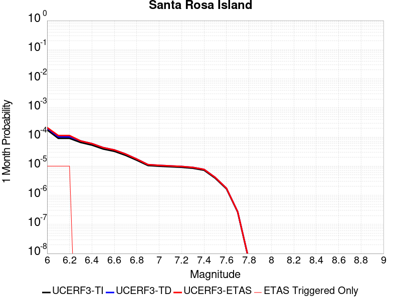 |  |  |

| Magnitude | 1 wk TI Prob | 1 wk TD Prob | 1 wk ETAS Prob | 1 wk ETAS/TD Gain | 1 wk ETAS Triggered Only | 1 mo TI Prob | 1 mo TD Prob | 1 mo ETAS Prob | 1 mo ETAS/TD Gain | 1 mo ETAS Triggered Only | 1 yr TI Prob | 1 yr TD Prob | 1 yr ETAS Prob | 1 yr ETAS/TD Gain | 1 yr ETAS Triggered Only | 10 yr TI Prob | 10 yr TD Prob | 10 yr ETAS Prob | 10 yr ETAS/TD Gain | 10 yr ETAS Triggered Only |
|-----|-----|-----|-----|-----|-----|-----|-----|-----|-----|-----|-----|-----|-----|-----|-----|-----|-----|-----|-----|-----|
| 6.0 | 4.1143165E-5 | 4.7094767E-5 | 8.2473794E-5 | 1.7512306 | 3.5380697E-5 | 1.7631594E-4 | 2.018202E-4 | 2.3719376E-4 | 1.1752726 | 3.5380697E-5 | 0.002144533 | 0.0024545891 | 0.002489883 | 1.0143787 | 3.5380697E-5 | 0.021239553 | 0.024295403 | 0.024329925 | 1.0014209 | 3.5380697E-5 |
| 6.1 | 2.1061249E-5 | 2.3866654E-5 | 5.9246508E-5 | 2.4823968 | 3.5380697E-5 | 9.0259375E-5 | 1.0228182E-4 | 1.3765889E-4 | 1.3458785 | 3.5380697E-5 | 0.0010983539 | 0.0012445987 | 0.0012799354 | 1.028392 | 3.5380697E-5 | 0.01092941 | 0.012379322 | 0.0124142645 | 1.0028226 | 3.5380697E-5 |
| 6.2 | 2.1061249E-5 | 2.3866654E-5 | 5.9246508E-5 | 2.4823968 | 3.5380697E-5 | 9.0259375E-5 | 1.0228182E-4 | 1.3765889E-4 | 1.3458785 | 3.5380697E-5 | 0.0010983539 | 0.0012445987 | 0.0012799354 | 1.028392 | 3.5380697E-5 | 0.01092941 | 0.012379322 | 0.0124142645 | 1.0028226 | 3.5380697E-5 |
| 6.3 | 1.5158236E-5 | 1.7075572E-5 | 1.7075572E-5 | 1.0 | 0.0 | 6.496225E-5 | 7.3179035E-5 | 7.3179035E-5 | 1.0 | 0.0 | 7.906284E-4 | 8.906025E-4 | 8.906025E-4 | 1.0 | 0.0 | 0.007878214 | 0.008871585 | 0.008871585 | 1.0 | 0.0 |
| 6.4 | 1.2341918E-5 | 1.3853823E-5 | 1.3853823E-5 | 1.0 | 0.0 | 5.2892858E-5 | 5.9372218E-5 | 5.9372218E-5 | 1.0 | 0.0 | 6.437803E-4 | 7.226252E-4 | 7.226252E-4 | 1.0 | 0.0 | 0.006419184 | 0.0072035906 | 0.0072035906 | 1.0 | 0.0 |
| 6.5 | 9.061158E-6 | 1.0117661E-5 | 1.0117661E-5 | 1.0 | 0.0 | 3.883296E-5 | 4.3360717E-5 | 4.3360717E-5 | 1.0 | 0.0 | 4.726887E-4 | 5.277942E-4 | 5.277942E-4 | 1.0 | 0.0 | 0.004716845 | 0.0052659446 | 0.0052659446 | 1.0 | 0.0 |
| 6.6 | 7.5461685E-6 | 8.401243E-6 | 8.401243E-6 | 1.0 | 0.0 | 3.2340322E-5 | 3.6004854E-5 | 3.6004854E-5 | 1.0 | 0.0 | 3.936723E-4 | 4.3827522E-4 | 4.3827522E-4 | 1.0 | 0.0 | 0.003929756 | 0.0043745385 | 0.0043745385 | 1.0 | 0.0 |
| 6.7 | 5.5023775E-6 | 6.0877283E-6 | 6.0877283E-6 | 1.0 | 0.0 | 2.3581404E-5 | 2.6090021E-5 | 2.6090021E-5 | 1.0 | 0.0 | 2.8706578E-4 | 3.1760297E-4 | 3.1760297E-4 | 1.0 | 0.0 | 0.0028669522 | 0.0031718123 | 0.0031718123 | 1.0 | 0.0 |
| 6.8 | 3.7351679E-6 | 4.083345E-6 | 4.083345E-6 | 1.0 | 0.0 | 1.6007763E-5 | 1.7499948E-5 | 1.7499948E-5 | 1.0 | 0.0 | 1.948771E-4 | 2.1304353E-4 | 2.1304353E-4 | 1.0 | 0.0 | 0.0019470629 | 0.002128638 | 0.002128638 | 1.0 | 0.0 |
| 6.9 | 2.456366E-6 | 2.6293699E-6 | 2.6293699E-6 | 1.0 | 0.0 | 1.0527241E-5 | 1.1268679E-5 | 1.1268679E-5 | 1.0 | 0.0 | 1.2816161E-4 | 1.3718756E-4 | 1.3718756E-4 | 1.0 | 0.0 | 0.0012808773 | 0.0013710316 | 0.0013710316 | 1.0 | 0.0 |
| 7.0 | 2.3245157E-6 | 2.482869E-6 | 2.482869E-6 | 1.0 | 0.0 | 9.962172E-6 | 1.0640823E-5 | 1.0640823E-5 | 1.0 | 0.0 | 1.2128269E-4 | 1.2954435E-4 | 1.2954435E-4 | 1.0 | 0.0 | 0.0012121652 | 0.0012946905 | 0.0012946905 | 1.0 | 0.0 |
| 7.1 | 2.2248344E-6 | 2.3733348E-6 | 2.3733348E-6 | 1.0 | 0.0 | 9.53497E-6 | 1.0171396E-5 | 1.0171396E-5 | 1.0 | 0.0 | 1.1608207E-4 | 1.2382973E-4 | 1.2382973E-4 | 1.0 | 0.0 | 0.0011602144 | 0.0012376092 | 0.0012376092 | 1.0 | 0.0 |
| 7.2 | 2.1350402E-6 | 2.2762347E-6 | 2.2762347E-6 | 1.0 | 0.0 | 9.150141E-6 | 9.755255E-6 | 9.755255E-6 | 1.0 | 0.0 | 1.1139726E-4 | 1.18763775E-4 | 1.18763775E-4 | 1.0 | 0.0 | 0.0011134144 | 0.001187005 | 0.001187005 | 1.0 | 0.0 |
| 7.3 | 1.9793572E-6 | 2.108793E-6 | 2.108793E-6 | 1.0 | 0.0 | 8.482932E-6 | 9.037653E-6 | 9.037653E-6 | 1.0 | 0.0 | 1.032748E-4 | 1.1002789E-4 | 1.1002789E-4 | 1.0 | 0.0 | 0.0010322682 | 0.001099736 | 0.001099736 | 1.0 | 0.0 |
| 7.4 | 1.6951194E-6 | 1.804636E-6 | 1.804636E-6 | 1.0 | 0.0 | 7.264777E-6 | 7.734132E-6 | 7.734132E-6 | 1.0 | 0.0 | 8.844508E-5 | 9.4159E-5 | 9.4159E-5 | 1.0 | 0.0 | 8.840988E-4 | 9.4119273E-4 | 9.4119273E-4 | 1.0 | 0.0 |
| 7.5 | 8.987207E-7 | 9.512517E-7 | 9.512517E-7 | 1.0 | 0.0 | 3.8516546E-6 | 4.076787E-6 | 4.076787E-6 | 1.0 | 0.0 | 4.6892885E-5 | 4.963376E-5 | 4.963376E-5 | 1.0 | 0.0 | 4.688299E-4 | 4.9622793E-4 | 4.9622793E-4 | 1.0 | 0.0 |
| 7.6 | 3.8783037E-7 | 4.0530355E-7 | 4.0530355E-7 | 1.0 | 0.0 | 1.6621291E-6 | 1.737014E-6 | 1.737014E-6 | 1.0 | 0.0 | 2.0236233E-5 | 2.1147947E-5 | 2.1147947E-5 | 1.0 | 0.0 | 2.023439E-4 | 2.1146E-4 | 2.1146E-4 | 1.0 | 0.0 |
| 7.7 | 6.181804E-8 | 6.33916E-8 | 6.33916E-8 | 1.0 | 0.0 | 2.6493444E-7 | 2.7167826E-7 | 2.7167826E-7 | 1.0 | 0.0 | 3.225572E-6 | 3.3076778E-6 | 3.3076778E-6 | 1.0 | 0.0 | 3.225525E-5 | 3.3076292E-5 | 3.3076292E-5 | 1.0 | 0.0 |
| 7.8 | 1.3704449E-9 | 1.3964294E-9 | 1.3964294E-9 | 1.0 | 0.0 | 5.873335E-9 | 5.984697E-9 | 5.984697E-9 | 1.0 | 0.0 | 7.1507856E-8 | 7.2863685E-8 | 7.2863685E-8 | 1.0 | 0.0 | 7.1507833E-7 | 7.2863673E-7 | 7.2863673E-7 | 1.0 | 0.0 |

## Hartley Springs 2011 CFM
*[(top)](#table-of-contents)*

| 1 Week | 1 Month | 1 Year | 10 Year |
|-----|-----|-----|-----|
|  |  |  |  |

| Magnitude | 1 wk TI Prob | 1 wk TD Prob | 1 wk ETAS Prob | 1 wk ETAS/TD Gain | 1 wk ETAS Triggered Only | 1 mo TI Prob | 1 mo TD Prob | 1 mo ETAS Prob | 1 mo ETAS/TD Gain | 1 mo ETAS Triggered Only | 1 yr TI Prob | 1 yr TD Prob | 1 yr ETAS Prob | 1 yr ETAS/TD Gain | 1 yr ETAS Triggered Only | 10 yr TI Prob | 10 yr TD Prob | 10 yr ETAS Prob | 10 yr ETAS/TD Gain | 10 yr ETAS Triggered Only |
|-----|-----|-----|-----|-----|-----|-----|-----|-----|-----|-----|-----|-----|-----|-----|-----|-----|-----|-----|-----|-----|
| 6.0 | 1.4352418E-5 | 1.443567E-5 | 1.443567E-5 | 1.0 | 0.0 | 6.1508916E-5 | 6.1866616E-5 | 6.1866616E-5 | 1.0 | 0.0 | 7.486137E-4 | 7.531302E-4 | 7.531302E-4 | 1.0 | 0.0 | 0.007460968 | 0.0075219013 | 0.007557016 | 1.0046684 | 3.5380697E-5 |
| 6.1 | 1.4352418E-5 | 1.443567E-5 | 1.443567E-5 | 1.0 | 0.0 | 6.1508916E-5 | 6.1866616E-5 | 6.1866616E-5 | 1.0 | 0.0 | 7.486137E-4 | 7.531302E-4 | 7.531302E-4 | 1.0 | 0.0 | 0.007460968 | 0.0075219013 | 0.007557016 | 1.0046684 | 3.5380697E-5 |
| 6.2 | 1.4352418E-5 | 1.443567E-5 | 1.443567E-5 | 1.0 | 0.0 | 6.1508916E-5 | 6.1866616E-5 | 6.1866616E-5 | 1.0 | 0.0 | 7.486137E-4 | 7.531302E-4 | 7.531302E-4 | 1.0 | 0.0 | 0.007460968 | 0.0075219013 | 0.007557016 | 1.0046684 | 3.5380697E-5 |
| 6.3 | 1.4352418E-5 | 1.443567E-5 | 1.443567E-5 | 1.0 | 0.0 | 6.1508916E-5 | 6.1866616E-5 | 6.1866616E-5 | 1.0 | 0.0 | 7.486137E-4 | 7.531302E-4 | 7.531302E-4 | 1.0 | 0.0 | 0.007460968 | 0.0075219013 | 0.007557016 | 1.0046684 | 3.5380697E-5 |
| 6.4 | 1.4352418E-5 | 1.443567E-5 | 1.443567E-5 | 1.0 | 0.0 | 6.1508916E-5 | 6.1866616E-5 | 6.1866616E-5 | 1.0 | 0.0 | 7.486137E-4 | 7.531302E-4 | 7.531302E-4 | 1.0 | 0.0 | 0.007460968 | 0.0075219013 | 0.007557016 | 1.0046684 | 3.5380697E-5 |
| 6.5 | 1.2279858E-5 | 1.213446E-5 | 1.213446E-5 | 1.0 | 0.0 | 5.26269E-5 | 5.200468E-5 | 5.200468E-5 | 1.0 | 0.0 | 6.4054417E-4 | 6.3313125E-4 | 6.3313125E-4 | 1.0 | 0.0 | 0.0063870098 | 0.0063287886 | 0.0063639455 | 1.005555 | 3.5380697E-5 |
| 6.6 | 1.2279858E-5 | 1.213446E-5 | 1.213446E-5 | 1.0 | 0.0 | 5.26269E-5 | 5.200468E-5 | 5.200468E-5 | 1.0 | 0.0 | 6.4054417E-4 | 6.3313125E-4 | 6.3313125E-4 | 1.0 | 0.0 | 0.0063870098 | 0.0063287886 | 0.0063639455 | 1.005555 | 3.5380697E-5 |
| 6.7 | 2.1282601E-6 | 8.901952E-7 | 8.901952E-7 | 1.0 | 0.0 | 9.121083E-6 | 3.8151184E-6 | 3.8151184E-6 | 1.0 | 0.0 | 1.11043526E-4 | 4.6448335E-5 | 4.6448335E-5 | 1.0 | 0.0 | 0.0011098806 | 4.644116E-4 | 4.644116E-4 | 1.0 | 0.0 |
| 6.8 | 2.00516E-6 | 8.5246234E-7 | 8.5246234E-7 | 1.0 | 0.0 | 8.593515E-6 | 3.6534063E-6 | 3.6534063E-6 | 1.0 | 0.0 | 1.04621024E-4 | 4.447957E-5 | 4.447957E-5 | 1.0 | 0.0 | 0.0010457177 | 4.4473185E-4 | 4.4473185E-4 | 1.0 | 0.0 |
| 6.9 | 2.00516E-6 | 8.5246234E-7 | 8.5246234E-7 | 1.0 | 0.0 | 8.593515E-6 | 3.6534063E-6 | 3.6534063E-6 | 1.0 | 0.0 | 1.04621024E-4 | 4.447957E-5 | 4.447957E-5 | 1.0 | 0.0 | 0.0010457177 | 4.4473185E-4 | 4.4473185E-4 | 1.0 | 0.0 |
| 7.0 | 1.8366732E-6 | 8.2442216E-7 | 8.2442216E-7 | 1.0 | 0.0 | 7.871433E-6 | 3.5332346E-6 | 3.5332346E-6 | 1.0 | 0.0 | 9.583048E-5 | 4.301654E-5 | 4.301654E-5 | 1.0 | 0.0 | 9.5789164E-4 | 4.3010717E-4 | 4.3010717E-4 | 1.0 | 0.0 |
| 7.1 | 1.5097997E-6 | 7.19692E-7 | 7.19692E-7 | 1.0 | 0.0 | 6.470554E-6 | 3.0843921E-6 | 3.0843921E-6 | 1.0 | 0.0 | 7.877615E-5 | 3.755207E-5 | 3.755207E-5 | 1.0 | 0.0 | 7.874823E-4 | 3.7548094E-4 | 3.7548094E-4 | 1.0 | 0.0 |
| 7.2 | 1.3490993E-6 | 6.4117984E-7 | 6.4117984E-7 | 1.0 | 0.0 | 5.7818415E-6 | 2.747912E-6 | 2.747912E-6 | 1.0 | 0.0 | 7.0391645E-5 | 3.3455548E-5 | 3.3455548E-5 | 1.0 | 0.0 | 7.0369354E-4 | 3.345281E-4 | 3.345281E-4 | 1.0 | 0.0 |
| 7.3 | 7.900015E-7 | 4.0894028E-7 | 4.0894028E-7 | 1.0 | 0.0 | 3.3857161E-6 | 1.7526012E-6 | 1.7526012E-6 | 1.0 | 0.0 | 4.1220315E-5 | 2.1337919E-5 | 2.1337919E-5 | 1.0 | 0.0 | 4.121267E-4 | 2.133792E-4 | 2.133792E-4 | 1.0 | 0.0 |

## Channel Islands Thrust
*[(top)](#table-of-contents)*

| 1 Week | 1 Month | 1 Year | 10 Year |
|-----|-----|-----|-----|
|  |  | 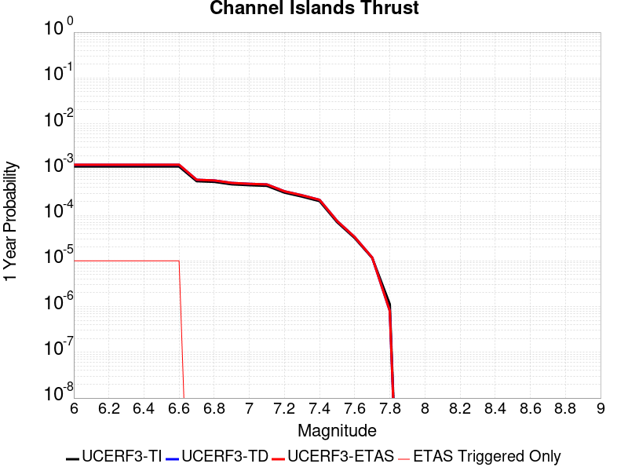 |  |

| Magnitude | 1 wk TI Prob | 1 wk TD Prob | 1 wk ETAS Prob | 1 wk ETAS/TD Gain | 1 wk ETAS Triggered Only | 1 mo TI Prob | 1 mo TD Prob | 1 mo ETAS Prob | 1 mo ETAS/TD Gain | 1 mo ETAS Triggered Only | 1 yr TI Prob | 1 yr TD Prob | 1 yr ETAS Prob | 1 yr ETAS/TD Gain | 1 yr ETAS Triggered Only | 10 yr TI Prob | 10 yr TD Prob | 10 yr ETAS Prob | 10 yr ETAS/TD Gain | 10 yr ETAS Triggered Only |
|-----|-----|-----|-----|-----|-----|-----|-----|-----|-----|-----|-----|-----|-----|-----|-----|-----|-----|-----|-----|-----|
| 6.0 | 2.2156251E-5 | 2.4093148E-5 | 2.4093148E-5 | 1.0 | 0.0 | 9.495191E-5 | 1.0325286E-4 | 1.0325286E-4 | 1.0 | 0.0 | 0.0011554264 | 0.0012564851 | 0.0012564851 | 1.0 | 0.0 | 0.011494373 | 0.012504402 | 0.012539339 | 1.002794 | 3.5380697E-5 |
| 6.1 | 2.2156251E-5 | 2.4093148E-5 | 2.4093148E-5 | 1.0 | 0.0 | 9.495191E-5 | 1.0325286E-4 | 1.0325286E-4 | 1.0 | 0.0 | 0.0011554264 | 0.0012564851 | 0.0012564851 | 1.0 | 0.0 | 0.011494373 | 0.012504402 | 0.012539339 | 1.002794 | 3.5380697E-5 |
| 6.2 | 2.2156251E-5 | 2.4093148E-5 | 2.4093148E-5 | 1.0 | 0.0 | 9.495191E-5 | 1.0325286E-4 | 1.0325286E-4 | 1.0 | 0.0 | 0.0011554264 | 0.0012564851 | 0.0012564851 | 1.0 | 0.0 | 0.011494373 | 0.012504402 | 0.012539339 | 1.002794 | 3.5380697E-5 |
| 6.3 | 2.2156251E-5 | 2.4093148E-5 | 2.4093148E-5 | 1.0 | 0.0 | 9.495191E-5 | 1.0325286E-4 | 1.0325286E-4 | 1.0 | 0.0 | 0.0011554264 | 0.0012564851 | 0.0012564851 | 1.0 | 0.0 | 0.011494373 | 0.012504402 | 0.012539339 | 1.002794 | 3.5380697E-5 |
| 6.4 | 2.2156251E-5 | 2.4093148E-5 | 2.4093148E-5 | 1.0 | 0.0 | 9.495191E-5 | 1.0325286E-4 | 1.0325286E-4 | 1.0 | 0.0 | 0.0011554264 | 0.0012564851 | 0.0012564851 | 1.0 | 0.0 | 0.011494373 | 0.012504402 | 0.012539339 | 1.002794 | 3.5380697E-5 |
| 6.5 | 2.2156251E-5 | 2.4093148E-5 | 2.4093148E-5 | 1.0 | 0.0 | 9.495191E-5 | 1.0325286E-4 | 1.0325286E-4 | 1.0 | 0.0 | 0.0011554264 | 0.0012564851 | 0.0012564851 | 1.0 | 0.0 | 0.011494373 | 0.012504402 | 0.012539339 | 1.002794 | 3.5380697E-5 |
| 6.6 | 2.2156251E-5 | 2.4093148E-5 | 2.4093148E-5 | 1.0 | 0.0 | 9.495191E-5 | 1.0325286E-4 | 1.0325286E-4 | 1.0 | 0.0 | 0.0011554264 | 0.0012564851 | 0.0012564851 | 1.0 | 0.0 | 0.011494373 | 0.012504402 | 0.012539339 | 1.002794 | 3.5380697E-5 |
| 6.7 | 1.0601296E-5 | 1.1379993E-5 | 1.1379993E-5 | 1.0 | 0.0 | 4.5433335E-5 | 4.8770515E-5 | 4.8770515E-5 | 1.0 | 0.0 | 5.5301044E-4 | 5.9362414E-4 | 5.9362414E-4 | 1.0 | 0.0 | 0.005516363 | 0.0059208865 | 0.0059560575 | 1.0059402 | 3.5380697E-5 |
| 6.8 | 1.0246747E-5 | 1.09971015E-5 | 1.09971015E-5 | 1.0 | 0.0 | 4.391389E-5 | 4.712961E-5 | 4.712961E-5 | 1.0 | 0.0 | 5.345204E-4 | 5.7365675E-4 | 5.7365675E-4 | 1.0 | 0.0 | 0.0053323656 | 0.0057222494 | 0.005757428 | 1.0061476 | 3.5380697E-5 |
| 6.9 | 9.049551E-6 | 9.70002E-6 | 9.70002E-6 | 1.0 | 0.0 | 3.878322E-5 | 4.1570875E-5 | 4.1570875E-5 | 1.0 | 0.0 | 4.7208337E-4 | 5.0601194E-4 | 5.0601194E-4 | 1.0 | 0.0 | 0.0047108172 | 0.0050490154 | 0.0050842175 | 1.0069721 | 3.5380697E-5 |
| 7.0 | 8.6542195E-6 | 9.2749615E-6 | 9.2749615E-6 | 1.0 | 0.0 | 3.7088983E-5 | 3.9749255E-5 | 3.9749255E-5 | 1.0 | 0.0 | 4.5146482E-4 | 4.8384376E-4 | 4.8384376E-4 | 1.0 | 0.0 | 0.004505487 | 0.004828315 | 0.0048635253 | 1.0072924 | 3.5380697E-5 |
| 7.1 | 8.391028E-6 | 8.993273E-6 | 8.993273E-6 | 1.0 | 0.0 | 3.5961057E-5 | 3.8542054E-5 | 3.8542054E-5 | 1.0 | 0.0 | 4.3773788E-4 | 4.6915252E-4 | 4.6915252E-4 | 1.0 | 0.0 | 0.004368766 | 0.004682031 | 0.004717246 | 1.0075213 | 3.5380697E-5 |
| 7.2 | 5.965188E-6 | 6.3719312E-6 | 6.3719312E-6 | 1.0 | 0.0 | 2.556484E-5 | 2.7307993E-5 | 2.7307993E-5 | 1.0 | 0.0 | 3.1120746E-4 | 3.3242465E-4 | 3.3242465E-4 | 1.0 | 0.0 | 0.00310772 | 0.003319332 | 0.0033545953 | 1.0106236 | 3.5380697E-5 |
| 7.3 | 4.877518E-6 | 5.2061982E-6 | 5.2061982E-6 | 1.0 | 0.0 | 2.0903482E-5 | 2.231209E-5 | 2.231209E-5 | 1.0 | 0.0 | 2.5447016E-4 | 2.7161627E-4 | 2.7161627E-4 | 1.0 | 0.0 | 0.0025417898 | 0.002712889 | 0.002748174 | 1.0130063 | 3.5380697E-5 |
| 7.4 | 3.8829853E-6 | 4.142015E-6 | 4.142015E-6 | 1.0 | 0.0 | 1.664126E-5 | 1.7751374E-5 | 1.7751374E-5 | 1.0 | 0.0 | 2.0258849E-4 | 2.1610195E-4 | 2.1610195E-4 | 1.0 | 0.0 | 0.002024039 | 0.0021589599 | 0.0021942642 | 1.0163524 | 3.5380697E-5 |
| 7.5 | 1.3489616E-6 | 1.4278398E-6 | 1.4278398E-6 | 1.0 | 0.0 | 5.7812517E-6 | 6.1192995E-6 | 6.1192995E-6 | 1.0 | 0.0 | 7.038446E-5 | 7.449996E-5 | 7.449996E-5 | 1.0 | 0.0 | 7.036218E-4 | 7.4475387E-4 | 7.4475387E-4 | 1.0 | 0.0 |
| 7.6 | 6.058192E-7 | 6.353994E-7 | 6.353994E-7 | 1.0 | 0.0 | 2.5963652E-6 | 2.7231374E-6 | 2.7231374E-6 | 1.0 | 0.0 | 3.161029E-5 | 3.315371E-5 | 3.315371E-5 | 1.0 | 0.0 | 3.1605794E-4 | 3.3148925E-4 | 3.3148925E-4 | 1.0 | 0.0 |
| 7.7 | 2.2170494E-7 | 2.260861E-7 | 2.260861E-7 | 1.0 | 0.0 | 9.5016367E-7 | 9.689402E-7 | 9.689402E-7 | 1.0 | 0.0 | 1.1568181E-5 | 1.1796794E-5 | 1.1796794E-5 | 1.0 | 0.0 | 1.1567579E-4 | 1.1796278E-4 | 1.1796278E-4 | 1.0 | 0.0 |
| 7.8 | 2.1613102E-8 | 1.5467108E-8 | 1.5467108E-8 | 1.0 | 0.0 | 9.262757E-8 | 6.6287605E-8 | 6.6287605E-8 | 1.0 | 0.0 | 1.1277401E-6 | 8.070513E-7 | 8.070513E-7 | 1.0 | 0.0 | 1.1277344E-5 | 8.070492E-6 | 8.070492E-6 | 1.0 | 0.0 |

## San Andreas (Offshore) 2011 CFM
*[(top)](#table-of-contents)*

| 1 Week | 1 Month | 1 Year | 10 Year |
|-----|-----|-----|-----|
|  |  |  |  |

| Magnitude | 1 wk TI Prob | 1 wk TD Prob | 1 wk ETAS Prob | 1 wk ETAS/TD Gain | 1 wk ETAS Triggered Only | 1 mo TI Prob | 1 mo TD Prob | 1 mo ETAS Prob | 1 mo ETAS/TD Gain | 1 mo ETAS Triggered Only | 1 yr TI Prob | 1 yr TD Prob | 1 yr ETAS Prob | 1 yr ETAS/TD Gain | 1 yr ETAS Triggered Only | 10 yr TI Prob | 10 yr TD Prob | 10 yr ETAS Prob | 10 yr ETAS/TD Gain | 10 yr ETAS Triggered Only |
|-----|-----|-----|-----|-----|-----|-----|-----|-----|-----|-----|-----|-----|-----|-----|-----|-----|-----|-----|-----|-----|
| 6.0 | 1.7072787E-4 | 1.9243768E-4 | 1.9243768E-4 | 1.0 | 0.0 | 7.3148566E-4 | 8.244747E-4 | 8.244747E-4 | 1.0 | 0.0 | 0.008869528 | 0.009992293 | 0.009992293 | 1.0 | 0.0 | 0.085237645 | 0.09690714 | 0.096939094 | 1.0003297 | 3.5380697E-5 |
| 6.1 | 1.7072787E-4 | 1.9243768E-4 | 1.9243768E-4 | 1.0 | 0.0 | 7.3148566E-4 | 8.244747E-4 | 8.244747E-4 | 1.0 | 0.0 | 0.008869528 | 0.009992293 | 0.009992293 | 1.0 | 0.0 | 0.085237645 | 0.09690714 | 0.096939094 | 1.0003297 | 3.5380697E-5 |
| 6.2 | 1.6312556E-4 | 1.8424621E-4 | 1.8424621E-4 | 1.0 | 0.0 | 6.989222E-4 | 7.8939006E-4 | 7.8939006E-4 | 1.0 | 0.0 | 0.008476226 | 0.00956897 | 0.00956897 | 1.0 | 0.0 | 0.08160117 | 0.09292438 | 0.09295647 | 1.0003453 | 3.5380697E-5 |
| 6.3 | 1.5103363E-4 | 1.6896211E-4 | 1.6896211E-4 | 1.0 | 0.0 | 6.471264E-4 | 7.2392455E-4 | 7.2392455E-4 | 1.0 | 0.0 | 0.007850339 | 0.0087786075 | 0.0087786075 | 1.0 | 0.0 | 0.075787395 | 0.08556006 | 0.08559242 | 1.0003781 | 3.5380697E-5 |
| 6.4 | 1.5047993E-4 | 1.6782133E-4 | 1.6782133E-4 | 1.0 | 0.0 | 6.4475456E-4 | 7.1903825E-4 | 7.1903825E-4 | 1.0 | 0.0 | 0.007821669 | 0.008719592 | 0.008719592 | 1.0 | 0.0 | 0.0755203 | 0.08504028 | 0.085072644 | 1.0003806 | 3.5380697E-5 |
| 6.5 | 1.2760791E-4 | 1.3748009E-4 | 1.3748009E-4 | 1.0 | 0.0 | 5.467764E-4 | 5.8906875E-4 | 5.8906875E-4 | 1.0 | 0.0 | 0.0066367025 | 0.007148602 | 0.007148602 | 1.0 | 0.0 | 0.064419635 | 0.07031143 | 0.07034432 | 1.0004678 | 3.5380697E-5 |
| 6.6 | 1.1063525E-4 | 1.1567755E-4 | 1.1567755E-4 | 1.0 | 0.0 | 4.740649E-4 | 4.956678E-4 | 4.956678E-4 | 1.0 | 0.0 | 0.0057564764 | 0.006018259 | 0.006018259 | 1.0 | 0.0 | 0.05609626 | 0.05954285 | 0.05957612 | 1.0005589 | 3.5380697E-5 |
| 6.7 | 1.0391049E-4 | 1.06563464E-4 | 1.06563464E-4 | 1.0 | 0.0 | 4.4525467E-4 | 4.566216E-4 | 4.566216E-4 | 1.0 | 0.0 | 0.0054075094 | 0.0055453847 | 0.0055453847 | 1.0 | 0.0 | 0.052778035 | 0.05503986 | 0.055073295 | 1.0006075 | 3.5380697E-5 |
| 6.8 | 1.0096706E-4 | 1.0168416E-4 | 1.0168416E-4 | 1.0 | 0.0 | 4.3264418E-4 | 4.3571746E-4 | 4.3571746E-4 | 1.0 | 0.0 | 0.0052547283 | 0.005292134 | 0.005292134 | 1.0 | 0.0 | 0.051321987 | 0.052737482 | 0.052771 | 1.0006355 | 3.5380697E-5 |
| 6.9 | 9.800265E-5 | 9.598679E-5 | 9.598679E-5 | 1.0 | 0.0 | 4.1994374E-4 | 4.11308E-4 | 4.11308E-4 | 1.0 | 0.0 | 0.0051008356 | 0.0049963454 | 0.0049963454 | 1.0 | 0.0 | 0.049853306 | 0.05006405 | 0.05009766 | 1.0006714 | 3.5380697E-5 |
| 7.0 | 9.4642375E-5 | 9.0118105E-5 | 9.0118105E-5 | 1.0 | 0.0 | 4.0554712E-4 | 3.8616415E-4 | 3.8616415E-4 | 1.0 | 0.0 | 0.004926363 | 0.0046915757 | 0.0046915757 | 1.0 | 0.0 | 0.048185747 | 0.047243945 | 0.04727765 | 1.0007135 | 3.5380697E-5 |
| 7.1 | 9.0996844E-5 | 8.363557E-5 | 8.363557E-5 | 1.0 | 0.0 | 3.8992817E-4 | 3.5838978E-4 | 3.5838978E-4 | 1.0 | 0.0 | 0.004737046 | 0.004354822 | 0.004354822 | 1.0 | 0.0 | 0.04637333 | 0.044094373 | 0.044128194 | 1.000767 | 3.5380697E-5 |
| 7.2 | 8.848287E-5 | 7.9909514E-5 | 7.9909514E-5 | 1.0 | 0.0 | 3.791572E-4 | 3.4242525E-4 | 3.4242525E-4 | 1.0 | 0.0 | 0.004606472 | 0.004161212 | 0.004161212 | 1.0 | 0.0 | 0.045121472 | 0.04223721 | 0.0422711 | 1.0008023 | 3.5380697E-5 |
| 7.3 | 7.9280784E-5 | 6.135467E-5 | 6.135467E-5 | 1.0 | 0.0 | 3.3973053E-4 | 2.6292267E-4 | 2.6292267E-4 | 1.0 | 0.0 | 0.004128377 | 0.0031964872 | 0.0031964872 | 1.0 | 0.0 | 0.040525194 | 0.032944594 | 0.032978807 | 1.0010386 | 3.5380697E-5 |
| 7.4 | 6.468038E-5 | 3.798989E-5 | 3.798989E-5 | 1.0 | 0.0 | 2.771722E-4 | 1.6280398E-4 | 1.6280398E-4 | 1.0 | 0.0 | 0.0033693502 | 0.0019803944 | 0.0019803944 | 1.0 | 0.0 | 0.0331872 | 0.020852158 | 0.020886801 | 1.0016613 | 3.5380697E-5 |
| 7.5 | 4.930574E-5 | 1.2737067E-5 | 1.2737067E-5 | 1.0 | 0.0 | 2.1129321E-4 | 5.4586293E-5 | 5.4586293E-5 | 1.0 | 0.0 | 0.0025694598 | 6.643871E-4 | 6.643871E-4 | 1.0 | 0.0 | 0.02539953 | 0.007501229 | 0.0075363447 | 1.0046812 | 3.5380697E-5 |
| 7.6 | 4.612566E-5 | 1.0366656E-5 | 1.0366656E-5 | 1.0 | 0.0 | 1.9766642E-4 | 4.442778E-5 | 4.442778E-5 | 1.0 | 0.0 | 0.0024039324 | 5.4077536E-4 | 5.4077536E-4 | 1.0 | 0.0 | 0.023780935 | 0.0061902013 | 0.006225363 | 1.0056802 | 3.5380697E-5 |
| 7.7 | 3.9435414E-5 | 5.598791E-6 | 5.598791E-6 | 1.0 | 0.0 | 1.6899795E-4 | 2.39946E-5 | 2.39946E-5 | 1.0 | 0.0 | 0.0020556084 | 2.9209527E-4 | 2.9209527E-4 | 1.0 | 0.0 | 0.020366974 | 0.003556676 | 0.0035919307 | 1.0099123 | 3.5380697E-5 |
| 7.8 | 2.7787428E-5 | 3.7729496E-6 | 3.7729496E-6 | 1.0 | 0.0 | 1.1908354E-4 | 1.6169684E-5 | 1.6169684E-5 | 1.0 | 0.0 | 0.0014488777 | 1.9684815E-4 | 1.9684815E-4 | 1.0 | 0.0 | 0.014394675 | 0.0023984525 | 0.0024337482 | 1.014716 | 3.5380697E-5 |
| 7.9 | 1.590671E-5 | 3.0548313E-6 | 3.0548313E-6 | 1.0 | 0.0 | 6.816983E-5 | 1.3092068E-5 | 1.3092068E-5 | 1.0 | 0.0 | 8.2965166E-4 | 1.593843E-4 | 1.593843E-4 | 1.0 | 0.0 | 0.008265611 | 0.001912608 | 0.0019479211 | 1.0184633 | 3.5380697E-5 |
| 8.0 | 9.193638E-6 | 2.6035711E-6 | 2.6035711E-6 | 1.0 | 0.0 | 3.940071E-5 | 1.1158115E-5 | 1.1158115E-5 | 1.0 | 0.0 | 4.7959806E-4 | 1.358416E-4 | 1.358416E-4 | 1.0 | 0.0 | 0.0047856434 | 0.0016181957 | 0.0016535191 | 1.0218289 | 3.5380697E-5 |
| 8.1 | 5.601576E-6 | 2.2447791E-6 | 2.2447791E-6 | 1.0 | 0.0 | 2.4006533E-5 | 9.620446E-6 | 9.620446E-6 | 1.0 | 0.0 | 2.9224035E-4 | 1.1712267E-4 | 1.1712267E-4 | 1.0 | 0.0 | 0.0029185633 | 0.0014080945 | 0.0014434254 | 1.0250913 | 3.5380697E-5 |
| 8.2 | 4.3508785E-6 | 1.8661184E-6 | 1.8661184E-6 | 1.0 | 0.0 | 1.864649E-5 | 7.997626E-6 | 7.997626E-6 | 1.0 | 0.0 | 2.2699735E-4 | 9.736677E-5 | 9.736677E-5 | 1.0 | 0.0 | 0.0022676561 | 0.0011643195 | 0.0011643195 | 1.0 | 0.0 |
| 8.3 | 1.9573292E-6 | 7.547989E-7 | 7.547989E-7 | 1.0 | 0.0 | 8.388526E-6 | 3.2348487E-6 | 3.2348487E-6 | 1.0 | 0.0 | 1.0212552E-4 | 3.9383587E-5 | 3.9383587E-5 | 1.0 | 0.0 | 0.001020786 | 4.6598504E-4 | 4.6598504E-4 | 1.0 | 0.0 |

## Monterey Bay-Tularcitos
*[(top)](#table-of-contents)*

| 1 Week | 1 Month | 1 Year | 10 Year |
|-----|-----|-----|-----|
|  |  |  | 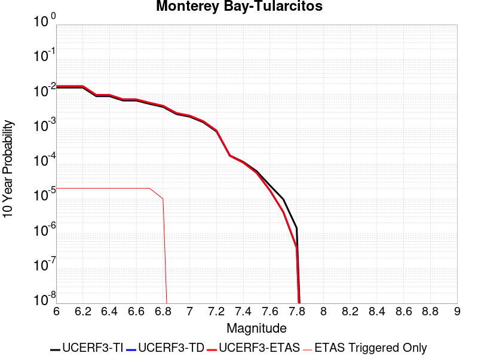 |

| Magnitude | 1 wk TI Prob | 1 wk TD Prob | 1 wk ETAS Prob | 1 wk ETAS/TD Gain | 1 wk ETAS Triggered Only | 1 mo TI Prob | 1 mo TD Prob | 1 mo ETAS Prob | 1 mo ETAS/TD Gain | 1 mo ETAS Triggered Only | 1 yr TI Prob | 1 yr TD Prob | 1 yr ETAS Prob | 1 yr ETAS/TD Gain | 1 yr ETAS Triggered Only | 10 yr TI Prob | 10 yr TD Prob | 10 yr ETAS Prob | 10 yr ETAS/TD Gain | 10 yr ETAS Triggered Only |
|-----|-----|-----|-----|-----|-----|-----|-----|-----|-----|-----|-----|-----|-----|-----|-----|-----|-----|-----|-----|-----|
| 6.0 | 3.0131365E-5 | 3.2800384E-5 | 3.2800384E-5 | 1.0 | 0.0 | 1.2912804E-4 | 1.405661E-4 | 1.405661E-4 | 1.0 | 0.0 | 0.001571 | 0.0017101543 | 0.0017101543 | 1.0 | 0.0 | 0.015599402 | 0.016980747 | 0.017015526 | 1.0020483 | 3.5380697E-5 |
| 6.1 | 3.0131365E-5 | 3.2800384E-5 | 3.2800384E-5 | 1.0 | 0.0 | 1.2912804E-4 | 1.405661E-4 | 1.405661E-4 | 1.0 | 0.0 | 0.001571 | 0.0017101543 | 0.0017101543 | 1.0 | 0.0 | 0.015599402 | 0.016980747 | 0.017015526 | 1.0020483 | 3.5380697E-5 |
| 6.2 | 3.0131365E-5 | 3.2800384E-5 | 3.2800384E-5 | 1.0 | 0.0 | 1.2912804E-4 | 1.405661E-4 | 1.405661E-4 | 1.0 | 0.0 | 0.001571 | 0.0017101543 | 0.0017101543 | 1.0 | 0.0 | 0.015599402 | 0.016980747 | 0.017015526 | 1.0020483 | 3.5380697E-5 |
| 6.3 | 1.6998249E-5 | 1.8331632E-5 | 1.8331632E-5 | 1.0 | 0.0 | 7.28476E-5 | 7.8561876E-5 | 7.8561876E-5 | 1.0 | 0.0 | 8.865586E-4 | 9.560898E-4 | 9.560898E-4 | 1.0 | 0.0 | 0.0088303005 | 0.009521689 | 0.009556733 | 1.0036805 | 3.5380697E-5 |
| 6.4 | 1.6998249E-5 | 1.8331632E-5 | 1.8331632E-5 | 1.0 | 0.0 | 7.28476E-5 | 7.8561876E-5 | 7.8561876E-5 | 1.0 | 0.0 | 8.865586E-4 | 9.560898E-4 | 9.560898E-4 | 1.0 | 0.0 | 0.0088303005 | 0.009521689 | 0.009556733 | 1.0036805 | 3.5380697E-5 |
| 6.5 | 1.27470785E-5 | 1.36939225E-5 | 1.36939225E-5 | 1.0 | 0.0 | 5.4629192E-5 | 5.8686976E-5 | 5.8686976E-5 | 1.0 | 0.0 | 6.649074E-4 | 7.142901E-4 | 7.142901E-4 | 1.0 | 0.0 | 0.0066292146 | 0.0071209944 | 0.007156123 | 1.0049331 | 3.5380697E-5 |
| 6.6 | 1.2739422E-5 | 1.3686009E-5 | 1.3686009E-5 | 1.0 | 0.0 | 5.4596385E-5 | 5.8653066E-5 | 5.8653066E-5 | 1.0 | 0.0 | 6.645082E-4 | 7.1387744E-4 | 7.1387744E-4 | 1.0 | 0.0 | 0.0066252467 | 0.0071168947 | 0.0071520237 | 1.004936 | 3.5380697E-5 |
| 6.7 | 1.0160109E-5 | 1.0886237E-5 | 1.0886237E-5 | 1.0 | 0.0 | 4.35426E-5 | 4.6654506E-5 | 4.6654506E-5 | 1.0 | 0.0 | 5.300022E-4 | 5.6787767E-4 | 5.6787767E-4 | 1.0 | 0.0 | 0.005287399 | 0.005664977 | 0.005700157 | 1.0062101 | 3.5380697E-5 |
| 6.8 | 8.349859E-6 | 8.932988E-6 | 8.932988E-6 | 1.0 | 0.0 | 3.578462E-5 | 3.8283702E-5 | 3.8283702E-5 | 1.0 | 0.0 | 4.3559066E-4 | 4.6601004E-4 | 4.6601004E-4 | 1.0 | 0.0 | 0.004347378 | 0.0046508936 | 0.0046861097 | 1.0075719 | 3.5380697E-5 |
| 6.9 | 5.193639E-6 | 5.5366936E-6 | 5.5366936E-6 | 1.0 | 0.0 | 2.2258262E-5 | 2.372849E-5 | 2.372849E-5 | 1.0 | 0.0 | 2.7096065E-4 | 2.888593E-4 | 2.888593E-4 | 1.0 | 0.0 | 0.0027063051 | 0.0028851596 | 0.0028851596 | 1.0 | 0.0 |
| 7.0 | 4.359381E-6 | 4.643596E-6 | 4.643596E-6 | 1.0 | 0.0 | 1.8682927E-5 | 1.9900992E-5 | 1.9900992E-5 | 1.0 | 0.0 | 2.274409E-4 | 2.422706E-4 | 2.422706E-4 | 1.0 | 0.0 | 0.0022720827 | 0.002420358 | 0.002420358 | 1.0 | 0.0 |
| 7.1 | 3.0398533E-6 | 3.23122E-6 | 3.23122E-6 | 1.0 | 0.0 | 1.3027877E-5 | 1.3848027E-5 | 1.3848027E-5 | 1.0 | 0.0 | 1.5860285E-4 | 1.6858931E-4 | 1.6858931E-4 | 1.0 | 0.0 | 0.001584897 | 0.0016848719 | 0.0016848719 | 1.0 | 0.0 |
| 7.2 | 1.642335E-6 | 1.7334357E-6 | 1.7334357E-6 | 1.0 | 0.0 | 7.0385595E-6 | 7.429001E-6 | 7.429001E-6 | 1.0 | 0.0 | 8.569109E-5 | 9.0446396E-5 | 9.0446396E-5 | 1.0 | 0.0 | 8.5658056E-4 | 9.0429856E-4 | 9.0429856E-4 | 1.0 | 0.0 |
| 7.3 | 3.356842E-7 | 3.295888E-7 | 3.295888E-7 | 1.0 | 0.0 | 1.4386458E-6 | 1.4125226E-6 | 1.4125226E-6 | 1.0 | 0.0 | 1.7515373E-5 | 1.7197328E-5 | 1.7197328E-5 | 1.0 | 0.0 | 1.7513991E-4 | 1.7196007E-4 | 1.7196007E-4 | 1.0 | 0.0 |
| 7.4 | 2.1973483E-7 | 2.1012711E-7 | 2.1012711E-7 | 1.0 | 0.0 | 9.417204E-7 | 9.005445E-7 | 9.005445E-7 | 1.0 | 0.0 | 1.1465385E-5 | 1.0964074E-5 | 1.0964074E-5 | 1.0 | 0.0 | 1.1464794E-4 | 1.09635366E-4 | 1.09635366E-4 | 1.0 | 0.0 |
| 7.5 | 1.1944135E-7 | 1.07021656E-7 | 1.07021656E-7 | 1.0 | 0.0 | 5.118914E-7 | 4.5866418E-7 | 4.5866418E-7 | 1.0 | 0.0 | 6.23226E-6 | 5.584222E-6 | 5.584222E-6 | 1.0 | 0.0 | 6.2320854E-5 | 5.584083E-5 | 5.584083E-5 | 1.0 | 0.0 |
| 7.6 | 4.636058E-8 | 3.3402166E-8 | 3.3402166E-8 | 1.0 | 0.0 | 1.9868818E-7 | 1.4315212E-7 | 1.4315212E-7 | 1.0 | 0.0 | 2.419026E-6 | 1.7428757E-6 | 1.7428757E-6 | 1.0 | 0.0 | 2.4189996E-5 | 1.7428623E-5 | 1.7428623E-5 | 1.0 | 0.0 |
| 7.7 | 1.8588572E-8 | 8.018984E-9 | 8.018984E-9 | 1.0 | 0.0 | 7.9665305E-8 | 3.4367073E-8 | 3.4367073E-8 | 1.0 | 0.0 | 9.699246E-7 | 4.1841903E-7 | 4.1841903E-7 | 1.0 | 0.0 | 9.699204E-6 | 4.1841827E-6 | 4.1841827E-6 | 1.0 | 0.0 |
| 7.8 | 2.7960154E-9 | 7.6326545E-10 | 7.6326545E-10 | 1.0 | 0.0 | 1.1982923E-8 | 3.2711382E-9 | 3.2711382E-9 | 1.0 | 0.0 | 1.4589209E-7 | 3.982611E-8 | 3.982611E-8 | 1.0 | 0.0 | 1.4589199E-6 | 3.9826105E-7 | 3.9826105E-7 | 1.0 | 0.0 |

## Los Osos 2011
*[(top)](#table-of-contents)*

| 1 Week | 1 Month | 1 Year | 10 Year |
|-----|-----|-----|-----|
|  |  |  |  |

| Magnitude | 1 wk TI Prob | 1 wk TD Prob | 1 wk ETAS Prob | 1 wk ETAS/TD Gain | 1 wk ETAS Triggered Only | 1 mo TI Prob | 1 mo TD Prob | 1 mo ETAS Prob | 1 mo ETAS/TD Gain | 1 mo ETAS Triggered Only | 1 yr TI Prob | 1 yr TD Prob | 1 yr ETAS Prob | 1 yr ETAS/TD Gain | 1 yr ETAS Triggered Only | 10 yr TI Prob | 10 yr TD Prob | 10 yr ETAS Prob | 10 yr ETAS/TD Gain | 10 yr ETAS Triggered Only |
|-----|-----|-----|-----|-----|-----|-----|-----|-----|-----|-----|-----|-----|-----|-----|-----|-----|-----|-----|-----|-----|
| 6.0 | 4.8871775E-6 | 4.981565E-6 | 4.981565E-6 | 1.0 | 0.0 | 2.0944879E-5 | 2.1349404E-5 | 2.1349404E-5 | 1.0 | 0.0 | 2.5497406E-4 | 2.599008E-4 | 2.599008E-4 | 1.0 | 0.0 | 0.002546817 | 0.0025962426 | 0.0026315316 | 1.0135922 | 3.5380697E-5 |
| 6.1 | 4.8871775E-6 | 4.981565E-6 | 4.981565E-6 | 1.0 | 0.0 | 2.0944879E-5 | 2.1349404E-5 | 2.1349404E-5 | 1.0 | 0.0 | 2.5497406E-4 | 2.599008E-4 | 2.599008E-4 | 1.0 | 0.0 | 0.002546817 | 0.0025962426 | 0.0026315316 | 1.0135922 | 3.5380697E-5 |
| 6.2 | 4.8871775E-6 | 4.981565E-6 | 4.981565E-6 | 1.0 | 0.0 | 2.0944879E-5 | 2.1349404E-5 | 2.1349404E-5 | 1.0 | 0.0 | 2.5497406E-4 | 2.599008E-4 | 2.599008E-4 | 1.0 | 0.0 | 0.002546817 | 0.0025962426 | 0.0026315316 | 1.0135922 | 3.5380697E-5 |
| 6.3 | 4.8871775E-6 | 4.981565E-6 | 4.981565E-6 | 1.0 | 0.0 | 2.0944879E-5 | 2.1349404E-5 | 2.1349404E-5 | 1.0 | 0.0 | 2.5497406E-4 | 2.599008E-4 | 2.599008E-4 | 1.0 | 0.0 | 0.002546817 | 0.0025962426 | 0.0026315316 | 1.0135922 | 3.5380697E-5 |
| 6.4 | 4.8871775E-6 | 4.981565E-6 | 4.981565E-6 | 1.0 | 0.0 | 2.0944879E-5 | 2.1349404E-5 | 2.1349404E-5 | 1.0 | 0.0 | 2.5497406E-4 | 2.599008E-4 | 2.599008E-4 | 1.0 | 0.0 | 0.002546817 | 0.0025962426 | 0.0026315316 | 1.0135922 | 3.5380697E-5 |
| 6.5 | 3.1724062E-6 | 3.2234527E-6 | 3.2234527E-6 | 1.0 | 0.0 | 1.3595956E-5 | 1.3814725E-5 | 1.3814725E-5 | 1.0 | 0.0 | 1.6551818E-4 | 1.6818143E-4 | 1.6818143E-4 | 1.0 | 0.0 | 0.0016539496 | 0.0016805549 | 0.0017158762 | 1.0210176 | 3.5380697E-5 |
| 6.6 | 3.1022591E-6 | 3.151161E-6 | 3.151161E-6 | 1.0 | 0.0 | 1.3295328E-5 | 1.3504907E-5 | 1.3504907E-5 | 1.0 | 0.0 | 1.618586E-4 | 1.6440995E-4 | 1.6440995E-4 | 1.0 | 0.0 | 0.0016174077 | 0.0016428961 | 0.0016782186 | 1.0215002 | 3.5380697E-5 |
| 6.7 | 2.611518E-6 | 2.6492337E-6 | 2.6492337E-6 | 1.0 | 0.0 | 1.1192172E-5 | 1.135381E-5 | 1.135381E-5 | 1.0 | 0.0 | 1.3625617E-4 | 1.3822391E-4 | 1.3822391E-4 | 1.0 | 0.0 | 0.0013617266 | 0.0013813839 | 0.0013813839 | 1.0 | 0.0 |
| 6.8 | 2.4780884E-6 | 2.5122079E-6 | 2.5122079E-6 | 1.0 | 0.0 | 1.0620336E-5 | 1.0766561E-5 | 1.0766561E-5 | 1.0 | 0.0 | 1.2929492E-4 | 1.3107504E-4 | 1.3107504E-4 | 1.0 | 0.0 | 0.0012921972 | 0.0013099813 | 0.0013099813 | 1.0 | 0.0 |
| 6.9 | 2.1376322E-6 | 2.1635497E-6 | 2.1635497E-6 | 1.0 | 0.0 | 9.161248E-6 | 9.272323E-6 | 9.272323E-6 | 1.0 | 0.0 | 1.1153249E-4 | 1.128847E-4 | 1.128847E-4 | 1.0 | 0.0 | 0.0011147653 | 0.0011282755 | 0.0011282755 | 1.0 | 0.0 |
| 7.0 | 1.9282882E-6 | 1.9495E-6 | 1.9495E-6 | 1.0 | 0.0 | 8.264066E-6 | 8.354974E-6 | 8.354974E-6 | 1.0 | 0.0 | 1.0061036E-4 | 1.01717065E-4 | 1.01717065E-4 | 1.0 | 0.0 | 0.0010056482 | 0.0010167065 | 0.0010167065 | 1.0 | 0.0 |
| 7.1 | 1.6353226E-6 | 1.6501499E-6 | 1.6501499E-6 | 1.0 | 0.0 | 7.0085066E-6 | 7.0720516E-6 | 7.0720516E-6 | 1.0 | 0.0 | 8.532523E-5 | 8.609884E-5 | 8.609884E-5 | 1.0 | 0.0 | 8.529247E-4 | 8.606555E-4 | 8.606555E-4 | 1.0 | 0.0 |
| 7.2 | 1.4446276E-6 | 1.45537E-6 | 1.45537E-6 | 1.0 | 0.0 | 6.191247E-6 | 6.237285E-6 | 6.237285E-6 | 1.0 | 0.0 | 7.537582E-5 | 7.59363E-5 | 7.59363E-5 | 1.0 | 0.0 | 7.535026E-4 | 7.5910415E-4 | 7.5910415E-4 | 1.0 | 0.0 |
| 7.3 | 1.2014582E-6 | 1.2069403E-6 | 1.2069403E-6 | 1.0 | 0.0 | 5.149096E-6 | 5.172591E-6 | 5.172591E-6 | 1.0 | 0.0 | 6.268844E-5 | 6.2974475E-5 | 6.2974475E-5 | 1.0 | 0.0 | 6.267076E-4 | 6.295667E-4 | 6.295667E-4 | 1.0 | 0.0 |
| 7.4 | 9.707733E-7 | 9.710075E-7 | 9.710075E-7 | 1.0 | 0.0 | 4.16045E-6 | 4.161454E-6 | 4.161454E-6 | 1.0 | 0.0 | 5.0652303E-5 | 5.0664526E-5 | 5.0664526E-5 | 1.0 | 0.0 | 5.064076E-4 | 5.0653E-4 | 5.0653E-4 | 1.0 | 0.0 |
| 7.5 | 7.174908E-7 | 7.1151817E-7 | 7.1151817E-7 | 1.0 | 0.0 | 3.074957E-6 | 3.04936E-6 | 3.04936E-6 | 1.0 | 0.0 | 3.743696E-5 | 3.7125326E-5 | 3.7125326E-5 | 1.0 | 0.0 | 3.7430652E-4 | 3.7119142E-4 | 3.7119142E-4 | 1.0 | 0.0 |
| 7.6 | 4.5535776E-7 | 4.4210202E-7 | 4.4210202E-7 | 1.0 | 0.0 | 1.9515319E-6 | 1.8947215E-6 | 1.8947215E-6 | 1.0 | 0.0 | 2.3759641E-5 | 2.306799E-5 | 2.306799E-5 | 1.0 | 0.0 | 2.37571E-4 | 2.3065606E-4 | 2.3065606E-4 | 1.0 | 0.0 |
| 7.7 | 2.1173553E-7 | 1.9062645E-7 | 1.9062645E-7 | 1.0 | 0.0 | 9.0743765E-7 | 8.1697027E-7 | 8.1697027E-7 | 1.0 | 0.0 | 1.1047998E-5 | 9.946568E-6 | 9.946568E-6 | 1.0 | 0.0 | 1.1047449E-4 | 9.946126E-5 | 9.946126E-5 | 1.0 | 0.0 |
| 7.8 | 9.873608E-8 | 7.369176E-8 | 7.369176E-8 | 1.0 | 0.0 | 4.2315455E-7 | 3.1582178E-7 | 3.1582178E-7 | 1.0 | 0.0 | 5.1518946E-6 | 3.845123E-6 | 3.845123E-6 | 1.0 | 0.0 | 5.1517753E-5 | 3.8450573E-5 | 3.8450573E-5 | 1.0 | 0.0 |
| 7.9 | 5.4399106E-8 | 3.189444E-8 | 3.189444E-8 | 1.0 | 0.0 | 2.33139E-7 | 1.3669045E-7 | 1.3669045E-7 | 1.0 | 0.0 | 2.8384638E-6 | 1.664205E-6 | 1.664205E-6 | 1.0 | 0.0 | 2.8384275E-5 | 1.6641927E-5 | 1.6641927E-5 | 1.0 | 0.0 |
| 8.0 | 1.817203E-8 | 8.426773E-9 | 8.426773E-9 | 1.0 | 0.0 | 7.7880124E-8 | 3.6114738E-8 | 3.6114738E-8 | 1.0 | 0.0 | 9.481901E-7 | 4.3969686E-7 | 4.3969686E-7 | 1.0 | 0.0 | 9.481861E-6 | 4.3969603E-6 | 4.3969603E-6 | 1.0 | 0.0 |

## Elsinore (Glen Ivy) rev
*[(top)](#table-of-contents)*

| 1 Week | 1 Month | 1 Year | 10 Year |
|-----|-----|-----|-----|
|  |  |  |  |

| Magnitude | 1 wk TI Prob | 1 wk TD Prob | 1 wk ETAS Prob | 1 wk ETAS/TD Gain | 1 wk ETAS Triggered Only | 1 mo TI Prob | 1 mo TD Prob | 1 mo ETAS Prob | 1 mo ETAS/TD Gain | 1 mo ETAS Triggered Only | 1 yr TI Prob | 1 yr TD Prob | 1 yr ETAS Prob | 1 yr ETAS/TD Gain | 1 yr ETAS Triggered Only | 10 yr TI Prob | 10 yr TD Prob | 10 yr ETAS Prob | 10 yr ETAS/TD Gain | 10 yr ETAS Triggered Only |
|-----|-----|-----|-----|-----|-----|-----|-----|-----|-----|-----|-----|-----|-----|-----|-----|-----|-----|-----|-----|-----|
| 6.0 | 1.6204086E-4 | 2.936593E-4 | 2.936593E-4 | 1.0 | 0.0 | 6.94276E-4 | 0.0012580877 | 0.0012580877 | 1.0 | 0.0 | 0.008420097 | 0.015237179 | 0.01527202 | 1.0022867 | 3.5380697E-5 | 0.081081145 | 0.13970533 | 0.13973576 | 1.0002179 | 3.5380697E-5 |
| 6.1 | 1.6204086E-4 | 2.936593E-4 | 2.936593E-4 | 1.0 | 0.0 | 6.94276E-4 | 0.0012580877 | 0.0012580877 | 1.0 | 0.0 | 0.008420097 | 0.015237179 | 0.01527202 | 1.0022867 | 3.5380697E-5 | 0.081081145 | 0.13970533 | 0.13973576 | 1.0002179 | 3.5380697E-5 |
| 6.2 | 1.6204086E-4 | 2.936593E-4 | 2.936593E-4 | 1.0 | 0.0 | 6.94276E-4 | 0.0012580877 | 0.0012580877 | 1.0 | 0.0 | 0.008420097 | 0.015237179 | 0.01527202 | 1.0022867 | 3.5380697E-5 | 0.081081145 | 0.13970533 | 0.13973576 | 1.0002179 | 3.5380697E-5 |
| 6.3 | 1.0111737E-4 | 1.7704896E-4 | 1.7704896E-4 | 1.0 | 0.0 | 4.332882E-4 | 7.5867726E-4 | 7.5867726E-4 | 1.0 | 0.0 | 0.005262531 | 0.009218467 | 0.009218467 | 1.0 | 0.0 | 0.0513964 | 0.087025836 | 0.087025836 | 1.0 | 0.0 |
| 6.4 | 1.0111737E-4 | 1.7704896E-4 | 1.7704896E-4 | 1.0 | 0.0 | 4.332882E-4 | 7.5867726E-4 | 7.5867726E-4 | 1.0 | 0.0 | 0.005262531 | 0.009218467 | 0.009218467 | 1.0 | 0.0 | 0.0513964 | 0.087025836 | 0.087025836 | 1.0 | 0.0 |
| 6.5 | 3.6624708E-5 | 4.6398443E-5 | 4.6398443E-5 | 1.0 | 0.0 | 1.569536E-4 | 1.9883736E-4 | 1.9883736E-4 | 1.0 | 0.0 | 0.001909235 | 0.0024185202 | 0.0024185202 | 1.0 | 0.0 | 0.01892915 | 0.02374361 | 0.02374361 | 1.0 | 0.0 |
| 6.6 | 2.5051324E-5 | 2.615282E-5 | 2.615282E-5 | 1.0 | 0.0 | 1.073584E-4 | 1.12078946E-4 | 1.12078946E-4 | 1.0 | 0.0 | 0.0013063047 | 0.0013637516 | 0.0013637516 | 1.0 | 0.0 | 0.012986525 | 0.013567226 | 0.013567226 | 1.0 | 0.0 |
| 6.7 | 2.2189772E-5 | 2.2077227E-5 | 2.2077227E-5 | 1.0 | 0.0 | 9.509556E-5 | 9.461347E-5 | 9.461347E-5 | 1.0 | 0.0 | 0.0011571734 | 0.0011513466 | 0.0011513466 | 1.0 | 0.0 | 0.011511663 | 0.0114676645 | 0.0114676645 | 1.0 | 0.0 |
| 6.8 | 1.6654378E-5 | 1.4440319E-5 | 1.4440319E-5 | 1.0 | 0.0 | 7.137396E-5 | 6.188564E-5 | 6.188564E-5 | 1.0 | 0.0 | 8.686314E-4 | 7.532024E-4 | 7.532024E-4 | 1.0 | 0.0 | 0.008652439 | 0.0075118328 | 0.0075118328 | 1.0 | 0.0 |
| 6.9 | 1.5042909E-5 | 1.2334286E-5 | 1.2334286E-5 | 1.0 | 0.0 | 6.446802E-5 | 5.286017E-5 | 5.286017E-5 | 1.0 | 0.0 | 7.8461546E-4 | 6.433857E-4 | 6.433857E-4 | 1.0 | 0.0 | 0.007818509 | 0.006419453 | 0.006419453 | 1.0 | 0.0 |
| 7.0 | 1.4361385E-5 | 1.1453455E-5 | 1.1453455E-5 | 1.0 | 0.0 | 6.154734E-5 | 4.908533E-5 | 4.908533E-5 | 1.0 | 0.0 | 7.490812E-4 | 5.974529E-4 | 5.974529E-4 | 1.0 | 0.0 | 0.007465612 | 0.005962458 | 0.005962458 | 1.0 | 0.0 |
| 7.1 | 1.3265571E-5 | 1.0246749E-5 | 1.0246749E-5 | 1.0 | 0.0 | 5.6851208E-5 | 4.3913915E-5 | 4.3913915E-5 | 1.0 | 0.0 | 6.919436E-4 | 5.345233E-4 | 5.345233E-4 | 1.0 | 0.0 | 0.006897931 | 0.0053357324 | 0.0053357324 | 1.0 | 0.0 |
| 7.2 | 1.1596403E-5 | 8.506553E-6 | 8.506553E-6 | 1.0 | 0.0 | 4.9697923E-5 | 3.6456157E-5 | 3.6456157E-5 | 1.0 | 0.0 | 6.049042E-4 | 4.4376502E-4 | 4.4376502E-4 | 1.0 | 0.0 | 0.006032603 | 0.004430204 | 0.004430204 | 1.0 | 0.0 |
| 7.3 | 1.0150827E-5 | 7.2399926E-6 | 7.2399926E-6 | 1.0 | 0.0 | 4.3502816E-5 | 3.102818E-5 | 3.102818E-5 | 1.0 | 0.0 | 5.2951806E-4 | 3.77704E-4 | 3.77704E-4 | 1.0 | 0.0 | 0.005282581 | 0.0037710073 | 0.0037710073 | 1.0 | 0.0 |
| 7.4 | 9.080705E-6 | 6.3535763E-6 | 6.3535763E-6 | 1.0 | 0.0 | 3.8916725E-5 | 2.7229335E-5 | 2.7229335E-5 | 1.0 | 0.0 | 4.7370812E-4 | 3.314681E-4 | 3.314681E-4 | 1.0 | 0.0 | 0.004726996 | 0.0033098878 | 0.0033098878 | 1.0 | 0.0 |
| 7.5 | 7.671649E-6 | 5.2264927E-6 | 5.2264927E-6 | 1.0 | 0.0 | 3.287808E-5 | 2.2399068E-5 | 2.2399068E-5 | 1.0 | 0.0 | 4.0021708E-4 | 2.726758E-4 | 2.726758E-4 | 1.0 | 0.0 | 0.0039949706 | 0.0027235372 | 0.0027235372 | 1.0 | 0.0 |
| 7.6 | 6.990086E-6 | 4.6883147E-6 | 4.6883147E-6 | 1.0 | 0.0 | 2.9957167E-5 | 2.009263E-5 | 2.009263E-5 | 1.0 | 0.0 | 3.6466747E-4 | 2.4460148E-4 | 2.4460148E-4 | 1.0 | 0.0 | 0.0036406964 | 0.0024434389 | 0.0024434389 | 1.0 | 0.0 |
| 7.7 | 4.163505E-6 | 2.3299876E-6 | 2.3299876E-6 | 1.0 | 0.0 | 1.7843471E-5 | 9.985628E-6 | 9.985628E-6 | 1.0 | 0.0 | 2.172226E-4 | 1.2156898E-4 | 1.2156898E-4 | 1.0 | 0.0 | 0.0021701038 | 0.0012150978 | 0.0012150978 | 1.0 | 0.0 |
| 7.8 | 2.2692414E-7 | 9.3873886E-8 | 9.3873886E-8 | 1.0 | 0.0 | 9.725317E-7 | 4.023166E-7 | 4.023166E-7 | 1.0 | 0.0 | 1.1840509E-5 | 4.898197E-6 | 4.898197E-6 | 1.0 | 0.0 | 1.1839878E-4 | 4.898122E-5 | 4.898122E-5 | 1.0 | 0.0 |
| 7.9 | 6.676829E-9 | 3.4403498E-9 | 3.4403498E-9 | 1.0 | 0.0 | 2.861498E-8 | 1.4744357E-8 | 1.4744357E-8 | 1.0 | 0.0 | 3.4838732E-7 | 1.7951253E-7 | 1.7951253E-7 | 1.0 | 0.0 | 3.4838679E-6 | 1.7951239E-6 | 1.7951239E-6 | 1.0 | 0.0 |

## Butano 2011 CFM
*[(top)](#table-of-contents)*

| 1 Week | 1 Month | 1 Year | 10 Year |
|-----|-----|-----|-----|
|  |  |  |  |

| Magnitude | 1 wk TI Prob | 1 wk TD Prob | 1 wk ETAS Prob | 1 wk ETAS/TD Gain | 1 wk ETAS Triggered Only | 1 mo TI Prob | 1 mo TD Prob | 1 mo ETAS Prob | 1 mo ETAS/TD Gain | 1 mo ETAS Triggered Only | 1 yr TI Prob | 1 yr TD Prob | 1 yr ETAS Prob | 1 yr ETAS/TD Gain | 1 yr ETAS Triggered Only | 10 yr TI Prob | 10 yr TD Prob | 10 yr ETAS Prob | 10 yr ETAS/TD Gain | 10 yr ETAS Triggered Only |
|-----|-----|-----|-----|-----|-----|-----|-----|-----|-----|-----|-----|-----|-----|-----|-----|-----|-----|-----|-----|-----|
| 6.0 | 9.561135E-6 | 6.229379E-6 | 6.229379E-6 | 1.0 | 0.0 | 4.097565E-5 | 2.6697078E-5 | 2.6697078E-5 | 1.0 | 0.0 | 4.9876433E-4 | 3.2499063E-4 | 3.2499063E-4 | 1.0 | 0.0 | 0.004976464 | 0.0032628316 | 0.0032980968 | 1.0108082 | 3.5380697E-5 |
| 6.1 | 9.561135E-6 | 6.229379E-6 | 6.229379E-6 | 1.0 | 0.0 | 4.097565E-5 | 2.6697078E-5 | 2.6697078E-5 | 1.0 | 0.0 | 4.9876433E-4 | 3.2499063E-4 | 3.2499063E-4 | 1.0 | 0.0 | 0.004976464 | 0.0032628316 | 0.0032980968 | 1.0108082 | 3.5380697E-5 |
| 6.2 | 8.364741E-6 | 4.982436E-6 | 4.982436E-6 | 1.0 | 0.0 | 3.5848396E-5 | 2.1353131E-5 | 2.1353131E-5 | 1.0 | 0.0 | 4.3636683E-4 | 2.5994494E-4 | 2.5994494E-4 | 1.0 | 0.0 | 0.0043551093 | 0.0026140346 | 0.0026493229 | 1.0134995 | 3.5380697E-5 |
| 6.3 | 8.364741E-6 | 4.982436E-6 | 4.982436E-6 | 1.0 | 0.0 | 3.5848396E-5 | 2.1353131E-5 | 2.1353131E-5 | 1.0 | 0.0 | 4.3636683E-4 | 2.5994494E-4 | 2.5994494E-4 | 1.0 | 0.0 | 0.0043551093 | 0.0026140346 | 0.0026493229 | 1.0134995 | 3.5380697E-5 |
| 6.4 | 7.768282E-6 | 4.36037E-6 | 4.36037E-6 | 1.0 | 0.0 | 3.329221E-5 | 1.8687173E-5 | 1.8687173E-5 | 1.0 | 0.0 | 4.0525728E-4 | 2.2749395E-4 | 2.2749395E-4 | 1.0 | 0.0 | 0.0040451903 | 0.0022902212 | 0.0022902212 | 1.0 | 0.0 |
| 6.5 | 7.673437E-6 | 4.25993E-6 | 4.25993E-6 | 1.0 | 0.0 | 3.2885746E-5 | 1.8256722E-5 | 1.8256722E-5 | 1.0 | 0.0 | 4.0031038E-4 | 2.2225427E-4 | 2.2225427E-4 | 1.0 | 0.0 | 0.0039959005 | 0.0022379302 | 0.0022379302 | 1.0 | 0.0 |
| 6.6 | 7.5244197E-6 | 4.1048884E-6 | 4.1048884E-6 | 1.0 | 0.0 | 3.2247113E-5 | 1.7592267E-5 | 1.7592267E-5 | 1.0 | 0.0 | 3.9253788E-4 | 2.1416614E-4 | 2.1416614E-4 | 1.0 | 0.0 | 0.003918452 | 0.0021572078 | 0.0021572078 | 1.0 | 0.0 |
| 6.7 | 6.4921405E-6 | 3.0449146E-6 | 3.0449146E-6 | 1.0 | 0.0 | 2.7823162E-5 | 1.3049569E-5 | 1.3049569E-5 | 1.0 | 0.0 | 3.3869434E-4 | 1.58867E-4 | 1.58867E-4 | 1.0 | 0.0 | 0.003381786 | 0.0016050308 | 0.0016050308 | 1.0 | 0.0 |
| 6.8 | 6.2890294E-6 | 2.8316724E-6 | 2.8316724E-6 | 1.0 | 0.0 | 2.6952705E-5 | 1.21356825E-5 | 1.21356825E-5 | 1.0 | 0.0 | 3.2809976E-4 | 1.4774199E-4 | 1.4774199E-4 | 1.0 | 0.0 | 0.0032761577 | 0.0014939354 | 0.0014939354 | 1.0 | 0.0 |
| 6.9 | 6.0965517E-6 | 2.6381745E-6 | 2.6381745E-6 | 1.0 | 0.0 | 2.6127816E-5 | 1.13064125E-5 | 1.13064125E-5 | 1.0 | 0.0 | 3.1805973E-4 | 1.3764694E-4 | 1.3764694E-4 | 1.0 | 0.0 | 0.0031760489 | 0.0013931149 | 0.0013931149 | 1.0 | 0.0 |
| 7.0 | 5.566252E-6 | 2.1555431E-6 | 2.1555431E-6 | 1.0 | 0.0 | 2.3855147E-5 | 9.23801E-6 | 9.23801E-6 | 1.0 | 0.0 | 2.9039773E-4 | 1.12467E-4 | 1.12467E-4 | 1.0 | 0.0 | 0.0029001853 | 0.0011415965 | 0.0011415965 | 1.0 | 0.0 |
| 7.1 | 3.878588E-6 | 1.6063866E-6 | 1.6063866E-6 | 1.0 | 0.0 | 1.6622414E-5 | 6.884495E-6 | 6.884495E-6 | 1.0 | 0.0 | 2.023591E-4 | 8.381551E-5 | 8.381551E-5 | 1.0 | 0.0 | 0.0020217493 | 8.549361E-4 | 8.549361E-4 | 1.0 | 0.0 |
| 7.2 | 3.7038085E-6 | 1.4874075E-6 | 1.4874075E-6 | 1.0 | 0.0 | 1.587337E-5 | 6.374588E-6 | 6.374588E-6 | 1.0 | 0.0 | 1.9324113E-4 | 7.7607845E-5 | 7.7607845E-5 | 1.0 | 0.0 | 0.0019307317 | 7.9287245E-4 | 7.9287245E-4 | 1.0 | 0.0 |
| 7.3 | 3.5277278E-6 | 1.3954846E-6 | 1.3954846E-6 | 1.0 | 0.0 | 1.5118746E-5 | 5.980634E-6 | 5.980634E-6 | 1.0 | 0.0 | 1.8405518E-4 | 7.281179E-5 | 7.281179E-5 | 1.0 | 0.0 | 0.0018390282 | 7.4485753E-4 | 7.4485753E-4 | 1.0 | 0.0 |
| 7.4 | 3.3711294E-6 | 1.332691E-6 | 1.332691E-6 | 1.0 | 0.0 | 1.4447617E-5 | 5.7115203E-6 | 5.7115203E-6 | 1.0 | 0.0 | 1.7588554E-4 | 6.953554E-5 | 6.953554E-5 | 1.0 | 0.0 | 0.0017574639 | 7.1206415E-4 | 7.1206415E-4 | 1.0 | 0.0 |
| 7.5 | 3.0496426E-6 | 1.2215638E-6 | 1.2215638E-6 | 1.0 | 0.0 | 1.3069831E-5 | 5.235263E-6 | 5.235263E-6 | 1.0 | 0.0 | 1.5911358E-4 | 6.373746E-5 | 6.373746E-5 | 1.0 | 0.0 | 0.001589997 | 6.540503E-4 | 6.540503E-4 | 1.0 | 0.0 |
| 7.6 | 2.2179781E-6 | 8.894081E-7 | 8.894081E-7 | 1.0 | 0.0 | 9.505586E-6 | 3.8117432E-6 | 3.8117432E-6 | 1.0 | 0.0 | 1.1572436E-4 | 4.6406985E-5 | 4.6406985E-5 | 1.0 | 0.0 | 0.0011566412 | 4.8072715E-4 | 4.8072715E-4 | 1.0 | 0.0 |
| 7.7 | 1.7519328E-6 | 6.9516506E-7 | 6.9516506E-7 | 1.0 | 0.0 | 7.508262E-6 | 2.9792752E-6 | 2.9792752E-6 | 1.0 | 0.0 | 9.140925E-5 | 3.627207E-5 | 3.627207E-5 | 1.0 | 0.0 | 9.137166E-4 | 3.7868315E-4 | 3.7868315E-4 | 1.0 | 0.0 |
| 7.8 | 1.1478974E-6 | 6.192946E-7 | 6.192946E-7 | 1.0 | 0.0 | 4.9195505E-6 | 2.654117E-6 | 2.654117E-6 | 1.0 | 0.0 | 5.9893882E-5 | 3.2313394E-5 | 3.2313394E-5 | 1.0 | 0.0 | 5.9877743E-4 | 3.3876847E-4 | 3.3876847E-4 | 1.0 | 0.0 |
| 7.9 | 6.1154634E-7 | 5.598227E-7 | 5.598227E-7 | 1.0 | 0.0 | 2.6209104E-6 | 2.399238E-6 | 2.399238E-6 | 1.0 | 0.0 | 3.1909116E-5 | 2.921033E-5 | 2.921033E-5 | 1.0 | 0.0 | 3.1904536E-4 | 3.0650035E-4 | 3.0650035E-4 | 1.0 | 0.0 |
| 8.0 | 4.6520046E-7 | 5.20429E-7 | 5.20429E-7 | 1.0 | 0.0 | 1.9937147E-6 | 2.2304082E-6 | 2.2304082E-6 | 1.0 | 0.0 | 2.4273206E-5 | 2.715488E-5 | 2.715488E-5 | 1.0 | 0.0 | 2.4270554E-4 | 2.8497382E-4 | 2.8497382E-4 | 1.0 | 0.0 |
| 8.1 | 2.8425194E-7 | 3.0655784E-7 | 3.0655784E-7 | 1.0 | 0.0 | 1.218222E-6 | 1.3138186E-6 | 1.3138186E-6 | 1.0 | 0.0 | 1.4831752E-5 | 1.5995623E-5 | 1.5995623E-5 | 1.0 | 0.0 | 1.4830762E-4 | 1.6785401E-4 | 1.6785401E-4 | 1.0 | 0.0 |
| 8.2 | 5.585778E-8 | 4.066672E-8 | 4.066672E-8 | 1.0 | 0.0 | 2.3939046E-7 | 1.7428593E-7 | 1.7428593E-7 | 1.0 | 0.0 | 2.914575E-6 | 2.1219291E-6 | 2.1219291E-6 | 1.0 | 0.0 | 2.9145367E-5 | 2.3054243E-5 | 2.3054243E-5 | 1.0 | 0.0 |
| 8.3 | 1.0371215E-10 | 5.378642E-11 | 5.378642E-11 | 1.0 | 0.0 | 4.4448079E-10 | 2.3051328E-10 | 2.3051328E-10 | 1.0 | 0.0 | 5.4115543E-9 | 2.8064993E-9 | 2.8064993E-9 | 1.0 | 0.0 | 5.4115542E-8 | 3.2273256E-8 | 3.2273256E-8 | 1.0 | 0.0 |

## San Pedro Basin
*[(top)](#table-of-contents)*

| 1 Week | 1 Month | 1 Year | 10 Year |
|-----|-----|-----|-----|
|  |  |  |  |

| Magnitude | 1 wk TI Prob | 1 wk TD Prob | 1 wk ETAS Prob | 1 wk ETAS/TD Gain | 1 wk ETAS Triggered Only | 1 mo TI Prob | 1 mo TD Prob | 1 mo ETAS Prob | 1 mo ETAS/TD Gain | 1 mo ETAS Triggered Only | 1 yr TI Prob | 1 yr TD Prob | 1 yr ETAS Prob | 1 yr ETAS/TD Gain | 1 yr ETAS Triggered Only | 10 yr TI Prob | 10 yr TD Prob | 10 yr ETAS Prob | 10 yr ETAS/TD Gain | 10 yr ETAS Triggered Only |
|-----|-----|-----|-----|-----|-----|-----|-----|-----|-----|-----|-----|-----|-----|-----|-----|-----|-----|-----|-----|-----|
| 6.0 | 5.3449043E-5 | 6.337589E-5 | 6.337589E-5 | 1.0 | 0.0 | 2.2904722E-4 | 2.7158615E-4 | 2.7158615E-4 | 1.0 | 0.0 | 0.0027850836 | 0.0033021553 | 0.0033374194 | 1.010679 | 3.5380697E-5 | 0.027504366 | 0.032592643 | 0.03262687 | 1.0010501 | 3.5380697E-5 |
| 6.1 | 5.3449043E-5 | 6.337589E-5 | 6.337589E-5 | 1.0 | 0.0 | 2.2904722E-4 | 2.7158615E-4 | 2.7158615E-4 | 1.0 | 0.0 | 0.0027850836 | 0.0033021553 | 0.0033374194 | 1.010679 | 3.5380697E-5 | 0.027504366 | 0.032592643 | 0.03262687 | 1.0010501 | 3.5380697E-5 |
| 6.2 | 2.3189454E-5 | 2.6644948E-5 | 2.6644948E-5 | 1.0 | 0.0 | 9.9379584E-5 | 1.14187904E-4 | 1.14187904E-4 | 1.0 | 0.0 | 0.0012092749 | 0.0013893985 | 0.0013893985 | 1.0 | 0.0 | 0.012027155 | 0.013811991 | 0.013811991 | 1.0 | 0.0 |
| 6.3 | 2.3189454E-5 | 2.6644948E-5 | 2.6644948E-5 | 1.0 | 0.0 | 9.9379584E-5 | 1.14187904E-4 | 1.14187904E-4 | 1.0 | 0.0 | 0.0012092749 | 0.0013893985 | 0.0013893985 | 1.0 | 0.0 | 0.012027155 | 0.013811991 | 0.013811991 | 1.0 | 0.0 |
| 6.4 | 1.966056E-5 | 2.2465154E-5 | 2.2465154E-5 | 1.0 | 0.0 | 8.425682E-5 | 9.62759E-5 | 9.62759E-5 | 1.0 | 0.0 | 0.001025344 | 0.001171569 | 0.001171569 | 1.0 | 0.0 | 0.010206259 | 0.011658015 | 0.011658015 | 1.0 | 0.0 |
| 6.5 | 1.7342953E-5 | 1.974664E-5 | 1.974664E-5 | 1.0 | 0.0 | 7.4324824E-5 | 8.462592E-5 | 8.462592E-5 | 1.0 | 0.0 | 9.04529E-4 | 0.0010298705 | 0.0010298705 | 1.0 | 0.0 | 0.009008561 | 0.010254702 | 0.010254702 | 1.0 | 0.0 |
| 6.6 | 1.439804E-5 | 1.6323911E-5 | 1.6323911E-5 | 1.0 | 0.0 | 6.170443E-5 | 6.9957925E-5 | 6.9957925E-5 | 1.0 | 0.0 | 7.509924E-4 | 8.5143704E-4 | 8.5143704E-4 | 1.0 | 0.0 | 0.0074845953 | 0.008484951 | 0.008484951 | 1.0 | 0.0 |
| 6.7 | 1.2634884E-5 | 1.4286325E-5 | 1.4286325E-5 | 1.0 | 0.0 | 5.414838E-5 | 6.1225845E-5 | 6.1225845E-5 | 1.0 | 0.0 | 6.590571E-4 | 7.4520014E-4 | 7.4520014E-4 | 1.0 | 0.0 | 0.006571059 | 0.007430034 | 0.007430034 | 1.0 | 0.0 |
| 6.8 | 1.146091E-5 | 1.2934111E-5 | 1.2934111E-5 | 1.0 | 0.0 | 4.911726E-5 | 5.5430894E-5 | 5.5430894E-5 | 1.0 | 0.0 | 5.9783855E-4 | 6.746919E-4 | 6.746919E-4 | 1.0 | 0.0 | 0.0059623276 | 0.006729376 | 0.006729376 | 1.0 | 0.0 |
| 6.9 | 9.109035E-6 | 1.023572E-5 | 1.023572E-5 | 1.0 | 0.0 | 3.9038136E-5 | 4.386679E-5 | 4.386679E-5 | 1.0 | 0.0 | 4.7518566E-4 | 5.3397525E-4 | 5.3397525E-4 | 1.0 | 0.0 | 0.0047417083 | 0.005329677 | 0.005329677 | 1.0 | 0.0 |
| 7.0 | 5.9351028E-6 | 6.5843806E-6 | 6.5843806E-6 | 1.0 | 0.0 | 2.5435906E-5 | 2.8218601E-5 | 2.8218601E-5 | 1.0 | 0.0 | 3.0963816E-4 | 3.4353093E-4 | 3.4353093E-4 | 1.0 | 0.0 | 0.0030920706 | 0.003432316 | 0.003432316 | 1.0 | 0.0 |
| 7.1 | 2.1557585E-6 | 2.2096988E-6 | 2.2096988E-6 | 1.0 | 0.0 | 9.238933E-6 | 9.4701045E-6 | 9.4701045E-6 | 1.0 | 0.0 | 1.1247819E-4 | 1.15292576E-4 | 1.15292576E-4 | 1.0 | 0.0 | 0.0011242128 | 0.001152343 | 0.001152343 | 1.0 | 0.0 |
| 7.2 | 2.1251979E-6 | 2.1780445E-6 | 2.1780445E-6 | 1.0 | 0.0 | 9.107958E-6 | 9.334444E-6 | 9.334444E-6 | 1.0 | 0.0 | 1.1088375E-4 | 1.1364108E-4 | 1.1364108E-4 | 1.0 | 0.0 | 0.0011082845 | 0.001135845 | 0.001135845 | 1.0 | 0.0 |
| 7.3 | 1.7145798E-6 | 1.7443245E-6 | 1.7443245E-6 | 1.0 | 0.0 | 7.3481783E-6 | 7.475656E-6 | 7.475656E-6 | 1.0 | 0.0 | 8.94604E-5 | 9.10124E-5 | 9.10124E-5 | 1.0 | 0.0 | 8.9424395E-4 | 9.097604E-4 | 9.097604E-4 | 1.0 | 0.0 |
| 7.4 | 1.4467993E-6 | 1.464217E-6 | 1.464217E-6 | 1.0 | 0.0 | 6.200554E-6 | 6.275201E-6 | 6.275201E-6 | 1.0 | 0.0 | 7.548913E-5 | 7.639797E-5 | 7.639797E-5 | 1.0 | 0.0 | 7.546349E-4 | 7.637243E-4 | 7.637243E-4 | 1.0 | 0.0 |
| 7.5 | 1.2803735E-6 | 1.2931764E-6 | 1.2931764E-6 | 1.0 | 0.0 | 5.487303E-6 | 5.5421733E-6 | 5.5421733E-6 | 1.0 | 0.0 | 6.680587E-5 | 6.747394E-5 | 6.747394E-5 | 1.0 | 0.0 | 6.678579E-4 | 6.7454163E-4 | 6.7454163E-4 | 1.0 | 0.0 |
| 7.6 | 6.755009E-7 | 6.7696067E-7 | 6.7696067E-7 | 1.0 | 0.0 | 2.8950008E-6 | 2.9012572E-6 | 2.9012572E-6 | 1.0 | 0.0 | 3.5246063E-5 | 3.5322293E-5 | 3.5322293E-5 | 1.0 | 0.0 | 3.5240475E-4 | 3.531725E-4 | 3.531725E-4 | 1.0 | 0.0 |
| 7.7 | 6.211885E-8 | 4.5700858E-8 | 4.5700858E-8 | 1.0 | 0.0 | 2.6622362E-7 | 1.958608E-7 | 1.958608E-7 | 1.0 | 0.0 | 3.2412677E-6 | 2.3846028E-6 | 2.3846028E-6 | 1.0 | 0.0 | 3.2412205E-5 | 2.3845794E-5 | 2.3845794E-5 | 1.0 | 0.0 |
| 7.8 | 2.6580573E-9 | 1.5140237E-9 | 1.5140237E-9 | 1.0 | 0.0 | 1.1391674E-8 | 6.4886727E-9 | 6.4886727E-9 | 1.0 | 0.0 | 1.3869362E-7 | 7.899959E-8 | 7.899959E-8 | 1.0 | 0.0 | 1.3869354E-6 | 7.899959E-7 | 7.899959E-7 | 1.0 | 0.0 |

## Pleito
*[(top)](#table-of-contents)*

| 1 Week | 1 Month | 1 Year | 10 Year |
|-----|-----|-----|-----|
|  |  | 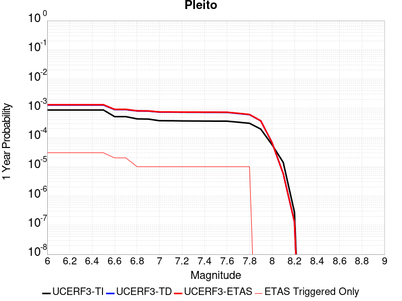 |  |

| Magnitude | 1 wk TI Prob | 1 wk TD Prob | 1 wk ETAS Prob | 1 wk ETAS/TD Gain | 1 wk ETAS Triggered Only | 1 mo TI Prob | 1 mo TD Prob | 1 mo ETAS Prob | 1 mo ETAS/TD Gain | 1 mo ETAS Triggered Only | 1 yr TI Prob | 1 yr TD Prob | 1 yr ETAS Prob | 1 yr ETAS/TD Gain | 1 yr ETAS Triggered Only | 10 yr TI Prob | 10 yr TD Prob | 10 yr ETAS Prob | 10 yr ETAS/TD Gain | 10 yr ETAS Triggered Only |
|-----|-----|-----|-----|-----|-----|-----|-----|-----|-----|-----|-----|-----|-----|-----|-----|-----|-----|-----|-----|-----|
| 6.0 | 1.6763008E-5 | 2.479053E-5 | 2.479053E-5 | 1.0 | 0.0 | 7.183948E-5 | 1.0624121E-4 | 1.0624121E-4 | 1.0 | 0.0 | 8.742947E-4 | 0.0012927912 | 0.0013281262 | 1.0273323 | 3.5380697E-5 | 0.00870863 | 0.012967364 | 0.013002286 | 1.002693 | 3.5380697E-5 |
| 6.1 | 1.6763008E-5 | 2.479053E-5 | 2.479053E-5 | 1.0 | 0.0 | 7.183948E-5 | 1.0624121E-4 | 1.0624121E-4 | 1.0 | 0.0 | 8.742947E-4 | 0.0012927912 | 0.0013281262 | 1.0273323 | 3.5380697E-5 | 0.00870863 | 0.012967364 | 0.013002286 | 1.002693 | 3.5380697E-5 |
| 6.2 | 1.6763008E-5 | 2.479053E-5 | 2.479053E-5 | 1.0 | 0.0 | 7.183948E-5 | 1.0624121E-4 | 1.0624121E-4 | 1.0 | 0.0 | 8.742947E-4 | 0.0012927912 | 0.0013281262 | 1.0273323 | 3.5380697E-5 | 0.00870863 | 0.012967364 | 0.013002286 | 1.002693 | 3.5380697E-5 |
| 6.3 | 1.6763008E-5 | 2.479053E-5 | 2.479053E-5 | 1.0 | 0.0 | 7.183948E-5 | 1.0624121E-4 | 1.0624121E-4 | 1.0 | 0.0 | 8.742947E-4 | 0.0012927912 | 0.0013281262 | 1.0273323 | 3.5380697E-5 | 0.00870863 | 0.012967364 | 0.013002286 | 1.002693 | 3.5380697E-5 |
| 6.4 | 1.6763008E-5 | 2.479053E-5 | 2.479053E-5 | 1.0 | 0.0 | 7.183948E-5 | 1.0624121E-4 | 1.0624121E-4 | 1.0 | 0.0 | 8.742947E-4 | 0.0012927912 | 0.0013281262 | 1.0273323 | 3.5380697E-5 | 0.00870863 | 0.012967364 | 0.013002286 | 1.002693 | 3.5380697E-5 |
| 6.5 | 1.6763008E-5 | 2.479053E-5 | 2.479053E-5 | 1.0 | 0.0 | 7.183948E-5 | 1.0624121E-4 | 1.0624121E-4 | 1.0 | 0.0 | 8.742947E-4 | 0.0012927912 | 0.0013281262 | 1.0273323 | 3.5380697E-5 | 0.00870863 | 0.012967364 | 0.013002286 | 1.002693 | 3.5380697E-5 |
| 6.6 | 9.910213E-6 | 1.7240907E-5 | 1.7240907E-5 | 1.0 | 0.0 | 4.247165E-5 | 7.388753E-5 | 7.388753E-5 | 1.0 | 0.0 | 5.169696E-4 | 8.992132E-4 | 8.992132E-4 | 1.0 | 0.0 | 0.0051576863 | 0.009064018 | 0.009064018 | 1.0 | 0.0 |
| 6.7 | 9.910213E-6 | 1.7240907E-5 | 1.7240907E-5 | 1.0 | 0.0 | 4.247165E-5 | 7.388753E-5 | 7.388753E-5 | 1.0 | 0.0 | 5.169696E-4 | 8.992132E-4 | 8.992132E-4 | 1.0 | 0.0 | 0.0051576863 | 0.009064018 | 0.009064018 | 1.0 | 0.0 |
| 6.8 | 8.300162E-6 | 1.5500442E-5 | 1.5500442E-5 | 1.0 | 0.0 | 3.557164E-5 | 6.642878E-5 | 6.642878E-5 | 1.0 | 0.0 | 4.3299864E-4 | 8.0847176E-4 | 8.0847176E-4 | 1.0 | 0.0 | 0.004321559 | 0.008163428 | 0.008163428 | 1.0 | 0.0 |
| 6.9 | 8.183114E-6 | 1.5371645E-5 | 1.5371645E-5 | 1.0 | 0.0 | 3.5070017E-5 | 6.5876826E-5 | 6.5876826E-5 | 1.0 | 0.0 | 4.2689382E-4 | 8.017566E-4 | 8.017566E-4 | 1.0 | 0.0 | 0.0042607468 | 0.008096768 | 0.008096768 | 1.0 | 0.0 |
| 7.0 | 7.1748823E-6 | 1.4158308E-5 | 1.4158308E-5 | 1.0 | 0.0 | 3.0749135E-5 | 6.067705E-5 | 6.067705E-5 | 1.0 | 0.0 | 3.743064E-4 | 7.384933E-4 | 7.384933E-4 | 1.0 | 0.0 | 0.0037367654 | 0.0074680606 | 0.0074680606 | 1.0 | 0.0 |
| 7.1 | 7.1671807E-6 | 1.4148675E-5 | 1.4148675E-5 | 1.0 | 0.0 | 3.0716128E-5 | 6.063577E-5 | 6.063577E-5 | 1.0 | 0.0 | 3.7390468E-4 | 7.37991E-4 | 7.37991E-4 | 1.0 | 0.0 | 0.0037327618 | 0.007463072 | 0.007463072 | 1.0 | 0.0 |
| 7.2 | 7.0649667E-6 | 1.399588E-5 | 1.399588E-5 | 1.0 | 0.0 | 3.0278077E-5 | 5.998097E-5 | 5.998097E-5 | 1.0 | 0.0 | 3.6857324E-4 | 7.300241E-4 | 7.300241E-4 | 1.0 | 0.0 | 0.0036796255 | 0.007383786 | 0.007383786 | 1.0 | 0.0 |
| 7.3 | 7.02082E-6 | 1.3939285E-5 | 1.3939285E-5 | 1.0 | 0.0 | 3.008888E-5 | 5.9738428E-5 | 5.9738428E-5 | 1.0 | 0.0 | 3.6627054E-4 | 7.270732E-4 | 7.270732E-4 | 1.0 | 0.0 | 0.0036566744 | 0.0073542604 | 0.0073542604 | 1.0 | 0.0 |
| 7.4 | 6.987146E-6 | 1.3898819E-5 | 1.3898819E-5 | 1.0 | 0.0 | 2.9944567E-5 | 5.956501E-5 | 5.956501E-5 | 1.0 | 0.0 | 3.6451413E-4 | 7.249632E-4 | 7.249632E-4 | 1.0 | 0.0 | 0.0036391679 | 0.007333182 | 0.007333182 | 1.0 | 0.0 |
| 7.5 | 6.9494554E-6 | 1.3855703E-5 | 1.3855703E-5 | 1.0 | 0.0 | 2.9783041E-5 | 5.9380236E-5 | 5.9380236E-5 | 1.0 | 0.0 | 3.625482E-4 | 7.2271505E-4 | 7.2271505E-4 | 1.0 | 0.0 | 0.0036195726 | 0.0073107993 | 0.0073107993 | 1.0 | 0.0 |
| 7.6 | 6.92694E-6 | 1.3814777E-5 | 1.3814777E-5 | 1.0 | 0.0 | 2.9686547E-5 | 5.9204845E-5 | 5.9204845E-5 | 1.0 | 0.0 | 3.6137376E-4 | 7.205811E-4 | 7.205811E-4 | 1.0 | 0.0 | 0.0036078666 | 0.007289532 | 0.007289532 | 1.0 | 0.0 |
| 7.7 | 6.395867E-6 | 1.2692768E-5 | 1.2692768E-5 | 1.0 | 0.0 | 2.741057E-5 | 5.439644E-5 | 5.439644E-5 | 1.0 | 0.0 | 3.336726E-4 | 6.6207576E-4 | 6.6207576E-4 | 1.0 | 0.0 | 0.0033317201 | 0.0067076497 | 0.0067076497 | 1.0 | 0.0 |
| 7.8 | 5.8664327E-6 | 1.155828E-5 | 1.155828E-5 | 1.0 | 0.0 | 2.5141611E-5 | 4.953455E-5 | 4.953455E-5 | 1.0 | 0.0 | 3.060561E-4 | 6.0291647E-4 | 6.0291647E-4 | 1.0 | 0.0 | 0.0030563495 | 0.00611206 | 0.00611206 | 1.0 | 0.0 |
| 7.9 | 3.7167474E-6 | 7.1276354E-6 | 7.1276354E-6 | 1.0 | 0.0 | 1.592882E-5 | 3.0546653E-5 | 3.0546653E-5 | 1.0 | 0.0 | 1.9391612E-4 | 3.7184218E-4 | 3.7184218E-4 | 1.0 | 0.0 | 0.0019374699 | 0.003774384 | 0.003774384 | 1.0 | 0.0 |
| 8.0 | 1.0903841E-6 | 1.2909164E-6 | 1.2909164E-6 | 1.0 | 0.0 | 4.6730665E-6 | 5.532487E-6 | 5.532487E-6 | 1.0 | 0.0 | 5.68931E-5 | 6.735596E-5 | 6.735596E-5 | 1.0 | 0.0 | 5.6878536E-4 | 6.957586E-4 | 6.957586E-4 | 1.0 | 0.0 |
| 8.1 | 2.6894583E-7 | 1.1110662E-7 | 1.1110662E-7 | 1.0 | 0.0 | 1.1526245E-6 | 4.7617115E-7 | 4.7617115E-7 | 1.0 | 0.0 | 1.4033113E-5 | 5.7973684E-6 | 5.7973684E-6 | 1.0 | 0.0 | 1.4032227E-4 | 6.485011E-5 | 6.485011E-5 | 1.0 | 0.0 |
| 8.2 | 5.2967013E-9 | 2.4698603E-9 | 2.4698603E-9 | 1.0 | 0.0 | 2.2700148E-8 | 1.0585116E-8 | 1.0585116E-8 | 1.0 | 0.0 | 2.7637427E-7 | 1.2887378E-7 | 1.2887378E-7 | 1.0 | 0.0 | 2.7637393E-6 | 1.466009E-6 | 1.466009E-6 | 1.0 | 0.0 |

## Pitas Point (Lower West)
*[(top)](#table-of-contents)*

| 1 Week | 1 Month | 1 Year | 10 Year |
|-----|-----|-----|-----|
|  |  |  |  |

| Magnitude | 1 wk TI Prob | 1 wk TD Prob | 1 wk ETAS Prob | 1 wk ETAS/TD Gain | 1 wk ETAS Triggered Only | 1 mo TI Prob | 1 mo TD Prob | 1 mo ETAS Prob | 1 mo ETAS/TD Gain | 1 mo ETAS Triggered Only | 1 yr TI Prob | 1 yr TD Prob | 1 yr ETAS Prob | 1 yr ETAS/TD Gain | 1 yr ETAS Triggered Only | 10 yr TI Prob | 10 yr TD Prob | 10 yr ETAS Prob | 10 yr ETAS/TD Gain | 10 yr ETAS Triggered Only |
|-----|-----|-----|-----|-----|-----|-----|-----|-----|-----|-----|-----|-----|-----|-----|-----|-----|-----|-----|-----|-----|
| 6.0 | 8.151497E-6 | 7.8560315E-6 | 7.8560315E-6 | 1.0 | 0.0 | 3.493452E-5 | 3.3668275E-5 | 3.3668275E-5 | 1.0 | 0.0 | 4.252448E-4 | 4.098349E-4 | 4.098349E-4 | 1.0 | 0.0 | 0.0042443196 | 0.0040908717 | 0.004126108 | 1.0086133 | 3.5380697E-5 |
| 6.1 | 8.151497E-6 | 7.8560315E-6 | 7.8560315E-6 | 1.0 | 0.0 | 3.493452E-5 | 3.3668275E-5 | 3.3668275E-5 | 1.0 | 0.0 | 4.252448E-4 | 4.098349E-4 | 4.098349E-4 | 1.0 | 0.0 | 0.0042443196 | 0.0040908717 | 0.004126108 | 1.0086133 | 3.5380697E-5 |
| 6.2 | 8.151497E-6 | 7.8560315E-6 | 7.8560315E-6 | 1.0 | 0.0 | 3.493452E-5 | 3.3668275E-5 | 3.3668275E-5 | 1.0 | 0.0 | 4.252448E-4 | 4.098349E-4 | 4.098349E-4 | 1.0 | 0.0 | 0.0042443196 | 0.0040908717 | 0.004126108 | 1.0086133 | 3.5380697E-5 |
| 6.3 | 8.151497E-6 | 7.8560315E-6 | 7.8560315E-6 | 1.0 | 0.0 | 3.493452E-5 | 3.3668275E-5 | 3.3668275E-5 | 1.0 | 0.0 | 4.252448E-4 | 4.098349E-4 | 4.098349E-4 | 1.0 | 0.0 | 0.0042443196 | 0.0040908717 | 0.004126108 | 1.0086133 | 3.5380697E-5 |
| 6.4 | 8.151497E-6 | 7.8560315E-6 | 7.8560315E-6 | 1.0 | 0.0 | 3.493452E-5 | 3.3668275E-5 | 3.3668275E-5 | 1.0 | 0.0 | 4.252448E-4 | 4.098349E-4 | 4.098349E-4 | 1.0 | 0.0 | 0.0042443196 | 0.0040908717 | 0.004126108 | 1.0086133 | 3.5380697E-5 |
| 6.5 | 8.151497E-6 | 7.8560315E-6 | 7.8560315E-6 | 1.0 | 0.0 | 3.493452E-5 | 3.3668275E-5 | 3.3668275E-5 | 1.0 | 0.0 | 4.252448E-4 | 4.098349E-4 | 4.098349E-4 | 1.0 | 0.0 | 0.0042443196 | 0.0040908717 | 0.004126108 | 1.0086133 | 3.5380697E-5 |
| 6.6 | 8.151497E-6 | 7.8560315E-6 | 7.8560315E-6 | 1.0 | 0.0 | 3.493452E-5 | 3.3668275E-5 | 3.3668275E-5 | 1.0 | 0.0 | 4.252448E-4 | 4.098349E-4 | 4.098349E-4 | 1.0 | 0.0 | 0.0042443196 | 0.0040908717 | 0.004126108 | 1.0086133 | 3.5380697E-5 |
| 6.7 | 8.151497E-6 | 7.8560315E-6 | 7.8560315E-6 | 1.0 | 0.0 | 3.493452E-5 | 3.3668275E-5 | 3.3668275E-5 | 1.0 | 0.0 | 4.252448E-4 | 4.098349E-4 | 4.098349E-4 | 1.0 | 0.0 | 0.0042443196 | 0.0040908717 | 0.004126108 | 1.0086133 | 3.5380697E-5 |
| 6.8 | 8.151497E-6 | 7.8560315E-6 | 7.8560315E-6 | 1.0 | 0.0 | 3.493452E-5 | 3.3668275E-5 | 3.3668275E-5 | 1.0 | 0.0 | 4.252448E-4 | 4.098349E-4 | 4.098349E-4 | 1.0 | 0.0 | 0.0042443196 | 0.0040908717 | 0.004126108 | 1.0086133 | 3.5380697E-5 |
| 6.9 | 8.151497E-6 | 7.8560315E-6 | 7.8560315E-6 | 1.0 | 0.0 | 3.493452E-5 | 3.3668275E-5 | 3.3668275E-5 | 1.0 | 0.0 | 4.252448E-4 | 4.098349E-4 | 4.098349E-4 | 1.0 | 0.0 | 0.0042443196 | 0.0040908717 | 0.004126108 | 1.0086133 | 3.5380697E-5 |
| 7.0 | 8.103535E-6 | 7.80546E-6 | 7.80546E-6 | 1.0 | 0.0 | 3.4728975E-5 | 3.3451546E-5 | 3.3451546E-5 | 1.0 | 0.0 | 4.2274324E-4 | 4.071972E-4 | 4.071972E-4 | 1.0 | 0.0 | 0.0042193993 | 0.004064591 | 0.004064591 | 1.0 | 0.0 |
| 7.1 | 7.853298E-6 | 7.541143E-6 | 7.541143E-6 | 1.0 | 0.0 | 3.3656554E-5 | 3.231879E-5 | 3.231879E-5 | 1.0 | 0.0 | 4.096915E-4 | 3.934109E-4 | 3.934109E-4 | 1.0 | 0.0 | 0.00408937 | 0.0039272206 | 0.0039272206 | 1.0 | 0.0 |
| 7.2 | 7.771102E-6 | 7.453422E-6 | 7.453422E-6 | 1.0 | 0.0 | 3.33043E-5 | 3.194285E-5 | 3.194285E-5 | 1.0 | 0.0 | 4.0540437E-4 | 3.888355E-4 | 3.888355E-4 | 1.0 | 0.0 | 0.0040466557 | 0.003881627 | 0.003881627 | 1.0 | 0.0 |
| 7.3 | 7.3945344E-6 | 7.0495107E-6 | 7.0495107E-6 | 1.0 | 0.0 | 3.1690477E-5 | 3.0211842E-5 | 3.0211842E-5 | 1.0 | 0.0 | 3.8576324E-4 | 3.6776773E-4 | 3.6776773E-4 | 1.0 | 0.0 | 0.0038509427 | 0.003671659 | 0.003671659 | 1.0 | 0.0 |
| 7.4 | 6.964645E-6 | 6.590343E-6 | 6.590343E-6 | 1.0 | 0.0 | 2.9848137E-5 | 2.8244025E-5 | 2.8244025E-5 | 1.0 | 0.0 | 3.6334046E-4 | 3.4381726E-4 | 3.4381726E-4 | 1.0 | 0.0 | 0.0036274698 | 0.0034329065 | 0.0034329065 | 1.0 | 0.0 |
| 7.5 | 6.6525035E-6 | 6.2593713E-6 | 6.2593713E-6 | 1.0 | 0.0 | 2.851042E-5 | 2.6825604E-5 | 2.6825604E-5 | 1.0 | 0.0 | 3.4705905E-4 | 3.2655327E-4 | 3.2655327E-4 | 1.0 | 0.0 | 0.0034651754 | 0.0032607857 | 0.0032607857 | 1.0 | 0.0 |
| 7.6 | 5.613338E-6 | 5.151559E-6 | 5.151559E-6 | 1.0 | 0.0 | 2.405694E-5 | 2.2077926E-5 | 2.2077926E-5 | 1.0 | 0.0 | 2.928539E-4 | 2.6876587E-4 | 2.6876587E-4 | 1.0 | 0.0 | 0.0029246826 | 0.00268444 | 0.00268444 | 1.0 | 0.0 |
| 7.7 | 4.494704E-6 | 3.9970487E-6 | 3.9970487E-6 | 1.0 | 0.0 | 1.9262876E-5 | 1.7130098E-5 | 1.7130098E-5 | 1.0 | 0.0 | 2.3450027E-4 | 2.085392E-4 | 2.085392E-4 | 1.0 | 0.0 | 0.0023425296 | 0.0020834592 | 0.0020834592 | 1.0 | 0.0 |
| 7.8 | 2.6075882E-6 | 2.1837093E-6 | 2.1837093E-6 | 1.0 | 0.0 | 1.117533E-5 | 9.358721E-6 | 9.358721E-6 | 1.0 | 0.0 | 1.3605114E-4 | 1.1393652E-4 | 1.1393652E-4 | 1.0 | 0.0 | 0.0013596788 | 0.0011387857 | 0.0011387857 | 1.0 | 0.0 |
| 7.9 | 4.045984E-7 | 3.2424867E-7 | 3.2424867E-7 | 1.0 | 0.0 | 1.733992E-6 | 1.3896364E-6 | 1.3896364E-6 | 1.0 | 0.0 | 2.1111147E-5 | 1.6918695E-5 | 1.6918695E-5 | 1.0 | 0.0 | 2.1109142E-4 | 1.6917438E-4 | 1.6917438E-4 | 1.0 | 0.0 |
| 8.0 | 7.791402E-9 | 5.683722E-9 | 5.683722E-9 | 1.0 | 0.0 | 3.3391725E-8 | 2.4358807E-8 | 2.4358807E-8 | 1.0 | 0.0 | 4.0654416E-7 | 2.9656846E-7 | 2.9656846E-7 | 1.0 | 0.0 | 4.065434E-6 | 2.9656826E-6 | 2.9656826E-6 | 1.0 | 0.0 |

## Kern Canyon (North Kern) 2011
*[(top)](#table-of-contents)*

| 1 Week | 1 Month | 1 Year | 10 Year |
|-----|-----|-----|-----|
|  |  |  |  |

| Magnitude | 1 wk TI Prob | 1 wk TD Prob | 1 wk ETAS Prob | 1 wk ETAS/TD Gain | 1 wk ETAS Triggered Only | 1 mo TI Prob | 1 mo TD Prob | 1 mo ETAS Prob | 1 mo ETAS/TD Gain | 1 mo ETAS Triggered Only | 1 yr TI Prob | 1 yr TD Prob | 1 yr ETAS Prob | 1 yr ETAS/TD Gain | 1 yr ETAS Triggered Only | 10 yr TI Prob | 10 yr TD Prob | 10 yr ETAS Prob | 10 yr ETAS/TD Gain | 10 yr ETAS Triggered Only |
|-----|-----|-----|-----|-----|-----|-----|-----|-----|-----|-----|-----|-----|-----|-----|-----|-----|-----|-----|-----|-----|
| 6.0 | 6.6264497E-6 | 6.7574156E-6 | 6.7574156E-6 | 1.0 | 0.0 | 2.8398761E-5 | 2.8960078E-5 | 2.8960078E-5 | 1.0 | 0.0 | 3.4570007E-4 | 3.525399E-4 | 3.525399E-4 | 1.0 | 0.0 | 0.0034516277 | 0.003520595 | 0.003555851 | 1.0100143 | 3.5380697E-5 |
| 6.1 | 6.6264497E-6 | 6.7574156E-6 | 6.7574156E-6 | 1.0 | 0.0 | 2.8398761E-5 | 2.8960078E-5 | 2.8960078E-5 | 1.0 | 0.0 | 3.4570007E-4 | 3.525399E-4 | 3.525399E-4 | 1.0 | 0.0 | 0.0034516277 | 0.003520595 | 0.003555851 | 1.0100143 | 3.5380697E-5 |
| 6.2 | 6.6264497E-6 | 6.7574156E-6 | 6.7574156E-6 | 1.0 | 0.0 | 2.8398761E-5 | 2.8960078E-5 | 2.8960078E-5 | 1.0 | 0.0 | 3.4570007E-4 | 3.525399E-4 | 3.525399E-4 | 1.0 | 0.0 | 0.0034516277 | 0.003520595 | 0.003555851 | 1.0100143 | 3.5380697E-5 |
| 6.3 | 6.6264497E-6 | 6.7574156E-6 | 6.7574156E-6 | 1.0 | 0.0 | 2.8398761E-5 | 2.8960078E-5 | 2.8960078E-5 | 1.0 | 0.0 | 3.4570007E-4 | 3.525399E-4 | 3.525399E-4 | 1.0 | 0.0 | 0.0034516277 | 0.003520595 | 0.003555851 | 1.0100143 | 3.5380697E-5 |
| 6.4 | 6.6264497E-6 | 6.7574156E-6 | 6.7574156E-6 | 1.0 | 0.0 | 2.8398761E-5 | 2.8960078E-5 | 2.8960078E-5 | 1.0 | 0.0 | 3.4570007E-4 | 3.525399E-4 | 3.525399E-4 | 1.0 | 0.0 | 0.0034516277 | 0.003520595 | 0.003555851 | 1.0100143 | 3.5380697E-5 |
| 6.5 | 3.2162225E-6 | 3.2571281E-6 | 3.2571281E-6 | 1.0 | 0.0 | 1.3783738E-5 | 1.395905E-5 | 1.395905E-5 | 1.0 | 0.0 | 1.6780409E-4 | 1.69939E-4 | 1.69939E-4 | 1.0 | 0.0 | 0.0016767744 | 0.0016981701 | 0.0016981701 | 1.0 | 0.0 |
| 6.6 | 3.2162225E-6 | 3.2571281E-6 | 3.2571281E-6 | 1.0 | 0.0 | 1.3783738E-5 | 1.395905E-5 | 1.395905E-5 | 1.0 | 0.0 | 1.6780409E-4 | 1.69939E-4 | 1.69939E-4 | 1.0 | 0.0 | 0.0016767744 | 0.0016981701 | 0.0016981701 | 1.0 | 0.0 |
| 6.7 | 2.1908265E-6 | 2.2071454E-6 | 2.2071454E-6 | 1.0 | 0.0 | 9.389223E-6 | 9.459161E-6 | 9.459161E-6 | 1.0 | 0.0 | 1.1430779E-4 | 1.15159404E-4 | 1.15159404E-4 | 1.0 | 0.0 | 0.0011424901 | 0.0011510167 | 0.0011510167 | 1.0 | 0.0 |
| 6.8 | 1.7303895E-6 | 1.7365707E-6 | 1.7365707E-6 | 1.0 | 0.0 | 7.415934E-6 | 7.442425E-6 | 7.442425E-6 | 1.0 | 0.0 | 9.028525E-5 | 9.060786E-5 | 9.060786E-5 | 1.0 | 0.0 | 9.024858E-4 | 9.057189E-4 | 9.057189E-4 | 1.0 | 0.0 |
| 6.9 | 1.3700314E-6 | 1.368876E-6 | 1.368876E-6 | 1.0 | 0.0 | 5.87155E-6 | 5.8665987E-6 | 5.8665987E-6 | 1.0 | 0.0 | 7.148377E-5 | 7.142354E-5 | 7.142354E-5 | 1.0 | 0.0 | 7.146078E-4 | 7.1401044E-4 | 7.1401044E-4 | 1.0 | 0.0 |
| 7.0 | 1.1467797E-6 | 1.141392E-6 | 1.141392E-6 | 1.0 | 0.0 | 4.9147607E-6 | 4.891671E-6 | 4.891671E-6 | 1.0 | 0.0 | 5.983557E-5 | 5.95545E-5 | 5.95545E-5 | 1.0 | 0.0 | 5.981946E-4 | 5.953885E-4 | 5.953885E-4 | 1.0 | 0.0 |
| 7.1 | 9.3952065E-7 | 9.3027853E-7 | 9.3027853E-7 | 1.0 | 0.0 | 4.026511E-6 | 3.986902E-6 | 3.986902E-6 | 1.0 | 0.0 | 4.9021666E-5 | 4.8539467E-5 | 4.8539467E-5 | 1.0 | 0.0 | 4.901085E-4 | 4.8529042E-4 | 4.8529042E-4 | 1.0 | 0.0 |
| 7.2 | 6.858055E-7 | 6.71937E-7 | 6.71937E-7 | 1.0 | 0.0 | 2.939163E-6 | 2.879727E-6 | 2.879727E-6 | 1.0 | 0.0 | 3.5783723E-5 | 3.506012E-5 | 3.506012E-5 | 1.0 | 0.0 | 3.5777962E-4 | 3.5054676E-4 | 3.5054676E-4 | 1.0 | 0.0 |
| 7.3 | 5.1101983E-7 | 4.939352E-7 | 4.939352E-7 | 1.0 | 0.0 | 2.1900833E-6 | 2.1168635E-6 | 2.1168635E-6 | 1.0 | 0.0 | 2.6663936E-5 | 2.5772513E-5 | 2.5772513E-5 | 1.0 | 0.0 | 2.6660739E-4 | 2.5769573E-4 | 2.5769573E-4 | 1.0 | 0.0 |
| 7.4 | 3.4999414E-7 | 3.299627E-7 | 3.299627E-7 | 1.0 | 0.0 | 1.499974E-6 | 1.4141251E-6 | 1.4141251E-6 | 1.0 | 0.0 | 1.8262032E-5 | 1.721684E-5 | 1.721684E-5 | 1.0 | 0.0 | 1.826053E-4 | 1.721553E-4 | 1.721553E-4 | 1.0 | 0.0 |
| 7.5 | 1.7021522E-7 | 1.475023E-7 | 1.475023E-7 | 1.0 | 0.0 | 7.2949354E-7 | 6.321526E-7 | 6.321526E-7 | 1.0 | 0.0 | 8.881548E-6 | 7.696432E-6 | 7.696432E-6 | 1.0 | 0.0 | 8.8811925E-5 | 7.6961725E-5 | 7.6961725E-5 | 1.0 | 0.0 |
| 7.6 | 2.572245E-8 | 1.7352884E-8 | 1.7352884E-8 | 1.0 | 0.0 | 1.10239064E-7 | 7.43695E-8 | 7.43695E-8 | 1.0 | 0.0 | 1.3421597E-6 | 9.0544836E-7 | 9.0544836E-7 | 1.0 | 0.0 | 1.3421517E-5 | 9.054452E-6 | 9.054452E-6 | 1.0 | 0.0 |

## Emerson-Copper Mtn 2011
*[(top)](#table-of-contents)*

| 1 Week | 1 Month | 1 Year | 10 Year |
|-----|-----|-----|-----|
|  |  |  |  |

| Magnitude | 1 wk TI Prob | 1 wk TD Prob | 1 wk ETAS Prob | 1 wk ETAS/TD Gain | 1 wk ETAS Triggered Only | 1 mo TI Prob | 1 mo TD Prob | 1 mo ETAS Prob | 1 mo ETAS/TD Gain | 1 mo ETAS Triggered Only | 1 yr TI Prob | 1 yr TD Prob | 1 yr ETAS Prob | 1 yr ETAS/TD Gain | 1 yr ETAS Triggered Only | 10 yr TI Prob | 10 yr TD Prob | 10 yr ETAS Prob | 10 yr ETAS/TD Gain | 10 yr ETAS Triggered Only |
|-----|-----|-----|-----|-----|-----|-----|-----|-----|-----|-----|-----|-----|-----|-----|-----|-----|-----|-----|-----|-----|
| 6.0 | 2.1364202E-5 | 9.96877E-6 | 9.96877E-6 | 1.0 | 0.0 | 9.1557646E-5 | 4.272265E-5 | 4.272265E-5 | 1.0 | 0.0 | 0.0011141442 | 5.2003283E-4 | 5.2003283E-4 | 1.0 | 0.0 | 0.011085749 | 0.005189029 | 0.005224226 | 1.006783 | 3.5380697E-5 |
| 6.1 | 2.1364202E-5 | 9.96877E-6 | 9.96877E-6 | 1.0 | 0.0 | 9.1557646E-5 | 4.272265E-5 | 4.272265E-5 | 1.0 | 0.0 | 0.0011141442 | 5.2003283E-4 | 5.2003283E-4 | 1.0 | 0.0 | 0.011085749 | 0.005189029 | 0.005224226 | 1.006783 | 3.5380697E-5 |
| 6.2 | 2.1364202E-5 | 9.96877E-6 | 9.96877E-6 | 1.0 | 0.0 | 9.1557646E-5 | 4.272265E-5 | 4.272265E-5 | 1.0 | 0.0 | 0.0011141442 | 5.2003283E-4 | 5.2003283E-4 | 1.0 | 0.0 | 0.011085749 | 0.005189029 | 0.005224226 | 1.006783 | 3.5380697E-5 |
| 6.3 | 1.7751237E-5 | 8.0897835E-6 | 8.0897835E-6 | 1.0 | 0.0 | 7.607452E-5 | 3.4670073E-5 | 3.4670073E-5 | 1.0 | 0.0 | 9.258136E-4 | 4.2203267E-4 | 4.2203267E-4 | 1.0 | 0.0 | 0.00921966 | 0.0042129345 | 0.004248166 | 1.0083628 | 3.5380697E-5 |
| 6.4 | 1.7751237E-5 | 8.0897835E-6 | 8.0897835E-6 | 1.0 | 0.0 | 7.607452E-5 | 3.4670073E-5 | 3.4670073E-5 | 1.0 | 0.0 | 9.258136E-4 | 4.2203267E-4 | 4.2203267E-4 | 1.0 | 0.0 | 0.00921966 | 0.0042129345 | 0.004248166 | 1.0083628 | 3.5380697E-5 |
| 6.5 | 1.5886664E-5 | 6.604287E-6 | 6.604287E-6 | 1.0 | 0.0 | 6.808392E-5 | 2.8303808E-5 | 2.8303808E-5 | 1.0 | 0.0 | 8.286065E-4 | 3.4454907E-4 | 3.4454907E-4 | 1.0 | 0.0 | 0.008255237 | 0.003440613 | 0.003475872 | 1.0102478 | 3.5380697E-5 |
| 6.6 | 1.5886664E-5 | 6.604287E-6 | 6.604287E-6 | 1.0 | 0.0 | 6.808392E-5 | 2.8303808E-5 | 2.8303808E-5 | 1.0 | 0.0 | 8.286065E-4 | 3.4454907E-4 | 3.4454907E-4 | 1.0 | 0.0 | 0.008255237 | 0.003440613 | 0.003475872 | 1.0102478 | 3.5380697E-5 |
| 6.7 | 1.428471E-5 | 5.470806E-6 | 5.470806E-6 | 1.0 | 0.0 | 6.121875E-5 | 2.3446124E-5 | 2.3446124E-5 | 1.0 | 0.0 | 7.450834E-4 | 2.854231E-4 | 2.854231E-4 | 1.0 | 0.0 | 0.007425902 | 0.0028509533 | 0.0028862332 | 1.0123748 | 3.5380697E-5 |
| 6.8 | 1.3490684E-5 | 5.0740778E-6 | 5.0740778E-6 | 1.0 | 0.0 | 5.7815934E-5 | 2.1745887E-5 | 2.1745887E-5 | 1.0 | 0.0 | 7.0368167E-4 | 2.647279E-4 | 2.647279E-4 | 1.0 | 0.0 | 0.007014576 | 0.0026445063 | 0.0026797934 | 1.0133436 | 3.5380697E-5 |
| 6.9 | 1.2235421E-5 | 4.2900224E-6 | 4.2900224E-6 | 1.0 | 0.0 | 5.2436466E-5 | 1.8385701E-5 | 1.8385701E-5 | 1.0 | 0.0 | 6.38227E-4 | 2.2382653E-4 | 2.2382653E-4 | 1.0 | 0.0 | 0.0063639707 | 0.0022363653 | 0.002271667 | 1.0157852 | 3.5380697E-5 |
| 7.0 | 1.1009851E-5 | 3.719305E-6 | 3.719305E-6 | 1.0 | 0.0 | 4.7184225E-5 | 1.59398E-5 | 1.59398E-5 | 1.0 | 0.0 | 5.743165E-4 | 1.9405322E-4 | 1.9405322E-4 | 1.0 | 0.0 | 0.005728345 | 0.0019391757 | 0.0019744877 | 1.0182098 | 3.5380697E-5 |
| 7.1 | 9.726373E-6 | 3.2120734E-6 | 3.2120734E-6 | 1.0 | 0.0 | 4.168379E-5 | 1.3765975E-5 | 1.3765975E-5 | 1.0 | 0.0 | 5.07382E-4 | 1.6759124E-4 | 1.6759124E-4 | 1.0 | 0.0 | 0.0050622504 | 0.0016749798 | 0.0017103013 | 1.0210876 | 3.5380697E-5 |
| 7.2 | 3.9335127E-6 | 1.1525784E-6 | 1.1525784E-6 | 1.0 | 0.0 | 1.6857803E-5 | 4.939613E-6 | 4.939613E-6 | 1.0 | 0.0 | 2.0522442E-4 | 6.0138187E-5 | 6.0138187E-5 | 1.0 | 0.0 | 0.00205035 | 6.0122507E-4 | 6.3658453E-4 | 1.0588123 | 3.5380697E-5 |
| 7.3 | 2.661632E-6 | 6.912155E-7 | 6.912155E-7 | 1.0 | 0.0 | 1.14069435E-5 | 2.962349E-6 | 2.962349E-6 | 1.0 | 0.0 | 1.3887069E-4 | 3.6066012E-5 | 3.6066012E-5 | 1.0 | 0.0 | 0.0013878393 | 3.6060263E-4 | 3.9597056E-4 | 1.09808 | 3.5380697E-5 |
| 7.4 | 2.0893426E-6 | 5.462354E-7 | 5.462354E-7 | 1.0 | 0.0 | 8.954295E-6 | 2.3410068E-6 | 2.3410068E-6 | 1.0 | 0.0 | 1.0901308E-4 | 2.850139E-5 | 2.850139E-5 | 1.0 | 0.0 | 0.0010895962 | 2.849779E-4 | 3.203485E-4 | 1.124117 | 3.5380697E-5 |
| 7.5 | 1.1681728E-6 | 3.6033393E-7 | 3.6033393E-7 | 1.0 | 0.0 | 5.0064455E-6 | 1.5442874E-6 | 1.5442874E-6 | 1.0 | 0.0 | 6.0951766E-5 | 1.8801542E-5 | 1.8801542E-5 | 1.0 | 0.0 | 6.093505E-4 | 1.8799998E-4 | 2.2337402E-4 | 1.1881598 | 3.5380697E-5 |
| 7.6 | 1.3154387E-7 | 7.12009E-8 | 7.12009E-8 | 1.0 | 0.0 | 5.6375933E-7 | 3.051467E-7 | 3.051467E-7 | 1.0 | 0.0 | 6.863748E-6 | 3.7151563E-6 | 3.7151563E-6 | 1.0 | 0.0 | 6.863536E-5 | 3.7151098E-5 | 3.7151098E-5 | 1.0 | 0.0 |

## Cucamonga
*[(top)](#table-of-contents)*

| 1 Week | 1 Month | 1 Year | 10 Year |
|-----|-----|-----|-----|
|  |  |  |  |

| Magnitude | 1 wk TI Prob | 1 wk TD Prob | 1 wk ETAS Prob | 1 wk ETAS/TD Gain | 1 wk ETAS Triggered Only | 1 mo TI Prob | 1 mo TD Prob | 1 mo ETAS Prob | 1 mo ETAS/TD Gain | 1 mo ETAS Triggered Only | 1 yr TI Prob | 1 yr TD Prob | 1 yr ETAS Prob | 1 yr ETAS/TD Gain | 1 yr ETAS Triggered Only | 10 yr TI Prob | 10 yr TD Prob | 10 yr ETAS Prob | 10 yr ETAS/TD Gain | 10 yr ETAS Triggered Only |
|-----|-----|-----|-----|-----|-----|-----|-----|-----|-----|-----|-----|-----|-----|-----|-----|-----|-----|-----|-----|-----|
| 6.0 | 1.1848348E-5 | 1.1739686E-5 | 1.1739686E-5 | 1.0 | 0.0 | 5.0777642E-5 | 5.0311985E-5 | 5.0311985E-5 | 1.0 | 0.0 | 6.180424E-4 | 6.1237894E-4 | 6.1237894E-4 | 1.0 | 0.0 | 0.0061632637 | 0.0061080856 | 0.0061432505 | 1.0057571 | 3.5380697E-5 |
| 6.1 | 1.1848348E-5 | 1.1739686E-5 | 1.1739686E-5 | 1.0 | 0.0 | 5.0777642E-5 | 5.0311985E-5 | 5.0311985E-5 | 1.0 | 0.0 | 6.180424E-4 | 6.1237894E-4 | 6.1237894E-4 | 1.0 | 0.0 | 0.0061632637 | 0.0061080856 | 0.0061432505 | 1.0057571 | 3.5380697E-5 |
| 6.2 | 1.1848348E-5 | 1.1739686E-5 | 1.1739686E-5 | 1.0 | 0.0 | 5.0777642E-5 | 5.0311985E-5 | 5.0311985E-5 | 1.0 | 0.0 | 6.180424E-4 | 6.1237894E-4 | 6.1237894E-4 | 1.0 | 0.0 | 0.0061632637 | 0.0061080856 | 0.0061432505 | 1.0057571 | 3.5380697E-5 |
| 6.3 | 1.1848348E-5 | 1.1739686E-5 | 1.1739686E-5 | 1.0 | 0.0 | 5.0777642E-5 | 5.0311985E-5 | 5.0311985E-5 | 1.0 | 0.0 | 6.180424E-4 | 6.1237894E-4 | 6.1237894E-4 | 1.0 | 0.0 | 0.0061632637 | 0.0061080856 | 0.0061432505 | 1.0057571 | 3.5380697E-5 |
| 6.4 | 1.1848348E-5 | 1.1739686E-5 | 1.1739686E-5 | 1.0 | 0.0 | 5.0777642E-5 | 5.0311985E-5 | 5.0311985E-5 | 1.0 | 0.0 | 6.180424E-4 | 6.1237894E-4 | 6.1237894E-4 | 1.0 | 0.0 | 0.0061632637 | 0.0061080856 | 0.0061432505 | 1.0057571 | 3.5380697E-5 |
| 6.5 | 1.16988695E-5 | 1.157871E-5 | 1.157871E-5 | 1.0 | 0.0 | 5.013705E-5 | 4.9622115E-5 | 4.9622115E-5 | 1.0 | 0.0 | 6.102476E-4 | 6.0398446E-4 | 6.0398446E-4 | 1.0 | 0.0 | 0.006085745 | 0.0060245967 | 0.0060597644 | 1.0058373 | 3.5380697E-5 |
| 6.6 | 1.16988695E-5 | 1.157871E-5 | 1.157871E-5 | 1.0 | 0.0 | 5.013705E-5 | 4.9622115E-5 | 4.9622115E-5 | 1.0 | 0.0 | 6.102476E-4 | 6.0398446E-4 | 6.0398446E-4 | 1.0 | 0.0 | 0.006085745 | 0.0060245967 | 0.0060597644 | 1.0058373 | 3.5380697E-5 |
| 6.7 | 1.1397107E-5 | 1.111755E-5 | 1.111755E-5 | 1.0 | 0.0 | 4.884383E-5 | 4.7645786E-5 | 4.7645786E-5 | 1.0 | 0.0 | 5.9451134E-4 | 5.7993556E-4 | 5.7993556E-4 | 1.0 | 0.0 | 0.005929234 | 0.005785368 | 0.005820544 | 1.0060802 | 3.5380697E-5 |
| 6.8 | 1.058387E-5 | 9.787276E-6 | 9.787276E-6 | 1.0 | 0.0 | 4.5358654E-5 | 4.19448E-5 | 4.19448E-5 | 1.0 | 0.0 | 5.521017E-4 | 5.105594E-4 | 5.105594E-4 | 1.0 | 0.0 | 0.00550732 | 0.005094869 | 0.0051300693 | 1.006909 | 3.5380697E-5 |
| 6.9 | 9.690046E-6 | 8.581557E-6 | 8.581557E-6 | 1.0 | 0.0 | 4.1528107E-5 | 3.6777587E-5 | 3.6777587E-5 | 1.0 | 0.0 | 5.054874E-4 | 4.4767553E-4 | 4.4767553E-4 | 1.0 | 0.0 | 0.005043391 | 0.0044686683 | 0.004503891 | 1.0078821 | 3.5380697E-5 |
| 7.0 | 9.381461E-6 | 8.189123E-6 | 8.189123E-6 | 1.0 | 0.0 | 4.020564E-5 | 3.509577E-5 | 3.509577E-5 | 1.0 | 0.0 | 4.893937E-4 | 4.272076E-4 | 4.272076E-4 | 1.0 | 0.0 | 0.0048831734 | 0.004264793 | 0.004300023 | 1.0082606 | 3.5380697E-5 |
| 7.1 | 8.946492E-6 | 7.783867E-6 | 7.783867E-6 | 1.0 | 0.0 | 3.8341543E-5 | 3.3359003E-5 | 3.3359003E-5 | 1.0 | 0.0 | 4.667083E-4 | 4.060705E-4 | 4.060705E-4 | 1.0 | 0.0 | 0.0046572937 | 0.0040542167 | 0.004089454 | 1.0086915 | 3.5380697E-5 |
| 7.2 | 8.251016E-6 | 6.977125E-6 | 6.977125E-6 | 1.0 | 0.0 | 3.5361016E-5 | 2.9901623E-5 | 2.9901623E-5 | 1.0 | 0.0 | 4.3043532E-4 | 3.6399168E-4 | 3.6399168E-4 | 1.0 | 0.0 | 0.0042960253 | 0.0036348838 | 0.0036701357 | 1.0096983 | 3.5380697E-5 |
| 7.3 | 7.717881E-6 | 6.4881356E-6 | 6.4881356E-6 | 1.0 | 0.0 | 3.3076216E-5 | 2.7806E-5 | 2.7806E-5 | 1.0 | 0.0 | 4.026285E-4 | 3.3848567E-4 | 3.3848567E-4 | 1.0 | 0.0 | 0.004018998 | 0.0033806337 | 0.0034158947 | 1.0104303 | 3.5380697E-5 |
| 7.4 | 7.275623E-6 | 6.0337097E-6 | 6.0337097E-6 | 1.0 | 0.0 | 3.118087E-5 | 2.58585E-5 | 2.58585E-5 | 1.0 | 0.0 | 3.7956095E-4 | 3.14782E-4 | 3.14782E-4 | 1.0 | 0.0 | 0.0037891332 | 0.0031442924 | 0.0031795618 | 1.011217 | 3.5380697E-5 |
| 7.5 | 6.5109502E-6 | 5.102118E-6 | 5.102118E-6 | 1.0 | 0.0 | 2.7903774E-5 | 2.1866037E-5 | 2.1866037E-5 | 1.0 | 0.0 | 3.3967546E-4 | 2.6618663E-4 | 2.6618663E-4 | 1.0 | 0.0 | 0.0033915674 | 0.002659598 | 0.0026948843 | 1.0132676 | 3.5380697E-5 |
| 7.6 | 5.4495326E-6 | 3.909914E-6 | 3.909914E-6 | 1.0 | 0.0 | 2.335493E-5 | 1.6756667E-5 | 1.6756667E-5 | 1.0 | 0.0 | 2.8430918E-4 | 2.0399339E-4 | 2.0399339E-4 | 1.0 | 0.0 | 0.0028394572 | 0.0020389776 | 0.002074286 | 1.0173168 | 3.5380697E-5 |
| 7.7 | 4.7997164E-6 | 3.201463E-6 | 3.201463E-6 | 1.0 | 0.0 | 2.057005E-5 | 1.3720483E-5 | 1.3720483E-5 | 1.0 | 0.0 | 2.504116E-4 | 1.6703412E-4 | 1.6703412E-4 | 1.0 | 0.0 | 0.002501296 | 0.0016700128 | 0.0016700128 | 1.0 | 0.0 |
| 7.8 | 3.3941733E-6 | 2.0648838E-6 | 2.0648838E-6 | 1.0 | 0.0 | 1.4546376E-5 | 8.849473E-6 | 8.849473E-6 | 1.0 | 0.0 | 1.7708774E-4 | 1.0773702E-4 | 1.0773702E-4 | 1.0 | 0.0 | 0.0017694668 | 0.0010770849 | 0.0010770849 | 1.0 | 0.0 |
| 7.9 | 9.750552E-7 | 5.1576814E-7 | 5.1576814E-7 | 1.0 | 0.0 | 4.178801E-6 | 2.210433E-6 | 2.210433E-6 | 1.0 | 0.0 | 5.0875715E-5 | 2.6911694E-5 | 2.6911694E-5 | 1.0 | 0.0 | 5.086407E-4 | 2.6908476E-4 | 2.6908476E-4 | 1.0 | 0.0 |
| 8.0 | 1.133857E-7 | 6.055087E-8 | 6.055087E-8 | 1.0 | 0.0 | 4.8593864E-7 | 2.595037E-7 | 2.595037E-7 | 1.0 | 0.0 | 5.9162867E-6 | 3.1594532E-6 | 3.1594532E-6 | 1.0 | 0.0 | 5.916129E-5 | 3.15941E-5 | 3.15941E-5 | 1.0 | 0.0 |

## San Jacinto (Coyote Creek)
*[(top)](#table-of-contents)*

| 1 Week | 1 Month | 1 Year | 10 Year |
|-----|-----|-----|-----|
|  |  |  | 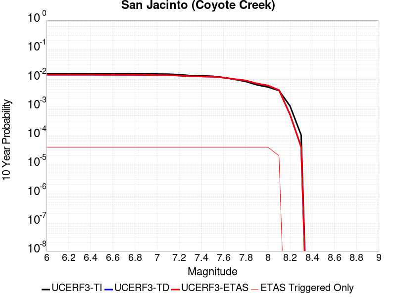 |

| Magnitude | 1 wk TI Prob | 1 wk TD Prob | 1 wk ETAS Prob | 1 wk ETAS/TD Gain | 1 wk ETAS Triggered Only | 1 mo TI Prob | 1 mo TD Prob | 1 mo ETAS Prob | 1 mo ETAS/TD Gain | 1 mo ETAS Triggered Only | 1 yr TI Prob | 1 yr TD Prob | 1 yr ETAS Prob | 1 yr ETAS/TD Gain | 1 yr ETAS Triggered Only | 10 yr TI Prob | 10 yr TD Prob | 10 yr ETAS Prob | 10 yr ETAS/TD Gain | 10 yr ETAS Triggered Only |
|-----|-----|-----|-----|-----|-----|-----|-----|-----|-----|-----|-----|-----|-----|-----|-----|-----|-----|-----|-----|-----|
| 6.0 | 2.7374346E-5 | 2.4177032E-5 | 2.4177032E-5 | 1.0 | 0.0 | 1.1731335E-4 | 1.0361175E-4 | 1.0361175E-4 | 1.0 | 0.0 | 0.0014273542 | 0.0012607456 | 0.0012960817 | 1.0280279 | 3.5380697E-5 | 0.01418221 | 0.012944878 | 0.012979801 | 1.0026978 | 3.5380697E-5 |
| 6.1 | 2.7374346E-5 | 2.4177032E-5 | 2.4177032E-5 | 1.0 | 0.0 | 1.1731335E-4 | 1.0361175E-4 | 1.0361175E-4 | 1.0 | 0.0 | 0.0014273542 | 0.0012607456 | 0.0012960817 | 1.0280279 | 3.5380697E-5 | 0.01418221 | 0.012944878 | 0.012979801 | 1.0026978 | 3.5380697E-5 |
| 6.2 | 2.7374346E-5 | 2.4177032E-5 | 2.4177032E-5 | 1.0 | 0.0 | 1.1731335E-4 | 1.0361175E-4 | 1.0361175E-4 | 1.0 | 0.0 | 0.0014273542 | 0.0012607456 | 0.0012960817 | 1.0280279 | 3.5380697E-5 | 0.01418221 | 0.012944878 | 0.012979801 | 1.0026978 | 3.5380697E-5 |
| 6.3 | 2.7374346E-5 | 2.4177032E-5 | 2.4177032E-5 | 1.0 | 0.0 | 1.1731335E-4 | 1.0361175E-4 | 1.0361175E-4 | 1.0 | 0.0 | 0.0014273542 | 0.0012607456 | 0.0012960817 | 1.0280279 | 3.5380697E-5 | 0.01418221 | 0.012944878 | 0.012979801 | 1.0026978 | 3.5380697E-5 |
| 6.4 | 2.7374346E-5 | 2.4177032E-5 | 2.4177032E-5 | 1.0 | 0.0 | 1.1731335E-4 | 1.0361175E-4 | 1.0361175E-4 | 1.0 | 0.0 | 0.0014273542 | 0.0012607456 | 0.0012960817 | 1.0280279 | 3.5380697E-5 | 0.01418221 | 0.012944878 | 0.012979801 | 1.0026978 | 3.5380697E-5 |
| 6.5 | 2.7282445E-5 | 2.4063094E-5 | 2.4063094E-5 | 1.0 | 0.0 | 1.16919524E-4 | 1.03123486E-4 | 1.03123486E-4 | 1.0 | 0.0 | 0.0014225657 | 0.0012548079 | 0.0012901443 | 1.0281607 | 3.5380697E-5 | 0.014134934 | 0.012886199 | 0.012921124 | 1.0027102 | 3.5380697E-5 |
| 6.6 | 2.7282445E-5 | 2.4063094E-5 | 2.4063094E-5 | 1.0 | 0.0 | 1.16919524E-4 | 1.03123486E-4 | 1.03123486E-4 | 1.0 | 0.0 | 0.0014225657 | 0.0012548079 | 0.0012901443 | 1.0281607 | 3.5380697E-5 | 0.014134934 | 0.012886199 | 0.012921124 | 1.0027102 | 3.5380697E-5 |
| 6.7 | 2.7216198E-5 | 2.3988207E-5 | 2.3988207E-5 | 1.0 | 0.0 | 1.1663563E-4 | 1.02802565E-4 | 1.02802565E-4 | 1.0 | 0.0 | 0.0014191137 | 0.0012509052 | 0.0012862417 | 1.0282487 | 3.5380697E-5 | 0.014100855 | 0.012847606 | 0.012882533 | 1.0027184 | 3.5380697E-5 |
| 6.8 | 2.7078617E-5 | 2.3905404E-5 | 2.3905404E-5 | 1.0 | 0.0 | 1.1604605E-4 | 1.02447724E-4 | 1.02447724E-4 | 1.0 | 0.0 | 0.001411945 | 0.00124659 | 0.0012819266 | 1.0283467 | 3.5380697E-5 | 0.014030075 | 0.012804739 | 0.012839667 | 1.0027277 | 3.5380697E-5 |
| 6.9 | 2.6982952E-5 | 2.3824896E-5 | 2.3824896E-5 | 1.0 | 0.0 | 1.15636096E-4 | 1.0210271E-4 | 1.0210271E-4 | 1.0 | 0.0 | 0.0014069602 | 0.0012423943 | 0.001277731 | 1.0284425 | 3.5380697E-5 | 0.013980856 | 0.012763045 | 0.012797974 | 1.0027367 | 3.5380697E-5 |
| 7.0 | 2.6449972E-5 | 2.3401846E-5 | 2.3401846E-5 | 1.0 | 0.0 | 1.1335209E-4 | 1.00289784E-4 | 1.00289784E-4 | 1.0 | 0.0 | 0.001379188 | 0.0012203468 | 0.0012556843 | 1.0289569 | 3.5380697E-5 | 0.0137065975 | 0.012544374 | 0.012579311 | 1.0027851 | 3.5380697E-5 |
| 7.1 | 2.6257849E-5 | 2.322785E-5 | 2.322785E-5 | 1.0 | 0.0 | 1.1252879E-4 | 9.9544144E-5 | 9.9544144E-5 | 1.0 | 0.0 | 0.0013691769 | 0.0012112787 | 0.0012466166 | 1.029174 | 3.5380697E-5 | 0.013607717 | 0.012454224 | 0.012489163 | 1.0028055 | 3.5380697E-5 |
| 7.2 | 2.5270041E-5 | 2.2422375E-5 | 2.2422375E-5 | 1.0 | 0.0 | 1.0829568E-4 | 9.6092364E-5 | 9.6092364E-5 | 1.0 | 0.0 | 0.0013177024 | 0.001169299 | 0.0012046384 | 1.0302227 | 3.5380697E-5 | 0.013099162 | 0.012035143 | 0.012070097 | 1.0029044 | 3.5380697E-5 |
| 7.3 | 2.339701E-5 | 2.1153774E-5 | 2.1153774E-5 | 1.0 | 0.0 | 1.0026905E-4 | 9.065589E-5 | 9.065589E-5 | 1.0 | 0.0 | 0.001220092 | 0.0011031787 | 0.0011385204 | 1.0320362 | 3.5380697E-5 | 0.012134149 | 0.011373838 | 0.011408817 | 1.0030754 | 3.5380697E-5 |
| 7.4 | 2.296333E-5 | 2.0884016E-5 | 2.0884016E-5 | 1.0 | 0.0 | 9.841056E-5 | 8.949987E-5 | 8.949987E-5 | 1.0 | 0.0 | 0.0011974899 | 0.0010891182 | 0.0011244604 | 1.0324502 | 3.5380697E-5 | 0.011910575 | 0.011232895 | 0.011267878 | 1.0031143 | 3.5380697E-5 |
| 7.5 | 2.2188895E-5 | 2.0406682E-5 | 2.0406682E-5 | 1.0 | 0.0 | 9.50918E-5 | 8.745429E-5 | 8.745429E-5 | 1.0 | 0.0 | 0.0011571277 | 0.0010642379 | 0.0010995809 | 1.0332097 | 3.5380697E-5 | 0.011511209 | 0.010982383 | 0.011017375 | 1.0031862 | 3.5380697E-5 |
| 7.6 | 2.0013189E-5 | 1.8992265E-5 | 1.8992265E-5 | 1.0 | 0.0 | 8.5767984E-5 | 8.139289E-5 | 8.139289E-5 | 1.0 | 0.0 | 0.001043725 | 9.905098E-4 | 0.0010258553 | 1.0356843 | 3.5380697E-5 | 0.010388365 | 0.010240043 | 0.010275061 | 1.0034198 | 3.5380697E-5 |
| 7.7 | 1.7230794E-5 | 1.677281E-5 | 1.677281E-5 | 1.0 | 0.0 | 7.384417E-5 | 7.18815E-5 | 7.18815E-5 | 1.0 | 0.0 | 8.986819E-4 | 8.7480666E-4 | 9.101564E-4 | 1.0404086 | 3.5380697E-5 | 0.008950562 | 0.009078168 | 0.009113228 | 1.0038619 | 3.5380697E-5 |
| 7.8 | 1.4478809E-5 | 1.50190535E-5 | 1.50190535E-5 | 1.0 | 0.0 | 6.205057E-5 | 6.4365784E-5 | 6.4365784E-5 | 1.0 | 0.0 | 7.552038E-4 | 7.833723E-4 | 8.187253E-4 | 1.0451292 | 3.5380697E-5 | 0.0075264242 | 0.00815608 | 0.008191172 | 1.0043026 | 3.5380697E-5 |
| 7.9 | 1.1114467E-5 | 1.1670009E-5 | 1.1670009E-5 | 1.0 | 0.0 | 4.7632562E-5 | 5.001337E-5 | 5.001337E-5 | 1.0 | 0.0 | 5.797721E-4 | 6.087432E-4 | 6.441024E-4 | 1.0580856 | 3.5380697E-5 | 0.0057826187 | 0.006393403 | 0.0064285574 | 1.0054985 | 3.5380697E-5 |
| 8.0 | 9.327402E-6 | 9.9217805E-6 | 9.9217805E-6 | 1.0 | 0.0 | 3.9973966E-5 | 4.2521227E-5 | 4.2521227E-5 | 1.0 | 0.0 | 4.8657437E-4 | 5.175735E-4 | 5.529359E-4 | 1.0683234 | 3.5380697E-5 | 0.0048551033 | 0.005461854 | 0.0054970416 | 1.0064424 | 3.5380697E-5 |
| 8.1 | 7.0235833E-6 | 6.844232E-6 | 6.844232E-6 | 1.0 | 0.0 | 3.0100724E-5 | 2.9332095E-5 | 2.9332095E-5 | 1.0 | 0.0 | 3.664147E-4 | 3.5706026E-4 | 3.924283E-4 | 1.0990535 | 3.5380697E-5 | 0.003658111 | 0.0037964787 | 0.003831725 | 1.009284 | 3.5380697E-5 |
| 8.2 | 2.0358202E-6 | 9.0285533E-7 | 9.0285533E-7 | 1.0 | 0.0 | 8.724915E-6 | 3.8693743E-6 | 3.8693743E-6 | 1.0 | 0.0 | 1.06220665E-4 | 4.710864E-5 | 4.710864E-5 | 1.0 | 0.0 | 0.001061699 | 5.3444994E-4 | 5.3444994E-4 | 1.0 | 0.0 |
| 8.3 | 2.0051264E-7 | 6.646147E-8 | 6.646147E-8 | 1.0 | 0.0 | 8.5933965E-7 | 2.8483484E-7 | 2.8483484E-7 | 1.0 | 0.0 | 1.046241E-5 | 3.467859E-6 | 3.467859E-6 | 1.0 | 0.0 | 1.0461917E-4 | 4.0304385E-5 | 4.0304385E-5 | 1.0 | 0.0 |

## Mendocino
*[(top)](#table-of-contents)*

| 1 Week | 1 Month | 1 Year | 10 Year |
|-----|-----|-----|-----|
| 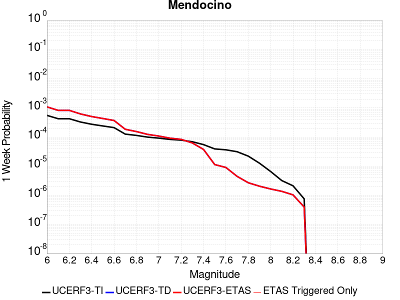 |  |  |  |

| Magnitude | 1 wk TI Prob | 1 wk TD Prob | 1 wk ETAS Prob | 1 wk ETAS/TD Gain | 1 wk ETAS Triggered Only | 1 mo TI Prob | 1 mo TD Prob | 1 mo ETAS Prob | 1 mo ETAS/TD Gain | 1 mo ETAS Triggered Only | 1 yr TI Prob | 1 yr TD Prob | 1 yr ETAS Prob | 1 yr ETAS/TD Gain | 1 yr ETAS Triggered Only | 10 yr TI Prob | 10 yr TD Prob | 10 yr ETAS Prob | 10 yr ETAS/TD Gain | 10 yr ETAS Triggered Only |
|-----|-----|-----|-----|-----|-----|-----|-----|-----|-----|-----|-----|-----|-----|-----|-----|-----|-----|-----|-----|-----|
| 6.0 | 5.5409013E-4 | 0.0010840651 | 0.0010840651 | 1.0 | 0.0 | 0.0023725112 | 0.0046365443 | 0.0046365443 | 1.0 | 0.0 | 0.028505474 | 0.05468172 | 0.05468172 | 1.0 | 0.0 | 0.25113493 | 0.41193083 | 0.41195163 | 1.0000505 | 3.5380697E-5 |
| 6.1 | 4.2515888E-4 | 8.233533E-4 | 8.233533E-4 | 1.0 | 0.0 | 0.0018208373 | 0.0035227416 | 0.0035227416 | 1.0 | 0.0 | 0.021944538 | 0.04175785 | 0.04175785 | 1.0 | 0.0 | 0.19899574 | 0.3300017 | 0.3300254 | 1.0000719 | 3.5380697E-5 |
| 6.2 | 4.2515888E-4 | 8.233533E-4 | 8.233533E-4 | 1.0 | 0.0 | 0.0018208373 | 0.0035227416 | 0.0035227416 | 1.0 | 0.0 | 0.021944538 | 0.04175785 | 0.04175785 | 1.0 | 0.0 | 0.19899574 | 0.3300017 | 0.3300254 | 1.0000719 | 3.5380697E-5 |
| 6.3 | 3.2773745E-4 | 6.1965483E-4 | 6.1965483E-4 | 1.0 | 0.0 | 0.0014038329 | 0.0026526814 | 0.0026526814 | 1.0 | 0.0 | 0.016958237 | 0.031601425 | 0.031601425 | 1.0 | 0.0 | 0.1572094 | 0.26082414 | 0.26085028 | 1.0001003 | 3.5380697E-5 |
| 6.4 | 2.7417165E-4 | 5.0488714E-4 | 5.0488714E-4 | 1.0 | 0.0 | 0.0011744922 | 0.002161933 | 0.002161933 | 1.0 | 0.0 | 0.014205975 | 0.025846353 | 0.025846353 | 1.0 | 0.0 | 0.13331394 | 0.21952665 | 0.21955426 | 1.0001258 | 3.5380697E-5 |
| 6.5 | 2.3984899E-4 | 4.3254386E-4 | 4.3254386E-4 | 1.0 | 0.0 | 0.0010275192 | 0.00185236 | 0.00185236 | 1.0 | 0.0 | 0.012438473 | 0.022189107 | 0.022189107 | 1.0 | 0.0 | 0.11764851 | 0.19208325 | 0.19211183 | 1.0001488 | 3.5380697E-5 |
| 6.6 | 2.1023539E-4 | 3.6955765E-4 | 3.6955765E-4 | 1.0 | 0.0 | 9.0069766E-4 | 0.0015829094 | 0.0015829094 | 1.0 | 0.0 | 0.010910975 | 0.018997893 | 0.018997893 | 1.0 | 0.0 | 0.10390546 | 0.16753985 | 0.1675693 | 1.0001758 | 3.5380697E-5 |
| 6.7 | 1.2592976E-4 | 1.842647E-4 | 1.842647E-4 | 1.0 | 0.0 | 5.395873E-4 | 7.894302E-4 | 7.894302E-4 | 1.0 | 0.0 | 0.006549705 | 0.009561417 | 0.009561417 | 1.0 | 0.0 | 0.063599944 | 0.091017045 | 0.09104921 | 1.0003533 | 3.5380697E-5 |
| 6.8 | 1.13663555E-4 | 1.541201E-4 | 1.541201E-4 | 1.0 | 0.0 | 4.8703855E-4 | 6.6030945E-4 | 6.6030945E-4 | 1.0 | 0.0 | 0.0059135845 | 0.008005183 | 0.008005183 | 1.0 | 0.0 | 0.057586733 | 0.07743927 | 0.07747191 | 1.0004215 | 3.5380697E-5 |
| 6.9 | 9.926894E-5 | 1.2307995E-4 | 1.2307995E-4 | 1.0 | 0.0 | 4.2536893E-4 | 5.273785E-4 | 5.273785E-4 | 1.0 | 0.0 | 0.0051665753 | 0.0064015854 | 0.0064015854 | 1.0 | 0.0 | 0.050480947 | 0.06290405 | 0.06293721 | 1.000527 | 3.5380697E-5 |
| 7.0 | 9.168125E-5 | 1.0792481E-4 | 1.0792481E-4 | 1.0 | 0.0 | 3.9286047E-4 | 4.6245367E-4 | 4.6245367E-4 | 1.0 | 0.0 | 0.004772591 | 0.0056155208 | 0.0056155208 | 1.0 | 0.0 | 0.04671385 | 0.055664163 | 0.055697575 | 1.0006002 | 3.5380697E-5 |
| 7.1 | 8.2854116E-5 | 9.113475E-5 | 9.113475E-5 | 1.0 | 0.0 | 3.5504074E-4 | 3.9051977E-4 | 3.9051977E-4 | 1.0 | 0.0 | 0.004314056 | 0.004744216 | 0.004744216 | 1.0 | 0.0 | 0.042312626 | 0.047522213 | 0.047555912 | 1.0007092 | 3.5380697E-5 |
| 7.2 | 7.8255274E-5 | 8.308447E-5 | 8.308447E-5 | 1.0 | 0.0 | 3.3533663E-4 | 3.5602847E-4 | 3.5602847E-4 | 1.0 | 0.0 | 0.0040750825 | 0.0043261773 | 0.0043261773 | 1.0 | 0.0 | 0.040011603 | 0.043565933 | 0.043599773 | 1.0007768 | 3.5380697E-5 |
| 7.3 | 6.887904E-5 | 6.2657535E-5 | 6.2657535E-5 | 1.0 | 0.0 | 2.9516246E-4 | 2.6850516E-4 | 2.6850516E-4 | 1.0 | 0.0 | 0.0035876823 | 0.0032642453 | 0.0032642453 | 1.0 | 0.0 | 0.035303112 | 0.033387214 | 0.033421416 | 1.0010244 | 3.5380697E-5 |
| 7.4 | 5.4898497E-5 | 3.744941E-5 | 3.744941E-5 | 1.0 | 0.0 | 2.3525805E-4 | 1.6048792E-4 | 1.6048792E-4 | 1.0 | 0.0 | 0.0028605047 | 0.0019522452 | 0.0019522452 | 1.0 | 0.0 | 0.02823963 | 0.02043759 | 0.020472249 | 1.0016958 | 3.5380697E-5 |
| 7.5 | 3.9103943E-5 | 1.1334679E-5 | 1.1334679E-5 | 1.0 | 0.0 | 1.6757756E-4 | 4.8576298E-5 | 4.8576298E-5 | 1.0 | 0.0 | 0.0020383475 | 5.912575E-4 | 5.912575E-4 | 1.0 | 0.0 | 0.020197518 | 0.006640222 | 0.0066753677 | 1.0052929 | 3.5380697E-5 |
| 7.6 | 3.641042E-5 | 9.008758E-6 | 9.008758E-6 | 1.0 | 0.0 | 1.5603533E-4 | 3.86084E-5 | 3.86084E-5 | 1.0 | 0.0 | 0.0018980748 | 4.6995725E-4 | 4.6995725E-4 | 1.0 | 0.0 | 0.018819444 | 0.005362647 | 0.005397838 | 1.0065622 | 3.5380697E-5 |
| 7.7 | 3.1318774E-5 | 4.4744484E-6 | 4.4744484E-6 | 1.0 | 0.0 | 1.342164E-4 | 1.9176068E-5 | 1.9176068E-5 | 1.0 | 0.0 | 0.0016328598 | 2.3344379E-4 | 2.3344379E-4 | 1.0 | 0.0 | 0.016209139 | 0.0028778263 | 0.0029131053 | 1.0122589 | 3.5380697E-5 |
| 7.8 | 2.209241E-5 | 2.6945197E-6 | 2.6945197E-6 | 1.0 | 0.0 | 9.467832E-5 | 1.1547891E-5 | 1.1547891E-5 | 1.0 | 0.0 | 0.001152099 | 1.4058653E-4 | 1.4058653E-4 | 1.0 | 0.0 | 0.011461443 | 0.0017459134 | 0.0017812323 | 1.0202295 | 3.5380697E-5 |
| 7.9 | 1.2640477E-5 | 2.051996E-6 | 2.051996E-6 | 1.0 | 0.0 | 5.4172346E-5 | 8.794239E-6 | 8.794239E-6 | 1.0 | 0.0 | 6.593487E-4 | 1.07064625E-4 | 1.07064625E-4 | 1.0 | 0.0 | 0.006573958 | 0.0013039539 | 0.0013392885 | 1.0270981 | 3.5380697E-5 |
| 8.0 | 6.5548907E-6 | 1.64609E-6 | 1.64609E-6 | 1.0 | 0.0 | 2.8092087E-5 | 7.0546525E-6 | 7.0546525E-6 | 1.0 | 0.0 | 3.4196748E-4 | 8.588703E-5 | 8.588703E-5 | 1.0 | 0.0 | 0.0034144172 | 0.0010353618 | 0.0010707058 | 1.0341369 | 3.5380697E-5 |
| 8.1 | 3.1916707E-6 | 1.3647137E-6 | 1.3647137E-6 | 1.0 | 0.0 | 1.3678517E-5 | 5.84876E-6 | 5.84876E-6 | 1.0 | 0.0 | 1.6652321E-4 | 7.120635E-5 | 7.120635E-5 | 1.0 | 0.0 | 0.0016639848 | 8.6646E-4 | 9.0181E-4 | 1.0407982 | 3.5380697E-5 |
| 8.2 | 2.1193785E-6 | 1.0349098E-6 | 1.0349098E-6 | 1.0 | 0.0 | 9.083019E-6 | 4.43532E-6 | 4.43532E-6 | 1.0 | 0.0 | 1.1058014E-4 | 5.3998705E-5 | 5.3998705E-5 | 1.0 | 0.0 | 0.0011052513 | 6.530253E-4 | 6.530253E-4 | 1.0 | 0.0 |
| 8.3 | 7.536878E-7 | 3.9430077E-7 | 3.9430077E-7 | 1.0 | 0.0 | 3.2300866E-6 | 1.6898595E-6 | 1.6898595E-6 | 1.0 | 0.0 | 3.9325594E-5 | 2.0573858E-5 | 2.0573858E-5 | 1.0 | 0.0 | 3.9318635E-4 | 2.4218905E-4 | 2.4218905E-4 | 1.0 | 0.0 |

## Red Mountain
*[(top)](#table-of-contents)*

| 1 Week | 1 Month | 1 Year | 10 Year |
|-----|-----|-----|-----|
|  |  |  |  |

| Magnitude | 1 wk TI Prob | 1 wk TD Prob | 1 wk ETAS Prob | 1 wk ETAS/TD Gain | 1 wk ETAS Triggered Only | 1 mo TI Prob | 1 mo TD Prob | 1 mo ETAS Prob | 1 mo ETAS/TD Gain | 1 mo ETAS Triggered Only | 1 yr TI Prob | 1 yr TD Prob | 1 yr ETAS Prob | 1 yr ETAS/TD Gain | 1 yr ETAS Triggered Only | 10 yr TI Prob | 10 yr TD Prob | 10 yr ETAS Prob | 10 yr ETAS/TD Gain | 10 yr ETAS Triggered Only |
|-----|-----|-----|-----|-----|-----|-----|-----|-----|-----|-----|-----|-----|-----|-----|-----|-----|-----|-----|-----|-----|
| 6.0 | 4.1810763E-5 | 4.759418E-5 | 4.759418E-5 | 1.0 | 0.0 | 1.7917668E-4 | 2.0396004E-4 | 2.0396004E-4 | 1.0 | 0.0 | 0.0021792934 | 0.0024805511 | 0.0024805511 | 1.0 | 0.0 | 0.021580452 | 0.024546249 | 0.024580762 | 1.001406 | 3.5380697E-5 |
| 6.1 | 4.1810763E-5 | 4.759418E-5 | 4.759418E-5 | 1.0 | 0.0 | 1.7917668E-4 | 2.0396004E-4 | 2.0396004E-4 | 1.0 | 0.0 | 0.0021792934 | 0.0024805511 | 0.0024805511 | 1.0 | 0.0 | 0.021580452 | 0.024546249 | 0.024580762 | 1.001406 | 3.5380697E-5 |
| 6.2 | 4.1810763E-5 | 4.759418E-5 | 4.759418E-5 | 1.0 | 0.0 | 1.7917668E-4 | 2.0396004E-4 | 2.0396004E-4 | 1.0 | 0.0 | 0.0021792934 | 0.0024805511 | 0.0024805511 | 1.0 | 0.0 | 0.021580452 | 0.024546249 | 0.024580762 | 1.001406 | 3.5380697E-5 |
| 6.3 | 4.1810763E-5 | 4.759418E-5 | 4.759418E-5 | 1.0 | 0.0 | 1.7917668E-4 | 2.0396004E-4 | 2.0396004E-4 | 1.0 | 0.0 | 0.0021792934 | 0.0024805511 | 0.0024805511 | 1.0 | 0.0 | 0.021580452 | 0.024546249 | 0.024580762 | 1.001406 | 3.5380697E-5 |
| 6.4 | 4.1810763E-5 | 4.759418E-5 | 4.759418E-5 | 1.0 | 0.0 | 1.7917668E-4 | 2.0396004E-4 | 2.0396004E-4 | 1.0 | 0.0 | 0.0021792934 | 0.0024805511 | 0.0024805511 | 1.0 | 0.0 | 0.021580452 | 0.024546249 | 0.024580762 | 1.001406 | 3.5380697E-5 |
| 6.5 | 3.154503E-5 | 3.5362722E-5 | 3.5362722E-5 | 1.0 | 0.0 | 1.3518598E-4 | 1.5154622E-4 | 1.5154622E-4 | 1.0 | 0.0 | 0.0016446467 | 0.001843606 | 0.001843606 | 1.0 | 0.0 | 0.01632528 | 0.018292768 | 0.018327503 | 1.0018988 | 3.5380697E-5 |
| 6.6 | 3.1535834E-5 | 3.5352103E-5 | 3.5352103E-5 | 1.0 | 0.0 | 1.3514658E-4 | 1.5150072E-4 | 1.5150072E-4 | 1.0 | 0.0 | 0.0016441676 | 0.0018430529 | 0.0018430529 | 1.0 | 0.0 | 0.01632056 | 0.018287329 | 0.018322062 | 1.0018994 | 3.5380697E-5 |
| 6.7 | 2.8267326E-5 | 3.1471947E-5 | 3.1471947E-5 | 1.0 | 0.0 | 1.2114006E-4 | 1.3487328E-4 | 1.3487328E-4 | 1.0 | 0.0 | 0.0014738824 | 0.0016409304 | 0.0016409304 | 1.0 | 0.0 | 0.014641452 | 0.016296903 | 0.016331708 | 1.0021356 | 3.5380697E-5 |
| 6.8 | 2.8212884E-5 | 3.140983E-5 | 3.140983E-5 | 1.0 | 0.0 | 1.20906756E-4 | 1.3460708E-4 | 1.3460708E-4 | 1.0 | 0.0 | 0.0014710457 | 0.0016376943 | 0.0016376943 | 1.0 | 0.0 | 0.014613459 | 0.016265018 | 0.016299823 | 1.0021399 | 3.5380697E-5 |
| 6.9 | 2.4227871E-5 | 2.6709133E-5 | 2.6709133E-5 | 1.0 | 0.0 | 1.03829596E-4 | 1.1446312E-4 | 1.1446312E-4 | 1.0 | 0.0 | 0.0012633923 | 0.0013927735 | 0.0013927735 | 1.0 | 0.0 | 0.012562336 | 0.013848136 | 0.013883026 | 1.0025195 | 3.5380697E-5 |
| 7.0 | 2.348524E-5 | 2.5837837E-5 | 2.5837837E-5 | 1.0 | 0.0 | 1.0064714E-4 | 1.10729314E-4 | 1.10729314E-4 | 1.0 | 0.0 | 0.0012246901 | 0.0013473714 | 0.0013473714 | 1.0 | 0.0 | 0.012179627 | 0.013399659 | 0.013434566 | 1.0026051 | 3.5380697E-5 |
| 7.1 | 2.2311642E-5 | 2.4464778E-5 | 2.4464778E-5 | 1.0 | 0.0 | 9.561782E-5 | 1.0484526E-4 | 1.0484526E-4 | 1.0 | 0.0 | 0.0011635252 | 0.0012758184 | 0.0012758184 | 1.0 | 0.0 | 0.01157452 | 0.012692457 | 0.012692457 | 1.0 | 0.0 |
| 7.2 | 1.6533986E-5 | 1.7671664E-5 | 1.7671664E-5 | 1.0 | 0.0 | 7.085802E-5 | 7.573386E-5 | 7.573386E-5 | 1.0 | 0.0 | 8.623549E-4 | 9.2173315E-4 | 9.2173315E-4 | 1.0 | 0.0 | 0.008590161 | 0.00918538 | 0.00918538 | 1.0 | 0.0 |
| 7.3 | 1.4703092E-5 | 1.5560665E-5 | 1.5560665E-5 | 1.0 | 0.0 | 6.301173E-5 | 6.668721E-5 | 6.668721E-5 | 1.0 | 0.0 | 7.668978E-4 | 8.116759E-4 | 8.116759E-4 | 1.0 | 0.0 | 0.0076425658 | 0.008093189 | 0.008093189 | 1.0 | 0.0 |
| 7.4 | 6.1331984E-6 | 5.5291057E-6 | 5.5291057E-6 | 1.0 | 0.0 | 2.6284872E-5 | 2.3695955E-5 | 2.3695955E-5 | 1.0 | 0.0 | 3.199713E-4 | 2.8846058E-4 | 2.8846058E-4 | 1.0 | 0.0 | 0.0031951098 | 0.002880916 | 0.002880916 | 1.0 | 0.0 |
| 7.5 | 5.954766E-6 | 5.338727E-6 | 5.338727E-6 | 1.0 | 0.0 | 2.5520176E-5 | 2.288006E-5 | 2.288006E-5 | 1.0 | 0.0 | 3.1066386E-4 | 2.7852965E-4 | 2.7852965E-4 | 1.0 | 0.0 | 0.003102299 | 0.0027818596 | 0.0027818596 | 1.0 | 0.0 |
| 7.6 | 4.9726646E-6 | 4.315478E-6 | 4.315478E-6 | 1.0 | 0.0 | 2.1311245E-5 | 1.8494777E-5 | 1.8494777E-5 | 1.0 | 0.0 | 2.5943352E-4 | 2.2515097E-4 | 2.2515097E-4 | 1.0 | 0.0 | 0.0025913084 | 0.0022492632 | 0.0022492632 | 1.0 | 0.0 |
| 7.7 | 3.3613894E-6 | 2.8527843E-6 | 2.8527843E-6 | 1.0 | 0.0 | 1.4405875E-5 | 1.2226163E-5 | 1.2226163E-5 | 1.0 | 0.0 | 1.7537741E-4 | 1.4884362E-4 | 1.4884362E-4 | 1.0 | 0.0 | 0.0017523908 | 0.0014874657 | 0.0014874657 | 1.0 | 0.0 |
| 7.8 | 1.1828961E-6 | 1.0123111E-6 | 1.0123111E-6 | 1.0 | 0.0 | 5.069545E-6 | 4.3384694E-6 | 4.3384694E-6 | 1.0 | 0.0 | 6.171996E-5 | 5.281961E-5 | 5.281961E-5 | 1.0 | 0.0 | 6.170282E-4 | 5.280735E-4 | 5.280735E-4 | 1.0 | 0.0 |
| 7.9 | 2.2967266E-7 | 1.8619616E-7 | 1.8619616E-7 | 1.0 | 0.0 | 9.843111E-7 | 7.9798326E-7 | 7.9798326E-7 | 1.0 | 0.0 | 1.19839215E-5 | 9.715406E-6 | 9.715406E-6 | 1.0 | 0.0 | 1.1983275E-4 | 9.71501E-5 | 9.71501E-5 | 1.0 | 0.0 |

## Jess Valley
*[(top)](#table-of-contents)*

| 1 Week | 1 Month | 1 Year | 10 Year |
|-----|-----|-----|-----|
|  |  | 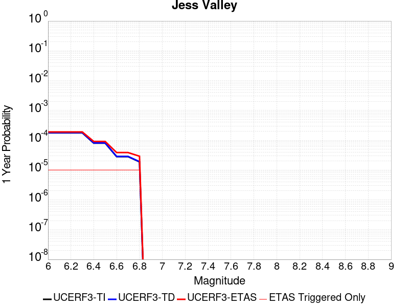 |  |

| Magnitude | 1 wk TI Prob | 1 wk TD Prob | 1 wk ETAS Prob | 1 wk ETAS/TD Gain | 1 wk ETAS Triggered Only | 1 mo TI Prob | 1 mo TD Prob | 1 mo ETAS Prob | 1 mo ETAS/TD Gain | 1 mo ETAS Triggered Only | 1 yr TI Prob | 1 yr TD Prob | 1 yr ETAS Prob | 1 yr ETAS/TD Gain | 1 yr ETAS Triggered Only | 10 yr TI Prob | 10 yr TD Prob | 10 yr ETAS Prob | 10 yr ETAS/TD Gain | 10 yr ETAS Triggered Only |
|-----|-----|-----|-----|-----|-----|-----|-----|-----|-----|-----|-----|-----|-----|-----|-----|-----|-----|-----|-----|-----|
| 6.0 | 3.3861274E-6 | 3.434085E-6 | 3.434085E-6 | 1.0 | 0.0 | 1.4511894E-5 | 1.471744E-5 | 1.471744E-5 | 1.0 | 0.0 | 1.7666799E-4 | 1.7917292E-4 | 2.1454727E-4 | 1.1974314 | 3.5380697E-5 | 0.001765276 | 0.001790561 | 0.0018258784 | 1.0197241 | 3.5380697E-5 |
| 6.1 | 3.3861274E-6 | 3.434085E-6 | 3.434085E-6 | 1.0 | 0.0 | 1.4511894E-5 | 1.471744E-5 | 1.471744E-5 | 1.0 | 0.0 | 1.7666799E-4 | 1.7917292E-4 | 2.1454727E-4 | 1.1974314 | 3.5380697E-5 | 0.001765276 | 0.001790561 | 0.0018258784 | 1.0197241 | 3.5380697E-5 |
| 6.2 | 3.3861274E-6 | 3.434085E-6 | 3.434085E-6 | 1.0 | 0.0 | 1.4511894E-5 | 1.471744E-5 | 1.471744E-5 | 1.0 | 0.0 | 1.7666799E-4 | 1.7917292E-4 | 2.1454727E-4 | 1.1974314 | 3.5380697E-5 | 0.001765276 | 0.001790561 | 0.0018258784 | 1.0197241 | 3.5380697E-5 |
| 6.3 | 3.3861274E-6 | 3.434085E-6 | 3.434085E-6 | 1.0 | 0.0 | 1.4511894E-5 | 1.471744E-5 | 1.471744E-5 | 1.0 | 0.0 | 1.7666799E-4 | 1.7917292E-4 | 2.1454727E-4 | 1.1974314 | 3.5380697E-5 | 0.001765276 | 0.001790561 | 0.0018258784 | 1.0197241 | 3.5380697E-5 |
| 6.4 | 1.5291708E-6 | 1.5502898E-6 | 1.5502898E-6 | 1.0 | 0.0 | 6.553573E-6 | 6.6440866E-6 | 6.6440866E-6 | 1.0 | 0.0 | 7.978683E-5 | 8.088955E-5 | 1.1626738E-4 | 1.4373598 | 3.5380697E-5 | 7.975819E-4 | 8.0867927E-4 | 8.4403134E-4 | 1.0437158 | 3.5380697E-5 |
| 6.5 | 1.5291708E-6 | 1.5502898E-6 | 1.5502898E-6 | 1.0 | 0.0 | 6.553573E-6 | 6.6440866E-6 | 6.6440866E-6 | 1.0 | 0.0 | 7.978683E-5 | 8.088955E-5 | 1.1626738E-4 | 1.4373598 | 3.5380697E-5 | 7.975819E-4 | 8.0867927E-4 | 8.4403134E-4 | 1.0437158 | 3.5380697E-5 |
| 6.6 | 5.396423E-7 | 5.472036E-7 | 5.472036E-7 | 1.0 | 0.0 | 2.312751E-6 | 2.3451573E-6 | 2.3451573E-6 | 1.0 | 0.0 | 2.8157378E-5 | 2.8552104E-5 | 6.393179E-5 | 2.2391272 | 3.5380697E-5 | 2.8153812E-4 | 2.8550276E-4 | 3.2087337E-4 | 1.1238889 | 3.5380697E-5 |
| 6.7 | 5.396423E-7 | 5.472036E-7 | 5.472036E-7 | 1.0 | 0.0 | 2.312751E-6 | 2.3451573E-6 | 2.3451573E-6 | 1.0 | 0.0 | 2.8157378E-5 | 2.8552104E-5 | 6.393179E-5 | 2.2391272 | 3.5380697E-5 | 2.8153812E-4 | 2.8550276E-4 | 3.2087337E-4 | 1.1238889 | 3.5380697E-5 |
| 6.8 | 3.6058395E-7 | 3.6563338E-7 | 3.6563338E-7 | 1.0 | 0.0 | 1.5453588E-6 | 1.5670003E-6 | 1.5670003E-6 | 1.0 | 0.0 | 1.8814582E-5 | 1.9078228E-5 | 5.4458247E-5 | 2.854471 | 3.5380697E-5 | 1.8812988E-4 | 1.9078227E-4 | 2.2615622E-4 | 1.1854153 | 3.5380697E-5 |

## North Frontal  (East)
*[(top)](#table-of-contents)*

| 1 Week | 1 Month | 1 Year | 10 Year |
|-----|-----|-----|-----|
|  |  |  |  |

| Magnitude | 1 wk TI Prob | 1 wk TD Prob | 1 wk ETAS Prob | 1 wk ETAS/TD Gain | 1 wk ETAS Triggered Only | 1 mo TI Prob | 1 mo TD Prob | 1 mo ETAS Prob | 1 mo ETAS/TD Gain | 1 mo ETAS Triggered Only | 1 yr TI Prob | 1 yr TD Prob | 1 yr ETAS Prob | 1 yr ETAS/TD Gain | 1 yr ETAS Triggered Only | 10 yr TI Prob | 10 yr TD Prob | 10 yr ETAS Prob | 10 yr ETAS/TD Gain | 10 yr ETAS Triggered Only |
|-----|-----|-----|-----|-----|-----|-----|-----|-----|-----|-----|-----|-----|-----|-----|-----|-----|-----|-----|-----|-----|
| 6.0 | 7.135738E-6 | 7.4773666E-6 | 7.4773666E-6 | 1.0 | 0.0 | 3.0581377E-5 | 3.2045577E-5 | 3.2045577E-5 | 1.0 | 0.0 | 3.7226462E-4 | 3.9010498E-4 | 3.9010498E-4 | 1.0 | 0.0 | 0.0037164164 | 0.0038961596 | 0.0039314027 | 1.0090455 | 3.5380697E-5 |
| 6.1 | 7.135738E-6 | 7.4773666E-6 | 7.4773666E-6 | 1.0 | 0.0 | 3.0581377E-5 | 3.2045577E-5 | 3.2045577E-5 | 1.0 | 0.0 | 3.7226462E-4 | 3.9010498E-4 | 3.9010498E-4 | 1.0 | 0.0 | 0.0037164164 | 0.0038961596 | 0.0039314027 | 1.0090455 | 3.5380697E-5 |
| 6.2 | 7.135738E-6 | 7.4773666E-6 | 7.4773666E-6 | 1.0 | 0.0 | 3.0581377E-5 | 3.2045577E-5 | 3.2045577E-5 | 1.0 | 0.0 | 3.7226462E-4 | 3.9010498E-4 | 3.9010498E-4 | 1.0 | 0.0 | 0.0037164164 | 0.0038961596 | 0.0039314027 | 1.0090455 | 3.5380697E-5 |
| 6.3 | 7.135738E-6 | 7.4773666E-6 | 7.4773666E-6 | 1.0 | 0.0 | 3.0581377E-5 | 3.2045577E-5 | 3.2045577E-5 | 1.0 | 0.0 | 3.7226462E-4 | 3.9010498E-4 | 3.9010498E-4 | 1.0 | 0.0 | 0.0037164164 | 0.0038961596 | 0.0039314027 | 1.0090455 | 3.5380697E-5 |
| 6.4 | 7.135738E-6 | 7.4773666E-6 | 7.4773666E-6 | 1.0 | 0.0 | 3.0581377E-5 | 3.2045577E-5 | 3.2045577E-5 | 1.0 | 0.0 | 3.7226462E-4 | 3.9010498E-4 | 3.9010498E-4 | 1.0 | 0.0 | 0.0037164164 | 0.0038961596 | 0.0039314027 | 1.0090455 | 3.5380697E-5 |
| 6.5 | 7.135738E-6 | 7.4773666E-6 | 7.4773666E-6 | 1.0 | 0.0 | 3.0581377E-5 | 3.2045577E-5 | 3.2045577E-5 | 1.0 | 0.0 | 3.7226462E-4 | 3.9010498E-4 | 3.9010498E-4 | 1.0 | 0.0 | 0.0037164164 | 0.0038961596 | 0.0039314027 | 1.0090455 | 3.5380697E-5 |
| 6.6 | 7.135738E-6 | 7.4773666E-6 | 7.4773666E-6 | 1.0 | 0.0 | 3.0581377E-5 | 3.2045577E-5 | 3.2045577E-5 | 1.0 | 0.0 | 3.7226462E-4 | 3.9010498E-4 | 3.9010498E-4 | 1.0 | 0.0 | 0.0037164164 | 0.0038961596 | 0.0039314027 | 1.0090455 | 3.5380697E-5 |
| 6.7 | 7.135738E-6 | 7.4773666E-6 | 7.4773666E-6 | 1.0 | 0.0 | 3.0581377E-5 | 3.2045577E-5 | 3.2045577E-5 | 1.0 | 0.0 | 3.7226462E-4 | 3.9010498E-4 | 3.9010498E-4 | 1.0 | 0.0 | 0.0037164164 | 0.0038961596 | 0.0039314027 | 1.0090455 | 3.5380697E-5 |
| 6.8 | 5.959142E-6 | 6.236837E-6 | 6.236837E-6 | 1.0 | 0.0 | 2.553893E-5 | 2.672913E-5 | 2.672913E-5 | 1.0 | 0.0 | 3.108921E-4 | 3.2539663E-4 | 3.2539663E-4 | 1.0 | 0.0 | 0.0031045752 | 0.0032509752 | 0.0032862409 | 1.0108477 | 3.5380697E-5 |
| 6.9 | 2.2946929E-6 | 2.382509E-6 | 2.382509E-6 | 1.0 | 0.0 | 9.834361E-6 | 1.0210715E-5 | 1.0210715E-5 | 1.0 | 0.0 | 1.1972676E-4 | 1.2430883E-4 | 1.2430883E-4 | 1.0 | 0.0 | 0.0011966228 | 0.0012424395 | 0.0012777762 | 1.0284414 | 3.5380697E-5 |
| 7.0 | 2.2468673E-6 | 2.3322007E-6 | 2.3322007E-6 | 1.0 | 0.0 | 9.629396E-6 | 9.99511E-6 | 9.99511E-6 | 1.0 | 0.0 | 1.1723159E-4 | 1.2168415E-4 | 1.2168415E-4 | 1.0 | 0.0 | 0.0011716976 | 0.0012162215 | 0.0012515591 | 1.0290552 | 3.5380697E-5 |
| 7.1 | 1.9921076E-6 | 2.064643E-6 | 2.064643E-6 | 1.0 | 0.0 | 8.537577E-6 | 8.848443E-6 | 8.848443E-6 | 1.0 | 0.0 | 1.0394004E-4 | 1.077249E-4 | 1.077249E-4 | 1.0 | 0.0 | 0.0010389143 | 0.0010767695 | 0.0011121122 | 1.0328228 | 3.5380697E-5 |
| 7.2 | 1.4524545E-6 | 1.5045434E-6 | 1.5045434E-6 | 1.0 | 0.0 | 6.2247905E-6 | 6.4480287E-6 | 6.4480287E-6 | 1.0 | 0.0 | 7.5784184E-5 | 7.850217E-5 | 7.850217E-5 | 1.0 | 0.0 | 7.575835E-4 | 7.8476884E-4 | 8.201218E-4 | 1.0450488 | 3.5380697E-5 |
| 7.3 | 8.9802575E-7 | 9.3089085E-7 | 9.3089085E-7 | 1.0 | 0.0 | 3.848676E-6 | 3.9895267E-6 | 3.9895267E-6 | 1.0 | 0.0 | 4.685662E-5 | 4.857152E-5 | 4.857152E-5 | 1.0 | 0.0 | 4.6846745E-4 | 4.8562037E-4 | 5.209839E-4 | 1.0728213 | 3.5380697E-5 |
| 7.4 | 7.776139E-7 | 8.060631E-7 | 8.060631E-7 | 1.0 | 0.0 | 3.3326266E-6 | 3.4545521E-6 | 3.4545521E-6 | 1.0 | 0.0 | 4.0573974E-5 | 4.2058473E-5 | 4.2058473E-5 | 1.0 | 0.0 | 4.0566566E-4 | 4.205159E-4 | 4.558817E-4 | 1.0841011 | 3.5380697E-5 |
| 7.5 | 5.244417E-7 | 5.441328E-7 | 5.441328E-7 | 1.0 | 0.0 | 2.2476054E-6 | 2.3319958E-6 | 2.3319958E-6 | 1.0 | 0.0 | 2.7364253E-5 | 2.8391745E-5 | 2.8391745E-5 | 1.0 | 0.0 | 2.7360884E-4 | 2.838877E-4 | 3.1925834E-4 | 1.1245939 | 3.5380697E-5 |
| 7.6 | 1.5489647E-7 | 1.6089835E-7 | 1.6089835E-7 | 1.0 | 0.0 | 6.6384183E-7 | 6.895643E-7 | 6.895643E-7 | 1.0 | 0.0 | 8.082245E-6 | 8.395433E-6 | 8.395433E-6 | 1.0 | 0.0 | 8.08195E-5 | 8.395316E-5 | 1.1933088E-4 | 1.4213984 | 3.5380697E-5 |

## Monte Vista - Shannon 2011 CFM
*[(top)](#table-of-contents)*

| 1 Week | 1 Month | 1 Year | 10 Year |
|-----|-----|-----|-----|
|  |  |  |  |

| Magnitude | 1 wk TI Prob | 1 wk TD Prob | 1 wk ETAS Prob | 1 wk ETAS/TD Gain | 1 wk ETAS Triggered Only | 1 mo TI Prob | 1 mo TD Prob | 1 mo ETAS Prob | 1 mo ETAS/TD Gain | 1 mo ETAS Triggered Only | 1 yr TI Prob | 1 yr TD Prob | 1 yr ETAS Prob | 1 yr ETAS/TD Gain | 1 yr ETAS Triggered Only | 10 yr TI Prob | 10 yr TD Prob | 10 yr ETAS Prob | 10 yr ETAS/TD Gain | 10 yr ETAS Triggered Only |
|-----|-----|-----|-----|-----|-----|-----|-----|-----|-----|-----|-----|-----|-----|-----|-----|-----|-----|-----|-----|-----|
| 6.0 | 2.7907707E-5 | 2.75877E-5 | 2.75877E-5 | 1.0 | 0.0 | 1.19598975E-4 | 1.1822833E-4 | 1.1822833E-4 | 1.0 | 0.0 | 0.0014551448 | 0.0014386033 | 0.0014386033 | 1.0 | 0.0 | 0.014456532 | 0.014322008 | 0.014356881 | 1.002435 | 3.5380697E-5 |
| 6.1 | 2.7907707E-5 | 2.75877E-5 | 2.75877E-5 | 1.0 | 0.0 | 1.19598975E-4 | 1.1822833E-4 | 1.1822833E-4 | 1.0 | 0.0 | 0.0014551448 | 0.0014386033 | 0.0014386033 | 1.0 | 0.0 | 0.014456532 | 0.014322008 | 0.014356881 | 1.002435 | 3.5380697E-5 |
| 6.2 | 2.7907707E-5 | 2.75877E-5 | 2.75877E-5 | 1.0 | 0.0 | 1.19598975E-4 | 1.1822833E-4 | 1.1822833E-4 | 1.0 | 0.0 | 0.0014551448 | 0.0014386033 | 0.0014386033 | 1.0 | 0.0 | 0.014456532 | 0.014322008 | 0.014356881 | 1.002435 | 3.5380697E-5 |
| 6.3 | 2.7907707E-5 | 2.75877E-5 | 2.75877E-5 | 1.0 | 0.0 | 1.19598975E-4 | 1.1822833E-4 | 1.1822833E-4 | 1.0 | 0.0 | 0.0014551448 | 0.0014386033 | 0.0014386033 | 1.0 | 0.0 | 0.014456532 | 0.014322008 | 0.014356881 | 1.002435 | 3.5380697E-5 |
| 6.4 | 2.7907707E-5 | 2.75877E-5 | 2.75877E-5 | 1.0 | 0.0 | 1.19598975E-4 | 1.1822833E-4 | 1.1822833E-4 | 1.0 | 0.0 | 0.0014551448 | 0.0014386033 | 0.0014386033 | 1.0 | 0.0 | 0.014456532 | 0.014322008 | 0.014356881 | 1.002435 | 3.5380697E-5 |
| 6.5 | 1.7990213E-5 | 1.6642773E-5 | 1.6642773E-5 | 1.0 | 0.0 | 7.709863E-5 | 7.132459E-5 | 7.132459E-5 | 1.0 | 0.0 | 9.382716E-4 | 8.680973E-4 | 8.680973E-4 | 1.0 | 0.0 | 0.0093431985 | 0.008670452 | 0.008705527 | 1.0040452 | 3.5380697E-5 |
| 6.6 | 9.650407E-6 | 7.4595387E-6 | 7.4595387E-6 | 1.0 | 0.0 | 4.135823E-5 | 3.1969106E-5 | 3.1969106E-5 | 1.0 | 0.0 | 5.0342013E-4 | 3.8916216E-4 | 3.8916216E-4 | 1.0 | 0.0 | 0.005022812 | 0.0039025035 | 0.0039025035 | 1.0 | 0.0 |
| 6.7 | 9.62828E-6 | 7.4374507E-6 | 7.4374507E-6 | 1.0 | 0.0 | 4.1263404E-5 | 3.1874442E-5 | 3.1874442E-5 | 1.0 | 0.0 | 5.022661E-4 | 3.8801008E-4 | 3.8801008E-4 | 1.0 | 0.0 | 0.0050113243 | 0.003891023 | 0.003891023 | 1.0 | 0.0 |
| 6.8 | 6.887523E-6 | 4.463821E-6 | 4.463821E-6 | 1.0 | 0.0 | 2.9517621E-5 | 1.9130533E-5 | 1.9130533E-5 | 1.0 | 0.0 | 3.5931775E-4 | 2.3289157E-4 | 2.3289157E-4 | 1.0 | 0.0 | 0.0035873733 | 0.0023436449 | 0.0023436449 | 1.0 | 0.0 |
| 6.9 | 6.2722347E-6 | 3.805659E-6 | 3.805659E-6 | 1.0 | 0.0 | 2.6880729E-5 | 1.6309876E-5 | 1.6309876E-5 | 1.0 | 0.0 | 3.2722374E-4 | 1.9855668E-4 | 1.9855668E-4 | 1.0 | 0.0 | 0.003267423 | 0.0020009486 | 0.0020009486 | 1.0 | 0.0 |
| 7.0 | 5.5320347E-6 | 3.0327608E-6 | 3.0327608E-6 | 1.0 | 0.0 | 2.3708504E-5 | 1.29974915E-5 | 1.29974915E-5 | 1.0 | 0.0 | 2.8861282E-4 | 1.582348E-4 | 1.582348E-4 | 1.0 | 0.0 | 0.0028823826 | 0.0015983633 | 0.0015983633 | 1.0 | 0.0 |
| 7.1 | 3.8794055E-6 | 1.285852E-6 | 1.285852E-6 | 1.0 | 0.0 | 1.6625918E-5 | 5.510783E-6 | 5.510783E-6 | 1.0 | 0.0 | 2.0240174E-4 | 6.709173E-5 | 6.709173E-5 | 1.0 | 0.0 | 0.002022175 | 6.876822E-4 | 6.876822E-4 | 1.0 | 0.0 |
| 7.2 | 3.4813652E-6 | 9.690727E-7 | 9.690727E-7 | 1.0 | 0.0 | 1.49200505E-5 | 4.153162E-6 | 4.153162E-6 | 1.0 | 0.0 | 1.8163648E-4 | 5.0563587E-5 | 5.0563587E-5 | 1.0 | 0.0 | 0.0018148809 | 5.22476E-4 | 5.22476E-4 | 1.0 | 0.0 |
| 7.3 | 3.1682148E-6 | 7.7381594E-7 | 7.7381594E-7 | 1.0 | 0.0 | 1.3577992E-5 | 3.3163496E-6 | 3.3163496E-6 | 1.0 | 0.0 | 1.6529951E-4 | 4.0375813E-5 | 4.0375813E-5 | 1.0 | 0.0 | 0.0016517661 | 4.2061496E-4 | 4.2061496E-4 | 1.0 | 0.0 |
| 7.4 | 2.9707667E-6 | 7.3642167E-7 | 7.3642167E-7 | 1.0 | 0.0 | 1.2731795E-5 | 3.1560892E-6 | 3.1560892E-6 | 1.0 | 0.0 | 1.5499859E-4 | 3.842471E-5 | 3.842471E-5 | 1.0 | 0.0 | 0.0015489052 | 4.0090227E-4 | 4.0090227E-4 | 1.0 | 0.0 |
| 7.5 | 2.3462758E-6 | 6.023677E-7 | 6.023677E-7 | 1.0 | 0.0 | 1.0055429E-5 | 2.5815734E-6 | 2.5815734E-6 | 1.0 | 0.0 | 1.2241797E-4 | 3.1430205E-5 | 3.1430205E-5 | 1.0 | 0.0 | 0.0012235056 | 3.2923152E-4 | 3.2923152E-4 | 1.0 | 0.0 |
| 7.6 | 2.112783E-6 | 5.266409E-7 | 5.266409E-7 | 1.0 | 0.0 | 9.054753E-6 | 2.2570305E-6 | 2.2570305E-6 | 1.0 | 0.0 | 1.1023604E-4 | 2.7479E-5 | 2.7479E-5 | 1.0 | 0.0 | 0.0011018137 | 2.8929894E-4 | 2.8929894E-4 | 1.0 | 0.0 |
| 7.7 | 1.7022471E-6 | 4.2444987E-7 | 4.2444987E-7 | 1.0 | 0.0 | 7.2953244E-6 | 1.8190696E-6 | 1.8190696E-6 | 1.0 | 0.0 | 8.881695E-5 | 2.2146949E-5 | 2.2146949E-5 | 1.0 | 0.0 | 8.878146E-4 | 2.3466849E-4 | 2.3466849E-4 | 1.0 | 0.0 |
| 7.8 | 7.230914E-7 | 3.7402418E-7 | 3.7402418E-7 | 1.0 | 0.0 | 3.0989595E-6 | 1.6029599E-6 | 1.6029599E-6 | 1.0 | 0.0 | 3.772918E-5 | 1.9515863E-5 | 1.9515863E-5 | 1.0 | 0.0 | 3.7722773E-4 | 2.0788297E-4 | 2.0788297E-4 | 1.0 | 0.0 |
| 7.9 | 4.3588446E-7 | 3.4407202E-7 | 3.4407202E-7 | 1.0 | 0.0 | 1.868075E-6 | 1.4745935E-6 | 1.4745935E-6 | 1.0 | 0.0 | 2.2743576E-5 | 1.795303E-5 | 1.795303E-5 | 1.0 | 0.0 | 2.2741247E-4 | 1.9048195E-4 | 1.9048195E-4 | 1.0 | 0.0 |
| 8.0 | 2.3317523E-7 | 3.1602372E-7 | 3.1602372E-7 | 1.0 | 0.0 | 9.99322E-7 | 1.3543867E-6 | 1.3543867E-6 | 1.0 | 0.0 | 1.2166677E-5 | 1.6489534E-5 | 1.6489534E-5 | 1.0 | 0.0 | 1.21660116E-4 | 1.7445331E-4 | 1.7445331E-4 | 1.0 | 0.0 |
| 8.1 | 1.4662456E-7 | 2.0360646E-7 | 2.0360646E-7 | 1.0 | 0.0 | 6.283908E-7 | 8.725988E-7 | 8.725988E-7 | 1.0 | 0.0 | 7.650631E-6 | 1.0623839E-5 | 1.0623839E-5 | 1.0 | 0.0 | 7.650368E-5 | 1.1159559E-4 | 1.1159559E-4 | 1.0 | 0.0 |
| 8.2 | 5.4931775E-9 | 5.089579E-9 | 5.089579E-9 | 1.0 | 0.0 | 2.3542189E-8 | 2.181248E-8 | 2.181248E-8 | 1.0 | 0.0 | 2.8662612E-7 | 2.6556694E-7 | 2.6556694E-7 | 1.0 | 0.0 | 2.8662573E-6 | 2.7612602E-6 | 2.7612602E-6 | 1.0 | 0.0 |

## San Luis Range - Oceano 2011 CFM
*[(top)](#table-of-contents)*

| 1 Week | 1 Month | 1 Year | 10 Year |
|-----|-----|-----|-----|
|  |  |  |  |

| Magnitude | 1 wk TI Prob | 1 wk TD Prob | 1 wk ETAS Prob | 1 wk ETAS/TD Gain | 1 wk ETAS Triggered Only | 1 mo TI Prob | 1 mo TD Prob | 1 mo ETAS Prob | 1 mo ETAS/TD Gain | 1 mo ETAS Triggered Only | 1 yr TI Prob | 1 yr TD Prob | 1 yr ETAS Prob | 1 yr ETAS/TD Gain | 1 yr ETAS Triggered Only | 10 yr TI Prob | 10 yr TD Prob | 10 yr ETAS Prob | 10 yr ETAS/TD Gain | 10 yr ETAS Triggered Only |
|-----|-----|-----|-----|-----|-----|-----|-----|-----|-----|-----|-----|-----|-----|-----|-----|-----|-----|-----|-----|-----|
| 6.0 | 1.6025788E-6 | 1.6201284E-6 | 1.6201284E-6 | 1.0 | 0.0 | 6.8681766E-6 | 6.9433913E-6 | 6.9433913E-6 | 1.0 | 0.0 | 8.361684E-5 | 8.453293E-5 | 8.453293E-5 | 1.0 | 0.0 | 8.3585386E-4 | 8.450485E-4 | 8.803993E-4 | 1.0418328 | 3.5380697E-5 |
| 6.1 | 1.6025788E-6 | 1.6201284E-6 | 1.6201284E-6 | 1.0 | 0.0 | 6.8681766E-6 | 6.9433913E-6 | 6.9433913E-6 | 1.0 | 0.0 | 8.361684E-5 | 8.453293E-5 | 8.453293E-5 | 1.0 | 0.0 | 8.3585386E-4 | 8.450485E-4 | 8.803993E-4 | 1.0418328 | 3.5380697E-5 |
| 6.2 | 1.6025788E-6 | 1.6201284E-6 | 1.6201284E-6 | 1.0 | 0.0 | 6.8681766E-6 | 6.9433913E-6 | 6.9433913E-6 | 1.0 | 0.0 | 8.361684E-5 | 8.453293E-5 | 8.453293E-5 | 1.0 | 0.0 | 8.3585386E-4 | 8.450485E-4 | 8.803993E-4 | 1.0418328 | 3.5380697E-5 |
| 6.3 | 1.6025788E-6 | 1.6201284E-6 | 1.6201284E-6 | 1.0 | 0.0 | 6.8681766E-6 | 6.9433913E-6 | 6.9433913E-6 | 1.0 | 0.0 | 8.361684E-5 | 8.453293E-5 | 8.453293E-5 | 1.0 | 0.0 | 8.3585386E-4 | 8.450485E-4 | 8.803993E-4 | 1.0418328 | 3.5380697E-5 |
| 6.4 | 1.1621186E-6 | 1.1749963E-6 | 1.1749963E-6 | 1.0 | 0.0 | 4.980499E-6 | 5.0356903E-6 | 5.0356903E-6 | 1.0 | 0.0 | 6.0635884E-5 | 6.130808E-5 | 6.130808E-5 | 1.0 | 0.0 | 6.0619344E-4 | 6.1293825E-4 | 6.4829725E-4 | 1.0576878 | 3.5380697E-5 |
| 6.5 | 1.1621186E-6 | 1.1749963E-6 | 1.1749963E-6 | 1.0 | 0.0 | 4.980499E-6 | 5.0356903E-6 | 5.0356903E-6 | 1.0 | 0.0 | 6.0635884E-5 | 6.130808E-5 | 6.130808E-5 | 1.0 | 0.0 | 6.0619344E-4 | 6.1293825E-4 | 6.4829725E-4 | 1.0576878 | 3.5380697E-5 |
| 6.6 | 7.164729E-7 | 7.2486233E-7 | 7.2486233E-7 | 1.0 | 0.0 | 3.0705946E-6 | 3.1065492E-6 | 3.1065492E-6 | 1.0 | 0.0 | 3.738385E-5 | 3.78216E-5 | 3.78216E-5 | 1.0 | 0.0 | 3.737756E-4 | 3.7815337E-4 | 3.7815337E-4 | 1.0 | 0.0 |
| 6.7 | 7.164729E-7 | 7.2486233E-7 | 7.2486233E-7 | 1.0 | 0.0 | 3.0705946E-6 | 3.1065492E-6 | 3.1065492E-6 | 1.0 | 0.0 | 3.738385E-5 | 3.78216E-5 | 3.78216E-5 | 1.0 | 0.0 | 3.737756E-4 | 3.7815337E-4 | 3.7815337E-4 | 1.0 | 0.0 |
| 6.8 | 6.700177E-7 | 6.777481E-7 | 6.777481E-7 | 1.0 | 0.0 | 2.8715012E-6 | 2.9046316E-6 | 2.9046316E-6 | 1.0 | 0.0 | 3.495997E-5 | 3.5363333E-5 | 3.5363333E-5 | 1.0 | 0.0 | 3.495447E-4 | 3.535787E-4 | 3.535787E-4 | 1.0 | 0.0 |
| 6.9 | 5.657865E-7 | 5.721821E-7 | 5.721821E-7 | 1.0 | 0.0 | 2.424797E-6 | 2.4522067E-6 | 2.4522067E-6 | 1.0 | 0.0 | 2.9521503E-5 | 2.9855219E-5 | 2.9855219E-5 | 1.0 | 0.0 | 2.9517582E-4 | 2.9851313E-4 | 2.9851313E-4 | 1.0 | 0.0 |
| 7.0 | 4.608413E-7 | 4.6601969E-7 | 4.6601969E-7 | 1.0 | 0.0 | 1.9750328E-6 | 1.9972258E-6 | 1.9972258E-6 | 1.0 | 0.0 | 2.4045758E-5 | 2.4315956E-5 | 2.4315956E-5 | 1.0 | 0.0 | 2.4043156E-4 | 2.4313324E-4 | 2.4313324E-4 | 1.0 | 0.0 |
| 7.1 | 3.9177846E-7 | 3.962184E-7 | 3.962184E-7 | 1.0 | 0.0 | 1.6790494E-6 | 1.6980779E-6 | 1.6980779E-6 | 1.0 | 0.0 | 2.0442236E-5 | 2.0673902E-5 | 2.0673902E-5 | 1.0 | 0.0 | 2.0440355E-4 | 2.0671995E-4 | 2.0671995E-4 | 1.0 | 0.0 |
| 7.2 | 3.3974752E-7 | 3.436674E-7 | 3.436674E-7 | 1.0 | 0.0 | 1.45606E-6 | 1.4728595E-6 | 1.4728595E-6 | 1.0 | 0.0 | 1.7727387E-5 | 1.7931918E-5 | 1.7931918E-5 | 1.0 | 0.0 | 1.7725973E-4 | 1.7930481E-4 | 1.7930481E-4 | 1.0 | 0.0 |
| 7.3 | 2.8900928E-7 | 2.9234198E-7 | 2.9234198E-7 | 1.0 | 0.0 | 1.2386106E-6 | 1.2528936E-6 | 1.2528936E-6 | 1.0 | 0.0 | 1.5079979E-5 | 1.5253873E-5 | 1.5253873E-5 | 1.0 | 0.0 | 1.5078956E-4 | 1.5252834E-4 | 1.5252834E-4 | 1.0 | 0.0 |
| 7.4 | 2.1881527E-7 | 2.2139733E-7 | 2.2139733E-7 | 1.0 | 0.0 | 9.3777936E-7 | 9.4884535E-7 | 9.4884535E-7 | 1.0 | 0.0 | 1.14174045E-5 | 1.1552132E-5 | 1.1552132E-5 | 1.0 | 0.0 | 1.1416818E-4 | 1.15515366E-4 | 1.15515366E-4 | 1.0 | 0.0 |
| 7.5 | 1.356398E-7 | 1.3718723E-7 | 1.3718723E-7 | 1.0 | 0.0 | 5.813133E-7 | 5.879451E-7 | 5.879451E-7 | 1.0 | 0.0 | 7.0774663E-6 | 7.1582085E-6 | 7.1582085E-6 | 1.0 | 0.0 | 7.077241E-5 | 7.157981E-5 | 7.157981E-5 | 1.0 | 0.0 |
| 7.6 | 5.9269272E-8 | 6.0014045E-8 | 6.0014045E-8 | 1.0 | 0.0 | 2.5401116E-7 | 2.5720303E-7 | 2.5720303E-7 | 1.0 | 0.0 | 3.0925814E-6 | 3.1314426E-6 | 3.1314426E-6 | 1.0 | 0.0 | 3.0925385E-5 | 3.1313997E-5 | 3.1313997E-5 | 1.0 | 0.0 |
| 7.7 | 5.946232E-9 | 6.0369776E-9 | 6.0369776E-9 | 1.0 | 0.0 | 2.5483851E-8 | 2.587276E-8 | 2.587276E-8 | 1.0 | 0.0 | 3.1026585E-7 | 3.1500082E-7 | 3.1500082E-7 | 1.0 | 0.0 | 3.102654E-6 | 3.1500044E-6 | 3.1500044E-6 | 1.0 | 0.0 |

## Great Valley 07 (Orestimba)
*[(top)](#table-of-contents)*

| 1 Week | 1 Month | 1 Year | 10 Year |
|-----|-----|-----|-----|
|  |  |  |  |

| Magnitude | 1 wk TI Prob | 1 wk TD Prob | 1 wk ETAS Prob | 1 wk ETAS/TD Gain | 1 wk ETAS Triggered Only | 1 mo TI Prob | 1 mo TD Prob | 1 mo ETAS Prob | 1 mo ETAS/TD Gain | 1 mo ETAS Triggered Only | 1 yr TI Prob | 1 yr TD Prob | 1 yr ETAS Prob | 1 yr ETAS/TD Gain | 1 yr ETAS Triggered Only | 10 yr TI Prob | 10 yr TD Prob | 10 yr ETAS Prob | 10 yr ETAS/TD Gain | 10 yr ETAS Triggered Only |
|-----|-----|-----|-----|-----|-----|-----|-----|-----|-----|-----|-----|-----|-----|-----|-----|-----|-----|-----|-----|-----|
| 6.0 | 2.9687902E-5 | 3.2759297E-5 | 3.2759297E-5 | 1.0 | 0.0 | 1.2722766E-4 | 1.4038983E-4 | 1.4038983E-4 | 1.0 | 0.0 | 0.0015478961 | 0.0017079781 | 0.0017432984 | 1.0206796 | 3.5380697E-5 | 0.015371585 | 0.01695606 | 0.01699084 | 1.0020512 | 3.5380697E-5 |
| 6.1 | 2.9687902E-5 | 3.2759297E-5 | 3.2759297E-5 | 1.0 | 0.0 | 1.2722766E-4 | 1.4038983E-4 | 1.4038983E-4 | 1.0 | 0.0 | 0.0015478961 | 0.0017079781 | 0.0017432984 | 1.0206796 | 3.5380697E-5 | 0.015371585 | 0.01695606 | 0.01699084 | 1.0020512 | 3.5380697E-5 |
| 6.2 | 1.9231524E-5 | 2.1160291E-5 | 2.1160291E-5 | 1.0 | 0.0 | 8.2418206E-5 | 9.068394E-5 | 9.068394E-5 | 1.0 | 0.0 | 0.0010029797 | 0.0011035409 | 0.0011388826 | 1.0320257 | 3.5380697E-5 | 0.00998465 | 0.010983022 | 0.011018014 | 1.003186 | 3.5380697E-5 |
| 6.3 | 1.324766E-5 | 1.4549291E-5 | 1.4549291E-5 | 1.0 | 0.0 | 5.6774446E-5 | 6.2352665E-5 | 6.2352665E-5 | 1.0 | 0.0 | 6.910097E-4 | 7.588885E-4 | 7.588885E-4 | 1.0 | 0.0 | 0.006888649 | 0.0075639165 | 0.0075639165 | 1.0 | 0.0 |
| 6.4 | 7.818645E-6 | 8.573279E-6 | 8.573279E-6 | 1.0 | 0.0 | 3.3508048E-5 | 3.6742123E-5 | 3.6742123E-5 | 1.0 | 0.0 | 4.078841E-4 | 4.4724692E-4 | 4.4724692E-4 | 1.0 | 0.0 | 0.004071363 | 0.0044638086 | 0.0044638086 | 1.0 | 0.0 |
| 6.5 | 5.3076565E-6 | 5.8180976E-6 | 5.8180976E-6 | 1.0 | 0.0 | 2.27469E-5 | 2.4934478E-5 | 2.4934478E-5 | 1.0 | 0.0 | 2.7690834E-4 | 3.0353706E-4 | 3.0353706E-4 | 1.0 | 0.0 | 0.0027656353 | 0.0030314343 | 0.0030314343 | 1.0 | 0.0 |
| 6.6 | 3.6003578E-6 | 3.948698E-6 | 3.948698E-6 | 1.0 | 0.0 | 1.5430012E-5 | 1.692289E-5 | 1.692289E-5 | 1.0 | 0.0 | 1.8784421E-4 | 2.0601827E-4 | 2.0601827E-4 | 1.0 | 0.0 | 0.0018768552 | 0.0020584268 | 0.0020584268 | 1.0 | 0.0 |
| 6.7 | 2.5361826E-6 | 2.783612E-6 | 2.783612E-6 | 1.0 | 0.0 | 1.0869308E-5 | 1.1929718E-5 | 1.1929718E-5 | 1.0 | 0.0 | 1.3232579E-4 | 1.4523596E-4 | 1.4523596E-4 | 1.0 | 0.0 | 0.0013224703 | 0.0014515404 | 0.0014515404 | 1.0 | 0.0 |
| 6.8 | 1.2115831E-6 | 1.3314497E-6 | 1.3314497E-6 | 1.0 | 0.0 | 5.1924885E-6 | 5.7062057E-6 | 5.7062057E-6 | 1.0 | 0.0 | 6.3216714E-5 | 6.947181E-5 | 6.947181E-5 | 1.0 | 0.0 | 6.3198735E-4 | 6.9459603E-4 | 6.9459603E-4 | 1.0 | 0.0 |

## Hayward (So) 2011 CFM
*[(top)](#table-of-contents)*

| 1 Week | 1 Month | 1 Year | 10 Year |
|-----|-----|-----|-----|
|  |  |  |  |

| Magnitude | 1 wk TI Prob | 1 wk TD Prob | 1 wk ETAS Prob | 1 wk ETAS/TD Gain | 1 wk ETAS Triggered Only | 1 mo TI Prob | 1 mo TD Prob | 1 mo ETAS Prob | 1 mo ETAS/TD Gain | 1 mo ETAS Triggered Only | 1 yr TI Prob | 1 yr TD Prob | 1 yr ETAS Prob | 1 yr ETAS/TD Gain | 1 yr ETAS Triggered Only | 10 yr TI Prob | 10 yr TD Prob | 10 yr ETAS Prob | 10 yr ETAS/TD Gain | 10 yr ETAS Triggered Only |
|-----|-----|-----|-----|-----|-----|-----|-----|-----|-----|-----|-----|-----|-----|-----|-----|-----|-----|-----|-----|-----|
| 6.0 | 1.8091932E-4 | 3.5726093E-4 | 3.5726093E-4 | 1.0 | 0.0 | 7.751381E-4 | 0.0015302298 | 0.0015302298 | 1.0 | 0.0 | 0.00939654 | 0.018473808 | 0.018508535 | 1.0018798 | 3.5380697E-5 | 0.090090066 | 0.16681154 | 0.16684102 | 1.0001767 | 3.5380697E-5 |
| 6.1 | 1.8091932E-4 | 3.5726093E-4 | 3.5726093E-4 | 1.0 | 0.0 | 7.751381E-4 | 0.0015302298 | 0.0015302298 | 1.0 | 0.0 | 0.00939654 | 0.018473808 | 0.018508535 | 1.0018798 | 3.5380697E-5 | 0.090090066 | 0.16681154 | 0.16684102 | 1.0001767 | 3.5380697E-5 |
| 6.2 | 1.8091932E-4 | 3.5726093E-4 | 3.5726093E-4 | 1.0 | 0.0 | 7.751381E-4 | 0.0015302298 | 0.0015302298 | 1.0 | 0.0 | 0.00939654 | 0.018473808 | 0.018508535 | 1.0018798 | 3.5380697E-5 | 0.090090066 | 0.16681154 | 0.16684102 | 1.0001767 | 3.5380697E-5 |
| 6.3 | 1.7322872E-4 | 3.4282645E-4 | 3.4282645E-4 | 1.0 | 0.0 | 7.4219756E-4 | 0.0014684385 | 0.0014684385 | 1.0 | 0.0 | 0.0089988755 | 0.017733958 | 0.01776871 | 1.0019597 | 3.5380697E-5 | 0.08643075 | 0.16074646 | 0.16077615 | 1.0001848 | 3.5380697E-5 |
| 6.4 | 1.6334097E-4 | 3.2363975E-4 | 3.2363975E-4 | 1.0 | 0.0 | 6.998449E-4 | 0.0013862988 | 0.0013862988 | 1.0 | 0.0 | 0.008487372 | 0.016749581 | 0.01678437 | 1.002077 | 3.5380697E-5 | 0.081704415 | 0.15263419 | 0.15266417 | 1.0001965 | 3.5380697E-5 |
| 6.5 | 1.5600289E-4 | 3.103831E-4 | 3.103831E-4 | 1.0 | 0.0 | 6.684125E-4 | 0.0013295435 | 0.0013295435 | 1.0 | 0.0 | 0.008107598 | 0.016068943 | 0.016068943 | 1.0 | 0.0 | 0.078181036 | 0.14691001 | 0.14691001 | 1.0 | 0.0 |
| 6.6 | 1.4046066E-4 | 2.805153E-4 | 2.805153E-4 | 1.0 | 0.0 | 6.018354E-4 | 0.0012016613 | 0.0012016613 | 1.0 | 0.0 | 0.0073027555 | 0.014533587 | 0.014533587 | 1.0 | 0.0 | 0.07067384 | 0.13399512 | 0.13399512 | 1.0 | 0.0 |
| 6.7 | 1.14696966E-4 | 2.3288323E-4 | 2.3288323E-4 | 1.0 | 0.0 | 4.914658E-4 | 9.976943E-4 | 9.976943E-4 | 1.0 | 0.0 | 0.0059671924 | 0.01208034 | 0.01208034 | 1.0 | 0.0 | 0.058094822 | 0.11281668 | 0.11281668 | 1.0 | 0.0 |
| 6.8 | 9.3874296E-5 | 1.8875435E-4 | 1.8875435E-4 | 1.0 | 0.0 | 4.0225635E-4 | 8.0870016E-4 | 8.0870016E-4 | 1.0 | 0.0 | 0.0048864787 | 0.00980221 | 0.00980221 | 1.0 | 0.0 | 0.047804173 | 0.09265828 | 0.09265828 | 1.0 | 0.0 |
| 6.9 | 5.551852E-5 | 1.0737576E-4 | 1.0737576E-4 | 1.0 | 0.0 | 2.3791482E-4 | 4.601013E-4 | 4.601013E-4 | 1.0 | 0.0 | 0.0028927654 | 0.005587464 | 0.005587464 | 1.0 | 0.0 | 0.028553981 | 0.054282483 | 0.054282483 | 1.0 | 0.0 |
| 7.0 | 4.2662363E-5 | 8.252773E-5 | 8.252773E-5 | 1.0 | 0.0 | 1.8282588E-4 | 3.5364274E-4 | 3.5364274E-4 | 1.0 | 0.0 | 0.0022236328 | 0.0042971736 | 0.0042971736 | 1.0 | 0.0 | 0.022015138 | 0.042094123 | 0.042094123 | 1.0 | 0.0 |
| 7.1 | 3.305886E-5 | 6.307206E-5 | 6.307206E-5 | 1.0 | 0.0 | 1.4167312E-4 | 2.7028093E-4 | 2.7028093E-4 | 1.0 | 0.0 | 0.0017235056 | 0.0032857237 | 0.0032857237 | 1.0 | 0.0 | 0.017101998 | 0.032478187 | 0.032478187 | 1.0 | 0.0 |
| 7.2 | 2.9856887E-5 | 5.7064462E-5 | 5.7064462E-5 | 1.0 | 0.0 | 1.2795182E-4 | 2.4453914E-4 | 2.4453914E-4 | 1.0 | 0.0 | 0.0015567001 | 0.0029732161 | 0.0029732161 | 1.0 | 0.0 | 0.015458403 | 0.029477973 | 0.029477973 | 1.0 | 0.0 |
| 7.3 | 2.4559737E-5 | 4.603359E-5 | 4.603359E-5 | 1.0 | 0.0 | 1.0525176E-4 | 1.9727198E-4 | 1.9727198E-4 | 1.0 | 0.0 | 0.0012806869 | 0.0023991538 | 0.0023991538 | 1.0 | 0.0 | 0.012733313 | 0.023878254 | 0.023878254 | 1.0 | 0.0 |
| 7.4 | 1.9002231E-5 | 3.5085814E-5 | 3.5085814E-5 | 1.0 | 0.0 | 8.143559E-5 | 1.5035916E-4 | 1.5035916E-4 | 1.0 | 0.0 | 9.910273E-4 | 0.0018290955 | 0.0018290955 | 1.0 | 0.0 | 0.009866194 | 0.01827623 | 0.01827623 | 1.0 | 0.0 |
| 7.5 | 1.2783333E-5 | 2.3358793E-5 | 2.3358793E-5 | 1.0 | 0.0 | 5.4784563E-5 | 1.001053E-4 | 1.001053E-4 | 1.0 | 0.0 | 6.667979E-4 | 0.0012181065 | 0.0012181065 | 1.0 | 0.0 | 0.006648007 | 0.012223811 | 0.012223811 | 1.0 | 0.0 |
| 7.6 | 4.8149627E-6 | 8.8984125E-6 | 8.8984125E-6 | 1.0 | 0.0 | 2.063539E-5 | 3.8135506E-5 | 3.8135506E-5 | 1.0 | 0.0 | 2.5120692E-4 | 4.6420208E-4 | 4.6420208E-4 | 1.0 | 0.0 | 0.0025092314 | 0.0046865833 | 0.0046865833 | 1.0 | 0.0 |
| 7.7 | 6.0838227E-7 | 1.2079701E-6 | 1.2079701E-6 | 1.0 | 0.0 | 2.6073499E-6 | 5.177004E-6 | 5.177004E-6 | 1.0 | 0.0 | 3.174402E-5 | 6.30282E-5 | 6.30282E-5 | 1.0 | 0.0 | 3.1739488E-4 | 6.5405015E-4 | 6.5405015E-4 | 1.0 | 0.0 |
| 7.8 | 4.5542808E-7 | 9.812286E-7 | 9.812286E-7 | 1.0 | 0.0 | 1.9518332E-6 | 4.2052584E-6 | 4.2052584E-6 | 1.0 | 0.0 | 2.376331E-5 | 5.119782E-5 | 5.119782E-5 | 1.0 | 0.0 | 2.3760769E-4 | 5.331101E-4 | 5.331101E-4 | 1.0 | 0.0 |
| 7.9 | 3.3016747E-7 | 7.401128E-7 | 7.401128E-7 | 1.0 | 0.0 | 1.4150027E-6 | 3.171908E-6 | 3.171908E-6 | 1.0 | 0.0 | 1.7227521E-5 | 3.8617298E-5 | 3.8617298E-5 | 1.0 | 0.0 | 1.7226185E-4 | 4.0002094E-4 | 4.0002094E-4 | 1.0 | 0.0 |
| 8.0 | 2.347038E-7 | 5.4817883E-7 | 5.4817883E-7 | 1.0 | 0.0 | 1.0058731E-6 | 2.3493355E-6 | 2.3493355E-6 | 1.0 | 0.0 | 1.2246436E-5 | 2.8602788E-5 | 2.8602788E-5 | 1.0 | 0.0 | 1.2245761E-4 | 2.940476E-4 | 2.940476E-4 | 1.0 | 0.0 |
| 8.1 | 1.18822804E-7 | 2.6104607E-7 | 2.6104607E-7 | 1.0 | 0.0 | 5.092405E-7 | 1.1187684E-6 | 1.1187684E-6 | 1.0 | 0.0 | 6.1999854E-6 | 1.3620921E-5 | 1.3620921E-5 | 1.0 | 0.0 | 6.199812E-5 | 1.394018E-4 | 1.394018E-4 | 1.0 | 0.0 |

## Sierra Madre
*[(top)](#table-of-contents)*

| 1 Week | 1 Month | 1 Year | 10 Year |
|-----|-----|-----|-----|
|  |  |  | 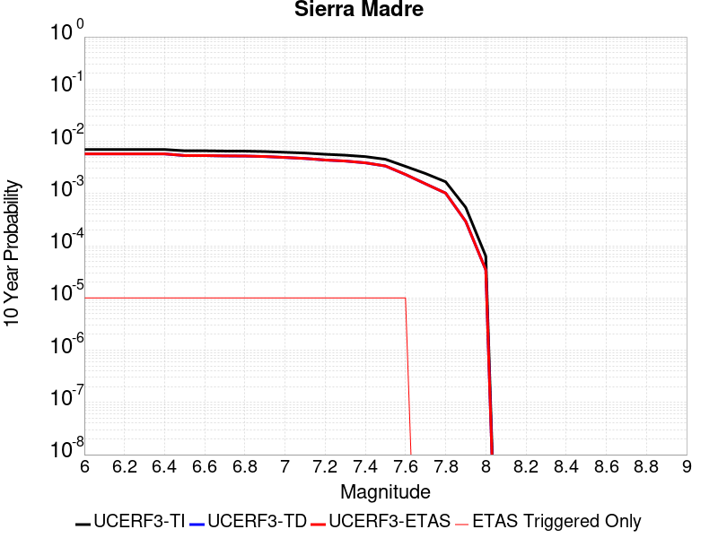 |

| Magnitude | 1 wk TI Prob | 1 wk TD Prob | 1 wk ETAS Prob | 1 wk ETAS/TD Gain | 1 wk ETAS Triggered Only | 1 mo TI Prob | 1 mo TD Prob | 1 mo ETAS Prob | 1 mo ETAS/TD Gain | 1 mo ETAS Triggered Only | 1 yr TI Prob | 1 yr TD Prob | 1 yr ETAS Prob | 1 yr ETAS/TD Gain | 1 yr ETAS Triggered Only | 10 yr TI Prob | 10 yr TD Prob | 10 yr ETAS Prob | 10 yr ETAS/TD Gain | 10 yr ETAS Triggered Only |
|-----|-----|-----|-----|-----|-----|-----|-----|-----|-----|-----|-----|-----|-----|-----|-----|-----|-----|-----|-----|-----|
| 6.0 | 1.3379373E-5 | 1.1002111E-5 | 1.1002111E-5 | 1.0 | 0.0 | 5.7338908E-5 | 4.715106E-5 | 4.715106E-5 | 1.0 | 0.0 | 6.978776E-4 | 5.7391444E-4 | 5.7391444E-4 | 1.0 | 0.0 | 0.0069569005 | 0.005724687 | 0.005759865 | 1.006145 | 3.5380697E-5 |
| 6.1 | 1.3379373E-5 | 1.1002111E-5 | 1.1002111E-5 | 1.0 | 0.0 | 5.7338908E-5 | 4.715106E-5 | 4.715106E-5 | 1.0 | 0.0 | 6.978776E-4 | 5.7391444E-4 | 5.7391444E-4 | 1.0 | 0.0 | 0.0069569005 | 0.005724687 | 0.005759865 | 1.006145 | 3.5380697E-5 |
| 6.2 | 1.3379373E-5 | 1.1002111E-5 | 1.1002111E-5 | 1.0 | 0.0 | 5.7338908E-5 | 4.715106E-5 | 4.715106E-5 | 1.0 | 0.0 | 6.978776E-4 | 5.7391444E-4 | 5.7391444E-4 | 1.0 | 0.0 | 0.0069569005 | 0.005724687 | 0.005759865 | 1.006145 | 3.5380697E-5 |
| 6.3 | 1.3379373E-5 | 1.1002111E-5 | 1.1002111E-5 | 1.0 | 0.0 | 5.7338908E-5 | 4.715106E-5 | 4.715106E-5 | 1.0 | 0.0 | 6.978776E-4 | 5.7391444E-4 | 5.7391444E-4 | 1.0 | 0.0 | 0.0069569005 | 0.005724687 | 0.005759865 | 1.006145 | 3.5380697E-5 |
| 6.4 | 1.3379373E-5 | 1.1002111E-5 | 1.1002111E-5 | 1.0 | 0.0 | 5.7338908E-5 | 4.715106E-5 | 4.715106E-5 | 1.0 | 0.0 | 6.978776E-4 | 5.7391444E-4 | 5.7391444E-4 | 1.0 | 0.0 | 0.0069569005 | 0.005724687 | 0.005759865 | 1.006145 | 3.5380697E-5 |
| 6.5 | 1.26563245E-5 | 1.023154E-5 | 1.023154E-5 | 1.0 | 0.0 | 5.4240263E-5 | 4.3848726E-5 | 4.3848726E-5 | 1.0 | 0.0 | 6.601751E-4 | 5.3372857E-4 | 5.3372857E-4 | 1.0 | 0.0 | 0.006582173 | 0.005324789 | 0.005359981 | 1.0066092 | 3.5380697E-5 |
| 6.6 | 1.26563245E-5 | 1.023154E-5 | 1.023154E-5 | 1.0 | 0.0 | 5.4240263E-5 | 4.3848726E-5 | 4.3848726E-5 | 1.0 | 0.0 | 6.601751E-4 | 5.3372857E-4 | 5.3372857E-4 | 1.0 | 0.0 | 0.006582173 | 0.005324789 | 0.005359981 | 1.0066092 | 3.5380697E-5 |
| 6.7 | 1.2502474E-5 | 1.0067679E-5 | 1.0067679E-5 | 1.0 | 0.0 | 5.3580934E-5 | 4.3146487E-5 | 4.3146487E-5 | 1.0 | 0.0 | 6.521526E-4 | 5.251829E-4 | 5.251829E-4 | 1.0 | 0.0 | 0.0065024206 | 0.005239737 | 0.0052749324 | 1.006717 | 3.5380697E-5 |
| 6.8 | 1.2454966E-5 | 1.0019962E-5 | 1.0019962E-5 | 1.0 | 0.0 | 5.3377335E-5 | 4.2941996E-5 | 4.2941996E-5 | 1.0 | 0.0 | 6.4967526E-4 | 5.2269443E-4 | 5.2269443E-4 | 1.0 | 0.0 | 0.006477792 | 0.005214969 | 0.0052501652 | 1.006749 | 3.5380697E-5 |
| 6.9 | 1.2225574E-5 | 9.793931E-6 | 9.793931E-6 | 1.0 | 0.0 | 5.2394265E-5 | 4.1973322E-5 | 4.1973322E-5 | 1.0 | 0.0 | 6.3771347E-4 | 5.109064E-4 | 5.109064E-4 | 1.0 | 0.0 | 0.006358865 | 0.0050976346 | 0.005132835 | 1.0069052 | 3.5380697E-5 |
| 7.0 | 1.182946E-5 | 9.400459E-6 | 9.400459E-6 | 1.0 | 0.0 | 5.06967E-5 | 4.0287065E-5 | 4.0287065E-5 | 1.0 | 0.0 | 6.1705755E-4 | 4.9038563E-4 | 4.9038563E-4 | 1.0 | 0.0 | 0.006153469 | 0.004893347 | 0.0049285544 | 1.007195 | 3.5380697E-5 |
| 7.1 | 1.14369095E-5 | 8.987441E-6 | 8.987441E-6 | 1.0 | 0.0 | 4.9014405E-5 | 3.8517042E-5 | 3.8517042E-5 | 1.0 | 0.0 | 5.9658696E-4 | 4.6884507E-4 | 4.6884507E-4 | 1.0 | 0.0 | 0.005949879 | 0.004678865 | 0.00471408 | 1.0075264 | 3.5380697E-5 |
| 7.2 | 1.0836419E-5 | 8.400803E-6 | 8.400803E-6 | 1.0 | 0.0 | 4.644097E-5 | 3.6002948E-5 | 3.6002948E-5 | 1.0 | 0.0 | 5.652721E-4 | 4.3824865E-4 | 4.3824865E-4 | 1.0 | 0.0 | 0.0056383642 | 0.0043741413 | 0.004409367 | 1.0080532 | 3.5380697E-5 |
| 7.3 | 1.0403439E-5 | 8.022045E-6 | 8.022045E-6 | 1.0 | 0.0 | 4.4585406E-5 | 3.4379744E-5 | 3.4379744E-5 | 1.0 | 0.0 | 5.426921E-4 | 4.184939E-4 | 4.184939E-4 | 1.0 | 0.0 | 0.005413687 | 0.0041773533 | 0.004212586 | 1.0084343 | 3.5380697E-5 |
| 7.4 | 9.768864E-6 | 7.415638E-6 | 7.415638E-6 | 1.0 | 0.0 | 4.186589E-5 | 3.178092E-5 | 3.178092E-5 | 1.0 | 0.0 | 5.09598E-4 | 3.868649E-4 | 3.868649E-4 | 1.0 | 0.0 | 0.0050843097 | 0.0038622064 | 0.0038974504 | 1.0091254 | 3.5380697E-5 |
| 7.5 | 8.687089E-6 | 6.4511987E-6 | 6.4511987E-6 | 1.0 | 0.0 | 3.722985E-5 | 2.7647708E-5 | 2.7647708E-5 | 1.0 | 0.0 | 4.5317915E-4 | 3.365597E-4 | 3.365597E-4 | 1.0 | 0.0 | 0.004522561 | 0.0033607872 | 0.003396049 | 1.0104921 | 3.5380697E-5 |
| 7.6 | 6.3506063E-6 | 4.431258E-6 | 4.431258E-6 | 1.0 | 0.0 | 2.72166E-5 | 1.8990968E-5 | 1.8990968E-5 | 1.0 | 0.0 | 3.3131172E-4 | 2.3119076E-4 | 2.3119076E-4 | 1.0 | 0.0 | 0.003308182 | 0.0023097275 | 0.0023450265 | 1.0152828 | 3.5380697E-5 |
| 7.7 | 4.62223E-6 | 2.9338423E-6 | 2.9338423E-6 | 1.0 | 0.0 | 1.9809406E-5 | 1.257355E-5 | 1.257355E-5 | 1.0 | 0.0 | 2.4115283E-4 | 1.5307224E-4 | 1.5307224E-4 | 1.0 | 0.0 | 0.0024089129 | 0.001529869 | 0.001529869 | 1.0 | 0.0 |
| 7.8 | 3.2145008E-6 | 1.950051E-6 | 1.950051E-6 | 1.0 | 0.0 | 1.3776359E-5 | 8.357335E-6 | 8.357335E-6 | 1.0 | 0.0 | 1.6771426E-4 | 1.0174581E-4 | 1.0174581E-4 | 1.0 | 0.0 | 0.0016758774 | 0.0010171367 | 0.0010171367 | 1.0 | 0.0 |
| 7.9 | 1.0391769E-6 | 5.604388E-7 | 5.604388E-7 | 1.0 | 0.0 | 4.4536077E-6 | 2.4018784E-6 | 2.4018784E-6 | 1.0 | 0.0 | 5.4221324E-5 | 2.9242481E-5 | 2.9242481E-5 | 1.0 | 0.0 | 5.4208096E-4 | 2.9238674E-4 | 2.9238674E-4 | 1.0 | 0.0 |
| 8.0 | 1.210983E-7 | 6.615224E-8 | 6.615224E-8 | 1.0 | 0.0 | 5.1899264E-7 | 2.8350954E-7 | 2.8350954E-7 | 1.0 | 0.0 | 6.3187167E-6 | 3.4517234E-6 | 3.4517234E-6 | 1.0 | 0.0 | 6.318537E-5 | 3.4516717E-5 | 3.4516717E-5 | 1.0 | 0.0 |

## Owens Valley Keough Hot Springs
*[(top)](#table-of-contents)*

| 1 Week | 1 Month | 1 Year | 10 Year |
|-----|-----|-----|-----|
|  |  |  |  |

| Magnitude | 1 wk TI Prob | 1 wk TD Prob | 1 wk ETAS Prob | 1 wk ETAS/TD Gain | 1 wk ETAS Triggered Only | 1 mo TI Prob | 1 mo TD Prob | 1 mo ETAS Prob | 1 mo ETAS/TD Gain | 1 mo ETAS Triggered Only | 1 yr TI Prob | 1 yr TD Prob | 1 yr ETAS Prob | 1 yr ETAS/TD Gain | 1 yr ETAS Triggered Only | 10 yr TI Prob | 10 yr TD Prob | 10 yr ETAS Prob | 10 yr ETAS/TD Gain | 10 yr ETAS Triggered Only |
|-----|-----|-----|-----|-----|-----|-----|-----|-----|-----|-----|-----|-----|-----|-----|-----|-----|-----|-----|-----|-----|
| 6.0 | 1.5708529E-5 | 4.95133E-6 | 4.95133E-6 | 1.0 | 0.0 | 6.7320536E-5 | 2.1219843E-5 | 2.1219843E-5 | 1.0 | 0.0 | 8.193192E-4 | 2.5832606E-4 | 2.5832606E-4 | 1.0 | 0.0 | 0.008163051 | 0.002580917 | 0.0026162064 | 1.0136732 | 3.5380697E-5 |
| 6.1 | 1.5708529E-5 | 4.95133E-6 | 4.95133E-6 | 1.0 | 0.0 | 6.7320536E-5 | 2.1219843E-5 | 2.1219843E-5 | 1.0 | 0.0 | 8.193192E-4 | 2.5832606E-4 | 2.5832606E-4 | 1.0 | 0.0 | 0.008163051 | 0.002580917 | 0.0026162064 | 1.0136732 | 3.5380697E-5 |
| 6.2 | 1.5708529E-5 | 4.95133E-6 | 4.95133E-6 | 1.0 | 0.0 | 6.7320536E-5 | 2.1219843E-5 | 2.1219843E-5 | 1.0 | 0.0 | 8.193192E-4 | 2.5832606E-4 | 2.5832606E-4 | 1.0 | 0.0 | 0.008163051 | 0.002580917 | 0.0026162064 | 1.0136732 | 3.5380697E-5 |
| 6.3 | 1.5708529E-5 | 4.95133E-6 | 4.95133E-6 | 1.0 | 0.0 | 6.7320536E-5 | 2.1219843E-5 | 2.1219843E-5 | 1.0 | 0.0 | 8.193192E-4 | 2.5832606E-4 | 2.5832606E-4 | 1.0 | 0.0 | 0.008163051 | 0.002580917 | 0.0026162064 | 1.0136732 | 3.5380697E-5 |
| 6.4 | 1.4622509E-5 | 3.727112E-6 | 3.727112E-6 | 1.0 | 0.0 | 6.266639E-5 | 1.5973259E-5 | 1.5973259E-5 | 1.0 | 0.0 | 7.626962E-4 | 1.9446037E-4 | 1.9446037E-4 | 1.0 | 0.0 | 0.007600839 | 0.0019433822 | 0.0019433822 | 1.0 | 0.0 |
| 6.5 | 1.3335527E-5 | 2.2782122E-6 | 2.2782122E-6 | 1.0 | 0.0 | 5.7151006E-5 | 9.763733E-6 | 9.763733E-6 | 1.0 | 0.0 | 6.955913E-4 | 1.18867654E-4 | 1.18867654E-4 | 1.0 | 0.0 | 0.0069341804 | 0.0011882635 | 0.0011882635 | 1.0 | 0.0 |
| 6.6 | 1.3332855E-5 | 2.275361E-6 | 2.275361E-6 | 1.0 | 0.0 | 5.7139558E-5 | 9.751515E-6 | 9.751515E-6 | 1.0 | 0.0 | 6.9545204E-4 | 1.1871891E-4 | 1.1871891E-4 | 1.0 | 0.0 | 0.0069327964 | 0.0011867777 | 0.0011867777 | 1.0 | 0.0 |
| 6.7 | 1.3318214E-5 | 2.2645902E-6 | 2.2645902E-6 | 1.0 | 0.0 | 5.707681E-5 | 9.7053535E-6 | 9.7053535E-6 | 1.0 | 0.0 | 6.946886E-4 | 1.1815696E-4 | 1.1815696E-4 | 1.0 | 0.0 | 0.0069252094 | 0.0011811642 | 0.0011811642 | 1.0 | 0.0 |
| 6.8 | 1.2441338E-5 | 1.6782068E-6 | 1.6782068E-6 | 1.0 | 0.0 | 5.331893E-5 | 7.192297E-6 | 7.192297E-6 | 1.0 | 0.0 | 6.489646E-4 | 8.756299E-5 | 8.756299E-5 | 1.0 | 0.0 | 0.0064707273 | 8.754701E-4 | 8.754701E-4 | 1.0 | 0.0 |
| 6.9 | 1.1130476E-5 | 1.0306736E-6 | 1.0306736E-6 | 1.0 | 0.0 | 4.7701167E-5 | 4.417165E-6 | 4.417165E-6 | 1.0 | 0.0 | 5.806069E-4 | 5.3777672E-5 | 5.3777672E-5 | 1.0 | 0.0 | 0.0057909233 | 5.3780153E-4 | 5.3780153E-4 | 1.0 | 0.0 |
| 7.0 | 1.0986073E-5 | 9.582163E-7 | 9.582163E-7 | 1.0 | 0.0 | 4.7082318E-5 | 4.106635E-6 | 4.106635E-6 | 1.0 | 0.0 | 5.730765E-4 | 4.999715E-5 | 4.999715E-5 | 1.0 | 0.0 | 0.0057160086 | 5.0001295E-4 | 5.0001295E-4 | 1.0 | 0.0 |
| 7.1 | 1.0451338E-5 | 8.002528E-7 | 8.002528E-7 | 1.0 | 0.0 | 4.4790682E-5 | 3.4296504E-6 | 3.4296504E-6 | 1.0 | 0.0 | 5.451901E-4 | 4.1755196E-5 | 4.1755196E-5 | 1.0 | 0.0 | 0.005438545 | 4.1762355E-4 | 4.1762355E-4 | 1.0 | 0.0 |
| 7.2 | 9.989061E-6 | 6.546888E-7 | 6.546888E-7 | 1.0 | 0.0 | 4.280956E-5 | 2.805806E-6 | 2.805806E-6 | 1.0 | 0.0 | 5.2108173E-4 | 3.4160155E-5 | 3.4160155E-5 | 1.0 | 0.0 | 0.0051986156 | 3.416869E-4 | 3.416869E-4 | 1.0 | 0.0 |
| 7.3 | 9.465365E-6 | 5.4618476E-7 | 5.4618476E-7 | 1.0 | 0.0 | 4.056522E-5 | 2.3407897E-6 | 2.3407897E-6 | 1.0 | 0.0 | 4.937696E-4 | 2.8498745E-5 | 2.8498745E-5 | 1.0 | 0.0 | 0.0049267393 | 2.8508386E-4 | 2.8508386E-4 | 1.0 | 0.0 |
| 7.4 | 6.3824805E-6 | 4.0178227E-7 | 4.0178227E-7 | 1.0 | 0.0 | 2.73532E-5 | 1.7219229E-6 | 1.7219229E-6 | 1.0 | 0.0 | 3.3297433E-4 | 2.0964211E-5 | 2.0964211E-5 | 1.0 | 0.0 | 0.0033247585 | 2.0971506E-4 | 2.0971506E-4 | 1.0 | 0.0 |
| 7.5 | 1.6192645E-6 | 2.5170255E-7 | 2.5170255E-7 | 1.0 | 0.0 | 6.9396865E-6 | 1.0787247E-6 | 1.0787247E-6 | 1.0 | 0.0 | 8.448741E-5 | 1.3133395E-5 | 1.3133395E-5 | 1.0 | 0.0 | 8.4455294E-4 | 1.3132632E-4 | 1.3132632E-4 | 1.0 | 0.0 |
| 7.6 | 5.7062545E-7 | 1.07960254E-7 | 1.07960254E-7 | 1.0 | 0.0 | 2.4455355E-6 | 4.6268673E-7 | 4.6268673E-7 | 1.0 | 0.0 | 2.9773988E-5 | 5.6331974E-6 | 5.6331974E-6 | 1.0 | 0.0 | 2.977E-4 | 5.6330628E-5 | 5.6330628E-5 | 1.0 | 0.0 |
| 7.7 | 2.5988817E-7 | 4.547274E-8 | 4.547274E-8 | 1.0 | 0.0 | 1.113806E-6 | 1.9488314E-7 | 1.9488314E-7 | 1.0 | 0.0 | 1.3560503E-5 | 2.3727002E-6 | 2.3727002E-6 | 1.0 | 0.0 | 1.3559677E-4 | 2.3726792E-5 | 2.3726792E-5 | 1.0 | 0.0 |

## North Frontal  (West)
*[(top)](#table-of-contents)*

| 1 Week | 1 Month | 1 Year | 10 Year |
|-----|-----|-----|-----|
| 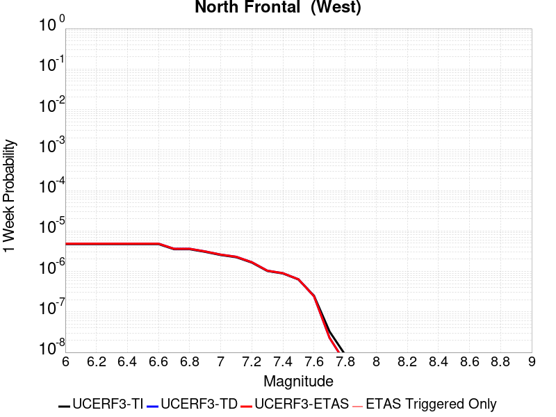 |  |  |  |

| Magnitude | 1 wk TI Prob | 1 wk TD Prob | 1 wk ETAS Prob | 1 wk ETAS/TD Gain | 1 wk ETAS Triggered Only | 1 mo TI Prob | 1 mo TD Prob | 1 mo ETAS Prob | 1 mo ETAS/TD Gain | 1 mo ETAS Triggered Only | 1 yr TI Prob | 1 yr TD Prob | 1 yr ETAS Prob | 1 yr ETAS/TD Gain | 1 yr ETAS Triggered Only | 10 yr TI Prob | 10 yr TD Prob | 10 yr ETAS Prob | 10 yr ETAS/TD Gain | 10 yr ETAS Triggered Only |
|-----|-----|-----|-----|-----|-----|-----|-----|-----|-----|-----|-----|-----|-----|-----|-----|-----|-----|-----|-----|-----|
| 6.0 | 4.7316266E-6 | 4.8527477E-6 | 4.8527477E-6 | 1.0 | 0.0 | 2.0278241E-5 | 2.0797332E-5 | 2.0797332E-5 | 1.0 | 0.0 | 2.4685962E-4 | 2.5317958E-4 | 2.5317958E-4 | 1.0 | 0.0 | 0.0024658558 | 0.0025290574 | 0.0025643487 | 1.0139543 | 3.5380697E-5 |
| 6.1 | 4.7316266E-6 | 4.8527477E-6 | 4.8527477E-6 | 1.0 | 0.0 | 2.0278241E-5 | 2.0797332E-5 | 2.0797332E-5 | 1.0 | 0.0 | 2.4685962E-4 | 2.5317958E-4 | 2.5317958E-4 | 1.0 | 0.0 | 0.0024658558 | 0.0025290574 | 0.0025643487 | 1.0139543 | 3.5380697E-5 |
| 6.2 | 4.7316266E-6 | 4.8527477E-6 | 4.8527477E-6 | 1.0 | 0.0 | 2.0278241E-5 | 2.0797332E-5 | 2.0797332E-5 | 1.0 | 0.0 | 2.4685962E-4 | 2.5317958E-4 | 2.5317958E-4 | 1.0 | 0.0 | 0.0024658558 | 0.0025290574 | 0.0025643487 | 1.0139543 | 3.5380697E-5 |
| 6.3 | 4.7316266E-6 | 4.8527477E-6 | 4.8527477E-6 | 1.0 | 0.0 | 2.0278241E-5 | 2.0797332E-5 | 2.0797332E-5 | 1.0 | 0.0 | 2.4685962E-4 | 2.5317958E-4 | 2.5317958E-4 | 1.0 | 0.0 | 0.0024658558 | 0.0025290574 | 0.0025643487 | 1.0139543 | 3.5380697E-5 |
| 6.4 | 4.7316266E-6 | 4.8527477E-6 | 4.8527477E-6 | 1.0 | 0.0 | 2.0278241E-5 | 2.0797332E-5 | 2.0797332E-5 | 1.0 | 0.0 | 2.4685962E-4 | 2.5317958E-4 | 2.5317958E-4 | 1.0 | 0.0 | 0.0024658558 | 0.0025290574 | 0.0025643487 | 1.0139543 | 3.5380697E-5 |
| 6.5 | 4.7316266E-6 | 4.8527477E-6 | 4.8527477E-6 | 1.0 | 0.0 | 2.0278241E-5 | 2.0797332E-5 | 2.0797332E-5 | 1.0 | 0.0 | 2.4685962E-4 | 2.5317958E-4 | 2.5317958E-4 | 1.0 | 0.0 | 0.0024658558 | 0.0025290574 | 0.0025643487 | 1.0139543 | 3.5380697E-5 |
| 6.6 | 4.7316266E-6 | 4.8527477E-6 | 4.8527477E-6 | 1.0 | 0.0 | 2.0278241E-5 | 2.0797332E-5 | 2.0797332E-5 | 1.0 | 0.0 | 2.4685962E-4 | 2.5317958E-4 | 2.5317958E-4 | 1.0 | 0.0 | 0.0024658558 | 0.0025290574 | 0.0025643487 | 1.0139543 | 3.5380697E-5 |
| 6.7 | 3.5382777E-6 | 3.6309455E-6 | 3.6309455E-6 | 1.0 | 0.0 | 1.516396E-5 | 1.5561107E-5 | 1.5561107E-5 | 1.0 | 0.0 | 1.8460557E-4 | 1.8944078E-4 | 1.8944078E-4 | 1.0 | 0.0 | 0.0018445229 | 0.00189287 | 0.0019281836 | 1.0186561 | 3.5380697E-5 |
| 6.8 | 3.5382777E-6 | 3.6309455E-6 | 3.6309455E-6 | 1.0 | 0.0 | 1.516396E-5 | 1.5561107E-5 | 1.5561107E-5 | 1.0 | 0.0 | 1.8460557E-4 | 1.8944078E-4 | 1.8944078E-4 | 1.0 | 0.0 | 0.0018445229 | 0.00189287 | 0.0019281836 | 1.0186561 | 3.5380697E-5 |
| 6.9 | 3.0428037E-6 | 3.1228133E-6 | 3.1228133E-6 | 1.0 | 0.0 | 1.30405215E-5 | 1.3383421E-5 | 1.3383421E-5 | 1.0 | 0.0 | 1.5875678E-4 | 1.6293164E-4 | 1.6293164E-4 | 1.0 | 0.0 | 0.0015864341 | 0.001628189 | 0.0016635121 | 1.0216947 | 3.5380697E-5 |
| 7.0 | 2.538778E-6 | 2.6061361E-6 | 2.6061361E-6 | 1.0 | 0.0 | 1.0880432E-5 | 1.116911E-5 | 1.116911E-5 | 1.0 | 0.0 | 1.324612E-4 | 1.359759E-4 | 1.359759E-4 | 1.0 | 0.0 | 0.0013238228 | 0.0013589738 | 0.0013943064 | 1.0259994 | 3.5380697E-5 |
| 7.1 | 2.2418935E-6 | 2.3012487E-6 | 2.3012487E-6 | 1.0 | 0.0 | 9.60808E-6 | 9.86246E-6 | 9.86246E-6 | 1.0 | 0.0 | 1.1697209E-4 | 1.2006928E-4 | 1.2006928E-4 | 1.0 | 0.0 | 0.0011691054 | 0.001200088 | 0.0012354262 | 1.0294464 | 3.5380697E-5 |
| 7.2 | 1.6526745E-6 | 1.6925159E-6 | 1.6925159E-6 | 1.0 | 0.0 | 7.082872E-6 | 7.253621E-6 | 7.253621E-6 | 1.0 | 0.0 | 8.623055E-5 | 8.8309505E-5 | 8.8309505E-5 | 1.0 | 0.0 | 8.61971E-4 | 8.827692E-4 | 9.181187E-4 | 1.0400438 | 3.5380697E-5 |
| 7.3 | 1.0246019E-6 | 1.0442458E-6 | 1.0442458E-6 | 1.0 | 0.0 | 4.391144E-6 | 4.475332E-6 | 4.475332E-6 | 1.0 | 0.0 | 5.3460866E-5 | 5.448592E-5 | 5.448592E-5 | 1.0 | 0.0 | 5.344801E-4 | 5.447371E-4 | 5.8009854E-4 | 1.0649147 | 3.5380697E-5 |
| 7.4 | 8.9045164E-7 | 9.056731E-7 | 9.056731E-7 | 1.0 | 0.0 | 3.8162157E-6 | 3.881451E-6 | 3.881451E-6 | 1.0 | 0.0 | 4.646144E-5 | 4.7255755E-5 | 4.7255755E-5 | 1.0 | 0.0 | 4.6451724E-4 | 4.7246792E-4 | 5.078319E-4 | 1.0748495 | 3.5380697E-5 |
| 7.5 | 6.3357E-7 | 6.402826E-7 | 6.402826E-7 | 1.0 | 0.0 | 2.7152971E-6 | 2.744066E-6 | 2.744066E-6 | 1.0 | 0.0 | 3.305824E-5 | 3.3408556E-5 | 3.3408556E-5 | 1.0 | 0.0 | 3.3053322E-4 | 3.3404192E-4 | 3.6941082E-4 | 1.1058816 | 3.5380697E-5 |
| 7.6 | 2.5087024E-7 | 2.4361591E-7 | 2.4361591E-7 | 1.0 | 0.0 | 1.0751578E-6 | 1.0440679E-6 | 1.0440679E-6 | 1.0 | 0.0 | 1.3089967E-5 | 1.2711474E-5 | 1.2711474E-5 | 1.0 | 0.0 | 1.3089196E-4 | 1.2710952E-4 | 1.6248573E-4 | 1.2783127 | 3.5380697E-5 |
| 7.7 | 3.282987E-8 | 2.2874781E-8 | 2.2874781E-8 | 1.0 | 0.0 | 1.4069944E-7 | 9.8034775E-8 | 9.8034775E-8 | 1.0 | 0.0 | 1.7130144E-6 | 1.1935729E-6 | 1.1935729E-6 | 1.0 | 0.0 | 1.7130013E-5 | 1.1935673E-5 | 1.1935673E-5 | 1.0 | 0.0 |
| 7.8 | 8.77499E-9 | 5.6818488E-9 | 5.6818488E-9 | 1.0 | 0.0 | 3.7607098E-8 | 2.4350781E-8 | 2.4350781E-8 | 1.0 | 0.0 | 4.578663E-7 | 2.9647074E-7 | 2.9647074E-7 | 1.0 | 0.0 | 4.5786537E-6 | 2.9647047E-6 | 2.9647047E-6 | 1.0 | 0.0 |

## Homestead Valley 2011
*[(top)](#table-of-contents)*

| 1 Week | 1 Month | 1 Year | 10 Year |
|-----|-----|-----|-----|
|  |  | 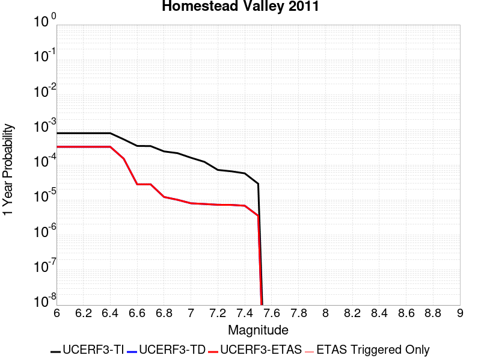 |  |

| Magnitude | 1 wk TI Prob | 1 wk TD Prob | 1 wk ETAS Prob | 1 wk ETAS/TD Gain | 1 wk ETAS Triggered Only | 1 mo TI Prob | 1 mo TD Prob | 1 mo ETAS Prob | 1 mo ETAS/TD Gain | 1 mo ETAS Triggered Only | 1 yr TI Prob | 1 yr TD Prob | 1 yr ETAS Prob | 1 yr ETAS/TD Gain | 1 yr ETAS Triggered Only | 10 yr TI Prob | 10 yr TD Prob | 10 yr ETAS Prob | 10 yr ETAS/TD Gain | 10 yr ETAS Triggered Only |
|-----|-----|-----|-----|-----|-----|-----|-----|-----|-----|-----|-----|-----|-----|-----|-----|-----|-----|-----|-----|-----|
| 6.0 | 1.539795E-5 | 6.2868744E-6 | 6.2868744E-6 | 1.0 | 0.0 | 6.5989545E-5 | 2.6943586E-5 | 2.6943586E-5 | 1.0 | 0.0 | 8.0312655E-4 | 3.280094E-4 | 3.280094E-4 | 1.0 | 0.0 | 0.008002302 | 0.0032772736 | 0.0033125384 | 1.0107604 | 3.5380697E-5 |
| 6.1 | 1.539795E-5 | 6.2868744E-6 | 6.2868744E-6 | 1.0 | 0.0 | 6.5989545E-5 | 2.6943586E-5 | 2.6943586E-5 | 1.0 | 0.0 | 8.0312655E-4 | 3.280094E-4 | 3.280094E-4 | 1.0 | 0.0 | 0.008002302 | 0.0032772736 | 0.0033125384 | 1.0107604 | 3.5380697E-5 |
| 6.2 | 1.539795E-5 | 6.2868744E-6 | 6.2868744E-6 | 1.0 | 0.0 | 6.5989545E-5 | 2.6943586E-5 | 2.6943586E-5 | 1.0 | 0.0 | 8.0312655E-4 | 3.280094E-4 | 3.280094E-4 | 1.0 | 0.0 | 0.008002302 | 0.0032772736 | 0.0033125384 | 1.0107604 | 3.5380697E-5 |
| 6.3 | 1.539795E-5 | 6.2868744E-6 | 6.2868744E-6 | 1.0 | 0.0 | 6.5989545E-5 | 2.6943586E-5 | 2.6943586E-5 | 1.0 | 0.0 | 8.0312655E-4 | 3.280094E-4 | 3.280094E-4 | 1.0 | 0.0 | 0.008002302 | 0.0032772736 | 0.0033125384 | 1.0107604 | 3.5380697E-5 |
| 6.4 | 1.539795E-5 | 6.2868744E-6 | 6.2868744E-6 | 1.0 | 0.0 | 6.5989545E-5 | 2.6943586E-5 | 2.6943586E-5 | 1.0 | 0.0 | 8.0312655E-4 | 3.280094E-4 | 3.280094E-4 | 1.0 | 0.0 | 0.008002302 | 0.0032772736 | 0.0033125384 | 1.0107604 | 3.5380697E-5 |
| 6.5 | 1.0265258E-5 | 2.8789796E-6 | 2.8789796E-6 | 1.0 | 0.0 | 4.3993223E-5 | 1.2338465E-5 | 1.2338465E-5 | 1.0 | 0.0 | 5.3548586E-4 | 1.5021741E-4 | 1.5021741E-4 | 1.0 | 0.0 | 0.005341973 | 0.0015018407 | 0.0015371682 | 1.0235229 | 3.5380697E-5 |
| 6.6 | 6.664671E-6 | 5.3488435E-7 | 5.3488435E-7 | 1.0 | 0.0 | 2.8562565E-5 | 2.2923603E-6 | 2.2923603E-6 | 1.0 | 0.0 | 3.476937E-4 | 2.7909247E-5 | 2.7909247E-5 | 1.0 | 0.0 | 0.003471502 | 2.7906906E-4 | 3.1443988E-4 | 1.1267458 | 3.5380697E-5 |
| 6.7 | 6.5954046E-6 | 5.3488435E-7 | 5.3488435E-7 | 1.0 | 0.0 | 2.8265715E-5 | 2.2923603E-6 | 2.2923603E-6 | 1.0 | 0.0 | 3.4408073E-4 | 2.7909247E-5 | 2.7909247E-5 | 1.0 | 0.0 | 0.0034354846 | 2.7906906E-4 | 3.1443988E-4 | 1.1267458 | 3.5380697E-5 |
| 6.8 | 4.648189E-6 | 2.3269658E-7 | 2.3269658E-7 | 1.0 | 0.0 | 1.9920659E-5 | 9.972707E-7 | 9.972707E-7 | 1.0 | 0.0 | 2.4250703E-4 | 1.2141708E-5 | 1.2141708E-5 | 1.0 | 0.0 | 0.0024224254 | 1.2141093E-4 | 1.5678733E-4 | 1.2913774 | 3.5380697E-5 |
| 6.9 | 4.1428534E-6 | 1.9348157E-7 | 1.9348157E-7 | 1.0 | 0.0 | 1.7754966E-5 | 8.292065E-7 | 8.292065E-7 | 1.0 | 0.0 | 2.1614527E-4 | 1.0095546E-5 | 1.0095546E-5 | 1.0 | 0.0 | 0.0021593515 | 1.0095117E-4 | 1.363283E-4 | 1.350438 | 3.5380697E-5 |
| 7.0 | 3.0673707E-6 | 1.5370551E-7 | 1.5370551E-7 | 1.0 | 0.0 | 1.3145808E-5 | 6.5873775E-7 | 6.5873775E-7 | 1.0 | 0.0 | 1.6003846E-4 | 8.020103E-6 | 8.020103E-6 | 1.0 | 0.0 | 0.0015992324 | 8.0198246E-5 | 1.15576106E-4 | 1.44113 | 3.5380697E-5 |
| 7.1 | 2.340854E-6 | 1.4690413E-7 | 1.4690413E-7 | 1.0 | 0.0 | 1.0032193E-5 | 6.2958895E-7 | 6.2958895E-7 | 1.0 | 0.0 | 1.221351E-4 | 7.6652195E-6 | 7.6652195E-6 | 1.0 | 0.0 | 0.00122068 | 7.664965E-5 | 1.12027636E-4 | 1.4615544 | 3.5380697E-5 |
| 7.2 | 1.3754182E-6 | 1.3925126E-7 | 1.3925126E-7 | 1.0 | 0.0 | 5.8946357E-6 | 5.96791E-7 | 5.96791E-7 | 1.0 | 0.0 | 7.176483E-5 | 7.265907E-6 | 7.265907E-6 | 1.0 | 0.0 | 7.174166E-4 | 7.265679E-5 | 1.0803491E-4 | 1.4869212 | 3.5380697E-5 |
| 7.3 | 1.2573237E-6 | 1.3829613E-7 | 1.3829613E-7 | 1.0 | 0.0 | 5.388519E-6 | 5.926975E-7 | 5.926975E-7 | 1.0 | 0.0 | 6.560324E-5 | 7.2160697E-6 | 7.2160697E-6 | 1.0 | 0.0 | 6.558388E-4 | 7.2158444E-5 | 1.0753659E-4 | 1.4902842 | 3.5380697E-5 |
| 7.4 | 1.0994207E-6 | 1.3108422E-7 | 1.3108422E-7 | 1.0 | 0.0 | 4.7117946E-6 | 5.6178936E-7 | 5.6178936E-7 | 1.0 | 0.0 | 5.736459E-5 | 6.8397653E-6 | 6.8397653E-6 | 1.0 | 0.0 | 5.734978E-4 | 6.839564E-5 | 1.0377391E-4 | 1.5172592 | 3.5380697E-5 |
| 7.5 | 5.5569126E-7 | 6.774076E-8 | 6.774076E-8 | 1.0 | 0.0 | 2.3815317E-6 | 2.903175E-7 | 2.903175E-7 | 1.0 | 0.0 | 2.8994764E-5 | 3.5346104E-6 | 3.5346104E-6 | 1.0 | 0.0 | 2.899098E-4 | 3.5345605E-5 | 7.072505E-5 | 2.0009575 | 3.5380697E-5 |

## San Jacinto (Lytle Creek connector)
*[(top)](#table-of-contents)*

| 1 Week | 1 Month | 1 Year | 10 Year |
|-----|-----|-----|-----|
|  |  |  |  |

| Magnitude | 1 wk TI Prob | 1 wk TD Prob | 1 wk ETAS Prob | 1 wk ETAS/TD Gain | 1 wk ETAS Triggered Only | 1 mo TI Prob | 1 mo TD Prob | 1 mo ETAS Prob | 1 mo ETAS/TD Gain | 1 mo ETAS Triggered Only | 1 yr TI Prob | 1 yr TD Prob | 1 yr ETAS Prob | 1 yr ETAS/TD Gain | 1 yr ETAS Triggered Only | 10 yr TI Prob | 10 yr TD Prob | 10 yr ETAS Prob | 10 yr ETAS/TD Gain | 10 yr ETAS Triggered Only |
|-----|-----|-----|-----|-----|-----|-----|-----|-----|-----|-----|-----|-----|-----|-----|-----|-----|-----|-----|-----|-----|
| 6.0 | 6.693995E-6 | 6.6710027E-6 | 6.6710027E-6 | 1.0 | 0.0 | 2.8688235E-5 | 2.8589699E-5 | 2.8589699E-5 | 1.0 | 0.0 | 3.492233E-4 | 3.4802407E-4 | 3.8339247E-4 | 1.1016263 | 3.5380697E-5 | 0.00348675 | 0.0035549873 | 0.0035902422 | 1.009917 | 3.5380697E-5 |
| 6.1 | 6.693995E-6 | 6.6710027E-6 | 6.6710027E-6 | 1.0 | 0.0 | 2.8688235E-5 | 2.8589699E-5 | 2.8589699E-5 | 1.0 | 0.0 | 3.492233E-4 | 3.4802407E-4 | 3.8339247E-4 | 1.1016263 | 3.5380697E-5 | 0.00348675 | 0.0035549873 | 0.0035902422 | 1.009917 | 3.5380697E-5 |
| 6.2 | 6.693995E-6 | 6.6710027E-6 | 6.6710027E-6 | 1.0 | 0.0 | 2.8688235E-5 | 2.8589699E-5 | 2.8589699E-5 | 1.0 | 0.0 | 3.492233E-4 | 3.4802407E-4 | 3.8339247E-4 | 1.1016263 | 3.5380697E-5 | 0.00348675 | 0.0035549873 | 0.0035902422 | 1.009917 | 3.5380697E-5 |
| 6.3 | 6.693995E-6 | 6.6710027E-6 | 6.6710027E-6 | 1.0 | 0.0 | 2.8688235E-5 | 2.8589699E-5 | 2.8589699E-5 | 1.0 | 0.0 | 3.492233E-4 | 3.4802407E-4 | 3.8339247E-4 | 1.1016263 | 3.5380697E-5 | 0.00348675 | 0.0035549873 | 0.0035902422 | 1.009917 | 3.5380697E-5 |
| 6.4 | 6.693995E-6 | 6.6710027E-6 | 6.6710027E-6 | 1.0 | 0.0 | 2.8688235E-5 | 2.8589699E-5 | 2.8589699E-5 | 1.0 | 0.0 | 3.492233E-4 | 3.4802407E-4 | 3.8339247E-4 | 1.1016263 | 3.5380697E-5 | 0.00348675 | 0.0035549873 | 0.0035902422 | 1.009917 | 3.5380697E-5 |
| 6.5 | 6.6561875E-6 | 6.63122E-6 | 6.63122E-6 | 1.0 | 0.0 | 2.8526205E-5 | 2.8419205E-5 | 2.8419205E-5 | 1.0 | 0.0 | 3.472512E-4 | 3.4594897E-4 | 3.8131743E-4 | 1.102236 | 3.5380697E-5 | 0.0034670907 | 0.0035343023 | 0.003569558 | 1.0099753 | 3.5380697E-5 |
| 6.6 | 6.6561875E-6 | 6.63122E-6 | 6.63122E-6 | 1.0 | 0.0 | 2.8526205E-5 | 2.8419205E-5 | 2.8419205E-5 | 1.0 | 0.0 | 3.472512E-4 | 3.4594897E-4 | 3.8131743E-4 | 1.102236 | 3.5380697E-5 | 0.0034670907 | 0.0035343023 | 0.003569558 | 1.0099753 | 3.5380697E-5 |
| 6.7 | 6.5802237E-6 | 6.550394E-6 | 6.550394E-6 | 1.0 | 0.0 | 2.8200653E-5 | 2.8072815E-5 | 2.8072815E-5 | 1.0 | 0.0 | 3.4328885E-4 | 3.41733E-4 | 3.771016E-4 | 1.1034977 | 3.5380697E-5 | 0.0034275902 | 0.0034922757 | 0.0035275328 | 1.0100957 | 3.5380697E-5 |
| 6.8 | 6.575632E-6 | 6.544883E-6 | 6.544883E-6 | 1.0 | 0.0 | 2.8180975E-5 | 2.8049197E-5 | 2.8049197E-5 | 1.0 | 0.0 | 3.4304935E-4 | 3.4144553E-4 | 3.7681416E-4 | 1.1035849 | 3.5380697E-5 | 0.0034252026 | 0.00348941 | 0.0035246674 | 1.0101041 | 3.5380697E-5 |
| 6.9 | 6.570433E-6 | 6.5362756E-6 | 6.5362756E-6 | 1.0 | 0.0 | 2.8158694E-5 | 2.801231E-5 | 2.801231E-5 | 1.0 | 0.0 | 3.4277816E-4 | 3.4099657E-4 | 3.763652E-4 | 1.1037214 | 3.5380697E-5 | 0.0034224992 | 0.0034849346 | 0.0035201919 | 1.010117 | 3.5380697E-5 |
| 7.0 | 6.5643826E-6 | 6.526395E-6 | 6.526395E-6 | 1.0 | 0.0 | 2.8132765E-5 | 2.7969963E-5 | 2.7969963E-5 | 1.0 | 0.0 | 3.424626E-4 | 3.4048117E-4 | 3.7584984E-4 | 1.1038784 | 3.5380697E-5 | 0.0034193532 | 0.0034797967 | 0.0035150545 | 1.0101321 | 3.5380697E-5 |
| 7.1 | 6.557402E-6 | 6.515105E-6 | 6.515105E-6 | 1.0 | 0.0 | 2.8102848E-5 | 2.792158E-5 | 2.792158E-5 | 1.0 | 0.0 | 3.4209844E-4 | 3.3989229E-4 | 3.7526095E-4 | 1.1040585 | 3.5380697E-5 | 0.0034157229 | 0.0034739273 | 0.003509185 | 1.0101492 | 3.5380697E-5 |
| 7.2 | 6.546394E-6 | 6.4970677E-6 | 6.4970677E-6 | 1.0 | 0.0 | 2.8055672E-5 | 2.784428E-5 | 2.784428E-5 | 1.0 | 0.0 | 3.4152428E-4 | 3.3895145E-4 | 3.7432014E-4 | 1.1043473 | 3.5380697E-5 | 0.0034099987 | 0.0034645528 | 0.0034998108 | 1.0101768 | 3.5380697E-5 |
| 7.3 | 6.5364216E-6 | 6.477847E-6 | 6.477847E-6 | 1.0 | 0.0 | 2.8012933E-5 | 2.7761906E-5 | 2.7761906E-5 | 1.0 | 0.0 | 3.4100408E-4 | 3.3794885E-4 | 3.733176E-4 | 1.104657 | 3.5380697E-5 | 0.003404813 | 0.003454571 | 0.0034898294 | 1.0102063 | 3.5380697E-5 |
| 7.4 | 6.5269523E-6 | 6.4589262E-6 | 6.4589262E-6 | 1.0 | 0.0 | 2.7972354E-5 | 2.7680819E-5 | 2.7680819E-5 | 1.0 | 0.0 | 3.4051016E-4 | 3.3696194E-4 | 3.723307E-4 | 1.1049637 | 3.5380697E-5 | 0.0033998888 | 0.003444749 | 0.0034800079 | 1.0102355 | 3.5380697E-5 |
| 7.5 | 6.5111835E-6 | 6.435192E-6 | 6.435192E-6 | 1.0 | 0.0 | 2.7904773E-5 | 2.7579103E-5 | 2.7579103E-5 | 1.0 | 0.0 | 3.3968766E-4 | 3.3572392E-4 | 3.7109273E-4 | 1.1053509 | 3.5380697E-5 | 0.0033916887 | 0.003432418 | 0.0034676772 | 1.0102724 | 3.5380697E-5 |
| 7.6 | 6.4768806E-6 | 6.3942884E-6 | 6.3942884E-6 | 1.0 | 0.0 | 2.7757764E-5 | 2.7403805E-5 | 2.7403805E-5 | 1.0 | 0.0 | 3.3789838E-4 | 3.3359032E-4 | 3.689592E-4 | 1.106025 | 3.5380697E-5 | 0.0033738504 | 0.0034111436 | 0.0034464034 | 1.0103368 | 3.5380697E-5 |
| 7.7 | 6.1655364E-6 | 6.1866886E-6 | 6.1866886E-6 | 1.0 | 0.0 | 2.642346E-5 | 2.651411E-5 | 2.651411E-5 | 1.0 | 0.0 | 3.2165812E-4 | 3.2276154E-4 | 3.581308E-4 | 1.1095833 | 3.5380697E-5 | 0.0032119295 | 0.0033027146 | 0.0033379784 | 1.0106772 | 3.5380697E-5 |
| 7.8 | 5.5043524E-6 | 5.747449E-6 | 5.747449E-6 | 1.0 | 0.0 | 2.3589868E-5 | 2.4631692E-5 | 2.4631692E-5 | 1.0 | 0.0 | 2.871688E-4 | 2.9984963E-4 | 3.3521972E-4 | 1.1179594 | 3.5380697E-5 | 0.0028679797 | 0.0030726613 | 0.0031079333 | 1.0114793 | 3.5380697E-5 |
| 7.9 | 3.889249E-6 | 4.0851965E-6 | 4.0851965E-6 | 1.0 | 0.0 | 1.6668104E-5 | 1.7507866E-5 | 1.7507866E-5 | 1.0 | 0.0 | 2.0291525E-4 | 2.1313746E-4 | 2.4851062E-4 | 1.165964 | 3.5380697E-5 | 0.0020273007 | 0.0021987387 | 0.0022340415 | 1.016056 | 3.5380697E-5 |
| 8.0 | 2.668535E-6 | 2.537347E-6 | 2.537347E-6 | 1.0 | 0.0 | 1.1436528E-5 | 1.0874299E-5 | 1.0874299E-5 | 1.0 | 0.0 | 1.3923083E-4 | 1.3238657E-4 | 1.6776258E-4 | 1.2672175 | 3.5380697E-5 | 0.0013914363 | 0.0013788831 | 0.0014142151 | 1.0256236 | 3.5380697E-5 |
| 8.1 | 1.5911459E-6 | 1.2217948E-6 | 1.2217948E-6 | 1.0 | 0.0 | 6.8191785E-6 | 5.2362534E-6 | 5.2362534E-6 | 1.0 | 0.0 | 8.3020335E-5 | 6.374954E-5 | 9.912798E-5 | 1.5549599 | 3.5380697E-5 | 8.298933E-4 | 6.7100645E-4 | 7.063634E-4 | 1.0526924 | 3.5380697E-5 |
| 8.2 | 6.1294963E-7 | 2.1905348E-7 | 2.1905348E-7 | 1.0 | 0.0 | 2.6269242E-6 | 9.3880027E-7 | 9.3880027E-7 | 1.0 | 0.0 | 3.1982334E-5 | 1.1429834E-5 | 1.1429834E-5 | 1.0 | 0.0 | 3.1977732E-4 | 1.2836853E-4 | 1.2836853E-4 | 1.0 | 0.0 |
| 8.3 | 1.762871E-7 | 4.7785655E-8 | 4.7785655E-8 | 1.0 | 0.0 | 7.5551594E-7 | 2.0479564E-7 | 2.0479564E-7 | 1.0 | 0.0 | 9.1983675E-6 | 2.4933843E-6 | 2.4933843E-6 | 1.0 | 0.0 | 9.197987E-5 | 2.8824745E-5 | 2.8824745E-5 | 1.0 | 0.0 |

## Mono Lake 2011 CFM
*[(top)](#table-of-contents)*

| 1 Week | 1 Month | 1 Year | 10 Year |
|-----|-----|-----|-----|
|  |  | 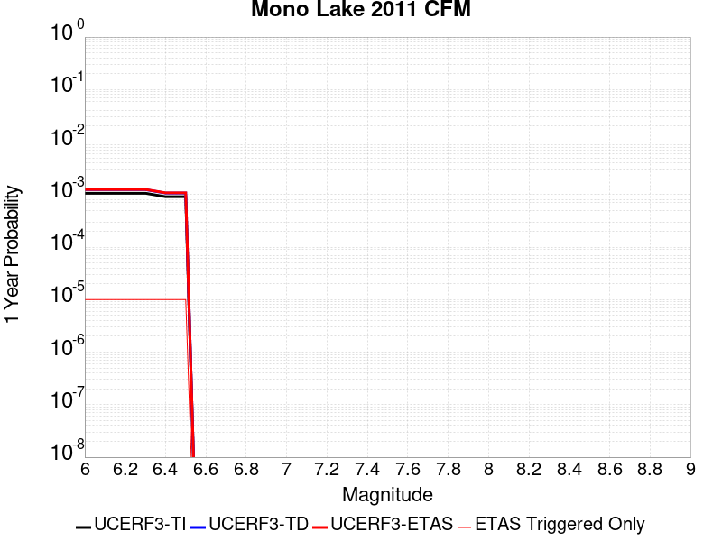 |  |

| Magnitude | 1 wk TI Prob | 1 wk TD Prob | 1 wk ETAS Prob | 1 wk ETAS/TD Gain | 1 wk ETAS Triggered Only | 1 mo TI Prob | 1 mo TD Prob | 1 mo ETAS Prob | 1 mo ETAS/TD Gain | 1 mo ETAS Triggered Only | 1 yr TI Prob | 1 yr TD Prob | 1 yr ETAS Prob | 1 yr ETAS/TD Gain | 1 yr ETAS Triggered Only | 10 yr TI Prob | 10 yr TD Prob | 10 yr ETAS Prob | 10 yr ETAS/TD Gain | 10 yr ETAS Triggered Only |
|-----|-----|-----|-----|-----|-----|-----|-----|-----|-----|-----|-----|-----|-----|-----|-----|-----|-----|-----|-----|-----|
| 6.0 | 2.0341662E-5 | 2.3830333E-5 | 2.3830333E-5 | 1.0 | 0.0 | 8.717564E-5 | 1.02129E-4 | 1.02129E-4 | 1.0 | 0.0 | 0.0010608466 | 0.0012432429 | 0.0012432429 | 1.0 | 0.0 | 0.010557966 | 0.012414961 | 0.0124499025 | 1.0028144 | 3.5380697E-5 |
| 6.1 | 2.0341662E-5 | 2.3830333E-5 | 2.3830333E-5 | 1.0 | 0.0 | 8.717564E-5 | 1.02129E-4 | 1.02129E-4 | 1.0 | 0.0 | 0.0010608466 | 0.0012432429 | 0.0012432429 | 1.0 | 0.0 | 0.010557966 | 0.012414961 | 0.0124499025 | 1.0028144 | 3.5380697E-5 |
| 6.2 | 2.0341662E-5 | 2.3830333E-5 | 2.3830333E-5 | 1.0 | 0.0 | 8.717564E-5 | 1.02129E-4 | 1.02129E-4 | 1.0 | 0.0 | 0.0010608466 | 0.0012432429 | 0.0012432429 | 1.0 | 0.0 | 0.010557966 | 0.012414961 | 0.0124499025 | 1.0028144 | 3.5380697E-5 |
| 6.3 | 2.0341662E-5 | 2.3830333E-5 | 2.3830333E-5 | 1.0 | 0.0 | 8.717564E-5 | 1.02129E-4 | 1.02129E-4 | 1.0 | 0.0 | 0.0010608466 | 0.0012432429 | 0.0012432429 | 1.0 | 0.0 | 0.010557966 | 0.012414961 | 0.0124499025 | 1.0028144 | 3.5380697E-5 |
| 6.4 | 1.749821E-5 | 2.0492844E-5 | 2.0492844E-5 | 1.0 | 0.0 | 7.499018E-5 | 8.782648E-5 | 8.782648E-5 | 1.0 | 0.0 | 9.1262296E-4 | 0.0010692873 | 0.0010692873 | 1.0 | 0.0 | 0.009088841 | 0.010692834 | 0.010727837 | 1.0032735 | 3.5380697E-5 |
| 6.5 | 1.749821E-5 | 2.0492844E-5 | 2.0492844E-5 | 1.0 | 0.0 | 7.499018E-5 | 8.782648E-5 | 8.782648E-5 | 1.0 | 0.0 | 9.1262296E-4 | 0.0010692873 | 0.0010692873 | 1.0 | 0.0 | 0.009088841 | 0.010692834 | 0.010727837 | 1.0032735 | 3.5380697E-5 |

## Davis Creek
*[(top)](#table-of-contents)*

| 1 Week | 1 Month | 1 Year | 10 Year |
|-----|-----|-----|-----|
|  | 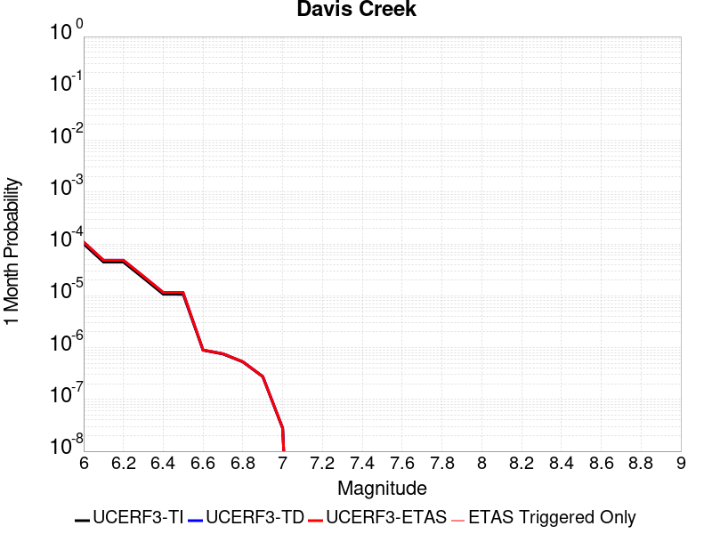 |  | 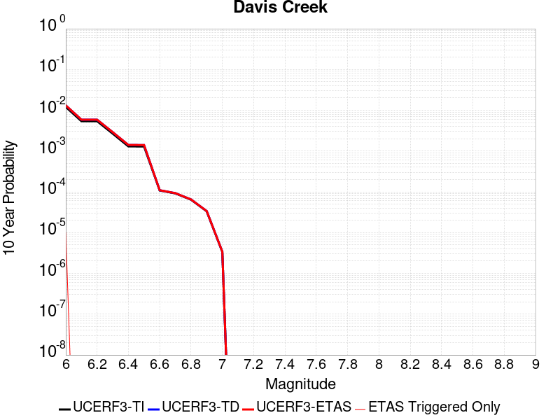 |

| Magnitude | 1 wk TI Prob | 1 wk TD Prob | 1 wk ETAS Prob | 1 wk ETAS/TD Gain | 1 wk ETAS Triggered Only | 1 mo TI Prob | 1 mo TD Prob | 1 mo ETAS Prob | 1 mo ETAS/TD Gain | 1 mo ETAS Triggered Only | 1 yr TI Prob | 1 yr TD Prob | 1 yr ETAS Prob | 1 yr ETAS/TD Gain | 1 yr ETAS Triggered Only | 10 yr TI Prob | 10 yr TD Prob | 10 yr ETAS Prob | 10 yr ETAS/TD Gain | 10 yr ETAS Triggered Only |
|-----|-----|-----|-----|-----|-----|-----|-----|-----|-----|-----|-----|-----|-----|-----|-----|-----|-----|-----|-----|-----|
| 6.0 | 2.331472E-5 | 2.541843E-5 | 2.541843E-5 | 1.0 | 0.0 | 9.99164E-5 | 1.08932254E-4 | 1.08932254E-4 | 1.0 | 0.0 | 0.0012158032 | 0.0013255618 | 0.0013255618 | 1.0 | 0.0 | 0.01209173 | 0.013188332 | 0.013223246 | 1.0026474 | 3.5380697E-5 |
| 6.1 | 1.0407654E-5 | 1.1317512E-5 | 1.1317512E-5 | 1.0 | 0.0 | 4.4603472E-5 | 4.8502872E-5 | 4.8502872E-5 | 1.0 | 0.0 | 5.4291193E-4 | 5.903896E-4 | 5.903896E-4 | 1.0 | 0.0 | 0.0054158745 | 0.005890884 | 0.005890884 | 1.0 | 0.0 |
| 6.2 | 1.0407654E-5 | 1.1317512E-5 | 1.1317512E-5 | 1.0 | 0.0 | 4.4603472E-5 | 4.8502872E-5 | 4.8502872E-5 | 1.0 | 0.0 | 5.4291193E-4 | 5.903896E-4 | 5.903896E-4 | 1.0 | 0.0 | 0.0054158745 | 0.005890884 | 0.005890884 | 1.0 | 0.0 |
| 6.3 | 5.1323277E-6 | 5.568808E-6 | 5.568808E-6 | 1.0 | 0.0 | 2.1995505E-5 | 2.3866149E-5 | 2.3866149E-5 | 1.0 | 0.0 | 2.6776237E-4 | 2.9054025E-4 | 2.9054025E-4 | 1.0 | 0.0 | 0.0026743996 | 0.0029024503 | 0.0029024503 | 1.0 | 0.0 |
| 6.4 | 2.4985154E-6 | 2.7046572E-6 | 2.7046572E-6 | 1.0 | 0.0 | 1.07078795E-5 | 1.1591356E-5 | 1.1591356E-5 | 1.0 | 0.0 | 1.3036063E-4 | 1.4111924E-4 | 1.4111924E-4 | 1.0 | 0.0 | 0.0013028418 | 0.001410651 | 0.001410651 | 1.0 | 0.0 |
| 6.5 | 2.4846438E-6 | 2.6905911E-6 | 2.6905911E-6 | 1.0 | 0.0 | 1.064843E-5 | 1.1531074E-5 | 1.1531074E-5 | 1.0 | 0.0 | 1.2963692E-4 | 1.403854E-4 | 1.403854E-4 | 1.0 | 0.0 | 0.0012956132 | 0.001403322 | 0.001403322 | 1.0 | 0.0 |
| 6.6 | 2.072566E-7 | 2.1018245E-7 | 2.1018245E-7 | 1.0 | 0.0 | 8.882423E-7 | 9.0078163E-7 | 9.0078163E-7 | 1.0 | 0.0 | 1.0814296E-5 | 1.0966963E-5 | 1.0966963E-5 | 1.0 | 0.0 | 1.081377E-4 | 1.096644E-4 | 1.096644E-4 | 1.0 | 0.0 |
| 6.7 | 1.7544528E-7 | 1.7790958E-7 | 1.7790958E-7 | 1.0 | 0.0 | 7.5190815E-7 | 7.624694E-7 | 7.624694E-7 | 1.0 | 0.0 | 9.154443E-6 | 9.283027E-6 | 9.283027E-6 | 1.0 | 0.0 | 9.1540656E-5 | 9.282655E-5 | 9.282655E-5 | 1.0 | 0.0 |
| 6.8 | 1.2320395E-7 | 1.2481225E-7 | 1.2481225E-7 | 1.0 | 0.0 | 5.280168E-7 | 5.349095E-7 | 5.349095E-7 | 1.0 | 0.0 | 6.428586E-6 | 6.5125046E-6 | 6.5125046E-6 | 1.0 | 0.0 | 6.4284E-5 | 6.5123255E-5 | 6.5123255E-5 | 1.0 | 0.0 |
| 6.9 | 6.399997E-8 | 6.486104E-8 | 6.486104E-8 | 1.0 | 0.0 | 2.7428555E-7 | 2.7797586E-7 | 2.7797586E-7 | 1.0 | 0.0 | 3.3394215E-6 | 3.3843514E-6 | 3.3843514E-6 | 1.0 | 0.0 | 3.3393713E-5 | 3.3843065E-5 | 3.3843065E-5 | 1.0 | 0.0 |
| 7.0 | 6.4455685E-9 | 6.5353123E-9 | 6.5353123E-9 | 1.0 | 0.0 | 2.7623864E-8 | 2.800848E-8 | 2.800848E-8 | 1.0 | 0.0 | 3.3632048E-7 | 3.4100327E-7 | 3.4100327E-7 | 1.0 | 0.0 | 3.3631998E-6 | 3.4100326E-6 | 3.4100326E-6 | 1.0 | 0.0 |

## Coronado Bank alt1
*[(top)](#table-of-contents)*

| 1 Week | 1 Month | 1 Year | 10 Year |
|-----|-----|-----|-----|
|  |  |  | 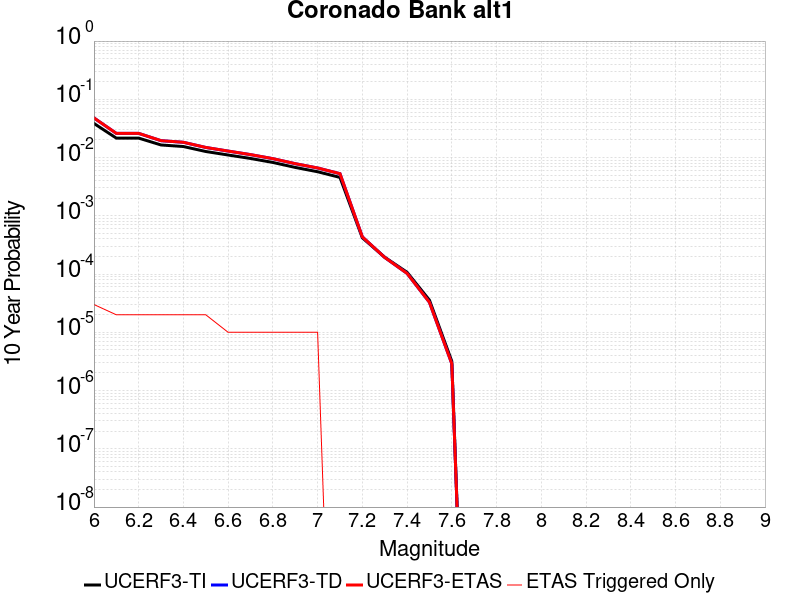 |

| Magnitude | 1 wk TI Prob | 1 wk TD Prob | 1 wk ETAS Prob | 1 wk ETAS/TD Gain | 1 wk ETAS Triggered Only | 1 mo TI Prob | 1 mo TD Prob | 1 mo ETAS Prob | 1 mo ETAS/TD Gain | 1 mo ETAS Triggered Only | 1 yr TI Prob | 1 yr TD Prob | 1 yr ETAS Prob | 1 yr ETAS/TD Gain | 1 yr ETAS Triggered Only | 10 yr TI Prob | 10 yr TD Prob | 10 yr ETAS Prob | 10 yr ETAS/TD Gain | 10 yr ETAS Triggered Only |
|-----|-----|-----|-----|-----|-----|-----|-----|-----|-----|-----|-----|-----|-----|-----|-----|-----|-----|-----|-----|-----|
| 6.0 | 7.533492E-5 | 9.39618E-5 | 9.39618E-5 | 1.0 | 0.0 | 3.22824E-4 | 4.0263552E-4 | 4.0263552E-4 | 1.0 | 0.0 | 0.0039233007 | 0.0048915995 | 0.0048915995 | 1.0 | 0.0 | 0.03854755 | 0.04790961 | 0.047943298 | 1.0007031 | 3.5380697E-5 |
| 6.1 | 4.1807285E-5 | 5.049851E-5 | 5.049851E-5 | 1.0 | 0.0 | 1.7916178E-4 | 2.1640482E-4 | 2.1640482E-4 | 1.0 | 0.0 | 0.0021791123 | 0.0026316417 | 0.0026316417 | 1.0 | 0.0 | 0.021578677 | 0.026013888 | 0.026048347 | 1.0013247 | 3.5380697E-5 |
| 6.2 | 4.1807285E-5 | 5.049851E-5 | 5.049851E-5 | 1.0 | 0.0 | 1.7916178E-4 | 2.1640482E-4 | 2.1640482E-4 | 1.0 | 0.0 | 0.0021791123 | 0.0026316417 | 0.0026316417 | 1.0 | 0.0 | 0.021578677 | 0.026013888 | 0.026048347 | 1.0013247 | 3.5380697E-5 |
| 6.3 | 3.1793104E-5 | 3.7714894E-5 | 3.7714894E-5 | 1.0 | 0.0 | 1.3624904E-4 | 1.6162546E-4 | 1.6162546E-4 | 1.0 | 0.0 | 0.0016575698 | 0.0019660434 | 0.0019660434 | 1.0 | 0.0 | 0.016452603 | 0.019490387 | 0.019525079 | 1.0017799 | 3.5380697E-5 |
| 6.4 | 2.9878007E-5 | 3.5339268E-5 | 3.5339268E-5 | 1.0 | 0.0 | 1.2804232E-4 | 1.514454E-4 | 1.514454E-4 | 1.0 | 0.0 | 0.0015578003 | 0.0018423185 | 0.0018423185 | 1.0 | 0.0 | 0.015469253 | 0.018274212 | 0.018308947 | 1.0019007 | 3.5380697E-5 |
| 6.5 | 2.4512565E-5 | 2.8766724E-5 | 2.8766724E-5 | 1.0 | 0.0 | 1.0504962E-4 | 1.2328029E-4 | 1.2328029E-4 | 1.0 | 0.0 | 0.0012782287 | 0.0014999318 | 0.0014999318 | 1.0 | 0.0 | 0.012709012 | 0.01490106 | 0.0149359135 | 1.002339 | 3.5380697E-5 |
| 6.6 | 2.1317413E-5 | 2.4908924E-5 | 2.4908924E-5 | 1.0 | 0.0 | 9.135714E-5 | 1.06748295E-4 | 1.06748295E-4 | 1.0 | 0.0 | 0.0011117056 | 0.0012989079 | 0.0012989079 | 1.0 | 0.0 | 0.011061605 | 0.012915566 | 0.012950489 | 1.002704 | 3.5380697E-5 |
| 6.7 | 1.8585655E-5 | 2.163679E-5 | 2.163679E-5 | 1.0 | 0.0 | 7.9650374E-5 | 9.272592E-5 | 9.272592E-5 | 1.0 | 0.0 | 9.6931186E-4 | 0.0011283738 | 0.0011283738 | 1.0 | 0.0 | 0.0096509475 | 0.011228608 | 0.011263591 | 1.0031155 | 3.5380697E-5 |
| 6.8 | 1.5862879E-5 | 1.8421075E-5 | 1.8421075E-5 | 1.0 | 0.0 | 6.798199E-5 | 7.894518E-5 | 7.894518E-5 | 1.0 | 0.0 | 8.273665E-4 | 9.60753E-4 | 9.60753E-4 | 1.0 | 0.0 | 0.008242928 | 0.009567977 | 0.009603019 | 1.0036625 | 3.5380697E-5 |
| 6.9 | 1.3021509E-5 | 1.50965625E-5 | 1.50965625E-5 | 1.0 | 0.0 | 5.5805274E-5 | 6.4698055E-5 | 6.4698055E-5 | 1.0 | 0.0 | 6.792174E-4 | 7.8743225E-4 | 7.8743225E-4 | 1.0 | 0.0 | 0.006771452 | 0.007848245 | 0.007883348 | 1.0044727 | 3.5380697E-5 |
| 7.0 | 1.0974371E-5 | 1.27212E-5 | 1.27212E-5 | 1.0 | 0.0 | 4.7032172E-5 | 5.4518387E-5 | 5.4518387E-5 | 1.0 | 0.0 | 5.7246623E-4 | 6.6357676E-4 | 6.6357676E-4 | 1.0 | 0.0 | 0.0057099373 | 0.006617703 | 0.0066528493 | 1.005311 | 3.5380697E-5 |
| 7.1 | 8.766221E-6 | 1.0164713E-5 | 1.0164713E-5 | 1.0 | 0.0 | 3.7568978E-5 | 4.3562424E-5 | 4.3562424E-5 | 1.0 | 0.0 | 4.573063E-4 | 5.302607E-4 | 5.302607E-4 | 1.0 | 0.0 | 0.0045636636 | 0.0052916543 | 0.0052916543 | 1.0 | 0.0 |
| 7.2 | 8.026024E-7 | 8.332054E-7 | 8.332054E-7 | 1.0 | 0.0 | 3.43972E-6 | 3.5708754E-6 | 3.5708754E-6 | 1.0 | 0.0 | 4.1877785E-5 | 4.3474553E-5 | 4.3474553E-5 | 1.0 | 0.0 | 4.1869894E-4 | 4.3466155E-4 | 4.3466155E-4 | 1.0 | 0.0 |
| 7.3 | 3.7293114E-7 | 3.7001894E-7 | 3.7001894E-7 | 1.0 | 0.0 | 1.5982754E-6 | 1.5857945E-6 | 1.5857945E-6 | 1.0 | 0.0 | 1.9458828E-5 | 1.9306877E-5 | 1.9306877E-5 | 1.0 | 0.0 | 1.9457124E-4 | 1.9305207E-4 | 1.9305207E-4 | 1.0 | 0.0 |
| 7.4 | 2.0557036E-7 | 1.9674766E-7 | 1.9674766E-7 | 1.0 | 0.0 | 8.810155E-7 | 8.4320396E-7 | 8.4320396E-7 | 1.0 | 0.0 | 1.0726311E-5 | 1.0265961E-5 | 1.0265961E-5 | 1.0 | 0.0 | 1.0725793E-4 | 1.0265489E-4 | 1.0265489E-4 | 1.0 | 0.0 |
| 7.5 | 6.845446E-8 | 6.2794456E-8 | 6.2794456E-8 | 1.0 | 0.0 | 2.9337625E-7 | 2.6911906E-7 | 2.6911906E-7 | 1.0 | 0.0 | 3.5718497E-6 | 3.2765197E-6 | 3.2765197E-6 | 1.0 | 0.0 | 3.5717923E-5 | 3.2764725E-5 | 3.2764725E-5 | 1.0 | 0.0 |
| 7.6 | 6.0975145E-9 | 5.5318936E-9 | 5.5318936E-9 | 1.0 | 0.0 | 2.6132206E-8 | 2.3708115E-8 | 2.3708115E-8 | 1.0 | 0.0 | 3.1815955E-7 | 2.8864628E-7 | 2.8864628E-7 | 1.0 | 0.0 | 3.181591E-6 | 2.88646E-6 | 2.88646E-6 | 1.0 | 0.0 |

## Camp Rock 2011
*[(top)](#table-of-contents)*

| 1 Week | 1 Month | 1 Year | 10 Year |
|-----|-----|-----|-----|
|  |  |  |  |

| Magnitude | 1 wk TI Prob | 1 wk TD Prob | 1 wk ETAS Prob | 1 wk ETAS/TD Gain | 1 wk ETAS Triggered Only | 1 mo TI Prob | 1 mo TD Prob | 1 mo ETAS Prob | 1 mo ETAS/TD Gain | 1 mo ETAS Triggered Only | 1 yr TI Prob | 1 yr TD Prob | 1 yr ETAS Prob | 1 yr ETAS/TD Gain | 1 yr ETAS Triggered Only | 10 yr TI Prob | 10 yr TD Prob | 10 yr ETAS Prob | 10 yr ETAS/TD Gain | 10 yr ETAS Triggered Only |
|-----|-----|-----|-----|-----|-----|-----|-----|-----|-----|-----|-----|-----|-----|-----|-----|-----|-----|-----|-----|-----|
| 6.0 | 1.6710783E-5 | 4.2504644E-6 | 4.2504644E-6 | 1.0 | 0.0 | 7.161568E-5 | 1.8216151E-5 | 1.8216151E-5 | 1.0 | 0.0 | 8.7157206E-4 | 2.217596E-4 | 2.217596E-4 | 1.0 | 0.0 | 0.008681616 | 0.002215436 | 0.0022507382 | 1.0159347 | 3.5380697E-5 |
| 6.1 | 1.6710783E-5 | 4.2504644E-6 | 4.2504644E-6 | 1.0 | 0.0 | 7.161568E-5 | 1.8216151E-5 | 1.8216151E-5 | 1.0 | 0.0 | 8.7157206E-4 | 2.217596E-4 | 2.217596E-4 | 1.0 | 0.0 | 0.008681616 | 0.002215436 | 0.0022507382 | 1.0159347 | 3.5380697E-5 |
| 6.2 | 1.6710783E-5 | 4.2504644E-6 | 4.2504644E-6 | 1.0 | 0.0 | 7.161568E-5 | 1.8216151E-5 | 1.8216151E-5 | 1.0 | 0.0 | 8.7157206E-4 | 2.217596E-4 | 2.217596E-4 | 1.0 | 0.0 | 0.008681616 | 0.002215436 | 0.0022507382 | 1.0159347 | 3.5380697E-5 |
| 6.3 | 1.6710783E-5 | 4.2504644E-6 | 4.2504644E-6 | 1.0 | 0.0 | 7.161568E-5 | 1.8216151E-5 | 1.8216151E-5 | 1.0 | 0.0 | 8.7157206E-4 | 2.217596E-4 | 2.217596E-4 | 1.0 | 0.0 | 0.008681616 | 0.002215436 | 0.0022507382 | 1.0159347 | 3.5380697E-5 |
| 6.4 | 7.982846E-6 | 3.6822685E-6 | 3.6822685E-6 | 1.0 | 0.0 | 3.421175E-5 | 1.5781057E-5 | 1.5781057E-5 | 1.0 | 0.0 | 4.1644843E-4 | 1.9211778E-4 | 1.9211778E-4 | 1.0 | 0.0 | 0.0041566887 | 0.0019195518 | 0.0019548645 | 1.0183964 | 3.5380697E-5 |
| 6.5 | 7.982846E-6 | 3.6822685E-6 | 3.6822685E-6 | 1.0 | 0.0 | 3.421175E-5 | 1.5781057E-5 | 1.5781057E-5 | 1.0 | 0.0 | 4.1644843E-4 | 1.9211778E-4 | 1.9211778E-4 | 1.0 | 0.0 | 0.0041566887 | 0.0019195518 | 0.0019548645 | 1.0183964 | 3.5380697E-5 |
| 6.6 | 7.048869E-6 | 3.4245295E-6 | 3.4245295E-6 | 1.0 | 0.0 | 3.0209088E-5 | 1.4676474E-5 | 1.4676474E-5 | 1.0 | 0.0 | 3.677336E-4 | 1.7867173E-4 | 1.7867173E-4 | 1.0 | 0.0 | 0.0036712566 | 0.0017853125 | 0.00182063 | 1.0197823 | 3.5380697E-5 |
| 6.7 | 6.987307E-6 | 3.3625051E-6 | 3.3625051E-6 | 1.0 | 0.0 | 2.9945259E-5 | 1.4410658E-5 | 1.4410658E-5 | 1.0 | 0.0 | 3.6452254E-4 | 1.7543595E-4 | 1.7543595E-4 | 1.0 | 0.0 | 0.0036392517 | 0.0017530057 | 0.0017883243 | 1.0201474 | 3.5380697E-5 |
| 6.8 | 6.3737602E-6 | 3.1180682E-6 | 3.1180682E-6 | 1.0 | 0.0 | 2.731583E-5 | 1.3363083E-5 | 1.3363083E-5 | 1.0 | 0.0 | 3.3251947E-4 | 1.6268367E-4 | 1.6268367E-4 | 1.0 | 0.0 | 0.0033202237 | 0.0016256744 | 0.0016609976 | 1.0217283 | 3.5380697E-5 |
| 6.9 | 6.112211E-6 | 2.9332696E-6 | 2.9332696E-6 | 1.0 | 0.0 | 2.6194928E-5 | 1.2571097E-5 | 1.2571097E-5 | 1.0 | 0.0 | 3.1887658E-4 | 1.5304264E-4 | 1.5304264E-4 | 1.0 | 0.0 | 0.003184194 | 0.0015294001 | 0.0015647267 | 1.0230983 | 3.5380697E-5 |
| 7.0 | 5.5140117E-6 | 2.642059E-6 | 2.642059E-6 | 1.0 | 0.0 | 2.3631264E-5 | 1.1323062E-5 | 1.1323062E-5 | 1.0 | 0.0 | 2.8767265E-4 | 1.3784981E-4 | 1.3784981E-4 | 1.0 | 0.0 | 0.0028730053 | 0.0013776683 | 0.0014130003 | 1.0256462 | 3.5380697E-5 |
| 7.1 | 4.8151105E-6 | 2.134385E-6 | 2.134385E-6 | 1.0 | 0.0 | 2.0636026E-5 | 9.147334E-6 | 9.147334E-6 | 1.0 | 0.0 | 2.5121463E-4 | 1.1136332E-4 | 1.1136332E-4 | 1.0 | 0.0 | 0.0025093083 | 0.0011130971 | 0.0011484383 | 1.0317504 | 3.5380697E-5 |
| 7.2 | 3.818335E-6 | 1.2938276E-6 | 1.2938276E-6 | 1.0 | 0.0 | 1.6364189E-5 | 5.544964E-6 | 5.544964E-6 | 1.0 | 0.0 | 1.9921579E-4 | 6.750793E-5 | 6.750793E-5 | 1.0 | 0.0 | 0.0019903728 | 6.748825E-4 | 7.102393E-4 | 1.0523896 | 3.5380697E-5 |
| 7.3 | 2.7166698E-6 | 7.38423E-7 | 7.38423E-7 | 1.0 | 0.0 | 1.1642818E-5 | 3.1646662E-6 | 3.1646662E-6 | 1.0 | 0.0 | 1.4174209E-4 | 3.852915E-5 | 3.852915E-5 | 1.0 | 0.0 | 0.0014165172 | 3.852267E-4 | 4.2059377E-4 | 1.0918084 | 3.5380697E-5 |
| 7.4 | 2.0893426E-6 | 5.462354E-7 | 5.462354E-7 | 1.0 | 0.0 | 8.954295E-6 | 2.3410068E-6 | 2.3410068E-6 | 1.0 | 0.0 | 1.0901308E-4 | 2.850139E-5 | 2.850139E-5 | 1.0 | 0.0 | 0.0010895962 | 2.849779E-4 | 3.203485E-4 | 1.124117 | 3.5380697E-5 |
| 7.5 | 1.1681728E-6 | 3.6033393E-7 | 3.6033393E-7 | 1.0 | 0.0 | 5.0064455E-6 | 1.5442874E-6 | 1.5442874E-6 | 1.0 | 0.0 | 6.0951766E-5 | 1.8801542E-5 | 1.8801542E-5 | 1.0 | 0.0 | 6.093505E-4 | 1.8799998E-4 | 2.2337402E-4 | 1.1881598 | 3.5380697E-5 |
| 7.6 | 1.3154387E-7 | 7.12009E-8 | 7.12009E-8 | 1.0 | 0.0 | 5.6375933E-7 | 3.051467E-7 | 3.051467E-7 | 1.0 | 0.0 | 6.863748E-6 | 3.7151563E-6 | 3.7151563E-6 | 1.0 | 0.0 | 6.863536E-5 | 3.7151098E-5 | 3.7151098E-5 | 1.0 | 0.0 |

## Newport-Inglewood (Offshore)
*[(top)](#table-of-contents)*

| 1 Week | 1 Month | 1 Year | 10 Year |
|-----|-----|-----|-----|
|  |  |  |  |

| Magnitude | 1 wk TI Prob | 1 wk TD Prob | 1 wk ETAS Prob | 1 wk ETAS/TD Gain | 1 wk ETAS Triggered Only | 1 mo TI Prob | 1 mo TD Prob | 1 mo ETAS Prob | 1 mo ETAS/TD Gain | 1 mo ETAS Triggered Only | 1 yr TI Prob | 1 yr TD Prob | 1 yr ETAS Prob | 1 yr ETAS/TD Gain | 1 yr ETAS Triggered Only | 10 yr TI Prob | 10 yr TD Prob | 10 yr ETAS Prob | 10 yr ETAS/TD Gain | 10 yr ETAS Triggered Only |
|-----|-----|-----|-----|-----|-----|-----|-----|-----|-----|-----|-----|-----|-----|-----|-----|-----|-----|-----|-----|-----|
| 6.0 | 1.9626508E-5 | 1.896613E-5 | 1.896613E-5 | 1.0 | 0.0 | 8.411089E-5 | 8.1280945E-5 | 8.1280945E-5 | 1.0 | 0.0 | 0.001023569 | 9.891589E-4 | 9.891589E-4 | 1.0 | 0.0 | 0.010188672 | 0.009848903 | 0.009883936 | 1.003557 | 3.5380697E-5 |
| 6.1 | 1.331886E-5 | 1.2218616E-5 | 1.2218616E-5 | 1.0 | 0.0 | 5.707958E-5 | 5.2364452E-5 | 5.2364452E-5 | 1.0 | 0.0 | 6.947222E-4 | 6.3735223E-4 | 6.3735223E-4 | 1.0 | 0.0 | 0.006925544 | 0.00635542 | 0.0063905763 | 1.0055317 | 3.5380697E-5 |
| 6.2 | 1.2250852E-5 | 1.107651E-5 | 1.107651E-5 | 1.0 | 0.0 | 5.2502597E-5 | 4.74699E-5 | 4.74699E-5 | 1.0 | 0.0 | 6.3903164E-4 | 5.777938E-4 | 5.777938E-4 | 1.0 | 0.0 | 0.006371971 | 0.005763036 | 0.005798213 | 1.0061039 | 3.5380697E-5 |
| 6.3 | 1.2106258E-5 | 1.0919365E-5 | 1.0919365E-5 | 1.0 | 0.0 | 5.1882926E-5 | 4.6796446E-5 | 4.6796446E-5 | 1.0 | 0.0 | 6.3149154E-4 | 5.6959875E-4 | 5.6959875E-4 | 1.0 | 0.0 | 0.0062970007 | 0.005681505 | 0.0057166847 | 1.006192 | 3.5380697E-5 |
| 6.4 | 1.1348758E-5 | 1.0109807E-5 | 1.0109807E-5 | 1.0 | 0.0 | 4.8636626E-5 | 4.3327025E-5 | 4.3327025E-5 | 1.0 | 0.0 | 5.919901E-4 | 5.273797E-4 | 5.273797E-4 | 1.0 | 0.0 | 0.005904155 | 0.005261377 | 0.0052965716 | 1.0066892 | 3.5380697E-5 |
| 6.5 | 1.100837E-5 | 9.743819E-6 | 9.743819E-6 | 1.0 | 0.0 | 4.7177873E-5 | 4.175856E-5 | 4.175856E-5 | 1.0 | 0.0 | 5.7423924E-4 | 5.0829264E-4 | 5.0829264E-4 | 1.0 | 0.0 | 0.005727576 | 0.005071392 | 0.005106593 | 1.0069412 | 3.5380697E-5 |
| 6.6 | 1.0634696E-5 | 9.345958E-6 | 9.345958E-6 | 1.0 | 0.0 | 4.557647E-5 | 4.0053492E-5 | 4.0053492E-5 | 1.0 | 0.0 | 5.5475225E-4 | 4.875429E-4 | 4.875429E-4 | 1.0 | 0.0 | 0.0055336943 | 0.0048648193 | 0.004900028 | 1.0072374 | 3.5380697E-5 |
| 6.7 | 9.9780855E-6 | 8.6682985E-6 | 8.6682985E-6 | 1.0 | 0.0 | 4.276252E-5 | 3.7149326E-5 | 3.7149326E-5 | 1.0 | 0.0 | 5.205093E-4 | 4.521999E-4 | 4.521999E-4 | 1.0 | 0.0 | 0.0051929182 | 0.0045128767 | 0.0045480975 | 1.0078045 | 3.5380697E-5 |
| 6.8 | 9.59546E-6 | 8.273325E-6 | 8.273325E-6 | 1.0 | 0.0 | 4.1122752E-5 | 3.545663E-5 | 3.545663E-5 | 1.0 | 0.0 | 5.0055445E-4 | 4.3159962E-4 | 4.3159962E-4 | 1.0 | 0.0 | 0.004994285 | 0.0043076896 | 0.0043429183 | 1.008178 | 3.5380697E-5 |
| 6.9 | 9.000614E-6 | 7.707188E-6 | 7.707188E-6 | 1.0 | 0.0 | 3.857349E-5 | 3.3030392E-5 | 3.3030392E-5 | 1.0 | 0.0 | 4.6953102E-4 | 4.0207148E-4 | 4.0207148E-4 | 1.0 | 0.0 | 0.004685402 | 0.004013512 | 0.0040487507 | 1.00878 | 3.5380697E-5 |
| 7.0 | 7.4070194E-6 | 6.14917E-6 | 6.14917E-6 | 1.0 | 0.0 | 3.1743984E-5 | 2.635332E-5 | 2.635332E-5 | 1.0 | 0.0 | 3.8641447E-4 | 3.208046E-4 | 3.208046E-4 | 1.0 | 0.0 | 0.0038574322 | 0.0032034346 | 0.003238702 | 1.0110092 | 3.5380697E-5 |
| 7.1 | 6.299615E-6 | 5.056818E-6 | 5.056818E-6 | 1.0 | 0.0 | 2.699807E-5 | 2.1671896E-5 | 2.1671896E-5 | 1.0 | 0.0 | 3.2865192E-4 | 2.6382352E-4 | 2.6382352E-4 | 1.0 | 0.0 | 0.003281663 | 0.002635118 | 0.0026704054 | 1.0133913 | 3.5380697E-5 |
| 7.2 | 5.096653E-6 | 3.892961E-6 | 3.892961E-6 | 1.0 | 0.0 | 2.1842614E-5 | 1.6684013E-5 | 1.6684013E-5 | 1.0 | 0.0 | 2.6590136E-4 | 2.0310901E-4 | 2.0310901E-4 | 1.0 | 0.0 | 0.0026558342 | 0.002029245 | 0.002029245 | 1.0 | 0.0 |
| 7.3 | 3.9753018E-6 | 2.9100247E-6 | 2.9100247E-6 | 1.0 | 0.0 | 1.7036897E-5 | 1.2471476E-5 | 1.2471476E-5 | 1.0 | 0.0 | 2.0740448E-4 | 1.5182972E-4 | 1.5182972E-4 | 1.0 | 0.0 | 0.00207211 | 0.0015172679 | 0.0015172679 | 1.0 | 0.0 |
| 7.4 | 3.0568392E-6 | 2.145087E-6 | 2.145087E-6 | 1.0 | 0.0 | 1.3100675E-5 | 9.193198E-6 | 9.193198E-6 | 1.0 | 0.0 | 1.5948903E-4 | 1.11921494E-4 | 1.11921494E-4 | 1.0 | 0.0 | 0.0015937461 | 0.0011186575 | 0.0011186575 | 1.0 | 0.0 |
| 7.5 | 1.7279019E-6 | 1.1470418E-6 | 1.1470418E-6 | 1.0 | 0.0 | 7.405273E-6 | 4.9158843E-6 | 4.9158843E-6 | 1.0 | 0.0 | 9.015547E-5 | 5.9849288E-5 | 5.9849288E-5 | 1.0 | 0.0 | 9.01189E-4 | 5.983356E-4 | 5.983356E-4 | 1.0 | 0.0 |
| 7.6 | 1.1156416E-6 | 7.2233786E-7 | 7.2233786E-7 | 1.0 | 0.0 | 4.7813123E-6 | 3.09573E-6 | 3.09573E-6 | 1.0 | 0.0 | 5.821092E-5 | 3.7689886E-5 | 3.7689886E-5 | 1.0 | 0.0 | 5.8195676E-4 | 3.7683727E-4 | 3.7683727E-4 | 1.0 | 0.0 |
| 7.7 | 9.117973E-8 | 6.7343215E-8 | 6.7343215E-8 | 1.0 | 0.0 | 3.907702E-7 | 2.8861376E-7 | 2.8861376E-7 | 1.0 | 0.0 | 4.757617E-6 | 3.5138671E-6 | 3.5138671E-6 | 1.0 | 0.0 | 4.7575148E-5 | 3.5138146E-5 | 3.5138146E-5 | 1.0 | 0.0 |

## Mission (connected) 2011 CFM
*[(top)](#table-of-contents)*

| 1 Week | 1 Month | 1 Year | 10 Year |
|-----|-----|-----|-----|
|  |  | 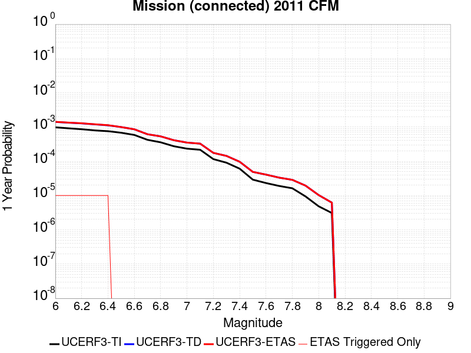 |  |

| Magnitude | 1 wk TI Prob | 1 wk TD Prob | 1 wk ETAS Prob | 1 wk ETAS/TD Gain | 1 wk ETAS Triggered Only | 1 mo TI Prob | 1 mo TD Prob | 1 mo ETAS Prob | 1 mo ETAS/TD Gain | 1 mo ETAS Triggered Only | 1 yr TI Prob | 1 yr TD Prob | 1 yr ETAS Prob | 1 yr ETAS/TD Gain | 1 yr ETAS Triggered Only | 10 yr TI Prob | 10 yr TD Prob | 10 yr ETAS Prob | 10 yr ETAS/TD Gain | 10 yr ETAS Triggered Only |
|-----|-----|-----|-----|-----|-----|-----|-----|-----|-----|-----|-----|-----|-----|-----|-----|-----|-----|-----|-----|-----|
| 6.0 | 1.8735573E-5 | 2.689229E-5 | 2.689229E-5 | 1.0 | 0.0 | 8.029284E-5 | 1.15247625E-4 | 1.15247625E-4 | 1.0 | 0.0 | 9.771269E-4 | 0.0014021697 | 0.0014375007 | 1.0251974 | 3.5380697E-5 | 0.009728416 | 0.013942371 | 0.0139772585 | 1.0025022 | 3.5380697E-5 |
| 6.1 | 1.7515964E-5 | 2.5533485E-5 | 2.5533485E-5 | 1.0 | 0.0 | 7.506625E-5 | 1.09424676E-4 | 1.09424676E-4 | 1.0 | 0.0 | 9.135484E-4 | 0.0013313637 | 0.0013666973 | 1.0265394 | 3.5380697E-5 | 0.009098019 | 0.013242937 | 0.013277848 | 1.0026363 | 3.5380697E-5 |
| 6.2 | 1.6486343E-5 | 2.4378065E-5 | 2.4378065E-5 | 1.0 | 0.0 | 7.065384E-5 | 1.0447328E-4 | 1.0447328E-4 | 1.0 | 0.0 | 8.5987104E-4 | 0.001271154 | 0.0013064898 | 1.0277982 | 3.5380697E-5 | 0.008565514 | 0.012647877 | 0.01268281 | 1.002762 | 3.5380697E-5 |
| 6.3 | 1.5229385E-5 | 2.2807342E-5 | 2.2807342E-5 | 1.0 | 0.0 | 6.526716E-5 | 9.774213E-5 | 9.774213E-5 | 1.0 | 0.0 | 7.9433795E-4 | 0.0011892951 | 0.0012246337 | 1.0297139 | 3.5380697E-5 | 0.007915046 | 0.011841001 | 0.011875963 | 1.0029526 | 3.5380697E-5 |
| 6.4 | 1.4435828E-5 | 2.1407075E-5 | 2.1407075E-5 | 1.0 | 0.0 | 6.186637E-5 | 9.1741415E-5 | 9.1741415E-5 | 1.0 | 0.0 | 7.529627E-4 | 0.0011163155 | 0.0011516566 | 1.0316588 | 3.5380697E-5 | 0.007504165 | 0.011123841 | 0.011158829 | 1.0031452 | 3.5380697E-5 |
| 6.5 | 1.30127955E-5 | 1.9045572E-5 | 1.9045572E-5 | 1.0 | 0.0 | 5.576793E-5 | 8.162134E-5 | 8.162134E-5 | 1.0 | 0.0 | 6.78763E-4 | 9.932242E-4 | 9.932242E-4 | 1.0 | 0.0 | 0.0067669353 | 0.009915724 | 0.009915724 | 1.0 | 0.0 |
| 6.6 | 1.1220718E-5 | 1.6401224E-5 | 1.6401224E-5 | 1.0 | 0.0 | 4.8087906E-5 | 7.028908E-5 | 7.028908E-5 | 1.0 | 0.0 | 5.8531296E-4 | 8.554312E-4 | 8.554312E-4 | 1.0 | 0.0 | 0.005837737 | 0.008553556 | 0.008553556 | 1.0 | 0.0 |
| 6.7 | 8.086152E-6 | 1.1756832E-5 | 1.1756832E-5 | 1.0 | 0.0 | 3.4654473E-5 | 5.0385454E-5 | 5.0385454E-5 | 1.0 | 0.0 | 4.2183654E-4 | 6.13271E-4 | 6.13271E-4 | 1.0 | 0.0 | 0.004210367 | 0.0061530424 | 0.0061530424 | 1.0 | 0.0 |
| 6.8 | 6.8361655E-6 | 1.0201216E-5 | 1.0201216E-5 | 1.0 | 0.0 | 2.9297524E-5 | 4.371877E-5 | 4.371877E-5 | 1.0 | 0.0 | 3.5663895E-4 | 5.3214666E-4 | 5.3214666E-4 | 1.0 | 0.0 | 0.0035606713 | 0.0053416505 | 0.0053416505 | 1.0 | 0.0 |
| 6.9 | 5.2517353E-6 | 7.873655E-6 | 7.873655E-6 | 1.0 | 0.0 | 2.2507242E-5 | 3.37438E-5 | 3.37438E-5 | 1.0 | 0.0 | 2.739912E-4 | 4.1075356E-4 | 4.1075356E-4 | 1.0 | 0.0 | 0.0027365363 | 0.004132166 | 0.004132166 | 1.0 | 0.0 |
| 7.0 | 4.4602784E-6 | 6.7057636E-6 | 6.7057636E-6 | 1.0 | 0.0 | 1.911534E-5 | 2.8738672E-5 | 2.8738672E-5 | 1.0 | 0.0 | 2.327044E-4 | 3.498373E-4 | 3.498373E-4 | 1.0 | 0.0 | 0.0023246086 | 0.0035242643 | 0.0035242643 | 1.0 | 0.0 |
| 7.1 | 4.1492594E-6 | 6.2543677E-6 | 6.2543677E-6 | 1.0 | 0.0 | 1.7782419E-5 | 2.6804159E-5 | 2.6804159E-5 | 1.0 | 0.0 | 2.1647944E-4 | 3.2629192E-4 | 3.2629192E-4 | 1.0 | 0.0 | 0.0021626868 | 0.0032889978 | 0.0032889978 | 1.0 | 0.0 |
| 7.2 | 2.213247E-6 | 3.3657373E-6 | 3.3657373E-6 | 1.0 | 0.0 | 9.485309E-6 | 1.4424508E-5 | 1.4424508E-5 | 1.0 | 0.0 | 1.15477524E-4 | 1.7560426E-4 | 1.7560426E-4 | 1.0 | 0.0 | 0.0011541754 | 0.0017832896 | 0.0017832896 | 1.0 | 0.0 |
| 7.3 | 1.7362703E-6 | 2.7409405E-6 | 2.7409405E-6 | 1.0 | 0.0 | 7.4411373E-6 | 1.1746835E-5 | 1.1746835E-5 | 1.0 | 0.0 | 9.0592075E-5 | 1.4300835E-4 | 1.4300835E-4 | 1.0 | 0.0 | 9.0555154E-4 | 0.0014544576 | 0.0014544576 | 1.0 | 0.0 |
| 7.4 | 1.1628409E-6 | 1.8513425E-6 | 1.8513425E-6 | 1.0 | 0.0 | 4.9835944E-6 | 7.934301E-6 | 7.934301E-6 | 1.0 | 0.0 | 6.0673574E-5 | 9.6595846E-5 | 9.6595846E-5 | 1.0 | 0.0 | 6.065701E-4 | 9.863016E-4 | 9.863016E-4 | 1.0 | 0.0 |
| 7.5 | 5.5610667E-7 | 9.3602273E-7 | 9.3602273E-7 | 1.0 | 0.0 | 2.3833122E-6 | 4.0115196E-6 | 4.0115196E-6 | 1.0 | 0.0 | 2.9016439E-5 | 4.8839163E-5 | 4.8839163E-5 | 1.0 | 0.0 | 2.901265E-4 | 5.0493027E-4 | 5.0493027E-4 | 1.0 | 0.0 |
| 7.6 | 4.4307663E-7 | 7.800331E-7 | 7.800331E-7 | 1.0 | 0.0 | 1.8988985E-6 | 3.3429944E-6 | 3.3429944E-6 | 1.0 | 0.0 | 2.3118844E-5 | 4.07002E-5 | 4.07002E-5 | 1.0 | 0.0 | 2.3116439E-4 | 4.2288855E-4 | 4.2288855E-4 | 1.0 | 0.0 |
| 7.7 | 3.639119E-7 | 6.369042E-7 | 6.369042E-7 | 1.0 | 0.0 | 1.5596215E-6 | 2.7295864E-6 | 2.7295864E-6 | 1.0 | 0.0 | 1.8988227E-5 | 3.323221E-5 | 3.323221E-5 | 1.0 | 0.0 | 1.8986604E-4 | 3.4760416E-4 | 3.4760416E-4 | 1.0 | 0.0 |
| 7.8 | 3.1152942E-7 | 5.4867644E-7 | 5.4867644E-7 | 1.0 | 0.0 | 1.3351254E-6 | 2.3514683E-6 | 2.3514683E-6 | 1.0 | 0.0 | 1.6255031E-5 | 2.8628752E-5 | 2.8628752E-5 | 1.0 | 0.0 | 1.6253842E-4 | 2.9830585E-4 | 2.9830585E-4 | 1.0 | 0.0 |
| 7.9 | 1.8035962E-7 | 3.7258877E-7 | 3.7258877E-7 | 1.0 | 0.0 | 7.729696E-7 | 1.596808E-6 | 1.596808E-6 | 1.0 | 0.0 | 9.410865E-6 | 1.9440966E-5 | 1.9440966E-5 | 1.0 | 0.0 | 9.410465E-5 | 2.0107611E-4 | 2.0107611E-4 | 1.0 | 0.0 |
| 8.0 | 9.279334E-8 | 1.9731866E-7 | 1.9731866E-7 | 1.0 | 0.0 | 3.976857E-7 | 8.456511E-7 | 8.456511E-7 | 1.0 | 0.0 | 4.841813E-6 | 1.0295754E-5 | 1.0295754E-5 | 1.0 | 0.0 | 4.841707E-5 | 1.0546822E-4 | 1.0546822E-4 | 1.0 | 0.0 |
| 8.1 | 5.9253985E-8 | 1.1871741E-7 | 1.1871741E-7 | 1.0 | 0.0 | 2.5394561E-7 | 5.087888E-7 | 5.087888E-7 | 1.0 | 0.0 | 3.0917836E-6 | 6.1944866E-6 | 6.1944866E-6 | 1.0 | 0.0 | 3.0917407E-5 | 6.332639E-5 | 6.332639E-5 | 1.0 | 0.0 |

## Tin Mountain
*[(top)](#table-of-contents)*

| 1 Week | 1 Month | 1 Year | 10 Year |
|-----|-----|-----|-----|
|  |  |  |  |

| Magnitude | 1 wk TI Prob | 1 wk TD Prob | 1 wk ETAS Prob | 1 wk ETAS/TD Gain | 1 wk ETAS Triggered Only | 1 mo TI Prob | 1 mo TD Prob | 1 mo ETAS Prob | 1 mo ETAS/TD Gain | 1 mo ETAS Triggered Only | 1 yr TI Prob | 1 yr TD Prob | 1 yr ETAS Prob | 1 yr ETAS/TD Gain | 1 yr ETAS Triggered Only | 10 yr TI Prob | 10 yr TD Prob | 10 yr ETAS Prob | 10 yr ETAS/TD Gain | 10 yr ETAS Triggered Only |
|-----|-----|-----|-----|-----|-----|-----|-----|-----|-----|-----|-----|-----|-----|-----|-----|-----|-----|-----|-----|-----|
| 6.0 | 4.083776E-6 | 4.18159E-6 | 4.18159E-6 | 1.0 | 0.0 | 1.750178E-5 | 1.7920998E-5 | 1.7920998E-5 | 1.0 | 0.0 | 2.1306332E-4 | 2.1817003E-4 | 2.1817003E-4 | 1.0 | 0.0 | 0.0021285915 | 0.0021799242 | 0.0022152276 | 1.0161948 | 3.5380697E-5 |
| 6.1 | 4.083776E-6 | 4.18159E-6 | 4.18159E-6 | 1.0 | 0.0 | 1.750178E-5 | 1.7920998E-5 | 1.7920998E-5 | 1.0 | 0.0 | 2.1306332E-4 | 2.1817003E-4 | 2.1817003E-4 | 1.0 | 0.0 | 0.0021285915 | 0.0021799242 | 0.0022152276 | 1.0161948 | 3.5380697E-5 |
| 6.2 | 4.083776E-6 | 4.18159E-6 | 4.18159E-6 | 1.0 | 0.0 | 1.750178E-5 | 1.7920998E-5 | 1.7920998E-5 | 1.0 | 0.0 | 2.1306332E-4 | 2.1817003E-4 | 2.1817003E-4 | 1.0 | 0.0 | 0.0021285915 | 0.0021799242 | 0.0022152276 | 1.0161948 | 3.5380697E-5 |
| 6.3 | 4.083776E-6 | 4.18159E-6 | 4.18159E-6 | 1.0 | 0.0 | 1.750178E-5 | 1.7920998E-5 | 1.7920998E-5 | 1.0 | 0.0 | 2.1306332E-4 | 2.1817003E-4 | 2.1817003E-4 | 1.0 | 0.0 | 0.0021285915 | 0.0021799242 | 0.0022152276 | 1.0161948 | 3.5380697E-5 |
| 6.4 | 4.083776E-6 | 4.18159E-6 | 4.18159E-6 | 1.0 | 0.0 | 1.750178E-5 | 1.7920998E-5 | 1.7920998E-5 | 1.0 | 0.0 | 2.1306332E-4 | 2.1817003E-4 | 2.1817003E-4 | 1.0 | 0.0 | 0.0021285915 | 0.0021799242 | 0.0022152276 | 1.0161948 | 3.5380697E-5 |
| 6.5 | 2.3143427E-6 | 2.3731893E-6 | 2.3731893E-6 | 1.0 | 0.0 | 9.9185745E-6 | 1.01707765E-5 | 1.01707765E-5 | 1.0 | 0.0 | 1.2075195E-4 | 1.2382293E-4 | 1.2382293E-4 | 1.0 | 0.0 | 0.0012068636 | 0.0012376154 | 0.0012729523 | 1.0285524 | 3.5380697E-5 |
| 6.6 | 2.3143427E-6 | 2.3731893E-6 | 2.3731893E-6 | 1.0 | 0.0 | 9.9185745E-6 | 1.01707765E-5 | 1.01707765E-5 | 1.0 | 0.0 | 1.2075195E-4 | 1.2382293E-4 | 1.2382293E-4 | 1.0 | 0.0 | 0.0012068636 | 0.0012376154 | 0.0012729523 | 1.0285524 | 3.5380697E-5 |
| 6.7 | 1.7029532E-6 | 1.7498172E-6 | 1.7498172E-6 | 1.0 | 0.0 | 7.2983503E-6 | 7.499198E-6 | 7.499198E-6 | 1.0 | 0.0 | 8.885379E-5 | 9.1299444E-5 | 9.1299444E-5 | 1.0 | 0.0 | 8.881827E-4 | 9.12672E-4 | 9.4802043E-4 | 1.0387306 | 3.5380697E-5 |
| 6.8 | 1.2914646E-6 | 1.329959E-6 | 1.329959E-6 | 1.0 | 0.0 | 5.534837E-6 | 5.699814E-6 | 5.699814E-6 | 1.0 | 0.0 | 6.738455E-5 | 6.939347E-5 | 6.939347E-5 | 1.0 | 0.0 | 6.736412E-4 | 6.937614E-4 | 6.937614E-4 | 1.0 | 0.0 |
| 6.9 | 5.8708974E-7 | 6.11713E-7 | 6.11713E-7 | 1.0 | 0.0 | 2.5160964E-6 | 2.6216248E-6 | 2.6216248E-6 | 1.0 | 0.0 | 3.0633044E-5 | 3.1917854E-5 | 3.1917854E-5 | 1.0 | 0.0 | 3.0628822E-4 | 3.1913683E-4 | 3.1913683E-4 | 1.0 | 0.0 |
| 7.0 | 4.6248786E-7 | 4.8321306E-7 | 4.8321306E-7 | 1.0 | 0.0 | 1.9820893E-6 | 2.0709115E-6 | 2.0709115E-6 | 1.0 | 0.0 | 2.413167E-5 | 2.5213094E-5 | 2.5213094E-5 | 1.0 | 0.0 | 2.412905E-4 | 2.5210602E-4 | 2.5210602E-4 | 1.0 | 0.0 |
| 7.1 | 3.804606E-7 | 3.9872486E-7 | 3.9872486E-7 | 1.0 | 0.0 | 1.6305444E-6 | 1.7088199E-6 | 1.7088199E-6 | 1.0 | 0.0 | 1.9851697E-5 | 2.0804719E-5 | 2.0804719E-5 | 1.0 | 0.0 | 1.9849923E-4 | 2.0803107E-4 | 2.0803107E-4 | 1.0 | 0.0 |
| 7.2 | 3.5864858E-7 | 3.7617838E-7 | 3.7617838E-7 | 1.0 | 0.0 | 1.5370645E-6 | 1.6121922E-6 | 1.6121922E-6 | 1.0 | 0.0 | 1.87136E-5 | 1.9628298E-5 | 1.9628298E-5 | 1.0 | 0.0 | 1.8712023E-4 | 1.9626896E-4 | 1.9626896E-4 | 1.0 | 0.0 |
| 7.3 | 3.342063E-7 | 3.5064386E-7 | 3.5064386E-7 | 1.0 | 0.0 | 1.4323119E-6 | 1.5027588E-6 | 1.5027588E-6 | 1.0 | 0.0 | 1.7438259E-5 | 1.8295968E-5 | 1.8295968E-5 | 1.0 | 0.0 | 1.743689E-4 | 1.8294792E-4 | 1.8294792E-4 | 1.0 | 0.0 |
| 7.4 | 2.971242E-7 | 3.1166627E-7 | 3.1166627E-7 | 1.0 | 0.0 | 1.2733886E-6 | 1.3357121E-6 | 1.3357121E-6 | 1.0 | 0.0 | 1.5503398E-5 | 1.6262207E-5 | 1.6262207E-5 | 1.0 | 0.0 | 1.5502315E-4 | 1.6261345E-4 | 1.6261345E-4 | 1.0 | 0.0 |
| 7.5 | 1.4326713E-7 | 1.5012905E-7 | 1.5012905E-7 | 1.0 | 0.0 | 6.140018E-7 | 6.434102E-7 | 6.434102E-7 | 1.0 | 0.0 | 7.4754466E-6 | 7.83352E-6 | 7.83352E-6 | 1.0 | 0.0 | 7.475195E-5 | 7.833519E-5 | 7.833519E-5 | 1.0 | 0.0 |

## Big Pine (Central)
*[(top)](#table-of-contents)*

| 1 Week | 1 Month | 1 Year | 10 Year |
|-----|-----|-----|-----|
|  |  |  |  |

| Magnitude | 1 wk TI Prob | 1 wk TD Prob | 1 wk ETAS Prob | 1 wk ETAS/TD Gain | 1 wk ETAS Triggered Only | 1 mo TI Prob | 1 mo TD Prob | 1 mo ETAS Prob | 1 mo ETAS/TD Gain | 1 mo ETAS Triggered Only | 1 yr TI Prob | 1 yr TD Prob | 1 yr ETAS Prob | 1 yr ETAS/TD Gain | 1 yr ETAS Triggered Only | 10 yr TI Prob | 10 yr TD Prob | 10 yr ETAS Prob | 10 yr ETAS/TD Gain | 10 yr ETAS Triggered Only |
|-----|-----|-----|-----|-----|-----|-----|-----|-----|-----|-----|-----|-----|-----|-----|-----|-----|-----|-----|-----|-----|
| 6.0 | 1.2706755E-5 | 1.4252463E-5 | 1.4252463E-5 | 1.0 | 0.0 | 5.4456385E-5 | 6.108076E-5 | 6.108076E-5 | 1.0 | 0.0 | 6.628048E-4 | 7.434411E-4 | 7.434411E-4 | 1.0 | 0.0 | 0.006608314 | 0.007414557 | 0.0074496754 | 1.0047364 | 3.5380697E-5 |
| 6.1 | 8.342579E-6 | 9.512481E-6 | 9.512481E-6 | 1.0 | 0.0 | 3.5753423E-5 | 4.076726E-5 | 4.076726E-5 | 1.0 | 0.0 | 4.3521097E-4 | 4.9625005E-4 | 4.9625005E-4 | 1.0 | 0.0 | 0.0043435963 | 0.0049549625 | 0.004990168 | 1.0071051 | 3.5380697E-5 |
| 6.2 | 6.923899E-6 | 7.968794E-6 | 7.968794E-6 | 1.0 | 0.0 | 2.9673516E-5 | 3.4151635E-5 | 3.4151635E-5 | 1.0 | 0.0 | 3.6121515E-4 | 4.1573608E-4 | 4.1573608E-4 | 1.0 | 0.0 | 0.003606286 | 0.00415288 | 0.004188114 | 1.0084841 | 3.5380697E-5 |
| 6.3 | 2.728396E-6 | 3.4257378E-6 | 3.4257378E-6 | 1.0 | 0.0 | 1.1693074E-5 | 1.4681656E-5 | 1.4681656E-5 | 1.0 | 0.0 | 1.4235388E-4 | 1.7873537E-4 | 1.7873537E-4 | 1.0 | 0.0 | 0.0014226272 | 0.0017874117 | 0.0017874117 | 1.0 | 0.0 |
| 6.4 | 2.7136944E-6 | 3.4100306E-6 | 3.4100306E-6 | 1.0 | 0.0 | 1.1630066E-5 | 1.461434E-5 | 1.461434E-5 | 1.0 | 0.0 | 1.4158686E-4 | 1.7791594E-4 | 1.7791594E-4 | 1.0 | 0.0 | 0.0014149669 | 0.0017792305 | 0.0017792305 | 1.0 | 0.0 |
| 6.5 | 2.6971882E-6 | 3.392375E-6 | 3.392375E-6 | 1.0 | 0.0 | 1.1559327E-5 | 1.4538674E-5 | 1.4538674E-5 | 1.0 | 0.0 | 1.4072572E-4 | 1.7699486E-4 | 1.7699486E-4 | 1.0 | 0.0 | 0.0014063664 | 0.0017700344 | 0.0017700344 | 1.0 | 0.0 |
| 6.6 | 2.669092E-6 | 3.3623944E-6 | 3.3623944E-6 | 1.0 | 0.0 | 1.1438916E-5 | 1.4410188E-5 | 1.4410188E-5 | 1.0 | 0.0 | 1.3925991E-4 | 1.7543077E-4 | 1.7543077E-4 | 1.0 | 0.0 | 0.0013917267 | 0.0017544184 | 0.0017544184 | 1.0 | 0.0 |
| 6.7 | 2.6408059E-6 | 3.332419E-6 | 3.332419E-6 | 1.0 | 0.0 | 1.1317691E-5 | 1.4281723E-5 | 1.4281723E-5 | 1.0 | 0.0 | 1.3778417E-4 | 1.7386697E-4 | 1.7386697E-4 | 1.0 | 0.0 | 0.0013769877 | 0.001738805 | 0.001738805 | 1.0 | 0.0 |
| 6.8 | 2.1786943E-6 | 2.8558686E-6 | 2.8558686E-6 | 1.0 | 0.0 | 9.337228E-6 | 1.2239383E-5 | 1.2239383E-5 | 1.0 | 0.0 | 1.1367482E-4 | 1.4900503E-4 | 1.4900503E-4 | 1.0 | 0.0 | 0.0011361669 | 0.0014905332 | 0.0014905332 | 1.0 | 0.0 |
| 6.9 | 1.4411696E-6 | 2.0698712E-6 | 2.0698712E-6 | 1.0 | 0.0 | 6.1764263E-6 | 8.870848E-6 | 8.870848E-6 | 1.0 | 0.0 | 7.51954E-5 | 1.079975E-4 | 1.079975E-4 | 1.0 | 0.0 | 7.5169955E-4 | 0.0010808875 | 0.0010808875 | 1.0 | 0.0 |
| 7.0 | 1.0073411E-6 | 1.5554864E-6 | 1.5554864E-6 | 1.0 | 0.0 | 4.317169E-6 | 6.666354E-6 | 6.666354E-6 | 1.0 | 0.0 | 5.2560266E-5 | 8.115999E-5 | 8.115999E-5 | 1.0 | 0.0 | 5.2547833E-4 | 8.1272965E-4 | 8.1272965E-4 | 1.0 | 0.0 |
| 7.1 | 8.947104E-7 | 1.4314573E-6 | 1.4314573E-6 | 1.0 | 0.0 | 3.834468E-6 | 6.1348037E-6 | 6.1348037E-6 | 1.0 | 0.0 | 4.6683643E-5 | 7.4688825E-5 | 7.4688825E-5 | 1.0 | 0.0 | 4.6673836E-4 | 7.4806315E-4 | 7.4806315E-4 | 1.0 | 0.0 |
| 7.2 | 5.215166E-7 | 1.0122951E-6 | 1.0122951E-6 | 1.0 | 0.0 | 2.2350691E-6 | 4.3384007E-6 | 4.3384007E-6 | 1.0 | 0.0 | 2.7211627E-5 | 5.2818792E-5 | 5.2818792E-5 | 1.0 | 0.0 | 2.7208295E-4 | 5.2947813E-4 | 5.2947813E-4 | 1.0 | 0.0 |
| 7.3 | 4.4024807E-7 | 9.230527E-7 | 9.230527E-7 | 1.0 | 0.0 | 1.8867761E-6 | 3.9559345E-6 | 3.9559345E-6 | 1.0 | 0.0 | 2.2971257E-5 | 4.8162477E-5 | 4.8162477E-5 | 1.0 | 0.0 | 2.2968883E-4 | 4.82936E-4 | 4.82936E-4 | 1.0 | 0.0 |
| 7.4 | 3.6130905E-7 | 8.3691214E-7 | 8.3691214E-7 | 1.0 | 0.0 | 1.5484665E-6 | 3.5867617E-6 | 3.5867617E-6 | 1.0 | 0.0 | 1.8852415E-5 | 4.3667987E-5 | 4.3667987E-5 | 1.0 | 0.0 | 1.8850817E-4 | 4.380001E-4 | 4.380001E-4 | 1.0 | 0.0 |
| 7.5 | 3.408184E-7 | 8.118514E-7 | 8.118514E-7 | 1.0 | 0.0 | 1.4606494E-6 | 3.4793588E-6 | 3.4793588E-6 | 1.0 | 0.0 | 1.7783263E-5 | 4.2360407E-5 | 4.2360407E-5 | 1.0 | 0.0 | 1.778184E-4 | 4.2490795E-4 | 4.2490795E-4 | 1.0 | 0.0 |
| 7.6 | 3.1428627E-7 | 7.7415996E-7 | 7.7415996E-7 | 1.0 | 0.0 | 1.3469405E-6 | 3.3178244E-6 | 3.3178244E-6 | 1.0 | 0.0 | 1.6398877E-5 | 4.03938E-5 | 4.03938E-5 | 1.0 | 0.0 | 1.6397667E-4 | 4.0522031E-4 | 4.0522031E-4 | 1.0 | 0.0 |
| 7.7 | 1.7972785E-7 | 5.085394E-7 | 5.085394E-7 | 1.0 | 0.0 | 7.70262E-7 | 2.1794528E-6 | 2.1794528E-6 | 1.0 | 0.0 | 9.377899E-6 | 2.6534526E-5 | 2.6534526E-5 | 1.0 | 0.0 | 9.377503E-5 | 2.666768E-4 | 2.666768E-4 | 1.0 | 0.0 |
| 7.8 | 4.9230927E-8 | 1.1998821E-7 | 1.1998821E-7 | 1.0 | 0.0 | 2.1098968E-7 | 5.142351E-7 | 5.142351E-7 | 1.0 | 0.0 | 2.5687964E-6 | 6.2607965E-6 | 6.2607965E-6 | 1.0 | 0.0 | 2.5687666E-5 | 6.304645E-5 | 6.304645E-5 | 1.0 | 0.0 |
| 7.9 | 3.6805972E-9 | 4.112396E-9 | 4.112396E-9 | 1.0 | 0.0 | 1.5773987E-8 | 1.7624556E-8 | 1.7624556E-8 | 1.0 | 0.0 | 1.9204828E-7 | 2.1457895E-7 | 2.1457895E-7 | 1.0 | 0.0 | 1.920481E-6 | 2.1937853E-6 | 2.1937853E-6 | 1.0 | 0.0 |

## Santa Ynez River
*[(top)](#table-of-contents)*

| 1 Week | 1 Month | 1 Year | 10 Year |
|-----|-----|-----|-----|
|  |  |  |  |

| Magnitude | 1 wk TI Prob | 1 wk TD Prob | 1 wk ETAS Prob | 1 wk ETAS/TD Gain | 1 wk ETAS Triggered Only | 1 mo TI Prob | 1 mo TD Prob | 1 mo ETAS Prob | 1 mo ETAS/TD Gain | 1 mo ETAS Triggered Only | 1 yr TI Prob | 1 yr TD Prob | 1 yr ETAS Prob | 1 yr ETAS/TD Gain | 1 yr ETAS Triggered Only | 10 yr TI Prob | 10 yr TD Prob | 10 yr ETAS Prob | 10 yr ETAS/TD Gain | 10 yr ETAS Triggered Only |
|-----|-----|-----|-----|-----|-----|-----|-----|-----|-----|-----|-----|-----|-----|-----|-----|-----|-----|-----|-----|-----|
| 6.0 | 1.6396456E-5 | 1.7209952E-5 | 1.7209952E-5 | 1.0 | 0.0 | 7.026863E-5 | 7.375505E-5 | 7.375505E-5 | 1.0 | 0.0 | 8.551848E-4 | 8.976334E-4 | 8.976334E-4 | 1.0 | 0.0 | 0.0085190125 | 0.008943626 | 0.00897869 | 1.0039206 | 3.5380697E-5 |
| 6.1 | 1.6396456E-5 | 1.7209952E-5 | 1.7209952E-5 | 1.0 | 0.0 | 7.026863E-5 | 7.375505E-5 | 7.375505E-5 | 1.0 | 0.0 | 8.551848E-4 | 8.976334E-4 | 8.976334E-4 | 1.0 | 0.0 | 0.0085190125 | 0.008943626 | 0.00897869 | 1.0039206 | 3.5380697E-5 |
| 6.2 | 1.6396456E-5 | 1.7209952E-5 | 1.7209952E-5 | 1.0 | 0.0 | 7.026863E-5 | 7.375505E-5 | 7.375505E-5 | 1.0 | 0.0 | 8.551848E-4 | 8.976334E-4 | 8.976334E-4 | 1.0 | 0.0 | 0.0085190125 | 0.008943626 | 0.00897869 | 1.0039206 | 3.5380697E-5 |
| 6.3 | 9.736976E-6 | 1.0122604E-5 | 1.0122604E-5 | 1.0 | 0.0 | 4.172923E-5 | 4.3381897E-5 | 4.3381897E-5 | 1.0 | 0.0 | 5.0793495E-4 | 5.280516E-4 | 5.280516E-4 | 1.0 | 0.0 | 0.005067755 | 0.005268474 | 0.005268474 | 1.0 | 0.0 |
| 6.4 | 9.736976E-6 | 1.0122604E-5 | 1.0122604E-5 | 1.0 | 0.0 | 4.172923E-5 | 4.3381897E-5 | 4.3381897E-5 | 1.0 | 0.0 | 5.0793495E-4 | 5.280516E-4 | 5.280516E-4 | 1.0 | 0.0 | 0.005067755 | 0.005268474 | 0.005268474 | 1.0 | 0.0 |
| 6.5 | 7.081964E-6 | 7.3300935E-6 | 7.3300935E-6 | 1.0 | 0.0 | 3.035092E-5 | 3.1414318E-5 | 3.1414318E-5 | 1.0 | 0.0 | 3.694598E-4 | 3.8240378E-4 | 3.8240378E-4 | 1.0 | 0.0 | 0.0036884616 | 0.0038176193 | 0.0038176193 | 1.0 | 0.0 |
| 6.6 | 5.873247E-6 | 6.059906E-6 | 6.059906E-6 | 1.0 | 0.0 | 2.5170815E-5 | 2.5970772E-5 | 2.5970772E-5 | 1.0 | 0.0 | 3.064116E-4 | 3.1614912E-4 | 3.1614912E-4 | 1.0 | 0.0 | 0.0030598943 | 0.003157081 | 0.003157081 | 1.0 | 0.0 |
| 6.7 | 4.973277E-6 | 5.1160396E-6 | 5.1160396E-6 | 1.0 | 0.0 | 2.1313872E-5 | 2.1925702E-5 | 2.1925702E-5 | 1.0 | 0.0 | 2.5946548E-4 | 2.669132E-4 | 2.669132E-4 | 1.0 | 0.0 | 0.0025916274 | 0.0026659751 | 0.0026659751 | 1.0 | 0.0 |
| 6.8 | 4.396492E-6 | 4.5111005E-6 | 4.5111005E-6 | 1.0 | 0.0 | 1.884197E-5 | 1.9333147E-5 | 1.9333147E-5 | 1.0 | 0.0 | 2.2937685E-4 | 2.3535598E-4 | 2.3535598E-4 | 1.0 | 0.0 | 0.0022914023 | 0.0023511027 | 0.0023511027 | 1.0 | 0.0 |
| 6.9 | 3.5255632E-6 | 3.6014346E-6 | 3.6014346E-6 | 1.0 | 0.0 | 1.5109469E-5 | 1.5434629E-5 | 1.5434629E-5 | 1.0 | 0.0 | 1.8394225E-4 | 1.8790057E-4 | 1.8790057E-4 | 1.0 | 0.0 | 0.0018379007 | 0.0018774332 | 0.0018774332 | 1.0 | 0.0 |
| 7.0 | 3.211603E-6 | 3.2737478E-6 | 3.2737478E-6 | 1.0 | 0.0 | 1.376394E-5 | 1.4030273E-5 | 1.4030273E-5 | 1.0 | 0.0 | 1.6756308E-4 | 1.7080532E-4 | 1.7080532E-4 | 1.0 | 0.0 | 0.0016743679 | 0.0017067546 | 0.0017067546 | 1.0 | 0.0 |
| 7.1 | 2.5094619E-6 | 2.5409972E-6 | 2.5409972E-6 | 1.0 | 0.0 | 1.0754793E-5 | 1.0889943E-5 | 1.0889943E-5 | 1.0 | 0.0 | 1.3093173E-4 | 1.3257704E-4 | 1.3257704E-4 | 1.0 | 0.0 | 0.0013085462 | 0.0013249855 | 0.0013249855 | 1.0 | 0.0 |
| 7.2 | 2.0515774E-6 | 2.0620025E-6 | 2.0620025E-6 | 1.0 | 0.0 | 8.792445E-6 | 8.837124E-6 | 8.837124E-6 | 1.0 | 0.0 | 1.0704277E-4 | 1.0758672E-4 | 1.0758672E-4 | 1.0 | 0.0 | 0.0010699122 | 0.0010753507 | 0.0010753507 | 1.0 | 0.0 |
| 7.3 | 1.6845745E-6 | 1.677446E-6 | 1.677446E-6 | 1.0 | 0.0 | 7.219585E-6 | 7.1890345E-6 | 7.1890345E-6 | 1.0 | 0.0 | 8.78949E-5 | 8.752301E-5 | 8.752301E-5 | 1.0 | 0.0 | 8.7860145E-4 | 8.7488827E-4 | 8.7488827E-4 | 1.0 | 0.0 |
| 7.4 | 1.3600285E-6 | 1.33338E-6 | 1.33338E-6 | 1.0 | 0.0 | 5.82868E-6 | 5.7144734E-6 | 5.7144734E-6 | 1.0 | 0.0 | 7.096187E-5 | 6.957151E-5 | 6.957151E-5 | 1.0 | 0.0 | 7.0939213E-4 | 6.954996E-4 | 6.954996E-4 | 1.0 | 0.0 |
| 7.5 | 9.735342E-7 | 9.290423E-7 | 9.290423E-7 | 1.0 | 0.0 | 4.172283E-6 | 3.981604E-6 | 3.981604E-6 | 1.0 | 0.0 | 5.079636E-5 | 4.8474965E-5 | 4.8474965E-5 | 1.0 | 0.0 | 5.0784746E-4 | 4.8464563E-4 | 4.8464563E-4 | 1.0 | 0.0 |
| 7.6 | 5.067187E-7 | 4.778717E-7 | 4.778717E-7 | 1.0 | 0.0 | 2.1716498E-6 | 2.04802E-6 | 2.04802E-6 | 1.0 | 0.0 | 2.6439517E-5 | 2.4934365E-5 | 2.4934365E-5 | 1.0 | 0.0 | 2.643637E-4 | 2.4931642E-4 | 2.4931642E-4 | 1.0 | 0.0 |
| 7.7 | 2.769089E-7 | 2.5759866E-7 | 2.5759866E-7 | 1.0 | 0.0 | 1.1867519E-6 | 1.1039938E-6 | 1.1039938E-6 | 1.0 | 0.0 | 1.4448608E-5 | 1.3441041E-5 | 1.3441041E-5 | 1.0 | 0.0 | 1.444767E-4 | 1.3440232E-4 | 1.3440232E-4 | 1.0 | 0.0 |
| 7.8 | 1.7044663E-7 | 1.5449461E-7 | 1.5449461E-7 | 1.0 | 0.0 | 7.3048534E-7 | 6.621196E-7 | 6.621196E-7 | 1.0 | 0.0 | 8.893623E-6 | 8.061276E-6 | 8.061276E-6 | 1.0 | 0.0 | 8.893267E-5 | 8.060986E-5 | 8.060986E-5 | 1.0 | 0.0 |
| 7.9 | 4.8344287E-8 | 4.0912177E-8 | 4.0912177E-8 | 1.0 | 0.0 | 2.0718979E-7 | 1.7533789E-7 | 1.7533789E-7 | 1.0 | 0.0 | 2.5225327E-6 | 2.1347369E-6 | 2.1347369E-6 | 1.0 | 0.0 | 2.5225041E-5 | 2.1347167E-5 | 2.1347167E-5 | 1.0 | 0.0 |

## San Andreas (Santa Cruz Mts) 2011 CFM
*[(top)](#table-of-contents)*

| 1 Week | 1 Month | 1 Year | 10 Year |
|-----|-----|-----|-----|
|  |  | 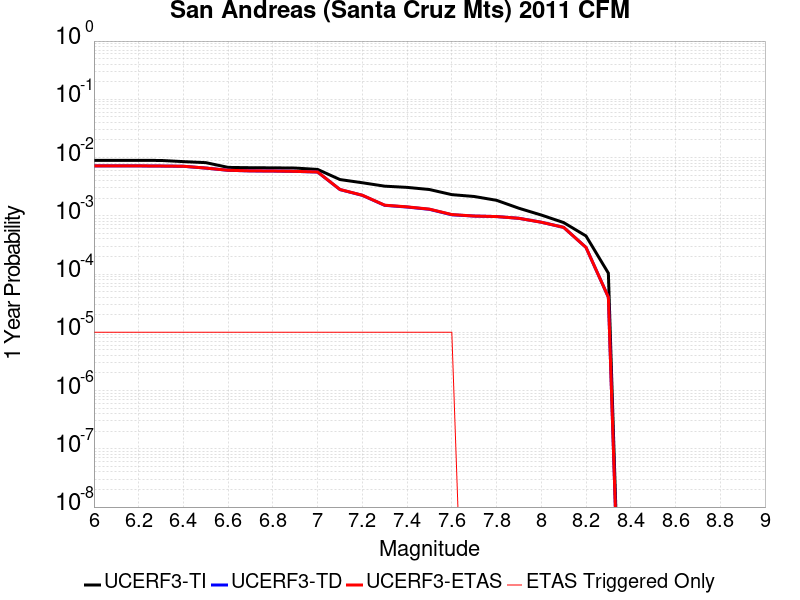 |  |

| Magnitude | 1 wk TI Prob | 1 wk TD Prob | 1 wk ETAS Prob | 1 wk ETAS/TD Gain | 1 wk ETAS Triggered Only | 1 mo TI Prob | 1 mo TD Prob | 1 mo ETAS Prob | 1 mo ETAS/TD Gain | 1 mo ETAS Triggered Only | 1 yr TI Prob | 1 yr TD Prob | 1 yr ETAS Prob | 1 yr ETAS/TD Gain | 1 yr ETAS Triggered Only | 10 yr TI Prob | 10 yr TD Prob | 10 yr ETAS Prob | 10 yr ETAS/TD Gain | 10 yr ETAS Triggered Only |
|-----|-----|-----|-----|-----|-----|-----|-----|-----|-----|-----|-----|-----|-----|-----|-----|-----|-----|-----|-----|-----|
| 6.0 | 1.7221631E-4 | 1.3823692E-4 | 1.3823692E-4 | 1.0 | 0.0 | 7.378611E-4 | 5.923115E-4 | 5.923115E-4 | 1.0 | 0.0 | 0.008946515 | 0.0071879383 | 0.0071879383 | 1.0 | 0.0 | 0.08594794 | 0.070697196 | 0.070730075 | 1.000465 | 3.5380697E-5 |
| 6.1 | 1.7221631E-4 | 1.3823692E-4 | 1.3823692E-4 | 1.0 | 0.0 | 7.378611E-4 | 5.923115E-4 | 5.923115E-4 | 1.0 | 0.0 | 0.008946515 | 0.0071879383 | 0.0071879383 | 1.0 | 0.0 | 0.08594794 | 0.070697196 | 0.070730075 | 1.000465 | 3.5380697E-5 |
| 6.2 | 1.7221631E-4 | 1.3823692E-4 | 1.3823692E-4 | 1.0 | 0.0 | 7.378611E-4 | 5.923115E-4 | 5.923115E-4 | 1.0 | 0.0 | 0.008946515 | 0.0071879383 | 0.0071879383 | 1.0 | 0.0 | 0.08594794 | 0.070697196 | 0.070730075 | 1.000465 | 3.5380697E-5 |
| 6.3 | 1.716926E-4 | 1.3743078E-4 | 1.3743078E-4 | 1.0 | 0.0 | 7.3561794E-4 | 5.888581E-4 | 5.888581E-4 | 1.0 | 0.0 | 0.008919428 | 0.0071461694 | 0.0071461694 | 1.0 | 0.0 | 0.08569809 | 0.0703092 | 0.07034209 | 1.0004678 | 3.5380697E-5 |
| 6.4 | 1.6392978E-4 | 1.3618424E-4 | 1.3618424E-4 | 1.0 | 0.0 | 7.02367E-4 | 5.8351824E-4 | 5.8351824E-4 | 1.0 | 0.0 | 0.008517839 | 0.0070815794 | 0.0070815794 | 1.0 | 0.0 | 0.08198654 | 0.06954003 | 0.069572955 | 1.0004734 | 3.5380697E-5 |
| 6.5 | 1.5742714E-4 | 1.26776E-4 | 1.26776E-4 | 1.0 | 0.0 | 6.745133E-4 | 5.4321426E-4 | 5.4321426E-4 | 1.0 | 0.0 | 0.00818132 | 0.006593904 | 0.006593904 | 1.0 | 0.0 | 0.078865945 | 0.0649993 | 0.065032385 | 1.0005089 | 3.5380697E-5 |
| 6.6 | 1.3038084E-4 | 1.161551E-4 | 1.161551E-4 | 1.0 | 0.0 | 5.5865536E-4 | 4.9771386E-4 | 4.9771386E-4 | 1.0 | 0.0 | 0.006780438 | 0.0060430723 | 0.0060430723 | 1.0 | 0.0 | 0.0657725 | 0.059452567 | 0.059485845 | 1.0005597 | 3.5380697E-5 |
| 6.7 | 1.2867592E-4 | 1.13418515E-4 | 1.13418515E-4 | 1.0 | 0.0 | 5.5135164E-4 | 4.8599008E-4 | 4.8599008E-4 | 1.0 | 0.0 | 0.0066920654 | 0.005901116 | 0.005901116 | 1.0 | 0.0 | 0.06494093 | 0.05816314 | 0.058196463 | 1.0005729 | 3.5380697E-5 |
| 6.8 | 1.2801298E-4 | 1.1279377E-4 | 1.1279377E-4 | 1.0 | 0.0 | 5.485117E-4 | 4.833136E-4 | 4.833136E-4 | 1.0 | 0.0 | 0.0066577005 | 0.0058687064 | 0.0058687064 | 1.0 | 0.0 | 0.06461738 | 0.05787688 | 0.057910215 | 1.0005759 | 3.5380697E-5 |
| 6.9 | 1.269149E-4 | 1.11214715E-4 | 1.11214715E-4 | 1.0 | 0.0 | 5.4380763E-4 | 4.765487E-4 | 4.765487E-4 | 1.0 | 0.0 | 0.006600777 | 0.005786784 | 0.005786784 | 1.0 | 0.0 | 0.06408122 | 0.057148356 | 0.057181716 | 1.0005838 | 3.5380697E-5 |
| 7.0 | 1.2030331E-4 | 1.0851204E-4 | 1.0851204E-4 | 1.0 | 0.0 | 5.154837E-4 | 4.6496998E-4 | 4.6496998E-4 | 1.0 | 0.0 | 0.006257969 | 0.005646552 | 0.005646552 | 1.0 | 0.0 | 0.06084648 | 0.055819258 | 0.055852663 | 1.0005984 | 3.5380697E-5 |
| 7.1 | 8.049617E-5 | 5.4114953E-5 | 5.4114953E-5 | 1.0 | 0.0 | 3.4493793E-4 | 2.319008E-4 | 2.319008E-4 | 1.0 | 0.0 | 0.0041915346 | 0.0028197719 | 0.0028197719 | 1.0 | 0.0 | 0.041133516 | 0.02971132 | 0.029745648 | 1.0011554 | 3.5380697E-5 |
| 7.2 | 7.093979E-5 | 4.310381E-5 | 4.310381E-5 | 1.0 | 0.0 | 3.0399222E-4 | 1.8471766E-4 | 1.8471766E-4 | 1.0 | 0.0 | 0.0036948253 | 0.0022466409 | 0.0022466409 | 1.0 | 0.0 | 0.03633994 | 0.024024088 | 0.02405862 | 1.0014373 | 3.5380697E-5 |
| 7.3 | 6.193693E-5 | 2.9018376E-5 | 2.9018376E-5 | 1.0 | 0.0 | 2.6541698E-4 | 1.2435856E-4 | 1.2435856E-4 | 1.0 | 0.0 | 0.0032266637 | 0.0015130156 | 0.0015130156 | 1.0 | 0.0 | 0.031802133 | 0.016564084 | 0.016598878 | 1.0021006 | 3.5380697E-5 |
| 7.4 | 5.906492E-5 | 2.7136244E-5 | 2.7136244E-5 | 1.0 | 0.0 | 2.5311083E-4 | 1.16293006E-4 | 1.16293006E-4 | 1.0 | 0.0 | 0.0030772698 | 0.0014149492 | 0.0014149492 | 1.0 | 0.0 | 0.030350044 | 0.015530545 | 0.015565377 | 1.0022428 | 3.5380697E-5 |
| 7.5 | 5.424296E-5 | 2.4776109E-5 | 2.4776109E-5 | 1.0 | 0.0 | 2.324491E-4 | 1.0617901E-4 | 1.0617901E-4 | 1.0 | 0.0 | 0.002826395 | 0.0012919641 | 0.0012919641 | 1.0 | 0.0 | 0.027907165 | 0.014215293 | 0.014250171 | 1.0024536 | 3.5380697E-5 |
| 7.6 | 4.43084E-5 | 1.9971396E-5 | 1.9971396E-5 | 1.0 | 0.0 | 1.8987931E-4 | 8.558889E-5 | 8.558889E-5 | 1.0 | 0.0 | 0.0023093296 | 0.0010415468 | 0.0010415468 | 1.0 | 0.0 | 0.022854783 | 0.011448878 | 0.011483854 | 1.003055 | 3.5380697E-5 |
| 7.7 | 4.118098E-5 | 1.8999577E-5 | 1.8999577E-5 | 1.0 | 0.0 | 1.7647797E-4 | 8.1424216E-5 | 8.1424216E-5 | 1.0 | 0.0 | 0.002146502 | 9.908893E-4 | 9.908893E-4 | 1.0 | 0.0 | 0.021258866 | 0.010904559 | 0.010939554 | 1.0032092 | 3.5380697E-5 |
| 7.8 | 3.5408906E-5 | 1.8625631E-5 | 1.8625631E-5 | 1.0 | 0.0 | 1.5174363E-4 | 7.982169E-5 | 7.982169E-5 | 1.0 | 0.0 | 0.0018459131 | 9.7139605E-4 | 9.7139605E-4 | 1.0 | 0.0 | 0.018306552 | 0.0106848935 | 0.010719896 | 1.0032759 | 3.5380697E-5 |
| 7.9 | 2.5860836E-5 | 1.7371205E-5 | 1.7371205E-5 | 1.0 | 0.0 | 1.10827445E-4 | 7.4445896E-5 | 7.4445896E-5 | 1.0 | 0.0 | 0.001348489 | 9.060022E-4 | 9.060022E-4 | 1.0 | 0.0 | 0.013403354 | 0.009936898 | 0.009971927 | 1.0035251 | 3.5380697E-5 |
| 8.0 | 1.9777332E-5 | 1.4886952E-5 | 1.4886952E-5 | 1.0 | 0.0 | 8.4757245E-5 | 6.379966E-5 | 6.379966E-5 | 1.0 | 0.0 | 0.0010314309 | 7.7648426E-4 | 7.7648426E-4 | 1.0 | 0.0 | 0.010266567 | 0.008534084 | 0.008569162 | 1.0041105 | 3.5380697E-5 |
| 8.1 | 1.468494E-5 | 1.2146339E-5 | 1.2146339E-5 | 1.0 | 0.0 | 6.293394E-5 | 5.20547E-5 | 5.20547E-5 | 1.0 | 0.0 | 7.6595135E-4 | 6.3358183E-4 | 6.3358183E-4 | 1.0 | 0.0 | 0.0076331664 | 0.0069899 | 0.0070250332 | 1.0050263 | 3.5380697E-5 |
| 8.2 | 8.63836E-6 | 5.489407E-6 | 5.489407E-6 | 1.0 | 0.0 | 3.7021015E-5 | 2.3525818E-5 | 2.3525818E-5 | 1.0 | 0.0 | 4.5063766E-4 | 2.863893E-4 | 2.863893E-4 | 1.0 | 0.0 | 0.004497249 | 0.0032568157 | 0.0032568157 | 1.0 | 0.0 |
| 8.3 | 1.983087E-6 | 7.693574E-7 | 7.693574E-7 | 1.0 | 0.0 | 8.498917E-6 | 3.297242E-6 | 3.297242E-6 | 1.0 | 0.0 | 1.034694E-4 | 4.01432E-5 | 4.01432E-5 | 1.0 | 0.0 | 0.0010342124 | 4.7390026E-4 | 4.7390026E-4 | 1.0 | 0.0 |

## Santa Cruz Catalina Ridge alt1
*[(top)](#table-of-contents)*

| 1 Week | 1 Month | 1 Year | 10 Year |
|-----|-----|-----|-----|
| 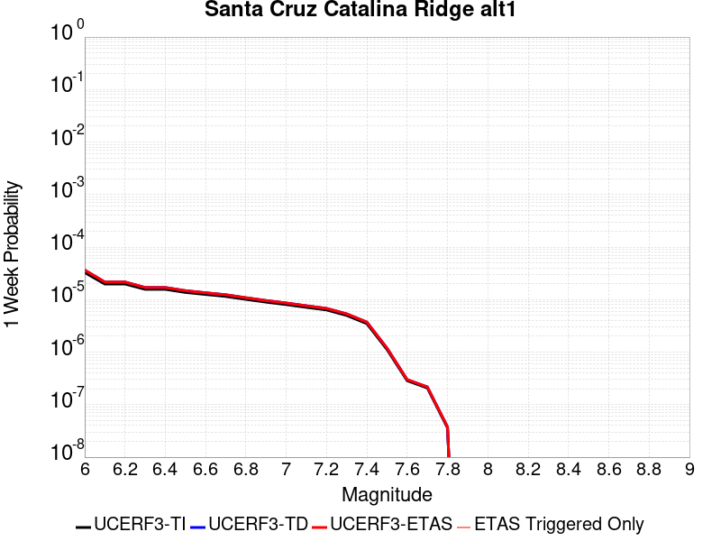 |  |  |  |

| Magnitude | 1 wk TI Prob | 1 wk TD Prob | 1 wk ETAS Prob | 1 wk ETAS/TD Gain | 1 wk ETAS Triggered Only | 1 mo TI Prob | 1 mo TD Prob | 1 mo ETAS Prob | 1 mo ETAS/TD Gain | 1 mo ETAS Triggered Only | 1 yr TI Prob | 1 yr TD Prob | 1 yr ETAS Prob | 1 yr ETAS/TD Gain | 1 yr ETAS Triggered Only | 10 yr TI Prob | 10 yr TD Prob | 10 yr ETAS Prob | 10 yr ETAS/TD Gain | 10 yr ETAS Triggered Only |
|-----|-----|-----|-----|-----|-----|-----|-----|-----|-----|-----|-----|-----|-----|-----|-----|-----|-----|-----|-----|-----|
| 6.0 | 3.2833184E-5 | 3.6560632E-5 | 3.6560632E-5 | 1.0 | 0.0 | 1.4070606E-4 | 1.5667995E-4 | 1.5667995E-4 | 1.0 | 0.0 | 0.00171175 | 0.001906076 | 0.001906076 | 1.0 | 0.0 | 0.016986247 | 0.018914176 | 0.018948887 | 1.0018352 | 3.5380697E-5 |
| 6.1 | 1.9835548E-5 | 2.1660571E-5 | 2.1660571E-5 | 1.0 | 0.0 | 8.500672E-5 | 9.2827824E-5 | 9.2827824E-5 | 1.0 | 0.0 | 0.0010344655 | 0.001129613 | 0.001129613 | 1.0 | 0.0 | 0.010296632 | 0.011240846 | 0.011275829 | 1.0031121 | 3.5380697E-5 |
| 6.2 | 1.9835548E-5 | 2.1660571E-5 | 2.1660571E-5 | 1.0 | 0.0 | 8.500672E-5 | 9.2827824E-5 | 9.2827824E-5 | 1.0 | 0.0 | 0.0010344655 | 0.001129613 | 0.001129613 | 1.0 | 0.0 | 0.010296632 | 0.011240846 | 0.011275829 | 1.0031121 | 3.5380697E-5 |
| 6.3 | 1.5728183E-5 | 1.7034703E-5 | 1.7034703E-5 | 1.0 | 0.0 | 6.7404755E-5 | 7.300386E-5 | 7.300386E-5 | 1.0 | 0.0 | 8.2034385E-4 | 8.8846567E-4 | 8.8846567E-4 | 1.0 | 0.0 | 0.008173222 | 0.008849816 | 0.008884884 | 1.0039625 | 3.5380697E-5 |
| 6.4 | 1.5728183E-5 | 1.7034703E-5 | 1.7034703E-5 | 1.0 | 0.0 | 6.7404755E-5 | 7.300386E-5 | 7.300386E-5 | 1.0 | 0.0 | 8.2034385E-4 | 8.8846567E-4 | 8.8846567E-4 | 1.0 | 0.0 | 0.008173222 | 0.008849816 | 0.008884884 | 1.0039625 | 3.5380697E-5 |
| 6.5 | 1.3707734E-5 | 1.4795146E-5 | 1.4795146E-5 | 1.0 | 0.0 | 5.8746107E-5 | 6.3406245E-5 | 6.3406245E-5 | 1.0 | 0.0 | 7.1499916E-4 | 7.7170116E-4 | 7.7170116E-4 | 1.0 | 0.0 | 0.0071270303 | 0.0076906127 | 0.0077257217 | 1.0045651 | 3.5380697E-5 |
| 6.6 | 1.2539813E-5 | 1.3510776E-5 | 1.3510776E-5 | 1.0 | 0.0 | 5.3740947E-5 | 5.7902053E-5 | 5.7902053E-5 | 1.0 | 0.0 | 6.540996E-4 | 7.0473214E-4 | 7.0473214E-4 | 1.0 | 0.0 | 0.0065217763 | 0.007025277 | 0.0070604086 | 1.0050008 | 3.5380697E-5 |
| 6.7 | 1.1504083E-5 | 1.2377875E-5 | 1.2377875E-5 | 1.0 | 0.0 | 4.930228E-5 | 5.3046966E-5 | 5.3046966E-5 | 1.0 | 0.0 | 6.0008996E-4 | 6.456574E-4 | 6.456574E-4 | 1.0 | 0.0 | 0.005984721 | 0.006438045 | 0.006473198 | 1.0054601 | 3.5380697E-5 |
| 6.8 | 1.012739E-5 | 1.0877499E-5 | 1.0877499E-5 | 1.0 | 0.0 | 4.340238E-5 | 4.661703E-5 | 4.661703E-5 | 1.0 | 0.0 | 5.282958E-4 | 5.67416E-4 | 5.67416E-4 | 1.0 | 0.0 | 0.0052704164 | 0.0056598415 | 0.005695022 | 1.0062158 | 3.5380697E-5 |
| 6.9 | 8.9607865E-6 | 9.609487E-6 | 9.609487E-6 | 1.0 | 0.0 | 3.8402806E-5 | 4.118287E-5 | 4.118287E-5 | 1.0 | 0.0 | 4.6745385E-4 | 5.0128717E-4 | 5.0128717E-4 | 1.0 | 0.0 | 0.0046647177 | 0.0050016837 | 0.0050368872 | 1.0070384 | 3.5380697E-5 |
| 7.0 | 8.046829E-6 | 8.620072E-6 | 8.620072E-6 | 1.0 | 0.0 | 3.4485955E-5 | 3.694265E-5 | 3.694265E-5 | 1.0 | 0.0 | 4.1978562E-4 | 4.496847E-4 | 4.496847E-4 | 1.0 | 0.0 | 0.004189935 | 0.004487838 | 0.0045230603 | 1.0078483 | 3.5380697E-5 |
| 7.1 | 7.136131E-6 | 7.637941E-6 | 7.637941E-6 | 1.0 | 0.0 | 3.0583058E-5 | 3.2733627E-5 | 3.2733627E-5 | 1.0 | 0.0 | 3.7228514E-4 | 3.9845973E-4 | 3.9845973E-4 | 1.0 | 0.0 | 0.0037166206 | 0.0039775297 | 0.0040127696 | 1.0088598 | 3.5380697E-5 |
| 7.2 | 6.362014E-6 | 6.8052104E-6 | 6.8052104E-6 | 1.0 | 0.0 | 2.726549E-5 | 2.9164865E-5 | 2.9164865E-5 | 1.0 | 0.0 | 3.3190678E-4 | 3.5502503E-4 | 3.5502503E-4 | 1.0 | 0.0 | 0.0033141149 | 0.003544647 | 0.0035799022 | 1.0099461 | 3.5380697E-5 |
| 7.3 | 5.004101E-6 | 5.3519125E-6 | 5.3519125E-6 | 1.0 | 0.0 | 2.1445969E-5 | 2.2936569E-5 | 2.2936569E-5 | 1.0 | 0.0 | 2.6107338E-4 | 2.792175E-4 | 2.792175E-4 | 1.0 | 0.0 | 0.002607669 | 0.0027887214 | 0.0028240033 | 1.0126517 | 3.5380697E-5 |
| 7.4 | 3.4901443E-6 | 3.73219E-6 | 3.73219E-6 | 1.0 | 0.0 | 1.4957676E-5 | 1.5995005E-5 | 1.5995005E-5 | 1.0 | 0.0 | 1.8209449E-4 | 1.9472216E-4 | 1.9472216E-4 | 1.0 | 0.0 | 0.0018194534 | 0.001945554 | 0.0019808658 | 1.01815 | 3.5380697E-5 |
| 7.5 | 1.1215045E-6 | 1.1894253E-6 | 1.1894253E-6 | 1.0 | 0.0 | 4.806439E-6 | 5.0975277E-6 | 5.0975277E-6 | 1.0 | 0.0 | 5.851682E-5 | 6.206066E-5 | 6.206066E-5 | 1.0 | 0.0 | 5.850142E-4 | 6.204364E-4 | 6.204364E-4 | 1.0 | 0.0 |
| 7.6 | 2.8599047E-7 | 2.9952744E-7 | 2.9952744E-7 | 1.0 | 0.0 | 1.2256729E-6 | 1.2836884E-6 | 1.2836884E-6 | 1.0 | 0.0 | 1.4922465E-5 | 1.5628797E-5 | 1.5628797E-5 | 1.0 | 0.0 | 1.4921463E-4 | 1.562771E-4 | 1.562771E-4 | 1.0 | 0.0 |
| 7.7 | 2.0781519E-7 | 2.1744857E-7 | 2.1744857E-7 | 1.0 | 0.0 | 8.906362E-7 | 9.3192216E-7 | 9.3192216E-7 | 1.0 | 0.0 | 1.08434415E-5 | 1.1346094E-5 | 1.1346094E-5 | 1.0 | 0.0 | 1.0842913E-4 | 1.1345524E-4 | 1.1345524E-4 | 1.0 | 0.0 |
| 7.8 | 3.614776E-8 | 3.7641843E-8 | 3.7641843E-8 | 1.0 | 0.0 | 1.5491896E-7 | 1.6132218E-7 | 1.6132218E-7 | 1.0 | 0.0 | 1.8861368E-6 | 1.9640959E-6 | 1.9640959E-6 | 1.0 | 0.0 | 1.8861208E-5 | 1.9640796E-5 | 1.9640796E-5 | 1.0 | 0.0 |

## Sheephole
*[(top)](#table-of-contents)*

| 1 Week | 1 Month | 1 Year | 10 Year |
|-----|-----|-----|-----|
|  |  |  |  |

| Magnitude | 1 wk TI Prob | 1 wk TD Prob | 1 wk ETAS Prob | 1 wk ETAS/TD Gain | 1 wk ETAS Triggered Only | 1 mo TI Prob | 1 mo TD Prob | 1 mo ETAS Prob | 1 mo ETAS/TD Gain | 1 mo ETAS Triggered Only | 1 yr TI Prob | 1 yr TD Prob | 1 yr ETAS Prob | 1 yr ETAS/TD Gain | 1 yr ETAS Triggered Only | 10 yr TI Prob | 10 yr TD Prob | 10 yr ETAS Prob | 10 yr ETAS/TD Gain | 10 yr ETAS Triggered Only |
|-----|-----|-----|-----|-----|-----|-----|-----|-----|-----|-----|-----|-----|-----|-----|-----|-----|-----|-----|-----|-----|
| 6.0 | 4.5579695E-6 | 4.741364E-6 | 4.741364E-6 | 1.0 | 0.0 | 1.9534009E-5 | 2.0320003E-5 | 2.0320003E-5 | 1.0 | 0.0 | 2.3780059E-4 | 2.473735E-4 | 2.473735E-4 | 1.0 | 0.0 | 0.0023754628 | 0.002471526 | 0.002506819 | 1.01428 | 3.5380697E-5 |
| 6.1 | 4.5579695E-6 | 4.741364E-6 | 4.741364E-6 | 1.0 | 0.0 | 1.9534009E-5 | 2.0320003E-5 | 2.0320003E-5 | 1.0 | 0.0 | 2.3780059E-4 | 2.473735E-4 | 2.473735E-4 | 1.0 | 0.0 | 0.0023754628 | 0.002471526 | 0.002506819 | 1.01428 | 3.5380697E-5 |
| 6.2 | 2.6677674E-6 | 2.7874607E-6 | 2.7874607E-6 | 1.0 | 0.0 | 1.1433239E-5 | 1.1946211E-5 | 1.1946211E-5 | 1.0 | 0.0 | 1.3919079E-4 | 1.454365E-4 | 1.454365E-4 | 1.0 | 0.0 | 0.0013910364 | 0.001453519 | 0.0014888482 | 1.024306 | 3.5380697E-5 |
| 6.3 | 2.6677674E-6 | 2.7874607E-6 | 2.7874607E-6 | 1.0 | 0.0 | 1.1433239E-5 | 1.1946211E-5 | 1.1946211E-5 | 1.0 | 0.0 | 1.3919079E-4 | 1.454365E-4 | 1.454365E-4 | 1.0 | 0.0 | 0.0013910364 | 0.001453519 | 0.0014888482 | 1.024306 | 3.5380697E-5 |
| 6.4 | 2.2159759E-6 | 2.3229381E-6 | 2.3229381E-6 | 1.0 | 0.0 | 9.497005E-6 | 9.955416E-6 | 9.955416E-6 | 1.0 | 0.0 | 1.156199E-4 | 1.2120126E-4 | 1.2120126E-4 | 1.0 | 0.0 | 0.0011555976 | 0.0012114309 | 0.0012467687 | 1.0291703 | 3.5380697E-5 |
| 6.5 | 2.1986082E-6 | 2.304818E-6 | 2.304818E-6 | 1.0 | 0.0 | 9.4225725E-6 | 9.877759E-6 | 9.877759E-6 | 1.0 | 0.0 | 1.1471378E-4 | 1.20255885E-4 | 1.20255885E-4 | 1.0 | 0.0 | 0.0011465458 | 0.0012019875 | 0.0012373256 | 1.0293998 | 3.5380697E-5 |
| 6.6 | 1.5232331E-6 | 1.6019358E-6 | 1.6019358E-6 | 1.0 | 0.0 | 6.5281256E-6 | 6.8654217E-6 | 6.8654217E-6 | 1.0 | 0.0 | 7.947703E-5 | 8.3583494E-5 | 8.3583494E-5 | 1.0 | 0.0 | 7.9448614E-4 | 8.355393E-4 | 8.355393E-4 | 1.0 | 0.0 |
| 6.7 | 1.3137362E-6 | 1.3828576E-6 | 1.3828576E-6 | 1.0 | 0.0 | 5.6302856E-6 | 5.92652E-6 | 5.92652E-6 | 1.0 | 0.0 | 6.854657E-5 | 7.215313E-5 | 7.215313E-5 | 1.0 | 0.0 | 6.8525434E-4 | 7.2131096E-4 | 7.2131096E-4 | 1.0 | 0.0 |
| 6.8 | 1.2275751E-6 | 1.2923208E-6 | 1.2923208E-6 | 1.0 | 0.0 | 5.2610258E-6 | 5.5385067E-6 | 5.5385067E-6 | 1.0 | 0.0 | 6.4051106E-5 | 6.742937E-5 | 6.742937E-5 | 1.0 | 0.0 | 6.4032647E-4 | 6.7410246E-4 | 6.7410246E-4 | 1.0 | 0.0 |
| 6.9 | 1.1837088E-6 | 1.2461369E-6 | 1.2461369E-6 | 1.0 | 0.0 | 5.0730278E-6 | 5.3405765E-6 | 5.3405765E-6 | 1.0 | 0.0 | 6.176237E-5 | 6.501971E-5 | 6.501971E-5 | 1.0 | 0.0 | 6.17452E-4 | 6.5002E-4 | 6.5002E-4 | 1.0 | 0.0 |
| 7.0 | 9.849371E-7 | 1.0366576E-6 | 1.0366576E-6 | 1.0 | 0.0 | 4.2211523E-6 | 4.4428116E-6 | 4.4428116E-6 | 1.0 | 0.0 | 5.1391315E-5 | 5.4089993E-5 | 5.4089993E-5 | 1.0 | 0.0 | 5.137943E-4 | 5.4077833E-4 | 5.4077833E-4 | 1.0 | 0.0 |
| 7.1 | 8.1643645E-7 | 8.591908E-7 | 8.591908E-7 | 1.0 | 0.0 | 3.4990085E-6 | 3.6822414E-6 | 3.6822414E-6 | 1.0 | 0.0 | 4.2599597E-5 | 4.4830453E-5 | 4.4830453E-5 | 1.0 | 0.0 | 4.259143E-4 | 4.4822274E-4 | 4.4822274E-4 | 1.0 | 0.0 |
| 7.2 | 5.7295756E-7 | 6.029669E-7 | 6.029669E-7 | 1.0 | 0.0 | 2.45553E-6 | 2.5841418E-6 | 2.5841418E-6 | 1.0 | 0.0 | 2.9895667E-5 | 3.146154E-5 | 3.146154E-5 | 1.0 | 0.0 | 2.9891645E-4 | 3.1457754E-4 | 3.1457754E-4 | 1.0 | 0.0 |

## Chino alt 1
*[(top)](#table-of-contents)*

| 1 Week | 1 Month | 1 Year | 10 Year |
|-----|-----|-----|-----|
|  |  |  |  |

| Magnitude | 1 wk TI Prob | 1 wk TD Prob | 1 wk ETAS Prob | 1 wk ETAS/TD Gain | 1 wk ETAS Triggered Only | 1 mo TI Prob | 1 mo TD Prob | 1 mo ETAS Prob | 1 mo ETAS/TD Gain | 1 mo ETAS Triggered Only | 1 yr TI Prob | 1 yr TD Prob | 1 yr ETAS Prob | 1 yr ETAS/TD Gain | 1 yr ETAS Triggered Only | 10 yr TI Prob | 10 yr TD Prob | 10 yr ETAS Prob | 10 yr ETAS/TD Gain | 10 yr ETAS Triggered Only |
|-----|-----|-----|-----|-----|-----|-----|-----|-----|-----|-----|-----|-----|-----|-----|-----|-----|-----|-----|-----|-----|
| 6.0 | 3.939946E-5 | 4.8955757E-5 | 4.8955757E-5 | 1.0 | 0.0 | 1.6884391E-4 | 2.0979645E-4 | 2.0979645E-4 | 1.0 | 0.0 | 0.0020537362 | 0.0025517642 | 0.0025517642 | 1.0 | 0.0 | 0.020348595 | 0.025281483 | 0.02531597 | 1.0013641 | 3.5380697E-5 |
| 6.1 | 2.1505624E-5 | 2.6883481E-5 | 2.6883481E-5 | 1.0 | 0.0 | 9.2163704E-5 | 1.1521046E-4 | 1.1521046E-4 | 1.0 | 0.0 | 0.0011215154 | 0.0014018962 | 0.0014018962 | 1.0 | 0.0 | 0.011158722 | 0.013947416 | 0.013947416 | 1.0 | 0.0 |
| 6.2 | 2.1505624E-5 | 2.6883481E-5 | 2.6883481E-5 | 1.0 | 0.0 | 9.2163704E-5 | 1.1521046E-4 | 1.1521046E-4 | 1.0 | 0.0 | 0.0011215154 | 0.0014018962 | 0.0014018962 | 1.0 | 0.0 | 0.011158722 | 0.013947416 | 0.013947416 | 1.0 | 0.0 |
| 6.3 | 1.4290785E-5 | 1.816862E-5 | 1.816862E-5 | 1.0 | 0.0 | 6.1244784E-5 | 7.786344E-5 | 7.786344E-5 | 1.0 | 0.0 | 7.454001E-4 | 9.4762055E-4 | 9.4762055E-4 | 1.0 | 0.0 | 0.007429048 | 0.009446246 | 0.009446246 | 1.0 | 0.0 |
| 6.4 | 1.4290785E-5 | 1.816862E-5 | 1.816862E-5 | 1.0 | 0.0 | 6.1244784E-5 | 7.786344E-5 | 7.786344E-5 | 1.0 | 0.0 | 7.454001E-4 | 9.4762055E-4 | 9.4762055E-4 | 1.0 | 0.0 | 0.007429048 | 0.009446246 | 0.009446246 | 1.0 | 0.0 |
| 6.5 | 1.3017944E-5 | 1.665543E-5 | 1.665543E-5 | 1.0 | 0.0 | 5.5789995E-5 | 7.13787E-5 | 7.13787E-5 | 1.0 | 0.0 | 6.790315E-4 | 8.6873304E-4 | 8.6873304E-4 | 1.0 | 0.0 | 0.0067696036 | 0.00866366 | 0.00866366 | 1.0 | 0.0 |
| 6.6 | 9.470016E-6 | 1.2041898E-5 | 1.2041898E-5 | 1.0 | 0.0 | 4.058515E-5 | 5.1607305E-5 | 5.1607305E-5 | 1.0 | 0.0 | 4.940122E-4 | 6.281718E-4 | 6.281718E-4 | 1.0 | 0.0 | 0.004929154 | 0.006273171 | 0.006273171 | 1.0 | 0.0 |
| 6.7 | 8.314155E-6 | 1.0409905E-5 | 1.0409905E-5 | 1.0 | 0.0 | 3.5631605E-5 | 4.46133E-5 | 4.46133E-5 | 1.0 | 0.0 | 4.3372845E-4 | 5.430638E-4 | 5.430638E-4 | 1.0 | 0.0 | 0.004328829 | 0.005426893 | 0.005426893 | 1.0 | 0.0 |
| 6.8 | 3.4856364E-6 | 3.8139801E-6 | 3.8139801E-6 | 1.0 | 0.0 | 1.4938357E-5 | 1.6345539E-5 | 1.6345539E-5 | 1.0 | 0.0 | 1.8185932E-4 | 1.9899083E-4 | 1.9899083E-4 | 1.0 | 0.0 | 0.0018171056 | 0.001989803 | 0.001989803 | 1.0 | 0.0 |
| 6.9 | 2.2645952E-6 | 2.1532328E-6 | 2.1532328E-6 | 1.0 | 0.0 | 9.705372E-6 | 9.228109E-6 | 9.228109E-6 | 1.0 | 0.0 | 1.18156495E-4 | 1.1234665E-4 | 1.1234665E-4 | 1.0 | 0.0 | 0.0011809369 | 0.0011235146 | 0.0011235146 | 1.0 | 0.0 |
| 7.0 | 1.7864003E-6 | 1.5433379E-6 | 1.5433379E-6 | 1.0 | 0.0 | 7.655979E-6 | 6.6142893E-6 | 6.6142893E-6 | 1.0 | 0.0 | 9.3207556E-5 | 8.052605E-5 | 8.052605E-5 | 1.0 | 0.0 | 9.316847E-4 | 8.054159E-4 | 8.054159E-4 | 1.0 | 0.0 |
| 7.1 | 1.7315456E-6 | 1.4736019E-6 | 1.4736019E-6 | 1.0 | 0.0 | 7.420889E-6 | 6.3154216E-6 | 6.3154216E-6 | 1.0 | 0.0 | 9.034557E-5 | 7.6887605E-5 | 7.6887605E-5 | 1.0 | 0.0 | 9.0308854E-4 | 7.690479E-4 | 7.690479E-4 | 1.0 | 0.0 |
| 7.2 | 1.6008337E-6 | 1.3576367E-6 | 1.3576367E-6 | 1.0 | 0.0 | 6.860698E-6 | 5.8184305E-6 | 5.8184305E-6 | 1.0 | 0.0 | 8.352579E-5 | 7.0837144E-5 | 7.0837144E-5 | 1.0 | 0.0 | 8.34944E-4 | 7.085699E-4 | 7.085699E-4 | 1.0 | 0.0 |
| 7.3 | 1.3320939E-6 | 1.1219545E-6 | 1.1219545E-6 | 1.0 | 0.0 | 5.7089615E-6 | 4.8083675E-6 | 4.8083675E-6 | 1.0 | 0.0 | 6.9504385E-5 | 5.854035E-5 | 5.854035E-5 | 1.0 | 0.0 | 6.9482654E-4 | 5.8539386E-4 | 5.8539386E-4 | 1.0 | 0.0 |
| 7.4 | 1.114294E-6 | 9.2384767E-7 | 9.2384767E-7 | 1.0 | 0.0 | 4.775537E-6 | 3.9593415E-6 | 3.9593415E-6 | 1.0 | 0.0 | 5.8140613E-5 | 4.820395E-5 | 4.820395E-5 | 1.0 | 0.0 | 5.81254E-4 | 4.8195178E-4 | 4.8195178E-4 | 1.0 | 0.0 |
| 7.5 | 9.354081E-7 | 7.62451E-7 | 7.62451E-7 | 1.0 | 0.0 | 4.0088858E-6 | 3.2676433E-6 | 3.2676433E-6 | 1.0 | 0.0 | 4.8807087E-5 | 3.9782866E-5 | 3.9782866E-5 | 1.0 | 0.0 | 4.879637E-4 | 3.9776083E-4 | 3.9776083E-4 | 1.0 | 0.0 |
| 7.6 | 8.521771E-7 | 6.881667E-7 | 6.881667E-7 | 1.0 | 0.0 | 3.6521824E-6 | 2.9492828E-6 | 2.9492828E-6 | 1.0 | 0.0 | 4.4464414E-5 | 3.590696E-5 | 3.590696E-5 | 1.0 | 0.0 | 4.4455516E-4 | 3.5901475E-4 | 3.5901475E-4 | 1.0 | 0.0 |
| 7.7 | 2.1803626E-7 | 1.4189133E-7 | 1.4189133E-7 | 1.0 | 0.0 | 9.344408E-7 | 6.0810567E-7 | 6.0810567E-7 | 1.0 | 0.0 | 1.1376757E-5 | 7.4036707E-6 | 7.4036707E-6 | 1.0 | 0.0 | 1.13761744E-4 | 7.4035204E-5 | 7.4035204E-5 | 1.0 | 0.0 |

## Pilarcitos 2011 CFM
*[(top)](#table-of-contents)*

| 1 Week | 1 Month | 1 Year | 10 Year |
|-----|-----|-----|-----|
|  | 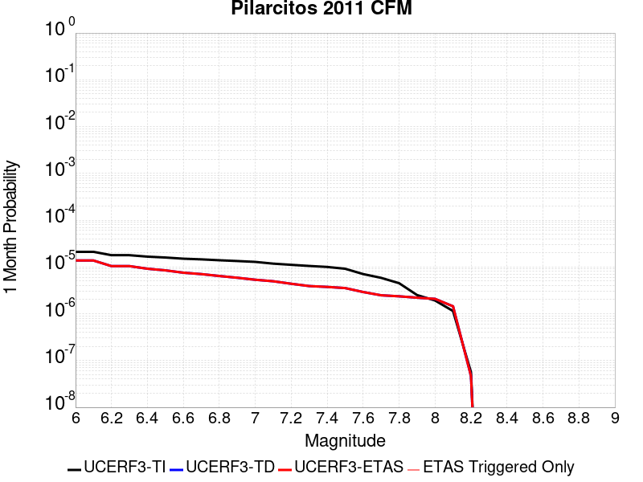 |  |  |

| Magnitude | 1 wk TI Prob | 1 wk TD Prob | 1 wk ETAS Prob | 1 wk ETAS/TD Gain | 1 wk ETAS Triggered Only | 1 mo TI Prob | 1 mo TD Prob | 1 mo ETAS Prob | 1 mo ETAS/TD Gain | 1 mo ETAS Triggered Only | 1 yr TI Prob | 1 yr TD Prob | 1 yr ETAS Prob | 1 yr ETAS/TD Gain | 1 yr ETAS Triggered Only | 10 yr TI Prob | 10 yr TD Prob | 10 yr ETAS Prob | 10 yr ETAS/TD Gain | 10 yr ETAS Triggered Only |
|-----|-----|-----|-----|-----|-----|-----|-----|-----|-----|-----|-----|-----|-----|-----|-----|-----|-----|-----|-----|-----|
| 6.0 | 4.9150476E-6 | 3.2042635E-6 | 3.2042635E-6 | 1.0 | 0.0 | 2.1064321E-5 | 1.3732488E-5 | 1.3732488E-5 | 1.0 | 0.0 | 2.564279E-4 | 1.6718052E-4 | 1.6718052E-4 | 1.0 | 0.0 | 0.0025613222 | 0.0016829972 | 0.0017183183 | 1.020987 | 3.5380697E-5 |
| 6.1 | 4.9150476E-6 | 3.2042635E-6 | 3.2042635E-6 | 1.0 | 0.0 | 2.1064321E-5 | 1.3732488E-5 | 1.3732488E-5 | 1.0 | 0.0 | 2.564279E-4 | 1.6718052E-4 | 1.6718052E-4 | 1.0 | 0.0 | 0.0025613222 | 0.0016829972 | 0.0017183183 | 1.020987 | 3.5380697E-5 |
| 6.2 | 4.162343E-6 | 2.4326434E-6 | 2.4326434E-6 | 1.0 | 0.0 | 1.783849E-5 | 1.0425573E-5 | 1.0425573E-5 | 1.0 | 0.0 | 2.1716199E-4 | 1.2692405E-4 | 1.2692405E-4 | 1.0 | 0.0 | 0.002169499 | 0.0012809471 | 0.0013162824 | 1.0275854 | 3.5380697E-5 |
| 6.3 | 4.162343E-6 | 2.4326434E-6 | 2.4326434E-6 | 1.0 | 0.0 | 1.783849E-5 | 1.0425573E-5 | 1.0425573E-5 | 1.0 | 0.0 | 2.1716199E-4 | 1.2692405E-4 | 1.2692405E-4 | 1.0 | 0.0 | 0.002169499 | 0.0012809471 | 0.0013162824 | 1.0275854 | 3.5380697E-5 |
| 6.4 | 3.8768926E-6 | 2.140059E-6 | 2.140059E-6 | 1.0 | 0.0 | 1.6615148E-5 | 9.171649E-6 | 9.171649E-6 | 1.0 | 0.0 | 2.0227065E-4 | 1.1165915E-4 | 1.1165915E-4 | 1.0 | 0.0 | 0.0020208664 | 0.0011284603 | 0.0011638011 | 1.0313177 | 3.5380697E-5 |
| 6.5 | 3.7137002E-6 | 1.9734143E-6 | 1.9734143E-6 | 1.0 | 0.0 | 1.591576E-5 | 8.457463E-6 | 8.457463E-6 | 1.0 | 0.0 | 1.9375715E-4 | 1.02964776E-4 | 1.02964776E-4 | 1.0 | 0.0 | 0.001935883 | 0.0010416005 | 0.0010769443 | 1.0339322 | 3.5380697E-5 |
| 6.6 | 3.5048733E-6 | 1.7583651E-6 | 1.7583651E-6 | 1.0 | 0.0 | 1.5020799E-5 | 7.5358284E-6 | 7.5358284E-6 | 1.0 | 0.0 | 1.8286289E-4 | 9.174487E-5 | 9.174487E-5 | 1.0 | 0.0 | 0.0018271249 | 9.2950027E-4 | 9.648481E-4 | 1.0380288 | 3.5380697E-5 |
| 6.7 | 3.3908584E-6 | 1.6420529E-6 | 1.6420529E-6 | 1.0 | 0.0 | 1.453217E-5 | 7.0373508E-6 | 7.0373508E-6 | 1.0 | 0.0 | 1.7691481E-4 | 8.5676395E-5 | 8.5676395E-5 | 1.0 | 0.0 | 0.0017677402 | 8.688642E-4 | 9.0421416E-4 | 1.0406853 | 3.5380697E-5 |
| 6.8 | 3.2451449E-6 | 1.4952687E-6 | 1.4952687E-6 | 1.0 | 0.0 | 1.3907689E-5 | 6.4082788E-6 | 6.4082788E-6 | 1.0 | 0.0 | 1.6931296E-4 | 7.801801E-5 | 7.801801E-5 | 1.0 | 0.0 | 0.0016918402 | 7.92337E-4 | 7.92337E-4 | 1.0 | 0.0 |
| 6.9 | 3.1239128E-6 | 1.3717896E-6 | 1.3717896E-6 | 1.0 | 0.0 | 1.3388129E-5 | 5.8790847E-6 | 5.8790847E-6 | 1.0 | 0.0 | 1.6298829E-4 | 7.1575516E-5 | 7.1575516E-5 | 1.0 | 0.0 | 0.001628688 | 7.2795595E-4 | 7.2795595E-4 | 1.0 | 0.0 |
| 7.0 | 2.9940109E-6 | 1.243096E-6 | 1.243096E-6 | 1.0 | 0.0 | 1.2831412E-5 | 5.3275435E-6 | 5.3275435E-6 | 1.0 | 0.0 | 1.5621124E-4 | 6.486091E-5 | 6.486091E-5 | 1.0 | 0.0 | 0.0015610148 | 6.6085136E-4 | 6.6085136E-4 | 1.0 | 0.0 |
| 7.1 | 2.7471217E-6 | 1.154768E-6 | 1.154768E-6 | 1.0 | 0.0 | 1.1773326E-5 | 4.9489963E-6 | 4.9489963E-6 | 1.0 | 0.0 | 1.4333082E-4 | 6.0252365E-5 | 6.0252365E-5 | 1.0 | 0.0 | 0.001432384 | 6.1473955E-4 | 6.1473955E-4 | 1.0 | 0.0 |
| 7.2 | 2.592675E-6 | 1.0207918E-6 | 1.0207918E-6 | 1.0 | 0.0 | 1.1111417E-5 | 4.374815E-6 | 4.374815E-6 | 1.0 | 0.0 | 1.3527309E-4 | 5.3262072E-5 | 5.3262072E-5 | 1.0 | 0.0 | 0.0013519078 | 5.44873E-4 | 5.44873E-4 | 1.0 | 0.0 |
| 7.3 | 2.4518663E-6 | 9.1172785E-7 | 9.1172785E-7 | 1.0 | 0.0 | 1.0507956E-5 | 3.907399E-6 | 3.907399E-6 | 1.0 | 0.0 | 1.2792686E-4 | 4.7571546E-5 | 4.7571546E-5 | 1.0 | 0.0 | 0.0012785323 | 4.879916E-4 | 4.879916E-4 | 1.0 | 0.0 |
| 7.4 | 2.3349535E-6 | 8.738746E-7 | 8.738746E-7 | 1.0 | 0.0 | 1.0006905E-5 | 3.7451714E-6 | 3.7451714E-6 | 1.0 | 0.0 | 1.2182725E-4 | 4.559651E-5 | 4.559651E-5 | 1.0 | 0.0 | 0.0012176048 | 4.6822458E-4 | 4.6822458E-4 | 1.0 | 0.0 |
| 7.5 | 2.1358665E-6 | 8.258519E-7 | 8.258519E-7 | 1.0 | 0.0 | 9.15368E-6 | 3.5393603E-6 | 3.5393603E-6 | 1.0 | 0.0 | 1.11440364E-4 | 4.309086E-5 | 4.309086E-5 | 1.0 | 0.0 | 0.0011138449 | 4.430837E-4 | 4.430837E-4 | 1.0 | 0.0 |
| 7.6 | 1.6445446E-6 | 6.798402E-7 | 6.798402E-7 | 1.0 | 0.0 | 7.048029E-6 | 2.9135974E-6 | 2.9135974E-6 | 1.0 | 0.0 | 8.580638E-5 | 3.5472473E-5 | 3.5472473E-5 | 1.0 | 0.0 | 8.5773255E-4 | 3.668587E-4 | 3.668587E-4 | 1.0 | 0.0 |
| 7.7 | 1.3650961E-6 | 5.7900303E-7 | 5.7900303E-7 | 1.0 | 0.0 | 5.850399E-6 | 2.4814392E-6 | 2.4814392E-6 | 1.0 | 0.0 | 7.122628E-5 | 3.0211102E-5 | 3.0211102E-5 | 1.0 | 0.0 | 7.120345E-4 | 3.141429E-4 | 3.141429E-4 | 1.0 | 0.0 |
| 7.8 | 1.0500993E-6 | 5.504804E-7 | 5.504804E-7 | 1.0 | 0.0 | 4.5004176E-6 | 2.3591997E-6 | 2.3591997E-6 | 1.0 | 0.0 | 5.4791206E-5 | 2.872288E-5 | 2.872288E-5 | 1.0 | 0.0 | 5.47777E-4 | 2.9913257E-4 | 2.9913257E-4 | 1.0 | 0.0 |
| 7.9 | 5.856431E-7 | 5.145004E-7 | 5.145004E-7 | 1.0 | 0.0 | 2.5098966E-6 | 2.2049999E-6 | 2.2049999E-6 | 1.0 | 0.0 | 3.0557563E-5 | 2.6845542E-5 | 2.6845542E-5 | 1.0 | 0.0 | 3.055336E-4 | 2.7961895E-4 | 2.7961895E-4 | 1.0 | 0.0 |
| 8.0 | 4.4768265E-7 | 4.85037E-7 | 4.85037E-7 | 1.0 | 0.0 | 1.9186384E-6 | 2.0787284E-6 | 2.0787284E-6 | 1.0 | 0.0 | 2.3359173E-5 | 2.5308223E-5 | 2.5308223E-5 | 1.0 | 0.0 | 2.3356717E-4 | 2.637138E-4 | 2.637138E-4 | 1.0 | 0.0 |
| 8.1 | 2.6692538E-7 | 3.367165E-7 | 3.367165E-7 | 1.0 | 0.0 | 1.1439654E-6 | 1.44307E-6 | 1.44307E-6 | 1.0 | 0.0 | 1.392769E-5 | 1.7569237E-5 | 1.7569237E-5 | 1.0 | 0.0 | 1.3926817E-4 | 1.8304925E-4 | 1.8304925E-4 | 1.0 | 0.0 |
| 8.2 | 1.3198862E-8 | 1.0860941E-8 | 1.0860941E-8 | 1.0 | 0.0 | 5.656655E-8 | 4.6546887E-8 | 4.6546887E-8 | 1.0 | 0.0 | 6.886975E-7 | 5.6670825E-7 | 5.6670825E-7 | 1.0 | 0.0 | 6.8869535E-6 | 5.899266E-6 | 5.899266E-6 | 1.0 | 0.0 |

## San Andreas (Peninsula) 2011 CFM
*[(top)](#table-of-contents)*

| 1 Week | 1 Month | 1 Year | 10 Year |
|-----|-----|-----|-----|
|  |  |  |  |

| Magnitude | 1 wk TI Prob | 1 wk TD Prob | 1 wk ETAS Prob | 1 wk ETAS/TD Gain | 1 wk ETAS Triggered Only | 1 mo TI Prob | 1 mo TD Prob | 1 mo ETAS Prob | 1 mo ETAS/TD Gain | 1 mo ETAS Triggered Only | 1 yr TI Prob | 1 yr TD Prob | 1 yr ETAS Prob | 1 yr ETAS/TD Gain | 1 yr ETAS Triggered Only | 10 yr TI Prob | 10 yr TD Prob | 10 yr ETAS Prob | 10 yr ETAS/TD Gain | 10 yr ETAS Triggered Only |
|-----|-----|-----|-----|-----|-----|-----|-----|-----|-----|-----|-----|-----|-----|-----|-----|-----|-----|-----|-----|-----|
| 6.0 | 8.6200685E-5 | 2.5333706E-5 | 2.5333706E-5 | 1.0 | 0.0 | 3.6937918E-4 | 1.08568514E-4 | 1.08568514E-4 | 1.0 | 0.0 | 0.0044879215 | 0.0013210218 | 0.0013210218 | 1.0 | 0.0 | 0.043983612 | 0.014838956 | 0.014873812 | 1.0023489 | 3.5380697E-5 |
| 6.1 | 8.6200685E-5 | 2.5333706E-5 | 2.5333706E-5 | 1.0 | 0.0 | 3.6937918E-4 | 1.08568514E-4 | 1.08568514E-4 | 1.0 | 0.0 | 0.0044879215 | 0.0013210218 | 0.0013210218 | 1.0 | 0.0 | 0.043983612 | 0.014838956 | 0.014873812 | 1.0023489 | 3.5380697E-5 |
| 6.2 | 8.6200685E-5 | 2.5333706E-5 | 2.5333706E-5 | 1.0 | 0.0 | 3.6937918E-4 | 1.08568514E-4 | 1.08568514E-4 | 1.0 | 0.0 | 0.0044879215 | 0.0013210218 | 0.0013210218 | 1.0 | 0.0 | 0.043983612 | 0.014838956 | 0.014873812 | 1.0023489 | 3.5380697E-5 |
| 6.3 | 8.551163E-5 | 2.5024961E-5 | 2.5024961E-5 | 1.0 | 0.0 | 3.6642692E-4 | 1.0724543E-4 | 1.0724543E-4 | 1.0 | 0.0 | 0.004452125 | 0.0013049326 | 0.0013049326 | 1.0 | 0.0 | 0.043639794 | 0.014665611 | 0.014700472 | 1.0023772 | 3.5380697E-5 |
| 6.4 | 8.551163E-5 | 2.5024961E-5 | 2.5024961E-5 | 1.0 | 0.0 | 3.6642692E-4 | 1.0724543E-4 | 1.0724543E-4 | 1.0 | 0.0 | 0.004452125 | 0.0013049326 | 0.0013049326 | 1.0 | 0.0 | 0.043639794 | 0.014665611 | 0.014700472 | 1.0023772 | 3.5380697E-5 |
| 6.5 | 8.511146E-5 | 2.4846031E-5 | 2.4846031E-5 | 1.0 | 0.0 | 3.647124E-4 | 1.0647865E-4 | 1.0647865E-4 | 1.0 | 0.0 | 0.004431336 | 0.0012956082 | 0.0012956082 | 1.0 | 0.0 | 0.04344007 | 0.014565198 | 0.014600063 | 1.0023937 | 3.5380697E-5 |
| 6.6 | 8.4985084E-5 | 2.477655E-5 | 2.477655E-5 | 1.0 | 0.0 | 3.6417096E-4 | 1.061809E-4 | 1.061809E-4 | 1.0 | 0.0 | 0.0044247704 | 0.0012919875 | 0.0012919875 | 1.0 | 0.0 | 0.043376986 | 0.014527207 | 0.014562074 | 1.0024 | 3.5380697E-5 |
| 6.7 | 8.462618E-5 | 2.4604726E-5 | 2.4604726E-5 | 1.0 | 0.0 | 3.6263323E-4 | 1.05444575E-4 | 1.05444575E-4 | 1.0 | 0.0 | 0.004406125 | 0.0012830333 | 0.0012830333 | 1.0 | 0.0 | 0.043197807 | 0.01443185 | 0.01446672 | 1.0024161 | 3.5380697E-5 |
| 6.8 | 8.42337E-5 | 2.4500272E-5 | 2.4500272E-5 | 1.0 | 0.0 | 3.6095164E-4 | 1.0499695E-4 | 1.0499695E-4 | 1.0 | 0.0 | 0.004385734 | 0.0012775898 | 0.0012775898 | 1.0 | 0.0 | 0.043001823 | 0.014372395 | 0.014407268 | 1.0024264 | 3.5380697E-5 |
| 6.9 | 8.365989E-5 | 2.4304522E-5 | 2.4304522E-5 | 1.0 | 0.0 | 3.5849313E-4 | 1.0415808E-4 | 1.0415808E-4 | 1.0 | 0.0 | 0.004355922 | 0.0012673886 | 0.0012673886 | 1.0 | 0.0 | 0.04271523 | 0.014264696 | 0.014299572 | 1.0024449 | 3.5380697E-5 |
| 7.0 | 8.30936E-5 | 2.4065685E-5 | 2.4065685E-5 | 1.0 | 0.0 | 3.560668E-4 | 1.0313458E-4 | 1.0313458E-4 | 1.0 | 0.0 | 0.004326499 | 0.0012549418 | 0.0012549418 | 1.0 | 0.0 | 0.042432297 | 0.0141355125 | 0.014170393 | 1.0024676 | 3.5380697E-5 |
| 7.1 | 8.041264E-5 | 2.3751329E-5 | 2.3751329E-5 | 1.0 | 0.0 | 3.4458007E-4 | 1.01787446E-4 | 1.01787446E-4 | 1.0 | 0.0 | 0.0041871946 | 0.0012385593 | 0.0012385593 | 1.0 | 0.0 | 0.041091725 | 0.013957874 | 0.013992761 | 1.0024995 | 3.5380697E-5 |
| 7.2 | 7.8427016E-5 | 2.3174005E-5 | 2.3174005E-5 | 1.0 | 0.0 | 3.3607247E-4 | 9.931339E-5 | 9.931339E-5 | 1.0 | 0.0 | 0.004084008 | 0.0012084715 | 0.0012084715 | 1.0 | 0.0 | 0.040097635 | 0.013641416 | 0.013676314 | 1.0025582 | 3.5380697E-5 |
| 7.3 | 7.721087E-5 | 2.2958477E-5 | 2.2958477E-5 | 1.0 | 0.0 | 3.3086175E-4 | 9.838976E-5 | 9.838976E-5 | 1.0 | 0.0 | 0.004020803 | 0.0011972387 | 0.0011972387 | 1.0 | 0.0 | 0.03948827 | 0.013524936 | 0.013559838 | 1.0025805 | 3.5380697E-5 |
| 7.4 | 7.3536525E-5 | 2.1064485E-5 | 2.1064485E-5 | 1.0 | 0.0 | 3.1511846E-4 | 9.027325E-5 | 9.027325E-5 | 1.0 | 0.0 | 0.0038298194 | 0.001098524 | 0.001098524 | 1.0 | 0.0 | 0.037644852 | 0.01247618 | 0.012511118 | 1.0028005 | 3.5380697E-5 |
| 7.5 | 6.806207E-5 | 1.8855704E-5 | 1.8855704E-5 | 1.0 | 0.0 | 2.9166197E-4 | 8.080766E-5 | 8.080766E-5 | 1.0 | 0.0 | 0.0035452035 | 9.833903E-4 | 9.833903E-4 | 1.0 | 0.0 | 0.034891766 | 0.011221583 | 0.011256567 | 1.0031176 | 3.5380697E-5 |
| 7.6 | 5.6731416E-5 | 1.4235568E-5 | 1.4235568E-5 | 1.0 | 0.0 | 2.43112E-4 | 6.100815E-5 | 6.100815E-5 | 1.0 | 0.0 | 0.0029558712 | 7.4252125E-4 | 7.4252125E-4 | 1.0 | 0.0 | 0.02916862 | 0.008518306 | 0.008553385 | 1.0041181 | 3.5380697E-5 |
| 7.7 | 4.946994E-5 | 1.3298509E-5 | 1.3298509E-5 | 1.0 | 0.0 | 2.1199681E-4 | 5.6992365E-5 | 5.6992365E-5 | 1.0 | 0.0 | 0.002578006 | 6.936613E-4 | 6.936613E-4 | 1.0 | 0.0 | 0.02548303 | 0.007937518 | 0.007972619 | 1.0044221 | 3.5380697E-5 |
| 7.8 | 3.9718198E-5 | 1.3032537E-5 | 1.3032537E-5 | 1.0 | 0.0 | 1.7020974E-4 | 5.585253E-5 | 5.585253E-5 | 1.0 | 0.0 | 0.0020703338 | 6.7979255E-4 | 6.7979255E-4 | 1.0 | 0.0 | 0.020511515 | 0.007746509 | 0.0077816155 | 1.004532 | 3.5380697E-5 |
| 7.9 | 2.4115114E-5 | 1.2229653E-5 | 1.2229653E-5 | 1.0 | 0.0 | 1.0334639E-4 | 5.2411746E-5 | 5.2411746E-5 | 1.0 | 0.0 | 0.001257516 | 6.3792634E-4 | 6.3792634E-4 | 1.0 | 0.0 | 0.012504238 | 0.0071830763 | 0.007218203 | 1.0048902 | 3.5380697E-5 |
| 8.0 | 1.7756569E-5 | 1.144976E-5 | 1.144976E-5 | 1.0 | 0.0 | 7.6097356E-5 | 4.9069477E-5 | 4.9069477E-5 | 1.0 | 0.0 | 9.260915E-4 | 5.972573E-4 | 5.972573E-4 | 1.0 | 0.0 | 0.009222416 | 0.006680902 | 0.0067160465 | 1.0052605 | 3.5380697E-5 |
| 8.1 | 1.3159258E-5 | 9.77991E-6 | 9.77991E-6 | 1.0 | 0.0 | 5.6395602E-5 | 4.1913227E-5 | 4.1913227E-5 | 1.0 | 0.0 | 6.864001E-4 | 5.101742E-4 | 5.101742E-4 | 1.0 | 0.0 | 0.0068428386 | 0.0057076924 | 0.005742871 | 1.0061634 | 3.5380697E-5 |
| 8.2 | 8.635426E-6 | 5.4872503E-6 | 5.4872503E-6 | 1.0 | 0.0 | 3.700844E-5 | 2.3516575E-5 | 2.3516575E-5 | 1.0 | 0.0 | 4.5048463E-4 | 2.8627677E-4 | 2.8627677E-4 | 1.0 | 0.0 | 0.004495725 | 0.0032556232 | 0.0032556232 | 1.0 | 0.0 |
| 8.3 | 1.983087E-6 | 7.693574E-7 | 7.693574E-7 | 1.0 | 0.0 | 8.498917E-6 | 3.297242E-6 | 3.297242E-6 | 1.0 | 0.0 | 1.034694E-4 | 4.01432E-5 | 4.01432E-5 | 1.0 | 0.0 | 0.0010342124 | 4.7390026E-4 | 4.7390026E-4 | 1.0 | 0.0 |

## King Range 2011 CFM
*[(top)](#table-of-contents)*

| 1 Week | 1 Month | 1 Year | 10 Year |
|-----|-----|-----|-----|
|  |  |  |  |

| Magnitude | 1 wk TI Prob | 1 wk TD Prob | 1 wk ETAS Prob | 1 wk ETAS/TD Gain | 1 wk ETAS Triggered Only | 1 mo TI Prob | 1 mo TD Prob | 1 mo ETAS Prob | 1 mo ETAS/TD Gain | 1 mo ETAS Triggered Only | 1 yr TI Prob | 1 yr TD Prob | 1 yr ETAS Prob | 1 yr ETAS/TD Gain | 1 yr ETAS Triggered Only | 10 yr TI Prob | 10 yr TD Prob | 10 yr ETAS Prob | 10 yr ETAS/TD Gain | 10 yr ETAS Triggered Only |
|-----|-----|-----|-----|-----|-----|-----|-----|-----|-----|-----|-----|-----|-----|-----|-----|-----|-----|-----|-----|-----|
| 6.0 | 1.2462566E-5 | 1.3022681E-5 | 1.3022681E-5 | 1.0 | 0.0 | 5.34099E-5 | 5.5810495E-5 | 5.5810495E-5 | 1.0 | 0.0 | 6.5007154E-4 | 6.793158E-4 | 6.793158E-4 | 1.0 | 0.0 | 0.0064817313 | 0.0067767757 | 0.0068119164 | 1.0051855 | 3.5380697E-5 |
| 6.1 | 1.2462566E-5 | 1.3022681E-5 | 1.3022681E-5 | 1.0 | 0.0 | 5.34099E-5 | 5.5810495E-5 | 5.5810495E-5 | 1.0 | 0.0 | 6.5007154E-4 | 6.793158E-4 | 6.793158E-4 | 1.0 | 0.0 | 0.0064817313 | 0.0067767757 | 0.0068119164 | 1.0051855 | 3.5380697E-5 |
| 6.2 | 1.2462566E-5 | 1.3022681E-5 | 1.3022681E-5 | 1.0 | 0.0 | 5.34099E-5 | 5.5810495E-5 | 5.5810495E-5 | 1.0 | 0.0 | 6.5007154E-4 | 6.793158E-4 | 6.793158E-4 | 1.0 | 0.0 | 0.0064817313 | 0.0067767757 | 0.0068119164 | 1.0051855 | 3.5380697E-5 |
| 6.3 | 7.988484E-6 | 8.213607E-6 | 8.213607E-6 | 1.0 | 0.0 | 3.423591E-5 | 3.520077E-5 | 3.520077E-5 | 1.0 | 0.0 | 4.1674246E-4 | 4.2849802E-4 | 4.2849802E-4 | 1.0 | 0.0 | 0.004159618 | 0.0042789313 | 0.0043141604 | 1.0082332 | 3.5380697E-5 |
| 6.4 | 7.988484E-6 | 8.213607E-6 | 8.213607E-6 | 1.0 | 0.0 | 3.423591E-5 | 3.520077E-5 | 3.520077E-5 | 1.0 | 0.0 | 4.1674246E-4 | 4.2849802E-4 | 4.2849802E-4 | 1.0 | 0.0 | 0.004159618 | 0.0042789313 | 0.0043141604 | 1.0082332 | 3.5380697E-5 |
| 6.5 | 5.0522513E-6 | 5.0819626E-6 | 5.0819626E-6 | 1.0 | 0.0 | 2.1652326E-5 | 2.1779662E-5 | 2.1779662E-5 | 1.0 | 0.0 | 2.6358519E-4 | 2.6513607E-4 | 2.6513607E-4 | 1.0 | 0.0 | 0.0026327274 | 0.0026492323 | 0.0026492323 | 1.0 | 0.0 |
| 6.6 | 4.53682E-6 | 4.5386473E-6 | 4.5386473E-6 | 1.0 | 0.0 | 1.944337E-5 | 1.9451203E-5 | 1.9451203E-5 | 1.0 | 0.0 | 2.3669732E-4 | 2.3679328E-4 | 2.3679328E-4 | 1.0 | 0.0 | 0.0023644536 | 0.0023664122 | 0.0023664122 | 1.0 | 0.0 |
| 6.7 | 4.1144335E-6 | 4.096668E-6 | 4.096668E-6 | 1.0 | 0.0 | 1.7633167E-5 | 1.7557033E-5 | 1.7557033E-5 | 1.0 | 0.0 | 2.1466266E-4 | 2.1373629E-4 | 2.1373629E-4 | 1.0 | 0.0 | 0.0021445542 | 0.002136289 | 0.002136289 | 1.0 | 0.0 |
| 6.8 | 3.8321214E-6 | 3.8071091E-6 | 3.8071091E-6 | 1.0 | 0.0 | 1.6423275E-5 | 1.6316082E-5 | 1.6316082E-5 | 1.0 | 0.0 | 1.9993502E-4 | 1.9863051E-4 | 1.9863051E-4 | 1.0 | 0.0 | 0.0019975523 | 0.0019855052 | 0.0019855052 | 1.0 | 0.0 |
| 6.9 | 3.4999944E-6 | 3.4635357E-6 | 3.4635357E-6 | 1.0 | 0.0 | 1.499989E-5 | 1.4843641E-5 | 1.4843641E-5 | 1.0 | 0.0 | 1.8260835E-4 | 1.807066E-4 | 1.807066E-4 | 1.0 | 0.0 | 0.0018245836 | 0.0018065642 | 0.0018065642 | 1.0 | 0.0 |
| 7.0 | 2.9470837E-6 | 2.886615E-6 | 2.886615E-6 | 1.0 | 0.0 | 1.26302975E-5 | 1.2371149E-5 | 1.2371149E-5 | 1.0 | 0.0 | 1.5376302E-4 | 1.5060851E-4 | 1.5060851E-4 | 1.0 | 0.0 | 0.0015365666 | 0.0015060225 | 0.0015060225 | 1.0 | 0.0 |
| 7.1 | 2.4850247E-6 | 2.3978641E-6 | 2.3978641E-6 | 1.0 | 0.0 | 1.0650062E-5 | 1.0276521E-5 | 1.0276521E-5 | 1.0 | 0.0 | 1.296568E-4 | 1.251096E-4 | 1.251096E-4 | 1.0 | 0.0 | 0.0012958117 | 0.001251343 | 0.001251343 | 1.0 | 0.0 |
| 7.2 | 2.1800304E-6 | 2.0761452E-6 | 2.0761452E-6 | 1.0 | 0.0 | 9.342954E-6 | 8.897735E-6 | 8.897735E-6 | 1.0 | 0.0 | 1.1374453E-4 | 1.0832463E-4 | 1.0832463E-4 | 1.0 | 0.0 | 0.0011368633 | 0.0010836545 | 0.0010836545 | 1.0 | 0.0 |
| 7.3 | 2.0378504E-6 | 1.9497127E-6 | 1.9497127E-6 | 1.0 | 0.0 | 8.733615E-6 | 8.355884E-6 | 8.355884E-6 | 1.0 | 0.0 | 1.0632657E-4 | 1.01728234E-4 | 1.01728234E-4 | 1.0 | 0.0 | 0.0010627571 | 0.0010177369 | 0.0010177369 | 1.0 | 0.0 |
| 7.4 | 1.4577047E-6 | 1.4095948E-6 | 1.4095948E-6 | 1.0 | 0.0 | 6.247291E-6 | 6.041107E-6 | 6.041107E-6 | 1.0 | 0.0 | 7.605811E-5 | 7.354807E-5 | 7.354807E-5 | 1.0 | 0.0 | 7.603208E-4 | 7.360935E-4 | 7.360935E-4 | 1.0 | 0.0 |
| 7.5 | 8.0685743E-7 | 6.5369085E-7 | 6.5369085E-7 | 1.0 | 0.0 | 3.457956E-6 | 2.8015295E-6 | 2.8015295E-6 | 1.0 | 0.0 | 4.20998E-5 | 3.4108136E-5 | 3.4108136E-5 | 1.0 | 0.0 | 4.2091825E-4 | 3.4172926E-4 | 3.4172926E-4 | 1.0 | 0.0 |
| 7.6 | 3.1239435E-7 | 1.328313E-7 | 1.328313E-7 | 1.0 | 0.0 | 1.3388321E-6 | 5.692769E-7 | 5.692769E-7 | 1.0 | 0.0 | 1.630016E-5 | 6.930925E-6 | 6.930925E-6 | 1.0 | 0.0 | 1.6298964E-4 | 6.996017E-5 | 6.996017E-5 | 1.0 | 0.0 |
| 7.7 | 1.7747207E-7 | 4.780875E-8 | 4.780875E-8 | 1.0 | 0.0 | 7.605944E-7 | 2.0489465E-7 | 2.0489465E-7 | 1.0 | 0.0 | 9.260198E-6 | 2.4945896E-6 | 2.4945896E-6 | 1.0 | 0.0 | 9.2598115E-5 | 2.5362822E-5 | 2.5362822E-5 | 1.0 | 0.0 |
| 7.8 | 2.1035538E-8 | 2.2039959E-9 | 2.2039959E-9 | 1.0 | 0.0 | 9.0152305E-8 | 9.445699E-9 | 9.445699E-9 | 1.0 | 0.0 | 1.0976038E-6 | 1.15001384E-7 | 1.15001384E-7 | 1.0 | 0.0 | 1.0975983E-5 | 1.1868175E-6 | 1.1868175E-6 | 1.0 | 0.0 |
| 7.9 | 1.4782963E-9 | 8.870682E-13 | 8.870682E-13 | 1.0 | 0.0 | 6.335555E-9 | 3.802181E-12 | 3.802181E-12 | 1.0 | 0.0 | 7.713538E-8 | 4.6294857E-11 | 4.6294857E-11 | 1.0 | 0.0 | 7.7135354E-7 | 6.685621E-10 | 6.685621E-10 | 1.0 | 0.0 |

