# Parent Section Magnitude-Probability Distributions

Only fault sections with at least one triggered aftershock are plotted. Sections are sorted by total supraseismogenic trigger rate (decreasing)

## Table Of Contents

* [Garlock (Central)](#garlock-central)
* [Tank Canyon](#tank-canyon)
* [Little Lake](#little-lake)
* [Owl Lake](#owl-lake)
* [Garlock (East)](#garlock-east)
* [Airport Lake](#airport-lake)
* [Panamint Valley](#panamint-valley)
* [Hunter Mountain-Saline Valley](#hunter-mountain-saline-valley)
* [Ash Hill](#ash-hill)
* [Blackwater](#blackwater)
* [Garlock (West)](#garlock-west)
* [McLean Lake](#mclean-lake)
* [Goldstone Lake](#goldstone-lake)
* [Gravel Hills-Harper Lk](#gravel-hills-harper-lk)
* [Death Valley (So)](#death-valley-so)
* [San Andreas (Mojave S)](#san-andreas-mojave-s)
* [So Sierra Nevada](#so-sierra-nevada)
* [Coyote Canyon](#coyote-canyon)
* [San Andreas (Mojave N)](#san-andreas-mojave-n)
* [Nelson Lake](#nelson-lake)
* [Towne Pass](#towne-pass)
* [San Andreas (San Bernardino N)](#san-andreas-san-bernardino-n)
* [Lenwood-Lockhart-Old Woman Springs](#lenwood-lockhart-old-woman-springs)
* [Bicycle Lake](#bicycle-lake)
* [Death Valley (Black Mtns Frontal)](#death-valley-black-mtns-frontal)
* [Garlic Springs](#garlic-springs)
* [Paradise](#paradise)
* [San Andreas (San Bernardino S)](#san-andreas-san-bernardino-s)
* [Death Valley (No)](#death-valley-no)
* [San Andreas (San Gorgonio Pass-Garnet HIll)](#san-andreas-san-gorgonio-pass-garnet-hill)
* [San Andreas (Coachella) rev](#san-andreas-coachella-rev)
* [Death Valley (Fish Lake Valley)](#death-valley-fish-lake-valley)
* [Coyote Lake](#coyote-lake)
* [Cady](#cady)
* [Manix-Afton Hills](#manix-afton-hills)
* [San Andreas (Parkfield)](#san-andreas-parkfield)
* [Sierra Nevada  (No Extension)](#sierra-nevada--no-extension)
* [Oceanic - West Huasna](#oceanic---west-huasna)
* [San Andreas (Cholame) rev](#san-andreas-cholame-rev)
* [Pittville 2011 CFM](#pittville-2011-cfm)
* [Helendale-So Lockhart](#helendale-so-lockhart)
* [Mission Ridge-Arroyo Parida-Santa Ana](#mission-ridge-arroyo-parida-santa-ana)
* [San Andreas (Big Bend)](#san-andreas-big-bend)
* [San Andreas (Creeping Section) 2011 CFM](#san-andreas-creeping-section-2011-cfm)
* [Imperial](#imperial)
* [San Andreas (Carrizo) rev](#san-andreas-carrizo-rev)
* [Cleghorn Lake](#cleghorn-lake)
* [Baker](#baker)
* [Calico-Hidalgo](#calico-hidalgo)
* [Cleghorn](#cleghorn)
* [Brawley (Seismic Zone) alt 1](#brawley-seismic-zone-alt-1)
* [Ludlow](#ludlow)
* [Monte Vista - Shannon 2011 CFM](#monte-vista---shannon-2011-cfm)
* [San Andreas (North Coast) 2011 CFM](#san-andreas-north-coast-2011-cfm)
* [Red Pass](#red-pass)
* [Big Pine (East)](#big-pine-east)
* [San Jacinto (Stepovers Combined)](#san-jacinto-stepovers-combined)
* [Lake Isabella (Seismicity)](#lake-isabella-seismicity)
* [Blue Cut](#blue-cut)
* [San Luis Range - Oceano 2011 CFM](#san-luis-range---oceano-2011-cfm)
* [San Jacinto (San Jacinto Valley) rev](#san-jacinto-san-jacinto-valley-rev)
* [Great Valley 07 (Orestimba)](#great-valley-07-orestimba)
* [Sierra Madre](#sierra-madre)
* [Owens Valley Keough Hot Springs](#owens-valley-keough-hot-springs)
* [North Frontal  (West)](#north-frontal--west)
* [San Andreas (Offshore) 2011 CFM](#san-andreas-offshore-2011-cfm)
* [Homestead Valley 2011](#homestead-valley-2011)
* [Los Osos 2011](#los-osos-2011)
* [Mono Lake 2011 CFM](#mono-lake-2011-cfm)
* [Davis Creek](#davis-creek)
* [San Andreas (North Branch Mill Creek)](#san-andreas-north-branch-mill-creek)
* [San Jacinto (Anza) rev](#san-jacinto-anza-rev)
* [Camp Rock 2011](#camp-rock-2011)
* [Hunting Creek - Berryessa 2011 CFM](#hunting-creek---berryessa-2011-cfm)
* [Elsinore (Glen Ivy) rev](#elsinore-glen-ivy-rev)
* [Butano 2011 CFM](#butano-2011-cfm)
* [Kern Canyon (North Kern) 2011](#kern-canyon-north-kern-2011)
* [Emerson-Copper Mtn 2011](#emerson-copper-mtn-2011)
* [Tin Mountain](#tin-mountain)
* [San Clemente](#san-clemente)
* [Cucamonga](#cucamonga)
* [Mendocino](#mendocino)
* [Big Pine (Central)](#big-pine-central)
* [San Andreas (Santa Cruz Mts) 2011 CFM](#san-andreas-santa-cruz-mts-2011-cfm)
* [Red Mountain](#red-mountain)
* [Sheephole](#sheephole)
* [San Jacinto (San Bernardino)](#san-jacinto-san-bernardino)
* [Owens Valley](#owens-valley)
* [Chino alt 1](#chino-alt-1)
* [Pilarcitos 2011 CFM](#pilarcitos-2011-cfm)
* [San Andreas (Peninsula) 2011 CFM](#san-andreas-peninsula-2011-cfm)
* [King Range 2011 CFM](#king-range-2011-cfm)
* [North Frontal  (East)](#north-frontal--east)

## Garlock (Central)
*[(top)](#table-of-contents)*

| 1 Week | 1 Month | 1 Year | 10 Year |
|-----|-----|-----|-----|
|  |  |  |  |

| Magnitude | 1 wk TI Prob | 1 wk TD Prob | 1 wk ETAS Prob | 1 wk ETAS/TD Gain | 1 wk ETAS Triggered Only | 1 mo TI Prob | 1 mo TD Prob | 1 mo ETAS Prob | 1 mo ETAS/TD Gain | 1 mo ETAS Triggered Only | 1 yr TI Prob | 1 yr TD Prob | 1 yr ETAS Prob | 1 yr ETAS/TD Gain | 1 yr ETAS Triggered Only | 10 yr TI Prob | 10 yr TD Prob | 10 yr ETAS Prob | 10 yr ETAS/TD Gain | 10 yr ETAS Triggered Only |
|-----|-----|-----|-----|-----|-----|-----|-----|-----|-----|-----|-----|-----|-----|-----|-----|-----|-----|-----|-----|-----|
| 6.0 | 5.5131142E-5 | 7.027124E-5 | 0.0038303975 | 54.50875 | 0.0037603904 | 2.3625491E-4 | 3.0112805E-4 | 0.012436277 | 41.298965 | 0.012138804 | 0.0028726095 | 0.0036601364 | 0.04651629 | 12.708896 | 0.04301359 | 0.028357591 | 0.036092084 | 0.109666534 | 3.0385203 | 0.07632933 |
| 6.1 | 5.5131142E-5 | 7.027124E-5 | 0.0038303975 | 54.50875 | 0.0037603904 | 2.3625491E-4 | 3.0112805E-4 | 0.012436277 | 41.298965 | 0.012138804 | 0.0028726095 | 0.0036601364 | 0.04651629 | 12.708896 | 0.04301359 | 0.028357591 | 0.036092084 | 0.109666534 | 3.0385203 | 0.07632933 |
| 6.2 | 4.216245E-5 | 5.1683597E-5 | 0.0024265444 | 46.94999 | 0.0023749834 | 1.806837E-4 | 2.214825E-4 | 0.00793847 | 35.842422 | 0.0077186963 | 0.0021976046 | 0.0026932466 | 0.029734615 | 11.040436 | 0.027114395 | 0.021759989 | 0.026701005 | 0.07325344 | 2.7434711 | 0.047829527 |
| 6.3 | 4.216245E-5 | 5.1683597E-5 | 0.0024265444 | 46.94999 | 0.0023749834 | 1.806837E-4 | 2.214825E-4 | 0.00793847 | 35.842422 | 0.0077186963 | 0.0021976046 | 0.0026932466 | 0.029734615 | 11.040436 | 0.027114395 | 0.021759989 | 0.026701005 | 0.07325344 | 2.7434711 | 0.047829527 |
| 6.4 | 3.6858168E-5 | 4.4131746E-5 | 0.0017593219 | 39.865223 | 0.0017152659 | 1.5795401E-4 | 1.8912248E-4 | 0.0063892957 | 33.7839 | 0.006201346 | 0.0019213937 | 0.00230016 | 0.023625845 | 10.271393 | 0.021374851 | 0.019048655 | 0.022859743 | 0.059539568 | 2.60456 | 0.037537932 |
| 6.5 | 3.39199E-5 | 4.0038896E-5 | 0.0012934522 | 32.304893 | 0.0012534636 | 1.453629E-4 | 1.715841E-4 | 0.005382459 | 31.369217 | 0.005211769 | 0.0017683565 | 0.0020870569 | 0.020652266 | 9.895402 | 0.018604038 | 0.017543508 | 0.020770492 | 0.053329647 | 2.5675678 | 0.03324977 |
| 6.6 | 3.3571985E-5 | 3.9493032E-5 | 0.001292907 | 32.7376 | 0.0012534636 | 1.4387199E-4 | 1.6924499E-4 | 0.0053801322 | 31.789019 | 0.005211769 | 0.0017502342 | 0.0020586322 | 0.020558534 | 9.986503 | 0.018538065 | 0.017365133 | 0.020491783 | 0.052995585 | 2.5861871 | 0.0331838 |
| 6.7 | 3.2580007E-5 | 3.8109323E-5 | 0.0012255558 | 32.158947 | 0.0011874917 | 1.3962112E-4 | 1.6331558E-4 | 0.005242312 | 32.099277 | 0.005079826 | 0.0016985617 | 0.0019865753 | 0.019895248 | 10.014847 | 0.01794432 | 0.016856372 | 0.019784356 | 0.05108297 | 2.581988 | 0.031930335 |
| 6.8 | 3.2185937E-5 | 3.7536465E-5 | 0.0012249836 | 32.634495 | 0.0011874917 | 1.3793244E-4 | 1.6086077E-4 | 0.005173908 | 32.16389 | 0.0050138542 | 0.0016780337 | 0.001956742 | 0.019602578 | 10.017967 | 0.017680433 | 0.016654192 | 0.01949112 | 0.05041098 | 2.5863564 | 0.031534504 |
| 6.9 | 3.165394E-5 | 3.6740938E-5 | 0.0012241891 | 33.31948 | 0.0011874917 | 1.3565269E-4 | 1.5745178E-4 | 0.005170516 | 32.83873 | 0.0050138542 | 0.0016503202 | 0.0019153113 | 0.019100962 | 9.972772 | 0.01721863 | 0.01638118 | 0.0190837 | 0.049045715 | 2.570032 | 0.030544927 |
| 7.0 | 3.0903822E-5 | 3.564605E-5 | 0.0010911566 | 30.61087 | 0.0010555482 | 1.3243823E-4 | 1.5275997E-4 | 0.004967963 | 32.52137 | 0.004815939 | 0.0016112428 | 0.0018582871 | 0.018518128 | 9.965158 | 0.016690856 | 0.015996104 | 0.018522795 | 0.04759545 | 2.5695608 | 0.029621322 |
| 7.1 | 3.0069863E-5 | 3.441218E-5 | 0.0010239546 | 29.755585 | 9.895765E-4 | 1.2886449E-4 | 1.4747256E-4 | 0.004698853 | 31.862558 | 0.004552052 | 0.0015677959 | 0.0017940209 | 0.0177964 | 9.91984 | 0.016031139 | 0.01556781 | 0.017890377 | 0.04562114 | 2.550038 | 0.028235914 |
| 7.2 | 2.7957109E-5 | 3.1301115E-5 | 8.889072E-4 | 28.39858 | 8.5763296E-4 | 1.1981068E-4 | 1.3414085E-4 | 0.0041578785 | 30.996365 | 0.0040242774 | 0.0014577188 | 0.0016319609 | 0.014804781 | 9.0717745 | 0.013194352 | 0.014481937 | 0.016293783 | 0.03933216 | 2.4139366 | 0.023419976 |
| 7.3 | 2.4519275E-5 | 2.6733265E-5 | 4.2255328E-4 | 15.806272 | 3.9583058E-4 | 1.0507837E-4 | 1.1456619E-4 | 0.0023573493 | 20.576307 | 0.00224304 | 0.0012785783 | 0.0013939656 | 0.010485378 | 7.521978 | 0.009104104 | 0.012712469 | 0.013937555 | 0.030070521 | 2.1575177 | 0.016360998 |
| 7.4 | 2.3225532E-5 | 2.5217494E-5 | 2.890979E-4 | 11.464181 | 2.6388705E-4 | 9.95342E-5 | 1.0807058E-4 | 0.0020870096 | 19.311543 | 0.001979153 | 0.0012111551 | 0.0013149795 | 0.009221181 | 7.012414 | 0.007916612 | 0.012045753 | 0.01315504 | 0.027217483 | 2.0689776 | 0.014249901 |
| 7.5 | 2.097765E-5 | 2.250088E-5 | 2.86382E-4 | 12.727591 | 2.6388705E-4 | 8.9901114E-5 | 9.6428856E-5 | 0.0017455639 | 18.10209 | 0.001649294 | 0.0010939965 | 0.0011734008 | 0.007631047 | 6.50336 | 0.006465233 | 0.010886264 | 0.01174923 | 0.02341943 | 1.9932735 | 0.011808946 |
| 7.6 | 1.511254E-5 | 1.6007341E-5 | 1.4794875E-4 | 9.242557 | 1.3194353E-4 | 6.476642E-5 | 6.860113E-5 | 7.2827353E-4 | 10.616057 | 6.5971765E-4 | 7.882459E-4 | 8.3490653E-4 | 0.0041966573 | 5.0264997 | 0.00336456 | 0.007854558 | 0.00839184 | 0.014148637 | 1.6859993 | 0.005805515 |
| 7.7 | 9.934069E-6 | 1.0693656E-5 | 1.0693656E-5 | 1.0 | 0.0 | 4.2573887E-5 | 4.582915E-5 | 4.582915E-5 | 1.0 | 0.0 | 5.182138E-4 | 5.578274E-4 | 0.001283112 | 2.3001952 | 7.256894E-4 | 0.00517007 | 0.005635394 | 0.0072097937 | 1.2793771 | 0.0015833223 |
| 7.8 | 6.7562896E-6 | 8.440562E-6 | 8.440562E-6 | 1.0 | 0.0 | 2.8955206E-5 | 3.6173336E-5 | 3.6173336E-5 | 1.0 | 0.0 | 3.5247262E-4 | 4.4032154E-4 | 0.001033806 | 2.3478432 | 5.9374585E-4 | 0.0035191406 | 0.0044529405 | 0.0057008225 | 1.2802377 | 0.0012534636 |
| 7.9 | 3.975453E-6 | 5.3784297E-6 | 5.3784297E-6 | 1.0 | 0.0 | 1.7037546E-5 | 2.305021E-5 | 2.305021E-5 | 1.0 | 0.0 | 2.0741238E-4 | 2.8060027E-4 | 5.444133E-4 | 1.9401737 | 2.6388705E-4 | 0.002072189 | 0.0028374717 | 0.0034953174 | 1.2318422 | 6.5971765E-4 |
| 8.0 | 1.6729537E-6 | 2.0800776E-6 | 2.0800776E-6 | 1.0 | 0.0 | 7.169782E-6 | 8.914588E-6 | 8.914588E-6 | 1.0 | 0.0 | 8.7288594E-5 | 1.0852974E-4 | 2.4045895E-4 | 2.2156043 | 1.3194353E-4 | 8.7254314E-4 | 0.0010982669 | 0.0013618643 | 1.2400119 | 2.6388705E-4 |
| 8.1 | 3.6733252E-7 | 3.1526864E-7 | 3.1526864E-7 | 1.0 | 0.0 | 1.5742813E-6 | 1.3511507E-6 | 1.3511507E-6 | 1.0 | 0.0 | 1.9166706E-5 | 1.645015E-5 | 1.645015E-5 | 1.0 | 0.0 | 1.9165053E-4 | 1.6658098E-4 | 2.3254176E-4 | 1.3959682 | 6.597176E-5 |

## Tank Canyon
*[(top)](#table-of-contents)*

| 1 Week | 1 Month | 1 Year | 10 Year |
|-----|-----|-----|-----|
|  |  |  |  |

| Magnitude | 1 wk TI Prob | 1 wk TD Prob | 1 wk ETAS Prob | 1 wk ETAS/TD Gain | 1 wk ETAS Triggered Only | 1 mo TI Prob | 1 mo TD Prob | 1 mo ETAS Prob | 1 mo ETAS/TD Gain | 1 mo ETAS Triggered Only | 1 yr TI Prob | 1 yr TD Prob | 1 yr ETAS Prob | 1 yr ETAS/TD Gain | 1 yr ETAS Triggered Only | 10 yr TI Prob | 10 yr TD Prob | 10 yr ETAS Prob | 10 yr ETAS/TD Gain | 10 yr ETAS Triggered Only |
|-----|-----|-----|-----|-----|-----|-----|-----|-----|-----|-----|-----|-----|-----|-----|-----|-----|-----|-----|-----|-----|
| 6.0 | 4.8284557E-5 | 5.7970923E-5 | 0.0014432976 | 24.896923 | 0.001385407 | 2.0691741E-4 | 2.48427E-4 | 0.005986545 | 24.097801 | 0.0057395436 | 0.0025163088 | 0.0030210684 | 0.025778338 | 8.532855 | 0.02282623 | 0.02488006 | 0.029866708 | 0.07447568 | 2.493602 | 0.04598232 |
| 6.1 | 1.7796336E-5 | 2.0875108E-5 | 2.8475665E-4 | 13.640966 | 2.6388705E-4 | 7.626778E-5 | 8.946191E-5 | 0.0016726425 | 18.696703 | 0.0015833223 | 9.281647E-4 | 0.0010886913 | 0.008074085 | 7.4163218 | 0.006993007 | 0.009242975 | 0.010837668 | 0.026107755 | 2.4089828 | 0.0154373925 |
| 6.2 | 1.7796336E-5 | 2.0875108E-5 | 2.8475665E-4 | 13.640966 | 2.6388705E-4 | 7.626778E-5 | 8.946191E-5 | 0.0016726425 | 18.696703 | 0.0015833223 | 9.281647E-4 | 0.0010886913 | 0.008074085 | 7.4163218 | 0.006993007 | 0.009242975 | 0.010837668 | 0.026107755 | 2.4089828 | 0.0154373925 |
| 6.3 | 1.3515912E-5 | 1.5760828E-5 | 1.4770227E-4 | 9.371479 | 1.3194353E-4 | 5.792405E-5 | 6.7544795E-5 | 0.001386891 | 20.532907 | 0.0013194353 | 7.049971E-4 | 8.220716E-4 | 0.005963639 | 7.254403 | 0.0051457975 | 0.007027647 | 0.008192917 | 0.019577958 | 2.3896196 | 0.011479087 |
| 6.4 | 1.0870146E-5 | 1.2618972E-5 | 7.85899E-5 | 6.2279167 | 6.597176E-5 | 4.658551E-5 | 5.4080287E-5 | 0.0010436032 | 19.297295 | 9.895765E-4 | 5.67031E-4 | 6.582465E-4 | 0.0043502334 | 6.6088214 | 0.0036944188 | 0.005655863 | 0.006564983 | 0.014888393 | 2.2678494 | 0.008378414 |
| 6.5 | 7.964826E-6 | 9.196723E-6 | 9.196723E-6 | 1.0 | 0.0 | 3.4134522E-5 | 3.9413993E-5 | 6.331365E-4 | 16.063747 | 5.9374585E-4 | 4.1550855E-4 | 4.797704E-4 | 0.0029854947 | 6.2227573 | 0.0025069271 | 0.0041473247 | 0.0047886474 | 0.010041116 | 2.0968583 | 0.0052777412 |
| 6.6 | 6.6317E-6 | 7.612777E-6 | 7.612777E-6 | 1.0 | 0.0 | 2.8421264E-5 | 3.262583E-5 | 4.284435E-4 | 13.132033 | 3.9583058E-4 | 3.4597394E-4 | 3.9715623E-4 | 0.0023095775 | 5.815287 | 0.0019131812 | 0.0034543579 | 0.003965616 | 0.007973935 | 2.0107682 | 0.0040242774 |
| 6.7 | 4.793663E-6 | 5.4310603E-6 | 5.4310603E-6 | 1.0 | 0.0 | 2.0544108E-5 | 2.327579E-5 | 1.5521624E-4 | 6.6685705 | 1.3194353E-4 | 2.500958E-4 | 2.8335027E-4 | 0.0011407402 | 4.0259013 | 8.5763296E-4 | 0.0024981452 | 0.0028305824 | 0.005001488 | 1.7669467 | 0.0021770683 |
| 6.8 | 4.382823E-6 | 4.9694927E-6 | 4.9694927E-6 | 1.0 | 0.0 | 1.8783392E-5 | 2.1297676E-5 | 1.5323839E-4 | 7.195076 | 1.3194353E-4 | 2.286638E-4 | 2.592726E-4 | 9.847739E-4 | 3.7982178 | 7.256894E-4 | 0.0022842865 | 0.0025903755 | 0.0046302024 | 1.7874639 | 0.0020451248 |
| 6.9 | 2.729601E-6 | 3.0736521E-6 | 3.0736521E-6 | 1.0 | 0.0 | 1.1698237E-5 | 1.3172735E-5 | 1.4511452E-4 | 11.016279 | 1.3194353E-4 | 1.4241673E-4 | 1.6036748E-4 | 5.5613456E-4 | 3.4678764 | 3.9583058E-4 | 0.001423255 | 0.0016026833 | 0.002854138 | 1.7808496 | 0.0012534636 |
| 7.0 | 1.8987357E-6 | 2.1269989E-6 | 2.1269989E-6 | 1.0 | 0.0 | 8.137413E-6 | 9.115682E-6 | 7.508684E-5 | 8.237107 | 6.597176E-5 | 9.90685E-5 | 1.1097847E-4 | 2.4290735E-4 | 2.188779 | 1.3194353E-4 | 9.902435E-4 | 0.0011092991 | 0.0015705893 | 1.4158392 | 4.6180235E-4 |
| 7.1 | 1.4928986E-6 | 1.6641684E-6 | 1.6641684E-6 | 1.0 | 0.0 | 6.398121E-6 | 7.1321338E-6 | 7.1321338E-6 | 1.0 | 0.0 | 7.789434E-5 | 8.683086E-5 | 1.527969E-4 | 1.7597073 | 6.597176E-5 | 7.786704E-4 | 8.680272E-4 | 0.0011975997 | 1.3796799 | 3.2985883E-4 |
| 7.2 | 1.069082E-6 | 1.1828834E-6 | 1.1828834E-6 | 1.0 | 0.0 | 4.581772E-6 | 5.0694935E-6 | 5.0694935E-6 | 1.0 | 0.0 | 5.5781646E-5 | 6.171987E-5 | 1.2768756E-4 | 2.0688243 | 6.597176E-5 | 5.576765E-4 | 6.170795E-4 | 7.489416E-4 | 1.2136874 | 1.3194353E-4 |
| 7.3 | 8.776551E-7 | 9.770195E-7 | 9.770195E-7 | 1.0 | 0.0 | 3.7613736E-6 | 4.1872227E-6 | 4.1872227E-6 | 1.0 | 0.0 | 4.579376E-5 | 5.0978764E-5 | 1.16947165E-4 | 2.2940369 | 6.597176E-5 | 4.5784327E-4 | 5.097217E-4 | 6.4159796E-4 | 1.2587221 | 1.3194353E-4 |
| 7.4 | 7.55721E-7 | 8.510402E-7 | 8.510402E-7 | 1.0 | 0.0 | 3.2388E-6 | 3.647313E-6 | 3.647313E-6 | 1.0 | 0.0 | 3.9431678E-5 | 4.440565E-5 | 1.1037449E-4 | 2.4855955 | 6.597176E-5 | 3.942468E-4 | 4.440186E-4 | 5.099611E-4 | 1.1485128 | 6.597176E-5 |
| 7.5 | 5.587665E-7 | 6.305733E-7 | 6.305733E-7 | 1.0 | 0.0 | 2.3947114E-6 | 2.702457E-6 | 2.702457E-6 | 1.0 | 0.0 | 2.915522E-5 | 3.2902415E-5 | 9.8872006E-5 | 3.0050077 | 6.597176E-5 | 2.9151395E-4 | 3.2902416E-4 | 3.949742E-4 | 1.2004414 | 6.597176E-5 |

## Little Lake
*[(top)](#table-of-contents)*

| 1 Week | 1 Month | 1 Year | 10 Year |
|-----|-----|-----|-----|
|  |  |  |  |

| Magnitude | 1 wk TI Prob | 1 wk TD Prob | 1 wk ETAS Prob | 1 wk ETAS/TD Gain | 1 wk ETAS Triggered Only | 1 mo TI Prob | 1 mo TD Prob | 1 mo ETAS Prob | 1 mo ETAS/TD Gain | 1 mo ETAS Triggered Only | 1 yr TI Prob | 1 yr TD Prob | 1 yr ETAS Prob | 1 yr ETAS/TD Gain | 1 yr ETAS Triggered Only | 10 yr TI Prob | 10 yr TD Prob | 10 yr ETAS Prob | 10 yr ETAS/TD Gain | 10 yr ETAS Triggered Only |
|-----|-----|-----|-----|-----|-----|-----|-----|-----|-----|-----|-----|-----|-----|-----|-----|-----|-----|-----|-----|-----|
| 6.0 | 2.8424427E-5 | 3.1207477E-5 | 6.2493485E-4 | 20.025164 | 5.9374585E-4 | 1.2181328E-4 | 1.3374022E-4 | 0.0029041837 | 21.71511 | 0.002770814 | 0.0014820677 | 0.0016272042 | 0.014207307 | 8.731115 | 0.012600607 | 0.014722223 | 0.016166303 | 0.039597098 | 2.44936 | 0.023815807 |
| 6.1 | 2.8424427E-5 | 3.1207477E-5 | 6.2493485E-4 | 20.025164 | 5.9374585E-4 | 1.2181328E-4 | 1.3374022E-4 | 0.0029041837 | 21.71511 | 0.002770814 | 0.0014820677 | 0.0016272042 | 0.014207307 | 8.731115 | 0.012600607 | 0.014722223 | 0.016166303 | 0.039597098 | 2.44936 | 0.023815807 |
| 6.2 | 2.8424427E-5 | 3.1207477E-5 | 6.2493485E-4 | 20.025164 | 5.9374585E-4 | 1.2181328E-4 | 1.3374022E-4 | 0.0029041837 | 21.71511 | 0.002770814 | 0.0014820677 | 0.0016272042 | 0.014207307 | 8.731115 | 0.012600607 | 0.014722223 | 0.016166303 | 0.039597098 | 2.44936 | 0.023815807 |
| 6.3 | 1.48860645E-5 | 1.6082206E-5 | 3.4593572E-4 | 21.510466 | 3.2985883E-4 | 6.379586E-5 | 6.8922076E-5 | 0.0017181025 | 24.928188 | 0.001649294 | 7.7643775E-4 | 8.388314E-4 | 0.00841922 | 10.036844 | 0.007586753 | 0.007737305 | 0.00835947 | 0.023798656 | 2.8469095 | 0.015569337 |
| 6.4 | 1.48860645E-5 | 1.6082206E-5 | 3.4593572E-4 | 21.510466 | 3.2985883E-4 | 6.379586E-5 | 6.8922076E-5 | 0.0017181025 | 24.928188 | 0.001649294 | 7.7643775E-4 | 8.388314E-4 | 0.00841922 | 10.036844 | 0.007586753 | 0.007737305 | 0.00835947 | 0.023798656 | 2.8469095 | 0.015569337 |
| 6.5 | 1.2797581E-5 | 1.3766247E-5 | 3.4362052E-4 | 24.96109 | 3.2985883E-4 | 5.4845623E-5 | 5.899701E-5 | 0.0016422259 | 27.835749 | 0.0015833223 | 6.675408E-4 | 7.180776E-4 | 0.007706063 | 10.731519 | 0.006993007 | 0.006655392 | 0.007160124 | 0.021045996 | 2.9393342 | 0.013986014 |
| 6.6 | 9.661896E-6 | 1.0289519E-5 | 3.4014494E-4 | 33.05742 | 3.2985883E-4 | 4.1407468E-5 | 4.4097287E-5 | 0.0014954121 | 33.91166 | 0.0014513788 | 5.040193E-4 | 5.3676846E-4 | 0.0065369764 | 12.178392 | 0.0060034306 | 0.005028777 | 0.0053563244 | 0.01743011 | 3.2541175 | 0.012138804 |
| 6.7 | 7.767871E-6 | 8.200053E-6 | 3.3805618E-4 | 41.226093 | 3.2985883E-4 | 3.329045E-5 | 3.514269E-5 | 0.001420501 | 40.42095 | 0.001385407 | 4.0523586E-4 | 4.27792E-4 | 0.005901106 | 13.794334 | 0.0054756566 | 0.004044977 | 0.004271037 | 0.015175576 | 3.5531363 | 0.010951313 |
| 6.8 | 6.4235196E-6 | 6.736042E-6 | 3.3659264E-4 | 49.968903 | 3.2985883E-4 | 2.752908E-5 | 2.8868506E-5 | 0.0012822958 | 44.418507 | 0.0012534636 | 3.35115E-4 | 3.514302E-4 | 0.0048359334 | 13.760723 | 0.00448608 | 0.003346101 | 0.0035100048 | 0.011924751 | 3.39736 | 0.008444386 |
| 6.9 | 3.1283696E-6 | 3.1122859E-6 | 2.669985E-4 | 85.78856 | 2.6388705E-4 | 1.3407229E-5 | 1.3338308E-5 | 9.369307E-4 | 70.24359 | 9.236047E-4 | 1.6322079E-4 | 1.6238331E-4 | 0.0033285138 | 20.49788 | 0.0031666446 | 0.0016310095 | 0.0016227949 | 0.0074847536 | 4.6122613 | 0.005871487 |
| 7.0 | 2.290603E-6 | 2.2287613E-6 | 6.820038E-5 | 30.600126 | 6.597176E-5 | 9.816834E-6 | 9.551805E-6 | 4.7134975E-4 | 49.34667 | 4.6180235E-4 | 1.19513395E-4 | 1.1628806E-4 | 0.001501534 | 12.912194 | 0.001385407 | 0.0011944914 | 0.0011623743 | 0.0038640725 | 3.324293 | 0.0027048422 |
| 7.1 | 1.293693E-6 | 1.1777322E-6 | 1.1777322E-6 | 1.0 | 0.0 | 5.5443866E-6 | 5.0474177E-6 | 4.0087602E-4 | 79.422 | 3.9583058E-4 | 6.750081E-5 | 6.1451276E-5 | 8.530638E-4 | 13.881953 | 7.9166115E-4 | 6.7480316E-4 | 6.144114E-4 | 0.0019989673 | 3.2534673 | 0.001385407 |
| 7.2 | 4.715842E-7 | 3.09202E-7 | 3.09202E-7 | 1.0 | 0.0 | 2.0210737E-6 | 1.3251507E-6 | 1.3251507E-6 | 1.0 | 0.0 | 2.4606294E-5 | 1.6133596E-5 | 8.210429E-5 | 5.0890265 | 6.597176E-5 | 2.460357E-4 | 1.6132479E-4 | 2.2728591E-4 | 1.4088715 | 6.597176E-5 |
| 7.3 | 3.9430947E-7 | 2.3099639E-7 | 2.3099639E-7 | 1.0 | 0.0 | 1.6898966E-6 | 9.899842E-7 | 9.899842E-7 | 1.0 | 0.0 | 2.0574296E-5 | 1.2052991E-5 | 7.802396E-5 | 6.4734106 | 6.597176E-5 | 2.0572392E-4 | 1.20523444E-4 | 1.8648726E-4 | 1.5473111 | 6.597176E-5 |
| 7.4 | 3.547123E-7 | 1.9681133E-7 | 1.9681133E-7 | 1.0 | 0.0 | 1.5201948E-6 | 8.4347687E-7 | 8.4347687E-7 | 1.0 | 0.0 | 1.8508214E-5 | 1.0269283E-5 | 7.624037E-5 | 7.424118 | 6.597176E-5 | 1.8506673E-4 | 1.02688144E-4 | 1.6865313E-4 | 1.6423818 | 6.597176E-5 |
| 7.5 | 2.6354266E-7 | 1.4424535E-7 | 1.4424535E-7 | 1.0 | 0.0 | 1.129468E-6 | 6.1819424E-7 | 6.1819424E-7 | 1.0 | 0.0 | 1.3751187E-5 | 7.5264893E-6 | 7.349776E-5 | 9.765211 | 6.597176E-5 | 1.3750336E-4 | 7.52624E-5 | 1.4122919E-4 | 1.8764908 | 6.597176E-5 |
| 7.6 | 1.269913E-7 | 7.573149E-8 | 7.573149E-8 | 1.0 | 0.0 | 5.4424834E-7 | 3.245635E-7 | 3.245635E-7 | 1.0 | 0.0 | 6.6262032E-6 | 3.951554E-6 | 6.992306E-5 | 17.69508 | 6.597176E-5 | 6.626006E-5 | 3.951487E-5 | 1.05484025E-4 | 2.6694767 | 6.597176E-5 |

## Owl Lake
*[(top)](#table-of-contents)*

| 1 Week | 1 Month | 1 Year | 10 Year |
|-----|-----|-----|-----|
| 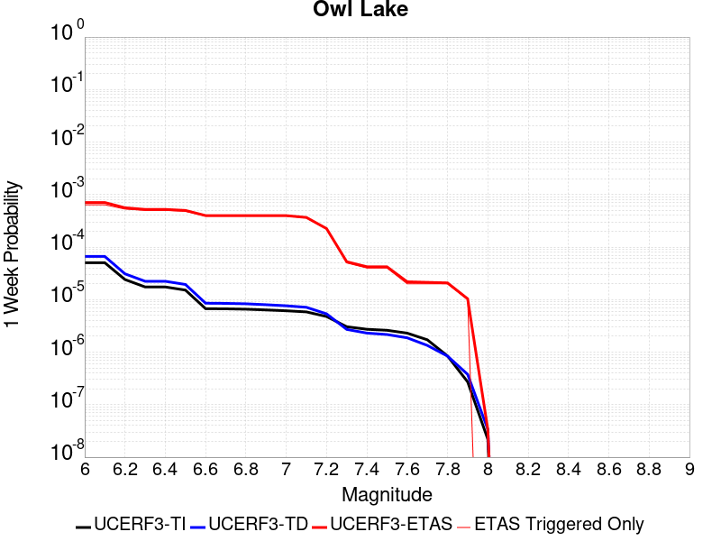 |  |  |  |

| Magnitude | 1 wk TI Prob | 1 wk TD Prob | 1 wk ETAS Prob | 1 wk ETAS/TD Gain | 1 wk ETAS Triggered Only | 1 mo TI Prob | 1 mo TD Prob | 1 mo ETAS Prob | 1 mo ETAS/TD Gain | 1 mo ETAS Triggered Only | 1 yr TI Prob | 1 yr TD Prob | 1 yr ETAS Prob | 1 yr ETAS/TD Gain | 1 yr ETAS Triggered Only | 10 yr TI Prob | 10 yr TD Prob | 10 yr ETAS Prob | 10 yr ETAS/TD Gain | 10 yr ETAS Triggered Only |
|-----|-----|-----|-----|-----|-----|-----|-----|-----|-----|-----|-----|-----|-----|-----|-----|-----|-----|-----|-----|-----|
| 6.0 | 5.0320643E-5 | 6.637151E-5 | 7.920127E-4 | 11.9330225 | 7.256894E-4 | 2.1564208E-4 | 2.844246E-4 | 0.0033182625 | 11.666581 | 0.003034701 | 0.0026222812 | 0.0034584238 | 0.01450335 | 4.19363 | 0.011083256 | 0.02591553 | 0.034147043 | 0.05466457 | 1.600858 | 0.021242907 |
| 6.1 | 5.0320643E-5 | 6.637151E-5 | 7.920127E-4 | 11.9330225 | 7.256894E-4 | 2.1564208E-4 | 2.844246E-4 | 0.0033182625 | 11.666581 | 0.003034701 | 0.0026222812 | 0.0034584238 | 0.01450335 | 4.19363 | 0.011083256 | 0.02591553 | 0.034147043 | 0.05466457 | 1.600858 | 0.021242907 |
| 6.2 | 2.4125871E-5 | 3.098766E-5 | 5.587454E-4 | 18.031225 | 5.277741E-4 | 1.0339249E-4 | 1.3279865E-4 | 0.0027053559 | 20.37186 | 0.0025728988 | 0.0012580766 | 0.0016157742 | 0.010573437 | 6.5438824 | 0.00897216 | 0.012509781 | 0.016073797 | 0.03223672 | 2.005545 | 0.01642697 |
| 6.3 | 1.7433485E-5 | 2.2360802E-5 | 5.501231E-4 | 24.602118 | 5.277741E-4 | 7.471279E-5 | 9.582938E-5 | 0.00240462 | 25.09272 | 0.0023090118 | 9.0924866E-4 | 0.0011662478 | 0.009205417 | 7.893191 | 0.008048555 | 0.009055373 | 0.01163159 | 0.025585333 | 2.199642 | 0.014117957 |
| 6.4 | 1.7433485E-5 | 2.2360802E-5 | 5.501231E-4 | 24.602118 | 5.277741E-4 | 7.471279E-5 | 9.582938E-5 | 0.00240462 | 25.09272 | 0.0023090118 | 9.0924866E-4 | 0.0011662478 | 0.009205417 | 7.893191 | 0.008048555 | 0.009055373 | 0.01163159 | 0.025585333 | 2.199642 | 0.014117957 |
| 6.5 | 1.5182742E-5 | 1.9433977E-5 | 5.471978E-4 | 28.156761 | 5.277741E-4 | 6.506727E-5 | 8.3286664E-5 | 0.0023261397 | 27.92932 | 0.00224304 | 7.919061E-4 | 0.0010136948 | 0.008724567 | 8.6067 | 0.0077186963 | 0.0078909 | 0.0101209 | 0.023181714 | 2.2904794 | 0.013194352 |
| 6.6 | 6.7271576E-6 | 8.550545E-6 | 5.3632015E-4 | 62.723503 | 5.277741E-4 | 2.8830356E-5 | 3.6644713E-5 | 0.0018837864 | 51.406773 | 0.0018472094 | 3.5095305E-4 | 4.460637E-4 | 0.0063149314 | 14.157018 | 0.005871487 | 0.0035039932 | 0.0044694655 | 0.014321001 | 3.2041867 | 0.009895764 |
| 6.7 | 6.682835E-6 | 8.482986E-6 | 5.362526E-4 | 63.215076 | 5.277741E-4 | 2.8640408E-5 | 3.635518E-5 | 0.0018834975 | 51.808228 | 0.0018472094 | 3.4864116E-4 | 4.4254007E-4 | 0.0063114287 | 14.261824 | 0.005871487 | 0.003480947 | 0.004434389 | 0.014154914 | 3.1920774 | 0.009763821 |
| 6.8 | 6.5774975E-6 | 8.329444E-6 | 5.3609913E-4 | 64.36193 | 5.277741E-4 | 2.8188972E-5 | 3.569716E-5 | 0.0018828406 | 52.744827 | 0.0018472094 | 3.4314668E-4 | 4.3453192E-4 | 0.006303468 | 14.506339 | 0.005871487 | 0.0034261728 | 0.004354527 | 0.0140758315 | 3.232459 | 0.009763821 |
| 6.9 | 6.363419E-6 | 8.002579E-6 | 5.357725E-4 | 66.949974 | 5.277741E-4 | 2.727151E-5 | 3.429635E-5 | 0.0018814424 | 54.858387 | 0.0018472094 | 3.3198006E-4 | 4.1748365E-4 | 0.0062865196 | 15.058122 | 0.005871487 | 0.0033148455 | 0.0041844994 | 0.013907463 | 3.323567 | 0.009763821 |
| 7.0 | 6.1342453E-6 | 7.63473E-6 | 5.3540483E-4 | 70.12754 | 5.277741E-4 | 2.6289357E-5 | 3.271989E-5 | 0.0018798688 | 57.453396 | 0.0018472094 | 3.2002592E-4 | 3.9829736E-4 | 0.0062674456 | 15.735595 | 0.005871487 | 0.0031956544 | 0.0039931675 | 0.013718 | 3.435368 | 0.009763821 |
| 7.1 | 5.842926E-6 | 7.14521E-6 | 4.6894426E-4 | 65.63058 | 4.6180235E-4 | 2.504087E-5 | 3.0622E-5 | 0.0017458353 | 57.01245 | 0.0017152659 | 3.0482994E-4 | 3.7276448E-4 | 0.0059123267 | 15.860757 | 0.005541628 | 0.0030441214 | 0.0037385917 | 0.0128743835 | 3.4436452 | 0.009170075 |
| 7.2 | 4.77173E-6 | 5.361204E-6 | 3.3521827E-4 | 62.526672 | 3.2985883E-4 | 2.045011E-5 | 2.297641E-5 | 0.0013423814 | 58.42433 | 0.0013194353 | 2.4895166E-4 | 2.7970594E-4 | 0.0040390445 | 14.440326 | 0.0037603904 | 0.0024867293 | 0.0028100624 | 0.008862409 | 3.1538124 | 0.006069402 |
| 7.3 | 3.0494948E-6 | 2.7124704E-6 | 6.868406E-5 | 25.321587 | 6.597176E-5 | 1.3069198E-5 | 1.1624823E-5 | 2.0953781E-4 | 18.025034 | 1.9791529E-4 | 1.5910587E-4 | 1.4152318E-4 | 0.0010649972 | 7.525249 | 9.236047E-4 | 0.0015899199 | 0.0014242887 | 0.0028077224 | 1.9713156 | 0.001385407 |
| 7.4 | 2.7263884E-6 | 2.3075613E-6 | 6.827917E-5 | 29.589323 | 6.597176E-5 | 1.1684469E-5 | 9.889511E-6 | 1.4183174E-4 | 14.341633 | 1.3194353E-4 | 1.4224913E-4 | 1.2039825E-4 | 5.82145E-4 | 4.8351617 | 4.6180235E-4 | 0.0014215811 | 0.0012122075 | 0.0018052337 | 1.4892117 | 5.9374585E-4 |
| 7.5 | 2.6090431E-6 | 2.1674637E-6 | 6.813908E-5 | 31.437246 | 6.597176E-5 | 1.1181565E-5 | 9.289097E-6 | 1.412314E-4 | 15.203997 | 1.3194353E-4 | 1.3612706E-4 | 1.1308899E-4 | 5.0887483E-4 | 4.4997735 | 3.9583058E-4 | 0.001360437 | 0.0011389464 | 0.0016661193 | 1.4628602 | 5.277741E-4 |
| 7.6 | 2.3008756E-6 | 1.8745708E-6 | 1.8745708E-6 | 1.0 | 0.0 | 9.860858E-6 | 8.0338505E-6 | 8.0338505E-6 | 1.0 | 0.0 | 1.20049335E-4 | 9.7807824E-5 | 3.6166908E-4 | 3.697752 | 2.6388705E-4 | 0.001199845 | 9.85921E-4 | 0.0013154546 | 1.3342394 | 3.2985883E-4 |
| 7.7 | 1.7184348E-6 | 1.343562E-6 | 1.343562E-6 | 1.0 | 0.0 | 7.3646997E-6 | 5.7581105E-6 | 5.7581105E-6 | 1.0 | 0.0 | 8.966153E-5 | 7.010278E-5 | 2.0203706E-4 | 2.8820121 | 1.3194353E-4 | 8.962536E-4 | 7.086945E-4 | 9.0646953E-4 | 1.2790695 | 1.9791529E-4 |
| 7.8 | 8.4612907E-7 | 8.4176E-7 | 8.4176E-7 | 1.0 | 0.0 | 3.6262625E-6 | 3.607538E-6 | 3.607538E-6 | 1.0 | 0.0 | 4.4148852E-5 | 4.392091E-5 | 1.0988978E-4 | 2.5019922 | 6.597176E-5 | 4.414008E-4 | 4.4459777E-4 | 5.105402E-4 | 1.1483194 | 6.597176E-5 |
| 7.9 | 2.716738E-7 | 3.7732943E-7 | 3.7732943E-7 | 1.0 | 0.0 | 1.1643157E-6 | 1.6171252E-6 | 1.6171252E-6 | 1.0 | 0.0 | 1.4175452E-5 | 1.9688332E-5 | 1.9688332E-5 | 1.0 | 0.0 | 1.4174548E-4 | 1.9863734E-4 | 1.9863734E-4 | 1.0 | 0.0 |
| 8.0 | 2.1995428E-8 | 3.389418E-8 | 3.389418E-8 | 1.0 | 0.0 | 9.426611E-8 | 1.4526077E-7 | 1.4526077E-7 | 1.0 | 0.0 | 1.1476893E-6 | 1.768549E-6 | 1.768549E-6 | 1.0 | 0.0 | 1.14768345E-5 | 1.798665E-5 | 1.798665E-5 | 1.0 | 0.0 |

## Garlock (East)
*[(top)](#table-of-contents)*

| 1 Week | 1 Month | 1 Year | 10 Year |
|-----|-----|-----|-----|
|  |  |  |  |

| Magnitude | 1 wk TI Prob | 1 wk TD Prob | 1 wk ETAS Prob | 1 wk ETAS/TD Gain | 1 wk ETAS Triggered Only | 1 mo TI Prob | 1 mo TD Prob | 1 mo ETAS Prob | 1 mo ETAS/TD Gain | 1 mo ETAS Triggered Only | 1 yr TI Prob | 1 yr TD Prob | 1 yr ETAS Prob | 1 yr ETAS/TD Gain | 1 yr ETAS Triggered Only | 10 yr TI Prob | 10 yr TD Prob | 10 yr ETAS Prob | 10 yr ETAS/TD Gain | 10 yr ETAS Triggered Only |
|-----|-----|-----|-----|-----|-----|-----|-----|-----|-----|-----|-----|-----|-----|-----|-----|-----|-----|-----|-----|-----|
| 6.0 | 4.5092507E-5 | 6.2917425E-5 | 3.2678788E-4 | 5.193917 | 2.6388705E-4 | 1.9323928E-4 | 2.6962077E-4 | 0.0020503781 | 7.604675 | 0.0017812377 | 0.0023501497 | 0.0032781374 | 0.01156333 | 3.5274088 | 0.008312442 | 0.023254504 | 0.03235903 | 0.047679905 | 1.4734652 | 0.015833223 |
| 6.1 | 4.5092507E-5 | 6.2917425E-5 | 3.2678788E-4 | 5.193917 | 2.6388705E-4 | 1.9323928E-4 | 2.6962077E-4 | 0.0020503781 | 7.604675 | 0.0017812377 | 0.0023501497 | 0.0032781374 | 0.01156333 | 3.5274088 | 0.008312442 | 0.023254504 | 0.03235903 | 0.047679905 | 1.4734652 | 0.015833223 |
| 6.2 | 2.6674514E-5 | 3.452091E-5 | 2.3242937E-4 | 6.7330027 | 1.9791529E-4 | 1.1431433E-4 | 1.4793854E-4 | 0.0014012166 | 9.471613 | 0.0012534636 | 0.0013908884 | 0.0017996968 | 0.0075947638 | 4.220024 | 0.005805515 | 0.01382215 | 0.017896036 | 0.028651364 | 1.6009895 | 0.010951313 |
| 6.3 | 2.6674514E-5 | 3.452091E-5 | 2.3242937E-4 | 6.7330027 | 1.9791529E-4 | 1.1431433E-4 | 1.4793854E-4 | 0.0014012166 | 9.471613 | 0.0012534636 | 0.0013908884 | 0.0017996968 | 0.0075947638 | 4.220024 | 0.005805515 | 0.01382215 | 0.017896036 | 0.028651364 | 1.6009895 | 0.010951313 |
| 6.4 | 2.5312667E-5 | 3.234991E-5 | 2.302588E-4 | 7.117757 | 1.9791529E-4 | 1.0847834E-4 | 1.3863528E-4 | 0.001391925 | 10.040194 | 0.0012534636 | 0.0013199237 | 0.0016866071 | 0.00741647 | 4.397272 | 0.0057395436 | 0.013121112 | 0.016783953 | 0.02742173 | 1.6338065 | 0.010819369 |
| 6.5 | 2.5312667E-5 | 3.234991E-5 | 2.302588E-4 | 7.117757 | 1.9791529E-4 | 1.0847834E-4 | 1.3863528E-4 | 0.001391925 | 10.040194 | 0.0012534636 | 0.0013199237 | 0.0016866071 | 0.00741647 | 4.397272 | 0.0057395436 | 0.013121112 | 0.016783953 | 0.02742173 | 1.6338065 | 0.010819369 |
| 6.6 | 2.246556E-5 | 2.8144346E-5 | 2.2605406E-4 | 8.031953 | 1.9791529E-4 | 9.627742E-5 | 1.20613186E-4 | 0.0013079618 | 10.844268 | 0.0011874917 | 0.0011715472 | 0.0014674999 | 0.006869246 | 4.6809173 | 0.0054096845 | 0.011653901 | 0.0146240825 | 0.024765173 | 1.6934514 | 0.010291595 |
| 6.7 | 2.2241198E-5 | 2.781406E-5 | 2.2572385E-4 | 8.1154585 | 1.9791529E-4 | 9.531594E-5 | 1.1919779E-4 | 0.001306548 | 10.961176 | 0.0011874917 | 0.0011598538 | 0.0014502906 | 0.0068521295 | 4.72466 | 0.0054096845 | 0.011538187 | 0.014454261 | 0.024597099 | 1.7017195 | 0.010291595 |
| 6.8 | 1.9528685E-5 | 2.3908038E-5 | 2.218186E-4 | 9.277992 | 1.9791529E-4 | 8.369167E-5 | 1.0245911E-4 | 0.0012898291 | 12.588721 | 0.0011874917 | 0.0010184698 | 0.0012467455 | 0.006583796 | 5.280786 | 0.005343713 | 0.010138147 | 0.012441495 | 0.022148991 | 1.7802515 | 0.009829793 |
| 6.9 | 1.3318621E-5 | 1.5207374E-5 | 2.1311965E-4 | 14.014231 | 1.9791529E-4 | 5.7078556E-5 | 6.517287E-5 | 0.0011866197 | 18.207266 | 0.00112152 | 6.9470983E-4 | 7.931965E-4 | 0.0056053153 | 7.0667424 | 0.004815939 | 0.0069254204 | 0.007944281 | 0.016321583 | 2.0545073 | 0.008444386 |
| 7.0 | 1.1760853E-5 | 1.3115987E-5 | 2.1102869E-4 | 16.089424 | 1.9791529E-4 | 5.0402683E-5 | 5.621019E-5 | 0.0011776672 | 20.951134 | 0.00112152 | 6.134799E-4 | 6.841492E-4 | 0.005496793 | 8.034494 | 0.004815939 | 0.0061178906 | 0.006860767 | 0.014985141 | 2.1841788 | 0.008180499 |
| 7.1 | 1.0064758E-5 | 1.0910848E-5 | 2.0882399E-4 | 19.139116 | 1.9791529E-4 | 4.3133965E-5 | 4.675996E-5 | 0.0011022588 | 23.572706 | 0.0010555482 | 5.2502943E-4 | 5.691573E-4 | 0.0051845526 | 9.109173 | 0.0046180235 | 0.005237907 | 0.005717105 | 0.013457268 | 2.3538604 | 0.0077846684 |
| 7.2 | 9.768808E-6 | 1.0506669E-5 | 2.0841988E-4 | 19.836912 | 1.9791529E-4 | 4.186565E-5 | 4.5027828E-5 | 0.0011005285 | 24.441076 | 0.0010555482 | 5.095951E-4 | 5.480794E-4 | 0.0050317007 | 9.180606 | 0.00448608 | 0.0050842804 | 0.0055073434 | 0.013117922 | 2.3818965 | 0.0076527246 |
| 7.3 | 9.344516E-6 | 9.95218E-6 | 1.418944E-4 | 14.257619 | 1.3194353E-4 | 4.004731E-5 | 4.2651525E-5 | 8.3427894E-4 | 19.560354 | 7.9166115E-4 | 4.8746695E-4 | 5.1916204E-4 | 0.0044094753 | 8.493447 | 0.0038923342 | 0.0048639905 | 0.0052189473 | 0.0120442035 | 2.307784 | 0.0068610637 |
| 7.4 | 9.023491E-6 | 9.498219E-6 | 9.498219E-6 | 1.0 | 0.0 | 3.867153E-5 | 4.0706036E-5 | 6.3442776E-4 | 15.585594 | 5.9374585E-4 | 4.7072413E-4 | 4.9548666E-4 | 0.0037924405 | 7.653971 | 0.003298588 | 0.004697283 | 0.004982321 | 0.010693268 | 2.1462424 | 0.0057395436 |
| 7.5 | 7.081253E-6 | 7.0943947E-6 | 7.0943947E-6 | 1.0 | 0.0 | 3.0347876E-5 | 3.0404199E-5 | 2.9428324E-4 | 9.679032 | 2.6388705E-4 | 3.6942272E-4 | 3.70109E-4 | 0.0023485294 | 6.3455076 | 0.001979153 | 0.003688092 | 0.00372781 | 0.0071455534 | 1.9168234 | 0.0034305318 |
| 7.6 | 6.116396E-6 | 5.9656345E-6 | 5.9656345E-6 | 1.0 | 0.0 | 2.6212863E-5 | 2.5566756E-5 | 9.153684E-5 | 3.580307 | 6.597176E-5 | 3.1909486E-4 | 3.1123104E-4 | 0.0014983532 | 4.8142796 | 0.0011874917 | 0.0031863707 | 0.0031390795 | 0.0049804905 | 1.5866085 | 0.0018472094 |
| 7.7 | 4.797145E-6 | 4.763327E-6 | 4.763327E-6 | 1.0 | 0.0 | 2.055903E-5 | 2.04141E-5 | 2.04141E-5 | 1.0 | 0.0 | 2.5027743E-4 | 2.4851345E-4 | 8.4211177E-4 | 3.3885965 | 5.9374585E-4 | 0.0024999576 | 0.0025124948 | 0.003499585 | 1.3928726 | 9.895765E-4 |
| 7.8 | 3.4028885E-6 | 3.9838537E-6 | 3.9838537E-6 | 1.0 | 0.0 | 1.4583726E-5 | 1.7073547E-5 | 1.7073547E-5 | 1.0 | 0.0 | 1.775424E-4 | 2.0785068E-4 | 7.355151E-4 | 3.5386705 | 5.277741E-4 | 0.0017740062 | 0.0021040295 | 0.002959858 | 1.4067569 | 8.5763296E-4 |
| 7.9 | 2.5928412E-6 | 3.3770064E-6 | 3.3770064E-6 | 1.0 | 0.0 | 1.1112129E-5 | 1.4472805E-5 | 1.4472805E-5 | 1.0 | 0.0 | 1.3528178E-4 | 1.7619222E-4 | 4.4003277E-4 | 2.4974587 | 2.6388705E-4 | 0.0013519945 | 0.0017836117 | 0.0023104444 | 1.2953742 | 5.277741E-4 |
| 8.0 | 1.3743648E-6 | 1.6755408E-6 | 1.6755408E-6 | 1.0 | 0.0 | 5.8901214E-6 | 7.1808695E-6 | 7.1808695E-6 | 1.0 | 0.0 | 7.1709874E-5 | 8.742361E-5 | 2.193556E-4 | 2.5091116 | 1.3194353E-4 | 7.1686733E-4 | 8.847989E-4 | 0.0011484524 | 1.2979814 | 2.6388705E-4 |
| 8.1 | 3.6733252E-7 | 3.1526864E-7 | 3.1526864E-7 | 1.0 | 0.0 | 1.5742813E-6 | 1.3511507E-6 | 1.3511507E-6 | 1.0 | 0.0 | 1.9166706E-5 | 1.645015E-5 | 1.645015E-5 | 1.0 | 0.0 | 1.9165053E-4 | 1.6658098E-4 | 2.3254176E-4 | 1.3959682 | 6.597176E-5 |

## Airport Lake
*[(top)](#table-of-contents)*

| 1 Week | 1 Month | 1 Year | 10 Year |
|-----|-----|-----|-----|
| 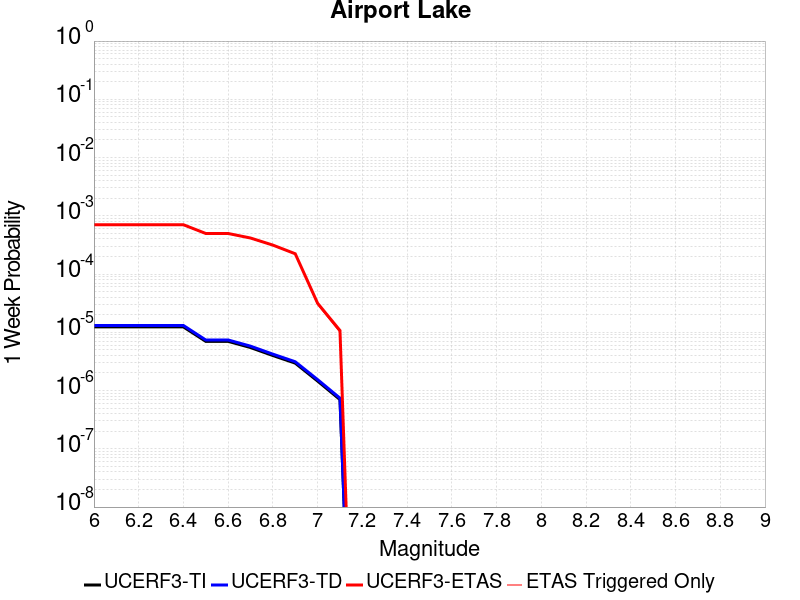 |  |  |  |

| Magnitude | 1 wk TI Prob | 1 wk TD Prob | 1 wk ETAS Prob | 1 wk ETAS/TD Gain | 1 wk ETAS Triggered Only | 1 mo TI Prob | 1 mo TD Prob | 1 mo ETAS Prob | 1 mo ETAS/TD Gain | 1 mo ETAS Triggered Only | 1 yr TI Prob | 1 yr TD Prob | 1 yr ETAS Prob | 1 yr ETAS/TD Gain | 1 yr ETAS Triggered Only | 10 yr TI Prob | 10 yr TD Prob | 10 yr ETAS Prob | 10 yr ETAS/TD Gain | 10 yr ETAS Triggered Only |
|-----|-----|-----|-----|-----|-----|-----|-----|-----|-----|-----|-----|-----|-----|-----|-----|-----|-----|-----|-----|-----|
| 6.0 | 1.2387061E-5 | 1.3103559E-5 | 6.728126E-4 | 51.345787 | 6.5971765E-4 | 5.3086325E-5 | 5.615706E-5 | 0.0026289113 | 46.81355 | 0.0025728988 | 6.461343E-4 | 6.8352616E-4 | 0.009979187 | 14.599568 | 0.009302019 | 0.0064425888 | 0.006817048 | 0.024573518 | 3.6047156 | 0.017878348 |
| 6.1 | 1.2387061E-5 | 1.3103559E-5 | 6.728126E-4 | 51.345787 | 6.5971765E-4 | 5.3086325E-5 | 5.615706E-5 | 0.0026289113 | 46.81355 | 0.0025728988 | 6.461343E-4 | 6.8352616E-4 | 0.009979187 | 14.599568 | 0.009302019 | 0.0064425888 | 0.006817048 | 0.024573518 | 3.6047156 | 0.017878348 |
| 6.2 | 1.2387061E-5 | 1.3103559E-5 | 6.728126E-4 | 51.345787 | 6.5971765E-4 | 5.3086325E-5 | 5.615706E-5 | 0.0026289113 | 46.81355 | 0.0025728988 | 6.461343E-4 | 6.8352616E-4 | 0.009979187 | 14.599568 | 0.009302019 | 0.0064425888 | 0.006817048 | 0.024573518 | 3.6047156 | 0.017878348 |
| 6.3 | 1.2387061E-5 | 1.3103559E-5 | 6.728126E-4 | 51.345787 | 6.5971765E-4 | 5.3086325E-5 | 5.615706E-5 | 0.0026289113 | 46.81355 | 0.0025728988 | 6.461343E-4 | 6.8352616E-4 | 0.009979187 | 14.599568 | 0.009302019 | 0.0064425888 | 0.006817048 | 0.024573518 | 3.6047156 | 0.017878348 |
| 6.4 | 1.2387061E-5 | 1.3103559E-5 | 6.728126E-4 | 51.345787 | 6.5971765E-4 | 5.3086325E-5 | 5.615706E-5 | 0.0026289113 | 46.81355 | 0.0025728988 | 6.461343E-4 | 6.8352616E-4 | 0.009979187 | 14.599568 | 0.009302019 | 0.0064425888 | 0.006817048 | 0.024573518 | 3.6047156 | 0.017878348 |
| 6.5 | 6.9922594E-6 | 7.385145E-6 | 4.6918407E-4 | 63.530785 | 4.6180235E-4 | 2.996648E-5 | 3.165027E-5 | 0.0019447709 | 61.445633 | 0.0019131812 | 3.6478083E-4 | 3.8527933E-4 | 0.0074415384 | 19.31466 | 0.0070589785 | 0.003641826 | 0.003846651 | 0.017187404 | 4.4681473 | 0.013392268 |
| 6.6 | 6.9922594E-6 | 7.385145E-6 | 4.6918407E-4 | 63.530785 | 4.6180235E-4 | 2.996648E-5 | 3.165027E-5 | 0.0019447709 | 61.445633 | 0.0019131812 | 3.6478083E-4 | 3.8527933E-4 | 0.0074415384 | 19.31466 | 0.0070589785 | 0.003641826 | 0.003846651 | 0.017187404 | 4.4681473 | 0.013392268 |
| 6.7 | 5.477277E-6 | 5.7862417E-6 | 4.0161452E-4 | 69.40853 | 3.9583058E-4 | 2.3473833E-5 | 2.4797964E-5 | 0.0018059914 | 72.82822 | 0.0017812377 | 2.8575645E-4 | 3.0187727E-4 | 0.006501351 | 21.536404 | 0.006201346 | 0.0028538927 | 0.003015056 | 0.01485417 | 4.926665 | 0.011874918 |
| 6.8 | 3.9950432E-6 | 4.2192128E-6 | 3.3407664E-4 | 79.179855 | 3.2985883E-4 | 1.7121502E-5 | 1.808223E-5 | 0.0014694348 | 81.26402 | 0.0014513788 | 2.0843433E-4 | 2.2013167E-4 | 0.00457331 | 20.775337 | 0.0043541365 | 0.0020823893 | 0.0021994072 | 0.010361914 | 4.7112303 | 0.008180499 |
| 6.9 | 2.95695E-6 | 3.1231173E-6 | 2.6700934E-4 | 85.4945 | 2.6388705E-4 | 1.2672582E-5 | 1.33847325E-5 | 0.0011348897 | 84.78986 | 0.00112152 | 1.5427776E-4 | 1.629492E-4 | 0.003856766 | 23.668518 | 0.0036944188 | 0.001541707 | 0.0016285196 | 0.008214952 | 5.0444293 | 0.006597176 |
| 7.0 | 1.456072E-6 | 1.5408596E-6 | 6.751252E-5 | 43.814846 | 6.597176E-5 | 6.2402937E-6 | 6.603673E-6 | 4.6840298E-4 | 70.93067 | 4.6180235E-4 | 7.597293E-5 | 8.039776E-5 | 0.0013337604 | 16.589523 | 0.0012534636 | 7.594696E-4 | 8.0378563E-4 | 0.00317686 | 3.9523726 | 0.0023749834 |
| 7.1 | 6.995192E-7 | 7.409207E-7 | 7.409207E-7 | 1.0 | 0.0 | 2.997936E-6 | 3.1753743E-6 | 3.990047E-4 | 125.65595 | 3.9583058E-4 | 3.649926E-5 | 3.8660182E-5 | 7.6432154E-4 | 19.77025 | 7.256894E-4 | 3.6493264E-4 | 3.8660184E-4 | 0.0016395807 | 4.2410064 | 0.0012534636 |

## Panamint Valley
*[(top)](#table-of-contents)*

| 1 Week | 1 Month | 1 Year | 10 Year |
|-----|-----|-----|-----|
|  |  |  |  |

| Magnitude | 1 wk TI Prob | 1 wk TD Prob | 1 wk ETAS Prob | 1 wk ETAS/TD Gain | 1 wk ETAS Triggered Only | 1 mo TI Prob | 1 mo TD Prob | 1 mo ETAS Prob | 1 mo ETAS/TD Gain | 1 mo ETAS Triggered Only | 1 yr TI Prob | 1 yr TD Prob | 1 yr ETAS Prob | 1 yr ETAS/TD Gain | 1 yr ETAS Triggered Only | 10 yr TI Prob | 10 yr TD Prob | 10 yr ETAS Prob | 10 yr ETAS/TD Gain | 10 yr ETAS Triggered Only |
|-----|-----|-----|-----|-----|-----|-----|-----|-----|-----|-----|-----|-----|-----|-----|-----|-----|-----|-----|-----|-----|
| 6.0 | 3.0211835E-5 | 3.39879E-5 | 4.2980502E-4 | 12.645824 | 3.9583058E-4 | 1.2947287E-4 | 1.4565447E-4 | 0.0023224056 | 15.944623 | 0.0021770683 | 0.0015751923 | 0.0017719301 | 0.010201354 | 5.757198 | 0.008444386 | 0.015640736 | 0.017584875 | 0.03346373 | 1.9029838 | 0.016163083 |
| 6.1 | 3.0211835E-5 | 3.39879E-5 | 4.2980502E-4 | 12.645824 | 3.9583058E-4 | 1.2947287E-4 | 1.4565447E-4 | 0.0023224056 | 15.944623 | 0.0021770683 | 0.0015751923 | 0.0017719301 | 0.010201354 | 5.757198 | 0.008444386 | 0.015640736 | 0.017584875 | 0.03346373 | 1.9029838 | 0.016163083 |
| 6.2 | 3.0211835E-5 | 3.39879E-5 | 4.2980502E-4 | 12.645824 | 3.9583058E-4 | 1.2947287E-4 | 1.4565447E-4 | 0.0023224056 | 15.944623 | 0.0021770683 | 0.0015751923 | 0.0017719301 | 0.010201354 | 5.757198 | 0.008444386 | 0.015640736 | 0.017584875 | 0.03346373 | 1.9029838 | 0.016163083 |
| 6.3 | 2.8573924E-5 | 3.210589E-5 | 4.2792378E-4 | 13.328512 | 3.9583058E-4 | 1.2245393E-4 | 1.3758958E-4 | 0.0023143583 | 16.820738 | 0.0021770683 | 0.001489857 | 0.0016738938 | 0.009972422 | 5.957619 | 0.008312442 | 0.01479908 | 0.01661945 | 0.032124657 | 1.9329556 | 0.015767252 |
| 6.4 | 2.8573924E-5 | 3.210589E-5 | 4.2792378E-4 | 13.328512 | 3.9583058E-4 | 1.2245393E-4 | 1.3758958E-4 | 0.0023143583 | 16.820738 | 0.0021770683 | 0.001489857 | 0.0016738938 | 0.009972422 | 5.957619 | 0.008312442 | 0.01479908 | 0.01661945 | 0.032124657 | 1.9329556 | 0.015767252 |
| 6.5 | 2.7468774E-5 | 3.0831525E-5 | 4.266499E-4 | 13.838106 | 3.9583058E-4 | 1.1771801E-4 | 1.3212857E-4 | 0.002308909 | 17.474716 | 0.0021770683 | 0.0014322745 | 0.0016075056 | 0.0097089885 | 6.039785 | 0.008114527 | 0.014230782 | 0.015965264 | 0.031026358 | 1.9433664 | 0.015305449 |
| 6.6 | 2.6135967E-5 | 2.9255436E-5 | 4.2507445E-4 | 14.529759 | 3.9583058E-4 | 1.1200648E-4 | 1.2537456E-4 | 0.0023021698 | 18.362335 | 0.0021770683 | 0.0013628257 | 0.001525393 | 0.009429929 | 6.181967 | 0.007916612 | 0.013544982 | 0.015155562 | 0.029839218 | 1.9688624 | 0.0149096185 |
| 6.7 | 2.4498746E-5 | 2.7344193E-5 | 4.2316396E-4 | 15.47546 | 3.9583058E-4 | 1.04990395E-4 | 1.17184274E-4 | 0.0022939974 | 19.575983 | 0.0021770683 | 0.0012775084 | 0.0014258098 | 0.009001746 | 6.3134265 | 0.007586753 | 0.012701893 | 0.014172745 | 0.028285723 | 1.995783 | 0.014315872 |
| 6.8 | 2.2244329E-5 | 2.4938103E-5 | 3.547887E-4 | 14.226772 | 3.2985883E-4 | 9.532935E-5 | 1.06873325E-4 | 0.0022177442 | 20.751148 | 0.0021110964 | 0.0011600169 | 0.0013004278 | 0.008350227 | 6.4211383 | 0.0070589785 | 0.011539802 | 0.012933899 | 0.026413426 | 2.042186 | 0.013656155 |
| 6.9 | 1.9902658E-5 | 2.2292743E-5 | 3.521442E-4 | 15.796361 | 3.2985883E-4 | 8.529431E-5 | 9.553693E-5 | 0.0021404661 | 22.404594 | 0.0020451248 | 0.0010379635 | 0.00116256 | 0.007620277 | 6.5547385 | 0.006465233 | 0.010331288 | 0.011569886 | 0.023959497 | 2.07085 | 0.012534635 |
| 7.0 | 1.8353881E-5 | 2.0568525E-5 | 3.5042057E-4 | 17.036737 | 3.2985883E-4 | 7.865712E-5 | 8.814794E-5 | 0.0020011605 | 22.702293 | 0.0019131812 | 9.5722964E-4 | 0.0010726905 | 0.007135582 | 6.652042 | 0.006069402 | 0.009531168 | 0.010680057 | 0.022101814 | 2.0694473 | 0.011545058 |
| 7.1 | 1.7667631E-5 | 1.9774876E-5 | 3.4962717E-4 | 17.680372 | 3.2985883E-4 | 7.571623E-5 | 8.474681E-5 | 0.0019317997 | 22.794954 | 0.0018472094 | 9.2145515E-4 | 0.0010313216 | 0.006962657 | 6.7511983 | 0.005937459 | 0.009176437 | 0.010270242 | 0.021304965 | 2.0744364 | 0.011149229 |
| 7.2 | 1.6381597E-5 | 1.8160366E-5 | 3.4801319E-4 | 19.163336 | 3.2985883E-4 | 7.020495E-5 | 7.782792E-5 | 0.0017929603 | 23.037495 | 0.0017152659 | 8.544101E-4 | 9.471603E-4 | 0.006022175 | 6.358137 | 0.005079826 | 0.008511325 | 0.0094358865 | 0.018715482 | 1.9834365 | 0.00936799 |
| 7.3 | 1.4520491E-5 | 1.5968182E-5 | 2.1388031E-4 | 13.3941555 | 1.9791529E-4 | 6.222919E-5 | 6.8433365E-5 | 0.0013877783 | 20.279266 | 0.0013194353 | 7.57377E-4 | 8.328739E-4 | 0.005183384 | 6.2234917 | 0.0043541365 | 0.0075480095 | 0.008300635 | 0.016020685 | 1.9300554 | 0.0077846684 |
| 7.4 | 1.2852287E-5 | 1.4146948E-5 | 2.1205944E-4 | 14.989766 | 1.9791529E-4 | 5.5080065E-5 | 6.0628456E-5 | 0.0013799837 | 22.76132 | 0.0013194353 | 6.7039346E-4 | 7.379173E-4 | 0.0049569947 | 6.7175474 | 0.004222193 | 0.0066837464 | 0.0073575918 | 0.014692065 | 1.9968579 | 0.0073888376 |
| 7.5 | 1.1637851E-5 | 1.2838205E-5 | 2.1075095E-4 | 16.41592 | 1.9791529E-4 | 4.987555E-5 | 5.5019806E-5 | 0.0013084144 | 23.780788 | 0.0012534636 | 6.070656E-4 | 6.6967594E-4 | 0.0047571864 | 7.1037135 | 0.0040902495 | 0.006054099 | 0.006679477 | 0.013822368 | 2.0693786 | 0.0071909223 |
| 7.6 | 3.0068115E-6 | 3.3335807E-6 | 1.3527667E-4 | 40.57999 | 1.3194353E-4 | 1.2886271E-5 | 1.4286737E-5 | 6.0802413E-4 | 42.558643 | 5.9374585E-4 | 1.5687906E-4 | 1.7393442E-4 | 0.0020867828 | 11.997526 | 0.0019131812 | 0.0015676835 | 0.0017394236 | 0.0049005602 | 2.817347 | 0.0031666446 |

## Hunter Mountain-Saline Valley
*[(top)](#table-of-contents)*

| 1 Week | 1 Month | 1 Year | 10 Year |
|-----|-----|-----|-----|
| 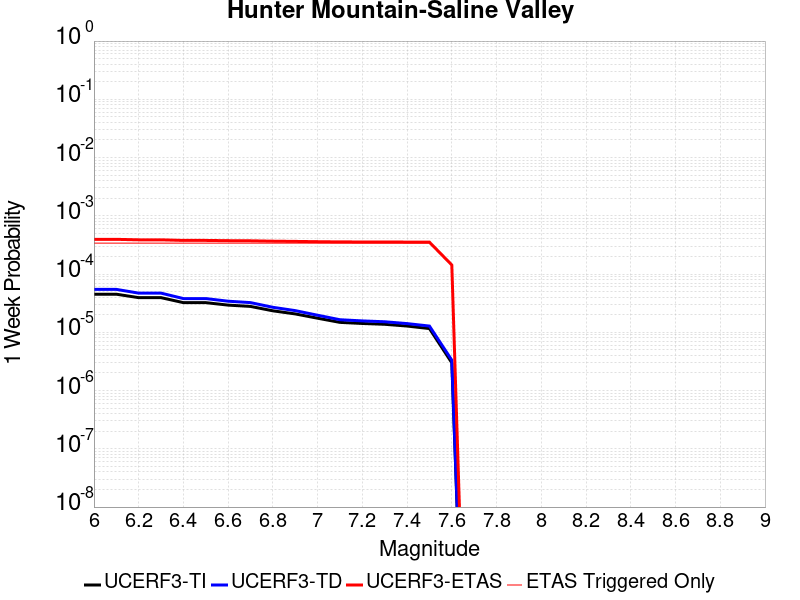 |  | 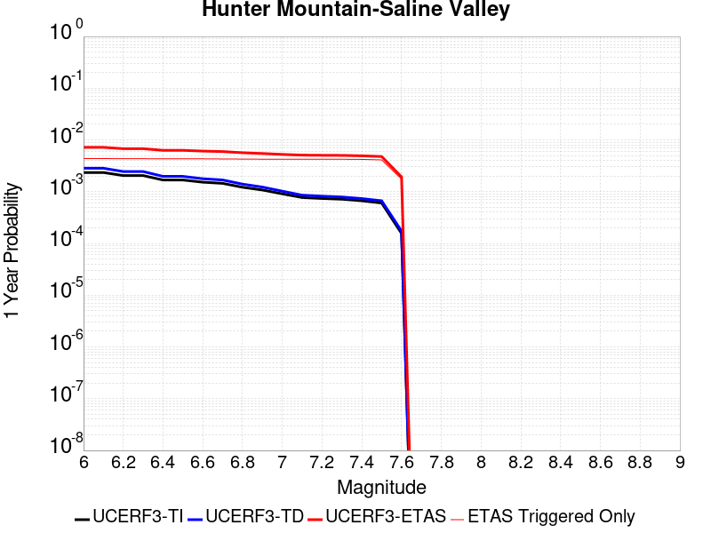 |  |

| Magnitude | 1 wk TI Prob | 1 wk TD Prob | 1 wk ETAS Prob | 1 wk ETAS/TD Gain | 1 wk ETAS Triggered Only | 1 mo TI Prob | 1 mo TD Prob | 1 mo ETAS Prob | 1 mo ETAS/TD Gain | 1 mo ETAS Triggered Only | 1 yr TI Prob | 1 yr TD Prob | 1 yr ETAS Prob | 1 yr ETAS/TD Gain | 1 yr ETAS Triggered Only | 10 yr TI Prob | 10 yr TD Prob | 10 yr ETAS Prob | 10 yr ETAS/TD Gain | 10 yr ETAS Triggered Only |
|-----|-----|-----|-----|-----|-----|-----|-----|-----|-----|-----|-----|-----|-----|-----|-----|-----|-----|-----|-----|-----|
| 6.0 | 4.5103672E-5 | 5.4576634E-5 | 2.524811E-4 | 4.6261764 | 1.9791529E-4 | 1.9328714E-4 | 2.3387549E-4 | 0.0015530022 | 6.640295 | 0.0013194353 | 0.002350731 | 0.002843864 | 0.0071198335 | 2.5035775 | 0.0042881644 | 0.023260195 | 0.028095365 | 0.035468966 | 1.262449 | 0.007586753 |
| 6.1 | 4.5103672E-5 | 5.4576634E-5 | 2.524811E-4 | 4.6261764 | 1.9791529E-4 | 1.9328714E-4 | 2.3387549E-4 | 0.0015530022 | 6.640295 | 0.0013194353 | 0.002350731 | 0.002843864 | 0.0071198335 | 2.5035775 | 0.0042881644 | 0.023260195 | 0.028095365 | 0.035468966 | 1.262449 | 0.007586753 |
| 6.2 | 3.9363465E-5 | 4.706859E-5 | 2.4497457E-4 | 5.2046294 | 1.9791529E-4 | 1.6868966E-4 | 2.017032E-4 | 0.0015208723 | 7.5401497 | 0.0013194353 | 0.002051862 | 0.0024531104 | 0.006730756 | 2.743764 | 0.0042881644 | 0.020330196 | 0.024276383 | 0.031678956 | 1.304929 | 0.007586753 |
| 6.3 | 3.9363465E-5 | 4.706859E-5 | 2.4497457E-4 | 5.2046294 | 1.9791529E-4 | 1.6868966E-4 | 2.017032E-4 | 0.0015208723 | 7.5401497 | 0.0013194353 | 0.002051862 | 0.0024531104 | 0.006730756 | 2.743764 | 0.0042881644 | 0.020330196 | 0.024276383 | 0.031678956 | 1.304929 | 0.007586753 |
| 6.4 | 3.2311684E-5 | 3.7955346E-5 | 2.3586313E-4 | 6.2142267 | 1.9791529E-4 | 1.384713E-4 | 1.6265604E-4 | 0.0014818767 | 9.110493 | 0.0013194353 | 0.0016845843 | 0.0019786113 | 0.006258291 | 3.1629717 | 0.0042881644 | 0.016718714 | 0.019618697 | 0.027056608 | 1.3791236 | 0.007586753 |
| 6.5 | 3.2311684E-5 | 3.7955346E-5 | 2.3586313E-4 | 6.2142267 | 1.9791529E-4 | 1.384713E-4 | 1.6265604E-4 | 0.0014818767 | 9.110493 | 0.0013194353 | 0.0016845843 | 0.0019786113 | 0.006258291 | 3.1629717 | 0.0042881644 | 0.016718714 | 0.019618697 | 0.027056608 | 1.3791236 | 0.007586753 |
| 6.6 | 2.9305844E-5 | 3.4185676E-5 | 2.320942E-4 | 6.7892237 | 1.9791529E-4 | 1.2559042E-4 | 1.4650216E-4 | 0.0014657441 | 10.004931 | 0.0013194353 | 0.0015279909 | 0.0017822674 | 0.0060627894 | 3.4017284 | 0.0042881644 | 0.015175272 | 0.017687662 | 0.025140224 | 1.4213424 | 0.007586753 |
| 6.7 | 2.7826512E-5 | 3.234788E-5 | 2.3025677E-4 | 7.11814 | 1.9791529E-4 | 1.19251024E-4 | 1.3862675E-4 | 0.0014578791 | 10.516578 | 0.0013194353 | 0.0014509142 | 0.0016865344 | 0.0059016063 | 3.4992507 | 0.004222193 | 0.014414776 | 0.01674504 | 0.024139885 | 1.441614 | 0.007520781 |
| 6.8 | 2.3389874E-5 | 2.686964E-5 | 2.2477961E-4 | 8.3655615 | 1.9791529E-4 | 1.0023846E-4 | 1.1515078E-4 | 0.0014344341 | 12.457007 | 0.0013194353 | 0.00121972 | 0.0014011064 | 0.0056173834 | 4.0092483 | 0.004222193 | 0.01213047 | 0.013928941 | 0.021344965 | 1.5324184 | 0.007520781 |
| 6.9 | 2.069209E-5 | 2.3572567E-5 | 2.2148319E-4 | 9.3958025 | 1.9791529E-4 | 8.867737E-5 | 1.01021586E-4 | 0.0014203236 | 14.059605 | 0.0013194353 | 0.0010791123 | 0.00122928 | 0.0054462827 | 4.4304657 | 0.004222193 | 0.010738871 | 0.012229833 | 0.019658636 | 1.607433 | 0.007520781 |
| 7.0 | 1.7462342E-5 | 1.9635625E-5 | 2.1754703E-4 | 11.079201 | 1.9791529E-4 | 7.483646E-5 | 8.4150095E-5 | 0.0014034744 | 16.678226 | 0.0013194353 | 9.1075303E-4 | 0.0010240684 | 0.0052419375 | 5.118737 | 0.004222193 | 0.009070295 | 0.010197128 | 0.017641218 | 1.7300184 | 0.007520781 |
| 7.1 | 1.4807709E-5 | 1.6443486E-5 | 2.1435552E-4 | 13.0358925 | 1.9791529E-4 | 6.3460066E-5 | 7.0470276E-5 | 0.0013898126 | 19.72197 | 0.0013194353 | 7.723524E-4 | 8.576544E-4 | 0.005076226 | 5.9187317 | 0.004222193 | 0.007696735 | 0.008546432 | 0.016002936 | 1.87247 | 0.007520781 |
| 7.2 | 1.4180048E-5 | 1.5700001E-5 | 2.1361219E-4 | 13.605871 | 1.9791529E-4 | 6.077022E-5 | 6.7284076E-5 | 0.0013866306 | 20.6086 | 0.0013194353 | 7.396263E-4 | 8.188919E-4 | 0.005037627 | 6.151761 | 0.004222193 | 0.0073716943 | 0.008161696 | 0.015621095 | 1.913952 | 0.007520781 |
| 7.3 | 1.3730402E-5 | 1.5173691E-5 | 2.1308598E-4 | 14.04312 | 1.9791529E-4 | 5.8843252E-5 | 6.502858E-5 | 0.0013843781 | 21.288765 | 0.0013194353 | 7.161811E-4 | 7.914514E-4 | 0.0050103026 | 6.3305244 | 0.004222193 | 0.007138774 | 0.007889261 | 0.015350709 | 1.9457728 | 0.007520781 |
| 7.4 | 1.2810095E-5 | 1.4110805E-5 | 2.1202331E-4 | 15.0255995 | 1.9791529E-4 | 5.489925E-5 | 6.0473565E-5 | 0.001379829 | 22.817062 | 0.0013194353 | 6.681934E-4 | 7.360327E-4 | 0.004955118 | 6.7321978 | 0.004222193 | 0.006661878 | 0.0073388456 | 0.0146734575 | 1.9994231 | 0.0073888376 |
| 7.5 | 1.1595659E-5 | 1.2802062E-5 | 2.1071482E-4 | 16.459444 | 1.9791529E-4 | 4.9694736E-5 | 5.486491E-5 | 0.0013082597 | 23.845106 | 0.0012534636 | 6.0486543E-4 | 6.677913E-4 | 0.0047553093 | 7.1209517 | 0.0040902495 | 0.006032217 | 0.006660718 | 0.013803744 | 2.0724108 | 0.0071909223 |
| 7.6 | 2.997694E-6 | 3.325705E-6 | 1.352688E-4 | 40.67372 | 1.3194353E-4 | 1.28471975E-5 | 1.4252984E-5 | 6.079904E-4 | 42.65706 | 5.9374585E-4 | 1.564034E-4 | 1.7352356E-4 | 0.0020863728 | 12.023571 | 0.0019131812 | 0.0015629337 | 0.0017353174 | 0.004896467 | 2.821655 | 0.0031666446 |

## Ash Hill
*[(top)](#table-of-contents)*

| 1 Week | 1 Month | 1 Year | 10 Year |
|-----|-----|-----|-----|
|  |  |  |  |

| Magnitude | 1 wk TI Prob | 1 wk TD Prob | 1 wk ETAS Prob | 1 wk ETAS/TD Gain | 1 wk ETAS Triggered Only | 1 mo TI Prob | 1 mo TD Prob | 1 mo ETAS Prob | 1 mo ETAS/TD Gain | 1 mo ETAS Triggered Only | 1 yr TI Prob | 1 yr TD Prob | 1 yr ETAS Prob | 1 yr ETAS/TD Gain | 1 yr ETAS Triggered Only | 10 yr TI Prob | 10 yr TD Prob | 10 yr ETAS Prob | 10 yr ETAS/TD Gain | 10 yr ETAS Triggered Only |
|-----|-----|-----|-----|-----|-----|-----|-----|-----|-----|-----|-----|-----|-----|-----|-----|-----|-----|-----|-----|-----|
| 6.0 | 2.1545662E-5 | 2.3195389E-5 | 2.211061E-4 | 9.53233 | 1.9791529E-4 | 9.2335285E-5 | 9.940547E-5 | 6.271271E-4 | 6.308779 | 5.277741E-4 | 0.0011236023 | 0.0012096697 | 0.0043724836 | 3.6146097 | 0.0031666446 | 0.011179381 | 0.012038835 | 0.018426234 | 1.5305662 | 0.006465233 |
| 6.1 | 2.1545662E-5 | 2.3195389E-5 | 2.211061E-4 | 9.53233 | 1.9791529E-4 | 9.2335285E-5 | 9.940547E-5 | 6.271271E-4 | 6.308779 | 5.277741E-4 | 0.0011236023 | 0.0012096697 | 0.0043724836 | 3.6146097 | 0.0031666446 | 0.011179381 | 0.012038835 | 0.018426234 | 1.5305662 | 0.006465233 |
| 6.2 | 2.1545662E-5 | 2.3195389E-5 | 2.211061E-4 | 9.53233 | 1.9791529E-4 | 9.2335285E-5 | 9.940547E-5 | 6.271271E-4 | 6.308779 | 5.277741E-4 | 0.0011236023 | 0.0012096697 | 0.0043724836 | 3.6146097 | 0.0031666446 | 0.011179381 | 0.012038835 | 0.018426234 | 1.5305662 | 0.006465233 |
| 6.3 | 1.0025529E-5 | 1.0747344E-5 | 1.0747344E-5 | 1.0 | 0.0 | 4.2965847E-5 | 4.605931E-5 | 1.7799676E-4 | 3.8645122 | 1.3194353E-4 | 5.229836E-4 | 5.6064106E-4 | 0.0016815322 | 2.9993029 | 0.00112152 | 0.005217545 | 0.0055935793 | 0.0076928674 | 1.3753031 | 0.0021110964 |
| 6.4 | 1.0025529E-5 | 1.0747344E-5 | 1.0747344E-5 | 1.0 | 0.0 | 4.2965847E-5 | 4.605931E-5 | 1.7799676E-4 | 3.8645122 | 1.3194353E-4 | 5.229836E-4 | 5.6064106E-4 | 0.0016815322 | 2.9993029 | 0.00112152 | 0.005217545 | 0.0055935793 | 0.0076928674 | 1.3753031 | 0.0021110964 |
| 6.5 | 6.9617327E-6 | 7.4569152E-6 | 7.4569152E-6 | 1.0 | 0.0 | 2.9835655E-5 | 3.1957865E-5 | 3.1957865E-5 | 1.0 | 0.0 | 3.6318856E-4 | 3.8902622E-4 | 9.825411E-4 | 2.5256424 | 5.9374585E-4 | 0.0036259557 | 0.0038843066 | 0.0050671855 | 1.3045278 | 0.0011874917 |
| 6.6 | 4.9919777E-6 | 5.34689E-6 | 5.34689E-6 | 1.0 | 0.0 | 2.1394015E-5 | 2.291508E-5 | 2.291508E-5 | 1.0 | 0.0 | 2.60441E-4 | 2.7896208E-4 | 6.746822E-4 | 2.4185448 | 3.9583058E-4 | 0.0026013597 | 0.0027867774 | 0.0035762326 | 1.283286 | 7.9166115E-4 |
| 6.7 | 3.6630722E-6 | 3.9247725E-6 | 3.9247725E-6 | 1.0 | 0.0 | 1.5698786E-5 | 1.6820377E-5 | 1.6820377E-5 | 1.0 | 0.0 | 1.9111596E-4 | 2.0477458E-4 | 4.686076E-4 | 2.288407 | 2.6388705E-4 | 0.0019095168 | 0.002046422 | 0.0025072794 | 1.2252015 | 4.6180235E-4 |
| 6.8 | 2.5599613E-6 | 2.7450303E-6 | 2.7450303E-6 | 1.0 | 0.0 | 1.0971216E-5 | 1.176439E-5 | 1.176439E-5 | 1.0 | 0.0 | 1.3356637E-4 | 1.4322698E-4 | 3.4111392E-4 | 2.3816316 | 1.9791529E-4 | 0.0013348613 | 0.0014318317 | 0.001695341 | 1.1840365 | 2.6388705E-4 |
| 6.9 | 1.7684905E-6 | 1.8969438E-6 | 1.8969438E-6 | 1.0 | 0.0 | 7.579223E-6 | 8.129759E-6 | 8.129759E-6 | 1.0 | 0.0 | 9.2273134E-5 | 9.897981E-5 | 2.3091029E-4 | 2.3329027 | 1.3194353E-4 | 9.223483E-4 | 9.897981E-4 | 0.0011875175 | 1.1997573 | 1.9791529E-4 |

## Blackwater
*[(top)](#table-of-contents)*

| 1 Week | 1 Month | 1 Year | 10 Year |
|-----|-----|-----|-----|
|  | 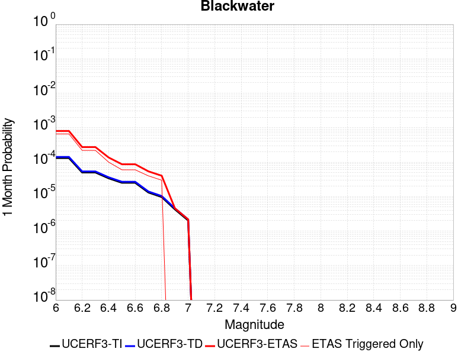 |  |  |

| Magnitude | 1 wk TI Prob | 1 wk TD Prob | 1 wk ETAS Prob | 1 wk ETAS/TD Gain | 1 wk ETAS Triggered Only | 1 mo TI Prob | 1 mo TD Prob | 1 mo ETAS Prob | 1 mo ETAS/TD Gain | 1 mo ETAS Triggered Only | 1 yr TI Prob | 1 yr TD Prob | 1 yr ETAS Prob | 1 yr ETAS/TD Gain | 1 yr ETAS Triggered Only | 10 yr TI Prob | 10 yr TD Prob | 10 yr ETAS Prob | 10 yr ETAS/TD Gain | 10 yr ETAS Triggered Only |
|-----|-----|-----|-----|-----|-----|-----|-----|-----|-----|-----|-----|-----|-----|-----|-----|-----|-----|-----|-----|-----|
| 6.0 | 3.0708583E-5 | 3.3097214E-5 | 9.90668E-5 | 2.9932065 | 6.597176E-5 | 1.3160157E-4 | 1.4183826E-4 | 5.376127E-4 | 3.790322 | 3.9583058E-4 | 0.0016010714 | 0.0017256497 | 0.0042941086 | 2.4884012 | 0.0025728988 | 0.015895851 | 0.017136335 | 0.022777524 | 1.3291945 | 0.0057395436 |
| 6.1 | 3.0708583E-5 | 3.3097214E-5 | 9.90668E-5 | 2.9932065 | 6.597176E-5 | 1.3160157E-4 | 1.4183826E-4 | 5.376127E-4 | 3.790322 | 3.9583058E-4 | 0.0016010714 | 0.0017256497 | 0.0042941086 | 2.4884012 | 0.0025728988 | 0.015895851 | 0.017136335 | 0.022777524 | 1.3291945 | 0.0057395436 |
| 6.2 | 1.1707779E-5 | 1.2545598E-5 | 1.2545598E-5 | 1.0 | 0.0 | 5.017523E-5 | 5.3765798E-5 | 1.8570223E-4 | 3.45391 | 1.3194353E-4 | 6.107122E-4 | 6.5441156E-4 | 0.0014455547 | 2.2089381 | 7.9166115E-4 | 0.006090366 | 0.0065258164 | 0.008623136 | 1.3213881 | 0.0021110964 |
| 6.3 | 1.1707779E-5 | 1.2545598E-5 | 1.2545598E-5 | 1.0 | 0.0 | 5.017523E-5 | 5.3765798E-5 | 1.8570223E-4 | 3.45391 | 1.3194353E-4 | 6.107122E-4 | 6.5441156E-4 | 0.0014455547 | 2.2089381 | 7.9166115E-4 | 0.006090366 | 0.0065258164 | 0.008623136 | 1.3213881 | 0.0021110964 |
| 6.4 | 7.929244E-6 | 8.4804105E-6 | 8.4804105E-6 | 1.0 | 0.0 | 3.3982033E-5 | 3.6344132E-5 | 1.023135E-4 | 2.8151312 | 6.597176E-5 | 4.136527E-4 | 4.4240404E-4 | 9.6994464E-4 | 2.1924407 | 5.277741E-4 | 0.0041288356 | 0.0044156383 | 0.005794928 | 1.3123647 | 0.001385407 |
| 6.5 | 5.8832115E-6 | 6.286219E-6 | 6.286219E-6 | 1.0 | 0.0 | 2.521352E-5 | 2.6940676E-5 | 2.6940676E-5 | 1.0 | 0.0 | 3.0693135E-4 | 3.279559E-4 | 5.917564E-4 | 1.804378 | 2.6388705E-4 | 0.0030650778 | 0.0032749726 | 0.0041297968 | 1.2610172 | 8.5763296E-4 |
| 6.6 | 5.8832115E-6 | 6.286219E-6 | 6.286219E-6 | 1.0 | 0.0 | 2.521352E-5 | 2.6940676E-5 | 2.6940676E-5 | 1.0 | 0.0 | 3.0693135E-4 | 3.279559E-4 | 5.917564E-4 | 1.804378 | 2.6388705E-4 | 0.0030650778 | 0.0032749726 | 0.0041297968 | 1.2610172 | 8.5763296E-4 |
| 6.7 | 3.0715053E-6 | 3.2815851E-6 | 3.2815851E-6 | 1.0 | 0.0 | 1.3163528E-5 | 1.4063868E-5 | 1.4063868E-5 | 1.0 | 0.0 | 1.6025416E-4 | 1.7121529E-4 | 3.0313624E-4 | 1.7704974 | 1.3194353E-4 | 0.0016013865 | 0.0017109484 | 0.0021061017 | 1.2309557 | 3.9583058E-4 |
| 6.8 | 2.2722281E-6 | 2.4288424E-6 | 2.4288424E-6 | 1.0 | 0.0 | 9.738084E-6 | 1.0409289E-5 | 1.0409289E-5 | 1.0 | 0.0 | 1.1855473E-4 | 1.2672663E-4 | 2.5865345E-4 | 2.0410347 | 1.3194353E-4 | 0.001184915 | 0.0012666339 | 0.0016619631 | 1.3121101 | 3.9583058E-4 |
| 6.9 | 9.952399E-7 | 1.0653887E-6 | 1.0653887E-6 | 1.0 | 0.0 | 4.265307E-6 | 4.5659463E-6 | 4.5659463E-6 | 1.0 | 0.0 | 5.1928873E-5 | 5.5589495E-5 | 5.5589495E-5 | 1.0 | 0.0 | 5.191674E-4 | 5.558065E-4 | 6.876767E-4 | 1.2372591 | 1.3194353E-4 |
| 7.0 | 4.7385504E-7 | 5.075751E-7 | 5.075751E-7 | 1.0 | 0.0 | 2.0308057E-6 | 2.175322E-6 | 2.175322E-6 | 1.0 | 0.0 | 2.4724779E-5 | 2.6484544E-5 | 2.6484544E-5 | 1.0 | 0.0 | 2.4722028E-4 | 2.6484544E-4 | 2.6484544E-4 | 1.0 | 0.0 |

## Garlock (West)
*[(top)](#table-of-contents)*

| 1 Week | 1 Month | 1 Year | 10 Year |
|-----|-----|-----|-----|
| 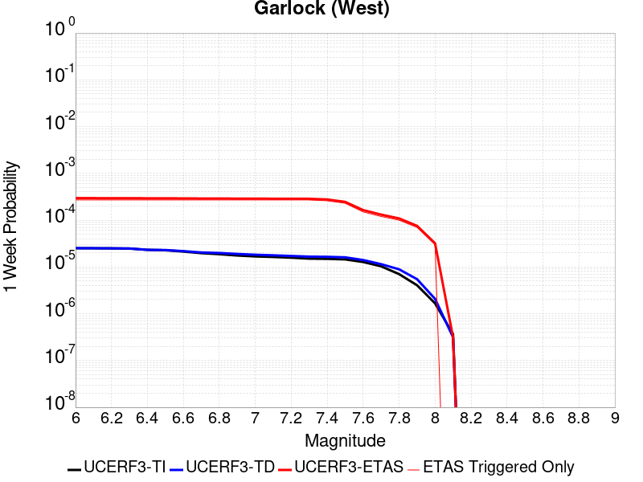 | 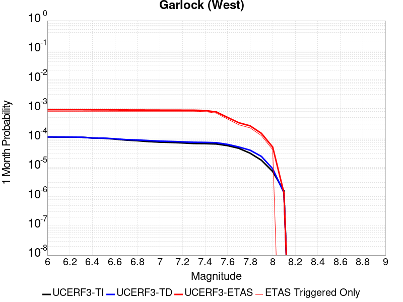 |  |  |

| Magnitude | 1 wk TI Prob | 1 wk TD Prob | 1 wk ETAS Prob | 1 wk ETAS/TD Gain | 1 wk ETAS Triggered Only | 1 mo TI Prob | 1 mo TD Prob | 1 mo ETAS Prob | 1 mo ETAS/TD Gain | 1 mo ETAS Triggered Only | 1 yr TI Prob | 1 yr TD Prob | 1 yr ETAS Prob | 1 yr ETAS/TD Gain | 1 yr ETAS Triggered Only | 10 yr TI Prob | 10 yr TD Prob | 10 yr ETAS Prob | 10 yr ETAS/TD Gain | 10 yr ETAS Triggered Only |
|-----|-----|-----|-----|-----|-----|-----|-----|-----|-----|-----|-----|-----|-----|-----|-----|-----|-----|-----|-----|-----|
| 6.0 | 2.5181727E-5 | 2.5216661E-5 | 9.118676E-5 | 3.6161315 | 6.597176E-5 | 1.0791722E-4 | 1.08066946E-4 | 5.698194E-4 | 5.272837 | 4.6180235E-4 | 0.0013131002 | 0.0013149243 | 0.00401621 | 3.0543277 | 0.0027048422 | 0.013053683 | 0.013151911 | 0.018230032 | 1.3861128 | 0.0051457975 |
| 6.1 | 2.5077732E-5 | 2.5117724E-5 | 9.108783E-5 | 3.6264365 | 6.597176E-5 | 1.0747157E-4 | 1.0764297E-4 | 5.693956E-4 | 5.2896686 | 4.6180235E-4 | 0.001307681 | 0.0013097686 | 0.0040110685 | 3.062425 | 0.0027048422 | 0.013000126 | 0.013100963 | 0.018179346 | 1.3876343 | 0.0051457975 |
| 6.2 | 2.494612E-5 | 2.4999388E-5 | 9.09695E-5 | 3.638869 | 6.597176E-5 | 1.0690756E-4 | 1.0713586E-4 | 5.6888873E-4 | 5.309975 | 4.6180235E-4 | 0.0013008224 | 0.001303602 | 0.0040049185 | 3.072194 | 0.0027048422 | 0.012932341 | 0.013040021 | 0.018118717 | 1.38947 | 0.0051457975 |
| 6.3 | 2.4733758E-5 | 2.4818735E-5 | 9.078886E-5 | 3.6580777 | 6.597176E-5 | 1.0599751E-4 | 1.0636169E-4 | 5.681149E-4 | 5.341349 | 4.6180235E-4 | 0.0012897556 | 0.0012941877 | 0.0039955294 | 3.0872874 | 0.0027048422 | 0.012822957 | 0.01294698 | 0.018026154 | 1.3923057 | 0.0051457975 |
| 6.4 | 2.3237335E-5 | 2.3197908E-5 | 8.916814E-5 | 3.843801 | 6.597176E-5 | 9.958477E-5 | 9.941583E-5 | 5.6117226E-4 | 5.644697 | 4.6180235E-4 | 0.0012117702 | 0.0012097185 | 0.003911289 | 3.2332222 | 0.0027048422 | 0.012051838 | 0.012111766 | 0.01719524 | 1.4197136 | 0.0051457975 |
| 6.5 | 2.2732203E-5 | 2.3012379E-5 | 8.8982626E-5 | 3.8667288 | 6.597176E-5 | 9.742009E-5 | 9.862077E-5 | 5.6037755E-4 | 5.682146 | 4.6180235E-4 | 0.0011854442 | 0.0012000492 | 0.0039016455 | 3.2512379 | 0.0027048422 | 0.011791403 | 0.012016123 | 0.017100088 | 1.4230952 | 0.0051457975 |
| 6.6 | 2.1319436E-5 | 2.1792415E-5 | 8.776274E-5 | 4.027215 | 6.597176E-5 | 9.136581E-5 | 9.339274E-5 | 5.5515196E-4 | 5.9442735 | 4.6180235E-4 | 0.001111811 | 0.0011364657 | 0.003838234 | 3.3773425 | 0.0027048422 | 0.011062649 | 0.011386949 | 0.016474152 | 1.4467573 | 0.0051457975 |
| 6.7 | 1.970802E-5 | 2.0412112E-5 | 8.6382526E-5 | 4.2319255 | 6.597176E-5 | 8.446021E-5 | 8.747755E-5 | 5.492395E-4 | 6.2786336 | 4.6180235E-4 | 0.001027818 | 0.0010645206 | 0.0037664834 | 3.538197 | 0.0027048422 | 0.010230771 | 0.01067459 | 0.015765458 | 1.4769146 | 0.0051457975 |
| 6.8 | 1.8744462E-5 | 1.9919653E-5 | 8.5890104E-5 | 4.311827 | 6.597176E-5 | 8.033094E-5 | 8.536715E-5 | 5.4713007E-4 | 6.4091406 | 4.6180235E-4 | 9.775903E-4 | 0.0010388512 | 0.0037408837 | 3.6009812 | 0.0027048422 | 0.009733009 | 0.010420324 | 0.015512501 | 1.4886774 | 0.0051457975 |
| 6.9 | 1.7559682E-5 | 1.8971898E-5 | 8.494241E-5 | 4.4772754 | 6.597176E-5 | 7.5253614E-5 | 8.13056E-5 | 5.4307043E-4 | 6.6793723 | 4.6180235E-4 | 9.158276E-4 | 9.894476E-4 | 0.0036916137 | 3.7309844 | 0.0027048422 | 0.0091206245 | 0.009930745 | 0.015025441 | 1.5130225 | 0.0051457975 |
| 7.0 | 1.6794445E-5 | 1.8234585E-5 | 8.4205145E-5 | 4.6178813 | 6.597176E-5 | 7.197421E-5 | 7.814589E-5 | 5.3991214E-4 | 6.9090285 | 4.6180235E-4 | 8.759337E-4 | 9.5101225E-4 | 0.0036532823 | 3.8414671 | 0.0027048422 | 0.008724891 | 0.009549588 | 0.014580904 | 1.526862 | 0.005079826 |
| 7.1 | 1.6337795E-5 | 1.7735292E-5 | 8.370588E-5 | 4.7197356 | 6.597176E-5 | 7.0017246E-5 | 7.600619E-5 | 5.377734E-4 | 7.0753903 | 4.6180235E-4 | 8.521265E-4 | 9.249838E-4 | 0.0036273242 | 3.9215002 | 0.0027048422 | 0.008488664 | 0.009291395 | 0.0143240215 | 1.5416439 | 0.005079826 |
| 7.2 | 1.5780008E-5 | 1.7183862E-5 | 8.315449E-5 | 4.839104 | 6.597176E-5 | 6.762685E-5 | 7.364305E-5 | 5.354114E-4 | 7.270359 | 4.6180235E-4 | 8.2304585E-4 | 8.962366E-4 | 0.0035986549 | 4.0152955 | 0.0027048422 | 0.008200042 | 0.009006202 | 0.014040278 | 1.5589566 | 0.005079826 |
| 7.3 | 1.5058865E-5 | 1.6636799E-5 | 8.260747E-5 | 4.9653463 | 6.597176E-5 | 6.45364E-5 | 7.129862E-5 | 5.33068E-4 | 7.4765544 | 4.6180235E-4 | 7.854473E-4 | 8.6771627E-4 | 0.0035702116 | 4.114492 | 0.0027048422 | 0.00782677 | 0.008722834 | 0.013692954 | 1.5697826 | 0.0050138542 |
| 7.4 | 1.4887923E-5 | 1.647271E-5 | 8.244339E-5 | 5.0048466 | 6.597176E-5 | 6.380382E-5 | 7.059543E-5 | 5.323652E-4 | 7.5410714 | 4.6180235E-4 | 7.7653467E-4 | 8.591616E-4 | 0.00356168 | 4.1455297 | 0.0027048422 | 0.0077382675 | 0.008637666 | 0.013608212 | 1.5754502 | 0.0050138542 |
| 7.5 | 1.4509299E-5 | 1.6064607E-5 | 8.203531E-5 | 5.106587 | 6.597176E-5 | 6.218123E-5 | 6.884651E-5 | 4.6464984E-4 | 6.749069 | 3.9583058E-4 | 7.567935E-4 | 8.37885E-4 | 0.0033427116 | 3.9894633 | 0.0025069271 | 0.0075422134 | 0.008425911 | 0.013135855 | 1.5589834 | 0.004749967 |
| 7.6 | 1.2756717E-5 | 1.4067994E-5 | 1.4067994E-5 | 1.0 | 0.0 | 5.4670498E-5 | 6.029001E-5 | 1.262578E-4 | 2.0941744 | 6.597176E-5 | 6.6541E-4 | 7.3378434E-4 | 0.0021840981 | 2.976485 | 0.0014513788 | 0.006634211 | 0.0073905406 | 0.010009908 | 1.3544217 | 0.0026388706 |
| 7.7 | 1.0328985E-5 | 1.147664E-5 | 1.147664E-5 | 1.0 | 0.0 | 4.4266326E-5 | 4.9184677E-5 | 4.9184677E-5 | 1.0 | 0.0 | 5.388092E-4 | 5.986593E-4 | 0.0013239143 | 2.2114654 | 7.256894E-4 | 0.0053750467 | 0.006046838 | 0.0076205865 | 1.2602597 | 0.0015833223 |
| 7.8 | 7.0306583E-6 | 8.912468E-6 | 8.912468E-6 | 1.0 | 0.0 | 3.0131043E-5 | 3.8195732E-5 | 3.8195732E-5 | 1.0 | 0.0 | 3.667837E-4 | 4.6493395E-4 | 0.0010584038 | 2.2764604 | 5.9374585E-4 | 0.003661789 | 0.0047019436 | 0.0059495135 | 1.2653307 | 0.0012534636 |
| 7.9 | 4.060633E-6 | 5.4729326E-6 | 5.4729326E-6 | 1.0 | 0.0 | 1.7402595E-5 | 2.3455215E-5 | 2.3455215E-5 | 1.0 | 0.0 | 2.11856E-4 | 2.8552994E-4 | 5.4934167E-4 | 1.9239371 | 2.6388705E-4 | 0.0021165414 | 0.0028881172 | 0.0035459294 | 1.2277651 | 6.5971765E-4 |
| 8.0 | 1.6729537E-6 | 2.0800776E-6 | 2.0800776E-6 | 1.0 | 0.0 | 7.169782E-6 | 8.914588E-6 | 8.914588E-6 | 1.0 | 0.0 | 8.7288594E-5 | 1.0852974E-4 | 2.4045895E-4 | 2.2156043 | 1.3194353E-4 | 8.7254314E-4 | 0.0010982669 | 0.0013618643 | 1.2400119 | 2.6388705E-4 |
| 8.1 | 3.6733252E-7 | 3.1526864E-7 | 3.1526864E-7 | 1.0 | 0.0 | 1.5742813E-6 | 1.3511507E-6 | 1.3511507E-6 | 1.0 | 0.0 | 1.9166706E-5 | 1.645015E-5 | 1.645015E-5 | 1.0 | 0.0 | 1.9165053E-4 | 1.6658098E-4 | 2.3254176E-4 | 1.3959682 | 6.597176E-5 |

## McLean Lake
*[(top)](#table-of-contents)*

| 1 Week | 1 Month | 1 Year | 10 Year |
|-----|-----|-----|-----|
|  |  |  |  |

| Magnitude | 1 wk TI Prob | 1 wk TD Prob | 1 wk ETAS Prob | 1 wk ETAS/TD Gain | 1 wk ETAS Triggered Only | 1 mo TI Prob | 1 mo TD Prob | 1 mo ETAS Prob | 1 mo ETAS/TD Gain | 1 mo ETAS Triggered Only | 1 yr TI Prob | 1 yr TD Prob | 1 yr ETAS Prob | 1 yr ETAS/TD Gain | 1 yr ETAS Triggered Only | 10 yr TI Prob | 10 yr TD Prob | 10 yr ETAS Prob | 10 yr ETAS/TD Gain | 10 yr ETAS Triggered Only |
|-----|-----|-----|-----|-----|-----|-----|-----|-----|-----|-----|-----|-----|-----|-----|-----|-----|-----|-----|-----|-----|
| 6.0 | 1.7360222E-5 | 1.8502275E-5 | 1.8502275E-5 | 1.0 | 0.0 | 7.439883E-5 | 7.929332E-5 | 3.4315945E-4 | 4.327722 | 2.6388705E-4 | 9.0542925E-4 | 9.6501724E-4 | 0.0029422604 | 3.04892 | 0.001979153 | 0.009017491 | 0.009613109 | 0.013794714 | 1.4349898 | 0.004222193 |
| 6.1 | 9.062689E-6 | 9.592492E-6 | 9.592492E-6 | 1.0 | 0.0 | 3.8839516E-5 | 4.1110077E-5 | 1.0707913E-4 | 2.604693 | 6.597176E-5 | 4.727685E-4 | 5.0040917E-4 | 0.0014235517 | 2.8447754 | 9.236047E-4 | 0.0047176396 | 0.0049937065 | 0.0074881143 | 1.4995104 | 0.0025069271 |
| 6.2 | 9.062689E-6 | 9.592492E-6 | 9.592492E-6 | 1.0 | 0.0 | 3.8839516E-5 | 4.1110077E-5 | 1.0707913E-4 | 2.604693 | 6.597176E-5 | 4.727685E-4 | 5.0040917E-4 | 0.0014235517 | 2.8447754 | 9.236047E-4 | 0.0047176396 | 0.0049937065 | 0.0074881143 | 1.4995104 | 0.0025069271 |
| 6.3 | 7.2575485E-6 | 7.66794E-6 | 7.66794E-6 | 1.0 | 0.0 | 3.110341E-5 | 3.2862223E-5 | 9.883182E-5 | 3.0074599 | 6.597176E-5 | 3.786182E-4 | 4.0003125E-4 | 9.935396E-4 | 2.483655 | 5.9374585E-4 | 0.0037797375 | 0.003993816 | 0.00576794 | 1.4442177 | 0.0017812377 |
| 6.4 | 7.2575485E-6 | 7.66794E-6 | 7.66794E-6 | 1.0 | 0.0 | 3.110341E-5 | 3.2862223E-5 | 9.883182E-5 | 3.0074599 | 6.597176E-5 | 3.786182E-4 | 4.0003125E-4 | 9.935396E-4 | 2.483655 | 5.9374585E-4 | 0.0037797375 | 0.003993816 | 0.00576794 | 1.4442177 | 0.0017812377 |
| 6.5 | 6.06582E-6 | 6.4040664E-6 | 6.4040664E-6 | 1.0 | 0.0 | 2.5996113E-5 | 2.7445747E-5 | 9.34157E-5 | 3.4036493 | 6.597176E-5 | 3.164567E-4 | 3.3410723E-4 | 8.61705E-4 | 2.579127 | 5.277741E-4 | 0.0031600643 | 0.0033366878 | 0.004783224 | 1.4335245 | 0.0014513788 |
| 6.6 | 5.598744E-6 | 5.910437E-6 | 5.910437E-6 | 1.0 | 0.0 | 2.3994397E-5 | 2.5330233E-5 | 9.1300324E-5 | 3.6044014 | 6.597176E-5 | 2.9209262E-4 | 3.0835834E-4 | 8.359697E-4 | 2.711033 | 5.277741E-4 | 0.0029170897 | 0.003079934 | 0.0044610742 | 1.4484317 | 0.001385407 |
| 6.7 | 5.246996E-6 | 5.5393257E-6 | 5.5393257E-6 | 1.0 | 0.0 | 2.2486933E-5 | 2.3739787E-5 | 8.970999E-5 | 3.7788875 | 6.597176E-5 | 2.73744E-4 | 2.8899993E-4 | 8.166215E-4 | 2.8256807 | 5.277741E-4 | 0.0027340704 | 0.0028868648 | 0.0042682723 | 1.4785148 | 0.001385407 |
| 6.8 | 4.02324E-6 | 4.2470297E-6 | 4.2470297E-6 | 1.0 | 0.0 | 1.7242342E-5 | 1.8201463E-5 | 8.4172025E-5 | 4.624465 | 6.597176E-5 | 2.099053E-4 | 2.2158623E-4 | 7.492434E-4 | 3.3812723 | 5.277741E-4 | 0.0020970714 | 0.0022142373 | 0.0033990997 | 1.5351108 | 0.0011874917 |
| 6.9 | 6.835972E-7 | 7.140097E-7 | 7.140097E-7 | 1.0 | 0.0 | 2.9296991E-6 | 3.0600397E-6 | 3.0600397E-6 | 1.0 | 0.0 | 3.56685E-5 | 3.7255664E-5 | 1.0322497E-4 | 2.7707188 | 6.597176E-5 | 3.5662777E-4 | 3.7252545E-4 | 5.0441985E-4 | 1.3540547 | 1.3194353E-4 |

## Goldstone Lake
*[(top)](#table-of-contents)*

| 1 Week | 1 Month | 1 Year | 10 Year |
|-----|-----|-----|-----|
|  |  |  |  |

| Magnitude | 1 wk TI Prob | 1 wk TD Prob | 1 wk ETAS Prob | 1 wk ETAS/TD Gain | 1 wk ETAS Triggered Only | 1 mo TI Prob | 1 mo TD Prob | 1 mo ETAS Prob | 1 mo ETAS/TD Gain | 1 mo ETAS Triggered Only | 1 yr TI Prob | 1 yr TD Prob | 1 yr ETAS Prob | 1 yr ETAS/TD Gain | 1 yr ETAS Triggered Only | 10 yr TI Prob | 10 yr TD Prob | 10 yr ETAS Prob | 10 yr ETAS/TD Gain | 10 yr ETAS Triggered Only |
|-----|-----|-----|-----|-----|-----|-----|-----|-----|-----|-----|-----|-----|-----|-----|-----|-----|-----|-----|-----|-----|
| 6.0 | 2.671352E-5 | 3.0378242E-5 | 3.0378242E-5 | 1.0 | 0.0 | 1.1448149E-4 | 1.3018708E-4 | 1.9615026E-4 | 1.5066799 | 6.597176E-5 | 0.001392921 | 0.0015840717 | 0.002967284 | 1.8732007 | 0.001385407 | 0.013842222 | 0.015747305 | 0.018669285 | 1.1855543 | 0.0029687295 |
| 6.1 | 2.671352E-5 | 3.0378242E-5 | 3.0378242E-5 | 1.0 | 0.0 | 1.1448149E-4 | 1.3018708E-4 | 1.9615026E-4 | 1.5066799 | 6.597176E-5 | 0.001392921 | 0.0015840717 | 0.002967284 | 1.8732007 | 0.001385407 | 0.013842222 | 0.015747305 | 0.018669285 | 1.1855543 | 0.0029687295 |
| 6.2 | 1.4197047E-5 | 1.6097329E-5 | 1.6097329E-5 | 1.0 | 0.0 | 6.0843064E-5 | 6.898728E-5 | 1.349545E-4 | 1.9562228 | 6.597176E-5 | 7.4051257E-4 | 8.396952E-4 | 0.0016306916 | 1.9420042 | 7.9166115E-4 | 0.007380498 | 0.008374922 | 0.009944984 | 1.1874719 | 0.0015833223 |
| 6.3 | 1.4197047E-5 | 1.6097329E-5 | 1.6097329E-5 | 1.0 | 0.0 | 6.0843064E-5 | 6.898728E-5 | 1.349545E-4 | 1.9562228 | 6.597176E-5 | 7.4051257E-4 | 8.396952E-4 | 0.0016306916 | 1.9420042 | 7.9166115E-4 | 0.007380498 | 0.008374922 | 0.009944984 | 1.1874719 | 0.0015833223 |
| 6.4 | 1.3238931E-5 | 1.5009467E-5 | 1.5009467E-5 | 1.0 | 0.0 | 5.6737044E-5 | 6.432525E-5 | 1.3029277E-4 | 2.0255308 | 6.597176E-5 | 6.9055456E-4 | 7.829765E-4 | 0.0015080977 | 1.9261085 | 7.256894E-4 | 0.006884126 | 0.007811806 | 0.009186391 | 1.1759624 | 0.001385407 |
| 6.5 | 1.3238931E-5 | 1.5009467E-5 | 1.5009467E-5 | 1.0 | 0.0 | 5.6737044E-5 | 6.432525E-5 | 1.3029277E-4 | 2.0255308 | 6.597176E-5 | 6.9055456E-4 | 7.829765E-4 | 0.0015080977 | 1.9261085 | 7.256894E-4 | 0.006884126 | 0.007811806 | 0.009186391 | 1.1759624 | 0.001385407 |
| 6.6 | 1.1328278E-5 | 1.2856027E-5 | 1.2856027E-5 | 1.0 | 0.0 | 4.8548856E-5 | 5.5096636E-5 | 1.2106476E-4 | 2.197317 | 6.597176E-5 | 5.90922E-4 | 6.706908E-4 | 0.0011321834 | 1.6880856 | 4.6180235E-4 | 0.0058935313 | 0.0066960566 | 0.0076790066 | 1.1467954 | 9.895765E-4 |
| 6.7 | 8.651175E-6 | 9.825214E-6 | 9.825214E-6 | 1.0 | 0.0 | 3.707594E-5 | 4.2107888E-5 | 1.0807688E-4 | 2.5666656 | 6.597176E-5 | 4.5130608E-4 | 5.1263353E-4 | 8.4232324E-4 | 1.6431295 | 3.2985883E-4 | 0.0045039062 | 0.0051233894 | 0.0059109945 | 1.1537274 | 7.9166115E-4 |
| 6.8 | 1.0215377E-6 | 1.1755062E-6 | 1.1755062E-6 | 1.0 | 0.0 | 4.378012E-6 | 5.037875E-6 | 5.037875E-6 | 1.0 | 0.0 | 5.3300988E-5 | 6.133451E-5 | 6.133451E-5 | 1.0 | 0.0 | 5.3288206E-4 | 6.131871E-4 | 6.131871E-4 | 1.0 | 0.0 |
| 6.9 | 7.9360774E-7 | 9.2836456E-7 | 9.2836456E-7 | 1.0 | 0.0 | 3.4011714E-6 | 3.9786996E-6 | 3.9786996E-6 | 1.0 | 0.0 | 4.1408475E-5 | 4.8439662E-5 | 4.8439662E-5 | 1.0 | 0.0 | 4.140076E-4 | 4.8429804E-4 | 4.8429804E-4 | 1.0 | 0.0 |
| 7.0 | 7.4382757E-7 | 8.747556E-7 | 8.747556E-7 | 1.0 | 0.0 | 3.1878285E-6 | 3.7489476E-6 | 3.7489476E-6 | 1.0 | 0.0 | 3.8811122E-5 | 4.5642548E-5 | 4.5642548E-5 | 1.0 | 0.0 | 3.8804344E-4 | 4.5633837E-4 | 4.5633837E-4 | 1.0 | 0.0 |
| 7.1 | 6.4709513E-7 | 7.7114885E-7 | 7.7114885E-7 | 1.0 | 0.0 | 2.773262E-6 | 3.3049198E-6 | 3.3049198E-6 | 1.0 | 0.0 | 3.376394E-5 | 4.0236715E-5 | 4.0236715E-5 | 1.0 | 0.0 | 3.375881E-4 | 4.0230027E-4 | 4.0230027E-4 | 1.0 | 0.0 |
| 7.2 | 6.356704E-7 | 7.588543E-7 | 7.588543E-7 | 1.0 | 0.0 | 2.7242988E-6 | 3.2522291E-6 | 3.2522291E-6 | 1.0 | 0.0 | 3.3167835E-5 | 3.959523E-5 | 3.959523E-5 | 1.0 | 0.0 | 3.3162883E-4 | 3.9588768E-4 | 3.9588768E-4 | 1.0 | 0.0 |
| 7.3 | 5.7695723E-7 | 6.8967347E-7 | 6.8967347E-7 | 1.0 | 0.0 | 2.4726714E-6 | 2.9557402E-6 | 2.9557402E-6 | 1.0 | 0.0 | 3.0104358E-5 | 3.5985602E-5 | 3.5985602E-5 | 1.0 | 0.0 | 3.0100282E-4 | 3.5980347E-4 | 3.5980347E-4 | 1.0 | 0.0 |
| 7.4 | 5.209647E-7 | 6.1936566E-7 | 6.1936566E-7 | 1.0 | 0.0 | 2.232704E-6 | 2.654422E-6 | 2.654422E-6 | 1.0 | 0.0 | 2.718283E-5 | 3.2317163E-5 | 3.2317163E-5 | 1.0 | 0.0 | 2.7179506E-4 | 3.231302E-4 | 3.231302E-4 | 1.0 | 0.0 |
| 7.5 | 4.512955E-7 | 5.3490027E-7 | 5.3490027E-7 | 1.0 | 0.0 | 1.934122E-6 | 2.292428E-6 | 2.292428E-6 | 1.0 | 0.0 | 2.3547682E-5 | 2.7910008E-5 | 2.7910008E-5 | 1.0 | 0.0 | 2.3545188E-4 | 2.7907031E-4 | 2.7907031E-4 | 1.0 | 0.0 |
| 7.6 | 2.21172E-7 | 2.6040124E-7 | 2.6040124E-7 | 1.0 | 0.0 | 9.478797E-7 | 1.116005E-6 | 1.116005E-6 | 1.0 | 0.0 | 1.1540374E-5 | 1.3587305E-5 | 1.3587305E-5 | 1.0 | 0.0 | 1.1539775E-4 | 1.3586757E-4 | 1.3586757E-4 | 1.0 | 0.0 |

## Gravel Hills-Harper Lk
*[(top)](#table-of-contents)*

| 1 Week | 1 Month | 1 Year | 10 Year |
|-----|-----|-----|-----|
|  |  |  |  |

| Magnitude | 1 wk TI Prob | 1 wk TD Prob | 1 wk ETAS Prob | 1 wk ETAS/TD Gain | 1 wk ETAS Triggered Only | 1 mo TI Prob | 1 mo TD Prob | 1 mo ETAS Prob | 1 mo ETAS/TD Gain | 1 mo ETAS Triggered Only | 1 yr TI Prob | 1 yr TD Prob | 1 yr ETAS Prob | 1 yr ETAS/TD Gain | 1 yr ETAS Triggered Only | 10 yr TI Prob | 10 yr TD Prob | 10 yr ETAS Prob | 10 yr ETAS/TD Gain | 10 yr ETAS Triggered Only |
|-----|-----|-----|-----|-----|-----|-----|-----|-----|-----|-----|-----|-----|-----|-----|-----|-----|-----|-----|-----|-----|
| 6.0 | 3.0679566E-5 | 3.1466803E-5 | 9.743649E-5 | 3.0964854 | 6.597176E-5 | 1.3147724E-4 | 1.3485197E-4 | 3.3274057E-4 | 2.4674506 | 1.9791529E-4 | 0.0015995599 | 0.0016408027 | 0.0028922097 | 1.7626796 | 0.0012534636 | 0.015880952 | 0.01630845 | 0.01942345 | 1.1910053 | 0.0031666446 |
| 6.1 | 3.0679566E-5 | 3.1466803E-5 | 9.743649E-5 | 3.0964854 | 6.597176E-5 | 1.3147724E-4 | 1.3485197E-4 | 3.3274057E-4 | 2.4674506 | 1.9791529E-4 | 0.0015995599 | 0.0016408027 | 0.0028922097 | 1.7626796 | 0.0012534636 | 0.015880952 | 0.01630845 | 0.01942345 | 1.1910053 | 0.0031666446 |
| 6.2 | 1.514536E-5 | 1.363595E-5 | 1.363595E-5 | 1.0 | 0.0 | 6.490707E-5 | 5.8438545E-5 | 1.2440645E-4 | 2.1288424 | 6.597176E-5 | 7.8995706E-4 | 7.112689E-4 | 0.0010408931 | 1.4634312 | 3.2985883E-4 | 0.007871548 | 0.007091126 | 0.0079426775 | 1.1200869 | 8.5763296E-4 |
| 6.3 | 1.514536E-5 | 1.363595E-5 | 1.363595E-5 | 1.0 | 0.0 | 6.490707E-5 | 5.8438545E-5 | 1.2440645E-4 | 2.1288424 | 6.597176E-5 | 7.8995706E-4 | 7.112689E-4 | 0.0010408931 | 1.4634312 | 3.2985883E-4 | 0.007871548 | 0.007091126 | 0.0079426775 | 1.1200869 | 8.5763296E-4 |
| 6.4 | 1.2532521E-5 | 1.0690234E-5 | 1.0690234E-5 | 1.0 | 0.0 | 5.37097E-5 | 4.5814515E-5 | 1.1178326E-4 | 2.4399092 | 6.597176E-5 | 6.537194E-4 | 5.576548E-4 | 6.8952475E-4 | 1.2364724 | 1.3194353E-4 | 0.0065179965 | 0.0055631446 | 0.006022378 | 1.0825492 | 4.6180235E-4 |
| 6.5 | 1.1094058E-5 | 9.084107E-6 | 9.084107E-6 | 1.0 | 0.0 | 4.7545094E-5 | 3.8931328E-5 | 3.8931328E-5 | 1.0 | 0.0 | 5.787078E-4 | 4.7388987E-4 | 4.7388987E-4 | 1.0 | 0.0 | 0.0057720304 | 0.004729201 | 0.00499184 | 1.0555357 | 2.6388705E-4 |
| 6.6 | 9.688328E-6 | 7.5320527E-6 | 7.5320527E-6 | 1.0 | 0.0 | 4.1520743E-5 | 3.227984E-5 | 3.227984E-5 | 1.0 | 0.0 | 5.053978E-4 | 3.9293873E-4 | 3.9293873E-4 | 1.0 | 0.0 | 0.0050424994 | 0.003922696 | 0.004185548 | 1.067008 | 2.6388705E-4 |
| 6.7 | 8.974824E-6 | 6.7497303E-6 | 6.7497303E-6 | 1.0 | 0.0 | 3.8462964E-5 | 2.8927108E-5 | 2.8927108E-5 | 1.0 | 0.0 | 4.6818596E-4 | 3.5213283E-4 | 3.5213283E-4 | 1.0 | 0.0 | 0.004672008 | 0.0035159695 | 0.003713189 | 1.0560925 | 1.9791529E-4 |
| 6.8 | 7.4780046E-6 | 5.1164316E-6 | 5.1164316E-6 | 1.0 | 0.0 | 3.20482E-5 | 2.1927388E-5 | 2.1927388E-5 | 1.0 | 0.0 | 3.9011694E-4 | 2.6693463E-4 | 2.6693463E-4 | 1.0 | 0.0 | 0.0038943281 | 0.0026662783 | 0.0027320741 | 1.024677 | 6.597176E-5 |
| 6.9 | 6.3409307E-6 | 3.907683E-6 | 3.907683E-6 | 1.0 | 0.0 | 2.7175134E-5 | 1.674711E-5 | 1.674711E-5 | 1.0 | 0.0 | 3.3080703E-4 | 2.0387798E-4 | 2.0387798E-4 | 1.0 | 0.0 | 0.0033031502 | 0.0020370076 | 0.0021028449 | 1.0323206 | 6.597176E-5 |
| 7.0 | 5.1239335E-6 | 2.6059872E-6 | 2.6059872E-6 | 1.0 | 0.0 | 2.195953E-5 | 1.116847E-5 | 1.116847E-5 | 1.0 | 0.0 | 2.6732447E-4 | 1.3596789E-4 | 1.3596789E-4 | 1.0 | 0.0 | 0.0026700313 | 0.0013588723 | 0.0014247544 | 1.0484829 | 6.597176E-5 |
| 7.1 | 4.438899E-6 | 2.0985822E-6 | 2.0985822E-6 | 1.0 | 0.0 | 1.9023713E-5 | 8.993894E-6 | 8.993894E-6 | 1.0 | 0.0 | 2.315891E-4 | 1.0949538E-4 | 1.0949538E-4 | 1.0 | 0.0 | 0.002313479 | 0.0010944362 | 0.0011603357 | 1.0602132 | 6.597176E-5 |
| 7.2 | 3.50367E-6 | 1.2616524E-6 | 1.2616524E-6 | 1.0 | 0.0 | 1.5015643E-5 | 5.407071E-6 | 5.407071E-6 | 1.0 | 0.0 | 1.8280011E-4 | 6.582918E-5 | 6.582918E-5 | 1.0 | 0.0 | 0.0018264982 | 6.5810507E-4 | 7.240334E-4 | 1.1001791 | 6.597176E-5 |
| 7.3 | 2.561638E-6 | 7.11978E-7 | 7.11978E-7 | 1.0 | 0.0 | 1.0978401E-5 | 3.0513306E-6 | 3.0513306E-6 | 1.0 | 0.0 | 1.3365384E-4 | 3.7149337E-5 | 3.7149337E-5 | 1.0 | 0.0 | 0.0013357349 | 3.7143327E-4 | 4.3738054E-4 | 1.177548 | 6.597176E-5 |
| 7.4 | 2.0368864E-6 | 5.3053367E-7 | 5.3053367E-7 | 1.0 | 0.0 | 8.729483E-6 | 2.2737138E-6 | 2.2737138E-6 | 1.0 | 0.0 | 1.06276275E-4 | 2.768212E-5 | 2.768212E-5 | 1.0 | 0.0 | 0.0010622547 | 2.7678726E-4 | 3.4274076E-4 | 1.2382823 | 6.597176E-5 |
| 7.5 | 1.1681728E-6 | 3.6033393E-7 | 3.6033393E-7 | 1.0 | 0.0 | 5.0064455E-6 | 1.5442874E-6 | 1.5442874E-6 | 1.0 | 0.0 | 6.0951766E-5 | 1.8801542E-5 | 1.8801542E-5 | 1.0 | 0.0 | 6.093505E-4 | 1.8799998E-4 | 2.5395933E-4 | 1.3508477 | 6.597176E-5 |
| 7.6 | 1.3154387E-7 | 7.12009E-8 | 7.12009E-8 | 1.0 | 0.0 | 5.6375933E-7 | 3.051467E-7 | 3.051467E-7 | 1.0 | 0.0 | 6.863748E-6 | 3.7151563E-6 | 3.7151563E-6 | 1.0 | 0.0 | 6.863536E-5 | 3.7151098E-5 | 3.7151098E-5 | 1.0 | 0.0 |

## Death Valley (So)
*[(top)](#table-of-contents)*

| 1 Week | 1 Month | 1 Year | 10 Year |
|-----|-----|-----|-----|
|  |  |  |  |

| Magnitude | 1 wk TI Prob | 1 wk TD Prob | 1 wk ETAS Prob | 1 wk ETAS/TD Gain | 1 wk ETAS Triggered Only | 1 mo TI Prob | 1 mo TD Prob | 1 mo ETAS Prob | 1 mo ETAS/TD Gain | 1 mo ETAS Triggered Only | 1 yr TI Prob | 1 yr TD Prob | 1 yr ETAS Prob | 1 yr ETAS/TD Gain | 1 yr ETAS Triggered Only | 10 yr TI Prob | 10 yr TD Prob | 10 yr ETAS Prob | 10 yr ETAS/TD Gain | 10 yr ETAS Triggered Only |
|-----|-----|-----|-----|-----|-----|-----|-----|-----|-----|-----|-----|-----|-----|-----|-----|-----|-----|-----|-----|-----|
| 6.0 | 2.0684236E-5 | 2.562036E-5 | 2.562036E-5 | 1.0 | 0.0 | 8.864371E-5 | 1.0979702E-4 | 3.7365512E-4 | 3.4031444 | 2.6388705E-4 | 0.0010787029 | 0.0013359758 | 0.0028512992 | 2.1342447 | 0.0015173506 | 0.010734817 | 0.013282726 | 0.016146926 | 1.2156335 | 0.0029027576 |
| 6.1 | 2.0684236E-5 | 2.562036E-5 | 2.562036E-5 | 1.0 | 0.0 | 8.864371E-5 | 1.0979702E-4 | 3.7365512E-4 | 3.4031444 | 2.6388705E-4 | 0.0010787029 | 0.0013359758 | 0.0028512992 | 2.1342447 | 0.0015173506 | 0.010734817 | 0.013282726 | 0.016146926 | 1.2156335 | 0.0029027576 |
| 6.2 | 2.0684236E-5 | 2.562036E-5 | 2.562036E-5 | 1.0 | 0.0 | 8.864371E-5 | 1.0979702E-4 | 3.7365512E-4 | 3.4031444 | 2.6388705E-4 | 0.0010787029 | 0.0013359758 | 0.0028512992 | 2.1342447 | 0.0015173506 | 0.010734817 | 0.013282726 | 0.016146926 | 1.2156335 | 0.0029027576 |
| 6.3 | 2.0240292E-5 | 2.5120411E-5 | 2.5120411E-5 | 1.0 | 0.0 | 8.6741224E-5 | 1.0765456E-4 | 3.7151322E-4 | 3.4509752 | 2.6388705E-4 | 0.0010555626 | 0.0013099229 | 0.002825286 | 2.1568336 | 0.0015173506 | 0.010505628 | 0.013025268 | 0.015825104 | 1.2149541 | 0.0028367857 |
| 6.4 | 2.0240292E-5 | 2.5120411E-5 | 2.5120411E-5 | 1.0 | 0.0 | 8.6741224E-5 | 1.0765456E-4 | 3.7151322E-4 | 3.4509752 | 2.6388705E-4 | 0.0010555626 | 0.0013099229 | 0.002825286 | 2.1568336 | 0.0015173506 | 0.010505628 | 0.013025268 | 0.015825104 | 1.2149541 | 0.0028367857 |
| 6.5 | 1.9962767E-5 | 2.4809646E-5 | 2.4809646E-5 | 1.0 | 0.0 | 8.55519E-5 | 1.0632281E-4 | 3.701818E-4 | 3.4816782 | 2.6388705E-4 | 0.0010410968 | 0.0012937282 | 0.0028091157 | 2.1713338 | 0.0015173506 | 0.010362327 | 0.012865204 | 0.015600371 | 1.2126019 | 0.002770814 |
| 6.6 | 1.8937297E-5 | 2.331338E-5 | 2.331338E-5 | 1.0 | 0.0 | 8.115732E-5 | 9.991074E-5 | 2.3184108E-4 | 2.320482 | 1.3194353E-4 | 9.876423E-4 | 0.0012157491 | 0.0025994717 | 2.1381648 | 0.001385407 | 0.009832645 | 0.012094032 | 0.014635814 | 1.2101682 | 0.0025728988 |
| 6.7 | 1.8621096E-5 | 2.2913995E-5 | 2.2913995E-5 | 1.0 | 0.0 | 7.980225E-5 | 9.819922E-5 | 2.301298E-4 | 2.3434992 | 1.3194353E-4 | 9.711593E-4 | 0.0011949344 | 0.002578686 | 2.1580148 | 0.001385407 | 0.009669261 | 0.011888134 | 0.014430446 | 1.2138529 | 0.0025728988 |
| 6.8 | 1.7830353E-5 | 2.1807928E-5 | 2.1807928E-5 | 1.0 | 0.0 | 7.641356E-5 | 9.3459275E-5 | 2.2539047E-4 | 2.4116437 | 1.3194353E-4 | 9.29938E-4 | 0.0011372868 | 0.0025211181 | 2.2167833 | 0.001385407 | 0.009260561 | 0.011317508 | 0.013665613 | 1.2074754 | 0.0023749834 |
| 6.9 | 1.3135183E-5 | 1.530519E-5 | 1.530519E-5 | 1.0 | 0.0 | 5.6292425E-5 | 6.559206E-5 | 1.9752694E-4 | 3.0114458 | 1.3194353E-4 | 6.8514474E-4 | 7.9829723E-4 | 0.0015234073 | 1.9083209 | 7.256894E-4 | 0.006830362 | 0.007955303 | 0.009460582 | 1.1892171 | 0.0015173506 |
| 7.0 | 1.1507512E-5 | 1.3155178E-5 | 1.3155178E-5 | 1.0 | 0.0 | 4.9316975E-5 | 5.6378147E-5 | 1.8831424E-4 | 3.340199 | 1.3194353E-4 | 6.002687E-4 | 6.861935E-4 | 0.001411385 | 2.0568323 | 7.256894E-4 | 0.0059864987 | 0.0068414486 | 0.008086337 | 1.1819626 | 0.0012534636 |
| 7.1 | 9.715903E-6 | 1.08659815E-5 | 1.08659815E-5 | 1.0 | 0.0 | 4.1638916E-5 | 4.6567682E-5 | 1.1253638E-4 | 2.4166195 | 6.597176E-5 | 5.068359E-4 | 5.6681834E-4 | 0.0010942933 | 1.9305891 | 5.277741E-4 | 0.0050568148 | 0.0056541795 | 0.006375766 | 1.12762 | 7.256894E-4 |
| 7.2 | 9.233269E-6 | 1.0286961E-5 | 1.0286961E-5 | 1.0 | 0.0 | 3.9570554E-5 | 4.4086253E-5 | 1.1005511E-4 | 2.4963589 | 6.597176E-5 | 4.81665E-4 | 5.366222E-4 | 8.66304E-4 | 1.6143649 | 3.2985883E-4 | 0.0048062233 | 0.0053536952 | 0.005878644 | 1.0980535 | 5.277741E-4 |
| 7.3 | 8.8041315E-6 | 9.80876E-6 | 9.80876E-6 | 1.0 | 0.0 | 3.7731446E-5 | 4.203689E-5 | 1.0800588E-4 | 2.5693119 | 6.597176E-5 | 4.592835E-4 | 5.116832E-4 | 8.4137317E-4 | 1.6443245 | 3.2985883E-4 | 0.0045833546 | 0.005105477 | 0.0056305565 | 1.1028464 | 5.277741E-4 |
| 7.4 | 8.708749E-6 | 9.707768E-6 | 9.707768E-6 | 1.0 | 0.0 | 3.7322676E-5 | 4.1604082E-5 | 1.075731E-4 | 2.5856383 | 6.597176E-5 | 4.5430884E-4 | 5.0641614E-4 | 7.701696E-4 | 1.5208235 | 2.6388705E-4 | 0.004533812 | 0.0050530476 | 0.0055125165 | 1.090929 | 4.6180235E-4 |
| 7.5 | 8.612678E-6 | 9.605406E-6 | 9.605406E-6 | 1.0 | 0.0 | 3.6910955E-5 | 4.1165404E-5 | 1.0713445E-4 | 2.6025362 | 6.597176E-5 | 4.492982E-4 | 5.0107774E-4 | 7.6483254E-4 | 1.526375 | 2.6388705E-4 | 0.004483909 | 0.004999905 | 0.005459398 | 1.0919005 | 4.6180235E-4 |
| 7.6 | 8.319024E-6 | 9.28449E-6 | 9.28449E-6 | 1.0 | 0.0 | 3.5652476E-5 | 3.9790088E-5 | 1.0575922E-4 | 2.657929 | 6.597176E-5 | 4.3398244E-4 | 4.8434082E-4 | 7.4810005E-4 | 1.5445737 | 2.6388705E-4 | 0.0043313587 | 0.0048332764 | 0.0052928464 | 1.0950847 | 4.6180235E-4 |
| 7.7 | 7.4718328E-6 | 8.345689E-6 | 8.345689E-6 | 1.0 | 0.0 | 3.2021748E-5 | 3.576677E-5 | 1.0173618E-4 | 2.8444328 | 6.597176E-5 | 3.8979502E-4 | 4.3537747E-4 | 6.332066E-4 | 1.4543853 | 1.9791529E-4 | 0.00389112 | 0.0043456503 | 0.0046740756 | 1.0755757 | 3.2985883E-4 |
| 7.8 | 3.4586725E-7 | 3.648368E-7 | 3.648368E-7 | 1.0 | 0.0 | 1.4822873E-6 | 1.5635853E-6 | 1.5635853E-6 | 1.0 | 0.0 | 1.80467E-5 | 1.903649E-5 | 1.903649E-5 | 1.0 | 0.0 | 1.8045233E-4 | 1.9034903E-4 | 1.9034903E-4 | 1.0 | 0.0 |
| 7.9 | 2.5591178E-9 | 2.6697329E-9 | 2.6697329E-9 | 1.0 | 0.0 | 1.0967647E-8 | 1.14417125E-8 | 1.14417125E-8 | 1.0 | 0.0 | 1.335311E-7 | 1.3930286E-7 | 1.3930286E-7 | 1.0 | 0.0 | 1.3353102E-6 | 1.3930285E-6 | 1.3930285E-6 | 1.0 | 0.0 |

## San Andreas (Mojave S)
*[(top)](#table-of-contents)*

| 1 Week | 1 Month | 1 Year | 10 Year |
|-----|-----|-----|-----|
|  |  |  |  |

| Magnitude | 1 wk TI Prob | 1 wk TD Prob | 1 wk ETAS Prob | 1 wk ETAS/TD Gain | 1 wk ETAS Triggered Only | 1 mo TI Prob | 1 mo TD Prob | 1 mo ETAS Prob | 1 mo ETAS/TD Gain | 1 mo ETAS Triggered Only | 1 yr TI Prob | 1 yr TD Prob | 1 yr ETAS Prob | 1 yr ETAS/TD Gain | 1 yr ETAS Triggered Only | 10 yr TI Prob | 10 yr TD Prob | 10 yr ETAS Prob | 10 yr ETAS/TD Gain | 10 yr ETAS Triggered Only |
|-----|-----|-----|-----|-----|-----|-----|-----|-----|-----|-----|-----|-----|-----|-----|-----|-----|-----|-----|-----|-----|
| 6.0 | 3.1064058E-4 | 6.7499664E-4 | 7.4092386E-4 | 1.0976704 | 6.597176E-5 | 0.0013306376 | 0.0028897638 | 0.0030213261 | 1.045527 | 1.3194353E-4 | 0.016080605 | 0.034641396 | 0.035596695 | 1.0275767 | 9.895765E-4 | 0.1496549 | 0.2867374 | 0.2883373 | 1.0055796 | 0.00224304 |
| 6.1 | 3.1064058E-4 | 6.7499664E-4 | 7.4092386E-4 | 1.0976704 | 6.597176E-5 | 0.0013306376 | 0.0028897638 | 0.0030213261 | 1.045527 | 1.3194353E-4 | 0.016080605 | 0.034641396 | 0.035596695 | 1.0275767 | 9.895765E-4 | 0.1496549 | 0.2867374 | 0.2883373 | 1.0055796 | 0.00224304 |
| 6.2 | 3.1064058E-4 | 6.7499664E-4 | 7.4092386E-4 | 1.0976704 | 6.597176E-5 | 0.0013306376 | 0.0028897638 | 0.0030213261 | 1.045527 | 1.3194353E-4 | 0.016080605 | 0.034641396 | 0.035596695 | 1.0275767 | 9.895765E-4 | 0.1496549 | 0.2867374 | 0.2883373 | 1.0055796 | 0.00224304 |
| 6.3 | 3.1064058E-4 | 6.7499664E-4 | 7.4092386E-4 | 1.0976704 | 6.597176E-5 | 0.0013306376 | 0.0028897638 | 0.0030213261 | 1.045527 | 1.3194353E-4 | 0.016080605 | 0.034641396 | 0.035596695 | 1.0275767 | 9.895765E-4 | 0.1496549 | 0.2867374 | 0.2883373 | 1.0055796 | 0.00224304 |
| 6.4 | 1.9872203E-4 | 4.3216298E-4 | 4.9810624E-4 | 1.1525888 | 6.597176E-5 | 8.5138786E-4 | 0.0018508406 | 0.00198254 | 1.0711565 | 1.3194353E-4 | 0.010316478 | 0.022307295 | 0.023210296 | 1.0404801 | 9.236047E-4 | 0.098504856 | 0.19713911 | 0.19867514 | 1.0077915 | 0.0019131812 |
| 6.5 | 1.291105E-4 | 2.8787713E-4 | 3.538299E-4 | 1.2291005 | 6.597176E-5 | 5.5321335E-4 | 0.0012331787 | 0.0013649594 | 1.1068627 | 1.3194353E-4 | 0.006714592 | 0.014911419 | 0.015756262 | 1.0566576 | 8.5763296E-4 | 0.065152965 | 0.13817947 | 0.13971458 | 1.0111095 | 0.0017812377 |
| 6.6 | 1.291105E-4 | 2.8787713E-4 | 3.538299E-4 | 1.2291005 | 6.597176E-5 | 5.5321335E-4 | 0.0012331787 | 0.0013649594 | 1.1068627 | 1.3194353E-4 | 0.006714592 | 0.014911419 | 0.015756262 | 1.0566576 | 8.5763296E-4 | 0.065152965 | 0.13817947 | 0.13971458 | 1.0111095 | 0.0017812377 |
| 6.7 | 1.08001186E-4 | 2.4368397E-4 | 3.0963967E-4 | 1.2706608 | 6.597176E-5 | 4.6278012E-4 | 0.0010439424 | 0.0011098454 | 1.0631288 | 6.597176E-5 | 0.0056198016 | 0.012636229 | 0.013352748 | 1.0567036 | 7.256894E-4 | 0.054797906 | 0.119323194 | 0.12071759 | 1.0116858 | 0.0015833223 |
| 6.8 | 1.0624356E-4 | 2.3885963E-4 | 3.0481562E-4 | 1.2761288 | 6.597176E-5 | 4.5525006E-4 | 0.001023283 | 0.0010891873 | 1.0644047 | 6.597176E-5 | 0.0055285925 | 0.012387579 | 0.013104279 | 1.0578563 | 7.256894E-4 | 0.053930566 | 0.11727233 | 0.11866997 | 1.011918 | 0.0015833223 |
| 6.9 | 1.0393785E-4 | 2.3256175E-4 | 2.9851816E-4 | 1.2836082 | 6.597176E-5 | 4.4537184E-4 | 9.963129E-4 | 0.001062219 | 1.06615 | 6.597176E-5 | 0.0054089287 | 0.012062895 | 0.01277983 | 1.0594331 | 7.256894E-4 | 0.05279156 | 0.114569746 | 0.11597167 | 1.0122364 | 0.0015833223 |
| 7.0 | 1.0155622E-4 | 2.262555E-4 | 2.9221235E-4 | 1.2915149 | 6.597176E-5 | 4.3516833E-4 | 9.693065E-4 | 0.0010352143 | 1.0679948 | 6.597176E-5 | 0.005285311 | 0.011737675 | 0.012454847 | 1.0611 | 7.256894E-4 | 0.05161361 | 0.11182977 | 0.11323603 | 1.012575 | 0.0015833223 |
| 7.1 | 9.885595E-5 | 2.191377E-4 | 2.85095E-4 | 1.3009857 | 6.597176E-5 | 4.2359953E-4 | 9.388239E-4 | 0.0010047337 | 1.0702047 | 6.597176E-5 | 0.0051451353 | 0.011370476 | 0.012087914 | 1.0630965 | 7.256894E-4 | 0.05027629 | 0.10871404 | 0.11012523 | 1.0129808 | 0.0015833223 |
| 7.2 | 9.6411415E-5 | 2.1276584E-4 | 2.7872357E-4 | 1.3100015 | 6.597176E-5 | 4.1312634E-4 | 9.115353E-4 | 9.774469E-4 | 1.0723084 | 6.597176E-5 | 0.005018219 | 0.0110416515 | 0.011759329 | 1.0649972 | 7.256894E-4 | 0.049064007 | 0.10590357 | 0.10731921 | 1.0133673 | 0.0015833223 |
| 7.3 | 9.1180635E-5 | 1.950402E-4 | 1.950402E-4 | 1.0 | 0.0 | 3.907156E-4 | 8.356189E-4 | 8.356189E-4 | 1.0 | 0.0 | 0.004746591 | 0.010126315 | 0.010779352 | 1.0644891 | 6.5971765E-4 | 0.046464786 | 0.09809433 | 0.09940334 | 1.0133444 | 0.0014513788 |
| 7.4 | 8.887388E-5 | 1.8752231E-4 | 1.8752231E-4 | 1.0 | 0.0 | 3.8083247E-4 | 8.0341956E-4 | 8.0341956E-4 | 1.0 | 0.0 | 0.0046267817 | 0.00973786 | 0.010391153 | 1.067088 | 6.5971765E-4 | 0.045316286 | 0.09472819 | 0.096042074 | 1.0138701 | 0.0014513788 |
| 7.5 | 8.6750515E-5 | 1.8083451E-4 | 1.8083451E-4 | 1.0 | 0.0 | 3.7173493E-4 | 7.7477493E-4 | 7.7477493E-4 | 1.0 | 0.0 | 0.004516484 | 0.009392173 | 0.010045694 | 1.0695815 | 6.5971765E-4 | 0.04425787 | 0.09169095 | 0.093009256 | 1.0143776 | 0.0014513788 |
| 7.6 | 8.453092E-5 | 1.747065E-4 | 1.747065E-4 | 1.0 | 0.0 | 3.6222505E-4 | 7.485273E-4 | 7.485273E-4 | 1.0 | 0.0 | 0.0044011753 | 0.009075315 | 0.009729045 | 1.0720339 | 6.5971765E-4 | 0.04315024 | 0.08884873 | 0.09017116 | 1.014884 | 0.0014513788 |
| 7.7 | 8.259102E-5 | 1.6992437E-4 | 1.6992437E-4 | 1.0 | 0.0 | 3.539135E-4 | 7.280441E-4 | 7.280441E-4 | 1.0 | 0.0 | 0.004300386 | 0.008827981 | 0.009481874 | 1.0740706 | 6.5971765E-4 | 0.042181134 | 0.08659836 | 0.08792405 | 1.0153085 | 0.0014513788 |
| 7.8 | 7.444844E-5 | 1.531194E-4 | 1.531194E-4 | 1.0 | 0.0 | 3.1902574E-4 | 6.56061E-4 | 6.56061E-4 | 1.0 | 0.0 | 0.0038772223 | 0.007958339 | 0.008612806 | 1.0822366 | 6.5971765E-4 | 0.03810269 | 0.07841811 | 0.07963408 | 1.0155063 | 0.0013194353 |
| 7.9 | 5.2586525E-5 | 1.0025827E-4 | 1.0025827E-4 | 1.0 | 0.0 | 2.2535135E-4 | 4.2960755E-4 | 4.2960755E-4 | 1.0 | 0.0 | 0.0027402006 | 0.005217939 | 0.0055460767 | 1.0628865 | 3.2985883E-4 | 0.027066574 | 0.052290585 | 0.052978326 | 1.0131524 | 7.256894E-4 |
| 8.0 | 3.379877E-5 | 5.418614E-5 | 5.418614E-5 | 1.0 | 0.0 | 1.4484383E-4 | 2.3220567E-4 | 2.3220567E-4 | 1.0 | 0.0 | 0.0017620471 | 0.0028234406 | 0.0029550116 | 1.0465995 | 1.3194353E-4 | 0.017481409 | 0.028889727 | 0.029210055 | 1.011088 | 3.2985883E-4 |
| 8.1 | 1.8668277E-5 | 1.936222E-5 | 1.936222E-5 | 1.0 | 0.0 | 8.000444E-5 | 8.29783E-5 | 8.29783E-5 | 1.0 | 0.0 | 9.736188E-4 | 0.0010097933 | 0.0010097933 | 1.0 | 0.0 | 0.009693642 | 0.010826511 | 0.010957026 | 1.0120552 | 1.3194353E-4 |
| 8.2 | 8.541571E-6 | 5.4811067E-6 | 5.4811067E-6 | 1.0 | 0.0 | 3.660622E-5 | 2.3490245E-5 | 2.3490245E-5 | 1.0 | 0.0 | 4.455896E-4 | 2.8595628E-4 | 2.8595628E-4 | 1.0 | 0.0 | 0.0044469717 | 0.0032518986 | 0.0032518986 | 1.0 | 0.0 |
| 8.3 | 1.983087E-6 | 7.693574E-7 | 7.693574E-7 | 1.0 | 0.0 | 8.498917E-6 | 3.297242E-6 | 3.297242E-6 | 1.0 | 0.0 | 1.034694E-4 | 4.01432E-5 | 4.01432E-5 | 1.0 | 0.0 | 0.0010342124 | 4.7390026E-4 | 4.7390026E-4 | 1.0 | 0.0 |

## So Sierra Nevada
*[(top)](#table-of-contents)*

| 1 Week | 1 Month | 1 Year | 10 Year |
|-----|-----|-----|-----|
|  |  |  |  |

| Magnitude | 1 wk TI Prob | 1 wk TD Prob | 1 wk ETAS Prob | 1 wk ETAS/TD Gain | 1 wk ETAS Triggered Only | 1 mo TI Prob | 1 mo TD Prob | 1 mo ETAS Prob | 1 mo ETAS/TD Gain | 1 mo ETAS Triggered Only | 1 yr TI Prob | 1 yr TD Prob | 1 yr ETAS Prob | 1 yr ETAS/TD Gain | 1 yr ETAS Triggered Only | 10 yr TI Prob | 10 yr TD Prob | 10 yr ETAS Prob | 10 yr ETAS/TD Gain | 10 yr ETAS Triggered Only |
|-----|-----|-----|-----|-----|-----|-----|-----|-----|-----|-----|-----|-----|-----|-----|-----|-----|-----|-----|-----|-----|
| 6.0 | 1.15488665E-5 | 1.1079958E-5 | 1.1079958E-5 | 1.0 | 0.0 | 4.9494203E-5 | 4.7484744E-5 | 1.79422E-4 | 3.778519 | 1.3194353E-4 | 6.024253E-4 | 5.779862E-4 | 0.0015010571 | 2.5970466 | 9.236047E-4 | 0.006007948 | 0.0057660984 | 0.008127388 | 1.4095125 | 0.0023749834 |
| 6.1 | 1.15488665E-5 | 1.1079958E-5 | 1.1079958E-5 | 1.0 | 0.0 | 4.9494203E-5 | 4.7484744E-5 | 1.79422E-4 | 3.778519 | 1.3194353E-4 | 6.024253E-4 | 5.779862E-4 | 0.0015010571 | 2.5970466 | 9.236047E-4 | 0.006007948 | 0.0057660984 | 0.008127388 | 1.4095125 | 0.0023749834 |
| 6.2 | 1.15488665E-5 | 1.1079958E-5 | 1.1079958E-5 | 1.0 | 0.0 | 4.9494203E-5 | 4.7484744E-5 | 1.79422E-4 | 3.778519 | 1.3194353E-4 | 6.024253E-4 | 5.779862E-4 | 0.0015010571 | 2.5970466 | 9.236047E-4 | 0.006007948 | 0.0057660984 | 0.008127388 | 1.4095125 | 0.0023749834 |
| 6.3 | 1.15488665E-5 | 1.1079958E-5 | 1.1079958E-5 | 1.0 | 0.0 | 4.9494203E-5 | 4.7484744E-5 | 1.79422E-4 | 3.778519 | 1.3194353E-4 | 6.024253E-4 | 5.779862E-4 | 0.0015010571 | 2.5970466 | 9.236047E-4 | 0.006007948 | 0.0057660984 | 0.008127388 | 1.4095125 | 0.0023749834 |
| 6.4 | 1.15488665E-5 | 1.1079958E-5 | 1.1079958E-5 | 1.0 | 0.0 | 4.9494203E-5 | 4.7484744E-5 | 1.79422E-4 | 3.778519 | 1.3194353E-4 | 6.024253E-4 | 5.779862E-4 | 0.0015010571 | 2.5970466 | 9.236047E-4 | 0.006007948 | 0.0057660984 | 0.008127388 | 1.4095125 | 0.0023749834 |
| 6.5 | 1.15488665E-5 | 1.1079958E-5 | 1.1079958E-5 | 1.0 | 0.0 | 4.9494203E-5 | 4.7484744E-5 | 1.79422E-4 | 3.778519 | 1.3194353E-4 | 6.024253E-4 | 5.779862E-4 | 0.0015010571 | 2.5970466 | 9.236047E-4 | 0.006007948 | 0.0057660984 | 0.008127388 | 1.4095125 | 0.0023749834 |
| 6.6 | 7.587044E-6 | 6.9358503E-6 | 6.9358503E-6 | 1.0 | 0.0 | 3.2515498E-5 | 2.972475E-5 | 9.569455E-5 | 3.219356 | 6.597176E-5 | 3.9580427E-4 | 3.6184167E-4 | 8.894248E-4 | 2.4580498 | 5.277741E-4 | 0.003951 | 0.0036128166 | 0.0049932185 | 1.3820846 | 0.001385407 |
| 6.7 | 7.587044E-6 | 6.9358503E-6 | 6.9358503E-6 | 1.0 | 0.0 | 3.2515498E-5 | 2.972475E-5 | 9.569455E-5 | 3.219356 | 6.597176E-5 | 3.9580427E-4 | 3.6184167E-4 | 8.894248E-4 | 2.4580498 | 5.277741E-4 | 0.003951 | 0.0036128166 | 0.0049932185 | 1.3820846 | 0.001385407 |
| 6.8 | 5.9026956E-6 | 5.179568E-6 | 5.179568E-6 | 1.0 | 0.0 | 2.5297022E-5 | 2.2197966E-5 | 8.8168264E-5 | 3.9719074 | 6.597176E-5 | 3.0794772E-4 | 2.7022787E-4 | 6.659515E-4 | 2.464407 | 3.9583058E-4 | 0.0030752132 | 0.0026991093 | 0.0036860146 | 1.3656412 | 9.895765E-4 |
| 6.9 | 5.0118915E-6 | 4.2525808E-6 | 4.2525808E-6 | 1.0 | 0.0 | 2.1479358E-5 | 1.8225222E-5 | 8.419578E-5 | 4.61974 | 6.597176E-5 | 2.614798E-4 | 2.2187021E-4 | 4.8569872E-4 | 2.189112 | 2.6388705E-4 | 0.0026117235 | 0.0022165596 | 0.002874815 | 1.2969717 | 6.5971765E-4 |
| 7.0 | 4.4924795E-6 | 3.7140621E-6 | 3.7140621E-6 | 1.0 | 0.0 | 1.925334E-5 | 1.5917316E-5 | 8.188803E-5 | 5.144588 | 6.597176E-5 | 2.3438422E-4 | 1.9377672E-4 | 4.5761265E-4 | 2.361546 | 2.6388705E-4 | 0.0023413717 | 0.0019361405 | 0.0025287368 | 1.3060709 | 5.9374585E-4 |
| 7.1 | 3.9118436E-6 | 3.1121094E-6 | 3.1121094E-6 | 1.0 | 0.0 | 1.6764936E-5 | 1.3337547E-5 | 7.930843E-5 | 5.9462533 | 6.597176E-5 | 2.0409399E-4 | 1.6237311E-4 | 4.262173E-4 | 2.6249256 | 2.6388705E-4 | 0.0020390663 | 0.0016226007 | 0.002017789 | 1.2435524 | 3.9583058E-4 |
| 7.2 | 3.4200818E-6 | 2.605576E-6 | 2.605576E-6 | 1.0 | 0.0 | 1.4657411E-5 | 1.116671E-5 | 7.713774E-5 | 6.9078307 | 6.597176E-5 | 1.7843937E-4 | 1.3594671E-4 | 3.3383508E-4 | 2.455632 | 1.9791529E-4 | 0.0017829615 | 0.0013586852 | 0.0016222136 | 1.1939585 | 2.6388705E-4 |
| 7.3 | 2.6593618E-6 | 1.8285265E-6 | 1.8285265E-6 | 1.0 | 0.0 | 1.13972155E-5 | 7.83652E-6 | 7.83652E-6 | 1.0 | 0.0 | 1.3875226E-4 | 9.5405754E-5 | 2.2733668E-4 | 2.3828406 | 1.3194353E-4 | 0.0013866565 | 9.536769E-4 | 0.0010854945 | 1.1382205 | 1.3194353E-4 |
| 7.4 | 2.2577992E-6 | 1.436535E-6 | 1.436535E-6 | 1.0 | 0.0 | 9.676246E-6 | 6.156565E-6 | 6.156565E-6 | 1.0 | 0.0 | 1.1780193E-4 | 7.495386E-5 | 2.0688749E-4 | 2.760198 | 1.3194353E-4 | 0.001177395 | 7.493108E-4 | 8.811555E-4 | 1.1759546 | 1.3194353E-4 |
| 7.5 | 1.489319E-6 | 7.354697E-7 | 7.354697E-7 | 1.0 | 0.0 | 6.3827797E-6 | 3.1520092E-6 | 3.1520092E-6 | 1.0 | 0.0 | 7.770758E-5 | 3.837504E-5 | 1.04344275E-4 | 2.7190661 | 6.597176E-5 | 7.7680405E-4 | 3.836846E-4 | 4.49631E-4 | 1.1718768 | 6.597176E-5 |
| 7.6 | 1.0680322E-6 | 4.6602182E-7 | 4.6602182E-7 | 1.0 | 0.0 | 4.577273E-6 | 1.997235E-6 | 1.997235E-6 | 1.0 | 0.0 | 5.5726876E-5 | 2.4316065E-5 | 9.028622E-5 | 3.7130277 | 6.597176E-5 | 5.5712904E-4 | 2.431343E-4 | 3.0909004E-4 | 1.2712728 | 6.597176E-5 |
| 7.7 | 5.509146E-7 | 1.558334E-7 | 1.558334E-7 | 1.0 | 0.0 | 2.3610605E-6 | 6.678573E-7 | 6.678573E-7 | 1.0 | 0.0 | 2.8745531E-5 | 8.131134E-6 | 8.131134E-6 | 1.0 | 0.0 | 2.8741814E-4 | 8.130848E-5 | 8.130848E-5 | 1.0 | 0.0 |

## Coyote Canyon
*[(top)](#table-of-contents)*

| 1 Week | 1 Month | 1 Year | 10 Year |
|-----|-----|-----|-----|
|  |  |  |  |

| Magnitude | 1 wk TI Prob | 1 wk TD Prob | 1 wk ETAS Prob | 1 wk ETAS/TD Gain | 1 wk ETAS Triggered Only | 1 mo TI Prob | 1 mo TD Prob | 1 mo ETAS Prob | 1 mo ETAS/TD Gain | 1 mo ETAS Triggered Only | 1 yr TI Prob | 1 yr TD Prob | 1 yr ETAS Prob | 1 yr ETAS/TD Gain | 1 yr ETAS Triggered Only | 10 yr TI Prob | 10 yr TD Prob | 10 yr ETAS Prob | 10 yr ETAS/TD Gain | 10 yr ETAS Triggered Only |
|-----|-----|-----|-----|-----|-----|-----|-----|-----|-----|-----|-----|-----|-----|-----|-----|-----|-----|-----|-----|-----|
| 6.0 | 3.5090034E-5 | 4.0367544E-5 | 1.0633664E-4 | 2.6342113 | 6.597176E-5 | 1.503772E-4 | 1.7299375E-4 | 3.0491446E-4 | 1.7625749 | 1.3194353E-4 | 0.0018293047 | 0.0021044204 | 0.0030260815 | 1.4379643 | 9.236047E-4 | 0.018143194 | 0.020870851 | 0.022614913 | 1.0835645 | 0.0017812377 |
| 6.1 | 3.5090034E-5 | 4.0367544E-5 | 1.0633664E-4 | 2.6342113 | 6.597176E-5 | 1.503772E-4 | 1.7299375E-4 | 3.0491446E-4 | 1.7625749 | 1.3194353E-4 | 0.0018293047 | 0.0021044204 | 0.0030260815 | 1.4379643 | 9.236047E-4 | 0.018143194 | 0.020870851 | 0.022614913 | 1.0835645 | 0.0017812377 |
| 6.2 | 1.841879E-5 | 2.1061396E-5 | 2.1061396E-5 | 1.0 | 0.0 | 7.8935285E-5 | 9.026058E-5 | 9.026058E-5 | 1.0 | 0.0 | 9.606133E-4 | 0.0010984705 | 0.0014938663 | 1.3599513 | 3.9583058E-4 | 0.0095647145 | 0.010940496 | 0.012049746 | 1.1013894 | 0.00112152 |
| 6.3 | 1.841879E-5 | 2.1061396E-5 | 2.1061396E-5 | 1.0 | 0.0 | 7.8935285E-5 | 9.026058E-5 | 9.026058E-5 | 1.0 | 0.0 | 9.606133E-4 | 0.0010984705 | 0.0014938663 | 1.3599513 | 3.9583058E-4 | 0.0095647145 | 0.010940496 | 0.012049746 | 1.1013894 | 0.00112152 |
| 6.4 | 1.712201E-5 | 1.9566693E-5 | 1.9566693E-5 | 1.0 | 0.0 | 7.337798E-5 | 8.385513E-5 | 8.385513E-5 | 1.0 | 0.0 | 8.930107E-4 | 0.0010205585 | 0.0014159852 | 1.387461 | 3.9583058E-4 | 0.008894307 | 0.010168637 | 0.011148151 | 1.096327 | 9.895765E-4 |
| 6.5 | 1.4744935E-5 | 1.683824E-5 | 1.683824E-5 | 1.0 | 0.0 | 6.3191044E-5 | 7.216242E-5 | 7.216242E-5 | 1.0 | 0.0 | 7.6907943E-4 | 8.7831676E-4 | 0.001141972 | 1.3001825 | 2.6388705E-4 | 0.007664232 | 0.008757652 | 0.0095423795 | 1.0896049 | 7.9166115E-4 |
| 6.6 | 1.2017839E-5 | 1.3725124E-5 | 1.3725124E-5 | 1.0 | 0.0 | 5.150401E-5 | 5.882113E-5 | 5.882113E-5 | 1.0 | 0.0 | 6.268809E-4 | 7.1600056E-4 | 9.137741E-4 | 1.2762198 | 1.9791529E-4 | 0.0062511545 | 0.007145631 | 0.007866135 | 1.1008314 | 7.256894E-4 |
| 6.7 | 1.00956095E-5 | 1.1534388E-5 | 1.1534388E-5 | 1.0 | 0.0 | 4.326618E-5 | 4.943265E-5 | 4.943265E-5 | 1.0 | 0.0 | 5.266384E-4 | 6.0176325E-4 | 6.676953E-4 | 1.1095648 | 6.597176E-5 | 0.005253921 | 0.006009866 | 0.006337743 | 1.0545564 | 3.2985883E-4 |

## San Andreas (Mojave N)
*[(top)](#table-of-contents)*

| 1 Week | 1 Month | 1 Year | 10 Year |
|-----|-----|-----|-----|
|  | 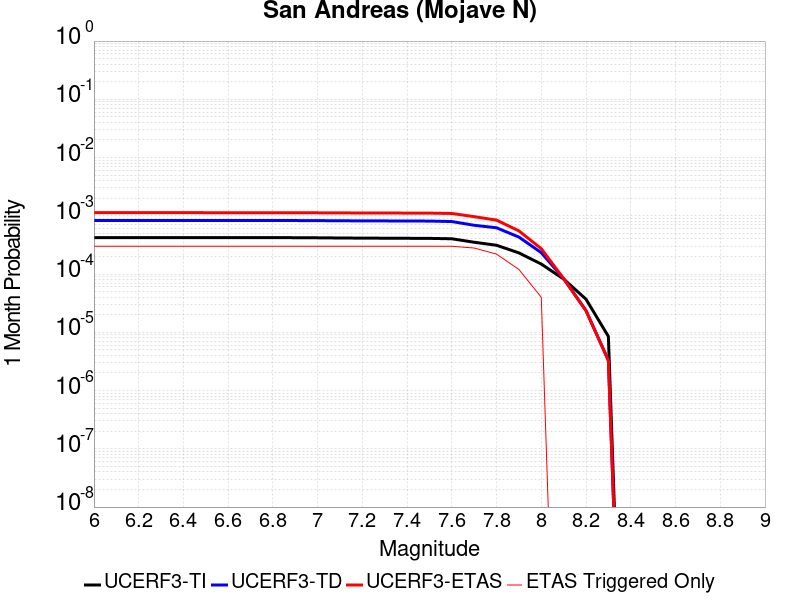 |  |  |

| Magnitude | 1 wk TI Prob | 1 wk TD Prob | 1 wk ETAS Prob | 1 wk ETAS/TD Gain | 1 wk ETAS Triggered Only | 1 mo TI Prob | 1 mo TD Prob | 1 mo ETAS Prob | 1 mo ETAS/TD Gain | 1 mo ETAS Triggered Only | 1 yr TI Prob | 1 yr TD Prob | 1 yr ETAS Prob | 1 yr ETAS/TD Gain | 1 yr ETAS Triggered Only | 10 yr TI Prob | 10 yr TD Prob | 10 yr ETAS Prob | 10 yr ETAS/TD Gain | 10 yr ETAS Triggered Only |
|-----|-----|-----|-----|-----|-----|-----|-----|-----|-----|-----|-----|-----|-----|-----|-----|-----|-----|-----|-----|-----|
| 6.0 | 9.877682E-5 | 1.9435467E-4 | 1.9435467E-4 | 1.0 | 0.0 | 4.2326056E-4 | 8.326828E-4 | 8.326828E-4 | 1.0 | 0.0 | 0.0051410277 | 0.010090916 | 0.010939895 | 1.0841329 | 8.5763296E-4 | 0.05023708 | 0.09846656 | 0.100191355 | 1.0175166 | 0.0019131812 |
| 6.1 | 9.877682E-5 | 1.9435467E-4 | 1.9435467E-4 | 1.0 | 0.0 | 4.2326056E-4 | 8.326828E-4 | 8.326828E-4 | 1.0 | 0.0 | 0.0051410277 | 0.010090916 | 0.010939895 | 1.0841329 | 8.5763296E-4 | 0.05023708 | 0.09846656 | 0.100191355 | 1.0175166 | 0.0019131812 |
| 6.2 | 9.877682E-5 | 1.9435467E-4 | 1.9435467E-4 | 1.0 | 0.0 | 4.2326056E-4 | 8.326828E-4 | 8.326828E-4 | 1.0 | 0.0 | 0.0051410277 | 0.010090916 | 0.010939895 | 1.0841329 | 8.5763296E-4 | 0.05023708 | 0.09846656 | 0.100191355 | 1.0175166 | 0.0019131812 |
| 6.3 | 9.877682E-5 | 1.9435467E-4 | 1.9435467E-4 | 1.0 | 0.0 | 4.2326056E-4 | 8.326828E-4 | 8.326828E-4 | 1.0 | 0.0 | 0.0051410277 | 0.010090916 | 0.010939895 | 1.0841329 | 8.5763296E-4 | 0.05023708 | 0.09846656 | 0.100191355 | 1.0175166 | 0.0019131812 |
| 6.4 | 9.877682E-5 | 1.9435467E-4 | 1.9435467E-4 | 1.0 | 0.0 | 4.2326056E-4 | 8.326828E-4 | 8.326828E-4 | 1.0 | 0.0 | 0.0051410277 | 0.010090916 | 0.010939895 | 1.0841329 | 8.5763296E-4 | 0.05023708 | 0.09846656 | 0.100191355 | 1.0175166 | 0.0019131812 |
| 6.5 | 9.861474E-5 | 1.9409222E-4 | 1.9409222E-4 | 1.0 | 0.0 | 4.2256617E-4 | 8.3155883E-4 | 8.3155883E-4 | 1.0 | 0.0 | 0.0051326132 | 0.010077358 | 0.010926348 | 1.0842474 | 8.5763296E-4 | 0.050156746 | 0.09834433 | 0.10006936 | 1.0175407 | 0.0019131812 |
| 6.6 | 9.861474E-5 | 1.9409222E-4 | 1.9409222E-4 | 1.0 | 0.0 | 4.2256617E-4 | 8.3155883E-4 | 8.3155883E-4 | 1.0 | 0.0 | 0.0051326132 | 0.010077358 | 0.010926348 | 1.0842474 | 8.5763296E-4 | 0.050156746 | 0.09834433 | 0.10006936 | 1.0175407 | 0.0019131812 |
| 6.7 | 9.8552715E-5 | 1.9399171E-4 | 1.9399171E-4 | 1.0 | 0.0 | 4.223004E-4 | 8.3112833E-4 | 8.3112833E-4 | 1.0 | 0.0 | 0.0051293927 | 0.010072165 | 0.01092116 | 1.0842912 | 8.5763296E-4 | 0.050125998 | 0.09829751 | 0.10002263 | 1.01755 | 0.0019131812 |
| 6.8 | 9.8464974E-5 | 1.9384324E-4 | 1.9384324E-4 | 1.0 | 0.0 | 4.219245E-4 | 8.304924E-4 | 8.304924E-4 | 1.0 | 0.0 | 0.0051248376 | 0.010064495 | 0.010913496 | 1.0843561 | 8.5763296E-4 | 0.05008251 | 0.0982275 | 0.09995276 | 1.0175638 | 0.0019131812 |
| 6.9 | 9.825824E-5 | 1.9352314E-4 | 1.9352314E-4 | 1.0 | 0.0 | 4.2103877E-4 | 8.2912145E-4 | 8.2912145E-4 | 1.0 | 0.0 | 0.0051141046 | 0.010047957 | 0.010896972 | 1.0844964 | 8.5763296E-4 | 0.049980022 | 0.098076545 | 0.099802084 | 1.0175939 | 0.0019131812 |
| 7.0 | 9.781462E-5 | 1.928364E-4 | 1.928364E-4 | 1.0 | 0.0 | 4.1913814E-4 | 8.2618016E-4 | 8.2618016E-4 | 1.0 | 0.0 | 0.005091073 | 0.010012477 | 0.0108615225 | 1.0847988 | 8.5763296E-4 | 0.04976007 | 0.0977528 | 0.099419445 | 1.0170496 | 0.0018472094 |
| 7.1 | 9.7121134E-5 | 1.9185297E-4 | 1.9185297E-4 | 1.0 | 0.0 | 4.1616702E-4 | 8.2196813E-4 | 8.2196813E-4 | 1.0 | 0.0 | 0.005055068 | 0.009961666 | 0.010810755 | 1.0852357 | 8.5763296E-4 | 0.04941613 | 0.09728914 | 0.098897085 | 1.0165274 | 0.0017812377 |
| 7.2 | 9.663819E-5 | 1.9116043E-4 | 1.9116043E-4 | 1.0 | 0.0 | 4.1409794E-4 | 8.19002E-4 | 8.19002E-4 | 1.0 | 0.0 | 0.0050299936 | 0.009925882 | 0.010775002 | 1.085546 | 8.5763296E-4 | 0.049176537 | 0.09696228 | 0.0985708 | 1.0165892 | 0.0017812377 |
| 7.3 | 9.6277574E-5 | 1.9068507E-4 | 1.9068507E-4 | 1.0 | 0.0 | 4.125529E-4 | 8.16966E-4 | 8.16966E-4 | 1.0 | 0.0 | 0.0050112694 | 0.00990132 | 0.01075046 | 1.0857604 | 8.5763296E-4 | 0.04899759 | 0.09673555 | 0.09834448 | 1.0166322 | 0.0017812377 |
| 7.4 | 9.593308E-5 | 1.9008234E-4 | 1.9008234E-4 | 1.0 | 0.0 | 4.1107697E-4 | 8.1438443E-4 | 8.1438443E-4 | 1.0 | 0.0 | 0.0049933824 | 0.009870174 | 0.010719342 | 1.0860337 | 8.5763296E-4 | 0.04882661 | 0.09645354 | 0.09806298 | 1.0166861 | 0.0017812377 |
| 7.5 | 9.561707E-5 | 1.8954265E-4 | 1.8954265E-4 | 1.0 | 0.0 | 4.0972308E-4 | 8.12073E-4 | 8.12073E-4 | 1.0 | 0.0 | 0.0049769743 | 0.009842287 | 0.010691479 | 1.08628 | 8.5763296E-4 | 0.048669744 | 0.09619955 | 0.097809434 | 1.0167348 | 0.0017812377 |
| 7.6 | 9.418194E-5 | 1.8606246E-4 | 1.8606246E-4 | 1.0 | 0.0 | 4.0357444E-4 | 7.97167E-4 | 7.97167E-4 | 1.0 | 0.0 | 0.004902454 | 0.00966243 | 0.010511776 | 1.087902 | 8.5763296E-4 | 0.047957025 | 0.09458092 | 0.096193686 | 1.0170517 | 0.0017812377 |
| 7.7 | 8.202141E-5 | 1.6052493E-4 | 1.6052493E-4 | 1.0 | 0.0 | 3.51473E-4 | 6.877826E-4 | 6.877826E-4 | 1.0 | 0.0 | 0.00427079 | 0.00834166 | 0.009126716 | 1.0941129 | 7.9166115E-4 | 0.04189639 | 0.082371704 | 0.08388515 | 1.0183733 | 0.001649294 |
| 7.8 | 7.2859846E-5 | 1.4544492E-4 | 1.4544492E-4 | 1.0 | 0.0 | 3.1221908E-4 | 6.231865E-4 | 6.231865E-4 | 1.0 | 0.0 | 0.003794643 | 0.0075609423 | 0.008215672 | 1.0865936 | 6.5971765E-4 | 0.037304975 | 0.07485102 | 0.076071694 | 1.0163081 | 0.0013194353 |
| 7.9 | 5.3874453E-5 | 1.0065284E-4 | 1.0065284E-4 | 1.0 | 0.0 | 2.3087008E-4 | 4.3129802E-4 | 4.3129802E-4 | 1.0 | 0.0 | 0.0028072202 | 0.0052384217 | 0.0055665523 | 1.0626392 | 3.2985883E-4 | 0.02772022 | 0.05251603 | 0.05320361 | 1.0130928 | 7.256894E-4 |
| 8.0 | 3.468538E-5 | 5.4373286E-5 | 5.4373286E-5 | 1.0 | 0.0 | 1.4864317E-4 | 2.3300757E-4 | 2.3300757E-4 | 1.0 | 0.0 | 0.0018082283 | 0.0028331785 | 0.0029647483 | 1.0464389 | 1.3194353E-4 | 0.017935853 | 0.02900292 | 0.029323211 | 1.0110434 | 3.2985883E-4 |
| 8.1 | 1.9152367E-5 | 1.9455974E-5 | 1.9455974E-5 | 1.0 | 0.0 | 8.207899E-5 | 8.338009E-5 | 8.338009E-5 | 1.0 | 0.0 | 9.988535E-4 | 0.0010146805 | 0.0010146805 | 1.0 | 0.0 | 0.009943757 | 0.010884172 | 0.011014679 | 1.0119905 | 1.3194353E-4 |
| 8.2 | 8.643924E-6 | 5.49522E-6 | 5.49522E-6 | 1.0 | 0.0 | 3.704486E-5 | 2.355073E-5 | 2.355073E-5 | 1.0 | 0.0 | 4.5092785E-4 | 2.866925E-4 | 2.866925E-4 | 1.0 | 0.0 | 0.0045001395 | 0.0032598388 | 0.0032598388 | 1.0 | 0.0 |
| 8.3 | 1.983087E-6 | 7.693574E-7 | 7.693574E-7 | 1.0 | 0.0 | 8.498917E-6 | 3.297242E-6 | 3.297242E-6 | 1.0 | 0.0 | 1.034694E-4 | 4.01432E-5 | 4.01432E-5 | 1.0 | 0.0 | 0.0010342124 | 4.7390026E-4 | 4.7390026E-4 | 1.0 | 0.0 |

## Nelson Lake
*[(top)](#table-of-contents)*

| 1 Week | 1 Month | 1 Year | 10 Year |
|-----|-----|-----|-----|
|  |  |  |  |

| Magnitude | 1 wk TI Prob | 1 wk TD Prob | 1 wk ETAS Prob | 1 wk ETAS/TD Gain | 1 wk ETAS Triggered Only | 1 mo TI Prob | 1 mo TD Prob | 1 mo ETAS Prob | 1 mo ETAS/TD Gain | 1 mo ETAS Triggered Only | 1 yr TI Prob | 1 yr TD Prob | 1 yr ETAS Prob | 1 yr ETAS/TD Gain | 1 yr ETAS Triggered Only | 10 yr TI Prob | 10 yr TD Prob | 10 yr ETAS Prob | 10 yr ETAS/TD Gain | 10 yr ETAS Triggered Only |
|-----|-----|-----|-----|-----|-----|-----|-----|-----|-----|-----|-----|-----|-----|-----|-----|-----|-----|-----|-----|-----|
| 6.0 | 9.913453E-6 | 1.0192408E-5 | 1.0192408E-5 | 1.0 | 0.0 | 4.2485535E-5 | 4.3681073E-5 | 1.7561884E-4 | 4.020479 | 1.3194353E-4 | 5.1713863E-4 | 5.3169765E-4 | 9.932545E-4 | 1.8680813 | 4.6180235E-4 | 0.0051593683 | 0.0053052832 | 0.006945827 | 1.3092284 | 0.001649294 |
| 6.1 | 9.913453E-6 | 1.0192408E-5 | 1.0192408E-5 | 1.0 | 0.0 | 4.2485535E-5 | 4.3681073E-5 | 1.7561884E-4 | 4.020479 | 1.3194353E-4 | 5.1713863E-4 | 5.3169765E-4 | 9.932545E-4 | 1.8680813 | 4.6180235E-4 | 0.0051593683 | 0.0053052832 | 0.006945827 | 1.3092284 | 0.001649294 |
| 6.2 | 4.5596407E-6 | 4.696388E-6 | 4.696388E-6 | 1.0 | 0.0 | 1.954117E-5 | 2.0127229E-5 | 8.6097665E-5 | 4.2776713 | 6.597176E-5 | 2.3788778E-4 | 2.4502273E-4 | 5.0884514E-4 | 2.0767262 | 2.6388705E-4 | 0.0023763329 | 0.0024476517 | 0.0032373753 | 1.3226453 | 7.9166115E-4 |
| 6.3 | 4.5596407E-6 | 4.696388E-6 | 4.696388E-6 | 1.0 | 0.0 | 1.954117E-5 | 2.0127229E-5 | 8.6097665E-5 | 4.2776713 | 6.597176E-5 | 2.3788778E-4 | 2.4502273E-4 | 5.0884514E-4 | 2.0767262 | 2.6388705E-4 | 0.0023763329 | 0.0024476517 | 0.0032373753 | 1.3226453 | 7.9166115E-4 |
| 6.4 | 3.4025713E-6 | 3.509956E-6 | 3.509956E-6 | 1.0 | 0.0 | 1.4582367E-5 | 1.5042587E-5 | 8.101336E-5 | 5.3856 | 6.597176E-5 | 1.7752586E-4 | 1.8312894E-4 | 4.4696766E-4 | 2.4407265 | 2.6388705E-4 | 0.001773841 | 0.0018298633 | 0.0024883738 | 1.3598686 | 6.5971765E-4 |
| 6.5 | 2.8352947E-6 | 2.927907E-6 | 2.927907E-6 | 1.0 | 0.0 | 1.2151207E-5 | 1.25481165E-5 | 7.851905E-5 | 6.257437 | 6.597176E-5 | 1.479309E-4 | 1.5276336E-4 | 4.166101E-4 | 2.72716 | 2.6388705E-4 | 0.0014783246 | 0.0015266574 | 0.0021194967 | 1.3883251 | 5.9374585E-4 |
| 6.6 | 2.251518E-6 | 2.3291102E-6 | 2.3291102E-6 | 1.0 | 0.0 | 9.649328E-6 | 9.981866E-6 | 7.595297E-5 | 7.609095 | 6.597176E-5 | 1.1747423E-4 | 1.2152307E-4 | 3.8537805E-4 | 3.1712337 | 2.6388705E-4 | 0.0011741214 | 0.001214628 | 0.0016099777 | 1.3254905 | 3.9583058E-4 |
| 6.7 | 1.8911853E-6 | 1.959177E-6 | 1.959177E-6 | 1.0 | 0.0 | 8.105055E-6 | 8.39645E-6 | 7.436766E-5 | 8.857037 | 6.597176E-5 | 9.867457E-5 | 1.0222256E-4 | 3.0011762E-4 | 2.9359236 | 1.9791529E-4 | 9.863076E-4 | 0.0010218129 | 0.0013513347 | 1.3224874 | 3.2985883E-4 |
| 6.8 | 1.4874814E-6 | 1.5438616E-6 | 1.5438616E-6 | 1.0 | 0.0 | 6.374905E-6 | 6.6165358E-6 | 7.258786E-5 | 10.9706745 | 6.597176E-5 | 7.76117E-5 | 8.0553866E-5 | 2.7845323E-4 | 3.4567332 | 1.9791529E-4 | 7.75846E-4 | 8.0529775E-4 | 0.001134891 | 1.4092811 | 3.2985883E-4 |
| 6.9 | 6.835972E-7 | 7.140097E-7 | 7.140097E-7 | 1.0 | 0.0 | 2.9296991E-6 | 3.0600397E-6 | 3.0600397E-6 | 1.0 | 0.0 | 3.56685E-5 | 3.7255664E-5 | 1.0322497E-4 | 2.7707188 | 6.597176E-5 | 3.5662777E-4 | 3.7252545E-4 | 5.0441985E-4 | 1.3540547 | 1.3194353E-4 |

## Towne Pass
*[(top)](#table-of-contents)*

| 1 Week | 1 Month | 1 Year | 10 Year |
|-----|-----|-----|-----|
|  |  |  |  |

| Magnitude | 1 wk TI Prob | 1 wk TD Prob | 1 wk ETAS Prob | 1 wk ETAS/TD Gain | 1 wk ETAS Triggered Only | 1 mo TI Prob | 1 mo TD Prob | 1 mo ETAS Prob | 1 mo ETAS/TD Gain | 1 mo ETAS Triggered Only | 1 yr TI Prob | 1 yr TD Prob | 1 yr ETAS Prob | 1 yr ETAS/TD Gain | 1 yr ETAS Triggered Only | 10 yr TI Prob | 10 yr TD Prob | 10 yr ETAS Prob | 10 yr ETAS/TD Gain | 10 yr ETAS Triggered Only |
|-----|-----|-----|-----|-----|-----|-----|-----|-----|-----|-----|-----|-----|-----|-----|-----|-----|-----|-----|-----|-----|
| 6.0 | 3.849728E-6 | 3.8945745E-6 | 3.8945745E-6 | 1.0 | 0.0 | 1.649873E-5 | 1.669095E-5 | 1.4863227E-4 | 8.904962 | 1.3194353E-4 | 2.0085352E-4 | 2.0319775E-4 | 9.2873967E-4 | 4.57062 | 7.256894E-4 | 0.0020067208 | 0.0020305486 | 0.003610656 | 1.7781677 | 0.0015833223 |
| 6.1 | 3.849728E-6 | 3.8945745E-6 | 3.8945745E-6 | 1.0 | 0.0 | 1.649873E-5 | 1.669095E-5 | 1.4863227E-4 | 8.904962 | 1.3194353E-4 | 2.0085352E-4 | 2.0319775E-4 | 9.2873967E-4 | 4.57062 | 7.256894E-4 | 0.0020067208 | 0.0020305486 | 0.003610656 | 1.7781677 | 0.0015833223 |
| 6.2 | 3.849728E-6 | 3.8945745E-6 | 3.8945745E-6 | 1.0 | 0.0 | 1.649873E-5 | 1.669095E-5 | 1.4863227E-4 | 8.904962 | 1.3194353E-4 | 2.0085352E-4 | 2.0319775E-4 | 9.2873967E-4 | 4.57062 | 7.256894E-4 | 0.0020067208 | 0.0020305486 | 0.003610656 | 1.7781677 | 0.0015833223 |
| 6.3 | 3.849728E-6 | 3.8945745E-6 | 3.8945745E-6 | 1.0 | 0.0 | 1.649873E-5 | 1.669095E-5 | 1.4863227E-4 | 8.904962 | 1.3194353E-4 | 2.0085352E-4 | 2.0319775E-4 | 9.2873967E-4 | 4.57062 | 7.256894E-4 | 0.0020067208 | 0.0020305486 | 0.003610656 | 1.7781677 | 0.0015833223 |
| 6.4 | 3.849728E-6 | 3.8945745E-6 | 3.8945745E-6 | 1.0 | 0.0 | 1.649873E-5 | 1.669095E-5 | 1.4863227E-4 | 8.904962 | 1.3194353E-4 | 2.0085352E-4 | 2.0319775E-4 | 9.2873967E-4 | 4.57062 | 7.256894E-4 | 0.0020067208 | 0.0020305486 | 0.003610656 | 1.7781677 | 0.0015833223 |
| 6.5 | 1.1953545E-6 | 1.203065E-6 | 1.203065E-6 | 1.0 | 0.0 | 5.1229376E-6 | 5.1559837E-6 | 5.1559837E-6 | 1.0 | 0.0 | 6.236998E-5 | 6.277241E-5 | 1.2874004E-4 | 2.0509017 | 6.597176E-5 | 6.235248E-4 | 6.275585E-4 | 8.253496E-4 | 1.3151755 | 1.9791529E-4 |
| 6.6 | 1.1953545E-6 | 1.203065E-6 | 1.203065E-6 | 1.0 | 0.0 | 5.1229376E-6 | 5.1559837E-6 | 5.1559837E-6 | 1.0 | 0.0 | 6.236998E-5 | 6.277241E-5 | 1.2874004E-4 | 2.0509017 | 6.597176E-5 | 6.235248E-4 | 6.275585E-4 | 8.253496E-4 | 1.3151755 | 1.9791529E-4 |
| 6.7 | 8.375951E-7 | 8.410778E-7 | 8.410778E-7 | 1.0 | 0.0 | 3.5896885E-6 | 3.6046144E-6 | 3.6046144E-6 | 1.0 | 0.0 | 4.370358E-5 | 4.3885353E-5 | 1.0985423E-4 | 2.503209 | 6.597176E-5 | 4.3694986E-4 | 4.387726E-4 | 6.3660106E-4 | 1.4508679 | 1.9791529E-4 |
| 6.8 | 6.38041E-7 | 6.3922516E-7 | 6.3922516E-7 | 1.0 | 0.0 | 2.7344586E-6 | 2.7395338E-6 | 2.7395338E-6 | 1.0 | 0.0 | 3.3291526E-5 | 3.335335E-5 | 9.932291E-5 | 2.977899 | 6.597176E-5 | 3.3286537E-4 | 3.3348726E-4 | 3.9943703E-4 | 1.197758 | 6.597176E-5 |
| 6.9 | 5.3460053E-7 | 5.3454215E-7 | 5.3454215E-7 | 1.0 | 0.0 | 2.2911431E-6 | 2.290893E-6 | 2.290893E-6 | 1.0 | 0.0 | 2.789431E-5 | 2.78913E-5 | 9.386122E-5 | 3.3652508 | 6.597176E-5 | 2.789081E-4 | 2.788813E-4 | 3.4483467E-4 | 1.2364926 | 6.597176E-5 |
| 7.0 | 3.557783E-7 | 3.5324976E-7 | 3.5324976E-7 | 1.0 | 0.0 | 1.5247632E-6 | 1.5139268E-6 | 1.5139268E-6 | 1.0 | 0.0 | 1.8563835E-5 | 1.843191E-5 | 8.440246E-5 | 4.579149 | 6.597176E-5 | 1.8562283E-4 | 1.8430466E-4 | 2.5026427E-4 | 1.3578836 | 6.597176E-5 |
| 7.1 | 3.037942E-7 | 3.0002903E-7 | 3.0002903E-7 | 1.0 | 0.0 | 1.3019744E-6 | 1.285838E-6 | 1.285838E-6 | 1.0 | 0.0 | 1.5851423E-5 | 1.5654974E-5 | 8.16257E-5 | 5.214043 | 6.597176E-5 | 1.5850292E-4 | 1.5653945E-4 | 2.225009E-4 | 1.4213727 | 6.597176E-5 |
| 7.2 | 2.0808248E-7 | 2.0218252E-7 | 2.0218252E-7 | 1.0 | 0.0 | 8.917818E-7 | 8.6649624E-7 | 8.6649624E-7 | 1.0 | 0.0 | 1.0857389E-5 | 1.0549546E-5 | 1.0549546E-5 | 1.0 | 0.0 | 1.0856859E-4 | 1.0549091E-4 | 1.0549091E-4 | 1.0 | 0.0 |
| 7.3 | 1.1162073E-7 | 1.0637251E-7 | 1.0637251E-7 | 1.0 | 0.0 | 4.7837443E-7 | 4.5588212E-7 | 4.5588212E-7 | 1.0 | 0.0 | 5.8241935E-6 | 5.5503524E-6 | 5.5503524E-6 | 1.0 | 0.0 | 5.8240406E-5 | 5.550234E-5 | 5.550234E-5 | 1.0 | 0.0 |

## San Andreas (San Bernardino N)
*[(top)](#table-of-contents)*

| 1 Week | 1 Month | 1 Year | 10 Year |
|-----|-----|-----|-----|
|  | 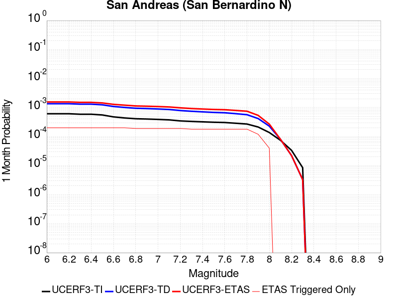 |  |  |

| Magnitude | 1 wk TI Prob | 1 wk TD Prob | 1 wk ETAS Prob | 1 wk ETAS/TD Gain | 1 wk ETAS Triggered Only | 1 mo TI Prob | 1 mo TD Prob | 1 mo ETAS Prob | 1 mo ETAS/TD Gain | 1 mo ETAS Triggered Only | 1 yr TI Prob | 1 yr TD Prob | 1 yr ETAS Prob | 1 yr ETAS/TD Gain | 1 yr ETAS Triggered Only | 10 yr TI Prob | 10 yr TD Prob | 10 yr ETAS Prob | 10 yr ETAS/TD Gain | 10 yr ETAS Triggered Only |
|-----|-----|-----|-----|-----|-----|-----|-----|-----|-----|-----|-----|-----|-----|-----|-----|-----|-----|-----|-----|-----|
| 6.0 | 1.4273766E-4 | 3.1635934E-4 | 3.8231022E-4 | 1.2084683 | 6.597176E-5 | 6.115894E-4 | 0.0013551271 | 0.0014210095 | 1.0486171 | 6.597176E-5 | 0.0074207084 | 0.016375363 | 0.016764712 | 1.0237765 | 3.9583058E-4 | 0.07177748 | 0.15038711 | 0.15133996 | 1.0063361 | 0.00112152 |
| 6.1 | 1.4273766E-4 | 3.1635934E-4 | 3.8231022E-4 | 1.2084683 | 6.597176E-5 | 6.115894E-4 | 0.0013551271 | 0.0014210095 | 1.0486171 | 6.597176E-5 | 0.0074207084 | 0.016375363 | 0.016764712 | 1.0237765 | 3.9583058E-4 | 0.07177748 | 0.15038711 | 0.15133996 | 1.0063361 | 0.00112152 |
| 6.2 | 1.4273766E-4 | 3.1635934E-4 | 3.8231022E-4 | 1.2084683 | 6.597176E-5 | 6.115894E-4 | 0.0013551271 | 0.0014210095 | 1.0486171 | 6.597176E-5 | 0.0074207084 | 0.016375363 | 0.016764712 | 1.0237765 | 3.9583058E-4 | 0.07177748 | 0.15038711 | 0.15133996 | 1.0063361 | 0.00112152 |
| 6.3 | 1.3730655E-4 | 3.0540637E-4 | 3.7135798E-4 | 1.215947 | 6.597176E-5 | 5.883239E-4 | 0.0013082335 | 0.001374119 | 1.0503621 | 6.597176E-5 | 0.0071393442 | 0.015812824 | 0.016202394 | 1.0246364 | 3.9583058E-4 | 0.06914291 | 0.14568701 | 0.14664514 | 1.0065767 | 0.00112152 |
| 6.4 | 1.3730655E-4 | 3.0540637E-4 | 3.7135798E-4 | 1.215947 | 6.597176E-5 | 5.883239E-4 | 0.0013082335 | 0.001374119 | 1.0503621 | 6.597176E-5 | 0.0071393442 | 0.015812824 | 0.016202394 | 1.0246364 | 3.9583058E-4 | 0.06914291 | 0.14568701 | 0.14664514 | 1.0065767 | 0.00112152 |
| 6.5 | 1.2942807E-4 | 2.8954886E-4 | 3.555015E-4 | 1.2277774 | 6.597176E-5 | 5.545738E-4 | 0.0012403387 | 0.0013062286 | 1.0531225 | 6.597176E-5 | 0.0067310524 | 0.014997809 | 0.015387704 | 1.0259967 | 3.9583058E-4 | 0.06530788 | 0.13882978 | 0.1397956 | 1.0069568 | 0.00112152 |
| 6.6 | 1.1125901E-4 | 2.5393223E-4 | 3.1988724E-4 | 1.2597347 | 6.597176E-5 | 4.767372E-4 | 0.0010878295 | 0.0011537294 | 1.0605793 | 6.597176E-5 | 0.005788839 | 0.013164529 | 0.013555148 | 1.0296721 | 3.9583058E-4 | 0.056403454 | 0.12311955 | 0.12410299 | 1.0079876 | 0.00112152 |
| 6.7 | 1.02209575E-4 | 2.3527986E-4 | 3.012361E-4 | 1.280331 | 6.597176E-5 | 4.3796748E-4 | 0.001007954 | 0.0010738593 | 1.0653852 | 6.597176E-5 | 0.0053192247 | 0.012203212 | 0.012594213 | 1.0320407 | 3.9583058E-4 | 0.051936906 | 0.11491149 | 0.11572896 | 1.0071139 | 9.236047E-4 |
| 6.8 | 9.610582E-5 | 2.2053412E-4 | 2.8649133E-4 | 1.2990794 | 6.597176E-5 | 4.1181705E-4 | 9.448046E-4 | 0.001010714 | 1.0697598 | 6.597176E-5 | 0.0050023515 | 0.011442591 | 0.011833893 | 1.0341969 | 3.9583058E-4 | 0.048912346 | 0.10831282 | 0.10913639 | 1.0076036 | 9.236047E-4 |
| 6.9 | 9.3877505E-5 | 2.150883E-4 | 2.8104585E-4 | 1.3066535 | 6.597176E-5 | 4.0227012E-4 | 9.2148193E-4 | 9.87393E-4 | 1.0715271 | 6.597176E-5 | 0.0048866454 | 0.011161577 | 0.0115529895 | 1.0350678 | 3.9583058E-4 | 0.04780577 | 0.1059029 | 0.106728695 | 1.0077976 | 9.236047E-4 |
| 7.0 | 9.1019785E-5 | 2.0835544E-4 | 2.7431347E-4 | 1.3165649 | 6.597176E-5 | 3.900265E-4 | 8.926469E-4 | 9.585598E-4 | 1.0738398 | 6.597176E-5 | 0.0047382377 | 0.010814046 | 0.011205595 | 1.0362076 | 3.9583058E-4 | 0.046384744 | 0.10287278 | 0.103701375 | 1.0080545 | 9.236047E-4 |
| 7.1 | 8.771155E-5 | 2.0009889E-4 | 2.6605747E-4 | 1.3296298 | 6.597176E-5 | 3.758525E-4 | 8.5728534E-4 | 9.2320057E-4 | 1.0768883 | 6.597176E-5 | 0.0045664064 | 0.010387696 | 0.010779415 | 1.0377098 | 3.9583058E-4 | 0.044737056 | 0.09918398 | 0.100015976 | 1.0083884 | 9.236047E-4 |
| 7.2 | 8.0830236E-5 | 1.8415037E-4 | 2.5011E-4 | 1.3581834 | 6.597176E-5 | 3.4636928E-4 | 7.8897737E-4 | 8.548971E-4 | 1.0835508 | 6.597176E-5 | 0.0042088944 | 0.009563598 | 0.009955643 | 1.0409935 | 3.9583058E-4 | 0.041300658 | 0.09191379 | 0.0927525 | 1.009125 | 9.236047E-4 |
| 7.3 | 7.7668235E-5 | 1.7358093E-4 | 1.7358093E-4 | 1.0 | 0.0 | 3.328214E-4 | 7.437063E-4 | 7.437063E-4 | 1.0 | 0.0 | 0.0040445733 | 0.009017113 | 0.009343997 | 1.0362515 | 3.2985883E-4 | 0.03971748 | 0.08717959 | 0.087962456 | 1.0089799 | 8.5763296E-4 |
| 7.4 | 7.520177E-5 | 1.657783E-4 | 1.657783E-4 | 1.0 | 0.0 | 3.2225347E-4 | 7.1028504E-4 | 7.1028504E-4 | 1.0 | 0.0 | 0.0039163795 | 0.008613498 | 0.008940516 | 1.0379657 | 3.2985883E-4 | 0.038480744 | 0.08363466 | 0.08442057 | 1.0093969 | 8.5763296E-4 |
| 7.5 | 7.274697E-5 | 1.5865144E-4 | 1.5865144E-4 | 1.0 | 0.0 | 3.1173544E-4 | 6.797576E-4 | 6.797576E-4 | 1.0 | 0.0 | 0.003788775 | 0.008244702 | 0.008571841 | 1.0396787 | 3.2985883E-4 | 0.03724827 | 0.08035038 | 0.081139095 | 1.009816 | 8.5763296E-4 |
| 7.6 | 7.1185845E-5 | 1.5434787E-4 | 1.5434787E-4 | 1.0 | 0.0 | 3.0504653E-4 | 6.6132325E-4 | 6.6132325E-4 | 1.0 | 0.0 | 0.0037076178 | 0.008021939 | 0.008349151 | 1.0407897 | 3.2985883E-4 | 0.036463667 | 0.078339346 | 0.07912979 | 1.01009 | 8.5763296E-4 |
| 7.7 | 6.709961E-5 | 1.4343053E-4 | 1.4343053E-4 | 1.0 | 0.0 | 2.8753807E-4 | 6.1455753E-4 | 6.1455753E-4 | 1.0 | 0.0 | 0.003495157 | 0.007456607 | 0.007784006 | 1.0439073 | 3.2985883E-4 | 0.034406938 | 0.07316601 | 0.07396089 | 1.0108641 | 8.5763296E-4 |
| 7.8 | 6.300812E-5 | 1.3225875E-4 | 1.3225875E-4 | 1.0 | 0.0 | 2.7000686E-4 | 5.6670007E-4 | 5.6670007E-4 | 1.0 | 0.0 | 0.0032823787 | 0.0068777753 | 0.007139847 | 1.0381042 | 2.6388705E-4 | 0.032343175 | 0.06781986 | 0.06855783 | 1.0108813 | 7.9166115E-4 |
| 7.9 | 4.983037E-5 | 9.7419856E-5 | 9.7419856E-5 | 1.0 | 0.0 | 2.1354125E-4 | 4.1744686E-4 | 4.1744686E-4 | 1.0 | 0.0 | 0.0025967648 | 0.005070582 | 0.0053331307 | 1.0517789 | 2.6388705E-4 | 0.025666296 | 0.050735 | 0.051361248 | 1.0123435 | 6.5971765E-4 |
| 8.0 | 3.2211527E-5 | 5.341288E-5 | 5.341288E-5 | 1.0 | 0.0 | 1.380421E-4 | 2.2889227E-4 | 2.2889227E-4 | 1.0 | 0.0 | 0.0016793669 | 0.002783204 | 0.0029147803 | 1.0472751 | 1.3194353E-4 | 0.016667323 | 0.028414162 | 0.028670551 | 1.0090233 | 2.6388705E-4 |
| 8.1 | 1.743376E-5 | 1.8874636E-5 | 1.8874636E-5 | 1.0 | 0.0 | 7.471398E-5 | 8.088879E-5 | 8.088879E-5 | 1.0 | 0.0 | 9.0926304E-4 | 9.843768E-4 | 9.843768E-4 | 1.0 | 0.0 | 0.009055517 | 0.010510205 | 0.010575484 | 1.0062109 | 6.597176E-5 |
| 8.2 | 7.831616E-6 | 5.1737816E-6 | 5.1737816E-6 | 1.0 | 0.0 | 3.3563636E-5 | 2.217316E-5 | 2.217316E-5 | 1.0 | 0.0 | 4.0856065E-4 | 2.6992487E-4 | 2.6992487E-4 | 1.0 | 0.0 | 0.004078103 | 0.0030519657 | 0.0030519657 | 1.0 | 0.0 |
| 8.3 | 1.983087E-6 | 7.693574E-7 | 7.693574E-7 | 1.0 | 0.0 | 8.498917E-6 | 3.297242E-6 | 3.297242E-6 | 1.0 | 0.0 | 1.034694E-4 | 4.01432E-5 | 4.01432E-5 | 1.0 | 0.0 | 0.0010342124 | 4.7390026E-4 | 4.7390026E-4 | 1.0 | 0.0 |

## Lenwood-Lockhart-Old Woman Springs
*[(top)](#table-of-contents)*

| 1 Week | 1 Month | 1 Year | 10 Year |
|-----|-----|-----|-----|
|  |  |  | 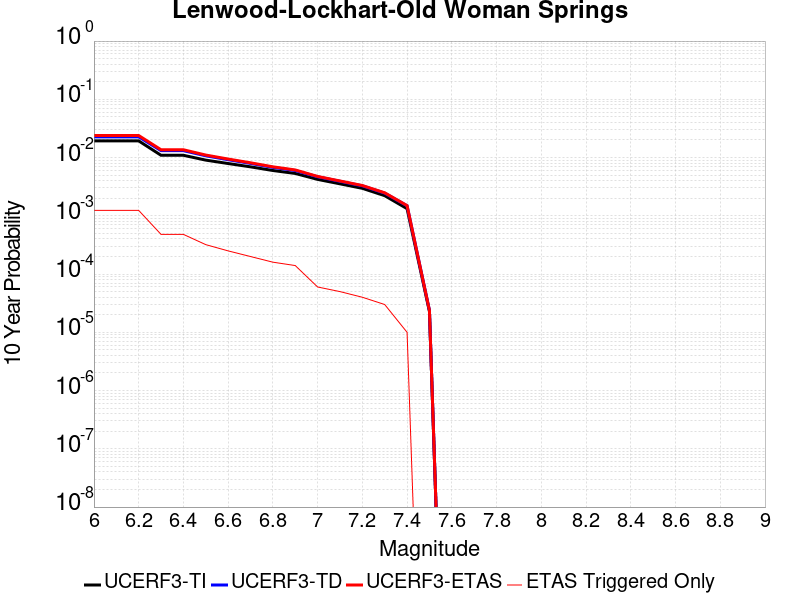 |

| Magnitude | 1 wk TI Prob | 1 wk TD Prob | 1 wk ETAS Prob | 1 wk ETAS/TD Gain | 1 wk ETAS Triggered Only | 1 mo TI Prob | 1 mo TD Prob | 1 mo ETAS Prob | 1 mo ETAS/TD Gain | 1 mo ETAS Triggered Only | 1 yr TI Prob | 1 yr TD Prob | 1 yr ETAS Prob | 1 yr ETAS/TD Gain | 1 yr ETAS Triggered Only | 10 yr TI Prob | 10 yr TD Prob | 10 yr ETAS Prob | 10 yr ETAS/TD Gain | 10 yr ETAS Triggered Only |
|-----|-----|-----|-----|-----|-----|-----|-----|-----|-----|-----|-----|-----|-----|-----|-----|-----|-----|-----|-----|-----|
| 6.0 | 3.744542E-5 | 4.3964304E-5 | 4.3964304E-5 | 1.0 | 0.0 | 1.604705E-4 | 1.8840581E-4 | 1.8840581E-4 | 1.0 | 0.0 | 0.0019519776 | 0.0022915998 | 0.002554882 | 1.1148902 | 2.6388705E-4 | 0.019349206 | 0.0226977 | 0.023664815 | 1.0426085 | 9.895765E-4 |
| 6.1 | 3.744542E-5 | 4.3964304E-5 | 4.3964304E-5 | 1.0 | 0.0 | 1.604705E-4 | 1.8840581E-4 | 1.8840581E-4 | 1.0 | 0.0 | 0.0019519776 | 0.0022915998 | 0.002554882 | 1.1148902 | 2.6388705E-4 | 0.019349206 | 0.0226977 | 0.023664815 | 1.0426085 | 9.895765E-4 |
| 6.2 | 3.744542E-5 | 4.3964304E-5 | 4.3964304E-5 | 1.0 | 0.0 | 1.604705E-4 | 1.8840581E-4 | 1.8840581E-4 | 1.0 | 0.0 | 0.0019519776 | 0.0022915998 | 0.002554882 | 1.1148902 | 2.6388705E-4 | 0.019349206 | 0.0226977 | 0.023664815 | 1.0426085 | 9.895765E-4 |
| 6.3 | 2.1079984E-5 | 2.5354084E-5 | 2.5354084E-5 | 1.0 | 0.0 | 9.0339665E-5 | 1.0865595E-4 | 1.0865595E-4 | 1.0 | 0.0 | 0.0010993304 | 0.0013221033 | 0.0014538724 | 1.0996662 | 1.3194353E-4 | 0.010939079 | 0.013144593 | 0.013665429 | 1.0396236 | 5.277741E-4 |
| 6.4 | 2.1079984E-5 | 2.5354084E-5 | 2.5354084E-5 | 1.0 | 0.0 | 9.0339665E-5 | 1.0865595E-4 | 1.0865595E-4 | 1.0 | 0.0 | 0.0010993304 | 0.0013221033 | 0.0014538724 | 1.0996662 | 1.3194353E-4 | 0.010939079 | 0.013144593 | 0.013665429 | 1.0396236 | 5.277741E-4 |
| 6.5 | 1.7397282E-5 | 2.0662914E-5 | 2.0662914E-5 | 1.0 | 0.0 | 7.455765E-5 | 8.8552406E-5 | 8.8552406E-5 | 1.0 | 0.0 | 9.073613E-4 | 0.001077604 | 0.0012094054 | 1.1223097 | 1.3194353E-4 | 0.009036654 | 0.010725081 | 0.0110514015 | 1.030426 | 3.2985883E-4 |
| 6.6 | 1.52050325E-5 | 1.7680117E-5 | 1.7680117E-5 | 1.0 | 0.0 | 6.51628E-5 | 7.576977E-5 | 7.576977E-5 | 1.0 | 0.0 | 7.9306826E-4 | 9.221144E-4 | 0.0010539363 | 1.1429561 | 1.3194353E-4 | 0.007902439 | 0.009183745 | 0.009510574 | 1.0355878 | 3.2985883E-4 |
| 6.7 | 1.332523E-5 | 1.5264359E-5 | 1.5264359E-5 | 1.0 | 0.0 | 5.7106878E-5 | 6.541707E-5 | 6.541707E-5 | 1.0 | 0.0 | 6.950544E-4 | 7.9616765E-4 | 9.2800613E-4 | 1.1655914 | 1.3194353E-4 | 0.006928845 | 0.007933783 | 0.008261025 | 1.0412467 | 3.2985883E-4 |
| 6.8 | 1.1525329E-5 | 1.3031262E-5 | 1.3031262E-5 | 1.0 | 0.0 | 4.9393333E-5 | 5.5847093E-5 | 5.5847093E-5 | 1.0 | 0.0 | 6.011979E-4 | 6.797305E-4 | 7.456574E-4 | 1.0969898 | 6.597176E-5 | 0.00599574 | 0.0067769657 | 0.0070390645 | 1.038675 | 2.6388705E-4 |
| 6.9 | 1.0253909E-5 | 1.1514676E-5 | 1.1514676E-5 | 1.0 | 0.0 | 4.3944583E-5 | 4.93477E-5 | 4.93477E-5 | 1.0 | 0.0 | 5.3489394E-4 | 6.006462E-4 | 6.6657836E-4 | 1.1097686 | 6.597176E-5 | 0.0053360825 | 0.005990607 | 0.006187337 | 1.0328397 | 1.9791529E-4 |
| 7.0 | 8.104563E-6 | 8.991446E-6 | 8.991446E-6 | 1.0 | 0.0 | 3.4733377E-5 | 3.8534214E-5 | 3.8534214E-5 | 1.0 | 0.0 | 4.2279682E-4 | 4.6905546E-4 | 5.349963E-4 | 1.1405821 | 6.597176E-5 | 0.0042199334 | 0.004680902 | 0.0048122285 | 1.0280557 | 1.3194353E-4 |
| 7.1 | 6.7986157E-6 | 7.515946E-6 | 7.515946E-6 | 1.0 | 0.0 | 2.91366E-5 | 3.221081E-5 | 3.221081E-5 | 1.0 | 0.0 | 3.5468035E-4 | 3.9209818E-4 | 4.580441E-4 | 1.1681871 | 6.597176E-5 | 0.003541148 | 0.0039142803 | 0.004045707 | 1.0335763 | 1.3194353E-4 |
| 7.2 | 5.6893327E-6 | 6.280115E-6 | 6.280115E-6 | 1.0 | 0.0 | 2.4382627E-5 | 2.6914513E-5 | 2.6914513E-5 | 1.0 | 0.0 | 2.9681803E-4 | 3.2763692E-4 | 3.9358705E-4 | 1.2012904 | 6.597176E-5 | 0.002964219 | 0.0032717374 | 0.0034032492 | 1.0401963 | 1.3194353E-4 |
| 7.3 | 4.253348E-6 | 4.7069766E-6 | 4.7069766E-6 | 1.0 | 0.0 | 1.8228506E-5 | 2.0172612E-5 | 2.0172612E-5 | 1.0 | 0.0 | 2.2190946E-4 | 2.455757E-4 | 3.1153127E-4 | 1.2685753 | 6.597176E-5 | 0.00221688 | 0.0024532243 | 0.0025848441 | 1.0536518 | 1.3194353E-4 |
| 7.4 | 2.5448119E-6 | 2.8520785E-6 | 2.8520785E-6 | 1.0 | 0.0 | 1.0906291E-5 | 1.2223146E-5 | 1.2223146E-5 | 1.0 | 0.0 | 1.3277601E-4 | 1.4880829E-4 | 1.4880829E-4 | 1.0 | 0.0 | 0.001326967 | 0.0014872487 | 0.0015531223 | 1.0442923 | 6.597176E-5 |
| 7.5 | 4.3706837E-8 | 4.5630156E-8 | 4.5630156E-8 | 1.0 | 0.0 | 1.8731501E-7 | 1.955578E-7 | 1.955578E-7 | 1.0 | 0.0 | 2.2805577E-6 | 2.380914E-6 | 2.380914E-6 | 1.0 | 0.0 | 2.2805343E-5 | 2.3808941E-5 | 2.3808941E-5 | 1.0 | 0.0 |

## Bicycle Lake
*[(top)](#table-of-contents)*

| 1 Week | 1 Month | 1 Year | 10 Year |
|-----|-----|-----|-----|
|  |  |  |  |

| Magnitude | 1 wk TI Prob | 1 wk TD Prob | 1 wk ETAS Prob | 1 wk ETAS/TD Gain | 1 wk ETAS Triggered Only | 1 mo TI Prob | 1 mo TD Prob | 1 mo ETAS Prob | 1 mo ETAS/TD Gain | 1 mo ETAS Triggered Only | 1 yr TI Prob | 1 yr TD Prob | 1 yr ETAS Prob | 1 yr ETAS/TD Gain | 1 yr ETAS Triggered Only | 10 yr TI Prob | 10 yr TD Prob | 10 yr ETAS Prob | 10 yr ETAS/TD Gain | 10 yr ETAS Triggered Only |
|-----|-----|-----|-----|-----|-----|-----|-----|-----|-----|-----|-----|-----|-----|-----|-----|-----|-----|-----|-----|-----|
| 6.0 | 1.9621975E-5 | 2.2098558E-5 | 2.2098558E-5 | 1.0 | 0.0 | 8.4091465E-5 | 9.470543E-5 | 1.6067094E-4 | 1.6965337 | 6.597176E-5 | 0.0010233327 | 0.0011525637 | 0.0015479381 | 1.343039 | 3.9583058E-4 | 0.01018633 | 0.011479173 | 0.012326961 | 1.0738544 | 8.5763296E-4 |
| 6.1 | 1.9621975E-5 | 2.2098558E-5 | 2.2098558E-5 | 1.0 | 0.0 | 8.4091465E-5 | 9.470543E-5 | 1.6067094E-4 | 1.6965337 | 6.597176E-5 | 0.0010233327 | 0.0011525637 | 0.0015479381 | 1.343039 | 3.9583058E-4 | 0.01018633 | 0.011479173 | 0.012326961 | 1.0738544 | 8.5763296E-4 |
| 6.2 | 9.9971285E-6 | 1.1256391E-5 | 1.1256391E-5 | 1.0 | 0.0 | 4.2844134E-5 | 4.824108E-5 | 4.824108E-5 | 1.0 | 0.0 | 5.2150246E-4 | 5.8722886E-4 | 8.5096096E-4 | 1.449113 | 2.6388705E-4 | 0.0052028033 | 0.0058618775 | 0.0064521427 | 1.1006956 | 5.9374585E-4 |
| 6.3 | 9.589428E-6 | 1.0799068E-5 | 1.0799068E-5 | 1.0 | 0.0 | 4.10969E-5 | 4.628119E-5 | 4.628119E-5 | 1.0 | 0.0 | 5.002399E-4 | 5.633797E-4 | 8.271181E-4 | 1.4681361 | 2.6388705E-4 | 0.0049911533 | 0.0056246053 | 0.0061494107 | 1.0933053 | 5.277741E-4 |
| 6.4 | 9.589428E-6 | 1.0799068E-5 | 1.0799068E-5 | 1.0 | 0.0 | 4.10969E-5 | 4.628119E-5 | 4.628119E-5 | 1.0 | 0.0 | 5.002399E-4 | 5.633797E-4 | 8.271181E-4 | 1.4681361 | 2.6388705E-4 | 0.0049911533 | 0.0056246053 | 0.0061494107 | 1.0933053 | 5.277741E-4 |
| 6.5 | 5.557707E-6 | 6.286038E-6 | 6.286038E-6 | 1.0 | 0.0 | 2.3818526E-5 | 2.6940037E-5 | 2.6940037E-5 | 1.0 | 0.0 | 2.8995197E-4 | 3.2797246E-4 | 4.5987274E-4 | 1.4021686 | 1.3194353E-4 | 0.0028957394 | 0.0032775209 | 0.0036062987 | 1.100313 | 3.2985883E-4 |
| 6.6 | 4.8742945E-6 | 5.5136734E-6 | 5.5136734E-6 | 1.0 | 0.0 | 2.0889667E-5 | 2.3629962E-5 | 2.3629962E-5 | 1.0 | 0.0 | 2.54302E-4 | 2.87683E-4 | 4.1958858E-4 | 1.4585102 | 1.3194353E-4 | 0.002540112 | 0.0028756752 | 0.0032045853 | 1.1143767 | 3.2985883E-4 |
| 6.7 | 3.991108E-6 | 4.5162255E-6 | 4.5162255E-6 | 1.0 | 0.0 | 1.7104636E-5 | 1.9355251E-5 | 1.9355251E-5 | 1.0 | 0.0 | 2.0822904E-4 | 2.3565018E-4 | 3.016064E-4 | 1.2798904 | 6.597176E-5 | 0.0020803404 | 0.0023565018 | 0.0024881344 | 1.0558593 | 1.3194353E-4 |

## Death Valley (Black Mtns Frontal)
*[(top)](#table-of-contents)*

| 1 Week | 1 Month | 1 Year | 10 Year |
|-----|-----|-----|-----|
|  |  |  |  |

| Magnitude | 1 wk TI Prob | 1 wk TD Prob | 1 wk ETAS Prob | 1 wk ETAS/TD Gain | 1 wk ETAS Triggered Only | 1 mo TI Prob | 1 mo TD Prob | 1 mo ETAS Prob | 1 mo ETAS/TD Gain | 1 mo ETAS Triggered Only | 1 yr TI Prob | 1 yr TD Prob | 1 yr ETAS Prob | 1 yr ETAS/TD Gain | 1 yr ETAS Triggered Only | 10 yr TI Prob | 10 yr TD Prob | 10 yr ETAS Prob | 10 yr ETAS/TD Gain | 10 yr ETAS Triggered Only |
|-----|-----|-----|-----|-----|-----|-----|-----|-----|-----|-----|-----|-----|-----|-----|-----|-----|-----|-----|-----|-----|
| 6.0 | 1.6707214E-5 | 1.8671435E-5 | 1.8671435E-5 | 1.0 | 0.0 | 7.160038E-5 | 8.001803E-5 | 2.11951E-4 | 2.6487906 | 1.3194353E-4 | 8.71386E-4 | 9.737917E-4 | 0.0015669594 | 1.609132 | 5.9374585E-4 | 0.00867977 | 0.0096961 | 0.010676081 | 1.1010697 | 9.895765E-4 |
| 6.1 | 1.6707214E-5 | 1.8671435E-5 | 1.8671435E-5 | 1.0 | 0.0 | 7.160038E-5 | 8.001803E-5 | 2.11951E-4 | 2.6487906 | 1.3194353E-4 | 8.71386E-4 | 9.737917E-4 | 0.0015669594 | 1.609132 | 5.9374585E-4 | 0.00867977 | 0.0096961 | 0.010676081 | 1.1010697 | 9.895765E-4 |
| 6.2 | 1.6707214E-5 | 1.8671435E-5 | 1.8671435E-5 | 1.0 | 0.0 | 7.160038E-5 | 8.001803E-5 | 2.11951E-4 | 2.6487906 | 1.3194353E-4 | 8.71386E-4 | 9.737917E-4 | 0.0015669594 | 1.609132 | 5.9374585E-4 | 0.00867977 | 0.0096961 | 0.010676081 | 1.1010697 | 9.895765E-4 |
| 6.3 | 1.6707214E-5 | 1.8671435E-5 | 1.8671435E-5 | 1.0 | 0.0 | 7.160038E-5 | 8.001803E-5 | 2.11951E-4 | 2.6487906 | 1.3194353E-4 | 8.71386E-4 | 9.737917E-4 | 0.0015669594 | 1.609132 | 5.9374585E-4 | 0.00867977 | 0.0096961 | 0.010676081 | 1.1010697 | 9.895765E-4 |
| 6.4 | 1.5515609E-5 | 1.7339296E-5 | 1.7339296E-5 | 1.0 | 0.0 | 6.649377E-5 | 7.430919E-5 | 2.0624291E-4 | 2.7754698 | 1.3194353E-4 | 8.0926094E-4 | 9.04345E-4 | 0.0014975539 | 1.6559542 | 5.9374585E-4 | 0.008063202 | 0.009007333 | 0.009987996 | 1.1088738 | 9.895765E-4 |
| 6.5 | 1.5515609E-5 | 1.7339296E-5 | 1.7339296E-5 | 1.0 | 0.0 | 6.649377E-5 | 7.430919E-5 | 2.0624291E-4 | 2.7754698 | 1.3194353E-4 | 8.0926094E-4 | 9.04345E-4 | 0.0014975539 | 1.6559542 | 5.9374585E-4 | 0.008063202 | 0.009007333 | 0.009987996 | 1.1088738 | 9.895765E-4 |
| 6.6 | 1.5041828E-5 | 1.6810196E-5 | 1.6810196E-5 | 1.0 | 0.0 | 6.4463384E-5 | 7.204174E-5 | 1.3800875E-4 | 1.9156777 | 6.597176E-5 | 7.8455906E-4 | 8.767611E-4 | 0.0014040725 | 1.6014311 | 5.277741E-4 | 0.00781795 | 0.008733676 | 0.009649214 | 1.1048285 | 9.236047E-4 |
| 6.7 | 1.4634985E-5 | 1.635704E-5 | 1.635704E-5 | 1.0 | 0.0 | 6.271985E-5 | 7.009975E-5 | 1.3606688E-4 | 1.9410467 | 6.597176E-5 | 7.6334673E-4 | 8.53136E-4 | 0.0013804599 | 1.6181005 | 5.277741E-4 | 0.007607299 | 0.008499245 | 0.009349589 | 1.1000494 | 8.5763296E-4 |
| 6.8 | 1.4209158E-5 | 1.5883043E-5 | 1.5883043E-5 | 1.0 | 0.0 | 6.089497E-5 | 6.806844E-5 | 1.3403571E-4 | 1.9691316 | 6.597176E-5 | 7.4114406E-4 | 8.2842377E-4 | 0.0013557606 | 1.6365545 | 5.277741E-4 | 0.007386771 | 0.008253971 | 0.009104526 | 1.1030478 | 8.5763296E-4 |
| 6.9 | 1.3780098E-5 | 1.540556E-5 | 1.540556E-5 | 1.0 | 0.0 | 5.9056227E-5 | 6.6022185E-5 | 1.319896E-4 | 1.9991703 | 6.597176E-5 | 7.1877235E-4 | 8.0352917E-4 | 0.0013308792 | 1.6562923 | 5.277741E-4 | 0.0071645193 | 0.0080068335 | 0.008857599 | 1.1062549 | 8.5763296E-4 |
| 7.0 | 1.3585064E-5 | 1.5189109E-5 | 1.5189109E-5 | 1.0 | 0.0 | 5.8220405E-5 | 6.509459E-5 | 1.3106206E-4 | 2.0134094 | 6.597176E-5 | 7.086029E-4 | 7.922439E-4 | 0.0013195999 | 1.6656485 | 5.277741E-4 | 0.007063476 | 0.007894788 | 0.00874565 | 1.1077752 | 8.5763296E-4 |
| 7.1 | 1.3398601E-5 | 1.4982282E-5 | 1.4982282E-5 | 1.0 | 0.0 | 5.742131E-5 | 6.420823E-5 | 1.3017576E-4 | 2.0274 | 6.597176E-5 | 6.9888023E-4 | 7.8146026E-4 | 0.001308822 | 1.6748413 | 5.277741E-4 | 0.0069668638 | 0.007787712 | 0.00850775 | 1.0924582 | 7.256894E-4 |
| 7.2 | 1.3126312E-5 | 1.4680485E-5 | 1.4680485E-5 | 1.0 | 0.0 | 5.6254412E-5 | 6.291488E-5 | 1.2888249E-4 | 2.0485218 | 6.597176E-5 | 6.846822E-4 | 7.6572486E-4 | 0.0011612524 | 1.5165399 | 3.9583058E-4 | 0.006825765 | 0.007631449 | 0.008220663 | 1.0772088 | 5.9374585E-4 |
| 7.3 | 1.2922429E-5 | 1.4454699E-5 | 1.4454699E-5 | 1.0 | 0.0 | 5.5380664E-5 | 6.194727E-5 | 1.2791494E-4 | 2.0649004 | 6.597176E-5 | 6.74051E-4 | 7.539525E-4 | 0.0011494847 | 1.5246115 | 3.9583058E-4 | 0.006720101 | 0.007514527 | 0.008103811 | 1.0784193 | 5.9374585E-4 |
| 7.4 | 1.2768878E-5 | 1.4284673E-5 | 1.4284673E-5 | 1.0 | 0.0 | 5.4722615E-5 | 6.121862E-5 | 1.2718634E-4 | 2.0775762 | 6.597176E-5 | 6.660441E-4 | 7.450873E-4 | 0.0010747004 | 1.4423817 | 3.2985883E-4 | 0.0066405144 | 0.007426471 | 0.0079503255 | 1.0705389 | 5.277741E-4 |
| 7.5 | 1.2521929E-5 | 1.4012902E-5 | 1.4012902E-5 | 1.0 | 0.0 | 5.366431E-5 | 6.0053942E-5 | 1.2602174E-4 | 2.0984757 | 6.597176E-5 | 6.531671E-4 | 7.309169E-4 | 0.0010605346 | 1.4509647 | 3.2985883E-4 | 0.006512506 | 0.0072857053 | 0.0078096343 | 1.0719119 | 5.277741E-4 |
| 7.6 | 1.1301089E-5 | 1.2648951E-5 | 1.2648951E-5 | 1.0 | 0.0 | 4.8432343E-5 | 5.4208693E-5 | 1.2017688E-4 | 2.2169302 | 6.597176E-5 | 5.895042E-4 | 6.597963E-4 | 9.2350924E-4 | 1.3996885 | 2.6388705E-4 | 0.0058794282 | 0.006578926 | 0.0070376904 | 1.0697324 | 4.6180235E-4 |
| 7.7 | 9.189108E-6 | 1.02840095E-5 | 1.02840095E-5 | 1.0 | 0.0 | 3.93813E-5 | 4.407361E-5 | 1.1004247E-4 | 2.496788 | 6.597176E-5 | 4.7936183E-4 | 5.3646916E-4 | 7.342783E-4 | 1.3687241 | 1.9791529E-4 | 0.004783291 | 0.005352252 | 0.0056803455 | 1.0613 | 3.2985883E-4 |
| 7.8 | 3.4586725E-7 | 3.648368E-7 | 3.648368E-7 | 1.0 | 0.0 | 1.4822873E-6 | 1.5635853E-6 | 1.5635853E-6 | 1.0 | 0.0 | 1.80467E-5 | 1.903649E-5 | 1.903649E-5 | 1.0 | 0.0 | 1.8045233E-4 | 1.9034903E-4 | 1.9034903E-4 | 1.0 | 0.0 |
| 7.9 | 2.5591178E-9 | 2.6697329E-9 | 2.6697329E-9 | 1.0 | 0.0 | 1.0967647E-8 | 1.14417125E-8 | 1.14417125E-8 | 1.0 | 0.0 | 1.335311E-7 | 1.3930286E-7 | 1.3930286E-7 | 1.0 | 0.0 | 1.3353102E-6 | 1.3930285E-6 | 1.3930285E-6 | 1.0 | 0.0 |

## Garlic Springs
*[(top)](#table-of-contents)*

| 1 Week | 1 Month | 1 Year | 10 Year |
|-----|-----|-----|-----|
|  |  |  |  |

| Magnitude | 1 wk TI Prob | 1 wk TD Prob | 1 wk ETAS Prob | 1 wk ETAS/TD Gain | 1 wk ETAS Triggered Only | 1 mo TI Prob | 1 mo TD Prob | 1 mo ETAS Prob | 1 mo ETAS/TD Gain | 1 mo ETAS Triggered Only | 1 yr TI Prob | 1 yr TD Prob | 1 yr ETAS Prob | 1 yr ETAS/TD Gain | 1 yr ETAS Triggered Only | 10 yr TI Prob | 10 yr TD Prob | 10 yr ETAS Prob | 10 yr ETAS/TD Gain | 10 yr ETAS Triggered Only |
|-----|-----|-----|-----|-----|-----|-----|-----|-----|-----|-----|-----|-----|-----|-----|-----|-----|-----|-----|-----|-----|
| 6.0 | 1.6760017E-5 | 1.8778032E-5 | 1.8778032E-5 | 1.0 | 0.0 | 7.182667E-5 | 8.047546E-5 | 8.047546E-5 | 1.0 | 0.0 | 8.7413884E-4 | 9.794658E-4 | 0.0014408157 | 1.4710221 | 4.6180235E-4 | 0.008707083 | 0.009763034 | 0.010612294 | 1.0869873 | 8.5763296E-4 |
| 6.1 | 9.852767E-6 | 1.097425E-5 | 1.097425E-5 | 1.0 | 0.0 | 4.222546E-5 | 4.703205E-5 | 4.703205E-5 | 1.0 | 0.0 | 5.139737E-4 | 5.7253573E-4 | 8.362717E-4 | 1.4606454 | 2.6388705E-4 | 0.005127866 | 0.005717566 | 0.006176728 | 1.0803072 | 4.6180235E-4 |
| 6.2 | 9.852767E-6 | 1.097425E-5 | 1.097425E-5 | 1.0 | 0.0 | 4.222546E-5 | 4.703205E-5 | 4.703205E-5 | 1.0 | 0.0 | 5.139737E-4 | 5.7253573E-4 | 8.362717E-4 | 1.4606454 | 2.6388705E-4 | 0.005127866 | 0.005717566 | 0.006176728 | 1.0803072 | 4.6180235E-4 |
| 6.3 | 4.3167724E-6 | 4.7782996E-6 | 4.7782996E-6 | 1.0 | 0.0 | 1.8500323E-5 | 2.0478396E-5 | 2.0478396E-5 | 1.0 | 0.0 | 2.2521814E-4 | 2.4931898E-4 | 3.152743E-4 | 1.2645419 | 6.597176E-5 | 0.0022499003 | 0.002492651 | 0.002690073 | 1.0792016 | 1.9791529E-4 |
| 6.4 | 4.3167724E-6 | 4.7782996E-6 | 4.7782996E-6 | 1.0 | 0.0 | 1.8500323E-5 | 2.0478396E-5 | 2.0478396E-5 | 1.0 | 0.0 | 2.2521814E-4 | 2.4931898E-4 | 3.152743E-4 | 1.2645419 | 6.597176E-5 | 0.0022499003 | 0.002492651 | 0.002690073 | 1.0792016 | 1.9791529E-4 |
| 6.5 | 4.3167724E-6 | 4.7782996E-6 | 4.7782996E-6 | 1.0 | 0.0 | 1.8500323E-5 | 2.0478396E-5 | 2.0478396E-5 | 1.0 | 0.0 | 2.2521814E-4 | 2.4931898E-4 | 3.152743E-4 | 1.2645419 | 6.597176E-5 | 0.0022499003 | 0.002492651 | 0.002690073 | 1.0792016 | 1.9791529E-4 |
| 6.6 | 4.301311E-6 | 4.761167E-6 | 4.761167E-6 | 1.0 | 0.0 | 1.8434059E-5 | 2.0404972E-5 | 2.0404972E-5 | 1.0 | 0.0 | 2.2441156E-4 | 2.4842523E-4 | 3.1438062E-4 | 1.2654939 | 6.597176E-5 | 0.0022418506 | 0.002483734 | 0.0026811576 | 1.0794866 | 1.9791529E-4 |
| 6.7 | 3.8599724E-6 | 4.2713013E-6 | 4.2713013E-6 | 1.0 | 0.0 | 1.6542634E-5 | 1.8305576E-5 | 1.8305576E-5 | 1.0 | 0.0 | 2.0138794E-4 | 2.228704E-4 | 2.8882746E-4 | 1.2959436 | 6.597176E-5 | 0.0020120554 | 0.0022287038 | 0.0024261782 | 1.0886049 | 1.9791529E-4 |

## Paradise
*[(top)](#table-of-contents)*

| 1 Week | 1 Month | 1 Year | 10 Year |
|-----|-----|-----|-----|
| 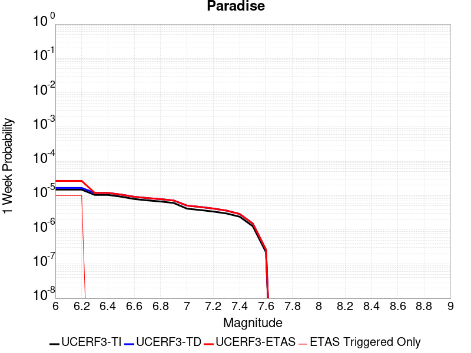 |  |  |  |

| Magnitude | 1 wk TI Prob | 1 wk TD Prob | 1 wk ETAS Prob | 1 wk ETAS/TD Gain | 1 wk ETAS Triggered Only | 1 mo TI Prob | 1 mo TD Prob | 1 mo ETAS Prob | 1 mo ETAS/TD Gain | 1 mo ETAS Triggered Only | 1 yr TI Prob | 1 yr TD Prob | 1 yr ETAS Prob | 1 yr ETAS/TD Gain | 1 yr ETAS Triggered Only | 10 yr TI Prob | 10 yr TD Prob | 10 yr ETAS Prob | 10 yr ETAS/TD Gain | 10 yr ETAS Triggered Only |
|-----|-----|-----|-----|-----|-----|-----|-----|-----|-----|-----|-----|-----|-----|-----|-----|-----|-----|-----|-----|-----|
| 6.0 | 1.4851273E-5 | 1.6695341E-5 | 1.6695341E-5 | 1.0 | 0.0 | 6.364676E-5 | 7.154963E-5 | 7.154963E-5 | 1.0 | 0.0 | 7.7462377E-4 | 8.707922E-4 | 0.0012662781 | 1.454168 | 3.9583058E-4 | 0.0077192914 | 0.008676181 | 0.009330174 | 1.0753781 | 6.5971765E-4 |
| 6.1 | 1.4851273E-5 | 1.6695341E-5 | 1.6695341E-5 | 1.0 | 0.0 | 6.364676E-5 | 7.154963E-5 | 7.154963E-5 | 1.0 | 0.0 | 7.7462377E-4 | 8.707922E-4 | 0.0012662781 | 1.454168 | 3.9583058E-4 | 0.0077192914 | 0.008676181 | 0.009330174 | 1.0753781 | 6.5971765E-4 |
| 6.2 | 1.4851273E-5 | 1.6695341E-5 | 1.6695341E-5 | 1.0 | 0.0 | 6.364676E-5 | 7.154963E-5 | 7.154963E-5 | 1.0 | 0.0 | 7.7462377E-4 | 8.707922E-4 | 0.0012662781 | 1.454168 | 3.9583058E-4 | 0.0077192914 | 0.008676181 | 0.009330174 | 1.0753781 | 6.5971765E-4 |
| 6.3 | 1.0426831E-5 | 1.1889049E-5 | 1.1889049E-5 | 1.0 | 0.0 | 4.4685654E-5 | 5.095211E-5 | 5.095211E-5 | 1.0 | 0.0 | 5.43912E-4 | 6.2017125E-4 | 8.1796385E-4 | 1.3189322 | 1.9791529E-4 | 0.0054258266 | 0.0061850143 | 0.006447269 | 1.0424017 | 2.6388705E-4 |
| 6.4 | 1.0426831E-5 | 1.1889049E-5 | 1.1889049E-5 | 1.0 | 0.0 | 4.4685654E-5 | 5.095211E-5 | 5.095211E-5 | 1.0 | 0.0 | 5.43912E-4 | 6.2017125E-4 | 8.1796385E-4 | 1.3189322 | 1.9791529E-4 | 0.0054258266 | 0.0061850143 | 0.006447269 | 1.0424017 | 2.6388705E-4 |
| 6.5 | 9.25027E-6 | 1.0620336E-5 | 1.0620336E-5 | 1.0 | 0.0 | 3.964341E-5 | 4.551496E-5 | 4.551496E-5 | 1.0 | 0.0 | 4.8255164E-4 | 5.5400864E-4 | 6.858791E-4 | 1.2380296 | 1.3194353E-4 | 0.0048150513 | 0.0055267746 | 0.005723596 | 1.0356123 | 1.9791529E-4 |
| 6.6 | 7.904275E-6 | 9.159836E-6 | 9.159836E-6 | 1.0 | 0.0 | 3.3875025E-5 | 3.925587E-5 | 3.925587E-5 | 1.0 | 0.0 | 4.1235037E-4 | 4.7783932E-4 | 4.7783932E-4 | 1.0 | 0.0 | 0.0041158604 | 0.0047685155 | 0.004834173 | 1.0137689 | 6.597176E-5 |
| 6.7 | 7.2061953E-6 | 8.407527E-6 | 8.407527E-6 | 1.0 | 0.0 | 3.088333E-5 | 3.6031786E-5 | 3.6031786E-5 | 1.0 | 0.0 | 3.7593965E-4 | 4.3860235E-4 | 4.3860235E-4 | 1.0 | 0.0 | 0.003753043 | 0.0043777362 | 0.004443419 | 1.0150039 | 6.597176E-5 |
| 6.8 | 6.6948724E-6 | 7.842423E-6 | 7.842423E-6 | 1.0 | 0.0 | 2.8691995E-5 | 3.3609973E-5 | 3.3609973E-5 | 1.0 | 0.0 | 3.4926904E-4 | 4.0912814E-4 | 4.0912814E-4 | 1.0 | 0.0 | 0.003487206 | 0.004084107 | 0.0041498095 | 1.0160873 | 6.597176E-5 |
| 6.9 | 6.0421025E-6 | 7.1308505E-6 | 7.1308505E-6 | 1.0 | 0.0 | 2.5894467E-5 | 3.0560448E-5 | 3.0560448E-5 | 1.0 | 0.0 | 3.1521954E-4 | 3.7201334E-4 | 3.7201334E-4 | 1.0 | 0.0 | 0.0031477278 | 0.003714244 | 0.0037799708 | 1.0176959 | 6.597176E-5 |
| 7.0 | 4.134091E-6 | 5.080469E-6 | 5.080469E-6 | 1.0 | 0.0 | 1.7717413E-5 | 2.1773263E-5 | 2.1773263E-5 | 1.0 | 0.0 | 2.1568815E-4 | 2.6505877E-4 | 2.6505877E-4 | 1.0 | 0.0 | 0.0021547892 | 0.0026475794 | 0.0027133767 | 1.0248518 | 6.597176E-5 |
| 7.1 | 3.7674888E-6 | 4.6320133E-6 | 4.6320133E-6 | 1.0 | 0.0 | 1.6146281E-5 | 1.9851343E-5 | 1.9851343E-5 | 1.0 | 0.0 | 1.9656324E-4 | 2.4166482E-4 | 2.4166482E-4 | 1.0 | 0.0 | 0.0019638946 | 0.002414171 | 0.0024799833 | 1.0272609 | 6.597176E-5 |
| 7.2 | 3.4065345E-6 | 4.1568514E-6 | 4.1568514E-6 | 1.0 | 0.0 | 1.4599351E-5 | 1.7814966E-5 | 1.7814966E-5 | 1.0 | 0.0 | 1.777326E-4 | 2.1687712E-4 | 2.1687712E-4 | 1.0 | 0.0 | 0.0017759053 | 0.0021668028 | 0.0022326317 | 1.0303806 | 6.597176E-5 |
| 7.3 | 2.9934936E-6 | 3.629423E-6 | 3.629423E-6 | 1.0 | 0.0 | 1.2829195E-5 | 1.5554586E-5 | 1.5554586E-5 | 1.0 | 0.0 | 1.5618425E-4 | 1.893621E-4 | 1.893621E-4 | 1.0 | 0.0 | 0.0015607453 | 0.0018921527 | 0.0019579998 | 1.0348 | 6.597176E-5 |
| 7.4 | 2.4049796E-6 | 2.889062E-6 | 2.889062E-6 | 1.0 | 0.0 | 1.0307015E-5 | 1.23816435E-5 | 1.23816435E-5 | 1.0 | 0.0 | 1.2548068E-4 | 1.5073753E-4 | 1.5073753E-4 | 1.0 | 0.0 | 0.0012540985 | 0.0015064942 | 0.0015723666 | 1.0437256 | 6.597176E-5 |
| 7.5 | 1.2710091E-6 | 1.5135054E-6 | 1.5135054E-6 | 1.0 | 0.0 | 5.44717E-6 | 6.4864425E-6 | 6.4864425E-6 | 1.0 | 0.0 | 6.631728E-5 | 7.897083E-5 | 7.897083E-5 | 1.0 | 0.0 | 6.6297496E-4 | 7.8955025E-4 | 8.5546996E-4 | 1.0834901 | 6.597176E-5 |
| 7.6 | 2.21172E-7 | 2.6040124E-7 | 2.6040124E-7 | 1.0 | 0.0 | 9.478797E-7 | 1.116005E-6 | 1.116005E-6 | 1.0 | 0.0 | 1.1540374E-5 | 1.3587305E-5 | 1.3587305E-5 | 1.0 | 0.0 | 1.1539775E-4 | 1.3586757E-4 | 1.3586757E-4 | 1.0 | 0.0 |

## San Andreas (San Bernardino S)
*[(top)](#table-of-contents)*

| 1 Week | 1 Month | 1 Year | 10 Year |
|-----|-----|-----|-----|
|  |  |  |  |

| Magnitude | 1 wk TI Prob | 1 wk TD Prob | 1 wk ETAS Prob | 1 wk ETAS/TD Gain | 1 wk ETAS Triggered Only | 1 mo TI Prob | 1 mo TD Prob | 1 mo ETAS Prob | 1 mo ETAS/TD Gain | 1 mo ETAS Triggered Only | 1 yr TI Prob | 1 yr TD Prob | 1 yr ETAS Prob | 1 yr ETAS/TD Gain | 1 yr ETAS Triggered Only | 10 yr TI Prob | 10 yr TD Prob | 10 yr ETAS Prob | 10 yr ETAS/TD Gain | 10 yr ETAS Triggered Only |
|-----|-----|-----|-----|-----|-----|-----|-----|-----|-----|-----|-----|-----|-----|-----|-----|-----|-----|-----|-----|-----|
| 6.0 | 1.2336002E-4 | 3.0023555E-4 | 3.661875E-4 | 1.2196674 | 6.597176E-5 | 5.2857865E-4 | 0.0012861154 | 0.0013520023 | 1.0512294 | 6.597176E-5 | 0.006416472 | 0.015550992 | 0.01574583 | 1.0125289 | 1.9791529E-4 | 0.06234337 | 0.14291383 | 0.14347927 | 1.0039564 | 6.5971765E-4 |
| 6.1 | 1.2336002E-4 | 3.0023555E-4 | 3.661875E-4 | 1.2196674 | 6.597176E-5 | 5.2857865E-4 | 0.0012861154 | 0.0013520023 | 1.0512294 | 6.597176E-5 | 0.006416472 | 0.015550992 | 0.01574583 | 1.0125289 | 1.9791529E-4 | 0.06234337 | 0.14291383 | 0.14347927 | 1.0039564 | 6.5971765E-4 |
| 6.2 | 1.2336002E-4 | 3.0023555E-4 | 3.661875E-4 | 1.2196674 | 6.597176E-5 | 5.2857865E-4 | 0.0012861154 | 0.0013520023 | 1.0512294 | 6.597176E-5 | 0.006416472 | 0.015550992 | 0.01574583 | 1.0125289 | 1.9791529E-4 | 0.06234337 | 0.14291383 | 0.14347927 | 1.0039564 | 6.5971765E-4 |
| 6.3 | 1.1712257E-4 | 2.8811657E-4 | 3.540693E-4 | 1.22891 | 6.597176E-5 | 5.018573E-4 | 0.0012342266 | 0.001300117 | 1.053386 | 6.597176E-5 | 0.006093008 | 0.0149280215 | 0.015122983 | 1.0130601 | 1.9791529E-4 | 0.059286322 | 0.13762207 | 0.138191 | 1.0041339 | 6.5971765E-4 |
| 6.4 | 1.1712257E-4 | 2.8811657E-4 | 3.540693E-4 | 1.22891 | 6.597176E-5 | 5.018573E-4 | 0.0012342266 | 0.001300117 | 1.053386 | 6.597176E-5 | 0.006093008 | 0.0149280215 | 0.015122983 | 1.0130601 | 1.9791529E-4 | 0.059286322 | 0.13762207 | 0.138191 | 1.0041339 | 6.5971765E-4 |
| 6.5 | 1.0689076E-4 | 2.682418E-4 | 3.3419588E-4 | 1.2458755 | 6.597176E-5 | 4.5802278E-4 | 0.001149126 | 0.0012150219 | 1.0573444 | 6.597176E-5 | 0.0055621783 | 0.013905481 | 0.014100644 | 1.014035 | 1.9791529E-4 | 0.05425003 | 0.12886871 | 0.1294434 | 1.0044596 | 6.5971765E-4 |
| 6.6 | 9.7648895E-5 | 2.506867E-4 | 3.1664193E-4 | 1.2630982 | 6.597176E-5 | 4.1842813E-4 | 0.0010739529 | 0.0011398537 | 1.061363 | 6.597176E-5 | 0.005082469 | 0.0130013535 | 0.013196696 | 1.0150248 | 1.9791529E-4 | 0.049677886 | 0.12102797 | 0.12160784 | 1.0047913 | 6.5971765E-4 |
| 6.7 | 8.757013E-5 | 2.3139146E-4 | 2.9734796E-4 | 1.2850429 | 6.597176E-5 | 3.7524657E-4 | 9.913231E-4 | 0.0010572295 | 1.0664833 | 6.597176E-5 | 0.00455906 | 0.012006655 | 0.012202194 | 1.0162859 | 1.9791529E-4 | 0.04466656 | 0.112335846 | 0.11292145 | 1.005213 | 6.5971765E-4 |
| 6.8 | 8.562978E-5 | 2.2698891E-4 | 2.929457E-4 | 1.2905728 | 6.597176E-5 | 3.6693315E-4 | 9.7246916E-4 | 0.0010383768 | 1.0677735 | 6.597176E-5 | 0.004458263 | 0.011779605 | 0.01197519 | 1.0166036 | 1.9791529E-4 | 0.043698758 | 0.11034572 | 0.11093264 | 1.0053189 | 6.5971765E-4 |
| 6.9 | 6.124075E-5 | 1.7082063E-4 | 2.3678112E-4 | 1.3861389 | 6.597176E-5 | 2.6243398E-4 | 7.318838E-4 | 7.978073E-4 | 1.0900737 | 6.597176E-5 | 0.0031904527 | 0.008874487 | 0.009070646 | 1.0221037 | 1.9791529E-4 | 0.031450346 | 0.08425208 | 0.0847958 | 1.0064535 | 5.9374585E-4 |
| 7.0 | 5.8598747E-5 | 1.6510907E-4 | 2.3106995E-4 | 1.3994987 | 6.597176E-5 | 2.5111332E-4 | 7.0741924E-4 | 7.7334436E-4 | 1.093191 | 6.597176E-5 | 0.0030530186 | 0.008579012 | 0.00877523 | 1.0228717 | 1.9791529E-4 | 0.03011414 | 0.08156926 | 0.08211458 | 1.0066853 | 5.9374585E-4 |
| 7.1 | 5.613814E-5 | 1.5929298E-4 | 2.2525423E-4 | 1.4140877 | 6.597176E-5 | 2.4056983E-4 | 6.825063E-4 | 7.4843306E-4 | 1.096595 | 6.597176E-5 | 0.0029250039 | 0.0082780365 | 0.008474314 | 1.0237106 | 1.9791529E-4 | 0.028868021 | 0.078867756 | 0.07941467 | 1.0069346 | 5.9374585E-4 |
| 7.2 | 4.991222E-5 | 1.4535384E-4 | 2.1131602E-4 | 1.4538041 | 6.597176E-5 | 2.1389198E-4 | 6.227967E-4 | 6.887274E-4 | 1.1058623 | 6.597176E-5 | 0.002601025 | 0.0075562913 | 0.007752711 | 1.0259942 | 1.9791529E-4 | 0.025707912 | 0.072320335 | 0.07287113 | 1.0076162 | 5.9374585E-4 |
| 7.3 | 4.7410045E-5 | 1.3729246E-4 | 1.3729246E-4 | 1.0 | 0.0 | 2.0317009E-4 | 5.882639E-4 | 5.882639E-4 | 1.0 | 0.0 | 0.0024707897 | 0.0071386793 | 0.007269681 | 1.018351 | 1.3194353E-4 | 0.024434982 | 0.06860168 | 0.06909325 | 1.0071656 | 5.277741E-4 |
| 7.4 | 4.5556746E-5 | 1.313689E-4 | 1.313689E-4 | 1.0 | 0.0 | 1.952286E-4 | 5.628884E-4 | 5.628884E-4 | 1.0 | 0.0 | 0.002374317 | 0.006831711 | 0.0069627534 | 1.0191815 | 1.3194353E-4 | 0.023491086 | 0.06585319 | 0.06634621 | 1.0074866 | 5.277741E-4 |
| 7.5 | 4.3084514E-5 | 1.2371907E-4 | 1.2371907E-4 | 1.0 | 0.0 | 1.8463485E-4 | 5.3011713E-4 | 5.3011713E-4 | 1.0 | 0.0 | 0.0022456115 | 0.0064351484 | 0.006566243 | 1.0203717 | 1.3194353E-4 | 0.022230545 | 0.062252887 | 0.06274781 | 1.0079502 | 5.277741E-4 |
| 7.6 | 3.408608E-5 | 9.8489814E-5 | 9.8489814E-5 | 1.0 | 0.0 | 1.4607502E-4 | 4.2203104E-4 | 4.2203104E-4 | 1.0 | 0.0 | 0.0017770125 | 0.005126148 | 0.005257415 | 1.0256073 | 1.3194353E-4 | 0.017628696 | 0.050079897 | 0.05058124 | 1.0100108 | 5.277741E-4 |
| 7.7 | 2.8315713E-5 | 8.261325E-5 | 8.261325E-5 | 1.0 | 0.0 | 1.2134742E-4 | 3.5400878E-4 | 3.5400878E-4 | 1.0 | 0.0 | 0.0014764034 | 0.004301548 | 0.004432924 | 1.0305415 | 1.3194353E-4 | 0.01466633 | 0.042327844 | 0.042833276 | 1.011941 | 5.277741E-4 |
| 7.8 | 2.6222975E-5 | 7.4749165E-5 | 7.4749165E-5 | 1.0 | 0.0 | 1.1237934E-4 | 3.2031426E-4 | 3.2031426E-4 | 1.0 | 0.0 | 0.0013673597 | 0.0038928585 | 0.0039585736 | 1.0168809 | 6.597176E-5 | 0.013589768 | 0.038489804 | 0.038933832 | 1.0115362 | 4.6180235E-4 |
| 7.9 | 2.1469694E-5 | 5.7977377E-5 | 5.7977377E-5 | 1.0 | 0.0 | 9.200973E-5 | 2.4845081E-4 | 2.4845081E-4 | 1.0 | 0.0 | 0.0011196428 | 0.003020696 | 0.0030864684 | 1.0217739 | 6.597176E-5 | 0.011140184 | 0.030197 | 0.030580878 | 1.0127125 | 3.9583058E-4 |
| 8.0 | 1.2420249E-5 | 3.1373827E-5 | 3.1373827E-5 | 1.0 | 0.0 | 5.322855E-5 | 1.3445233E-4 | 1.3445233E-4 | 1.0 | 0.0 | 6.478649E-4 | 0.001635729 | 0.0017015929 | 1.0402658 | 6.597176E-5 | 0.0064597935 | 0.016548108 | 0.01667787 | 1.0078413 | 1.3194353E-4 |
| 8.1 | 4.9197724E-6 | 7.842378E-6 | 7.842378E-6 | 1.0 | 0.0 | 2.1084568E-5 | 3.360976E-5 | 3.360976E-5 | 1.0 | 0.0 | 2.566744E-4 | 4.0912212E-4 | 4.0912212E-4 | 1.0 | 0.0 | 0.002563781 | 0.004394436 | 0.004394436 | 1.0 | 0.0 |
| 8.2 | 2.5634774E-6 | 2.9160003E-6 | 2.9160003E-6 | 1.0 | 0.0 | 1.0986286E-5 | 1.2497085E-5 | 1.2497085E-5 | 1.0 | 0.0 | 1.3374983E-4 | 1.5214144E-4 | 1.5214144E-4 | 1.0 | 0.0 | 0.0013366934 | 0.0017098442 | 0.0017098442 | 1.0 | 0.0 |
| 8.3 | 5.2850464E-7 | 3.2211614E-7 | 3.2211614E-7 | 1.0 | 0.0 | 2.2650179E-6 | 1.380497E-6 | 1.380497E-6 | 1.0 | 0.0 | 2.7576245E-5 | 1.6807435E-5 | 1.6807435E-5 | 1.0 | 0.0 | 2.7572823E-4 | 1.9939634E-4 | 1.9939634E-4 | 1.0 | 0.0 |

## Death Valley (No)
*[(top)](#table-of-contents)*

| 1 Week | 1 Month | 1 Year | 10 Year |
|-----|-----|-----|-----|
|  |  |  |  |

| Magnitude | 1 wk TI Prob | 1 wk TD Prob | 1 wk ETAS Prob | 1 wk ETAS/TD Gain | 1 wk ETAS Triggered Only | 1 mo TI Prob | 1 mo TD Prob | 1 mo ETAS Prob | 1 mo ETAS/TD Gain | 1 mo ETAS Triggered Only | 1 yr TI Prob | 1 yr TD Prob | 1 yr ETAS Prob | 1 yr ETAS/TD Gain | 1 yr ETAS Triggered Only | 10 yr TI Prob | 10 yr TD Prob | 10 yr ETAS Prob | 10 yr ETAS/TD Gain | 10 yr ETAS Triggered Only |
|-----|-----|-----|-----|-----|-----|-----|-----|-----|-----|-----|-----|-----|-----|-----|-----|-----|-----|-----|-----|-----|
| 6.0 | 2.0074807E-5 | 2.2501532E-5 | 2.2501532E-5 | 1.0 | 0.0 | 8.603206E-5 | 9.643161E-5 | 2.2836242E-4 | 2.368128 | 1.3194353E-4 | 0.001046937 | 0.00117343 | 0.0015687961 | 1.336932 | 3.9583058E-4 | 0.010420183 | 0.011673254 | 0.01232527 | 1.0558556 | 6.5971765E-4 |
| 6.1 | 2.0074807E-5 | 2.2501532E-5 | 2.2501532E-5 | 1.0 | 0.0 | 8.603206E-5 | 9.643161E-5 | 2.2836242E-4 | 2.368128 | 1.3194353E-4 | 0.001046937 | 0.00117343 | 0.0015687961 | 1.336932 | 3.9583058E-4 | 0.010420183 | 0.011673254 | 0.01232527 | 1.0558556 | 6.5971765E-4 |
| 6.2 | 2.0074807E-5 | 2.2501532E-5 | 2.2501532E-5 | 1.0 | 0.0 | 8.603206E-5 | 9.643161E-5 | 2.2836242E-4 | 2.368128 | 1.3194353E-4 | 0.001046937 | 0.00117343 | 0.0015687961 | 1.336932 | 3.9583058E-4 | 0.010420183 | 0.011673254 | 0.01232527 | 1.0558556 | 6.5971765E-4 |
| 6.3 | 1.9050609E-5 | 2.1338312E-5 | 2.1338312E-5 | 1.0 | 0.0 | 8.164292E-5 | 9.1446746E-5 | 2.233782E-4 | 2.4427137 | 1.3194353E-4 | 9.935491E-4 | 0.0011128022 | 0.0015081923 | 1.3553103 | 3.9583058E-4 | 0.009891188 | 0.011073124 | 0.011725536 | 1.0589186 | 6.5971765E-4 |
| 6.4 | 1.9050609E-5 | 2.1338312E-5 | 2.1338312E-5 | 1.0 | 0.0 | 8.164292E-5 | 9.1446746E-5 | 2.233782E-4 | 2.4427137 | 1.3194353E-4 | 9.935491E-4 | 0.0011128022 | 0.0015081923 | 1.3553103 | 3.9583058E-4 | 0.009891188 | 0.011073124 | 0.011725536 | 1.0589186 | 6.5971765E-4 |
| 6.5 | 1.8367004E-5 | 2.0562318E-5 | 2.0562318E-5 | 1.0 | 0.0 | 7.8713354E-5 | 8.8121276E-5 | 2.2005317E-4 | 2.4971628 | 1.3194353E-4 | 9.5791375E-4 | 0.0010723551 | 0.0014677612 | 1.3687268 | 3.9583058E-4 | 0.009537951 | 0.010672592 | 0.011325268 | 1.0611545 | 6.5971765E-4 |
| 6.6 | 1.779439E-5 | 1.9912191E-5 | 1.9912191E-5 | 1.0 | 0.0 | 7.625944E-5 | 8.53352E-5 | 2.1726747E-4 | 2.5460474 | 1.3194353E-4 | 9.280632E-4 | 0.0010384673 | 0.0014338868 | 1.3807722 | 3.9583058E-4 | 0.009241969 | 0.010336905 | 0.010989803 | 1.0631618 | 6.5971765E-4 |
| 6.7 | 1.7025437E-5 | 1.904463E-5 | 1.904463E-5 | 1.0 | 0.0 | 7.296412E-5 | 8.161732E-5 | 2.1355008E-4 | 2.6164799 | 1.3194353E-4 | 8.87976E-4 | 9.93244E-4 | 0.0013886815 | 1.3981272 | 3.9583058E-4 | 0.008844362 | 0.009888767 | 0.010476641 | 1.0594487 | 5.9374585E-4 |
| 6.8 | 1.6545107E-5 | 1.851372E-5 | 1.851372E-5 | 1.0 | 0.0 | 7.090568E-5 | 7.934213E-5 | 2.112752E-4 | 2.6628373 | 1.3194353E-4 | 8.629347E-4 | 9.6556847E-4 | 0.0013610169 | 1.4095498 | 3.9583058E-4 | 0.008595915 | 0.009614435 | 0.010202473 | 1.0611619 | 5.9374585E-4 |
| 6.9 | 1.615478E-5 | 1.8088747E-5 | 1.8088747E-5 | 1.0 | 0.0 | 6.9232934E-5 | 7.7520934E-5 | 2.0945423E-4 | 2.7019055 | 1.3194353E-4 | 8.4258494E-4 | 9.4341475E-4 | 0.0013388719 | 1.4191763 | 3.9583058E-4 | 0.008393973 | 0.009394792 | 0.009982959 | 1.0626057 | 5.9374585E-4 |
| 7.0 | 1.5894311E-5 | 1.780669E-5 | 1.780669E-5 | 1.0 | 0.0 | 6.81167E-5 | 7.6312186E-5 | 2.0824565E-4 | 2.728865 | 1.3194353E-4 | 8.2900526E-4 | 9.287109E-4 | 0.0013241739 | 1.4258193 | 3.9583058E-4 | 0.008259195 | 0.009248987 | 0.009837241 | 1.063602 | 5.9374585E-4 |
| 7.1 | 1.5602263E-5 | 1.7484625E-5 | 1.7484625E-5 | 1.0 | 0.0 | 6.6865134E-5 | 7.493199E-5 | 2.0686563E-4 | 2.760712 | 1.3194353E-4 | 8.137789E-4 | 9.119212E-4 | 0.0013073909 | 1.4336665 | 3.9583058E-4 | 0.008108052 | 0.009082474 | 0.009670828 | 1.0647789 | 5.9374585E-4 |
| 7.2 | 1.5323829E-5 | 1.7171731E-5 | 1.7171731E-5 | 1.0 | 0.0 | 6.56719E-5 | 7.3591094E-5 | 2.055249E-4 | 2.792796 | 1.3194353E-4 | 7.99262E-4 | 8.956093E-4 | 0.0012910854 | 1.4415721 | 3.9583058E-4 | 0.007963934 | 0.008920676 | 0.009509126 | 1.0659647 | 5.9374585E-4 |
| 7.3 | 1.4556212E-5 | 1.6303497E-5 | 1.6303497E-5 | 1.0 | 0.0 | 6.238227E-5 | 6.9870286E-5 | 1.3583744E-4 | 1.9441375 | 6.597176E-5 | 7.592395E-4 | 8.503446E-4 | 0.001179923 | 1.3875821 | 3.2985883E-4 | 0.0075665074 | 0.008471553 | 0.008994856 | 1.0617718 | 5.277741E-4 |
| 7.4 | 1.411725E-5 | 1.5808968E-5 | 1.5808968E-5 | 1.0 | 0.0 | 6.0501097E-5 | 6.775099E-5 | 1.3371829E-4 | 1.9736727 | 6.597176E-5 | 7.363519E-4 | 8.24562E-4 | 0.0011541488 | 1.3997114 | 3.2985883E-4 | 0.0073391674 | 0.00821566 | 0.008739098 | 1.0637122 | 5.277741E-4 |
| 7.5 | 1.3503312E-5 | 1.5127256E-5 | 1.5127256E-5 | 1.0 | 0.0 | 5.7870053E-5 | 6.4829524E-5 | 1.3079701E-4 | 2.017553 | 6.597176E-5 | 7.043401E-4 | 7.890194E-4 | 0.001118618 | 1.4177319 | 3.2985883E-4 | 0.007021119 | 0.007862805 | 0.008386429 | 1.0665951 | 5.277741E-4 |
| 7.6 | 1.1279839E-5 | 1.2627129E-5 | 1.2627129E-5 | 1.0 | 0.0 | 4.834127E-5 | 5.4115175E-5 | 1.20083365E-4 | 2.2190332 | 6.597176E-5 | 5.88396E-4 | 6.586584E-4 | 9.2237163E-4 | 1.4003794 | 2.6388705E-4 | 0.005868405 | 0.006567614 | 0.0070263837 | 1.0698533 | 4.6180235E-4 |
| 7.7 | 9.189108E-6 | 1.02840095E-5 | 1.02840095E-5 | 1.0 | 0.0 | 3.93813E-5 | 4.407361E-5 | 1.1004247E-4 | 2.496788 | 6.597176E-5 | 4.7936183E-4 | 5.3646916E-4 | 7.342783E-4 | 1.3687241 | 1.9791529E-4 | 0.004783291 | 0.005352252 | 0.0056803455 | 1.0613 | 3.2985883E-4 |
| 7.8 | 3.4586725E-7 | 3.648368E-7 | 3.648368E-7 | 1.0 | 0.0 | 1.4822873E-6 | 1.5635853E-6 | 1.5635853E-6 | 1.0 | 0.0 | 1.80467E-5 | 1.903649E-5 | 1.903649E-5 | 1.0 | 0.0 | 1.8045233E-4 | 1.9034903E-4 | 1.9034903E-4 | 1.0 | 0.0 |
| 7.9 | 2.5591178E-9 | 2.6697329E-9 | 2.6697329E-9 | 1.0 | 0.0 | 1.0967647E-8 | 1.14417125E-8 | 1.14417125E-8 | 1.0 | 0.0 | 1.335311E-7 | 1.3930286E-7 | 1.3930286E-7 | 1.0 | 0.0 | 1.3353102E-6 | 1.3930285E-6 | 1.3930285E-6 | 1.0 | 0.0 |

## San Andreas (San Gorgonio Pass-Garnet HIll)
*[(top)](#table-of-contents)*

| 1 Week | 1 Month | 1 Year | 10 Year |
|-----|-----|-----|-----|
|  |  |  |  |

| Magnitude | 1 wk TI Prob | 1 wk TD Prob | 1 wk ETAS Prob | 1 wk ETAS/TD Gain | 1 wk ETAS Triggered Only | 1 mo TI Prob | 1 mo TD Prob | 1 mo ETAS Prob | 1 mo ETAS/TD Gain | 1 mo ETAS Triggered Only | 1 yr TI Prob | 1 yr TD Prob | 1 yr ETAS Prob | 1 yr ETAS/TD Gain | 1 yr ETAS Triggered Only | 10 yr TI Prob | 10 yr TD Prob | 10 yr ETAS Prob | 10 yr ETAS/TD Gain | 10 yr ETAS Triggered Only |
|-----|-----|-----|-----|-----|-----|-----|-----|-----|-----|-----|-----|-----|-----|-----|-----|-----|-----|-----|-----|-----|
| 6.0 | 8.31567E-5 | 2.3398406E-4 | 2.3398406E-4 | 1.0 | 0.0 | 3.5633717E-4 | 0.001002406 | 0.001002406 | 1.0 | 0.0 | 0.004329778 | 0.012136027 | 0.012331541 | 1.0161102 | 1.9791529E-4 | 0.042463828 | 0.11264349 | 0.11293619 | 1.0025985 | 3.2985883E-4 |
| 6.1 | 8.31567E-5 | 2.3398406E-4 | 2.3398406E-4 | 1.0 | 0.0 | 3.5633717E-4 | 0.001002406 | 0.001002406 | 1.0 | 0.0 | 0.004329778 | 0.012136027 | 0.012331541 | 1.0161102 | 1.9791529E-4 | 0.042463828 | 0.11264349 | 0.11293619 | 1.0025985 | 3.2985883E-4 |
| 6.2 | 8.31567E-5 | 2.3398406E-4 | 2.3398406E-4 | 1.0 | 0.0 | 3.5633717E-4 | 0.001002406 | 0.001002406 | 1.0 | 0.0 | 0.004329778 | 0.012136027 | 0.012331541 | 1.0161102 | 1.9791529E-4 | 0.042463828 | 0.11264349 | 0.11293619 | 1.0025985 | 3.2985883E-4 |
| 6.3 | 8.31567E-5 | 2.3398406E-4 | 2.3398406E-4 | 1.0 | 0.0 | 3.5633717E-4 | 0.001002406 | 0.001002406 | 1.0 | 0.0 | 0.004329778 | 0.012136027 | 0.012331541 | 1.0161102 | 1.9791529E-4 | 0.042463828 | 0.11264349 | 0.11293619 | 1.0025985 | 3.2985883E-4 |
| 6.4 | 8.059055E-5 | 2.2956554E-4 | 2.2956554E-4 | 1.0 | 0.0 | 3.4534236E-4 | 9.834839E-4 | 9.834839E-4 | 1.0 | 0.0 | 0.0041964394 | 0.011908189 | 0.0121037485 | 1.0164222 | 1.9791529E-4 | 0.041180745 | 0.11062444 | 0.110917814 | 1.0026519 | 3.2985883E-4 |
| 6.5 | 8.059055E-5 | 2.2956554E-4 | 2.2956554E-4 | 1.0 | 0.0 | 3.4534236E-4 | 9.834839E-4 | 9.834839E-4 | 1.0 | 0.0 | 0.0041964394 | 0.011908189 | 0.0121037485 | 1.0164222 | 1.9791529E-4 | 0.041180745 | 0.11062444 | 0.110917814 | 1.0026519 | 3.2985883E-4 |
| 6.6 | 7.619237E-5 | 2.2200657E-4 | 2.2200657E-4 | 1.0 | 0.0 | 3.2649786E-4 | 9.511121E-4 | 9.511121E-4 | 1.0 | 0.0 | 0.0039678677 | 0.011518859 | 0.011714495 | 1.016984 | 1.9791529E-4 | 0.03897764 | 0.107160784 | 0.1074553 | 1.0027483 | 3.2985883E-4 |
| 6.7 | 7.440636E-5 | 2.1876446E-4 | 2.1876446E-4 | 1.0 | 0.0 | 3.188454E-4 | 9.372274E-4 | 9.372274E-4 | 1.0 | 0.0 | 0.0038750346 | 0.01135158 | 0.011547249 | 1.0172372 | 1.9791529E-4 | 0.038081564 | 0.105669186 | 0.10596419 | 1.0027918 | 3.2985883E-4 |
| 6.8 | 7.3735864E-5 | 2.1723597E-4 | 2.1723597E-4 | 1.0 | 0.0 | 3.1597257E-4 | 9.306814E-4 | 9.306814E-4 | 1.0 | 0.0 | 0.0038401815 | 0.011272711 | 0.011468395 | 1.0173591 | 1.9791529E-4 | 0.03774495 | 0.1049707 | 0.10526594 | 1.0028125 | 3.2985883E-4 |
| 6.9 | 7.27575E-5 | 2.1492546E-4 | 2.1492546E-4 | 1.0 | 0.0 | 3.117806E-4 | 9.207862E-4 | 9.207862E-4 | 1.0 | 0.0 | 0.003789323 | 0.011153476 | 0.0113491835 | 1.0175468 | 1.9791529E-4 | 0.037253562 | 0.10391858 | 0.10421416 | 1.0028443 | 3.2985883E-4 |
| 7.0 | 7.102591E-5 | 2.1076521E-4 | 2.1076521E-4 | 1.0 | 0.0 | 3.0436125E-4 | 9.02969E-4 | 9.02969E-4 | 1.0 | 0.0 | 0.003699303 | 0.010938748 | 0.011134498 | 1.0178951 | 1.9791529E-4 | 0.03638325 | 0.102020636 | 0.10231684 | 1.0029033 | 3.2985883E-4 |
| 7.1 | 7.028513E-5 | 2.0912137E-4 | 2.0912137E-4 | 1.0 | 0.0 | 3.0118722E-4 | 8.959288E-4 | 8.959288E-4 | 1.0 | 0.0 | 0.0036607897 | 0.01085389 | 0.011049658 | 1.0180366 | 1.9791529E-4 | 0.036010686 | 0.10126359 | 0.10156005 | 1.0029275 | 3.2985883E-4 |
| 7.2 | 6.8498244E-5 | 2.0519937E-4 | 2.0519937E-4 | 1.0 | 0.0 | 2.9353087E-4 | 8.7913166E-4 | 8.7913166E-4 | 1.0 | 0.0 | 0.003567883 | 0.0106514 | 0.010847207 | 1.0183833 | 1.9791529E-4 | 0.035111405 | 0.09945543 | 0.09975248 | 1.0029868 | 3.2985883E-4 |
| 7.3 | 6.622592E-5 | 1.9747039E-4 | 1.9747039E-4 | 1.0 | 0.0 | 2.8379448E-4 | 8.460293E-4 | 8.460293E-4 | 1.0 | 0.0 | 0.0034497243 | 0.010252241 | 0.010448127 | 1.0191066 | 1.9791529E-4 | 0.033966612 | 0.09595134 | 0.09624955 | 1.0031079 | 3.2985883E-4 |
| 7.4 | 5.1050705E-5 | 1.4701985E-4 | 1.4701985E-4 | 1.0 | 0.0 | 2.1877038E-4 | 6.299338E-4 | 6.299338E-4 | 1.0 | 0.0 | 0.002660276 | 0.0076426673 | 0.0077736024 | 1.0171322 | 1.3194353E-4 | 0.02628654 | 0.07291896 | 0.073163606 | 1.003355 | 2.6388705E-4 |
| 7.5 | 3.9302922E-5 | 1.1141107E-4 | 1.1141107E-4 | 1.0 | 0.0 | 1.6843023E-4 | 4.7738897E-4 | 4.7738897E-4 | 1.0 | 0.0 | 0.0020487092 | 0.005796791 | 0.0059279697 | 1.0226295 | 1.3194353E-4 | 0.020299247 | 0.056059215 | 0.056308307 | 1.0044434 | 2.6388705E-4 |
| 7.6 | 2.9851626E-5 | 8.504997E-5 | 8.504997E-5 | 1.0 | 0.0 | 1.2792926E-4 | 3.6444908E-4 | 3.6444908E-4 | 1.0 | 0.0 | 0.0015564259 | 0.0044281655 | 0.004559525 | 1.0296645 | 1.3194353E-4 | 0.0154556995 | 0.043238558 | 0.043491036 | 1.0058391 | 2.6388705E-4 |
| 7.7 | 2.1135214E-5 | 6.361802E-5 | 6.361802E-5 | 1.0 | 0.0 | 9.0576345E-5 | 2.726202E-4 | 2.726202E-4 | 1.0 | 0.0 | 0.0011022091 | 0.0033141046 | 0.0034456109 | 1.0396807 | 1.3194353E-4 | 0.010967582 | 0.032622673 | 0.032877948 | 1.0078251 | 2.6388705E-4 |
| 7.8 | 1.883379E-5 | 5.572194E-5 | 5.572194E-5 | 1.0 | 0.0 | 8.0713755E-5 | 2.3878647E-4 | 2.3878647E-4 | 1.0 | 0.0 | 9.822468E-4 | 0.0029033525 | 0.0029691327 | 1.0226567 | 6.597176E-5 | 0.0097791655 | 0.028732158 | 0.028924387 | 1.0066904 | 1.9791529E-4 |
| 7.9 | 1.5156185E-5 | 4.1725576E-5 | 4.1725576E-5 | 1.0 | 0.0 | 6.495346E-5 | 1.7881165E-4 | 1.7881165E-4 | 1.0 | 0.0 | 7.9052144E-4 | 0.0021748596 | 0.0022406878 | 1.0302678 | 6.597176E-5 | 0.007877152 | 0.021790246 | 0.021983849 | 1.0088848 | 1.9791529E-4 |
| 8.0 | 1.1405907E-5 | 3.0024876E-5 | 3.0024876E-5 | 1.0 | 0.0 | 4.8881542E-5 | 1.286717E-4 | 1.286717E-4 | 1.0 | 0.0 | 5.9497025E-4 | 0.0015654531 | 0.0016313216 | 1.0420763 | 6.597176E-5 | 0.005933798 | 0.015796356 | 0.015926216 | 1.0082208 | 1.3194353E-4 |
| 8.1 | 4.3511436E-6 | 7.3873994E-6 | 7.3873994E-6 | 1.0 | 0.0 | 1.8647626E-5 | 3.16599E-5 | 3.16599E-5 | 1.0 | 0.0 | 2.2701119E-4 | 3.8539123E-4 | 3.8539123E-4 | 1.0 | 0.0 | 0.0022677942 | 0.0041254 | 0.0041254 | 1.0 | 0.0 |
| 8.2 | 2.3042528E-6 | 2.74142E-6 | 2.74142E-6 | 1.0 | 0.0 | 9.875332E-6 | 1.174889E-5 | 1.174889E-5 | 1.0 | 0.0 | 1.2022553E-4 | 1.430334E-4 | 1.430334E-4 | 1.0 | 0.0 | 0.0012016051 | 0.0016024038 | 0.0016024038 | 1.0 | 0.0 |
| 8.3 | 5.202968E-7 | 3.171921E-7 | 3.171921E-7 | 1.0 | 0.0 | 2.2298414E-6 | 1.3593941E-6 | 1.3593941E-6 | 1.0 | 0.0 | 2.714798E-5 | 1.655051E-5 | 1.655051E-5 | 1.0 | 0.0 | 2.7144665E-4 | 1.9631305E-4 | 1.9631305E-4 | 1.0 | 0.0 |

## San Andreas (Coachella) rev
*[(top)](#table-of-contents)*

| 1 Week | 1 Month | 1 Year | 10 Year |
|-----|-----|-----|-----|
|  |  |  | 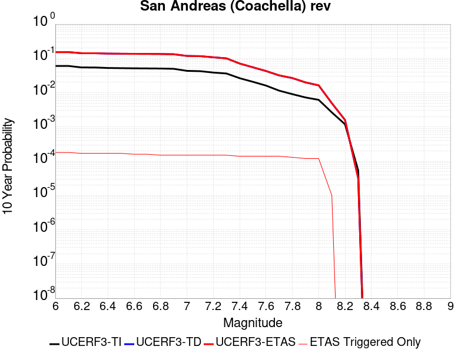 |

| Magnitude | 1 wk TI Prob | 1 wk TD Prob | 1 wk ETAS Prob | 1 wk ETAS/TD Gain | 1 wk ETAS Triggered Only | 1 mo TI Prob | 1 mo TD Prob | 1 mo ETAS Prob | 1 mo ETAS/TD Gain | 1 mo ETAS Triggered Only | 1 yr TI Prob | 1 yr TD Prob | 1 yr ETAS Prob | 1 yr ETAS/TD Gain | 1 yr ETAS Triggered Only | 10 yr TI Prob | 10 yr TD Prob | 10 yr ETAS Prob | 10 yr ETAS/TD Gain | 10 yr ETAS Triggered Only |
|-----|-----|-----|-----|-----|-----|-----|-----|-----|-----|-----|-----|-----|-----|-----|-----|-----|-----|-----|-----|-----|
| 6.0 | 1.1925945E-4 | 3.2747045E-4 | 3.2747045E-4 | 1.0 | 0.0 | 5.110118E-4 | 0.0014026947 | 0.0014026947 | 1.0 | 0.0 | 0.0062038354 | 0.016945418 | 0.01713998 | 1.0114816 | 1.9791529E-4 | 0.060334753 | 0.15272202 | 0.1530015 | 1.00183 | 3.2985883E-4 |
| 6.1 | 1.1925945E-4 | 3.2747045E-4 | 3.2747045E-4 | 1.0 | 0.0 | 5.110118E-4 | 0.0014026947 | 0.0014026947 | 1.0 | 0.0 | 0.0062038354 | 0.016945418 | 0.01713998 | 1.0114816 | 1.9791529E-4 | 0.060334753 | 0.15272202 | 0.1530015 | 1.00183 | 3.2985883E-4 |
| 6.2 | 1.07432395E-4 | 3.0247675E-4 | 3.0247675E-4 | 1.0 | 0.0 | 4.603433E-4 | 0.0012956889 | 0.0012956889 | 1.0 | 0.0 | 0.005590286 | 0.015662009 | 0.015856825 | 1.0124388 | 1.9791529E-4 | 0.05451731 | 0.14189328 | 0.14217633 | 1.0019948 | 3.2985883E-4 |
| 6.3 | 1.0718766E-4 | 3.019298E-4 | 3.019298E-4 | 1.0 | 0.0 | 4.592948E-4 | 0.0012933471 | 0.0012933471 | 1.0 | 0.0 | 0.005577586 | 0.015633909 | 0.015828729 | 1.0124614 | 1.9791529E-4 | 0.054396555 | 0.14166155 | 0.14194469 | 1.0019987 | 3.2985883E-4 |
| 6.4 | 1.0355944E-4 | 2.9401045E-4 | 2.9401045E-4 | 1.0 | 0.0 | 4.4375064E-4 | 0.0012594402 | 0.0012594402 | 1.0 | 0.0 | 0.0053892885 | 0.015226932 | 0.015421834 | 1.0127997 | 1.9791529E-4 | 0.052604496 | 0.13822177 | 0.13850603 | 1.0020566 | 3.2985883E-4 |
| 6.5 | 1.0227914E-4 | 2.912047E-4 | 2.912047E-4 | 1.0 | 0.0 | 4.382655E-4 | 0.0012474272 | 0.0012474272 | 1.0 | 0.0 | 0.0053228354 | 0.015082708 | 0.015277638 | 1.0129241 | 1.9791529E-4 | 0.051971316 | 0.13700101 | 0.13728566 | 1.0020778 | 3.2985883E-4 |
| 6.6 | 1.0116757E-4 | 2.8886212E-4 | 2.8886212E-4 | 1.0 | 0.0 | 4.3350324E-4 | 0.0012373971 | 0.0012373971 | 1.0 | 0.0 | 0.0052651367 | 0.0149622755 | 0.015157229 | 1.0130297 | 1.9791529E-4 | 0.051421247 | 0.13597922 | 0.13626423 | 1.0020959 | 3.2985883E-4 |
| 6.7 | 1.0050676E-4 | 2.874477E-4 | 2.874477E-4 | 1.0 | 0.0 | 4.3067214E-4 | 0.001231341 | 0.001231341 | 1.0 | 0.0 | 0.005230834 | 0.014889553 | 0.015084521 | 1.0130943 | 1.9791529E-4 | 0.051094085 | 0.13536398 | 0.13564919 | 1.002107 | 3.2985883E-4 |
| 6.8 | 9.976819E-5 | 2.8548407E-4 | 2.8548407E-4 | 1.0 | 0.0 | 4.2750788E-4 | 0.0012229334 | 0.0012229334 | 1.0 | 0.0 | 0.0051924936 | 0.014788584 | 0.014983573 | 1.013185 | 1.9791529E-4 | 0.050728295 | 0.13451566 | 0.13480115 | 1.0021223 | 3.2985883E-4 |
| 6.9 | 9.77719E-5 | 2.80452E-4 | 2.80452E-4 | 1.0 | 0.0 | 4.1895514E-4 | 0.0012013874 | 0.0012013874 | 1.0 | 0.0 | 0.0050888555 | 0.01452979 | 0.014724829 | 1.0134234 | 1.9791529E-4 | 0.049738888 | 0.13234389 | 0.1326301 | 1.0021626 | 3.2985883E-4 |
| 7.0 | 8.500761E-5 | 2.4778847E-4 | 2.4778847E-4 | 1.0 | 0.0 | 3.6426744E-4 | 0.0010615216 | 0.0010615216 | 1.0 | 0.0 | 0.0044259406 | 0.012848215 | 0.013043588 | 1.0152062 | 1.9791529E-4 | 0.04338823 | 0.11819933 | 0.118490204 | 1.0024608 | 3.2985883E-4 |
| 7.1 | 8.319876E-5 | 2.4381404E-4 | 2.4381404E-4 | 1.0 | 0.0 | 3.5651738E-4 | 0.0010445021 | 0.0010445021 | 1.0 | 0.0 | 0.004331963 | 0.012643427 | 0.01283884 | 1.0154557 | 1.9791529E-4 | 0.042484846 | 0.11641899 | 0.11671045 | 1.0025035 | 3.2985883E-4 |
| 7.2 | 7.563917E-5 | 2.2429357E-4 | 2.2429357E-4 | 1.0 | 0.0 | 3.2412758E-4 | 9.609071E-4 | 9.609071E-4 | 1.0 | 0.0 | 0.0039391145 | 0.011636979 | 0.011832591 | 1.0168096 | 1.9791529E-4 | 0.03870018 | 0.107823946 | 0.108118236 | 1.0027294 | 3.2985883E-4 |
| 7.3 | 7.082985E-5 | 2.074492E-4 | 2.074492E-4 | 1.0 | 0.0 | 3.0352117E-4 | 8.8876794E-4 | 8.8876794E-4 | 1.0 | 0.0 | 0.0036891096 | 0.010767689 | 0.010963473 | 1.0181825 | 1.9791529E-4 | 0.03628465 | 0.10034482 | 0.10064158 | 1.0029573 | 3.2985883E-4 |
| 7.4 | 5.146215E-5 | 1.428607E-4 | 1.428607E-4 | 1.0 | 0.0 | 2.2053342E-4 | 6.121174E-4 | 6.121174E-4 | 1.0 | 0.0 | 0.0026816884 | 0.0074272524 | 0.007558216 | 1.0176328 | 1.3194353E-4 | 0.02649557 | 0.07090313 | 0.071148306 | 1.0034579 | 2.6388705E-4 |
| 7.5 | 4.0285166E-5 | 1.0952253E-4 | 1.0952253E-4 | 1.0 | 0.0 | 1.7263928E-4 | 4.6929816E-4 | 4.6929816E-4 | 1.0 | 0.0 | 0.002099857 | 0.0056988057 | 0.0058299974 | 1.0230209 | 1.3194353E-4 | 0.020801254 | 0.05505857 | 0.05530793 | 1.004529 | 2.6388705E-4 |
| 7.6 | 3.1168736E-5 | 8.4483814E-5 | 8.4483814E-5 | 1.0 | 0.0 | 1.3357346E-4 | 3.6202336E-4 | 3.6202336E-4 | 1.0 | 0.0 | 0.0016250437 | 0.0043987534 | 0.0045301165 | 1.0298637 | 1.3194353E-4 | 0.016132116 | 0.04285275 | 0.043105327 | 1.0058941 | 2.6388705E-4 |
| 7.7 | 2.2100989E-5 | 6.2470855E-5 | 6.2470855E-5 | 1.0 | 0.0 | 9.4715084E-5 | 2.677048E-4 | 2.677048E-4 | 1.0 | 0.0 | 0.001152546 | 0.0032544413 | 0.0033859555 | 1.0404106 | 1.3194353E-4 | 0.011465867 | 0.031938035 | 0.032193493 | 1.0079986 | 2.6388705E-4 |
| 7.8 | 1.7484861E-5 | 5.187001E-5 | 5.187001E-5 | 1.0 | 0.0 | 7.493296E-5 | 2.2228112E-4 | 2.2228112E-4 | 1.0 | 0.0 | 9.1192697E-4 | 0.002702917 | 0.0027687105 | 1.0243417 | 6.597176E-5 | 0.009081938 | 0.026673956 | 0.026866592 | 1.0072219 | 1.9791529E-4 |
| 7.9 | 1.3967285E-5 | 3.8283448E-5 | 3.8283448E-5 | 1.0 | 0.0 | 5.985842E-5 | 1.6406161E-4 | 1.6406161E-4 | 1.0 | 0.0 | 7.2853256E-4 | 0.0019956212 | 0.0020614616 | 1.0329922 | 6.597176E-5 | 0.0072614877 | 0.019937595 | 0.020131566 | 1.0097288 | 1.9791529E-4 |
| 8.0 | 1.1887396E-5 | 3.1117535E-5 | 3.1117535E-5 | 1.0 | 0.0 | 5.094499E-5 | 1.3335406E-4 | 1.3335406E-4 | 1.0 | 0.0 | 6.200787E-4 | 0.0016223775 | 0.0016882423 | 1.0405977 | 6.597176E-5 | 0.006183513 | 0.016303658 | 0.016498348 | 1.0119414 | 1.9791529E-4 |
| 8.1 | 5.100864E-6 | 8.994677E-6 | 8.994677E-6 | 1.0 | 0.0 | 2.1860664E-5 | 3.854805E-5 | 3.854805E-5 | 1.0 | 0.0 | 2.6612106E-4 | 4.6922156E-4 | 4.6922156E-4 | 1.0 | 0.0 | 0.002658026 | 0.00492833 | 0.0049939766 | 1.0133202 | 6.597176E-5 |
| 8.2 | 2.3004484E-6 | 2.795008E-6 | 2.795008E-6 | 1.0 | 0.0 | 9.859027E-6 | 1.1978551E-5 | 1.1978551E-5 | 1.0 | 0.0 | 1.2002704E-4 | 1.4582912E-4 | 1.4582912E-4 | 1.0 | 0.0 | 0.0011996223 | 0.0016018103 | 0.0016018103 | 1.0 | 0.0 |
| 8.3 | 1.0424446E-7 | 5.8393972E-8 | 5.8393972E-8 | 1.0 | 0.0 | 4.4676187E-7 | 2.5025986E-7 | 2.5025986E-7 | 1.0 | 0.0 | 5.439312E-6 | 3.0469098E-6 | 3.0469098E-6 | 1.0 | 0.0 | 5.4391792E-5 | 3.203139E-5 | 3.203139E-5 | 1.0 | 0.0 |

## Death Valley (Fish Lake Valley)
*[(top)](#table-of-contents)*

| 1 Week | 1 Month | 1 Year | 10 Year |
|-----|-----|-----|-----|
|  |  |  |  |

| Magnitude | 1 wk TI Prob | 1 wk TD Prob | 1 wk ETAS Prob | 1 wk ETAS/TD Gain | 1 wk ETAS Triggered Only | 1 mo TI Prob | 1 mo TD Prob | 1 mo ETAS Prob | 1 mo ETAS/TD Gain | 1 mo ETAS Triggered Only | 1 yr TI Prob | 1 yr TD Prob | 1 yr ETAS Prob | 1 yr ETAS/TD Gain | 1 yr ETAS Triggered Only | 10 yr TI Prob | 10 yr TD Prob | 10 yr ETAS Prob | 10 yr ETAS/TD Gain | 10 yr ETAS Triggered Only |
|-----|-----|-----|-----|-----|-----|-----|-----|-----|-----|-----|-----|-----|-----|-----|-----|-----|-----|-----|-----|-----|
| 6.0 | 3.872328E-5 | 4.727316E-5 | 4.727316E-5 | 1.0 | 0.0 | 1.6594635E-4 | 2.0258522E-4 | 2.685436E-4 | 1.3255835 | 6.597176E-5 | 0.0020185246 | 0.0024638134 | 0.002661241 | 1.0801309 | 1.9791529E-4 | 0.02000288 | 0.024390986 | 0.0247128 | 1.013194 | 3.2985883E-4 |
| 6.1 | 3.872328E-5 | 4.727316E-5 | 4.727316E-5 | 1.0 | 0.0 | 1.6594635E-4 | 2.0258522E-4 | 2.685436E-4 | 1.3255835 | 6.597176E-5 | 0.0020185246 | 0.0024638134 | 0.002661241 | 1.0801309 | 1.9791529E-4 | 0.02000288 | 0.024390986 | 0.0247128 | 1.013194 | 3.2985883E-4 |
| 6.2 | 3.872328E-5 | 4.727316E-5 | 4.727316E-5 | 1.0 | 0.0 | 1.6594635E-4 | 2.0258522E-4 | 2.685436E-4 | 1.3255835 | 6.597176E-5 | 0.0020185246 | 0.0024638134 | 0.002661241 | 1.0801309 | 1.9791529E-4 | 0.02000288 | 0.024390986 | 0.0247128 | 1.013194 | 3.2985883E-4 |
| 6.3 | 2.8356371E-5 | 3.361322E-5 | 3.361322E-5 | 1.0 | 0.0 | 1.2152165E-4 | 1.4404916E-4 | 2.1001142E-4 | 1.457915 | 6.597176E-5 | 0.0014785219 | 0.0017524667 | 0.0019500351 | 1.1127373 | 1.9791529E-4 | 0.014687235 | 0.017393492 | 0.017717615 | 1.0186347 | 3.2985883E-4 |
| 6.4 | 2.8356371E-5 | 3.361322E-5 | 3.361322E-5 | 1.0 | 0.0 | 1.2152165E-4 | 1.4404916E-4 | 2.1001142E-4 | 1.457915 | 6.597176E-5 | 0.0014785219 | 0.0017524667 | 0.0019500351 | 1.1127373 | 1.9791529E-4 | 0.014687235 | 0.017393492 | 0.017717615 | 1.0186347 | 3.2985883E-4 |
| 6.5 | 2.4448687E-5 | 2.8610175E-5 | 2.8610175E-5 | 1.0 | 0.0 | 1.0477588E-4 | 1.2260956E-4 | 1.8857323E-4 | 1.5379978 | 6.597176E-5 | 0.0012748998 | 0.0014917998 | 0.0016894198 | 1.1324708 | 1.9791529E-4 | 0.012676105 | 0.014822718 | 0.015147688 | 1.0219238 | 3.2985883E-4 |
| 6.6 | 2.1298161E-5 | 2.4662175E-5 | 2.4662175E-5 | 1.0 | 0.0 | 9.127464E-5 | 1.05690946E-4 | 1.7165573E-4 | 1.624129 | 6.597176E-5 | 0.0011107022 | 0.0012860615 | 0.0014837222 | 1.1536946 | 1.9791529E-4 | 0.011051672 | 0.012789601 | 0.013115241 | 1.0254613 | 3.2985883E-4 |
| 6.7 | 1.8959729E-5 | 2.1782762E-5 | 2.1782762E-5 | 1.0 | 0.0 | 8.125345E-5 | 9.3351504E-5 | 1.593171E-4 | 1.7066368 | 6.597176E-5 | 9.888117E-4 | 0.0011359875 | 0.0013336779 | 1.1740252 | 1.9791529E-4 | 0.009844234 | 0.011304467 | 0.011630597 | 1.0288496 | 3.2985883E-4 |
| 6.8 | 1.6691629E-5 | 1.901977E-5 | 1.901977E-5 | 1.0 | 0.0 | 7.153359E-5 | 8.151084E-5 | 1.4747723E-4 | 1.8092958 | 6.597176E-5 | 8.7057345E-4 | 9.919596E-4 | 0.0011896786 | 1.1993216 | 1.9791529E-4 | 0.008671708 | 0.009877076 | 0.010203677 | 1.0330665 | 3.2985883E-4 |
| 6.9 | 1.450505E-5 | 1.6390675E-5 | 1.6390675E-5 | 1.0 | 0.0 | 6.216302E-5 | 7.024391E-5 | 1.3621103E-4 | 1.9391153 | 6.597176E-5 | 7.5657194E-4 | 8.5489283E-4 | 0.0010526389 | 1.231311 | 1.9791529E-4 | 0.007540013 | 0.008516973 | 0.008844023 | 1.0383997 | 3.2985883E-4 |
| 7.0 | 1.2940855E-5 | 1.4538927E-5 | 1.4538927E-5 | 1.0 | 0.0 | 5.545963E-5 | 6.230823E-5 | 1.2827589E-4 | 2.058731 | 6.597176E-5 | 6.750118E-4 | 7.583444E-4 | 9.5610967E-4 | 1.2607855 | 1.9791529E-4 | 0.006729651 | 0.007558184 | 0.00788555 | 1.0433128 | 3.2985883E-4 |
| 7.1 | 1.2544658E-5 | 1.4079123E-5 | 1.4079123E-5 | 1.0 | 0.0 | 5.3761712E-5 | 6.0337734E-5 | 1.2630552E-4 | 2.093309 | 6.597176E-5 | 6.5435225E-4 | 7.343699E-4 | 9.3213987E-4 | 1.2693056 | 1.9791529E-4 | 0.006524288 | 0.007320025 | 0.007647469 | 1.0447327 | 3.2985883E-4 |
| 7.2 | 1.2489416E-5 | 1.4016585E-5 | 1.4016585E-5 | 1.0 | 0.0 | 5.3524967E-5 | 6.0069728E-5 | 1.2603753E-4 | 2.0981872 | 6.597176E-5 | 6.514716E-4 | 7.311091E-4 | 9.288797E-4 | 1.2705076 | 1.9791529E-4 | 0.006495651 | 0.0072876317 | 0.0076150866 | 1.044933 | 3.2985883E-4 |
| 7.3 | 1.2368307E-5 | 1.38807145E-5 | 1.38807145E-5 | 1.0 | 0.0 | 5.3005948E-5 | 5.948745E-5 | 1.2545529E-4 | 2.108937 | 6.597176E-5 | 6.451563E-4 | 7.2402466E-4 | 9.2179666E-4 | 1.2731564 | 1.9791529E-4 | 0.0064328653 | 0.0072172494 | 0.0075447275 | 1.0453744 | 3.2985883E-4 |
| 7.4 | 1.2161707E-5 | 1.3648755E-5 | 1.3648755E-5 | 1.0 | 0.0 | 5.212056E-5 | 5.8493384E-5 | 1.244613E-4 | 2.127784 | 6.597176E-5 | 6.3438306E-4 | 7.1192987E-4 | 9.0970425E-4 | 1.2778004 | 1.9791529E-4 | 0.006325751 | 0.0070970803 | 0.007424598 | 1.0461483 | 3.2985883E-4 |
| 7.5 | 1.1707948E-5 | 1.3146373E-5 | 1.3146373E-5 | 1.0 | 0.0 | 5.0175953E-5 | 5.6340414E-5 | 1.2230845E-4 | 2.1708832 | 6.597176E-5 | 6.10721E-4 | 6.857342E-4 | 8.835138E-4 | 1.2884202 | 1.9791529E-4 | 0.0060904534 | 0.006836766 | 0.0071643693 | 1.047918 | 3.2985883E-4 |
| 7.6 | 1.0319538E-5 | 1.1580373E-5 | 1.1580373E-5 | 1.0 | 0.0 | 4.4225842E-5 | 4.9629256E-5 | 1.15597744E-4 | 2.3292258 | 6.597176E-5 | 5.383166E-4 | 6.0407387E-4 | 8.018696E-4 | 1.3274363 | 1.9791529E-4 | 0.0053701443 | 0.00602485 | 0.0063527217 | 1.0544199 | 3.2985883E-4 |
| 7.7 | 8.937764E-6 | 1.0023426E-5 | 1.0023426E-5 | 1.0 | 0.0 | 3.830414E-5 | 4.295686E-5 | 1.0892579E-4 | 2.535702 | 6.597176E-5 | 4.6625308E-4 | 5.228793E-4 | 7.206911E-4 | 1.3783126 | 1.9791529E-4 | 0.0046527605 | 0.005217 | 0.005545138 | 1.0628978 | 3.2985883E-4 |
| 7.8 | 3.108007E-7 | 3.2847535E-7 | 3.2847535E-7 | 1.0 | 0.0 | 1.3320023E-6 | 1.4077508E-6 | 1.4077508E-6 | 1.0 | 0.0 | 1.6217007E-5 | 1.7139235E-5 | 1.7139235E-5 | 1.0 | 0.0 | 1.6215823E-4 | 1.713795E-4 | 1.713795E-4 | 1.0 | 0.0 |
| 7.9 | 2.5591178E-9 | 2.6697329E-9 | 2.6697329E-9 | 1.0 | 0.0 | 1.0967647E-8 | 1.14417125E-8 | 1.14417125E-8 | 1.0 | 0.0 | 1.335311E-7 | 1.3930286E-7 | 1.3930286E-7 | 1.0 | 0.0 | 1.3353102E-6 | 1.3930285E-6 | 1.3930285E-6 | 1.0 | 0.0 |

## Coyote Lake
*[(top)](#table-of-contents)*

| 1 Week | 1 Month | 1 Year | 10 Year |
|-----|-----|-----|-----|
|  |  |  |  |

| Magnitude | 1 wk TI Prob | 1 wk TD Prob | 1 wk ETAS Prob | 1 wk ETAS/TD Gain | 1 wk ETAS Triggered Only | 1 mo TI Prob | 1 mo TD Prob | 1 mo ETAS Prob | 1 mo ETAS/TD Gain | 1 mo ETAS Triggered Only | 1 yr TI Prob | 1 yr TD Prob | 1 yr ETAS Prob | 1 yr ETAS/TD Gain | 1 yr ETAS Triggered Only | 10 yr TI Prob | 10 yr TD Prob | 10 yr ETAS Prob | 10 yr ETAS/TD Gain | 10 yr ETAS Triggered Only |
|-----|-----|-----|-----|-----|-----|-----|-----|-----|-----|-----|-----|-----|-----|-----|-----|-----|-----|-----|-----|-----|
| 6.0 | 1.980352E-5 | 2.1707852E-5 | 2.1707852E-5 | 1.0 | 0.0 | 8.486947E-5 | 9.303074E-5 | 9.303074E-5 | 1.0 | 0.0 | 0.0010327959 | 0.0011321327 | 0.001263927 | 1.1164123 | 1.3194353E-4 | 0.010280091 | 0.01127083 | 0.011531743 | 1.0231494 | 2.6388705E-4 |
| 6.1 | 1.980352E-5 | 2.1707852E-5 | 2.1707852E-5 | 1.0 | 0.0 | 8.486947E-5 | 9.303074E-5 | 9.303074E-5 | 1.0 | 0.0 | 0.0010327959 | 0.0011321327 | 0.001263927 | 1.1164123 | 1.3194353E-4 | 0.010280091 | 0.01127083 | 0.011531743 | 1.0231494 | 2.6388705E-4 |
| 6.2 | 1.980352E-5 | 2.1707852E-5 | 2.1707852E-5 | 1.0 | 0.0 | 8.486947E-5 | 9.303074E-5 | 9.303074E-5 | 1.0 | 0.0 | 0.0010327959 | 0.0011321327 | 0.001263927 | 1.1164123 | 1.3194353E-4 | 0.010280091 | 0.01127083 | 0.011531743 | 1.0231494 | 2.6388705E-4 |
| 6.3 | 1.5344787E-5 | 1.6821528E-5 | 1.6821528E-5 | 1.0 | 0.0 | 6.576172E-5 | 7.209062E-5 | 7.209062E-5 | 1.0 | 0.0 | 8.003548E-4 | 8.7741105E-4 | 9.433249E-4 | 1.0751232 | 6.597176E-5 | 0.007974784 | 0.008745514 | 0.008941699 | 1.0224326 | 1.9791529E-4 |
| 6.4 | 1.5344787E-5 | 1.6821528E-5 | 1.6821528E-5 | 1.0 | 0.0 | 6.576172E-5 | 7.209062E-5 | 7.209062E-5 | 1.0 | 0.0 | 8.003548E-4 | 8.7741105E-4 | 9.433249E-4 | 1.0751232 | 6.597176E-5 | 0.007974784 | 0.008745514 | 0.008941699 | 1.0224326 | 1.9791529E-4 |
| 6.5 | 1.4189697E-5 | 1.5558782E-5 | 1.5558782E-5 | 1.0 | 0.0 | 6.081157E-5 | 6.667913E-5 | 6.667913E-5 | 1.0 | 0.0 | 7.401293E-4 | 8.115764E-4 | 8.7749463E-4 | 1.0812224 | 6.597176E-5 | 0.0073766913 | 0.008092069 | 0.008288383 | 1.02426 | 1.9791529E-4 |
| 6.6 | 1.3469301E-5 | 1.4772335E-5 | 1.4772335E-5 | 1.0 | 0.0 | 5.7724297E-5 | 6.330881E-5 | 6.330881E-5 | 1.0 | 0.0 | 7.025667E-4 | 7.7057217E-4 | 8.364931E-4 | 1.085548 | 6.597176E-5 | 0.0070034964 | 0.0076849074 | 0.007881301 | 1.0255558 | 1.9791529E-4 |
| 6.7 | 1.3027966E-5 | 1.4282475E-5 | 1.4282475E-5 | 1.0 | 0.0 | 5.5832945E-5 | 6.12095E-5 | 6.12095E-5 | 1.0 | 0.0 | 6.7955407E-4 | 7.450307E-4 | 8.1095326E-4 | 1.0884831 | 6.597176E-5 | 0.006774798 | 0.007431207 | 0.0076276516 | 1.0264351 | 1.9791529E-4 |
| 6.8 | 5.695434E-6 | 6.2247245E-6 | 6.2247245E-6 | 1.0 | 0.0 | 2.4408775E-5 | 2.6677288E-5 | 2.6677288E-5 | 1.0 | 0.0 | 2.971363E-4 | 3.2477756E-4 | 3.2477756E-4 | 1.0 | 0.0 | 0.0029673933 | 0.0032459702 | 0.0032459702 | 1.0 | 0.0 |
| 6.9 | 4.385688E-6 | 4.7932917E-6 | 4.7932917E-6 | 1.0 | 0.0 | 1.879567E-5 | 2.0542679E-5 | 2.0542679E-5 | 1.0 | 0.0 | 2.2881327E-4 | 2.501071E-4 | 2.501071E-4 | 1.0 | 0.0 | 0.002285778 | 0.002501071 | 0.002501071 | 1.0 | 0.0 |

## Cady
*[(top)](#table-of-contents)*

| 1 Week | 1 Month | 1 Year | 10 Year |
|-----|-----|-----|-----|
|  |  | 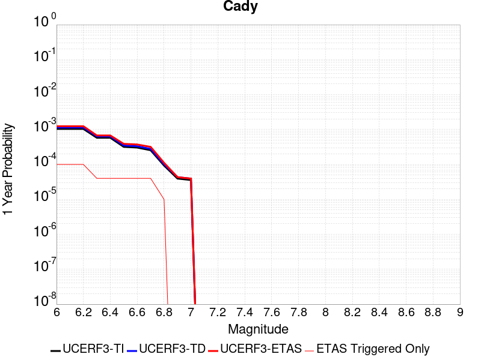 |  |

| Magnitude | 1 wk TI Prob | 1 wk TD Prob | 1 wk ETAS Prob | 1 wk ETAS/TD Gain | 1 wk ETAS Triggered Only | 1 mo TI Prob | 1 mo TD Prob | 1 mo ETAS Prob | 1 mo ETAS/TD Gain | 1 mo ETAS Triggered Only | 1 yr TI Prob | 1 yr TD Prob | 1 yr ETAS Prob | 1 yr ETAS/TD Gain | 1 yr ETAS Triggered Only | 10 yr TI Prob | 10 yr TD Prob | 10 yr ETAS Prob | 10 yr ETAS/TD Gain | 10 yr ETAS Triggered Only |
|-----|-----|-----|-----|-----|-----|-----|-----|-----|-----|-----|-----|-----|-----|-----|-----|-----|-----|-----|-----|-----|
| 6.0 | 1.9892565E-5 | 2.1859876E-5 | 2.1859876E-5 | 1.0 | 0.0 | 8.525106E-5 | 9.3682334E-5 | 9.3682334E-5 | 1.0 | 0.0 | 0.0010374374 | 0.0011400766 | 0.0012059731 | 1.0578 | 6.597176E-5 | 0.010326075 | 0.011351293 | 0.011546962 | 1.0172375 | 1.9791529E-4 |
| 6.1 | 1.9892565E-5 | 2.1859876E-5 | 2.1859876E-5 | 1.0 | 0.0 | 8.525106E-5 | 9.3682334E-5 | 9.3682334E-5 | 1.0 | 0.0 | 0.0010374374 | 0.0011400766 | 0.0012059731 | 1.0578 | 6.597176E-5 | 0.010326075 | 0.011351293 | 0.011546962 | 1.0172375 | 1.9791529E-4 |
| 6.2 | 1.9892565E-5 | 2.1859876E-5 | 2.1859876E-5 | 1.0 | 0.0 | 8.525106E-5 | 9.3682334E-5 | 9.3682334E-5 | 1.0 | 0.0 | 0.0010374374 | 0.0011400766 | 0.0012059731 | 1.0578 | 6.597176E-5 | 0.010326075 | 0.011351293 | 0.011546962 | 1.0172375 | 1.9791529E-4 |
| 6.3 | 1.1117327E-5 | 1.2177199E-5 | 1.2177199E-5 | 1.0 | 0.0 | 4.764482E-5 | 5.218713E-5 | 5.218713E-5 | 1.0 | 0.0 | 5.7992124E-4 | 6.352246E-4 | 6.352246E-4 | 1.0 | 0.0 | 0.0057841022 | 0.006337195 | 0.0064027486 | 1.0103443 | 6.597176E-5 |
| 6.4 | 1.1117327E-5 | 1.2177199E-5 | 1.2177199E-5 | 1.0 | 0.0 | 4.764482E-5 | 5.218713E-5 | 5.218713E-5 | 1.0 | 0.0 | 5.7992124E-4 | 6.352246E-4 | 6.352246E-4 | 1.0 | 0.0 | 0.0057841022 | 0.006337195 | 0.0064027486 | 1.0103443 | 6.597176E-5 |
| 6.5 | 6.103093E-6 | 6.672351E-6 | 6.672351E-6 | 1.0 | 0.0 | 2.615585E-5 | 2.8595547E-5 | 2.8595547E-5 | 1.0 | 0.0 | 3.1840094E-4 | 3.4810771E-4 | 3.4810771E-4 | 1.0 | 0.0 | 0.0031794512 | 0.0034768586 | 0.0034768586 | 1.0 | 0.0 |
| 6.6 | 5.817237E-6 | 6.3659772E-6 | 6.3659772E-6 | 1.0 | 0.0 | 2.4930776E-5 | 2.7282544E-5 | 2.7282544E-5 | 1.0 | 0.0 | 3.034899E-4 | 3.321268E-4 | 3.321268E-4 | 1.0 | 0.0 | 0.0030307577 | 0.0033175263 | 0.0033175263 | 1.0 | 0.0 |
| 6.7 | 4.8846314E-6 | 5.340833E-6 | 5.340833E-6 | 1.0 | 0.0 | 2.0933967E-5 | 2.288915E-5 | 2.288915E-5 | 1.0 | 0.0 | 2.5484123E-4 | 2.7865154E-4 | 2.7865154E-4 | 1.0 | 0.0 | 0.0025454918 | 0.002784177 | 0.002784177 | 1.0 | 0.0 |
| 6.8 | 1.7788773E-6 | 1.940001E-6 | 1.940001E-6 | 1.0 | 0.0 | 7.6237375E-6 | 8.314273E-6 | 8.314273E-6 | 1.0 | 0.0 | 9.281505E-5 | 1.0122315E-4 | 1.0122315E-4 | 1.0 | 0.0 | 9.2776294E-4 | 0.001011925 | 0.001011925 | 1.0 | 0.0 |
| 6.9 | 7.5455404E-7 | 8.2975305E-7 | 8.2975305E-7 | 1.0 | 0.0 | 3.233799E-6 | 3.5560815E-6 | 3.5560815E-6 | 1.0 | 0.0 | 3.937079E-5 | 4.329477E-5 | 4.329477E-5 | 1.0 | 0.0 | 3.9363815E-4 | 4.3289628E-4 | 4.3289628E-4 | 1.0 | 0.0 |
| 7.0 | 6.8578805E-7 | 7.542215E-7 | 7.542215E-7 | 1.0 | 0.0 | 2.9390883E-6 | 3.2323758E-6 | 3.2323758E-6 | 1.0 | 0.0 | 3.578281E-5 | 3.9353796E-5 | 3.9353796E-5 | 1.0 | 0.0 | 3.577705E-4 | 3.9350073E-4 | 3.9350073E-4 | 1.0 | 0.0 |

## Manix-Afton Hills
*[(top)](#table-of-contents)*

| 1 Week | 1 Month | 1 Year | 10 Year |
|-----|-----|-----|-----|
|  |  |  |  |

| Magnitude | 1 wk TI Prob | 1 wk TD Prob | 1 wk ETAS Prob | 1 wk ETAS/TD Gain | 1 wk ETAS Triggered Only | 1 mo TI Prob | 1 mo TD Prob | 1 mo ETAS Prob | 1 mo ETAS/TD Gain | 1 mo ETAS Triggered Only | 1 yr TI Prob | 1 yr TD Prob | 1 yr ETAS Prob | 1 yr ETAS/TD Gain | 1 yr ETAS Triggered Only | 10 yr TI Prob | 10 yr TD Prob | 10 yr ETAS Prob | 10 yr ETAS/TD Gain | 10 yr ETAS Triggered Only |
|-----|-----|-----|-----|-----|-----|-----|-----|-----|-----|-----|-----|-----|-----|-----|-----|-----|-----|-----|-----|-----|
| 6.0 | 1.3783202E-5 | 1.4711616E-5 | 8.068241E-5 | 5.4842653 | 6.597176E-5 | 5.906953E-5 | 6.3048356E-5 | 1.2901597E-4 | 2.0463016 | 6.597176E-5 | 7.189342E-4 | 7.673609E-4 | 9.651243E-4 | 1.2577189 | 1.9791529E-4 | 0.0071661277 | 0.0076488685 | 0.00784527 | 1.0256772 | 1.9791529E-4 |
| 6.1 | 1.3783202E-5 | 1.4711616E-5 | 8.068241E-5 | 5.4842653 | 6.597176E-5 | 5.906953E-5 | 6.3048356E-5 | 1.2901597E-4 | 2.0463016 | 6.597176E-5 | 7.189342E-4 | 7.673609E-4 | 9.651243E-4 | 1.2577189 | 1.9791529E-4 | 0.0071661277 | 0.0076488685 | 0.00784527 | 1.0256772 | 1.9791529E-4 |
| 6.2 | 1.3783202E-5 | 1.4711616E-5 | 8.068241E-5 | 5.4842653 | 6.597176E-5 | 5.906953E-5 | 6.3048356E-5 | 1.2901597E-4 | 2.0463016 | 6.597176E-5 | 7.189342E-4 | 7.673609E-4 | 9.651243E-4 | 1.2577189 | 1.9791529E-4 | 0.0071661277 | 0.0076488685 | 0.00784527 | 1.0256772 | 1.9791529E-4 |
| 6.3 | 1.10494875E-5 | 1.1793558E-5 | 1.1793558E-5 | 1.0 | 0.0 | 4.7354086E-5 | 5.0542898E-5 | 5.0542898E-5 | 1.0 | 0.0 | 5.763835E-4 | 6.151964E-4 | 7.470588E-4 | 1.2143419 | 1.3194353E-4 | 0.005748908 | 0.0061359745 | 0.0062671085 | 1.0213714 | 1.3194353E-4 |
| 6.4 | 1.10494875E-5 | 1.1793558E-5 | 1.1793558E-5 | 1.0 | 0.0 | 4.7354086E-5 | 5.0542898E-5 | 5.0542898E-5 | 1.0 | 0.0 | 5.763835E-4 | 6.151964E-4 | 7.470588E-4 | 1.2143419 | 1.3194353E-4 | 0.005748908 | 0.0061359745 | 0.0062671085 | 1.0213714 | 1.3194353E-4 |
| 6.5 | 9.788949E-6 | 1.0454697E-5 | 1.0454697E-5 | 1.0 | 0.0 | 4.1951964E-5 | 4.480513E-5 | 4.480513E-5 | 1.0 | 0.0 | 5.1064545E-4 | 5.453752E-4 | 6.11311E-4 | 1.1208999 | 6.597176E-5 | 0.0050947363 | 0.005441295 | 0.0055069076 | 1.0120583 | 6.597176E-5 |
| 6.6 | 8.810006E-6 | 9.413971E-6 | 9.413971E-6 | 1.0 | 0.0 | 3.775662E-5 | 4.0345018E-5 | 4.0345018E-5 | 1.0 | 0.0 | 4.5958988E-4 | 4.9109873E-4 | 5.570381E-4 | 1.134269 | 6.597176E-5 | 0.0045864056 | 0.0049010175 | 0.004966666 | 1.0133948 | 6.597176E-5 |
| 6.7 | 8.80128E-6 | 9.404451E-6 | 9.404451E-6 | 1.0 | 0.0 | 3.7719226E-5 | 4.0304214E-5 | 4.0304214E-5 | 1.0 | 0.0 | 4.591348E-4 | 4.906022E-4 | 5.565416E-4 | 1.134405 | 6.597176E-5 | 0.004581874 | 0.004896074 | 0.0049617225 | 1.0134084 | 6.597176E-5 |
| 6.8 | 6.8994877E-6 | 7.3803494E-6 | 7.3803494E-6 | 1.0 | 0.0 | 2.9568899E-5 | 3.162973E-5 | 3.162973E-5 | 1.0 | 0.0 | 3.5994186E-4 | 3.850321E-4 | 4.5097846E-4 | 1.171275 | 6.597176E-5 | 0.003593594 | 0.0038444551 | 0.003910173 | 1.0170943 | 6.597176E-5 |
| 6.9 | 4.9328037E-6 | 5.271154E-6 | 5.271154E-6 | 1.0 | 0.0 | 2.1140417E-5 | 2.2590497E-5 | 2.2590497E-5 | 1.0 | 0.0 | 2.5735417E-4 | 2.7501077E-4 | 2.7501077E-4 | 1.0 | 0.0 | 0.0025705635 | 0.0027473096 | 0.0027473096 | 1.0 | 0.0 |
| 7.0 | 3.347973E-6 | 3.590168E-6 | 3.590168E-6 | 1.0 | 0.0 | 1.4348378E-5 | 1.5386368E-5 | 1.5386368E-5 | 1.0 | 0.0 | 1.746775E-4 | 1.8731703E-4 | 1.8731703E-4 | 1.0 | 0.0 | 0.0017454025 | 0.0018719939 | 0.0018719939 | 1.0 | 0.0 |
| 7.1 | 1.2073567E-6 | 1.293531E-6 | 1.293531E-6 | 1.0 | 0.0 | 5.1743755E-6 | 5.5437017E-6 | 5.5437017E-6 | 1.0 | 0.0 | 6.29962E-5 | 6.749411E-5 | 6.749411E-5 | 1.0 | 0.0 | 6.297835E-4 | 6.748963E-4 | 6.748963E-4 | 1.0 | 0.0 |

## San Andreas (Parkfield)
*[(top)](#table-of-contents)*

| 1 Week | 1 Month | 1 Year | 10 Year |
|-----|-----|-----|-----|
|  |  |  |  |

| Magnitude | 1 wk TI Prob | 1 wk TD Prob | 1 wk ETAS Prob | 1 wk ETAS/TD Gain | 1 wk ETAS Triggered Only | 1 mo TI Prob | 1 mo TD Prob | 1 mo ETAS Prob | 1 mo ETAS/TD Gain | 1 mo ETAS Triggered Only | 1 yr TI Prob | 1 yr TD Prob | 1 yr ETAS Prob | 1 yr ETAS/TD Gain | 1 yr ETAS Triggered Only | 10 yr TI Prob | 10 yr TD Prob | 10 yr ETAS Prob | 10 yr ETAS/TD Gain | 10 yr ETAS Triggered Only |
|-----|-----|-----|-----|-----|-----|-----|-----|-----|-----|-----|-----|-----|-----|-----|-----|-----|-----|-----|-----|-----|
| 6.0 | 5.556969E-4 | 7.819087E-4 | 7.819087E-4 | 1.0 | 0.0 | 0.0023793848 | 0.0033472886 | 0.0033472886 | 1.0 | 0.0 | 0.028586963 | 0.040385824 | 0.04051244 | 1.0031351 | 1.3194353E-4 | 0.25176284 | 0.33777508 | 0.33790615 | 1.000388 | 1.9791529E-4 |
| 6.1 | 1.925858E-4 | 3.0390357E-4 | 3.0390357E-4 | 1.0 | 0.0 | 8.2510663E-4 | 0.0013018888 | 0.0013018888 | 1.0 | 0.0 | 0.0099994885 | 0.015834767 | 0.015964622 | 1.0082005 | 1.3194353E-4 | 0.095613256 | 0.14999957 | 0.1501678 | 1.0011215 | 1.9791529E-4 |
| 6.2 | 9.4306815E-5 | 1.8273306E-4 | 1.8273306E-4 | 1.0 | 0.0 | 4.0410945E-4 | 7.829079E-4 | 7.829079E-4 | 1.0 | 0.0 | 0.0049089384 | 0.009490452 | 0.009621143 | 1.0137708 | 1.3194353E-4 | 0.048019063 | 0.09198628 | 0.09216599 | 1.0019536 | 1.9791529E-4 |
| 6.3 | 9.283051E-5 | 1.7969737E-4 | 1.7969737E-4 | 1.0 | 0.0 | 3.9778434E-4 | 7.6990545E-4 | 7.6990545E-4 | 1.0 | 0.0 | 0.0048322747 | 0.009333515 | 0.009464227 | 1.0140046 | 1.3194353E-4 | 0.047285385 | 0.09063911 | 0.09081908 | 1.0019857 | 1.9791529E-4 |
| 6.4 | 9.138826E-5 | 1.7731739E-4 | 1.7731739E-4 | 1.0 | 0.0 | 3.916052E-4 | 7.5971155E-4 | 7.5971155E-4 | 1.0 | 0.0 | 0.0047573745 | 0.00921046 | 0.009275825 | 1.0070968 | 6.597176E-5 | 0.046568092 | 0.0895407 | 0.08966083 | 1.0013416 | 1.3194353E-4 |
| 6.5 | 9.000255E-5 | 1.7489606E-4 | 1.7489606E-4 | 1.0 | 0.0 | 3.8566816E-4 | 7.493404E-4 | 7.493404E-4 | 1.0 | 0.0 | 0.0046854047 | 0.009085262 | 0.0091506345 | 1.0071955 | 6.597176E-5 | 0.045878403 | 0.08842592 | 0.088546194 | 1.0013602 | 1.3194353E-4 |
| 6.6 | 8.8109264E-5 | 1.7170387E-4 | 1.7170387E-4 | 1.0 | 0.0 | 3.7755648E-4 | 7.3566736E-4 | 7.3566736E-4 | 1.0 | 0.0 | 0.0045870654 | 0.0089201825 | 0.008985565 | 1.0073298 | 6.597176E-5 | 0.04493529 | 0.08695624 | 0.08707671 | 1.0013855 | 1.3194353E-4 |
| 6.7 | 8.738073E-5 | 1.7037381E-4 | 1.7037381E-4 | 1.0 | 0.0 | 3.7443507E-4 | 7.2997034E-4 | 7.2997034E-4 | 1.0 | 0.0 | 0.0045492216 | 0.0088514285 | 0.008916816 | 1.0073873 | 6.597176E-5 | 0.04457213 | 0.08635636 | 0.08647691 | 1.001396 | 1.3194353E-4 |
| 6.8 | 8.710195E-5 | 1.6982816E-4 | 1.6982816E-4 | 1.0 | 0.0 | 3.7324068E-4 | 7.2763313E-4 | 7.2763313E-4 | 1.0 | 0.0 | 0.0045347405 | 0.008823211 | 0.008888601 | 1.0074111 | 6.597176E-5 | 0.04443313 | 0.08610373 | 0.08622431 | 1.0014005 | 1.3194353E-4 |
| 6.9 | 8.6801556E-5 | 1.6923707E-4 | 1.6923707E-4 | 1.0 | 0.0 | 3.7195362E-4 | 7.251013E-4 | 7.251013E-4 | 1.0 | 0.0 | 0.0045191357 | 0.008792636 | 0.008858027 | 1.0074371 | 6.597176E-5 | 0.044283327 | 0.08582957 | 0.08595019 | 1.0014054 | 1.3194353E-4 |
| 7.0 | 8.5571606E-5 | 1.6676294E-4 | 1.6676294E-4 | 1.0 | 0.0 | 3.6668387E-4 | 7.145037E-4 | 7.145037E-4 | 1.0 | 0.0 | 0.004455241 | 0.008664643 | 0.008730044 | 1.007548 | 6.597176E-5 | 0.043669727 | 0.08467713 | 0.084797904 | 1.0014262 | 1.3194353E-4 |
| 7.1 | 7.82589E-5 | 1.5156237E-4 | 1.5156237E-4 | 1.0 | 0.0 | 3.3535215E-4 | 6.493921E-4 | 6.493921E-4 | 1.0 | 0.0 | 0.0040752706 | 0.007877857 | 0.007943309 | 1.0083084 | 6.597176E-5 | 0.040013418 | 0.077585794 | 0.07770751 | 1.0015687 | 1.3194353E-4 |
| 7.2 | 7.690929E-5 | 1.489332E-4 | 1.489332E-4 | 1.0 | 0.0 | 3.2956956E-4 | 6.381298E-4 | 6.381298E-4 | 1.0 | 0.0 | 0.004005129 | 0.007741721 | 0.007807182 | 1.0084556 | 6.597176E-5 | 0.0393371 | 0.076358445 | 0.076480314 | 1.001596 | 1.3194353E-4 |
| 7.3 | 7.5543794E-5 | 1.4589565E-4 | 1.4589565E-4 | 1.0 | 0.0 | 3.2371894E-4 | 6.25118E-4 | 6.25118E-4 | 1.0 | 0.0 | 0.003934157 | 0.0075844154 | 0.0076498864 | 1.0086323 | 6.597176E-5 | 0.038652334 | 0.07492032 | 0.075042374 | 1.0016292 | 1.3194353E-4 |
| 7.4 | 7.4214564E-5 | 1.4290171E-4 | 1.4290171E-4 | 1.0 | 0.0 | 3.1802364E-4 | 6.122929E-4 | 6.122929E-4 | 1.0 | 0.0 | 0.003865065 | 0.007429345 | 0.0074948263 | 1.008814 | 6.597176E-5 | 0.03798529 | 0.07349284 | 0.07361508 | 1.0016633 | 1.3194353E-4 |
| 7.5 | 6.149578E-5 | 1.1214155E-4 | 1.1214155E-4 | 1.0 | 0.0 | 2.6352672E-4 | 4.8051824E-4 | 4.8051824E-4 | 1.0 | 0.0 | 0.0032037178 | 0.005834648 | 0.005900235 | 1.011241 | 6.597176E-5 | 0.03157923 | 0.058665328 | 0.05878953 | 1.0021172 | 1.3194353E-4 |
| 7.6 | 6.0643448E-5 | 1.10425855E-4 | 1.10425855E-4 | 1.0 | 0.0 | 2.598746E-4 | 4.7316792E-4 | 4.7316792E-4 | 1.0 | 0.0 | 0.0031593828 | 0.0057456335 | 0.0058112266 | 1.0114161 | 6.597176E-5 | 0.031148417 | 0.05782546 | 0.057949774 | 1.0021498 | 1.3194353E-4 |
| 7.7 | 5.1652263E-5 | 9.1955124E-5 | 9.1955124E-5 | 1.0 | 0.0 | 2.2134806E-4 | 3.9403388E-4 | 3.9403388E-4 | 1.0 | 0.0 | 0.002691582 | 0.00478682 | 0.004852476 | 1.013716 | 6.597176E-5 | 0.026592141 | 0.048633553 | 0.04875908 | 1.0025811 | 1.3194353E-4 |
| 7.8 | 4.8090482E-5 | 8.578783E-5 | 8.578783E-5 | 1.0 | 0.0 | 2.060858E-4 | 3.6761034E-4 | 3.6761034E-4 | 1.0 | 0.0 | 0.0025062072 | 0.004466479 | 0.0045321565 | 1.0147045 | 6.597176E-5 | 0.024781305 | 0.045392275 | 0.04551823 | 1.0027748 | 1.3194353E-4 |
| 7.9 | 3.970278E-5 | 6.7652974E-5 | 6.7652974E-5 | 1.0 | 0.0 | 1.7014367E-4 | 2.899091E-4 | 2.899091E-4 | 1.0 | 0.0 | 0.002069531 | 0.0035239344 | 0.0035896737 | 1.0186551 | 6.597176E-5 | 0.020503636 | 0.035952512 | 0.036079712 | 1.003538 | 1.3194353E-4 |
| 8.0 | 2.8982335E-5 | 4.079188E-5 | 4.079188E-5 | 1.0 | 0.0 | 1.2420409E-4 | 1.7481064E-4 | 1.7481064E-4 | 1.0 | 0.0 | 0.0015111357 | 0.0021262432 | 0.0021262432 | 1.0 | 0.0 | 0.015009012 | 0.022057572 | 0.022122089 | 1.0029249 | 6.597176E-5 |
| 8.1 | 1.8836186E-5 | 1.8733741E-5 | 1.8733741E-5 | 1.0 | 0.0 | 8.0724014E-5 | 8.028499E-5 | 8.028499E-5 | 1.0 | 0.0 | 9.823717E-4 | 9.77032E-4 | 9.77032E-4 | 1.0 | 0.0 | 0.009780403 | 0.010515724 | 0.010581002 | 1.0062077 | 6.597176E-5 |
| 8.2 | 8.643924E-6 | 5.49522E-6 | 5.49522E-6 | 1.0 | 0.0 | 3.704486E-5 | 2.355073E-5 | 2.355073E-5 | 1.0 | 0.0 | 4.5092785E-4 | 2.866925E-4 | 2.866925E-4 | 1.0 | 0.0 | 0.0045001395 | 0.0032598388 | 0.0032598388 | 1.0 | 0.0 |
| 8.3 | 1.983087E-6 | 7.693574E-7 | 7.693574E-7 | 1.0 | 0.0 | 8.498917E-6 | 3.297242E-6 | 3.297242E-6 | 1.0 | 0.0 | 1.034694E-4 | 4.01432E-5 | 4.01432E-5 | 1.0 | 0.0 | 0.0010342124 | 4.7390026E-4 | 4.7390026E-4 | 1.0 | 0.0 |

## Sierra Nevada  (No Extension)
*[(top)](#table-of-contents)*

| 1 Week | 1 Month | 1 Year | 10 Year |
|-----|-----|-----|-----|
|  |  |  | 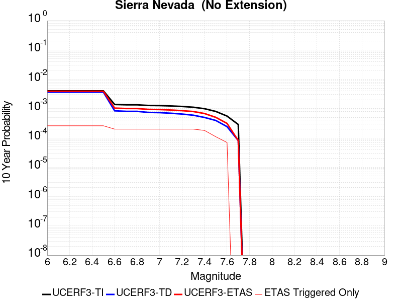 |

| Magnitude | 1 wk TI Prob | 1 wk TD Prob | 1 wk ETAS Prob | 1 wk ETAS/TD Gain | 1 wk ETAS Triggered Only | 1 mo TI Prob | 1 mo TD Prob | 1 mo ETAS Prob | 1 mo ETAS/TD Gain | 1 mo ETAS Triggered Only | 1 yr TI Prob | 1 yr TD Prob | 1 yr ETAS Prob | 1 yr ETAS/TD Gain | 1 yr ETAS Triggered Only | 10 yr TI Prob | 10 yr TD Prob | 10 yr ETAS Prob | 10 yr ETAS/TD Gain | 10 yr ETAS Triggered Only |
|-----|-----|-----|-----|-----|-----|-----|-----|-----|-----|-----|-----|-----|-----|-----|-----|-----|-----|-----|-----|-----|
| 6.0 | 7.7690465E-6 | 6.976568E-6 | 6.976568E-6 | 1.0 | 0.0 | 3.329549E-5 | 2.9899435E-5 | 9.5869225E-5 | 3.2063892 | 6.597176E-5 | 4.0529718E-4 | 3.6400068E-4 | 4.9589615E-4 | 1.3623496 | 1.3194353E-4 | 0.004045588 | 0.0036375606 | 0.003834756 | 1.0542109 | 1.9791529E-4 |
| 6.1 | 7.7690465E-6 | 6.976568E-6 | 6.976568E-6 | 1.0 | 0.0 | 3.329549E-5 | 2.9899435E-5 | 9.5869225E-5 | 3.2063892 | 6.597176E-5 | 4.0529718E-4 | 3.6400068E-4 | 4.9589615E-4 | 1.3623496 | 1.3194353E-4 | 0.004045588 | 0.0036375606 | 0.003834756 | 1.0542109 | 1.9791529E-4 |
| 6.2 | 7.7690465E-6 | 6.976568E-6 | 6.976568E-6 | 1.0 | 0.0 | 3.329549E-5 | 2.9899435E-5 | 9.5869225E-5 | 3.2063892 | 6.597176E-5 | 4.0529718E-4 | 3.6400068E-4 | 4.9589615E-4 | 1.3623496 | 1.3194353E-4 | 0.004045588 | 0.0036375606 | 0.003834756 | 1.0542109 | 1.9791529E-4 |
| 6.3 | 7.7690465E-6 | 6.976568E-6 | 6.976568E-6 | 1.0 | 0.0 | 3.329549E-5 | 2.9899435E-5 | 9.5869225E-5 | 3.2063892 | 6.597176E-5 | 4.0529718E-4 | 3.6400068E-4 | 4.9589615E-4 | 1.3623496 | 1.3194353E-4 | 0.004045588 | 0.0036375606 | 0.003834756 | 1.0542109 | 1.9791529E-4 |
| 6.4 | 7.7690465E-6 | 6.976568E-6 | 6.976568E-6 | 1.0 | 0.0 | 3.329549E-5 | 2.9899435E-5 | 9.5869225E-5 | 3.2063892 | 6.597176E-5 | 4.0529718E-4 | 3.6400068E-4 | 4.9589615E-4 | 1.3623496 | 1.3194353E-4 | 0.004045588 | 0.0036375606 | 0.003834756 | 1.0542109 | 1.9791529E-4 |
| 6.5 | 7.7690465E-6 | 6.976568E-6 | 6.976568E-6 | 1.0 | 0.0 | 3.329549E-5 | 2.9899435E-5 | 9.5869225E-5 | 3.2063892 | 6.597176E-5 | 4.0529718E-4 | 3.6400068E-4 | 4.9589615E-4 | 1.3623496 | 1.3194353E-4 | 0.004045588 | 0.0036375606 | 0.003834756 | 1.0542109 | 1.9791529E-4 |
| 6.6 | 2.653E-6 | 1.6149635E-6 | 1.6149635E-6 | 1.0 | 0.0 | 1.136995E-5 | 6.9212538E-6 | 6.9212538E-6 | 1.0 | 0.0 | 1.3842035E-4 | 8.426304E-5 | 1.5022924E-4 | 1.7828605 | 6.597176E-5 | 0.0013833415 | 8.4231433E-4 | 9.0823055E-4 | 1.078256 | 6.597176E-5 |
| 6.7 | 2.5902466E-6 | 1.5502959E-6 | 1.5502959E-6 | 1.0 | 0.0 | 1.11010095E-5 | 6.644109E-6 | 6.644109E-6 | 1.0 | 0.0 | 1.351464E-4 | 8.0889055E-5 | 1.4685548E-4 | 1.8155174 | 6.597176E-5 | 0.0013506424 | 8.0859906E-4 | 8.745175E-4 | 1.0815217 | 6.597176E-5 |
| 6.8 | 2.5853892E-6 | 1.5470957E-6 | 1.5470957E-6 | 1.0 | 0.0 | 1.1080193E-5 | 6.6303933E-6 | 6.6303933E-6 | 1.0 | 0.0 | 1.34893E-4 | 8.072208E-5 | 1.4668852E-4 | 1.8172044 | 6.597176E-5 | 0.0013481114 | 8.069306E-4 | 8.728491E-4 | 1.0816904 | 6.597176E-5 |
| 6.9 | 2.458257E-6 | 1.4221675E-6 | 1.4221675E-6 | 1.0 | 0.0 | 1.0535345E-5 | 6.0949897E-6 | 6.0949897E-6 | 1.0 | 0.0 | 1.2826028E-4 | 7.420399E-5 | 1.4017086E-4 | 1.8889935 | 6.597176E-5 | 0.0012818627 | 7.4179407E-4 | 8.077169E-4 | 1.0888695 | 6.597176E-5 |
| 7.0 | 2.4341468E-6 | 1.3991308E-6 | 1.3991308E-6 | 1.0 | 0.0 | 1.0432016E-5 | 5.9962613E-6 | 5.9962613E-6 | 1.0 | 0.0 | 1.270024E-4 | 7.3002055E-5 | 1.38969E-4 | 1.9036313 | 6.597176E-5 | 0.0012692984 | 7.297827E-4 | 7.957063E-4 | 1.0903332 | 6.597176E-5 |
| 7.1 | 2.3652476E-6 | 1.334079E-6 | 1.334079E-6 | 1.0 | 0.0 | 1.0136736E-5 | 5.717469E-6 | 5.717469E-6 | 1.0 | 0.0 | 1.2340778E-4 | 6.960797E-5 | 1.3557514E-4 | 1.9476956 | 6.597176E-5 | 0.0012333926 | 6.9586345E-4 | 7.6178927E-4 | 1.0947397 | 6.597176E-5 |
| 7.2 | 2.272158E-6 | 1.2503832E-6 | 1.2503832E-6 | 1.0 | 0.0 | 9.737784E-6 | 5.358774E-6 | 5.358774E-6 | 1.0 | 0.0 | 1.1855107E-4 | 6.524114E-5 | 1.312086E-4 | 2.011133 | 6.597176E-5 | 0.0011848784 | 6.522214E-4 | 7.181501E-4 | 1.1010834 | 6.597176E-5 |
| 7.3 | 2.1382127E-6 | 1.1420682E-6 | 1.1420682E-6 | 1.0 | 0.0 | 9.163737E-6 | 4.894569E-6 | 4.894569E-6 | 1.0 | 0.0 | 1.1156279E-4 | 5.9589758E-5 | 1.2555759E-4 | 2.107033 | 6.597176E-5 | 0.001115068 | 5.95739E-4 | 6.6167145E-4 | 1.1106734 | 6.597176E-5 |
| 7.4 | 1.9048055E-6 | 9.57617E-7 | 9.57617E-7 | 1.0 | 0.0 | 8.163426E-6 | 4.104066E-6 | 4.104066E-6 | 1.0 | 0.0 | 9.9385186E-5 | 4.9965867E-5 | 1.1593434E-4 | 2.3202705 | 6.597176E-5 | 9.934074E-4 | 4.99547E-4 | 5.6548585E-4 | 1.1319972 | 6.597176E-5 |
| 7.5 | 1.5373403E-6 | 7.560832E-7 | 7.560832E-7 | 1.0 | 0.0 | 6.5885843E-6 | 3.2403525E-6 | 3.2403525E-6 | 1.0 | 0.0 | 8.021306E-5 | 3.9450584E-5 | 1.0541974E-4 | 2.6721973 | 6.597176E-5 | 8.0184115E-4 | 3.9443627E-4 | 4.60382E-4 | 1.1671898 | 6.597176E-5 |
| 7.6 | 1.0680322E-6 | 4.6602182E-7 | 4.6602182E-7 | 1.0 | 0.0 | 4.577273E-6 | 1.997235E-6 | 1.997235E-6 | 1.0 | 0.0 | 5.5726876E-5 | 2.4316065E-5 | 9.028622E-5 | 3.7130277 | 6.597176E-5 | 5.5712904E-4 | 2.431343E-4 | 3.0909004E-4 | 1.2712728 | 6.597176E-5 |
| 7.7 | 5.509146E-7 | 1.558334E-7 | 1.558334E-7 | 1.0 | 0.0 | 2.3610605E-6 | 6.678573E-7 | 6.678573E-7 | 1.0 | 0.0 | 2.8745531E-5 | 8.131134E-6 | 8.131134E-6 | 1.0 | 0.0 | 2.8741814E-4 | 8.130848E-5 | 8.130848E-5 | 1.0 | 0.0 |

## Oceanic - West Huasna
*[(top)](#table-of-contents)*

| 1 Week | 1 Month | 1 Year | 10 Year |
|-----|-----|-----|-----|
|  |  | 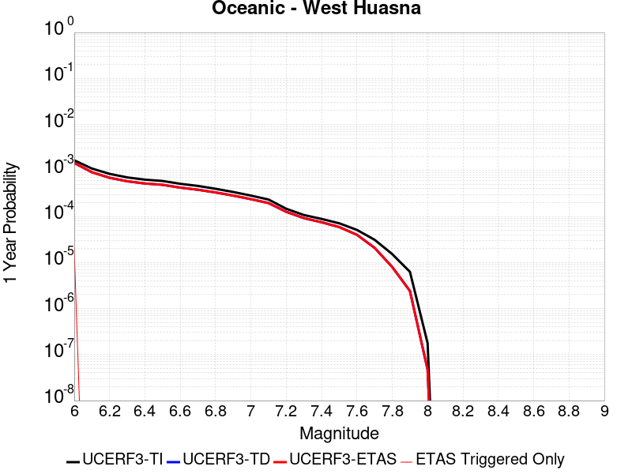 |  |

| Magnitude | 1 wk TI Prob | 1 wk TD Prob | 1 wk ETAS Prob | 1 wk ETAS/TD Gain | 1 wk ETAS Triggered Only | 1 mo TI Prob | 1 mo TD Prob | 1 mo ETAS Prob | 1 mo ETAS/TD Gain | 1 mo ETAS Triggered Only | 1 yr TI Prob | 1 yr TD Prob | 1 yr ETAS Prob | 1 yr ETAS/TD Gain | 1 yr ETAS Triggered Only | 10 yr TI Prob | 10 yr TD Prob | 10 yr ETAS Prob | 10 yr ETAS/TD Gain | 10 yr ETAS Triggered Only |
|-----|-----|-----|-----|-----|-----|-----|-----|-----|-----|-----|-----|-----|-----|-----|-----|-----|-----|-----|-----|-----|
| 6.0 | 3.195567E-5 | 2.792801E-5 | 2.792801E-5 | 1.0 | 0.0 | 1.3694567E-4 | 1.1968623E-4 | 1.1968623E-4 | 1.0 | 0.0 | 0.0016660384 | 0.0014562489 | 0.0015221246 | 1.0452366 | 6.597176E-5 | 0.016536033 | 0.014471616 | 0.01460165 | 1.0089854 | 1.3194353E-4 |
| 6.1 | 2.1156782E-5 | 1.7574157E-5 | 1.7574157E-5 | 1.0 | 0.0 | 9.066878E-5 | 7.53157E-5 | 7.53157E-5 | 1.0 | 0.0 | 0.0011033333 | 9.1659225E-4 | 9.1659225E-4 | 1.0 | 0.0 | 0.010978713 | 0.009129126 | 0.009194495 | 1.0071605 | 6.597176E-5 |
| 6.2 | 1.6195117E-5 | 1.332762E-5 | 1.332762E-5 | 1.0 | 0.0 | 6.9405796E-5 | 5.7117133E-5 | 5.7117133E-5 | 1.0 | 0.0 | 8.44688E-4 | 6.9518184E-4 | 6.9518184E-4 | 1.0 | 0.0 | 0.008414844 | 0.006930365 | 0.00699588 | 1.0094533 | 6.597176E-5 |
| 6.3 | 1.3559345E-5 | 1.1179509E-5 | 1.1179509E-5 | 1.0 | 0.0 | 5.811018E-5 | 4.7911308E-5 | 4.7911308E-5 | 1.0 | 0.0 | 7.072618E-4 | 5.83165E-4 | 5.83165E-4 | 1.0 | 0.0 | 0.0070501505 | 0.0058164652 | 0.005882053 | 1.0112762 | 6.597176E-5 |
| 6.4 | 1.2120619E-5 | 1.0001292E-5 | 1.0001292E-5 | 1.0 | 0.0 | 5.1944477E-5 | 4.286198E-5 | 4.286198E-5 | 1.0 | 0.0 | 6.322405E-4 | 5.2172015E-4 | 5.2172015E-4 | 1.0 | 0.0 | 0.006304447 | 0.005205021 | 0.005270649 | 1.0126086 | 6.597176E-5 |
| 6.5 | 1.13511915E-5 | 9.3677645E-6 | 9.3677645E-6 | 1.0 | 0.0 | 4.8647056E-5 | 4.0146948E-5 | 4.0146948E-5 | 1.0 | 0.0 | 5.9211696E-4 | 4.886799E-4 | 4.886799E-4 | 1.0 | 0.0 | 0.0059054173 | 0.004876112 | 0.004941762 | 1.0134636 | 6.597176E-5 |
| 6.6 | 9.850605E-6 | 8.135666E-6 | 8.135666E-6 | 1.0 | 0.0 | 4.2216197E-5 | 3.4866673E-5 | 3.4866673E-5 | 1.0 | 0.0 | 5.1386096E-4 | 4.2441927E-4 | 4.2441927E-4 | 1.0 | 0.0 | 0.0051267436 | 0.0042361193 | 0.0043018116 | 1.0155077 | 6.597176E-5 |
| 6.7 | 8.8558645E-6 | 7.3186534E-6 | 7.3186534E-6 | 1.0 | 0.0 | 3.7953152E-5 | 3.136528E-5 | 3.136528E-5 | 1.0 | 0.0 | 4.6198163E-4 | 3.8180556E-4 | 3.8180556E-4 | 1.0 | 0.0 | 0.004610224 | 0.0038115215 | 0.0038115215 | 1.0 | 0.0 |
| 6.8 | 7.67136E-6 | 6.3919483E-6 | 6.3919483E-6 | 1.0 | 0.0 | 3.2876844E-5 | 2.7393779E-5 | 2.7393779E-5 | 1.0 | 0.0 | 4.0020206E-4 | 3.3346837E-4 | 3.3346837E-4 | 1.0 | 0.0 | 0.003994821 | 0.0033297008 | 0.0033297008 | 1.0 | 0.0 |
| 6.9 | 6.534529E-6 | 5.4584953E-6 | 5.4584953E-6 | 1.0 | 0.0 | 2.8004823E-5 | 2.3393342E-5 | 2.3393342E-5 | 1.0 | 0.0 | 3.4090536E-4 | 2.8477685E-4 | 2.8477685E-4 | 1.0 | 0.0 | 0.0034038287 | 0.002844136 | 0.002844136 | 1.0 | 0.0 |
| 7.0 | 5.460525E-6 | 4.570095E-6 | 4.570095E-6 | 1.0 | 0.0 | 2.3402039E-5 | 1.9585976E-5 | 1.9585976E-5 | 1.0 | 0.0 | 2.8488258E-4 | 2.3843326E-4 | 2.3843326E-4 | 1.0 | 0.0 | 0.0028451765 | 0.0023817883 | 0.0023817883 | 1.0 | 0.0 |
| 7.1 | 4.4825083E-6 | 3.7525715E-6 | 3.7525715E-6 | 1.0 | 0.0 | 1.9210609E-5 | 1.6082351E-5 | 1.6082351E-5 | 1.0 | 0.0 | 2.3386406E-4 | 1.9578513E-4 | 1.9578513E-4 | 1.0 | 0.0 | 0.002336181 | 0.0019561385 | 0.0019561385 | 1.0 | 0.0 |
| 7.2 | 2.821708E-6 | 2.4250364E-6 | 2.4250364E-6 | 1.0 | 0.0 | 1.2092979E-5 | 1.03929715E-5 | 1.03929715E-5 | 1.0 | 0.0 | 1.4722206E-4 | 1.265271E-4 | 1.265271E-4 | 1.0 | 0.0 | 0.0014712457 | 0.001264553 | 0.001264553 | 1.0 | 0.0 |
| 7.3 | 2.0644757E-6 | 1.7688327E-6 | 1.7688327E-6 | 1.0 | 0.0 | 8.847723E-6 | 7.5806893E-6 | 7.5806893E-6 | 1.0 | 0.0 | 1.0771569E-4 | 9.229099E-5 | 9.229099E-5 | 1.0 | 0.0 | 0.001076635 | 9.225283E-4 | 9.225283E-4 | 1.0 | 0.0 |
| 7.4 | 1.6980367E-6 | 1.4380759E-6 | 1.4380759E-6 | 1.0 | 0.0 | 7.27728E-6 | 6.1631677E-6 | 6.1631677E-6 | 1.0 | 0.0 | 8.8597284E-5 | 7.503398E-5 | 7.503398E-5 | 1.0 | 0.0 | 8.8561967E-4 | 7.500881E-4 | 7.500881E-4 | 1.0 | 0.0 |
| 7.5 | 1.3637683E-6 | 1.130346E-6 | 1.130346E-6 | 1.0 | 0.0 | 5.844708E-6 | 4.844331E-6 | 4.844331E-6 | 1.0 | 0.0 | 7.1156996E-5 | 5.897814E-5 | 5.897814E-5 | 1.0 | 0.0 | 7.1134215E-4 | 5.896264E-4 | 5.896264E-4 | 1.0 | 0.0 |
| 7.6 | 9.802994E-7 | 7.6780117E-7 | 7.6780117E-7 | 1.0 | 0.0 | 4.2012766E-6 | 3.290572E-6 | 3.290572E-6 | 1.0 | 0.0 | 5.1149345E-5 | 4.006198E-5 | 4.006198E-5 | 1.0 | 0.0 | 5.113757E-4 | 4.00549E-4 | 4.00549E-4 | 1.0 | 0.0 |
| 7.7 | 5.986191E-7 | 4.005761E-7 | 4.005761E-7 | 1.0 | 0.0 | 2.5655079E-6 | 1.7167536E-6 | 1.7167536E-6 | 1.0 | 0.0 | 3.1234613E-5 | 2.0901274E-5 | 2.0901274E-5 | 1.0 | 0.0 | 3.123022E-4 | 2.0899443E-4 | 2.0899443E-4 | 1.0 | 0.0 |
| 7.8 | 2.9189815E-7 | 1.529205E-7 | 1.529205E-7 | 1.0 | 0.0 | 1.2509914E-6 | 6.553734E-7 | 6.553734E-7 | 1.0 | 0.0 | 1.5230714E-5 | 7.9791425E-6 | 7.9791425E-6 | 1.0 | 0.0 | 1.522967E-4 | 7.978987E-5 | 7.978987E-5 | 1.0 | 0.0 |
| 7.9 | 1.2057845E-7 | 4.6247223E-8 | 4.6247223E-8 | 1.0 | 0.0 | 5.1676466E-7 | 1.9820237E-7 | 1.9820237E-7 | 1.0 | 0.0 | 6.2915915E-6 | 2.4131111E-6 | 2.4131111E-6 | 1.0 | 0.0 | 6.2914136E-5 | 2.4132154E-5 | 2.4132154E-5 | 1.0 | 0.0 |
| 8.0 | 3.3806387E-9 | 9.024813E-10 | 9.024813E-10 | 1.0 | 0.0 | 1.4488451E-8 | 3.8677777E-9 | 3.8677777E-9 | 1.0 | 0.0 | 1.7639688E-7 | 4.7090193E-8 | 4.7090193E-8 | 1.0 | 0.0 | 1.7639674E-6 | 4.7199646E-7 | 4.7199646E-7 | 1.0 | 0.0 |

## San Andreas (Cholame) rev
*[(top)](#table-of-contents)*

| 1 Week | 1 Month | 1 Year | 10 Year |
|-----|-----|-----|-----|
|  |  |  |  |

| Magnitude | 1 wk TI Prob | 1 wk TD Prob | 1 wk ETAS Prob | 1 wk ETAS/TD Gain | 1 wk ETAS Triggered Only | 1 mo TI Prob | 1 mo TD Prob | 1 mo ETAS Prob | 1 mo ETAS/TD Gain | 1 mo ETAS Triggered Only | 1 yr TI Prob | 1 yr TD Prob | 1 yr ETAS Prob | 1 yr ETAS/TD Gain | 1 yr ETAS Triggered Only | 10 yr TI Prob | 10 yr TD Prob | 10 yr ETAS Prob | 10 yr ETAS/TD Gain | 10 yr ETAS Triggered Only |
|-----|-----|-----|-----|-----|-----|-----|-----|-----|-----|-----|-----|-----|-----|-----|-----|-----|-----|-----|-----|-----|
| 6.0 | 1.2302514E-4 | 2.5242948E-4 | 2.5242948E-4 | 1.0 | 0.0 | 5.27144E-4 | 0.0010813937 | 0.0010813937 | 1.0 | 0.0 | 0.0063991086 | 0.013086997 | 0.013217214 | 1.00995 | 1.3194353E-4 | 0.06217949 | 0.1245517 | 0.12472496 | 1.001391 | 1.9791529E-4 |
| 6.1 | 1.2302514E-4 | 2.5242948E-4 | 2.5242948E-4 | 1.0 | 0.0 | 5.27144E-4 | 0.0010813937 | 0.0010813937 | 1.0 | 0.0 | 0.0063991086 | 0.013086997 | 0.013217214 | 1.00995 | 1.3194353E-4 | 0.06217949 | 0.1245517 | 0.12472496 | 1.001391 | 1.9791529E-4 |
| 6.2 | 1.2203569E-4 | 2.5059693E-4 | 2.5059693E-4 | 1.0 | 0.0 | 5.2290526E-4 | 0.0010735465 | 0.0010735465 | 1.0 | 0.0 | 0.006347804 | 0.0129926 | 0.01312283 | 1.0100234 | 1.3194353E-4 | 0.061695136 | 0.12373783 | 0.123911254 | 1.0014015 | 1.9791529E-4 |
| 6.3 | 1.2142645E-4 | 2.4945638E-4 | 2.4945638E-4 | 1.0 | 0.0 | 5.202953E-4 | 0.0010686623 | 0.0010686623 | 1.0 | 0.0 | 0.006316212 | 0.012933843 | 0.01306408 | 1.0100695 | 1.3194353E-4 | 0.06139677 | 0.123231925 | 0.12340546 | 1.0014081 | 1.9791529E-4 |
| 6.4 | 1.1865206E-4 | 2.4450937E-4 | 2.4450937E-4 | 1.0 | 0.0 | 5.0840975E-4 | 0.001047478 | 0.001047478 | 1.0 | 0.0 | 0.006172335 | 0.012678952 | 0.012744088 | 1.0051373 | 6.597176E-5 | 0.060036868 | 0.121024184 | 0.12114016 | 1.0009583 | 1.3194353E-4 |
| 6.5 | 1.17443946E-4 | 2.4244092E-4 | 2.4244092E-4 | 1.0 | 0.0 | 5.032341E-4 | 0.0010386204 | 0.0010386204 | 1.0 | 0.0 | 0.006109677 | 0.012572356 | 0.012637498 | 1.0051814 | 6.597176E-5 | 0.059444077 | 0.12009794 | 0.120214045 | 1.0009667 | 1.3194353E-4 |
| 6.6 | 1.13579066E-4 | 2.3552658E-4 | 2.3552658E-4 | 1.0 | 0.0 | 4.866766E-4 | 0.0010090107 | 0.0010090107 | 1.0 | 0.0 | 0.0059092017 | 0.012215953 | 0.012281119 | 1.0053345 | 6.597176E-5 | 0.057545185 | 0.11701085 | 0.11712735 | 1.0009956 | 1.3194353E-4 |
| 6.7 | 1.1271412E-4 | 2.339688E-4 | 2.339688E-4 | 1.0 | 0.0 | 4.829711E-4 | 0.0010023396 | 0.0010023396 | 1.0 | 0.0 | 0.005864331 | 0.012135641 | 0.012200812 | 1.0053703 | 6.597176E-5 | 0.057119697 | 0.116314195 | 0.11643079 | 1.0010024 | 1.3194353E-4 |
| 6.8 | 1.1217975E-4 | 2.3285215E-4 | 2.3285215E-4 | 1.0 | 0.0 | 4.8068175E-4 | 9.975577E-4 | 9.975577E-4 | 1.0 | 0.0 | 0.005836608 | 0.012078067 | 0.012143242 | 1.0053961 | 6.597176E-5 | 0.056856725 | 0.11581219 | 0.11592885 | 1.0010073 | 1.3194353E-4 |
| 6.9 | 1.1146753E-4 | 2.3133864E-4 | 2.3133864E-4 | 1.0 | 0.0 | 4.7763053E-4 | 9.910761E-4 | 9.910761E-4 | 1.0 | 0.0 | 0.0057996577 | 0.012000027 | 0.012065207 | 1.0054317 | 6.597176E-5 | 0.056506127 | 0.11513234 | 0.11524909 | 1.0010141 | 1.3194353E-4 |
| 7.0 | 1.0965793E-4 | 2.2756905E-4 | 2.2756905E-4 | 1.0 | 0.0 | 4.698779E-4 | 9.7493286E-4 | 9.7493286E-4 | 1.0 | 0.0 | 0.005705768 | 0.01180563 | 0.011870823 | 1.0055221 | 6.597176E-5 | 0.055614736 | 0.11343304 | 0.113550015 | 1.0010313 | 1.3194353E-4 |
| 7.1 | 9.927982E-5 | 2.0574623E-4 | 2.0574623E-4 | 1.0 | 0.0 | 4.2541555E-4 | 8.814726E-4 | 8.814726E-4 | 1.0 | 0.0 | 0.0051671406 | 0.0106794145 | 0.010744682 | 1.0061115 | 6.597176E-5 | 0.05048634 | 0.10352388 | 0.103642166 | 1.0011426 | 1.3194353E-4 |
| 7.2 | 9.696786E-5 | 2.0078626E-4 | 2.0078626E-4 | 1.0 | 0.0 | 4.1551032E-4 | 8.602298E-4 | 8.602298E-4 | 1.0 | 0.0 | 0.00504711 | 0.010423285 | 0.01048857 | 1.0062633 | 6.597176E-5 | 0.04934009 | 0.10126121 | 0.1013798 | 1.0011711 | 1.3194353E-4 |
| 7.3 | 9.4727984E-5 | 1.9507346E-4 | 1.9507346E-4 | 1.0 | 0.0 | 4.0591392E-4 | 8.357622E-4 | 8.357622E-4 | 1.0 | 0.0 | 0.0049308087 | 0.010128201 | 0.010193504 | 1.0064477 | 6.597176E-5 | 0.048228268 | 0.09863034 | 0.098749265 | 1.0012058 | 1.3194353E-4 |
| 7.4 | 9.220358E-5 | 1.8877286E-4 | 1.8877286E-4 | 1.0 | 0.0 | 3.9509835E-4 | 8.0877665E-4 | 8.0877665E-4 | 1.0 | 0.0 | 0.004799717 | 0.009802646 | 0.009867971 | 1.006664 | 6.597176E-5 | 0.046973653 | 0.09570612 | 0.09582544 | 1.0012467 | 1.3194353E-4 |
| 7.5 | 7.71631E-5 | 1.520787E-4 | 1.520787E-4 | 1.0 | 0.0 | 3.306571E-4 | 6.516032E-4 | 6.516032E-4 | 1.0 | 0.0 | 0.0040183207 | 0.007904484 | 0.0079699345 | 1.0082802 | 6.597176E-5 | 0.03946433 | 0.078419134 | 0.078540735 | 1.0015506 | 1.3194353E-4 |
| 7.6 | 7.5634416E-5 | 1.4866945E-4 | 1.4866945E-4 | 1.0 | 0.0 | 3.241072E-4 | 6.369994E-4 | 6.369994E-4 | 1.0 | 0.0 | 0.0039388672 | 0.007727957 | 0.0077934186 | 1.0084708 | 6.597176E-5 | 0.038697794 | 0.07678112 | 0.076902926 | 1.0015864 | 1.3194353E-4 |
| 7.7 | 6.3783E-5 | 1.2385153E-4 | 1.2385153E-4 | 1.0 | 0.0 | 2.7332708E-4 | 5.3068437E-4 | 5.3068437E-4 | 1.0 | 0.0 | 0.0033226798 | 0.0064419676 | 0.0065075145 | 1.010175 | 6.597176E-5 | 0.032734364 | 0.064660996 | 0.06478441 | 1.0019085 | 1.3194353E-4 |
| 7.8 | 5.863422E-5 | 1.1440121E-4 | 1.1440121E-4 | 1.0 | 0.0 | 2.512653E-4 | 4.9019884E-4 | 4.9019884E-4 | 1.0 | 0.0 | 0.003054864 | 0.00595186 | 0.006017439 | 1.0110183 | 6.597176E-5 | 0.030132094 | 0.059769355 | 0.05989341 | 1.0020756 | 1.3194353E-4 |
| 7.9 | 4.595283E-5 | 8.443828E-5 | 8.443828E-5 | 1.0 | 0.0 | 1.9692584E-4 | 3.6182816E-4 | 3.6182816E-4 | 1.0 | 0.0 | 0.0023949358 | 0.0043963664 | 0.0044620484 | 1.01494 | 6.597176E-5 | 0.023692891 | 0.04444455 | 0.04457063 | 1.0028368 | 1.3194353E-4 |
| 8.0 | 3.2950178E-5 | 5.0881976E-5 | 5.0881976E-5 | 1.0 | 0.0 | 1.412074E-4 | 2.180474E-4 | 2.180474E-4 | 1.0 | 0.0 | 0.0017178444 | 0.0026514968 | 0.0026514968 | 1.0 | 0.0 | 0.017046256 | 0.027233804 | 0.027297977 | 1.0023564 | 6.597176E-5 |
| 8.1 | 1.9177472E-5 | 1.9238712E-5 | 1.9238712E-5 | 1.0 | 0.0 | 8.218658E-5 | 8.244903E-5 | 8.244903E-5 | 1.0 | 0.0 | 0.0010001622 | 0.0010033553 | 0.0010033553 | 1.0 | 0.0 | 0.009956728 | 0.010786239 | 0.0108515 | 1.0060503 | 6.597176E-5 |
| 8.2 | 8.643924E-6 | 5.49522E-6 | 5.49522E-6 | 1.0 | 0.0 | 3.704486E-5 | 2.355073E-5 | 2.355073E-5 | 1.0 | 0.0 | 4.5092785E-4 | 2.866925E-4 | 2.866925E-4 | 1.0 | 0.0 | 0.0045001395 | 0.0032598388 | 0.0032598388 | 1.0 | 0.0 |
| 8.3 | 1.983087E-6 | 7.693574E-7 | 7.693574E-7 | 1.0 | 0.0 | 8.498917E-6 | 3.297242E-6 | 3.297242E-6 | 1.0 | 0.0 | 1.034694E-4 | 4.01432E-5 | 4.01432E-5 | 1.0 | 0.0 | 0.0010342124 | 4.7390026E-4 | 4.7390026E-4 | 1.0 | 0.0 |

## Pittville 2011 CFM
*[(top)](#table-of-contents)*

| 1 Week | 1 Month | 1 Year | 10 Year |
|-----|-----|-----|-----|
|  |  |  |  |

| Magnitude | 1 wk TI Prob | 1 wk TD Prob | 1 wk ETAS Prob | 1 wk ETAS/TD Gain | 1 wk ETAS Triggered Only | 1 mo TI Prob | 1 mo TD Prob | 1 mo ETAS Prob | 1 mo ETAS/TD Gain | 1 mo ETAS Triggered Only | 1 yr TI Prob | 1 yr TD Prob | 1 yr ETAS Prob | 1 yr ETAS/TD Gain | 1 yr ETAS Triggered Only | 10 yr TI Prob | 10 yr TD Prob | 10 yr ETAS Prob | 10 yr ETAS/TD Gain | 10 yr ETAS Triggered Only |
|-----|-----|-----|-----|-----|-----|-----|-----|-----|-----|-----|-----|-----|-----|-----|-----|-----|-----|-----|-----|-----|
| 6.0 | 2.5031832E-5 | 2.7058131E-5 | 2.7058131E-5 | 1.0 | 0.0 | 1.0727487E-4 | 1.15958814E-4 | 1.15958814E-4 | 1.0 | 0.0 | 0.001305289 | 0.0014109816 | 0.0014768604 | 1.04669 | 6.597176E-5 | 0.012976485 | 0.014030014 | 0.014160107 | 1.0092725 | 1.3194353E-4 |
| 6.1 | 1.2540113E-5 | 1.3513622E-5 | 1.3513622E-5 | 1.0 | 0.0 | 5.3742235E-5 | 5.7914367E-5 | 5.7914367E-5 | 1.0 | 0.0 | 6.541153E-4 | 7.0490176E-4 | 7.0490176E-4 | 1.0 | 0.0 | 0.0065219323 | 0.0070288926 | 0.007094401 | 1.0093198 | 6.597176E-5 |
| 6.2 | 6.603218E-6 | 7.107477E-6 | 7.107477E-6 | 1.0 | 0.0 | 2.8299199E-5 | 3.0460296E-5 | 3.0460296E-5 | 1.0 | 0.0 | 3.4448825E-4 | 3.707975E-4 | 3.707975E-4 | 1.0 | 0.0 | 0.0034395473 | 0.003702429 | 0.0037681563 | 1.0177525 | 6.597176E-5 |
| 6.3 | 6.603218E-6 | 7.107477E-6 | 7.107477E-6 | 1.0 | 0.0 | 2.8299199E-5 | 3.0460296E-5 | 3.0460296E-5 | 1.0 | 0.0 | 3.4448825E-4 | 3.707975E-4 | 3.707975E-4 | 1.0 | 0.0 | 0.0034395473 | 0.003702429 | 0.0037681563 | 1.0177525 | 6.597176E-5 |
| 6.4 | 3.9389015E-6 | 4.2393463E-6 | 4.2393463E-6 | 1.0 | 0.0 | 1.6880897E-5 | 1.816852E-5 | 1.816852E-5 | 1.0 | 0.0 | 2.0550552E-4 | 2.2118236E-4 | 2.2118236E-4 | 1.0 | 0.0 | 0.0020531558 | 0.0022099272 | 0.0022099272 | 1.0 | 0.0 |
| 6.5 | 2.4533072E-6 | 2.6413759E-6 | 2.6413759E-6 | 1.0 | 0.0 | 1.0514132E-5 | 1.1320145E-5 | 1.1320145E-5 | 1.0 | 0.0 | 1.2800204E-4 | 1.3781598E-4 | 1.3781598E-4 | 1.0 | 0.0 | 0.0012792832 | 0.0013774954 | 0.0013774954 | 1.0 | 0.0 |
| 6.6 | 1.3482367E-6 | 1.453053E-6 | 1.453053E-6 | 1.0 | 0.0 | 5.778144E-6 | 6.2273616E-6 | 6.2273616E-6 | 1.0 | 0.0 | 7.0346636E-5 | 7.581662E-5 | 7.581662E-5 | 1.0 | 0.0 | 7.032437E-4 | 7.5801864E-4 | 7.5801864E-4 | 1.0 | 0.0 |

## Helendale-So Lockhart
*[(top)](#table-of-contents)*

| 1 Week | 1 Month | 1 Year | 10 Year |
|-----|-----|-----|-----|
| 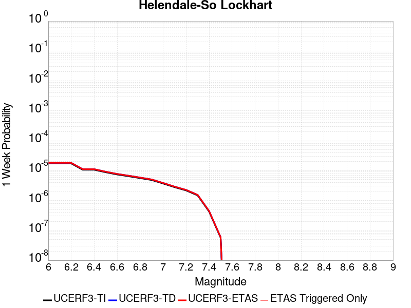 |  |  |  |

| Magnitude | 1 wk TI Prob | 1 wk TD Prob | 1 wk ETAS Prob | 1 wk ETAS/TD Gain | 1 wk ETAS Triggered Only | 1 mo TI Prob | 1 mo TD Prob | 1 mo ETAS Prob | 1 mo ETAS/TD Gain | 1 mo ETAS Triggered Only | 1 yr TI Prob | 1 yr TD Prob | 1 yr ETAS Prob | 1 yr ETAS/TD Gain | 1 yr ETAS Triggered Only | 10 yr TI Prob | 10 yr TD Prob | 10 yr ETAS Prob | 10 yr ETAS/TD Gain | 10 yr ETAS Triggered Only |
|-----|-----|-----|-----|-----|-----|-----|-----|-----|-----|-----|-----|-----|-----|-----|-----|-----|-----|-----|-----|-----|
| 6.0 | 1.7296055E-5 | 1.810418E-5 | 1.810418E-5 | 1.0 | 0.0 | 7.412385E-5 | 7.7587145E-5 | 7.7587145E-5 | 1.0 | 0.0 | 9.0208417E-4 | 9.442349E-4 | 0.0010101444 | 1.069802 | 6.597176E-5 | 0.008984311 | 0.009404349 | 0.009600403 | 1.0208472 | 1.9791529E-4 |
| 6.1 | 1.7296055E-5 | 1.810418E-5 | 1.810418E-5 | 1.0 | 0.0 | 7.412385E-5 | 7.7587145E-5 | 7.7587145E-5 | 1.0 | 0.0 | 9.0208417E-4 | 9.442349E-4 | 0.0010101444 | 1.069802 | 6.597176E-5 | 0.008984311 | 0.009404349 | 0.009600403 | 1.0208472 | 1.9791529E-4 |
| 6.2 | 1.7296055E-5 | 1.810418E-5 | 1.810418E-5 | 1.0 | 0.0 | 7.412385E-5 | 7.7587145E-5 | 7.7587145E-5 | 1.0 | 0.0 | 9.0208417E-4 | 9.442349E-4 | 0.0010101444 | 1.069802 | 6.597176E-5 | 0.008984311 | 0.009404349 | 0.009600403 | 1.0208472 | 1.9791529E-4 |
| 6.3 | 1.0669118E-5 | 1.1135683E-5 | 1.1135683E-5 | 1.0 | 0.0 | 4.5723988E-5 | 4.7723497E-5 | 4.7723497E-5 | 1.0 | 0.0 | 5.5654737E-4 | 5.808815E-4 | 6.4681494E-4 | 1.1135058 | 6.597176E-5 | 0.0055515557 | 0.0057939277 | 0.005925107 | 1.0226408 | 1.3194353E-4 |
| 6.4 | 1.0669118E-5 | 1.1135683E-5 | 1.1135683E-5 | 1.0 | 0.0 | 4.5723988E-5 | 4.7723497E-5 | 4.7723497E-5 | 1.0 | 0.0 | 5.5654737E-4 | 5.808815E-4 | 6.4681494E-4 | 1.1135058 | 6.597176E-5 | 0.0055515557 | 0.0057939277 | 0.005925107 | 1.0226408 | 1.3194353E-4 |
| 6.5 | 8.790038E-6 | 9.170408E-6 | 9.170408E-6 | 1.0 | 0.0 | 3.767105E-5 | 3.930116E-5 | 3.930116E-5 | 1.0 | 0.0 | 4.585485E-4 | 4.7838816E-4 | 5.4432836E-4 | 1.1378382 | 6.597176E-5 | 0.0045760344 | 0.0047737476 | 0.0049050613 | 1.0275074 | 1.3194353E-4 |
| 6.6 | 7.396949E-6 | 7.715714E-6 | 7.715714E-6 | 1.0 | 0.0 | 3.1700827E-5 | 3.306693E-5 | 3.306693E-5 | 1.0 | 0.0 | 3.858892E-4 | 4.025165E-4 | 4.6846172E-4 | 1.1638323 | 6.597176E-5 | 0.003852198 | 0.0040179817 | 0.004149395 | 1.0327063 | 1.3194353E-4 |
| 6.7 | 6.4600285E-6 | 6.738185E-6 | 6.738185E-6 | 1.0 | 0.0 | 2.7685543E-5 | 2.8877621E-5 | 2.8877621E-5 | 1.0 | 0.0 | 3.3701936E-4 | 3.515291E-4 | 4.1747765E-4 | 1.1876049 | 6.597176E-5 | 0.0033650869 | 0.003509812 | 0.0035755523 | 1.0187304 | 6.597176E-5 |
| 6.8 | 5.600104E-6 | 5.8361397E-6 | 5.8361397E-6 | 1.0 | 0.0 | 2.4000226E-5 | 2.5011792E-5 | 2.5011792E-5 | 1.0 | 0.0 | 2.9216358E-4 | 3.0447662E-4 | 3.0447662E-4 | 1.0 | 0.0 | 0.0029177975 | 0.003040656 | 0.003040656 | 1.0 | 0.0 |
| 6.9 | 4.839122E-6 | 5.03962E-6 | 5.03962E-6 | 1.0 | 0.0 | 2.0738931E-5 | 2.1598196E-5 | 2.1598196E-5 | 1.0 | 0.0 | 2.5246723E-4 | 2.6292677E-4 | 2.6292677E-4 | 1.0 | 0.0 | 0.002521806 | 0.0026262044 | 0.0026262044 | 1.0 | 0.0 |
| 7.0 | 3.6937633E-6 | 3.8452918E-6 | 3.8452918E-6 | 1.0 | 0.0 | 1.5830317E-5 | 1.6479718E-5 | 1.6479718E-5 | 1.0 | 0.0 | 1.9271708E-4 | 2.0062242E-4 | 2.0062242E-4 | 1.0 | 0.0 | 0.0019255003 | 0.0020044446 | 0.0020044446 | 1.0 | 0.0 |
| 7.1 | 2.7858857E-6 | 2.8979157E-6 | 2.8979157E-6 | 1.0 | 0.0 | 1.1939455E-5 | 1.241958E-5 | 1.241958E-5 | 1.0 | 0.0 | 1.4535317E-4 | 1.5119811E-4 | 1.5119811E-4 | 1.0 | 0.0 | 0.0014525814 | 0.0015109739 | 0.0015109739 | 1.0 | 0.0 |
| 7.2 | 2.1672065E-6 | 2.2540607E-6 | 2.2540607E-6 | 1.0 | 0.0 | 9.2879945E-6 | 9.660225E-6 | 9.660225E-6 | 1.0 | 0.0 | 1.1307546E-4 | 1.1760708E-4 | 1.1760708E-4 | 1.0 | 0.0 | 0.0011301794 | 0.0011754666 | 0.0011754666 | 1.0 | 0.0 |
| 7.3 | 1.4823496E-6 | 1.5422432E-6 | 1.5422432E-6 | 1.0 | 0.0 | 6.3529114E-6 | 6.609598E-6 | 6.609598E-6 | 1.0 | 0.0 | 7.734395E-5 | 8.0469035E-5 | 8.0469035E-5 | 1.0 | 0.0 | 7.731704E-4 | 8.044141E-4 | 8.044141E-4 | 1.0 | 0.0 |
| 7.4 | 4.2321457E-7 | 4.4109754E-7 | 4.4109754E-7 | 1.0 | 0.0 | 1.8137755E-6 | 1.8904169E-6 | 1.8904169E-6 | 1.0 | 0.0 | 2.2082493E-5 | 2.301563E-5 | 2.301563E-5 | 1.0 | 0.0 | 2.2080299E-4 | 2.3013698E-4 | 2.3013698E-4 | 1.0 | 0.0 |
| 7.5 | 5.6942316E-8 | 5.9417015E-8 | 5.9417015E-8 | 1.0 | 0.0 | 2.440385E-7 | 2.5464433E-7 | 2.5464433E-7 | 1.0 | 0.0 | 2.9711643E-6 | 3.100291E-6 | 3.100291E-6 | 1.0 | 0.0 | 2.9711247E-5 | 3.1002557E-5 | 3.1002557E-5 | 1.0 | 0.0 |

## Mission Ridge-Arroyo Parida-Santa Ana
*[(top)](#table-of-contents)*

| 1 Week | 1 Month | 1 Year | 10 Year |
|-----|-----|-----|-----|
|  |  |  |  |

| Magnitude | 1 wk TI Prob | 1 wk TD Prob | 1 wk ETAS Prob | 1 wk ETAS/TD Gain | 1 wk ETAS Triggered Only | 1 mo TI Prob | 1 mo TD Prob | 1 mo ETAS Prob | 1 mo ETAS/TD Gain | 1 mo ETAS Triggered Only | 1 yr TI Prob | 1 yr TD Prob | 1 yr ETAS Prob | 1 yr ETAS/TD Gain | 1 yr ETAS Triggered Only | 10 yr TI Prob | 10 yr TD Prob | 10 yr ETAS Prob | 10 yr ETAS/TD Gain | 10 yr ETAS Triggered Only |
|-----|-----|-----|-----|-----|-----|-----|-----|-----|-----|-----|-----|-----|-----|-----|-----|-----|-----|-----|-----|-----|
| 6.0 | 4.169034E-5 | 4.71435E-5 | 4.71435E-5 | 1.0 | 0.0 | 1.7866064E-4 | 2.0203278E-4 | 2.0203278E-4 | 1.0 | 0.0 | 0.0021730233 | 0.0024577067 | 0.0024577067 | 1.0 | 0.0 | 0.021518968 | 0.024387252 | 0.024515977 | 1.0052783 | 1.3194353E-4 |
| 6.1 | 1.73813E-5 | 1.6855427E-5 | 1.6855427E-5 | 1.0 | 0.0 | 7.4489166E-5 | 7.2235605E-5 | 7.2235605E-5 | 1.0 | 0.0 | 9.065282E-4 | 8.791244E-4 | 8.791244E-4 | 1.0 | 0.0 | 0.009028391 | 0.008757609 | 0.008823003 | 1.0074672 | 6.597176E-5 |
| 6.2 | 1.4622182E-5 | 1.3674228E-5 | 1.3674228E-5 | 1.0 | 0.0 | 6.2664985E-5 | 5.8602538E-5 | 5.8602538E-5 | 1.0 | 0.0 | 7.6267915E-4 | 7.1325625E-4 | 7.1325625E-4 | 1.0 | 0.0 | 0.007600669 | 0.0071101133 | 0.0071101133 | 1.0 | 0.0 |
| 6.3 | 1.3552434E-5 | 1.2483067E-5 | 1.2483067E-5 | 1.0 | 0.0 | 5.8080568E-5 | 5.3497777E-5 | 5.3497777E-5 | 1.0 | 0.0 | 7.069015E-4 | 6.5114396E-4 | 6.5114396E-4 | 1.0 | 0.0 | 0.00704657 | 0.0064927237 | 0.0064927237 | 1.0 | 0.0 |
| 6.4 | 1.30977305E-5 | 1.1979993E-5 | 1.1979993E-5 | 1.0 | 0.0 | 5.613192E-5 | 5.1341834E-5 | 5.1341834E-5 | 1.0 | 0.0 | 6.831918E-4 | 6.249106E-4 | 6.249106E-4 | 1.0 | 0.0 | 0.006810953 | 0.0062318784 | 0.0062318784 | 1.0 | 0.0 |
| 6.5 | 1.225205E-5 | 1.104959E-5 | 1.104959E-5 | 1.0 | 0.0 | 5.2507727E-5 | 4.7354544E-5 | 4.7354544E-5 | 1.0 | 0.0 | 6.3909404E-4 | 5.7639176E-4 | 5.7639176E-4 | 1.0 | 0.0 | 0.006372592 | 0.005749278 | 0.005749278 | 1.0 | 0.0 |
| 6.6 | 1.1352241E-5 | 1.0064273E-5 | 1.0064273E-5 | 1.0 | 0.0 | 4.8651553E-5 | 4.3131895E-5 | 4.3131895E-5 | 1.0 | 0.0 | 5.921717E-4 | 5.2500644E-4 | 5.2500644E-4 | 1.0 | 0.0 | 0.0059059616 | 0.005237907 | 0.005237907 | 1.0 | 0.0 |
| 6.7 | 1.0864116E-5 | 9.517729E-6 | 9.517729E-6 | 1.0 | 0.0 | 4.6559664E-5 | 4.0789644E-5 | 4.0789644E-5 | 1.0 | 0.0 | 5.667165E-4 | 4.9650273E-4 | 4.9650273E-4 | 1.0 | 0.0 | 0.005652734 | 0.0049541686 | 0.0049541686 | 1.0 | 0.0 |
| 6.8 | 1.0666365E-5 | 9.30047E-6 | 9.30047E-6 | 1.0 | 0.0 | 4.571219E-5 | 3.9858558E-5 | 3.9858558E-5 | 1.0 | 0.0 | 5.564038E-4 | 4.851719E-4 | 4.851719E-4 | 1.0 | 0.0 | 0.005550127 | 0.004841359 | 0.004841359 | 1.0 | 0.0 |
| 6.9 | 1.0038665E-5 | 8.592689E-6 | 8.592689E-6 | 1.0 | 0.0 | 4.302214E-5 | 3.68253E-5 | 3.68253E-5 | 1.0 | 0.0 | 5.236687E-4 | 4.4825758E-4 | 4.4825758E-4 | 1.0 | 0.0 | 0.005224364 | 0.004473745 | 0.004473745 | 1.0 | 0.0 |
| 7.0 | 9.5379955E-6 | 8.025674E-6 | 8.025674E-6 | 1.0 | 0.0 | 4.0876483E-5 | 3.4395303E-5 | 3.4395303E-5 | 1.0 | 0.0 | 4.975576E-4 | 4.1868407E-4 | 4.1868407E-4 | 1.0 | 0.0 | 0.00496445 | 0.004179152 | 0.004179152 | 1.0 | 0.0 |
| 7.1 | 9.207389E-6 | 7.652948E-6 | 7.652948E-6 | 1.0 | 0.0 | 3.945964E-5 | 3.2797943E-5 | 3.2797943E-5 | 1.0 | 0.0 | 4.803152E-4 | 3.992435E-4 | 3.992435E-4 | 1.0 | 0.0 | 0.004792784 | 0.003985459 | 0.003985459 | 1.0 | 0.0 |
| 7.2 | 7.638091E-6 | 5.9315435E-6 | 5.9315435E-6 | 1.0 | 0.0 | 3.2734264E-5 | 2.5420655E-5 | 2.5420655E-5 | 1.0 | 0.0 | 3.984668E-4 | 3.0945282E-4 | 3.0945282E-4 | 1.0 | 0.0 | 0.0039775306 | 0.0030902762 | 0.0030902762 | 1.0 | 0.0 |
| 7.3 | 7.2500147E-6 | 5.5965506E-6 | 5.5965506E-6 | 1.0 | 0.0 | 3.1071122E-5 | 2.3985E-5 | 2.3985E-5 | 1.0 | 0.0 | 3.7822526E-4 | 2.9197853E-4 | 2.9197853E-4 | 1.0 | 0.0 | 0.0037758215 | 0.0029160045 | 0.0029160045 | 1.0 | 0.0 |
| 7.4 | 6.3899715E-6 | 4.918836E-6 | 4.918836E-6 | 1.0 | 0.0 | 2.7385306E-5 | 2.1080557E-5 | 2.1080557E-5 | 1.0 | 0.0 | 3.3336508E-4 | 2.5662576E-4 | 2.5662576E-4 | 1.0 | 0.0 | 0.0033286542 | 0.0025633385 | 0.0025633385 | 1.0 | 0.0 |
| 7.5 | 5.379025E-6 | 4.0841346E-6 | 4.0841346E-6 | 1.0 | 0.0 | 2.305276E-5 | 1.7503316E-5 | 1.7503316E-5 | 1.0 | 0.0 | 2.806312E-4 | 2.1308215E-4 | 2.1308215E-4 | 1.0 | 0.0 | 0.0028027708 | 0.0021287897 | 0.0021287897 | 1.0 | 0.0 |
| 7.6 | 4.1270696E-6 | 3.0885622E-6 | 3.0885622E-6 | 1.0 | 0.0 | 1.768732E-5 | 1.3236629E-5 | 1.3236629E-5 | 1.0 | 0.0 | 2.1532185E-4 | 1.6114411E-4 | 1.6114411E-4 | 1.0 | 0.0 | 0.0021511333 | 0.0016102807 | 0.0016102807 | 1.0 | 0.0 |
| 7.7 | 2.5406805E-6 | 1.8283382E-6 | 1.8283382E-6 | 1.0 | 0.0 | 1.0888585E-5 | 7.8357125E-6 | 7.8357125E-6 | 1.0 | 0.0 | 1.3256045E-4 | 9.539568E-5 | 9.539568E-5 | 1.0 | 0.0 | 0.0013248142 | 9.535535E-4 | 9.535535E-4 | 1.0 | 0.0 |
| 7.8 | 4.8608285E-7 | 3.5100658E-7 | 3.5100658E-7 | 1.0 | 0.0 | 2.0832106E-6 | 1.504313E-6 | 1.504313E-6 | 1.0 | 0.0 | 2.5362791E-5 | 1.8314859E-5 | 1.8314859E-5 | 1.0 | 0.0 | 2.5359896E-4 | 1.8313361E-4 | 1.8313361E-4 | 1.0 | 0.0 |
| 7.9 | 2.0472514E-8 | 1.2690024E-8 | 1.2690024E-8 | 1.0 | 0.0 | 8.7739345E-8 | 5.438582E-8 | 5.438582E-8 | 1.0 | 0.0 | 1.068226E-6 | 6.621471E-7 | 6.621471E-7 | 1.0 | 0.0 | 1.0682209E-5 | 6.6214525E-6 | 6.6214525E-6 | 1.0 | 0.0 |
| 8.0 | 4.443582E-9 | 2.0326807E-9 | 2.0326807E-9 | 1.0 | 0.0 | 1.9043922E-8 | 8.711488E-9 | 8.711488E-9 | 1.0 | 0.0 | 2.3185973E-7 | 1.06062366E-7 | 1.06062366E-7 | 1.0 | 0.0 | 2.3185949E-6 | 1.0606232E-6 | 1.0606232E-6 | 1.0 | 0.0 |

## San Andreas (Big Bend)
*[(top)](#table-of-contents)*

| 1 Week | 1 Month | 1 Year | 10 Year |
|-----|-----|-----|-----|
|  |  | 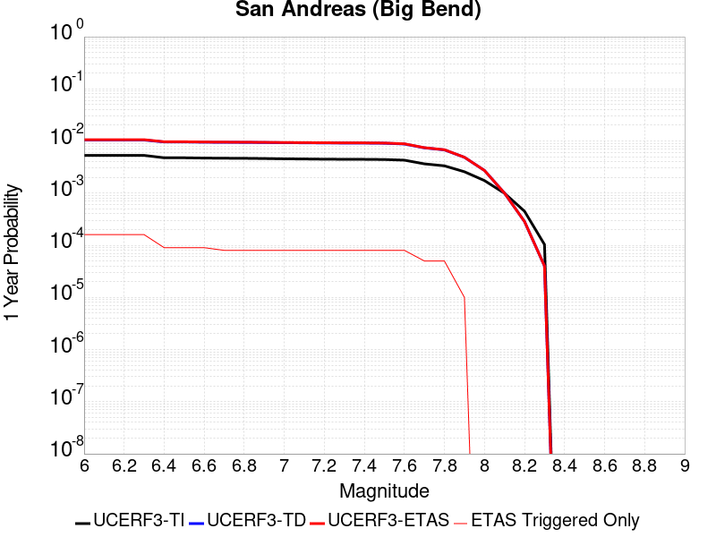 |  |

| Magnitude | 1 wk TI Prob | 1 wk TD Prob | 1 wk ETAS Prob | 1 wk ETAS/TD Gain | 1 wk ETAS Triggered Only | 1 mo TI Prob | 1 mo TD Prob | 1 mo ETAS Prob | 1 mo ETAS/TD Gain | 1 mo ETAS Triggered Only | 1 yr TI Prob | 1 yr TD Prob | 1 yr ETAS Prob | 1 yr ETAS/TD Gain | 1 yr ETAS Triggered Only | 10 yr TI Prob | 10 yr TD Prob | 10 yr ETAS Prob | 10 yr ETAS/TD Gain | 10 yr ETAS Triggered Only |
|-----|-----|-----|-----|-----|-----|-----|-----|-----|-----|-----|-----|-----|-----|-----|-----|-----|-----|-----|-----|-----|
| 6.0 | 1.0179969E-4 | 2.0106303E-4 | 2.0106303E-4 | 1.0 | 0.0 | 4.362114E-4 | 8.614151E-4 | 8.614151E-4 | 1.0 | 0.0 | 0.0052979486 | 0.010437581 | 0.010502864 | 1.0062547 | 6.597176E-5 | 0.051734097 | 0.10159716 | 0.10177497 | 1.0017501 | 1.9791529E-4 |
| 6.1 | 1.0179969E-4 | 2.0106303E-4 | 2.0106303E-4 | 1.0 | 0.0 | 4.362114E-4 | 8.614151E-4 | 8.614151E-4 | 1.0 | 0.0 | 0.0052979486 | 0.010437581 | 0.010502864 | 1.0062547 | 6.597176E-5 | 0.051734097 | 0.10159716 | 0.10177497 | 1.0017501 | 1.9791529E-4 |
| 6.2 | 1.0179969E-4 | 2.0106303E-4 | 2.0106303E-4 | 1.0 | 0.0 | 4.362114E-4 | 8.614151E-4 | 8.614151E-4 | 1.0 | 0.0 | 0.0052979486 | 0.010437581 | 0.010502864 | 1.0062547 | 6.597176E-5 | 0.051734097 | 0.10159716 | 0.10177497 | 1.0017501 | 1.9791529E-4 |
| 6.3 | 1.0179969E-4 | 2.0106303E-4 | 2.0106303E-4 | 1.0 | 0.0 | 4.362114E-4 | 8.614151E-4 | 8.614151E-4 | 1.0 | 0.0 | 0.0052979486 | 0.010437581 | 0.010502864 | 1.0062547 | 6.597176E-5 | 0.051734097 | 0.10159716 | 0.10177497 | 1.0017501 | 1.9791529E-4 |
| 6.4 | 9.1639464E-5 | 1.8462905E-4 | 1.8462905E-4 | 1.0 | 0.0 | 3.9268145E-4 | 7.910276E-4 | 7.910276E-4 | 1.0 | 0.0 | 0.0047704205 | 0.009588352 | 0.009653691 | 1.0068145 | 6.597176E-5 | 0.046693064 | 0.093921766 | 0.094101086 | 1.0019094 | 1.9791529E-4 |
| 6.5 | 9.1639464E-5 | 1.8462905E-4 | 1.8462905E-4 | 1.0 | 0.0 | 3.9268145E-4 | 7.910276E-4 | 7.910276E-4 | 1.0 | 0.0 | 0.0047704205 | 0.009588352 | 0.009653691 | 1.0068145 | 6.597176E-5 | 0.046693064 | 0.093921766 | 0.094101086 | 1.0019094 | 1.9791529E-4 |
| 6.6 | 9.042622E-5 | 1.826988E-4 | 1.826988E-4 | 1.0 | 0.0 | 3.8748336E-4 | 7.827601E-4 | 7.827601E-4 | 1.0 | 0.0 | 0.0047074095 | 0.009488574 | 0.00955392 | 1.0068868 | 6.597176E-5 | 0.046089325 | 0.093015574 | 0.09319508 | 1.0019299 | 1.9791529E-4 |
| 6.7 | 8.9836685E-5 | 1.8184188E-4 | 1.8184188E-4 | 1.0 | 0.0 | 3.8495753E-4 | 7.790898E-4 | 7.790898E-4 | 1.0 | 0.0 | 0.00467679 | 0.009444275 | 0.009509624 | 1.0069194 | 6.597176E-5 | 0.045795817 | 0.09260978 | 0.09278937 | 1.0019392 | 1.9791529E-4 |
| 6.8 | 8.9471854E-5 | 1.8130938E-4 | 1.8130938E-4 | 1.0 | 0.0 | 3.8339442E-4 | 7.7680906E-4 | 7.7680906E-4 | 1.0 | 0.0 | 0.004657841 | 0.009416748 | 0.009482098 | 1.0069398 | 6.597176E-5 | 0.04561414 | 0.09235688 | 0.09253652 | 1.001945 | 1.9791529E-4 |
| 6.9 | 8.858234E-5 | 1.8012857E-4 | 1.8012857E-4 | 1.0 | 0.0 | 3.7958333E-4 | 7.717514E-4 | 7.717514E-4 | 1.0 | 0.0 | 0.004611638 | 0.009355701 | 0.009421055 | 1.0069855 | 6.597176E-5 | 0.04517103 | 0.09179684 | 0.09197658 | 1.0019581 | 1.9791529E-4 |
| 7.0 | 8.7433385E-5 | 1.7851574E-4 | 1.7851574E-4 | 1.0 | 0.0 | 3.746607E-4 | 7.648433E-4 | 7.648433E-4 | 1.0 | 0.0 | 0.004551957 | 0.009272313 | 0.009337673 | 1.007049 | 6.597176E-5 | 0.044598386 | 0.091031015 | 0.09121091 | 1.0019763 | 1.9791529E-4 |
| 7.1 | 8.684964E-5 | 1.7763473E-4 | 1.7763473E-4 | 1.0 | 0.0 | 3.7215967E-4 | 7.610698E-4 | 7.610698E-4 | 1.0 | 0.0 | 0.0045216335 | 0.009226761 | 0.009292124 | 1.0070841 | 6.597176E-5 | 0.04430731 | 0.09061238 | 0.09073237 | 1.0013242 | 1.3194353E-4 |
| 7.2 | 8.606521E-5 | 1.7654036E-4 | 1.7654036E-4 | 1.0 | 0.0 | 3.6879873E-4 | 7.5638236E-4 | 7.5638236E-4 | 1.0 | 0.0 | 0.0044808835 | 0.009170174 | 0.00923554 | 1.0071282 | 6.597176E-5 | 0.043916024 | 0.09009273 | 0.09021279 | 1.0013326 | 1.3194353E-4 |
| 7.3 | 8.568266E-5 | 1.7595981E-4 | 1.7595981E-4 | 1.0 | 0.0 | 3.6715972E-4 | 7.5389567E-4 | 7.5389567E-4 | 1.0 | 0.0 | 0.0044610105 | 0.0091401525 | 0.009205521 | 1.0071518 | 6.597176E-5 | 0.043725148 | 0.08981366 | 0.089933746 | 1.0013372 | 1.3194353E-4 |
| 7.4 | 8.5432206E-5 | 1.7558529E-4 | 1.7558529E-4 | 1.0 | 0.0 | 3.6608664E-4 | 7.522915E-4 | 7.522915E-4 | 1.0 | 0.0 | 0.004447999 | 0.009120786 | 0.009186155 | 1.0071671 | 6.597176E-5 | 0.043600157 | 0.08963369 | 0.0897538 | 1.00134 | 1.3194353E-4 |
| 7.5 | 8.4791965E-5 | 1.742772E-4 | 1.742772E-4 | 1.0 | 0.0 | 3.633435E-4 | 7.466887E-4 | 7.466887E-4 | 1.0 | 0.0 | 0.0044147377 | 0.00905314 | 0.009118514 | 1.0072212 | 6.597176E-5 | 0.043280575 | 0.08901084 | 0.08913104 | 1.0013504 | 1.3194353E-4 |
| 7.6 | 8.241105E-5 | 1.6872598E-4 | 1.6872598E-4 | 1.0 | 0.0 | 3.531424E-4 | 7.229111E-4 | 7.229111E-4 | 1.0 | 0.0 | 0.0042910352 | 0.008766012 | 0.008831406 | 1.0074599 | 6.597176E-5 | 0.042091176 | 0.086385906 | 0.08650645 | 1.0013955 | 1.3194353E-4 |
| 7.7 | 7.00432E-5 | 1.4233537E-4 | 1.4233537E-4 | 1.0 | 0.0 | 3.001506E-4 | 6.0986617E-4 | 6.0986617E-4 | 1.0 | 0.0 | 0.0036482112 | 0.0073998813 | 0.007465365 | 1.0088493 | 6.597176E-5 | 0.035888977 | 0.07364825 | 0.07377048 | 1.0016596 | 1.3194353E-4 |
| 7.8 | 6.415362E-5 | 1.2995097E-4 | 1.2995097E-4 | 1.0 | 0.0 | 2.749151E-4 | 5.568139E-4 | 5.568139E-4 | 1.0 | 0.0 | 0.0033419547 | 0.006758167 | 0.006823693 | 1.0096958 | 6.597176E-5 | 0.03292141 | 0.06737108 | 0.06749413 | 1.0018265 | 1.3194353E-4 |
| 7.9 | 4.939911E-5 | 9.359872E-5 | 9.359872E-5 | 1.0 | 0.0 | 2.116933E-4 | 4.0107573E-4 | 4.0107573E-4 | 1.0 | 0.0 | 0.0025743195 | 0.0048721726 | 0.004937823 | 1.0134746 | 6.597176E-5 | 0.025447013 | 0.04900208 | 0.04912756 | 1.0025606 | 1.3194353E-4 |
| 8.0 | 3.344983E-5 | 5.2337946E-5 | 5.2337946E-5 | 1.0 | 0.0 | 1.4334853E-4 | 2.2428621E-4 | 2.2428621E-4 | 1.0 | 0.0 | 0.0017438711 | 0.0027272669 | 0.0027272669 | 1.0 | 0.0 | 0.017302496 | 0.027976755 | 0.02804088 | 1.0022922 | 6.597176E-5 |
| 8.1 | 1.9104898E-5 | 1.9226556E-5 | 1.9226556E-5 | 1.0 | 0.0 | 8.1875565E-5 | 8.2396924E-5 | 8.2396924E-5 | 1.0 | 0.0 | 9.963791E-4 | 0.0010027215 | 0.0010027215 | 1.0 | 0.0 | 0.009919235 | 0.01077785 | 0.01084311 | 1.0060551 | 6.597176E-5 |
| 8.2 | 8.643924E-6 | 5.49522E-6 | 5.49522E-6 | 1.0 | 0.0 | 3.704486E-5 | 2.355073E-5 | 2.355073E-5 | 1.0 | 0.0 | 4.5092785E-4 | 2.866925E-4 | 2.866925E-4 | 1.0 | 0.0 | 0.0045001395 | 0.0032598388 | 0.0032598388 | 1.0 | 0.0 |
| 8.3 | 1.983087E-6 | 7.693574E-7 | 7.693574E-7 | 1.0 | 0.0 | 8.498917E-6 | 3.297242E-6 | 3.297242E-6 | 1.0 | 0.0 | 1.034694E-4 | 4.01432E-5 | 4.01432E-5 | 1.0 | 0.0 | 0.0010342124 | 4.7390026E-4 | 4.7390026E-4 | 1.0 | 0.0 |

## San Andreas (Creeping Section) 2011 CFM
*[(top)](#table-of-contents)*

| 1 Week | 1 Month | 1 Year | 10 Year |
|-----|-----|-----|-----|
| 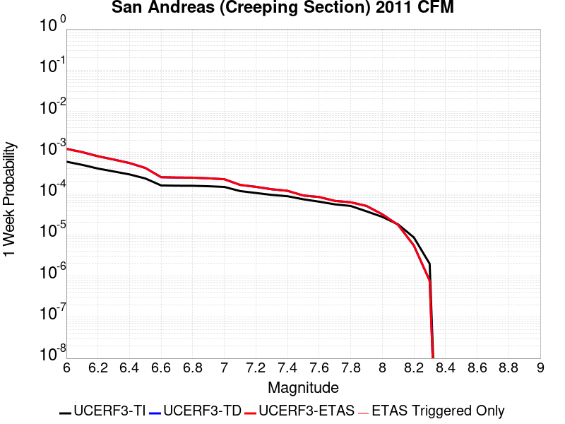 |  | 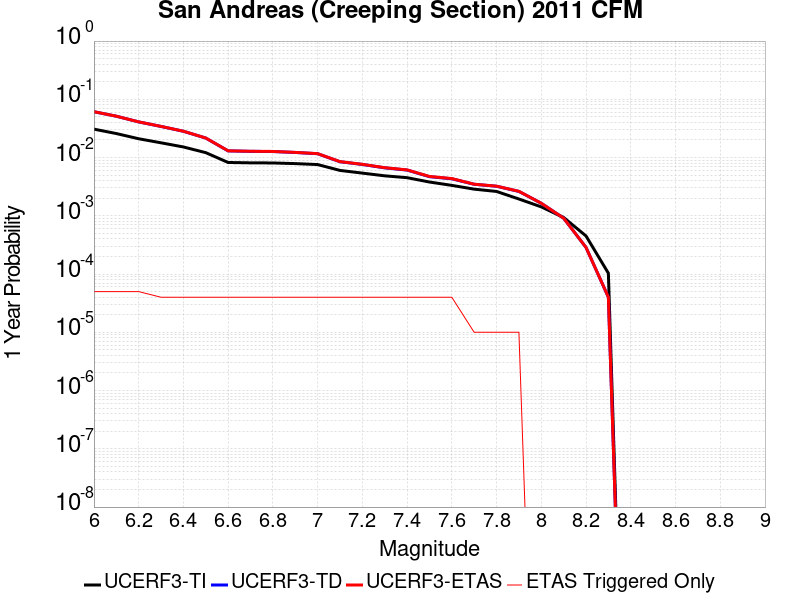 |  |

| Magnitude | 1 wk TI Prob | 1 wk TD Prob | 1 wk ETAS Prob | 1 wk ETAS/TD Gain | 1 wk ETAS Triggered Only | 1 mo TI Prob | 1 mo TD Prob | 1 mo ETAS Prob | 1 mo ETAS/TD Gain | 1 mo ETAS Triggered Only | 1 yr TI Prob | 1 yr TD Prob | 1 yr ETAS Prob | 1 yr ETAS/TD Gain | 1 yr ETAS Triggered Only | 10 yr TI Prob | 10 yr TD Prob | 10 yr ETAS Prob | 10 yr ETAS/TD Gain | 10 yr ETAS Triggered Only |
|-----|-----|-----|-----|-----|-----|-----|-----|-----|-----|-----|-----|-----|-----|-----|-----|-----|-----|-----|-----|-----|
| 6.0 | 5.986481E-4 | 0.0012277901 | 0.0012277901 | 1.0 | 0.0 | 0.0025631124 | 0.0052455855 | 0.0052455855 | 1.0 | 0.0 | 0.030762846 | 0.061229862 | 0.061291795 | 1.0010115 | 6.597176E-5 | 0.26835477 | 0.42607152 | 0.42614722 | 1.0001777 | 1.3194353E-4 |
| 6.1 | 5.015945E-4 | 0.0010218644 | 0.0010218644 | 1.0 | 0.0 | 0.00214792 | 0.0043676887 | 0.0043676887 | 1.0 | 0.0 | 0.025839351 | 0.051269703 | 0.05133229 | 1.0012208 | 6.597176E-5 | 0.23032776 | 0.37298882 | 0.37307155 | 1.0002218 | 1.3194353E-4 |
| 6.2 | 4.073338E-4 | 8.109829E-4 | 8.109829E-4 | 1.0 | 0.0 | 0.0017445484 | 0.0034675654 | 0.0034675654 | 1.0 | 0.0 | 0.021034058 | 0.040954083 | 0.041017354 | 1.001545 | 6.597176E-5 | 0.19150782 | 0.31317768 | 0.3132683 | 1.0002893 | 1.3194353E-4 |
| 6.3 | 3.464099E-4 | 6.7405414E-4 | 6.7405414E-4 | 1.0 | 0.0 | 0.0014837692 | 0.0028840431 | 0.0028840431 | 1.0 | 0.0 | 0.017915873 | 0.034210727 | 0.03427444 | 1.0018624 | 6.597176E-5 | 0.16538359 | 0.27146977 | 0.27156588 | 1.000354 | 1.3194353E-4 |
| 6.4 | 2.935057E-4 | 5.543318E-4 | 5.543318E-4 | 1.0 | 0.0 | 0.0012572751 | 0.0023728115 | 0.0023728115 | 1.0 | 0.0 | 0.015200248 | 0.028285956 | 0.02835006 | 1.0022663 | 6.597176E-5 | 0.14201577 | 0.23314685 | 0.23324803 | 1.0004339 | 1.3194353E-4 |
| 6.5 | 2.3409708E-4 | 4.2106997E-4 | 4.2106997E-4 | 1.0 | 0.0 | 0.0010028875 | 0.001803265 | 0.001803265 | 1.0 | 0.0 | 0.012141965 | 0.02160988 | 0.021674426 | 1.0029869 | 6.597176E-5 | 0.11499573 | 0.18699536 | 0.18710262 | 1.0005736 | 1.3194353E-4 |
| 6.6 | 1.5842178E-4 | 2.5115322E-4 | 2.5115322E-4 | 1.0 | 0.0 | 6.7877385E-4 | 0.0010759257 | 0.0010759257 | 1.0 | 0.0 | 0.0082328 | 0.013019121 | 0.013084235 | 1.0050013 | 6.597176E-5 | 0.07934396 | 0.12333139 | 0.12344707 | 1.0009379 | 1.3194353E-4 |
| 6.7 | 1.5616413E-4 | 2.4651614E-4 | 2.4651614E-4 | 1.0 | 0.0 | 6.691031E-4 | 0.0010560687 | 0.0010560687 | 1.0 | 0.0 | 0.0081159435 | 0.012780937 | 0.012846066 | 1.0050957 | 6.597176E-5 | 0.0782586 | 0.12135857 | 0.121474504 | 1.0009552 | 1.3194353E-4 |
| 6.8 | 1.5538467E-4 | 2.4475376E-4 | 2.4475376E-4 | 1.0 | 0.0 | 6.6576427E-4 | 0.0010485224 | 0.0010485224 | 1.0 | 0.0 | 0.008075596 | 0.0126902815 | 0.012755415 | 1.0051327 | 6.597176E-5 | 0.07788358 | 0.12058931 | 0.120705344 | 1.0009623 | 1.3194353E-4 |
| 6.9 | 1.5153569E-4 | 2.3584193E-4 | 2.3584193E-4 | 1.0 | 0.0 | 6.49277E-4 | 0.0010103616 | 0.0010103616 | 1.0 | 0.0 | 0.007876333 | 0.0122323 | 0.0122974655 | 1.0053272 | 6.597176E-5 | 0.07602952 | 0.11665895 | 0.1167755 | 1.0009991 | 1.3194353E-4 |
| 7.0 | 1.4588932E-4 | 2.2441045E-4 | 2.2441045E-4 | 1.0 | 0.0 | 6.250901E-4 | 9.6140656E-4 | 9.6140656E-4 | 1.0 | 0.0 | 0.0075839474 | 0.011642803 | 0.011708007 | 1.0056003 | 6.597176E-5 | 0.073302895 | 0.11150479 | 0.11162203 | 1.0010513 | 1.3194353E-4 |
| 7.1 | 1.1565079E-4 | 1.6318668E-4 | 1.6318668E-4 | 1.0 | 0.0 | 4.955521E-4 | 6.991849E-4 | 6.991849E-4 | 1.0 | 0.0 | 0.006016669 | 0.008479553 | 0.008544966 | 1.0077142 | 6.597176E-5 | 0.058563538 | 0.08383247 | 0.08395335 | 1.001442 | 1.3194353E-4 |
| 7.2 | 1.0393792E-4 | 1.4650424E-4 | 1.4650424E-4 | 1.0 | 0.0 | 4.4537216E-4 | 6.2772504E-4 | 6.2772504E-4 | 1.0 | 0.0 | 0.005408933 | 0.007615941 | 0.0076814108 | 1.0085963 | 6.597176E-5 | 0.052791595 | 0.075774014 | 0.07589596 | 1.0016093 | 1.3194353E-4 |
| 7.3 | 9.332884E-5 | 1.2811116E-4 | 1.2811116E-4 | 1.0 | 0.0 | 3.999194E-4 | 5.4893293E-4 | 5.4893293E-4 | 1.0 | 0.0 | 0.0048581534 | 0.006662914 | 0.006728446 | 1.0098354 | 6.597176E-5 | 0.047533102 | 0.06662133 | 0.06674449 | 1.0018486 | 1.3194353E-4 |
| 7.4 | 8.670252E-5 | 1.17293064E-4 | 1.17293064E-4 | 1.0 | 0.0 | 3.715293E-4 | 5.0258834E-4 | 5.0258834E-4 | 1.0 | 0.0 | 0.004513991 | 0.006101966 | 0.006167535 | 1.0107456 | 6.597176E-5 | 0.044233937 | 0.06127167 | 0.06139553 | 1.0020214 | 1.3194353E-4 |
| 7.5 | 7.3036405E-5 | 9.027501E-5 | 9.027501E-5 | 1.0 | 0.0 | 3.129756E-4 | 3.8683563E-4 | 3.8683563E-4 | 1.0 | 0.0 | 0.0038038217 | 0.0046995743 | 0.0047652363 | 1.0139718 | 6.597176E-5 | 0.03739367 | 0.047980286 | 0.0481059 | 1.002618 | 1.3194353E-4 |
| 7.6 | 6.3935775E-5 | 8.298733E-5 | 8.298733E-5 | 1.0 | 0.0 | 2.7398168E-4 | 3.5561158E-4 | 3.5561158E-4 | 1.0 | 0.0 | 0.0033306254 | 0.0043209945 | 0.0043866816 | 1.0152018 | 6.597176E-5 | 0.032811474 | 0.04407886 | 0.044204988 | 1.0028614 | 1.3194353E-4 |
| 7.7 | 5.5050095E-5 | 6.6780485E-5 | 6.6780485E-5 | 1.0 | 0.0 | 2.3590765E-4 | 2.861707E-4 | 2.861707E-4 | 1.0 | 0.0 | 0.0028683927 | 0.003478566 | 0.0035443082 | 1.0188992 | 6.597176E-5 | 0.0283165 | 0.035874426 | 0.036001638 | 1.003546 | 1.3194353E-4 |
| 7.8 | 5.027131E-5 | 6.177649E-5 | 6.177649E-5 | 1.0 | 0.0 | 2.1543067E-4 | 2.6472952E-4 | 2.6472952E-4 | 1.0 | 0.0 | 0.0026197135 | 0.0032183218 | 0.0032840811 | 1.0204328 | 6.597176E-5 | 0.025890453 | 0.033198178 | 0.033325743 | 1.0038425 | 1.3194353E-4 |
| 7.9 | 3.7271806E-5 | 5.034326E-5 | 5.034326E-5 | 1.0 | 0.0 | 1.5972654E-4 | 2.15739E-4 | 2.15739E-4 | 1.0 | 0.0 | 0.0019429359 | 0.0026234603 | 0.0026892591 | 1.0250809 | 6.597176E-5 | 0.019260362 | 0.027125074 | 0.027253438 | 1.0047324 | 1.3194353E-4 |
| 8.0 | 2.7310243E-5 | 3.1506686E-5 | 3.1506686E-5 | 1.0 | 0.0 | 1.17038646E-4 | 1.3502168E-4 | 1.3502168E-4 | 1.0 | 0.0 | 0.0014240141 | 0.0016426502 | 0.0016426502 | 1.0 | 0.0 | 0.014149235 | 0.017253635 | 0.017318469 | 1.0037577 | 6.597176E-5 |
| 8.1 | 1.7940547E-5 | 1.7450684E-5 | 1.7450684E-5 | 1.0 | 0.0 | 7.688579E-5 | 7.4786505E-5 | 7.4786505E-5 | 1.0 | 0.0 | 9.3568244E-4 | 9.1014587E-4 | 9.1014587E-4 | 1.0 | 0.0 | 0.009317525 | 0.009825298 | 0.009890621 | 1.0066485 | 6.597176E-5 |
| 8.2 | 8.643924E-6 | 5.49522E-6 | 5.49522E-6 | 1.0 | 0.0 | 3.704486E-5 | 2.355073E-5 | 2.355073E-5 | 1.0 | 0.0 | 4.5092785E-4 | 2.866925E-4 | 2.866925E-4 | 1.0 | 0.0 | 0.0045001395 | 0.0032598388 | 0.0032598388 | 1.0 | 0.0 |
| 8.3 | 1.983087E-6 | 7.693574E-7 | 7.693574E-7 | 1.0 | 0.0 | 8.498917E-6 | 3.297242E-6 | 3.297242E-6 | 1.0 | 0.0 | 1.034694E-4 | 4.01432E-5 | 4.01432E-5 | 1.0 | 0.0 | 0.0010342124 | 4.7390026E-4 | 4.7390026E-4 | 1.0 | 0.0 |

## Imperial
*[(top)](#table-of-contents)*

| 1 Week | 1 Month | 1 Year | 10 Year |
|-----|-----|-----|-----|
|  | 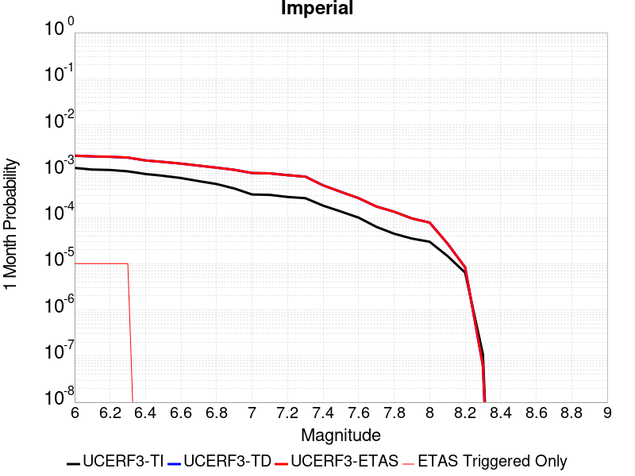 | 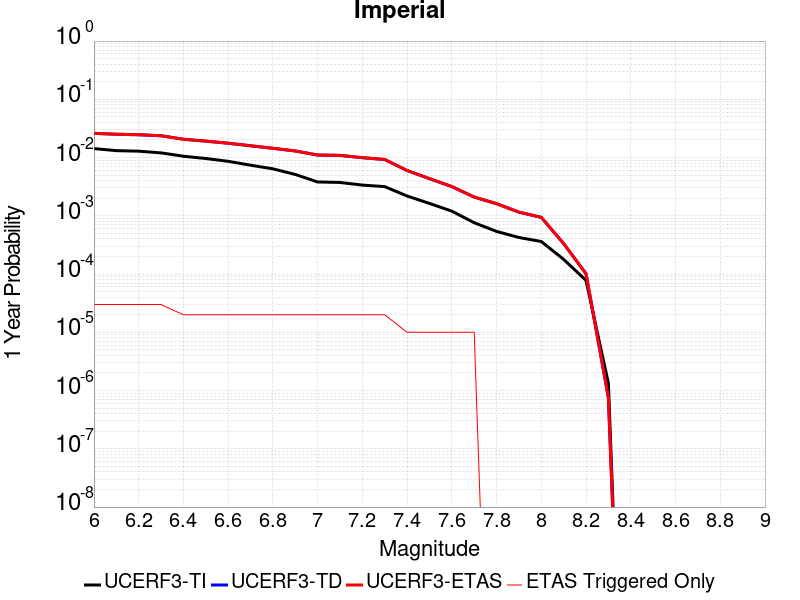 |  |

| Magnitude | 1 wk TI Prob | 1 wk TD Prob | 1 wk ETAS Prob | 1 wk ETAS/TD Gain | 1 wk ETAS Triggered Only | 1 mo TI Prob | 1 mo TD Prob | 1 mo ETAS Prob | 1 mo ETAS/TD Gain | 1 mo ETAS Triggered Only | 1 yr TI Prob | 1 yr TD Prob | 1 yr ETAS Prob | 1 yr ETAS/TD Gain | 1 yr ETAS Triggered Only | 10 yr TI Prob | 10 yr TD Prob | 10 yr ETAS Prob | 10 yr ETAS/TD Gain | 10 yr ETAS Triggered Only |
|-----|-----|-----|-----|-----|-----|-----|-----|-----|-----|-----|-----|-----|-----|-----|-----|-----|-----|-----|-----|-----|
| 6.0 | 2.7496446E-4 | 5.060379E-4 | 5.060379E-4 | 1.0 | 0.0 | 0.0011778869 | 0.0021669706 | 0.0021669706 | 1.0 | 0.0 | 0.0142467655 | 0.026064837 | 0.026193343 | 1.0049301 | 1.3194353E-4 | 0.13367249 | 0.22821419 | 0.22831602 | 1.0004462 | 1.3194353E-4 |
| 6.1 | 2.5356023E-4 | 4.8701192E-4 | 4.8701192E-4 | 1.0 | 0.0 | 0.001086234 | 0.0020855628 | 0.0020855628 | 1.0 | 0.0 | 0.013144928 | 0.02509391 | 0.025222542 | 1.005126 | 1.3194353E-4 | 0.123940155 | 0.21963087 | 0.21973382 | 1.0004689 | 1.3194353E-4 |
| 6.2 | 2.4820742E-4 | 4.7795815E-4 | 4.7795815E-4 | 1.0 | 0.0 | 0.0010633124 | 0.0020468219 | 0.0020468219 | 1.0 | 0.0 | 0.01286919 | 0.024633536 | 0.02476223 | 1.0052243 | 1.3194353E-4 | 0.12148927 | 0.21613504 | 0.21623847 | 1.0004785 | 1.3194353E-4 |
| 6.3 | 2.3205351E-4 | 4.5929378E-4 | 4.5929378E-4 | 1.0 | 0.0 | 9.94136E-4 | 0.001966954 | 0.001966954 | 1.0 | 0.0 | 0.012036599 | 0.02368102 | 0.023809839 | 1.0054398 | 1.3194353E-4 | 0.11405133 | 0.20807077 | 0.20817526 | 1.0005022 | 1.3194353E-4 |
| 6.4 | 2.0304754E-4 | 3.991441E-4 | 3.991441E-4 | 1.0 | 0.0 | 8.6991355E-4 | 0.0017095108 | 0.0017095108 | 1.0 | 0.0 | 0.010539869 | 0.020614926 | 0.02074415 | 1.0062685 | 1.3194353E-4 | 0.100537635 | 0.18520407 | 0.18531157 | 1.0005804 | 1.3194353E-4 |
| 6.5 | 1.854992E-4 | 3.702423E-4 | 3.702423E-4 | 1.0 | 0.0 | 7.9475436E-4 | 0.0015858002 | 0.0015858002 | 1.0 | 0.0 | 0.009633281 | 0.01913749 | 0.019266909 | 1.0067625 | 1.3194353E-4 | 0.0922623 | 0.17342903 | 0.17353809 | 1.0006288 | 1.3194353E-4 |
| 6.6 | 1.6586106E-4 | 3.406714E-4 | 3.406714E-4 | 1.0 | 0.0 | 7.106394E-4 | 0.0014592134 | 0.0014592134 | 1.0 | 0.0 | 0.008617763 | 0.017622843 | 0.017752461 | 1.0073551 | 1.3194353E-4 | 0.08291132 | 0.16089731 | 0.16100803 | 1.0006881 | 1.3194353E-4 |
| 6.7 | 1.4224656E-4 | 3.0794923E-4 | 3.0794923E-4 | 1.0 | 0.0 | 6.094856E-4 | 0.0013191231 | 0.0013191231 | 1.0 | 0.0 | 0.0073952693 | 0.015943963 | 0.016073802 | 1.0081435 | 1.3194353E-4 | 0.07153955 | 0.14659329 | 0.1467059 | 1.0007681 | 1.3194353E-4 |
| 6.8 | 1.2317259E-4 | 2.781478E-4 | 2.781478E-4 | 1.0 | 0.0 | 5.2777573E-4 | 0.0011915236 | 0.0011915236 | 1.0 | 0.0 | 0.0064067547 | 0.0144116925 | 0.014541734 | 1.0090233 | 1.3194353E-4 | 0.06225166 | 0.13303171 | 0.13314609 | 1.0008599 | 1.3194353E-4 |
| 6.9 | 9.859898E-5 | 2.503195E-4 | 2.503195E-4 | 1.0 | 0.0 | 4.2249862E-4 | 0.0010723611 | 0.0010723611 | 1.0 | 0.0 | 0.0051317946 | 0.012978803 | 0.013109035 | 1.0100341 | 1.3194353E-4 | 0.05014893 | 0.11947842 | 0.1195946 | 1.0009724 | 1.3194353E-4 |
| 7.0 | 7.3191884E-5 | 2.127993E-4 | 2.127993E-4 | 1.0 | 0.0 | 3.136418E-4 | 9.116815E-4 | 9.116815E-4 | 1.0 | 0.0 | 0.003811904 | 0.011043918 | 0.011174404 | 1.0118152 | 1.3194353E-4 | 0.037471764 | 0.10211917 | 0.10223764 | 1.0011601 | 1.3194353E-4 |
| 7.1 | 7.1760296E-5 | 2.0981116E-4 | 2.0981116E-4 | 1.0 | 0.0 | 3.0750787E-4 | 8.9888397E-4 | 8.9888397E-4 | 1.0 | 0.0 | 0.003737482 | 0.010889676 | 0.011020183 | 1.0119845 | 1.3194353E-4 | 0.03675245 | 0.10075505 | 0.1008737 | 1.0011775 | 1.3194353E-4 |
| 7.2 | 6.46614E-5 | 1.9149172E-4 | 1.9149172E-4 | 1.0 | 0.0 | 2.7709085E-4 | 8.204237E-4 | 8.204237E-4 | 1.0 | 0.0 | 0.0033683628 | 0.009943534 | 0.010074166 | 1.0131373 | 1.3194353E-4 | 0.033177625 | 0.09256114 | 0.09268087 | 1.0012935 | 1.3194353E-4 |
| 7.3 | 6.088115E-5 | 1.7820326E-4 | 1.7820326E-4 | 1.0 | 0.0 | 2.6089314E-4 | 7.635076E-4 | 7.635076E-4 | 1.0 | 0.0 | 0.0031717476 | 0.009256661 | 0.009387383 | 1.014122 | 1.3194353E-4 | 0.031268585 | 0.08661022 | 0.08673073 | 1.0013915 | 1.3194353E-4 |
| 7.4 | 4.199346E-5 | 1.1519547E-4 | 1.1519547E-4 | 1.0 | 0.0 | 1.7995955E-4 | 4.9360236E-4 | 4.9360236E-4 | 1.0 | 0.0 | 0.0021888057 | 0.0059932186 | 0.0060587954 | 1.0109417 | 6.597176E-5 | 0.02167372 | 0.05748037 | 0.057542548 | 1.0010817 | 6.597176E-5 |
| 7.5 | 3.130448E-5 | 8.340871E-5 | 8.340871E-5 | 1.0 | 0.0 | 1.3415517E-4 | 3.5741724E-4 | 3.5741724E-4 | 1.0 | 0.0 | 0.0016321153 | 0.0043429323 | 0.0044086175 | 1.0151247 | 6.597176E-5 | 0.016201803 | 0.04216626 | 0.04222945 | 1.0014986 | 6.597176E-5 |
| 7.6 | 2.3074248E-5 | 6.0909417E-5 | 6.0909417E-5 | 1.0 | 0.0 | 9.888588E-5 | 2.610144E-4 | 2.610144E-4 | 1.0 | 0.0 | 0.0012032706 | 0.0031732426 | 0.0032390049 | 1.020724 | 6.597176E-5 | 0.011967761 | 0.031055957 | 0.03111988 | 1.0020583 | 6.597176E-5 |
| 7.7 | 1.45864815E-5 | 4.0178427E-5 | 4.0178427E-5 | 1.0 | 0.0 | 6.2511994E-5 | 1.7218193E-4 | 1.7218193E-4 | 1.0 | 0.0 | 7.608177E-4 | 0.002094305 | 0.0021601385 | 1.0314345 | 6.597176E-5 | 0.007582182 | 0.020652408 | 0.020717017 | 1.0031284 | 6.597176E-5 |
| 7.8 | 1.0352979E-5 | 3.1006606E-5 | 3.1006606E-5 | 1.0 | 0.0 | 4.4369157E-5 | 1.328787E-4 | 1.328787E-4 | 1.0 | 0.0 | 5.400606E-4 | 0.0016166 | 0.0016166 | 1.0 | 0.0 | 0.0053875 | 0.016037801 | 0.016037801 | 1.0 | 0.0 |
| 7.9 | 8.137906E-6 | 2.2185837E-5 | 2.2185837E-5 | 1.0 | 0.0 | 3.4876273E-5 | 9.50787E-5 | 9.50787E-5 | 1.0 | 0.0 | 4.2453592E-4 | 0.0011569695 | 0.0011569695 | 1.0 | 0.0 | 0.004237258 | 0.011635021 | 0.011635021 | 1.0 | 0.0 |
| 8.0 | 6.93792E-6 | 1.8040371E-5 | 1.8040371E-5 | 1.0 | 0.0 | 2.9733603E-5 | 7.731359E-5 | 7.731359E-5 | 1.0 | 0.0 | 3.6194647E-4 | 9.408872E-4 | 9.408872E-4 | 1.0 | 0.0 | 0.0036135751 | 0.00951638 | 0.00951638 | 1.0 | 0.0 |
| 8.1 | 3.4286315E-6 | 6.39459E-6 | 6.39459E-6 | 1.0 | 0.0 | 1.4694053E-5 | 2.7405098E-5 | 2.7405098E-5 | 1.0 | 0.0 | 1.7888541E-4 | 3.336061E-4 | 3.336061E-4 | 1.0 | 0.0 | 0.0017874148 | 0.003493339 | 0.003493339 | 1.0 | 0.0 |
| 8.2 | 1.4906886E-6 | 1.9424117E-6 | 1.9424117E-6 | 1.0 | 0.0 | 6.3886496E-6 | 8.324595E-6 | 8.324595E-6 | 1.0 | 0.0 | 7.7779034E-5 | 1.0134726E-4 | 1.0134726E-4 | 1.0 | 0.0 | 7.775182E-4 | 0.0011104804 | 0.0011104804 | 1.0 | 0.0 |
| 8.3 | 2.5758007E-8 | 1.45585295E-8 | 1.45585295E-8 | 1.0 | 0.0 | 1.10391454E-7 | 6.23937E-8 | 6.23937E-8 | 1.0 | 0.0 | 1.3440151E-6 | 7.596433E-7 | 7.596433E-7 | 1.0 | 0.0 | 1.344007E-5 | 7.918924E-6 | 7.918924E-6 | 1.0 | 0.0 |

## San Andreas (Carrizo) rev
*[(top)](#table-of-contents)*

| 1 Week | 1 Month | 1 Year | 10 Year |
|-----|-----|-----|-----|
|  |  |  |  |

| Magnitude | 1 wk TI Prob | 1 wk TD Prob | 1 wk ETAS Prob | 1 wk ETAS/TD Gain | 1 wk ETAS Triggered Only | 1 mo TI Prob | 1 mo TD Prob | 1 mo ETAS Prob | 1 mo ETAS/TD Gain | 1 mo ETAS Triggered Only | 1 yr TI Prob | 1 yr TD Prob | 1 yr ETAS Prob | 1 yr ETAS/TD Gain | 1 yr ETAS Triggered Only | 10 yr TI Prob | 10 yr TD Prob | 10 yr ETAS Prob | 10 yr ETAS/TD Gain | 10 yr ETAS Triggered Only |
|-----|-----|-----|-----|-----|-----|-----|-----|-----|-----|-----|-----|-----|-----|-----|-----|-----|-----|-----|-----|-----|
| 6.0 | 1.1674632E-4 | 2.4361293E-4 | 2.4361293E-4 | 1.0 | 0.0 | 5.002454E-4 | 0.0010436393 | 0.0010436393 | 1.0 | 0.0 | 0.006073493 | 0.012632766 | 0.012697903 | 1.0051563 | 6.597176E-5 | 0.0591016 | 0.12077509 | 0.120891094 | 1.0009606 | 1.3194353E-4 |
| 6.1 | 1.1674632E-4 | 2.4361293E-4 | 2.4361293E-4 | 1.0 | 0.0 | 5.002454E-4 | 0.0010436393 | 0.0010436393 | 1.0 | 0.0 | 0.006073493 | 0.012632766 | 0.012697903 | 1.0051563 | 6.597176E-5 | 0.0591016 | 0.12077509 | 0.120891094 | 1.0009606 | 1.3194353E-4 |
| 6.2 | 1.1674632E-4 | 2.4361293E-4 | 2.4361293E-4 | 1.0 | 0.0 | 5.002454E-4 | 0.0010436393 | 0.0010436393 | 1.0 | 0.0 | 0.006073493 | 0.012632766 | 0.012697903 | 1.0051563 | 6.597176E-5 | 0.0591016 | 0.12077509 | 0.120891094 | 1.0009606 | 1.3194353E-4 |
| 6.3 | 1.1674632E-4 | 2.4361293E-4 | 2.4361293E-4 | 1.0 | 0.0 | 5.002454E-4 | 0.0010436393 | 0.0010436393 | 1.0 | 0.0 | 0.006073493 | 0.012632766 | 0.012697903 | 1.0051563 | 6.597176E-5 | 0.0591016 | 0.12077509 | 0.120891094 | 1.0009606 | 1.3194353E-4 |
| 6.4 | 1.1674632E-4 | 2.4361293E-4 | 2.4361293E-4 | 1.0 | 0.0 | 5.002454E-4 | 0.0010436393 | 0.0010436393 | 1.0 | 0.0 | 0.006073493 | 0.012632766 | 0.012697903 | 1.0051563 | 6.597176E-5 | 0.0591016 | 0.12077509 | 0.120891094 | 1.0009606 | 1.3194353E-4 |
| 6.5 | 1.13136164E-4 | 2.3681132E-4 | 2.3681132E-4 | 1.0 | 0.0 | 4.847792E-4 | 0.0010145125 | 0.0010145125 | 1.0 | 0.0 | 0.0058862255 | 0.012282185 | 0.012347347 | 1.0053054 | 6.597176E-5 | 0.057327334 | 0.1177463 | 0.11786271 | 1.0009886 | 1.3194353E-4 |
| 6.6 | 1.13136164E-4 | 2.3681132E-4 | 2.3681132E-4 | 1.0 | 0.0 | 4.847792E-4 | 0.0010145125 | 0.0010145125 | 1.0 | 0.0 | 0.0058862255 | 0.012282185 | 0.012347347 | 1.0053054 | 6.597176E-5 | 0.057327334 | 0.1177463 | 0.11786271 | 1.0009886 | 1.3194353E-4 |
| 6.7 | 1.1149675E-4 | 2.3372276E-4 | 2.3372276E-4 | 1.0 | 0.0 | 4.777557E-4 | 0.001001286 | 0.001001286 | 1.0 | 0.0 | 0.0058011734 | 0.012122953 | 0.012188125 | 1.0053759 | 6.597176E-5 | 0.05652051 | 0.116367765 | 0.11648435 | 1.001002 | 1.3194353E-4 |
| 6.8 | 1.1103589E-4 | 2.3274389E-4 | 2.3274389E-4 | 1.0 | 0.0 | 4.7578133E-4 | 9.97094E-4 | 9.97094E-4 | 1.0 | 0.0 | 0.005777263 | 0.012072483 | 0.012137658 | 1.0053986 | 6.597176E-5 | 0.056293584 | 0.115927964 | 0.11604461 | 1.0010062 | 1.3194353E-4 |
| 6.9 | 1.1053259E-4 | 2.316672E-4 | 2.316672E-4 | 1.0 | 0.0 | 4.7362508E-4 | 9.924831E-4 | 9.924831E-4 | 1.0 | 0.0 | 0.0057511497 | 0.012016967 | 0.012082146 | 1.0054239 | 6.597176E-5 | 0.05604569 | 0.11544405 | 0.115560755 | 1.001011 | 1.3194353E-4 |
| 7.0 | 1.1005377E-4 | 2.3067516E-4 | 2.3067516E-4 | 1.0 | 0.0 | 4.7157376E-4 | 9.882348E-4 | 9.882348E-4 | 1.0 | 0.0 | 0.0057263062 | 0.011965811 | 0.012030994 | 1.0054474 | 6.597176E-5 | 0.055809796 | 0.11499625 | 0.11511302 | 1.0010154 | 1.3194353E-4 |
| 7.1 | 1.0308142E-4 | 2.1576507E-4 | 2.1576507E-4 | 1.0 | 0.0 | 4.417027E-4 | 9.2438085E-4 | 9.2438085E-4 | 1.0 | 0.0 | 0.0053644776 | 0.011196577 | 0.01126181 | 1.0058261 | 6.597176E-5 | 0.052368138 | 0.10825095 | 0.10836861 | 1.001087 | 1.3194353E-4 |
| 7.2 | 1.0027479E-4 | 2.098411E-4 | 2.098411E-4 | 1.0 | 0.0 | 4.296783E-4 | 8.9901005E-4 | 8.9901005E-4 | 1.0 | 0.0 | 0.0052187922 | 0.010890815 | 0.0109560685 | 1.0059916 | 6.597176E-5 | 0.050979212 | 0.105554216 | 0.10567223 | 1.0011181 | 1.3194353E-4 |
| 7.3 | 9.816942E-5 | 2.0458816E-4 | 2.0458816E-4 | 1.0 | 0.0 | 4.2065824E-4 | 8.765127E-4 | 8.765127E-4 | 1.0 | 0.0 | 0.005109493 | 0.010619612 | 0.010684884 | 1.0061463 | 6.597176E-5 | 0.049935985 | 0.10313633 | 0.10325467 | 1.0011474 | 1.3194353E-4 |
| 7.4 | 9.5634205E-5 | 1.9827684E-4 | 1.9827684E-4 | 1.0 | 0.0 | 4.0979648E-4 | 8.494821E-4 | 8.494821E-4 | 1.0 | 0.0 | 0.0049778637 | 0.010293663 | 0.010358955 | 1.006343 | 6.597176E-5 | 0.048678253 | 0.100220494 | 0.10033921 | 1.0011846 | 1.3194353E-4 |
| 7.5 | 8.052417E-5 | 1.6143978E-4 | 1.6143978E-4 | 1.0 | 0.0 | 3.4505792E-4 | 6.917014E-4 | 6.917014E-4 | 1.0 | 0.0 | 0.0041929903 | 0.008389029 | 0.008454447 | 1.0077981 | 6.597176E-5 | 0.04114753 | 0.08295002 | 0.083071016 | 1.0014586 | 1.3194353E-4 |
| 7.6 | 7.897024E-5 | 1.579682E-4 | 1.579682E-4 | 1.0 | 0.0 | 3.384E-4 | 6.768311E-4 | 6.768311E-4 | 1.0 | 0.0 | 0.0041122385 | 0.00820936 | 0.008274791 | 1.0079702 | 6.597176E-5 | 0.040369697 | 0.081289805 | 0.08141103 | 1.0014912 | 1.3194353E-4 |
| 7.7 | 6.707427E-5 | 1.3303987E-4 | 1.3303987E-4 | 1.0 | 0.0 | 2.8742946E-4 | 5.700463E-4 | 5.700463E-4 | 1.0 | 0.0 | 0.003493839 | 0.0069182604 | 0.0069837756 | 1.0094699 | 6.597176E-5 | 0.034394164 | 0.06917457 | 0.06929739 | 1.0017755 | 1.3194353E-4 |
| 7.8 | 6.147705E-5 | 1.2222702E-4 | 1.2222702E-4 | 1.0 | 0.0 | 2.6344648E-4 | 5.23725E-4 | 5.23725E-4 | 1.0 | 0.0 | 0.0032027436 | 0.0063577346 | 0.006423287 | 1.0103106 | 6.597176E-5 | 0.031569764 | 0.06362964 | 0.063753195 | 1.0019417 | 1.3194353E-4 |
| 7.9 | 4.7636717E-5 | 8.8979046E-5 | 8.8979046E-5 | 1.0 | 0.0 | 2.0414138E-4 | 3.8128305E-4 | 3.8128305E-4 | 1.0 | 0.0 | 0.0024825884 | 0.004632248 | 0.0046979142 | 1.0141759 | 6.597176E-5 | 0.024550365 | 0.046713326 | 0.046839107 | 1.0026926 | 1.3194353E-4 |
| 8.0 | 3.3554235E-5 | 5.224805E-5 | 5.224805E-5 | 1.0 | 0.0 | 1.4379594E-4 | 2.23901E-4 | 2.23901E-4 | 1.0 | 0.0 | 0.0017493097 | 0.0027225888 | 0.0027225888 | 1.0 | 0.0 | 0.017356034 | 0.027935574 | 0.027999703 | 1.0022956 | 6.597176E-5 |
| 8.1 | 1.9175432E-5 | 1.9238541E-5 | 1.9238541E-5 | 1.0 | 0.0 | 8.217783E-5 | 8.244829E-5 | 8.244829E-5 | 1.0 | 0.0 | 0.0010000558 | 0.0010033463 | 0.0010033463 | 1.0 | 0.0 | 0.009955673 | 0.010786123 | 0.010851383 | 1.0060503 | 6.597176E-5 |
| 8.2 | 8.643924E-6 | 5.49522E-6 | 5.49522E-6 | 1.0 | 0.0 | 3.704486E-5 | 2.355073E-5 | 2.355073E-5 | 1.0 | 0.0 | 4.5092785E-4 | 2.866925E-4 | 2.866925E-4 | 1.0 | 0.0 | 0.0045001395 | 0.0032598388 | 0.0032598388 | 1.0 | 0.0 |
| 8.3 | 1.983087E-6 | 7.693574E-7 | 7.693574E-7 | 1.0 | 0.0 | 8.498917E-6 | 3.297242E-6 | 3.297242E-6 | 1.0 | 0.0 | 1.034694E-4 | 4.01432E-5 | 4.01432E-5 | 1.0 | 0.0 | 0.0010342124 | 4.7390026E-4 | 4.7390026E-4 | 1.0 | 0.0 |

## Cleghorn Lake
*[(top)](#table-of-contents)*

| 1 Week | 1 Month | 1 Year | 10 Year |
|-----|-----|-----|-----|
|  |  |  |  |

| Magnitude | 1 wk TI Prob | 1 wk TD Prob | 1 wk ETAS Prob | 1 wk ETAS/TD Gain | 1 wk ETAS Triggered Only | 1 mo TI Prob | 1 mo TD Prob | 1 mo ETAS Prob | 1 mo ETAS/TD Gain | 1 mo ETAS Triggered Only | 1 yr TI Prob | 1 yr TD Prob | 1 yr ETAS Prob | 1 yr ETAS/TD Gain | 1 yr ETAS Triggered Only | 10 yr TI Prob | 10 yr TD Prob | 10 yr ETAS Prob | 10 yr ETAS/TD Gain | 10 yr ETAS Triggered Only |
|-----|-----|-----|-----|-----|-----|-----|-----|-----|-----|-----|-----|-----|-----|-----|-----|-----|-----|-----|-----|-----|
| 6.0 | 1.5467183E-5 | 1.6794971E-5 | 1.6794971E-5 | 1.0 | 0.0 | 6.6286244E-5 | 7.197677E-5 | 7.197677E-5 | 1.0 | 0.0 | 8.067362E-4 | 8.760197E-4 | 8.760197E-4 | 1.0 | 0.0 | 0.008038137 | 0.008731093 | 0.0088618845 | 1.01498 | 1.3194353E-4 |
| 6.1 | 1.5467183E-5 | 1.6794971E-5 | 1.6794971E-5 | 1.0 | 0.0 | 6.6286244E-5 | 7.197677E-5 | 7.197677E-5 | 1.0 | 0.0 | 8.067362E-4 | 8.760197E-4 | 8.760197E-4 | 1.0 | 0.0 | 0.008038137 | 0.008731093 | 0.0088618845 | 1.01498 | 1.3194353E-4 |
| 6.2 | 1.2624631E-5 | 1.36821545E-5 | 1.36821545E-5 | 1.0 | 0.0 | 5.410444E-5 | 5.863676E-5 | 5.863676E-5 | 1.0 | 0.0 | 6.585225E-4 | 7.137174E-4 | 7.137174E-4 | 1.0 | 0.0 | 0.0065657445 | 0.0071190484 | 0.0072500524 | 1.018402 | 1.3194353E-4 |
| 6.3 | 1.2624631E-5 | 1.36821545E-5 | 1.36821545E-5 | 1.0 | 0.0 | 5.410444E-5 | 5.863676E-5 | 5.863676E-5 | 1.0 | 0.0 | 6.585225E-4 | 7.137174E-4 | 7.137174E-4 | 1.0 | 0.0 | 0.0065657445 | 0.0071190484 | 0.0072500524 | 1.018402 | 1.3194353E-4 |
| 6.4 | 9.417684E-6 | 1.0170551E-5 | 1.0170551E-5 | 1.0 | 0.0 | 4.036088E-5 | 4.3587577E-5 | 4.3587577E-5 | 1.0 | 0.0 | 4.912829E-4 | 5.3059065E-4 | 5.3059065E-4 | 1.0 | 0.0 | 0.004901982 | 0.0052972743 | 0.0053628967 | 1.012388 | 6.597176E-5 |
| 6.5 | 9.368219E-6 | 1.0117976E-5 | 1.0117976E-5 | 1.0 | 0.0 | 4.014889E-5 | 4.3362263E-5 | 4.3362263E-5 | 1.0 | 0.0 | 4.8870314E-4 | 5.278488E-4 | 5.278488E-4 | 1.0 | 0.0 | 0.004876298 | 0.0052699856 | 0.00533561 | 1.0124524 | 6.597176E-5 |
| 6.6 | 7.803798E-6 | 8.442198E-6 | 8.442198E-6 | 1.0 | 0.0 | 3.3444423E-5 | 3.6180576E-5 | 3.6180576E-5 | 1.0 | 0.0 | 4.0710976E-4 | 4.404494E-4 | 4.404494E-4 | 1.0 | 0.0 | 0.0040636472 | 0.004399682 | 0.004399682 | 1.0 | 0.0 |
| 6.7 | 2.3108669E-6 | 2.4439082E-6 | 2.4439082E-6 | 1.0 | 0.0 | 9.903678E-6 | 1.0473852E-5 | 1.0473852E-5 | 1.0 | 0.0 | 1.205706E-4 | 1.2751187E-4 | 1.2751187E-4 | 1.0 | 0.0 | 0.001205052 | 0.0012744057 | 0.0012744057 | 1.0 | 0.0 |
| 6.8 | 2.0882828E-6 | 2.2063484E-6 | 2.2063484E-6 | 1.0 | 0.0 | 8.949753E-6 | 9.455745E-6 | 9.455745E-6 | 1.0 | 0.0 | 1.08957785E-4 | 1.15117786E-4 | 1.15117786E-4 | 1.0 | 0.0 | 0.0010890438 | 0.0011505984 | 0.0011505984 | 1.0 | 0.0 |
| 6.9 | 1.876935E-6 | 1.9811093E-6 | 1.9811093E-6 | 1.0 | 0.0 | 8.043982E-6 | 8.490441E-6 | 8.490441E-6 | 1.0 | 0.0 | 9.7931086E-5 | 1.0336639E-4 | 1.0336639E-4 | 1.0 | 0.0 | 9.788794E-4 | 0.001033199 | 0.001033199 | 1.0 | 0.0 |
| 7.0 | 1.5357559E-6 | 1.620328E-6 | 1.620328E-6 | 1.0 | 0.0 | 6.5817944E-6 | 6.9442453E-6 | 6.9442453E-6 | 1.0 | 0.0 | 8.01304E-5 | 8.454303E-5 | 8.454303E-5 | 1.0 | 0.0 | 8.010151E-4 | 8.4512116E-4 | 8.4512116E-4 | 1.0 | 0.0 |
| 7.1 | 1.0905424E-6 | 1.1497951E-6 | 1.1497951E-6 | 1.0 | 0.0 | 4.6737446E-6 | 4.9276846E-6 | 4.9276846E-6 | 1.0 | 0.0 | 5.6901354E-5 | 5.9993006E-5 | 5.9993006E-5 | 1.0 | 0.0 | 5.6886784E-4 | 5.997779E-4 | 5.997779E-4 | 1.0 | 0.0 |
| 7.2 | 6.06668E-7 | 6.387457E-7 | 6.387457E-7 | 1.0 | 0.0 | 2.600003E-6 | 2.737479E-6 | 2.737479E-6 | 1.0 | 0.0 | 3.1654577E-5 | 3.3328364E-5 | 3.3328364E-5 | 1.0 | 0.0 | 3.1650066E-4 | 3.3324052E-4 | 3.3324052E-4 | 1.0 | 0.0 |

## Baker
*[(top)](#table-of-contents)*

| 1 Week | 1 Month | 1 Year | 10 Year |
|-----|-----|-----|-----|
|  |  | 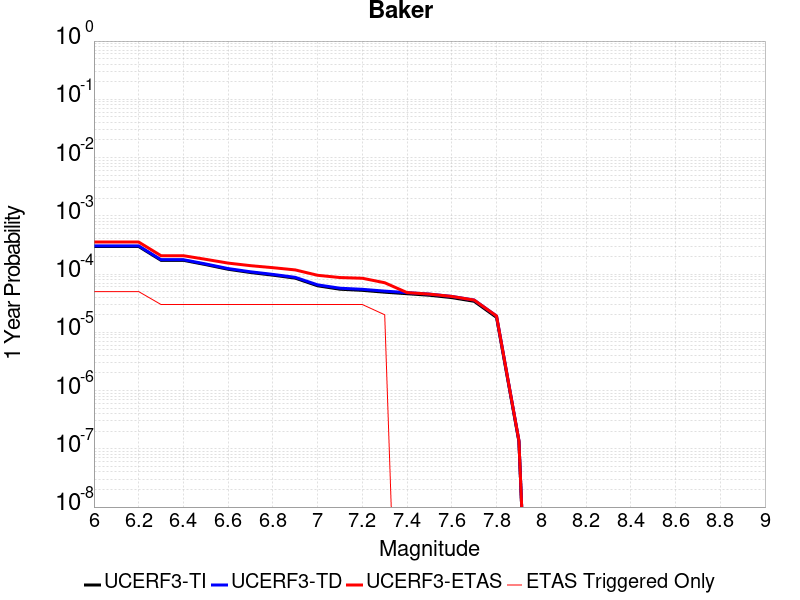 |  |

| Magnitude | 1 wk TI Prob | 1 wk TD Prob | 1 wk ETAS Prob | 1 wk ETAS/TD Gain | 1 wk ETAS Triggered Only | 1 mo TI Prob | 1 mo TD Prob | 1 mo ETAS Prob | 1 mo ETAS/TD Gain | 1 mo ETAS Triggered Only | 1 yr TI Prob | 1 yr TD Prob | 1 yr ETAS Prob | 1 yr ETAS/TD Gain | 1 yr ETAS Triggered Only | 10 yr TI Prob | 10 yr TD Prob | 10 yr ETAS Prob | 10 yr ETAS/TD Gain | 10 yr ETAS Triggered Only |
|-----|-----|-----|-----|-----|-----|-----|-----|-----|-----|-----|-----|-----|-----|-----|-----|-----|-----|-----|-----|-----|
| 6.0 | 5.695525E-6 | 5.8349133E-6 | 5.8349133E-6 | 1.0 | 0.0 | 2.4409164E-5 | 2.5006555E-5 | 2.5006555E-5 | 1.0 | 0.0 | 2.9714106E-4 | 3.0441626E-4 | 3.7036795E-4 | 1.2166497 | 6.597176E-5 | 0.0029674405 | 0.0030403885 | 0.0031719308 | 1.043265 | 1.3194353E-4 |
| 6.1 | 5.695525E-6 | 5.8349133E-6 | 5.8349133E-6 | 1.0 | 0.0 | 2.4409164E-5 | 2.5006555E-5 | 2.5006555E-5 | 1.0 | 0.0 | 2.9714106E-4 | 3.0441626E-4 | 3.7036795E-4 | 1.2166497 | 6.597176E-5 | 0.0029674405 | 0.0030403885 | 0.0031719308 | 1.043265 | 1.3194353E-4 |
| 6.2 | 5.695525E-6 | 5.8349133E-6 | 5.8349133E-6 | 1.0 | 0.0 | 2.4409164E-5 | 2.5006555E-5 | 2.5006555E-5 | 1.0 | 0.0 | 2.9714106E-4 | 3.0441626E-4 | 3.7036795E-4 | 1.2166497 | 6.597176E-5 | 0.0029674405 | 0.0030403885 | 0.0031719308 | 1.043265 | 1.3194353E-4 |
| 6.3 | 3.2995713E-6 | 3.3837132E-6 | 3.3837132E-6 | 1.0 | 0.0 | 1.4140943E-5 | 1.450155E-5 | 1.450155E-5 | 1.0 | 0.0 | 1.7215237E-4 | 1.7654254E-4 | 2.4250266E-4 | 1.3736217 | 6.597176E-5 | 0.0017201907 | 0.00176407 | 0.0018299255 | 1.0373315 | 6.597176E-5 |
| 6.4 | 3.2995713E-6 | 3.3837132E-6 | 3.3837132E-6 | 1.0 | 0.0 | 1.4140943E-5 | 1.450155E-5 | 1.450155E-5 | 1.0 | 0.0 | 1.7215237E-4 | 1.7654254E-4 | 2.4250266E-4 | 1.3736217 | 6.597176E-5 | 0.0017201907 | 0.00176407 | 0.0018299255 | 1.0373315 | 6.597176E-5 |
| 6.5 | 2.782202E-6 | 2.855881E-6 | 2.855881E-6 | 1.0 | 0.0 | 1.1923668E-5 | 1.2239434E-5 | 1.2239434E-5 | 1.0 | 0.0 | 1.4516099E-4 | 1.4900525E-4 | 2.1496718E-4 | 1.4426819 | 6.597176E-5 | 0.001450662 | 0.0014890862 | 0.0015549597 | 1.0442375 | 6.597176E-5 |
| 6.6 | 2.3163404E-6 | 2.3809555E-6 | 2.3809555E-6 | 1.0 | 0.0 | 9.927136E-6 | 1.0204057E-5 | 1.0204057E-5 | 1.0 | 0.0 | 1.20856166E-4 | 1.242275E-4 | 1.9019107E-4 | 1.53099 | 6.597176E-5 | 0.0012079047 | 0.0012416008 | 0.0013074907 | 1.0530685 | 6.597176E-5 |
| 6.7 | 2.037056E-6 | 2.0965333E-6 | 2.0965333E-6 | 1.0 | 0.0 | 8.7302105E-6 | 8.985113E-6 | 8.985113E-6 | 1.0 | 0.0 | 1.0628513E-4 | 1.0938842E-4 | 1.7535297E-4 | 1.6030304 | 6.597176E-5 | 0.0010623431 | 0.0010933619 | 0.0011592614 | 1.0602725 | 6.597176E-5 |
| 6.8 | 1.8356744E-6 | 1.8915596E-6 | 1.8915596E-6 | 1.0 | 0.0 | 7.867153E-6 | 8.106659E-6 | 8.106659E-6 | 1.0 | 0.0 | 9.577837E-5 | 9.869425E-5 | 1.646595E-4 | 1.6683799 | 6.597176E-5 | 9.57371E-4 | 9.865181E-4 | 0.0010524248 | 1.0668074 | 6.597176E-5 |
| 6.9 | 1.6310546E-6 | 1.6832361E-6 | 1.6832361E-6 | 1.0 | 0.0 | 6.9902153E-6 | 7.2138496E-6 | 7.2138496E-6 | 1.0 | 0.0 | 8.510255E-5 | 8.7825196E-5 | 1.5379116E-4 | 1.7511053 | 6.597176E-5 | 8.5069967E-4 | 8.779161E-4 | 9.4382995E-4 | 1.0750799 | 6.597176E-5 |
| 7.0 | 1.2058036E-6 | 1.2508916E-6 | 1.2508916E-6 | 1.0 | 0.0 | 5.1677193E-6 | 5.3609533E-6 | 5.3609533E-6 | 1.0 | 0.0 | 6.291517E-5 | 6.5267675E-5 | 1.3123514E-4 | 2.0107217 | 6.597176E-5 | 6.289736E-4 | 6.5248733E-4 | 7.1841606E-4 | 1.1010422 | 6.597176E-5 |
| 7.1 | 1.052382E-6 | 1.0951846E-6 | 1.0951846E-6 | 1.0 | 0.0 | 4.5102006E-6 | 4.69364E-6 | 4.69364E-6 | 1.0 | 0.0 | 5.491031E-5 | 5.714358E-5 | 1.2311157E-4 | 2.1544254 | 6.597176E-5 | 5.4896745E-4 | 5.7128974E-4 | 6.372238E-4 | 1.1154127 | 6.597176E-5 |
| 7.2 | 1.0067454E-6 | 1.0487945E-6 | 1.0487945E-6 | 1.0 | 0.0 | 4.3146156E-6 | 4.4948256E-6 | 4.4948256E-6 | 1.0 | 0.0 | 5.252918E-5 | 5.472314E-5 | 1.2069129E-4 | 2.2054892 | 6.597176E-5 | 5.251676E-4 | 5.470975E-4 | 6.130332E-4 | 1.120519 | 6.597176E-5 |
| 7.3 | 9.3596316E-7 | 9.76795E-7 | 9.76795E-7 | 1.0 | 0.0 | 4.0112645E-6 | 4.186258E-6 | 4.186258E-6 | 1.0 | 0.0 | 4.8836053E-5 | 5.0966508E-5 | 1.16934905E-4 | 2.294348 | 6.597176E-5 | 4.8825322E-4 | 5.09549E-4 | 5.754871E-4 | 1.1294049 | 6.597176E-5 |
| 7.4 | 8.8117395E-7 | 9.207884E-7 | 9.207884E-7 | 1.0 | 0.0 | 3.7764542E-6 | 3.94623E-6 | 3.94623E-6 | 1.0 | 0.0 | 4.5977362E-5 | 4.80443E-5 | 4.80443E-5 | 1.0 | 0.0 | 4.596785E-4 | 4.803399E-4 | 4.803399E-4 | 1.0 | 0.0 |
| 7.5 | 8.292386E-7 | 8.6748094E-7 | 8.6748094E-7 | 1.0 | 0.0 | 3.5538749E-6 | 3.7177701E-6 | 3.7177701E-6 | 1.0 | 0.0 | 4.326757E-5 | 4.5262917E-5 | 4.5262917E-5 | 1.0 | 0.0 | 4.3259145E-4 | 4.5253773E-4 | 4.5253773E-4 | 1.0 | 0.0 |
| 7.6 | 7.553842E-7 | 7.9146724E-7 | 7.9146724E-7 | 1.0 | 0.0 | 3.2373566E-6 | 3.391998E-6 | 3.391998E-6 | 1.0 | 0.0 | 3.9414106E-5 | 4.12968E-5 | 4.12968E-5 | 1.0 | 0.0 | 3.9407116E-4 | 4.1289197E-4 | 4.1289197E-4 | 1.0 | 0.0 |
| 7.7 | 6.5285366E-7 | 6.8529783E-7 | 6.8529783E-7 | 1.0 | 0.0 | 2.797941E-6 | 2.9369874E-6 | 2.9369874E-6 | 1.0 | 0.0 | 3.40644E-5 | 3.5757243E-5 | 3.5757243E-5 | 1.0 | 0.0 | 3.405918E-4 | 3.5751556E-4 | 3.5751556E-4 | 1.0 | 0.0 |
| 7.8 | 3.4586725E-7 | 3.648368E-7 | 3.648368E-7 | 1.0 | 0.0 | 1.4822873E-6 | 1.5635853E-6 | 1.5635853E-6 | 1.0 | 0.0 | 1.80467E-5 | 1.903649E-5 | 1.903649E-5 | 1.0 | 0.0 | 1.8045233E-4 | 1.9034903E-4 | 1.9034903E-4 | 1.0 | 0.0 |
| 7.9 | 2.5591178E-9 | 2.6697329E-9 | 2.6697329E-9 | 1.0 | 0.0 | 1.0967647E-8 | 1.14417125E-8 | 1.14417125E-8 | 1.0 | 0.0 | 1.335311E-7 | 1.3930286E-7 | 1.3930286E-7 | 1.0 | 0.0 | 1.3353102E-6 | 1.3930285E-6 | 1.3930285E-6 | 1.0 | 0.0 |

## Calico-Hidalgo
*[(top)](#table-of-contents)*

| 1 Week | 1 Month | 1 Year | 10 Year |
|-----|-----|-----|-----|
|  |  |  |  |

| Magnitude | 1 wk TI Prob | 1 wk TD Prob | 1 wk ETAS Prob | 1 wk ETAS/TD Gain | 1 wk ETAS Triggered Only | 1 mo TI Prob | 1 mo TD Prob | 1 mo ETAS Prob | 1 mo ETAS/TD Gain | 1 mo ETAS Triggered Only | 1 yr TI Prob | 1 yr TD Prob | 1 yr ETAS Prob | 1 yr ETAS/TD Gain | 1 yr ETAS Triggered Only | 10 yr TI Prob | 10 yr TD Prob | 10 yr ETAS Prob | 10 yr ETAS/TD Gain | 10 yr ETAS Triggered Only |
|-----|-----|-----|-----|-----|-----|-----|-----|-----|-----|-----|-----|-----|-----|-----|-----|-----|-----|-----|-----|-----|
| 6.0 | 4.0906612E-5 | 5.0707546E-5 | 5.0707546E-5 | 1.0 | 0.0 | 1.7530227E-4 | 2.1730224E-4 | 2.1730224E-4 | 1.0 | 0.0 | 0.0021322158 | 0.0026428488 | 0.0026428488 | 1.0 | 0.0 | 0.02111873 | 0.026154567 | 0.02628306 | 1.0049129 | 1.3194353E-4 |
| 6.1 | 4.0906612E-5 | 5.0707546E-5 | 5.0707546E-5 | 1.0 | 0.0 | 1.7530227E-4 | 2.1730224E-4 | 2.1730224E-4 | 1.0 | 0.0 | 0.0021322158 | 0.0026428488 | 0.0026428488 | 1.0 | 0.0 | 0.02111873 | 0.026154567 | 0.02628306 | 1.0049129 | 1.3194353E-4 |
| 6.2 | 4.0906612E-5 | 5.0707546E-5 | 5.0707546E-5 | 1.0 | 0.0 | 1.7530227E-4 | 2.1730224E-4 | 2.1730224E-4 | 1.0 | 0.0 | 0.0021322158 | 0.0026428488 | 0.0026428488 | 1.0 | 0.0 | 0.02111873 | 0.026154567 | 0.02628306 | 1.0049129 | 1.3194353E-4 |
| 6.3 | 2.4242801E-5 | 3.0092122E-5 | 3.0092122E-5 | 1.0 | 0.0 | 1.0389358E-4 | 1.2896005E-4 | 1.2896005E-4 | 1.0 | 0.0 | 0.0012641704 | 0.0015689905 | 0.0015689905 | 1.0 | 0.0 | 0.01257003 | 0.015582806 | 0.01564775 | 1.0041677 | 6.597176E-5 |
| 6.4 | 2.4242801E-5 | 3.0092122E-5 | 3.0092122E-5 | 1.0 | 0.0 | 1.0389358E-4 | 1.2896005E-4 | 1.2896005E-4 | 1.0 | 0.0 | 0.0012641704 | 0.0015689905 | 0.0015689905 | 1.0 | 0.0 | 0.01257003 | 0.015582806 | 0.01564775 | 1.0041677 | 6.597176E-5 |
| 6.5 | 2.0286952E-5 | 2.5316727E-5 | 2.5316727E-5 | 1.0 | 0.0 | 8.694118E-5 | 1.0849584E-4 | 1.0849584E-4 | 1.0 | 0.0 | 0.0010579949 | 0.0013201536 | 0.0013201536 | 1.0 | 0.0 | 0.010529719 | 0.013125047 | 0.013190153 | 1.0049604 | 6.597176E-5 |
| 6.6 | 2.0269223E-5 | 2.5297675E-5 | 2.5297675E-5 | 1.0 | 0.0 | 8.6865206E-5 | 1.084142E-4 | 1.084142E-4 | 1.0 | 0.0 | 0.0010570707 | 0.0013191608 | 0.0013191608 | 1.0 | 0.0 | 0.010520565 | 0.013115237 | 0.013180343 | 1.0049642 | 6.597176E-5 |
| 6.7 | 1.799852E-5 | 2.25414E-5 | 2.25414E-5 | 1.0 | 0.0 | 7.713423E-5 | 9.660251E-5 | 9.660251E-5 | 1.0 | 0.0 | 9.3870464E-4 | 0.0011755156 | 0.0011755156 | 1.0 | 0.0 | 0.009347493 | 0.011694587 | 0.011759787 | 1.0055753 | 6.597176E-5 |
| 6.8 | 1.7458793E-5 | 2.1842892E-5 | 2.1842892E-5 | 1.0 | 0.0 | 7.4821255E-5 | 9.360912E-5 | 9.360912E-5 | 1.0 | 0.0 | 9.10568E-4 | 0.0011391096 | 0.0011391096 | 1.0 | 0.0 | 0.009068459 | 0.011334292 | 0.011399516 | 1.0057546 | 6.597176E-5 |
| 6.9 | 1.542884E-5 | 1.9026567E-5 | 1.9026567E-5 | 1.0 | 0.0 | 6.612192E-5 | 8.1539954E-5 | 8.1539954E-5 | 1.0 | 0.0 | 8.04737E-4 | 9.923099E-4 | 9.923099E-4 | 1.0 | 0.0 | 0.008018291 | 0.009880188 | 0.009945508 | 1.0066112 | 6.597176E-5 |
| 7.0 | 1.468253E-5 | 1.803119E-5 | 1.803119E-5 | 1.0 | 0.0 | 6.292361E-5 | 7.7274315E-5 | 7.7274315E-5 | 1.0 | 0.0 | 7.658257E-4 | 9.404217E-4 | 9.404217E-4 | 1.0 | 0.0 | 0.0076319184 | 0.009365788 | 0.009431141 | 1.0069779 | 6.597176E-5 |
| 7.1 | 1.3139281E-5 | 1.620145E-5 | 1.620145E-5 | 1.0 | 0.0 | 5.6309986E-5 | 6.943301E-5 | 6.943301E-5 | 1.0 | 0.0 | 6.853584E-4 | 8.450316E-4 | 8.450316E-4 | 1.0 | 0.0 | 0.0068324856 | 0.008419481 | 0.008484897 | 1.0077696 | 6.597176E-5 |
| 7.2 | 1.1127404E-5 | 1.3867019E-5 | 1.3867019E-5 | 1.0 | 0.0 | 4.7688E-5 | 5.942879E-5 | 5.942879E-5 | 1.0 | 0.0 | 5.8044674E-4 | 7.233162E-4 | 7.233162E-4 | 1.0 | 0.0 | 0.0057893298 | 0.0072107273 | 0.007276223 | 1.0090832 | 6.597176E-5 |
| 7.3 | 9.808154E-6 | 1.217656E-5 | 1.217656E-5 | 1.0 | 0.0 | 4.2034266E-5 | 5.218427E-5 | 5.218427E-5 | 1.0 | 0.0 | 5.11647E-4 | 6.3516904E-4 | 6.3516904E-4 | 1.0 | 0.0 | 0.0051047057 | 0.0063346117 | 0.0064001656 | 1.0103486 | 6.597176E-5 |
| 7.4 | 7.942452E-6 | 9.7924E-6 | 9.7924E-6 | 1.0 | 0.0 | 3.4038632E-5 | 4.196681E-5 | 4.196681E-5 | 1.0 | 0.0 | 4.1434157E-4 | 5.108356E-4 | 5.108356E-4 | 1.0 | 0.0 | 0.0041356985 | 0.0050975545 | 0.00516319 | 1.0128759 | 6.597176E-5 |
| 7.5 | 4.7121216E-6 | 5.772976E-6 | 5.772976E-6 | 1.0 | 0.0 | 2.019465E-5 | 2.4741134E-5 | 2.4741134E-5 | 1.0 | 0.0 | 2.4584212E-4 | 3.011893E-4 | 3.011893E-4 | 1.0 | 0.0 | 0.0024557032 | 0.0030085635 | 0.003074337 | 1.021862 | 6.597176E-5 |
| 7.6 | 2.21172E-7 | 2.6040124E-7 | 2.6040124E-7 | 1.0 | 0.0 | 9.478797E-7 | 1.116005E-6 | 1.116005E-6 | 1.0 | 0.0 | 1.1540374E-5 | 1.3587305E-5 | 1.3587305E-5 | 1.0 | 0.0 | 1.1539775E-4 | 1.3586757E-4 | 1.3586757E-4 | 1.0 | 0.0 |

## Cleghorn
*[(top)](#table-of-contents)*

| 1 Week | 1 Month | 1 Year | 10 Year |
|-----|-----|-----|-----|
|  |  |  |  |

| Magnitude | 1 wk TI Prob | 1 wk TD Prob | 1 wk ETAS Prob | 1 wk ETAS/TD Gain | 1 wk ETAS Triggered Only | 1 mo TI Prob | 1 mo TD Prob | 1 mo ETAS Prob | 1 mo ETAS/TD Gain | 1 mo ETAS Triggered Only | 1 yr TI Prob | 1 yr TD Prob | 1 yr ETAS Prob | 1 yr ETAS/TD Gain | 1 yr ETAS Triggered Only | 10 yr TI Prob | 10 yr TD Prob | 10 yr ETAS Prob | 10 yr ETAS/TD Gain | 10 yr ETAS Triggered Only |
|-----|-----|-----|-----|-----|-----|-----|-----|-----|-----|-----|-----|-----|-----|-----|-----|-----|-----|-----|-----|-----|
| 6.0 | 7.9267165E-6 | 9.838367E-6 | 9.838367E-6 | 1.0 | 0.0 | 3.39712E-5 | 4.216381E-5 | 4.216381E-5 | 1.0 | 0.0 | 4.1352084E-4 | 5.1323406E-4 | 5.79172E-4 | 1.1284753 | 6.597176E-5 | 0.004127522 | 0.005135526 | 0.0052667917 | 1.0255604 | 1.3194353E-4 |
| 6.1 | 7.9267165E-6 | 9.838367E-6 | 9.838367E-6 | 1.0 | 0.0 | 3.39712E-5 | 4.216381E-5 | 4.216381E-5 | 1.0 | 0.0 | 4.1352084E-4 | 5.1323406E-4 | 5.79172E-4 | 1.1284753 | 6.597176E-5 | 0.004127522 | 0.005135526 | 0.0052667917 | 1.0255604 | 1.3194353E-4 |
| 6.2 | 7.9267165E-6 | 9.838367E-6 | 9.838367E-6 | 1.0 | 0.0 | 3.39712E-5 | 4.216381E-5 | 4.216381E-5 | 1.0 | 0.0 | 4.1352084E-4 | 5.1323406E-4 | 5.79172E-4 | 1.1284753 | 6.597176E-5 | 0.004127522 | 0.005135526 | 0.0052667917 | 1.0255604 | 1.3194353E-4 |
| 6.3 | 7.9267165E-6 | 9.838367E-6 | 9.838367E-6 | 1.0 | 0.0 | 3.39712E-5 | 4.216381E-5 | 4.216381E-5 | 1.0 | 0.0 | 4.1352084E-4 | 5.1323406E-4 | 5.79172E-4 | 1.1284753 | 6.597176E-5 | 0.004127522 | 0.005135526 | 0.0052667917 | 1.0255604 | 1.3194353E-4 |
| 6.4 | 4.3445207E-6 | 6.0981406E-6 | 6.0981406E-6 | 1.0 | 0.0 | 1.8619241E-5 | 2.6134632E-5 | 2.6134632E-5 | 1.0 | 0.0 | 2.2666567E-4 | 3.181437E-4 | 3.8409448E-4 | 1.2072988 | 6.597176E-5 | 0.0022643462 | 0.003190997 | 0.0033225196 | 1.0412167 | 1.3194353E-4 |
| 6.5 | 4.3445207E-6 | 6.0981406E-6 | 6.0981406E-6 | 1.0 | 0.0 | 1.8619241E-5 | 2.6134632E-5 | 2.6134632E-5 | 1.0 | 0.0 | 2.2666567E-4 | 3.181437E-4 | 3.8409448E-4 | 1.2072988 | 6.597176E-5 | 0.0022643462 | 0.003190997 | 0.0033225196 | 1.0412167 | 1.3194353E-4 |
| 6.6 | 4.040109E-6 | 5.780541E-6 | 5.780541E-6 | 1.0 | 0.0 | 1.7314638E-5 | 2.4773517E-5 | 2.4773517E-5 | 1.0 | 0.0 | 2.1078532E-4 | 3.0157674E-4 | 3.675286E-4 | 1.2186902 | 6.597176E-5 | 0.002105855 | 0.0030257835 | 0.0031573279 | 1.0434744 | 1.3194353E-4 |
| 6.7 | 3.3632055E-6 | 5.074022E-6 | 5.074022E-6 | 1.0 | 0.0 | 1.4413658E-5 | 2.1745627E-5 | 2.1745627E-5 | 1.0 | 0.0 | 1.7547216E-4 | 2.6472117E-4 | 3.3067548E-4 | 1.2491463 | 6.597176E-5 | 0.0017533366 | 0.0026581106 | 0.0027897034 | 1.0495062 | 1.3194353E-4 |
| 6.8 | 3.2902772E-6 | 4.9959262E-6 | 4.9959262E-6 | 1.0 | 0.0 | 1.4101111E-5 | 2.1410939E-5 | 2.1410939E-5 | 1.0 | 0.0 | 1.716675E-4 | 2.606473E-4 | 3.2660188E-4 | 1.2530414 | 6.597176E-5 | 0.0017153495 | 0.0026174681 | 0.0027490663 | 1.0502769 | 1.3194353E-4 |
| 6.9 | 3.031547E-6 | 4.6974637E-6 | 4.6974637E-6 | 1.0 | 0.0 | 1.299228E-5 | 2.0131833E-5 | 2.0131833E-5 | 1.0 | 0.0 | 1.5816953E-4 | 2.4507777E-4 | 3.1103336E-4 | 1.269121 | 6.597176E-5 | 0.00158057 | 0.002462125 | 0.0025937436 | 1.0534574 | 1.3194353E-4 |
| 7.0 | 2.8259715E-6 | 4.3764653E-6 | 4.3764653E-6 | 1.0 | 0.0 | 1.211125E-5 | 1.8756145E-5 | 1.8756145E-5 | 1.0 | 0.0 | 1.4744449E-4 | 2.2833238E-4 | 2.942891E-4 | 1.2888627 | 6.597176E-5 | 0.001473467 | 0.0022950263 | 0.0024266671 | 1.0573591 | 1.3194353E-4 |
| 7.1 | 2.5962665E-6 | 4.071453E-6 | 4.071453E-6 | 1.0 | 0.0 | 1.1126809E-5 | 1.7448969E-5 | 1.7448969E-5 | 1.0 | 0.0 | 1.3546048E-4 | 2.124207E-4 | 2.7837846E-4 | 1.3105053 | 6.597176E-5 | 0.0013537793 | 0.0021362302 | 0.0022678918 | 1.0616328 | 1.3194353E-4 |
| 7.2 | 2.3247253E-6 | 3.6817423E-6 | 3.6817423E-6 | 1.0 | 0.0 | 9.96307E-6 | 1.5778802E-5 | 1.5778802E-5 | 1.0 | 0.0 | 1.21293626E-4 | 1.9209016E-4 | 2.5804926E-4 | 1.3433757 | 6.597176E-5 | 0.0012122744 | 0.0019333162 | 0.0020650048 | 1.0681154 | 1.3194353E-4 |
| 7.3 | 2.056928E-6 | 3.2399425E-6 | 3.2399425E-6 | 1.0 | 0.0 | 8.815376E-6 | 1.3885395E-5 | 1.3885395E-5 | 1.0 | 0.0 | 1.0732192E-4 | 1.6904173E-4 | 2.3500234E-4 | 1.3902031 | 6.597176E-5 | 0.001072701 | 0.0017032728 | 0.0018349916 | 1.0773327 | 1.3194353E-4 |
| 7.4 | 1.8055999E-6 | 2.8298966E-6 | 2.8298966E-6 | 1.0 | 0.0 | 7.738263E-6 | 1.2128073E-5 | 1.2128073E-5 | 1.0 | 0.0 | 9.4209274E-5 | 1.4764942E-4 | 2.1361145E-4 | 1.4467475 | 6.597176E-5 | 9.4169343E-4 | 0.0014897923 | 0.0016215392 | 1.0884331 | 1.3194353E-4 |
| 7.5 | 1.4683443E-6 | 2.4289393E-6 | 2.4289393E-6 | 1.0 | 0.0 | 6.292889E-6 | 1.0409699E-5 | 1.0409699E-5 | 1.0 | 0.0 | 7.661323E-5 | 1.2673081E-4 | 1.9269422E-4 | 1.5205002 | 6.597176E-5 | 7.658682E-4 | 0.0012809072 | 0.0014126818 | 1.102876 | 1.3194353E-4 |
| 7.6 | 9.804088E-7 | 1.9043657E-6 | 1.9043657E-6 | 1.0 | 0.0 | 4.201745E-6 | 8.161543E-6 | 8.161543E-6 | 1.0 | 0.0 | 5.1155046E-5 | 9.9362296E-5 | 1.653275E-4 | 1.6638857 | 6.597176E-5 | 5.114327E-4 | 0.0010075356 | 0.0011393462 | 1.1308248 | 1.3194353E-4 |
| 7.7 | 7.3434086E-7 | 1.6324341E-6 | 1.6324341E-6 | 1.0 | 0.0 | 3.1471714E-6 | 6.9961275E-6 | 6.9961275E-6 | 1.0 | 0.0 | 3.831614E-5 | 8.517455E-5 | 1.5114069E-4 | 1.7744819 | 6.597176E-5 | 3.8309532E-4 | 8.6581067E-4 | 9.317253E-4 | 1.0761305 | 6.597176E-5 |
| 7.8 | 6.434184E-7 | 1.5257981E-6 | 1.5257981E-6 | 1.0 | 0.0 | 2.7575045E-6 | 6.5391187E-6 | 6.5391187E-6 | 1.0 | 0.0 | 3.35721E-5 | 7.961089E-5 | 1.4557739E-4 | 1.8286117 | 6.597176E-5 | 3.3567028E-4 | 8.098763E-4 | 8.757946E-4 | 1.0813931 | 6.597176E-5 |
| 7.9 | 3.4943926E-7 | 7.594313E-7 | 7.594313E-7 | 1.0 | 0.0 | 1.497596E-6 | 3.2547016E-6 | 3.2547016E-6 | 1.0 | 0.0 | 1.8233079E-5 | 3.962528E-5 | 1.0559443E-4 | 2.6648247 | 6.597176E-5 | 1.8231584E-4 | 4.050159E-4 | 4.7096092E-4 | 1.1628209 | 6.597176E-5 |
| 8.0 | 6.717524E-8 | 5.8598772E-8 | 5.8598772E-8 | 1.0 | 0.0 | 2.8789387E-7 | 2.5113755E-7 | 2.5113755E-7 | 1.0 | 0.0 | 3.505102E-6 | 3.0575957E-6 | 3.0575957E-6 | 1.0 | 0.0 | 3.5050467E-5 | 3.28481E-5 | 3.28481E-5 | 1.0 | 0.0 |
| 8.1 | 3.1984914E-8 | 1.3024658E-8 | 1.3024658E-8 | 1.0 | 0.0 | 1.370782E-7 | 5.5819964E-8 | 5.5819964E-8 | 1.0 | 0.0 | 1.6689258E-6 | 6.7960787E-7 | 6.7960787E-7 | 1.0 | 0.0 | 1.6689133E-5 | 7.7832365E-6 | 7.7832365E-6 | 1.0 | 0.0 |
| 8.2 | 1.21887656E-8 | 3.6706735E-9 | 3.6706735E-9 | 1.0 | 0.0 | 5.2237567E-8 | 1.5731459E-8 | 1.5731459E-8 | 1.0 | 0.0 | 6.359922E-7 | 1.9153049E-7 | 1.9153049E-7 | 1.0 | 0.0 | 6.3599036E-6 | 2.2593056E-6 | 2.2593056E-6 | 1.0 | 0.0 |

## Brawley (Seismic Zone) alt 1
*[(top)](#table-of-contents)*

| 1 Week | 1 Month | 1 Year | 10 Year |
|-----|-----|-----|-----|
|  |  |  | 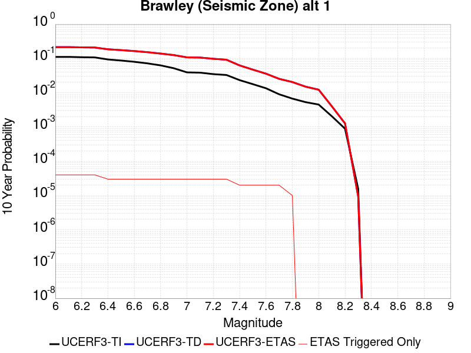 |

| Magnitude | 1 wk TI Prob | 1 wk TD Prob | 1 wk ETAS Prob | 1 wk ETAS/TD Gain | 1 wk ETAS Triggered Only | 1 mo TI Prob | 1 mo TD Prob | 1 mo ETAS Prob | 1 mo ETAS/TD Gain | 1 mo ETAS Triggered Only | 1 yr TI Prob | 1 yr TD Prob | 1 yr ETAS Prob | 1 yr ETAS/TD Gain | 1 yr ETAS Triggered Only | 10 yr TI Prob | 10 yr TD Prob | 10 yr ETAS Prob | 10 yr ETAS/TD Gain | 10 yr ETAS Triggered Only |
|-----|-----|-----|-----|-----|-----|-----|-----|-----|-----|-----|-----|-----|-----|-----|-----|-----|-----|-----|-----|-----|
| 6.0 | 2.2521618E-4 | 4.7667572E-4 | 4.7667572E-4 | 1.0 | 0.0 | 9.6485513E-4 | 0.0020413336 | 0.0020413336 | 1.0 | 0.0 | 0.011683988 | 0.024564065 | 0.024692768 | 1.0052395 | 1.3194353E-4 | 0.11088423 | 0.21362062 | 0.21372437 | 1.0004857 | 1.3194353E-4 |
| 6.1 | 2.2521618E-4 | 4.7667572E-4 | 4.7667572E-4 | 1.0 | 0.0 | 9.6485513E-4 | 0.0020413336 | 0.0020413336 | 1.0 | 0.0 | 0.011683988 | 0.024564065 | 0.024692768 | 1.0052395 | 1.3194353E-4 | 0.11088423 | 0.21362062 | 0.21372437 | 1.0004857 | 1.3194353E-4 |
| 6.2 | 2.198148E-4 | 4.6751375E-4 | 4.6751375E-4 | 1.0 | 0.0 | 9.417233E-4 | 0.0020021286 | 0.0020021286 | 1.0 | 0.0 | 0.011405343 | 0.024097936 | 0.024226699 | 1.0053433 | 1.3194353E-4 | 0.10837428 | 0.2100555 | 0.21015972 | 1.0004961 | 1.3194353E-4 |
| 6.3 | 2.1704129E-4 | 4.6186932E-4 | 4.6186932E-4 | 1.0 | 0.0 | 9.298453E-4 | 0.001977975 | 0.001977975 | 1.0 | 0.0 | 0.011262234 | 0.023811033 | 0.023939835 | 1.0054094 | 1.3194353E-4 | 0.107082725 | 0.20794643 | 0.20805094 | 1.0005026 | 1.3194353E-4 |
| 6.4 | 1.876142E-4 | 4.007805E-4 | 4.007805E-4 | 1.0 | 0.0 | 8.038131E-4 | 0.0017165145 | 0.0017165145 | 1.0 | 0.0 | 0.00974259 | 0.020697333 | 0.020826546 | 1.006243 | 1.3194353E-4 | 0.093263686 | 0.18469763 | 0.1848052 | 1.0005825 | 1.3194353E-4 |
| 6.5 | 1.7390939E-4 | 3.750906E-4 | 3.750906E-4 | 1.0 | 0.0 | 7.45113E-4 | 0.001606553 | 0.001606553 | 1.0 | 0.0 | 0.009034078 | 0.019385088 | 0.019514475 | 1.0066745 | 1.3194353E-4 | 0.086755216 | 0.17451778 | 0.1746267 | 1.0006241 | 1.3194353E-4 |
| 6.6 | 1.591791E-4 | 3.4922338E-4 | 3.4922338E-4 | 1.0 | 0.0 | 6.8201777E-4 | 0.0014958231 | 0.0014958231 | 1.0 | 0.0 | 0.008271996 | 0.018061135 | 0.018190695 | 1.0071734 | 1.3194353E-4 | 0.07970774 | 0.16392244 | 0.16403277 | 1.0006729 | 1.3194353E-4 |
| 6.7 | 1.4268003E-4 | 3.208674E-4 | 3.208674E-4 | 1.0 | 0.0 | 6.1134255E-4 | 0.0013744296 | 0.0013744296 | 1.0 | 0.0 | 0.007417723 | 0.016607253 | 0.016737005 | 1.007813 | 1.3194353E-4 | 0.07174956 | 0.1520427 | 0.1521546 | 1.0007359 | 1.3194353E-4 |
| 6.8 | 1.239713E-4 | 2.9077847E-4 | 2.9077847E-4 | 1.0 | 0.0 | 5.3119735E-4 | 0.0012456045 | 0.0012456045 | 1.0 | 0.0 | 0.0064481674 | 0.0150612155 | 0.015191172 | 1.0086285 | 1.3194353E-4 | 0.06264243 | 0.13847366 | 0.13858733 | 1.0008209 | 1.3194353E-4 |
| 6.9 | 1.0180238E-4 | 2.6273142E-4 | 2.6273142E-4 | 1.0 | 0.0 | 4.3622297E-4 | 0.0011255102 | 0.0011255102 | 1.0 | 0.0 | 0.005298089 | 0.013617991 | 0.013748137 | 1.009557 | 1.3194353E-4 | 0.05173543 | 0.1250377 | 0.12515315 | 1.0009233 | 1.3194353E-4 |
| 7.0 | 7.6619996E-5 | 2.2413618E-4 | 2.2413618E-4 | 1.0 | 0.0 | 3.283301E-4 | 9.602332E-4 | 9.602332E-4 | 1.0 | 0.0 | 0.0039900932 | 0.011628882 | 0.011759291 | 1.0112143 | 1.3194353E-4 | 0.039192066 | 0.10732558 | 0.10744337 | 1.0010974 | 1.3194353E-4 |
| 7.1 | 7.5127435E-5 | 2.20966E-4 | 2.20966E-4 | 1.0 | 0.0 | 3.2193496E-4 | 9.466566E-4 | 9.466566E-4 | 1.0 | 0.0 | 0.0039125155 | 0.011465338 | 0.011595769 | 1.0113761 | 1.3194353E-4 | 0.038443442 | 0.105888925 | 0.1060069 | 1.0011141 | 1.3194353E-4 |
| 7.2 | 6.788582E-5 | 2.022384E-4 | 2.022384E-4 | 1.0 | 0.0 | 2.9090676E-4 | 8.664511E-4 | 8.664511E-4 | 1.0 | 0.0 | 0.0035360386 | 0.010498658 | 0.010629216 | 1.0124357 | 1.3194353E-4 | 0.034803 | 0.09755801 | 0.09767708 | 1.0012205 | 1.3194353E-4 |
| 7.3 | 6.399602E-5 | 1.8854217E-4 | 1.8854217E-4 | 1.0 | 0.0 | 2.7423984E-4 | 8.0779055E-4 | 8.0779055E-4 | 1.0 | 0.0 | 0.0033337586 | 0.009791091 | 0.009921743 | 1.0133439 | 1.3194353E-4 | 0.03284188 | 0.09145105 | 0.09157092 | 1.0013108 | 1.3194353E-4 |
| 7.4 | 4.506759E-5 | 1.253954E-4 | 1.253954E-4 | 1.0 | 0.0 | 1.9313251E-4 | 5.37299E-4 | 5.37299E-4 | 1.0 | 0.0 | 0.0023488526 | 0.0065221693 | 0.006587711 | 1.010049 | 6.597176E-5 | 0.023241805 | 0.062409032 | 0.062470887 | 1.0009911 | 6.597176E-5 |
| 7.5 | 3.43289E-5 | 9.344148E-5 | 9.344148E-5 | 1.0 | 0.0 | 1.4711556E-4 | 4.0040232E-4 | 4.0040232E-4 | 1.0 | 0.0 | 0.0017896603 | 0.004864064 | 0.004929715 | 1.0134971 | 6.597176E-5 | 0.01775316 | 0.047094297 | 0.04715716 | 1.0013349 | 6.597176E-5 |
| 7.6 | 2.5980507E-5 | 7.0607166E-5 | 7.0607166E-5 | 1.0 | 0.0 | 1.1134028E-4 | 3.0256718E-4 | 3.0256718E-4 | 1.0 | 0.0 | 0.001354725 | 0.0036775572 | 0.0037432865 | 1.017873 | 6.597176E-5 | 0.013464959 | 0.0358753 | 0.035938907 | 1.001773 | 6.597176E-5 |
| 7.7 | 1.7292105E-5 | 4.9472306E-5 | 4.9472306E-5 | 1.0 | 0.0 | 7.4106916E-5 | 2.1200697E-4 | 2.1200697E-4 | 1.0 | 0.0 | 9.018782E-4 | 0.002578135 | 0.0026439368 | 1.025523 | 6.597176E-5 | 0.008982267 | 0.02531998 | 0.02538428 | 1.0025395 | 6.597176E-5 |
| 7.8 | 1.2927471E-5 | 3.974989E-5 | 3.974989E-5 | 1.0 | 0.0 | 5.5402274E-5 | 1.7034556E-4 | 1.7034556E-4 | 1.0 | 0.0 | 6.743139E-4 | 0.0020719871 | 0.0020719871 | 1.0 | 0.0 | 0.0067227143 | 0.020457525 | 0.020457525 | 1.0 | 0.0 |
| 7.9 | 1.0200774E-5 | 2.8791523E-5 | 2.8791523E-5 | 1.0 | 0.0 | 4.371687E-5 | 1.233864E-4 | 1.233864E-4 | 1.0 | 0.0 | 5.321229E-4 | 0.0015011955 | 0.0015011955 | 1.0 | 0.0 | 0.005308505 | 0.015012851 | 0.015012851 | 1.0 | 0.0 |
| 8.0 | 8.650396E-6 | 2.3316703E-5 | 2.3316703E-5 | 1.0 | 0.0 | 3.70726E-5 | 9.992491E-5 | 9.992491E-5 | 1.0 | 0.0 | 4.5126543E-4 | 0.0012159076 | 0.0012159076 | 1.0 | 0.0 | 0.0045035016 | 0.0122294305 | 0.0122294305 | 1.0 | 0.0 |
| 8.1 | 3.9368224E-6 | 7.3449833E-6 | 7.3449833E-6 | 1.0 | 0.0 | 1.6871985E-5 | 3.147812E-5 | 3.147812E-5 | 1.0 | 0.0 | 2.0539707E-4 | 3.8317885E-4 | 3.8317885E-4 | 1.0 | 0.0 | 0.0020520731 | 0.0040096184 | 0.0040096184 | 1.0 | 0.0 |
| 8.2 | 1.7101195E-6 | 2.2245397E-6 | 2.2245397E-6 | 1.0 | 0.0 | 7.329063E-6 | 9.533706E-6 | 9.533706E-6 | 1.0 | 0.0 | 8.922769E-5 | 1.1606672E-4 | 1.1606672E-4 | 1.0 | 0.0 | 8.9191867E-4 | 0.0012700944 | 0.0012700944 | 1.0 | 0.0 |
| 8.3 | 3.0346666E-8 | 1.7284824E-8 | 1.7284824E-8 | 1.0 | 0.0 | 1.3005713E-7 | 7.407782E-8 | 7.407782E-8 | 1.0 | 0.0 | 1.5834444E-6 | 9.018973E-7 | 9.018973E-7 | 1.0 | 0.0 | 1.5834332E-5 | 9.40451E-6 | 9.40451E-6 | 1.0 | 0.0 |

## Ludlow
*[(top)](#table-of-contents)*

| 1 Week | 1 Month | 1 Year | 10 Year |
|-----|-----|-----|-----|
|  |  |  |  |

| Magnitude | 1 wk TI Prob | 1 wk TD Prob | 1 wk ETAS Prob | 1 wk ETAS/TD Gain | 1 wk ETAS Triggered Only | 1 mo TI Prob | 1 mo TD Prob | 1 mo ETAS Prob | 1 mo ETAS/TD Gain | 1 mo ETAS Triggered Only | 1 yr TI Prob | 1 yr TD Prob | 1 yr ETAS Prob | 1 yr ETAS/TD Gain | 1 yr ETAS Triggered Only | 10 yr TI Prob | 10 yr TD Prob | 10 yr ETAS Prob | 10 yr ETAS/TD Gain | 10 yr ETAS Triggered Only |
|-----|-----|-----|-----|-----|-----|-----|-----|-----|-----|-----|-----|-----|-----|-----|-----|-----|-----|-----|-----|-----|
| 6.0 | 2.2407607E-5 | 2.3657954E-5 | 2.3657954E-5 | 1.0 | 0.0 | 9.602906E-5 | 1.0138754E-4 | 1.0138754E-4 | 1.0 | 0.0 | 0.0011685267 | 0.0012337384 | 0.0012337384 | 1.0 | 0.0 | 0.011624013 | 0.012273403 | 0.0124037275 | 1.0106184 | 1.3194353E-4 |
| 6.1 | 2.2407607E-5 | 2.3657954E-5 | 2.3657954E-5 | 1.0 | 0.0 | 9.602906E-5 | 1.0138754E-4 | 1.0138754E-4 | 1.0 | 0.0 | 0.0011685267 | 0.0012337384 | 0.0012337384 | 1.0 | 0.0 | 0.011624013 | 0.012273403 | 0.0124037275 | 1.0106184 | 1.3194353E-4 |
| 6.2 | 1.0781252E-5 | 1.1365991E-5 | 1.1365991E-5 | 1.0 | 0.0 | 4.620455E-5 | 4.8710503E-5 | 4.8710503E-5 | 1.0 | 0.0 | 5.623952E-4 | 5.92893E-4 | 5.92893E-4 | 1.0 | 0.0 | 0.00560974 | 0.005913531 | 0.006044694 | 1.0221802 | 1.3194353E-4 |
| 6.3 | 1.0781252E-5 | 1.1365991E-5 | 1.1365991E-5 | 1.0 | 0.0 | 4.620455E-5 | 4.8710503E-5 | 4.8710503E-5 | 1.0 | 0.0 | 5.623952E-4 | 5.92893E-4 | 5.92893E-4 | 1.0 | 0.0 | 0.00560974 | 0.005913531 | 0.006044694 | 1.0221802 | 1.3194353E-4 |
| 6.4 | 7.814439E-6 | 8.237966E-6 | 8.237966E-6 | 1.0 | 0.0 | 3.3490025E-5 | 3.5305096E-5 | 3.5305096E-5 | 1.0 | 0.0 | 4.0766477E-4 | 4.2975618E-4 | 4.2975618E-4 | 1.0 | 0.0 | 0.0040691774 | 0.0042893975 | 0.0043550865 | 1.0153142 | 6.597176E-5 |
| 6.5 | 6.4986366E-6 | 6.8511167E-6 | 6.8511167E-6 | 1.0 | 0.0 | 2.7851002E-5 | 2.9361603E-5 | 2.9361603E-5 | 1.0 | 0.0 | 3.390332E-4 | 3.574198E-4 | 3.574198E-4 | 1.0 | 0.0 | 0.003385164 | 0.003568546 | 0.0036342822 | 1.018421 | 6.597176E-5 |
| 6.6 | 5.582177E-6 | 5.8861756E-6 | 5.8861756E-6 | 1.0 | 0.0 | 2.3923398E-5 | 2.5226227E-5 | 2.5226227E-5 | 1.0 | 0.0 | 2.9122844E-4 | 3.0708674E-4 | 3.0708674E-4 | 1.0 | 0.0 | 0.0029084706 | 0.0030666974 | 0.0031324667 | 1.0214463 | 6.597176E-5 |
| 6.7 | 4.6858763E-6 | 4.94057E-6 | 4.94057E-6 | 1.0 | 0.0 | 2.0082172E-5 | 2.1173702E-5 | 2.1173702E-5 | 1.0 | 0.0 | 2.4447302E-4 | 2.5775988E-4 | 2.5775988E-4 | 1.0 | 0.0 | 0.0024420423 | 0.0025746655 | 0.0026404674 | 1.0255575 | 6.597176E-5 |
| 6.8 | 3.5584908E-6 | 3.7521265E-6 | 3.7521265E-6 | 1.0 | 0.0 | 1.5250586E-5 | 1.6080447E-5 | 1.6080447E-5 | 1.0 | 0.0 | 1.8566006E-4 | 1.9576224E-4 | 1.9576224E-4 | 1.0 | 0.0 | 0.0018550502 | 0.0019559392 | 0.0020217819 | 1.0336629 | 6.597176E-5 |
| 6.9 | 2.532834E-6 | 2.6710807E-6 | 2.6710807E-6 | 1.0 | 0.0 | 1.0854958E-5 | 1.1447441E-5 | 1.1447441E-5 | 1.0 | 0.0 | 1.3215111E-4 | 1.3936395E-4 | 1.3936395E-4 | 1.0 | 0.0 | 0.0013207254 | 0.0013927931 | 0.0013927931 | 1.0 | 0.0 |
| 7.0 | 1.7083285E-6 | 1.8019963E-6 | 1.8019963E-6 | 1.0 | 0.0 | 7.3213873E-6 | 7.722819E-6 | 7.722819E-6 | 1.0 | 0.0 | 8.913424E-5 | 9.402143E-5 | 9.402143E-5 | 1.0 | 0.0 | 8.9098496E-4 | 9.3983306E-4 | 9.3983306E-4 | 1.0 | 0.0 |
| 7.1 | 1.0905424E-6 | 1.1497951E-6 | 1.1497951E-6 | 1.0 | 0.0 | 4.6737446E-6 | 4.9276846E-6 | 4.9276846E-6 | 1.0 | 0.0 | 5.6901354E-5 | 5.9993006E-5 | 5.9993006E-5 | 1.0 | 0.0 | 5.6886784E-4 | 5.997779E-4 | 5.997779E-4 | 1.0 | 0.0 |
| 7.2 | 6.06668E-7 | 6.387457E-7 | 6.387457E-7 | 1.0 | 0.0 | 2.600003E-6 | 2.737479E-6 | 2.737479E-6 | 1.0 | 0.0 | 3.1654577E-5 | 3.3328364E-5 | 3.3328364E-5 | 1.0 | 0.0 | 3.1650066E-4 | 3.3324052E-4 | 3.3324052E-4 | 1.0 | 0.0 |

## Monte Vista - Shannon 2011 CFM
*[(top)](#table-of-contents)*

| 1 Week | 1 Month | 1 Year | 10 Year |
|-----|-----|-----|-----|
|  |  |  | 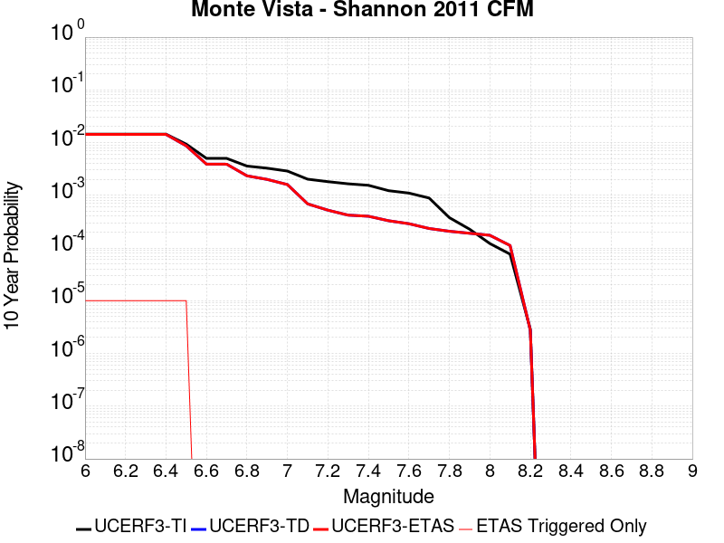 |

| Magnitude | 1 wk TI Prob | 1 wk TD Prob | 1 wk ETAS Prob | 1 wk ETAS/TD Gain | 1 wk ETAS Triggered Only | 1 mo TI Prob | 1 mo TD Prob | 1 mo ETAS Prob | 1 mo ETAS/TD Gain | 1 mo ETAS Triggered Only | 1 yr TI Prob | 1 yr TD Prob | 1 yr ETAS Prob | 1 yr ETAS/TD Gain | 1 yr ETAS Triggered Only | 10 yr TI Prob | 10 yr TD Prob | 10 yr ETAS Prob | 10 yr ETAS/TD Gain | 10 yr ETAS Triggered Only |
|-----|-----|-----|-----|-----|-----|-----|-----|-----|-----|-----|-----|-----|-----|-----|-----|-----|-----|-----|-----|-----|
| 6.0 | 2.7907707E-5 | 2.75877E-5 | 2.75877E-5 | 1.0 | 0.0 | 1.19598975E-4 | 1.1822833E-4 | 1.1822833E-4 | 1.0 | 0.0 | 0.0014551448 | 0.0014386033 | 0.0014386033 | 1.0 | 0.0 | 0.014456532 | 0.014322008 | 0.014387035 | 1.0045403 | 6.597176E-5 |
| 6.1 | 2.7907707E-5 | 2.75877E-5 | 2.75877E-5 | 1.0 | 0.0 | 1.19598975E-4 | 1.1822833E-4 | 1.1822833E-4 | 1.0 | 0.0 | 0.0014551448 | 0.0014386033 | 0.0014386033 | 1.0 | 0.0 | 0.014456532 | 0.014322008 | 0.014387035 | 1.0045403 | 6.597176E-5 |
| 6.2 | 2.7907707E-5 | 2.75877E-5 | 2.75877E-5 | 1.0 | 0.0 | 1.19598975E-4 | 1.1822833E-4 | 1.1822833E-4 | 1.0 | 0.0 | 0.0014551448 | 0.0014386033 | 0.0014386033 | 1.0 | 0.0 | 0.014456532 | 0.014322008 | 0.014387035 | 1.0045403 | 6.597176E-5 |
| 6.3 | 2.7907707E-5 | 2.75877E-5 | 2.75877E-5 | 1.0 | 0.0 | 1.19598975E-4 | 1.1822833E-4 | 1.1822833E-4 | 1.0 | 0.0 | 0.0014551448 | 0.0014386033 | 0.0014386033 | 1.0 | 0.0 | 0.014456532 | 0.014322008 | 0.014387035 | 1.0045403 | 6.597176E-5 |
| 6.4 | 2.7907707E-5 | 2.75877E-5 | 2.75877E-5 | 1.0 | 0.0 | 1.19598975E-4 | 1.1822833E-4 | 1.1822833E-4 | 1.0 | 0.0 | 0.0014551448 | 0.0014386033 | 0.0014386033 | 1.0 | 0.0 | 0.014456532 | 0.014322008 | 0.014387035 | 1.0045403 | 6.597176E-5 |
| 6.5 | 1.7990213E-5 | 1.6642773E-5 | 1.6642773E-5 | 1.0 | 0.0 | 7.709863E-5 | 7.132459E-5 | 7.132459E-5 | 1.0 | 0.0 | 9.382716E-4 | 8.680973E-4 | 8.680973E-4 | 1.0 | 0.0 | 0.0093431985 | 0.008670452 | 0.008735852 | 1.0075428 | 6.597176E-5 |
| 6.6 | 9.650407E-6 | 7.4595387E-6 | 7.4595387E-6 | 1.0 | 0.0 | 4.135823E-5 | 3.1969106E-5 | 3.1969106E-5 | 1.0 | 0.0 | 5.0342013E-4 | 3.8916216E-4 | 3.8916216E-4 | 1.0 | 0.0 | 0.005022812 | 0.0039025035 | 0.0039025035 | 1.0 | 0.0 |
| 6.7 | 9.62828E-6 | 7.4374507E-6 | 7.4374507E-6 | 1.0 | 0.0 | 4.1263404E-5 | 3.1874442E-5 | 3.1874442E-5 | 1.0 | 0.0 | 5.022661E-4 | 3.8801008E-4 | 3.8801008E-4 | 1.0 | 0.0 | 0.0050113243 | 0.003891023 | 0.003891023 | 1.0 | 0.0 |
| 6.8 | 6.887523E-6 | 4.463821E-6 | 4.463821E-6 | 1.0 | 0.0 | 2.9517621E-5 | 1.9130533E-5 | 1.9130533E-5 | 1.0 | 0.0 | 3.5931775E-4 | 2.3289157E-4 | 2.3289157E-4 | 1.0 | 0.0 | 0.0035873733 | 0.0023436449 | 0.0023436449 | 1.0 | 0.0 |
| 6.9 | 6.2722347E-6 | 3.805659E-6 | 3.805659E-6 | 1.0 | 0.0 | 2.6880729E-5 | 1.6309876E-5 | 1.6309876E-5 | 1.0 | 0.0 | 3.2722374E-4 | 1.9855668E-4 | 1.9855668E-4 | 1.0 | 0.0 | 0.003267423 | 0.0020009486 | 0.0020009486 | 1.0 | 0.0 |
| 7.0 | 5.5320347E-6 | 3.0327608E-6 | 3.0327608E-6 | 1.0 | 0.0 | 2.3708504E-5 | 1.29974915E-5 | 1.29974915E-5 | 1.0 | 0.0 | 2.8861282E-4 | 1.582348E-4 | 1.582348E-4 | 1.0 | 0.0 | 0.0028823826 | 0.0015983633 | 0.0015983633 | 1.0 | 0.0 |
| 7.1 | 3.8794055E-6 | 1.285852E-6 | 1.285852E-6 | 1.0 | 0.0 | 1.6625918E-5 | 5.510783E-6 | 5.510783E-6 | 1.0 | 0.0 | 2.0240174E-4 | 6.709173E-5 | 6.709173E-5 | 1.0 | 0.0 | 0.002022175 | 6.876822E-4 | 6.876822E-4 | 1.0 | 0.0 |
| 7.2 | 3.4813652E-6 | 9.690727E-7 | 9.690727E-7 | 1.0 | 0.0 | 1.49200505E-5 | 4.153162E-6 | 4.153162E-6 | 1.0 | 0.0 | 1.8163648E-4 | 5.0563587E-5 | 5.0563587E-5 | 1.0 | 0.0 | 0.0018148809 | 5.22476E-4 | 5.22476E-4 | 1.0 | 0.0 |
| 7.3 | 3.1682148E-6 | 7.7381594E-7 | 7.7381594E-7 | 1.0 | 0.0 | 1.3577992E-5 | 3.3163496E-6 | 3.3163496E-6 | 1.0 | 0.0 | 1.6529951E-4 | 4.0375813E-5 | 4.0375813E-5 | 1.0 | 0.0 | 0.0016517661 | 4.2061496E-4 | 4.2061496E-4 | 1.0 | 0.0 |
| 7.4 | 2.9707667E-6 | 7.3642167E-7 | 7.3642167E-7 | 1.0 | 0.0 | 1.2731795E-5 | 3.1560892E-6 | 3.1560892E-6 | 1.0 | 0.0 | 1.5499859E-4 | 3.842471E-5 | 3.842471E-5 | 1.0 | 0.0 | 0.0015489052 | 4.0090227E-4 | 4.0090227E-4 | 1.0 | 0.0 |
| 7.5 | 2.3462758E-6 | 6.023677E-7 | 6.023677E-7 | 1.0 | 0.0 | 1.0055429E-5 | 2.5815734E-6 | 2.5815734E-6 | 1.0 | 0.0 | 1.2241797E-4 | 3.1430205E-5 | 3.1430205E-5 | 1.0 | 0.0 | 0.0012235056 | 3.2923152E-4 | 3.2923152E-4 | 1.0 | 0.0 |
| 7.6 | 2.112783E-6 | 5.266409E-7 | 5.266409E-7 | 1.0 | 0.0 | 9.054753E-6 | 2.2570305E-6 | 2.2570305E-6 | 1.0 | 0.0 | 1.1023604E-4 | 2.7479E-5 | 2.7479E-5 | 1.0 | 0.0 | 0.0011018137 | 2.8929894E-4 | 2.8929894E-4 | 1.0 | 0.0 |
| 7.7 | 1.7022471E-6 | 4.2444987E-7 | 4.2444987E-7 | 1.0 | 0.0 | 7.2953244E-6 | 1.8190696E-6 | 1.8190696E-6 | 1.0 | 0.0 | 8.881695E-5 | 2.2146949E-5 | 2.2146949E-5 | 1.0 | 0.0 | 8.878146E-4 | 2.3466849E-4 | 2.3466849E-4 | 1.0 | 0.0 |
| 7.8 | 7.230914E-7 | 3.7402418E-7 | 3.7402418E-7 | 1.0 | 0.0 | 3.0989595E-6 | 1.6029599E-6 | 1.6029599E-6 | 1.0 | 0.0 | 3.772918E-5 | 1.9515863E-5 | 1.9515863E-5 | 1.0 | 0.0 | 3.7722773E-4 | 2.0788297E-4 | 2.0788297E-4 | 1.0 | 0.0 |
| 7.9 | 4.3588446E-7 | 3.4407202E-7 | 3.4407202E-7 | 1.0 | 0.0 | 1.868075E-6 | 1.4745935E-6 | 1.4745935E-6 | 1.0 | 0.0 | 2.2743576E-5 | 1.795303E-5 | 1.795303E-5 | 1.0 | 0.0 | 2.2741247E-4 | 1.9048195E-4 | 1.9048195E-4 | 1.0 | 0.0 |
| 8.0 | 2.3317523E-7 | 3.1602372E-7 | 3.1602372E-7 | 1.0 | 0.0 | 9.99322E-7 | 1.3543867E-6 | 1.3543867E-6 | 1.0 | 0.0 | 1.2166677E-5 | 1.6489534E-5 | 1.6489534E-5 | 1.0 | 0.0 | 1.21660116E-4 | 1.7445331E-4 | 1.7445331E-4 | 1.0 | 0.0 |
| 8.1 | 1.4662456E-7 | 2.0360646E-7 | 2.0360646E-7 | 1.0 | 0.0 | 6.283908E-7 | 8.725988E-7 | 8.725988E-7 | 1.0 | 0.0 | 7.650631E-6 | 1.0623839E-5 | 1.0623839E-5 | 1.0 | 0.0 | 7.650368E-5 | 1.1159559E-4 | 1.1159559E-4 | 1.0 | 0.0 |
| 8.2 | 5.4931775E-9 | 5.089579E-9 | 5.089579E-9 | 1.0 | 0.0 | 2.3542189E-8 | 2.181248E-8 | 2.181248E-8 | 1.0 | 0.0 | 2.8662612E-7 | 2.6556694E-7 | 2.6556694E-7 | 1.0 | 0.0 | 2.8662573E-6 | 2.7612602E-6 | 2.7612602E-6 | 1.0 | 0.0 |

## San Andreas (North Coast) 2011 CFM
*[(top)](#table-of-contents)*

| 1 Week | 1 Month | 1 Year | 10 Year |
|-----|-----|-----|-----|
|  |  |  |  |

| Magnitude | 1 wk TI Prob | 1 wk TD Prob | 1 wk ETAS Prob | 1 wk ETAS/TD Gain | 1 wk ETAS Triggered Only | 1 mo TI Prob | 1 mo TD Prob | 1 mo ETAS Prob | 1 mo ETAS/TD Gain | 1 mo ETAS Triggered Only | 1 yr TI Prob | 1 yr TD Prob | 1 yr ETAS Prob | 1 yr ETAS/TD Gain | 1 yr ETAS Triggered Only | 10 yr TI Prob | 10 yr TD Prob | 10 yr ETAS Prob | 10 yr ETAS/TD Gain | 10 yr ETAS Triggered Only |
|-----|-----|-----|-----|-----|-----|-----|-----|-----|-----|-----|-----|-----|-----|-----|-----|-----|-----|-----|-----|-----|
| 6.0 | 1.5333705E-4 | 7.1250375E-5 | 7.1250375E-5 | 1.0 | 0.0 | 6.5699324E-4 | 3.053232E-4 | 3.053232E-4 | 1.0 | 0.0 | 0.007969595 | 0.0037110075 | 0.0037110075 | 1.0 | 0.0 | 0.0768977 | 0.039427705 | 0.039491076 | 1.0016073 | 6.597176E-5 |
| 6.1 | 1.5333705E-4 | 7.1250375E-5 | 7.1250375E-5 | 1.0 | 0.0 | 6.5699324E-4 | 3.053232E-4 | 3.053232E-4 | 1.0 | 0.0 | 0.007969595 | 0.0037110075 | 0.0037110075 | 1.0 | 0.0 | 0.0768977 | 0.039427705 | 0.039491076 | 1.0016073 | 6.597176E-5 |
| 6.2 | 1.3912938E-4 | 6.062947E-5 | 6.062947E-5 | 1.0 | 0.0 | 5.961325E-4 | 2.5981484E-4 | 2.5981484E-4 | 1.0 | 0.0 | 0.007233787 | 0.0031586846 | 0.0031586846 | 1.0 | 0.0 | 0.07002798 | 0.033759642 | 0.033823386 | 1.0018882 | 6.597176E-5 |
| 6.3 | 1.3912938E-4 | 6.062947E-5 | 6.062947E-5 | 1.0 | 0.0 | 5.961325E-4 | 2.5981484E-4 | 2.5981484E-4 | 1.0 | 0.0 | 0.007233787 | 0.0031586846 | 0.0031586846 | 1.0 | 0.0 | 0.07002798 | 0.033759642 | 0.033823386 | 1.0018882 | 6.597176E-5 |
| 6.4 | 1.2623647E-4 | 5.0554227E-5 | 5.0554227E-5 | 1.0 | 0.0 | 5.4090127E-4 | 2.166431E-4 | 2.166431E-4 | 1.0 | 0.0 | 0.0065656058 | 0.0026344592 | 0.0026344592 | 1.0 | 0.0 | 0.06374981 | 0.028363641 | 0.028427742 | 1.00226 | 6.597176E-5 |
| 6.5 | 1.1736096E-4 | 4.3625514E-5 | 4.3625514E-5 | 1.0 | 0.0 | 5.028786E-4 | 1.8695318E-4 | 1.8695318E-4 | 1.0 | 0.0 | 0.006105373 | 0.0022737952 | 0.0022737952 | 1.0 | 0.0 | 0.05940335 | 0.024634827 | 0.024699174 | 1.002612 | 6.597176E-5 |
| 6.6 | 1.1586959E-4 | 4.252367E-5 | 4.252367E-5 | 1.0 | 0.0 | 4.964894E-4 | 1.8223166E-4 | 1.8223166E-4 | 1.0 | 0.0 | 0.006028018 | 0.002216429 | 0.002216429 | 1.0 | 0.0 | 0.058671024 | 0.02403969 | 0.024104076 | 1.0026783 | 6.597176E-5 |
| 6.7 | 1.13693764E-4 | 4.0833464E-5 | 4.0833464E-5 | 1.0 | 0.0 | 4.87168E-4 | 1.749889E-4 | 1.749889E-4 | 1.0 | 0.0 | 0.005915152 | 0.0021284241 | 0.0021284241 | 1.0 | 0.0 | 0.057601593 | 0.023129925 | 0.02319437 | 1.0027863 | 6.597176E-5 |
| 6.8 | 1.1204889E-4 | 4.0049228E-5 | 4.0049228E-5 | 1.0 | 0.0 | 4.8012115E-4 | 1.7162834E-4 | 1.7162834E-4 | 1.0 | 0.0 | 0.005829819 | 0.0020875887 | 0.0020875887 | 1.0 | 0.0 | 0.05679232 | 0.022689283 | 0.022753758 | 1.0028416 | 6.597176E-5 |
| 6.9 | 1.1005794E-4 | 3.9103095E-5 | 3.9103095E-5 | 1.0 | 0.0 | 4.7159163E-4 | 1.6757402E-4 | 1.6757402E-4 | 1.0 | 0.0 | 0.0057265228 | 0.0020383205 | 0.0020383205 | 1.0 | 0.0 | 0.055811852 | 0.022154024 | 0.022218533 | 1.0029119 | 6.597176E-5 |
| 7.0 | 1.0647948E-4 | 3.7253933E-5 | 3.7253933E-5 | 1.0 | 0.0 | 4.562608E-4 | 1.5965004E-4 | 1.5965004E-4 | 1.0 | 0.0 | 0.0055408357 | 0.0019420219 | 0.0019420219 | 1.0 | 0.0 | 0.054047033 | 0.021110756 | 0.021175334 | 1.003059 | 6.597176E-5 |
| 7.1 | 1.04795035E-4 | 3.630107E-5 | 3.630107E-5 | 1.0 | 0.0 | 4.4904428E-4 | 1.5556683E-4 | 1.5556683E-4 | 1.0 | 0.0 | 0.0054534175 | 0.0018923962 | 0.0018923962 | 1.0 | 0.0 | 0.053215165 | 0.020577554 | 0.020642167 | 1.0031401 | 6.597176E-5 |
| 7.2 | 1.02724036E-4 | 3.5206915E-5 | 3.5206915E-5 | 1.0 | 0.0 | 4.401716E-4 | 1.5087813E-4 | 1.5087813E-4 | 1.0 | 0.0 | 0.0053459285 | 0.001835409 | 0.001835409 | 1.0 | 0.0 | 0.052191395 | 0.019965103 | 0.020029759 | 1.0032384 | 6.597176E-5 |
| 7.3 | 1.00650694E-4 | 3.4672295E-5 | 3.4672295E-5 | 1.0 | 0.0 | 4.312888E-4 | 1.4858718E-4 | 1.4858718E-4 | 1.0 | 0.0 | 0.005238306 | 0.0018075631 | 0.0018075631 | 1.0 | 0.0 | 0.051165357 | 0.019641154 | 0.019705828 | 1.0032929 | 6.597176E-5 |
| 7.4 | 9.672919E-5 | 3.345712E-5 | 3.345712E-5 | 1.0 | 0.0 | 4.144878E-4 | 1.4337986E-4 | 1.4337986E-4 | 1.0 | 0.0 | 0.005034718 | 0.0017442673 | 0.0017442673 | 1.0 | 0.0 | 0.049221683 | 0.01891206 | 0.018976783 | 1.0034224 | 6.597176E-5 |
| 7.5 | 8.7600405E-5 | 2.2763736E-5 | 2.2763736E-5 | 1.0 | 0.0 | 3.753763E-4 | 9.7555225E-5 | 9.7555225E-5 | 1.0 | 0.0 | 0.0045606326 | 0.0011870895 | 0.0011870895 | 1.0 | 0.0 | 0.04468165 | 0.013166346 | 0.013231449 | 1.0049447 | 6.597176E-5 |
| 7.6 | 7.9562284E-5 | 1.9283596E-5 | 1.9283596E-5 | 1.0 | 0.0 | 3.4093665E-4 | 8.264137E-5 | 8.264137E-5 | 1.0 | 0.0 | 0.0041430052 | 0.0010056958 | 0.0010056958 | 1.0 | 0.0 | 0.040666126 | 0.011254854 | 0.011320083 | 1.0057956 | 6.597176E-5 |
| 7.7 | 6.3866544E-5 | 1.1986498E-5 | 1.1986498E-5 | 1.0 | 0.0 | 2.7368503E-4 | 5.1369694E-5 | 5.1369694E-5 | 1.0 | 0.0 | 0.0033270244 | 6.2524684E-4 | 6.2524684E-4 | 1.0 | 0.0 | 0.032776527 | 0.0072368314 | 0.0073023257 | 1.0090501 | 6.597176E-5 |
| 7.8 | 4.2543215E-5 | 9.112785E-6 | 9.112785E-6 | 1.0 | 0.0 | 1.8231533E-4 | 3.9054208E-5 | 3.9054208E-5 | 1.0 | 0.0 | 0.0022174292 | 4.7538136E-4 | 4.7538136E-4 | 1.0 | 0.0 | 0.021954332 | 0.005511731 | 0.0055773393 | 1.0119034 | 6.597176E-5 |
| 7.9 | 2.2636612E-5 | 7.844561E-6 | 7.844561E-6 | 1.0 | 0.0 | 9.7010445E-5 | 3.3619115E-5 | 3.3619115E-5 | 1.0 | 0.0 | 0.0011804621 | 4.0923594E-4 | 4.0923594E-4 | 1.0 | 0.0 | 0.011742111 | 0.004700338 | 0.004766 | 1.0139695 | 6.597176E-5 |
| 8.0 | 1.5167874E-5 | 7.07659E-6 | 7.07659E-6 | 1.0 | 0.0 | 6.500356E-5 | 3.032789E-5 | 3.032789E-5 | 1.0 | 0.0 | 7.9113094E-4 | 3.691796E-4 | 3.691796E-4 | 1.0 | 0.0 | 0.007883203 | 0.004230647 | 0.0042963396 | 1.0155278 | 6.597176E-5 |
| 8.1 | 1.0681047E-5 | 6.411601E-6 | 6.411601E-6 | 1.0 | 0.0 | 4.5775112E-5 | 2.7478001E-5 | 2.7478001E-5 | 1.0 | 0.0 | 5.5716943E-4 | 3.344934E-4 | 3.344934E-4 | 1.0 | 0.0 | 0.0055577457 | 0.0038309463 | 0.0038966653 | 1.0171548 | 6.597176E-5 |
| 8.2 | 8.226114E-6 | 5.13432E-6 | 5.13432E-6 | 1.0 | 0.0 | 3.52543E-5 | 2.2004044E-5 | 2.2004044E-5 | 1.0 | 0.0 | 4.2913653E-4 | 2.678664E-4 | 2.678664E-4 | 1.0 | 0.0 | 0.004283088 | 0.0030556484 | 0.0030556484 | 1.0 | 0.0 |
| 8.3 | 1.983087E-6 | 7.693574E-7 | 7.693574E-7 | 1.0 | 0.0 | 8.498917E-6 | 3.297242E-6 | 3.297242E-6 | 1.0 | 0.0 | 1.034694E-4 | 4.01432E-5 | 4.01432E-5 | 1.0 | 0.0 | 0.0010342124 | 4.7390026E-4 | 4.7390026E-4 | 1.0 | 0.0 |

## Red Pass
*[(top)](#table-of-contents)*

| 1 Week | 1 Month | 1 Year | 10 Year |
|-----|-----|-----|-----|
|  |  |  |  |

| Magnitude | 1 wk TI Prob | 1 wk TD Prob | 1 wk ETAS Prob | 1 wk ETAS/TD Gain | 1 wk ETAS Triggered Only | 1 mo TI Prob | 1 mo TD Prob | 1 mo ETAS Prob | 1 mo ETAS/TD Gain | 1 mo ETAS Triggered Only | 1 yr TI Prob | 1 yr TD Prob | 1 yr ETAS Prob | 1 yr ETAS/TD Gain | 1 yr ETAS Triggered Only | 10 yr TI Prob | 10 yr TD Prob | 10 yr ETAS Prob | 10 yr ETAS/TD Gain | 10 yr ETAS Triggered Only |
|-----|-----|-----|-----|-----|-----|-----|-----|-----|-----|-----|-----|-----|-----|-----|-----|-----|-----|-----|-----|-----|
| 6.0 | 8.258278E-6 | 8.551426E-6 | 8.551426E-6 | 1.0 | 0.0 | 3.539214E-5 | 3.6648555E-5 | 3.6648555E-5 | 1.0 | 0.0 | 4.308141E-4 | 4.4612266E-4 | 4.4612266E-4 | 1.0 | 0.0 | 0.0042997985 | 0.0044540283 | 0.0045197066 | 1.0147457 | 6.597176E-5 |
| 6.1 | 3.649988E-6 | 3.7753848E-6 | 3.7753848E-6 | 1.0 | 0.0 | 1.5642712E-5 | 1.6180147E-5 | 1.6180147E-5 | 1.0 | 0.0 | 1.9043336E-4 | 1.9698025E-4 | 1.9698025E-4 | 1.0 | 0.0 | 0.0019027026 | 0.0019685237 | 0.0020343657 | 1.0334474 | 6.597176E-5 |
| 6.2 | 3.649988E-6 | 3.7753848E-6 | 3.7753848E-6 | 1.0 | 0.0 | 1.5642712E-5 | 1.6180147E-5 | 1.6180147E-5 | 1.0 | 0.0 | 1.9043336E-4 | 1.9698025E-4 | 1.9698025E-4 | 1.0 | 0.0 | 0.0019027026 | 0.0019685237 | 0.0020343657 | 1.0334474 | 6.597176E-5 |
| 6.3 | 1.3924937E-6 | 1.4411434E-6 | 1.4411434E-6 | 1.0 | 0.0 | 5.9678164E-6 | 6.1763217E-6 | 6.1763217E-6 | 1.0 | 0.0 | 7.265574E-5 | 7.519554E-5 | 7.519554E-5 | 1.0 | 0.0 | 7.263199E-4 | 7.518397E-4 | 8.177619E-4 | 1.0876812 | 6.597176E-5 |
| 6.4 | 1.3924937E-6 | 1.4411434E-6 | 1.4411434E-6 | 1.0 | 0.0 | 5.9678164E-6 | 6.1763217E-6 | 6.1763217E-6 | 1.0 | 0.0 | 7.265574E-5 | 7.519554E-5 | 7.519554E-5 | 1.0 | 0.0 | 7.263199E-4 | 7.518397E-4 | 8.177619E-4 | 1.0876812 | 6.597176E-5 |
| 6.5 | 9.876812E-7 | 1.0222102E-6 | 1.0222102E-6 | 1.0 | 0.0 | 4.2329125E-6 | 4.3809005E-6 | 4.3809005E-6 | 1.0 | 0.0 | 5.153449E-5 | 5.3337466E-5 | 5.3337466E-5 | 1.0 | 0.0 | 5.1522546E-4 | 5.3337467E-4 | 5.3337467E-4 | 1.0 | 0.0 |

## Big Pine (East)
*[(top)](#table-of-contents)*

| 1 Week | 1 Month | 1 Year | 10 Year |
|-----|-----|-----|-----|
|  |  |  | 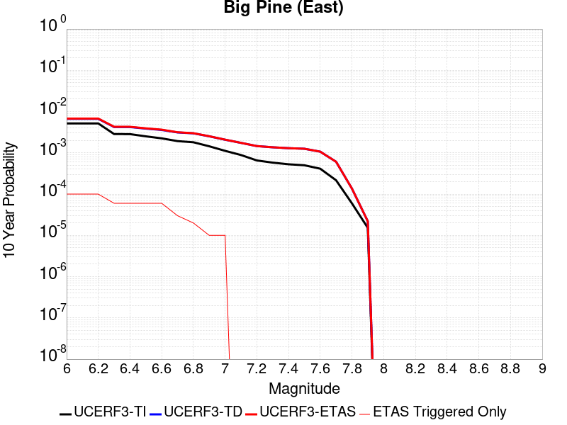 |

| Magnitude | 1 wk TI Prob | 1 wk TD Prob | 1 wk ETAS Prob | 1 wk ETAS/TD Gain | 1 wk ETAS Triggered Only | 1 mo TI Prob | 1 mo TD Prob | 1 mo ETAS Prob | 1 mo ETAS/TD Gain | 1 mo ETAS Triggered Only | 1 yr TI Prob | 1 yr TD Prob | 1 yr ETAS Prob | 1 yr ETAS/TD Gain | 1 yr ETAS Triggered Only | 10 yr TI Prob | 10 yr TD Prob | 10 yr ETAS Prob | 10 yr ETAS/TD Gain | 10 yr ETAS Triggered Only |
|-----|-----|-----|-----|-----|-----|-----|-----|-----|-----|-----|-----|-----|-----|-----|-----|-----|-----|-----|-----|-----|
| 6.0 | 9.916913E-6 | 1.282197E-5 | 1.282197E-5 | 1.0 | 0.0 | 4.250036E-5 | 5.495027E-5 | 5.495027E-5 | 1.0 | 0.0 | 5.173191E-4 | 6.6883623E-4 | 6.6883623E-4 | 1.0 | 0.0 | 0.0051611643 | 0.0066729826 | 0.006738514 | 1.0098205 | 6.597176E-5 |
| 6.1 | 9.916913E-6 | 1.282197E-5 | 1.282197E-5 | 1.0 | 0.0 | 4.250036E-5 | 5.495027E-5 | 5.495027E-5 | 1.0 | 0.0 | 5.173191E-4 | 6.6883623E-4 | 6.6883623E-4 | 1.0 | 0.0 | 0.0051611643 | 0.0066729826 | 0.006738514 | 1.0098205 | 6.597176E-5 |
| 6.2 | 9.916913E-6 | 1.282197E-5 | 1.282197E-5 | 1.0 | 0.0 | 4.250036E-5 | 5.495027E-5 | 5.495027E-5 | 1.0 | 0.0 | 5.173191E-4 | 6.6883623E-4 | 6.6883623E-4 | 1.0 | 0.0 | 0.0051611643 | 0.0066729826 | 0.006738514 | 1.0098205 | 6.597176E-5 |
| 6.3 | 5.479711E-6 | 8.117787E-6 | 8.117787E-6 | 1.0 | 0.0 | 2.3484265E-5 | 3.4790068E-5 | 3.4790068E-5 | 1.0 | 0.0 | 2.858834E-4 | 4.2348995E-4 | 4.2348995E-4 | 1.0 | 0.0 | 0.0028551589 | 0.004229713 | 0.004295406 | 1.0155313 | 6.597176E-5 |
| 6.4 | 5.465009E-6 | 8.10208E-6 | 8.10208E-6 | 1.0 | 0.0 | 2.3421257E-5 | 3.4722754E-5 | 3.4722754E-5 | 1.0 | 0.0 | 2.851165E-4 | 4.2267074E-4 | 4.2267074E-4 | 1.0 | 0.0 | 0.0028475097 | 0.004221552 | 0.004287245 | 1.0155613 | 6.597176E-5 |
| 6.5 | 4.826767E-6 | 7.4271156E-6 | 7.4271156E-6 | 1.0 | 0.0 | 2.068598E-5 | 3.183012E-5 | 3.183012E-5 | 1.0 | 0.0 | 2.518227E-4 | 3.874656E-4 | 3.874656E-4 | 1.0 | 0.0 | 0.0025153751 | 0.0038707424 | 0.003936459 | 1.0169777 | 6.597176E-5 |
| 6.6 | 4.3146847E-6 | 6.887036E-6 | 6.887036E-6 | 1.0 | 0.0 | 1.8491375E-5 | 2.9515548E-5 | 2.9515548E-5 | 1.0 | 0.0 | 2.2510924E-4 | 3.59295E-4 | 3.59295E-4 | 1.0 | 0.0 | 0.0022488134 | 0.0035899505 | 0.0036556856 | 1.0183108 | 6.597176E-5 |
| 6.7 | 3.6968106E-6 | 5.9999884E-6 | 5.9999884E-6 | 1.0 | 0.0 | 1.5843378E-5 | 2.571399E-5 | 2.571399E-5 | 1.0 | 0.0 | 1.9287605E-4 | 3.130244E-4 | 3.130244E-4 | 1.0 | 0.0 | 0.0019270873 | 0.0031285542 | 0.0031943195 | 1.021021 | 6.597176E-5 |
| 6.8 | 3.4671132E-6 | 5.7065704E-6 | 5.7065704E-6 | 1.0 | 0.0 | 1.4858972E-5 | 2.4456509E-5 | 2.4456509E-5 | 1.0 | 0.0 | 1.8089297E-4 | 2.9771877E-4 | 2.9771877E-4 | 1.0 | 0.0 | 0.0018074579 | 0.0029759097 | 0.003041685 | 1.0221026 | 6.597176E-5 |
| 6.9 | 2.7686972E-6 | 4.829279E-6 | 4.829279E-6 | 1.0 | 0.0 | 1.1865792E-5 | 2.069675E-5 | 2.069675E-5 | 1.0 | 0.0 | 1.4445644E-4 | 2.5195457E-4 | 2.5195457E-4 | 1.0 | 0.0 | 0.0014436257 | 0.0025193316 | 0.0025851373 | 1.0261202 | 6.597176E-5 |
| 7.0 | 2.1472624E-6 | 3.988725E-6 | 3.988725E-6 | 1.0 | 0.0 | 9.20252E-6 | 1.7094428E-5 | 1.7094428E-5 | 1.0 | 0.0 | 1.12034926E-4 | 2.0810531E-4 | 2.0810531E-4 | 1.0 | 0.0 | 0.0011197845 | 0.002081715 | 0.0021475493 | 1.0316252 | 6.597176E-5 |
| 7.1 | 1.7018335E-6 | 3.348229E-6 | 3.348229E-6 | 1.0 | 0.0 | 7.293552E-6 | 1.4349476E-5 | 1.4349476E-5 | 1.0 | 0.0 | 8.879537E-5 | 1.7469123E-4 | 1.7469123E-4 | 1.0 | 0.0 | 8.87599E-4 | 0.0017481181 | 0.0017481181 | 1.0 | 0.0 |
| 7.2 | 1.25603E-6 | 2.7976516E-6 | 2.7976516E-6 | 1.0 | 0.0 | 5.3829745E-6 | 1.1989882E-5 | 1.1989882E-5 | 1.0 | 0.0 | 6.553574E-5 | 1.4596726E-4 | 1.4596726E-4 | 1.0 | 0.0 | 6.551642E-4 | 0.0014612685 | 0.0014612685 | 1.0 | 0.0 |
| 7.3 | 1.112297E-6 | 2.613323E-6 | 2.613323E-6 | 1.0 | 0.0 | 4.7669787E-6 | 1.1199909E-5 | 1.1199909E-5 | 1.0 | 0.0 | 5.803642E-5 | 1.3635057E-4 | 1.3635057E-4 | 1.0 | 0.0 | 5.802127E-4 | 0.0013650558 | 0.0013650558 | 1.0 | 0.0 |
| 7.4 | 1.0137181E-6 | 2.4863546E-6 | 2.4863546E-6 | 1.0 | 0.0 | 4.3444993E-6 | 1.0655763E-5 | 1.0655763E-5 | 1.0 | 0.0 | 5.2892992E-5 | 1.297264E-4 | 1.297264E-4 | 1.0 | 0.0 | 5.288041E-4 | 0.0012986774 | 0.0012986774 | 1.0 | 0.0 |
| 7.5 | 9.598608E-7 | 2.4099256E-6 | 2.4099256E-6 | 1.0 | 0.0 | 4.1136827E-6 | 1.0328214E-5 | 1.0328214E-5 | 1.0 | 0.0 | 5.0082934E-5 | 1.2573895E-4 | 1.2573895E-4 | 1.0 | 0.0 | 5.007165E-4 | 0.0012586572 | 0.0012586572 | 1.0 | 0.0 |
| 7.6 | 7.929459E-7 | 2.047312E-6 | 2.047312E-6 | 1.0 | 0.0 | 3.3983351E-6 | 8.7741655E-6 | 8.7741655E-6 | 1.0 | 0.0 | 4.1373947E-5 | 1.0682041E-4 | 1.0682041E-4 | 1.0 | 0.0 | 4.1366243E-4 | 0.0010697625 | 0.0010697625 | 1.0 | 0.0 |
| 7.7 | 4.155788E-7 | 1.162298E-6 | 1.162298E-6 | 1.0 | 0.0 | 1.7810507E-6 | 4.981268E-6 | 4.981268E-6 | 1.0 | 0.0 | 2.1684076E-5 | 6.064529E-5 | 6.064529E-5 | 1.0 | 0.0 | 2.1681961E-4 | 6.09451E-4 | 6.09451E-4 | 1.0 | 0.0 |
| 7.8 | 1.14666925E-7 | 2.5959213E-7 | 2.5959213E-7 | 1.0 | 0.0 | 4.914296E-7 | 1.1125372E-6 | 1.1125372E-6 | 1.0 | 0.0 | 5.9831386E-6 | 1.354506E-5 | 1.354506E-5 | 1.0 | 0.0 | 5.9829777E-5 | 1.3654139E-4 | 1.3654139E-4 | 1.0 | 0.0 |
| 7.9 | 2.9231824E-8 | 4.15291E-8 | 4.15291E-8 | 1.0 | 0.0 | 1.2527924E-7 | 1.7798183E-7 | 1.7798183E-7 | 1.0 | 0.0 | 1.5252737E-6 | 2.1669268E-6 | 2.1669268E-6 | 1.0 | 0.0 | 1.5252632E-5 | 2.2001832E-5 | 2.2001832E-5 | 1.0 | 0.0 |

## San Jacinto (Stepovers Combined)
*[(top)](#table-of-contents)*

| 1 Week | 1 Month | 1 Year | 10 Year |
|-----|-----|-----|-----|
|  |  |  |  |

| Magnitude | 1 wk TI Prob | 1 wk TD Prob | 1 wk ETAS Prob | 1 wk ETAS/TD Gain | 1 wk ETAS Triggered Only | 1 mo TI Prob | 1 mo TD Prob | 1 mo ETAS Prob | 1 mo ETAS/TD Gain | 1 mo ETAS Triggered Only | 1 yr TI Prob | 1 yr TD Prob | 1 yr ETAS Prob | 1 yr ETAS/TD Gain | 1 yr ETAS Triggered Only | 10 yr TI Prob | 10 yr TD Prob | 10 yr ETAS Prob | 10 yr ETAS/TD Gain | 10 yr ETAS Triggered Only |
|-----|-----|-----|-----|-----|-----|-----|-----|-----|-----|-----|-----|-----|-----|-----|-----|-----|-----|-----|-----|-----|
| 6.0 | 4.0667746E-5 | 3.5336896E-5 | 3.5336896E-5 | 1.0 | 0.0 | 1.742787E-4 | 1.5143506E-4 | 1.5143506E-4 | 1.0 | 0.0 | 0.0021197782 | 0.0018421634 | 0.0019080136 | 1.0357461 | 6.597176E-5 | 0.020996714 | 0.019020144 | 0.01908486 | 1.0034026 | 6.597176E-5 |
| 6.1 | 4.0667746E-5 | 3.5336896E-5 | 3.5336896E-5 | 1.0 | 0.0 | 1.742787E-4 | 1.5143506E-4 | 1.5143506E-4 | 1.0 | 0.0 | 0.0021197782 | 0.0018421634 | 0.0019080136 | 1.0357461 | 6.597176E-5 | 0.020996714 | 0.019020144 | 0.01908486 | 1.0034026 | 6.597176E-5 |
| 6.2 | 4.0667746E-5 | 3.5336896E-5 | 3.5336896E-5 | 1.0 | 0.0 | 1.742787E-4 | 1.5143506E-4 | 1.5143506E-4 | 1.0 | 0.0 | 0.0021197782 | 0.0018421634 | 0.0019080136 | 1.0357461 | 6.597176E-5 | 0.020996714 | 0.019020144 | 0.01908486 | 1.0034026 | 6.597176E-5 |
| 6.3 | 4.0667746E-5 | 3.5336896E-5 | 3.5336896E-5 | 1.0 | 0.0 | 1.742787E-4 | 1.5143506E-4 | 1.5143506E-4 | 1.0 | 0.0 | 0.0021197782 | 0.0018421634 | 0.0019080136 | 1.0357461 | 6.597176E-5 | 0.020996714 | 0.019020144 | 0.01908486 | 1.0034026 | 6.597176E-5 |
| 6.4 | 4.0577226E-5 | 3.5208766E-5 | 3.5208766E-5 | 1.0 | 0.0 | 1.738908E-4 | 1.50886E-4 | 1.50886E-4 | 1.0 | 0.0 | 0.0021150648 | 0.0018354917 | 0.0019013424 | 1.0358763 | 6.597176E-5 | 0.020950472 | 0.018954702 | 0.019019423 | 1.0034145 | 6.597176E-5 |
| 6.5 | 4.0577226E-5 | 3.5208766E-5 | 3.5208766E-5 | 1.0 | 0.0 | 1.738908E-4 | 1.50886E-4 | 1.50886E-4 | 1.0 | 0.0 | 0.0021150648 | 0.0018354917 | 0.0019013424 | 1.0358763 | 6.597176E-5 | 0.020950472 | 0.018954702 | 0.019019423 | 1.0034145 | 6.597176E-5 |
| 6.6 | 4.053861E-5 | 3.5154102E-5 | 3.5154102E-5 | 1.0 | 0.0 | 1.7372532E-4 | 1.5065174E-4 | 1.5065174E-4 | 1.0 | 0.0 | 0.0021130538 | 0.0018326445 | 0.0018984954 | 1.0359322 | 6.597176E-5 | 0.020930743 | 0.018926777 | 0.018991498 | 1.0034196 | 6.597176E-5 |
| 6.7 | 4.0516545E-5 | 3.512316E-5 | 3.512316E-5 | 1.0 | 0.0 | 1.7363077E-4 | 1.5051916E-4 | 1.5051916E-4 | 1.0 | 0.0 | 0.002111905 | 0.0018310336 | 0.0018968845 | 1.0359638 | 6.597176E-5 | 0.020919468 | 0.01891097 | 0.018975694 | 1.0034226 | 6.597176E-5 |
| 6.8 | 4.049434E-5 | 3.509472E-5 | 3.509472E-5 | 1.0 | 0.0 | 1.7353562E-4 | 1.5039727E-4 | 1.5039727E-4 | 1.0 | 0.0 | 0.0021107488 | 0.0018295521 | 0.0018954031 | 1.035993 | 6.597176E-5 | 0.020908125 | 0.01889638 | 0.018961105 | 1.0034252 | 6.597176E-5 |
| 6.9 | 4.046386E-5 | 3.505727E-5 | 3.505727E-5 | 1.0 | 0.0 | 1.73405E-4 | 1.502368E-4 | 1.502368E-4 | 1.0 | 0.0 | 0.0021091616 | 0.0018276017 | 0.0018934528 | 1.0360315 | 6.597176E-5 | 0.020892553 | 0.01887715 | 0.018941877 | 1.0034288 | 6.597176E-5 |
| 7.0 | 4.036382E-5 | 3.4937813E-5 | 3.4937813E-5 | 1.0 | 0.0 | 1.7297632E-4 | 1.4972492E-4 | 1.4972492E-4 | 1.0 | 0.0 | 0.0021039525 | 0.00182138 | 0.0018872316 | 1.0361547 | 6.597176E-5 | 0.02084144 | 0.018815752 | 0.018880483 | 1.0034403 | 6.597176E-5 |
| 7.1 | 4.0343282E-5 | 3.4916273E-5 | 3.4916273E-5 | 1.0 | 0.0 | 1.7288832E-4 | 1.496326E-4 | 1.496326E-4 | 1.0 | 0.0 | 0.002102883 | 0.0018202579 | 0.0018861096 | 1.0361772 | 6.597176E-5 | 0.020830948 | 0.018804627 | 0.018869357 | 1.0034423 | 6.597176E-5 |
| 7.2 | 4.0257353E-5 | 3.4820667E-5 | 3.4820667E-5 | 1.0 | 0.0 | 1.725201E-4 | 1.492229E-4 | 1.492229E-4 | 1.0 | 0.0 | 0.0020984085 | 0.0018152783 | 0.0018811303 | 1.0362766 | 6.597176E-5 | 0.020787042 | 0.018755313 | 0.018820047 | 1.0034515 | 6.597176E-5 |
| 7.3 | 3.9940667E-5 | 3.4648023E-5 | 3.4648023E-5 | 1.0 | 0.0 | 1.7116306E-4 | 1.4848309E-4 | 1.4848309E-4 | 1.0 | 0.0 | 0.0020819185 | 0.0018062859 | 0.0018721386 | 1.0364574 | 6.597176E-5 | 0.020625217 | 0.018663792 | 0.018728532 | 1.0034688 | 6.597176E-5 |
| 7.4 | 3.9721202E-5 | 3.453329E-5 | 3.453329E-5 | 1.0 | 0.0 | 1.7022261E-4 | 1.4799142E-4 | 1.4799142E-4 | 1.0 | 0.0 | 0.0020704903 | 0.0018003098 | 0.0018661628 | 1.0365787 | 6.597176E-5 | 0.020513052 | 0.01860285 | 0.018667595 | 1.0034803 | 6.597176E-5 |
| 7.5 | 3.7036873E-5 | 3.3598866E-5 | 3.3598866E-5 | 1.0 | 0.0 | 1.5871979E-4 | 1.439872E-4 | 1.439872E-4 | 1.0 | 0.0 | 0.0019307006 | 0.0017516377 | 0.0018174938 | 1.037597 | 6.597176E-5 | 0.019140124 | 0.018103454 | 0.018168231 | 1.0035782 | 6.597176E-5 |
| 7.6 | 3.2940967E-5 | 3.1372547E-5 | 3.1372547E-5 | 1.0 | 0.0 | 1.4116794E-4 | 1.3444685E-4 | 1.3444685E-4 | 1.0 | 0.0 | 0.0017173645 | 0.0016356637 | 0.0017015275 | 1.0402673 | 6.597176E-5 | 0.01704153 | 0.01693263 | 0.016997486 | 1.0038302 | 6.597176E-5 |
| 7.7 | 2.8236149E-5 | 2.7937022E-5 | 2.7937022E-5 | 1.0 | 0.0 | 1.2100645E-4 | 1.197246E-4 | 1.197246E-4 | 1.0 | 0.0 | 0.0014722579 | 0.0014566735 | 0.0015225491 | 1.0452234 | 6.597176E-5 | 0.014625421 | 0.015142685 | 0.015207658 | 1.0042907 | 6.597176E-5 |
| 7.8 | 2.4329287E-5 | 2.5258554E-5 | 2.5258554E-5 | 1.0 | 0.0 | 1.042642E-4 | 1.0824646E-4 | 1.0824646E-4 | 1.0 | 0.0 | 0.0012686774 | 0.0013171048 | 0.0013829897 | 1.0500225 | 6.597176E-5 | 0.012614589 | 0.013738932 | 0.013803997 | 1.0047358 | 6.597176E-5 |
| 7.9 | 1.9370926E-5 | 2.0467445E-5 | 2.0467445E-5 | 1.0 | 0.0 | 8.301561E-5 | 8.7714674E-5 | 8.7714674E-5 | 1.0 | 0.0 | 0.0010102465 | 0.0010674037 | 0.001133305 | 1.0617398 | 6.597176E-5 | 0.0100566605 | 0.011223499 | 0.0112887295 | 1.005812 | 6.597176E-5 |
| 8.0 | 1.5583017E-5 | 1.5925136E-5 | 1.5925136E-5 | 1.0 | 0.0 | 6.6782646E-5 | 6.82488E-5 | 6.82488E-5 | 1.0 | 0.0 | 8.127754E-4 | 8.306131E-4 | 8.9653005E-4 | 1.0793594 | 6.597176E-5 | 0.008098091 | 0.008802158 | 0.008867549 | 1.007429 | 6.597176E-5 |
| 8.1 | 1.0024873E-5 | 8.314913E-6 | 8.314913E-6 | 1.0 | 0.0 | 4.2963035E-5 | 3.563486E-5 | 3.563486E-5 | 1.0 | 0.0 | 5.229494E-4 | 4.3376858E-4 | 4.3376858E-4 | 1.0 | 0.0 | 0.0052172043 | 0.00466551 | 0.00466551 | 1.0 | 0.0 |
| 8.2 | 4.142796E-6 | 1.5676045E-6 | 1.5676045E-6 | 1.0 | 0.0 | 1.775472E-5 | 6.7182878E-6 | 6.7182878E-6 | 1.0 | 0.0 | 2.1614227E-4 | 8.179211E-5 | 8.179211E-5 | 1.0 | 0.0 | 0.0021593217 | 9.4923546E-4 | 9.4923546E-4 | 1.0 | 0.0 |
| 8.3 | 1.2750878E-6 | 3.6301523E-7 | 3.6301523E-7 | 1.0 | 0.0 | 5.4646503E-6 | 1.5557786E-6 | 1.5557786E-6 | 1.0 | 0.0 | 6.653009E-5 | 1.8941444E-5 | 1.8941444E-5 | 1.0 | 0.0 | 6.6510175E-4 | 2.2840123E-4 | 2.2840123E-4 | 1.0 | 0.0 |

## Lake Isabella (Seismicity)
*[(top)](#table-of-contents)*

| 1 Week | 1 Month | 1 Year | 10 Year |
|-----|-----|-----|-----|
|  |  |  | 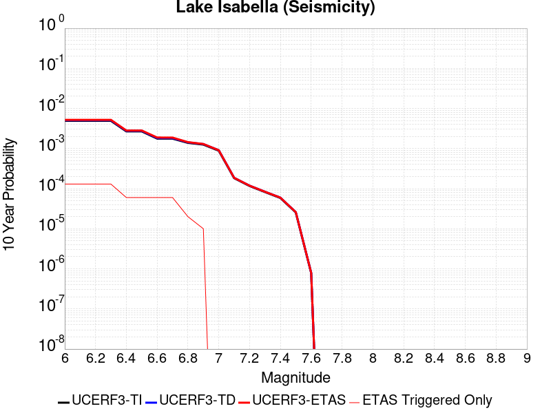 |

| Magnitude | 1 wk TI Prob | 1 wk TD Prob | 1 wk ETAS Prob | 1 wk ETAS/TD Gain | 1 wk ETAS Triggered Only | 1 mo TI Prob | 1 mo TD Prob | 1 mo ETAS Prob | 1 mo ETAS/TD Gain | 1 mo ETAS Triggered Only | 1 yr TI Prob | 1 yr TD Prob | 1 yr ETAS Prob | 1 yr ETAS/TD Gain | 1 yr ETAS Triggered Only | 10 yr TI Prob | 10 yr TD Prob | 10 yr ETAS Prob | 10 yr ETAS/TD Gain | 10 yr ETAS Triggered Only |
|-----|-----|-----|-----|-----|-----|-----|-----|-----|-----|-----|-----|-----|-----|-----|-----|-----|-----|-----|-----|-----|
| 6.0 | 9.431637E-6 | 9.7418215E-6 | 9.7418215E-6 | 1.0 | 0.0 | 4.0420677E-5 | 4.175007E-5 | 4.175007E-5 | 1.0 | 0.0 | 4.920106E-4 | 5.082016E-4 | 5.082016E-4 | 1.0 | 0.0 | 0.004909227 | 0.005071687 | 0.0051373243 | 1.0129418 | 6.597176E-5 |
| 6.1 | 9.431637E-6 | 9.7418215E-6 | 9.7418215E-6 | 1.0 | 0.0 | 4.0420677E-5 | 4.175007E-5 | 4.175007E-5 | 1.0 | 0.0 | 4.920106E-4 | 5.082016E-4 | 5.082016E-4 | 1.0 | 0.0 | 0.004909227 | 0.005071687 | 0.0051373243 | 1.0129418 | 6.597176E-5 |
| 6.2 | 9.431637E-6 | 9.7418215E-6 | 9.7418215E-6 | 1.0 | 0.0 | 4.0420677E-5 | 4.175007E-5 | 4.175007E-5 | 1.0 | 0.0 | 4.920106E-4 | 5.082016E-4 | 5.082016E-4 | 1.0 | 0.0 | 0.004909227 | 0.005071687 | 0.0051373243 | 1.0129418 | 6.597176E-5 |
| 6.3 | 9.431637E-6 | 9.7418215E-6 | 9.7418215E-6 | 1.0 | 0.0 | 4.0420677E-5 | 4.175007E-5 | 4.175007E-5 | 1.0 | 0.0 | 4.920106E-4 | 5.082016E-4 | 5.082016E-4 | 1.0 | 0.0 | 0.004909227 | 0.005071687 | 0.0051373243 | 1.0129418 | 6.597176E-5 |
| 6.4 | 5.144063E-6 | 5.3001613E-6 | 5.3001613E-6 | 1.0 | 0.0 | 2.2045799E-5 | 2.27148E-5 | 2.27148E-5 | 1.0 | 0.0 | 2.6837454E-4 | 2.7652105E-4 | 2.7652105E-4 | 1.0 | 0.0 | 0.0026805066 | 0.0027621102 | 0.0028278995 | 1.0238186 | 6.597176E-5 |
| 6.5 | 5.144063E-6 | 5.3001613E-6 | 5.3001613E-6 | 1.0 | 0.0 | 2.2045799E-5 | 2.27148E-5 | 2.27148E-5 | 1.0 | 0.0 | 2.6837454E-4 | 2.7652105E-4 | 2.7652105E-4 | 1.0 | 0.0 | 0.0026805066 | 0.0027621102 | 0.0028278995 | 1.0238186 | 6.597176E-5 |
| 6.6 | 3.4009804E-6 | 3.4988395E-6 | 3.4988395E-6 | 1.0 | 0.0 | 1.4575549E-5 | 1.4994949E-5 | 1.4994949E-5 | 1.0 | 0.0 | 1.7744285E-4 | 1.8254982E-4 | 1.8254982E-4 | 1.0 | 0.0 | 0.0017730123 | 0.0018241564 | 0.0018900079 | 1.0360997 | 6.597176E-5 |
| 6.7 | 3.3880428E-6 | 3.485706E-6 | 3.485706E-6 | 1.0 | 0.0 | 1.4520103E-5 | 1.4938664E-5 | 1.4938664E-5 | 1.0 | 0.0 | 1.767679E-4 | 1.8186466E-4 | 1.8186466E-4 | 1.0 | 0.0 | 0.0017662736 | 0.0018173159 | 0.0018831679 | 1.0362358 | 6.597176E-5 |
| 6.8 | 2.6582E-6 | 2.7337414E-6 | 2.7337414E-6 | 1.0 | 0.0 | 1.1392236E-5 | 1.171599E-5 | 1.171599E-5 | 1.0 | 0.0 | 1.3869164E-4 | 1.4263418E-4 | 1.4263418E-4 | 1.0 | 0.0 | 0.0013860512 | 0.0014255584 | 0.0014914362 | 1.0462118 | 6.597176E-5 |
| 6.9 | 2.406011E-6 | 2.474366E-6 | 2.474366E-6 | 1.0 | 0.0 | 1.0311434E-5 | 1.0604391E-5 | 1.0604391E-5 | 1.0 | 0.0 | 1.2553448E-4 | 1.2910213E-4 | 1.2910213E-4 | 1.0 | 0.0 | 0.0012546359 | 0.0012904009 | 0.0012904009 | 1.0 | 0.0 |
| 7.0 | 1.6953097E-6 | 1.7429631E-6 | 1.7429631E-6 | 1.0 | 0.0 | 7.265593E-6 | 7.469827E-6 | 7.469827E-6 | 1.0 | 0.0 | 8.8455E-5 | 9.094239E-5 | 9.094239E-5 | 1.0 | 0.0 | 8.84198E-4 | 9.0915454E-4 | 9.0915454E-4 | 1.0 | 0.0 |
| 7.1 | 3.5013824E-7 | 3.5715203E-7 | 3.5715203E-7 | 1.0 | 0.0 | 1.5005916E-6 | 1.5306507E-6 | 1.5306507E-6 | 1.0 | 0.0 | 1.826955E-5 | 1.8635516E-5 | 1.8635516E-5 | 1.0 | 0.0 | 1.8268047E-4 | 1.8633978E-4 | 1.8633978E-4 | 1.0 | 0.0 |
| 7.2 | 2.2321095E-7 | 2.2750805E-7 | 2.2750805E-7 | 1.0 | 0.0 | 9.56618E-7 | 9.750341E-7 | 9.750341E-7 | 1.0 | 0.0 | 1.1646762E-5 | 1.1870978E-5 | 1.1870978E-5 | 1.0 | 0.0 | 1.1646151E-4 | 1.1870354E-4 | 1.1870354E-4 | 1.0 | 0.0 |
| 7.3 | 1.5760406E-7 | 1.6061085E-7 | 1.6061085E-7 | 1.0 | 0.0 | 6.7544585E-7 | 6.88332E-7 | 6.88332E-7 | 1.0 | 0.0 | 8.223522E-6 | 8.380411E-6 | 8.380411E-6 | 1.0 | 0.0 | 8.2232174E-5 | 8.380101E-5 | 8.380101E-5 | 1.0 | 0.0 |
| 7.4 | 1.1216497E-7 | 1.14318226E-7 | 1.14318226E-7 | 1.0 | 0.0 | 4.8070694E-7 | 4.899352E-7 | 4.899352E-7 | 1.0 | 0.0 | 5.852591E-6 | 5.9649446E-6 | 5.9649446E-6 | 1.0 | 0.0 | 5.8524372E-5 | 5.964789E-5 | 5.964789E-5 | 1.0 | 0.0 |
| 7.5 | 4.885185E-8 | 4.9788245E-8 | 4.9788245E-8 | 1.0 | 0.0 | 2.0936506E-7 | 2.1337817E-7 | 2.1337817E-7 | 1.0 | 0.0 | 2.5490165E-6 | 2.5978763E-6 | 2.5978763E-6 | 1.0 | 0.0 | 2.5489873E-5 | 2.5978477E-5 | 2.5978477E-5 | 1.0 | 0.0 |
| 7.6 | 1.504641E-9 | 1.5318049E-9 | 1.5318049E-9 | 1.0 | 0.0 | 6.4484613E-9 | 6.5648784E-9 | 6.5648784E-9 | 1.0 | 0.0 | 7.851001E-8 | 7.9927396E-8 | 7.9927396E-8 | 1.0 | 0.0 | 7.8509987E-7 | 7.9927395E-7 | 7.9927395E-7 | 1.0 | 0.0 |

## Blue Cut
*[(top)](#table-of-contents)*

| 1 Week | 1 Month | 1 Year | 10 Year |
|-----|-----|-----|-----|
|  |  |  |  |

| Magnitude | 1 wk TI Prob | 1 wk TD Prob | 1 wk ETAS Prob | 1 wk ETAS/TD Gain | 1 wk ETAS Triggered Only | 1 mo TI Prob | 1 mo TD Prob | 1 mo ETAS Prob | 1 mo ETAS/TD Gain | 1 mo ETAS Triggered Only | 1 yr TI Prob | 1 yr TD Prob | 1 yr ETAS Prob | 1 yr ETAS/TD Gain | 1 yr ETAS Triggered Only | 10 yr TI Prob | 10 yr TD Prob | 10 yr ETAS Prob | 10 yr ETAS/TD Gain | 10 yr ETAS Triggered Only |
|-----|-----|-----|-----|-----|-----|-----|-----|-----|-----|-----|-----|-----|-----|-----|-----|-----|-----|-----|-----|-----|
| 6.0 | 2.1227985E-5 | 2.2720424E-5 | 2.2720424E-5 | 1.0 | 0.0 | 9.097391E-5 | 9.7369935E-5 | 9.7369935E-5 | 1.0 | 0.0 | 0.0011070445 | 0.0011848924 | 0.0012507859 | 1.0556115 | 6.597176E-5 | 0.011015458 | 0.01179159 | 0.011856783 | 1.0055288 | 6.597176E-5 |
| 6.1 | 2.1227985E-5 | 2.2720424E-5 | 2.2720424E-5 | 1.0 | 0.0 | 9.097391E-5 | 9.7369935E-5 | 9.7369935E-5 | 1.0 | 0.0 | 0.0011070445 | 0.0011848924 | 0.0012507859 | 1.0556115 | 6.597176E-5 | 0.011015458 | 0.01179159 | 0.011856783 | 1.0055288 | 6.597176E-5 |
| 6.2 | 2.1227985E-5 | 2.2720424E-5 | 2.2720424E-5 | 1.0 | 0.0 | 9.097391E-5 | 9.7369935E-5 | 9.7369935E-5 | 1.0 | 0.0 | 0.0011070445 | 0.0011848924 | 0.0012507859 | 1.0556115 | 6.597176E-5 | 0.011015458 | 0.01179159 | 0.011856783 | 1.0055288 | 6.597176E-5 |
| 6.3 | 1.1613981E-5 | 1.2353959E-5 | 1.2353959E-5 | 1.0 | 0.0 | 4.9773254E-5 | 5.2944535E-5 | 5.2944535E-5 | 1.0 | 0.0 | 6.0582085E-4 | 6.4442155E-4 | 6.4442155E-4 | 1.0 | 0.0 | 0.0060417196 | 0.006426776 | 0.006426776 | 1.0 | 0.0 |
| 6.4 | 1.1613981E-5 | 1.2353959E-5 | 1.2353959E-5 | 1.0 | 0.0 | 4.9773254E-5 | 5.2944535E-5 | 5.2944535E-5 | 1.0 | 0.0 | 6.0582085E-4 | 6.4442155E-4 | 6.4442155E-4 | 1.0 | 0.0 | 0.0060417196 | 0.006426776 | 0.006426776 | 1.0 | 0.0 |
| 6.5 | 8.931326E-6 | 9.48191E-6 | 9.48191E-6 | 1.0 | 0.0 | 3.8276554E-5 | 4.0636176E-5 | 4.0636176E-5 | 1.0 | 0.0 | 4.6591737E-4 | 4.9464224E-4 | 4.9464224E-4 | 1.0 | 0.0 | 0.0046494175 | 0.004936322 | 0.004936322 | 1.0 | 0.0 |
| 6.6 | 7.345353E-6 | 7.79053E-6 | 7.79053E-6 | 1.0 | 0.0 | 3.1479703E-5 | 3.33876E-5 | 3.33876E-5 | 1.0 | 0.0 | 3.83198E-4 | 4.0642623E-4 | 4.0642623E-4 | 1.0 | 0.0 | 0.0038253788 | 0.004057621 | 0.004057621 | 1.0 | 0.0 |
| 6.7 | 6.2775666E-6 | 6.655361E-6 | 6.655361E-6 | 1.0 | 0.0 | 2.690358E-5 | 2.8522707E-5 | 2.8522707E-5 | 1.0 | 0.0 | 3.2750185E-4 | 3.4721615E-4 | 3.4721615E-4 | 1.0 | 0.0 | 0.0032701963 | 0.0034674776 | 0.0034674776 | 1.0 | 0.0 |
| 6.8 | 5.5234095E-6 | 5.855298E-6 | 5.855298E-6 | 1.0 | 0.0 | 2.367154E-5 | 2.5093934E-5 | 2.5093934E-5 | 1.0 | 0.0 | 2.8816288E-4 | 3.054831E-4 | 3.054831E-4 | 1.0 | 0.0 | 0.002877895 | 0.0030513476 | 0.0030513476 | 1.0 | 0.0 |
| 6.9 | 4.7780054E-6 | 5.065582E-6 | 5.065582E-6 | 1.0 | 0.0 | 2.0477004E-5 | 2.1709497E-5 | 2.1709497E-5 | 1.0 | 0.0 | 2.4927902E-4 | 2.642881E-4 | 2.642881E-4 | 1.0 | 0.0 | 0.0024899957 | 0.0026404303 | 0.0026404303 | 1.0 | 0.0 |
| 7.0 | 3.883171E-6 | 4.1186195E-6 | 4.1186195E-6 | 1.0 | 0.0 | 1.6642054E-5 | 1.7651146E-5 | 1.7651146E-5 | 1.0 | 0.0 | 2.0259817E-4 | 2.148884E-4 | 2.148884E-4 | 1.0 | 0.0 | 0.0020241356 | 0.0021474818 | 0.0021474818 | 1.0 | 0.0 |
| 7.1 | 2.8358215E-6 | 3.0098138E-6 | 3.0098138E-6 | 1.0 | 0.0 | 1.2153464E-5 | 1.2899175E-5 | 1.2899175E-5 | 1.0 | 0.0 | 1.4795837E-4 | 1.5704273E-4 | 1.5704273E-4 | 1.0 | 0.0 | 0.001478599 | 0.0015699627 | 0.0015699627 | 1.0 | 0.0 |

## San Luis Range - Oceano 2011 CFM
*[(top)](#table-of-contents)*

| 1 Week | 1 Month | 1 Year | 10 Year |
|-----|-----|-----|-----|
|  |  |  |  |

| Magnitude | 1 wk TI Prob | 1 wk TD Prob | 1 wk ETAS Prob | 1 wk ETAS/TD Gain | 1 wk ETAS Triggered Only | 1 mo TI Prob | 1 mo TD Prob | 1 mo ETAS Prob | 1 mo ETAS/TD Gain | 1 mo ETAS Triggered Only | 1 yr TI Prob | 1 yr TD Prob | 1 yr ETAS Prob | 1 yr ETAS/TD Gain | 1 yr ETAS Triggered Only | 10 yr TI Prob | 10 yr TD Prob | 10 yr ETAS Prob | 10 yr ETAS/TD Gain | 10 yr ETAS Triggered Only |
|-----|-----|-----|-----|-----|-----|-----|-----|-----|-----|-----|-----|-----|-----|-----|-----|-----|-----|-----|-----|-----|
| 6.0 | 1.6025788E-6 | 1.6201284E-6 | 1.6201284E-6 | 1.0 | 0.0 | 6.8681766E-6 | 6.9433913E-6 | 6.9433913E-6 | 1.0 | 0.0 | 8.361684E-5 | 8.453293E-5 | 8.453293E-5 | 1.0 | 0.0 | 8.3585386E-4 | 8.450485E-4 | 9.109645E-4 | 1.0780027 | 6.597176E-5 |
| 6.1 | 1.6025788E-6 | 1.6201284E-6 | 1.6201284E-6 | 1.0 | 0.0 | 6.8681766E-6 | 6.9433913E-6 | 6.9433913E-6 | 1.0 | 0.0 | 8.361684E-5 | 8.453293E-5 | 8.453293E-5 | 1.0 | 0.0 | 8.3585386E-4 | 8.450485E-4 | 9.109645E-4 | 1.0780027 | 6.597176E-5 |
| 6.2 | 1.6025788E-6 | 1.6201284E-6 | 1.6201284E-6 | 1.0 | 0.0 | 6.8681766E-6 | 6.9433913E-6 | 6.9433913E-6 | 1.0 | 0.0 | 8.361684E-5 | 8.453293E-5 | 8.453293E-5 | 1.0 | 0.0 | 8.3585386E-4 | 8.450485E-4 | 9.109645E-4 | 1.0780027 | 6.597176E-5 |
| 6.3 | 1.6025788E-6 | 1.6201284E-6 | 1.6201284E-6 | 1.0 | 0.0 | 6.8681766E-6 | 6.9433913E-6 | 6.9433913E-6 | 1.0 | 0.0 | 8.361684E-5 | 8.453293E-5 | 8.453293E-5 | 1.0 | 0.0 | 8.3585386E-4 | 8.450485E-4 | 9.109645E-4 | 1.0780027 | 6.597176E-5 |
| 6.4 | 1.1621186E-6 | 1.1749963E-6 | 1.1749963E-6 | 1.0 | 0.0 | 4.980499E-6 | 5.0356903E-6 | 5.0356903E-6 | 1.0 | 0.0 | 6.0635884E-5 | 6.130808E-5 | 6.130808E-5 | 1.0 | 0.0 | 6.0619344E-4 | 6.1293825E-4 | 6.7886955E-4 | 1.107566 | 6.597176E-5 |
| 6.5 | 1.1621186E-6 | 1.1749963E-6 | 1.1749963E-6 | 1.0 | 0.0 | 4.980499E-6 | 5.0356903E-6 | 5.0356903E-6 | 1.0 | 0.0 | 6.0635884E-5 | 6.130808E-5 | 6.130808E-5 | 1.0 | 0.0 | 6.0619344E-4 | 6.1293825E-4 | 6.7886955E-4 | 1.107566 | 6.597176E-5 |
| 6.6 | 7.164729E-7 | 7.2486233E-7 | 7.2486233E-7 | 1.0 | 0.0 | 3.0705946E-6 | 3.1065492E-6 | 3.1065492E-6 | 1.0 | 0.0 | 3.738385E-5 | 3.78216E-5 | 3.78216E-5 | 1.0 | 0.0 | 3.737756E-4 | 3.7815337E-4 | 3.7815337E-4 | 1.0 | 0.0 |
| 6.7 | 7.164729E-7 | 7.2486233E-7 | 7.2486233E-7 | 1.0 | 0.0 | 3.0705946E-6 | 3.1065492E-6 | 3.1065492E-6 | 1.0 | 0.0 | 3.738385E-5 | 3.78216E-5 | 3.78216E-5 | 1.0 | 0.0 | 3.737756E-4 | 3.7815337E-4 | 3.7815337E-4 | 1.0 | 0.0 |
| 6.8 | 6.700177E-7 | 6.777481E-7 | 6.777481E-7 | 1.0 | 0.0 | 2.8715012E-6 | 2.9046316E-6 | 2.9046316E-6 | 1.0 | 0.0 | 3.495997E-5 | 3.5363333E-5 | 3.5363333E-5 | 1.0 | 0.0 | 3.495447E-4 | 3.535787E-4 | 3.535787E-4 | 1.0 | 0.0 |
| 6.9 | 5.657865E-7 | 5.721821E-7 | 5.721821E-7 | 1.0 | 0.0 | 2.424797E-6 | 2.4522067E-6 | 2.4522067E-6 | 1.0 | 0.0 | 2.9521503E-5 | 2.9855219E-5 | 2.9855219E-5 | 1.0 | 0.0 | 2.9517582E-4 | 2.9851313E-4 | 2.9851313E-4 | 1.0 | 0.0 |
| 7.0 | 4.608413E-7 | 4.6601969E-7 | 4.6601969E-7 | 1.0 | 0.0 | 1.9750328E-6 | 1.9972258E-6 | 1.9972258E-6 | 1.0 | 0.0 | 2.4045758E-5 | 2.4315956E-5 | 2.4315956E-5 | 1.0 | 0.0 | 2.4043156E-4 | 2.4313324E-4 | 2.4313324E-4 | 1.0 | 0.0 |
| 7.1 | 3.9177846E-7 | 3.962184E-7 | 3.962184E-7 | 1.0 | 0.0 | 1.6790494E-6 | 1.6980779E-6 | 1.6980779E-6 | 1.0 | 0.0 | 2.0442236E-5 | 2.0673902E-5 | 2.0673902E-5 | 1.0 | 0.0 | 2.0440355E-4 | 2.0671995E-4 | 2.0671995E-4 | 1.0 | 0.0 |
| 7.2 | 3.3974752E-7 | 3.436674E-7 | 3.436674E-7 | 1.0 | 0.0 | 1.45606E-6 | 1.4728595E-6 | 1.4728595E-6 | 1.0 | 0.0 | 1.7727387E-5 | 1.7931918E-5 | 1.7931918E-5 | 1.0 | 0.0 | 1.7725973E-4 | 1.7930481E-4 | 1.7930481E-4 | 1.0 | 0.0 |
| 7.3 | 2.8900928E-7 | 2.9234198E-7 | 2.9234198E-7 | 1.0 | 0.0 | 1.2386106E-6 | 1.2528936E-6 | 1.2528936E-6 | 1.0 | 0.0 | 1.5079979E-5 | 1.5253873E-5 | 1.5253873E-5 | 1.0 | 0.0 | 1.5078956E-4 | 1.5252834E-4 | 1.5252834E-4 | 1.0 | 0.0 |
| 7.4 | 2.1881527E-7 | 2.2139733E-7 | 2.2139733E-7 | 1.0 | 0.0 | 9.3777936E-7 | 9.4884535E-7 | 9.4884535E-7 | 1.0 | 0.0 | 1.14174045E-5 | 1.1552132E-5 | 1.1552132E-5 | 1.0 | 0.0 | 1.1416818E-4 | 1.15515366E-4 | 1.15515366E-4 | 1.0 | 0.0 |
| 7.5 | 1.356398E-7 | 1.3718723E-7 | 1.3718723E-7 | 1.0 | 0.0 | 5.813133E-7 | 5.879451E-7 | 5.879451E-7 | 1.0 | 0.0 | 7.0774663E-6 | 7.1582085E-6 | 7.1582085E-6 | 1.0 | 0.0 | 7.077241E-5 | 7.157981E-5 | 7.157981E-5 | 1.0 | 0.0 |
| 7.6 | 5.9269272E-8 | 6.0014045E-8 | 6.0014045E-8 | 1.0 | 0.0 | 2.5401116E-7 | 2.5720303E-7 | 2.5720303E-7 | 1.0 | 0.0 | 3.0925814E-6 | 3.1314426E-6 | 3.1314426E-6 | 1.0 | 0.0 | 3.0925385E-5 | 3.1313997E-5 | 3.1313997E-5 | 1.0 | 0.0 |
| 7.7 | 5.946232E-9 | 6.0369776E-9 | 6.0369776E-9 | 1.0 | 0.0 | 2.5483851E-8 | 2.587276E-8 | 2.587276E-8 | 1.0 | 0.0 | 3.1026585E-7 | 3.1500082E-7 | 3.1500082E-7 | 1.0 | 0.0 | 3.102654E-6 | 3.1500044E-6 | 3.1500044E-6 | 1.0 | 0.0 |

## San Jacinto (San Jacinto Valley) rev
*[(top)](#table-of-contents)*

| 1 Week | 1 Month | 1 Year | 10 Year |
|-----|-----|-----|-----|
|  | 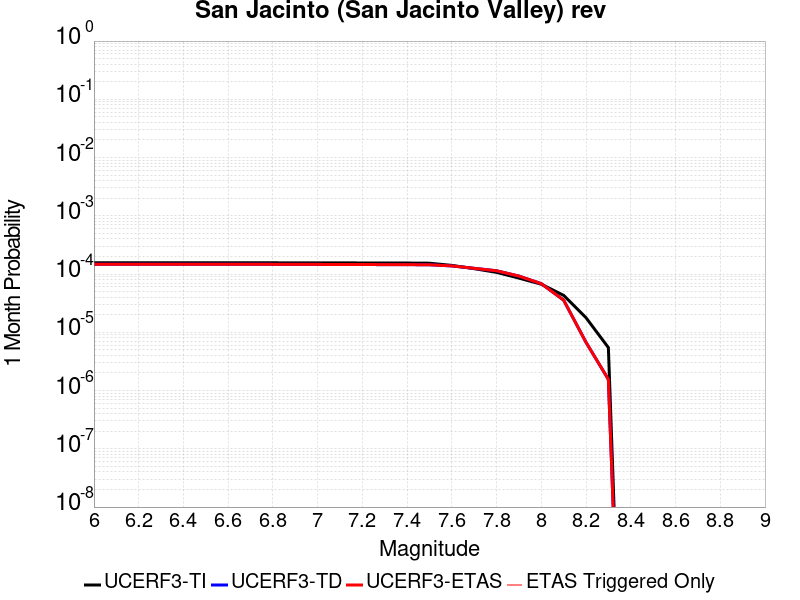 |  | 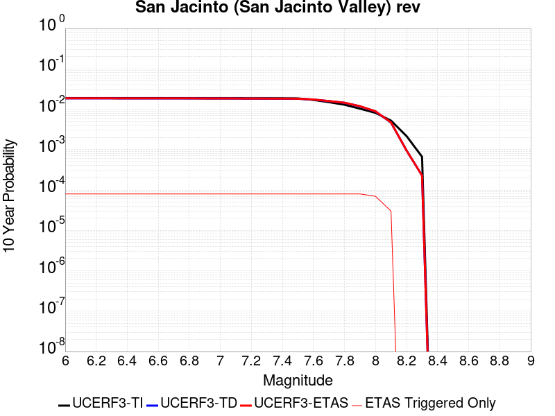 |

| Magnitude | 1 wk TI Prob | 1 wk TD Prob | 1 wk ETAS Prob | 1 wk ETAS/TD Gain | 1 wk ETAS Triggered Only | 1 mo TI Prob | 1 mo TD Prob | 1 mo ETAS Prob | 1 mo ETAS/TD Gain | 1 mo ETAS Triggered Only | 1 yr TI Prob | 1 yr TD Prob | 1 yr ETAS Prob | 1 yr ETAS/TD Gain | 1 yr ETAS Triggered Only | 10 yr TI Prob | 10 yr TD Prob | 10 yr ETAS Prob | 10 yr ETAS/TD Gain | 10 yr ETAS Triggered Only |
|-----|-----|-----|-----|-----|-----|-----|-----|-----|-----|-----|-----|-----|-----|-----|-----|-----|-----|-----|-----|-----|
| 6.0 | 3.652694E-5 | 3.4467394E-5 | 3.4467394E-5 | 1.0 | 0.0 | 1.5653463E-4 | 1.4770904E-4 | 1.4770904E-4 | 1.0 | 0.0 | 0.0019041431 | 0.001796876 | 0.0018627291 | 1.0366488 | 6.597176E-5 | 0.018879099 | 0.018560216 | 0.018624963 | 1.0034885 | 6.597176E-5 |
| 6.1 | 3.652694E-5 | 3.4467394E-5 | 3.4467394E-5 | 1.0 | 0.0 | 1.5653463E-4 | 1.4770904E-4 | 1.4770904E-4 | 1.0 | 0.0 | 0.0019041431 | 0.001796876 | 0.0018627291 | 1.0366488 | 6.597176E-5 | 0.018879099 | 0.018560216 | 0.018624963 | 1.0034885 | 6.597176E-5 |
| 6.2 | 3.652694E-5 | 3.4467394E-5 | 3.4467394E-5 | 1.0 | 0.0 | 1.5653463E-4 | 1.4770904E-4 | 1.4770904E-4 | 1.0 | 0.0 | 0.0019041431 | 0.001796876 | 0.0018627291 | 1.0366488 | 6.597176E-5 | 0.018879099 | 0.018560216 | 0.018624963 | 1.0034885 | 6.597176E-5 |
| 6.3 | 3.652694E-5 | 3.4467394E-5 | 3.4467394E-5 | 1.0 | 0.0 | 1.5653463E-4 | 1.4770904E-4 | 1.4770904E-4 | 1.0 | 0.0 | 0.0019041431 | 0.001796876 | 0.0018627291 | 1.0366488 | 6.597176E-5 | 0.018879099 | 0.018560216 | 0.018624963 | 1.0034885 | 6.597176E-5 |
| 6.4 | 3.646941E-5 | 3.4388955E-5 | 3.4388955E-5 | 1.0 | 0.0 | 1.5628811E-4 | 1.4737292E-4 | 1.4737292E-4 | 1.0 | 0.0 | 0.0019011468 | 0.0017927908 | 0.0018586443 | 1.0367324 | 6.597176E-5 | 0.018849645 | 0.01852009 | 0.01858484 | 1.0034962 | 6.597176E-5 |
| 6.5 | 3.646941E-5 | 3.4388955E-5 | 3.4388955E-5 | 1.0 | 0.0 | 1.5628811E-4 | 1.4737292E-4 | 1.4737292E-4 | 1.0 | 0.0 | 0.0019011468 | 0.0017927908 | 0.0018586443 | 1.0367324 | 6.597176E-5 | 0.018849645 | 0.01852009 | 0.01858484 | 1.0034962 | 6.597176E-5 |
| 6.6 | 3.6442503E-5 | 3.4352335E-5 | 3.4352335E-5 | 1.0 | 0.0 | 1.561728E-4 | 1.4721598E-4 | 1.4721598E-4 | 1.0 | 0.0 | 0.0018997455 | 0.0017908834 | 0.001856737 | 1.0367715 | 6.597176E-5 | 0.018835869 | 0.018501356 | 0.018566107 | 1.0034999 | 6.597176E-5 |
| 6.7 | 3.6432113E-5 | 3.4337903E-5 | 3.4337903E-5 | 1.0 | 0.0 | 1.5612828E-4 | 1.4715415E-4 | 1.4715415E-4 | 1.0 | 0.0 | 0.0018992044 | 0.001790132 | 0.0018559856 | 1.036787 | 6.597176E-5 | 0.018830549 | 0.01849398 | 0.018558731 | 1.0035012 | 6.597176E-5 |
| 6.8 | 3.6409598E-5 | 3.430695E-5 | 3.430695E-5 | 1.0 | 0.0 | 1.560318E-4 | 1.470215E-4 | 1.470215E-4 | 1.0 | 0.0 | 0.0018980318 | 0.0017885199 | 0.0018543736 | 1.0368203 | 6.597176E-5 | 0.018819023 | 0.01847813 | 0.018542884 | 1.0035043 | 6.597176E-5 |
| 6.9 | 3.638078E-5 | 3.4267367E-5 | 3.4267367E-5 | 1.0 | 0.0 | 1.5590832E-4 | 1.4685189E-4 | 1.4685189E-4 | 1.0 | 0.0 | 0.0018965311 | 0.0017864581 | 0.001852312 | 1.0368629 | 6.597176E-5 | 0.018804269 | 0.018457862 | 0.018522616 | 1.0035082 | 6.597176E-5 |
| 7.0 | 3.6294874E-5 | 3.4149365E-5 | 3.4149365E-5 | 1.0 | 0.0 | 1.5554018E-4 | 1.4634622E-4 | 1.4634622E-4 | 1.0 | 0.0 | 0.0018920569 | 0.0017803118 | 0.0018461662 | 1.0369903 | 6.597176E-5 | 0.018760284 | 0.018397434 | 0.018462192 | 1.0035199 | 6.597176E-5 |
| 7.1 | 3.6260717E-5 | 3.410564E-5 | 3.410564E-5 | 1.0 | 0.0 | 1.5539382E-4 | 1.4615887E-4 | 1.4615887E-4 | 1.0 | 0.0 | 0.001890278 | 0.0017780344 | 0.0018438889 | 1.0370377 | 6.597176E-5 | 0.018742796 | 0.018375032 | 0.018439792 | 1.0035243 | 6.597176E-5 |
| 7.2 | 3.6210204E-5 | 3.403977E-5 | 3.403977E-5 | 1.0 | 0.0 | 1.5517735E-4 | 1.4587659E-4 | 1.4587659E-4 | 1.0 | 0.0 | 0.001887647 | 0.0017746033 | 0.001840458 | 1.0371095 | 6.597176E-5 | 0.01871693 | 0.018341267 | 0.018406028 | 1.003531 | 6.597176E-5 |
| 7.3 | 3.6119454E-5 | 3.3927867E-5 | 3.3927867E-5 | 1.0 | 0.0 | 1.5478847E-4 | 1.4539705E-4 | 1.4539705E-4 | 1.0 | 0.0 | 0.0018829206 | 0.0017687745 | 0.0018346296 | 1.037232 | 6.597176E-5 | 0.018670462 | 0.018283723 | 0.018348489 | 1.0035423 | 6.597176E-5 |
| 7.4 | 3.607848E-5 | 3.387532E-5 | 3.387532E-5 | 1.0 | 0.0 | 1.5461289E-4 | 1.4517189E-4 | 1.4517189E-4 | 1.0 | 0.0 | 0.0018807866 | 0.0017660374 | 0.0018318928 | 1.0372899 | 6.597176E-5 | 0.018649481 | 0.018256696 | 0.018321464 | 1.0035475 | 6.597176E-5 |
| 7.5 | 3.5856774E-5 | 3.3684162E-5 | 3.3684162E-5 | 1.0 | 0.0 | 1.5366284E-4 | 1.4435273E-4 | 1.4435273E-4 | 1.0 | 0.0 | 0.0018692396 | 0.0017560803 | 0.0018219362 | 1.0375017 | 6.597176E-5 | 0.018535944 | 0.01815731 | 0.018222084 | 1.0035673 | 6.597176E-5 |
| 7.6 | 3.286655E-5 | 3.220034E-5 | 3.220034E-5 | 1.0 | 0.0 | 1.4084904E-4 | 1.3799417E-4 | 1.3799417E-4 | 1.0 | 0.0 | 0.001713488 | 0.0016787864 | 0.0017446474 | 1.0392313 | 6.597176E-5 | 0.017003361 | 0.017373424 | 0.01743825 | 1.0037313 | 6.597176E-5 |
| 7.7 | 2.8882527E-5 | 2.9291981E-5 | 2.9291981E-5 | 1.0 | 0.0 | 1.237764E-4 | 1.2553102E-4 | 1.2553102E-4 | 1.0 | 0.0 | 0.0015059357 | 0.0015272698 | 0.0015931409 | 1.0431299 | 6.597176E-5 | 0.014957713 | 0.015859274 | 0.015924199 | 1.0040939 | 6.597176E-5 |
| 7.8 | 2.4950225E-5 | 2.6580747E-5 | 2.6580747E-5 | 1.0 | 0.0 | 1.0692515E-4 | 1.13912516E-4 | 1.13912516E-4 | 1.0 | 0.0 | 0.0013010362 | 0.0013860033 | 0.0014518837 | 1.0475326 | 6.597176E-5 | 0.012934455 | 0.014439502 | 0.014504521 | 1.0045029 | 6.597176E-5 |
| 7.9 | 1.9881603E-5 | 2.155556E-5 | 2.155556E-5 | 1.0 | 0.0 | 8.520408E-5 | 9.2377704E-5 | 9.2377704E-5 | 1.0 | 0.0 | 0.001036866 | 0.001124119 | 0.0011900166 | 1.0586215 | 6.597176E-5 | 0.010320415 | 0.011802064 | 0.011867258 | 1.0055239 | 6.597176E-5 |
| 8.0 | 1.563292E-5 | 1.5976173E-5 | 1.5976173E-5 | 1.0 | 0.0 | 6.6996516E-5 | 6.846752E-5 | 6.846752E-5 | 1.0 | 0.0 | 8.153773E-4 | 8.332739E-4 | 8.991907E-4 | 1.0791057 | 6.597176E-5 | 0.00812392 | 0.008830938 | 0.008896327 | 1.0074046 | 6.597176E-5 |
| 8.1 | 1.0045313E-5 | 8.324356E-6 | 8.324356E-6 | 1.0 | 0.0 | 4.305063E-5 | 3.5675326E-5 | 3.5675326E-5 | 1.0 | 0.0 | 5.2401534E-4 | 4.3426102E-4 | 4.3426102E-4 | 1.0 | 0.0 | 0.0052278144 | 0.0046712374 | 0.0046712374 | 1.0 | 0.0 |
| 8.2 | 4.1554413E-6 | 1.5721832E-6 | 1.5721832E-6 | 1.0 | 0.0 | 1.7808914E-5 | 6.737911E-6 | 6.737911E-6 | 1.0 | 0.0 | 2.1680194E-4 | 8.203101E-5 | 8.203101E-5 | 1.0 | 0.0 | 0.0021659054 | 9.520741E-4 | 9.520741E-4 | 1.0 | 0.0 |
| 8.3 | 1.2758221E-6 | 3.6330252E-7 | 3.6330252E-7 | 1.0 | 0.0 | 5.4677976E-6 | 1.5570099E-6 | 1.5570099E-6 | 1.0 | 0.0 | 6.65684E-5 | 1.8956434E-5 | 1.8956434E-5 | 1.0 | 0.0 | 6.6548464E-4 | 2.2857229E-4 | 2.2857229E-4 | 1.0 | 0.0 |

## Great Valley 07 (Orestimba)
*[(top)](#table-of-contents)*

| 1 Week | 1 Month | 1 Year | 10 Year |
|-----|-----|-----|-----|
|  |  |  |  |

| Magnitude | 1 wk TI Prob | 1 wk TD Prob | 1 wk ETAS Prob | 1 wk ETAS/TD Gain | 1 wk ETAS Triggered Only | 1 mo TI Prob | 1 mo TD Prob | 1 mo ETAS Prob | 1 mo ETAS/TD Gain | 1 mo ETAS Triggered Only | 1 yr TI Prob | 1 yr TD Prob | 1 yr ETAS Prob | 1 yr ETAS/TD Gain | 1 yr ETAS Triggered Only | 10 yr TI Prob | 10 yr TD Prob | 10 yr ETAS Prob | 10 yr ETAS/TD Gain | 10 yr ETAS Triggered Only |
|-----|-----|-----|-----|-----|-----|-----|-----|-----|-----|-----|-----|-----|-----|-----|-----|-----|-----|-----|-----|-----|
| 6.0 | 2.9687902E-5 | 3.2759297E-5 | 3.2759297E-5 | 1.0 | 0.0 | 1.2722766E-4 | 1.4038983E-4 | 1.4038983E-4 | 1.0 | 0.0 | 0.0015478961 | 0.0017079781 | 0.0017738373 | 1.0385597 | 6.597176E-5 | 0.015371585 | 0.01695606 | 0.017020913 | 1.0038248 | 6.597176E-5 |
| 6.1 | 2.9687902E-5 | 3.2759297E-5 | 3.2759297E-5 | 1.0 | 0.0 | 1.2722766E-4 | 1.4038983E-4 | 1.4038983E-4 | 1.0 | 0.0 | 0.0015478961 | 0.0017079781 | 0.0017738373 | 1.0385597 | 6.597176E-5 | 0.015371585 | 0.01695606 | 0.017020913 | 1.0038248 | 6.597176E-5 |
| 6.2 | 1.9231524E-5 | 2.1160291E-5 | 2.1160291E-5 | 1.0 | 0.0 | 8.2418206E-5 | 9.068394E-5 | 9.068394E-5 | 1.0 | 0.0 | 0.0010029797 | 0.0011035409 | 0.0011694399 | 1.0597159 | 6.597176E-5 | 0.00998465 | 0.010983022 | 0.0110482685 | 1.0059407 | 6.597176E-5 |
| 6.3 | 1.324766E-5 | 1.4549291E-5 | 1.4549291E-5 | 1.0 | 0.0 | 5.6774446E-5 | 6.2352665E-5 | 6.2352665E-5 | 1.0 | 0.0 | 6.910097E-4 | 7.588885E-4 | 7.588885E-4 | 1.0 | 0.0 | 0.006888649 | 0.0075639165 | 0.0075639165 | 1.0 | 0.0 |
| 6.4 | 7.818645E-6 | 8.573279E-6 | 8.573279E-6 | 1.0 | 0.0 | 3.3508048E-5 | 3.6742123E-5 | 3.6742123E-5 | 1.0 | 0.0 | 4.078841E-4 | 4.4724692E-4 | 4.4724692E-4 | 1.0 | 0.0 | 0.004071363 | 0.0044638086 | 0.0044638086 | 1.0 | 0.0 |
| 6.5 | 5.3076565E-6 | 5.8180976E-6 | 5.8180976E-6 | 1.0 | 0.0 | 2.27469E-5 | 2.4934478E-5 | 2.4934478E-5 | 1.0 | 0.0 | 2.7690834E-4 | 3.0353706E-4 | 3.0353706E-4 | 1.0 | 0.0 | 0.0027656353 | 0.0030314343 | 0.0030314343 | 1.0 | 0.0 |
| 6.6 | 3.6003578E-6 | 3.948698E-6 | 3.948698E-6 | 1.0 | 0.0 | 1.5430012E-5 | 1.692289E-5 | 1.692289E-5 | 1.0 | 0.0 | 1.8784421E-4 | 2.0601827E-4 | 2.0601827E-4 | 1.0 | 0.0 | 0.0018768552 | 0.0020584268 | 0.0020584268 | 1.0 | 0.0 |
| 6.7 | 2.5361826E-6 | 2.783612E-6 | 2.783612E-6 | 1.0 | 0.0 | 1.0869308E-5 | 1.1929718E-5 | 1.1929718E-5 | 1.0 | 0.0 | 1.3232579E-4 | 1.4523596E-4 | 1.4523596E-4 | 1.0 | 0.0 | 0.0013224703 | 0.0014515404 | 0.0014515404 | 1.0 | 0.0 |
| 6.8 | 1.2115831E-6 | 1.3314497E-6 | 1.3314497E-6 | 1.0 | 0.0 | 5.1924885E-6 | 5.7062057E-6 | 5.7062057E-6 | 1.0 | 0.0 | 6.3216714E-5 | 6.947181E-5 | 6.947181E-5 | 1.0 | 0.0 | 6.3198735E-4 | 6.9459603E-4 | 6.9459603E-4 | 1.0 | 0.0 |

## Sierra Madre
*[(top)](#table-of-contents)*

| 1 Week | 1 Month | 1 Year | 10 Year |
|-----|-----|-----|-----|
|  |  |  |  |

| Magnitude | 1 wk TI Prob | 1 wk TD Prob | 1 wk ETAS Prob | 1 wk ETAS/TD Gain | 1 wk ETAS Triggered Only | 1 mo TI Prob | 1 mo TD Prob | 1 mo ETAS Prob | 1 mo ETAS/TD Gain | 1 mo ETAS Triggered Only | 1 yr TI Prob | 1 yr TD Prob | 1 yr ETAS Prob | 1 yr ETAS/TD Gain | 1 yr ETAS Triggered Only | 10 yr TI Prob | 10 yr TD Prob | 10 yr ETAS Prob | 10 yr ETAS/TD Gain | 10 yr ETAS Triggered Only |
|-----|-----|-----|-----|-----|-----|-----|-----|-----|-----|-----|-----|-----|-----|-----|-----|-----|-----|-----|-----|-----|
| 6.0 | 1.3379373E-5 | 1.1002111E-5 | 1.1002111E-5 | 1.0 | 0.0 | 5.7338908E-5 | 4.715106E-5 | 4.715106E-5 | 1.0 | 0.0 | 6.978776E-4 | 5.7391444E-4 | 5.7391444E-4 | 1.0 | 0.0 | 0.0069569005 | 0.005724687 | 0.005790281 | 1.0114582 | 6.597176E-5 |
| 6.1 | 1.3379373E-5 | 1.1002111E-5 | 1.1002111E-5 | 1.0 | 0.0 | 5.7338908E-5 | 4.715106E-5 | 4.715106E-5 | 1.0 | 0.0 | 6.978776E-4 | 5.7391444E-4 | 5.7391444E-4 | 1.0 | 0.0 | 0.0069569005 | 0.005724687 | 0.005790281 | 1.0114582 | 6.597176E-5 |
| 6.2 | 1.3379373E-5 | 1.1002111E-5 | 1.1002111E-5 | 1.0 | 0.0 | 5.7338908E-5 | 4.715106E-5 | 4.715106E-5 | 1.0 | 0.0 | 6.978776E-4 | 5.7391444E-4 | 5.7391444E-4 | 1.0 | 0.0 | 0.0069569005 | 0.005724687 | 0.005790281 | 1.0114582 | 6.597176E-5 |
| 6.3 | 1.3379373E-5 | 1.1002111E-5 | 1.1002111E-5 | 1.0 | 0.0 | 5.7338908E-5 | 4.715106E-5 | 4.715106E-5 | 1.0 | 0.0 | 6.978776E-4 | 5.7391444E-4 | 5.7391444E-4 | 1.0 | 0.0 | 0.0069569005 | 0.005724687 | 0.005790281 | 1.0114582 | 6.597176E-5 |
| 6.4 | 1.3379373E-5 | 1.1002111E-5 | 1.1002111E-5 | 1.0 | 0.0 | 5.7338908E-5 | 4.715106E-5 | 4.715106E-5 | 1.0 | 0.0 | 6.978776E-4 | 5.7391444E-4 | 5.7391444E-4 | 1.0 | 0.0 | 0.0069569005 | 0.005724687 | 0.005790281 | 1.0114582 | 6.597176E-5 |
| 6.5 | 1.26563245E-5 | 1.023154E-5 | 1.023154E-5 | 1.0 | 0.0 | 5.4240263E-5 | 4.3848726E-5 | 4.3848726E-5 | 1.0 | 0.0 | 6.601751E-4 | 5.3372857E-4 | 5.3372857E-4 | 1.0 | 0.0 | 0.006582173 | 0.005324789 | 0.0053904094 | 1.0123236 | 6.597176E-5 |
| 6.6 | 1.26563245E-5 | 1.023154E-5 | 1.023154E-5 | 1.0 | 0.0 | 5.4240263E-5 | 4.3848726E-5 | 4.3848726E-5 | 1.0 | 0.0 | 6.601751E-4 | 5.3372857E-4 | 5.3372857E-4 | 1.0 | 0.0 | 0.006582173 | 0.005324789 | 0.0053904094 | 1.0123236 | 6.597176E-5 |
| 6.7 | 1.2502474E-5 | 1.0067679E-5 | 1.0067679E-5 | 1.0 | 0.0 | 5.3580934E-5 | 4.3146487E-5 | 4.3146487E-5 | 1.0 | 0.0 | 6.521526E-4 | 5.251829E-4 | 5.251829E-4 | 1.0 | 0.0 | 0.0065024206 | 0.005239737 | 0.0053053633 | 1.0125247 | 6.597176E-5 |
| 6.8 | 1.2454966E-5 | 1.0019962E-5 | 1.0019962E-5 | 1.0 | 0.0 | 5.3377335E-5 | 4.2941996E-5 | 4.2941996E-5 | 1.0 | 0.0 | 6.4967526E-4 | 5.2269443E-4 | 5.2269443E-4 | 1.0 | 0.0 | 0.006477792 | 0.005214969 | 0.0052805967 | 1.0125844 | 6.597176E-5 |
| 6.9 | 1.2225574E-5 | 9.793931E-6 | 9.793931E-6 | 1.0 | 0.0 | 5.2394265E-5 | 4.1973322E-5 | 4.1973322E-5 | 1.0 | 0.0 | 6.3771347E-4 | 5.109064E-4 | 5.109064E-4 | 1.0 | 0.0 | 0.006358865 | 0.0050976346 | 0.00516327 | 1.0128757 | 6.597176E-5 |
| 7.0 | 1.182946E-5 | 9.400459E-6 | 9.400459E-6 | 1.0 | 0.0 | 5.06967E-5 | 4.0287065E-5 | 4.0287065E-5 | 1.0 | 0.0 | 6.1705755E-4 | 4.9038563E-4 | 4.9038563E-4 | 1.0 | 0.0 | 0.006153469 | 0.004893347 | 0.004958996 | 1.0134159 | 6.597176E-5 |
| 7.1 | 1.14369095E-5 | 8.987441E-6 | 8.987441E-6 | 1.0 | 0.0 | 4.9014405E-5 | 3.8517042E-5 | 3.8517042E-5 | 1.0 | 0.0 | 5.9658696E-4 | 4.6884507E-4 | 4.6884507E-4 | 1.0 | 0.0 | 0.005949879 | 0.004678865 | 0.0047445283 | 1.014034 | 6.597176E-5 |
| 7.2 | 1.0836419E-5 | 8.400803E-6 | 8.400803E-6 | 1.0 | 0.0 | 4.644097E-5 | 3.6002948E-5 | 3.6002948E-5 | 1.0 | 0.0 | 5.652721E-4 | 4.3824865E-4 | 4.3824865E-4 | 1.0 | 0.0 | 0.0056383642 | 0.0043741413 | 0.0044398247 | 1.0150162 | 6.597176E-5 |
| 7.3 | 1.0403439E-5 | 8.022045E-6 | 8.022045E-6 | 1.0 | 0.0 | 4.4585406E-5 | 3.4379744E-5 | 3.4379744E-5 | 1.0 | 0.0 | 5.426921E-4 | 4.184939E-4 | 4.184939E-4 | 1.0 | 0.0 | 0.005413687 | 0.0041773533 | 0.00424305 | 1.0157268 | 6.597176E-5 |
| 7.4 | 9.768864E-6 | 7.415638E-6 | 7.415638E-6 | 1.0 | 0.0 | 4.186589E-5 | 3.178092E-5 | 3.178092E-5 | 1.0 | 0.0 | 5.09598E-4 | 3.868649E-4 | 3.868649E-4 | 1.0 | 0.0 | 0.0050843097 | 0.0038622064 | 0.0039279233 | 1.0170153 | 6.597176E-5 |
| 7.5 | 8.687089E-6 | 6.4511987E-6 | 6.4511987E-6 | 1.0 | 0.0 | 3.722985E-5 | 2.7647708E-5 | 2.7647708E-5 | 1.0 | 0.0 | 4.5317915E-4 | 3.365597E-4 | 3.365597E-4 | 1.0 | 0.0 | 0.004522561 | 0.0033607872 | 0.0034265372 | 1.0195639 | 6.597176E-5 |
| 7.6 | 6.3506063E-6 | 4.431258E-6 | 4.431258E-6 | 1.0 | 0.0 | 2.72166E-5 | 1.8990968E-5 | 1.8990968E-5 | 1.0 | 0.0 | 3.3131172E-4 | 2.3119076E-4 | 2.3119076E-4 | 1.0 | 0.0 | 0.003308182 | 0.0023097275 | 0.0023755468 | 1.0284966 | 6.597176E-5 |
| 7.7 | 4.62223E-6 | 2.9338423E-6 | 2.9338423E-6 | 1.0 | 0.0 | 1.9809406E-5 | 1.257355E-5 | 1.257355E-5 | 1.0 | 0.0 | 2.4115283E-4 | 1.5307224E-4 | 1.5307224E-4 | 1.0 | 0.0 | 0.0024089129 | 0.001529869 | 0.001529869 | 1.0 | 0.0 |
| 7.8 | 3.2145008E-6 | 1.950051E-6 | 1.950051E-6 | 1.0 | 0.0 | 1.3776359E-5 | 8.357335E-6 | 8.357335E-6 | 1.0 | 0.0 | 1.6771426E-4 | 1.0174581E-4 | 1.0174581E-4 | 1.0 | 0.0 | 0.0016758774 | 0.0010171367 | 0.0010171367 | 1.0 | 0.0 |
| 7.9 | 1.0391769E-6 | 5.604388E-7 | 5.604388E-7 | 1.0 | 0.0 | 4.4536077E-6 | 2.4018784E-6 | 2.4018784E-6 | 1.0 | 0.0 | 5.4221324E-5 | 2.9242481E-5 | 2.9242481E-5 | 1.0 | 0.0 | 5.4208096E-4 | 2.9238674E-4 | 2.9238674E-4 | 1.0 | 0.0 |
| 8.0 | 1.210983E-7 | 6.615224E-8 | 6.615224E-8 | 1.0 | 0.0 | 5.1899264E-7 | 2.8350954E-7 | 2.8350954E-7 | 1.0 | 0.0 | 6.3187167E-6 | 3.4517234E-6 | 3.4517234E-6 | 1.0 | 0.0 | 6.318537E-5 | 3.4516717E-5 | 3.4516717E-5 | 1.0 | 0.0 |

## Owens Valley Keough Hot Springs
*[(top)](#table-of-contents)*

| 1 Week | 1 Month | 1 Year | 10 Year |
|-----|-----|-----|-----|
|  |  | 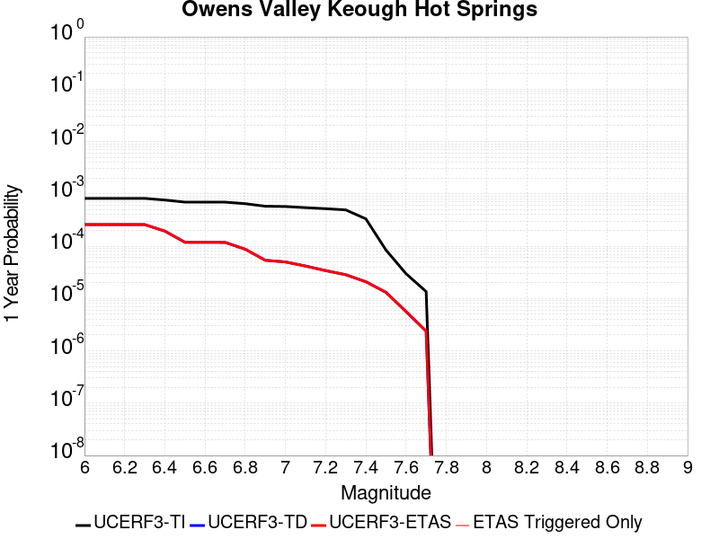 |  |

| Magnitude | 1 wk TI Prob | 1 wk TD Prob | 1 wk ETAS Prob | 1 wk ETAS/TD Gain | 1 wk ETAS Triggered Only | 1 mo TI Prob | 1 mo TD Prob | 1 mo ETAS Prob | 1 mo ETAS/TD Gain | 1 mo ETAS Triggered Only | 1 yr TI Prob | 1 yr TD Prob | 1 yr ETAS Prob | 1 yr ETAS/TD Gain | 1 yr ETAS Triggered Only | 10 yr TI Prob | 10 yr TD Prob | 10 yr ETAS Prob | 10 yr ETAS/TD Gain | 10 yr ETAS Triggered Only |
|-----|-----|-----|-----|-----|-----|-----|-----|-----|-----|-----|-----|-----|-----|-----|-----|-----|-----|-----|-----|-----|
| 6.0 | 1.5708529E-5 | 4.95133E-6 | 4.95133E-6 | 1.0 | 0.0 | 6.7320536E-5 | 2.1219843E-5 | 2.1219843E-5 | 1.0 | 0.0 | 8.193192E-4 | 2.5832606E-4 | 2.5832606E-4 | 1.0 | 0.0 | 0.008163051 | 0.002580917 | 0.0026467186 | 1.0254954 | 6.597176E-5 |
| 6.1 | 1.5708529E-5 | 4.95133E-6 | 4.95133E-6 | 1.0 | 0.0 | 6.7320536E-5 | 2.1219843E-5 | 2.1219843E-5 | 1.0 | 0.0 | 8.193192E-4 | 2.5832606E-4 | 2.5832606E-4 | 1.0 | 0.0 | 0.008163051 | 0.002580917 | 0.0026467186 | 1.0254954 | 6.597176E-5 |
| 6.2 | 1.5708529E-5 | 4.95133E-6 | 4.95133E-6 | 1.0 | 0.0 | 6.7320536E-5 | 2.1219843E-5 | 2.1219843E-5 | 1.0 | 0.0 | 8.193192E-4 | 2.5832606E-4 | 2.5832606E-4 | 1.0 | 0.0 | 0.008163051 | 0.002580917 | 0.0026467186 | 1.0254954 | 6.597176E-5 |
| 6.3 | 1.5708529E-5 | 4.95133E-6 | 4.95133E-6 | 1.0 | 0.0 | 6.7320536E-5 | 2.1219843E-5 | 2.1219843E-5 | 1.0 | 0.0 | 8.193192E-4 | 2.5832606E-4 | 2.5832606E-4 | 1.0 | 0.0 | 0.008163051 | 0.002580917 | 0.0026467186 | 1.0254954 | 6.597176E-5 |
| 6.4 | 1.4622509E-5 | 3.727112E-6 | 3.727112E-6 | 1.0 | 0.0 | 6.266639E-5 | 1.5973259E-5 | 1.5973259E-5 | 1.0 | 0.0 | 7.626962E-4 | 1.9446037E-4 | 1.9446037E-4 | 1.0 | 0.0 | 0.007600839 | 0.0019433822 | 0.0019433822 | 1.0 | 0.0 |
| 6.5 | 1.3335527E-5 | 2.2782122E-6 | 2.2782122E-6 | 1.0 | 0.0 | 5.7151006E-5 | 9.763733E-6 | 9.763733E-6 | 1.0 | 0.0 | 6.955913E-4 | 1.18867654E-4 | 1.18867654E-4 | 1.0 | 0.0 | 0.0069341804 | 0.0011882635 | 0.0011882635 | 1.0 | 0.0 |
| 6.6 | 1.3332855E-5 | 2.275361E-6 | 2.275361E-6 | 1.0 | 0.0 | 5.7139558E-5 | 9.751515E-6 | 9.751515E-6 | 1.0 | 0.0 | 6.9545204E-4 | 1.1871891E-4 | 1.1871891E-4 | 1.0 | 0.0 | 0.0069327964 | 0.0011867777 | 0.0011867777 | 1.0 | 0.0 |
| 6.7 | 1.3318214E-5 | 2.2645902E-6 | 2.2645902E-6 | 1.0 | 0.0 | 5.707681E-5 | 9.7053535E-6 | 9.7053535E-6 | 1.0 | 0.0 | 6.946886E-4 | 1.1815696E-4 | 1.1815696E-4 | 1.0 | 0.0 | 0.0069252094 | 0.0011811642 | 0.0011811642 | 1.0 | 0.0 |
| 6.8 | 1.2441338E-5 | 1.6782068E-6 | 1.6782068E-6 | 1.0 | 0.0 | 5.331893E-5 | 7.192297E-6 | 7.192297E-6 | 1.0 | 0.0 | 6.489646E-4 | 8.756299E-5 | 8.756299E-5 | 1.0 | 0.0 | 0.0064707273 | 8.754701E-4 | 8.754701E-4 | 1.0 | 0.0 |
| 6.9 | 1.1130476E-5 | 1.0306736E-6 | 1.0306736E-6 | 1.0 | 0.0 | 4.7701167E-5 | 4.417165E-6 | 4.417165E-6 | 1.0 | 0.0 | 5.806069E-4 | 5.3777672E-5 | 5.3777672E-5 | 1.0 | 0.0 | 0.0057909233 | 5.3780153E-4 | 5.3780153E-4 | 1.0 | 0.0 |
| 7.0 | 1.0986073E-5 | 9.582163E-7 | 9.582163E-7 | 1.0 | 0.0 | 4.7082318E-5 | 4.106635E-6 | 4.106635E-6 | 1.0 | 0.0 | 5.730765E-4 | 4.999715E-5 | 4.999715E-5 | 1.0 | 0.0 | 0.0057160086 | 5.0001295E-4 | 5.0001295E-4 | 1.0 | 0.0 |
| 7.1 | 1.0451338E-5 | 8.002528E-7 | 8.002528E-7 | 1.0 | 0.0 | 4.4790682E-5 | 3.4296504E-6 | 3.4296504E-6 | 1.0 | 0.0 | 5.451901E-4 | 4.1755196E-5 | 4.1755196E-5 | 1.0 | 0.0 | 0.005438545 | 4.1762355E-4 | 4.1762355E-4 | 1.0 | 0.0 |
| 7.2 | 9.989061E-6 | 6.546888E-7 | 6.546888E-7 | 1.0 | 0.0 | 4.280956E-5 | 2.805806E-6 | 2.805806E-6 | 1.0 | 0.0 | 5.2108173E-4 | 3.4160155E-5 | 3.4160155E-5 | 1.0 | 0.0 | 0.0051986156 | 3.416869E-4 | 3.416869E-4 | 1.0 | 0.0 |
| 7.3 | 9.465365E-6 | 5.4618476E-7 | 5.4618476E-7 | 1.0 | 0.0 | 4.056522E-5 | 2.3407897E-6 | 2.3407897E-6 | 1.0 | 0.0 | 4.937696E-4 | 2.8498745E-5 | 2.8498745E-5 | 1.0 | 0.0 | 0.0049267393 | 2.8508386E-4 | 2.8508386E-4 | 1.0 | 0.0 |
| 7.4 | 6.3824805E-6 | 4.0178227E-7 | 4.0178227E-7 | 1.0 | 0.0 | 2.73532E-5 | 1.7219229E-6 | 1.7219229E-6 | 1.0 | 0.0 | 3.3297433E-4 | 2.0964211E-5 | 2.0964211E-5 | 1.0 | 0.0 | 0.0033247585 | 2.0971506E-4 | 2.0971506E-4 | 1.0 | 0.0 |
| 7.5 | 1.6192645E-6 | 2.5170255E-7 | 2.5170255E-7 | 1.0 | 0.0 | 6.9396865E-6 | 1.0787247E-6 | 1.0787247E-6 | 1.0 | 0.0 | 8.448741E-5 | 1.3133395E-5 | 1.3133395E-5 | 1.0 | 0.0 | 8.4455294E-4 | 1.3132632E-4 | 1.3132632E-4 | 1.0 | 0.0 |
| 7.6 | 5.7062545E-7 | 1.07960254E-7 | 1.07960254E-7 | 1.0 | 0.0 | 2.4455355E-6 | 4.6268673E-7 | 4.6268673E-7 | 1.0 | 0.0 | 2.9773988E-5 | 5.6331974E-6 | 5.6331974E-6 | 1.0 | 0.0 | 2.977E-4 | 5.6330628E-5 | 5.6330628E-5 | 1.0 | 0.0 |
| 7.7 | 2.5988817E-7 | 4.547274E-8 | 4.547274E-8 | 1.0 | 0.0 | 1.113806E-6 | 1.9488314E-7 | 1.9488314E-7 | 1.0 | 0.0 | 1.3560503E-5 | 2.3727002E-6 | 2.3727002E-6 | 1.0 | 0.0 | 1.3559677E-4 | 2.3726792E-5 | 2.3726792E-5 | 1.0 | 0.0 |

## North Frontal  (West)
*[(top)](#table-of-contents)*

| 1 Week | 1 Month | 1 Year | 10 Year |
|-----|-----|-----|-----|
|  | 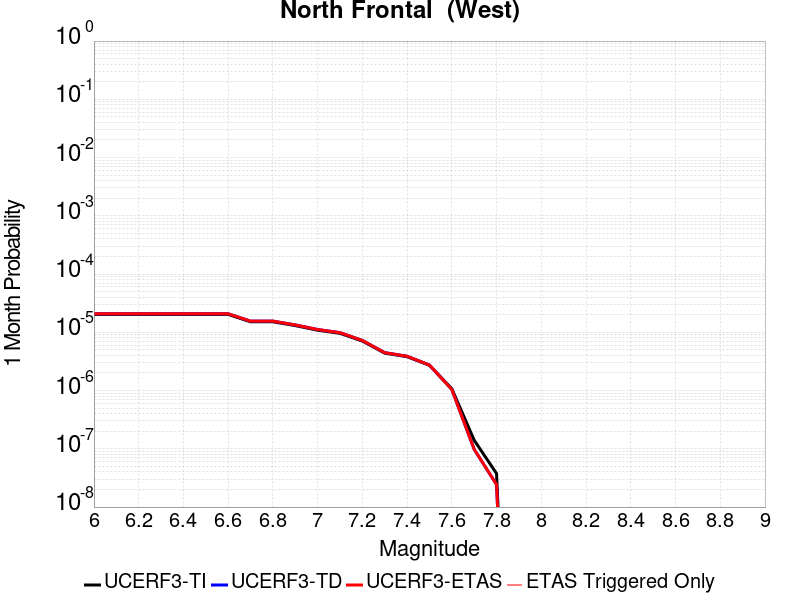 |  |  |

| Magnitude | 1 wk TI Prob | 1 wk TD Prob | 1 wk ETAS Prob | 1 wk ETAS/TD Gain | 1 wk ETAS Triggered Only | 1 mo TI Prob | 1 mo TD Prob | 1 mo ETAS Prob | 1 mo ETAS/TD Gain | 1 mo ETAS Triggered Only | 1 yr TI Prob | 1 yr TD Prob | 1 yr ETAS Prob | 1 yr ETAS/TD Gain | 1 yr ETAS Triggered Only | 10 yr TI Prob | 10 yr TD Prob | 10 yr ETAS Prob | 10 yr ETAS/TD Gain | 10 yr ETAS Triggered Only |
|-----|-----|-----|-----|-----|-----|-----|-----|-----|-----|-----|-----|-----|-----|-----|-----|-----|-----|-----|-----|-----|
| 6.0 | 4.7316266E-6 | 4.8527477E-6 | 4.8527477E-6 | 1.0 | 0.0 | 2.0278241E-5 | 2.0797332E-5 | 2.0797332E-5 | 1.0 | 0.0 | 2.4685962E-4 | 2.5317958E-4 | 2.5317958E-4 | 1.0 | 0.0 | 0.0024658558 | 0.0025290574 | 0.0025948624 | 1.0260196 | 6.597176E-5 |
| 6.1 | 4.7316266E-6 | 4.8527477E-6 | 4.8527477E-6 | 1.0 | 0.0 | 2.0278241E-5 | 2.0797332E-5 | 2.0797332E-5 | 1.0 | 0.0 | 2.4685962E-4 | 2.5317958E-4 | 2.5317958E-4 | 1.0 | 0.0 | 0.0024658558 | 0.0025290574 | 0.0025948624 | 1.0260196 | 6.597176E-5 |
| 6.2 | 4.7316266E-6 | 4.8527477E-6 | 4.8527477E-6 | 1.0 | 0.0 | 2.0278241E-5 | 2.0797332E-5 | 2.0797332E-5 | 1.0 | 0.0 | 2.4685962E-4 | 2.5317958E-4 | 2.5317958E-4 | 1.0 | 0.0 | 0.0024658558 | 0.0025290574 | 0.0025948624 | 1.0260196 | 6.597176E-5 |
| 6.3 | 4.7316266E-6 | 4.8527477E-6 | 4.8527477E-6 | 1.0 | 0.0 | 2.0278241E-5 | 2.0797332E-5 | 2.0797332E-5 | 1.0 | 0.0 | 2.4685962E-4 | 2.5317958E-4 | 2.5317958E-4 | 1.0 | 0.0 | 0.0024658558 | 0.0025290574 | 0.0025948624 | 1.0260196 | 6.597176E-5 |
| 6.4 | 4.7316266E-6 | 4.8527477E-6 | 4.8527477E-6 | 1.0 | 0.0 | 2.0278241E-5 | 2.0797332E-5 | 2.0797332E-5 | 1.0 | 0.0 | 2.4685962E-4 | 2.5317958E-4 | 2.5317958E-4 | 1.0 | 0.0 | 0.0024658558 | 0.0025290574 | 0.0025948624 | 1.0260196 | 6.597176E-5 |
| 6.5 | 4.7316266E-6 | 4.8527477E-6 | 4.8527477E-6 | 1.0 | 0.0 | 2.0278241E-5 | 2.0797332E-5 | 2.0797332E-5 | 1.0 | 0.0 | 2.4685962E-4 | 2.5317958E-4 | 2.5317958E-4 | 1.0 | 0.0 | 0.0024658558 | 0.0025290574 | 0.0025948624 | 1.0260196 | 6.597176E-5 |
| 6.6 | 4.7316266E-6 | 4.8527477E-6 | 4.8527477E-6 | 1.0 | 0.0 | 2.0278241E-5 | 2.0797332E-5 | 2.0797332E-5 | 1.0 | 0.0 | 2.4685962E-4 | 2.5317958E-4 | 2.5317958E-4 | 1.0 | 0.0 | 0.0024658558 | 0.0025290574 | 0.0025948624 | 1.0260196 | 6.597176E-5 |
| 6.7 | 3.5382777E-6 | 3.6309455E-6 | 3.6309455E-6 | 1.0 | 0.0 | 1.516396E-5 | 1.5561107E-5 | 1.5561107E-5 | 1.0 | 0.0 | 1.8460557E-4 | 1.8944078E-4 | 1.8944078E-4 | 1.0 | 0.0 | 0.0018445229 | 0.00189287 | 0.0019587167 | 1.0347868 | 6.597176E-5 |
| 6.8 | 3.5382777E-6 | 3.6309455E-6 | 3.6309455E-6 | 1.0 | 0.0 | 1.516396E-5 | 1.5561107E-5 | 1.5561107E-5 | 1.0 | 0.0 | 1.8460557E-4 | 1.8944078E-4 | 1.8944078E-4 | 1.0 | 0.0 | 0.0018445229 | 0.00189287 | 0.0019587167 | 1.0347868 | 6.597176E-5 |
| 6.9 | 3.0428037E-6 | 3.1228133E-6 | 3.1228133E-6 | 1.0 | 0.0 | 1.30405215E-5 | 1.3383421E-5 | 1.3383421E-5 | 1.0 | 0.0 | 1.5875678E-4 | 1.6293164E-4 | 1.6293164E-4 | 1.0 | 0.0 | 0.0015864341 | 0.001628189 | 0.0016940533 | 1.0404525 | 6.597176E-5 |
| 7.0 | 2.538778E-6 | 2.6061361E-6 | 2.6061361E-6 | 1.0 | 0.0 | 1.0880432E-5 | 1.116911E-5 | 1.116911E-5 | 1.0 | 0.0 | 1.324612E-4 | 1.359759E-4 | 1.359759E-4 | 1.0 | 0.0 | 0.0013238228 | 0.0013589738 | 0.0014248559 | 1.0484793 | 6.597176E-5 |
| 7.1 | 2.2418935E-6 | 2.3012487E-6 | 2.3012487E-6 | 1.0 | 0.0 | 9.60808E-6 | 9.86246E-6 | 9.86246E-6 | 1.0 | 0.0 | 1.1697209E-4 | 1.2006928E-4 | 1.2006928E-4 | 1.0 | 0.0 | 0.0011691054 | 0.001200088 | 0.0012659805 | 1.0549065 | 6.597176E-5 |
| 7.2 | 1.6526745E-6 | 1.6925159E-6 | 1.6925159E-6 | 1.0 | 0.0 | 7.082872E-6 | 7.253621E-6 | 7.253621E-6 | 1.0 | 0.0 | 8.623055E-5 | 8.8309505E-5 | 8.8309505E-5 | 1.0 | 0.0 | 8.61971E-4 | 8.827692E-4 | 9.486827E-4 | 1.0746667 | 6.597176E-5 |
| 7.3 | 1.0246019E-6 | 1.0442458E-6 | 1.0442458E-6 | 1.0 | 0.0 | 4.391144E-6 | 4.475332E-6 | 4.475332E-6 | 1.0 | 0.0 | 5.3460866E-5 | 5.448592E-5 | 5.448592E-5 | 1.0 | 0.0 | 5.344801E-4 | 5.447371E-4 | 6.106729E-4 | 1.1210415 | 6.597176E-5 |
| 7.4 | 8.9045164E-7 | 9.056731E-7 | 9.056731E-7 | 1.0 | 0.0 | 3.8162157E-6 | 3.881451E-6 | 3.881451E-6 | 1.0 | 0.0 | 4.646144E-5 | 4.7255755E-5 | 4.7255755E-5 | 1.0 | 0.0 | 4.6451724E-4 | 4.7246792E-4 | 5.384085E-4 | 1.1395663 | 6.597176E-5 |
| 7.5 | 6.3357E-7 | 6.402826E-7 | 6.402826E-7 | 1.0 | 0.0 | 2.7152971E-6 | 2.744066E-6 | 2.744066E-6 | 1.0 | 0.0 | 3.305824E-5 | 3.3408556E-5 | 3.3408556E-5 | 1.0 | 0.0 | 3.3053322E-4 | 3.3404192E-4 | 3.9999167E-4 | 1.1974295 | 6.597176E-5 |
| 7.6 | 2.5087024E-7 | 2.4361591E-7 | 2.4361591E-7 | 1.0 | 0.0 | 1.0751578E-6 | 1.0440679E-6 | 1.0440679E-6 | 1.0 | 0.0 | 1.3089967E-5 | 1.2711474E-5 | 1.2711474E-5 | 1.0 | 0.0 | 1.3089196E-4 | 1.2710952E-4 | 1.930729E-4 | 1.5189492 | 6.597176E-5 |
| 7.7 | 3.282987E-8 | 2.2874781E-8 | 2.2874781E-8 | 1.0 | 0.0 | 1.4069944E-7 | 9.8034775E-8 | 9.8034775E-8 | 1.0 | 0.0 | 1.7130144E-6 | 1.1935729E-6 | 1.1935729E-6 | 1.0 | 0.0 | 1.7130013E-5 | 1.1935673E-5 | 1.1935673E-5 | 1.0 | 0.0 |
| 7.8 | 8.77499E-9 | 5.6818488E-9 | 5.6818488E-9 | 1.0 | 0.0 | 3.7607098E-8 | 2.4350781E-8 | 2.4350781E-8 | 1.0 | 0.0 | 4.578663E-7 | 2.9647074E-7 | 2.9647074E-7 | 1.0 | 0.0 | 4.5786537E-6 | 2.9647047E-6 | 2.9647047E-6 | 1.0 | 0.0 |

## San Andreas (Offshore) 2011 CFM
*[(top)](#table-of-contents)*

| 1 Week | 1 Month | 1 Year | 10 Year |
|-----|-----|-----|-----|
|  |  |  |  |

| Magnitude | 1 wk TI Prob | 1 wk TD Prob | 1 wk ETAS Prob | 1 wk ETAS/TD Gain | 1 wk ETAS Triggered Only | 1 mo TI Prob | 1 mo TD Prob | 1 mo ETAS Prob | 1 mo ETAS/TD Gain | 1 mo ETAS Triggered Only | 1 yr TI Prob | 1 yr TD Prob | 1 yr ETAS Prob | 1 yr ETAS/TD Gain | 1 yr ETAS Triggered Only | 10 yr TI Prob | 10 yr TD Prob | 10 yr ETAS Prob | 10 yr ETAS/TD Gain | 10 yr ETAS Triggered Only |
|-----|-----|-----|-----|-----|-----|-----|-----|-----|-----|-----|-----|-----|-----|-----|-----|-----|-----|-----|-----|-----|
| 6.0 | 1.7072787E-4 | 1.9243768E-4 | 1.9243768E-4 | 1.0 | 0.0 | 7.3148566E-4 | 8.244747E-4 | 8.244747E-4 | 1.0 | 0.0 | 0.008869528 | 0.009992293 | 0.009992293 | 1.0 | 0.0 | 0.085237645 | 0.09690714 | 0.09696672 | 1.0006148 | 6.597176E-5 |
| 6.1 | 1.7072787E-4 | 1.9243768E-4 | 1.9243768E-4 | 1.0 | 0.0 | 7.3148566E-4 | 8.244747E-4 | 8.244747E-4 | 1.0 | 0.0 | 0.008869528 | 0.009992293 | 0.009992293 | 1.0 | 0.0 | 0.085237645 | 0.09690714 | 0.09696672 | 1.0006148 | 6.597176E-5 |
| 6.2 | 1.6312556E-4 | 1.8424621E-4 | 1.8424621E-4 | 1.0 | 0.0 | 6.989222E-4 | 7.8939006E-4 | 7.8939006E-4 | 1.0 | 0.0 | 0.008476226 | 0.00956897 | 0.00956897 | 1.0 | 0.0 | 0.08160117 | 0.09292438 | 0.092984214 | 1.000644 | 6.597176E-5 |
| 6.3 | 1.5103363E-4 | 1.6896211E-4 | 1.6896211E-4 | 1.0 | 0.0 | 6.471264E-4 | 7.2392455E-4 | 7.2392455E-4 | 1.0 | 0.0 | 0.007850339 | 0.0087786075 | 0.0087786075 | 1.0 | 0.0 | 0.075787395 | 0.08556006 | 0.08562039 | 1.0007051 | 6.597176E-5 |
| 6.4 | 1.5047993E-4 | 1.6782133E-4 | 1.6782133E-4 | 1.0 | 0.0 | 6.4475456E-4 | 7.1903825E-4 | 7.1903825E-4 | 1.0 | 0.0 | 0.007821669 | 0.008719592 | 0.008719592 | 1.0 | 0.0 | 0.0755203 | 0.08504028 | 0.085100636 | 1.0007098 | 6.597176E-5 |
| 6.5 | 1.2760791E-4 | 1.3748009E-4 | 1.3748009E-4 | 1.0 | 0.0 | 5.467764E-4 | 5.8906875E-4 | 5.8906875E-4 | 1.0 | 0.0 | 0.0066367025 | 0.007148602 | 0.007148602 | 1.0 | 0.0 | 0.064419635 | 0.07031143 | 0.07037276 | 1.0008723 | 6.597176E-5 |
| 6.6 | 1.1063525E-4 | 1.1567755E-4 | 1.1567755E-4 | 1.0 | 0.0 | 4.740649E-4 | 4.956678E-4 | 4.956678E-4 | 1.0 | 0.0 | 0.0057564764 | 0.006018259 | 0.006018259 | 1.0 | 0.0 | 0.05609626 | 0.05954285 | 0.05960489 | 1.001042 | 6.597176E-5 |
| 6.7 | 1.0391049E-4 | 1.06563464E-4 | 1.06563464E-4 | 1.0 | 0.0 | 4.4525467E-4 | 4.566216E-4 | 4.566216E-4 | 1.0 | 0.0 | 0.0054075094 | 0.0055453847 | 0.0055453847 | 1.0 | 0.0 | 0.052778035 | 0.05503986 | 0.055102203 | 1.0011326 | 6.597176E-5 |
| 6.8 | 1.0096706E-4 | 1.0168416E-4 | 1.0168416E-4 | 1.0 | 0.0 | 4.3264418E-4 | 4.3571746E-4 | 4.3571746E-4 | 1.0 | 0.0 | 0.0052547283 | 0.005292134 | 0.005292134 | 1.0 | 0.0 | 0.051321987 | 0.052737482 | 0.052799977 | 1.0011849 | 6.597176E-5 |
| 6.9 | 9.800265E-5 | 9.598679E-5 | 9.598679E-5 | 1.0 | 0.0 | 4.1994374E-4 | 4.11308E-4 | 4.11308E-4 | 1.0 | 0.0 | 0.0051008356 | 0.0049963454 | 0.0049963454 | 1.0 | 0.0 | 0.049853306 | 0.05006405 | 0.05012672 | 1.0012518 | 6.597176E-5 |
| 7.0 | 9.4642375E-5 | 9.0118105E-5 | 9.0118105E-5 | 1.0 | 0.0 | 4.0554712E-4 | 3.8616415E-4 | 3.8616415E-4 | 1.0 | 0.0 | 0.004926363 | 0.0046915757 | 0.0046915757 | 1.0 | 0.0 | 0.048185747 | 0.047243945 | 0.0473068 | 1.0013304 | 6.597176E-5 |
| 7.1 | 9.0996844E-5 | 8.363557E-5 | 8.363557E-5 | 1.0 | 0.0 | 3.8992817E-4 | 3.5838978E-4 | 3.5838978E-4 | 1.0 | 0.0 | 0.004737046 | 0.004354822 | 0.004354822 | 1.0 | 0.0 | 0.04637333 | 0.044094373 | 0.044157438 | 1.0014302 | 6.597176E-5 |
| 7.2 | 8.848287E-5 | 7.9909514E-5 | 7.9909514E-5 | 1.0 | 0.0 | 3.791572E-4 | 3.4242525E-4 | 3.4242525E-4 | 1.0 | 0.0 | 0.004606472 | 0.004161212 | 0.004161212 | 1.0 | 0.0 | 0.045121472 | 0.04223721 | 0.0423004 | 1.001496 | 6.597176E-5 |
| 7.3 | 7.9280784E-5 | 6.135467E-5 | 6.135467E-5 | 1.0 | 0.0 | 3.3973053E-4 | 2.6292267E-4 | 2.6292267E-4 | 1.0 | 0.0 | 0.004128377 | 0.0031964872 | 0.0031964872 | 1.0 | 0.0 | 0.040525194 | 0.032944594 | 0.03300839 | 1.0019366 | 6.597176E-5 |
| 7.4 | 6.468038E-5 | 3.798989E-5 | 3.798989E-5 | 1.0 | 0.0 | 2.771722E-4 | 1.6280398E-4 | 1.6280398E-4 | 1.0 | 0.0 | 0.0033693502 | 0.0019803944 | 0.0019803944 | 1.0 | 0.0 | 0.0331872 | 0.020852158 | 0.020916754 | 1.0030978 | 6.597176E-5 |
| 7.5 | 4.930574E-5 | 1.2737067E-5 | 1.2737067E-5 | 1.0 | 0.0 | 2.1129321E-4 | 5.4586293E-5 | 5.4586293E-5 | 1.0 | 0.0 | 0.0025694598 | 6.643871E-4 | 6.643871E-4 | 1.0 | 0.0 | 0.02539953 | 0.007501229 | 0.0075667063 | 1.0087289 | 6.597176E-5 |
| 7.6 | 4.612566E-5 | 1.0366656E-5 | 1.0366656E-5 | 1.0 | 0.0 | 1.9766642E-4 | 4.442778E-5 | 4.442778E-5 | 1.0 | 0.0 | 0.0024039324 | 5.4077536E-4 | 5.4077536E-4 | 1.0 | 0.0 | 0.023780935 | 0.0061902013 | 0.0062557645 | 1.0105915 | 6.597176E-5 |
| 7.7 | 3.9435414E-5 | 5.598791E-6 | 5.598791E-6 | 1.0 | 0.0 | 1.6899795E-4 | 2.39946E-5 | 2.39946E-5 | 1.0 | 0.0 | 0.0020556084 | 2.9209527E-4 | 2.9209527E-4 | 1.0 | 0.0 | 0.020366974 | 0.003556676 | 0.0036224131 | 1.0184827 | 6.597176E-5 |
| 7.8 | 2.7787428E-5 | 3.7729496E-6 | 3.7729496E-6 | 1.0 | 0.0 | 1.1908354E-4 | 1.6169684E-5 | 1.6169684E-5 | 1.0 | 0.0 | 0.0014488777 | 1.9684815E-4 | 1.9684815E-4 | 1.0 | 0.0 | 0.014394675 | 0.0023984525 | 0.002464266 | 1.02744 | 6.597176E-5 |
| 7.9 | 1.590671E-5 | 3.0548313E-6 | 3.0548313E-6 | 1.0 | 0.0 | 6.816983E-5 | 1.3092068E-5 | 1.3092068E-5 | 1.0 | 0.0 | 8.2965166E-4 | 1.593843E-4 | 1.593843E-4 | 1.0 | 0.0 | 0.008265611 | 0.001912608 | 0.0019784537 | 1.0344272 | 6.597176E-5 |
| 8.0 | 9.193638E-6 | 2.6035711E-6 | 2.6035711E-6 | 1.0 | 0.0 | 3.940071E-5 | 1.1158115E-5 | 1.1158115E-5 | 1.0 | 0.0 | 4.7959806E-4 | 1.358416E-4 | 1.358416E-4 | 1.0 | 0.0 | 0.0047856434 | 0.0016181957 | 0.0016840607 | 1.0407027 | 6.597176E-5 |
| 8.1 | 5.601576E-6 | 2.2447791E-6 | 2.2447791E-6 | 1.0 | 0.0 | 2.4006533E-5 | 9.620446E-6 | 9.620446E-6 | 1.0 | 0.0 | 2.9224035E-4 | 1.1712267E-4 | 1.1712267E-4 | 1.0 | 0.0 | 0.0029185633 | 0.0014080945 | 0.0014739734 | 1.0467858 | 6.597176E-5 |
| 8.2 | 4.3508785E-6 | 1.8661184E-6 | 1.8661184E-6 | 1.0 | 0.0 | 1.864649E-5 | 7.997626E-6 | 7.997626E-6 | 1.0 | 0.0 | 2.2699735E-4 | 9.736677E-5 | 9.736677E-5 | 1.0 | 0.0 | 0.0022676561 | 0.0011643195 | 0.0011643195 | 1.0 | 0.0 |
| 8.3 | 1.9573292E-6 | 7.547989E-7 | 7.547989E-7 | 1.0 | 0.0 | 8.388526E-6 | 3.2348487E-6 | 3.2348487E-6 | 1.0 | 0.0 | 1.0212552E-4 | 3.9383587E-5 | 3.9383587E-5 | 1.0 | 0.0 | 0.001020786 | 4.6598504E-4 | 4.6598504E-4 | 1.0 | 0.0 |

## Homestead Valley 2011
*[(top)](#table-of-contents)*

| 1 Week | 1 Month | 1 Year | 10 Year |
|-----|-----|-----|-----|
|  |  |  |  |

| Magnitude | 1 wk TI Prob | 1 wk TD Prob | 1 wk ETAS Prob | 1 wk ETAS/TD Gain | 1 wk ETAS Triggered Only | 1 mo TI Prob | 1 mo TD Prob | 1 mo ETAS Prob | 1 mo ETAS/TD Gain | 1 mo ETAS Triggered Only | 1 yr TI Prob | 1 yr TD Prob | 1 yr ETAS Prob | 1 yr ETAS/TD Gain | 1 yr ETAS Triggered Only | 10 yr TI Prob | 10 yr TD Prob | 10 yr ETAS Prob | 10 yr ETAS/TD Gain | 10 yr ETAS Triggered Only |
|-----|-----|-----|-----|-----|-----|-----|-----|-----|-----|-----|-----|-----|-----|-----|-----|-----|-----|-----|-----|-----|
| 6.0 | 1.539795E-5 | 6.2868744E-6 | 6.2868744E-6 | 1.0 | 0.0 | 6.5989545E-5 | 2.6943586E-5 | 2.6943586E-5 | 1.0 | 0.0 | 8.0312655E-4 | 3.280094E-4 | 3.280094E-4 | 1.0 | 0.0 | 0.008002302 | 0.0032772736 | 0.0033430292 | 1.0200641 | 6.597176E-5 |
| 6.1 | 1.539795E-5 | 6.2868744E-6 | 6.2868744E-6 | 1.0 | 0.0 | 6.5989545E-5 | 2.6943586E-5 | 2.6943586E-5 | 1.0 | 0.0 | 8.0312655E-4 | 3.280094E-4 | 3.280094E-4 | 1.0 | 0.0 | 0.008002302 | 0.0032772736 | 0.0033430292 | 1.0200641 | 6.597176E-5 |
| 6.2 | 1.539795E-5 | 6.2868744E-6 | 6.2868744E-6 | 1.0 | 0.0 | 6.5989545E-5 | 2.6943586E-5 | 2.6943586E-5 | 1.0 | 0.0 | 8.0312655E-4 | 3.280094E-4 | 3.280094E-4 | 1.0 | 0.0 | 0.008002302 | 0.0032772736 | 0.0033430292 | 1.0200641 | 6.597176E-5 |
| 6.3 | 1.539795E-5 | 6.2868744E-6 | 6.2868744E-6 | 1.0 | 0.0 | 6.5989545E-5 | 2.6943586E-5 | 2.6943586E-5 | 1.0 | 0.0 | 8.0312655E-4 | 3.280094E-4 | 3.280094E-4 | 1.0 | 0.0 | 0.008002302 | 0.0032772736 | 0.0033430292 | 1.0200641 | 6.597176E-5 |
| 6.4 | 1.539795E-5 | 6.2868744E-6 | 6.2868744E-6 | 1.0 | 0.0 | 6.5989545E-5 | 2.6943586E-5 | 2.6943586E-5 | 1.0 | 0.0 | 8.0312655E-4 | 3.280094E-4 | 3.280094E-4 | 1.0 | 0.0 | 0.008002302 | 0.0032772736 | 0.0033430292 | 1.0200641 | 6.597176E-5 |
| 6.5 | 1.0265258E-5 | 2.8789796E-6 | 2.8789796E-6 | 1.0 | 0.0 | 4.3993223E-5 | 1.2338465E-5 | 1.2338465E-5 | 1.0 | 0.0 | 5.3548586E-4 | 1.5021741E-4 | 1.5021741E-4 | 1.0 | 0.0 | 0.005341973 | 0.0015018407 | 0.0015677133 | 1.0438613 | 6.597176E-5 |
| 6.6 | 6.664671E-6 | 5.3488435E-7 | 5.3488435E-7 | 1.0 | 0.0 | 2.8562565E-5 | 2.2923603E-6 | 2.2923603E-6 | 1.0 | 0.0 | 3.476937E-4 | 2.7909247E-5 | 2.7909247E-5 | 1.0 | 0.0 | 0.003471502 | 2.7906906E-4 | 3.4502242E-4 | 1.2363335 | 6.597176E-5 |
| 6.7 | 6.5954046E-6 | 5.3488435E-7 | 5.3488435E-7 | 1.0 | 0.0 | 2.8265715E-5 | 2.2923603E-6 | 2.2923603E-6 | 1.0 | 0.0 | 3.4408073E-4 | 2.7909247E-5 | 2.7909247E-5 | 1.0 | 0.0 | 0.0034354846 | 2.7906906E-4 | 3.4502242E-4 | 1.2363335 | 6.597176E-5 |
| 6.8 | 4.648189E-6 | 2.3269658E-7 | 2.3269658E-7 | 1.0 | 0.0 | 1.9920659E-5 | 9.972707E-7 | 9.972707E-7 | 1.0 | 0.0 | 2.4250703E-4 | 1.2141708E-5 | 1.2141708E-5 | 1.0 | 0.0 | 0.0024224254 | 1.2141093E-4 | 1.8737468E-4 | 1.5433098 | 6.597176E-5 |
| 6.9 | 4.1428534E-6 | 1.9348157E-7 | 1.9348157E-7 | 1.0 | 0.0 | 1.7754966E-5 | 8.292065E-7 | 8.292065E-7 | 1.0 | 0.0 | 2.1614527E-4 | 1.0095546E-5 | 1.0095546E-5 | 1.0 | 0.0 | 0.0021593515 | 1.0095117E-4 | 1.6691627E-4 | 1.6534358 | 6.597176E-5 |
| 7.0 | 3.0673707E-6 | 1.5370551E-7 | 1.5370551E-7 | 1.0 | 0.0 | 1.3145808E-5 | 6.5873775E-7 | 6.5873775E-7 | 1.0 | 0.0 | 1.6003846E-4 | 8.020103E-6 | 8.020103E-6 | 1.0 | 0.0 | 0.0015992324 | 8.0198246E-5 | 1.4616472E-4 | 1.8225425 | 6.597176E-5 |
| 7.1 | 2.340854E-6 | 1.4690413E-7 | 1.4690413E-7 | 1.0 | 0.0 | 1.0032193E-5 | 6.2958895E-7 | 6.2958895E-7 | 1.0 | 0.0 | 1.221351E-4 | 7.6652195E-6 | 7.6652195E-6 | 1.0 | 0.0 | 0.00122068 | 7.664965E-5 | 1.4261637E-4 | 1.8606263 | 6.597176E-5 |
| 7.2 | 1.3754182E-6 | 1.3925126E-7 | 1.3925126E-7 | 1.0 | 0.0 | 5.8946357E-6 | 5.96791E-7 | 5.96791E-7 | 1.0 | 0.0 | 7.176483E-5 | 7.265907E-6 | 7.265907E-6 | 1.0 | 0.0 | 7.174166E-4 | 7.265679E-5 | 1.3862376E-4 | 1.9079258 | 6.597176E-5 |
| 7.3 | 1.2573237E-6 | 1.3829613E-7 | 1.3829613E-7 | 1.0 | 0.0 | 5.388519E-6 | 5.926975E-7 | 5.926975E-7 | 1.0 | 0.0 | 6.560324E-5 | 7.2160697E-6 | 7.2160697E-6 | 1.0 | 0.0 | 6.558388E-4 | 7.2158444E-5 | 1.3812546E-4 | 1.9141966 | 6.597176E-5 |
| 7.4 | 1.0994207E-6 | 1.3108422E-7 | 1.3108422E-7 | 1.0 | 0.0 | 4.7117946E-6 | 5.6178936E-7 | 5.6178936E-7 | 1.0 | 0.0 | 5.736459E-5 | 6.8397653E-6 | 6.8397653E-6 | 1.0 | 0.0 | 5.734978E-4 | 6.839564E-5 | 1.343629E-4 | 1.964495 | 6.597176E-5 |
| 7.5 | 5.5569126E-7 | 6.774076E-8 | 6.774076E-8 | 1.0 | 0.0 | 2.3815317E-6 | 2.903175E-7 | 2.903175E-7 | 1.0 | 0.0 | 2.8994764E-5 | 3.5346104E-6 | 3.5346104E-6 | 1.0 | 0.0 | 2.899098E-4 | 3.5345605E-5 | 1.0131504E-4 | 2.8664112 | 6.597176E-5 |

## Los Osos 2011
*[(top)](#table-of-contents)*

| 1 Week | 1 Month | 1 Year | 10 Year |
|-----|-----|-----|-----|
|  |  | 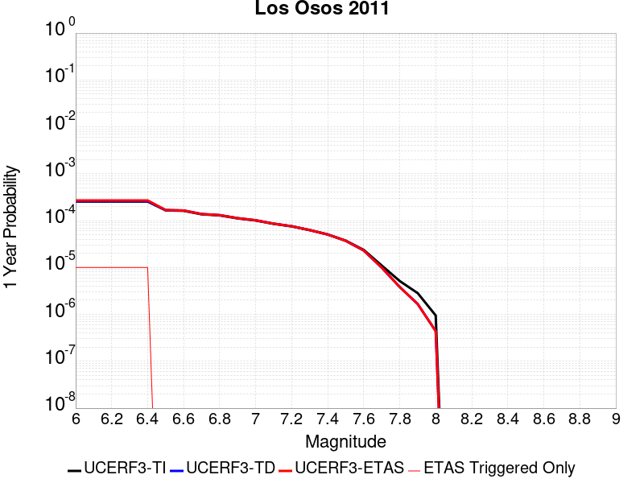 | 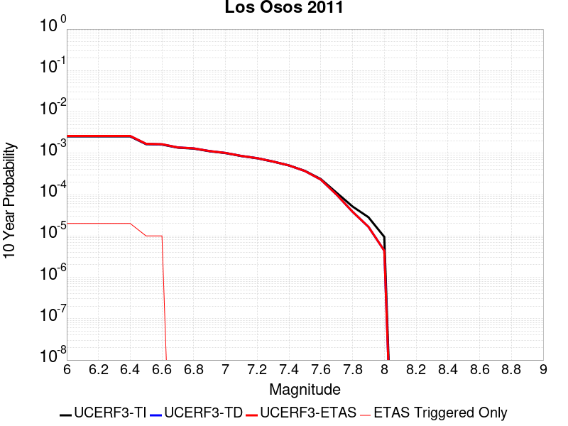 |

| Magnitude | 1 wk TI Prob | 1 wk TD Prob | 1 wk ETAS Prob | 1 wk ETAS/TD Gain | 1 wk ETAS Triggered Only | 1 mo TI Prob | 1 mo TD Prob | 1 mo ETAS Prob | 1 mo ETAS/TD Gain | 1 mo ETAS Triggered Only | 1 yr TI Prob | 1 yr TD Prob | 1 yr ETAS Prob | 1 yr ETAS/TD Gain | 1 yr ETAS Triggered Only | 10 yr TI Prob | 10 yr TD Prob | 10 yr ETAS Prob | 10 yr ETAS/TD Gain | 10 yr ETAS Triggered Only |
|-----|-----|-----|-----|-----|-----|-----|-----|-----|-----|-----|-----|-----|-----|-----|-----|-----|-----|-----|-----|-----|
| 6.0 | 4.8871775E-6 | 4.981565E-6 | 4.981565E-6 | 1.0 | 0.0 | 2.0944879E-5 | 2.1349404E-5 | 2.1349404E-5 | 1.0 | 0.0 | 2.5497406E-4 | 2.599008E-4 | 2.599008E-4 | 1.0 | 0.0 | 0.002546817 | 0.0025962426 | 0.002662043 | 1.0253445 | 6.597176E-5 |
| 6.1 | 4.8871775E-6 | 4.981565E-6 | 4.981565E-6 | 1.0 | 0.0 | 2.0944879E-5 | 2.1349404E-5 | 2.1349404E-5 | 1.0 | 0.0 | 2.5497406E-4 | 2.599008E-4 | 2.599008E-4 | 1.0 | 0.0 | 0.002546817 | 0.0025962426 | 0.002662043 | 1.0253445 | 6.597176E-5 |
| 6.2 | 4.8871775E-6 | 4.981565E-6 | 4.981565E-6 | 1.0 | 0.0 | 2.0944879E-5 | 2.1349404E-5 | 2.1349404E-5 | 1.0 | 0.0 | 2.5497406E-4 | 2.599008E-4 | 2.599008E-4 | 1.0 | 0.0 | 0.002546817 | 0.0025962426 | 0.002662043 | 1.0253445 | 6.597176E-5 |
| 6.3 | 4.8871775E-6 | 4.981565E-6 | 4.981565E-6 | 1.0 | 0.0 | 2.0944879E-5 | 2.1349404E-5 | 2.1349404E-5 | 1.0 | 0.0 | 2.5497406E-4 | 2.599008E-4 | 2.599008E-4 | 1.0 | 0.0 | 0.002546817 | 0.0025962426 | 0.002662043 | 1.0253445 | 6.597176E-5 |
| 6.4 | 4.8871775E-6 | 4.981565E-6 | 4.981565E-6 | 1.0 | 0.0 | 2.0944879E-5 | 2.1349404E-5 | 2.1349404E-5 | 1.0 | 0.0 | 2.5497406E-4 | 2.599008E-4 | 2.599008E-4 | 1.0 | 0.0 | 0.002546817 | 0.0025962426 | 0.002662043 | 1.0253445 | 6.597176E-5 |
| 6.5 | 3.1724062E-6 | 3.2234527E-6 | 3.2234527E-6 | 1.0 | 0.0 | 1.3595956E-5 | 1.3814725E-5 | 1.3814725E-5 | 1.0 | 0.0 | 1.6551818E-4 | 1.6818143E-4 | 1.6818143E-4 | 1.0 | 0.0 | 0.0016539496 | 0.0016805549 | 0.0017464159 | 1.0391899 | 6.597176E-5 |
| 6.6 | 3.1022591E-6 | 3.151161E-6 | 3.151161E-6 | 1.0 | 0.0 | 1.3295328E-5 | 1.3504907E-5 | 1.3504907E-5 | 1.0 | 0.0 | 1.618586E-4 | 1.6440995E-4 | 1.6440995E-4 | 1.0 | 0.0 | 0.0016174077 | 0.0016428961 | 0.0017087595 | 1.0400898 | 6.597176E-5 |
| 6.7 | 2.611518E-6 | 2.6492337E-6 | 2.6492337E-6 | 1.0 | 0.0 | 1.1192172E-5 | 1.135381E-5 | 1.135381E-5 | 1.0 | 0.0 | 1.3625617E-4 | 1.3822391E-4 | 1.3822391E-4 | 1.0 | 0.0 | 0.0013617266 | 0.0013813839 | 0.0013813839 | 1.0 | 0.0 |
| 6.8 | 2.4780884E-6 | 2.5122079E-6 | 2.5122079E-6 | 1.0 | 0.0 | 1.0620336E-5 | 1.0766561E-5 | 1.0766561E-5 | 1.0 | 0.0 | 1.2929492E-4 | 1.3107504E-4 | 1.3107504E-4 | 1.0 | 0.0 | 0.0012921972 | 0.0013099813 | 0.0013099813 | 1.0 | 0.0 |
| 6.9 | 2.1376322E-6 | 2.1635497E-6 | 2.1635497E-6 | 1.0 | 0.0 | 9.161248E-6 | 9.272323E-6 | 9.272323E-6 | 1.0 | 0.0 | 1.1153249E-4 | 1.128847E-4 | 1.128847E-4 | 1.0 | 0.0 | 0.0011147653 | 0.0011282755 | 0.0011282755 | 1.0 | 0.0 |
| 7.0 | 1.9282882E-6 | 1.9495E-6 | 1.9495E-6 | 1.0 | 0.0 | 8.264066E-6 | 8.354974E-6 | 8.354974E-6 | 1.0 | 0.0 | 1.0061036E-4 | 1.01717065E-4 | 1.01717065E-4 | 1.0 | 0.0 | 0.0010056482 | 0.0010167065 | 0.0010167065 | 1.0 | 0.0 |
| 7.1 | 1.6353226E-6 | 1.6501499E-6 | 1.6501499E-6 | 1.0 | 0.0 | 7.0085066E-6 | 7.0720516E-6 | 7.0720516E-6 | 1.0 | 0.0 | 8.532523E-5 | 8.609884E-5 | 8.609884E-5 | 1.0 | 0.0 | 8.529247E-4 | 8.606555E-4 | 8.606555E-4 | 1.0 | 0.0 |
| 7.2 | 1.4446276E-6 | 1.45537E-6 | 1.45537E-6 | 1.0 | 0.0 | 6.191247E-6 | 6.237285E-6 | 6.237285E-6 | 1.0 | 0.0 | 7.537582E-5 | 7.59363E-5 | 7.59363E-5 | 1.0 | 0.0 | 7.535026E-4 | 7.5910415E-4 | 7.5910415E-4 | 1.0 | 0.0 |
| 7.3 | 1.2014582E-6 | 1.2069403E-6 | 1.2069403E-6 | 1.0 | 0.0 | 5.149096E-6 | 5.172591E-6 | 5.172591E-6 | 1.0 | 0.0 | 6.268844E-5 | 6.2974475E-5 | 6.2974475E-5 | 1.0 | 0.0 | 6.267076E-4 | 6.295667E-4 | 6.295667E-4 | 1.0 | 0.0 |
| 7.4 | 9.707733E-7 | 9.710075E-7 | 9.710075E-7 | 1.0 | 0.0 | 4.16045E-6 | 4.161454E-6 | 4.161454E-6 | 1.0 | 0.0 | 5.0652303E-5 | 5.0664526E-5 | 5.0664526E-5 | 1.0 | 0.0 | 5.064076E-4 | 5.0653E-4 | 5.0653E-4 | 1.0 | 0.0 |
| 7.5 | 7.174908E-7 | 7.1151817E-7 | 7.1151817E-7 | 1.0 | 0.0 | 3.074957E-6 | 3.04936E-6 | 3.04936E-6 | 1.0 | 0.0 | 3.743696E-5 | 3.7125326E-5 | 3.7125326E-5 | 1.0 | 0.0 | 3.7430652E-4 | 3.7119142E-4 | 3.7119142E-4 | 1.0 | 0.0 |
| 7.6 | 4.5535776E-7 | 4.4210202E-7 | 4.4210202E-7 | 1.0 | 0.0 | 1.9515319E-6 | 1.8947215E-6 | 1.8947215E-6 | 1.0 | 0.0 | 2.3759641E-5 | 2.306799E-5 | 2.306799E-5 | 1.0 | 0.0 | 2.37571E-4 | 2.3065606E-4 | 2.3065606E-4 | 1.0 | 0.0 |
| 7.7 | 2.1173553E-7 | 1.9062645E-7 | 1.9062645E-7 | 1.0 | 0.0 | 9.0743765E-7 | 8.1697027E-7 | 8.1697027E-7 | 1.0 | 0.0 | 1.1047998E-5 | 9.946568E-6 | 9.946568E-6 | 1.0 | 0.0 | 1.1047449E-4 | 9.946126E-5 | 9.946126E-5 | 1.0 | 0.0 |
| 7.8 | 9.873608E-8 | 7.369176E-8 | 7.369176E-8 | 1.0 | 0.0 | 4.2315455E-7 | 3.1582178E-7 | 3.1582178E-7 | 1.0 | 0.0 | 5.1518946E-6 | 3.845123E-6 | 3.845123E-6 | 1.0 | 0.0 | 5.1517753E-5 | 3.8450573E-5 | 3.8450573E-5 | 1.0 | 0.0 |
| 7.9 | 5.4399106E-8 | 3.189444E-8 | 3.189444E-8 | 1.0 | 0.0 | 2.33139E-7 | 1.3669045E-7 | 1.3669045E-7 | 1.0 | 0.0 | 2.8384638E-6 | 1.664205E-6 | 1.664205E-6 | 1.0 | 0.0 | 2.8384275E-5 | 1.6641927E-5 | 1.6641927E-5 | 1.0 | 0.0 |
| 8.0 | 1.817203E-8 | 8.426773E-9 | 8.426773E-9 | 1.0 | 0.0 | 7.7880124E-8 | 3.6114738E-8 | 3.6114738E-8 | 1.0 | 0.0 | 9.481901E-7 | 4.3969686E-7 | 4.3969686E-7 | 1.0 | 0.0 | 9.481861E-6 | 4.3969603E-6 | 4.3969603E-6 | 1.0 | 0.0 |

## Mono Lake 2011 CFM
*[(top)](#table-of-contents)*

| 1 Week | 1 Month | 1 Year | 10 Year |
|-----|-----|-----|-----|
|  |  |  | 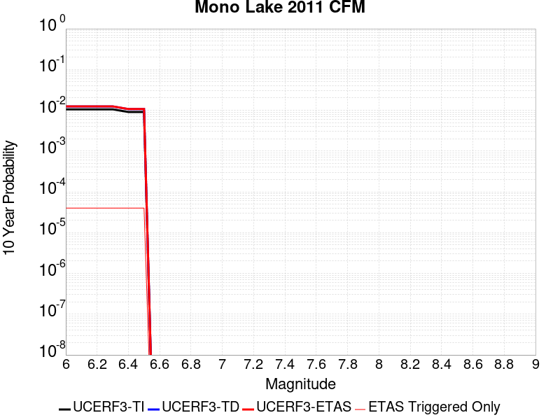 |

| Magnitude | 1 wk TI Prob | 1 wk TD Prob | 1 wk ETAS Prob | 1 wk ETAS/TD Gain | 1 wk ETAS Triggered Only | 1 mo TI Prob | 1 mo TD Prob | 1 mo ETAS Prob | 1 mo ETAS/TD Gain | 1 mo ETAS Triggered Only | 1 yr TI Prob | 1 yr TD Prob | 1 yr ETAS Prob | 1 yr ETAS/TD Gain | 1 yr ETAS Triggered Only | 10 yr TI Prob | 10 yr TD Prob | 10 yr ETAS Prob | 10 yr ETAS/TD Gain | 10 yr ETAS Triggered Only |
|-----|-----|-----|-----|-----|-----|-----|-----|-----|-----|-----|-----|-----|-----|-----|-----|-----|-----|-----|-----|-----|
| 6.0 | 2.0341662E-5 | 2.3830333E-5 | 2.3830333E-5 | 1.0 | 0.0 | 8.717564E-5 | 1.02129E-4 | 1.02129E-4 | 1.0 | 0.0 | 0.0010608466 | 0.0012432429 | 0.0012432429 | 1.0 | 0.0 | 0.010557966 | 0.012414961 | 0.012480114 | 1.005248 | 6.597176E-5 |
| 6.1 | 2.0341662E-5 | 2.3830333E-5 | 2.3830333E-5 | 1.0 | 0.0 | 8.717564E-5 | 1.02129E-4 | 1.02129E-4 | 1.0 | 0.0 | 0.0010608466 | 0.0012432429 | 0.0012432429 | 1.0 | 0.0 | 0.010557966 | 0.012414961 | 0.012480114 | 1.005248 | 6.597176E-5 |
| 6.2 | 2.0341662E-5 | 2.3830333E-5 | 2.3830333E-5 | 1.0 | 0.0 | 8.717564E-5 | 1.02129E-4 | 1.02129E-4 | 1.0 | 0.0 | 0.0010608466 | 0.0012432429 | 0.0012432429 | 1.0 | 0.0 | 0.010557966 | 0.012414961 | 0.012480114 | 1.005248 | 6.597176E-5 |
| 6.3 | 2.0341662E-5 | 2.3830333E-5 | 2.3830333E-5 | 1.0 | 0.0 | 8.717564E-5 | 1.02129E-4 | 1.02129E-4 | 1.0 | 0.0 | 0.0010608466 | 0.0012432429 | 0.0012432429 | 1.0 | 0.0 | 0.010557966 | 0.012414961 | 0.012480114 | 1.005248 | 6.597176E-5 |
| 6.4 | 1.749821E-5 | 2.0492844E-5 | 2.0492844E-5 | 1.0 | 0.0 | 7.499018E-5 | 8.782648E-5 | 8.782648E-5 | 1.0 | 0.0 | 9.1262296E-4 | 0.0010692873 | 0.0010692873 | 1.0 | 0.0 | 0.009088841 | 0.010692834 | 0.010758101 | 1.0061038 | 6.597176E-5 |
| 6.5 | 1.749821E-5 | 2.0492844E-5 | 2.0492844E-5 | 1.0 | 0.0 | 7.499018E-5 | 8.782648E-5 | 8.782648E-5 | 1.0 | 0.0 | 9.1262296E-4 | 0.0010692873 | 0.0010692873 | 1.0 | 0.0 | 0.009088841 | 0.010692834 | 0.010758101 | 1.0061038 | 6.597176E-5 |

## Davis Creek
*[(top)](#table-of-contents)*

| 1 Week | 1 Month | 1 Year | 10 Year |
|-----|-----|-----|-----|
|  |  |  |  |

| Magnitude | 1 wk TI Prob | 1 wk TD Prob | 1 wk ETAS Prob | 1 wk ETAS/TD Gain | 1 wk ETAS Triggered Only | 1 mo TI Prob | 1 mo TD Prob | 1 mo ETAS Prob | 1 mo ETAS/TD Gain | 1 mo ETAS Triggered Only | 1 yr TI Prob | 1 yr TD Prob | 1 yr ETAS Prob | 1 yr ETAS/TD Gain | 1 yr ETAS Triggered Only | 10 yr TI Prob | 10 yr TD Prob | 10 yr ETAS Prob | 10 yr ETAS/TD Gain | 10 yr ETAS Triggered Only |
|-----|-----|-----|-----|-----|-----|-----|-----|-----|-----|-----|-----|-----|-----|-----|-----|-----|-----|-----|-----|-----|
| 6.0 | 2.331472E-5 | 2.541843E-5 | 2.541843E-5 | 1.0 | 0.0 | 9.99164E-5 | 1.08932254E-4 | 1.08932254E-4 | 1.0 | 0.0 | 0.0012158032 | 0.0013255618 | 0.0013255618 | 1.0 | 0.0 | 0.01209173 | 0.013188332 | 0.013253434 | 1.0049363 | 6.597176E-5 |
| 6.1 | 1.0407654E-5 | 1.1317512E-5 | 1.1317512E-5 | 1.0 | 0.0 | 4.4603472E-5 | 4.8502872E-5 | 4.8502872E-5 | 1.0 | 0.0 | 5.4291193E-4 | 5.903896E-4 | 5.903896E-4 | 1.0 | 0.0 | 0.0054158745 | 0.005890884 | 0.005890884 | 1.0 | 0.0 |
| 6.2 | 1.0407654E-5 | 1.1317512E-5 | 1.1317512E-5 | 1.0 | 0.0 | 4.4603472E-5 | 4.8502872E-5 | 4.8502872E-5 | 1.0 | 0.0 | 5.4291193E-4 | 5.903896E-4 | 5.903896E-4 | 1.0 | 0.0 | 0.0054158745 | 0.005890884 | 0.005890884 | 1.0 | 0.0 |
| 6.3 | 5.1323277E-6 | 5.568808E-6 | 5.568808E-6 | 1.0 | 0.0 | 2.1995505E-5 | 2.3866149E-5 | 2.3866149E-5 | 1.0 | 0.0 | 2.6776237E-4 | 2.9054025E-4 | 2.9054025E-4 | 1.0 | 0.0 | 0.0026743996 | 0.0029024503 | 0.0029024503 | 1.0 | 0.0 |
| 6.4 | 2.4985154E-6 | 2.7046572E-6 | 2.7046572E-6 | 1.0 | 0.0 | 1.07078795E-5 | 1.1591356E-5 | 1.1591356E-5 | 1.0 | 0.0 | 1.3036063E-4 | 1.4111924E-4 | 1.4111924E-4 | 1.0 | 0.0 | 0.0013028418 | 0.001410651 | 0.001410651 | 1.0 | 0.0 |
| 6.5 | 2.4846438E-6 | 2.6905911E-6 | 2.6905911E-6 | 1.0 | 0.0 | 1.064843E-5 | 1.1531074E-5 | 1.1531074E-5 | 1.0 | 0.0 | 1.2963692E-4 | 1.403854E-4 | 1.403854E-4 | 1.0 | 0.0 | 0.0012956132 | 0.001403322 | 0.001403322 | 1.0 | 0.0 |
| 6.6 | 2.072566E-7 | 2.1018245E-7 | 2.1018245E-7 | 1.0 | 0.0 | 8.882423E-7 | 9.0078163E-7 | 9.0078163E-7 | 1.0 | 0.0 | 1.0814296E-5 | 1.0966963E-5 | 1.0966963E-5 | 1.0 | 0.0 | 1.081377E-4 | 1.096644E-4 | 1.096644E-4 | 1.0 | 0.0 |
| 6.7 | 1.7544528E-7 | 1.7790958E-7 | 1.7790958E-7 | 1.0 | 0.0 | 7.5190815E-7 | 7.624694E-7 | 7.624694E-7 | 1.0 | 0.0 | 9.154443E-6 | 9.283027E-6 | 9.283027E-6 | 1.0 | 0.0 | 9.1540656E-5 | 9.282655E-5 | 9.282655E-5 | 1.0 | 0.0 |
| 6.8 | 1.2320395E-7 | 1.2481225E-7 | 1.2481225E-7 | 1.0 | 0.0 | 5.280168E-7 | 5.349095E-7 | 5.349095E-7 | 1.0 | 0.0 | 6.428586E-6 | 6.5125046E-6 | 6.5125046E-6 | 1.0 | 0.0 | 6.4284E-5 | 6.5123255E-5 | 6.5123255E-5 | 1.0 | 0.0 |
| 6.9 | 6.399997E-8 | 6.486104E-8 | 6.486104E-8 | 1.0 | 0.0 | 2.7428555E-7 | 2.7797586E-7 | 2.7797586E-7 | 1.0 | 0.0 | 3.3394215E-6 | 3.3843514E-6 | 3.3843514E-6 | 1.0 | 0.0 | 3.3393713E-5 | 3.3843065E-5 | 3.3843065E-5 | 1.0 | 0.0 |
| 7.0 | 6.4455685E-9 | 6.5353123E-9 | 6.5353123E-9 | 1.0 | 0.0 | 2.7623864E-8 | 2.800848E-8 | 2.800848E-8 | 1.0 | 0.0 | 3.3632048E-7 | 3.4100327E-7 | 3.4100327E-7 | 1.0 | 0.0 | 3.3631998E-6 | 3.4100326E-6 | 3.4100326E-6 | 1.0 | 0.0 |

## San Andreas (North Branch Mill Creek)
*[(top)](#table-of-contents)*

| 1 Week | 1 Month | 1 Year | 10 Year |
|-----|-----|-----|-----|
|  |  |  |  |

| Magnitude | 1 wk TI Prob | 1 wk TD Prob | 1 wk ETAS Prob | 1 wk ETAS/TD Gain | 1 wk ETAS Triggered Only | 1 mo TI Prob | 1 mo TD Prob | 1 mo ETAS Prob | 1 mo ETAS/TD Gain | 1 mo ETAS Triggered Only | 1 yr TI Prob | 1 yr TD Prob | 1 yr ETAS Prob | 1 yr ETAS/TD Gain | 1 yr ETAS Triggered Only | 10 yr TI Prob | 10 yr TD Prob | 10 yr ETAS Prob | 10 yr ETAS/TD Gain | 10 yr ETAS Triggered Only |
|-----|-----|-----|-----|-----|-----|-----|-----|-----|-----|-----|-----|-----|-----|-----|-----|-----|-----|-----|-----|-----|
| 6.0 | 1.3461156E-5 | 2.3527407E-5 | 2.3527407E-5 | 1.0 | 0.0 | 5.7689394E-5 | 1.0082787E-4 | 1.0082787E-4 | 1.0 | 0.0 | 7.02142E-4 | 0.0012268913 | 0.0012268913 | 1.0 | 0.0 | 0.0069992766 | 0.012243656 | 0.012308821 | 1.0053222 | 6.597176E-5 |
| 6.1 | 1.3461156E-5 | 2.3527407E-5 | 2.3527407E-5 | 1.0 | 0.0 | 5.7689394E-5 | 1.0082787E-4 | 1.0082787E-4 | 1.0 | 0.0 | 7.02142E-4 | 0.0012268913 | 0.0012268913 | 1.0 | 0.0 | 0.0069992766 | 0.012243656 | 0.012308821 | 1.0053222 | 6.597176E-5 |
| 6.2 | 1.3461156E-5 | 2.3527407E-5 | 2.3527407E-5 | 1.0 | 0.0 | 5.7689394E-5 | 1.0082787E-4 | 1.0082787E-4 | 1.0 | 0.0 | 7.02142E-4 | 0.0012268913 | 0.0012268913 | 1.0 | 0.0 | 0.0069992766 | 0.012243656 | 0.012308821 | 1.0053222 | 6.597176E-5 |
| 6.3 | 1.3461156E-5 | 2.3527407E-5 | 2.3527407E-5 | 1.0 | 0.0 | 5.7689394E-5 | 1.0082787E-4 | 1.0082787E-4 | 1.0 | 0.0 | 7.02142E-4 | 0.0012268913 | 0.0012268913 | 1.0 | 0.0 | 0.0069992766 | 0.012243656 | 0.012308821 | 1.0053222 | 6.597176E-5 |
| 6.4 | 1.3461156E-5 | 2.3527407E-5 | 2.3527407E-5 | 1.0 | 0.0 | 5.7689394E-5 | 1.0082787E-4 | 1.0082787E-4 | 1.0 | 0.0 | 7.02142E-4 | 0.0012268913 | 0.0012268913 | 1.0 | 0.0 | 0.0069992766 | 0.012243656 | 0.012308821 | 1.0053222 | 6.597176E-5 |
| 6.5 | 1.3450706E-5 | 2.3516368E-5 | 2.3516368E-5 | 1.0 | 0.0 | 5.764461E-5 | 1.00780555E-4 | 1.00780555E-4 | 1.0 | 0.0 | 7.0159714E-4 | 0.001226316 | 0.001226316 | 1.0 | 0.0 | 0.006993862 | 0.012237966 | 0.012303131 | 1.0053247 | 6.597176E-5 |
| 6.6 | 1.3074523E-5 | 2.313064E-5 | 2.313064E-5 | 1.0 | 0.0 | 5.6032466E-5 | 9.912757E-5 | 9.912757E-5 | 1.0 | 0.0 | 6.8198174E-4 | 0.0012062131 | 0.0012062131 | 1.0 | 0.0 | 0.006798926 | 0.012039129 | 0.012104306 | 1.0054138 | 6.597176E-5 |
| 6.7 | 1.3050216E-5 | 2.3105935E-5 | 2.3105935E-5 | 1.0 | 0.0 | 5.59283E-5 | 9.9021694E-5 | 9.9021694E-5 | 1.0 | 0.0 | 6.8071426E-4 | 0.0012049256 | 0.0012049256 | 1.0 | 0.0 | 0.0067863287 | 0.012026393 | 0.012091571 | 1.0054196 | 6.597176E-5 |
| 6.8 | 1.29049395E-5 | 2.2954338E-5 | 2.2954338E-5 | 1.0 | 0.0 | 5.530571E-5 | 9.8372046E-5 | 9.8372046E-5 | 1.0 | 0.0 | 6.73139E-4 | 0.0011970248 | 0.0011970248 | 1.0 | 0.0 | 0.0067110364 | 0.011948236 | 0.0120134195 | 1.0054555 | 6.597176E-5 |
| 6.9 | 1.2867369E-5 | 2.2913739E-5 | 2.2913739E-5 | 1.0 | 0.0 | 5.51447E-5 | 9.8198056E-5 | 9.8198056E-5 | 1.0 | 0.0 | 6.711799E-4 | 0.0011949089 | 0.0011949089 | 1.0 | 0.0 | 0.006691564 | 0.011927304 | 0.011992489 | 1.0054651 | 6.597176E-5 |
| 7.0 | 1.2495996E-5 | 2.2313627E-5 | 2.2313627E-5 | 1.0 | 0.0 | 5.3553173E-5 | 9.562634E-5 | 9.562634E-5 | 1.0 | 0.0 | 6.518148E-4 | 0.0011636318 | 0.0011636318 | 1.0 | 0.0 | 0.0064990623 | 0.011617814 | 0.01168302 | 1.0056125 | 6.597176E-5 |
| 7.1 | 1.2452067E-5 | 2.2258691E-5 | 2.2258691E-5 | 1.0 | 0.0 | 5.3364907E-5 | 9.539092E-5 | 9.539092E-5 | 1.0 | 0.0 | 6.4952404E-4 | 0.0011607686 | 0.0011607686 | 1.0 | 0.0 | 0.0064762887 | 0.011589482 | 0.011654689 | 1.0056264 | 6.597176E-5 |
| 7.2 | 1.2002777E-5 | 2.163711E-5 | 2.163711E-5 | 1.0 | 0.0 | 5.143946E-5 | 9.272719E-5 | 9.272719E-5 | 1.0 | 0.0 | 6.2609545E-4 | 0.0011283715 | 0.0011283715 | 1.0 | 0.0 | 0.006243344 | 0.011268834 | 0.011334063 | 1.0057883 | 6.597176E-5 |
| 7.3 | 1.1923425E-5 | 2.150691E-5 | 2.150691E-5 | 1.0 | 0.0 | 5.109939E-5 | 9.216923E-5 | 9.216923E-5 | 1.0 | 0.0 | 6.219575E-4 | 0.0011215854 | 0.0011215854 | 1.0 | 0.0 | 0.0062021962 | 0.011201685 | 0.011266918 | 1.0058235 | 6.597176E-5 |
| 7.4 | 1.16105175E-5 | 2.0880623E-5 | 2.0880623E-5 | 1.0 | 0.0 | 4.975841E-5 | 8.948533E-5 | 8.948533E-5 | 1.0 | 0.0 | 6.0564023E-4 | 0.0010889419 | 0.0010889419 | 1.0 | 0.0 | 0.006039923 | 0.010879163 | 0.010944417 | 1.0059981 | 6.597176E-5 |
| 7.5 | 1.1037265E-5 | 1.9579818E-5 | 1.9579818E-5 | 1.0 | 0.0 | 4.7301706E-5 | 8.3910825E-5 | 8.3910825E-5 | 1.0 | 0.0 | 5.757461E-4 | 0.0010211377 | 0.0010211377 | 1.0 | 0.0 | 0.005742567 | 0.010208193 | 0.010273492 | 1.0063967 | 6.597176E-5 |
| 7.6 | 1.0720915E-5 | 1.9021407E-5 | 1.9021407E-5 | 1.0 | 0.0 | 4.5945973E-5 | 8.151778E-5 | 8.151778E-5 | 1.0 | 0.0 | 5.592486E-4 | 9.920292E-4 | 9.920292E-4 | 1.0 | 0.0 | 0.005578433 | 0.009919754 | 0.009985072 | 1.0065845 | 6.597176E-5 |
| 7.7 | 9.276279E-6 | 1.6466016E-5 | 1.6466016E-5 | 1.0 | 0.0 | 3.9754876E-5 | 7.056674E-5 | 7.056674E-5 | 1.0 | 0.0 | 4.839081E-4 | 8.5881306E-4 | 8.5881306E-4 | 1.0 | 0.0 | 0.0048285574 | 0.008598559 | 0.0086639635 | 1.0076065 | 6.597176E-5 |
| 7.8 | 5.8346777E-6 | 1.11748E-5 | 1.11748E-5 | 1.0 | 0.0 | 2.5005522E-5 | 4.7891124E-5 | 4.7891124E-5 | 1.0 | 0.0 | 3.043997E-4 | 5.829186E-4 | 5.829186E-4 | 1.0 | 0.0 | 0.0030398308 | 0.005857104 | 0.0059226896 | 1.0111976 | 6.597176E-5 |
| 7.9 | 4.690204E-6 | 8.525594E-6 | 8.525594E-6 | 1.0 | 0.0 | 2.0100719E-5 | 3.653775E-5 | 3.653775E-5 | 1.0 | 0.0 | 2.4469878E-4 | 4.4475638E-4 | 4.4475638E-4 | 1.0 | 0.0 | 0.002444295 | 0.004479242 | 0.0045449184 | 1.0146624 | 6.597176E-5 |
| 8.0 | 2.9570454E-6 | 4.857035E-6 | 4.857035E-6 | 1.0 | 0.0 | 1.267299E-5 | 2.0815698E-5 | 2.0815698E-5 | 1.0 | 0.0 | 1.5428272E-4 | 2.534017E-4 | 2.534017E-4 | 1.0 | 0.0 | 0.0015417566 | 0.002554891 | 0.0026206942 | 1.0257558 | 6.597176E-5 |
| 8.1 | 1.6376824E-6 | 2.2021889E-6 | 2.2021889E-6 | 1.0 | 0.0 | 7.01862E-6 | 9.437918E-6 | 9.437918E-6 | 1.0 | 0.0 | 8.544835E-5 | 1.14900606E-4 | 1.14900606E-4 | 1.0 | 0.0 | 8.54155E-4 | 0.0011634289 | 0.0012293239 | 1.0566386 | 6.597176E-5 |
| 8.2 | 6.9631557E-7 | 4.5525482E-7 | 4.5525482E-7 | 1.0 | 0.0 | 2.984206E-6 | 1.9510906E-6 | 1.9510906E-6 | 1.0 | 0.0 | 3.63321E-5 | 2.3754272E-5 | 2.3754272E-5 | 1.0 | 0.0 | 3.6326164E-4 | 2.4603383E-4 | 2.4603383E-4 | 1.0 | 0.0 |
| 8.3 | 1.7876137E-7 | 8.3938964E-8 | 8.3938964E-8 | 1.0 | 0.0 | 7.661199E-7 | 3.5973835E-7 | 3.5973835E-7 | 1.0 | 0.0 | 9.32747E-6 | 4.3798063E-6 | 4.3798063E-6 | 1.0 | 0.0 | 9.3270784E-5 | 4.599691E-5 | 4.599691E-5 | 1.0 | 0.0 |

## San Jacinto (Anza) rev
*[(top)](#table-of-contents)*

| 1 Week | 1 Month | 1 Year | 10 Year |
|-----|-----|-----|-----|
|  |  |  |  |

| Magnitude | 1 wk TI Prob | 1 wk TD Prob | 1 wk ETAS Prob | 1 wk ETAS/TD Gain | 1 wk ETAS Triggered Only | 1 mo TI Prob | 1 mo TD Prob | 1 mo ETAS Prob | 1 mo ETAS/TD Gain | 1 mo ETAS Triggered Only | 1 yr TI Prob | 1 yr TD Prob | 1 yr ETAS Prob | 1 yr ETAS/TD Gain | 1 yr ETAS Triggered Only | 10 yr TI Prob | 10 yr TD Prob | 10 yr ETAS Prob | 10 yr ETAS/TD Gain | 10 yr ETAS Triggered Only |
|-----|-----|-----|-----|-----|-----|-----|-----|-----|-----|-----|-----|-----|-----|-----|-----|-----|-----|-----|-----|-----|
| 6.0 | 6.3015636E-5 | 4.337693E-5 | 4.337693E-5 | 1.0 | 0.0 | 2.7003905E-4 | 1.8588796E-4 | 1.8588796E-4 | 1.0 | 0.0 | 0.0032827691 | 0.0022608489 | 0.0023266715 | 1.0291141 | 6.597176E-5 | 0.032346968 | 0.023334619 | 0.023399051 | 1.0027612 | 6.597176E-5 |
| 6.1 | 6.3015636E-5 | 4.337693E-5 | 4.337693E-5 | 1.0 | 0.0 | 2.7003905E-4 | 1.8588796E-4 | 1.8588796E-4 | 1.0 | 0.0 | 0.0032827691 | 0.0022608489 | 0.0023266715 | 1.0291141 | 6.597176E-5 | 0.032346968 | 0.023334619 | 0.023399051 | 1.0027612 | 6.597176E-5 |
| 6.2 | 6.3015636E-5 | 4.337693E-5 | 4.337693E-5 | 1.0 | 0.0 | 2.7003905E-4 | 1.8588796E-4 | 1.8588796E-4 | 1.0 | 0.0 | 0.0032827691 | 0.0022608489 | 0.0023266715 | 1.0291141 | 6.597176E-5 | 0.032346968 | 0.023334619 | 0.023399051 | 1.0027612 | 6.597176E-5 |
| 6.3 | 6.3015636E-5 | 4.337693E-5 | 4.337693E-5 | 1.0 | 0.0 | 2.7003905E-4 | 1.8588796E-4 | 1.8588796E-4 | 1.0 | 0.0 | 0.0032827691 | 0.0022608489 | 0.0023266715 | 1.0291141 | 6.597176E-5 | 0.032346968 | 0.023334619 | 0.023399051 | 1.0027612 | 6.597176E-5 |
| 6.4 | 6.3015636E-5 | 4.337693E-5 | 4.337693E-5 | 1.0 | 0.0 | 2.7003905E-4 | 1.8588796E-4 | 1.8588796E-4 | 1.0 | 0.0 | 0.0032827691 | 0.0022608489 | 0.0023266715 | 1.0291141 | 6.597176E-5 | 0.032346968 | 0.023334619 | 0.023399051 | 1.0027612 | 6.597176E-5 |
| 6.5 | 5.811017E-5 | 4.015336E-5 | 4.015336E-5 | 1.0 | 0.0 | 2.4901982E-4 | 1.7207452E-4 | 1.7207452E-4 | 1.0 | 0.0 | 0.0030276014 | 0.0020929999 | 0.0021588337 | 1.0314542 | 6.597176E-5 | 0.02986684 | 0.021630494 | 0.02169504 | 1.0029839 | 6.597176E-5 |
| 6.6 | 5.811017E-5 | 4.015336E-5 | 4.015336E-5 | 1.0 | 0.0 | 2.4901982E-4 | 1.7207452E-4 | 1.7207452E-4 | 1.0 | 0.0 | 0.0030276014 | 0.0020929999 | 0.0021588337 | 1.0314542 | 6.597176E-5 | 0.02986684 | 0.021630494 | 0.02169504 | 1.0029839 | 6.597176E-5 |
| 6.7 | 5.712442E-5 | 3.957534E-5 | 3.957534E-5 | 1.0 | 0.0 | 2.4479596E-4 | 1.6959761E-4 | 1.6959761E-4 | 1.0 | 0.0 | 0.0029763177 | 0.002062901 | 0.0021287366 | 1.0319141 | 6.597176E-5 | 0.029367693 | 0.021321962 | 0.021386527 | 1.0030282 | 6.597176E-5 |
| 6.8 | 5.6967532E-5 | 3.9431634E-5 | 3.9431634E-5 | 1.0 | 0.0 | 2.4412372E-4 | 1.689818E-4 | 1.689818E-4 | 1.0 | 0.0 | 0.0029681553 | 0.0020554175 | 0.0021212536 | 1.0320306 | 6.597176E-5 | 0.029288229 | 0.021246629 | 0.0213112 | 1.0030391 | 6.597176E-5 |
| 6.9 | 5.6211324E-5 | 3.9135975E-5 | 3.9135975E-5 | 1.0 | 0.0 | 2.4088343E-4 | 1.6771485E-4 | 1.6771485E-4 | 1.0 | 0.0 | 0.0029288116 | 0.0020400216 | 0.0021058586 | 1.0322728 | 6.597176E-5 | 0.028905109 | 0.021085827 | 0.021150408 | 1.0030627 | 6.597176E-5 |
| 7.0 | 5.4383527E-5 | 3.7995007E-5 | 3.7995007E-5 | 1.0 | 0.0 | 2.3305144E-4 | 1.6282561E-4 | 1.6282561E-4 | 1.0 | 0.0 | 0.0028337094 | 0.0019806041 | 0.0020464454 | 1.033243 | 6.597176E-5 | 0.027978465 | 0.020476038 | 0.020540658 | 1.003156 | 6.597176E-5 |
| 7.1 | 5.1393665E-5 | 3.6455618E-5 | 3.6455618E-5 | 1.0 | 0.0 | 2.2023996E-4 | 1.5622903E-4 | 1.5622903E-4 | 1.0 | 0.0 | 0.0026781242 | 0.0019004333 | 0.0019662797 | 1.0346481 | 6.597176E-5 | 0.026460782 | 0.019648531 | 0.019713206 | 1.0032916 | 6.597176E-5 |
| 7.2 | 4.785222E-5 | 3.480494E-5 | 3.480494E-5 | 1.0 | 0.0 | 2.0506482E-4 | 1.4915552E-4 | 1.4915552E-4 | 1.0 | 0.0 | 0.0024938055 | 0.0018144595 | 0.0018803114 | 1.0362929 | 6.597176E-5 | 0.024660049 | 0.018761909 | 0.018826643 | 1.0034503 | 6.597176E-5 |
| 7.3 | 4.2143256E-5 | 3.389763E-5 | 3.389763E-5 | 1.0 | 0.0 | 1.8060145E-4 | 1.4526749E-4 | 1.4526749E-4 | 1.0 | 0.0 | 0.002196605 | 0.0017672004 | 0.0018330555 | 1.0372653 | 6.597176E-5 | 0.02175019 | 0.018269178 | 0.018333944 | 1.0035452 | 6.597176E-5 |
| 7.4 | 4.0264713E-5 | 3.3535252E-5 | 3.3535252E-5 | 1.0 | 0.0 | 1.7255165E-4 | 1.4371461E-4 | 1.4371461E-4 | 1.0 | 0.0 | 0.002098792 | 0.0017483246 | 0.001814181 | 1.0376683 | 6.597176E-5 | 0.020790804 | 0.018073453 | 0.018138234 | 1.0035843 | 6.597176E-5 |
| 7.5 | 3.694492E-5 | 3.2247204E-5 | 3.2247204E-5 | 1.0 | 0.0 | 1.5832575E-4 | 1.38195E-4 | 1.38195E-4 | 1.0 | 0.0 | 0.0019259118 | 0.0016812286 | 0.0017470896 | 1.0391742 | 6.597176E-5 | 0.01909306 | 0.017388845 | 0.017453669 | 1.0037279 | 6.597176E-5 |
| 7.6 | 3.200565E-5 | 2.9555436E-5 | 2.9555436E-5 | 1.0 | 0.0 | 1.3715986E-4 | 1.2666002E-4 | 1.2666002E-4 | 1.0 | 0.0 | 0.001668642 | 0.0015409971 | 0.0016068672 | 1.0427451 | 6.597176E-5 | 0.01656168 | 0.015973015 | 0.016037932 | 1.0040642 | 6.597176E-5 |
| 7.7 | 2.731642E-5 | 2.6142696E-5 | 2.6142696E-5 | 1.0 | 0.0 | 1.1706512E-4 | 1.1203532E-4 | 1.1203532E-4 | 1.0 | 0.0 | 0.001424336 | 0.0013631776 | 0.0014290593 | 1.0483296 | 6.597176E-5 | 0.014152412 | 0.01419303 | 0.014258065 | 1.0045822 | 6.597176E-5 |
| 7.8 | 2.3466424E-5 | 2.3552704E-5 | 2.3552704E-5 | 1.0 | 0.0 | 1.0056651E-4 | 1.0093625E-4 | 1.0093625E-4 | 1.0 | 0.0 | 0.0012237094 | 0.0012282069 | 0.0012940976 | 1.0536479 | 6.597176E-5 | 0.012169928 | 0.012833906 | 0.012899032 | 1.0050745 | 6.597176E-5 |
| 7.9 | 1.8611925E-5 | 1.8951272E-5 | 1.8951272E-5 | 1.0 | 0.0 | 7.9762955E-5 | 8.1217215E-5 | 8.1217215E-5 | 1.0 | 0.0 | 9.7068126E-4 | 9.883717E-4 | 0.0010542782 | 1.066682 | 6.597176E-5 | 0.0096645225 | 0.010416457 | 0.010481742 | 1.0062674 | 6.597176E-5 |
| 8.0 | 1.5460775E-5 | 1.5779307E-5 | 1.5779307E-5 | 1.0 | 0.0 | 6.6258784E-5 | 6.762385E-5 | 6.762385E-5 | 1.0 | 0.0 | 8.0640207E-4 | 8.2301005E-4 | 8.8892755E-4 | 1.0800931 | 6.597176E-5 | 0.008034821 | 0.008723064 | 0.00878846 | 1.007497 | 6.597176E-5 |
| 8.1 | 9.983884E-6 | 8.292369E-6 | 8.292369E-6 | 1.0 | 0.0 | 4.2787375E-5 | 3.5538244E-5 | 3.5538244E-5 | 1.0 | 0.0 | 5.2081177E-4 | 4.3259273E-4 | 4.3259273E-4 | 1.0 | 0.0 | 0.0051959283 | 0.00465207 | 0.00465207 | 1.0 | 0.0 |
| 8.2 | 4.1226E-6 | 1.5595413E-6 | 1.5595413E-6 | 1.0 | 0.0 | 1.7668166E-5 | 6.683731E-6 | 6.683731E-6 | 1.0 | 0.0 | 2.1508869E-4 | 8.137142E-5 | 8.137142E-5 | 1.0 | 0.0 | 0.0021488064 | 9.4425044E-4 | 9.4425044E-4 | 1.0 | 0.0 |
| 8.3 | 1.2750878E-6 | 3.6301523E-7 | 3.6301523E-7 | 1.0 | 0.0 | 5.4646503E-6 | 1.5557786E-6 | 1.5557786E-6 | 1.0 | 0.0 | 6.653009E-5 | 1.8941444E-5 | 1.8941444E-5 | 1.0 | 0.0 | 6.6510175E-4 | 2.2840123E-4 | 2.2840123E-4 | 1.0 | 0.0 |

## Camp Rock 2011
*[(top)](#table-of-contents)*

| 1 Week | 1 Month | 1 Year | 10 Year |
|-----|-----|-----|-----|
|  | 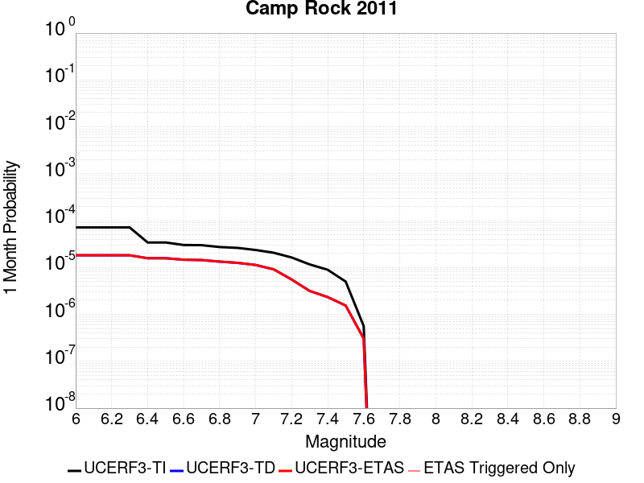 |  |  |

| Magnitude | 1 wk TI Prob | 1 wk TD Prob | 1 wk ETAS Prob | 1 wk ETAS/TD Gain | 1 wk ETAS Triggered Only | 1 mo TI Prob | 1 mo TD Prob | 1 mo ETAS Prob | 1 mo ETAS/TD Gain | 1 mo ETAS Triggered Only | 1 yr TI Prob | 1 yr TD Prob | 1 yr ETAS Prob | 1 yr ETAS/TD Gain | 1 yr ETAS Triggered Only | 10 yr TI Prob | 10 yr TD Prob | 10 yr ETAS Prob | 10 yr ETAS/TD Gain | 10 yr ETAS Triggered Only |
|-----|-----|-----|-----|-----|-----|-----|-----|-----|-----|-----|-----|-----|-----|-----|-----|-----|-----|-----|-----|-----|
| 6.0 | 1.6710783E-5 | 4.2504644E-6 | 4.2504644E-6 | 1.0 | 0.0 | 7.161568E-5 | 1.8216151E-5 | 1.8216151E-5 | 1.0 | 0.0 | 8.7157206E-4 | 2.217596E-4 | 2.217596E-4 | 1.0 | 0.0 | 0.008681616 | 0.002215436 | 0.0022812616 | 1.0297122 | 6.597176E-5 |
| 6.1 | 1.6710783E-5 | 4.2504644E-6 | 4.2504644E-6 | 1.0 | 0.0 | 7.161568E-5 | 1.8216151E-5 | 1.8216151E-5 | 1.0 | 0.0 | 8.7157206E-4 | 2.217596E-4 | 2.217596E-4 | 1.0 | 0.0 | 0.008681616 | 0.002215436 | 0.0022812616 | 1.0297122 | 6.597176E-5 |
| 6.2 | 1.6710783E-5 | 4.2504644E-6 | 4.2504644E-6 | 1.0 | 0.0 | 7.161568E-5 | 1.8216151E-5 | 1.8216151E-5 | 1.0 | 0.0 | 8.7157206E-4 | 2.217596E-4 | 2.217596E-4 | 1.0 | 0.0 | 0.008681616 | 0.002215436 | 0.0022812616 | 1.0297122 | 6.597176E-5 |
| 6.3 | 1.6710783E-5 | 4.2504644E-6 | 4.2504644E-6 | 1.0 | 0.0 | 7.161568E-5 | 1.8216151E-5 | 1.8216151E-5 | 1.0 | 0.0 | 8.7157206E-4 | 2.217596E-4 | 2.217596E-4 | 1.0 | 0.0 | 0.008681616 | 0.002215436 | 0.0022812616 | 1.0297122 | 6.597176E-5 |
| 6.4 | 7.982846E-6 | 3.6822685E-6 | 3.6822685E-6 | 1.0 | 0.0 | 3.421175E-5 | 1.5781057E-5 | 1.5781057E-5 | 1.0 | 0.0 | 4.1644843E-4 | 1.9211778E-4 | 1.9211778E-4 | 1.0 | 0.0 | 0.0041566887 | 0.0019195518 | 0.001985397 | 1.0343024 | 6.597176E-5 |
| 6.5 | 7.982846E-6 | 3.6822685E-6 | 3.6822685E-6 | 1.0 | 0.0 | 3.421175E-5 | 1.5781057E-5 | 1.5781057E-5 | 1.0 | 0.0 | 4.1644843E-4 | 1.9211778E-4 | 1.9211778E-4 | 1.0 | 0.0 | 0.0041566887 | 0.0019195518 | 0.001985397 | 1.0343024 | 6.597176E-5 |
| 6.6 | 7.048869E-6 | 3.4245295E-6 | 3.4245295E-6 | 1.0 | 0.0 | 3.0209088E-5 | 1.4676474E-5 | 1.4676474E-5 | 1.0 | 0.0 | 3.677336E-4 | 1.7867173E-4 | 1.7867173E-4 | 1.0 | 0.0 | 0.0036712566 | 0.0017853125 | 0.0018511665 | 1.0368866 | 6.597176E-5 |
| 6.7 | 6.987307E-6 | 3.3625051E-6 | 3.3625051E-6 | 1.0 | 0.0 | 2.9945259E-5 | 1.4410658E-5 | 1.4410658E-5 | 1.0 | 0.0 | 3.6452254E-4 | 1.7543595E-4 | 1.7543595E-4 | 1.0 | 0.0 | 0.0036392517 | 0.0017530057 | 0.0018188618 | 1.0375675 | 6.597176E-5 |
| 6.8 | 6.3737602E-6 | 3.1180682E-6 | 3.1180682E-6 | 1.0 | 0.0 | 2.731583E-5 | 1.3363083E-5 | 1.3363083E-5 | 1.0 | 0.0 | 3.3251947E-4 | 1.6268367E-4 | 1.6268367E-4 | 1.0 | 0.0 | 0.0033202237 | 0.0016256744 | 0.001691539 | 1.0405152 | 6.597176E-5 |
| 6.9 | 6.112211E-6 | 2.9332696E-6 | 2.9332696E-6 | 1.0 | 0.0 | 2.6194928E-5 | 1.2571097E-5 | 1.2571097E-5 | 1.0 | 0.0 | 3.1887658E-4 | 1.5304264E-4 | 1.5304264E-4 | 1.0 | 0.0 | 0.003184194 | 0.0015294001 | 0.001595271 | 1.0430697 | 6.597176E-5 |
| 7.0 | 5.5140117E-6 | 2.642059E-6 | 2.642059E-6 | 1.0 | 0.0 | 2.3631264E-5 | 1.1323062E-5 | 1.1323062E-5 | 1.0 | 0.0 | 2.8767265E-4 | 1.3784981E-4 | 1.3784981E-4 | 1.0 | 0.0 | 0.0028730053 | 0.0013776683 | 0.0014435492 | 1.0478206 | 6.597176E-5 |
| 7.1 | 4.8151105E-6 | 2.134385E-6 | 2.134385E-6 | 1.0 | 0.0 | 2.0636026E-5 | 9.147334E-6 | 9.147334E-6 | 1.0 | 0.0 | 2.5121463E-4 | 1.1136332E-4 | 1.1136332E-4 | 1.0 | 0.0 | 0.0025093083 | 0.0011130971 | 0.0011789954 | 1.0592027 | 6.597176E-5 |
| 7.2 | 3.818335E-6 | 1.2938276E-6 | 1.2938276E-6 | 1.0 | 0.0 | 1.6364189E-5 | 5.544964E-6 | 5.544964E-6 | 1.0 | 0.0 | 1.9921579E-4 | 6.750793E-5 | 6.750793E-5 | 1.0 | 0.0 | 0.0019903728 | 6.748825E-4 | 7.408097E-4 | 1.097687 | 6.597176E-5 |
| 7.3 | 2.7166698E-6 | 7.38423E-7 | 7.38423E-7 | 1.0 | 0.0 | 1.1642818E-5 | 3.1646662E-6 | 3.1646662E-6 | 1.0 | 0.0 | 1.4174209E-4 | 3.852915E-5 | 3.852915E-5 | 1.0 | 0.0 | 0.0014165172 | 3.852267E-4 | 4.5117305E-4 | 1.1711885 | 6.597176E-5 |
| 7.4 | 2.0893426E-6 | 5.462354E-7 | 5.462354E-7 | 1.0 | 0.0 | 8.954295E-6 | 2.3410068E-6 | 2.3410068E-6 | 1.0 | 0.0 | 1.0901308E-4 | 2.850139E-5 | 2.850139E-5 | 1.0 | 0.0 | 0.0010895962 | 2.849779E-4 | 3.5093084E-4 | 1.2314318 | 6.597176E-5 |
| 7.5 | 1.1681728E-6 | 3.6033393E-7 | 3.6033393E-7 | 1.0 | 0.0 | 5.0064455E-6 | 1.5442874E-6 | 1.5442874E-6 | 1.0 | 0.0 | 6.0951766E-5 | 1.8801542E-5 | 1.8801542E-5 | 1.0 | 0.0 | 6.093505E-4 | 1.8799998E-4 | 2.5395933E-4 | 1.3508477 | 6.597176E-5 |
| 7.6 | 1.3154387E-7 | 7.12009E-8 | 7.12009E-8 | 1.0 | 0.0 | 5.6375933E-7 | 3.051467E-7 | 3.051467E-7 | 1.0 | 0.0 | 6.863748E-6 | 3.7151563E-6 | 3.7151563E-6 | 1.0 | 0.0 | 6.863536E-5 | 3.7151098E-5 | 3.7151098E-5 | 1.0 | 0.0 |

## Hunting Creek - Berryessa 2011 CFM
*[(top)](#table-of-contents)*

| 1 Week | 1 Month | 1 Year | 10 Year |
|-----|-----|-----|-----|
|  |  |  |  |

| Magnitude | 1 wk TI Prob | 1 wk TD Prob | 1 wk ETAS Prob | 1 wk ETAS/TD Gain | 1 wk ETAS Triggered Only | 1 mo TI Prob | 1 mo TD Prob | 1 mo ETAS Prob | 1 mo ETAS/TD Gain | 1 mo ETAS Triggered Only | 1 yr TI Prob | 1 yr TD Prob | 1 yr ETAS Prob | 1 yr ETAS/TD Gain | 1 yr ETAS Triggered Only | 10 yr TI Prob | 10 yr TD Prob | 10 yr ETAS Prob | 10 yr ETAS/TD Gain | 10 yr ETAS Triggered Only |
|-----|-----|-----|-----|-----|-----|-----|-----|-----|-----|-----|-----|-----|-----|-----|-----|-----|-----|-----|-----|-----|
| 6.0 | 1.1270982E-4 | 2.0017775E-4 | 2.0017775E-4 | 1.0 | 0.0 | 4.8295266E-4 | 8.5742475E-4 | 8.5742475E-4 | 1.0 | 0.0 | 0.0058641075 | 0.010388056 | 0.010388056 | 1.0 | 0.0 | 0.057117578 | 0.09805172 | 0.09811123 | 1.0006069 | 6.597176E-5 |
| 6.1 | 1.1239393E-4 | 1.9965896E-4 | 1.9965896E-4 | 1.0 | 0.0 | 4.8159933E-4 | 8.552031E-4 | 8.552031E-4 | 1.0 | 0.0 | 0.0058477195 | 0.010361288 | 0.010361288 | 1.0 | 0.0 | 0.056962132 | 0.09781016 | 0.09781016 | 1.0 | 0.0 |
| 6.2 | 7.596265E-5 | 1.2940993E-4 | 1.2940993E-4 | 1.0 | 0.0 | 3.2551357E-4 | 5.5426615E-4 | 5.5426615E-4 | 1.0 | 0.0 | 0.0039559277 | 0.006721831 | 0.006721831 | 1.0 | 0.0 | 0.038862433 | 0.064600885 | 0.064600885 | 1.0 | 0.0 |
| 6.3 | 6.78794E-5 | 1.1452538E-4 | 1.1452538E-4 | 1.0 | 0.0 | 2.9087928E-4 | 4.9073447E-4 | 4.9073447E-4 | 1.0 | 0.0 | 0.003535705 | 0.0059534037 | 0.0059534037 | 1.0 | 0.0 | 0.034799766 | 0.05747386 | 0.05747386 | 1.0 | 0.0 |
| 6.4 | 6.2165134E-5 | 1.04393934E-4 | 1.04393934E-4 | 1.0 | 0.0 | 2.6639478E-4 | 4.4732942E-4 | 4.4732942E-4 | 1.0 | 0.0 | 0.0032385332 | 0.0054282364 | 0.0054282364 | 1.0 | 0.0 | 0.03191742 | 0.052558403 | 0.052558403 | 1.0 | 0.0 |
| 6.5 | 5.4368087E-5 | 9.073724E-5 | 9.073724E-5 | 1.0 | 0.0 | 2.3298527E-4 | 3.8881917E-4 | 3.8881917E-4 | 1.0 | 0.0 | 0.0028329059 | 0.004720476 | 0.004720476 | 1.0 | 0.0 | 0.027970633 | 0.04588709 | 0.04588709 | 1.0 | 0.0 |
| 6.6 | 4.729947E-5 | 7.849487E-5 | 7.849487E-5 | 1.0 | 0.0 | 2.0269625E-4 | 3.3636627E-4 | 3.3636627E-4 | 1.0 | 0.0 | 0.002465034 | 0.0040854933 | 0.0040854933 | 1.0 | 0.0 | 0.02437869 | 0.039857663 | 0.039857663 | 1.0 | 0.0 |
| 6.7 | 3.6875328E-5 | 6.0465416E-5 | 6.0465416E-5 | 1.0 | 0.0 | 1.5802756E-4 | 2.5911423E-4 | 2.5911423E-4 | 1.0 | 0.0 | 0.0019222875 | 0.0031486591 | 0.0031486591 | 1.0 | 0.0 | 0.019057442 | 0.030897204 | 0.030897204 | 1.0 | 0.0 |
| 6.8 | 2.0292036E-5 | 2.897928E-5 | 2.897928E-5 | 1.0 | 0.0 | 8.6962966E-5 | 1.2419096E-4 | 1.2419096E-4 | 1.0 | 0.0 | 0.0010582599 | 0.0015109582 | 0.0015109582 | 1.0 | 0.0 | 0.010532344 | 0.014980009 | 0.014980009 | 1.0 | 0.0 |
| 6.9 | 1.7871042E-5 | 2.4474773E-5 | 2.4474773E-5 | 1.0 | 0.0 | 7.658793E-5 | 1.0488762E-4 | 1.0488762E-4 | 1.0 | 0.0 | 9.320591E-4 | 0.0012762607 | 0.0012762607 | 1.0 | 0.0 | 0.009281595 | 0.01268106 | 0.01268106 | 1.0 | 0.0 |
| 7.0 | 1.6415532E-5 | 2.1908601E-5 | 2.1908601E-5 | 1.0 | 0.0 | 7.035038E-5 | 9.3890645E-5 | 9.3890645E-5 | 1.0 | 0.0 | 8.561793E-4 | 0.0011425226 | 0.0011425226 | 1.0 | 0.0 | 0.008528882 | 0.011365713 | 0.011365713 | 1.0 | 0.0 |
| 7.1 | 1.5409885E-5 | 2.034855E-5 | 2.034855E-5 | 1.0 | 0.0 | 6.6040695E-5 | 8.720518E-5 | 8.720518E-5 | 1.0 | 0.0 | 8.0374884E-4 | 0.0010612089 | 0.0010612089 | 1.0 | 0.0 | 0.00800848 | 0.010561734 | 0.010561734 | 1.0 | 0.0 |
| 7.2 | 1.4497423E-5 | 1.905703E-5 | 1.905703E-5 | 1.0 | 0.0 | 6.213033E-5 | 8.167045E-5 | 8.167045E-5 | 1.0 | 0.0 | 7.5617427E-4 | 9.938872E-4 | 9.938872E-4 | 1.0 | 0.0 | 0.0075360634 | 0.009894996 | 0.009894996 | 1.0 | 0.0 |
| 7.3 | 1.3615175E-5 | 1.7828126E-5 | 1.7828126E-5 | 1.0 | 0.0 | 5.8349444E-5 | 7.640403E-5 | 7.640403E-5 | 1.0 | 0.0 | 7.101729E-4 | 9.2982507E-4 | 9.2982507E-4 | 1.0 | 0.0 | 0.0070790765 | 0.009259855 | 0.009259855 | 1.0 | 0.0 |
| 7.4 | 1.2252825E-5 | 1.6028054E-5 | 1.6028054E-5 | 1.0 | 0.0 | 5.251105E-5 | 6.8689864E-5 | 6.8689864E-5 | 1.0 | 0.0 | 6.391345E-4 | 8.3598105E-4 | 8.3598105E-4 | 1.0 | 0.0 | 0.0063729943 | 0.008328805 | 0.008328805 | 1.0 | 0.0 |
| 7.5 | 1.0913301E-5 | 1.4242686E-5 | 1.4242686E-5 | 1.0 | 0.0 | 4.6770452E-5 | 6.103867E-5 | 6.103867E-5 | 1.0 | 0.0 | 5.6928146E-4 | 7.428952E-4 | 7.428952E-4 | 1.0 | 0.0 | 0.0056782532 | 0.0074044922 | 0.0074044922 | 1.0 | 0.0 |
| 7.6 | 8.623192E-6 | 1.1235767E-5 | 1.1235767E-5 | 1.0 | 0.0 | 3.6956015E-5 | 4.815241E-5 | 4.815241E-5 | 1.0 | 0.0 | 4.4984656E-4 | 5.861005E-4 | 5.861005E-4 | 1.0 | 0.0 | 0.00448937 | 0.005845862 | 0.005845862 | 1.0 | 0.0 |
| 7.7 | 2.0993634E-6 | 2.6627938E-6 | 2.6627938E-6 | 1.0 | 0.0 | 8.997241E-6 | 1.1411924E-5 | 1.1411924E-5 | 1.0 | 0.0 | 1.09535904E-4 | 1.3893138E-4 | 1.3893138E-4 | 1.0 | 0.0 | 0.0010948193 | 0.0013884519 | 0.0013884519 | 1.0 | 0.0 |
| 7.8 | 1.8428308E-7 | 2.1675888E-7 | 2.1675888E-7 | 1.0 | 0.0 | 7.897844E-7 | 9.289663E-7 | 9.289663E-7 | 1.0 | 0.0 | 9.615583E-6 | 1.131011E-5 | 1.131011E-5 | 1.0 | 0.0 | 9.615166E-5 | 1.1309395E-4 | 1.1309395E-4 | 1.0 | 0.0 |

## Elsinore (Glen Ivy) rev
*[(top)](#table-of-contents)*

| 1 Week | 1 Month | 1 Year | 10 Year |
|-----|-----|-----|-----|
|  |  |  | 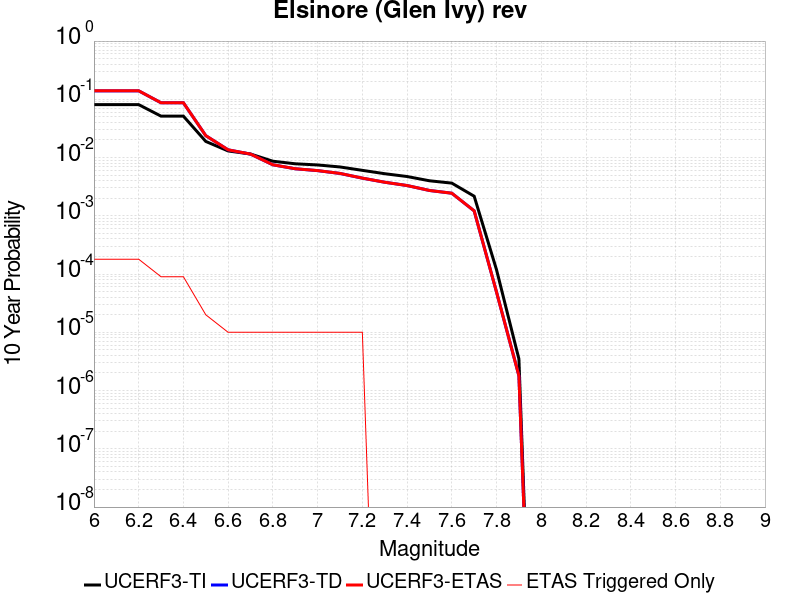 |

| Magnitude | 1 wk TI Prob | 1 wk TD Prob | 1 wk ETAS Prob | 1 wk ETAS/TD Gain | 1 wk ETAS Triggered Only | 1 mo TI Prob | 1 mo TD Prob | 1 mo ETAS Prob | 1 mo ETAS/TD Gain | 1 mo ETAS Triggered Only | 1 yr TI Prob | 1 yr TD Prob | 1 yr ETAS Prob | 1 yr ETAS/TD Gain | 1 yr ETAS Triggered Only | 10 yr TI Prob | 10 yr TD Prob | 10 yr ETAS Prob | 10 yr ETAS/TD Gain | 10 yr ETAS Triggered Only |
|-----|-----|-----|-----|-----|-----|-----|-----|-----|-----|-----|-----|-----|-----|-----|-----|-----|-----|-----|-----|-----|
| 6.0 | 1.6204086E-4 | 2.936593E-4 | 2.936593E-4 | 1.0 | 0.0 | 6.94276E-4 | 0.0012580877 | 0.0012580877 | 1.0 | 0.0 | 0.008420097 | 0.015237179 | 0.015302145 | 1.0042636 | 6.597176E-5 | 0.081081145 | 0.13970533 | 0.13976209 | 1.0004063 | 6.597176E-5 |
| 6.1 | 1.6204086E-4 | 2.936593E-4 | 2.936593E-4 | 1.0 | 0.0 | 6.94276E-4 | 0.0012580877 | 0.0012580877 | 1.0 | 0.0 | 0.008420097 | 0.015237179 | 0.015302145 | 1.0042636 | 6.597176E-5 | 0.081081145 | 0.13970533 | 0.13976209 | 1.0004063 | 6.597176E-5 |
| 6.2 | 1.6204086E-4 | 2.936593E-4 | 2.936593E-4 | 1.0 | 0.0 | 6.94276E-4 | 0.0012580877 | 0.0012580877 | 1.0 | 0.0 | 0.008420097 | 0.015237179 | 0.015302145 | 1.0042636 | 6.597176E-5 | 0.081081145 | 0.13970533 | 0.13976209 | 1.0004063 | 6.597176E-5 |
| 6.3 | 1.0111737E-4 | 1.7704896E-4 | 1.7704896E-4 | 1.0 | 0.0 | 4.332882E-4 | 7.5867726E-4 | 7.5867726E-4 | 1.0 | 0.0 | 0.005262531 | 0.009218467 | 0.009218467 | 1.0 | 0.0 | 0.0513964 | 0.087025836 | 0.087025836 | 1.0 | 0.0 |
| 6.4 | 1.0111737E-4 | 1.7704896E-4 | 1.7704896E-4 | 1.0 | 0.0 | 4.332882E-4 | 7.5867726E-4 | 7.5867726E-4 | 1.0 | 0.0 | 0.005262531 | 0.009218467 | 0.009218467 | 1.0 | 0.0 | 0.0513964 | 0.087025836 | 0.087025836 | 1.0 | 0.0 |
| 6.5 | 3.6624708E-5 | 4.6398443E-5 | 4.6398443E-5 | 1.0 | 0.0 | 1.569536E-4 | 1.9883736E-4 | 1.9883736E-4 | 1.0 | 0.0 | 0.001909235 | 0.0024185202 | 0.0024185202 | 1.0 | 0.0 | 0.01892915 | 0.02374361 | 0.02374361 | 1.0 | 0.0 |
| 6.6 | 2.5051324E-5 | 2.615282E-5 | 2.615282E-5 | 1.0 | 0.0 | 1.073584E-4 | 1.12078946E-4 | 1.12078946E-4 | 1.0 | 0.0 | 0.0013063047 | 0.0013637516 | 0.0013637516 | 1.0 | 0.0 | 0.012986525 | 0.013567226 | 0.013567226 | 1.0 | 0.0 |
| 6.7 | 2.2189772E-5 | 2.2077227E-5 | 2.2077227E-5 | 1.0 | 0.0 | 9.509556E-5 | 9.461347E-5 | 9.461347E-5 | 1.0 | 0.0 | 0.0011571734 | 0.0011513466 | 0.0011513466 | 1.0 | 0.0 | 0.011511663 | 0.0114676645 | 0.0114676645 | 1.0 | 0.0 |
| 6.8 | 1.6654378E-5 | 1.4440319E-5 | 1.4440319E-5 | 1.0 | 0.0 | 7.137396E-5 | 6.188564E-5 | 6.188564E-5 | 1.0 | 0.0 | 8.686314E-4 | 7.532024E-4 | 7.532024E-4 | 1.0 | 0.0 | 0.008652439 | 0.0075118328 | 0.0075118328 | 1.0 | 0.0 |
| 6.9 | 1.5042909E-5 | 1.2334286E-5 | 1.2334286E-5 | 1.0 | 0.0 | 6.446802E-5 | 5.286017E-5 | 5.286017E-5 | 1.0 | 0.0 | 7.8461546E-4 | 6.433857E-4 | 6.433857E-4 | 1.0 | 0.0 | 0.007818509 | 0.006419453 | 0.006419453 | 1.0 | 0.0 |
| 7.0 | 1.4361385E-5 | 1.1453455E-5 | 1.1453455E-5 | 1.0 | 0.0 | 6.154734E-5 | 4.908533E-5 | 4.908533E-5 | 1.0 | 0.0 | 7.490812E-4 | 5.974529E-4 | 5.974529E-4 | 1.0 | 0.0 | 0.007465612 | 0.005962458 | 0.005962458 | 1.0 | 0.0 |
| 7.1 | 1.3265571E-5 | 1.0246749E-5 | 1.0246749E-5 | 1.0 | 0.0 | 5.6851208E-5 | 4.3913915E-5 | 4.3913915E-5 | 1.0 | 0.0 | 6.919436E-4 | 5.345233E-4 | 5.345233E-4 | 1.0 | 0.0 | 0.006897931 | 0.0053357324 | 0.0053357324 | 1.0 | 0.0 |
| 7.2 | 1.1596403E-5 | 8.506553E-6 | 8.506553E-6 | 1.0 | 0.0 | 4.9697923E-5 | 3.6456157E-5 | 3.6456157E-5 | 1.0 | 0.0 | 6.049042E-4 | 4.4376502E-4 | 4.4376502E-4 | 1.0 | 0.0 | 0.006032603 | 0.004430204 | 0.004430204 | 1.0 | 0.0 |
| 7.3 | 1.0150827E-5 | 7.2399926E-6 | 7.2399926E-6 | 1.0 | 0.0 | 4.3502816E-5 | 3.102818E-5 | 3.102818E-5 | 1.0 | 0.0 | 5.2951806E-4 | 3.77704E-4 | 3.77704E-4 | 1.0 | 0.0 | 0.005282581 | 0.0037710073 | 0.0037710073 | 1.0 | 0.0 |
| 7.4 | 9.080705E-6 | 6.3535763E-6 | 6.3535763E-6 | 1.0 | 0.0 | 3.8916725E-5 | 2.7229335E-5 | 2.7229335E-5 | 1.0 | 0.0 | 4.7370812E-4 | 3.314681E-4 | 3.314681E-4 | 1.0 | 0.0 | 0.004726996 | 0.0033098878 | 0.0033098878 | 1.0 | 0.0 |
| 7.5 | 7.671649E-6 | 5.2264927E-6 | 5.2264927E-6 | 1.0 | 0.0 | 3.287808E-5 | 2.2399068E-5 | 2.2399068E-5 | 1.0 | 0.0 | 4.0021708E-4 | 2.726758E-4 | 2.726758E-4 | 1.0 | 0.0 | 0.0039949706 | 0.0027235372 | 0.0027235372 | 1.0 | 0.0 |
| 7.6 | 6.990086E-6 | 4.6883147E-6 | 4.6883147E-6 | 1.0 | 0.0 | 2.9957167E-5 | 2.009263E-5 | 2.009263E-5 | 1.0 | 0.0 | 3.6466747E-4 | 2.4460148E-4 | 2.4460148E-4 | 1.0 | 0.0 | 0.0036406964 | 0.0024434389 | 0.0024434389 | 1.0 | 0.0 |
| 7.7 | 4.163505E-6 | 2.3299876E-6 | 2.3299876E-6 | 1.0 | 0.0 | 1.7843471E-5 | 9.985628E-6 | 9.985628E-6 | 1.0 | 0.0 | 2.172226E-4 | 1.2156898E-4 | 1.2156898E-4 | 1.0 | 0.0 | 0.0021701038 | 0.0012150978 | 0.0012150978 | 1.0 | 0.0 |
| 7.8 | 2.2692414E-7 | 9.3873886E-8 | 9.3873886E-8 | 1.0 | 0.0 | 9.725317E-7 | 4.023166E-7 | 4.023166E-7 | 1.0 | 0.0 | 1.1840509E-5 | 4.898197E-6 | 4.898197E-6 | 1.0 | 0.0 | 1.1839878E-4 | 4.898122E-5 | 4.898122E-5 | 1.0 | 0.0 |
| 7.9 | 6.676829E-9 | 3.4403498E-9 | 3.4403498E-9 | 1.0 | 0.0 | 2.861498E-8 | 1.4744357E-8 | 1.4744357E-8 | 1.0 | 0.0 | 3.4838732E-7 | 1.7951253E-7 | 1.7951253E-7 | 1.0 | 0.0 | 3.4838679E-6 | 1.7951239E-6 | 1.7951239E-6 | 1.0 | 0.0 |

## Butano 2011 CFM
*[(top)](#table-of-contents)*

| 1 Week | 1 Month | 1 Year | 10 Year |
|-----|-----|-----|-----|
|  |  |  | 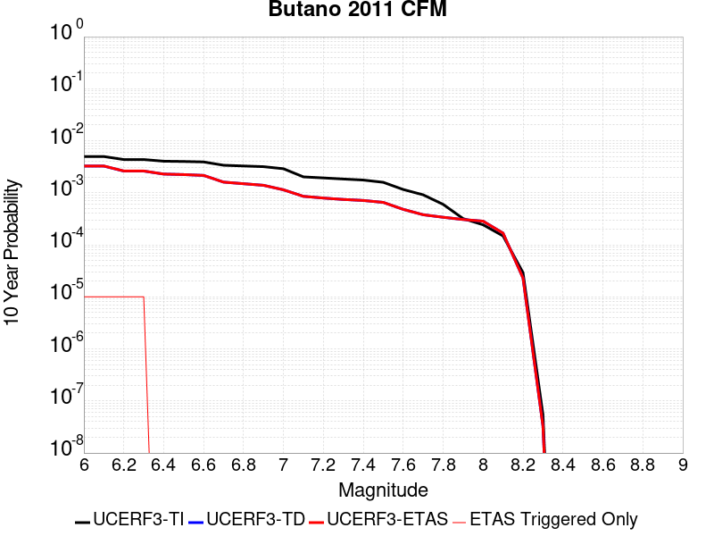 |

| Magnitude | 1 wk TI Prob | 1 wk TD Prob | 1 wk ETAS Prob | 1 wk ETAS/TD Gain | 1 wk ETAS Triggered Only | 1 mo TI Prob | 1 mo TD Prob | 1 mo ETAS Prob | 1 mo ETAS/TD Gain | 1 mo ETAS Triggered Only | 1 yr TI Prob | 1 yr TD Prob | 1 yr ETAS Prob | 1 yr ETAS/TD Gain | 1 yr ETAS Triggered Only | 10 yr TI Prob | 10 yr TD Prob | 10 yr ETAS Prob | 10 yr ETAS/TD Gain | 10 yr ETAS Triggered Only |
|-----|-----|-----|-----|-----|-----|-----|-----|-----|-----|-----|-----|-----|-----|-----|-----|-----|-----|-----|-----|-----|
| 6.0 | 9.561135E-6 | 6.229379E-6 | 6.229379E-6 | 1.0 | 0.0 | 4.097565E-5 | 2.6697078E-5 | 2.6697078E-5 | 1.0 | 0.0 | 4.9876433E-4 | 3.2499063E-4 | 3.2499063E-4 | 1.0 | 0.0 | 0.004976464 | 0.0032628316 | 0.003328588 | 1.0201532 | 6.597176E-5 |
| 6.1 | 9.561135E-6 | 6.229379E-6 | 6.229379E-6 | 1.0 | 0.0 | 4.097565E-5 | 2.6697078E-5 | 2.6697078E-5 | 1.0 | 0.0 | 4.9876433E-4 | 3.2499063E-4 | 3.2499063E-4 | 1.0 | 0.0 | 0.004976464 | 0.0032628316 | 0.003328588 | 1.0201532 | 6.597176E-5 |
| 6.2 | 8.364741E-6 | 4.982436E-6 | 4.982436E-6 | 1.0 | 0.0 | 3.5848396E-5 | 2.1353131E-5 | 2.1353131E-5 | 1.0 | 0.0 | 4.3636683E-4 | 2.5994494E-4 | 2.5994494E-4 | 1.0 | 0.0 | 0.0043551093 | 0.0026140346 | 0.002679834 | 1.0251715 | 6.597176E-5 |
| 6.3 | 8.364741E-6 | 4.982436E-6 | 4.982436E-6 | 1.0 | 0.0 | 3.5848396E-5 | 2.1353131E-5 | 2.1353131E-5 | 1.0 | 0.0 | 4.3636683E-4 | 2.5994494E-4 | 2.5994494E-4 | 1.0 | 0.0 | 0.0043551093 | 0.0026140346 | 0.002679834 | 1.0251715 | 6.597176E-5 |
| 6.4 | 7.768282E-6 | 4.36037E-6 | 4.36037E-6 | 1.0 | 0.0 | 3.329221E-5 | 1.8687173E-5 | 1.8687173E-5 | 1.0 | 0.0 | 4.0525728E-4 | 2.2749395E-4 | 2.2749395E-4 | 1.0 | 0.0 | 0.0040451903 | 0.0022902212 | 0.0022902212 | 1.0 | 0.0 |
| 6.5 | 7.673437E-6 | 4.25993E-6 | 4.25993E-6 | 1.0 | 0.0 | 3.2885746E-5 | 1.8256722E-5 | 1.8256722E-5 | 1.0 | 0.0 | 4.0031038E-4 | 2.2225427E-4 | 2.2225427E-4 | 1.0 | 0.0 | 0.0039959005 | 0.0022379302 | 0.0022379302 | 1.0 | 0.0 |
| 6.6 | 7.5244197E-6 | 4.1048884E-6 | 4.1048884E-6 | 1.0 | 0.0 | 3.2247113E-5 | 1.7592267E-5 | 1.7592267E-5 | 1.0 | 0.0 | 3.9253788E-4 | 2.1416614E-4 | 2.1416614E-4 | 1.0 | 0.0 | 0.003918452 | 0.0021572078 | 0.0021572078 | 1.0 | 0.0 |
| 6.7 | 6.4921405E-6 | 3.0449146E-6 | 3.0449146E-6 | 1.0 | 0.0 | 2.7823162E-5 | 1.3049569E-5 | 1.3049569E-5 | 1.0 | 0.0 | 3.3869434E-4 | 1.58867E-4 | 1.58867E-4 | 1.0 | 0.0 | 0.003381786 | 0.0016050308 | 0.0016050308 | 1.0 | 0.0 |
| 6.8 | 6.2890294E-6 | 2.8316724E-6 | 2.8316724E-6 | 1.0 | 0.0 | 2.6952705E-5 | 1.21356825E-5 | 1.21356825E-5 | 1.0 | 0.0 | 3.2809976E-4 | 1.4774199E-4 | 1.4774199E-4 | 1.0 | 0.0 | 0.0032761577 | 0.0014939354 | 0.0014939354 | 1.0 | 0.0 |
| 6.9 | 6.0965517E-6 | 2.6381745E-6 | 2.6381745E-6 | 1.0 | 0.0 | 2.6127816E-5 | 1.13064125E-5 | 1.13064125E-5 | 1.0 | 0.0 | 3.1805973E-4 | 1.3764694E-4 | 1.3764694E-4 | 1.0 | 0.0 | 0.0031760489 | 0.0013931149 | 0.0013931149 | 1.0 | 0.0 |
| 7.0 | 5.566252E-6 | 2.1555431E-6 | 2.1555431E-6 | 1.0 | 0.0 | 2.3855147E-5 | 9.23801E-6 | 9.23801E-6 | 1.0 | 0.0 | 2.9039773E-4 | 1.12467E-4 | 1.12467E-4 | 1.0 | 0.0 | 0.0029001853 | 0.0011415965 | 0.0011415965 | 1.0 | 0.0 |
| 7.1 | 3.878588E-6 | 1.6063866E-6 | 1.6063866E-6 | 1.0 | 0.0 | 1.6622414E-5 | 6.884495E-6 | 6.884495E-6 | 1.0 | 0.0 | 2.023591E-4 | 8.381551E-5 | 8.381551E-5 | 1.0 | 0.0 | 0.0020217493 | 8.549361E-4 | 8.549361E-4 | 1.0 | 0.0 |
| 7.2 | 3.7038085E-6 | 1.4874075E-6 | 1.4874075E-6 | 1.0 | 0.0 | 1.587337E-5 | 6.374588E-6 | 6.374588E-6 | 1.0 | 0.0 | 1.9324113E-4 | 7.7607845E-5 | 7.7607845E-5 | 1.0 | 0.0 | 0.0019307317 | 7.9287245E-4 | 7.9287245E-4 | 1.0 | 0.0 |
| 7.3 | 3.5277278E-6 | 1.3954846E-6 | 1.3954846E-6 | 1.0 | 0.0 | 1.5118746E-5 | 5.980634E-6 | 5.980634E-6 | 1.0 | 0.0 | 1.8405518E-4 | 7.281179E-5 | 7.281179E-5 | 1.0 | 0.0 | 0.0018390282 | 7.4485753E-4 | 7.4485753E-4 | 1.0 | 0.0 |
| 7.4 | 3.3711294E-6 | 1.332691E-6 | 1.332691E-6 | 1.0 | 0.0 | 1.4447617E-5 | 5.7115203E-6 | 5.7115203E-6 | 1.0 | 0.0 | 1.7588554E-4 | 6.953554E-5 | 6.953554E-5 | 1.0 | 0.0 | 0.0017574639 | 7.1206415E-4 | 7.1206415E-4 | 1.0 | 0.0 |
| 7.5 | 3.0496426E-6 | 1.2215638E-6 | 1.2215638E-6 | 1.0 | 0.0 | 1.3069831E-5 | 5.235263E-6 | 5.235263E-6 | 1.0 | 0.0 | 1.5911358E-4 | 6.373746E-5 | 6.373746E-5 | 1.0 | 0.0 | 0.001589997 | 6.540503E-4 | 6.540503E-4 | 1.0 | 0.0 |
| 7.6 | 2.2179781E-6 | 8.894081E-7 | 8.894081E-7 | 1.0 | 0.0 | 9.505586E-6 | 3.8117432E-6 | 3.8117432E-6 | 1.0 | 0.0 | 1.1572436E-4 | 4.6406985E-5 | 4.6406985E-5 | 1.0 | 0.0 | 0.0011566412 | 4.8072715E-4 | 4.8072715E-4 | 1.0 | 0.0 |
| 7.7 | 1.7519328E-6 | 6.9516506E-7 | 6.9516506E-7 | 1.0 | 0.0 | 7.508262E-6 | 2.9792752E-6 | 2.9792752E-6 | 1.0 | 0.0 | 9.140925E-5 | 3.627207E-5 | 3.627207E-5 | 1.0 | 0.0 | 9.137166E-4 | 3.7868315E-4 | 3.7868315E-4 | 1.0 | 0.0 |
| 7.8 | 1.1478974E-6 | 6.192946E-7 | 6.192946E-7 | 1.0 | 0.0 | 4.9195505E-6 | 2.654117E-6 | 2.654117E-6 | 1.0 | 0.0 | 5.9893882E-5 | 3.2313394E-5 | 3.2313394E-5 | 1.0 | 0.0 | 5.9877743E-4 | 3.3876847E-4 | 3.3876847E-4 | 1.0 | 0.0 |
| 7.9 | 6.1154634E-7 | 5.598227E-7 | 5.598227E-7 | 1.0 | 0.0 | 2.6209104E-6 | 2.399238E-6 | 2.399238E-6 | 1.0 | 0.0 | 3.1909116E-5 | 2.921033E-5 | 2.921033E-5 | 1.0 | 0.0 | 3.1904536E-4 | 3.0650035E-4 | 3.0650035E-4 | 1.0 | 0.0 |
| 8.0 | 4.6520046E-7 | 5.20429E-7 | 5.20429E-7 | 1.0 | 0.0 | 1.9937147E-6 | 2.2304082E-6 | 2.2304082E-6 | 1.0 | 0.0 | 2.4273206E-5 | 2.715488E-5 | 2.715488E-5 | 1.0 | 0.0 | 2.4270554E-4 | 2.8497382E-4 | 2.8497382E-4 | 1.0 | 0.0 |
| 8.1 | 2.8425194E-7 | 3.0655784E-7 | 3.0655784E-7 | 1.0 | 0.0 | 1.218222E-6 | 1.3138186E-6 | 1.3138186E-6 | 1.0 | 0.0 | 1.4831752E-5 | 1.5995623E-5 | 1.5995623E-5 | 1.0 | 0.0 | 1.4830762E-4 | 1.6785401E-4 | 1.6785401E-4 | 1.0 | 0.0 |
| 8.2 | 5.585778E-8 | 4.066672E-8 | 4.066672E-8 | 1.0 | 0.0 | 2.3939046E-7 | 1.7428593E-7 | 1.7428593E-7 | 1.0 | 0.0 | 2.914575E-6 | 2.1219291E-6 | 2.1219291E-6 | 1.0 | 0.0 | 2.9145367E-5 | 2.3054243E-5 | 2.3054243E-5 | 1.0 | 0.0 |
| 8.3 | 1.0371215E-10 | 5.378642E-11 | 5.378642E-11 | 1.0 | 0.0 | 4.4448079E-10 | 2.3051328E-10 | 2.3051328E-10 | 1.0 | 0.0 | 5.4115543E-9 | 2.8064993E-9 | 2.8064993E-9 | 1.0 | 0.0 | 5.4115542E-8 | 3.2273256E-8 | 3.2273256E-8 | 1.0 | 0.0 |

## Kern Canyon (North Kern) 2011
*[(top)](#table-of-contents)*

| 1 Week | 1 Month | 1 Year | 10 Year |
|-----|-----|-----|-----|
|  |  |  |  |

| Magnitude | 1 wk TI Prob | 1 wk TD Prob | 1 wk ETAS Prob | 1 wk ETAS/TD Gain | 1 wk ETAS Triggered Only | 1 mo TI Prob | 1 mo TD Prob | 1 mo ETAS Prob | 1 mo ETAS/TD Gain | 1 mo ETAS Triggered Only | 1 yr TI Prob | 1 yr TD Prob | 1 yr ETAS Prob | 1 yr ETAS/TD Gain | 1 yr ETAS Triggered Only | 10 yr TI Prob | 10 yr TD Prob | 10 yr ETAS Prob | 10 yr ETAS/TD Gain | 10 yr ETAS Triggered Only |
|-----|-----|-----|-----|-----|-----|-----|-----|-----|-----|-----|-----|-----|-----|-----|-----|-----|-----|-----|-----|-----|
| 6.0 | 6.6264497E-6 | 6.7574156E-6 | 6.7574156E-6 | 1.0 | 0.0 | 2.8398761E-5 | 2.8960078E-5 | 2.8960078E-5 | 1.0 | 0.0 | 3.4570007E-4 | 3.525399E-4 | 3.525399E-4 | 1.0 | 0.0 | 0.0034516277 | 0.003520595 | 0.0035863344 | 1.0186728 | 6.597176E-5 |
| 6.1 | 6.6264497E-6 | 6.7574156E-6 | 6.7574156E-6 | 1.0 | 0.0 | 2.8398761E-5 | 2.8960078E-5 | 2.8960078E-5 | 1.0 | 0.0 | 3.4570007E-4 | 3.525399E-4 | 3.525399E-4 | 1.0 | 0.0 | 0.0034516277 | 0.003520595 | 0.0035863344 | 1.0186728 | 6.597176E-5 |
| 6.2 | 6.6264497E-6 | 6.7574156E-6 | 6.7574156E-6 | 1.0 | 0.0 | 2.8398761E-5 | 2.8960078E-5 | 2.8960078E-5 | 1.0 | 0.0 | 3.4570007E-4 | 3.525399E-4 | 3.525399E-4 | 1.0 | 0.0 | 0.0034516277 | 0.003520595 | 0.0035863344 | 1.0186728 | 6.597176E-5 |
| 6.3 | 6.6264497E-6 | 6.7574156E-6 | 6.7574156E-6 | 1.0 | 0.0 | 2.8398761E-5 | 2.8960078E-5 | 2.8960078E-5 | 1.0 | 0.0 | 3.4570007E-4 | 3.525399E-4 | 3.525399E-4 | 1.0 | 0.0 | 0.0034516277 | 0.003520595 | 0.0035863344 | 1.0186728 | 6.597176E-5 |
| 6.4 | 6.6264497E-6 | 6.7574156E-6 | 6.7574156E-6 | 1.0 | 0.0 | 2.8398761E-5 | 2.8960078E-5 | 2.8960078E-5 | 1.0 | 0.0 | 3.4570007E-4 | 3.525399E-4 | 3.525399E-4 | 1.0 | 0.0 | 0.0034516277 | 0.003520595 | 0.0035863344 | 1.0186728 | 6.597176E-5 |
| 6.5 | 3.2162225E-6 | 3.2571281E-6 | 3.2571281E-6 | 1.0 | 0.0 | 1.3783738E-5 | 1.395905E-5 | 1.395905E-5 | 1.0 | 0.0 | 1.6780409E-4 | 1.69939E-4 | 1.69939E-4 | 1.0 | 0.0 | 0.0016767744 | 0.0016981701 | 0.0016981701 | 1.0 | 0.0 |
| 6.6 | 3.2162225E-6 | 3.2571281E-6 | 3.2571281E-6 | 1.0 | 0.0 | 1.3783738E-5 | 1.395905E-5 | 1.395905E-5 | 1.0 | 0.0 | 1.6780409E-4 | 1.69939E-4 | 1.69939E-4 | 1.0 | 0.0 | 0.0016767744 | 0.0016981701 | 0.0016981701 | 1.0 | 0.0 |
| 6.7 | 2.1908265E-6 | 2.2071454E-6 | 2.2071454E-6 | 1.0 | 0.0 | 9.389223E-6 | 9.459161E-6 | 9.459161E-6 | 1.0 | 0.0 | 1.1430779E-4 | 1.15159404E-4 | 1.15159404E-4 | 1.0 | 0.0 | 0.0011424901 | 0.0011510167 | 0.0011510167 | 1.0 | 0.0 |
| 6.8 | 1.7303895E-6 | 1.7365707E-6 | 1.7365707E-6 | 1.0 | 0.0 | 7.415934E-6 | 7.442425E-6 | 7.442425E-6 | 1.0 | 0.0 | 9.028525E-5 | 9.060786E-5 | 9.060786E-5 | 1.0 | 0.0 | 9.024858E-4 | 9.057189E-4 | 9.057189E-4 | 1.0 | 0.0 |
| 6.9 | 1.3700314E-6 | 1.368876E-6 | 1.368876E-6 | 1.0 | 0.0 | 5.87155E-6 | 5.8665987E-6 | 5.8665987E-6 | 1.0 | 0.0 | 7.148377E-5 | 7.142354E-5 | 7.142354E-5 | 1.0 | 0.0 | 7.146078E-4 | 7.1401044E-4 | 7.1401044E-4 | 1.0 | 0.0 |
| 7.0 | 1.1467797E-6 | 1.141392E-6 | 1.141392E-6 | 1.0 | 0.0 | 4.9147607E-6 | 4.891671E-6 | 4.891671E-6 | 1.0 | 0.0 | 5.983557E-5 | 5.95545E-5 | 5.95545E-5 | 1.0 | 0.0 | 5.981946E-4 | 5.953885E-4 | 5.953885E-4 | 1.0 | 0.0 |
| 7.1 | 9.3952065E-7 | 9.3027853E-7 | 9.3027853E-7 | 1.0 | 0.0 | 4.026511E-6 | 3.986902E-6 | 3.986902E-6 | 1.0 | 0.0 | 4.9021666E-5 | 4.8539467E-5 | 4.8539467E-5 | 1.0 | 0.0 | 4.901085E-4 | 4.8529042E-4 | 4.8529042E-4 | 1.0 | 0.0 |
| 7.2 | 6.858055E-7 | 6.71937E-7 | 6.71937E-7 | 1.0 | 0.0 | 2.939163E-6 | 2.879727E-6 | 2.879727E-6 | 1.0 | 0.0 | 3.5783723E-5 | 3.506012E-5 | 3.506012E-5 | 1.0 | 0.0 | 3.5777962E-4 | 3.5054676E-4 | 3.5054676E-4 | 1.0 | 0.0 |
| 7.3 | 5.1101983E-7 | 4.939352E-7 | 4.939352E-7 | 1.0 | 0.0 | 2.1900833E-6 | 2.1168635E-6 | 2.1168635E-6 | 1.0 | 0.0 | 2.6663936E-5 | 2.5772513E-5 | 2.5772513E-5 | 1.0 | 0.0 | 2.6660739E-4 | 2.5769573E-4 | 2.5769573E-4 | 1.0 | 0.0 |
| 7.4 | 3.4999414E-7 | 3.299627E-7 | 3.299627E-7 | 1.0 | 0.0 | 1.499974E-6 | 1.4141251E-6 | 1.4141251E-6 | 1.0 | 0.0 | 1.8262032E-5 | 1.721684E-5 | 1.721684E-5 | 1.0 | 0.0 | 1.826053E-4 | 1.721553E-4 | 1.721553E-4 | 1.0 | 0.0 |
| 7.5 | 1.7021522E-7 | 1.475023E-7 | 1.475023E-7 | 1.0 | 0.0 | 7.2949354E-7 | 6.321526E-7 | 6.321526E-7 | 1.0 | 0.0 | 8.881548E-6 | 7.696432E-6 | 7.696432E-6 | 1.0 | 0.0 | 8.8811925E-5 | 7.6961725E-5 | 7.6961725E-5 | 1.0 | 0.0 |
| 7.6 | 2.572245E-8 | 1.7352884E-8 | 1.7352884E-8 | 1.0 | 0.0 | 1.10239064E-7 | 7.43695E-8 | 7.43695E-8 | 1.0 | 0.0 | 1.3421597E-6 | 9.0544836E-7 | 9.0544836E-7 | 1.0 | 0.0 | 1.3421517E-5 | 9.054452E-6 | 9.054452E-6 | 1.0 | 0.0 |

## Emerson-Copper Mtn 2011
*[(top)](#table-of-contents)*

| 1 Week | 1 Month | 1 Year | 10 Year |
|-----|-----|-----|-----|
|  |  |  |  |

| Magnitude | 1 wk TI Prob | 1 wk TD Prob | 1 wk ETAS Prob | 1 wk ETAS/TD Gain | 1 wk ETAS Triggered Only | 1 mo TI Prob | 1 mo TD Prob | 1 mo ETAS Prob | 1 mo ETAS/TD Gain | 1 mo ETAS Triggered Only | 1 yr TI Prob | 1 yr TD Prob | 1 yr ETAS Prob | 1 yr ETAS/TD Gain | 1 yr ETAS Triggered Only | 10 yr TI Prob | 10 yr TD Prob | 10 yr ETAS Prob | 10 yr ETAS/TD Gain | 10 yr ETAS Triggered Only |
|-----|-----|-----|-----|-----|-----|-----|-----|-----|-----|-----|-----|-----|-----|-----|-----|-----|-----|-----|-----|-----|
| 6.0 | 2.1364202E-5 | 9.96877E-6 | 9.96877E-6 | 1.0 | 0.0 | 9.1557646E-5 | 4.272265E-5 | 4.272265E-5 | 1.0 | 0.0 | 0.0011141442 | 5.2003283E-4 | 5.2003283E-4 | 1.0 | 0.0 | 0.011085749 | 0.005189029 | 0.0052546584 | 1.0126477 | 6.597176E-5 |
| 6.1 | 2.1364202E-5 | 9.96877E-6 | 9.96877E-6 | 1.0 | 0.0 | 9.1557646E-5 | 4.272265E-5 | 4.272265E-5 | 1.0 | 0.0 | 0.0011141442 | 5.2003283E-4 | 5.2003283E-4 | 1.0 | 0.0 | 0.011085749 | 0.005189029 | 0.0052546584 | 1.0126477 | 6.597176E-5 |
| 6.2 | 2.1364202E-5 | 9.96877E-6 | 9.96877E-6 | 1.0 | 0.0 | 9.1557646E-5 | 4.272265E-5 | 4.272265E-5 | 1.0 | 0.0 | 0.0011141442 | 5.2003283E-4 | 5.2003283E-4 | 1.0 | 0.0 | 0.011085749 | 0.005189029 | 0.0052546584 | 1.0126477 | 6.597176E-5 |
| 6.3 | 1.7751237E-5 | 8.0897835E-6 | 8.0897835E-6 | 1.0 | 0.0 | 7.607452E-5 | 3.4670073E-5 | 3.4670073E-5 | 1.0 | 0.0 | 9.258136E-4 | 4.2203267E-4 | 4.2203267E-4 | 1.0 | 0.0 | 0.00921966 | 0.0042129345 | 0.004278628 | 1.0155934 | 6.597176E-5 |
| 6.4 | 1.7751237E-5 | 8.0897835E-6 | 8.0897835E-6 | 1.0 | 0.0 | 7.607452E-5 | 3.4670073E-5 | 3.4670073E-5 | 1.0 | 0.0 | 9.258136E-4 | 4.2203267E-4 | 4.2203267E-4 | 1.0 | 0.0 | 0.00921966 | 0.0042129345 | 0.004278628 | 1.0155934 | 6.597176E-5 |
| 6.5 | 1.5886664E-5 | 6.604287E-6 | 6.604287E-6 | 1.0 | 0.0 | 6.808392E-5 | 2.8303808E-5 | 2.8303808E-5 | 1.0 | 0.0 | 8.286065E-4 | 3.4454907E-4 | 3.4454907E-4 | 1.0 | 0.0 | 0.008255237 | 0.003440613 | 0.0035063578 | 1.0191084 | 6.597176E-5 |
| 6.6 | 1.5886664E-5 | 6.604287E-6 | 6.604287E-6 | 1.0 | 0.0 | 6.808392E-5 | 2.8303808E-5 | 2.8303808E-5 | 1.0 | 0.0 | 8.286065E-4 | 3.4454907E-4 | 3.4454907E-4 | 1.0 | 0.0 | 0.008255237 | 0.003440613 | 0.0035063578 | 1.0191084 | 6.597176E-5 |
| 6.7 | 1.428471E-5 | 5.470806E-6 | 5.470806E-6 | 1.0 | 0.0 | 6.121875E-5 | 2.3446124E-5 | 2.3446124E-5 | 1.0 | 0.0 | 7.450834E-4 | 2.854231E-4 | 2.854231E-4 | 1.0 | 0.0 | 0.007425902 | 0.0028509533 | 0.002916737 | 1.0230743 | 6.597176E-5 |
| 6.8 | 1.3490684E-5 | 5.0740778E-6 | 5.0740778E-6 | 1.0 | 0.0 | 5.7815934E-5 | 2.1745887E-5 | 2.1745887E-5 | 1.0 | 0.0 | 7.0368167E-4 | 2.647279E-4 | 2.647279E-4 | 1.0 | 0.0 | 0.007014576 | 0.0026445063 | 0.0027103038 | 1.0248808 | 6.597176E-5 |
| 6.9 | 1.2235421E-5 | 4.2900224E-6 | 4.2900224E-6 | 1.0 | 0.0 | 5.2436466E-5 | 1.8385701E-5 | 1.8385701E-5 | 1.0 | 0.0 | 6.38227E-4 | 2.2382653E-4 | 2.2382653E-4 | 1.0 | 0.0 | 0.0063639707 | 0.0022363653 | 0.0023021896 | 1.0294336 | 6.597176E-5 |
| 7.0 | 1.1009851E-5 | 3.719305E-6 | 3.719305E-6 | 1.0 | 0.0 | 4.7184225E-5 | 1.59398E-5 | 1.59398E-5 | 1.0 | 0.0 | 5.743165E-4 | 1.9405322E-4 | 1.9405322E-4 | 1.0 | 0.0 | 0.005728345 | 0.0019391757 | 0.0020050195 | 1.0339545 | 6.597176E-5 |
| 7.1 | 9.726373E-6 | 3.2120734E-6 | 3.2120734E-6 | 1.0 | 0.0 | 4.168379E-5 | 1.3765975E-5 | 1.3765975E-5 | 1.0 | 0.0 | 5.07382E-4 | 1.6759124E-4 | 1.6759124E-4 | 1.0 | 0.0 | 0.0050622504 | 0.0016749798 | 0.0017408411 | 1.0393206 | 6.597176E-5 |
| 7.2 | 3.9335127E-6 | 1.1525784E-6 | 1.1525784E-6 | 1.0 | 0.0 | 1.6857803E-5 | 4.939613E-6 | 4.939613E-6 | 1.0 | 0.0 | 2.0522442E-4 | 6.0138187E-5 | 6.0138187E-5 | 1.0 | 0.0 | 0.00205035 | 6.0122507E-4 | 6.671572E-4 | 1.1096629 | 6.597176E-5 |
| 7.3 | 2.661632E-6 | 6.912155E-7 | 6.912155E-7 | 1.0 | 0.0 | 1.14069435E-5 | 2.962349E-6 | 2.962349E-6 | 1.0 | 0.0 | 1.3887069E-4 | 3.6066012E-5 | 3.6066012E-5 | 1.0 | 0.0 | 0.0013878393 | 3.6060263E-4 | 4.265506E-4 | 1.1828827 | 6.597176E-5 |
| 7.4 | 2.0893426E-6 | 5.462354E-7 | 5.462354E-7 | 1.0 | 0.0 | 8.954295E-6 | 2.3410068E-6 | 2.3410068E-6 | 1.0 | 0.0 | 1.0901308E-4 | 2.850139E-5 | 2.850139E-5 | 1.0 | 0.0 | 0.0010895962 | 2.849779E-4 | 3.5093084E-4 | 1.2314318 | 6.597176E-5 |
| 7.5 | 1.1681728E-6 | 3.6033393E-7 | 3.6033393E-7 | 1.0 | 0.0 | 5.0064455E-6 | 1.5442874E-6 | 1.5442874E-6 | 1.0 | 0.0 | 6.0951766E-5 | 1.8801542E-5 | 1.8801542E-5 | 1.0 | 0.0 | 6.093505E-4 | 1.8799998E-4 | 2.5395933E-4 | 1.3508477 | 6.597176E-5 |
| 7.6 | 1.3154387E-7 | 7.12009E-8 | 7.12009E-8 | 1.0 | 0.0 | 5.6375933E-7 | 3.051467E-7 | 3.051467E-7 | 1.0 | 0.0 | 6.863748E-6 | 3.7151563E-6 | 3.7151563E-6 | 1.0 | 0.0 | 6.863536E-5 | 3.7151098E-5 | 3.7151098E-5 | 1.0 | 0.0 |

## Tin Mountain
*[(top)](#table-of-contents)*

| 1 Week | 1 Month | 1 Year | 10 Year |
|-----|-----|-----|-----|
|  |  |  | 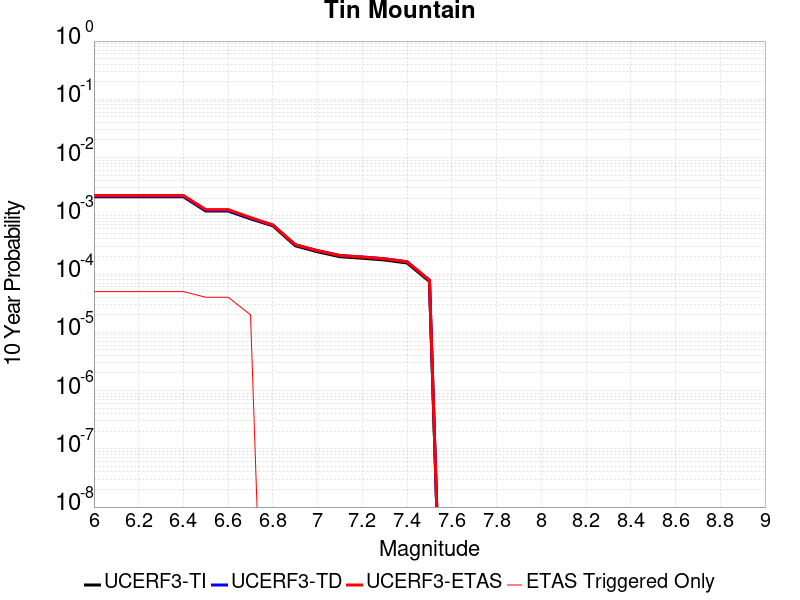 |

| Magnitude | 1 wk TI Prob | 1 wk TD Prob | 1 wk ETAS Prob | 1 wk ETAS/TD Gain | 1 wk ETAS Triggered Only | 1 mo TI Prob | 1 mo TD Prob | 1 mo ETAS Prob | 1 mo ETAS/TD Gain | 1 mo ETAS Triggered Only | 1 yr TI Prob | 1 yr TD Prob | 1 yr ETAS Prob | 1 yr ETAS/TD Gain | 1 yr ETAS Triggered Only | 10 yr TI Prob | 10 yr TD Prob | 10 yr ETAS Prob | 10 yr ETAS/TD Gain | 10 yr ETAS Triggered Only |
|-----|-----|-----|-----|-----|-----|-----|-----|-----|-----|-----|-----|-----|-----|-----|-----|-----|-----|-----|-----|-----|
| 6.0 | 4.083776E-6 | 4.18159E-6 | 4.18159E-6 | 1.0 | 0.0 | 1.750178E-5 | 1.7920998E-5 | 1.7920998E-5 | 1.0 | 0.0 | 2.1306332E-4 | 2.1817003E-4 | 2.1817003E-4 | 1.0 | 0.0 | 0.0021285915 | 0.0021799242 | 0.0022457521 | 1.0301974 | 6.597176E-5 |
| 6.1 | 4.083776E-6 | 4.18159E-6 | 4.18159E-6 | 1.0 | 0.0 | 1.750178E-5 | 1.7920998E-5 | 1.7920998E-5 | 1.0 | 0.0 | 2.1306332E-4 | 2.1817003E-4 | 2.1817003E-4 | 1.0 | 0.0 | 0.0021285915 | 0.0021799242 | 0.0022457521 | 1.0301974 | 6.597176E-5 |
| 6.2 | 4.083776E-6 | 4.18159E-6 | 4.18159E-6 | 1.0 | 0.0 | 1.750178E-5 | 1.7920998E-5 | 1.7920998E-5 | 1.0 | 0.0 | 2.1306332E-4 | 2.1817003E-4 | 2.1817003E-4 | 1.0 | 0.0 | 0.0021285915 | 0.0021799242 | 0.0022457521 | 1.0301974 | 6.597176E-5 |
| 6.3 | 4.083776E-6 | 4.18159E-6 | 4.18159E-6 | 1.0 | 0.0 | 1.750178E-5 | 1.7920998E-5 | 1.7920998E-5 | 1.0 | 0.0 | 2.1306332E-4 | 2.1817003E-4 | 2.1817003E-4 | 1.0 | 0.0 | 0.0021285915 | 0.0021799242 | 0.0022457521 | 1.0301974 | 6.597176E-5 |
| 6.4 | 4.083776E-6 | 4.18159E-6 | 4.18159E-6 | 1.0 | 0.0 | 1.750178E-5 | 1.7920998E-5 | 1.7920998E-5 | 1.0 | 0.0 | 2.1306332E-4 | 2.1817003E-4 | 2.1817003E-4 | 1.0 | 0.0 | 0.0021285915 | 0.0021799242 | 0.0022457521 | 1.0301974 | 6.597176E-5 |
| 6.5 | 2.3143427E-6 | 2.3731893E-6 | 2.3731893E-6 | 1.0 | 0.0 | 9.9185745E-6 | 1.01707765E-5 | 1.01707765E-5 | 1.0 | 0.0 | 1.2075195E-4 | 1.2382293E-4 | 1.2382293E-4 | 1.0 | 0.0 | 0.0012068636 | 0.0012376154 | 0.0013035055 | 1.0532396 | 6.597176E-5 |
| 6.6 | 2.3143427E-6 | 2.3731893E-6 | 2.3731893E-6 | 1.0 | 0.0 | 9.9185745E-6 | 1.01707765E-5 | 1.01707765E-5 | 1.0 | 0.0 | 1.2075195E-4 | 1.2382293E-4 | 1.2382293E-4 | 1.0 | 0.0 | 0.0012068636 | 0.0012376154 | 0.0013035055 | 1.0532396 | 6.597176E-5 |
| 6.7 | 1.7029532E-6 | 1.7498172E-6 | 1.7498172E-6 | 1.0 | 0.0 | 7.2983503E-6 | 7.499198E-6 | 7.499198E-6 | 1.0 | 0.0 | 8.885379E-5 | 9.1299444E-5 | 9.1299444E-5 | 1.0 | 0.0 | 8.881827E-4 | 9.12672E-4 | 9.785836E-4 | 1.0722182 | 6.597176E-5 |
| 6.8 | 1.2914646E-6 | 1.329959E-6 | 1.329959E-6 | 1.0 | 0.0 | 5.534837E-6 | 5.699814E-6 | 5.699814E-6 | 1.0 | 0.0 | 6.738455E-5 | 6.939347E-5 | 6.939347E-5 | 1.0 | 0.0 | 6.736412E-4 | 6.937614E-4 | 6.937614E-4 | 1.0 | 0.0 |
| 6.9 | 5.8708974E-7 | 6.11713E-7 | 6.11713E-7 | 1.0 | 0.0 | 2.5160964E-6 | 2.6216248E-6 | 2.6216248E-6 | 1.0 | 0.0 | 3.0633044E-5 | 3.1917854E-5 | 3.1917854E-5 | 1.0 | 0.0 | 3.0628822E-4 | 3.1913683E-4 | 3.1913683E-4 | 1.0 | 0.0 |
| 7.0 | 4.6248786E-7 | 4.8321306E-7 | 4.8321306E-7 | 1.0 | 0.0 | 1.9820893E-6 | 2.0709115E-6 | 2.0709115E-6 | 1.0 | 0.0 | 2.413167E-5 | 2.5213094E-5 | 2.5213094E-5 | 1.0 | 0.0 | 2.412905E-4 | 2.5210602E-4 | 2.5210602E-4 | 1.0 | 0.0 |
| 7.1 | 3.804606E-7 | 3.9872486E-7 | 3.9872486E-7 | 1.0 | 0.0 | 1.6305444E-6 | 1.7088199E-6 | 1.7088199E-6 | 1.0 | 0.0 | 1.9851697E-5 | 2.0804719E-5 | 2.0804719E-5 | 1.0 | 0.0 | 1.9849923E-4 | 2.0803107E-4 | 2.0803107E-4 | 1.0 | 0.0 |
| 7.2 | 3.5864858E-7 | 3.7617838E-7 | 3.7617838E-7 | 1.0 | 0.0 | 1.5370645E-6 | 1.6121922E-6 | 1.6121922E-6 | 1.0 | 0.0 | 1.87136E-5 | 1.9628298E-5 | 1.9628298E-5 | 1.0 | 0.0 | 1.8712023E-4 | 1.9626896E-4 | 1.9626896E-4 | 1.0 | 0.0 |
| 7.3 | 3.342063E-7 | 3.5064386E-7 | 3.5064386E-7 | 1.0 | 0.0 | 1.4323119E-6 | 1.5027588E-6 | 1.5027588E-6 | 1.0 | 0.0 | 1.7438259E-5 | 1.8295968E-5 | 1.8295968E-5 | 1.0 | 0.0 | 1.743689E-4 | 1.8294792E-4 | 1.8294792E-4 | 1.0 | 0.0 |
| 7.4 | 2.971242E-7 | 3.1166627E-7 | 3.1166627E-7 | 1.0 | 0.0 | 1.2733886E-6 | 1.3357121E-6 | 1.3357121E-6 | 1.0 | 0.0 | 1.5503398E-5 | 1.6262207E-5 | 1.6262207E-5 | 1.0 | 0.0 | 1.5502315E-4 | 1.6261345E-4 | 1.6261345E-4 | 1.0 | 0.0 |
| 7.5 | 1.4326713E-7 | 1.5012905E-7 | 1.5012905E-7 | 1.0 | 0.0 | 6.140018E-7 | 6.434102E-7 | 6.434102E-7 | 1.0 | 0.0 | 7.4754466E-6 | 7.83352E-6 | 7.83352E-6 | 1.0 | 0.0 | 7.475195E-5 | 7.833519E-5 | 7.833519E-5 | 1.0 | 0.0 |

## San Clemente
*[(top)](#table-of-contents)*

| 1 Week | 1 Month | 1 Year | 10 Year |
|-----|-----|-----|-----|
|  | 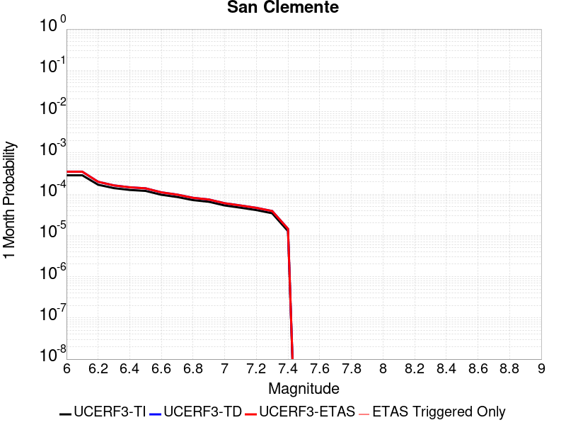 |  |  |

| Magnitude | 1 wk TI Prob | 1 wk TD Prob | 1 wk ETAS Prob | 1 wk ETAS/TD Gain | 1 wk ETAS Triggered Only | 1 mo TI Prob | 1 mo TD Prob | 1 mo ETAS Prob | 1 mo ETAS/TD Gain | 1 mo ETAS Triggered Only | 1 yr TI Prob | 1 yr TD Prob | 1 yr ETAS Prob | 1 yr ETAS/TD Gain | 1 yr ETAS Triggered Only | 10 yr TI Prob | 10 yr TD Prob | 10 yr ETAS Prob | 10 yr ETAS/TD Gain | 10 yr ETAS Triggered Only |
|-----|-----|-----|-----|-----|-----|-----|-----|-----|-----|-----|-----|-----|-----|-----|-----|-----|-----|-----|-----|-----|
| 6.0 | 6.681379E-5 | 8.164408E-5 | 8.164408E-5 | 1.0 | 0.0 | 2.8631336E-4 | 3.4985956E-4 | 3.4985956E-4 | 1.0 | 0.0 | 0.003480294 | 0.0042518 | 0.0042518 | 1.0 | 0.0 | 0.03426291 | 0.04176052 | 0.041823737 | 1.0015138 | 6.597176E-5 |
| 6.1 | 6.681379E-5 | 8.164408E-5 | 8.164408E-5 | 1.0 | 0.0 | 2.8631336E-4 | 3.4985956E-4 | 3.4985956E-4 | 1.0 | 0.0 | 0.003480294 | 0.0042518 | 0.0042518 | 1.0 | 0.0 | 0.03426291 | 0.04176052 | 0.041823737 | 1.0015138 | 6.597176E-5 |
| 6.2 | 3.9400576E-5 | 4.645645E-5 | 4.645645E-5 | 1.0 | 0.0 | 1.6884868E-4 | 1.9908424E-4 | 1.9908424E-4 | 1.0 | 0.0 | 0.0020537945 | 0.0024212173 | 0.0024212173 | 1.0 | 0.0 | 0.020349167 | 0.02395512 | 0.02395512 | 1.0 | 0.0 |
| 6.3 | 3.2590255E-5 | 3.79324E-5 | 3.79324E-5 | 1.0 | 0.0 | 1.3966505E-4 | 1.625575E-4 | 1.625575E-4 | 1.0 | 0.0 | 0.0016990956 | 0.001977371 | 0.001977371 | 1.0 | 0.0 | 0.01686163 | 0.019601561 | 0.019601561 | 1.0 | 0.0 |
| 6.4 | 2.9454652E-5 | 3.4100634E-5 | 3.4100634E-5 | 1.0 | 0.0 | 1.2622811E-4 | 1.4613755E-4 | 1.4613755E-4 | 1.0 | 0.0 | 0.0015357438 | 0.0017777971 | 0.0017777971 | 1.0 | 0.0 | 0.015251739 | 0.017638927 | 0.017638927 | 1.0 | 0.0 |
| 6.5 | 2.790836E-5 | 3.2250126E-5 | 3.2250126E-5 | 1.0 | 0.0 | 1.1960178E-4 | 1.3820764E-4 | 1.3820764E-4 | 1.0 | 0.0 | 0.001455179 | 0.0016814041 | 0.0016814041 | 1.0 | 0.0 | 0.014456868 | 0.016689846 | 0.016689846 | 1.0 | 0.0 |
| 6.6 | 2.2492153E-5 | 2.5764699E-5 | 2.5764699E-5 | 1.0 | 0.0 | 9.639138E-5 | 1.10415545E-4 | 1.10415545E-4 | 1.0 | 0.0 | 0.0011729331 | 0.0013434946 | 0.0013434946 | 1.0 | 0.0 | 0.011667615 | 0.013355441 | 0.013355441 | 1.0 | 0.0 |
| 6.7 | 1.9862755E-5 | 2.2668124E-5 | 2.2668124E-5 | 1.0 | 0.0 | 8.512331E-5 | 9.7145545E-5 | 9.7145545E-5 | 1.0 | 0.0 | 0.0010358836 | 0.0011821166 | 0.0011821166 | 1.0 | 0.0 | 0.010310682 | 0.011759577 | 0.011759577 | 1.0 | 0.0 |
| 6.8 | 1.6697575E-5 | 1.8979084E-5 | 1.8979084E-5 | 1.0 | 0.0 | 7.155907E-5 | 8.133645E-5 | 8.133645E-5 | 1.0 | 0.0 | 8.7088346E-4 | 9.898308E-4 | 9.898308E-4 | 1.0 | 0.0 | 0.008674784 | 0.009855248 | 0.009855248 | 1.0 | 0.0 |
| 6.9 | 1.5218415E-5 | 1.7270635E-5 | 1.7270635E-5 | 1.0 | 0.0 | 6.522015E-5 | 7.401496E-5 | 7.401496E-5 | 1.0 | 0.0 | 7.93766E-4 | 9.007684E-4 | 9.007684E-4 | 1.0 | 0.0 | 0.007909367 | 0.00897212 | 0.00897212 | 1.0 | 0.0 |
| 7.0 | 1.2392958E-5 | 1.4034001E-5 | 1.4034001E-5 | 1.0 | 0.0 | 5.3111595E-5 | 6.0144375E-5 | 6.0144375E-5 | 1.0 | 0.0 | 6.4644177E-4 | 7.320193E-4 | 7.320193E-4 | 1.0 | 0.0 | 0.0064456454 | 0.007296867 | 0.007296867 | 1.0 | 0.0 |
| 7.1 | 1.0934128E-5 | 1.2376004E-5 | 1.2376004E-5 | 1.0 | 0.0 | 4.6859706E-5 | 5.3038977E-5 | 5.3038977E-5 | 1.0 | 0.0 | 5.7036756E-4 | 6.4556557E-4 | 6.4556557E-4 | 1.0 | 0.0 | 0.0056890585 | 0.0064376486 | 0.0064376486 | 1.0 | 0.0 |
| 7.2 | 9.5798805E-6 | 1.0845695E-5 | 1.0845695E-5 | 1.0 | 0.0 | 4.1055984E-5 | 4.6480764E-5 | 4.6480764E-5 | 1.0 | 0.0 | 4.9974193E-4 | 5.6576356E-4 | 5.6576356E-4 | 1.0 | 0.0 | 0.0049861963 | 0.005643956 | 0.005643956 | 1.0 | 0.0 |
| 7.3 | 8.0167365E-6 | 9.084559E-6 | 9.084559E-6 | 1.0 | 0.0 | 3.4356988E-5 | 3.893328E-5 | 3.893328E-5 | 1.0 | 0.0 | 4.1821605E-4 | 4.7391668E-4 | 4.7391668E-4 | 1.0 | 0.0 | 0.0041742986 | 0.004729763 | 0.004729763 | 1.0 | 0.0 |
| 7.4 | 2.9581017E-6 | 3.362623E-6 | 3.362623E-6 | 1.0 | 0.0 | 1.2677518E-5 | 1.441119E-5 | 1.441119E-5 | 1.0 | 0.0 | 1.5433785E-4 | 1.7544716E-4 | 1.7544716E-4 | 1.0 | 0.0 | 0.001542307 | 0.0017535817 | 0.0017535817 | 1.0 | 0.0 |

## Cucamonga
*[(top)](#table-of-contents)*

| 1 Week | 1 Month | 1 Year | 10 Year |
|-----|-----|-----|-----|
|  |  |  |  |

| Magnitude | 1 wk TI Prob | 1 wk TD Prob | 1 wk ETAS Prob | 1 wk ETAS/TD Gain | 1 wk ETAS Triggered Only | 1 mo TI Prob | 1 mo TD Prob | 1 mo ETAS Prob | 1 mo ETAS/TD Gain | 1 mo ETAS Triggered Only | 1 yr TI Prob | 1 yr TD Prob | 1 yr ETAS Prob | 1 yr ETAS/TD Gain | 1 yr ETAS Triggered Only | 10 yr TI Prob | 10 yr TD Prob | 10 yr ETAS Prob | 10 yr ETAS/TD Gain | 10 yr ETAS Triggered Only |
|-----|-----|-----|-----|-----|-----|-----|-----|-----|-----|-----|-----|-----|-----|-----|-----|-----|-----|-----|-----|-----|
| 6.0 | 1.1848348E-5 | 1.1739686E-5 | 1.1739686E-5 | 1.0 | 0.0 | 5.0777642E-5 | 5.0311985E-5 | 5.0311985E-5 | 1.0 | 0.0 | 6.180424E-4 | 6.1237894E-4 | 6.1237894E-4 | 1.0 | 0.0 | 0.0061632637 | 0.0061080856 | 0.0061736545 | 1.0107348 | 6.597176E-5 |
| 6.1 | 1.1848348E-5 | 1.1739686E-5 | 1.1739686E-5 | 1.0 | 0.0 | 5.0777642E-5 | 5.0311985E-5 | 5.0311985E-5 | 1.0 | 0.0 | 6.180424E-4 | 6.1237894E-4 | 6.1237894E-4 | 1.0 | 0.0 | 0.0061632637 | 0.0061080856 | 0.0061736545 | 1.0107348 | 6.597176E-5 |
| 6.2 | 1.1848348E-5 | 1.1739686E-5 | 1.1739686E-5 | 1.0 | 0.0 | 5.0777642E-5 | 5.0311985E-5 | 5.0311985E-5 | 1.0 | 0.0 | 6.180424E-4 | 6.1237894E-4 | 6.1237894E-4 | 1.0 | 0.0 | 0.0061632637 | 0.0061080856 | 0.0061736545 | 1.0107348 | 6.597176E-5 |
| 6.3 | 1.1848348E-5 | 1.1739686E-5 | 1.1739686E-5 | 1.0 | 0.0 | 5.0777642E-5 | 5.0311985E-5 | 5.0311985E-5 | 1.0 | 0.0 | 6.180424E-4 | 6.1237894E-4 | 6.1237894E-4 | 1.0 | 0.0 | 0.0061632637 | 0.0061080856 | 0.0061736545 | 1.0107348 | 6.597176E-5 |
| 6.4 | 1.1848348E-5 | 1.1739686E-5 | 1.1739686E-5 | 1.0 | 0.0 | 5.0777642E-5 | 5.0311985E-5 | 5.0311985E-5 | 1.0 | 0.0 | 6.180424E-4 | 6.1237894E-4 | 6.1237894E-4 | 1.0 | 0.0 | 0.0061632637 | 0.0061080856 | 0.0061736545 | 1.0107348 | 6.597176E-5 |
| 6.5 | 1.16988695E-5 | 1.157871E-5 | 1.157871E-5 | 1.0 | 0.0 | 5.013705E-5 | 4.9622115E-5 | 4.9622115E-5 | 1.0 | 0.0 | 6.102476E-4 | 6.0398446E-4 | 6.0398446E-4 | 1.0 | 0.0 | 0.006085745 | 0.0060245967 | 0.006090171 | 1.0108844 | 6.597176E-5 |
| 6.6 | 1.16988695E-5 | 1.157871E-5 | 1.157871E-5 | 1.0 | 0.0 | 5.013705E-5 | 4.9622115E-5 | 4.9622115E-5 | 1.0 | 0.0 | 6.102476E-4 | 6.0398446E-4 | 6.0398446E-4 | 1.0 | 0.0 | 0.006085745 | 0.0060245967 | 0.006090171 | 1.0108844 | 6.597176E-5 |
| 6.7 | 1.1397107E-5 | 1.111755E-5 | 1.111755E-5 | 1.0 | 0.0 | 4.884383E-5 | 4.7645786E-5 | 4.7645786E-5 | 1.0 | 0.0 | 5.9451134E-4 | 5.7993556E-4 | 5.7993556E-4 | 1.0 | 0.0 | 0.005929234 | 0.005785368 | 0.005850958 | 1.0113373 | 6.597176E-5 |
| 6.8 | 1.058387E-5 | 9.787276E-6 | 9.787276E-6 | 1.0 | 0.0 | 4.5358654E-5 | 4.19448E-5 | 4.19448E-5 | 1.0 | 0.0 | 5.521017E-4 | 5.105594E-4 | 5.105594E-4 | 1.0 | 0.0 | 0.00550732 | 0.005094869 | 0.005160505 | 1.0128827 | 6.597176E-5 |
| 6.9 | 9.690046E-6 | 8.581557E-6 | 8.581557E-6 | 1.0 | 0.0 | 4.1528107E-5 | 3.6777587E-5 | 3.6777587E-5 | 1.0 | 0.0 | 5.054874E-4 | 4.4767553E-4 | 4.4767553E-4 | 1.0 | 0.0 | 0.005043391 | 0.0044686683 | 0.004534345 | 1.0146972 | 6.597176E-5 |
| 7.0 | 9.381461E-6 | 8.189123E-6 | 8.189123E-6 | 1.0 | 0.0 | 4.020564E-5 | 3.509577E-5 | 3.509577E-5 | 1.0 | 0.0 | 4.893937E-4 | 4.272076E-4 | 4.272076E-4 | 1.0 | 0.0 | 0.0048831734 | 0.004264793 | 0.0043304833 | 1.0154029 | 6.597176E-5 |
| 7.1 | 8.946492E-6 | 7.783867E-6 | 7.783867E-6 | 1.0 | 0.0 | 3.8341543E-5 | 3.3359003E-5 | 3.3359003E-5 | 1.0 | 0.0 | 4.667083E-4 | 4.060705E-4 | 4.060705E-4 | 1.0 | 0.0 | 0.0046572937 | 0.0040542167 | 0.004119921 | 1.0162064 | 6.597176E-5 |
| 7.2 | 8.251016E-6 | 6.977125E-6 | 6.977125E-6 | 1.0 | 0.0 | 3.5361016E-5 | 2.9901623E-5 | 2.9901623E-5 | 1.0 | 0.0 | 4.3043532E-4 | 3.6399168E-4 | 3.6399168E-4 | 1.0 | 0.0 | 0.0042960253 | 0.0036348838 | 0.0037006156 | 1.0180837 | 6.597176E-5 |
| 7.3 | 7.717881E-6 | 6.4881356E-6 | 6.4881356E-6 | 1.0 | 0.0 | 3.3076216E-5 | 2.7806E-5 | 2.7806E-5 | 1.0 | 0.0 | 4.026285E-4 | 3.3848567E-4 | 3.3848567E-4 | 1.0 | 0.0 | 0.004018998 | 0.0033806337 | 0.0034463825 | 1.0194486 | 6.597176E-5 |
| 7.4 | 7.275623E-6 | 6.0337097E-6 | 6.0337097E-6 | 1.0 | 0.0 | 3.118087E-5 | 2.58585E-5 | 2.58585E-5 | 1.0 | 0.0 | 3.7956095E-4 | 3.14782E-4 | 3.14782E-4 | 1.0 | 0.0 | 0.0037891332 | 0.0031442924 | 0.0032100568 | 1.0209155 | 6.597176E-5 |
| 7.5 | 6.5109502E-6 | 5.102118E-6 | 5.102118E-6 | 1.0 | 0.0 | 2.7903774E-5 | 2.1866037E-5 | 2.1866037E-5 | 1.0 | 0.0 | 3.3967546E-4 | 2.6618663E-4 | 2.6618663E-4 | 1.0 | 0.0 | 0.0033915674 | 0.002659598 | 0.0027253942 | 1.0247391 | 6.597176E-5 |
| 7.6 | 5.4495326E-6 | 3.909914E-6 | 3.909914E-6 | 1.0 | 0.0 | 2.335493E-5 | 1.6756667E-5 | 1.6756667E-5 | 1.0 | 0.0 | 2.8430918E-4 | 2.0399339E-4 | 2.0399339E-4 | 1.0 | 0.0 | 0.0028394572 | 0.0020389776 | 0.0021048146 | 1.0322894 | 6.597176E-5 |
| 7.7 | 4.7997164E-6 | 3.201463E-6 | 3.201463E-6 | 1.0 | 0.0 | 2.057005E-5 | 1.3720483E-5 | 1.3720483E-5 | 1.0 | 0.0 | 2.504116E-4 | 1.6703412E-4 | 1.6703412E-4 | 1.0 | 0.0 | 0.002501296 | 0.0016700128 | 0.0016700128 | 1.0 | 0.0 |
| 7.8 | 3.3941733E-6 | 2.0648838E-6 | 2.0648838E-6 | 1.0 | 0.0 | 1.4546376E-5 | 8.849473E-6 | 8.849473E-6 | 1.0 | 0.0 | 1.7708774E-4 | 1.0773702E-4 | 1.0773702E-4 | 1.0 | 0.0 | 0.0017694668 | 0.0010770849 | 0.0010770849 | 1.0 | 0.0 |
| 7.9 | 9.750552E-7 | 5.1576814E-7 | 5.1576814E-7 | 1.0 | 0.0 | 4.178801E-6 | 2.210433E-6 | 2.210433E-6 | 1.0 | 0.0 | 5.0875715E-5 | 2.6911694E-5 | 2.6911694E-5 | 1.0 | 0.0 | 5.086407E-4 | 2.6908476E-4 | 2.6908476E-4 | 1.0 | 0.0 |
| 8.0 | 1.133857E-7 | 6.055087E-8 | 6.055087E-8 | 1.0 | 0.0 | 4.8593864E-7 | 2.595037E-7 | 2.595037E-7 | 1.0 | 0.0 | 5.9162867E-6 | 3.1594532E-6 | 3.1594532E-6 | 1.0 | 0.0 | 5.916129E-5 | 3.15941E-5 | 3.15941E-5 | 1.0 | 0.0 |

## Mendocino
*[(top)](#table-of-contents)*

| 1 Week | 1 Month | 1 Year | 10 Year |
|-----|-----|-----|-----|
|  |  |  |  |

| Magnitude | 1 wk TI Prob | 1 wk TD Prob | 1 wk ETAS Prob | 1 wk ETAS/TD Gain | 1 wk ETAS Triggered Only | 1 mo TI Prob | 1 mo TD Prob | 1 mo ETAS Prob | 1 mo ETAS/TD Gain | 1 mo ETAS Triggered Only | 1 yr TI Prob | 1 yr TD Prob | 1 yr ETAS Prob | 1 yr ETAS/TD Gain | 1 yr ETAS Triggered Only | 10 yr TI Prob | 10 yr TD Prob | 10 yr ETAS Prob | 10 yr ETAS/TD Gain | 10 yr ETAS Triggered Only |
|-----|-----|-----|-----|-----|-----|-----|-----|-----|-----|-----|-----|-----|-----|-----|-----|-----|-----|-----|-----|-----|
| 6.0 | 5.5409013E-4 | 0.0010840651 | 0.0010840651 | 1.0 | 0.0 | 0.0023725112 | 0.0046365443 | 0.0046365443 | 1.0 | 0.0 | 0.028505474 | 0.05468172 | 0.05468172 | 1.0 | 0.0 | 0.25113493 | 0.41193083 | 0.41196963 | 1.0000942 | 6.597176E-5 |
| 6.1 | 4.2515888E-4 | 8.233533E-4 | 8.233533E-4 | 1.0 | 0.0 | 0.0018208373 | 0.0035227416 | 0.0035227416 | 1.0 | 0.0 | 0.021944538 | 0.04175785 | 0.04175785 | 1.0 | 0.0 | 0.19899574 | 0.3300017 | 0.3300459 | 1.000134 | 6.597176E-5 |
| 6.2 | 4.2515888E-4 | 8.233533E-4 | 8.233533E-4 | 1.0 | 0.0 | 0.0018208373 | 0.0035227416 | 0.0035227416 | 1.0 | 0.0 | 0.021944538 | 0.04175785 | 0.04175785 | 1.0 | 0.0 | 0.19899574 | 0.3300017 | 0.3300459 | 1.000134 | 6.597176E-5 |
| 6.3 | 3.2773745E-4 | 6.1965483E-4 | 6.1965483E-4 | 1.0 | 0.0 | 0.0014038329 | 0.0026526814 | 0.0026526814 | 1.0 | 0.0 | 0.016958237 | 0.031601425 | 0.031601425 | 1.0 | 0.0 | 0.1572094 | 0.26082414 | 0.2608729 | 1.0001869 | 6.597176E-5 |
| 6.4 | 2.7417165E-4 | 5.0488714E-4 | 5.0488714E-4 | 1.0 | 0.0 | 0.0011744922 | 0.002161933 | 0.002161933 | 1.0 | 0.0 | 0.014205975 | 0.025846353 | 0.025846353 | 1.0 | 0.0 | 0.13331394 | 0.21952665 | 0.21957813 | 1.0002346 | 6.597176E-5 |
| 6.5 | 2.3984899E-4 | 4.3254386E-4 | 4.3254386E-4 | 1.0 | 0.0 | 0.0010275192 | 0.00185236 | 0.00185236 | 1.0 | 0.0 | 0.012438473 | 0.022189107 | 0.022189107 | 1.0 | 0.0 | 0.11764851 | 0.19208325 | 0.19213656 | 1.0002775 | 6.597176E-5 |
| 6.6 | 2.1023539E-4 | 3.6955765E-4 | 3.6955765E-4 | 1.0 | 0.0 | 9.0069766E-4 | 0.0015829094 | 0.0015829094 | 1.0 | 0.0 | 0.010910975 | 0.018997893 | 0.018997893 | 1.0 | 0.0 | 0.10390546 | 0.16753985 | 0.16759476 | 1.0003278 | 6.597176E-5 |
| 6.7 | 1.2592976E-4 | 1.842647E-4 | 1.842647E-4 | 1.0 | 0.0 | 5.395873E-4 | 7.894302E-4 | 7.894302E-4 | 1.0 | 0.0 | 0.006549705 | 0.009561417 | 0.009561417 | 1.0 | 0.0 | 0.063599944 | 0.091017045 | 0.091077015 | 1.0006589 | 6.597176E-5 |
| 6.8 | 1.13663555E-4 | 1.541201E-4 | 1.541201E-4 | 1.0 | 0.0 | 4.8703855E-4 | 6.6030945E-4 | 6.6030945E-4 | 1.0 | 0.0 | 0.0059135845 | 0.008005183 | 0.008005183 | 1.0 | 0.0 | 0.057586733 | 0.07743927 | 0.07750013 | 1.000786 | 6.597176E-5 |
| 6.9 | 9.926894E-5 | 1.2307995E-4 | 1.2307995E-4 | 1.0 | 0.0 | 4.2536893E-4 | 5.273785E-4 | 5.273785E-4 | 1.0 | 0.0 | 0.0051665753 | 0.0064015854 | 0.0064015854 | 1.0 | 0.0 | 0.050480947 | 0.06290405 | 0.06296588 | 1.0009828 | 6.597176E-5 |
| 7.0 | 9.168125E-5 | 1.0792481E-4 | 1.0792481E-4 | 1.0 | 0.0 | 3.9286047E-4 | 4.6245367E-4 | 4.6245367E-4 | 1.0 | 0.0 | 0.004772591 | 0.0056155208 | 0.0056155208 | 1.0 | 0.0 | 0.04671385 | 0.055664163 | 0.05572646 | 1.0011193 | 6.597176E-5 |
| 7.1 | 8.2854116E-5 | 9.113475E-5 | 9.113475E-5 | 1.0 | 0.0 | 3.5504074E-4 | 3.9051977E-4 | 3.9051977E-4 | 1.0 | 0.0 | 0.004314056 | 0.004744216 | 0.004744216 | 1.0 | 0.0 | 0.042312626 | 0.047522213 | 0.047585048 | 1.0013223 | 6.597176E-5 |
| 7.2 | 7.8255274E-5 | 8.308447E-5 | 8.308447E-5 | 1.0 | 0.0 | 3.3533663E-4 | 3.5602847E-4 | 3.5602847E-4 | 1.0 | 0.0 | 0.0040750825 | 0.0043261773 | 0.0043261773 | 1.0 | 0.0 | 0.040011603 | 0.043565933 | 0.04362903 | 1.0014483 | 6.597176E-5 |
| 7.3 | 6.887904E-5 | 6.2657535E-5 | 6.2657535E-5 | 1.0 | 0.0 | 2.9516246E-4 | 2.6850516E-4 | 2.6850516E-4 | 1.0 | 0.0 | 0.0035876823 | 0.0032642453 | 0.0032642453 | 1.0 | 0.0 | 0.035303112 | 0.033387214 | 0.033450983 | 1.00191 | 6.597176E-5 |
| 7.4 | 5.4898497E-5 | 3.744941E-5 | 3.744941E-5 | 1.0 | 0.0 | 2.3525805E-4 | 1.6048792E-4 | 1.6048792E-4 | 1.0 | 0.0 | 0.0028605047 | 0.0019522452 | 0.0019522452 | 1.0 | 0.0 | 0.02823963 | 0.02043759 | 0.020502215 | 1.003162 | 6.597176E-5 |
| 7.5 | 3.9103943E-5 | 1.1334679E-5 | 1.1334679E-5 | 1.0 | 0.0 | 1.6757756E-4 | 4.8576298E-5 | 4.8576298E-5 | 1.0 | 0.0 | 0.0020383475 | 5.912575E-4 | 5.912575E-4 | 1.0 | 0.0 | 0.020197518 | 0.006640222 | 0.006705756 | 1.0098692 | 6.597176E-5 |
| 7.6 | 3.641042E-5 | 9.008758E-6 | 9.008758E-6 | 1.0 | 0.0 | 1.5603533E-4 | 3.86084E-5 | 3.86084E-5 | 1.0 | 0.0 | 0.0018980748 | 4.6995725E-4 | 4.6995725E-4 | 1.0 | 0.0 | 0.018819444 | 0.005362647 | 0.0054282653 | 1.0122361 | 6.597176E-5 |
| 7.7 | 3.1318774E-5 | 4.4744484E-6 | 4.4744484E-6 | 1.0 | 0.0 | 1.342164E-4 | 1.9176068E-5 | 1.9176068E-5 | 1.0 | 0.0 | 0.0016328598 | 2.3344379E-4 | 2.3344379E-4 | 1.0 | 0.0 | 0.016209139 | 0.0028778263 | 0.0029436082 | 1.0228581 | 6.597176E-5 |
| 7.8 | 2.209241E-5 | 2.6945197E-6 | 2.6945197E-6 | 1.0 | 0.0 | 9.467832E-5 | 1.1547891E-5 | 1.1547891E-5 | 1.0 | 0.0 | 0.001152099 | 1.4058653E-4 | 1.4058653E-4 | 1.0 | 0.0 | 0.011461443 | 0.0017459134 | 0.00181177 | 1.0377204 | 6.597176E-5 |
| 7.9 | 1.2640477E-5 | 2.051996E-6 | 2.051996E-6 | 1.0 | 0.0 | 5.4172346E-5 | 8.794239E-6 | 8.794239E-6 | 1.0 | 0.0 | 6.593487E-4 | 1.07064625E-4 | 1.07064625E-4 | 1.0 | 0.0 | 0.006573958 | 0.0013039539 | 0.0013698397 | 1.0505277 | 6.597176E-5 |
| 8.0 | 6.5548907E-6 | 1.64609E-6 | 1.64609E-6 | 1.0 | 0.0 | 2.8092087E-5 | 7.0546525E-6 | 7.0546525E-6 | 1.0 | 0.0 | 3.4196748E-4 | 8.588703E-5 | 8.588703E-5 | 1.0 | 0.0 | 0.0034144172 | 0.0010353618 | 0.0011012653 | 1.0636526 | 6.597176E-5 |
| 8.1 | 3.1916707E-6 | 1.3647137E-6 | 1.3647137E-6 | 1.0 | 0.0 | 1.3678517E-5 | 5.84876E-6 | 5.84876E-6 | 1.0 | 0.0 | 1.6652321E-4 | 7.120635E-5 | 7.120635E-5 | 1.0 | 0.0 | 0.0016639848 | 8.6646E-4 | 9.323746E-4 | 1.0760734 | 6.597176E-5 |
| 8.2 | 2.1193785E-6 | 1.0349098E-6 | 1.0349098E-6 | 1.0 | 0.0 | 9.083019E-6 | 4.43532E-6 | 4.43532E-6 | 1.0 | 0.0 | 1.1058014E-4 | 5.3998705E-5 | 5.3998705E-5 | 1.0 | 0.0 | 0.0011052513 | 6.530253E-4 | 6.530253E-4 | 1.0 | 0.0 |
| 8.3 | 7.536878E-7 | 3.9430077E-7 | 3.9430077E-7 | 1.0 | 0.0 | 3.2300866E-6 | 1.6898595E-6 | 1.6898595E-6 | 1.0 | 0.0 | 3.9325594E-5 | 2.0573858E-5 | 2.0573858E-5 | 1.0 | 0.0 | 3.9318635E-4 | 2.4218905E-4 | 2.4218905E-4 | 1.0 | 0.0 |

## Big Pine (Central)
*[(top)](#table-of-contents)*

| 1 Week | 1 Month | 1 Year | 10 Year |
|-----|-----|-----|-----|
|  |  | 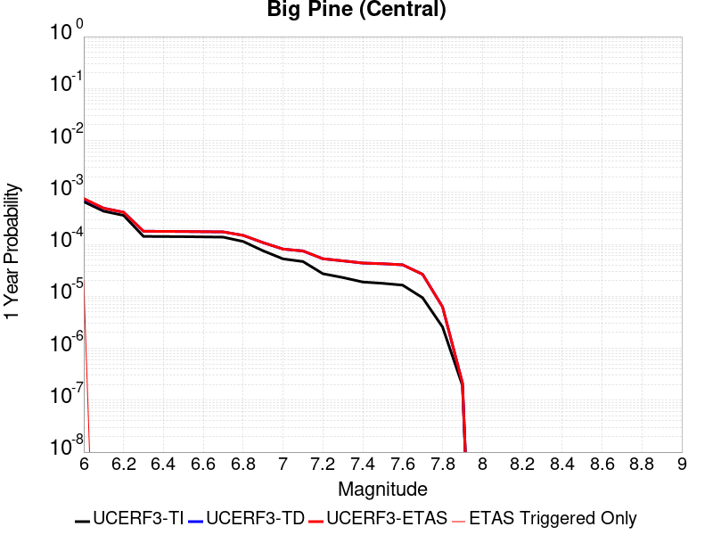 |  |

| Magnitude | 1 wk TI Prob | 1 wk TD Prob | 1 wk ETAS Prob | 1 wk ETAS/TD Gain | 1 wk ETAS Triggered Only | 1 mo TI Prob | 1 mo TD Prob | 1 mo ETAS Prob | 1 mo ETAS/TD Gain | 1 mo ETAS Triggered Only | 1 yr TI Prob | 1 yr TD Prob | 1 yr ETAS Prob | 1 yr ETAS/TD Gain | 1 yr ETAS Triggered Only | 10 yr TI Prob | 10 yr TD Prob | 10 yr ETAS Prob | 10 yr ETAS/TD Gain | 10 yr ETAS Triggered Only |
|-----|-----|-----|-----|-----|-----|-----|-----|-----|-----|-----|-----|-----|-----|-----|-----|-----|-----|-----|-----|-----|
| 6.0 | 1.2706755E-5 | 1.4252463E-5 | 1.4252463E-5 | 1.0 | 0.0 | 5.4456385E-5 | 6.108076E-5 | 6.108076E-5 | 1.0 | 0.0 | 6.628048E-4 | 7.434411E-4 | 7.434411E-4 | 1.0 | 0.0 | 0.006608314 | 0.007414557 | 0.0074800397 | 1.0088316 | 6.597176E-5 |
| 6.1 | 8.342579E-6 | 9.512481E-6 | 9.512481E-6 | 1.0 | 0.0 | 3.5753423E-5 | 4.076726E-5 | 4.076726E-5 | 1.0 | 0.0 | 4.3521097E-4 | 4.9625005E-4 | 4.9625005E-4 | 1.0 | 0.0 | 0.0043435963 | 0.0049549625 | 0.0050206073 | 1.0132483 | 6.597176E-5 |
| 6.2 | 6.923899E-6 | 7.968794E-6 | 7.968794E-6 | 1.0 | 0.0 | 2.9673516E-5 | 3.4151635E-5 | 3.4151635E-5 | 1.0 | 0.0 | 3.6121515E-4 | 4.1573608E-4 | 4.1573608E-4 | 1.0 | 0.0 | 0.003606286 | 0.00415288 | 0.004218578 | 1.0158198 | 6.597176E-5 |
| 6.3 | 2.728396E-6 | 3.4257378E-6 | 3.4257378E-6 | 1.0 | 0.0 | 1.1693074E-5 | 1.4681656E-5 | 1.4681656E-5 | 1.0 | 0.0 | 1.4235388E-4 | 1.7873537E-4 | 1.7873537E-4 | 1.0 | 0.0 | 0.0014226272 | 0.0017874117 | 0.0017874117 | 1.0 | 0.0 |
| 6.4 | 2.7136944E-6 | 3.4100306E-6 | 3.4100306E-6 | 1.0 | 0.0 | 1.1630066E-5 | 1.461434E-5 | 1.461434E-5 | 1.0 | 0.0 | 1.4158686E-4 | 1.7791594E-4 | 1.7791594E-4 | 1.0 | 0.0 | 0.0014149669 | 0.0017792305 | 0.0017792305 | 1.0 | 0.0 |
| 6.5 | 2.6971882E-6 | 3.392375E-6 | 3.392375E-6 | 1.0 | 0.0 | 1.1559327E-5 | 1.4538674E-5 | 1.4538674E-5 | 1.0 | 0.0 | 1.4072572E-4 | 1.7699486E-4 | 1.7699486E-4 | 1.0 | 0.0 | 0.0014063664 | 0.0017700344 | 0.0017700344 | 1.0 | 0.0 |
| 6.6 | 2.669092E-6 | 3.3623944E-6 | 3.3623944E-6 | 1.0 | 0.0 | 1.1438916E-5 | 1.4410188E-5 | 1.4410188E-5 | 1.0 | 0.0 | 1.3925991E-4 | 1.7543077E-4 | 1.7543077E-4 | 1.0 | 0.0 | 0.0013917267 | 0.0017544184 | 0.0017544184 | 1.0 | 0.0 |
| 6.7 | 2.6408059E-6 | 3.332419E-6 | 3.332419E-6 | 1.0 | 0.0 | 1.1317691E-5 | 1.4281723E-5 | 1.4281723E-5 | 1.0 | 0.0 | 1.3778417E-4 | 1.7386697E-4 | 1.7386697E-4 | 1.0 | 0.0 | 0.0013769877 | 0.001738805 | 0.001738805 | 1.0 | 0.0 |
| 6.8 | 2.1786943E-6 | 2.8558686E-6 | 2.8558686E-6 | 1.0 | 0.0 | 9.337228E-6 | 1.2239383E-5 | 1.2239383E-5 | 1.0 | 0.0 | 1.1367482E-4 | 1.4900503E-4 | 1.4900503E-4 | 1.0 | 0.0 | 0.0011361669 | 0.0014905332 | 0.0014905332 | 1.0 | 0.0 |
| 6.9 | 1.4411696E-6 | 2.0698712E-6 | 2.0698712E-6 | 1.0 | 0.0 | 6.1764263E-6 | 8.870848E-6 | 8.870848E-6 | 1.0 | 0.0 | 7.51954E-5 | 1.079975E-4 | 1.079975E-4 | 1.0 | 0.0 | 7.5169955E-4 | 0.0010808875 | 0.0010808875 | 1.0 | 0.0 |
| 7.0 | 1.0073411E-6 | 1.5554864E-6 | 1.5554864E-6 | 1.0 | 0.0 | 4.317169E-6 | 6.666354E-6 | 6.666354E-6 | 1.0 | 0.0 | 5.2560266E-5 | 8.115999E-5 | 8.115999E-5 | 1.0 | 0.0 | 5.2547833E-4 | 8.1272965E-4 | 8.1272965E-4 | 1.0 | 0.0 |
| 7.1 | 8.947104E-7 | 1.4314573E-6 | 1.4314573E-6 | 1.0 | 0.0 | 3.834468E-6 | 6.1348037E-6 | 6.1348037E-6 | 1.0 | 0.0 | 4.6683643E-5 | 7.4688825E-5 | 7.4688825E-5 | 1.0 | 0.0 | 4.6673836E-4 | 7.4806315E-4 | 7.4806315E-4 | 1.0 | 0.0 |
| 7.2 | 5.215166E-7 | 1.0122951E-6 | 1.0122951E-6 | 1.0 | 0.0 | 2.2350691E-6 | 4.3384007E-6 | 4.3384007E-6 | 1.0 | 0.0 | 2.7211627E-5 | 5.2818792E-5 | 5.2818792E-5 | 1.0 | 0.0 | 2.7208295E-4 | 5.2947813E-4 | 5.2947813E-4 | 1.0 | 0.0 |
| 7.3 | 4.4024807E-7 | 9.230527E-7 | 9.230527E-7 | 1.0 | 0.0 | 1.8867761E-6 | 3.9559345E-6 | 3.9559345E-6 | 1.0 | 0.0 | 2.2971257E-5 | 4.8162477E-5 | 4.8162477E-5 | 1.0 | 0.0 | 2.2968883E-4 | 4.82936E-4 | 4.82936E-4 | 1.0 | 0.0 |
| 7.4 | 3.6130905E-7 | 8.3691214E-7 | 8.3691214E-7 | 1.0 | 0.0 | 1.5484665E-6 | 3.5867617E-6 | 3.5867617E-6 | 1.0 | 0.0 | 1.8852415E-5 | 4.3667987E-5 | 4.3667987E-5 | 1.0 | 0.0 | 1.8850817E-4 | 4.380001E-4 | 4.380001E-4 | 1.0 | 0.0 |
| 7.5 | 3.408184E-7 | 8.118514E-7 | 8.118514E-7 | 1.0 | 0.0 | 1.4606494E-6 | 3.4793588E-6 | 3.4793588E-6 | 1.0 | 0.0 | 1.7783263E-5 | 4.2360407E-5 | 4.2360407E-5 | 1.0 | 0.0 | 1.778184E-4 | 4.2490795E-4 | 4.2490795E-4 | 1.0 | 0.0 |
| 7.6 | 3.1428627E-7 | 7.7415996E-7 | 7.7415996E-7 | 1.0 | 0.0 | 1.3469405E-6 | 3.3178244E-6 | 3.3178244E-6 | 1.0 | 0.0 | 1.6398877E-5 | 4.03938E-5 | 4.03938E-5 | 1.0 | 0.0 | 1.6397667E-4 | 4.0522031E-4 | 4.0522031E-4 | 1.0 | 0.0 |
| 7.7 | 1.7972785E-7 | 5.085394E-7 | 5.085394E-7 | 1.0 | 0.0 | 7.70262E-7 | 2.1794528E-6 | 2.1794528E-6 | 1.0 | 0.0 | 9.377899E-6 | 2.6534526E-5 | 2.6534526E-5 | 1.0 | 0.0 | 9.377503E-5 | 2.666768E-4 | 2.666768E-4 | 1.0 | 0.0 |
| 7.8 | 4.9230927E-8 | 1.1998821E-7 | 1.1998821E-7 | 1.0 | 0.0 | 2.1098968E-7 | 5.142351E-7 | 5.142351E-7 | 1.0 | 0.0 | 2.5687964E-6 | 6.2607965E-6 | 6.2607965E-6 | 1.0 | 0.0 | 2.5687666E-5 | 6.304645E-5 | 6.304645E-5 | 1.0 | 0.0 |
| 7.9 | 3.6805972E-9 | 4.112396E-9 | 4.112396E-9 | 1.0 | 0.0 | 1.5773987E-8 | 1.7624556E-8 | 1.7624556E-8 | 1.0 | 0.0 | 1.9204828E-7 | 2.1457895E-7 | 2.1457895E-7 | 1.0 | 0.0 | 1.920481E-6 | 2.1937853E-6 | 2.1937853E-6 | 1.0 | 0.0 |

## San Andreas (Santa Cruz Mts) 2011 CFM
*[(top)](#table-of-contents)*

| 1 Week | 1 Month | 1 Year | 10 Year |
|-----|-----|-----|-----|
|  |  |  | 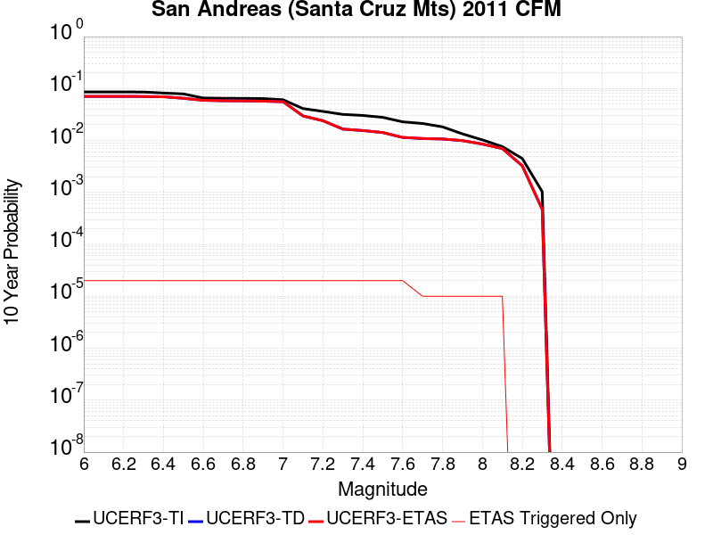 |

| Magnitude | 1 wk TI Prob | 1 wk TD Prob | 1 wk ETAS Prob | 1 wk ETAS/TD Gain | 1 wk ETAS Triggered Only | 1 mo TI Prob | 1 mo TD Prob | 1 mo ETAS Prob | 1 mo ETAS/TD Gain | 1 mo ETAS Triggered Only | 1 yr TI Prob | 1 yr TD Prob | 1 yr ETAS Prob | 1 yr ETAS/TD Gain | 1 yr ETAS Triggered Only | 10 yr TI Prob | 10 yr TD Prob | 10 yr ETAS Prob | 10 yr ETAS/TD Gain | 10 yr ETAS Triggered Only |
|-----|-----|-----|-----|-----|-----|-----|-----|-----|-----|-----|-----|-----|-----|-----|-----|-----|-----|-----|-----|-----|
| 6.0 | 1.7221631E-4 | 1.3823692E-4 | 1.3823692E-4 | 1.0 | 0.0 | 7.378611E-4 | 5.923115E-4 | 5.923115E-4 | 1.0 | 0.0 | 0.008946515 | 0.0071879383 | 0.0071879383 | 1.0 | 0.0 | 0.08594794 | 0.070697196 | 0.0707585 | 1.0008671 | 6.597176E-5 |
| 6.1 | 1.7221631E-4 | 1.3823692E-4 | 1.3823692E-4 | 1.0 | 0.0 | 7.378611E-4 | 5.923115E-4 | 5.923115E-4 | 1.0 | 0.0 | 0.008946515 | 0.0071879383 | 0.0071879383 | 1.0 | 0.0 | 0.08594794 | 0.070697196 | 0.0707585 | 1.0008671 | 6.597176E-5 |
| 6.2 | 1.7221631E-4 | 1.3823692E-4 | 1.3823692E-4 | 1.0 | 0.0 | 7.378611E-4 | 5.923115E-4 | 5.923115E-4 | 1.0 | 0.0 | 0.008946515 | 0.0071879383 | 0.0071879383 | 1.0 | 0.0 | 0.08594794 | 0.070697196 | 0.0707585 | 1.0008671 | 6.597176E-5 |
| 6.3 | 1.716926E-4 | 1.3743078E-4 | 1.3743078E-4 | 1.0 | 0.0 | 7.3561794E-4 | 5.888581E-4 | 5.888581E-4 | 1.0 | 0.0 | 0.008919428 | 0.0071461694 | 0.0071461694 | 1.0 | 0.0 | 0.08569809 | 0.0703092 | 0.07037053 | 1.0008724 | 6.597176E-5 |
| 6.4 | 1.6392978E-4 | 1.3618424E-4 | 1.3618424E-4 | 1.0 | 0.0 | 7.02367E-4 | 5.8351824E-4 | 5.8351824E-4 | 1.0 | 0.0 | 0.008517839 | 0.0070815794 | 0.0070815794 | 1.0 | 0.0 | 0.08198654 | 0.06954003 | 0.06960142 | 1.0008827 | 6.597176E-5 |
| 6.5 | 1.5742714E-4 | 1.26776E-4 | 1.26776E-4 | 1.0 | 0.0 | 6.745133E-4 | 5.4321426E-4 | 5.4321426E-4 | 1.0 | 0.0 | 0.00818132 | 0.006593904 | 0.006593904 | 1.0 | 0.0 | 0.078865945 | 0.0649993 | 0.06506099 | 1.000949 | 6.597176E-5 |
| 6.6 | 1.3038084E-4 | 1.161551E-4 | 1.161551E-4 | 1.0 | 0.0 | 5.5865536E-4 | 4.9771386E-4 | 4.9771386E-4 | 1.0 | 0.0 | 0.006780438 | 0.0060430723 | 0.0060430723 | 1.0 | 0.0 | 0.0657725 | 0.059452567 | 0.05951462 | 1.0010437 | 6.597176E-5 |
| 6.7 | 1.2867592E-4 | 1.13418515E-4 | 1.13418515E-4 | 1.0 | 0.0 | 5.5135164E-4 | 4.8599008E-4 | 4.8599008E-4 | 1.0 | 0.0 | 0.0066920654 | 0.005901116 | 0.005901116 | 1.0 | 0.0 | 0.06494093 | 0.05816314 | 0.058225274 | 1.0010682 | 6.597176E-5 |
| 6.8 | 1.2801298E-4 | 1.1279377E-4 | 1.1279377E-4 | 1.0 | 0.0 | 5.485117E-4 | 4.833136E-4 | 4.833136E-4 | 1.0 | 0.0 | 0.0066577005 | 0.0058687064 | 0.0058687064 | 1.0 | 0.0 | 0.06461738 | 0.05787688 | 0.057939034 | 1.0010738 | 6.597176E-5 |
| 6.9 | 1.269149E-4 | 1.11214715E-4 | 1.11214715E-4 | 1.0 | 0.0 | 5.4380763E-4 | 4.765487E-4 | 4.765487E-4 | 1.0 | 0.0 | 0.006600777 | 0.005786784 | 0.005786784 | 1.0 | 0.0 | 0.06408122 | 0.057148356 | 0.05721056 | 1.0010884 | 6.597176E-5 |
| 7.0 | 1.2030331E-4 | 1.0851204E-4 | 1.0851204E-4 | 1.0 | 0.0 | 5.154837E-4 | 4.6496998E-4 | 4.6496998E-4 | 1.0 | 0.0 | 0.006257969 | 0.005646552 | 0.005646552 | 1.0 | 0.0 | 0.06084648 | 0.055819258 | 0.055881545 | 1.0011159 | 6.597176E-5 |
| 7.1 | 8.049617E-5 | 5.4114953E-5 | 5.4114953E-5 | 1.0 | 0.0 | 3.4493793E-4 | 2.319008E-4 | 2.319008E-4 | 1.0 | 0.0 | 0.0041915346 | 0.0028197719 | 0.0028197719 | 1.0 | 0.0 | 0.041133516 | 0.02971132 | 0.02977533 | 1.0021545 | 6.597176E-5 |
| 7.2 | 7.093979E-5 | 4.310381E-5 | 4.310381E-5 | 1.0 | 0.0 | 3.0399222E-4 | 1.8471766E-4 | 1.8471766E-4 | 1.0 | 0.0 | 0.0036948253 | 0.0022466409 | 0.0022466409 | 1.0 | 0.0 | 0.03633994 | 0.024024088 | 0.024088476 | 1.0026801 | 6.597176E-5 |
| 7.3 | 6.193693E-5 | 2.9018376E-5 | 2.9018376E-5 | 1.0 | 0.0 | 2.6541698E-4 | 1.2435856E-4 | 1.2435856E-4 | 1.0 | 0.0 | 0.0032266637 | 0.0015130156 | 0.0015130156 | 1.0 | 0.0 | 0.031802133 | 0.016564084 | 0.016628962 | 1.0039169 | 6.597176E-5 |
| 7.4 | 5.906492E-5 | 2.7136244E-5 | 2.7136244E-5 | 1.0 | 0.0 | 2.5311083E-4 | 1.16293006E-4 | 1.16293006E-4 | 1.0 | 0.0 | 0.0030772698 | 0.0014149492 | 0.0014149492 | 1.0 | 0.0 | 0.030350044 | 0.015530545 | 0.015595492 | 1.0041819 | 6.597176E-5 |
| 7.5 | 5.424296E-5 | 2.4776109E-5 | 2.4776109E-5 | 1.0 | 0.0 | 2.324491E-4 | 1.0617901E-4 | 1.0617901E-4 | 1.0 | 0.0 | 0.002826395 | 0.0012919641 | 0.0012919641 | 1.0 | 0.0 | 0.027907165 | 0.014215293 | 0.014280328 | 1.0045749 | 6.597176E-5 |
| 7.6 | 4.43084E-5 | 1.9971396E-5 | 1.9971396E-5 | 1.0 | 0.0 | 1.8987931E-4 | 8.558889E-5 | 8.558889E-5 | 1.0 | 0.0 | 0.0023093296 | 0.0010415468 | 0.0010415468 | 1.0 | 0.0 | 0.022854783 | 0.011448878 | 0.011514095 | 1.0056963 | 6.597176E-5 |
| 7.7 | 4.118098E-5 | 1.8999577E-5 | 1.8999577E-5 | 1.0 | 0.0 | 1.7647797E-4 | 8.1424216E-5 | 8.1424216E-5 | 1.0 | 0.0 | 0.002146502 | 9.908893E-4 | 9.908893E-4 | 1.0 | 0.0 | 0.021258866 | 0.010904559 | 0.010969811 | 1.005984 | 6.597176E-5 |
| 7.8 | 3.5408906E-5 | 1.8625631E-5 | 1.8625631E-5 | 1.0 | 0.0 | 1.5174363E-4 | 7.982169E-5 | 7.982169E-5 | 1.0 | 0.0 | 0.0018459131 | 9.7139605E-4 | 9.7139605E-4 | 1.0 | 0.0 | 0.018306552 | 0.0106848935 | 0.010750161 | 1.0061083 | 6.597176E-5 |
| 7.9 | 2.5860836E-5 | 1.7371205E-5 | 1.7371205E-5 | 1.0 | 0.0 | 1.10827445E-4 | 7.4445896E-5 | 7.4445896E-5 | 1.0 | 0.0 | 0.001348489 | 9.060022E-4 | 9.060022E-4 | 1.0 | 0.0 | 0.013403354 | 0.009936898 | 0.010002214 | 1.0065731 | 6.597176E-5 |
| 8.0 | 1.9777332E-5 | 1.4886952E-5 | 1.4886952E-5 | 1.0 | 0.0 | 8.4757245E-5 | 6.379966E-5 | 6.379966E-5 | 1.0 | 0.0 | 0.0010314309 | 7.7648426E-4 | 7.7648426E-4 | 1.0 | 0.0 | 0.010266567 | 0.008534084 | 0.008599493 | 1.0076644 | 6.597176E-5 |
| 8.1 | 1.468494E-5 | 1.2146339E-5 | 1.2146339E-5 | 1.0 | 0.0 | 6.293394E-5 | 5.20547E-5 | 5.20547E-5 | 1.0 | 0.0 | 7.6595135E-4 | 6.3358183E-4 | 6.3358183E-4 | 1.0 | 0.0 | 0.0076331664 | 0.0069899 | 0.0070554106 | 1.0093722 | 6.597176E-5 |
| 8.2 | 8.63836E-6 | 5.489407E-6 | 5.489407E-6 | 1.0 | 0.0 | 3.7021015E-5 | 2.3525818E-5 | 2.3525818E-5 | 1.0 | 0.0 | 4.5063766E-4 | 2.863893E-4 | 2.863893E-4 | 1.0 | 0.0 | 0.004497249 | 0.0032568157 | 0.0032568157 | 1.0 | 0.0 |
| 8.3 | 1.983087E-6 | 7.693574E-7 | 7.693574E-7 | 1.0 | 0.0 | 8.498917E-6 | 3.297242E-6 | 3.297242E-6 | 1.0 | 0.0 | 1.034694E-4 | 4.01432E-5 | 4.01432E-5 | 1.0 | 0.0 | 0.0010342124 | 4.7390026E-4 | 4.7390026E-4 | 1.0 | 0.0 |

## Red Mountain
*[(top)](#table-of-contents)*

| 1 Week | 1 Month | 1 Year | 10 Year |
|-----|-----|-----|-----|
|  |  |  |  |

| Magnitude | 1 wk TI Prob | 1 wk TD Prob | 1 wk ETAS Prob | 1 wk ETAS/TD Gain | 1 wk ETAS Triggered Only | 1 mo TI Prob | 1 mo TD Prob | 1 mo ETAS Prob | 1 mo ETAS/TD Gain | 1 mo ETAS Triggered Only | 1 yr TI Prob | 1 yr TD Prob | 1 yr ETAS Prob | 1 yr ETAS/TD Gain | 1 yr ETAS Triggered Only | 10 yr TI Prob | 10 yr TD Prob | 10 yr ETAS Prob | 10 yr ETAS/TD Gain | 10 yr ETAS Triggered Only |
|-----|-----|-----|-----|-----|-----|-----|-----|-----|-----|-----|-----|-----|-----|-----|-----|-----|-----|-----|-----|-----|
| 6.0 | 4.1810763E-5 | 4.759418E-5 | 4.759418E-5 | 1.0 | 0.0 | 1.7917668E-4 | 2.0396004E-4 | 2.0396004E-4 | 1.0 | 0.0 | 0.0021792934 | 0.0024805511 | 0.0024805511 | 1.0 | 0.0 | 0.021580452 | 0.024546249 | 0.024610601 | 1.0026217 | 6.597176E-5 |
| 6.1 | 4.1810763E-5 | 4.759418E-5 | 4.759418E-5 | 1.0 | 0.0 | 1.7917668E-4 | 2.0396004E-4 | 2.0396004E-4 | 1.0 | 0.0 | 0.0021792934 | 0.0024805511 | 0.0024805511 | 1.0 | 0.0 | 0.021580452 | 0.024546249 | 0.024610601 | 1.0026217 | 6.597176E-5 |
| 6.2 | 4.1810763E-5 | 4.759418E-5 | 4.759418E-5 | 1.0 | 0.0 | 1.7917668E-4 | 2.0396004E-4 | 2.0396004E-4 | 1.0 | 0.0 | 0.0021792934 | 0.0024805511 | 0.0024805511 | 1.0 | 0.0 | 0.021580452 | 0.024546249 | 0.024610601 | 1.0026217 | 6.597176E-5 |
| 6.3 | 4.1810763E-5 | 4.759418E-5 | 4.759418E-5 | 1.0 | 0.0 | 1.7917668E-4 | 2.0396004E-4 | 2.0396004E-4 | 1.0 | 0.0 | 0.0021792934 | 0.0024805511 | 0.0024805511 | 1.0 | 0.0 | 0.021580452 | 0.024546249 | 0.024610601 | 1.0026217 | 6.597176E-5 |
| 6.4 | 4.1810763E-5 | 4.759418E-5 | 4.759418E-5 | 1.0 | 0.0 | 1.7917668E-4 | 2.0396004E-4 | 2.0396004E-4 | 1.0 | 0.0 | 0.0021792934 | 0.0024805511 | 0.0024805511 | 1.0 | 0.0 | 0.021580452 | 0.024546249 | 0.024610601 | 1.0026217 | 6.597176E-5 |
| 6.5 | 3.154503E-5 | 3.5362722E-5 | 3.5362722E-5 | 1.0 | 0.0 | 1.3518598E-4 | 1.5154622E-4 | 1.5154622E-4 | 1.0 | 0.0 | 0.0016446467 | 0.001843606 | 0.001843606 | 1.0 | 0.0 | 0.01632528 | 0.018292768 | 0.018357534 | 1.0035405 | 6.597176E-5 |
| 6.6 | 3.1535834E-5 | 3.5352103E-5 | 3.5352103E-5 | 1.0 | 0.0 | 1.3514658E-4 | 1.5150072E-4 | 1.5150072E-4 | 1.0 | 0.0 | 0.0016441676 | 0.0018430529 | 0.0018430529 | 1.0 | 0.0 | 0.01632056 | 0.018287329 | 0.018352095 | 1.0035416 | 6.597176E-5 |
| 6.7 | 2.8267326E-5 | 3.1471947E-5 | 3.1471947E-5 | 1.0 | 0.0 | 1.2114006E-4 | 1.3487328E-4 | 1.3487328E-4 | 1.0 | 0.0 | 0.0014738824 | 0.0016409304 | 0.0016409304 | 1.0 | 0.0 | 0.014641452 | 0.016296903 | 0.0163618 | 1.0039822 | 6.597176E-5 |
| 6.8 | 2.8212884E-5 | 3.140983E-5 | 3.140983E-5 | 1.0 | 0.0 | 1.20906756E-4 | 1.3460708E-4 | 1.3460708E-4 | 1.0 | 0.0 | 0.0014710457 | 0.0016376943 | 0.0016376943 | 1.0 | 0.0 | 0.014613459 | 0.016265018 | 0.016329916 | 1.00399 | 6.597176E-5 |
| 6.9 | 2.4227871E-5 | 2.6709133E-5 | 2.6709133E-5 | 1.0 | 0.0 | 1.03829596E-4 | 1.1446312E-4 | 1.1446312E-4 | 1.0 | 0.0 | 0.0012633923 | 0.0013927735 | 0.0013927735 | 1.0 | 0.0 | 0.012562336 | 0.013848136 | 0.013913194 | 1.0046979 | 6.597176E-5 |
| 7.0 | 2.348524E-5 | 2.5837837E-5 | 2.5837837E-5 | 1.0 | 0.0 | 1.0064714E-4 | 1.10729314E-4 | 1.10729314E-4 | 1.0 | 0.0 | 0.0012246901 | 0.0013473714 | 0.0013473714 | 1.0 | 0.0 | 0.012179627 | 0.013399659 | 0.013464747 | 1.0048574 | 6.597176E-5 |
| 7.1 | 2.2311642E-5 | 2.4464778E-5 | 2.4464778E-5 | 1.0 | 0.0 | 9.561782E-5 | 1.0484526E-4 | 1.0484526E-4 | 1.0 | 0.0 | 0.0011635252 | 0.0012758184 | 0.0012758184 | 1.0 | 0.0 | 0.01157452 | 0.012692457 | 0.012692457 | 1.0 | 0.0 |
| 7.2 | 1.6533986E-5 | 1.7671664E-5 | 1.7671664E-5 | 1.0 | 0.0 | 7.085802E-5 | 7.573386E-5 | 7.573386E-5 | 1.0 | 0.0 | 8.623549E-4 | 9.2173315E-4 | 9.2173315E-4 | 1.0 | 0.0 | 0.008590161 | 0.00918538 | 0.00918538 | 1.0 | 0.0 |
| 7.3 | 1.4703092E-5 | 1.5560665E-5 | 1.5560665E-5 | 1.0 | 0.0 | 6.301173E-5 | 6.668721E-5 | 6.668721E-5 | 1.0 | 0.0 | 7.668978E-4 | 8.116759E-4 | 8.116759E-4 | 1.0 | 0.0 | 0.0076425658 | 0.008093189 | 0.008093189 | 1.0 | 0.0 |
| 7.4 | 6.1331984E-6 | 5.5291057E-6 | 5.5291057E-6 | 1.0 | 0.0 | 2.6284872E-5 | 2.3695955E-5 | 2.3695955E-5 | 1.0 | 0.0 | 3.199713E-4 | 2.8846058E-4 | 2.8846058E-4 | 1.0 | 0.0 | 0.0031951098 | 0.002880916 | 0.002880916 | 1.0 | 0.0 |
| 7.5 | 5.954766E-6 | 5.338727E-6 | 5.338727E-6 | 1.0 | 0.0 | 2.5520176E-5 | 2.288006E-5 | 2.288006E-5 | 1.0 | 0.0 | 3.1066386E-4 | 2.7852965E-4 | 2.7852965E-4 | 1.0 | 0.0 | 0.003102299 | 0.0027818596 | 0.0027818596 | 1.0 | 0.0 |
| 7.6 | 4.9726646E-6 | 4.315478E-6 | 4.315478E-6 | 1.0 | 0.0 | 2.1311245E-5 | 1.8494777E-5 | 1.8494777E-5 | 1.0 | 0.0 | 2.5943352E-4 | 2.2515097E-4 | 2.2515097E-4 | 1.0 | 0.0 | 0.0025913084 | 0.0022492632 | 0.0022492632 | 1.0 | 0.0 |
| 7.7 | 3.3613894E-6 | 2.8527843E-6 | 2.8527843E-6 | 1.0 | 0.0 | 1.4405875E-5 | 1.2226163E-5 | 1.2226163E-5 | 1.0 | 0.0 | 1.7537741E-4 | 1.4884362E-4 | 1.4884362E-4 | 1.0 | 0.0 | 0.0017523908 | 0.0014874657 | 0.0014874657 | 1.0 | 0.0 |
| 7.8 | 1.1828961E-6 | 1.0123111E-6 | 1.0123111E-6 | 1.0 | 0.0 | 5.069545E-6 | 4.3384694E-6 | 4.3384694E-6 | 1.0 | 0.0 | 6.171996E-5 | 5.281961E-5 | 5.281961E-5 | 1.0 | 0.0 | 6.170282E-4 | 5.280735E-4 | 5.280735E-4 | 1.0 | 0.0 |
| 7.9 | 2.2967266E-7 | 1.8619616E-7 | 1.8619616E-7 | 1.0 | 0.0 | 9.843111E-7 | 7.9798326E-7 | 7.9798326E-7 | 1.0 | 0.0 | 1.19839215E-5 | 9.715406E-6 | 9.715406E-6 | 1.0 | 0.0 | 1.1983275E-4 | 9.71501E-5 | 9.71501E-5 | 1.0 | 0.0 |

## Sheephole
*[(top)](#table-of-contents)*

| 1 Week | 1 Month | 1 Year | 10 Year |
|-----|-----|-----|-----|
|  |  |  | 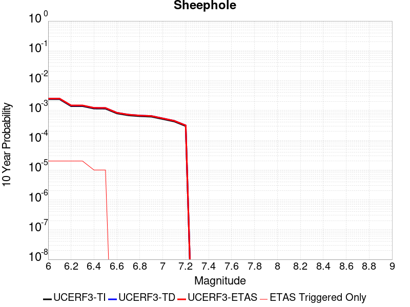 |

| Magnitude | 1 wk TI Prob | 1 wk TD Prob | 1 wk ETAS Prob | 1 wk ETAS/TD Gain | 1 wk ETAS Triggered Only | 1 mo TI Prob | 1 mo TD Prob | 1 mo ETAS Prob | 1 mo ETAS/TD Gain | 1 mo ETAS Triggered Only | 1 yr TI Prob | 1 yr TD Prob | 1 yr ETAS Prob | 1 yr ETAS/TD Gain | 1 yr ETAS Triggered Only | 10 yr TI Prob | 10 yr TD Prob | 10 yr ETAS Prob | 10 yr ETAS/TD Gain | 10 yr ETAS Triggered Only |
|-----|-----|-----|-----|-----|-----|-----|-----|-----|-----|-----|-----|-----|-----|-----|-----|-----|-----|-----|-----|-----|
| 6.0 | 4.5579695E-6 | 4.741364E-6 | 4.741364E-6 | 1.0 | 0.0 | 1.9534009E-5 | 2.0320003E-5 | 2.0320003E-5 | 1.0 | 0.0 | 2.3780059E-4 | 2.473735E-4 | 2.473735E-4 | 1.0 | 0.0 | 0.0023754628 | 0.002471526 | 0.0025373346 | 1.0266267 | 6.597176E-5 |
| 6.1 | 4.5579695E-6 | 4.741364E-6 | 4.741364E-6 | 1.0 | 0.0 | 1.9534009E-5 | 2.0320003E-5 | 2.0320003E-5 | 1.0 | 0.0 | 2.3780059E-4 | 2.473735E-4 | 2.473735E-4 | 1.0 | 0.0 | 0.0023754628 | 0.002471526 | 0.0025373346 | 1.0266267 | 6.597176E-5 |
| 6.2 | 2.6677674E-6 | 2.7874607E-6 | 2.7874607E-6 | 1.0 | 0.0 | 1.1433239E-5 | 1.1946211E-5 | 1.1946211E-5 | 1.0 | 0.0 | 1.3919079E-4 | 1.454365E-4 | 1.454365E-4 | 1.0 | 0.0 | 0.0013910364 | 0.001453519 | 0.0015193949 | 1.0453217 | 6.597176E-5 |
| 6.3 | 2.6677674E-6 | 2.7874607E-6 | 2.7874607E-6 | 1.0 | 0.0 | 1.1433239E-5 | 1.1946211E-5 | 1.1946211E-5 | 1.0 | 0.0 | 1.3919079E-4 | 1.454365E-4 | 1.454365E-4 | 1.0 | 0.0 | 0.0013910364 | 0.001453519 | 0.0015193949 | 1.0453217 | 6.597176E-5 |
| 6.4 | 2.2159759E-6 | 2.3229381E-6 | 2.3229381E-6 | 1.0 | 0.0 | 9.497005E-6 | 9.955416E-6 | 9.955416E-6 | 1.0 | 0.0 | 1.156199E-4 | 1.2120126E-4 | 1.2120126E-4 | 1.0 | 0.0 | 0.0011555976 | 0.0012114309 | 0.0012773228 | 1.0543917 | 6.597176E-5 |
| 6.5 | 2.1986082E-6 | 2.304818E-6 | 2.304818E-6 | 1.0 | 0.0 | 9.4225725E-6 | 9.877759E-6 | 9.877759E-6 | 1.0 | 0.0 | 1.1471378E-4 | 1.20255885E-4 | 1.20255885E-4 | 1.0 | 0.0 | 0.0011465458 | 0.0012019875 | 0.0012678799 | 1.0548196 | 6.597176E-5 |
| 6.6 | 1.5232331E-6 | 1.6019358E-6 | 1.6019358E-6 | 1.0 | 0.0 | 6.5281256E-6 | 6.8654217E-6 | 6.8654217E-6 | 1.0 | 0.0 | 7.947703E-5 | 8.3583494E-5 | 8.3583494E-5 | 1.0 | 0.0 | 7.9448614E-4 | 8.355393E-4 | 8.355393E-4 | 1.0 | 0.0 |
| 6.7 | 1.3137362E-6 | 1.3828576E-6 | 1.3828576E-6 | 1.0 | 0.0 | 5.6302856E-6 | 5.92652E-6 | 5.92652E-6 | 1.0 | 0.0 | 6.854657E-5 | 7.215313E-5 | 7.215313E-5 | 1.0 | 0.0 | 6.8525434E-4 | 7.2131096E-4 | 7.2131096E-4 | 1.0 | 0.0 |
| 6.8 | 1.2275751E-6 | 1.2923208E-6 | 1.2923208E-6 | 1.0 | 0.0 | 5.2610258E-6 | 5.5385067E-6 | 5.5385067E-6 | 1.0 | 0.0 | 6.4051106E-5 | 6.742937E-5 | 6.742937E-5 | 1.0 | 0.0 | 6.4032647E-4 | 6.7410246E-4 | 6.7410246E-4 | 1.0 | 0.0 |
| 6.9 | 1.1837088E-6 | 1.2461369E-6 | 1.2461369E-6 | 1.0 | 0.0 | 5.0730278E-6 | 5.3405765E-6 | 5.3405765E-6 | 1.0 | 0.0 | 6.176237E-5 | 6.501971E-5 | 6.501971E-5 | 1.0 | 0.0 | 6.17452E-4 | 6.5002E-4 | 6.5002E-4 | 1.0 | 0.0 |
| 7.0 | 9.849371E-7 | 1.0366576E-6 | 1.0366576E-6 | 1.0 | 0.0 | 4.2211523E-6 | 4.4428116E-6 | 4.4428116E-6 | 1.0 | 0.0 | 5.1391315E-5 | 5.4089993E-5 | 5.4089993E-5 | 1.0 | 0.0 | 5.137943E-4 | 5.4077833E-4 | 5.4077833E-4 | 1.0 | 0.0 |
| 7.1 | 8.1643645E-7 | 8.591908E-7 | 8.591908E-7 | 1.0 | 0.0 | 3.4990085E-6 | 3.6822414E-6 | 3.6822414E-6 | 1.0 | 0.0 | 4.2599597E-5 | 4.4830453E-5 | 4.4830453E-5 | 1.0 | 0.0 | 4.259143E-4 | 4.4822274E-4 | 4.4822274E-4 | 1.0 | 0.0 |
| 7.2 | 5.7295756E-7 | 6.029669E-7 | 6.029669E-7 | 1.0 | 0.0 | 2.45553E-6 | 2.5841418E-6 | 2.5841418E-6 | 1.0 | 0.0 | 2.9895667E-5 | 3.146154E-5 | 3.146154E-5 | 1.0 | 0.0 | 2.9891645E-4 | 3.1457754E-4 | 3.1457754E-4 | 1.0 | 0.0 |

## San Jacinto (San Bernardino)
*[(top)](#table-of-contents)*

| 1 Week | 1 Month | 1 Year | 10 Year |
|-----|-----|-----|-----|
|  | 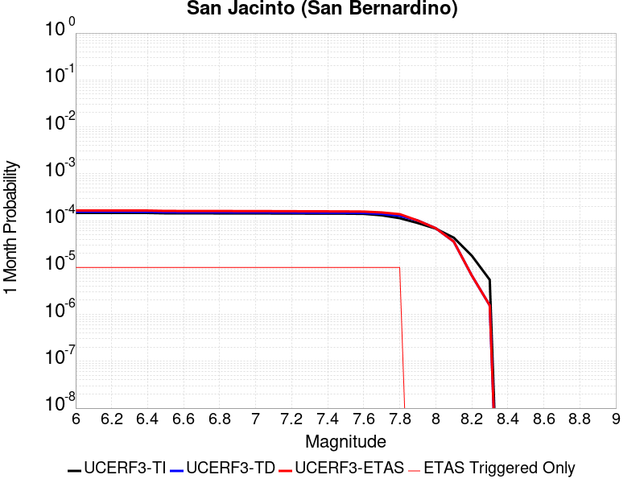 |  |  |

| Magnitude | 1 wk TI Prob | 1 wk TD Prob | 1 wk ETAS Prob | 1 wk ETAS/TD Gain | 1 wk ETAS Triggered Only | 1 mo TI Prob | 1 mo TD Prob | 1 mo ETAS Prob | 1 mo ETAS/TD Gain | 1 mo ETAS Triggered Only | 1 yr TI Prob | 1 yr TD Prob | 1 yr ETAS Prob | 1 yr ETAS/TD Gain | 1 yr ETAS Triggered Only | 10 yr TI Prob | 10 yr TD Prob | 10 yr ETAS Prob | 10 yr ETAS/TD Gain | 10 yr ETAS Triggered Only |
|-----|-----|-----|-----|-----|-----|-----|-----|-----|-----|-----|-----|-----|-----|-----|-----|-----|-----|-----|-----|-----|
| 6.0 | 3.409352E-5 | 3.6049758E-5 | 3.6049758E-5 | 1.0 | 0.0 | 1.461069E-4 | 1.5448983E-4 | 1.5448983E-4 | 1.0 | 0.0 | 0.0017774 | 0.0018792928 | 0.0019451405 | 1.0350386 | 6.597176E-5 | 0.01763251 | 0.019382251 | 0.019446945 | 1.0033377 | 6.597176E-5 |
| 6.1 | 3.409352E-5 | 3.6049758E-5 | 3.6049758E-5 | 1.0 | 0.0 | 1.461069E-4 | 1.5448983E-4 | 1.5448983E-4 | 1.0 | 0.0 | 0.0017774 | 0.0018792928 | 0.0019451405 | 1.0350386 | 6.597176E-5 | 0.01763251 | 0.019382251 | 0.019446945 | 1.0033377 | 6.597176E-5 |
| 6.2 | 3.409352E-5 | 3.6049758E-5 | 3.6049758E-5 | 1.0 | 0.0 | 1.461069E-4 | 1.5448983E-4 | 1.5448983E-4 | 1.0 | 0.0 | 0.0017774 | 0.0018792928 | 0.0019451405 | 1.0350386 | 6.597176E-5 | 0.01763251 | 0.019382251 | 0.019446945 | 1.0033377 | 6.597176E-5 |
| 6.3 | 3.409352E-5 | 3.6049758E-5 | 3.6049758E-5 | 1.0 | 0.0 | 1.461069E-4 | 1.5448983E-4 | 1.5448983E-4 | 1.0 | 0.0 | 0.0017774 | 0.0018792928 | 0.0019451405 | 1.0350386 | 6.597176E-5 | 0.01763251 | 0.019382251 | 0.019446945 | 1.0033377 | 6.597176E-5 |
| 6.4 | 3.400795E-5 | 3.5942405E-5 | 3.5942405E-5 | 1.0 | 0.0 | 1.4574021E-4 | 1.540298E-4 | 1.540298E-4 | 1.0 | 0.0 | 0.0017729428 | 0.0018737017 | 0.0019395499 | 1.0351434 | 6.597176E-5 | 0.017588645 | 0.019327328 | 0.019392025 | 1.0033474 | 6.597176E-5 |
| 6.5 | 3.341482E-5 | 3.5202946E-5 | 3.5202946E-5 | 1.0 | 0.0 | 1.4319851E-4 | 1.5086106E-4 | 1.5086106E-4 | 1.0 | 0.0 | 0.0017420477 | 0.0018351874 | 0.0019010381 | 1.0358822 | 6.597176E-5 | 0.017284546 | 0.018948833 | 0.019013554 | 1.0034156 | 6.597176E-5 |
| 6.6 | 3.3364955E-5 | 3.5140158E-5 | 3.5140158E-5 | 1.0 | 0.0 | 1.4298483E-4 | 1.50592E-4 | 1.50592E-4 | 1.0 | 0.0 | 0.0017394501 | 0.0018319171 | 0.001897768 | 1.0359465 | 6.597176E-5 | 0.017258976 | 0.018916694 | 0.018981418 | 1.0034215 | 6.597176E-5 |
| 6.7 | 3.335922E-5 | 3.512993E-5 | 3.512993E-5 | 1.0 | 0.0 | 1.4296026E-4 | 1.5054816E-4 | 1.5054816E-4 | 1.0 | 0.0 | 0.0017391514 | 0.0018313844 | 0.0018972353 | 1.035957 | 6.597176E-5 | 0.017256035 | 0.018911485 | 0.01897621 | 1.0034225 | 6.597176E-5 |
| 6.8 | 3.327683E-5 | 3.5023982E-5 | 3.5023982E-5 | 1.0 | 0.0 | 1.4260718E-4 | 1.5009414E-4 | 1.5009414E-4 | 1.0 | 0.0 | 0.0017348597 | 0.0018258659 | 0.0018917173 | 1.0360658 | 6.597176E-5 | 0.017213784 | 0.018857252 | 0.018921979 | 1.0034325 | 6.597176E-5 |
| 6.9 | 3.3235785E-5 | 3.4964927E-5 | 3.4964927E-5 | 1.0 | 0.0 | 1.4243131E-4 | 1.4984109E-4 | 1.4984109E-4 | 1.0 | 0.0 | 0.0017327217 | 0.0018227901 | 0.0018886416 | 1.0361267 | 6.597176E-5 | 0.017192734 | 0.018827116 | 0.018891845 | 1.0034381 | 6.597176E-5 |
| 7.0 | 3.3197095E-5 | 3.4904846E-5 | 3.4904846E-5 | 1.0 | 0.0 | 1.422655E-4 | 1.4958362E-4 | 1.4958362E-4 | 1.0 | 0.0 | 0.0017307063 | 0.0018196608 | 0.0018855125 | 1.036189 | 6.597176E-5 | 0.017172894 | 0.018796489 | 0.018861221 | 1.0034438 | 6.597176E-5 |
| 7.1 | 3.3129716E-5 | 3.478503E-5 | 3.478503E-5 | 1.0 | 0.0 | 1.4197677E-4 | 1.4907018E-4 | 1.4907018E-4 | 1.0 | 0.0 | 0.0017271966 | 0.0018134202 | 0.0018792723 | 1.0363138 | 6.597176E-5 | 0.017138338 | 0.018735558 | 0.018800294 | 1.0034553 | 6.597176E-5 |
| 7.2 | 3.3034008E-5 | 3.4652458E-5 | 3.4652458E-5 | 1.0 | 0.0 | 1.4156665E-4 | 1.4850209E-4 | 1.4850209E-4 | 1.0 | 0.0 | 0.0017222111 | 0.001806515 | 0.0018723676 | 1.0364529 | 6.597176E-5 | 0.017089253 | 0.018667944 | 0.018732684 | 1.003468 | 6.597176E-5 |
| 7.3 | 3.2956614E-5 | 3.4520177E-5 | 3.4520177E-5 | 1.0 | 0.0 | 1.4123498E-4 | 1.4793524E-4 | 1.4793524E-4 | 1.0 | 0.0 | 0.0017181796 | 0.001799625 | 0.0018654781 | 1.0365926 | 6.597176E-5 | 0.017049557 | 0.018600674 | 0.01866542 | 1.0034808 | 6.597176E-5 |
| 7.4 | 3.2915937E-5 | 3.4441844E-5 | 3.4441844E-5 | 1.0 | 0.0 | 1.4106068E-4 | 1.4759957E-4 | 1.4759957E-4 | 1.0 | 0.0 | 0.0017160608 | 0.0017955449 | 0.0018613982 | 1.0366759 | 6.597176E-5 | 0.017028693 | 0.018560927 | 0.018625675 | 1.0034884 | 6.597176E-5 |
| 7.5 | 3.281791E-5 | 3.430671E-5 | 3.430671E-5 | 1.0 | 0.0 | 1.406406E-4 | 1.4702049E-4 | 1.4702049E-4 | 1.0 | 0.0 | 0.0017109542 | 0.0017885063 | 0.0018543601 | 1.0368205 | 6.597176E-5 | 0.016978411 | 0.018491795 | 0.018556546 | 1.0035017 | 6.597176E-5 |
| 7.6 | 3.2521442E-5 | 3.4031546E-5 | 3.4031546E-5 | 1.0 | 0.0 | 1.3937015E-4 | 1.4584133E-4 | 1.4584133E-4 | 1.0 | 0.0 | 0.0016955109 | 0.0017741736 | 0.0018400282 | 1.0371186 | 6.597176E-5 | 0.016826328 | 0.018349366 | 0.018414127 | 1.0035293 | 6.597176E-5 |
| 7.7 | 3.0287873E-5 | 3.2514843E-5 | 3.2514843E-5 | 1.0 | 0.0 | 1.297987E-4 | 1.393419E-4 | 1.393419E-4 | 1.0 | 0.0 | 0.0015791537 | 0.0016951686 | 0.0017610285 | 1.0388515 | 6.597176E-5 | 0.01567979 | 0.017559871 | 0.017624686 | 1.003691 | 6.597176E-5 |
| 7.8 | 2.6316151E-5 | 2.9723395E-5 | 2.9723395E-5 | 1.0 | 0.0 | 1.1277862E-4 | 1.2737977E-4 | 1.2737977E-4 | 1.0 | 0.0 | 0.0013722149 | 0.0015497464 | 0.0016156159 | 1.0425035 | 6.597176E-5 | 0.013637724 | 0.016100293 | 0.016165202 | 1.0040315 | 6.597176E-5 |
| 7.9 | 2.0761147E-5 | 2.3470231E-5 | 2.3470231E-5 | 1.0 | 0.0 | 8.897331E-5 | 1.0058283E-4 | 1.0058283E-4 | 1.0 | 0.0 | 0.0010827117 | 0.0012239089 | 0.0012897999 | 1.0538366 | 6.597176E-5 | 0.010774517 | 0.012820105 | 0.012885231 | 1.00508 | 6.597176E-5 |
| 8.0 | 1.5738568E-5 | 1.607273E-5 | 1.607273E-5 | 1.0 | 0.0 | 6.744926E-5 | 6.8881316E-5 | 6.8881316E-5 | 1.0 | 0.0 | 8.2088535E-4 | 8.38308E-4 | 9.042245E-4 | 1.0786303 | 6.597176E-5 | 0.008178596 | 0.008886527 | 0.008951913 | 1.0073578 | 6.597176E-5 |
| 8.1 | 1.0105832E-5 | 8.353191E-6 | 8.353191E-6 | 1.0 | 0.0 | 4.3309992E-5 | 3.5798905E-5 | 3.5798905E-5 | 1.0 | 0.0 | 5.2717153E-4 | 4.35765E-4 | 4.35765E-4 | 1.0 | 0.0 | 0.005259227 | 0.004689436 | 0.004689436 | 1.0 | 0.0 |
| 8.2 | 4.189207E-6 | 1.5851253E-6 | 1.5851253E-6 | 1.0 | 0.0 | 1.7953622E-5 | 6.7933765E-6 | 6.7933765E-6 | 1.0 | 0.0 | 2.1856341E-4 | 8.270625E-5 | 8.270625E-5 | 1.0 | 0.0 | 0.0021834858 | 9.604094E-4 | 9.604094E-4 | 1.0 | 0.0 |
| 8.3 | 1.2758221E-6 | 3.6330252E-7 | 3.6330252E-7 | 1.0 | 0.0 | 5.4677976E-6 | 1.5570099E-6 | 1.5570099E-6 | 1.0 | 0.0 | 6.65684E-5 | 1.8956434E-5 | 1.8956434E-5 | 1.0 | 0.0 | 6.6548464E-4 | 2.2857229E-4 | 2.2857229E-4 | 1.0 | 0.0 |

## Owens Valley
*[(top)](#table-of-contents)*

| 1 Week | 1 Month | 1 Year | 10 Year |
|-----|-----|-----|-----|
|  |  |  |  |

| Magnitude | 1 wk TI Prob | 1 wk TD Prob | 1 wk ETAS Prob | 1 wk ETAS/TD Gain | 1 wk ETAS Triggered Only | 1 mo TI Prob | 1 mo TD Prob | 1 mo ETAS Prob | 1 mo ETAS/TD Gain | 1 mo ETAS Triggered Only | 1 yr TI Prob | 1 yr TD Prob | 1 yr ETAS Prob | 1 yr ETAS/TD Gain | 1 yr ETAS Triggered Only | 10 yr TI Prob | 10 yr TD Prob | 10 yr ETAS Prob | 10 yr ETAS/TD Gain | 10 yr ETAS Triggered Only |
|-----|-----|-----|-----|-----|-----|-----|-----|-----|-----|-----|-----|-----|-----|-----|-----|-----|-----|-----|-----|-----|
| 6.0 | 4.83821E-5 | 3.6298834E-6 | 3.6298834E-6 | 1.0 | 0.0 | 2.0733538E-4 | 1.5556556E-5 | 1.5556556E-5 | 1.0 | 0.0 | 0.002521386 | 1.893856E-4 | 2.5534487E-4 | 1.3482803 | 6.597176E-5 | 0.024929691 | 0.0019267192 | 0.001992564 | 1.0341744 | 6.597176E-5 |
| 6.1 | 4.83821E-5 | 3.6298834E-6 | 3.6298834E-6 | 1.0 | 0.0 | 2.0733538E-4 | 1.5556556E-5 | 1.5556556E-5 | 1.0 | 0.0 | 0.002521386 | 1.893856E-4 | 2.5534487E-4 | 1.3482803 | 6.597176E-5 | 0.024929691 | 0.0019267192 | 0.001992564 | 1.0341744 | 6.597176E-5 |
| 6.2 | 4.83821E-5 | 3.6298834E-6 | 3.6298834E-6 | 1.0 | 0.0 | 2.0733538E-4 | 1.5556556E-5 | 1.5556556E-5 | 1.0 | 0.0 | 0.002521386 | 1.893856E-4 | 2.5534487E-4 | 1.3482803 | 6.597176E-5 | 0.024929691 | 0.0019267192 | 0.001992564 | 1.0341744 | 6.597176E-5 |
| 6.3 | 3.953008E-5 | 3.1571942E-6 | 3.1571942E-6 | 1.0 | 0.0 | 1.6940363E-4 | 1.3530766E-5 | 1.3530766E-5 | 1.0 | 0.0 | 0.002060538 | 1.6472537E-4 | 2.3068626E-4 | 1.4004295 | 6.597176E-5 | 0.020415364 | 0.0016601578 | 0.00172602 | 1.0396723 | 6.597176E-5 |
| 6.4 | 3.953008E-5 | 3.1571942E-6 | 3.1571942E-6 | 1.0 | 0.0 | 1.6940363E-4 | 1.3530766E-5 | 1.3530766E-5 | 1.0 | 0.0 | 0.002060538 | 1.6472537E-4 | 2.3068626E-4 | 1.4004295 | 6.597176E-5 | 0.020415364 | 0.0016601578 | 0.00172602 | 1.0396723 | 6.597176E-5 |
| 6.5 | 3.457342E-5 | 2.9727623E-6 | 2.9727623E-6 | 1.0 | 0.0 | 1.4816338E-4 | 1.2740352E-5 | 1.2740352E-5 | 1.0 | 0.0 | 0.0018023965 | 1.5510344E-4 | 2.2106497E-4 | 1.4252745 | 6.597176E-5 | 0.017878477 | 0.0015563503 | 0.0016222193 | 1.0423228 | 6.597176E-5 |
| 6.6 | 3.1127765E-5 | 2.8753116E-6 | 2.8753116E-6 | 1.0 | 0.0 | 1.3339789E-4 | 1.232271E-5 | 1.232271E-5 | 1.0 | 0.0 | 0.0016229092 | 1.5001935E-4 | 2.1598121E-4 | 1.439689 | 6.597176E-5 | 0.016111081 | 0.0015016922 | 0.0015675649 | 1.0438657 | 6.597176E-5 |
| 6.7 | 2.806885E-5 | 2.8110242E-6 | 2.8110242E-6 | 1.0 | 0.0 | 1.2028952E-4 | 1.2047194E-5 | 1.2047194E-5 | 1.0 | 0.0 | 0.001463541 | 1.466654E-4 | 2.1262749E-4 | 1.4497454 | 6.597176E-5 | 0.014539397 | 0.0014660707 | 0.0015319457 | 1.0449331 | 6.597176E-5 |
| 6.8 | 2.524524E-5 | 2.2358972E-6 | 2.2358972E-6 | 1.0 | 0.0 | 1.0818939E-4 | 9.582383E-6 | 9.582383E-6 | 1.0 | 0.0 | 0.0013164099 | 1.16659576E-4 | 1.8262364E-4 | 1.5654407 | 6.597176E-5 | 0.01308639 | 0.001166257 | 0.0012321518 | 1.0565012 | 6.597176E-5 |
| 6.9 | 2.2704568E-5 | 1.6085578E-6 | 1.6085578E-6 | 1.0 | 0.0 | 9.730166E-5 | 6.893801E-6 | 6.893801E-6 | 1.0 | 0.0 | 0.0011840039 | 8.392881E-5 | 1.4989504E-4 | 1.7859783 | 6.597176E-5 | 0.011777153 | 8.391837E-4 | 9.051001E-4 | 1.0785482 | 6.597176E-5 |
| 7.0 | 2.0871712E-5 | 1.5399135E-6 | 1.5399135E-6 | 1.0 | 0.0 | 8.944713E-5 | 6.5996123E-6 | 6.5996123E-6 | 1.0 | 0.0 | 0.0010884746 | 8.034734E-5 | 1.463138E-4 | 1.8210162 | 6.597176E-5 | 0.010831586 | 8.0335594E-4 | 8.6927466E-4 | 1.0820543 | 6.597176E-5 |
| 7.1 | 1.944928E-5 | 1.3867325E-6 | 1.3867325E-6 | 1.0 | 0.0 | 8.335139E-5 | 5.943126E-6 | 5.943126E-6 | 1.0 | 0.0 | 0.0010143308 | 7.2355164E-5 | 1.3832215E-4 | 1.9117109 | 6.597176E-5 | 0.010097133 | 7.23475E-4 | 7.89399E-4 | 1.0911213 | 6.597176E-5 |
| 7.2 | 1.7876306E-5 | 1.249191E-6 | 1.249191E-6 | 1.0 | 0.0 | 7.6610486E-5 | 5.3536646E-6 | 5.3536646E-6 | 1.0 | 0.0 | 9.3233347E-4 | 6.517892E-5 | 1.3114639E-4 | 2.012098 | 6.597176E-5 | 0.009284316 | 6.517364E-4 | 7.176652E-4 | 1.1011586 | 6.597176E-5 |
| 7.3 | 1.2618672E-5 | 1.1117779E-6 | 1.1117779E-6 | 1.0 | 0.0 | 5.40789E-5 | 4.764754E-6 | 4.764754E-6 | 1.0 | 0.0 | 6.582117E-4 | 5.8009344E-5 | 1.2397728E-4 | 2.137195 | 6.597176E-5 | 0.0065626553 | 5.800754E-4 | 6.460089E-4 | 1.1136637 | 6.597176E-5 |
| 7.4 | 7.4874442E-6 | 8.550806E-7 | 8.550806E-7 | 1.0 | 0.0 | 3.208865E-5 | 3.6646259E-6 | 3.6646259E-6 | 1.0 | 0.0 | 3.906093E-4 | 4.461591E-5 | 1.1058473E-4 | 2.478594 | 6.597176E-5 | 0.003899234 | 4.461625E-4 | 5.1210483E-4 | 1.1477989 | 6.597176E-5 |
| 7.5 | 2.4734156E-6 | 6.0700546E-7 | 6.0700546E-7 | 1.0 | 0.0 | 1.060031E-5 | 2.6014495E-6 | 2.6014495E-6 | 1.0 | 0.0 | 1.2905113E-4 | 3.167219E-5 | 9.764187E-5 | 3.0828896 | 6.597176E-5 | 0.0012897621 | 3.166771E-4 | 3.8262794E-4 | 1.2082591 | 6.597176E-5 |
| 7.6 | 1.1328841E-6 | 3.1972448E-7 | 3.1972448E-7 | 1.0 | 0.0 | 4.8552088E-6 | 1.3702471E-6 | 1.3702471E-6 | 1.0 | 0.0 | 5.9110564E-5 | 1.6682632E-5 | 8.265329E-5 | 4.9544516 | 6.597176E-5 | 5.9094845E-4 | 1.6681399E-4 | 2.3277475E-4 | 1.3954151 | 6.597176E-5 |
| 7.7 | 4.8613185E-7 | 8.967469E-8 | 8.967469E-8 | 1.0 | 0.0 | 2.0834207E-6 | 3.8432006E-7 | 3.8432006E-7 | 1.0 | 0.0 | 2.536535E-5 | 4.6790874E-6 | 4.6790874E-6 | 1.0 | 0.0 | 2.5362454E-4 | 4.678996E-5 | 4.678996E-5 | 1.0 | 0.0 |

## Chino alt 1
*[(top)](#table-of-contents)*

| 1 Week | 1 Month | 1 Year | 10 Year |
|-----|-----|-----|-----|
|  |  |  | 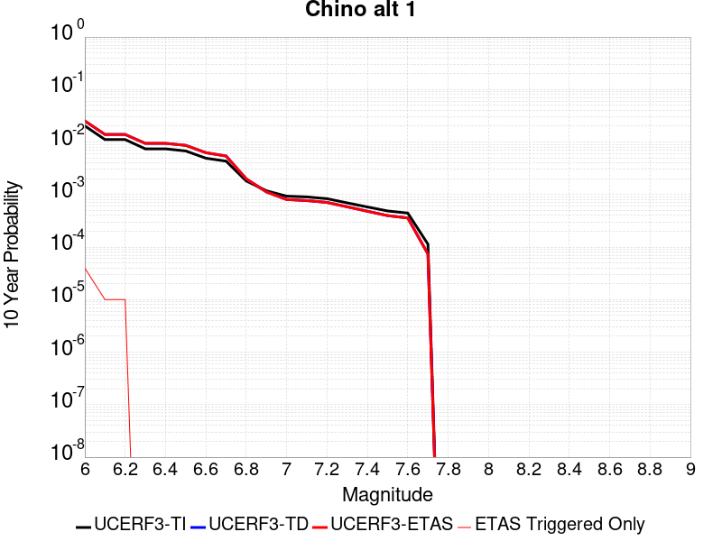 |

| Magnitude | 1 wk TI Prob | 1 wk TD Prob | 1 wk ETAS Prob | 1 wk ETAS/TD Gain | 1 wk ETAS Triggered Only | 1 mo TI Prob | 1 mo TD Prob | 1 mo ETAS Prob | 1 mo ETAS/TD Gain | 1 mo ETAS Triggered Only | 1 yr TI Prob | 1 yr TD Prob | 1 yr ETAS Prob | 1 yr ETAS/TD Gain | 1 yr ETAS Triggered Only | 10 yr TI Prob | 10 yr TD Prob | 10 yr ETAS Prob | 10 yr ETAS/TD Gain | 10 yr ETAS Triggered Only |
|-----|-----|-----|-----|-----|-----|-----|-----|-----|-----|-----|-----|-----|-----|-----|-----|-----|-----|-----|-----|-----|
| 6.0 | 3.939946E-5 | 4.8955757E-5 | 4.8955757E-5 | 1.0 | 0.0 | 1.6884391E-4 | 2.0979645E-4 | 2.0979645E-4 | 1.0 | 0.0 | 0.0020537362 | 0.0025517642 | 0.0025517642 | 1.0 | 0.0 | 0.020348595 | 0.025281483 | 0.025345787 | 1.0025436 | 6.597176E-5 |
| 6.1 | 2.1505624E-5 | 2.6883481E-5 | 2.6883481E-5 | 1.0 | 0.0 | 9.2163704E-5 | 1.1521046E-4 | 1.1521046E-4 | 1.0 | 0.0 | 0.0011215154 | 0.0014018962 | 0.0014018962 | 1.0 | 0.0 | 0.011158722 | 0.013947416 | 0.013947416 | 1.0 | 0.0 |
| 6.2 | 2.1505624E-5 | 2.6883481E-5 | 2.6883481E-5 | 1.0 | 0.0 | 9.2163704E-5 | 1.1521046E-4 | 1.1521046E-4 | 1.0 | 0.0 | 0.0011215154 | 0.0014018962 | 0.0014018962 | 1.0 | 0.0 | 0.011158722 | 0.013947416 | 0.013947416 | 1.0 | 0.0 |
| 6.3 | 1.4290785E-5 | 1.816862E-5 | 1.816862E-5 | 1.0 | 0.0 | 6.1244784E-5 | 7.786344E-5 | 7.786344E-5 | 1.0 | 0.0 | 7.454001E-4 | 9.4762055E-4 | 9.4762055E-4 | 1.0 | 0.0 | 0.007429048 | 0.009446246 | 0.009446246 | 1.0 | 0.0 |
| 6.4 | 1.4290785E-5 | 1.816862E-5 | 1.816862E-5 | 1.0 | 0.0 | 6.1244784E-5 | 7.786344E-5 | 7.786344E-5 | 1.0 | 0.0 | 7.454001E-4 | 9.4762055E-4 | 9.4762055E-4 | 1.0 | 0.0 | 0.007429048 | 0.009446246 | 0.009446246 | 1.0 | 0.0 |
| 6.5 | 1.3017944E-5 | 1.665543E-5 | 1.665543E-5 | 1.0 | 0.0 | 5.5789995E-5 | 7.13787E-5 | 7.13787E-5 | 1.0 | 0.0 | 6.790315E-4 | 8.6873304E-4 | 8.6873304E-4 | 1.0 | 0.0 | 0.0067696036 | 0.00866366 | 0.00866366 | 1.0 | 0.0 |
| 6.6 | 9.470016E-6 | 1.2041898E-5 | 1.2041898E-5 | 1.0 | 0.0 | 4.058515E-5 | 5.1607305E-5 | 5.1607305E-5 | 1.0 | 0.0 | 4.940122E-4 | 6.281718E-4 | 6.281718E-4 | 1.0 | 0.0 | 0.004929154 | 0.006273171 | 0.006273171 | 1.0 | 0.0 |
| 6.7 | 8.314155E-6 | 1.0409905E-5 | 1.0409905E-5 | 1.0 | 0.0 | 3.5631605E-5 | 4.46133E-5 | 4.46133E-5 | 1.0 | 0.0 | 4.3372845E-4 | 5.430638E-4 | 5.430638E-4 | 1.0 | 0.0 | 0.004328829 | 0.005426893 | 0.005426893 | 1.0 | 0.0 |
| 6.8 | 3.4856364E-6 | 3.8139801E-6 | 3.8139801E-6 | 1.0 | 0.0 | 1.4938357E-5 | 1.6345539E-5 | 1.6345539E-5 | 1.0 | 0.0 | 1.8185932E-4 | 1.9899083E-4 | 1.9899083E-4 | 1.0 | 0.0 | 0.0018171056 | 0.001989803 | 0.001989803 | 1.0 | 0.0 |
| 6.9 | 2.2645952E-6 | 2.1532328E-6 | 2.1532328E-6 | 1.0 | 0.0 | 9.705372E-6 | 9.228109E-6 | 9.228109E-6 | 1.0 | 0.0 | 1.18156495E-4 | 1.1234665E-4 | 1.1234665E-4 | 1.0 | 0.0 | 0.0011809369 | 0.0011235146 | 0.0011235146 | 1.0 | 0.0 |
| 7.0 | 1.7864003E-6 | 1.5433379E-6 | 1.5433379E-6 | 1.0 | 0.0 | 7.655979E-6 | 6.6142893E-6 | 6.6142893E-6 | 1.0 | 0.0 | 9.3207556E-5 | 8.052605E-5 | 8.052605E-5 | 1.0 | 0.0 | 9.316847E-4 | 8.054159E-4 | 8.054159E-4 | 1.0 | 0.0 |
| 7.1 | 1.7315456E-6 | 1.4736019E-6 | 1.4736019E-6 | 1.0 | 0.0 | 7.420889E-6 | 6.3154216E-6 | 6.3154216E-6 | 1.0 | 0.0 | 9.034557E-5 | 7.6887605E-5 | 7.6887605E-5 | 1.0 | 0.0 | 9.0308854E-4 | 7.690479E-4 | 7.690479E-4 | 1.0 | 0.0 |
| 7.2 | 1.6008337E-6 | 1.3576367E-6 | 1.3576367E-6 | 1.0 | 0.0 | 6.860698E-6 | 5.8184305E-6 | 5.8184305E-6 | 1.0 | 0.0 | 8.352579E-5 | 7.0837144E-5 | 7.0837144E-5 | 1.0 | 0.0 | 8.34944E-4 | 7.085699E-4 | 7.085699E-4 | 1.0 | 0.0 |
| 7.3 | 1.3320939E-6 | 1.1219545E-6 | 1.1219545E-6 | 1.0 | 0.0 | 5.7089615E-6 | 4.8083675E-6 | 4.8083675E-6 | 1.0 | 0.0 | 6.9504385E-5 | 5.854035E-5 | 5.854035E-5 | 1.0 | 0.0 | 6.9482654E-4 | 5.8539386E-4 | 5.8539386E-4 | 1.0 | 0.0 |
| 7.4 | 1.114294E-6 | 9.2384767E-7 | 9.2384767E-7 | 1.0 | 0.0 | 4.775537E-6 | 3.9593415E-6 | 3.9593415E-6 | 1.0 | 0.0 | 5.8140613E-5 | 4.820395E-5 | 4.820395E-5 | 1.0 | 0.0 | 5.81254E-4 | 4.8195178E-4 | 4.8195178E-4 | 1.0 | 0.0 |
| 7.5 | 9.354081E-7 | 7.62451E-7 | 7.62451E-7 | 1.0 | 0.0 | 4.0088858E-6 | 3.2676433E-6 | 3.2676433E-6 | 1.0 | 0.0 | 4.8807087E-5 | 3.9782866E-5 | 3.9782866E-5 | 1.0 | 0.0 | 4.879637E-4 | 3.9776083E-4 | 3.9776083E-4 | 1.0 | 0.0 |
| 7.6 | 8.521771E-7 | 6.881667E-7 | 6.881667E-7 | 1.0 | 0.0 | 3.6521824E-6 | 2.9492828E-6 | 2.9492828E-6 | 1.0 | 0.0 | 4.4464414E-5 | 3.590696E-5 | 3.590696E-5 | 1.0 | 0.0 | 4.4455516E-4 | 3.5901475E-4 | 3.5901475E-4 | 1.0 | 0.0 |
| 7.7 | 2.1803626E-7 | 1.4189133E-7 | 1.4189133E-7 | 1.0 | 0.0 | 9.344408E-7 | 6.0810567E-7 | 6.0810567E-7 | 1.0 | 0.0 | 1.1376757E-5 | 7.4036707E-6 | 7.4036707E-6 | 1.0 | 0.0 | 1.13761744E-4 | 7.4035204E-5 | 7.4035204E-5 | 1.0 | 0.0 |

## Pilarcitos 2011 CFM
*[(top)](#table-of-contents)*

| 1 Week | 1 Month | 1 Year | 10 Year |
|-----|-----|-----|-----|
| 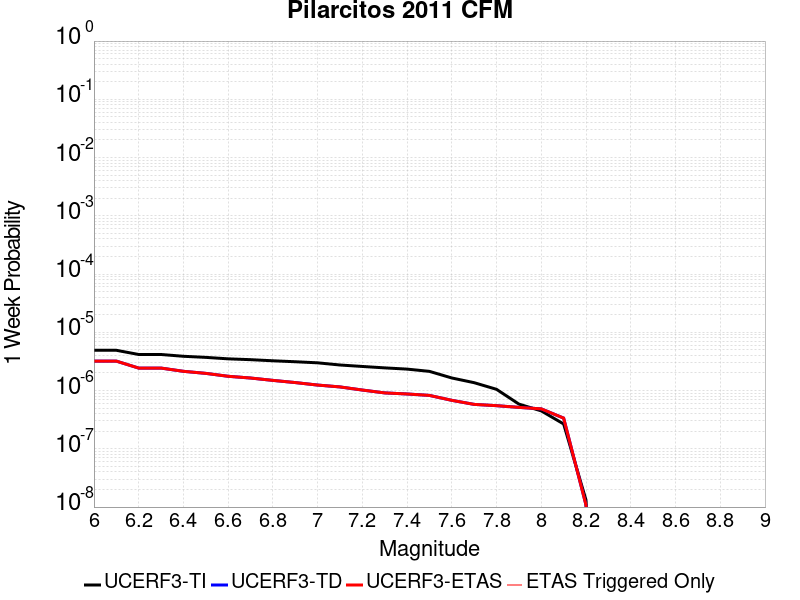 |  |  |  |

| Magnitude | 1 wk TI Prob | 1 wk TD Prob | 1 wk ETAS Prob | 1 wk ETAS/TD Gain | 1 wk ETAS Triggered Only | 1 mo TI Prob | 1 mo TD Prob | 1 mo ETAS Prob | 1 mo ETAS/TD Gain | 1 mo ETAS Triggered Only | 1 yr TI Prob | 1 yr TD Prob | 1 yr ETAS Prob | 1 yr ETAS/TD Gain | 1 yr ETAS Triggered Only | 10 yr TI Prob | 10 yr TD Prob | 10 yr ETAS Prob | 10 yr ETAS/TD Gain | 10 yr ETAS Triggered Only |
|-----|-----|-----|-----|-----|-----|-----|-----|-----|-----|-----|-----|-----|-----|-----|-----|-----|-----|-----|-----|-----|
| 6.0 | 4.9150476E-6 | 3.2042635E-6 | 3.2042635E-6 | 1.0 | 0.0 | 2.1064321E-5 | 1.3732488E-5 | 1.3732488E-5 | 1.0 | 0.0 | 2.564279E-4 | 1.6718052E-4 | 1.6718052E-4 | 1.0 | 0.0 | 0.0025613222 | 0.0016829972 | 0.0017488579 | 1.039133 | 6.597176E-5 |
| 6.1 | 4.9150476E-6 | 3.2042635E-6 | 3.2042635E-6 | 1.0 | 0.0 | 2.1064321E-5 | 1.3732488E-5 | 1.3732488E-5 | 1.0 | 0.0 | 2.564279E-4 | 1.6718052E-4 | 1.6718052E-4 | 1.0 | 0.0 | 0.0025613222 | 0.0016829972 | 0.0017488579 | 1.039133 | 6.597176E-5 |
| 6.2 | 4.162343E-6 | 2.4326434E-6 | 2.4326434E-6 | 1.0 | 0.0 | 1.783849E-5 | 1.0425573E-5 | 1.0425573E-5 | 1.0 | 0.0 | 2.1716199E-4 | 1.2692405E-4 | 1.2692405E-4 | 1.0 | 0.0 | 0.002169499 | 0.0012809471 | 0.0013468344 | 1.0514363 | 6.597176E-5 |
| 6.3 | 4.162343E-6 | 2.4326434E-6 | 2.4326434E-6 | 1.0 | 0.0 | 1.783849E-5 | 1.0425573E-5 | 1.0425573E-5 | 1.0 | 0.0 | 2.1716199E-4 | 1.2692405E-4 | 1.2692405E-4 | 1.0 | 0.0 | 0.002169499 | 0.0012809471 | 0.0013468344 | 1.0514363 | 6.597176E-5 |
| 6.4 | 3.8768926E-6 | 2.140059E-6 | 2.140059E-6 | 1.0 | 0.0 | 1.6615148E-5 | 9.171649E-6 | 9.171649E-6 | 1.0 | 0.0 | 2.0227065E-4 | 1.1165915E-4 | 1.1165915E-4 | 1.0 | 0.0 | 0.0020208664 | 0.0011284603 | 0.0011943575 | 1.0583957 | 6.597176E-5 |
| 6.5 | 3.7137002E-6 | 1.9734143E-6 | 1.9734143E-6 | 1.0 | 0.0 | 1.591576E-5 | 8.457463E-6 | 8.457463E-6 | 1.0 | 0.0 | 1.9375715E-4 | 1.02964776E-4 | 1.02964776E-4 | 1.0 | 0.0 | 0.001935883 | 0.0010416005 | 0.0011075035 | 1.0632709 | 6.597176E-5 |
| 6.6 | 3.5048733E-6 | 1.7583651E-6 | 1.7583651E-6 | 1.0 | 0.0 | 1.5020799E-5 | 7.5358284E-6 | 7.5358284E-6 | 1.0 | 0.0 | 1.8286289E-4 | 9.174487E-5 | 9.174487E-5 | 1.0 | 0.0 | 0.0018271249 | 9.2950027E-4 | 9.954107E-4 | 1.0709095 | 6.597176E-5 |
| 6.7 | 3.3908584E-6 | 1.6420529E-6 | 1.6420529E-6 | 1.0 | 0.0 | 1.453217E-5 | 7.0373508E-6 | 7.0373508E-6 | 1.0 | 0.0 | 1.7691481E-4 | 8.5676395E-5 | 8.5676395E-5 | 1.0 | 0.0 | 0.0017677402 | 8.688642E-4 | 9.347786E-4 | 1.0758628 | 6.597176E-5 |
| 6.8 | 3.2451449E-6 | 1.4952687E-6 | 1.4952687E-6 | 1.0 | 0.0 | 1.3907689E-5 | 6.4082788E-6 | 6.4082788E-6 | 1.0 | 0.0 | 1.6931296E-4 | 7.801801E-5 | 7.801801E-5 | 1.0 | 0.0 | 0.0016918402 | 7.92337E-4 | 7.92337E-4 | 1.0 | 0.0 |
| 6.9 | 3.1239128E-6 | 1.3717896E-6 | 1.3717896E-6 | 1.0 | 0.0 | 1.3388129E-5 | 5.8790847E-6 | 5.8790847E-6 | 1.0 | 0.0 | 1.6298829E-4 | 7.1575516E-5 | 7.1575516E-5 | 1.0 | 0.0 | 0.001628688 | 7.2795595E-4 | 7.2795595E-4 | 1.0 | 0.0 |
| 7.0 | 2.9940109E-6 | 1.243096E-6 | 1.243096E-6 | 1.0 | 0.0 | 1.2831412E-5 | 5.3275435E-6 | 5.3275435E-6 | 1.0 | 0.0 | 1.5621124E-4 | 6.486091E-5 | 6.486091E-5 | 1.0 | 0.0 | 0.0015610148 | 6.6085136E-4 | 6.6085136E-4 | 1.0 | 0.0 |
| 7.1 | 2.7471217E-6 | 1.154768E-6 | 1.154768E-6 | 1.0 | 0.0 | 1.1773326E-5 | 4.9489963E-6 | 4.9489963E-6 | 1.0 | 0.0 | 1.4333082E-4 | 6.0252365E-5 | 6.0252365E-5 | 1.0 | 0.0 | 0.001432384 | 6.1473955E-4 | 6.1473955E-4 | 1.0 | 0.0 |
| 7.2 | 2.592675E-6 | 1.0207918E-6 | 1.0207918E-6 | 1.0 | 0.0 | 1.1111417E-5 | 4.374815E-6 | 4.374815E-6 | 1.0 | 0.0 | 1.3527309E-4 | 5.3262072E-5 | 5.3262072E-5 | 1.0 | 0.0 | 0.0013519078 | 5.44873E-4 | 5.44873E-4 | 1.0 | 0.0 |
| 7.3 | 2.4518663E-6 | 9.1172785E-7 | 9.1172785E-7 | 1.0 | 0.0 | 1.0507956E-5 | 3.907399E-6 | 3.907399E-6 | 1.0 | 0.0 | 1.2792686E-4 | 4.7571546E-5 | 4.7571546E-5 | 1.0 | 0.0 | 0.0012785323 | 4.879916E-4 | 4.879916E-4 | 1.0 | 0.0 |
| 7.4 | 2.3349535E-6 | 8.738746E-7 | 8.738746E-7 | 1.0 | 0.0 | 1.0006905E-5 | 3.7451714E-6 | 3.7451714E-6 | 1.0 | 0.0 | 1.2182725E-4 | 4.559651E-5 | 4.559651E-5 | 1.0 | 0.0 | 0.0012176048 | 4.6822458E-4 | 4.6822458E-4 | 1.0 | 0.0 |
| 7.5 | 2.1358665E-6 | 8.258519E-7 | 8.258519E-7 | 1.0 | 0.0 | 9.15368E-6 | 3.5393603E-6 | 3.5393603E-6 | 1.0 | 0.0 | 1.11440364E-4 | 4.309086E-5 | 4.309086E-5 | 1.0 | 0.0 | 0.0011138449 | 4.430837E-4 | 4.430837E-4 | 1.0 | 0.0 |
| 7.6 | 1.6445446E-6 | 6.798402E-7 | 6.798402E-7 | 1.0 | 0.0 | 7.048029E-6 | 2.9135974E-6 | 2.9135974E-6 | 1.0 | 0.0 | 8.580638E-5 | 3.5472473E-5 | 3.5472473E-5 | 1.0 | 0.0 | 8.5773255E-4 | 3.668587E-4 | 3.668587E-4 | 1.0 | 0.0 |
| 7.7 | 1.3650961E-6 | 5.7900303E-7 | 5.7900303E-7 | 1.0 | 0.0 | 5.850399E-6 | 2.4814392E-6 | 2.4814392E-6 | 1.0 | 0.0 | 7.122628E-5 | 3.0211102E-5 | 3.0211102E-5 | 1.0 | 0.0 | 7.120345E-4 | 3.141429E-4 | 3.141429E-4 | 1.0 | 0.0 |
| 7.8 | 1.0500993E-6 | 5.504804E-7 | 5.504804E-7 | 1.0 | 0.0 | 4.5004176E-6 | 2.3591997E-6 | 2.3591997E-6 | 1.0 | 0.0 | 5.4791206E-5 | 2.872288E-5 | 2.872288E-5 | 1.0 | 0.0 | 5.47777E-4 | 2.9913257E-4 | 2.9913257E-4 | 1.0 | 0.0 |
| 7.9 | 5.856431E-7 | 5.145004E-7 | 5.145004E-7 | 1.0 | 0.0 | 2.5098966E-6 | 2.2049999E-6 | 2.2049999E-6 | 1.0 | 0.0 | 3.0557563E-5 | 2.6845542E-5 | 2.6845542E-5 | 1.0 | 0.0 | 3.055336E-4 | 2.7961895E-4 | 2.7961895E-4 | 1.0 | 0.0 |
| 8.0 | 4.4768265E-7 | 4.85037E-7 | 4.85037E-7 | 1.0 | 0.0 | 1.9186384E-6 | 2.0787284E-6 | 2.0787284E-6 | 1.0 | 0.0 | 2.3359173E-5 | 2.5308223E-5 | 2.5308223E-5 | 1.0 | 0.0 | 2.3356717E-4 | 2.637138E-4 | 2.637138E-4 | 1.0 | 0.0 |
| 8.1 | 2.6692538E-7 | 3.367165E-7 | 3.367165E-7 | 1.0 | 0.0 | 1.1439654E-6 | 1.44307E-6 | 1.44307E-6 | 1.0 | 0.0 | 1.392769E-5 | 1.7569237E-5 | 1.7569237E-5 | 1.0 | 0.0 | 1.3926817E-4 | 1.8304925E-4 | 1.8304925E-4 | 1.0 | 0.0 |
| 8.2 | 1.3198862E-8 | 1.0860941E-8 | 1.0860941E-8 | 1.0 | 0.0 | 5.656655E-8 | 4.6546887E-8 | 4.6546887E-8 | 1.0 | 0.0 | 6.886975E-7 | 5.6670825E-7 | 5.6670825E-7 | 1.0 | 0.0 | 6.8869535E-6 | 5.899266E-6 | 5.899266E-6 | 1.0 | 0.0 |

## San Andreas (Peninsula) 2011 CFM
*[(top)](#table-of-contents)*

| 1 Week | 1 Month | 1 Year | 10 Year |
|-----|-----|-----|-----|
|  |  |  |  |

| Magnitude | 1 wk TI Prob | 1 wk TD Prob | 1 wk ETAS Prob | 1 wk ETAS/TD Gain | 1 wk ETAS Triggered Only | 1 mo TI Prob | 1 mo TD Prob | 1 mo ETAS Prob | 1 mo ETAS/TD Gain | 1 mo ETAS Triggered Only | 1 yr TI Prob | 1 yr TD Prob | 1 yr ETAS Prob | 1 yr ETAS/TD Gain | 1 yr ETAS Triggered Only | 10 yr TI Prob | 10 yr TD Prob | 10 yr ETAS Prob | 10 yr ETAS/TD Gain | 10 yr ETAS Triggered Only |
|-----|-----|-----|-----|-----|-----|-----|-----|-----|-----|-----|-----|-----|-----|-----|-----|-----|-----|-----|-----|-----|
| 6.0 | 8.6200685E-5 | 2.5333706E-5 | 2.5333706E-5 | 1.0 | 0.0 | 3.6937918E-4 | 1.08568514E-4 | 1.08568514E-4 | 1.0 | 0.0 | 0.0044879215 | 0.0013210218 | 0.0013210218 | 1.0 | 0.0 | 0.043983612 | 0.014838956 | 0.014903949 | 1.0043799 | 6.597176E-5 |
| 6.1 | 8.6200685E-5 | 2.5333706E-5 | 2.5333706E-5 | 1.0 | 0.0 | 3.6937918E-4 | 1.08568514E-4 | 1.08568514E-4 | 1.0 | 0.0 | 0.0044879215 | 0.0013210218 | 0.0013210218 | 1.0 | 0.0 | 0.043983612 | 0.014838956 | 0.014903949 | 1.0043799 | 6.597176E-5 |
| 6.2 | 8.6200685E-5 | 2.5333706E-5 | 2.5333706E-5 | 1.0 | 0.0 | 3.6937918E-4 | 1.08568514E-4 | 1.08568514E-4 | 1.0 | 0.0 | 0.0044879215 | 0.0013210218 | 0.0013210218 | 1.0 | 0.0 | 0.043983612 | 0.014838956 | 0.014903949 | 1.0043799 | 6.597176E-5 |
| 6.3 | 8.551163E-5 | 2.5024961E-5 | 2.5024961E-5 | 1.0 | 0.0 | 3.6642692E-4 | 1.0724543E-4 | 1.0724543E-4 | 1.0 | 0.0 | 0.004452125 | 0.0013049326 | 0.0013049326 | 1.0 | 0.0 | 0.043639794 | 0.014665611 | 0.014730616 | 1.0044324 | 6.597176E-5 |
| 6.4 | 8.551163E-5 | 2.5024961E-5 | 2.5024961E-5 | 1.0 | 0.0 | 3.6642692E-4 | 1.0724543E-4 | 1.0724543E-4 | 1.0 | 0.0 | 0.004452125 | 0.0013049326 | 0.0013049326 | 1.0 | 0.0 | 0.043639794 | 0.014665611 | 0.014730616 | 1.0044324 | 6.597176E-5 |
| 6.5 | 8.511146E-5 | 2.4846031E-5 | 2.4846031E-5 | 1.0 | 0.0 | 3.647124E-4 | 1.0647865E-4 | 1.0647865E-4 | 1.0 | 0.0 | 0.004431336 | 0.0012956082 | 0.0012956082 | 1.0 | 0.0 | 0.04344007 | 0.014565198 | 0.014630209 | 1.0044634 | 6.597176E-5 |
| 6.6 | 8.4985084E-5 | 2.477655E-5 | 2.477655E-5 | 1.0 | 0.0 | 3.6417096E-4 | 1.061809E-4 | 1.061809E-4 | 1.0 | 0.0 | 0.0044247704 | 0.0012919875 | 0.0012919875 | 1.0 | 0.0 | 0.043376986 | 0.014527207 | 0.01459222 | 1.0044752 | 6.597176E-5 |
| 6.7 | 8.462618E-5 | 2.4604726E-5 | 2.4604726E-5 | 1.0 | 0.0 | 3.6263323E-4 | 1.05444575E-4 | 1.05444575E-4 | 1.0 | 0.0 | 0.004406125 | 0.0012830333 | 0.0012830333 | 1.0 | 0.0 | 0.043197807 | 0.01443185 | 0.014496869 | 1.0045053 | 6.597176E-5 |
| 6.8 | 8.42337E-5 | 2.4500272E-5 | 2.4500272E-5 | 1.0 | 0.0 | 3.6095164E-4 | 1.0499695E-4 | 1.0499695E-4 | 1.0 | 0.0 | 0.004385734 | 0.0012775898 | 0.0012775898 | 1.0 | 0.0 | 0.043001823 | 0.014372395 | 0.014437419 | 1.0045242 | 6.597176E-5 |
| 6.9 | 8.365989E-5 | 2.4304522E-5 | 2.4304522E-5 | 1.0 | 0.0 | 3.5849313E-4 | 1.0415808E-4 | 1.0415808E-4 | 1.0 | 0.0 | 0.004355922 | 0.0012673886 | 0.0012673886 | 1.0 | 0.0 | 0.04271523 | 0.014264696 | 0.014329727 | 1.0045588 | 6.597176E-5 |
| 7.0 | 8.30936E-5 | 2.4065685E-5 | 2.4065685E-5 | 1.0 | 0.0 | 3.560668E-4 | 1.0313458E-4 | 1.0313458E-4 | 1.0 | 0.0 | 0.004326499 | 0.0012549418 | 0.0012549418 | 1.0 | 0.0 | 0.042432297 | 0.0141355125 | 0.014200552 | 1.0046011 | 6.597176E-5 |
| 7.1 | 8.041264E-5 | 2.3751329E-5 | 2.3751329E-5 | 1.0 | 0.0 | 3.4458007E-4 | 1.01787446E-4 | 1.01787446E-4 | 1.0 | 0.0 | 0.0041871946 | 0.0012385593 | 0.0012385593 | 1.0 | 0.0 | 0.041091725 | 0.013957874 | 0.014022925 | 1.0046605 | 6.597176E-5 |
| 7.2 | 7.8427016E-5 | 2.3174005E-5 | 2.3174005E-5 | 1.0 | 0.0 | 3.3607247E-4 | 9.931339E-5 | 9.931339E-5 | 1.0 | 0.0 | 0.004084008 | 0.0012084715 | 0.0012084715 | 1.0 | 0.0 | 0.040097635 | 0.013641416 | 0.013706488 | 1.0047702 | 6.597176E-5 |
| 7.3 | 7.721087E-5 | 2.2958477E-5 | 2.2958477E-5 | 1.0 | 0.0 | 3.3086175E-4 | 9.838976E-5 | 9.838976E-5 | 1.0 | 0.0 | 0.004020803 | 0.0011972387 | 0.0011972387 | 1.0 | 0.0 | 0.03948827 | 0.013524936 | 0.0135900155 | 1.0048118 | 6.597176E-5 |
| 7.4 | 7.3536525E-5 | 2.1064485E-5 | 2.1064485E-5 | 1.0 | 0.0 | 3.1511846E-4 | 9.027325E-5 | 9.027325E-5 | 1.0 | 0.0 | 0.0038298194 | 0.001098524 | 0.001098524 | 1.0 | 0.0 | 0.037644852 | 0.01247618 | 0.012541329 | 1.0052218 | 6.597176E-5 |
| 7.5 | 6.806207E-5 | 1.8855704E-5 | 1.8855704E-5 | 1.0 | 0.0 | 2.9166197E-4 | 8.080766E-5 | 8.080766E-5 | 1.0 | 0.0 | 0.0035452035 | 9.833903E-4 | 9.833903E-4 | 1.0 | 0.0 | 0.034891766 | 0.011221583 | 0.011286815 | 1.005813 | 6.597176E-5 |
| 7.6 | 5.6731416E-5 | 1.4235568E-5 | 1.4235568E-5 | 1.0 | 0.0 | 2.43112E-4 | 6.100815E-5 | 6.100815E-5 | 1.0 | 0.0 | 0.0029558712 | 7.4252125E-4 | 7.4252125E-4 | 1.0 | 0.0 | 0.02916862 | 0.008518306 | 0.008583716 | 1.0076787 | 6.597176E-5 |
| 7.7 | 4.946994E-5 | 1.3298509E-5 | 1.3298509E-5 | 1.0 | 0.0 | 2.1199681E-4 | 5.6992365E-5 | 5.6992365E-5 | 1.0 | 0.0 | 0.002578006 | 6.936613E-4 | 6.936613E-4 | 1.0 | 0.0 | 0.02548303 | 0.007937518 | 0.008002967 | 1.0082455 | 6.597176E-5 |
| 7.8 | 3.9718198E-5 | 1.3032537E-5 | 1.3032537E-5 | 1.0 | 0.0 | 1.7020974E-4 | 5.585253E-5 | 5.585253E-5 | 1.0 | 0.0 | 0.0020703338 | 6.7979255E-4 | 6.7979255E-4 | 1.0 | 0.0 | 0.020511515 | 0.007746509 | 0.0078119696 | 1.0084504 | 6.597176E-5 |
| 7.9 | 2.4115114E-5 | 1.2229653E-5 | 1.2229653E-5 | 1.0 | 0.0 | 1.0334639E-4 | 5.2411746E-5 | 5.2411746E-5 | 1.0 | 0.0 | 0.001257516 | 6.3792634E-4 | 6.3792634E-4 | 1.0 | 0.0 | 0.012504238 | 0.0071830763 | 0.0072485744 | 1.0091183 | 6.597176E-5 |
| 8.0 | 1.7756569E-5 | 1.144976E-5 | 1.144976E-5 | 1.0 | 0.0 | 7.6097356E-5 | 4.9069477E-5 | 4.9069477E-5 | 1.0 | 0.0 | 9.260915E-4 | 5.972573E-4 | 5.972573E-4 | 1.0 | 0.0 | 0.009222416 | 0.006680902 | 0.006746433 | 1.0098087 | 6.597176E-5 |
| 8.1 | 1.3159258E-5 | 9.77991E-6 | 9.77991E-6 | 1.0 | 0.0 | 5.6395602E-5 | 4.1913227E-5 | 4.1913227E-5 | 1.0 | 0.0 | 6.864001E-4 | 5.101742E-4 | 5.101742E-4 | 1.0 | 0.0 | 0.0068428386 | 0.0057076924 | 0.0057732877 | 1.0114924 | 6.597176E-5 |
| 8.2 | 8.635426E-6 | 5.4872503E-6 | 5.4872503E-6 | 1.0 | 0.0 | 3.700844E-5 | 2.3516575E-5 | 2.3516575E-5 | 1.0 | 0.0 | 4.5048463E-4 | 2.8627677E-4 | 2.8627677E-4 | 1.0 | 0.0 | 0.004495725 | 0.0032556232 | 0.0032556232 | 1.0 | 0.0 |
| 8.3 | 1.983087E-6 | 7.693574E-7 | 7.693574E-7 | 1.0 | 0.0 | 8.498917E-6 | 3.297242E-6 | 3.297242E-6 | 1.0 | 0.0 | 1.034694E-4 | 4.01432E-5 | 4.01432E-5 | 1.0 | 0.0 | 0.0010342124 | 4.7390026E-4 | 4.7390026E-4 | 1.0 | 0.0 |

## King Range 2011 CFM
*[(top)](#table-of-contents)*

| 1 Week | 1 Month | 1 Year | 10 Year |
|-----|-----|-----|-----|
|  |  |  | 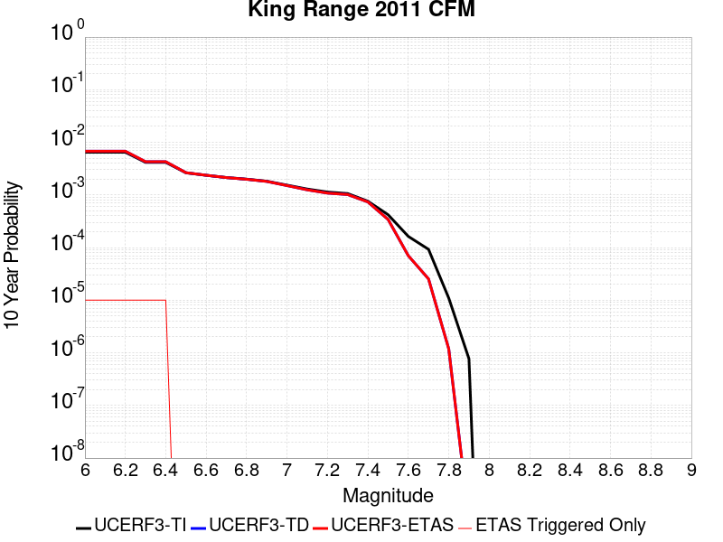 |

| Magnitude | 1 wk TI Prob | 1 wk TD Prob | 1 wk ETAS Prob | 1 wk ETAS/TD Gain | 1 wk ETAS Triggered Only | 1 mo TI Prob | 1 mo TD Prob | 1 mo ETAS Prob | 1 mo ETAS/TD Gain | 1 mo ETAS Triggered Only | 1 yr TI Prob | 1 yr TD Prob | 1 yr ETAS Prob | 1 yr ETAS/TD Gain | 1 yr ETAS Triggered Only | 10 yr TI Prob | 10 yr TD Prob | 10 yr ETAS Prob | 10 yr ETAS/TD Gain | 10 yr ETAS Triggered Only |
|-----|-----|-----|-----|-----|-----|-----|-----|-----|-----|-----|-----|-----|-----|-----|-----|-----|-----|-----|-----|-----|
| 6.0 | 1.2462566E-5 | 1.3022681E-5 | 1.3022681E-5 | 1.0 | 0.0 | 5.34099E-5 | 5.5810495E-5 | 5.5810495E-5 | 1.0 | 0.0 | 6.5007154E-4 | 6.793158E-4 | 6.793158E-4 | 1.0 | 0.0 | 0.0064817313 | 0.0067767757 | 0.0068423003 | 1.0096691 | 6.597176E-5 |
| 6.1 | 1.2462566E-5 | 1.3022681E-5 | 1.3022681E-5 | 1.0 | 0.0 | 5.34099E-5 | 5.5810495E-5 | 5.5810495E-5 | 1.0 | 0.0 | 6.5007154E-4 | 6.793158E-4 | 6.793158E-4 | 1.0 | 0.0 | 0.0064817313 | 0.0067767757 | 0.0068423003 | 1.0096691 | 6.597176E-5 |
| 6.2 | 1.2462566E-5 | 1.3022681E-5 | 1.3022681E-5 | 1.0 | 0.0 | 5.34099E-5 | 5.5810495E-5 | 5.5810495E-5 | 1.0 | 0.0 | 6.5007154E-4 | 6.793158E-4 | 6.793158E-4 | 1.0 | 0.0 | 0.0064817313 | 0.0067767757 | 0.0068423003 | 1.0096691 | 6.597176E-5 |
| 6.3 | 7.988484E-6 | 8.213607E-6 | 8.213607E-6 | 1.0 | 0.0 | 3.423591E-5 | 3.520077E-5 | 3.520077E-5 | 1.0 | 0.0 | 4.1674246E-4 | 4.2849802E-4 | 4.2849802E-4 | 1.0 | 0.0 | 0.004159618 | 0.0042789313 | 0.0043446207 | 1.0153519 | 6.597176E-5 |
| 6.4 | 7.988484E-6 | 8.213607E-6 | 8.213607E-6 | 1.0 | 0.0 | 3.423591E-5 | 3.520077E-5 | 3.520077E-5 | 1.0 | 0.0 | 4.1674246E-4 | 4.2849802E-4 | 4.2849802E-4 | 1.0 | 0.0 | 0.004159618 | 0.0042789313 | 0.0043446207 | 1.0153519 | 6.597176E-5 |
| 6.5 | 5.0522513E-6 | 5.0819626E-6 | 5.0819626E-6 | 1.0 | 0.0 | 2.1652326E-5 | 2.1779662E-5 | 2.1779662E-5 | 1.0 | 0.0 | 2.6358519E-4 | 2.6513607E-4 | 2.6513607E-4 | 1.0 | 0.0 | 0.0026327274 | 0.0026492323 | 0.0026492323 | 1.0 | 0.0 |
| 6.6 | 4.53682E-6 | 4.5386473E-6 | 4.5386473E-6 | 1.0 | 0.0 | 1.944337E-5 | 1.9451203E-5 | 1.9451203E-5 | 1.0 | 0.0 | 2.3669732E-4 | 2.3679328E-4 | 2.3679328E-4 | 1.0 | 0.0 | 0.0023644536 | 0.0023664122 | 0.0023664122 | 1.0 | 0.0 |
| 6.7 | 4.1144335E-6 | 4.096668E-6 | 4.096668E-6 | 1.0 | 0.0 | 1.7633167E-5 | 1.7557033E-5 | 1.7557033E-5 | 1.0 | 0.0 | 2.1466266E-4 | 2.1373629E-4 | 2.1373629E-4 | 1.0 | 0.0 | 0.0021445542 | 0.002136289 | 0.002136289 | 1.0 | 0.0 |
| 6.8 | 3.8321214E-6 | 3.8071091E-6 | 3.8071091E-6 | 1.0 | 0.0 | 1.6423275E-5 | 1.6316082E-5 | 1.6316082E-5 | 1.0 | 0.0 | 1.9993502E-4 | 1.9863051E-4 | 1.9863051E-4 | 1.0 | 0.0 | 0.0019975523 | 0.0019855052 | 0.0019855052 | 1.0 | 0.0 |
| 6.9 | 3.4999944E-6 | 3.4635357E-6 | 3.4635357E-6 | 1.0 | 0.0 | 1.499989E-5 | 1.4843641E-5 | 1.4843641E-5 | 1.0 | 0.0 | 1.8260835E-4 | 1.807066E-4 | 1.807066E-4 | 1.0 | 0.0 | 0.0018245836 | 0.0018065642 | 0.0018065642 | 1.0 | 0.0 |
| 7.0 | 2.9470837E-6 | 2.886615E-6 | 2.886615E-6 | 1.0 | 0.0 | 1.26302975E-5 | 1.2371149E-5 | 1.2371149E-5 | 1.0 | 0.0 | 1.5376302E-4 | 1.5060851E-4 | 1.5060851E-4 | 1.0 | 0.0 | 0.0015365666 | 0.0015060225 | 0.0015060225 | 1.0 | 0.0 |
| 7.1 | 2.4850247E-6 | 2.3978641E-6 | 2.3978641E-6 | 1.0 | 0.0 | 1.0650062E-5 | 1.0276521E-5 | 1.0276521E-5 | 1.0 | 0.0 | 1.296568E-4 | 1.251096E-4 | 1.251096E-4 | 1.0 | 0.0 | 0.0012958117 | 0.001251343 | 0.001251343 | 1.0 | 0.0 |
| 7.2 | 2.1800304E-6 | 2.0761452E-6 | 2.0761452E-6 | 1.0 | 0.0 | 9.342954E-6 | 8.897735E-6 | 8.897735E-6 | 1.0 | 0.0 | 1.1374453E-4 | 1.0832463E-4 | 1.0832463E-4 | 1.0 | 0.0 | 0.0011368633 | 0.0010836545 | 0.0010836545 | 1.0 | 0.0 |
| 7.3 | 2.0378504E-6 | 1.9497127E-6 | 1.9497127E-6 | 1.0 | 0.0 | 8.733615E-6 | 8.355884E-6 | 8.355884E-6 | 1.0 | 0.0 | 1.0632657E-4 | 1.01728234E-4 | 1.01728234E-4 | 1.0 | 0.0 | 0.0010627571 | 0.0010177369 | 0.0010177369 | 1.0 | 0.0 |
| 7.4 | 1.4577047E-6 | 1.4095948E-6 | 1.4095948E-6 | 1.0 | 0.0 | 6.247291E-6 | 6.041107E-6 | 6.041107E-6 | 1.0 | 0.0 | 7.605811E-5 | 7.354807E-5 | 7.354807E-5 | 1.0 | 0.0 | 7.603208E-4 | 7.360935E-4 | 7.360935E-4 | 1.0 | 0.0 |
| 7.5 | 8.0685743E-7 | 6.5369085E-7 | 6.5369085E-7 | 1.0 | 0.0 | 3.457956E-6 | 2.8015295E-6 | 2.8015295E-6 | 1.0 | 0.0 | 4.20998E-5 | 3.4108136E-5 | 3.4108136E-5 | 1.0 | 0.0 | 4.2091825E-4 | 3.4172926E-4 | 3.4172926E-4 | 1.0 | 0.0 |
| 7.6 | 3.1239435E-7 | 1.328313E-7 | 1.328313E-7 | 1.0 | 0.0 | 1.3388321E-6 | 5.692769E-7 | 5.692769E-7 | 1.0 | 0.0 | 1.630016E-5 | 6.930925E-6 | 6.930925E-6 | 1.0 | 0.0 | 1.6298964E-4 | 6.996017E-5 | 6.996017E-5 | 1.0 | 0.0 |
| 7.7 | 1.7747207E-7 | 4.780875E-8 | 4.780875E-8 | 1.0 | 0.0 | 7.605944E-7 | 2.0489465E-7 | 2.0489465E-7 | 1.0 | 0.0 | 9.260198E-6 | 2.4945896E-6 | 2.4945896E-6 | 1.0 | 0.0 | 9.2598115E-5 | 2.5362822E-5 | 2.5362822E-5 | 1.0 | 0.0 |
| 7.8 | 2.1035538E-8 | 2.2039959E-9 | 2.2039959E-9 | 1.0 | 0.0 | 9.0152305E-8 | 9.445699E-9 | 9.445699E-9 | 1.0 | 0.0 | 1.0976038E-6 | 1.15001384E-7 | 1.15001384E-7 | 1.0 | 0.0 | 1.0975983E-5 | 1.1868175E-6 | 1.1868175E-6 | 1.0 | 0.0 |
| 7.9 | 1.4782963E-9 | 8.870682E-13 | 8.870682E-13 | 1.0 | 0.0 | 6.335555E-9 | 3.802181E-12 | 3.802181E-12 | 1.0 | 0.0 | 7.713538E-8 | 4.6294857E-11 | 4.6294857E-11 | 1.0 | 0.0 | 7.7135354E-7 | 6.685621E-10 | 6.685621E-10 | 1.0 | 0.0 |

## North Frontal  (East)
*[(top)](#table-of-contents)*

| 1 Week | 1 Month | 1 Year | 10 Year |
|-----|-----|-----|-----|
|  |  |  | 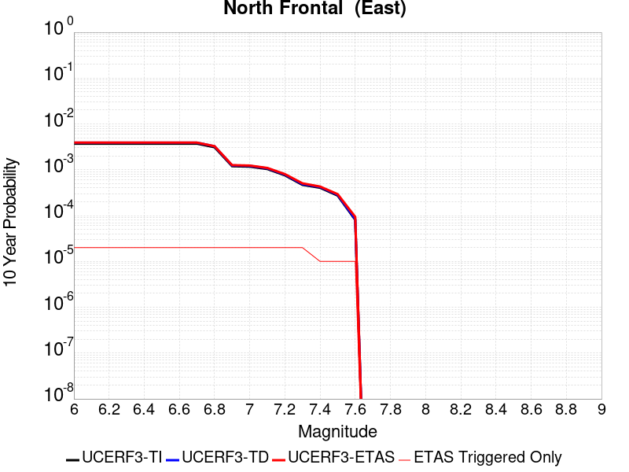 |

| Magnitude | 1 wk TI Prob | 1 wk TD Prob | 1 wk ETAS Prob | 1 wk ETAS/TD Gain | 1 wk ETAS Triggered Only | 1 mo TI Prob | 1 mo TD Prob | 1 mo ETAS Prob | 1 mo ETAS/TD Gain | 1 mo ETAS Triggered Only | 1 yr TI Prob | 1 yr TD Prob | 1 yr ETAS Prob | 1 yr ETAS/TD Gain | 1 yr ETAS Triggered Only | 10 yr TI Prob | 10 yr TD Prob | 10 yr ETAS Prob | 10 yr ETAS/TD Gain | 10 yr ETAS Triggered Only |
|-----|-----|-----|-----|-----|-----|-----|-----|-----|-----|-----|-----|-----|-----|-----|-----|-----|-----|-----|-----|-----|
| 6.0 | 7.135738E-6 | 7.4773666E-6 | 7.4773666E-6 | 1.0 | 0.0 | 3.0581377E-5 | 3.2045577E-5 | 3.2045577E-5 | 1.0 | 0.0 | 3.7226462E-4 | 3.9010498E-4 | 3.9010498E-4 | 1.0 | 0.0 | 0.0037164164 | 0.0038961596 | 0.003961874 | 1.0168666 | 6.597176E-5 |
| 6.1 | 7.135738E-6 | 7.4773666E-6 | 7.4773666E-6 | 1.0 | 0.0 | 3.0581377E-5 | 3.2045577E-5 | 3.2045577E-5 | 1.0 | 0.0 | 3.7226462E-4 | 3.9010498E-4 | 3.9010498E-4 | 1.0 | 0.0 | 0.0037164164 | 0.0038961596 | 0.003961874 | 1.0168666 | 6.597176E-5 |
| 6.2 | 7.135738E-6 | 7.4773666E-6 | 7.4773666E-6 | 1.0 | 0.0 | 3.0581377E-5 | 3.2045577E-5 | 3.2045577E-5 | 1.0 | 0.0 | 3.7226462E-4 | 3.9010498E-4 | 3.9010498E-4 | 1.0 | 0.0 | 0.0037164164 | 0.0038961596 | 0.003961874 | 1.0168666 | 6.597176E-5 |
| 6.3 | 7.135738E-6 | 7.4773666E-6 | 7.4773666E-6 | 1.0 | 0.0 | 3.0581377E-5 | 3.2045577E-5 | 3.2045577E-5 | 1.0 | 0.0 | 3.7226462E-4 | 3.9010498E-4 | 3.9010498E-4 | 1.0 | 0.0 | 0.0037164164 | 0.0038961596 | 0.003961874 | 1.0168666 | 6.597176E-5 |
| 6.4 | 7.135738E-6 | 7.4773666E-6 | 7.4773666E-6 | 1.0 | 0.0 | 3.0581377E-5 | 3.2045577E-5 | 3.2045577E-5 | 1.0 | 0.0 | 3.7226462E-4 | 3.9010498E-4 | 3.9010498E-4 | 1.0 | 0.0 | 0.0037164164 | 0.0038961596 | 0.003961874 | 1.0168666 | 6.597176E-5 |
| 6.5 | 7.135738E-6 | 7.4773666E-6 | 7.4773666E-6 | 1.0 | 0.0 | 3.0581377E-5 | 3.2045577E-5 | 3.2045577E-5 | 1.0 | 0.0 | 3.7226462E-4 | 3.9010498E-4 | 3.9010498E-4 | 1.0 | 0.0 | 0.0037164164 | 0.0038961596 | 0.003961874 | 1.0168666 | 6.597176E-5 |
| 6.6 | 7.135738E-6 | 7.4773666E-6 | 7.4773666E-6 | 1.0 | 0.0 | 3.0581377E-5 | 3.2045577E-5 | 3.2045577E-5 | 1.0 | 0.0 | 3.7226462E-4 | 3.9010498E-4 | 3.9010498E-4 | 1.0 | 0.0 | 0.0037164164 | 0.0038961596 | 0.003961874 | 1.0168666 | 6.597176E-5 |
| 6.7 | 7.135738E-6 | 7.4773666E-6 | 7.4773666E-6 | 1.0 | 0.0 | 3.0581377E-5 | 3.2045577E-5 | 3.2045577E-5 | 1.0 | 0.0 | 3.7226462E-4 | 3.9010498E-4 | 3.9010498E-4 | 1.0 | 0.0 | 0.0037164164 | 0.0038961596 | 0.003961874 | 1.0168666 | 6.597176E-5 |
| 6.8 | 5.959142E-6 | 6.236837E-6 | 6.236837E-6 | 1.0 | 0.0 | 2.553893E-5 | 2.672913E-5 | 2.672913E-5 | 1.0 | 0.0 | 3.108921E-4 | 3.2539663E-4 | 3.2539663E-4 | 1.0 | 0.0 | 0.0031045752 | 0.0032509752 | 0.0033167324 | 1.020227 | 6.597176E-5 |
| 6.9 | 2.2946929E-6 | 2.382509E-6 | 2.382509E-6 | 1.0 | 0.0 | 9.834361E-6 | 1.0210715E-5 | 1.0210715E-5 | 1.0 | 0.0 | 1.1972676E-4 | 1.2430883E-4 | 1.2430883E-4 | 1.0 | 0.0 | 0.0011966228 | 0.0012424395 | 0.0013083293 | 1.0530326 | 6.597176E-5 |
| 7.0 | 2.2468673E-6 | 2.3322007E-6 | 2.3322007E-6 | 1.0 | 0.0 | 9.629396E-6 | 9.99511E-6 | 9.99511E-6 | 1.0 | 0.0 | 1.1723159E-4 | 1.2168415E-4 | 1.2168415E-4 | 1.0 | 0.0 | 0.0011716976 | 0.0012162215 | 0.001282113 | 1.0541773 | 6.597176E-5 |
| 7.1 | 1.9921076E-6 | 2.064643E-6 | 2.064643E-6 | 1.0 | 0.0 | 8.537577E-6 | 8.848443E-6 | 8.848443E-6 | 1.0 | 0.0 | 1.0394004E-4 | 1.077249E-4 | 1.077249E-4 | 1.0 | 0.0 | 0.0010389143 | 0.0010767695 | 0.0011426703 | 1.0612023 | 6.597176E-5 |
| 7.2 | 1.4524545E-6 | 1.5045434E-6 | 1.5045434E-6 | 1.0 | 0.0 | 6.2247905E-6 | 6.4480287E-6 | 6.4480287E-6 | 1.0 | 0.0 | 7.5784184E-5 | 7.850217E-5 | 7.850217E-5 | 1.0 | 0.0 | 7.575835E-4 | 7.8476884E-4 | 8.5068884E-4 | 1.0839993 | 6.597176E-5 |
| 7.3 | 8.9802575E-7 | 9.3089085E-7 | 9.3089085E-7 | 1.0 | 0.0 | 3.848676E-6 | 3.9895267E-6 | 3.9895267E-6 | 1.0 | 0.0 | 4.685662E-5 | 4.857152E-5 | 4.857152E-5 | 1.0 | 0.0 | 4.6846745E-4 | 4.8562037E-4 | 5.515601E-4 | 1.1357845 | 6.597176E-5 |
| 7.4 | 7.776139E-7 | 8.060631E-7 | 8.060631E-7 | 1.0 | 0.0 | 3.3326266E-6 | 3.4545521E-6 | 3.4545521E-6 | 1.0 | 0.0 | 4.0573974E-5 | 4.2058473E-5 | 4.2058473E-5 | 1.0 | 0.0 | 4.0566566E-4 | 4.205159E-4 | 4.864599E-4 | 1.156817 | 6.597176E-5 |
| 7.5 | 5.244417E-7 | 5.441328E-7 | 5.441328E-7 | 1.0 | 0.0 | 2.2476054E-6 | 2.3319958E-6 | 2.3319958E-6 | 1.0 | 0.0 | 2.7364253E-5 | 2.8391745E-5 | 2.8391745E-5 | 1.0 | 0.0 | 2.7360884E-4 | 2.838877E-4 | 3.4984073E-4 | 1.2323209 | 6.597176E-5 |
| 7.6 | 1.5489647E-7 | 1.6089835E-7 | 1.6089835E-7 | 1.0 | 0.0 | 6.6384183E-7 | 6.895643E-7 | 6.895643E-7 | 1.0 | 0.0 | 8.082245E-6 | 8.395433E-6 | 8.395433E-6 | 1.0 | 0.0 | 8.08195E-5 | 8.395316E-5 | 1.4991937E-4 | 1.7857504 | 6.597176E-5 |

